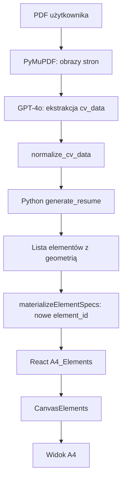
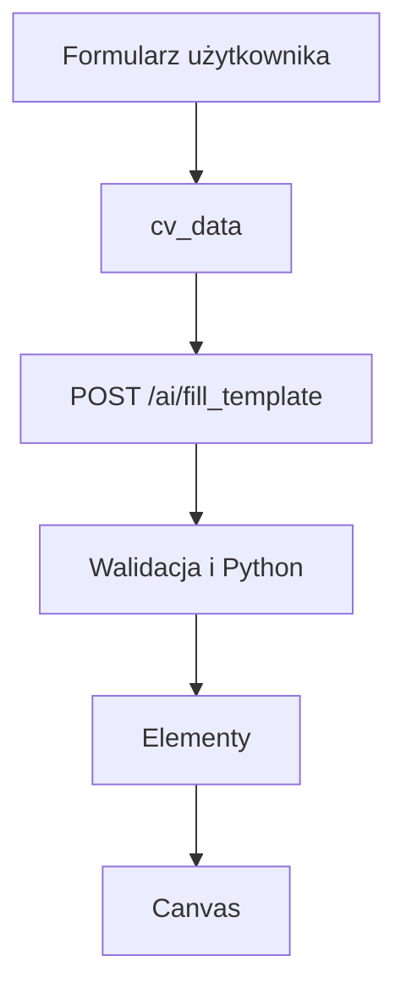
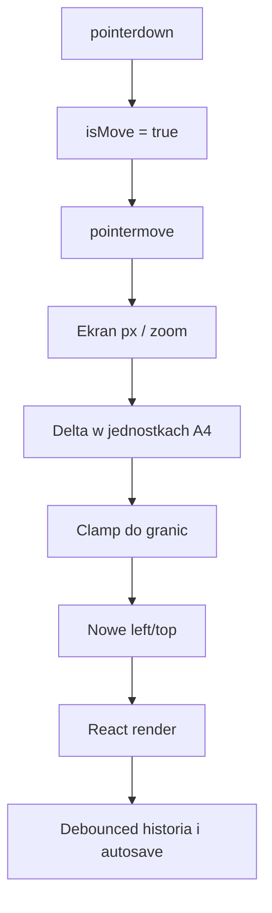
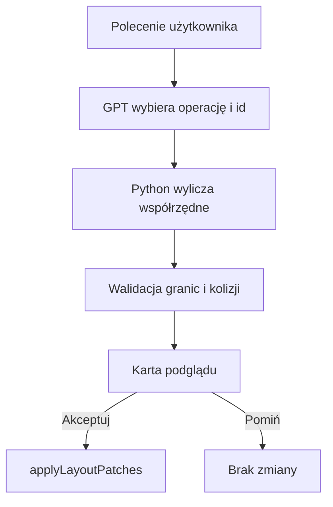
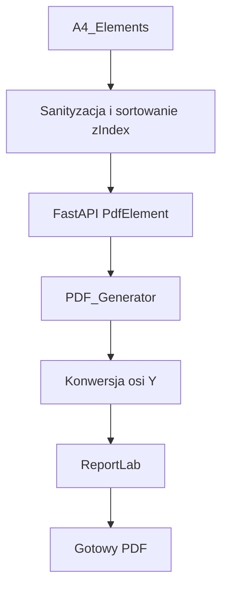

# Jak działa pozycjonowanie elementów na canvasie CV STUDIO

## Cel dokumentu

Ten dokument wyjaśnia od podstaw, jak CV STUDIO:

- przechowuje elementy dokumentu;
- oblicza ich pozycje;
- wyświetla je na stronie A4 w przeglądarce;
- pozwala je przeciągać i skalować;
- dopasowuje wysokość tekstu;
- przenosi treść na kolejne strony;
- zapisuje geometrię w bazie danych;
- odtwarza ten sam układ w pliku PDF;
- rozdziela odpowiedzialność pomiędzy sztuczną inteligencję, Python i React.

Tekst jest napisany dla osoby, która dopiero poznaje React, Python, pozycjonowanie CSS i generowanie PDF. Najpierw powstaje prosty model mentalny, a dopiero później omawiane są konkretne funkcje i pliki.

> **Najważniejsza zasada:** sztuczna inteligencja nie jest właścicielem współrzędnych elementów. AI może odczytać treść, ocenić dokument albo wskazać intencję operacji. Ostateczne wartości `left`, `top`, `width`, `height` i `page` oblicza kod deterministyczny.

---

## Spis treści

1. [Najprostszy model mentalny](#1-najprostszy-model-mentalny)
2. [Czym jest element canvasu](#2-czym-jest-element-canvasu)
3. [Układ współrzędnych A4](#3-układ-współrzędnych-a4)
4. [Jak React wyświetla dokument](#4-jak-react-wyświetla-dokument)
5. [Skąd biorą się elementy](#5-skąd-biorą-się-elementy)
6. [Jak Python buduje układ CV](#6-jak-python-buduje-układ-cv)
7. [Rola sztucznej inteligencji](#7-rola-sztucznej-inteligencji)
8. [Przeciąganie elementów](#8-przeciąganie-elementów)
9. [Zmiana rozmiaru i wyrównywanie](#9-zmiana-rozmiaru-i-wyrównywanie)
10. [Prowadnice i pomiar odstępów](#10-prowadnice-i-pomiar-odstępów)
11. [Textarea, automatyczna wysokość i reflow](#11-textarea-automatyczna-wysokość-i-reflow)
12. [Strony i przechodzenie między stronami](#12-strony-i-przechodzenie-między-stronami)
13. [Sugestie układu Asystenta AI](#13-sugestie-układu-asystenta-ai)
14. [Podgląd zmian przed akceptacją](#14-podgląd-zmian-przed-akceptacją)
15. [Cofnij i ponów](#15-cofnij-i-ponów)
16. [Zapis i ponowne otwarcie dokumentu](#16-zapis-i-ponowne-otwarcie-dokumentu)
17. [Eksport do PDF](#17-eksport-do-pdf)
18. [Przepływy od początku do końca](#18-przepływy-od-początku-do-końca)
19. [Przykład liczbowy](#19-przykład-liczbowy)
20. [Najważniejsze zabezpieczenia](#20-najważniejsze-zabezpieczenia)
21. [Typowe problemy i diagnostyka](#21-typowe-problemy-i-diagnostyka)
22. [Mapa najważniejszych plików i symboli](#22-mapa-najważniejszych-plików-i-symboli)
23. [Testy](#23-testy)
24. [Dalsza lektura](#24-dalsza-lektura)
25. [Podsumowanie](#25-podsumowanie)

---

## 1. Najprostszy model mentalny

Wyobraźmy sobie fizyczną kartkę A4 leżącą na biurku.

Na kartce można położyć niezależne, przezroczyste karteczki:

- karteczkę z imieniem;
- karteczkę z opisem doświadczenia;
- zdjęcie;
- linię;
- prostokąt;
- koło;
- ikonę.

Każda karteczka ma własne:

- położenie od lewej krawędzi;
- położenie od górnej krawędzi;
- szerokość;
- wysokość;
- numer warstwy;
- numer strony.

Canvas CV STUDIO działa właśnie w ten sposób. Nie jest to klasyczna strona internetowa, w której jeden akapit automatycznie wypycha następny. Każdy element jest osobnym obiektem ustawionym bezwzględnie na stronie A4.

Można to zapisać bardzo prosto:

```text
pozycja elementu = strona + odległość od lewej + odległość od góry
```

Przykład:

```json
{
  "category": "text",
  "content": "JAN KOWALSKI",
  "page": 1,
  "left": 55,
  "top": 60,
  "fontSize": 24,
  "zIndex": 3
}
```

Ten obiekt mówi:

> Na stronie 1 umieść tekst „JAN KOWALSKI” 55 jednostek od lewej i 60 jednostek od góry. Narysuj go na warstwie 3.

To jest fundament całego systemu.

---

## 2. Czym jest element canvasu

Kontrakt elementu jest opisany przez model `PdfElement` w:

- `backend/app/schemas/pdf_schema.py`, klasa `PdfElement`.

Frontend używa zwykłych obiektów JavaScript o tych samych nazwach pól. Dzięki temu dane mogą przejść z Reacta do FastAPI bez dodatkowego tłumaczenia każdej właściwości.

### 2.1. Najważniejsze pola geometryczne

| Pole | Znaczenie |
|---|---|
| `element_id` | Unikalny identyfikator elementu. |
| `category` | Rodzaj elementu, np. `text`, `textarea`, `image`, `line`. |
| `page` | Numer strony, liczony od 1. |
| `left` | Odległość od lewej krawędzi strony. |
| `top` | Odległość od górnej krawędzi strony. |
| `width` | Szerokość prostokątnego obszaru elementu. |
| `height` | Wysokość prostokątnego obszaru elementu. |
| `zIndex` | Kolejność warstw. Większa wartość oznacza element bliżej użytkownika. |

### 2.2. Pola tekstowe

| Pole | Znaczenie |
|---|---|
| `content` | Treść tekstu. |
| `fontFamily` | Rodzina fontu, np. `Inter`. |
| `fontSize` | Rozmiar fontu. |
| `lineHeight` | Wysokość jednej linii w `textarea`. |
| `letterSpacing` | Odstęp między literami. |
| `bold` | Pogrubienie. |
| `italic` | Kursywa. |
| `underline` | Podkreślenie. |
| `align` | Wyrównanie tekstu: `left`, `center`, `right`, `justify`. |
| `bulletList` | Informacja, że blok używa listy punktowanej. |
| `autoHeight` | Wysokość ma zależeć od rzeczywistej treści. |

### 2.3. Pola sterujące zachowaniem

| Pole | Znaczenie |
|---|---|
| `isSelected` | Element jest aktualnie zaznaczony. |
| `isMove` | Element jest aktualnie przeciągany. |
| `isEditing` | Użytkownik edytuje tekst. |
| `locked` | Elementu nie wolno przesuwać ani modyfikować geometrycznie. |
| `fixedToPage` | Dekoracja strony, np. tło lub rama. Nie można jej zaznaczyć. |
| `flowRole` | Rola w przepływie, np. `section-chrome` albo `content`. |
| `preserveInitialLayout` | Pierwszy pomiar przeglądarki nie może zmienić układu wygenerowanego przez Python. |
| `alignWithText` | Specjalne optyczne wyrównanie małych ikon do tekstu. |
| `deleted` | Element ma zostać usunięty podczas synchronizacji z bazą. |

### 2.4. Kategorie elementów

`CanvasElements` obsługuje:

- `text` — krótki tekst jednoliniowy;
- `textarea` — tekst wieloliniowy;
- `image` — obraz;
- `line` — linia;
- `rectangle` — prostokąt;
- `circle` — koło;
- `ellipse` — elipsa.

Istnieje również starsza kategoria `connector`. Łączniki mogą być nadal odtwarzane ze starych dokumentów, ale ich tworzenie w edytorze jest obecnie wyłączone.

---

## 3. Układ współrzędnych A4

### 3.1. Rozmiar strony

Projekt używa pionowej strony A4:

```text
szerokość = 595
wysokość  = 842
```

Wartości są traktowane jako piksele na canvasie i jako punkty w PDF. Model `PdfElement` opisuje to jako mapowanie 1:1.

### 3.2. Punkt początkowy

W edytorze punkt `(0, 0)` znajduje się w lewym górnym rogu:

```text
(0,0) ─────────────────────────────► X
  │
  │
  │
  ▼
  Y
```

Zatem:

- zwiększenie `left` przesuwa element w prawo;
- zwiększenie `top` przesuwa element w dół.

### 3.3. Współrzędne są lokalne dla strony

Element na stronie 2 może mieć:

```json
{
  "page": 2,
  "top": 66
}
```

Nie oznacza to pozycji `842 + 66` zapisanej w obiekcie. Każda strona posiada własny lokalny zakres od `top = 0` do `top = 842`.

Jedynie algorytm reflow czasem tworzy pomocniczą pozycję absolutną:

```text
absoluteTop = (page - 1) × pageHeight + top
```

Przykład:

```text
strona = 2
top = 66
pageHeight = 842

absoluteTop = (2 - 1) × 842 + 66 = 908
```

Ta wartość pomaga sortować elementy z wielu stron w jednej osi Y. Nie jest zapisywana w bazie.

### 3.4. Zoom nie zmienia dokumentu

Zoom jest wyłącznie transformacją widoku.

Komponent `A4`:

1. zachowuje logiczny rozmiar strony;
2. ustawia `transform: scale(zoom)`;
3. skaluje obraz od lewego górnego rogu;
4. tworzy zewnętrzny `zoomWrapper`, który rezerwuje odpowiednio duże miejsce w przewijanym obszarze.

Pole `zoom` nie trafia do:

- elementów;
- bazy danych;
- historii cofania;
- eksportowanego PDF.

Dokument przy zoomie 50% oraz 100% ma dokładnie te same współrzędne.

---

## 4. Jak React wyświetla dokument

### 4.1. Główny stan

Centralnym źródłem prawdy jest:

```js
const [A4_Elements, setA4_Elements] = useState([]);
```

Stan znajduje się w `useA4Elements`.

Można myśleć o `A4_Elements` jak o kompletnej liście karteczek leżących na wszystkich stronach dokumentu.

Każde przesunięcie, usunięcie albo zmiana tekstu tworzy nową wersję tej listy. React renderuje interfejs ponownie na podstawie nowego „zdjęcia” stanu.

### 4.2. `PdfCanvas` składa cały edytor

Komponent `PdfCanvas`:

- uruchamia `useA4Elements`;
- tworzy `PdfContext`;
- wybiera widoczną stronę lub dwie strony;
- renderuje komponent `A4`;
- filtruje elementy według pola `page`;
- renderuje elementy, zaznaczenie, prowadnice i łączniki.

Najważniejszy fragment przepływu wygląda logicznie tak:

```text
A4_Elements
    ↓
filtr: element.page === aktualna strona
    ↓
CanvasElements
    ↓
Text / Textarea / Image / Line / Rectangle / Ellipse
```

### 4.3. `A4` tworzy kontekst pozycjonowania

Klasa CSS `.A4` ma:

```css
position: relative;
```

To bardzo ważne. Wszystkie elementy potomne z `position: absolute` liczą swoje `left` oraz `top` względem tej konkretnej strony A4, a nie względem całego okna przeglądarki.

### 4.4. `CanvasElements` wybiera komponent

`CanvasElements` jest dyspozytorem:

- widzi `category: "text"` i tworzy `Text`;
- widzi `category: "textarea"` i tworzy `Textarea`;
- widzi `category: "image"` i tworzy `Image`;
- analogicznie obsługuje figury oraz linie.

Komponent nie oblicza pozycji. Przekazuje dalej zapisane wartości:

```text
left, top, width, height, zIndex
```

### 4.5. Pozycjonowanie CSS

Komponent tekstowy tworzy styl:

```js
{
  position: "absolute",
  left,
  top,
  zIndex
}
```

`Textarea` dodaje:

```js
{
  width,
  height
}
```

Obraz robi to samo i dodatkowo ustawia `objectFit: "fill"`, aby wypełnić dokładnie zaprojektowany prostokąt.

Przeglądarka nie układa tych elementów jeden pod drugim. Każdy jest wyjęty ze zwykłego przepływu HTML.

### 4.6. Warstwy

`zIndex` określa kolejność nakładania:

```text
zIndex 0  → tło
zIndex 1  → ramy i duże dekoracje
zIndex 2  → linie i tekst
zIndex 3+ → elementy nad pozostałymi
```

Przed zapisem i eksportem elementy są sortowane po `zIndex`. Dzięki temu backend rysuje je w tej samej kolejności.

---

## 5. Skąd biorą się elementy

Elementy mogą trafić na canvas pięcioma głównymi drogami.

### 5.1. Ręczne dodanie

Funkcje w `useA4Elements` tworzą nowe obiekty:

- `handleAddText`;
- `handleAddTextarea`;
- `handleAddLine`;
- `handleAddRectangle`;
- `handleAddCircle`;
- `handleAddEllipse`;
- `handleAddImage`.

Każdy nowy element:

1. otrzymuje `element_id` przez `nanoid()`;
2. dostaje początkowe `left` i `top`;
3. zostaje przypisany do aktualnej strony;
4. trafia do `A4_Elements`;
5. otrzymuje animację wejścia.

### 5.2. Statyczny szablon frontendowy

Pliki w `frontend/src/templates/` zawierają gotowe tablice elementów.

Przykład:

```js
block("JAN KOWALSKI", 50, 56, 495, 36, 27, 33, color, font)
```

Liczby są zaprojektowanymi współrzędnymi.

`handleLoadTemplate` przekazuje tablicę do `materializeElementSpecs`, które:

- nadaje świeże `element_id`;
- ustawia domyślną stronę 1;
- czyści flagi zaznaczenia;
- blokuje dekoracje `fixedToPage`;
- przepisuje identyfikatory starszych łączników.

### 5.3. Upload istniejącego CV

Upload ma dwa osobne etapy:

```text
PDF użytkownika
    ↓
GPT-4o: odczyt treści do cv_data
    ↓
Python: układ i współrzędne
    ↓
React: wyświetlenie gotowych elementów
```

AI nie podaje współrzędnych.

### 5.4. Kreator CV

Kreator zbiera dane formularza do struktury `cv_data`.

Po wyborze szablonu frontend wywołuje:

```text
POST /ai/fill_template
```

Nazwa ścieżki zawiera `/ai`, ale sam endpoint nie uruchamia modelu językowego. Waliduje dane i wywołuje deterministyczny generator Python.

### 5.5. Ponowne otwarcie zapisanego dokumentu

`ModalPdfs.showPDF`:

1. zapisuje aktualny dokument;
2. pobiera wiersze elementów;
3. łączy kolumny bazy z `extra_properties`;
4. przywraca liczby `width` i `height`;
5. odtwarza `fixedToPage`, `locked`, `flowRole` oraz `preserveInitialLayout`;
6. ustawia strony oraz aktywne `pdfId`;
7. przekazuje gotową listę do `setA4_Elements`.

---
\
## 6. Jak Python buduje układ CV

### 6.1. Dlaczego Python odpowiada za geometrię

Model językowy może przygotować dobry tekst, ale nie gwarantuje:

- identycznego wyniku przy dwóch takich samych wejściach;
- braku kolizji;
- zachowania marginesów;
- poprawnego przeniesienia nagłówka na kolejną stronę;
- zgodności canvasu z PDF.

Python wykonuje zwykłe, przewidywalne działania matematyczne. Te same dane i ten sam szablon dają ten sam wynik.

### 6.2. Konstruktory niskiego poziomu

`cv_generator.py` zawiera funkcje:

- `_text`;
- `_block`;
- `_line`;
- `_rect`;
- `_circle`;
- `_ellipse`.

Każda zwraca zwykły słownik opisujący element canvasu.

Przykładowa idea:

```python
{
    "category": "line",
    "left": 55,
    "top": 258,
    "width": 485,
    "height": 1,
    "page": 1
}
```

### 6.3. Klasa `Builder`

`Builder` jest prostym „kursorem składu”.

Przechowuje:

```python
self.y   # aktualna pozycja pionowa
self.pg  # aktualna strona
self.els # utworzone elementy
```

Można wyobrazić go sobie jako osobę składającą dokument od góry do dołu:

1. zaczyna na określonej wysokości;
2. dodaje nagłówek;
3. przesuwa kursor niżej;
4. dodaje tekst;
5. dodaje odstęp;
6. sprawdza, czy następny blok zmieści się na stronie;
7. jeśli nie — przechodzi na kolejną stronę.

### 6.4. `Builder.need`

`need(h)` pyta:

```text
czy aktualne y + potrzebna wysokość przekracza dolną granicę treści?
```

Jeżeli tak:

```python
self.pg += 1
self.y = PAGE_TOP
```

Wspólne granice generatora to:

```text
PAGE_TOP       = 66
CONTENT_BOTTOM = 770
```

Dolne 96 jednostek strony pozostaje zarezerwowane na stopkę i bezpieczny margines.

### 6.5. `Builder.need_section`

Sam nagłówek sekcji nie powinien zostać na dole strony bez treści.

`need_section(chrome_h, first_body_h)` rezerwuje jednocześnie:

- wysokość nagłówka, markera i linii;
- wysokość pierwszego bloku treści.

Jeżeli całość się nie mieści, sekcja zaczyna się na następnej stronie.

### 6.6. `Builder.text`

`text`:

1. sprawdza miejsce;
2. tworzy element `text`;
3. ustawia go na `self.y`;
4. przesuwa `self.y` o około `fontSize × 1.35`.

To rozwiązanie jest dobre dla krótkich linii, np. stanowiska albo okresu zatrudnienia.

### 6.7. `Builder.block`

`block` obsługuje wieloliniowe `textarea`.

Najpierw wywołuje `measure_block`, potem:

1. sprawdza miejsce przez `need`;
2. tworzy `textarea`;
3. zwiększa `self.y` o zmierzoną wysokość.

### 6.8. `Builder.measure_block`

Pomiar nie opiera się wyłącznie na liczbie znaków.

Wywoływana jest funkcja:

```text
PDF_Generator.measure_textarea_height
```

Używa ona tych samych fontów i zasad zawijania co renderer PDF. Wysokość jest zaokrąglana w górę, aby odpowiadała całkowitemu `scrollHeight` w przeglądarce.

### 6.9. Rytm pionowy

Generator posiada wspólne stałe:

| Stała | Wartość | Zastosowanie |
|---|---:|---|
| `SPACE_STACK` | 4 | Między tytułem, metadanymi i opisem jednego rekordu. |
| `SPACE_RECORD` | 14 | Między dwoma rekordami. |
| `SPACE_SECTION` | 18 | Między zakończoną sekcją a kolejną sekcją. |
| `SPACE_AFTER_RULE` | 12 | Między linią nagłówka sekcji a pierwszą treścią. |

Te poziomy nie są wymienne.

```text
tytuł stanowiska
    4 px
firma i okres
    4 px
lista punktów
    14 px
następne stanowisko
```

### 6.10. Generatory szablonów

`generate_resume(template_id, cv_data)`:

1. normalizuje `cv_data`;
2. znajduje funkcję generatora w `_GENERATORS`;
3. wywołuje np. `_gen_monument`, `_gen_nova` albo `_gen_ledger`;
4. zwraca pełną listę elementów.

Każdy generator definiuje:

- kolory;
- fonty;
- szerokości kolumn;
- punkt startowy;
- wygląd nagłówków;
- reguły rozmieszczania sekcji;
- dekoracje każdej strony.

### 6.11. Dekoracje

Tła, ramy, sidebary i numery stron mają:

```json
{
  "fixedToPage": true
}
```

Frontend automatycznie traktuje je jako:

- niezaznaczalne;
- nieprzesuwalne;
- nieanimowane przy wejściu;
- wykluczone z normalnego reflow;
- kopiowane na nowe strony, jeżeli wymaga tego operacja strukturalna.

### 6.12. `flowRole` i `preserveInitialLayout`

Szablony z deterministyczną paginacją (np. Monument, Words, Tessera) emitują dodatkowe informacje:

```json
{
  "flowRole": "section-chrome"
}
```

dla:

- markera sekcji;
- etykiety sekcji;
- linii sekcji.

Zwykła treść ma:

```json
{
  "flowRole": "content"
}
```

Wieloliniowe pola z gotową paginacją z Pythona mają też:

```json
{
  "preserveInitialLayout": true
}
```

Oznacza to:

> Python już zakończył paginację. Po pierwszym wyświetleniu przeglądarka nie może ponownie, niezależnie dla każdej textarea, przeliczyć całego dokumentu.

Późniejsza edycja użytkownika nadal uruchamia normalne dopasowanie wysokości.

---

## 7. Rola sztucznej inteligencji

### 7.1. AI nie jest silnikiem geometrii

To najważniejsze rozróżnienie:

```text
AI rozumie treść i intencję.
Python oblicza pozycję.
React pokazuje i edytuje pozycję.
ReportLab odtwarza pozycję w PDF.
```

### 7.2. GPT-4o przy uploadzie CV

`extract_cv_data`:

1. otwiera PDF przez PyMuPDF;
2. renderuje maksymalnie trzy pierwsze strony przy 150 DPI;
3. koduje obrazy jako Base64;
4. przesyła je do GPT-4o z `detail: "high"`;
5. wymaga obiektu JSON;
6. normalizuje odpowiedź do `cv_data`.

Model wyciąga między innymi:

- imię i nazwisko;
- stanowisko;
- kontakt;
- podsumowanie;
- doświadczenie;
- edukację;
- umiejętności;
- dodatkowe sekcje.

GPT-4o nie zwraca:

- `left`;
- `top`;
- `width`;
- `height`;
- `page`.

### 7.3. Kreator nie potrzebuje modelu do pozycjonowania

Kreator dostarcza już uporządkowane `cv_data`.

Endpoint `/ai/fill_template`:

- sprawdza użytkownika;
- sprawdza dostęp do szablonu;
- waliduje dane;
- wywołuje `generate_resume`;
- zwraca elementy.

Nie wykonuje wywołania LLM i nie nalicza kredytów za samo rozmieszczenie.

### 7.4. Modele w Asystencie AI

Domyślne modele (nadpisywane zmiennymi środowiskowymi):

```text
AI_ASSISTANT_MODEL = gpt-5.4-mini   # oceny, gramatyka, ATS, czat, …
AI_LAYOUT_MODEL    = gpt-5.6-luna   # tylko akcja layout (Układ)
```

Cennik listowy (USD / 1M tokenów) jest w `openai_pricing.py`. Koszt PLN =
`cost_usd × USD_TO_PLN` (domyślnie 4.0). **1 kredyt AI = 5 groszy (0.05 PLN)**;
obciążenie = `max(1, ceil(cost_pln / 0.05))` (`entitlements.credits_for_cost`).
Odpowiedź zwraca `usage.credits_charged`.

Model (mini / Luna) może:

- ocenić CV;
- poprawić język;
- zaproponować mocniejszą treść;
- ocenić dopasowanie do stanowiska;
- zinterpretować polecenie użytkownika;
- wybrać rodzaj operacji, np. wyrównanie albo rozłożenie odstępów;
- wskazać identyfikatory elementów będących celem operacji.

### 7.5. Czego GPT nie może modyfikować bezpośrednio

Pola dozwolone w zwykłych korektach to:

- `content`;
- `fontSize`;
- `fontFamily`;
- `color`;
- `bold`;
- `italic`;
- `align`.

Pola geometryczne są celowo wykluczone:

- `left`;
- `top`;
- `width`;
- `height`;
- `page`;
- `zIndex`.

Komentarz w `ai_assistant_service.py` wyjaśnia powód: bezpośrednie współrzędne modelu powodowały kolizje z ikonami i dekoracjami.

### 7.6. Przycisk „Układ” — korektor geometrii (pełny JSON A4)

1. Kliknięcie **Układ** włącza tryb (przycisk zostaje zaznaczony).
2. Backend buduje `build_layout_snapshot` — wszystkie strony i elementy z
   `left`/`top`/`width`/`height`/`page`/`fontSize`/… oraz flagą `movable`.
3. Snapshot pozostaje surowy: Python nie grupuje sekcji ani nie wylicza
   `section_rhythm`, ponieważ wymiary freestyle (np. `width: 3`) nie są
wystarczająco wiarygodne. `gpt-5.6-luna` z `reasoning_effort=high` sam rozpoznaje
   nagłówek, linię i pierwszy wpis. Prompt każe podać top-to-top diagnostycznie,
   ale korektę oprzeć na realnym odstępie krawędź→krawędź i porównać wszystkie
   peery (np. DOŚWIADCZENIE/WYKSZTAŁCENIE 6 px vs pozostałe 14 px).
4. GPT zwraca `status` + `summary` + opcjonalne `changes[]` (grupy logiczne z
   `before`/`after` lub wspólnym `delta`). Stary format `findings[].moves` też działa.
5. Python (`compile_layout_gpt_response`) mapuje to na `layout_issues` + karty
   `layout_groups` (Podgląd / Zastosuj na płótnie). Pełnego dumpa `corrected_elements`
   nie wymagamy (oszczędność tokenów).
6. Dopóki tryb jest aktywny, kolejne pytania z inputu idą jako akcja `layout`
   ze świeżym JSON-em i historią sesji; każde udane wywołanie zużywa kredyty AI
   wg realnego kosztu sol (drożej niż mini).
7. Ponowne kliknięcie **Układ** wyłącza tryb.

Chatowe `position_operation` → `resolve_directed_operation` pozostają osobno.

### 7.7. Polecenia tekstowe dotyczące pozycji

W czacie GPT może zwrócić opis operacji:

```json
{
  "operation": "align",
  "target_ids": ["id-1", "id-2"],
  "axis": "x",
  "anchor": "start"
}
```

Model wybiera:

- operację;
- cele;
- parametry semantyczne.

Python wylicza faktyczne liczby.

Obsługiwane operacje obejmują:

- `shift`;
- `align`;
- `distribute`;
- `space`;
- `move_to_page`;
- `move_to_sidebar`.

---

## 8. Przeciąganie elementów

### 8.1. Zdarzenie wskaźnika

Element reaguje na `pointerdown`, `pointermove` i `pointerup`.

Podczas rozpoczęcia:

- element otrzymuje `isMove: true`;
- zapisywany jest punkt chwycenia;
- zapisywane są oryginalne pozycje zaznaczonej grupy.

### 8.2. Zamiana pikseli ekranu na jednostki canvasu

Przy zoomie 50% ruch kursora o 20 pikseli ekranowych oznacza 40 jednostek dokumentu.

Kod oblicza:

```text
scaleX = widoczna szerokość A4 / logiczna szerokość A4
scaleY = widoczna wysokość A4 / logiczna wysokość A4

pointerX = (clientX - canvasLeft) / scaleX
pointerY = (clientY - canvasTop) / scaleY
```

To dlatego element pozostaje pod kursorem niezależnie od zoomu.

### 8.3. Punkt chwycenia

Użytkownik nie zawsze łapie element w lewym górnym rogu.

Zapisywany jest offset:

```text
grabOffsetX = pointerX - element.left
grabOffsetY = pointerY - element.top
```

Nowa pozycja:

```text
targetLeft = pointerX - grabOffsetX
targetTop  = pointerY - grabOffsetY
```

Element nie „przeskakuje” środkiem pod kursor.

### 8.4. Ograniczenie do strony

`getClampedMoveDelta` oblicza wspólny dozwolony zakres ruchu.

Dla każdego elementu sprawdza:

```text
left >= 0
top >= 0
left + width <= pageWidth
top + height <= pageHeight
```

Jeżeli ruch wyprowadziłby element poza kartkę, delta zostaje przycięta.

### 8.5. Przeciąganie grupy

Przy zaznaczeniu wielu elementów:

1. powstaje zbiór identyfikatorów;
2. obliczana jest jedna wspólna delta;
3. ograniczenie uwzględnia wszystkie elementy;
4. każdy element otrzymuje tę samą deltę.

Wzajemne odległości nie zmieniają się.

### 8.6. Elementy zablokowane

Element z `locked: true`:

- nie rozpocznie przeciągania;
- nie zostanie przesunięty grupowo;
- odrzuci patch geometryczny;
- pozostanie kontekstem dla części analiz.

`fixedToPage` jest szczególnym rodzajem zablokowanej dekoracji.

---

## 9. Zmiana rozmiaru i wyrównywanie

### 9.1. Resize

`handleResizeElement`:

1. pobiera stronę elementu;
2. odczytuje zoom;
3. dzieli `movementX` i `movementY` przez zoom;
4. wybiera regułę zależną od uchwytu;
5. ogranicza rozmiar do strony;
6. zapisuje nowe wymiary.

### 9.2. Obrazy

Obraz zachowuje proporcje:

```text
aspectRatio = naturalHeight / naturalWidth
```

Zmiana szerokości wylicza wysokość.

### 9.3. Koła

Koło musi mieć:

```text
width === height
```

Każda zmiana wymiaru jest sprowadzana do wspólnej średnicy.

### 9.4. Textarea

W przypadku `textarea` uchwyty zmieniają głównie szerokość.

Wysokość zależy od zawijania tekstu:

```text
węższe pole → więcej linii → większa wysokość
szersze pole → mniej linii → mniejsza wysokość
```

Jeżeli `autoHeight` jest aktywne, resize nie wpisuje od razu nowej wysokości. Renderuje nową szerokość, a właściwy pomiar DOM uruchamia wspólny reflow.

### 9.5. Wyrównanie

`handleAlignElements` obsługuje:

- lewo: `left = 0`;
- środek: `left = (pageWidth - width) / 2`;
- prawo: `left = pageWidth - width - 1`.

Dla `text` szerokość jest pobierana z rzeczywiście wyrenderowanego węzła DOM.

---

## 10. Prowadnice i pomiar odstępów

### 10.1. Prowadnice nie są źródłem pozycji

Komponent `Guides` niczego nie przesuwa. Tylko rysuje informacje.

### 10.2. Prowadnice wyrównania

Dla elementu obliczane są kotwice:

```text
X: lewa krawędź, środek, prawa krawędź
Y: górna krawędź, środek, dolna krawędź
```

Jeżeli kotwica innego elementu znajduje się nie dalej niż 4 jednostki, wyświetlana jest linia pomocnicza.

### 10.3. Prowadnice odstępów

`spacingGuides.js` szuka najbliższych sąsiadów:

- nad elementem;
- pod elementem;
- po lewej;
- po prawej;
- przy lewej i prawej krawędzi strony.

### 10.4. Box a widoczne glify

To istotne dla tekstu.

Element może mieć pudełko wysokości 15 px, ale widoczna litera zajmuje mniej. Dlatego:

- zwykły `text` jest mierzony przez DOM `Range`;
- `textarea` jest mierzona jako całe pudełko;
- figury korzystają z `width` oraz `height`.

`getVisualBounds` służy do prowadnic odstępów, a `getElementBounds` do geometrycznych granic elementu.

### 10.5. Zoom i pomiar DOM

`getBoundingClientRect()` zwraca rozmiar po zoomie.

Kod dzieli go przez skalę strony:

```text
canvasWidth = DOMWidth / scaleX
canvasHeight = DOMHeight / scaleY
```

Do dalszych obliczeń trafiają jednostki dokumentu, nie piksele ekranu.

---

## 11. Textarea, automatyczna wysokość i reflow

### 11.1. Różnica między `text` i `textarea`

`text`:

- jest przeznaczony głównie na jedną linię;
- nie ma projektowego prostokąta zawijania;
- podczas edycji używa `contentEditable`.

`textarea`:

- ma szerokość i wysokość;
- zawija treść;
- obsługuje listy punktowane;
- podczas edycji używa natywnego `<textarea>`;
- może mieć `autoHeight`.

### 11.2. Identyczny model pudełka

Widok i tryb edycji mają:

- brak paddingu;
- brak borderu wpływającego na szerokość;
- `box-sizing: border-box`;
- identyczny font;
- identyczny `lineHeight`;
- identyczny `letterSpacing`.

Celem jest takie samo zawijanie:

```text
widok w canvasie = pole edycji = PDF
```

### 11.3. Pomiar przez `useLayoutEffect`

Po renderze `Textarea` wywołuje `useLayoutEffect`.

Ten hook działa po zmianie DOM, ale przed wyświetleniem następnej klatki. Kod odczytuje naturalny `scrollHeight`.

`measureNaturalScrollHeight` chwilowo ustawia:

```text
height = auto
```

Odczytuje `scrollHeight`, a następnie przywraca poprzedni styl.

### 11.4. Kiedy pomiar jest wykonywany

Pomiar zależy między innymi od:

- treści;
- szerokości;
- fontu;
- rozmiaru fontu;
- interlinii;
- odstępu liter;
- pogrubienia;
- trybu listy punktowanej.

Po gotowości fontów wykonywany jest dodatkowy pomiar.

### 11.5. Reflow

Jeśli wysokość zmieniła się, `handleFitTextareaToContent` uruchamia:

```text
reflowTextareaHeight
```

Reflow:

1. znajduje zmienioną `textarea`;
2. porównuje starą i nową wysokość;
3. buduje kolumnę elementów zachodzących poziomo;
4. pomija dekoracje i elementy zablokowane;
5. zachowuje istniejący rytm położenia;
6. przenosi element na następną stronę, jeśli nie mieści się przed dolnym marginesem;
7. może przenieść razem nagłówek sekcji;
8. zwraca nową listę i nową liczbę stron.

### 11.6. Kolumna reflow

Dwa elementy należą do tej samej kolumny, jeżeli:

- ich zakresy X nachodzą na siebie;
- albo dekoracja znajduje się bardzo blisko tekstu;
- albo ikona Iconic jest optycznie powiązana z etykietą.

Wąski sidebar nie powinien przesuwać treści z głównej kolumny.

### 11.7. Dolny margines

Frontend używa:

```text
pageTop = 66
bottomMargin = 96
```

To odpowiada generatorowi Python.

### 11.8. `flowRole`

`flowRole: "section-chrome"` oznacza, że element jest częścią zestawu:

```text
marker + etykieta + linia
```

`flowRole: "content"` oznacza zwykłą treść.

Dzięki temu reflow nie musi zgadywać roli na podstawie tego, że element jest tekstem.

### 11.9. `preserveInitialLayout`

Szablony z `preserveInitialLayout` mają już kompletną paginację z Pythona. Dlatego pierwsze niezależne pomiary wielu pól mogłyby niepotrzebnie zmienić kolejność elementów między stronami.

Flaga:

```json
{
  "preserveInitialLayout": true
}
```

pomija pierwszy pomiar po montażu.

Nie wyłącza auto-height na zawsze. Po:

- edycji treści;
- zmianie szerokości;
- zmianie fontu;
- zmianie typografii

normalny pomiar nadal działa.

### 11.10. Animacja wejścia

Nowa treść jest:

1. oznaczana przez `markContentElementsEnter`;
2. trzymana przy `opacity: 0`;
3. ukryta do gotowości fontów lub limitu czasu;
4. pokazywana przez fade 0→1.

Dekoracje `fixedToPage` pojawiają się od razu.

W czasie oczekiwania reflow jest wstrzymany, aby pomiar fontem zastępczym nie zmienił geometrii.

---

## 12. Strony i przechodzenie między stronami

### 12.1. Stan stron

`useA4Elements` przechowuje:

- `pageCount`;
- `currentPage`;
- `isTwoPageView`.

### 12.2. Widoczne strony

`visiblePageNumbers`:

- zwraca jedną aktywną stronę w zwykłym trybie;
- zwraca parę sąsiednich stron w trybie rozkładówki.

### 12.3. Przeciąganie na inną stronę

`findPageCanvasAtPoint` sprawdza, pod którym DOM-em A4 znajduje się kursor.

`moveElementsToPage`:

- zmienia `page`;
- zachowuje lokalne `left` i `top`;
- ogranicza pozycję do nowej strony;
- aktualizuje prawidłowe łączniki;
- usuwa łączniki, których końce znalazłyby się na różnych stronach.

### 12.4. Klonowanie strony

Podczas klonowania:

1. późniejsze strony przesuwają się o jeden numer;
2. elementy źródłowej strony dostają nowe `element_id`;
3. stare identyfikatory końców łączników są przepisywane;
4. użytkownik przechodzi na nową stronę.

### 12.5. Usuwanie strony

Elementy usuwanej strony:

- trafiają do listy usuniętych;
- znikają z aktywnego stanu;
- późniejsze strony zmniejszają numer o 1;
- zapis usuwa odpowiadające wiersze z bazy.

---

## 13. Sugestie układu Asystenta AI

### 13.1. Pomiar przed wysłaniem

Frontend nie wysyła wyłącznie zapisanych `width` i `height`.

`measureElements` sprawdza aktualny DOM i dołącza:

```json
{
  "layout_bounds": {
    "left": 55,
    "top": 200,
    "width": 485,
    "height": 42
  },
  "content_height": 68,
  "clipped": true,
  "bounds_estimated": false
}
```

Dla elementów bez zamontowanego węzła DOM ustawia `bounds_estimated: true` (strony poza aktualnym widokiem).
Dla textarea porównuje `scrollHeight` z `clientHeight` (informacja o ucięciu treści).

Backend preferuje `layout_bounds`, a przy ich braku stosuje zapisane wartości lub bezpieczne przybliżenie tekstu.

### 13.2. Analiza układu (GPT)

Przycisk **Układ** używa `layout_gpt.build_layout_snapshot` + promptu korektora
(`LAYOUT_CORRECTOR_SYSTEM` / `build_layout_user_prompt`) w `_layout_session`.
Odpowiedź `changes[]` (lub legacy `findings`) trafia do `compile_layout_gpt_response`.
Geometrię dla zwykłych poleceń czatu nadal liczy `resolve_directed_operation`.

### 13.3. Granice bezpieczeństwa

Każda grupa patchy jest sprawdzana:

```text
left >= 0
top >= 0
left + width <= pageWidth
top + height <= pageHeight
```

Sprawdzane są również:

- duplikaty identyfikatorów;
- nieznane elementy;
- niepoprawne numery stron;
- nowe kolizje.

Automatyczna analiza nie może tworzyć nowego nakładania treści. Rozsunięcie istniejących kolizji (`stack-resolve-overlaps`) jest dozwolone i ma priorytet krytyczny.

### 13.4. Limity ruchu

Algorytm posiada stałe bezpieczeństwa, np.:

- maksymalna odległość wykrycia prawie wyrównanych elementów;
- maksymalny automatyczny ruch dla wyrównania;
- maksymalny ruch naprawiający wyjście poza stronę;
- minimalna liczba elementów w klastrze.

Ogranicza to „naprawianie” celowego projektu.

---

## 14. Podgląd zmian przed akceptacją

AI i analiza układu nie powinny zmieniać dokumentu bez wiedzy użytkownika.

### 14.1. Patches

Patch zawiera tylko różnicę:

```json
{
  "element_id": "abc",
  "left": 55,
  "top": 320,
  "page": 1
}
```

### 14.2. Podgląd

`previewedElements` powstaje jako tymczasowa kopia:

```text
A4_Elements + patches podglądu
```

Oryginalny stan nie zostaje zmieniony.

Podczas podglądu interakcje wskaźnika są wyłączone, aby użytkownik nie mieszał tymczasowej geometrii z prawdziwą.

### 14.3. Akceptacja

`applyLayoutPatches` ponownie sprawdza:

- istnienie elementów;
- duplikaty;
- poprawność liczb;
- blokady;
- granice strony.

Dopiero później zapisuje nową listę `A4_Elements`.

---

## 15. Cofnij i ponów

Historia działa w pamięci sesji.

Snapshot zawiera:

- elementy;
- liczbę stron.

Nie zawiera chwilowych flag:

- `isSelected`;
- `isMove`;
- `isEditing`.

### 15.1. Debounce

Każda klatka przeciągania nie powinna być osobnym krokiem.

Zmiany są łączone:

- zwykłe operacje: około 350 ms;
- ciche stabilizowanie po załadowaniu: około 80 ms.

### 15.2. Cichy reflow

Pomiar fontu po wczytaniu dokumentu nie jest działaniem użytkownika.

`markHistoryQuiet` aktualizuje bieżący stan bazowy zamiast tworzyć sztuczny krok „Cofnij”.

### 15.3. Limit

Historia przechowuje maksymalnie 100 snapshotów.

---

## 16. Zapis i ponowne otwarcie dokumentu

### 16.1. Dwa typy zapisu

`usePdfExport` rozróżnia:

1. pełne tworzenie lub aktualizację PDF;
2. lekki autosave samych elementów.

Autosave nie renderuje pliku PDF. Zapisuje tylko bieżącą geometrię i treść.

### 16.2. Sortowanie

Przed wysłaniem:

- treść jest sanitizowana;
- elementy są sortowane po `zIndex`;
- elementy usunięte są dołączane z flagą `deleted`.

### 16.3. Baza danych

Podstawowe właściwości mają własne kolumny:

- `left`;
- `top`;
- `width`;
- `height`;
- `page`;
- `category`;
- treść i typografia.

Pozostałe trafiają do `extra_properties`, m.in.:

- `autoHeight`;
- `flowRole`;
- `preserveInitialLayout`;
- `fixedToPage`;
- `locked`;
- `alignWithText`;
- dane łączników.

### 16.4. Synchronizacja

Lista przesłana przez frontend jest autorytatywna.

Jeżeli wiersz istnieje w bazie, ale nie występuje w aktywnej liście, zostaje usunięty. Zapobiega to gromadzeniu starych elementów po zmianie szablonu.

---

## 17. Eksport do PDF

### 17.1. Ta sama geometria

Backend otrzymuje te same:

- `left`;
- `top`;
- `width`;
- `height`;
- `page`;
- `zIndex`.

### 17.2. Różnica układów współrzędnych

Canvas przeglądarki:

```text
(0,0) w lewym górnym rogu
Y rośnie w dół
```

ReportLab:

```text
(0,0) w lewym dolnym rogu
Y rośnie w górę
```

Dla figury o wysokości `height`:

```text
pdfY = pageHeight - top - height
```

Przykład:

```text
pageHeight = 842
top = 100
height = 20

pdfY = 842 - 100 - 20 = 722
```

Po narysowaniu element pojawia się w tym samym wizualnym miejscu.

### 17.3. Tekst

Tekst wymaga dodatkowo obliczenia linii bazowej:

- pobierane są ascent i descent fontu;
- obliczana jest połowa dodatkowej interlinii;
- każda linia dostaje prawidłowy baseline.

### 17.4. Wieloliniowy tekst

`renderTextarea`:

1. używa tej samej funkcji zawijania co pomiar;
2. uwzględnia prawdziwą odmianę bold/italic;
3. obsługuje `letterSpacing`;
4. obsługuje wyrównanie;
5. obsługuje hanging indent listy;
6. przy `autoHeight` ponownie oblicza wysokość z liczby linii.

### 17.5. Strony

`render_elements` grupuje elementy według `page`.

Dla każdej strony:

1. renderuje elementy w przekazanej kolejności warstw;
2. kończy stronę przez `showPage`;
3. po ostatniej stronie zapisuje dokument.

---

## 18. Przepływy od początku do końca

### 18.1. Upload CV



### 18.2. Kreator



W tym przepływie model językowy nie jest potrzebny do pozycjonowania.

### 18.3. Ręczne przeciągnięcie



### 18.4. Polecenie Asystenta



### 18.5. Eksport



---

## 19. Przykład liczbowy

Załóżmy:

```json
{
  "category": "textarea",
  "page": 1,
  "left": 55,
  "top": 300,
  "width": 485,
  "height": 42,
  "fontSize": 10,
  "lineHeight": 14,
  "autoHeight": true
}
```

### 19.1. Widok

React ustawia:

```css
position: absolute;
left: 55px;
top: 300px;
width: 485px;
height: 42px;
```

### 19.2. Zoom 50%

Element jest widoczny jako:

```text
left na ekranie   = 27,5 px
top na ekranie    = 150 px
width na ekranie  = 242,5 px
height na ekranie = 21 px
```

W stanie nadal pozostają wartości `55`, `300`, `485`, `42`.

### 19.3. Wzrost treści

Przeglądarka mierzy nową wysokość:

```text
oldHeight = 42
newHeight = 56
delta = +14
```

Element bezpośrednio poniżej zostaje przesunięty o 14 jednostek, jeżeli należy do tej samej kolumny.

### 19.4. PDF

Pozycja dolnej krawędzi w ReportLab:

```text
pdfY = 842 - 300 - 56 = 486
```

Wizualnie blok pozostaje 300 jednostek od góry strony.

---

## 20. Najważniejsze zabezpieczenia

1. **Stały rozmiar A4** — jedna wspólna geometria frontendu i backendu.
2. **Clamping** — przeciąganie nie wypuszcza elementów poza stronę.
3. **`locked`** — chroni elementy przed ruchem.
4. **`fixedToPage`** — chroni tło, ramy i stopki.
5. **`flowRole`** — odróżnia treść od chrome sekcji.
6. **`preserveInitialLayout`** — chroni gotową paginację z Pythona przed pierwszym reflow DOM.
7. **`need_section`** — zapobiega samotnym nagłówkom u dołu strony.
8. **Walidacja patchy AI** — sprawdza granice i kolizje.
9. **Podgląd przed akceptacją** — AI nie zmienia układu automatycznie.
10. **Sanityzacja tekstu** — usuwa znaki powodujące brakujące glify.
11. **Wspólne fonty** — browser i ReportLab używają tych samych plików.
12. **Historia quiet** — pomiar fontów nie tworzy fałszywego Undo.
13. **Usuwanie łączników między stronami** — PDF nie otrzymuje niepoprawnych połączeń.
14. **Ponowna walidacja na frontendzie** — nawet poprawka zaakceptowana przez backend jest sprawdzana ponownie.

---

## 21. Typowe problemy i diagnostyka

### 21.1. Element jest w innym miejscu przy zoomie

Sprawdź:

- czy ruch kursora jest dzielony przez skalę;
- czy pomiar DOM jest przeliczony z ekranu na canvas;
- czy `A4` ma `transformOrigin: "top left"`.

### 21.2. Tekst nachodzi na kolejny blok

Sprawdź:

- zapisane `height`;
- rzeczywisty `scrollHeight`;
- `lineHeight`;
- szerokość;
- font;
- `autoHeight`;
- przynależność do kolumny reflow.

### 21.3. Nagłówek zostaje bez treści

Sprawdź:

- `Builder.need_section`;
- `flowRole`;
- `avoidOrphanChrome`;
- `precedingChromeCluster`;
- margines `bottomMargin = 96`.

### 21.4. Elementy zmieniają kolejność po wczytaniu

Sprawdź:

- czy generator dodał właściwy `page`;
- czy chrome ma `flowRole: "section-chrome"`;
- czy treść ma `flowRole: "content"`;
- czy gotowy układ wymagający ochrony ma `preserveInitialLayout`;
- czy przeglądarka nie działa na starej wersji aplikacji.

### 21.5. Canvas wygląda dobrze, ale PDF źle

Sprawdź:

- dostępność identycznego fontu;
- odmianę bold/italic;
- `letterSpacing`;
- `lineHeight`;
- konwersję osi Y;
- kolejność `zIndex`;
- `alignWithText`;
- czy obraz ma poprawną maskę alfa.

### 21.6. Prowadnica pokazuje inny odstęp niż oczekiwany

Sprawdź, czy porównywane są:

- widoczne glify `text`;
- czy całe pudełko `textarea`.

Są to dwa różne rodzaje pomiaru.

### 21.7. Zmiana wygenerowanego kodu nie jest widoczna

Po wdrożeniu nowego frontendu otwarta karta nadal może posiadać stary bundle JavaScript.

Wykonaj:

```text
Ctrl+F5
```

Dokument zapisany już z błędnymi współrzędnymi trzeba wygenerować ponownie. Naprawa algorytmu nie odgaduje automatycznie pierwotnych pozycji starego dokumentu.

---

## 22. Mapa najważniejszych plików i symboli

### 22.1. Frontend

| Plik | Najważniejsze symbole | Odpowiedzialność |
|---|---|---|
| `frontend/src/pages/PdfCanvas.jsx` | `PdfCanvas`, `previewedElements`, `visiblePages` | Składa edytor, strony, kontekst i podglądy AI. |
| `frontend/src/hooks/useA4Elements.js` | `useA4Elements` | Główny stan elementów i większość operacji edytora. |
| `frontend/src/components/canvas/A4/A4.jsx` | `A4` | Powierzchnia jednej strony i zoom. |
| `frontend/src/components/canvas/CanvasElements/CanvasElements.jsx` | `CanvasElements` | Wybór komponentu na podstawie kategorii. |
| `frontend/src/components/canvas/Text/Text.jsx` | `Text` | Tekst jednoliniowy, edycja i drag. |
| `frontend/src/components/canvas/Textarea/Textarea.jsx` | `Textarea` | Tekst wieloliniowy, pomiar i edycja. |
| `frontend/src/components/canvas/Image/Image.jsx` | `Image` | Obrazy, resize i optyczne wyrównanie ikon. |
| `frontend/src/components/canvas/Guides/Guides.jsx` | `Guides` | Wizualizacja wyrównań i odstępów. |
| `frontend/src/utils/pageDrag.js` | `getClampedMoveDelta`, `moveElementsByDelta`, `moveElementsToPage` | Bezpieczny ruch na stronie i między stronami. |
| `frontend/src/utils/pageSpread.js` | `visiblePageNumbers`, `findPageCanvasAtPoint` | Widok wielu stron i hit-testing stron. |
| `frontend/src/utils/elementBounds.js` | `getElementBounds`, `getVisualBounds`, `measureElements` | Pomiar geometrii DOM. |
| `frontend/src/utils/spacingGuides.js` | `findVerticalSpacingGuides`, `findHorizontalSpacingGuides` | Matematyka prowadnic odstępów. |
| `frontend/src/utils/textareaReflow.js` | `reflowTextareaHeight` | Przepływ elementów po zmianie wysokości. |
| `frontend/src/hooks/usePdfExport.js` | `createPdf`, `updatePdf`, `saveElements` | Zapis i eksport. |
| `frontend/src/components/modals/ModalPdfs/ModalPdfs.jsx` | `showPDF` | Odtworzenie elementów z bazy. |
| `frontend/src/components/ai/AiAssistant/AiAssistant.jsx` | `LayoutGroupCard` i pozostałe karty | Podgląd oraz akceptacja sugestii. |
| `frontend/src/templates/` | tablice szablonów | Statyczna geometria szablonów startowych. |

### 22.2. Backend

| Plik | Najważniejsze symbole | Odpowiedzialność |
|---|---|---|
| `backend/app/api/routes/ai.py` | `extract_cv`, `fill_template` | Upload CV i deterministyczne wypełnienie szablonu. |
| `backend/app/services/ai_service.py` | `extract_cv_data`, `generate_resume` | GPT-4o do ekstrakcji; przekazanie layoutu do Pythona. |
| `backend/app/services/cv_generator.py` | `Builder`, `generate_resume`, `_gen_*` | Główny silnik geometrii CV. |
| `backend/app/services/cv_templates/templates/*.py` | `_gen_<id>` | Jeden plik na `template_id` (Nova, Volt, Cardinal, Tessera i pozostałe). |
| `backend/app/services/cv_templates/shared/` | records / extras / icons | Uniwersalne helpery generatorów. |
| `backend/app/services/ai_assistant_service.py` | `analyze_action`, `_chat` | Model AI, ograniczenia korekt i dispatcher. |
| `backend/app/services/layout_analysis.py` | `resolve_directed_operation`, `summarize_geometry_issues` | Bezpieczne patchy z czatu + diagnostyka geometrii. |
| `backend/app/services/pdf_generator.py` | `PDF_Generator`, `render_elements` | Odtworzenie canvasu w ReportLab. |
| `backend/app/schemas/pdf_schema.py` | `PdfElement` | Kontrakt elementu frontend–backend. |
| `backend/app/crud/pdfs.py` | `create_new_pdf`, `update_pdf_elements` | Trwały zapis geometrii i właściwości. |

---

## 23. Testy

### 23.1. Reflow frontendu

```bash
cd frontend
node --test src/utils/textareaReflow.test.js
```

Testy sprawdzają między innymi:

- przesuwanie elementów w jednej kolumnie;
- zmianę strony;
- elementy zablokowane;
- dekoracje;
- chrome sekcji;
- nieaktualny numer `page`;
- rytm chrome sekcji (`flowRole`);
- brak zapadania odstępów rekordów.

### 23.2. Przeciąganie i strony

Istotne testy znajdują się m.in. w:

- `frontend/src/utils/pageDrag.test.js`;
- `frontend/src/utils/pageSpread.test.js`;
- `frontend/src/utils/spacingGuides.test.js`;
- `frontend/src/utils/elementInteraction.test.js`.

### 23.3. Generator Python

```bash
cd backend
python -m pytest tests/test_cv_template_layouts.py -q
```

Testy kontrolują:

- granice stron;
- stałe dekoracje;
- układ wielu stron;
- geometrię szablonów;
- nagłówki i ikony;
- role `flowRole` / `preserveInitialLayout`;
- zachowanie początkowej paginacji.

### 23.4. Analiza layoutu

Testy `layout_analysis` powinny sprawdzać:

- odrzucanie wyjścia poza stronę;
- odrzucanie nowych kolizji;
- wyrównywanie;
- rozkładanie odstępów;
- przenoszenie na stronę;
- ochronę elementów zablokowanych.

### 23.5. Build

```bash
cd frontend
npm run build
```

Build potwierdza, że komponenty i importy składają się w wersję produkcyjną.

---

## 24. Dalsza lektura

- [MDN: `position`](https://developer.mozilla.org/en-US/docs/Web/CSS/Reference/Properties/position) — oficjalne wyjaśnienie `position: relative` oraz `position: absolute`.
- [MDN: pozycjonowanie CSS](https://developer.mozilla.org/en-US/docs/Learn_web_development/Core/CSS_layout/Positioning) — tutorial pokazujący, jak elementy są wyjmowane ze zwykłego przepływu dokumentu.
- [React: State as a Snapshot](https://react.dev/learn/state-as-a-snapshot) — wyjaśnia, dlaczego każda aktualizacja `A4_Elements` prowadzi do nowego renderu.
- [React: `useLayoutEffect`](https://react.dev/reference/react/useLayoutEffect) — oficjalna dokumentacja pomiaru DOM przed ponownym malowaniem ekranu.
- [ReportLab: Graphics and text with pdfgen](https://docs.reportlab.com/reportlab/userguide/ch2_graphics/) — oficjalny opis canvasu ReportLab i układu współrzędnych od lewego dolnego rogu.
- [OpenAI: Images and vision](https://developers.openai.com/api/docs/guides/images-vision) — opis przekazywania obrazów do modelu, używany jako podstawa ekstrakcji treści z CV.
- [OpenAI: Structured model outputs](https://developers.openai.com/api/docs/guides/structured-outputs) — szerszy kontekst odpowiedzi strukturalnych; obecna ekstrakcja projektu używa trybu obiektu JSON i dodatkowej normalizacji po stronie Pythona.

---

## 25. Podsumowanie

Pozycjonowanie w CV STUDIO jest podzielone na cztery warstwy:

### React

React:

- przechowuje elementy;
- renderuje stronę A4;
- reaguje na drag i resize;
- mierzy DOM;
- pokazuje prowadnice;
- umożliwia podgląd oraz akceptację zmian.

### Python

Python:

- normalizuje dane CV;
- mierzy treść;
- układa sekcje;
- pilnuje odstępów;
- tworzy strony;
- oblicza bezpieczne poprawki;
- waliduje kolizje i granice.

### Sztuczna inteligencja

AI:

- odczytuje treść z wgranego CV;
- ocenia i poprawia tekst;
- interpretuje naturalne polecenia;
- wskazuje operację i elementy docelowe.

AI nie jest autorytetem dla surowych współrzędnych.

### ReportLab

ReportLab:

- bierze ostateczną geometrię;
- odwraca oś Y;
- odtwarza fonty, obrazy i figury;
- tworzy strony PDF.

Najkrótsze poprawne podsumowanie brzmi:

```text
AI rozumie.
Python oblicza.
React pokazuje i pozwala edytować.
ReportLab drukuje do PDF.
```
