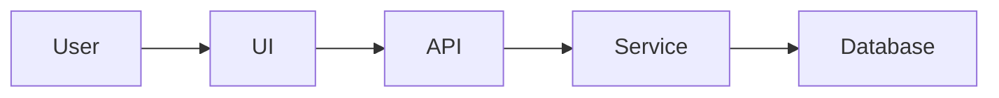

## Skill routing

When the user's request matches an available skill, invoke it via the Skill tool. When in doubt, invoke the skill.

Key routing rules:
- Product ideas/brainstorming → invoke /office-hours
- Strategy/scope → invoke /plan-ceo-review
- Architecture → invoke /plan-eng-review
- Design system/plan review → invoke /design-consultation or /plan-design-review
- Full review pipeline → invoke /autoplan
- Bugs/errors → invoke /investigate
- QA/testing site behavior → invoke /qa or /qa-only
- Code review/diff check → invoke /review
- Visual polish → invoke /design-review
- Ship/deploy/PR → invoke /ship or /land-and-deploy
- Save progress → invoke /context-save
- Resume context → invoke /context-restore
- Author a backlog-ready spec/issue → invoke /spec

## Readme

# README Documentation Requirements

Whenever you modify the application logic, architecture, database structure, dependencies, configuration, public API, user-facing behaviour, or any significant part of the codebase, you must update the `README.md` file as part of the same change.

The README must remain accurate, complete, and consistent with the current implementation. Documentation is considered part of the feature and must not be treated as an optional follow-up task.

---

## 1. General documentation rules

The `README.md` file must:

* be written in both English and Polish;
* explain the project as a detailed, step-by-step tutorial;
* describe not only what the code does, but also how and why it works;
* remain understandable to a developer who has never seen the project before;
* reflect the current state of the repository;
* avoid undocumented assumptions, unexplained abbreviations, and vague descriptions;
* include practical examples wherever they improve understanding;
* use consistent terminology across both language versions.

Do not document planned functionality as if it already existed.

Clearly distinguish between:

* implemented features;
* optional configuration;
* experimental functionality;
* known limitations;
* planned improvements.

---

## 2. Required language structure

The README must contain two complete versions:

1. English version
2. Polish version

Both versions must contain the same substantive information.

Do not provide only a short translation or summary of one language version. Each version must be complete, independently understandable, and updated whenever the code changes.

Recommended structure:

```text
README.md

# English

...

---

# Polski

...
```

---

## 3. README as a technical tutorial

Write the README as a technical tutorial that explains the project from the foundations upward.

The documentation should explain:

* the purpose of the application;
* the problem it solves;
* the main user flows;
* the application architecture;
* the technologies used;
* the role of each framework and library;
* how data moves through the system;
* how the frontend communicates with the backend;
* how the application stores and retrieves data;
* how authentication and authorisation work, when applicable;
* how state is managed;
* how errors are handled;
* how validation works;
* how configuration and environment variables are used;
* how the application is built, tested, deployed, and maintained.

Do not limit explanations to library names. Explain why each major technology was chosen and what responsibility it has in the application.

For example, instead of writing:

> React is used for the frontend.

Write:

> React is used to build the user interface from reusable components. Application state is updated in response to user interactions, while React re-renders only the affected parts of the interface. The main application entry point is located in `src/main.tsx`, and the root component is defined in `src/App.tsx`.

---

## 4. Technologies, frameworks, and libraries

Create a dedicated section that documents all important technologies used by the project.

For each major technology, framework, or library, include:

* its name;
* its version, when relevant;
* its purpose in the project;
* where it is used;
* the main files associated with it;
* important configuration details;
* relevant limitations or implementation notes;
* links to official documentation or high-quality learning resources.

This section should cover, where applicable:

* programming languages;
* frontend frameworks;
* backend frameworks;
* database systems;
* ORM or query libraries;
* state-management libraries;
* routing;
* validation;
* authentication;
* styling systems;
* testing frameworks;
* build tools;
* deployment platforms;
* PDF generation;
* AI integrations;
* third-party APIs;
* logging and monitoring.

Prefer official documentation and primary sources.

---

## 5. Code logic documentation

Explain the most important code paths in detail.

For each major workflow, describe:

1. where the workflow starts;
2. which functions, classes, hooks, services, controllers, or modules are involved;
3. how data is transformed;
4. how validation is performed;
5. how errors are handled;
6. what is returned to the caller or rendered to the user;
7. which files contain the implementation.

Use concrete file names and symbol names.

Where useful, include simplified examples, pseudocode, flow diagrams, or sequence descriptions.

Important functions, classes, hooks, services, API handlers, and utilities must be documented with:

* their responsibility;
* their inputs;
* their outputs;
* important side effects;
* dependencies;
* error conditions;
* the part of the application that calls them.

---

## 6. Folder structure

Include a detailed folder-structure section.

Provide a tree representation of the relevant repository structure, for example:

```text
src/
├── components/
├── pages/
├── hooks/
├── services/
├── utils/
├── types/
└── main.tsx
```

After the tree, explain every important directory and file.

For each folder, describe:

* its purpose;
* what type of files belong there;
* which modules depend on it;
* naming conventions;
* architectural rules;
* examples of important files.

Do not include generated directories such as `node_modules`, build output, caches, or temporary files unless they are directly relevant to the setup or deployment process.

Update the folder structure whenever files or directories are added, removed, renamed, or moved.

---

## 7. Database documentation

Create a detailed database section whenever the application uses persistent storage.

The database documentation must include:

* the database technology;
* connection and configuration method;
* ORM or query layer, when applicable;
* all main tables or collections;
* columns or fields;
* data types;
* primary keys;
* foreign keys;
* indexes;
* constraints;
* default values;
* nullable fields;
* relationships;
* cascade rules;
* migration strategy;
* seed data;
* data-retention considerations;
* security-sensitive fields;
* timestamps and auditing fields.

For every table or collection, explain its business purpose.

Example:

```text
users
- id: UUID, primary key
- email: unique text field
- created_at: creation timestamp
- updated_at: last modification timestamp
```

Also explain relationships in plain language, for example:

> One user can own many CV documents. Each CV document belongs to exactly one user.

Where appropriate, include:

* an entity-relationship diagram;
* SQL schema examples;
* ORM model references;
* migration file names;
* line ranges containing the schema definitions.

If the project does not use a database, state this explicitly and explain where data is stored instead.

---

## 8. Features section

Create and maintain a dedicated `Features` section.

For every important feature, include:

* feature name;
* user-facing purpose;
* technical description;
* main implementation files;
* relevant functions, classes, hooks, or components;
* line ranges where the feature is implemented;
* related tests;
* dependencies;
* known limitations.

Use the following format:

```markdown
### PDF Export

Generates a downloadable PDF document from the current CV state.

Implementation:

- `src/features/pdf/generatePdf.ts`, lines 18–96
- `src/components/ExportButton.tsx`, lines 12–58
- `src/hooks/usePdfExport.ts`, lines 9–74

Tests:

- `src/features/pdf/generatePdf.test.ts`, lines 15–122
```

Line numbers must be verified against the current version of the files before they are added to the README.

Never guess line ranges.

Because line numbers can change after code edits, review and update all affected references whenever implementation files are modified.

When exact line references would become unreliable or misleading, include both:

* the current line range;
* the relevant function, class, component, or exported symbol name.

Example:

```markdown
- `src/services/cvService.ts`, lines 42–109, function `saveCvDocument`
```

---

## 9. Web research and external resources

When documenting technologies, frameworks, libraries, architectural patterns, or implementation techniques, perform a web search and include relevant external resources.

Prefer links from:

* official documentation;
* official repositories;
* standards organisations;
* recognised technical publications;
* well-maintained tutorials;
* authoritative engineering blogs.

Avoid low-quality, outdated, copied, or unverified sources.

For each link, briefly explain why it is useful.

Example:

```markdown
### Further reading

- [React documentation](https://react.dev/) — official guide to React components, hooks, rendering, and state management.
- [TypeScript Handbook](https://www.typescriptlang.org/docs/handbook/intro.html) — official reference for the TypeScript type system.
```

Verify that each link:

* is accessible;
* is directly relevant;
* matches the technology version or concept used in the project;
* does not contradict the actual implementation.

Do not include links merely to increase the number of references.

---

## 10. Installation and local development

Document the complete local setup process.

Include:

* system requirements;
* required runtime versions;
* package-manager requirements;
* installation commands;
* environment variables;
* development commands;
* build commands;
* test commands;
* linting and formatting commands;
* database migration commands;
* seed commands;
* troubleshooting steps.

All commands must be tested or derived directly from the current project configuration.

Do not invent scripts that do not exist in `package.json`, build files, task runners, or project configuration.

For every environment variable, include:

* variable name;
* whether it is required;
* purpose;
* expected format;
* example value using safe placeholder data;
* security considerations.

Never place real secrets, credentials, tokens, private keys, or production connection strings in the README.

---

## 11. Architecture and data flow

Include an architecture section that explains how the main parts of the application interact.

Describe:

* application entry points;
* frontend layers;
* backend layers;
* API boundaries;
* service layers;
* repositories or data-access layers;
* state flow;
* event flow;
* database flow;
* third-party integrations;
* background jobs;
* caching;
* file-generation processes;
* AI-related workflows.

When helpful, include Mermaid diagrams.

Example:



Every diagram must match the actual implementation.

---

## 12. API documentation

When the project exposes an API, document every public endpoint.

For each endpoint, include:

* HTTP method;
* path;
* purpose;
* authentication requirements;
* request parameters;
* request body;
* response structure;
* validation rules;
* status codes;
* error responses;
* implementation file;
* handler or controller name;
* line range;
* example request;
* example response.

Do not include real user data or secrets in examples.

---

## 13. Testing documentation

Document the testing strategy.

Explain:

* which testing frameworks are used;
* where tests are located;
* how to run them;
* the difference between unit, integration, end-to-end, and visual tests;
* which critical workflows are covered;
* any important test fixtures or mocks;
* known coverage gaps.

Whenever a feature is changed, update the README if:

* test commands change;
* new test types are introduced;
* important test files are added;
* the testing strategy changes.

---

## 14. Deployment documentation

Explain how the application is deployed.

Include:

* hosting platform;
* build process;
* deployment command or workflow;
* required environment variables;
* database migration process;
* CI/CD configuration;
* branch or release strategy;
* rollback considerations;
* production-specific configuration;
* common deployment issues.

Reference the exact deployment files, workflows, and configuration files.

---

## 15. Security and privacy

Document important security and privacy decisions.

Include, where applicable:

* authentication;
* authorisation;
* input validation;
* output sanitisation;
* secret management;
* password handling;
* session management;
* CORS;
* CSRF protection;
* rate limiting;
* file-upload restrictions;
* personal-data handling;
* logging of sensitive data;
* encryption;
* database permissions;
* third-party data sharing.

Never describe the application as secure without explaining the implemented controls.

Do not expose sensitive implementation details that would unnecessarily increase security risk.

---

## 16. Accessibility and user experience

When the application has a user interface, document important accessibility and UX considerations.

Include:

* keyboard navigation;
* focus management;
* semantic HTML;
* form labels;
* validation messages;
* colour contrast;
* responsive behaviour;
* screen-reader support;
* loading states;
* empty states;
* error states.

Reference the main components responsible for these behaviours.

---

## 17. Change documentation workflow

Whenever code is changed, perform the following documentation review:

1. Identify which documented features are affected.
2. Update the English README section.
3. Update the Polish README section.
4. Review the folder structure.
5. Review the database structure.
6. Review feature file and line references.
7. Review setup instructions and commands.
8. Review API documentation.
9. Review tests and deployment instructions.
10. Verify all external links.
11. Confirm that no secrets or private data were added.
12. Check that the README matches the final implementation.

A code change is not complete until the relevant README sections are updated.

---

## 18. Documentation quality requirements

Before completing a task, verify that the README:

* contains no outdated implementation details;
* contains no broken internal file references;
* contains no guessed line numbers;
* contains no undocumented features introduced by the change;
* contains no references to removed files;
* uses correct file names and symbol names;
* uses valid Markdown;
* contains consistent headings;
* contains complete English and Polish versions;
* explains technical terms when first introduced;
* provides examples where they are useful;
* separates facts from recommendations or future plans.

Use clear, professional, technically precise language.

Avoid:

* marketing language;
* unnecessary repetition;
* unsupported claims;
* vague statements such as “handles data” or “manages logic”;
* unexplained acronyms;
* incomplete setup instructions;
* copy-pasted documentation that does not match the project.

---

## 19. README length

The README may be long when the complexity of the project requires it.

Completeness and accuracy are more important than brevity.

However:

* avoid repeating the same explanation in multiple sections;
* use a table of contents for long documents;
* use headings, tables, diagrams, and code examples to improve navigation;
* move highly specialised material into dedicated files under a `docs/` directory when the README becomes difficult to navigate;
* link those documents clearly from the README.

The README should remain the main entry point to the project documentation.

---

## 20. Final verification

Before finishing any task that changes the repository, confirm that:

* the implementation works as expected;
* the README reflects the implementation;
* both language versions are synchronised;
* file names and line ranges are correct;
* database documentation is current;
* feature documentation is current;
* setup commands are valid;
* links are relevant and working;
* no confidential information is exposed.

Do not state that documentation has been updated unless the actual `README.md` file has been modified.


## Code Comments and Inline Documentation

All code comments and inline documentation must be written in clear, professional English.

Comments are part of the maintainability requirements of the project. Whenever code is created or modified, review the surrounding comments and update them so that they accurately describe the current implementation.

Do not leave outdated, misleading, speculative, or incomplete comments in the codebase.

---

### 1. General commenting principles

Write comments that explain:

* why the code exists;
* why a particular implementation was chosen;
* how the logic works at a conceptual level;
* what assumptions the code relies on;
* which invariants must remain true;
* which edge cases are handled;
* which limitations are intentional;
* what side effects occur;
* how the code interacts with other parts of the system;
* what could break if the implementation is changed incorrectly.

Comments should provide information that cannot be understood immediately from the code alone.

Prefer comments that explain intent and reasoning over comments that merely repeat syntax.

Good example:

```ts
// Preserve the original page order because the PDF renderer uses array position
// as the final document order. Sorting this collection here would change the
// exported file even though the editor preview would still appear correct.
const orderedPages = document.pages;
```

Poor example:

```ts
// Get the pages.
const orderedPages = document.pages;
```

---

### 2. Do not comment obvious syntax

Do not add comments that simply translate code into English.

Avoid comments such as:

```ts
// Increment the counter.
counter++;

// Set loading to true.
setLoading(true);

// Return the user.
return user;
```

Such comments add noise without improving understanding.

Instead, comment the reason or consequence:

```ts
// Keep the loading state active until both the document and its referenced
// assets are available. Rendering earlier can produce an incomplete PDF.
setLoading(true);
```

Detailed comments are required for complex or non-obvious logic, but obvious statements should remain self-explanatory through good naming and small functions.

---

### 3. Comment every non-trivial code path

Add detailed comments for code involving:

* business rules;
* data transformations;
* validation logic;
* permission checks;
* authentication and authorisation;
* state synchronisation;
* asynchronous workflows;
* retries and backoff;
* caching;
* concurrency;
* race-condition prevention;
* database transactions;
* external API integration;
* file generation;
* PDF rendering;
* AI or model interactions;
* parsing;
* serialization;
* migration logic;
* fallback behaviour;
* performance optimisations;
* browser-specific workarounds;
* security-sensitive operations;
* complex regular expressions;
* mathematical or financial calculations;
* recursive algorithms;
* unusual framework behaviour.

For multi-step logic, describe the steps before the implementation.

Example:

```ts
// The export process is intentionally divided into three stages:
//
// 1. Clone the current editor state so export-specific transformations do not
//    mutate the state displayed to the user.
// 2. Resolve dynamic assets such as profile images and custom fonts.
// 3. Pass the fully resolved document to the renderer.
//
// Skipping the asset-resolution stage can result in valid PDFs with missing
// images because the renderer does not wait for remote resources.
```

---

### 4. Explain business rules precisely

Whenever code implements a business rule, document the rule in plain English.

The comment should explain:

* what the rule is;
* why it exists;
* where it comes from;
* what happens when the rule is not satisfied;
* whether the behaviour is required by product, regulation, contract, or technical constraints.

Example:

```ts
// A CV can be exported only when at least one section contains user-provided
// content. This prevents users from consuming an export operation for a blank
// template and matches the validation performed in the editor UI.
```

Do not use vague comments such as:

```ts
// Apply business logic.
```

---

### 5. Document assumptions and invariants

Explicitly document important assumptions that the implementation depends on.

Examples include:

* collection order is significant;
* an identifier is globally unique;
* a value is already normalised;
* a function must be called only after authentication;
* a database transaction must remain open;
* input has already passed schema validation;
* a third-party API returns values in a specific unit or timezone.

Example:

```ts
// At this point, `templateId` has already been validated against the template
// registry by `resolveTemplate`. Do not accept arbitrary file paths here,
// because this value is later used to locate a server-side template file.
```

When appropriate, enforce the invariant in code instead of relying only on a comment.

---

### 6. Document edge cases and failure modes

Explain non-obvious edge cases close to the relevant code.

Include information about:

* empty input;
* partial data;
* missing relations;
* invalid values;
* unsupported formats;
* network failures;
* timeouts;
* duplicate requests;
* stale state;
* timezone differences;
* encoding problems;
* large input sizes;
* third-party service limitations;
* browser inconsistencies.

Example:

```ts
// Some imported documents contain sections without stable identifiers.
// Generate an identifier only when one is missing; replacing existing IDs
// would break references used by the editor history and drag-and-drop state.
```

---

### 7. Document side effects

Comments must identify important side effects that are not obvious from the function name.

Examples include:

* database writes;
* file-system changes;
* network requests;
* analytics events;
* cache invalidation;
* state mutation;
* navigation;
* logging;
* email delivery;
* background job creation.

Example:

```ts
// Saving the document also invalidates the user's document-list cache.
// Callers should not perform a second invalidation after this function returns.
await documentRepository.save(document);
```

---

### 8. Functions and methods

Every non-trivial exported function, public method, service function, hook, controller, utility, and API handler should have documentation explaining:

* its purpose;
* parameters;
* return value;
* important side effects;
* thrown errors or rejected conditions;
* assumptions;
* relevant usage constraints.

Use the documentation format appropriate for the language, such as JSDoc, TSDoc, docstrings, JavaDoc, Rustdoc, or XML documentation comments.

Example:

```ts
/**
 * Builds a renderer-ready CV document from the current editor state.
 *
 * The function creates an isolated copy of the document, resolves referenced
 * assets, normalises page dimensions, and removes editor-only metadata.
 * It does not modify the original editor state.
 *
 * @param document - The validated document currently loaded in the editor.
 * @param assetResolver - Service used to resolve image and font references.
 * @returns A document that can be passed directly to the PDF renderer.
 *
 * @throws {AssetResolutionError}
 * Thrown when a required image or font cannot be resolved.
 */
export async function prepareDocumentForExport(
  document: CvDocument,
  assetResolver: AssetResolver
): Promise<RenderableDocument> {
  // ...
}
```

Do not document trivial private helpers when their name, types, and implementation are already fully self-explanatory.

---

### 9. Classes and components

Document every non-trivial class, service, module, and reusable UI component.

The documentation should explain:

* its responsibility;
* what it owns;
* what it must not own;
* its dependencies;
* lifecycle considerations;
* important state;
* public interaction points;
* architectural role.

Example:

```ts
/**
 * Coordinates PDF export from the editor.
 *
 * This service is responsible for preparing document data, resolving assets,
 * invoking the renderer, and returning the generated file. It does not manage
 * editor state or persist documents.
 */
export class PdfExportService {
  // ...
}
```

For UI components, document behaviour that is not apparent from the component name:

```tsx
/**
 * Displays the live A4 preview of the current CV.
 *
 * The component scales the document visually but preserves physical A4
 * proportions. The scaling affects only the preview; exported dimensions are
 * calculated separately by the PDF renderer.
 */
export function DocumentPreview() {
  // ...
}
```

---

### 10. Hooks and reactive logic

For hooks, effects, subscriptions, observers, and reactive computations, explain:

* what triggers the logic;
* why each dependency is required;
* why a dependency is intentionally excluded;
* how cleanup works;
* which stale-state or race-condition risks are handled.

Example:

```ts
useEffect(() => {
  // Rebuild the preview only when the serialised document content changes.
  // UI-only state such as the selected element is intentionally excluded
  // because it does not affect the rendered PDF output.
  rebuildPreview(document);
}, [document]);
```

Never silence linting rules without explaining the reason.

Example:

```ts
// `renderer` is created once by the provider and is guaranteed to remain
// referentially stable. Including it here would not change behaviour, but the
// lint rule cannot infer the provider-level guarantee.
// eslint-disable-next-line react-hooks/exhaustive-deps
```

Use lint suppressions only when the behaviour is correct and verified.

---

### 11. Database code

Database-related comments should explain:

* transaction boundaries;
* locking behaviour;
* consistency requirements;
* relationship assumptions;
* query-performance decisions;
* index dependencies;
* cascade behaviour;
* migration intent;
* data backfills;
* compatibility constraints.

Example:

```ts
// Keep the document update and revision insert in the same transaction.
// A revision without the corresponding document state would make restore
// operations inconsistent.
await database.transaction(async (transaction) => {
  // ...
});
```

For migrations, explain both the forward change and any important rollback limitation.

```ts
/**
 * Adds a normalised email column and backfills existing records.
 *
 * The migration preserves the original email value for display while using
 * the normalised column for case-insensitive uniqueness checks.
 *
 * Rollback removes the new column but cannot restore records deleted manually
 * after duplicate accounts were identified.
 */
```

---

### 12. Security-sensitive comments

Security-related comments must be precise and must not create a false sense of safety.

Explain:

* the threat being addressed;
* where validation occurs;
* which inputs are trusted;
* which inputs are untrusted;
* why a sanitisation or escaping step is necessary;
* why a permission check must occur at a specific layer.

Example:

```ts
// Do not rely on the client-provided owner ID. The authenticated user ID is
// taken from the server-side session to prevent users from creating documents
// under another account.
const ownerId = session.user.id;
```

Do not write unsupported comments such as:

```ts
// This is secure.
```

Describe the actual control instead.

---

### 13. External services and APIs

When integrating with external services, document:

* the service responsibility;
* request and response assumptions;
* timeout behaviour;
* retry policy;
* rate-limit handling;
* idempotency;
* authentication method;
* expected error formats;
* fallback behaviour.

Example:

```ts
// The provider may return HTTP 200 with an error object in the response body.
// Validate the payload before reading `result`, even when the transport-level
// request succeeds.
```

Include links to official API documentation in the README rather than placing long URLs repeatedly inside source files.

---

### 14. Workarounds and unusual implementations

Every workaround, compatibility fix, deliberate duplication, or unusual implementation must include a comment explaining:

* the original problem;
* why the obvious solution was not used;
* the scope of the workaround;
* when it can be removed;
* a related issue, ticket, documentation page, or upstream bug when available.

Use the following format when appropriate:

```ts
// WORKAROUND:
// Chromium rounds transformed element dimensions differently during printing.
// Apply the scale to the inner preview node instead of the page container to
// keep exported A4 dimensions stable.
//
// Remove this workaround after the rendering engine no longer depends on
// browser print layout. See: issue reference or upstream documentation.
```

Do not leave unexplained hacks.

---

### 15. TODO, FIXME, HACK, and NOTE comments

Use structured comment labels consistently:

* `TODO:` for clearly defined future work;
* `FIXME:` for known incorrect behaviour;
* `HACK:` for a temporary non-standard solution;
* `NOTE:` for important contextual information;
* `SECURITY:` for security-critical behaviour;
* `PERFORMANCE:` for non-obvious performance decisions;
* `COMPATIBILITY:` for environment or browser-specific logic.

Every `TODO`, `FIXME`, or `HACK` must explain:

* what must be changed;
* why it has not been changed yet;
* the expected correct behaviour;
* relevant constraints;
* an issue or ticket reference when available.

Good example:

```ts
// TODO(CV-142):
// Replace the in-memory export queue with the persistent job queue after the
// worker service is deployed. The current implementation loses queued exports
// when the server restarts.
```

Poor example:

```ts
// TODO: fix later
```

Do not add speculative TODO comments without a concrete action.

---

### 16. Comment complex conditions

When a condition contains several business rules, extract it into a named variable or function and explain the rule.

Preferred:

```ts
const canExportWithoutWatermark =
  user.hasActiveSubscription && document.isOwnedBy(user.id);

// Paid exports are available only for documents owned by the authenticated
// user. Shared documents remain watermarked even for subscribed users.
if (canExportWithoutWatermark) {
  // ...
}
```

Avoid long unexplained conditions:

```ts
if (user.plan === "pro" && user.id === document.userId && !document.shared) {
  // ...
}
```

---

### 17. Comment units, formats, and conventions

Whenever a value could be misinterpreted, document its unit or format.

Examples:

```ts
// Duration in milliseconds.
const exportTimeoutMs = 30_000;

// Physical page width in millimetres.
const pageWidthMm = 210;

// ISO 8601 timestamp in UTC.
const generatedAt = new Date().toISOString();
```

Prefer encoding units in variable names where practical.

Document:

* currencies;
* timezones;
* date formats;
* coordinate systems;
* measurement units;
* character encodings;
* page dimensions;
* percentages;
* decimal precision.

---

### 18. Regular expressions

Every non-trivial regular expression must be documented.

Explain:

* what it accepts;
* what it rejects;
* important edge cases;
* whether it is intended for validation or extraction.

Example:

```ts
// Matches template variables in the form `{{ variableName }}`.
// Variable names may contain letters, digits, underscores, and dots.
// The expression is used for extraction only and is not a security boundary.
const templateVariablePattern =
  /\{\{\s*([A-Za-z_][A-Za-z0-9_.]*)\s*\}\}/g;
```

Prefer named helper functions over embedding complex regular expressions directly inside business logic.

---

### 19. Algorithm and performance documentation

For non-trivial algorithms or performance-sensitive code, explain:

* the algorithm;
* its complexity where relevant;
* why it was selected;
* expected input size;
* memory considerations;
* trade-offs;
* optimisation assumptions.

Example:

```ts
// Build the lookup table once to avoid scanning all templates for every page.
// This changes template resolution from O(p × t) to O(p + t), where `p` is the
// number of pages and `t` is the number of registered templates.
const templatesById = new Map(
  templates.map((template) => [template.id, template])
);
```

Do not claim an optimisation without evidence or a clear reason.

---

### 20. Tests

Test comments should explain:

* the behaviour being verified;
* why the case is important;
* what regression it prevents;
* why unusual fixtures or mocks are needed.

Avoid comments that merely repeat the test name.

Good example:

```ts
// Simulate two export requests resolving out of order. The second request must
// remain visible because it represents the most recent editor state.
```

Tests should remain readable through descriptive names and clear arrangement. Comments should supplement, not replace, good test structure.

---

### 21. Examples in comments

Examples may be included when they clarify:

* input and output formats;
* transformation rules;
* ordering;
* fallback behaviour;
* edge cases;
* data relationships.

Example:

```ts
// Example:
// Input:  "Senior  AML   Analyst"
// Output: "Senior AML Analyst"
//
// Internal whitespace is collapsed, but leading punctuation is preserved
// because job titles may intentionally begin with symbols.
```

Keep examples short and synchronised with the implementation.

---

### 22. Keep comments close to the code they explain

Place comments immediately above the relevant statement, block, function, or declaration.

Avoid comments that describe code located far away unless they are module-level or architectural comments.

When code is moved, review whether its comments must move with it.

When code is deleted, remove comments that no longer apply.

---

### 23. Keep comments accurate

Whenever implementation changes, update all related comments in the same task.

Before completing a change, verify that:

* function documentation matches the current signature;
* described side effects still occur;
* error documentation is accurate;
* examples still produce the documented result;
* file and symbol references still exist;
* TODO comments are still relevant;
* comments do not describe removed behaviour;
* comments do not contradict tests or README documentation.

An inaccurate comment is worse than no comment because it can cause incorrect maintenance decisions.

---

### 24. Language and style requirements

All comments must:

* be written in English;
* use complete and grammatically correct sentences;
* use professional, technically precise language;
* avoid slang;
* avoid sarcasm;
* avoid blaming previous developers;
* avoid emotional or subjective language;
* use consistent terminology;
* use the same names as the code and README;
* explain acronyms when they first appear in a file or module.

Prefer:

```ts
// Retry only transport-level failures. Validation errors are deterministic and
// must be returned to the caller immediately.
```

Avoid:

```ts
// The API is weird, so try again when it explodes.
```

---

### 25. Module-level documentation

Important modules should begin with a short overview explaining:

* the module's responsibility;
* its main exports;
* its dependencies;
* how it fits into the architecture;
* any important constraints.

Example:

```ts
/**
 * PDF export module.
 *
 * Converts validated CV documents into renderer-ready data and delegates final
 * file generation to the configured PDF provider. This module does not read
 * editor UI state directly; callers must provide a complete document snapshot.
 */
```

Do not add large generic headers to every trivial file. Use module-level documentation when it provides meaningful architectural context.

---

### 26. Public types and interfaces

Document public types and interfaces when field meaning is not fully obvious.

Explain:

* field purpose;
* allowed values;
* units;
* optionality;
* null behaviour;
* relationships between fields;
* compatibility requirements.

Example:

```ts
/**
 * Describes the physical page configuration used during PDF generation.
 */
export interface PageDimensions {
  /** Page width in millimetres. */
  widthMm: number;

  /** Page height in millimetres. */
  heightMm: number;

  /**
   * Additional printable margin in millimetres.
   * This value is applied inside the page boundary.
   */
  marginMm: number;
}
```

Do not document obvious properties with meaningless descriptions such as:

```ts
/** The width. */
width: number;
```

---

### 27. Generated code and third-party code

Do not manually add or modify comments inside generated files unless the generation process explicitly supports it.

Clearly identify generated files where appropriate:

```ts
// This file is generated. Do not edit it manually.
// Run `npm run generate:types` to regenerate it.
```

Do not rewrite comments in vendored or third-party code unless the project owns and maintains that copy.

---

### 28. Comment review checklist

Before completing any task that changes code, verify the following:

1. New non-trivial logic has explanatory comments.
2. Exported functions and public APIs have appropriate documentation.
3. Business rules are documented.
4. Assumptions and invariants are documented.
5. Edge cases and failure modes are explained.
6. Security-sensitive behaviour is documented precisely.
7. Workarounds include their reason and removal condition.
8. Complex regular expressions are explained.
9. Units and formats are unambiguous.
10. TODO and FIXME comments are actionable.
11. Existing comments affected by the change have been updated.
12. No comment merely repeats obvious syntax.
13. All comments are written in professional English.
14. Comments match the current implementation.
15. README documentation remains consistent with the source code.

A code change is not complete until its comments and related documentation accurately describe the final implementation.


