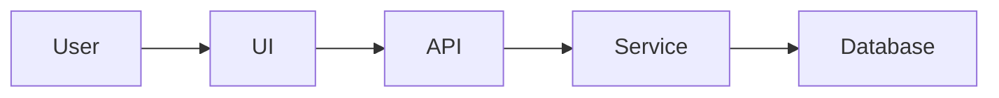

## Skill routing

When the user's request matches an available skill, invoke it via the Skill tool. When in doubt, invoke the skill.

Key routing rules:
- Product ideas/brainstorming → invoke /office-hours
- Strategy/scope → invoke /plan-ceo-review
- Architecture → invoke /plan-eng-review
- Design system/plan review → invoke /design-consultation or /plan-design-review
- Full review pipeline → invoke /autoplan
- Bugs/errors → invoke /investigate
- QA/testing site behavior → invoke /qa or /qa-only
- Code review/diff check → invoke /review
- Visual polish → invoke /design-review
- Ship/deploy/PR → invoke /ship or /land-and-deploy
- Save progress → invoke /context-save
- Resume context → invoke /context-restore
- Author a backlog-ready spec/issue → invoke /spec

## Readme

# README Documentation Requirements

Whenever you modify the application logic, architecture, database structure, dependencies, configuration, public API, user-facing behaviour, or any significant part of the codebase, you must update the `README.md` file as part of the same change.

The README must remain accurate, complete, and consistent with the current implementation. Documentation is considered part of the feature and must not be treated as an optional follow-up task.

---

## 1. General documentation rules

The `README.md` file must:

* be written in both English and Polish;
* explain the project as a detailed, step-by-step tutorial;
* describe not only what the code does, but also how and why it works;
* remain understandable to a developer who has never seen the project before;
* reflect the current state of the repository;
* avoid undocumented assumptions, unexplained abbreviations, and vague descriptions;
* include practical examples wherever they improve understanding;
* use consistent terminology across both language versions.

Do not document planned functionality as if it already existed.

Clearly distinguish between:

* implemented features;
* optional configuration;
* experimental functionality;
* known limitations;
* planned improvements.

---

## 2. Required language structure

The README must contain two complete versions:

1. English version
2. Polish version

Both versions must contain the same substantive information.

Do not provide only a short translation or summary of one language version. Each version must be complete, independently understandable, and updated whenever the code changes.

Recommended structure:

```text
README.md

# English

...

---

# Polski

...
```

---

## 3. README as a technical tutorial

Write the README as a technical tutorial that explains the project from the foundations upward.

The documentation should explain:

* the purpose of the application;
* the problem it solves;
* the main user flows;
* the application architecture;
* the technologies used;
* the role of each framework and library;
* how data moves through the system;
* how the frontend communicates with the backend;
* how the application stores and retrieves data;
* how authentication and authorisation work, when applicable;
* how state is managed;
* how errors are handled;
* how validation works;
* how configuration and environment variables are used;
* how the application is built, tested, deployed, and maintained.

Do not limit explanations to library names. Explain why each major technology was chosen and what responsibility it has in the application.

For example, instead of writing:

> React is used for the frontend.

Write:

> React is used to build the user interface from reusable components. Application state is updated in response to user interactions, while React re-renders only the affected parts of the interface. The main application entry point is located in `src/main.tsx`, and the root component is defined in `src/App.tsx`.

---

## 4. Technologies, frameworks, and libraries

Create a dedicated section that documents all important technologies used by the project.

For each major technology, framework, or library, include:

* its name;
* its version, when relevant;
* its purpose in the project;
* where it is used;
* the main files associated with it;
* important configuration details;
* relevant limitations or implementation notes;
* links to official documentation or high-quality learning resources.

This section should cover, where applicable:

* programming languages;
* frontend frameworks;
* backend frameworks;
* database systems;
* ORM or query libraries;
* state-management libraries;
* routing;
* validation;
* authentication;
* styling systems;
* testing frameworks;
* build tools;
* deployment platforms;
* PDF generation;
* AI integrations;
* third-party APIs;
* logging and monitoring.

Prefer official documentation and primary sources.

---

## 5. Code logic documentation

Explain the most important code paths in detail.

For each major workflow, describe:

1. where the workflow starts;
2. which functions, classes, hooks, services, controllers, or modules are involved;
3. how data is transformed;
4. how validation is performed;
5. how errors are handled;
6. what is returned to the caller or rendered to the user;
7. which files contain the implementation.

Use concrete file names and symbol names.

Where useful, include simplified examples, pseudocode, flow diagrams, or sequence descriptions.

Important functions, classes, hooks, services, API handlers, and utilities must be documented with:

* their responsibility;
* their inputs;
* their outputs;
* important side effects;
* dependencies;
* error conditions;
* the part of the application that calls them.

---

## 6. Folder structure

Include a detailed folder-structure section.

Provide a tree representation of the relevant repository structure, for example:

```text
src/
├── components/
├── pages/
├── hooks/
├── services/
├── utils/
├── types/
└── main.tsx
```

After the tree, explain every important directory and file.

For each folder, describe:

* its purpose;
* what type of files belong there;
* which modules depend on it;
* naming conventions;
* architectural rules;
* examples of important files.

Do not include generated directories such as `node_modules`, build output, caches, or temporary files unless they are directly relevant to the setup or deployment process.

Update the folder structure whenever files or directories are added, removed, renamed, or moved.

---

## 7. Database documentation

Create a detailed database section whenever the application uses persistent storage.

The database documentation must include:

* the database technology;
* connection and configuration method;
* ORM or query layer, when applicable;
* all main tables or collections;
* columns or fields;
* data types;
* primary keys;
* foreign keys;
* indexes;
* constraints;
* default values;
* nullable fields;
* relationships;
* cascade rules;
* migration strategy;
* seed data;
* data-retention considerations;
* security-sensitive fields;
* timestamps and auditing fields.

For every table or collection, explain its business purpose.

Example:

```text
users
- id: UUID, primary key
- email: unique text field
- created_at: creation timestamp
- updated_at: last modification timestamp
```

Also explain relationships in plain language, for example:

> One user can own many CV documents. Each CV document belongs to exactly one user.

Where appropriate, include:

* an entity-relationship diagram;
* SQL schema examples;
* ORM model references;
* migration file names;
* line ranges containing the schema definitions.

If the project does not use a database, state this explicitly and explain where data is stored instead.

---

## 8. Features section

Create and maintain a dedicated `Features` section.

For every important feature, include:

* feature name;
* user-facing purpose;
* technical description;
* main implementation files;
* relevant functions, classes, hooks, or components;
* line ranges where the feature is implemented;
* related tests;
* dependencies;
* known limitations.

Use the following format:

```markdown
### PDF Export

Generates a downloadable PDF document from the current CV state.

Implementation:

- `src/features/pdf/generatePdf.ts`, lines 18–96
- `src/components/ExportButton.tsx`, lines 12–58
- `src/hooks/usePdfExport.ts`, lines 9–74

Tests:

- `src/features/pdf/generatePdf.test.ts`, lines 15–122
```

Line numbers must be verified against the current version of the files before they are added to the README.

Never guess line ranges.

Because line numbers can change after code edits, review and update all affected references whenever implementation files are modified.

When exact line references would become unreliable or misleading, include both:

* the current line range;
* the relevant function, class, component, or exported symbol name.

Example:

```markdown
- `src/services/cvService.ts`, lines 42–109, function `saveCvDocument`
```

---

## 9. Web research and external resources

When documenting technologies, frameworks, libraries, architectural patterns, or implementation techniques, perform a web search and include relevant external resources.

Prefer links from:

* official documentation;
* official repositories;
* standards organisations;
* recognised technical publications;
* well-maintained tutorials;
* authoritative engineering blogs.

Avoid low-quality, outdated, copied, or unverified sources.

For each link, briefly explain why it is useful.

Example:

```markdown
### Further reading

- [React documentation](https://react.dev/) — official guide to React components, hooks, rendering, and state management.
- [TypeScript Handbook](https://www.typescriptlang.org/docs/handbook/intro.html) — official reference for the TypeScript type system.
```

Verify that each link:

* is accessible;
* is directly relevant;
* matches the technology version or concept used in the project;
* does not contradict the actual implementation.

Do not include links merely to increase the number of references.

---

## 10. Installation and local development

Document the complete local setup process.

Include:

* system requirements;
* required runtime versions;
* package-manager requirements;
* installation commands;
* environment variables;
* development commands;
* build commands;
* test commands;
* linting and formatting commands;
* database migration commands;
* seed commands;
* troubleshooting steps.

All commands must be tested or derived directly from the current project configuration.

Do not invent scripts that do not exist in `package.json`, build files, task runners, or project configuration.

For every environment variable, include:

* variable name;
* whether it is required;
* purpose;
* expected format;
* example value using safe placeholder data;
* security considerations.

Never place real secrets, credentials, tokens, private keys, or production connection strings in the README.

---

## 11. Architecture and data flow

Include an architecture section that explains how the main parts of the application interact.

Describe:

* application entry points;
* frontend layers;
* backend layers;
* API boundaries;
* service layers;
* repositories or data-access layers;
* state flow;
* event flow;
* database flow;
* third-party integrations;
* background jobs;
* caching;
* file-generation processes;
* AI-related workflows.

When helpful, include Mermaid diagrams.

Example:



Every diagram must match the actual implementation.

---

## 12. API documentation

When the project exposes an API, document every public endpoint.

For each endpoint, include:

* HTTP method;
* path;
* purpose;
* authentication requirements;
* request parameters;
* request body;
* response structure;
* validation rules;
* status codes;
* error responses;
* implementation file;
* handler or controller name;
* line range;
* example request;
* example response.

Do not include real user data or secrets in examples.

---

## 13. Testing documentation

Document the testing strategy.

Explain:

* which testing frameworks are used;
* where tests are located;
* how to run them;
* the difference between unit, integration, end-to-end, and visual tests;
* which critical workflows are covered;
* any important test fixtures or mocks;
* known coverage gaps.

Whenever a feature is changed, update the README if:

* test commands change;
* new test types are introduced;
* important test files are added;
* the testing strategy changes.

---

## 14. Deployment documentation

Explain how the application is deployed.

Include:

* hosting platform;
* build process;
* deployment command or workflow;
* required environment variables;
* database migration process;
* CI/CD configuration;
* branch or release strategy;
* rollback considerations;
* production-specific configuration;
* common deployment issues.

Reference the exact deployment files, workflows, and configuration files.

---

## 15. Security and privacy

Document important security and privacy decisions.

Include, where applicable:

* authentication;
* authorisation;
* input validation;
* output sanitisation;
* secret management;
* password handling;
* session management;
* CORS;
* CSRF protection;
* rate limiting;
* file-upload restrictions;
* personal-data handling;
* logging of sensitive data;
* encryption;
* database permissions;
* third-party data sharing.

Never describe the application as secure without explaining the implemented controls.

Do not expose sensitive implementation details that would unnecessarily increase security risk.

---

## 16. Accessibility and user experience

When the application has a user interface, document important accessibility and UX considerations.

Include:

* keyboard navigation;
* focus management;
* semantic HTML;
* form labels;
* validation messages;
* colour contrast;
* responsive behaviour;
* screen-reader support;
* loading states;
* empty states;
* error states.

Reference the main components responsible for these behaviours.

---

## 17. Change documentation workflow

Whenever code is changed, perform the following documentation review:

1. Identify which documented features are affected.
2. Update the English README section.
3. Update the Polish README section.
4. Review the folder structure.
5. Review the database structure.
6. Review feature file and line references.
7. Review setup instructions and commands.
8. Review API documentation.
9. Review tests and deployment instructions.
10. Verify all external links.
11. Confirm that no secrets or private data were added.
12. Check that the README matches the final implementation.

A code change is not complete until the relevant README sections are updated.

---

## 18. Documentation quality requirements

Before completing a task, verify that the README:

* contains no outdated implementation details;
* contains no broken internal file references;
* contains no guessed line numbers;
* contains no undocumented features introduced by the change;
* contains no references to removed files;
* uses correct file names and symbol names;
* uses valid Markdown;
* contains consistent headings;
* contains complete English and Polish versions;
* explains technical terms when first introduced;
* provides examples where they are useful;
* separates facts from recommendations or future plans.

Use clear, professional, technically precise language.

Avoid:

* marketing language;
* unnecessary repetition;
* unsupported claims;
* vague statements such as “handles data” or “manages logic”;
* unexplained acronyms;
* incomplete setup instructions;
* copy-pasted documentation that does not match the project.

---

## 19. README length

The README may be long when the complexity of the project requires it.

Completeness and accuracy are more important than brevity.

However:

* avoid repeating the same explanation in multiple sections;
* use a table of contents for long documents;
* use headings, tables, diagrams, and code examples to improve navigation;
* move highly specialised material into dedicated files under a `docs/` directory when the README becomes difficult to navigate;
* link those documents clearly from the README.

The README should remain the main entry point to the project documentation.

---

## 20. Final verification

Before finishing any task that changes the repository, confirm that:

* the implementation works as expected;
* the README reflects the implementation;
* both language versions are synchronised;
* file names and line ranges are correct;
* database documentation is current;
* feature documentation is current;
* setup commands are valid;
* links are relevant and working;
* no confidential information is exposed.

Do not state that documentation has been updated unless the actual `README.md` file has been modified.


## Comments

- always comment the code in a very detailed way
- provide the comments in english


