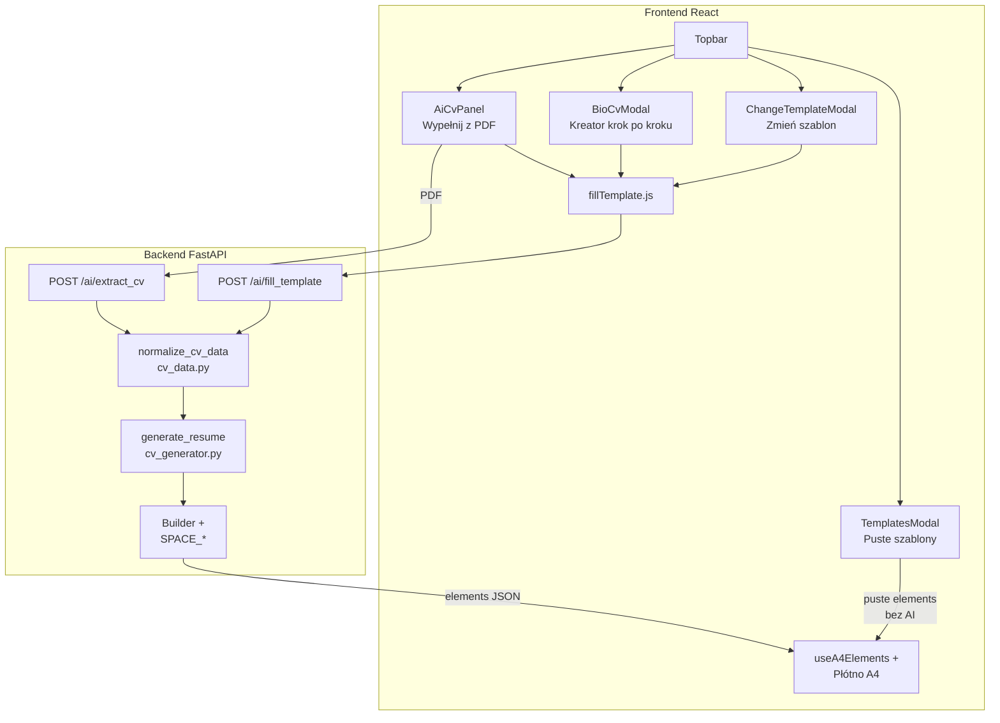
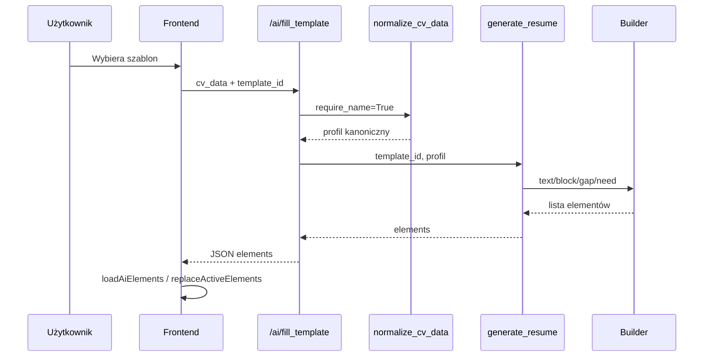

# Jak działa generowanie CV w CV Studio

Ten dokument tłumaczy generowanie CV tak, jakbyś tłumaczył je osobie, która dopiero zaczyna programować. Najpierw jest obraz całości, potem ścieżki użytkownika, potem Frontend, Backend, lista plików i najważniejszych funkcji.

Jeśli potrzebujesz krótkiej listy samych szablonów produktowych, zobacz też [`TEMPLATES.md`](TEMPLATES.md). Głębszy opis współrzędnych kanwy i eksportu PDF jest w [`CANVA.md`](CANVA.md) oraz [`README.md`](README.md).

---

## 1. Najważniejsza idea w jednym zdaniu

**AI czyta treść z PDF-a (albo użytkownik wpisuje ją w kreatorze), a układ na stronie A4 liczy deterministyczny kod Pythona — nie model językowy.**

To rozróżnienie jest kluczowe:

| Etap | Kto to robi | Co powstaje |
| --- | --- | --- |
| Ekstrakcja z PDF | model AI (GPT) | dane strukturalne `cv_data` (imię, doświadczenie, edukacja…) |
| Wypełnienie szablonu | Python (`generate_resume`) | lista elementów kanwy z pozycjami `left`/`top`/`width`/`height` |
| Edycja na płótnie | React (Frontend) | użytkownik poprawia treść i pozycje |
| Eksport PDF | ReportLab (`pdf_generator.py`) | plik PDF 1:1 z geometrią kanwy |

AI **nie** ustawia „czy nagłówek ma być 76 px od lewej”. To robi generator szablonu.

---

## 2. Analogia dla laika

Wyobraź sobie drukarnię wizytówek:

1. **Ekstrakcja** — ktoś dyktuje treść z Twojego starego CV do formularza (AI odczytuje PDF).
2. **Normalizacja** — sekretariat poprawia literówki formatu: e-mail musi mieć `@`, listy doświadczenia mają te same pola.
3. **Szablon** — grafik ma gotowe 25 „formatek” (Ledger, Nova, Words…). Wybierasz jedną.
4. **Builder** — to linijka i kursor na kartce A4. Program idzie od góry w dół, zostawia stałe odstępy, a gdy się nie mieści — zaczyna nową stronę.
5. **Kanwa** — dostajesz edytowalny dokument: każdy napis i linia to osobny klocek.
6. **PDF** — drukujesz te same klocki bez zmiany układu.

---

## 3. Mapa całego systemu



---

## 4. Trzy drogi użytkownika do CV na kanwie

### 4.1. Wypełnij z PDF (`AiCvPanel`)

Plik: `frontend/src/components/ai/AiCvPanel/AiCvPanel.jsx`

1. Użytkownik wybiera plik PDF.
2. Klik **Wyodrębnij dane CV** → `POST /ai/extract_cv` (wymaga planu Standard / uprawnienia ekstrakcji).
3. Backend zwraca `cv_data` + informacje o zużyciu tokenów.
4. Modal przechodzi na **krok 2** (osobny pełny panel, bez scrolla całego dialogu).
5. Użytkownik wybiera szablon w `TemplateCarousel`.
6. Frontend woła `fillTemplate(cvData, templateId)` → `POST /ai/fill_template`.
7. Odpowiedź `{ elements }` trafia na kanwę przez `loadAiElements`.
8. Zapisywane jest `activeCvData`, żeby później działało **Zmień szablon**.

Stopka modala: `Krok X z 2` · strzałki ← → · `Anuluj` (i przycisk ekstrakcji na kroku 1).

### 4.2. Kreator krok po kroku (`BioCvModal`)

Plik: `frontend/src/components/ai/BioCvModal/BioCvModal.jsx`

1. Formularz: dane osobowe → doświadczenie → edukacja → umiejętności → języki → sekcje własne → podsumowanie.
2. Szkic jest autosave’owany: `PUT /ai/bio_cv_draft`.
3. Na końcu wybór szablonu → ten sam `fillTemplate` → `loadAiElements`.
4. Działa także na planie Free (w przeciwieństwie do ekstrakcji PDF).

Pomocnicze dane formularza: `frontend/src/utils/bioCvData.js` (`BIO_CV_STEPS`, `buildBioCvPayload`, walidatory).

### 4.3. Zmień szablon (`ChangeTemplateModal`)

Plik: `frontend/src/components/editor/Topbar/ChangeTemplateModal.jsx`

1. Wymaga wcześniej zapisanego `activeCvData` (po udanym fillu).
2. Ponownie woła `fillTemplate` z **tymi samymi danymi** i nowym `template_id`.
3. Elementy podmienia `replaceActiveElements` — **bez** kasowania `pdfId` projektu (to nie jest nowy pusty dokument).

### 4.4. Szablony puste (`TemplatesModal`) — to NIE jest fill AI

Plik: `frontend/src/components/modals/TemplatesModal/TemplatesModal.jsx`

Ładuje statyczne `TEMPLATES[].elements` przez `loadTemplate`. Nie wysyła `cv_data` do backendu. To „czysta formatka” do ręcznego wypełnienia.

---

## 5. Co to jest `cv_data`?

To zwykły obiekt JSON opisujący treść CV — wspólny język Frontendu i Backendu.

Po `normalize_cv_data` typowe pola:

| Pole | Znaczenie |
| --- | --- |
| `name`, `title` | Imię i nazwisko, stanowisko / nagłówek zawodowy |
| `email`, `phone`, `address` / `location` | Kontakt |
| `summary` | Podsumowanie zawodowe |
| `experience` | Lista stanowisk (tytuł, firma, daty, opis/bullety) |
| `education` | Lista edukacji (dyplom bold, uczelnia, miasto·okres, opis jako bullet list) |
| `skills` | Lista umiejętności (renderowana jako bullet list) |
| `languages` | Języki obce |
| `custom_sections` | Sekcje własne (projekty, certyfikaty…) |
| `labels` | Nagłówki sekcji (PL/EN), np. „DOŚWIADCZENIE ZAWODOWE” |
| `extra_sections` | Forma używana przez generator (m.in. języki jako sekcja po umiejętnościach) |
| `language` | Język dokumentu (domyślnie Polish) |

Normalizacja żyje w `backend/app/services/cv_data.py`, funkcja `normalize_cv_data` (ok. linie 620–716). Puste `languages: []` przy językach tylko w `extra_sections` jest odzyskiwane (chyba że jednocześnie `custom_sections: []` sygnalizuje świadome wyczyszczenie) — bez tego Kernel gubił sekcję JĘZYKI przy zmianie szablonu.

---

## 6. Frontend — pliki i odpowiedzialności

### 6.1. Wejścia UI

| Plik | Rola |
| --- | --- |
| `frontend/src/components/editor/Topbar/Topbar.jsx` | Przyciski otwierające dialogi |
| `frontend/src/pages/PdfCanvas.jsx` | Orkiestracja strony edytora, montowanie dialogów, `loadAiElements` / `replaceActiveElements` |
| `frontend/src/store/pdfgenerator-context.jsx` | `PdfContext` — wspólne API React dla komponentów |
| `frontend/src/components/ai/AiCvPanel/AiCvPanel.jsx` | Wizard ekstrakcji + fill |
| `frontend/src/components/ai/AiCvPanel/AiCvPanel.module.css` | Layout kroków 1/2, stopka ze strzałkami |
| `frontend/src/components/ai/AiCvPanel/TemplateCarousel.jsx` | Karuzela 5 kart szablonów (pętla modulo) |
| `frontend/src/components/ai/AiCvPanel/TemplateCarousel.module.css` | Style karuzeli |
| `frontend/src/components/ai/BioCvModal/BioCvModal.jsx` | Kreator wieloetapowy |
| `frontend/src/components/editor/Topbar/ChangeTemplateModal.jsx` | Ponowne wypełnienie innym szablonem |
| `frontend/src/components/modals/TemplatesModal/TemplatesModal.jsx` | Puste szablony |
| `frontend/src/components/common/DialogShell/DialogShell.jsx` | Wspólna skorupa modala (`bodyClassName`, footer) |

### 6.2. Serwisy HTTP

| Plik | Symbole | Rola |
| --- | --- | --- |
| `frontend/src/services/api.js` | `ApiClient`, `ENDPOINTS.AI.*` | Auth, retry, endpointy |
| `frontend/src/services/fillTemplate.js` | `fillTemplate` | Jedyny klient `POST /ai/fill_template` |

Endpointy AI używane przy generowaniu:

- `POST /ai/extract_cv`
- `POST /ai/fill_template`
- `GET` / `PUT` / `DELETE /ai/bio_cv_draft`

### 6.3. Rejestr szablonów

| Plik | Symbole | Rola |
| --- | --- | --- |
| `frontend/src/templates/index.js` | `TEMPLATES` | 25 wpisów: `id`, `tier`, `name`, `description`, `layouts`, `accent`, `elements` |
| `frontend/src/templates/*.js` | np. `ledgerTemplate` | Statyczne elementy pustego podglądu |
| `frontend/src/utils/templateLayouts.js` | `TEMPLATE_LAYOUT_TAGS`, `listTemplatesInRegistryOrder`, `getTemplateLayouts`, `filterTemplatesByLayout`, `startIndexForSelectedTemplate` | Tagi layoutu (`single` / `sidebar` / `icons` / `dark`) — **nie** kolekcje branżowe w UI |
| `frontend/src/utils/cvTemplateSelection.js` | `selectCvTemplates` | Kolejność rejestru dla wizardów |
| `frontend/src/utils/entitlements.js` | `isTemplateAllowed` | Free vs paid |

UI pokazuje każdy szablon osobno (nazwa + krótki opis). W kodzie zostają tagi `layouts`, żeby generatory i reflow wiedziały, czy to sidebar / ikony / dark.

### 6.4. Kanwa po fillu

| Plik | Symbole | Rola |
| --- | --- | --- |
| `frontend/src/hooks/useA4Elements.js` | `handleLoadAiElements`, `handleLoadTemplate`, `handleFitTextareaToContent` | Stan dokumentu A4 |
| `frontend/src/utils/materializeElementSpecs.js` | `materializeElementSpecs` | Nowe `element_id`, sanityzacja treści |
| `frontend/src/utils/canvasEnter.js` | `markContentElementsEnter`, wstrzymanie reflow | Fade-in po załadowaniu fontów |
| `frontend/src/components/canvas/Textarea/Textarea.jsx` | efekt auto-height | Dopasowanie wysokości do treści |
| `frontend/src/utils/textareaHeight.js` | `measureNaturalScrollHeight`, `shouldShrinkPreservedLayout` | Pierwszy mount: tylko **shrink** przy `preserveInitialLayout` |
| `frontend/src/utils/textareaReflow.js` | `reflowTextareaHeight`, `Builder`-podobne pakowanie | Przesuwanie sąsiadów po zmianie wysokości; chrome sekcji, `SPACE_SECTION` przy ściąganiu ze strony 2 |

**Dlaczego `preserveInitialLayout`?**  
Generator już policzył strony metrykami ReportLab. Gdy przeglądarka mierzy nieco inaczej, Frontend może **zmniejszyć** za wysoki box (żeby nie było pustej dziury), ale nie może **powiększać** wszystkich boxów naraz przy starcie — to rozciągało odstępy między sekcjami.

### 6.5. Kluczowe funkcje Frontendu (skrót)

| Symbol | Plik | Co robi |
| --- | --- | --- |
| `fillTemplate(cvData, templateId)` | `fillTemplate.js` | Wysyła fill do API |
| `AiCvPanel` / `handleExtract` / `handleFill` | `AiCvPanel.jsx` | Upload → extract → fill → kanwa |
| `BioCvModal` / `handleFill` | `BioCvModal.jsx` | Formularz → fill |
| `ChangeTemplateModal` / `handleChangeTemplate` | `ChangeTemplateModal.jsx` | Ten sam `cv_data`, nowy wygląd |
| `TemplateCarousel` | `TemplateCarousel.jsx` | Wybór szablonu (5 widocznych kart) |
| `selectCvTemplates` | `cvTemplateSelection.js` | Lista szablonów w kolejności rejestru |
| `loadAiElements` | `PdfCanvas.jsx` | Nowy dokument z elementów AI |
| `replaceActiveElements` | `PdfCanvas.jsx` | Podmiana elementów bez resetu projektu |
| `handleLoadAiElements` | `useA4Elements.js` | Materializacja + stan kanwy |
| `reflowTextareaHeight` | `textareaReflow.js` | Przepływ pionowy po pomiarze wysokości |

---

## 7. Backend — pliki i odpowiedzialności

### 7.1. Trasa HTTP

Plik: `backend/app/api/routes/ai.py` (router `/ai`)

| Symbol | Linie (ok.) | Endpoint | Rola |
| --- | --- | --- | --- |
| `FillRequest` | 34–38 | — | Body: `cv_data` + `template_id` |
| `_rebase_template_asset_urls` | 58–72 | — | Absolutne URL-e `/template-assets/...` |
| `extract_cv` | 75–100 | `POST /ai/extract_cv` | PDF → `cv_data` + charge credits |
| `get_bio_cv_draft_route` | 103–115 | `GET /ai/bio_cv_draft` | Odczyt szkicu |
| `upsert_bio_cv_draft_route` | 118–133 | `PUT /ai/bio_cv_draft` | Zapis szkicu |
| `delete_bio_cv_draft_route` | 136–143 | `DELETE /ai/bio_cv_draft` | Usunięcie szkicu |
| `fill_template` | 146–171 | `POST /ai/fill_template` | Normalizacja + `generate_resume` → `elements` |

Ważne: **fill nie przyjmuje PDF-a**. PDF kończy się na ekstrakcji. Fill dostaje już JSON.

Uprawnienia (`backend/app/services/entitlements.py`):

- `assert_can_extract_cv` — czy wolno czytać PDF AI,
- `assert_template_allowed` — Free widzi tylko starterowe id,
- `charge_ai_credits` — pobranie kredytów po udanej ekstrakcji.

### 7.2. Ekstrakcja AI

Plik: `backend/app/services/ai_service.py`

| Symbol | Rola |
| --- | --- |
| `_pdf_to_b64_images` | Rasteryzacja pierwszych ≤3 stron PDF (ok. 150 DPI) |
| `extract_cv_data` | Wywołanie modelu vision → JSON → `normalize_cv_data` |
| `generate_resume` | Cienka nakładka → `cv_generator.generate_resume` |
| `_fix_heights_and_reflow` | Starsza ścieżka reflow — **nie** jest używana przez bieżący `generate_resume` |

### 7.3. Normalizacja danych

Plik: `backend/app/services/cv_data.py`

| Symbol | Rola |
| --- | --- |
| `CvDataValidationError` | Błąd walidacji profilu |
| `fold_section_label` | Ujednolicenie nagłówków (bez ogonków, wielkość liter) |
| `is_skills_like_title` / `is_generic_skills_label` | Rozpoznawanie sekcji umiejętności |
| `is_record_section` | Sekcje „rekordowe” (projekty…) vs płaskie listy |
| `group_flat_items_into_records` | Składanie tytułu + bulletów z płaskiej listy |
| `_normalize_experience` / `_normalize_education` | Ujednolicenie list |
| `_normalize_languages` / `_normalize_custom_sections` | Języki i sekcje własne |
| `_absorb_skills_alias_sections` | Scalanie aliasów umiejętności |
| `normalize_cv_data` | Główna funkcja — jeden stabilny profil |

### 7.4. Generator szablonów

Każdy `template_id` ma własny plik. Nie ma katalogów „IT / Classic / Iconic” ani osi po tagach `sidebar`/`icons` — to tylko metadane w `TEMPLATE_LAYOUTS`.

| Plik / katalog | Rola |
| --- | --- |
| `backend/app/services/cv_generator_primitives.py` | Geometria strony, `SPACE_*`, konstruktory elementów, klasa `Builder` |
| `backend/app/services/cv_generator.py` | Cienka fasada API (re-eksport `generate_resume`, `_GENERATORS`, helperów) |
| `backend/app/services/cv_templates/registry.py` | `TEMPLATE_LAYOUTS`, `_GENERATORS`, `generate_resume` |
| `backend/app/services/cv_templates/shared/` | Uniwersalne helpery: `text`, `records`, `extras`, `icons` |
| `backend/app/services/cv_templates/templates/<id>.py` | Pełny generator jednego szablonu (`_gen_<id>`) — 25 plików; tylko żywa konfiguracja i kod tego `template_id` (bez wspólnych silników multi-theme ani martwych gałęzi siblingów) |
| `backend/app/services/pdf_generator.py` | Pomiar wysokości textarea (ReportLab) + eksport PDF |

### 7.5. Jak działa `generate_resume`

```85:101:backend/app/services/cv_templates/registry.py
def generate_resume(template_id: str, cv_data: dict) -> list[dict]:
    ...
    fn = _GENERATORS.get(template_id)
    if fn is None:
        raise ValueError(...)
    return fn(normalize_cv_data(cv_data))
```

1. Znajdź funkcję szablonu w słowniku `_GENERATORS`.
2. Jeszcze raz znormalizuj dane (bezpieczeństwo idempotentne).
3. Funkcja `_gen_nova` / `_gen_cinder` / … z `cv_templates/templates/<id>.py` buduje listę słowników-elementów.

Każdy element to coś w stylu:

```json
{
  "category": "textarea",
  "content": "• Obsługa klienta…",
  "left": 76,
  "top": 420,
  "width": 466,
  "height": 40,
  "fontSize": 9.5,
  "lineHeight": 13.4,
  "page": 1,
  "autoHeight": true,
  "preserveInitialLayout": true
}
```

Kategorie: `text`, `textarea`, `line`, `rectangle`, `circle`, `ellipse`, `image`. Często też: `fixedToPage`, `flowRole`, `flowGroup`, `locked`.

---

## 8. Klasa `Builder` — „kursor na kartce A4”

Plik: `backend/app/services/cv_generator_primitives.py`, klasa `Builder` (ok. linie 97–212).

Stan:

- `y` — aktualna wysokość kursora (od góry strony),
- `pg` — numer strony,
- `els` — lista już położonych elementów.

| Metoda | Co robi laikowi |
| --- | --- |
| `need(h)` | „Czy zmieści się jeszcze `h` pikseli? Jeśli nie — nowa strona.” |
| `need_section(chrome, body)` | Nagłówek sekcji + pierwszy blok treści nie zostają sami nad stopką |
| `keep_together(height)` | Cały rekord (np. jedno stanowisko) trzymany na jednej stronie; wspólny `flowGroup` |
| `text(...)` | Jednoliniowy napis; kursor idzie w dół o `fontSize * 1.35` |
| `block(...)` | Wieloliniowy tekst (textarea); wysokość z ReportLab |
| `line(...)` | Linia dekoracyjna **bez** przesuwania kursora |
| `gap(px)` | Pusty odstęp pionowy |
| `build()` | Oddaj gotową listę elementów |

Szablony często robią podklasę Buildera tylko po to, by zmienić `continuation_top()` (gdzie zaczyna się treść na stronie 2).

---

## 9. Stałe rytmu `SPACE_*`

Te liczby to „muzyka” układu. Wszystkie szablony powinny ich używać zamiast magicznych `12` / `18` w środku kodu.

| Stała | Wartość | Znaczenie |
| --- | ---: | --- |
| `SPACE_STACK` | 4 | Wewnątrz rekordu: tytuł → firma → bullety |
| `SPACE_RECORD` | 10 | Między rekordami w tej samej sekcji |
| `SPACE_SECTION` | 21 | Po zakończonej sekcji przed kolejnym nagłówkiem |
| `SPACE_AFTER_RULE` | 8 | Pod linią nagłówka sekcji → treść |
| `SPACE_AFTER_MASTHEAD` | 32 | Pod solidnym paskiem nagłówka (np. Cinder) |
| `SPACE_AFTER_HEADER_RULE` | 36 | Pod cienką linią mastheadu |

Geometria strony:

- wysokość A4: `A4_H = 842`
- góra treści po przełamaniu: `PAGE_TOP = 66`
- dół treści: `CONTENT_BOTTOM = 770` (zapas na stopkę ~y=783)

---

## 10. Konstruktory elementów

W `cv_generator_primitives.py`:

| Funkcja | Tworzy |
| --- | --- |
| `_text` | Jednoliniowy tekst |
| `_block` | Textarea z `autoHeight` + `preserveInitialLayout` |
| `_line` | Linia / pasek |
| `_rect` | Prostokąt (często obramowanie) |
| `_circle` / `_ellipse` | Kształty dekoracyjne |

Szablony składają z nich nagłówek, markery sekcji, treść i dekoracje stron (`fixedToPage=True` dla tła/stopki na każdej stronie).

---

## 11. Shared helpery (`cv_templates/shared/`)

Uniwersalne — bez gałęzi `if template_id == …`. Re-eksportowane też z fasady `cv_generator.py`.

| Moduł | Symbol (wybrane) | Rola |
| --- | --- | --- |
| `shared/text.py` | `_labels`, `_bullets`, `_skills_inline_content` (skills w main), `_bullet_list_content` (sidebar / inne listy), `_company_period`, `_contact_line`, `_compact_text` | Tekst i etykiety |
| `shared/records.py` | `_place_education_record` (dyplom/uczelnia/meta/bullets), `_place_experience_record`, heights | Rekordy jako atomy stron |
| `shared/extras.py` | `_extra_sections`, `_render_record_section_body`, sidebar fit | Sekcje własne / sidebar packing |
| `shared/icons.py` | `_icon`, `_icon_beside`, `_icon_key_for_label` | URL/pozycja PNG z `template_assets/iconic/<id>/` |
| `registry.py` | `TEMPLATE_LAYOUTS`, `_GENERATORS`, `generate_resume` | Rejestr i API |

---

## 12. Pełna mapa `_GENERATORS` (14 szablonów)

Każdy wpis to `cv_templates/templates/<template_id>.py` → funkcja `_gen_<template_id>`. Plik nie zawiera słownika `themes` ani `if theme == …` / `if C["layout"] == …` dla innych szablonów.

| `template_id` | Funkcja | Plik |
| --- | --- | --- |
| `ledger` | `_gen_ledger` | `templates/ledger.py` |
| `nimbus` | `_gen_nimbus` | `templates/nimbus.py` |
| `cinder` | `_gen_cinder` | `templates/cinder.py` |
| `kernel` | `_gen_kernel` | `templates/kernel.py` |
| `regent` | `_gen_regent` | `templates/regent.py` |
| `aldine` | `_gen_aldine` | `templates/aldine.py` |
| `harbor` | `_gen_harbor` | `templates/harbor.py` |
| `nova` | `_gen_nova` | `templates/nova.py` |
| `volt` | `_gen_volt` | `templates/volt.py` |
| `monument` | `_gen_monument` | `templates/monument.py` |
| `words` | `_gen_words` | `templates/words.py` |
| `cardinal` | `_gen_cardinal` | `templates/cardinal.py` |
| `tessera` | `_gen_tessera` | `templates/tessera.py` |
| `slate` | `_gen_slate` | `templates/slate.py` |

**Starter Free** (5): `ledger`, `nimbus`, `kernel`, `regent`, `nova` — lista musi być zsynchronizowana z `FREE_STARTER_TEMPLATE_IDS` w entitlements i testem `test_template_registry_sync.py`.

---

## 13. Typowa sekwencja `fill_template` krok po kroku

1. Frontend ma obiekt `cv_data` i wybrane `template_id` (np. `"nova"`).
2. `fillTemplate` robi `POST /ai/fill_template` z JWT.
3. Backend: `assert_template_allowed`.
4. `normalize_cv_data(..., require_name=True)` — bez imienia fill się wywali (422).
5. `generate_resume("nova", cv_data)` → `cv_templates.templates.nova._gen_nova`.
6. Generator:
   - kładzie masthead (nazwisko, kontakt, ikony),
   - tworzy `Builder(start_y)`,
   - dla każdej sekcji: chrome → rekordy w `keep_together` → `gap(SPACE_SECTION)`,
   - dokłada dekoracje stron z `fixedToPage`.
7. `_rebase_template_asset_urls` poprawia ścieżki obrazków.
8. Odpowiedź: `{ "elements": [ ... ] }`.
9. Frontend: `materializeElementSpecs` → kanwa → fade-in → ewentualny shrink textarea.



---

## 14. Co NIE jest częścią generowania szablonu

Żeby nie pomylić ścieżek:

| Moduł | Do czego służy |
| --- | --- |
| `ai_assistant.py` + chat | Asystent tekstowy / poprawki treści |
| `layout_gpt.py` / `layout_analysis.py` | Tryb **Układ** (korekta geometrii już istniejącej kanwy) |
| Ręczne przeciąganie na kanwie | Edycja użytkownika po fillu |
| Sam eksport `POST` PDF | Render ReportLab z aktualnych elementów |

Fill szablonu = **nowy układ z `cv_data`**. Układ AI = **poprawianie już leżących klocków**.

---

## 15. Checklist dla developera „gdzie szukać”

| Chcę… | Idę do… |
| --- | --- |
| Dodać nowy szablon | `frontend/src/templates/<id>.js` + wpis w `index.js` + `_gen_*` + `_GENERATORS` + mockup PNG + test sync |
| Zmienić odstęp między sekcjami | `SPACE_SECTION` w `cv_generator_primitives.py` (+ README / kontrakt Układu) |
| Zmienić treść wyciąganą z PDF | prompt / parser w `ai_service.py` + `normalize_cv_data` |
| Zmienić UI wyboru szablonu | `TemplateCarousel.jsx` / `TemplatesModal.jsx` |
| Zmienić jak elementy lądują na kanwie | `useA4Elements.js` + `materializeElementSpecs.js` |
| Zrozumieć dziwny odstęp po fillu | `preserveInitialLayout` + `textareaReflow.js` + `SPACE_*` |
| Sprawdzić zgodność FE↔BE | `backend/tests/test_template_registry_sync.py` |

---

## 16. Słowniczek

| Termin | Znaczenie |
| --- | --- |
| **Kanwa / canvas** | Edytor A4 w przeglądarce |
| **Element** | Jeden klocek (tekst, linia, obraz…) ze współrzędnymi |
| **`cv_data`** | Treść CV jako JSON |
| **Fill** | Wypełnienie szablonu danymi → nowe elementy |
| **Extract** | Odczyt PDF → `cv_data` |
| **Builder** | Kursor pionowy generatora |
| **`preserveInitialLayout`** | Nie rosnąć przy pierwszym montażu; wolno się skurczyć |
| **`flowGroup`** | Identyfikator rekordu trzymanego razem przy reflow |
| **`fixedToPage`** | Dekoracja przyklejona do strony (tło, stopka) |
| **ReportLab** | Biblioteka PDF po stronie serwera |
| **Entitlements** | Limity planu (Free/Standard/Premium) |

---

## 17. Podsumowanie dla laika

1. Masz treść CV (z PDF albo z formularza).  
2. Wybierasz wygląd (jeden z 14 szablonów).  
3. Serwer **nie zgaduje** układu — **wylicza** go funkcją Pythona jak linijką na kartce.  
4. Przeglądarka pokazuje wynik jako edytowalne klocki.  
5. PDF eksportuje te same klocki.

Jeśli coś „źle wygląda po fillu”, najpierw sprawdź: czy to stary zapisany dokument (trzeba wypełnić szablon ponownie), czy stałe `SPACE_*`, czy reflow textarea na Froncie — a nie „AI źle ułożyło”, bo AI w tej ścieżce układu w ogóle nie robi.

---

*Dokument odzwierciedla stan repozytorium w momencie zapisu. Przy zmianie generatora, rejestru szablonów lub ścieżki fill zaktualizuj ten plik razem z kodem.*
