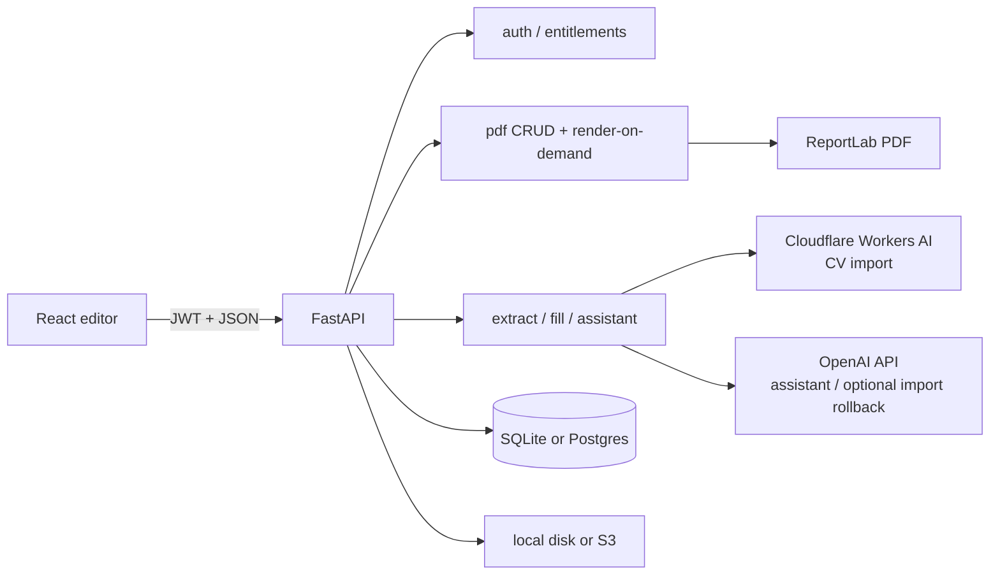
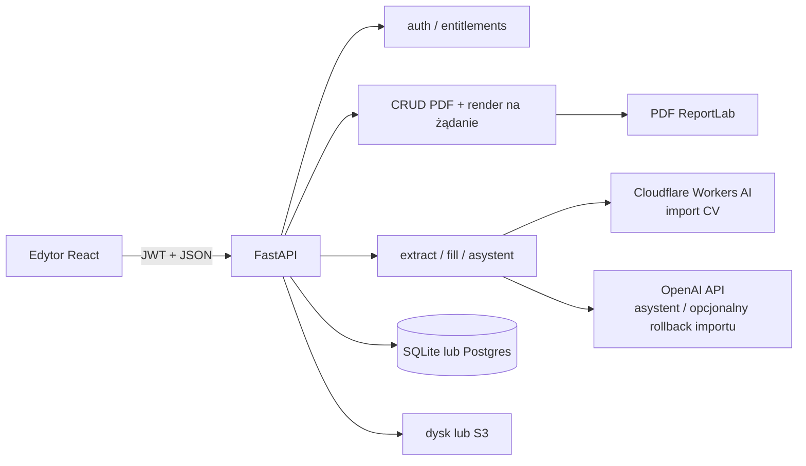

# English

# CV Studio

CV Studio is a Polish-language A4 CV editor: a WYSIWYG canvas, 10 individual templates (each with its own name and short stylistic description), PDF import via AI, a guided bio wizard, a floating AI assistant, and ReportLab PDF export that matches the canvas 1:1 (coordinates in points, top-left origin on the frontend, flipped for ReportLab).

This README is the technical entry point for developers. A beginner-friendly deep guide to canvas coordinates, React interaction, deterministic Python layout, AI responsibilities, reflow, persistence, and ReportLab export lives in [`CANVA.md`](CANVA.md). Every live AI prompt (full text, variables, file/line references) is documented in [`PROMPTS.md`](PROMPTS.md). Product-oriented feature copy lives in [`docs/FEATURES.md`](docs/FEATURES.md). Marketing brief for the website „Dlaczego CV STUDIO” section (features + competitive positioning, no competitor brand names in public copy) lives in [`FEATURES_MARKETING.md`](FEATURES_MARKETING.md). Template generation (AI extract vs Python layout) is explained in [`docs/cv-template-generation.md`](docs/cv-template-generation.md). A layperson-friendly end-to-end guide covering Frontend and Backend (flows, files, classes, functions) lives in [`CV_GENERATOR.md`](CV_GENERATOR.md).

---

## Table of contents

1. [Purpose and problem](#purpose-and-problem)
2. [Main user flows](#main-user-flows)
3. [Architecture and data flow](#architecture-and-data-flow)
4. [Technologies](#technologies)
5. [Folder structure](#folder-structure)
6. [Database](#database)
7. [Features (implementation map)](#features-implementation-map)
8. [API](#api)
9. [Installation and local development](#installation-and-local-development)
10. [Testing](#testing)
11. [Deployment](#deployment)
12. [Security and privacy](#security-and-privacy)
13. [Accessibility and UX](#accessibility-and-ux)
14. [Known limitations and planned work](#known-limitations-and-planned-work)
15. [Further reading](#further-reading)

---

## Purpose and problem

Job seekers need CVs that look professional and export cleanly to PDF. Generic form builders hide layout; design tools are too heavy. CV Studio gives a true A4 canvas (595×842 pt), templates filled with real career data, and AI that extracts or improves content without inventing unsafe coordinates for decorative chrome.

Forcing registration before a visitor had seen the editor used to be the largest funnel loss: every new visitor had to create an account — and pick a paid plan during registration — before touching a single template. **Guest mode** removes that wall: `/cvstudio/guest` works with no JWT at all (authenticated users open `/cvstudio/{username}`), so a visitor can pick a template, run the guided wizard, or freeform-edit and see the exact document they would export, with state kept in `localStorage` instead of the backend. An account is only required at the point of real value — saving or exporting the PDF (a "save-gate" modal) — or for CV import, which stays account-gated because it sends personal CV data to a server-side AI provider and consumes an account-wide quota. See [Guest mode (editor without an account)](#guest-mode-editor-without-an-account) for the full implementation.

**Implemented today:** editor (including guest mode without an account), templates, extract/fill, bio draft, AI assistant (goal-oriented actions, rating dashboard, translate, layout review cards), entitlements (Darmowy / Pro — 59 zł / 30 days), explicit save + independent render-on-demand download, guest-only localStorage autosave, local or S3 storage, JWT auth.

**Optional:** AWS S3 (`S3_BUCKET_NAME`), unpaid plan selection (`ALLOW_UNPAID_PLAN_SELECTION`).

**Not implemented as full Stripe Checkout yet:** paid plans can be activated without payment when unpaid selection is enabled; `402 payment_required` is the seam for future Checkout.

---

## Main user flows

1. **Choose a landing-page start** → the primary CTA “Stwórz CV za darmo” (`start=wizard`) opens the four-step data wizard. After the wizard, guests save the profile locally and continue to registration/login; authentication adopts the draft, generates a Regent CV, and opens the full editor. The secondary “Mam już CV — wgraj PDF” (`start=import`) still uses the import flow. A tertiary link “Najpierw chcesz zobaczyć produkt? Otwórz szablon Regent w edytorze” (`start=demo`) opens the limited Regent starter. The editor topbar’s labelled **Zmień szablon** control opens the change-template gallery after the CV exists.
2. **Edit as a guest** → the limited Regent demo provides text editing, layout, template switching, undo/redo, zoom, and page navigation. The four-step data wizard is a registration handoff, not a second guest editor; its profile is persisted locally until authentication — see [Guest mode](#guest-mode-editor-without-an-account).
3. **Register / login only when it matters** → clicking “Zapisz” / “Pobierz PDF” as a guest opens `SaveGateModal` instead of calling the backend. Registering or logging in preserves the selected `start` intent, and if a guest document exists, `ClaimGuestDocumentModal` asks the now-authenticated visitor to confirm it is theirs before loading that JSON onto the A4 canvas (no automatic `POST /pdf/create_pdf`) — a guest document belongs to the browser, not to any identity, so silently attaching it to whoever happens to log in next would leak one person's draft into an unrelated account.
4. **Pick a template** → `handleLoadTemplate` materializes specs → canvas.
5. **Import PDF** (account required) → `POST /ai/extract_cv` → choose template → `POST /ai/fill_template` → Python layout in `cv_generator.generate_resume`.

### Import history

Each account-scoped PDF import creates a separate `CvImportSnapshot` record.
The application stores only the normalized `cv_data`, safe filename, size,
status, and timestamps—not the original PDF bytes, URL, or storage key.
`AiCvPanel` lets the owner reopen a successful snapshot, select a template
without another AI extraction, and delete the stored data. `Pdf.source_import_id`
links CVs saved from that snapshot, so history can show their template and open
them from the document library.

The dialog keeps its history heading, refresh/new-import controls, and footer
visible while the snapshot list scrolls inside the available `82vh` shell. The
list is a named, focusable region, so mouse-wheel, touch, and keyboard scrolling
can reach every import without allowing cards to disappear under the footer.
The upload pane uses the same bounded overflow rule only when a short viewport
cannot fit the first step.

The API validates a PDF signature, parseability, encryption state, 10 MB byte
limit, and 12-page limit before extraction. `GET /ai/imports`,
`GET /ai/imports/{id}`, and `DELETE /ai/imports/{id}` are ownership-scoped;
an import ID alone never grants access to another account's data.
6. **Bio wizard** → guests use a four-step fullscreen data creator (`BioCvModal`) from the landing CTA or demo conversion, then authenticate. Authenticated users use the five-step wizard with template selection; they use draft CRUD on `/ai/bio_cv_draft`, while guests autosave to `localStorage` (`cvstudio.guest.wizardDraft`). After guest authentication, the snapshot is adopted and `POST /ai/fill_template` generates the Regent before the full editor opens.
7. **Edit** → drag/resize/style → edits live in memory (backing undo/redo). Authenticated documents are **not** autosaved to the backend — "Moje dokumenty" is updated only by an explicit **Zapisz** (see step 9). Guests still get a debounced `localStorage` write (`guestDocument.js`) so their unclaimed work survives a reload.
8. **AI assistant** → `POST /ai/assistant` → tips / corrections / reviewable layout groups (account required — every assistant action is entitlement-gated).
9. **Save vs. Download** (two independent actions):
   - **Zapisz** → `POST /pdf/create_pdf` on the first save (creates the "Moje dokumenty" entry + its `pdfId`), then `PUT /pdf/update_pdf` on every later save (updates that same document). This is the only path that writes to "Moje dokumenty".
   - **Pobierz** → `POST /pdf/render_pdf` renders the current canvas on demand and streams it **without** saving, so an unsaved document can still be downloaded. Both actions charge the export quota on download and require an account (guests reach the save-gate).



---

## Architecture and data flow

### Entry points

| Layer | Entry | Role |
|--------|--------|------|
| Frontend | `frontend/src/main.jsx` → `App.jsx` | Router: `/`, `/login`, `/register`, `/cvstudio/:workspace` (`guest` or username — no `ProtectedRoute`); legacy `/pdfcanvas` redirects |
| Editor page | `frontend/src/pages/PdfCanvas.jsx` (`PdfCanvas`) | Composes hooks into Canvas / UiSurfaces / Session (+ `PdfContext` facade) |
| Backend | `backend/app/main.py` | FastAPI app, CORS, `/health`, routers, optional SPA static |

### Frontend layers

- **Pages** — marketing, auth, editor shell.
- **Hooks** — `useA4Elements` is the canvas facade; undo/redo in `useDocumentHistory`; selection/drag in `useElementSelectionDrag`; factories/materialize helpers are pure utils; `usePdfExport` talks to PDF endpoints; `useEntitlements` loads plan limits.
- **Context** — nested `CanvasContext` / `UiSurfacesContext` / `SessionContext` from `PdfCanvas`, plus temporary merged `PdfContext` facade for remaining consumers.
- **Services** — `ApiClient` (`services/api.js`) with long timeouts and retries for Render cold start; shared `fillTemplate` for `/ai/fill_template`; authenticated image blob helper for private library photos.
- **Templates** — static element specs in `frontend/src/templates/`; registry in `templates/index.js`.

### Backend layers

- **Routes** — thin HTTP in `app/api/routes/*` (PDF create/update delegates to `document_service`).
- **CRUD** — SQLAlchemy writes in `app/crud/*`.
- **Services** — PDF render, CV layout, AI, entitlements, S3.
- **Models** — `app/models/models.py`; engine in `app/models/database.py`.

### Coordinate system

Canvas and stored geometry use **top-left** origin (CSS-like). ReportLab uses **bottom-left**; `PDF_Generator` flips `top` using `page_h` before drawing (`backend/app/services/pdf_generator.py`). Immediately before create, update, or render-on-demand export, `resolveBrowserTextLayouts` builds an off-screen mirror with the textarea's exact CSS width and typography. Chromium `Range` rectangles provide the authoritative soft-wrap slices, bullet indent, line start, and horizontal advance. ReportLab validates this transient metadata against the complete current content and box bounds, then draws those exact lines and compensates the remaining kerning delta so their start and end positions match the canvas. The records exist only in the outgoing request and are never persisted. If the DOM, the requested primary font (including inline bold/italic variants), or validation is unavailable, export falls back safely to the backend wrapper. That fallback uses literal width for Montserrat and all uncalibrated families; only Inter retains its independently verified 2 px `INTER_WRAP_WIDTH_TOLERANCE_PX` correction. After a font change the canvas reflows measured `height` / following `top` values; auto-height PDF export **honours those stored heights** (clipping overflow) instead of recomputing box height from PDF wrap alone. Stub heights from a pre-measure export still expand. Canvas painting maps Helvetica/Courier → Inter via `canvasFontFamily` to match the PDF Unicode aliases.

### Auto-height reflow and aligned icons

Template textareas start with authored placeholder heights and are measured after the browser loads their real fonts. `reflowTextareaHeight` then moves all following elements in the same visual lane by the measured delta. Text-aligned Iconic images (`alignWithText: true`, including backward-compatible `/template-assets/iconic/` URLs) are classified as section chrome and may join a lane when they hang to the left of the column (~40 px tolerance). The same left-hanging rule applies to Monument ordinal badge text (`isDecorativeChromeText` / `flowRole: "section-chrome"` digits inside the numbered square at x=74 while the body column starts at x=102): without it, a page break moved the filled square and title to page 2 and left the number behind or 8 px too low in the square. Icons that sit entirely to the right of a narrow column are excluded, so a sidebar cannot drag main-column icons away from their headings.

Undo/redo history treats that **background** reflow as part of the baseline, not as a user edit: a "quiet" record refreshes the current history entry in place so Cofnij stays disabled until the user actually changes the document. Otherwise Undo would restore pre-measure heights and revive uneven Y gaps (e.g. diploma → school in education records). Two rules make this reliable and are unit-tested as pure functions in `frontend/src/utils/documentHistory.js` (`recordSnapshotState`):

- A **quiet settle preserves the redo tail**. Applying an undo/redo re-renders and fires a quiet record while the index sits before the top of the stack; truncating there used to delete every redo entry, which left Ponów permanently disabled after any Cofnij.
- **A user textarea edit is never quiet.** `handleFitTextareaToContent` only marks history quiet for a *background* measure (mount / font-ready / load). The typing/formatting commit in `Textarea.jsx` passes `{ quiet: false }`, so the content change lands as a real, undoable step instead of overwriting the pre-edit baseline in place.

Every auto-height textarea measures twice — once immediately, once again after `document.fonts.ready` — and each measurement calls `reflowTextareaHeight` independently, so a later field can briefly carry a stale `page` number from an earlier pass. `rawSamePageGap` checks authored `top` values (ignoring `page`) before applying the generic page-break gap: a same-record pair with a stale page keeps its authored small gap, while a genuine cross-page seam uses `DEFAULT_PACK_GAP` (10 px, `SPACE_RECORD`) for ordinary blocks and `SECTION_PACK_GAP` (21 px, `SPACE_SECTION`) for section chrome. Using the leftover page-top inset (often 0–6 px when education starts near `pageTop` on page 2) crushed headings such as WYKSZTAŁCENIE under the previous section. Single-column templates mark section markers/rules `locked` for interaction and guides, but `flowRole: "section-chrome"` still lets them reflow with their heading so underlines do not stay stranded on the next page. The reflow intentionally does **not** infer title/meta relationships from font size or boldness; that heuristic distorted valid record spacing (for example Monument chrome rhythm) and compounded independent height deltas. Section marker/label/rule use `section-chrome`, and ordinary records use `content`. Keep-with-next logic therefore cannot mistake a job title for a section heading and move the real heading behind its own content. Legacy templates without this property keep the category-based fallback.

During the canvas enter hold, auto-height reflow is suppressed and resumes after fonts are ready. Every textarea emitted by the Python generators carries `preserveInitialLayout: true` (via `_block` in `cv_generator_primitives.py`). On first mount the canvas may **shrink** a box to browser `scrollHeight` when ReportLab overshoots (so empty slack cannot inflate visual section gaps), but it will not **grow** — independent growth races still stretch gaps. Editing content or later changing typography/width still triggers normal auto-height reflow. A plain textarea preserves every authored newline, including trailing blank paragraphs, after blur and document scrub; those rows are measured as real spacing and therefore move following flow content through the normal reflow path. Bullet-list textareas use a separate rule: trailing blank rows and bare bullet markers (`•`) are trimmed on blur / display / document scrub (`trimTrailingEmptyTextareaLines` / `trimTrailingEmptyTextareaPayload` in `textareaHeight.js`) so editor placeholders cannot leave a tall empty outline that pushes the next record. In bullet mode, Enter after a filled item continues with `• `; Enter on a bare `•` clears the marker into a blank paragraph. Blank lines between real content remain intact. Display rendering keeps a line box for empty rows so authored gaps do not collapse. See `textareaHeight.test.js` (`shouldShrinkPreservedLayout`, plain trailing-row and bullet-placeholder cases) and `textareaReflow.test.js` packing cases.

Bullet-list edit mode uses the same hanging-indent geometry as display mode and ReportLab. `bulletRunsToEditableHtml` converts every logical bullet paragraph into a two-column marker/body grid; the shared CSS reserves the actual rendered width of `• ` for every continuation line, and the detached height mirror uses that same structure. Enter, paste, or marker deletion rebuilds only the paragraph structure and restores the selection by stored-text offsets; ordinary character input keeps the live DOM untouched for native caret, IME, and undo behaviour. This fixes narrow Montserrat sidebars where a borderline word such as `NSE` previously stayed on line three only while editing but moved to line four in the exported PDF.

Section headings are kept with their first body block across page breaks: `avoidOrphanChrome` reserves the full first keep-together record height (degree + meta + description, not only the first textarea), and when a measured body textarea itself jumps to the next page, `precedingRecordMates` + `precedingChromeCluster` pull title/meta siblings and the icon/heading/rule with it. Page-break reclaim similarly reserves `followingRecordMates` (school/meta/body under a grown degree) so continuation pages cannot pull only the degree line back onto page 1 and crush the rest of education on page 2. Reclaim also refuses to jump across intervening lane content (`hasInterveningLaneContent`) — otherwise a later skills body could reclaim into the page-1 footer hole while education still occupies page 2. When the reclaim target carries preceding section chrome (heading/rule/icon), the fit check reserves that chrome span and packs from `SPACE_SECTION` rather than measuring the body alone with `SPACE_RECORD` — otherwise growing a new section with empty lines could snap it back into the page-1 footer even though heading+rule+body no longer fit. That prevents orphans such as “UMIEJĘTNOŚCI” alone at the bottom of page 1, and the education split where Bachelor stayed on page 1 while its description moved to page 2. The same keep-with-next rule applies to rail kickers tagged `sidebar-chrome` (Sterling / Slate): `isChromeLike` treats them as chrome so `precedingChromeCluster` pulls UMIEJĘTNOŚCI onto page 2 with its list, and `_fit_sidebar_sections` refuses to emit a kicker without room for two body lines — Sterling then spills that whole section onto the next existing rail rather than leaving the heading in the page-1 footer. `remainingRecordHeight` and forward packing skip decorative chrome that is Y-sorted inside a tagged `flowGroup` (a template that placed its section chip on the degree line once made reclaim treat school/meta as a new record). Grid rows (a wrapped languages grid or skill-chip grid, whose cells share one `flowGroup` but sit in adjacent, NON-overlapping columns) are held together specially: `recordMatesBeside` counts same-`flowGroup` members as record mates even though they fail the horizontal-overlap `belongsToFlowLane` test, and `placeRecordCluster` moves each grid cell by its authored offset from the row anchor instead of bottom-stacking it. Without the first rule a per-cell reflow pass (each autoHeight cell measures independently on mount) carried one cell across a page break and stranded its row-mates — the Sterling languages bug where "Polski" stayed on page 1 while "Niemiecki"/"Angielski" floated onto page 2; without the second the reunited row collapsed into a single vertical column. Section markers now stay in the heading band and emit `flowRole: "section-chrome"`; ordinary flow nodes use `content`. Backend generators use `Builder.need_section(chrome, body)` before placing a heading, and `Builder.keep_together(height)` for experience/education/other records — each emitted element is tagged with the same `flowGroup` id so canvas reclaim-packing (when earlier boxes shrink) cannot pull only part of a record back onto the previous page. Sections may continue on the next page, but each record stays whole. ReportLab receives the same geometry visible on the canvas.

Section decorations explicitly tagged with `flowRole: "section-chrome"` are treated as a rigid visual composition by `compactChromeCluster`: spacing changes move the complete heading/icon/frame/rule group but preserve every authored mutual Y offset. Explicit main-section chrome also bypasses the generic left-sidebar column heuristic; sidebar chrome has the separate `sidebar-chrome` role. This matters for Cadenza, whose 3 pt accent begins at x=58 while its centered heading text begins near x=219. Filled title bands define their section boundary, and a matching narrow accent that an older pack left up to 48 px away is reclaimed and snapped back onto the band. Recognized legacy-corruption signatures are therefore rebuilt (Cadenza's separated band/accent, the old sequential `SPACE_STACK` marker layout, a flattened Monument accent rule, and Monument ordinal digits that drifted below the title baseline inside the numbered badge — repaired by `healDecorativeOrdinalBaselines`). This keeps template-specific section rhythm stable across Cadenza, Regent, Monument, and other templates while repairing already damaged documents.

### Decorative chrome

Elements with `fixedToPage: true` (backgrounds, frames, sidebars, page numbers) are cloned across pages by default and must not be selected/moved/deleted in the UI (`isDecorativeChrome` in `frontend/src/utils/elementInteraction.js`). First-page-only chrome sets `repeatOnContinuation: false`, which prevents `cloneFixedPageDecorations` from copying it when overflow creates another page. `reconcileDocumentPages` in `frontend/src/utils/structureOperation.js` syncs **only** fixed page chrome and `pageCount` — it never rewrites content `top`/`left`/`page` (packing and textarea reflow own rhythm). `useA4Elements` derives the visible page count from the committed element array after textarea and Sections-panel updates, so React cannot miss an overflow page because a functional state updater ran later than its caller. **Dodaj stronę** and the next-page arrow at the current end create a continuation with the correct page label (including zero-padded Regent-style `01`/`02`); overflow that places content on a new page gets the same chrome; trailing chrome-only pages collapse when content leaves them. When chrome is already in sync the helper returns the same array reference. Design rating prompts respect template typography.

---

## Technologies

| Technology | Version / note | Purpose | Main locations |
|------------|----------------|---------|----------------|
| React | ^19.2 | UI components and hooks | `frontend/src/` |
| Vite | ^7.2 | Dev server and production build | `frontend/` |
| React Router | ^7.13 | Client routes (`/cvstudio/:workspace` — `guest` or username; `ProtectedRoute` was removed) | `App.jsx`, `authSession.js` (`getEditorPath`) |
| FastAPI | (requirements) | HTTP API | `backend/app/main.py`, routes |
| Uvicorn | (requirements) | ASGI server | local / Render |
| SQLAlchemy | (requirements) | ORM | `models/`, `crud/` |
| SQLite / PostgreSQL | via `DATABASE_URL` | Persistence | `database.py` |
| ReportLab + fontTools | (requirements) | PDF drawing + TTF name fixes | `pdf_generator.py` |
| PyMuPDF (fitz) | 1.26.6 | Native PDF line/span geometry, column-aware CV extraction, and scan-page rasterisation | `cv_source_layout.py`, `ai_service.py`, `ats_readability.py` |
| OpenAI SDK | 2.14.0 | OpenAI assistant calls and OpenAI-compatible Cloudflare transport | `ai_service.py`, `ai_assistant_service.py` |
| Cloudflare Workers AI | hosted API | Native-text CV extraction (thinking-disabled Gemma 4 with one JSON-mode Llama fallback) and scan extraction (Qwen 3.8 Vision) | `ai_service.py`, `cloudflare_pricing.py` |
| python-jose / passlib bcrypt | (requirements) | JWT + passwords | `core/security.py` |
| boto3 | optional | S3 uploads | `s3_storage.py` |
| nanoid | ^5.1 | Client element ids | canvas hooks |
| motion | ^12 | UI motion | modals / assistant |
| unittest | stdlib | Backend tests | `backend/tests/` |

Official docs: [React](https://react.dev/), [Vite](https://vite.dev/), [FastAPI](https://fastapi.tiangolo.com/), [SQLAlchemy](https://docs.sqlalchemy.org/), [ReportLab](https://www.reportlab.com/docs/reportlab-userguide.pdf), [Cloudflare Workers AI](https://developers.cloudflare.com/workers-ai/), [Workers AI OpenAI compatibility](https://developers.cloudflare.com/workers-ai/configuration/open-ai-compatibility/), and [OpenAI API](https://platform.openai.com/docs).

---

## Folder structure

```text
pdf-generator/
├── AGENTS.md                 # Project agent / documentation rules
├── BUGZ.MD                   # Known issues tracker
├── README.md                 # This file
├── docs/                     # Product + design + deep-dive docs
├── frontend/
│   ├── public/
│   │   ├── cv-studio-logo.svg     # Full orange CV Studio logo
│   │   ├── cv-studio-mark.svg     # Compact mark for favicon/editor rail
│   │   └── template-mockups/      # Static A4 preview PNGs regenerated from starter element graphs
│   ├── src/
│   │   ├── components/       # canvas, editor, ai, modals, gallery, common
│   │   │   ├── canvas/CanvasPageStage/   # Smooth slide+fade when changing A4 page (single-page view)
│   │   │   ├── canvas/CanvasHoverToolbar/ # Shared gutter toolbar, delayed tooltips, semantic-block highlight, overflow menu
│   │   │   ├── canvas/SectionRecordAdd/  # Section hover/pin adapter: Add section, reorder, layout/transfer/delete menu
│   │   │   ├── canvas/RecordBlockAdd/    # Record hover/pin adapter: Add entry, reorder, recoverable deletion
│   │   │   ├── canvas/recordPlusSize(.test).js # Screen-stable toolbar sizing and single/spread gutter resolution
│   │   │   ├── canvas/FlatSectionLayoutToggle/ # Hover icon on flat-list sections (Skills, Languages) to open the layout modal
│   │   │   ├── editor/AddSectionModal/   # "+ Dodaj sekcję" modal (name + aa/cc-sub/cc-edu/cc-exp layout picker)
│   │   │   ├── editor/FlatSectionLayoutModal/  # Inline row ↔ bullet list picker with a live content preview
│   │   │   ├── editor/LongCvModal/        # "CV too long" assistant: compact spacing → AI shortening
│   │   │   ├── editor/SaveGateModal/     # "Create an account to save" modal shown to guests
│   │   │   ├── editor/DemoBanner/        # Persistent banner while the guest-mode demo CV is on canvas
│   │   │   └── editor/StartChooser/      # Empty-state onboarding: wizard vs import chooser on a fresh document
│   │   ├── hooks/            # useA4Elements facade, useDocumentHistory, usePdfExport, …
│   │   ├── pages/            # Hero, Login, Register, PdfCanvas
│   │   ├── services/         # ApiClient, fillTemplate, authenticatedImage, eventLog
│   │   ├── store/            # Canvas / UiSurfaces / Session + PdfContext facade
│   │   ├── templates/        # per-template specs + helpers; cadenza.js is the warm editorial starter
│   │   └── utils/            # geometry/reflow/sections, browser text-export layout, template appearance, guest helpers
│   │       ├── cvImportRequest.js # Four-minute, no-retry CV extraction request and recovery policy
│   │       ├── cvImportRequest.test.js # Timeout and persisted-status regression tests
│   │       ├── aiCvPanelScroll.test.js # Import-history overflow and keyboard-access regression guards
│   │       ├── canvasHighlightBounds.js # Model-first bounds and post-commit ink limits
│   │       ├── canvasHighlightBounds.test.js # Focused semantic-highlight geometry regressions
│   │       └── canvasHighlightAllTemplates.test.js # Main/sidebar isolation contract for every built-in template
│   ├── package.json
│   └── .env.example
├── shared/
│   └── pdf-element.schema.json  # Exported PdfElement + transient ResolvedTextLine contract
└── backend/
    ├── app/
    │   ├── api/routes/       # auth, pdf, images, ai, assistant, billing, events
    │   ├── core/             # config, security
    │   ├── crud/
    │   ├── models/
    │   ├── schemas/          # PdfElement + JSON Schema export
    │   ├── services/         # pdf, document_service, cv_generator (+ cv_templates/), ats_readability, entitlements
    │   │   ├── ai_service.py             # text-first/vision CV extraction + deterministic fill entry
    │   │   ├── cv_source_layout.py       # column lanes, source sections, deterministic field grounding
    │   │   └── cloudflare_pricing.py     # Workers AI token-rate telemetry
    │   ├── utils/            # image_src_to_path, metrics_logging, upload_security
    │   ├── main.py
    │   └── dependencies.py
    ├── alembic/              # Schema migrations (0005 SQLite-safe history relation; 0007 monthly import quota)
    ├── fonts/                # Bundled TTFs for PDF
    ├── template_assets/      # Sidebar, IT and Iconic artwork/icons
    ├── tests/                # includes Cloudflare extraction and SQLite migration-recovery regressions
    ├── alembic.ini
    ├── requirements.txt
    └── .env.example
```

**Rules:** Frontend templates must stay in sync with `_GENERATORS` in `cv_templates/registry.py` (re-exported from `cv_generator.py`; 10 ids). Each `cv_templates/templates/<id>.py` holds only that template’s live generator — not a shared multi-theme engine with sibling branches. Do not put secrets in the repo. Uploads and generated PDFs are runtime data (`uploads/`, `static/generated/`), not source. User image bytes are not publicly mounted — only via `GET /images/{id}/content`.

---

## Database

Configured by `DATABASE_URL` (`backend/app/models/database.py`). Default if unset: `sqlite:///./pdfgenerator.db`. `postgres://` URLs are rewritten to `postgresql://`. Postgres uses `pool_pre_ping` for Render cold starts.

Schema is created by `init_db()` during app lifespan (not at import): `Base.metadata.create_all` for missing tables, then `alembic upgrade head` for schema changes (multi-page columns live in `backend/alembic/versions/`). Billing catalog is seeded via `bootstrap_billing`. Manual CLI: `cd backend && alembic upgrade head`.

Revision `20260824_0005` links `pdfs.source_import_id` to the private `cv_import_snapshots` history. SQLite cannot add that foreign key with a regular `ALTER TABLE`, so `upgrade` uses Alembic `batch_alter_table`: SQLite performs a reflected move-and-copy while PostgreSQL uses normal ALTER operations. The migration inspects the table, column, relation, and index independently, which makes a retry repair the partially committed state left by an older failed SQLite run. Do not `stamp` past this revision after an error; update the code, back up the database, and rerun `upgrade head`. Implementation: `backend/alembic/versions/20260824_0005_import_history.py`, lines 19–78, function `upgrade`. Regression tests: `backend/tests/test_alembic_import_history_migration.py`, lines 18–143, class `ImportHistoryMigrationTests`.

### Tables (business purpose)

| Table | Purpose |
|-------|---------|
| `users` | Accounts: username, email, bcrypt hash, `is_active`, timestamps |
| `images` | Uploaded image metadata; `file_path` local or S3 URL; `owner_id` → users |
| `pdfs` | CV documents: title, path, pages, page_width/height (default 595×842), owner, `editor_mode`, `template_id`, optional `spacing_px` rhythm JSON, and nullable `cv_data` source snapshot |
| `pdf_elements` | Canvas elements; geometry + style columns; extras in `extra_properties` JSON (`fixedToPage`, `repeatOnContinuation`, `locked`, `flowRole`, `flowGroup`, `preserveInitialLayout`, Sterling/Monument/Slate `appearanceSettings` + reversible type baselines, bold, `runs` inline-decoration overlay, connectors, …) |
| `bio_cv_drafts` | One private JSON draft per user |
| `plans` | Free (Darmowy) / Pro limits and feature flags, including nullable `max_cv_imports_per_month` (legacy `standard`/`premium` rows deactivated) |
| `user_subscriptions` | Current plan per user (Stripe columns ready, often null) |
| `usage_counters` | Monthly exports, successful CV imports, and AI credit usage (`period_key` = `YYYY-MM` UTC) |
| `payments` | Future payment ledger |
| `maintenance_markers` | One-off cleanup keys |

`resolvedLines` is deliberately absent from `pdf_elements.extra_properties`: it is browser-authored render metadata attached only to create/update/download requests. Saved documents retain semantic `content` and `runs`, so reopening a CV never restores stale line breaks measured for an earlier width or font state.

CV-import quota fields:

- `plans.max_cv_imports_per_month`: nullable integer; `3` for Free and `NULL` (unlimited) for Pro after `seed_plans`.
- `usage_counters.cv_imports_count`: non-null integer, default/server default `0`; incremented only after a successful normalized import.
- `usage_counters.user_id`: foreign key to `users.id`; together with `period_key` it has unique constraint `uq_usage_user_period`, so one user owns at most one UTC monthly counter row.
- Migration `20260829_0007` adds these columns idempotently. No source-CV backfill is needed; existing monthly rows start at zero. The legacy `user_subscriptions.free_import_used` boolean is retained but ignored.

**Relationships:** One user owns many `pdfs` and `images`. Each `pdf` has many `pdf_elements`. Subscription and usage are per user.

Models: `backend/app/models/models.py` (`User`, `Pdf`, `PdfElements`, …).

---

## Features (implementation map)

Product narrative: [`docs/FEATURES.md`](docs/FEATURES.md).

### A4 canvas editor (template vs freeform)

Interactive multi-page **A4 portrait** canvas with two persisted editor modes on each `Pdf` row (`editor_mode`, `template_id`, optional `spacing_px`). Vertical wheel over `.canvas-area` pans overflow first; at the top/bottom edge (or when the page fits without overflow) it calls `goToPage` so **PageControls** (`Strona N / M`) updates with the new page. Single-page view transitions with a short slide+fade (`CanvasPageStage`, ~320 ms; reduced-motion → opacity only) and eases `scrollTop` to 0 instead of a hard jump. Horizontal-dominant gestures, Ctrl/Meta wheel, and editable fields are left alone (`frontend/src/utils/canvasPageWheel.js`, `frontend/src/hooks/useCanvasPageWheel.js`, tests in `canvasPageWheel.test.js`). The canvas scroll rail is styled in `App.css` (navy thumb + gold leading edge on a cool track; Firefox via `scrollbar-color`).

- **template** — structural editing: content/chrome positions are layout-owned (no free X/Y drag). `canFreePositionElement` also blocks template icons (`alignWithText` / `/template-assets/…`) and generator shapes (line/rectangle/circle/ellipse/polygon/path) even when a template omitted `flowRole` — this covers harbor/regent/axis contact icons, masthead artwork, and generator frames, and similar. User gallery photos (`/images/…`) may still move, except a fitted profile-photo slot (`photoSlot: "image"` / glyph). **Dostosuj CV** flyout (sidebar label + panel title; formerly “Sekcje”) docks beside the 72px tool rail (reorder + density presets + advanced vertical rhythm `stack` / `record` / `section` / `after_rule`, defaults 4 / 10 / 21 / 8), gallery photo-slot targets (`applyProfilePhoto`), and auto-height reflow with reclaim. The sidebar’s action-oriented **Edytuj jako kopię** label and “Utwórz kopię do swobodnej edycji” tooltip make clear that the existing command creates a freeform copy instead of modifying the source document in place.
- **freeform** — full toolbox (text, shapes, images), free drag/resize, and reflow without page-break reclaim so hand placement is preserved.
- **tool-rail footer stays visible** — the left rail (`Sidebar`) sits in a `100vh` shell with `overflow: hidden` (`.main-container` in `App.css`). Tool tiles stay compact and non-scrolling (`SidebarControls` 36×36 tiles / 30×30 icon boxes) so the plan badge and **Wyloguj się** footer fit a typical laptop viewport without a scrollbar. Every compact tile now reveals an immediate custom label on hover or keyboard focus, and panel-opening actions expose `aria-pressed` plus a persistent accent state for **Zdjęcie profilowe**, **Dostosuj CV**, **Edytuj jako kopię**, and **Moje dokumenty**.

### Freeform geometric ornaments (including cubic Bézier)

Freeform mode exposes CV-friendly geometry tools beyond line / rectangle / circle / ellipse:

- **polygon** — presets `triangle`, `diamond`, `hexagon`. Vertices live in **normalized unit-square space** (`points: [[x,y],…]` in 0…1). Resizing the bounding box scales the shape without rewriting geometry. Inspector: size, fill toggle, stroke width, colour.
- **path** — cubic Bézier ornaments with presets `wave`, `arc`, `flourish`. Segments are `M` / `C` dicts in the same unit-square space (`curves`). Selecting a path shows **draggable anchor and control-point handles** on the canvas; move/resize still operate on the box. Inspector can reset to a preset (rewrites `pathKind` + `curves`).
- **rectangle** — freeform also exposes `filled` and `borderRadius` so panels and pills match template chrome without leaving freeform.

This is intentional product UX, not a Figma pen tool: users place a preset, resize the frame, and optionally reshape Bézier handles. Canvas SVG (`curvesToSvgPath`) and ReportLab `curveTo` share one geometry so export stays WYSIWYG.

Implementation:

- `frontend/src/utils/freeformShapes.js`, lines 17–228 — presets, SVG helpers, `listPathControlHandles`, `movePathHandle`
- `frontend/src/utils/a4ElementFactories.js`, functions `createRectangleElement`, `createPolygonElement`, `createPathElement` (lines 61–181)
- `frontend/src/components/canvas/Polygon/Polygon.jsx`, `Path/Path.jsx` — canvas render + Bézier handle drag
- `frontend/src/components/editor/Sidebar/Sidebar.jsx`, lines 77–116 — freeform tool rail entries
- `frontend/src/components/common/SidebarControls/SidebarControls.module.css`, lines 1–111 — compact 36×36 tool tiles, active state, and hover/focus labels (no rail scrollbar)
- `frontend/src/components/editor/Editor/Editor.jsx` — rectangle / polygon / path inspector groups
- `frontend/src/utils/canvasElementSchema.js` — categories `polygon`, `path`
- `backend/app/schemas/pdf_schema.py` — `ElementCategory` + `shape` / `points` / `pathKind` / `curves`
- `backend/app/crud/pdfs.py` — pack/unpack those fields in `extra_properties`
- `backend/app/services/pdf_generator.py`, methods `renderRectangle` (lines 272–313), `renderPolygon` (314–340), and `renderPath` (341–379)
- `shared/pdf-element.schema.json` — regenerated via `python -m app.schemas.export_pdf_element_schema`

Tests:

- `frontend/src/utils/freeformShapes.test.js`
- `frontend/src/utils/a4ElementFactories.test.js` — polygon / path factories
- `frontend/src/utils/canvasElementSchema.test.js` — accepts `polygon` / `path`
- `backend/tests/test_pdf_shapes.py`, lines 175–206 — filled rectangle, polygon close, Bézier `curveTo`
- `backend/tests/test_elements_from_rows.py` — polygon / path round-trip through `extra_properties`

Further reading:

- [ReportLab graphics — path / `curveTo`](https://docs.reportlab.com/reportlab/userguide/ch2_graphics/) — PDF cubic Bézier API used by `renderPath`.
- [SVG path cubic Bézier (`C`)](https://developer.mozilla.org/en-US/docs/Web/SVG/Tutorial/Paths#curve_commands) — canvas path `d` strings built by `curvesToSvgPath`.

Element properties open as a **compact horizontal floating toolbar** anchored above the selection (`Editor` via `createPortal`). Controls follow a stable workflow order — **content → typography → paragraph → spacing/size → position → actions** — and each category has a subtle visual container plus an accessible group label. Page alignment uses distinct object-alignment icons so it cannot be confused with paragraph alignment. **Text** and **TextArea** still expose different field sets (TextArea adds bullets, paragraph alignment, line height / letter spacing, width / height when editable); every icon and unlabeled field has a tooltip / `aria-label`. In **template mode** the bar hides controls that cannot affect the selection: layout-owned X/Y / page-align / lock (`canEditElementPosition`, `canToggleElementLock`), every width/height size field (`canEditElementSizeField` / `canResizeElement` — drag-resize handles are also suppressed), the layer / z-index field (`canEditElementLayer` — stacking stays template-owned), and the clone / delete actions (`canCloneOrDeleteElements` — structural delete uses section/record canvas trash instead). Freeform keeps the full field set and resize chrome. The bar sizes itself to its content (`width: max-content`) instead of reserving empty space on the right, never wraps, and becomes horizontally scrollable only when the viewport is narrower than the controls. Controls are 22px with 12px icons, compact number fields and a 78px font picker. Placement uses selection DOM bboxes (`floatingPanelPosition.js`: prefer above, flip below, clamp to the viewport) with a 24px selection gap so the toolbar floats clearly above the element without losing its anchor.

The editor **Topbar** keeps the existing workflow but groups it by scope: document identity; **Importuj PDF / Kreator CV / Zmień szablon**; conventional icon-only **Cofnij / Ponów**; view controls (zoom, pagination, two-page toggle); and document operations. Ambiguous actions have visible text, while their original handlers remain unchanged. **Wyczyść zawartość CV** stays visible but is visually separated from the labelled **Pobierz PDF** and primary **Zapisz** actions. Save/download expose loading through disabled and `aria-busy` states; the two-page toggle names the action its current state will perform. At widths below 1450px the creation/appearance labels collapse, and below 1120px output labels collapse, leaving the same accessible icon controls in place. The 72px tool rail keeps its footprint and gains custom hover/focus labels plus active panel styling; no panel, route, or editor mode was added.

`spacing_px` is persisted on the Pdf row and applied live via `applyFlowSpacing`. Initial fill flows (import / bio wizard) send the live Sections-panel knobs to `POST /ai/fill_template`. **Zmień szablon** regenerates with generator defaults (`DEFAULT_FLOW_SPACING`) and calls `adoptDocumentFlowSpacing` so the previous template’s custom rhythm does not leak into the new layout (`use_spacing` + `get_spacing()` in the Python generators). Icon masthead contact labels (Regent) are tagged `flowRole: "masthead"` with their icons so a short phone line above the header rule is not mistaken for a section heading when rhythm knobs run; `isSectionHeading` also rejects phone-only labels, labels beside masthead icons, and untagged period lines such as `2011 – 2016`. `resolveFlowStart` keeps authored masthead→section clearances in the 6–56 px window (Regent often sit at 8–18 px) and only substitutes the 36 px default masthead fallback when a prior pack left a huge white band or an overlap. Tight left-aligned iconic mastheads Regent that were previously force-packed to that 36 px band heal back to a tight ~10 px clearance on the next spacing/reorder pack; this heal-back is gated on `hasCenteredMasthead`, so a centered "Ivy League"-style masthead that authors a deliberate ~36 px clearance is exempt and keeps it (otherwise a reorder would yank every section ~26 px up). `sectionElementIds` keeps classic Y-interval membership (so Monument chips above a title stay with that section) and only heals the stacked continuation-page case where Obsługa chrome → Języki chrome → Obsługa body would otherwise leave the earlier section chrome-only.

The **Dostosuj CV** flyout is a layout-and-appearance panel rather than a technical spacing console. **Układ** is always available and contains document structure, density, and rhythm controls. The second accessible tab, **Wygląd**, is rendered only when `activeTemplateId` is `"sterling"`, `"monument"`, or `"slate"`; it remains absent for templates without a reviewed semantic colour and typography contract. Sterling provides six restrained palettes shown as miniature sidebar sheets: **Błękit Północy**, **Grafitowe Atelier**, **Szałwiowa Rezerwa**, **Burgundowy List**, **Bursztynowa Księga**, and **Nocny Fiord**. Monument provides six architectural/editorial palettes with its own frame-and-number-plate miniature: **Kamień i Atrament**, **Błękit Architekta**, **Oliwne Archiwum**, **Bordowy Manuskrypt**, **Ciepły Trawertyn**, and **Nocny Granit**. Slate provides six deliberately different drafting palettes with a rectilinear sidebar/photo/badge miniature: **Stalowa Siatka**, **Czysty Monochrom**, **Miedziany Warsztat**, **Leśny Raster**, **Śliwkowy Moduł**, and **Morska Matryca**. **Czysty Monochrom** uses black, white, and neutral greys only. Selecting a sheet replaces every recognised semantic colour role while preserving manually assigned colours. Sterling changes paper, rail, display/body text, metadata, accents, dividers, and rules. Monument changes paper, badge text, ink, body, metadata, page/frame rules, pale masthead rail, numbered plates, section frames, footer, and portrait frame. Slate changes paper, sidebar, ink/body/metadata, accent badges and title field, drafting/photo marks, dividers, footer tab, page number, and accent icons. Every enabled template switches to real matching PNG icon assets instead of a browser-only CSS filter, so the editor canvas and ReportLab export stay identical; Monument and Slate also recolour their portrait placeholders.

All three appearance contracts expose role-aware **S / M / L / XL** text presets. **M** is the original template scale. Display names grow least, body copy grows most, and headings, record titles, metadata, job position, and contacts use intermediate factors with readability floors. Each utility stores immutable baseline font size and line height per text element, so XL → S → M restores the exact authored metrics instead of multiplying rounded values. A preset starts as one layout transaction: a reusable browser-canvas measurer reads the active font's real glyph widths (including weight, italic style, and letter spacing), the wrap estimator respects word boundaries and the bullet marker's separate grid column, and every flow textarea receives a conservative height. The active template helper then rebuilds its contact band (`sterling-contact`, `monument-contact`, or Slate's `contact-main`), runs `applyFlowSpacing` for Sterling/Slate main and sidebar lanes or Monument's single editorial lane, and reconciles continuation-page chrome. After fonts and two animation frames settle, `handleAppearanceTextSize` reads every mounted non-masthead textarea's intrinsic `scrollHeight`, commits the complete height map, and performs one final document-wide pack. A request token discards stale measurement passes after rapid clicks; unmounted continuation-page fields keep their conservative estimate. Genuine overflow can create a continuation, while returning to M can collapse it. The selected `{ palette, textSize }` intent and typography baselines persist through `PdfElements.extra_properties`, restore when a saved document opens, and are ignored safely by ReportLab.

The document card groups page-count status (`formatPageCountLabel`) with the separate **Zmieść na …** page-reduction goal. Structure is split into counted **Kolumna główna** / **Jedna kolumna** and **Sidebar** groups; each group has compact title-cased rows, ↑↓ reorder, a restrained grip cue, and its own contextual **+ Dodaj sekcję** action. **Gęstość** offers **Kompaktowa / Standardowa / Przestronna** relative to `baselineFlowSpacing`; **Zoptymalizuj układ** runs offline spacing trials (see below); and the collapsed **Precyzyjne odstępy** area uses minus/value/plus steppers for the four px knobs (Wewnątrz wpisu / Między wpisami / Między sekcjami / Pod nagłówkiem) plus **Przywróć ustawienia szablonu**. The drawer is 380 px on desktop, 360 px on laptop, 340 px at narrower widths, and becomes a fixed overlay below 720 px. Reset restores knobs captured when the CV was rendered or loaded (`baselineFlowSpacing` in `useA4Elements`, set via `pinFlowSpacingBaseline` / `adoptDocumentFlowSpacing`). If the live knobs already match that baseline, reset does **not** call `applyFlowSpacing`: a force-pack to exact `SPACE_*` is not identical to generator geometry (ReportLab cursor advance, masthead clearance, under-rule gaps) and was pulling later sections onto page 1 on every shared-packer template (Monument, Slate when packed, …). Changing a knob away from baseline and then resetting still retargets the canvas to the baseline rhythm.

**Zoptymalizuj układ** (`proposeAutoFitSpacing` in `layoutDensity.js`) is a separate UX density/balance tool for any page count, distinct from the explicit **Zmieść na …** goal. It scales the four existing spacing knobs around the document baseline (factors 0.65–1.30, with safe minima), runs each candidate through `applyFlowSpacing` **offline** (no undo entries, no autosave, no canvas flicker), scores page count + per-page fill + imbalance + distance from baseline, and commits only the winner when it improves the current score by ≥12%. It never invents an extra page when a denser fit already exists, and it does **not** replace or modify the 3+ page LongCv assistant.

After a height-reducing edit on a sidebar CV (AI shortening, compact/auto-fit/density spacing), `collapseSpilledMainIntoSidebar` re-measures the last main-column leftover(s) **as sidebar elements** (narrow rail width and type via `measureTextareaHeight`) and moves them onto the page-1 rail only when that restyle actually drops a page. Experience stays in the main column. Generation-time `plan_columns_multi_page` cannot see those later canvas heights, so this pass is what lets Education join the rail once AI or tighter spacing has shortened it. A batch move snapshots every source strip before mutating the document, restores the requested sections to their original document order, and stages every transformed strip in its own non-overlapping temporary Y band before the shared sidebar pack. The mechanism is title- and layout-neutral: Languages/Skills composite bodies and ordinary custom, education, or project sections all retain separate `sidebarSectionElementIds` membership, so the canvas hover outline cannot merge adjacent moved sections into one semantic box.

Shared fonts: Inter, Roboto, Helvetica, Montserrat, Times-Roman, PlayfairDisplay, CormorantGaramond, Lora, Courier, JetBrainsMono. Session undo/redo ignores post-load textarea reflow (`markHistoryQuiet`).

Implementation:

- `frontend/src/utils/editorMode.js` — `normalizeEditorMode`, `inferEditorMode`, `canFreePositionElement`, `canEditElementPosition`, `canToggleElementLock`, `canCloneOrDeleteElements`, `canEditElementLayer`, `canResizeElement`, `canEditElementSizeField`
- `frontend/src/utils/canvasPageWheel.js` / `frontend/src/hooks/useCanvasPageWheel.js` — wheel at scroll edge → `goToPage` (PageControls label sync); smooth scroll-to-top after step
- `frontend/src/components/canvas/CanvasPageStage/CanvasPageStage.jsx` — single-page slide+fade between A4 pages
- `frontend/src/utils/flowSpacing.js` — defaults, normalize, `flowSpacingEquals` (Reset no-op guard), `scaleFlowSpacing` / `densityPresetsFromBaseline` / `matchDensityPreset` for the Układ CV panel / save / fill
- `frontend/src/utils/layoutDensity.js` — `measurePageFill`, `proposeAutoFitSpacing`, scoring / page-count labels for density auto-fit
- `frontend/src/utils/collapseMainIntoSidebar.js`, lines 34–70, constants `SIDEBAR_TRANSFER_STAGING_TOP` / `SIDEBAR_TRANSFER_STAGING_GAP` and helper `stagedSectionBottom`; lines 112–122, function `isAnchoredMainSectionTitle`; lines 227–326, function `moveMainSectionsToSidebar`; lines 341–381, function `collapseSpilledMainIntoSidebar` — after AI / spacing, rail leftover main sections (never Experience) when the sidebar-measured height drops a page; batch transfers snapshot source membership, restore document order, and give every generic or specialised section its own staging interval before packing
- `frontend/src/utils/floatingPanelPosition.js` — `computeFloatingPanelPosition`, `unionRects` (viewport placement for the floating inspector)
- `frontend/src/components/editor/Editor/Editor.jsx` — horizontal floating toolbar (portal, icon-first); Text vs TextArea field sets; multi-select bulk edits; template-mode field gates
- `frontend/src/utils/editableSerialize.js`, lines 71–110 and 330–408, functions `bulletRunsToEditableHtml`, `domPositionForOffset`, and `setSelectionOffsets`; `frontend/src/components/canvas/Textarea/Textarea.jsx`, lines 86–144, 353–370, and 453–488, functions `measureEditableContentHeight`, `normalizeBulletEditableDom`, and `commitEditable`; `Textarea.module.css`, lines 22–42 and 62–66 — shared display/edit bullet grid, deterministic paragraph serialization, caret restoration, and grid-aware height measurement for Canvas↔PDF wrap parity; toolbar rewrites preserve the structure in `frontend/src/components/editor/Editor/Editor.jsx`, lines 258–307 and 425–442
- `frontend/src/components/common/Resize/Resize.jsx` — returns null in template mode (`canResizeElement`)
- `frontend/src/hooks/useA4Elements.js` — panel clone/delete no-op and resize no-op in template mode
- `frontend/src/components/editor/SectionsPanel/SectionsPanel.jsx`, lines 173–204, component `SectionsPanel` appearance definition; lines 279–347, functions `handleAppearancePalette` / `handleAppearanceTextSize`; lines 414–534, Appearance tab and controls — strict Sterling/Monument/Slate gate, template-specific palettes, and S–XL layout transaction; `SectionsPanel.module.css`, lines 75–88 — Slate miniature sheet; tests: `SectionsPanel.test.js`, lines 9–49
- `frontend/src/utils/sterlingAppearance.js`, lines 1–349, exports `STERLING_PALETTES`, `normalizeSterlingFamilySidebarHairlines`, `getSterlingAppearance`, `applySterlingPalette`, and `applySterlingTextSize` — targeted upgrade of legacy Sterling/Linden rail-rule geometry, semantic colour replacement, palette-specific icon paths, reversible role-aware type baselines, glyph-aware flow-textarea height seeding, and persisted appearance intent; tests: `sterlingAppearance.test.js`, lines 1–70
- `frontend/src/utils/monumentAppearance.js`, lines 18–75, `MONUMENT_PALETTES`; lines 156–218 and 242–323, functions `getMonumentAppearance`, `applyMonumentPalette`, and `applyMonumentTextSize` — seven-role Monument colour contract, matching contact/portrait icon paths, reversible role-aware baselines, height seeding, and persisted intent; tests: `monumentAppearance.test.js`, lines 47–98
- `frontend/src/utils/slateAppearance.js`, lines 20–87, `SLATE_PALETTES`; lines 253–306 and 339–420, functions `getSlateAppearance`, `applySlatePalette`, and `applySlateTextSize` — nine-role Slate colour contract, disambiguated paper/badge white, matching contact/portrait icon paths, reversible role-aware baselines, glyph-aware height seeding, and persisted intent; tests: `slateAppearance.test.js`, lines 63–125
- `frontend/src/utils/textareaHeight.js`, lines 78–205, functions `createCanvasTextWidthMeasurer`, `measuredWrappedLineCount`, and `measureTextareaHeight` — browser-canvas glyph measurement, word-boundary wrapping, bullet-column width reservation, and the deterministic non-DOM fallback; regressions: `frontend/src/utils/textareaHeight.test.js`, lines 97–123
- `frontend/src/utils/sterlingTypographyLayout.js`, functions `applySterlingTextSizeLayout` and `applySterlingRenderedHeightsLayout`; `frontend/src/utils/monumentTypographyLayout.js`, functions `applyMonumentTextSizeLayout` and `applyMonumentRenderedHeightsLayout`; `frontend/src/utils/slateTypographyLayout.js`, lines 23–41 and 54–82, functions `applySlateTextSizeLayout` and `applySlateRenderedHeightsLayout` — conservative glyph-aware preset transactions followed by one post-paint batch of browser-measured textarea heights and a final lane-aware pack; Slate regressions: `slateTypographyLayout.test.js`, lines 55–114
- `backend/app/schemas/pdf_schema.py`, lines 214–218, `PdfElement` appearance fields; `shared/pdf-element.schema.json`, lines 952–1012; `backend/app/crud/pdfs.py`, lines 116–120, 211–215, 364–368, and 434–438; `frontend/src/components/modals/ModalPdfs/ModalPdfs.jsx`, lines 108–112 — validate, pack, update, unpack, and hydrate template appearance metadata through `extra_properties`; persistence tests: `test_contact_channel_roundtrip.py` and `test_pdf_element_updates.py`
- `scripts/generate_iconic_icons.py`, lines 68–82, `_save_png`, and lines 309–329, `_SLATE_ACCENT_GLYPHS` / Slate `SUBSET_THEMES`; `backend/template_assets/iconic/{sterling-*,monument-*,slate-*-accent}` — six matching icon themes per appearance-enabled template; asset-colour tests: `backend/tests/test_sterling_appearance_assets.py`, `test_monument_appearance_assets.py`, and `test_slate_appearance_assets.py`, lines 9–37
- `frontend/src/utils/sectionStructure.js` — `packDocumentSections`, `applyFlowSpacing`, reorder; leading section chrome reserved with the **full first `flowGroup` record** (degree + meta + description, not only the first body line — same orphan rule as `textareaReflow.avoidOrphanChrome` / backend `need_section`); later body records keep mates on one page via private `flowGroupEndIndex` / `remainingStripRecordHeight` inside `placeStrip`. Before strips are compacted, private `healSplitFlowGroupMemberships` assigns every mate of a record to the section that owns its earliest member. This repairs stale multi-page geometry where a following section heading sits between a job title and its company/description, preventing Experience and Education from being interleaved during any pack. Intra-chrome offsets are preserved (never `SPACE_STACK`); section boundaries use the chrome **band** start (badge/frame above the title), via private `resolveSectionChromeBandStart`, so the next Monument-style pre-heading chrome is not absorbed into the previous section during pack; flow start is anchored under the masthead so single-column header rules (Regent, Monument) are not absorbed into sections. Per-strip placement is factored into the private `placeStrip(strip, cursorAbs, pageHeight, pageTop, bottomMargin)` helper, reused by `packDocumentSections`, `appendSectionAtEnd(elements, newElements, pageHeight, options)` (end-of-document), and `insertSectionAfter` (under a chosen section) — placement primitives that drop a freshly built section at the end of the document flow (one `SPACE_SECTION` gap below the deepest non-`fixedToPage` element) and then force-pack every section with `applyFlowSpacing` so wizard-authored gaps and the new strip share one `stack` / `record` / `section` / `after_rule` rhythm. Add section, add record, reorder, and rhythm knobs all go through this packer, so structural edits inherit the same keep-together contract as textarea reflow. `appendSectionAtEnd` is wired to the Sections panel's "+ Dodaj sekcję" button — see [Add Section (structural editor)](#add-section-structural-editor) below for the end-to-end flow and its own file/symbol references. On two-column sidebar templates (Slate, Sterling), every main-column sweep is scoped to the section's own column via private `sameColumnAsHeading` (`SIDEBAR_LEFT_GAP = 150`) **and** skips any element with `flowLane: "sidebar"` (so a right-rail sidebar body cannot be absorbed either). A candidate is treated as a different (left) sidebar column only when it sits more than 150px to the **left** of the section's heading **and does not reach the heading horizontally** (its right edge stops before the heading's left). That two-part test is what makes it safe for a **centered** heading (Atrium): a full-width body under a centered heading also starts left of it, but extends across and past it, so it stays in-column; a narrow left rail (`side_left` ≈ 25-51 vs `main_left` ≈ 218-248) ends before the heading and is excluded. Chrome legitimately parked to the right or a modest distance left of a heading (a marker parked ~450px right, Monument's badge ~50px left) is never affected. Sidebar kickers are tagged `flowRole: "sidebar-chrome"` + `flowLane: "sidebar"` so they never enter `listDocumentSections`; `applyFlowSpacing` then calls `packSidebarLane` (lines 1284–1365) on an independent vertical cursor that retargets the same `stack` / `record` / `section` / `after_rule` rhythm inside the rail without folding it into the main column. Structural add / reorder / remove auto-detect sidebar kickers: `reorderSection` / `removeSection` swap or delete within `listSidebarSections` and re-pack via `packSidebarLane` (optional `orderedHeadingIds`); `appendSectionAtEnd` / `insertSectionAfter` accept `lane: "sidebar"` (or infer it from a sidebar `afterHeadingId`) so new strips join the rail. Canvas heading hover and the Układ CV panel list both lanes. Untagged legacy rails remain geometrically excluded and untouched.
- `frontend/src/pages/PdfCanvas.jsx`, component `PdfCanvas` (`start=templates|import|wizard|blank`, unlock copy; mounts `Editor` outside `Sidebar`)
- `frontend/src/hooks/useA4Elements.js`, `useElementSelectionDrag.js`, `textareaReflow.js` (`allowReclaim`, `spacing`)
- `frontend/src/components/editor/Sidebar/Sidebar.jsx`, `Topbar/Topbar.jsx`, `SectionsPanel/`, `UnlockFreeformModal/`; in guest mode `PdfCanvas.jsx` marks the container with `has-demo-banner`, and `SectionsPanel.module.css` includes the demo-banner height so the panel is not covered by the topbar
- `backend/app/services/cv_generator_primitives.py` — `FlowSpacing`, `get_spacing`, `use_spacing`
- `backend/app/models/models.py` — `Pdf.editor_mode`, `Pdf.template_id`, `Pdf.spacing_px`; Alembic `20260804_0002_editor_mode.py`, `20260804_0003_spacing_px.py`
- tests: `editorMode.test.js`, `sectionStructure.test.js` (including chrome + full first `flowGroup` orphan reservation and later experience-record keep-together under pack), `collapseMainIntoSidebar.test.js`, `flowSpacing.test.js`, `layoutDensity.test.js`, `SectionsPanel.test.js`, `floatingPanelPosition.test.js`, `test_flow_spacing.py`

### Add Section (structural editor)

Adds a new section to a **template-mode** CV. Entry points: the Sections panel **"+ Dodaj sekcję"** button (append at the end of the **main** column), **"+ Dodaj w sidebarze"** when the document has a tagged rail (append at the end of the sidebar), and the canvas hover **+** on any detected main or sidebar section heading (insert immediately under that section in the same lane). All open the same modal for the section name and a layout choice, then place the section in the template's governing rhythm (`stack` / `record` / `section` / `after_rule`), styled to match the CV's existing sections in that lane.

Four layouts ship: **"aa"** — heading + rule + one auto-height content textarea (**Prosta treść**); **"cc-sub"** — heading + rule + a category record (bold **Nazwa kategorii** + body **Treść…** — 2 lines; modal label **Prosta treść (kategorie)**), the same shape as nested skill groups under UMIEJĘTNOŚCI; **"cc-edu"** — heading + rule + an education-style record (bold degree/title, school subtitle, muted city·period meta, bullet description — 4 lines); and **"cc-exp"** — heading + rule + an experience-style record (bold role title, muted company·period meta, bullet description — 3 lines, no subtitle). Education and Experience are offered as distinct choices, not one merged "record" option, because their field structures genuinely differ in the backend generator: `_place_education_record` renders a dedicated school/university line that `_place_experience_record` does not — company and period there are a single meta line (`backend/app/services/cv_templates/shared/records.py`). Category sections must not inflate to education placeholders when the user adds another block with **+** — `isSubcategorySectionTitle` / `ensureCanonicalRecordTemplate` keep the 2-line shape for non-education titles. Each record's lines share one `flowGroup` so they page-break as a unit. A columns layout ("bb") is out of scope for this feature (it needs horizontal-row support in the packer) and is not offered in the modal.

The modal presents the two multi-line choices using structure-first labels: **"Wpis z dodatkowymi szczegółami"** (four fields) and **"Wpis z opisem"** (three fields). Their generated placeholders are intentionally domain-neutral — **Nazwa wpisu**, **Organizacja**, **Lokalizacja · okres**, **Organizacja · lokalizacja · okres**, and **Opis…** — so a custom section such as **PROJEKTY** can reuse either record shape without inheriting education or employment terminology. The internal `cc-edu` and `cc-exp` IDs remain unchanged because they describe field geometry and backend compatibility, not the user-facing meaning of the section.

When the active template decorates section headings with iconic glyphs (Regent, Slate — assets under `/template-assets/iconic/<theme>/`), the modal also shows a compact **Ikona nagłówka** gallery of every glyph available for that theme. The chosen icon replaces (or injects) the section-chrome image at the same size and offset as sibling headings; non-image chrome such as Slate badges is preserved. `deriveSectionStyle` now keeps `src` / `alignWithText` on sampled image markers so the builder can emit a real icon.

On confirm, the new section's visual style — heading font/color, rule width/color/`relLeft`, every decorative chrome shape (zero or more; a small marker dot, or a multi-shape badge system like Monument's numbered square + label frame), body font/color, content-column `bodyLeft` (may differ from the heading column — Monument uses 102 vs 118), and a best-effort muted color for record meta lines — is sampled from the anchor section when inserting under a heading, otherwise from the document's last existing section (`deriveSectionStyle`); a template-neutral default is used when no section can be detected (for example, an empty document). Decorative shapes are replicated verbatim at their sampled offset from the heading. A decorative ordinal badge (Monument's "01"/"02"/…) is handled differently: its digits are never copied from the sampled section (they'd be wrong), but its styling is — the frontend computes the new section's actual position (insert after index *i* → ordinal *i*+2; append → one past every detected section) and stamps that as the badge text, zero-padded to match the sampled digit width ("5" → "05" alongside sibling "01"). Ordinals are tagged `isDecorativeChromeText` (persisted in `PdfElement` / `extra_properties`) so they are never listed as their own sections; `isDecorativeOrdinalChrome` also treats digit-only chrome as decorative when an older save dropped the flag. Section membership for packing uses the chrome band start (badge/frame above the title baseline), not the title alone — otherwise the next section's pre-heading chrome falls into the previous strip, `rebuildTightChromeCluster` fires, and titles appear to leave their decorative frames after add / rhythm changes. The accent rule's vertical offset is sampled as `rule.relTop` (Monument mid-band ≈ title+7); falling back to `fontSize × 1.35` alone parks that line too low beside the title frame. Packing also snaps a legacy flush-under-label Monument rule back to badge+15 when the tall badge is present. The section's elements are built (`buildSectionElements`) with generator-matched line-box heights (`lines × lineHeight`, same as `Builder.measure_block`, not the canvas `+6` heuristic) and `preserveInitialLayout: true` so the first mount cannot inflate `SPACE_STACK` gaps. Placement uses `appendSectionAtEnd` (panel) or `insertSectionAfter` (heading **+**): the latter opens a document-wide Y-hole under the anchor section so later headings move too, then both paths run `applyFlowSpacing` so wizard-authored under-rule / inter-section gaps are retargeted to the same panel knobs as the new strip. The first editable body field is selected and enters edit mode immediately so the user can start typing.

Implementation:

- `frontend/src/utils/sectionStructure.js`, function `isDecorativeOrdinalChrome`; private `resolveSectionChromeBandStart`; function `sectionElementIds`; private `sameColumnAsHeading` (two-column sidebar exclusion, see above); functions `listSidebarSections`, `sidebarSectionElementIds` (recovers rail body that lost `flowLane` after save/reload so reorder moves content with kickers, not titles alone), `packSidebarLane` (optional `orderedHeadingIds`); function `applyFlowSpacing` (main pack then sidebar lane); functions `appendSectionAtEnd` (`lane: "sidebar"`), `insertSectionAfter` (auto-detects sidebar anchors), `reorderSection`, `removeSection`, `deriveSectionStyle` (optional `{ lane: "sidebar" }`) — ordinal safety net, chrome-band section boundaries, style sampling (`bodyLeft`, rule `relLeft`, optional `fromHeadingId` / sidebar rail defaults), end-of-document and after-section placement with full-document rhythm retarget
- `flowLane: "sidebar"` is persisted in `PdfElements.extra_properties` (`backend/app/crud/pdfs.py`, `pdf_schema.py`) and restored when opening Moje dokumenty (`ModalPdfs.jsx`) — without that, only `sidebar-chrome` kickers survived reload and Układ CV rail reorder left body copy stranded
- `frontend/src/utils/sectionBuilder.js`, `SECTION_LAYOUTS`; function `buildSectionElements` (lines 276–) — layout constructors for "aa", "cc-sub", "cc-edu", and "cc-exp"; pass `lane: "sidebar"` to stamp `flowLane: "sidebar"` + `flowRole: "sidebar-chrome"` (record field-line specs in private `recordLineSpecs`; heights via private `measureGeneratorBlockHeight`; content uses `bodyLeft`; image markers keep `src` / `alignWithText`)
- `frontend/src/utils/sectionIcons.js` — `listSectionIconOptions`, `applySelectedSectionIcon`, `suggestSectionIconName`, theme catalogs aligned with `scripts/generate_iconic_icons.py`
- `frontend/src/hooks/useA4Elements.js`, function `handleAddSection` (lines 658–) — optional `afterHeadingId` / `lane`, style sampling, optional `iconName`, construction, placement, post-add selection; exposed through `PdfContext` as `addSection`
- `frontend/src/pages/PdfCanvas.jsx` — owns `AddSectionModal` + `openAddSectionModal` (heading id or `{ lane: "sidebar" }`) so the canvas heading **+** works even when the Sections panel is closed
- `frontend/src/components/editor/AddSectionModal/AddSectionModal.jsx` — name + layout picker (including **Prosta treść (kategorie)** / `cc-sub`) + optional icon gallery; subtitle differs for insert-under vs append-end
- `frontend/src/components/editor/AddSectionModal/AddSectionModal.test.js` — regression for structure-first modal labels and the removal of blueprint-specific wording
- `frontend/src/components/editor/SectionsPanel/SectionsPanel.jsx` — "+ Dodaj sekcję" / "+ Dodaj w sidebarze"; lists `listDocumentSections` and `listSidebarSections`; user-facing labels in `SPACING_FIELDS` / `displaySectionTitle`
- `frontend/src/components/canvas/SectionRecordAdd/SectionRecordAdd.jsx`, component `SectionRecordAdd` — adapts the shared gutter toolbar to section add/reorder and overflow transfer/layout/delete actions
- `frontend/src/components/canvas/CanvasElements/CanvasElements.jsx`, `LANE_TRANSFER_TEMPLATE_IDS` and `sectionAnchorsById` — mounts the affordance on every template-mode **main and sidebar** heading with lane-local order, transfer, gutter side, and full-strip highlight from the complete `A4_Elements` document
- `frontend/src/utils/transferSectionLane.js`, functions `resolveSectionLaneTransfer` (lines 199–216), `transferSectionLane` (lines 230–238), `moveSidebarSectionsToMain` (lines 152–186) — restyle + append-last pack between main and sidebar under live spacing

Tests:

- `frontend/src/utils/sectionStructure.test.js`, `describe("sectionElementIds", …)`, `describe("applyFlowSpacing", …)` (Monument title-inside-frame regression), `describe("deriveSectionStyle", …)`, `describe("appendSectionAtEnd", …)`, `describe("insertSectionAfter", …)`, `describe("reorderSection", …)`, and `describe("removeSection", …)` — includes regressions that wizard and added sections share the same `after_rule` after append, that insert-after preserves order between neighbouring sections, that Monument badge/frame/title offsets survive a full-document pack, that deleting a middle section re-packs following content upward, that a Slate-shaped sidebar rail is excluded from main membership, and that sidebar add / reorder / remove keep the main-column section order intact
- `frontend/src/utils/transferSectionLane.test.js` — Education → rail last; Skills → main last; Experience never rails; destination widths remasured
- `frontend/src/utils/sectionBuilder.test.js`, `describe("buildSectionElements", …)` — isolated construction, including assertions that "cc-sub" produces 2 lines (`Nazwa kategorii` / `Treść…`), "cc-edu" produces 4, and "cc-exp" produces 3 (no subtitle line), generator-matched heights / `preserveInitialLayout`, and `describe("build -> append -> reorder (composed production pipeline)", …)`, an integration test that chains the real `deriveSectionStyle` -> `buildSectionElements` -> `appendSectionAtEnd` -> `reorderSection` sequence exactly as `handleAddSection` uses it, asserting the new record's members remain one group after a reorder and that existing sections are retargeted to the same `after_rule`
- `frontend/src/utils/sectionIcons.test.js` — gallery listing, icon suggestion, `applySelectedSectionIcon` replace/inject + builder placement
- `frontend/src/utils/sectionRecord.test.js`, `describe("sidebar lane records", …)` — record anchors and reorder inside a sidebar education strip
- `frontend/src/components/editor/SectionsPanel/SectionsPanel.test.js` — sidebar list + **Dodaj w sidebarze** wiring

Known limitations:

- The columns layout ("bb") is not available from this flow; it requires horizontal-row packer support and is planned as a follow-up.
- The muted color used for a record's meta line is best-effort: it is sampled from an existing meta line when one can be identified, otherwise it falls back to the body color.
- When appending from the panel, style sampling looks at the document's last detected section in the target lane; when inserting under a heading, it samples that section. A template with no detectable section (or an empty document) falls back to a template-neutral default (narrow rail defaults when `lane: "sidebar"`).

### Add / reorder section from heading hover

In **template mode**, hovering a detected **main or sidebar** section heading reveals one grouped toolbar outside the authored A4 content. A single page follows the section lane (sidebar on the left, main column on the right). In two-page view, the first sheet always uses its outer-left gutter and the second its outer-right gutter; the 18 px centre gap is intentionally never used because the grouped toolbar would render beneath or over the neighbouring page. The spread reserves 220 px on each outside edge inside its horizontal scroll extent, so neither toolbar is clipped on narrower editor windows. The whole section strip on the heading's page receives a subtle pointer-inert outline, so the user sees the scope before acting. Its geometry is resolved in two safe stages. During `CanvasElements` render, the base rectangle uses **persisted model geometry only**; it never reads a DOM Range before React commits a reorder or lane transfer, because that Range would still describe the section's previous position. Text-aligned section icons (including legacy Iconic saves without `flowRole`) still use the same deterministic optical top shift as their canvas image. Each lane-local anchor then receives two page-local hard limits: `minTop` is the current section's trusted heading/leading-chrome start, and `maxBottom` is the next section's visual start on the same page or the physical page edge. Both limits are applied after every union, so a polluted member above the section and an oversized textarea below it cannot merge neighbouring outlines; corrupt crossing limits suppress the outline instead of drawing a stray zero-height line. When hover or pin makes the toolbar visible, `SectionRecordAdd` measures both the current and next heading in `useLayoutEffect`, after the new coordinates are committed and before paint. The measurement is keyed to both headings' geometry, typography, content, and zoom, so a pinned toolbar cannot reuse the previous slot after reorder/transfer. A live `line-height: 1` Range may refine a boundary upward only within `max(4 px, 0.75 × fontSize)` of the model boundary; a stale or duplicate DOM node farther away is ignored. Reapplying the refined top and bottom keeps the current heading's complete ink inside the outline without letting the outline cover the previous section or cross the next heading. The same structural toolbar is mounted outside the category branches, so explicitly tagged `text` and `textarea` headings follow one boundary contract. The toolbar exposes the labelled **Sekcja** add action and **↑/↓** directly (disabled at lane boundaries); lane transfer, Skills layout, and the destructive action live under **More**. A single click on the heading pins the toolbar across pointer leave, a click elsewhere dismisses it, and a double click on text hides structural chrome and opens text editing. Transient hover remains visible for 1,000 ms after pointer leave, giving the user enough time to reach an outer gutter. Controls retain a compact 36 px on-screen target at every canvas zoom, with 15 px icons, delayed Polish tooltips, neutral Swiss-style chrome, and single-toolbar exclusivity. The first template-editor visit also shows a one-time hint explaining hover, pin, and double-click editing. Adding still inserts immediately **under that section** in the same lane; reorder and deletion still re-pack under the active rhythm.

Implementation:

- `frontend/src/components/canvas/CanvasHoverToolbar/CanvasHoverToolbar.jsx`, lines 35–174, component `CanvasHoverToolbar`, and `CanvasHoverToolbar.module.css`, lines 1–217 — grouped gutter surface, screen-stable controls, delayed tooltips, semantic highlight, and overflow menu; `frontend/src/components/canvas/SectionRecordAdd/SectionRecordAdd.jsx`, lines 72–270, component `SectionRecordAdd`, especially lines 130–193 — section actions, spread-side override, geometry-keyed `useLayoutEffect` measurement of the current/next headings after commit, bounded ink-limit refinement, and final clamped highlight
- `frontend/src/hooks/useA4Elements.js`, function `handleReorderSection` (lines 937–) — exposed through `PdfContext` as `reorderSection`
- `frontend/src/hooks/useCanvasHoverToolbar.js`, lines 28–168, hook `useCanvasHoverToolbar`, and `frontend/src/utils/canvasHoverToolbarState.js`, lines 1–50, constants `CANVAS_TOOLBAR_HIDE_DELAY_MS` / `CANVAS_TOOLBAR_INITIAL_STATE` plus function `reduceCanvasHoverToolbarState` — shared one-second hover/pin/menu/dismiss lifecycle with exclusive ownership
- `frontend/src/utils/sectionStructure.js`, functions `insertSectionAfter`, `removeSection`, `reorderSection`
- `frontend/src/components/canvas/CanvasElements/CanvasElements.jsx`, lines 91–203 and 278–300 plus line 524, functions `fillSectionAnchors`, `sectionAnchorsById`, and shared `sectionToolbar` — resolves model-only visual starts for both lanes, passes current/next heading ids and two-sided page limits, mounts the same control for `text`/`textarea`, and forwards the physical spread edge; `frontend/src/utils/canvasHighlightBounds.js`, lines 1–284, functions `getStoredVisualBounds`, `clampCanvasBounds`, `sectionVisualStartOnPage`, `elementBoundsOnPage`, `resolveRenderedHighlightLimits`, and `includeRenderedBounds`, together with `frontend/src/utils/elementBounds.js`, lines 125–139, function `getVisualBounds` — keeps render-time bounds DOM-free, preserves deterministic icon ink, validates small post-commit Range extensions, and reapplies both semantic boundaries after every union; `frontend/src/pages/PdfCanvas.jsx`, lines 1927–1946, two-page `visiblePages.map` — assigns outer-left / outer-right toolbar gutters while publishing deletion snapshots and structural handlers through `PdfContext`; `frontend/src/App.css`, lines 121–133, `.canvas-spread` — reserves both outside gutters inside the horizontal scroll extent

Tests:

- `frontend/src/utils/canvasHoverToolbarState.test.js`, lines 1–45 — one-second leave delay, transient hover, persistent click pin, menu pin, and full reset transitions
- `frontend/src/components/canvas/recordPlusSize.test.js`, lines 1–39 — compact screen-stable dimensions plus outer-gutter resolution for both sheets of a spread and lane-gutter preservation on one page
- `frontend/src/utils/canvasHighlightBounds.test.js`, lines 1–323 — focused regressions for legacy icon optical ink, zero pre-commit DOM reads, upward member pollution, oversized-body clipping, bounded current/next live Ranges, stale-Range rejection, and corrupt-limit suppression; `frontend/src/utils/canvasHighlightAllTemplates.test.js`, lines 1–160 — independent explicit-heading completeness checks plus model membership and two-sided isolation for every main/sidebar section in all eight built-in starters

### Record-overlay elements survive structural repacking

Some templates (Meridian's date/location rail; formerly also Axis's date gutter and Harbor's date/city/icon row, both since removed) pin a small decoration beside a real content line instead of stacking it below — tagged `flowRole: "record-overlay"` and usually `autoHeight: false`, sharing that line's `flowGroup`. Live typing already handled these correctly (`textareaReflow.js`'s `recordOverlayAnchor` re-pins an overlay to its anchor's new position after a height change), but the **structural packer** — `applyFlowSpacing` → `compactSectionStrip` / `placeStrip` in `sectionStructure.js`, invoked by the density presets (Kompaktowa/Standardowa/Przestronna and **Dopasuj automatycznie**), section reorder, and record insert/delete — did not know about `record-overlay` at all. It treated every body element, overlays included, as a sequential stacked line (`previous.relTop + elementHeight(previous) + gap`). Because an overlay's top is designed to equal another line's top (not extend the record downward), running it through that formula misread it as an extra row and inflated every later line in the record — which showed up in the live app as scrambled, interleaved records (a job's bullets landing under an unrelated education entry, a company name floating mid-section) after switching a density preset or reordering a section.

The fix holds record-overlay elements out of the sequential stacker entirely and reinserts each one, immediately after the real content item it is pinned beside, with its `relTop` derived by translating that anchor's already-computed `relTop` by the overlay's original offset from it (0 for an exact-top pin, but general enough for any future non-zero offset). `placeStrip` positions each reinserted overlay from its anchor's **final placed** position rather than the generic previous-item stacking math, and — critically — never lets an overlay become the `previous` / `activeGroup` / grid-anchor reference for whichever real line follows it, so a real line always stacks under the true previous real line. `remainingStripRecordHeight` (record height used for page-fit decisions) and the equivalent leading-chrome reservation in `placeStrip` were also hardened to scan every member of a keep-together run for the tallest bottom edge, rather than trusting the last array index to be tallest — needed because a reinserted overlay can sit anywhere inside the run once it is placed beside its anchor rather than appended at the tail.

A sibling code path had the identical bug: **record-level** reorder (the ↑/↓ arrows hovering a single experience/education record, `reorderRecordBlock` in `sectionRecord.js`) does its own manual relocation pass — stacking the swapped records' lines sequentially — *before* handing off to `applyFlowSpacing`. That manual pass also treated `record-overlay` lines as ordinary stacked rows, inflating positions independently of (and before) the `sectionStructure.js` fix above, since by the time `applyFlowSpacing` ran, the real content lines it read positions from were already corrupted. The same fix pattern applies here: real lines in a swapped record are relocated first (skipping overlays), then each overlay is placed beside its anchor's already-relocated position (found by matching `flowGroup` + original top proximity within the swapped record's own line group).

Implementation:

- `frontend/src/utils/textareaReflow.js`, exported `isRecordOverlay` — reused by both the packer and the record-reorder relocation so all three engines agree on what counts as a non-flowing overlay
- `frontend/src/utils/sectionStructure.js`, function `compactSectionStrip` — splits `record-overlay` elements out of the sequential body stacker; function `insertRecordOverlayItems` — reinserts each one directly after its anchor (same `flowGroup`, top within ~3px, mirroring `textareaReflow.js`'s `recordOverlayAnchor`), falling back to the strip's tail (rather than dropping the element) when no anchor is found; function `findRecordOverlayAnchorItem` — the anchor lookup; function `stripRangeMaxBottom` — shared "tallest bottom edge across a range" used by both `remainingStripRecordHeight` and `placeStrip`'s leading-chrome reservation; function `placeStrip` — positions a reinserted overlay from its anchor's final placed position and excludes it from `previous` / `activeGroup` / grid-anchor tracking
- `frontend/src/utils/sectionRecord.js`, function `reorderRecordBlock` — relocates each swapped record's real lines first (skipping `record-overlay` lines), then places each overlay from its anchor's already-relocated position; function `firstRealLine` — picks a record's true first line (not an overlay tied on top) as the relocation cursor's starting reference; function `findGroupOverlayAnchor` — the within-record anchor lookup

Tests:

- `frontend/src/utils/sectionStructure.test.js`, `"does not let a record-overlay date/location rail inflate a record's packed height"` — a two-record fixture shaped like Meridian's rail (title/company/bullets + period/city overlays sharing a `flowGroup`) packs the second record's title immediately after the first record's true bottom (bullets), with every overlay still pinned exactly beside its real anchor line and no cross-record interleaving
- `frontend/src/utils/sectionRecord.test.js`, `"does not let a record-overlay date/location rail inflate positions when swapping records"` — swapping two rail-shaped records via `reorderRecordBlock` keeps every overlay pinned beside its real anchor line and keeps the swapped record's lines from interleaving with the other record's

### Transfer section between main and sidebar

On **Sterling, Slate, and Linden** (UI gated by `LANE_TRANSFER_TEMPLATE_IDS` in `CanvasElements.jsx`; the transfer utility itself is template-neutral for any template that tags its sidebar rail with `flowLane: "sidebar"` / `flowRole`), an eligible section's pinned/hover toolbar exposes **Przenieś do sidebara** or **Przenieś do kolumny głównej** in its overflow menu. Choosing it restyles every member for the destination lane (narrow rail width/type vs main-column width/type via `measureTextareaHeight`), appends the section **last** in the target column, dismisses the toolbar, and re-packs both lanes with the **current** flow spacing. Oversized strips may continue onto page 2 between records under the normal packer keep-together rules. **Experience** never receives a main → sidebar action (`isAnchoredMainSectionTitle`).

The same main → sidebar primitive also supports multi-section page-fit moves. It snapshots all source membership before mutation and then stages each restyled strip after the measured bottom of the previous one, with more than the 24 px leading-chrome recovery window between them. Earlier code parked every heading at `top: 10000`; equal section starts gave one section an empty interval and let its neighbour absorb both bodies, merging the sidebar hover outline. The new staging cursor is generic across any number of sections, titles, and body shapes, and derives canonical order from the source document even when the caller supplies IDs out of order.

**Languages** are a special case: the rail keeps one hyphenated textarea (`Polski - A2`), while the main column expands to the equal-width accent grid every generator uses (`Name — Level`, italic CEFR runs in the section accent, `flowRole: "grid-member"`), built client-side by `buildLanguagesMainGrid` (`frontend/src/utils/languagesLayout.js`). This call site has no template-id context — only the sampled `style.recordWidth` — so its column count (`LANGUAGES_GRID_COLUMNS = 4` by default) is derived from that width instead of a template allow-list: below `NARROW_MAIN_COLUMN_MAX_WIDTH` (400 pt), it defaults to 3 columns instead of 4, mirroring the backend's own `languages_columns=3` for Sterling/Slate — a 4th column left too little width per cell for a "Name — Level" line in a ~300–335 pt sidebar-template main column, wrapping or cutting it off mid-word. Moving back onto the rail collapses the grid to a single hyphen list. **Skills with subcategories** are the other special case: the rail keeps `_skills_sidebar_content` (category line + bullets), while main expands to bold category labels + mid-dot bodies with per-group `flowGroup` (same shape as `_place_skills_section`). A width-only restyle left an orphaned `UMIEJĘTNOŚCI` heading and a tall sidebar-shaped body on the next page — transfer now rebuilds the subcategory records. Collapsing either structured representation creates a new deterministic composite textarea id (`compositeSidebarBodyId`) instead of reusing the first category/cell id. The canonical `skills` / `languages` arrays therefore remain unchanged during a representation-only transfer, so a later template fill cannot render the aggregate text together with its original children as duplicates. Packing uses the same `after_rule` / section rhythm as Experience. Style sampling for transfers prefers Experience (or another linear main section): body type comes from the **description / bullet block**, not the bold job-title line (~11px), and never from a languages-grid cell width as `recordWidth`. When a section is promoted to become the rail's new first item — whether the section that used to sit under the photo transferred out to main, or one transferred back from the main column — `packSidebarLane` pulls remaining kickers up to the main-column content top (`min(authoredRailTop, resolveFlowStart)`) but never past a same-column photo/portrait well: `resolveSidebarPhotoFloor` (`sectionStructure.js`, lines 1110–1127) finds the bottom edge of any `photoSlot` element (frame / glyph / ornament / image) above the rail's new first heading, and `packSidebarLane` clamps the pulled-up cursor to `photoBottom + SIDEBAR_PHOTO_SECTION_GAP` when one exists. That gap constant (28) mirrors the generators' authored `sidebar_sections_start = photo_bottom + 28` (Slate `slate.py`), so the photo→heading clearance matches a freshly generated document; using the tighter inter-section rhythm (~21) instead collapsed the gap by ~7px and read as the heading crowding the photo. The floor keys strictly off `photoSlot`, never `fixedToPage` alone: every sidebar template also paints a full-height `fixedToPage` background panel (Slate `_line(0, 0, side_width, A4_H)`) plus page paper, and matching those spanned the floor to the page bottom (y=842) and shoved the whole rail off page 1. Without this floor, promoting a section to the rail's new first slot (Slate: main content starts at y=119, the sidebar photo well ends at y=166) pulled the heading up under the main column's shorter masthead and crowded — or overlapped — the photo. Continuation pages that already have a lone page number still receive any missing rail / divider clones.

When the Slate photo is hidden, the retained `photoSlotHidden` frame is restoration metadata, not a layout obstacle. `resolveSidebarPhotoFloor` ignores it, while `hiddenProfileContactSectionFloor` measures the complete stacked contact band and supplies `contactBottom + 40 pt` as the rail floor. `packSidebarLane` applies that shared floor after its normal main-column pull-up logic. Consequently page-fit packing, density changes, transfers, and sidebar reorders preserve the same boundary that the initial hide operation established, even with all six contact channels active.

Continuation pages clone a **full-height vertical rail + divider** only — never the page-1 letterhead top band (`repeatOnContinuation: false`, plus `isLetterheadBandChrome` / `expandContinuationRailChrome` for legacy short rails). Slate's page-1 photo cluster (frame, corner brackets, the portrait glyph) is `fixedToPage` + `locked` chrome and carries the same `repeatOnContinuation: false` tag for the identical reason: without it, a continuation page synthesized purely by canvas-side overflow (no generator-authored chrome of its own yet — which a transfer can trigger, since the destination lane may not have needed a page 2 before) falls through `cloneFixedPageDecorations`'s "page already has real chrome" guard and clones the photo cluster onto every later page.

**Icon-styled templates** (Slate — any template whose sections carry a `flowRole: "section-chrome"`/`"sidebar-chrome"` image marker) get their heading's decorative chrome cluster (tile square, outline rect, accent dot, icon glyph) rebuilt for the destination lane rather than dropped: main and rail clusters differ in shape count/size (compare `_gen_slate`'s `section()` with `sidebar_heading()`), so the source section's own shapes can never be reused verbatim, and blindly copying the destination-lane sample's icon would paint e.g. a transferred Languages heading with Experience's briefcase glyph. `buildSectionIconChromeMarkers` (`sectionIcons.js`) samples a sibling heading's cluster in the destination lane via `deriveSectionStyle`'s `style.markers`, then swaps only the icon glyph for the one `suggestSectionIconName` picks from the **moved section's own title**, and re-anchors the whole cluster under the moved heading. Runs once per transferred heading after body/chrome restyle, regardless of which branch (generic / Languages / Skills) placed the body — so it is a no-op for Sterling, which has no icon chrome at all (`style.markers` samples empty and nothing is added).

A transferred section's heading→rule gap is parked at the destination lane's canonical offset (`sectionChromeRuleRelTop`, sampled from `deriveSectionStyle`'s `rule.relTop`) rather than a generic `headingHeight + 2` guess, so the moved section's chrome matches its new neighbours instead of the lane it left. `compactChromeCluster` then treats that offset as an authored, rigid composition and never re-derives it on later packs (see "Sidebar/main-column packing internals" above) — correct for templates that intentionally vary chrome per section, but it means a section whose gap was ever set incorrectly (a document saved before this transfer fix shipped, or any future regression) would otherwise stay wrong forever, since nothing re-checks it against its siblings. `healSimpleChromeRuleGaps` closes that gap: it runs on every `applyFlowSpacing` pack and snaps any section whose underline sits at an outlier gap onto the value the majority of that lane's sections already share. It identifies the underline as the **widest thin chrome line** (height ≤ 4px), so it works for rich icon clusters too (Slate's badge + rule, Monument's badge + rule) and moves only that rule, never the surrounding decorative chrome. This matters because `compactChromeCluster` can route two same-shaped sections down different branches: a transferred Slate section (rebuilt rule close to its badge) takes the `explicitlyOwned` preserve branch, while its authored neighbours (rule further from the tile) hit the `healthy` branch's Monument accent-rule flatten and land at a different gap — so the moved section's keyline reads as an outlier until the heal snaps it back. Because every transfer ends by calling `applyFlowSpacing`, the *next* structural edit after an inconsistency is introduced (even one unrelated to the mismatched section) re-normalizes the whole lane.

Implementation:

- `frontend/src/utils/transferSectionLane.js`, functions `resolveSectionLaneTransfer`, `transferSectionLane`, `moveSidebarSectionsToMain` (lines 256–), `restyleMemberAsMain` (lines 78–) — main → sidebar reuses `moveMainSectionsToSidebar`
- `frontend/src/utils/sectionStructure.js`, lines 1110–1127 and 1284–1365, private `resolveSidebarPhotoFloor` and function `packSidebarLane` — visible-photo and hidden-contact rail floors used by every spacing, fit, transfer, and reorder pack; also function `deriveSectionStyle` (lines 2933–3186), `sectionChromeRuleRelTop` (lines 3220–3224), `healSimpleChromeRuleGaps` (lines 285–359), and private `pickLinearBodySample` (lines 2850–2871)
- `frontend/src/utils/languagesLayout.js`, private `compositeSidebarBodyId` (lines 27–37), `isLanguagesSectionTitle` (lines 60–62), `buildLanguagesMainGrid` (lines 164–234, defaults to 3 columns below `NARROW_MAIN_COLUMN_MAX_WIDTH`, else `LANGUAGES_GRID_COLUMNS = 4`), and `restyleLanguagesMembersAsSidebar` (lines 308–369)
- `frontend/src/utils/skillsLayout.js`, private `compositeSidebarBodyId` (lines 43–53), `parseSkillsSidebarContent` (lines 78–139), `buildSkillsMainGroups` (lines 294–388), `restyleSkillsMembersAsMain` (lines 783–787), and `restyleSkillsMembersAsSidebar` (lines 820–908)
- `frontend/src/utils/structureOperation.js`, functions `isLetterheadBandChrome` (lines 109–120), `expandContinuationRailChrome` (lines 131–146), `cloneFixedPageDecorations` (lines 149–)
- `frontend/src/utils/sectionIcons.js`, function `buildSectionIconChromeMarkers` — rebuilds a transferred heading's icon-chrome cluster for the destination lane; reuses `resolveIconTheme`, `suggestSectionIconName`, `applySelectedSectionIcon` (the same icon-picking machinery `AddSectionModal`'s gallery uses)
- `frontend/src/utils/sectionBuilder.js`, function `decorativeShapeElement` (exported) — builds one chrome shape from a `style.markers` entry; accepts a `topOffset` so a transfer can anchor it at an absolute flow position instead of `buildSectionElements`'s relative-to-zero placement. For image markers it preserves `alignWithText` **verbatim, including an explicit `false`**: Slate sidebar glyphs are geometrically placed (`alignWithText: false`), and dropping that to `undefined` let `isTextAlignedIcon`'s iconic-src fallback (`/template-assets/iconic/…` ⇒ text-aligned) optically-centre the rebuilt glyph, shifting it ~half its height up out of its tile — so a transferred section's icon visibly detached from its box
- `frontend/src/utils/transferSectionLane.js`, function `appendTransferIconMarkers` — calls `buildSectionIconChromeMarkers` once per transferred heading (sidebar → main direction), after whichever restyle branch placed the body
- `frontend/src/utils/collapseMainIntoSidebar.js`, lines 34–70 and 227–326, constants `SIDEBAR_TRANSFER_STAGING_TOP` / `SIDEBAR_TRANSFER_STAGING_GAP`, helper `stagedSectionBottom`, and function `moveMainSectionsToSidebar` — main → sidebar icon reconstruction plus non-overlapping, document-ordered staging for arbitrary single- or multi-section transfers
- `backend/app/services/cv_templates/templates/slate.py`, function `lock_chrome` — tags the photo cluster `repeatOnContinuation: False`
- `frontend/src/templates/slate.js` — static picker-preview starters carry the same `repeatOnContinuation: false` on their photo cluster elements
- `frontend/src/hooks/useA4Elements.js`, function `handleTransferSectionLane` (lines 962–977) — exposed through `PdfContext` as `transferSectionLane`
- `frontend/src/components/canvas/SectionRecordAdd/SectionRecordAdd.jsx`, lines 54–87 and 195–217, props `laneTransfer` / `gutterSide`
- `frontend/src/components/canvas/CanvasElements/CanvasElements.jsx`, `LANE_TRANSFER_TEMPLATE_IDS` (lines 72–77) + `sectionAnchorsById` (lines 174–203)

Tests:

- `frontend/src/utils/transferSectionLane.test.js`, lines 324–403 — grouped Skills round-trip sidebar → main → sidebar, the aggregate receives a fresh id, and profile synchronization preserves the exact original `skills` array; the remaining cases cover Education rails last, Languages accent-grid expansion with Experience body/heading type, Summary hole closing, blocked Experience transfer, canonical heading→rule gaps, and icon-chrome reconstruction
- `frontend/src/utils/collapseMainIntoSidebar.test.js`, lines 215–319 — a screenshot-shaped Languages + Skills batch regression and a title-neutral three-custom-section batch supplied out of order; every moved section retains only its own body in `sidebarSectionElementIds`, and final sidebar order follows the source document
- `frontend/src/utils/sectionStructure.test.js` — `deriveSectionStyle` samples description type (not job title); `packSidebarLane` closes rail holes to main content top, and (regression) both clamps a promoted first sidebar section to a `photoSlot` well's bottom (Slate-style masthead, with realistic full-height background panels present) and ignores those full-height `fixedToPage` background panels when the rail has no photo; `describe("healSimpleChromeRuleGaps")` — snaps an outlier gap onto the lane majority, no-ops when every section already agrees, heals an outlier rule gap inside a richer (marker/badge) cluster while leaving the decorative mark in place, and heals automatically inside `applyFlowSpacing`; `describe("section-rule gap stays consistent after transfer (Slate icon cluster)")` — a section transferred in either direction keeps the same underline gap as its new neighbours
- `frontend/src/utils/languagesLayout.test.js`, lines 99–132 — grid-to-sidebar collapse and regression that its composite textarea never inherits a source language-cell id; the other tests cover CEFR runs and width-dependent 3/4-column defaults
- `frontend/src/utils/skillsLayout.test.js`, lines 141–174 — main-to-sidebar collapse, fresh composite id, and immutable profile synchronization; the other tests cover category/bullet parsing and main subcategory construction
- `frontend/src/utils/structureOperation.test.js` — Sterling continuation clones full-height rail without letterhead band; page with only a page number still gets the missing rail

### Delete section / record with rhythm reflow

In **template mode**, section/record deletion is deliberately moved into the toolbar's overflow menu and styled as its only danger action. Deleting a **section** removes the full strip via `sectionElementIds` / `sidebarSectionElementIds`; deleting a **record** removes every mate in its `flowGroup` (or bold-title group). Existing structural handlers still re-pack the lane, queue persistence tombstones, and collapse empty trailing pages. Before removal, `useCanvasDeletionUndo` snapshots visible elements, tombstones, and page count; the success toast exposes **Cofnij**, which restores all three so the next Save cannot persist a deletion the user already reversed.

Implementation:

- `frontend/src/utils/sectionStructure.js`, function `removeSection`
- `frontend/src/utils/sectionRecord.js`, function `removeRecordBlock`
- `frontend/src/hooks/useA4Elements.js`, lines 716–, `handleRemoveSection`; lines 743–, `handleRemoveRecordBlock` — exposed on `PdfContext` as `removeSection` / `removeRecordBlock`
- `frontend/src/hooks/useCanvasDeletionUndo.js`, lines 14–61, hook `useCanvasDeletionUndo`; `frontend/src/components/common/ToastStack/ToastStack.jsx`, lines 32–76, component `ToastStack` — recoverable deletion snapshot and callable toast action; section/record adapters define the danger menu item

Tests:

- `frontend/src/utils/sectionStructure.test.js`, `describe("removeSection", …)`
- `frontend/src/utils/sectionRecord.test.js`, `describe("removeRecordBlock", …)`

### Add record block on upper-record hover

In eligible multi-line sections (education / experience stacks, custom **cc-edu** / **cc-exp**, wizard-filled records sharing a `flowGroup`, or skills subcategories), hovering the record's upper band (title / school / meta; only the title when no bullet body exists) reveals the same gutter toolbar as a section. Its direct labelled action is **Wpis**, clearly distinct from **Sekcja**, followed by **↑/↓**; **Usuń wpis** sits in the overflow menu. The highlighted box covers the complete current-page record, including its description, even though only the compact upper band triggers reveal. Clicking **Wpis** inserts a placeholder block immediately below, assigns a fresh `flowGroup`, and re-packs through `applyFlowSpacing`; education, experience, and Skills subcategories retain their existing canonical shapes. Reorder stays pinned while the record moves. The first/last direction is disabled, one toolbar owns the canvas at a time, and the control sizing/timing/tooltip rules are shared with section controls.

Hovering the first of two records inserts between them; hovering the last inserts after it. Heading clusters (add/delete/reorder *section*) and upper-record clusters (add/delete/reorder *record*) coexist. Programmatic `addSectionRecord` / `appendRecordToSection` remain available for appending a record at a section end, but the heading **+** UI no longer calls them.

Implementation:

- `frontend/src/utils/sectionRecord.js`, functions `listUpperRecordMembers`, `listRecordBlockAddAnchors`, `isSkillsSectionTitle`, `inferRecordLayout`, `pickRecordTemplateGroup`, `ensureCanonicalRecordTemplate`, `insertRecordBlockAfterRecord`, `removeRecordBlock`, `reorderRecordBlock` — one title anchor per record (with `canMoveUp` / `canMoveDown` / `width`); clone edu/exp/skills-subcategory shape from section title + fullest sibling; open a document-wide Y-hole under the anchor on insert; delete/reorder then rhythm pack
- `frontend/src/hooks/useA4Elements.js`, functions `handleAddRecordBlock`, `handleRemoveRecordBlock`, `handleReorderRecordBlock` — exposed through `PdfContext` as `addRecordBlock` / `removeRecordBlock` / `reorderRecordBlock`
- `frontend/src/hooks/useCanvasEnterIds.js` — prunes hold/fade when ids leave a page filter; re-queues cancelled enter ids so per-page `CanvasElements` cannot strand new content invisible
- `frontend/src/hooks/useCanvasHoverToolbar.js` + `useHoverPlusExclusive.js` — shared hover/pin lifecycle and one active toolbar slot
- `frontend/src/components/canvas/recordPlusSize.js`, lines 47–79, functions `structuralToolbarLayoutSize` / `resolveStructuralToolbarSide` — screen-stable 36 px targets, menu/label dimensions, and outer-gutter resolution in two-page view
- `frontend/src/components/canvas/RecordBlockAdd/RecordBlockAdd.jsx`, lines 36–138, component `RecordBlockAdd` — record-specific **Wpis**, reorder, recoverable delete, and spread-side gutter actions on the shared toolbar
- `frontend/src/components/canvas/CanvasElements/CanvasElements.jsx`, lines 217–224, 276–277, 333–347, and 387–401, `recordBlockAnchorsById`; `frontend/src/utils/sectionRecord.js`, lines 746–800, function `listRecordBlockAddAnchors` — one affordance and full-record highlight per record

Tests:

- `frontend/src/utils/sectionRecord.test.js`, lines 384–416 and remaining `sectionRecord` suites — one anchor per record, a highlight spanning the description below its compact trigger band, upper vs description eligibility, placeholder insertion, Skills subcategory shape, deletion, and reorder

### Flat-section layout toggle (inline row ↔ bullet list)

Flat-list sections — Skills, Languages, and any flat custom section (certifications, interests, …) — get a single bare icon on hover, in **template mode**, positioned to the left of the content block and vertically centered on its full height (the same left-cluster placement convention as `SectionRecordAdd` / `RecordBlockAdd`). Clicking it opens a modal to switch the section between an inline row with items separated by a mid-dot (`Strategia  ·  Leadership  ·  P&L`) and a vertical bullet list (`• Polski — C2`). Each modal card shows the section's own real content re-formatted in that style — not a generic example — so the user sees exactly what their CV will look like before choosing; clicking a card applies it immediately and closes the modal.

Eligibility is purely structural, not name-based: a section qualifies when its body is exactly one non-chrome `textarea` **and** that textarea's content currently parses into two or more items. The "exactly one textarea" rule alone would also match Summary (a single paragraph is one textarea too), so the item-count check is required to exclude it — splitting prose on a mid-dot that never appears in it would otherwise produce one meaningless "item" instead of a real list. Record-style sections (Experience, Education, Projects, …) have multiple per-entry blocks (title + meta + bullets, repeated) and are excluded by the "exactly one" rule alone. Because detection has no dependency on section title text, a user's own custom section name still qualifies as long as its body is a genuine flat list — no Polish/English keyword matching required.

Applying a layout change calls the same `editElementValues` commit path as any manual content edit (just like `SectionRecordAdd` / `RecordBlockAdd` reuse existing structural-edit plumbing), so undo/redo and the normal auto-height reflow (which already shifts later content when a textarea's measured height changes) both work with no new plumbing — switching to a taller bullet list pushes following sections down exactly as if the user had typed the extra lines by hand.

Implementation:

- `frontend/src/utils/flatSectionLayout.js` — `parseFlatListItems`, `formatFlatListContent`, `convertFlatListContent`, `flatSectionLayoutStyle`; mirrors the backend's `_skills_inline_content` / `_bullet_list_content` / `_clean_list_items` (`backend/app/services/cv_templates/shared/text.py`) separators exactly, so content round-trips between the two styles without changing items, and a section generated either way toggles correctly
- `frontend/src/utils/sectionStructure.js`, function `listFlatSectionAnchors` — the "exactly one textarea + ≥2 parsed items" eligibility rule described above
- `frontend/src/components/canvas/FlatSectionLayoutToggle/FlatSectionLayoutToggle.jsx` — hover affordance, structurally mirroring `SectionRecordAdd` / `RecordBlockAdd` (hover timing, exclusive visible slot via `useHoverPlusExclusive`, zoom-aware sizing via `recordPlusLayoutSize`) but rendering a single icon (wrapped in the same `.cluster` surface chip) instead of a two-cluster set
- `frontend/src/components/editor/FlatSectionLayoutModal/FlatSectionLayoutModal.jsx` — the live-preview two-card modal, built on the shared `DialogShell`
- `frontend/src/components/canvas/CanvasElements/CanvasElements.jsx`, lines 237–245, 277, and 348–356, `flatSectionAnchorsById` — mounts the toggle in the `textarea` render branch, keyed by content element id
- `frontend/src/pages/PdfCanvas.jsx` — owns `flatSectionLayoutModal` state, `openFlatSectionLayoutModal` / `closeFlatSectionLayoutModal`, and `handleApplyFlatSectionLayout` (calls `handleEditElementValues`), for the same reason `AddSectionModal` is owned here: the canvas hover icon must be able to open it regardless of which sidebar panel is open
- `frontend/src/store/pdfgenerator-context.jsx` — `openFlatSectionLayoutModal` default no-op

Tests:

- `frontend/src/utils/flatSectionLayout.test.js` — parse/format for both styles, whitespace-tolerant mid-dot splitting, empty-content handling, inline↔bullet round-trip
- `frontend/src/utils/sectionStructure.test.js`, `describe("listFlatSectionAnchors", …)` — Skills/Languages included (real template fixture), Summary excluded despite being one textarea, record-style Experience excluded, anchor resolves to the correct content element

### Skill chip pills

`_place_skills_section` in `backend/app/services/cv_templates/shared/text.py` accepts a third body style, `mode="chips"`, alongside the existing `"inline"` (mid-dot row) and `"bullets"` (vertical bullet list) styles used by the toggle above. In `chips` mode, each skill in a category renders as its own solid, rounded-pill `rectangle` element with a `text` label on top, wrapping to additional rows when a row's pills would overflow the section width. Wrapping is computed once by `_layout_skill_chips`, shared between the measure pass (`_measure_skill_chips_row`) and the place pass (`_place_skill_chips_row`) so the two can never disagree about row count — the category label plus every pill row is measured up front, then emitted inside the same `Builder.keep_together` block already used by `inline`/`bullets` mode, so a category is never split across a page mid-row.

No built-in template ships this mode by default (Cardinal, which used to, was removed). Chips remain reachable in the canvas editor for any main-column Skills section via the skills layout picker (`SkillsLayoutModal` — see [Skills layout picker (canvas editor)](#skills-layout-picker-canvas-editor)). Enabling it in a generator is a small, template-local change: passing `mode="chips"`, `chip_bg`, and `chip_fg` to that template's existing `_place_skills_section` call.

Label `top` is the pill midline (`_chip_label_top`), not `CHIP_PAD_Y` below the rectangle's top edge. Canvas `.page-canvas p` uses `line-height: 0` (which beats `.textElement { line-height: 1 }`) and PDF `renderText` places the baseline at `top + 0.34em`, so the visible cap centre sits near the stored `top` — the same optical model the icon templates use for section rules. Using the vertical padding as the label Y parked every glyph in the upper half of the pill. Documents saved with that legacy inset are rewritten on load and on every spacing pass by `healSkillChipLabelBaselines` (paired filled rounded `grid-member` rectangle + `text` label); language-grid textareas that also use `grid-member` are left untouched.

Implementation:

- `backend/app/services/cv_generator_primitives.py`, function `_rect` — gained `filled` / `borderRadius` keyword arguments (previously outline-only; `_circle`/`_ellipse` already supported `filled`)
- `backend/app/services/cv_generator_primitives.py`, function `_text_width` — shared glyph-width measurement (`reportlab` `stringWidth` via `PDF_Generator._resolve_font`, falling back to a character-count estimate when font resolution fails), promoted out of a template's timeline chip row (since removed) so the shared chip mode keeps measuring text the same way
- `backend/app/services/cv_templates/shared/text.py`, functions `_chip_label_top` (lines 291–301), `_layout_skill_chips`, `_measure_skill_chips_row`, `_place_skill_chips_row` (lines 350–398), and the `mode="chips"` branch inside `_place_skills_section` / `_measure_skill_group`
- `frontend/src/utils/sectionStructure.js`, function `healSkillChipLabelBaselines` (lines 220–256); called from `applyFlowSpacing` (lines 2760–2794)
- `frontend/src/hooks/useA4Elements.js`, lines 249–259 — load-time heal so an already-open chip CV recentres without a template change

Tests:

- `backend/tests/test_cv_generator_primitives.py` — `_rect` backward compatibility, `_text_width` sanity and fallback
- `backend/tests/test_skill_chips.py` — row-wrapping correctness, measure/place height agreement, page-break `keep_together` behavior for a long chip category, and rendered `rectangle`/`text` element shape including optical vertical centering (`test_emits_filled_rounded_rectangle_and_centered_text_per_chip`, lines 57–77)
- `frontend/src/utils/sectionStructure.test.js`, `describe("applyFlowSpacing — skill chip grid")` — packer keeps labels on the pill midline; `healSkillChipLabelBaselines` rewrites the legacy `CHIP_PAD_Y` inset

### Skills layout picker (canvas editor)

The generator's three skills body styles above (inline mid-dot row, bullet list, chips) are also switchable **in the canvas editor**, for any main-column Skills section — flat or with subcategories — regardless of which style the CV was generated with. **Styl umiejętności** appears in the Skills heading toolbar's overflow menu (`SectionRecordAdd`) and the same action remains on the section's row in the **"Układ CV"** panel; either opens `SkillsLayoutModal`, which previews the section's own real skills re-formatted in each of the three styles and applies the chosen one on click.

`changeSkillsDisplayMode` (`frontend/src/utils/skillsDisplayMode.js`) is the single entry point: it re-parses the section's current members into `{ category, items }[]` groups via `collectSkillGroups`, rebuilds them in the target mode with `restyleSkillsMembersAsMode` (`skillsLayout.js`), and re-packs the whole document with `applyFlowSpacing` — the same commit path as reorder and lane transfer, so undo/redo and autosave apply with no extra plumbing, and the earlier heading→rule gap heal (`healSimpleChromeRuleGaps`) runs on every conversion too. `buildSkillsChipGroups` is the canvas-side twin of the backend's `_place_skill_chips_row` / `_layout_skill_chips` — same wrap algorithm (`fontSize * 0.56`-per-character width estimate in place of `reportlab` glyph metrics, since no font-measurement API is available in a pure layout function also exercised from Node tests), same `CHIP_PAD_*` / `CHIP_GAP_*` constants, one `flowGroup` per category so the packer's keep-together rules match `_measure_skill_group`. Chip pill colors are reused from the section's own existing chips, then from any other chip section already in the document, before falling back to a sampled default (`resolveSkillChipColors`) — switching modes back and forth never repaints an already-branded chip color.

`collectSkillGroups` gained a chip-aware path (`collectSkillGroupsFromChips`): a chip pill's own short `text` label is one item in its category's list (grouped by the shared `flowGroup` every pill of that category carries), not its own group — the pre-existing implementation only understood one full-content textarea per category (the inline/bullet shape) and shattered a chip category into one fake single-item group per chip on any conversion away from chips.

**Bug this closes:** a wrapped chip grid only stayed a 2D grid across a structural pack (reorder, add section, rhythm change) when every pill shared the same `flowGroup` — `compactSectionStrip` / `placeStrip`'s `continuesGrid` check previously required an *exact* match and fell through to linear stacking for every chip after the first whenever a document's chips were ever saved without that tag (a save predating the tag, or any origin other than this generator). Since packing never rewrites `left`, each pill kept its original column while being stacked into an unrelated vertical order — a category's chips visibly scattered after the very next reorder. `continuesGrid` now only breaks a grid run on an *explicit* flowGroup mismatch (both sides tagged, but different); two consecutive `grid-member` elements with no flowGroup conflict are still treated as one grid run.

Implementation:

- `frontend/src/utils/skillsDisplayMode.js` — `listSkillsDisplayAnchors`, `changeSkillsDisplayMode`
- `frontend/src/utils/skillsLayout.js` — `SKILLS_LAYOUT_CHIPS` / `SKILLS_LAYOUT_MODES`, `buildSkillsChipGroups`, `restyleSkillsMembersAsMode` (`restyleSkillsMembersAsMain` is now a thin wrapper fixed to `mode="inline"`), `resolveSkillChipColors`, `detectSkillsDisplayMode`, `collectSkillGroups` / `collectSkillGroupsFromChips`
- `frontend/src/utils/sectionStructure.js` — `continuesGrid` relaxation in `compactSectionStrip` and `placeStrip`
- `frontend/src/hooks/useA4Elements.js`, function `handleChangeSkillsDisplayMode` — exposed through `PdfContext` as `changeSkillsDisplayMode`
- `frontend/src/components/editor/SkillsLayoutModal/SkillsLayoutModal.jsx` — 3-card preview modal, opened via `openSkillsLayoutModal` (state owned by `PdfCanvas`, same pattern as `FlatSectionLayoutModal`)
- `frontend/src/components/canvas/SectionRecordAdd/SectionRecordAdd.jsx` — `skillsMode` prop renders the layout icon in the right hover cluster
- `frontend/src/components/canvas/CanvasElements/CanvasElements.jsx` — merges `listSkillsDisplayAnchors` into `sectionAnchorsById` (main-column only; a sidebar kicker's heading id never matches)
- `frontend/src/components/editor/SectionsPanel/SectionsPanel.jsx` — layout icon on a Skills section's list row, opens the same modal

Tests:

- `frontend/src/utils/skillsDisplayMode.test.js` — mode detection; conversion to every mode for both flat and categorized skills; a full round trip through all three modes preserves every category and item; no-op when already in the requested mode; null for a non-skills heading; chip color reuse from another chip section already in the document; chip rows stay aligned within one category
- `frontend/src/utils/sectionStructure.test.js`, `describe("applyFlowSpacing — skill chip grid")` — `"keeps a chip grid intact across a section reorder even without flowGroup"` regression test (fails without the `continuesGrid` fix, passes with it)

### Progressive page-fit and AI shortening

In template mode, a document that exceeds its target page count shows a small badge on the **Dostosuj CV** tile, a one-page-fit action in the Topbar only when the safe spacing ladder can reach one page, and one gentle toast per document; it never opens a blocking modal automatically. The target is one page for sidebar templates and one page fewer for other layouts. The Topbar action appears reactively when the document becomes too long, uses the tooltip **“Zmieść CV na 1 stronę…”**, and delegates to the same progressive fit handler as the panel. Emergency or impossible fits stay in the panel because they require an explicit decision or AI shortening. Opening **Dostosuj CV** runs the progressive page-fit probe only while the panel is visible and displays an honest hint with a **Zmieść na …** action.

`fitToPages.js` searches from the document's baseline rhythm toward the hidden hard floor `MIN_FLOW_SPACING = {stack:2, record:2, section:10, after_rule:2}`. Each candidate is packed through `applyFlowSpacing` and `collapseSpilledMainIntoSidebar`; the engine returns the first, therefore loosest, rhythm that meets the target. It classifies the result as `clean`, `tight`, `emergency`, or `impossible`. Clean and tight fits apply immediately as one undoable layout change. An emergency fit opens `LongCvModal`, offering **Maksymalnie zacieśnij** or AI shortening; an impossible fit offers AI shortening only.

The AI `shorten` action remains Pro-gated. After accepted AI changes reduce the page count, the editor silently reruns the same loosest-fit search from baseline down to `COMPACT_FLOW_SPACING`, recovering whitespace without adding a separate visible history action. `layoutDensity.js`, its **Kompaktowa** preset, and **Dopasuj automatycznie** remain separate density/balance tools; they are not page-targeting replacements.

AI content corrections cannot clear an existing CV element. The backend drops empty `content` replacements, and the editor repeats that guard before applying an already received response; record deletion remains an explicit reviewed operation.

`LongCvModal` is a pure presenter over `DialogShell`: `PdfCanvas` owns fitting, page reconciliation, toasts, and the assistant-action bridge.

Implementation:

- `frontend/src/utils/fitToPages.js` — pure ladder, tier, pack, target-fit, action-routing, and Polish target-label engine
- `frontend/src/utils/flowSpacing.js` — `COMPACT_FLOW_SPACING`, `MIN_FLOW_SPACING`, and spacing normalization
- `frontend/src/components/editor/LongCvModal/LongCvModal.jsx` + `.module.css` — emergency/impossible decision modal
- `frontend/src/components/editor/SectionsPanel/SectionsPanel.jsx` and `frontend/src/components/editor/Sidebar/Sidebar.jsx` — fit hint/CTA and the non-blocking attention badge
- `frontend/src/pages/PdfCanvas.jsx` — fit commit, panel-gated probe, gentle detection toast, post-AI relaxation, modal routing, and the `assistantAction` bridge
- `frontend/src/hooks/useA4Elements.js`, `handleCollapseSpilledMainIntoSidebar` (lines 1279–1293) — after accepted AI content patches
- `frontend/src/components/ai/AiAssistant/AiAssistant.jsx` — `assistantAction` observer effect + „Skróć CV" subaction; `acceptCorrection` / `applyAll` (lines 1158–1183) call the canvas collapse after content patches
- `frontend/src/store/pdfgenerator-context.jsx` — `assistantAction` / `requestAssistantAction` defaults
- Backend `shorten` action: `_shorten_content` (`ai_assistant_service.py`), `VALID_ACTIONS` (`ai_assistant.py`)

Tests:

- `frontend/src/utils/fitToPages.test.js` — hard-floor search, loosest-fitting candidate, tiers, action routing, and target labels
- `frontend/src/utils/flowSpacing.test.js` — `MIN_FLOW_SPACING` invariants
- `frontend/src/components/editor/LongCvModal/LongCvModal.test.js` and `frontend/src/pages/PdfCanvas.test.js` — modal variants and progressive-fit orchestration guards
- `frontend/src/utils/collapseMainIntoSidebar.test.js` — Education rails and drops a page; Experience never moves; leftovers stay in main when the extra page is held by Experience; last two leftovers move together when only both drop a page
- `backend/tests/test_ai_assistant_schema.py`, `test_shorten_dispatches_and_returns_content_corrections` — the `shorten` prompt leads with shortening intent, forbids inventing facts, and returns content-only corrections

Known limitations:

- Detection uses the deterministic pack's page count to branch; the browser's async auto-height reflow can differ by a hair, but the decision is made from the same measurement the generator uses. The success toast is scoped to the modal-initiated shorten flow (baseline captured on request), so shortening started directly from the assistant subaction does not toast.

### Outcome-focused landing and directed starts

The landing page positions CV Studio as a structured A4 document editor, not a generic AI résumé generator. Its primary promise is that content remains independent from the template while deterministic reflow handles rhythm, spacing, record integrity, and pagination. Section order is: header → hero → before/after → three-step content flow → document engine → templates → direct A4 editor → exact-preview/PDF explanation → task-focused AI → privacy strip → pricing → FAQ → final CTA → footer. Importing an existing PDF is presented as a convenient starting route rather than the product's main differentiator, and AI is described through bounded actions such as rewriting one fragment, shortening, translating, and checking machine readability.

The copy deliberately avoids unsupported claims: ATS guidance includes the explicit caveat that systems may produce different results, palette/type-scale editing is labelled as available only in selected templates, and Pro is described as one payment for 30 days without automatic renewal. The visual hierarchy remains restrained and editorial: sharp rules, warm paper, near-black typography, one muted gold accent, compact mono labels, and real product mockups instead of generic SaaS illustrations. Responsive breakpoints collapse the new two-column document-engine, WYSIWYG, and AI compositions without changing the CTA routes, analytics event names, pricing logic, template registry count, or the existing `#jak-to-dziala`, `#szablony`, and `#cennik` anchors.

Every product visual is a **real template mockup** from `frontend/public/template-mockups/`: the hero shows two overlapping A4 mockups (Linden over Monument) with a live template count, the templates section is an endless right-to-left marquee of **every** registry mockup (hover/focus pauses the strip and scales the card; `prefers-reduced-motion` falls back to a static wrap), the editor section shows Meridian, and the final CTA overlaps three mockups (Regent, Cadenza, Slate) on a near-black panel.

The before/after section is a genuine same-content transformation, not two unrelated documents: the "PRZED" (before) card shows a real screenshot of a dated Word-style CV (`frontend/public/images/bad_cv.png`, Jan Kowalski), sized and cropped exactly like the after card's mockup (`object-fit: cover`, `object-position: top`, same `min-height`) so the pair reads as one comparison; the "PO" (after) card shows a dedicated Sterling render of the **exact same CV content** (`frontend/public/template-mockups/sterling-showcase.png`, generated from the same Jan Kowalski data, not the standard per-template picker mockup with the generic demo persona). `afterMock` in `Hero.jsx` is a small inline object (`{ name: "Sterling", image: "/template-mockups/sterling-showcase.png" }`), not `previewById(...)`, precisely because this image is unique to this section.

Landing start intents used in the hero: `start=wizard`, `start=import`, `start=demo`. Legacy deep links `start=templates` and `start=blank` still work in `PdfCanvas` but are no longer offered on the landing. Every intent except `import` routes through `getEditorPath` (`/cvstudio/guest?start=...` or `/cvstudio/{username}?start=...` when a JWT is present — `buildStartUrl` in `Hero.jsx`) — see [Guest mode](#guest-mode-editor-without-an-account) below for why. `import` still detours through `/register` (or straight to the personalised editor path if already authenticated) because `POST /ai/extract_cv` sends personal CV content to the configured provider and must be attached to a monthly account quota. `PdfCanvas` opens the matching surface once and strips the query param.

**Consistent CTA hierarchy.** The hero leads with **“Zmieniaj treść. Nie naprawiaj za każdym razem układu.”**, making the structured A4 engine the primary promise. Its primary action remains **“Stwórz CV za darmo”** (→ wizard), the secondary remains **“Mam już CV — wgraj PDF”** (→ import), and the tertiary link opens an example CV. The compact trust row now states **“Zacznij bez konta”**, **“Pierwszy import gratis”**, and **“Podgląd = gotowy PDF”**. Each call-to-action still fires the same per-source event through `queueGuestEvent`: `hero_wizard`, `hero_import`, `hero_demo`, `before_after_import`, `templates_wizard`, `pricing_free`, `pricing_pro`, `final_wizard`, `final_import`.

In the normal editor, labelled Topbar entry points are **Importuj PDF**, **Kreator CV**, and **Zmień szablon** (enabled after a successful fill). They remain in the left workflow group; the labelled template button opens the change-template modal, and the flanking arrows cycle allowed templates in place. The `?start=demo` product-demo mode uses a separate, reduced chrome: it keeps undo/redo, **Dostosuj CV**, zoom, and page navigation, while hiding template selection, project naming, import, save, download, clear, and account actions. A guest **Stwórz moje CV** flow opens four data steps and then authentication; an authenticated user opening the wizard gets all five steps, including template selection.

**Empty-state onboarding (StartChooser).** A user who lands in the editor with nothing on the canvas — right after login, or on a brand-new project — used to see only a blank freeform A4 with no direction. `StartChooser` replaces that blank page with a centred two-card chooser that guides the user into one of the two guided paths: **Stwórz CV w kreatorze** (opens `BioCvModal` via the existing `showBioCvModal` context handler) and **Zaimportuj istniejące CV** (opens `AiCvPanel` via `showAiPanel`). A tertiary "albo zacznij od pustej strony" link dismisses the chooser into freeform editing for users who want to build by hand. The chooser owns no flow logic — it reuses the same handlers the Topbar buttons already call. Visibility is decided by the pure `shouldShowStartChooser` helper: shown only for a genuinely fresh document (zero canvas elements, no persisted `pdfId`, not the guest demo, not mid-load, not dismissed), so emptying an already-saved CV mid-session never re-triggers it, and the guest demo keeps its own `DemoBanner` flow. The surface follows DESIGN.md's Swiss/grid language: sharp 0px corners, the muted chrome token palette, an inline Lucide-style icon system (no emojis), and a `prefers-reduced-motion`-guarded fade + translate-Y entry. It renders inside `.canvas-area` (made a positioned ancestor) so it covers exactly the canvas region, below the Topbar and right of the tool rail.

Implementation:

- `frontend/src/components/editor/StartChooser/StartChooser.jsx` — CV Studio brand mark plus two primary onboarding cards and context-aware recent-document, freeform, and logout actions; props `onWizard` / `onImport` / `onDocuments` / `onBlank` / `onLogout`
- `frontend/src/components/editor/StartChooser/StartChooser.module.css` — Swiss/grid styling with a fixed chrome-shielding overlay, visible CV Studio brand in the upper-left, neutral gradient, low-contrast geometric grid, two-card primary grid, secondary action row, mobile collapse, and bottom-left logout control
- `frontend/src/utils/startChooser.js`, function `shouldShowStartChooser` — pure visibility gate for an empty unsaved workspace (not demo/loading/conversion/dismissed)
- `frontend/src/pages/PdfCanvas.jsx` — `showStartChooser` computed via the helper, passes `PDFs`/`pdfsLoaded`, and renders `<StartChooser>` wired to wizard/import/documents/freeform/logout handlers; opening the three modals leaves the chooser active so closing them returns to this screen
- `frontend/src/components/ai/BioCvModal/BioCvModal.jsx` and `frontend/src/pages/PdfCanvas.jsx` — guest wizard data is adopted only during the explicit registration-conversion URL flow; an existing account login or a later wizard opening never claims a browser-local draft
- `frontend/src/App.css`, `.canvas-area` — `position: relative` so the overlay fills the scroll region

Tests:

- `frontend/src/utils/startChooser.test.js` — the gate shows for a fresh empty document and hides for filled / demo / loading / saved-then-emptied / dismissed states

Implementation (Topbar / landing entry points):

- `frontend/src/pages/Hero/Hero.jsx`, lines 132–662, function `buildStartUrl`, component `CtaLink`, and component `Hero` — preserves directed starts and event attribution while rendering the structured-document positioning, exact A4/PDF explanation, bounded AI tasks, privacy/pricing caveats, real before/after comparison, and registry-driven template marquee
- `frontend/src/pages/Hero/Hero.module.css`, lines 222–2145, selectors `.hero`, `.documentEngineSection`, `.templatesSection`, `.editorSection`, `.wysiwygSection`, `.aiSection`, `.trustStrip`, `.pricingSection`, `.faqSection`, and `.finalCta` — responsive Swiss/editorial composition, real-mockup layouts, warm-paper surfaces, sharp rules, restrained gold accents, and mobile collapse for the added sections
- `frontend/src/pages/Hero/Hero.test.js`, lines 1–47, suite `landing product positioning` — guards the core positioning copy, honest capability caveats, dynamic template count, Linden's primary hero placement, anchors, directed-start builders, and all existing CTA analytics events
- `scripts/render_sterling_showcase.py` — generates `frontend/public/template-mockups/sterling-showcase.png` from the Jan Kowalski CV data (kept in sync with the real content visible in `frontend/public/images/bad_cv.png`) via `generate_resume("sterling", cv)` and the same ReportLab/PyMuPDF pipeline as `scripts/render_iconic_mockups.py`; the showcase includes the title “Specjalista ds administracji” and five administration-focused interests in the sidebar; re-run manually if the Jan Kowalski content or Sterling's layout ever changes
- `frontend/src/utils/authSession.js`, function `getEditorPath` — builds `/cvstudio/guest` or `/cvstudio/{username}` (plus optional `?start=`)
- `frontend/src/pages/Register/Register.jsx` / `Login/Login.jsx` — preserve `templates|import|wizard|blank` through the auth round trip; login stores `username` and navigates via `getEditorPath`
- `frontend/src/pages/PdfCanvas.jsx`, lines 89–106 (workspace slug sync), `initialStartIntentRef` (includes `demo`), auto-open templates picker skips every directed intent, including `demo`, demo path loads `regentTemplate` with `templateId: "regent"` and sets `isDemoContent` — intent handling + mode hydration from saved PDFs
- `frontend/src/components/editor/Topbar/Topbar.jsx`, lines 30–291, component `Topbar`; `Topbar.module.css`, lines 39–54, 164–172, 301–307, and 490–511 — existing commands grouped by scope, visible ambiguous-action labels, separated destructive action, processing states, and responsive label collapse
- `frontend/src/components/editor/Sidebar/Sidebar.jsx`, lines 24–209, component `Sidebar`; `frontend/src/components/common/SidebarControls/SidebarControls.jsx`, lines 12–40, component `SidebarControls`; `SidebarControls.module.css`, lines 1–111 — contextual rail labels, active panel state, and immediate accessible tooltips without changing panel handlers
- `frontend/src/components/editor/PageControls/PageControls.jsx`, lines 24–142, component `PageControls` — state-aware two-page action name and existing pressed state
- `frontend/src/components/editor/Topbar/EditorChromeClarity.test.js`, lines 1–70 — regression guards for labels, grouping, responsive collapse, sidebar state, and the two-page toggle copy

### Guest mode (editor without an account)

**Problem this solves.** Every visitor used to have to create an account — and pick a paid plan during registration — before touching a single template. That forced-registration wall was the largest funnel loss: visitors who only wanted to see whether the editor was worth using had to commit before they could find out. Guest mode lets a visitor do everything that does not consume account-scoped storage or quotas (template editing, the guided wizard, freeform canvas, undo/redo, section/record editing) with zero account, and asks for one only at the point where real value has been created: saving or exporting the PDF. CV import stays account-gated in every case because `POST /ai/extract_cv` transmits personal CV content to Cloudflare Workers AI and consumes the application account's monthly import allowance.

**How it works.** The editor lives at `/cvstudio/:workspace` (`guest` without a JWT, otherwise the account username). `frontend/src/App.jsx` does not wrap that route in a `ProtectedRoute` (that component was deleted from the repo); the route is public, and `PdfCanvas` branches on token presence wherever a call would otherwise 401. The URL slug is cosmetic for bookmarks — API authorisation still comes from the JWT. Legacy `/pdfcanvas` bookmarks redirect through `getEditorPath`.

- **Token verification** — the mount effect that revalidates a JWT against `GET /auth/verify-token/{token}` is skipped entirely for guests. When a leftover JWT is expired or invalid, the token is cleared and the visitor **stays** on `/cvstudio/guest` (the old redirect to `/` belonged to the pre-guest-mode era when the editor required auth).
- **Guest autosave (canvas)** — a 2-second-debounce effect persists the canvas (elements, deleted ids, title, page count, editor mode, template id, spacing, and whether the content is still the demo CV) to `localStorage` via `guestDocument.js` (`cvstudio.guest.doc`). This local draft is guest-only: there is no authenticated background autosave. Once a real `pdfId` exists the document is a saved account document, updated only by an explicit **Zapisz**; the guest localStorage effect is skipped from that point.
- **Guest autosave (bio wizard)** — while the four-step guided wizard is open without a JWT, `BioCvModal` debounces (~650 ms) writes of `{ step, profile, selectedTemplateId, updatedAt }` to `cvstudio.guest.wizardDraft` through `guestWizardDraft.js`. Reopening the wizard offers **Kontynuuj** / **Zacznij od nowa** and hydrates the in-memory profile from that snapshot. The wizard has no template-selection step. After **register/login**, `adoptGuestWizardDraftForAccount` uploads the profile into `PUT /ai/bio_cv_draft` when the account draft is empty, then `PdfCanvas` generates the Regent and opens the full editor. Explicit reset (**Zacznij od nowa** / clear draft) still clears the guest key.
- **Save-gate** — both `handleSaveClick` (Topbar “Zapisz”) and `handleDownloadClick` (Topbar “Pobierz PDF”) check for a token first; a guest sees `SaveGateModal` (“Mam już konto” → `/login`, “Utwórz konto” → `/register`) instead of firing `POST /pdf/create_pdf` or `POST /pdf/render_pdf`. Download requires an account because it consumes the metered export quota.
- **Claim on login/registration requires explicit confirmation** — a guest document is scoped to the *browser*, not to any identity, so a JWT appearing (fresh login/registration, or a reload with a token already present) is not by itself proof that whoever is now authenticated is the same person who wrote the buffered content. Auto-claiming used to hand it over silently; anyone who next signed in on that browser — a different account on a shared computer, or simply an unrelated login later — would inherit someone else's draft CV, including any real personal data it contained. A one-shot effect now only *detects* a buffered guest document and opens `ClaimGuestDocumentModal` (“Tak, wczytaj do edytora” / “To nie moje — odrzuć”); only on confirm does the load run: put the guest JSON onto the A4 canvas via the same primitive `ModalPdfs` uses to reopen a saved PDF (`hydrateDocumentMode`, not `handleLoadTemplate` / `handleLoadAiElements` — those re-materialize elements and mint new ids, which would silently break connectors saved by `saveGuestDocument`), leave `pdfId` null (unsaved), restore `activeCvData` via `resolveActiveCvData` (guest snapshot `cvData` → guest wizard draft → `GET /ai/bio_cv_draft`) so Topbar **Zmień szablon** stays enabled and restyles with the wizard profile, clear the guest buffer, and flush any buffered guest analytics events through the normal authenticated `logEvent`. It does **not** call `POST /pdf/create_pdf` — the user saves later from the Topbar when ready. Declining discards the buffered document and its queued events outright, rather than re-offering it to the next login.
- **Demo entry point** — `?start=demo` loads the Regent starter (`regentTemplate` from `frontend/src/templates/regent.js`, the same Aleksandra Nowak document as the Regent picker mockup) with `templateId: "regent"` and shows a persistent product-demo `DemoBanner` (“Wypróbuj CV Studio” with one **Stwórz moje CV** CTA). The CTA opens a four-step data-only `BioCvModal` variant and does not generate a guest CV or show template selection. The visitor's profile is saved to `cvstudio.guest.wizardDraft`; the final action navigates to `/register?start=demo-conversion`, and after authentication `PdfCanvas` adopts that draft, generates only the Regent, and opens the full editor. The demo chrome intentionally keeps only text editing, contextual editing, history, template switching, **Układ CV**, zoom, and page navigation. It hides upload/gallery, “Moje dokumenty”, project naming, save, download, clear, freeform unlock, plan/credit controls, and logout. Cancelling the wizard leaves the Regent document and its banner exactly as they were.
- **Wizard cancelled from its direct landing entry returns to the landing page** — `?start=wizard` (the primary hero CTA “Stwórz CV za darmo”) opens the guided wizard as the very first thing a guest sees, with nothing yet on the canvas. Previously, cancelling it without filling anything just cleared the dialog and left the visitor on an empty freeform canvas with no explanation. Cancelling (the dialog's Cancel/X, `BioCvModal.handleClose`) now calls a dedicated `cancelBioCvModal` action that navigates back to `/` the first time that specific entry wizard is dismissed with the canvas still empty. This is a separate action from the plain `showBioCvModal` open/close toggle — `BioCvModal.handleFill` also calls that toggle to close the dialog on a **successful** fill, and its closure over `showBioCvModal` is captured at wizard-open time, before any canvas content exists, so folding the redirect into the shared toggle made a just-completed fill indistinguishable from a genuine cancel and sent freshly generated CVs back to the landing page too. Reopening the wizard later from the Topbar, or cancelling after content already exists, behaves exactly as before (just closes).
- **Logout control hidden for guests** — the Sidebar's “Wyloguj się” button used to render unconditionally; a guest (no token to invalidate) would see it anyway, and clicking it discarded their session context and bounced them to the landing page for no reason. It is now hidden whenever there is no token. For signed-in users the control stays in the rail footer because tool tiles are compact enough (36×36, no scrollbar) that logout is not clipped by the `100vh` chrome shell.
- **Anonymous template fill** — finishing the bio wizard (or restyling via `fillTemplate`) calls `POST /ai/fill_template` without a JWT. The backend uses optional auth (`verify_token_optional`) and allows only Free starter templates for guests — the same allowlist as the Free plan. This path is deterministic Python layout (no OpenAI cost). The frontend never sends `Authorization: Bearer null`.
- **Guarded authenticated surfaces** — “Moje dokumenty” (`ModalPdfs`) and the image gallery/upload (`Gallery`, `Dropzone`) check for a token before firing a request that would otherwise 401; guests see the same “loaded, empty” state (or a short Polish explanation) instead of a raw auth error. The bio wizard (`BioCvModal`) skips `/ai/bio_cv_draft` for guests and uses localStorage instead; if a stale JWT still triggers 401/403 on a draft call for a logged-in user, `BioCvModal` clears the token and continues as a guest (falling back to the guest wizard draft path) instead of showing “Token jest nieprawidłowy lub wygasł”.
- **Funnel analytics** — `POST /events/log` requires a JWT (it is the sole signal gating further monetization decisions), so anonymous funnel events queue client-side in `guestEvents.js` (capped at 50 entries, oldest dropped first) and are flushed once a token exists, in the claim effect above.

Implementation:

- `frontend/src/App.jsx`, lines 1–41 — `/cvstudio/:workspace` route with no `ProtectedRoute` wrapper; legacy `/pdfcanvas` → `getEditorPath` redirect
- `frontend/src/utils/authSession.js`, lines 111–120, function `getEditorPath` — personalised editor URLs; `clearAccessToken` also clears cached `username`
- `frontend/src/pages/PdfCanvas.jsx`, lines 89–106 — keep `:workspace` aligned with guest vs username
- `frontend/src/pages/PdfCanvas.jsx`, lines 414–428 — guest-skipped token verification; expired JWT cleared and URL rewritten to `/cvstudio/guest`
- `frontend/src/pages/PdfCanvas.jsx`, lines 515–566 — guest autosave effect (`guestFirstEditLoggedRef`, `guestEditorOpenedLoggedRef`); opening the wizard leaves the demo visible, while `startFreshDocument` and the authenticated conversion handoff clear `isDemoContent`
- `frontend/src/pages/PdfCanvas.jsx`, conversion handoff effect — after demo wizard authentication, Regent generation also clears `isDemoContent`, restoring the full Topbar and Sidebar immediately
- `frontend/src/pages/PdfCanvas.jsx`, `isConversionLoading` — suppresses the empty-state chooser and displays the existing canvas loader until the adopted profile has produced the first Regent layout
- `frontend/src/pages/PdfCanvas.jsx`, demo snapshot restore — distinguishes the new Regent demo from legacy guest onboarding on refresh by restoring `guestDocument.isDemoContent` before rendering the chooser
- `frontend/src/pages/PdfCanvas.jsx`, conversion detection — an authenticated meaningful guest wizard draft also starts the handoff when an older session lost its auxiliary intent marker
- `frontend/src/pages/Register/Register.jsx` and `frontend/src/pages/Login/Login.jsx` — consume plain `start=wizard` after authentication so the entry wizard cannot reopen; completed `wizard-conversion` and `demo-conversion` intents remain preserved
- `frontend/src/components/ai/BioCvModal/BioCvModal.jsx` — the final wizard action reads the real access token: guests see the registration handoff, while authenticated users see only **Utwórz moje CV**
- `frontend/src/pages/PdfCanvas.jsx`, lines 734–740, function `handleSaveClick` — save-gate branch
- `frontend/src/pages/PdfCanvas.jsx`, function `handleCancelBioCvModal` (`wizardEntryNavigatedRef`) — redirects to `/` on the first empty-canvas cancel of a `?start=wizard` entry; kept separate from the plain `handleShowBioCvModal` toggle that `BioCvModal.handleFill` also uses to close on success
- `frontend/src/components/ai/BioCvModal/BioCvModal.jsx`, function `handleClose` — calls `cancelBioCvModal` (not `showBioCvModal`) so only a genuine user cancel can trigger the landing redirect
- `frontend/src/pages/PdfCanvas.jsx`, lines 962–1077 — claim-offer effect (`claimOfferedRef`, `pendingGuestDocRef`) plus `handleClaimGuestDocumentConfirm` (canvas hydrate only) / `handleClaimGuestDocumentDecline`; the effect only detects a buffered document and opens the confirmation dialog, it never claims on its own
- `frontend/src/pages/PdfCanvas.jsx`, claim-offer effect — persisted demo snapshots (`isDemoContent`) are discarded after authentication and are never presented as a user's guest draft
- `frontend/src/pages/PdfCanvas.jsx`, line 1197 — `isGuest` (`!localStorage.getItem("token")`), threaded through `SessionContext` for guest-conditional UI such as the Sidebar logout button
- `frontend/src/pages/PdfCanvas.jsx`, lines 773–784 — demo path effect loads `regentTemplate`
- `frontend/src/templates/regent.js`, export `regentTemplate` — guest demo document, identical to the Regent picker starter
- `frontend/src/utils/guestDocument.js` — `saveGuestDocument`, `loadGuestDocument`, `clearGuestDocument`, `hasGuestDocument`; storage key `cvstudio.guest.doc` (optional `cvData` for “Zmień szablon” after login)
- `frontend/src/utils/resolveActiveCvData.js` — `resolveActiveCvData` / `normalizeActiveCvData`; rebuilds Topbar restyle profile after claim
- `frontend/src/utils/guestWizardDraft.js` — `saveGuestWizardDraft`, `loadGuestWizardDraft`, `clearGuestWizardDraft`, `hasGuestWizardDraft`, `guestWizardProfileHasContent`, `clampWizardStep`; storage key `cvstudio.guest.wizardDraft`
- `frontend/src/utils/claimGuestWizardDraft.js` — `adoptGuestWizardDraftForAccount`; promotes Demo/guest wizard profile into `PUT /ai/bio_cv_draft` after login/register when the account draft is empty (plan-agnostic)
- `frontend/src/utils/guestEvents.js` — `queueGuestEvent`, `loadGuestEvents`, `clearGuestEvents`; storage key `cvstudio.guest.events`, `MAX_BUFFERED_EVENTS = 50`
- `frontend/src/templates/regent.js` — `regentTemplate`, the guest demo document built from the same element-spec helpers as the real starter templates
- `frontend/src/components/editor/SaveGateModal/SaveGateModal.jsx` + `.module.css` — guest save/export gate with the shared DialogShell visual language, sharp radius, compact action hierarchy, and accessible focus states
- `frontend/src/components/editor/ClaimGuestDocumentModal/ClaimGuestDocumentModal.jsx` + `.module.css` — “found unsaved work” confirmation; confirm loads guest JSON onto the A4 canvas without auto-saving; uses the shared guest-modal visual treatment with a sharp radius, compact actions, and keyboard focus states
- `frontend/src/components/editor/DemoBanner/DemoBanner.jsx` + `.module.css` — product-demo message with **Stwórz moje CV** CTA and compact responsive layout
- `frontend/src/utils/demoModeChrome.test.js` — source-level regressions for demo-only topbar, sidebar, banner, and context wiring
- `frontend/src/components/editor/Sidebar/Sidebar.jsx`, lines 162–166 — logout button only renders when `!isGuest`
- `frontend/src/components/common/SidebarControls/SidebarControls.module.css`, lines 1–111 — compact 36×36 rail tiles, active state, and hover/focus labels
- `frontend/src/pages/Hero/Hero.jsx`, `buildStartUrl` / `CtaLink` — guest-first CTA routing
- `frontend/src/components/modals/ModalPdfs/ModalPdfs.jsx`, lines 211–221 — guest guard on the “Moje dokumenty” fetch
- `frontend/src/components/ai/BioCvModal/BioCvModal.jsx`, function `BioCvModal` — `saveDraft` (lines 192–240), mount/resume/adopt effect (lines 280–408), `handleClose` (lines 541–567), `clearDraft` (lines 569–600), `handleFill` (lines 602–671); guest localStorage drafts kept after fill; Demo→account adopt via `adoptGuestWizardDraftForAccount`; auth `/ai/bio_cv_draft` + stale-JWT recovery; fill uses live `fillTemplate` client
- `frontend/src/pages/PdfCanvas.jsx`, lines 978–999 — silent guest-wizard adopt on authenticated mount
- `frontend/src/services/fillTemplate.js`, lines 21–46, function `fillTemplate` — omits Bearer header when no JWT
- `frontend/src/components/gallery/Gallery/Gallery.jsx`, lines 74–88 — guest guard on the profile-photo library fetch
- `frontend/src/components/gallery/Dropzone/Dropzone.jsx`, lines 93–101 — guest guard on profile-photo upload
- `frontend/src/services/eventLog.js` — `logEvent`, the authenticated sink guest events are flushed through
- `backend/app/core/security.py`, lines 64–66 and 109–128, `optional_bearer` / `verify_token_optional`
- `frontend/src/utils/authSession.js` — `getAccessToken`, `clearAccessToken`, `isAuthFailure` (guest recovery from stale JWTs / FastAPI "Not authenticated")
- `backend/app/api/routes/ai.py`, lines 153–191, function `fill_template` — optional auth; Free starter allowlist for guests
- `backend/app/api/routes/events.py`, `EventLogRequest.event_type` — widened with the guest-funnel events (`landing_cta_clicked`, `guest_editor_opened`, `guest_demo_loaded`, `guest_first_edit`, `save_gate_shown`, `register_completed`, `guest_doc_claimed`) and the per-source landing CTA events (`hero_wizard`, `hero_import`, `hero_demo`, `before_after_import`, `templates_wizard`, `pricing_free`, `pricing_pro`, `final_wizard`, `final_import`)

Tests:

- `frontend/src/utils/guestDocument.test.js` — round-trip persistence, null on empty/corrupt storage, `hasGuestDocument` requires a non-deleted element
- `frontend/src/utils/guestWizardDraft.test.js` — round-trip wizard draft, corrupt JSON, clear, empty-overwrite guard, meaningful-content detection, step clamping
- `frontend/src/utils/claimGuestWizardDraft.test.js` — adopt when account empty; never overwrite non-empty account draft; no-op without guest draft
- `frontend/src/utils/resolveActiveCvData.test.js` — guest-doc / wizard / bio-draft fallbacks for “Zmień szablon” after claim
- `frontend/src/utils/guestEvents.test.js` — append with timestamp, ordering, empty/corrupt storage, 50-entry cap
- `backend/tests/test_fill_template_guest.py` — anonymous Free fill succeeds; Pro-tier template rejected; stale Bearer treated as guest
- `frontend/src/utils/authSession.test.js` — placeholder token rejection and auth-failure detection

The claim-confirmation flow, the demo-banner/wizard-cancel interaction, and the wizard-close-to-landing redirect live entirely inside `PdfCanvas.jsx`, which — consistent with the rest of this page's page-level flows — has no dedicated unit test file; they are covered by manual/browser verification (per this project's `/verify` habit) rather than an automated harness for this specific component.

Dependencies: `localStorage` for the guest buffer; confirm only hydrates the canvas via `hydrateDocumentMode` (shared with `ModalPdfs.showPDF`). Persisting to the account still uses the existing Topbar `POST /pdf/create_pdf` path when the user chooses to save — claim itself does not call it.

Limitations:

- CV import (`POST /ai/extract_cv`) is intentionally **not** part of guest mode — it remains account-gated for consent, ownership, abuse control, and monthly quota metering.
- A guest document lives only in the current browser's `localStorage`; clearing site data, using a private window, or switching devices loses any unclaimed work. After confirm, the canvas is unsaved (`pdfId` null) until the user clicks “Zapisz”, so a refresh before that save can lose the hydrated work.
- The guest event buffer is capped at 50 entries — a tab left open through an unusually long anonymous session drops its oldest funnel events first.
- No entitlement, billing, watermarking, or Stripe changes are part of guest mode; once the user saves from the Topbar, the document becomes an ordinary Free-plan (or other plan) document like any other.

### Brand logo

The application uses a transparent SVG brand system in the same black accent as primary actions (`#171717`), with a gold (`#B8954A`) underline beneath the wordmark in the full logo. The full logo combines a folded-document CV monogram with the **CV STUDIO** wordmark in Montserrat (with browser-safe sans-serif fallbacks), so it remains legible on the white landing header and warm-paper authentication screens. A compact version of the same mark is used where a wordmark would not fit: the editor tool rail and browser favicon.

Implementation:

- `frontend/public/cv-studio-logo.svg`, lines 1–15 — full logo and wordmark
- `frontend/public/cv-studio-mark.svg`, lines 1–8 — compact mark
- `frontend/src/pages/Hero/Hero.jsx`, the header and footer `.brand` lockups; `Hero.module.css`, `.brand` / `.footer .brand` — landing header/footer lockup
- `frontend/src/pages/Login/Login.jsx`, lines 127–131; `Login.module.css`, lines 184–195 — login lockup
- `frontend/src/pages/Register/Register.jsx`, lines 132–134; `Register.module.css`, lines 180–191 — registration lockup
- `frontend/src/components/editor/Sidebar/Sidebar.jsx` — compact editor mark; clicking it navigates to the landing page (`/`)
- `frontend/index.html`, line 5 — SVG favicon

### Auth screens aligned with the landing

Login and registration continue the landing page’s editorial “document transformation” visual language. Both views use a responsive split layout: an explanatory story panel on the left (near-black `#171717`, with a gold decorative ring/dot) and a warm-paper form panel with a black primary action button and a gold offset shadow on the right. On small screens, the story panel becomes a compact header above the form.

The intent-aware copy remains functional. Login confirms whether it will open PDF import or the guided wizard after authentication; registration confirms the selected path before account creation. Registration no longer asks the visitor to choose a plan — every new account is created on Free by default (`Register.jsx`'s request body is `{ username, email, password }` only; the former `PlanSelector.jsx` component was deleted). Prices and entitlement gates are unchanged.

Implementation:

- `frontend/src/pages/Login/Login.jsx`, lines 102–192; `frontend/src/pages/Login/Login.module.css`
- `frontend/src/pages/Register/Register.jsx`, lines 111–224; `frontend/src/pages/Register/Register.module.css`

### Unified "Quiet Luxury" application palette

The product UI uses a white / black / gold system. Warm-white surfaces (`#FFFFFF` primary, `#FAF9F6` ivory, `#F6F5F2` panel) dominate the editor chrome and landing sections; near-black (`#171717`, pressed `#000000`) is the primary action colour used for buttons, active states, and body text; gold (`#B8954A`, deep `#8F7130`) is reserved for a signature accent — kickers/eyebrows, active underlines, icon highlights, dividers, checkmarks, and offset card/button shadows — never as a large button fill, because gold-on-white text fails WCAG contrast (~2.3:1) while black-on-white does not. Layout, spacing, radii, and component structure are unchanged — only colour tokens and matching hard-coded accents were retuned, replacing the earlier navy-blue/gold theme. Shared `--on-accent` white keeps text legible on black buttons. Landing, auth, editor chrome, selection outlines, AI quick actions, page controls, and the PDF-rendering loader share this palette.

A recurring signature detail carried over from the prior theme and re-themed rather than removed: primary buttons and highlighted cards keep a hard, non-blurred offset shadow (e.g. `box-shadow: 5px 5px 0 var(--gold)`) — now black-on-white surfaces with a gold offset shadow, instead of the earlier navy-on-white with a black shadow.

White remains intentionally reserved for the editable A4 document and its template preview because it represents the exported page. Green success and red destructive states remain semantic status colours rather than brand accents.

Implementation:

- `frontend/src/index.css`, lines 1–77, root palette tokens (surfaces, chrome, accent, gold, text, shadows)
- `frontend/src/App.css`, lines 5–18 (ambient background gradients) and lines 38–97 (canvas scrollbar) — warm-white application background with gold and black ambient gradients, and a black-to-gold canvas scrollbar
- `frontend/src/pages/Hero/Hero.module.css`, `Login.module.css`, `Register.module.css` — page-local tokens remapped to the same white/black/gold system
- `frontend/public/cv-studio-logo.svg`, `cv-studio-mark.svg` — brand mark recoloured to black, with a gold underline on the full wordmark logo
- `frontend/src/components/canvas/SelectionOverlay/SelectionOverlay.module.css` — already fully tokenised via `index.css`, recolours automatically
- `frontend/src/components/common/Spinner/Spinner.jsx` + `.module.css` — frosted full-viewport overlay; status card pinned **100px** below the live A4 page top via `getBoundingClientRect` (viewport pixels, so canvas zoom does not change the offset), horizontally centered on that page
- Selection colour for inline runs uses the same native `<input type="color">` control as the element colour field in `Editor.jsx` (no fixed swatch palette)

Limits:

- Free (Darmowy) includes the Regent and Sterling starter templates, watermarked PDF export, and **three successful CV imports per UTC month**. Pro unlocks clean PDF, all 10 templates, unlimited CV imports, content AI, ATS, and Layout for **59 zł / 30 days**. Stripe Checkout is not wired yet; unpaid selection may activate Pro via `ALLOW_UNPAID_PLAN_SELECTION`.
- ATS feedback (**Czytelność dla ATS**) checks whether the final PDF text can be extracted and whether content headings/keywords look standard. It is guidance, not a promise that every recruiter ATS will parse the file the same way.
- The privacy section describes implemented data use at a high level and does not claim unimplemented certifications or anonymisation.

### Template load

Loads static specs; assigns `element_id`, interaction flags, locks chrome. The public registry contains exactly eight starters: Atrium, Cadenza, Linden, Meridian, Monument, Regent, Slate, and Sterling. All eight are generator-owned snapshots rather than hand-maintained approximations; `scripts/regenerate_template_starters.py` regenerates one module for every identifier in its `TEMPLATES` list.

Implementation:

- `frontend/src/templates/index.js`, lines 11–34 — the complete ten-entry `TEMPLATES` registry (`name` + `description` for UI; `layouts` tags for generators)
- `frontend/src/utils/materializeElementSpecs.js`, `materializeElementSpecs`
- `frontend/src/hooks/useA4Elements.js`, `handleLoadTemplate` / `useDocumentHistory`
- `scripts/regenerate_template_starters.py`, lines 273–284 and 430–468, `TEMPLATES` and `main` — the exact eight-id regeneration list; optional positional ids regenerate only selected modules, for example `python scripts/regenerate_template_starters.py cadenza`; generated modules: `frontend/src/templates/{atrium,cadenza,linden,meridian,monument,regent,slate,sterling}.js`

### Canvas enter fade

When a full document lands on the canvas (AI CV upload, bio wizard, or template pick), interactive content fades in from opacity 0→1. Elements are held invisible until `document.fonts.ready` (capped at 1000 ms) so fallback→webfont swaps stay hidden, then fade over 750 ms. Decorative chrome (`fixedToPage`, not selectable) appears immediately with no animation. Manual add/duplicate still uses the same fade for the new ids only. Generators that emit `flowRole` (section chrome vs content) and `preserveInitialLayout` — for example Monument and Slate — keep chrome/content ordered during reflow, while `preserveInitialLayout` blocks first-mount growth (shrink-to-content is still allowed so box height matches glyphs).

Implementation:

- `frontend/src/utils/canvasEnter.js`, lines 1–58, `markContentElementsEnter`, `CANVAS_ENTER_MS`, `CANVAS_ENTER_FONT_WAIT_MS`
- `frontend/src/hooks/useCanvasEnterIds.js`, lines 1–80, `useCanvasEnterIds`
- `frontend/src/components/canvas/CanvasElements/CanvasElements.jsx` + `CanvasElements.module.css`
- `frontend/src/hooks/useA4Elements.js` — `handleLoadAiElements`, `handleLoadTemplate`, `handleLoadTemplateWithFill` call `markContentElementsEnter`
- `frontend/src/components/canvas/CanvasElements/CanvasElements.jsx`, lines 301–332; `frontend/src/components/canvas/Textarea/Textarea.jsx`, lines 257–341 — skip the initial textarea growth measurement when `preserveInitialLayout` is set
- `backend/app/schemas/pdf_schema.py`, fields `flowRole` (line 123) and `preserveInitialLayout` (line 135); `backend/app/crud/pdfs.py`, hydrate lines 78–82, create 225–229, insert 378–382, and update 448–452; `frontend/src/components/modals/ModalPdfs/ModalPdfs.jsx`, lines 134–138 — persist and restore `flowRole` / `preserveInitialLayout`

Tests:

- `frontend/src/utils/canvasEnter.test.js` — pending-id registry and chrome exclusion

### Monument editorial template

Monument is a paid Classic single-column template (`layouts: ["single"]`) for users who want a strong editorial, architectural document. Its default **Kamień i Atrament** appearance remains monochrome: numbered ink rectangles, outlined heading frames, thin grey rules, and an asymmetric masthead. Five optional subtle variants add cool blue-black, archival olive, oxblood, warm travertine, or midnight navy without weakening contrast or the Cormorant Garamond/Montserrat hierarchy. At the authored **M** scale, the smallest text is 9 px; body copy and the summary both use 9 px, record titles use 11 px, education titles use 10 px, and section headings plus the job-position line use 12.5 px. Cormorant Garamond supplies the formal display voice, while Montserrat keeps dense CV content easy to scan.

The frontend starter array and the deterministic Python generator use the same A4 geometry and grayscale palette. `_gen_monument` preserves complete experience and education records during page breaks, supports custom sections through `_extra_sections`, and groups each number, frame, label, and rule into one reflow unit so the heading geometry remains aligned after browser text measurement. The page frame and footer repeat on every page, while the name-and-position masthead and its tall side bars appear only on page one; `repeatOnContinuation: false` preserves this rule when the editor creates another page later. Layout decisions are never sent to the AI model.

The top-right masthead frame (`monument-masthead-frame`) is an 80 × 107 pt profile-photo slot at x=425, y=47 (`photoSlot: "frame"`, `photoShape: "ornament-frame"`). Its palette-matched portrait glyph (`photoSlot: "glyph"`) is replaced by a gallery photo; the ink outline stays above the raster. Contact channels use the same selected Monument icon theme and the shared `monument-contact` wrapping band, so the frontend can reflow them horizontally and into additional vertical rows without colliding with the first section. The name and job-position elements are explicitly tagged `flowRole: "masthead"`; typography packing therefore starts with the first numbered section rather than treating identity text as body content.

The **Wygląd** tab offers **Kamień i Atrament**, **Błękit Architekta**, **Oliwne Archiwum**, **Bordowy Manuskrypt**, **Ciepły Trawertyn**, and **Nocny Granit**. A palette switch updates paper, badge text, display/body ink, muted metadata, the outer frame, masthead rails, portrait frame/glyph, numbered section plates, heading frames, rules, footer decorations, page numbers, and all contact icons. The semantic replacement deliberately leaves an unrecognised custom colour unchanged. Each palette has seven real 128 × 128 transparent PNG assets (phone, email, location, LinkedIn, GitHub, website, and portrait), generated from the project's optically centred line-art source.

The same tab offers **S / M / L / XL** type sizes. Cormorant display type grows gently and 9 px body copy receives the largest readability lift; headings, titles, metadata, job position, and contacts use intermediate role-specific factors and floors. Font size and line height always derive from stored M baselines. The type transaction seeds new auto-height boxes, rebuilds `monument-contact`, packs the single lane, reconciles repeated page chrome, then performs one final batch pack using Chromium's measured textarea heights. Section plates and their following records therefore move together, and overflow creates or removes continuation pages deterministically.

Implementation:

- `frontend/src/templates/monument.js`, lines 17–33 and 109–143, exported array `monumentTemplate` — default appearance anchor plus masthead-tagged name/job line (the same array contains the 80 × 107 pt frame, portrait glyph, and contact band)
- `frontend/src/templates/index.js`, registry entry `monument` (`tier: "paid"`, `layouts: ["single"]`)
- `backend/app/services/cv_templates/templates/monument.py`, lines 43–303, function `_gen_monument` (masthead roles at lines 109–122; appearance anchor at lines 263–279); `cv_templates/registry.py`, `_GENERATORS["monument"]`
- `frontend/src/utils/monumentAppearance.js`, lines 18–75 and 156–323, symbols `MONUMENT_PALETTES`, `applyMonumentPalette`, `applyMonumentTextSize`, and `getMonumentAppearance`
- `frontend/src/utils/monumentTypographyLayout.js`, lines 24–84, functions `applyMonumentTextSizeLayout` and `applyMonumentRenderedHeightsLayout`
- `frontend/src/components/editor/SectionsPanel/SectionsPanel.jsx`, lines 161–186, 259–327, and 407–503, component `SectionsPanel`; `SectionsPanel.module.css`, lines 58–74, Monument palette miniature
- `scripts/generate_iconic_icons.py`, lines 308–414, `SUBSET_THEMES`; `backend/template_assets/iconic/monument*`, six complete icon themes
- `frontend/src/utils/sectionStructure.js`, lines 108–182, `isDecorativeOrdinalChrome` / `healDecorativeOrdinalBaselines` — keep ordinal digits on the title baseline inside the numbered badge
- `frontend/src/utils/sectionBuilder.js`, `badgeNumberElement` — `badgeNumber.relTop` is offset from the heading (`0`), not the square inset
- `frontend/src/utils/structureOperation.js`, lines 34–63, function `cloneFixedPageDecorations`
- `frontend/src/utils/profilePhoto.js` — `monument-masthead-frame` in `PROFILE_PHOTO_FRAME_IDS`
- `frontend/public/template-mockups/monument.png`, source-driven A4 preview

Tests:

- `frontend/src/templates/monument.test.js`, lines 6–128 — starter hierarchy, default appearance metadata, section numbers, frame geometry, page-one masthead, and photo slot
- `frontend/src/utils/monumentAppearance.test.js`, lines 47–98 — six unique palettes, full visible-colour coverage, contact-descriptor/icon switching, custom-colour preservation, and reversible baselines
- `frontend/src/utils/monumentTypographyLayout.test.js`, lines 55–115 — collision-free L/XL/M packing and final browser-height batch pack
- `backend/tests/test_monument_appearance_assets.py`, lines 1–37 — every theme contains all seven icons with the exact expected visible RGB ink
- `frontend/src/utils/sectionStructure.test.js` — Monument title/ordinal/badge offsets after pack; heals ordinals saved at square+16
- `frontend/src/utils/textareaReflow.test.js` — Monument ordinal digits travel with the badge square across a page break and after a continuation-page clamp
- `frontend/src/utils/profilePhoto.test.js` — Monument ornament-frame apply geometry
- `frontend/src/utils/structureOperation.test.js`, lines 25–44, continuation-page cloning opt-out
- `backend/tests/test_cv_template_layouts.py`, `test_monument_is_monochrome_and_keeps_summary_at_body_size`; `test_summary_matches_experience_body_type_size` — every generator keeps summary type equal to main-column experience body

Known limitation: long user-provided section names are shortened only inside the fixed decorative heading frame. Their section content remains complete.

### Regent executive editorial template

Regent reserves two contact rows even when the document is initially generated with fewer channels. The closing hairline is placed 24 pt below the second row's baseline, leaving 13.5 pt below Regent's 10.5 pt icons. Adding or removing a channel therefore cannot make contacts cross the rule or move the first body section.

Regent is a free monochrome single-column template (`layouts: ["single", "icons"]`) for executives and consultants. It uses only white, charcoal, and neutral grey. A 38 px Cormorant Garamond name establishes the masthead, a widely tracked Montserrat role line keeps the hierarchy disciplined, and a centered band of small phone, email, LinkedIn, and location icons remains understated.

Its defining choice is a 9.5 px Montserrat professional summary with an 11 px line height, matching the compact 11 px leading and face used by job and degree lines, record descriptions, education copy, skills, and languages. The serif display face stays on the masthead name. Only the smaller metadata rows keep their own line metric. This keeps imported multi-sentence summaries compact and lets experience, education, skills, and languages share an A4 page. Each section has a letter-spaced uppercase label and a 0.8 px grey hairline. The deterministic Python generator preserves these metrics for imported and user-authored CVs.

Implementation:

- `frontend/src/templates/regent.js`, exported `regentTemplate` — editable A4 starter, contact icon pairs, and monochrome section chrome
- `frontend/src/templates/index.js`, registry entry `regent` (`tier: "free"`, `layouts: ["single", "icons"]`)
- `backend/app/services/cv_templates/templates/regent.py`, function `_gen_regent` — deterministic content layout and continuation-page decorations
- `backend/app/services/cv_templates/registry.py`, `TEMPLATE_LAYOUTS["regent"]` and `_GENERATORS["regent"]`

Tests:

- `frontend/src/templates/regent.test.js` — 9.5 px / 11 px textarea metrics, monochrome palette, contact icons, and five-section hierarchy
- `backend/tests/test_regent_template.py` — registry metadata, Montserrat summary at body scale, and contact-icon generation

### Meridian premium navy/steel-blue template

Meridian uses the same stable two-row contact reservation as Regent, while retaining its denser character. Its hairline sits 24 pt below the second-row baseline (14 pt of visible clearance below a 10 pt icon); the following body heading keeps its authored coordinate, so the safety margin does not change pagination.

Meridian is a paid single-column template (`layouts: ["single", "icons"]`) in the same structural family as Regent — a 34 px Cormorant Garamond name, a tracked Montserrat role line, and a centered band of phone/email/LinkedIn/location icons — but built around a deep navy-slate and steel-blue palette (`#1B2A41` ink, `#3D5A80` accent, `#7A8699` muted, `#D7DEE6` hairlines) instead of Regent's monochrome ink, so it reads as an intentionally distinct, elegant option rather than a recolor.

Its body type scale sits a full step below Regent's: the Montserrat summary, experience/education records, and skills copy all render at 8.6 px / 11 px line height (Regent: 9.5 px / 11 px), and the masthead's own cursor gaps (name→title, title→contact, contact→rule, rule→first section) are tightened rather than routed through the shared per-document spacing knob, so Meridian reads denser without affecting any other template's rhythm. Every section rule carries a short 18 px accent-blue tick — Meridian's signature mark, distinguishing its chrome from Regent's plain full-width hairline. Contact icons reuse Regent's neutral glyph set (`backend/template_assets/iconic/regent/`), since those glyphs are colorless silhouettes designed to sit under any ink color.

Experience and education records use a two-column layout, but — unlike an earlier revision that paired title+period and company+city as literal same-row blocks (which broke under the frontend's live textarea reflow, since that reflow assumes one flowing element per line in the left column) — the left column now flows normally (title/degree, company/school, bullets, one textarea per line, exactly like the shared `_place_experience_record` helper) while dates and location are pinned to a separate right-hand rail, stacked one above the other and never sharing a line with the left column. The rail elements carry `flowRole: "record-overlay"` and `autoHeight: False` — a general technique for pinning a decoration beside a real content line without it participating in vertical stacking — so they ride along with the record on reflow/pagination without colliding with it.

Getting the rail to actually survive reordering and spacing changes (not just its first render) required one more fix beyond copying the overlay flag: the frontend re-anchors an overlay after reflow by finding a same-`flowGroup` textarea whose top matches the overlay's *original* top within ~3px (`frontend/src/utils/textareaReflow.js`, `recordOverlayAnchor`), then re-pins the overlay at that textarea's *new* top. A rail line placed at a merely computed offset (e.g. "record top + one line height + a gap") matches no real content line, so `recordOverlayAnchor` returns nothing and the line freezes at its original position — invisibly breaking section reordering, spacing-density changes, and any edit that grows or shrinks an earlier line. `_meridian_place_experience` / `_meridian_place_education` instead capture the *exact* top Y of each left-column line as it is placed and pin the corresponding rail line to that same value: period anchors to the title line, city anchors to the company line (or to bullets when company is absent); for education, city anchors to the school line and period anchors to the degree line (or to bullets when degree is absent). If a record has no second content line at all to anchor to (title-only, no company, no bullets), the second rail line is omitted rather than pinned to an orphaned offset. An experience record's rail shows the period above the city; an education record's rail shows the city above the period, next to a left column that lists the school before the bold degree (matching the common letterhead convention rather than Regent's degree-first order). Bullets render at the full section width (matching the decorative heading rule), not the narrower rail-avoiding column the title/company/degree lines use — bullets always sit below those lines, past the rail's fixed vertical extent, so there is no horizontal collision risk.

Implementation:

- `backend/app/services/cv_templates/templates/meridian.py`, function `_gen_meridian` — navy/steel-blue palette, compact body scale, tightened masthead cursor gaps, and the accent-tick section rule; `_meridian_place_rail_line` / `_meridian_place_experience` / `_meridian_place_education` — the exact-top-anchored date/location rail and the left content column
- `backend/app/services/cv_templates/registry.py`, `TEMPLATE_LAYOUTS["meridian"]` and `_GENERATORS["meridian"]`
- `frontend/src/templates/meridian.js`, exported `meridianTemplate` — editable A4 starter regenerated from the backend output via `scripts/regenerate_template_starters.py`
- `frontend/src/templates/index.js`, registry entry `meridian` (`tier: "paid"`, `layouts: ["single", "icons"]`)
- `frontend/public/template-mockups/meridian.png` — source-driven A4 preview

Tests:

- `backend/tests/test_meridian_template.py` — registry metadata, 8.6 px / 11 px summary metrics, contact icons, the accent-tick section marker, the pinned period-above-city experience rail with each line anchored to its exact content-line top (period↔title, city↔company), the school-before-degree education row order with a city-above-period rail (city↔school, period↔degree), the bullets-only anchor fallback when company is absent, dropping an unanchorable second rail line, and a realistic multi-sentence summary staying on page one

### Cadenza warm editorial template

Cadenza is a paid single-column template (`layouts: ["single", "icons"]`) for users who want the formality of a traditional editorial résumé without surrendering CV Studio's predictable content editing. It uses a warm-white page (`#FFFEFB`), blue-charcoal ink (`#263238`), Lora body copy, and a centered uppercase Playfair Display identity. Section names sit in full-width pale blue-grey bands (`#E8EDEE`); a single 3 pt muted-copper register mark (`#9B735A`) at the left edge is the only repeated decorative accent. The result deliberately borrows the reference convention—serif masthead, thin rules, restrained bands, one reading column—without reproducing its exact artwork.

Contact data remains functional rather than flattened into one decorative string. The centered band uses the dedicated thin copper icon set in `backend/template_assets/iconic/cadenza/`, reserves two rows, and closes with a hairline 24 pt below the second row. Adding or removing phone, email, LinkedIn, GitHub, website, or location therefore uses the existing contact-band manager and cannot move the first body section unexpectedly. The reversible masthead identity contract also keeps the uppercase name and optional job title editable.

Dates follow the Meridian behavior requested for this design. Experience keeps title → company → bullets in normal left-column flow while period and city are right-aligned `record-overlay` elements pinned to the exact title/company tops. Education intentionally follows the degree-first convention visible in the reference: degree → italic school → optional bullets on the left, period next to the degree and city next to the school on the right. Because the rail anchors to real textareas in the same `flowGroup`, live text growth, density changes, section reordering, and pagination preserve each row. Continuation pages add only a compact uppercase name and hairline above the standard page flow, plus the shared footer rule/page number, so long CVs remain recognisable without repeating the full masthead.

Structural spacing and reorder treat each pale title band, copper accent, and centered label as one main-lane chrome cluster. The explicit `section-chrome` role takes precedence over the generic horizontal sidebar heuristic, so the narrow accent cannot be left behind merely because it sits 161 pt to the left of the centered text. A filled-band signature also repairs previously saved documents: if an older pack moved the band but left its same-height accent one section step above, the next spacing change or section/record reorder reclaims the accent, aligns it to the band, compacts the first body block to the active `after_rule` gap, and then remains idempotent on repeated packs. This fixes the large blank area between an Experience heading and its first record without changing Cadenza's authored visual system.

Implementation:

- `backend/app/services/cv_templates/templates/cadenza.py`, lines 50–166 (`_cadenza_education_height`, `_cadenza_place_education`) and 168–409 (`_gen_cadenza`) — degree-first education rail, masthead/contact geometry, editorial bands, Meridian-compatible experience rail, page flow, and continuation chrome
- `backend/app/services/cv_templates/registry.py`, lines 14–39 — `TEMPLATE_LAYOUTS["cadenza"]` and `_GENERATORS["cadenza"]`
- `frontend/src/templates/cadenza.js`, lines 18–1349, exported `cadenzaTemplate` — source-generated editable starter; `frontend/src/templates/index.js`, lines 19–33 — paid picker entry and layout metadata
- `frontend/src/utils/sectionStructure.js`, lines 475–655, private functions `resolveSectionChromeBandStart`, `isFilledSectionBand`, and `isMatchingSectionBandAccent`; lines 830–918, function `sectionElementIds`; lines 1523–1651, private `compactChromeCluster` — explicit main-chrome ownership, filled-band boundary recovery, persisted accent repair, and rigid cluster packing used by spacing plus record/section reorder
- `backend/template_assets/iconic/cadenza/` — phone, email, LinkedIn, GitHub, website, and location PNG glyphs; `frontend/public/template-mockups/cadenza.png` — page-one preview generated from the starter graph
- `scripts/regenerate_template_starters.py`, lines 273–351 and 430–468 — Cadenza id, blurb/persona, and optional targeted regeneration; `frontend/scripts/dump-iconic-templates.mjs`, lines 15–27, plus `scripts/render_iconic_mockups.py`, lines 90–106 — starter dump and optional targeted mockup rendering

Tests:

- `backend/tests/test_cadenza_template.py`, lines 24–115 — registry metadata, masthead/band/icon identity, exact experience and education period anchors, and continuation-page identity
- `frontend/src/templates/cadenza.test.js`, lines 72–112 — starter palette, masthead, section bands, copper markers, date rail, and icon paths; lines 114–215 — idempotent repeated spacing, repair of persisted displaced accents, blank-page prevention, record reorder, and section reorder
- `backend/tests/test_contact_band_templates.py`, lines 27–105; `frontend/src/templates/contactMastheadSpacing.test.js`, lines 1–50 — centered contact-band safety; `backend/tests/test_masthead_templates.py`, lines 31–267 and `frontend/src/templates/mastheadIdentityAllTemplates.test.js`, lines 1–180 — reversible title/name contract across all ten public templates

### Regent editorial masthead template

Regent is a free single-column template (`layouts: ["icons"]`) with a warm paper field (`#F7F1E8`), terracotta accent (`#C45C26`), Playfair Display name, and Montserrat body. The masthead is taller than the earlier wrapping-contact revision: the display name sits near the left edge (`x=32`), the muted job title sits under the name, and contact channels stack **one row each** with iconic glyphs ~12 pt under that stack (`_place_stacked_icon_contacts`). The top-right portrait well contains the matching 42 pt terracotta `regent-photo-glyph` inside its empty rectangle slot (`regent-photo-well` fill + `regent-photo-frame` outline); the editor starter ships **no** profile raster. Clicking either the frame or glyph opens the gallery; choosing a photo runs `applyProfilePhoto` with `objectFit: "cover"` so the well is filled without stretching. Only the marketing mockup injects `backend/template_assets/regent-portrait.png` at render time (`scripts/render_iconic_mockups.py`). Section icons start at `icon_x=64` and bold uppercase headings at `L=84` — 16 pt further right than the legacy `48` / `68` band.

Implementation:

- `backend/app/services/cv_templates/templates/regent.py`, function `_gen_regent` — stacked masthead contacts, terracotta photo glyph/well/frame, bold section headings
- `backend/app/services/cv_templates/shared/contact.py`, function `_place_stacked_icon_contacts` — one icon+label channel per row
- `frontend/src/templates/regent.js`, export `regentTemplate` — regenerated starter (photo slot with portrait glyph, no user raster)
- `frontend/src/components/canvas/Rectangle/Rectangle.jsx` — click on `photoSlot: "frame"` opens the gallery
- `frontend/src/utils/profilePhoto.js` — `regent-photo-frame` in `PROFILE_PHOTO_FRAME_IDS`; zero inset + cover-fit apply
- `frontend/src/components/canvas/Image/Image.jsx` — canvas honors `objectFit` / photo-slot `cover`
- `backend/app/services/pdf_generator.py`, methods `renderImage` / `_draw_image_cover` — PDF center-crop for `cover`
- `scripts/render_iconic_mockups.py`, `_inject_regent_mockup_photo` — demo portrait only for `regent.png`
- `backend/template_assets/regent-portrait.png` — face crop used by the mockup only
- `frontend/public/template-mockups/regent.png` — source-driven A4 preview with injected portrait

Tests:

- `backend/tests/test_contact_links.py` — Regent masthead contact `flowRole`, social icons, header rule below the stacked band
- `backend/tests/test_cv_template_layouts.py`, `test_header_rule_mastheads_clear_first_section_heading` — clear band under the Regent header rule

### Slate blueprint-sidebar template

Slate is a paid two-column template (`layouts: ["sidebar", "icons"]`) built around a narrow profile rail plus a wide narrative column, with a rectilinear blueprint identity. Its palette is cool steel-blue and graphite (`#3E5C76` accent, `#1C2530` ink, `#3A424C` body, `#7A8794` muted, `#F1F4F8` sidebar band, white paper), and its decoration language is strictly rectilinear: a geometric Montserrat masthead, a filled accent title pill, solid steel-blue heading badges with white glyphs, and drafting-style corner brackets around the photo. It emits no `circle` or `ellipse` — only filled/outlined rectangles. The page-number tab shares the footer rule's top edge so pagination remains visually aligned.

The filled job-position pill follows the editable title width within the main-column limit. The title and pill share masthead metadata, so the hide/show control always removes or restores them together. The name begins at y=60, while the pill and its text begin at y=92/y=98. This 32 pt name-to-pill rhythm lowers the compact identity cluster toward the contacts and document body without crowding either element.

The portrait area is a 112×126 px rectangle with an offset "shadow" frame, two accent corner registration squares, a solid accent base bar, a light tint fill, and a generated `portrait.png` glyph tagged `photoSlot: "frame"` / `"glyph"`. Gallery upload in template mode fits the user raster inside the drafting outline — see [Profile photo slot](#profile-photo-slot-template-mode). Only that decorative photo cluster plus the page rails/footer are `fixedToPage`/`locked`; fitted sidebar sections remain selectable and editable. **Contact is masthead-only**: wrapping accent icon+label rows under the name/role pill (`_place_wrapping_icon_contacts` + `slate-accent` glyphs), never a duplicated KONTAKT block in the rail. Education, skills, languages, and supported extra sections are packed as complete blocks in the left rail under the photo; anything that does not fit before the footer falls through to the main flow instead of being clipped. Summary, experience, fallback education/skills, and custom sections use `Builder`, `need_section`, and record `flowGroup` tags. Continuation pages retain the slate rail, accent hairline divider, footer tab, and page number without duplicating personal sidebar data.

The **Wygląd** tab extends that authored identity through six palettes: **Stalowa Siatka** preserves the original steel blueprint; **Czysty Monochrom** is a strict black/white/grey treatment; **Miedziany Warsztat** uses warm copper and parchment; **Leśny Raster** uses deep green and mineral tints; **Śliwkowy Moduł** is plum/editorial; and **Morska Matryca** uses saturated teal with cool aqua fields. Each palette defines nine semantic roles (`paper`, `sidebar`, `ink`, `body`, `muted`, `accent`, `rule`, `photo`, and `badgeText`). Switching a palette recolours the page rail, title field, heading badges, drafting marks, photo well/frame, footer tab, page number, rules, text, and hidden masthead-title blueprint while leaving an unrecognised manual colour untouched. Paper white and badge white share `#FFFFFF` in the authored palette; `colorRole` distinguishes the full-page background by geometry so tinted-paper variants never tint white glyph text.

Slate keeps white section glyphs on the shared `slate` theme because every palette places them inside a filled accent badge. Contacts and the portrait placeholder use the accent themes `slate-accent`, `slate-monochrome-accent`, `slate-copper-accent`, `slate-forest-accent`, `slate-plum-accent`, and `slate-teal-accent`. These are real transparent 128 × 128 PNGs generated from the shared line-art source, so the browser preview and ReportLab PDF use the same ink rather than a CSS filter. Main section badges use `flowRole: "section-chrome"`; ordinary records use `content`.

Typography follows the same role-aware **S / M / L / XL** workflow as Sterling and Monument. Slate remains Montserrat-only to preserve its geometric voice; the preset changes scale, not family. **M** restores the exact generator-authored values. The 24 pt masthead name grows gently, while the narrow sidebar body and main copy receive the larger readability lift. Headings, record titles, metadata, job position, and contacts use intermediate factors and explicit floors. `applySlateTextSizeLayout` resizes from immutable baselines, rebuilds the wrapping `contact-main` band, packs the main/sidebar lanes, and reconciles continuation chrome. Chromium then supplies one batched post-paint textarea-height map to `applySlateRenderedHeightsLayout`, which performs the final two-lane pack.

Implementation:

- `backend/app/services/cv_templates/templates/slate.py`, function `_gen_slate` — masthead icon contacts, dynamic sidebar fit/spill under the photo, rectangular photo slot, main flow, continuation decorations
- `frontend/src/templates/slate.js` — source-driven starter array regenerated from the generator (masthead icon contacts, no sidebar KONTAKT)
- `frontend/src/templates/index.js` — paid `slate` registry entry (`tier: "paid"`, `layouts: ["sidebar", "icons"]`, `accent: "#3E5C76"`)
- `backend/app/services/cv_templates/registry.py`, `_GENERATORS["slate"]` and `TEMPLATE_LAYOUTS["slate"]`
- `frontend/src/components/editor/SectionsPanel/SectionsPanel.jsx`, lines 173–204 and 414–534, component `SectionsPanel` — Slate appearance gate, palette selection, S–XL transaction, and template-specific miniature; `SectionsPanel.module.css`, lines 75–88 — rectilinear Slate preview chrome
- `frontend/src/utils/slateAppearance.js`, lines 20–87 and 253–420, symbols `SLATE_PALETTES`, `getSlateAppearance`, `applySlatePalette`, and `applySlateTextSize` — semantic palettes, icon-path switching, persisted intent, and reversible typography
- `frontend/src/utils/slateTypographyLayout.js`, lines 23–41 and 54–82, symbols `applySlateTextSizeLayout` and `applySlateRenderedHeightsLayout` — contact rebuild, two-lane pack, continuation reconciliation, and browser-height settle
- `scripts/generate_iconic_icons.py`, lines 298–329 — `_SLATE_GLYPHS`, `_SLATE_ACCENT_GLYPHS`, and the six Slate accent themes
- `backend/template_assets/iconic/slate-*-accent/` — palette-specific contact and portrait PNGs
- `frontend/public/template-mockups/slate.png` — ReportLab-rendered preview generated from the starter array

Tests:

- `frontend/src/templates/slate.test.js` — rectilinear category set (no circle/ellipse), two-column origins, rectangular photo, both icon variants, masthead-only contacts, and reflow metadata
- `frontend/src/utils/slateAppearance.test.js`, lines 63–125 — six unique palettes, monochrome-only colour values, semantic coverage, icon switching, custom-colour preservation, and reversible M baselines
- `frontend/src/utils/slateTypographyLayout.test.js`, lines 55–114 — collision-free S–XL lane packing and post-paint record/section movement
- `frontend/src/components/editor/SectionsPanel/SectionsPanel.test.js`, lines 9–49 — Slate gate, imports, miniature chrome, and S–XL controls
- `backend/tests/test_slate_appearance_assets.py`, lines 9–37 — all six accent themes contain the required seven PNGs with their exact visible RGB ink
- `backend/tests/test_cv_template_layouts.py`, function `test_slate_is_rectilinear_icon_sidebar_with_rectangular_photo`

Further reading:

- [Montserrat — Google Fonts](https://fonts.google.com/specimen/Montserrat) — official specimen and family information for Slate's single geometric typeface.
- [WCAG 2.2: Contrast (Minimum)](https://www.w3.org/WAI/WCAG22/Understanding/contrast-minimum.html) — primary guidance for evaluating text/background contrast while curating palettes.
- [MDN: Using CSS custom properties](https://developer.mozilla.org/en-US/docs/Web/CSS/Guides/Cascading_variables/Using_custom_properties) — reference for the semantic variables used by the palette miniatures.

Known limitation: sidebar sections are atomic and remain on page 1. A section too tall for the remaining rail space moves to the main column; Slate does not split one sidebar list across pages. The column-aware structural packer keeps the sidebar rail and main column independent — add-section and rhythm-knob changes never drag Slate's sidebar rail into the main column's flow.

Slate also supports manual [main ↔ sidebar section transfer](#transfer-section-between-main-and-sidebar) from the heading toolbar's overflow menu — a movable section restyles for its destination column (Slate's rectilinear badge chrome vs its main-column type) and re-packs both lanes.

### Atrium centered-axis editorial template

Atrium is a paid template (`layouts: ["single", "icons"]`) built around a **central axis expressed by the masthead**: name, title, icon contact band, and a quiet segmented hairline are centered on the page. Below the masthead, section headings are **LEFT-aligned** bold accent labels at the content-column left (`L=82`). Each label sits above a two-tone divider: an 18 pt sage lead-in followed by a pale hairline to the right edge. The content column keeps generous symmetric margins (`L=82`, `W=431`, so its midpoint is the page center 297.5) while giving body text more room than the previous 415 pt column. Anchoring headings at `L` keeps them glued to their bodies through the shared section packer and Add-section / `deriveSectionStyle`. The palette remains quiet graphite-sage (`#556158` accent, `#242521` ink, `#78796F` muted, `#FBFAF7` warm paper, `#E5E3DB` hairline). The display name uses **PlayfairDisplay**; title, contact labels, section headings, and body use **Montserrat** with a slightly more open body rhythm (`9.6` pt / `14.1` pt line height).

Its decorative language uses only thin `line` rules: no section icons, frames, badges, sidebar, or timeline. The old crosshair was replaced by a centered three-part hairline with two pale outer segments and one short sage center segment, reducing visual noise around the dense contact band. The hairline sits 26 pt below the final contact-row baseline, leaving at least 15 pt below a two-row icon band; the body start remains unchanged, so the extra safety clearance does not reduce page capacity. The frameless profile slot is a direct 60 × 80 pt, 3:4 portrait glyph at x=462, y=19; choosing an image replaces it at exactly those bounds rather than applying the usual 3 pt inset. Contact glyphs (phone, email, location, LinkedIn, GitHub, website) still come from the dedicated graphite-sage `atrium` icon theme and are placed by the reused `_place_centered_icon_contacts` helper. When the job title is hidden, Atrium uses an explicit 16 pt `reclaimPt` instead of reclaiming the full 29 pt title-to-contact span. Contacts therefore rise to the former title's lower edge and retain a 21 pt gap below the name; showing the title reverses exactly the same 16 pt shift.

The body reuses the shared deterministic machinery unchanged: `Builder`, `need_section`, `keep_together` / `flowGroup`, `_place_experience_record`, `_place_education_record`, `_place_skills_section`, `_extra_sections`. Only the left-aligned `section()` closure (bold accent heading + two-tone divider, tagged `section-chrome`) and `_header_rule` masthead ornament helper are template-specific. Continuation pages do **not** repeat the masthead ornament; they carry only a centered footer page number.

Implementation:

- `backend/app/services/cv_templates/templates/atrium.py`, lines 44–284, function `_gen_atrium` — centered masthead, 26 pt contact-to-rule safety interval, `_header_rule` terminator (page 1 only), left-aligned `section()` with two-tone divider, left-aligned body via the shared record/skills/extras helpers
- `backend/app/services/cv_templates/shared/masthead.py`, lines 30–123, function `tag_masthead_identity` — stores the full authored `blockPt` and the optional template-specific `reclaimPt`
- `backend/app/services/cv_templates/registry.py`, `_GENERATORS["atrium"]` and `TEMPLATE_LAYOUTS["atrium"]` (`frozenset({"single", "icons"})`)
- `frontend/src/templates/atrium.js` — static starter emitted directly from the generator's own demo output (image `src` stored relative, API base prepended at load), so the picker preview matches `/ai/fill_template` pixel-for-pixel; exported array `atriumTemplate`
- `frontend/src/templates/index.js`, registry entry `atrium` (`tier: "paid"`, `layouts: ["single", "icons"]`, `accent: "#556158"`)
- `scripts/generate_iconic_icons.py`, `SUBSET_THEMES["atrium"]` (contact glyphs only, `#556158`)
- `frontend/public/template-mockups/atrium.png`, source-driven A4 preview

Tests:

- `frontend/src/templates/atrium.test.js`, lines 17–154 — centered masthead + direct 60 × 80 pt photo slot, left-aligned bold section headings at `L`, two-row contact clearance, 21 pt hidden-title name buffer, single column (no sidebar/frames), paired section dividers, page-one hairline, and no timeline overlays
- `frontend/src/templates/atrium.pack.test.js` (with `atrium.multipage.fixture.json`) — a real two-page Atrium document: every section heading stays glued to its own body through `listDocumentSections` / `sectionElementIds` and after `applyFlowSpacing` at both the default and a compact rhythm (regression guard for the reported "headings detach + spacing scrambles the layout" bug)
- `backend/tests/test_cv_template_layouts.py` and `backend/tests/test_template_registry_sync.py` iterate every registered generator, so Atrium is covered for summary-equals-body type size, page bounds, and frontend/backend id / layout-tag / tier parity without a dedicated entry

### Sterling wide-sidebar elegant free template

Sterling is a free, two-column template (`layouts: ["sidebar"]`) with a quiet blue-gray (`#4A6FA5` accent, `#26313F` ink, `#F7F8FA` paper) palette. Its brief is a **centered letterhead masthead** — serif (`CormorantGaramond`) display name, tracked uppercase title, an **icon-based contact row** — sitting on a **full-width tinted "letterhead band"** (a `595`-pt-wide filled rectangle in the rail tint `#EDF1F6`, from the top of the page down to the masthead rule, `repeatOnContinuation: false`) and closed by a **horizontal rule spanning both columns**. The **rail fill and vertical divider are full page height** on every page so live canvas overflow / section-transfer clones copy a single vertical strip onto page 2 — never the letterhead top bar. On page 1 the band sits at a higher z-index and covers the divider through the centered masthead (name/title/contact cross `x = 210`). Reusing the rail tint makes the top band and the left rail read as one continuous field. Below the masthead rule the page splits into a wide sidebar (`210` pt) and the main column; **which section lands in which column is decided by a balance-driven planner** (described next), not a fixed rule. One rule color (`#C7CFDA`) is reused for the masthead underline, the sidebar divider, and every main-column section rule, so the page reads as one coherent system rather than several separately-styled dividers — the "harmonijny" (harmonious) brief was explicit about this. Continuation pages carry no masthead / letterhead band — only the full-height rail, divider, and page number.

Sterling's main-column section headings use a 12 px font size (`HEADING_FS` in `backend/app/services/cv_templates/templates/sterling.py`); sidebar kickers keep their independent `KICKER_FS` scale.

**Uniform sidebar hairlines.** Every short decorative tick beneath a Sterling sidebar heading uses the shared `SIDEBAR_SECTION_RULE_HEIGHT = 1.0` geometry in both generated documents and the static editor starter. The previous fractional `1.4`-point boxes could cover one or two device-pixel rows depending on their Y coordinate and display scaling, so nominally identical marks appeared to have different weights. The correction changes only the painted height: Sterling retains its authored body offsets and section spacing, avoiding an unrelated rail reflow. Existing saved Sterling/Linden documents are upgraded in memory by `normalizeSterlingFamilySidebarHairlines` when opened from **My documents** or restored from a guest draft; the next explicit save persists the corrected values. The migration recognises only the known legacy section ticks and Linden footer, so user-authored rules and other derived templates are untouched.

**Contact row (icons).** The masthead contact line is a row of icon + label pairs (phone, email, LinkedIn, GitHub, website, location), centered and wrapping onto additional rows once the row exceeds the letterhead's width — the same `_place_centered_icon_contacts` placer Atrium already uses, driven by a dedicated `sterling` icon theme (steel-blue `#4A6FA5` glyphs, contact-only subset: `email` / `phone` / `location` / `linkedin` / `github` / `website`). Every icon/label pair is tagged `contactChannel` + a shared `contactBandId` (`"sterling-contact"`), and the generator emits a zero-footprint `masthead-anchor` element carrying the band's client-reflow descriptor (mode `"centered"`) — the same mechanism documented under "Contact channel manager (Phase 1)" / "(Phase 2)" below, so the editor's contact-channel manager can add/remove/relayout channels and the PDF stays pixel-identical to the canvas. Replacing the previous single mid-dot-joined textarea (`"email · phone · location · …"`) with individually tagged channels was also the fix for a reported bug (see below).

**Letterhead band reflow bug fix.** The tinted band behind the masthead is `fixedToPage` chrome (it must never clone onto continuation pages), so every reflow path — `textareaReflow.js` for the name/title boxes and `contactBandOps.js` for the contact row — deliberately skips `fixedToPage` elements; resizing ordinary fixed chrome (page background, rail, footer) on every keystroke would be wrong. That exemption previously left the band's height frozen at its generation-time value: typing enough contact text to wrap onto a second row correctly pushed the closing divider rule down (the rule is *not* `fixedToPage`, so ordinary reflow moves it), but the band behind it stayed the old, shorter height — visually detaching the tinted field from the rule that was supposed to close it off. The fix, `syncLetterheadBandHeight` (`frontend/src/utils/structureOperation.js`), does not track deltas at all: because the band's generation-time height and the divider's `top` are both derived from the same `rule_y` cursor in `sterling.py`, the divider's resting `top` is always the exact height the band should have. `reconcileDocumentPages` — the single function every reflow path (name/title textarea growth, contact-channel add/remove/relayout, page add/remove/move) already calls before returning — now resyncs the band's `height` to its divider's `top` on every pass, so the two can never drift apart again, regardless of which masthead element changed.

**Section placement is balance-driven, and fills every page's sidebar rail without draining page 1.** Rather than filling the sidebar first, Sterling measures every section's height in both column widths and calls `plan_columns_multi_page` (`backend/app/services/cv_templates/shared/column_planner.py`). Experience is anchored to the main column; every other section is movable and may render in any column or page rail. Because a sidebar rail cannot paginate, its assignment is a hard per-page fit, while the main column may overflow onto later pages (that overflow is not counted as wasted space). The naive circularity — sidebar assignment depends on main pagination, which depends on sidebar assignment — is broken by anchoring the page count to the main column's **skeleton**: the sections that must stay in main no matter what (Experience plus record-style extras such as Projects). The skeleton's page span does not depend on where the movable sections go, so it is measured once and used as a fixed point. The result is a **deterministic, non-iterative** placement in three steps:

1. **Skeleton pages.** `measure_main` renders main with only the anchored keys, giving the skeleton page count. Every page `2..skeleton_pages` is a "safe" continuation page: it exists because of non-movable content, so putting a movable section on its rail can never blank that page's main column.
2. **Page-1 balance + overflow seeding.** The pure `plan_columns` runs with one bucket per page and a **page-1-scoped** `main_budget`. This balances page 1 (main vs page-1 rail) exactly like the single-page planner and first-fits sidebar-affinity overflow (e.g. Languages that does not fit page 1) onto the continuation rails. The page-1 scope matters: a lump-sum budget spanning every page would make `empty_main` look enormous and pull sidebar content *into* the main column to fill a phantom multi-page capacity, draining the rail (an earlier revision's bug).
3. **Rail the main-affinity leftovers that truly land on a continuation page.** A real `measure_main(plan.main)` reports each remaining main section's start page. A movable leftover (Education is the canonical case) whose start page `P` is a safe continuation page and that fits page `P`'s rail is moved there — but only while page `P` still survives *without* it (a per-section measurement check), so a rail is never filled beside an empty main column. When two leftovers land on the same new page, this greedy check rails the first and keeps the second in the main column, so the page ends with content in **both** columns.

A CV whose main column fits on page 1 has a one-page skeleton, so no continuation rail exists and step 3 is skipped — it reduces to the single-page planner exactly. In practice: Education follows Experience in the main column and moves into the page-1 rail only when Experience is short enough to leave the main column half-empty; when Experience (plus Projects) fills page 1 and the rail is full of Summary and Skills, a short section such as Languages or Certifications that overflows page 1's rail lands on page 2's rail, and Education that would otherwise sit in page 2's main column is railed there too whenever page 2 is already reached by other main content. Only page 1's rail (and the page-1 main column) enters the balance objective (`max(empty_main, empty_page1_sidebar)`), so the balancer never drains page 1 to equalise fill across rails. See `docs/superpowers/specs/2026-08-12-multi-page-column-planner-design.md` for the full design and the rejected alternatives (the earlier bounded-iteration approach oscillated; the skeleton anchor replaced it).

The masthead is centered — every element in it carries `flowRole: "masthead"` (fully exempt from section packing), so centering introduces no column-detection risk the way a centered *section heading* would. The sidebar reuses the shared `_sidebar_candidates` / `_fit_sidebar_sections` / `_fitted_sidebar_body_elements` machinery Slate already use and **does not filter out Skills** — Sterling's brief was "every simple/flat section belongs in the sidebar, Education is the one structured exception," which is exactly what that shared, unfiltered candidate list already provides (Education renders as separate degree/school/meta/bullet elements sharing one `flowGroup`, not a single mashed textarea).

Implementation note this template surfaced: `_fit_sidebar_sections` auto-picks a body font size from a three-tier ladder (`8.3` / `8.0` / `7.5` pt) to fit its budget, and `test_summary_matches_experience_body_type_size` compares the summary against whichever bulleted sidebar content shares its column once one exists — which only happens for templates (like Sterling) that actually put bulleted content in the same column as the summary. Because Skills sits in the rail beside the summary, Sterling's summary must match the auto-fit ladder's top tier (`SIDE_SUMMARY_FS`/`SIDE_SUMMARY_LH` = `8.3`/`12.04` in `sterling.py`) rather than reusing the main-column body size.

Implementation:

- `backend/app/services/cv_templates/shared/column_planner.py`, `SidebarBucket` / `PlaceableSection` / `ColumnPlan` / `plan_columns` (lines 132–296, overflow-catcher pass at lines 244–284, function `plan_columns`) — the pure, balance-driven partitioner (main column + N page-scoped sidebar buckets), and `MainMeasurement` / `plan_columns_multi_page` — the orchestrator that derives buckets for continuation pages via a bounded iteration around a caller-supplied `measure_main` callback
- `backend/app/services/cv_templates/templates/sterling.py`, lines 89–670, constant `SIDEBAR_SECTION_RULE_HEIGHT` and function `_gen_sterling` — canonical one-point sidebar ticks; centered letterhead masthead (name / title / `_place_centered_icon_contacts` contact row) + closing rule; `sidebar_kicker`; per-section descriptor building (measures each section in both column widths); `plan_columns_multi_page` call (with a `measure_main` closure that renders a candidate main-column order into a throwaway `Builder` via the shared `_render_main_column`); then per-bucket sidebar rendering (`_render_sidebar_bucket`, fitting in planner reading order via `_fit_sidebar_sections` / `_fitted_sidebar_body_elements` and spilling a section that cannot keep its kicker with two body lines onto the next existing rail) and main-column rendering (`_render_main_column`, reusing `_place_experience_record` / `_place_education_record` / `_place_skills_section` / `_extra_sections`)
- `backend/app/services/cv_templates/shared/contact.py`, `_place_centered_icon_contacts` / `_contact_channel_items` / `build_contact_band_anchor` — reused, not duplicated, from Atrium's contact row
- `scripts/generate_iconic_icons.py`, `SUBSET_THEMES["sterling"]` — steel-blue (`#4A6FA5`) contact-only icon theme, rendered to `backend/template_assets/iconic/sterling/*.png`
- `frontend/src/utils/structureOperation.js`, `syncLetterheadBandHeight` (resizes the letterhead band to its divider's `top`) called from `reconcileDocumentPages`
- `backend/app/services/cv_templates/registry.py`, `_GENERATORS["sterling"]` and `TEMPLATE_LAYOUTS["sterling"]` (`frozenset({"sidebar"})`)
- `frontend/src/templates/sterling.js` — static starter emitted directly from the generator's own demo output (icon `src` values are stored relative and get `API_BASE_URL` prepended at load time, same as Regent); exported array `sterlingTemplate`
- `frontend/src/utils/sterlingAppearance.js`, lines 120–156, function `normalizeSterlingFamilySidebarHairlines`; `frontend/src/components/modals/ModalPdfs/ModalPdfs.jsx`, line 209; `frontend/src/pages/PdfCanvas.jsx`, lines 1395 and 1513 — narrow load-time migration for authenticated documents and restored/claimed guest drafts created with the legacy rule heights
- `frontend/src/templates/index.js`, registry entry `sterling` (`tier: "paid"`, `layouts: ["sidebar"]`, `accent: "#4A6FA5"`)
- `frontend/scripts/dump-iconic-templates.mjs`, `frontend/public/template-mockups/sterling.png` — source-driven A4 preview

Tests:

- `frontend/src/templates/sterling.test.js`, lines 16–199 — page/sidebar/divider decorations (full-height wide rail + thin divider), page-1-only letterhead band (`repeatOnContinuation: false`) covering the divider through the masthead, centered masthead content closed by a horizontal rule, the contact row rendering as icon/label pairs (not a single mid-dot textarea) tagged with a `"sterling-contact"` band anchor, the letterhead band's height matching its divider's `top` (regression guard for the reflow bug above), every sidebar section rule retaining the one-point hairline, sidebar kickers tagged `flowRole: "sidebar-chrome"` + `flowLane: "sidebar"`, summary/skills/languages in the sidebar, structured (not mashed) sidebar education sharing one `flowGroup`, exactly one main-column section (Experience), stacked (not same-row) record title/org/period, zero `rectangle` elements
- `frontend/src/templates/sterling.pack.test.js` (with `sterling.multipage.fixture.json`) — a real two-page, four-job Sterling document: the Experience heading stays glued to its body through `listDocumentSections` / `sectionElementIds` after `applyFlowSpacing` at both the default and a compact rhythm, the sidebar lane never folds into the main column, and structured sidebar education elements keep their shared `flowGroup` through a rhythm change
- `frontend/src/utils/structureOperation.test.js` — `syncLetterheadBandHeight` regrows a frozen band to match a moved divider, is a no-op when already in sync, and `reconcileDocumentPages` applies the sync automatically after a masthead reflow
- `frontend/src/utils/sterlingAppearance.test.js`, lines 27–41 — legacy Sterling ticks and the Linden footer normalize to one point while other templates and arbitrary lines remain unchanged
- `backend/tests/test_column_planner.py` — the pure planner: a disjoint-cover partition, Experience always in main, a short Experience keeping Education in main, a large Experience pushing Education to the sidebar, a huge Experience keeping the sidebar within its page-1 budget, the min-improvement threshold preventing trivial moves, a section overflowing bucket 1 seeding into bucket 2, feasibility repair generalizing to any bucket page, a main-affinity leftover (Education) landing on page 2's rail when page 1's rail is full (`test_main_affinity_overflow_lands_on_page_two_sidebar`, lines 215–239), and Education staying in page-1 main when a later extra paginates (`test_education_stays_in_page_one_main_when_a_later_extra_paginates`, lines 243–264) — and the orchestrator: a 1-page CV matching a direct single-bucket `plan_columns` call, a 2-page CV deriving a page-2 bucket, convergence stopping `measure_main` calls once the bucket list stabilizes, and a hard `max_iterations` cap terminating a pathological `measure_main` that never stabilizes
- `backend/tests/test_cv_template_layouts.py`, `test_sterling_balances_education_into_the_main_column` — end-to-end: a short-experience CV renders Education in the main column (`left == 245`), not the rail
- `backend/tests/test_cv_template_layouts.py`, lines 1366–1376, `test_sterling_sidebar_section_rules_share_one_point_height` — regression guard that every generated Sterling sidebar tick uses exactly the same one-point height
- `backend/tests/test_cv_template_layouts.py`, `test_sterling_places_overflow_sidebar_content_on_a_continuation_page_rail` — end-to-end: a multi-page CV with more sidebar-eligible content than page 1's rail can hold places at least one sidebar section kicker on a continuation page's rail, not in the main column
- `backend/tests/test_cv_template_layouts.py`, `test_sterling_places_education_on_page_two_sidebar_when_page_one_rail_is_full`, lines 1475–1553 — end-to-end: when Experience paginates and page 1's rail is already full, Education renders as a sidebar kicker on page 2 (`left == 34`), not in the main column beside an empty rail
- `backend/tests/test_cv_template_layouts.py` and `backend/tests/test_template_registry_sync.py` iterate every registered generator, so Sterling is covered for summary-equals-body type size, page bounds, and frontend/backend id / layout-tag / tier parity without a dedicated entry

### Linden botanical editorial sidebar template

Linden is the tenth built-in template and a paid `['sidebar', 'icons']` layout. It interprets the supplied visual reference as an application-native Polish CV instead of copying the reference's sales copy: the document uses warm ivory paper (`#FBFAF6`), a quiet sand identity band (`#E5DDCB`), forest-green display typography (`#285548` / `#1E4037`), a rectangular portrait, and a narrow supporting-information rail. `CormorantGaramond` provides the editorial name and section hierarchy; `Montserrat` keeps contact data and record copy compact and readable. The Polish starter contains real CV sections (`DANE KONTAKTOWE`, `PODSUMOWANIE ZAWODOWE`, `DOŚWIADCZENIE ZAWODOWE`, `WYKSZTAŁCENIE`, `UMIEJĘTNOŚCI`, `JĘZYKI`, and `CERTYFIKATY`) rather than the editing instructions visible in the reference image.

Linden supports the complete template-mode structural workflow. Users can add, remove, and reorder sections and records; move eligible sections between the main column and sidebar; change flat Skills/Languages layouts; add or remove individual contact channels; toggle name case and job-position visibility; hide/show the portrait slot; remove only the uploaded raster while retaining the reusable slot; change document spacing; paginate; compact a long CV; and unlock the result into freeform mode. The summary and experience are anchored in the main reading column, while the deterministic sidebar planner reserves the measured contact stack before placing the first rail section. The contact descriptor publishes a `sidebarSectionGap` of 32 pt and a photo-hidden anchor, so adding/removing contacts, hiding the portrait, changing section order, and applying density controls all derive the rail start from actual contact geometry rather than a fixed guessed Y coordinate. The masthead identity anchor also publishes `mainFlowStart`, preserving Linden's intentional editorial clearance whenever the main sections are reordered or repacked; the sand job-position band is the sole boundary above the body, so no redundant horizontal rule remains between it and the first section. Hiding the title also hides its sand band without moving contacts or body content. The band is a fixed, full-width identity strip: committing or leaving the editable job-position field—including selecting the name immediately afterwards—preserves its authored width. Only title decorations that explicitly publish numeric `minWidth` / `maxWidth` sizing metadata (Slate) follow the edited title's measured width. The uppercase identity line measures the complete display name, including editorial letter spacing, and scales its font and tracking together within a guarded 286 pt width; a surname therefore cannot wrap into a clipped second line on initial render.

Linden explicitly applies the same one-point hairline to every horizontal sidebar decoration: section ticks inherited from Sterling, the contact underline, and the fixed footer rule beside the green square. This makes the rail's visual weight consistent in the browser and PDF while leaving the vertical divider and all spacing untouched. The shared load-time migration also corrects these known legacy values in already-saved Linden documents without rewriting other line elements.

Implementation:

- `backend/app/services/cv_templates/templates/linden.py`, lines 90–380, functions `_fit_name_typography` and `_gen_linden` — fits the complete uppercase identity into one guarded line, publishes the main-flow anchor, removes the redundant upper body rule, then applies Linden's visual system, rectangular photo slot, stacked contact descriptor, dynamic page-one rail budget, canonical one-point sidebar decorations, fixed continuation chrome, and transformation of Sterling's semantic lanes.
- `backend/app/services/cv_templates/templates/sterling.py`, lines 94–670, constant `SIDEBAR_SECTION_RULE_HEIGHT` and function `_gen_sterling` — accepts private `anchored_main_sections`, `page1_sidebar_start`, and `sidebar_section_rule_height` parameters so Linden can reuse the proven column planner and the shared hairline contract without duplicating pagination.
- `backend/app/services/cv_templates/registry.py`, lines 17–42 — registers `linden` with `{'sidebar', 'icons'}` layout metadata.
- `frontend/src/templates/linden.js`, lines 1–1151, export `lindenTemplate`; `frontend/src/templates/index.js`, lines 20–35 — generated starter with the main-flow anchor, uniform sidebar hairlines, and no redundant upper body rule, plus the paid picker entry.
- `frontend/src/utils/sterlingAppearance.js`, lines 120–156, function `normalizeSterlingFamilySidebarHairlines`; `frontend/src/components/modals/ModalPdfs/ModalPdfs.jsx`, line 209; `frontend/src/pages/PdfCanvas.jsx`, lines 1395 and 1513 — targeted compatibility upgrade for saved/guest Linden element graphs containing the former `1.4`-point ticks or `0.8`-point footer rule.
- `frontend/src/utils/sectionStructure.js`, lines 998–1077 and 2212–2274, functions `resolveFlowStart` and `packDocumentSections` — honours a generator-authored `mainFlowStart` before applying generic masthead-gap recovery, so reorder cannot pull Linden's first main section into the identity area.
- `frontend/src/utils/profilePhotoVisibility.js`, lines 12–362, functions `hiddenProfileContactSectionFloor`, `alignSidebarAfterProfileContacts`, `hideProfilePhoto`, and `showProfilePhoto` — consumes the authored sidebar gap and photo-hidden contact geometry while preserving exact restore coordinates.
- `frontend/src/utils/mastheadIdentityOps.js`, lines 37–91, function `resizeContentSizedTitleDecorations`; `frontend/src/hooks/useA4Elements.js`, lines 1485–1532, function `handleEditElementValues` — distinguishes fixed semantic identity bands from opt-in content-sized title bars when a text edit is committed, preventing Linden's strip from collapsing on blur while retaining Slate resizing.
- `scripts/generate_iconic_icons.py`, lines 357–363 — forest-green Linden contact and portrait glyph set in `backend/template_assets/iconic/linden/`.
- `scripts/regenerate_template_starters.py`, lines 273–470, and `frontend/scripts/dump-iconic-templates.mjs`, lines 15–30 — starter and mockup regeneration routing.
- `frontend/public/template-mockups/linden.png` — ReportLab/PyMuPDF-rendered A4 preview used by the Hero, template picker, carousel, and topbar hover cards.

Tests:

- `backend/tests/test_linden_template.py`, lines 1–119 — registry tags, editorial/photo geometry, explicit main-flow start, absence of the redundant rule, uniform one-point section/contact/footer rules in the sidebar, full-name uppercase fit, semantic lanes, record groups, dedicated icons, and the contact/photo descriptor.
- `frontend/src/components/canvas/CanvasElements/CanvasElements.test.js`, lines 1–17 — verifies that Linden and every compatible sidebar template expose the live lane-transfer UI gate.
- `frontend/src/templates/linden.test.js`, lines 1–144 — starter geometry, one-point section/contact/footer sidebar rules, main-section reorder anchor, removed-rule regression, contact band, title decoration toggle, fixed-width band behavior after title blur, stationary body/contact behavior, and a real sidebar → main → sidebar transfer through `transferSectionLane`.
- `frontend/src/utils/sterlingAppearance.test.js`, lines 27–41 — verifies Linden's persisted legacy ticks/footer migrate while unrelated template and user-authored line geometry remains unchanged.
- `frontend/src/utils/mastheadIdentityOps.test.js`, lines 78–97 — verifies that fixed Linden bands retain their authored width while explicitly content-sized Slate-style bars still follow title text.
- `frontend/src/utils/profilePhotoVisibility.test.js`, lines 305–339 — hide/reflow/show regression with an exact 32 pt contact-to-section boundary.
- `backend/tests/test_template_registry_sync.py` — frontend/backend registry and paid/free entitlement parity.

Known limitation: Sterling remains the only template with the dedicated six-palette and type-scale panel. Linden still supports normal per-element typography/color editing and every shared structural control, but it does not expose template-wide palette presets yet.

### Icon-tagged templates and icon reflow

Regent, Slate, Atrium, Meridian, and Linden are individual templates that share the `icons` layout tag (and optionally `sidebar` / `dark`). The same template IDs are generated deterministically by Python. Browser font measurement can change textarea heights, so icon images are explicitly grouped with nearby heading chrome instead of being left at their authored Y coordinate.

Slate fit complete compact sections via `_fit_sidebar_sections`; anything that does not fit spills into the main column instead of being truncated. Every fitted section's body height (used both to decide what fits and to position the *next* section's heading) is measured by `_sidebar_wrapped_height` (`backend/app/services/cv_templates/shared/extras.py`), which delegates to the same ReportLab-based `Builder.measure_block` used for education, main-column records, and the summary body — not an independent approximation. An earlier character-count heuristic there could diverge from the real wrap point depending on a section's specific text, which showed up as visibly uneven gaps between consecutive sidebar sections (Slate and Sterling all share this code path) once the client canvas corrected each body box down to its real rendered height. The shared Iconic cap offset (`CANVAS_TEXT_CAP_MID = 1.0` in `frontend/src/utils/iconAlignment.js`, mirrored by `PDF_Generator.renderImage`) keeps text-aligned section icons 1:1 between canvas and PDF for Regent, Slate, and similar templates. Iconic experience entries use the same textarea-block stack as project records (`SPACE_STACK` inside a job, `SPACE_RECORD` / 10 px between jobs) so canvas spacing matches exported PDF rhythm.

Implementation:

- `backend/app/services/cv_templates/shared/extras.py`, `_extra_sections` — flat lists via `_bullet_list_content`; `_sidebar_wrapped_height` — authoritative sidebar body height (delegates to `Builder.measure_block`), used by `_fit_sidebar_sections` for Slate and Sterling
- `backend/app/services/cv_templates/templates/regent.py` — per-template `_gen_*` entry point
- `frontend/src/utils/textareaReflow.js`, functions `isTextAlignedImage`, `isPositionLockedForReflow`, `belongsToFlowLane`, `packGapAfterPageBreak`, `rawSamePageGap`, `remainingRecordHeight`, `avoidOrphanChrome`, `precedingChromeCluster`, `precedingRecordMates`, `followingRecordMates`, `hasInterveningLaneContent`, `placeRecordCluster`, and `reflowTextareaHeight`
- `frontend/src/components/canvas/Image/Image.jsx`, lines 93–110 — default `object-fit: fill` (full-page backgrounds stretch like ReportLab `drawImage`); profile slots / explicit `objectFit: "cover"` center-crop instead
- `frontend/src/utils/iconAlignment.js`, `CANVAS_TEXT_CAP_MID` / `iconicDrawTop` — shared optical offset for text-aligned icons (canvas source of truth)
- `backend/app/services/pdf_generator.py`, lines 151–217 and 218–252, methods `PDF_Generator.renderImage` and `_draw_image_cover`
- `backend/app/crud/pdfs.py` / `backend/app/schemas/pdf_schema.py` — persist `alignWithText` in `extra_properties`

Tests:

- `frontend/src/utils/textareaReflow.test.js` — Iconic grouping, Monument ordinal digits that hang left of the body column, explicit `flowRole` values, keep-heading-with-body, stale-page gaps, chrome rhythm, non-collapsing record spacing, page-2 section reclaim that reserves chrome + `SPACE_SECTION` when the body grows, and current/legacy horizontal overlay alignment
- `backend/tests/test_pdf_shapes.py`, lines 67–131 — optical alignment (PDF offset `+1.0` matching canvas), explicit `alignWithText: false`, and alpha-mask regressions
- `backend/tests/test_cv_template_layouts.py`, `test_iconic_experience_record_gap_matches_projects`
- `backend/tests/test_sidebar_wrapped_height.py` — pins `_sidebar_wrapped_height` to the same output as `Builder.measure_block` for realistic bulleted and plain sidebar content, plus an end-to-end check that two differently-shaped fitted sections keep an identical trailing gap

**Shared demo persona.** Built-in starters and the guest Regent demo generally use the fictional **Julia Bernat** profile — AML/compliance analyst with three experience roles, one degree, five skills, three languages, plus phone / email / LinkedIn / GitHub / website / Warszawa — so picker mockups stay comparable and follow each generator's `SPACE_*` rhythm on page 1. Regent intentionally uses Alexandra Nowak, a strategy-consulting persona sized to demonstrate its large editorial lead. Monument uses a slightly compacted bullet set so every section still fits page 1 of the mockup.

**Regenerating source-driven starters and mockups.** All eight public `frontend/src/templates/*.js` starters — Atrium, Cadenza, Linden, Meridian, Monument, Regent, Slate, and Sterling — are dumps of `generate_resume` output. To refresh every starter from the shared persona, or only Cadenza after an isolated design change:

```bash
python scripts/regenerate_template_starters.py   # rewrites all eight active template modules
python scripts/regenerate_template_starters.py cadenza  # rewrites only cadenza.js
```

The authoritative list is `TEMPLATES` at `scripts/regenerate_template_starters.py`, lines 271–280; `main`, lines 415–457, loops over the full list when no ids are supplied and validates/writes only requested ids otherwise. Re-run it whenever the shared demo, a generator, or the shared masthead descriptor changes.

`frontend/public/template-mockups/{monument,slate,atrium,sterling,regent,meridian,linden,cadenza}.png` — the previews shown in the Hero template gallery (`frontend/src/pages/Hero/Hero.jsx`), the in-app template picker (`frontend/src/components/modals/TemplatesModal/TemplatesModal.jsx`), and the hover pane in **Wypełnij z mojego CV** (`frontend/src/components/ai/AiCvPanel/AiCvPanel.jsx`) — are rendered from those starter arrays, not hand-drawn mockups. After starter changes, regenerate every PNG or only the edited template:

```bash
node frontend/scripts/dump-iconic-templates.mjs
python scripts/render_iconic_mockups.py           # renders each theme through ReportLab, rasterizes page 1 with PyMuPDF
python scripts/render_iconic_mockups.py cadenza   # renders only Cadenza
```

The starter modules use explicit `.js` import extensions, and `frontend/src/services/api.js` falls back safely when Vite's `import.meta.env` object is absent. The dump therefore runs directly in Node without a custom loader. The intermediate JSON is git-ignored — it is always regenerated from the starter modules, never edited by hand.

### PDF save (create / update) and download (render-on-demand)

Save and Download are two independent actions.

All three rendering paths (`createPdf`, `updatePdf`, and `downloadPdf`) first call `resolveBrowserTextLayouts` on the sanitized, z-sorted snapshot. The loading state begins before font resolution, preventing a second click from starting a concurrent metered export. The helper waits for every actually used base and inline-run font face; only then does it attach transient `resolvedLines`. A missing face leaves that textarea unchanged so the server uses its calibrated fallback instead of treating fallback-font measurements as authoritative.

**Zapisz** (`createPdf` when there is no `pdfId`, otherwise `updatePdf` with intent `save`) writes to "Moje dokumenty": create inserts the row and renders the initial file (`POST /pdf/create_pdf`); update re-renders and syncs elements for the existing row (`PUT /pdf/update_pdf`). The payload also stores the normalized `cv_data` snapshot used for a later template change. This is the only path that persists to the account. A successful save marks the in-memory document clean (`savedCleanRef`) so a later document switch does not warn about unsaved edits.

**Pobierz** (`downloadPdf`) wakes the API (`wakeBackend`), retries transient network blips, then posts the current canvas to `POST /pdf/render_pdf`, which renders the document and **streams the PDF bytes without persisting anything** (no `Pdf` / `PdfElements` row is created). This is what makes Download independent of Save — an unsaved document still exports. `triggerBlobDownload` triggers the browser download and the same object URL is baked into the success toast action. The bytes are always proxied through the API (never a cross-origin S3 fetch, which failed with opaque `Failed to fetch` without bucket CORS). Every download charges the export quota.

**Moje dokumenty** downloads a *stored* document by id via `POST /pdf/download_pdf` (`fetchOwnedPdfDownload`) — a per-row click handler for a document that was already saved. The document list refreshes on dialog open / mount only, not when a download finishes.

Implementation:

- `frontend/src/hooks/usePdfExport.js`, lines 34–223, functions `createPdf`, `updatePdf`, and `downloadPdf` — browser line resolution, loading guard, `wakeBackend` + retries; `downloadPdf` streams the render-on-demand blob
- `frontend/src/utils/browserTextLayout.js`, lines 187–348, functions `resolveTextareaBrowserLines` and `resolveBrowserTextLayouts` — exact CSS mirror, primary-face readiness, DOM Range line geometry, Unicode-safe offsets, and fail-open fallback
- `frontend/src/pages/PdfCanvas.jsx`, `handleSaveClick` (create-or-update), `handleDownloadClick` (render + toast), post-spinner save toast effect (`savedCleanRef`)
- `frontend/src/components/modals/ModalPdfs/ModalPdfs.jsx`, `downloadPdf` — click-to-download a stored id; list fetch not tied to download state
- `frontend/src/utils/download.js`, `fetchOwnedPdfDownload`, `triggerBlobDownload`
- `frontend/src/services/api.js`, `httpRequestBlob` / `parseContentDispositionFilename` / `wakeBackend`
- `backend/app/api/routes/pdf.py`, `create_user_pdf`, `update_user_pdf`, `render_user_pdf` (render-on-demand, metered, no persist), `download_pdf` (stored binary attachment)
- `backend/app/services/document_service.py`, `render_document_bytes` — renders canvas bytes without persistence
- `backend/app/main.py` — CORS `expose_headers=["Content-Disposition"]`
- `backend/app/services/pdf_generator.py`, lines 1338–1452, method `PDF_Generator.render_elements`
- `backend/app/crud/pdfs.py`, `create_new_pdf`, `update_pdf_elements`

### Image upload (validated, private content)

Users upload **profile photos** for use in CVs (gallery + template photo slot).
The library is capped at **4 photos per account**. The endpoint treats every
part of the upload as untrusted: it verifies the real raster format from the
file's leading bytes (PNG, JPEG, WEBP, GIF only — SVG is rejected as an
inline-script vector), derives the stored name from a server-generated UUID
(so a crafted filename cannot cause path traversal), caps the body size
(bounding memory use), and enforces the per-user profile-photo count. The
original filename is stored for display only and is never used to locate the
object. Limits are configurable via `MAX_UPLOAD_BYTES` (default 8 MB) and
`MAX_IMAGES_PER_USER` (default **4**).

The editor gallery is a right-edge panel centered vertically (`top`/`bottom`
15% → 70vh height, ~460px wide). The upper **two thirds** show a 2×2 grid of
four portrait slots (`object-fit: contain`, centered so faces stay fully
visible); the lower **third** is an embedded upload dropzone. Upload progress uses the gold accent (not black). Each successful upload returns the new image `id` and fills
the next empty slot immediately. Clicking a filled slot in template mode
applies the photo to the canvas profile slot (`objectFit: cover`) and closes
the gallery. When the library is full, upload is disabled with a Polish
message that the user must delete one or more photos before adding another.
`GET /images/fetch_images` returns an empty list when the library has no
photos yet (not 404).

Bytes are **not** served from a public `/uploads` StaticFiles mount. The gallery
and canvas fetch `GET /images/{id}/content` with a Bearer token and display a
blob URL. Canvas elements persist a stable `/images/{id}/content` `src` plus
`img_id`; PDF export resolves that URL through `document_service.resolve_image_src_for_pdf`.

Implementation:

- `backend/app/utils/upload_security.py`, `sniff_image_type`, `safe_object_name`, `is_safe_path_segment`
- `backend/app/api/routes/images.py`, `create_upload_image` (returns `{ id, filename, mime_type, message }`); `fetch_user_images`; `get_image_content`
- `backend/app/services/document_service.py`, `resolve_image_src_for_pdf` / `make_image_resolver`
- `frontend/src/constants/profilePhotos.js`, `MAX_PROFILE_PHOTOS` (must match backend default = 4)
- `frontend/src/services/authenticatedImage.js`, `fetchAuthenticatedImageObjectUrl`
- `frontend/src/components/gallery/Gallery/Gallery.jsx` — 4-slot grid (2/3) + embedded dropzone (1/3), slide-in panel
- `frontend/src/components/gallery/Dropzone/Dropzone.jsx` — sequential upload + `onUploaded` live slot fill (`variant="embedded"`)
- `frontend/src/components/gallery/GalleryItem/GalleryItem.jsx` — click applies photo and closes gallery
- `backend/app/crud/images.py`, `create_image` (returns row), `count_images_by_user_id`
- `backend/app/core/config.py`, `MAX_UPLOAD_BYTES`, `MAX_IMAGES_PER_USER`
- Deletion is IDOR-checked and blocked while a PDF element still references the image (`delete_user_image`)

Tests: `backend/tests/test_image_upload_security.py` — accepts a real PNG, rejects HTML disguised as PNG (415), neutralises traversal filenames, rejects oversize (413), enforces the per-user count (403), owner-only content GET; `frontend/src/utils/polishUploadMessage.test.js` — Polish profile-photo upload copy; `backend/tests/test_document_service.py` — content URL → local path.

### Profile photo slot (template mode)

In **template** mode, clicking a profile frame, portrait glyph, or existing profile photo on the canvas opens the gallery. Clicking a gallery image then immediately fits it into the declared profile-photo slot (no confirmation dialog, no freeform prompt) and closes the gallery panel. Hovering a supported slot reveals a small eye-off action; an occupied slot also reveals a separate trash action. Eye-off hides the complete slot, while trash removes only the user raster and restores the reusable placeholder/frame. When the slot is hidden, hovering the masthead name reveals an image/eye restore action. These controls are available for Atrium, Monument, and Slate. The fitted photo covers the entire slot (`objectFit: "cover"`). Templates mark the area with `photoSlot`:

- `frame` — the designated rectangle or circle chrome (`slate-photo-frame`, `monument-masthead-frame`, `regent-photo-frame`; `tessera-photo-frame`, `cinder-frame-one`, `nimbus-photo-frame`, and `harbor-photo-frame` are kept from retired templates so older saved documents still resolve their slot)
- `glyph` — portrait placeholder image inside the frame (converted into the user photo)
- `ornament` — decorative shapes covered by a photo in legacy template documents
- `image` — the applied user photo (`id: "profile-photo"`, locked + `fixedToPage`)

`applyProfilePhoto` insets the raster inside Slate frames (border stays visible), replaces Monument’s portrait glyph while raising the frame outline, and fills Regent’s square masthead slot; a circular disc (canvas clips with `borderRadius`) is also supported for any template with a circular photo slot. When a glyph is converted, `photoPlaceholder` stores its exact asset and geometry so raster deletion is lossless; legacy Atrium rasters fall back to the authored frameless glyph. Hiding Atrium or Monument changes no other coordinates. Slate hide every frame, glyph, and `ornament` member, replace the managed contact-band descriptor with a stacked sidebar descriptor at x=33/y=42, normalise every managed contact to page one, and re-layout all active channels before measuring their actual final geometry. The first sidebar section chrome is then aligned exactly 40 pt below the lowest contact member. The same measurement runs after contact addition, removal, or content edits, so correct spacing appears immediately and does not depend on a later two-pages-to-one-page reconciliation. Legacy saved Slate documents are recognised by the bounded fixed sidebar photo zone even when their ornaments predate the semantic tag. Showing the slot restores the saved main-column descriptor and every original sidebar position. Hidden slot members remain in state with `photoSlotHidden`, but `CanvasElements` and `PDF_Generator.render_elements` omit them. All restoration metadata persists through `PdfElements.extra_properties` and the shared schema.

Implementation:

- `frontend/src/utils/profilePhoto.js`, lines 292–450, function `applyProfilePhoto` — apply/replace raster and retain the exact placeholder snapshot
- `frontend/src/utils/profilePhotoVisibility.js`, functions `hiddenProfileContactSectionFloor`, `hideProfilePhoto`, `showProfilePhoto`, `removeProfilePhoto`, `profilePhotoControlAnchor`, `alignSidebarAfterProfileContacts` — shared 40 pt contact floor, reversible visibility, fixed footer chrome, complete Slate cluster hiding, actual contact-stack measurement and contact/sidebar transfer, plus legacy document fallbacks
- `frontend/src/components/canvas/ProfilePhotoControls/ProfilePhotoControls.jsx`, lines 1–126, component `ProfilePhotoControls` — slot/name hover controls with accessible labels
- `frontend/src/hooks/useA4Elements.js`, lines 2318–2385, callbacks `removeContactChannel`, `addContactChannel`, `toggleTitle`, `setProfilePhotoVisible`, `hideProfilePhoto`, `showProfilePhoto`, `removeProfilePhoto` — history-aware commits and post-layout sidebar alignment
- `frontend/src/components/gallery/GalleryItem/GalleryItem.jsx`, lines 32–50 — template-mode click → `applyProfilePhoto` (no prompt)
- `frontend/src/utils/sectionStructure.js`, lines 768–918, private `healSplitFlowGroupMemberships` and function `sectionElementIds` — restores atomic ownership when one record's `flowGroup` members straddle the next section heading; lines 2212–2274 and 2760–2794, functions `packDocumentSections` and `applyFlowSpacing` — optionally source section membership from a stable pre-transition snapshot while placing current geometry; lines 1110–1127 and 1284–1365, private `resolveSidebarPhotoFloor` and function `packSidebarLane` — ignore hidden photo chrome and reapply the shared contact-derived rail floor during full structural packs
- `frontend/src/utils/editorMode.js` — `photoSlot: "image"|"glyph"` treated as layout-owned
- `frontend/src/utils/materializeElementSpecs.js` — preserves template semantic `id`
- `backend/app/schemas/pdf_schema.py`, `shared/pdf-element.schema.json`, `backend/app/crud/pdfs.py`, and `ModalPdfs.jsx` — validate, persist, and hydrate visibility/restoration fields
- `backend/app/services/pdf_generator.py`, lines 1338–1452, method `render_elements`; hidden-slot filter at lines 1352–1355
- Tests: `frontend/src/utils/profilePhotoVisibility.test.js`, lines 187–248 (two-page hide reflow in both toggle orders plus a split job-record/next-section regression); `frontend/src/utils/sectionStructure.test.js`, lines 1887–1950; `frontend/src/templates/slate.test.js`, lines 6–78; `backend/tests/test_cv_template_layouts.py`, `test_slate_is_rectilinear_icon_sidebar_with_rectangular_photo`; `backend/tests/test_contact_channel_roundtrip.py`, lines 54–76; `backend/tests/test_pdf_watermark.py`, lines 119–137
- Generators / starters: `slate`, `monument`, `regent`, `atrium` (FE + BE)

Tests: `frontend/src/utils/profilePhoto.test.js` — slot detection on Slate/Monument, geometry/z-index after apply, in-place replace.

### Deterministic template fill

Python layout from normalised `cv_data` (not LLM placement). Every education record is structured like experience:

1. **diploma / degree** — bold primary ink;
2. **school / university** — primary ink, not bold (visually distinct from muted meta);
3. **city · period** — muted metadata;
4. **description** — bullet list in the readable body colour (`bulletList: true`).

Main-column skills render via `_place_skills_section` (one UMIEJĘTNOŚCI chrome, then optional bold category labels + mid-dot chip rows from `_skills_inline_content`). Main-column languages use `_place_languages_grid` — equal-width textarea cells across the content column (`Name — Level`, level in italic accent colour via textarea `runs`, `flowRole: "grid-member"`). Column count is `_extra_sections`'s `languages_columns` parameter (default `4`): single-column templates (Regent, Meridian, Monument, Atrium) keep the default, but sidebar templates (Sterling, Slate) pass `languages_columns=3`, because their main column (~300–335 pt) is much narrower than a single-column template's (~460–500 pt); at 4 columns a cell had too little width for a "Name — Level" line, wrapping or cutting it off mid-word. Sidebar languages that stay in the rail (never overflow to main) are plain `Name - Level` lines (hyphen, no bullets), unaffected by the column count. Vertical bullet lists (`_bullet_list_content`, `bulletList: true`) remain for sidebar skills and other flat chip sections (interests, certifications). Sidebar education in Slate and Sterling uses the same structured stack as the main column — separate diploma / school / meta / description elements via `_build_sidebar_education_elements` / `_fitted_sidebar_body_elements` (not one mashed plaintext textarea). Description lines carry `bulletList: true`.

When a client sends `languages: []` but languages still exist only in legacy `extra_sections` (typical after PDF extract + template change), `normalize_cv_data` recovers them unless `custom_sections: []` was also sent as an intentional clear. The derived Languages section retains its persisted heading while it is rebuilt, so an accepted translation such as **LANGUAGES** remains **LANGUAGES** after repeated normalization; profiles without a heading still use the Polish **JĘZYKI** fallback. Skills are scrubbed of bare list markers so a template never emits an empty Skills heading, and that template tags flow nodes with `flowRole: "content"`. Distinct skill-family headings (soft skills, hard skills, tools / znane narzędzia) and CV16-style `Category: …` rows become named `{category, items}` groups under the parent skills slot — not separate top-level `extra_sections`. The normalizer preserves the current localized `labels.skills` for that parent. It uses **UMIEJĘTNOŚCI** only when the profile supplied no parent heading or a legacy payload incorrectly repeats a child category as its parent, which prevents duplicate parent-and-child labels without discarding a valid translation such as **SKILLS**. A lone extract wrapper such as `[{category: "SKILLS", items: […]}]` (or any single named category with no sibling groups) is flattened by `_normalize_skills` to a plain chip list so the canvas never shows a redundant bold category equal to its parent heading; generic labels (`SKILLS` / `UMIEJĘTNOŚCI` / `Obszary`) are stripped from category names even inside multi-group taxonomies. The same normalization also keeps the first occurrence of a case-insensitive skill across named groups, preventing AI or imported data from rendering the same skill twice after a template fill.

Implementation:

- `backend/app/services/cv_generator_primitives.py`, class `Builder` — `need`, `need_section`, `keep_together` (tags `flowGroup`; re-exported from `cv_generator.py`)
- `backend/tests/test_builder_keep_together.py` — whole-record page-break regression
- `frontend/src/utils/textareaReflow.test.js` — `flowGroup` reclaim / grow keep-together cases, including section-chip chrome interleaved on the degree line and page-2 sequential education measurement
- `backend/app/services/cv_templates/templates/monument.py`, function `_gen_monument` — a single-column example that reuses the shared record/skills/languages helpers so section headings stay glued to their bodies without template-specific packing code
- `frontend/src/templates/monument.js` — static starter dump emitted from `_gen_monument`
- `frontend/public/template-mockups/monument.png` — source-driven A4 preview
- `backend/app/services/cv_templates/shared/records.py`, `_place_education_record` — degree / school / meta / description bullets; `_build_sidebar_education_elements` — same structure for Slate / Sterling rails
- `backend/app/services/cv_templates/shared/extras.py`, `_fitted_sidebar_body_elements` — emits structured education or a flat sidebar textarea
- `backend/app/services/cv_templates/shared/text.py`, `_skills_inline_content`; `_skills_sidebar_content`; `_place_skills_section` — parent heading + nested category labels; each category+chips pair uses `keep_together` / `flowGroup` so canvas rhythm keeps the inner gap as `stack` (4 px), not `record` (10 px); `_place_languages_grid` / `_measure_languages_grid_height` (`columns` parameter, default `4`) / `_language_level_runs` / `_sidebar_language_content` — main-column languages grid + hyphen sidebar lines
- `backend/app/services/cv_templates/shared/extras.py`, `_extra_sections` (`languages_columns` parameter, default `4`) — forwarded to both `_place_languages_grid` and `_measure_languages_grid_height` so the reserved height always matches the actual render; `sterling.py`/`slate.py` pass `languages_columns=3` at both of their `_extra_sections` call sites (`after_experience` and `after_skills`), and `sterling.py`'s own page-planning estimate (`_measure_languages_grid_height` inside its multi-page column-planner descriptor loop) passes the matching `columns=3`, so the planner's height budget cannot understate the real 3-column render
- `backend/app/services/cv_generator_primitives.py`, `_block` / `Builder.block` — optional textarea `runs` for CEFR accent/italic spans
- `frontend/src/utils/textareaReflow.js` — same-top `flowGroup` mates (crushed skill category+chips after a page break) are detected and restacked; `keep_together` only allows splits when a record is taller than a full content page (`cv_generator_primitives.py`)
- `backend/app/services/cv_data.py`, `skill_groups`; `_is_redundant_skill_category`; `_normalize_skills` (lines 344–398 — flatten lone/redundant categories); `_skill_items`; `is_distinct_skill_family_title`; `_expand_skill_category_lines`; `_absorb_skills_alias_sections`; `normalize_cv_data` — language recovery, skills scrub, nested skill groups
- `backend/app/services/cv_templates/templates/monument.py` — non-empty skills body + `flowRole: "content"`
- `backend/app/api/routes/ai.py`, `fill_template`
- `backend/app/services/document_service.py`, lines 69–127, `create_pdf_document`; lines 129–165, `update_pdf_document`
- Docs: [`docs/cv-template-generation.md`](docs/cv-template-generation.md)

Tests: `backend/tests/test_cv_template_layouts.py`, `test_education_is_structured_in_main_column_and_sidebar`, `test_education_description_uses_the_experience_body_color`, `test_single_column_emits_skills_and_languages_bodies`; `backend/tests/test_languages_grid.py` — grid geometry, run offsets, sidebar hyphen lines, and `test_sidebar_templates_use_a_3_column_languages_grid_not_4` (Sterling emits exactly 3 same-row columns for a languages list long enough to spill into the main column); `backend/tests/test_cv_data.py`, `test_empty_languages_still_recover_from_extra_sections_unless_customs_cleared`, `test_soft_hard_tools_nest_under_skills`, `test_skill_category_lines_become_nested_groups`.

### Record-style extra sections (projects, references, …)

Custom sections such as projects or references render like experience: a **bold title** per entry and a **nested bullet list** for the description. Flat chip-lists (interests, certifications) stay a single bullet block; languages use the main-column grid (4 columns for single-column templates, 3 for sidebar templates — see `languages_columns` above) or hyphen sidebar lines instead. Record extras page-break like experience: the generator reserves only the section heading plus the first entry, then moves later entries individually. Requiring the whole block before the break previously pushed projects onto page 2 and left a large empty band under experience.

Normalization in `cv_data` accepts structured items `{title, subtitle?, bullets[]}`, upgrades headings like `PROJEKTY` even when extract sets `kind: "other"`, and regroups flat bullet dumps with a separator heuristic (`—`, `/`, short heading + longer follow-ups). `_extra_sections` is the shared renderer for every template.

Heuristic regroup is deterministic and imperfect; Pro already meters AI extract credits — a future optional LLM “structure correction” pass before `generate_resume` can refine ambiguous cases without changing layout code.

Implementation:

- `backend/app/services/cv_data.py`, lines 204–380+, `is_record_section`, `group_flat_items_into_records`, `_normalize_section_items`
- `backend/app/services/cv_templates/shared/extras.py`, `_measure_one_record_height`, `_render_record_section_body`, `_extra_sections`
- `backend/tests/test_cv_template_layouts.py`, `test_record_extra_sections_start_on_page_one_when_first_entry_fits`
- `backend/app/services/ai_service.py`, `extract_cv_data` (line 39+) — extract schema asks for record objects on projects/references
- `frontend/src/utils/bioCvData.js`, `parseSectionItems` — expands records for the wizard textarea
- `frontend/src/components/ai/BioCvModal/BioCvModal.jsx` — custom-section type picker (`CUSTOM_SECTION_PRESETS` / `createCustomSectionFromPreset`); placement stays default `after_skills` (hidden in the wizard UI)

Tests:

- `backend/tests/test_cv_data.py`, `test_flat_projects_list_regroups_into_title_and_bullets`, `test_structured_project_records_pass_through`

### Guided bio wizard (create CV step by step)

Fullscreen guided creator opened from the landing (`start=wizard`), Topbar, demo banner, or AI import link. It is not a separate route: `DialogShell` `variant="fullscreen"` covers the editor so the user leaves the canvas mentally without leaving `PdfCanvas`.

**Steps (4):** Podstawowe dane → Doświadczenie → Wykształcenie → Umiejętności i dodatki. There is no template-selection step in onboarding: guests save the profile locally and authenticate, then `PdfCanvas` generates the Regent and opens the full editor. Experience / education / languages / custom sections use compact cards with an expand-to-edit form. On the extras step, skills accept plain chips and `Kategoria: chip, chip` lines (`parseSkills`); the backend turns those into nested groups under UMIEJĘTNOŚCI. Language **Poziom** is a CEFR select (`A1`–`C2`, optional empty) — the chosen code is stored on `languages[].level` and rendered in filled templates (e.g. `Name — C1`). Optional steps expose **Pomiń ten krok**. Destructive **Wyczyść wszystkie dane** lives under a `⋯` menu. Footer save status shows **Zapisywanie…** / **Zapisano · HH:MM** (auth) or **Zapisano na tym urządzeniu · HH:MM** (guest).

**Contact links on step 0:** LinkedIn is always available; **Dodaj link** optionally reveals GitHub and/or website (max those two extras). Values persist through draft save, guest localStorage, and `fill_template`.

Implementation:

- `frontend/src/utils/bioCvData.js`, lines 5–12 (`BIO_CV_STEPS`), 35–56 (`LANGUAGE_CEFR_LEVELS`, `normalizeLanguageLevel`), 71–92 (`createEmptyBioCvData` includes `linkedin` / `github` / `website`), 116–141 (`createCustomSectionFromPreset`), 160–189 (`parseSkills`), 250–256 (language level normalisation in `normalizeBioCvData`), 292–316 (`validateBioCvStep`)
- `frontend/src/utils/contactLinks.js` — categorize / short labels / available extra kinds
- `frontend/src/utils/guestWizardDraft.js`, lines 35–141 (`saveGuestWizardDraft`, empty-overwrite guard, `hasGuestWizardDraft`)
- `frontend/src/utils/claimGuestWizardDraft.js`, lines 48–109, function `adoptGuestWizardDraftForAccount`
- `frontend/src/components/ai/BioCvModal/BioCvModal.jsx`, function `LanguageLevelSelect` (lines 111–130), `renderLanguageEditor` (lines 920–937); personal step LinkedIn + Dodaj link
- `frontend/src/components/ai/BioCvModal/BioCvModal.module.css`, lines 146–181, `.selectShell` / `.selectFilled` — styled CEFR select
- `frontend/src/components/common/DialogShell/DialogShell.jsx` — `variant="fullscreen"`
- `frontend/src/components/ai/AiCvPanel/TemplateCarousel.jsx` — optional `visibleCount` / `actionLabel` (wizard uses 5 cards + “Utwórz moje CV”; the non-scrollable track may extend beyond the grid)

Tests:

- `frontend/src/utils/bioCvData.test.js` — payload build, step validation (including merged extras step), summary jump, social fields, `parseSkills` category lines, CEFR level normalisation
- `frontend/src/utils/contactLinks.test.js`
- `frontend/src/utils/guestWizardDraft.test.js`
- `frontend/src/utils/claimGuestWizardDraft.test.js`

Known limitations: no live A4 preview inside the wizard; template cards still show static mockups (not a live fill of the user’s data); canvas guest reload from `cvstudio.guest.doc` remains claim-time only (wizard draft adopts automatically into an empty account draft after login); wizard step index is not stored on the server draft (only `cv_data`) — after adopt the current session restores the guest step, later reopens start at step 0 with the saved profile; contact URLs are plain text on the canvas (no PDF link annotations).

### Contact links (LinkedIn, GitHub, website)

First-class `cv_data` fields `linkedin`, `github`, and `website` survive `normalize_cv_data` (they were previously dropped). Masthead labels preserve the complete user-entered contact path after removing a URL scheme; no contact channel is shortened with an ellipsis. Icon templates use dedicated PNGs (`linkedin`, `github`, `website`) from `template_assets/iconic/`; wrapping placers move overflow to additional rows inside the template's reserved contact zone. Adding, removing, or editing a contact never changes the authored Y positions of the header rule or body sections below that zone. Slate place every contact channel (phone, email, socials, location) in the masthead as wrapping icon+label rows — no sidebar KONTAKT. Text mastheads append full social labels to `_contact_line`.

Implementation:

- `backend/app/services/contact_links.py` — categorize, display labels, merge/extract
- `backend/app/services/cv_data.py`, `normalize_cv_data` — whitelist social fields
- `backend/app/services/cv_templates/shared/contact.py` — `_contact_channel_items`, `_place_wrapping_icon_contacts`
- `backend/app/services/cv_templates/shared/text.py` — `_contact_line` / `_contact_line_core`
- Generators: `regent`, `slate` (+ text templates via `_contact_line`)
- `scripts/generate_iconic_icons.py` — `draw_linkedin`, `draw_website` (+ `github` in base themes)
- `frontend/src/utils/sectionIcons.js` — catalog labels

Tests: `backend/tests/test_contact_links.py`.

### Contact channel manager (Phase 1)

After a CV is generated, the masthead contact row is editable channel-by-channel, Enhancv-style. Hovering a contact chip reveals a **trash** that removes that channel — its icon **and** its label as a unit; a **`+`** at the band end lists the channels not currently shown and inserts one (with its icon). After either action only the contact members re-center / re-wrap inside their reserved masthead zone. The header rule and every section below retain their original Y coordinates, so repeated add/remove actions cannot distort the template rhythm. Editing a channel's text still works by clicking it (single-line `text` element).

Phase 1 covers the six existing channels (`phone`, `email`, `linkedin`, `github`, `website`, `location`) on the **centered** and **wrapping** masthead layouts (e.g. Slate). Reflow is **client-side and deterministic**: the canvas positions are authoritative for the PDF, so Save/Download reproduce exactly what the editor shows — no backend re-render. Legacy documents generated before this feature (no band descriptor) keep their previous per-element behaviour; there is no migration.

How it works: the generator tags each icon+label pair with `contactChannel` + a shared `contactBandId` and emits a zero-footprint band **anchor** carrying a layout descriptor (mode, anchor geometry, fonts, icon theme, metrics, channel order). The client ports the backend centre/wrap math to recompute placements, updates only elements carrying that `contactBandId`, and then reconciles page chrome. Non-band elements are deliberately excluded, which makes the contact-zone boundary stable across centered, wrapping, stacked, and chip layouts.

Implementation:

- `frontend/src/utils/contactBandLayout.js` — pure centre/wrap layout engine (ported from `contact.py`).
- `frontend/src/utils/contactBandOps.js`, lines 40–279 — `activeChannels`, `applyChannelRelayout`, `applyChannelRemoval`, and `applyChannelAddition` (band-only recompute + fixed downstream Y + `reconcileDocumentPages`).
- `frontend/src/utils/contactBands.js` — `listContactBands` groups tagged chips per band.
- `frontend/src/components/canvas/ContactChannelControls/` — inline hover trash + add-channel menu.
- `frontend/src/hooks/useA4Elements.js`, lines 1501–1510 and 2325–2337 — live `applyChannelRelayout`, `removeContactChannel`, and `addContactChannel` wiring (canvas-font measure; committed via `setA4_Elements`, so undo/redo + save apply).
- `backend/app/services/cv_templates/shared/contact.py` — `band_id` tagging + descriptor, `build_contact_band_anchor`.
- `backend/app/schemas/pdf_schema.py`, `backend/app/crud/pdfs.py` — `contactChannel` / `contactBandId` / `contactBand` persisted via `extra_properties`.

Tests: `frontend/src/utils/contactBandOps.test.js`, lines 156–197 (stable downstream Y for add, remove, and live growth), plus `contactBandLayout.test.js`, `contactBands.test.js`; `backend/tests/test_contact_band_emit.py`, `test_contact_channel_roundtrip.py`.

### Contact channel manager (Phase 2)

Phase 2 makes the manager usable everywhere and adds live editing:

- **Managed contact bands.** The manager covers the descriptor-backed mastheads, including Atrium, Cadenza, Meridian, Regent, and Slate (centered or wrapping placement). Each generator passes a `band_id` to its contact placer and appends the band anchor after its masthead `flowRole` pass so the anchor keeps its own `masthead-anchor` role.
- **A just-added channel is editable.** The added label is seeded with the channel display name (real, clickable glyphs) and edited by double-clicking it — the same double-click→`setTextareaEditing` path every other text element uses. A single click only selects the label. It is deliberately **not** auto-opened in edit mode: mounting an element already `isEditing:true` is an unreliable focus path, and canvas text uses `line-height: 0` (see `App.css` `.page-canvas p`), so an empty single-line label collapses to zero height and has no hit area. An empty label reserves the width of its placeholder (the channel display name) so the following chip never overlaps it.
- **Live horizontal reflow while typing.** Editing a channel's label re-spaces the band on every keystroke (constant inter-item gap) without moving the rule or document body below the fixed contact zone, via `applyChannelRelayout` wired into `handleEditElementValues`. In `chip` mode the pill background is moved **and resized** with its icon and label.
- **Canvas↔PDF parity.** The `chip` pill width uses the same character-count formula on the client (`contactBandLayout.js` `chipWidth`) and the backend (`_place_chip_icon_contacts`), so the canvas matches the PDF exactly.

Additional implementation (on top of Phase 1):

- `frontend/src/utils/contactBandLayout.js` — `stacked` and `chip` layout modes.
- `frontend/src/utils/contactBandOps.js` — `applyChannelRelayout` (live edit reflow); `reposition` moves + resizes the chip `rectangle`; `applyChannelAddition` seeds the display name and creates the chip triple in `chip` mode.
- `frontend/src/utils/contactChannelNames.js` — shared channel display names (add-menu + placeholder seed).
- `frontend/src/components/canvas/Text/Text.jsx` + `Text.module.css` — placeholder + hit area for empty labels; re-focus on click when already flagged editing.
- `backend/app/services/cv_templates/shared/contact.py` — `_place_stacked_icon_contacts` gains a descriptor; new `_place_chip_icon_contacts`.
- Template call sites: `backend/app/services/cv_templates/templates/{atrium,slate,regent}.py`.

Tests (added): `backend/tests/test_contact_band_templates.py` (per-template anchor + tagging), plus `stacked`/`chip` cases in `test_contact_band_emit.py`, `contactBandLayout.test.js`, `contactBandOps.test.js`.

Deferred to later phases: new data fields (extra field, birth date, nationality). Profile-photo visibility/removal and the title/role and name-uppercase toggles that were previously deferred here are now implemented — see the profile-photo slot and masthead identity sections.

**Add-menu channel set (update).** The `+` menu offers every channel the intake wizard supports — phone, email, LinkedIn, GitHub, website, location — minus the ones already on the band, not just channels that were present when the CV was generated. The manager keys its add-menu, chip sorting, and insertion order off the shared canonical order (`CHANNEL_ORDER` in `contactChannelNames.js`) instead of the band descriptor's generation-time `order`, so GitHub/website can be added even when the CV was generated without them, and it works for documents saved before this change. A newly added channel lands in its canonical slot (e.g. GitHub between LinkedIn and location), and its icon is derived from an existing band icon in the same theme (`github.png` / `website.png` ship for every iconic theme). Because the canonical order matches the generator sequence, active chips are never reordered. Files: `frontend/src/utils/contactChannelNames.js` (`CHANNEL_ORDER`), `contactBands.js` (`inactive` + sort), `contactBandOps.js` (`activeChannels`, `applyChannelAddition`).

### Masthead identity toggles (Phase 3)

The same identity contract now covers **all eight public templates**: Atrium, Cadenza, Linden, Meridian, Monument, Regent, Slate, and Sterling. Each generator tags the name and an optional live title, then emits one zero-footprint `masthead-anchor` with the template's reconstruction and reflow descriptor.

- **Name-case toggle.** Hovering the name reveals an `Aa`/`AA` chip that flips the reversible `textTransform` flag (`"uppercase"` ↔ `"none"`). Canvas and PDF apply the flag while stored `content` keeps its original case. Cadenza, Slate, and Linden author uppercase names through this flag rather than baking uppercase text into the data.
- **Initially missing job position.** A generator with empty `cv_data.title` still builds `title_prototype`, but passes it only as a **latent, unrendered specification**. The output contains no empty live `text`/`textarea`, no title decoration, and therefore no blank pill, strip, or orphan bar. The descriptor preserves the template's category, box geometry, font, line height, colour, tracking, alignment, casing, `bold`, `italic`, `underline`, z-index, auto-height, initial-layout flag, and decoration blueprints.
- **Add and edit.** When no live title exists, the hover UI shows `+` beside the name. It materialises exactly one empty template-native field with the editor-only placeholder **`Wpisz stanowisko…`**. The hint is rendered through `data-placeholder`; it is never copied into element `content`, structured CV data, saved text, or the PDF. Typing a value synchronises it into `cv_data.title`, so changing the template rebuilds the next masthead with that value. Hiding the title is a presentation choice and does not clear `cv_data.title`.
- **Lossless hide/show.** Before hiding a populated title, the client captures its current text, complete box style, inline `runs` formatting (partial bold/italic/underline/colour), appearance baselines, geometry, and live title decorations back into the descriptor. Hiding removes the title and every tagged title decoration together; showing reconstructs them from the latest descriptor. A title entered through `+` therefore survives both hide/show and a later template change without stale copy, lost emphasis, or orphan chrome.
- **Exact layout deltas.** Filled sequential mastheads (Atrium, Cadenza, Slate, Regent, Meridian) use a positive authored hide delta and move only content on the title's page; coupled contact anchors move by the same amount. Their initially-empty descriptors carry a separate add delta because the empty generator already owns the title-to-contact gap—reusing the filled-title delta would double-shift the masthead. Fixed or parallel mastheads (Linden, Monument, Sterling) use a zero delta because their title row, letterhead, photo, contact rail, or body boundary is already reserved. Thus the first `+`, ordinary hide/show, contacts, and the first section all return to the generator-authored coordinates.
- **Hidden appearance state.** Monument, Sterling, and Slate apply palette and S/M/L/XL typography changes to the latent title spec and its decoration blueprints as well as visible elements. A job-position field added after changing appearance therefore uses the current palette and font size, not the generator's stale defaults.
- **Legacy-safe.** Documents generated before the identity anchor existed expose no controls and otherwise behave as before; no database migration is required because the semantic fields round-trip through `extra_properties`.

Implementation:

- `backend/app/services/cv_templates/shared/masthead.py`, lines 12–27 and 30–159 — `build_masthead_identity_anchor` and `tag_masthead_identity`; `title_prototype` is selected only as a descriptor source, the full style is captured at lines 92–114, and decoration blueprints remain descriptor-only for an absent title while retaining their masthead flow role at lines 116–146.
- `backend/app/services/pdf_generator.py` — `renderText(..., textTransform=None)` uppercases the drawn string when flagged.
- `backend/app/schemas/pdf_schema.py` + `backend/app/crud/pdfs.py` — `textTransform`, `mastheadRole`, `mastheadBandId`, `mastheadIdentity` fields + round-trip.
- All eight generator call sites: `atrium.py`, lines 121–183; `cadenza.py`, lines 198–268; `linden.py`, lines 245–284; `meridian.py`, lines 324–384; `monument.py`, lines 110–141; `regent.py`, lines 80–140; `slate.py`, lines 255–275 and 445–464; `sterling.py`, lines 172–235.
- `frontend/src/utils/mastheadIdentityOps.js`, lines 147–361 — `captureVisibleTitle`, `hideTitle`, `buildTitleElement`, `buildTitleDecorations`, `showTitle`, and `applyTitleToggle`; captures current content/style/inline runs/decorations, removes and restores the whole cluster (including `flowRole: "masthead"` for every title decoration), applies the correct delta, and assigns the empty-field placeholder.
- `frontend/src/utils/mastheadBands.js`, lines 9–52 — exact `MASTHEAD_TITLE_PLACEHOLDER` constant and `listMastheadBands`; `frontend/src/components/canvas/MastheadIdentityControls/MastheadIdentityControls.jsx`, lines 20–116 — inline case/hide controls and the add-title `+` shown only when `titlePresent` is false.
- `frontend/src/components/canvas/CanvasElements/CanvasElements.jsx`, lines 301–386; `frontend/src/components/canvas/Text/Text.jsx`, lines 68–73 and 185–196; `frontend/src/components/canvas/Textarea/Textarea.jsx`, lines 200–204 and 517–603 — thread `mastheadRole`/placeholder to the editable element and render the hint only as CSS `data-placeholder`.
- `frontend/src/utils/syncCvDataFromCanvas.js`, lines 101–222 — `editableTextChanges`, `editedMastheadTitle`, and `syncCvDataFromCanvas`; saves the first typed value to the structured profile while deliberately treating a missing live title as hide, not semantic deletion. A fresh title id counts as `+` only when the same identity anchor survives and flips `present: false → true`; a full template replacement creates a new anchor and cannot persist generator-truncated display text over the complete `cv_data.title`. Masthead-title edits are also excluded from the generic unique-string mapper, so an identical phrase in the summary or another field cannot be overwritten after the semantic title update.
- `frontend/src/utils/monumentAppearance.js`, `frontend/src/utils/sterlingAppearance.js`, and `frontend/src/utils/slateAppearance.js` — recolour and resize hidden descriptor specs/decorations together with visible template elements.
- `scripts/regenerate_template_starters.py`, lines 271–280 and 415–457 — regenerates all eight starter modules, or only validated positional template ids, after generator-contract changes.
- `frontend/src/hooks/useA4Elements.js`, `store/pdfgenerator-context.jsx`, `pages/PdfCanvas.jsx` — `toggleNameCase` / `toggleTitle` ops on the shared history path.

Tests:

- `backend/tests/test_masthead_identity.py`, lines 10–108 — full style capture, including italic/underline/z-index, plus an absent-title prototype that remains unrendered.
- `backend/tests/test_masthead_templates.py`, lines 56–267 — all ten anchors, casing/style, positive vs zero deltas, separate initially-empty deltas, complete latent specs, and absence of empty live titles or orphan decorations.
- `frontend/src/templates/mastheadIdentityAllTemplates.test.js`, lines 1–180 — registry-wide regression over the exact ten public starters; every title hides, restores empty, preserves all authored title and decoration fields (including `italic` and decoration `flowRole`), and leaves no decoration behind.
- `frontend/src/utils/mastheadIdentityOps.test.js`, lines 65–220 — reconstruction, exact placeholder, full styling plus inline runs, typed-value hide/show, and live appearance capture; `frontend/src/utils/syncCvDataFromCanvas.test.js`, lines 97–207 — first typed title persists, template replacement cannot save a truncated title, hide preserves semantic profile data, and duplicate old title text in another profile field remains untouched.
- `frontend/src/utils/monumentAppearance.test.js`, `frontend/src/utils/sterlingAppearance.test.js`, and `frontend/src/utils/slateAppearance.test.js` — palette and typography presets update hidden title descriptors and restore their M baselines.

### CV PDF extract

`POST /ai/extract_cv` uses a text-first Cloudflare Workers AI pipeline and returns structured `cv_data`, including `linkedin` / `github` / `website` from the header and record-shaped `extra_sections` for titled entries with description bullets. PyMuPDF first reads each native text line with its bounding box. `cv_source_layout.extract_pdf_source_pages` clusters compatible horizontal starts into column lanes, serialises each lane separately, and identifies known source headings without flattening neighbouring columns by Y position. This matters because plain `sort=True` can produce a visually plausible but false line such as a left-column **Professional summary** heading followed by a right-column job title. When each page has at least `CV_EXTRACT_MIN_TEXT_CHARS_PER_PAGE` non-whitespace characters (80 by default), only this layout-aware native text is sent to `@cf/google/gemma-4-26b-a4b-it`. If a page is empty or looks scanned, only that page is rasterised at 150 DPI; the request switches to `@cf/qwen/qwen3.8-27b` and contains the readable native text plus labelled PNG data URLs for the scan pages. The original PDF is never stored by the extraction service.

The prompt contains a compact `SOURCE_SECTIONS` inventory (page, column, kind hint, and exact source heading) plus the separately delimited column text. It explicitly forbids copying examples from the instructions and requires factual values to exist in the source. Source boundaries use exact accent-insensitive heading aliases after punctuation and letter spacing are removed; they never use arbitrary prefix matching. Consequently, wrapped prose beginning with `education. I possess...` or `skills, and empathy...` remains body text instead of becoming a false Education or Skills boundary. After JSON parsing, `ground_cv_data_from_source` deterministically restores high-confidence fields when their source headings are present. Summary prose comes from every line below the summary heading; visual wraps are joined and a line-ending hyphen remains attached to the continued word. Skills/Specialisations inspect PDF font weight: two or more bold labels that own regular-weight text become `[{category, items}]` groups, while middle-dot-separated items are reassembled across visual lines before splitting. A true single list stays flat with its source label. References become record-shaped items grouped by visual gaps. The guard also clears a job title that merely repeats WORK EXPERIENCE / DOŚWIADCZENIE ZAWODOWE when the source record has no explicit role. This runs before `normalize_cv_data`, so a weak model cannot shorten the summary, flatten nested skills, or replace a role with a section heading. It is local processing and adds no provider request or neuron usage. Usage telemetry exposes only the content-free field names in `source_grounded_fields`; CV text is not logged. Scanned/image-only sections still depend on the vision-model result because they have no native coordinates to ground.

The provider is called through Cloudflare's OpenAI-compatible base URL, using the existing `openai` Python SDK. Native-text Gemma supports reasoning, but production requests disable it through Cloudflare's documented `chat_template_kwargs.enable_thinking=false` option sent in SDK `extra_body`. This avoids spending latency and output neurons on a hidden chain of thought while preserving `max_completion_tokens=32000` as headroom for the final JSON. `CLOUDFLARE_TEXT_ENABLE_THINKING=true` is an explicit quality experiment that restores the configured `reasoning_effort`; it is not the default. Gemma omits JSON Mode because it is not on Cloudflare's published JSON Mode allowlist. The Llama fallback is on that allowlist, so it receives `max_tokens=8000` and `response_format=json_object` without reasoning parameters. Qwen 3.8 Vision remains dedicated to scanned pages: it receives `max_completion_tokens=8000` plus `reasoning_effort=low`, omits JSON Mode, and relies on the same strict prompt/parser boundary. The parser accepts one plain or Markdown-fenced JSON object and typed text parts, but rejects arbitrary/non-object output. The explicit OpenAI rollback keeps `response_format=json_object` and uses the separate 8,000-token JSON budget.

Client construction is lazy: missing Cloudflare credentials do not prevent `/health`, authentication, editing, or PDF export from starting. Both OpenAI-compatible clients use `max_retries=0`; the application owns recovery, so an SDK-level retry cannot silently repeat a slow or neuron-consuming inference. `CV_EXTRACT_PROVIDER=openai` and `CV_EXTRACT_OPENAI_MODEL=gpt-4o` are an explicit rollback path, not an automatic cross-provider fallback; a Cloudflare outage therefore cannot silently send a user's CV to another processor. The default native-text attempt uses thinking-disabled Gemma. It gets one same-provider attempt on `CLOUDFLARE_TEXT_FALLBACK_MODEL` when the result is empty, is not a valid JSON object, fails CV normalisation, or Cloudflare returns internal code `3040` (temporary model capacity). The default fallback is JSON-mode Llama 3.1 8B Fast. Cloudflare code `3036` means the account-wide daily neuron allocation is exhausted; it returns non-retryable `extract_provider_daily_limit` and does not call another model. Generic provider throttling remains retryable. Telemetry sums tokens and estimated cost from every response, records rejected capacity attempts with `provider_response_received=false`, and exposes `fallback_used` / `model_attempts`. Temporary/provider failures become 503, both text attempts returning empty becomes a retryable 502, and a final malformed/non-object CV result becomes 422. Diagnostics log only provider, model, extraction mode, safe numeric provider code, failure category, finish reason, whether reasoning existed, and token count—never CV text, reasoning content, raw responses, or credentials.

Extraction has a dedicated 240-second browser timeout instead of the generic 90-second API timeout. Browser retries and hidden SDK retries are both disabled: closing the browser wait does not necessarily cancel inference already running at Cloudflare, so retrying could submit and charge the same CV twice. The only automatic second model call is the documented same-provider Llama fallback for an unusable Gemma result or Cloudflare `3040`; it reuses the already-extracted source and never uploads a second PDF. The synchronous provider SDK call runs in Starlette's worker thread pool so a slow model does not block `/ai/imports`, health checks, or unrelated API requests. If the four-minute browser wait still expires, `AiCvPanel` opens import history, labels the persisted snapshot **Processing…**, and lets the user refresh its status. A successful background completion can then be reused without re-uploading. Processing snapshots cannot be deleted from this screen because completion and deletion would otherwise race.

When the source CV has **separate** skill-family headings (e.g. Umiejętności miękkie, Umiejętności twarde, Znane narzędzia) or **subsections** under one UMIEJĘTNOŚCI heading (CV16-style `Bezpieczeństwo: …` / `Przemysł / OT: …`), the extract prompt returns `skills` as `[{category, items}, …]` with `labels.skills = "UMIEJĘTNOŚCI"` — not separate `extra_sections` for those categories. A flat English **SKILLS** sidebar without real subsections must be shape A (plain string chips), never a single `{category: "SKILLS"}` group; `_normalize_skills` flattens that mistake if the model still emits it. Templates render one section chrome plus bold category labels and chip bodies (`_place_skills_section`) only when two or more real categories remain. A nested `Języki:` row merges into `languages`. `_expand_skill_category_lines` / `_absorb_skills_alias_sections` build the same nested groups when the model returns flat `Category:` lines or family extras. Only a lone generic skills alias (e.g. Obsługa komputera) still fills the primary skills slot with that heading. Training blocks such as **Szkolenia z cyberbezpieczeństwa** must be extracted as `kind: "certifications"` (`placement: "after_experience"`). The default completion budgets are 32,000 tokens of final-JSON headroom for native text, 8,000 for JSON-only fallback/rollback, and 8,000 for scan vision. Opting into Gemma thinking makes its reasoning share the 32,000-token native-text budget. Configure the budgets independently with `CV_EXTRACT_TEXT_MAX_COMPLETION_TOKENS`, `CV_EXTRACT_JSON_MAX_COMPLETION_TOKENS`, and `CV_EXTRACT_VISION_MAX_COMPLETION_TOKENS`; the older `CV_EXTRACT_MAX_COMPLETION_TOKENS` remains a compatibility override only when a mode-specific variable is absent.

Implementation:

- `backend/app/services/ai_service.py`, lines 59–680, class `CvExtractionError` and functions `_completion_request_options`, `_cloudflare_internal_error_code`, `_request_completion`, `_visible_response_text`, `_pdf_text_pages`, `_pdf_pages_to_b64_images`, `_provider_settings`, `_message_text`, `_parse_model_json`, and `extract_cv_data` — thinking-disabled Gemma configuration, explicit opt-in reasoning, zero SDK retries, safe Cloudflare `3036`/`3040` classification, model-specific budgets, source inventory, text/vision routing, controlled Llama fallback, grounding, diagnostics, and JSON validation
- `backend/app/services/cv_source_layout.py`, lines 164–620, functions `_heading_kind`, `_page_lines`, `_assign_lanes`, `extract_pdf_source_pages`, `source_sections_prompt`, `_prose`, `_middle_dot_items`, `_nested_skill_groups`, and `ground_cv_data_from_source` — exact heading recognition, span/font geometry, separate column lanes, complete wrapped summaries, bold nested skill groups, heading-title rejection, and visual-gap grouping of references
- `backend/app/services/cloudflare_pricing.py`, lines 30–145, functions `rates_for_model`, `usage_from_cloudflare_response`, and `usage_from_cloudflare_attempts` — published token-rate telemetry, response-presence metadata, and multi-attempt aggregation; it does not gate imports or consume assistant credits
- `backend/app/core/config.py`, lines 65–137, Cloudflare and `CV_EXTRACT_*` settings — server-only credentials, primary/fallback models, thinking opt-in, reasoning effort, and independent text/JSON/vision limits
- `backend/app/api/routes/ai.py`, lines 143–195, function `extract_cv` — authentication, file validation, thread-pool provider call, snapshot lifecycle, monthly quota recording, and safe HTTP errors
- `frontend/src/utils/cvImportRequest.js`, lines 1–28, constants `CV_IMPORT_REQUEST_OPTIONS` / `CV_IMPORT_TIMEOUT_MESSAGE` and function `cvImportStatusLabel` — four-minute no-retry policy and persisted status labels
- `frontend/src/components/ai/AiCvPanel/AiCvPanel.jsx`, lines 133–187 and 303–332, component `AiCvPanel` — request timeout recovery, history refresh, safe reuse of completed snapshots, and the accessible history-list scroll region
- `frontend/src/components/ai/AiCvPanel/AiCvPanel.module.css`, lines 27–77 and 256–262, selectors `stepPane`, `historyPane`, `historyList`, and `historyHeader` — bounded overflow, visible thin scrollbar, stable scrollbar gutter, keyboard focus ring, and fixed history controls
- `backend/app/services/cv_data.py`, `normalize_cv_data` + `skill_groups` + `is_distinct_skill_family_title` + `_expand_skill_category_lines` + `_absorb_skills_alias_sections` + `extract_contact_fields_from_raw`
- `backend/app/services/cv_templates/shared/text.py`, `_place_skills_section`

Tests: `backend/tests/test_cloudflare_cv_extraction.py`, lines 139–615, class `CloudflareCvExtractionTests`, covers thinking-disabled native-text Gemma, the explicit thinking opt-in, scan-page Qwen, independent text/JSON/vision budgets, zero SDK retries, Cloudflare `3036` daily-limit handling, `3040` capacity fallback, fenced/typed content, one-shot Gemma-to-Llama recovery with aggregated response-presence telemetry, OpenAI rollback JSON Mode, final invalid model JSON, and missing credentials without a network call. Its two-column regression at lines 465–522 deliberately returns a wrong summary and unsupported skill from the mocked model, then verifies source-grounded summary, specialisations, both references, prompt isolation, safe telemetry, and final Atrium rendering. The Monument-style regression at lines 525–580 verifies the complete wrapped summary, hyphen continuation, sentence fragments beginning with `education` and `skills` remaining body text, two bold skill groups with middle-dot items, rejection of a copied WORK EXPERIENCE title, and final Atrium content. `backend/tests/test_extract_cv_rejection.py` covers monthly quota and failure-not-consuming behaviour. `frontend/src/utils/cvImportRequest.test.js`, lines 1–21, locks the four-minute no-retry contract and all import-history status labels. `frontend/src/utils/aiCvPanelScroll.test.js`, lines 8–35, protects the fixed-controls/scrolling-list split, stable scrollbar gutter, accessible region, and short-viewport upload overflow. `backend/tests/test_cv_data.py` covers nested skills normalization.

Official references: [PyMuPDF text-extraction details](https://pymupdf.readthedocs.io/en/latest/app1.html) documents `dict` output and line/span bounding boxes; [Workers AI REST setup](https://developers.cloudflare.com/workers-ai/get-started/rest-api/) explains token permissions; [OpenAI compatibility](https://developers.cloudflare.com/workers-ai/configuration/open-ai-compatibility/) documents the `/ai/v1` endpoint; [Cloudflare's Workers/Wrangler AI guide](https://developers.cloudflare.com/workers-ai/get-started/workers-wrangler/) demonstrates `chat_template_kwargs.enable_thinking=false` for Gemma; [Gemma 4 26B](https://developers.cloudflare.com/workers-ai/models/gemma-4-26b-a4b-it/) documents the primary model; [Llama 3.1 8B Fast](https://developers.cloudflare.com/ai/models/%40cf/meta/llama-3.1-8b-instruct-fast/) documents the JSON fallback; [Qwen 3.8](https://developers.cloudflare.com/workers-ai/models/qwen3.8-27b/) documents vision, reasoning, and `max_completion_tokens`; [JSON Mode](https://developers.cloudflare.com/workers-ai/features/json-mode/) lists Llama Fast as supported; [Workers AI errors](https://developers.cloudflare.com/workers-ai/platform/errors/) distinguishes daily allocation code `3036` from capacity code `3040`; [Workers AI pricing](https://developers.cloudflare.com/workers-ai/platform/pricing/) explains the account-wide daily Free neuron allocation and model rates.

### Template carousel (import and change template)

The same endless-loop `TemplateCarousel` gallery is used after PDF extract (**Wypełnij z mojego CV**) and in **Zmień szablon**. The four-step bio wizard intentionally has no template carousel. Templates appear as individual cards (`name` + short `description` from `TEMPLATES`; registry order via `templateLayouts.js`). There are no industry/style collection chips. Each card shows the template’s A4 mockup and description; hovering or focusing enlarges it in place (`whileHover`/`whileFocus` via Framer Motion). The **Szablony** modal (`TemplatesModal`) renders the same flat grid. Locked (non-Pro) templates stay visible with a **Pro** badge; the currently-filling template shows a spinner. The remaining template flows call the shared `fillTemplate(cvData, templateId)` helper (`POST /ai/fill_template`). Layout tags (`single` / `sidebar` / `icons` / `dark`) stay in code for generators and reflow — they are not product categories.

Implementation:

- `frontend/src/services/fillTemplate.js`, lines 19–34, `fillTemplate`
- `frontend/src/components/ai/AiCvPanel/TemplateCarousel.jsx` — modulo-indexed visible window, optional `selectedId` / `visibleCount` / `actionLabel`, arrows, hover-enlarge
- `frontend/src/utils/templateLayouts.js` — registry order, `layouts` helpers, `startIndexForSelectedTemplate`, `getTemplateAtsReadability`
- `frontend/src/components/modals/TemplatesModal/TemplatesModal.jsx` — flat name/description grid with soft ATS badges
- `frontend/src/components/ai/AiCvPanel/AiCvPanel.jsx` — exclusive step panes (no whole-dialog scroll; step 1 and the history list own bounded overflow), footer step arrows between the step label and Anuluj, step-2 carousel + `handleFill`; `resetImportFlow` clears the extracted session after filling or closing so Topbar **Importuj PDF** always opens the dropzone, while template changes remain in **Zmień szablon**
- `frontend/src/components/ai/BioCvModal/BioCvModal.jsx`, `handleWizardComplete` — saves the four-step profile and starts the Regent handoff
- `frontend/src/components/editor/Topbar/ChangeTemplateModal.jsx` — restyle via `replaceActiveElements`
- Assets: `frontend/public/template-mockups/{id}.png`

### Change template on the current CV (Topbar)

Once a CV has been filled at least once this session (via PDF import or the bio wizard), the Topbar **Zmień szablon** control restyles the document without re-uploading a PDF or redoing the wizard. It remains in the left **Tworzenie i wygląd CV** group beside import and the wizard. Clicking the labelled shuffle control opens a dialog with the same `TemplateCarousel` gallery. The flanking arrows call the same apply path without opening that dialog, wrapping through templates the current plan may use (`adjacentAllowedTemplate` skips Pro-locked ids).

During restyling, the target template owns presentation, geometry, flow metadata, and decorative chrome. It is generated only from the synchronized `activeCvData`; copying text by visual canvas order is unsafe because template record and masthead layouts differ. Styles from the previous template are never copied onto the new one.

It calls the same `/ai/fill_template` endpoint via `useApplyCvTemplate` with `PdfContext.activeCvData`. On an open canvas this profile starts from the successful import/wizard fill and synchronizes unambiguous direct text edits; on a saved document it is restored from `Pdf.cv_data`. The carousel receives `selectedId={activeTemplateId}`: the current template is labelled **Obecny**, named in the identity header, and becomes the first card in the browsing window so prev/next starts from that choice.

The important difference from the initial fill flows: this one applies the result through `replaceActiveElements` (the raw `handleLoadAiElements` from `useA4Elements`) instead of `loadAiElements`. `loadAiElements` is wrapped in `startFreshDocument`, which clears `pdfId` and starts a brand-new, unsaved project — correct for "create a CV," wrong for "restyle this one." `replaceActiveElements` swaps the canvas elements and template id but leaves `pdfId` and the project title untouched, so the next explicit Save updates the *same* saved document instead of creating a duplicate. Sections spacing knobs stay document-local: change-template fills with `DEFAULT_FLOW_SPACING` and resets knobs/baseline via `adoptDocumentFlowSpacing`, so a custom rhythm from the previous template is not reused.

`activeCvData` is set after a fill, persisted only by an explicit Save, and restored by `ModalPdfs.showPDF` from the owned document response. For profile-aware AI content actions—**Translate**, grammar, language improvement, content improvement, and shortening—the backend receives the canonical profile and returns a complete normalized `updated_cv_data`; **Apply all** replaces the profile atomically before a later template fill. This avoids reverse-mapping renderer-specific canvas text such as bullets or combined date labels. `syncCvDataFromCanvas` remains the conservative path for manual and individually accepted AI edits, updating only uniquely matched source values. The canonicalizer is idempotent for localized section chrome: grouped Skills keeps the current `labels.skills`, and the derived Languages extra section keeps its persisted title. Consequently, accepted **SKILLS** / **LANGUAGES** headings do not revert to **UMIEJĘTNOŚCI** / **JĘZYKI** when **Change template** normalizes the profile again. Before accepting a same-id content change, synchronization verifies stable structural identity (`category`, `flowLane`, `flowRole`, `flowGroup`, and `bulletList`); lane-transfer composites and legacy representation remaps are ignored, while ordinary text edits with unchanged structure still synchronize. Together with fresh aggregate ids from Skills/Languages collapse, this prevents an entire grouped section from replacing one profile leaf and appearing twice after **Change template**. The `shorten` action may intentionally clear a field. Structural record/section deletes add explicit `deletedRecord` tombstones, which remove matching profile records before a template fill. Starting a fresh document or discarding the active document clears the profile. The Topbar control is disabled with an explanatory tooltip for legacy documents that have no recoverable profile snapshot.

Implementation:

- `frontend/src/store/pdfgenerator-context.jsx` — `activeCvData`, `setActiveCvData`, `replaceActiveElements`, `isChangeTemplateModal`, `showChangeTemplateModal` defaults
- `frontend/src/pages/PdfCanvas.jsx` — owns `activeCvData`, synchronizes unambiguous canvas text edits, persists the snapshot on Save, and owns the `'changeTemplate'` dialog slot; `startFreshDocument`/`discardActiveDocument` clear it; exposes `replaceActiveElements: handleLoadAiElements` (raw, no `pdfId` reset)
- `frontend/src/hooks/useApplyCvTemplate.js`, lines 24–87, function `useApplyCvTemplate` — shared `/ai/fill_template` + `replaceActiveElements` path for the modal and the arrows
- `frontend/src/utils/cvTemplateSelection.js`, lines 24–34, function `adjacentAllowedTemplate`
- `frontend/src/components/editor/Topbar/ChangeTemplateModal.jsx`, `.module.css` — identity summary + `TemplateCarousel` with `selectedId={activeTemplateId}`
- `frontend/src/utils/templateLayouts.js`, `startIndexForSelectedTemplate` — carousel window aligned to the active template
- `frontend/src/components/editor/Topbar/Topbar.jsx`, component `Topbar` — labelled **Zmień szablon** control + prev/next arrows in the left workflow group
- `frontend/src/components/editor/Topbar/EditorChromeClarity.test.js`, lines 1–70 — regression guards for labels, semantic groups, responsive label collapse, active sidebar state, and the two-page toggle copy
- `frontend/src/components/ai/AiCvPanel/AiCvPanel.jsx`, `frontend/src/components/ai/BioCvModal/BioCvModal.jsx` — `setActiveCvData(...)` on successful fill
- `frontend/src/components/modals/ModalPdfs/ModalPdfs.jsx`, `showPDF` — hydrates `{ document, elements }`, including the saved `cv_data` snapshot
- `frontend/src/utils/syncCvDataFromCanvas.js`, lines 71–80 (`isStructuralTextRemap`) and 131–158 (`syncCvDataFromCanvas`) — conservative, immutable canvas-text-to-profile synchronization with structural-identity protection
- `backend/app/services/cv_data.py`, lines 922–940 (`_language_section_title`), 943–1029 (`_absorb_skills_alias_sections`), and 1032–1143 (`normalize_cv_data`) — idempotent preservation of localized Skills/Languages headings during template refill, with a legacy parent/child duplicate guard
- `backend/app/models/models.py`, `Pdf.cv_data`; `backend/alembic/versions/20260824_0006_pdf_cv_data.py` — persistent, nullable profile snapshot and migration

Tests:

- `frontend/src/utils/cvTemplateSelection.test.js` — wrap among plan-allowed templates; skip Pro-locked ids
- `frontend/src/components/editor/Topbar/ChangeTemplateModal.test.js` — `DEFAULT_FLOW_SPACING` on `useApplyCvTemplate`; topbar arrows + modal wiring
- `frontend/src/utils/syncCvDataFromCanvas.test.js`, lines 50–84 — legacy same-id Skills composite is rejected; the remaining tests preserve uniquely mapped manual/AI edits and reject ambiguous duplicate values
- `backend/tests/test_cv_data.py`, lines 104–150, `test_translated_grouped_headings_survive_template_refill` — two normalization passes plus Regent generation retain **SKILLS** / **LANGUAGES** and reject the Polish-fallback regression
- `backend/tests/test_cv_data.py`, lines 152–168, `test_group_category_name_cannot_become_parent_skills_heading` — a legacy child category cannot duplicate itself as the parent Skills heading
- `backend/tests/test_pdf_editor_mode.py`, `backend/tests/test_pdf_ownership_idor.py` — persist `cv_data` and return it only through the owned document hydration response

### AI assistant

The floating assistant uses **goal-oriented** quick actions (not one tile per API mode): **Sprawdź CV**, **Popraw treść**, **Dopasuj do oferty**, **Sprawdź wygląd** (Pro), and **Przetłumacz CV**. Backend handlers stay specialised (`rating`, `grammar`, `language`, `improve`, `shorten`, `design_rating`, `layout`, `ats_score`, `position_rating`, `translate`, `chat`). Free has no conversational AI assistant; its Cloudflare-backed CV imports use a separate monthly meter.

**Popraw treść** opens four subactions: `improve` (stronger wording), `language` (style), `grammar` (spelling/punctuation), and **Skróć CV** (`shorten`). `shorten` is the AI escalation of the "CV too long" flow (see [Too-long CV assistant](#too-long-cv-assistant-compact-spacing--ai-shortening)): unlike `improve` (which strengthens and may add placeholder metrics), it only condenses, merges, or removes the least important fragments without inventing new facts, returning the same `corrections` shape so the familiar Przed/Po review cards render. It never touches geometry, headings, names, contact data, or dates (`_CONTENT_FIELDS` scope only). The editor still recalculates an accepted textarea's rendered height; long AI-written summaries can grow beyond their placeholder, while an intentionally cleared auto-height block collapses to eliminate its gap. Implementation: `_shorten_content` in `backend/app/services/ai_assistant_service.py`, `"shorten"` in `VALID_ACTIONS` (`ai_assistant.py`) and the service dispatcher; `CONTENT_SUBACTIONS` + `ACTION_META.shorten` in `frontend/src/components/ai/AiAssistant/AiAssistant.jsx`.

**Sprawdź CV** runs `rating` and renders a dashboard: overall score as a percentage derived from rubric `categories` when present (`overallPercentFromRubric`; otherwise `rating × 10`), structured `categories` / `strengths` / `priorities`, and CTAs (lazy **Sprawdź ATS** → `ats_score`, **Popraw treść**, **Sprawdź wygląd** when category scores are weak). Partial scores are no longer dumped into a “Rozkład oceny…” tip string. Prompts for `rating` / `position_rating` / `ats_score` tell the model not to put a numeric score in `message`; `_safe_result` also rewrites any leftover `X/10` phrases in `message`, tips, strengths, and priorities to `X0%` so prose matches the dashboard. The **Język** rubric treats document-wide language consistency as a hard professional signal: Polish section chrome with English body copy (or the reverse), including meta labels such as `CURRENTLY` vs `Obecnie`, scores **0** and must lead `message` / `priorities` / `tips` ahead of typos. `_detect_language_mix` in `ai_assistant_service.py` feeds that fact into the prompt, and `_ensure_language_mix_feedback` prepends an explicit „Ujednolicić język CV” priority when the model still only complains about spelling.

**Czytelność dla ATS** (`ats_score`) is a hybrid check, not a pure LLM guess from canvas text. The backend renders the current canvas with ReportLab (`build_pdf_to_buffer`, no watermark / no S3), extracts text with PyMuPDF (`ats_readability.py`), and scores **Odczyt tekstu** (25%), **Dane kontaktowe** (15%), **Kolejność treści** (15%), and **Długość** (10%) in code. Decorative chrome (`fixedToPage`, `flowRole: section-chrome` / `sidebar-chrome`, `isDecorativeChromeText`, shapes/lines/images, ordinals like `01`) is excluded from the expected content stream so lines and badges do not create false penalties. GPT then scores only **Nagłówki** (20%) and **Słowa kluczowe** (15%). The dashboard overall percent is computed on the client from those six weighted categories (`frontend/src/utils/atsScore.js`) — not from `rating × 10`, because the coarse 1–10 field would round 96% up to a false 100%. Backend still sets `rating` from the same blend for compatibility. If PDF render or extraction fails, the action errors with a Polish message and **no AI credits are charged**. The dashboard label is **Czytelność dla ATS** (with a verbal band such as „Bardzo dobra”) plus a short disclaimer that different ATS products may still behave differently. Credits follow the usual rule: `max(1, ceil(cost_pln / 0.05))` for the successful LLM call.

Template pickers show a soft **ATS:** badge derived from `layouts` via `getTemplateAtsReadability` (`single` → bardzo bezpieczny; `sidebar`/`icons` → bezpieczny; `dark` → bardziej kreatywny). This is a recommendation for portal vs creative applications, not a guarantee.

**Popraw treść** opens a submenu for `improve` / `language` / `grammar`. For `language` and `improve`, the backend tags duty bullets with `employment_tense` (`present` when the period ends in „Obecnie”/„Present”, otherwise `past`) from nearby date lines so rewrites keep ended roles in the past tense and current roles in the present. The same `_detect_language_mix` fact is injected into those prompts so rewrites unify body language with section headers (Polish template chrome → Polish body) before style or metric polish. **Dopasuj do oferty** keeps the job-description panel → `position_rating`. **Sprawdź wygląd** (Pro) offers typography (`design_rating`) and the **Układ** geometry session (`layout`). `design_rating` receives compact inline `runs` (colour/bold spans with a short `text` excerpt) from `_extract_typography`, so a painted word inside a paragraph is visible to the model; the dashboard overall percent uses the same category rubric math as content ratings (`overallPercentFromRubric`), not a stale `rating × 10` badge beside 100% bars. **Przetłumacz CV** picks a target language (`pl`/`en`/`de`/`fr`/`es`/`uk`/`it`/`nl`) and returns content `corrections` to accept like grammar — the recommended one-click fix when rating reports bilingual headers vs body. The response reports the translation target as `cv_language`, so the selector and subsequent content actions immediately follow the translated CV rather than the source language.

**Multilingual content corrections (grammar / language / improve / shorten).** These four content-editing actions no longer force Polish output. Before dispatching, `analyze_action` (`backend/app/services/ai_assistant_service.py`) resolves a `resolved_language`: an explicit `cv_language` override wins when it is one of `_SUPPORTED_LANGS` (`pl`/`en`/`de`/`fr`/`es`/`uk`/`it`/`nl`); otherwise the language is auto-detected by `_detect_cv_language`. Detection splits canvas text into section-header chrome and body copy (`_split_headers_and_body`) and scores each group separately against per-language stopword lists plus Cyrillic/Polish-diacritic tie-breakers (`_score_language_signals`, `_dominant_language`). When headers and body disagree — a bilingual template — **the body language wins** the returned `code`, because that is the text these four actions actually rewrite; the header/body mismatch itself keeps being reported as a professionalism issue by the **Sprawdź CV** rubric (`_detect_language_mix`, described above), not silently translated away. Each handler receives the resolved code as `language_code` and its system prompt applies `_content_language_directive(language_code)`: corrected `content` must be written in the CV's language, while `message` / `tips` / `priorities` always stay Polish, because the assistant's advice UI serves the Polish market regardless of which language the CV itself is written in. `_tense_rules_for(language_code)` picks between a Polish tense-rule block with sample verbs (`_TENSE_RULES_PL`) and a language-neutral variant for every other language (`_TENSE_RULES_NEUTRAL`), so a non-Polish rewrite is never nudged toward Polish verb forms. The resolved language is echoed back as `cv_language` for ordinary actions; `translate` instead echoes its validated target language, which becomes the selector value for the next correction. The override is optional end-to-end: `AssistantRequest.cv_language` / `AssistantResponse.cv_language` in `backend/app/api/routes/ai_assistant.py` (validated against the `SUPPORTED_LANGUAGES` frozenset, alias `TRANSLATE_LANGUAGES`, returning HTTP 400 for an unsupported code), and a **Język CV** dropdown (default **Auto**) in the Popraw treść subpanel of `AiAssistant.jsx`, which reuses the existing `TRANSLATE_LANGUAGES` list, sends `cv_language` only for the four content actions, and updates itself from `res.cv_language` after each reply.

The assistant opens as a responsive panel up to 520 px wide, with enlarged chat typography for AI replies. Rating answers lead with the prose summary, then a structured score card (percent, categories, numbered priorities); tip lists are hidden when priorities already cover the same ground. Its composer starts at two lines, grows with the prompt up to 136 px, and then scrolls internally so long commands do not push the conversation out of view. Grammar, style, improve, and translate **correction cards** stay compact in the chat; on pointer hover or keyboard focus they animate open, stack the full **Przed** / **Po** texts vertically, and project subtly beyond their message bubble. Native browser `title` tooltips are not used on the diff text, so hovering the strikethrough “Przed” line does not spawn a system tooltip. The expanded card remains connected to the chat scroll area and scrolls into view, so it cannot flicker, detach, or sit underneath the composer. Leaving the card restores the previous size and position. While review items are still pending, matching A4 elements are softly marked on the canvas (`AiCorrectionOverlay`) with an opacity pulse — covering content/style patches plus layout, structure, deletion, and clone groups (`collectPendingAiHighlights`). Marks clear when each item is accepted/rejected or the assistant closes.

Activating **Układ** (under **Sprawdź wygląd**) is a local UI action: the assistant greets the user and shows four primary suggestion chips plus **Więcej opcji** for the remaining six, without calling the API, uploading the canvas, consuming credits, or waking the backend. Each chip shows a short Polish label in the chat, while the fuller geometry prompt is what GPT receives. The first layout request is sent only after the user picks a suggestion or writes and submits a message. A synchronous in-flight guard blocks double-clicks on chips before `isLoading` re-renders, so a second parallel call cannot append a provider error under a successful answer.

Changing the active template (`activeTemplateId` via template picker, **Zmień szablon**, AI fill, or bio wizard) clears the assistant conversation: messages, composer text, job-description panel, goal submenu, layout mode, and all pending correction / layout / structure / deletion / clone review state, plus canvas AI preview overlays. A `chatSessionRef` generation token discards late responses from a request that was still in flight when the template changed, so stale bubbles cannot reappear on the empty chat.

**Układ** is a Pro-plan, toggleable GPT **geometry corrector**: while active, every question sends a **full multi-page A4 JSON** (`left`/`top`/`width`/`height`/`fontSize`/…). Starting the mode creates a fresh layout-history boundary, so the first analysis cannot repeat a conclusion from ordinary chat or a previous layout session; follow-up questions receive only turns from the active session. `gpt-5.6-luna` groups raw elements itself; Python does not invent per-section gap metrics from freestyle authoring dimensions such as `width: 3`, which are too unreliable for a deterministic grouping heuristic. Instead, every snapshot includes a canonical `layout_contract` with the generator rhythm (`SPACE_STACK=4`, `SPACE_RECORD=10`, `SPACE_SECTION=21`, `SPACE_AFTER_RULE=8`, `SPACE_AFTER_MASTHEAD=32` under solid header bands and solid/ornament mastheads, `SPACE_AFTER_HEADER_RULE=36` under thin masthead dividers) and the same under-header gap band (6–10 px, target 6). Elements that carry template `flowRole` expose that role in the snapshot so chrome can be distinguished from body text. When the editor knows the active template slug (template picker, AI fill, bio wizard), the request also sends optional `template_id` for a short layout hint; freestyle or reopened documents may omit it and still analyse correctly. Both `text` and `textarea` are explicitly textual—generated experience and education records commonly use `textarea`. The frontend normally records the live DOM box in `layout_bounds`. If a visible single-line `<p>` has a collapsed box, `measureElements` falls back to browser `Range` glyph width and a font-size line box, reporting `bounds_measurement_source`; unmounted pages remain explicitly estimated with `bounds_estimate_reason`. The model sees compact sequential references (`e1`, `e2`, …), while private canvas IDs remain server-side; Python resolves valid references after the response and rejects invented ones. Every snapshot also contains precomputed `right` and `bottom`, so the model does not recalculate `left + width` or `top + height`. A single-line `text` element is normalized to at least its `fontSize` because `Text.jsx` renders it as `<p>` with `line-height: 1`; this prevents absent or near-zero stored heights from collapsing `bottom` onto `top`. The original value remains available as diagnostic `measuredHeight`. Separate `<p>` nodes aligned on the same top axis—typically a job/degree title on the left and its date on the right—are exposed as one authoritative `text_rows` row with `row_top`, `row_bottom`, and peer references. `effectiveLineHeight` therefore reflects the rendered line box even when stored `lineHeight` is null or zero. Before proposing corrections, the model must return `section_inventory`, assigning every textual reference exactly once to a section and logical block. Known decorative refs accidentally included as members are ignored for textual coverage, while genuinely unknown or duplicate refs still reject the response. If the model omits one or more text/textarea ids that are **not** part of any proposed move, the compiler soft-completes the inventory by parking those ids under `INNE / NIEPRZYPISANE` / `unassigned` and keeps the reply (with a mild Polish warning). Hard rejection (`incomplete_text_inventory`) remains only when an omitted text id appears in a move — that would risk splitting a logical block. A block-scoped move is also rejected unless every textual member receives the same delta; this prevents a title/date from moving while its company, description, or bullets stay behind. The high-reasoning layout prompt treats top-to-top only as diagnostic and bases analysis on the real bottom-edge gap. It prefers `layout_contract` spacing over inventing a new rhythm when peers already match the generator values. Under-header spacing targets about **6 px** (allowed 6–10 px). A `real_gap` near 0 px means body text sits on the heading line box and is treated as too tight, not “safe”. When peer section gaps differ by more than 2 px, the model must standardize them to one shared positive rhythm—prefer expanding tight gaps downward rather than collapsing a larger gap to 0. Section-gap changes carry structured before/after metrics; the Python compiler rejects any `section_header_gap` whose `real_gap_after` falls below 6 px. The endpoint returns `status` + Polish `summary` + optional `changes[]`, compiled to previewable `layout_groups`. Legacy `findings[].moves` still works without the new inventory contract. Deselect **Układ** to leave the mode. Chat `position_operation` resolvers remain for freeform edit commands. **Projekt** (`design_rating`) scores typography only and does not apply a private geometry score cap.

Layout explanations shown to users are deliberately plain Polish: they name the visible section and the improvement, rather than internal references, coordinates, formulas, or JSON fields. The compiler replaces leaked technical copy with a short fallback and returns warnings only when a safe proposal cannot be created, so the card explanation is not duplicated underneath it.

**Projekt** assesses typography, hierarchy, colour consistency, emphasis, and text alignment. It does not send or display a geometry report, and intentional small template labels are not a penalty. The largest editable one-line identity element is marked as `primary_identity`: its distinct typeface, size, and weight are intentional template contrast and cannot be rewritten or scored as inconsistent. When no concrete, editable typography correction remains, the displayed score has an **8/10** baseline rather than an unsupported low score. Overlaps, clipped boxes, and out-of-bounds geometry are **not** used to cap this score (those belong to **Układ**); a private 5/10 geometry penalty was removed because template boxes often false-positive as collisions and produced a confusing 50% badge next to 100% category bars.

Layout calls use **`gpt-5.6-luna`** by default (`AI_LAYOUT_MODEL`) with **`reasoning_effort=high`** (`AI_LAYOUT_REASONING_EFFORT` — Luna’s maximum supported effort; `none`/`low`/`medium`/`high`) and OpenAI **Fast mode** (`service_tier=fast` via `AI_LAYOUT_SERVICE_TIER`, default **fast**; `"priority"` is equivalent). Fast mode is metered at the published Luna Fast rates (**USD 0.20 / 1.20 → 0.40 / 2.40** per 1M input/output tokens — 2× Standard). A larger completion budget (`AI_LAYOUT_MAX_COMPLETION_TOKENS`, default **48000**) covers remaining reasoning headroom; empty layout responses return an actionable Polish tip to retry a narrower request. Other assistant actions stay on **`gpt-5.4-mini`** (`AI_ASSISTANT_MODEL`) at Standard processing. Costs come from `openai_pricing.py` (USD list prices → PLN via `USD_TO_PLN`, default 4.0). **1 AI credit = 5 groszy (0.05 PLN)**; each successful call charges `max(1, ceil(cost_pln / 0.05))` from the selected model's estimated input/output token cost (including Fast tier when used) and returns `usage.credits_charged` plus `usage.service_tier`.

Implementation:

- `frontend/src/components/ai/AiAssistant/AiAssistant.jsx`, lines 45–136, `GOAL_ACTIONS` / content & appearance subactions / `TRANSLATE_LANGUAGES` — goal-oriented menu
- `frontend/src/components/ai/AiAssistant/AiAssistant.jsx`, lines 138–263, `LAYOUT_MODE_GREETING` / `LAYOUT_SUGGESTIONS` (primary + secondary chips)
- `frontend/src/components/ai/AiAssistant/AiAssistant.jsx`, `cvLanguage` state (line 1066) + **Język CV** dropdown (lines 1767–1779, reuses `TRANSLATE_LANGUAGES`) + `cv_language` sent only for `grammar`/`language`/`improve`/`shorten` (lines ~1397–1422) + selector re-sync from `res.cv_language` (lines ~1438–1440)
- `frontend/src/utils/atsScore.js` — weighted ATS overall (`overallPercentFromCategories`) and rubric overall for design/rating (`overallPercentFromRubric`)
- `frontend/src/utils/aiCorrectionHighlights.js` — `collectPendingAiHighlights` for canvas marks
- `frontend/src/components/canvas/AiCorrectionOverlay/AiCorrectionOverlay.jsx` — opacity-pulse marks on pending AI targets
- `frontend/src/components/ai/AiAssistant/AiAssistant.jsx`, `RatingBadge` / `RatingDashboard` — % scores, ATS verbal band + disclaimer, CTA wiring
- `frontend/src/components/ai/AiAssistant/AiAssistant.jsx`, `CorrectionCard` — Przed/Po correction review without native text tooltips
- `frontend/src/components/ai/AiAssistant/AiAssistant.jsx`, component `AiAssistant` — goal panels, translate, Pro appearance gate, layout toggle, deferred layout request, review cards, composer; resets chat on `activeTemplateId` change (`chatSessionRef`)
- `frontend/src/hooks/useA4Elements.js`, `activeTemplateId` — tracks the last loaded template slug for Layout AI
- `frontend/src/components/ai/AiAssistant/AiAssistant.test.js` — goal tiles, ATS readability copy, primary layout chips, local layout toggle, in-flight guard, template-change chat reset
- `frontend/src/components/ai/AiAssistant/AiAssistant.module.css` — goal grid, subpanels, language picker, rating dashboard, ATS disclaimer, layout chips
- `frontend/src/utils/templateLayouts.js`, `getTemplateAtsReadability` — soft ATS badge from `layouts`
- `frontend/src/components/modals/TemplatesModal/TemplatesModal.jsx` / `TemplateCarousel.jsx` — ATS badge on template cards
- `frontend/src/utils/elementBounds.js`, lines 6–58 (`getCanvasMeasurement`, `getTextRangeRect`) and 140–207 (`measureElements`) — `layout_bounds`, `content_height`, `clipped`, measurement source and estimation reason
- `backend/app/api/routes/ai_assistant.py` — `VALID_ACTIONS` (+ `translate`), `target_language`, `cv_language` on `AssistantRequest`/`AssistantResponse`, `SUPPORTED_LANGUAGES` frozenset (alias `TRANSLATE_LANGUAGES`) with 400 validation, `AssistantResponse.categories` / `strengths` / `priorities`; passes `db` into `analyze_action` for ATS image resolution
- `backend/app/services/ats_readability.py` — PDF render + PyMuPDF extract + deterministic ATS categories / weighted overall
- `backend/app/services/ai_assistant_service.py` — `_annotate_employment_tense` / `employment_tense` on structured elements; `_detect_language_mix` / `_ensure_language_mix_feedback` for bilingual header/body consistency; `_detect_cv_language` / `_split_headers_and_body` / `_SUPPORTED_LANGS` for content-correction language auto-detection (body wins on mismatch); `_content_language_directive` / `_tense_rules_for` for the per-language system-prompt directive; `_safe_result` structured scores; `_rate_cv` / `_rate_design` / `_rate_position` / `_ats_score` hybrid ATS merge; `_fix_grammar` / `_check_style` / `_improve_content` / `_shorten_content` tense + language-mix + `language_code` rules; `_translate_cv`; `analyze_action(..., cv_language="")` resolves ordinary correction language and lines 2503–2515 echo a validated translation target; `_layout_session`; `_chat`
- `backend/app/services/entitlements.py`, `PRO_ONLY_AI_ACTIONS` = `{design_rating, layout}` — **Sprawdź wygląd**
- `backend/app/services/layout_gpt.py`, lines 38–656 (`SECTION_HEADER_GAP_*`, `_build_layout_contract`, `_can_share_text_row`, `_build_text_rows`, `_build_layout_snapshot_data`, `build_layout_snapshot`, `build_layout_user_prompt`), 694–762 (`_resolve_model_references`), 763–853 (plain-language copy guard), 926–973 (`_parse_section_inventory`), 975–1017 (`_moved_element_ids_from_payload`, `_assign_missing_text_to_unassigned`), 1020–1164 (`_affected_text_ids`, `_changes_to_findings`, `_collapses_below_min_section_gap`), and 1234–1549 (`compile_layout_gpt_response`, including inventory soft-complete)
- `backend/app/services/layout_analysis.py`, `resolve_directed_operation` — geometry edits for **Układ** / chat (design rating no longer uses a private geometry score cap)
- `backend/app/services/openai_pricing.py`, `usage_from_response`, `estimate_cost_usd`

Tests: `backend/tests/test_translate_profile.py`, lines 75–161 (`test_translation_keeps_localized_grouped_section_headings`, `test_translation_dispatch_uses_profile_aware_result_when_cv_data_exists`) covers translated chrome and target-language echo; `backend/tests/test_ats_readability.py` (PDF extract scoring, decorative chrome ignored, weighted overall, fail → no charge path); `backend/tests/test_layout_gpt.py` (layout contract / inventory / compiler); `backend/tests/test_ai_chat_command.py` (template-font policy, protected primary identity, no geometry score cap); `backend/tests/test_ai_assistant_schema.py` (structured categories, translate validation, bilingual header/body language-mix detection); `backend/tests/test_ai_language_detection.py` (`_detect_cv_language` body-wins-on-mismatch, `_content_language_directive`, `_tense_rules_for`, language-mix reconciliation); `backend/tests/test_ai_content_language.py` (`_fix_grammar`/`_check_style`/`_improve_content`/`_shorten_content` honour `language_code`, `analyze_action` override/echo wiring); also `test_openai_pricing.py`, `test_ai_credits.py`, and `test_layout_analysis.py`.

### Entitlements / plans (Darmowy + Pro)

Two-tier catalog only:

| | Darmowy (Free) | Pro |
|--|--|--|
| Price | 0 zł | **59 zł / 30 days** (one-shot pass, not auto-renew) |
| Templates | 2 starters (Regent, Sterling) | all 10 |
| CV imports | 3 successful imports / UTC month | unlimited |
| Export | watermarked | clean PDF |
| AI | — | content + ATS + Layout |
| Credits | 0 | **200** / period (internal metering; 1 credit = 0.05 PLN) |
| Projects / exports | 1 / 3 per month | unlimited |

Legacy slugs `standard` and `premium` remap to `pro` at registration and `POST /billing/select-plan`. Expired Pro (`current_period_end`) falls back to Free without deleting documents. Marketing copy: Free = “Stwórz i sprawdź swoje CV”; Pro = “Gotowe CV do wysłania”.

Implementation:

- `backend/app/services/entitlements.py`, lines 32–59 (`PLAN_SEEDS`), 384–439 (`get_entitlements`), 520–534 (`assert_can_extract_cv`), and 574–602 (`record_cv_import`); assistant credits remain in `charge_ai_credits`
- `backend/app/api/routes/billing.py`, `get_plans`, `select_plan`
- `frontend/src/components/modals/PlanSelectModal/PlanSelectModal.jsx` — two-card picker
- `frontend/src/pages/Hero/Hero.jsx` — pricing + FAQ for Darmowy/Pro
- `frontend/src/hooks/useEntitlements.js`

Tests: `backend/tests/test_entitlements.py`, `test_plan_selection.py`, `test_ai_credits.py`.

### Free-plan watermark and monthly CV-import quota

**Problem this solves.** Guest mode (see [Guest mode](#guest-mode-editor-without-an-account)) fixed the funnel-entry problem. Cloudflare's lower extraction cost now makes a useful recurring Free allowance viable without opening the provider to anonymous abuse: Free gets three imports each month, while Pro removes that product quota. The watermarked export still distinguishes the Free download.

**Watermark.** Every Free-plan PDF export carries a diagonal, low-opacity "CV STUDIO — WERSJA DARMOWA" stamp, repeated three times down the page. Pro exports are byte-for-byte unaffected — the watermark code path only runs when `watermark=True` is explicitly passed, and every existing call site defaults to `False`. `Pdf.watermarked` records what is *currently baked into* the stored file (not the account's plan); `POST /pdf/download_pdf` compares that against the account's *live* plan on every request and only re-renders when they disagree — the common case (no plan change since the last save) is an unmodified, cheap static-file serve, exactly as before this feature. The one time they disagree is right after a plan change, so upgrading from Free instantly unlocks a clean re-download of an already-exported document, with no need to reopen the editor and save again.

Re-rendering from stored state (rather than the live editor payload) required a new reconstruction step: `PdfElements` rows keep most style information (bold, inline `runs`, connectors, `flowRole`, `borderRadius`, …) packed inside an `extra_properties` JSON column, and — until this feature — nothing on the backend ever unpacked that back into a renderable shape (only the frontend's own save/load hydration did). `elements_from_rows` fills that gap: it is the inverse of `crud/pdfs.py`'s existing `extra_properties` packing, producing full `PdfElement` objects a re-render can use exactly as if the client had just sent them.

**Monthly CV imports.** `POST /ai/extract_cv` requires an account on every plan because the source contains personal data and provider usage must be attributable. Free gets exactly **three successful imports per UTC calendar month**; Pro has no CV-import count limit. `Plan.max_cv_imports_per_month` stores the nullable allowance, and `UsageCounter.cv_imports_count` stores the count under the same `YYYY-MM` UTC period key used by export and AI meters. `assert_can_extract_cv` checks this dedicated counter before any provider call. The route calls `record_cv_import` only after Cloudflare/OpenAI returned valid JSON and `normalize_cv_data(..., require_name=True)` succeeded, so a provider failure, rate limit, unreadable PDF, or malformed response never consumes an import. A browser timeout alone is not a failed import: the server may finish successfully in the background, persist the result, and then consume one monthly import. CV imports no longer consume Pro assistant credits. The old `UserSubscription.free_import_used` column remains only for rolling-deploy/schema compatibility and is ignored by the new gate.

Implementation:

- `backend/alembic/versions/20260829_0007_cloudflare_cv_import_quota.py`, lines 1–70, migration `20260829_0007` — adds nullable `plans.max_cv_imports_per_month` and zero-filled `usage_counters.cv_imports_count`; the downgrade removes only these two columns
- `backend/app/models/models.py`, lines 183–239, classes `Plan`, `UserSubscription`, and `UsageCounter` — persisted limit, legacy flag, and monthly count
- `backend/app/services/entitlements.py`, lines 32–59, 384–439, 520–534, and 574–602 — Free=3, Pro=unlimited, payload exposes limit/usage/remaining, and the final increment repeats the quota check atomically
- `backend/app/api/routes/ai.py`, lines 143–195, function `extract_cv` — records one import only after successful normalization and maps `CvExtractionError` to safe 422/429/502/503 responses
- `frontend/src/components/ai/AiCvPanel/AiCvPanel.jsx`, lines 62–78, 133–187, 303–332, and 378–387, component `AiCvPanel` — disables extraction at zero remaining, displays the remaining count, recovers long-running snapshots through history, and refreshes entitlements after success
- `backend/app/services/pdf_generator.py`, lines 1312–1336, method `_draw_watermark` (diagonal overlay, isolated via `saveState`/`restoreState` so it cannot leak fill/alpha/font state); lines 1338–1452, `render_elements(..., watermark=False)`, with the per-page call at 1448–1450
- `backend/app/crud/pdfs.py`, line 41, function `elements_from_rows` — reconstructs full `PdfElement` objects (including `runs`, connectors, `flowRole`, `borderRadius`, …) from stored rows, the inverse of this file's existing `extra_properties` packing in `create_new_pdf` / `update_pdf_elements`
- `backend/app/services/document_service.py`, line 73, `create_pdf_document`; line 146, `update_pdf_document` (now takes a `user` parameter) — both compute `watermark = get_entitlements(db, user)["plan_slug"] == "free"` and set `Pdf.watermarked` to match what was actually rendered; line 202, `render_pdf_for_download(db, pdf_row, watermark)` — re-renders a stored document in place (local disk: overwrite; S3: re-upload to the same key) and updates `pdf_row.watermarked`
- `backend/app/api/routes/pdf.py`, line 143, `update_user_pdf` (now fetches the owning `User` row, matching the pattern already used by `create_user_pdf`/`download_pdf`); lines 193–222, `download_pdf` — computes `watermark_required` from the live plan and only calls `render_pdf_for_download` when it disagrees with `pdf_row.watermarked`

Tests:

- `backend/tests/test_extract_cv_rejection.py`, lines 37–148, class `ExtractCvFreeImportTests` — successful metering, fourth-call rejection, failure-not-consuming, and safe retryable 429/502 mappings
- `backend/tests/test_cloudflare_cv_extraction.py`, lines 139–615, class `CloudflareCvExtractionTests` — thinking-disabled Gemma and opt-in reasoning payloads, Qwen vision routing, independent text/JSON/vision budgets, disabled SDK retries, Llama fallback after empty/invalid output or Cloudflare `3040`, non-retried `3036`, fenced/typed JSON, rollback JSON Mode, server-side credential gating, exact source headings, Monument-style nested skills, and final Atrium rendering
- `backend/tests/test_pdf_watermark.py` — `_draw_watermark` rotates/lowers alpha and stays balanced (`saveState`/`restoreState` counts match, verified with a stack-depth walk so a dropped `restoreState` cannot pass silently); `render_elements` skips the overlay by default and draws it only when asked
- `backend/tests/test_elements_from_rows.py` — round-trips every field `create_new_pdf` packs into `extra_properties` (including `runs`, connectors, `borderRadius`, and editor-only fields `zIndex`/`isSelected`/`isMove`) through a real save → DB → reconstruct cycle, not a hand-built fixture
- `backend/tests/test_download_watermark.py` — a Free-plan download re-renders and marks the file watermarked; an already-matching state skips the re-render; upgrading and re-downloading produces a clean file
- `backend/tests/test_export_metering.py` — updated fixture (temp directory instead of a hardcoded path) since a local-disk download can now genuinely write a file

Known limitations:

- The watermark's exact wording and layout are fixed (no per-plan customization beyond on/off).
- There is no bulk "re-render all my old exports" action — the self-heal only fires the next time each individual document is downloaded.

### Auth

Register, OAuth2 password token, JWT Bearer, entitlements probe. Registration
rejects duplicate usernames and duplicate emails with an actionable HTTP 400
(the email pre-check avoids a raw database uniqueness 500), and the email is
format-checked and trimmed before it reaches the database.

Implementation:

- `backend/app/api/routes/auth.py`, `register_user` — username + email uniqueness
- `backend/app/schemas/user_schema.py`, `UserCreateRequest` — email format validator
- `backend/app/crud/user.py`, `get_user_by_email`
- `backend/app/core/security.py` — bcrypt 72-byte truncate, JWT

### Decorative chrome lock

`fixedToPage` elements are non-interactive in the editor.

Implementation:

- `frontend/src/utils/elementInteraction.js`, `isDecorativeChrome`
- Guards in `useA4Elements` select/move/delete; canvas components use `pointer-events: none`

---

### Inline text decoration (runs)

Bold, italic, underline and text colour can be applied to a **selection inside**
a `text` or `textarea` element (for example, bolding a phrase in a summary
paragraph), not just to the whole element. While a text element is in edit mode
and a non-collapsed selection exists, the floating **Editor** panel (the same
chrome that appears on element click) grows a second row labelled **Zaznaczenie**
with B / I / U toggles and a native `<input type="color">` — there is no separate
white swatch toolbar above the caret. The row is presented with a designed
reveal (framer-motion): the panel body expands from 0 → its natural height while
the inner controls slide out from the panel's left edge, both clipped by the
row wrapper's `overflow: hidden` so nothing bleeds past the panel; it reverses
on exit once the highlight clears (`AnimatePresence` keeps it mounted through
the exit tween, and the panel's `ResizeObserver` re-anchors it above the
selection as the height animates).

Data model. The plain `content` string stays the source of truth; decoration is
an **overlay of "runs"** addressed by character offset:
`{ start, end, bold?, italic?, underline?, color? }`. A run overrides only the
marks it declares over its `[start, end)` span; absent marks fall through to the
element base style. When an element has no runs, every canvas and PDF code path
takes the original single-font **fast path**, so unformatted documents render
byte-for-byte as before. `runs` is persisted in the existing `extra_properties`
JSON (no database migration).

Canvas↔PDF parity. Inline decoration breaks the "one font per element"
assumption because real bold/italic variants have different glyph metrics, and
even identical TTF files are shaped differently by Chromium and ReportLab.
Every rendering request therefore measures the final textarea DOM in Chromium.
`resolvedLines` carries each visual slice, paragraph boundary, bullet indent,
browser X start, and measured horizontal advance. ReportLab preserves those
breaks and endpoints for plain, mixed-run, centred, right-aligned, and justified
lines. Its run-aware width wrapper remains the compatibility fallback when a
primary font cannot be confirmed or the transient records fail validation.
Per-run font-family/size and hyperlinks remain out of scope.

Bullet lists apply the same parity rule to paragraph geometry, not only glyph
metrics. Display and edit mode share one marker/body grid, and ReportLab reserves
the same normalized `• ` prefix column for every continuation line. The plain
stored `content` string remains unchanged; only the temporary editable DOM is
structured into paragraphs.

The browser metadata is deliberately ephemeral. `usePdfExport` attaches it to
the sanitized snapshot sent by create/update/download, but does not write it to
React state. CRUD persists `content` and `runs`, never `resolvedLines`. The
backend rejects incomplete coverage, skipped or injected blank paragraphs,
invalid bullet prefixes, non-finite/out-of-box geometry, and content-mismatched
slices; it then reverts the complete textarea to width-based wrapping. Strong
RTL text and length-expanding uppercase transforms currently use that fallback
because ReportLab's text path does not yet provide equivalent bidi shaping.

Implementation:

- Data model / contract: `backend/app/schemas/pdf_schema.py`, lines 56–77 and
  112–115 — `ResolvedTextLine` and `PdfElement.resolvedLines`, alongside
  `TextRun` / `PdfElement.runs`; regenerated `shared/pdf-element.schema.json`,
  lines 3–74 and 327–340.
- Persistence: `backend/app/crud/pdfs.py` — `serialize_runs`, `"runs"` in the
  three `extra_properties` writers; hydration read-back in
  `frontend/src/components/modals/ModalPdfs/ModalPdfs.jsx`.
- PDF rendering: `backend/app/services/pdf_generator.py`, lines 580–599,
  803–918, and 1092–1305 — Inter-only fallback tolerance,
  `_validated_resolved_lines`, and `renderTextarea`; `_prepare_styled`,
  `_wrap_textarea_styled`, and `measure_textarea_height` retain the run-aware
  fallback.
- Browser export measurement: `frontend/src/utils/browserTextLayout.js`, lines
  58–178 and 187–348 — Range grouping, required font variants, exact textarea
  mirror, transient line records, and fallback gates; `frontend/src/hooks/usePdfExport.js`,
  lines 34–223 — create/update/download wiring. `saveElements` (lines 229–251)
  intentionally does not generate rendering metadata.
- Frontend model + serialization: `frontend/src/utils/textRuns.js`
  (`normalizeRuns`, `applyMark`, `rangeHasMark`, `sliceRuns`, `styledSegments`),
  `frontend/src/utils/editableSerialize.js`, lines 39–110 and 330–408
  (`serializeEditable`, `runsToHtml`, `bulletRunsToEditableHtml`,
  `getSelectionOffsets`, `setSelectionOffsets`),
  `frontend/src/utils/textEditSurface.js` (`seedTextEditNode`,
  `shouldCommitTextEditBlur`), `sanitizeChar` in
  `frontend/src/utils/sanitizeTextContent.js`,
  `frontend/src/utils/renderStyledText.jsx`.
- Save/export normalization in `sanitizeElementsContent` removes a numeric
  database-row `id` if a reopened document leaked it into canvas state. The API
  reserves optional `PdfElement.id` for string template semantic keys; persisted
  identity remains in `pdf_id` and `element_id`. Hydration in `ModalPdfs` also
  restores `id` exclusively from `extra_properties.id`.
- Editing surfaces + selection row:
  `frontend/src/components/editor/Editor/Editor.jsx` (`inlineSelection`,
  `applyInlineMark`, `selectionBar`),
  `frontend/src/utils/textRuns.js` (`rangeColor`),
  `frontend/src/components/canvas/Text/Text.jsx`,
  `frontend/src/components/canvas/Textarea/Textarea.jsx`, lines 86–144,
  353–370, and 453–488 (edit mode is a `contentEditable` surface; bullet
  paragraphs share the display/PDF marker column and the height mirror). Any content change that
  does not carry its own runs clears them (`handleEditElementValues` in
  `frontend/src/hooks/useA4Elements.js`) so offsets can never go stale.

Tests:

- `frontend/src/components/editor/Editor/Editor.test.js` — selection row lives in Editor with colour input
- `backend/tests/test_pdf_inline_runs.py` — no-run identity, style-neutral wrap
  parity, bold-run piece splitting, draw offsets.
- `frontend/src/utils/textRuns.test.js`,
  `frontend/src/utils/editableSerialize.test.js`, lines 99–139 — normalization,
  mark toggling, run slicing, DOM serialization round-trip, the Monument training
  paragraph, and production wiring to the shared grid.
- `backend/tests/test_pdf_bullet_layout.py`, lines 86–163 — Monument and Linden
  152 px Montserrat fallback wrapping; lines 164–383 — authoritative browser
  lines, validation/fallback, blank/null safety, advance calibration, and runs.
- `frontend/src/utils/browserTextLayout.test.js`, lines 10–108 — no-DOM,
  missing-font and RTL fallback, all run font variants, and create/update/download wiring.
- `frontend/src/utils/textEditSurface.test.js` — remount seed from stored
  content; detached / in-transition blur must not finalize an edit.

Further reading:

- [MDN: `Range.getClientRects()`](https://developer.mozilla.org/en-US/docs/Web/API/Range/getClientRects) — browser geometry used to identify visual lines without inserting spans that would disable kerning.
- [MDN: `FontFaceSet.load()`](https://developer.mozilla.org/en-US/docs/Web/API/FontFaceSet/load) — explicit font-face readiness used before a line measurement becomes authoritative.

---

## API

Base URL: `VITE_API_URL` (frontend) / deployed backend. Auth: `Authorization: Bearer <jwt>` unless noted. Polish `detail` strings are returned to the UI.

| Method | Path | Auth | Purpose | Handler |
|--------|------|------|---------|---------|
| GET | `/health` | no | Liveness / dyno wake | `health` in `main.py` |
| POST | `/auth/register` | no | Create user (`plan` optional, defaults to Free; the registration UI no longer offers a picker) | `register_user` |
| POST | `/auth/token` | no | OAuth2 password → JWT | `login_for_acess_token` |
| GET | `/auth/verify-token/{token}` | token in path | Validity check | `verify_user_token` |
| GET | `/auth/me/entitlements` | yes | Plan limits for UI | `me_entitlements` |
| POST | `/pdf/create_pdf` | yes | Create doc + render PDF (first Save) | `create_user_pdf` |
| POST | `/pdf/render_pdf` | yes | Render current canvas + stream + meter; **no persist** (Download) | `render_user_pdf` |
| GET | `/pdf/fetch_pdfs` | yes | List docs | `fetch_user_pdfs` |
| POST | `/pdf/show_pdf` | yes | Load owned `{ document, elements }`, including `cv_data` (body: pdf id) | `show_user_pdf` |
| PUT | `/pdf/update_pdf` | yes | Save existing doc + re-render (later Saves) | `update_user_pdf` |
| PUT | `/pdf/save_elements` | yes | Elements-only persistence primitive (not used for background autosave) | `save_pdf_elements` |
| DELETE | `/pdf/delete_pdf` | yes | Delete owned doc | `delete_user_pdf` |
| POST | `/pdf/download_pdf` | yes | Stream a **stored** doc's bytes + meter (`Content-Disposition` filename) | `download_pdf` |
| POST | `/images/upload_image` | yes | Multipart image | `create_upload_image` |
| GET | `/images/fetch_images` | yes | List images | `fetch_user_images` |
| GET | `/images/{img_id}/content` | yes | Private image bytes (owner only) | `get_image_content` |
| DELETE | `/images/delete_image` | yes | Delete if unused | `delete_user_image` |
| POST | `/ai/extract_cv` | yes | Multipart `file` (PDF, ≤10 MB, ≤`CV_EXTRACT_MAX_PAGES`) → `{ import, cv_data, usage }`; 403 app quota, 422 unreadable/model JSON, 429 provider daily limit/capacity/throttling, 502 empty output, 503 provider config/outage | `extract_cv` |
| POST | `/ai/fill_template` | optional | cv_data + template → elements (guests: Free starter templates only) | `fill_template` |
| GET/PUT/DELETE | `/ai/bio_cv_draft` | yes | Private draft | bio draft routes |
| POST | `/ai/assistant` | yes | Assistant actions | `ai_assistant` |
| GET | `/billing/plans` | yes | Plan catalog | `get_plans` |
| POST | `/billing/select-plan` | yes | Activate plan | `select_plan` |
| POST | `/events/log` | yes | Product metrics log | `log_event` |

**Ownership:** PDF/image by-id routes use IDOR checks (`_require_owned_pdf` in `pdf.py`).

`POST /events/log` accepts a fixed `event_type` vocabulary (`EventLogRequest.event_type` in `backend/app/api/routes/events.py`): the original `template_picked` / `template_dismissed`; the guest-funnel events `landing_cta_clicked`, `guest_editor_opened`, `guest_demo_loaded`, `guest_first_edit`, `save_gate_shown`, `register_completed`, `guest_doc_claimed`; and the per-source landing CTA events added with the landing redesign — `hero_wizard`, `hero_import`, `hero_demo`, `before_after_import`, `templates_wizard`, `pricing_free`, `pricing_pro`, `final_wizard`, `final_import`. The endpoint itself still requires a JWT; landing/guest-funnel events are queued client-side while anonymous (`frontend/src/utils/guestEvents.js`) and flushed through this same authenticated endpoint once a token exists (see [Guest mode](#guest-mode-editor-without-an-account)).

Example login (form body):

```http
POST /auth/token
Content-Type: application/x-www-form-urlencoded

username=demo&password=secret
```

Example save/elements body shape: `{ "pdf_id", "pdf_title", "root": [PdfElement...], "pages", "page_width", "page_height", "cv_data" }`. `cv_data` is optional for legacy/freeform documents and is the normalized source for a later template change. The render-on-demand download body (`POST /pdf/render_pdf`) is the same shape **without** `pdf_id` and does not persist `cv_data` (it reuses `PDFCreateRequest`). For rendering create/update/download requests, a textarea may additionally carry optional `PdfElement.resolvedLines: ResolvedTextLine[]`. These records are content- and bounds-validated, consumed only by `PDF_Generator.renderTextarea`, and never stored; clients may omit them and receive the calibrated backend wrap. The elements-only `save_elements` path intentionally does not generate them. See `backend/app/schemas/pdf_schema.py`, lines 56–77 and 112–115.

---

## Installation and local development

### Requirements

- Node.js 20+ recommended (Vite 7)
- Python 3.11+ recommended
- Optional: PostgreSQL; otherwise SQLite file is fine
- Cloudflare account ID + Workers AI token for PDF CV import
- Optional: OpenAI API key for the assistant or explicit import rollback

### Backend

```bash
cd backend
python -m venv .venv
# Windows: .venv\Scripts\activate
# Unix:    source .venv/bin/activate
pip install -r requirements.txt
copy .env.example .env   # or cp on Unix — then edit secrets
```

Run API (from `backend/` so `app` imports resolve):

```bash
uvicorn app.main:app --reload --host 0.0.0.0 --port 8000
```

OpenAPI docs: `http://localhost:8000/docs`.

### Frontend

```bash
cd frontend
npm install
copy .env.example .env   # set VITE_API_URL=http://localhost:8000
npm run dev
```

App: `http://localhost:5173`.

### Environment variables

#### Backend (see `backend/.env.example` + `app/core/config.py`)

| Variable | Required | Purpose | Example |
|----------|----------|---------|---------|
| `SECRET_KEY` | yes (prod) | JWT signing | long random string |
| `ALGORITHM` | yes | JWT alg | `HS256` |
| `ACCESS_TOKEN_EXPIRE_MINUTES` | no | Token lifetime (default 7 days) | `10080` |
| `DATABASE_URL` | no | DB URL (default SQLite file) | `sqlite:///./pdfgenerator.db` |
| `CORS_ORIGINS` | no | Comma-separated origins | `http://localhost:5173` |
| `BACKEND_URL` | no | Public API base for links | `http://localhost:8000` |
| `CV_EXTRACT_PROVIDER` | no | CV import provider: `cloudflare` (default) or explicit `openai` rollback | `cloudflare` |
| `CLOUDFLARE_ACCOUNT_ID` | for Cloudflare import | Workers AI account identifier; server-side only | `replace-with-account-id` |
| `CLOUDFLARE_API_TOKEN` | for Cloudflare import | Token with Workers AI Read + Edit; server-side secret | `replace-with-token` |
| `CLOUDFLARE_TEXT_MODEL` | no | Primary native-text model; Gemma thinking is disabled by default | `@cf/google/gemma-4-26b-a4b-it` |
| `CLOUDFLARE_TEXT_FALLBACK_MODEL` | no | One-shot same-provider JSON fallback after an empty, malformed, non-normalisable, or capacity-rejected (`3040`) primary result | `@cf/meta/llama-3.1-8b-instruct-fast` |
| `CLOUDFLARE_TEXT_ENABLE_THINKING` | no | Opt into Gemma reasoning for quality experiments; keep `false` for production latency and neuron efficiency | `false` |
| `CLOUDFLARE_TEXT_REASONING_EFFORT` | no | Gemma reasoning effort used only when `CLOUDFLARE_TEXT_ENABLE_THINKING=true`: `low`, `medium`, or `high` | `low` |
| `CLOUDFLARE_VISION_MODEL` | no | Scan-page CV model | `@cf/qwen/qwen3.8-27b` |
| `CV_EXTRACT_OPENAI_MODEL` | no | Model used only when provider=`openai` | `gpt-4o` |
| `CV_EXTRACT_MAX_PAGES` | no | Upload/extraction page cap | `12` |
| `CV_EXTRACT_MIN_TEXT_CHARS_PER_PAGE` | no | Below this native-text count, rasterise the page | `80` |
| `CV_EXTRACT_TEXT_MAX_COMPLETION_TOKENS` | no | Native-text final-JSON ceiling; opt-in Gemma reasoning shares this budget | `32000` |
| `CV_EXTRACT_JSON_MAX_COMPLETION_TOKENS` | no | Non-reasoning Llama fallback and explicit OpenAI rollback output budget | `8000` |
| `CV_EXTRACT_VISION_MAX_COMPLETION_TOKENS` | no | Scan-vision completion budget | `8000` |
| `CV_EXTRACT_MAX_COMPLETION_TOKENS` | no | Legacy shared compatibility override, used only when a mode-specific variable is absent | unset (`8000` internal legacy value) |
| `API_GPT_KEY` | for assistant / OpenAI rollback | OpenAI API key | `sk-...` |
| `AI_ASSISTANT_MODEL` | no | Default assistant model (non-layout) | `gpt-5.4-mini` |
| `AI_LAYOUT_MODEL` | no | Model for **Układ** (`action=layout`) | `gpt-5.6-luna` |
| `AI_LAYOUT_REASONING_EFFORT` | no | Layout reasoning effort (Luna max: `high`) | `high` |
| `AI_LAYOUT_SERVICE_TIER` | no | Layout Fast mode (`fast`/`priority`) or `default` | `fast` |
| `AI_LAYOUT_MAX_COMPLETION_TOKENS` | no | Layout completion budget incl. reasoning | `48000` |
| `USD_TO_PLN` | no | FX used for credit metering | `4.0` |
| `S3_BUCKET_NAME` | no | Enable S3 when set | bucket name |
| `AWS_REGION` / keys | with S3 | AWS credentials | — |
| `ALLOW_UNPAID_PLAN_SELECTION` | no | Allow activating paid plans without Stripe (`false` default; set `true` locally pre-Stripe) | `true` (local) |
| `ADMIN_RESET_SECRET` | for admin reset | Dedicated secret for `POST /billing/admin/reset-ai-credits` (does **not** fall back to `SECRET_KEY`) | long random string |
| `ALLOW_INSECURE_SECRET` | no | Local throwaway only: skip strong `SECRET_KEY` boot check | `true` |
| `MAX_UPLOAD_BYTES` | no | Max image upload size in bytes (default 8 MB) | `8388608` |
| `MAX_IMAGES_PER_USER` | no | Max profile photos per user (default 4) | `4` |

#### Frontend

| Variable | Required | Purpose | Example |
|----------|----------|---------|---------|
| `VITE_API_URL` | recommended | API origin, no trailing slash | `http://localhost:8000` |

Never commit real secrets.

For local Cloudflare setup, copy `backend/.env.example` to `backend/.env`, paste the account ID and token into the two server-only variables, and leave `CV_EXTRACT_PROVIDER=cloudflare`. Restart Uvicorn after changing `.env`; configuration is loaded at process start. Do not prefix these variables with `VITE_`, because that would bundle a secret into browser JavaScript.

### Scripts

| Area | Command | Notes |
|------|---------|--------|
| Frontend dev | `npm run dev` | Vite |
| Frontend build | `npm run build` | Output `frontend/dist` |
| Frontend lint | `npm run lint` | ESLint |
| Frontend unit tests | `npm test` | From `frontend/`; Node built-in test runner |
| Backend tests | `python -m unittest discover -s tests` | from `backend/` |
| Export element schema | `python -m app.schemas.export_pdf_element_schema` | Writes `shared/pdf-element.schema.json` |
| Alembic upgrade | `alembic upgrade head` | from `backend/` |
| CI | GitHub Actions `.github/workflows/ci.yml` | Backend unittest + frontend `npm test` on PR/push |

### Troubleshooting

- **Login “Failed to fetch” on Render:** free dyno cold start. Frontend uses long timeouts + retries and `wakeBackend()`; `/health` must answer while DB init runs in background (`main.py` lifespan).
- **SQLite reports `No support for ALTER of constraints`:** this came from the former revision `0005`. The current migration uses batch mode and can resume after the table/column were already committed. Keep the database at its reported Alembic revision, create a backup, and rerun `python -m alembic upgrade head`; do not delete the partially created table and do not use `alembic stamp` to skip the relation.
- **Asystent AI / Układ “trwa uruchamianie” or timeout:** AI calls wake the dyno, retry network blips (not client timeouts), and use longer waits (`layout` up to 240s for `gpt-5.6-luna`). A timeout message means the client aborted — retry once; if it persists, check Render logs for OpenAI errors.
- **CV import says it is not configured (503):** verify `CLOUDFLARE_ACCOUNT_ID`, `CLOUDFLARE_API_TOKEN`, and `CV_EXTRACT_PROVIDER=cloudflare`, then restart the backend. Never paste the token into the browser console or frontend `.env`.
- **CV import returns `extract_provider_empty_response` (502):** the default thinking-disabled Gemma primary gets one automatic JSON-mode Llama fallback after empty or invalid output. A remaining 502 means both attempts returned empty. On Render, set `CLOUDFLARE_TEXT_MODEL=@cf/google/gemma-4-26b-a4b-it`, `CLOUDFLARE_TEXT_ENABLE_THINKING=false`, and `CV_EXTRACT_TEXT_MAX_COMPLETION_TOKENS=32000`; remove an old model override or legacy shared `CV_EXTRACT_MAX_COMPLETION_TOKENS=8000` unless intentional. Inspect sanitized `cv_extraction` warnings for attempted model, failure category, safe provider code, `finish_reason`, reasoning presence, and completion-token count; logs intentionally contain no CV content.
- **Native-text Gemma is unexpectedly slow:** verify that the deployed service has `CLOUDFLARE_TEXT_ENABLE_THINKING=false` and restart/redeploy it. The application sets `chat_template_kwargs.enable_thinking=false` and `max_retries=0`; an old process will not pick up either setting. A Cloudflare `3040` capacity rejection is handled immediately by the Llama fallback instead of repeating Gemma. Do not switch all native-text imports to Qwen merely for latency: Qwen remains useful for scans but its published output-token rate is substantially higher.
- **CV import exceeded the wait time:** the dedicated client wait is 240 seconds. Do not immediately submit the same PDF again because the first Cloudflare call may still complete and consume neurons. The dialog automatically opens import history; use **Refresh status**, then choose **Create CV** when the snapshot becomes ready. Check Render and Cloudflare logs only if it remains **Processing…** for several minutes.
- **CV import is temporarily unavailable / rate-limited:** inspect `detail.code` and the safe numeric provider code in Render logs. Cloudflare `3036` maps to non-retryable `extract_provider_daily_limit` because the account-wide Free neuron allocation is exhausted until 00:00 UTC. Cloudflare `3040` triggers the Llama fallback first and maps to retryable `extract_provider_capacity` only if no fallback is available. Generic throttling remains retryable; 503 indicates configuration, connectivity, or another provider failure. The Cloudflare daily allocation is independent of the application's per-user monthly quota.
- **Assistant 500 with Polish message:** check `API_GPT_KEY` and server logs (`AIServiceError` handler).
- **Fonts look wrong in PDF:** bold/italic TTFs are remapped via fontTools in `pdf_generator.py` — do not replace fonts without re-testing Polish glyphs.

---

## Testing

- **Framework:** Python `unittest` under `backend/tests/`.
- **Coverage focus:** image upload security (format sniffing, traversal, size/count limits, owner-only content), PDF ownership IDOR, export metering HTTP, Free extract rejection, clean and partially committed SQLite migration `0005`, PdfElement schema contract (`shared/pdf-element.schema.json`), per-font PDF wrapping, transient browser-line validation and advance calibration, layout analysis safety, AI chat/command sanitisation, entitlements, template registry sync (frontend `TEMPLATES` ↔ `_GENERATORS` ↔ `FREE_STARTER_TEMPLATE_IDS`), PDF element upsert/`fixedToPage`, CV data normalisation, bullet layout, Unicode fonts. Frontend tests also verify primary/run font readiness, all three rendering-request integrations, and Cadenza's stable filled-band/accent geometry across repeated spacing plus record/section reorder; real Chromium Range output is additionally checked during visual export QA, not by the Node unit runner.
- **Run:** `cd backend && python -m unittest discover -s tests`.
- **Frontend:** ESLint via `npm run lint`; unit tests via `cd frontend && npm test` (Node built-in runner).
- **CI:** `.github/workflows/ci.yml` runs both suites on push/PR.

---

## Deployment

Typical production split (as used with Render):

- **Backend service** — Uvicorn / FastAPI, Postgres, env vars above, optional S3. Add `CV_EXTRACT_PROVIDER`, `CLOUDFLARE_ACCOUNT_ID`, and `CLOUDFLARE_API_TOKEN` in Render → backend service → Environment; add the two optional model overrides only when intentionally changing defaults. Redeploy/restart after saving.
- **Frontend static** — `npm run build`, host `frontend/dist` (or co-host via `main.py` SPA fallback when `frontend/dist` exists next to the backend tree).

Cold-start behaviour is intentional: DB init is deferred so `/health` stays fast.

Migrations: `create_all` + Alembic (`backend/alembic/`) on startup.

CI/CD: configure in your host (Render dashboards / GitHub Actions) — no committed workflow is required by this README.

---

## Security and privacy

- Passwords: bcrypt; inputs truncated to 72 bytes consistently (`security.py`).
- Sessions: JWT Bearer; username in `sub`.
- Authorisation: ownership checks on PDF/image mutations; plan gates on create/export/AI/templates.
- CORS: explicit origin allowlist (`CORS_ORIGINS`).
- Uploads: profile-photo library (max 4 by default); format verified from file bytes (PNG/JPEG/WEBP/GIF; SVG rejected), stored under server-generated names (no path traversal), size-capped (`MAX_UPLOAD_BYTES`) and count-limited per user (`MAX_IMAGES_PER_USER`); images owned by user; delete blocked while referenced by a PDF element; bytes served only via ownership-checked `GET /images/{id}/content` (no public `/uploads` mount) (`upload_security.py`, `images.py`).
- Registration: duplicate username/email rejected with 400; email format-validated (`auth.py`, `user_schema.py`).
- AI errors: CV-import failures are mapped to stable safe codes and 422/429/502/503 responses; assistant failures use a generic Polish 500. Raw provider details never reach the browser.
- CV privacy: PDF bytes are validated in memory, sent server-to-server to the configured provider, and then discarded; import history stores normalized fields and metadata, never the source PDF. Cloudflare states that it does not train models on Customer Content, but CV content is still third-party processing and must be covered by the product privacy notice. See [Workers AI data usage](https://developers.cloudflare.com/workers-ai/platform/data-usage/).
- Provider secrets: Cloudflare account ID/token and OpenAI key exist only in backend environment variables; no `VITE_` variable may contain them.
- Metrics: `/events/log` logs numeric `user_id`, not raw usernames (`metrics_logging.py`).
- Secrets: env only; never in README or git.

This does not claim SOC2/compliance — it documents controls that exist in code.

---

## Accessibility and UX

- All app dialogs share one unified `DialogShell` look (Escape to close, backdrop, `popIn` animation, 800/19px title + 12.5px subtitle header with a sharp 32×32 `radius={2}` `CloseButton`, `--surface-2`-tinted footer bar). Most dialogs use the same 1280px width and `radius={2}` corner: `PlanSelectModal`, `TemplatesModal`, `AddSectionModal`, `ModalPdfs` ("Moje dokumenty"), and `DropzoneContainer` ("Prześlij zdjęcia profilowe", 720px); fill/summary galleries widen further to 1400px (`AiCvPanel`, `ChangeTemplateModal`). The bio wizard (`BioCvModal`) uses `DialogShell` `variant="fullscreen"` with a ~920px content column, sticky progress bar, and sticky footer instead of a floating centered card. `AddSectionModal` splits into a two-column body (name + layout radios on the left, icon gallery on the right) with hand-styled radio dots (a thin ring by default, a thick accent ring around a dark center when selected) replacing the native browser radio. `ModalPdfs` lists saved documents in a 2-column card grid; its delete confirmation is a smaller 420px `radius={2}` dialog with the same header/footer chrome. `Dropzone` reports its live batch size up to `DropzoneContainer` via an `onCountChange` callback so the shared footer can show "X z 12 przesłanych obrazów" without lifting upload state into the container.
- Docked panels use `PanelShell`.
- Forms expose labels/icons; plan radios use `role="radiogroup"`.
- Loading: PDF spinner minimum display time; `useToasts` / `ToastStack` renders smaller Swiss-style confirmation cards in the upper-right corner so notifications stay outside the A4 workspace. The neutral off-white card uses graphite type, fine grey-green borders, and only a restrained sage success accent (`#667A6C` / `#EEF3EF`); template badges use the same sage system instead of template-specific colours. Cards use enter/exit motion and keep a safe 12 px mobile inset. Every toast receives a replacement category from its variant and title, so a newer notification of the same kind immediately replaces the older one and clears its timer; explicit workflow keys such as `template-change` remain supported. Unrelated categories may coexist. Actions may be either per-toast download links or callable buttons such as the structural-delete **Cofnij** restore.
  - Implementation: `frontend/src/hooks/useToasts.js`, lines 7–79, exports `toastReplaceKey`, `mergeToastQueue`, and `useToasts`; `frontend/src/hooks/useApplyCvTemplate.js`, lines 29–88, hook `useApplyCvTemplate`; `frontend/src/components/common/ToastStack/ToastStack.jsx`, lines 32–76, component `ToastStack`; `frontend/src/components/common/ToastStack/ToastStack.module.css`, lines 1–136.
  - Tests: `frontend/src/hooks/useToasts.test.js`, lines 1–30.
- Empty docs library returns a clear Polish 404 message prompting create.
- Canvas text has two deliberate interaction levels: a single click selects the element (and pins any matching structural toolbar), while a double click enters the `contentEditable` surface. Canvas zoom is view-only so export size stays document-true. The editor opens at **100%** by default (`ZOOM_DEFAULT` in `useA4Elements`); two-page view still forces 100% while active. Editing text from a two-page spread temporarily focuses the selected element's page, applies the same 200% edit zoom and animation, then restores both the prior zoom and spread after an intentional edit exit. Single-line `text` elements share one `<p>` for display and edit and do not render React children, so that remount re-seeds the new node from stored content (`seedTextEditNode` in `frontend/src/utils/textEditSurface.js`, used by `frontend/src/components/canvas/Text/Text.jsx` on edit enter). A detached or in-transition blur must not finalize the edit (`shouldCommitTextEditBlur`). Textarea already has a dedicated edit surface that seeds on enter, so it never hit this empty-node path. A single-page edit restores the previous zoom only after the user clicks the bare A4 surface, the canvas padding/gutter, or the element-properties panel's explicit Close action. Clicking another element, a toolbar, a sidebar, a canvas editor control, or the active text-selection surface can end text input but deliberately keeps the 200% focused view. The decision is centralized in `isCanvasInteractionTarget` and includes the regression case in which a canvas element is a descendant of the A4 page but is not the page background itself. The `data-editor-control` marker excludes section, record, flat-layout, and contact editing icons from canvas-exit detection. The editable surface owns its authoritative height measurement during input and blur, while the immediately following display render skips a duplicate background measurement so edit-zoom cannot repack unchanged sections. Implementation: `frontend/src/hooks/useA4Elements.js`, lines 246–403, hook `useA4Elements`; `frontend/src/utils/editZoomExit.js`, lines 1–30, function `isCanvasInteractionTarget`; `frontend/src/components/editor/Editor/Editor.jsx`, lines 337–346, function `handleCloseEditor`. Tests: `frontend/src/utils/editZoomExit.test.js`, lines 10–59.

Gaps: not a full WCAG audit; continue improving focus traps and contrast where needed. Structural-toolbar discovery remains pointer-hover optimized; a dedicated no-hover/touch/keyboard reveal path is intentionally outside this change.

When switching directly from one text element to another during two-page edit-zoom, the replacement edit is activated synchronously after the double click. The previous edit is therefore not left in an intermediate no-edit state that could restore the spread before the second element becomes selected. This preserves the focused page and 200% zoom until the user actually leaves editing.

---

## Known limitations and planned work

See [`BUGZ.MD`](BUGZ.MD) and [`TODOS.md`](TODOS.md).

Notable product facts:

- Stripe Checkout not fully wired; unpaid plan selection is a temporary gate.
- Render free tier sleeps — expect cold starts.
- Layout AI proposes; `layout_analysis` owns safe coordinates. Overlaps/clips produce critical repair groups before cosmetic alignment.
- Design rating must not punish intentional small template fonts (prompt + filters in `_rate_design`). Geometry overlaps are handled in **Układ**, not by capping the typography score.
- A guest-mode document lives only in the visitor's browser `localStorage` until claimed by an account; clearing site data or switching devices loses any unclaimed work — see [Guest mode](#guest-mode-editor-without-an-account).

---

## Further reading

- [React documentation](https://react.dev/) — components, hooks, rendering.
- [Updating arrays in React state](https://react.dev/learn/updating-arrays-in-state) — official immutability guidance used by structural element-array transformations.
- [Node.js test runner](https://nodejs.org/api/test.html) — official reference for the frontend regression suite invoked by `npm test`.
- [FastAPI documentation](https://fastapi.tiangolo.com/) — routes, dependencies, OpenAPI.
- [SQLAlchemy 2.x documentation](https://docs.sqlalchemy.org/) — ORM sessions and models.
- [Alembic batch migrations](https://alembic.sqlalchemy.org/en/latest/batch.html) — official move-and-copy workflow required for SQLite constraint changes.
- [ReportLab user guide](https://www.reportlab.com/docs/reportlab-userguide.pdf) — PDF canvas drawing.
- [OpenAI platform docs](https://platform.openai.com/docs) — chat and vision APIs.
- [Vite guide](https://vite.dev/guide/) — frontend tooling.
- Project: [`CANVA.md`](CANVA.md), [`CV_GENERATOR.md`](CV_GENERATOR.md) (layperson CV generation guide), [`PROMPTS.md`](PROMPTS.md) (all AI prompts with line references), [`docs/cv-template-generation.md`](docs/cv-template-generation.md), [`docs/FEATURES.md`](docs/FEATURES.md), [`docs/designs/cv-only-ux-monetization.md`](docs/designs/cv-only-ux-monetization.md).

---

# Polski

# CV Studio

CV Studio to polski edytor CV na A4: płótno WYSIWYG, 10 indywidualnych szablonów (każdy z własną nazwą i krótkim opisem stylistycznym), import PDF przez AI, kreator bio, pływający asystent AI oraz eksport PDF w ReportLab zgodny z kanwą 1:1 (współrzędne w punktach, początek układu lewy-górny na froncie, odwrócenie Y w ReportLab).

Ten README to wejście techniczne dla programistów. Obszerne, napisane dla początkujących wyjaśnienie współrzędnych canvasu, interakcji React, deterministycznego layoutu Python, roli AI, reflow, zapisu i eksportu ReportLab znajduje się w [`CANVA.md`](CANVA.md). Wszystkie prompty AI (treść, zmienne, numery linii): [`PROMPTS.md`](PROMPTS.md). Opis produktowy funkcji: [`docs/FEATURES.md`](docs/FEATURES.md). Brief marketingowy pod sekcję „Dlaczego CV STUDIO” na stronie (funkcje + pozycjonowanie względem rynku, bez nazw marek konkurencji w copy publicznym): [`FEATURES_MARKETING.md`](FEATURES_MARKETING.md). Generowanie szablonów (AI extract vs layout w Pythonie): [`docs/cv-template-generation.md`](docs/cv-template-generation.md). Przystępny, kompletny przewodnik Frontend + Backend (ścieżki, pliki, klasy, funkcje): [`CV_GENERATOR.md`](CV_GENERATOR.md).

---

## Spis treści

1. [Cel i problem](#cel-i-problem)
2. [Główne przepływy użytkownika](#główne-przepływy-użytkownika)
3. [Architektura i przepływ danych](#architektura-i-przepływ-danych)
4. [Technologie](#technologie-1)
5. [Struktura katalogów](#struktura-katalogów)
6. [Baza danych](#baza-danych)
7. [Funkcje (mapa implementacji)](#funkcje-mapa-implementacji)
8. [API](#api-1)
9. [Instalacja i rozwój lokalny](#instalacja-i-rozwój-lokalny)
10. [Testy](#testy)
11. [Wdrożenie](#wdrożenie)
12. [Bezpieczeństwo i prywatność](#bezpieczeństwo-i-prywatność)
13. [Dostępność i UX](#dostępność-i-ux)
14. [Ograniczenia i plany](#ograniczenia-i-plany)
15. [Dalsza lektura](#dalsza-lektura)

---

## Cel i problem

Kandydaci potrzebują CV, które wygląda profesjonalnie i eksportuje się do PDF bez niespodzianek. Formularze ukrywają układ; ciężkie narzędzia graficzne są nadmiarem. CV Studio daje prawdziwe płótno A4 (595×842 pt), szablony z danymi kariery oraz AI, które wyciąga lub poprawia treść bez wymyślania niebezpiecznych pozycji dla dekoracji szablonu.

Wymuszanie rejestracji zanim odwiedzający zobaczył edytor było dotąd największą stratą lejka: każdy nowy odwiedzający musiał założyć konto — i wybrać płatny plan już przy rejestracji — zanim dotknął jakiegokolwiek szablonu. **Tryb gościa** usuwa tę barierę: `/cvstudio/guest` działa bez JWT (zalogowani użytkownicy otwierają `/cvstudio/{username}`), więc odwiedzający może wybrać szablon, przejść kreator krok po kroku albo edytować w trybie swobodnym i zobaczyć dokładnie ten dokument, który wyeksportuje — stan trzymany jest w `localStorage` zamiast w backendzie. Konto jest potrzebne dopiero w momencie realnej wartości: przy zapisie lub eksporcie PDF (modal „save-gate”) albo przy imporcie CV, który wysyła dane osobowe do serwerowego dostawcy AI i zużywa limit przypisany do konta. Pełny opis: [Tryb gościa (edytor bez konta)](#tryb-gościa-edytor-bez-konta).

**Zaimplementowane:** edytor (w tym tryb gościa bez konta), szablony, extract/fill, szkic bio, asystent AI (cele użytkownika, dashboard oceny, tłumaczenie, karty układu), entitlements (Darmowy / Pro — 59 zł / 30 dni), jawny zapis + niezależne pobieranie renderowane na żądanie, autozapis do localStorage tylko dla gości, dysk lokalny lub S3, JWT.

**Opcjonalne:** S3 (`S3_BUCKET_NAME`), wybór planu bez płatności (`ALLOW_UNPAID_PLAN_SELECTION`).

**Jeszcze nie jako pełny Stripe Checkout:** płatne plany można aktywować bez karty, gdy flaga na to pozwala; odpowiedź `402 payment_required` to miejsce pod przyszły Checkout.

---

## Główne przepływy użytkownika

1. **Wybór startu na stronie głównej** → główne CTA „Stwórz CV za darmo” (`start=wizard`) otwiera czterostopniowy kreator danych. Po jego zakończeniu gość zapisuje profil lokalnie i przechodzi do rejestracji/logowania; po uwierzytelnieniu szkic jest przejmowany, generowany jest Regent i otwiera się pełny edytor. Drugorzędne „Mam już CV — wgraj PDF” (`start=import`) nadal używa przepływu importu, a „Najpierw zobacz edytor na przykładzie” (`start=demo`) otwiera ograniczone demo Regenta. Podpisana kontrolka **Zmień szablon** w edytorze służy do zmiany wyglądu dopiero po wygenerowaniu CV.
2. **Edycja jako gość** → ograniczone demo Regenta pozwala edytować tekst, zmieniać układ i szablon, używać undo/redo, zoomu oraz nawigacji stron. Czterostopniowy kreator jest przekazaniem do rejestracji, a nie drugim pełnym edytorem.
3. **Rejestracja / logowanie tylko wtedy, gdy to ma znaczenie** → kliknięcie „Zapisz” / „Pobierz PDF” jako gość otwiera `SaveGateModal` zamiast wywoływać backend. Rejestracja lub logowanie zachowuje wybrany parametr `start`, a jeśli istnieje bufor dokumentu gościa, `ClaimGuestDocumentModal` prosi świeżo zalogowaną osobę o potwierdzenie, że to jej dokument, zanim JSON trafi na płótno A4 (bez automatycznego `POST /pdf/create_pdf`) — dokument gościa należy do przeglądarki, nie do tożsamości, więc ciche przypisanie go komukolwiek, kto akurat się zaloguje, ujawniłoby czyjś szkic na niepowiązanym koncie.
4. **Wybór szablonu** → `handleLoadTemplate` materializuje elementy → płótno.
5. **Import PDF** (wymaga konta) → `POST /ai/extract_cv` → szablon → `POST /ai/fill_template` → layout w `cv_generator.generate_resume`.

### Historia importów

Każdy import PDF przypisany do konta tworzy osobny rekord
`CvImportSnapshot`. Aplikacja zapisuje wyłącznie znormalizowane `cv_data`,
bezpieczną nazwę pliku, rozmiar, status i znaczniki czasu — nie zapisuje
oryginalnych bajtów PDF, adresu URL ani klucza storage. `AiCvPanel` pozwala
właścicielowi ponownie otworzyć udany snapshot, wybrać szablon bez kolejnego
wywołania AI i usunąć zapisane dane. `Pdf.source_import_id` wiąże CV zapisane
z danego snapshotu, dzięki czemu historia pokazuje użyty szablon i powiązane
dokumenty.

Dialog pozostawia widoczny nagłówek historii, kontrolki odświeżenia/nowego
importu oraz stopkę, a lista snapshotów przewija się wewnątrz dostępnej powłoki
`82vh`. Lista jest nazwanym regionem dostępnym z klawiatury, dlatego kółko
myszy, dotyk i klawisze pozwalają dotrzeć do każdego importu bez chowania kart
pod stopką. Panel wysyłania pliku korzysta z tego samego ograniczonego
przewijania tylko wtedy, gdy pierwszy krok nie mieści się w niskim oknie.

API przed ekstrakcją sprawdza sygnaturę PDF, możliwość parsowania, szyfrowanie,
limit 10 MB i limit 12 stron. `GET /ai/imports`, `GET /ai/imports/{id}` oraz
`DELETE /ai/imports/{id}` są ograniczone do właściciela; samo ID importu nigdy
nie daje dostępu do danych innego konta.
6. **Kreator bio** → goście używają czterostopniowego kreatora danych (`BioCvModal`) z landingu lub demo, a następnie przechodzą do autoryzacji. Zalogowani użytkownicy mają pięć kroków, w tym wybór szablonu; używają CRUD `/ai/bio_cv_draft`, podczas gdy goście zapisują profil do `localStorage` (`cvstudio.guest.wizardDraft`). Po autoryzacji snapshot jest przejmowany, a `POST /ai/fill_template` generuje Regenta przed otwarciem pełnego edytora.
7. **Edycja** → przeciąganie / styl → zmiany żyją w pamięci (zasilają undo/redo). Dokumenty zalogowanych **nie** są autozapisywane do backendu — „Moje dokumenty” są aktualizowane wyłącznie po jawnym kliknięciu **Zapisz** (zob. krok 9). Goście nadal mają debounced zapis do `localStorage` (`guestDocument.js`), aby ich nieprzejęta praca przetrwała odświeżenie.
8. **Asystent AI** → `POST /ai/assistant` → wskazówki / poprawki / karty układu do akceptacji (wymaga konta — każde działanie asystenta jest objęte entitlements).
9. **Zapis vs. Pobieranie** (dwie niezależne akcje):
   - **Zapisz** → `POST /pdf/create_pdf` przy pierwszym zapisie (tworzy wpis w „Moich dokumentach” i jego `pdfId`), a przy każdym kolejnym `PUT /pdf/update_pdf` (aktualizuje ten sam dokument). Żądanie utrwala też znormalizowany snapshot `cv_data`, potrzebny później do zmiany szablonu. To jedyna ścieżka zapisu do „Moich dokumentów”.
   - **Pobierz** → `POST /pdf/render_pdf` renderuje bieżące płótno na żądanie i strumieniuje je **bez zapisu**, więc niezapisany dokument także można pobrać. Obie akcje naliczają limit eksportów przy pobieraniu i wymagają konta (goście trafiają na save-gate).



---

## Architektura i przepływ danych

### Punkty wejścia

| Warstwa | Wejście | Rola |
|---------|---------|------|
| Frontend | `frontend/src/main.jsx` → `App.jsx` | Routing: `/`, `/login`, `/register`, `/cvstudio/:workspace` (`guest` lub nazwa użytkownika — bez `ProtectedRoute`); legacy `/pdfcanvas` przekierowuje |
| Edytor | `frontend/src/pages/PdfCanvas.jsx` (`PdfCanvas`) | Canvas / UiSurfaces / Session (+ fasada `PdfContext`) |
| Backend | `backend/app/main.py` | FastAPI, CORS, `/health`, routery, opcjonalny SPA |

### Warstwy frontendu

- **Pages** — marketing, auth, edytor.
- **Hooks** — `useA4Elements` (fasada), `useDocumentHistory`, `useElementSelectionDrag`, `usePdfExport`, `useEntitlements`; fabryki / `materializeElementSpecs` / `canvasElementSchema` w utils.
- **Context** — zagnieżdżone `CanvasContext` / `UiSurfacesContext` / `SessionContext` + tymczasowa fasada `PdfContext`.
- **Services** — `ApiClient` z długim timeoutem i retry (cold start Render); `fillTemplate`; `authenticatedImage`.
- **Templates** — specyfikacje w `frontend/src/templates/`.

### Warstwy backendu

- **Routes** — `app/api/routes/*` (PDF create/update przez `document_service`)
- **CRUD** — `app/crud/*`
- **Services** — PDF, `cv_generator` + `cv_templates/`, AI, entitlements, S3
- **Models** — `app/models/models.py`; migracje Alembic w `backend/alembic/`

### Współrzędne

Kanwa: początek **lewy-górny**. ReportLab: **lewy-dolny**; `PDF_Generator` odwraca `top` przez `page_h`. Bezpośrednio przed create, update lub renderem na żądanie `resolveBrowserTextLayouts` tworzy poza ekranem lustro o dokładnej szerokości i typografii textarea. Prostokąty `Range` z Chromium wyznaczają autorytatywne fragmenty wierszy, wcięcie punktora, początek linii i jej poziomy advance. ReportLab waliduje te tymczasowe dane względem pełnej bieżącej treści i granic boxa, a następnie rysuje dokładnie te wiersze i kompensuje pozostałą różnicę kerningu, aby ich początki i końce zgadzały się z kanwą. Rekordy istnieją tylko w wysyłanym żądaniu i nigdy nie są utrwalane. Jeśli DOM, właściwy font bazowy (w tym warianty bold/italic z runów) albo walidacja są niedostępne, eksport bezpiecznie wraca do wrappera backendu. Fallback używa literalnej szerokości dla Montserrat i wszystkich nieskalibrowanych rodzin; tylko Inter zachowuje niezależnie potwierdzoną korektę 2 px `INTER_WRAP_WIDTH_TOLERANCE_PX`. Po zmianie czcionki kanwa przepakowuje zmierzone `height` / kolejne `top`; eksport auto-height **respektuje te zapisane wysokości** i przycina overflow. Stub wysokości sprzed pierwszego pomiaru nadal się rozszerza. Malowanie na kanwie mapuje Helvetica/Courier → Inter przez `canvasFontFamily`, zgodnie z aliasami Unicode w PDF.

### Reflow automatycznej wysokości i wyrównanie ikon

Pola tekstowe szablonów zaczynają z projektową wysokością zastępczą, a po załadowaniu właściwych fontów przeglądarka mierzy ich naturalną wysokość. `reflowTextareaHeight` przesuwa następnie wszystkie dalsze elementy w tej samej kolumnie o zmierzoną różnicę. Obrazy Iconic wyrównane do tekstu (`alignWithText: true`, również starsze adresy `/template-assets/iconic/`) są traktowane jak część nagłówka sekcji i mogą dołączyć do kolumny, gdy wiszą po jej lewej stronie (tolerancja ok. 40 px). Ta sama reguła obejmuje tekst ordinali Monument (`isDecorativeChromeText` / cyfry `flowRole: "section-chrome"` w kwadracie na x=74, podczas gdy kolumna treści zaczyna się na x=102): bez niej złamanie strony przenosiło wypełniony kwadrat i tytuł na stronę 2, a numer zostawał w tyle albo 8 px za nisko w kwadracie. Ikony leżące całkowicie na prawo od wąskiej kolumny są wykluczane, więc sidebar nie odciąga ikon głównej kolumny od nagłówków.

Historia cofnij/ponów traktuje ten **tłowy** reflow jako stan bazowy, nie jako edycję użytkownika: zapis „cichy” (quiet) odświeża bieżący wpis historii w miejscu, więc Cofnij pozostaje nieaktywne, dopóki użytkownik realnie nie zmieni dokumentu. Inaczej Undo przywracałoby wysokości sprzed pomiaru i nierówne odstępy Y (np. dyplom → uczelnia). Dwie reguły zapewniają poprawność i są testowane jako czyste funkcje w `frontend/src/utils/documentHistory.js` (`recordSnapshotState`):

- **Cichy zapis zachowuje ogon redo.** Wykonanie cofnij/ponów renderuje ponownie i wyzwala cichy zapis, gdy indeks jest przed szczytem stosu; wcześniejsze obcinanie w tym miejscu kasowało wszystkie wpisy redo, przez co Ponów było trwale nieaktywne po jakimkolwiek Cofnij.
- **Edycja textarea przez użytkownika nigdy nie jest cicha.** `handleFitTextareaToContent` wycisza historię tylko dla pomiaru *tłowego* (montaż / gotowość fontów / wczytanie). Commit pisania/formatowania w `Textarea.jsx` przekazuje `{ quiet: false }`, więc zmiana treści trafia jako realny, cofalny krok, zamiast nadpisywać w miejscu stan sprzed edycji.

Każde pole tekstowe z automatyczną wysokością mierzy się dwukrotnie — od razu i ponownie po `document.fonts.ready` — a każdy pomiar osobno wywołuje `reflowTextareaHeight`, więc późniejsze pole może chwilowo nosić nieaktualny numer `page` z wcześniejszego przebiegu. `rawSamePageGap` sprawdza projektowe wartości `top` (ignorując `page`) przed użyciem ogólnego odstępu page-break: para z jednego rekordu ze stale `page` zachowuje swój mały odstęp, a prawdziwy szew między stronami używa `DEFAULT_PACK_GAP` (10 px, `SPACE_RECORD`) dla zwykłych bloków oraz `SECTION_PACK_GAP` (21 px, `SPACE_SECTION`) dla chrome sekcji. Użycie pozostałego insetu od góry strony (często 0–6 px, gdy edukacja startuje blisko `pageTop` na stronie 2) zgniatało nagłówki takie jak WYKSZTAŁCENIE pod poprzednią sekcją. Szablony jednokolumnowe oznaczają markery/linie sekcji jako `locked` (interakcja i prowadnice), ale `flowRole: "section-chrome"` nadal pozwala im jechać z nagłówkiem w reflow, żeby podkreślenia nie zostawały na następnej stronie. Reflow celowo **nie** zgaduje relacji tytuł/meta na podstawie rozmiaru lub pogrubienia fontu — ta heurystyka deformowała poprawny rytm rekordów (np. chrome Monument) i kumulowała delty niezależnych pomiarów. Marker/etykieta/linia sekcji mają `section-chrome`, a zwykłe rekordy `content`. Logika keep-with-next nie może więc pomylić tytułu stanowiska z nagłówkiem sekcji i przenieść właściwego nagłówka za jego treść. Starsze szablony bez tej właściwości zachowują fallback oparty na kategorii.

W czasie enter-hold reflow auto-height jest wstrzymany i wraca po gotowości fontów. Każda textarea z generatorów Pythona ma `preserveInitialLayout: true` (przez `_block` w `cv_generator_primitives.py`). Przy pierwszym montażu canvas może **zmniejszyć** box do `scrollHeight` przeglądarki, gdy ReportLab zawyży wysokość (żeby pusta przestrzeń nie psuła wizualnych odstępów sekcji), ale nie **powiększa** go — niezależny growth nadal psuje rytm. Edycja treści lub późniejsza zmiana typografii/szerokości nadal uruchamia normalny auto-height reflow. Zwykła textarea zachowuje po blur i scrubie dokumentu każdy wpisany znak nowej linii, także końcowe puste akapity; te wiersze są mierzone jako rzeczywisty odstęp i przesuwają dalszą treść standardową ścieżką reflow. Textarea z listą punktowaną ma osobną regułę: końcowe puste wiersze i same markery bullet (`•`) są przycinane przy blur / wyświetlaniu / scrubie dokumentu (`trimTrailingEmptyTextareaLines` / `trimTrailingEmptyTextareaPayload` w `textareaHeight.js`), aby placeholdery edytora nie zostawiały wysokiego pustego obramowania, które spycha kolejny rekord. W trybie listy Enter po wypełnionym punkcie kontynuuje `• `; Enter na samym `•` czyści marker do pustego akapitu. Puste linie między realną treścią pozostają bez zmian. Render wyświetlania utrzymuje wysokość wiersza dla pustych linii, żeby świadomie dodane odstępy się nie zapadały. Zobacz `textareaHeight.test.js` (`shouldShrinkPreservedLayout`, przypadki końcowych wierszy zwykłego tekstu i placeholderów listy) oraz packing w `textareaReflow.test.js`.

Tryb edycji list punktowanych używa tej samej geometrii wcięcia wiszącego co render wyświetlania i ReportLab. `bulletRunsToEditableHtml` zamienia każdy logiczny akapit punktu na dwukolumnową siatkę marker/treść; wspólny CSS rezerwuje rzeczywistą szerokość wyrenderowanego `• ` dla każdej linii kontynuacji, a odłączone lustro pomiarowe używa tej samej struktury. Enter, wklejenie albo usunięcie markera przebudowuje tylko strukturę akapitów i odtwarza zaznaczenie z offsetów zapisanego tekstu; zwykłe wpisywanie pozostawia żywy DOM nietknięty, zachowując natywną karetkę, IME i historię undo. Naprawia to wąskie sidebary Montserrat, w których graniczne słowo takie jak `NSE` wcześniej zostawało w trzecim wierszu tylko podczas edycji, ale w eksporcie PDF przechodziło do czwartego.

Nagłówki sekcji zostają z pierwszym blokiem treści przy podziale strony: `avoidOrphanChrome` rezerwuje pełną wysokość pierwszego rekordu keep-together (stopień + meta + opis, nie tylko pierwsze pole), a gdy zmierzone pole treści samo skacze na następną stronę, `precedingRecordMates` + `precedingChromeCluster` zabierają ze sobą rodzeństwo tytułu/meta oraz ikonę, nagłówek i linię. Reclaim przy page-break tak samo rezerwuje `followingRecordMates` (szkoła/meta/opis pod urośniętym degree), żeby strona kontynuacji nie wciągała tylko linii degree na stronę 1 i nie gniotła reszty edukacji na stronie 2. Reclaim nie przeskakuje też treści w tym samym pasie (`hasInterveningLaneContent`) — inaczej późniejsze skills mogłyby wciągnąć się w dziurę na dole strony 1, podczas gdy edukacja nadal zajmuje stronę 2. Gdy cel reclaim ma preceding section chrome (nagłówek/linia/ikona), warunek mieści się dopiero z zarezerwowanym pasem chrome i odstępem `SPACE_SECTION` — a nie samym body i `SPACE_RECORD` — inaczej powiększenie nowej sekcji pustymi liniami wciągało ją z powrotem w stopkę strony 1, mimo że nagłówek+linia+treść już się tam nie mieściły. Dzięki temu nie powstają sieroty w stylu samego „UMIEJĘTNOŚCI” na dole strony 1 ani rozcięcie edukacji, gdzie Bachelor zostawał na stronie 1, a opis na stronie 2. Ta sama reguła keep-with-next dotyczy kickerów szyny otagowanych `sidebar-chrome` (Sterling / Slate): `isChromeLike` traktuje je jako chrome, więc `precedingChromeCluster` zabiera UMIEJĘTNOŚCI na stronę 2 razem z listą, a `_fit_sidebar_sections` nie emituje kickera bez miejsca na dwa wiersze treści — Sterling wtedy zrzuca całą sekcję na następną istniejącą szynę, zamiast zostawiać nagłówek w stopce strony 1. `remainingRecordHeight` i packing w przód pomijają dekoracyjny chrome posortowany Y-em wewnątrz otagowanego `flowGroup` (pewien szablon wcześniej stawiał chip sekcji na linii degree, więc reclaim traktował szkołę/meta jako nowy rekord). Wiersze siatki (rozwinięta siatka języków lub siatka chipów umiejętności, których komórki dzielą jeden `flowGroup`, ale stoją w sąsiednich, NIE nakładających się kolumnach) trzymane są razem w specjalny sposób: `recordMatesBeside` liczy członków tego samego `flowGroup` jako mate'ów rekordu, mimo że nie przechodzą testu poziomego nakładania `belongsToFlowLane`, a `placeRecordCluster` przesuwa każdą komórkę siatki o jej autorski offset od kotwicy wiersza, zamiast układać ją stosowo od dołu. Bez pierwszej reguły przebieg reflow per komórka (każda komórka autoHeight mierzy się niezależnie przy montowaniu) przenosił jedną komórkę przez podział strony i zostawiał jej rodzeństwo z wiersza — bug języków w Sterlingu, gdzie „Polski” zostawał na stronie 1, a „Niemiecki”/„Angielski” lądowały na stronie 2; bez drugiej scalony wiersz zapadał się w jedną pionową kolumnę. Markery sekcji zostają w paśmie nagłówka i mają `flowRole: "section-chrome"`; zwykłe węzły flow mają `content`. Generatory backendu stosują `Builder.need_section(chrome, body)` przed nagłówkiem oraz `Builder.keep_together(height)` dla wpisów doświadczenia/edukacji — każdy element z kontekstu dostaje to samo `flowGroup`, żeby reclaim-packing na kanwie (gdy wcześniejsze boxy się kurczą) nie ściągał tylko części rekordu na poprzednią stronę. Sekcja może iść na kolejną stronę, ale każdy rekord zostaje w całości. ReportLab dostaje tę samą geometrię, którą widać na kanwie.

Dekoracje sekcji jawnie oznaczone `flowRole: "section-chrome"` są w `compactChromeCluster` traktowane jako jedna sztywna kompozycja wizualna: zmiana odstępów przesuwa całą grupę nagłówka, ikony, ramki i linii, ale zachowuje wszystkie autorskie przesunięcia Y między jej elementami. Jawne chrome głównej sekcji omija również ogólną heurystykę lewej kolumny sidebarowej; chrome sidebara ma osobną rolę `sidebar-chrome`. Ma to znaczenie dla Cadenzy, której 3-punktowy akcent zaczyna się przy x=58, a wycentrowany tekst nagłówka dopiero w okolicy x=219. Wypełnione pasy tytułu wyznaczają granicę swojej sekcji, a pasujący wąski akcent pozostawiony przez starszy packer w odległości do 48 px zostaje odzyskany i przypięty z powrotem do pasa. Przebudowywane są więc rozpoznane ślady starego uszkodzenia: rozdzielony pas/akcent Cadenzy, sekwencyjny układ markera po dawnym `SPACE_STACK`, spłaszczona linia akcentu Monument oraz cyfry ordinali Monument zsunięte poniżej baseline tytułu w numerowanym badge (naprawa przez `healDecorativeOrdinalBaselines`). Dzięki temu rytm właściwy dla Cadenza, Regent, Monument i pozostałych szablonów pozostaje stabilny, a wcześniej uszkodzone dokumenty są naprawiane.

### Dekoracje szablonu

Elementy z `fixedToPage: true` — tła, ramki, sidebary, numery stron — są domyślnie klonowane na kolejne strony i nie można ich zaznaczać, przesuwać ani usuwać w UI (`isDecorativeChrome`). Dekoracje przeznaczone wyłącznie dla pierwszej strony ustawiają `repeatOnContinuation: false`, dzięki czemu `cloneFixedPageDecorations` nie kopiuje ich po utworzeniu nowej strony przez overflow. `reconcileDocumentPages` w `frontend/src/utils/structureOperation.js` synchronizuje **tylko** chrome stron i `pageCount` — nie przepisuje `top`/`left`/`page` treści (rytm zostaje po stronie packera i reflow textarea). `useA4Elements` wylicza widoczną liczbę stron z zatwierdzonej tablicy elementów po reflow textarea i zmianach w panelu Sekcje, więc React nie gubi strony overflow przez późniejsze wykonanie funkcyjnego updatera stanu. **Dodaj stronę** oraz strzałka następnej strony na końcu dokumentu tworzą kontynuację z poprawnym numerem (w tym Regent `01`/`02`); overflow treści na nową stronę dostaje ten sam chrome; końcowe strony tylko z chrome znikają, gdy zejdzie z nich treść. Gdy chrome jest już zgodny, helper zwraca tę samą referencję tablicy. Ocena „Projekt” respektuje typografię szablonu.

---

## Technologie

| Technologia | Wersja / uwaga | Rola | Główne miejsca |
|-------------|----------------|------|----------------|
| React | ^19.2 | UI | `frontend/src/` |
| Vite | ^7.2 | Build / dev | `frontend/` |
| React Router | ^7.13 | Trasy (`/cvstudio/:workspace` — `guest` lub nazwa użytkownika; `ProtectedRoute` usunięty) | `App.jsx`, `authSession.js` (`getEditorPath`) |
| FastAPI | requirements | API HTTP | `main.py`, routes |
| Uvicorn | requirements | Serwer ASGI | lokalnie / Render |
| SQLAlchemy | requirements | ORM | `models/`, `crud/` |
| SQLite / PostgreSQL | `DATABASE_URL` | Persistencja | `database.py` |
| ReportLab + fontTools | requirements | PDF + fonty | `pdf_generator.py` |
| PyMuPDF | 1.26.6 | Geometria linii/spanów PDF, kolumnowy odczyt CV i rasteryzacja stron skanowanych | `cv_source_layout.py`, `ai_service.py`, `ats_readability.py` |
| OpenAI SDK | 2.14.0 | Asystent OpenAI i transport kompatybilnego API Cloudflare | serwisy AI |
| Cloudflare Workers AI | hostowane API | Import natywnego tekstu CV (Gemma 4 z wyłączonym thinkingiem i jednorazowym fallbackiem Llama JSON Mode) oraz ekstrakcja skanów (Qwen 3.8 Vision) | `ai_service.py`, `cloudflare_pricing.py` |
| python-jose / bcrypt | requirements | JWT + hasła | `security.py` |
| boto3 | opcjonalnie | S3 | `s3_storage.py` |
| unittest | stdlib | Testy backendu | `backend/tests/` |

Dokumentacja oficjalna: [React](https://react.dev/), [Vite](https://vite.dev/), [FastAPI](https://fastapi.tiangolo.com/), [SQLAlchemy](https://docs.sqlalchemy.org/), [ReportLab](https://www.reportlab.com/docs/reportlab-userguide.pdf), [Cloudflare Workers AI](https://developers.cloudflare.com/workers-ai/), [zgodność z OpenAI API](https://developers.cloudflare.com/workers-ai/configuration/open-ai-compatibility/) i [OpenAI](https://platform.openai.com/docs).

---

## Struktura katalogów

```text
pdf-generator/
├── AGENTS.md
├── BUGZ.MD
├── README.md
├── docs/
├── frontend/
│   ├── public/
│   │   ├── cv-studio-logo.svg
│   │   ├── cv-studio-mark.svg
│   │   └── template-mockups/
│   ├── src/
│   │   ├── components/       # canvas, editor, ai, modals, gallery, common
│   │   │   ├── canvas/CanvasPageStage/   # Płynny slide+fade przy zmianie strony A4 (widok jednej strony)
│   │   │   ├── canvas/CanvasHoverToolbar/ # Wspólny pasek w gutterze, tooltipy, obrys bloku semantycznego i menu nadmiarowe
│   │   │   ├── canvas/SectionRecordAdd/  # Adapter hover/pin sekcji: dodawanie, kolejność, menu układu/transferu/usunięcia
│   │   │   ├── canvas/RecordBlockAdd/    # Adapter hover/pin wpisu: dodawanie, kolejność i odwracalne usunięcie
│   │   │   ├── canvas/recordPlusSize(.test).js # Stały ekranowo rozmiar paska i wybór guttera dla jednej/dwóch stron
│   │   │   ├── canvas/FlatSectionLayoutToggle/ # ikona hover na płaskich sekcjach (Umiejętności, Języki) otwierająca modal układu
│   │   │   ├── editor/AddSectionModal/   # modal „+ Dodaj sekcję” (nazwa + wybór układu aa/cc-sub/cc-edu/cc-exp)
│   │   │   ├── editor/FlatSectionLayoutModal/  # wybór w linii ↔ lista z podglądem treści na żywo
│   │   │   ├── editor/LongCvModal/        # asystent „CV za długie": kompaktowe odstępy → skracanie AI
│   │   │   ├── editor/SaveGateModal/     # modal „załóż konto, aby zapisać” pokazywany gościom
│   │   │   ├── editor/DemoBanner/        # baner widoczny, gdy na płótnie jest przykładowe CV gościa
│   │   │   └── editor/StartChooser/      # onboarding pustego stanu: wybór kreator vs import na świeżym dokumencie
│   │   ├── hooks/            # useA4Elements, useDocumentHistory, useElementSelectionDrag, …
│   │   ├── pages/
│   │   ├── services/         # ApiClient, fillTemplate, authenticatedImage
│   │   ├── store/            # Canvas / UiSurfaces / Session + fasada PdfContext
│   │   ├── templates/        # specyfikacje szablonów + helpery; cadenza.js to ciepły starter editorialny
│   │   └── utils/            # geometria/reflow/sekcje, przeglądarkowy layout eksportu tekstu, wygląd szablonów, helpery gościa
│   │       ├── cvImportRequest.js # Czterominutowa polityka importu CV bez automatycznego retry
│   │       ├── cvImportRequest.test.js # Regresje timeoutu i statusów zapisanych importów
│   │       ├── aiCvPanelScroll.test.js # Regresje overflow historii importów i dostępu z klawiatury
│   │       ├── canvasHighlightBounds.js # Bounds z modelu i limity tuszu po commicie
│   │       ├── canvasHighlightBounds.test.js # Dokładne regresje geometrii obrysu semantycznego
│   │       └── canvasHighlightAllTemplates.test.js # Kontrakt izolacji main/sidebara dla każdego wbudowanego szablonu
│   ├── package.json
│   └── .env.example
├── shared/
│   └── pdf-element.schema.json  # Eksport kontraktu PdfElement + tymczasowy ResolvedTextLine
└── backend/
    ├── app/
    │   ├── api/routes/
    │   ├── core/
    │   ├── crud/
    │   ├── models/
    │   ├── schemas/          # PdfElement + eksport JSON Schema
    │   ├── services/         # pdf, document_service, cv_generator (+ cv_templates/), ATS, entitlements
    │   │   ├── ai_service.py             # tekst-first/vision importu CV + wejście fill
    │   │   ├── cv_source_layout.py       # kolumny, sekcje źródłowe i deterministyczne ugruntowanie
    │   │   └── cloudflare_pricing.py     # telemetria stawek Workers AI
    │   ├── utils/
    │   ├── main.py
    │   └── dependencies.py
    ├── alembic/              # Migracje: 0005 bezpieczne dla SQLite; 0007 z miesięcznym limitem importów
    ├── fonts/
    ├── template_assets/
    ├── tests/                # m.in. regresje ekstrakcji Cloudflare i naprawy migracji SQLite
    ├── alembic.ini
    ├── requirements.txt
    └── .env.example
```

**Zasady:** 10 id szablonów frontu muszą odpowiadać `_GENERATORS` w `cv_templates/registry.py` (re-eksport z `cv_generator.py`). Każdy `cv_templates/templates/<id>.py` zawiera wyłącznie żywy generator tego szablonu — bez wspólnego silnika multi-theme i martwych gałęzi siblingów. Sekrety tylko w env. `uploads/` i `static/generated/` to dane runtime. Bajty obrazów użytkownika nie są publicznie montowane — tylko przez `GET /images/{id}/content`.

---

## Baza danych

`DATABASE_URL` (`database.py`). Domyślnie SQLite. `postgres://` → `postgresql://`. Postgres: `pool_pre_ping`.

`init_db()` w lifespanie: `create_all` + `alembic upgrade head` (kolumny wielostronicowe w `backend/alembic/versions/`); seed planów przez `bootstrap_billing`. CLI: `cd backend && alembic upgrade head`.

Rewizja `20260824_0005` łączy `pdfs.source_import_id` z prywatną historią `cv_import_snapshots`. SQLite nie potrafi dodać takiego klucza obcego zwykłym `ALTER TABLE`, dlatego funkcja `upgrade` używa `batch_alter_table`: SQLite wykonuje odzwierciedlenie oraz „move-and-copy”, a PostgreSQL zwykłe operacje ALTER. Migracja niezależnie sprawdza tabelę, kolumnę, relację i indeks, więc ponowienie naprawia także częściowo zatwierdzony stan po błędzie starszej wersji. Po błędzie nie używaj `stamp`, aby przeskoczyć tę rewizję; zaktualizuj kod, wykonaj kopię bazy i ponów `upgrade head`. Implementacja: `backend/alembic/versions/20260824_0005_import_history.py`, linie 19–78, funkcja `upgrade`. Testy regresyjne: `backend/tests/test_alembic_import_history_migration.py`, linie 18–143, klasa `ImportHistoryMigrationTests`.

| Tabela | Cel |
|--------|-----|
| `users` | Konta |
| `images` | Metadane obrazów użytkownika |
| `pdfs` | Dokumenty CV (`editor_mode`, `template_id`, opcjonalne `spacing_px`) |
| `pdf_elements` | Elementy kanwy (+ `extra_properties`, m.in. `fixedToPage`, `repeatOnContinuation`, `locked`, `flowRole`, `flowGroup`, `preserveInitialLayout`, `appearanceSettings` Sterling/Monument/Slate i odwracalne bazowe metryki tekstu, `runs` — nakładka dekoracji inline) |
| `bio_cv_drafts` | Jeden prywatny szkic bio / user |
| `plans` | Limity Darmowy/Pro, w tym nullable `max_cv_imports_per_month` (legacy `standard`/`premium` dezaktywowane) |
| `user_subscriptions` | Aktualny plan |
| `usage_counters` | Eksporty, udane importy CV i kredyty AI / miesiąc UTC |
| `payments` | Ledger płatności (przyszłość) |
| `maintenance_markers` | Jednorazowe cleanupy |

`resolvedLines` celowo nie trafia do `pdf_elements.extra_properties`: to metadane renderowania wyznaczane przez przeglądarkę i dołączane wyłącznie do żądań create/update/download. Zapisany dokument zachowuje semantyczne `content` oraz `runs`, więc ponowne otwarcie CV nie przywraca nieaktualnych podziałów zmierzonych dla wcześniejszej szerokości lub stanu fontu.

Pola limitu importów CV:

- `plans.max_cv_imports_per_month`: nullable integer; `3` dla Darmowego i `NULL` (bez limitu) dla Pro po `seed_plans`.
- `usage_counters.cv_imports_count`: non-null integer, default/server default `0`; rośnie dopiero po udanym, znormalizowanym imporcie.
- `usage_counters.user_id`: klucz obcy do `users.id`; wraz z `period_key` ma unique constraint `uq_usage_user_period`, więc użytkownik ma najwyżej jeden licznik na miesiąc UTC.
- Migracja `20260829_0007` dodaje kolumny idempotentnie. Nie wymaga backfillu danych źródłowych; istniejące liczniki miesięczne zaczynają od zera. Legacy boolean `user_subscriptions.free_import_used` zostaje, ale jest ignorowany.

Modele: `backend/app/models/models.py`.

---

## Funkcje (mapa implementacji)

Opis produktowy: [`docs/FEATURES.md`](docs/FEATURES.md).

### Edytor A4 (tryb szablonu vs projekt własny)

Płótno **A4 pion** z dwoma trwałymi trybami na rekordzie `Pdf` (`editor_mode`, `template_id`, opcjonalne `spacing_px`). Pionowe kółko nad `.canvas-area` najpierw przewija overflow; na górnej/dolnej krawędzi (albo gdy strona mieści się bez overflow) wywołuje `goToPage`, więc **PageControls** (`Strona N / M`) pokazuje nowy numer. W widoku jednej strony przejście to krótki slide+fade (`CanvasPageStage`, ~320 ms; reduced-motion → tylko opacity), a `scrollTop` wraca na górę płynnie zamiast twardego skoku. Gestów poziomych, Ctrl/Meta+wheel oraz pól edycyjnych nie przejmuje (`frontend/src/utils/canvasPageWheel.js`, `frontend/src/hooks/useCanvasPageWheel.js`, testy w `canvasPageWheel.test.js`). Szyna scrolla canvasu jest ostylowana w `App.css` (navy thumb + złota krawędź na chłodnym torze; Firefox przez `scrollbar-color`).

- **template** — edycja strukturalna: pozycje treści/chrome pilnuje układ (bez swobodnego przeciągania X/Y). `canFreePositionElement` blokuje też ikony szablonów (`alignWithText` / `/template-assets/…`) oraz kształty generatora (line/rectangle/circle/ellipse/polygon/path), nawet gdy szablon pominął `flowRole` — dotyczy m.in. ikon kontaktu harbor/regent/axis, grafiki nagłówka i ramek generatora. Przesuwać można zdjęcia z galerii użytkownika (`/images/…`), z wyjątkiem dopasowanego slotu profilowego (`photoSlot: "image"` / glif). Panel **Dostosuj CV** (etykieta sidebara + tytuł panelu; dawniej „Sekcje”) jest dokowany obok szyny 72px (kolejność + presety gęstości + zaawansowany rytm `stack` / `record` / `section` / `after_rule`, domyślnie 4 / 10 / 21 / 8), ma cele dropzone dla zdjęcia profilowego (`applyProfilePhoto`) i reflow z reclaim. Zadaniowa etykieta **Edytuj jako kopię** i tooltip „Utwórz kopię do swobodnej edycji” jasno wskazują, że istniejąca akcja tworzy kopię freeform zamiast modyfikować dokument źródłowy w miejscu.
- **freeform** — pełny przybornik (tekst, kształty, obrazy), swobodny drag/resize oraz reflow bez reclaim między stronami.
- **stopka szyny narzędzi zawsze widoczna** — lewa szyna (`Sidebar`) siedzi w powłoce `100vh` z `overflow: hidden` (`.main-container` w `App.css`). Kafelki narzędzi są kompaktowe i bez scrolla (`SidebarControls` 36×36 / ikony 30×30), żeby odznaka planu i **Wyloguj się** mieściły się w typowym viewportcie laptopa. Każdy kafelek natychmiast pokazuje własną etykietę przy hoverze lub fokusie klawiatury, a akcje otwierające panele wystawiają `aria-pressed` i trwały stan akcentu dla **Zdjęcia profilowego**, **Dostosuj CV**, **Edytuj jako kopię** oraz **Moich dokumentów**.

### Ozdobniki geometryczne freeform (w tym sześcienna krzywa Béziera)

Tryb freeform udostępnia narzędzia geometryczne przyjazne CV, poza linią / prostokątem / kołem / elipsą:

- **polygon** — presety `triangle`, `diamond`, `hexagon`. Wierzchołki są w **znormalizowanej przestrzeni kwadratu jednostkowego** (`points: [[x,y],…]` w 0…1). Zmiana rozmiaru ramki skaluje kształt bez przepisywania geometrii. Inspektor: rozmiar, wypełnienie, grubość obrysu, kolor.
- **path** — ozdobniki sześcienne Béziera z presetami `wave`, `arc`, `flourish`. Segmenty to słowniki `M` / `C` w tej samej przestrzeni (`curves`). Po zaznaczeniu ścieżki na kanwie pojawiają się **przeciągalne uchwyty kotwic i punktów kontrolnych**; przesuwanie/skalowanie nadal działa na ramce. Inspektor może przywrócić preset (przepisuje `pathKind` + `curves`).
- **rectangle** — freeform udostępnia też `filled` i `borderRadius`, żeby panele i pigułki odpowiadały chromowi szablonów.

To świadomy UX produktowy, nie narzędzie pióra jak w Figmie: użytkownik stawia preset, skaluje ramkę i opcjonalnie kształtuje uchwyty Béziera. SVG na kanwie (`curvesToSvgPath`) oraz ReportLab `curveTo` dzielą jedną geometrię, więc eksport pozostaje WYSIWYG.

Implementacja:

- `frontend/src/utils/freeformShapes.js`, linie 17–228 — presety, helpery SVG, `listPathControlHandles`, `movePathHandle`
- `frontend/src/utils/a4ElementFactories.js`, funkcje `createRectangleElement`, `createPolygonElement`, `createPathElement` (linie 61–181)
- `frontend/src/components/canvas/Polygon/Polygon.jsx`, `Path/Path.jsx` — render na kanwie + przeciąganie uchwytów Béziera
- `frontend/src/components/editor/Sidebar/Sidebar.jsx`, linie 77–116 — wpisy przybornika freeform
- `frontend/src/components/common/SidebarControls/SidebarControls.module.css`, linie 1–111 — kompaktowe kafelki 36×36, stan aktywny oraz etykiety hover/focus (bez scrolla w szynie)
- `frontend/src/components/editor/Editor/Editor.jsx` — grupy inspektora rectangle / polygon / path
- `frontend/src/utils/canvasElementSchema.js` — kategorie `polygon`, `path`
- `backend/app/schemas/pdf_schema.py` — `ElementCategory` + `shape` / `points` / `pathKind` / `curves`
- `backend/app/crud/pdfs.py` — pack/unpack tych pól w `extra_properties`
- `backend/app/services/pdf_generator.py`, metody `renderRectangle` (linie 272–313), `renderPolygon` (314–340) i `renderPath` (341–379)
- `shared/pdf-element.schema.json` — regenerowany przez `python -m app.schemas.export_pdf_element_schema`

Testy:

- `frontend/src/utils/freeformShapes.test.js`
- `frontend/src/utils/a4ElementFactories.test.js` — fabryki polygon / path
- `frontend/src/utils/canvasElementSchema.test.js` — akceptuje `polygon` / `path`
- `backend/tests/test_pdf_shapes.py`, linie 175–206 — wypełniony prostokąt, zamknięcie wielokąta, Bézier `curveTo`
- `backend/tests/test_elements_from_rows.py` — round-trip polygon / path przez `extra_properties`

Dalsza lektura:

- [ReportLab graphics — path / `curveTo`](https://docs.reportlab.com/reportlab/userguide/ch2_graphics/) — API sześciennych Bézierów PDF używane przez `renderPath`.
- [SVG path cubic Bézier (`C`)](https://developer.mozilla.org/en-US/docs/Web/SVG/Tutorial/Paths#curve_commands) — łańcuchy `d` budowane przez `curvesToSvgPath`.

Właściwości elementu otwierają się jako **kompaktowy poziomy pasek narzędzi** nad zaznaczeniem (`Editor` przez `createPortal`). Kontrolki mają stałą kolejność zgodną z pracą użytkownika — **treść → typografia → akapit → odstępy/rozmiar → pozycja → akcje** — a każda kategoria ma subtelny kontener wizualny i dostępną etykietę grupy. Wyrównanie elementu na stronie używa innych ikon niż wyrównanie akapitu, więc te operacje nie są mylone. **Text** i **TextArea** nadal mają różne zestawy pól (TextArea: punktory, wyrównanie akapitu, wysokość linii / tracking, szerokość / wysokość gdy da się je edytować); każda ikona i pole bez widocznej etykiety ma tooltip / `aria-label`. W **trybie szablonu** pasek ukrywa kontrolki bez wpływu na zaznaczenie: X/Y / wyrównanie strony / kłódka przy layout-owned (`canEditElementPosition`, `canToggleElementLock`), wszystkie pola szerokości/wysokości (`canEditElementSizeField` / `canResizeElement` — uchwyty drag-resize też są wyłączone), pole warstwy / z-index (`canEditElementLayer` — kolejność warstw zostaje po stronie szablonu) oraz akcje klonuj / usuń (`canCloneOrDeleteElements` — strukturalne kasowanie idzie przez kosz sekcji/rekordu na canvasie). Freeform zachowuje pełny zestaw i resizer. Pasek dopasowuje szerokość do treści (`width: max-content`) zamiast zostawiać puste miejsce po prawej, nie zawija kontrolek i przewija się poziomo tylko wtedy, gdy viewport jest od nich węższy. Kontrolki mają 22px, ikony 12px, pola liczbowe są zwarte, a wybór fontu ma 78px. Pozycja liczy bbox DOM zaznaczenia (`floatingPanelPosition.js`: preferuj nad, flip pod, clamp do viewport) i używa odstępu 24px, dzięki czemu pasek unosi się wyraźnie nad elementem.

**Topbar** edytora zachowuje dotychczasowy workflow, ale grupuje go według zakresu: tożsamość dokumentu; **Importuj PDF / Kreator CV / Zmień szablon**; konwencjonalne ikonowe **Cofnij / Ponów**; kontrolki widoku (zoom, paginacja, przełącznik dwóch stron); oraz operacje dokumentu. Niejednoznaczne akcje mają widoczny tekst, a ich dotychczasowe handlery pozostają bez zmian. **Wyczyść zawartość CV** jest nadal widoczne, lecz wizualnie oddzielone od podpisanego **Pobierz PDF** i głównego **Zapisz**. Zapis i pobieranie pokazują przetwarzanie przez stan `disabled` i `aria-busy`, a przełącznik dwóch stron nazywa czynność wynikającą z bieżącego stanu. Poniżej 1450px chowają się etykiety tworzenia i wyglądu, a poniżej 1120px etykiety wyjściowe; te same dostępne kontrolki ikonowe pozostają na miejscu. Szyna 72px zachowuje wymiar, dostaje własne etykiety hover/focus oraz stan aktywnego panelu; nie dodano żadnego panelu, trasy ani trybu edytora.

`spacing_px` jest zapisywane na dokumencie i od razu pakuje canvas (`applyFlowSpacing`). Pierwsze wypełnienie (import / kreator bio) wysyła bieżące knoby z panelu Układ CV do `POST /ai/fill_template`. **Zmień szablon** regeneruje z domyślnym rytmem generatora (`DEFAULT_FLOW_SPACING`) i woła `adoptDocumentFlowSpacing`, żeby niestandardowe odstępy poprzedniego szablonu nie przenosiły się na nowy layout (`use_spacing` + `get_spacing()` w generatorach Python). Etykiety kontaktów w mastheadzie ikonowym (Regent) mają `flowRole: "masthead"` razem z ikonami, żeby krótki numer telefonu nad linią nagłówka nie był brany za tytuł sekcji przy zmianie odstępów; `isSectionHeading` odrzuca też etykiety typu telefon, tekst obok ikony masthead oraz nieotagowane linie okresu w stylu `2011 – 2016`. `resolveFlowStart` zachowuje autorski odstęp masthead→sekcja w oknie 6–56 px (Regent często mają 8–18 px) i dopiero przy ogromnej białej dziurze albo nachodzeniu podstawia zapasowy odstęp 36 px. Ciasny, wyrównany do lewej masthead ikoniczny Regent, który wcześniejszy pack wcisnął do tych 36 px, wraca do ciasnego ~10 px przy kolejnej zmianie odstępów / kolejności sekcji; ten heal-back jest bramkowany przez `hasCenteredMasthead`, więc wycentrowany masthead w stylu „Ivy League”, który celowo autoryzuje ~36 px prześwitu, jest z niego wyłączony i zachowuje go (inaczej zmiana kolejności podciągałaby wszystkie sekcje o ~26 px w górę). `sectionElementIds` zostaje przy klasycznym przedziale Y (żeby chipy Monument nad tytułem zostawały w swojej sekcji) i tylko leczy sklejoną kontynuację, gdzie chrome Obsługi → chrome Języków → treść Obsługi zostawiał wcześniejszą sekcję bez body.

Flyout **Dostosuj CV** to panel zarządzania układem i wyglądem, a nie techniczna konsola odstępów. **Układ** jest dostępny zawsze i zawiera strukturę dokumentu, gęstość oraz rytm. Druga dostępna zakładka, **Wygląd**, jest renderowana tylko wtedy, gdy `activeTemplateId` ma wartość `"sterling"`, `"monument"` albo `"slate"`; pozostaje ukryta dla szablonów bez zweryfikowanego kontraktu semantycznych kolorów i typografii. Sterling oferuje sześć stonowanych palet na miniaturze kartki z sidebarem: **Błękit Północy**, **Grafitowe Atelier**, **Szałwiowa Rezerwa**, **Burgundowy List**, **Bursztynowa Księga** i **Nocny Fiord**. Monument oferuje sześć palet architektoniczno-redakcyjnych z własną miniaturą ramy i numerowanych plakietek: **Kamień i Atrament**, **Błękit Architekta**, **Oliwne Archiwum**, **Bordowy Manuskrypt**, **Ciepły Trawertyn** i **Nocny Granit**. Slate oferuje sześć wyraźnie różnych palet kreślarskich z własną prostokątną miniaturą sidebara, zdjęcia i badge'y: **Stalowa Siatka**, **Czysty Monochrom**, **Miedziany Warsztat**, **Leśny Raster**, **Śliwkowy Moduł** i **Morska Matryca**. **Czysty Monochrom** używa wyłącznie czerni, bieli i neutralnych szarości. Wybór kartki zamienia każdą rozpoznaną semantyczną rolę koloru, pozostawiając ręcznie nadane kolory. Sterling zmienia papier, szynę, tekst display/body, metadane, akcenty, podziały i linie. Monument zmienia papier, tekst plakietek, tusz, body, metadane, ramę strony, blade rygle mastheadu, numerowane plakietki, ramki sekcji, stopkę i ramkę portretu. Slate zmienia papier, sidebar, tusz/body/metadane, akcentowe badge'e i pole stanowiska, znaczniki kreślarskie i ramę zdjęcia, separatory, tab stopki, numer strony oraz ikony akcentowe. Każdy szablon z zakładką przełącza prawdziwe zestawy ikon PNG zamiast filtra CSS, więc canvas i eksport ReportLab pozostają identyczne; Monument i Slate zmieniają też kolor placeholdera portretu.

Wszystkie trzy kontrakty wyglądu mają zależne od roli presety tekstu **S / M / L / XL**. **M** oznacza autorską skalę szablonu. Imię i nazwisko rośnie najmniej, treść główna najmocniej, a nagłówki, tytuły wpisów, metadane, stanowisko i kontakty korzystają z pośrednich mnożników oraz minimów czytelności. Każde narzędzie zapisuje niezmienne bazowe wartości font-size i line-height, więc XL → S → M odtwarza dokładne metryki autora. Preset zaczyna się jako jedna transakcja layoutu: pomiar canvasu przeglądarki odczytuje prawdziwe szerokości glifów (z grubością, kursywą i letter-spacing), estymator respektuje granice słów i osobną kolumnę punktora, a textarea przepływu dostają konserwatywne wysokości. Helper aktywnego szablonu przebudowuje potem pas kontaktów (`sterling-contact`, `monument-contact` albo slate'owy `contact-main`), uruchamia `applyFlowSpacing` dla kolumn main/sidebar Sterlinga i Slate albo pojedynczej kolumny Monument i uzgadnia chrome stron kontynuacji. Po załadowaniu fontów i dwóch klatkach animacji `handleAppearanceTextSize` odczytuje wewnętrzny `scrollHeight` wszystkich zamontowanych textarea spoza mastheadu, zatwierdza całą mapę wysokości i wykonuje jeden końcowy pack dokumentu. Token żądania odrzuca spóźnione pomiary po szybkich kliknięciach; pola na niezamontowanych stronach zachowują konserwatywną estymację. Realny overflow może utworzyć stronę kontynuacji, a powrót do M może ją zwinąć. Wybrany zamiar `{ palette, textSize }` oraz bazowe metryki są zapisywane w `PdfElements.extra_properties`, odtwarzane po otwarciu i bezpiecznie ignorowane przez ReportLab.

Karta dokumentu łączy status liczby stron (`formatPageCountLabel`) z osobnym celem redukcji **Zmieść na …**. Struktura jest podzielona na policzone grupy **Kolumna główna** / **Jedna kolumna** i **Sidebar**; każda ma zwarte wiersze title-case, strzałki ↑↓, dyskretny uchwyt wizualny i kontekstową akcję **+ Dodaj sekcję**. **Gęstość** oferuje **Kompaktowa / Standardowa / Przestronna** względem `baselineFlowSpacing`; **Zoptymalizuj układ** uruchamia offline próby odstępów (poniżej); zwinięte **Precyzyjne odstępy** używają stepperów minus/wartość/plus dla czterech wartości px (Wewnątrz wpisu / Między wpisami / Między sekcjami / Pod nagłówkiem) oraz akcji **Przywróć ustawienia szablonu**. Panel ma 380 px na desktopie, 360 px na laptopie, 340 px na węższych ekranach i poniżej 720 px staje się stałą nakładką. Reset przywraca wartości zapisane przy renderze / wczytaniu CV (`baselineFlowSpacing` w `useA4Elements`, ustawiane przez `pinFlowSpacingBaseline` / `adoptDocumentFlowSpacing`). Gdy żywe wartości już są równe temu baseline, reset **nie** woła `applyFlowSpacing`: force-pack do dokładnych `SPACE_*` nie jest tożsamy z geometrią generatora (kursor ReportLab, odstęp pod mastheadem, luki pod linią nagłówka) i wciągał późniejsze sekcje na stronę 1 we wszystkich szablonach na wspólnym pakerze (Monument, Slate przy pakowaniu, …). Zmiana wartości poza baseline i potem reset nadal przepakowuje canvas do rytmu baseline.

**Zoptymalizuj układ** (`proposeAutoFitSpacing` w `layoutDensity.js`) to osobne narzędzie UX gęstości/balansu dla dowolnej liczby stron, odróżnione od jawnego celu **Zmieść na …**. Skaluje cztery istniejące wartości wokół baseline dokumentu (czynniki 0.65–1.30, z bezpiecznymi minimami), dla każdego kandydata woła `applyFlowSpacing` **offline** (bez wpisów undo, bez autosave, bez migania canvasu), ocenia pageCount + fill stron + imbalance + odległość od baseline i zatwierdza tylko zwycięzcę, gdy poprawia bieżący wynik o ≥12%. Nigdy nie tworzy dodatkowej strony, gdy gęstszy wariant już się mieści, i **nie** zastępuje ani nie modyfikuje asystenta 3+ stron LongCv.

Po edycji, która zmniejsza wysokość na CV z sidebarem (skrócenie AI, kompaktowe/auto-fit/gęstość odstępów), `collapseSpilledMainIntoSidebar` ponownie mierzy ostatnie sekcje z kolumny głównej **jako elementy sidebarowe** (wąska szerokość szyny i krój przez `measureTextareaHeight`) i przenosi je na szynę strony 1 tylko wtedy, gdy ten restyle faktycznie zdejmuje stronę. Doświadczenie zostaje w kolumnie głównej. Generatorowy `plan_columns_multi_page` nie widzi późniejszych wysokości canvasu, więc to ten przebieg pozwala Wykształceniu wejść do szyny, gdy AI albo ciaśniejsze odstępy je skróciły. Transfer zbiorczy zapisuje członków każdego źródłowego pasa przed zmianą dokumentu, przywraca przekazane sekcje do ich pierwotnej kolejności i umieszcza każdą przekształconą sekcję w osobnym, niepokrywającym się tymczasowym paśmie Y przed wspólnym pakowaniem sidebara. Mechanizm nie zależy od tytułu ani układu: zbiorcze body Języków/Umiejętności oraz zwykłe sekcje własne, edukacyjne czy projektowe zachowują osobne członkostwo `sidebarSectionElementIds`, dlatego obrys hover na canvasie nie może połączyć sąsiednich przeniesionych sekcji w jedno pole semantyczne.

Wspólne czcionki: Inter, Roboto, Helvetica, Montserrat, Times-Roman, PlayfairDisplay, CormorantGaramond, Lora, Courier, JetBrainsMono. Cofnij/ponów pomija reflow po załadowaniu (`markHistoryQuiet`).

Implementacja:

- `frontend/src/utils/editorMode.js` (`normalizeEditorMode`, `inferEditorMode`, `canFreePositionElement`, `canEditElementPosition`, `canToggleElementLock`, `canCloneOrDeleteElements`, `canEditElementLayer`, `canResizeElement`, `canEditElementSizeField`), `canvasPageWheel.js` / `useCanvasPageWheel.js` (kółko na krawędzi overflow → `goToPage`, synchronizacja PageControls, płynny powrót scrolla), `CanvasPageStage` (slide+fade między stronami A4), `flowSpacing.js` (`flowSpacingEquals` — strażnik no-op Reset; `scaleFlowSpacing` / `densityPresetsFromBaseline` / `matchDensityPreset`), `layoutDensity.js` (`measurePageFill`, `proposeAutoFitSpacing`), `collapseMainIntoSidebar.js` (linie 34–70: stałe `SIDEBAR_TRANSFER_STAGING_TOP` / `SIDEBAR_TRANSFER_STAGING_GAP` i helper `stagedSectionBottom`; linie 112–122: `isAnchoredMainSectionTitle`; linie 227–326: `moveMainSectionsToSidebar`; linie 341–381: `collapseSpilledMainIntoSidebar` — po AI / odstępach leftover z kolumny głównej, nigdy Doświadczenie, gdy wysokość liczona jak dla sidebara zdejmuje stronę; transfer zbiorczy zapisuje członkostwo źródłowe, przywraca kolejność dokumentu i daje każdej zwykłej lub specjalizowanej sekcji osobny interwał stagingu przed pakowaniem), `floatingPanelPosition.js` (`computeFloatingPanelPosition`, `unionRects`), `sectionStructure.js` (`packDocumentSections`, `applyFlowSpacing`; chrome sekcji rezerwowane z **całym pierwszym rekordem `flowGroup`** — degree + meta + opis, nie tylko pierwszą linią treści — ta sama reguła anty-sieroca co `textareaReflow.avoidOrphanChrome` / backend `need_section`; kolejne rekordy treści trzymają mate’y na jednej stronie przez prywatne `flowGroupEndIndex` / `remainingStripRecordHeight` w `placeStrip`). Przed kompaktowaniem pasków prywatna funkcja `healSplitFlowGroupMemberships` przypisuje wszystkich członków rekordu do sekcji, która zawiera jego najwcześniejszy element. Naprawia to przestarzałą geometrię wielostronicową, w której nagłówek następnej sekcji znajduje się między tytułem stanowiska a firmą/opisem, i nie pozwala przeplatać Doświadczenia z Wykształceniem. Granice sekcji są liczone od startu **pasa** chrome — odznaki/ramki nad tytułem — przez prywatne `resolveSectionChromeBandStart`, żeby chrome kolejnej sekcji Monument nie wpadał do poprzedniej przy pakowaniu; kotwica pod mastheadem chroni Regent/Monument. Logika rozmieszczania pojedynczego paska jest wydzielona do prywatnej funkcji `placeStrip(strip, cursorAbs, pageHeight, pageTop, bottomMargin)`, używanej przez `packDocumentSections`, `appendSectionAtEnd` (koniec dokumentu) oraz `insertSectionAfter` (pod wybraną sekcją) — prymitywy dokładające nową sekcję (przy append: jeden odstęp `SPACE_SECTION` pod najgłębszym elementem bez `fixedToPage`), a następnie przepakowujące wszystkie sekcje przez `applyFlowSpacing`, żeby odstępy z wizarda i nowy pasek dzieliły ten sam rytm `stack` / `record` / `section` / `after_rule`. Dodanie sekcji, dodanie rekordu, zmiana kolejności i pokrętła rytmu idą przez ten paker, więc edycja strukturalna dziedziczy ten sam kontrakt keep-together co reflow textarea. `appendSectionAtEnd` jest podpięte pod przycisk „+ Dodaj sekcję” w panelu Układ CV — pełny przepływ i własne odwołania do plików/symboli opisuje [Dodawanie sekcji (edytor strukturalny)](#dodawanie-sekcji-edytor-strukturalny) poniżej. Na dwukolumnowych szablonach z sidebarem (Slate, Sterling) każde przejście po kolumnie głównej jest ograniczone do własnej kolumny sekcji przez prywatną `sameColumnAsHeading` (`SIDEBAR_LEFT_GAP = 150`) **oraz** pomija elementy z `flowLane: "sidebar"` (więc prawa szyna sidebara też nie jest wchłaniana). Kandydat jest traktowany jako inna (lewa) kolumna sidebarowa tylko wtedy, gdy leży ponad 150px na **lewo** od nagłówka sekcji **i nie sięga poziomo nagłówka** (jego prawa krawędź kończy się przed lewą krawędzią nagłówka). Ten dwuczęściowy warunek sprawia, że reguła jest bezpieczna dla **wycentrowanego** nagłówka (Atrium): pełnoszerokie body pod wycentrowanym nagłówkiem też zaczyna się na lewo od niego, ale przechodzi przez niego i za niego — więc zostaje w kolumnie; wąska lewa szyna (`side_left` ≈ 25-51 vs `main_left` ≈ 218-248) kończy się przed nagłówkiem i jest wykluczana. Chrome zasadnie umieszczony po prawej albo nieznacznie po lewej stronie nagłówka (znacznik ~450px w prawo, odznaka Monument ~50px w lewo) nigdy nie jest tym dotknięty. Kickery sidebaru mają `flowRole: "sidebar-chrome"` + `flowLane: "sidebar"`, więc nie wchodzą do `listDocumentSections`; `applyFlowSpacing` woła potem `packSidebarLane` (linie 1284–1365) na osobnym kursorze pionowym, który przepisuje ten sam rytm `stack` / `record` / `section` / `after_rule` w szynie bez wciągania jej do kolumny głównej. Strukturalne dodawanie / zmiana kolejności / usuwanie rozpoznają kickery sidebara: `reorderSection` / `removeSection` działają w `listSidebarSections` i pakują przez `packSidebarLane` (opcjonalne `orderedHeadingIds`); `appendSectionAtEnd` / `insertSectionAfter` przyjmują `lane: "sidebar"` (albo wykrywają go z sidebarowego `afterHeadingId`). Hover na canvasie i panel Układ CV listują obie kolumny. Nieotagowane legacy szyny pozostają wykluczone geometrycznie i nietknięte.
- `frontend/src/components/editor/Editor/Editor.jsx` — poziomy pasek narzędzi (portal, ikony); zestawy pól Text vs TextArea; edycja zbiorcza; bramki pól w trybie szablonu
- `frontend/src/utils/editableSerialize.js`, linie 71–110 i 330–408, funkcje `bulletRunsToEditableHtml`, `domPositionForOffset` i `setSelectionOffsets`; `frontend/src/components/canvas/Textarea/Textarea.jsx`, linie 86–144, 353–370 i 453–488, funkcje `measureEditableContentHeight`, `normalizeBulletEditableDom` i `commitEditable`; `Textarea.module.css`, linie 22–42 i 62–66 — wspólna siatka punktów w wyświetlaniu/edycji, deterministyczna serializacja akapitów, odtwarzanie karetki i pomiar wysokości świadomy siatki dla parytetu Canvas↔PDF; przebudowy z toolbara zachowują strukturę w `frontend/src/components/editor/Editor/Editor.jsx`, linie 258–307 i 425–442
- `frontend/src/components/common/Resize/Resize.jsx` — `null` w trybie szablonu (`canResizeElement`)
- `frontend/src/components/editor/SectionsPanel/SectionsPanel.jsx`, linie 173–204, definicja wyglądu w komponencie `SectionsPanel`; linie 279–347, funkcje `handleAppearancePalette` / `handleAppearanceTextSize`; linie 414–534, zakładka i kontrolki Wyglądu — ścisła bramka Sterling/Monument/Slate, palety właściwe dla szablonu i transakcja S–XL; `SectionsPanel.module.css`, linie 75–88 — miniatura Slate; testy: `SectionsPanel.test.js`, linie 9–49
- `frontend/src/utils/sterlingAppearance.js`, linie 1–349, eksporty `STERLING_PALETTES`, `normalizeSterlingFamilySidebarHairlines`, `getSterlingAppearance`, `applySterlingPalette` i `applySterlingTextSize` — celowana aktualizacja geometrii starych linii szyny Sterling/Linden, semantyczna zamiana kolorów, ścieżki ikon per paleta, odwracalne bazowe metryki typografii zależne od roli, startowe wysokości przepływu mierzone z uwzględnieniem glifów oraz zapis zamiaru wyglądu; testy: `sterlingAppearance.test.js`, linie 1–70
- `frontend/src/utils/monumentAppearance.js`, linie 18–75, `MONUMENT_PALETTES`; linie 156–218 i 242–323, funkcje `getMonumentAppearance`, `applyMonumentPalette` i `applyMonumentTextSize` — siedmiorolowy kontrakt kolorów Monument, dopasowane ścieżki ikon kontaktów/portretu, odwracalne bazowe metryki, estymacja wysokości i zapis zamiaru; testy: `monumentAppearance.test.js`, linie 47–98
- `frontend/src/utils/slateAppearance.js`, linie 20–87, `SLATE_PALETTES`; linie 253–306 i 339–420, funkcje `getSlateAppearance`, `applySlatePalette` i `applySlateTextSize` — dziewięciorolowy kontrakt Slate, rozróżnienie bieli papieru od bieli badge'y, dopasowane ścieżki ikon kontaktów/portretu, odwracalne bazowe metryki, estymacja wysokości z szerokości glifów i zapis zamiaru; testy: `slateAppearance.test.js`, linie 63–125
- `frontend/src/utils/textareaHeight.js`, linie 78–205, funkcje `createCanvasTextWidthMeasurer`, `measuredWrappedLineCount` i `measureTextareaHeight` — pomiar glifów przez canvas przeglądarki, zawijanie na granicach słów, rezerwacja szerokości kolumny punktora oraz deterministyczny fallback bez DOM; regresje: `frontend/src/utils/textareaHeight.test.js`, linie 97–123
- `backend/app/schemas/pdf_schema.py`, linie 214–218, pola wyglądu `PdfElement`; `shared/pdf-element.schema.json`, linie 952–1012; `backend/app/crud/pdfs.py`, linie 116–120, 211–215, 364–368 i 434–438; `frontend/src/components/modals/ModalPdfs/ModalPdfs.jsx`, linie 108–112 — walidacja, pakowanie, aktualizacja, odpakowanie i hydratacja metadanych wyglądu szablonu przez `extra_properties`; testy trwałości: `test_contact_channel_roundtrip.py` i `test_pdf_element_updates.py`
- `frontend/src/utils/sterlingTypographyLayout.js`, funkcje `applySterlingTextSizeLayout` i `applySterlingRenderedHeightsLayout`; `frontend/src/utils/monumentTypographyLayout.js`, funkcje `applyMonumentTextSizeLayout` i `applyMonumentRenderedHeightsLayout`; `frontend/src/utils/slateTypographyLayout.js`, linie 23–41 i 54–82, funkcje `applySlateTextSizeLayout` i `applySlateRenderedHeightsLayout` — konserwatywne transakcje presetów uwzględniające glify, jeden zbiorczy pomiar textarea po renderze i końcowy pack właściwy dla liczby kolumn; regresje Slate: `slateTypographyLayout.test.js`, linie 55–114
- `scripts/generate_iconic_icons.py`, linie 68–82, `_save_png`, oraz linie 309–329, `_SLATE_ACCENT_GLYPHS` / motywy Slate w `SUBSET_THEMES`; `backend/template_assets/iconic/{sterling-*,monument-*,slate-*-accent}` — po sześć pasujących motywów ikon dla każdego szablonu z wyglądem; testy kolorów: `backend/tests/test_sterling_appearance_assets.py`, `test_monument_appearance_assets.py` i `test_slate_appearance_assets.py`, linie 9–37
- `frontend/src/pages/PdfCanvas.jsx` — intencje `templates|import|wizard|blank`, unlock z kopią; `Editor` montowany poza `Sidebar`
- `frontend/src/hooks/useA4Elements.js` (klon/usuń/resize no-op w trybie szablonu), `useElementSelectionDrag.js`, `textareaReflow.js` (`allowReclaim`, `spacing`)
- `frontend/src/components/editor/Sidebar/Sidebar.jsx`, `Topbar/Topbar.jsx`, `SectionsPanel/`, `UnlockFreeformModal/`; w trybie gościa `PdfCanvas.jsx` oznacza kontener klasą `has-demo-banner`, a `SectionsPanel.module.css` uwzględnia wysokość banera demonstracyjnego, aby panel nie był przykryty przez topbar
- `backend/app/services/cv_generator_primitives.py` — `FlowSpacing`, `get_spacing`, `use_spacing`
- `backend/app/models/models.py` — `editor_mode`, `template_id`, `spacing_px`; migracje `20260804_0002`, `20260804_0003_spacing_px.py`
- testy: `editorMode.test.js`, `sectionStructure.test.js` (w tym rezerwacja chrome + pełnego pierwszego `flowGroup` oraz keep-together późniejszego rekordu doświadczenia przy packu), `collapseMainIntoSidebar.test.js`, `flowSpacing.test.js`, `floatingPanelPosition.test.js`, `test_flow_spacing.py`

### Dodawanie sekcji (edytor strukturalny)

Dodaje nową sekcję do CV w **trybie szablonu**. Punkty wejścia: przycisk **„+ Dodaj sekcję”** w panelu (dokładanie na końcu **kolumny głównej**), **„+ Dodaj w sidebarze”** gdy dokument ma tagged rail (dokładanie na końcu szyny) oraz hover **+** na dowolnym wykrytym nagłówku sekcji głównej lub sidebara na canvasie (wstawienie bezpośrednio pod tą sekcją w tym samym torze). Wszystkie otwierają ten sam modal z nazwą i wyborem układu, a potem umieszczają sekcję w rytmie szablonu (`stack` / `record` / `section` / `after_rule`), stylistycznie dopasowaną do istniejących sekcji w danym torze.

Dostępne są cztery układy: **„aa”** — nagłówek + linia + jedno pole tekstowe o automatycznej wysokości (**Prosta treść**); **„cc-sub”** — nagłówek + linia + rekord kategorii (pogrubiona **Nazwa kategorii** + treść **Treść…** — 2 linie; w modalu **Prosta treść (kategorie)**), ten sam kształt co zagnieżdżone grupy skills pod UMIEJĘTNOŚCI; **„cc-edu”** — nagłówek + linia + rekord w stylu edukacji (pogrubiony dyplom/tytuł, podtytuł uczelni, przygaszona linia „miasto · okres”, opis punktowany — 4 linie); oraz **„cc-exp”** — nagłówek + linia + rekord w stylu doświadczenia (pogrubione stanowisko, przygaszona linia „firma · okres”, opis punktowany — 3 linie, bez podtytułu). Edukacja i Doświadczenie są dwoma osobnymi wyborami, a nie jednym wspólnym „rekordem”, ponieważ ich struktura pól realnie się różni w generatorze backendu: `_place_education_record` renderuje dedykowaną linię uczelni, której `_place_experience_record` nie ma — firma i okres są tam jedną, wspólną linią meta (`backend/app/services/cv_templates/shared/records.py`). Sekcje kategorii nie mogą rozrastać się do placeholderów edukacji przy kolejnym **+** — `isSubcategorySectionTitle` / `ensureCanonicalRecordTemplate` utrzymują kształt 2 linii dla tytułów innych niż edukacja. Linie każdego rekordu dzielą wspólne `flowGroup`, dzięki czemu łamią się na stronach jako jedna całość. Układ kolumnowy („bb”) jest poza zakresem tej funkcji (wymaga obsługi wierszy poziomych w pakerze) i nie jest oferowany w modalu.

W modalu dwa warianty wieloliniowe mają nazwy opisujące strukturę: **„Wpis z dodatkowymi szczegółami”** (cztery pola) oraz **„Wpis z opisem”** (trzy pola). Generowane placeholdery są celowo neutralne domenowo — **Nazwa wpisu**, **Organizacja**, **Lokalizacja · okres**, **Organizacja · lokalizacja · okres** i **Opis…** — dzięki czemu własna sekcja, np. **PROJEKTY**, może użyć dowolnego wariantu bez dziedziczenia terminologii edukacji lub zatrudnienia. Wewnętrzne identyfikatory `cc-edu` i `cc-exp` pozostają bez zmian, ponieważ opisują geometrię pól i zgodność z backendem, a nie znaczenie sekcji widoczne dla użytkownika.

Gdy aktywny szablon dekoruje nagłówki sekcji ikonami (Regent, Slate — pliki w `/template-assets/iconic/<theme>/`), modal pokazuje też zwartą galerię **Ikona nagłówka** ze wszystkimi glifami dostępnego motywu. Wybrana ikona zastępuje (albo wstawia) obraz `section-chrome` w tym samym rozmiarze i przesunięciu co sąsiednie nagłówki; chrome bez obrazu (badge Slate) zostaje. `deriveSectionStyle` zachowuje `src` / `alignWithText` na próbkowanych markerach obrazu, żeby builder mógł wyemitować prawdziwą ikonę.

Po potwierdzeniu styl nowej sekcji — czcionka/kolor nagłówka, szerokość/kolor/`relLeft` linii, wszystkie dekoracyjne kształty chrome (zero lub więcej; mały znacznik, albo wieloelementowy system odznaki jak numerowany kwadrat + ramka etykiety w Monument), czcionka/kolor treści, kolumna treści `bodyLeft` (może się różnić od kolumny nagłówka — w Monument 102 vs 118) oraz przygaszony kolor linii meta w rekordzie (dobierany w sposób najlepszy z możliwych) — jest próbkowany z sekcji-kotwicy przy wstawianiu pod nagłówkiem, a w przeciwnym razie z ostatniej istniejącej sekcji dokumentu (`deriveSectionStyle`); gdy żadnej sekcji nie da się wykryć (np. pusty dokument), używany jest neutralny dla szablonu styl domyślny. Kształty dekoracyjne są odtwarzane dosłownie na próbkowanym przesunięciu względem nagłówka. Dekoracyjna odznaka porządkowa (jak „01”/„02”/… w Monument) jest obsługiwana inaczej: jej cyfry nigdy nie są kopiowane z próbkowanej sekcji (byłyby błędne), ale jej stylistyka — tak; front oblicza rzeczywistą pozycję nowej sekcji (wstawienie po indeksie *i* → numer *i*+2; doklejanie na końcu → jedna po każdej wykrytej sekcji) i wstawia ją jako tekst odznaki, uzupełniony zerami do szerokości próbkowanych cyfr („5” → „05” obok sąsiedniej „01”). Odznaki mają flagę `isDecorativeChromeText` (zapisywaną w `PdfElement` / `extra_properties`), więc nie są listowane jako osobne sekcje; `isDecorativeOrdinalChrome` traktuje też samych cyfr jako dekorację, gdy starszy zapis zgubił flagę. Przynależność elementów do sekcji przy pakowaniu bierze start **pasa** chrome (odznaka/ramka nad linią bazową tytułu), a nie samego tytułu — inaczej chrome kolejnej sekcji wpada do poprzedniego paska, odpala się `rebuildTightChromeCluster` i tytuły „wychodzą” z ramek po dodaniu sekcji / zmianie rytmu. Pionowe przesunięcie linii akcentu jest próbkowane jako `rule.relTop` (w Monument środek pasa ≈ tytuł+7); sam fallback `fontSize × 1.35` zostawia tę linię zbyt nisko obok ramki tytułu. Pakowanie też przywraca legacy linię Monument „pod etykietą” do pozycji odznaka+15, gdy jest wysoka odznaka. Elementy sekcji są budowane (`buildSectionElements`) z wysokościami pól jak w generatorze (`liczba_linii × lineHeight`, jak `Builder.measure_block`, bez heurystyki canvas `+6`) oraz `preserveInitialLayout: true`, żeby pierwsze zamontowanie nie rozciągało odstępów `SPACE_STACK`. Umieszczenie używa `appendSectionAtEnd` (panel) albo `insertSectionAfter` (**+** na nagłówku): drugie otwiera dziurę Y w całym dokumencie pod sekcją-kotwicą (przesuwa też kolejne nagłówki), a obie ścieżki uruchamiają `applyFlowSpacing`, żeby odstępy z wizarda zostały przepisane na te same wartości z panelu co nowa sekcja. Pierwsze edytowalne pole treści jest od razu zaznaczane i przechodzi w tryb edycji, więc użytkownik może zacząć pisać natychmiast.

Implementacja:

- `frontend/src/utils/sectionStructure.js`, funkcja `isDecorativeOrdinalChrome`; prywatne `resolveSectionChromeBandStart`; funkcja `sectionElementIds`; prywatne `sameColumnAsHeading` (wykluczanie dwukolumnowego sidebara, patrz wyżej); funkcje `listSidebarSections`, `sidebarSectionElementIds` (odzyskuje treść szyny, która straciła `flowLane` po zapisie/przeładowaniu, żeby reorder przenosił treść z kickerami, a nie same tytuły), `packSidebarLane` (opcjonalne `orderedHeadingIds`); funkcja `applyFlowSpacing` (najpierw kolumna główna, potem tor sidebara); funkcje `appendSectionAtEnd` (`lane: "sidebar"`), `insertSectionAfter` (auto-wykrywanie kotwic sidebara), `reorderSection`, `removeSection`, `deriveSectionStyle` (opcjonalne `{ lane: "sidebar" }`) — siatka bezpieczeństwa dla odznak, granice pasa chrome, próbkowanie stylu (`bodyLeft`, `relLeft` linii, opcjonalne `fromHeadingId` / domyślne wartości wąskiej szyny) oraz umieszczanie na końcu / pod sekcją z ujednoliceniem rytmu całego dokumentu
- `flowLane: "sidebar"` jest utrwalane w `PdfElements.extra_properties` (`backend/app/crud/pdfs.py`, `pdf_schema.py`) i przywracane przy otwarciu Moje dokumenty (`ModalPdfs.jsx`) — bez tego po reloadzie zostawały tylko kickery `sidebar-chrome`, a przestawianie sekcji w Układ CV zostawiało treść w miejscu
- `frontend/src/utils/sectionBuilder.js`, `SECTION_LAYOUTS`; funkcja `buildSectionElements` (linie 276–) — konstruktory układów „aa”, „cc-sub”, „cc-edu” i „cc-exp”; `lane: "sidebar"` stempluje `flowLane: "sidebar"` + `flowRole: "sidebar-chrome"` (specyfikacje linii rekordu w prywatnym `recordLineSpecs`; wysokości przez prywatne `measureGeneratorBlockHeight`; treść na `bodyLeft`; markery obrazu zachowują `src` / `alignWithText`)
- `frontend/src/utils/sectionIcons.js` — `listSectionIconOptions`, `applySelectedSectionIcon`, `suggestSectionIconName`, katalogi motywów zgodne z `scripts/generate_iconic_icons.py`
- `frontend/src/hooks/useA4Elements.js`, funkcja `handleAddSection` (linie 658–) — opcjonalne `afterHeadingId` / `lane`, próbkowanie stylu, opcjonalne `iconName`, budowa, umieszczenie, zaznaczenie; wystawiana przez `PdfContext` jako `addSection`
- `frontend/src/pages/PdfCanvas.jsx` — właściciel `AddSectionModal` + `openAddSectionModal` (id nagłówka albo `{ lane: "sidebar" }`), żeby **+** na canvasie działał także przy zamkniętym panelu Sekcje
- `frontend/src/components/editor/AddSectionModal/AddSectionModal.jsx` — nazwa + wybór układu (w tym **Prosta treść (kategorie)** / `cc-sub`) + opcjonalna galeria ikon; inny podtytuł dla wstawienia pod sekcją vs doklejenia na końcu
- `frontend/src/components/editor/AddSectionModal/AddSectionModal.test.js` — regresja nazw opisujących strukturę i usunięcia domenowych określeń blueprintów z modalu
- `frontend/src/components/editor/SectionsPanel/SectionsPanel.jsx` — „+ Dodaj sekcję” / „+ Dodaj w sidebarze”; listy `listDocumentSections` i `listSidebarSections`; etykiety UI w `SPACING_FIELDS` / `displaySectionTitle`
- `frontend/src/components/canvas/SectionRecordAdd/SectionRecordAdd.jsx`, komponent `SectionRecordAdd` — adaptuje wspólny pasek guttera do dodawania/kolejności sekcji oraz menu transferu/układu/usunięcia
- `frontend/src/components/canvas/CanvasElements/CanvasElements.jsx`, `LANE_TRANSFER_TEMPLATE_IDS` oraz `sectionAnchorsById` — montuje affordance przy każdym nagłówku **głównym i sidebarowym** z lokalną kolejnością, transferem, stroną guttera i obrysem całej sekcji z pełnego dokumentu `A4_Elements`
- `frontend/src/utils/transferSectionLane.js`, funkcje `resolveSectionLaneTransfer` (linie 199–216), `transferSectionLane` (linie 230–238), `moveSidebarSectionsToMain` (linie 152–186) — restyle + doklejenie na końcu toru między main a sidebarem w bieżącym spacingu

Testy:

- `frontend/src/utils/sectionStructure.test.js`, `describe("sectionElementIds", …)`, `describe("applyFlowSpacing", …)` (regresja tytułu w ramce Monument), `describe("deriveSectionStyle", …)`, `describe("appendSectionAtEnd", …)`, `describe("insertSectionAfter", …)`, `describe("reorderSection", …)` oraz `describe("removeSection", …)` — w tym regresje wspólnego `after_rule`, zachowania kolejności przy wstawieniu między sekcjami, offsets odznaka/ramka/tytuł Monument po pełnym przepakowaniu, podciągania kolejnych sekcji po usunięciu środkowej, wykluczenia szyny Slate z membership kolumny głównej oraz add / reorder / remove w sidebarze bez zmiany kolejności sekcji głównych
- `frontend/src/utils/transferSectionLane.test.js` — Wykształcenie → koniec szyny; Umiejętności → koniec main; Doświadczenie nigdy na szynę; szerokości docelowe przeliczone
- `frontend/src/utils/sectionBuilder.test.js`, `describe("buildSectionElements", …)` — izolowana budowa, w tym asercje, że „cc-sub” tworzy 2 linie (`Nazwa kategorii` / `Treść…`), „cc-edu” 4, a „cc-exp” 3 (bez linii podtytułu), wysokości jak w generatorze / `preserveInitialLayout`, oraz `describe("build -> append -> reorder (composed production pipeline)", …)`, test integracyjny łączący rzeczywisty ciąg `deriveSectionStyle` -> `buildSectionElements` -> `appendSectionAtEnd` -> `reorderSection` dokładnie tak, jak używa go `handleAddSection`, sprawdzający, że elementy nowego rekordu pozostają jedną grupą po zmianie kolejności i że istniejące sekcje dostają ten sam `after_rule`
- `frontend/src/utils/sectionIcons.test.js` — lista galerii, sugestia ikony, `applySelectedSectionIcon` (zamiana/wstrzyknięcie) + umieszczenie w builderze
- `frontend/src/utils/sectionRecord.test.js`, `describe("sidebar lane records", …)` — anchory rekordów i reorder w edukacji sidebara
- `frontend/src/components/editor/SectionsPanel/SectionsPanel.test.js` — lista sidebara + **Dodaj w sidebarze**

Znane ograniczenia:

- Układ kolumnowy („bb”) nie jest dostępny w tym przepływie; wymaga obsługi wierszy poziomych w pakerze i jest planowany jako kolejny krok.
- Przygaszony kolor linii meta w rekordzie jest dobierany w sposób najlepszy z możliwych: próbkowany z istniejącej linii meta, jeśli da się ją zidentyfikować, w przeciwnym razie stosowany jest kolor treści głównej.
- Przy doklejaniu z panelu próbkowanie stylu bierze ostatnią wykrytą sekcję w docelowym torze; przy wstawianiu pod nagłówkiem — tę sekcję. Szablon bez wykrywalnej sekcji (lub pusty dokument) korzysta z neutralnego stylu domyślnego (wąska szyna przy `lane: "sidebar"`).

### Dodawanie / zmiana kolejności sekcji po najechaniu na nagłówek

W **trybie szablonu** najechanie na wykryty nagłówek sekcji **głównej lub sidebara** odsłania jeden pogrupowany pasek poza autorską treścią A4. Widok jednej strony respektuje tor sekcji (sidebar po lewej, kolumna główna po prawej). W widoku dwóch stron pierwsza kartka zawsze korzysta z zewnętrznego lewego guttera, a druga z zewnętrznego prawego; środkowa przerwa 18 px celowo nie jest używana, ponieważ zgrupowany pasek wchodziłby pod sąsiednią stronę albo ją zasłaniał. Spread rezerwuje po 220 px na obu zewnętrznych krawędziach w poziomym obszarze przewijania, dlatego panel nie jest ucinany również w węższym oknie edytora. Cały pasek sekcji na stronie nagłówka dostaje subtelny obrys bez obsługi pointera, więc zakres operacji jest widoczny przed kliknięciem. Geometria powstaje w dwóch bezpiecznych etapach. Podczas renderowania `CanvasElements` bazowy prostokąt korzysta **wyłącznie z utrwalonej geometrii modelu**; nie czyta DOM Range przed commitem Reacta po zmianie kolejności albo transferze między torami, ponieważ taki Range opisywałby jeszcze poprzednią pozycję sekcji. Ikony sekcji wyrównane do tekstu (także starsze zapisy Iconic bez `flowRole`) nadal stosują ten sam deterministyczny offset optyczny co obraz na canvasie. Każda kotwica lokalna dla toru dostaje następnie dwa twarde limity na stronie: `minTop` wskazuje zaufany początek nagłówka/wiodącego chrome bieżącej sekcji, a `maxBottom` początek wizualny następnej sekcji na tej samej stronie albo fizyczny dół kartki. Oba limity są nakładane po każdej sumie prostokątów, więc obcy członek nad sekcją i zbyt wysokie textarea pod nią nie mogą scalić sąsiednich obrysów; przecinające się, uszkodzone limity ukrywają obrys zamiast rysować przypadkową linię o zerowej wysokości. Gdy hover lub przypięcie pokazuje pasek, `SectionRecordAdd` mierzy w `useLayoutEffect` bieżący i następny nagłówek — po zatwierdzeniu nowych współrzędnych, ale przed narysowaniem klatki. Pomiar jest powiązany kluczem z geometrią, typografią, treścią i zoomem obu nagłówków, dlatego przypięty pasek nie może użyć starego miejsca po reorderze/transferze. Żywy Range przy `line-height: 1` może przesunąć granicę w górę wyłącznie w zakresie `max(4 px, 0,75 × fontSize)` od granicy modelowej; bardziej odległy wynik ze starego albo zduplikowanego węzła DOM jest ignorowany. Ponowne nałożenie poprawionej góry i dołu obejmuje cały tusz własnego nagłówka, ale nie pozwala obrysowi wejść w poprzednią sekcję ani przeciąć kolejnego nagłówka. Ten sam pasek strukturalny jest montowany poza gałęziami kategorii, dlatego jawnie oznaczone nagłówki `text` i `textarea` korzystają z jednego kontraktu granic. Bezpośrednio dostępne są podpisana akcja **Sekcja** oraz **↑/↓** (wyłączone na granicach toru); transfer między kolumnami, układ Umiejętności i usunięcie trafiają do menu **Więcej**. Pojedynczy klik nagłówka przypina pasek mimo zejścia kursora, klik poza nim zamyka go, a dwuklik tekstu ukrywa chrome strukturalne i otwiera edycję treści. Hover przejściowy pozostaje widoczny przez 1000 ms po zejściu kursora, co daje czas na dotarcie do zewnętrznego guttera. Cele zachowują kompaktowe 36 px na ekranie przy każdym zoomie, ikony mają 15 px, tooltipy po polsku są opóźnione, styl jest neutralny i jednocześnie aktywny może być tylko jeden pasek. Przy pierwszej wizycie w edytorze szablonu pojawia się też jednorazowa podpowiedź o hoverze, przypięciu i dwukliku. Dodawanie nadal wstawia sekcję bezpośrednio **pod bieżącą** w tym samym torze, a zmiana kolejności i usunięcie przepakowują dokument w aktywnym rytmie.

Implementacja:

- `frontend/src/components/canvas/CanvasHoverToolbar/CanvasHoverToolbar.jsx`, linie 35–174, komponent `CanvasHoverToolbar`, oraz `CanvasHoverToolbar.module.css`, linie 1–217 — pogrupowany pasek w gutterze, stały ekranowo rozmiar, tooltipy, obrys semantyczny i menu; `frontend/src/components/canvas/SectionRecordAdd/SectionRecordAdd.jsx`, linie 72–270, komponent `SectionRecordAdd`, szczególnie linie 130–193 — akcje sekcji, nadpisanie strony spreadu, pomiar bieżącego/następnego nagłówka po commicie w `useLayoutEffect` powiązany z kluczem geometrii, ograniczona korekta tuszu i końcowy przycięty obrys
- `frontend/src/hooks/useA4Elements.js`, funkcja `handleReorderSection` (linie 937–) — wystawiana przez `PdfContext` jako `reorderSection`
- `frontend/src/hooks/useCanvasHoverToolbar.js`, linie 28–168, hook `useCanvasHoverToolbar`, oraz `frontend/src/utils/canvasHoverToolbarState.js`, linie 1–50, stałe `CANVAS_TOOLBAR_HIDE_DELAY_MS` / `CANVAS_TOOLBAR_INITIAL_STATE` i funkcja `reduceCanvasHoverToolbarState` — wspólny sekundowy cykl hover/przypięcie/menu/zamknięcie z wyłącznym właścicielem
- `frontend/src/utils/sectionStructure.js`, funkcje `insertSectionAfter`, `removeSection`, `reorderSection`
- `frontend/src/components/canvas/CanvasElements/CanvasElements.jsx`, linie 91–203 i 278–300 oraz linia 524, funkcje `fillSectionAnchors`, `sectionAnchorsById` i wspólny `sectionToolbar` — wyznacza modelowe początki wizualne w obu torach, przekazuje id bieżącego/następnego nagłówka i dwustronne limity strony, montuje tę samą kontrolkę dla `text`/`textarea` oraz przekazuje fizyczną krawędź spreadu; `frontend/src/utils/canvasHighlightBounds.js`, linie 1–284, funkcje `getStoredVisualBounds`, `clampCanvasBounds`, `sectionVisualStartOnPage`, `elementBoundsOnPage`, `resolveRenderedHighlightLimits` i `includeRenderedBounds`, wraz z `frontend/src/utils/elementBounds.js`, linie 125–139, funkcja `getVisualBounds` — nie czyta DOM dla bazowych bounds w renderze, zachowuje deterministyczny tusz ikon, waliduje małe korekty Range po commicie i ponownie nakłada obie granice semantyczne po każdej sumie; `frontend/src/pages/PdfCanvas.jsx`, linie 1927–1946, mapowanie `visiblePages` widoku dwóch stron — przypisuje zewnętrzny lewy/prawy gutter i publikuje snapshoty usuwania oraz handlery strukturalne przez `PdfContext`; `frontend/src/App.css`, linie 121–133, `.canvas-spread` — rezerwuje oba zewnętrzne guttery w poziomym obszarze przewijania

Testy:

- `frontend/src/utils/canvasHoverToolbarState.test.js`, linie 1–45 — sekundowe opóźnienie znikania, hover przejściowy, trwałe przypięcie kliknięciem, przypięcie menu i pełny reset stanu
- `frontend/src/components/canvas/recordPlusSize.test.js`, linie 1–39 — kompaktowe, stałe ekranowo wymiary, zewnętrzne guttery obu kartek spreadu i zachowanie guttera toru przy jednej stronie
- `frontend/src/utils/canvasHighlightBounds.test.js`, linie 1–323 — dokładne regresje tuszu ikony legacy, braku odczytu DOM przed commitem, obcego członka nad sekcją, przycinania zbyt wysokiego body, ograniczonych żywych Range bieżącego/następnego nagłówka, odrzucenia starego Range i ukrycia obrysu przy uszkodzonych limitach; `frontend/src/utils/canvasHighlightAllTemplates.test.js`, linie 1–160 — niezależna kontrola kompletności jawnych nagłówków oraz membership i dwustronna izolacja każdej sekcji main/sidebara we wszystkich ośmiu wbudowanych starterach

### Elementy record-overlay przetrwają strukturalne przepakowanie

Niektóre szablony (pas daty/lokalizacji w Meridian; dawniej także gutter dat w Axis i wiersz data/miasto/ikona w Harbor, oba już usunięte) przypinają drobną dekorację obok prawdziwej linii treści zamiast układać ją pod nią — otagowaną `flowRole: "record-overlay"` i zwykle `autoHeight: false`, dzielącą `flowGroup` z tą linią. Żywe pisanie już obsługiwało to poprawnie (`recordOverlayAnchor` w `textareaReflow.js` ponownie przypina nakładkę do nowej pozycji jej kotwicy po zmianie wysokości), ale **strukturalny packer** — `applyFlowSpacing` → `compactSectionStrip` / `placeStrip` w `sectionStructure.js`, wywoływany przez presety gęstości (Kompaktowa/Standardowa/Przestronna i **Dopasuj automatycznie**), zmianę kolejności sekcji oraz wstawianie/usuwanie rekordów — w ogóle nie wiedział o `record-overlay`. Traktował każdy element treści, nakładki włącznie, jako sekwencyjnie ułożoną linię (`previous.relTop + elementHeight(previous) + gap`). Ponieważ górna krawędź nakładki z założenia pokrywa się z górną krawędzią innej linii (a nie przedłuża rekord w dół), przepuszczenie jej przez ten wzór odczytywało ją jako dodatkowy wiersz i zawyżało pozycję każdej późniejszej linii w rekordzie — co w żywej aplikacji objawiało się jako pomieszane, przeplatające się rekordy (punktory jednej pracy lądujące pod niepowiązanym wpisem wykształcenia, nazwa firmy unosząca się w środku innej sekcji) po zmianie presetu gęstości lub zmianie kolejności sekcji.

Poprawka trzyma elementy record-overlay całkowicie poza sekwencyjnym stackerem i wstawia każdy z nich z powrotem bezpośrednio po prawdziwym elemencie treści, obok którego jest przypięty, z `relTop` wyliczonym przez przesunięcie już obliczonego `relTop` tej kotwicy o oryginalne przesunięcie nakładki względem niej (0 dla przypięcia dokładnie na tej samej górnej krawędzi, ale wystarczająco ogólne dla dowolnego przyszłego niezerowego przesunięcia). `placeStrip` pozycjonuje każdą przywróconą nakładkę na podstawie *finalnej* umieszczonej pozycji jej kotwicy, zamiast ogólnej matematyki sekwencyjnego układania — i, co kluczowe, nigdy nie pozwala nakładce stać się punktem odniesienia `previous` / `activeGroup` / kotwicą siatki dla kolejnej prawdziwej linii, więc prawdziwa linia zawsze układa się pod prawdziwą poprzednią linią. `remainingStripRecordHeight` (wysokość rekordu używana do decyzji o dopasowaniu do strony) oraz odpowiadająca jej rezerwacja wiodącego chrome w `placeStrip` zostały również wzmocnione, by skanować każdego członka grupy keep-together w poszukiwaniu najniższej krawędzi, zamiast ufać, że ostatni indeks tablicy jest najwyższy — to konieczne, ponieważ przywrócona nakładka może znaleźć się w dowolnym miejscu wewnątrz grupy, gdy zostaje umieszczona obok swojej kotwicy zamiast być doklejona na końcu.

Bliźniacza ścieżka kodu miała identyczny błąd: zmiana kolejności **na poziomie rekordu** (strzałki ↑/↓ przy najechaniu na pojedynczy rekord doświadczenia/wykształcenia, `reorderRecordBlock` w `sectionRecord.js`) wykonuje własny, ręczny przebieg relokacji — układając sekwencyjnie linie zamienianych rekordów — *przed* przekazaniem do `applyFlowSpacing`. Ten ręczny przebieg również traktował linie `record-overlay` jako zwykłe ułożone wiersze, zawyżając pozycje niezależnie od (i przed) poprawką w `sectionStructure.js` powyżej, ponieważ zanim uruchomił się `applyFlowSpacing`, prawdziwe linie treści, z których odczytywał pozycje, były już uszkodzone. Ten sam wzorzec poprawki ma tu zastosowanie: prawdziwe linie zamienianego rekordu są relokowane najpierw (z pominięciem nakładek), a następnie każda nakładka jest umieszczana obok już zrelokowanej pozycji swojej kotwicy (znalezionej przez dopasowanie `flowGroup` + bliskości oryginalnej górnej krawędzi w obrębie własnej grupy linii zamienianego rekordu).

Implementacja:

- `frontend/src/utils/textareaReflow.js`, eksportowana funkcja `isRecordOverlay` — używana ponownie zarówno przez packer, jak i relokację przy zmianie kolejności rekordu, żeby wszystkie trzy mechanizmy zgadzały się co do tego, co liczy się jako nieukładająca się w sekwencji nakładka
- `frontend/src/utils/sectionStructure.js`, funkcja `compactSectionStrip` — wydziela elementy `record-overlay` z sekwencyjnego stackera treści; funkcja `insertRecordOverlayItems` — wstawia każdy z nich z powrotem bezpośrednio po jego kotwicy (ta sama `flowGroup`, górna krawędź w tolerancji ~3 px, tak jak `recordOverlayAnchor` w `textareaReflow.js`), z rezerwowym umieszczeniem na końcu grupy (zamiast porzucenia elementu), gdy nie znaleziono kotwicy; funkcja `findRecordOverlayAnchorItem` — wyszukiwanie kotwicy; funkcja `stripRangeMaxBottom` — współdzielone "najniższa krawędź w zakresie", używane zarówno przez `remainingStripRecordHeight`, jak i rezerwację wiodącego chrome w `placeStrip`; funkcja `placeStrip` — umieszcza przywróconą nakładkę na podstawie finalnej pozycji jej kotwicy i wyklucza ją ze śledzenia `previous` / `activeGroup` / kotwicy siatki
- `frontend/src/utils/sectionRecord.js`, funkcja `reorderRecordBlock` — relokuje najpierw prawdziwe linie każdego zamienianego rekordu (z pominięciem linii `record-overlay`), a następnie umieszcza każdą nakładkę na podstawie już zrelokowanej pozycji jej kotwicy; funkcja `firstRealLine` — wybiera prawdziwą pierwszą linię rekordu (nie nakładkę powiązaną tą samą górną krawędzią) jako punkt odniesienia kursora relokacji; funkcja `findGroupOverlayAnchor` — wyszukiwanie kotwicy w obrębie rekordu

Testy:

- `frontend/src/utils/sectionStructure.test.js`, `"does not let a record-overlay date/location rail inflate a record's packed height"` — fikstura z dwoma rekordami w kształcie pasa Meridiana (stanowisko/firma/punktory + nakładki okres/miasto dzielące `flowGroup`) pakuje stanowisko drugiego rekordu bezpośrednio po prawdziwym dole pierwszego rekordu (punktorach), z każdą nakładką wciąż przypiętą dokładnie obok swojej prawdziwej linii-kotwicy i bez przeplatania się rekordów
- `frontend/src/utils/sectionRecord.test.js`, `"does not let a record-overlay date/location rail inflate positions when swapping records"` — zamiana dwóch rekordów w kształcie pasa przez `reorderRecordBlock` utrzymuje każdą nakładkę przypiętą obok swojej prawdziwej linii-kotwicy i zapobiega przeplataniu się linii zamienianego rekordu z drugim rekordem

### Przenoszenie sekcji między kolumną główną a sidebarem

Na **Sterling, Slate i Linden** (UI ograniczone przez `LANE_TRANSFER_TEMPLATE_IDS` w `CanvasElements.jsx`; sam util jest neutralny wobec każdego szablonu, który oznacza swoją szynę `flowLane: "sidebar"` / `flowRole`) pasek kwalifikującej się sekcji udostępnia w menu nadmiarowym akcję **Przenieś do sidebara** albo **Przenieś do kolumny głównej**. Wybór restyluje wszystkich członków sekcji pod docelowy tor (wąska szyna vs szeroka kolumna główna przez `measureTextareaHeight`), dokleja sekcję **na końcu** docelowej kolumny, zamyka pasek i przepakowuje oba tory w **bieżącym** spacingu. Zbyt wysoki pasek może wejść na stronę 2 między rekordami — obowiązują te same reguły keep-together co przy dodawaniu i zmianie kolejności. **Doświadczenie** nie dostaje akcji main → sidebar (`isAnchoredMainSectionTitle`).

Ten sam prymityw main → sidebar obsługuje także wielosekcyjne ruchy podczas dopasowania stron. Zapisuje członkostwo wszystkich sekcji źródłowych przed mutacją, a następnie umieszcza każdy przestylizowany pasek pod zmierzonym dołem poprzedniego, zachowując odstęp większy niż 24-pikselowe okno odzyskiwania wiodącego chrome. Poprzednio każdy nagłówek dostawał `top: 10000`; identyczne początki sekcji dawały jednej pusty interwał, a sąsiadowi oba body, przez co obrys hover sidebara scalał się w jedno pole. Nowy kursor stagingu działa generycznie dla dowolnej liczby sekcji, tytułów i kształtów body, a kolejność kanoniczną bierze z dokumentu źródłowego nawet wtedy, gdy wywołujący kod poda identyfikatory w innej kolejności.

**Języki** to osobny przypadek: w szynie zostaje jedna textarea z łącznikami (`Polski - A2`), a w kolumnie głównej rozwijają się do siatki z akcentem CEFR jak w generatorach (`Name — Level`, `flowRole: "grid-member"`), budowanej po stronie klienta przez `buildLanguagesMainGrid` (`frontend/src/utils/languagesLayout.js`). To miejsce wywołania nie ma kontekstu id szablonu — tylko próbkowane `style.recordWidth` — więc liczba kolumn (domyślnie `LANGUAGES_GRID_COLUMNS = 4`) jest wyprowadzana z tej szerokości zamiast z listy szablonów: poniżej `NARROW_MAIN_COLUMN_MAX_WIDTH` (400 pkt) domyślnie używa 3 kolumn zamiast 4, odzwierciedlając własne `languages_columns=3` backendu dla Sterling/Slate — 4. kolumna dawała za mało miejsca na linię „Nazwa — Poziom" w ~300–335-punktowej kolumnie głównej szablonu sidebarowego, która się zawijała albo ucinała w połowie słowa. Powrót na szynę zwija siatkę do jednej listy. **Umiejętności z podkategoriami** to drugi specjalny przypadek: w szynie zostaje `_skills_sidebar_content` (linia kategorii + bulletty), a w main rozwijają się do pogrubionych etykiet kategorii + ciał z mid-dotem i `flowGroup` na grupę (jak `_place_skills_section`). Samo poszerzenie textarea zostawiało osierocony nagłówek `UMIEJĘTNOŚCI` i wysoką treść w kształcie sidebara na kolejnej stronie — transfer buduje rekordy podkategorii od nowa. Zwijanie obu reprezentacji nadaje zbiorczej textarea nowy, deterministyczny identyfikator (`compositeSidebarBodyId`) zamiast przejmować id pierwszej kategorii/komórki. Kanoniczne tablice `skills` / `languages` pozostają więc niezmienione podczas transferu samej reprezentacji, a kolejne wypełnienie szablonu nie może wyrenderować tekstu zbiorczego razem z jego pierwotnymi dziećmi jako duplikatów. Packer stosuje ten sam rytm `after_rule` / sekcji co przy Doświadczeniu. Próbkowanie stylu bierze Doświadczenie: krój body z **opisu / bulletów**, nie z tytułu stanowiska (~11px). Gdy sekcja awansuje na nowe pierwsze miejsce szyny — czy to gdy sekcja spod zdjęcia wyszła do kolumny głównej, czy gdy inna wróciła z kolumny głównej — `packSidebarLane` podciąga kickery do góry kolumny głównej (`min(authoredRailTop, resolveFlowStart)`), ale nigdy ponad dolną krawędź slotu na zdjęcie w tej samej kolumnie: `resolveSidebarPhotoFloor` (`sectionStructure.js`, linie 1110–1127) znajduje dolną krawędź elementu z `photoSlot` (frame / glyph / ornament / image) nad nowym pierwszym nagłówkiem szyny, a `packSidebarLane` przypina podciągnięty kursor do `photoBottom + SIDEBAR_PHOTO_SECTION_GAP`, gdy taki slot istnieje. Ta stała (28) odzwierciedla autorski `sidebar_sections_start = photo_bottom + 28` z generatorów (Slate `slate.py`), więc odstęp zdjęcie→nagłówek zgadza się ze świeżo wygenerowanym dokumentem; użycie ciaśniejszego rytmu międzysekcyjnego (~21) zwężało odstęp o ~7px i wyglądało jak nagłówek nachodzący na zdjęcie. Próg filtruje wyłącznie po `photoSlot`, nigdy po samym `fixedToPage`: każdy szablon z sidebarem maluje też pełnowysokościowy panel tła `fixedToPage` (Slate `_line(0, 0, side_width, A4_H)`) oraz papier strony, a dopasowanie ich rozciągało próg do dołu strony (y=842) i wypychało całą szynę poza stronę 1. Bez tego progu awans sekcji na nowe pierwsze miejsce szyny (Slate: kolumna główna zaczyna się na y=119, a slot na zdjęcie w sidebarze kończy się na y=166) podciągał nagłówek pod krótszy masthead kolumny głównej, ściskając — albo nachodząc na — zdjęcie. Strony kontynuacji, które mają tylko numer strony, dostają brakujący rail / divider.

Po ukryciu zdjęcia w Slate zachowana ramka `photoSlotHidden` jest metadanymi odtwarzania, a nie przeszkodą layoutu. `resolveSidebarPhotoFloor` ją ignoruje, natomiast `hiddenProfileContactSectionFloor` mierzy kompletny stos kontaktów i przekazuje jako próg szyny `contactBottom + 40 pt`. `packSidebarLane` stosuje ten wspólny próg po zwykłej próbie podciągnięcia do góry kolumny głównej. Dzięki temu pakowanie do zadanej liczby stron, zmiana gęstości, transfer i reorder sekcji sidebara zachowują ten sam odstęp co pierwsze ukrycie zdjęcia, także przy wszystkich sześciu aktywnych kanałach kontaktowych.

Strony kontynuacji klonują **tylko pełny pionowy pasek + divider** — bez letterhead top bara (`repeatOnContinuation: false` oraz `isLetterheadBandChrome` / `expandContinuationRailChrome` dla starszych krótkich szyn). Klaster zdjęcia na stronie 1 w Tesserze i Slate (ramka, kafel, akcenty orbity/węzła, glif portretu) to chrome `fixedToPage` + `locked` i nosi ten sam tag `repeatOnContinuation: false` z tego samego powodu: bez niego strona kontynuacji zsyntetyzowana wyłącznie przez nadmiar treści na canvasie (bez własnego chrome autorstwa generatora — co transfer może wywołać, bo docelowy tor mógł wcześniej nie potrzebować strony 2) przechodzi przez zabezpieczenie „strona ma już prawdziwe chrome” w `cloneFixedPageDecorations` i dokleja klaster zdjęcia na każdej kolejnej stronie.

**Szablony z ikonami** (Slate — każdy szablon, którego sekcje mają znacznik-obraz `flowRole: "section-chrome"`/`"sidebar-chrome"`) dostają odbudowany klaster chrome nagłówka dla toru docelowego zamiast go tracić: klastry ikon w main i w szynie różnią się liczbą/rozmiarem kształtów (porównaj `section()` z `sidebar_heading()` w `_gen_slate`), więc kształty źródłowej sekcji nigdy nie pasują wprost, a bezmyślne skopiowanie ikony z próbki toru docelowego pomalowałoby np. przeniesiony nagłówek Języki ikoną teczki z Doświadczenia. `buildSectionIconChromeMarkers` (`sectionIcons.js`) próbkuje klaster sąsiedniego nagłówka w torze docelowym przez `style.markers` z `deriveSectionStyle`, po czym podmienia tylko glif ikony na ten, który `suggestSectionIconName` dobiera z **tytułu przenoszonej sekcji**, i zakotwicza cały klaster pod przeniesionym nagłówkiem. Uruchamia się raz na przeniesiony nagłówek po restyle treści/chrome, niezależnie od tego, która gałąź (ogólna / Języki / Umiejętności) umieściła treść — dla Sterlinga, który w ogóle nie ma chrome z ikonami, jest to no-op (`style.markers` próbkuje pustą listę i nic nie zostaje dodane).

Odstęp nagłówek→linia przenoszonej sekcji jest ustawiany na kanoniczny offset toru docelowego (`sectionChromeRuleRelTop`, próbkowany z `rule.relTop` w `deriveSectionStyle`), a nie na generyczne zgadywanie `headingHeight + 2` — dzięki temu chrome przeniesionej sekcji pasuje do nowych sąsiadów, nie do toru, z którego sekcja wyszła. `compactChromeCluster` traktuje potem ten offset jako autorską, sztywną kompozycję i nigdy go nie przelicza przy kolejnych pakowaniach (patrz „Wewnętrzne mechanizmy pakowania sidebar/main" wyżej) — to poprawne dla szablonów, które celowo różnicują chrome między sekcjami, ale oznacza też, że sekcja, której offset kiedykolwiek ustawiono błędnie (dokument zapisany przed wdrożeniem tej poprawki transferu albo przyszła regresja), zostałaby zepsuta na zawsze, bo nic nie porównuje jej z sąsiadami. `healSimpleChromeRuleGaps` domyka tę lukę: uruchamia się przy każdym pakowaniu w `applyFlowSpacing` i dociąga każdą sekcję, której linia leży w odstającym odstępie, do wartości dzielonej przez większość sekcji w danym torze. Rozpoznaje linię jako **najszerszą cienką linię chrome** (wysokość ≤ 4px), więc działa też dla bogatych klastrów ikon (plakietka + linia w Slate, plakietka + linia w Monument) i przesuwa wyłącznie tę linię, nigdy otaczającego chrome dekoracyjnego. Ma to znaczenie, bo `compactChromeCluster` potrafi skierować dwie sekcje o tym samym kształcie w różne gałęzie: przeniesiona sekcja Slate (odbudowana linia blisko swojej plakietki) idzie gałęzią zachowującą `explicitlyOwned`, a jej autorscy sąsiedzi (linia dalej od kafla) trafiają w spłaszczanie linii akcentu Monument w gałęzi `healthy` i lądują na innym odstępie — więc keyline przeniesionej sekcji odstaje, dopóki heal go nie dociągnie. Ponieważ każdy transfer kończy się wywołaniem `applyFlowSpacing`, **kolejna** edycja strukturalna po pojawieniu się niespójności (nawet niezwiązana z odstającą sekcją) renormalizuje cały tor.

Implementacja:

- `frontend/src/utils/transferSectionLane.js`, funkcje `resolveSectionLaneTransfer`, `transferSectionLane`, `moveSidebarSectionsToMain` (linie 256–), `restyleMemberAsMain` (linie 78–); main → sidebar korzysta z `moveMainSectionsToSidebar`
- `frontend/src/utils/sectionStructure.js`, linie 1110–1127 i 1284–1365, prywatne `resolveSidebarPhotoFloor` oraz funkcja `packSidebarLane` — progi widocznego zdjęcia i ukrytego stosu kontaktów używane przy każdym pakowaniu odstępów, fit, transferze i reorderze; ponadto funkcja `deriveSectionStyle` (linie 2933–3186), `sectionChromeRuleRelTop` (linie 3220–3224), `healSimpleChromeRuleGaps` (linie 285–359) i prywatne `pickLinearBodySample` (linie 2850–2871)
- `frontend/src/utils/languagesLayout.js`, prywatna `compositeSidebarBodyId` (linie 27–37), `isLanguagesSectionTitle` (linie 60–62), `buildLanguagesMainGrid` (linie 164–234, domyślnie 3 kolumny poniżej `NARROW_MAIN_COLUMN_MAX_WIDTH`, inaczej `LANGUAGES_GRID_COLUMNS = 4`) oraz `restyleLanguagesMembersAsSidebar` (linie 308–369)
- `frontend/src/utils/skillsLayout.js`, prywatna `compositeSidebarBodyId` (linie 43–53), `parseSkillsSidebarContent` (linie 78–139), `buildSkillsMainGroups` (linie 294–388), `restyleSkillsMembersAsMain` (linie 783–787) oraz `restyleSkillsMembersAsSidebar` (linie 820–908)
- `frontend/src/utils/structureOperation.js`, funkcje `isLetterheadBandChrome` (linie 109–120), `expandContinuationRailChrome` (linie 131–146), `cloneFixedPageDecorations` (linie 149–)
- `frontend/src/utils/sectionIcons.js`, funkcja `buildSectionIconChromeMarkers` — odbudowuje klaster chrome ikony przenoszonego nagłówka dla toru docelowego; korzysta z `resolveIconTheme`, `suggestSectionIconName`, `applySelectedSectionIcon` (ten sam mechanizm doboru ikony co galeria w `AddSectionModal`)
- `frontend/src/utils/sectionBuilder.js`, funkcja `decorativeShapeElement` (eksportowana) — buduje jeden kształt chrome z wpisu `style.markers`; przyjmuje `topOffset`, dzięki czemu transfer może zakotwiczyć go w absolutnej pozycji toru zamiast względnego-do-zera umiejscowienia z `buildSectionElements`. Dla markerów-obrazów zachowuje `alignWithText` **wiernie, łącznie z jawnym `false`**: glify sidebara w Slate są umieszczane geometrycznie (`alignWithText: false`), a zgubienie tego do `undefined` sprawiało, że heurystyka iconic-src w `isTextAlignedIcon` (`/template-assets/iconic/…` ⇒ wyrównanie do tekstu) optycznie centrowała odbudowany glif, przesuwając go o ~pół wysokości w górę poza kafelek — przez co ikona przeniesionej sekcji „odrywała się" od swojego pudełka
- `frontend/src/utils/transferSectionLane.js`, funkcja `appendTransferIconMarkers` — woła `buildSectionIconChromeMarkers` raz na przeniesiony nagłówek (kierunek sidebar → main), po tym jak dowolna gałąź restyle umieściła treść
- `frontend/src/utils/collapseMainIntoSidebar.js`, linie 34–70 i 227–326, stałe `SIDEBAR_TRANSFER_STAGING_TOP` / `SIDEBAR_TRANSFER_STAGING_GAP`, helper `stagedSectionBottom` i funkcja `moveMainSectionsToSidebar` — odbudowa ikon dla kierunku main → sidebar oraz niepokrywający się staging w kolejności dokumentu dla dowolnego transferu pojedynczego lub zbiorczego
- `backend/app/services/cv_templates/templates/slate.py`, funkcja `lock_chrome` — oznacza klaster zdjęcia jako `repeatOnContinuation: False`
- `frontend/src/templates/slate.js` — statyczne startery podglądu w pickerze mają ten sam `repeatOnContinuation: false` na elementach klastra zdjęcia
- `frontend/src/hooks/useA4Elements.js`, funkcja `handleTransferSectionLane` (linie 962–977) — wystawiana przez `PdfContext` jako `transferSectionLane`
- `frontend/src/components/canvas/SectionRecordAdd/SectionRecordAdd.jsx`, linie 54–87 i 195–217, propsy `laneTransfer` / `gutterSide`
- `frontend/src/components/canvas/CanvasElements/CanvasElements.jsx`, `LANE_TRANSFER_TEMPLATE_IDS` (linie 72–77) + `sectionAnchorsById` (linie 174–203)

Testy:

- `frontend/src/utils/transferSectionLane.test.js`, linie 324–403 — pełna pętla grupowanych Umiejętności sidebar → main → sidebar, świeże id pola zbiorczego i zachowanie dokładnie tej samej tablicy `skills` przez synchronizację profilu; pozostałe przypadki obejmują transfer Wykształcenia, siatkę Języków, zamykanie dziury po Podsumowaniu, blokadę Doświadczenia, kanoniczne odstępy nagłówek→linia i odbudowę chrome ikon
- `frontend/src/utils/collapseMainIntoSidebar.test.js`, linie 215–319 — regresja zbiorczego transferu Języki + Umiejętności odtwarzająca zrzut ekranu oraz neutralny wobec tytułów transfer trzech własnych sekcji przekazanych w złej kolejności; każda przeniesiona sekcja zachowuje wyłącznie własne body w `sidebarSectionElementIds`, a końcowa kolejność sidebara odpowiada dokumentowi źródłowemu
- `frontend/src/utils/sectionStructure.test.js` — `deriveSectionStyle` bierze typ opisu (nie tytułu); `packSidebarLane` zamyka dziury do góry kolumny głównej, oraz (regresja) zarówno przypina awansowaną pierwszą sekcję szyny do dołu slotu `photoSlot` (masthead w stylu Slate, z realistycznymi pełnowysokościowymi panelami tła), jak i ignoruje te pełnowysokościowe panele `fixedToPage`, gdy szyna nie ma zdjęcia; `describe("healSimpleChromeRuleGaps")` — dociąga odstający odstęp do wartości większości toru, nic nie robi gdy wszystkie sekcje już się zgadzają, leczy odstający odstęp linii w bogatszym klastrze (znacznik/plakietka) pozostawiając dekoracyjny znacznik na miejscu, i leczy automatycznie wewnątrz `applyFlowSpacing`; `describe("section-rule gap stays consistent after transfer (Slate icon cluster)")` — sekcja przeniesiona w dowolnym kierunku zachowuje ten sam odstęp linii co jej nowi sąsiedzi
- `frontend/src/utils/languagesLayout.test.js`, linie 99–132 — zwijanie siatki do sidebara i regresja, że zbiorcza textarea nigdy nie dziedziczy id źródłowej komórki języka; pozostałe testy obejmują runy CEFR i zależny od szerokości wybór 3/4 kolumn
- `frontend/src/utils/skillsLayout.test.js`, linie 141–174 — zwijanie main do sidebara, świeże id pola zbiorczego i niemutująca synchronizacja profilu; pozostałe testy obejmują parsowanie kategorii/bulletów i budowę podkategorii w main
- `frontend/src/utils/structureOperation.test.js` — klon Sterling: pełna szyna bez letterhead band; strona z samym numerem dostaje brakujący rail

### Usuwanie sekcji / rekordu z reflow rytmu

W **trybie szablonu** usunięcie sekcji lub wpisu jest celowo schowane w menu nadmiarowym paska i pozostaje jego jedyną akcją niebezpieczną. Usunięcie **sekcji** kasuje cały pasek przez `sectionElementIds` / `sidebarSectionElementIds`, a usunięcie **rekordu** — wszystkich mate’ów w `flowGroup` (albo grupie pogrubionego tytułu). Dotychczasowe handlery nadal przepakowują tor, kolejkują tombstone’y do zapisu i zwijają puste strony końcowe. Przed operacją `useCanvasDeletionUndo` zapisuje snapshot widocznych elementów, tombstone’ów i liczby stron; toast sukcesu pokazuje **Cofnij**, które odtwarza wszystkie trzy wartości, więc następny zapis nie utrwali usunięcia już odwróconego przez użytkownika.

Implementacja:

- `frontend/src/utils/sectionStructure.js`, funkcja `removeSection`
- `frontend/src/utils/sectionRecord.js`, funkcja `removeRecordBlock`
- `frontend/src/hooks/useA4Elements.js`, linie 716–, `handleRemoveSection`; linie 743–, `handleRemoveRecordBlock` — wystawiane w `PdfContext` jako `removeSection` / `removeRecordBlock`
- `frontend/src/hooks/useCanvasDeletionUndo.js`, linie 14–61, hook `useCanvasDeletionUndo`; `frontend/src/components/common/ToastStack/ToastStack.jsx`, linie 32–76, komponent `ToastStack` — snapshot odwracalnego usunięcia i wykonywalna akcja toastu; adaptery sekcji/wpisu definiują niebezpieczną pozycję menu

Testy:

- `frontend/src/utils/sectionStructure.test.js`, `describe("removeSection", …)`
- `frontend/src/utils/sectionRecord.test.js`, `describe("removeRecordBlock", …)`

### Dodawanie rekordu po najechaniu na górną część wpisu

W kwalifikujących się sekcjach wieloliniowych (stosy edukacji / doświadczenia, własne **cc-edu** / **cc-exp**, rekordy z wizarda ze wspólnym `flowGroup` albo podkategorie Umiejętności) najechanie na górny pas wpisu (tytuł / uczelnia / meta; sam tytuł, gdy brak opisu punktowanego) odsłania ten sam pasek w gutterze co sekcja. Jego bezpośrednia, podpisana akcja to **Wpis**, jednoznacznie odróżniona od **Sekcja**, dalej **↑/↓**; **Usuń wpis** znajduje się w menu nadmiarowym. Obrys obejmuje kompletny wpis na bieżącej stronie, razem z opisem, mimo że ujawnienie wyzwala tylko zwarty pas górny. Kliknięcie **Wpis** wstawia blok placeholderów bezpośrednio niżej, nadaje świeży `flowGroup` i przepakowuje przez `applyFlowSpacing`; edukacja, doświadczenie i podkategorie Umiejętności zachowują dotychczasowe kanoniczne kształty. Pasek zostaje przypięty przy zmianie kolejności. Kierunek jest wyłączony na pierwszym/ostatnim wpisie, tylko jeden pasek może należeć do canvasa, a rozmiar, timing i tooltipy są wspólne z kontrolkami sekcji.

Najechanie na pierwszy z dwóch rekordów wstawia blok między nimi; na ostatni — pod nim. Klastry nagłówka (dodaj/usuń/przestaw *sekcję*) i klastry górnej części wpisu (dodaj/usuń/przestaw *rekord*) współistnieją. Programatyczne `addSectionRecord` / `appendRecordToSection` nadal dokładają rekord na końcu sekcji, ale UI **+** na nagłówku ich już nie wywołuje.

Implementacja:

- `frontend/src/utils/sectionRecord.js`, funkcje `listUpperRecordMembers`, `listRecordBlockAddAnchors`, `isSkillsSectionTitle`, `inferRecordLayout`, `pickRecordTemplateGroup`, `ensureCanonicalRecordTemplate`, `insertRecordBlockAfterRecord`, `removeRecordBlock`, `reorderRecordBlock` — jedna kotwica tytułu na rekord (z `canMoveUp` / `canMoveDown` / `width`); klon kształtu edu/exp/podkategorii skills z tytułu sekcji + najpełniejszego rodzeństwa; dziura Y przy wstawieniu; usunięcie/przestawienie, potem pack rytmu
- `frontend/src/hooks/useA4Elements.js`, funkcje `handleAddRecordBlock`, `handleRemoveRecordBlock`, `handleReorderRecordBlock` — wystawiane przez `PdfContext` jako `addRecordBlock` / `removeRecordBlock` / `reorderRecordBlock`
- `frontend/src/hooks/useCanvasEnterIds.js` — czyści hold/fade gdy id opuszcza filtr strony; wraca anulowane id do puli enter, żeby per-page `CanvasElements` nie zostawiał nowej treści niewidocznej
- `frontend/src/hooks/useCanvasHoverToolbar.js` + `useHoverPlusExclusive.js` — wspólny cykl hover/przypięcie i jeden aktywny slot paska
- `frontend/src/components/canvas/recordPlusSize.js`, linie 47–79, funkcje `structuralToolbarLayoutSize` / `resolveStructuralToolbarSide` — stałe ekranowo cele 36 px, wymiary menu/etykiety i wybór zewnętrznego guttera w widoku dwóch stron
- `frontend/src/components/canvas/RecordBlockAdd/RecordBlockAdd.jsx`, linie 36–138, komponent `RecordBlockAdd` — akcje **Wpis**, kolejności, odwracalnego usunięcia i guttera spreadu na wspólnym pasku
- `frontend/src/components/canvas/CanvasElements/CanvasElements.jsx`, linie 217–224, 276–277, 333–347 i 387–401, `recordBlockAnchorsById`; `frontend/src/utils/sectionRecord.js`, linie 746–800, funkcja `listRecordBlockAddAnchors` — jeden affordance i obrys całego wpisu na rekord

Testy:

- `frontend/src/utils/sectionRecord.test.js`, linie 384–416 i pozostałe suite’y `sectionRecord` — jedna kotwica na rekord, obrys obejmujący opis poniżej zwartego pasa wyzwalającego, kwalifikacja górnej części vs opisu, wstawianie placeholderów, kształt podkategorii Umiejętności, usunięcie i reorder

### Przełącznik układu sekcji płaskich (w linii ↔ lista punktowana)

Sekcje płaskich list — Umiejętności, Języki i dowolna płaska sekcja własna (certyfikaty, zainteresowania, …) — dostają po najechaniu na blok treści, w **trybie szablonu**, pojedynczą gołą ikonę po lewej stronie bloku, wyśrodkowaną pionowo na pełnej wysokości treści (ta sama konwencja umieszczania lewego klastra co `SectionRecordAdd` / `RecordBlockAdd`). Kliknięcie otwiera modal pozwalający przełączyć sekcję między wierszem w linii z elementami oddzielonymi kropką (`Strategia  ·  Leadership  ·  P&L`) a pionową listą punktowaną (`• Polski — C2`). Każda karta w modalu pokazuje rzeczywistą treść tej sekcji sformatowaną w danym stylu — nie generyczny przykład — więc użytkownik widzi dokładnie, jak będzie wyglądać jego CV, zanim wybierze; kliknięcie karty od razu stosuje zmianę i zamyka modal.

Kwalifikowalność jest czysto strukturalna, nie oparta na nazwie: sekcja kwalifikuje się, gdy jej ciało to dokładnie jedna textarea bez chrome **i** treść tej textarea aktualnie parsuje się na co najmniej dwa elementy. Sama reguła „dokładnie jedna textarea” pasowałaby też do Podsumowania (pojedynczy akapit to również jedna textarea), więc sprawdzenie liczby elementów jest konieczne, żeby je wykluczyć — dzielenie prozy po kropce, która nigdy w niej nie występuje, dałoby jeden bezsensowny „element” zamiast prawdziwej listy. Sekcje rekordowe (Doświadczenie, Wykształcenie, Projekty, …) mają wiele bloków na wpis (tytuł + meta + bullety, powtórzone) i są wykluczane samą regułą „dokładnie jedna”. Ponieważ wykrywanie nie zależy w ogóle od tekstu tytułu sekcji, własna nazwa sekcji użytkownika nadal się kwalifikuje, o ile jej treść to prawdziwa płaska lista — bez dopasowywania słów kluczowych po polsku/angielsku.

Zastosowanie zmiany layoutu woła tę samą ścieżkę zatwierdzania `editElementValues`, co każda ręczna edycja treści (podobnie jak `SectionRecordAdd` / `RecordBlockAdd` reużywają istniejącą infrastrukturę edycji strukturalnej), więc undo/redo i normalny reflow auto-height (który już przesuwa dalszą treść, gdy zmierzona wysokość textarea się zmienia) działają bez żadnej nowej instalacji — przełączenie na wyższą listę punktowaną przesuwa kolejne sekcje w dół dokładnie tak, jakby użytkownik sam dopisał dodatkowe linie.

Implementacja:

- `frontend/src/utils/flatSectionLayout.js` — `parseFlatListItems`, `formatFlatListContent`, `convertFlatListContent`, `flatSectionLayoutStyle`; odzwierciedla dokładnie separatory backendowych `_skills_inline_content` / `_bullet_list_content` / `_clean_list_items` (`backend/app/services/cv_templates/shared/text.py`), więc treść przechodzi między oboma stylami bez zmiany elementów, a sekcja wygenerowana w dowolnym stylu przełącza się poprawnie
- `frontend/src/utils/sectionStructure.js`, funkcja `listFlatSectionAnchors` — opisana wyżej reguła kwalifikowalności „dokładnie jedna textarea + ≥2 sparsowane elementy”
- `frontend/src/components/canvas/FlatSectionLayoutToggle/FlatSectionLayoutToggle.jsx` — hover affordance, strukturalnie na wzór `SectionRecordAdd` / `RecordBlockAdd` (czasowanie hover, wyłączny widoczny slot przez `useHoverPlusExclusive`, rozmiar zależny od zoomu przez `recordPlusLayoutSize`), ale renderujący jedną ikonę (opakowaną w ten sam chip `.cluster`) zamiast dwóch klastrów
- `frontend/src/components/editor/FlatSectionLayoutModal/FlatSectionLayoutModal.jsx` — modal z dwiema kartami z podglądem na żywo, zbudowany na wspólnym `DialogShell`
- `frontend/src/components/canvas/CanvasElements/CanvasElements.jsx`, linie 237–245, 277 i 348–356, `flatSectionAnchorsById` — montuje przełącznik w gałęzi renderującej `textarea`, kluczowany id elementu treści
- `frontend/src/pages/PdfCanvas.jsx` — trzyma stan `flatSectionLayoutModal`, `openFlatSectionLayoutModal` / `closeFlatSectionLayoutModal` oraz `handleApplyFlatSectionLayout` (woła `handleEditElementValues`) — z tego samego powodu co `AddSectionModal`: ikona hover na canvasie musi móc go otworzyć niezależnie od tego, który panel boczny jest otwarty
- `frontend/src/store/pdfgenerator-context.jsx` — domyślny no-op `openFlatSectionLayoutModal`

Testy:

- `frontend/src/utils/flatSectionLayout.test.js` — parsowanie/formatowanie dla obu stylów, tolerancyjne na spacje dzielenie po kropce, obsługa pustej treści, round-trip w linii↔lista
- `frontend/src/utils/sectionStructure.test.js`, `describe("listFlatSectionAnchors", …)` — Umiejętności/Języki uwzględnione (fikstura rzeczywistego szablonu), Podsumowanie wykluczone mimo bycia jedną textarea, rekordowe Doświadczenie wykluczone, kotwica wskazuje właściwy element treści

### Chipsy umiejętności — pigułki

`_place_skills_section` w `backend/app/services/cv_templates/shared/text.py` przyjmuje trzeci styl ciała sekcji, `mode="chips"`, obok istniejących stylów `"inline"` (wiersz z kropkami) i `"bullets"` (pionowa lista punktowana), które obsługuje przełącznik opisany wyżej. W trybie `chips` każdy skill w kategorii renderuje się jako osobny, w pełni wypełniony, zaokrąglony element `rectangle` z etykietą `text` na wierzchu, zawijany do kolejnych wierszy, gdy pigułki w wierszu przekroczyłyby szerokość sekcji. Zawijanie liczy raz `_layout_skill_chips`, współdzielone między przebiegiem pomiarowym (`_measure_skill_chips_row`) a przebiegiem renderującym (`_place_skill_chips_row`), więc oba nigdy nie mogą się rozjechać co do liczby wierszy — etykieta kategorii wraz ze wszystkimi wierszami pigułek jest zmierzona z góry, a następnie wyemitowana wewnątrz tego samego bloku `Builder.keep_together`, którego już używa tryb `inline`/`bullets`, więc kategoria nigdy nie zostaje przecięta w połowie wiersza pigułek między stronami.

Żaden wbudowany szablon nie włącza tego trybu domyślnie (Cardinal, który go używał, został usunięty). Chipy pozostają dostępne w edytorze canvas dla dowolnej sekcji Umiejętności w kolumnie głównej przez wybór stylu (`SkillsLayoutModal` — zob. [Wybór stylu umiejętności (edytor canvas)](#wybór-stylu-umiejętności-edytor-canvas)). Włączenie go w generatorze to niewielka, lokalna dla szablonu zmiana: przekazanie `mode="chips"`, `chip_bg` i `chip_fg` do istniejącego wywołania `_place_skills_section` w tym szablonie.

`top` etykiety to środek pionowy pigułki (`_chip_label_top`), a nie `CHIP_PAD_Y` pod górną krawędzią prostokąta. Kanwa `.page-canvas p` używa `line-height: 0` (co wygrywa ze specyficznością `.textElement { line-height: 1 }`), a PDF `renderText` stawia baseline na `top + 0,34em`, więc widoczny środek kapitalików leży blisko zapisanego `top` — ten sam model optyczny, którego używają szablony ikonowe do linii sekcji. Użycie paddingu pionowego jako Y etykiety parkowało glif w górnej połowie każdej pigułki. Dokumenty zapisane z tym starym insetem są przepisywane przy wczytaniu i przy każdym przebiegu odstępów przez `healSkillChipLabelBaselines` (para wypełnionego zaokrąglonego `rectangle` z `flowRole: "grid-member"` i etykiety `text`); textarea siatki języków, które też używają `grid-member`, pozostają nietknięte.

Implementacja:

- `backend/app/services/cv_generator_primitives.py`, funkcja `_rect` — zyskała argumenty nazwane `filled` / `borderRadius` (wcześniej tylko obrys; `_circle`/`_ellipse` już wspierały `filled`)
- `backend/app/services/cv_generator_primitives.py`, funkcja `_text_width` — współdzielony pomiar szerokości glifów (`reportlab` `stringWidth` przez `PDF_Generator._resolve_font`, z fallbackiem do szacowania po liczbie znaków, gdy rozwiązanie fontu się nie powiedzie), przeniesiona z wiersza chipsów osi czasu jednego z szablonów (od tego czasu usuniętego), żeby współdzielony tryb chips nadal mierzył tekst tak samo
- `backend/app/services/cv_templates/shared/text.py`, funkcje `_chip_label_top` (linie 291–301), `_layout_skill_chips`, `_measure_skill_chips_row`, `_place_skill_chips_row` (linie 350–398) oraz gałąź `mode="chips"` wewnątrz `_place_skills_section` / `_measure_skill_group`
- `frontend/src/utils/sectionStructure.js`, funkcja `healSkillChipLabelBaselines` (linie 220–256); wywoływana z `applyFlowSpacing` (linie 2760–2794)
- `frontend/src/hooks/useA4Elements.js`, linie 249–259 — naprawa przy wczytaniu, żeby już otwarte CV z chipami wyśrodkowało etykiety bez zmiany szablonu

Testy:

- `backend/tests/test_cv_generator_primitives.py` — wsteczna kompatybilność `_rect`, poprawność i fallback `_text_width`
- `backend/tests/test_skill_chips.py` — poprawność zawijania wierszy, zgodność wysokości między przebiegiem pomiarowym a renderującym, zachowanie `keep_together` przy podziale stron dla długiej kategorii chipsów, kształt wyrenderowanych elementów `rectangle`/`text` wraz z optycznym centrowaniem pionowym (`test_emits_filled_rounded_rectangle_and_centered_text_per_chip`, linie 57–77)
- `frontend/src/utils/sectionStructure.test.js`, `describe("applyFlowSpacing — skill chip grid")` — packer trzyma etykiety na środku pigułki; `healSkillChipLabelBaselines` przepisuje stary inset `CHIP_PAD_Y`

### Wybór stylu umiejętności (edytor canvas)

Trzy style ciała sekcji umiejętności opisane wyżej (wiersz z kropkami, lista punktowana, chipsy) są też przełączalne **w edytorze canvas**, dla dowolnej sekcji Umiejętności w kolumnie głównej — płaskiej albo z podkategoriami — niezależnie od tego, w jakim stylu CV zostało wygenerowane. **Styl umiejętności** znajduje się w menu nadmiarowym paska nagłówka Umiejętności (`SectionRecordAdd`), a ta sama akcja pozostaje przy wierszu sekcji w panelu **„Układ CV"**; obie otwierają `SkillsLayoutModal`, który pokazuje podgląd rzeczywistych umiejętności sekcji przeformatowanych w każdym z trzech stylów i stosuje wybrany po kliknięciu.

`changeSkillsDisplayMode` (`frontend/src/utils/skillsDisplayMode.js`) to jedyny punkt wejścia: parsuje na nowo bieżących członków sekcji do grup `{ category, items }[]` przez `collectSkillGroups`, buduje je od nowa w docelowym trybie przez `restyleSkillsMembersAsMode` (`skillsLayout.js`), a potem przepakowuje cały dokument przez `applyFlowSpacing` — ta sama ścieżka commitu co reorder i transfer między kolumnami, więc undo/redo i autosave działają bez dodatkowego okablowania, a wcześniejsza naprawa odstępu nagłówek→linia (`healSimpleChromeRuleGaps`) też uruchamia się przy każdej konwersji. `buildSkillsChipGroups` to bliźniak `_place_skill_chips_row` / `_layout_skill_chips` z backendu po stronie canvasu — ten sam algorytm zawijania (szacowanie szerokości `fontSize * 0,56` na znak zamiast metryk glifów `reportlab`, bo w czystej funkcji layoutu uruchamianej też z testów Node nie ma dostępnego API pomiaru fontu), te same stałe `CHIP_PAD_*` / `CHIP_GAP_*`, jeden `flowGroup` na kategorię, żeby reguły keep-together packera zgadzały się z `_measure_skill_group`. Kolory pigułek są odzyskiwane najpierw z istniejących chipsów tej samej sekcji, potem z dowolnej innej sekcji chipsowej już w dokumencie, dopiero na końcu spada do próbkowanego domyślnego koloru (`resolveSkillChipColors`) — przełączanie trybów tam i z powrotem nigdy nie przemalowuje już zabrandowanego koloru chipsów.

`collectSkillGroups` zyskała ścieżkę świadomą chipsów (`collectSkillGroupsFromChips`): własna krótka etykieta `text` pigułki to jeden element na liście jej kategorii (grupowanej po wspólnym `flowGroup`, które niesie każda pigułka tej kategorii), a nie osobna grupa — wcześniejsza implementacja rozumiała tylko jedną textarea z pełną treścią na kategorię (kształt inline/bullet) i przy każdej konwersji z chipsów rozbijała kategorię na jedną fałszywą jednoelementową grupę na chip.

**Bug, który to zamyka:** zawinięta siatka chipsów zostawała siatką 2D podczas strukturalnego pakowania (reorder, dodanie sekcji, zmiana rytmu) tylko wtedy, gdy każda pigułka niosła ten sam `flowGroup` — sprawdzenie `continuesGrid` w `compactSectionStrip` / `placeStrip` wymagało wcześniej *dokładnej* zgodności i dla każdego chipa po pierwszym spadało do liniowego stackowania, gdy tylko chipsy dokumentu zostały kiedykolwiek zapisane bez tego tagu (zapis sprzed wprowadzenia tagu albo dowolne źródło inne niż ten generator). Ponieważ pakowanie nigdy nie przepisuje `left`, każda pigułka zachowywała swoją oryginalną kolumnę, będąc jednocześnie stackowana w niepowiązanej kolejności pionowej — chipsy kategorii wizualnie się rozsypywały po najbliższym reorderze. `continuesGrid` teraz przerywa ciąg siatki tylko przy *jawnej* niezgodności flowGroup (obie strony otagowane, ale różne); dwa kolejne elementy `grid-member` bez konfliktu flowGroup są nadal traktowane jako jedna siatka.

Implementacja:

- `frontend/src/utils/skillsDisplayMode.js` — `listSkillsDisplayAnchors`, `changeSkillsDisplayMode`
- `frontend/src/utils/skillsLayout.js` — `SKILLS_LAYOUT_CHIPS` / `SKILLS_LAYOUT_MODES`, `buildSkillsChipGroups`, `restyleSkillsMembersAsMode` (`restyleSkillsMembersAsMain` to teraz cienki wrapper ustawiony na `mode="inline"`), `resolveSkillChipColors`, `detectSkillsDisplayMode`, `collectSkillGroups` / `collectSkillGroupsFromChips`
- `frontend/src/utils/sectionStructure.js` — złagodzenie `continuesGrid` w `compactSectionStrip` i `placeStrip`
- `frontend/src/hooks/useA4Elements.js`, funkcja `handleChangeSkillsDisplayMode` — wystawiana przez `PdfContext` jako `changeSkillsDisplayMode`
- `frontend/src/components/editor/SkillsLayoutModal/SkillsLayoutModal.jsx` — modal z podglądem 3 kart, otwierany przez `openSkillsLayoutModal` (stan trzymany w `PdfCanvas`, ten sam wzorzec co `FlatSectionLayoutModal`)
- `frontend/src/components/canvas/SectionRecordAdd/SectionRecordAdd.jsx` — prop `skillsMode` renderuje ikonę stylu w prawym klastrze hover
- `frontend/src/components/canvas/CanvasElements/CanvasElements.jsx` — łączy `listSkillsDisplayAnchors` do `sectionAnchorsById` (tylko kolumna główna; nagłówek kickera sidebara nigdy nie pasuje)
- `frontend/src/components/editor/SectionsPanel/SectionsPanel.jsx` — ikona stylu przy wierszu sekcji Umiejętności, otwiera ten sam modal

Testy:

- `frontend/src/utils/skillsDisplayMode.test.js` — wykrywanie trybu; konwersja do każdego trybu dla płaskich i skategoryzowanych umiejętności; pełny obieg przez wszystkie trzy tryby zachowuje każdą kategorię i element; brak zmiany, gdy sekcja już jest w żądanym trybie; null dla nagłówka innego niż umiejętności; odzysk koloru chipsów z innej sekcji chipsowej już w dokumencie; chipsy zostają wyrównane w obrębie jednej kategorii
- `frontend/src/utils/sectionStructure.test.js`, `describe("applyFlowSpacing — skill chip grid")` — test regresyjny `"keeps a chip grid intact across a section reorder even without flowGroup"` (nie przechodzi bez poprawki `continuesGrid`, przechodzi z nią)

### Progresywne dopasowanie stron i skracanie AI

W trybie szablonu dokument przekraczający docelową liczbę stron pokazuje małą plakietkę przy kafelku **Dostosuj CV**, akcję dopasowania do jednej strony w Topbarze tylko wtedy, gdy bezpieczna drabina odstępów potrafi osiągnąć jedną stronę, oraz jeden delikatny toast na dokument; blokujący modal nie otwiera się automatycznie. Celem jest jedna strona dla szablonów z sidebarem i o jedną stronę mniej dla pozostałych układów. Akcja w Topbarze pojawia się reaktywnie po przekroczeniu limitu, ma tooltip **„Zmieść CV na 1 stronę…”** i korzysta z tego samego progresywnego handlera dopasowania co panel. Wyniki emergency lub impossible pozostają w panelu, ponieważ wymagają decyzji użytkownika albo skracania AI. Po otwarciu **Dostosuj CV** uruchamiane jest progowe sprawdzenie dopasowania tylko wtedy, gdy panel jest widoczny; pokazuje ono uczciwą podpowiedź z akcją **Zmieść na …**.

`fitToPages.js` przeszukuje odstępy od rytmu bazowego dokumentu do ukrytej twardej granicy `MIN_FLOW_SPACING = {stack:2, record:2, section:10, after_rule:2}`. Każdy kandydat jest pakowany przez `applyFlowSpacing` i `collapseSpilledMainIntoSidebar`; silnik zwraca pierwszy, a więc najluźniejszy, rytm spełniający cel. Wynik jest klasyfikowany jako `clean`, `tight`, `emergency` albo `impossible`. Dopasowania clean i tight są stosowane od razu jako jedna operacja obsługiwana przez undo. Dopasowanie emergency otwiera `LongCvModal` z wyborem **Maksymalnie zacieśnij** albo skracania AI; wynik impossible oferuje wyłącznie skracanie AI.

Akcja AI `shorten` nadal wymaga Pro. Gdy zaakceptowane zmiany AI zmniejszą liczbę stron, edytor po cichu uruchamia ponownie ten sam algorytm najluźniejszego dopasowania od baseline do `COMPACT_FLOW_SPACING`, odzyskując wolną przestrzeń bez dodawania oddzielnej widocznej operacji historii. `layoutDensity.js`, preset **Kompaktowa** i **Dopasuj automatycznie** pozostają niezależnymi narzędziami gęstości/balansu — nie zastępują dopasowywania do liczby stron.

Poprawki treści z AI nie mogą wyczyścić istniejącego elementu CV. Backend odrzuca puste zamienniki `content`, a edytor powtarza tę ochronę przed zastosowaniem już odebranej odpowiedzi; usunięcie rekordu pozostaje osobną, jawną operacją z podglądem.

`LongCvModal` jest czystym prezenterem nad `DialogShell`: `PdfCanvas` zarządza dopasowaniem, rekonsyliacją stron, toastami i mostkiem akcji asystenta.

Implementacja:

- `frontend/src/utils/fitToPages.js` — czysty silnik drabiny, tierów, pakowania, dopasowania do celu, routingu akcji i polskich etykiet celu
- `frontend/src/utils/flowSpacing.js` — `COMPACT_FLOW_SPACING`, `MIN_FLOW_SPACING` oraz normalizacja odstępów
- `frontend/src/components/editor/LongCvModal/LongCvModal.jsx` + `.module.css` — modal decyzyjny emergency/impossible
- `frontend/src/components/editor/SectionsPanel/SectionsPanel.jsx` i `frontend/src/components/editor/Sidebar/Sidebar.jsx` — podpowiedź/CTA dopasowania oraz nieblokująca plakietka
- `frontend/src/pages/PdfCanvas.jsx` — commit dopasowania, sprawdzenie przy otwartym panelu, delikatny toast wykrywania, rozluźnienie po AI, routing modala i mostek `assistantAction`
- `frontend/src/hooks/useA4Elements.js`, `handleCollapseSpilledMainIntoSidebar` (linie 1279–1293) — po zaakceptowanych poprawkach treści AI
- `frontend/src/store/pdfgenerator-context.jsx` — domyślne `assistantAction` / `requestAssistantAction`
- `frontend/src/components/ai/AiAssistant/AiAssistant.jsx` — efekt obserwatora `assistantAction` + subakcja „Skróć CV"; `acceptCorrection` / `applyAll` (linie 1158–1183) wołają zrzut do sidebara po poprawkach treści
- Backendowa akcja `shorten`: `_shorten_content` (`ai_assistant_service.py`), `VALID_ACTIONS` (`ai_assistant.py`)

Testy:

- `frontend/src/utils/fitToPages.test.js` — wyszukiwanie do twardej granicy, najluźniejszy pasujący kandydat, tiery, routing akcji i etykiety celu
- `frontend/src/utils/flowSpacing.test.js` — inwarianty `MIN_FLOW_SPACING`
- `frontend/src/components/editor/LongCvModal/LongCvModal.test.js` i `frontend/src/pages/PdfCanvas.test.js` — warianty modala i osłony orkiestracji progresywnego dopasowania
- `frontend/src/utils/collapseMainIntoSidebar.test.js` — Wykształcenie wchodzi do szyny i zdejmuje stronę; Doświadczenie nigdy nie przechodzi; leftover zostaje w głównej, gdy dodatkową stronę trzyma Doświadczenie; dwa ostatnie leftover’y idą razem, gdy dopiero oba zdejmują stronę
- `backend/tests/test_ai_assistant_schema.py`, `test_shorten_dispatches_and_returns_content_corrections` — prompt `shorten` prowadzi ze skracaniem, zakazuje wymyślania faktów i zwraca poprawki tylko treści

Znane ograniczenia:

- Wykrywanie używa liczby stron z deterministycznego packa do rozgałęzienia; asynchroniczny reflow auto-height w przeglądarce może różnić się o włos, ale decyzja jest podejmowana z tego samego pomiaru, którego używa generator. Toast sukcesu jest ograniczony do przepływu skracania zainicjowanego z modala (baseline zapamiętany przy żądaniu), więc skracanie uruchomione bezpośrednio z subakcji asystenta nie pokazuje toasta.

### Landing skupiony na rezultacie i skierowane starty

Landing pozycjonuje CV Studio jako strukturalny edytor dokumentu A4, a nie ogólny generator CV z AI. Główna obietnica mówi, że treść pozostaje niezależna od szablonu, a deterministyczny reflow pilnuje rytmu, odstępów, integralności wpisów i podziału na strony. Kolejność sekcji: header → hero → przed/po → trzy kroki pracy z treścią → silnik dokumentu → szablony → bezpośredni edytor A4 → wyjaśnienie zgodności podglądu z PDF → AI do konkretnych zadań → prywatność → cennik → FAQ → końcowe CTA → stopka. Import istniejącego PDF jest przedstawiony jako wygodny sposób rozpoczęcia, nie główny wyróżnik produktu, a AI opisano przez ograniczone zadania: poprawę fragmentu, skracanie, tłumaczenie i sprawdzanie czytelności maszynowej.

Copy świadomie unika niepotwierdzonych obietnic: opis ATS zawiera jasne zastrzeżenie, że poszczególne systemy mogą zwrócić różne wyniki, zmiana palety/skali typografii jest oznaczona jako dostępna tylko w wybranych szablonach, a Pro jest jednorazową płatnością za 30 dni bez automatycznego odnowienia. Hierarchia wizualna pozostaje spokojna i redakcyjna: ostre linie, ciepły papier, niemal czarna typografia, jeden przygaszony złoty akcent, zwarte etykiety mono i prawdziwe mockupy produktu zamiast ogólnych ilustracji SaaS. Breakpointy składają nowe dwukolumnowe sekcje silnika dokumentu, WYSIWYG i AI bez zmiany routingu CTA, nazw zdarzeń analitycznych, logiki cen, dynamicznej liczby szablonów ani anchorów `#jak-to-dziala`, `#szablony` i `#cennik`.

Każdy wizual produktu to **realny mockup szablonu** z `frontend/public/template-mockups/`: hero pokazuje dwa nachodzące mockupy A4 (Linden na Monument) z dynamiczną liczbą szablonów, sekcja szablonów to nieskończony marquee w prawo→lewo ze **wszystkimi** mockupami z rejestru (hover/focus pauzuje taśmę i powiększa kartę; `prefers-reduced-motion` przełącza na statyczną siatkę), sekcja edytora — Meridian, a końcowe CTA nakłada trzy mockupy (Regent, Cadenza, Slate) na niemal czarnym panelu.

Sekcja przed/po to prawdziwa transformacja tej samej treści, nie dwa niepowiązane dokumenty: karta „PRZED” pokazuje prawdziwy zrzut ekranu przestarzałego CV w stylu Worda (`frontend/public/images/bad_cv.png`, Jan Kowalski), przyciętą i wykadrowaną dokładnie tak samo jak mockup karty „po” (`object-fit: cover`, `object-position: top`, ta sama `min-height`), więc para czyta się jako jedno porównanie; karta „PO” pokazuje dedykowany render Sterlinga z DOKŁADNIE tą samą treścią CV (`frontend/public/template-mockups/sterling-showcase.png`, wygenerowany z tych samych danych Jana Kowalskiego, a nie standardowy mockup pickera szablonów z ogólną personą demo). `afterMock` w `Hero.jsx` to mały obiekt inline (`{ name: "Sterling", image: "/template-mockups/sterling-showcase.png" }`), a nie `previewById(...)`, właśnie dlatego, że ten obraz jest unikalny dla tej sekcji.

Intencje startu używane na hero: `start=wizard`, `start=import`, `start=demo`. Legacy deep linki `start=templates` i `start=blank` nadal działają w `PdfCanvas`, ale nie są oferowane na landingu. Każda intencja poza `import` prowadzi przez `getEditorPath` (`/cvstudio/guest?start=...` albo `/cvstudio/{username}?start=...` przy JWT — `buildStartUrl` w `Hero.jsx`) — zob. [Tryb gościa](#tryb-gościa-edytor-bez-konta) poniżej. `import` nadal kieruje przez `/register` (albo od razu do spersonalizowanej ścieżki edytora, jeśli użytkownik jest już zalogowany), bo `POST /ai/extract_cv` wysyła osobiste dane CV do skonfigurowanego dostawcy i wymaga miesięcznego limitu konta. `PdfCanvas` otwiera właściwą powierzchnię raz i usuwa parametr z URL.

**Spójna hierarchia CTA.** Hero prowadzi hasłem **„Zmieniaj treść. Nie naprawiaj za każdym razem układu.”**, więc strukturalny silnik A4 pozostaje główną obietnicą produktu. Główne działanie nadal brzmi **„Stwórz CV za darmo”** (→ kreator), drugorzędne **„Mam już CV — wgraj PDF”** (→ import), a trzeciorzędny link otwiera przykładowe CV. Zwarty trust row komunikuje teraz **„Zacznij bez konta”**, **„Pierwszy import gratis”** i **„Podgląd = gotowy PDF”**. Każde CTA nadal wysyła przez `queueGuestEvent` te same zdarzenia źródłowe: `hero_wizard`, `hero_import`, `hero_demo`, `before_after_import`, `templates_wizard`, `pricing_free`, `pricing_pro`, `final_wizard`, `final_import`.

W zwykłym edytorze podpisane wejścia w topbarze to **Importuj PDF**, **Kreator CV** oraz **Zmień szablon** (aktywne po udanym wypełnieniu). Pozostają w lewej grupie workflow; podpisany przycisk szablonu otwiera modal zmiany, a strzałki obok przełączają dozwolone szablony w miejscu. Tryb demo produktu `?start=demo` ma osobny, ograniczony chrome: zachowuje cofanie/ponawianie, **Dostosuj CV**, zoom i nawigację stron, a ukrywa wybór szablonu, nazwę projektu, import, zapis, pobieranie, czyszczenie i akcje konta. Gość przez **Stwórz moje CV** przechodzi cztery kroki danych i autoryzację; zalogowany użytkownik ma pełne pięć kroków, w tym wybór szablonu.

**Onboarding pustego stanu (StartChooser).** Użytkownik, który trafia do edytora z pustym canvasem — zaraz po zalogowaniu albo w nowym projekcie — widział wcześniej tylko pustą kartkę A4 w trybie freeform, bez żadnej wskazówki. `StartChooser` zastępuje tę pustą stronę wyśrodkowanym wyborem dwóch kart, które prowadzą do dwóch prowadzonych ścieżek: **Stwórz CV w kreatorze** (otwiera `BioCvModal` przez istniejący handler kontekstu `showBioCvModal`) oraz **Zaimportuj istniejące CV** (otwiera `AiCvPanel` przez `showAiPanel`). Trzeciorzędny link „albo zacznij od pustej strony" zamyka wybór i wchodzi w tryb freeform dla użytkowników chcących budować ręcznie. Komponent nie ma własnej logiki przepływu — używa tych samych handlerów co przyciski w Topbarze. O widoczności decyduje czysta funkcja `shouldShowStartChooser`: pokazuje się tylko dla naprawdę świeżego dokumentu (zero elementów na canvasie, brak zapisanego `pdfId`, nie wersja demo gościa, nie w trakcie ładowania, nie odrzucony), więc wyczyszczenie już zapisanego CV w trakcie sesji go nie wywołuje, a demo gościa zachowuje własny przepływ `DemoBanner`. Powierzchnia trzyma się języka Swiss/grid z DESIGN.md: ostre rogi 0px, stonowana paleta tokenów chrome, ikony w stylu Lucide (bez emoji) oraz wejście fade + translate-Y z zabezpieczeniem `prefers-reduced-motion`. Renderuje się wewnątrz `.canvas-area` (uczynionej pozycjonowanym przodkiem), więc pokrywa dokładnie obszar canvasa, poniżej Topbaru i na prawo od szyny narzędzi.

Implementacja:

- `frontend/src/components/editor/StartChooser/StartChooser.jsx` — znak marki CV Studio oraz dwie główne karty onboardingu i kontekstowe akcje ostatniego dokumentu, freeform i wylogowania; propsy `onWizard` / `onImport` / `onDocuments` / `onBlank` / `onLogout`
- `frontend/src/components/editor/StartChooser/StartChooser.module.css` — styl Swiss/grid z fixed overlay zasłaniającym chrome, widocznym znakiem CV Studio w lewym górnym rogu, neutralnym gradientem, delikatną geometryczną siatką o niskim kontraście, gridem dwóch głównych kart, wierszem akcji drugorzędnych, układem mobilnym i ikoną wylogowania w lewym dolnym rogu
- `frontend/src/utils/startChooser.js`, funkcja `shouldShowStartChooser` — czysta bramka widoczności pustego niezapisanego workspace (nie demo/ładowanie/konwersja/odrzucony)
- `frontend/src/pages/PdfCanvas.jsx` — `showStartChooser` liczone przez helper, przekazuje `PDFs`/`pdfsLoaded` i renderuje `<StartChooser>` w `.canvas-area` podpięty do handlerów kreatora/importu/dokumentów/freeform/wylogowania; otwarcie dowolnego z trzech modali pozostawia ekran aktywny, więc zamknięcie modalu wraca do tego ekranu
- `frontend/src/components/ai/BioCvModal/BioCvModal.jsx` i `frontend/src/pages/PdfCanvas.jsx` — dane gościa są przenoszone wyłącznie w jawnej ścieżce rejestracji z parametrem konwersji; zwykłe logowanie istniejącego konta ani późniejsze otwarcie kreatora nie przejmuje lokalnego draftu z przeglądarki
- `frontend/src/App.css`, `.canvas-area` — `position: relative`, aby overlay wypełniał obszar przewijania

Testy:

- `frontend/src/utils/startChooser.test.js` — bramka pokazuje się dla świeżego pustego dokumentu i ukrywa dla wypełnionego / demo / ładowania / zapisanego-potem-opróżnionego / odrzuconego

Implementacja:

- `frontend/src/pages/Hero/Hero.jsx`, linie 132–662, funkcja `buildStartUrl`, komponent `CtaLink` i komponent `Hero` — zachowuje skierowane starty i atrybucję zdarzeń, renderując pozycjonowanie strukturalnego dokumentu, wyjaśnienie zgodności A4/PDF, ograniczone zadania AI, zastrzeżenia prywatności/cennika, prawdziwe porównanie przed/po i marquee z rejestru szablonów
- `frontend/src/pages/Hero/Hero.module.css`, linie 222–2145, selektory `.hero`, `.documentEngineSection`, `.templatesSection`, `.editorSection`, `.wysiwygSection`, `.aiSection`, `.trustStrip`, `.pricingSection`, `.faqSection` i `.finalCta` — responsywna kompozycja Swiss/editorial, układy z prawdziwych mockupów, powierzchnie ciepłego papieru, ostre linie, oszczędne złote akcenty i mobilne składanie dodanych sekcji
- `frontend/src/pages/Hero/Hero.test.js`, linie 1–47, suite `landing product positioning` — chroni główny język pozycjonowania, uczciwe zastrzeżenia funkcji, dynamiczną liczbę szablonów, pierwszoplanową pozycję Linden w hero, anchory, buildery skierowanych startów i wszystkie istniejące zdarzenia analityczne CTA
- `scripts/render_sterling_showcase.py` — generuje `frontend/public/template-mockups/sterling-showcase.png` z danych CV Jana Kowalskiego (zsynchronizowanych z rzeczywistą treścią widoczną w `frontend/public/images/bad_cv.png`) przez `generate_resume("sterling", cv)` i ten sam potok ReportLab/PyMuPDF co `scripts/render_iconic_mockups.py`; showcase zawiera stanowisko „Specjalista ds administracji” oraz pięć zainteresowań związanych z administracją w sidebarze; uruchom ponownie ręcznie, jeśli treść Jana Kowalskiego albo układ Sterlinga kiedykolwiek się zmienią
- `frontend/src/utils/authSession.js`, funkcja `getEditorPath` — buduje `/cvstudio/guest` albo `/cvstudio/{username}` (plus opcjonalne `?start=`)
- `frontend/src/pages/Register/Register.jsx` / `Login/Login.jsx` — zachowują `templates|import|wizard|blank` przez cały przepływ logowania; login zapisuje `username` i nawiguje przez `getEditorPath`
- `frontend/src/pages/PdfCanvas.jsx`, linie 89–106 (synchronizacja sluga workspace), `initialStartIntentRef` (obejmuje `demo`), auto-otwarcie modala szablonów pomija każdą skierowaną intencję, w tym `demo`, ścieżka demo wczytuje `regentTemplate` i ustawia `isDemoContent` — obsługa intencji i hydratacja trybu z zapisanych PDF
- `frontend/src/components/editor/Topbar/Topbar.jsx`, linie 30–291, komponent `Topbar`; `Topbar.module.css`, linie 39–54, 164–172, 301–307 oraz 490–511 — istniejące polecenia pogrupowane według zakresu, widoczne etykiety niejednoznacznych akcji, oddzielona akcja destrukcyjna, stany przetwarzania i responsywne chowanie etykiet
- `frontend/src/components/editor/Sidebar/Sidebar.jsx`, linie 24–209, komponent `Sidebar`; `frontend/src/components/common/SidebarControls/SidebarControls.jsx`, linie 12–40, komponent `SidebarControls`; `SidebarControls.module.css`, linie 1–111 — kontekstowe etykiety szyny, stan aktywnego panelu oraz natychmiastowe dostępne tooltipy bez zmiany handlerów paneli
- `frontend/src/components/editor/PageControls/PageControls.jsx`, linie 24–142, komponent `PageControls` — nazwa akcji dwóch stron zależna od stanu i dotychczasowy stan wciśnięcia
- `frontend/src/components/editor/Topbar/EditorChromeClarity.test.js`, linie 1–70 — testy regresji etykiet, grupowania, responsywnego chowania, stanu sidebara oraz tekstu przełącznika dwóch stron

### Tryb gościa (edytor bez konta)

**Jaki problem to rozwiązuje.** Każdy odwiedzający musiał wcześniej założyć konto — i wybrać płatny plan już przy rejestracji — zanim dotknął jakiegokolwiek szablonu. Ta bariera wymuszonej rejestracji była największą stratą lejka: osoby, które chciały tylko sprawdzić, czy edytor jest wart użycia, musiały się zaangażować, zanim mogły się o tym przekonać. Tryb gościa pozwala zrobić wszystko, co nie zużywa storage ani limitów przypisanych do konta (edycja szablonu, kreator krok po kroku, płótno swobodne, undo/redo, edycja sekcji/rekordów) bez konta, i prosi o nie dopiero w momencie realnej wartości: przy zapisie lub eksporcie PDF. Import CV zawsze wymaga konta, ponieważ `POST /ai/extract_cv` przekazuje osobiste dane CV do Cloudflare Workers AI i zużywa miesięczny limit importów aplikacji.

**Jak to działa.** Edytor jest pod `/cvstudio/:workspace` (`guest` bez JWT, w przeciwnym razie nazwa użytkownika konta). `frontend/src/App.jsx` nie owija tej trasy w `ProtectedRoute` (ten komponent został usunięty z repozytorium); trasa jest publiczna, a `PdfCanvas` rozgałęzia się na obecność tokenu wszędzie tam, gdzie wywołanie skończyłoby się błędem 401. Slug w URL jest kosmetyczny dla zakładek — autoryzacja API nadal pochodzi z JWT. Stare zakładki `/pdfcanvas` są przekierowywane przez `getEditorPath`.

- **Weryfikacja tokenu** — efekt montowania, który sprawdza JWT przez `GET /auth/verify-token/{token}`, jest całkowicie pomijany dla gości. Gdy w `localStorage` zostanie wygasły lub nieprawidłowy JWT, token jest usuwany, a odwiedzający **zostaje** na `/cvstudio/guest` (stare przekierowanie na `/` pochodziło z ery sprzed trybu gościa, gdy edytor wymagał logowania).
- **Autozapis gościa (płótno)** — efekt z debounce 2 sekund zapisuje płótno (elementy, usunięte id, tytuł, liczbę stron, tryb edytora, id szablonu, odstępy oraz informację, czy treść to nadal CV demo) do `localStorage` przez `guestDocument.js` (`cvstudio.guest.doc`). Ten lokalny szkic dotyczy tylko gości: nie ma uwierzytelnionego autozapisu w tle. Po powstaniu prawdziwego `pdfId` dokument staje się zapisanym dokumentem konta, aktualizowanym wyłącznie przez jawne **Zapisz**; efekt localStorage gościa jest od tego momentu pomijany.
- **Autozapis gościa (kreator bio)** — gdy kreator jest otwarty bez JWT, `BioCvModal` zapisuje z debounce (~650 ms) `{ step, profile, selectedTemplateId, updatedAt }` do `cvstudio.guest.wizardDraft` przez `guestWizardDraft.js`. Ponowne otwarcie oferuje **Kontynuuj** / **Zacznij od nowa** i odtwarza profil w pamięci z tego snapshotu, żeby wyścig przy zamykaniu nie nadpisał dobrego szkicu pustą powłoką. Udane wypełnienie szablonu (**Wybierz wygląd**) zachowuje szkic (i zapisuje `selectedTemplateId`), żeby gość mógł później wygenerować kolejny wygląd. Po **rejestracji/logowaniu** (dziś Free; kolejne plany przy rejestracji później nie zmieniają tej ścieżki) `adoptGuestWizardDraftForAccount` w `claimGuestWizardDraft.js` wgrywa ten profil gościa do `PUT /ai/bio_cv_draft`, gdy szkic konta jest pusty, i czyści localStorage — dzięki temu odpowiedzi z kreatora Demo przechodzą do kreatora na koncie. Gdy konto ma już niepusty szkic, snapshot gościa jest odrzucany zamiast nadpisywać konto. Adopt uruchamia się raz przy montowaniu `PdfCanvas` z JWT oraz ponownie jako siatka bezpieczeństwa przy otwarciu `BioCvModal`. Jawny reset (**Zacznij od nowa** / wyczyść szkic) nadal czyści klucz gościa. `saveGuestWizardDraft` odmawia też podmiany sensownego zapisanego szkicu pustą powłoką kroku 0.
- **Save-gate** — zarówno `handleSaveClick` (Topbar „Zapisz”), jak i `handleDownloadClick` (Topbar „Pobierz PDF”) najpierw sprawdzają token; gość widzi `SaveGateModal` („Mam już konto” → `/login`, „Utwórz konto” → `/register`) zamiast wywołania `POST /pdf/create_pdf` lub `POST /pdf/render_pdf`. Pobieranie wymaga konta, bo zużywa naliczany limit eksportów.
- **Przejęcie po logowaniu/rejestracji wymaga wyraźnego potwierdzenia** — dokument gościa jest przypisany do *przeglądarki*, nie do tożsamości, więc pojawienie się JWT (świeże logowanie/rejestracja albo przeładowanie z już istniejącym tokenem) samo w sobie nie dowodzi, że zalogowana osoba jest tą samą, która stworzyła zbuforowaną treść. Automatyczne przejęcie działało po cichu: ktokolwiek zalogował się później na tej przeglądarce — inne konto na wspólnym komputerze, albo po prostu niepowiązane logowanie — dziedziczył cudzy szkic CV, wraz z realnymi danymi osobowymi, jakie mógł zawierać. Jednorazowy efekt teraz tylko *wykrywa* zbuforowany dokument i otwiera `ClaimGuestDocumentModal` („Tak, wczytaj do edytora” / „To nie moje — odrzuć”); dopiero po potwierdzeniu następuje wczytanie: JSON gościa trafia na płótno A4 tym samym prymitywem, którego `ModalPdfs` używa do ponownego otwarcia zapisanego PDF (`hydrateDocumentMode`, nie `handleLoadTemplate` / `handleLoadAiElements` — te ponownie materializują elementy i nadają nowe id, co po cichu zepsułoby konektory zapisane przez `saveGuestDocument`), `pdfId` zostaje `null` (dokument niezapisany), `activeCvData` jest odtwarzane przez `resolveActiveCvData` (`cvData` ze snapshota gościa → szkic kreatora → `GET /ai/bio_cv_draft`), żeby Topbar **Zmień szablon** pozostał aktywny i restylował CV danymi z kreatora, bufor gościa jest czyszczony, a zbuforowane zdarzenia analityczne idą przez zwykły, uwierzytelniony `logEvent`. **Nie** wywołuje się `POST /pdf/create_pdf` — użytkownik zapisze później z Topbara, gdy będzie gotowy. Odrzucenie usuwa zbuforowany dokument i jego zdarzenia bez ponawiania oferty przy kolejnym logowaniu.
- **Punkt wejścia demo** — `?start=demo` wczytuje Regenta (`regentTemplate` z `frontend/src/templates/regent.js`, z tą samą personą Aleksandra Nowak co mockup pickera) i pokazuje trwały baner demo produktu („Wypróbuj CV Studio” z jednym CTA **Stwórz moje CV**). CTA otwiera czterostopniowy wariant `BioCvModal` przeznaczony wyłącznie do wpisywania danych; nie generuje gościnnego CV i nie pokazuje wyboru szablonu. Profil zapisuje się w `cvstudio.guest.wizardDraft`; końcowa akcja przechodzi do `/register?start=demo-conversion`, a po uwierzytelnieniu `PdfCanvas` przejmuje szkic, generuje wyłącznie Regenta i otwiera pełny edytor. Chrome demo celowo zachowuje tylko edycję tekstu, edycję kontekstową, historię, zmianę szablonu, **Układ CV**, zoom i nawigację stron. Ukrywa galerię/upload, „Moje dokumenty”, nazwę projektu, zapis, pobieranie, czyszczenie, odblokowanie freeform, plan/kredyty i wylogowanie. Anulowanie kreatora zostawia Regenta i jego baner dokładnie takimi, jakimi były.
- **Anulowanie kreatora otwartego z bezpośredniego wejścia na landingu wraca na stronę główną** — `?start=wizard` (główne CTA hero „Stwórz CV za darmo”) otwiera kreator jako pierwszą rzecz, jaką widzi gość, z niczym jeszcze na płótnie. Wcześniej anulowanie go bez wypełnienia niczego po prostu czyściło dialog i zostawiało odwiedzającego na pustym płótnie freeform bez żadnego wyjaśnienia. Anulowanie (przycisk Cancel/X dialogu, `BioCvModal.handleClose`) wywołuje teraz dedykowaną akcję `cancelBioCvModal`, która nawiguje z powrotem na `/` przy pierwszym zamknięciu tego konkretnego kreatora wejściowego, gdy płótno jest wciąż puste. To osobna akcja od zwykłego przełącznika otwórz/zamknij `showBioCvModal` — `BioCvModal.handleFill` też wywołuje ten przełącznik, żeby zamknąć dialog po **udanym** wypełnieniu, a jego domknięcie nad `showBioCvModal` jest przechwycone w momencie otwarcia kreatora, zanim na płótnie pojawi się jakakolwiek treść, więc wpięcie przekierowania we wspólny przełącznik czyniło właśnie zakończone wypełnienie nieodróżnialnym od zwykłego anulowania i odsyłało świeżo wygenerowane CV z powrotem na landing. Ponowne otwarcie kreatora później z Topbara albo anulowanie go, gdy treść już istnieje, zachowuje się dokładnie jak wcześniej (po prostu zamyka).
- **Przycisk wylogowania ukryty dla gości** — przycisk „Wyloguj się” w Sidebarze renderował się bezwarunkowo; gość (bez tokenu do unieważnienia) i tak go widział, a kliknięcie porzucało kontekst sesji i bez powodu odsyłało na stronę główną. Teraz jest ukryty, gdy nie ma tokenu. Dla zalogowanych użytkowników kontrolka zostaje w stopce szyny, bo kafelki są wystarczająco małe (36×36, bez scrolla), żeby wylogowanie nie było ucinane przez powłokę `100vh`.
- **Anonimowe wypełnianie szablonu** — zakończenie kreatora bio (albo zmiana stylu przez `fillTemplate`) wywołuje `POST /ai/fill_template` bez JWT. Backend używa opcjonalnej autoryzacji (`verify_token_optional`) i dla gości zezwala wyłącznie na szablony Free starter — ta sama lista co w planie Free. Ścieżka to deterministyczny layout w Pythonie (bez kosztu OpenAI). Frontend nigdy nie wysyła `Authorization: Bearer null`.
- **Zabezpieczone powierzchnie wymagające konta** — „Moje dokumenty” (`ModalPdfs`) oraz galeria/upload obrazów (`Gallery`, `Dropzone`) sprawdzają token przed wywołaniem, które inaczej skończyłoby się błędem 401; gość widzi ten sam stan „załadowano, pusto” (albo krótkie polskie wyjaśnienie) zamiast surowego błędu autoryzacji. Kreator bio (`BioCvModal`) dla gości pomija `/ai/bio_cv_draft` i używa localStorage; jeśli przestarzały JWT i tak zwróci 401/403 na szkicu zalogowanego użytkownika, `BioCvModal` czyści token i kontynuuje jako gość (ze ścieżką szkicu gościa) zamiast pokazywać „Token jest nieprawidłowy lub wygasł”.
- **Analityka lejka** — `POST /events/log` wymaga JWT (to jedyny sygnał decydujący o dalszych decyzjach monetyzacyjnych), więc anonimowe zdarzenia lejka buforują się po stronie klienta w `guestEvents.js` (limit 50 wpisów, najstarsze usuwane pierwsze) i są wysyłane, gdy tylko pojawi się token, w opisanym wyżej efekcie przejęcia.

Implementacja:

- `frontend/src/App.jsx`, linie 1–41 — trasa `/cvstudio/:workspace` bez owijki `ProtectedRoute`; legacy `/pdfcanvas` → przekierowanie `getEditorPath`
- `frontend/src/utils/authSession.js`, linie 111–120, funkcja `getEditorPath` — spersonalizowane URL edytora; `clearAccessToken` czyści też cache `username`
- `frontend/src/pages/PdfCanvas.jsx`, linie 89–106 — utrzymanie `:workspace` zgodnego z guest vs username
- `frontend/src/pages/PdfCanvas.jsx`, linie 414–428 — pominięta dla gości weryfikacja tokenu; wygasły JWT czyszczony i URL przepisywany na `/cvstudio/guest`
- `frontend/src/pages/PdfCanvas.jsx`, linie 515–566 — efekt autozapisu gościa (`guestFirstEditLoggedRef`, `guestEditorOpenedLoggedRef`); flaga demo (`isDemoContent`) buforowana tutaj jest czyszczona wyłącznie przez `startFreshDocument` (linie 809–830), nie przez otwarcie kreatora
- `frontend/src/pages/PdfCanvas.jsx`, linie 734–740, funkcja `handleSaveClick` — gałąź save-gate
- `frontend/src/pages/PdfCanvas.jsx`, funkcja `handleCancelBioCvModal` (`wizardEntryNavigatedRef`) — przekierowanie na `/` przy pierwszym anulowaniu pustego płótna z wejścia `?start=wizard`; celowo osobna od zwykłego przełącznika `handleShowBioCvModal`, którego `BioCvModal.handleFill` też używa do zamknięcia po sukcesie
- `frontend/src/components/ai/BioCvModal/BioCvModal.jsx`, funkcja `handleClose` — wywołuje `cancelBioCvModal` (nie `showBioCvModal`), więc przekierowanie może wywołać tylko prawdziwe anulowanie przez użytkownika
- `frontend/src/pages/PdfCanvas.jsx`, linie 962–1077 — efekt oferujący przejęcie (`claimOfferedRef`, `pendingGuestDocRef`) oraz `handleClaimGuestDocumentConfirm` (tylko hydrate płótna) / `handleClaimGuestDocumentDecline`; sam efekt tylko wykrywa zbuforowany dokument i otwiera dialog potwierdzenia, nigdy nie przejmuje samodzielnie
- `frontend/src/pages/PdfCanvas.jsx`, efekt oferty przejęcia — zapisane snapshoty demo (`isDemoContent`) są usuwane po uwierzytelnieniu i nigdy nie są pokazywane jako draft użytkownika gościa
- `frontend/src/pages/PdfCanvas.jsx`, linia 1197 — `isGuest` (`!localStorage.getItem("token")`), przekazywane przez `SessionContext` do elementów UI warunkowanych trybem gościa, np. przycisku wylogowania w Sidebarze
- `frontend/src/pages/PdfCanvas.jsx`, linie 639–649 — efekt ścieżki demo
- `frontend/src/utils/guestDocument.js` — `saveGuestDocument`, `loadGuestDocument`, `clearGuestDocument`, `hasGuestDocument`; klucz `cvstudio.guest.doc` (opcjonalne `cvData` dla „Zmień szablon” po logowaniu)
- `frontend/src/utils/resolveActiveCvData.js` — `resolveActiveCvData` / `normalizeActiveCvData`; odtwarza profil restylu Topbara po claim
- `frontend/src/utils/guestWizardDraft.js` — `saveGuestWizardDraft`, `loadGuestWizardDraft`, `clearGuestWizardDraft`, `hasGuestWizardDraft`, `guestWizardProfileHasContent`, `clampWizardStep`; klucz `cvstudio.guest.wizardDraft`
- `frontend/src/utils/claimGuestWizardDraft.js` — `adoptGuestWizardDraftForAccount`; przenosi profil kreatora Demo/gościa do `PUT /ai/bio_cv_draft` po logowaniu/rejestracji, gdy szkic konta jest pusty (niezależnie od planu)
- `frontend/src/utils/guestEvents.js` — `queueGuestEvent`, `loadGuestEvents`, `clearGuestEvents`; klucz `cvstudio.guest.events`, `MAX_BUFFERED_EVENTS = 50`
- `frontend/src/templates/regent.js` — `regentTemplate`, gościnny dokument demo zbudowany z tych samych helperów co prawdziwe szablony startowe
- `frontend/src/components/editor/SaveGateModal/SaveGateModal.jsx` + `.module.css` — bramka zapisu/eksportu dla gościa zgodna z wizualnym językiem DialogShell, ostrym narożnikiem, zwartą hierarchią akcji i dostępnymi stanami focus
- `frontend/src/components/editor/ClaimGuestDocumentModal/ClaimGuestDocumentModal.jsx` + `.module.css` — potwierdzenie „znaleziono niezapisaną pracę”; potwierdzenie wczytuje JSON gościa na płótno A4 bez autozapisu; modal używa wspólnego stylu modali gościa z ostrym narożnikiem, zwartymi akcjami i stanami focus dla klawiatury
- `frontend/src/components/editor/DemoBanner/DemoBanner.jsx` + `.module.css` — komunikat trybu demo produktu z CTA **Stwórz moje CV** i zwartym układem responsywnym
- `frontend/src/utils/demoModeChrome.test.js` — regresje źródłowe dla demo-topbara, sidebara, bannera i przekazywania stanu przez kontekst
- `frontend/src/components/editor/Sidebar/Sidebar.jsx`, linie 162–166 — przycisk wylogowania renderuje się tylko, gdy `!isGuest`
- `frontend/src/components/common/SidebarControls/SidebarControls.module.css`, linie 1–111 — kompaktowe kafelki 36×36, stan aktywny oraz etykiety hover/focus
- `frontend/src/pages/Hero/Hero.jsx`, `buildStartUrl` / `CtaLink` — routing CTA priorytetowo do trybu gościa
- `frontend/src/components/modals/ModalPdfs/ModalPdfs.jsx`, linie 211–221 — zabezpieczenie fetcha „Moje dokumenty” dla gości
- `frontend/src/components/ai/BioCvModal/BioCvModal.jsx`, funkcja `BioCvModal` — `saveDraft` (linie 192–240), efekt montowania/wznawiania/adoptu (linie 280–408), `handleClose` (linie 541–567), `clearDraft` (linie 569–600), `handleFill` (linie 602–671); szkice gościa w localStorage zachowane po fill; adopt Demo→konto przez `adoptGuestWizardDraftForAccount`; auth `/ai/bio_cv_draft` + odzyskiwanie po wygasłym JWT; fill przez żywy klient `fillTemplate`
- `frontend/src/pages/PdfCanvas.jsx`, linie 978–999 — cichy adopt szkicu kreatora gościa przy montowaniu z JWT
- `frontend/src/services/fillTemplate.js`, linie 21–46, funkcja `fillTemplate` — pomija nagłówek Bearer, gdy brak JWT
- `frontend/src/components/gallery/Gallery/Gallery.jsx`, linie 74–88 — zabezpieczenie fetcha biblioteki zdjęć profilowych dla gości
- `frontend/src/components/gallery/Dropzone/Dropzone.jsx`, linie 93–101 — zabezpieczenie uploadu zdjęć profilowych dla gości
- `frontend/src/services/eventLog.js` — `logEvent`, uwierzytelniony odbiornik, przez który przechodzą zbuforowane zdarzenia gościa
- `backend/app/core/security.py`, linie 64–66 oraz 109–128, `optional_bearer` / `verify_token_optional`
- `frontend/src/utils/authSession.js` — `getAccessToken`, `clearAccessToken`, `isAuthFailure` (odzyskiwanie gościa po wygasłym JWT / FastAPI „Not authenticated”)
- `backend/app/api/routes/ai.py`, linie 153–191, funkcja `fill_template` — opcjonalna autoryzacja; lista Free starter dla gości
- `backend/app/api/routes/events.py`, `EventLogRequest.event_type` — rozszerzony o zdarzenia lejka gościa (`landing_cta_clicked`, `guest_editor_opened`, `guest_demo_loaded`, `guest_first_edit`, `save_gate_shown`, `register_completed`, `guest_doc_claimed`) oraz zdarzenia CTA landingu z konkretnym źródłem (`hero_wizard`, `hero_import`, `hero_demo`, `before_after_import`, `templates_wizard`, `pricing_free`, `pricing_pro`, `final_wizard`, `final_import`)

Testy:

- `frontend/src/utils/guestDocument.test.js` — round-trip zapisu/odczytu, `null` dla pustego/uszkodzonego magazynu, `hasGuestDocument` wymaga co najmniej jednego nieusuniętego elementu
- `frontend/src/utils/guestWizardDraft.test.js` — round-trip szkicu kreatora, uszkodzony JSON, clear, ochrona przed pustym nadpisaniem, wykrywanie treści, clamp kroku
- `frontend/src/utils/claimGuestWizardDraft.test.js` — adopt przy pustym koncie; brak nadpisania niepustego szkicu konta; no-op bez szkicu gościa
- `frontend/src/utils/resolveActiveCvData.test.js` — fallbacki guest-doc / wizard / bio-draft dla „Zmień szablon” po claim
- `frontend/src/utils/guestEvents.test.js` — dodawanie ze znacznikiem czasu, kolejność, pusty/uszkodzony magazyn, limit 50 wpisów
- `backend/tests/test_fill_template_guest.py` — anonimowy fill Free działa; szablon z tieru Pro odrzucony; przestarzały Bearer traktowany jak gość
- `frontend/src/utils/authSession.test.js` — odrzucanie placeholderów tokena i wykrywanie błędów auth

Przepływ potwierdzenia przejęcia, interakcja banera demo z anulowaniem kreatora oraz przekierowanie po zamknięciu kreatora na landing żyją całkowicie wewnątrz `PdfCanvas.jsx`, który — zgodnie z resztą przepływów tej strony na poziomie strony — nie ma dedykowanego pliku testów jednostkowych; są objęte weryfikacją manualną/przeglądarkową (zgodnie z przyjętym w projekcie zwyczajem `/verify`), a nie zautomatyzowanym testem tego konkretnego komponentu.

Zależności: `localStorage` dla bufora gościa; potwierdzenie tylko hydrate’uje płótno przez `hydrateDocumentMode` (współdzielony z `ModalPdfs.showPDF`). Zapis na konto nadal używa istniejącej ścieżki Topbara `POST /pdf/create_pdf`, gdy użytkownik sam wybierze zapis — samo przejęcie jej nie wywołuje.

Ograniczenia:

- Import CV (`POST /ai/extract_cv`) celowo **nie** jest częścią trybu gościa — konto zapewnia zgodę, własność danych, ochronę przed nadużyciami i rozliczanie miesięcznego limitu.
- Dokument gościa istnieje wyłącznie w `localStorage` bieżącej przeglądarki; wyczyszczenie danych strony, tryb prywatny albo zmiana urządzenia powoduje utratę nieprzejętej pracy. Po potwierdzeniu płótno jest niezapisane (`pdfId` null), dopóki użytkownik nie kliknie „Zapisz”, więc odświeżenie przed tym zapisem może utracić wczytaną pracę.
- Bufor zdarzeń gościa ma limit 50 wpisów — karta pozostawiona otwarta przez wyjątkowo długą anonimową sesję traci najpierw najstarsze zdarzenia lejka.
- Tryb gościa nie wprowadza żadnych zmian w entitlements, rozliczeniach, znakach wodnych ani Stripe; po zapisie z Topbara dokument staje się zwykłym dokumentem na planie Free (lub innym), jak każdy inny.

### Logo marki

Aplikacja używa przezroczystego systemu logo SVG w tym samym czarnym akcencie co przyciski główne (`#171717`), ze złotym (`#B8954A`) podkreśleniem pod napisem w pełnym logo. Pełne logo łączy monogram CV w formie zagiętego dokumentu z napisem **CV STUDIO** w Montserrat (oraz bezpiecznymi fontami zastępczymi), dlatego pozostaje czytelne na białym nagłówku strony głównej i ciepłym papierowym tle ekranów uwierzytelniania. Krótsza wersja tego samego znaku działa tam, gdzie napis nie zmieściłby się dobrze: w pasku narzędzi edytora oraz jako favicon.

Implementacja:

- `frontend/public/cv-studio-logo.svg`, linie 1–15 — pełne logo z wordmarkiem
- `frontend/public/cv-studio-mark.svg`, linie 1–8 — skrócony znak
- `frontend/src/pages/Hero/Hero.jsx`, lockupy `.brand` w nagłówku i stopce; `Hero.module.css`, `.brand` / `.footer .brand` — lockup w nagłówku i stopce strony głównej
- `frontend/src/pages/Login/Login.jsx`, linie 127–131; `Login.module.css`, linie 184–195 — logo logowania
- `frontend/src/pages/Register/Register.jsx`, linie 132–134; `Register.module.css`, linie 180–191 — logo rejestracji
- `frontend/src/components/editor/Sidebar/Sidebar.jsx` — skrócony znak w edytorze; kliknięcie prowadzi na landing (`/`)
- `frontend/index.html`, linia 5 — favicon SVG

### Ekrany uwierzytelniania spójne z landing page

Logowanie i rejestracja kontynuują redakcyjny język wizualny „transformacji dokumentu” ze strony głównej. Oba widoki mają responsywny układ dzielony: po lewej panel wyjaśniający (niemal czarny `#171717`, ze złotym dekoracyjnym pierścieniem/kropką), po prawej ciepła papierowa karta formularza z czarnym przyciskiem akcji i złotym przesuniętym cieniem. Na małych ekranach panel staje się krótkim nagłówkiem nad formularzem.

Treść zależna od intencji nadal działa. Login potwierdza, czy po uwierzytelnieniu otworzy import PDF, czy kreator krok po kroku; rejestracja pokazuje tę ścieżkę jeszcze przed utworzeniem konta. Rejestracja nie pyta już o wybór planu — każde nowe konto powstaje domyślnie na planie Free (treść żądania w `Register.jsx` to wyłącznie `{ username, email, password }`; dawny komponent `PlanSelector.jsx` został usunięty). Ceny i bramki uprawnień nie uległy zmianie.

Implementacja:

- `frontend/src/pages/Login/Login.jsx`, linie 102–192; `frontend/src/pages/Login/Login.module.css`
- `frontend/src/pages/Register/Register.jsx`, linie 111–224; `frontend/src/pages/Register/Register.module.css`

### Spójna paleta aplikacji „Quiet Luxury”

UI produktu używa systemu biel / czerń / złoto. Ciepłobiałe powierzchnie (`#FFFFFF` główna, `#FAF9F6` kość słoniowa, `#F6F5F2` panel) dominują w chrome edytora i sekcjach landing page; niemal czarny (`#171717`, wciśnięty `#000000`) jest głównym kolorem akcji — przyciski, stany aktywne, tekst; złoto (`#B8954A`, głębsze `#8F7130`) jest zarezerwowane jako sygnaturowy akcent — kickery/eyebrow, aktywne podkreślenia, akcenty ikon, dividery, ptaszki na liście i przesunięte cienie kart/przycisków — nigdy jako duże wypełnienie przycisku, bo złoto na białym tle nie spełnia kontrastu WCAG dla tekstu (~2.3:1), w przeciwieństwie do czerni na bieli. Układ, odstępy, promienie i struktura komponentów pozostają bez zmian — przemapowano wyłącznie tokeny kolorów i odpowiadające im hardcodowane akcenty, zastępując wcześniejszy motyw granatowo-złoty. Wspólny `--on-accent` (biały) zapewnia czytelny tekst na czarnych przyciskach. Landing, auth, chrome edytora, obramowania zaznaczenia, szybkie akcje AI, sterowanie stronami i ekran generowania PDF dzielą tę samą paletę.

Powtarzający się sygnaturowy detal przeniesiony z poprzedniego motywu (nie usunięty, tylko przekolorowany): główne przyciski i wyróżnione karty zachowują twardy, nierozmyty przesunięty cień (np. `box-shadow: 5px 5px 0 var(--gold)`) — teraz czarna powierzchnia na bieli ze złotym cieniem, zamiast wcześniejszej granatowej powierzchni z czarnym cieniem.

Biel pozostaje celowo zarezerwowana dla edytowalnej strony A4 i podglądu szablonu, ponieważ reprezentuje wynikowy dokument. Zielony sukces i czerwone działania destrukcyjne pozostają kolorami stanów semantycznych, a nie akcentami marki.

Implementacja:

- `frontend/src/index.css`, linie 1–77, tokeny głównej palety (powierzchnie, chrome, akcent, złoto, tekst, cienie)
- `frontend/src/App.css`, linie 5–18 (gradienty tła otoczenia) i linie 38–97 (pasek przewijania płótna) — ciepłobiałe tło aplikacji ze złotymi i czarnymi gradientami otoczenia oraz czarno-złotym paskiem przewijania
- `frontend/src/pages/Hero/Hero.module.css`, `Login.module.css`, `Register.module.css` — lokalne tokeny stron przemapowane na ten sam system biel/czerń/złoto
- `frontend/public/cv-studio-logo.svg`, `cv-studio-mark.svg` — znak marki przekolorowany na czarny, z złotym podkreśleniem w pełnym logo z wordmarkiem
- `frontend/src/components/canvas/SelectionOverlay/SelectionOverlay.module.css` — już w pełni stokenizowany przez `index.css`, przekolorowuje się automatycznie
- `frontend/src/components/common/Spinner/Spinner.jsx` + `.module.css` — matowa warstwa na cały viewport; karta statusu **100px** pod górną krawędzią żywej strony A4 przez `getBoundingClientRect` (piksele ekranu, więc zoom płótna nie zmienia offsetu), wycentrowana poziomo względem tej strony
- Kolor zaznaczenia inline używa tego samego natywnego `<input type="color">` co pole koloru elementu w `Editor.jsx` (bez stałej palety próbek)

Ograniczenia:

- Plan Darmowy obejmuje dwa szablony startowe (Regent i Sterling), eksport PDF ze znakiem wodnym oraz **trzy udane importy CV na miesiąc UTC**. Pro odblokowuje czysty PDF, wszystkie 10 szablonów, importy bez limitu, AI treści, ATS i Układ za **59 zł / 30 dni**. Stripe Checkout jeszcze nie jest podłączony; przy `ALLOW_UNPAID_PLAN_SELECTION` Pro można aktywować bez płatności.
- Wskazówki **Czytelność dla ATS** sprawdzają odczyt tekstu z finalnego PDF oraz standardowość nagłówków/słów kluczowych. To wskazówka, nie gwarancja że każdy system ATS odczyta plik tak samo.
- Sekcja prywatności opisuje ogólnie zaimplementowane użycie danych i nie deklaruje niezaimplementowanych certyfikatów ani anonimizacji.

### Ładowanie szablonu

Publiczny rejestr zawiera dokładnie osiem starterów: Atrium, Cadenza, Linden, Meridian, Monument, Regent, Slate i Sterling. Wszystkie osiem to snapshoty generowane ze źródłowych generatorów, a nie ręcznie utrzymywane przybliżenia; `scripts/regenerate_template_starters.py` odtwarza po jednym module dla każdego identyfikatora z listy `TEMPLATES`.

- `frontend/src/templates/index.js`, linie 11–34 — kompletny, dziesięcioelementowy rejestr `TEMPLATES` (`name` + `description` w UI; tagi `layouts` dla generatorów)
- `frontend/src/utils/materializeElementSpecs.js` — `materializeElementSpecs`
- `frontend/src/hooks/useA4Elements.js` — `handleLoadTemplate` / `useDocumentHistory`
- `scripts/regenerate_template_starters.py`, linie 273–284 i 430–468, `TEMPLATES` i `main` — dokładna lista ośmiu id; opcjonalne argumenty pozycyjne regenerują tylko wybrane moduły, np. `python scripts/regenerate_template_starters.py cadenza`; generowane moduły: `frontend/src/templates/{atrium,cadenza,linden,meridian,monument,regent,slate,sterling}.js`

### Fade wejścia na kanwie

Gdy pełny dokument ląduje na kanwie (upload CV AI, kreator bio lub wybór szablonu), interaktywna treść pojawia się fade’em opacity 0→1. Elementy są trzymane niewidoczne do `document.fonts.ready` (limit 1000 ms), żeby zmiana fontu zapasowy→webfont nie była widoczna, potem fade trwa 750 ms. Dekoracje (`fixedToPage`, bez zaznaczania) pojawiają się od razu bez animacji. Ręczne dodanie/duplikacja używa tego samego fade tylko dla nowych id. Generatory, które emitują `flowRole` (chrome sekcji vs treść) oraz `preserveInitialLayout` — na przykład Monument i Slate — utrzymują kolejność chrome/treści podczas reflow, a `preserveInitialLayout` blokuje powiększanie przy pierwszym montażu (shrink-to-content nadal dopasowuje wysokość do glifów).

Implementacja:

- `frontend/src/utils/canvasEnter.js`, linie 1–58, `markContentElementsEnter`, `CANVAS_ENTER_MS`, `CANVAS_ENTER_FONT_WAIT_MS`
- `frontend/src/hooks/useCanvasEnterIds.js`, linie 1–80, `useCanvasEnterIds`
- `frontend/src/components/canvas/CanvasElements/CanvasElements.jsx` + `CanvasElements.module.css`
- `frontend/src/hooks/useA4Elements.js` — `handleLoadAiElements`, `handleLoadTemplate`, `handleLoadTemplateWithFill` wywołują `markContentElementsEnter`
- `frontend/src/components/canvas/CanvasElements/CanvasElements.jsx`, linie 301–332; `frontend/src/components/canvas/Textarea/Textarea.jsx`, linie 257–341 — pominięcie pierwszego pomiaru wzrostu textarea, gdy ustawiono `preserveInitialLayout`
- `backend/app/schemas/pdf_schema.py`, pola `flowRole` (linia 123) i `preserveInitialLayout` (linia 135); `backend/app/crud/pdfs.py`, hydratacja 78–82, create 225–229, insert 378–382 i update 448–452; `frontend/src/components/modals/ModalPdfs/ModalPdfs.jsx`, linie 134–138 — zapis i odtwarzanie `flowRole` / `preserveInitialLayout`

Testy:

- `frontend/src/utils/canvasEnter.test.js` — rejestr id oraz wykluczenie chrome

### Redakcyjny szablon Monument

Monument to płatny jednokolumnowy szablon (`layouts: ["single"]`) dla osób, które chcą mocnego, architektonicznego dokumentu redakcyjnego. Domyślny wariant **Kamień i Atrament** pozostaje monochromatyczny: numerowane prostokąty w kolorze tuszu, konturowe ramki nagłówków, cienkie szare linie i asymetryczny masthead. Pięć opcjonalnych subtelnych wariantów dodaje chłodną czerń z błękitem, archiwalną oliwkę, bordo, ciepły trawertyn albo nocny granat bez osłabiania kontrastu i hierarchii Cormorant Garamond/Montserrat. W autorskiej skali **M** najmniejszy tekst ma 9 px; treść główna i podsumowanie używają po 9 px, tytuły stanowisk 11 px, tytuły edukacji 10 px, a nagłówki sekcji i linia stanowiska 12,5 px. Cormorant Garamond nadaje formalny głos display, a Montserrat utrzymuje czytelność gęstej treści CV.

Startowa tablica frontendu oraz deterministyczny generator Python używają tej samej geometrii A4 i palety szarości. `_gen_monument` nie rozdziela wpisów doświadczenia ani edukacji przy zmianie strony, obsługuje sekcje własne przez `_extra_sections` i grupuje numer, ramkę, etykietę oraz linię jako jeden element reflow, dzięki czemu geometria nagłówka pozostaje równa po pomiarze tekstu w przeglądarce. Rama strony i stopka powtarzają się na każdej stronie, natomiast masthead z nazwiskiem i stanowiskiem oraz jego wysokie boczne belki występują wyłącznie na pierwszej stronie; `repeatOnContinuation: false` zachowuje tę regułę również wtedy, gdy edytor później utworzy kolejną stronę. Decyzje o layoucie nie są przekazywane do modelu AI.

Ramka mastheadu w prawym górnym rogu (`monument-masthead-frame`) jest slotem zdjęcia profilowego 80 × 107 pt na x=425, y=47 (`photoSlot: "frame"`, `photoShape: "ornament-frame"`). Jej dopasowaną do palety ikonę portretu (`photoSlot: "glyph"`) zastępuje zdjęcie z galerii, a kontur tuszu zostaje nad rastrem. Kanały kontaktowe używają tego samego wybranego motywu ikon Monument oraz wspólnego zawijanego pasma `monument-contact`, dlatego frontend może układać je poziomo i w kolejnych rzędach bez kolizji z pierwszą sekcją. Imię i linia stanowiska mają jawne `flowRole: "masthead"`; paker typografii zaczyna więc od pierwszej numerowanej sekcji zamiast traktować tożsamość jako treść body.

Zakładka **Wygląd** oferuje palety **Kamień i Atrament**, **Błękit Architekta**, **Oliwne Archiwum**, **Bordowy Manuskrypt**, **Ciepły Trawertyn** i **Nocny Granit**. Zmiana palety obejmuje papier, tekst plakietek, tusz display/body, wyciszone metadane, zewnętrzną ramę, rygle mastheadu, ramkę i glif portretu, numerowane plakietki sekcji, ramki nagłówków, linie, dekoracje stopki, numery stron i wszystkie ikony kontaktowe. Semantyczna zamiana celowo pozostawia nierozpoznany kolor własny użytkownika. Każda paleta ma siedem prawdziwych przezroczystych ikon PNG 128 × 128 (telefon, e-mail, lokalizacja, LinkedIn, GitHub, strona i portret), generowanych z optycznie centrowanego źródła line-art projektu.

Ta sama zakładka udostępnia rozmiary tekstu **S / M / L / XL**. Display Cormorant rośnie łagodnie, a body 9 px dostaje największy wzrost czytelności; nagłówki, tytuły, metadane, stanowisko i kontakty mają pośrednie czynniki oraz minima zależne od roli. Font-size i line-height zawsze wynikają z zapisanych baz M. Transakcja typografii nadaje textarea nowe wysokości startowe, przebudowuje `monument-contact`, pakuje pojedynczą kolumnę, uzgadnia powtarzane chrome stron, a potem wykonuje jeden końcowy pack z wysokościami zmierzonymi przez Chromium. Plakietki sekcji i ich rekordy przesuwają się więc razem, a overflow deterministycznie tworzy lub usuwa strony kontynuacji.

Implementacja:

- `frontend/src/templates/monument.js`, linie 17–33 i 109–143, eksportowana tablica `monumentTemplate` — domyślna kotwica wyglądu oraz imię/stanowisko otagowane jako masthead (ta sama tablica zawiera ramkę 80 × 107 pt, portret i pas kontaktu)
- `frontend/src/templates/index.js`, wpis rejestru `monument` (`tier: "paid"`, `layouts: ["single"]`)
- `backend/app/services/cv_templates/templates/monument.py`, linie 43–303, funkcja `_gen_monument` (role mastheadu w liniach 109–122, kotwica wyglądu w 263–279); `cv_templates/registry.py`, `_GENERATORS["monument"]`
- `frontend/src/utils/monumentAppearance.js`, linie 18–75 i 156–323, symbole `MONUMENT_PALETTES`, `applyMonumentPalette`, `applyMonumentTextSize` i `getMonumentAppearance`
- `frontend/src/utils/monumentTypographyLayout.js`, linie 24–84, funkcje `applyMonumentTextSizeLayout` i `applyMonumentRenderedHeightsLayout`
- `frontend/src/components/editor/SectionsPanel/SectionsPanel.jsx`, linie 161–186, 259–327 i 407–503, komponent `SectionsPanel`; `SectionsPanel.module.css`, linie 58–74, miniatura Monument
- `scripts/generate_iconic_icons.py`, linie 308–414, `SUBSET_THEMES`; `backend/template_assets/iconic/monument*`, sześć kompletnych motywów ikon
- `frontend/src/utils/sectionStructure.js`, linie 108–182, `isDecorativeOrdinalChrome` / `healDecorativeOrdinalBaselines` — cyfry ordinali na baseline tytułu w numerowanym badge
- `frontend/src/utils/sectionBuilder.js`, `badgeNumberElement` — `badgeNumber.relTop` to offset od nagłówka (`0`), nie inset w kwadrat
- `frontend/src/utils/structureOperation.js`, linie 34–63, funkcja `cloneFixedPageDecorations`
- `frontend/src/utils/profilePhoto.js` — `monument-masthead-frame` w `PROFILE_PHOTO_FRAME_IDS`
- `frontend/public/template-mockups/monument.png`, podgląd A4 generowany ze źródła

Testy:

- `frontend/src/templates/monument.test.js`, linie 6–128 — hierarchia startera, domyślne metadane wyglądu, numeracja, geometria ramek, masthead strony 1 i slot zdjęcia
- `frontend/src/utils/monumentAppearance.test.js`, linie 47–98 — sześć palet, pokrycie kolorów, przełączanie deskryptora/ikon, kolor własny i odwracalne bazy
- `frontend/src/utils/monumentTypographyLayout.test.js`, linie 55–115 — pack L/XL/M bez kolizji i końcowy zbiorczy pack wysokości przeglądarki
- `backend/tests/test_monument_appearance_assets.py`, linie 1–37 — każdy motyw ma siedem ikon z dokładnym oczekiwanym widocznym RGB
- `frontend/src/utils/sectionStructure.test.js` — offsety title/ordinal/badge Monument po packu; heal ordinali zapisanych na square+16
- `frontend/src/utils/textareaReflow.test.js` — cyfry ordinali Monument podróżują z kwadratem badge przez złamanie strony i po clampie strony kontynuacji
- `frontend/src/utils/profilePhoto.test.js` — geometria apply dla ornament-frame Monument
- `frontend/src/utils/structureOperation.test.js`, linie 25–44, wyłączenie klonowania dekoracji na stronach kontynuacji
- `backend/tests/test_cv_template_layouts.py`, `test_monument_is_monochrome_and_keeps_summary_at_body_size`; `test_summary_matches_experience_body_type_size` — każdy generator trzyma typografię podsumowania równą treści doświadczenia w kolumnie głównej

Znane ograniczenie: długie nazwy sekcji podane przez użytkownika są skracane wyłącznie w stałej ramce dekoracyjnego nagłówka. Treść sekcji pozostaje kompletna.

### Executive editorial: Regent

Regent rezerwuje dwa wiersze kontaktów nawet wtedy, gdy dokument jest początkowo generowany z mniejszą liczbą kanałów. Linia zamykająca znajduje się 24 pt pod bazą drugiego wiersza, co zostawia 13,5 pt prześwitu pod ikonami o wysokości 10,5 pt. Dodanie lub usunięcie kanału nie może więc przeciąć kontaktów linią ani przesunąć pierwszej sekcji body.

Regent to darmowy, monochromatyczny szablon jednokolumnowy (`layouts: ["single", "icons"]`) dla osób na stanowiskach executive i consultant. Używa wyłącznie bieli, grafitu oraz neutralnych szarości. Nazwisko w Cormorant Garamond o rozmiarze 38 px buduje masthead, rozstrzelona linia stanowiska w Montserrat utrzymuje dyscyplinę hierarchii, a wyśrodkowany pas drobnych ikon telefonu, e-maila, LinkedIn i lokalizacji pozostaje subtelny.

Najważniejszym elementem Regenta jest podsumowanie zawodowe złożone krojem Montserrat o rozmiarze 9,5 px i interlinii 11 px, takiej samej jak zwarta interlinia i krój linii stanowisk i dyplomów, opisów rekordów, treści wykształcenia, umiejętności i języków. Szeryfowy krój display zostaje przy nazwisku w mastheadzie, a własne metryki zachowują tylko mniejsze wiersze metadanych. Kompaktowe metryki pozwalają zmieścić wielozdaniowe podsumowanie, doświadczenie, wykształcenie, umiejętności i języki na A4. Każda sekcja ma wersalikową etykietę z rozstrzeleniem oraz szarą linię 0,8 px. Deterministyczny generator Python zachowuje te metryki dla importowanego i edytowanego CV.

Implementacja:

- `frontend/src/templates/regent.js`, eksport `regentTemplate` — edytowalny starter A4, pary ikon kontaktowych oraz monochromatyczne chrome sekcji
- `frontend/src/templates/index.js`, wpis rejestru `regent` (`tier: "free"`, `layouts: ["single", "icons"]`)
- `backend/app/services/cv_templates/templates/regent.py`, funkcja `_gen_regent` — deterministyczny układ treści i dekoracje stron kontynuacji
- `backend/app/services/cv_templates/registry.py`, `TEMPLATE_LAYOUTS["regent"]` i `_GENERATORS["regent"]`

Testy:

- `frontend/src/templates/regent.test.js` — metryki podsumowania 9,5 px / 11 px w Montserrat, monochromatyczna paleta, ikony kontaktu i hierarchia pięciu sekcji
- `backend/tests/test_regent_template.py` — metadane rejestru, podsumowanie Montserrat w skali treści oraz generowanie ikon kontaktowych

### Meridian — premium, granatowo-niebieski szablon

Meridian korzysta z tej samej stabilnej rezerwy dwóch wierszy kontaktów co Regent, zachowując przy tym swój gęstszy charakter. Linia znajduje się 24 pt pod bazą drugiego wiersza (14 pt widocznego prześwitu pod ikoną 10 pt), a następujący po niej nagłówek body zachowuje autorską współrzędną Y, dlatego margines bezpieczeństwa nie zmienia paginacji.

Meridian to płatny szablon jednokolumnowy (`layouts: ["single", "icons"]`) z tej samej rodziny strukturalnej co Regent — nazwisko w Cormorant Garamond 34 px, rozstrzelona linia stanowiska w Montserrat oraz wyśrodkowany pas ikon telefonu/e-maila/LinkedIn/lokalizacji — ale zbudowany wokół głębokiej, granatowo-szarej i stalowo-niebieskiej palety (`#1B2A41` — atrament, `#3D5A80` — akcent, `#7A8699` — kolor stonowany, `#D7DEE6` — linie) zamiast monochromatycznego atramentu Regenta, dzięki czemu jest odbierany jako celowo odrębna, elegancka opcja, a nie przebarwiony Regent.

Skala typografii treści jest o cały stopień mniejsza niż w Regencie: podsumowanie w Montserrat, rekordy doświadczenia/wykształcenia oraz umiejętności renderują się przy 8,6 px / interlinii 11 px (Regent: 9,5 px / 11 px), a własne odstępy kursora w mastheadzie (nazwisko→stanowisko, stanowisko→kontakt, kontakt→linia, linia→pierwsza sekcja) są zwężone bezpośrednio w kodzie szablonu, a nie przez współdzielony, ogólnodokumentowy suwak odstępów, dzięki czemu Meridian jest gęstszy bez wpływu na rytm innych szablonów. Każda linia sekcji ma krótki, 18-pikselowy akcent w kolorze stalowego błękitu — sygnaturowy znak Meridiana, odróżniający jego chrome od zwykłej, pełnej szerokości linii Regenta. Ikony kontaktowe korzystają z neutralnego zestawu glifów Regenta (`backend/template_assets/iconic/regent/`), ponieważ są to bezbarwne sylwetki zaprojektowane tak, by pasowały do dowolnego koloru atramentu.

Rekordy doświadczenia i wykształcenia używają dwukolumnowego układu, ale — inaczej niż we wcześniejszej wersji, która łączyła stanowisko+okres oraz firmę+miasto jako dosłowne bloki w jednym wierszu (co psuło się przy żywym przepływie textarea we frontendzie, ponieważ ten mechanizm zakłada jeden płynący element na wiersz w lewej kolumnie) — lewa kolumna płynie teraz normalnie (stanowisko/kierunek, firma/uczelnia, punktory — jedna textarea na wiersz, dokładnie jak we współdzielonym helperze `_place_experience_record`), a data i lokalizacja są przypięte do osobnego prawego pasa, ułożone jedna nad drugą i nigdy niedzielące wiersza z lewą kolumną. Elementy pasa mają `flowRole: "record-overlay"` i `autoHeight: False` — ogólną technikę przypinania dekoracji obok prawdziwej linii treści bez udziału w pionowym układaniu — dzięki czemu podążają za rekordem przy przepływie/paginacji bez kolidowania z nim.

Żeby pas rzeczywiście przetrwał zmianę kolejności sekcji i odstępów (a nie tylko pierwsze wyrenderowanie), potrzebna była jeszcze jedna poprawka poza samym oznaczeniem nakładki: frontend ponownie zakotwicza nakładkę po reflow, znajdując textarea z tą samą grupą `flowGroup`, której górna krawędź pokrywa się z *pierwotną* górną krawędzią nakładki z tolerancją ~3 px (`frontend/src/utils/textareaReflow.js`, `recordOverlayAnchor`), po czym przypina nakładkę do *nowej* górnej krawędzi tej textarea. Linia pasa umieszczona na wyliczonym przesunięciu (np. "góra rekordu + jedna wysokość linii + odstęp") nie pokrywa się z żadną prawdziwą linią treści, więc `recordOverlayAnchor` nic nie znajduje i linia zamraża się w pierwotnej pozycji — co niewidocznie psuje zmianę kolejności sekcji, zmianę gęstości odstępów oraz każdą edycję powiększającą lub zmniejszającą wcześniejszą linię. `_meridian_place_experience` / `_meridian_place_education` przechwytują zamiast tego *dokładną* górną krawędź każdej linii w lewej kolumnie w momencie jej umieszczania i przypinają odpowiadającą linię pasa do tej samej wartości: okres kotwiczy się do linii stanowiska, miasto do linii firmy (lub do punktorów, gdy firma jest nieobecna); dla wykształcenia miasto kotwiczy się do linii uczelni, a okres do linii kierunku (lub do punktorów, gdy kierunek jest nieobecny). Jeśli rekord w ogóle nie ma drugiej linii treści, do której można się zakotwiczyć (samo stanowisko, bez firmy i bez punktorów), druga linia pasa jest pomijana zamiast być przypięta do osieroconego przesunięcia. Pas rekordu doświadczenia pokazuje okres nad miastem; pas rekordu wykształcenia pokazuje miasto nad okresem, obok lewej kolumny, która wymienia uczelnię przed pogrubionym kierunkiem (zgodnie z powszechną konwencją "papieru firmowego", a nie kolejnością kierunek-najpierw jak w Regencie). Punktory renderują się na pełną szerokość sekcji (zgodnie z dekoracyjną linią nagłówka), a nie w węższej kolumnie omijającej pas, z której korzystają linie stanowisko/firma/kierunek — punktory zawsze znajdują się poniżej tych linii, poza stałym pionowym zasięgiem pasa, więc nie ma ryzyka kolizji poziomej.

Implementacja:

- `backend/app/services/cv_templates/templates/meridian.py`, funkcja `_gen_meridian` — granatowo-niebieska paleta, zwarta skala treści, zwężone odstępy kursora mastheadu oraz linia sekcji z akcentowym znacznikiem; `_meridian_place_rail_line` / `_meridian_place_experience` / `_meridian_place_education` — pas daty/lokalizacji zakotwiczony na dokładnej górnej krawędzi treści oraz lewa kolumna treści
- `backend/app/services/cv_templates/registry.py`, `TEMPLATE_LAYOUTS["meridian"]` i `_GENERATORS["meridian"]`
- `frontend/src/templates/meridian.js`, eksport `meridianTemplate` — edytowalny starter A4 regenerowany z wyjścia backendu przez `scripts/regenerate_template_starters.py`
- `frontend/src/templates/index.js`, wpis rejestru `meridian` (`tier: "paid"`, `layouts: ["single", "icons"]`)
- `frontend/public/template-mockups/meridian.png` — podgląd A4 generowany ze źródła

Testy:

- `backend/tests/test_meridian_template.py` — metadane rejestru, metryki podsumowania 8,6 px / 11 px, ikony kontaktu, akcentowy znacznik linii sekcji, przypięty pas doświadczenia z każdą linią zakotwiczoną na dokładnej górnej krawędzi jej linii treści (okres↔stanowisko, miasto↔firma), kolejność uczelnia-przed-kierunkiem w wykształceniu z pasem miasto-nad-okresem (miasto↔uczelnia, okres↔kierunek), zapasowe kotwiczenie do punktorów, gdy firma jest nieobecna, pomijanie niemożliwej do zakotwiczenia drugiej linii pasa oraz realistyczne wielozdaniowe podsumowanie pozostające na pierwszej stronie

### Cadenza — ciepły szablon editorialny

Cadenza to płatny szablon jednokolumnowy (`layouts: ["single", "icons"]`) dla osób, które chcą formalności tradycyjnego CV editorialnego bez rezygnowania z przewidywalnej edycji treści w CV Studio. Korzysta z ciepłej bieli papieru (`#FFFEFB`), granatowo-grafitowego atramentu (`#263238`), treści w Lora i wyśrodkowanej tożsamości pisanej wersalikami w Playfair Display. Nazwy sekcji znajdują się w pełnej szerokości jasnych, niebieskoszarych pasów (`#E8EDEE`); jedynym powtarzalnym akcentem dekoracyjnym jest 3-punktowy, stonowany miedziany znacznik (`#9B735A`) przy lewej krawędzi. Projekt świadomie wykorzystuje kanon referencji — serifowy masthead, cienkie linie, spokojne pasy i jedną oś czytania — bez kopiowania jej grafiki 1:1.

Dane kontaktowe pozostają funkcjonalne, zamiast być spłaszczone do jednego ozdobnego ciągu. Wycentrowany pas korzysta z dedykowanego zestawu cienkich miedzianych ikon w `backend/template_assets/iconic/cadenza/`, rezerwuje dwa wiersze i zamyka się hairline'em 24 pt pod drugim wierszem. Dodanie lub usunięcie telefonu, e-maila, LinkedIn, GitHuba, strony WWW albo lokalizacji przechodzi więc przez istniejący menedżer pasów kontaktu i nie przesuwa niespodziewanie pierwszej sekcji body. Odwracalny kontrakt tożsamości mastheadu zachowuje też edytowalne wersaliki imienia i opcjonalne stanowisko.

Daty działają zgodnie z zachowaniem Meridiana wskazanym dla tego projektu. Doświadczenie utrzymuje stanowisko → firmę → punktory w zwykłym przepływie lewej kolumny, a okres i miasto są wyrównanymi do prawej elementami `record-overlay`, przypiętymi do dokładnych górnych krawędzi stanowiska i firmy. Wykształcenie świadomie stosuje kolejność z referencji: kierunek → uczelnia kursywą → opcjonalne punktory po lewej, z okresem obok kierunku i miastem obok uczelni po prawej. Ponieważ pas kotwiczy się do prawdziwych textarea we wspólnym `flowGroup`, wzrost treści na żywo, zmiana gęstości, kolejności sekcji i paginacja zachowują każdy wiersz. Strony kontynuacji dodają tylko zwarte imię wersalikami i hairline nad standardowym przepływem oraz wspólną linię stopki i numer strony, dzięki czemu długie CV zachowuje tożsamość bez powtarzania całego mastheadu.

Strukturalna zmiana odstępów i kolejności traktuje jasny pas tytułu, miedziany akcent i wycentrowaną etykietę jako jeden klaster chrome głównej kolumny. Jawna rola `section-chrome` ma pierwszeństwo przed ogólną poziomą heurystyką sidebara, dlatego wąski akcent nie zostaje w miejscu tylko dlatego, że leży 161 pkt na lewo od wycentrowanego tekstu. Sygnatura wypełnionego pasa naprawia też wcześniej zapisane dokumenty: jeżeli starszy packer przeniósł pas, lecz zostawił jego akcent tej samej wysokości o jeden krok sekcji wyżej, kolejna zmiana odstępów albo kolejności sekcji/rekordu odzyskuje akcent, wyrównuje go do pasa, dosuwa pierwszy blok treści zgodnie z aktywnym `after_rule`, a kolejne packi pozostają idempotentne. Usuwa to dużą pustą przestrzeń między nagłówkiem Doświadczenia a pierwszym rekordem bez zmiany autorskiego systemu wizualnego Cadenzy.

Implementacja:

- `backend/app/services/cv_templates/templates/cadenza.py`, linie 50–166 (`_cadenza_education_height`, `_cadenza_place_education`) i 168–409 (`_gen_cadenza`) — układ wykształcenia kierunek-najpierw, geometria mastheadu/kontaktów, pasy editorialne, pas doświadczenia zgodny z Meridianem, przepływ stron i chrome kontynuacji
- `backend/app/services/cv_templates/registry.py`, linie 14–39 — `TEMPLATE_LAYOUTS["cadenza"]` i `_GENERATORS["cadenza"]`
- `frontend/src/templates/cadenza.js`, linie 18–1349, eksport `cadenzaTemplate` — edytowalny starter generowany ze źródła; `frontend/src/templates/index.js`, linie 19–33 — płatny wpis pickera i metadane layoutu
- `frontend/src/utils/sectionStructure.js`, linie 475–655, prywatne funkcje `resolveSectionChromeBandStart`, `isFilledSectionBand` i `isMatchingSectionBandAccent`; linie 830–918, funkcja `sectionElementIds`; linie 1523–1651, prywatna `compactChromeCluster` — jawna własność chrome kolumny głównej, odzyskiwanie granicy wypełnionego pasa, naprawa zapisanego przesunięcia akcentu i sztywne pakowanie klastra używane przy odstępach oraz zmianie kolejności rekordu/sekcji
- `backend/template_assets/iconic/cadenza/` — glify PNG telefonu, e-maila, LinkedIn, GitHuba, strony WWW i lokalizacji; `frontend/public/template-mockups/cadenza.png` — podgląd strony 1 wygenerowany z grafu startera
- `scripts/regenerate_template_starters.py`, linie 273–351 i 430–468 — id, opis/persona Cadenzy i opcjonalna regeneracja pojedynczego szablonu; `frontend/scripts/dump-iconic-templates.mjs`, linie 15–27, oraz `scripts/render_iconic_mockups.py`, linie 90–106 — dump startera i opcjonalne renderowanie pojedynczego mockupu

Testy:

- `backend/tests/test_cadenza_template.py`, linie 24–115 — metadane rejestru, tożsamość mastheadu/pasów/ikon, dokładne anchory okresu doświadczenia i wykształcenia oraz tożsamość stron kontynuacji
- `frontend/src/templates/cadenza.test.js`, linie 72–112 — paleta startera, masthead, pasy sekcji, miedziane znaczniki, pas dat i ścieżki ikon; linie 114–215 — idempotentne powtarzanie odstępów, naprawa zapisanych przesuniętych akcentów, zapobieganie pustym stronom oraz zmiana kolejności rekordu i sekcji
- `backend/tests/test_contact_band_templates.py`, linie 27–105; `frontend/src/templates/contactMastheadSpacing.test.js`, linie 1–50 — bezpieczeństwo wycentrowanego pasa kontaktów; `backend/tests/test_masthead_templates.py`, linie 31–267 i `frontend/src/templates/mastheadIdentityAllTemplates.test.js`, linie 1–180 — odwracalny kontrakt stanowiska/imienia we wszystkich dziesięciu publicznych szablonach

### Szablon redakcyjny Regent

Regent to darmowy szablon jednokolumnowy (`layouts: ["icons"]`) na ciepłym papierze (`#F7F1E8`) z akcentem terracotta (`#C45C26`), nazwiskiem w Playfair Display i treścią w Montserrat. Masthead jest wyższy niż we wcześniejszej wersji z zawijanym kontaktem: nazwisko blisko lewej krawędzi (`x=32`), stonowane stanowisko pod nazwiskiem, a kanały kontaktu w pionie — **jeden wiersz na kanał** z ikonami ~12 pt pod tym stackiem (`_place_stacked_icon_contacts`). W prawym górnym slocie portretu znajduje się dopasowana kolorystycznie, terrakotowa ikona `regent-photo-glyph` o rozmiarze 42 pt w pustym prostokącie (`regent-photo-well` + obramowanie `regent-photo-frame`); starter w edytorze **nie** zawiera rastra profilowego. Klik w ramkę albo ikonę otwiera galerię, a wybór zdjęcia woła `applyProfilePhoto` z `objectFit: "cover"`. Dopiero mockup marketingowy wstrzykuje `backend/template_assets/regent-portrait.png` przy renderze (`scripts/render_iconic_mockups.py`). Ikony sekcji na `icon_x=64`, pogrubione nagłówki versalikami na `L=84` (+16 pt względem dawnego `48` / `68`).

Implementacja:

- `backend/app/services/cv_templates/templates/regent.py`, funkcja `_gen_regent` — stackowany kontakt, terrakotowa ikona/well/frame zdjęcia, bold nagłówki
- `backend/app/services/cv_templates/shared/contact.py`, funkcja `_place_stacked_icon_contacts`
- `frontend/src/templates/regent.js`, eksport `regentTemplate` — starter ze slotem i ikoną portretu, bez rastra użytkownika
- `frontend/src/components/canvas/Rectangle/Rectangle.jsx` — klik `photoSlot: "frame"` otwiera galerię
- `frontend/src/utils/profilePhoto.js` — `regent-photo-frame` w `PROFILE_PHOTO_FRAME_IDS`; inset 0 + cover
- `frontend/src/components/canvas/Image/Image.jsx` — kanwa honoruje `objectFit` / `cover`
- `backend/app/services/pdf_generator.py`, metody `renderImage` / `_draw_image_cover`
- `scripts/render_iconic_mockups.py`, `_inject_regent_mockup_photo` — portret tylko w `regent.png`
- `backend/template_assets/regent-portrait.png` — crop twarzy wyłącznie do mockupu
- `frontend/public/template-mockups/regent.png` — podgląd A4 z wstrzykniętym portretem

Testy:

- `backend/tests/test_contact_links.py` — `flowRole` kontaktu Regent, ikony social, reguła pod stackowanym pasem
- `backend/tests/test_cv_template_layouts.py`, `test_header_rule_mastheads_clear_first_section_heading` — odstęp pod regułą mastheadu Regent

### Szablon Slate z blueprintowym sidebarem

Slate to płatny szablon dwukolumnowy (`layouts: ["sidebar", "icons"]`) zbudowany wokół wąskiej szyny profilu i szerokiej kolumny narracyjnej, o prostokątnej, blueprintowej tożsamości. Paleta jest chłodna, stalowo-grafitowa (`#3E5C76` akcent, `#1C2530` tusz, `#3A424C` tekst, `#7A8794` muted, `#F1F4F8` pasek boczny, biały papier), a język dekoracji jest wyłącznie prostokątny: geometryczny masthead Montserrat, wypełniona pigułka z tytułem, pełne stalowe badge nagłówków z białymi glifami oraz rysunkowe wsporniki w narożnikach zdjęcia. Nie emituje `circle` ani `ellipse` — tylko wypełnione/konturowe prostokąty. Zakładka z numerem strony ma wspólną górną krawędź z linią stopki, dzięki czemu paginacja pozostaje wyrównana.

Wypełniona pigułka stanowiska dopasowuje się do szerokości edytowanego tytułu w granicach kolumny głównej. Tytuł i pigułka mają wspólne metadane mastheadu, więc kontrolka ukrywania/pokazywania zawsze usuwa albo przywraca oba elementy. Imię i nazwisko zaczyna się na y=60, a pigułka stanowiska i jej tekst na y=92/y=98. Rytm 32 pt między imieniem a pigułką obniża zwarty blok identyfikacyjny w stronę kontaktów i treści dokumentu bez ściskania elementów.

Obszar portretu jest prostokątem 112×126 px z przesuniętą ramką „cienia”, dwoma narożnymi kwadratami rejestrującymi w akcencie, pełnym paskiem bazowym w akcencie, jasnym wypełnieniem i generowanym glifem `portrait.png` z tagami `photoSlot: "frame"` / `"glyph"`. Upload z galerii w trybie szablonu dopasowuje raster użytkownika wewnątrz obrysu rysunkowego — zob. [Slot zdjęcia profilowego](#slot-zdjęcia-profilowego-tryb-szablonu). Tylko ten dekoracyjny klaster zdjęcia oraz szyny/stopka strony mają `fixedToPage`/`locked`; dopasowane sekcje sidebara pozostają zaznaczalne i edytowalne. **Kontakt jest wyłącznie w mastheadzie**: zawijane wiersze ikona+etykieta w akcencie pod nazwiskiem/pigułką stanowiska (`_place_wrapping_icon_contacts` + glify `slate-accent`), bez zdublowanego bloku KONTAKT w szynie. Edukacja, umiejętności, języki i obsługiwane sekcje dodatkowe są pakowane w lewą szynę pod zdjęciem jako kompletne bloki; wszystko, co nie mieści się przed stopką, trafia do głównego flow zamiast zostać ucięte. Podsumowanie, doświadczenie, awaryjna edukacja/skills i sekcje własne używają `Builder`, `need_section` oraz tagów rekordów `flowGroup`. Kolejne strony zachowują stalową szynę, akcentowy separator hairline, tab stopki i numer strony, ale nie duplikują prywatnych danych z sidebara.

Zakładka **Wygląd** rozwija tę autorską tożsamość przez sześć palet: **Stalowa Siatka** zachowuje pierwotny stalowy blueprint; **Czysty Monochrom** to konsekwentna czerń, biel i szarość; **Miedziany Warsztat** łączy ciepłą miedź z pergaminem; **Leśny Raster** używa głębokiej zieleni i mineralnych tintów; **Śliwkowy Moduł** ma ton śliwkowo-redakcyjny; a **Morska Matryca** zestawia nasycony teal z chłodnymi polami aqua. Każda paleta definiuje dziewięć ról semantycznych (`paper`, `sidebar`, `ink`, `body`, `muted`, `accent`, `rule`, `photo` i `badgeText`). Zmiana palety obejmuje szynę strony, pole stanowiska, badge'e nagłówków, znaczniki kreślarskie, pole/ramę zdjęcia, tab stopki, numer strony, linie, tekst i ukryty blueprint stanowiska; nierozpoznany ręczny kolor pozostaje nietknięty. Biel papieru i biel badge'y mają w autorskim wariancie wspólne `#FFFFFF`; `colorRole` rozpoznaje pełnostronicowe tło po geometrii, więc paleta z tintem papieru nie barwi białych glifów.

Slate zachowuje białe glify sekcji we wspólnym motywie `slate`, ponieważ każda paleta umieszcza je wewnątrz wypełnionego badge'a w akcencie. Kontakty i placeholder portretu korzystają z motywów `slate-accent`, `slate-monochrome-accent`, `slate-copper-accent`, `slate-forest-accent`, `slate-plum-accent` i `slate-teal-accent`. To prawdziwe przezroczyste PNG 128 × 128 generowane ze wspólnego źródła line-art, dlatego podgląd w przeglądarce i PDF ReportLab używają identycznego tuszu bez filtra CSS. Badge sekcji głównej mają `flowRole: "section-chrome"`; zwykłe rekordy mają rolę `content`.

Typografia działa analogicznie do Sterling i Monument przez zależne od roli presety **S / M / L / XL**. Slate pozostaje w całości przy Montserrat, aby zachować geometryczny charakter; preset zmienia skalę, nie rodzinę kroju. **M** odtwarza dokładne wartości z generatora. Imię i nazwisko 24 pt rośnie delikatnie, a wąska treść sidebara i tekst główny dostają większy wzrost czytelności. Nagłówki, tytuły rekordów, metadane, stanowisko i kontakty korzystają z pośrednich współczynników oraz jawnych minimów. `applySlateTextSizeLayout` skaluje z niezmiennych baseline'ów, przebudowuje zawijany pas `contact-main`, pakuje kolumnę główną i sidebar oraz uzgadnia chrome stron kontynuacji. Następnie Chromium przekazuje jedną zbiorczą mapę wysokości textarea do `applySlateRenderedHeightsLayout`, która wykonuje końcowy pack dwóch torów.

Implementacja:

- `backend/app/services/cv_templates/templates/slate.py`, funkcja `_gen_slate` — kontakt ikonowy w mastheadzie, dynamiczne dopasowanie/przeniesienie sidebara pod zdjęciem, prostokątny slot zdjęcia, główny flow, dekoracje kolejnych stron
- `frontend/src/templates/slate.js` — starter z generatora (kontakt ikonowy w mastheadzie, bez KONTAKT w sidebarze)
- `frontend/src/templates/index.js` — płatny wpis rejestru `slate` (`tier: "paid"`, `layouts: ["sidebar", "icons"]`, `accent: "#3E5C76"`)
- `backend/app/services/cv_templates/registry.py`, `_GENERATORS["slate"]` i `TEMPLATE_LAYOUTS["slate"]`
- `frontend/src/components/editor/SectionsPanel/SectionsPanel.jsx`, linie 173–204 i 414–534, komponent `SectionsPanel` — bramka wyglądu Slate, wybór palety, transakcja S–XL i miniatura właściwa dla szablonu; `SectionsPanel.module.css`, linie 75–88 — prostokątny chrome podglądu Slate
- `frontend/src/utils/slateAppearance.js`, linie 20–87 i 253–420, symbole `SLATE_PALETTES`, `getSlateAppearance`, `applySlatePalette` i `applySlateTextSize` — semantyczne palety, przełączanie ścieżek ikon, zapis intencji i odwracalna typografia
- `frontend/src/utils/slateTypographyLayout.js`, linie 23–41 i 54–82, symbole `applySlateTextSizeLayout` i `applySlateRenderedHeightsLayout` — przebudowa kontaktów, pack dwóch torów, uzgadnianie kontynuacji i settle wysokości z przeglądarki
- `scripts/generate_iconic_icons.py`, linie 298–329 — `_SLATE_GLYPHS`, `_SLATE_ACCENT_GLYPHS` i sześć motywów akcentowych Slate
- `backend/template_assets/iconic/slate-*-accent/` — ikony PNG kontaktów i portretu właściwe dla palety
- `frontend/public/template-mockups/slate.png` — podgląd ReportLab wygenerowany z tablicy startera

Testy:

- `frontend/src/templates/slate.test.js` — prostokątny zestaw kategorii (bez circle/ellipse), początki dwóch kolumn, prostokątne zdjęcie, oba warianty ikon, kontakt tylko w mastheadzie i metadane reflow
- `frontend/src/utils/slateAppearance.test.js`, linie 63–125 — sześć unikalnych palet, wartości wyłącznie monochromatyczne w wariancie czarno-białym, pokrycie semantyczne, przełączanie ikon, zachowanie ręcznego koloru i odwracalne baseline'y M
- `frontend/src/utils/slateTypographyLayout.test.js`, linie 55–114 — bezkolizyjny pack S–XL w obu torach i przesunięcie rekord/sekcja po pomiarze renderu
- `frontend/src/components/editor/SectionsPanel/SectionsPanel.test.js`, linie 9–49 — bramka Slate, importy, chrome miniatury i kontrolki S–XL
- `backend/tests/test_slate_appearance_assets.py`, linie 9–37 — wszystkie sześć motywów akcentowych zawiera wymagane siedem PNG z dokładnym widocznym kolorem RGB
- `backend/tests/test_cv_template_layouts.py`, funkcja `test_slate_is_rectilinear_icon_sidebar_with_rectangular_photo`

Dalsza lektura:

- [Montserrat — Google Fonts](https://fonts.google.com/specimen/Montserrat) — oficjalny podgląd i informacje o jedynym geometrycznym kroju Slate.
- [WCAG 2.2: Contrast (Minimum)](https://www.w3.org/WAI/WCAG22/Understanding/contrast-minimum.html) — źródłowe zasady oceny kontrastu tekstu i tła przy projektowaniu palet.
- [MDN: Using CSS custom properties](https://developer.mozilla.org/en-US/docs/Web/CSS/Guides/Cascading_variables/Using_custom_properties) — dokumentacja zmiennych semantycznych użytych przez miniatury palet.

Znane ograniczenie: sekcje sidebara są atomowe i pozostają na stronie 1. Sekcja zbyt wysoka na pozostałe miejsce w szynie przechodzi do kolumny głównej; Slate nie dzieli jednej listy sidebara między strony. Świadomy kolumn paker strukturalny utrzymuje szynę sidebara i kolumnę główną niezależnie — dodanie sekcji i zmiana pokręteł rytmu nigdy nie przeciągają szyny sidebara Slate do flow kolumny głównej.

Slate obsługuje też ręczne [przenoszenie sekcji między main a sidebarem](#przenoszenie-sekcji-między-kolumną-główną-a-sidebarem) z menu nadmiarowego paska nagłówka — przenoszalna sekcja jest restylowana pod docelową kolumnę (prostokątne badge Slate vs typografia kolumny głównej) i oba tory są przepakowywane.

### Szablon Atrium z centralną osią (editorial)

Atrium to płatny szablon (`layouts: ["single", "icons"]`) zbudowany wokół **centralnej osi wyrażonej mastheadem**: imię i nazwisko, tytuł, pasek kontaktu z ikonami oraz spokojna segmentowa hairline są wycentrowane na stronie. Poniżej mastheadu nagłówki sekcji są **wyrównane do lewej** i zakotwiczone na lewej krawędzi kolumny (`L=82`). Pod każdą etykietą znajduje się dwukolorowy divider: 18 pt w kolorze sage, a dalej blada hairline do prawej krawędzi. Kolumna zachowuje duże symetryczne marginesy (`L=82`, `W=431`, środek 297.5), ale daje treści więcej miejsca niż poprzednia szerokość 415 pt. Stabilne `L` nadal utrzymuje nagłówki przy body w shared section packerze oraz Add-section / `deriveSectionStyle`. Paleta pozostaje stonowana: `#556158` akcent, `#242521` tusz, `#78796F` muted, `#FBFAF7` ciepły papier i `#E5E3DB` hairline. Nazwa używa **PlayfairDisplay**, a pozostałe teksty **Montserrat** z czytelniejszym rytmem body (`9.6` pt / line height `14.1` pt).

Język dekoracji korzysta wyłącznie z cienkich elementów `line`: bez ikon sekcji, ramek, odznak, sidebaru i osi czasu. Stary crosshair został zastąpiony wycentrowaną linią z trzech segmentów: dwóch bladych zewnętrznych i krótkiego środkowego w kolorze sage. Linia znajduje się 26 pt pod bazą ostatniego rzędu kontaktów, co daje co najmniej 15 pt luzu pod dwuwierszowym pasem ikon; początek body pozostaje bez zmian, więc większy margines bezpieczeństwa nie zmniejsza pojemności strony. Bezramkowy slot profilu to bezpośrednia ikona portretu 60 × 80 pt w proporcji 3:4 na x=462, y=19; wybór obrazu zastępuje ją dokładnie w tych granicach, bez standardowego insetu 3 pt. Glify kontaktu (telefon, e-mail, lokalizacja, LinkedIn, GitHub, strona) nadal pochodzą z dedykowanego motywu `atrium` i są rozmieszczane wspólnym helperem `_place_centered_icon_contacts`. Po ukryciu stanowiska Atrium używa jawnego `reclaimPt=16` zamiast odzyskiwać pełny odstęp 29 pt między tytułem a kontaktami. Kontakty dochodzą dzięki temu do dawnej dolnej krawędzi stanowiska i zachowują 21 pt odstępu pod imieniem; ponowne pokazanie stanowiska odwraca dokładnie ten sam ruch 16 pt.

Body reużywa wspólnej deterministycznej maszynerii bez zmian: `Builder`, `need_section`, `keep_together` / `flowGroup`, `_place_experience_record`, `_place_education_record`, `_place_skills_section`, `_extra_sections`. Specyficzne dla szablonu są tylko lewostronna `section()` (pogrubiony nagłówek + dwukolorowy divider, tag `section-chrome`) i helper ornamentu mastheadu `_header_rule`. Strony kontynuacji **nie** powtarzają ornamentu mastheadu; mają tylko wyśrodkowany numer strony.

Implementacja:

- `backend/app/services/cv_templates/templates/atrium.py`, linie 44–284, funkcja `_gen_atrium` — wycentrowany masthead, bezpieczny odstęp 26 pt kontakt–linia, `_header_rule` (terminator tylko na stronie 1), lewostronna `section()` z dwukolorowym dividerem, body do lewej przez wspólne helpery record/skills/extras
- `backend/app/services/cv_templates/shared/masthead.py`, linie 30–123, funkcja `tag_masthead_identity` — zapis pełnego autorskiego `blockPt` oraz opcjonalnego `reclaimPt` właściwego dla szablonu
- `backend/app/services/cv_templates/registry.py`, `_GENERATORS["atrium"]` i `TEMPLATE_LAYOUTS["atrium"]` (`frozenset({"single", "icons"})`)
- `frontend/src/templates/atrium.js` — statyczny starter emitowany bezpośrednio z wyjścia demo generatora (image `src` przechowywany względnie, baza API dodawana przy ładowaniu), więc podgląd w wyborze szablonów odpowiada `/ai/fill_template` co do piksela; eksportowana tablica `atriumTemplate`
- `frontend/src/templates/index.js`, wpis rejestru `atrium` (`tier: "paid"`, `layouts: ["single", "icons"]`, `accent: "#556158"`)
- `scripts/generate_iconic_icons.py`, `SUBSET_THEMES["atrium"]` (tylko glify kontaktu, `#556158`)
- `frontend/public/template-mockups/atrium.png`, podgląd A4 generowany ze źródła

Testy:

- `frontend/src/templates/atrium.test.js`, linie 17–154 — wycentrowany masthead + bezpośredni slot zdjęcia 60 × 80 pt, lewostronne pogrubione nagłówki sekcji w `L`, prześwit pod drugim rzędem kontaktów, 21 pt bufora po ukryciu stanowiska, jedna kolumna, pary dividerów, linia mastheadu na stronie 1 i brak nakładek osi czasu
- `frontend/src/templates/atrium.pack.test.js` (z `atrium.multipage.fixture.json`) — realny dwustronicowy dokument Atrium: każdy nagłówek sekcji pozostaje przyklejony do swojego body w `listDocumentSections` / `sectionElementIds` oraz po `applyFlowSpacing` przy domyślnym i kompaktowym rytmie (guard regresji dla zgłoszonego buga „nagłówki się odrywają + zmiana odstępów psuje układ”)
- `backend/tests/test_cv_template_layouts.py` i `backend/tests/test_template_registry_sync.py` iterują po wszystkich zarejestrowanych generatorach, więc Atrium jest objęte pokryciem (rozmiar podsumowania=body, granice strony, parytet id/tagów/planu) bez dedykowanego wpisu

### Szablon Sterling (elegancki, szeroki sidebar)

Sterling to darmowy, dwukolumnowy szablon (`layouts: ["sidebar"]`) w stonowanej palecie niebiesko-szarej (`#4A6FA5` akcent, `#26313F` tusz, `#F7F8FA` papier). Brief to **wycentrowany masthead w stylu papieru firmowego** — szeryfowe (`CormorantGaramond`) imię i nazwisko, rozstrzelony wielkoliterowy tytuł, **wiersz kontaktu z ikonami** — osadzony na **pełnoszerokościowym, przyciemnionym „pasie papieru firmowego”** (wypełniony prostokąt o szerokości `595` pt w kolorze szyny `#EDF1F6`, od góry strony do linii mastheadu, `repeatOnContinuation: false`) i zamknięty **poziomą linią rozciągającą się na obie kolumny**. **Wypełnienie szyny i pionowy divider mają pełną wysokość strony** na każdej stronie, żeby klony canvasu (overflow / przeniesienie sekcji) kopiowały na stronę 2 jeden pionowy pasek — nigdy górnego pasa letterhead. Na stronie 1 pas ma wyższy z-index i zasłania divider przez wycentrowany masthead (imię/tytuł/kontakt przecinają `x = 210`). Reużycie koloru szyny sprawia, że górny pas i lewa szyna czytają się jako jedno ciągłe pole. Poniżej linii mastheadu strona dzieli się na szeroki sidebar (`210` pt) i kolumnę główną; **o tym, która sekcja trafia do której kolumny, decyduje planer sterowany balansem** (opisany dalej), a nie stała reguła. Jeden kolor linii (`#C7CFDA`) jest reużywany dla podkreślenia mastheadu, dividera sidebaru i każdej linii sekcji w kolumnie głównej, dzięki czemu strona czyta się jako jeden spójny system — brief „harmonijny” był w tej kwestii wyraźny. Strony kontynuacyjne nie mają mastheadu / pasa letterhead — tylko pełną szynę, divider i numer strony.

**Jednolite hairlines sidebara.** Każda krótka kreska dekoracyjna pod nagłówkiem sidebara Sterling używa wspólnej geometrii `SIDEBAR_SECTION_RULE_HEIGHT = 1.0` zarówno w dokumentach generowanych, jak i w statycznym starterze edytora. Poprzednie prostokąty o ułamkowej wysokości `1.4` pt mogły pokrywać jeden albo dwa rzędy pikseli urządzenia zależnie od pozycji Y i skali ekranu, przez co nominalnie identyczne znaki wyglądały na kreski o różnej grubości. Korekta zmienia wyłącznie wysokość malowanego elementu: Sterling zachowuje autorskie odsunięcia body i odstępy sekcji, więc poprawka nie wywołuje niezwiązanego reflow szyny. Istniejące zapisane dokumenty Sterling/Linden są aktualizowane w pamięci przez `normalizeSterlingFamilySidebarHairlines` przy otwarciu z **Moich dokumentów** albo przywróceniu szkicu gościa; kolejny jawny zapis utrwala poprawione wartości. Migracja rozpoznaje wyłącznie znane stare kreski sekcji i stopkę Linden, więc nie zmienia linii utworzonych przez użytkownika ani pozostałych szablonów pochodnych.

**Wiersz kontaktu (ikony).** Linia kontaktu w maszcie to rząd par ikona + etykieta (telefon, e-mail, LinkedIn, GitHub, strona www, lokalizacja), wycentrowany i zawijający się do kolejnych wierszy, gdy przekroczy szerokość „papieru firmowego” — ten sam mechanizm `_place_centered_icon_contacts`, którego używa już Atrium, zasilany dedykowanym motywem ikon `sterling` (stalowoniebieskie `#4A6FA5` glify, podzbiór tylko-kontaktowy: `email` / `phone` / `location` / `linkedin` / `github` / `website`). Każda para ikona/etykieta jest otagowana `contactChannel` + wspólnym `contactBandId` (`"sterling-contact"`), a generator emituje zerowej wielkości element `masthead-anchor` niosący deskryptor układu klienckiego paska (tryb `"centered"`) — ten sam mechanizm opisany niżej w sekcjach „Menedżer kanałów kontaktu (Faza 1)” / „(Faza 2)”, dzięki czemu menedżer kanałów kontaktu w edytorze może dodawać/usuwać/przeliczać kanały, a PDF pozostaje piksel w piksel zgodny z canvasem. Zastąpienie poprzedniej pojedynczej textarei z linią połączoną kropkami (`"email · telefon · lokalizacja · …"`) osobno otagowanymi kanałami było też naprawą zgłoszonego buga (patrz niżej).

**Naprawa buga z reflow pasa letterhead.** Przyciemniony pas za mastheadem to chrome `fixedToPage` (nigdy nie może się sklonować na strony kontynuacyjne), więc każda ścieżka reflow — `textareaReflow.js` dla pól imienia/tytułu i `contactBandOps.js` dla wiersza kontaktu — celowo pomija elementy `fixedToPage`; przeliczanie zwykłego chrome (tła strony, szyny, stopki) przy każdym naciśnięciu klawisza byłoby błędne. To wyłączenie wcześniej zostawiało wysokość pasa zamrożoną na wartości z momentu generowania: wpisanie wystarczająco dużo tekstu kontaktowego, by zawinął się do drugiego wiersza, poprawnie przesuwało zamykającą linię (divider) w dół (linia nie jest `fixedToPage`, więc zwykły reflow ją porusza), ale pas za nią zostawał przy starej, krótszej wysokości — wizualnie odklejając przyciemnione pole od linii, która miała je zamykać. Naprawa, `syncLetterheadBandHeight` (`frontend/src/utils/structureOperation.js`), w ogóle nie śledzi delt: ponieważ wysokość pasa z momentu generowania i `top` dividera pochodzą z tego samego kursora `rule_y` w `sterling.py`, spoczynkowy `top` dividera zawsze jest dokładnie tą wysokością, jaką pas powinien mieć. `reconcileDocumentPages` — jedyna funkcja, którą każda ścieżka reflow (wzrost textarei imienia/tytułu, dodanie/usunięcie/przeliczenie kanału kontaktu, dodanie/usunięcie/przesunięcie strony) już wywołuje przed zwróceniem wyniku — teraz przy każdym przebiegu przelicza wysokość pasa na `top` jego dividera, więc te dwa elementy nie mogą już się rozjechać, niezależnie od tego, który element mastheadu się zmienił.

**Rozmieszczanie sekcji jest sterowane balansem i wypełnia szynę każdej strony, nie opróżniając strony 1.** Zamiast najpierw wypełniać sidebar, Sterling mierzy wysokość każdej sekcji w obu szerokościach kolumn i wywołuje `plan_columns_multi_page` (`backend/app/services/cv_templates/shared/column_planner.py`). Doświadczenie jest zakotwiczone w kolumnie głównej; każda inna sekcja jest ruchoma i może wyrenderować się w dowolnej kolumnie lub szynie strony. Ponieważ szyna sidebara nie może dzielić się na strony, jej przydział to twarde dopasowanie na daną stronę, podczas gdy kolumna główna może przechodzić na kolejne strony (jej nadmiar nie jest liczony jako zmarnowane miejsce). Naiwna cykliczność — przydział do sidebara zależy od paginacji kolumny głównej, a ta od przydziału do sidebara — jest przerwana przez zakotwiczenie liczby stron w **szkielecie** kolumny głównej: sekcjach, które muszą zostać w kolumnie głównej niezależnie od wszystkiego (Doświadczenie plus rekordowe sekcje dodatkowe, np. Projekty). Zasięg stron szkieletu nie zależy od tego, gdzie trafią sekcje ruchome, więc jest mierzony raz i używany jako punkt stały. Efektem jest **deterministyczne, nieiteracyjne** rozmieszczenie w trzech krokach:

1. **Strony szkieletu.** `measure_main` renderuje kolumnę główną tylko z zakotwiczonymi kluczami, dając liczbę stron szkieletu. Każda strona `2..strony_szkieletu` jest „bezpieczną" stroną kontynuacyjną: istnieje dzięki treści nieruchomej, więc umieszczenie sekcji ruchomej na jej szynie nigdy nie opróżni kolumny głównej tej strony.
2. **Balans strony 1 + zasiew nadmiaru.** Czysty `plan_columns` działa z jednym kubełkiem na stronę i budżetem `main_budget` **ograniczonym do strony 1**. Balansuje stronę 1 (główna vs szyna strony 1) dokładnie jak planer jednostronicowy i metodą first-fit zasiewa nadmiar sekcji o przynależności do sidebara (np. Języki, które nie mieszczą się na stronie 1) na szyny kontynuacyjne. Ograniczenie do strony 1 ma znaczenie: budżet sumaryczny obejmujący wszystkie strony sprawiłby, że `empty_main` wyglądałby ogromnie i wciągał treść sidebara *do* kolumny głównej, by zapełnić pozorną wielostronicową pojemność, opróżniając szynę (błąd wcześniejszej wersji).
3. **Przenieś do szyny resztki o przynależności do kolumny głównej, które naprawdę lądują na stronie kontynuacyjnej.** Realny `measure_main(plan.main)` raportuje stronę początkową każdej pozostałej sekcji głównej. Ruchoma resztka (kanonicznym przypadkiem jest Wykształcenie), której strona początkowa `P` jest bezpieczną stroną kontynuacyjną i która mieści się w szynie strony `P`, jest tam przenoszona — ale tylko dopóki strona `P` przetrwa *bez* niej (sprawdzenie pomiarem per sekcja), więc szyna nigdy nie jest wypełniana obok pustej kolumny głównej. Gdy dwie resztki lądują na tej samej nowej stronie, ten zachłanny test przenosi do szyny pierwszą, a drugą zostawia w kolumnie głównej, dzięki czemu strona kończy z treścią w **obu** kolumnach.

CV, którego kolumna główna mieści się na stronie 1, ma jednostronicowy szkielet, więc nie istnieje żadna szyna kontynuacyjna i krok 3 jest pomijany — sprowadza się to dokładnie do planera jednostronicowego. W praktyce: Wykształcenie następuje po Doświadczeniu w kolumnie głównej i przechodzi do szyny strony 1 tylko wtedy, gdy Doświadczenie jest na tyle krótkie, że kolumna główna byłaby w połowie pusta; gdy Doświadczenie (plus Projekty) zapełnia stronę 1, a szyna jest pełna Podsumowania i Umiejętności, krótka sekcja jak Języki lub Certyfikaty, która nie mieści się w szynie strony 1, trafia do szyny strony 2, a Wykształcenie, które inaczej siedziałoby w kolumnie głównej strony 2, jest tam również przenoszone do szyny, o ile stronę 2 osiąga już inna treść główna. Tylko szyna strony 1 (i kolumna główna strony 1) wchodzi do funkcji celu (`max(puste_główna, puste_sidebar_strony1)`), więc balanser nigdy nie opróżnia strony 1, by wyrównać wypełnienie szyn. Pełny opis projektu i odrzucone alternatywy (wcześniejsze podejście z ograniczoną iteracją oscylowało; zastąpiła je kotwica szkieletu) znajdują się w `docs/superpowers/specs/2026-08-12-multi-page-column-planner-design.md`.

Masthead jest wycentrowany — każdy jego element ma `flowRole: "masthead"` (całkowicie zwolniony z packingu sekcji), więc centrowanie nie niesie ryzyka związanego z detekcją kolumn, jakie miałoby centrowanie prawdziwego *nagłówka sekcji*. Sidebar reużywa wspólny mechanizm `_sidebar_candidates` / `_fit_sidebar_sections` / `_fitted_sidebar_body_elements`, którego używają już Slate, i **nie filtruje Umiejętności** — brief Sterling brzmiał „każda prosta/płaska sekcja należy do sidebaru, Wykształcenie jest jedynym strukturalnym wyjątkiem”, co dokładnie zapewnia ta sama, niefiltrowana lista kandydatów (Wykształcenie renderuje się jako osobne elementy stopień/uczelnia/meta/punkty współdzielące jeden `flowGroup`, a nie jedna zlepiona textarea).

Implementacyjna uwaga, którą ten szablon ujawnił: `_fit_sidebar_sections` automatycznie dobiera rozmiar czcionki treści z trzystopniowej drabinki (`8.3` / `8.0` / `7.5` pt), aby zmieścić się w budżecie, a `test_summary_matches_experience_body_type_size` porównuje podsumowanie z dowolną wypunktowaną treścią sidebaru dzielącą jego kolumnę, o ile taka istnieje — co zdarza się tylko w szablonach (jak Sterling), które faktycznie umieszczają wypunktowaną treść w tej samej kolumnie co podsumowanie. Ponieważ Umiejętności siedzą w szynie obok podsumowania, podsumowanie Sterling musi pasować do najwyższego stopnia drabinki auto-dopasowania (`SIDE_SUMMARY_FS`/`SIDE_SUMMARY_LH` = `8.3`/`12.04` w `sterling.py`), a nie reużywać rozmiaru body kolumny głównej.

Implementacja:

- `backend/app/services/cv_templates/shared/column_planner.py`, `SidebarBucket` / `PlaceableSection` / `ColumnPlan` / `plan_columns` (linie 132–296, przebieg zbierania nadmiaru w liniach 244–284, funkcja `plan_columns`) — czysty, sterowany balansem partycjoner (kolumna główna + N kubełków sidebara przypisanych do stron), oraz `MainMeasurement` / `plan_columns_multi_page` — orkiestrator wyprowadzający kubełki dla stron kontynuacyjnych w ograniczonej iteracji wokół dostarczonego przez wywołującego callbacku `measure_main`
- `backend/app/services/cv_templates/templates/sterling.py`, linie 89–670, stała `SIDEBAR_SECTION_RULE_HEIGHT` i funkcja `_gen_sterling` — kanoniczne jednopunktowe kreski sidebara; wycentrowany masthead w stylu papieru firmowego (imię / tytuł / wiersz kontaktu `_place_centered_icon_contacts`) + zamykająca linia; `sidebar_kicker`; budowa deskryptorów sekcji (mierzy każdą sekcję w obu szerokościach kolumn); wywołanie `plan_columns_multi_page` (z domknięciem `measure_main`, które renderuje kandydujący porządek kolumny głównej do jednorazowego `Builder` przez wspólne `_render_main_column`); a następnie renderowanie każdego kubełka sidebara (`_render_sidebar_bucket`, dopasowanie w kolejności czytania planera przez `_fit_sidebar_sections` / `_fitted_sidebar_body_elements` i zrzut sekcji, która nie utrzyma kickera z dwoma wierszami treści, na następną istniejącą szynę) i kolumny głównej (`_render_main_column`, reużywające `_place_experience_record` / `_place_education_record` / `_place_skills_section` / `_extra_sections`)
- `backend/app/services/cv_templates/shared/contact.py`, `_place_centered_icon_contacts` / `_contact_channel_items` / `build_contact_band_anchor` — reużyte (nie zduplikowane) z wiersza kontaktu Atrium
- `scripts/generate_iconic_icons.py`, `SUBSET_THEMES["sterling"]` — stalowoniebieski (`#4A6FA5`) motyw ikon tylko-kontaktowy, renderowany do `backend/template_assets/iconic/sterling/*.png`
- `frontend/src/utils/structureOperation.js`, `syncLetterheadBandHeight` (przelicza wysokość pasa letterhead na `top` jego dividera) wywoływana z `reconcileDocumentPages`
- `backend/app/services/cv_templates/registry.py`, `_GENERATORS["sterling"]` i `TEMPLATE_LAYOUTS["sterling"]` (`frozenset({"sidebar"})`)
- `frontend/src/templates/sterling.js` — statyczny starter emitowany bezpośrednio z wyjścia demo generatora (wartości `src` ikon przechowywane względnie, baza API dodawana przy ładowaniu, tak jak w Regent); eksportowana tablica `sterlingTemplate`
- `frontend/src/utils/sterlingAppearance.js`, linie 120–156, funkcja `normalizeSterlingFamilySidebarHairlines`; `frontend/src/components/modals/ModalPdfs/ModalPdfs.jsx`, linia 209; `frontend/src/pages/PdfCanvas.jsx`, linie 1395 i 1513 — wąska migracja przy wczytaniu dla dokumentów konta oraz przywracanych/przejmowanych szkiców gościa utworzonych ze starymi wysokościami linii
- `frontend/src/templates/index.js`, wpis rejestru `sterling` (`tier: "paid"`, `layouts: ["sidebar"]`, `accent: "#4A6FA5"`)
- `frontend/scripts/dump-iconic-templates.mjs`, `frontend/public/template-mockups/sterling.png` — podgląd A4 generowany ze źródła

Testy:

- `frontend/src/templates/sterling.test.js`, linie 16–199 — dekoracje strony/sidebaru/dividera (pełna wysokość szyny + cienki divider), pas letterhead tylko na stronie 1 (`repeatOnContinuation: false`) zasłaniający divider przez masthead, wycentrowana treść mastheadu zamknięta poziomą linią, wiersz kontaktu renderujący się jako pary ikona/etykieta (nie jedna textarea z kropkami) otagowane anchorem paska `"sterling-contact"`, wysokość pasa letterhead zgodna z `top` jego dividera (guard regresji dla buga reflow opisanego wyżej), każda linia sekcji sidebara zachowująca jednopunktową hairline, kickery sidebaru otagowane `flowRole: "sidebar-chrome"` + `flowLane: "sidebar"`, podsumowanie/umiejętności/języki w sidebarze, strukturalne (nie zlepione) wykształcenie w sidebarze współdzielące jeden `flowGroup`, dokładnie jedna sekcja w kolumnie głównej (Doświadczenie), warstwowy (nie jednowierszowy) tytuł/organizacja/okres rekordu, zero elementów `rectangle`
- `frontend/src/templates/sterling.pack.test.js` (z `sterling.multipage.fixture.json`) — realny dwustronicowy dokument Sterling z czterema stanowiskami: nagłówek Doświadczenia pozostaje przyklejony do swojego body w `listDocumentSections` / `sectionElementIds` po `applyFlowSpacing` przy rytmie domyślnym i kompaktowym, tor sidebara nigdy nie wchodzi do kolumny głównej, a strukturalne elementy wykształcenia w sidebarze zachowują wspólny `flowGroup` po zmianie rytmu
- `frontend/src/utils/structureOperation.test.js` — `syncLetterheadBandHeight` odtwarza zamrożoną wysokość pasa do pozycji przesuniętego dividera, jest no-opem, gdy pas jest już zsynchronizowany, a `reconcileDocumentPages` stosuje synchronizację automatycznie po reflow mastheadu
- `frontend/src/utils/sterlingAppearance.test.js`, linie 27–41 — stare kreski Sterlinga i stopka Linden normalizują się do jednego punktu, a pozostałe szablony i dowolne linie pozostają niezmienione
- `backend/tests/test_column_planner.py` — czysty planer: partycja jako rozłączne pokrycie, Doświadczenie zawsze w kolumnie głównej, krótkie Doświadczenie utrzymujące Wykształcenie w głównej, duże Doświadczenie przenoszące Wykształcenie do sidebara, ogromne Doświadczenie utrzymujące sidebar w budżecie strony 1, próg minimalnej poprawy blokujący trywialne ruchy, sekcja przepełniająca kubełek 1 zasiewana do kubełka 2, naprawa wykonalności uogólniona na dowolny numer strony kubełka, resztka o przynależności do kolumny głównej (Wykształcenie) lądująca na szynie strony 2 gdy szyna strony 1 jest pełna (`test_main_affinity_overflow_lands_on_page_two_sidebar`, linie 215–239) oraz Wykształcenie pozostające w kolumnie głównej strony 1 gdy późniejsza sekcja dodatkowa paginuje (`test_education_stays_in_page_one_main_when_a_later_extra_paginates`, linie 243–264) — oraz orkiestrator: jednostronicowe CV zgodne z bezpośrednim wywołaniem `plan_columns` z jednym kubełkiem, dwustronicowe CV wyprowadzające kubełek strony 2, zbieżność zatrzymująca wywołania `measure_main` po ustabilizowaniu listy kubełków, oraz twardy limit `max_iterations` kończący pętlę dla patologicznego `measure_main`, który nigdy się nie stabilizuje
- `backend/tests/test_cv_template_layouts.py`, `test_sterling_balances_education_into_the_main_column` — end-to-end: CV z krótkim doświadczeniem renderuje Wykształcenie w kolumnie głównej (`left == 245`), a nie w szynie
- `backend/tests/test_cv_template_layouts.py`, linie 1366–1376, `test_sterling_sidebar_section_rules_share_one_point_height` — guard regresji potwierdzający, że każda wygenerowana kreska sekcji sidebara Sterling ma dokładnie tę samą jednopunktową wysokość
- `backend/tests/test_cv_template_layouts.py`, `test_sterling_places_overflow_sidebar_content_on_a_continuation_page_rail` — end-to-end: CV wielostronicowe z większą ilością treści kwalifikującej się do sidebara niż mieści szyna strony 1 umieszcza co najmniej jeden kicker sekcji sidebara na szynie strony kontynuacyjnej, a nie w kolumnie głównej
- `backend/tests/test_cv_template_layouts.py`, `test_sterling_places_education_on_page_two_sidebar_when_page_one_rail_is_full`, linie 1475–1553 — end-to-end: gdy Doświadczenie paginuje, a szyna strony 1 jest już pełna, Wykształcenie renderuje się jako kicker sidebara na stronie 2 (`left == 34`), a nie w kolumnie głównej obok pustej szyny
- `backend/tests/test_cv_template_layouts.py` i `backend/tests/test_template_registry_sync.py` iterują po wszystkich zarejestrowanych generatorach, więc Sterling jest objęty pokryciem (rozmiar podsumowania=body, granice strony, parytet id/tagów/planu) bez dedykowanego wpisu

### Botaniczny szablon editorialny Linden z sidebarem

Linden jest dziesiątym wbudowanym szablonem i płatnym layoutem `['sidebar', 'icons']`. Interpretuje dostarczoną referencję wizualną jako natywne dla aplikacji polskie CV, zamiast kopiować tekst sprzedażowy z grafiki: dokument wykorzystuje ciepły papier ivory (`#FBFAF6`), spokojny piaskowy pas tożsamości (`#E5DDCB`), ekspozycyjną typografię w leśnej zieleni (`#285548` / `#1E4037`), prostokątne zdjęcie i wąską szynę informacji uzupełniających. `CormorantGaramond` buduje editorialną hierarchię nazwiska i sekcji, a `Montserrat` utrzymuje zwarte, czytelne kontakty i rekordy. Polski starter zawiera rzeczywiste sekcje CV (`DANE KONTAKTOWE`, `PODSUMOWANIE ZAWODOWE`, `DOŚWIADCZENIE ZAWODOWE`, `WYKSZTAŁCENIE`, `UMIEJĘTNOŚCI`, `JĘZYKI` i `CERTYFIKATY`), a nie instrukcje edycji widoczne na obrazie referencyjnym.

Linden obsługuje pełny przepływ edycji strukturalnej trybu szablonu. Użytkownik może dodawać, usuwać i zmieniać kolejność sekcji oraz rekordów; przenosić kwalifikujące się sekcje między kolumną główną i sidebarem; zmieniać układ płaskich Umiejętności/Języków; dodawać lub usuwać pojedyncze kanały kontaktowe; przełączać wielkość liter imienia i widoczność stanowiska; chować/pokazywać slot portretu; usuwać wyłącznie wgrany raster z zachowaniem slotu; zmieniać rytm dokumentu; paginować; skracać długie CV i odblokować wynik do trybu freeform. Podsumowanie oraz Doświadczenie są zakotwiczone w głównej ścieżce czytania, a deterministyczny planer sidebara rezerwuje zmierzoną wysokość kontaktów przed ustawieniem pierwszej sekcji szyny. Deskryptor kontaktów publikuje `sidebarSectionGap` równy 32 pt oraz anchor dla ukrytego zdjęcia, dlatego dodawanie/usuwanie kontaktów, chowanie portretu, zmiana kolejności sekcji i kontrolki gęstości wyliczają początek szyny z realnej geometrii kontaktów, a nie ze zgadywanej stałej Y. Anchor tożsamości mastheadu publikuje również `mainFlowStart`, dzięki czemu zmiana kolejności lub ponowne pakowanie sekcji zachowuje zamierzony editorialny odstęp; piaskowy pasek stanowiska jest jedyną granicą nad treścią, więc pomiędzy nim a pierwszą sekcją nie ma już zbędnej poziomej linii. Schowanie stanowiska usuwa również piaskowy pas, nie przesuwając kontaktów ani treści dokumentu. Pas jest stałym, pełnoszerokim elementem tożsamości: zatwierdzenie albo opuszczenie edytowanego pola stanowiska — również przez natychmiastowe kliknięcie imienia i nazwiska — zachowuje jego autorską szerokość. Wyłącznie dekoracje stanowiska z jawnymi numerycznymi metadanymi `minWidth` / `maxWidth` (Slate) dopasowują się do zmierzonej szerokości tekstu. Linia tożsamości pisana uppercase mierzy całe imię i nazwisko razem z editorialnym trackingiem, po czym proporcjonalnie skaluje font i odstępy liter do chronionej szerokości 286 pt; nazwisko nie może więc zawinąć się do przyciętej drugiej linii przy pierwszym renderze.

Linden jawnie stosuje tę samą jednopunktową hairline do każdej poziomej dekoracji sidebara: kresek sekcji odziedziczonych ze Sterlinga, podkreślenia kontaktów oraz nieruchomej linii stopki obok zielonego kwadratu. Ujednolica to ciężar wizualny szyny w przeglądarce i PDF bez zmiany pionowego dividera ani odstępów. Wspólna migracja przy wczytaniu poprawia także te znane stare wartości w już zapisanych dokumentach Linden, nie przepisując pozostałych elementów typu linia.

Implementacja:

- `backend/app/services/cv_templates/templates/linden.py`, linie 90–380, funkcje `_fit_name_typography` i `_gen_linden` — mieści pełną tożsamość uppercase w jednej chronionej linii, publikuje anchor głównego flow, usuwa zbędną górną linię treści, a następnie nakłada system wizualny Linden, prostokątny slot zdjęcia, stos kontaktów, dynamiczny budżet szyny strony 1, kanoniczne jednopunktowe dekoracje sidebara, nieruchome chrome kontynuacji i transformację semantycznych torów Sterlinga.
- `backend/app/services/cv_templates/templates/sterling.py`, linie 94–670, stała `SIDEBAR_SECTION_RULE_HEIGHT` i funkcja `_gen_sterling` — przyjmuje prywatne parametry `anchored_main_sections`, `page1_sidebar_start` oraz `sidebar_section_rule_height`, dzięki czemu Linden reużywa sprawdzony planer kolumn i wspólny kontrakt hairline bez duplikowania paginacji.
- `backend/app/services/cv_templates/registry.py`, linie 17–42 — rejestruje `linden` z metadanymi layoutu `{'sidebar', 'icons'}`.
- `frontend/src/templates/linden.js`, linie 1–1151, eksport `lindenTemplate`; `frontend/src/templates/index.js`, linie 20–35 — wygenerowany starter z anchorem głównego flow, jednolitymi hairlines sidebara i bez zbędnej górnej linii treści oraz płatny wpis w pickerze.
- `frontend/src/utils/sterlingAppearance.js`, linie 120–156, funkcja `normalizeSterlingFamilySidebarHairlines`; `frontend/src/components/modals/ModalPdfs/ModalPdfs.jsx`, linia 209; `frontend/src/pages/PdfCanvas.jsx`, linie 1395 i 1513 — celowana warstwa zgodności dla zapisanych/gościnnych grafów elementów Linden zawierających dawne kreski `1.4` pt albo linię stopki `0.8` pt.
- `frontend/src/utils/sectionStructure.js`, linie 998–1077 i 2212–2274, funkcje `resolveFlowStart` i `packDocumentSections` — respektuje wygenerowany `mainFlowStart` przed ogólnym leczeniem odstępu mastheadu, więc reorder nie podciąga pierwszej głównej sekcji pod obszar tożsamości.
- `frontend/src/utils/profilePhotoVisibility.js`, linie 12–362, funkcje `hiddenProfileContactSectionFloor`, `alignSidebarAfterProfileContacts`, `hideProfilePhoto` i `showProfilePhoto` — konsumuje autorski odstęp sidebara oraz geometrię kontaktów po schowaniu zdjęcia, zachowując dokładne pozycje do odtworzenia.
- `frontend/src/utils/mastheadIdentityOps.js`, linie 37–91, funkcja `resizeContentSizedTitleDecorations`; `frontend/src/hooks/useA4Elements.js`, linie 1485–1532, funkcja `handleEditElementValues` — rozróżnia stałe semantyczne pasy tożsamości od jawnie dynamicznych pasków stanowiska przy zatwierdzaniu edycji tekstu, dzięki czemu pas Linden nie zwija się po blur, a Slate nadal zmieniają szerokość.
- `scripts/generate_iconic_icons.py`, linie 357–363 — zielony zestaw glifów kontaktowych i portretu Linden w `backend/template_assets/iconic/linden/`.
- `scripts/regenerate_template_starters.py`, linie 273–470, oraz `frontend/scripts/dump-iconic-templates.mjs`, linie 15–30 — routing regeneracji startera i mockupu.
- `frontend/public/template-mockups/linden.png` — podgląd A4 wyrenderowany przez ReportLab/PyMuPDF, używany w Hero, pickerze, karuzeli i podglądach topbara.

Testy:

- `backend/tests/test_linden_template.py`, linie 1–119 — tagi rejestru, geometria editorialna/zdjęcia, jawny początek głównego flow, brak zbędnej linii, jednolite jednopunktowe linie sekcji/kontaktów/stopki sidebara, pełne imię i nazwisko uppercase, tory semantyczne, grupy rekordów, dedykowane ikony i deskryptor kontakt/zdjęcie.
- `frontend/src/components/canvas/CanvasElements/CanvasElements.test.js`, linie 1–17 — sprawdza, że Linden i każdy kompatybilny szablon sidebarowy udostępniają bramkę UI przenoszenia między torami.
- `frontend/src/templates/linden.test.js`, linie 1–144 — geometria startera, jednopunktowe linie sekcji/kontaktów/stopki sidebara, anchor reorderu sekcji głównych, regresja usuniętej linii, pasek kontaktów, przełączanie dekoracji stanowiska, stała szerokość pasa po blur stanowiska, nieruchoma treść/kontakty oraz prawdziwy transfer sidebar → main → sidebar przez `transferSectionLane`.
- `frontend/src/utils/sterlingAppearance.test.js`, linie 27–41 — sprawdza migrację starych kresek/stopki Linden oraz brak zmian w geometrii linii innych szablonów i linii użytkownika.
- `frontend/src/utils/mastheadIdentityOps.test.js`, linie 78–97 — sprawdza, że stały pas Linden zachowuje autorską szerokość, a jawnie dynamiczne paski w stylu Slate nadal dopasowują się do tekstu stanowiska.
- `frontend/src/utils/profilePhotoVisibility.test.js`, linie 305–339 — regresja hide/reflow/show z dokładną granicą 32 pt między kontaktem i sekcją.
- `backend/tests/test_template_registry_sync.py` — parytet rejestru frontend/backend oraz uprawnień płatny/darmowy.

Znane ograniczenie: Sterling pozostaje jedynym szablonem z dedykowanym panelem sześciu palet i skali tekstu. Linden nadal obsługuje zwykłą edycję typografii/koloru pojedynczych elementów i wszystkie wspólne kontrolki strukturalne, lecz nie udostępnia jeszcze presetów palety dla całego szablonu.

### Szablony z tagiem `icons` i reflow ikon

Regent, Slate, Atrium, Meridian i Linden to indywidualne szablony ze wspólnym tagiem layoutu `icons` (opcjonalnie też `sidebar` / `dark`). Te same identyfikatory generuje deterministycznie backend w Pythonie. Ponieważ pomiar fontów w przeglądarce może zmienić wysokości pól tekstowych, obrazy ikon są grupowane z nagłówkami i przesuwają się razem z nimi zamiast pozostawać na pierwotnej współrzędnej Y.

Slate pakują kompletne sekcje przez `_fit_sidebar_sections`; to, co się nie mieści, trafia do kolumny głównej zamiast być ucinane. Wysokość body każdej dopasowanej sekcji (używana zarówno do decyzji, co się mieści, jak i do wyznaczenia pozycji nagłówka *następnej* sekcji) jest mierzona przez `_sidebar_wrapped_height` (`backend/app/services/cv_templates/shared/extras.py`), która deleguje do tego samego, opartego na ReportLab `Builder.measure_block`, jakiego używają wykształcenie, rekordy kolumny głównej i treść podsumowania — a nie do niezależnego przybliżenia. Wcześniejsza heurystyka licząca znaki mogła rozjeżdżać się z realnym punktem zawijania w zależności od konkretnego tekstu sekcji, co ujawniało się jako widocznie nierówne odstępy między kolejnymi sekcjami sidebara (Slate i Sterling współdzielą tę ścieżkę kodu) po tym, jak canvas po stronie klienta korygował każdy box treści do jego realnej, wyrenderowanej wysokości. Wspólne przesunięcie optyczne Iconic (`CANVAS_TEXT_CAP_MID = 1.0` w `frontend/src/utils/iconAlignment.js`, odwzorowane w `PDF_Generator.renderImage`) utrzymuje ikony sekcji wyrównane do tekstu 1:1 między kanwą a PDF dla Regent, Slate i podobnych szablonów. Wpisy doświadczenia w Iconic używają tego samego stosu bloków textarea co projekty (`SPACE_STACK` w środku wpisu, `SPACE_RECORD` / 10 px między wpisami), żeby rytm na canvas zgadzał się z eksportem PDF.

Implementacja:

- `backend/app/services/cv_templates/shared/extras.py`, `_extra_sections` — płaskie listy przez `_bullet_list_content`; `_sidebar_wrapped_height` — autorytatywna wysokość body sidebara (deleguje do `Builder.measure_block`), używana przez `_fit_sidebar_sections` dla Slate i Sterling
- `backend/app/services/cv_templates/templates/regent.py` — osobne wejście `_gen_*`
- `frontend/src/utils/textareaReflow.js`, funkcje `isTextAlignedImage`, `isPositionLockedForReflow`, `belongsToFlowLane`, `packGapAfterPageBreak`, `rawSamePageGap`, `remainingRecordHeight`, `avoidOrphanChrome`, `precedingChromeCluster`, `precedingRecordMates`, `followingRecordMates`, `hasInterveningLaneContent`, `placeRecordCluster`, `reflowTextareaHeight`
- `frontend/src/utils/iconAlignment.js`, `CANVAS_TEXT_CAP_MID` / `iconicDrawTop` — wspólne przesunięcie optyczne ikon wyrównanych do tekstu (źródło prawdy kanwy)
- `frontend/src/components/canvas/Image/Image.jsx`, linie 22–76 — obrazy na kanwie używają `object-fit: fill`, żeby tła pełnostronicowe rozciągały się jak ReportLab `drawImage` (nie `contain`, które dawało białe paski przy pełnostronicowych PNG 1024×1536)
- `backend/app/services/pdf_generator.py`, metoda `PDF_Generator.renderImage` — ten sam offset `+1.0` co kanwa, żeby ikony sekcji eksportowały się 1:1; ikony geometryczne z `alignWithText: false` bez zmian
- `backend/app/crud/pdfs.py` / `backend/app/schemas/pdf_schema.py` — zapis `alignWithText` w `extra_properties`

Testy:

- `frontend/src/utils/textareaReflow.test.js` — grupowanie Iconic, cyfry ordinali Monument wiszące na lewo od kolumny treści, jawne wartości `flowRole`, keep-heading-with-body, stale-page gaps, rytm chrome, niekolidujące odstępy rekordów, reclaim sekcji ze strony 2 z rezerwacją chrome + `SPACE_SECTION` przy uroście body oraz wyrównanie nowych i starszych nakładek poziomych
- `backend/tests/test_pdf_shapes.py`, linie 67–131 — wyrównanie optyczne (zgodne z canvas `iconicDrawTop`), jawne `alignWithText: false` oraz maska alfa
- `backend/tests/test_cv_template_layouts.py`, `test_iconic_experience_record_gap_matches_projects`
- `backend/tests/test_sidebar_wrapped_height.py` — przypina `_sidebar_wrapped_height` do tego samego wyniku co `Builder.measure_block` dla realistycznej treści wypunktowanej i zwykłej w sidebarze, plus sprawdzenie end-to-end, że dwie inaczej ukształtowane dopasowane sekcje zachowują identyczny odstęp końcowy

**Wspólna persona demo.** Wbudowane startery oraz gościnna Regent demo zazwyczaj używają tej samej fikcyjnej osoby **Julia Bernat** — analityczki AML/compliance z trzema rolami, jednym wykształceniem, pięcioma umiejętnościami, trzema językami oraz telefonem / e-mailem / LinkedIn / GitHub / stroną / Warszawą — żeby mockupy w pickerze były porównywalne i trzymały rytm `SPACE_*` generatora na stronie 1. Regent celowo używa Alexandry Nowak, persony strategy consultant, aby zaprezentować duży redakcyjny lead. Monument ma lekko skrócone bullet’y, żeby wszystkie sekcje nadal mieściły się na stronie 1 mockupu.

**Regenerowanie starterów i podglądów ze źródła.** Wszystkie osiem publicznych starterów `frontend/src/templates/*.js` — Atrium, Cadenza, Linden, Meridian, Monument, Regent, Slate i Sterling — to zrzuty wyjścia `generate_resume`. Aby odświeżyć wszystkie startery ze wspólnej persony albo tylko Cadenzę po odizolowanej zmianie projektu:

```bash
python scripts/regenerate_template_starters.py   # przepisuje wszystkie osiem aktywnych modułów
python scripts/regenerate_template_starters.py cadenza  # przepisuje tylko cadenza.js
```

Autorytatywna lista to `TEMPLATES` w `scripts/regenerate_template_starters.py`, linie 271–280; `main`, linie 415–457, iteruje po pełnej liście bez argumentów, a z argumentami waliduje i zapisuje tylko wskazane id. Uruchom skrypt ponownie po zmianie wspólnego demo, generatora albo współdzielonego deskryptora mastheadu.

Pliki `frontend/public/template-mockups/{monument,slate,atrium,sterling,regent,meridian,linden,cadenza}.png` — podglądy w galerii Hero, pickerze i panelu **Wypełnij z mojego CV** — pochodzą z tych tablic starterów, nie z ręcznych grafik. Po zmianie starterów odtwórz wszystkie PNG albo tylko zmieniony szablon:

```bash
node frontend/scripts/dump-iconic-templates.mjs
python scripts/render_iconic_mockups.py           # renderuje każdy motyw przez ReportLab i rasteryzuje stronę 1 w PyMuPDF
python scripts/render_iconic_mockups.py cadenza   # renderuje tylko Cadenzę
```

Moduły starterów używają jawnych rozszerzeń `.js` w importach, a `frontend/src/services/api.js` bezpiecznie korzysta z wartości domyślnej, gdy obiekt Vite `import.meta.env` nie istnieje. Dzięki temu zrzut działa bezpośrednio w Node bez własnego loadera. Pośredni plik JSON jest w `.gitignore` — zawsze generowany na nowo z modułów starterów, nigdy edytowany ręcznie.

### Zapis PDF (create / update) i pobieranie (render na żądanie)

Zapis i Pobieranie to dwie niezależne akcje.

Wszystkie trzy ścieżki renderowania (`createPdf`, `updatePdf` i `downloadPdf`) najpierw wywołują `resolveBrowserTextLayouts` dla oczyszczonego snapshotu posortowanego po Z. Stan ładowania zaczyna się przed rozwiązywaniem fontów, więc drugi klik nie uruchomi równoległego, naliczanego eksportu. Helper czeka na każdą realnie używaną odmianę fontu bazowego oraz runów inline; dopiero wtedy dołącza tymczasowe `resolvedLines`. Brak właściwej odmiany pozostawia textarea bez zmian, aby serwer użył skalibrowanego fallbacku zamiast uznać pomiar fontem zastępczym za autorytatywny.

**Zapisz** (`createPdf`, gdy nie ma `pdfId`, w przeciwnym razie `updatePdf` z intentem `save`) zapisuje do „Moich dokumentów”: create wstawia wiersz i renderuje początkowy plik (`POST /pdf/create_pdf`); update renderuje ponownie i synchronizuje elementy istniejącego wiersza (`PUT /pdf/update_pdf`). Payload zapisuje także znormalizowany snapshot `cv_data`, używany przy późniejszej zmianie szablonu. To jedyna ścieżka utrwalania na koncie. Udany zapis oznacza dokument w pamięci jako „czysty” (`savedCleanRef`), więc późniejsza zmiana dokumentu nie ostrzega o niezapisanych zmianach.

**Pobierz** (`downloadPdf`) budzi API (`wakeBackend`), ponawia chwilowe błędy sieci, a następnie wysyła bieżące płótno do `POST /pdf/render_pdf`, który renderuje dokument i **strumieniuje bajty PDF bez utrwalania czegokolwiek** (nie powstaje wiersz `Pdf` / `PdfElements`). To właśnie czyni Pobieranie niezależnym od Zapisu — niezapisany dokument także się eksportuje. `triggerBlobDownload` uruchamia pobieranie w przeglądarce, a ten sam object URL jest wklejany w akcję toasta sukcesu. Bajty zawsze przechodzą przez API (nigdy cross-origin fetch do S3, który bez CORS bucketu kończył się nieprzezroczystym `Failed to fetch`). Każde pobranie nalicza limit eksportów.

Pobieranie w **Moje dokumenty** pobiera *zapisany* dokument po id przez `POST /pdf/download_pdf` (`fetchOwnedPdfDownload`) — klik per wiersz dla dokumentu, który już został zapisany. Lista dokumentów odświeża się przy otwarciu / mount, nie po zakończeniu pobierania.

Implementacja:

- `frontend/src/hooks/usePdfExport.js`, linie 34–223, funkcje `createPdf`, `updatePdf` i `downloadPdf` — rozwiązanie wierszy w przeglądarce, blokada ładowania, `wakeBackend` + ponowienia; `downloadPdf` strumieniuje blob renderowany na żądanie
- `frontend/src/utils/browserTextLayout.js`, linie 187–348, funkcje `resolveTextareaBrowserLines` i `resolveBrowserTextLayouts` — dokładne lustro CSS, gotowość właściwych odmian fontu, geometria wierszy przez DOM Range, offsety bezpieczne dla Unicode i bezpieczny fallback
- `frontend/src/pages/PdfCanvas.jsx` — `handleSaveClick` (create-or-update), `handleDownloadClick` (render + toast), efekt toasta zapisu po spinnerze (`savedCleanRef`)
- `frontend/src/components/modals/ModalPdfs/ModalPdfs.jsx`, `downloadPdf` — klik dla zapisanego id; fetch listy niezależny od stanu pobierania
- `frontend/src/utils/download.js`, `fetchOwnedPdfDownload`, `triggerBlobDownload`
- `frontend/src/services/api.js`, `httpRequestBlob` / `parseContentDispositionFilename` / `wakeBackend`
- `backend/app/api/routes/pdf.py` — `create_user_pdf`, `update_user_pdf`, `render_user_pdf` (render na żądanie, naliczany, bez utrwalania), `download_pdf` (załącznik binarny zapisanego dokumentu)
- `backend/app/services/document_service.py` — `render_document_bytes` — renderuje bajty płótna bez utrwalania
- `backend/app/main.py` — CORS `expose_headers=["Content-Disposition"]`
- `backend/app/services/pdf_generator.py`, linie 1338–1452 — `PDF_Generator.render_elements`
- `backend/app/crud/pdfs.py` — `create_new_pdf`, `update_pdf_elements`

### Upload obrazów (walidowany, prywatna treść)

Użytkownik przesyła **zdjęcia profilowe** do użycia w CV (galeria + slot
szablonu). Biblioteka jest ograniczona do **4 zdjęć na konto**. Endpoint
traktuje każdą część uploadu jako niezaufaną: weryfikuje rzeczywisty format
rastrowy z początkowych bajtów pliku (tylko PNG, JPEG, WEBP, GIF — SVG jest
odrzucany jako wektor skryptu), tworzy nazwę pliku z serwerowego UUID
(spreparowana nazwa nie może wywołać path traversal), ogranicza rozmiar ciała
(limit pamięci) oraz liczbę zdjęć profilowych na użytkownika. Oryginalna nazwa
jest zapisywana tylko do wyświetlania i nigdy nie służy do lokalizacji pliku.
Limity konfiguruje `MAX_UPLOAD_BYTES` (domyślnie 8 MB) i `MAX_IMAGES_PER_USER`
(domyślnie **4**).

Galeria w edytorze to panel z prawej, wycentrowany pionowo (`top`/`bottom` 15%
→ wysokość 70vh, ok. 460px szerokości). Górne **dwie trzecie** to siatka 2×2
z czterema slotami portretowymi (`object-fit: contain`, wycentrowane, żeby
twarz była w pełni widoczna); dolna **jedna trzecia** to wbudowany dropzone.
Pasek postępu uploadu używa akcentu gold (nie czarny). Każdy udany upload zwraca `id` nowego zdjęcia i od razu wypełnia
kolejny wolny slot. Kliknięcie wypełnionego slotu w trybie szablonu nakłada
zdjęcie na slot profilowy na canvasie (`objectFit: cover`) i zamyka galerię.
Gdy biblioteka jest pełna, upload jest wyłączony z komunikatem, że trzeba
usunąć zdjęcie, aby dodać kolejne. `GET /images/fetch_images` zwraca pustą
listę, gdy nie ma jeszcze zdjęć (nie 404).

Bajty **nie** są serwowane z publicznego mountu `/uploads`. Galeria i kanwa
pobierają `GET /images/{id}/content` z tokenem Bearer i pokazują blob URL.
Elementy kanwy zapisują stabilne `src` `/images/{id}/content` oraz `img_id`;
eksport PDF rozwiązuje ten URL przez `document_service.resolve_image_src_for_pdf`.

Implementacja:

- `backend/app/utils/upload_security.py` — `sniff_image_type`, `safe_object_name`, `is_safe_path_segment`
- `backend/app/api/routes/images.py` — `create_upload_image` (zwraca `{ id, filename, mime_type, message }`); `fetch_user_images`; `get_image_content`
- `backend/app/services/document_service.py` — `resolve_image_src_for_pdf` / `make_image_resolver`
- `frontend/src/constants/profilePhotos.js` — `MAX_PROFILE_PHOTOS` (domyślnie 4)
- `frontend/src/services/authenticatedImage.js` — `fetchAuthenticatedImageObjectUrl`
- `frontend/src/components/gallery/Gallery/Gallery.jsx` — siatka 4 slotów (2/3) + dropzone (1/3), wysuwany panel
- `frontend/src/components/gallery/Dropzone/Dropzone.jsx` — upload sekwencyjny + `onUploaded` (`variant="embedded"`)
- `frontend/src/components/gallery/GalleryItem/GalleryItem.jsx` — klik stosuje zdjęcie i zamyka galerię
- `backend/app/crud/images.py` — `create_image` (zwraca wiersz), `count_images_by_user_id`
- `backend/app/core/config.py` — `MAX_UPLOAD_BYTES`, `MAX_IMAGES_PER_USER`
- Usuwanie jest chronione przed IDOR i blokowane, gdy element PDF nadal używa obrazu (`delete_user_image`)

Testy: `backend/tests/test_image_upload_security.py` — PNG, HTML-as-PNG (415), traversal, oversize (413), limit liczby (403), content tylko dla właściciela; `frontend/src/utils/polishUploadMessage.test.js` — polskie komunikaty uploadu zdjęć profilowych; `backend/tests/test_document_service.py` — URL content → ścieżka lokalna.

### Slot zdjęcia profilowego (tryb szablonu)

W trybie **template** kliknięcie ramki profilu, ikony portretu albo istniejącego zdjęcia profilowego na kanwie otwiera galerię. Kliknięcie obrazu w galerii od razu dopasowuje go do zadeklarowanego slotu zdjęcia profilowego (bez dialogu potwierdzenia i bez pytania o freeform) i zamyka panel galerii. Hover nad obsługiwanym slotem pokazuje małą akcję ukrycia z przekreślonym okiem; zajęty slot pokazuje dodatkowo osobny kosz. Oko ukrywa cały slot, a kosz usuwa wyłącznie raster użytkownika i przywraca placeholder/ramkę do następnego zdjęcia. Gdy slot jest ukryty, hover nad imieniem i nazwiskiem pokazuje akcję przywrócenia obraz/oko. Kontrolki działają dla Atrium, Monument, Slate. Dopasowane zdjęcie przykrywa cały slot (`objectFit: "cover"`). Szablony oznaczają obszar polem `photoSlot`:

- `frame` — ramka prostokątna lub koło (`slate-photo-frame`, `monument-masthead-frame`, `regent-photo-frame`; `tessera-photo-frame`, `cinder-frame-one`, `nimbus-photo-frame` i `harbor-photo-frame` pozostają z wycofanych szablonów, żeby starsze zapisane dokumenty wciąż odnajdywały swój slot)
- `glyph` — placeholder portretu w ramce (zamieniany na zdjęcie użytkownika)
- `ornament` — dekoracje przykrywane zdjęciem w starszych dokumentach szablonowych
- `image` — nałożone zdjęcie użytkownika (`id: "profile-photo"`, `locked` + `fixedToPage`)

`applyProfilePhoto` wstawia raster z insetem w ramkach Slate (kontur zostaje), zastępuje ikonę portretu Monument i podnosi obramowanie oraz wypełnia kwadratowy slot mastheadu Regent; koło (na kanwie `borderRadius`) jest też obsługiwane dla dowolnego szablonu z okrągłym slotem zdjęcia. Przy konwersji glifu `photoPlaceholder` zapisuje jego dokładny asset i geometrię, dlatego usunięcie rastra jest bezstratne; starsze rastry Atrium wracają do autorskiego glifu bez ramki. Ukrycie Atrium lub Monument nie zmienia innych współrzędnych. Slate ukrywają wszystkie elementy `frame`, `glyph` i `ornament`, podmieniają zarządzany deskryptor kontaktów na stos w sidebarze od x=33/y=42, normalizują wszystkie zarządzane kontakty do pierwszej strony i przeliczają aktywne kanały przed zmierzeniem ich rzeczywistej końcowej geometrii. Chrome pierwszej sekcji sidebara jest następnie ustawiany dokładnie 40 pt pod najniższym elementem kontaktowym. Ten sam pomiar jest wykonywany po dodaniu, usunięciu albo edycji treści kontaktu, więc poprawny odstęp pojawia się od razu i nie zależy od późniejszego scalenia dwóch stron do jednej. Starsze zapisane dokumenty Slate są rozpoznawane po ograniczonej strefie stałego zdjęcia w sidebarze, nawet jeśli ich dekoracje powstały przed dodaniem tagu semantycznego. Pokazanie slotu odtwarza zapisany deskryptor main oraz wszystkie pierwotne pozycje sidebara. Ukryte elementy slotu zostają w stanie z `photoSlotHidden`, ale `CanvasElements` i `PDF_Generator.render_elements` pomijają je. Wszystkie dane odtwarzania są zapisywane w `PdfElements.extra_properties` i wspólnym schemacie.

Implementacja:

- `frontend/src/utils/profilePhoto.js`, linie 292–450, funkcja `applyProfilePhoto` — wstawianie/podmiana rastra i zapis dokładnego placeholdera
- `frontend/src/utils/profilePhotoVisibility.js`, funkcje `hiddenProfileContactSectionFloor`, `hideProfilePhoto`, `showProfilePhoto`, `removeProfilePhoto`, `profilePhotoControlAnchor`, `alignSidebarAfterProfileContacts` — wspólny próg kontaktów 40 pt, odwracalna widoczność, stałe chrome stopki, ukrycie kompletnego klastra, pomiar rzeczywistego stosu kontaktów i transfer kontaktów/sidebara Slate oraz fallbacki starszych dokumentów
- `frontend/src/components/canvas/ProfilePhotoControls/ProfilePhotoControls.jsx`, linie 1–126, komponent `ProfilePhotoControls` — dostępne kontrolki hover nad slotem i imieniem
- `frontend/src/hooks/useA4Elements.js`, linie 2318–2385, callbacki `removeContactChannel`, `addContactChannel`, `toggleTitle`, `setProfilePhotoVisible`, `hideProfilePhoto`, `showProfilePhoto`, `removeProfilePhoto` — operacje historii oraz wyrównanie sidebara
- `frontend/src/components/gallery/GalleryItem/GalleryItem.jsx`, linie 32–50 — klik w trybie szablonu → `applyProfilePhoto` (bez promptu)
- `frontend/src/utils/sectionStructure.js`, linie 768–918, prywatna `healSplitFlowGroupMemberships` i funkcja `sectionElementIds` — przywracanie atomowej własności, gdy elementy `flowGroup` jednego rekordu leżą po obu stronach nagłówka następnej sekcji; linie 2212–2274 i 2760–2794, funkcje `packDocumentSections` i `applyFlowSpacing` — opcjonalne odczytanie przynależności sekcji ze stabilnej migawki sprzed transformacji przy rozmieszczaniu bieżącej geometrii; linie 1110–1127 i 1284–1365, prywatna `resolveSidebarPhotoFloor` i funkcja `packSidebarLane` — ignorowanie ukrytego chrome zdjęcia i ponowne stosowanie wspólnego progu wyprowadzonego z kontaktów podczas pełnego pakowania strukturalnego
- `frontend/src/utils/editorMode.js` — `photoSlot: "image"|"glyph"` jako layout-owned
- `frontend/src/utils/materializeElementSpecs.js` — zachowanie semantycznego `id`
- `backend/app/schemas/pdf_schema.py`, `shared/pdf-element.schema.json`, `backend/app/crud/pdfs.py` i `ModalPdfs.jsx` — walidacja, zapis oraz hydratacja pól widoczności/odtwarzania
- `backend/app/services/pdf_generator.py`, linie 1338–1452, metoda `render_elements`; filtr ukrytego slotu w liniach 1352–1355
- Testy: `frontend/src/utils/profilePhotoVisibility.test.js`, linie 187–248 (dwustronicowy reflow ukrywania w obu kolejnościach oraz regresja rekordu stanowiska rozciętego nagłówkiem następnej sekcji); `frontend/src/utils/sectionStructure.test.js`, linie 1887–1950; `frontend/src/templates/slate.test.js`, linie 6–78; `backend/tests/test_cv_template_layouts.py`, `test_slate_is_rectilinear_icon_sidebar_with_rectangular_photo`; `backend/tests/test_contact_channel_roundtrip.py`, linie 54–76; `backend/tests/test_pdf_watermark.py`, linie 119–137
- Generatory / startery: `slate`, `monument`, `regent`, `atrium` (FE + BE)

Testy: `frontend/src/utils/profilePhoto.test.js` — wykrywanie slotu (w tym Monument), geometria/z-index po apply, zamiana w miejscu.

### Deterministyczne wypełnianie szablonu

Layout Python powstaje ze znormalizowanego `cv_data`, a nie z pozycji wymyślonych przez LLM. Każdy wpis wykształcenia ma strukturę jak doświadczenie:

1. **dyplom / kierunek** — pogrubiony kolor podstawowy;
2. **uczelnia** — ten sam kolor, bez bold (wyraźnie odróżniona od metadanych);
3. **miasto · okres** — stonowany kolor metadanych;
4. **opis** — lista punktów w kolorze treści (`bulletList: true`).

Umiejętności w kolumnie głównej renderuje `_place_skills_section` (jeden chrome UMIEJĘTNOŚCI, potem opcjonalne pogrubione etykiety kategorii + wiersze chipów ze środkowymi kropkami z `_skills_inline_content`). Języki w kolumnie głównej używają `_place_languages_grid` — równe komórki textarea na szerokość kolumny treści (`Nazwa — Poziom`, poziom kursywą w kolorze akcentu przez `runs`, `flowRole: "grid-member"`). Liczba kolumn to parametr `languages_columns` funkcji `_extra_sections` (domyślnie `4`): szablony jednokolumnowe (Regent, Meridian, Monument, Atrium) zachowują wartość domyślną, ale szablony sidebarowe (Sterling, Slate) podają `languages_columns=3`, bo ich kolumna główna (~300–335 pkt) jest dużo węższa niż w szablonie jednokolumnowym (~460–500 pkt); przy 4 kolumnach komórka miała za mało miejsca na linię „Nazwa — Poziom", która się zawijała albo ucinała w połowie słowa. Języki, które zostają w panelu (nigdy nie przelewają się do kolumny głównej), to zwykłe linie `Nazwa - Poziom` (hyphen, bez punktorów), niezależnie od liczby kolumn. Pionowe listy punktów (`_bullet_list_content`, `bulletList: true`) pozostają dla skills w sidebarze oraz innych płaskich sekcji (zainteresowania, certyfikaty). Wykształcenie w sidebarze Slate / Sterling ma tę samą strukturę co kolumna główna — osobne elementy dyplom / uczelnia / meta / opis przez `_build_sidebar_education_elements` / `_fitted_sidebar_body_elements` (nie jeden zbity textarea). Opis ma `bulletList: true`.

Gdy klient wyśle `languages: []`, a języki nadal są tylko w legacy `extra_sections` (typowy kształt po ekstrakcji PDF i zmianie szablonu), `normalize_cv_data` je odzyskuje — chyba że jednocześnie wysłano `custom_sections: []` jako świadome wyczyszczenie. Przy odbudowie pochodna sekcja Języków zachowuje zapisany nagłówek, więc zaakceptowane tłumaczenie **LANGUAGES** pozostaje **LANGUAGES** po kolejnej normalizacji; profil bez zapisanego tytułu nadal dostaje polski fallback **JĘZYKI**. Umiejętności są oczyszczane z samotnych markerów listy, żeby szablon nie emitował pustego nagłówka Skills; ten szablon oznacza też węzły flow jako `flowRole: "content"`. Osobne nagłówki rodzin (miękkie, twarde, narzędzia) oraz wiersze `Kategoria: …` stają się nazwanymi grupami `{category, items}` pod nadrzędnym slotem skills — nie osobnymi top-level `extra_sections`. Normalizator zachowuje dla tego rodzica bieżące, zlokalizowane `labels.skills`. **UMIEJĘTNOŚCI** stosuje tylko wtedy, gdy profil nie dostarczył nagłówka rodzica albo starszy payload błędnie powtarza nazwę kategorii podrzędnej jako nagłówek rodzica; zapobiega to duplikacji rodzic–dziecko bez odrzucania prawidłowego tłumaczenia, takiego jak **SKILLS**. Samotny wrapper ekstrakcji w stylu `[{category: "SKILLS", items: […]}]` (albo jedna nazwana kategoria bez rodzeństwa) jest spłaszczany przez `_normalize_skills` do zwykłej listy chipów, żeby na canvasie nie pojawiało się zbędne pogrubienie kategorii równej nagłówkowi rodzica; generyczne etykiety (`SKILLS` / `UMIEJĘTNOŚCI` / `Obszary`) są usuwane z nazw kategorii także w wielogrupowych taksonomiach. Ta sama normalizacja zachowuje pierwsze wystąpienie umiejętności bez rozróżniania wielkości liter także między nazwanymi grupami, więc treść zwrócona przez AI lub import nie renderuje tej samej umiejętności dwa razy po wypełnieniu szablonu.

- `backend/app/services/cv_generator_primitives.py` — klasa `Builder` (`need`, `need_section`, `keep_together` z tagiem `flowGroup`; re-eksport z `cv_generator.py`)
- `backend/tests/test_builder_keep_together.py` — regresja: rekord nie dzieli się między stronami
- `frontend/src/utils/textareaReflow.test.js` — przypadki keep-together `flowGroup` przy reclaim/wzroście, w tym chrome typu chip sekcji wpleciony w linię degree oraz sekwencyjny pomiar edukacji na stronie 2
- `backend/app/services/cv_templates/templates/monument.py`, funkcja `_gen_monument` — przykład jednokolumnowy, który reużywa współdzielone helpery rekordów/umiejętności/języków, dzięki czemu nagłówki sekcji trzymają się swojej treści bez kodu specyficznego dla szablonu
- `frontend/src/templates/monument.js` — statyczny zrzut startera z `_gen_monument`
- `frontend/public/template-mockups/monument.png` — podgląd A4 generowany ze źródła
- `backend/app/services/cv_templates/shared/records.py` — `_place_education_record` (dyplom / uczelnia / meta / bullet opis); `_build_sidebar_education_elements` — ta sama struktura w szynie Slate / Sterling
- `backend/app/services/cv_templates/shared/extras.py` — `_fitted_sidebar_body_elements` (strukturalne education albo płaski textarea sidebara)
- `backend/app/services/cv_templates/shared/text.py` — `_skills_inline_content`; `_skills_sidebar_content`; `_place_skills_section` (nagłówek nadrzędny + etykiety kategorii; każda para kategoria+chipy w `keep_together` / `flowGroup`, żeby rytm kanwy trzymał wewnętrzny odstęp jako `stack` 4 px, nie `record` 10 px); `_place_languages_grid` / `_measure_languages_grid_height` (parametr `columns`, domyślnie `4`) / `_language_level_runs` / `_sidebar_language_content` — siatka języków w kolumnie głównej + linie z hyphenem w sidebarze
- `backend/app/services/cv_templates/shared/extras.py`, `_extra_sections` (parametr `languages_columns`, domyślnie `4`) — przekazywany zarówno do `_place_languages_grid`, jak i `_measure_languages_grid_height`, żeby zarezerwowana wysokość zawsze zgadzała się z rzeczywistym renderem; `sterling.py`/`slate.py` przekazują `languages_columns=3` w obu miejscach wywołania `_extra_sections` (`after_experience` i `after_skills`), a własny szacunek planowania stron `sterling.py` (`_measure_languages_grid_height` wewnątrz pętli deskryptorów wieloczłonowego planera kolumn) przekazuje pasujące `columns=3`, żeby budżet wysokości planera nie mógł zaniżyć rzeczywistego trzykolumnowego renderu
- `backend/app/services/cv_generator_primitives.py`, `_block` / `Builder.block` — opcjonalne `runs` na textarea dla kursywy/koloru CEFR
- `frontend/src/utils/textareaReflow.js` — mate’y `flowGroup` na tym samym Y (zgnieciona kategoria+chipy po page-break) są wykrywane i restackowane; `keep_together` dzieli rekord tylko gdy jest wyższy niż pełna strona treści (`cv_generator_primitives.py`)
- `backend/app/services/cv_data.py` — `skill_groups`; `_is_redundant_skill_category`; `_normalize_skills` (linie 344–398 — spłaszczanie samotnych/redundantnych kategorii); `_skill_items`; `is_distinct_skill_family_title`; `_expand_skill_category_lines`; `_absorb_skills_alias_sections`; `normalize_cv_data` (odzyskiwanie języków, czyszczenie skills, zagnieżdżone grupy)
- `backend/app/services/cv_templates/templates/monument.py` — niepusta treść skills + `flowRole: "content"`
- `backend/app/api/routes/ai.py` — `fill_template`
- `backend/app/services/document_service.py`, linie 69–127 — `create_pdf_document`; linie 129–165 — `update_pdf_document`
- [`docs/cv-template-generation.md`](docs/cv-template-generation.md)

Testy: `backend/tests/test_cv_template_layouts.py`, `test_education_is_structured_in_main_column_and_sidebar`, `test_education_description_uses_the_experience_body_color`, `test_single_column_emits_skills_and_languages_bodies`; `backend/tests/test_languages_grid.py` — geometria siatki, offsety `runs`, linie sidebar z hyphenem, oraz `test_sidebar_templates_use_a_3_column_languages_grid_not_4` (Sterling emituje dokładnie 3 kolumny w tym samym wierszu dla listy języków wystarczająco długiej, by przelać się do kolumny głównej); `backend/tests/test_cv_data.py`, `test_empty_languages_still_recover_from_extra_sections_unless_customs_cleared`, `test_soft_hard_tools_nest_under_skills`, `test_skill_category_lines_become_nested_groups`.

### Sekcje rekordowe (projekty, referencje, …)

Sekcje własne takie jak projekty lub referencje renderują się jak doświadczenie: **pogrubiony tytuł** wpisu i **zagnieżdżona lista punktów** z opisem. Zwarte listy (zainteresowania, certyfikaty) pozostają jednym blokiem bulletów; języki używają siatki w kolumnie głównej (4 kolumny dla szablonów jednokolumnowych, 3 dla sidebarowych — zob. `languages_columns` powyżej) albo linii z hyphenem w sidebarze. Sekcje rekordowe łamią stronę jak doświadczenie: generator rezerwuje tylko nagłówek sekcji i pierwszy wpis, a kolejne przenosi osobno. Wcześniejsze wymaganie całego bloku przed łamaniem wypychało projekty na stronę 2 i zostawiało dużą pustą przestrzeń pod doświadczeniem.

Normalizacja w `cv_data` przyjmuje obiekty `{title, subtitle?, bullets[]}`, rozpoznaje nagłówki typu `PROJEKTY` nawet przy `kind: "other"` i grupuje płaskie listy heurystyką separatorów (`—`, `/`, krótki nagłówek + dłuższy opis). Wspólny renderer to `_extra_sections` we wszystkich szablonach.

Heurystyka jest deterministyczna i niedoskonała; Pro już rozlicza kredyty AI przy ekstrakcji — opcjonalny przyszły krok LLM „korekty struktury” przed `generate_resume` może rozstrzygać niejednoznaczne przypadki bez ruszania kodu layoutu.

Implementacja:

- `backend/app/services/cv_data.py`, linie 204–380+, `is_record_section`, `group_flat_items_into_records`, `_normalize_section_items`
- `backend/app/services/cv_templates/shared/extras.py`, `_measure_one_record_height`, `_render_record_section_body`, `_extra_sections`
- `backend/tests/test_cv_template_layouts.py`, `test_record_extra_sections_start_on_page_one_when_first_entry_fits`
- `backend/app/services/ai_service.py`, `extract_cv_data` (linia 39+) — schemat ekstrakcji wymaga obiektów rekordów dla projektów/referencji
- `frontend/src/utils/bioCvData.js`, `parseSectionItems`
- `frontend/src/components/ai/BioCvModal/BioCvModal.jsx` — wybór typu sekcji (`CUSTOM_SECTION_PRESETS` / `createCustomSectionFromPreset`); `placement` domyślnie `after_skills` (ukryte w UI kreatora)

Testy:

- `backend/tests/test_cv_data.py`, `test_flat_projects_list_regroups_into_title_and_bullets`, `test_structured_project_records_pass_through`

### Kreator bio (CV krok po kroku)

Pełnoekranowy kreator otwierany z landingu (`start=wizard`), Topbara, banera demo albo linku z importu AI. To nie jest osobna trasa: `DialogShell` `variant="fullscreen"` przykrywa edytor, więc użytkownik mentalnie wychodzi z kanwy, pozostając w `PdfCanvas`.

**Kroki (4):** Podstawowe dane → Doświadczenie → Wykształcenie → Umiejętności i dodatki. Wybór szablonu nie należy do onboardingu: po rejestracji/logowaniu `PdfCanvas` generuje Regenta i otwiera pełny edytor, w którym można użyć **Szablony**. Doświadczenie / edukacja / języki / sekcje własne używają kompaktowych kart z rozwijanym formularzem. Na kroku dodatków skills przyjmują płaskie chipy oraz linie `Kategoria: chip, chip` (`parseSkills`); backend zamienia je na zagnieżdżone grupy pod UMIEJĘTNOŚCI. **Poziom** języka to select CEFR (`A1`–`C2`, opcjonalnie puste) — wybrany kod trafia do `languages[].level` i jest renderowany w wypełnionych szablonach (np. `Nazwa — C1`). Kroki opcjonalne mają **Pomiń ten krok**. Destrukcyjne **Wyczyść wszystkie dane** jest w menu `⋯`. Status zapisu w stopce: **Zapisywanie…** / **Zapisano · HH:MM** (konto) albo **Zapisano na tym urządzeniu · HH:MM** (gość).

**Linki kontaktowe na kroku 0:** LinkedIn jest zawsze dostępny; **Dodaj link** opcjonalnie ujawnia GitHub i/lub stronę WWW (maks. te dwa dodatkowe). Wartości przechodzą przez zapis szkicu, localStorage gościa i `fill_template`.

Implementacja:

- `frontend/src/utils/bioCvData.js`, linie 5–12 (`BIO_CV_STEPS`), 35–56 (`LANGUAGE_CEFR_LEVELS`, `normalizeLanguageLevel`), 71–92 (`createEmptyBioCvData` z `linkedin` / `github` / `website`), 116–141 (`createCustomSectionFromPreset`), 160–189 (`parseSkills`), 250–256 (normalizacja poziomu w `normalizeBioCvData`), 292–316 (`validateBioCvStep`)
- `frontend/src/utils/contactLinks.js` — kategoryzacja / krótkie etykiety / dostępne dodatkowe rodzaje
- `frontend/src/utils/guestWizardDraft.js`, linie 35–141 (`saveGuestWizardDraft`, ochrona przed pustym nadpisaniem, `hasGuestWizardDraft`)
- `frontend/src/utils/claimGuestWizardDraft.js`, linie 48–109, funkcja `adoptGuestWizardDraftForAccount`
- `frontend/src/components/ai/BioCvModal/BioCvModal.jsx`, funkcja `LanguageLevelSelect` (linie 111–130), `renderLanguageEditor` (linie 920–937); LinkedIn + Dodaj link na kroku danych osobowych
- `frontend/src/components/ai/BioCvModal/BioCvModal.module.css`, linie 146–181, `.selectShell` / `.selectFilled` — stylizowany select CEFR
- `frontend/src/components/common/DialogShell/DialogShell.jsx` — `variant="fullscreen"`
- `frontend/src/components/ai/AiCvPanel/TemplateCarousel.jsx` — opcjonalne `visibleCount` / `actionLabel` (kreator: 5 kart + „Utwórz moje CV”; nieprzewijalna taśma może wystawać poza grid)

Testy:

- `frontend/src/utils/bioCvData.test.js` — budowa payloadu, walidacja kroków, skok do podsumowania, pola social, linie kategorii `parseSkills`, normalizacja poziomów CEFR
- `frontend/src/utils/contactLinks.test.js`
- `frontend/src/utils/guestWizardDraft.test.js`
- `frontend/src/utils/claimGuestWizardDraft.test.js`

Znane ograniczenia: brak live podglądu A4 w kreatorze; karty szablonów nadal pokazują statyczne mockupy (nie live fill z danymi użytkownika); odtwarzanie płótna gościa z `cvstudio.guest.doc` nadal tylko przy claim (szkic kreatora adoptuje się automatycznie do pustego szkicu konta po logowaniu); indeks kroku kreatora nie jest przechowywany w szkicu serwerowym (tylko `cv_data`) — po adopcie bieżąca sesja odtwarza krok gościa, późniejsze otwarcia startują od kroku 0 z zapisanym profilem; URL-e kontaktowe są zwykłym tekstem na płótnie (bez adnotacji hiperłączy w PDF).

### Linki kontaktowe (LinkedIn, GitHub, strona)

Pola pierwszego rzędu `linkedin`, `github` i `website` w `cv_data` przechodzą przez `normalize_cv_data` (wcześniej były odrzucane). Etykiety w mastheadzie zachowują pełną ścieżkę kontaktu wpisaną przez użytkownika po usunięciu schematu URL; żaden kanał kontaktowy nie jest skracany wielokropkiem. Szablony z ikonami używają PNG (`linkedin`, `github`, `website`); zawijanie przenosi nadmiar do kolejnych wierszy wewnątrz zarezerwowanej strefy kontaktów. Dodanie, usunięcie ani edycja kontaktu nie zmienia autorskich pozycji Y linii nagłówka i sekcji poniżej tej strefy. Slate umieszczają wszystkie kanały kontaktu (telefon, email, social, lokalizacja) w mastheadzie jako zawijane wiersze ikona+etykieta — bez bloku KONTAKT w sidebarze. Mastheady tekstowe dopisują pełne etykiety social do `_contact_line`.

Implementacja:

- `backend/app/services/contact_links.py`
- `backend/app/services/cv_data.py`, `normalize_cv_data`
- `backend/app/services/cv_templates/shared/contact.py`
- `backend/app/services/cv_templates/shared/text.py` — `_contact_line` / `_contact_line_core`
- Generatory: `regent`, `slate` (+ szablony tekstowe przez `_contact_line`)
- `scripts/generate_iconic_icons.py`, `frontend/src/utils/sectionIcons.js`

Testy: `backend/tests/test_contact_links.py`.

### Menedżer kanałów kontaktu (Faza 1)

Po wygenerowaniu CV rząd kontaktu w mastheadzie jest edytowalny kanał po kanale, w stylu Enhancv. Najechanie na chip kontaktu odsłania **kosz**, który usuwa dany kanał — jego ikonę **oraz** etykietę jako całość; **`+`** na końcu paska pokazuje kanały aktualnie niewidoczne i wstawia wybrany (wraz z ikoną). Po każdej akcji wyłącznie elementy kontaktowe ponownie się centrują / zawijają wewnątrz zarezerwowanej strefy mastheadu. Linia nagłówka oraz wszystkie sekcje poniżej zachowują oryginalne współrzędne Y, więc wielokrotne dodawanie i usuwanie nie psuje rytmu szablonu. Edycja tekstu kanału nadal działa przez kliknięcie (jednoliniowy element `text`).

Faza 1 obejmuje sześć istniejących kanałów (`phone`, `email`, `linkedin`, `github`, `website`, `location`) w układach **wycentrowanym** i **zawijanym** masthead (np. Slate). Reflow jest **po stronie klienta i deterministyczny**: pozycje na płótnie są autorytetem dla PDF, więc Zapisz/Pobierz odtwarzają dokładnie to, co widać w edytorze — bez ponownego renderu backendu. Dokumenty utworzone przed tą funkcją (bez deskryptora paska) zachowują dotychczasowe zachowanie per-element; brak migracji.

Jak to działa: generator taguje każdą parę ikona+etykieta polami `contactChannel` + wspólnym `contactBandId` i emituje zerowej wielkości **anchor** paska z deskryptorem układu (tryb, geometria kotwicy, czcionki, motyw ikon, metryki, kolejność kanałów). Klient przenosi matematykę centrowania/zawijania z backendu, przelicza pozycje wyłącznie elementów z tym `contactBandId`, a następnie uzgadnia chrome stron. Elementy spoza paska są celowo wyłączone, dzięki czemu granica strefy kontaktowej pozostaje stała w trybach centered, wrapping, stacked i chip.

Implementacja:

- `frontend/src/utils/contactBandLayout.js` — czysty silnik układu (port z `contact.py`).
- `frontend/src/utils/contactBandOps.js`, linie 40–279 — `activeChannels`, `applyChannelRelayout`, `applyChannelRemoval` i `applyChannelAddition` (przeliczenie tylko paska + stałe Y treści poniżej + `reconcileDocumentPages`).
- `frontend/src/utils/contactBands.js` — `listContactBands` grupuje otagowane chipy per pasek.
- `frontend/src/components/canvas/ContactChannelControls/` — hover kosz + menu dodawania kanału.
- `frontend/src/hooks/useA4Elements.js`, linie 1501–1510 i 2325–2337 — podpięcie live `applyChannelRelayout`, `removeContactChannel` i `addContactChannel` (pomiar czcionką płótna; zatwierdzane przez `setA4_Elements`, więc undo/redo + zapis działają).
- `backend/app/services/cv_templates/shared/contact.py` — tagowanie `band_id` + deskryptor, `build_contact_band_anchor`.
- `backend/app/schemas/pdf_schema.py`, `backend/app/crud/pdfs.py` — `contactChannel` / `contactBandId` / `contactBand` utrwalane przez `extra_properties`.

Testy: `frontend/src/utils/contactBandOps.test.js`, linie 156–197 (stałe Y treści poniżej przy dodawaniu, usuwaniu i wzroście etykiety), a także `contactBandLayout.test.js`, `contactBands.test.js`; `backend/tests/test_contact_band_emit.py`, `test_contact_channel_roundtrip.py`.

### Menedżer kanałów kontaktu (Faza 2)

Faza 2 udostępnia menedżera we wszystkich szablonach i dodaje edycję na żywo:

- **Zarządzane pasy kontaktów.** Menedżer obejmuje mastheady z deskryptorem, w tym Atrium, Cadenzę, Meridian, Regent i Slate (układ wycentrowany lub zawijany). Każdy generator przekazuje `band_id` do swojego placera kontaktów i dopina anchor paska **po** przejściu ustawiającym `flowRole` masthead, aby anchor zachował własną rolę `masthead-anchor`.
- **Świeżo dodany kanał jest edytowalny.** Dodana etykieta jest zasilana nazwą wyświetlaną kanału (prawdziwe, klikalne glify) i edytowana przez dwuklik — tą samą ścieżką dwuklik→`setTextareaEditing`, której używa każdy inny element tekstowy. Pojedynczy klik tylko ją zaznacza. Celowo **nie** jest automatycznie otwierana w trybie edycji: montowanie elementu już z `isEditing:true` to zawodna ścieżka fokusu, a tekst na płótnie używa `line-height: 0` (patrz `App.css` `.page-canvas p`), więc pusta jednowierszowa etykieta zapada się do zerowej wysokości i nie ma pola trafienia. Pusta etykieta rezerwuje szerokość swojego placeholdera (nazwy kanału), aby następny chip jej nie nachodził.
- **Poziomy reflow na żywo podczas pisania.** Edycja etykiety kanału przelicza odstępy paska przy każdym naciśnięciu klawisza (stały odstęp między elementami), ale nie przesuwa linii ani treści dokumentu pod stałą strefą kontaktów; odpowiada za to `applyChannelRelayout` wpięte w `handleEditElementValues`. W trybie `chip` tło pigułki jest przesuwane **i skalowane** wraz z ikoną i etykietą.
- **Parzystość płótno↔PDF.** Szerokość pigułki `chip` używa tej samej formuły opartej na liczbie znaków po stronie klienta (`contactBandLayout.js` `chipWidth`) i backendu (`_place_chip_icon_contacts`), więc płótno odpowiada dokładnie PDF.

Dodatkowa implementacja (ponad Fazę 1):

- `frontend/src/utils/contactBandLayout.js` — tryby układu `stacked` i `chip`.
- `frontend/src/utils/contactBandOps.js` — `applyChannelRelayout` (reflow edycji na żywo); `reposition` przesuwa + skaluje `rectangle` pigułki; `applyChannelAddition` zasila nazwę wyświetlaną i tworzy trójkę chipa w trybie `chip`.
- `frontend/src/utils/contactChannelNames.js` — współdzielone nazwy kanałów (menu dodawania + placeholder).
- `frontend/src/components/canvas/Text/Text.jsx` + `Text.module.css` — placeholder + pole trafienia dla pustych etykiet; ponowny fokus przy kliknięciu, gdy element jest już oznaczony jako edytowany.
- `backend/app/services/cv_templates/shared/contact.py` — `_place_stacked_icon_contacts` zwraca deskryptor; nowy `_place_chip_icon_contacts`.
- Miejsca wywołań szablonów: `backend/app/services/cv_templates/templates/{atrium,slate,regent}.py`.

Testy (dodane): `backend/tests/test_contact_band_templates.py` (anchor + tagowanie per szablon) oraz przypadki `stacked`/`chip` w `test_contact_band_emit.py`, `contactBandLayout.test.js`, `contactBandOps.test.js`.

Odłożone do kolejnych faz: nowe pola danych (dodatkowe pole, data urodzenia, narodowość). Widoczność/usuwanie zdjęcia profilowego oraz przełączniki tytułu/roli i wielkich liter w imieniu, wcześniej tu odłożone, są już zaimplementowane — patrz sekcje slotu zdjęcia profilowego i tożsamości masthead.

**Zestaw kanałów w menu dodawania (aktualizacja).** Menu `+` oferuje każdy kanał obsługiwany przez kreatora — telefon, e-mail, LinkedIn, GitHub, stronę WWW, lokalizację — pomniejszony o te już obecne na pasku, a nie tylko kanały obecne w chwili generowania CV. Menedżer opiera menu dodawania, sortowanie chipów i kolejność wstawiania na współdzielonej kolejności kanonicznej (`CHANNEL_ORDER` w `contactChannelNames.js`) zamiast na `order` z deskryptora (z chwili generowania), więc GitHub/stronę WWW można dodać nawet wtedy, gdy CV wygenerowano bez nich, i działa to również dla dokumentów zapisanych przed tą zmianą. Nowo dodany kanał trafia do swojego kanonicznego miejsca (np. GitHub między LinkedIn a lokalizacją), a jego ikona jest wyprowadzana z istniejącej ikony paska w tym samym motywie (`github.png` / `website.png` są dostępne dla każdego motywu ikonicznego). Ponieważ kolejność kanoniczna odpowiada sekwencji generatora, aktywne chipy nigdy nie są przestawiane. Pliki: `frontend/src/utils/contactChannelNames.js` (`CHANNEL_ORDER`), `contactBands.js` (`inactive` + sortowanie), `contactBandOps.js` (`activeChannels`, `applyChannelAddition`).

### Przełączniki tożsamości masthead (Faza 3)

Ten sam kontrakt tożsamości obejmuje teraz **wszystkie osiem publicznych szablonów**: Atrium, Cadenza, Linden, Meridian, Monument, Regent, Slate i Sterling. Każdy generator taguje imię oraz opcjonalny żywy element stanowiska, a następnie emituje jeden bezwymiarowy `masthead-anchor` z deskryptorem rekonstrukcji i reflow właściwym dla szablonu.

- **Przełącznik wielkości liter imienia.** Najechanie na imię odsłania chip `Aa`/`AA`, który przełącza odwracalną flagę `textTransform` (`"uppercase"` ↔ `"none"`). Canvas i PDF stosują flagę, podczas gdy zapisane `content` zachowuje oryginalną wielkość liter. Cadenza, Slate i Linden projektują domyślne wersaliki przez tę flagę, a nie przez zapis wielkimi literami w danych.
- **Początkowo brakujące stanowisko.** Generator z pustym `cv_data.title` nadal buduje `title_prototype`, ale przekazuje go wyłącznie jako **ukrytą, nierenderowaną specyfikację**. Wyjście nie zawiera pustego żywego `text`/`textarea` ani dekoracji stanowiska, więc nie powstaje pusta pigułka, pas ani osierocona belka. Deskryptor zachowuje kategorię, geometrię pola, font, interlinię, kolor, tracking, wyrównanie, wielkość liter, `bold`, `italic`, `underline`, z-index, auto-height, flagę układu początkowego oraz wzorce dekoracji.
- **Dodawanie i edycja.** Gdy nie ma żywego stanowiska, UI hover pokazuje `+` obok imienia. Kliknięcie materializuje dokładnie jedno puste pole zgodne ze stylem szablonu z placeholderem widocznym tylko w edytorze: **`Wpisz stanowisko…`**. Podpowiedź jest renderowana przez `data-placeholder`; nigdy nie trafia do `content` elementu, strukturalnych danych CV, zapisanego tekstu ani PDF. Wpisana wartość synchronizuje się do `cv_data.title`, dlatego zmiana szablonu odbudowuje kolejny masthead z tą treścią. Ukrycie stanowiska jest decyzją prezentacyjną i nie czyści `cv_data.title`.
- **Bezstratne hide/show.** Przed ukryciem wypełnionego stanowiska klient zapisuje do deskryptora jego bieżącą treść, pełny styl pola, formatowanie fragmentów w `runs` (częściowe pogrubienie/kursywa/podkreślenie/kolor), baseline'y wyglądu, geometrię i żywe dekoracje. Ukrycie usuwa razem stanowisko i wszystkie otagowane dekoracje; pokazanie odtwarza je z najnowszego deskryptora. Stanowisko wpisane przez `+` przetrwa więc hide/show i późniejszą zmianę szablonu bez powrotu starej treści, utraty wyróżnienia ani osieroconego chrome.
- **Dokładne delty układu.** Wypełnione, sekwencyjne mastheady (Atrium, Cadenza, Slate, Regent, Meridian) używają dodatniej autorskiej delty ukrycia i przesuwają tylko treść na stronie stanowiska; sprzężone anchory kontaktów przesuwają się o tę samą wartość. Ich deskryptory początkowo pustego stanowiska mają osobną deltę dodawania, ponieważ pusty generator już zawiera odstęp stanowisko→kontakt — ponowne użycie delty wypełnionego tytułu przesunęłoby masthead podwójnie. Mastheady stałe lub równoległe (Linden, Monument, Sterling) używają delty zero, bo wiersz stanowiska, letterhead, zdjęcie, szyna kontaktów albo granica treści są już zarezerwowane. Pierwsze `+`, zwykłe hide/show, kontakty i pierwsza sekcja wracają dzięki temu dokładnie na współrzędne ustalone przez generator.
- **Wygląd ukrytego stanu.** Monument, Sterling i Slate stosują zmianę palety oraz typografii S/M/L/XL także do latentnej specyfikacji stanowiska i blueprintów dekoracji, nie tylko do żywych elementów. Pole dodane po zmianie wyglądu używa więc bieżącej palety i rozmiaru fontu, a nie starych wartości generatora.
- **Bezpieczne dla starszych dokumentów.** Dokumenty sprzed anchora tożsamości nie pokazują kontrolek i poza tym zachowują się jak wcześniej; migracja bazy nie jest potrzebna, ponieważ pola semantyczne przechodzą przez `extra_properties`.

Implementacja:

- `backend/app/services/cv_templates/shared/masthead.py`, linie 12–27 i 30–159 — `build_masthead_identity_anchor` i `tag_masthead_identity`; `title_prototype` jest wyłącznie źródłem deskryptora, pełny styl jest przechwytywany w liniach 92–114, a wzorce dekoracji pozostają tylko w deskryptorze przy nieobecnym stanowisku i zachowują rolę flow mastheadu w liniach 116–146.
- `backend/app/services/pdf_generator.py` — `renderText(..., textTransform=None)` zamienia rysowany ciąg na wielkie litery, gdy flaga jest ustawiona.
- `backend/app/schemas/pdf_schema.py` + `backend/app/crud/pdfs.py` — pola `textTransform`, `mastheadRole`, `mastheadBandId`, `mastheadIdentity` + round-trip.
- Miejsca wywołań wszystkich ośmiu generatorów: `atrium.py`, linie 121–183; `cadenza.py`, linie 198–268; `linden.py`, linie 245–284; `meridian.py`, linie 324–384; `monument.py`, linie 110–141; `regent.py`, linie 80–140; `slate.py`, linie 255–275 i 445–464; `sterling.py`, linie 172–235.
- `frontend/src/utils/mastheadIdentityOps.js`, linie 147–361 — `captureVisibleTitle`, `hideTitle`, `buildTitleElement`, `buildTitleDecorations`, `showTitle` i `applyTitleToggle`; zapisują bieżącą treść/styl/formatowanie inline/dekoracje, usuwają i odtwarzają cały klaster (łącznie z `flowRole: "masthead"` każdej dekoracji stanowiska), stosują właściwą deltę i nadają placeholder pustemu polu.
- `frontend/src/utils/mastheadBands.js`, linie 9–52 — dokładna stała `MASTHEAD_TITLE_PLACEHOLDER` i `listMastheadBands`; `frontend/src/components/canvas/MastheadIdentityControls/MastheadIdentityControls.jsx`, linie 20–116 — kontrolki case/hide oraz `+` dodania stanowiska pokazywany wyłącznie przy `titlePresent === false`.
- `frontend/src/components/canvas/CanvasElements/CanvasElements.jsx`, linie 301–386; `frontend/src/components/canvas/Text/Text.jsx`, linie 68–73 i 185–196; `frontend/src/components/canvas/Textarea/Textarea.jsx`, linie 200–204 i 517–603 — przekazują `mastheadRole`/placeholder do elementu edytowalnego i renderują podpowiedź wyłącznie jako CSS `data-placeholder`.
- `frontend/src/utils/syncCvDataFromCanvas.js`, linie 101–222 — `editableTextChanges`, `editedMastheadTitle` i `syncCvDataFromCanvas`; zapisują pierwszą wpisaną wartość do profilu strukturalnego, a brak żywego stanowiska traktują celowo jako hide, nie usunięcie semantyczne. Świeże id stanowiska jest uznawane za wynik `+` tylko wtedy, gdy ten sam anchor tożsamości przetrwał i zmienił `present: false → true`; pełna zmiana szablonu tworzy nowy anchor i nie może nadpisać kompletnego `cv_data.title` skróconą treścią wyświetlaną przez generator. Edycje stanowiska są też wykluczone z ogólnego mapowania unikalnych stringów, więc identyczna fraza w podsumowaniu lub innym polu nie zostanie nadpisana po semantycznej aktualizacji tytułu.
- `frontend/src/utils/monumentAppearance.js`, `frontend/src/utils/sterlingAppearance.js` i `frontend/src/utils/slateAppearance.js` — zmieniają kolor i rozmiar ukrytych specyfikacji/dekoracji razem z żywymi elementami szablonu.
- `scripts/regenerate_template_starters.py`, linie 273–284 i 430–468 — regeneruje wszystkie dziesięć modułów starterów albo tylko zwalidowane id przekazane pozycyjnie po zmianie kontraktu generatora.
- `frontend/src/hooks/useA4Elements.js`, `store/pdfgenerator-context.jsx`, `pages/PdfCanvas.jsx` — operacje `toggleNameCase` / `toggleTitle` na wspólnej ścieżce historii.

Testy:

- `backend/tests/test_masthead_identity.py`, linie 10–108 — pełne przechwycenie stylu, w tym italic/underline/z-index, oraz prototyp nieobecnego stanowiska, który pozostaje nierenderowany.
- `backend/tests/test_masthead_templates.py`, linie 56–267 — anchory wszystkich dziesięciu szablonów, casing/styl, dodatnie i zerowe delty, osobne delty początkowo pustego stanu, kompletne ukryte specyfikacje oraz brak pustych żywych stanowisk i osieroconych dekoracji.
- `frontend/src/templates/mastheadIdentityAllTemplates.test.js`, linie 1–180 — regresja registry-wide na dokładnie dziesięciu publicznych starterach; każde stanowisko chowa się, odtwarza puste, zachowuje wszystkie autorskie pola stanowiska i dekoracji (w tym `italic` oraz `flowRole` dekoracji) i nie zostawia dekoracji.
- `frontend/src/utils/mastheadIdentityOps.test.js`, linie 65–220 — rekonstrukcja, dokładny placeholder, pełny styl z formatowaniem inline, wpisana wartość przez hide/show i zapis bieżącego wyglądu; `frontend/src/utils/syncCvDataFromCanvas.test.js`, linie 97–207 — pierwsze wpisane stanowisko jest utrwalane, zmiana szablonu nie zapisuje skróconego tytułu, hide zachowuje dane semantyczne profilu, a zduplikowana stara treść stanowiska w innym polu profilu pozostaje nietknięta.
- `frontend/src/utils/monumentAppearance.test.js`, `frontend/src/utils/sterlingAppearance.test.js` i `frontend/src/utils/slateAppearance.test.js` — preset palety i typografii aktualizuje ukryte deskryptory stanowiska i odtwarza baseline M.

### Extract CV z PDF

`POST /ai/extract_cv` używa tekstowego w pierwszej kolejności pipeline'u Cloudflare Workers AI i zwraca strukturalne `cv_data`, w tym `linkedin` / `github` / `website` z nagłówka oraz rekordowe `extra_sections`. PyMuPDF najpierw odczytuje każdą natywną linię tekstu wraz z jej prostokątem położenia. `cv_source_layout.extract_pdf_source_pages` grupuje zgodne początki poziome w osobne kolumny, serializuje każdą kolumnę oddzielnie i wykrywa znane nagłówki źródłowe bez spłaszczania sąsiednich kolumn według Y. To istotne, ponieważ zwykłe `sort=True` może utworzyć wyglądający wiarygodnie, ale fałszywy wiersz: lewy nagłówek **Podsumowanie zawodowe** połączony ze stanowiskiem z prawej kolumny. Gdy każda strona ma co najmniej `CV_EXTRACT_MIN_TEXT_CHARS_PER_PAGE` znaków innych niż białe (domyślnie 80), wyłącznie ten tekst zachowujący layout trafia do `@cf/google/gemma-4-26b-a4b-it`. Jeśli strona jest pusta lub wygląda jak skan, rasteryzowana jest tylko ta strona w 150 DPI; całe żądanie przełącza się na `@cf/qwen/qwen3.8-27b` i zawiera odczytany tekst oraz podpisane adresy data URL PNG stron skanowanych. Oryginalny PDF nie jest zapisywany przez usługę ekstrakcji.

Prompt zawiera zwarty inwentarz `SOURCE_SECTIONS` (strona, kolumna, podpowiedź rodzaju i dokładny nagłówek źródłowy) oraz osobno odgrodzony tekst kolumn. Wprost zabrania kopiowania przykładów z instrukcji i wymaga, żeby każda wartość faktograficzna występowała w źródle. Granice sekcji używają dokładnych aliasów nagłówków bez rozróżniania akcentów, po usunięciu interpunkcji i odstępów między literami; nie stosują dowolnego dopasowania prefiksu. Dzięki temu zawinięte zdania zaczynające się od `education. I possess...` albo `skills, and empathy...` pozostają treścią, zamiast tworzyć fałszywą granicę Wykształcenia lub Umiejętności. Po parsowaniu JSON `ground_cv_data_from_source` deterministycznie odtwarza pola o jednoznacznych granicach, jeśli istnieją ich nagłówki źródłowe. Podsumowanie bierze wszystkie wiersze pod nagłówkiem; zawinięcia wizualne są łączone, a łącznik na końcu wiersza pozostaje przy kontynuowanym słowie. Umiejętności/Specjalizacje uwzględniają grubość fontu PDF: co najmniej dwie pogrubione etykiety posiadające zwykłą treść stają się grupami `[{category, items}]`, a elementy rozdzielone kropką środkową są najpierw składane przez granice wierszy, a dopiero potem dzielone. Prawdziwa pojedyncza lista pozostaje płaska z etykietą źródłową. Referencje stają się rekordami grupowanymi według odstępów wizualnych. Zabezpieczenie czyści też stanowisko, które tylko powtarza WORK EXPERIENCE / DOŚWIADCZENIE ZAWODOWE, gdy rekord źródłowy nie ma jawnej roli. Działa to przed `normalize_cv_data`, dlatego słabszy model nie może skrócić podsumowania, spłaszczyć podkategorii skills ani zastąpić roli nagłówkiem sekcji. Jest to lokalne przetwarzanie, bez dodatkowego wywołania dostawcy i bez dodatkowych neuronów. Telemetria usage ujawnia tylko nazwy pól w `source_grounded_fields`, bez treści CV. Sekcje dostępne wyłącznie jako obraz nadal zależą od wyniku modelu vision, ponieważ nie mają natywnych współrzędnych do ugruntowania.

Cloudflare jest wywoływany przez adres bazowy zgodny z OpenAI przy użyciu istniejącego SDK `openai`. Tekstowa Gemma obsługuje reasoning, ale żądania produkcyjne wyłączają go przez udokumentowane przez Cloudflare `chat_template_kwargs.enable_thinking=false`, przekazywane w `extra_body` SDK. Eliminuje to opóźnienie i neurony zużywane przez ukryty tok rozumowania, a `max_completion_tokens=32000` pozostaje zapasem dla końcowego JSON-u. `CLOUDFLARE_TEXT_ENABLE_THINKING=true` to jawny eksperyment jakościowy, który przywraca skonfigurowany `reasoning_effort`; nie jest ustawieniem domyślnym. Gemma pomija JSON Mode, ponieważ nie znajduje się na opublikowanej allowliście Cloudflare. Awaryjna Llama jest na tej liście, dlatego dostaje `max_tokens=8000` i `response_format=json_object`, bez parametrów reasoningu. Qwen 3.8 Vision pozostaje modelem tylko dla skanów: dostaje `max_completion_tokens=8000` i `reasoning_effort=low`, pomija JSON Mode i używa tego samego ścisłego promptu/parsera. Parser przyjmuje jeden zwykły albo opakowany fence'em obiekt JSON oraz typowane fragmenty tekstowe, lecz odrzuca dowolny tekst i JSON niebędący obiektem. Jawny rollback OpenAI zachowuje `response_format=json_object` i osobny budżet JSON 8000 tokenów.

Klient powstaje leniwie: brak danych Cloudflare nie blokuje startu `/health`, logowania, edycji ani eksportu PDF. Oba klienty zgodne z OpenAI używają `max_retries=0`; odzyskiwaniem steruje aplikacja, więc retry SDK nie powtórzy po cichu wolnej ani zużywającej neurony inferencji. `CV_EXTRACT_PROVIDER=openai` wraz z `CV_EXTRACT_OPENAI_MODEL=gpt-4o` to jawna ścieżka rollbacku, nie automatyczny fallback między dostawcami; awaria Cloudflare nie może więc po cichu wysłać CV do innego procesora. Domyślna próba dla natywnego tekstu używa Gemmy z wyłączonym thinkingiem. Jedna próba na `CLOUDFLARE_TEXT_FALLBACK_MODEL` następuje, gdy wynik jest pusty, nie jest obiektem JSON, nie przechodzi normalizacji CV albo Cloudflare zwróci wewnętrzny kod `3040` (chwilowy brak pojemności modelu). Domyślnym fallbackiem jest Llama 3.1 8B Fast w JSON Mode. Kod Cloudflare `3036` oznacza wyczerpanie dziennej puli neuronów konta; zwraca nieponawialny `extract_provider_daily_limit` i nie uruchamia kolejnego modelu. Zwykły throttling dostawcy pozostaje ponawialny. Telemetria sumuje tokeny i koszt odpowiedzi, oznacza odrzuconą próbę capacity przez `provider_response_received=false` oraz zapisuje `fallback_used` / `model_attempts`. Przejściowa awaria dostawcy daje 503, puste obie próby tekstowe — ponawialny 502, a niepoprawny końcowy wynik CV — 422. Diagnostyka zapisuje jedynie dostawcę, model, tryb, bezpieczny numeryczny kod dostawcy, kategorię błędu, `finish_reason`, obecność reasoningu i liczbę tokenów — nigdy treść CV, reasoning, surową odpowiedź ani dane dostępowe.

Ekstrakcja ma osobny timeout przeglądarki 240 sekund zamiast ogólnego limitu API 90 sekund. Retry przeglądarki i ukryte retry SDK są wyłączone: zakończenie oczekiwania nie musi anulować inferencji działającej już w Cloudflare, więc ponowienie mogłoby wysłać i rozliczyć to samo CV drugi raz. Jedynym automatycznym drugim wywołaniem modelu jest opisany fallback Llama po bezużytecznym wyniku Gemmy lub kodzie Cloudflare `3040`; używa już odczytanego źródła i nie wysyła PDF-a ponownie. Synchroniczne wywołanie SDK dostawcy działa w puli wątków roboczych Starlette, aby wolny model nie blokował `/ai/imports`, health checków ani innych żądań API. Jeżeli czterominutowe oczekiwanie nadal się skończy, `AiCvPanel` otwiera historię, oznacza zapisany snapshot jako **Przetwarzanie…** i pozwala odświeżyć status. Zakończony sukcesem wynik można potem wykorzystać bez ponownego uploadu. Snapshotu w trakcie przetwarzania nie można usunąć na tym ekranie, ponieważ ukończenie i usunięcie mogłyby wejść w wyścig.

Gdy CV źródłowe ma **osobne** nagłówki rodzin umiejętności (np. Umiejętności miękkie, Umiejętności twarde, Znane narzędzia) albo **podsekcje** pod jednym nagłówkiem UMIEJĘTNOŚCI (styl CV16: `Bezpieczeństwo: …` / `Przemysł / OT: …`), prompt ekstrakcji zwraca `skills` jako `[{category, items}, …]` z `labels.skills = "UMIEJĘTNOŚCI"` — nie osobne `extra_sections` dla tych kategorii. Płaski angielski sidebar **SKILLS** bez prawdziwych podsekcji musi być kształtem A (zwykłe stringi), nigdy samotną grupą `{category: "SKILLS"}`; `_normalize_skills` spłaszcza ten błąd, jeśli model go mimo to zwróci. Szablony rysują jeden chrome sekcji oraz pogrubione etykiety kategorii i chipy (`_place_skills_section`) tylko gdy zostaną co najmniej dwie realne kategorie. Wiersz `Języki:` trafia do `languages`. `_expand_skill_category_lines` / `_absorb_skills_alias_sections` budują te same zagnieżdżone grupy, gdy model zwróci płaskie linie `Kategoria:` albo extras rodzin. Tylko samotny ogólny alias skills (np. Obsługa komputera) nadal wypełnia główny slot skills z tym nagłówkiem. Bloki szkoleń (np. **Szkolenia z cyberbezpieczeństwa**) muszą być ekstrahowane jako `kind: "certifications"` (`placement: "after_experience"`). Domyślne budżety odpowiedzi wynoszą 32 000 tokenów zapasu na końcowy JSON natywnego tekstu, 8000 dla fallbacku/rollbacku zwracającego wyłącznie JSON oraz 8000 dla vision skanów. Włączenie thinking Gemmy sprawia, że reasoning dzieli ten sam budżet 32 000 tokenów. Niezależne limity ustawia się przez `CV_EXTRACT_TEXT_MAX_COMPLETION_TOKENS`, `CV_EXTRACT_JSON_MAX_COMPLETION_TOKENS` i `CV_EXTRACT_VISION_MAX_COMPLETION_TOKENS`; starszy `CV_EXTRACT_MAX_COMPLETION_TOKENS` pozostaje zgodnościowym nadpisaniem tylko wtedy, gdy brakuje zmiennej właściwej dla danego trybu.

- `backend/app/services/ai_service.py`, linie 59–680, klasa `CvExtractionError` i funkcje `_completion_request_options`, `_cloudflare_internal_error_code`, `_request_completion`, `_visible_response_text`, `_pdf_text_pages`, `_pdf_pages_to_b64_images`, `_provider_settings`, `_message_text`, `_parse_model_json` i `extract_cv_data` — Gemma z wyłączonym thinkingiem, jawny opt-in reasoningu, brak retry SDK, bezpieczna klasyfikacja `3036`/`3040`, budżety modeli, inwentarz źródła, routing tekst/vision, kontrolowany fallback Llama, ugruntowanie, diagnostyka i walidacja JSON
- `backend/app/services/cv_source_layout.py`, linie 164–620, funkcje `_heading_kind`, `_page_lines`, `_assign_lanes`, `extract_pdf_source_pages`, `source_sections_prompt`, `_prose`, `_middle_dot_items`, `_nested_skill_groups` i `ground_cv_data_from_source` — dokładne rozpoznawanie nagłówków, geometria spanów/fontów, osobne kolumny, pełne zawijane podsumowania, pogrubione grupy umiejętności, odrzucanie nagłówka jako stanowiska i grupowanie referencji według odstępów wizualnych
- `backend/app/services/cloudflare_pricing.py`, linie 30–145, funkcje `rates_for_model`, `usage_from_cloudflare_response` i `usage_from_cloudflare_attempts` — telemetria stawek, informacja o obecności odpowiedzi i sumowanie wielu prób; nie bramkuje importu i nie pobiera kredytów asystenta
- `backend/app/core/config.py`, linie 65–137, ustawienia Cloudflare i `CV_EXTRACT_*` — sekrety serwerowe, modele główny/awaryjny, opt-in thinking, poziom reasoningu i niezależne limity tekst/JSON/vision
- `backend/app/api/routes/ai.py`, linie 143–195, funkcja `extract_cv` — auth, walidacja pliku, wywołanie dostawcy w puli wątków, snapshot, miesięczny licznik i bezpieczne statusy HTTP
- `frontend/src/utils/cvImportRequest.js`, linie 1–28, stałe `CV_IMPORT_REQUEST_OPTIONS` / `CV_IMPORT_TIMEOUT_MESSAGE` i funkcja `cvImportStatusLabel` — czterominutowa polityka bez retry oraz etykiety statusów
- `frontend/src/components/ai/AiCvPanel/AiCvPanel.jsx`, linie 133–187 i 303–332, komponent `AiCvPanel` — odzyskiwanie po timeout, odświeżanie historii, bezpieczne użycie gotowego snapshotu oraz dostępny region przewijania listy historii
- `frontend/src/components/ai/AiCvPanel/AiCvPanel.module.css`, linie 27–77 i 256–262, selektory `stepPane`, `historyPane`, `historyList` i `historyHeader` — ograniczone przewijanie, widoczny cienki scrollbar, stabilny gutter, obrys fokusu klawiatury i nieruchome kontrolki historii
- `backend/app/services/cv_data.py` — `normalize_cv_data` + `skill_groups` + `is_distinct_skill_family_title` + `_expand_skill_category_lines` + `_absorb_skills_alias_sections` + `extract_contact_fields_from_raw`
- `backend/app/services/cv_templates/shared/text.py` — `_place_skills_section`
- `backend/app/services/contact_links.py`

Testy: `backend/tests/test_cloudflare_cv_extraction.py`, linie 139–615, klasa `CloudflareCvExtractionTests`, obejmuje Gemmę z wyłączonym thinkingiem, jawny opt-in, Qwen dla skanów, niezależne budżety tekst/JSON/vision, brak retry SDK, dzienny limit `3036`, fallback po capacity `3040`, fenced/typed content, odzyskiwanie Gemma→Llama z telemetrią obecności odpowiedzi, JSON Mode rollbacku OpenAI, końcowy błędny JSON i brak danych logowania bez sieci. Regresja dwukolumnowa w liniach 465–522 celowo zwraca z mocka błędne podsumowanie i nieobecną umiejętność, a następnie sprawdza ugruntowane źródłem podsumowanie, specjalizacje, obie referencje, izolację promptu, bezpieczną telemetrię i końcowy render Atrium. Regresja w stylu Monument w liniach 525–580 sprawdza pełne zawijane podsumowanie, kontynuację słowa z łącznikiem, zachowanie fragmentów zdań zaczynających się od `education` i `skills` jako treści, dwie pogrubione grupy skills z elementami rozdzielanymi kropką środkową, odrzucenie skopiowanego tytułu WORK EXPERIENCE i końcową treść Atrium. `backend/tests/test_extract_cv_rejection.py` sprawdza miesięczny limit oraz brak naliczenia po błędzie. `frontend/src/utils/cvImportRequest.test.js`, linie 1–21, utrwala kontrakt czterech minut bez retry i wszystkie etykiety historii importów. `frontend/src/utils/aiCvPanelScroll.test.js`, linie 8–35, chroni podział na nieruchome kontrolki i przewijaną listę, stabilny gutter scrollbara, dostępny region oraz overflow panelu wysyłania w niskim oknie. `backend/tests/test_cv_data.py` obejmuje normalizację zagnieżdżonych skills.

Oficjalne źródła: [szczegóły ekstrakcji tekstu PyMuPDF](https://pymupdf.readthedocs.io/en/latest/app1.html) opisują format `dict` i prostokąty linii/spanów; [REST Workers AI](https://developers.cloudflare.com/workers-ai/get-started/rest-api/) opisuje uprawnienia tokenu; [zgodność z OpenAI](https://developers.cloudflare.com/workers-ai/configuration/open-ai-compatibility/) — endpoint `/ai/v1`; [przewodnik Workers/Wrangler AI Cloudflare](https://developers.cloudflare.com/workers-ai/get-started/workers-wrangler/) pokazuje `chat_template_kwargs.enable_thinking=false` dla Gemmy; [Gemma 4 26B](https://developers.cloudflare.com/workers-ai/models/gemma-4-26b-a4b-it/) opisuje model główny; [Llama 3.1 8B Fast](https://developers.cloudflare.com/ai/models/%40cf/meta/llama-3.1-8b-instruct-fast/) — fallback JSON; [Qwen 3.8](https://developers.cloudflare.com/workers-ai/models/qwen3.8-27b/) — vision, reasoning i `max_completion_tokens`; [JSON Mode](https://developers.cloudflare.com/workers-ai/features/json-mode/) wymienia Llamę Fast jako wspieraną; [błędy Workers AI](https://developers.cloudflare.com/workers-ai/platform/errors/) rozróżniają dzienny limit `3036` i brak pojemności `3040`; [cennik Workers AI](https://developers.cloudflare.com/workers-ai/platform/pricing/) opisuje wspólną dzienną pulę Free i stawki modeli.

### Karuzela szablonów (import, kreator bio, zmiana szablonu)

Ta sama nieskończona galeria `TemplateCarousel` jest używana po ekstrakcji PDF (**Wypełnij z mojego CV**), na kroku **Wybierz wygląd** kreatora bio oraz w **Zmień szablon**. W **Wypełnij z mojego CV** kroki 1 i 2 to osobne pełne panele (bez scrolla całego modala); strzałki w stopce między etykietą kroku a Anuluj przełączają kroki. Szablony pojawiają się jako indywidualne karty (`name` + krótki `description` z `TEMPLATES`; kolejność rejestru przez `templateLayouts.js`). Nie ma chipów kolekcji branżowych/stylistycznych. Każda karta pokazuje mockup A4 i opis; najazd/fokus powiększa ją w miejscu. Domyślnie renderowanych jest pięć kart (indeksowanie modulo); kreator bio przekazuje `visibleCount={3}` i `actionLabel="Utwórz moje CV"`. Modal **Szablony** (`TemplatesModal`) pokazuje tę samą płaską siatkę. Zablokowane szablony mają plakietkę **Pro**. Wszystkie trzy ścieżki wołają wspólny helper `fillTemplate(cvData, templateId)` (`POST /ai/fill_template`). Tagi layoutu (`single` / `sidebar` / `icons` / `dark`) zostają w kodzie dla generatorów i reflow — nie są kategoriami produktowymi.

Implementacja:

- `frontend/src/services/fillTemplate.js`, linie 19–34 — `fillTemplate`
- `frontend/src/components/ai/AiCvPanel/TemplateCarousel.jsx` — okno modulo, opcjonalne `selectedId` / `visibleCount` / `actionLabel`, strzałki, powiększenie
- `frontend/src/utils/templateLayouts.js` — kolejność rejestru, helpery `layouts`, `startIndexForSelectedTemplate`, `getTemplateAtsReadability`
- `frontend/src/components/modals/TemplatesModal/TemplatesModal.jsx` — płaska siatka nazwa/opis z plakietkami ATS
- `frontend/src/components/ai/AiCvPanel/AiCvPanel.jsx` — osobne panele kroków (bez scrolla całego dialogu; krok 1 i lista historii mają własny ograniczony overflow), strzałki w stopce między etykietą kroku a Anuluj, karuzela kroku 2 + `handleFill`; `resetImportFlow` czyści sesję importu po wypełnieniu lub zamknięciu, więc Topbar **Importuj PDF** zawsze otwiera dropzone, a zmianę szablonu obsługuje wyłącznie **Zmień szablon**
- `frontend/src/components/ai/BioCvModal/BioCvModal.jsx`, linie 913–940 — karuzela w `renderReview`
- `frontend/src/components/editor/Topbar/ChangeTemplateModal.jsx` — restyl przez `replaceActiveElements`
- Pliki: `frontend/public/template-mockups/{id}.png`

### Zmiana szablonu na bieżącym CV (Topbar)

Gdy CV zostało w tej sesji przynajmniej raz wypełnione (przez import PDF albo kreator bio), kontrolka **Zmień szablon** w Topbarze przestylizowuje dokument bez ponownego przesyłania PDF-a czy przechodzenia kreatora od nowa. Pozostaje w lewej grupie **Tworzenie i wygląd CV** obok importu i kreatora. Kliknięcie podpisanej kontrolki shuffle otwiera dialog z tą samą galerią `TemplateCarousel`. Strzałki obok wołają tę samą ścieżkę aplikowania bez otwierania dialogu i owijają listę szablonów dostępnych w planie (`adjacentAllowedTemplate` pomija identyfikatory zablokowane w Pro).

Podczas restylizacji szablon docelowy posiada style prezentacji, geometrię, metadane przepływu i dekoracyjny chrome. Jest generowany wyłącznie z zsynchronizowanego `activeCvData`; kopiowanie tekstu według wizualnej kolejności płótna jest niebezpieczne, ponieważ układ rekordów i mastheada różni się między szablonami. Style poprzedniego szablonu nie są kopiowane do nowego.

Wywołuje ten sam endpoint `/ai/fill_template` przez `useApplyCvTemplate`, przekazując `PdfContext.activeCvData`. Na otwartym płótnie profil zaczyna się od udanego importu/kreatora i synchronizuje jednoznaczne ręczne zmiany tekstu; dla zapisanego dokumentu jest odtwarzany z `Pdf.cv_data`. Karuzela dostaje `selectedId={activeTemplateId}`: bieżący szablon ma etykietę **Obecny**, jest nazwany w nagłówku tożsamości i staje się pierwszą kartą w oknie przeglądania, więc strzałki zaczynają od tego wyboru.

Kluczowa różnica względem początkowych ścieżek wypełniania: ta akcja aplikuje wynik przez `replaceActiveElements` (surowe `handleLoadAiElements` z `useA4Elements`), a nie przez `loadAiElements`. `loadAiElements` jest opakowane w `startFreshDocument`, które czyści `pdfId` i zaczyna zupełnie nowy, niezapisany projekt — poprawne dla „utwórz CV”, błędne dla „przestylizuj to CV”. `replaceActiveElements` podmienia elementy płótna i id szablonu, ale zostawia `pdfId` oraz tytuł projektu nietknięte, więc najbliższy jawny Zapis aktualizuje *ten sam* zapisany dokument zamiast tworzyć duplikat. Odstępy z panelu Sekcje są lokalne dla dokumentu: zmiana szablonu wypełnia z `DEFAULT_FLOW_SPACING` i resetuje knoby/baseline przez `adoptDocumentFlowSpacing`, więc rytm poprzedniego szablonu nie jest ponownie używany.

`activeCvData` jest ustawiane po wypełnieniu, utrwalane wyłącznie przez jawny Zapis i odtwarzane przez `ModalPdfs.showPDF` z odpowiedzi należącego do użytkownika dokumentu. Dla obsługiwanych profilowo akcji AI na treści — **Przetłumacz**, korekty gramatyki, poprawy języka, ulepszenia treści i skracania — backend otrzymuje kanoniczny profil i zwraca kompletny, znormalizowany `updated_cv_data`; **Zastosuj wszystkie** atomowo zastępuje profil przed kolejnym wypełnieniem szablonu. Eliminuje to odtwarzanie profilu z tekstu zależnego od renderera, np. punktów listy lub połączonych etykiet dat. `syncCvDataFromCanvas` pozostaje konserwatywną ścieżką dla ręcznych i indywidualnie zaakceptowanych zmian AI, aktualizując tylko jednoznacznie dopasowane wartości źródłowe. Kanonizator jest idempotentny dla zlokalizowanego chrome sekcji: grupowane Umiejętności zachowują bieżące `labels.skills`, a pochodna sekcja Języków zachowuje zapisany tytuł. Dzięki temu zaakceptowane **SKILLS** / **LANGUAGES** nie wracają do **UMIEJĘTNOŚCI** / **JĘZYKI**, gdy **Zmiana szablonu** ponownie normalizuje profil. Przed przyjęciem zmiany treści pod tym samym id synchronizacja sprawdza stabilną tożsamość strukturalną (`category`, `flowLane`, `flowRole`, `flowGroup` i `bulletList`); pola zbiorcze z transferu oraz starsze remapy reprezentacji są ignorowane, a zwykłe edycje tekstu o niezmienionej strukturze nadal się synchronizują. Wraz ze świeżymi id zbiorczych pól po zwinięciu Umiejętności/Języków zapobiega to zastąpieniu jednego liścia profilu przez całą grupowaną sekcję i jej podwójnemu pokazaniu po **Zmianie szablonu**. Akcja `shorten` może również celowo wyczyścić pole. Strukturalne usunięcie rekordu/sekcji dodaje jawne tombstony `deletedRecord`, które usuwają pasujące rekordy profilu przed wypełnieniem szablonu. Rozpoczęcie nowego dokumentu lub odrzucenie aktywnego dokumentu czyści profil. Kontrolka Topbara pozostaje wyłączona z wyjaśniającym tooltipem dla starszych dokumentów bez możliwego do odzyskania snapshotu.

Implementacja:

- `frontend/src/store/pdfgenerator-context.jsx` — wartości domyślne `activeCvData`, `setActiveCvData`, `replaceActiveElements`, `isChangeTemplateModal`, `showChangeTemplateModal`
- `frontend/src/pages/PdfCanvas.jsx` — trzyma `activeCvData`, synchronizuje jednoznaczne zmiany tekstu płótna, utrwala snapshot przy Zapisz i obsługuje slot dialogu `'changeTemplate'`; `startFreshDocument`/`discardActiveDocument` je czyszczą; wystawia `replaceActiveElements: handleLoadAiElements` (surowe, bez resetu `pdfId`)
- `frontend/src/hooks/useApplyCvTemplate.js`, linie 24–87, funkcja `useApplyCvTemplate` — wspólna ścieżka `/ai/fill_template` + `replaceActiveElements` dla modala i strzałek
- `frontend/src/utils/cvTemplateSelection.js`, linie 24–34, funkcja `adjacentAllowedTemplate`
- `frontend/src/components/editor/Topbar/ChangeTemplateModal.jsx`, `.module.css` — podsumowanie tożsamości + `TemplateCarousel` z `selectedId={activeTemplateId}`
- `frontend/src/utils/templateLayouts.js`, `startIndexForSelectedTemplate` — okno karuzeli wyrównane do aktywnego szablonu
- `frontend/src/components/editor/Topbar/Topbar.jsx`, komponent `Topbar` — podpisana kontrolka **Zmień szablon** oraz strzałki poprzedni/następny w lewej grupie workflow
- `frontend/src/components/editor/Topbar/EditorChromeClarity.test.js`, linie 1–70 — testy regresji etykiet, grup semantycznych, responsywnego chowania etykiet, aktywnego stanu sidebara oraz tekstu przełącznika dwóch stron
- `frontend/src/components/ai/AiCvPanel/AiCvPanel.jsx`, `frontend/src/components/ai/BioCvModal/BioCvModal.jsx` — `setActiveCvData(...)` po udanym wypełnieniu
- `frontend/src/components/modals/ModalPdfs/ModalPdfs.jsx`, `showPDF` — hydrate’uje `{ document, elements }`, w tym zapisany snapshot `cv_data`
- `frontend/src/utils/syncCvDataFromCanvas.js`, linie 71–80 (`isStructuralTextRemap`) i 131–158 (`syncCvDataFromCanvas`) — konserwatywna, niemutująca synchronizacja tekstu płótna z profilem z ochroną tożsamości strukturalnej
- `backend/app/services/cv_data.py`, linie 922–940 (`_language_section_title`), 943–1029 (`_absorb_skills_alias_sections`) i 1032–1143 (`normalize_cv_data`) — idempotentne zachowanie zlokalizowanych nagłówków Umiejętności/Języków podczas ponownego wypełnienia szablonu wraz z ochroną przed starszą duplikacją rodzic–dziecko
- `backend/app/models/models.py`, `Pdf.cv_data`; `backend/alembic/versions/20260824_0006_pdf_cv_data.py` — trwały, opcjonalny snapshot profilu oraz migracja

Testy:

- `frontend/src/utils/cvTemplateSelection.test.js` — zawijanie wśród szablonów dostępnych w planie; pomijanie zablokowanych w Pro
- `frontend/src/components/editor/Topbar/ChangeTemplateModal.test.js` — `DEFAULT_FLOW_SPACING` w `useApplyCvTemplate`; strzałki topbara i podłączenie modala
- `frontend/src/utils/syncCvDataFromCanvas.test.js`, linie 50–84 — odrzucenie starszego pola zbiorczego Umiejętności z odziedziczonym id; pozostałe testy zachowują jednoznacznie dopasowane zmiany ręczne/AI i odrzucają niejednoznaczne wartości
- `backend/tests/test_cv_data.py`, linie 104–150, `test_translated_grouped_headings_survive_template_refill` — dwie normalizacje i generowanie Regent zachowują **SKILLS** / **LANGUAGES** oraz blokują regresję do polskich fallbacków
- `backend/tests/test_cv_data.py`, linie 152–168, `test_group_category_name_cannot_become_parent_skills_heading` — starsza nazwa kategorii podrzędnej nie może powielić się jako nadrzędny nagłówek Umiejętności
- `backend/tests/test_pdf_editor_mode.py`, `backend/tests/test_pdf_ownership_idor.py` — utrwalanie `cv_data` i zwrócenie go wyłącznie przez odpowiedź hydratacji dokumentu należącego do użytkownika

### Asystent AI

Asystent używa **celów użytkownika**, a nie osobnego kafelka na każdy endpoint: **Sprawdź CV**, **Popraw treść**, **Dopasuj do oferty**, **Sprawdź wygląd** (Pro) i **Przetłumacz CV**. Backend nadal ma wyspecjalizowane handlery (`rating`, `grammar`, `language`, `improve`, `shorten`, `design_rating`, `layout`, `ats_score`, `position_rating`, `translate`, `chat`). Darmowy nie ma konwersacyjnego asystenta AI; importy Cloudflare mają osobny miesięczny licznik.

**Popraw treść** otwiera cztery subakcje: `improve` (mocniejsze opisy), `language` (styl), `grammar` (ortografia/interpunkcja) oraz **Skróć CV** (`shorten`). `shorten` to krok AI w przepływie „CV za długie" (zob. [Asystent zbyt długiego CV](#asystent-zbyt-długiego-cv-kompaktowe-odstępy--skracanie-ai)): w przeciwieństwie do `improve` (który wzmacnia i może dodać zastępcze metryki), wyłącznie skraca, łączy lub usuwa najmniej istotne fragmenty bez wymyślania nowych faktów, zwracając ten sam kształt `corrections`, więc renderują się znane karty Przed/Po. Nigdy nie rusza geometrii, nagłówków, imion, danych kontaktowych ani dat (tylko zakres `_CONTENT_FIELDS`). Edytor nadal przelicza wyrenderowaną wysokość zaakceptowanego textarea: długie podsumowanie napisane przez AI może urosnąć ponad placeholder, a celowo wyczyszczony blok auto-height zapada się, usuwając pustą lukę. Implementacja: `_shorten_content` w `backend/app/services/ai_assistant_service.py`, `"shorten"` w `VALID_ACTIONS` (`ai_assistant.py`) i dispatcherze serwisu; `CONTENT_SUBACTIONS` + `ACTION_META.shorten` w `frontend/src/components/ai/AiAssistant/AiAssistant.jsx`.

**Sprawdź CV** uruchamia `rating` i pokazuje dashboard: ocena ogólna w procentach liczona z rubryki `categories`, gdy są obecne (`overallPercentFromRubric`; w przeciwnym razie `rating × 10`), strukturalne `categories` / `strengths` / `priorities` oraz CTA (leniwe **Sprawdź ATS** → `ats_score`, **Popraw treść**, **Sprawdź wygląd** przy słabych kategoriach). Wyniki cząstkowe nie trafiają już do tipa „Rozkład oceny…”. Prompty `rating` / `position_rating` / `ats_score` zakazują liczby oceny w `message`; `_safe_result` dodatkowo przepisuje pozostałe frazy `X/10` w `message`, tipach, mocnych stronach i priorytetach na `X0%`, żeby tekst zgadzał się z dashboardem. Rubryka **Język** traktuje spójność językową całego dokumentu jako twardy sygnał profesjonalizmu: polskie nagłówki sekcji z angielską treścią (albo odwrotnie), w tym etykiety meta typu `CURRENTLY` vs `Obecnie`, dają **0** pkt i muszą prowadzić `message` / `priorities` / `tips` przed literówkami. `_detect_language_mix` w `ai_assistant_service.py` wstrzykuje ten fakt do promptu, a `_ensure_language_mix_feedback` dopisuje jawny priorytet „Ujednolicić język CV”, gdy model nadal narzeka tylko na ortografię.

**Czytelność dla ATS** (`ats_score`) to hybrydowa kontrola, a nie czyste zgadywanie LLM z tekstu canvasu. Backend renderuje bieżące płótno ReportLabem (`build_pdf_to_buffer`, bez watermarka / bez S3), wyciąga tekst PyMuPDF (`ats_readability.py`) i w kodzie ocenia **Odczyt tekstu** (25%), **Dane kontaktowe** (15%), **Kolejność treści** (15%) oraz **Długość** (10%). Dekoracyjny chrome (`fixedToPage`, `flowRole: section-chrome` / `sidebar-chrome`, `isDecorativeChromeText`, kształty/linie/obrazy, ordinalne `01`) jest wyłączony z oczekiwanego strumienia treści, więc linie i ozdobniki nie dają fałszywych kar. GPT ocenia tylko **Nagłówki** (20%) i **Słowa kluczowe** (15%). Procent overall na dashboardzie liczy frontend z tych sześciu wag (`frontend/src/utils/atsScore.js`) — nie z `rating × 10`, bo skala 1–10 zaokrąglałaby 96% do fałszywych 100%. Backend nadal ustawia `rating` z tej samej średniej dla kompatybilności. Gdy render PDF lub ekstrakcja się nie uda, akcja kończy się błędem po polsku i **nie pobiera kredytów AI**. Dashboard pokazuje etykietę **Czytelność dla ATS** (z pasmem słownym, np. „Bardzo dobra”) oraz krótki disclaimer, że różne systemy ATS mogą zachować się inaczej. Kredyty: jak zwykle `max(1, ceil(cost_pln / 0.05))` za udane wywołanie LLM.

Wybór szablonów pokazuje miękką plakietkę **ATS:** z `getTemplateAtsReadability` według `layouts` (`single` → bardzo bezpieczny; `sidebar`/`icons` → bezpieczny; `dark` → bardziej kreatywny). To rekomendacja pod portal vs CV kreatywne, nie gwarancja.

**Popraw treść** otwiera submenu `improve` / `language` / `grammar`. Dla `language` i `improve` backend oznacza punkty obowiązków polem `employment_tense` (`present` gdy okres kończy się na „Obecnie”/„Present”, w przeciwnym razie `past`) na podstawie sąsiednich dat, żeby przeredagowania zostawiały zakończone role w czasie przeszłym, a aktualne w teraźniejszym. Ten sam fakt z `_detect_language_mix` trafia do tych promptów, żeby najpierw ujednolicić język treści z nagłówkami (polski chrome szablonu → treść po polsku), a dopiero potem poprawiać styl i metryki. **Dopasuj do oferty** zostawia panel ogłoszenia → `position_rating`. **Sprawdź wygląd** (Pro) łączy typografię (`design_rating`) i tryb **Układ** (`layout`). `design_rating` dostaje zwarte inline `runs` (kolor/bold ze skrótem `text`) z `_extract_typography`, więc pomalowane słowo w akapicie jest widoczne dla modelu; overall na dashboardzie liczy się z rubryki kategorii (`overallPercentFromRubric`), a nie ze starego `rating × 10` obok pasków 100%. **Przetłumacz CV** wybiera język (`pl`/`en`/`de`/`fr`/`es`/`uk`/`it`/`nl`) i zwraca `corrections` do akceptacji jak gramatyka — to zalecana poprawka jednym kliknięciem, gdy ocena zgłasza mieszankę nagłówków i treści. Odpowiedź zwraca cel tłumaczenia jako `cv_language`, dzięki czemu selektor i kolejne akcje treści od razu używają języka przetłumaczonego CV, a nie języka źródłowego.

**Wielojęzyczne korekty treści (gramatyka / styl / ulepsz / skróć).** Te cztery akcje edytujące treść nie wymuszają już polskiej odpowiedzi. Przed uruchomieniem handlera `analyze_action` (`backend/app/services/ai_assistant_service.py`) ustala `resolved_language`: jawny override `cv_language` wygrywa, jeśli jest jednym z `_SUPPORTED_LANGS` (`pl`/`en`/`de`/`fr`/`es`/`uk`/`it`/`nl`); w przeciwnym razie język jest wykrywany automatycznie przez `_detect_cv_language`. Wykrywanie dzieli tekst z płótna na nagłówki sekcji i treść (`_split_headers_and_body`) i liczy sygnały językowe osobno dla obu grup na podstawie list słów charakterystycznych dla każdego języka plus dodatkowej wagi za cyrylicę / polskie znaki diakrytyczne (`_score_language_signals`, `_dominant_language`). Gdy nagłówki i treść nie zgadzają się — dokument dwujęzyczny — **wygrywa język treści** jako zwracany `code`, bo to właśnie tę treść przepisują te cztery akcje; sama niespójność nagłówków i treści nadal jest zgłaszana jako problem profesjonalizmu przez rubrykę **Sprawdź CV** (`_detect_language_mix`, opisane wyżej), a nie po cichu tłumaczona. Każdy handler dostaje wykryty kod jako `language_code`, a jego prompt systemowy stosuje `_content_language_directive(language_code)`: poprawiony `content` musi być w języku CV, natomiast `message` / `tips` / `priorities` zawsze zostają po polsku, bo interfejs porad asystenta obsługuje polski rynek niezależnie od języka samego CV. `_tense_rules_for(language_code)` wybiera między polskim wariantem reguł czasu z przykładowymi czasownikami (`_TENSE_RULES_PL`) a neutralnym wariantem dla pozostałych języków (`_TENSE_RULES_NEUTRAL`), żeby przeredagowanie w innym języku nigdy nie „ześlizgiwało się” w polskie formy czasownikowe. Zwykłe akcje echoują w odpowiedzi `resolved_language` jako `cv_language`; `translate` echouje zamiast tego zwalidowany język docelowy, który staje się wartością selektora dla następnej korekty. Override jest opcjonalny na całej ścieżce: `AssistantRequest.cv_language` / `AssistantResponse.cv_language` w `backend/app/api/routes/ai_assistant.py` (walidowane względem zbioru `SUPPORTED_LANGUAGES`, alias `TRANSLATE_LANGUAGES`, z błędem 400 dla nieobsługiwanego kodu) oraz rozwijana lista **Język CV** (domyślnie **Auto**) w podpanelu Popraw treść w `AiAssistant.jsx`, która ponownie wykorzystuje istniejącą listę `TRANSLATE_LANGUAGES`, wysyła `cv_language` tylko dla czterech akcji treści i aktualizuje się na podstawie `res.cv_language` po każdej odpowiedzi.

Asystent otwiera się jako responsywny panel o szerokości do 520 px, z powiększoną typografią odpowiedzi AI. Odpowiedzi z oceną zaczynają się od podsumowania tekstowego, potem jest karta wyniku (procent, kategorie, numerowane priorytety); lista tipów jest ukrywana, gdy priorytety już pokrywają ten sam zakres. Pole wpisywania ma początkowo wysokość dwóch wierszy, rośnie wraz z poleceniem do 136 px, a następnie przewija zawartość wewnętrznie, dzięki czemu długie polecenia nie wypychają rozmowy poza ekran. Karty **poprawek** (gramatyka, styl, wzmocnij, tłumaczenie) są w czacie kompaktowe; po najechaniu kursorem lub otrzymaniu fokusu z klawiatury animują otwarcie, układają pełne teksty **Przed** / **Po** jeden pod drugim i lekko wychodzą poza bąbelek wiadomości. Na tekstach diffu nie ma natywnego atrybutu `title`, więc najechanie na przekreślone „Przed” nie pokazuje systemowego tooltipa. Rozwinięta karta pozostaje połączona z obszarem przewijania czatu oraz jest do niego przewijana, dlatego nie mruga, nie odrywa się od elementu i nie chowa się pod polem wpisywania. Po zejściu kursora wraca do poprzedniego rozmiaru i pozycji. Dopóki pozycje do przeglądu są oczekujące, odpowiadające elementy A4 są delikatnie zaznaczone na płótnie (`AiCorrectionOverlay`) animacją opacity — obejmuje poprawki treści/stylu oraz grupy układu, przebudowy, usuwania i klonowania (`collectPendingAiHighlights`). Znaczniki znikają po akceptacji/odrzuceniu albo zamknięciu asystenta.

Włączenie **Układu** (pod **Sprawdź wygląd**) jest lokalną akcją interfejsu: asystent wita użytkownika i pokazuje cztery główne chipy plus **Więcej opcji** dla pozostałych sześciu, bez wywołania API, wysyłania płótna, zużywania kredytów ani budzenia backendu. Każdy chip ma krótką etykietę w czacie, a do GPT trafia pełniejsze zlecenie geometrii. Pierwszy request Układu wychodzi dopiero po wyborze propozycji albo napisaniu i wysłaniu własnej wiadomości. Synchroniczna blokada in-flight chroni przed podwójnym kliknięciem chipa zanim przeładuje się `isLoading`, więc równoległy drugi request nie dokłada błędu providera pod udaną odpowiedzią.

Zmiana aktywnego szablonu (`activeTemplateId` przez wybór szablonu, **Zmień szablon**, wypełnienie AI lub kreator bio) czyści rozmowę asystenta: wiadomości, pole wpisywania, panel ogłoszenia, submenu celów, tryb Układu oraz wszystkie oczekujące stany poprawek / układu / przebudowy / usuwania / klonowania, a także podglądy AI na płótnie. Token sesji `chatSessionRef` odrzuca spóźnione odpowiedzi z requestu rozpoczętego przed zmianą szablonu, żeby stare bąbelki nie wróciły na pusty czat.

**Układ** to dostępny w Pro, przełączany **korektor geometrii** GPT: gdy aktywny, każde pytanie dostaje **pełny JSON A4**. Włączenie trybu wyznacza nową granicę historii, więc pierwsza analiza nie powtarza wniosku ze zwykłego czatu ani poprzedniej sesji Układu; kolejne pytania otrzymują wyłącznie wcześniejsze wiadomości z aktywnej sesji. `gpt-5.6-luna` sam grupuje surowe elementy; Python nie wymyśla metryk odstępów sekcji z wymiarów freestyle, np. `width: 3`, bo są zbyt zawodne dla deterministycznej heurystyki. Zamiast tego każdy snapshot zawiera kanoniczny `layout_contract` z rytmem generatora (`SPACE_STACK=4`, `SPACE_RECORD=10`, `SPACE_SECTION=21`, `SPACE_AFTER_RULE=8`, `SPACE_AFTER_MASTHEAD=32` pod solidnymi i ornamentowymi mastheadami, `SPACE_AFTER_HEADER_RULE=36` pod cienkimi liniami mastheadu) oraz tym samym pasem odstępu pod nagłówkiem (6–10 px, cel 6). Elementy z szablonowym `flowRole` przekazują tę rolę w snapshocie, żeby chrome dało się odróżnić od treści. Gdy edytor zna aktywny slug szablonu (wybór szablonu, wypełnienie AI, kreator bio), request wysyła opcjonalne `template_id` ze krótką wskazówką układu; dokumenty freestyle lub ponownie otwarte mogą je pominąć i nadal są analizowane poprawnie. Zarówno `text`, jak i `textarea` są jawnie traktowane jako elementy tekstowe—wygenerowane wpisy doświadczenia i wykształcenia zwykle używają `textarea`. Frontend standardowo zapisuje rzeczywiste pole DOM w `layout_bounds`. Jeśli widoczny jednowierszowy `<p>` ma złożone pole o zerowym rozmiarze, `measureElements` używa pomiaru glifów przez przeglądarkowy `Range` oraz pola linii o wysokości co najmniej `fontSize`, zapisując `bounds_measurement_source`; niewyrenderowane strony pozostają jawnie oszacowane wraz z `bounds_estimate_reason`. Model widzi krótkie kolejne referencje (`e1`, `e2`, …), natomiast prywatne ID płótna pozostają po stronie serwera; Python po odpowiedzi zamienia poprawne referencje na ID i odrzuca zmyślone wartości. Każdy snapshot zawiera również gotowe `right` oraz `bottom`, więc model nie liczy ponownie `left + width` ani `top + height`. Jednowierszowy element `text` jest normalizowany do wysokości co najmniej `fontSize`, ponieważ `Text.jsx` renderuje go jako `<p>` z `line-height: 1`; brakująca lub bliska zeru zapisana wysokość nie może już złożyć `bottom` do wartości `top`. Surowa wartość pozostaje dostępna diagnostycznie jako `measuredHeight`. Osobne węzły `<p>` ustawione na tej samej osi `top`—zwykle tytuł stanowiska/wykształcenia po lewej i data po prawej—są przekazywane jako jeden autorytatywny wiersz `text_rows` z `row_top`, `row_bottom` i referencjami peerów. `effectiveLineHeight` odzwierciedla dzięki temu wyrenderowane pole linii również wtedy, gdy zapisane `lineHeight` jest puste lub równe zero. Przed zaproponowaniem korekty model musi zwrócić `section_inventory`, przypisując dokładnie raz każdą tekstową referencję do sekcji i logicznego bloku. Znane referencje dekoracji omyłkowo wpisane do `members` nie psują pokrycia tekstu, natomiast rzeczywiście nieznane albo powtórzone referencje nadal odrzucają odpowiedź. Jeśli model pominie jeden lub więcej elementów text/textarea, które **nie** wchodzą w żadną propozycję ruchu, kompilator uzupełnia inwentarz (parkując je w `INNE / NIEPRZYPISANE` / `unassigned`) i zachowuje odpowiedź (z łagodnym ostrzeżeniem po polsku). Twarde odrzucenie (`incomplete_text_inventory`) zostaje tylko wtedy, gdy pominięte ID tekstowe pojawia się w ruchu — wtedy ryzyko jest rozdzielenie logicznego bloku. Ruch całego bloku jest także odrzucany, jeśli wszystkie jego tekstowe elementy nie otrzymały identycznej delty; tytuł albo data nie mogą więc odjechać bez firmy, opisu lub punktów. Prompt Układu z reasoningiem high traktuje top-to-top tylko diagnostycznie i opiera analizę na realnym odstępie między krawędziami. Preferuje odstępy z `layout_contract` zamiast inventować nowy rytm, gdy peery już odpowiadają wartościom generatora. Odstęp pod nagłówkiem celuje w ok. **6 px** (dopuszczalnie 6–10 px). `real_gap` bliski 0 px oznacza, że treść siedzi na dolnej krawędzi nagłówka — to za ciasno, nie „bezpiecznie”. Gdy peery różnią się o więcej niż 2 px, model musi ujednolicić je do jednego dodatniego rytmu — lepiej odsunąć zbyt ciasną treść w dół niż zwijać większy odstęp do 0. Zmiany odstępu pod nagłówkiem mają strukturalne wartości przed/po; kompilator Pythona odrzuca każdy `section_header_gap` z `real_gap_after` poniżej 6 px. Endpoint zwraca `status` + `summary` + opcjonalne `changes[]` → karty `layout_groups`. Stary format `findings[].moves` nadal działa bez nowego kontraktu inwentarza. Ponowne kliknięcie **Układ** wychodzi z trybu. Czatowe `position_operation` nadal działają. **Projekt** (`design_rating`) ocenia tylko typografię i nie stosuje już prywatnego limitu oceny za kolizje.

Komunikaty **Układu** widoczne dla użytkownika są celowo pisane prostą polszczyzną: wskazują sekcję i efekt zmiany, zamiast referencji wewnętrznych, współrzędnych, wzorów lub pól JSON. Kompilator zastępuje przypadkowo zwrócony techniczny opis krótkim, zrozumiałym komunikatem i zwraca listę ostrzeżeń tylko wtedy, gdy nie da się bezpiecznie przygotować propozycji. Dzięki temu opis karty nie jest powtarzany ponownie pod kartami.

**Projekt** ocenia typografię, hierarchię, spójność kolorów, wyróżnienia i wyrównanie tekstu. Nie wysyła ani nie pokazuje raportu geometrii, a celowo małe etykiety szablonu nie obniżają wyniku. Największy edytowalny, jednowierszowy element tożsamości jest oznaczany jako `primary_identity`: jego odmienny krój, rozmiar i pogrubienie są celowym kontrastem szablonu i nie mogą zostać poprawione ani uznane za niespójność. Gdy nie ma konkretnej, edytowalnej poprawki typografii, widoczna ocena ma bazę **8/10**, a nie nieuzasadniony niski wynik. Nachodzenia, ucięte pola i geometria poza stroną **nie** obniżają już tej oceny (to domena **Układu**); prywatny limit 5/10 za kolizje został usunięty, bo na szablonach często dawał fałszywe 50% przy 100% kategoriach.

Układ domyślnie woła **`gpt-5.6-luna`** (`AI_LAYOUT_MODEL`) z **`reasoning_effort=high`** (`AI_LAYOUT_REASONING_EFFORT` — maksymalny poziom obsługiwany przez Lunę; `none`/`low`/`medium`/`high`) oraz trybem **Fast** (`service_tier=fast` przez `AI_LAYOUT_SERVICE_TIER`, domyślnie **fast**; `"priority"` działa tak samo). Fast jest liczony według cennika Luna Fast (**USD 0.40 / 2.40** za 1 mln tokenów wejściowych/wyjściowych — 2× Standard). Większy budżet odpowiedzi (`AI_LAYOUT_MAX_COMPLETION_TOKENS`, domyślnie **48000**) zostawia zapas na rozumowanie; puste odpowiedzi Układu dostają konkretną wskazówkę po polsku. Pozostałe akcje asystenta zostają na **`gpt-5.4-mini`** (`AI_ASSISTANT_MODEL`) w trybie Standard. Koszt liczy `openai_pricing.py` (cennik USD → PLN przez `USD_TO_PLN`, domyślnie 4.0). **1 kredyt AI = 5 groszy (0.05 PLN)**; udane wywołanie pobiera `max(1, ceil(cost_pln / 0.05))` z oszacowanego kosztu tokenów (w tym stawki Fast, gdy użyte) i zwraca `usage.credits_charged` oraz `usage.service_tier`.

Implementacja:

- `frontend/src/components/ai/AiAssistant/AiAssistant.jsx`, linie 45–136 — `GOAL_ACTIONS` / subakcje treści i wyglądu / `TRANSLATE_LANGUAGES`
- `frontend/src/components/ai/AiAssistant/AiAssistant.jsx`, linie 138–263 — `LAYOUT_MODE_GREETING` / `LAYOUT_SUGGESTIONS` (primary + secondary)
- `frontend/src/components/ai/AiAssistant/AiAssistant.jsx` — stan `cvLanguage` (linia 1066) + rozwijana lista **Język CV** (linie 1767–1779, ponownie wykorzystuje `TRANSLATE_LANGUAGES`) + `cv_language` wysyłane tylko dla `grammar`/`language`/`improve`/`shorten` (linie ~1397–1422) + resynchronizacja selektora z `res.cv_language` (linie ~1438–1440)
- `frontend/src/utils/atsScore.js` — ważony overall ATS (`overallPercentFromCategories`) oraz overall z rubryki dla design/rating (`overallPercentFromRubric`)
- `frontend/src/utils/aiCorrectionHighlights.js` — `collectPendingAiHighlights` dla znaczników na płótnie
- `frontend/src/components/canvas/AiCorrectionOverlay/AiCorrectionOverlay.jsx` — znaczniki z pulsem opacity na oczekujących celach AI
- `frontend/src/components/ai/AiAssistant/AiAssistant.jsx` — `RatingBadge` / `RatingDashboard` (%, pasmo ATS + disclaimer, CTA)
- `frontend/src/components/ai/AiAssistant/AiAssistant.jsx` — `CorrectionCard` (Przed/Po bez natywnego tooltipa)
- `frontend/src/components/ai/AiAssistant/AiAssistant.jsx` — komponent `AiAssistant` (panele celów, tłumaczenie, Pro dla wyglądu, Układ, karty, composer; reset czatu przy zmianie `activeTemplateId` / `chatSessionRef`)
- `frontend/src/hooks/useA4Elements.js`, `activeTemplateId` — zapamiętuje slug ostatnio wczytanego szablonu dla Układu
- `frontend/src/components/ai/AiAssistant/AiAssistant.test.js` — cele, copy czytelności ATS, chipy primary, lokalny toggle Układu, straż in-flight, reset czatu przy zmianie szablonu
- `frontend/src/components/ai/AiAssistant/AiAssistant.module.css` — siatka celów, subpanele, wybór języka, dashboard oceny, disclaimer ATS
- `frontend/src/utils/templateLayouts.js`, `getTemplateAtsReadability` — miękka plakietka ATS z `layouts`
- `frontend/src/components/modals/TemplatesModal/TemplatesModal.jsx` / `TemplateCarousel.jsx` — plakietka ATS na kartach szablonów
- `backend/app/services/ats_readability.py` — render PDF + PyMuPDF + deterministyczne kategorie ATS / ważony overall
- `frontend/src/utils/elementBounds.js`, linie 6–58 (`getCanvasMeasurement`, `getTextRangeRect`) i 140–207 (`measureElements`) — `layout_bounds`, przyczyna estymacji i źródło pomiaru
- `backend/app/api/routes/ai_assistant.py` — `translate`, `target_language`, `cv_language` w `AssistantRequest`/`AssistantResponse`, zbiór `SUPPORTED_LANGUAGES` (alias `TRANSLATE_LANGUAGES`) z walidacją 400, `categories` / `strengths` / `priorities`
- `backend/app/services/ai_assistant_service.py` — `_annotate_employment_tense` / `employment_tense`; `_detect_language_mix` / `_ensure_language_mix_feedback` dla spójności PL/EN nagłówków i treści; `_detect_cv_language` / `_split_headers_and_body` / `_SUPPORTED_LANGS` — auto-detekcja języka korekt treści (przy niezgodności wygrywa treść); `_content_language_directive` / `_tense_rules_for` — dyrektywa językowa w promptach systemowych; `_ats_score` hybrydowy merge ATS; strukturalne wyniki ocen; reguły czasu, języka i `language_code` w `_fix_grammar` / `_check_style` / `_improve_content` / `_shorten_content`; `_translate_cv`; `analyze_action(..., cv_language="")` ustala język zwykłych korekt, a linie 2503–2515 echoują zwalidowany cel tłumaczenia; `_layout_session`, `_chat`
- `backend/app/services/entitlements.py`, `PRO_ONLY_AI_ACTIONS` = `{design_rating, layout}` — **Sprawdź wygląd**
- `backend/app/services/layout_gpt.py`, linie 38–656 (`SECTION_HEADER_GAP_*`, `_build_layout_contract`, `_can_share_text_row`, `_build_text_rows`, `_build_layout_snapshot_data`, `build_layout_snapshot`, `build_layout_user_prompt`), 694–762 (`_resolve_model_references`), 763–853 (ochrona prostego języka), 926–973 (`_parse_section_inventory`), 975–1017 (`_moved_element_ids_from_payload`, `_assign_missing_text_to_unassigned`), 1020–1164 (`_affected_text_ids`, `_changes_to_findings`, `_collapses_below_min_section_gap`) i 1234–1549 (`compile_layout_gpt_response`, w tym soft-complete inwentarza)
- `backend/app/services/layout_analysis.py` — `resolve_directed_operation` (geometria dla **Układu** / czatu; ocena Projekt nie ma już prywatnego limitu za kolizje)
- `backend/app/services/openai_pricing.py` — `usage_from_response`, `estimate_cost_usd`

Testy: `backend/tests/test_translate_profile.py`, linie 75–161 (`test_translation_keeps_localized_grouped_section_headings`, `test_translation_dispatch_uses_profile_aware_result_when_cv_data_exists`) obejmuje przetłumaczone chrome i echo języka docelowego; `backend/tests/test_ats_readability.py` (ekstrakcja PDF, ignorowanie chrome, ważony overall, fail bez charge); `backend/tests/test_layout_gpt.py` (kontrakt układu / inwentarz / kompilator); `backend/tests/test_ai_chat_command.py` (polityka czcionek szablonu, chroniona tożsamość, prywatny limit oceny); `backend/tests/test_ai_assistant_schema.py` (kategorie strukturalne, walidacja translate, detekcja mieszanki PL/EN nagłówków i treści); `backend/tests/test_ai_language_detection.py` (`_detect_cv_language` — przy niezgodności wygrywa treść, `_content_language_directive`, `_tense_rules_for`, uzgadnianie z mieszanką językową); `backend/tests/test_ai_content_language.py` (`_fix_grammar`/`_check_style`/`_improve_content`/`_shorten_content` respektują `language_code`, podłączenie override/echo w `analyze_action`); ponadto `test_openai_pricing.py`, `test_ai_credits.py` i `test_layout_analysis.py`.

### Entitlements / plany (Darmowy + Pro)

Katalog ma tylko dwa pakiety:

| | Darmowy (Free) | Pro |
|--|--|--|
| Cena | 0 zł | **59 zł / 30 dni** (jednorazowy pass, bez auto-odnawiania) |
| Szablony | 2 startowe (Regent, Sterling) | wszystkie 10 |
| Importy CV | 3 udane / miesiąc UTC | bez limitu |
| Eksport | ze znakiem wodnym | czysty PDF |
| AI | — | treść + ATS + Układ |
| Kredyty | 0 | **200** / okres (wewnętrzne rozliczanie; 1 kredyt = 0,05 PLN) |
| Projekty / eksporty | 1 / 3 mies. | bez limitu |

Legacy slugi `standard` i `premium` mapują się na `pro`. Po wygaśnięciu Pro dokumenty zostają — konto wraca do Darmowego. Copy: Darmowy = „Stwórz i sprawdź swoje CV”; Pro = „Gotowe CV do wysłania”.

- `backend/app/services/entitlements.py`, linie 32–59 (`PLAN_SEEDS`), 384–439 (`get_entitlements`), 520–534 (`assert_can_extract_cv`) i 574–602 (`record_cv_import`); kredyty asystenta pozostają w `charge_ai_credits`
- `backend/app/api/routes/billing.py`
- `frontend/src/components/modals/PlanSelectModal/PlanSelectModal.jsx`
- `frontend/src/pages/Hero/Hero.jsx`
- `frontend/src/hooks/useEntitlements.js`

Testy: `backend/tests/test_entitlements.py`, `test_plan_selection.py`, `test_ai_credits.py`.

### Znak wodny na planie Free i miesięczny limit importów CV

**Jaki problem to rozwiązuje.** Tryb gościa (zob. [Tryb gościa](#tryb-gościa-edytor-bez-konta)) naprawił wejście do lejka. Niższy koszt Cloudflare pozwala zaoferować realny, odnawialny limit Free bez wystawiania dostawcy na anonimowe nadużycia: Darmowy ma trzy importy miesięcznie, a Pro usuwa limit produktowy. Znak wodny nadal odróżnia darmowy eksport.

**Znak wodny.** Każdy eksport PDF na planie Free ma ukośny, półprzezroczysty napis „CV STUDIO — WERSJA DARMOWA”, powtórzony trzykrotnie w dół strony. Eksporty Pro są nietknięte bajt w bajt — ścieżka kodu ze znakiem wodnym uruchamia się wyłącznie, gdy jawnie przekazano `watermark=True`, a każde dotychczasowe wywołanie domyślnie ma `False`. `Pdf.watermarked` zapisuje, co jest *aktualnie* zapisane w pliku (nie plan konta); `POST /pdf/download_pdf` porównuje to z *bieżącym* planem konta przy każdym żądaniu i przerenderowuje tylko wtedy, gdy się różnią — typowy przypadek (brak zmiany planu od ostatniego zapisu) to niezmieniony, tani odczyt statycznego pliku, dokładnie jak przed tą funkcją. Różnią się tylko tuż po zmianie planu, więc ulepszenie z Free natychmiast odblokowuje czyste pobranie już wyeksportowanego dokumentu, bez konieczności ponownego otwierania edytora i zapisu.

Przerenderowanie z zapisanego stanu (zamiast z żywego payloadu edytora) wymagało nowego kroku rekonstrukcji: wiersze `PdfElements` trzymają większość informacji o stylu (pogrubienie, inline `runs`, konektory, `flowRole`, `borderRadius`, …) spakowaną w kolumnie JSON `extra_properties`, a do tej funkcji nic po stronie backendu nigdy nie rozpakowywało tego z powrotem do renderowalnej postaci (robiła to tylko hydratacja zapisu/odczytu na froncie). `elements_from_rows` domyka tę lukę: to odwrotność istniejącego pakowania `extra_properties` w `crud/pdfs.py`, produkująca pełne obiekty `PdfElement`, których przerenderowanie może użyć dokładnie tak, jakby klient właśnie je wysłał.

**Miesięczne importy CV.** `POST /ai/extract_cv` wymaga konta na każdym planie, ponieważ źródło zawiera dane osobowe, a użycie dostawcy musi być przypisane. Darmowy ma dokładnie **trzy udane importy w miesiącu kalendarzowym UTC**; Pro nie ma limitu liczby importów. `Plan.max_cv_imports_per_month` przechowuje limit nullable, a `UsageCounter.cv_imports_count` — licznik pod tym samym kluczem `YYYY-MM` UTC co eksporty i AI. `assert_can_extract_cv` sprawdza osobny licznik przed kontaktem z dostawcą. Route woła `record_cv_import` dopiero po poprawnym JSON-ie i udanym `normalize_cv_data(..., require_name=True)`, więc awaria dostawcy, rate limit, nieczytelny PDF lub błędna odpowiedź nie zużywa importu. Sam timeout przeglądarki nie oznacza nieudanego importu: serwer może zakończyć pracę w tle, zapisać wynik i wtedy zużyć jeden miesięczny import. Import CV nie zużywa już kredytów asystenta w Pro. Stara kolumna `UserSubscription.free_import_used` zostaje wyłącznie dla zgodności schema/rolling deploy i nie bierze udziału w bramce.

Implementacja:

- `backend/alembic/versions/20260829_0007_cloudflare_cv_import_quota.py`, linie 1–70, migracja `20260829_0007` — dodaje nullable `plans.max_cv_imports_per_month` i wyzerowane `usage_counters.cv_imports_count`; downgrade usuwa tylko te kolumny
- `backend/app/models/models.py`, linie 183–239, klasy `Plan`, `UserSubscription`, `UsageCounter` — utrwalony limit, legacy flag i miesięczny licznik
- `backend/app/services/entitlements.py`, linie 32–59, 384–439, 520–534 i 574–602 — Darmowy=3, Pro=bez limitu, payload zawiera limit/użycie/pozostałe, a końcowy increment atomowo powtarza bramkę
- `backend/app/api/routes/ai.py`, linie 143–195, funkcja `extract_cv` — nalicza import po normalizacji i mapuje `CvExtractionError` na bezpieczne 422/429/502/503
- `frontend/src/components/ai/AiCvPanel/AiCvPanel.jsx`, linie 62–78, 133–187, 303–332 i 378–387, komponent `AiCvPanel` — blokuje przy zerze, pokazuje pozostałą liczbę, odzyskuje długo działający snapshot przez historię i odświeża entitlements po sukcesie
- `backend/app/services/pdf_generator.py`, linie 1312–1336, metoda `_draw_watermark` (ukośna nakładka, izolowana przez `saveState`/`restoreState`, więc nie może wyciec kolor wypełnienia/przezroczystości/fontu); linie 1338–1452, `render_elements(..., watermark=False)`, z wywołaniem per strona w liniach 1448–1450
- `backend/app/crud/pdfs.py`, linia 41, funkcja `elements_from_rows` — rekonstruuje pełne obiekty `PdfElement` (w tym `runs`, konektory, `flowRole`, `borderRadius`, …) z zapisanych wierszy, odwrotność istniejącego pakowania `extra_properties` w `create_new_pdf` / `update_pdf_elements`
- `backend/app/services/document_service.py`, linia 73, `create_pdf_document`; linia 146, `update_pdf_document` (przyjmuje teraz parametr `user`) — oba liczą `watermark = get_entitlements(db, user)["plan_slug"] == "free"` i ustawiają `Pdf.watermarked` zgodnie z tym, co faktycznie wyrenderowano; linia 202, `render_pdf_for_download(db, pdf_row, watermark)` — przerenderowuje zapisany dokument w miejscu (dysk lokalny: nadpisanie; S3: ponowny upload pod ten sam klucz) i aktualizuje `pdf_row.watermarked`
- `backend/app/api/routes/pdf.py`, linia 143, `update_user_pdf` (pobiera teraz właściciela — wiersz `User` — zgodnie ze wzorcem już używanym przez `create_user_pdf`/`download_pdf`); linie 193–222, `download_pdf` — liczy `watermark_required` z bieżącego planu i woła `render_pdf_for_download` tylko wtedy, gdy różni się od `pdf_row.watermarked`

Testy:

- `backend/tests/test_extract_cv_rejection.py`, linie 37–148, klasa `ExtractCvFreeImportTests` — naliczanie, blokada czwartego wywołania, brak zużycia po błędzie i bezpieczne mapowanie ponawialnych 429/502
- `backend/tests/test_cloudflare_cv_extraction.py`, linie 139–615, klasa `CloudflareCvExtractionTests` — Gemma z wyłączonym thinkingiem i opt-in reasoningu, routing Qwen vision, niezależne budżety tekst/JSON/vision, wyłączone retry SDK, fallback Llama po pustym/błędnym wyniku lub Cloudflare `3040`, nieponawiany `3036`, fenced/typed JSON, JSON Mode rollbacku, server-only credentials, dokładne nagłówki źródłowe, zagnieżdżone skills w stylu Monument i końcowy render Atrium
- `backend/tests/test_pdf_watermark.py` — `_draw_watermark` obraca/obniża przezroczystość i pozostaje zbalansowany (liczby `saveState`/`restoreState` się zgadzają, weryfikowane przejściem po stosie głębokości, więc zgubione `restoreState` nie przejdzie po cichu); `render_elements` domyślnie pomija nakładkę i rysuje ją tylko na żądanie
- `backend/tests/test_elements_from_rows.py` — odtwarza każde pole, które `create_new_pdf` pakuje do `extra_properties` (w tym `runs`, konektory, `borderRadius` oraz pola tylko-edytorowe `zIndex`/`isSelected`/`isMove`) przez prawdziwy cykl zapis → baza → rekonstrukcja, nie ręcznie zbudowaną fikstrę
- `backend/tests/test_download_watermark.py` — pobranie na planie Free przerenderowuje i oznacza plik jako ze znakiem wodnym; już zgodny stan pomija przerenderowanie; ulepszenie planu i ponowne pobranie daje czysty plik
- `backend/tests/test_export_metering.py` — zaktualizowana fikstura (katalog tymczasowy zamiast twardej ścieżki), bo pobranie lokalne może teraz naprawdę zapisać plik

Znane ograniczenia:

- Treść i układ znaku wodnego są stałe (brak personalizacji poza włącz/wyłącz).
- Nie ma zbiorczej akcji „przerenderuj wszystkie moje stare eksporty” — samonaprawa uruchamia się dopiero przy kolejnym pobraniu każdego dokumentu z osobna.

### Auth

Rejestracja odrzuca zajętą nazwę użytkownika oraz zajęty e-mail komunikatem
HTTP 400 (kontrola e-maila przed zapisem zamienia surowy błąd unikalności bazy,
czyli 500, na czytelny komunikat), a adres e-mail jest walidowany formatem i
przycinany przed zapisem.

- `backend/app/api/routes/auth.py` — `register_user`, unikalność nazwy i e-maila
- `backend/app/schemas/user_schema.py` — `UserCreateRequest`, walidator formatu e-maila
- `backend/app/crud/user.py` — `get_user_by_email`
- `backend/app/core/security.py` — bcrypt (72 bajty), JWT

### Blokada dekoracji

- `frontend/src/utils/elementInteraction.js` — `isDecorativeChrome`
- Guardy w `useA4Elements` + `pointer-events: none` na chrome

---

### Dekoracja tekstu inline (runs)

Pogrubienie, kursywę, podkreślenie i kolor tekstu można nałożyć na **zaznaczenie
wewnątrz** elementu `text` lub `textarea` (np. pogrubić frazę w akapicie
podsumowania), a nie tylko na cały element. Gdy tekst jest w trybie edycji i
istnieje niepuste zaznaczenie, pływający panel **Editor** (ten sam chrome co po
kliknięciu elementu) dostaje drugi rząd z etykietą **Zaznaczenie**: przełączniki
B / I / U oraz natywny `<input type="color">` — bez osobnego białego paska z
próbkami kolorów nad karetką. Rząd pojawia się z zaprojektowaną animacją
(framer-motion): panel rozwija się od 0 do naturalnej wysokości, a wewnętrzne
kontrolki wysuwają się z lewej krawędzi panelu — jedno i drugie przycięte przez
`overflow: hidden` wrappera rzędu, więc nic nie wychodzi poza panel; przy
zniknięciu zaznaczenia animacja odgrywa się wstecz (`AnimatePresence` utrzymuje
rząd zamontowany na czas animacji wyjścia, a `ResizeObserver` panelu ponownie
kotwiczy go nad zaznaczeniem w trakcie animacji wysokości).

Model danych. Zwykły string `content` pozostaje źródłem prawdy; dekoracja to
**nakładka „runs”** adresowana offsetem znaku:
`{ start, end, bold?, italic?, underline?, color? }`. Run nadpisuje tylko
zadeklarowane marki na swoim zakresie `[start, end)`; brakujące marki spadają do
stylu bazowego elementu. Gdy element nie ma runów, każda ścieżka kodu na kanwie i
w PDF idzie oryginalną **szybką ścieżką** jedno-fontową, więc niesformatowane
dokumenty renderują się bajt-w-bajt jak wcześniej. `runs` zapisywane jest w
istniejącym JSON-ie `extra_properties` (bez migracji bazy).

Parytet Canvas↔PDF. Dekoracja inline łamie założenie „jeden font na element”, bo
realne warianty bold/italic mają inne metryki glifów, a nawet identyczne pliki
TTF są inaczej kształtowane przez Chromium i ReportLab. Każde żądanie renderu
mierzy więc końcowy DOM textarea w Chromium. `resolvedLines` przenosi każdy
widoczny fragment, granicę akapitu, wcięcie punktora, przeglądarkowy początek X i
zmierzony poziomy advance. ReportLab zachowuje te podziały oraz końce dla linii
zwykłych, mieszanych runów, wycentrowanych, wyrównanych do prawej i justowanych.
Wrapper świadomy runów pozostaje fallbackiem zgodności, gdy nie można potwierdzić
właściwego fontu albo tymczasowe rekordy nie przejdą walidacji. Font/rozmiar
per-run i hiperłącza nadal są poza zakresem.

Listy punktowane stosują tę samą zasadę parytetu również do geometrii akapitu,
nie tylko metryk glifów. Wyświetlanie i edycja dzielą jedną siatkę marker/treść,
a ReportLab rezerwuje tę samą znormalizowaną kolumnę prefiksu `• ` dla każdej
linii kontynuacji. Zwykły string `content` pozostaje bez zmian; tylko tymczasowy
DOM edycji jest strukturyzowany na akapity.

Metadane przeglądarki są celowo krótkotrwałe. `usePdfExport` dołącza je do
oczyszczonego snapshotu wysyłanego przez create/update/download, ale nie zapisuje
ich w stanie React. CRUD utrwala `content` i `runs`, nigdy `resolvedLines`.
Backend odrzuca niepełne pokrycie, pominięte lub wstrzyknięte puste akapity,
błędne prefiksy punktów, geometrię niefinitywną/poza boxem oraz fragmenty
niezgodne z treścią; wtedy cała textarea wraca do zawijania po szerokości. Tekst
z silnym RTL i uppercase zwiększający długość korzystają obecnie z fallbacku,
ponieważ ścieżka tekstowa ReportLab nie zapewnia jeszcze równoważnego bidi shaping.

Implementacja:

- Model danych / kontrakt: `backend/app/schemas/pdf_schema.py`, linie 56–77 i
  112–115 — `ResolvedTextLine` oraz `PdfElement.resolvedLines`, obok `TextRun` /
  `PdfElement.runs`; wygenerowany ponownie `shared/pdf-element.schema.json`,
  linie 3–74 i 327–340.
- Trwałość: `backend/app/crud/pdfs.py` — `serialize_runs`, `"runs"` w trzech
  miejscach zapisujących `extra_properties`; odczyt przy hydratacji w
  `frontend/src/components/modals/ModalPdfs/ModalPdfs.jsx`.
- Render PDF: `backend/app/services/pdf_generator.py`, linie 580–599, 803–918 i
  1092–1305 — tolerancja fallbacku wyłącznie dla Inter,
  `_validated_resolved_lines` oraz `renderTextarea`; `_prepare_styled`,
  `_wrap_textarea_styled` i `measure_textarea_height` zachowują fallback świadomy
  runów.
- Pomiar eksportu w przeglądarce: `frontend/src/utils/browserTextLayout.js`,
  linie 58–178 i 187–348 — grupowanie Range, wymagane odmiany fontów, dokładne
  lustro textarea, tymczasowe rekordy linii i bramki fallbacku;
  `frontend/src/hooks/usePdfExport.js`, linie 34–223 — podłączenie
  create/update/download. `saveElements` (linie 229–251) celowo nie generuje
  metadanych renderowania.
- Model + serializacja na froncie: `frontend/src/utils/textRuns.js`
  (`normalizeRuns`, `applyMark`, `rangeHasMark`, `sliceRuns`, `styledSegments`),
  `frontend/src/utils/editableSerialize.js`, linie 39–110 i 330–408
  (`serializeEditable`, `runsToHtml`, `bulletRunsToEditableHtml`,
  `getSelectionOffsets`, `setSelectionOffsets`),
  `frontend/src/utils/textEditSurface.js` (`seedTextEditNode`,
  `shouldCommitTextEditBlur`), `sanitizeChar` w
  `frontend/src/utils/sanitizeTextContent.js`,
  `frontend/src/utils/renderStyledText.jsx`.
- Normalizacja zapisu/eksportu w `sanitizeElementsContent` usuwa numeryczne `id`
  rekordu bazy, jeśli ponownie otwarty dokument wprowadzi je do stanu canvasu.
  Opcjonalne `PdfElement.id` jest zarezerwowane w API dla tekstowych kluczy
  semantycznych szablonu; trwała identyfikacja pozostaje w `pdf_id` i
  `element_id`. Hydratacja w `ModalPdfs` również odtwarza `id` wyłącznie z
  `extra_properties.id`.
- Powierzchnie edycji + rząd zaznaczenia:
  `frontend/src/components/editor/Editor/Editor.jsx` (`inlineSelection`,
  `applyInlineMark`, `selectionBar`),
  `frontend/src/utils/textRuns.js` (`rangeColor`),
  `frontend/src/components/canvas/Text/Text.jsx`,
  `frontend/src/components/canvas/Textarea/Textarea.jsx`, linie 86–144,
  353–370 i 453–488 (tryb edycji to `contentEditable`; akapity punktów dzielą
  kolumnę markera z wyświetlaniem/PDF i lustrem wysokości). Każda zmiana treści,
  która nie niesie własnych runów, czyści je (`handleEditElementValues` w
  `frontend/src/hooks/useA4Elements.js`), więc offsety nie mogą się rozjechać.

Testy:

- `frontend/src/components/editor/Editor/Editor.test.js` — rząd zaznaczenia w Editorze z color input
- `backend/tests/test_pdf_inline_runs.py` — tożsamość bez runów, parytet
  zawijania dla runów neutralnych stylowo, podział na kawałki dla runu bold,
  offsety rysowania.
- `frontend/src/utils/textRuns.test.js`,
  `frontend/src/utils/editableSerialize.test.js`, linie 99–139 — normalizacja,
  przełączanie marek, cięcie runów, round-trip serializacji DOM, akapit szkolenia
  z Monument oraz podłączenie produkcyjne do wspólnej siatki.
- `backend/tests/test_pdf_bullet_layout.py`, linie 86–163 — fallbackowe
  zawijanie Montserrat 152 px dla Monument i Linden; linie 164–383 —
  autorytatywne linie przeglądarki, walidacja/fallback, bezpieczeństwo pustej/null
  treści, kalibracja advance i runy.
- `frontend/src/utils/browserTextLayout.test.js`, linie 10–108 — fallback bez
  DOM, przy braku fontu i dla RTL, wszystkie odmiany fontów z runów oraz podłączenie
  create/update/download.
- `frontend/src/utils/textEditSurface.test.js` — ponowne wstawienie treści po
  remoncie; odłączony / przejściowy blur nie finalizuje edycji.

Dalsza lektura:

- [MDN: `Range.getClientRects()`](https://developer.mozilla.org/en-US/docs/Web/API/Range/getClientRects) — geometria przeglądarki używana do wykrywania widocznych linii bez wstawiania spanów, które wyłączyłyby kerning.
- [MDN: `FontFaceSet.load()`](https://developer.mozilla.org/en-US/docs/Web/API/FontFaceSet/load) — jawne oczekiwanie na właściwą odmianę fontu, zanim pomiar linii stanie się autorytatywny.

---

## API

URL bazowy: `VITE_API_URL`. Auth: `Authorization: Bearer <jwt>` (chyba że zaznaczono inaczej). Komunikaty błędów po polsku w `detail`.

| Metoda | Ścieżka | Auth | Cel | Handler |
|--------|---------|------|-----|---------|
| GET | `/health` | nie | Liveness / budzenie dyno | `health` |
| POST | `/auth/register` | nie | Rejestracja (`plan` opcjonalny, domyślnie Free; UI rejestracji nie oferuje już wyboru) | `register_user` |
| POST | `/auth/token` | nie | JWT | `login_for_acess_token` |
| GET | `/auth/verify-token/{token}` | token w ścieżce | Walidacja | `verify_user_token` |
| GET | `/auth/me/entitlements` | tak | Limity planu | `me_entitlements` |
| POST | `/pdf/create_pdf` | tak | Utwórz + render (pierwszy Zapis) | `create_user_pdf` |
| POST | `/pdf/render_pdf` | tak | Render bieżącego płótna + strumień + licznik; **bez utrwalania** (Pobierz) | `render_user_pdf` |
| GET | `/pdf/fetch_pdfs` | tak | Lista | `fetch_user_pdfs` |
| POST | `/pdf/show_pdf` | tak | Wczytaj należące do użytkownika `{ document, elements }`, w tym `cv_data` | `show_user_pdf` |
| PUT | `/pdf/update_pdf` | tak | Zapisz istniejący + render (kolejne Zapisy) | `update_user_pdf` |
| PUT | `/pdf/save_elements` | tak | Prymityw utrwalania samych elementów (nie używany do autozapisu w tle) | `save_pdf_elements` |
| DELETE | `/pdf/delete_pdf` | tak | Usuń | `delete_user_pdf` |
| POST | `/pdf/download_pdf` | tak | Strumień bajtów **zapisanego** dokumentu + licznik (`Content-Disposition`) | `download_pdf` |
| POST | `/images/upload_image` | tak | Multipart obraz | `create_upload_image` |
| GET | `/images/fetch_images` | tak | Lista obrazów | `fetch_user_images` |
| GET | `/images/{img_id}/content` | tak | Bajty obrazu (tylko właściciel) | `get_image_content` |
| DELETE | `/images/delete_image` | tak | Usuń nieużywany | `delete_user_image` |
| POST | `/ai/extract_cv` | tak | Multipart `file` (PDF ≤10 MB, ≤`CV_EXTRACT_MAX_PAGES`) → `{ import, cv_data, usage }`; 403 limit aplikacji, 422 plik/JSON, 429 dzienny limit/capacity/throttling dostawcy, 502 pusta odpowiedź, 503 konfiguracja/awaria | `extract_cv` |
| POST | `/ai/fill_template` | opcjonalnie | Fill (goście: tylko szablony Free starter) | `fill_template` |
| GET/PUT/DELETE | `/ai/bio_cv_draft` | tak | Szkic bio | routes/ai |
| POST | `/ai/assistant` | tak | Asystent | `ai_assistant` |
| GET/POST | `/billing/*` | tak | Plany | billing |
| POST | `/events/log` | tak | Metryki produktu | `log_event` |

`POST /events/log` przyjmuje ustalony słownik `event_type` (`EventLogRequest.event_type` w `backend/app/api/routes/events.py`): pierwotne `template_picked` / `template_dismissed`; zdarzenia lejka gościa `landing_cta_clicked`, `guest_editor_opened`, `guest_demo_loaded`, `guest_first_edit`, `save_gate_shown`, `register_completed`, `guest_doc_claimed`; oraz zdarzenia CTA landingu z konkretnym źródłem dodane wraz z przebudową landingu — `hero_wizard`, `hero_import`, `hero_demo`, `before_after_import`, `templates_wizard`, `pricing_free`, `pricing_pro`, `final_wizard`, `final_import`. Endpoint nadal wymaga JWT; zdarzenia landingu/lejka gościa buforują się po stronie klienta, gdy użytkownik jest anonimowy (`frontend/src/utils/guestEvents.js`), i są wysyłane przez ten sam uwierzytelniony endpoint, gdy tylko pojawi się token (zob. [Tryb gościa](#tryb-gościa-edytor-bez-konta)).

Schemat elementów: `backend/app/schemas/pdf_schema.py`. Ciało zapisu/`save_elements`: `{ "pdf_id", "pdf_title", "root": [PdfElement...], "pages", "page_width", "page_height", "cv_data" }`. `cv_data` jest opcjonalne dla starszych dokumentów i projektów własnych oraz stanowi znormalizowane źródło późniejszej zmiany szablonu. Ciało pobierania na żądanie (`POST /pdf/render_pdf`) ma ten sam kształt **bez** `pdf_id` i nie utrwala `cv_data` (używa ponownie `PDFCreateRequest`). W renderujących żądaniach create/update/download textarea może dodatkowo nieść opcjonalne `PdfElement.resolvedLines: ResolvedTextLine[]`. Rekordy są walidowane względem treści i granic, zużywane wyłącznie przez `PDF_Generator.renderTextarea` i nigdy nie są zapisywane; klient może je pominąć i otrzymać skalibrowane zawijanie backendu. Ścieżka element-only `save_elements` celowo ich nie generuje. Zob. `backend/app/schemas/pdf_schema.py`, linie 56–77 i 112–115.

---

## Instalacja i rozwój lokalny

### Wymagania

- Node.js 20+ (zalecane)
- Python 3.11+ (zalecane)
- Account ID Cloudflare i token Workers AI do importu CV
- Opcjonalnie PostgreSQL oraz klucz OpenAI dla asystenta lub jawnego rollbacku importu

### Backend

```bash
cd backend
python -m venv .venv
# Windows: .venv\Scripts\activate
pip install -r requirements.txt
copy .env.example .env
uvicorn app.main:app --reload --host 0.0.0.0 --port 8000
```

Swagger: `http://localhost:8000/docs`.

### Frontend

```bash
cd frontend
npm install
copy .env.example .env
# VITE_API_URL=http://localhost:8000
npm run dev
```

Aplikacja: `http://localhost:5173`.

### Zmienne środowiskowe

Backend (`backend/.env.example` i `app/core/config.py`):

| Zmienna | Wymagana | Cel | Przykład |
|---------|----------|-----|----------|
| `SECRET_KEY` | tak w prod | Podpis JWT; min. 16 znaków, bez placeholdera | długi losowy tekst |
| `DATABASE_URL` | nie | Baza; domyślnie SQLite | `sqlite:///./pdfgenerator.db` |
| `CORS_ORIGINS` | nie | Lista originów frontendu | `http://localhost:5173` |
| `CV_EXTRACT_PROVIDER` | nie | `cloudflare` (domyślnie) lub jawny rollback `openai` | `cloudflare` |
| `CLOUDFLARE_ACCOUNT_ID` | dla Cloudflare | Identyfikator konta Workers AI, tylko backend | `replace-with-account-id` |
| `CLOUDFLARE_API_TOKEN` | dla Cloudflare | Sekret z Workers AI Read + Edit, tylko backend | `replace-with-token` |
| `CLOUDFLARE_TEXT_MODEL` | nie | Główny model natywnego tekstu; thinking Gemmy jest domyślnie wyłączony | `@cf/google/gemma-4-26b-a4b-it` |
| `CLOUDFLARE_TEXT_FALLBACK_MODEL` | nie | Jednorazowy fallback JSON po pustym, błędnym, nienormalizowalnym lub odrzuconym z powodu capacity (`3040`) wyniku primary | `@cf/meta/llama-3.1-8b-instruct-fast` |
| `CLOUDFLARE_TEXT_ENABLE_THINKING` | nie | Opt-in reasoningu Gemmy do eksperymentów jakościowych; w produkcji zachowaj `false` dla szybkości i neuronów | `false` |
| `CLOUDFLARE_TEXT_REASONING_EFFORT` | nie | Poziom reasoningu używany tylko przy `CLOUDFLARE_TEXT_ENABLE_THINKING=true`: `low`, `medium` albo `high` | `low` |
| `CLOUDFLARE_VISION_MODEL` | nie | Model dla stron skanowanych | `@cf/qwen/qwen3.8-27b` |
| `CV_EXTRACT_OPENAI_MODEL` | nie | Model tylko przy provider=`openai` | `gpt-4o` |
| `CV_EXTRACT_MAX_PAGES` | nie | Limit uploadu i ekstrakcji | `12` |
| `CV_EXTRACT_MIN_TEXT_CHARS_PER_PAGE` | nie | Poniżej progu strona trafia do vision | `80` |
| `CV_EXTRACT_TEXT_MAX_COMPLETION_TOKENS` | nie | Limit końcowego JSON-u dla natywnego tekstu; opt-in reasoning Gemmy dzieli ten budżet | `32000` |
| `CV_EXTRACT_JSON_MAX_COMPLETION_TOKENS` | nie | Budżet odpowiedzi niereasoningowego fallbacku Llama i jawnego rollbacku OpenAI | `8000` |
| `CV_EXTRACT_VISION_MAX_COMPLETION_TOKENS` | nie | Budżet odpowiedzi vision dla skanów | `8000` |
| `CV_EXTRACT_MAX_COMPLETION_TOKENS` | nie | Starszy wspólny override zgodnościowy, używany tylko bez zmiennej właściwej dla trybu | nieustawiony (wewnętrzna wartość legacy `8000`) |
| `API_GPT_KEY` | dla asystenta/rollbacku | Klucz OpenAI | `sk-...` |
| `AI_ASSISTANT_MODEL` | nie | Model asystenta poza Układem | `gpt-5.4-mini` |
| `AI_LAYOUT_MODEL` | nie | Model akcji Układ | `gpt-5.6-luna` |
| `USD_TO_PLN` | nie | Kurs do telemetrii/kredytów | `4.0` |
| `S3_BUCKET_NAME` / `AWS_*` | dla S3 | Opcjonalny storage | — |
| `ALLOW_UNPAID_PLAN_SELECTION` | nie | Tymczasowa aktywacja Pro bez Stripe | `true` lokalnie |
| `ADMIN_RESET_SECRET` | dla admin reset | Osobny sekret operacyjny | długi losowy tekst |
| `MAX_UPLOAD_BYTES` / `MAX_IMAGES_PER_USER` | nie | Limity zdjęć: 8 MB / 4 | `8388608` / `4` |

Frontend: `VITE_API_URL`.

Lokalnie skopiuj `backend/.env.example` do `backend/.env`, wstaw Account ID i token do dwóch zmiennych serwerowych, zostaw `CV_EXTRACT_PROVIDER=cloudflare`, a następnie zrestartuj Uvicorn. Nigdy nie dodawaj prefiksu `VITE_` do tokenu — taki sekret zostałby wbudowany w JavaScript przeglądarki.

### Skrypty

| Obszar | Komenda |
|--------|---------|
| Frontend | `npm run dev` / `build` / `lint` / `test` |
| Backend testy | `python -m unittest discover -s tests` (z katalogu `backend/`) |
| Eksport schematu elementów | `python -m app.schemas.export_pdf_element_schema` → `shared/pdf-element.schema.json` |
| Alembic | `alembic upgrade head` (z `backend/`) |
| CI | GitHub Actions `.github/workflows/ci.yml` |

### Rozwiązywanie problemów

- Cold start Render: długie timeouty + `wakeBackend()`; `/health` bez blokady na DB.
- SQLite zgłasza `No support for ALTER of constraints`: błąd pochodził ze starszej wersji rewizji `0005`. Aktualna migracja używa batch mode i potrafi kontynuować, gdy tabela lub kolumna zostały już zatwierdzone. Pozostaw wersję Alembic bez zmian, zrób kopię bazy i ponów `python -m alembic upgrade head`; nie usuwaj częściowo utworzonej tabeli i nie omijaj relacji przez `alembic stamp`.
- Asystent / Układ: `wakeBackend` + retry sieci (bez ponawiania AbortError); `layout` ma timeout do 240 s pod `gpt-5.6-luna`.
- Import CV 503 „nie skonfigurowany”: sprawdź `CLOUDFLARE_ACCOUNT_ID`, `CLOUDFLARE_API_TOKEN`, `CV_EXTRACT_PROVIDER=cloudflare` i zrestartuj backend.
- Import CV zwraca `extract_provider_empty_response` (502): domyślna Gemma z wyłączonym thinkingiem dostaje jedno automatyczne ponowienie Llamą w JSON Mode po pustym albo błędnym wyniku. Dalszy 502 oznacza puste obie próby. Na Render ustaw `CLOUDFLARE_TEXT_MODEL=@cf/google/gemma-4-26b-a4b-it`, `CLOUDFLARE_TEXT_ENABLE_THINKING=false` i `CV_EXTRACT_TEXT_MAX_COMPLETION_TOKENS=32000`; usuń stary override modelu lub wspólny `CV_EXTRACT_MAX_COMPLETION_TOKENS=8000`, o ile nie jest zamierzony. Sprawdź bezpieczne warningi `cv_extraction`: model, kategorię błędu, bezpieczny kod dostawcy, `finish_reason`, obecność reasoningu i liczbę tokenów; logi nie zawierają treści CV.
- Tekstowa Gemma jest niespodziewanie wolna: sprawdź, czy wdrożona usługa ma `CLOUDFLARE_TEXT_ENABLE_THINKING=false`, a potem ją zrestartuj lub wdróż ponownie. Aplikacja ustawia `chat_template_kwargs.enable_thinking=false` i `max_retries=0`; stary proces nie pobierze nowych ustawień. Kod Cloudflare `3040` od razu uruchamia fallback Llama zamiast ponawiać Gemmę. Nie przełączaj wszystkich tekstowych importów na Qwen tylko dla czasu: Qwen pozostaje właściwy dla skanów, ale jego opublikowana stawka tokenów wyjściowych jest znacznie wyższa.
- Import CV przekroczył czas oczekiwania: osobny limit klienta wynosi 240 sekund. Nie wysyłaj od razu ponownie tego samego PDF-a, bo pierwsze wywołanie Cloudflare może nadal się zakończyć i zużyć neurony. Dialog automatycznie otworzy historię; użyj **Odśwież status**, a po stanie gotowym wybierz **Utwórz CV**. Logi Render i Cloudflare sprawdzaj, jeśli wpis pozostaje **Przetwarzanie…** przez kilka minut.
- Import CV 429/503: sprawdź `detail.code` i bezpieczny numeryczny kod dostawcy w logach Render. Cloudflare `3036` mapuje się na nieponawialny `extract_provider_daily_limit`, ponieważ wspólna pula neuronów Free jest wyczerpana do 00:00 UTC. Kod `3040` najpierw uruchamia fallback Llama i daje ponawialny `extract_provider_capacity` tylko bez dostępnego fallbacku. Zwykły throttling pozostaje ponawialny, a 503 oznacza konfigurację, sieć lub inną awarię dostawcy. Dzienna pula Cloudflare jest niezależna od miesięcznego limitu użytkownika w aplikacji.
- Błąd asystenta AI: sprawdź `API_GPT_KEY` i logi.
- Fonty PDF: nie wymieniaj TTF bez testu polskich znaków (remap fontTools).

---

## Testy

- **Framework:** `unittest` w `backend/tests/`.
- **Zakres:** bezpieczeństwo uploadu (w tym content tylko dla właściciela), IDOR PDF, metering eksportów HTTP, reject extract na Free, czysta i częściowo zatwierdzona migracja SQLite `0005`, kontrakt schematu `PdfElement` (`shared/pdf-element.schema.json`), zawijanie PDF per font, walidacja tymczasowych linii przeglądarki i kalibracja advance, analiza układu, sanityzacja AI, entitlements, synchronizacja rejestru szablonów, upsert elementów PDF, normalizacja `cv_data`, listy punktów, fonty Unicode. Testy frontendowe sprawdzają też gotowość bazowych/runowych fontów, podłączenie wszystkich trzech żądań renderu oraz stabilną geometrię pasa/akcentu Cadenzy przy powtarzanych zmianach odstępów i zmianie kolejności rekordów/sekcji; realny wynik Chromium Range jest dodatkowo sprawdzany podczas wizualnego QA eksportu, a nie przez runner jednostkowy Node.
- **Uruchomienie:** `cd backend && python -m unittest discover -s tests`.
- **Frontend:** `npm run lint` oraz `npm test`.
- **CI:** `.github/workflows/ci.yml` uruchamia obie suity przy push/PR.

---

## Wdrożenie

Typowy podział (Render):

- Backend: Uvicorn/FastAPI + Postgres + env (+ opcjonalnie S3). W Render → usługa backendu → Environment ustaw `CV_EXTRACT_PROVIDER`, `CLOUDFLARE_ACCOUNT_ID` i `CLOUDFLARE_API_TOKEN`; override modeli dodawaj tylko świadomie. Po zapisie wykonaj restart/redeploy.
- Frontend: `npm run build` → hosting `dist` (albo SPA z `main.py`, gdy `frontend/dist` jest dostępny).

Migracje: `create_all` + Alembic (`backend/alembic/`) przy starcie.

---

## Bezpieczeństwo i prywatność

- Bcrypt + spójne obcięcie hasła do 72 bajtów.
- JWT Bearer; `sub` = username.
- IDOR: właściciel PDF/obrazu; bramki planu na create/export/AI/szablony.
- CORS z allowlistą.
- Upload: biblioteka zdjęć profilowych (domyślnie maks. 4); format weryfikowany z bajtów pliku (PNG/JPEG/WEBP/GIF; SVG odrzucany), nazwy generowane po stronie serwera (brak path traversal), limit rozmiaru (`MAX_UPLOAD_BYTES`) i liczby zdjęć na użytkownika (`MAX_IMAGES_PER_USER`); usuwanie blokowane, gdy obraz jest używany przez element PDF; bajty tylko przez `GET /images/{id}/content` z kontrolą właściciela (bez publicznego `/uploads`) (`upload_security.py`, `images.py`).
- Rejestracja: zajęta nazwa/e-mail odrzucane z 400; e-mail walidowany formatem (`auth.py`, `user_schema.py`).
- Błędy importu CV mają stabilne kody i bezpieczne 422/429/502/503; asystent zwraca ogólne 500. Surowe szczegóły dostawcy nie trafiają do klienta.
- Prywatność CV: bajty PDF są walidowane w pamięci, wysyłane server-to-server do skonfigurowanego dostawcy i odrzucane; historia zapisuje znormalizowane pola i metadane, nigdy źródłowy PDF. Cloudflare deklaruje, że nie trenuje modeli na Customer Content, ale nadal jest to przetwarzanie przez stronę trzecią i musi być opisane w polityce prywatności produktu. Zob. [Workers AI data usage](https://developers.cloudflare.com/workers-ai/platform/data-usage/).
- Sekrety dostawców: Account ID/token Cloudflare i klucz OpenAI tylko w env backendu; żadna zmienna `VITE_` nie może ich zawierać.
- Metryki z `user_id`, nie raw username.
- Sekrety tylko w env.

---

## Dostępność i UX

- Wszystkie okna dialogowe aplikacji dzielą jeden ujednolicony wygląd `DialogShell` (Escape do zamknięcia, tło, animacja `popIn`, nagłówek 800/19px tytuł + 12.5px podtytuł z ostrym `CloseButton` 32×32 o `radius={2}`, stopka w kolorze `--surface-2`). Większość dialogów ma szerokość 1280px i narożnik `radius={2}`: `PlanSelectModal`, `TemplatesModal`, `AddSectionModal`, `ModalPdfs` („Moje dokumenty”) oraz `DropzoneContainer` („Prześlij zdjęcia profilowe”, 720px); galerie wypełniania/podsumowania rozszerzają się dalej do 1400px (`AiCvPanel`, `ChangeTemplateModal`). Kreator bio (`BioCvModal`) używa `DialogShell` `variant="fullscreen"` z kolumną treści ~920px, lepkim paskiem postępu i lepką stopką zamiast pływającej wycentrowanej karty. `AddSectionModal` dzieli treść na dwie kolumny (nazwa + radiowe wybory układu po lewej, galeria ikon po prawej) z ręcznie stylizowanymi kropkami radio (cienki pierścień domyślnie, gruby pierścień w akcencie wokół ciemnego środka po zaznaczeniu) zamiast natywnego radio przeglądarki. `ModalPdfs` wyświetla zapisane dokumenty w siatce kart 2-kolumnowej; potwierdzenie usunięcia to mniejszy dialog 420px z `radius={2}` w tym samym stylu nagłówka/stopki. `Dropzone` zgłasza swój bieżący rozmiar partii do `DropzoneContainer` przez callback `onCountChange`, dzięki czemu wspólna stopka może pokazać „X z 12 przesłanych obrazów” bez przenoszenia stanu uploadu do kontenera.
- Toasty i spinner PDF z minimalnym czasem widoczności; `useToasts` / `ToastStack` pokazuje mniejsze karty potwierdzeń w stylu szwajcarskim w prawym górnym rogu, poza obszarem roboczym A4. Neutralna karta off-white używa grafitowej typografii, cienkich szarozielonych obramowań i wyłącznie lekkiego szałwiowego akcentu sukcesu (`#667A6C` / `#EEF3EF`); plakietki szablonów korzystają z tego samego systemu zamiast kolorów poszczególnych szablonów. Karty mają animację wejścia/wyjścia, a na urządzeniach mobilnych zachowują bezpieczny margines 12 px. Każdy toast otrzymuje kategorię zastępowania z wariantu i tytułu, więc nowszy komunikat tego samego rodzaju natychmiast zastępuje starszy i czyści jego timer; jawne klucze przepływów, takie jak `template-change`, nadal działają. Niezależne kategorie mogą być widoczne równocześnie. Akcja może być linkiem pobierania albo wykonywalnym przyciskiem, np. **Cofnij** po strukturalnym usunięciu.
  - Implementacja: `frontend/src/hooks/useToasts.js`, linie 7–79, eksporty `toastReplaceKey`, `mergeToastQueue` i `useToasts`; `frontend/src/hooks/useApplyCvTemplate.js`, linie 29–88, hook `useApplyCvTemplate`; `frontend/src/components/common/ToastStack/ToastStack.jsx`, linie 32–76, komponent `ToastStack`; `frontend/src/components/common/ToastStack/ToastStack.module.css`, linie 1–136.
  - Testy: `frontend/src/hooks/useToasts.test.js`, linie 1–30.
- Tekst na canvasie ma dwa świadome poziomy interakcji: pojedynczy klik zaznacza element (i przypina pasujący pasek strukturalny), a dwuklik otwiera powierzchnię `contentEditable`. Zoom pozostaje tylko wizualny — eksport zostaje w rozmiarze dokumentu. Edytor otwiera się domyślnie na **100%** (`ZOOM_DEFAULT` w `useA4Elements`); widok dwóch stron nadal wymusza 100% na czas trwania. Rozpoczęcie edycji tekstu w rozkładówce dwóch stron tymczasowo skupia stronę z wybranym elementem, uruchamia ten sam zoom 200% z animacją, a po świadomym wyjściu z edycji przywraca poprzedni zoom i rozkładówkę. Jednowierszowe elementy `text` dzielą jeden `<p>` na wyświetlanie i edycję i nie renderują dzieci Reacta, więc ten remount ponownie wstawia treść z zapisanego stanu (`seedTextEditNode` w `frontend/src/utils/textEditSurface.js`, używane przez `frontend/src/components/canvas/Text/Text.jsx` przy wejściu w edycję). Odłączony albo przejściowy blur nie może finalizować edycji (`shouldCommitTextEditBlur`). Textarea ma osobną powierzchnię edycji, która i tak seeduje treść przy wejściu, więc ta pusta ścieżka jej nie dotyczyła. Edycja na jednej stronie przywraca poprzedni zoom wyłącznie po kliknięciu pustej powierzchni A4, paddingu/rynny canvasu albo jawnej akcji „Zamknij” w panelu właściwości elementu. Kliknięcie innego elementu, toolbara, sidebara, kontrolki edytorskiej na canvasie lub aktywnej powierzchni zaznaczania tekstu może zakończyć wpisywanie, ale świadomie pozostawia skupiony widok 200%. Decyzja jest scentralizowana w `isCanvasInteractionTarget` i obejmuje przypadek regresji, w którym element canvasu jest potomkiem strony A4, lecz nie jest samym tłem strony. Atrybut `data-editor-control` oznacza kontrolki sekcji, rekordów, układu list i kontaktu, aby ich kliknięcia nie kończyły edit-zoom. Powierzchnia edytowalna wyznacza autorytatywną wysokość podczas wpisywania i blur, a pierwszy render wyświetlania po niej pomija zduplikowany pomiar w tle, dzięki czemu edit-zoom nie przepakowuje niezmienionych sekcji. Implementacja: `frontend/src/hooks/useA4Elements.js`, linie 246–403, hook `useA4Elements`; `frontend/src/utils/editZoomExit.js`, linie 1–30, funkcja `isCanvasInteractionTarget`; `frontend/src/components/editor/Editor/Editor.jsx`, linie 337–346, funkcja `handleCloseEditor`. Testy: `frontend/src/utils/editZoomExit.test.js`, linie 10–59.
- Brak pełnego audytu WCAG — kolejne poprawki mile widziane. Odkrywanie paska strukturalnego pozostaje zoptymalizowane pod hover kursora; osobna ścieżka ujawniania bez hovera/dla dotyku/klawiatury celowo nie należy do tej zmiany.

Przy bezpośrednim przejściu z jednego elementu tekstowego do drugiego podczas edit-zoomu w widoku dwóch stron nowa edycja jest aktywowana synchronicznie po dwukliku. Poprzednia edycja nie pozostaje więc w przejściowym stanie, który mógłby przywrócić rozkładówkę przed zaznaczeniem drugiego elementu. Dzięki temu strona i zoom 200% pozostają zachowane do czasu rzeczywistego wyjścia z edycji.

---

## Ograniczenia i plany

Zobacz [`BUGZ.MD`](BUGZ.MD) i [`TODOS.md`](TODOS.md).

- Stripe Checkout nie jest domknięty.
- Free Render usypia dyno.
- Layout AI proponuje; współrzędne zatwierdza `layout_analysis`. Kolizje/ucięcia dają grupy krytyczne przed kosmetycznym wyrównaniem.
- Ocena „Projekt” nie powinna karać celowo małych czcionek szablonu. Nachodzenia / geometria należą do **Układu**, a nie do limitu oceny typografii.
- Dokument w trybie gościa istnieje wyłącznie w `localStorage` przeglądarki odwiedzającego, dopóki nie zostanie przejęty przez konto; wyczyszczenie danych strony albo zmiana urządzenia powoduje utratę nieprzejętej pracy — zob. [Tryb gościa](#tryb-gościa-edytor-bez-konta).

---

## Dalsza lektura

- [React](https://react.dev/) — oficjalna dokumentacja komponentów, hooków i renderowania.
- [Aktualizowanie tablic w stanie React](https://react.dev/learn/updating-arrays-in-state) — oficjalne zasady niemutowalnych transformacji używane przez operacje na tablicy elementów dokumentu.
- [Runner testów Node.js](https://nodejs.org/api/test.html) — oficjalna dokumentacja frontowej suity regresyjnej uruchamianej przez `npm test`.
- [FastAPI](https://fastapi.tiangolo.com/)
- [SQLAlchemy](https://docs.sqlalchemy.org/)
- [Alembic: migracje batch](https://alembic.sqlalchemy.org/en/latest/batch.html) — oficjalny mechanizm move-and-copy dla zmian ograniczeń w SQLite.
- [ReportLab](https://www.reportlab.com/docs/reportlab-userguide.pdf)
- [OpenAI](https://platform.openai.com/docs)
- [Vite](https://vite.dev/guide/)
- Projekt: [`CANVA.md`](CANVA.md), [`CV_GENERATOR.md`](CV_GENERATOR.md) (przewodnik generowania CV dla laików), [`PROMPTS.md`](PROMPTS.md) (wszystkie prompty AI z referencjami linii), [`docs/cv-template-generation.md`](docs/cv-template-generation.md), [`docs/FEATURES.md`](docs/FEATURES.md), [`docs/designs/cv-only-ux-monetization.md`](docs/designs/cv-only-ux-monetization.md)
