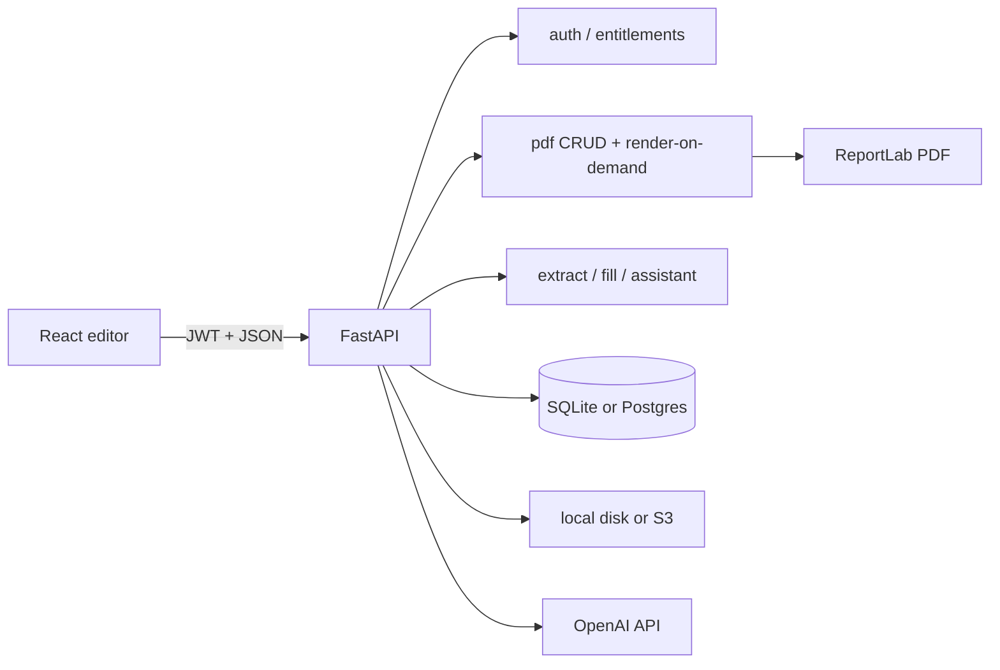
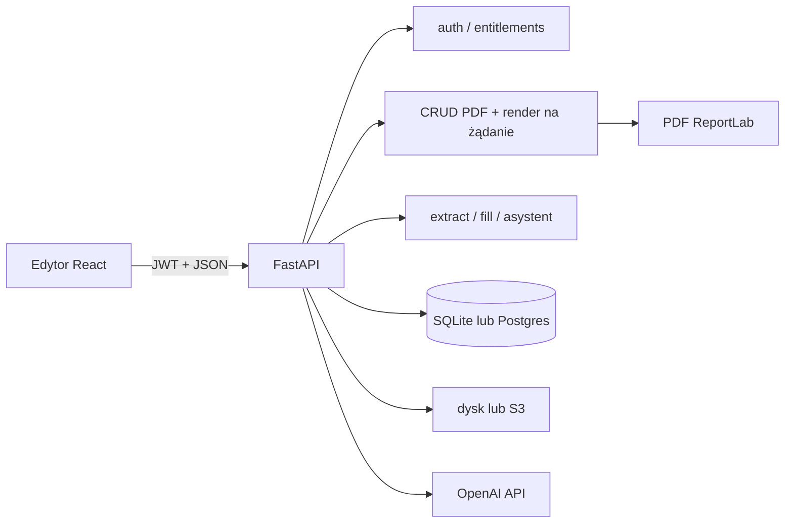

# English

# CV Studio

CV Studio is a Polish-language A4 CV editor: a WYSIWYG canvas, 21 individual templates (each with its own name and short stylistic description), PDF import via AI, a guided bio wizard, a floating AI assistant, and ReportLab PDF export that matches the canvas 1:1 (coordinates in points, top-left origin on the frontend, flipped for ReportLab).

This README is the technical entry point for developers. A beginner-friendly deep guide to canvas coordinates, React interaction, deterministic Python layout, AI responsibilities, reflow, persistence, and ReportLab export lives in [`CANVA.md`](CANVA.md). Every live AI prompt (full text, variables, file/line references) is documented in [`PROMPTS.md`](PROMPTS.md). Product-oriented feature copy lives in [`docs/FEATURES.md`](docs/FEATURES.md). Marketing brief for the website „Dlaczego CV STUDIO” section (features + competitive positioning, no competitor brand names in public copy) lives in [`FEATURES_MARKETING.md`](FEATURES_MARKETING.md). Template generation (AI extract vs Python layout) is explained in [`docs/cv-template-generation.md`](docs/cv-template-generation.md). A layperson-friendly end-to-end guide covering Frontend and Backend (flows, files, classes, functions) lives in [`CV_GENERATOR.md`](CV_GENERATOR.md).

---

## Table of contents

1. [Purpose and problem](#purpose-and-problem)
2. [Main user flows](#main-user-flows)
3. [Architecture and data flow](#architecture-and-data-flow)
4. [Technologies](#technologies)
5. [Folder structure](#folder-structure)
6. [Database](#database)
7. [Features (implementation map)](#features-implementation-map)
8. [API](#api)
9. [Installation and local development](#installation-and-local-development)
10. [Testing](#testing)
11. [Deployment](#deployment)
12. [Security and privacy](#security-and-privacy)
13. [Accessibility and UX](#accessibility-and-ux)
14. [Known limitations and planned work](#known-limitations-and-planned-work)
15. [Further reading](#further-reading)

---

## Purpose and problem

Job seekers need CVs that look professional and export cleanly to PDF. Generic form builders hide layout; design tools are too heavy. CV Studio gives a true A4 canvas (595×842 pt), templates filled with real career data, and AI that extracts or improves content without inventing unsafe coordinates for decorative chrome.

Forcing registration before a visitor had seen the editor used to be the largest funnel loss: every new visitor had to create an account — and pick a paid plan during registration — before touching a single template. **Guest mode** removes that wall: `/cvstudio/guest` works with no JWT at all (authenticated users open `/cvstudio/{username}`), so a visitor can pick a template, run the guided wizard, or freeform-edit and see the exact document they would export, with state kept in `localStorage` instead of the backend. An account is only required at the point of real value — saving or exporting the PDF (a "save-gate" modal) — or for CV import, which stays account-gated because it calls the paid OpenAI extract endpoint. See [Guest mode (editor without an account)](#guest-mode-editor-without-an-account) for the full implementation.

**Implemented today:** editor (including guest mode without an account), templates, extract/fill, bio draft, AI assistant (goal-oriented actions, rating dashboard, translate, layout review cards), entitlements (Darmowy / Pro — 59 zł / 30 days), explicit save + independent render-on-demand download, guest-only localStorage autosave, local or S3 storage, JWT auth.

**Optional:** AWS S3 (`S3_BUCKET_NAME`), unpaid plan selection (`ALLOW_UNPAID_PLAN_SELECTION`).

**Not implemented as full Stripe Checkout yet:** paid plans can be activated without payment when unpaid selection is enabled; `402 payment_required` is the seam for future Checkout.

---

## Main user flows

1. **Choose a landing-page start** → primary funnels are data-first: the primary CTA “Stwórz CV za darmo” (`start=wizard`) and the secondary “Mam już CV — wgraj PDF” (`start=import`) collect content, then pick a template, then open the editor. A tertiary link “Najpierw zobacz edytor na przykładzie” (`start=demo`) opens a sample document. Wizard and demo go straight to `/cvstudio/guest` (or `/cvstudio/{username}` when already logged in); import still detours through registration/login first because it calls the paid `POST /ai/extract_cv` endpoint. The template gallery is inspiration only and links into the wizard — not a blank placeholder canvas. After data exist, the editor topbar’s **Szablony** control (aligned to the A4 left edge) opens the change-template gallery; flanking arrows restyle without opening the modal.
2. **Edit as a guest** → full canvas access (templates, wizard, freeform, undo/redo) with the document persisted to `localStorage` instead of the backend — see [Guest mode](#guest-mode-editor-without-an-account).
3. **Register / login only when it matters** → clicking “Zapisz PDF” / “Pobierz PDF” as a guest opens `SaveGateModal` instead of calling the backend. Registering or logging in preserves the selected `start` intent, and if a guest document exists, `ClaimGuestDocumentModal` asks the now-authenticated visitor to confirm it is theirs before loading that JSON onto the A4 canvas (no automatic `POST /pdf/create_pdf`) — a guest document belongs to the browser, not to any identity, so silently attaching it to whoever happens to log in next would leak one person's draft into an unrelated account.
4. **Pick a template** → `handleLoadTemplate` materializes specs → canvas.
5. **Import PDF** (account required) → `POST /ai/extract_cv` → choose template → `POST /ai/fill_template` → Python layout in `cv_generator.generate_resume`.
6. **Bio wizard** → five-step fullscreen creator (`BioCvModal`). Authenticated users use draft CRUD on `/ai/bio_cv_draft`; guests autosave the wizard profile to `localStorage` (`cvstudio.guest.wizardDraft` via `guestWizardDraft.js`, separate from the canvas key `cvstudio.guest.doc`). After register/login, an empty account draft is filled from that guest snapshot (`claimGuestWizardDraft.js`) so Demo answers survive into Free (and later paid) accounts → `POST /ai/fill_template` (anonymous Free starter templates allowed).
7. **Edit** → drag/resize/style → edits live in memory (backing undo/redo). Authenticated documents are **not** autosaved to the backend — "Moje dokumenty" is updated only by an explicit **Zapisz** (see step 9). Guests still get a debounced `localStorage` write (`guestDocument.js`) so their unclaimed work survives a reload.
8. **AI assistant** → `POST /ai/assistant` → tips / corrections / reviewable layout groups (account required — every assistant action is entitlement-gated).
9. **Save vs. Download** (two independent actions):
   - **Zapisz** → `POST /pdf/create_pdf` on the first save (creates the "Moje dokumenty" entry + its `pdfId`), then `PUT /pdf/update_pdf` on every later save (updates that same document). This is the only path that writes to "Moje dokumenty".
   - **Pobierz** → `POST /pdf/render_pdf` renders the current canvas on demand and streams it **without** saving, so an unsaved document can still be downloaded. Both actions charge the export quota on download and require an account (guests reach the save-gate).



---

## Architecture and data flow

### Entry points

| Layer | Entry | Role |
|--------|--------|------|
| Frontend | `frontend/src/main.jsx` → `App.jsx` | Router: `/`, `/login`, `/register`, `/cvstudio/:workspace` (`guest` or username — no `ProtectedRoute`); legacy `/pdfcanvas` redirects |
| Editor page | `frontend/src/pages/PdfCanvas.jsx` (`PdfCanvas`) | Composes hooks into Canvas / UiSurfaces / Session (+ `PdfContext` facade) |
| Backend | `backend/app/main.py` | FastAPI app, CORS, `/health`, routers, optional SPA static |

### Frontend layers

- **Pages** — marketing, auth, editor shell.
- **Hooks** — `useA4Elements` is the canvas facade; undo/redo in `useDocumentHistory`; selection/drag in `useElementSelectionDrag`; factories/materialize helpers are pure utils; `usePdfExport` talks to PDF endpoints; `useEntitlements` loads plan limits.
- **Context** — nested `CanvasContext` / `UiSurfacesContext` / `SessionContext` from `PdfCanvas`, plus temporary merged `PdfContext` facade for remaining consumers.
- **Services** — `ApiClient` (`services/api.js`) with long timeouts and retries for Render cold start; shared `fillTemplate` for `/ai/fill_template`; authenticated image blob helper for private library photos.
- **Templates** — static element specs in `frontend/src/templates/`; registry in `templates/index.js`.

### Backend layers

- **Routes** — thin HTTP in `app/api/routes/*` (PDF create/update delegates to `document_service`).
- **CRUD** — SQLAlchemy writes in `app/crud/*`.
- **Services** — PDF render, CV layout, AI, entitlements, S3.
- **Models** — `app/models/models.py`; engine in `app/models/database.py`.

### Coordinate system

Canvas and stored geometry use **top-left** origin (CSS-like). ReportLab uses **bottom-left**; `PDF_Generator` flips `top` using `page_h` before drawing (`backend/app/services/pdf_generator.py`). Textarea soft-wrap uses the same word-break rules as the canvas, plus a 2 px `WRAP_WIDTH_TOLERANCE_PX` so borderline last words (tight Inter body lines) stay on the same line in the PDF as on the canvas — see `tests/test_pdf_bullet_layout.py`. After a font change the canvas reflows measured `height` / following `top` values; auto-height PDF export **honours those stored heights** (clipping overflow) instead of recomputing box height from PDF wrap alone — recomputing used to open fake gaps or draw through the next block so Canvas≠PDF rhythm while the editor still looked correct. Stub heights from a pre-measure export still expand. Canvas painting maps Helvetica/Courier → Inter via `canvasFontFamily` to match the PDF Unicode aliases.

### Auto-height reflow and aligned icons

Template textareas start with authored placeholder heights and are measured after the browser loads their real fonts. `reflowTextareaHeight` then moves all following elements in the same visual lane by the measured delta. Text-aligned Iconic images (`alignWithText: true`, including backward-compatible `/template-assets/iconic/` URLs) are classified as section chrome and may join a lane when they hang to the left of the column (~40 px tolerance). The same left-hanging rule applies to Monument ordinal badge text (`isDecorativeChromeText` / `flowRole: "section-chrome"` digits inside the numbered square at x=74 while the body column starts at x=102): without it, a page break moved the filled square and title to page 2 and left the number behind or 8 px too low in the square. Icons that sit entirely to the right of a narrow column are excluded, so a sidebar cannot drag main-column icons away from their headings.

Undo/redo history treats that **background** reflow as part of the baseline, not as a user edit: a "quiet" record refreshes the current history entry in place so Cofnij stays disabled until the user actually changes the document. Otherwise Undo would restore pre-measure heights and revive uneven Y gaps (e.g. diploma → school in education records). Two rules make this reliable and are unit-tested as pure functions in `frontend/src/utils/documentHistory.js` (`recordSnapshotState`):

- A **quiet settle preserves the redo tail**. Applying an undo/redo re-renders and fires a quiet record while the index sits before the top of the stack; truncating there used to delete every redo entry, which left Ponów permanently disabled after any Cofnij.
- **A user textarea edit is never quiet.** `handleFitTextareaToContent` only marks history quiet for a *background* measure (mount / font-ready / load). The typing/formatting commit in `Textarea.jsx` passes `{ quiet: false }`, so the content change lands as a real, undoable step instead of overwriting the pre-edit baseline in place.

Every auto-height textarea measures twice — once immediately, once again after `document.fonts.ready` — and each measurement calls `reflowTextareaHeight` independently, so a later field can briefly carry a stale `page` number from an earlier pass. `rawSamePageGap` checks authored `top` values (ignoring `page`) before applying the generic page-break gap: a same-record pair with a stale page keeps its authored small gap, while a genuine cross-page seam uses `DEFAULT_PACK_GAP` (10 px, `SPACE_RECORD`) for ordinary blocks and `SECTION_PACK_GAP` (21 px, `SPACE_SECTION`) for section chrome. Using the leftover page-top inset (often 0–6 px when education starts near `pageTop` on page 2) crushed headings such as WYKSZTAŁCENIE under the previous section. Templates such as Nimbus mark section markers/rules `locked` for interaction and guides, but `flowRole: "section-chrome"` still lets them reflow with their heading so underlines do not stay stranded on the next page. The reflow intentionally does **not** infer title/meta relationships from font size or boldness; that heuristic distorted valid record spacing (for example Monument chrome rhythm) and compounded independent height deltas. Section marker/label/rule use `section-chrome`, and ordinary records use `content`. Keep-with-next logic therefore cannot mistake a job title for a section heading and move the real heading behind its own content. Legacy templates without this property keep the category-based fallback.

During the canvas enter hold, auto-height reflow is suppressed and resumes after fonts are ready. Every textarea emitted by the Python generators carries `preserveInitialLayout: true` (via `_block` in `cv_generator_primitives.py`). On first mount the canvas may **shrink** a box to browser `scrollHeight` when ReportLab overshoots (so empty slack cannot inflate visual section gaps), but it will not **grow** — independent growth races still stretch gaps. Editing content or later changing typography/width still triggers normal auto-height reflow. A plain textarea preserves every authored newline, including trailing blank paragraphs, after blur and document scrub; those rows are measured as real spacing and therefore move following flow content through the normal reflow path. Bullet-list textareas use a separate rule: trailing blank rows and bare bullet markers (`•`) are trimmed on blur / display / document scrub (`trimTrailingEmptyTextareaLines` / `trimTrailingEmptyTextareaPayload` in `textareaHeight.js`) so editor placeholders cannot leave a tall empty outline that pushes the next record. In bullet mode, Enter after a filled item continues with `• `; Enter on a bare `•` clears the marker into a blank paragraph. Blank lines between real content remain intact. Display rendering keeps a line box for empty rows so authored gaps do not collapse. See `textareaHeight.test.js` (`shouldShrinkPreservedLayout`, plain trailing-row and bullet-placeholder cases) and `textareaReflow.test.js` packing cases.

Section headings are kept with their first body block across page breaks: `avoidOrphanChrome` reserves the full first keep-together record height (degree + meta + description, not only the first textarea), and when a measured body textarea itself jumps to the next page, `precedingRecordMates` + `precedingChromeCluster` pull title/meta siblings and the icon/heading/rule with it. Page-break reclaim similarly reserves `followingRecordMates` (school/meta/body under a grown degree) so continuation pages cannot pull only the degree line back onto page 1 and crush the rest of education on page 2. Reclaim also refuses to jump across intervening lane content (`hasInterveningLaneContent`) — otherwise a later skills body could reclaim into the page-1 footer hole while education still occupies page 2. When the reclaim target carries preceding section chrome (heading/rule/icon), the fit check reserves that chrome span and packs from `SPACE_SECTION` rather than measuring the body alone with `SPACE_RECORD` — otherwise growing a new section with empty lines could snap it back into the page-1 footer even though heading+rule+body no longer fit. That prevents orphans such as “UMIEJĘTNOŚCI” alone at the bottom of page 1, and the education split where Bachelor stayed on page 1 while its description moved to page 2. The same keep-with-next rule applies to rail kickers tagged `sidebar-chrome` (Sterling / Tessera / Slate): `isChromeLike` treats them as chrome so `precedingChromeCluster` pulls UMIEJĘTNOŚCI onto page 2 with its list, and `_fit_sidebar_sections` refuses to emit a kicker without room for two body lines — Sterling then spills that whole section onto the next existing rail rather than leaving the heading in the page-1 footer. `remainingRecordHeight` and forward packing skip decorative chrome that is Y-sorted inside a tagged `flowGroup` (Nimbus previously placed its section chip on the degree line, which made reclaim treat school/meta as a new record). Nimbus markers now stay in the heading band and emit `flowRole: "section-chrome"`; ordinary flow nodes use `content`. Backend generators use `Builder.need_section(chrome, body)` before placing a heading, and `Builder.keep_together(height)` for experience/education/other records — each emitted element is tagged with the same `flowGroup` id so canvas reclaim-packing (when earlier boxes shrink) cannot pull only part of a record back onto the previous page. Sections may continue on the next page, but each record stays whole. ReportLab receives the same geometry visible on the canvas.

Section decorations explicitly tagged with `flowRole: "section-chrome"` are treated as a rigid visual composition by `compactChromeCluster`: spacing changes move the complete heading/icon/frame/rule group but preserve every authored mutual Y offset. Recognized legacy-corruption signatures are rebuilt (the old sequential `SPACE_STACK` marker layout, a flattened Monument accent rule, and Monument ordinal digits that drifted below the title baseline inside the numbered badge — repaired by `healDecorativeOrdinalBaselines`). This keeps template-specific section rhythm stable across Nova, Volt, Monument, Cinder, and other templates while still repairing already damaged documents.

### Decorative chrome

Elements with `fixedToPage: true` (backgrounds, frames, sidebars, page numbers) are cloned across pages by default and must not be selected/moved/deleted in the UI (`isDecorativeChrome` in `frontend/src/utils/elementInteraction.js`). First-page-only chrome sets `repeatOnContinuation: false`, which prevents `cloneFixedPageDecorations` from copying it when overflow creates another page. `reconcileDocumentPages` in `frontend/src/utils/structureOperation.js` syncs **only** fixed page chrome and `pageCount` — it never rewrites content `top`/`left`/`page` (packing and textarea reflow own rhythm). `useA4Elements` derives the visible page count from the committed element array after textarea and Sections-panel updates, so React cannot miss an overflow page because a functional state updater ran later than its caller. **Dodaj stronę** and the next-page arrow at the current end create a continuation with the correct page label (including zero-padded Nova-style `01`/`02`); overflow that places content on a new page gets the same chrome; trailing chrome-only pages collapse when content leaves them. When chrome is already in sync the helper returns the same array reference. Design rating prompts respect template typography.

---

## Technologies

| Technology | Version / note | Purpose | Main locations |
|------------|----------------|---------|----------------|
| React | ^19.2 | UI components and hooks | `frontend/src/` |
| Vite | ^7.2 | Dev server and production build | `frontend/` |
| React Router | ^7.13 | Client routes (`/cvstudio/:workspace` — `guest` or username; `ProtectedRoute` was removed) | `App.jsx`, `authSession.js` (`getEditorPath`) |
| FastAPI | (requirements) | HTTP API | `backend/app/main.py`, routes |
| Uvicorn | (requirements) | ASGI server | local / Render |
| SQLAlchemy | (requirements) | ORM | `models/`, `crud/` |
| SQLite / PostgreSQL | via `DATABASE_URL` | Persistence | `database.py` |
| ReportLab + fontTools | (requirements) | PDF drawing + TTF name fixes | `pdf_generator.py` |
| PyMuPDF (fitz) | (requirements) | PDF → images for extract | `ai_service.py` |
| OpenAI SDK | (requirements) | Extract + assistant | `ai_service.py`, `ai_assistant_service.py` |
| python-jose / passlib bcrypt | (requirements) | JWT + passwords | `core/security.py` |
| boto3 | optional | S3 uploads | `s3_storage.py` |
| nanoid | ^5.1 | Client element ids | canvas hooks |
| motion | ^12 | UI motion | modals / assistant |
| unittest | stdlib | Backend tests | `backend/tests/` |

Official docs: [React](https://react.dev/), [Vite](https://vite.dev/), [FastAPI](https://fastapi.tiangolo.com/), [SQLAlchemy](https://docs.sqlalchemy.org/), [ReportLab](https://www.reportlab.com/docs/reportlab-userguide.pdf), [OpenAI API](https://platform.openai.com/docs).

---

## Folder structure

```text
pdf-generator/
├── AGENTS.md                 # Project agent / documentation rules
├── BUGZ.MD                   # Known issues tracker
├── README.md                 # This file
├── docs/                     # Product + design + deep-dive docs
├── frontend/
│   ├── public/
│   │   ├── cv-studio-logo.svg     # Full orange CV Studio logo
│   │   ├── cv-studio-mark.svg     # Compact mark for favicon/editor rail
│   │   └── template-mockups/      # Static A4 preview PNGs
│   ├── src/
│   │   ├── components/       # canvas, editor, ai, modals, gallery, common
│   │   │   ├── canvas/CanvasPageStage/   # Smooth slide+fade when changing A4 page (single-page view)
│   │   │   ├── canvas/SectionRecordAdd/  # Hover trash/+ (left), reorder arrows (right), optional ↔ lane transfer on section headings
│   │   │   ├── canvas/RecordBlockAdd/    # Hover trash/+ (left) and reorder arrows (right) on records
│   │   │   ├── canvas/FlatSectionLayoutToggle/ # Hover icon on flat-list sections (Skills, Languages) to open the layout modal
│   │   │   ├── editor/AddSectionModal/   # "+ Dodaj sekcję" modal (name + aa/cc-sub/cc-edu/cc-exp layout picker)
│   │   │   ├── editor/FlatSectionLayoutModal/  # Inline row ↔ bullet list picker with a live content preview
│   │   │   ├── editor/LongCvModal/        # "CV too long" assistant: compact spacing → AI shortening
│   │   │   ├── editor/SaveGateModal/     # "Create an account to save" modal shown to guests
│   │   │   ├── editor/DemoBanner/        # Persistent banner while the guest-mode demo CV is on canvas
│   │   │   └── editor/StartChooser/      # Empty-state onboarding: wizard vs import chooser on a fresh document
│   │   ├── hooks/            # useA4Elements facade, useDocumentHistory, usePdfExport, …
│   │   ├── pages/            # Hero, Login, Register, PdfCanvas
│   │   ├── services/         # ApiClient, fillTemplate, authenticatedImage, eventLog
│   │   ├── store/            # Canvas / UiSurfaces / Session + PdfContext facade
│   │   ├── templates/        # 14 template specs + helpers + demoCv.js (guest-mode demo content)
│   │   └── utils/            # a4ElementFactories, freeformShapes, canvasFont, canvasElementSchema, geometry, reflow, sectionBuilder, sectionRecord, sectionIcons, guestDocument, guestWizardDraft, claimGuestWizardDraft, resolveActiveCvData, guestEvents, startChooser
│   ├── package.json
│   └── .env.example
├── shared/
│   └── pdf-element.schema.json  # Exported from Pydantic PdfElement
└── backend/
    ├── app/
    │   ├── api/routes/       # auth, pdf, images, ai, assistant, billing, events
    │   ├── core/             # config, security
    │   ├── crud/
    │   ├── models/
    │   ├── schemas/          # PdfElement + JSON Schema export
    │   ├── services/         # pdf, document_service, cv_generator (+ cv_templates/), ai, ats_readability, entitlements
    │   ├── utils/            # image_src_to_path, metrics_logging, upload_security
    │   ├── main.py
    │   └── dependencies.py
    ├── alembic/              # Schema migrations (replaces ad-hoc ALTER)
    ├── fonts/                # Bundled TTFs for PDF
    ├── template_assets/      # Sidebar, IT and Iconic artwork/icons
    ├── tests/
    ├── alembic.ini
    ├── requirements.txt
    └── .env.example
```

**Rules:** Frontend templates must stay in sync with `_GENERATORS` in `cv_templates/registry.py` (re-exported from `cv_generator.py`; 14 ids). Each `cv_templates/templates/<id>.py` holds only that template’s live generator — not a shared multi-theme engine with sibling branches. Do not put secrets in the repo. Uploads and generated PDFs are runtime data (`uploads/`, `static/generated/`), not source. User image bytes are not publicly mounted — only via `GET /images/{id}/content`.

---

## Database

Configured by `DATABASE_URL` (`backend/app/models/database.py`). Default if unset: `sqlite:///./pdfgenerator.db`. `postgres://` URLs are rewritten to `postgresql://`. Postgres uses `pool_pre_ping` for Render cold starts.

Schema is created by `init_db()` during app lifespan (not at import): `Base.metadata.create_all` for missing tables, then `alembic upgrade head` for schema changes (multi-page columns live in `backend/alembic/versions/`). Billing catalog is seeded via `bootstrap_billing`. Manual CLI: `cd backend && alembic upgrade head`.

### Tables (business purpose)

| Table | Purpose |
|-------|---------|
| `users` | Accounts: username, email, bcrypt hash, `is_active`, timestamps |
| `images` | Uploaded image metadata; `file_path` local or S3 URL; `owner_id` → users |
| `pdfs` | CV documents: title, path, pages, page_width/height (default 595×842), owner, `editor_mode`, `template_id`, optional `spacing_px` rhythm JSON |
| `pdf_elements` | Canvas elements; geometry + style columns; extras in `extra_properties` JSON (`fixedToPage`, `repeatOnContinuation`, `locked`, `flowRole`, `flowGroup`, `preserveInitialLayout`, bold, `runs` inline-decoration overlay, connectors, …) |
| `bio_cv_drafts` | One private JSON draft per user |
| `plans` | Free (Darmowy) / Pro limits and feature flags (legacy `standard`/`premium` rows deactivated) |
| `user_subscriptions` | Current plan per user (Stripe columns ready, often null) |
| `usage_counters` | Monthly exports + AI credit usage (`period_key` = `YYYY-MM` UTC) |
| `payments` | Future payment ledger |
| `maintenance_markers` | One-off cleanup keys |

**Relationships:** One user owns many `pdfs` and `images`. Each `pdf` has many `pdf_elements`. Subscription and usage are per user.

Models: `backend/app/models/models.py` (`User`, `Pdf`, `PdfElements`, …).

---

## Features (implementation map)

Product narrative: [`docs/FEATURES.md`](docs/FEATURES.md).

### A4 canvas editor (template vs freeform)

Interactive multi-page **A4 portrait** canvas with two persisted editor modes on each `Pdf` row (`editor_mode`, `template_id`, optional `spacing_px`). Vertical wheel over `.canvas-area` pans overflow first; at the top/bottom edge (or when the page fits without overflow) it calls `goToPage` so **PageControls** (`Strona N / M`) updates with the new page. Single-page view transitions with a short slide+fade (`CanvasPageStage`, ~320 ms; reduced-motion → opacity only) and eases `scrollTop` to 0 instead of a hard jump. Horizontal-dominant gestures, Ctrl/Meta wheel, and editable fields are left alone (`frontend/src/utils/canvasPageWheel.js`, `frontend/src/hooks/useCanvasPageWheel.js`, tests in `canvasPageWheel.test.js`). The canvas scroll rail is styled in `App.css` (navy thumb + gold leading edge on a cool track; Firefox via `scrollbar-color`).

- **template** — structural editing: content/chrome positions are layout-owned (no free X/Y drag). `canFreePositionElement` also blocks template icons (`alignWithText` / `/template-assets/…`) and generator shapes (line/rectangle/circle/ellipse/polygon/path) even when a template omitted `flowRole` — this covers harbor/cardinal/nova/volt/portico/axis contact icons, nimbus header art, cinder frames, and similar. User gallery photos (`/images/…`) may still move, except a fitted profile-photo slot (`photoSlot: "image"` / glyph). **Układ CV** flyout (sidebar label + panel title; formerly “Sekcje”) docked beside the 72px tool rail (reorder + density presets + advanced vertical rhythm `stack` / `record` / `section` / `after_rule`, defaults 4 / 10 / 21 / 8; Cinder authors a denser header band of section 15 / after_rule 0 when generated with those defaults — see `backend/app/services/cv_templates/templates/cinder.py`), gallery photo-slot targets (`applyProfilePhoto`), auto-height reflow with reclaim. Topbar **Odblokuj edycję** (icon + tooltip) copies the document into freeform.
- **freeform** — full toolbox (text, shapes, images), free drag/resize, and reflow without page-break reclaim so hand placement is preserved.
- **tool-rail footer stays visible** — the left rail (`Sidebar`) sits in a `100vh` shell with `overflow: hidden` (`.main-container` in `App.css`). Tool tiles stay compact and non-scrolling (`SidebarControls` 36×36 tiles / 30×30 icon boxes) so the plan badge and **Wyloguj się** footer fit a typical laptop viewport without a scrollbar.

### Freeform geometric ornaments (including cubic Bézier)

Freeform mode exposes CV-friendly geometry tools beyond line / rectangle / circle / ellipse:

- **polygon** — presets `triangle`, `diamond`, `hexagon`. Vertices live in **normalized unit-square space** (`points: [[x,y],…]` in 0…1). Resizing the bounding box scales the shape without rewriting geometry. Inspector: size, fill toggle, stroke width, colour.
- **path** — cubic Bézier ornaments with presets `wave`, `arc`, `flourish`. Segments are `M` / `C` dicts in the same unit-square space (`curves`). Selecting a path shows **draggable anchor and control-point handles** on the canvas; move/resize still operate on the box. Inspector can reset to a preset (rewrites `pathKind` + `curves`).
- **rectangle** — freeform also exposes `filled` and `borderRadius` so panels and pills match template chrome without leaving freeform.

This is intentional product UX, not a Figma pen tool: users place a preset, resize the frame, and optionally reshape Bézier handles. Canvas SVG (`curvesToSvgPath`) and ReportLab `curveTo` share one geometry so export stays WYSIWYG.

Implementation:

- `frontend/src/utils/freeformShapes.js`, lines 17–228 — presets, SVG helpers, `listPathControlHandles`, `movePathHandle`
- `frontend/src/utils/a4ElementFactories.js`, functions `createRectangleElement`, `createPolygonElement`, `createPathElement` (lines 61–181)
- `frontend/src/components/canvas/Polygon/Polygon.jsx`, `Path/Path.jsx` — canvas render + Bézier handle drag
- `frontend/src/components/editor/Sidebar/Sidebar.jsx`, lines 77–116 — freeform tool rail entries
- `frontend/src/components/common/SidebarControls/SidebarControls.module.css`, lines 1–48 — compact 36×36 tool tiles (no rail scrollbar)
- `frontend/src/components/editor/Editor/Editor.jsx` — rectangle / polygon / path inspector groups
- `frontend/src/utils/canvasElementSchema.js` — categories `polygon`, `path`
- `backend/app/schemas/pdf_schema.py` — `ElementCategory` + `shape` / `points` / `pathKind` / `curves`
- `backend/app/crud/pdfs.py` — pack/unpack those fields in `extra_properties`
- `backend/app/services/pdf_generator.py`, methods `renderRectangle` (filled), `renderPolygon`, `renderPath` (lines 223–329)
- `shared/pdf-element.schema.json` — regenerated via `python -m app.schemas.export_pdf_element_schema`

Tests:

- `frontend/src/utils/freeformShapes.test.js`
- `frontend/src/utils/a4ElementFactories.test.js` — polygon / path factories
- `frontend/src/utils/canvasElementSchema.test.js` — accepts `polygon` / `path`
- `backend/tests/test_pdf_shapes.py`, lines 175–206 — filled rectangle, polygon close, Bézier `curveTo`
- `backend/tests/test_elements_from_rows.py` — polygon / path round-trip through `extra_properties`

Further reading:

- [ReportLab graphics — path / `curveTo`](https://docs.reportlab.com/reportlab/userguide/ch2_graphics/) — PDF cubic Bézier API used by `renderPath`.
- [SVG path cubic Bézier (`C`)](https://developer.mozilla.org/en-US/docs/Web/SVG/Tutorial/Paths#curve_commands) — canvas path `d` strings built by `curvesToSvgPath`.

Element properties open as a **compact horizontal floating toolbar** anchored above the selection (`Editor` via `createPortal`). Controls follow a stable workflow order — **content → typography → paragraph → spacing/size → position → actions** — and each category has a subtle visual container plus an accessible group label. Page alignment uses distinct object-alignment icons so it cannot be confused with paragraph alignment. **Text** and **TextArea** still expose different field sets (TextArea adds bullets, paragraph alignment, line height / letter spacing, width / height when editable); every icon and unlabeled field has a tooltip / `aria-label`. In **template mode** the bar hides controls that cannot affect the selection: layout-owned X/Y / page-align / lock (`canEditElementPosition`, `canToggleElementLock`), every width/height size field (`canEditElementSizeField` / `canResizeElement` — drag-resize handles are also suppressed), the layer / z-index field (`canEditElementLayer` — stacking stays template-owned), and the clone / delete actions (`canCloneOrDeleteElements` — structural delete uses section/record canvas trash instead). Freeform keeps the full field set and resize chrome. The bar sizes itself to its content (`width: max-content`) instead of reserving empty space on the right, never wraps, and becomes horizontally scrollable only when the viewport is narrower than the controls. Controls are 22px with 12px icons, compact number fields and a 78px font picker. Placement uses selection DOM bboxes (`floatingPanelPosition.js`: prefer above, flip below, clamp to the viewport) with a 24px selection gap so the toolbar floats clearly above the element without losing its anchor. The editor **Topbar** is icon-only (Szablony, Importuj CV, kreator, Zmień szablon, Odblokuj edycję, Wyczyść, Pobierz, Zapisz PDF) with the former labels as `title` / `aria-label` tooltips and ~18px icons in a 48px bar; the left tool rail is **72px** with larger 20px tool icons. Only **Układ CV** still docks as a flyout next to that rail.

`spacing_px` is persisted on the Pdf row and applied live via `applyFlowSpacing`. Initial fill flows (import / bio wizard) send the live Sections-panel knobs to `POST /ai/fill_template`. **Zmień szablon** regenerates with generator defaults (`DEFAULT_FLOW_SPACING`) and calls `adoptDocumentFlowSpacing` so the previous template’s custom rhythm does not leak into the new layout (`use_spacing` + `get_spacing()` in the Python generators). Icon masthead contact labels (Nova / Cardinal / Volt / Harbor / Portico / Axis) are tagged `flowRole: "masthead"` with their icons so a short phone line above the header rule is not mistaken for a section heading when rhythm knobs run; `isSectionHeading` also rejects phone-only labels, labels beside masthead icons, and untagged period lines such as `2011 – 2016`. `resolveFlowStart` keeps authored masthead→section clearances in the 6–56 px window (Nova/Cardinal/Volt often sit at 8–18 px) and only substitutes the 36 px default masthead fallback when a prior pack left a huge white band or an overlap. Tight left-aligned iconic mastheads (Nova/Cardinal/Volt/Harbor) that were previously force-packed to that 36 px band heal back to a tight ~10 px clearance on the next spacing/reorder pack; this heal-back is gated on `hasCenteredMasthead`, so Portico's centered "Ivy League" masthead — which authors a deliberate ~36 px clearance — is exempt and keeps it (otherwise a reorder would yank every section ~26 px up). `sectionElementIds` keeps classic Y-interval membership (so Volt/Monument chips above a title stay with that section) and only heals the stacked continuation-page case where Obsługa chrome → Języki chrome → Obsługa body would otherwise leave the earlier section chrome-only.

The **Układ CV** flyout is a layout-management panel (not a technical spacing console): compact title-cased section rows with ↑↓ reorder (main column, plus a **Sidebar** group when the CV has `sidebar-chrome` kickers), page-count status (`formatPageCountLabel`), **+ Dodaj sekcję** (main column) and **+ Dodaj w sidebarze** when a rail exists, a **Gęstość układu** segmented control (**Kompaktowa / Standardowa / Przestronna** relative to `baselineFlowSpacing`), **Dopasuj automatycznie** (offline spacing trials — see below), and a collapsed **Zaawansowane odstępy** accordion with the four px knobs (Wewnątrz wpisu / Między wpisami / Między sekcjami / Pod nagłówkiem) plus **Przywróć odstępy szablonu**. Reset restores knobs captured when the CV was rendered or loaded (`baselineFlowSpacing` in `useA4Elements`, set via `pinFlowSpacingBaseline` / `adoptDocumentFlowSpacing`). If the live knobs already match that baseline, reset does **not** call `applyFlowSpacing`: a force-pack to exact `SPACE_*` is not identical to generator geometry (ReportLab cursor advance, masthead clearance, under-rule gaps) and was pulling later sections onto page 1 on every shared-packer template (Monument, Cinder, Cardinal, Volt, Nimbus, Harbor/Tessera/Slate when packed, …). Changing a knob away from baseline and then resetting still retargets the canvas to the baseline rhythm.

**Dopasuj automatycznie** (`proposeAutoFitSpacing` in `layoutDensity.js`) is a separate UX density/balance tool for any page count. It scales the four existing spacing knobs around the document baseline (factors 0.65–1.30, with safe minima), runs each candidate through `applyFlowSpacing` **offline** (no undo entries, no autosave, no canvas flicker), scores page count + per-page fill + imbalance + distance from baseline, and commits only the winner when it improves the current score by ≥12%. It never invents an extra page when a denser fit already exists, and it does **not** replace or modify the 3+ page LongCv assistant.

After a height-reducing edit on a sidebar CV (AI shortening, compact/auto-fit/density spacing), `collapseSpilledMainIntoSidebar` re-measures the last main-column leftover(s) **as sidebar elements** (narrow rail width and type via `measureTextareaHeight`) and moves them onto the page-1 rail only when that restyle actually drops a page. Experience stays in the main column. Generation-time `plan_columns_multi_page` cannot see those later canvas heights, so this pass is what lets Education join the rail once AI or tighter spacing has shortened it.

Shared fonts: Inter, Roboto, Helvetica, Montserrat, Times-Roman, PlayfairDisplay, CormorantGaramond, Lora, Courier, JetBrainsMono. Session undo/redo ignores post-load textarea reflow (`markHistoryQuiet`).

Implementation:

- `frontend/src/utils/editorMode.js` — `normalizeEditorMode`, `inferEditorMode`, `canFreePositionElement`, `canEditElementPosition`, `canToggleElementLock`, `canCloneOrDeleteElements`, `canEditElementLayer`, `canResizeElement`, `canEditElementSizeField`
- `frontend/src/utils/canvasPageWheel.js` / `frontend/src/hooks/useCanvasPageWheel.js` — wheel at scroll edge → `goToPage` (PageControls label sync); smooth scroll-to-top after step
- `frontend/src/components/canvas/CanvasPageStage/CanvasPageStage.jsx` — single-page slide+fade between A4 pages
- `frontend/src/utils/flowSpacing.js` — defaults, normalize, `flowSpacingEquals` (Reset no-op guard), `scaleFlowSpacing` / `densityPresetsFromBaseline` / `matchDensityPreset` for the Układ CV panel / save / fill
- `frontend/src/utils/layoutDensity.js` — `measurePageFill`, `proposeAutoFitSpacing`, scoring / page-count labels for density auto-fit
- `frontend/src/utils/collapseMainIntoSidebar.js`, functions `isAnchoredMainSectionTitle` (lines 31–41), `moveMainSectionsToSidebar` (lines 146–188), `collapseSpilledMainIntoSidebar` (lines 203–243) — after AI / spacing, rail leftover main sections (never Experience) when the sidebar-measured height drops a page
- `frontend/src/utils/floatingPanelPosition.js` — `computeFloatingPanelPosition`, `unionRects` (viewport placement for the floating inspector)
- `frontend/src/components/editor/Editor/Editor.jsx` — horizontal floating toolbar (portal, icon-first); Text vs TextArea field sets; multi-select bulk edits; template-mode field gates
- `frontend/src/components/common/Resize/Resize.jsx` — returns null in template mode (`canResizeElement`)
- `frontend/src/hooks/useA4Elements.js` — panel clone/delete no-op and resize no-op in template mode
- `frontend/src/components/editor/SectionsPanel/SectionsPanel.jsx` — **Układ CV** list, density presets, auto-fit, advanced knobs + **Przywróć odstępy szablonu** → `baselineFlowSpacing`
- `frontend/src/utils/sectionStructure.js` — `packDocumentSections`, `applyFlowSpacing`, reorder; leading section chrome reserved with the **full first `flowGroup` record** (degree + meta + description, not only the first body line — same orphan rule as `textareaReflow.avoidOrphanChrome` / backend `need_section`); later body records keep mates on one page via private `flowGroupEndIndex` / `remainingStripRecordHeight` inside `placeStrip`; intra-chrome offsets preserved (never `SPACE_STACK`); section boundaries use the chrome **band** start (badge/frame above the title), via private `resolveSectionChromeBandStart`, so the next Monument-style pre-heading chrome is not absorbed into the previous section during pack; flow start anchored under the masthead so Nimbus/Nova header rules are not absorbed into sections. Per-strip placement is factored into the private `placeStrip(strip, cursorAbs, pageHeight, pageTop, bottomMargin)` helper, reused by `packDocumentSections`, `appendSectionAtEnd(elements, newElements, pageHeight, options)` (end-of-document), and `insertSectionAfter` (under a chosen section) — placement primitives that drop a freshly built section at the end of the document flow (one `SPACE_SECTION` gap below the deepest non-`fixedToPage` element) and then force-packs every section with `applyFlowSpacing` so wizard-authored gaps and the new strip share one `stack` / `record` / `section` / `after_rule` rhythm. Add section, add record, reorder, and rhythm knobs all go through this packer, so structural edits inherit the same keep-together contract as textarea reflow. `appendSectionAtEnd` is wired to the Sections panel's "+ Dodaj sekcję" button — see [Add Section (structural editor)](#add-section-structural-editor) below for the end-to-end flow and its own file/symbol references. On two-column sidebar templates (Tessera, Slate, Harbor, Sterling), every main-column sweep is scoped to the section's own column via private `sameColumnAsHeading` (`SIDEBAR_LEFT_GAP = 150`) **and** skips any element with `flowLane: "sidebar"` (so a right-rail Harbor body cannot be absorbed either). A candidate is treated as a different (left) sidebar column only when it sits more than 150px to the **left** of the section's heading **and does not reach the heading horizontally** (its right edge stops before the heading's left). That two-part test is what makes it safe for a **centered** heading (Atrium): a full-width body under a centered heading also starts left of it, but extends across and past it, so it stays in-column; a narrow left rail (`side_left` ≈ 25-51 vs `main_left` ≈ 218-248) ends before the heading and is excluded. Chrome legitimately parked to the right or a modest distance left of a heading (Cinder's marker 450px right, Monument's badge ~50px left) is never affected. Sidebar kickers are tagged `flowRole: "sidebar-chrome"` + `flowLane: "sidebar"` so they never enter `listDocumentSections`; `applyFlowSpacing` then calls `packSidebarLane` (lines 749–) on an independent vertical cursor that retargets the same `stack` / `record` / `section` / `after_rule` rhythm inside the rail without folding it into the main column. Structural add / reorder / remove auto-detect sidebar kickers: `reorderSection` / `removeSection` swap or delete within `listSidebarSections` and re-pack via `packSidebarLane` (optional `orderedHeadingIds`); `appendSectionAtEnd` / `insertSectionAfter` accept `lane: "sidebar"` (or infer it from a sidebar `afterHeadingId`) so new strips join the rail. Canvas heading hover and the Układ CV panel list both lanes. Untagged legacy rails remain geometrically excluded and untouched.
- `frontend/src/pages/PdfCanvas.jsx`, component `PdfCanvas` (`start=templates|import|wizard|blank`, unlock copy; mounts `Editor` outside `Sidebar`)
- `frontend/src/hooks/useA4Elements.js`, `useElementSelectionDrag.js`, `textareaReflow.js` (`allowReclaim`, `spacing`)
- `frontend/src/components/editor/Sidebar/Sidebar.jsx`, `Topbar/Topbar.jsx`, `SectionsPanel/`, `UnlockFreeformModal/`
- `backend/app/services/cv_generator_primitives.py` — `FlowSpacing`, `get_spacing`, `use_spacing`
- `backend/app/models/models.py` — `Pdf.editor_mode`, `Pdf.template_id`, `Pdf.spacing_px`; Alembic `20260804_0002_editor_mode.py`, `20260804_0003_spacing_px.py`
- tests: `editorMode.test.js`, `sectionStructure.test.js` (including chrome + full first `flowGroup` orphan reservation and later experience-record keep-together under pack), `collapseMainIntoSidebar.test.js`, `flowSpacing.test.js`, `layoutDensity.test.js`, `SectionsPanel.test.js`, `floatingPanelPosition.test.js`, `test_flow_spacing.py`

### Add Section (structural editor)

Adds a new section to a **template-mode** CV. Entry points: the Sections panel **"+ Dodaj sekcję"** button (append at the end of the **main** column), **"+ Dodaj w sidebarze"** when the document has a tagged rail (append at the end of the sidebar), and the canvas hover **+** on any detected main or sidebar section heading (insert immediately under that section in the same lane). All open the same modal for the section name and a layout choice, then place the section in the template's governing rhythm (`stack` / `record` / `section` / `after_rule`), styled to match the CV's existing sections in that lane.

Four layouts ship: **"aa"** — heading + rule + one auto-height content textarea (**Prosta treść**); **"cc-sub"** — heading + rule + a category record (bold **Nazwa kategorii** + body **Treść…** — 2 lines; modal label **Prosta treść (kategorie)**), the same shape as nested skill groups under UMIEJĘTNOŚCI; **"cc-edu"** — heading + rule + an education-style record (bold degree/title, school subtitle, muted city·period meta, bullet description — 4 lines); and **"cc-exp"** — heading + rule + an experience-style record (bold role title, muted company·period meta, bullet description — 3 lines, no subtitle). Education and Experience are offered as distinct choices, not one merged "record" option, because their field structures genuinely differ in the backend generator: `_place_education_record` renders a dedicated school/university line that `_place_experience_record` does not — company and period there are a single meta line (`backend/app/services/cv_templates/shared/records.py`). Category sections must not inflate to education placeholders when the user adds another block with **+** — `isSubcategorySectionTitle` / `ensureCanonicalRecordTemplate` keep the 2-line shape for non-education titles. Each record's lines share one `flowGroup` so they page-break as a unit. A columns layout ("bb") is out of scope for this feature (it needs horizontal-row support in the packer) and is not offered in the modal.

When the active template decorates section headings with iconic glyphs (Cardinal, Nova, Volt, Tessera, Slate, Portico — assets under `/template-assets/iconic/<theme>/`), the modal also shows a compact **Ikona nagłówka** gallery of every glyph available for that theme. The chosen icon replaces (or injects) the section-chrome image at the same size and offset as sibling headings; non-image chrome such as Tessera tiles or Slate badges is preserved. `deriveSectionStyle` now keeps `src` / `alignWithText` on sampled image markers so the builder can emit a real icon.

On confirm, the new section's visual style — heading font/color, rule width/color/`relLeft`, every decorative chrome shape (zero or more; a small marker dot, or a multi-shape badge system like Monument's numbered square + label frame), body font/color, content-column `bodyLeft` (may differ from the heading column — Monument uses 102 vs 118), and a best-effort muted color for record meta lines — is sampled from the anchor section when inserting under a heading, otherwise from the document's last existing section (`deriveSectionStyle`); a template-neutral default is used when no section can be detected (for example, an empty document). Decorative shapes are replicated verbatim at their sampled offset from the heading. A decorative ordinal badge (Monument's "01"/"02"/…) is handled differently: its digits are never copied from the sampled section (they'd be wrong), but its styling is — the frontend computes the new section's actual position (insert after index *i* → ordinal *i*+2; append → one past every detected section) and stamps that as the badge text, zero-padded to match the sampled digit width ("5" → "05" alongside sibling "01"). Ordinals are tagged `isDecorativeChromeText` (persisted in `PdfElement` / `extra_properties`) so they are never listed as their own sections; `isDecorativeOrdinalChrome` also treats digit-only chrome as decorative when an older save dropped the flag. Section membership for packing uses the chrome band start (badge/frame above the title baseline), not the title alone — otherwise the next section's pre-heading chrome falls into the previous strip, `rebuildTightChromeCluster` fires, and titles appear to leave their decorative frames after add / rhythm changes. The accent rule's vertical offset is sampled as `rule.relTop` (Monument mid-band ≈ title+7); falling back to `fontSize × 1.35` alone parks that line too low beside the title frame. Packing also snaps a legacy flush-under-label Monument rule back to badge+15 when the tall badge is present. The section's elements are built (`buildSectionElements`) with generator-matched line-box heights (`lines × lineHeight`, same as `Builder.measure_block`, not the canvas `+6` heuristic) and `preserveInitialLayout: true` so the first mount cannot inflate `SPACE_STACK` gaps. Placement uses `appendSectionAtEnd` (panel) or `insertSectionAfter` (heading **+**): the latter opens a document-wide Y-hole under the anchor section so later headings move too, then both paths run `applyFlowSpacing` so wizard-authored under-rule / inter-section gaps are retargeted to the same panel knobs as the new strip. The first editable body field is selected and enters edit mode immediately so the user can start typing.

Implementation:

- `frontend/src/utils/sectionStructure.js`, function `isDecorativeOrdinalChrome`; private `resolveSectionChromeBandStart`; function `sectionElementIds`; private `sameColumnAsHeading` (two-column sidebar exclusion, see above); functions `listSidebarSections`, `sidebarSectionElementIds` (recovers rail body that lost `flowLane` after save/reload so reorder moves content with kickers, not titles alone), `packSidebarLane` (optional `orderedHeadingIds`); function `applyFlowSpacing` (main pack then sidebar lane); functions `appendSectionAtEnd` (`lane: "sidebar"`), `insertSectionAfter` (auto-detects sidebar anchors), `reorderSection`, `removeSection`, `deriveSectionStyle` (optional `{ lane: "sidebar" }`) — ordinal safety net, chrome-band section boundaries, style sampling (`bodyLeft`, rule `relLeft`, optional `fromHeadingId` / sidebar rail defaults), end-of-document and after-section placement with full-document rhythm retarget
- `flowLane: "sidebar"` is persisted in `PdfElements.extra_properties` (`backend/app/crud/pdfs.py`, `pdf_schema.py`) and restored when opening Moje dokumenty (`ModalPdfs.jsx`) — without that, only `sidebar-chrome` kickers survived reload and Układ CV rail reorder left body copy stranded
- `frontend/src/utils/sectionBuilder.js`, `SECTION_LAYOUTS`; function `buildSectionElements` (lines 276–) — layout constructors for "aa", "cc-sub", "cc-edu", and "cc-exp"; pass `lane: "sidebar"` to stamp `flowLane: "sidebar"` + `flowRole: "sidebar-chrome"` (record field-line specs in private `recordLineSpecs`; heights via private `measureGeneratorBlockHeight`; content uses `bodyLeft`; image markers keep `src` / `alignWithText`)
- `frontend/src/utils/sectionIcons.js` — `listSectionIconOptions`, `applySelectedSectionIcon`, `suggestSectionIconName`, theme catalogs aligned with `scripts/generate_iconic_icons.py`
- `frontend/src/hooks/useA4Elements.js`, function `handleAddSection` (lines 658–) — optional `afterHeadingId` / `lane`, style sampling, optional `iconName`, construction, placement, post-add selection; exposed through `PdfContext` as `addSection`
- `frontend/src/pages/PdfCanvas.jsx` — owns `AddSectionModal` + `openAddSectionModal` (heading id or `{ lane: "sidebar" }`) so the canvas heading **+** works even when the Sections panel is closed
- `frontend/src/components/editor/AddSectionModal/AddSectionModal.jsx` — name + layout picker (including **Prosta treść (kategorie)** / `cc-sub`) + optional icon gallery; subtitle differs for insert-under vs append-end
- `frontend/src/components/editor/SectionsPanel/SectionsPanel.jsx` — "+ Dodaj sekcję" / "+ Dodaj w sidebarze"; lists `listDocumentSections` and `listSidebarSections`; user-facing labels in `SPACING_FIELDS` / `displaySectionTitle`
- `frontend/src/components/canvas/SectionRecordAdd/SectionRecordAdd.jsx`, lines 38–, component `SectionRecordAdd` — heading hover **trash + +** (left) and **↑ ↓** (right): add section under heading, delete this section, or reorder sections; optional **↔** lane transfer on the destination side
- `frontend/src/components/canvas/CanvasElements/CanvasElements.jsx`, lines 56–, `sectionAnchorsById` — mounts the affordance on every template-mode **main and sidebar** heading with lane-local `canMoveUp` / `canMoveDown` (and Sterling `laneTransfer`) from the **full** `A4_Elements` document (not the per-page filtered list)
- `frontend/src/utils/transferSectionLane.js`, functions `resolveSectionLaneTransfer` (lines 199–216), `transferSectionLane` (lines 230–238), `moveSidebarSectionsToMain` (lines 152–186) — restyle + append-last pack between main and sidebar under live spacing

Tests:

- `frontend/src/utils/sectionStructure.test.js`, `describe("sectionElementIds", …)`, `describe("applyFlowSpacing", …)` (Monument title-inside-frame regression), `describe("deriveSectionStyle", …)`, `describe("appendSectionAtEnd", …)`, `describe("insertSectionAfter", …)`, `describe("reorderSection", …)`, and `describe("removeSection", …)` — includes regressions that wizard and added sections share the same `after_rule` after append, that insert-after preserves order between neighbouring sections, that Monument badge/frame/title offsets survive a full-document pack, that deleting a middle section re-packs following content upward, that a Tessera/Slate-shaped sidebar rail is excluded from main membership, and that sidebar add / reorder / remove keep the main-column section order intact
- `frontend/src/utils/transferSectionLane.test.js` — Education → rail last; Skills → main last; Experience never rails; destination widths remasured
- `frontend/src/utils/sectionBuilder.test.js`, `describe("buildSectionElements", …)` — isolated construction, including assertions that "cc-sub" produces 2 lines (`Nazwa kategorii` / `Treść…`), "cc-edu" produces 4, and "cc-exp" produces 3 (no subtitle line), generator-matched heights / `preserveInitialLayout`, and `describe("build -> append -> reorder (composed production pipeline)", …)`, an integration test that chains the real `deriveSectionStyle` -> `buildSectionElements` -> `appendSectionAtEnd` -> `reorderSection` sequence exactly as `handleAddSection` uses it, asserting the new record's members remain one group after a reorder and that existing sections are retargeted to the same `after_rule`
- `frontend/src/utils/sectionIcons.test.js` — gallery listing, icon suggestion, `applySelectedSectionIcon` replace/inject + builder placement
- `frontend/src/utils/sectionRecord.test.js`, `describe("sidebar lane records", …)` — record anchors and reorder inside a sidebar education strip
- `frontend/src/components/editor/SectionsPanel/SectionsPanel.test.js` — sidebar list + **Dodaj w sidebarze** wiring

Known limitations:

- The columns layout ("bb") is not available from this flow; it requires horizontal-row packer support and is planned as a follow-up.
- The muted color used for a record's meta line is best-effort: it is sampled from an existing meta line when one can be identified, otherwise it falls back to the body color.
- When appending from the panel, style sampling looks at the document's last detected section in the target lane; when inserting under a heading, it samples that section. A template with no detectable section (or an empty document) falls back to a template-neutral default (narrow rail defaults when `lane: "sidebar"`).

### Add / reorder section from heading hover

In **template mode**, hovering any detected **main or sidebar** section heading shows two control clusters at the same vertical height, matching the record affordance: **trash + +** to the left of the heading, and **↑ ↓** reorder arrows to the right (disabled on the first/last section **in that lane**). Controls are bare icons — no chip background, border, or shadow — colored directly against the white page (muted red `#C0563F` for trash, dark grey `#5B5B55` for +/arrows, both darkening on hover) so they read as part of the document rather than editor UI. Clicking **+** opens the **Dodaj sekcję** modal; on confirm the new section is inserted immediately **under that section** in the same lane (`insertSectionAfter` / `afterHeadingId`), not appended at the document end. Clicking trash deletes the whole hovered section (`removeSection`) and re-packs remaining sections under the active rhythm so later content closes the hole. Clicking ↑/↓ swaps with the previous/next section in the same lane (`reorderSection` via `handleReorderSection`) and re-packs. Timing: appear on pointer enter, stay while on the heading or either cluster, hide **3 s** after leave. At most one canvas heading/record cluster is visible at a time (`useHoverPlusExclusive`).

Implementation:

- `frontend/src/components/canvas/SectionRecordAdd/SectionRecordAdd.jsx`, lines 38–, component `SectionRecordAdd` — heading hover listeners; calls `openAddSectionModal(headingId)`, `removeSection(headingId)`, `reorderSection(headingId, direction)`, or `transferSectionLane(headingId)`
- `frontend/src/hooks/useA4Elements.js`, function `handleReorderSection` (lines 937–) — exposed through `PdfContext` as `reorderSection`
- `frontend/src/pages/PdfCanvas.jsx` — modal state + confirm wiring into `handleAddSection({ …, afterHeadingId, lane })`; exposes `removeSection` / `reorderSection` / `transferSectionLane`
- `frontend/src/utils/sectionStructure.js`, functions `insertSectionAfter`, `removeSection`, `reorderSection`
- `frontend/src/components/canvas/CanvasElements/CanvasElements.jsx`, `sectionAnchorsById` (lines 56–) — passes lane-local `canMoveUp` / `canMoveDown` (and `laneTransfer` on Sterling/Tessera/Slate) from full-document main + sidebar order (each page mounts its own `CanvasElements` with a page filter; flags must not use that filtered list or cross-page moves stay disabled)

### Transfer section between main and sidebar

On **Sterling, Tessera, and Slate** (UI gated by `LANE_TRANSFER_TEMPLATE_IDS` in `CanvasElements.jsx`, currently `{"sterling", "tessera", "slate"}`; the transfer util itself is template-neutral for any template that tags its sidebar rail with `flowLane: "sidebar"` / `flowRole`, so extending the set to a new sidebar template needs no other change), hovering a movable section heading also shows a bare **↔** icon (`LuArrowLeftRight`, same grey `#5B5B55` style as ↑/↓) on the **destination** side of the heading: **left** of the trash/+ cluster when moving main → sidebar, **right** of the ↑/↓ cluster when moving sidebar → main. Click restyles every member of that section for the destination lane (narrow rail width / type vs main column width / type via `measureTextareaHeight`), appends it **last** in the target column, and re-packs both lanes with the **current** flow spacing (standard density or any custom knobs). Oversized strips may continue onto page 2 between records under the normal packer keep-together rules. **Experience** never receives a main → sidebar affordance (`isAnchoredMainSectionTitle`).

**Languages** are a special case: the rail keeps one hyphenated textarea (`Polski - A2`), while the main column expands to the equal-width accent grid every generator uses (`Name — Level`, italic CEFR runs in the section accent, `flowRole: "grid-member"`). Moving back onto the rail collapses the grid to a single hyphen list. **Skills with subcategories** are the other special case: the rail keeps `_skills_sidebar_content` (category line + bullets), while main expands to bold category labels + mid-dot bodies with per-group `flowGroup` (same shape as `_place_skills_section`). A width-only restyle left an orphaned `UMIEJĘTNOŚCI` heading and a tall sidebar-shaped body on the next page — transfer now rebuilds the subcategory records. Packing uses the same `after_rule` / section rhythm as Experience. Style sampling for transfers prefers Experience (or another linear main section): body type comes from the **description / bullet block**, not the bold job-title line (~11px), and never from a languages-grid cell width as `recordWidth`. When a section is promoted to become the rail's new first item — whether the section that used to sit under the photo transferred out to main, or one transferred back from the main column — `packSidebarLane` pulls remaining kickers up to the main-column content top (`min(authoredRailTop, resolveFlowStart)`) but never past a same-column photo/portrait well: `resolveSidebarPhotoFloor` (`sectionStructure.js`, lines 869–901) finds the bottom edge of any `photoSlot` element (frame / glyph / ornament / image) above the rail's new first heading, and `packSidebarLane` clamps the pulled-up cursor to `photoBottom + SIDEBAR_PHOTO_SECTION_GAP` when one exists. That gap constant (28) mirrors the generators' authored `sidebar_sections_start = photo_bottom + 28` (Slate `slate.py`, Tessera `tessera.py`), so the photo→heading clearance matches a freshly generated document; using the tighter inter-section rhythm (~21) instead collapsed the gap by ~7px and read as the heading crowding the photo. The floor keys strictly off `photoSlot`, never `fixedToPage` alone: every sidebar template also paints a full-height `fixedToPage` background panel (Slate `_line(0, 0, side_width, A4_H)`) plus page paper, and matching those spanned the floor to the page bottom (y=842) and shoved the whole rail off page 1. Without this floor, promoting a section to the rail's new first slot (Slate: main content starts at y=119, the sidebar photo well ends at y=166) pulled the heading up under the main column's shorter masthead and crowded — or overlapped — the photo. Continuation pages that already have a lone page number still receive any missing rail / divider clones.

Continuation pages clone a **full-height vertical rail + divider** only — never the page-1 letterhead top band (`repeatOnContinuation: false`, plus `isLetterheadBandChrome` / `expandContinuationRailChrome` for legacy short rails). Tessera's and Slate's page-1 photo cluster (frame, tile, orbit/node accents, the portrait glyph) is `fixedToPage` + `locked` chrome and carries the same `repeatOnContinuation: false` tag for the identical reason: without it, a continuation page synthesized purely by canvas-side overflow (no generator-authored chrome of its own yet — which a transfer can trigger, since the destination lane may not have needed a page 2 before) falls through `cloneFixedPageDecorations`'s "page already has real chrome" guard and clones the photo cluster onto every later page.

**Icon-styled templates** (Tessera, Slate — any template whose sections carry a `flowRole: "section-chrome"`/`"sidebar-chrome"` image marker) get their heading's decorative chrome cluster (tile square, outline rect, accent dot, icon glyph) rebuilt for the destination lane rather than dropped: main and rail clusters differ in shape count/size (compare `_gen_tessera`'s `section()` with `sidebar_heading()`), so the source section's own shapes can never be reused verbatim, and blindly copying the destination-lane sample's icon would paint e.g. a transferred Languages heading with Experience's briefcase glyph. `buildSectionIconChromeMarkers` (`sectionIcons.js`) samples a sibling heading's cluster in the destination lane via `deriveSectionStyle`'s `style.markers`, then swaps only the icon glyph for the one `suggestSectionIconName` picks from the **moved section's own title**, and re-anchors the whole cluster under the moved heading. Runs once per transferred heading after body/chrome restyle, regardless of which branch (generic / Languages / Skills) placed the body — so it is a no-op for Sterling, which has no icon chrome at all (`style.markers` samples empty and nothing is added).

A transferred section's heading→rule gap is parked at the destination lane's canonical offset (`sectionChromeRuleRelTop`, sampled from `deriveSectionStyle`'s `rule.relTop`) rather than a generic `headingHeight + 2` guess, so the moved section's chrome matches its new neighbours instead of the lane it left. `compactChromeCluster` then treats that offset as an authored, rigid composition and never re-derives it on later packs (see "Sidebar/main-column packing internals" above) — correct for templates that intentionally vary chrome per section, but it means a section whose gap was ever set incorrectly (a document saved before this transfer fix shipped, or any future regression) would otherwise stay wrong forever, since nothing re-checks it against its siblings. `healSimpleChromeRuleGaps` closes that gap: it runs on every `applyFlowSpacing` pack and snaps any section whose underline sits at an outlier gap onto the value the majority of that lane's sections already share. It identifies the underline as the **widest thin chrome line** (height ≤ 4px), so it works for rich icon clusters too (Tessera's mosaic tile + rect + icon + rule, Slate's badge + rule, Monument's badge + rule) and moves only that rule, never the surrounding decorative chrome. This matters because `compactChromeCluster` can route two same-shaped sections down different branches: a transferred Tessera section (rebuilt rule close to its 20px tile) takes the `explicitlyOwned` preserve branch, while its authored neighbours (rule further from the tile) hit the `healthy` branch's Monument accent-rule flatten and land at a different gap — so the moved section's keyline reads as an outlier until the heal snaps it back. Because every transfer ends by calling `applyFlowSpacing`, the *next* structural edit after an inconsistency is introduced (even one unrelated to the mismatched section) re-normalizes the whole lane.

Implementation:

- `frontend/src/utils/transferSectionLane.js`, functions `resolveSectionLaneTransfer`, `transferSectionLane`, `moveSidebarSectionsToMain` (lines 256–), `restyleMemberAsMain` (lines 78–) — main → sidebar reuses `moveMainSectionsToSidebar`
- `frontend/src/utils/sectionStructure.js`, functions `packSidebarLane` (lines 1051–), private `resolveSidebarPhotoFloor` (lines 869–901, floors the pulled-up rail cursor at a same-column `photoSlot` well's bottom edge; ignores full-height background panels), `deriveSectionStyle` (lines 2528–), `sectionChromeRuleRelTop` (lines 2815–), `healSimpleChromeRuleGaps` (lines 270–) — called from `applyFlowSpacing` on every pack; private `pickLinearBodySample` (lines 2445–)
- `frontend/src/utils/languagesLayout.js`, functions `isLanguagesSectionTitle` (lines 26–28), `buildLanguagesMainGrid` (lines 130–), `restyleLanguagesMembersAsSidebar` (lines 269–)
- `frontend/src/utils/skillsLayout.js`, functions `parseSkillsSidebarContent`, `buildSkillsMainGroups`, `restyleSkillsMembersAsMain`, `restyleSkillsMembersAsSidebar`
- `frontend/src/utils/structureOperation.js`, functions `isLetterheadBandChrome` (lines 109–120), `expandContinuationRailChrome` (lines 131–146), `cloneFixedPageDecorations` (lines 149–)
- `frontend/src/utils/sectionIcons.js`, function `buildSectionIconChromeMarkers` — rebuilds a transferred heading's icon-chrome cluster for the destination lane; reuses `resolveIconTheme`, `suggestSectionIconName`, `applySelectedSectionIcon` (the same icon-picking machinery `AddSectionModal`'s gallery uses)
- `frontend/src/utils/sectionBuilder.js`, function `decorativeShapeElement` (exported) — builds one chrome shape from a `style.markers` entry; accepts a `topOffset` so a transfer can anchor it at an absolute flow position instead of `buildSectionElements`'s relative-to-zero placement. For image markers it preserves `alignWithText` **verbatim, including an explicit `false`**: Tessera / Slate sidebar glyphs are geometrically placed (`alignWithText: false`), and dropping that to `undefined` let `isTextAlignedIcon`'s iconic-src fallback (`/template-assets/iconic/…` ⇒ text-aligned) optically-centre the rebuilt glyph, shifting it ~half its height up out of its tile — so a transferred section's icon visibly detached from its box
- `frontend/src/utils/transferSectionLane.js`, function `appendTransferIconMarkers` — calls `buildSectionIconChromeMarkers` once per transferred heading (sidebar → main direction), after whichever restyle branch placed the body
- `frontend/src/utils/collapseMainIntoSidebar.js`, function `appendTransferIconMarkers` — same, for the main → sidebar direction
- `backend/app/services/cv_templates/templates/tessera.py`, `slate.py`, function `lock_chrome` — tags the photo cluster `repeatOnContinuation: False`
- `frontend/src/templates/tessera.js`, `slate.js` — static picker-preview starters carry the same `repeatOnContinuation: false` on their photo cluster elements
- `frontend/src/hooks/useA4Elements.js`, function `handleTransferSectionLane` (lines 962–977) — exposed through `PdfContext` as `transferSectionLane`
- `frontend/src/components/canvas/SectionRecordAdd/SectionRecordAdd.jsx`, lines 38–, prop `laneTransfer`
- `frontend/src/components/canvas/CanvasElements/CanvasElements.jsx`, `LANE_TRANSFER_TEMPLATE_IDS` (line 44) + `sectionAnchorsById`

Tests:

- `frontend/src/utils/transferSectionLane.test.js` — Education rails last; Skills joins main last with subcategory expansion; Languages expand to accent grid with Experience body/heading type; Summary transfer closes the sidebar hole; Experience blocked; heading→rule gap matches every sibling section after a transfer in either direction; `describe("icon chrome rebuilt on transfer (Tessera/Slate-style templates)")` — a transferred section gets the icon matching its own title (not the sampled sibling's) in both directions, non-icon (Sterling-style) fixtures add no image markers, and the rebuilt icon preserves `alignWithText: false` so it is not optically shifted out of its box
- `frontend/src/utils/sectionStructure.test.js` — `deriveSectionStyle` samples description type (not job title); `packSidebarLane` closes rail holes to main content top, and (regression) both clamps a promoted first sidebar section to a `photoSlot` well's bottom (Slate-style masthead, with realistic full-height background panels present) and ignores those full-height `fixedToPage` background panels when the rail has no photo; `describe("healSimpleChromeRuleGaps")` — snaps an outlier gap onto the lane majority, no-ops when every section already agrees, heals an outlier rule gap inside a richer (marker/badge) cluster while leaving the decorative mark in place, and heals automatically inside `applyFlowSpacing`; `describe("section-rule gap stays consistent after transfer (Tessera icon cluster)")` — a section transferred in either direction keeps the same underline gap as its new neighbours
- `frontend/src/utils/languagesLayout.test.js` — grid cells + CEFR runs; sidebar collapse
- `frontend/src/utils/skillsLayout.test.js` — category/bullet parse; main subcategory build; rail ↔ main restyle
- `frontend/src/utils/structureOperation.test.js` — Sterling continuation clones full-height rail without letterhead band; page with only a page number still gets the missing rail

### Delete section / record with rhythm reflow

In **template mode**, the same hover clusters that offer **+** also offer trash. Deleting a **section** removes every member of that section strip (heading, chrome, body) via `sectionElementIds` or `sidebarSectionElementIds`, then `packDocumentSections` / `packSidebarLane` retargets the remaining order in that lane. Deleting a **record** removes every mate in that record's `flowGroup` (or bold-title group) via `removeRecordBlock`, then `applyFlowSpacing` pulls sibling records and later sections upward (sidebar clones keep `flowLane: "sidebar"`). Both handlers (`handleRemoveSection`, `handleRemoveRecordBlock` in `useA4Elements`) queue autosave tombstones and collapse empty trailing pages through `reflowPageCountRef`.

Implementation:

- `frontend/src/utils/sectionStructure.js`, function `removeSection`
- `frontend/src/utils/sectionRecord.js`, function `removeRecordBlock`
- `frontend/src/hooks/useA4Elements.js`, lines 716–, `handleRemoveSection`; lines 743–, `handleRemoveRecordBlock` — exposed on `PdfContext` as `removeSection` / `removeRecordBlock`
- `frontend/src/components/canvas/SectionRecordAdd/SectionRecordAdd.jsx`, `RecordBlockAdd/RecordBlockAdd.jsx` — trash buttons in the shared cluster styles (`SectionRecordAdd.module.css`)

Tests:

- `frontend/src/utils/sectionStructure.test.js`, `describe("removeSection", …)`
- `frontend/src/utils/sectionRecord.test.js`, `describe("removeRecordBlock", …)`

### Add record block on upper-record hover

In eligible multi-line sections (education / experience stacks, custom **cc-edu** / **cc-exp**, wizard-filled records sharing a `flowGroup`, or skills subcategories under **UMIEJĘTNOŚCI**), hovering the **upper part of a record** (title / school / meta — everything before the bullet description; if there is no bullet line, only the first title line) shows two clusters at the same vertical height: **trash + +** to the left of the title, and **↑ ↓** reorder arrows to the right of the title (disabled at the first/last record). Leave timing matches the heading affordance (**3 s** after leave; hovering either cluster keeps it visible). At most one canvas record/heading affordance is visible at a time (`useHoverPlusExclusive`). All canvas hover controls (section and record clusters alike) share one bare-icon style — same colors and hover behavior as the section heading cluster above, no background chip — sized from `recordPlusLayoutSize` (~19px icon on screen at any zoom, the button's hit target equal to the icon itself since there is no surrounding padding). Clicking **+** inserts a **placeholder record** immediately **below that record**, with a new `flowGroup`, then re-packs via `applyFlowSpacing` and opens the first new line for editing. Shape depends on the section: education expands short stacks to degree / school / city·period / description (`Nazwa dyplomu`…); experience uses title / company·period / bullets; under a skills heading (`isSkillsSectionTitle` — UMIEJĘTNOŚCI / Skills / …) the clone stays **heading + body** (`Nazwa kategorii` / `Treść…`) and is never inflated to an education stack. Clicking trash deletes that record and re-packs. Clicking ↑/↓ swaps with the previous/next sibling (`reorderRecordBlock`) and re-packs. The description body does not show the clusters.

Hovering the first of two records inserts between them; hovering the last inserts after it. Heading clusters (add/delete/reorder *section*) and upper-record clusters (add/delete/reorder *record*) coexist. Programmatic `addSectionRecord` / `appendRecordToSection` remain available for appending a record at a section end, but the heading **+** UI no longer calls them.

Implementation:

- `frontend/src/utils/sectionRecord.js`, functions `listUpperRecordMembers`, `listRecordBlockAddAnchors`, `isSkillsSectionTitle`, `inferRecordLayout`, `pickRecordTemplateGroup`, `ensureCanonicalRecordTemplate`, `insertRecordBlockAfterRecord`, `removeRecordBlock`, `reorderRecordBlock` — one title anchor per record (with `canMoveUp` / `canMoveDown` / `width`); clone edu/exp/skills-subcategory shape from section title + fullest sibling; open a document-wide Y-hole under the anchor on insert; delete/reorder then rhythm pack
- `frontend/src/hooks/useA4Elements.js`, functions `handleAddRecordBlock`, `handleRemoveRecordBlock`, `handleReorderRecordBlock` — exposed through `PdfContext` as `addRecordBlock` / `removeRecordBlock` / `reorderRecordBlock`
- `frontend/src/hooks/useCanvasEnterIds.js` — prunes hold/fade when ids leave a page filter; re-queues cancelled enter ids so per-page `CanvasElements` cannot strand new content invisible
- `frontend/src/hooks/useHoverPlusExclusive.js` — exclusive visible slot for heading / record plus controls
- `frontend/src/components/canvas/recordPlusSize.js` — zoom-aware layout size
- `frontend/src/components/canvas/RecordBlockAdd/RecordBlockAdd.jsx` — left **trash + +** and right **↑ ↓** clusters, upper-line hover, exclusive + zoom size
- `frontend/src/components/canvas/CanvasElements/CanvasElements.jsx`, `recordBlockAnchorsById` — one affordance per record

Tests:

- `frontend/src/utils/sectionRecord.test.js` — one anchor per record; upper vs description; full placeholder insert; skills subcategory (`Nazwa kategorii` / `Treść…`); insert between experience records; `removeRecordBlock`; `reorderRecordBlock`

### Flat-section layout toggle (inline row ↔ bullet list)

Flat-list sections — Skills, Languages, and any flat custom section (certifications, interests, …) — get a single bare icon on hover, in **template mode**, positioned to the left of the content block and vertically centered on its full height (the same left-cluster placement convention as `SectionRecordAdd` / `RecordBlockAdd`). Clicking it opens a modal to switch the section between an inline row with items separated by a mid-dot (`Strategia  ·  Leadership  ·  P&L`) and a vertical bullet list (`• Polski — C2`). Each modal card shows the section's own real content re-formatted in that style — not a generic example — so the user sees exactly what their CV will look like before choosing; clicking a card applies it immediately and closes the modal.

Eligibility is purely structural, not name-based: a section qualifies when its body is exactly one non-chrome `textarea` **and** that textarea's content currently parses into two or more items. The "exactly one textarea" rule alone would also match Summary (a single paragraph is one textarea too), so the item-count check is required to exclude it — splitting prose on a mid-dot that never appears in it would otherwise produce one meaningless "item" instead of a real list. Record-style sections (Experience, Education, Projects, …) have multiple per-entry blocks (title + meta + bullets, repeated) and are excluded by the "exactly one" rule alone. Because detection has no dependency on section title text, a user's own custom section name still qualifies as long as its body is a genuine flat list — no Polish/English keyword matching required.

Applying a layout change calls the same `editElementValues` commit path as any manual content edit (just like `SectionRecordAdd` / `RecordBlockAdd` reuse existing structural-edit plumbing), so undo/redo and the normal auto-height reflow (which already shifts later content when a textarea's measured height changes) both work with no new plumbing — switching to a taller bullet list pushes following sections down exactly as if the user had typed the extra lines by hand.

Implementation:

- `frontend/src/utils/flatSectionLayout.js` — `parseFlatListItems`, `formatFlatListContent`, `convertFlatListContent`, `flatSectionLayoutStyle`; mirrors the backend's `_skills_inline_content` / `_bullet_list_content` / `_clean_list_items` (`backend/app/services/cv_templates/shared/text.py`) separators exactly, so content round-trips between the two styles without changing items, and a section generated either way toggles correctly
- `frontend/src/utils/sectionStructure.js`, function `listFlatSectionAnchors` — the "exactly one textarea + ≥2 parsed items" eligibility rule described above
- `frontend/src/components/canvas/FlatSectionLayoutToggle/FlatSectionLayoutToggle.jsx` — hover affordance, structurally mirroring `SectionRecordAdd` / `RecordBlockAdd` (hover timing, exclusive visible slot via `useHoverPlusExclusive`, zoom-aware sizing via `recordPlusLayoutSize`) but rendering a single icon (wrapped in the same `.cluster` surface chip) instead of a two-cluster set
- `frontend/src/components/editor/FlatSectionLayoutModal/FlatSectionLayoutModal.jsx` — the live-preview two-card modal, built on the shared `DialogShell`
- `frontend/src/components/canvas/CanvasElements/CanvasElements.jsx`, `flatSectionAnchorsById` — mounts the toggle in the `textarea` render branch, keyed by content element id
- `frontend/src/pages/PdfCanvas.jsx` — owns `flatSectionLayoutModal` state, `openFlatSectionLayoutModal` / `closeFlatSectionLayoutModal`, and `handleApplyFlatSectionLayout` (calls `handleEditElementValues`), for the same reason `AddSectionModal` is owned here: the canvas hover icon must be able to open it regardless of which sidebar panel is open
- `frontend/src/store/pdfgenerator-context.jsx` — `openFlatSectionLayoutModal` default no-op

Tests:

- `frontend/src/utils/flatSectionLayout.test.js` — parse/format for both styles, whitespace-tolerant mid-dot splitting, empty-content handling, inline↔bullet round-trip
- `frontend/src/utils/sectionStructure.test.js`, `describe("listFlatSectionAnchors", …)` — Skills/Languages included (real Cardinal template fixture), Summary excluded despite being one textarea, record-style Experience excluded, anchor resolves to the correct content element

### Skill chip pills

`_place_skills_section` in `backend/app/services/cv_templates/shared/text.py` accepts a third body style, `mode="chips"`, alongside the existing `"inline"` (mid-dot row) and `"bullets"` (vertical bullet list) styles used by the toggle above. In `chips` mode, each skill in a category renders as its own solid, rounded-pill `rectangle` element with a `text` label on top, wrapping to additional rows when a row's pills would overflow the section width. Wrapping is computed once by `_layout_skill_chips`, shared between the measure pass (`_measure_skill_chips_row`) and the place pass (`_place_skill_chips_row`) so the two can never disagree about row count — the category label plus every pill row is measured up front, then emitted inside the same `Builder.keep_together` block already used by `inline`/`bullets` mode, so a category is never split across a page mid-row.

**Cardinal** is the shipped template that enables this mode (`mode="chips"`, `chip_bg` = noble red, `chip_fg` = paper). There is no user-facing toggle for it (unlike the inline/bullets switch above, which is driven by `FlatSectionLayoutToggle` in the canvas editor). Enabling it for another template is a small, template-local change: passing `mode="chips"`, `chip_bg`, and `chip_fg` to that template's existing `_place_skills_section` call.

Label `top` is the pill midline (`_chip_label_top`), not `CHIP_PAD_Y` below the rectangle's top edge. Canvas `.page-canvas p` uses `line-height: 0` (which beats `.textElement { line-height: 1 }`) and PDF `renderText` places the baseline at `top + 0.34em`, so the visible cap centre sits near the stored `top` — the same optical model Cardinal uses for section rules. Using the vertical padding as the label Y parked every glyph in the upper half of the pill. Documents saved with that legacy inset are rewritten on load and on every spacing pass by `healSkillChipLabelBaselines` (paired filled rounded `grid-member` rectangle + `text` label); language-grid textareas that also use `grid-member` are left untouched.

Implementation:

- `backend/app/services/cv_generator_primitives.py`, function `_rect` — gained `filled` / `borderRadius` keyword arguments (previously outline-only; `_circle`/`_ellipse` already supported `filled`)
- `backend/app/services/cv_generator_primitives.py`, function `_text_width` — shared glyph-width measurement (`reportlab` `stringWidth` via `PDF_Generator._resolve_font`, falling back to a character-count estimate when font resolution fails), promoted out of `cv_templates/templates/axis.py` so both Axis's existing timeline chip row and the new shared chip mode measure text the same way
- `backend/app/services/cv_templates/shared/text.py`, functions `_chip_label_top` (lines 291–301), `_layout_skill_chips`, `_measure_skill_chips_row`, `_place_skill_chips_row` (lines 350–398), and the `mode="chips"` branch inside `_place_skills_section` / `_measure_skill_group`
- `backend/app/services/cv_templates/templates/cardinal.py`, lines 122–126, `_place_skills_section(..., mode="chips")`
- `frontend/src/utils/sectionStructure.js`, function `healSkillChipLabelBaselines` (lines 206–242); called from `applyFlowSpacing` (lines 2193–2198)
- `frontend/src/hooks/useA4Elements.js`, lines 249–259 — load-time heal so an already-open Cardinal CV recentres without a template change

Tests:

- `backend/tests/test_cv_generator_primitives.py` — `_rect` backward compatibility, `_text_width` sanity and fallback
- `backend/tests/test_skill_chips.py` — row-wrapping correctness, measure/place height agreement, page-break `keep_together` behavior for a long chip category, and rendered `rectangle`/`text` element shape including optical vertical centering (`test_emits_filled_rounded_rectangle_and_centered_text_per_chip`, lines 57–77)
- `frontend/src/utils/sectionStructure.test.js`, `describe("applyFlowSpacing — skill chip grid")` — packer keeps labels on the pill midline; `healSkillChipLabelBaselines` rewrites the legacy `CHIP_PAD_Y` inset
- `frontend/src/templates/cardinal.test.js`, lines 33–48 — starter chip labels sit on each pill's midline

### Skills layout picker (canvas editor)

The generator's three skills body styles above (inline mid-dot row, bullet list, chips) are also switchable **in the canvas editor**, for any main-column Skills section — flat or with subcategories — regardless of which style the CV was generated with. A layout icon (`LuLayoutGrid`) appears both on the Skills heading's canvas hover cluster (`SectionRecordAdd`, next to reorder/lane-transfer) and on the section's row in the **"Układ CV"** panel; either opens `SkillsLayoutModal`, which previews the section's own real skills re-formatted in each of the three styles and applies the chosen one on click.

`changeSkillsDisplayMode` (`frontend/src/utils/skillsDisplayMode.js`) is the single entry point: it re-parses the section's current members into `{ category, items }[]` groups via `collectSkillGroups`, rebuilds them in the target mode with `restyleSkillsMembersAsMode` (`skillsLayout.js`), and re-packs the whole document with `applyFlowSpacing` — the same commit path as reorder and lane transfer, so undo/redo and autosave apply with no extra plumbing, and the earlier heading→rule gap heal (`healSimpleChromeRuleGaps`) runs on every conversion too. `buildSkillsChipGroups` is the canvas-side twin of the backend's `_place_skill_chips_row` / `_layout_skill_chips` — same wrap algorithm (`fontSize * 0.56`-per-character width estimate in place of `reportlab` glyph metrics, since no font-measurement API is available in a pure layout function also exercised from Node tests), same `CHIP_PAD_*` / `CHIP_GAP_*` constants, one `flowGroup` per category so the packer's keep-together rules match `_measure_skill_group`. Chip pill colors are reused from the section's own existing chips, then from any other chip section already in the document, before falling back to a sampled default (`resolveSkillChipColors`) — switching modes back and forth never repaints an already-branded chip color.

`collectSkillGroups` gained a chip-aware path (`collectSkillGroupsFromChips`): a chip pill's own short `text` label is one item in its category's list (grouped by the shared `flowGroup` every pill of that category carries), not its own group — the pre-existing implementation only understood one full-content textarea per category (the inline/bullet shape) and shattered a chip category into one fake single-item group per chip on any conversion away from chips.

**Bug this closes:** a wrapped chip grid only stayed a 2D grid across a structural pack (reorder, add section, rhythm change) when every pill shared the same `flowGroup` — `compactSectionStrip` / `placeStrip`'s `continuesGrid` check previously required an *exact* match and fell through to linear stacking for every chip after the first whenever a document's chips were ever saved without that tag (a save predating the tag, or any origin other than this generator). Since packing never rewrites `left`, each pill kept its original column while being stacked into an unrelated vertical order — a category's chips visibly scattered after the very next reorder. `continuesGrid` now only breaks a grid run on an *explicit* flowGroup mismatch (both sides tagged, but different); two consecutive `grid-member` elements with no flowGroup conflict are still treated as one grid run.

Implementation:

- `frontend/src/utils/skillsDisplayMode.js` — `listSkillsDisplayAnchors`, `changeSkillsDisplayMode`
- `frontend/src/utils/skillsLayout.js` — `SKILLS_LAYOUT_CHIPS` / `SKILLS_LAYOUT_MODES`, `buildSkillsChipGroups`, `restyleSkillsMembersAsMode` (`restyleSkillsMembersAsMain` is now a thin wrapper fixed to `mode="inline"`), `resolveSkillChipColors`, `detectSkillsDisplayMode`, `collectSkillGroups` / `collectSkillGroupsFromChips`
- `frontend/src/utils/sectionStructure.js` — `continuesGrid` relaxation in `compactSectionStrip` and `placeStrip`
- `frontend/src/hooks/useA4Elements.js`, function `handleChangeSkillsDisplayMode` — exposed through `PdfContext` as `changeSkillsDisplayMode`
- `frontend/src/components/editor/SkillsLayoutModal/SkillsLayoutModal.jsx` — 3-card preview modal, opened via `openSkillsLayoutModal` (state owned by `PdfCanvas`, same pattern as `FlatSectionLayoutModal`)
- `frontend/src/components/canvas/SectionRecordAdd/SectionRecordAdd.jsx` — `skillsMode` prop renders the layout icon in the right hover cluster
- `frontend/src/components/canvas/CanvasElements/CanvasElements.jsx` — merges `listSkillsDisplayAnchors` into `sectionAnchorsById` (main-column only; a sidebar kicker's heading id never matches)
- `frontend/src/components/editor/SectionsPanel/SectionsPanel.jsx` — layout icon on a Skills section's list row, opens the same modal

Tests:

- `frontend/src/utils/skillsDisplayMode.test.js` — mode detection; conversion to every mode for both flat and categorized skills; a full round trip through all three modes preserves every category and item; no-op when already in the requested mode; null for a non-skills heading; chip color reuse from another chip section already in the document; chip rows stay aligned within one category
- `frontend/src/utils/sectionStructure.test.js`, `describe("applyFlowSpacing — skill chip grid")` — `"keeps a chip grid intact across a section reorder even without flowGroup"` regression test (fails without the `continuesGrid` fix, passes with it)

### Too-long CV assistant (compact spacing → AI shortening)

When a template-mode document reaches **3+ pages**, `LongCvModal` opens automatically (once per loaded document, and again after a template change) and guides the user to a shorter CV — cheapest, deterministic remedy first, AI only when needed. The once-per-document guard lives in one `PdfCanvas` effect with `shouldResetLongCvOffer` (`frontend/src/utils/documentLength.js`): it re-arms on a different saved `pdfId`, a cleared canvas, or a new `activeTemplateId` ("Zmień szablon" keeps the same `pdfId` but swaps the layout), and it does **not** re-arm when the first autosave promotes `pdfId` from `null` → an id (that race previously stacked a second DialogShell on the still-open modal). Detection is free and code-side: `diagnoseDocumentLength` measures the **last page's fill ratio** — `(bottom-most flowing element − pageTop) / usable band`, ignoring `fixedToPage` chrome that would otherwise report ~100% — and picks a lead remedy:

- **Sparse last page** (< 45% full) → the whitespace is the likely culprit, so the modal leads with the free **compact spacing** pass. Clicking **Zmieść na N stronach** applies `COMPACT_FLOW_SPACING` (`{stack:3, record:7, section:15, after_rule:6}` — ~30% tighter than defaults, deliberately not a literal halving that would kill template rhythm) via `applyFlowSpacing`, then `collapseSpilledMainIntoSidebar` (rail leftover main sections such as Education when the sidebar-measured height drops a page), then `reconcileDocumentPages`. The modal then branches on the new page count: success (**„Gotowe — CV mieści się teraz na N stronach"**) or still-too-long (**„Odstępy są już zwarte…"** → AI step).
- **Full pages** (≥ 45%) → spacing alone won't help, so the modal leads with AI shortening and offers "Zmniejsz odstępy mimo to" as a secondary try.

The LongCv compact pass remains a dedicated 3+ page remedy. The Układ CV panel’s **Kompaktowa** density segment is a separate, baseline-relative preset (not this absolute `COMPACT_FLOW_SPACING`), and **Dopasuj automatycznie** optimises density/balance for any page count without replacing this modal.

The **AI step** (`shorten` action) is Pro-gated because the whole assistant is: Free users get the plan upsell (`showPlanModal`) instead. For Pro, the modal opens the assistant with the `shorten` action via a small context bridge — `assistantAction: { action, nonce }` + `requestAssistantAction` on `PdfContext`; `AiAssistant` watches the nonce and fires the action once. After the user accepts the resulting Przed/Po corrections and the canvas reflows, a success toast (**„CV skrócone z X do Y stron"**) fires when the page count drops below the value captured when the shorten flow began.

The modal never mutates the document itself — `PdfCanvas` owns the state and passes `onApplyCompact` (returns the new page count so the modal can branch) and `onRequestAiShorten`, keeping `LongCvModal` a pure presenter over the shared `DialogShell`.

Implementation:

- `frontend/src/utils/documentLength.js` — `measureLastPageUtilization`, `diagnoseDocumentLength`, `shouldResetLongCvOffer`, `TOO_LONG_MIN_PAGES` (3), `SPARSE_LAST_PAGE_RATIO` (0.45)
- `frontend/src/utils/flowSpacing.js` — `COMPACT_FLOW_SPACING`, `isCompactFlowSpacing`
- `frontend/src/components/editor/LongCvModal/LongCvModal.jsx` + `.module.css` — the multi-step dialog (intro-spacing / intro-content / result-success / result-still)
- `frontend/src/pages/PdfCanvas.jsx` — single identity+detection effect (once per logical document+template), `applyCompactSpacingPass` (lines 921–932, compact spacing then sidebar collapse), `handleRequestAiShorten`, the shorten-result toast effect, and the `assistantAction` bridge
- `frontend/src/hooks/useA4Elements.js`, `handleCollapseSpilledMainIntoSidebar` (lines 1279–1293) — after accepted AI content patches
- `frontend/src/components/ai/AiAssistant/AiAssistant.jsx` — `assistantAction` observer effect + „Skróć CV" subaction; `acceptCorrection` / `applyAll` (lines 1158–1183) call the canvas collapse after content patches
- `frontend/src/store/pdfgenerator-context.jsx` — `assistantAction` / `requestAssistantAction` defaults
- Backend `shorten` action: `_shorten_content` (`ai_assistant_service.py`), `VALID_ACTIONS` (`ai_assistant.py`)

Tests:

- `frontend/src/utils/documentLength.test.js` — utilization ignores full-page chrome, sparse vs full diagnosis, `targetPages` = pageCount − 1 (never below 1), `shouldResetLongCvOffer` (draft→save vs template/doc change)
- `frontend/src/utils/collapseMainIntoSidebar.test.js` — Education rails and drops a page; Experience never moves; leftovers stay in main when the extra page is held by Experience; last two leftovers move together when only both drop a page
- `backend/tests/test_ai_assistant_schema.py`, `test_shorten_dispatches_and_returns_content_corrections` — the `shorten` prompt leads with shortening intent, forbids inventing facts, and returns content-only corrections

Known limitations:

- Detection uses the deterministic pack's page count to branch; the browser's async auto-height reflow can differ by a hair, but the decision is made from the same measurement the generator uses. The success toast is scoped to the modal-initiated shorten flow (baseline captured on request), so shortening started directly from the assistant subaction does not toast.

### Outcome-focused landing and directed starts

The landing page is a conversion-focused, single outcome — an editable PDF-ready CV. Section order is: header → hero → before/after → how it works (three steps) → templates → editor + AI → privacy trust strip → pricing → FAQ → final CTA → footer. Every product visual is a **real template mockup** from `frontend/public/template-mockups/` (no stock photography and no placeholder frames): the hero shows two overlapping A4 mockups (Portico over Monument) with a live template count, the before/after "PO" card shows Tessera (`tessera.png`), the templates section is an endless right-to-left marquee of **every** registry mockup (hover/focus pauses the strip and scales the card; `prefers-reduced-motion` falls back to a static wrap), the editor section shows Cardinal, and the final CTA overlaps three mockups (Nova, Harbor, Slate) on a near-black panel. The earlier "Zacznij tak, jak Ci wygodnie" three-card path section, the full-viewport privacy section, and the stock lifestyle final CTA (`women-job-call.png`) were removed; their essential information moved into the hero, a compact privacy trust strip, and the new final CTA respectively.

Landing start intents used in the hero: `start=wizard`, `start=import`, `start=demo`. Legacy deep links `start=templates` and `start=blank` still work in `PdfCanvas` but are no longer offered on the landing. Every intent except `import` routes through `getEditorPath` (`/cvstudio/guest?start=...` or `/cvstudio/{username}?start=...` when a JWT is present — `buildStartUrl` in `Hero.jsx`) — see [Guest mode](#guest-mode-editor-without-an-account) below for why. `import` still detours through `/register` (or straight to the personalised editor path if already authenticated) because it calls the paid `POST /ai/extract_cv` endpoint. `PdfCanvas` opens the matching surface once and strips the query param.

**Consistent CTA hierarchy.** The primary action everywhere is **"Stwórz CV za darmo"** (→ wizard); the secondary is **"Mam już CV — wgraj PDF"** (→ import); a tertiary text link offers the demo ("Najpierw zobacz edytor na przykładzie"). The header CTA is **"Stwórz CV"** (→ wizard, no longer the import CTA). Each call-to-action fires a per-source funnel event through `queueGuestEvent` so analytics can attribute the click to its surface: `hero_wizard`, `hero_import`, `hero_demo`, `before_after_import`, `templates_wizard`, `pricing_free`, `pricing_pro`, `final_wizard`, `final_import` (added to the fixed `event_type` vocabulary in `events.py`; buffered while anonymous, flushed after auth — see [Guest mode](#guest-mode-editor-without-an-account)).

Topbar entry points are **Importuj CV**, **Utwórz CV krok po kroku**, and **Szablony** (enabled after a successful fill). The templates control is absolutely positioned over the live A4 left edge; the grid button opens the change-template modal, and the arrows cycle allowed templates in place.

**Empty-state onboarding (StartChooser).** A user who lands in the editor with nothing on the canvas — right after login, or on a brand-new project — used to see only a blank freeform A4 with no direction. `StartChooser` replaces that blank page with a centred two-card chooser that guides the user into one of the two guided paths: **Stwórz CV w kreatorze** (opens `BioCvModal` via the existing `showBioCvModal` context handler) and **Zaimportuj istniejące CV** (opens `AiCvPanel` via `showAiPanel`). A tertiary "albo zacznij od pustej strony" link dismisses the chooser into freeform editing for users who want to build by hand. The chooser owns no flow logic — it reuses the same handlers the Topbar buttons already call. Visibility is decided by the pure `shouldShowStartChooser` helper: shown only for a genuinely fresh document (zero canvas elements, no persisted `pdfId`, not the guest demo, not mid-load, not dismissed), so emptying an already-saved CV mid-session never re-triggers it, and the guest demo keeps its own `DemoBanner` flow. The surface follows DESIGN.md's Swiss/grid language: sharp 0px corners, the muted chrome token palette, an inline Lucide-style icon system (no emojis), and a `prefers-reduced-motion`-guarded fade + translate-Y entry. It renders inside `.canvas-area` (made a positioned ancestor) so it covers exactly the canvas region, below the Topbar and right of the tool rail.

Implementation:

- `frontend/src/components/editor/StartChooser/StartChooser.jsx` — the two-card onboarding surface; props `onWizard` / `onImport` / `onBlank`
- `frontend/src/components/editor/StartChooser/StartChooser.module.css` — Swiss/grid styling (sharp corners, chrome tokens, staggered entry, mobile single-column collapse)
- `frontend/src/utils/startChooser.js`, function `shouldShowStartChooser` — pure visibility gate (empty + unsaved + not demo/loading/dismissed)
- `frontend/src/pages/PdfCanvas.jsx` — `startChooserDismissed` state, `showStartChooser` computed via the helper, renders `<StartChooser>` inside `.canvas-area` wired to `handleShowBioCvModal` / `handleShowAiPanel`
- `frontend/src/App.css`, `.canvas-area` — `position: relative` so the overlay fills the scroll region

Tests:

- `frontend/src/utils/startChooser.test.js` — the gate shows for a fresh empty document and hides for filled / demo / loading / saved-then-emptied / dismissed states

Implementation (Topbar / landing entry points):

- `frontend/src/pages/Hero/Hero.jsx`, function `buildStartUrl` and component `CtaLink` — only `start=import` conditionally returns a `/register` URL; every other intent uses `getEditorPath({ start })`; `CtaLink` renders the primary / secondary / text-link chrome and queues the per-source funnel event on click; before/after `afterMock` uses `previewById("tessera")`; templates section renders a duplicated `TEMPLATE_PREVIEWS` marquee (all mockups) under `#szablony`
- `frontend/src/pages/Hero/Hero.module.css` — quiet-luxury white/ivory + `#171717` + gold `#B8954A` system with hard gold offset shadows; real-mockup compositions (`.heroStack` / `.templateMarquee` + `@keyframes templateMarquee` / `.editorMock` + floating `.aiCard`s / `.finalStack`) and the compact `.trustStrip`
- `frontend/src/utils/authSession.js`, function `getEditorPath` — builds `/cvstudio/guest` or `/cvstudio/{username}` (plus optional `?start=`)
- `frontend/src/pages/Register/Register.jsx` / `Login/Login.jsx` — preserve `templates|import|wizard|blank` through the auth round trip; login stores `username` and navigates via `getEditorPath`
- `frontend/src/pages/PdfCanvas.jsx`, lines 89–106 (workspace slug sync), `initialStartIntentRef` (includes `demo`), auto-open templates picker skips every directed intent, including `demo`, demo path loads `demoCvTemplate` and sets `isDemoContent` — intent handling + mode hydration from saved PDFs

### Guest mode (editor without an account)

**Problem this solves.** Every visitor used to have to create an account — and pick a paid plan during registration — before touching a single template. That forced-registration wall was the largest funnel loss: visitors who only wanted to see whether the editor was worth using had to commit before they could find out. Guest mode lets a visitor do everything that does not cost the backend money (template editing, the guided wizard, freeform canvas, undo/redo, section/record editing) with zero account, and asks for one only at the point where real value has been created: saving or exporting the PDF. CV import stays account-gated in every case, because it calls the paid OpenAI extract endpoint (`POST /ai/extract_cv`) and giving that away for free would let anonymous traffic consume API budget.

**How it works.** The editor lives at `/cvstudio/:workspace` (`guest` without a JWT, otherwise the account username). `frontend/src/App.jsx` does not wrap that route in a `ProtectedRoute` (that component was deleted from the repo); the route is public, and `PdfCanvas` branches on token presence wherever a call would otherwise 401. The URL slug is cosmetic for bookmarks — API authorisation still comes from the JWT. Legacy `/pdfcanvas` bookmarks redirect through `getEditorPath`.

- **Token verification** — the mount effect that revalidates a JWT against `GET /auth/verify-token/{token}` is skipped entirely for guests. When a leftover JWT is expired or invalid, the token is cleared and the visitor **stays** on `/cvstudio/guest` (the old redirect to `/` belonged to the pre-guest-mode era when the editor required auth).
- **Guest autosave (canvas)** — a 2-second-debounce effect persists the canvas (elements, deleted ids, title, page count, editor mode, template id, spacing, and whether the content is still the demo CV) to `localStorage` via `guestDocument.js` (`cvstudio.guest.doc`). This local draft is guest-only: there is no authenticated background autosave. Once a real `pdfId` exists the document is a saved account document, updated only by an explicit **Zapisz**; the guest localStorage effect is skipped from that point.
- **Guest autosave (bio wizard)** — while the guided wizard is open without a JWT, `BioCvModal` debounces (~650 ms) writes of `{ step, profile, selectedTemplateId, updatedAt }` to `cvstudio.guest.wizardDraft` through `guestWizardDraft.js`. Reopening the wizard offers **Kontynuuj** / **Zacznij od nowa** and hydrates the in-memory profile from that snapshot so a close race cannot overwrite a good draft with an empty shell. A successful template fill (**Wybierz wygląd**) keeps the draft (and records `selectedTemplateId`) so the guest can generate another look later. After **register/login** (Free today; additional plans at registration later do not change this path), `adoptGuestWizardDraftForAccount` in `claimGuestWizardDraft.js` uploads that guest profile into `PUT /ai/bio_cv_draft` when the account draft is empty, then clears localStorage — so Demo wizard answers survive into the authenticated wizard. If the account already has a non-empty draft, the guest snapshot is discarded instead of overwriting the account. Adoption runs once on `PdfCanvas` mount when a JWT exists and again as a safety net when `BioCvModal` opens. Explicit reset (**Zacznij od nowa** / clear draft) still clears the guest key. `saveGuestWizardDraft` also refuses to replace a meaningful stored draft with an empty step-0 shell.
- **Save-gate** — both `handleSaveClick` (Topbar “Zapisz PDF”) and `handleDownloadClick` (Topbar “Pobierz PDF”) check for a token first; a guest sees `SaveGateModal` (“Mam już konto” → `/login`, “Utwórz konto” → `/register`) instead of firing `POST /pdf/create_pdf` or `POST /pdf/render_pdf`. Download requires an account because it consumes the metered export quota.
- **Claim on login/registration requires explicit confirmation** — a guest document is scoped to the *browser*, not to any identity, so a JWT appearing (fresh login/registration, or a reload with a token already present) is not by itself proof that whoever is now authenticated is the same person who wrote the buffered content. Auto-claiming used to hand it over silently; anyone who next signed in on that browser — a different account on a shared computer, or simply an unrelated login later — would inherit someone else's draft CV, including any real personal data it contained. A one-shot effect now only *detects* a buffered guest document and opens `ClaimGuestDocumentModal` (“Tak, wczytaj do edytora” / “To nie moje — odrzuć”); only on confirm does the load run: put the guest JSON onto the A4 canvas via the same primitive `ModalPdfs` uses to reopen a saved PDF (`hydrateDocumentMode`, not `handleLoadTemplate` / `handleLoadAiElements` — those re-materialize elements and mint new ids, which would silently break connectors saved by `saveGuestDocument`), leave `pdfId` null (unsaved), restore `activeCvData` via `resolveActiveCvData` (guest snapshot `cvData` → guest wizard draft → `GET /ai/bio_cv_draft`) so Topbar **Zmień szablon** stays enabled and restyles with the wizard profile, clear the guest buffer, and flush any buffered guest analytics events through the normal authenticated `logEvent`. It does **not** call `POST /pdf/create_pdf` — the user saves later from the Topbar when ready. Declining discards the buffered document and its queued events outright, rather than re-offering it to the next login.
- **Demo entry point** — `?start=demo` loads a static example CV (`demoCvTemplate`) and shows a persistent `DemoBanner` (“Użyj własnych danych” opens the bio wizard in place; “Zacznij od zera” discards the demo content and switches to a blank freeform document). The demo flag is only cleared once real content actually replaces it — in `startFreshDocument`, the shared entry point for every template/AI-fill/clear path — not the instant “Użyj własnych danych” is clicked; cancelling the wizard before it fills anything leaves the demo CV and its banner exactly as they were, instead of stranding unlabeled placeholder content on the canvas with no banner.
- **Wizard cancelled from its direct landing entry returns to the landing page** — `?start=wizard` (the primary hero CTA “Stwórz CV za darmo”) opens the guided wizard as the very first thing a guest sees, with nothing yet on the canvas. Previously, cancelling it without filling anything just cleared the dialog and left the visitor on an empty freeform canvas with no explanation. Cancelling (the dialog's Cancel/X, `BioCvModal.handleClose`) now calls a dedicated `cancelBioCvModal` action that navigates back to `/` the first time that specific entry wizard is dismissed with the canvas still empty. This is a separate action from the plain `showBioCvModal` open/close toggle — `BioCvModal.handleFill` also calls that toggle to close the dialog on a **successful** fill, and its closure over `showBioCvModal` is captured at wizard-open time, before any canvas content exists, so folding the redirect into the shared toggle made a just-completed fill indistinguishable from a genuine cancel and sent freshly generated CVs back to the landing page too. Reopening the wizard later from the Topbar, or cancelling after content already exists, behaves exactly as before (just closes).
- **Logout control hidden for guests** — the Sidebar's “Wyloguj się” button used to render unconditionally; a guest (no token to invalidate) would see it anyway, and clicking it discarded their session context and bounced them to the landing page for no reason. It is now hidden whenever there is no token. For signed-in users the control stays in the rail footer because tool tiles are compact enough (36×36, no scrollbar) that logout is not clipped by the `100vh` chrome shell.
- **Anonymous template fill** — finishing the bio wizard (or restyling via `fillTemplate`) calls `POST /ai/fill_template` without a JWT. The backend uses optional auth (`verify_token_optional`) and allows only Free starter templates for guests — the same allowlist as the Free plan. This path is deterministic Python layout (no OpenAI cost). The frontend never sends `Authorization: Bearer null`.
- **Guarded authenticated surfaces** — “Moje dokumenty” (`ModalPdfs`) and the image gallery/upload (`Gallery`, `Dropzone`) check for a token before firing a request that would otherwise 401; guests see the same “loaded, empty” state (or a short Polish explanation) instead of a raw auth error. The bio wizard (`BioCvModal`) skips `/ai/bio_cv_draft` for guests and uses localStorage instead; if a stale JWT still triggers 401/403 on a draft call for a logged-in user, `BioCvModal` clears the token and continues as a guest (falling back to the guest wizard draft path) instead of showing “Token jest nieprawidłowy lub wygasł”.
- **Funnel analytics** — `POST /events/log` requires a JWT (it is the sole signal gating further monetization decisions), so anonymous funnel events queue client-side in `guestEvents.js` (capped at 50 entries, oldest dropped first) and are flushed once a token exists, in the claim effect above.

Implementation:

- `frontend/src/App.jsx`, lines 1–41 — `/cvstudio/:workspace` route with no `ProtectedRoute` wrapper; legacy `/pdfcanvas` → `getEditorPath` redirect
- `frontend/src/utils/authSession.js`, lines 111–120, function `getEditorPath` — personalised editor URLs; `clearAccessToken` also clears cached `username`
- `frontend/src/pages/PdfCanvas.jsx`, lines 89–106 — keep `:workspace` aligned with guest vs username
- `frontend/src/pages/PdfCanvas.jsx`, lines 414–428 — guest-skipped token verification; expired JWT cleared and URL rewritten to `/cvstudio/guest`
- `frontend/src/pages/PdfCanvas.jsx`, lines 515–566 — guest autosave effect (`guestFirstEditLoggedRef`, `guestEditorOpenedLoggedRef`); the demo flag (`isDemoContent`) buffered here is only cleared by `startFreshDocument` (lines 809–830), not by opening the wizard
- `frontend/src/pages/PdfCanvas.jsx`, lines 734–740, function `handleSaveClick` — save-gate branch
- `frontend/src/pages/PdfCanvas.jsx`, function `handleCancelBioCvModal` (`wizardEntryNavigatedRef`) — redirects to `/` on the first empty-canvas cancel of a `?start=wizard` entry; kept separate from the plain `handleShowBioCvModal` toggle that `BioCvModal.handleFill` also uses to close on success
- `frontend/src/components/ai/BioCvModal/BioCvModal.jsx`, function `handleClose` — calls `cancelBioCvModal` (not `showBioCvModal`) so only a genuine user cancel can trigger the landing redirect
- `frontend/src/pages/PdfCanvas.jsx`, lines 962–1077 — claim-offer effect (`claimOfferedRef`, `pendingGuestDocRef`) plus `handleClaimGuestDocumentConfirm` (canvas hydrate only) / `handleClaimGuestDocumentDecline`; the effect only detects a buffered document and opens the confirmation dialog, it never claims on its own
- `frontend/src/pages/PdfCanvas.jsx`, line 1197 — `isGuest` (`!localStorage.getItem("token")`), threaded through `SessionContext` for guest-conditional UI such as the Sidebar logout button
- `frontend/src/pages/PdfCanvas.jsx`, lines 639–649 — demo path effect
- `frontend/src/utils/guestDocument.js` — `saveGuestDocument`, `loadGuestDocument`, `clearGuestDocument`, `hasGuestDocument`; storage key `cvstudio.guest.doc` (optional `cvData` for “Zmień szablon” after login)
- `frontend/src/utils/resolveActiveCvData.js` — `resolveActiveCvData` / `normalizeActiveCvData`; rebuilds Topbar restyle profile after claim
- `frontend/src/utils/guestWizardDraft.js` — `saveGuestWizardDraft`, `loadGuestWizardDraft`, `clearGuestWizardDraft`, `hasGuestWizardDraft`, `guestWizardProfileHasContent`, `clampWizardStep`; storage key `cvstudio.guest.wizardDraft`
- `frontend/src/utils/claimGuestWizardDraft.js` — `adoptGuestWizardDraftForAccount`; promotes Demo/guest wizard profile into `PUT /ai/bio_cv_draft` after login/register when the account draft is empty (plan-agnostic)
- `frontend/src/utils/guestEvents.js` — `queueGuestEvent`, `loadGuestEvents`, `clearGuestEvents`; storage key `cvstudio.guest.events`, `MAX_BUFFERED_EVENTS = 50`
- `frontend/src/templates/demoCv.js` — `demoCvTemplate`, a fictional single-column CV built from the same element-spec helpers as the real starter templates
- `frontend/src/components/editor/SaveGateModal/SaveGateModal.jsx` + `.module.css`
- `frontend/src/components/editor/ClaimGuestDocumentModal/ClaimGuestDocumentModal.jsx` + `.module.css` — “found unsaved work” confirmation; confirm loads guest JSON onto the A4 canvas without auto-saving
- `frontend/src/components/editor/DemoBanner/DemoBanner.jsx` + `.module.css`
- `frontend/src/components/editor/Sidebar/Sidebar.jsx`, lines 162–166 — logout button only renders when `!isGuest`
- `frontend/src/components/common/SidebarControls/SidebarControls.module.css`, lines 1–48 — compact 36×36 rail tiles
- `frontend/src/pages/Hero/Hero.jsx`, `buildStartUrl` / `CtaLink` — guest-first CTA routing
- `frontend/src/components/modals/ModalPdfs/ModalPdfs.jsx`, lines 211–221 — guest guard on the “Moje dokumenty” fetch
- `frontend/src/components/ai/BioCvModal/BioCvModal.jsx`, function `BioCvModal` — `saveDraft` (lines 192–240), mount/resume/adopt effect (lines 280–408), `handleClose` (lines 541–567), `clearDraft` (lines 569–600), `handleFill` (lines 602–671); guest localStorage drafts kept after fill; Demo→account adopt via `adoptGuestWizardDraftForAccount`; auth `/ai/bio_cv_draft` + stale-JWT recovery; fill uses live `fillTemplate` client
- `frontend/src/pages/PdfCanvas.jsx`, lines 978–999 — silent guest-wizard adopt on authenticated mount
- `frontend/src/services/fillTemplate.js`, lines 21–46, function `fillTemplate` — omits Bearer header when no JWT
- `frontend/src/components/gallery/Gallery/Gallery.jsx`, lines 74–88 — guest guard on the profile-photo library fetch
- `frontend/src/components/gallery/Dropzone/Dropzone.jsx`, lines 93–101 — guest guard on profile-photo upload
- `frontend/src/services/eventLog.js` — `logEvent`, the authenticated sink guest events are flushed through
- `backend/app/core/security.py`, lines 64–66 and 109–128, `optional_bearer` / `verify_token_optional`
- `frontend/src/utils/authSession.js` — `getAccessToken`, `clearAccessToken`, `isAuthFailure` (guest recovery from stale JWTs / FastAPI "Not authenticated")
- `backend/app/api/routes/ai.py`, lines 153–191, function `fill_template` — optional auth; Free starter allowlist for guests
- `backend/app/api/routes/events.py`, `EventLogRequest.event_type` — widened with the guest-funnel events (`landing_cta_clicked`, `guest_editor_opened`, `guest_demo_loaded`, `guest_first_edit`, `save_gate_shown`, `register_completed`, `guest_doc_claimed`) and the per-source landing CTA events (`hero_wizard`, `hero_import`, `hero_demo`, `before_after_import`, `templates_wizard`, `pricing_free`, `pricing_pro`, `final_wizard`, `final_import`)

Tests:

- `frontend/src/utils/guestDocument.test.js` — round-trip persistence, null on empty/corrupt storage, `hasGuestDocument` requires a non-deleted element
- `frontend/src/utils/guestWizardDraft.test.js` — round-trip wizard draft, corrupt JSON, clear, empty-overwrite guard, meaningful-content detection, step clamping
- `frontend/src/utils/claimGuestWizardDraft.test.js` — adopt when account empty; never overwrite non-empty account draft; no-op without guest draft
- `frontend/src/utils/resolveActiveCvData.test.js` — guest-doc / wizard / bio-draft fallbacks for “Zmień szablon” after claim
- `frontend/src/utils/guestEvents.test.js` — append with timestamp, ordering, empty/corrupt storage, 50-entry cap
- `backend/tests/test_fill_template_guest.py` — anonymous Free fill succeeds; Pro-tier template rejected; stale Bearer treated as guest
- `frontend/src/utils/authSession.test.js` — placeholder token rejection and auth-failure detection

The claim-confirmation flow, the demo-banner/wizard-cancel interaction, and the wizard-close-to-landing redirect live entirely inside `PdfCanvas.jsx`, which — consistent with the rest of this page's page-level flows — has no dedicated unit test file; they are covered by manual/browser verification (per this project's `/verify` habit) rather than an automated harness for this specific component.

Dependencies: `localStorage` for the guest buffer; confirm only hydrates the canvas via `hydrateDocumentMode` (shared with `ModalPdfs.showPDF`). Persisting to the account still uses the existing Topbar `POST /pdf/create_pdf` path when the user chooses to save — claim itself does not call it.

Limitations:

- CV import (`POST /ai/extract_cv`) is intentionally **not** part of guest mode — it remains account-gated because every call costs OpenAI API money.
- A guest document lives only in the current browser's `localStorage`; clearing site data, using a private window, or switching devices loses any unclaimed work. After confirm, the canvas is unsaved (`pdfId` null) until the user clicks “Zapisz PDF”, so a refresh before that save can lose the hydrated work.
- The guest event buffer is capped at 50 entries — a tab left open through an unusually long anonymous session drops its oldest funnel events first.
- No entitlement, billing, watermarking, or Stripe changes are part of guest mode; once the user saves from the Topbar, the document becomes an ordinary Free-plan (or other plan) document like any other.

### Brand logo

The application uses a transparent SVG brand system in the same black accent as primary actions (`#171717`), with a gold (`#B8954A`) underline beneath the wordmark in the full logo. The full logo combines a folded-document CV monogram with the **CV STUDIO** wordmark in Montserrat (with browser-safe sans-serif fallbacks), so it remains legible on the white landing header and warm-paper authentication screens. A compact version of the same mark is used where a wordmark would not fit: the editor tool rail and browser favicon.

Implementation:

- `frontend/public/cv-studio-logo.svg`, lines 1–15 — full logo and wordmark
- `frontend/public/cv-studio-mark.svg`, lines 1–8 — compact mark
- `frontend/src/pages/Hero/Hero.jsx`, the header and footer `.brand` lockups; `Hero.module.css`, `.brand` / `.footer .brand` — landing header/footer lockup
- `frontend/src/pages/Login/Login.jsx`, lines 127–131; `Login.module.css`, lines 184–195 — login lockup
- `frontend/src/pages/Register/Register.jsx`, lines 132–134; `Register.module.css`, lines 180–191 — registration lockup
- `frontend/src/components/editor/Sidebar/Sidebar.jsx` — compact editor mark; clicking it navigates to the landing page (`/`)
- `frontend/index.html`, line 5 — SVG favicon

### Auth screens aligned with the landing

Login and registration continue the landing page’s editorial “document transformation” visual language. Both views use a responsive split layout: an explanatory story panel on the left (near-black `#171717`, with a gold decorative ring/dot) and a warm-paper form panel with a black primary action button and a gold offset shadow on the right. On small screens, the story panel becomes a compact header above the form.

The intent-aware copy remains functional. Login confirms whether it will open PDF import or the guided wizard after authentication; registration confirms the selected path before account creation. Registration no longer asks the visitor to choose a plan — every new account is created on Free by default (`Register.jsx`'s request body is `{ username, email, password }` only; the former `PlanSelector.jsx` component was deleted). Prices and entitlement gates are unchanged.

Implementation:

- `frontend/src/pages/Login/Login.jsx`, lines 102–192; `frontend/src/pages/Login/Login.module.css`
- `frontend/src/pages/Register/Register.jsx`, lines 111–224; `frontend/src/pages/Register/Register.module.css`

### Unified "Quiet Luxury" application palette

The product UI uses a white / black / gold system. Warm-white surfaces (`#FFFFFF` primary, `#FAF9F6` ivory, `#F6F5F2` panel) dominate the editor chrome and landing sections; near-black (`#171717`, pressed `#000000`) is the primary action colour used for buttons, active states, and body text; gold (`#B8954A`, deep `#8F7130`) is reserved for a signature accent — kickers/eyebrows, active underlines, icon highlights, dividers, checkmarks, and offset card/button shadows — never as a large button fill, because gold-on-white text fails WCAG contrast (~2.3:1) while black-on-white does not. Layout, spacing, radii, and component structure are unchanged — only colour tokens and matching hard-coded accents were retuned, replacing the earlier navy-blue/gold theme. Shared `--on-accent` white keeps text legible on black buttons. Landing, auth, editor chrome, selection outlines, AI quick actions, page controls, and the PDF-rendering loader share this palette.

A recurring signature detail carried over from the prior theme and re-themed rather than removed: primary buttons and highlighted cards keep a hard, non-blurred offset shadow (e.g. `box-shadow: 5px 5px 0 var(--gold)`) — now black-on-white surfaces with a gold offset shadow, instead of the earlier navy-on-white with a black shadow.

White remains intentionally reserved for the editable A4 document and its template preview because it represents the exported page. Green success and red destructive states remain semantic status colours rather than brand accents.

Implementation:

- `frontend/src/index.css`, lines 1–77, root palette tokens (surfaces, chrome, accent, gold, text, shadows)
- `frontend/src/App.css`, lines 5–18 (ambient background gradients) and lines 38–97 (canvas scrollbar) — warm-white application background with gold and black ambient gradients, and a black-to-gold canvas scrollbar
- `frontend/src/pages/Hero/Hero.module.css`, `Login.module.css`, `Register.module.css` — page-local tokens remapped to the same white/black/gold system
- `frontend/public/cv-studio-logo.svg`, `cv-studio-mark.svg` — brand mark recoloured to black, with a gold underline on the full wordmark logo
- `frontend/src/components/canvas/SelectionOverlay/SelectionOverlay.module.css` — already fully tokenised via `index.css`, recolours automatically
- `frontend/src/components/common/Spinner/Spinner.jsx` + `.module.css` — frosted full-viewport overlay; status card pinned **100px** below the live A4 page top via `getBoundingClientRect` (viewport pixels, so canvas zoom does not change the offset), horizontally centered on that page
- Selection colour for inline runs uses the same native `<input type="color">` control as the element colour field in `Editor.jsx` (no fixed swatch palette)

Limits:

- Free (Darmowy) includes five starter templates, watermarked PDF export, and **one lifetime** CV import. Pro unlocks clean PDF, all 21 templates, further imports, content AI, ATS, and Layout for **59 zł / 30 days**. Stripe Checkout is not wired yet; unpaid selection may activate Pro via `ALLOW_UNPAID_PLAN_SELECTION`.
- ATS feedback (**Czytelność dla ATS**) checks whether the final PDF text can be extracted and whether content headings/keywords look standard. It is guidance, not a promise that every recruiter ATS will parse the file the same way.
- The privacy section describes implemented data use at a high level and does not claim unimplemented certifications or anonymisation.

### Template load

Loads static specs; assigns `element_id`, interaction flags, locks chrome.

Implementation:

- `frontend/src/templates/index.js` — `TEMPLATES` registry (`name` + `description` for UI; `layouts` tags for generators)
- `frontend/src/utils/materializeElementSpecs.js`, `materializeElementSpecs`
- `frontend/src/hooks/useA4Elements.js`, `handleLoadTemplate` / `useDocumentHistory`

### Canvas enter fade

When a full document lands on the canvas (AI CV upload, bio wizard, or template pick), interactive content fades in from opacity 0→1. Elements are held invisible until `document.fonts.ready` (capped at 1000 ms) so fallback→webfont swaps stay hidden, then fade over 750 ms. Decorative chrome (`fixedToPage`, not selectable) appears immediately with no animation. Manual add/duplicate still uses the same fade for the new ids only. Generators that emit `flowRole` (section chrome vs content) and `preserveInitialLayout` — for example Monument and Tessera — keep chrome/content ordered during reflow, while `preserveInitialLayout` blocks first-mount growth (shrink-to-content is still allowed so box height matches glyphs).

Implementation:

- `frontend/src/utils/canvasEnter.js`, lines 1–58, `markContentElementsEnter`, `CANVAS_ENTER_MS`, `CANVAS_ENTER_FONT_WAIT_MS`
- `frontend/src/hooks/useCanvasEnterIds.js`, lines 1–80, `useCanvasEnterIds`
- `frontend/src/components/canvas/CanvasElements/CanvasElements.jsx` + `CanvasElements.module.css`
- `frontend/src/hooks/useA4Elements.js` — `handleLoadAiElements`, `handleLoadTemplate`, `handleLoadTemplateWithFill` call `markContentElementsEnter`
- `frontend/src/components/canvas/CanvasElements/CanvasElements.jsx`, lines 51–78; `frontend/src/components/canvas/Textarea/Textarea.jsx`, lines 42–164 — skip the initial textarea measurement when `preserveInitialLayout` is set
- `backend/app/schemas/pdf_schema.py`, lines 44–46; `backend/app/crud/pdfs.py`, lines 81–82, 187–188, 226–227; `frontend/src/components/modals/ModalPdfs/ModalPdfs.jsx`, lines 104–105 — persist and restore `flowRole` / `preserveInitialLayout`

Tests:

- `frontend/src/utils/canvasEnter.test.js` — pending-id registry and chrome exclusion

### Monument monochrome template

Monument is a paid Classic template for users who want an elegant editorial result without colour. Its visual identity comes from numbered black rectangles, outlined heading frames, thin grey rules, and an asymmetric masthead. The smallest text is 9 px; body copy and the summary both use 9 px so the lead paragraph does not sit one step above surrounding text, record titles use 11 px, education titles use 10 px, and section headings plus the job-position line use 12.5 px. Cormorant Garamond supplies the formal display voice, while Montserrat keeps dense CV content easy to scan. The same summary-equals-body rule applies across every filled template in `generate_resume` (for example Nimbus matches summary size to experience body copy).

The frontend starter array and the deterministic Python generator use the same A4 geometry and grayscale palette. `_gen_monument` preserves complete experience and education records during page breaks, supports custom sections through `_extra_sections`, and groups each number, frame, label, and rule into one reflow unit so the heading geometry remains aligned after browser text measurement. The page frame and footer repeat on every page, while the name-and-position masthead and its tall side bars appear only on page one; `repeatOnContinuation: false` preserves this rule when the editor creates another page later. Layout decisions are never sent to the AI model.

The top-right square masthead frame (`monument-masthead-frame`) is the profile-photo slot (`photoSlot: "frame"`, `photoShape: "ornament-frame"`). Three abstract bars inside it are `photoSlot: "ornament"` placeholders covered when a gallery photo is applied; the ink outline stays above the raster. The former “CV / 01” caption under the frame is removed.

Implementation:

- `frontend/src/templates/monument.js`, lines 1–124, exported array `monumentTemplate` (photo frame + ornaments at lines 66–78)
- `frontend/src/templates/index.js`, registry entry `monument` (`tier: "paid"`, `layouts: ["single"]`)
- `backend/app/services/cv_templates/templates/monument.py`, function `_gen_monument`; `cv_templates/registry.py`, `_GENERATORS["monument"]`
- `frontend/src/utils/sectionStructure.js`, lines 94–168, `isDecorativeOrdinalChrome` / `healDecorativeOrdinalBaselines` — keep ordinal digits on the title baseline inside the numbered badge
- `frontend/src/utils/sectionBuilder.js`, `badgeNumberElement` — `badgeNumber.relTop` is offset from the heading (`0`), not the square inset
- `frontend/src/utils/structureOperation.js`, lines 34–63, function `cloneFixedPageDecorations`
- `frontend/src/utils/profilePhoto.js` — `monument-masthead-frame` in `PROFILE_PHOTO_FRAME_IDS`
- `frontend/public/template-mockups/monument.png`, source-driven A4 preview

Tests:

- `frontend/src/templates/monument.test.js`, lines 6–93, starter-layout hierarchy, section-number, frame-geometry, page-one masthead, and profile-photo slot assertions
- `frontend/src/utils/sectionStructure.test.js` — Monument title/ordinal/badge offsets after pack; heals ordinals saved at square+16
- `frontend/src/utils/textareaReflow.test.js` — Monument ordinal digits travel with the badge square across a page break and after a continuation-page clamp
- `frontend/src/utils/profilePhoto.test.js` — Monument ornament-frame apply geometry
- `frontend/src/utils/structureOperation.test.js`, lines 25–44, continuation-page cloning opt-out
- `backend/tests/test_cv_template_layouts.py`, `test_monument_is_monochrome_and_keeps_summary_at_body_size`; `test_summary_matches_experience_body_type_size` — every generator keeps summary type equal to main-column experience body

Known limitation: long user-provided section names are shortened only inside the fixed decorative heading frame. Their section content remains complete.

### Nova editorial masthead template

Nova is a free single-column template (`layouts: ["icons"]`) with a warm paper field (`#F7F1E8`), terracotta accent (`#C45C26`), Playfair Display name, and Montserrat body. The masthead is taller than the earlier wrapping-contact revision: the display name sits near the left edge (`x=32`), the muted job title sits under the name, and contact channels stack **one row each** with iconic glyphs ~12 pt under that stack (`_place_stacked_icon_contacts`). The top-right portrait well is an empty rectangle slot (`nova-photo-well` fill + `nova-photo-frame` outline) — the editor starter ships **no** profile raster. Clicking the frame opens the gallery; choosing a photo runs `applyProfilePhoto` with `objectFit: "cover"` so the well is filled without stretching. Only the marketing mockup injects `backend/template_assets/nova-portrait.png` at render time (`scripts/render_iconic_mockups.py`). Section icons start at `icon_x=64` and bold uppercase headings at `L=84` — 16 pt further right than the legacy `48` / `68` band.

Implementation:

- `backend/app/services/cv_templates/templates/nova.py`, function `_gen_nova` — stacked masthead contacts, empty photo well/frame, bold section headings
- `backend/app/services/cv_templates/shared/contact.py`, function `_place_stacked_icon_contacts` — one icon+label channel per row
- `frontend/src/templates/iconic.js`, export `novaTemplate` — regenerated starter (slot only, no portrait image)
- `frontend/src/components/canvas/Rectangle/Rectangle.jsx` — click on `photoSlot: "frame"` opens the gallery
- `frontend/src/utils/profilePhoto.js` — `nova-photo-frame` in `PROFILE_PHOTO_FRAME_IDS`; zero inset + cover-fit apply
- `frontend/src/components/canvas/Image/Image.jsx` — canvas honors `objectFit` / photo-slot `cover`
- `backend/app/services/pdf_generator.py`, methods `renderImage` / `_draw_image_cover` — PDF center-crop for `cover`
- `scripts/render_iconic_mockups.py`, `_inject_nova_mockup_photo` — demo portrait only for `nova.png`
- `backend/template_assets/nova-portrait.png` — face crop used by the mockup only
- `frontend/public/template-mockups/nova.png` — source-driven A4 preview with injected portrait

Tests:

- `backend/tests/test_contact_links.py` — Nova masthead contact `flowRole`, social icons, header rule below the stacked band
- `backend/tests/test_cv_template_layouts.py`, `test_header_rule_mastheads_clear_first_section_heading` — clear band under the Nova header rule

### Cardinal noble-red template

Cardinal is a paid single-column template (`layouts: ["icons"]`) for candidates who want a formal document with one restrained accent of colour. Noble red (`#9E2532`) is used for the role line under the name, every section heading, and the filled skill-chip pills (`mode="chips"` — see [Skill chip pills](#skill-chip-pills)); all other ornament stays neutral grey (`#8A8A8A`). Chip labels sit on the pill midline (`_chip_label_top`) so the visible cap centre is optically centred inside each rounded rectangle. Section headings use bold 11.2 pt Helvetica and form one horizontal composition: the 16.5 pt icon begins exactly at the body column (`x=72`), the label starts at `x=94`, and a 0.8 pt hairline continues from a protected 14 pt gap after the tracked label through the right edge. The hairline is centred on the visible Inter Bold capitals using the font's `1490/2048 em` cap-height metric and the PDF renderer's `0.34 em` baseline offset; half the rule thickness is also subtracted so its centre, rather than its top edge, follows that axis. Contact icons also stay inside the body edge. Body copy is dark grey (`#333333`) at 9.6 pt / 13.8 pt line height; the name uses 30 pt Times-Roman.

When a user adds a Cardinal section, `sectionElementIds` retains explicitly owned section chrome up to 4 px above its heading. This includes the cap-centred rule whose rectangle begins about 0.67 px above the stored heading top. Consequently, `deriveSectionStyle` copies the real rule instead of treating it as previous-section decoration. It samples the 14 px whitespace after the source label; `buildSectionElements` recomputes the new rule start from the custom label's tracked width, then adjusts its width so the endpoint remains `x=545`. Added sections therefore preserve both the horizontal label-to-rule gap and the vertical rule-to-body rhythm of generated sections.

The grey glyphs come from a dedicated `cardinal` theme added to the shared icon pipeline (`scripts/generate_iconic_icons.py`, `THEMES["cardinal"] = "#8A8A8A"`), rendered to `backend/template_assets/iconic/cardinal/*.png` and served from the existing `/template-assets/` mount. The static editor preview and the deterministic AI fill share one visual identity because the backend generator reuses the same single-column icon machinery as other icon-tagged templates, under its own layout branch so no red accent band is drawn.

Implementation:

- `frontend/src/templates/cardinal.js`, lines 1–171 — static starter spec; local `icon` helper (line 48), `sectionHead` (lines 64–81), `contact` (line 87), and the `flowRole` mapping in `cardinalTemplate` (line 163)
- `frontend/src/templates/index.js`, registry entry `cardinal` (`tier: "paid"`, `layouts: ["icons"]`, `accent: "#9E2532"`)
- `backend/app/services/cv_templates/templates/cardinal.py`, lines 21–128, function `_gen_cardinal`; nested `section` at lines 63–88
- `backend/app/services/cv_templates/registry.py`, `_GENERATORS["cardinal"]`
- `scripts/generate_iconic_icons.py`, line 23, grey `cardinal` icon theme
- `frontend/public/template-mockups/cardinal.png`, source-driven A4 preview

Tests:

- `frontend/src/templates/cardinal.test.js`, lines 1–102 — single-column, larger red headings, body-aligned icons, cap-midline rules, optically centred skill-chip labels, dark-grey body, and serif-name assertions
- `frontend/src/utils/sectionBuilder.test.js`, lines 434–485 — added-section parity for the 14 px label gap, `x=545` rule endpoint, rule ownership, and rule-to-body spacing
- `backend/tests/test_cv_template_layouts.py`, lines 1709–1743, `test_cardinal_aligns_section_icons_and_midline_rules_to_the_body_column` — generator parity for icon/heading alignment, right-edge rule geometry, and masthead icon bounds
- `backend/tests/test_template_registry_sync.py`, `test_frontend_ids_match_backend_generators` — enforces the frontend/backend id parity that `cardinal` now participates in

### Harbor two-column template

Harbor is a paid two-column template (`layouts: ["sidebar", "icons"]`) that reproduces the popular "double column" résumé: a wide main column on the left (summary + experience) and a narrower sidebar on the right (education, skills, languages, tools). A single teal accent (`#17A2B8`) carries the role line, company names and teal diamond bullets; everything else is charcoal (`#2B2B2B`/`#3A3A3A`) on white, set in Inter. Grey contact and meta icons (phone, email, a `< >` code mark for a repository link, location, calendar) come from the `harbor` icon theme; the teal diamond bullet comes from the `harbor-accent` variant. A circular photo placeholder (a soft-grey disc plus a centred person glyph) sits in the top-right; it is tagged `photoSlot: "frame"` / `"glyph"` so gallery upload in template mode fits a user photo over the disc (see [Profile photo slot](#profile-photo-slot-template-mode)).

Harbor sidebar lists (skills, languages, tools, education description bullets) all use the same teal diamond glyph. The deterministic generator lays out that sidebar with an independent `Builder` flow: every label is a width-constrained textarea, its real wrapped height advances the Y cursor, and long content can continue in the right column on another page. Education descriptions are never shortened by character or item caps. The icon remains at `SIDE_X = 364`, while text starts at `SIDE_X + 16` with width `SIDE_W - 16`, so its right edge cannot exceed x=551. This keeps complete education copy, X alignment and vertical rhythm consistent. The canvas still supports `borderRadius` on rectangles (`PdfElement.borderRadius`, `Rectangle.jsx`, ReportLab `roundRect`) for freestyle authoring; Harbor’s starter no longer depends on skill pills or proficiency-dot rows.

The static editor preview and the deterministic AI fill share the same identity. Generic "other" list sections are folded into `skills` and render as diamond bullets alongside certifications, interests and other flat lists.

New icon glyphs (`github`, `calendar`, `diamond`) are kept in a separate `EXTRA_ICONS` set and generated only for the two curated Harbor themes, so other icon-theme asset folders stay untouched.

Implementation:

- `frontend/src/templates/harbor.js` — static starter; `diamondItem` bullets for skills/languages/tools/education notes, sidebar IIFE
- `frontend/src/templates/index.js`, registry entry `harbor` (`tier: "paid"`, `layouts: ["sidebar", "icons"]`, `accent: "#17A2B8"`)
- `backend/app/services/cv_templates/templates/harbor.py`, `_gen_harbor`; `cv_templates/registry.py`, `_GENERATORS["harbor"]`
- `scripts/generate_iconic_icons.py`, `draw_github`/`draw_calendar`/`draw_diamond` (lines 183–213), `EXTRA_ICONS` (line 234), `SUBSET_THEMES` (line 244)
- `backend/app/schemas/pdf_schema.py`, line 85, `borderRadius` field
- `backend/app/services/pdf_generator.py`, `renderRectangle` rounded-corner path (uses `roundRect`); dispatch at line 629
- `frontend/src/components/canvas/Rectangle/Rectangle.jsx`, line 50; `frontend/src/components/canvas/CanvasElements/CanvasElements.jsx`, line 155
- `frontend/public/template-mockups/harbor.png`, source-driven A4 preview

Tests:

- `frontend/src/templates/harbor.test.js` — two-column origins, teal diamond counts, grey icons, photo placeholder, education diploma/school, Polish headings
- `backend/tests/test_template_registry_sync.py`, `test_frontend_ids_match_backend_generators` — enforces the frontend/backend id parity that `harbor` now participates in

### Tessera mosaic-sidebar template

Tessera is a paid two-column template (`layouts: ["sidebar", "icons"]`) built around an independently designed mosaic language rather than a visual copy of another résumé. It keeps the useful information hierarchy of a narrow profile rail plus a wide narrative column, but changes the composition and identity: the sidebar is on warm blush paper, the main surface is cream, aubergine serif typography carries the masthead, and coral/ochre offset tiles frame every custom line-art icon. The palette (`#4A2347`, `#E15D4F`, `#DCA65A`, `#FCF8F2`) and asymmetric tile geometry distinguish it from Harbor and Slate.

The portrait area is a 112×126 px rectangle with an offset underlay, aubergine outline, ochre orbit, coral nodes, and a generated `portrait.png` glyph tagged `photoSlot: "frame"` / `"glyph"`. Gallery upload in template mode fits the user raster inside the outline (inset under the stroke) without removing mosaic chrome — see [Profile photo slot](#profile-photo-slot-template-mode). Only that decorative photo cluster plus the page rails/footer are `fixedToPage`/`locked`; fitted sidebar sections remain selectable and editable. **Contact is masthead-only**: wrapping icon+label rows under the name/role tile (`_place_wrapping_icon_contacts` + Tessera glyphs), never a duplicated KONTAKT block in the rail. Education, skills, languages, and supported extra sections are packed as complete blocks in the left rail under the photo. Tessera prioritises education before skill lists; anything that does not fit before the footer falls through to the main flow instead of being clipped. Summary, experience, fallback education/skills, and custom sections use `Builder`, `need_section`, and record `flowGroup` tags. Continuation pages retain the blush rail, coral divider, footer orbit, and page number without duplicating personal sidebar data.

Tessera exercises every supported canvas primitive used by deterministic templates: `text`, auto-height `textarea`, filled `line`, outlined `rectangle`, `circle`, `ellipse`, and PNG `image`. It intentionally does not emit the obsolete `connector` category. Fifteen aubergine PNG glyphs are generated under `backend/template_assets/iconic/tessera/`, including contact, section, calendar, profile-link, and portrait symbols. Main section icons and their tile chrome use `flowRole: "section-chrome"`; ordinary records use `content`. Each main-column heading glyph is placed **geometrically centred** inside its 20px coral frame (`_icon(...)` with `alignWithText: False`, inset 4px), the same way the sidebar glyphs (`sidebar_icon`) and Slate's main headings (`fixed_icon`) are placed. An earlier version used `_icon_beside` (`alignWithText: True`), which makes the canvas/PDF optically centre the glyph on the heading TEXT line (`iconAlignment.js` `iconicDrawTop`) rather than on the box, pulling it ~6px up so it hung near the top of the frame instead of its middle.

Implementation:

- `backend/app/services/cv_templates/templates/tessera.py`, lines 40–390, function `_gen_tessera` — masthead icon contacts, dynamic sidebar fit/spill under the photo, rectangular portrait, main flow, continuation decorations
- `frontend/src/templates/tessera.js` — source-driven starter array regenerated from the generator (masthead icon contacts, no sidebar KONTAKT)
- `frontend/src/templates/index.js`, lines 32 and 62 — paid `tessera` registry entry
- `backend/app/services/cv_templates/registry.py`, `_GENERATORS["tessera"]` and `TEMPLATE_LAYOUTS["tessera"]`
- `scripts/generate_iconic_icons.py`, lines 216–272 — `draw_portrait` and curated `tessera` icon theme
- `frontend/public/template-mockups/tessera.png` — ReportLab-rendered preview generated from the starter array

Tests:

- `frontend/src/templates/tessera.test.js`, lines 6–47 — every supported primitive, two-column origins, rectangular photo, icon assets, and reflow metadata
- `backend/tests/test_cv_template_layouts.py`, function `test_tessera_is_original_icon_sidebar_with_rectangular_photo`
- `backend/tests/test_template_registry_sync.py` — frontend/backend ID, layout-tag, and entitlement parity

Known limitation: sidebar sections are atomic and remain on page 1. A section too tall for the remaining rail space moves to the main column; Tessera does not split one sidebar list across pages. The frontend structural packer (`sectionStructure.js`) keeps the sidebar rail and main column independent — adding a section or changing the Sections panel's rhythm knobs repacks only the main column and leaves the sidebar untouched (see `packDocumentSections` in [A4 canvas editor](#a4-canvas-editor-template-vs-freeform)).

Tessera also supports manual [main ↔ sidebar section transfer](#transfer-section-between-main-and-sidebar) via the heading hover **↔** control — a movable section restyles for its destination column (Tessera's mosaic tile chrome vs its main-column type) and re-packs both lanes.

### Slate blueprint-sidebar template

Slate is a paid two-column template (`layouts: ["sidebar", "icons"]`) that reuses Tessera's proven information hierarchy — a narrow profile rail plus a wide narrative column — but has a deliberately distinct visual identity. Its palette is cool steel-blue and graphite (`#3E5C76` accent, `#1C2530` ink, `#3A424C` body, `#7A8794` muted, `#F1F4F8` sidebar band, white paper), and its decoration language is strictly rectilinear: a geometric Montserrat masthead, a filled accent title pill, solid steel-blue heading badges with white glyphs, a 3×3 "precision grid" ornament, and drafting-style corner brackets around the photo. Unlike Tessera it emits no `circle` or `ellipse` — only filled/outlined rectangles — which is the point of difference from Tessera's warm mosaic motif.

The portrait area is a 112×126 px rectangle with an offset "shadow" frame, two accent corner registration squares, a solid accent base bar, a light tint fill, and a generated `portrait.png` glyph tagged `photoSlot: "frame"` / `"glyph"`. Gallery upload in template mode fits the user raster inside the drafting outline — see [Profile photo slot](#profile-photo-slot-template-mode). Only that decorative photo cluster plus the page rails/footer are `fixedToPage`/`locked`; fitted sidebar sections remain selectable and editable. **Contact is masthead-only**: wrapping accent icon+label rows under the name/role pill (`_place_wrapping_icon_contacts` + `slate-accent` glyphs), never a duplicated KONTAKT block in the rail. Education, skills, languages, and supported extra sections are packed as complete blocks in the left rail under the photo; anything that does not fit before the footer falls through to the main flow instead of being clipped. Summary, experience, fallback education/skills, and custom sections use `Builder`, `need_section`, and record `flowGroup` tags. Continuation pages retain the slate rail, accent hairline divider, footer tab, and page number without duplicating personal sidebar data.

Slate uses two icon colour variants generated by the shared pipeline: white glyphs (`slate`) that sit inside the filled heading badges, and accent glyphs (`slate-accent`) for the masthead contact rows and the photo placeholder. Both variants carry the full glyph set so any heading or contact role resolves to an existing asset. Main section badges use `flowRole: "section-chrome"`; ordinary records use `content`.

Implementation:

- `backend/app/services/cv_templates/templates/slate.py`, function `_gen_slate` — masthead icon contacts, dynamic sidebar fit/spill under the photo, rectangular photo slot, main flow, continuation decorations
- `frontend/src/templates/slate.js` — source-driven starter array regenerated from the generator (masthead icon contacts, no sidebar KONTAKT)
- `frontend/src/templates/index.js` — paid `slate` registry entry (`tier: "paid"`, `layouts: ["sidebar", "icons"]`, `accent: "#3E5C76"`)
- `backend/app/services/cv_templates/registry.py`, `_GENERATORS["slate"]` and `TEMPLATE_LAYOUTS["slate"]`
- `scripts/generate_iconic_icons.py` — `_SLATE_GLYPHS` and the `slate` / `slate-accent` subset themes
- `frontend/public/template-mockups/slate.png` — ReportLab-rendered preview generated from the starter array

Tests:

- `frontend/src/templates/slate.test.js` — rectilinear category set (no circle/ellipse), two-column origins, rectangular photo, both icon variants, masthead-only contacts, and reflow metadata
- `backend/tests/test_cv_template_layouts.py`, function `test_slate_is_rectilinear_icon_sidebar_with_rectangular_photo`

Known limitation: like Tessera, sidebar sections are atomic and remain on page 1. A section too tall for the remaining rail space moves to the main column; Slate does not split one sidebar list across pages. The same column-aware structural packer fix described under Tessera applies here — add-section and rhythm-knob changes never drag Slate's sidebar rail into the main column's flow.

Slate also supports manual [main ↔ sidebar section transfer](#transfer-section-between-main-and-sidebar) via the heading hover **↔** control — a movable section restyles for its destination column (Slate's rectilinear badge chrome vs its main-column type) and re-packs both lanes.

### Portico centered-masthead template

Portico is a paid single-column template (`layouts: ["icons"]`) built around a genuinely new composition: it is the only template that combines a centered masthead with icon chrome. The masthead stacks a centered name, a square profile-photo slot (`portico-photo-frame` / `portico-photo-well` — empty in the editor; gallery click fills it with `objectFit: cover`), a centered title, and a two-row contact band (an "Ivy League"-style résumé header). Everything below the header rule — Summary, Experience, Education, Skills, and any extra sections — drops into the same left-aligned single-column icon body used by Cardinal and Nova. Its palette is a warm, quiet bronze/taupe (`#7C6A52` accent, `#22221F` ink, `#FCFBF8` paper, `#E4DED2` rule) — deliberately distinct from every other accent colour in the catalogue. The display name uses Lora (serif); everything else — title, contact labels, section headings, and body copy — uses Inter.

Centering is scoped to the masthead only (name / photo / title / contact row); the body is a conventional left-aligned single column. This keeps longer experience bullets and education records readable while still giving the header the distinctive centered look.

Centering itself needed no renderer or schema changes: `align: "center"` on a `textarea`/`_block` element was already supported end-to-end by both the ReportLab PDF renderer (`renderTextarea`) and the canvas (`Textarea.jsx`), and the centered name/title are `_block` textareas in a page-symmetric box. The only new engineering surface is the contact row, which must re-center itself around the page's horizontal center regardless of how many contact channels (phone, email, socials, location) a CV has — `_place_centered_icon_contacts` buckets contact chips into lines using the same per-item width estimate as the left-anchored `_place_wrapping_icon_contacts` (factored into a shared `_contact_item_width` helper so the two placers cannot drift apart), then re-centers each completed line around `center_x` before laying out icons and labels left-to-right within it.

The bronze glyphs come from a dedicated `portico` theme added to the shared icon pipeline (`scripts/generate_iconic_icons.py`, `THEMES["portico"] = "#7C6A52"`), rendered to `backend/template_assets/iconic/portico/*.png` and served from the existing `/template-assets/` mount.

Implementation:

- `backend/app/services/cv_templates/templates/portico.py`, function `_gen_portico` — centered masthead with photo slot + `_place_centered_icon_contacts`; body reuses the left-aligned `section()`/`Builder` pattern as `nova.py`
- `frontend/src/utils/profilePhoto.js` — `portico-photo-frame` in `PROFILE_PHOTO_FRAME_IDS` (zero inset, cover-fit)
- `backend/app/services/cv_templates/shared/contact.py` — `_place_centered_icon_contacts` and the shared `_contact_item_width` helper
- `backend/app/services/cv_templates/registry.py`, `_GENERATORS["portico"]` and `TEMPLATE_LAYOUTS["portico"]`
- `frontend/src/templates/portico.js` — static starter spec; local `icon`, `sectionHead`, `contact` helpers mirroring `cardinal.js`, authored from the backend generator's own output coordinates for equivalent demo content
- `frontend/src/templates/index.js`, registry entry `portico` (`tier: "paid"`, `layouts: ["icons"]`, `accent: "#7C6A52"`)
- `frontend/src/templates/helpers.js` — `block()` gained an optional `align` parameter (default `"left"`) so static starter templates can author centered textareas
- `scripts/generate_iconic_icons.py`, `THEMES["portico"]`
- `frontend/public/template-mockups/portico.png`, source-driven A4 preview

Tests:

- `backend/tests/test_cv_template_layouts.py`, `test_summary_matches_experience_body_type_size` and the page-bounds test iterate every registered generator automatically, so Portico is covered without a dedicated test entry
- `backend/tests/test_template_registry_sync.py` — enforces the frontend/backend id, layout-tag, and tier parity that `portico` now participates in

Reorder note: because Portico's centered masthead authors a deliberate ~36px clearance under the header rule (`SPACE_AFTER_HEADER_RULE`), the structural packer preserves that clearance rather than collapsing it — see the `resolveFlowStart` behaviour in [A4 canvas editor](#a4-canvas-editor-template-vs-freeform).

### Axis timeline template

Axis is a paid single-column template (`layouts: ["icons"]`) that reproduces a résumé "timeline" (Enhancv's "Oś czasu"): a left-aligned masthead over a full-width rule, then Experience and Education records laid out as a three-band row — a narrow left **date gutter** (period in navy, city in muted grey), a filled **marker dot with a vertical connecting line**, and the wide **content column** (role/degree title in teal, company/school in orange). Summary, Skills, Languages and any extra sections span the full content width. The palette pairs a navy structural colour (`#1B3357` — name, section headings, dates, dots) with an orange accent (`#E2740C` — title, company/school, contact icons, diamond bullets) and a teal content colour (`#2E7391` — titles, language names, skill chips); Inter throughout. Section headings are plain navy bold text with no underline rule, matching the reference.

The date gutter, marker dots and connecting lines are emitted with `flowRole: "record-overlay"` — the same mechanism Harbor uses for its per-record date/location row. Each overlay is anchored to the record's top Y in a different X column, so it rides the record on reflow and pagination without adding to the record's measured vertical height. Skills render as a wrapping row of underlined chips (named categories become bold labels above chip rows under one UMIEJĘTNOŚCI heading), languages as the shared four-column textarea grid (`_place_languages_grid`: `Name — Level` with italic teal CEFR runs), and each surviving extra section (certifications, interests, projects, …) as an orange-diamond list. Because `normalize_cv_data` folds generic skills aliases and multi-family soft/hard/tools into grouped `cv["skills"]` (not separate top-level extras) and mirrors `cv["languages"]` into a synthesized `languages` extra section, the generator renders languages once (from `cv["languages"]`) and skips the `languages` / `skills` kinds when drawing the diamond lists, so no section is duplicated.

The orange contact + diamond glyphs come from a dedicated `axis` theme added to the shared icon pipeline (`scripts/generate_iconic_icons.py`, `SUBSET_THEMES["axis"]` = `#E2740C` with `email, phone, linkedin, github, website, location, diamond`); section headings carry no icons, so no heading glyphs are generated.

Implementation:

- `backend/app/services/cv_templates/templates/axis.py`, function `_gen_axis` — masthead, `_timeline_record` (content column + `_place_gutter` overlays), `_place_skill_chips`, shared `_place_languages_grid`, `_place_diamond_list`
- `backend/app/services/cv_templates/registry.py`, `_GENERATORS["axis"]` and `TEMPLATE_LAYOUTS["axis"]`
- `frontend/src/templates/axis.js` — static starter emitted directly from the generator's own demo output (image `src` stored relative, API base prepended at load), so the picker preview matches `/ai/fill_template` pixel-for-pixel
- `frontend/src/templates/index.js`, registry entry `axis` (`tier: "paid"`, `layouts: ["icons"]`, `accent: "#E2740C"`)
- `scripts/generate_iconic_icons.py`, `SUBSET_THEMES["axis"]`
- `frontend/public/template-mockups/axis.png`, source-driven A4 preview

Tests: covered by the generator-iterating cross-template tests in `backend/tests/test_cv_template_layouts.py` (summary-equals-body type size, page bounds) and `backend/tests/test_template_registry_sync.py` (frontend/backend id, layout-tag and tier parity).

### Atrium centered-axis editorial template

Atrium is a paid template (`layouts: ["single", "icons"]`) built around a **central axis expressed by the masthead**: name, title, icon contact band, and a quiet segmented hairline are centered on the page. Below the masthead, section headings are **LEFT-aligned** bold accent labels at the content-column left (`L=82`). Each label sits above a two-tone divider: an 18 pt sage lead-in followed by a pale hairline to the right edge. The content column keeps generous symmetric margins (`L=82`, `W=431`, so its midpoint is the page center 297.5) while giving body text more room than the previous 415 pt column. Anchoring headings at `L` keeps them glued to their bodies through the shared section packer and Add-section / `deriveSectionStyle`. The palette remains quiet graphite-sage (`#556158` accent, `#242521` ink, `#78796F` muted, `#FBFAF7` warm paper, `#E5E3DB` hairline). The display name uses **PlayfairDisplay**; title, contact labels, section headings, and body use **Montserrat** with a slightly more open body rhythm (`9.6` pt / `14.1` pt line height).

Its decorative language uses only thin `line` rules: no section icons, frames, badges, sidebar, or timeline. The old crosshair was replaced by a centered three-part hairline with two pale outer segments and one short sage center segment, reducing visual noise around the dense contact band. Contact glyphs (phone, email, location, LinkedIn, GitHub, website) still come from the dedicated graphite-sage `atrium` icon theme and are placed by the reused `_place_centered_icon_contacts` helper.

The body reuses the shared deterministic machinery unchanged: `Builder`, `need_section`, `keep_together` / `flowGroup`, `_place_experience_record`, `_place_education_record`, `_place_skills_section`, `_extra_sections`. Only the left-aligned `section()` closure (bold accent heading + two-tone divider, tagged `section-chrome`) and `_header_rule` masthead ornament helper are template-specific. Continuation pages do **not** repeat the masthead ornament; they carry only a centered footer page number.

Implementation:

- `backend/app/services/cv_templates/templates/atrium.py`, function `_gen_atrium` — centered masthead, `_header_rule` terminator (page 1 only), left-aligned `section()` with two-tone divider, left-aligned body via the shared record/skills/extras helpers
- `backend/app/services/cv_templates/registry.py`, `_GENERATORS["atrium"]` and `TEMPLATE_LAYOUTS["atrium"]` (`frozenset({"single", "icons"})`)
- `frontend/src/templates/atrium.js` — static starter emitted directly from the generator's own demo output (image `src` stored relative, API base prepended at load), so the picker preview matches `/ai/fill_template` pixel-for-pixel; exported array `atriumTemplate`
- `frontend/src/templates/index.js`, registry entry `atrium` (`tier: "paid"`, `layouts: ["single", "icons"]`, `accent: "#556158"`)
- `scripts/generate_iconic_icons.py`, `SUBSET_THEMES["atrium"]` (contact glyphs only, `#556158`)
- `frontend/public/template-mockups/atrium.png`, source-driven A4 preview

Tests:

- `frontend/src/templates/atrium.test.js` — centered masthead + left-aligned bold section headings at `L`, contact icons from the `atrium` theme, single column (no sidebar/frames), centered content column, left-aligned body, paired accent/pale section dividers, three-part header hairline on page 1 only, no timeline overlays
- `frontend/src/templates/atrium.pack.test.js` (with `atrium.multipage.fixture.json`) — a real two-page Atrium document: every section heading stays glued to its own body through `listDocumentSections` / `sectionElementIds` and after `applyFlowSpacing` at both the default and a compact rhythm (regression guard for the reported "headings detach + spacing scrambles the layout" bug)
- `backend/tests/test_cv_template_layouts.py` and `backend/tests/test_template_registry_sync.py` iterate every registered generator, so Atrium is covered for summary-equals-body type size, page bounds, and frontend/backend id / layout-tag / tier parity without a dedicated entry

### Blueprint technical-schematic template

Blueprint is a paid, one-column template (`layouts: ["single"]`) adapted from a Claude Design "Industry" design-system project: a steel-blue (`#5980A6`) accent on a light warm-gray paper (`#F2F2F3`), square corners throughout, and hairline "+" registration marks at the four corners of the masthead — the source system's `.blueprint` / `.corner` wireframe-object language. It has no icon theme: contact channels render as a plain mid-dot text line, matching the source design exactly.

The masthead (name, uppercase title, contact line) is wrapped in an outline rectangle (`#B5D9FD`, the source system's `accent-300` step) with a small two-hairline "+" mark centered on each of its four corners. Section headings are left-aligned bold labels in a deep steel tone (`#416180`, `accent-700` — chosen over the flatter `#5980A6` accent for AA-safe body-size contrast, per the source system's own guidance) sitting above a full-column hairline rule in the pale `accent-300` tone — the same left-anchored heading shape every other single-column template uses, so the shared section packer and Add-section / `deriveSectionStyle` keep each heading glued to its body without any template-specific code.

Records and skills deliberately reuse the same shared, packer-safe stacked layout every other single-column template uses (`_place_experience_record`, `_place_education_record`, `_place_skills_section`) — title, then a muted meta line, then bullets; skills as one mid-dot inline line. Languages use the shared four-column textarea grid from `_extra_sections` / `_place_languages_grid` (`Name — Level`, italic accent CEFR runs, `flowRole: "grid-member"`). An earlier revision instead put the record date on the same row as the title (right-aligned, the source design's `.role` pattern) and drew skills/languages as individually positioned outline tags and badge rectangles. **Both were reverted after real breakage**: `sectionStructure.js`'s structural packer (`packDocumentSections` / `applyFlowSpacing`, which runs on every Add Section, section reorder, and Sections-panel rhythm change) always re-stacks a section's body elements sequentially by reading order — it has no concept of two elements sharing one visual row, only the exact-offset-preserving `flowRole: "section-chrome"` path (heading + rule), the fully-exempt `flowRole: "masthead"` path (which is why the framed masthead below is safe), and grid members tagged `flowRole: "grid-member"`. A direct repro confirmed it: after `appendSectionAtEnd`, a same-row date drifted 18px below its title and the tag-tray text drifted hundreds of pixels down the page. The fix is architectural, not a template-specific patch — stay inside the shapes the packer already understands, matching every other working template.

Font note: the source design specifies Barlow Condensed (headings) over Barlow (body). Neither is among this app's 8 registered PDF/canvas font families (`backend/app/services/pdf_generator.py`'s font-registration block; `frontend/src/utils/canvasFont.js`), and adding one means bundling licensed TTFs, registering bold/italic cuts server-side, and extending the frontend's canvas font stack — infrastructure shared by every template. Inter stands in for both, with bold, uppercase, wide-letter-spaced headings approximating Barlow Condensed's technical feel.

Implementation:

- `backend/app/services/cv_templates/templates/blueprint.py`, function `_gen_blueprint` — `_corner_marks` masthead frame, left-aligned `section()`, shared record/skills/languages helpers for the body (see the module docstring for the same-row-layout revert and why)
- `backend/app/services/cv_templates/registry.py`, `_GENERATORS["blueprint"]` and `TEMPLATE_LAYOUTS["blueprint"]` (`frozenset({"single"})`)
- `frontend/src/templates/blueprint.js` — static starter emitted directly from the generator's own demo output (no images, so no API_BASE_URL rewrite is needed); exported array `blueprintTemplate`
- `frontend/src/templates/index.js`, registry entry `blueprint` (`tier: "paid"`, `layouts: ["single"]`, `accent: "#5980A6"`)
- `frontend/scripts/dump-iconic-templates.mjs`, `frontend/public/template-mockups/blueprint.png` — source-driven A4 preview

Tests:

- `frontend/src/templates/blueprint.test.js` — framed masthead with an outline rectangle and 8 corner-mark hairlines, left-aligned (not centered) name/title/contact, left-anchored bold section headings on a full-column rule, stacked title→meta records, one mid-dot skills line, four-column languages grid with italic accent runs, no free-floating tag/badge rectangles, no repeated frame on continuation pages
- `frontend/src/templates/blueprint.pack.test.js` (with `blueprint.multipage.fixture.json`) — a real two-page Blueprint document: every section heading stays glued to its own body through `listDocumentSections` / `sectionElementIds` and after `applyFlowSpacing` at both the default and a compact rhythm
- `backend/tests/test_cv_template_layouts.py` and `backend/tests/test_template_registry_sync.py` iterate every registered generator, so Blueprint is covered for summary-equals-body type size, page bounds, and frontend/backend id / layout-tag / tier parity without a dedicated entry

### Sterling wide-sidebar elegant template

Sterling is a paid, two-column template (`layouts: ["sidebar"]`) with a quiet blue-gray (`#4A6FA5` accent, `#26313F` ink, `#F7F8FA` paper) palette. Its brief is a **centered letterhead masthead** — serif (`CormorantGaramond`) display name, tracked uppercase title, mid-dot contact line — sitting on a **full-width tinted "letterhead band"** (a `595`-pt-wide filled rectangle in the rail tint `#EDF1F6`, from the top of the page down to the masthead rule, `repeatOnContinuation: false`) and closed by a **horizontal rule spanning both columns**. The **rail fill and vertical divider are full page height** on every page so live canvas overflow / section-transfer clones copy a single vertical strip onto page 2 — never the letterhead top bar. On page 1 the band sits at a higher z-index and covers the divider through the centered masthead (name/title/contact cross `x = 210`). Reusing the rail tint makes the top band and the left rail read as one continuous field. Below the masthead rule the page splits into a wide sidebar (`210` pt) and the main column; **which section lands in which column is decided by a balance-driven planner** (described next), not a fixed rule. One rule color (`#C7CFDA`) is reused for the masthead underline, the sidebar divider, and every main-column section rule, so the page reads as one coherent system rather than several separately-styled dividers — the "harmonijny" (harmonious) brief was explicit about this. Continuation pages carry no masthead / letterhead band — only the full-height rail, divider, and page number.

**Section placement is balance-driven, and fills every page's sidebar rail without draining page 1.** Rather than filling the sidebar first, Sterling measures every section's height in both column widths and calls `plan_columns_multi_page` (`backend/app/services/cv_templates/shared/column_planner.py`). Experience is anchored to the main column; every other section is movable and may render in any column or page rail. Because a sidebar rail cannot paginate, its assignment is a hard per-page fit, while the main column may overflow onto later pages (that overflow is not counted as wasted space). The naive circularity — sidebar assignment depends on main pagination, which depends on sidebar assignment — is broken by anchoring the page count to the main column's **skeleton**: the sections that must stay in main no matter what (Experience plus record-style extras such as Projects). The skeleton's page span does not depend on where the movable sections go, so it is measured once and used as a fixed point. The result is a **deterministic, non-iterative** placement in three steps:

1. **Skeleton pages.** `measure_main` renders main with only the anchored keys, giving the skeleton page count. Every page `2..skeleton_pages` is a "safe" continuation page: it exists because of non-movable content, so putting a movable section on its rail can never blank that page's main column.
2. **Page-1 balance + overflow seeding.** The pure `plan_columns` runs with one bucket per page and a **page-1-scoped** `main_budget`. This balances page 1 (main vs page-1 rail) exactly like the single-page planner and first-fits sidebar-affinity overflow (e.g. Languages that does not fit page 1) onto the continuation rails. The page-1 scope matters: a lump-sum budget spanning every page would make `empty_main` look enormous and pull sidebar content *into* the main column to fill a phantom multi-page capacity, draining the rail (an earlier revision's bug).
3. **Rail the main-affinity leftovers that truly land on a continuation page.** A real `measure_main(plan.main)` reports each remaining main section's start page. A movable leftover (Education is the canonical case) whose start page `P` is a safe continuation page and that fits page `P`'s rail is moved there — but only while page `P` still survives *without* it (a per-section measurement check), so a rail is never filled beside an empty main column. When two leftovers land on the same new page, this greedy check rails the first and keeps the second in the main column, so the page ends with content in **both** columns.

A CV whose main column fits on page 1 has a one-page skeleton, so no continuation rail exists and step 3 is skipped — it reduces to the single-page planner exactly. In practice: Education follows Experience in the main column and moves into the page-1 rail only when Experience is short enough to leave the main column half-empty; when Experience (plus Projects) fills page 1 and the rail is full of Summary and Skills, a short section such as Languages or Certifications that overflows page 1's rail lands on page 2's rail, and Education that would otherwise sit in page 2's main column is railed there too whenever page 2 is already reached by other main content. Only page 1's rail (and the page-1 main column) enters the balance objective (`max(empty_main, empty_page1_sidebar)`), so the balancer never drains page 1 to equalise fill across rails. See `docs/superpowers/specs/2026-08-12-multi-page-column-planner-design.md` for the full design and the rejected alternatives (the earlier bounded-iteration approach oscillated; the skeleton anchor replaced it).

The masthead is centered — every element in it carries `flowRole: "masthead"` (fully exempt from section packing), so centering introduces no column-detection risk the way a centered *section heading* would. The sidebar reuses the shared `_sidebar_candidates` / `_fit_sidebar_sections` / `_fitted_sidebar_body_elements` machinery Tessera and Slate already use and **does not filter out Skills** — Sterling's brief was "every simple/flat section belongs in the sidebar, Education is the one structured exception," which is exactly what that shared, unfiltered candidate list already provides (Education renders as separate degree/school/meta/bullet elements sharing one `flowGroup`, not a single mashed textarea).

Implementation note this template surfaced: `_fit_sidebar_sections` auto-picks a body font size from a three-tier ladder (`8.3` / `8.0` / `7.5` pt) to fit its budget, and `test_summary_matches_experience_body_type_size` compares the summary against whichever bulleted sidebar content shares its column once one exists — which only happens for templates (like Sterling) that actually put bulleted content in the same column as the summary. Because Skills sits in the rail beside the summary, Sterling's summary must match the auto-fit ladder's top tier (`SIDE_SUMMARY_FS`/`SIDE_SUMMARY_LH` = `8.3`/`12.04` in `sterling.py`) rather than reusing the main-column body size.

Implementation:

- `backend/app/services/cv_templates/shared/column_planner.py`, `SidebarBucket` / `PlaceableSection` / `ColumnPlan` / `plan_columns` (lines 132–296, overflow-catcher pass at lines 244–284, function `plan_columns`) — the pure, balance-driven partitioner (main column + N page-scoped sidebar buckets), and `MainMeasurement` / `plan_columns_multi_page` — the orchestrator that derives buckets for continuation pages via a bounded iteration around a caller-supplied `measure_main` callback
- `backend/app/services/cv_templates/templates/sterling.py`, function `_gen_sterling` — centered letterhead masthead + closing rule, `sidebar_kicker`, per-section descriptor building (measures each section in both column widths), `plan_columns_multi_page` call (with a `measure_main` closure that renders a candidate main-column order into a throwaway `Builder` via the shared `_render_main_column`), then per-bucket sidebar rendering (`_render_sidebar_bucket`, fitting in planner reading order via `_fit_sidebar_sections` / `_fitted_sidebar_body_elements` and spilling a section that cannot keep its kicker with two body lines onto the next existing rail) and main-column rendering (`_render_main_column`, reusing `_place_experience_record` / `_place_education_record` / `_place_skills_section` / `_extra_sections`)
- `backend/app/services/cv_templates/registry.py`, `_GENERATORS["sterling"]` and `TEMPLATE_LAYOUTS["sterling"]` (`frozenset({"sidebar"})`)
- `frontend/src/templates/sterling.js` — static starter emitted directly from the generator's own demo output (no images, so no API_BASE_URL rewrite is needed); exported array `sterlingTemplate`
- `frontend/src/templates/index.js`, registry entry `sterling` (`tier: "paid"`, `layouts: ["sidebar"]`, `accent: "#4A6FA5"`)
- `frontend/scripts/dump-iconic-templates.mjs`, `frontend/public/template-mockups/sterling.png` — source-driven A4 preview

Tests:

- `frontend/src/templates/sterling.test.js` — page/sidebar/divider decorations (full-height wide rail + thin divider), page-1-only letterhead band (`repeatOnContinuation: false`) covering the divider through the masthead, centered masthead content closed by a horizontal rule, sidebar kickers tagged `flowRole: "sidebar-chrome"` + `flowLane: "sidebar"`, summary/skills/languages in the sidebar, structured (not mashed) sidebar education sharing one `flowGroup`, exactly one main-column section (Experience), stacked (not same-row) record title/org/period, zero `rectangle` elements
- `frontend/src/templates/sterling.pack.test.js` (with `sterling.multipage.fixture.json`) — a real two-page, four-job Sterling document: the Experience heading stays glued to its body through `listDocumentSections` / `sectionElementIds` after `applyFlowSpacing` at both the default and a compact rhythm, the sidebar lane never folds into the main column, and structured sidebar education elements keep their shared `flowGroup` through a rhythm change
- `backend/tests/test_column_planner.py` — the pure planner: a disjoint-cover partition, Experience always in main, a short Experience keeping Education in main, a large Experience pushing Education to the sidebar, a huge Experience keeping the sidebar within its page-1 budget, the min-improvement threshold preventing trivial moves, a section overflowing bucket 1 seeding into bucket 2, feasibility repair generalizing to any bucket page, a main-affinity leftover (Education) landing on page 2's rail when page 1's rail is full (`test_main_affinity_overflow_lands_on_page_two_sidebar`, lines 215–239), and Education staying in page-1 main when a later extra paginates (`test_education_stays_in_page_one_main_when_a_later_extra_paginates`, lines 243–264) — and the orchestrator: a 1-page CV matching a direct single-bucket `plan_columns` call, a 2-page CV deriving a page-2 bucket, convergence stopping `measure_main` calls once the bucket list stabilizes, and a hard `max_iterations` cap terminating a pathological `measure_main` that never stabilizes
- `backend/tests/test_cv_template_layouts.py`, `test_sterling_balances_education_into_the_main_column` — end-to-end: a short-experience CV renders Education in the main column (`left == 245`), not the rail
- `backend/tests/test_cv_template_layouts.py`, `test_sterling_places_overflow_sidebar_content_on_a_continuation_page_rail` — end-to-end: a multi-page CV with more sidebar-eligible content than page 1's rail can hold places at least one sidebar section kicker on a continuation page's rail, not in the main column
- `backend/tests/test_cv_template_layouts.py`, `test_sterling_places_education_on_page_two_sidebar_when_page_one_rail_is_full`, lines 1572–1649 — end-to-end: when Experience paginates and page 1's rail is already full, Education renders as a sidebar kicker on page 2 (`left == 34`), not in the main column beside an empty rail
- `backend/tests/test_cv_template_layouts.py` and `backend/tests/test_template_registry_sync.py` iterate every registered generator, so Sterling is covered for summary-equals-body type size, page bounds, and frontend/backend id / layout-tag / tier parity without a dedicated entry

### Icon-tagged templates and icon reflow

Nova, Volt, Cardinal, Harbor, Tessera, Slate, Portico, and Axis are individual templates that share the `icons` layout tag (and optionally `sidebar` / `dark`). The same template IDs are generated deterministically by Python. Browser font measurement can change textarea heights, so icon images are explicitly grouped with nearby heading chrome instead of being left at their authored Y coordinate.

Tessera and Slate fit complete compact sections via `_fit_sidebar_sections`; anything that does not fit spills into the main column instead of being truncated. Every fitted section's body height (used both to decide what fits and to position the *next* section's heading) is measured by `_sidebar_wrapped_height` (`backend/app/services/cv_templates/shared/extras.py`), which delegates to the same ReportLab-based `Builder.measure_block` used for education, main-column records, and the summary body — not an independent approximation. An earlier character-count heuristic there could diverge from the real wrap point depending on a section's specific text, which showed up as visibly uneven gaps between consecutive sidebar sections (Tessera, Slate, and Sterling all share this code path) once the client canvas corrected each body box down to its real rendered height. Harbor instead uses its own page-aware right-column `Builder`, because each education line retains a separate icon and typography role. Harbor marks date, city and icon elements that share a horizontal row as `record-overlay`: they follow the owning textarea's page and Y coordinate but do not add another row to the vertical `flowGroup` height. Reflow also recognises legacy saved Harbor overlays from their shared group and exact Y coordinate, so reopening an older document repairs separated icons and falsely inflated records. The shared Iconic cap offset (`CANVAS_TEXT_CAP_MID = 1.0` in `frontend/src/utils/iconAlignment.js`, mirrored by `PDF_Generator.renderImage`) keeps text-aligned section icons 1:1 between canvas and PDF for Nova, Volt, Cardinal, Tessera, Slate, Portico and similar templates. Harbor opts its mixed rows out of that shared offset: 11 px sidebar icons are geometrically centred 0.25 px inside 11.5 px rows. Experience period and location now occupy a dedicated row below the employer instead of sharing its limited horizontal space. The metadata row uses the same 8.6 px font and 11.5 px line height as education metadata; its first label participates in vertical flow, while the second label and both icons remain horizontal overlays. The employer can therefore use the complete 292 px main-column width, and full date/city values remain visible before bullet content starts below the metadata row. Harbor's 28 px inter-column gutter is an explicit reflow boundary: a rule or marker lying entirely to the right of a main-column textarea belongs to the sidebar even when it falls inside the generic 32 px decoration tolerance. This prevents deep sidebar chrome from blocking reclaim of an experience record that still fits on page 1. For an already saved document, an equal-height page-2 measurement is allowed to run this reclaim once, so stale pagination repairs itself after the document is reopened without creating a render loop. Iconic experience entries use the same textarea-block stack as project records (`SPACE_STACK` inside a job, `SPACE_RECORD` / 10 px between jobs) so canvas spacing matches exported PDF rhythm.

Implementation:

- `frontend/src/templates/iconic.js`, exports `novaTemplate` and `voltTemplate`
- `backend/app/services/cv_templates/shared/extras.py`, `_extra_sections` — flat lists via `_bullet_list_content`; `_sidebar_wrapped_height` — authoritative sidebar body height (delegates to `Builder.measure_block`), used by `_fit_sidebar_sections` for Tessera, Slate, and Sterling
- `backend/app/services/cv_templates/templates/{nova,volt,cardinal,portico}.py` — per-template `_gen_*` entry points
- `frontend/src/utils/textareaReflow.js`, functions `isTextAlignedImage`, `isPositionLockedForReflow`, `belongsToFlowLane`, `packGapAfterPageBreak`, `rawSamePageGap`, `remainingRecordHeight`, `avoidOrphanChrome`, `precedingChromeCluster`, `precedingRecordMates`, `followingRecordMates`, `hasInterveningLaneContent`, `placeRecordCluster`, and `reflowTextareaHeight`
- `frontend/src/components/canvas/Image/Image.jsx`, lines 93–110 — default `object-fit: fill` (full-page backgrounds stretch like ReportLab `drawImage`); profile slots / explicit `objectFit: "cover"` center-crop instead
- `frontend/src/utils/iconAlignment.js`, `CANVAS_TEXT_CAP_MID` / `iconicDrawTop` — shared optical offset for text-aligned icons (canvas source of truth)
- `backend/app/services/pdf_generator.py`, lines 150–240, methods `PDF_Generator.renderImage` / `_draw_image_cover`
- `backend/app/crud/pdfs.py` / `backend/app/schemas/pdf_schema.py` — persist `alignWithText` in `extra_properties`

Tests:

- `frontend/src/utils/textareaReflow.test.js` — Iconic grouping, Monument ordinal digits that hang left of the body column, explicit `flowRole` values, keep-heading-with-body, stale-page gaps, chrome rhythm, non-collapsing record spacing, page-2 section reclaim that reserves chrome + `SPACE_SECTION` when the body grows, Harbor's narrow-gutter column isolation, and current/legacy horizontal overlay alignment
- `backend/tests/test_pdf_shapes.py`, lines 67–131 — optical alignment (PDF offset `+1.0` matching canvas), explicit `alignWithText: false`, and alpha-mask regressions
- `backend/tests/test_cv_template_layouts.py`, `test_iconic_templates_pair_contact_and_section_icons`, `test_iconic_experience_record_gap_matches_projects`
- `backend/tests/test_sidebar_wrapped_height.py` — pins `_sidebar_wrapped_height` to the same output as `Builder.measure_block` for realistic bulleted and plain sidebar content, plus an end-to-end check that two differently-shaped fitted sections keep an identical trailing gap

**Shared demo persona.** Every built-in starter (and the guest `demoCv.js`) uses the same fictional **Julia Bernat** profile — AML/compliance analyst with three experience roles, one degree, five skills, three languages, plus phone / email / LinkedIn / GitHub / website / Warszawa — so picker mockups stay comparable and follow each generator's `SPACE_*` rhythm on page 1. Monument and Portico use a slightly compacted bullet set so every section still fits page 1 of the mockup.

**Regenerating source-driven starters and mockups.** Most `frontend/src/templates/*.js` starters are dumps of `generate_resume` output. To refresh them from the shared persona:

```bash
python scripts/regenerate_template_starters.py   # rewrites remaining starters (+ Nova/Volt in iconic.js)
```

Atrium, Axis, and Blueprint are regenerated from the same Julia Bernat persona by `scripts/regenerate_template_starters.py` (re-run that script whenever the shared demo or a generator changes).

`frontend/public/template-mockups/{nova,volt,monument,words,cardinal,harbor,tessera,slate,portico,axis,atrium,blueprint,sterling,nimbus,cinder}.png` — the previews shown in the Hero template gallery (`frontend/src/pages/Hero/Hero.jsx`), the in-app template picker (`frontend/src/components/modals/TemplatesModal/TemplatesModal.jsx`), and the hover pane in **Wypełnij z mojego CV** (`frontend/src/components/ai/AiCvPanel/AiCvPanel.jsx`) — are rendered from those starter arrays, not hand-drawn mockups. After starter changes, regenerate the PNGs:

```bash
node frontend/scripts/dump-iconic-templates.mjs
python scripts/render_iconic_mockups.py           # renders each theme through ReportLab, rasterizes page 1 with PyMuPDF
```

The starter modules use explicit `.js` import extensions, and `frontend/src/services/api.js` falls back safely when Vite's `import.meta.env` object is absent. The dump therefore runs directly in Node without a custom loader. The intermediate JSON is git-ignored — it is always regenerated from the starter modules, never edited by hand.

### PDF save (create / update) and download (render-on-demand)

Save and Download are two independent actions.

**Zapisz** (`createPdf` when there is no `pdfId`, otherwise `updatePdf` with intent `save`) writes to "Moje dokumenty": create inserts the row and renders the initial file (`POST /pdf/create_pdf`); update re-renders and syncs elements for the existing row (`PUT /pdf/update_pdf`). This is the only path that persists to the account. A successful save marks the in-memory document clean (`savedCleanRef`) so a later document switch does not warn about unsaved edits.

**Pobierz** (`downloadPdf`) wakes the API (`wakeBackend`), retries transient network blips, then posts the current canvas to `POST /pdf/render_pdf`, which renders the document and **streams the PDF bytes without persisting anything** (no `Pdf` / `PdfElements` row is created). This is what makes Download independent of Save — an unsaved document still exports. `triggerBlobDownload` triggers the browser download and the same object URL is baked into the success toast action. The bytes are always proxied through the API (never a cross-origin S3 fetch, which failed with opaque `Failed to fetch` without bucket CORS). Every download charges the export quota.

**Moje dokumenty** downloads a *stored* document by id via `POST /pdf/download_pdf` (`fetchOwnedPdfDownload`) — a per-row click handler for a document that was already saved. The document list refreshes on dialog open / mount only, not when a download finishes.

Implementation:

- `frontend/src/hooks/usePdfExport.js`, `createPdf` / `updatePdf` / `downloadPdf` — `wakeBackend` + retries; `downloadPdf` streams the render-on-demand blob
- `frontend/src/pages/PdfCanvas.jsx`, `handleSaveClick` (create-or-update), `handleDownloadClick` (render + toast), post-spinner save toast effect (`savedCleanRef`)
- `frontend/src/components/modals/ModalPdfs/ModalPdfs.jsx`, `downloadPdf` — click-to-download a stored id; list fetch not tied to download state
- `frontend/src/utils/download.js`, `fetchOwnedPdfDownload`, `triggerBlobDownload`
- `frontend/src/services/api.js`, `httpRequestBlob` / `parseContentDispositionFilename` / `wakeBackend`
- `backend/app/api/routes/pdf.py`, `create_user_pdf`, `update_user_pdf`, `render_user_pdf` (render-on-demand, metered, no persist), `download_pdf` (stored binary attachment)
- `backend/app/services/document_service.py`, `render_document_bytes` — renders canvas bytes without persistence
- `backend/app/main.py` — CORS `expose_headers=["Content-Disposition"]`
- `backend/app/services/pdf_generator.py`, class `PDF_Generator`, `render_elements` (line 492+)
- `backend/app/crud/pdfs.py`, `create_new_pdf`, `update_pdf_elements`

### Image upload (validated, private content)

Users upload **profile photos** for use in CVs (gallery + template photo slot).
The library is capped at **4 photos per account**. The endpoint treats every
part of the upload as untrusted: it verifies the real raster format from the
file's leading bytes (PNG, JPEG, WEBP, GIF only — SVG is rejected as an
inline-script vector), derives the stored name from a server-generated UUID
(so a crafted filename cannot cause path traversal), caps the body size
(bounding memory use), and enforces the per-user profile-photo count. The
original filename is stored for display only and is never used to locate the
object. Limits are configurable via `MAX_UPLOAD_BYTES` (default 8 MB) and
`MAX_IMAGES_PER_USER` (default **4**).

The editor gallery is a right-edge panel centered vertically (`top`/`bottom`
15% → 70vh height, ~460px wide). The upper **two thirds** show a 2×2 grid of
four portrait slots (`object-fit: contain`, centered so faces stay fully
visible); the lower **third** is an embedded upload dropzone. Upload progress uses the gold accent (not black). Each successful upload returns the new image `id` and fills
the next empty slot immediately. Clicking a filled slot in template mode
applies the photo to the canvas profile slot (`objectFit: cover`) and closes
the gallery. When the library is full, upload is disabled with a Polish
message that the user must delete one or more photos before adding another.
`GET /images/fetch_images` returns an empty list when the library has no
photos yet (not 404).

Bytes are **not** served from a public `/uploads` StaticFiles mount. The gallery
and canvas fetch `GET /images/{id}/content` with a Bearer token and display a
blob URL. Canvas elements persist a stable `/images/{id}/content` `src` plus
`img_id`; PDF export resolves that URL through `document_service.resolve_image_src_for_pdf`.

Implementation:

- `backend/app/utils/upload_security.py`, `sniff_image_type`, `safe_object_name`, `is_safe_path_segment`
- `backend/app/api/routes/images.py`, `create_upload_image` (returns `{ id, filename, mime_type, message }`); `fetch_user_images`; `get_image_content`
- `backend/app/services/document_service.py`, `resolve_image_src_for_pdf` / `make_image_resolver`
- `frontend/src/constants/profilePhotos.js`, `MAX_PROFILE_PHOTOS` (must match backend default = 4)
- `frontend/src/services/authenticatedImage.js`, `fetchAuthenticatedImageObjectUrl`
- `frontend/src/components/gallery/Gallery/Gallery.jsx` — 4-slot grid (2/3) + embedded dropzone (1/3), slide-in panel
- `frontend/src/components/gallery/Dropzone/Dropzone.jsx` — sequential upload + `onUploaded` live slot fill (`variant="embedded"`)
- `frontend/src/components/gallery/GalleryItem/GalleryItem.jsx` — click applies photo and closes gallery
- `backend/app/crud/images.py`, `create_image` (returns row), `count_images_by_user_id`
- `backend/app/core/config.py`, `MAX_UPLOAD_BYTES`, `MAX_IMAGES_PER_USER`
- Deletion is IDOR-checked and blocked while a PDF element still references the image (`delete_user_image`)

Tests: `backend/tests/test_image_upload_security.py` — accepts a real PNG, rejects HTML disguised as PNG (415), neutralises traversal filenames, rejects oversize (413), enforces the per-user count (403), owner-only content GET; `frontend/src/utils/polishUploadMessage.test.js` — Polish profile-photo upload copy; `backend/tests/test_document_service.py` — content URL → local path.

### Profile photo slot (template mode)

In **template** mode, clicking a gallery image immediately fits it into the profile-photo slot when the document declares one (no confirmation dialog, no freeform prompt) and closes the gallery panel. The fitted photo covers the entire slot (`objectFit: "cover"`). Templates mark the area with `photoSlot`:

- `frame` — the designated rectangle or circle chrome (`slate-photo-frame`, `tessera-photo-frame`, `harbor-photo-frame`, `cinder-frame-one`, `monument-masthead-frame`, `nimbus-photo-frame`, `nova-photo-frame`, `portico-photo-frame`)
- `glyph` — portrait placeholder image inside the frame (converted into the user photo)
- `ornament` — decorative shapes the photo covers (Monument masthead bars)
- `image` — the applied user photo (`id: "profile-photo"`, locked + `fixedToPage`)

`applyProfilePhoto` insets the raster inside Slate/Tessera frames (border stays visible), covers Monument ornaments while raising the frame outline, fills Harbor’s circular disc (canvas clips with `borderRadius`), and fills Nova’s square masthead slot. Fitted photos use `objectFit: "cover"` on canvas and in ReportLab (`PDF_Generator._draw_image_cover`) so the frame is filled without distorting aspect ratio. Fitted photos stay layout-owned in structural edit (`canFreePositionElement`). Semantic `id` / `photoSlot` / `photoShape` / `objectFit` persist through `materializeElementSpecs` and `PdfElements.extra_properties`.

Implementation:

- `frontend/src/utils/profilePhoto.js`, lines 199–228, function `findProfilePhotoSlot`; lines 237–246, `hasProfilePhotoSlot`; lines 257–379, `applyProfilePhoto`
- `frontend/src/components/gallery/GalleryItem/GalleryItem.jsx`, lines 32–45 — template-mode click → `applyProfilePhoto` (no prompt)
- `frontend/src/utils/sectionStructure.js` — re-exports the helpers for existing imports
- `frontend/src/utils/editorMode.js` — `photoSlot: "image"|"glyph"` treated as layout-owned
- `frontend/src/utils/materializeElementSpecs.js` — preserves template semantic `id`
- `backend/app/schemas/pdf_schema.py` — optional `id`, `photoSlot`, `photoShape`, `objectFit`
- `shared/pdf-element.schema.json` — `objectFit` enum (`fill` / `cover` / `contain`)
- `backend/app/crud/pdfs.py` / `frontend/src/components/modals/ModalPdfs/ModalPdfs.jsx` — persist and hydrate those fields
- Generators / starters: `slate`, `tessera`, `harbor`, `cinder`, `monument`, `nimbus`, `nova`, `portico` (FE + BE)

Tests: `frontend/src/utils/profilePhoto.test.js` — slot detection on Slate/Tessera/Monument, geometry/z-index after apply, in-place replace.

### Deterministic template fill

Python layout from normalised `cv_data` (not LLM placement). Every education record is structured like experience:

1. **diploma / degree** — bold primary ink;
2. **school / university** — primary ink, not bold (visually distinct from muted meta);
3. **city · period** — muted metadata;
4. **description** — bullet list in the readable body colour (`bulletList: true`).

Main-column skills render via `_place_skills_section` (one UMIEJĘTNOŚCI chrome, then optional bold category labels + mid-dot chip rows from `_skills_inline_content`). Single-column / icons languages use `_place_languages_grid` — four equal-width textarea cells across the content column (`Name — Level`, level in italic accent colour via textarea `runs`, `flowRole: "grid-member"`). Sidebar languages (Tessera, Slate, Sterling, Harbor) are plain `Name - Level` lines (hyphen, no bullets); Harbor still prefixes each line with its teal diamond glyph. Vertical bullet lists (`_bullet_list_content`, `bulletList: true`) remain for sidebar skills and other flat chip sections (interests, certifications). Sidebar education in Tessera, Slate and Sterling uses the same structured stack as the main column — separate diploma / school / meta / description elements via `_build_sidebar_education_elements` / `_fitted_sidebar_body_elements` (not one mashed plaintext textarea). Description lines carry `bulletList: true`.

When a client sends `languages: []` but languages still exist only in legacy `extra_sections` (typical after PDF extract + template change), `normalize_cv_data` recovers them unless `custom_sections: []` was also sent as an intentional clear. Skills are scrubbed of bare list markers so a template never emits an empty UMIEJĘTNOŚCI heading, and that template tags flow nodes with `flowRole: "content"`. Distinct skill-family headings (soft skills, hard skills, tools / znane narzędzia) and CV16-style `Category: …` rows become named `{category, items}` groups under the parent skills slot (`labels.skills = UMIEJĘTNOŚCI`) — not separate top-level `extra_sections`. A lone extract wrapper such as `[{category: "SKILLS", items: […]}]` (or any single named category with no sibling groups) is flattened by `_normalize_skills` to a plain chip list so the canvas never shows a redundant bold **SKILLS** under **UMIEJĘTNOŚCI**; generic labels (`SKILLS` / `UMIEJĘTNOŚCI` / `Obszary`) are stripped from category names even inside multi-group taxonomies.

Implementation:

- `backend/app/services/cv_generator_primitives.py`, class `Builder` — `need`, `need_section`, `keep_together` (tags `flowGroup`; re-exported from `cv_generator.py`)
- `backend/tests/test_builder_keep_together.py` — whole-record page-break regression
- `frontend/src/utils/textareaReflow.test.js` — `flowGroup` reclaim / grow keep-together cases, including Nimbus-style chrome interleaved on the degree line and page-2 sequential education measurement
- `backend/app/services/cv_templates/templates/nimbus.py`, lines 28–226, function `_gen_nimbus` — Lora masthead with name accent bar, square `nimbus-photo-frame` slot (contact under the photo), 3 px rules, 56 px clearance under the header divider, heading+underline chrome only (no section chips); type scale name 31 / headings & roles 13 / body 11 dark grey / meta 10 (line heights 17 / 16 / 13.5); `test_nimbus_keeps_education_record_with_heading_near_page_break`; `test_nimbus_lora_type_scale` (lines 1070–1125)
- `frontend/src/templates/nimbus.js`, lines 1–8 (module overview), 21–582 (`NIMBUS_ELEMENTS`), 584–588 (`nimbusTemplate`) — static starter dump from `_gen_nimbus`
- `frontend/public/template-mockups/nimbus.png` — source-driven A4 preview
- `backend/app/services/cv_templates/shared/records.py`, `_place_education_record` — degree / school / meta / description bullets; `_build_sidebar_education_elements` — same structure for Tessera / Slate / Sterling rails
- `backend/app/services/cv_templates/shared/extras.py`, `_fitted_sidebar_body_elements` — emits structured education or a flat sidebar textarea
- `backend/app/services/cv_templates/shared/text.py`, `_skills_inline_content`; `_skills_sidebar_content`; `_place_skills_section` — parent heading + nested category labels; each category+chips pair uses `keep_together` / `flowGroup` so canvas rhythm keeps the inner gap as `stack` (4 px), not `record` (10 px); `_place_languages_grid` / `_language_level_runs` / `_sidebar_language_content` — four-column single-column languages + hyphen sidebar lines
- `backend/app/services/cv_generator_primitives.py`, `_block` / `Builder.block` — optional textarea `runs` for CEFR accent/italic spans
- `frontend/src/utils/textareaReflow.js` — same-top `flowGroup` mates (crushed skill category+chips after a page break) are detected and restacked; `keep_together` only allows splits when a record is taller than a full content page (`cv_generator_primitives.py`)
- `backend/app/services/cv_data.py`, `skill_groups`; `_is_redundant_skill_category`; `_normalize_skills` (lines 344–398 — flatten lone/redundant categories); `_skill_items`; `is_distinct_skill_family_title`; `_expand_skill_category_lines`; `_absorb_skills_alias_sections`; `normalize_cv_data` — language recovery, skills scrub, nested skill groups
- `backend/app/services/cv_templates/templates/nimbus.py` — non-empty skills body + `flowRole: "content"`
- `backend/app/api/routes/ai.py`, `fill_template`
- `backend/app/services/document_service.py`, lines 69–127, `create_pdf_document`; lines 129–165, `update_pdf_document`
- Docs: [`docs/cv-template-generation.md`](docs/cv-template-generation.md)

Tests: `backend/tests/test_cv_template_layouts.py`, `test_education_is_structured_in_main_column_and_sidebar`, `test_education_description_uses_the_experience_body_color`, `test_single_column_emits_skills_and_languages_bodies`; `backend/tests/test_languages_grid.py` — four-column grid geometry, run offsets, sidebar hyphen lines; `backend/tests/test_cv_data.py`, `test_empty_languages_still_recover_from_extra_sections_unless_customs_cleared`, `test_soft_hard_tools_nest_under_skills`, `test_skill_category_lines_become_nested_groups`.

### Record-style extra sections (projects, references, …)

Custom sections such as projects or references render like experience: a **bold title** per entry and a **nested bullet list** for the description. Flat chip-lists (interests, certifications) stay a single bullet block; languages use the four-column grid (single-column) or hyphen sidebar lines instead. Record extras page-break like experience: the generator reserves only the section heading plus the first entry, then moves later entries individually. Requiring the whole block before the break previously pushed projects onto page 2 and left a large empty band under experience.

Normalization in `cv_data` accepts structured items `{title, subtitle?, bullets[]}`, upgrades headings like `PROJEKTY` even when extract sets `kind: "other"`, and regroups flat bullet dumps with a separator heuristic (`—`, `/`, short heading + longer follow-ups). `_extra_sections` is the shared renderer for every template.

Heuristic regroup is deterministic and imperfect; Pro already meters AI extract credits — a future optional LLM “structure correction” pass before `generate_resume` can refine ambiguous cases without changing layout code.

Implementation:

- `backend/app/services/cv_data.py`, lines 204–380+, `is_record_section`, `group_flat_items_into_records`, `_normalize_section_items`
- `backend/app/services/cv_templates/shared/extras.py`, `_measure_one_record_height`, `_render_record_section_body`, `_extra_sections`
- `backend/tests/test_cv_template_layouts.py`, `test_record_extra_sections_start_on_page_one_when_first_entry_fits`
- `backend/app/services/ai_service.py`, `extract_cv_data` (line 39+) — extract schema asks for record objects on projects/references
- `frontend/src/utils/bioCvData.js`, `parseSectionItems` — expands records for the wizard textarea
- `frontend/src/components/ai/BioCvModal/BioCvModal.jsx` — custom-section type picker (`CUSTOM_SECTION_PRESETS` / `createCustomSectionFromPreset`); placement stays default `after_skills` (hidden in the wizard UI)

Tests:

- `backend/tests/test_cv_data.py`, `test_flat_projects_list_regroups_into_title_and_bullets`, `test_structured_project_records_pass_through`

### Guided bio wizard (create CV step by step)

Fullscreen guided creator opened from the landing (`start=wizard`), Topbar, demo banner, or AI import link. It is not a separate route: `DialogShell` `variant="fullscreen"` covers the editor so the user leaves the canvas mentally without leaving `PdfCanvas`.

**Steps (5):** Podstawowe dane → Doświadczenie → Wykształcenie → Umiejętności i dodatki → Wybierz wygląd. Experience / education / languages / custom sections use compact cards with an expand-to-edit form. On the extras step, skills accept plain chips and `Kategoria: chip, chip` lines (`parseSkills`); the backend turns those into nested groups under UMIEJĘTNOŚCI. Language **Poziom** is a CEFR select (`A1`–`C2`, optional empty) — the chosen code is stored on `languages[].level` and rendered in filled templates (e.g. `Name — C1`). Optional steps expose **Pomiń ten krok**; summary on step 1 is optional (**Pomiń na razie**). Destructive **Wyczyść wszystkie dane** lives under a `⋯` menu. Footer save status shows **Zapisywanie…** / **Zapisano · HH:MM** (auth) or **Zapisano na tym urządzeniu · HH:MM** (guest).

**Contact links on step 0:** LinkedIn is always available; **Dodaj link** optionally reveals GitHub and/or website (max those two extras). Values persist through draft save, guest localStorage, and `fill_template`.

Implementation:

- `frontend/src/utils/bioCvData.js`, lines 5–12 (`BIO_CV_STEPS`), 35–56 (`LANGUAGE_CEFR_LEVELS`, `normalizeLanguageLevel`), 71–92 (`createEmptyBioCvData` includes `linkedin` / `github` / `website`), 116–141 (`createCustomSectionFromPreset`), 160–189 (`parseSkills`), 250–256 (language level normalisation in `normalizeBioCvData`), 292–316 (`validateBioCvStep`)
- `frontend/src/utils/contactLinks.js` — categorize / short labels / available extra kinds
- `frontend/src/utils/guestWizardDraft.js`, lines 35–141 (`saveGuestWizardDraft`, empty-overwrite guard, `hasGuestWizardDraft`)
- `frontend/src/utils/claimGuestWizardDraft.js`, lines 48–109, function `adoptGuestWizardDraftForAccount`
- `frontend/src/components/ai/BioCvModal/BioCvModal.jsx`, function `LanguageLevelSelect` (lines 111–130), `renderLanguageEditor` (lines 920–937); personal step LinkedIn + Dodaj link
- `frontend/src/components/ai/BioCvModal/BioCvModal.module.css`, lines 146–181, `.selectShell` / `.selectFilled` — styled CEFR select
- `frontend/src/components/common/DialogShell/DialogShell.jsx` — `variant="fullscreen"`
- `frontend/src/components/ai/AiCvPanel/TemplateCarousel.jsx` — optional `visibleCount` / `actionLabel` (wizard uses 3 cards + “Utwórz moje CV”)

Tests:

- `frontend/src/utils/bioCvData.test.js` — payload build, step validation (including merged extras step), summary jump, social fields, `parseSkills` category lines, CEFR level normalisation
- `frontend/src/utils/contactLinks.test.js`
- `frontend/src/utils/guestWizardDraft.test.js`
- `frontend/src/utils/claimGuestWizardDraft.test.js`

Known limitations: no live A4 preview inside the wizard; template cards still show static mockups (not a live fill of the user’s data); canvas guest reload from `cvstudio.guest.doc` remains claim-time only (wizard draft adopts automatically into an empty account draft after login); wizard step index is not stored on the server draft (only `cv_data`) — after adopt the current session restores the guest step, later reopens start at step 0 with the saved profile; contact URLs are plain text on the canvas (no PDF link annotations).

### Contact links (LinkedIn, GitHub, website)

First-class `cv_data` fields `linkedin`, `github`, and `website` survive `normalize_cv_data` (they were previously dropped). Display labels are shortened for mastheads (`linkedin.com/in/…`, `github.com/…`, hostname for sites). Icon templates use dedicated PNGs (`linkedin`, `github`, `website`) from `template_assets/iconic/`; wrapping placers move overflow to a second contact line and push the header rule / flow start so body content does not overlap. Tessera and Slate place every contact channel (phone, email, socials, location) in the masthead as wrapping icon+label rows — no sidebar KONTAKT. Text mastheads append short socials to `_contact_line`.

Implementation:

- `backend/app/services/contact_links.py` — categorize, display labels, merge/extract
- `backend/app/services/cv_data.py`, `normalize_cv_data` — whitelist social fields
- `backend/app/services/cv_templates/shared/contact.py` — `_contact_channel_items`, `_place_wrapping_icon_contacts`
- `backend/app/services/cv_templates/shared/text.py` — `_contact_line` / `_contact_line_core`
- Generators: `nova`, `cardinal`, `volt`, `harbor`, `slate`, `tessera` (+ text templates via `_contact_line`)
- `scripts/generate_iconic_icons.py` — `draw_linkedin`, `draw_website` (+ `github` in base themes)
- `frontend/src/utils/sectionIcons.js` — catalog labels

Tests: `backend/tests/test_contact_links.py`.

### Contact channel manager (Phase 1)

After a CV is generated, the masthead contact row is editable channel-by-channel, Enhancv-style. Hovering a contact chip reveals a **trash** that removes that channel — its icon **and** its label as a unit; a **`+`** at the band end lists the channels not currently shown and inserts one (with its icon). After either action the band re-centers / re-wraps and the header rule + first section reflow so nothing overlaps. Editing a channel's text still works by clicking it (single-line `text` element).

Phase 1 covers the six existing channels (`phone`, `email`, `linkedin`, `github`, `website`, `location`) on the **centered** and **wrapping** masthead layouts (e.g. Harbor). Reflow is **client-side and deterministic**: the canvas positions are authoritative for the PDF, so Save/Download reproduce exactly what the editor shows — no backend re-render. Legacy documents generated before this feature (no band descriptor) keep their previous per-element behaviour; there is no migration.

How it works: the generator tags each icon+label pair with `contactChannel` + a shared `contactBandId` and emits a zero-footprint band **anchor** carrying a layout descriptor (mode, anchor geometry, fonts, icon theme, metrics, channel order). The client ports the backend centre/wrap math to recompute placements, then shifts every downstream element (`top >= band bottom`) by the band's height delta and re-paginates.

Implementation:

- `frontend/src/utils/contactBandLayout.js` — pure centre/wrap layout engine (ported from `contact.py`).
- `frontend/src/utils/contactBandOps.js` — `activeChannels` / `applyChannelRemoval` / `applyChannelAddition` (recompute + Δ reflow + `reconcileDocumentPages`).
- `frontend/src/utils/contactBands.js` — `listContactBands` groups tagged chips per band.
- `frontend/src/components/canvas/ContactChannelControls/` — inline hover trash + add-channel menu.
- `frontend/src/hooks/useA4Elements.js` — `removeContactChannel` / `addContactChannel` (canvas-font measure; committed via `setA4_Elements`, so undo/redo + save apply).
- `backend/app/services/cv_templates/shared/contact.py` — `band_id` tagging + descriptor, `build_contact_band_anchor`.
- `backend/app/schemas/pdf_schema.py`, `backend/app/crud/pdfs.py` — `contactChannel` / `contactBandId` / `contactBand` persisted via `extra_properties`.

Tests: `frontend/src/utils/contactBandLayout.test.js`, `contactBandOps.test.js`, `contactBands.test.js`; `backend/tests/test_contact_band_emit.py`, `test_contact_channel_roundtrip.py`.

### Contact channel manager (Phase 2)

Phase 2 makes the manager usable everywhere and adds live editing:

- **All templates.** The manager now works on Harbor, Atrium, Portico, Cardinal, Tessera and Slate (centered / wrapping masthead), plus **Nova** (a new `stacked` layout mode, one channel per row) and **Volt** (a new `chip` layout mode — each channel is a rounded pill: a `rectangle` background with an icon and a label). Each template passes a `band_id` to its contact placer and appends the band anchor after its masthead `flowRole` pass so the anchor keeps its own `masthead-anchor` role.
- **A just-added channel is editable.** The added label is seeded with the channel display name (real, clickable glyphs) and edited by clicking it — the same proven click→`setTextareaEditing` path every other text element uses. It is deliberately **not** auto-opened in edit mode: mounting an element already `isEditing:true` is an unreliable focus path, and canvas text uses `line-height: 0` (see `App.css` `.page-canvas p`), so an empty single-line label collapses to zero height and has no hit area. An empty label reserves the width of its placeholder (the channel display name) so the following chip never overlaps it.
- **Live horizontal reflow while typing.** Editing a channel's label re-spaces the band on every keystroke (constant inter-item gap) and shifts downstream flow by the height delta, via `applyChannelRelayout` wired into `handleEditElementValues`. In `chip` mode the pill background is moved **and resized** with its icon and label.
- **Canvas↔PDF parity.** The `chip` pill width uses the same character-count formula on the client (`contactBandLayout.js` `chipWidth`) and the backend (`_place_chip_icon_contacts`), so the canvas matches the PDF exactly.

Additional implementation (on top of Phase 1):

- `frontend/src/utils/contactBandLayout.js` — `stacked` and `chip` layout modes.
- `frontend/src/utils/contactBandOps.js` — `applyChannelRelayout` (live edit reflow); `reposition` moves + resizes the chip `rectangle`; `applyChannelAddition` seeds the display name and creates the chip triple in `chip` mode.
- `frontend/src/utils/contactChannelNames.js` — shared channel display names (add-menu + placeholder seed).
- `frontend/src/components/canvas/Text/Text.jsx` + `Text.module.css` — placeholder + hit area for empty labels; re-focus on click when already flagged editing.
- `backend/app/services/cv_templates/shared/contact.py` — `_place_stacked_icon_contacts` gains a descriptor; new `_place_chip_icon_contacts`.
- Template call sites: `backend/app/services/cv_templates/templates/{atrium,portico,cardinal,tessera,slate,nova,volt}.py`.

Tests (added): `backend/tests/test_contact_band_templates.py` (per-template anchor + tagging), plus `stacked`/`chip` cases in `test_contact_band_emit.py`, `contactBandLayout.test.js`, `contactBandOps.test.js`.

Deferred to later phases: the profile photo slot and new data fields (extra field, birth date, nationality). Adding a channel the CV never had is still limited to channels present at generation time (the `+` menu re-adds a removed channel). The title/role and name-uppercase toggles that were previously deferred here are now implemented — see the masthead identity manager below.

### Masthead identity toggles (Phase 3)

Two inline toggles on the masthead name/title block, mirroring the contact channel manager's hover-affordance model:

- **Name-case toggle.** Hovering the name reveals an `Aa`/`AA` chip that flips a reversible `textTransform` flag ("uppercase" ↔ "none"). Because the flag is honoured identically by the canvas (CSS `text-transform`) and the PDF renderer (`renderText` uppercases the drawn glyphs while the stored `content` keeps its original case), the toggle is reversible and existing PDFs stay byte-stable. Templates whose design uppercases the name by default (Harbor, Tessera, Slate) now express those caps through the flag rather than a baked `.upper()`.
- **Title/role show-hide.** Hovering the title reveals a hide button; hiding it removes the title element and reflows the masthead — the contact band and everything below it shift up by the title's block height (`blockPt = contactBandStartY − titleTop`, fixed at generation), and the coupled contact band's `startY` moves with it. When hidden, a `+` next to the name re-adds the title from its stored spec (reversing the shift) as an editable element; if the CV had no title at generation, the re-added element opens with a placeholder hit area.
- **All eight contact-band templates.** Harbor, Atrium, Portico, Cardinal, Tessera, Slate, Nova and Volt each tag their name/title via `tag_masthead_identity` and append a zero-footprint identity anchor (`flowRole: "masthead-anchor"`, `mastheadIdentity.id == "masthead-main"`).
- **Legacy-safe.** Documents generated before Phase 3 carry no identity anchor, so `listMastheadBands` yields no controls and they behave exactly as before. No database migration; the four new element fields round-trip through `extra_properties`.

Implementation:

- `backend/app/services/cv_templates/shared/masthead.py` — `tag_masthead_identity` (stamps `mastheadRole`/`mastheadBandId`, seeds the reversible `textTransform` default, captures the title spec + `blockPt`), `build_masthead_identity_anchor`.
- `backend/app/services/pdf_generator.py` — `renderText(..., textTransform=None)` uppercases the drawn string when flagged.
- `backend/app/schemas/pdf_schema.py` + `backend/app/crud/pdfs.py` — `textTransform`, `mastheadRole`, `mastheadBandId`, `mastheadIdentity` fields + round-trip.
- Template call sites: `backend/app/services/cv_templates/templates/{harbor,atrium,portico,cardinal,tessera,slate,nova,volt}.py`.
- `frontend/src/utils/mastheadIdentityOps.js` — `applyNameCaseToggle` (reversible flag flip) and `applyTitleToggle` (hide/show with downstream reflow via `reconcileDocumentPages`).
- `frontend/src/utils/mastheadBands.js` — `listMastheadBands` groups tagged name/title + descriptor into blocks for the hover UI (legacy blocks skipped).
- `frontend/src/components/canvas/MastheadIdentityControls/` — inline hover chip (case), hide button (title), and add-title `+`.
- `frontend/src/components/canvas/Text/Text.jsx` + `Text.module.css` — applies `textTransform` display-only; placeholder guarded against the inherited transform.
- `frontend/src/hooks/useA4Elements.js`, `store/pdfgenerator-context.jsx`, `pages/PdfCanvas.jsx` — `toggleNameCase` / `toggleTitle` ops on the shared history path.

Tests: `backend/tests/test_text_transform.py` (renderer + round-trip), `test_masthead_identity.py` (helper), `test_masthead_templates.py` (per-template anchor + reversible caps); `frontend/src/utils/mastheadIdentityOps.test.js`, `mastheadBands.test.js`.

Known limitation: on Slate the title is drawn on a coloured pill (a separate `_line` background). Hiding the title removes the role text but not the pill background, which is not part of the managed identity block; the pill is only fully coherent with the title shown.

### CV PDF extract

Vision extract of first pages → structured `cv_data`, including `linkedin` / `github` / `website` from the header and record-shaped `extra_sections` items when the source CV has titled entries with description bullets. Domain heuristics re-categorize misplaced URLs during normalize.

When the source CV has **separate** skill-family headings (e.g. Umiejętności miękkie, Umiejętności twarde, Znane narzędzia) or **subsections** under one UMIEJĘTNOŚCI heading (CV16-style `Bezpieczeństwo: …` / `Przemysł / OT: …`), the extract prompt returns `skills` as `[{category, items}, …]` with `labels.skills = "UMIEJĘTNOŚCI"` — not separate `extra_sections` for those categories. A flat English **SKILLS** sidebar without real subsections must be shape A (plain string chips), never a single `{category: "SKILLS"}` group; `_normalize_skills` flattens that mistake if the model still emits it. Templates render one section chrome plus bold category labels and chip bodies (`_place_skills_section`) only when two or more real categories remain. A nested `Języki:` row merges into `languages`. `_expand_skill_category_lines` / `_absorb_skills_alias_sections` build the same nested groups when the model returns flat `Category:` lines or family extras. Only a lone generic skills alias (e.g. Obsługa komputera) still fills the primary skills slot with that heading. Training blocks such as **Szkolenia z cyberbezpieczeństwa** must be extracted as `kind: "certifications"` (`placement: "after_experience"`). Extract `max_tokens` is 8000 so dense multi-section CVs are less likely to truncate mid-list.

Implementation:

- `backend/app/services/ai_service.py`, lines 39–136, `extract_cv_data` — JSON schema shape A/B for skills, nested groups, szkolenia rules
- `backend/app/api/routes/ai.py`, `extract_cv`
- `backend/app/services/cv_data.py`, `normalize_cv_data` + `skill_groups` + `is_distinct_skill_family_title` + `_expand_skill_category_lines` + `_absorb_skills_alias_sections` + `extract_contact_fields_from_raw`
- `backend/app/services/cv_templates/shared/text.py`, `_place_skills_section`

Tests: `backend/tests/test_cv_data.py`, `test_soft_hard_tools_nest_under_skills`, `test_lone_tools_section_still_fills_skills_slot`, `test_skill_category_lines_become_nested_groups`, `test_single_colon_skill_line_is_not_promoted`.

### Template carousel (import, bio wizard, change template)

The same endless-loop `TemplateCarousel` gallery is used after PDF extract (**Wypełnij z mojego CV**), on the bio wizard **Wybierz wygląd** step, and in **Zmień szablon**. In **Wypełnij z mojego CV**, step 1 and step 2 are exclusive full-body panes (no stacked modal scrollbar); footer arrows between the step label and Anuluj switch steps. Templates appear as individual cards (`name` + short `description` from `TEMPLATES`; registry order via `templateLayouts.js`). There are no industry/style collection chips. Each card shows the template’s A4 mockup and description; hovering or focusing enlarges it in place (`whileHover`/`whileFocus` via Framer Motion). By default five cards render at once (modulo indexing); the bio wizard passes `visibleCount={3}` and `actionLabel="Utwórz moje CV"`. The **Szablony** modal (`TemplatesModal`) renders the same flat grid. Locked (non-Pro) templates stay visible with a **Pro** badge; the currently-filling template shows a spinner. All three flows call the shared `fillTemplate(cvData, templateId)` helper (`POST /ai/fill_template`). Layout tags (`single` / `sidebar` / `icons` / `dark`) stay in code for generators and reflow — they are not product categories.

Implementation:

- `frontend/src/services/fillTemplate.js`, lines 19–34, `fillTemplate`
- `frontend/src/components/ai/AiCvPanel/TemplateCarousel.jsx` — modulo-indexed visible window, optional `selectedId` / `visibleCount` / `actionLabel`, arrows, hover-enlarge
- `frontend/src/utils/templateLayouts.js` — registry order, `layouts` helpers, `startIndexForSelectedTemplate`, `getTemplateAtsReadability`
- `frontend/src/components/modals/TemplatesModal/TemplatesModal.jsx` — flat name/description grid with soft ATS badges
- `frontend/src/components/ai/AiCvPanel/AiCvPanel.jsx` — exclusive step panes (no modal scroll), footer step arrows between the step label and Anuluj, step-2 carousel + `handleFill`
- `frontend/src/components/ai/BioCvModal/BioCvModal.jsx`, lines 913–940, `renderReview` carousel
- `frontend/src/components/editor/Topbar/ChangeTemplateModal.jsx` — restyle via `replaceActiveElements`
- Assets: `frontend/public/template-mockups/{id}.png`

### Change template on the current CV (Topbar)

Once a CV has been filled at least once this session (via PDF import or the bio wizard), the Topbar **Szablony** control restyles the document without re-uploading a PDF or redoing the wizard. It sits on the live left edge of the A4 page (measured from `.page-canvas` relative to the topbar) rather than in the left action group. Clicking the grid icon opens a dialog with the same `TemplateCarousel` gallery. The flanking arrows call the same apply path without opening that dialog, wrapping through templates the current plan may use (`adjacentAllowedTemplate` skips Pro-locked ids).

It reuses the exact `cv_data` captured at the last successful fill (`PdfContext.activeCvData`) and calls the same `/ai/fill_template` endpoint via `useApplyCvTemplate`. The carousel receives `selectedId={activeTemplateId}`: the current template is labelled **Obecny**, named in the identity header, and becomes the first card in the browsing window so prev/next starts from that choice.

The important difference from the initial fill flows: this one applies the result through `replaceActiveElements` (the raw `handleLoadAiElements` from `useA4Elements`) instead of `loadAiElements`. `loadAiElements` is wrapped in `startFreshDocument`, which clears `pdfId` and starts a brand-new, unsaved project — correct for "create a CV," wrong for "restyle this one." `replaceActiveElements` swaps the canvas elements and template id but leaves `pdfId` and the project title untouched, so the very next autosave updates the *same* saved document instead of creating a duplicate. Sections spacing knobs stay document-local: change-template fills with `DEFAULT_FLOW_SPACING` and resets knobs/baseline via `adoptDocumentFlowSpacing`, so a custom rhythm from the previous template is not reused.

`activeCvData` is set only at the moment a fill succeeds (in `AiCvPanel.handleFill` and `BioCvModal.handleFill`) and is cleared whenever the canvas stops representing that data: starting any fresh document (`startFreshDocument` — covers clear/template/AI-load), discarding the active document, or opening a different saved PDF from **Moje dokumenty** (`ModalPdfs.showPDF`, which has no persisted `cv_data` to offer). The Topbar control is disabled with an explanatory tooltip whenever `activeCvData` is null.

Implementation:

- `frontend/src/store/pdfgenerator-context.jsx` — `activeCvData`, `setActiveCvData`, `replaceActiveElements`, `isChangeTemplateModal`, `showChangeTemplateModal` defaults
- `frontend/src/pages/PdfCanvas.jsx` — owns `activeCvData` state and the `'changeTemplate'` dialog slot; `startFreshDocument`/`discardActiveDocument` clear it; exposes `replaceActiveElements: handleLoadAiElements` (raw, no `pdfId` reset)
- `frontend/src/hooks/useApplyCvTemplate.js`, lines 24–87, function `useApplyCvTemplate` — shared `/ai/fill_template` + `replaceActiveElements` path for the modal and the arrows
- `frontend/src/utils/cvTemplateSelection.js`, lines 24–34, function `adjacentAllowedTemplate`
- `frontend/src/components/editor/Topbar/ChangeTemplateModal.jsx`, `.module.css` — identity summary + `TemplateCarousel` with `selectedId={activeTemplateId}`
- `frontend/src/utils/templateLayouts.js`, `startIndexForSelectedTemplate` — carousel window aligned to the active template
- `frontend/src/components/editor/Topbar/Topbar.jsx`, lines 141–179 — A4-aligned **Szablony** control + prev/next arrows
- `frontend/src/components/ai/AiCvPanel/AiCvPanel.jsx`, `frontend/src/components/ai/BioCvModal/BioCvModal.jsx` — `setActiveCvData(...)` on successful fill
- `frontend/src/components/modals/ModalPdfs/ModalPdfs.jsx`, `showPDF` — `setActiveCvData(null)` when opening a different saved document

Tests:

- `frontend/src/utils/cvTemplateSelection.test.js` — wrap among plan-allowed templates; skip Pro-locked ids
- `frontend/src/components/editor/Topbar/ChangeTemplateModal.test.js` — `DEFAULT_FLOW_SPACING` on `useApplyCvTemplate`; topbar arrows + modal wiring

### AI assistant

The floating assistant uses **goal-oriented** quick actions (not one tile per API mode): **Sprawdź CV**, **Popraw treść**, **Dopasuj do oferty**, **Sprawdź wygląd** (Pro), and **Przetłumacz CV**. Backend handlers stay specialised (`rating`, `grammar`, `language`, `improve`, `shorten`, `design_rating`, `layout`, `ats_score`, `position_rating`, `translate`, `chat`). Free has no AI assistant (except the one lifetime CV import).

**Popraw treść** opens four subactions: `improve` (stronger wording), `language` (style), `grammar` (spelling/punctuation), and **Skróć CV** (`shorten`). `shorten` is the AI escalation of the "CV too long" flow (see [Too-long CV assistant](#too-long-cv-assistant-compact-spacing--ai-shortening)): unlike `improve` (which strengthens and may add placeholder metrics), it only condenses, merges, or removes the least important fragments without inventing new facts, returning the same `corrections` shape so the familiar Przed/Po review cards render. It never touches geometry, headings, names, contact data, or dates (`_CONTENT_FIELDS` scope only). Implementation: `_shorten_content` in `backend/app/services/ai_assistant_service.py`, `"shorten"` in `VALID_ACTIONS` (`ai_assistant.py`) and the service dispatcher; `CONTENT_SUBACTIONS` + `ACTION_META.shorten` in `frontend/src/components/ai/AiAssistant/AiAssistant.jsx`.

**Sprawdź CV** runs `rating` and renders a dashboard: overall score as a percentage derived from rubric `categories` when present (`overallPercentFromRubric`; otherwise `rating × 10`), structured `categories` / `strengths` / `priorities`, and CTAs (lazy **Sprawdź ATS** → `ats_score`, **Popraw treść**, **Sprawdź wygląd** when category scores are weak). Partial scores are no longer dumped into a “Rozkład oceny…” tip string. Prompts for `rating` / `position_rating` / `ats_score` tell the model not to put a numeric score in `message`; `_safe_result` also rewrites any leftover `X/10` phrases in `message`, tips, strengths, and priorities to `X0%` so prose matches the dashboard. The **Język** rubric treats document-wide language consistency as a hard professional signal: Polish section chrome with English body copy (or the reverse), including meta labels such as `CURRENTLY` vs `Obecnie`, scores **0** and must lead `message` / `priorities` / `tips` ahead of typos. `_detect_language_mix` in `ai_assistant_service.py` feeds that fact into the prompt, and `_ensure_language_mix_feedback` prepends an explicit „Ujednolicić język CV” priority when the model still only complains about spelling.

**Czytelność dla ATS** (`ats_score`) is a hybrid check, not a pure LLM guess from canvas text. The backend renders the current canvas with ReportLab (`build_pdf_to_buffer`, no watermark / no S3), extracts text with PyMuPDF (`ats_readability.py`), and scores **Odczyt tekstu** (25%), **Dane kontaktowe** (15%), **Kolejność treści** (15%), and **Długość** (10%) in code. Decorative chrome (`fixedToPage`, `flowRole: section-chrome` / `sidebar-chrome`, `isDecorativeChromeText`, shapes/lines/images, ordinals like `01`) is excluded from the expected content stream so lines and badges do not create false penalties. GPT then scores only **Nagłówki** (20%) and **Słowa kluczowe** (15%). The dashboard overall percent is computed on the client from those six weighted categories (`frontend/src/utils/atsScore.js`) — not from `rating × 10`, because the coarse 1–10 field would round 96% up to a false 100%. Backend still sets `rating` from the same blend for compatibility. If PDF render or extraction fails, the action errors with a Polish message and **no AI credits are charged**. The dashboard label is **Czytelność dla ATS** (with a verbal band such as „Bardzo dobra”) plus a short disclaimer that different ATS products may still behave differently. Credits follow the usual rule: `max(1, ceil(cost_pln / 0.05))` for the successful LLM call.

Template pickers show a soft **ATS:** badge derived from `layouts` via `getTemplateAtsReadability` (`single` → bardzo bezpieczny; `sidebar`/`icons` → bezpieczny; `dark` → bardziej kreatywny). This is a recommendation for portal vs creative applications, not a guarantee.

**Popraw treść** opens a submenu for `improve` / `language` / `grammar`. For `language` and `improve`, the backend tags duty bullets with `employment_tense` (`present` when the period ends in „Obecnie”/„Present”, otherwise `past`) from nearby date lines so rewrites keep ended roles in the past tense and current roles in the present. The same `_detect_language_mix` fact is injected into those prompts so rewrites unify body language with section headers (Polish template chrome → Polish body) before style or metric polish. **Dopasuj do oferty** keeps the job-description panel → `position_rating`. **Sprawdź wygląd** (Pro) offers typography (`design_rating`) and the **Układ** geometry session (`layout`). `design_rating` receives compact inline `runs` (colour/bold spans with a short `text` excerpt) from `_extract_typography`, so a painted word inside a paragraph is visible to the model; the dashboard overall percent uses the same category rubric math as content ratings (`overallPercentFromRubric`), not a stale `rating × 10` badge beside 100% bars. **Przetłumacz CV** picks a target language (`pl`/`en`/`de`/`fr`/`es`/`uk`/`it`/`nl`) and returns content `corrections` to accept like grammar — the recommended one-click fix when rating reports bilingual headers vs body.

**Multilingual content corrections (grammar / language / improve / shorten).** These four content-editing actions no longer force Polish output. Before dispatching, `analyze_action` (`backend/app/services/ai_assistant_service.py`) resolves a `resolved_language`: an explicit `cv_language` override wins when it is one of `_SUPPORTED_LANGS` (`pl`/`en`/`de`/`fr`/`es`/`uk`/`it`/`nl`); otherwise the language is auto-detected by `_detect_cv_language`. Detection splits canvas text into section-header chrome and body copy (`_split_headers_and_body`) and scores each group separately against per-language stopword lists plus Cyrillic/Polish-diacritic tie-breakers (`_score_language_signals`, `_dominant_language`). When headers and body disagree — a bilingual template — **the body language wins** the returned `code`, because that is the text these four actions actually rewrite; the header/body mismatch itself keeps being reported as a professionalism issue by the **Sprawdź CV** rubric (`_detect_language_mix`, described above), not silently translated away. Each handler receives the resolved code as `language_code` and its system prompt applies `_content_language_directive(language_code)`: corrected `content` must be written in the CV's language, while `message` / `tips` / `priorities` always stay Polish, because the assistant's advice UI serves the Polish market regardless of which language the CV itself is written in. `_tense_rules_for(language_code)` picks between a Polish tense-rule block with sample verbs (`_TENSE_RULES_PL`) and a language-neutral variant for every other language (`_TENSE_RULES_NEUTRAL`), so a non-Polish rewrite is never nudged toward Polish verb forms. The resolved language is always echoed back as `cv_language` in the response — even for actions that never consulted it — so the UI selector can stay in sync with what the backend actually used. The override is optional end-to-end: `AssistantRequest.cv_language` / `AssistantResponse.cv_language` in `backend/app/api/routes/ai_assistant.py` (validated against the `SUPPORTED_LANGUAGES` frozenset, alias `TRANSLATE_LANGUAGES`, returning HTTP 400 for an unsupported code), and a **Język CV** dropdown (default **Auto**) in the Popraw treść subpanel of `AiAssistant.jsx`, which reuses the existing `TRANSLATE_LANGUAGES` list, sends `cv_language` only for the four content actions, and updates itself from `res.cv_language` after each reply.

The assistant opens as a responsive panel up to 520 px wide, with enlarged chat typography for AI replies. Rating answers lead with the prose summary, then a structured score card (percent, categories, numbered priorities); tip lists are hidden when priorities already cover the same ground. Its composer starts at two lines, grows with the prompt up to 136 px, and then scrolls internally so long commands do not push the conversation out of view. Grammar, style, improve, and translate **correction cards** stay compact in the chat; on pointer hover or keyboard focus they animate open, stack the full **Przed** / **Po** texts vertically, and project subtly beyond their message bubble. Native browser `title` tooltips are not used on the diff text, so hovering the strikethrough “Przed” line does not spawn a system tooltip. The expanded card remains connected to the chat scroll area and scrolls into view, so it cannot flicker, detach, or sit underneath the composer. Leaving the card restores the previous size and position. While review items are still pending, matching A4 elements are softly marked on the canvas (`AiCorrectionOverlay`) with an opacity pulse — covering content/style patches plus layout, structure, deletion, and clone groups (`collectPendingAiHighlights`). Marks clear when each item is accepted/rejected or the assistant closes.

Activating **Układ** (under **Sprawdź wygląd**) is a local UI action: the assistant greets the user and shows four primary suggestion chips plus **Więcej opcji** for the remaining six, without calling the API, uploading the canvas, consuming credits, or waking the backend. Each chip shows a short Polish label in the chat, while the fuller geometry prompt is what GPT receives. The first layout request is sent only after the user picks a suggestion or writes and submits a message. A synchronous in-flight guard blocks double-clicks on chips before `isLoading` re-renders, so a second parallel call cannot append a provider error under a successful answer.

Changing the active template (`activeTemplateId` via template picker, **Zmień szablon**, AI fill, or bio wizard) clears the assistant conversation: messages, composer text, job-description panel, goal submenu, layout mode, and all pending correction / layout / structure / deletion / clone review state, plus canvas AI preview overlays. A `chatSessionRef` generation token discards late responses from a request that was still in flight when the template changed, so stale bubbles cannot reappear on the empty chat.

**Układ** is a Pro-plan, toggleable GPT **geometry corrector**: while active, every question sends a **full multi-page A4 JSON** (`left`/`top`/`width`/`height`/`fontSize`/…). Starting the mode creates a fresh layout-history boundary, so the first analysis cannot repeat a conclusion from ordinary chat or a previous layout session; follow-up questions receive only turns from the active session. `gpt-5.6-luna` groups raw elements itself; Python does not invent per-section gap metrics from freestyle authoring dimensions such as `width: 3`, which are too unreliable for a deterministic grouping heuristic. Instead, every snapshot includes a canonical `layout_contract` with the generator rhythm (`SPACE_STACK=4`, `SPACE_RECORD=10`, `SPACE_SECTION=21`, `SPACE_AFTER_RULE=8`, `SPACE_AFTER_MASTHEAD=32` under solid header bands and solid/ornament mastheads, `SPACE_AFTER_HEADER_RULE=36` under thin masthead dividers) and the same under-header gap band (6–10 px, target 6). Elements that carry template `flowRole` expose that role in the snapshot so chrome can be distinguished from body text. When the editor knows the active template slug (template picker, AI fill, bio wizard), the request also sends optional `template_id` for a short layout hint; freestyle or reopened documents may omit it and still analyse correctly. Both `text` and `textarea` are explicitly textual—generated experience and education records commonly use `textarea`. The frontend normally records the live DOM box in `layout_bounds`. If a visible single-line `<p>` has a collapsed box, `measureElements` falls back to browser `Range` glyph width and a font-size line box, reporting `bounds_measurement_source`; unmounted pages remain explicitly estimated with `bounds_estimate_reason`. The model sees compact sequential references (`e1`, `e2`, …), while private canvas IDs remain server-side; Python resolves valid references after the response and rejects invented ones. Every snapshot also contains precomputed `right` and `bottom`, so the model does not recalculate `left + width` or `top + height`. A single-line `text` element is normalized to at least its `fontSize` because `Text.jsx` renders it as `<p>` with `line-height: 1`; this prevents absent or near-zero stored heights from collapsing `bottom` onto `top`. The original value remains available as diagnostic `measuredHeight`. Separate `<p>` nodes aligned on the same top axis—typically a job/degree title on the left and its date on the right—are exposed as one authoritative `text_rows` row with `row_top`, `row_bottom`, and peer references. `effectiveLineHeight` therefore reflects the rendered line box even when stored `lineHeight` is null or zero. Before proposing corrections, the model must return `section_inventory`, assigning every textual reference exactly once to a section and logical block. Known decorative refs accidentally included as members are ignored for textual coverage, while genuinely unknown or duplicate refs still reject the response. If the model omits one or more text/textarea ids that are **not** part of any proposed move, the compiler soft-completes the inventory by parking those ids under `INNE / NIEPRZYPISANE` / `unassigned` and keeps the reply (with a mild Polish warning). Hard rejection (`incomplete_text_inventory`) remains only when an omitted text id appears in a move — that would risk splitting a logical block. A block-scoped move is also rejected unless every textual member receives the same delta; this prevents a title/date from moving while its company, description, or bullets stay behind. The high-reasoning layout prompt treats top-to-top only as diagnostic and bases analysis on the real bottom-edge gap. It prefers `layout_contract` spacing over inventing a new rhythm when peers already match the generator values. Under-header spacing targets about **6 px** (allowed 6–10 px). A `real_gap` near 0 px means body text sits on the heading line box and is treated as too tight, not “safe”. When peer section gaps differ by more than 2 px, the model must standardize them to one shared positive rhythm—prefer expanding tight gaps downward rather than collapsing a larger gap to 0. Section-gap changes carry structured before/after metrics; the Python compiler rejects any `section_header_gap` whose `real_gap_after` falls below 6 px. The endpoint returns `status` + Polish `summary` + optional `changes[]`, compiled to previewable `layout_groups`. Legacy `findings[].moves` still works without the new inventory contract. Deselect **Układ** to leave the mode. Chat `position_operation` resolvers remain for freeform edit commands. **Projekt** (`design_rating`) scores typography only and does not apply a private geometry score cap.

Layout explanations shown to users are deliberately plain Polish: they name the visible section and the improvement, rather than internal references, coordinates, formulas, or JSON fields. The compiler replaces leaked technical copy with a short fallback and returns warnings only when a safe proposal cannot be created, so the card explanation is not duplicated underneath it.

**Projekt** assesses typography, hierarchy, colour consistency, emphasis, and text alignment. It does not send or display a geometry report, and intentional small template labels are not a penalty. The largest editable one-line identity element is marked as `primary_identity`: its distinct typeface, size, and weight are intentional template contrast and cannot be rewritten or scored as inconsistent. When no concrete, editable typography correction remains, the displayed score has an **8/10** baseline rather than an unsupported low score. Overlaps, clipped boxes, and out-of-bounds geometry are **not** used to cap this score (those belong to **Układ**); a private 5/10 geometry penalty was removed because template boxes often false-positive as collisions and produced a confusing 50% badge next to 100% category bars.

Layout calls use **`gpt-5.6-luna`** by default (`AI_LAYOUT_MODEL`) with **`reasoning_effort=high`** (`AI_LAYOUT_REASONING_EFFORT` — Luna’s maximum supported effort; `none`/`low`/`medium`/`high`) and OpenAI **Fast mode** (`service_tier=fast` via `AI_LAYOUT_SERVICE_TIER`, default **fast**; `"priority"` is equivalent). Fast mode is metered at the published Luna Fast rates (**USD 0.20 / 1.20 → 0.40 / 2.40** per 1M input/output tokens — 2× Standard). A larger completion budget (`AI_LAYOUT_MAX_COMPLETION_TOKENS`, default **48000**) covers remaining reasoning headroom; empty layout responses return an actionable Polish tip to retry a narrower request. Other assistant actions stay on **`gpt-5.4-mini`** (`AI_ASSISTANT_MODEL`) at Standard processing. Costs come from `openai_pricing.py` (USD list prices → PLN via `USD_TO_PLN`, default 4.0). **1 AI credit = 5 groszy (0.05 PLN)**; each successful call charges `max(1, ceil(cost_pln / 0.05))` from the selected model's estimated input/output token cost (including Fast tier when used) and returns `usage.credits_charged` plus `usage.service_tier`.

Implementation:

- `frontend/src/components/ai/AiAssistant/AiAssistant.jsx`, lines 45–136, `GOAL_ACTIONS` / content & appearance subactions / `TRANSLATE_LANGUAGES` — goal-oriented menu
- `frontend/src/components/ai/AiAssistant/AiAssistant.jsx`, lines 138–263, `LAYOUT_MODE_GREETING` / `LAYOUT_SUGGESTIONS` (primary + secondary chips)
- `frontend/src/components/ai/AiAssistant/AiAssistant.jsx`, `cvLanguage` state (line 1066) + **Język CV** dropdown (lines 1767–1779, reuses `TRANSLATE_LANGUAGES`) + `cv_language` sent only for `grammar`/`language`/`improve`/`shorten` (lines ~1397–1422) + selector re-sync from `res.cv_language` (lines ~1438–1440)
- `frontend/src/utils/atsScore.js` — weighted ATS overall (`overallPercentFromCategories`) and rubric overall for design/rating (`overallPercentFromRubric`)
- `frontend/src/utils/aiCorrectionHighlights.js` — `collectPendingAiHighlights` for canvas marks
- `frontend/src/components/canvas/AiCorrectionOverlay/AiCorrectionOverlay.jsx` — opacity-pulse marks on pending AI targets
- `frontend/src/components/ai/AiAssistant/AiAssistant.jsx`, `RatingBadge` / `RatingDashboard` — % scores, ATS verbal band + disclaimer, CTA wiring
- `frontend/src/components/ai/AiAssistant/AiAssistant.jsx`, `CorrectionCard` — Przed/Po correction review without native text tooltips
- `frontend/src/components/ai/AiAssistant/AiAssistant.jsx`, component `AiAssistant` — goal panels, translate, Pro appearance gate, layout toggle, deferred layout request, review cards, composer; resets chat on `activeTemplateId` change (`chatSessionRef`)
- `frontend/src/hooks/useA4Elements.js`, `activeTemplateId` — tracks the last loaded template slug for Layout AI
- `frontend/src/components/ai/AiAssistant/AiAssistant.test.js` — goal tiles, ATS readability copy, primary layout chips, local layout toggle, in-flight guard, template-change chat reset
- `frontend/src/components/ai/AiAssistant/AiAssistant.module.css` — goal grid, subpanels, language picker, rating dashboard, ATS disclaimer, layout chips
- `frontend/src/utils/templateLayouts.js`, `getTemplateAtsReadability` — soft ATS badge from `layouts`
- `frontend/src/components/modals/TemplatesModal/TemplatesModal.jsx` / `TemplateCarousel.jsx` — ATS badge on template cards
- `frontend/src/utils/elementBounds.js`, lines 6–58 (`getCanvasMeasurement`, `getTextRangeRect`) and 140–207 (`measureElements`) — `layout_bounds`, `content_height`, `clipped`, measurement source and estimation reason
- `backend/app/api/routes/ai_assistant.py` — `VALID_ACTIONS` (+ `translate`), `target_language`, `cv_language` on `AssistantRequest`/`AssistantResponse`, `SUPPORTED_LANGUAGES` frozenset (alias `TRANSLATE_LANGUAGES`) with 400 validation, `AssistantResponse.categories` / `strengths` / `priorities`; passes `db` into `analyze_action` for ATS image resolution
- `backend/app/services/ats_readability.py` — PDF render + PyMuPDF extract + deterministic ATS categories / weighted overall
- `backend/app/services/ai_assistant_service.py` — `_annotate_employment_tense` / `employment_tense` on structured elements; `_detect_language_mix` / `_ensure_language_mix_feedback` for bilingual header/body consistency; `_detect_cv_language` / `_split_headers_and_body` / `_SUPPORTED_LANGS` for content-correction language auto-detection (body wins on mismatch); `_content_language_directive` / `_tense_rules_for` for the per-language system-prompt directive; `_safe_result` structured scores; `_rate_cv` / `_rate_design` / `_rate_position` / `_ats_score` hybrid ATS merge; `_fix_grammar` / `_check_style` / `_improve_content` / `_shorten_content` tense + language-mix + `language_code` rules; `_translate_cv`; `analyze_action(..., cv_language="")` resolves and echoes the correction language; `_layout_session`; `_chat`
- `backend/app/services/entitlements.py`, `PRO_ONLY_AI_ACTIONS` = `{design_rating, layout}` — **Sprawdź wygląd**
- `backend/app/services/layout_gpt.py`, lines 38–656 (`SECTION_HEADER_GAP_*`, `_build_layout_contract`, `_can_share_text_row`, `_build_text_rows`, `_build_layout_snapshot_data`, `build_layout_snapshot`, `build_layout_user_prompt`), 694–762 (`_resolve_model_references`), 763–853 (plain-language copy guard), 926–973 (`_parse_section_inventory`), 975–1017 (`_moved_element_ids_from_payload`, `_assign_missing_text_to_unassigned`), 1020–1164 (`_affected_text_ids`, `_changes_to_findings`, `_collapses_below_min_section_gap`), and 1234–1549 (`compile_layout_gpt_response`, including inventory soft-complete)
- `backend/app/services/layout_analysis.py`, `resolve_directed_operation` — geometry edits for **Układ** / chat (design rating no longer uses a private geometry score cap)
- `backend/app/services/openai_pricing.py`, `usage_from_response`, `estimate_cost_usd`

Tests: `backend/tests/test_ats_readability.py` (PDF extract scoring, decorative chrome ignored, weighted overall, fail → no charge path); `backend/tests/test_layout_gpt.py` (layout contract / inventory / compiler); `backend/tests/test_ai_chat_command.py` (template-font policy, protected primary identity, no geometry score cap); `backend/tests/test_ai_assistant_schema.py` (structured categories, translate validation, bilingual header/body language-mix detection); `backend/tests/test_ai_language_detection.py` (`_detect_cv_language` body-wins-on-mismatch, `_content_language_directive`, `_tense_rules_for`, language-mix reconciliation); `backend/tests/test_ai_content_language.py` (`_fix_grammar`/`_check_style`/`_improve_content`/`_shorten_content` honour `language_code`, `analyze_action` override/echo wiring); also `test_openai_pricing.py`, `test_ai_credits.py`, and `test_layout_analysis.py`.

### Entitlements / plans (Darmowy + Pro)

Two-tier catalog only:

| | Darmowy (Free) | Pro |
|--|--|--|
| Price | 0 zł | **59 zł / 30 days** (one-shot pass, not auto-renew) |
| Templates | 2 starters (Nimbus, Nova) | all 14 |
| Import | 1 lifetime free | further imports from AI credits |
| Export | watermarked | clean PDF |
| AI | — | content + ATS + Layout |
| Credits | 0 | **200** / period (internal metering; 1 credit = 0.05 PLN) |
| Projects / exports | 1 / 3 per month | unlimited |

Legacy slugs `standard` and `premium` remap to `pro` at registration and `POST /billing/select-plan`. Expired Pro (`current_period_end`) falls back to Free without deleting documents. Marketing copy: Free = “Stwórz i sprawdź swoje CV”; Pro = “Gotowe CV do wysłania”.

Implementation:

- `backend/app/services/entitlements.py`, lines 30–65 (`PRO_PASS_DAYS`, `PLAN_SEEDS`, `CREDIT_PLN`), 74–78 (`normalize_plan_slug`), 138–164 (`migrate_legacy_plans_to_pro`), 231–262 (`PLAN_DISPLAY`), 265–298 (`list_selectable_plans`), 300–319 (`set_user_plan` — 30-day pass + credit reset), 489–511 (`assert_can_use_ai_action`), `get_entitlements`, `assert_can_export`, `charge_ai_credits`
- `backend/app/api/routes/billing.py`, `get_plans`, `select_plan`
- `frontend/src/components/modals/PlanSelectModal/PlanSelectModal.jsx` — two-card picker
- `frontend/src/pages/Hero/Hero.jsx` — pricing + FAQ for Darmowy/Pro
- `frontend/src/hooks/useEntitlements.js`

Tests: `backend/tests/test_entitlements.py`, `test_plan_selection.py`, `test_ai_credits.py`.

### Free-plan watermark and one lifetime free CV import

**Problem this solves.** Guest mode (see [Guest mode](#guest-mode-editor-without-an-account)) fixed the funnel-entry problem, but once a guest claims a document into a Free account, nothing signals that upgrading buys anything: Free already got clean PDF exports, and CV import was hard-blocked. Watermark + one free import create a clear Free→Pro path inside the two-plan offer.

**Watermark.** Every Free-plan PDF export carries a diagonal, low-opacity "CV STUDIO — WERSJA DARMOWA" stamp, repeated three times down the page. Pro exports are byte-for-byte unaffected — the watermark code path only runs when `watermark=True` is explicitly passed, and every existing call site defaults to `False`. `Pdf.watermarked` records what is *currently baked into* the stored file (not the account's plan); `POST /pdf/download_pdf` compares that against the account's *live* plan on every request and only re-renders when they disagree — the common case (no plan change since the last save) is an unmodified, cheap static-file serve, exactly as before this feature. The one time they disagree is right after a plan change, so upgrading from Free instantly unlocks a clean re-download of an already-exported document, with no need to reopen the editor and save again.

Re-rendering from stored state (rather than the live editor payload) required a new reconstruction step: `PdfElements` rows keep most style information (bold, inline `runs`, connectors, `flowRole`, `borderRadius`, …) packed inside an `extra_properties` JSON column, and — until this feature — nothing on the backend ever unpacked that back into a renderable shape (only the frontend's own save/load hydration did). `elements_from_rows` fills that gap: it is the inverse of `crud/pdfs.py`'s existing `extra_properties` packing, producing full `PdfElement` objects a re-render can use exactly as if the client had just sent them.

**One lifetime free import.** `POST /ai/extract_cv` (CV import) still requires an account for every plan — importing calls a paid OpenAI vision endpoint — but a Free account gets exactly **one** successful import for free before further imports require Pro (and then consume AI credits). The trial is tracked as a single boolean (`UserSubscription.free_import_used`), not a monthly counter — `assert_can_extract_cv` only lets a Free account through once, and only a **successful** `extract_cv_data()` call consumes it; a transient OpenAI error or an unreadable PDF never burns the one try.

Implementation:

- `backend/alembic/versions/20260809_0004_watermark_free_import.py` — adds `pdfs.watermarked` and `user_subscriptions.free_import_used` (both `bool`, default `false`)
- `backend/app/services/entitlements.py`, line 337 (`get_entitlements` exposes `free_import_used`), lines 443–465 (`assert_can_extract_cv` — Free's one-trial branch), lines 467–478 (`mark_free_import_used`, no-op unless Free and unused)
- `backend/app/api/routes/ai.py`, line 106, function `extract_cv` — calls `mark_free_import_used(db, user.id)` strictly after a successful `extract_cv_data()`, inside the same `try` block, so a raised exception never reaches it
- `frontend/src/components/ai/AiCvPanel/AiCvPanel.jsx`, line 63 (`canExtract` now also true for `plan_slug === "free" && !free_import_used`), line 94 (distinct "already used" copy vs. the Pro-upgrade message)
- `backend/app/services/pdf_generator.py`, lines 954–978, method `_draw_watermark` (diagonal overlay, isolated via `saveState`/`restoreState` so it cannot leak fill/alpha/font state); line 980, `render_elements(..., watermark=False)` — opt-in 4th parameter, drawn once per page immediately before `showPage()`
- `backend/app/crud/pdfs.py`, line 41, function `elements_from_rows` — reconstructs full `PdfElement` objects (including `runs`, connectors, `flowRole`, `borderRadius`, …) from stored rows, the inverse of this file's existing `extra_properties` packing in `create_new_pdf` / `update_pdf_elements`
- `backend/app/services/document_service.py`, line 73, `create_pdf_document`; line 146, `update_pdf_document` (now takes a `user` parameter) — both compute `watermark = get_entitlements(db, user)["plan_slug"] == "free"` and set `Pdf.watermarked` to match what was actually rendered; line 202, `render_pdf_for_download(db, pdf_row, watermark)` — re-renders a stored document in place (local disk: overwrite; S3: re-upload to the same key) and updates `pdf_row.watermarked`
- `backend/app/api/routes/pdf.py`, line 143, `update_user_pdf` (now fetches the owning `User` row, matching the pattern already used by `create_user_pdf`/`download_pdf`); lines 193–222, `download_pdf` — computes `watermark_required` from the live plan and only calls `render_pdf_for_download` when it disagrees with `pdf_row.watermarked`

Tests:

- `backend/tests/test_extract_cv_rejection.py` — first Free import succeeds and consumes the trial; second is rejected; a failed extraction does not consume it
- `backend/tests/test_pdf_watermark.py` — `_draw_watermark` rotates/lowers alpha and stays balanced (`saveState`/`restoreState` counts match, verified with a stack-depth walk so a dropped `restoreState` cannot pass silently); `render_elements` skips the overlay by default and draws it only when asked
- `backend/tests/test_elements_from_rows.py` — round-trips every field `create_new_pdf` packs into `extra_properties` (including `runs`, connectors, `borderRadius`, and editor-only fields `zIndex`/`isSelected`/`isMove`) through a real save → DB → reconstruct cycle, not a hand-built fixture
- `backend/tests/test_download_watermark.py` — a Free-plan download re-renders and marks the file watermarked; an already-matching state skips the re-render; upgrading and re-downloading produces a clean file
- `backend/tests/test_export_metering.py` — updated fixture (temp directory instead of a hardcoded path) since a local-disk download can now genuinely write a file

Known limitations:

- The watermark's exact wording and layout are fixed (no per-plan customization beyond on/off).
- There is no bulk "re-render all my old exports" action — the self-heal only fires the next time each individual document is downloaded.

### Auth

Register, OAuth2 password token, JWT Bearer, entitlements probe. Registration
rejects duplicate usernames and duplicate emails with an actionable HTTP 400
(the email pre-check avoids a raw database uniqueness 500), and the email is
format-checked and trimmed before it reaches the database.

Implementation:

- `backend/app/api/routes/auth.py`, `register_user` — username + email uniqueness
- `backend/app/schemas/user_schema.py`, `UserCreateRequest` — email format validator
- `backend/app/crud/user.py`, `get_user_by_email`
- `backend/app/core/security.py` — bcrypt 72-byte truncate, JWT

### Decorative chrome lock

`fixedToPage` elements are non-interactive in the editor.

Implementation:

- `frontend/src/utils/elementInteraction.js`, `isDecorativeChrome`
- Guards in `useA4Elements` select/move/delete; canvas components use `pointer-events: none`

---

### Inline text decoration (runs)

Bold, italic, underline and text colour can be applied to a **selection inside**
a `text` or `textarea` element (for example, bolding a phrase in a summary
paragraph), not just to the whole element. While a text element is in edit mode
and a non-collapsed selection exists, the floating **Editor** panel (the same
chrome that appears on element click) grows a second row labelled **Zaznaczenie**
with B / I / U toggles and a native `<input type="color">` — there is no separate
white swatch toolbar above the caret. The row is presented with a designed
reveal (framer-motion): the panel body expands from 0 → its natural height while
the inner controls slide out from the panel's left edge, both clipped by the
row wrapper's `overflow: hidden` so nothing bleeds past the panel; it reverses
on exit once the highlight clears (`AnimatePresence` keeps it mounted through
the exit tween, and the panel's `ResizeObserver` re-anchors it above the
selection as the height animates).

Data model. The plain `content` string stays the source of truth; decoration is
an **overlay of "runs"** addressed by character offset:
`{ start, end, bold?, italic?, underline?, color? }`. A run overrides only the
marks it declares over its `[start, end)` span; absent marks fall through to the
element base style. When an element has no runs, every canvas and PDF code path
takes the original single-font **fast path**, so unformatted documents render
byte-for-byte as before. `runs` is persisted in the existing `extra_properties`
JSON (no database migration).

Canvas↔PDF parity. Inline decoration breaks the "one font per element"
assumption the 1:1 export relies on, because real bold/italic variants have
different glyph metrics. Both sides therefore became run-aware while keeping the
old path untouched: the browser wraps inline styled spans natively, and the PDF
renderer sums per-run widths (each measured with the font that span draws in) so
wrap points still match. Justify combined with runs degrades to left in v1;
per-run font-family/size and hyperlinks are out of scope.

Implementation:

- Data model / contract: `backend/app/schemas/pdf_schema.py` — `TextRun`,
  `PdfElement.runs`; regenerated `shared/pdf-element.schema.json`.
- Persistence: `backend/app/crud/pdfs.py` — `serialize_runs`, `"runs"` in the
  three `extra_properties` writers; hydration read-back in
  `frontend/src/components/modals/ModalPdfs/ModalPdfs.jsx`.
- PDF rendering: `backend/app/services/pdf_generator.py` — `_prepare_styled`,
  `_build_char_styles`, `_sanitize_with_styles`, `_styled_run_width`,
  `_wrap_textarea_styled`, and the styled branches of `renderText`,
  `renderTextarea`, `measure_textarea_height`.
- Frontend model + serialization: `frontend/src/utils/textRuns.js`
  (`normalizeRuns`, `applyMark`, `rangeHasMark`, `sliceRuns`, `styledSegments`),
  `frontend/src/utils/editableSerialize.js` (`serializeEditable`, `runsToHtml`,
  `getSelectionOffsets`, `setSelectionOffsets`), `sanitizeChar` in
  `frontend/src/utils/sanitizeTextContent.js`,
  `frontend/src/utils/renderStyledText.jsx`.
- Save/export normalization in `sanitizeElementsContent` removes a numeric
  database-row `id` if a reopened document leaked it into canvas state. The API
  reserves optional `PdfElement.id` for string template semantic keys; persisted
  identity remains in `pdf_id` and `element_id`. Hydration in `ModalPdfs` also
  restores `id` exclusively from `extra_properties.id`.
- Editing surfaces + selection row:
  `frontend/src/components/editor/Editor/Editor.jsx` (`inlineSelection`,
  `applyInlineMark`, `selectionBar`),
  `frontend/src/utils/textRuns.js` (`rangeColor`),
  `frontend/src/components/canvas/Text/Text.jsx`,
  `frontend/src/components/canvas/Textarea/Textarea.jsx` (edit mode is a
  `contentEditable` surface so inline marks can be authored). Any content change that
  does not carry its own runs clears them (`handleEditElementValues` in
  `frontend/src/hooks/useA4Elements.js`) so offsets can never go stale.

Tests:

- `frontend/src/components/editor/Editor/Editor.test.js` — selection row lives in Editor with colour input
- `backend/tests/test_pdf_inline_runs.py` — no-run identity, style-neutral wrap
  parity, bold-run piece splitting, draw offsets.
- `frontend/src/utils/textRuns.test.js`,
  `frontend/src/utils/editableSerialize.test.js` — normalization, mark toggling,
  run slicing, DOM serialization round-trip.

---

## API

Base URL: `VITE_API_URL` (frontend) / deployed backend. Auth: `Authorization: Bearer <jwt>` unless noted. Polish `detail` strings are returned to the UI.

| Method | Path | Auth | Purpose | Handler |
|--------|------|------|---------|---------|
| GET | `/health` | no | Liveness / dyno wake | `health` in `main.py` |
| POST | `/auth/register` | no | Create user (`plan` optional, defaults to Free; the registration UI no longer offers a picker) | `register_user` |
| POST | `/auth/token` | no | OAuth2 password → JWT | `login_for_acess_token` |
| GET | `/auth/verify-token/{token}` | token in path | Validity check | `verify_user_token` |
| GET | `/auth/me/entitlements` | yes | Plan limits for UI | `me_entitlements` |
| POST | `/pdf/create_pdf` | yes | Create doc + render PDF (first Save) | `create_user_pdf` |
| POST | `/pdf/render_pdf` | yes | Render current canvas + stream + meter; **no persist** (Download) | `render_user_pdf` |
| GET | `/pdf/fetch_pdfs` | yes | List docs | `fetch_user_pdfs` |
| POST | `/pdf/show_pdf` | yes | Load elements (body: pdf id) | `show_user_pdf` |
| PUT | `/pdf/update_pdf` | yes | Save existing doc + re-render (later Saves) | `update_user_pdf` |
| PUT | `/pdf/save_elements` | yes | Elements-only persistence primitive (not used for background autosave) | `save_pdf_elements` |
| DELETE | `/pdf/delete_pdf` | yes | Delete owned doc | `delete_user_pdf` |
| POST | `/pdf/download_pdf` | yes | Stream a **stored** doc's bytes + meter (`Content-Disposition` filename) | `download_pdf` |
| POST | `/images/upload_image` | yes | Multipart image | `create_upload_image` |
| GET | `/images/fetch_images` | yes | List images | `fetch_user_images` |
| GET | `/images/{img_id}/content` | yes | Private image bytes (owner only) | `get_image_content` |
| DELETE | `/images/delete_image` | yes | Delete if unused | `delete_user_image` |
| POST | `/ai/extract_cv` | yes | PDF → cv_data | `extract_cv` |
| POST | `/ai/fill_template` | optional | cv_data + template → elements (guests: Free starter templates only) | `fill_template` |
| GET/PUT/DELETE | `/ai/bio_cv_draft` | yes | Private draft | bio draft routes |
| POST | `/ai/assistant` | yes | Assistant actions | `ai_assistant` |
| GET | `/billing/plans` | yes | Plan catalog | `get_plans` |
| POST | `/billing/select-plan` | yes | Activate plan | `select_plan` |
| POST | `/events/log` | yes | Product metrics log | `log_event` |

**Ownership:** PDF/image by-id routes use IDOR checks (`_require_owned_pdf` in `pdf.py`).

`POST /events/log` accepts a fixed `event_type` vocabulary (`EventLogRequest.event_type` in `backend/app/api/routes/events.py`): the original `template_picked` / `template_dismissed`; the guest-funnel events `landing_cta_clicked`, `guest_editor_opened`, `guest_demo_loaded`, `guest_first_edit`, `save_gate_shown`, `register_completed`, `guest_doc_claimed`; and the per-source landing CTA events added with the landing redesign — `hero_wizard`, `hero_import`, `hero_demo`, `before_after_import`, `templates_wizard`, `pricing_free`, `pricing_pro`, `final_wizard`, `final_import`. The endpoint itself still requires a JWT; landing/guest-funnel events are queued client-side while anonymous (`frontend/src/utils/guestEvents.js`) and flushed through this same authenticated endpoint once a token exists (see [Guest mode](#guest-mode-editor-without-an-account)).

Example login (form body):

```http
POST /auth/token
Content-Type: application/x-www-form-urlencoded

username=demo&password=secret
```

Example save/elements body shape: `{ "pdf_id", "pdf_title", "root": [PdfElement...], "pages", "page_width", "page_height" }`. The render-on-demand download body (`POST /pdf/render_pdf`) is the same shape **without** `pdf_id` (it reuses `PDFCreateRequest`). See `backend/app/schemas/pdf_schema.py`.

---

## Installation and local development

### Requirements

- Node.js 20+ recommended (Vite 7)
- Python 3.11+ recommended
- Optional: PostgreSQL; otherwise SQLite file is fine
- Optional: OpenAI API key for AI routes

### Backend

```bash
cd backend
python -m venv .venv
# Windows: .venv\Scripts\activate
# Unix:    source .venv/bin/activate
pip install -r requirements.txt
copy .env.example .env   # or cp on Unix — then edit secrets
```

Run API (from `backend/` so `app` imports resolve):

```bash
uvicorn app.main:app --reload --host 0.0.0.0 --port 8000
```

OpenAPI docs: `http://localhost:8000/docs`.

### Frontend

```bash
cd frontend
npm install
copy .env.example .env   # set VITE_API_URL=http://localhost:8000
npm run dev
```

App: `http://localhost:5173`.

### Environment variables

#### Backend (see `backend/.env.example` + `app/core/config.py`)

| Variable | Required | Purpose | Example |
|----------|----------|---------|---------|
| `SECRET_KEY` | yes (prod) | JWT signing | long random string |
| `ALGORITHM` | yes | JWT alg | `HS256` |
| `ACCESS_TOKEN_EXPIRE_MINUTES` | no | Token lifetime (default 7 days) | `10080` |
| `DATABASE_URL` | no | DB URL (default SQLite file) | `sqlite:///./pdfgenerator.db` |
| `CORS_ORIGINS` | no | Comma-separated origins | `http://localhost:5173` |
| `BACKEND_URL` | no | Public API base for links | `http://localhost:8000` |
| `API_GPT_KEY` | for AI | OpenAI API key | `sk-...` |
| `AI_ASSISTANT_MODEL` | no | Default assistant model (non-layout) | `gpt-5.4-mini` |
| `AI_LAYOUT_MODEL` | no | Model for **Układ** (`action=layout`) | `gpt-5.6-luna` |
| `AI_LAYOUT_REASONING_EFFORT` | no | Layout reasoning effort (Luna max: `high`) | `high` |
| `AI_LAYOUT_SERVICE_TIER` | no | Layout Fast mode (`fast`/`priority`) or `default` | `fast` |
| `AI_LAYOUT_MAX_COMPLETION_TOKENS` | no | Layout completion budget incl. reasoning | `48000` |
| `USD_TO_PLN` | no | FX used for credit metering | `4.0` |
| `S3_BUCKET_NAME` | no | Enable S3 when set | bucket name |
| `AWS_REGION` / keys | with S3 | AWS credentials | — |
| `ALLOW_UNPAID_PLAN_SELECTION` | no | Allow activating paid plans without Stripe (`false` default; set `true` locally pre-Stripe) | `true` (local) |
| `ADMIN_RESET_SECRET` | for admin reset | Dedicated secret for `POST /billing/admin/reset-ai-credits` (does **not** fall back to `SECRET_KEY`) | long random string |
| `ALLOW_INSECURE_SECRET` | no | Local throwaway only: skip strong `SECRET_KEY` boot check | `true` |
| `MAX_UPLOAD_BYTES` | no | Max image upload size in bytes (default 8 MB) | `8388608` |
| `MAX_IMAGES_PER_USER` | no | Max profile photos per user (default 4) | `4` |

#### Frontend

| Variable | Required | Purpose | Example |
|----------|----------|---------|---------|
| `VITE_API_URL` | recommended | API origin, no trailing slash | `http://localhost:8000` |

Never commit real secrets.

### Scripts

| Area | Command | Notes |
|------|---------|--------|
| Frontend dev | `npm run dev` | Vite |
| Frontend build | `npm run build` | Output `frontend/dist` |
| Frontend lint | `npm run lint` | ESLint |
| Frontend unit tests | `npm test` | From `frontend/`; Node built-in test runner |
| Backend tests | `python -m unittest discover -s tests` | from `backend/` |
| Export element schema | `python -m app.schemas.export_pdf_element_schema` | Writes `shared/pdf-element.schema.json` |
| Alembic upgrade | `alembic upgrade head` | from `backend/` |
| CI | GitHub Actions `.github/workflows/ci.yml` | Backend unittest + frontend `npm test` on PR/push |

### Troubleshooting

- **Login “Failed to fetch” on Render:** free dyno cold start. Frontend uses long timeouts + retries and `wakeBackend()`; `/health` must answer while DB init runs in background (`main.py` lifespan).
- **Asystent AI / Układ “trwa uruchamianie” or timeout:** AI calls wake the dyno, retry network blips (not client timeouts), and use longer waits (`layout` up to 240s for `gpt-5.6-luna`). A timeout message means the client aborted — retry once; if it persists, check Render logs for OpenAI errors.
- **AI 500 with Polish message:** check `API_GPT_KEY` and server logs (`AIServiceError` handler).
- **Fonts look wrong in PDF:** bold/italic TTFs are remapped via fontTools in `pdf_generator.py` — do not replace fonts without re-testing Polish glyphs.

---

## Testing

- **Framework:** Python `unittest` under `backend/tests/`.
- **Coverage focus:** image upload security (format sniffing, traversal, size/count limits, owner-only content), PDF ownership IDOR, export metering HTTP, Free extract rejection, PdfElement schema contract (`shared/pdf-element.schema.json`), layout analysis safety, AI chat/command sanitisation, entitlements, template registry sync (frontend `TEMPLATES` ↔ `_GENERATORS` ↔ `FREE_STARTER_TEMPLATE_IDS`), PDF element upsert/`fixedToPage`, CV data normalisation, bullet layout, Unicode fonts.
- **Run:** `cd backend && python -m unittest discover -s tests`.
- **Frontend:** ESLint via `npm run lint`; unit tests via `cd frontend && npm test` (Node built-in runner).
- **CI:** `.github/workflows/ci.yml` runs both suites on push/PR.

---

## Deployment

Typical production split (as used with Render):

- **Backend service** — Uvicorn / FastAPI, Postgres, env vars above, optional S3.
- **Frontend static** — `npm run build`, host `frontend/dist` (or co-host via `main.py` SPA fallback when `frontend/dist` exists next to the backend tree).

Cold-start behaviour is intentional: DB init is deferred so `/health` stays fast.

Migrations: `create_all` + Alembic (`backend/alembic/`) on startup.

CI/CD: configure in your host (Render dashboards / GitHub Actions) — no committed workflow is required by this README.

---

## Security and privacy

- Passwords: bcrypt; inputs truncated to 72 bytes consistently (`security.py`).
- Sessions: JWT Bearer; username in `sub`.
- Authorisation: ownership checks on PDF/image mutations; plan gates on create/export/AI/templates.
- CORS: explicit origin allowlist (`CORS_ORIGINS`).
- Uploads: profile-photo library (max 4 by default); format verified from file bytes (PNG/JPEG/WEBP/GIF; SVG rejected), stored under server-generated names (no path traversal), size-capped (`MAX_UPLOAD_BYTES`) and count-limited per user (`MAX_IMAGES_PER_USER`); images owned by user; delete blocked while referenced by a PDF element; bytes served only via ownership-checked `GET /images/{id}/content` (no public `/uploads` mount) (`upload_security.py`, `images.py`).
- Registration: duplicate username/email rejected with 400; email format-validated (`auth.py`, `user_schema.py`).
- AI: provider errors mapped to generic Polish 500; details stay in logs.
- Metrics: `/events/log` logs numeric `user_id`, not raw usernames (`metrics_logging.py`).
- Secrets: env only; never in README or git.

This does not claim SOC2/compliance — it documents controls that exist in code.

---

## Accessibility and UX

- All app dialogs share one unified `DialogShell` look (Escape to close, backdrop, `popIn` animation, 800/19px title + 12.5px subtitle header with a sharp 32×32 `radius={2}` `CloseButton`, `--surface-2`-tinted footer bar). Most dialogs use the same 1280px width and `radius={2}` corner: `PlanSelectModal`, `TemplatesModal`, `AddSectionModal`, `ModalPdfs` ("Moje dokumenty"), and `DropzoneContainer` ("Prześlij zdjęcia profilowe", 720px); fill/summary galleries widen further to 1400px (`AiCvPanel`, `ChangeTemplateModal`). The bio wizard (`BioCvModal`) uses `DialogShell` `variant="fullscreen"` with a ~920px content column, sticky progress bar, and sticky footer instead of a floating centered card. `AddSectionModal` splits into a two-column body (name + layout radios on the left, icon gallery on the right) with hand-styled radio dots (a thin ring by default, a thick accent ring around a dark center when selected) replacing the native browser radio. `ModalPdfs` lists saved documents in a 2-column card grid; its delete confirmation is a smaller 420px `radius={2}` dialog with the same header/footer chrome. `Dropzone` reports its live batch size up to `DropzoneContainer` via an `onCountChange` callback so the shared footer can show "X z 12 przesłanych obrazów" without lifting upload state into the container.
- Docked panels use `PanelShell`.
- Forms expose labels/icons; plan radios use `role="radiogroup"`.
- Loading: PDF spinner minimum display time; toasts via `useToasts` / `ToastStack` (download actions carry a per-toast blob href, not a shared slot).
- Empty docs library returns a clear Polish 404 message prompting create.
- Canvas zoom is view-only so export size stays document-true. The editor opens at **130%** by default (`ZOOM_DEFAULT` in `useA4Elements`); two-page view still forces 100% while active.

Gaps: not a full WCAG audit; continue improving focus traps and contrast where needed.

---

## Known limitations and planned work

See [`BUGZ.MD`](BUGZ.MD) and [`TODOS.md`](TODOS.md).

Notable product facts:

- Stripe Checkout not fully wired; unpaid plan selection is a temporary gate.
- Render free tier sleeps — expect cold starts.
- Layout AI proposes; `layout_analysis` owns safe coordinates. Overlaps/clips produce critical repair groups before cosmetic alignment.
- Design rating must not punish intentional small template fonts (prompt + filters in `_rate_design`). Geometry overlaps are handled in **Układ**, not by capping the typography score.
- A guest-mode document lives only in the visitor's browser `localStorage` until claimed by an account; clearing site data or switching devices loses any unclaimed work — see [Guest mode](#guest-mode-editor-without-an-account).

---

## Further reading

- [React documentation](https://react.dev/) — components, hooks, rendering.
- [FastAPI documentation](https://fastapi.tiangolo.com/) — routes, dependencies, OpenAPI.
- [SQLAlchemy 2.x documentation](https://docs.sqlalchemy.org/) — ORM sessions and models.
- [ReportLab user guide](https://www.reportlab.com/docs/reportlab-userguide.pdf) — PDF canvas drawing.
- [OpenAI platform docs](https://platform.openai.com/docs) — chat and vision APIs.
- [Vite guide](https://vite.dev/guide/) — frontend tooling.
- Project: [`CANVA.md`](CANVA.md), [`CV_GENERATOR.md`](CV_GENERATOR.md) (layperson CV generation guide), [`PROMPTS.md`](PROMPTS.md) (all AI prompts with line references), [`docs/cv-template-generation.md`](docs/cv-template-generation.md), [`docs/FEATURES.md`](docs/FEATURES.md), [`docs/designs/cv-only-ux-monetization.md`](docs/designs/cv-only-ux-monetization.md).

---

# Polski

# CV Studio

CV Studio to polski edytor CV na A4: płótno WYSIWYG, 21 indywidualnych szablonów (każdy z własną nazwą i krótkim opisem stylistycznym), import PDF przez AI, kreator bio, pływający asystent AI oraz eksport PDF w ReportLab zgodny z kanwą 1:1 (współrzędne w punktach, początek układu lewy-górny na froncie, odwrócenie Y w ReportLab).

Ten README to wejście techniczne dla programistów. Obszerne, napisane dla początkujących wyjaśnienie współrzędnych canvasu, interakcji React, deterministycznego layoutu Python, roli AI, reflow, zapisu i eksportu ReportLab znajduje się w [`CANVA.md`](CANVA.md). Wszystkie prompty AI (treść, zmienne, numery linii): [`PROMPTS.md`](PROMPTS.md). Opis produktowy funkcji: [`docs/FEATURES.md`](docs/FEATURES.md). Brief marketingowy pod sekcję „Dlaczego CV STUDIO” na stronie (funkcje + pozycjonowanie względem rynku, bez nazw marek konkurencji w copy publicznym): [`FEATURES_MARKETING.md`](FEATURES_MARKETING.md). Generowanie szablonów (AI extract vs layout w Pythonie): [`docs/cv-template-generation.md`](docs/cv-template-generation.md). Przystępny, kompletny przewodnik Frontend + Backend (ścieżki, pliki, klasy, funkcje): [`CV_GENERATOR.md`](CV_GENERATOR.md).

---

## Spis treści

1. [Cel i problem](#cel-i-problem)
2. [Główne przepływy użytkownika](#główne-przepływy-użytkownika)
3. [Architektura i przepływ danych](#architektura-i-przepływ-danych)
4. [Technologie](#technologie-1)
5. [Struktura katalogów](#struktura-katalogów)
6. [Baza danych](#baza-danych)
7. [Funkcje (mapa implementacji)](#funkcje-mapa-implementacji)
8. [API](#api-1)
9. [Instalacja i rozwój lokalny](#instalacja-i-rozwój-lokalny)
10. [Testy](#testy)
11. [Wdrożenie](#wdrożenie)
12. [Bezpieczeństwo i prywatność](#bezpieczeństwo-i-prywatność)
13. [Dostępność i UX](#dostępność-i-ux)
14. [Ograniczenia i plany](#ograniczenia-i-plany)
15. [Dalsza lektura](#dalsza-lektura)

---

## Cel i problem

Kandydaci potrzebują CV, które wygląda profesjonalnie i eksportuje się do PDF bez niespodzianek. Formularze ukrywają układ; ciężkie narzędzia graficzne są nadmiarem. CV Studio daje prawdziwe płótno A4 (595×842 pt), szablony z danymi kariery oraz AI, które wyciąga lub poprawia treść bez wymyślania niebezpiecznych pozycji dla dekoracji szablonu.

Wymuszanie rejestracji zanim odwiedzający zobaczył edytor było dotąd największą stratą lejka: każdy nowy odwiedzający musiał założyć konto — i wybrać płatny plan już przy rejestracji — zanim dotknął jakiegokolwiek szablonu. **Tryb gościa** usuwa tę barierę: `/cvstudio/guest` działa bez JWT (zalogowani użytkownicy otwierają `/cvstudio/{username}`), więc odwiedzający może wybrać szablon, przejść kreator krok po kroku albo edytować w trybie swobodnym i zobaczyć dokładnie ten dokument, który wyeksportuje — stan trzymany jest w `localStorage` zamiast w backendzie. Konto jest potrzebne dopiero w momencie realnej wartości: przy zapisie lub eksporcie PDF (modal „save-gate”) albo przy imporcie CV, który pozostaje wymagający konta, bo wywołuje płatny endpoint OpenAI. Pełny opis: [Tryb gościa (edytor bez konta)](#tryb-gościa-edytor-bez-konta).

**Zaimplementowane:** edytor (w tym tryb gościa bez konta), szablony, extract/fill, szkic bio, asystent AI (cele użytkownika, dashboard oceny, tłumaczenie, karty układu), entitlements (Darmowy / Pro — 59 zł / 30 dni), jawny zapis + niezależne pobieranie renderowane na żądanie, autozapis do localStorage tylko dla gości, dysk lokalny lub S3, JWT.

**Opcjonalne:** S3 (`S3_BUCKET_NAME`), wybór planu bez płatności (`ALLOW_UNPAID_PLAN_SELECTION`).

**Jeszcze nie jako pełny Stripe Checkout:** płatne plany można aktywować bez karty, gdy flaga na to pozwala; odpowiedź `402 payment_required` to miejsce pod przyszły Checkout.

---

## Główne przepływy użytkownika

1. **Wybór startu na stronie głównej** → główne ścieżki są data-first: główne CTA „Stwórz CV za darmo” (`start=wizard`) oraz drugorzędne „Mam już CV — wgraj PDF” (`start=import`) zbierają treść, potem wybór szablonu, potem edytor. Trzeciorzędny link „Najpierw zobacz edytor na przykładzie” (`start=demo`) otwiera przykładowy dokument. Kreator i demo idą wprost do `/cvstudio/guest` (albo `/cvstudio/{username}`, gdy użytkownik jest już zalogowany); import nadal wymaga rejestracji/logowania, bo wywołuje płatny `POST /ai/extract_cv`. Galeria szablonów to inspiracja i prowadzi do kreatora — nie na pusty canvas. Po zebraniu danych kontrolka **Szablony** w topbarze (wyrównana do lewej krawędzi A4) otwiera galerię zmiany szablonu; strzałki obok przestylizowują dokument bez otwierania modala.
2. **Edycja jako gość** → pełny dostęp do płótna (szablony, kreator, tryb swobodny, undo/redo) z dokumentem zapisywanym w `localStorage` zamiast w backendzie — zob. [Tryb gościa](#tryb-gościa-edytor-bez-konta).
3. **Rejestracja / logowanie tylko wtedy, gdy to ma znaczenie** → kliknięcie „Zapisz PDF” / „Pobierz PDF” jako gość otwiera `SaveGateModal` zamiast wywoływać backend. Rejestracja lub logowanie zachowuje wybrany parametr `start`, a jeśli istnieje bufor dokumentu gościa, `ClaimGuestDocumentModal` prosi świeżo zalogowaną osobę o potwierdzenie, że to jej dokument, zanim JSON trafi na płótno A4 (bez automatycznego `POST /pdf/create_pdf`) — dokument gościa należy do przeglądarki, nie do tożsamości, więc ciche przypisanie go komukolwiek, kto akurat się zaloguje, ujawniłoby czyjś szkic na niepowiązanym koncie.
4. **Wybór szablonu** → `handleLoadTemplate` materializuje elementy → płótno.
5. **Import PDF** (wymaga konta) → `POST /ai/extract_cv` → szablon → `POST /ai/fill_template` → layout w `cv_generator.generate_resume`.
6. **Kreator bio** → pięciokrokowy kreator pełnoekranowy (`BioCvModal`). Zalogowani używają CRUD `/ai/bio_cv_draft`; goście zapisują profil kreatora do `localStorage` (`cvstudio.guest.wizardDraft` przez `guestWizardDraft.js`, osobno od klucza płótna `cvstudio.guest.doc`). Po rejestracji/logowaniu pusty szkic konta jest uzupełniany z tego snapshotu gościa (`claimGuestWizardDraft.js`), więc odpowiedzi z Demo przechodzą na konto Free (i później płatne) → `POST /ai/fill_template` (anonimowo dozwolone szablony Free starter).
7. **Edycja** → przeciąganie / styl → zmiany żyją w pamięci (zasilają undo/redo). Dokumenty zalogowanych **nie** są autozapisywane do backendu — „Moje dokumenty” są aktualizowane wyłącznie po jawnym kliknięciu **Zapisz** (zob. krok 9). Goście nadal mają debounced zapis do `localStorage` (`guestDocument.js`), aby ich nieprzejęta praca przetrwała odświeżenie.
8. **Asystent AI** → `POST /ai/assistant` → wskazówki / poprawki / karty układu do akceptacji (wymaga konta — każde działanie asystenta jest objęte entitlements).
9. **Zapis vs. Pobieranie** (dwie niezależne akcje):
   - **Zapisz** → `POST /pdf/create_pdf` przy pierwszym zapisie (tworzy wpis w „Moich dokumentach” i jego `pdfId`), a przy każdym kolejnym `PUT /pdf/update_pdf` (aktualizuje ten sam dokument). To jedyna ścieżka zapisu do „Moich dokumentów”.
   - **Pobierz** → `POST /pdf/render_pdf` renderuje bieżące płótno na żądanie i strumieniuje je **bez zapisu**, więc niezapisany dokument także można pobrać. Obie akcje naliczają limit eksportów przy pobieraniu i wymagają konta (goście trafiają na save-gate).



---

## Architektura i przepływ danych

### Punkty wejścia

| Warstwa | Wejście | Rola |
|---------|---------|------|
| Frontend | `frontend/src/main.jsx` → `App.jsx` | Routing: `/`, `/login`, `/register`, `/cvstudio/:workspace` (`guest` lub nazwa użytkownika — bez `ProtectedRoute`); legacy `/pdfcanvas` przekierowuje |
| Edytor | `frontend/src/pages/PdfCanvas.jsx` (`PdfCanvas`) | Canvas / UiSurfaces / Session (+ fasada `PdfContext`) |
| Backend | `backend/app/main.py` | FastAPI, CORS, `/health`, routery, opcjonalny SPA |

### Warstwy frontendu

- **Pages** — marketing, auth, edytor.
- **Hooks** — `useA4Elements` (fasada), `useDocumentHistory`, `useElementSelectionDrag`, `usePdfExport`, `useEntitlements`; fabryki / `materializeElementSpecs` / `canvasElementSchema` w utils.
- **Context** — zagnieżdżone `CanvasContext` / `UiSurfacesContext` / `SessionContext` + tymczasowa fasada `PdfContext`.
- **Services** — `ApiClient` z długim timeoutem i retry (cold start Render); `fillTemplate`; `authenticatedImage`.
- **Templates** — specyfikacje w `frontend/src/templates/`.

### Warstwy backendu

- **Routes** — `app/api/routes/*` (PDF create/update przez `document_service`)
- **CRUD** — `app/crud/*`
- **Services** — PDF, `cv_generator` + `cv_templates/`, AI, entitlements, S3
- **Models** — `app/models/models.py`; migracje Alembic w `backend/alembic/`

### Współrzędne

Kanwa: początek **lewy-górny**. ReportLab: **lewy-dolny**; `PDF_Generator` odwraca `top` przez `page_h`. Soft-wrap textarea używa tych samych reguł łamania co kanwa oraz 2 px `WRAP_WIDTH_TOLERANCE_PX`, żeby graniczne ostatnie słowa (ciasne linie Inter) zostawały w PDF w tej samej linii co na kanwie — zob. `tests/test_pdf_bullet_layout.py`. Po zmianie czcionki kanwa przepakowuje zmierzone `height` / kolejne `top`; eksport auto-height **respektuje te zapisane wysokości** (przycinając overflow) zamiast przeliczać wysokość boxa wyłącznie z zawijania PDF — przeliczanie otwierało sztuczne luki albo rysowało przez następny blok, więc rytm Canvas≠PDF przy poprawnym wyglądzie edytora. Stub wysokości sprzed pierwszego pomiaru nadal się rozszerza. Malowanie na kanwie mapuje Helvetica/Courier → Inter przez `canvasFontFamily`, zgodnie z aliasami Unicode w PDF.

### Reflow automatycznej wysokości i wyrównanie ikon

Pola tekstowe szablonów zaczynają z projektową wysokością zastępczą, a po załadowaniu właściwych fontów przeglądarka mierzy ich naturalną wysokość. `reflowTextareaHeight` przesuwa następnie wszystkie dalsze elementy w tej samej kolumnie o zmierzoną różnicę. Obrazy Iconic wyrównane do tekstu (`alignWithText: true`, również starsze adresy `/template-assets/iconic/`) są traktowane jak część nagłówka sekcji i mogą dołączyć do kolumny, gdy wiszą po jej lewej stronie (tolerancja ok. 40 px). Ta sama reguła obejmuje tekst ordinali Monument (`isDecorativeChromeText` / cyfry `flowRole: "section-chrome"` w kwadracie na x=74, podczas gdy kolumna treści zaczyna się na x=102): bez niej złamanie strony przenosiło wypełniony kwadrat i tytuł na stronę 2, a numer zostawał w tyle albo 8 px za nisko w kwadracie. Ikony leżące całkowicie na prawo od wąskiej kolumny są wykluczane, więc sidebar nie odciąga ikon głównej kolumny od nagłówków.

Historia cofnij/ponów traktuje ten **tłowy** reflow jako stan bazowy, nie jako edycję użytkownika: zapis „cichy” (quiet) odświeża bieżący wpis historii w miejscu, więc Cofnij pozostaje nieaktywne, dopóki użytkownik realnie nie zmieni dokumentu. Inaczej Undo przywracałoby wysokości sprzed pomiaru i nierówne odstępy Y (np. dyplom → uczelnia). Dwie reguły zapewniają poprawność i są testowane jako czyste funkcje w `frontend/src/utils/documentHistory.js` (`recordSnapshotState`):

- **Cichy zapis zachowuje ogon redo.** Wykonanie cofnij/ponów renderuje ponownie i wyzwala cichy zapis, gdy indeks jest przed szczytem stosu; wcześniejsze obcinanie w tym miejscu kasowało wszystkie wpisy redo, przez co Ponów było trwale nieaktywne po jakimkolwiek Cofnij.
- **Edycja textarea przez użytkownika nigdy nie jest cicha.** `handleFitTextareaToContent` wycisza historię tylko dla pomiaru *tłowego* (montaż / gotowość fontów / wczytanie). Commit pisania/formatowania w `Textarea.jsx` przekazuje `{ quiet: false }`, więc zmiana treści trafia jako realny, cofalny krok, zamiast nadpisywać w miejscu stan sprzed edycji.

Każde pole tekstowe z automatyczną wysokością mierzy się dwukrotnie — od razu i ponownie po `document.fonts.ready` — a każdy pomiar osobno wywołuje `reflowTextareaHeight`, więc późniejsze pole może chwilowo nosić nieaktualny numer `page` z wcześniejszego przebiegu. `rawSamePageGap` sprawdza projektowe wartości `top` (ignorując `page`) przed użyciem ogólnego odstępu page-break: para z jednego rekordu ze stale `page` zachowuje swój mały odstęp, a prawdziwy szew między stronami używa `DEFAULT_PACK_GAP` (10 px, `SPACE_RECORD`) dla zwykłych bloków oraz `SECTION_PACK_GAP` (21 px, `SPACE_SECTION`) dla chrome sekcji. Użycie pozostałego insetu od góry strony (często 0–6 px, gdy edukacja startuje blisko `pageTop` na stronie 2) zgniatało nagłówki takie jak WYKSZTAŁCENIE pod poprzednią sekcją. Szablony takie jak Nimbus oznaczają markery/linie sekcji jako `locked` (interakcja i prowadnice), ale `flowRole: "section-chrome"` nadal pozwala im jechać z nagłówkiem w reflow, żeby podkreślenia nie zostawały na następnej stronie. Reflow celowo **nie** zgaduje relacji tytuł/meta na podstawie rozmiaru lub pogrubienia fontu — ta heurystyka deformowała poprawny rytm rekordów (np. chrome Monument) i kumulowała delty niezależnych pomiarów. Marker/etykieta/linia sekcji mają `section-chrome`, a zwykłe rekordy `content`. Logika keep-with-next nie może więc pomylić tytułu stanowiska z nagłówkiem sekcji i przenieść właściwego nagłówka za jego treść. Starsze szablony bez tej właściwości zachowują fallback oparty na kategorii.

W czasie enter-hold reflow auto-height jest wstrzymany i wraca po gotowości fontów. Każda textarea z generatorów Pythona ma `preserveInitialLayout: true` (przez `_block` w `cv_generator_primitives.py`). Przy pierwszym montażu canvas może **zmniejszyć** box do `scrollHeight` przeglądarki, gdy ReportLab zawyży wysokość (żeby pusta przestrzeń nie psuła wizualnych odstępów sekcji), ale nie **powiększa** go — niezależny growth nadal psuje rytm. Edycja treści lub późniejsza zmiana typografii/szerokości nadal uruchamia normalny auto-height reflow. Zwykła textarea zachowuje po blur i scrubie dokumentu każdy wpisany znak nowej linii, także końcowe puste akapity; te wiersze są mierzone jako rzeczywisty odstęp i przesuwają dalszą treść standardową ścieżką reflow. Textarea z listą punktowaną ma osobną regułę: końcowe puste wiersze i same markery bullet (`•`) są przycinane przy blur / wyświetlaniu / scrubie dokumentu (`trimTrailingEmptyTextareaLines` / `trimTrailingEmptyTextareaPayload` w `textareaHeight.js`), aby placeholdery edytora nie zostawiały wysokiego pustego obramowania, które spycha kolejny rekord. W trybie listy Enter po wypełnionym punkcie kontynuuje `• `; Enter na samym `•` czyści marker do pustego akapitu. Puste linie między realną treścią pozostają bez zmian. Render wyświetlania utrzymuje wysokość wiersza dla pustych linii, żeby świadomie dodane odstępy się nie zapadały. Zobacz `textareaHeight.test.js` (`shouldShrinkPreservedLayout`, przypadki końcowych wierszy zwykłego tekstu i placeholderów listy) oraz packing w `textareaReflow.test.js`.

Nagłówki sekcji zostają z pierwszym blokiem treści przy podziale strony: `avoidOrphanChrome` rezerwuje pełną wysokość pierwszego rekordu keep-together (stopień + meta + opis, nie tylko pierwsze pole), a gdy zmierzone pole treści samo skacze na następną stronę, `precedingRecordMates` + `precedingChromeCluster` zabierają ze sobą rodzeństwo tytułu/meta oraz ikonę, nagłówek i linię. Reclaim przy page-break tak samo rezerwuje `followingRecordMates` (szkoła/meta/opis pod urośniętym degree), żeby strona kontynuacji nie wciągała tylko linii degree na stronę 1 i nie gniotła reszty edukacji na stronie 2. Reclaim nie przeskakuje też treści w tym samym pasie (`hasInterveningLaneContent`) — inaczej późniejsze skills mogłyby wciągnąć się w dziurę na dole strony 1, podczas gdy edukacja nadal zajmuje stronę 2. Gdy cel reclaim ma preceding section chrome (nagłówek/linia/ikona), warunek mieści się dopiero z zarezerwowanym pasem chrome i odstępem `SPACE_SECTION` — a nie samym body i `SPACE_RECORD` — inaczej powiększenie nowej sekcji pustymi liniami wciągało ją z powrotem w stopkę strony 1, mimo że nagłówek+linia+treść już się tam nie mieściły. Dzięki temu nie powstają sieroty w stylu samego „UMIEJĘTNOŚCI” na dole strony 1 ani rozcięcie edukacji, gdzie Bachelor zostawał na stronie 1, a opis na stronie 2. Ta sama reguła keep-with-next dotyczy kickerów szyny otagowanych `sidebar-chrome` (Sterling / Tessera / Slate): `isChromeLike` traktuje je jako chrome, więc `precedingChromeCluster` zabiera UMIEJĘTNOŚCI na stronę 2 razem z listą, a `_fit_sidebar_sections` nie emituje kickera bez miejsca na dwa wiersze treści — Sterling wtedy zrzuca całą sekcję na następną istniejącą szynę, zamiast zostawiać nagłówek w stopce strony 1. `remainingRecordHeight` i packing w przód pomijają dekoracyjny chrome posortowany Y-em wewnątrz otagowanego `flowGroup` (Nimbus wcześniej stawiał chip sekcji na linii degree, więc reclaim traktował szkołę/meta jako nowy rekord). Markery Nimbus zostają w paśmie nagłówka i mają `flowRole: "section-chrome"`; zwykłe węzły flow mają `content`. Generatory backendu stosują `Builder.need_section(chrome, body)` przed nagłówkiem oraz `Builder.keep_together(height)` dla wpisów doświadczenia/edukacji — każdy element z kontekstu dostaje to samo `flowGroup`, żeby reclaim-packing na kanwie (gdy wcześniejsze boxy się kurczą) nie ściągał tylko części rekordu na poprzednią stronę. Sekcja może iść na kolejną stronę, ale każdy rekord zostaje w całości. ReportLab dostaje tę samą geometrię, którą widać na kanwie.

Dekoracje sekcji jawnie oznaczone `flowRole: "section-chrome"` są w `compactChromeCluster` traktowane jako jedna sztywna kompozycja wizualna: zmiana odstępów przesuwa całą grupę nagłówka, ikony, ramki i linii, ale zachowuje wszystkie autorskie przesunięcia Y między jej elementami. Przebudowywane są rozpoznane ślady starego uszkodzenia: sekwencyjny układ markera po dawnym `SPACE_STACK`, spłaszczona linia akcentu Monument oraz cyfry ordinali Monument zsunięte poniżej baseline tytułu w numerowanym badge (naprawa przez `healDecorativeOrdinalBaselines`). Dzięki temu rytm właściwy dla Nova, Volt, Monument, Cinder i pozostałych szablonów pozostaje stabilny, a wcześniej uszkodzone dokumenty nadal mogą zostać naprawione.

### Dekoracje szablonu

Elementy z `fixedToPage: true` — tła, ramki, sidebary, numery stron — są domyślnie klonowane na kolejne strony i nie można ich zaznaczać, przesuwać ani usuwać w UI (`isDecorativeChrome`). Dekoracje przeznaczone wyłącznie dla pierwszej strony ustawiają `repeatOnContinuation: false`, dzięki czemu `cloneFixedPageDecorations` nie kopiuje ich po utworzeniu nowej strony przez overflow. `reconcileDocumentPages` w `frontend/src/utils/structureOperation.js` synchronizuje **tylko** chrome stron i `pageCount` — nie przepisuje `top`/`left`/`page` treści (rytm zostaje po stronie packera i reflow textarea). `useA4Elements` wylicza widoczną liczbę stron z zatwierdzonej tablicy elementów po reflow textarea i zmianach w panelu Sekcje, więc React nie gubi strony overflow przez późniejsze wykonanie funkcyjnego updatera stanu. **Dodaj stronę** oraz strzałka następnej strony na końcu dokumentu tworzą kontynuację z poprawnym numerem (w tym Nova `01`/`02`); overflow treści na nową stronę dostaje ten sam chrome; końcowe strony tylko z chrome znikają, gdy zejdzie z nich treść. Gdy chrome jest już zgodny, helper zwraca tę samą referencję tablicy. Ocena „Projekt” respektuje typografię szablonu.

---

## Technologie

| Technologia | Wersja / uwaga | Rola | Główne miejsca |
|-------------|----------------|------|----------------|
| React | ^19.2 | UI | `frontend/src/` |
| Vite | ^7.2 | Build / dev | `frontend/` |
| React Router | ^7.13 | Trasy (`/cvstudio/:workspace` — `guest` lub nazwa użytkownika; `ProtectedRoute` usunięty) | `App.jsx`, `authSession.js` (`getEditorPath`) |
| FastAPI | requirements | API HTTP | `main.py`, routes |
| Uvicorn | requirements | Serwer ASGI | lokalnie / Render |
| SQLAlchemy | requirements | ORM | `models/`, `crud/` |
| SQLite / PostgreSQL | `DATABASE_URL` | Persistencja | `database.py` |
| ReportLab + fontTools | requirements | PDF + fonty | `pdf_generator.py` |
| PyMuPDF | requirements | PDF → obrazki (extract) | `ai_service.py` |
| OpenAI SDK | requirements | Extract + asystent | serwisy AI |
| python-jose / bcrypt | requirements | JWT + hasła | `security.py` |
| boto3 | opcjonalnie | S3 | `s3_storage.py` |
| unittest | stdlib | Testy backendu | `backend/tests/` |

Dokumentacja oficjalna: [React](https://react.dev/), [Vite](https://vite.dev/), [FastAPI](https://fastapi.tiangolo.com/), [SQLAlchemy](https://docs.sqlalchemy.org/), [ReportLab](https://www.reportlab.com/docs/reportlab-userguide.pdf), [OpenAI](https://platform.openai.com/docs).

---

## Struktura katalogów

```text
pdf-generator/
├── AGENTS.md
├── BUGZ.MD
├── README.md
├── docs/
├── frontend/
│   ├── public/
│   │   ├── cv-studio-logo.svg
│   │   ├── cv-studio-mark.svg
│   │   └── template-mockups/
│   ├── src/
│   │   ├── components/       # canvas, editor, ai, modals, gallery, common
│   │   │   ├── canvas/CanvasPageStage/   # Płynny slide+fade przy zmianie strony A4 (widok jednej strony)
│   │   │   ├── canvas/SectionRecordAdd/  # kosz/+ (lewo), strzałki kolejności (prawo), opcjonalne ↔ przeniesienie kolumny na nagłówkach sekcji
│   │   │   ├── canvas/RecordBlockAdd/    # kosz/+ (lewo) i strzałki kolejności (prawo) na rekordach
│   │   │   ├── canvas/FlatSectionLayoutToggle/ # ikona hover na płaskich sekcjach (Umiejętności, Języki) otwierająca modal układu
│   │   │   ├── editor/AddSectionModal/   # modal „+ Dodaj sekcję” (nazwa + wybór układu aa/cc-sub/cc-edu/cc-exp)
│   │   │   ├── editor/FlatSectionLayoutModal/  # wybór w linii ↔ lista z podglądem treści na żywo
│   │   │   ├── editor/LongCvModal/        # asystent „CV za długie": kompaktowe odstępy → skracanie AI
│   │   │   ├── editor/SaveGateModal/     # modal „załóż konto, aby zapisać” pokazywany gościom
│   │   │   ├── editor/DemoBanner/        # baner widoczny, gdy na płótnie jest przykładowe CV gościa
│   │   │   └── editor/StartChooser/      # onboarding pustego stanu: wybór kreator vs import na świeżym dokumencie
│   │   ├── hooks/            # useA4Elements, useDocumentHistory, useElementSelectionDrag, …
│   │   ├── pages/
│   │   ├── services/         # ApiClient, fillTemplate, authenticatedImage
│   │   ├── store/            # Canvas / UiSurfaces / Session + fasada PdfContext
│   │   ├── templates/        # 14 specyfikacji szablonów + helpery + demoCv.js (treść demo w trybie gościa)
│   │   └── utils/            # a4ElementFactories, freeformShapes, canvasFont, canvasElementSchema, geometry, reflow, sectionBuilder, sectionRecord, sectionIcons, guestDocument, guestWizardDraft, claimGuestWizardDraft, resolveActiveCvData, guestEvents, startChooser
│   ├── package.json
│   └── .env.example
├── shared/
│   └── pdf-element.schema.json  # Eksport z Pydantic PdfElement
└── backend/
    ├── app/
    │   ├── api/routes/
    │   ├── core/
    │   ├── crud/
    │   ├── models/
    │   ├── schemas/          # PdfElement + eksport JSON Schema
    │   ├── services/         # pdf, document_service, cv_generator (+ cv_templates/), ai, …
    │   ├── utils/
    │   ├── main.py
    │   └── dependencies.py
    ├── alembic/              # Migracje schematu
    ├── fonts/
    ├── template_assets/
    ├── tests/
    ├── alembic.ini
    ├── requirements.txt
    └── .env.example
```

**Zasady:** 14 id szablonów frontu muszą odpowiadać `_GENERATORS` w `cv_templates/registry.py` (re-eksport z `cv_generator.py`). Każdy `cv_templates/templates/<id>.py` zawiera wyłącznie żywy generator tego szablonu — bez wspólnego silnika multi-theme i martwych gałęzi siblingów. Sekrety tylko w env. `uploads/` i `static/generated/` to dane runtime. Bajty obrazów użytkownika nie są publicznie montowane — tylko przez `GET /images/{id}/content`.

---

## Baza danych

`DATABASE_URL` (`database.py`). Domyślnie SQLite. `postgres://` → `postgresql://`. Postgres: `pool_pre_ping`.

`init_db()` w lifespanie: `create_all` + `alembic upgrade head` (kolumny wielostronicowe w `backend/alembic/versions/`); seed planów przez `bootstrap_billing`. CLI: `cd backend && alembic upgrade head`.

| Tabela | Cel |
|--------|-----|
| `users` | Konta |
| `images` | Metadane obrazów użytkownika |
| `pdfs` | Dokumenty CV (`editor_mode`, `template_id`, opcjonalne `spacing_px`) |
| `pdf_elements` | Elementy kanwy (+ `extra_properties`, m.in. `fixedToPage`, `repeatOnContinuation`, `locked`, `flowRole`, `flowGroup`, `preserveInitialLayout`, `runs` — nakładka dekoracji inline) |
| `bio_cv_drafts` | Jeden prywatny szkic bio / user |
| `plans` | Limity Darmowy (Free) / Pro (legacy `standard`/`premium` dezaktywowane) |
| `user_subscriptions` | Aktualny plan |
| `usage_counters` | Eksporty i kredyty AI / miesiąc UTC |
| `payments` | Ledger płatności (przyszłość) |
| `maintenance_markers` | Jednorazowe cleanupy |

Modele: `backend/app/models/models.py`.

---

## Funkcje (mapa implementacji)

Opis produktowy: [`docs/FEATURES.md`](docs/FEATURES.md).

### Edytor A4 (tryb szablonu vs projekt własny)

Płótno **A4 pion** z dwoma trwałymi trybami na rekordzie `Pdf` (`editor_mode`, `template_id`, opcjonalne `spacing_px`). Pionowe kółko nad `.canvas-area` najpierw przewija overflow; na górnej/dolnej krawędzi (albo gdy strona mieści się bez overflow) wywołuje `goToPage`, więc **PageControls** (`Strona N / M`) pokazuje nowy numer. W widoku jednej strony przejście to krótki slide+fade (`CanvasPageStage`, ~320 ms; reduced-motion → tylko opacity), a `scrollTop` wraca na górę płynnie zamiast twardego skoku. Gestów poziomych, Ctrl/Meta+wheel oraz pól edycyjnych nie przejmuje (`frontend/src/utils/canvasPageWheel.js`, `frontend/src/hooks/useCanvasPageWheel.js`, testy w `canvasPageWheel.test.js`). Szyna scrolla canvasu jest ostylowana w `App.css` (navy thumb + złota krawędź na chłodnym torze; Firefox przez `scrollbar-color`).

- **template** — edycja strukturalna: pozycje treści/chrome pilnuje układ (bez swobodnego przeciągania X/Y). `canFreePositionElement` blokuje też ikony szablonów (`alignWithText` / `/template-assets/…`) oraz kształty generatora (line/rectangle/circle/ellipse/polygon/path), nawet gdy szablon pominął `flowRole` — dotyczy m.in. ikon kontaktu harbor/cardinal/nova/volt/portico/axis, grafiki nagłówka nimbus i ramek cinder. Przesuwać można zdjęcia z galerii użytkownika (`/images/…`), z wyjątkiem dopasowanego slotu profilowego (`photoSlot: "image"` / glif). Panel **Układ CV** (etykieta sidebara + tytuł panelu; dawniej „Sekcje”) dokowany obok szyny 72px (kolejność + presety gęstości + zaawansowany rytm `stack` / `record` / `section` / `after_rule`, domyślnie 4 / 10 / 21 / 8; Cinder przy domyślnym rytmie generuje gęstsze nagłówki section 15 / after_rule 0 — `backend/app/services/cv_templates/templates/cinder.py`), cele dropzone dla zdjęcia profilowego (`applyProfilePhoto`), reflow z reclaim. **Odblokuj edycję** (ikona + tooltip) tworzy kopię w trybie freeform.
- **freeform** — pełny przybornik (tekst, kształty, obrazy), swobodny drag/resize oraz reflow bez reclaim między stronami.
- **stopka szyny narzędzi zawsze widoczna** — lewa szyna (`Sidebar`) siedzi w powłoce `100vh` z `overflow: hidden` (`.main-container` w `App.css`). Kafelki narzędzi są kompaktowe i bez scrolla (`SidebarControls` 36×36 / ikony 30×30), żeby odznaka planu i **Wyloguj się** mieściły się w typowym viewportcie laptopa.

### Ozdobniki geometryczne freeform (w tym sześcienna krzywa Béziera)

Tryb freeform udostępnia narzędzia geometryczne przyjazne CV, poza linią / prostokątem / kołem / elipsą:

- **polygon** — presety `triangle`, `diamond`, `hexagon`. Wierzchołki są w **znormalizowanej przestrzeni kwadratu jednostkowego** (`points: [[x,y],…]` w 0…1). Zmiana rozmiaru ramki skaluje kształt bez przepisywania geometrii. Inspektor: rozmiar, wypełnienie, grubość obrysu, kolor.
- **path** — ozdobniki sześcienne Béziera z presetami `wave`, `arc`, `flourish`. Segmenty to słowniki `M` / `C` w tej samej przestrzeni (`curves`). Po zaznaczeniu ścieżki na kanwie pojawiają się **przeciągalne uchwyty kotwic i punktów kontrolnych**; przesuwanie/skalowanie nadal działa na ramce. Inspektor może przywrócić preset (przepisuje `pathKind` + `curves`).
- **rectangle** — freeform udostępnia też `filled` i `borderRadius`, żeby panele i pigułki odpowiadały chromowi szablonów.

To świadomy UX produktowy, nie narzędzie pióra jak w Figmie: użytkownik stawia preset, skaluje ramkę i opcjonalnie kształtuje uchwyty Béziera. SVG na kanwie (`curvesToSvgPath`) oraz ReportLab `curveTo` dzielą jedną geometrię, więc eksport pozostaje WYSIWYG.

Implementacja:

- `frontend/src/utils/freeformShapes.js`, linie 17–228 — presety, helpery SVG, `listPathControlHandles`, `movePathHandle`
- `frontend/src/utils/a4ElementFactories.js`, funkcje `createRectangleElement`, `createPolygonElement`, `createPathElement` (linie 61–181)
- `frontend/src/components/canvas/Polygon/Polygon.jsx`, `Path/Path.jsx` — render na kanwie + przeciąganie uchwytów Béziera
- `frontend/src/components/editor/Sidebar/Sidebar.jsx`, linie 77–116 — wpisy przybornika freeform
- `frontend/src/components/common/SidebarControls/SidebarControls.module.css`, linie 1–48 — kompaktowe kafelki 36×36 (bez scrolla w szynie)
- `frontend/src/components/editor/Editor/Editor.jsx` — grupy inspektora rectangle / polygon / path
- `frontend/src/utils/canvasElementSchema.js` — kategorie `polygon`, `path`
- `backend/app/schemas/pdf_schema.py` — `ElementCategory` + `shape` / `points` / `pathKind` / `curves`
- `backend/app/crud/pdfs.py` — pack/unpack tych pól w `extra_properties`
- `backend/app/services/pdf_generator.py`, metody `renderRectangle` (wypełnienie), `renderPolygon`, `renderPath` (linie 223–329)
- `shared/pdf-element.schema.json` — regenerowany przez `python -m app.schemas.export_pdf_element_schema`

Testy:

- `frontend/src/utils/freeformShapes.test.js`
- `frontend/src/utils/a4ElementFactories.test.js` — fabryki polygon / path
- `frontend/src/utils/canvasElementSchema.test.js` — akceptuje `polygon` / `path`
- `backend/tests/test_pdf_shapes.py`, linie 175–206 — wypełniony prostokąt, zamknięcie wielokąta, Bézier `curveTo`
- `backend/tests/test_elements_from_rows.py` — round-trip polygon / path przez `extra_properties`

Dalsza lektura:

- [ReportLab graphics — path / `curveTo`](https://docs.reportlab.com/reportlab/userguide/ch2_graphics/) — API sześciennych Bézierów PDF używane przez `renderPath`.
- [SVG path cubic Bézier (`C`)](https://developer.mozilla.org/en-US/docs/Web/SVG/Tutorial/Paths#curve_commands) — łańcuchy `d` budowane przez `curvesToSvgPath`.

Właściwości elementu otwierają się jako **kompaktowy poziomy pasek narzędzi** nad zaznaczeniem (`Editor` przez `createPortal`). Kontrolki mają stałą kolejność zgodną z pracą użytkownika — **treść → typografia → akapit → odstępy/rozmiar → pozycja → akcje** — a każda kategoria ma subtelny kontener wizualny i dostępną etykietę grupy. Wyrównanie elementu na stronie używa innych ikon niż wyrównanie akapitu, więc te operacje nie są mylone. **Text** i **TextArea** nadal mają różne zestawy pól (TextArea: punktory, wyrównanie akapitu, wysokość linii / tracking, szerokość / wysokość gdy da się je edytować); każda ikona i pole bez widocznej etykiety ma tooltip / `aria-label`. W **trybie szablonu** pasek ukrywa kontrolki bez wpływu na zaznaczenie: X/Y / wyrównanie strony / kłódka przy layout-owned (`canEditElementPosition`, `canToggleElementLock`), wszystkie pola szerokości/wysokości (`canEditElementSizeField` / `canResizeElement` — uchwyty drag-resize też są wyłączone), pole warstwy / z-index (`canEditElementLayer` — kolejność warstw zostaje po stronie szablonu) oraz akcje klonuj / usuń (`canCloneOrDeleteElements` — strukturalne kasowanie idzie przez kosz sekcji/rekordu na canvasie). Freeform zachowuje pełny zestaw i resizer. Pasek dopasowuje szerokość do treści (`width: max-content`) zamiast zostawiać puste miejsce po prawej, nie zawija kontrolek i przewija się poziomo tylko wtedy, gdy viewport jest od nich węższy. Kontrolki mają 22px, ikony 12px, pola liczbowe są zwarte, a wybór fontu ma 78px. Pozycja liczy bbox DOM zaznaczenia (`floatingPanelPosition.js`: preferuj nad, flip pod, clamp do viewport) i używa odstępu 24px, dzięki czemu pasek unosi się wyraźnie nad elementem. **Topbar** edytora jest ikonowy (Szablony, Importuj CV, kreator, Zmień szablon, Odblokuj edycję, Wyczyść, Pobierz, Zapisz PDF) — dawne etykiety w `title` / `aria-label`, ikony ~18px w pasku 48px; lewa szyna narzędzi ma **72px** i większe ikony 20px. Tylko **Układ CV** nadal dokuje się jako flyout obok tej szyny.

`spacing_px` jest zapisywane na dokumencie i od razu pakuje canvas (`applyFlowSpacing`). Pierwsze wypełnienie (import / kreator bio) wysyła bieżące knoby z panelu Układ CV do `POST /ai/fill_template`. **Zmień szablon** regeneruje z domyślnym rytmem generatora (`DEFAULT_FLOW_SPACING`) i woła `adoptDocumentFlowSpacing`, żeby niestandardowe odstępy poprzedniego szablonu nie przenosiły się na nowy layout (`use_spacing` + `get_spacing()` w generatorach Python). Etykiety kontaktów w mastheadzie ikonowym (Nova / Cardinal / Volt / Harbor / Portico / Axis) mają `flowRole: "masthead"` razem z ikonami, żeby krótki numer telefonu nad linią nagłówka nie był brany za tytuł sekcji przy zmianie odstępów; `isSectionHeading` odrzuca też etykiety typu telefon, tekst obok ikony masthead oraz nieotagowane linie okresu w stylu `2011 – 2016`. `resolveFlowStart` zachowuje autorski odstęp masthead→sekcja w oknie 6–56 px (Nova/Cardinal/Volt często mają 8–18 px) i dopiero przy ogromnej białej dziurze albo nachodzeniu podstawia zapasowy odstęp 36 px. Ciasny, wyrównany do lewej masthead ikoniczny (Nova/Cardinal/Volt/Harbor), który wcześniejszy pack wcisnął do tych 36 px, wraca do ciasnego ~10 px przy kolejnej zmianie odstępów / kolejności sekcji; ten heal-back jest bramkowany przez `hasCenteredMasthead`, więc wycentrowany masthead „Ivy League” szablonu Portico — który celowo autoryzuje ~36 px prześwitu — jest z niego wyłączony i zachowuje go (inaczej zmiana kolejności podciągałaby wszystkie sekcje o ~26 px w górę). `sectionElementIds` zostaje przy klasycznym przedziale Y (żeby chipy Volt/Monument nad tytułem zostawały w swojej sekcji) i tylko leczy sklejoną kontynuację, gdzie chrome Obsługi → chrome Języków → treść Obsługi zostawiał wcześniejszą sekcję bez body.

Flyout **Układ CV** to panel zarządzania układem (nie techniczna konsola odstępów): zwarte wiersze sekcji title-case ze strzałkami ↑↓ (kolumna główna oraz grupa **Sidebar**, gdy CV ma kickery `sidebar-chrome`), status liczby stron (`formatPageCountLabel`), **+ Dodaj sekcję** (kolumna główna) i **+ Dodaj w sidebarze** gdy jest tagged rail, segmented **Gęstość układu** (**Kompaktowa / Standardowa / Przestronna** względem `baselineFlowSpacing`), **Dopasuj automatycznie** (offline próby spacingów — poniżej) oraz zwinięty accordion **Zaawansowane odstępy** z czterema knobami px (Wewnątrz wpisu / Między wpisami / Między sekcjami / Pod nagłówkiem) i **Przywróć odstępy szablonu**. Reset przywraca pokrętła zapisane przy renderze / wczytaniu CV (`baselineFlowSpacing` w `useA4Elements`, ustawiane przez `pinFlowSpacingBaseline` / `adoptDocumentFlowSpacing`). Gdy żywe wartości już są równe temu baseline, reset **nie** woła `applyFlowSpacing`: force-pack do dokładnych `SPACE_*` nie jest tożsamy z geometrią generatora (kursor ReportLab, odstęp pod mastheadem, luki pod linią nagłówka) i wciągał późniejsze sekcje na stronę 1 we wszystkich szablonach na wspólnym pakerze (Monument, Cinder, Cardinal, Volt, Nimbus, Harbor/Tessera/Slate przy pakowaniu, …). Zmiana pokrętła poza baseline i potem reset nadal przepakowuje canvas do rytmu baseline.

**Dopasuj automatycznie** (`proposeAutoFitSpacing` w `layoutDensity.js`) to osobne narzędzie UX gęstości/balansu dla dowolnej liczby stron. Skaluje cztery istniejące knoby wokół baseline dokumentu (czynniki 0.65–1.30, z bezpiecznymi minimami), dla każdego kandydata woła `applyFlowSpacing` **offline** (bez wpisów undo, bez autosave, bez migania canvasu), ocenia pageCount + fill stron + imbalance + odległość od baseline i commit’uje tylko zwycięzcę, gdy poprawia bieżący score o ≥12%. Nigdy nie inventuje dodatkowej strony, gdy gęstszy wariant już się mieści, i **nie** zastępuje ani nie modyfikuje asystenta 3+ stron LongCv.

Po edycji, która zmniejsza wysokość na CV z sidebarem (skrócenie AI, kompaktowe/auto-fit/gęstość odstępów), `collapseSpilledMainIntoSidebar` ponownie mierzy ostatnie sekcje z kolumny głównej **jako elementy sidebarowe** (wąska szerokość szyny i krój przez `measureTextareaHeight`) i przenosi je na szynę strony 1 tylko wtedy, gdy ten restyle faktycznie zdejmuje stronę. Doświadczenie zostaje w kolumnie głównej. Generatorowy `plan_columns_multi_page` nie widzi późniejszych wysokości canvasu, więc to ten przebieg pozwala Wykształceniu wejść do szyny, gdy AI albo ciaśniejsze odstępy je skróciły.

Wspólne czcionki: Inter, Roboto, Helvetica, Montserrat, Times-Roman, PlayfairDisplay, CormorantGaramond, Lora, Courier, JetBrainsMono. Cofnij/ponów pomija reflow po załadowaniu (`markHistoryQuiet`).

Implementacja:

- `frontend/src/utils/editorMode.js` (`normalizeEditorMode`, `inferEditorMode`, `canFreePositionElement`, `canEditElementPosition`, `canToggleElementLock`, `canCloneOrDeleteElements`, `canEditElementLayer`, `canResizeElement`, `canEditElementSizeField`), `canvasPageWheel.js` / `useCanvasPageWheel.js` (kółko na krawędzi overflow → `goToPage`, synchronizacja PageControls, płynny powrót scrolla), `CanvasPageStage` (slide+fade między stronami A4), `flowSpacing.js` (`flowSpacingEquals` — strażnik no-op Reset; `scaleFlowSpacing` / `densityPresetsFromBaseline` / `matchDensityPreset`), `layoutDensity.js` (`measurePageFill`, `proposeAutoFitSpacing`), `collapseMainIntoSidebar.js` (`isAnchoredMainSectionTitle` linie 31–41, `moveMainSectionsToSidebar` linie 146–188, `collapseSpilledMainIntoSidebar` linie 203–243 — po AI / odstępach leftover z kolumny głównej, nigdy Doświadczenie, gdy wysokość liczona jak dla sidebara zdejmuje stronę), `floatingPanelPosition.js` (`computeFloatingPanelPosition`, `unionRects`), `sectionStructure.js` (`packDocumentSections`, `applyFlowSpacing`; chrome sekcji rezerwowane z **całym pierwszym rekordem `flowGroup`** — degree + meta + opis, nie tylko pierwszą linią treści — ta sama reguła anty-sieroca co `textareaReflow.avoidOrphanChrome` / backend `need_section`; kolejne rekordy treści trzymają mate’y na jednej stronie przez prywatne `flowGroupEndIndex` / `remainingStripRecordHeight` w `placeStrip`; granice sekcji od startu **pasa** chrome — odznaka/ramka nad tytułem — przez prywatne `resolveSectionChromeBandStart`, żeby chrome kolejnej sekcji Monument nie wpadał do poprzedniej przy pakowaniu; kotwica pod mastheadem dla Nimbus/Nova). Logika rozmieszczania pojedynczego paska jest wydzielona do prywatnej funkcji `placeStrip(strip, cursorAbs, pageHeight, pageTop, bottomMargin)`, używanej przez `packDocumentSections`, `appendSectionAtEnd` (koniec dokumentu) oraz `insertSectionAfter` (pod wybraną sekcją) — prymitywy dokładające nową sekcję (przy append: jeden odstęp `SPACE_SECTION` pod najgłębszym elementem bez `fixedToPage`), a następnie przepakowujące wszystkie sekcje przez `applyFlowSpacing`, żeby odstępy z wizarda i nowy pasek dzieliły ten sam rytm `stack` / `record` / `section` / `after_rule`. Dodanie sekcji, dodanie rekordu, zmiana kolejności i pokrętła rytmu idą przez ten paker, więc edycja strukturalna dziedziczy ten sam kontrakt keep-together co reflow textarea. `appendSectionAtEnd` jest podpięte pod przycisk „+ Dodaj sekcję” w panelu Układ CV — pełny przepływ i własne odwołania do plików/symboli opisuje [Dodawanie sekcji (edytor strukturalny)](#dodawanie-sekcji-edytor-strukturalny) poniżej. Na dwukolumnowych szablonach z sidebarem (Tessera, Slate, Harbor, Sterling) każde przejście po kolumnie głównej jest ograniczone do własnej kolumny sekcji przez prywatną `sameColumnAsHeading` (`SIDEBAR_LEFT_GAP = 150`) **oraz** pomija elementy z `flowLane: "sidebar"` (więc prawa szyna Harbor też nie jest wchłaniana). Kandydat jest traktowany jako inna (lewa) kolumna sidebarowa tylko wtedy, gdy leży ponad 150px na **lewo** od nagłówka sekcji **i nie sięga poziomo nagłówka** (jego prawa krawędź kończy się przed lewą krawędzią nagłówka). Ten dwuczęściowy warunek sprawia, że reguła jest bezpieczna dla **wycentrowanego** nagłówka (Atrium): pełnoszerokie body pod wycentrowanym nagłówkiem też zaczyna się na lewo od niego, ale przechodzi przez niego i za niego — więc zostaje w kolumnie; wąska lewa szyna (`side_left` ≈ 25-51 vs `main_left` ≈ 218-248) kończy się przed nagłówkiem i jest wykluczana. Chrome zasadnie umieszczony po prawej albo nieznacznie po lewej stronie nagłówka (znacznik Cinder 450px w prawo, odznaka Monument ~50px w lewo) nigdy nie jest tym dotknięty. Kickery sidebaru mają `flowRole: "sidebar-chrome"` + `flowLane: "sidebar"`, więc nie wchodzą do `listDocumentSections`; `applyFlowSpacing` woła potem `packSidebarLane` (linie 749–) na osobnym kursorze pionowym, który przepisuje ten sam rytm `stack` / `record` / `section` / `after_rule` w szynie bez wciągania jej do kolumny głównej. Strukturalne dodawanie / zmiana kolejności / usuwanie rozpoznają kickery sidebara: `reorderSection` / `removeSection` działają w `listSidebarSections` i pakują przez `packSidebarLane` (opcjonalne `orderedHeadingIds`); `appendSectionAtEnd` / `insertSectionAfter` przyjmują `lane: "sidebar"` (albo wykrywają go z sidebarowego `afterHeadingId`). Hover na canvasie i panel Układ CV listują obie kolumny. Nieotagowane legacy szyny pozostają wykluczone geometrycznie i nietknięte.
- `frontend/src/components/editor/Editor/Editor.jsx` — poziomy pasek narzędzi (portal, ikony); zestawy pól Text vs TextArea; edycja zbiorcza; bramki pól w trybie szablonu
- `frontend/src/components/common/Resize/Resize.jsx` — `null` w trybie szablonu (`canResizeElement`)
- `frontend/src/components/editor/SectionsPanel/SectionsPanel.jsx` — panel **Układ CV** (lista, gęstość, auto-fit, zaawansowane odstępy + **Przywróć odstępy szablonu** → `baselineFlowSpacing`)
- `frontend/src/pages/PdfCanvas.jsx` — intencje `templates|import|wizard|blank`, unlock z kopią; `Editor` montowany poza `Sidebar`
- `frontend/src/hooks/useA4Elements.js` (klon/usuń/resize no-op w trybie szablonu), `useElementSelectionDrag.js`, `textareaReflow.js` (`allowReclaim`, `spacing`)
- `frontend/src/components/editor/Sidebar/Sidebar.jsx`, `Topbar/Topbar.jsx`, `SectionsPanel/`, `UnlockFreeformModal/`
- `backend/app/services/cv_generator_primitives.py` — `FlowSpacing`, `get_spacing`, `use_spacing`
- `backend/app/models/models.py` — `editor_mode`, `template_id`, `spacing_px`; migracje `20260804_0002`, `20260804_0003_spacing_px.py`
- testy: `editorMode.test.js`, `sectionStructure.test.js` (w tym rezerwacja chrome + pełnego pierwszego `flowGroup` oraz keep-together późniejszego rekordu doświadczenia przy packu), `collapseMainIntoSidebar.test.js`, `flowSpacing.test.js`, `floatingPanelPosition.test.js`, `test_flow_spacing.py`

### Dodawanie sekcji (edytor strukturalny)

Dodaje nową sekcję do CV w **trybie szablonu**. Punkty wejścia: przycisk **„+ Dodaj sekcję”** w panelu (dokładanie na końcu **kolumny głównej**), **„+ Dodaj w sidebarze”** gdy dokument ma tagged rail (dokładanie na końcu szyny) oraz hover **+** na dowolnym wykrytym nagłówku sekcji głównej lub sidebara na canvasie (wstawienie bezpośrednio pod tą sekcją w tym samym torze). Wszystkie otwierają ten sam modal z nazwą i wyborem układu, a potem umieszczają sekcję w rytmie szablonu (`stack` / `record` / `section` / `after_rule`), stylistycznie dopasowaną do istniejących sekcji w danym torze.

Dostępne są cztery układy: **„aa”** — nagłówek + linia + jedno pole tekstowe o automatycznej wysokości (**Prosta treść**); **„cc-sub”** — nagłówek + linia + rekord kategorii (pogrubiona **Nazwa kategorii** + treść **Treść…** — 2 linie; w modalu **Prosta treść (kategorie)**), ten sam kształt co zagnieżdżone grupy skills pod UMIEJĘTNOŚCI; **„cc-edu”** — nagłówek + linia + rekord w stylu edukacji (pogrubiony dyplom/tytuł, podtytuł uczelni, przygaszona linia „miasto · okres”, opis punktowany — 4 linie); oraz **„cc-exp”** — nagłówek + linia + rekord w stylu doświadczenia (pogrubione stanowisko, przygaszona linia „firma · okres”, opis punktowany — 3 linie, bez podtytułu). Edukacja i Doświadczenie są dwoma osobnymi wyborami, a nie jednym wspólnym „rekordem”, ponieważ ich struktura pól realnie się różni w generatorze backendu: `_place_education_record` renderuje dedykowaną linię uczelni, której `_place_experience_record` nie ma — firma i okres są tam jedną, wspólną linią meta (`backend/app/services/cv_templates/shared/records.py`). Sekcje kategorii nie mogą rozrastać się do placeholderów edukacji przy kolejnym **+** — `isSubcategorySectionTitle` / `ensureCanonicalRecordTemplate` utrzymują kształt 2 linii dla tytułów innych niż edukacja. Linie każdego rekordu dzielą wspólne `flowGroup`, dzięki czemu łamią się na stronach jako jedna całość. Układ kolumnowy („bb”) jest poza zakresem tej funkcji (wymaga obsługi wierszy poziomych w pakerze) i nie jest oferowany w modalu.

Gdy aktywny szablon dekoruje nagłówki sekcji ikonami (Cardinal, Nova, Volt, Tessera, Slate, Portico — pliki w `/template-assets/iconic/<theme>/`), modal pokazuje też zwartą galerię **Ikona nagłówka** ze wszystkimi glifami dostępnego motywu. Wybrana ikona zastępuje (albo wstawia) obraz `section-chrome` w tym samym rozmiarze i przesunięciu co sąsiednie nagłówki; chrome bez obrazu (kafle Tessera, badge Slate) zostaje. `deriveSectionStyle` zachowuje `src` / `alignWithText` na próbkowanych markerach obrazu, żeby builder mógł wyemitować prawdziwą ikonę.

Po potwierdzeniu styl nowej sekcji — czcionka/kolor nagłówka, szerokość/kolor/`relLeft` linii, wszystkie dekoracyjne kształty chrome (zero lub więcej; mały znacznik, albo wieloelementowy system odznaki jak numerowany kwadrat + ramka etykiety w Monument), czcionka/kolor treści, kolumna treści `bodyLeft` (może się różnić od kolumny nagłówka — w Monument 102 vs 118) oraz przygaszony kolor linii meta w rekordzie (dobierany w sposób najlepszy z możliwych) — jest próbkowany z sekcji-kotwicy przy wstawianiu pod nagłówkiem, a w przeciwnym razie z ostatniej istniejącej sekcji dokumentu (`deriveSectionStyle`); gdy żadnej sekcji nie da się wykryć (np. pusty dokument), używany jest neutralny dla szablonu styl domyślny. Kształty dekoracyjne są odtwarzane dosłownie na próbkowanym przesunięciu względem nagłówka. Dekoracyjna odznaka porządkowa (jak „01”/„02”/… w Monument) jest obsługiwana inaczej: jej cyfry nigdy nie są kopiowane z próbkowanej sekcji (byłyby błędne), ale jej stylistyka — tak; front oblicza rzeczywistą pozycję nowej sekcji (wstawienie po indeksie *i* → numer *i*+2; doklejanie na końcu → jedna po każdej wykrytej sekcji) i wstawia ją jako tekst odznaki, uzupełniony zerami do szerokości próbkowanych cyfr („5” → „05” obok sąsiedniej „01”). Odznaki mają flagę `isDecorativeChromeText` (zapisywaną w `PdfElement` / `extra_properties`), więc nie są listowane jako osobne sekcje; `isDecorativeOrdinalChrome` traktuje też samych cyfr jako dekorację, gdy starszy zapis zgubił flagę. Przynależność elementów do sekcji przy pakowaniu bierze start **pasa** chrome (odznaka/ramka nad linią bazową tytułu), a nie samego tytułu — inaczej chrome kolejnej sekcji wpada do poprzedniego paska, odpala się `rebuildTightChromeCluster` i tytuły „wychodzą” z ramek po dodaniu sekcji / zmianie rytmu. Pionowe przesunięcie linii akcentu jest próbkowane jako `rule.relTop` (w Monument środek pasa ≈ tytuł+7); sam fallback `fontSize × 1.35` zostawia tę linię zbyt nisko obok ramki tytułu. Pakowanie też przywraca legacy linię Monument „pod etykietą” do pozycji odznaka+15, gdy jest wysoka odznaka. Elementy sekcji są budowane (`buildSectionElements`) z wysokościami pól jak w generatorze (`liczba_linii × lineHeight`, jak `Builder.measure_block`, bez heurystyki canvas `+6`) oraz `preserveInitialLayout: true`, żeby pierwsze zamontowanie nie rozciągało odstępów `SPACE_STACK`. Umieszczenie używa `appendSectionAtEnd` (panel) albo `insertSectionAfter` (**+** na nagłówku): drugie otwiera dziurę Y w całym dokumencie pod sekcją-kotwicą (przesuwa też kolejne nagłówki), a obie ścieżki uruchamiają `applyFlowSpacing`, żeby odstępy z wizarda zostały przepisane na te same wartości z panelu co nowa sekcja. Pierwsze edytowalne pole treści jest od razu zaznaczane i przechodzi w tryb edycji, więc użytkownik może zacząć pisać natychmiast.

Implementacja:

- `frontend/src/utils/sectionStructure.js`, funkcja `isDecorativeOrdinalChrome`; prywatne `resolveSectionChromeBandStart`; funkcja `sectionElementIds`; prywatne `sameColumnAsHeading` (wykluczanie dwukolumnowego sidebara, patrz wyżej); funkcje `listSidebarSections`, `sidebarSectionElementIds` (odzyskuje treść szyny, która straciła `flowLane` po zapisie/przeładowaniu, żeby reorder przenosił treść z kickerami, a nie same tytuły), `packSidebarLane` (opcjonalne `orderedHeadingIds`); funkcja `applyFlowSpacing` (najpierw kolumna główna, potem tor sidebara); funkcje `appendSectionAtEnd` (`lane: "sidebar"`), `insertSectionAfter` (auto-wykrywanie kotwic sidebara), `reorderSection`, `removeSection`, `deriveSectionStyle` (opcjonalne `{ lane: "sidebar" }`) — siatka bezpieczeństwa dla odznak, granice pasa chrome, próbkowanie stylu (`bodyLeft`, `relLeft` linii, opcjonalne `fromHeadingId` / domyślne wartości wąskiej szyny) oraz umieszczanie na końcu / pod sekcją z ujednoliceniem rytmu całego dokumentu
- `flowLane: "sidebar"` jest utrwalane w `PdfElements.extra_properties` (`backend/app/crud/pdfs.py`, `pdf_schema.py`) i przywracane przy otwarciu Moje dokumenty (`ModalPdfs.jsx`) — bez tego po reloadzie zostawały tylko kickery `sidebar-chrome`, a przestawianie sekcji w Układ CV zostawiało treść w miejscu
- `frontend/src/utils/sectionBuilder.js`, `SECTION_LAYOUTS`; funkcja `buildSectionElements` (linie 276–) — konstruktory układów „aa”, „cc-sub”, „cc-edu” i „cc-exp”; `lane: "sidebar"` stempluje `flowLane: "sidebar"` + `flowRole: "sidebar-chrome"` (specyfikacje linii rekordu w prywatnym `recordLineSpecs`; wysokości przez prywatne `measureGeneratorBlockHeight`; treść na `bodyLeft`; markery obrazu zachowują `src` / `alignWithText`)
- `frontend/src/utils/sectionIcons.js` — `listSectionIconOptions`, `applySelectedSectionIcon`, `suggestSectionIconName`, katalogi motywów zgodne z `scripts/generate_iconic_icons.py`
- `frontend/src/hooks/useA4Elements.js`, funkcja `handleAddSection` (linie 658–) — opcjonalne `afterHeadingId` / `lane`, próbkowanie stylu, opcjonalne `iconName`, budowa, umieszczenie, zaznaczenie; wystawiana przez `PdfContext` jako `addSection`
- `frontend/src/pages/PdfCanvas.jsx` — właściciel `AddSectionModal` + `openAddSectionModal` (id nagłówka albo `{ lane: "sidebar" }`), żeby **+** na canvasie działał także przy zamkniętym panelu Sekcje
- `frontend/src/components/editor/AddSectionModal/AddSectionModal.jsx` — nazwa + wybór układu (w tym **Prosta treść (kategorie)** / `cc-sub`) + opcjonalna galeria ikon; inny podtytuł dla wstawienia pod sekcją vs doklejenia na końcu
- `frontend/src/components/editor/SectionsPanel/SectionsPanel.jsx` — „+ Dodaj sekcję” / „+ Dodaj w sidebarze”; listy `listDocumentSections` i `listSidebarSections`; etykiety UI w `SPACING_FIELDS` / `displaySectionTitle`
- `frontend/src/components/canvas/SectionRecordAdd/SectionRecordAdd.jsx`, linie 38–, komponent `SectionRecordAdd` — klaster hover **kosz + +** (lewo) i **↑ ↓** (prawo): dodaj sekcję pod nagłówkiem, usuń tę sekcję albo zmień kolejność sekcji; opcjonalne **↔** przeniesienie między kolumnami po stronie docelowej
- `frontend/src/components/canvas/CanvasElements/CanvasElements.jsx`, linie 56–, `sectionAnchorsById` — montaż affordance przy każdym nagłówku **głównym i sidebarowym** z lokalnymi dla toru `canMoveUp` / `canMoveDown` (oraz Sterling `laneTransfer`) z **pełnego** dokumentu `A4_Elements`
- `frontend/src/utils/transferSectionLane.js`, funkcje `resolveSectionLaneTransfer` (linie 199–216), `transferSectionLane` (linie 230–238), `moveSidebarSectionsToMain` (linie 152–186) — restyle + doklejenie na końcu toru między main a sidebarem w bieżącym spacingu

Testy:

- `frontend/src/utils/sectionStructure.test.js`, `describe("sectionElementIds", …)`, `describe("applyFlowSpacing", …)` (regresja tytułu w ramce Monument), `describe("deriveSectionStyle", …)`, `describe("appendSectionAtEnd", …)`, `describe("insertSectionAfter", …)`, `describe("reorderSection", …)` oraz `describe("removeSection", …)` — w tym regresje wspólnego `after_rule`, zachowania kolejności przy wstawieniu między sekcjami, offsets odznaka/ramka/tytuł Monument po pełnym przepakowaniu, podciągania kolejnych sekcji po usunięciu środkowej, wykluczenia szyny Tessera/Slate z membership kolumny głównej oraz add / reorder / remove w sidebarze bez zmiany kolejności sekcji głównych
- `frontend/src/utils/transferSectionLane.test.js` — Wykształcenie → koniec szyny; Umiejętności → koniec main; Doświadczenie nigdy na szynę; szerokości docelowe przeliczone
- `frontend/src/utils/sectionBuilder.test.js`, `describe("buildSectionElements", …)` — izolowana budowa, w tym asercje, że „cc-sub” tworzy 2 linie (`Nazwa kategorii` / `Treść…`), „cc-edu” 4, a „cc-exp” 3 (bez linii podtytułu), wysokości jak w generatorze / `preserveInitialLayout`, oraz `describe("build -> append -> reorder (composed production pipeline)", …)`, test integracyjny łączący rzeczywisty ciąg `deriveSectionStyle` -> `buildSectionElements` -> `appendSectionAtEnd` -> `reorderSection` dokładnie tak, jak używa go `handleAddSection`, sprawdzający, że elementy nowego rekordu pozostają jedną grupą po zmianie kolejności i że istniejące sekcje dostają ten sam `after_rule`
- `frontend/src/utils/sectionIcons.test.js` — lista galerii, sugestia ikony, `applySelectedSectionIcon` (zamiana/wstrzyknięcie) + umieszczenie w builderze
- `frontend/src/utils/sectionRecord.test.js`, `describe("sidebar lane records", …)` — anchory rekordów i reorder w edukacji sidebara
- `frontend/src/components/editor/SectionsPanel/SectionsPanel.test.js` — lista sidebara + **Dodaj w sidebarze**

Znane ograniczenia:

- Układ kolumnowy („bb”) nie jest dostępny w tym przepływie; wymaga obsługi wierszy poziomych w pakerze i jest planowany jako kolejny krok.
- Przygaszony kolor linii meta w rekordzie jest dobierany w sposób najlepszy z możliwych: próbkowany z istniejącej linii meta, jeśli da się ją zidentyfikować, w przeciwnym razie stosowany jest kolor treści głównej.
- Przy doklejaniu z panelu próbkowanie stylu bierze ostatnią wykrytą sekcję w docelowym torze; przy wstawianiu pod nagłówkiem — tę sekcję. Szablon bez wykrywalnej sekcji (lub pusty dokument) korzysta z neutralnego stylu domyślnego (wąska szyna przy `lane: "sidebar"`).

### Dodawanie / zmiana kolejności sekcji po najechaniu na nagłówek

W **trybie szablonu** najechanie na dowolny wykryty nagłówek sekcji **głównej lub sidebara** pokazuje dwa klastry na tej samej wysokości pionowej, jak przy rekordach: **kosz + +** na lewo od nagłówka oraz strzałki **↑ ↓** na prawo (wyłączone na pierwszej/ostatniej sekcji **w danym torze**). Kontrolki to gołe ikony — bez tła, obramowania czy cienia — kolorowane bezpośrednio na tle białej strony (przygaszona czerwień `#C0563F` dla kosza, ciemny szary `#5B5B55` dla +/strzałek, oba ciemnieją przy hover), żeby wyglądały jak część dokumentu, a nie UI edytora. Kliknięcie **+** otwiera modal **Dodaj sekcję**; po potwierdzeniu nowa sekcja trafia bezpośrednio **pod tą sekcją** w tym samym torze (`insertSectionAfter` / `afterHeadingId`), a nie na koniec dokumentu. Kliknięcie kosza usuwa całą najechaną sekcję (`removeSection`) i przepakowuje pozostałe sekcje w aktywnym rytmie, żeby późniejsza treść domknęła dziurę. Kliknięcie ↑/↓ zamienia sekcję z poprzednią/następną w tym samym torze (`reorderSection` przez `handleReorderSection`) i przepakowuje. Czasowanie: pojawienie przy `pointerenter`, utrzymanie na nagłówku lub dowolnym klastrze, ukrycie **3 s** po zejściu. Na canvasie jednocześnie widać co najwyżej jeden klaster nagłówka/rekordu (`useHoverPlusExclusive`).

Implementacja:

- `frontend/src/components/canvas/SectionRecordAdd/SectionRecordAdd.jsx`, linie 38–, komponent `SectionRecordAdd` — nasłuch hover na nagłówku; woła `openAddSectionModal(headingId)`, `removeSection(headingId)`, `reorderSection(headingId, direction)` albo `transferSectionLane(headingId)`
- `frontend/src/hooks/useA4Elements.js`, funkcja `handleReorderSection` (linie 937–) — wystawiana przez `PdfContext` jako `reorderSection`
- `frontend/src/pages/PdfCanvas.jsx` — stan modala + potwierdzenie do `handleAddSection({ …, afterHeadingId, lane })`; wystawia `removeSection` / `reorderSection` / `transferSectionLane`
- `frontend/src/utils/sectionStructure.js`, funkcje `insertSectionAfter`, `removeSection`, `reorderSection`
- `frontend/src/components/canvas/CanvasElements/CanvasElements.jsx`, `sectionAnchorsById` (linie 56–) — przekazuje lokalne dla toru `canMoveUp` / `canMoveDown` (oraz `laneTransfer` na Sterling/Tessera/Slate) z kolejności main + sidebar w całym dokumencie (każda strona montuje własny `CanvasElements` z filtrem strony; flagi nie mogą używać tej przefiltrowanej listy, bo wtedy przesunięcia między stronami zostają wyłączone)

### Przenoszenie sekcji między kolumną główną a sidebarem

Na **Sterling, Tessera i Slate** (UI ograniczone przez `LANE_TRANSFER_TEMPLATE_IDS` w `CanvasElements.jsx`, obecnie `{"sterling", "tessera", "slate"}`; sam util jest neutralny wobec każdego szablonu, który oznacza swoją szynę `flowLane: "sidebar"` / `flowRole` — rozszerzenie na kolejny szablon z sidebarem nie wymaga żadnej innej zmiany) najechanie na przenoszalny nagłówek pokazuje też gołą ikonę **↔** (`LuArrowLeftRight`, ten sam szary `#5B5B55` co ↑/↓) po **stronie docelowej** nagłówka: **na lewo** od klastra kosz/+ przy main → sidebar, **na prawo** od klastra ↑/↓ przy sidebar → main. Klik restyluje wszystkich członków sekcji pod docelowy tor (wąska szyna vs szeroka kolumna główna przez `measureTextareaHeight`), dokleja sekcję **na końcu** docelowej kolumny i przepakowuje oba tory w **bieżącym** spacingu (gęstość standardowa albo własne pokrętła). Zbyt wysoki pasek może wejść na stronę 2 między rekordami — te same reguły keep-together co przy add/reorder. **Doświadczenie** nie dostaje affordance main → sidebar (`isAnchoredMainSectionTitle`).

**Języki** to osobny przypadek: w szynie zostaje jedna textarea z łącznikami (`Polski - A2`), a w kolumnie głównej rozwijają się do siatki z akcentem CEFR jak w generatorach (`Name — Level`, `flowRole: "grid-member"`). Powrót na szynę zwija siatkę do jednej listy. **Umiejętności z podkategoriami** to drugi specjalny przypadek: w szynie zostaje `_skills_sidebar_content` (linia kategorii + bulletty), a w main rozwijają się do pogrubionych etykiet kategorii + ciał z mid-dotem i `flowGroup` na grupę (jak `_place_skills_section`). Samo poszerzenie textarea zostawiało osierocony nagłówek `UMIEJĘTNOŚCI` i wysoką treść w kształcie sidebara na kolejnej stronie — transfer buduje rekordy podkategorii od nowa. Packer stosuje ten sam rytm `after_rule` / sekcji co przy Doświadczeniu. Próbkowanie stylu bierze Doświadczenie: krój body z **opisu / bulletów**, nie z tytułu stanowiska (~11px). Gdy sekcja awansuje na nowe pierwsze miejsce szyny — czy to gdy sekcja spod zdjęcia wyszła do kolumny głównej, czy gdy inna wróciła z kolumny głównej — `packSidebarLane` podciąga kickery do góry kolumny głównej (`min(authoredRailTop, resolveFlowStart)`), ale nigdy ponad dolną krawędź slotu na zdjęcie w tej samej kolumnie: `resolveSidebarPhotoFloor` (`sectionStructure.js`, linie 869–901) znajduje dolną krawędź elementu z `photoSlot` (frame / glyph / ornament / image) nad nowym pierwszym nagłówkiem szyny, a `packSidebarLane` przypina podciągnięty kursor do `photoBottom + SIDEBAR_PHOTO_SECTION_GAP`, gdy taki slot istnieje. Ta stała (28) odzwierciedla autorski `sidebar_sections_start = photo_bottom + 28` z generatorów (Slate `slate.py`, Tessera `tessera.py`), więc odstęp zdjęcie→nagłówek zgadza się ze świeżo wygenerowanym dokumentem; użycie ciaśniejszego rytmu międzysekcyjnego (~21) zwężało odstęp o ~7px i wyglądało jak nagłówek nachodzący na zdjęcie. Próg filtruje wyłącznie po `photoSlot`, nigdy po samym `fixedToPage`: każdy szablon z sidebarem maluje też pełnowysokościowy panel tła `fixedToPage` (Slate `_line(0, 0, side_width, A4_H)`) oraz papier strony, a dopasowanie ich rozciągało próg do dołu strony (y=842) i wypychało całą szynę poza stronę 1. Bez tego progu awans sekcji na nowe pierwsze miejsce szyny (Slate: kolumna główna zaczyna się na y=119, a slot na zdjęcie w sidebarze kończy się na y=166) podciągał nagłówek pod krótszy masthead kolumny głównej, ściskając — albo nachodząc na — zdjęcie. Strony kontynuacji, które mają tylko numer strony, dostają brakujący rail / divider.

Strony kontynuacji klonują **tylko pełny pionowy pasek + divider** — bez letterhead top bara (`repeatOnContinuation: false` oraz `isLetterheadBandChrome` / `expandContinuationRailChrome` dla starszych krótkich szyn). Klaster zdjęcia na stronie 1 w Tesserze i Slate (ramka, kafel, akcenty orbity/węzła, glif portretu) to chrome `fixedToPage` + `locked` i nosi ten sam tag `repeatOnContinuation: false` z tego samego powodu: bez niego strona kontynuacji zsyntetyzowana wyłącznie przez nadmiar treści na canvasie (bez własnego chrome autorstwa generatora — co transfer może wywołać, bo docelowy tor mógł wcześniej nie potrzebować strony 2) przechodzi przez zabezpieczenie „strona ma już prawdziwe chrome” w `cloneFixedPageDecorations` i dokleja klaster zdjęcia na każdej kolejnej stronie.

**Szablony z ikonami** (Tessera, Slate — każdy szablon, którego sekcje mają znacznik-obraz `flowRole: "section-chrome"`/`"sidebar-chrome"`) dostają odbudowany klaster chrome nagłówka dla toru docelowego zamiast go tracić: klastry ikon w main i w szynie różnią się liczbą/rozmiarem kształtów (porównaj `section()` z `sidebar_heading()` w `_gen_tessera`), więc kształty źródłowej sekcji nigdy nie pasują wprost, a bezmyślne skopiowanie ikony z próbki toru docelowego pomalowałoby np. przeniesiony nagłówek Języki ikoną teczki z Doświadczenia. `buildSectionIconChromeMarkers` (`sectionIcons.js`) próbkuje klaster sąsiedniego nagłówka w torze docelowym przez `style.markers` z `deriveSectionStyle`, po czym podmienia tylko glif ikony na ten, który `suggestSectionIconName` dobiera z **tytułu przenoszonej sekcji**, i zakotwicza cały klaster pod przeniesionym nagłówkiem. Uruchamia się raz na przeniesiony nagłówek po restyle treści/chrome, niezależnie od tego, która gałąź (ogólna / Języki / Umiejętności) umieściła treść — dla Sterlinga, który w ogóle nie ma chrome z ikonami, jest to no-op (`style.markers` próbkuje pustą listę i nic nie zostaje dodane).

Odstęp nagłówek→linia przenoszonej sekcji jest ustawiany na kanoniczny offset toru docelowego (`sectionChromeRuleRelTop`, próbkowany z `rule.relTop` w `deriveSectionStyle`), a nie na generyczne zgadywanie `headingHeight + 2` — dzięki temu chrome przeniesionej sekcji pasuje do nowych sąsiadów, nie do toru, z którego sekcja wyszła. `compactChromeCluster` traktuje potem ten offset jako autorską, sztywną kompozycję i nigdy go nie przelicza przy kolejnych pakowaniach (patrz „Wewnętrzne mechanizmy pakowania sidebar/main" wyżej) — to poprawne dla szablonów, które celowo różnicują chrome między sekcjami, ale oznacza też, że sekcja, której offset kiedykolwiek ustawiono błędnie (dokument zapisany przed wdrożeniem tej poprawki transferu albo przyszła regresja), zostałaby zepsuta na zawsze, bo nic nie porównuje jej z sąsiadami. `healSimpleChromeRuleGaps` domyka tę lukę: uruchamia się przy każdym pakowaniu w `applyFlowSpacing` i dociąga każdą sekcję, której linia leży w odstającym odstępie, do wartości dzielonej przez większość sekcji w danym torze. Rozpoznaje linię jako **najszerszą cienką linię chrome** (wysokość ≤ 4px), więc działa też dla bogatych klastrów ikon (kafel + rect + ikona + linia w Tessera, plakietka + linia w Slate, plakietka + linia w Monument) i przesuwa wyłącznie tę linię, nigdy otaczającego chrome dekoracyjnego. Ma to znaczenie, bo `compactChromeCluster` potrafi skierować dwie sekcje o tym samym kształcie w różne gałęzie: przeniesiona sekcja Tessera (odbudowana linia blisko swojego 20px kafla) idzie gałęzią zachowującą `explicitlyOwned`, a jej autorscy sąsiedzi (linia dalej od kafla) trafiają w spłaszczanie linii akcentu Monument w gałęzi `healthy` i lądują na innym odstępie — więc keyline przeniesionej sekcji odstaje, dopóki heal go nie dociągnie. Ponieważ każdy transfer kończy się wywołaniem `applyFlowSpacing`, **kolejna** edycja strukturalna po pojawieniu się niespójności (nawet niezwiązana z odstającą sekcją) renormalizuje cały tor.

Implementacja:

- `frontend/src/utils/transferSectionLane.js`, funkcje `resolveSectionLaneTransfer`, `transferSectionLane`, `moveSidebarSectionsToMain` (linie 256–), `restyleMemberAsMain` (linie 78–); main → sidebar korzysta z `moveMainSectionsToSidebar`
- `frontend/src/utils/sectionStructure.js`, funkcje `packSidebarLane` (linie 1051–), prywatne `resolveSidebarPhotoFloor` (linie 869–901, ogranicza podciągnięty kursor szyny do dolnej krawędzi slotu `photoSlot` w tej samej kolumnie; ignoruje pełnowysokościowe panele tła), `deriveSectionStyle` (linie 2528–), `sectionChromeRuleRelTop` (linie 2815–), `healSimpleChromeRuleGaps` (linie 270–) — wywoływana z `applyFlowSpacing` przy każdym pakowaniu; prywatne `pickLinearBodySample` (linie 2445–)
- `frontend/src/utils/languagesLayout.js`, funkcje `isLanguagesSectionTitle` (linie 26–28), `buildLanguagesMainGrid` (linie 130–), `restyleLanguagesMembersAsSidebar` (linie 269–)
- `frontend/src/utils/skillsLayout.js`, funkcje `parseSkillsSidebarContent`, `buildSkillsMainGroups`, `restyleSkillsMembersAsMain`, `restyleSkillsMembersAsSidebar`
- `frontend/src/utils/structureOperation.js`, funkcje `isLetterheadBandChrome` (linie 109–120), `expandContinuationRailChrome` (linie 131–146), `cloneFixedPageDecorations` (linie 149–)
- `frontend/src/utils/sectionIcons.js`, funkcja `buildSectionIconChromeMarkers` — odbudowuje klaster chrome ikony przenoszonego nagłówka dla toru docelowego; korzysta z `resolveIconTheme`, `suggestSectionIconName`, `applySelectedSectionIcon` (ten sam mechanizm doboru ikony co galeria w `AddSectionModal`)
- `frontend/src/utils/sectionBuilder.js`, funkcja `decorativeShapeElement` (eksportowana) — buduje jeden kształt chrome z wpisu `style.markers`; przyjmuje `topOffset`, dzięki czemu transfer może zakotwiczyć go w absolutnej pozycji toru zamiast względnego-do-zera umiejscowienia z `buildSectionElements`. Dla markerów-obrazów zachowuje `alignWithText` **wiernie, łącznie z jawnym `false`**: glify sidebara w Tessera / Slate są umieszczane geometrycznie (`alignWithText: false`), a zgubienie tego do `undefined` sprawiało, że heurystyka iconic-src w `isTextAlignedIcon` (`/template-assets/iconic/…` ⇒ wyrównanie do tekstu) optycznie centrowała odbudowany glif, przesuwając go o ~pół wysokości w górę poza kafelek — przez co ikona przeniesionej sekcji „odrywała się" od swojego pudełka
- `frontend/src/utils/transferSectionLane.js`, funkcja `appendTransferIconMarkers` — woła `buildSectionIconChromeMarkers` raz na przeniesiony nagłówek (kierunek sidebar → main), po tym jak dowolna gałąź restyle umieściła treść
- `frontend/src/utils/collapseMainIntoSidebar.js`, funkcja `appendTransferIconMarkers` — to samo dla kierunku main → sidebar
- `backend/app/services/cv_templates/templates/tessera.py`, `slate.py`, funkcja `lock_chrome` — oznacza klaster zdjęcia jako `repeatOnContinuation: False`
- `frontend/src/templates/tessera.js`, `slate.js` — statyczne startery podglądu w pickerze mają ten sam `repeatOnContinuation: false` na elementach klastra zdjęcia
- `frontend/src/hooks/useA4Elements.js`, funkcja `handleTransferSectionLane` (linie 962–977) — wystawiana przez `PdfContext` jako `transferSectionLane`
- `frontend/src/components/canvas/SectionRecordAdd/SectionRecordAdd.jsx`, linie 38–, prop `laneTransfer`
- `frontend/src/components/canvas/CanvasElements/CanvasElements.jsx`, `LANE_TRANSFER_TEMPLATE_IDS` (linia 44) + `sectionAnchorsById`

Testy:

- `frontend/src/utils/transferSectionLane.test.js` — Wykształcenie na koniec szyny; Umiejętności z podkategoriami → rekordy w main; Języki → siatka z typem Doświadczenia; transfer Podsumowania zamyka dziurę w sidebarze; Doświadczenie zablokowane; odstęp nagłówek→linia zgodny dla wszystkich sekcji po transferze w obu kierunkach; `describe("icon chrome rebuilt on transfer (Tessera/Slate-style templates)")` — przeniesiona sekcja dostaje ikonę zgodną z własnym tytułem (nie z próbkowanego sąsiada) w obu kierunkach, fixture bez ikon (w stylu Sterlinga) nie dodaje żadnych znaczników-obrazów, a odbudowana ikona zachowuje `alignWithText: false`, więc nie jest optycznie przesuwana poza swoje pudełko
- `frontend/src/utils/sectionStructure.test.js` — `deriveSectionStyle` bierze typ opisu (nie tytułu); `packSidebarLane` zamyka dziury do góry kolumny głównej, oraz (regresja) zarówno przypina awansowaną pierwszą sekcję szyny do dołu slotu `photoSlot` (masthead w stylu Slate, z realistycznymi pełnowysokościowymi panelami tła), jak i ignoruje te pełnowysokościowe panele `fixedToPage`, gdy szyna nie ma zdjęcia; `describe("healSimpleChromeRuleGaps")` — dociąga odstający odstęp do wartości większości toru, nic nie robi gdy wszystkie sekcje już się zgadzają, leczy odstający odstęp linii w bogatszym klastrze (znacznik/plakietka) pozostawiając dekoracyjny znacznik na miejscu, i leczy automatycznie wewnątrz `applyFlowSpacing`; `describe("section-rule gap stays consistent after transfer (Tessera icon cluster)")` — sekcja przeniesiona w dowolnym kierunku zachowuje ten sam odstęp linii co jej nowi sąsiedzi
- `frontend/src/utils/languagesLayout.test.js` — komórki siatki + CEFR; zwijanie do sidebara
- `frontend/src/utils/skillsLayout.test.js` — parse kategorii/bulletów; budowa podkategorii; restyle rail ↔ main
- `frontend/src/utils/structureOperation.test.js` — klon Sterling: pełna szyna bez letterhead band; strona z samym numerem dostaje brakujący rail

### Usuwanie sekcji / rekordu z reflow rytmu

W **trybie szablonu** te same klastry hover, które oferują **+**, oferują też kosz. Usunięcie **sekcji** kasuje wszystkich członków paska sekcji (nagłówek, chrome, treść) przez `sectionElementIds` albo `sidebarSectionElementIds`, a potem `packDocumentSections` / `packSidebarLane` przepisuje pozostałą kolejność w danym torze. Usunięcie **rekordu** kasuje wszystkie mate’y w `flowGroup` (albo grupie pogrubionego tytułu) przez `removeRecordBlock`, a potem `applyFlowSpacing` podciąga sąsiednie rekordy i późniejsze sekcje (klony w sidebarze zachowują `flowLane: "sidebar"`). Oba handlery (`handleRemoveSection`, `handleRemoveRecordBlock` w `useA4Elements`) kolejkują tombstone’y autosave i zwijają puste końcowe strony przez `reflowPageCountRef`.

Implementacja:

- `frontend/src/utils/sectionStructure.js`, funkcja `removeSection`
- `frontend/src/utils/sectionRecord.js`, funkcja `removeRecordBlock`
- `frontend/src/hooks/useA4Elements.js`, linie 716–, `handleRemoveSection`; linie 743–, `handleRemoveRecordBlock` — wystawiane w `PdfContext` jako `removeSection` / `removeRecordBlock`
- `frontend/src/components/canvas/SectionRecordAdd/SectionRecordAdd.jsx`, `RecordBlockAdd/RecordBlockAdd.jsx` — przyciski kosza we wspólnych stylach klastra (`SectionRecordAdd.module.css`)

Testy:

- `frontend/src/utils/sectionStructure.test.js`, `describe("removeSection", …)`
- `frontend/src/utils/sectionRecord.test.js`, `describe("removeRecordBlock", …)`

### Dodawanie rekordu po najechaniu na górną część wpisu

W kwalifikujących się sekcjach wieloliniowych (stosy edukacji / doświadczenia, własne **cc-edu** / **cc-exp**, rekordy z wizarda ze wspólnym `flowGroup`, albo podkategorie skills pod **UMIEJĘTNOŚCI**) najechanie na **górną część rekordu** (tytuł / uczelnia / meta — wszystko przed opisem punktowanym; gdy nie ma linii z `bulletList`, tylko pierwsza linia tytułu) pokazuje dwa klastry na tej samej wysokości pionowej: **kosz + +** na lewo od tytułu oraz strzałki **↑ ↓** na prawo od tytułu (wyłączone na pierwszym/ostatnim rekordzie). Czas ukrycia jak przy nagłówku (**3 s** po zejściu; najechanie na dowolny klaster utrzymuje widoczność). Na canvasie jednocześnie widać co najwyżej jeden affordance nagłówka/rekordu (`useHoverPlusExclusive`). Wszystkie klastry hover na canvasie (nagłówka i rekordu) dzielą jeden goły styl ikon — te same kolory i zachowanie hover co klaster nagłówka sekcji wyżej, bez tła — rozmiar z `recordPlusLayoutSize` (~19px ikony na ekranie przy dowolnym zoomie; przycisk to dokładnie rozmiar ikony, bez dodatkowego paddingu). Kliknięcie **+** wstawia **rekord z generyczną treścią** bezpośrednio **pod tym wpisem**, z nowym `flowGroup`, potem `applyFlowSpacing` i otwarcie pierwszej nowej linii. Kształt zależy od sekcji: edukacja rozwija krótkie stosy do dyplom / uczelnia / miasto·okres / opis (`Nazwa dyplomu`…); doświadczenie — stanowisko / firma·okres / bullety; pod nagłówkiem skills (`isSkillsSectionTitle` — UMIEJĘTNOŚCI / Skills / …) klon zostaje jako **nagłówek + treść** (`Nazwa kategorii` / `Treść…`) i nigdy nie jest rozdmuchiwany do stosu edukacji. Kliknięcie kosza usuwa ten rekord i przepakowuje. Kliknięcie ↑/↓ zamienia rekord z sąsiadem (`reorderRecordBlock`) i przepakowuje. Opis punktowany nie pokazuje klastrów.

Najechanie na pierwszy z dwóch rekordów wstawia blok między nimi; na ostatni — pod nim. Klastry nagłówka (dodaj/usuń/przestaw *sekcję*) i klastry górnej części wpisu (dodaj/usuń/przestaw *rekord*) współistnieją. Programatyczne `addSectionRecord` / `appendRecordToSection` nadal dokładają rekord na końcu sekcji, ale UI **+** na nagłówku ich już nie wywołuje.

Implementacja:

- `frontend/src/utils/sectionRecord.js`, funkcje `listUpperRecordMembers`, `listRecordBlockAddAnchors`, `isSkillsSectionTitle`, `inferRecordLayout`, `pickRecordTemplateGroup`, `ensureCanonicalRecordTemplate`, `insertRecordBlockAfterRecord`, `removeRecordBlock`, `reorderRecordBlock` — jedna kotwica tytułu na rekord (z `canMoveUp` / `canMoveDown` / `width`); klon kształtu edu/exp/podkategorii skills z tytułu sekcji + najpełniejszego rodzeństwa; dziura Y przy wstawieniu; usunięcie/przestawienie, potem pack rytmu
- `frontend/src/hooks/useA4Elements.js`, funkcje `handleAddRecordBlock`, `handleRemoveRecordBlock`, `handleReorderRecordBlock` — wystawiane przez `PdfContext` jako `addRecordBlock` / `removeRecordBlock` / `reorderRecordBlock`
- `frontend/src/hooks/useCanvasEnterIds.js` — czyści hold/fade gdy id opuszcza filtr strony; wraca anulowane id do puli enter, żeby per-page `CanvasElements` nie zostawiał nowej treści niewidocznej
- `frontend/src/hooks/useHoverPlusExclusive.js` — wspólny slot widoczności dla plusów nagłówka / rekordu
- `frontend/src/components/canvas/recordPlusSize.js` — rozmiar zależny od zoomu
- `frontend/src/components/canvas/RecordBlockAdd/RecordBlockAdd.jsx` — lewy klaster **kosz + +** i prawy **↑ ↓**, hover górnych linii, exclusive + zoom
- `frontend/src/components/canvas/CanvasElements/CanvasElements.jsx`, `recordBlockAnchorsById` — jeden affordance na rekord

Testy:

- `frontend/src/utils/sectionRecord.test.js` — jedna kotwica na rekord; górna część vs opis; pełny placeholder; podkategoria skills (`Nazwa kategorii` / `Treść…`); wstawienie między rekordami doświadczenia; `removeRecordBlock`; `reorderRecordBlock`

### Przełącznik układu sekcji płaskich (w linii ↔ lista punktowana)

Sekcje płaskich list — Umiejętności, Języki i dowolna płaska sekcja własna (certyfikaty, zainteresowania, …) — dostają po najechaniu na blok treści, w **trybie szablonu**, pojedynczą gołą ikonę po lewej stronie bloku, wyśrodkowaną pionowo na pełnej wysokości treści (ta sama konwencja umieszczania lewego klastra co `SectionRecordAdd` / `RecordBlockAdd`). Kliknięcie otwiera modal pozwalający przełączyć sekcję między wierszem w linii z elementami oddzielonymi kropką (`Strategia  ·  Leadership  ·  P&L`) a pionową listą punktowaną (`• Polski — C2`). Każda karta w modalu pokazuje rzeczywistą treść tej sekcji sformatowaną w danym stylu — nie generyczny przykład — więc użytkownik widzi dokładnie, jak będzie wyglądać jego CV, zanim wybierze; kliknięcie karty od razu stosuje zmianę i zamyka modal.

Kwalifikowalność jest czysto strukturalna, nie oparta na nazwie: sekcja kwalifikuje się, gdy jej ciało to dokładnie jedna textarea bez chrome **i** treść tej textarea aktualnie parsuje się na co najmniej dwa elementy. Sama reguła „dokładnie jedna textarea” pasowałaby też do Podsumowania (pojedynczy akapit to również jedna textarea), więc sprawdzenie liczby elementów jest konieczne, żeby je wykluczyć — dzielenie prozy po kropce, która nigdy w niej nie występuje, dałoby jeden bezsensowny „element” zamiast prawdziwej listy. Sekcje rekordowe (Doświadczenie, Wykształcenie, Projekty, …) mają wiele bloków na wpis (tytuł + meta + bullety, powtórzone) i są wykluczane samą regułą „dokładnie jedna”. Ponieważ wykrywanie nie zależy w ogóle od tekstu tytułu sekcji, własna nazwa sekcji użytkownika nadal się kwalifikuje, o ile jej treść to prawdziwa płaska lista — bez dopasowywania słów kluczowych po polsku/angielsku.

Zastosowanie zmiany layoutu woła tę samą ścieżkę zatwierdzania `editElementValues`, co każda ręczna edycja treści (podobnie jak `SectionRecordAdd` / `RecordBlockAdd` reużywają istniejącą infrastrukturę edycji strukturalnej), więc undo/redo i normalny reflow auto-height (który już przesuwa dalszą treść, gdy zmierzona wysokość textarea się zmienia) działają bez żadnej nowej instalacji — przełączenie na wyższą listę punktowaną przesuwa kolejne sekcje w dół dokładnie tak, jakby użytkownik sam dopisał dodatkowe linie.

Implementacja:

- `frontend/src/utils/flatSectionLayout.js` — `parseFlatListItems`, `formatFlatListContent`, `convertFlatListContent`, `flatSectionLayoutStyle`; odzwierciedla dokładnie separatory backendowych `_skills_inline_content` / `_bullet_list_content` / `_clean_list_items` (`backend/app/services/cv_templates/shared/text.py`), więc treść przechodzi między oboma stylami bez zmiany elementów, a sekcja wygenerowana w dowolnym stylu przełącza się poprawnie
- `frontend/src/utils/sectionStructure.js`, funkcja `listFlatSectionAnchors` — opisana wyżej reguła kwalifikowalności „dokładnie jedna textarea + ≥2 sparsowane elementy”
- `frontend/src/components/canvas/FlatSectionLayoutToggle/FlatSectionLayoutToggle.jsx` — hover affordance, strukturalnie na wzór `SectionRecordAdd` / `RecordBlockAdd` (czasowanie hover, wyłączny widoczny slot przez `useHoverPlusExclusive`, rozmiar zależny od zoomu przez `recordPlusLayoutSize`), ale renderujący jedną ikonę (opakowaną w ten sam chip `.cluster`) zamiast dwóch klastrów
- `frontend/src/components/editor/FlatSectionLayoutModal/FlatSectionLayoutModal.jsx` — modal z dwiema kartami z podglądem na żywo, zbudowany na wspólnym `DialogShell`
- `frontend/src/components/canvas/CanvasElements/CanvasElements.jsx`, `flatSectionAnchorsById` — montuje przełącznik w gałęzi renderującej `textarea`, kluczowany id elementu treści
- `frontend/src/pages/PdfCanvas.jsx` — trzyma stan `flatSectionLayoutModal`, `openFlatSectionLayoutModal` / `closeFlatSectionLayoutModal` oraz `handleApplyFlatSectionLayout` (woła `handleEditElementValues`) — z tego samego powodu co `AddSectionModal`: ikona hover na canvasie musi móc go otworzyć niezależnie od tego, który panel boczny jest otwarty
- `frontend/src/store/pdfgenerator-context.jsx` — domyślny no-op `openFlatSectionLayoutModal`

Testy:

- `frontend/src/utils/flatSectionLayout.test.js` — parsowanie/formatowanie dla obu stylów, tolerancyjne na spacje dzielenie po kropce, obsługa pustej treści, round-trip w linii↔lista
- `frontend/src/utils/sectionStructure.test.js`, `describe("listFlatSectionAnchors", …)` — Umiejętności/Języki uwzględnione (fikstura rzeczywistego szablonu Cardinal), Podsumowanie wykluczone mimo bycia jedną textarea, rekordowe Doświadczenie wykluczone, kotwica wskazuje właściwy element treści

### Chipsy umiejętności — pigułki

`_place_skills_section` w `backend/app/services/cv_templates/shared/text.py` przyjmuje trzeci styl ciała sekcji, `mode="chips"`, obok istniejących stylów `"inline"` (wiersz z kropkami) i `"bullets"` (pionowa lista punktowana), które obsługuje przełącznik opisany wyżej. W trybie `chips` każdy skill w kategorii renderuje się jako osobny, w pełni wypełniony, zaokrąglony element `rectangle` z etykietą `text` na wierzchu, zawijany do kolejnych wierszy, gdy pigułki w wierszu przekroczyłyby szerokość sekcji. Zawijanie liczy raz `_layout_skill_chips`, współdzielone między przebiegiem pomiarowym (`_measure_skill_chips_row`) a przebiegiem renderującym (`_place_skill_chips_row`), więc oba nigdy nie mogą się rozjechać co do liczby wierszy — etykieta kategorii wraz ze wszystkimi wierszami pigułek jest zmierzona z góry, a następnie wyemitowana wewnątrz tego samego bloku `Builder.keep_together`, którego już używa tryb `inline`/`bullets`, więc kategoria nigdy nie zostaje przecięta w połowie wiersza pigułek między stronami.

**Cardinal** to wydany szablon, który włącza ten tryb (`mode="chips"`, `chip_bg` = szlachetna czerwień, `chip_fg` = papier). Nie ma dla niego przełącznika widocznego dla użytkownika (w odróżnieniu od przełącznika inline/bullets opisanego wyżej, sterowanego przez `FlatSectionLayoutToggle` w edytorze canvas). Włączenie go dla innego szablonu to niewielka, lokalna dla szablonu zmiana: przekazanie `mode="chips"`, `chip_bg` i `chip_fg` do istniejącego wywołania `_place_skills_section` w tym szablonie.

`top` etykiety to środek pionowy pigułki (`_chip_label_top`), a nie `CHIP_PAD_Y` pod górną krawędzią prostokąta. Kanwa `.page-canvas p` używa `line-height: 0` (co wygrywa ze specyficznością `.textElement { line-height: 1 }`), a PDF `renderText` stawia baseline na `top + 0,34em`, więc widoczny środek kapitalików leży blisko zapisanego `top` — ten sam model optyczny, którego Cardinal używa do linii sekcji. Użycie paddingu pionowego jako Y etykiety parkowało glif w górnej połowie każdej pigułki. Dokumenty zapisane z tym starym insetem są przepisywane przy wczytaniu i przy każdym przebiegu odstępów przez `healSkillChipLabelBaselines` (para wypełnionego zaokrąglonego `rectangle` z `flowRole: "grid-member"` i etykiety `text`); textarea siatki języków, które też używają `grid-member`, pozostają nietknięte.

Implementacja:

- `backend/app/services/cv_generator_primitives.py`, funkcja `_rect` — zyskała argumenty nazwane `filled` / `borderRadius` (wcześniej tylko obrys; `_circle`/`_ellipse` już wspierały `filled`)
- `backend/app/services/cv_generator_primitives.py`, funkcja `_text_width` — współdzielony pomiar szerokości glifów (`reportlab` `stringWidth` przez `PDF_Generator._resolve_font`, z fallbackiem do szacowania po liczbie znaków, gdy rozwiązanie fontu się nie powiedzie), przeniesiona z `cv_templates/templates/axis.py`, żeby istniejący wiersz chipsów osi czasu w Axis i nowy współdzielony tryb chips mierzyły tekst tak samo
- `backend/app/services/cv_templates/shared/text.py`, funkcje `_chip_label_top` (linie 291–301), `_layout_skill_chips`, `_measure_skill_chips_row`, `_place_skill_chips_row` (linie 350–398) oraz gałąź `mode="chips"` wewnątrz `_place_skills_section` / `_measure_skill_group`
- `backend/app/services/cv_templates/templates/cardinal.py`, linie 122–126, `_place_skills_section(..., mode="chips")`
- `frontend/src/utils/sectionStructure.js`, funkcja `healSkillChipLabelBaselines` (linie 206–242); wywoływana z `applyFlowSpacing` (linie 2193–2198)
- `frontend/src/hooks/useA4Elements.js`, linie 249–259 — naprawa przy wczytaniu, żeby już otwarte CV Cardinala wyśrodkowało etykiety bez zmiany szablonu

Testy:

- `backend/tests/test_cv_generator_primitives.py` — wsteczna kompatybilność `_rect`, poprawność i fallback `_text_width`
- `backend/tests/test_skill_chips.py` — poprawność zawijania wierszy, zgodność wysokości między przebiegiem pomiarowym a renderującym, zachowanie `keep_together` przy podziale stron dla długiej kategorii chipsów, kształt wyrenderowanych elementów `rectangle`/`text` wraz z optycznym centrowaniem pionowym (`test_emits_filled_rounded_rectangle_and_centered_text_per_chip`, linie 57–77)
- `frontend/src/utils/sectionStructure.test.js`, `describe("applyFlowSpacing — skill chip grid")` — packer trzyma etykiety na środku pigułki; `healSkillChipLabelBaselines` przepisuje stary inset `CHIP_PAD_Y`
- `frontend/src/templates/cardinal.test.js`, linie 33–48 — etykiety chipów w starterze siedzą na środku każdej pigułki

### Wybór stylu umiejętności (edytor canvas)

Trzy style ciała sekcji umiejętności opisane wyżej (wiersz z kropkami, lista punktowana, chipsy) są też przełączalne **w edytorze canvas**, dla dowolnej sekcji Umiejętności w kolumnie głównej — płaskiej albo z podkategoriami — niezależnie od tego, w jakim stylu CV zostało wygenerowane. Ikona stylu (`LuLayoutGrid`) pojawia się zarówno w klastrze hover nagłówka Umiejętności na canvasie (`SectionRecordAdd`, obok reorder/transferu między kolumnami), jak i przy wierszu tej sekcji w panelu **„Układ CV"**; obie otwierają `SkillsLayoutModal`, który pokazuje podgląd rzeczywistych umiejętności sekcji przeformatowanych w każdym z trzech stylów i stosuje wybrany po kliknięciu.

`changeSkillsDisplayMode` (`frontend/src/utils/skillsDisplayMode.js`) to jedyny punkt wejścia: parsuje na nowo bieżących członków sekcji do grup `{ category, items }[]` przez `collectSkillGroups`, buduje je od nowa w docelowym trybie przez `restyleSkillsMembersAsMode` (`skillsLayout.js`), a potem przepakowuje cały dokument przez `applyFlowSpacing` — ta sama ścieżka commitu co reorder i transfer między kolumnami, więc undo/redo i autosave działają bez dodatkowego okablowania, a wcześniejsza naprawa odstępu nagłówek→linia (`healSimpleChromeRuleGaps`) też uruchamia się przy każdej konwersji. `buildSkillsChipGroups` to bliźniak `_place_skill_chips_row` / `_layout_skill_chips` z backendu po stronie canvasu — ten sam algorytm zawijania (szacowanie szerokości `fontSize * 0,56` na znak zamiast metryk glifów `reportlab`, bo w czystej funkcji layoutu uruchamianej też z testów Node nie ma dostępnego API pomiaru fontu), te same stałe `CHIP_PAD_*` / `CHIP_GAP_*`, jeden `flowGroup` na kategorię, żeby reguły keep-together packera zgadzały się z `_measure_skill_group`. Kolory pigułek są odzyskiwane najpierw z istniejących chipsów tej samej sekcji, potem z dowolnej innej sekcji chipsowej już w dokumencie, dopiero na końcu spada do próbkowanego domyślnego koloru (`resolveSkillChipColors`) — przełączanie trybów tam i z powrotem nigdy nie przemalowuje już zabrandowanego koloru chipsów.

`collectSkillGroups` zyskała ścieżkę świadomą chipsów (`collectSkillGroupsFromChips`): własna krótka etykieta `text` pigułki to jeden element na liście jej kategorii (grupowanej po wspólnym `flowGroup`, które niesie każda pigułka tej kategorii), a nie osobna grupa — wcześniejsza implementacja rozumiała tylko jedną textarea z pełną treścią na kategorię (kształt inline/bullet) i przy każdej konwersji z chipsów rozbijała kategorię na jedną fałszywą jednoelementową grupę na chip.

**Bug, który to zamyka:** zawinięta siatka chipsów zostawała siatką 2D podczas strukturalnego pakowania (reorder, dodanie sekcji, zmiana rytmu) tylko wtedy, gdy każda pigułka niosła ten sam `flowGroup` — sprawdzenie `continuesGrid` w `compactSectionStrip` / `placeStrip` wymagało wcześniej *dokładnej* zgodności i dla każdego chipa po pierwszym spadało do liniowego stackowania, gdy tylko chipsy dokumentu zostały kiedykolwiek zapisane bez tego tagu (zapis sprzed wprowadzenia tagu albo dowolne źródło inne niż ten generator). Ponieważ pakowanie nigdy nie przepisuje `left`, każda pigułka zachowywała swoją oryginalną kolumnę, będąc jednocześnie stackowana w niepowiązanej kolejności pionowej — chipsy kategorii wizualnie się rozsypywały po najbliższym reorderze. `continuesGrid` teraz przerywa ciąg siatki tylko przy *jawnej* niezgodności flowGroup (obie strony otagowane, ale różne); dwa kolejne elementy `grid-member` bez konfliktu flowGroup są nadal traktowane jako jedna siatka.

Implementacja:

- `frontend/src/utils/skillsDisplayMode.js` — `listSkillsDisplayAnchors`, `changeSkillsDisplayMode`
- `frontend/src/utils/skillsLayout.js` — `SKILLS_LAYOUT_CHIPS` / `SKILLS_LAYOUT_MODES`, `buildSkillsChipGroups`, `restyleSkillsMembersAsMode` (`restyleSkillsMembersAsMain` to teraz cienki wrapper ustawiony na `mode="inline"`), `resolveSkillChipColors`, `detectSkillsDisplayMode`, `collectSkillGroups` / `collectSkillGroupsFromChips`
- `frontend/src/utils/sectionStructure.js` — złagodzenie `continuesGrid` w `compactSectionStrip` i `placeStrip`
- `frontend/src/hooks/useA4Elements.js`, funkcja `handleChangeSkillsDisplayMode` — wystawiana przez `PdfContext` jako `changeSkillsDisplayMode`
- `frontend/src/components/editor/SkillsLayoutModal/SkillsLayoutModal.jsx` — modal z podglądem 3 kart, otwierany przez `openSkillsLayoutModal` (stan trzymany w `PdfCanvas`, ten sam wzorzec co `FlatSectionLayoutModal`)
- `frontend/src/components/canvas/SectionRecordAdd/SectionRecordAdd.jsx` — prop `skillsMode` renderuje ikonę stylu w prawym klastrze hover
- `frontend/src/components/canvas/CanvasElements/CanvasElements.jsx` — łączy `listSkillsDisplayAnchors` do `sectionAnchorsById` (tylko kolumna główna; nagłówek kickera sidebara nigdy nie pasuje)
- `frontend/src/components/editor/SectionsPanel/SectionsPanel.jsx` — ikona stylu przy wierszu sekcji Umiejętności, otwiera ten sam modal

Testy:

- `frontend/src/utils/skillsDisplayMode.test.js` — wykrywanie trybu; konwersja do każdego trybu dla płaskich i skategoryzowanych umiejętności; pełny obieg przez wszystkie trzy tryby zachowuje każdą kategorię i element; brak zmiany, gdy sekcja już jest w żądanym trybie; null dla nagłówka innego niż umiejętności; odzysk koloru chipsów z innej sekcji chipsowej już w dokumencie; chipsy zostają wyrównane w obrębie jednej kategorii
- `frontend/src/utils/sectionStructure.test.js`, `describe("applyFlowSpacing — skill chip grid")` — test regresyjny `"keeps a chip grid intact across a section reorder even without flowGroup"` (nie przechodzi bez poprawki `continuesGrid`, przechodzi z nią)

### Asystent zbyt długiego CV (kompaktowe odstępy → skracanie AI)

Gdy dokument w trybie szablonu osiągnie **3+ strony**, `LongCvModal` otwiera się automatycznie (raz na wczytany dokument oraz ponownie po zmianie szablonu) i prowadzi użytkownika do krótszego CV — najpierw najtańszy, deterministyczny sposób, AI dopiero gdy trzeba. Guard „raz na dokument” żyje w jednym efekcie `PdfCanvas` z `shouldResetLongCvOffer` (`frontend/src/utils/documentLength.js`): uzbraja się ponownie przy innym zapisanym `pdfId`, wyczyszczonym płótnie albo nowym `activeTemplateId` („Zmień szablon” zachowuje ten sam `pdfId`, ale podmienia layout), i **nie** uzbraja się, gdy pierwszy autozapis promuje `pdfId` z `null` → id (ta rasa wcześniej dokładała drugi DialogShell na nadal otwarty modal). Wykrywanie jest darmowe i po stronie kodu: `diagnoseDocumentLength` mierzy **wypełnienie ostatniej strony** — `(dolna krawędź najniższego elementu treści − pageTop) / użyteczne pasmo`, ignorując chrome `fixedToPage`, które inaczej raportowałoby ~100% — i wybiera wiodący sposób:

- **Słabo wypełniona ostatnia strona** (< 45%) → winne jest puste miejsce, więc modal proponuje najpierw darmowe **kompaktowe odstępy**. Kliknięcie **Zmieść na N stronach** stosuje `COMPACT_FLOW_SPACING` (`{stack:3, record:7, section:15, after_rule:6}` — ~30% ciaśniej niż domyślne, celowo bez literalnego dzielenia na pół, które zabiłoby rytm szablonu) przez `applyFlowSpacing`, potem `collapseSpilledMainIntoSidebar` (leftover z kolumny głównej, np. Wykształcenie, gdy wysokość liczona jak dla sidebara zdejmuje stronę), potem `reconcileDocumentPages`. Modal rozgałęzia się wg nowej liczby stron: sukces (**„Gotowe — CV mieści się teraz na N stronach"**) albo nadal za długie (**„Odstępy są już zwarte…"** → krok AI).
- **Gęsto wypełnione strony** (≥ 45%) → sam spacing nie pomoże, więc modal proponuje od razu skracanie AI, a „Zmniejsz odstępy mimo to" jako opcję drugorzędną.

Przepływ LongCv pozostaje dedykowanym remedium dla 3+ stron. Segment **Kompaktowa** w panelu Układ CV to osobny, względny względem baseline preset (nie ten absolutny `COMPACT_FLOW_SPACING`), a **Dopasuj automatycznie** optymalizuje gęstość/balans dla dowolnej liczby stron bez zastępowania tego modala.

**Krok AI** (`shorten`) jest za Pro, bo cały asystent jest za Pro: użytkownicy Free dostają upsell planu (`showPlanModal`). Dla Pro modal otwiera asystenta z akcją `shorten` przez mały mostek kontekstu — `assistantAction: { action, nonce }` + `requestAssistantAction` w `PdfContext`; `AiAssistant` obserwuje nonce i odpala akcję raz. Po zaakceptowaniu kart Przed/Po i reflow płótna pojawia się toast sukcesu (**„CV skrócone z X do Y stron"**), gdy liczba stron spadnie poniżej wartości zapamiętanej na starcie skracania.

Modal sam nie zmienia dokumentu — `PdfCanvas` trzyma stan i przekazuje `onApplyCompact` (zwraca nową liczbę stron, żeby modal mógł się rozgałęzić) oraz `onRequestAiShorten`, dzięki czemu `LongCvModal` jest czystym prezenterem nad wspólnym `DialogShell`.

Implementacja:

- `frontend/src/utils/documentLength.js` — `measureLastPageUtilization`, `diagnoseDocumentLength`, `shouldResetLongCvOffer`, `TOO_LONG_MIN_PAGES` (3), `SPARSE_LAST_PAGE_RATIO` (0.45)
- `frontend/src/utils/flowSpacing.js` — `COMPACT_FLOW_SPACING`, `isCompactFlowSpacing`
- `frontend/src/components/editor/LongCvModal/LongCvModal.jsx` + `.module.css` — wieloetapowy dialog (intro-spacing / intro-content / result-success / result-still)
- `frontend/src/pages/PdfCanvas.jsx` — jeden efekt tożsamości+wykrywania (raz na logiczny dokument+szablon), `applyCompactSpacingPass` (linie 921–932, kompaktowe odstępy, potem przeniesienie sekcji do sidebara), `handleRequestAiShorten`, efekt toasta wyniku skracania oraz mostek `assistantAction`
- `frontend/src/hooks/useA4Elements.js`, `handleCollapseSpilledMainIntoSidebar` (linie 1279–1293) — po zaakceptowanych poprawkach treści AI
- `frontend/src/store/pdfgenerator-context.jsx` — domyślne `assistantAction` / `requestAssistantAction`
- `frontend/src/components/ai/AiAssistant/AiAssistant.jsx` — efekt obserwatora `assistantAction` + subakcja „Skróć CV"; `acceptCorrection` / `applyAll` (linie 1158–1183) wołają zrzut do sidebara po poprawkach treści
- Backendowa akcja `shorten`: `_shorten_content` (`ai_assistant_service.py`), `VALID_ACTIONS` (`ai_assistant.py`)

Testy:

- `frontend/src/utils/documentLength.test.js` — wypełnienie ignoruje chrome na całą stronę, diagnoza słabo vs gęsto wypełniona, `targetPages` = pageCount − 1 (nigdy poniżej 1), `shouldResetLongCvOffer` (draft→zapis vs zmiana szablonu/dokumentu)
- `frontend/src/utils/collapseMainIntoSidebar.test.js` — Wykształcenie wchodzi do szyny i zdejmuje stronę; Doświadczenie nigdy nie przechodzi; leftover zostaje w głównej, gdy dodatkową stronę trzyma Doświadczenie; dwa ostatnie leftover’y idą razem, gdy dopiero oba zdejmują stronę
- `backend/tests/test_ai_assistant_schema.py`, `test_shorten_dispatches_and_returns_content_corrections` — prompt `shorten` prowadzi ze skracaniem, zakazuje wymyślania faktów i zwraca poprawki tylko treści

Znane ograniczenia:

- Wykrywanie używa liczby stron z deterministycznego packa do rozgałęzienia; asynchroniczny reflow auto-height w przeglądarce może różnić się o włos, ale decyzja jest podejmowana z tego samego pomiaru, którego używa generator. Toast sukcesu jest ograniczony do przepływu skracania zainicjowanego z modala (baseline zapamiętany przy żądaniu), więc skracanie uruchomione bezpośrednio z subakcji asystenta nie pokazuje toasta.

### Landing skupiony na rezultacie i skierowane starty

Strona główna jest nastawiona na konwersję i jeden rezultat — edytowalne CV do PDF. Kolejność sekcji: header → hero → przed/po → jak to działa (trzy kroki) → szablony → edytor + AI → pasek zaufania (prywatność) → cennik → FAQ → końcowe CTA → stopka. Każdy wizual produktu to **realny mockup szablonu** z `frontend/public/template-mockups/` (bez zdjęć stockowych i bez placeholderów): hero pokazuje dwa nachodzące mockupy A4 (Portico na Monument) z dynamiczną liczbą szablonów, karta „PO” w sekcji przed/po pokazuje Tesserę (`tessera.png`), sekcja szablonów to nieskończony marquee w prawo→lewo ze **wszystkimi** mockupami z rejestru (hover/focus pauzuje taśmę i powiększa kartę; `prefers-reduced-motion` przełącza na statyczną siatkę), sekcja edytora — Cardinal, a końcowe CTA nakłada trzy mockupy (Nova, Harbor, Slate) na niemal czarnym panelu. Dawna sekcja trzech kart „Zacznij tak, jak Ci wygodnie”, pełnoekranowa sekcja prywatności oraz stockowe końcowe CTA (`women-job-call.png`) zostały usunięte; ich istotne informacje trafiły odpowiednio do hero, zwartego paska zaufania i nowego końcowego CTA.

Intencje startu używane na hero: `start=wizard`, `start=import`, `start=demo`. Legacy deep linki `start=templates` i `start=blank` nadal działają w `PdfCanvas`, ale nie są oferowane na landingu. Każda intencja poza `import` prowadzi przez `getEditorPath` (`/cvstudio/guest?start=...` albo `/cvstudio/{username}?start=...` przy JWT — `buildStartUrl` w `Hero.jsx`) — zob. [Tryb gościa](#tryb-gościa-edytor-bez-konta) poniżej. `import` nadal kieruje przez `/register` (albo od razu do spersonalizowanej ścieżki edytora, jeśli użytkownik jest już zalogowany), bo wywołuje płatny `POST /ai/extract_cv`. `PdfCanvas` otwiera właściwą powierzchnię raz i usuwa parametr z URL.

**Spójna hierarchia CTA.** Głównym działaniem wszędzie jest **„Stwórz CV za darmo”** (→ kreator); drugorzędnym **„Mam już CV — wgraj PDF”** (→ import); trzeciorzędny link tekstowy prowadzi do demo („Najpierw zobacz edytor na przykładzie”). CTA w headerze to **„Stwórz CV”** (→ kreator, już nie import). Każde CTA wysyła przez `queueGuestEvent` zdarzenie lejka z konkretnym źródłem, żeby analityka mogła przypisać kliknięcie do powierzchni: `hero_wizard`, `hero_import`, `hero_demo`, `before_after_import`, `templates_wizard`, `pricing_free`, `pricing_pro`, `final_wizard`, `final_import` (dodane do stałego słownika `event_type` w `events.py`; buforowane anonimowo, wysyłane po zalogowaniu — zob. [Tryb gościa](#tryb-gościa-edytor-bez-konta)).

Wejścia w topbarze to **Importuj CV**, **Utwórz CV krok po kroku** oraz **Szablony** (aktywne po udanym fillu). Kontrolka szablonów stoi nad żywą lewą krawędzią A4; ikona otwiera modal zmiany szablonu, a strzałki przełączają dozwolone szablony w miejscu.

**Onboarding pustego stanu (StartChooser).** Użytkownik, który trafia do edytora z pustym canvasem — zaraz po zalogowaniu albo w nowym projekcie — widział wcześniej tylko pustą kartkę A4 w trybie freeform, bez żadnej wskazówki. `StartChooser` zastępuje tę pustą stronę wyśrodkowanym wyborem dwóch kart, które prowadzą do dwóch prowadzonych ścieżek: **Stwórz CV w kreatorze** (otwiera `BioCvModal` przez istniejący handler kontekstu `showBioCvModal`) oraz **Zaimportuj istniejące CV** (otwiera `AiCvPanel` przez `showAiPanel`). Trzeciorzędny link „albo zacznij od pustej strony" zamyka wybór i wchodzi w tryb freeform dla użytkowników chcących budować ręcznie. Komponent nie ma własnej logiki przepływu — używa tych samych handlerów co przyciski w Topbarze. O widoczności decyduje czysta funkcja `shouldShowStartChooser`: pokazuje się tylko dla naprawdę świeżego dokumentu (zero elementów na canvasie, brak zapisanego `pdfId`, nie wersja demo gościa, nie w trakcie ładowania, nie odrzucony), więc wyczyszczenie już zapisanego CV w trakcie sesji go nie wywołuje, a demo gościa zachowuje własny przepływ `DemoBanner`. Powierzchnia trzyma się języka Swiss/grid z DESIGN.md: ostre rogi 0px, stonowana paleta tokenów chrome, ikony w stylu Lucide (bez emoji) oraz wejście fade + translate-Y z zabezpieczeniem `prefers-reduced-motion`. Renderuje się wewnątrz `.canvas-area` (uczynionej pozycjonowanym przodkiem), więc pokrywa dokładnie obszar canvasa, poniżej Topbaru i na prawo od szyny narzędzi.

Implementacja:

- `frontend/src/components/editor/StartChooser/StartChooser.jsx` — powierzchnia onboardingu z dwiema kartami; propsy `onWizard` / `onImport` / `onBlank`
- `frontend/src/components/editor/StartChooser/StartChooser.module.css` — styl Swiss/grid (ostre rogi, tokeny chrome, kaskadowe wejście, zwijanie do jednej kolumny na mobile)
- `frontend/src/utils/startChooser.js`, funkcja `shouldShowStartChooser` — czysta bramka widoczności (pusty + niezapisany + nie demo/ładowanie/odrzucony)
- `frontend/src/pages/PdfCanvas.jsx` — stan `startChooserDismissed`, `showStartChooser` liczone przez helper, render `<StartChooser>` w `.canvas-area` podpięty do `handleShowBioCvModal` / `handleShowAiPanel`
- `frontend/src/App.css`, `.canvas-area` — `position: relative`, aby overlay wypełniał obszar przewijania

Testy:

- `frontend/src/utils/startChooser.test.js` — bramka pokazuje się dla świeżego pustego dokumentu i ukrywa dla wypełnionego / demo / ładowania / zapisanego-potem-opróżnionego / odrzuconego

Implementacja:

- `frontend/src/pages/Hero/Hero.jsx`, funkcja `buildStartUrl` i komponent `CtaLink` — tylko `start=import` warunkowo zwraca URL `/register`; każda inna intencja używa `getEditorPath({ start })`; `CtaLink` renderuje wariant primary / secondary / link i kolejkuje zdarzenie lejka z danym źródłem; karta przed/po `afterMock` używa `previewById("tessera")`; sekcja szablonów to zduplikowany marquee `TEMPLATE_PREVIEWS` (wszystkie mockupy) pod `#szablony`
- `frontend/src/pages/Hero/Hero.module.css` — system quiet-luxury biel/kość słoniowa + `#171717` + złoto `#B8954A` z twardymi złotymi cieniami offset; kompozycje z realnych mockupów (`.heroStack` / `.templateMarquee` + `@keyframes templateMarquee` / `.editorMock` + pływające `.aiCard` / `.finalStack`) i zwarty `.trustStrip`
- `frontend/src/utils/authSession.js`, funkcja `getEditorPath` — buduje `/cvstudio/guest` albo `/cvstudio/{username}` (plus opcjonalne `?start=`)
- `frontend/src/pages/Register/Register.jsx` / `Login/Login.jsx` — zachowują `templates|import|wizard|blank` przez cały przepływ logowania; login zapisuje `username` i nawiguje przez `getEditorPath`
- `frontend/src/pages/PdfCanvas.jsx`, linie 89–106 (synchronizacja sluga workspace), `initialStartIntentRef` (obejmuje `demo`), auto-otwarcie modala szablonów pomija każdą skierowaną intencję, w tym `demo`, ścieżka demo wczytuje `demoCvTemplate` i ustawia `isDemoContent` — obsługa intencji i hydratacja trybu z zapisanych PDF

### Tryb gościa (edytor bez konta)

**Jaki problem to rozwiązuje.** Każdy odwiedzający musiał wcześniej założyć konto — i wybrać płatny plan już przy rejestracji — zanim dotknął jakiegokolwiek szablonu. Ta bariera wymuszonej rejestracji była największą stratą lejka: osoby, które chciały tylko sprawdzić, czy edytor jest wart użycia, musiały się zaangażować, zanim mogły się o tym przekonać. Tryb gościa pozwala zrobić wszystko, co nie kosztuje backendu pieniędzy (edycja szablonu, kreator krok po kroku, płótno swobodne, undo/redo, edycja sekcji/rekordów) bez żadnego konta, i prosi o nie dopiero w momencie, gdy powstała realna wartość: przy zapisie lub eksporcie PDF. Import CV pozostaje wymagający konta zawsze, bo wywołuje płatny endpoint OpenAI (`POST /ai/extract_cv`), a udostępnienie go za darmo pozwoliłoby anonimowemu ruchowi zużywać budżet API.

**Jak to działa.** Edytor jest pod `/cvstudio/:workspace` (`guest` bez JWT, w przeciwnym razie nazwa użytkownika konta). `frontend/src/App.jsx` nie owija tej trasy w `ProtectedRoute` (ten komponent został usunięty z repozytorium); trasa jest publiczna, a `PdfCanvas` rozgałęzia się na obecność tokenu wszędzie tam, gdzie wywołanie skończyłoby się błędem 401. Slug w URL jest kosmetyczny dla zakładek — autoryzacja API nadal pochodzi z JWT. Stare zakładki `/pdfcanvas` są przekierowywane przez `getEditorPath`.

- **Weryfikacja tokenu** — efekt montowania, który sprawdza JWT przez `GET /auth/verify-token/{token}`, jest całkowicie pomijany dla gości. Gdy w `localStorage` zostanie wygasły lub nieprawidłowy JWT, token jest usuwany, a odwiedzający **zostaje** na `/cvstudio/guest` (stare przekierowanie na `/` pochodziło z ery sprzed trybu gościa, gdy edytor wymagał logowania).
- **Autozapis gościa (płótno)** — efekt z debounce 2 sekund zapisuje płótno (elementy, usunięte id, tytuł, liczbę stron, tryb edytora, id szablonu, odstępy oraz informację, czy treść to nadal CV demo) do `localStorage` przez `guestDocument.js` (`cvstudio.guest.doc`). Ten lokalny szkic dotyczy tylko gości: nie ma uwierzytelnionego autozapisu w tle. Po powstaniu prawdziwego `pdfId` dokument staje się zapisanym dokumentem konta, aktualizowanym wyłącznie przez jawne **Zapisz**; efekt localStorage gościa jest od tego momentu pomijany.
- **Autozapis gościa (kreator bio)** — gdy kreator jest otwarty bez JWT, `BioCvModal` zapisuje z debounce (~650 ms) `{ step, profile, selectedTemplateId, updatedAt }` do `cvstudio.guest.wizardDraft` przez `guestWizardDraft.js`. Ponowne otwarcie oferuje **Kontynuuj** / **Zacznij od nowa** i odtwarza profil w pamięci z tego snapshotu, żeby wyścig przy zamykaniu nie nadpisał dobrego szkicu pustą powłoką. Udane wypełnienie szablonu (**Wybierz wygląd**) zachowuje szkic (i zapisuje `selectedTemplateId`), żeby gość mógł później wygenerować kolejny wygląd. Po **rejestracji/logowaniu** (dziś Free; kolejne plany przy rejestracji później nie zmieniają tej ścieżki) `adoptGuestWizardDraftForAccount` w `claimGuestWizardDraft.js` wgrywa ten profil gościa do `PUT /ai/bio_cv_draft`, gdy szkic konta jest pusty, i czyści localStorage — dzięki temu odpowiedzi z kreatora Demo przechodzą do kreatora na koncie. Gdy konto ma już niepusty szkic, snapshot gościa jest odrzucany zamiast nadpisywać konto. Adopt uruchamia się raz przy montowaniu `PdfCanvas` z JWT oraz ponownie jako siatka bezpieczeństwa przy otwarciu `BioCvModal`. Jawny reset (**Zacznij od nowa** / wyczyść szkic) nadal czyści klucz gościa. `saveGuestWizardDraft` odmawia też podmiany sensownego zapisanego szkicu pustą powłoką kroku 0.
- **Save-gate** — zarówno `handleSaveClick` (Topbar „Zapisz PDF”), jak i `handleDownloadClick` (Topbar „Pobierz PDF”) najpierw sprawdzają token; gość widzi `SaveGateModal` („Mam już konto” → `/login`, „Utwórz konto” → `/register`) zamiast wywołania `POST /pdf/create_pdf` lub `POST /pdf/render_pdf`. Pobieranie wymaga konta, bo zużywa naliczany limit eksportów.
- **Przejęcie po logowaniu/rejestracji wymaga wyraźnego potwierdzenia** — dokument gościa jest przypisany do *przeglądarki*, nie do tożsamości, więc pojawienie się JWT (świeże logowanie/rejestracja albo przeładowanie z już istniejącym tokenem) samo w sobie nie dowodzi, że zalogowana osoba jest tą samą, która stworzyła zbuforowaną treść. Automatyczne przejęcie działało po cichu: ktokolwiek zalogował się później na tej przeglądarce — inne konto na wspólnym komputerze, albo po prostu niepowiązane logowanie — dziedziczył cudzy szkic CV, wraz z realnymi danymi osobowymi, jakie mógł zawierać. Jednorazowy efekt teraz tylko *wykrywa* zbuforowany dokument i otwiera `ClaimGuestDocumentModal` („Tak, wczytaj do edytora” / „To nie moje — odrzuć”); dopiero po potwierdzeniu następuje wczytanie: JSON gościa trafia na płótno A4 tym samym prymitywem, którego `ModalPdfs` używa do ponownego otwarcia zapisanego PDF (`hydrateDocumentMode`, nie `handleLoadTemplate` / `handleLoadAiElements` — te ponownie materializują elementy i nadają nowe id, co po cichu zepsułoby konektory zapisane przez `saveGuestDocument`), `pdfId` zostaje `null` (dokument niezapisany), `activeCvData` jest odtwarzane przez `resolveActiveCvData` (`cvData` ze snapshota gościa → szkic kreatora → `GET /ai/bio_cv_draft`), żeby Topbar **Zmień szablon** pozostał aktywny i restylował CV danymi z kreatora, bufor gościa jest czyszczony, a zbuforowane zdarzenia analityczne idą przez zwykły, uwierzytelniony `logEvent`. **Nie** wywołuje się `POST /pdf/create_pdf` — użytkownik zapisze później z Topbara, gdy będzie gotowy. Odrzucenie usuwa zbuforowany dokument i jego zdarzenia bez ponawiania oferty przy kolejnym logowaniu.
- **Punkt wejścia demo** — `?start=demo` wczytuje statyczne przykładowe CV (`demoCvTemplate`) i pokazuje trwały baner `DemoBanner` („Użyj własnych danych” otwiera kreator bio w miejscu; „Zacznij od zera” odrzuca treść demo i przełącza na pusty projekt własny). Flaga trybu demo jest czyszczona dopiero, gdy realna treść faktycznie ją zastępuje — w `startFreshDocument`, wspólnym punkcie wejścia dla każdej ścieżki szablon/wypełnienie AI/wyczyść — a nie w chwili kliknięcia „Użyj własnych danych”; anulowanie kreatora przed wypełnieniem czegokolwiek zostawia CV demo i jego baner dokładnie takimi, jakimi były, zamiast zostawiać nieoznaczoną treść placeholder na płótnie bez banera.
- **Anulowanie kreatora otwartego z bezpośredniego wejścia na landingu wraca na stronę główną** — `?start=wizard` (główne CTA hero „Stwórz CV za darmo”) otwiera kreator jako pierwszą rzecz, jaką widzi gość, z niczym jeszcze na płótnie. Wcześniej anulowanie go bez wypełnienia niczego po prostu czyściło dialog i zostawiało odwiedzającego na pustym płótnie freeform bez żadnego wyjaśnienia. Anulowanie (przycisk Cancel/X dialogu, `BioCvModal.handleClose`) wywołuje teraz dedykowaną akcję `cancelBioCvModal`, która nawiguje z powrotem na `/` przy pierwszym zamknięciu tego konkretnego kreatora wejściowego, gdy płótno jest wciąż puste. To osobna akcja od zwykłego przełącznika otwórz/zamknij `showBioCvModal` — `BioCvModal.handleFill` też wywołuje ten przełącznik, żeby zamknąć dialog po **udanym** wypełnieniu, a jego domknięcie nad `showBioCvModal` jest przechwycone w momencie otwarcia kreatora, zanim na płótnie pojawi się jakakolwiek treść, więc wpięcie przekierowania we wspólny przełącznik czyniło właśnie zakończone wypełnienie nieodróżnialnym od zwykłego anulowania i odsyłało świeżo wygenerowane CV z powrotem na landing. Ponowne otwarcie kreatora później z Topbara albo anulowanie go, gdy treść już istnieje, zachowuje się dokładnie jak wcześniej (po prostu zamyka).
- **Przycisk wylogowania ukryty dla gości** — przycisk „Wyloguj się” w Sidebarze renderował się bezwarunkowo; gość (bez tokenu do unieważnienia) i tak go widział, a kliknięcie porzucało kontekst sesji i bez powodu odsyłało na stronę główną. Teraz jest ukryty, gdy nie ma tokenu. Dla zalogowanych użytkowników kontrolka zostaje w stopce szyny, bo kafelki są wystarczająco małe (36×36, bez scrolla), żeby wylogowanie nie było ucinane przez powłokę `100vh`.
- **Anonimowe wypełnianie szablonu** — zakończenie kreatora bio (albo zmiana stylu przez `fillTemplate`) wywołuje `POST /ai/fill_template` bez JWT. Backend używa opcjonalnej autoryzacji (`verify_token_optional`) i dla gości zezwala wyłącznie na szablony Free starter — ta sama lista co w planie Free. Ścieżka to deterministyczny layout w Pythonie (bez kosztu OpenAI). Frontend nigdy nie wysyła `Authorization: Bearer null`.
- **Zabezpieczone powierzchnie wymagające konta** — „Moje dokumenty” (`ModalPdfs`) oraz galeria/upload obrazów (`Gallery`, `Dropzone`) sprawdzają token przed wywołaniem, które inaczej skończyłoby się błędem 401; gość widzi ten sam stan „załadowano, pusto” (albo krótkie polskie wyjaśnienie) zamiast surowego błędu autoryzacji. Kreator bio (`BioCvModal`) dla gości pomija `/ai/bio_cv_draft` i używa localStorage; jeśli przestarzały JWT i tak zwróci 401/403 na szkicu zalogowanego użytkownika, `BioCvModal` czyści token i kontynuuje jako gość (ze ścieżką szkicu gościa) zamiast pokazywać „Token jest nieprawidłowy lub wygasł”.
- **Analityka lejka** — `POST /events/log` wymaga JWT (to jedyny sygnał decydujący o dalszych decyzjach monetyzacyjnych), więc anonimowe zdarzenia lejka buforują się po stronie klienta w `guestEvents.js` (limit 50 wpisów, najstarsze usuwane pierwsze) i są wysyłane, gdy tylko pojawi się token, w opisanym wyżej efekcie przejęcia.

Implementacja:

- `frontend/src/App.jsx`, linie 1–41 — trasa `/cvstudio/:workspace` bez owijki `ProtectedRoute`; legacy `/pdfcanvas` → przekierowanie `getEditorPath`
- `frontend/src/utils/authSession.js`, linie 111–120, funkcja `getEditorPath` — spersonalizowane URL edytora; `clearAccessToken` czyści też cache `username`
- `frontend/src/pages/PdfCanvas.jsx`, linie 89–106 — utrzymanie `:workspace` zgodnego z guest vs username
- `frontend/src/pages/PdfCanvas.jsx`, linie 414–428 — pominięta dla gości weryfikacja tokenu; wygasły JWT czyszczony i URL przepisywany na `/cvstudio/guest`
- `frontend/src/pages/PdfCanvas.jsx`, linie 515–566 — efekt autozapisu gościa (`guestFirstEditLoggedRef`, `guestEditorOpenedLoggedRef`); flaga demo (`isDemoContent`) buforowana tutaj jest czyszczona wyłącznie przez `startFreshDocument` (linie 809–830), nie przez otwarcie kreatora
- `frontend/src/pages/PdfCanvas.jsx`, linie 734–740, funkcja `handleSaveClick` — gałąź save-gate
- `frontend/src/pages/PdfCanvas.jsx`, funkcja `handleCancelBioCvModal` (`wizardEntryNavigatedRef`) — przekierowanie na `/` przy pierwszym anulowaniu pustego płótna z wejścia `?start=wizard`; celowo osobna od zwykłego przełącznika `handleShowBioCvModal`, którego `BioCvModal.handleFill` też używa do zamknięcia po sukcesie
- `frontend/src/components/ai/BioCvModal/BioCvModal.jsx`, funkcja `handleClose` — wywołuje `cancelBioCvModal` (nie `showBioCvModal`), więc przekierowanie może wywołać tylko prawdziwe anulowanie przez użytkownika
- `frontend/src/pages/PdfCanvas.jsx`, linie 962–1077 — efekt oferujący przejęcie (`claimOfferedRef`, `pendingGuestDocRef`) oraz `handleClaimGuestDocumentConfirm` (tylko hydrate płótna) / `handleClaimGuestDocumentDecline`; sam efekt tylko wykrywa zbuforowany dokument i otwiera dialog potwierdzenia, nigdy nie przejmuje samodzielnie
- `frontend/src/pages/PdfCanvas.jsx`, linia 1197 — `isGuest` (`!localStorage.getItem("token")`), przekazywane przez `SessionContext` do elementów UI warunkowanych trybem gościa, np. przycisku wylogowania w Sidebarze
- `frontend/src/pages/PdfCanvas.jsx`, linie 639–649 — efekt ścieżki demo
- `frontend/src/utils/guestDocument.js` — `saveGuestDocument`, `loadGuestDocument`, `clearGuestDocument`, `hasGuestDocument`; klucz `cvstudio.guest.doc` (opcjonalne `cvData` dla „Zmień szablon” po logowaniu)
- `frontend/src/utils/resolveActiveCvData.js` — `resolveActiveCvData` / `normalizeActiveCvData`; odtwarza profil restylu Topbara po claim
- `frontend/src/utils/guestWizardDraft.js` — `saveGuestWizardDraft`, `loadGuestWizardDraft`, `clearGuestWizardDraft`, `hasGuestWizardDraft`, `guestWizardProfileHasContent`, `clampWizardStep`; klucz `cvstudio.guest.wizardDraft`
- `frontend/src/utils/claimGuestWizardDraft.js` — `adoptGuestWizardDraftForAccount`; przenosi profil kreatora Demo/gościa do `PUT /ai/bio_cv_draft` po logowaniu/rejestracji, gdy szkic konta jest pusty (niezależnie od planu)
- `frontend/src/utils/guestEvents.js` — `queueGuestEvent`, `loadGuestEvents`, `clearGuestEvents`; klucz `cvstudio.guest.events`, `MAX_BUFFERED_EVENTS = 50`
- `frontend/src/templates/demoCv.js` — `demoCvTemplate`, fikcyjne jednokolumnowe CV zbudowane z tych samych helperów co prawdziwe szablony startowe
- `frontend/src/components/editor/SaveGateModal/SaveGateModal.jsx` + `.module.css`
- `frontend/src/components/editor/ClaimGuestDocumentModal/ClaimGuestDocumentModal.jsx` + `.module.css` — potwierdzenie „znaleziono niezapisaną pracę”; potwierdzenie wczytuje JSON gościa na płótno A4 bez autozapisu
- `frontend/src/components/editor/DemoBanner/DemoBanner.jsx` + `.module.css`
- `frontend/src/components/editor/Sidebar/Sidebar.jsx`, linie 162–166 — przycisk wylogowania renderuje się tylko, gdy `!isGuest`
- `frontend/src/components/common/SidebarControls/SidebarControls.module.css`, linie 1–48 — kompaktowe kafelki 36×36
- `frontend/src/pages/Hero/Hero.jsx`, `buildStartUrl` / `CtaLink` — routing CTA priorytetowo do trybu gościa
- `frontend/src/components/modals/ModalPdfs/ModalPdfs.jsx`, linie 211–221 — zabezpieczenie fetcha „Moje dokumenty” dla gości
- `frontend/src/components/ai/BioCvModal/BioCvModal.jsx`, funkcja `BioCvModal` — `saveDraft` (linie 192–240), efekt montowania/wznawiania/adoptu (linie 280–408), `handleClose` (linie 541–567), `clearDraft` (linie 569–600), `handleFill` (linie 602–671); szkice gościa w localStorage zachowane po fill; adopt Demo→konto przez `adoptGuestWizardDraftForAccount`; auth `/ai/bio_cv_draft` + odzyskiwanie po wygasłym JWT; fill przez żywy klient `fillTemplate`
- `frontend/src/pages/PdfCanvas.jsx`, linie 978–999 — cichy adopt szkicu kreatora gościa przy montowaniu z JWT
- `frontend/src/services/fillTemplate.js`, linie 21–46, funkcja `fillTemplate` — pomija nagłówek Bearer, gdy brak JWT
- `frontend/src/components/gallery/Gallery/Gallery.jsx`, linie 74–88 — zabezpieczenie fetcha biblioteki zdjęć profilowych dla gości
- `frontend/src/components/gallery/Dropzone/Dropzone.jsx`, linie 93–101 — zabezpieczenie uploadu zdjęć profilowych dla gości
- `frontend/src/services/eventLog.js` — `logEvent`, uwierzytelniony odbiornik, przez który przechodzą zbuforowane zdarzenia gościa
- `backend/app/core/security.py`, linie 64–66 oraz 109–128, `optional_bearer` / `verify_token_optional`
- `frontend/src/utils/authSession.js` — `getAccessToken`, `clearAccessToken`, `isAuthFailure` (odzyskiwanie gościa po wygasłym JWT / FastAPI „Not authenticated”)
- `backend/app/api/routes/ai.py`, linie 153–191, funkcja `fill_template` — opcjonalna autoryzacja; lista Free starter dla gości
- `backend/app/api/routes/events.py`, `EventLogRequest.event_type` — rozszerzony o zdarzenia lejka gościa (`landing_cta_clicked`, `guest_editor_opened`, `guest_demo_loaded`, `guest_first_edit`, `save_gate_shown`, `register_completed`, `guest_doc_claimed`) oraz zdarzenia CTA landingu z konkretnym źródłem (`hero_wizard`, `hero_import`, `hero_demo`, `before_after_import`, `templates_wizard`, `pricing_free`, `pricing_pro`, `final_wizard`, `final_import`)

Testy:

- `frontend/src/utils/guestDocument.test.js` — round-trip zapisu/odczytu, `null` dla pustego/uszkodzonego magazynu, `hasGuestDocument` wymaga co najmniej jednego nieusuniętego elementu
- `frontend/src/utils/guestWizardDraft.test.js` — round-trip szkicu kreatora, uszkodzony JSON, clear, ochrona przed pustym nadpisaniem, wykrywanie treści, clamp kroku
- `frontend/src/utils/claimGuestWizardDraft.test.js` — adopt przy pustym koncie; brak nadpisania niepustego szkicu konta; no-op bez szkicu gościa
- `frontend/src/utils/resolveActiveCvData.test.js` — fallbacki guest-doc / wizard / bio-draft dla „Zmień szablon” po claim
- `frontend/src/utils/guestEvents.test.js` — dodawanie ze znacznikiem czasu, kolejność, pusty/uszkodzony magazyn, limit 50 wpisów
- `backend/tests/test_fill_template_guest.py` — anonimowy fill Free działa; szablon z tieru Pro odrzucony; przestarzały Bearer traktowany jak gość
- `frontend/src/utils/authSession.test.js` — odrzucanie placeholderów tokena i wykrywanie błędów auth

Przepływ potwierdzenia przejęcia, interakcja banera demo z anulowaniem kreatora oraz przekierowanie po zamknięciu kreatora na landing żyją całkowicie wewnątrz `PdfCanvas.jsx`, który — zgodnie z resztą przepływów tej strony na poziomie strony — nie ma dedykowanego pliku testów jednostkowych; są objęte weryfikacją manualną/przeglądarkową (zgodnie z przyjętym w projekcie zwyczajem `/verify`), a nie zautomatyzowanym testem tego konkretnego komponentu.

Zależności: `localStorage` dla bufora gościa; potwierdzenie tylko hydrate’uje płótno przez `hydrateDocumentMode` (współdzielony z `ModalPdfs.showPDF`). Zapis na konto nadal używa istniejącej ścieżki Topbara `POST /pdf/create_pdf`, gdy użytkownik sam wybierze zapis — samo przejęcie jej nie wywołuje.

Ograniczenia:

- Import CV (`POST /ai/extract_cv`) celowo **nie** jest częścią trybu gościa — pozostaje wymagający konta, bo każde wywołanie kosztuje pieniądze w OpenAI.
- Dokument gościa istnieje wyłącznie w `localStorage` bieżącej przeglądarki; wyczyszczenie danych strony, tryb prywatny albo zmiana urządzenia powoduje utratę nieprzejętej pracy. Po potwierdzeniu płótno jest niezapisane (`pdfId` null), dopóki użytkownik nie kliknie „Zapisz PDF”, więc odświeżenie przed tym zapisem może utracić wczytaną pracę.
- Bufor zdarzeń gościa ma limit 50 wpisów — karta pozostawiona otwarta przez wyjątkowo długą anonimową sesję traci najpierw najstarsze zdarzenia lejka.
- Tryb gościa nie wprowadza żadnych zmian w entitlements, rozliczeniach, znakach wodnych ani Stripe; po zapisie z Topbara dokument staje się zwykłym dokumentem na planie Free (lub innym), jak każdy inny.

### Logo marki

Aplikacja używa przezroczystego systemu logo SVG w tym samym czarnym akcencie co przyciski główne (`#171717`), ze złotym (`#B8954A`) podkreśleniem pod napisem w pełnym logo. Pełne logo łączy monogram CV w formie zagiętego dokumentu z napisem **CV STUDIO** w Montserrat (oraz bezpiecznymi fontami zastępczymi), dlatego pozostaje czytelne na białym nagłówku strony głównej i ciepłym papierowym tle ekranów uwierzytelniania. Krótsza wersja tego samego znaku działa tam, gdzie napis nie zmieściłby się dobrze: w pasku narzędzi edytora oraz jako favicon.

Implementacja:

- `frontend/public/cv-studio-logo.svg`, linie 1–15 — pełne logo z wordmarkiem
- `frontend/public/cv-studio-mark.svg`, linie 1–8 — skrócony znak
- `frontend/src/pages/Hero/Hero.jsx`, lockupy `.brand` w nagłówku i stopce; `Hero.module.css`, `.brand` / `.footer .brand` — lockup w nagłówku i stopce strony głównej
- `frontend/src/pages/Login/Login.jsx`, linie 127–131; `Login.module.css`, linie 184–195 — logo logowania
- `frontend/src/pages/Register/Register.jsx`, linie 132–134; `Register.module.css`, linie 180–191 — logo rejestracji
- `frontend/src/components/editor/Sidebar/Sidebar.jsx` — skrócony znak w edytorze; kliknięcie prowadzi na landing (`/`)
- `frontend/index.html`, linia 5 — favicon SVG

### Ekrany uwierzytelniania spójne z landing page

Logowanie i rejestracja kontynuują redakcyjny język wizualny „transformacji dokumentu” ze strony głównej. Oba widoki mają responsywny układ dzielony: po lewej panel wyjaśniający (niemal czarny `#171717`, ze złotym dekoracyjnym pierścieniem/kropką), po prawej ciepła papierowa karta formularza z czarnym przyciskiem akcji i złotym przesuniętym cieniem. Na małych ekranach panel staje się krótkim nagłówkiem nad formularzem.

Treść zależna od intencji nadal działa. Login potwierdza, czy po uwierzytelnieniu otworzy import PDF, czy kreator krok po kroku; rejestracja pokazuje tę ścieżkę jeszcze przed utworzeniem konta. Rejestracja nie pyta już o wybór planu — każde nowe konto powstaje domyślnie na planie Free (treść żądania w `Register.jsx` to wyłącznie `{ username, email, password }`; dawny komponent `PlanSelector.jsx` został usunięty). Ceny i bramki uprawnień nie uległy zmianie.

Implementacja:

- `frontend/src/pages/Login/Login.jsx`, linie 102–192; `frontend/src/pages/Login/Login.module.css`
- `frontend/src/pages/Register/Register.jsx`, linie 111–224; `frontend/src/pages/Register/Register.module.css`

### Spójna paleta aplikacji „Quiet Luxury”

UI produktu używa systemu biel / czerń / złoto. Ciepłobiałe powierzchnie (`#FFFFFF` główna, `#FAF9F6` kość słoniowa, `#F6F5F2` panel) dominują w chrome edytora i sekcjach landing page; niemal czarny (`#171717`, wciśnięty `#000000`) jest głównym kolorem akcji — przyciski, stany aktywne, tekst; złoto (`#B8954A`, głębsze `#8F7130`) jest zarezerwowane jako sygnaturowy akcent — kickery/eyebrow, aktywne podkreślenia, akcenty ikon, dividery, ptaszki na liście i przesunięte cienie kart/przycisków — nigdy jako duże wypełnienie przycisku, bo złoto na białym tle nie spełnia kontrastu WCAG dla tekstu (~2.3:1), w przeciwieństwie do czerni na bieli. Układ, odstępy, promienie i struktura komponentów pozostają bez zmian — przemapowano wyłącznie tokeny kolorów i odpowiadające im hardcodowane akcenty, zastępując wcześniejszy motyw granatowo-złoty. Wspólny `--on-accent` (biały) zapewnia czytelny tekst na czarnych przyciskach. Landing, auth, chrome edytora, obramowania zaznaczenia, szybkie akcje AI, sterowanie stronami i ekran generowania PDF dzielą tę samą paletę.

Powtarzający się sygnaturowy detal przeniesiony z poprzedniego motywu (nie usunięty, tylko przekolorowany): główne przyciski i wyróżnione karty zachowują twardy, nierozmyty przesunięty cień (np. `box-shadow: 5px 5px 0 var(--gold)`) — teraz czarna powierzchnia na bieli ze złotym cieniem, zamiast wcześniejszej granatowej powierzchni z czarnym cieniem.

Biel pozostaje celowo zarezerwowana dla edytowalnej strony A4 i podglądu szablonu, ponieważ reprezentuje wynikowy dokument. Zielony sukces i czerwone działania destrukcyjne pozostają kolorami stanów semantycznych, a nie akcentami marki.

Implementacja:

- `frontend/src/index.css`, linie 1–77, tokeny głównej palety (powierzchnie, chrome, akcent, złoto, tekst, cienie)
- `frontend/src/App.css`, linie 5–18 (gradienty tła otoczenia) i linie 38–97 (pasek przewijania płótna) — ciepłobiałe tło aplikacji ze złotymi i czarnymi gradientami otoczenia oraz czarno-złotym paskiem przewijania
- `frontend/src/pages/Hero/Hero.module.css`, `Login.module.css`, `Register.module.css` — lokalne tokeny stron przemapowane na ten sam system biel/czerń/złoto
- `frontend/public/cv-studio-logo.svg`, `cv-studio-mark.svg` — znak marki przekolorowany na czarny, z złotym podkreśleniem w pełnym logo z wordmarkiem
- `frontend/src/components/canvas/SelectionOverlay/SelectionOverlay.module.css` — już w pełni stokenizowany przez `index.css`, przekolorowuje się automatycznie
- `frontend/src/components/common/Spinner/Spinner.jsx` + `.module.css` — matowa warstwa na cały viewport; karta statusu **100px** pod górną krawędzią żywej strony A4 przez `getBoundingClientRect` (piksele ekranu, więc zoom płótna nie zmienia offsetu), wycentrowana poziomo względem tej strony
- Kolor zaznaczenia inline używa tego samego natywnego `<input type="color">` co pole koloru elementu w `Editor.jsx` (bez stałej palety próbek)

Ograniczenia:

- Plan Darmowy obejmuje pięć szablonów startowych, eksport PDF ze znakiem wodnym oraz **jeden** import CV w cyklu życia konta. Pro odblokowuje czysty PDF, wszystkie 21 szablonów, kolejne importy, AI treści, ATS i Układ za **59 zł / 30 dni**. Stripe Checkout jeszcze nie jest podłączony; przy `ALLOW_UNPAID_PLAN_SELECTION` Pro można aktywować bez płatności.
- Wskazówki **Czytelność dla ATS** sprawdzają odczyt tekstu z finalnego PDF oraz standardowość nagłówków/słów kluczowych. To wskazówka, nie gwarancja że każdy system ATS odczyta plik tak samo.
- Sekcja prywatności opisuje ogólnie zaimplementowane użycie danych i nie deklaruje niezaimplementowanych certyfikatów ani anonimizacji.

### Ładowanie szablonu

- `frontend/src/templates/index.js` — `TEMPLATES` (`name` + `description` w UI; tagi `layouts` dla generatorów)
- `frontend/src/utils/materializeElementSpecs.js` — `materializeElementSpecs`
- `frontend/src/hooks/useA4Elements.js` — `handleLoadTemplate` / `useDocumentHistory`

### Fade wejścia na kanwie

Gdy pełny dokument ląduje na kanwie (upload CV AI, kreator bio lub wybór szablonu), interaktywna treść pojawia się fade’em opacity 0→1. Elementy są trzymane niewidoczne do `document.fonts.ready` (limit 1000 ms), żeby zmiana fontu zapasowy→webfont nie była widoczna, potem fade trwa 750 ms. Dekoracje (`fixedToPage`, bez zaznaczania) pojawiają się od razu bez animacji. Ręczne dodanie/duplikacja używa tego samego fade tylko dla nowych id. Generatory, które emitują `flowRole` (chrome sekcji vs treść) oraz `preserveInitialLayout` — na przykład Monument i Tessera — utrzymują kolejność chrome/treści podczas reflow, a `preserveInitialLayout` blokuje powiększanie przy pierwszym montażu (shrink-to-content nadal dopasowuje wysokość do glifów).

Implementacja:

- `frontend/src/utils/canvasEnter.js`, linie 1–58, `markContentElementsEnter`, `CANVAS_ENTER_MS`, `CANVAS_ENTER_FONT_WAIT_MS`
- `frontend/src/hooks/useCanvasEnterIds.js`, linie 1–80, `useCanvasEnterIds`
- `frontend/src/components/canvas/CanvasElements/CanvasElements.jsx` + `CanvasElements.module.css`
- `frontend/src/hooks/useA4Elements.js` — `handleLoadAiElements`, `handleLoadTemplate`, `handleLoadTemplateWithFill` wywołują `markContentElementsEnter`
- `frontend/src/components/canvas/CanvasElements/CanvasElements.jsx`, linie 51–78; `frontend/src/components/canvas/Textarea/Textarea.jsx`, linie 42–164 — pominięcie pierwszego pomiaru textarea, gdy ustawiono `preserveInitialLayout`
- `backend/app/schemas/pdf_schema.py`, linie 44–46; `backend/app/crud/pdfs.py`, linie 81–82, 187–188, 226–227; `frontend/src/components/modals/ModalPdfs/ModalPdfs.jsx`, linie 104–105 — zapis i odtwarzanie `flowRole` / `preserveInitialLayout`

Testy:

- `frontend/src/utils/canvasEnter.test.js` — rejestr id oraz wykluczenie chrome

### Monochromatyczny szablon Monument

Monument to płatny jednokolumnowy szablon (`layouts: ["single"]`) dla osób, które chcą eleganckiego, redakcyjnego efektu bez koloru. Jego charakter budują numerowane czarne prostokąty, konturowe ramki nagłówków, cienkie szare linie i asymetryczny masthead. Najmniejszy tekst ma 9 px; treść główna i podsumowanie używają po 9 px, żeby akapit wstępny nie był o stopień większy od otaczającego tekstu, tytuły stanowisk mają 11 px, tytuły edukacji 10 px, a nagłówki sekcji i linia stanowiska przy nazwisku 12,5 px. Cormorant Garamond odpowiada za formalny charakter display, a Montserrat utrzymuje czytelność gęstej treści CV. Ta sama zasada „podsumowanie = treść body” obowiązuje we wszystkich szablonach wypełnianych przez `generate_resume` (np. Nimbus dopasowuje rozmiar podsumowania do treści doświadczenia).

Startowa tablica frontendu oraz deterministyczny generator Python używają tej samej geometrii A4 i palety szarości. `_gen_monument` nie rozdziela wpisów doświadczenia ani edukacji przy zmianie strony, obsługuje sekcje własne przez `_extra_sections` i grupuje numer, ramkę, etykietę oraz linię jako jeden element reflow, dzięki czemu geometria nagłówka pozostaje równa po pomiarze tekstu w przeglądarce. Rama strony i stopka powtarzają się na każdej stronie, natomiast masthead z nazwiskiem i stanowiskiem oraz jego wysokie boczne belki występują wyłącznie na pierwszej stronie; `repeatOnContinuation: false` zachowuje tę regułę również wtedy, gdy edytor później utworzy kolejną stronę. Decyzje o layoucie nie są przekazywane do modelu AI.

Kwadratowa ramka mastheadu w prawym górnym rogu (`monument-masthead-frame`) jest slotem zdjęcia profilowego (`photoSlot: "frame"`, `photoShape: "ornament-frame"`). Trzy abstrakcyjne belki w środku to placeholdery `photoSlot: "ornament"` przykrywane po wyborze zdjęcia z galerii; kontur tuszu zostaje nad rastrem. Dawny podpis „CV / 01” pod ramką został usunięty.

Implementacja:

- `frontend/src/templates/monument.js`, linie 1–124, eksportowana tablica `monumentTemplate` (ramka i ornamenty w liniach 66–78)
- `frontend/src/templates/index.js`, wpis rejestru `monument` (`tier: "paid"`, `layouts: ["single"]`)
- `backend/app/services/cv_templates/templates/monument.py`, funkcja `_gen_monument`; `cv_templates/registry.py`, `_GENERATORS["monument"]`
- `frontend/src/utils/sectionStructure.js`, linie 94–168, `isDecorativeOrdinalChrome` / `healDecorativeOrdinalBaselines` — cyfry ordinali na baseline tytułu w numerowanym badge
- `frontend/src/utils/sectionBuilder.js`, `badgeNumberElement` — `badgeNumber.relTop` to offset od nagłówka (`0`), nie inset w kwadrat
- `frontend/src/utils/structureOperation.js`, linie 34–63, funkcja `cloneFixedPageDecorations`
- `frontend/src/utils/profilePhoto.js` — `monument-masthead-frame` w `PROFILE_PHOTO_FRAME_IDS`
- `frontend/public/template-mockups/monument.png`, podgląd A4 generowany ze źródła

Testy:

- `frontend/src/templates/monument.test.js`, linie 6–93, asercje hierarchii, numeracji sekcji, geometrii ramek, mastheadu na pierwszej stronie oraz slotu zdjęcia profilowego
- `frontend/src/utils/sectionStructure.test.js` — offsety title/ordinal/badge Monument po packu; heal ordinali zapisanych na square+16
- `frontend/src/utils/textareaReflow.test.js` — cyfry ordinali Monument podróżują z kwadratem badge przez złamanie strony i po clampie strony kontynuacji
- `frontend/src/utils/profilePhoto.test.js` — geometria apply dla ornament-frame Monument
- `frontend/src/utils/structureOperation.test.js`, linie 25–44, wyłączenie klonowania dekoracji na stronach kontynuacji
- `backend/tests/test_cv_template_layouts.py`, `test_monument_is_monochrome_and_keeps_summary_at_body_size`; `test_summary_matches_experience_body_type_size` — każdy generator trzyma typografię podsumowania równą treści doświadczenia w kolumnie głównej

Znane ograniczenie: długie nazwy sekcji podane przez użytkownika są skracane wyłącznie w stałej ramce dekoracyjnego nagłówka. Treść sekcji pozostaje kompletna.

### Szablon redakcyjny Nova

Nova to darmowy szablon jednokolumnowy (`layouts: ["icons"]`) na ciepłym papierze (`#F7F1E8`) z akcentem terracotta (`#C45C26`), nazwiskiem w Playfair Display i treścią w Montserrat. Masthead jest wyższy niż we wcześniejszej wersji z zawijanym kontaktem: nazwisko blisko lewej krawędzi (`x=32`), stonowane stanowisko pod nazwiskiem, a kanały kontaktu w pionie — **jeden wiersz na kanał** z ikonami ~12 pt pod tym stackiem (`_place_stacked_icon_contacts`). Prawy górny slot portretu to pusty prostokąt (`nova-photo-well` + obramowanie `nova-photo-frame`) — starter w edytorze **nie** zawiera rastra profilowego. Klik w ramkę otwiera galerię; wybór zdjęcia woła `applyProfilePhoto` z `objectFit: "cover"`. Dopiero mockup marketingowy wstrzykuje `backend/template_assets/nova-portrait.png` przy renderze (`scripts/render_iconic_mockups.py`). Ikony sekcji na `icon_x=64`, pogrubione nagłówki versalikami na `L=84` (+16 pt względem dawnego `48` / `68`).

Implementacja:

- `backend/app/services/cv_templates/templates/nova.py`, funkcja `_gen_nova` — stackowany kontakt, pusty well/frame, bold nagłówki
- `backend/app/services/cv_templates/shared/contact.py`, funkcja `_place_stacked_icon_contacts`
- `frontend/src/templates/iconic.js`, eksport `novaTemplate` — starter ze slotem, bez portretu
- `frontend/src/components/canvas/Rectangle/Rectangle.jsx` — klik `photoSlot: "frame"` otwiera galerię
- `frontend/src/utils/profilePhoto.js` — `nova-photo-frame` w `PROFILE_PHOTO_FRAME_IDS`; inset 0 + cover
- `frontend/src/components/canvas/Image/Image.jsx` — kanwa honoruje `objectFit` / `cover`
- `backend/app/services/pdf_generator.py`, metody `renderImage` / `_draw_image_cover`
- `scripts/render_iconic_mockups.py`, `_inject_nova_mockup_photo` — portret tylko w `nova.png`
- `backend/template_assets/nova-portrait.png` — crop twarzy wyłącznie do mockupu
- `frontend/public/template-mockups/nova.png` — podgląd A4 z wstrzykniętym portretem

Testy:

- `backend/tests/test_contact_links.py` — `flowRole` kontaktu Nova, ikony social, reguła pod stackowanym pasem
- `backend/tests/test_cv_template_layouts.py`, `test_header_rule_mastheads_clear_first_section_heading` — odstęp pod regułą mastheadu Nova

### Szablon Cardinal w szlachetnej czerwieni

Cardinal to płatny jednokolumnowy szablon (`layouts: ["icons"]`) dla osób, które chcą formalnego dokumentu z jednym powściągliwym akcentem koloru. Szlachetna czerwień (`#9E2532`) jest używana dla linii stanowiska pod nazwiskiem, każdego nagłówka sekcji oraz wypełnionych pigułek umiejętności (`mode="chips"` — zob. [Chipsy umiejętności — pigułki](#chipsy-umiejętności--pigułki)); pozostała dekoracja pozostaje neutralnie szara (`#8A8A8A`). Etykiety chipów siedzą na środku pionowym pigułki (`_chip_label_top`), żeby widoczny środek kapitalików był optycznie wyśrodkowany w zaokrąglonym prostokącie. Nagłówki używają pogrubionej Helvetica 11,2 pt i tworzą jedną poziomą kompozycję: ikona 16,5 pt zaczyna się dokładnie na krawędzi body (`x=72`), etykieta na `x=94`, a hairline 0,8 pt biegnie od bezpiecznego odstępu 14 pt za śledzoną etykietą do prawej krawędzi. Hairline jest centrowana na widocznych kapitalikach Inter Bold z użyciem metryki cap height `1490/2048 em` oraz offsetu baseline `0,34 em` renderera PDF; odejmowana jest też połowa grubości linii, aby na osi znalazł się jej środek, a nie górna krawędź. Ikony kontaktu również nie wystają poza krawędź body. Treść jest ciemnoszara (`#333333`) w rozmiarze 9,6 pt / line height 13,8 pt; nazwisko używa Times-Roman 30 pt.

Gdy użytkownik dodaje sekcję Cardinala, `sectionElementIds` zachowuje jawnie przypisany `section-chrome` znajdujący się do 4 px nad nagłówkiem. Obejmuje to linię centrowaną na kapitalikach, której prostokąt zaczyna się około 0,67 px ponad zapisanym `top` nagłówka. Dzięki temu `deriveSectionStyle` kopiuje właściwą linię zamiast uznawać ją za dekorację poprzedniej sekcji. Próbkuje odstęp 14 px za etykietą źródłową; `buildSectionElements` ponownie wylicza początek linii z szerokości nowej etykiety wraz z trackingiem, po czym koryguje szerokość tak, aby koniec pozostał na `x=545`. Dodane sekcje zachowują więc zarówno poziomy odstęp etykieta–linia, jak i pionowy rytm linia–body sekcji wygenerowanych.

Szare glify pochodzą z dedykowanego motywu `cardinal` dodanego do wspólnego potoku ikon (`scripts/generate_iconic_icons.py`, `THEMES["cardinal"] = "#8A8A8A"`), renderowane do `backend/template_assets/iconic/cardinal/*.png` i serwowane z istniejącego montowania `/template-assets/`. Statyczny podgląd w edytorze i deterministyczne wypełnianie AI mają jedną tożsamość wizualną, ponieważ generator backendu korzysta z tej samej jednokolumnowej maszynerii ikon co inne szablony z tagiem `icons`, w osobnej gałęzi układu, dzięki czemu nie jest rysowany żaden czerwony pas akcentu.

Implementacja:

- `frontend/src/templates/cardinal.js`, linie 1–171 — statyczna specyfikacja startowa; lokalny helper `icon` (linia 48), `sectionHead` (linie 64–81), `contact` (linia 87) oraz mapowanie `flowRole` w `cardinalTemplate` (linia 163)
- `frontend/src/templates/index.js`, wpis rejestru `cardinal` (`tier: "paid"`, `layouts: ["icons"]`, `accent: "#9E2532"`)
- `backend/app/services/cv_templates/templates/cardinal.py`, linie 21–128, funkcja `_gen_cardinal`; zagnieżdżona `section` w liniach 63–88
- `backend/app/services/cv_templates/registry.py`, `_GENERATORS["cardinal"]`
- `scripts/generate_iconic_icons.py`, linia 23, szary motyw ikon `cardinal`
- `frontend/public/template-mockups/cardinal.png`, podgląd A4 generowany ze źródła

Testy:

- `frontend/src/templates/cardinal.test.js`, linie 1–102 — asercje jednej kolumny, większych czerwonych nagłówków, ikon wyrównanych z body, linii na środku kapitalików, optycznie wyśrodkowanych etykiet chipów umiejętności, ciemnoszarej treści i szeryfowego nazwiska
- `frontend/src/utils/sectionBuilder.test.js`, linie 434–485 — parytet dodawanej sekcji dla odstępu etykiety 14 px, końca linii `x=545`, własności linii i odstępu linia–body
- `backend/tests/test_cv_template_layouts.py`, linie 1709–1743, `test_cardinal_aligns_section_icons_and_midline_rules_to_the_body_column` — parytet generatora dla wyrównania ikony/nagłówka, geometrii linii do prawej krawędzi i granic ikon mastheadu
- `backend/tests/test_template_registry_sync.py`, `test_frontend_ids_match_backend_generators` — wymusza parytet id frontend/backend, w którym `cardinal` teraz uczestniczy

### Szablon dwukolumnowy Harbor

Harbor to płatny dwukolumnowy szablon (`layouts: ["sidebar", "icons"]`) odtwarzający popularny układ „dwukolumnowy": szeroka kolumna główna po lewej (podsumowanie + doświadczenie) i węższy sidebar po prawej (edukacja, umiejętności, języki, narzędzia). Jeden akcent teal (`#17A2B8`) niesie linię stanowiska, nazwy firm oraz tealowe diamentowe punktory; reszta jest w grafitowej czerni (`#2B2B2B`/`#3A3A3A`) na bieli, złożona krojem Inter. Szare ikony kontaktu i metadanych (telefon, e-mail, znak `< >` dla linku do repozytorium, lokalizacja, kalendarz) pochodzą z motywu ikon `harbor`; teal diamentowy punktor pochodzi z wariantu `harbor-accent`. Okrągły placeholder zdjęcia (miękko-szary dysk z wyśrodkowanym glifem osoby) znajduje się w prawym górnym rogu; ma tagi `photoSlot: "frame"` / `"glyph"`, więc upload z galerii w trybie szablonu dopasowuje zdjęcie użytkownika na dysku (zob. [Slot zdjęcia profilowego](#slot-zdjęcia-profilowego-tryb-szablonu)).

Listy w sidebarze Harbor (umiejętności, języki, narzędzia, punkty opisu wykształcenia) używają tego samego tealowego diamentu. Generator deterministyczny układa sidebar niezależnym flow `Builder`: każda etykieta jest textarea o ograniczonej szerokości, jej rzeczywista wysokość po zawinięciu przesuwa kursor Y, a długa treść może być kontynuowana w prawej kolumnie na następnej stronie. Opisy wykształcenia nie są skracane limitem znaków ani liczby punktów. Ikona pozostaje na `SIDE_X = 364`, tekst zaczyna się na `SIDE_X + 16` i ma szerokość `SIDE_W - 16`, więc prawa krawędź nie przekracza x=551. Dzięki temu pełna treść edukacji, wyrównanie X oraz rytm pionowy pozostają spójne. Kanwa nadal obsługuje `borderRadius` na prostokątach (`PdfElement.borderRadius`, `Rectangle.jsx`, ReportLab `roundRect`) do freestyle; starter Harbor nie zależy już od pigułek umiejętności ani wierszy kropek biegłości.

Statyczny podgląd w edytorze i deterministyczne wypełnianie AI mają tę samą tożsamość. Ogólne sekcje listowe typu „other" są scalane do `skills` i renderują się jako listy diamentów obok certyfikatów, zainteresowań i innych płaskich list.

Nowe glify ikon (`github`, `calendar`, `diamond`) są trzymane w osobnym zbiorze `EXTRA_ICONS` i generowane tylko dla dwóch dedykowanych motywów Harbor, więc pozostałe foldery motywów ikon pozostają nietknięte.

Implementacja:

- `frontend/src/templates/harbor.js` — starter; `diamondItem` dla skills/języków/narzędzi/opisów edukacji, IIFE sidebara
- `frontend/src/templates/index.js`, wpis rejestru `harbor` (`tier: "paid"`, `layouts: ["sidebar", "icons"]`, `accent: "#17A2B8"`)
- `backend/app/services/cv_templates/templates/harbor.py`, `_gen_harbor`; `cv_templates/registry.py`, `_GENERATORS["harbor"]`
- `scripts/generate_iconic_icons.py`, `draw_github`/`draw_calendar`/`draw_diamond` (linie 183–213), `EXTRA_ICONS` (linia 234), `SUBSET_THEMES` (linia 244)
- `backend/app/schemas/pdf_schema.py`, linia 85, pole `borderRadius`
- `backend/app/services/pdf_generator.py`, ścieżka zaokrąglonych rogów w `renderRectangle` (używa `roundRect`); wywołanie w linii 629
- `frontend/src/components/canvas/Rectangle/Rectangle.jsx`, linia 50; `frontend/src/components/canvas/CanvasElements/CanvasElements.jsx`, linia 155
- `frontend/public/template-mockups/harbor.png`, podgląd A4 generowany ze źródła

Testy:

- `frontend/src/templates/harbor.test.js` — dwie kolumny, liczba teal diamentów, szare ikony, placeholder zdjęcia, dyplom/uczelnia, polskie nagłówki
- `backend/tests/test_template_registry_sync.py`, `test_frontend_ids_match_backend_generators` — wymusza parytet id frontend/backend, w którym `harbor` teraz uczestniczy

### Szablon Tessera z mozaikowym sidebarem

Tessera to płatny szablon dwukolumnowy (`layouts: ["sidebar", "icons"]`) z niezależnie zaprojektowanym językiem mozaiki, a nie wizualną kopią innego CV. Zachowuje użyteczną hierarchię wąskiej szyny profilu i szerokiej kolumny narracyjnej, ale zmienia kompozycję oraz tożsamość: sidebar leży na ciepłym pudrowym tle, powierzchnia główna jest kremowa, masthead używa szeryfowej typografii w kolorze aubergine, a koralowo-ochrowe przesunięte kafle oprawiają każdą własną ikonę line-art. Paleta (`#4A2347`, `#E15D4F`, `#DCA65A`, `#FCF8F2`) i asymetryczna geometria kafli odróżniają ją od Harbor i Slate.

Obszar portretu jest prostokątem 112×126 px z przesuniętym podkładem, konturem aubergine, ochrową orbitą, koralowymi węzłami i generowanym glifem `portrait.png` z tagami `photoSlot: "frame"` / `"glyph"`. Upload z galerii w trybie szablonu dopasowuje raster użytkownika wewnątrz konturu (inset pod obrysem) bez usuwania mozaiki — zob. [Slot zdjęcia profilowego](#slot-zdjęcia-profilowego-tryb-szablonu). Tylko ten dekoracyjny klaster zdjęcia oraz szyny/stopka strony mają `fixedToPage`/`locked`; dopasowane sekcje sidebara pozostają zaznaczalne i edytowalne. **Kontakt jest wyłącznie w mastheadzie**: zawijane wiersze ikona+etykieta pod nazwiskiem/stanowiskiem (`_place_wrapping_icon_contacts` + glify Tessera), bez zdublowanego bloku KONTAKT w szynie. Edukacja, umiejętności, języki i obsługiwane sekcje dodatkowe są pakowane w lewą szynę pod zdjęciem jako kompletne bloki. Tessera daje pierwszeństwo edukacji przed listami umiejętności; wszystko, co nie mieści się przed stopką, trafia do głównego flow zamiast zostać ucięte. Podsumowanie, doświadczenie, awaryjna edukacja/skills i sekcje własne używają `Builder`, `need_section` oraz tagów rekordów `flowGroup`. Kolejne strony zachowują pudrową szynę, koralowy separator, orbitę stopki i numer strony, ale nie duplikują prywatnych danych z sidebara.

Tessera wykorzystuje każdy obsługiwany prymityw kanwy używany przez deterministyczne szablony: `text`, automatyczne `textarea`, wypełniony `line`, konturowy `rectangle`, `circle`, `ellipse` i obraz PNG `image`. Celowo nie emituje przestarzałej kategorii `connector`. Piętnaście glifów PNG w kolorze aubergine jest generowanych do `backend/template_assets/iconic/tessera/`, w tym ikony kontaktu, sekcji, kalendarza, linku profilowego i portretu. Ikony sekcji głównej oraz ich kafle mają `flowRole: "section-chrome"`; zwykłe rekordy mają rolę `content`. Każdy glif nagłówka w kolumnie głównej jest umieszczony **geometrycznie na środku** 20px koralowej ramki (`_icon(...)` z `alignWithText: False`, inset 4px), tak samo jak glify sidebara (`sidebar_icon`) i nagłówki main w Slate (`fixed_icon`). Wcześniejsza wersja używała `_icon_beside` (`alignWithText: True`), przez co kanwa/PDF optycznie centrowały glif na linii TEKSTU nagłówka (`iconAlignment.js` `iconicDrawTop`), a nie na pudełku — podciągając go o ~6px w górę, tak że wisiał przy górze ramki zamiast na jej środku.

Implementacja:

- `backend/app/services/cv_templates/templates/tessera.py`, linie 40–390, funkcja `_gen_tessera` — kontakt ikonowy w mastheadzie, dynamiczne dopasowanie/przeniesienie sidebara pod zdjęciem, prostokątny portret, główny flow, dekoracje kolejnych stron
- `frontend/src/templates/tessera.js` — starter z generatora (kontakt ikonowy w mastheadzie, bez KONTAKT w sidebarze)
- `frontend/src/templates/index.js`, linie 32 i 62 — płatny wpis rejestru `tessera`
- `backend/app/services/cv_templates/registry.py`, `_GENERATORS["tessera"]` i `TEMPLATE_LAYOUTS["tessera"]`
- `scripts/generate_iconic_icons.py`, linie 216–272 — `draw_portrait` i dedykowany motyw ikon `tessera`
- `frontend/public/template-mockups/tessera.png` — podgląd ReportLab wygenerowany z tablicy startera

Testy:

- `frontend/src/templates/tessera.test.js`, linie 6–47 — wszystkie obsługiwane prymitywy, początki dwóch kolumn, prostokątne zdjęcie, assety ikon i metadane reflow
- `backend/tests/test_cv_template_layouts.py`, funkcja `test_tessera_is_original_icon_sidebar_with_rectangular_photo`
- `backend/tests/test_template_registry_sync.py` — parytet ID frontend/backend, tagów layoutu i uprawnień

Znane ograniczenie: sekcje sidebara są atomowe i pozostają na stronie 1. Sekcja zbyt wysoka na pozostałe miejsce w szynie przechodzi do kolumny głównej; Tessera nie dzieli jednej listy sidebara między strony. Frontendowy paker strukturalny (`sectionStructure.js`) utrzymuje szynę sidebara i kolumnę główną niezależnie — dodanie sekcji lub zmiana pokręteł rytmu w panelu Sekcje przepakowuje wyłącznie kolumnę główną i pozostawia sidebar nietknięty (zob. `packDocumentSections` w [Edytor A4](#edytor-a4-tryb-szablonu-vs-projekt-własny)).

Tessera obsługuje też ręczne [przenoszenie sekcji między main a sidebarem](#przenoszenie-sekcji-między-kolumną-główną-a-sidebarem) przez kontrolkę **↔** pojawiającą się po najechaniu na nagłówek — przenoszalna sekcja jest restylowana pod docelową kolumnę (mozaikowe kafle Tessery vs typografia kolumny głównej) i oba tory są przepakowywane.

### Szablon Slate z blueprintowym sidebarem

Slate to płatny szablon dwukolumnowy (`layouts: ["sidebar", "icons"]`), który wykorzystuje sprawdzoną hierarchię informacji z Tessery — wąską szynę profilu i szeroką kolumnę narracyjną — ale ma celowo odrębną tożsamość wizualną. Paleta jest chłodna, stalowo-grafitowa (`#3E5C76` akcent, `#1C2530` tusz, `#3A424C` tekst, `#7A8794` muted, `#F1F4F8` pasek boczny, biały papier), a język dekoracji jest wyłącznie prostokątny: geometryczny masthead Montserrat, wypełniona pigułka z tytułem, pełne stalowe badge nagłówków z białymi glifami, ornament „siatki precyzyjnej” 3×3 oraz rysunkowe wsporniki w narożnikach zdjęcia. W przeciwieństwie do Tessery nie emituje `circle` ani `ellipse` — tylko wypełnione/konturowe prostokąty — co jest punktem odróżniającym od ciepłej mozaiki Tessery.

Obszar portretu jest prostokątem 112×126 px z przesuniętą ramką „cienia”, dwoma narożnymi kwadratami rejestrującymi w akcencie, pełnym paskiem bazowym w akcencie, jasnym wypełnieniem i generowanym glifem `portrait.png` z tagami `photoSlot: "frame"` / `"glyph"`. Upload z galerii w trybie szablonu dopasowuje raster użytkownika wewnątrz obrysu rysunkowego — zob. [Slot zdjęcia profilowego](#slot-zdjęcia-profilowego-tryb-szablonu). Tylko ten dekoracyjny klaster zdjęcia oraz szyny/stopka strony mają `fixedToPage`/`locked`; dopasowane sekcje sidebara pozostają zaznaczalne i edytowalne. **Kontakt jest wyłącznie w mastheadzie**: zawijane wiersze ikona+etykieta w akcencie pod nazwiskiem/pigułką stanowiska (`_place_wrapping_icon_contacts` + glify `slate-accent`), bez zdublowanego bloku KONTAKT w szynie. Edukacja, umiejętności, języki i obsługiwane sekcje dodatkowe są pakowane w lewą szynę pod zdjęciem jako kompletne bloki; wszystko, co nie mieści się przed stopką, trafia do głównego flow zamiast zostać ucięte. Podsumowanie, doświadczenie, awaryjna edukacja/skills i sekcje własne używają `Builder`, `need_section` oraz tagów rekordów `flowGroup`. Kolejne strony zachowują stalową szynę, akcentowy separator hairline, tab stopki i numer strony, ale nie duplikują prywatnych danych z sidebara.

Slate używa dwóch wariantów kolorystycznych ikon generowanych przez wspólny pipeline: białe glify (`slate`) wewnątrz wypełnionych badge nagłówków oraz glify w akcencie (`slate-accent`) do wierszy kontaktu w mastheadzie i placeholdera zdjęcia. Oba warianty zawierają pełny zestaw glifów, więc każda rola nagłówka lub kontaktu ma istniejący asset. Badge sekcji głównej mają `flowRole: "section-chrome"`; zwykłe rekordy mają rolę `content`.

Implementacja:

- `backend/app/services/cv_templates/templates/slate.py`, funkcja `_gen_slate` — kontakt ikonowy w mastheadzie, dynamiczne dopasowanie/przeniesienie sidebara pod zdjęciem, prostokątny slot zdjęcia, główny flow, dekoracje kolejnych stron
- `frontend/src/templates/slate.js` — starter z generatora (kontakt ikonowy w mastheadzie, bez KONTAKT w sidebarze)
- `frontend/src/templates/index.js` — płatny wpis rejestru `slate` (`tier: "paid"`, `layouts: ["sidebar", "icons"]`, `accent: "#3E5C76"`)
- `backend/app/services/cv_templates/registry.py`, `_GENERATORS["slate"]` i `TEMPLATE_LAYOUTS["slate"]`
- `scripts/generate_iconic_icons.py` — `_SLATE_GLYPHS` oraz motywy `slate` / `slate-accent`
- `frontend/public/template-mockups/slate.png` — podgląd ReportLab wygenerowany z tablicy startera

Testy:

- `frontend/src/templates/slate.test.js` — prostokątny zestaw kategorii (bez circle/ellipse), początki dwóch kolumn, prostokątne zdjęcie, oba warianty ikon, kontakt tylko w mastheadzie i metadane reflow
- `backend/tests/test_cv_template_layouts.py`, funkcja `test_slate_is_rectilinear_icon_sidebar_with_rectangular_photo`

Znane ograniczenie: podobnie jak Tessera, sekcje sidebara są atomowe i pozostają na stronie 1. Sekcja zbyt wysoka na pozostałe miejsce w szynie przechodzi do kolumny głównej; Slate nie dzieli jednej listy sidebara między strony. Ta sama poprawka pakera strukturalnego opisana przy Tessera obowiązuje również tutaj — dodanie sekcji i zmiana pokręteł rytmu nigdy nie przeciągają szyny sidebara Slate do flow kolumny głównej.

Slate obsługuje też ręczne [przenoszenie sekcji między main a sidebarem](#przenoszenie-sekcji-między-kolumną-główną-a-sidebarem) przez kontrolkę **↔** pojawiającą się po najechaniu na nagłówek — przenoszalna sekcja jest restylowana pod docelową kolumnę (prostokątne badge Slate vs typografia kolumny głównej) i oba tory są przepakowywane.

### Szablon Portico z wycentrowanym mastheadem

Portico to płatny szablon jednokolumnowy (`layouts: ["icons"]`) zbudowany wokół naprawdę nowej kompozycji: to jedyny szablon łączący wycentrowany masthead z chrome ikonowym. Masthead układa wycentrowane imię i nazwisko, kwadratowy slot zdjęcia profilowego (`portico-photo-frame` / `portico-photo-well` — pusty w edytorze; klik w galerię wypełnia go przez `objectFit: cover`), wycentrowany tytuł oraz dwuwierszowy pasek kontaktu (nagłówek w stylu "Ivy League"). Wszystko poniżej linii nagłówka — Podsumowanie, Doświadczenie, Wykształcenie, Umiejętności i ewentualne sekcje dodatkowe — trafia do tego samego wyrównanego do lewej, jednokolumnowego korpusu ikonowego, jakiego używają Cardinal i Nova. Paleta jest ciepła i stonowana — brąz/taupe (`#7C6A52` akcent, `#22221F` tusz, `#FCFBF8` papier, `#E4DED2` linia) — celowo odmienna od każdego innego akcentu w katalogu. Imię i nazwisko używa szeryfowego kroju Lora; wszystko inne — tytuł, etykiety kontaktu, nagłówki sekcji i tekst — używa Inter.

Centrowanie ogranicza się wyłącznie do mastheadu (imię / zdjęcie / tytuł / wiersz kontaktu); korpus jest zwykłą, wyrównaną do lewej pojedynczą kolumną. Zachowuje to czytelność dłuższych punktów doświadczenia i wpisów edukacji, dając jednocześnie nagłówkowi charakterystyczny, wycentrowany wygląd.

Samo centrowanie nie wymagało żadnych zmian w rendererze ani schemacie: `align: "center"` na elemencie `textarea`/`_block` był już w pełni obsługiwany zarówno przez renderer PDF ReportLab (`renderTextarea`), jak i przez kanwę (`Textarea.jsx`), a wycentrowane imię/tytuł to textarea `_block` w symetrycznym względem strony boksie. Jedyną nową powierzchnią inżynieryjną jest wiersz kontaktu, który musi się samodzielnie centrować wokół poziomego środka strony niezależnie od liczby kanałów kontaktowych (telefon, e-mail, social media, lokalizacja) w danym CV — `_place_centered_icon_contacts` grupuje chipy kontaktowe w wiersze według tego samego oszacowania szerokości co wyrównany do lewej `_place_wrapping_icon_contacts` (wydzielonego do wspólnego helpera `_contact_item_width`, żeby oba placery nie mogły się rozjechać), a następnie centruje każdy ukończony wiersz wokół `center_x` przed rozmieszczeniem ikon i etykiet od lewej do prawej wewnątrz niego.

Brązowe glify pochodzą z dedykowanego motywu `portico` dodanego do wspólnego pipeline'u ikon (`scripts/generate_iconic_icons.py`, `THEMES["portico"] = "#7C6A52"`), renderowanego do `backend/template_assets/iconic/portico/*.png` i serwowanego z istniejącego mountu `/template-assets/`.

Implementacja:

- `backend/app/services/cv_templates/templates/portico.py`, funkcja `_gen_portico` — wycentrowany masthead ze slotem zdjęcia + `_place_centered_icon_contacts`; korpus jak w `nova.py`
- `frontend/src/utils/profilePhoto.js` — `portico-photo-frame` w `PROFILE_PHOTO_FRAME_IDS` (inset 0, cover)
- `backend/app/services/cv_templates/shared/contact.py` — `_place_centered_icon_contacts` oraz wspólny helper `_contact_item_width`
- `backend/app/services/cv_templates/registry.py`, `_GENERATORS["portico"]` i `TEMPLATE_LAYOUTS["portico"]`
- `frontend/src/templates/portico.js` — statyczny starter; lokalne helpery `icon`, `sectionHead`, `contact` na wzór `cardinal.js`, oparte na współrzędnych z rzeczywistego wyjścia backendowego generatora dla równoważnej treści demo
- `frontend/src/templates/index.js`, wpis rejestru `portico` (`tier: "paid"`, `layouts: ["icons"]`, `accent: "#7C6A52"`)
- `frontend/src/templates/helpers.js` — `block()` zyskał opcjonalny parametr `align` (domyślnie `"left"`), żeby statyczne szablony startowe mogły autoryzować wycentrowane textarea (używane przez masthead Portico)
- `scripts/generate_iconic_icons.py`, `THEMES["portico"]`
- `frontend/public/template-mockups/portico.png`, podgląd A4 generowany ze źródła

Testy:

- `backend/tests/test_cv_template_layouts.py`, `test_summary_matches_experience_body_type_size` oraz test granic strony iterują automatycznie po wszystkich zarejestrowanych generatorach, więc Portico jest objęte pokryciem bez dedykowanego wpisu testowego
- `backend/tests/test_template_registry_sync.py` — wymusza parytet id, tagów layoutu i planu (tier) frontend/backend, w którym `portico` teraz uczestniczy

Uwaga o zmianie kolejności: ponieważ wycentrowany masthead Portico autoryzuje celowy prześwit ~36px pod linią nagłówka (`SPACE_AFTER_HEADER_RULE`), paker strukturalny zachowuje ten prześwit zamiast go zwijać — zob. działanie `resolveFlowStart` w [Edytor A4](#edytor-a4-tryb-szablonu-vs-projekt-własny).

### Szablon Axis z osią czasu

Axis to płatny szablon jednokolumnowy (`layouts: ["icons"]`) odwzorowujący układ „oś czasu" (Enhancv „Oś czasu"): wyrównany do lewej masthead nad linią na całą szerokość, a następnie wpisy Doświadczenia i Wykształcenia w układzie trzech pasm — wąski lewy **margines dat** (okres w kolorze navy, miasto w stonowanej szarości), wypełniona **kropka znacznika z pionową linią łączącą** oraz szeroka **kolumna treści** (nazwa stanowiska/dyplomu w kolorze morskim, firma/uczelnia w pomarańczowym). Podsumowanie, Umiejętności, Języki i sekcje dodatkowe zajmują pełną szerokość. Paleta łączy navy jako kolor strukturalny (`#1B3357` — nazwisko, nagłówki sekcji, daty, kropki), pomarańczowy akcent (`#E2740C` — tytuł, firma/uczelnia, ikony kontaktu, diamentowe punkty) oraz morski kolor treści (`#2E7391` — tytuły, nazwy języków, chipy umiejętności); wszędzie Inter. Nagłówki sekcji to zwykły navy pogrubiony tekst bez linii podkreślenia, zgodnie z referencją.

Margines dat, kropki znaczników i linie łączące są emitowane z `flowRole: "record-overlay"` — tym samym mechanizmem, którego Harbor używa dla wiersza data/lokalizacja przy wpisie. Każda nakładka jest zakotwiczona na współrzędnej Y góry wpisu w innej kolumnie X, więc podąża za wpisem podczas reflow i paginacji, nie dodając nic do mierzonej wysokości wpisu. Umiejętności renderują się jako zawijany wiersz podkreślonych chipów (nazwane kategorie to pogrubione etykiety nad wierszami chipów pod jednym nagłówkiem UMIEJĘTNOŚCI), języki jako współdzielona czterokolumnowa siatka textarea (`_place_languages_grid`: `Nazwa — Poziom` z kursywą i morskim kolorem CEFR w `runs`), a każda zachowana sekcja dodatkowa (certyfikaty, zainteresowania, projekty, …) jako lista z pomarańczowymi diamentami. Ponieważ `normalize_cv_data` wciela ogólne aliasy skills oraz rodziny miękkie/twarde/narzędzia do pogrupowanego `cv["skills"]` (nie jako osobne top-level extras) i kopiuje `cv["languages"]` do syntetycznej sekcji `languages`, generator renderuje języki raz (z `cv["languages"]`) i pomija rodzaje `languages` / `skills` przy rysowaniu list diamentowych, więc żadna sekcja nie jest duplikowana.

Pomarańczowe glify kontaktu i diamentu pochodzą z dedykowanego motywu `axis` dodanego do wspólnego pipeline'u ikon (`scripts/generate_iconic_icons.py`, `SUBSET_THEMES["axis"]` = `#E2740C` z `email, phone, linkedin, github, website, location, diamond`); nagłówki sekcji nie mają ikon, więc nie generuje się glifów nagłówkowych.

Implementacja:

- `backend/app/services/cv_templates/templates/axis.py`, funkcja `_gen_axis` — masthead, `_timeline_record` (kolumna treści + nakładki `_place_gutter`), `_place_skill_chips`, wspólne `_place_languages_grid`, `_place_diamond_list`
- `backend/app/services/cv_templates/registry.py`, `_GENERATORS["axis"]` i `TEMPLATE_LAYOUTS["axis"]`
- `frontend/src/templates/axis.js` — statyczny starter emitowany bezpośrednio z wyjścia demo generatora (image `src` przechowywany względnie, baza API dodawana przy ładowaniu), więc podgląd w wyborze szablonów odpowiada `/ai/fill_template` co do piksela
- `frontend/src/templates/index.js`, wpis rejestru `axis` (`tier: "paid"`, `layouts: ["icons"]`, `accent: "#E2740C"`)
- `scripts/generate_iconic_icons.py`, `SUBSET_THEMES["axis"]`
- `frontend/public/template-mockups/axis.png`, podgląd A4 generowany ze źródła

Testy: objęte przez iterujące po generatorach testy międzyszablonowe w `backend/tests/test_cv_template_layouts.py` (rozmiar czcionki podsumowania równy treści doświadczenia, granice strony) oraz `backend/tests/test_template_registry_sync.py` (parytet id, tagów layoutu i planu frontend/backend).

### Szablon Atrium z centralną osią (editorial)

Atrium to płatny szablon (`layouts: ["single", "icons"]`) zbudowany wokół **centralnej osi wyrażonej mastheadem**: imię i nazwisko, tytuł, pasek kontaktu z ikonami oraz spokojna segmentowa hairline są wycentrowane na stronie. Poniżej mastheadu nagłówki sekcji są **wyrównane do lewej** i zakotwiczone na lewej krawędzi kolumny (`L=82`). Pod każdą etykietą znajduje się dwukolorowy divider: 18 pt w kolorze sage, a dalej blada hairline do prawej krawędzi. Kolumna zachowuje duże symetryczne marginesy (`L=82`, `W=431`, środek 297.5), ale daje treści więcej miejsca niż poprzednia szerokość 415 pt. Stabilne `L` nadal utrzymuje nagłówki przy body w shared section packerze oraz Add-section / `deriveSectionStyle`. Paleta pozostaje stonowana: `#556158` akcent, `#242521` tusz, `#78796F` muted, `#FBFAF7` ciepły papier i `#E5E3DB` hairline. Nazwa używa **PlayfairDisplay**, a pozostałe teksty **Montserrat** z czytelniejszym rytmem body (`9.6` pt / line height `14.1` pt).

Język dekoracji korzysta wyłącznie z cienkich elementów `line`: bez ikon sekcji, ramek, odznak, sidebaru i osi czasu. Stary crosshair został zastąpiony wycentrowaną linią z trzech segmentów: dwóch bladych zewnętrznych i krótkiego środkowego w kolorze sage. Zmniejsza to wizualny szum przy gęstym pasku kontaktu. Glify kontaktu (telefon, e-mail, lokalizacja, LinkedIn, GitHub, strona) nadal pochodzą z dedykowanego motywu `atrium` i są rozmieszczane wspólnym helperem `_place_centered_icon_contacts`.

Body reużywa wspólnej deterministycznej maszynerii bez zmian: `Builder`, `need_section`, `keep_together` / `flowGroup`, `_place_experience_record`, `_place_education_record`, `_place_skills_section`, `_extra_sections`. Specyficzne dla szablonu są tylko lewostronna `section()` (pogrubiony nagłówek + dwukolorowy divider, tag `section-chrome`) i helper ornamentu mastheadu `_header_rule`. Strony kontynuacji **nie** powtarzają ornamentu mastheadu; mają tylko wyśrodkowany numer strony.

Implementacja:

- `backend/app/services/cv_templates/templates/atrium.py`, funkcja `_gen_atrium` — wycentrowany masthead, `_header_rule` (terminator tylko na stronie 1), lewostronna `section()` z dwukolorowym dividerem, body do lewej przez wspólne helpery record/skills/extras
- `backend/app/services/cv_templates/registry.py`, `_GENERATORS["atrium"]` i `TEMPLATE_LAYOUTS["atrium"]` (`frozenset({"single", "icons"})`)
- `frontend/src/templates/atrium.js` — statyczny starter emitowany bezpośrednio z wyjścia demo generatora (image `src` przechowywany względnie, baza API dodawana przy ładowaniu), więc podgląd w wyborze szablonów odpowiada `/ai/fill_template` co do piksela; eksportowana tablica `atriumTemplate`
- `frontend/src/templates/index.js`, wpis rejestru `atrium` (`tier: "paid"`, `layouts: ["single", "icons"]`, `accent: "#556158"`)
- `scripts/generate_iconic_icons.py`, `SUBSET_THEMES["atrium"]` (tylko glify kontaktu, `#556158`)
- `frontend/public/template-mockups/atrium.png`, podgląd A4 generowany ze źródła

Testy:

- `frontend/src/templates/atrium.test.js` — wycentrowany masthead + lewostronne pogrubione nagłówki sekcji w `L`, ikony kontaktu z motywu `atrium`, jedna kolumna (bez sidebaru/ramek), wycentrowana kolumna treści, body do lewej, pary dividerów akcent/blada hairline, trzyczęściowa linia mastheadu tylko na stronie 1, brak nakładek osi czasu
- `frontend/src/templates/atrium.pack.test.js` (z `atrium.multipage.fixture.json`) — realny dwustronicowy dokument Atrium: każdy nagłówek sekcji pozostaje przyklejony do swojego body w `listDocumentSections` / `sectionElementIds` oraz po `applyFlowSpacing` przy domyślnym i kompaktowym rytmie (guard regresji dla zgłoszonego buga „nagłówki się odrywają + zmiana odstępów psuje układ”)
- `backend/tests/test_cv_template_layouts.py` i `backend/tests/test_template_registry_sync.py` iterują po wszystkich zarejestrowanych generatorach, więc Atrium jest objęte pokryciem (rozmiar podsumowania=body, granice strony, parytet id/tagów/planu) bez dedykowanego wpisu

### Szablon Blueprint (schemat techniczny)

Blueprint to płatny, jednokolumnowy szablon (`layouts: ["single"]`) zaadaptowany z projektu Claude Design opartego na systemie projektowym „Industry”: stalowo-niebieski akcent (`#5980A6`) na jasnym, ciepłoszarym papierze (`#F2F2F3`), wszędzie kwadratowe narożniki oraz cienkie znaczniki rejestracyjne „+” w czterech rogach mastheadu — język wizualny komponentów `.blueprint` / `.corner` z systemu źródłowego. Szablon nie ma motywu ikon: kanały kontaktowe renderują się jako zwykła linia tekstu z kropkami pośrodku, dokładnie jak w projekcie źródłowym.

Masthead (imię i nazwisko, tytuł wielkimi literami, linia kontaktu) jest opleciony prostokątem konturowym (`#B5D9FD`, odpowiednik `accent-300` z systemu źródłowego) z małym znacznikiem „+” (dwie cienkie kreski) wyśrodkowanym na każdym z czterech rogów. Nagłówki sekcji to pogrubione etykiety wyrównane do lewej w głębokim stalowym tonie (`#416180`, `accent-700` — wybrany zamiast płaskiego akcentu `#5980A6` ze względu na bezpieczny kontrast AA dla tekstu w rozmiarze body, zgodnie z własną wskazówką systemu źródłowego), leżące nad cienką linią na pełną szerokość kolumny w bladym tonie `accent-300` — dokładnie ten sam, zakotwiczony do lewej kształt nagłówka, jakiego używa każdy inny jednokolumnowy szablon, dzięki czemu wspólny packer sekcji oraz Add-section / `deriveSectionStyle` utrzymują każdy nagłówek przyklejony do jego treści bez żadnego kodu specyficznego dla szablonu.

Rekordy i umiejętności celowo reużywają ten sam współdzielony, bezpieczny dla packera układ warstwowy, jakiego używa każdy inny jednokolumnowy szablon (`_place_experience_record`, `_place_education_record`, `_place_skills_section`): tytuł, potem stonowana linia meta, potem punkty; umiejętności jako jedna linia tekstu z kropkami. Języki używają współdzielonej czterokolumnowej siatki textarea z `_extra_sections` / `_place_languages_grid` (`Nazwa — Poziom`, kursywa i kolor akcentu CEFR w `runs`, `flowRole: "grid-member"`). Wcześniejsza wersja umieszczała datę rekordu w tym samym wierszu co tytuł (wyrównaną do prawej, wzorzec `.role` z projektu źródłowego), a umiejętności/języki rysowała jako indywidualnie pozycjonowane tagi konturowe i prostokąty odznak. **Obie zostały wycofane po realnym uszkodzeniu układu**: strukturalny packer w `sectionStructure.js` (`packDocumentSections` / `applyFlowSpacing`, uruchamiany przy każdym dodaniu sekcji, zmianie kolejności sekcji i zmianie rytmu w panelu Sekcje) zawsze przepakowuje elementy treści sekcji SEKWENCYJNIE według kolejności czytania — nie ma pojęcia o dwóch elementach dzielących jeden wiersz wizualny, poza ścieżką zachowującą dokładne przesunięcia dla `flowRole: "section-chrome"` (nagłówek + linia), w pełni zwolnioną ścieżką `flowRole: "masthead"` (dlatego oprawiony masthead poniżej jest bezpieczny) oraz członkami siatki oznaczonymi `flowRole: "grid-member"`. Bezpośrednia reprodukcja to potwierdziła: po `appendSectionAtEnd` data w tym samym wierszu przesunęła się 18px poniżej tytułu, a tekst tacki tagów przesunął się o setki pikseli w dół strony. Poprawka jest architektoniczna, nie łatką specyficzną dla szablonu — pozostać w kształtach, które packer już rozumie, tak jak każdy inny działający szablon.

Uwaga o czcionce: projekt źródłowy wskazuje Barlow Condensed (nagłówki) nad Barlow (body). Żadna z nich nie należy do 8 zarejestrowanych rodzin czcionek PDF/canvas tej aplikacji (blok rejestracji czcionek w `backend/app/services/pdf_generator.py`; `frontend/src/utils/canvasFont.js`), a dodanie nowej oznacza spakowanie licencjonowanych plików TTF, zarejestrowanie wariantów bold/italic po stronie serwera i rozszerzenie stosu czcionek canvasu we frontendzie — infrastrukturę współdzieloną przez każdy szablon. Inter zastępuje obie, a pogrubione, wielkoliterowe nagłówki z szerokim tropieniem liter przybliżają techniczny charakter Barlow Condensed.

Implementacja:

- `backend/app/services/cv_templates/templates/blueprint.py`, funkcja `_gen_blueprint` — `_corner_marks` (rama mastheadu), lewostronna `section()`, współdzielone helpery rekordów/umiejętności/języków dla treści (przyczyna wycofania układu jednowierszowego opisana w docstringu modułu)
- `backend/app/services/cv_templates/registry.py`, `_GENERATORS["blueprint"]` i `TEMPLATE_LAYOUTS["blueprint"]` (`frozenset({"single"})`)
- `frontend/src/templates/blueprint.js` — statyczny starter emitowany bezpośrednio z wyjścia demo generatora (bez obrazów, więc bez przepisywania API_BASE_URL); eksportowana tablica `blueprintTemplate`
- `frontend/src/templates/index.js`, wpis rejestru `blueprint` (`tier: "paid"`, `layouts: ["single"]`, `accent: "#5980A6"`)
- `frontend/scripts/dump-iconic-templates.mjs`, `frontend/public/template-mockups/blueprint.png` — podgląd A4 generowany ze źródła

Testy:

- `frontend/src/templates/blueprint.test.js` — oprawiony masthead z prostokątem konturowym i 8 kreskami znaczników narożnych, imię/tytuł/kontakt wyrównane do lewej (nie wycentrowane), lewostronnie zakotwiczone pogrubione nagłówki sekcji nad linią na pełną szerokość, warstwowe rekordy tytuł→meta, jedna linia umiejętności z kropkami, czterokolumnowa siatka języków z kursywą akcentu CEFR, brak swobodnych prostokątów tagów/odznak, brak powtórzonej ramki na stronach kontynuacji
- `frontend/src/templates/blueprint.pack.test.js` (z `blueprint.multipage.fixture.json`) — realny dwustronicowy dokument Blueprint: każdy nagłówek sekcji pozostaje przyklejony do swojego body w `listDocumentSections` / `sectionElementIds` oraz po `applyFlowSpacing` przy domyślnym i kompaktowym rytmie
- `backend/tests/test_cv_template_layouts.py` i `backend/tests/test_template_registry_sync.py` iterują po wszystkich zarejestrowanych generatorach, więc Blueprint jest objęty pokryciem (rozmiar podsumowania=body, granice strony, parytet id/tagów/planu) bez dedykowanego wpisu

### Szablon Sterling (elegancki, szeroki sidebar)

Sterling to płatny, dwukolumnowy szablon (`layouts: ["sidebar"]`) w stonowanej palecie niebiesko-szarej (`#4A6FA5` akcent, `#26313F` tusz, `#F7F8FA` papier). Brief to **wycentrowany masthead w stylu papieru firmowego** — szeryfowe (`CormorantGaramond`) imię i nazwisko, rozstrzelony wielkoliterowy tytuł, linia kontaktu z kropkami pośrodku — osadzony na **pełnoszerokościowym, przyciemnionym „pasie papieru firmowego”** (wypełniony prostokąt o szerokości `595` pt w kolorze szyny `#EDF1F6`, od góry strony do linii mastheadu, `repeatOnContinuation: false`) i zamknięty **poziomą linią rozciągającą się na obie kolumny**. **Wypełnienie szyny i pionowy divider mają pełną wysokość strony** na każdej stronie, żeby klony canvasu (overflow / przeniesienie sekcji) kopiowały na stronę 2 jeden pionowy pasek — nigdy górnego pasa letterhead. Na stronie 1 pas ma wyższy z-index i zasłania divider przez wycentrowany masthead (imię/tytuł/kontakt przecinają `x = 210`). Reużycie koloru szyny sprawia, że górny pas i lewa szyna czytają się jako jedno ciągłe pole. Poniżej linii mastheadu strona dzieli się na szeroki sidebar (`210` pt) i kolumnę główną; **o tym, która sekcja trafia do której kolumny, decyduje planer sterowany balansem** (opisany dalej), a nie stała reguła. Jeden kolor linii (`#C7CFDA`) jest reużywany dla podkreślenia mastheadu, dividera sidebaru i każdej linii sekcji w kolumnie głównej, dzięki czemu strona czyta się jako jeden spójny system — brief „harmonijny” był w tej kwestii wyraźny. Strony kontynuacyjne nie mają mastheadu / pasa letterhead — tylko pełną szynę, divider i numer strony.

**Rozmieszczanie sekcji jest sterowane balansem i wypełnia szynę każdej strony, nie opróżniając strony 1.** Zamiast najpierw wypełniać sidebar, Sterling mierzy wysokość każdej sekcji w obu szerokościach kolumn i wywołuje `plan_columns_multi_page` (`backend/app/services/cv_templates/shared/column_planner.py`). Doświadczenie jest zakotwiczone w kolumnie głównej; każda inna sekcja jest ruchoma i może wyrenderować się w dowolnej kolumnie lub szynie strony. Ponieważ szyna sidebara nie może dzielić się na strony, jej przydział to twarde dopasowanie na daną stronę, podczas gdy kolumna główna może przechodzić na kolejne strony (jej nadmiar nie jest liczony jako zmarnowane miejsce). Naiwna cykliczność — przydział do sidebara zależy od paginacji kolumny głównej, a ta od przydziału do sidebara — jest przerwana przez zakotwiczenie liczby stron w **szkielecie** kolumny głównej: sekcjach, które muszą zostać w kolumnie głównej niezależnie od wszystkiego (Doświadczenie plus rekordowe sekcje dodatkowe, np. Projekty). Zasięg stron szkieletu nie zależy od tego, gdzie trafią sekcje ruchome, więc jest mierzony raz i używany jako punkt stały. Efektem jest **deterministyczne, nieiteracyjne** rozmieszczenie w trzech krokach:

1. **Strony szkieletu.** `measure_main` renderuje kolumnę główną tylko z zakotwiczonymi kluczami, dając liczbę stron szkieletu. Każda strona `2..strony_szkieletu` jest „bezpieczną" stroną kontynuacyjną: istnieje dzięki treści nieruchomej, więc umieszczenie sekcji ruchomej na jej szynie nigdy nie opróżni kolumny głównej tej strony.
2. **Balans strony 1 + zasiew nadmiaru.** Czysty `plan_columns` działa z jednym kubełkiem na stronę i budżetem `main_budget` **ograniczonym do strony 1**. Balansuje stronę 1 (główna vs szyna strony 1) dokładnie jak planer jednostronicowy i metodą first-fit zasiewa nadmiar sekcji o przynależności do sidebara (np. Języki, które nie mieszczą się na stronie 1) na szyny kontynuacyjne. Ograniczenie do strony 1 ma znaczenie: budżet sumaryczny obejmujący wszystkie strony sprawiłby, że `empty_main` wyglądałby ogromnie i wciągał treść sidebara *do* kolumny głównej, by zapełnić pozorną wielostronicową pojemność, opróżniając szynę (błąd wcześniejszej wersji).
3. **Przenieś do szyny resztki o przynależności do kolumny głównej, które naprawdę lądują na stronie kontynuacyjnej.** Realny `measure_main(plan.main)` raportuje stronę początkową każdej pozostałej sekcji głównej. Ruchoma resztka (kanonicznym przypadkiem jest Wykształcenie), której strona początkowa `P` jest bezpieczną stroną kontynuacyjną i która mieści się w szynie strony `P`, jest tam przenoszona — ale tylko dopóki strona `P` przetrwa *bez* niej (sprawdzenie pomiarem per sekcja), więc szyna nigdy nie jest wypełniana obok pustej kolumny głównej. Gdy dwie resztki lądują na tej samej nowej stronie, ten zachłanny test przenosi do szyny pierwszą, a drugą zostawia w kolumnie głównej, dzięki czemu strona kończy z treścią w **obu** kolumnach.

CV, którego kolumna główna mieści się na stronie 1, ma jednostronicowy szkielet, więc nie istnieje żadna szyna kontynuacyjna i krok 3 jest pomijany — sprowadza się to dokładnie do planera jednostronicowego. W praktyce: Wykształcenie następuje po Doświadczeniu w kolumnie głównej i przechodzi do szyny strony 1 tylko wtedy, gdy Doświadczenie jest na tyle krótkie, że kolumna główna byłaby w połowie pusta; gdy Doświadczenie (plus Projekty) zapełnia stronę 1, a szyna jest pełna Podsumowania i Umiejętności, krótka sekcja jak Języki lub Certyfikaty, która nie mieści się w szynie strony 1, trafia do szyny strony 2, a Wykształcenie, które inaczej siedziałoby w kolumnie głównej strony 2, jest tam również przenoszone do szyny, o ile stronę 2 osiąga już inna treść główna. Tylko szyna strony 1 (i kolumna główna strony 1) wchodzi do funkcji celu (`max(puste_główna, puste_sidebar_strony1)`), więc balanser nigdy nie opróżnia strony 1, by wyrównać wypełnienie szyn. Pełny opis projektu i odrzucone alternatywy (wcześniejsze podejście z ograniczoną iteracją oscylowało; zastąpiła je kotwica szkieletu) znajdują się w `docs/superpowers/specs/2026-08-12-multi-page-column-planner-design.md`.

Masthead jest wycentrowany — każdy jego element ma `flowRole: "masthead"` (całkowicie zwolniony z packingu sekcji), więc centrowanie nie niesie ryzyka związanego z detekcją kolumn, jakie miałoby centrowanie prawdziwego *nagłówka sekcji*. Sidebar reużywa wspólny mechanizm `_sidebar_candidates` / `_fit_sidebar_sections` / `_fitted_sidebar_body_elements`, którego używają już Tessera i Slate, i **nie filtruje Umiejętności** — brief Sterling brzmiał „każda prosta/płaska sekcja należy do sidebaru, Wykształcenie jest jedynym strukturalnym wyjątkiem”, co dokładnie zapewnia ta sama, niefiltrowana lista kandydatów (Wykształcenie renderuje się jako osobne elementy stopień/uczelnia/meta/punkty współdzielące jeden `flowGroup`, a nie jedna zlepiona textarea).

Implementacyjna uwaga, którą ten szablon ujawnił: `_fit_sidebar_sections` automatycznie dobiera rozmiar czcionki treści z trzystopniowej drabinki (`8.3` / `8.0` / `7.5` pt), aby zmieścić się w budżecie, a `test_summary_matches_experience_body_type_size` porównuje podsumowanie z dowolną wypunktowaną treścią sidebaru dzielącą jego kolumnę, o ile taka istnieje — co zdarza się tylko w szablonach (jak Sterling), które faktycznie umieszczają wypunktowaną treść w tej samej kolumnie co podsumowanie. Ponieważ Umiejętności siedzą w szynie obok podsumowania, podsumowanie Sterling musi pasować do najwyższego stopnia drabinki auto-dopasowania (`SIDE_SUMMARY_FS`/`SIDE_SUMMARY_LH` = `8.3`/`12.04` w `sterling.py`), a nie reużywać rozmiaru body kolumny głównej.

Implementacja:

- `backend/app/services/cv_templates/shared/column_planner.py`, `SidebarBucket` / `PlaceableSection` / `ColumnPlan` / `plan_columns` (linie 132–296, przebieg zbierania nadmiaru w liniach 244–284, funkcja `plan_columns`) — czysty, sterowany balansem partycjoner (kolumna główna + N kubełków sidebara przypisanych do stron), oraz `MainMeasurement` / `plan_columns_multi_page` — orkiestrator wyprowadzający kubełki dla stron kontynuacyjnych w ograniczonej iteracji wokół dostarczonego przez wywołującego callbacku `measure_main`
- `backend/app/services/cv_templates/templates/sterling.py`, funkcja `_gen_sterling` — wycentrowany masthead w stylu papieru firmowego + zamykająca linia, `sidebar_kicker`, budowa deskryptorów sekcji (mierzy każdą sekcję w obu szerokościach kolumn), wywołanie `plan_columns_multi_page` (z domknięciem `measure_main`, które renderuje kandydujący porządek kolumny głównej do jednorazowego `Builder` przez wspólne `_render_main_column`), a następnie renderowanie każdego kubełka sidebara (`_render_sidebar_bucket`, dopasowanie w kolejności czytania planera przez `_fit_sidebar_sections` / `_fitted_sidebar_body_elements` i zrzut sekcji, która nie utrzyma kickera z dwoma wierszami treści, na następną istniejącą szynę) i kolumny głównej (`_render_main_column`, reużywające `_place_experience_record` / `_place_education_record` / `_place_skills_section` / `_extra_sections`)
- `backend/app/services/cv_templates/registry.py`, `_GENERATORS["sterling"]` i `TEMPLATE_LAYOUTS["sterling"]` (`frozenset({"sidebar"})`)
- `frontend/src/templates/sterling.js` — statyczny starter emitowany bezpośrednio z wyjścia demo generatora (bez obrazów, więc bez przepisywania API_BASE_URL); eksportowana tablica `sterlingTemplate`
- `frontend/src/templates/index.js`, wpis rejestru `sterling` (`tier: "paid"`, `layouts: ["sidebar"]`, `accent: "#4A6FA5"`)
- `frontend/scripts/dump-iconic-templates.mjs`, `frontend/public/template-mockups/sterling.png` — podgląd A4 generowany ze źródła

Testy:

- `frontend/src/templates/sterling.test.js` — dekoracje strony/sidebaru/dividera (pełna wysokość szyny + cienki divider), pas letterhead tylko na stronie 1 (`repeatOnContinuation: false`) zasłaniający divider przez masthead, wycentrowana treść mastheadu zamknięta poziomą linią, kickery sidebaru otagowane `flowRole: "sidebar-chrome"` + `flowLane: "sidebar"`, podsumowanie/umiejętności/języki w sidebarze, strukturalne (nie zlepione) wykształcenie w sidebarze współdzielące jeden `flowGroup`, dokładnie jedna sekcja w kolumnie głównej (Doświadczenie), warstwowy (nie jednowierszowy) tytuł/organizacja/okres rekordu, zero elementów `rectangle`
- `frontend/src/templates/sterling.pack.test.js` (z `sterling.multipage.fixture.json`) — realny dwustronicowy dokument Sterling z czterema stanowiskami: nagłówek Doświadczenia pozostaje przyklejony do swojego body w `listDocumentSections` / `sectionElementIds` po `applyFlowSpacing` przy rytmie domyślnym i kompaktowym, tor sidebara nigdy nie wchodzi do kolumny głównej, a strukturalne elementy wykształcenia w sidebarze zachowują wspólny `flowGroup` po zmianie rytmu
- `backend/tests/test_column_planner.py` — czysty planer: partycja jako rozłączne pokrycie, Doświadczenie zawsze w kolumnie głównej, krótkie Doświadczenie utrzymujące Wykształcenie w głównej, duże Doświadczenie przenoszące Wykształcenie do sidebara, ogromne Doświadczenie utrzymujące sidebar w budżecie strony 1, próg minimalnej poprawy blokujący trywialne ruchy, sekcja przepełniająca kubełek 1 zasiewana do kubełka 2, naprawa wykonalności uogólniona na dowolny numer strony kubełka, resztka o przynależności do kolumny głównej (Wykształcenie) lądująca na szynie strony 2 gdy szyna strony 1 jest pełna (`test_main_affinity_overflow_lands_on_page_two_sidebar`, linie 215–239) oraz Wykształcenie pozostające w kolumnie głównej strony 1 gdy późniejsza sekcja dodatkowa paginuje (`test_education_stays_in_page_one_main_when_a_later_extra_paginates`, linie 243–264) — oraz orkiestrator: jednostronicowe CV zgodne z bezpośrednim wywołaniem `plan_columns` z jednym kubełkiem, dwustronicowe CV wyprowadzające kubełek strony 2, zbieżność zatrzymująca wywołania `measure_main` po ustabilizowaniu listy kubełków, oraz twardy limit `max_iterations` kończący pętlę dla patologicznego `measure_main`, który nigdy się nie stabilizuje
- `backend/tests/test_cv_template_layouts.py`, `test_sterling_balances_education_into_the_main_column` — end-to-end: CV z krótkim doświadczeniem renderuje Wykształcenie w kolumnie głównej (`left == 245`), a nie w szynie
- `backend/tests/test_cv_template_layouts.py`, `test_sterling_places_overflow_sidebar_content_on_a_continuation_page_rail` — end-to-end: CV wielostronicowe z większą ilością treści kwalifikującej się do sidebara niż mieści szyna strony 1 umieszcza co najmniej jeden kicker sekcji sidebara na szynie strony kontynuacyjnej, a nie w kolumnie głównej
- `backend/tests/test_cv_template_layouts.py`, `test_sterling_places_education_on_page_two_sidebar_when_page_one_rail_is_full`, linie 1572–1649 — end-to-end: gdy Doświadczenie paginuje, a szyna strony 1 jest już pełna, Wykształcenie renderuje się jako kicker sidebara na stronie 2 (`left == 34`), a nie w kolumnie głównej obok pustej szyny
- `backend/tests/test_cv_template_layouts.py` i `backend/tests/test_template_registry_sync.py` iterują po wszystkich zarejestrowanych generatorach, więc Sterling jest objęty pokryciem (rozmiar podsumowania=body, granice strony, parytet id/tagów/planu) bez dedykowanego wpisu

### Szablony z tagiem `icons` i reflow ikon

Nova, Volt, Cardinal, Harbor, Tessera, Slate, Portico i Axis to indywidualne szablony ze wspólnym tagiem layoutu `icons` (opcjonalnie też `sidebar` / `dark`). Te same identyfikatory generuje deterministycznie backend w Pythonie. Ponieważ pomiar fontów w przeglądarce może zmienić wysokości pól tekstowych, obrazy ikon są grupowane z nagłówkami i przesuwają się razem z nimi zamiast pozostawać na pierwotnej współrzędnej Y.

Tessera i Slate pakują kompletne sekcje przez `_fit_sidebar_sections`; to, co się nie mieści, trafia do kolumny głównej zamiast być ucinane. Wysokość body każdej dopasowanej sekcji (używana zarówno do decyzji, co się mieści, jak i do wyznaczenia pozycji nagłówka *następnej* sekcji) jest mierzona przez `_sidebar_wrapped_height` (`backend/app/services/cv_templates/shared/extras.py`), która deleguje do tego samego, opartego na ReportLab `Builder.measure_block`, jakiego używają wykształcenie, rekordy kolumny głównej i treść podsumowania — a nie do niezależnego przybliżenia. Wcześniejsza heurystyka licząca znaki mogła rozjeżdżać się z realnym punktem zawijania w zależności od konkretnego tekstu sekcji, co ujawniało się jako widocznie nierówne odstępy między kolejnymi sekcjami sidebara (Tessera, Slate i Sterling współdzielą tę ścieżkę kodu) po tym, jak canvas po stronie klienta korygował każdy box treści do jego realnej, wyrenderowanej wysokości. Harbor używa własnego page-aware `Builder` prawej kolumny, ponieważ każda linia edukacji zachowuje osobną ikonę i rolę typograficzną. Elementy daty, miasta i ikon współdzielące poziomy wiersz otrzymują w Harbor rolę `record-overlay`: podążają za stroną i współrzędną Y swojej textarea, ale nie dodają kolejnego wiersza do pionowej wysokości `flowGroup`. Reflow rozpoznaje też starsze zapisane nakładki Harbor po wspólnej grupie i identycznej osi Y, dlatego ponowne otwarcie starego dokumentu naprawia rozdzielone ikony i sztucznie zawyżone rekordy. Wspólne przesunięcie optyczne Iconic (`CANVAS_TEXT_CAP_MID = 1.0` w `frontend/src/utils/iconAlignment.js`, odwzorowane w `PDF_Generator.renderImage`) utrzymuje ikony sekcji wyrównane do tekstu 1:1 między kanwą a PDF dla Nova, Volt, Cardinal, Tessera, Slate, Portico i podobnych szablonów. Harbor wyłącza z niego własne mieszane wiersze (`alignWithText: false`): ikony sidebara 11 px są centrowane geometrycznie z przesunięciem 0,25 px w wierszu 11,5 px. Okres i lokalizacja doświadczenia znajdują się teraz w osobnym wierszu pod pracodawcą zamiast współdzielić z nim ograniczoną przestrzeń poziomą. Wiersz metadanych używa tej samej czcionki 8,6 px i `lineHeight` 11,5 px co metadane wykształcenia; pierwsza etykieta uczestniczy w pionowym flow, natomiast druga etykieta i obie ikony pozostają poziomymi nakładkami. Pracodawca może dzięki temu używać pełnych 292 px kolumny głównej, a pełny okres i miasto pozostają widoczne przed punktami rozpoczynającymi się poniżej wiersza metadanych. Gutter 28 px między kolumnami Harbor jest jawną granicą reflow: linia lub marker leżące w całości na prawo od textarea kolumny głównej należą do sidebara, nawet jeżeli mieszczą się w ogólnej tolerancji dekoracji 32 px. Dzięki temu nisko położony chrome sidebara nie blokuje odzyskania miejsca dla wpisu doświadczenia, który nadal mieści się na stronie 1. W już zapisanym dokumencie pomiar tej samej wysokości elementu ze strony 2 może jednokrotnie uruchomić reclaim, więc błędna paginacja naprawia się po ponownym otwarciu bez wywoływania pętli renderowania. Wpisy doświadczenia w Iconic używają tego samego stosu bloków textarea co projekty (`SPACE_STACK` w środku wpisu, `SPACE_RECORD` / 10 px między wpisami), żeby rytm na canvas zgadzał się z eksportem PDF.

Implementacja:

- `frontend/src/templates/iconic.js`, eksporty `novaTemplate` i `voltTemplate`
- `backend/app/services/cv_templates/shared/extras.py`, `_extra_sections` — płaskie listy przez `_bullet_list_content`; `_sidebar_wrapped_height` — autorytatywna wysokość body sidebara (deleguje do `Builder.measure_block`), używana przez `_fit_sidebar_sections` dla Tessera, Slate i Sterling
- `backend/app/services/cv_templates/templates/{nova,volt,cardinal,portico}.py` — osobne wejścia `_gen_*`
- `frontend/src/utils/textareaReflow.js`, funkcje `isTextAlignedImage`, `isPositionLockedForReflow`, `belongsToFlowLane`, `packGapAfterPageBreak`, `rawSamePageGap`, `remainingRecordHeight`, `avoidOrphanChrome`, `precedingChromeCluster`, `precedingRecordMates`, `followingRecordMates`, `hasInterveningLaneContent`, `placeRecordCluster`, `reflowTextareaHeight`
- `frontend/src/utils/iconAlignment.js`, `CANVAS_TEXT_CAP_MID` / `iconicDrawTop` — wspólne przesunięcie optyczne ikon wyrównanych do tekstu (źródło prawdy kanwy)
- `frontend/src/components/canvas/Image/Image.jsx`, linie 22–76 — obrazy na kanwie używają `object-fit: fill`, żeby tła pełnostronicowe rozciągały się jak ReportLab `drawImage` (nie `contain`, które dawało białe paski przy pełnostronicowych PNG 1024×1536)
- `backend/app/services/pdf_generator.py`, metoda `PDF_Generator.renderImage` — ten sam offset `+1.0` co kanwa, żeby ikony sekcji eksportowały się 1:1; ikony geometryczne z `alignWithText: false` bez zmian
- `backend/app/crud/pdfs.py` / `backend/app/schemas/pdf_schema.py` — zapis `alignWithText` w `extra_properties`

Testy:

- `frontend/src/utils/textareaReflow.test.js` — grupowanie Iconic, cyfry ordinali Monument wiszące na lewo od kolumny treści, jawne wartości `flowRole`, keep-heading-with-body, stale-page gaps, rytm chrome, niekolidujące odstępy rekordów, reclaim sekcji ze strony 2 z rezerwacją chrome + `SPACE_SECTION` przy uroście body, izolacja kolumn Harbor przy wąskim gutterze oraz wyrównanie nowych i starszych nakładek poziomych
- `backend/tests/test_pdf_shapes.py`, linie 67–131 — wyrównanie optyczne (zgodne z canvas `iconicDrawTop`), jawne `alignWithText: false` oraz maska alfa
- `backend/tests/test_cv_template_layouts.py`, `test_iconic_templates_pair_contact_and_section_icons`, `test_iconic_experience_record_gap_matches_projects`
- `backend/tests/test_sidebar_wrapped_height.py` — przypina `_sidebar_wrapped_height` do tego samego wyniku co `Builder.measure_block` dla realistycznej treści wypunktowanej i zwykłej w sidebarze, plus sprawdzenie end-to-end, że dwie inaczej ukształtowane dopasowane sekcje zachowują identyczny odstęp końcowy

**Wspólna persona demo.** Każdy wbudowany starter (oraz gościnny `demoCv.js`) używa tej samej fikcyjnej osoby **Julia Bernat** — analityczka AML/compliance z trzema rolami, jednym wykształceniem, pięcioma umiejętnościami, trzema językami oraz telefonem / e-mailem / LinkedIn / GitHub / stroną / Warszawą — żeby mockupy w pickerze były porównywalne i trzymały rytm `SPACE_*` generatora na stronie 1. Monument i Portico mają lekko skrócone bullet’y, żeby wszystkie sekcje nadal mieściły się na stronie 1 mockupu.

**Regenerowanie starterów i podglądów ze źródła.** Większość plików `frontend/src/templates/*.js` to zrzuty wyjścia `generate_resume`. Odświeżenie ze wspólnej persony:

```bash
python scripts/regenerate_template_starters.py   # przepisuje pozostałe startery (+ Nova/Volt w iconic.js)
```

Atrium, Axis i Blueprint są regenerowane z tej samej persony Julia Bernat przez `scripts/regenerate_template_starters.py` (uruchom ponownie po zmianie wspólnego demo lub generatora).

Pliki `frontend/public/template-mockups/{nova,volt,monument,words,cardinal,harbor,tessera,slate,portico,axis,atrium,blueprint,sterling,nimbus,cinder}.png` — podglądy w galerii Hero, pickerze i panelu **Wypełnij z mojego CV** — pochodzą z tych tablic starterów, nie z ręcznych grafik. Po zmianie starterów odtwórz PNG:

```bash
node frontend/scripts/dump-iconic-templates.mjs
python scripts/render_iconic_mockups.py           # renderuje każdy motyw przez ReportLab i rasteryzuje stronę 1 w PyMuPDF
```

Moduły starterów używają jawnych rozszerzeń `.js` w importach, a `frontend/src/services/api.js` bezpiecznie korzysta z wartości domyślnej, gdy obiekt Vite `import.meta.env` nie istnieje. Dzięki temu zrzut działa bezpośrednio w Node bez własnego loadera. Pośredni plik JSON jest w `.gitignore` — zawsze generowany na nowo z modułów starterów, nigdy edytowany ręcznie.

### Zapis PDF (create / update) i pobieranie (render na żądanie)

Zapis i Pobieranie to dwie niezależne akcje.

**Zapisz** (`createPdf`, gdy nie ma `pdfId`, w przeciwnym razie `updatePdf` z intentem `save`) zapisuje do „Moich dokumentów”: create wstawia wiersz i renderuje początkowy plik (`POST /pdf/create_pdf`); update renderuje ponownie i synchronizuje elementy istniejącego wiersza (`PUT /pdf/update_pdf`). To jedyna ścieżka utrwalania na koncie. Udany zapis oznacza dokument w pamięci jako „czysty” (`savedCleanRef`), więc późniejsza zmiana dokumentu nie ostrzega o niezapisanych zmianach.

**Pobierz** (`downloadPdf`) budzi API (`wakeBackend`), ponawia chwilowe błędy sieci, a następnie wysyła bieżące płótno do `POST /pdf/render_pdf`, który renderuje dokument i **strumieniuje bajty PDF bez utrwalania czegokolwiek** (nie powstaje wiersz `Pdf` / `PdfElements`). To właśnie czyni Pobieranie niezależnym od Zapisu — niezapisany dokument także się eksportuje. `triggerBlobDownload` uruchamia pobieranie w przeglądarce, a ten sam object URL jest wklejany w akcję toasta sukcesu. Bajty zawsze przechodzą przez API (nigdy cross-origin fetch do S3, który bez CORS bucketu kończył się nieprzezroczystym `Failed to fetch`). Każde pobranie nalicza limit eksportów.

Pobieranie w **Moje dokumenty** pobiera *zapisany* dokument po id przez `POST /pdf/download_pdf` (`fetchOwnedPdfDownload`) — klik per wiersz dla dokumentu, który już został zapisany. Lista dokumentów odświeża się przy otwarciu / mount, nie po zakończeniu pobierania.

Implementacja:

- `frontend/src/hooks/usePdfExport.js` — `createPdf` / `updatePdf` / `downloadPdf` — `wakeBackend` + ponowienia; `downloadPdf` strumieniuje blob renderowany na żądanie
- `frontend/src/pages/PdfCanvas.jsx` — `handleSaveClick` (create-or-update), `handleDownloadClick` (render + toast), efekt toasta zapisu po spinnerze (`savedCleanRef`)
- `frontend/src/components/modals/ModalPdfs/ModalPdfs.jsx`, `downloadPdf` — klik dla zapisanego id; fetch listy niezależny od stanu pobierania
- `frontend/src/utils/download.js`, `fetchOwnedPdfDownload`, `triggerBlobDownload`
- `frontend/src/services/api.js`, `httpRequestBlob` / `parseContentDispositionFilename` / `wakeBackend`
- `backend/app/api/routes/pdf.py` — `create_user_pdf`, `update_user_pdf`, `render_user_pdf` (render na żądanie, naliczany, bez utrwalania), `download_pdf` (załącznik binarny zapisanego dokumentu)
- `backend/app/services/document_service.py` — `render_document_bytes` — renderuje bajty płótna bez utrwalania
- `backend/app/main.py` — CORS `expose_headers=["Content-Disposition"]`
- `backend/app/services/pdf_generator.py` — `PDF_Generator.render_elements` (ok. 492+)
- `backend/app/crud/pdfs.py` — `create_new_pdf`, `update_pdf_elements`

### Upload obrazów (walidowany, prywatna treść)

Użytkownik przesyła **zdjęcia profilowe** do użycia w CV (galeria + slot
szablonu). Biblioteka jest ograniczona do **4 zdjęć na konto**. Endpoint
traktuje każdą część uploadu jako niezaufaną: weryfikuje rzeczywisty format
rastrowy z początkowych bajtów pliku (tylko PNG, JPEG, WEBP, GIF — SVG jest
odrzucany jako wektor skryptu), tworzy nazwę pliku z serwerowego UUID
(spreparowana nazwa nie może wywołać path traversal), ogranicza rozmiar ciała
(limit pamięci) oraz liczbę zdjęć profilowych na użytkownika. Oryginalna nazwa
jest zapisywana tylko do wyświetlania i nigdy nie służy do lokalizacji pliku.
Limity konfiguruje `MAX_UPLOAD_BYTES` (domyślnie 8 MB) i `MAX_IMAGES_PER_USER`
(domyślnie **4**).

Galeria w edytorze to panel z prawej, wycentrowany pionowo (`top`/`bottom` 15%
→ wysokość 70vh, ok. 460px szerokości). Górne **dwie trzecie** to siatka 2×2
z czterema slotami portretowymi (`object-fit: contain`, wycentrowane, żeby
twarz była w pełni widoczna); dolna **jedna trzecia** to wbudowany dropzone.
Pasek postępu uploadu używa akcentu gold (nie czarny). Każdy udany upload zwraca `id` nowego zdjęcia i od razu wypełnia
kolejny wolny slot. Kliknięcie wypełnionego slotu w trybie szablonu nakłada
zdjęcie na slot profilowy na canvasie (`objectFit: cover`) i zamyka galerię.
Gdy biblioteka jest pełna, upload jest wyłączony z komunikatem, że trzeba
usunąć zdjęcie, aby dodać kolejne. `GET /images/fetch_images` zwraca pustą
listę, gdy nie ma jeszcze zdjęć (nie 404).

Bajty **nie** są serwowane z publicznego mountu `/uploads`. Galeria i kanwa
pobierają `GET /images/{id}/content` z tokenem Bearer i pokazują blob URL.
Elementy kanwy zapisują stabilne `src` `/images/{id}/content` oraz `img_id`;
eksport PDF rozwiązuje ten URL przez `document_service.resolve_image_src_for_pdf`.

Implementacja:

- `backend/app/utils/upload_security.py` — `sniff_image_type`, `safe_object_name`, `is_safe_path_segment`
- `backend/app/api/routes/images.py` — `create_upload_image` (zwraca `{ id, filename, mime_type, message }`); `fetch_user_images`; `get_image_content`
- `backend/app/services/document_service.py` — `resolve_image_src_for_pdf` / `make_image_resolver`
- `frontend/src/constants/profilePhotos.js` — `MAX_PROFILE_PHOTOS` (domyślnie 4)
- `frontend/src/services/authenticatedImage.js` — `fetchAuthenticatedImageObjectUrl`
- `frontend/src/components/gallery/Gallery/Gallery.jsx` — siatka 4 slotów (2/3) + dropzone (1/3), wysuwany panel
- `frontend/src/components/gallery/Dropzone/Dropzone.jsx` — upload sekwencyjny + `onUploaded` (`variant="embedded"`)
- `frontend/src/components/gallery/GalleryItem/GalleryItem.jsx` — klik stosuje zdjęcie i zamyka galerię
- `backend/app/crud/images.py` — `create_image` (zwraca wiersz), `count_images_by_user_id`
- `backend/app/core/config.py` — `MAX_UPLOAD_BYTES`, `MAX_IMAGES_PER_USER`
- Usuwanie jest chronione przed IDOR i blokowane, gdy element PDF nadal używa obrazu (`delete_user_image`)

Testy: `backend/tests/test_image_upload_security.py` — PNG, HTML-as-PNG (415), traversal, oversize (413), limit liczby (403), content tylko dla właściciela; `frontend/src/utils/polishUploadMessage.test.js` — polskie komunikaty uploadu zdjęć profilowych; `backend/tests/test_document_service.py` — URL content → ścieżka lokalna.

### Slot zdjęcia profilowego (tryb szablonu)

W trybie **template** kliknięcie obrazu w galerii od razu dopasowuje go do slotu zdjęcia profilowego, gdy dokument ma zadeklarowany slot (bez dialogu potwierdzenia i bez pytania o freeform), i zamyka panel galerii. Dopasowane zdjęcie przykrywa cały slot (`objectFit: "cover"`). Szablony oznaczają obszar polem `photoSlot`:

- `frame` — ramka prostokątna lub koło (`slate-photo-frame`, `tessera-photo-frame`, `harbor-photo-frame`, `cinder-frame-one`, `monument-masthead-frame`, `nimbus-photo-frame`, `nova-photo-frame`, `portico-photo-frame`)
- `glyph` — placeholder portretu w ramce (zamieniany na zdjęcie użytkownika)
- `ornament` — dekoracje przykrywane zdjęciem (belki mastheadu Monument)
- `image` — nałożone zdjęcie użytkownika (`id: "profile-photo"`, `locked` + `fixedToPage`)

`applyProfilePhoto` wstawia raster z insetem w ramkach Slate/Tessera (kontur zostaje), przykrywa ornamenty Monument podnosząc obramowanie, wypełnia koło Harbor (na kanwie `borderRadius`) oraz kwadratowy slot mastheadu Nova. Dopasowane zdjęcia używają `objectFit: "cover"` na kanwie i w ReportLab (`PDF_Generator._draw_image_cover`), żeby ramka była wypełniona bez zaburzenia proporcji. Dopasowane zdjęcie zostaje layout-owned w edycji strukturalnej. Pola `id` / `photoSlot` / `photoShape` / `objectFit` przechodzą przez `materializeElementSpecs` i `PdfElements.extra_properties`.

Implementacja:

- `frontend/src/utils/profilePhoto.js`, linie 199–228, funkcja `findProfilePhotoSlot`; linie 237–246, `hasProfilePhotoSlot`; linie 257–379, `applyProfilePhoto`
- `frontend/src/components/gallery/GalleryItem/GalleryItem.jsx`, linie 32–45 — klik w trybie szablonu → `applyProfilePhoto` (bez promptu)
- `frontend/src/utils/sectionStructure.js` — re-eksport helperów
- `frontend/src/utils/editorMode.js` — `photoSlot: "image"|"glyph"` jako layout-owned
- `frontend/src/utils/materializeElementSpecs.js` — zachowanie semantycznego `id`
- `backend/app/schemas/pdf_schema.py` — opcjonalne `id`, `photoSlot`, `photoShape`, `objectFit`
- `shared/pdf-element.schema.json` — enum `objectFit` (`fill` / `cover` / `contain`)
- `backend/app/crud/pdfs.py` / `ModalPdfs.jsx` — zapis i hydratacja
- Generatory / startery: `slate`, `tessera`, `harbor`, `cinder`, `monument`, `nimbus`, `nova`, `portico` (FE + BE)

Testy: `frontend/src/utils/profilePhoto.test.js` — wykrywanie slotu (w tym Monument), geometria/z-index po apply, zamiana w miejscu.

### Deterministyczne wypełnianie szablonu

Layout Python powstaje ze znormalizowanego `cv_data`, a nie z pozycji wymyślonych przez LLM. Każdy wpis wykształcenia ma strukturę jak doświadczenie:

1. **dyplom / kierunek** — pogrubiony kolor podstawowy;
2. **uczelnia** — ten sam kolor, bez bold (wyraźnie odróżniona od metadanych);
3. **miasto · okres** — stonowany kolor metadanych;
4. **opis** — lista punktów w kolorze treści (`bulletList: true`).

Umiejętności w kolumnie głównej renderuje `_place_skills_section` (jeden chrome UMIEJĘTNOŚCI, potem opcjonalne pogrubione etykiety kategorii + wiersze chipów ze środkowymi kropkami z `_skills_inline_content`). Języki w układzie jednokolumnowym / icons używają `_place_languages_grid` — cztery równe komórki textarea na szerokość kolumny treści (`Nazwa — Poziom`, poziom kursywą w kolorze akcentu przez `runs`, `flowRole: "grid-member"`). Języki w sidebarze (Tessera, Slate, Sterling, Harbor) to zwykłe linie `Nazwa - Poziom` (hyphen, bez punktorów); Harbor nadal poprzedza każdą linię tealowym diamentem. Pionowe listy punktów (`_bullet_list_content`, `bulletList: true`) pozostają dla skills w sidebarze oraz innych płaskich sekcji (zainteresowania, certyfikaty). Wykształcenie w sidebarze Tessera / Slate / Sterling ma tę samą strukturę co kolumna główna — osobne elementy dyplom / uczelnia / meta / opis przez `_build_sidebar_education_elements` / `_fitted_sidebar_body_elements` (nie jeden zbity textarea). Opis ma `bulletList: true`.

Gdy klient wyśle `languages: []`, a języki nadal są tylko w legacy `extra_sections` (typowy kształt po ekstrakcji PDF i zmianie szablonu), `normalize_cv_data` je odzyskuje — chyba że jednocześnie wysłano `custom_sections: []` jako świadome wyczyszczenie. Umiejętności są oczyszczane z samotnych markerów listy, żeby szablon nie emitował pustego nagłówka UMIEJĘTNOŚCI; ten szablon oznacza też węzły flow jako `flowRole: "content"`. Osobne nagłówki rodzin (miękkie, twarde, narzędzia) oraz wiersze `Kategoria: …` stają się nazwanymi grupami `{category, items}` pod nadrzędnym slotem skills (`labels.skills = UMIEJĘTNOŚCI`) — nie osobnymi top-level `extra_sections`. Samotny wrapper ekstrakcji w stylu `[{category: "SKILLS", items: […]}]` (albo jedna nazwana kategoria bez rodzeństwa) jest spłaszczany przez `_normalize_skills` do zwykłej listy chipów, żeby na canvasie nie pojawiało się zbędne pogrubione **SKILLS** pod **UMIEJĘTNOŚCI**; generyczne etykiety (`SKILLS` / `UMIEJĘTNOŚCI` / `Obszary`) są usuwane z nazw kategorii także w wielogrupowych taksonomiach.

- `backend/app/services/cv_generator_primitives.py` — klasa `Builder` (`need`, `need_section`, `keep_together` z tagiem `flowGroup`; re-eksport z `cv_generator.py`)
- `backend/tests/test_builder_keep_together.py` — regresja: rekord nie dzieli się między stronami
- `frontend/src/utils/textareaReflow.test.js` — przypadki keep-together `flowGroup` przy reclaim/wzroście, w tym chrome Nimbus wpleciony w linię degree oraz sekwencyjny pomiar edukacji na stronie 2
- `backend/app/services/cv_templates/templates/nimbus.py`, linie 28–226, funkcja `_gen_nimbus` — masthead Lora z paskiem przy imieniu, kwadratowym slotem `nimbus-photo-frame` (kontakt pod zdjęciem), linie 3 px, 56 px pod dzielnikiem, chrome sekcji = etykieta + podkreślenie (bez chipów); skala kroju: nazwisko 31 / nagłówki i role 13 / treść 11 ciemnoszara / meta 10 (interlinie 17 / 16 / 13,5); `test_nimbus_keeps_education_record_with_heading_near_page_break`; `test_nimbus_lora_type_scale` (linie 1070–1125)
- `frontend/src/templates/nimbus.js`, linie 1–8 (opis modułu), 21–582 (`NIMBUS_ELEMENTS`), 584–588 (`nimbusTemplate`) — statyczny zrzut startera z `_gen_nimbus`
- `frontend/public/template-mockups/nimbus.png` — podgląd A4 generowany ze źródła
- `backend/app/services/cv_templates/shared/records.py` — `_place_education_record` (dyplom / uczelnia / meta / bullet opis); `_build_sidebar_education_elements` — ta sama struktura w szynie Tessera / Slate / Sterling
- `backend/app/services/cv_templates/shared/extras.py` — `_fitted_sidebar_body_elements` (strukturalne education albo płaski textarea sidebara)
- `backend/app/services/cv_templates/shared/text.py` — `_skills_inline_content`; `_skills_sidebar_content`; `_place_skills_section` (nagłówek nadrzędny + etykiety kategorii; każda para kategoria+chipy w `keep_together` / `flowGroup`, żeby rytm kanwy trzymał wewnętrzny odstęp jako `stack` 4 px, nie `record` 10 px); `_place_languages_grid` / `_language_level_runs` / `_sidebar_language_content` — czterokolumnowe języki w single-column + linie z hyphenem w sidebarze
- `backend/app/services/cv_generator_primitives.py`, `_block` / `Builder.block` — opcjonalne `runs` na textarea dla kursywy/koloru CEFR
- `frontend/src/utils/textareaReflow.js` — mate’y `flowGroup` na tym samym Y (zgnieciona kategoria+chipy po page-break) są wykrywane i restackowane; `keep_together` dzieli rekord tylko gdy jest wyższy niż pełna strona treści (`cv_generator_primitives.py`)
- `backend/app/services/cv_data.py` — `skill_groups`; `_is_redundant_skill_category`; `_normalize_skills` (linie 344–398 — spłaszczanie samotnych/redundantnych kategorii); `_skill_items`; `is_distinct_skill_family_title`; `_expand_skill_category_lines`; `_absorb_skills_alias_sections`; `normalize_cv_data` (odzyskiwanie języków, czyszczenie skills, zagnieżdżone grupy)
- `backend/app/services/cv_templates/templates/nimbus.py` — niepusta treść skills + `flowRole: "content"`
- `backend/app/api/routes/ai.py` — `fill_template`
- `backend/app/services/document_service.py`, linie 69–127 — `create_pdf_document`; linie 129–165 — `update_pdf_document`
- [`docs/cv-template-generation.md`](docs/cv-template-generation.md)

Testy: `backend/tests/test_cv_template_layouts.py`, `test_education_is_structured_in_main_column_and_sidebar`, `test_education_description_uses_the_experience_body_color`, `test_single_column_emits_skills_and_languages_bodies`; `backend/tests/test_languages_grid.py` — geometria siatki 4 kolumn, offsety `runs`, linie sidebar z hyphenem; `backend/tests/test_cv_data.py`, `test_empty_languages_still_recover_from_extra_sections_unless_customs_cleared`, `test_soft_hard_tools_nest_under_skills`, `test_skill_category_lines_become_nested_groups`.

### Sekcje rekordowe (projekty, referencje, …)

Sekcje własne takie jak projekty lub referencje renderują się jak doświadczenie: **pogrubiony tytuł** wpisu i **zagnieżdżona lista punktów** z opisem. Zwarte listy (zainteresowania, certyfikaty) pozostają jednym blokiem bulletów; języki używają czterokolumnowej siatki (single-column) albo linii z hyphenem w sidebarze. Sekcje rekordowe łamią stronę jak doświadczenie: generator rezerwuje tylko nagłówek sekcji i pierwszy wpis, a kolejne przenosi osobno. Wcześniejsze wymaganie całego bloku przed łamaniem wypychało projekty na stronę 2 i zostawiało dużą pustą przestrzeń pod doświadczeniem.

Normalizacja w `cv_data` przyjmuje obiekty `{title, subtitle?, bullets[]}`, rozpoznaje nagłówki typu `PROJEKTY` nawet przy `kind: "other"` i grupuje płaskie listy heurystyką separatorów (`—`, `/`, krótki nagłówek + dłuższy opis). Wspólny renderer to `_extra_sections` we wszystkich szablonach.

Heurystyka jest deterministyczna i niedoskonała; Pro już rozlicza kredyty AI przy ekstrakcji — opcjonalny przyszły krok LLM „korekty struktury” przed `generate_resume` może rozstrzygać niejednoznaczne przypadki bez ruszania kodu layoutu.

Implementacja:

- `backend/app/services/cv_data.py`, linie 204–380+, `is_record_section`, `group_flat_items_into_records`, `_normalize_section_items`
- `backend/app/services/cv_templates/shared/extras.py`, `_measure_one_record_height`, `_render_record_section_body`, `_extra_sections`
- `backend/tests/test_cv_template_layouts.py`, `test_record_extra_sections_start_on_page_one_when_first_entry_fits`
- `backend/app/services/ai_service.py`, `extract_cv_data` (linia 39+) — schemat ekstrakcji wymaga obiektów rekordów dla projektów/referencji
- `frontend/src/utils/bioCvData.js`, `parseSectionItems`
- `frontend/src/components/ai/BioCvModal/BioCvModal.jsx` — wybór typu sekcji (`CUSTOM_SECTION_PRESETS` / `createCustomSectionFromPreset`); `placement` domyślnie `after_skills` (ukryte w UI kreatora)

Testy:

- `backend/tests/test_cv_data.py`, `test_flat_projects_list_regroups_into_title_and_bullets`, `test_structured_project_records_pass_through`

### Kreator bio (CV krok po kroku)

Pełnoekranowy kreator otwierany z landingu (`start=wizard`), Topbara, banera demo albo linku z importu AI. To nie jest osobna trasa: `DialogShell` `variant="fullscreen"` przykrywa edytor, więc użytkownik mentalnie wychodzi z kanwy, pozostając w `PdfCanvas`.

**Kroki (5):** Podstawowe dane → Doświadczenie → Wykształcenie → Umiejętności i dodatki → Wybierz wygląd. Doświadczenie / edukacja / języki / sekcje własne używają kompaktowych kart z rozwijanym formularzem. Na kroku dodatków skills przyjmują płaskie chipy oraz linie `Kategoria: chip, chip` (`parseSkills`); backend zamienia je na zagnieżdżone grupy pod UMIEJĘTNOŚCI. **Poziom** języka to select CEFR (`A1`–`C2`, opcjonalnie puste) — wybrany kod trafia do `languages[].level` i jest renderowany w wypełnionych szablonach (np. `Nazwa — C1`). Kroki opcjonalne mają **Pomiń ten krok**; podsumowanie na kroku 1 jest opcjonalne (**Pomiń na razie**). Destrukcyjne **Wyczyść wszystkie dane** jest w menu `⋯`. Status zapisu w stopce: **Zapisywanie…** / **Zapisano · HH:MM** (konto) albo **Zapisano na tym urządzeniu · HH:MM** (gość).

**Linki kontaktowe na kroku 0:** LinkedIn jest zawsze dostępny; **Dodaj link** opcjonalnie ujawnia GitHub i/lub stronę WWW (maks. te dwa dodatkowe). Wartości przechodzą przez zapis szkicu, localStorage gościa i `fill_template`.

Implementacja:

- `frontend/src/utils/bioCvData.js`, linie 5–12 (`BIO_CV_STEPS`), 35–56 (`LANGUAGE_CEFR_LEVELS`, `normalizeLanguageLevel`), 71–92 (`createEmptyBioCvData` z `linkedin` / `github` / `website`), 116–141 (`createCustomSectionFromPreset`), 160–189 (`parseSkills`), 250–256 (normalizacja poziomu w `normalizeBioCvData`), 292–316 (`validateBioCvStep`)
- `frontend/src/utils/contactLinks.js` — kategoryzacja / krótkie etykiety / dostępne dodatkowe rodzaje
- `frontend/src/utils/guestWizardDraft.js`, linie 35–141 (`saveGuestWizardDraft`, ochrona przed pustym nadpisaniem, `hasGuestWizardDraft`)
- `frontend/src/utils/claimGuestWizardDraft.js`, linie 48–109, funkcja `adoptGuestWizardDraftForAccount`
- `frontend/src/components/ai/BioCvModal/BioCvModal.jsx`, funkcja `LanguageLevelSelect` (linie 111–130), `renderLanguageEditor` (linie 920–937); LinkedIn + Dodaj link na kroku danych osobowych
- `frontend/src/components/ai/BioCvModal/BioCvModal.module.css`, linie 146–181, `.selectShell` / `.selectFilled` — stylizowany select CEFR
- `frontend/src/components/common/DialogShell/DialogShell.jsx` — `variant="fullscreen"`
- `frontend/src/components/ai/AiCvPanel/TemplateCarousel.jsx` — opcjonalne `visibleCount` / `actionLabel` (kreator: 3 karty + „Utwórz moje CV”)

Testy:

- `frontend/src/utils/bioCvData.test.js` — budowa payloadu, walidacja kroków, skok do podsumowania, pola social, linie kategorii `parseSkills`, normalizacja poziomów CEFR
- `frontend/src/utils/contactLinks.test.js`
- `frontend/src/utils/guestWizardDraft.test.js`
- `frontend/src/utils/claimGuestWizardDraft.test.js`

Znane ograniczenia: brak live podglądu A4 w kreatorze; karty szablonów nadal pokazują statyczne mockupy (nie live fill z danymi użytkownika); odtwarzanie płótna gościa z `cvstudio.guest.doc` nadal tylko przy claim (szkic kreatora adoptuje się automatycznie do pustego szkicu konta po logowaniu); indeks kroku kreatora nie jest przechowywany w szkicu serwerowym (tylko `cv_data`) — po adopcie bieżąca sesja odtwarza krok gościa, późniejsze otwarcia startują od kroku 0 z zapisanym profilem; URL-e kontaktowe są zwykłym tekstem na płótnie (bez adnotacji hiperłączy w PDF).

### Linki kontaktowe (LinkedIn, GitHub, strona)

Pola pierwszego rzędu `linkedin`, `github` i `website` w `cv_data` przechodzą przez `normalize_cv_data` (wcześniej były odrzucane). Etykiety wyświetlane w mastheadzie są skracane. Szablony z ikonami używają PNG (`linkedin`, `github`, `website`); zawijanie przenosi nadmiar na drugą linię i przesuwa linię nagłówka / start treści. Tessera i Slate umieszczają wszystkie kanały kontaktu (telefon, email, social, lokalizacja) w mastheadzie jako zawijane wiersze ikona+etykieta — bez bloku KONTAKT w sidebarze. Mastheady tekstowe dopisują skrócone social do `_contact_line`.

Implementacja:

- `backend/app/services/contact_links.py`
- `backend/app/services/cv_data.py`, `normalize_cv_data`
- `backend/app/services/cv_templates/shared/contact.py`
- `backend/app/services/cv_templates/shared/text.py` — `_contact_line` / `_contact_line_core`
- Generatory: `nova`, `cardinal`, `volt`, `harbor`, `slate`, `tessera` (+ szablony tekstowe przez `_contact_line`)
- `scripts/generate_iconic_icons.py`, `frontend/src/utils/sectionIcons.js`

Testy: `backend/tests/test_contact_links.py`.

### Menedżer kanałów kontaktu (Faza 1)

Po wygenerowaniu CV rząd kontaktu w mastheadzie jest edytowalny kanał po kanale, w stylu Enhancv. Najechanie na chip kontaktu odsłania **kosz**, który usuwa dany kanał — jego ikonę **oraz** etykietę jako całość; **`+`** na końcu paska pokazuje kanały aktualnie niewidoczne i wstawia wybrany (wraz z ikoną). Po każdej akcji pasek ponownie się centruje / zawija, a linia nagłówka i pierwsza sekcja przepływają, więc nic się nie nakłada. Edycja tekstu kanału nadal działa przez kliknięcie (jednoliniowy element `text`).

Faza 1 obejmuje sześć istniejących kanałów (`phone`, `email`, `linkedin`, `github`, `website`, `location`) w układach **wycentrowanym** i **zawijanym** masthead (np. Harbor). Reflow jest **po stronie klienta i deterministyczny**: pozycje na płótnie są autorytetem dla PDF, więc Zapisz/Pobierz odtwarzają dokładnie to, co widać w edytorze — bez ponownego renderu backendu. Dokumenty utworzone przed tą funkcją (bez deskryptora paska) zachowują dotychczasowe zachowanie per-element; brak migracji.

Jak to działa: generator taguje każdą parę ikona+etykieta polami `contactChannel` + wspólnym `contactBandId` i emituje zerowej wielkości **anchor** paska z deskryptorem układu (tryb, geometria kotwicy, czcionki, motyw ikon, metryki, kolejność kanałów). Klient przenosi matematykę centrowania/zawijania z backendu, przelicza pozycje, a następnie przesuwa każdy element poniżej (`top >= dół paska`) o deltę wysokości paska i ponownie stronicuje.

Implementacja:

- `frontend/src/utils/contactBandLayout.js` — czysty silnik układu (port z `contact.py`).
- `frontend/src/utils/contactBandOps.js` — `activeChannels` / `applyChannelRemoval` / `applyChannelAddition` (przelicz + reflow Δ + `reconcileDocumentPages`).
- `frontend/src/utils/contactBands.js` — `listContactBands` grupuje otagowane chipy per pasek.
- `frontend/src/components/canvas/ContactChannelControls/` — hover kosz + menu dodawania kanału.
- `frontend/src/hooks/useA4Elements.js` — `removeContactChannel` / `addContactChannel` (pomiar czcionką płótna; zatwierdzane przez `setA4_Elements`, więc undo/redo + zapis działają).
- `backend/app/services/cv_templates/shared/contact.py` — tagowanie `band_id` + deskryptor, `build_contact_band_anchor`.
- `backend/app/schemas/pdf_schema.py`, `backend/app/crud/pdfs.py` — `contactChannel` / `contactBandId` / `contactBand` utrwalane przez `extra_properties`.

Testy: `frontend/src/utils/contactBandLayout.test.js`, `contactBandOps.test.js`, `contactBands.test.js`; `backend/tests/test_contact_band_emit.py`, `test_contact_channel_roundtrip.py`.

### Menedżer kanałów kontaktu (Faza 2)

Faza 2 udostępnia menedżera we wszystkich szablonach i dodaje edycję na żywo:

- **Wszystkie szablony.** Menedżer działa teraz w Harbor, Atrium, Portico, Cardinal, Tessera i Slate (masthead wycentrowany / zawijany), a także w **Nova** (nowy tryb układu `stacked`, jeden kanał na wiersz) oraz **Volt** (nowy tryb `chip` — każdy kanał to zaokrąglona pigułka: tło `rectangle` z ikoną i etykietą). Każdy szablon przekazuje `band_id` do swojego placera kontaktów i dopina anchor paska **po** przejściu ustawiającym `flowRole` masthead, aby anchor zachował własną rolę `masthead-anchor`.
- **Świeżo dodany kanał jest edytowalny.** Dodana etykieta jest zasilana nazwą wyświetlaną kanału (prawdziwe, klikalne glify) i edytowana przez kliknięcie — tą samą, sprawdzoną ścieżką klik→`setTextareaEditing`, której używa każdy inny element tekstowy. Celowo **nie** jest automatycznie otwierana w trybie edycji: montowanie elementu już z `isEditing:true` to zawodna ścieżka fokusu, a tekst na płótnie używa `line-height: 0` (patrz `App.css` `.page-canvas p`), więc pusta jednowierszowa etykieta zapada się do zerowej wysokości i nie ma pola trafienia. Pusta etykieta rezerwuje szerokość swojego placeholdera (nazwy kanału), aby następny chip jej nie nachodził.
- **Poziomy reflow na żywo podczas pisania.** Edycja etykiety kanału przelicza odstępy paska przy każdym naciśnięciu klawisza (stały odstęp między elementami) i przesuwa dalszy przepływ o deltę wysokości, przez `applyChannelRelayout` wpięte w `handleEditElementValues`. W trybie `chip` tło pigułki jest przesuwane **i skalowane** wraz z ikoną i etykietą.
- **Parzystość płótno↔PDF.** Szerokość pigułki `chip` używa tej samej formuły opartej na liczbie znaków po stronie klienta (`contactBandLayout.js` `chipWidth`) i backendu (`_place_chip_icon_contacts`), więc płótno odpowiada dokładnie PDF.

Dodatkowa implementacja (ponad Fazę 1):

- `frontend/src/utils/contactBandLayout.js` — tryby układu `stacked` i `chip`.
- `frontend/src/utils/contactBandOps.js` — `applyChannelRelayout` (reflow edycji na żywo); `reposition` przesuwa + skaluje `rectangle` pigułki; `applyChannelAddition` zasila nazwę wyświetlaną i tworzy trójkę chipa w trybie `chip`.
- `frontend/src/utils/contactChannelNames.js` — współdzielone nazwy kanałów (menu dodawania + placeholder).
- `frontend/src/components/canvas/Text/Text.jsx` + `Text.module.css` — placeholder + pole trafienia dla pustych etykiet; ponowny fokus przy kliknięciu, gdy element jest już oznaczony jako edytowany.
- `backend/app/services/cv_templates/shared/contact.py` — `_place_stacked_icon_contacts` zwraca deskryptor; nowy `_place_chip_icon_contacts`.
- Miejsca wywołań szablonów: `backend/app/services/cv_templates/templates/{atrium,portico,cardinal,tessera,slate,nova,volt}.py`.

Testy (dodane): `backend/tests/test_contact_band_templates.py` (anchor + tagowanie per szablon) oraz przypadki `stacked`/`chip` w `test_contact_band_emit.py`, `contactBandLayout.test.js`, `contactBandOps.test.js`.

Odłożone do kolejnych faz: slot zdjęcia profilowego oraz nowe pola danych (dodatkowe pole, data urodzenia, narodowość). Dodawanie kanału, którego CV nigdy nie miało, wciąż jest ograniczone do kanałów obecnych w chwili generowania (menu `+` przywraca usunięty kanał). Przełączniki tytułu/roli i wielkich liter w imieniu, wcześniej tu odłożone, są już zaimplementowane — patrz menedżer tożsamości masthead poniżej.

### Przełączniki tożsamości masthead (Faza 3)

Dwa wbudowane przełączniki na bloku imienia/tytułu w mastheadzie, odwzorowujące model afordancji hover z menedżera kanałów kontaktu:

- **Przełącznik wielkości liter imienia.** Najechanie na imię odsłania chip `Aa`/`AA`, który przełącza odwracalną flagę `textTransform` („uppercase” ↔ „none”). Ponieważ flaga jest interpretowana identycznie przez płótno (CSS `text-transform`) i renderer PDF (`renderText` zamienia rysowane glify na wielkie litery, podczas gdy zapisane `content` zachowuje oryginalną wielkość liter), przełącznik jest odwracalny, a istniejące pliki PDF pozostają bajt-w-bajt stabilne. Szablony, których projekt domyślnie zapisuje imię wielkimi literami (Harbor, Tessera, Slate), wyrażają teraz te wielkie litery przez flagę, a nie przez wypieczone `.upper()`.
- **Pokaż/ukryj tytuł/rolę.** Najechanie na tytuł odsłania przycisk ukrycia; ukrycie usuwa element tytułu i przelewa masthead — pasek kontaktu i wszystko poniżej przesuwają się w górę o wysokość bloku tytułu (`blockPt = contactBandStartY − titleTop`, ustalone przy generowaniu), a sprzężone `startY` paska kontaktu przesuwa się razem z nim. Gdy tytuł jest ukryty, `+` obok imienia dodaje go z powrotem na podstawie zapisanej specyfikacji (odwracając przesunięcie) jako element edytowalny; jeśli CV nie miało tytułu przy generowaniu, dodany element otwiera się z polem trafienia placeholdera.
- **Wszystkie osiem szablonów z paskiem kontaktu.** Harbor, Atrium, Portico, Cardinal, Tessera, Slate, Nova i Volt tagują swoje imię/tytuł przez `tag_masthead_identity` i dopinają zerowej powierzchni anchor tożsamości (`flowRole: "masthead-anchor"`, `mastheadIdentity.id == "masthead-main"`).
- **Bezpieczne dla starszych dokumentów.** Dokumenty wygenerowane przed Fazą 3 nie mają anchora tożsamości, więc `listMastheadBands` nie zwraca żadnych kontrolek i zachowują się dokładnie jak wcześniej. Brak migracji bazy danych; cztery nowe pola elementu przechodzą tam i z powrotem przez `extra_properties`.

Implementacja:

- `backend/app/services/cv_templates/shared/masthead.py` — `tag_masthead_identity` (stempluje `mastheadRole`/`mastheadBandId`, zasila odwracalny domyślny `textTransform`, zapisuje specyfikację tytułu + `blockPt`), `build_masthead_identity_anchor`.
- `backend/app/services/pdf_generator.py` — `renderText(..., textTransform=None)` zamienia rysowany ciąg na wielkie litery, gdy flaga jest ustawiona.
- `backend/app/schemas/pdf_schema.py` + `backend/app/crud/pdfs.py` — pola `textTransform`, `mastheadRole`, `mastheadBandId`, `mastheadIdentity` + round-trip.
- Miejsca wywołań szablonów: `backend/app/services/cv_templates/templates/{harbor,atrium,portico,cardinal,tessera,slate,nova,volt}.py`.
- `frontend/src/utils/mastheadIdentityOps.js` — `applyNameCaseToggle` (odwracalne przełączenie flagi) i `applyTitleToggle` (ukryj/pokaż z reflowem w dół przez `reconcileDocumentPages`).
- `frontend/src/utils/mastheadBands.js` — `listMastheadBands` grupuje otagowane imię/tytuł + deskryptor w bloki dla UI hover (bloki starszych dokumentów pomijane).
- `frontend/src/components/canvas/MastheadIdentityControls/` — wbudowany chip hover (wielkość liter), przycisk ukrycia (tytuł) oraz `+` dodania tytułu.
- `frontend/src/components/canvas/Text/Text.jsx` + `Text.module.css` — stosuje `textTransform` tylko do wyświetlania; placeholder zabezpieczony przed dziedziczoną transformacją.
- `frontend/src/hooks/useA4Elements.js`, `store/pdfgenerator-context.jsx`, `pages/PdfCanvas.jsx` — operacje `toggleNameCase` / `toggleTitle` na wspólnej ścieżce historii.

Testy: `backend/tests/test_text_transform.py` (renderer + round-trip), `test_masthead_identity.py` (helper), `test_masthead_templates.py` (anchor per szablon + odwracalne wielkie litery); `frontend/src/utils/mastheadIdentityOps.test.js`, `mastheadBands.test.js`.

Znane ograniczenie: w Slate tytuł jest rysowany na kolorowej pigułce (osobne tło `_line`). Ukrycie tytułu usuwa tekst roli, ale nie tło pigułki, które nie jest częścią zarządzanego bloku tożsamości; pigułka jest w pełni spójna tylko przy widocznym tytule.

### Extract CV z PDF

Wizyjna ekstrakcja pierwszych stron → strukturalne `cv_data`, w tym `linkedin` / `github` / `website` z nagłówka. Heurystyki domenowe poprawiają kategorię URL-i przy normalizacji.

Gdy CV źródłowe ma **osobne** nagłówki rodzin umiejętności (np. Umiejętności miękkie, Umiejętności twarde, Znane narzędzia) albo **podsekcje** pod jednym nagłówkiem UMIEJĘTNOŚCI (styl CV16: `Bezpieczeństwo: …` / `Przemysł / OT: …`), prompt ekstrakcji zwraca `skills` jako `[{category, items}, …]` z `labels.skills = "UMIEJĘTNOŚCI"` — nie osobne `extra_sections` dla tych kategorii. Płaski angielski sidebar **SKILLS** bez prawdziwych podsekcji musi być kształtem A (zwykłe stringi), nigdy samotną grupą `{category: "SKILLS"}`; `_normalize_skills` spłaszcza ten błąd, jeśli model go mimo to zwróci. Szablony rysują jeden chrome sekcji oraz pogrubione etykiety kategorii i chipy (`_place_skills_section`) tylko gdy zostaną co najmniej dwie realne kategorie. Wiersz `Języki:` trafia do `languages`. `_expand_skill_category_lines` / `_absorb_skills_alias_sections` budują te same zagnieżdżone grupy, gdy model zwróci płaskie linie `Kategoria:` albo extras rodzin. Tylko samotny ogólny alias skills (np. Obsługa komputera) nadal wypełnia główny slot skills z tym nagłówkiem. Bloki szkoleń (np. **Szkolenia z cyberbezpieczeństwa**) muszą być ekstrahowane jako `kind: "certifications"` (`placement: "after_experience"`). `max_tokens` ekstrakcji wynosi 8000.

- `backend/app/services/ai_service.py`, linie 39–136 — `extract_cv_data` — kształty A/B skills, grupy zagnieżdżone, reguły szkoleń
- `backend/app/api/routes/ai.py` — `extract_cv`
- `backend/app/services/cv_data.py` — `normalize_cv_data` + `skill_groups` + `is_distinct_skill_family_title` + `_expand_skill_category_lines` + `_absorb_skills_alias_sections` + `extract_contact_fields_from_raw`
- `backend/app/services/cv_templates/shared/text.py` — `_place_skills_section`
- `backend/app/services/contact_links.py`

Testy: `backend/tests/test_cv_data.py`, `test_soft_hard_tools_nest_under_skills`, `test_lone_tools_section_still_fills_skills_slot`, `test_skill_category_lines_become_nested_groups`, `test_single_colon_skill_line_is_not_promoted`.

### Karuzela szablonów (import, kreator bio, zmiana szablonu)

Ta sama nieskończona galeria `TemplateCarousel` jest używana po ekstrakcji PDF (**Wypełnij z mojego CV**), na kroku **Wybierz wygląd** kreatora bio oraz w **Zmień szablon**. W **Wypełnij z mojego CV** kroki 1 i 2 to osobne pełne panele (bez scrolla całego modala); strzałki w stopce między etykietą kroku a Anuluj przełączają kroki. Szablony pojawiają się jako indywidualne karty (`name` + krótki `description` z `TEMPLATES`; kolejność rejestru przez `templateLayouts.js`). Nie ma chipów kolekcji branżowych/stylistycznych. Każda karta pokazuje mockup A4 i opis; najazd/fokus powiększa ją w miejscu. Domyślnie renderowanych jest pięć kart (indeksowanie modulo); kreator bio przekazuje `visibleCount={3}` i `actionLabel="Utwórz moje CV"`. Modal **Szablony** (`TemplatesModal`) pokazuje tę samą płaską siatkę. Zablokowane szablony mają plakietkę **Pro**. Wszystkie trzy ścieżki wołają wspólny helper `fillTemplate(cvData, templateId)` (`POST /ai/fill_template`). Tagi layoutu (`single` / `sidebar` / `icons` / `dark`) zostają w kodzie dla generatorów i reflow — nie są kategoriami produktowymi.

Implementacja:

- `frontend/src/services/fillTemplate.js`, linie 19–34 — `fillTemplate`
- `frontend/src/components/ai/AiCvPanel/TemplateCarousel.jsx` — okno modulo, opcjonalne `selectedId` / `visibleCount` / `actionLabel`, strzałki, powiększenie
- `frontend/src/utils/templateLayouts.js` — kolejność rejestru, helpery `layouts`, `startIndexForSelectedTemplate`, `getTemplateAtsReadability`
- `frontend/src/components/modals/TemplatesModal/TemplatesModal.jsx` — płaska siatka nazwa/opis z plakietkami ATS
- `frontend/src/components/ai/AiCvPanel/AiCvPanel.jsx` — osobne panele kroków (bez scrolla modala), strzałki w stopce między etykietą kroku a Anuluj, karuzela kroku 2 + `handleFill`
- `frontend/src/components/ai/BioCvModal/BioCvModal.jsx`, linie 913–940 — karuzela w `renderReview`
- `frontend/src/components/editor/Topbar/ChangeTemplateModal.jsx` — restyl przez `replaceActiveElements`
- Pliki: `frontend/public/template-mockups/{id}.png`

### Zmiana szablonu na bieżącym CV (Topbar)

Gdy CV zostało w tej sesji przynajmniej raz wypełnione (przez import PDF albo kreator bio), kontrolka **Szablony** w Topbarze przestylizowuje dokument bez ponownego przesyłania PDF-a czy przechodzenia kreatora od nowa. Stoi na żywej lewej krawędzi strony A4 (pomiar `.page-canvas` względem topbara), a nie w lewej grupie akcji. Kliknięcie ikony otwiera dialog z tą samą galerią `TemplateCarousel`. Strzałki obok wołają tę samą ścieżkę aplikowania bez otwierania dialogu i owijają listę szablonów dostępnych w planie (`adjacentAllowedTemplate` pomija identyfikatory zablokowane w Pro).

Wykorzystuje dokładnie te same dane `cv_data` zapisane przy ostatnim udanym wypełnieniu (`PdfContext.activeCvData`) i wywołuje ten sam endpoint `/ai/fill_template` przez `useApplyCvTemplate`. Karuzela dostaje `selectedId={activeTemplateId}`: bieżący szablon ma etykietę **Obecny**, jest nazwany w nagłówku tożsamości i staje się pierwszą kartą w oknie przeglądania, więc strzałki zaczynają od tego wyboru.

Kluczowa różnica względem początkowych ścieżek wypełniania: ta akcja aplikuje wynik przez `replaceActiveElements` (surowe `handleLoadAiElements` z `useA4Elements`), a nie przez `loadAiElements`. `loadAiElements` jest opakowane w `startFreshDocument`, które czyści `pdfId` i zaczyna zupełnie nowy, niezapisany projekt — poprawne dla „utwórz CV”, błędne dla „przestylizuj to CV”. `replaceActiveElements` podmienia elementy płótna i id szablonu, ale zostawia `pdfId` oraz tytuł projektu nietknięte, więc najbliższy autozapis aktualizuje *ten sam* zapisany dokument zamiast tworzyć duplikat. Odstępy z panelu Sekcje są lokalne dla dokumentu: zmiana szablonu wypełnia z `DEFAULT_FLOW_SPACING` i resetuje knoby/baseline przez `adoptDocumentFlowSpacing`, więc rytm poprzedniego szablonu nie jest ponownie używany.

`activeCvData` jest ustawiane wyłącznie w momencie udanego wypełnienia (w `AiCvPanel.handleFill` i `BioCvModal.handleFill`) i czyszczone, gdy płótno przestaje reprezentować te dane: rozpoczęcie dowolnego nowego dokumentu (`startFreshDocument` — obejmuje czyszczenie/szablon/wczytanie AI), odrzucenie aktywnego dokumentu albo otwarcie innego zapisanego PDF-a z **Moje dokumenty** (`ModalPdfs.showPDF`, który nie ma trwałych danych `cv_data` do zaoferowania). Kontrolka w Topbarze jest wyłączona z wyjaśniającym tooltipem, gdy `activeCvData` jest puste.

Implementacja:

- `frontend/src/store/pdfgenerator-context.jsx` — wartości domyślne `activeCvData`, `setActiveCvData`, `replaceActiveElements`, `isChangeTemplateModal`, `showChangeTemplateModal`
- `frontend/src/pages/PdfCanvas.jsx` — trzyma stan `activeCvData` i slot dialogu `'changeTemplate'`; `startFreshDocument`/`discardActiveDocument` je czyszczą; wystawia `replaceActiveElements: handleLoadAiElements` (surowe, bez resetu `pdfId`)
- `frontend/src/hooks/useApplyCvTemplate.js`, linie 24–87, funkcja `useApplyCvTemplate` — wspólna ścieżka `/ai/fill_template` + `replaceActiveElements` dla modala i strzałek
- `frontend/src/utils/cvTemplateSelection.js`, linie 24–34, funkcja `adjacentAllowedTemplate`
- `frontend/src/components/editor/Topbar/ChangeTemplateModal.jsx`, `.module.css` — podsumowanie tożsamości + `TemplateCarousel` z `selectedId={activeTemplateId}`
- `frontend/src/utils/templateLayouts.js`, `startIndexForSelectedTemplate` — okno karuzeli wyrównane do aktywnego szablonu
- `frontend/src/components/editor/Topbar/Topbar.jsx`, linie 141–179 — kontrolka **Szablony** wyrównana do A4 oraz strzałki prev/next
- `frontend/src/components/ai/AiCvPanel/AiCvPanel.jsx`, `frontend/src/components/ai/BioCvModal/BioCvModal.jsx` — `setActiveCvData(...)` po udanym wypełnieniu
- `frontend/src/components/modals/ModalPdfs/ModalPdfs.jsx`, `showPDF` — `setActiveCvData(null)` przy otwieraniu innego zapisanego dokumentu

Testy:

- `frontend/src/utils/cvTemplateSelection.test.js` — zawijanie wśród szablonów dostępnych w planie; pomijanie zablokowanych w Pro
- `frontend/src/components/editor/Topbar/ChangeTemplateModal.test.js` — `DEFAULT_FLOW_SPACING` w `useApplyCvTemplate`; strzałki topbara i podłączenie modala

### Asystent AI

Asystent używa **celów użytkownika**, a nie osobnego kafelka na każdy endpoint: **Sprawdź CV**, **Popraw treść**, **Dopasuj do oferty**, **Sprawdź wygląd** (Pro) i **Przetłumacz CV**. Backend nadal ma wyspecjalizowane handlery (`rating`, `grammar`, `language`, `improve`, `shorten`, `design_rating`, `layout`, `ats_score`, `position_rating`, `translate`, `chat`). Darmowy nie ma asystenta AI (poza jednym importem CV).

**Popraw treść** otwiera cztery subakcje: `improve` (mocniejsze opisy), `language` (styl), `grammar` (ortografia/interpunkcja) oraz **Skróć CV** (`shorten`). `shorten` to krok AI w przepływie „CV za długie" (zob. [Asystent zbyt długiego CV](#asystent-zbyt-długiego-cv-kompaktowe-odstępy--skracanie-ai)): w przeciwieństwie do `improve` (który wzmacnia i może dodać zastępcze metryki), wyłącznie skraca, łączy lub usuwa najmniej istotne fragmenty bez wymyślania nowych faktów, zwracając ten sam kształt `corrections`, więc renderują się znane karty Przed/Po. Nigdy nie rusza geometrii, nagłówków, imion, danych kontaktowych ani dat (tylko zakres `_CONTENT_FIELDS`). Implementacja: `_shorten_content` w `backend/app/services/ai_assistant_service.py`, `"shorten"` w `VALID_ACTIONS` (`ai_assistant.py`) i dispatcherze serwisu; `CONTENT_SUBACTIONS` + `ACTION_META.shorten` w `frontend/src/components/ai/AiAssistant/AiAssistant.jsx`.

**Sprawdź CV** uruchamia `rating` i pokazuje dashboard: ocena ogólna w procentach liczona z rubryki `categories`, gdy są obecne (`overallPercentFromRubric`; w przeciwnym razie `rating × 10`), strukturalne `categories` / `strengths` / `priorities` oraz CTA (leniwe **Sprawdź ATS** → `ats_score`, **Popraw treść**, **Sprawdź wygląd** przy słabych kategoriach). Wyniki cząstkowe nie trafiają już do tipa „Rozkład oceny…”. Prompty `rating` / `position_rating` / `ats_score` zakazują liczby oceny w `message`; `_safe_result` dodatkowo przepisuje pozostałe frazy `X/10` w `message`, tipach, mocnych stronach i priorytetach na `X0%`, żeby tekst zgadzał się z dashboardem. Rubryka **Język** traktuje spójność językową całego dokumentu jako twardy sygnał profesjonalizmu: polskie nagłówki sekcji z angielską treścią (albo odwrotnie), w tym etykiety meta typu `CURRENTLY` vs `Obecnie`, dają **0** pkt i muszą prowadzić `message` / `priorities` / `tips` przed literówkami. `_detect_language_mix` w `ai_assistant_service.py` wstrzykuje ten fakt do promptu, a `_ensure_language_mix_feedback` dopisuje jawny priorytet „Ujednolicić język CV”, gdy model nadal narzeka tylko na ortografię.

**Czytelność dla ATS** (`ats_score`) to hybrydowa kontrola, a nie czyste zgadywanie LLM z tekstu canvasu. Backend renderuje bieżące płótno ReportLabem (`build_pdf_to_buffer`, bez watermarka / bez S3), wyciąga tekst PyMuPDF (`ats_readability.py`) i w kodzie ocenia **Odczyt tekstu** (25%), **Dane kontaktowe** (15%), **Kolejność treści** (15%) oraz **Długość** (10%). Dekoracyjny chrome (`fixedToPage`, `flowRole: section-chrome` / `sidebar-chrome`, `isDecorativeChromeText`, kształty/linie/obrazy, ordinalne `01`) jest wyłączony z oczekiwanego strumienia treści, więc linie i ozdobniki nie dają fałszywych kar. GPT ocenia tylko **Nagłówki** (20%) i **Słowa kluczowe** (15%). Procent overall na dashboardzie liczy frontend z tych sześciu wag (`frontend/src/utils/atsScore.js`) — nie z `rating × 10`, bo skala 1–10 zaokrąglałaby 96% do fałszywych 100%. Backend nadal ustawia `rating` z tej samej średniej dla kompatybilności. Gdy render PDF lub ekstrakcja się nie uda, akcja kończy się błędem po polsku i **nie pobiera kredytów AI**. Dashboard pokazuje etykietę **Czytelność dla ATS** (z pasmem słownym, np. „Bardzo dobra”) oraz krótki disclaimer, że różne systemy ATS mogą zachować się inaczej. Kredyty: jak zwykle `max(1, ceil(cost_pln / 0.05))` za udane wywołanie LLM.

Wybór szablonów pokazuje miękką plakietkę **ATS:** z `getTemplateAtsReadability` według `layouts` (`single` → bardzo bezpieczny; `sidebar`/`icons` → bezpieczny; `dark` → bardziej kreatywny). To rekomendacja pod portal vs CV kreatywne, nie gwarancja.

**Popraw treść** otwiera submenu `improve` / `language` / `grammar`. Dla `language` i `improve` backend oznacza punkty obowiązków polem `employment_tense` (`present` gdy okres kończy się na „Obecnie”/„Present”, w przeciwnym razie `past`) na podstawie sąsiednich dat, żeby przeredagowania zostawiały zakończone role w czasie przeszłym, a aktualne w teraźniejszym. Ten sam fakt z `_detect_language_mix` trafia do tych promptów, żeby najpierw ujednolicić język treści z nagłówkami (polski chrome szablonu → treść po polsku), a dopiero potem poprawiać styl i metryki. **Dopasuj do oferty** zostawia panel ogłoszenia → `position_rating`. **Sprawdź wygląd** (Pro) łączy typografię (`design_rating`) i tryb **Układ** (`layout`). `design_rating` dostaje zwarte inline `runs` (kolor/bold ze skrótem `text`) z `_extract_typography`, więc pomalowane słowo w akapicie jest widoczne dla modelu; overall na dashboardzie liczy się z rubryki kategorii (`overallPercentFromRubric`), a nie ze starego `rating × 10` obok pasków 100%. **Przetłumacz CV** wybiera język (`pl`/`en`/`de`/`fr`/`es`/`uk`/`it`/`nl`) i zwraca `corrections` do akceptacji jak gramatyka — to zalecana poprawka jednym kliknięciem, gdy ocena zgłasza mieszankę nagłówków i treści.

**Wielojęzyczne korekty treści (gramatyka / styl / ulepsz / skróć).** Te cztery akcje edytujące treść nie wymuszają już polskiej odpowiedzi. Przed uruchomieniem handlera `analyze_action` (`backend/app/services/ai_assistant_service.py`) ustala `resolved_language`: jawny override `cv_language` wygrywa, jeśli jest jednym z `_SUPPORTED_LANGS` (`pl`/`en`/`de`/`fr`/`es`/`uk`/`it`/`nl`); w przeciwnym razie język jest wykrywany automatycznie przez `_detect_cv_language`. Wykrywanie dzieli tekst z płótna na nagłówki sekcji i treść (`_split_headers_and_body`) i liczy sygnały językowe osobno dla obu grup na podstawie list słów charakterystycznych dla każdego języka plus dodatkowej wagi za cyrylicę / polskie znaki diakrytyczne (`_score_language_signals`, `_dominant_language`). Gdy nagłówki i treść nie zgadzają się — dokument dwujęzyczny — **wygrywa język treści** jako zwracany `code`, bo to właśnie tę treść przepisują te cztery akcje; sama niespójność nagłówków i treści nadal jest zgłaszana jako problem profesjonalizmu przez rubrykę **Sprawdź CV** (`_detect_language_mix`, opisane wyżej), a nie po cichu tłumaczona. Każdy handler dostaje wykryty kod jako `language_code`, a jego prompt systemowy stosuje `_content_language_directive(language_code)`: poprawiony `content` musi być w języku CV, natomiast `message` / `tips` / `priorities` zawsze zostają po polsku, bo interfejs porad asystenta obsługuje polski rynek niezależnie od języka samego CV. `_tense_rules_for(language_code)` wybiera między polskim wariantem reguł czasu z przykładowymi czasownikami (`_TENSE_RULES_PL`) a neutralnym wariantem dla pozostałych języków (`_TENSE_RULES_NEUTRAL`), żeby przeredagowanie w innym języku nigdy nie „ześlizgiwało się” w polskie formy czasownikowe. Wykryty język jest zawsze echowany w odpowiedzi jako `cv_language` — nawet dla akcji, które go nie używały — żeby selektor w UI zgadzał się z tym, czego faktycznie użył backend. Override jest opcjonalny na całej ścieżce: `AssistantRequest.cv_language` / `AssistantResponse.cv_language` w `backend/app/api/routes/ai_assistant.py` (walidowane względem zbioru `SUPPORTED_LANGUAGES`, alias `TRANSLATE_LANGUAGES`, z błędem 400 dla nieobsługiwanego kodu) oraz rozwijana lista **Język CV** (domyślnie **Auto**) w podpanelu Popraw treść w `AiAssistant.jsx`, która ponownie wykorzystuje istniejącą listę `TRANSLATE_LANGUAGES`, wysyła `cv_language` tylko dla czterech akcji treści i aktualizuje się na podstawie `res.cv_language` po każdej odpowiedzi.

Asystent otwiera się jako responsywny panel o szerokości do 520 px, z powiększoną typografią odpowiedzi AI. Odpowiedzi z oceną zaczynają się od podsumowania tekstowego, potem jest karta wyniku (procent, kategorie, numerowane priorytety); lista tipów jest ukrywana, gdy priorytety już pokrywają ten sam zakres. Pole wpisywania ma początkowo wysokość dwóch wierszy, rośnie wraz z poleceniem do 136 px, a następnie przewija zawartość wewnętrznie, dzięki czemu długie polecenia nie wypychają rozmowy poza ekran. Karty **poprawek** (gramatyka, styl, wzmocnij, tłumaczenie) są w czacie kompaktowe; po najechaniu kursorem lub otrzymaniu fokusu z klawiatury animują otwarcie, układają pełne teksty **Przed** / **Po** jeden pod drugim i lekko wychodzą poza bąbelek wiadomości. Na tekstach diffu nie ma natywnego atrybutu `title`, więc najechanie na przekreślone „Przed” nie pokazuje systemowego tooltipa. Rozwinięta karta pozostaje połączona z obszarem przewijania czatu oraz jest do niego przewijana, dlatego nie mruga, nie odrywa się od elementu i nie chowa się pod polem wpisywania. Po zejściu kursora wraca do poprzedniego rozmiaru i pozycji. Dopóki pozycje do przeglądu są oczekujące, odpowiadające elementy A4 są delikatnie zaznaczone na płótnie (`AiCorrectionOverlay`) animacją opacity — obejmuje poprawki treści/stylu oraz grupy układu, przebudowy, usuwania i klonowania (`collectPendingAiHighlights`). Znaczniki znikają po akceptacji/odrzuceniu albo zamknięciu asystenta.

Włączenie **Układu** (pod **Sprawdź wygląd**) jest lokalną akcją interfejsu: asystent wita użytkownika i pokazuje cztery główne chipy plus **Więcej opcji** dla pozostałych sześciu, bez wywołania API, wysyłania płótna, zużywania kredytów ani budzenia backendu. Każdy chip ma krótką etykietę w czacie, a do GPT trafia pełniejsze zlecenie geometrii. Pierwszy request Układu wychodzi dopiero po wyborze propozycji albo napisaniu i wysłaniu własnej wiadomości. Synchroniczna blokada in-flight chroni przed podwójnym kliknięciem chipa zanim przeładuje się `isLoading`, więc równoległy drugi request nie dokłada błędu providera pod udaną odpowiedzią.

Zmiana aktywnego szablonu (`activeTemplateId` przez wybór szablonu, **Zmień szablon**, wypełnienie AI lub kreator bio) czyści rozmowę asystenta: wiadomości, pole wpisywania, panel ogłoszenia, submenu celów, tryb Układu oraz wszystkie oczekujące stany poprawek / układu / przebudowy / usuwania / klonowania, a także podglądy AI na płótnie. Token sesji `chatSessionRef` odrzuca spóźnione odpowiedzi z requestu rozpoczętego przed zmianą szablonu, żeby stare bąbelki nie wróciły na pusty czat.

**Układ** to dostępny w Pro, przełączany **korektor geometrii** GPT: gdy aktywny, każde pytanie dostaje **pełny JSON A4**. Włączenie trybu wyznacza nową granicę historii, więc pierwsza analiza nie powtarza wniosku ze zwykłego czatu ani poprzedniej sesji Układu; kolejne pytania otrzymują wyłącznie wcześniejsze wiadomości z aktywnej sesji. `gpt-5.6-luna` sam grupuje surowe elementy; Python nie wymyśla metryk odstępów sekcji z wymiarów freestyle, np. `width: 3`, bo są zbyt zawodne dla deterministycznej heurystyki. Zamiast tego każdy snapshot zawiera kanoniczny `layout_contract` z rytmem generatora (`SPACE_STACK=4`, `SPACE_RECORD=10`, `SPACE_SECTION=21`, `SPACE_AFTER_RULE=8`, `SPACE_AFTER_MASTHEAD=32` pod solidnymi i ornamentowymi mastheadami, `SPACE_AFTER_HEADER_RULE=36` pod cienkimi liniami mastheadu) oraz tym samym pasem odstępu pod nagłówkiem (6–10 px, cel 6). Elementy z szablonowym `flowRole` przekazują tę rolę w snapshocie, żeby chrome dało się odróżnić od treści. Gdy edytor zna aktywny slug szablonu (wybór szablonu, wypełnienie AI, kreator bio), request wysyła opcjonalne `template_id` ze krótką wskazówką układu; dokumenty freestyle lub ponownie otwarte mogą je pominąć i nadal są analizowane poprawnie. Zarówno `text`, jak i `textarea` są jawnie traktowane jako elementy tekstowe—wygenerowane wpisy doświadczenia i wykształcenia zwykle używają `textarea`. Frontend standardowo zapisuje rzeczywiste pole DOM w `layout_bounds`. Jeśli widoczny jednowierszowy `<p>` ma złożone pole o zerowym rozmiarze, `measureElements` używa pomiaru glifów przez przeglądarkowy `Range` oraz pola linii o wysokości co najmniej `fontSize`, zapisując `bounds_measurement_source`; niewyrenderowane strony pozostają jawnie oszacowane wraz z `bounds_estimate_reason`. Model widzi krótkie kolejne referencje (`e1`, `e2`, …), natomiast prywatne ID płótna pozostają po stronie serwera; Python po odpowiedzi zamienia poprawne referencje na ID i odrzuca zmyślone wartości. Każdy snapshot zawiera również gotowe `right` oraz `bottom`, więc model nie liczy ponownie `left + width` ani `top + height`. Jednowierszowy element `text` jest normalizowany do wysokości co najmniej `fontSize`, ponieważ `Text.jsx` renderuje go jako `<p>` z `line-height: 1`; brakująca lub bliska zeru zapisana wysokość nie może już złożyć `bottom` do wartości `top`. Surowa wartość pozostaje dostępna diagnostycznie jako `measuredHeight`. Osobne węzły `<p>` ustawione na tej samej osi `top`—zwykle tytuł stanowiska/wykształcenia po lewej i data po prawej—są przekazywane jako jeden autorytatywny wiersz `text_rows` z `row_top`, `row_bottom` i referencjami peerów. `effectiveLineHeight` odzwierciedla dzięki temu wyrenderowane pole linii również wtedy, gdy zapisane `lineHeight` jest puste lub równe zero. Przed zaproponowaniem korekty model musi zwrócić `section_inventory`, przypisując dokładnie raz każdą tekstową referencję do sekcji i logicznego bloku. Znane referencje dekoracji omyłkowo wpisane do `members` nie psują pokrycia tekstu, natomiast rzeczywiście nieznane albo powtórzone referencje nadal odrzucają odpowiedź. Jeśli model pominie jeden lub więcej elementów text/textarea, które **nie** wchodzą w żadną propozycję ruchu, kompilator uzupełnia inwentarz (parkując je w `INNE / NIEPRZYPISANE` / `unassigned`) i zachowuje odpowiedź (z łagodnym ostrzeżeniem po polsku). Twarde odrzucenie (`incomplete_text_inventory`) zostaje tylko wtedy, gdy pominięte ID tekstowe pojawia się w ruchu — wtedy ryzyko jest rozdzielenie logicznego bloku. Ruch całego bloku jest także odrzucany, jeśli wszystkie jego tekstowe elementy nie otrzymały identycznej delty; tytuł albo data nie mogą więc odjechać bez firmy, opisu lub punktów. Prompt Układu z reasoningiem high traktuje top-to-top tylko diagnostycznie i opiera analizę na realnym odstępie między krawędziami. Preferuje odstępy z `layout_contract` zamiast inventować nowy rytm, gdy peery już odpowiadają wartościom generatora. Odstęp pod nagłówkiem celuje w ok. **6 px** (dopuszczalnie 6–10 px). `real_gap` bliski 0 px oznacza, że treść siedzi na dolnej krawędzi nagłówka — to za ciasno, nie „bezpiecznie”. Gdy peery różnią się o więcej niż 2 px, model musi ujednolicić je do jednego dodatniego rytmu — lepiej odsunąć zbyt ciasną treść w dół niż zwijać większy odstęp do 0. Zmiany odstępu pod nagłówkiem mają strukturalne wartości przed/po; kompilator Pythona odrzuca każdy `section_header_gap` z `real_gap_after` poniżej 6 px. Endpoint zwraca `status` + `summary` + opcjonalne `changes[]` → karty `layout_groups`. Stary format `findings[].moves` nadal działa bez nowego kontraktu inwentarza. Ponowne kliknięcie **Układ** wychodzi z trybu. Czatowe `position_operation` nadal działają. **Projekt** (`design_rating`) ocenia tylko typografię i nie stosuje już prywatnego limitu oceny za kolizje.

Komunikaty **Układu** widoczne dla użytkownika są celowo pisane prostą polszczyzną: wskazują sekcję i efekt zmiany, zamiast referencji wewnętrznych, współrzędnych, wzorów lub pól JSON. Kompilator zastępuje przypadkowo zwrócony techniczny opis krótkim, zrozumiałym komunikatem i zwraca listę ostrzeżeń tylko wtedy, gdy nie da się bezpiecznie przygotować propozycji. Dzięki temu opis karty nie jest powtarzany ponownie pod kartami.

**Projekt** ocenia typografię, hierarchię, spójność kolorów, wyróżnienia i wyrównanie tekstu. Nie wysyła ani nie pokazuje raportu geometrii, a celowo małe etykiety szablonu nie obniżają wyniku. Największy edytowalny, jednowierszowy element tożsamości jest oznaczany jako `primary_identity`: jego odmienny krój, rozmiar i pogrubienie są celowym kontrastem szablonu i nie mogą zostać poprawione ani uznane za niespójność. Gdy nie ma konkretnej, edytowalnej poprawki typografii, widoczna ocena ma bazę **8/10**, a nie nieuzasadniony niski wynik. Nachodzenia, ucięte pola i geometria poza stroną **nie** obniżają już tej oceny (to domena **Układu**); prywatny limit 5/10 za kolizje został usunięty, bo na szablonach często dawał fałszywe 50% przy 100% kategoriach.

Układ domyślnie woła **`gpt-5.6-luna`** (`AI_LAYOUT_MODEL`) z **`reasoning_effort=high`** (`AI_LAYOUT_REASONING_EFFORT` — maksymalny poziom obsługiwany przez Lunę; `none`/`low`/`medium`/`high`) oraz trybem **Fast** (`service_tier=fast` przez `AI_LAYOUT_SERVICE_TIER`, domyślnie **fast**; `"priority"` działa tak samo). Fast jest liczony według cennika Luna Fast (**USD 0.40 / 2.40** za 1 mln tokenów wejściowych/wyjściowych — 2× Standard). Większy budżet odpowiedzi (`AI_LAYOUT_MAX_COMPLETION_TOKENS`, domyślnie **48000**) zostawia zapas na rozumowanie; puste odpowiedzi Układu dostają konkretną wskazówkę po polsku. Pozostałe akcje asystenta zostają na **`gpt-5.4-mini`** (`AI_ASSISTANT_MODEL`) w trybie Standard. Koszt liczy `openai_pricing.py` (cennik USD → PLN przez `USD_TO_PLN`, domyślnie 4.0). **1 kredyt AI = 5 groszy (0.05 PLN)**; udane wywołanie pobiera `max(1, ceil(cost_pln / 0.05))` z oszacowanego kosztu tokenów (w tym stawki Fast, gdy użyte) i zwraca `usage.credits_charged` oraz `usage.service_tier`.

Implementacja:

- `frontend/src/components/ai/AiAssistant/AiAssistant.jsx`, linie 45–136 — `GOAL_ACTIONS` / subakcje treści i wyglądu / `TRANSLATE_LANGUAGES`
- `frontend/src/components/ai/AiAssistant/AiAssistant.jsx`, linie 138–263 — `LAYOUT_MODE_GREETING` / `LAYOUT_SUGGESTIONS` (primary + secondary)
- `frontend/src/components/ai/AiAssistant/AiAssistant.jsx` — stan `cvLanguage` (linia 1066) + rozwijana lista **Język CV** (linie 1767–1779, ponownie wykorzystuje `TRANSLATE_LANGUAGES`) + `cv_language` wysyłane tylko dla `grammar`/`language`/`improve`/`shorten` (linie ~1397–1422) + resynchronizacja selektora z `res.cv_language` (linie ~1438–1440)
- `frontend/src/utils/atsScore.js` — ważony overall ATS (`overallPercentFromCategories`) oraz overall z rubryki dla design/rating (`overallPercentFromRubric`)
- `frontend/src/utils/aiCorrectionHighlights.js` — `collectPendingAiHighlights` dla znaczników na płótnie
- `frontend/src/components/canvas/AiCorrectionOverlay/AiCorrectionOverlay.jsx` — znaczniki z pulsem opacity na oczekujących celach AI
- `frontend/src/components/ai/AiAssistant/AiAssistant.jsx` — `RatingBadge` / `RatingDashboard` (%, pasmo ATS + disclaimer, CTA)
- `frontend/src/components/ai/AiAssistant/AiAssistant.jsx` — `CorrectionCard` (Przed/Po bez natywnego tooltipa)
- `frontend/src/components/ai/AiAssistant/AiAssistant.jsx` — komponent `AiAssistant` (panele celów, tłumaczenie, Pro dla wyglądu, Układ, karty, composer; reset czatu przy zmianie `activeTemplateId` / `chatSessionRef`)
- `frontend/src/hooks/useA4Elements.js`, `activeTemplateId` — zapamiętuje slug ostatnio wczytanego szablonu dla Układu
- `frontend/src/components/ai/AiAssistant/AiAssistant.test.js` — cele, copy czytelności ATS, chipy primary, lokalny toggle Układu, straż in-flight, reset czatu przy zmianie szablonu
- `frontend/src/components/ai/AiAssistant/AiAssistant.module.css` — siatka celów, subpanele, wybór języka, dashboard oceny, disclaimer ATS
- `frontend/src/utils/templateLayouts.js`, `getTemplateAtsReadability` — miękka plakietka ATS z `layouts`
- `frontend/src/components/modals/TemplatesModal/TemplatesModal.jsx` / `TemplateCarousel.jsx` — plakietka ATS na kartach szablonów
- `backend/app/services/ats_readability.py` — render PDF + PyMuPDF + deterministyczne kategorie ATS / ważony overall
- `frontend/src/utils/elementBounds.js`, linie 6–58 (`getCanvasMeasurement`, `getTextRangeRect`) i 140–207 (`measureElements`) — `layout_bounds`, przyczyna estymacji i źródło pomiaru
- `backend/app/api/routes/ai_assistant.py` — `translate`, `target_language`, `cv_language` w `AssistantRequest`/`AssistantResponse`, zbiór `SUPPORTED_LANGUAGES` (alias `TRANSLATE_LANGUAGES`) z walidacją 400, `categories` / `strengths` / `priorities`
- `backend/app/services/ai_assistant_service.py` — `_annotate_employment_tense` / `employment_tense`; `_detect_language_mix` / `_ensure_language_mix_feedback` dla spójności PL/EN nagłówków i treści; `_detect_cv_language` / `_split_headers_and_body` / `_SUPPORTED_LANGS` — auto-detekcja języka korekt treści (przy niezgodności wygrywa treść); `_content_language_directive` / `_tense_rules_for` — dyrektywa językowa w promptach systemowych; `_ats_score` hybrydowy merge ATS; strukturalne wyniki ocen; reguły czasu, języka i `language_code` w `_fix_grammar` / `_check_style` / `_improve_content` / `_shorten_content`; `_translate_cv`; `analyze_action(..., cv_language="")` ustala i echouje język korekt; `_layout_session`, `_chat`
- `backend/app/services/entitlements.py`, `PRO_ONLY_AI_ACTIONS` = `{design_rating, layout}` — **Sprawdź wygląd**
- `backend/app/services/layout_gpt.py`, linie 38–656 (`SECTION_HEADER_GAP_*`, `_build_layout_contract`, `_can_share_text_row`, `_build_text_rows`, `_build_layout_snapshot_data`, `build_layout_snapshot`, `build_layout_user_prompt`), 694–762 (`_resolve_model_references`), 763–853 (ochrona prostego języka), 926–973 (`_parse_section_inventory`), 975–1017 (`_moved_element_ids_from_payload`, `_assign_missing_text_to_unassigned`), 1020–1164 (`_affected_text_ids`, `_changes_to_findings`, `_collapses_below_min_section_gap`) i 1234–1549 (`compile_layout_gpt_response`, w tym soft-complete inwentarza)
- `backend/app/services/layout_analysis.py` — `resolve_directed_operation` (geometria dla **Układu** / czatu; ocena Projekt nie ma już prywatnego limitu za kolizje)
- `backend/app/services/openai_pricing.py` — `usage_from_response`, `estimate_cost_usd`

Testy: `backend/tests/test_ats_readability.py` (ekstrakcja PDF, ignorowanie chrome, ważony overall, fail bez charge); `backend/tests/test_layout_gpt.py` (kontrakt układu / inwentarz / kompilator); `backend/tests/test_ai_chat_command.py` (polityka czcionek szablonu, chroniona tożsamość, prywatny limit oceny); `backend/tests/test_ai_assistant_schema.py` (kategorie strukturalne, walidacja translate, detekcja mieszanki PL/EN nagłówków i treści); `backend/tests/test_ai_language_detection.py` (`_detect_cv_language` — przy niezgodności wygrywa treść, `_content_language_directive`, `_tense_rules_for`, uzgadnianie z mieszanką językową); `backend/tests/test_ai_content_language.py` (`_fix_grammar`/`_check_style`/`_improve_content`/`_shorten_content` respektują `language_code`, podłączenie override/echo w `analyze_action`); ponadto `test_openai_pricing.py`, `test_ai_credits.py` i `test_layout_analysis.py`.

### Entitlements / plany (Darmowy + Pro)

Katalog ma tylko dwa pakiety:

| | Darmowy (Free) | Pro |
|--|--|--|
| Cena | 0 zł | **59 zł / 30 dni** (jednorazowy pass, bez auto-odnawiania) |
| Szablony | 2 startowe (Nimbus, Nova) | wszystkie 14 |
| Import | 1 darmowy w życiu konta | kolejne z puli kredytów AI |
| Eksport | ze znakiem wodnym | czysty PDF |
| AI | — | treść + ATS + Układ |
| Kredyty | 0 | **200** / okres (wewnętrzne rozliczanie; 1 kredyt = 0,05 PLN) |
| Projekty / eksporty | 1 / 3 mies. | bez limitu |

Legacy slugi `standard` i `premium` mapują się na `pro`. Po wygaśnięciu Pro dokumenty zostają — konto wraca do Darmowego. Copy: Darmowy = „Stwórz i sprawdź swoje CV”; Pro = „Gotowe CV do wysłania”.

- `backend/app/services/entitlements.py`, linie 30–65 (`PRO_PASS_DAYS`, `PLAN_SEEDS`, `CREDIT_PLN`), 74–78 (`normalize_plan_slug`), 138–164 (`migrate_legacy_plans_to_pro`), 231–262 (`PLAN_DISPLAY`), 265–298 (`list_selectable_plans`), 300–319 (`set_user_plan`), 489–511 (`assert_can_use_ai_action`)
- `backend/app/api/routes/billing.py`
- `frontend/src/components/modals/PlanSelectModal/PlanSelectModal.jsx`
- `frontend/src/pages/Hero/Hero.jsx`
- `frontend/src/hooks/useEntitlements.js`

Testy: `backend/tests/test_entitlements.py`, `test_plan_selection.py`, `test_ai_credits.py`.

### Znak wodny na planie Free i jeden darmowy import CV na zawsze

**Jaki problem to rozwiązuje.** Tryb gościa (zob. [Tryb gościa](#tryb-gościa-edytor-bez-konta)) naprawił problem wejścia do lejka, ale gdy gość przejmie dokument na konto Free, nic nie sygnalizuje, że ulepszenie planu coś daje. Znak wodny + jeden darmowy import budują klarowną ścieżkę Darmowy→Pro w ofercie dwóch pakietów.

**Znak wodny.** Każdy eksport PDF na planie Free ma ukośny, półprzezroczysty napis „CV STUDIO — WERSJA DARMOWA”, powtórzony trzykrotnie w dół strony. Eksporty Pro są nietknięte bajt w bajt — ścieżka kodu ze znakiem wodnym uruchamia się wyłącznie, gdy jawnie przekazano `watermark=True`, a każde dotychczasowe wywołanie domyślnie ma `False`. `Pdf.watermarked` zapisuje, co jest *aktualnie* zapisane w pliku (nie plan konta); `POST /pdf/download_pdf` porównuje to z *bieżącym* planem konta przy każdym żądaniu i przerenderowuje tylko wtedy, gdy się różnią — typowy przypadek (brak zmiany planu od ostatniego zapisu) to niezmieniony, tani odczyt statycznego pliku, dokładnie jak przed tą funkcją. Różnią się tylko tuż po zmianie planu, więc ulepszenie z Free natychmiast odblokowuje czyste pobranie już wyeksportowanego dokumentu, bez konieczności ponownego otwierania edytora i zapisu.

Przerenderowanie z zapisanego stanu (zamiast z żywego payloadu edytora) wymagało nowego kroku rekonstrukcji: wiersze `PdfElements` trzymają większość informacji o stylu (pogrubienie, inline `runs`, konektory, `flowRole`, `borderRadius`, …) spakowaną w kolumnie JSON `extra_properties`, a do tej funkcji nic po stronie backendu nigdy nie rozpakowywało tego z powrotem do renderowalnej postaci (robiła to tylko hydratacja zapisu/odczytu na froncie). `elements_from_rows` domyka tę lukę: to odwrotność istniejącego pakowania `extra_properties` w `crud/pdfs.py`, produkująca pełne obiekty `PdfElement`, których przerenderowanie może użyć dokładnie tak, jakby klient właśnie je wysłał.

**Jeden darmowy import na zawsze.** `POST /ai/extract_cv` (import CV) nadal wymaga konta na każdym planie — import wywołuje płatny endpoint OpenAI vision — ale konto Free dostaje dokładnie **jeden** udany import za darmo; kolejne wymagają Pro (i potem zużywają kredyty AI). Próba jest śledzona jako pojedynczy boolean (`UserSubscription.free_import_used`), nie licznik miesięczny — `assert_can_extract_cv` wpuszcza konto Free tylko raz, a zużywa próbę wyłącznie **udane** wywołanie `extract_cv_data()`; przejściowy błąd OpenAI albo nieczytelny PDF nigdy nie spala jedynej szansy.

Implementacja:

- `backend/alembic/versions/20260809_0004_watermark_free_import.py` — dodaje `pdfs.watermarked` i `user_subscriptions.free_import_used` (oba `bool`, domyślnie `false`)
- `backend/app/services/entitlements.py`, linia 337 (`get_entitlements` udostępnia `free_import_used`), linie 443–465 (`assert_can_extract_cv` — gałąź jednej próby dla Free), linie 467–478 (`mark_free_import_used`, no-op poza kontem Free z niewykorzystaną próbą)
- `backend/app/api/routes/ai.py`, linia 106, funkcja `extract_cv` — woła `mark_free_import_used(db, user.id)` wyłącznie po udanym `extract_cv_data()`, w tym samym bloku `try`, więc wyjątek nigdy tam nie dotrze
- `frontend/src/components/ai/AiCvPanel/AiCvPanel.jsx`, linia 63 (`canExtract` jest teraz też `true` dla `plan_slug === "free" && !free_import_used`), linia 94 (osobny komunikat „już wykorzystano” vs. komunikat o Pro)
- `backend/app/services/pdf_generator.py`, linie 954–978, metoda `_draw_watermark` (ukośna nakładka, izolowana przez `saveState`/`restoreState`, więc nie może wyciec kolor wypełnienia/przezroczystości/fontu); linia 980, `render_elements(..., watermark=False)` — opcjonalny 4. parametr, rysowany raz na stronę tuż przed `showPage()`
- `backend/app/crud/pdfs.py`, linia 41, funkcja `elements_from_rows` — rekonstruuje pełne obiekty `PdfElement` (w tym `runs`, konektory, `flowRole`, `borderRadius`, …) z zapisanych wierszy, odwrotność istniejącego pakowania `extra_properties` w `create_new_pdf` / `update_pdf_elements`
- `backend/app/services/document_service.py`, linia 73, `create_pdf_document`; linia 146, `update_pdf_document` (przyjmuje teraz parametr `user`) — oba liczą `watermark = get_entitlements(db, user)["plan_slug"] == "free"` i ustawiają `Pdf.watermarked` zgodnie z tym, co faktycznie wyrenderowano; linia 202, `render_pdf_for_download(db, pdf_row, watermark)` — przerenderowuje zapisany dokument w miejscu (dysk lokalny: nadpisanie; S3: ponowny upload pod ten sam klucz) i aktualizuje `pdf_row.watermarked`
- `backend/app/api/routes/pdf.py`, linia 143, `update_user_pdf` (pobiera teraz właściciela — wiersz `User` — zgodnie ze wzorcem już używanym przez `create_user_pdf`/`download_pdf`); linie 193–222, `download_pdf` — liczy `watermark_required` z bieżącego planu i woła `render_pdf_for_download` tylko wtedy, gdy różni się od `pdf_row.watermarked`

Testy:

- `backend/tests/test_extract_cv_rejection.py` — pierwszy import Free się udaje i zużywa próbę; drugi jest odrzucony; nieudana ekstrakcja jej nie zużywa
- `backend/tests/test_pdf_watermark.py` — `_draw_watermark` obraca/obniża przezroczystość i pozostaje zbalansowany (liczby `saveState`/`restoreState` się zgadzają, weryfikowane przejściem po stosie głębokości, więc zgubione `restoreState` nie przejdzie po cichu); `render_elements` domyślnie pomija nakładkę i rysuje ją tylko na żądanie
- `backend/tests/test_elements_from_rows.py` — odtwarza każde pole, które `create_new_pdf` pakuje do `extra_properties` (w tym `runs`, konektory, `borderRadius` oraz pola tylko-edytorowe `zIndex`/`isSelected`/`isMove`) przez prawdziwy cykl zapis → baza → rekonstrukcja, nie ręcznie zbudowaną fikstrę
- `backend/tests/test_download_watermark.py` — pobranie na planie Free przerenderowuje i oznacza plik jako ze znakiem wodnym; już zgodny stan pomija przerenderowanie; ulepszenie planu i ponowne pobranie daje czysty plik
- `backend/tests/test_export_metering.py` — zaktualizowana fikstura (katalog tymczasowy zamiast twardej ścieżki), bo pobranie lokalne może teraz naprawdę zapisać plik

Znane ograniczenia:

- Treść i układ znaku wodnego są stałe (brak personalizacji poza włącz/wyłącz).
- Nie ma zbiorczej akcji „przerenderuj wszystkie moje stare eksporty” — samonaprawa uruchamia się dopiero przy kolejnym pobraniu każdego dokumentu z osobna.

### Auth

Rejestracja odrzuca zajętą nazwę użytkownika oraz zajęty e-mail komunikatem
HTTP 400 (kontrola e-maila przed zapisem zamienia surowy błąd unikalności bazy,
czyli 500, na czytelny komunikat), a adres e-mail jest walidowany formatem i
przycinany przed zapisem.

- `backend/app/api/routes/auth.py` — `register_user`, unikalność nazwy i e-maila
- `backend/app/schemas/user_schema.py` — `UserCreateRequest`, walidator formatu e-maila
- `backend/app/crud/user.py` — `get_user_by_email`
- `backend/app/core/security.py` — bcrypt (72 bajty), JWT

### Blokada dekoracji

- `frontend/src/utils/elementInteraction.js` — `isDecorativeChrome`
- Guardy w `useA4Elements` + `pointer-events: none` na chrome

---

### Dekoracja tekstu inline (runs)

Pogrubienie, kursywę, podkreślenie i kolor tekstu można nałożyć na **zaznaczenie
wewnątrz** elementu `text` lub `textarea` (np. pogrubić frazę w akapicie
podsumowania), a nie tylko na cały element. Gdy tekst jest w trybie edycji i
istnieje niepuste zaznaczenie, pływający panel **Editor** (ten sam chrome co po
kliknięciu elementu) dostaje drugi rząd z etykietą **Zaznaczenie**: przełączniki
B / I / U oraz natywny `<input type="color">` — bez osobnego białego paska z
próbkami kolorów nad karetką. Rząd pojawia się z zaprojektowaną animacją
(framer-motion): panel rozwija się od 0 do naturalnej wysokości, a wewnętrzne
kontrolki wysuwają się z lewej krawędzi panelu — jedno i drugie przycięte przez
`overflow: hidden` wrappera rzędu, więc nic nie wychodzi poza panel; przy
zniknięciu zaznaczenia animacja odgrywa się wstecz (`AnimatePresence` utrzymuje
rząd zamontowany na czas animacji wyjścia, a `ResizeObserver` panelu ponownie
kotwiczy go nad zaznaczeniem w trakcie animacji wysokości).

Model danych. Zwykły string `content` pozostaje źródłem prawdy; dekoracja to
**nakładka „runs”** adresowana offsetem znaku:
`{ start, end, bold?, italic?, underline?, color? }`. Run nadpisuje tylko
zadeklarowane marki na swoim zakresie `[start, end)`; brakujące marki spadają do
stylu bazowego elementu. Gdy element nie ma runów, każda ścieżka kodu na kanwie i
w PDF idzie oryginalną **szybką ścieżką** jedno-fontową, więc niesformatowane
dokumenty renderują się bajt-w-bajt jak wcześniej. `runs` zapisywane jest w
istniejącym JSON-ie `extra_properties` (bez migracji bazy).

Parytet Canvas↔PDF. Dekoracja inline łamie założenie „jeden font na element”, na
którym opiera się eksport 1:1, bo realne warianty bold/italic mają inne metryki
glifów. Obie strony stały się więc świadome runów, nie ruszając starej ścieżki:
przeglądarka zawija stylowane spany inline natywnie, a renderer PDF sumuje
szerokości poszczególnych runów (każdy mierzony fontem, którym się rysuje), więc
punkty zawijania nadal się zgadzają. Justowanie łączone z runami degraduje się w
v1 do wyrównania do lewej; font/rozmiar per-run oraz hiperłącza są poza zakresem.

Implementacja:

- Model danych / kontrakt: `backend/app/schemas/pdf_schema.py` — `TextRun`,
  `PdfElement.runs`; wygenerowany ponownie `shared/pdf-element.schema.json`.
- Trwałość: `backend/app/crud/pdfs.py` — `serialize_runs`, `"runs"` w trzech
  miejscach zapisujących `extra_properties`; odczyt przy hydratacji w
  `frontend/src/components/modals/ModalPdfs/ModalPdfs.jsx`.
- Render PDF: `backend/app/services/pdf_generator.py` — `_prepare_styled`,
  `_build_char_styles`, `_sanitize_with_styles`, `_styled_run_width`,
  `_wrap_textarea_styled` oraz stylowane gałęzie `renderText`, `renderTextarea`,
  `measure_textarea_height`.
- Model + serializacja na froncie: `frontend/src/utils/textRuns.js`
  (`normalizeRuns`, `applyMark`, `rangeHasMark`, `sliceRuns`, `styledSegments`),
  `frontend/src/utils/editableSerialize.js` (`serializeEditable`, `runsToHtml`,
  `getSelectionOffsets`, `setSelectionOffsets`), `sanitizeChar` w
  `frontend/src/utils/sanitizeTextContent.js`,
  `frontend/src/utils/renderStyledText.jsx`.
- Normalizacja zapisu/eksportu w `sanitizeElementsContent` usuwa numeryczne `id`
  rekordu bazy, jeśli ponownie otwarty dokument wprowadzi je do stanu canvasu.
  Opcjonalne `PdfElement.id` jest zarezerwowane w API dla tekstowych kluczy
  semantycznych szablonu; trwała identyfikacja pozostaje w `pdf_id` i
  `element_id`. Hydratacja w `ModalPdfs` również odtwarza `id` wyłącznie z
  `extra_properties.id`.
- Powierzchnie edycji + rząd zaznaczenia:
  `frontend/src/components/editor/Editor/Editor.jsx` (`inlineSelection`,
  `applyInlineMark`, `selectionBar`),
  `frontend/src/utils/textRuns.js` (`rangeColor`),
  `frontend/src/components/canvas/Text/Text.jsx`,
  `frontend/src/components/canvas/Textarea/Textarea.jsx` (tryb edycji to
  `contentEditable`, aby dało się autorować marki inline). Każda zmiana treści,
  która nie niesie własnych runów, czyści je (`handleEditElementValues` w
  `frontend/src/hooks/useA4Elements.js`), więc offsety nie mogą się rozjechać.

Testy:

- `frontend/src/components/editor/Editor/Editor.test.js` — rząd zaznaczenia w Editorze z color input
- `backend/tests/test_pdf_inline_runs.py` — tożsamość bez runów, parytet
  zawijania dla runów neutralnych stylowo, podział na kawałki dla runu bold,
  offsety rysowania.
- `frontend/src/utils/textRuns.test.js`,
  `frontend/src/utils/editableSerialize.test.js` — normalizacja, przełączanie
  marek, cięcie runów, round-trip serializacji DOM.

---

## API

URL bazowy: `VITE_API_URL`. Auth: `Authorization: Bearer <jwt>` (chyba że zaznaczono inaczej). Komunikaty błędów po polsku w `detail`.

| Metoda | Ścieżka | Auth | Cel | Handler |
|--------|---------|------|-----|---------|
| GET | `/health` | nie | Liveness / budzenie dyno | `health` |
| POST | `/auth/register` | nie | Rejestracja (`plan` opcjonalny, domyślnie Free; UI rejestracji nie oferuje już wyboru) | `register_user` |
| POST | `/auth/token` | nie | JWT | `login_for_acess_token` |
| GET | `/auth/verify-token/{token}` | token w ścieżce | Walidacja | `verify_user_token` |
| GET | `/auth/me/entitlements` | tak | Limity planu | `me_entitlements` |
| POST | `/pdf/create_pdf` | tak | Utwórz + render (pierwszy Zapis) | `create_user_pdf` |
| POST | `/pdf/render_pdf` | tak | Render bieżącego płótna + strumień + licznik; **bez utrwalania** (Pobierz) | `render_user_pdf` |
| GET | `/pdf/fetch_pdfs` | tak | Lista | `fetch_user_pdfs` |
| POST | `/pdf/show_pdf` | tak | Wczytaj elementy | `show_user_pdf` |
| PUT | `/pdf/update_pdf` | tak | Zapisz istniejący + render (kolejne Zapisy) | `update_user_pdf` |
| PUT | `/pdf/save_elements` | tak | Prymityw utrwalania samych elementów (nie używany do autozapisu w tle) | `save_pdf_elements` |
| DELETE | `/pdf/delete_pdf` | tak | Usuń | `delete_user_pdf` |
| POST | `/pdf/download_pdf` | tak | Strumień bajtów **zapisanego** dokumentu + licznik (`Content-Disposition`) | `download_pdf` |
| POST | `/images/upload_image` | tak | Multipart obraz | `create_upload_image` |
| GET | `/images/fetch_images` | tak | Lista obrazów | `fetch_user_images` |
| GET | `/images/{img_id}/content` | tak | Bajty obrazu (tylko właściciel) | `get_image_content` |
| DELETE | `/images/delete_image` | tak | Usuń nieużywany | `delete_user_image` |
| POST | `/ai/extract_cv` | tak | Extract | `extract_cv` |
| POST | `/ai/fill_template` | opcjonalnie | Fill (goście: tylko szablony Free starter) | `fill_template` |
| GET/PUT/DELETE | `/ai/bio_cv_draft` | tak | Szkic bio | routes/ai |
| POST | `/ai/assistant` | tak | Asystent | `ai_assistant` |
| GET/POST | `/billing/*` | tak | Plany | billing |
| POST | `/events/log` | tak | Metryki produktu | `log_event` |

`POST /events/log` przyjmuje ustalony słownik `event_type` (`EventLogRequest.event_type` w `backend/app/api/routes/events.py`): pierwotne `template_picked` / `template_dismissed`; zdarzenia lejka gościa `landing_cta_clicked`, `guest_editor_opened`, `guest_demo_loaded`, `guest_first_edit`, `save_gate_shown`, `register_completed`, `guest_doc_claimed`; oraz zdarzenia CTA landingu z konkretnym źródłem dodane wraz z przebudową landingu — `hero_wizard`, `hero_import`, `hero_demo`, `before_after_import`, `templates_wizard`, `pricing_free`, `pricing_pro`, `final_wizard`, `final_import`. Endpoint nadal wymaga JWT; zdarzenia landingu/lejka gościa buforują się po stronie klienta, gdy użytkownik jest anonimowy (`frontend/src/utils/guestEvents.js`), i są wysyłane przez ten sam uwierzytelniony endpoint, gdy tylko pojawi się token (zob. [Tryb gościa](#tryb-gościa-edytor-bez-konta)).

Schemat elementów: `backend/app/schemas/pdf_schema.py`. Ciało zapisu/`save_elements`: `{ "pdf_id", "pdf_title", "root": [PdfElement...], "pages", "page_width", "page_height" }`. Ciało pobierania na żądanie (`POST /pdf/render_pdf`) ma ten sam kształt **bez** `pdf_id` (używa ponownie `PDFCreateRequest`).

---

## Instalacja i rozwój lokalny

### Wymagania

- Node.js 20+ (zalecane)
- Python 3.11+ (zalecane)
- Opcjonalnie PostgreSQL i klucz OpenAI

### Backend

```bash
cd backend
python -m venv .venv
# Windows: .venv\Scripts\activate
pip install -r requirements.txt
copy .env.example .env
uvicorn app.main:app --reload --host 0.0.0.0 --port 8000
```

Swagger: `http://localhost:8000/docs`.

### Frontend

```bash
cd frontend
npm install
copy .env.example .env
# VITE_API_URL=http://localhost:8000
npm run dev
```

Aplikacja: `http://localhost:5173`.

### Zmienne środowiskowe

Backend (m.in.): `SECRET_KEY` (min. 16 znaków, bez placeholderów; boot-check w lifespan), `ALGORITHM`, `ACCESS_TOKEN_EXPIRE_MINUTES`, `DATABASE_URL`, `CORS_ORIGINS`, `BACKEND_URL`, `API_GPT_KEY`, `AI_ASSISTANT_MODEL`, `AI_LAYOUT_MODEL`, `AI_LAYOUT_REASONING_EFFORT`, `AI_LAYOUT_SERVICE_TIER`, `AI_LAYOUT_MAX_COMPLETION_TOKENS`, `USD_TO_PLN`, `S3_BUCKET_NAME`, `AWS_*`, `ALLOW_UNPAID_PLAN_SELECTION` (domyślnie `false`; lokalnie `true`), `ADMIN_RESET_SECRET` (osobny sekret ops, bez fallbacku do `SECRET_KEY`), `ALLOW_INSECURE_SECRET` (tylko lokalne throwaway), `MAX_UPLOAD_BYTES` (domyślnie 8 MB), `MAX_IMAGES_PER_USER` (domyślnie 5).

Frontend: `VITE_API_URL`.

### Skrypty

| Obszar | Komenda |
|--------|---------|
| Frontend | `npm run dev` / `build` / `lint` / `test` |
| Backend testy | `python -m unittest discover -s tests` (z katalogu `backend/`) |
| Eksport schematu elementów | `python -m app.schemas.export_pdf_element_schema` → `shared/pdf-element.schema.json` |
| Alembic | `alembic upgrade head` (z `backend/`) |
| CI | GitHub Actions `.github/workflows/ci.yml` |

### Rozwiązywanie problemów

- Cold start Render: długie timeouty + `wakeBackend()`; `/health` bez blokady na DB.
- Asystent / Układ: `wakeBackend` + retry sieci (bez ponawiania AbortError); `layout` ma timeout do 240 s pod `gpt-5.6-luna`.
- Błędy AI: sprawdź `API_GPT_KEY` i logi.
- Fonty PDF: nie wymieniaj TTF bez testu polskich znaków (remap fontTools).

---

## Testy

- **Framework:** `unittest` w `backend/tests/`.
- **Zakres:** bezpieczeństwo uploadu (w tym content tylko dla właściciela), IDOR PDF, metering eksportów HTTP, reject extract na Free, kontrakt schematu `PdfElement` (`shared/pdf-element.schema.json`), analiza układu, sanityzacja AI, entitlements, synchronizacja rejestru szablonów, upsert elementów PDF, normalizacja `cv_data`, listy punktów, fonty Unicode.
- **Uruchomienie:** `cd backend && python -m unittest discover -s tests`.
- **Frontend:** `npm run lint` oraz `npm test`.
- **CI:** `.github/workflows/ci.yml` uruchamia obie suity przy push/PR.

---

## Wdrożenie

Typowy podział (Render):

- Backend: Uvicorn/FastAPI + Postgres + env (+ opcjonalnie S3).
- Frontend: `npm run build` → hosting `dist` (albo SPA z `main.py`, gdy `frontend/dist` jest dostępny).

Migracje: `create_all` + Alembic (`backend/alembic/`) przy starcie.

---

## Bezpieczeństwo i prywatność

- Bcrypt + spójne obcięcie hasła do 72 bajtów.
- JWT Bearer; `sub` = username.
- IDOR: właściciel PDF/obrazu; bramki planu na create/export/AI/szablony.
- CORS z allowlistą.
- Upload: biblioteka zdjęć profilowych (domyślnie maks. 4); format weryfikowany z bajtów pliku (PNG/JPEG/WEBP/GIF; SVG odrzucany), nazwy generowane po stronie serwera (brak path traversal), limit rozmiaru (`MAX_UPLOAD_BYTES`) i liczby zdjęć na użytkownika (`MAX_IMAGES_PER_USER`); usuwanie blokowane, gdy obraz jest używany przez element PDF; bajty tylko przez `GET /images/{id}/content` z kontrolą właściciela (bez publicznego `/uploads`) (`upload_security.py`, `images.py`).
- Rejestracja: zajęta nazwa/e-mail odrzucane z 400; e-mail walidowany formatem (`auth.py`, `user_schema.py`).
- Błędy AI bez wycieku szczegółów do klienta.
- Metryki z `user_id`, nie raw username.
- Sekrety tylko w env.

---

## Dostępność i UX

- Wszystkie okna dialogowe aplikacji dzielą jeden ujednolicony wygląd `DialogShell` (Escape do zamknięcia, tło, animacja `popIn`, nagłówek 800/19px tytuł + 12.5px podtytuł z ostrym `CloseButton` 32×32 o `radius={2}`, stopka w kolorze `--surface-2`). Większość dialogów ma szerokość 1280px i narożnik `radius={2}`: `PlanSelectModal`, `TemplatesModal`, `AddSectionModal`, `ModalPdfs` („Moje dokumenty”) oraz `DropzoneContainer` („Prześlij zdjęcia profilowe”, 720px); galerie wypełniania/podsumowania rozszerzają się dalej do 1400px (`AiCvPanel`, `ChangeTemplateModal`). Kreator bio (`BioCvModal`) używa `DialogShell` `variant="fullscreen"` z kolumną treści ~920px, lepkim paskiem postępu i lepką stopką zamiast pływającej wycentrowanej karty. `AddSectionModal` dzieli treść na dwie kolumny (nazwa + radiowe wybory układu po lewej, galeria ikon po prawej) z ręcznie stylizowanymi kropkami radio (cienki pierścień domyślnie, gruby pierścień w akcencie wokół ciemnego środka po zaznaczeniu) zamiast natywnego radio przeglądarki. `ModalPdfs` wyświetla zapisane dokumenty w siatce kart 2-kolumnowej; potwierdzenie usunięcia to mniejszy dialog 420px z `radius={2}` w tym samym stylu nagłówka/stopki. `Dropzone` zgłasza swój bieżący rozmiar partii do `DropzoneContainer` przez callback `onCountChange`, dzięki czemu wspólna stopka może pokazać „X z 12 przesłanych obrazów” bez przenoszenia stanu uploadu do kontenera.
- Toasty i spinner PDF z minimalnym czasem widoczności; akcje pobierania niosą blob href w toastcie (nie we wspólnym slocie).
- Zoom tylko wizualny — eksport zostaje w rozmiarze dokumentu. Edytor otwiera się domyślnie na **130%** (`ZOOM_DEFAULT` w `useA4Elements`); widok dwóch stron nadal wymusza 100% na czas trwania.
- Brak pełnego audytu WCAG — kolejne poprawki mile widziane.

---

## Ograniczenia i plany

Zobacz [`BUGZ.MD`](BUGZ.MD) i [`TODOS.md`](TODOS.md).

- Stripe Checkout nie jest domknięty.
- Free Render usypia dyno.
- Layout AI proponuje; współrzędne zatwierdza `layout_analysis`. Kolizje/ucięcia dają grupy krytyczne przed kosmetycznym wyrównaniem.
- Ocena „Projekt” nie powinna karać celowo małych czcionek szablonu. Nachodzenia / geometria należą do **Układu**, a nie do limitu oceny typografii.
- Dokument w trybie gościa istnieje wyłącznie w `localStorage` przeglądarki odwiedzającego, dopóki nie zostanie przejęty przez konto; wyczyszczenie danych strony albo zmiana urządzenia powoduje utratę nieprzejętej pracy — zob. [Tryb gościa](#tryb-gościa-edytor-bez-konta).

---

## Dalsza lektura

- [React](https://react.dev/)
- [FastAPI](https://fastapi.tiangolo.com/)
- [SQLAlchemy](https://docs.sqlalchemy.org/)
- [ReportLab](https://www.reportlab.com/docs/reportlab-userguide.pdf)
- [OpenAI](https://platform.openai.com/docs)
- [Vite](https://vite.dev/guide/)
- Projekt: [`CANVA.md`](CANVA.md), [`CV_GENERATOR.md`](CV_GENERATOR.md) (przewodnik generowania CV dla laików), [`PROMPTS.md`](PROMPTS.md) (wszystkie prompty AI z referencjami linii), [`docs/cv-template-generation.md`](docs/cv-template-generation.md), [`docs/FEATURES.md`](docs/FEATURES.md), [`docs/designs/cv-only-ux-monetization.md`](docs/designs/cv-only-ux-monetization.md)
