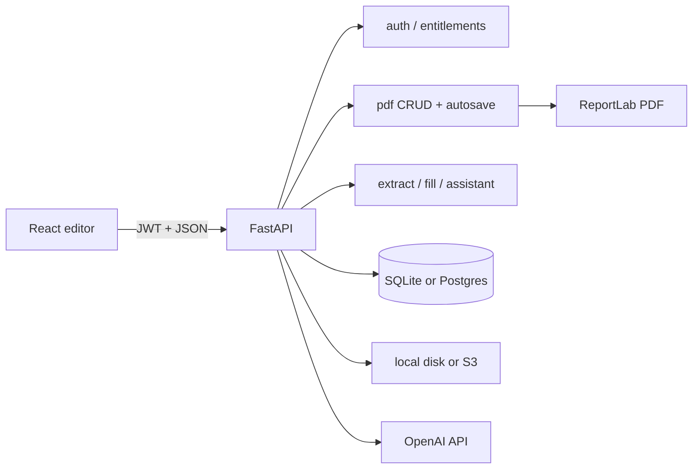
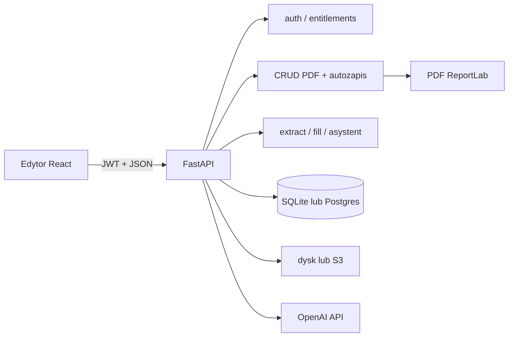

# English

# CV Studio

CV Studio is a Polish-language A4 CV editor: a WYSIWYG canvas, 28 industry templates, PDF import via AI, a guided bio wizard, a floating AI assistant, and ReportLab PDF export that matches the canvas 1:1 (coordinates in points, top-left origin on the frontend, flipped for ReportLab).

This README is the technical entry point for developers. A beginner-friendly deep guide to canvas coordinates, React interaction, deterministic Python layout, AI responsibilities, reflow, persistence, and ReportLab export lives in [`CANVA.md`](CANVA.md). Product-oriented feature copy lives in [`docs/FEATURES.md`](docs/FEATURES.md). Marketing brief for the website „Dlaczego CV STUDIO” section (features + competitive positioning, no competitor brand names in public copy) lives in [`FEATURES_MARKETING.md`](FEATURES_MARKETING.md). Template generation (AI extract vs Python layout) is explained in [`docs/cv-template-generation.md`](docs/cv-template-generation.md).

---

## Table of contents

1. [Purpose and problem](#purpose-and-problem)
2. [Main user flows](#main-user-flows)
3. [Architecture and data flow](#architecture-and-data-flow)
4. [Technologies](#technologies)
5. [Folder structure](#folder-structure)
6. [Database](#database)
7. [Features (implementation map)](#features-implementation-map)
8. [API](#api)
9. [Installation and local development](#installation-and-local-development)
10. [Testing](#testing)
11. [Deployment](#deployment)
12. [Security and privacy](#security-and-privacy)
13. [Accessibility and UX](#accessibility-and-ux)
14. [Known limitations and planned work](#known-limitations-and-planned-work)
15. [Further reading](#further-reading)

---

## Purpose and problem

Job seekers need CVs that look professional and export cleanly to PDF. Generic form builders hide layout; design tools are too heavy. CV Studio gives a true A4 canvas (595×842 pt), templates filled with real career data, and AI that extracts or improves content without inventing unsafe coordinates for decorative chrome.

**Implemented today:** editor, templates, extract/fill, bio draft, AI assistant (ratings, grammar, layout review cards), entitlements (Free / Standard / Premium), autosave, local or S3 storage, JWT auth.

**Optional:** AWS S3 (`S3_BUCKET_NAME`), unpaid plan selection (`ALLOW_UNPAID_PLAN_SELECTION`).

**Not implemented as full Stripe Checkout yet:** paid plans can be activated without payment when unpaid selection is enabled; `402 payment_required` is the seam for future Checkout.

---

## Main user flows

1. **Register / login** → JWT in `localStorage` → `/pdfcanvas`.
2. **Pick a template** → `handleLoadTemplate` materializes specs → canvas.
3. **Import PDF** → `POST /ai/extract_cv` → choose template → `POST /ai/fill_template` → Python layout in `cv_generator.generate_resume`.
4. **Bio wizard** → draft CRUD on `/ai/bio_cv_draft` → fill template.
5. **Edit** → drag/resize/style → debounced `PUT /pdf/save_elements`.
6. **AI assistant** → `POST /ai/assistant` → tips / corrections / reviewable layout groups.
7. **Export** → create/update PDF → `POST /pdf/download_pdf` (export quota charged).



---

## Architecture and data flow

### Entry points

| Layer | Entry | Role |
|--------|--------|------|
| Frontend | `frontend/src/main.jsx` → `App.jsx` | Router: `/`, `/login`, `/register`, protected `/pdfcanvas` |
| Editor page | `frontend/src/pages/PdfCanvas.jsx` (`PdfCanvas`) | Composes hooks into `PdfContext` |
| Backend | `backend/app/main.py` | FastAPI app, CORS, `/health`, routers, optional SPA static |

### Frontend layers

- **Pages** — marketing, auth, editor shell.
- **Hooks** — `useA4Elements` owns canvas state; `usePdfExport` talks to PDF endpoints; `useEntitlements` loads plan limits.
- **Context** — `store/pdfgenerator-context.jsx` default shape; real values from `PdfCanvas`.
- **Services** — `ApiClient` (`services/api.js`) with long timeouts and retries for Render cold start.
- **Templates** — static element specs in `frontend/src/templates/`; registry in `templates/index.js`.

### Backend layers

- **Routes** — thin HTTP in `app/api/routes/*`.
- **CRUD** — SQLAlchemy writes in `app/crud/*`.
- **Services** — PDF render, CV layout, AI, entitlements, S3.
- **Models** — `app/models/models.py`; engine in `app/models/database.py`.

### Coordinate system

Canvas and stored geometry use **top-left** origin (CSS-like). ReportLab uses **bottom-left**; `PDF_Generator` flips `top` using `page_h` before drawing (`backend/app/services/pdf_generator.py`).

### Auto-height reflow and aligned icons

Template textareas start with authored placeholder heights and are measured after the browser loads their real fonts. `reflowTextareaHeight` then moves all following elements in the same visual lane by the measured delta. Text-aligned Iconic images (`alignWithText: true`, including backward-compatible `/template-assets/iconic/` URLs) are classified as section chrome and may join a lane when they hang to the left of the column (Ridge rail, ~40 px). Icons that sit entirely to the right of a narrow column are excluded, so Loom's sidebar cannot drag main-column icons away from their headings.

Undo/redo history treats that post-load reflow as part of the **baseline**, not as a user edit: `markHistoryQuiet` in `useA4Elements` updates the current history entry in place so Cofnij stays disabled until the user actually changes the document. Otherwise Undo would restore pre-measure heights and revive uneven Y gaps (e.g. diploma → school in education records).

Every auto-height textarea measures twice — once immediately, once again after `document.fonts.ready` — and each measurement calls `reflowTextareaHeight` independently, so a later field can briefly carry a stale `page` number from an earlier pass. `rawSamePageGap` checks authored `top` values (ignoring `page`) before applying the generic page-break gap: a same-record pair with a stale page keeps its authored small gap, while a genuine cross-page seam still uses `DEFAULT_PACK_GAP` (14 px). The reflow intentionally does **not** infer title/meta relationships from font size or boldness; that heuristic distorted valid Onyx record spacing and compounded independent height deltas. Onyx instead carries an explicit `flowRole`: section marker/label/rule use `section-chrome`, and all ordinary records use `content`. Keep-with-next logic therefore cannot mistake a job title for a section heading and move the real heading behind its own content. Legacy templates without this property keep the category-based fallback.

During the canvas enter hold, auto-height reflow is suppressed and resumes after fonts are ready. Onyx textareas additionally carry `preserveInitialLayout: true`, so their first mounted measurement is skipped entirely: the deterministic Python pagination remains authoritative instead of being independently recomputed once per textarea. Editing content or later changing typography/width still triggers normal auto-height reflow. See `textareaReflow.test.js` cases `"preserves a small same-record gap…"`, `"keeps Onyx section chrome top-to-top…"`, `"does not stack a section heading…"`, and `"does not collapse SPACE_RECORD…"`.

Section headings are kept with their first body block across page breaks: `avoidOrphanChrome` reserves the full body height (not a short keep-with-next sliver), and when a measured body textarea itself jumps to the next page, `precedingChromeCluster` pulls the icon/heading/rule with it. That prevents orphans such as “UMIEJĘTNOŚCI” alone at the bottom of page 1. Backend generators use `Builder.need_section(chrome, body)` for the same rule before placing a heading. The section icon, heading, rule, and body therefore remain one cluster after every measurement and page break; ReportLab receives the same geometry visible on the canvas.

### Decorative chrome

Elements with `fixedToPage: true` (backgrounds, frames, sidebars, page numbers) are cloned across pages and must not be selected/moved/deleted in the UI (`isDecorativeChrome` in `frontend/src/utils/elementInteraction.js`). Design rating prompts respect template typography.

---

## Technologies

| Technology | Version / note | Purpose | Main locations |
|------------|----------------|---------|----------------|
| React | ^19.2 | UI components and hooks | `frontend/src/` |
| Vite | ^7.2 | Dev server and production build | `frontend/` |
| React Router | ^7.13 | Client routes + `ProtectedRoute` | `App.jsx` |
| FastAPI | (requirements) | HTTP API | `backend/app/main.py`, routes |
| Uvicorn | (requirements) | ASGI server | local / Render |
| SQLAlchemy | (requirements) | ORM | `models/`, `crud/` |
| SQLite / PostgreSQL | via `DATABASE_URL` | Persistence | `database.py` |
| ReportLab + fontTools | (requirements) | PDF drawing + TTF name fixes | `pdf_generator.py` |
| PyMuPDF (fitz) | (requirements) | PDF → images for extract | `ai_service.py` |
| OpenAI SDK | (requirements) | Extract + assistant | `ai_service.py`, `ai_assistant_service.py` |
| python-jose / passlib bcrypt | (requirements) | JWT + passwords | `core/security.py` |
| boto3 | optional | S3 uploads | `s3_storage.py` |
| nanoid | ^5.1 | Client element ids | canvas hooks |
| motion | ^12 | UI motion | modals / assistant |
| unittest | stdlib | Backend tests | `backend/tests/` |

Official docs: [React](https://react.dev/), [Vite](https://vite.dev/), [FastAPI](https://fastapi.tiangolo.com/), [SQLAlchemy](https://docs.sqlalchemy.org/), [ReportLab](https://www.reportlab.com/docs/reportlab-userguide.pdf), [OpenAI API](https://platform.openai.com/docs).

---

## Folder structure

```text
pdf-generator/
├── AGENTS.md                 # Project agent / documentation rules
├── BUGZ.MD                   # Known issues tracker
├── README.md                 # This file
├── docs/                     # Product + design + deep-dive docs
├── frontend/
│   ├── public/template-mockups/   # Static A4 preview PNGs
│   ├── src/
│   │   ├── components/       # canvas, editor, ai, modals, gallery, common
│   │   ├── hooks/            # useA4Elements, usePdfExport, …
│   │   ├── pages/            # Hero, Login, Register, PdfCanvas
│   │   ├── services/         # ApiClient, eventLog
│   │   ├── store/            # PdfContext
│   │   ├── templates/        # 28 template specs + helpers
│   │   └── utils/            # geometry, reflow, entitlements helpers
│   ├── package.json
│   └── .env.example
└── backend/
    ├── app/
    │   ├── api/routes/       # auth, pdf, images, ai, assistant, billing, events
    │   ├── core/             # config, security
    │   ├── crud/
    │   ├── models/
    │   ├── schemas/
    │   ├── services/         # pdf, cv_generator, ai, entitlements, s3
    │   ├── utils/
    │   ├── main.py
    │   └── dependencies.py
    ├── fonts/                # Bundled TTFs for PDF
    ├── template_assets/      # Sidebar, IT and Iconic artwork/icons
    ├── tests/
    ├── requirements.txt
    └── .env.example
```

**Rules:** Frontend templates must stay in sync with `_GENERATORS` in `cv_generator.py` (28 ids). Do not put secrets in the repo. Uploads and generated PDFs are runtime data (`uploads/`, `static/generated/`), not source.

---

## Database

Configured by `DATABASE_URL` (`backend/app/models/database.py`). Default if unset: `sqlite:///./pdfgenerator.db`. `postgres://` URLs are rewritten to `postgresql://`. Postgres uses `pool_pre_ping` for Render cold starts.

Schema is created by `init_db()` during app lifespan (not at import). Lightweight `ALTER TABLE` adds multi-page columns on old DBs. Billing catalog is seeded via `bootstrap_billing`.

### Tables (business purpose)

| Table | Purpose |
|-------|---------|
| `users` | Accounts: username, email, bcrypt hash, `is_active`, timestamps |
| `images` | Uploaded image metadata; `file_path` local or S3 URL; `owner_id` → users |
| `pdfs` | CV documents: title, path, pages, page_width/height (default 595×842), owner |
| `pdf_elements` | Canvas elements; geometry + style columns; extras in `extra_properties` JSON (`fixedToPage`, `locked`, `flowRole`, `preserveInitialLayout`, bold, connectors, …) |
| `bio_cv_drafts` | One private JSON draft per user |
| `plans` | Free / standard / premium limits and feature flags |
| `user_subscriptions` | Current plan per user (Stripe columns ready, often null) |
| `usage_counters` | Monthly exports + AI credit usage (`period_key` = `YYYY-MM` UTC) |
| `payments` | Future payment ledger |
| `maintenance_markers` | One-off cleanup keys |

**Relationships:** One user owns many `pdfs` and `images`. Each `pdf` has many `pdf_elements`. Subscription and usage are per user.

Models: `backend/app/models/models.py` (`User`, `Pdf`, `PdfElements`, …).

---

## Features (implementation map)

Product narrative: [`docs/FEATURES.md`](docs/FEATURES.md).

### A4 canvas editor

Interactive multi-page **A4 portrait** canvas with selection, drag, resize, zoom, guides. Seven addable element types: text, textarea, line, rectangle, circle, ellipse, image (connectors are not offered in the sidebar). Ten bundled fonts shared by editor and PDF: Inter, Roboto, Helvetica, Montserrat, Times-Roman, PlayfairDisplay, CormorantGaramond, Lora, Courier, JetBrainsMono. Session undo/redo ignores post-load textarea reflow (`markHistoryQuiet`).

Implementation:

- `frontend/src/pages/PdfCanvas.jsx`, lines 46+, component `PdfCanvas`
- `frontend/src/hooks/useA4Elements.js`, lines 43+, function `useA4Elements` (incl. `markHistoryQuiet` / undo baseline)
- `frontend/src/components/canvas/*`
- `frontend/src/components/common/EditorControls/EditorControls.jsx`, `FONT_OPTIONS`
- Marketing Funkcje panel: `frontend/src/pages/Hero/Hero.jsx` (`CANVAS_STATS`, `FONT_GROUPS`, `CANVAS_CARDS`)

### Template load

Loads static specs; assigns `element_id`, interaction flags, locks chrome.

Implementation:

- `frontend/src/templates/index.js` — `TEMPLATES` registry
- `frontend/src/hooks/useA4Elements.js`, `materializeSpecs` / `handleLoadTemplate` (approx. lines 1753–1820)

### Canvas enter fade

When a full document lands on the canvas (AI CV upload, bio wizard, or template pick), interactive content fades in from opacity 0→1. Elements are held invisible until `document.fonts.ready` (capped at 1000 ms) so fallback→webfont swaps stay hidden, then fade over 750 ms. Decorative chrome (`fixedToPage`, not selectable) appears immediately with no animation. Manual add/duplicate still uses the same fade for the new ids only. AI-filled **Onyx** section chrome (marker + label → rule 14px below → body +16px) matches `frontend/src/templates/onyx.js`; `flowRole` keeps chrome/content ordered, while `preserveInitialLayout` prevents the first browser measurement from repaginating the backend-authored document.

Implementation:

- `frontend/src/utils/canvasEnter.js`, lines 1–58, `markContentElementsEnter`, `CANVAS_ENTER_MS`, `CANVAS_ENTER_FONT_WAIT_MS`
- `frontend/src/hooks/useCanvasEnterIds.js`, lines 1–80, `useCanvasEnterIds`
- `frontend/src/components/canvas/CanvasElements/CanvasElements.jsx` + `CanvasElements.module.css`
- `frontend/src/hooks/useA4Elements.js` — `handleLoadAiElements`, `handleLoadTemplate`, `handleLoadTemplateWithFill` call `markContentElementsEnter`
- `backend/app/services/cv_generator.py`, lines 2740–2935, `_gen_onyx`; `frontend/src/templates/onyx.js`, lines 1–101 — assign Onyx `flowRole` and `preserveInitialLayout`
- `frontend/src/components/canvas/CanvasElements/CanvasElements.jsx`, lines 29–55; `frontend/src/components/canvas/Textarea/Textarea.jsx`, lines 42–164 — skip only the initial Onyx textarea measurement
- `backend/app/schemas/pdf_schema.py`, lines 44–46; `backend/app/crud/pdfs.py`, lines 81–82, 187–188, 226–227; `frontend/src/components/modals/ModalPdfs/ModalPdfs.jsx`, lines 104–105 — persist and restore the Onyx flow flags

Tests:

- `frontend/src/utils/canvasEnter.test.js` — pending-id registry and chrome exclusion

### Iconic template family and icon reflow

Nova, Ridge, Loom, and Volt provide four colour-matched layouts with contact and section icons. The same template IDs are generated deterministically by Python. Browser font measurement can change textarea heights, so Iconic icons are explicitly grouped with nearby heading chrome instead of being left at their authored Y coordinate.

Loom contact rows are special-cased: three single-line `text` labels (not an auto-height email textarea) share a 22 px rhythm, with 9 px icons geometrically centred via `alignWithText: false`. The forest sidebar uses the same geometric icon alignment for skills / interests / languages (not the main-column optical shift), packs section bodies by measured height with a constant gap, and keeps every label and bullet list on one text column (`left: 40`). Main-column section headings still use optical alignment (`alignWithText: true`). Iconic experience entries use the same textarea-block stack as project records (`SPACE_STACK` inside a job, `SPACE_RECORD` / 14 px between jobs) so canvas spacing guides stay consistent. The flag is stored in `extra_properties` and restored when a PDF is reopened.

Implementation:

- `frontend/src/templates/iconic.js`, lines 1–386, exports `novaTemplate`, `ridgeTemplate`, `loomTemplate`, `voltTemplate`, and `loomContact`
- `backend/app/services/cv_generator_iconic.py`, lines 31–409, functions `_icon`, `_icon_beside`, `_gen_iconic_theme`, and four `_gen_*` entry points
- `frontend/src/utils/textareaReflow.js`, lines 54–400, functions `isTextAlignedImage`, `belongsToFlowLane`, `rawSamePageGap`, `avoidOrphanChrome`, `precedingChromeCluster`, and `reflowTextareaHeight`
- `frontend/src/components/canvas/Image/Image.jsx`, lines 22–76, functions `isTextAlignedIcon`, `iconicDrawTop`; canvas images use `object-fit: fill` so full-page backgrounds stretch like ReportLab `drawImage` (not `contain`, which letterboxed Lattice/Rift/Relay PNGs that are 1024×1536)
- `backend/app/services/pdf_generator.py`, lines 141–193, method `PDF_Generator.renderImage`
- `backend/app/crud/pdfs.py` / `backend/app/schemas/pdf_schema.py` — persist `alignWithText` in `extra_properties`

Tests:

- `frontend/src/utils/textareaReflow.test.js`, lines 83–758 — Iconic grouping, explicit Onyx flow roles, keep-heading-with-body, stale-page gaps, chrome rhythm, and non-collapsing record spacing
- `backend/tests/test_pdf_shapes.py`, lines 67–131 — optical alignment, explicit `alignWithText: false`, and alpha-mask regressions
- `backend/tests/test_cv_template_layouts.py`, `test_iconic_templates_pair_contact_and_section_icons` — Loom contact geometry and sidebar column alignment

**Regenerating Iconic mockups.** `frontend/public/template-mockups/{nova,ridge,loom,volt}.png` — the previews shown in the Hero template gallery (`frontend/src/pages/Hero/Hero.jsx`), the in-app template picker (`frontend/src/components/modals/TemplatesModal/TemplatesModal.jsx`), and the hover pane in **Wypełnij z mojego CV** (`frontend/src/components/ai/AiCvPanel/AiCvPanel.jsx`) — are rendered from the same starter element arrays a user gets when picking the template in the editor, not hand-drawn mockups. Whenever `frontend/src/templates/iconic.js` changes, regenerate them:

```bash
node frontend/scripts/dump-iconic-templates.mjs   # dumps the 4 element arrays to frontend/scripts/iconic-templates.json
python scripts/render_iconic_mockups.py           # renders each theme through ReportLab, rasterizes page 1 with PyMuPDF
```

The dump script (`frontend/scripts/dump-iconic-templates.mjs`) needs a small Node ESM loader (`frontend/scripts/resolve-js-ext-hook.mjs`, registered via `frontend/scripts/register-hook.mjs`) because `iconic.js` uses Vite-style extensionless imports (`from "../services/api"`) that plain Node cannot resolve; the hook also stubs `import.meta.env` so the module-level `API_BASE_URL` read does not throw outside Vite. The intermediate JSON is git-ignored — it is always regenerated from `iconic.js`, never edited by hand.

### PDF create / update / autosave / download

Full render on create/update; autosave is elements-only.

Implementation:

- `frontend/src/hooks/usePdfExport.js`, lines 19+, `createPdf` / `updatePdf` / `saveElements`
- `backend/app/api/routes/pdf.py`, `create_user_pdf`, `save_pdf_elements`, `download_pdf`
- `backend/app/services/pdf_generator.py`, class `PDF_Generator`, `render_elements` (line 492+)
- `backend/app/crud/pdfs.py`, `create_new_pdf`, `update_pdf_elements`

### Deterministic template fill

Python layout from normalised `cv_data` (not LLM placement).

Implementation:

- `backend/app/services/cv_generator.py`, `generate_resume` (line 2896+), class `Builder`
- `backend/app/api/routes/ai.py`, `fill_template`
- Docs: [`docs/cv-template-generation.md`](docs/cv-template-generation.md)

### Record-style extra sections (projects, references, …)

Custom sections such as projects or references render like experience: a **bold title** per entry and a **nested bullet list** for the description. Flat chip-lists (interests, certifications, languages) stay a single bullet block.

Normalization in `cv_data` accepts structured items `{title, subtitle?, bullets[]}`, upgrades headings like `PROJEKTY` even when extract sets `kind: "other"`, and regroups flat bullet dumps with a separator heuristic (`—`, `/`, short heading + longer follow-ups). `_extra_sections` is the shared renderer for every template.

Heuristic regroup is deterministic and imperfect; Standard/Premium already pay for AI extract credits — a future optional LLM “structure correction” pass before `generate_resume` can refine ambiguous cases without changing layout code.

Implementation:

- `backend/app/services/cv_data.py`, lines 204–380+, `is_record_section`, `group_flat_items_into_records`, `_normalize_section_items`
- `backend/app/services/cv_generator.py`, lines 289–380+, `_render_record_section_body`, `_extra_sections`
- `backend/app/services/ai_service.py`, `extract_cv_data` (line 39+) — extract schema asks for record objects on projects/references
- `frontend/src/utils/bioCvData.js`, `parseSectionItems` — expands records for the wizard textarea
- `frontend/src/components/ai/BioCvModal/BioCvModal.jsx` — kind options include projects/references

Tests:

- `backend/tests/test_cv_data.py`, `test_flat_projects_list_regroups_into_title_and_bullets`, `test_structured_project_records_pass_through`

### CV PDF extract

Vision extract of first pages → structured `cv_data`, including record-shaped `extra_sections` items when the source CV has titled entries with description bullets.

Implementation:

- `backend/app/services/ai_service.py`, `extract_cv_data` (line 39+)
- `backend/app/api/routes/ai.py`, `extract_cv`
- `backend/app/services/cv_data.py`, `normalize_cv_data` (line 585+)

### Template hover mockups (import + bio wizard)

After PDF extract (step 2 of **Wypełnij z mojego CV**) and on the bio wizard **Podsumowanie** step, hovering or focusing a template shows that template’s A4 mockup on the **left**, vertically centered. Moving to another template fades out (`opacity` 1→0), swaps `/template-mockups/{id}.png`, then fades in (0→1). Leaving the picker fades the preview out. Shared fade logic lives in one hook so both dialogs stay in sync. The same PNG assets are used by the Hero gallery and `TemplatesModal`.

Implementation:

- `frontend/src/hooks/useTemplateMockupPreview.js`, `useTemplateMockupPreview` — shared opacity fade / swap
- `frontend/src/components/ai/AiCvPanel/AiCvPanel.jsx` — step-2 `templatePicker`
- `frontend/src/components/ai/AiCvPanel/AiCvPanel.module.css`, `.templatePicker`, `.mockupFrame` / `.mockupFrameVisible`
- `frontend/src/components/ai/BioCvModal/BioCvModal.jsx`, `renderReview` — summary-step `templatePicker`
- `frontend/src/components/ai/BioCvModal/BioCvModal.module.css`, `.templatePicker`, `.mockupFrame` / `.mockupFrameVisible`
- Assets: `frontend/public/template-mockups/{id}.png`

### AI assistant

Ratings, grammar, ATS, chat, and deterministic layout analysis with review cards.

**Układ** (`layout`) is Python-only (`analyze_layout`): critical groups first (clipped textareas, overlapping content stacks, out-of-bounds, section rules through text), then cosmetic alignment/spacing only when readability is clean. **Rytm** (`layout_rhythm`) sends GPT a **full A4 JSON snapshot**; the model decides which elements to move and where (`moves` with absolute `left`/`top`). Python **only validates**: known ids, frozen name/role, hard cap **±15 px** per axis, no page/resize — preserving freestyle vision. Legacy classification packing remains a fallback. **Projekt** (`design_rating`) still rates typography via GPT, but `summarize_geometry_issues` injects overlap/clip/rule/out-of-bounds counts and hard-caps the score at 5 when those faults exist.

Implementation:

- `frontend/src/components/ai/AiAssistant/AiAssistant.jsx`, `ACTIONS` (lines 21–30), default export
- `frontend/src/utils/elementBounds.js`, `measureElements` (line 120+) — `layout_bounds`, `content_height`, `clipped`, `bounds_estimated`
- `backend/app/api/routes/ai_assistant.py`, `ai_assistant` — actions include `layout_rhythm`
- `backend/app/services/ai_assistant_service.py`, `analyze_action` (line 1167+), `_rate_design` (line 337+), `_normalize_layout_rhythm` (line 1043+)
- `backend/app/services/layout_analysis.py`, `analyze_layout` (line 923+), `_stack_resolve_overlap_groups` (line 618+), `_clip_groups` (line 690+), `summarize_geometry_issues` (line 867+)
- `backend/app/services/layout_rhythm.py`, `build_a4_canvas_snapshot` (line 862+), `apply_gpt_rhythm_moves` (line 953+); `pack_rhythm_classification` (fallback, line 632+)

Tests: `backend/tests/test_ai_chat_command.py`, `test_layout_analysis.py`, `test_layout_rhythm.py`, …

### Entitlements / plans

Gates projects, exports, AI, templates; AI credits from estimated PLN cost.

Implementation:

- `backend/app/services/entitlements.py`, `get_entitlements` (307+), `assert_can_export`, `charge_ai_credits` (442+)
- `backend/app/api/routes/billing.py`, `get_plans`, `select_plan`
- `frontend/src/hooks/useEntitlements.js`

### Auth

Register, OAuth2 password token, JWT Bearer, entitlements probe.

Implementation:

- `backend/app/api/routes/auth.py`
- `backend/app/core/security.py` — bcrypt 72-byte truncate, JWT

### Decorative chrome lock

`fixedToPage` elements are non-interactive in the editor.

Implementation:

- `frontend/src/utils/elementInteraction.js`, `isDecorativeChrome`
- Guards in `useA4Elements` select/move/delete; canvas components use `pointer-events: none`

---

## API

Base URL: `VITE_API_URL` (frontend) / deployed backend. Auth: `Authorization: Bearer <jwt>` unless noted. Polish `detail` strings are returned to the UI.

| Method | Path | Auth | Purpose | Handler |
|--------|------|------|---------|---------|
| GET | `/health` | no | Liveness / dyno wake | `health` in `main.py` |
| POST | `/auth/register` | no | Create user (+ plan) | `register_user` |
| POST | `/auth/token` | no | OAuth2 password → JWT | `login_for_acess_token` |
| GET | `/auth/verify-token/{token}` | token in path | Validity check | `verify_user_token` |
| GET | `/auth/me/entitlements` | yes | Plan limits for UI | `me_entitlements` |
| POST | `/pdf/create_pdf` | yes | Create doc + render PDF | `create_user_pdf` |
| GET | `/pdf/fetch_pdfs` | yes | List docs | `fetch_user_pdfs` |
| POST | `/pdf/show_pdf` | yes | Load elements (body: pdf id) | `show_user_pdf` |
| PUT | `/pdf/update_pdf` | yes | Save + re-render | `update_user_pdf` |
| PUT | `/pdf/save_elements` | yes | Autosave elements only | `save_pdf_elements` |
| DELETE | `/pdf/delete_pdf` | yes | Delete owned doc | `delete_user_pdf` |
| POST | `/pdf/download_pdf` | yes | Export URL/row + meter | `download_pdf` |
| POST | `/images/upload_image` | yes | Multipart image | `create_upload_image` |
| GET | `/images/fetch_images` | yes | List images | `fetch_user_images` |
| DELETE | `/images/delete_image` | yes | Delete if unused | `delete_user_image` |
| POST | `/ai/extract_cv` | yes | PDF → cv_data | `extract_cv` |
| POST | `/ai/fill_template` | yes | cv_data + template → elements | `fill_template` |
| GET/PUT/DELETE | `/ai/bio_cv_draft` | yes | Private draft | bio draft routes |
| POST | `/ai/assistant` | yes | Assistant actions | `ai_assistant` |
| GET | `/billing/plans` | yes | Plan catalog | `get_plans` |
| POST | `/billing/select-plan` | yes | Activate plan | `select_plan` |
| POST | `/events/log` | yes | Product metrics log | `log_event` |

**Ownership:** PDF/image by-id routes use IDOR checks (`_require_owned_pdf` in `pdf.py`).

Example login (form body):

```http
POST /auth/token
Content-Type: application/x-www-form-urlencoded

username=demo&password=secret
```

Example autosave body shape: `{ "pdf_id", "pdf_title", "root": [PdfElement...], "pages", "page_width", "page_height" }` — see `backend/app/schemas/pdf_schema.py`.

---

## Installation and local development

### Requirements

- Node.js 20+ recommended (Vite 7)
- Python 3.11+ recommended
- Optional: PostgreSQL; otherwise SQLite file is fine
- Optional: OpenAI API key for AI routes

### Backend

```bash
cd backend
python -m venv .venv
# Windows: .venv\Scripts\activate
# Unix:    source .venv/bin/activate
pip install -r requirements.txt
copy .env.example .env   # or cp on Unix — then edit secrets
```

Run API (from `backend/` so `app` imports resolve):

```bash
uvicorn app.main:app --reload --host 0.0.0.0 --port 8000
```

OpenAPI docs: `http://localhost:8000/docs`.

### Frontend

```bash
cd frontend
npm install
copy .env.example .env   # set VITE_API_URL=http://localhost:8000
npm run dev
```

App: `http://localhost:5173`.

### Environment variables

#### Backend (see `backend/.env.example` + `app/core/config.py`)

| Variable | Required | Purpose | Example |
|----------|----------|---------|---------|
| `SECRET_KEY` | yes (prod) | JWT signing | long random string |
| `ALGORITHM` | yes | JWT alg | `HS256` |
| `ACCESS_TOKEN_EXPIRE_MINUTES` | no | Token lifetime (default 7 days) | `10080` |
| `DATABASE_URL` | no | DB URL (default SQLite file) | `sqlite:///./pdfgenerator.db` |
| `CORS_ORIGINS` | no | Comma-separated origins | `http://localhost:5173` |
| `BACKEND_URL` | no | Public API base for links | `http://localhost:8000` |
| `API_GPT_KEY` | for AI | OpenAI API key | `sk-...` |
| `AI_ASSISTANT_MODEL` | no | Assistant model id | `gpt-5.4-mini` |
| `S3_BUCKET_NAME` | no | Enable S3 when set | bucket name |
| `AWS_REGION` / keys | with S3 | AWS credentials | — |
| `ALLOW_UNPAID_PLAN_SELECTION` | no | Allow activating paid plans without Stripe (`true` default) | `true` |

#### Frontend

| Variable | Required | Purpose | Example |
|----------|----------|---------|---------|
| `VITE_API_URL` | recommended | API origin, no trailing slash | `http://localhost:8000` |

Never commit real secrets.

### Scripts

| Area | Command | Notes |
|------|---------|--------|
| Frontend dev | `npm run dev` | Vite |
| Frontend build | `npm run build` | Output `frontend/dist` |
| Frontend lint | `npm run lint` | ESLint |
| Backend tests | `python -m unittest discover -s tests` | from `backend/` |
| Frontend unit tests | `node --test src/utils/textareaReflow.test.js` | From `frontend/`; verifies auto-height flow, page breaks and Iconic icon grouping |

### Troubleshooting

- **Login “Failed to fetch” on Render:** free dyno cold start. Frontend uses long timeouts + retries and `wakeBackend()`; `/health` must answer while DB init runs in background (`main.py` lifespan).
- **AI 500 with Polish message:** check `API_GPT_KEY` and server logs (`AIServiceError` handler).
- **Fonts look wrong in PDF:** bold/italic TTFs are remapped via fontTools in `pdf_generator.py` — do not replace fonts without re-testing Polish glyphs.

---

## Testing

- **Framework:** Python `unittest` under `backend/tests/` (164 tests at last local run).
- **Coverage focus:** layout analysis safety, AI chat/command sanitisation, entitlements, PDF element upsert/`fixedToPage`, CV data normalisation, bullet layout, Unicode fonts.
- **Run:** `cd backend && python -m unittest discover -s tests`.
- **Frontend:** ESLint via `npm run lint`; reflow regression tests run with Node's built-in runner: `cd frontend && node --test src/utils/textareaReflow.test.js`.

---

## Deployment

Typical production split (as used with Render):

- **Backend service** — Uvicorn / FastAPI, Postgres, env vars above, optional S3.
- **Frontend static** — `npm run build`, host `frontend/dist` (or co-host via `main.py` SPA fallback when `frontend/dist` exists next to the backend tree).

Cold-start behaviour is intentional: DB init is deferred so `/health` stays fast.

Migrations: `create_all` + `_run_lightweight_migrations` on startup; no Alembic in-repo.

CI/CD: configure in your host (Render dashboards / GitHub Actions) — no committed workflow is required by this README.

---

## Security and privacy

- Passwords: bcrypt; inputs truncated to 72 bytes consistently (`security.py`).
- Sessions: JWT Bearer; username in `sub`.
- Authorisation: ownership checks on PDF/image mutations; plan gates on create/export/AI/templates.
- CORS: explicit origin allowlist (`CORS_ORIGINS`).
- Uploads: images owned by user; delete blocked while referenced by a PDF element.
- AI: provider errors mapped to generic Polish 500; details stay in logs.
- Metrics: `/events/log` logs numeric `user_id`, not raw usernames (`metrics_logging.py`).
- Secrets: env only; never in README or git.

This does not claim SOC2/compliance — it documents controls that exist in code.

---

## Accessibility and UX

- Dialogs use `DialogShell` (Escape to close, backdrop, titled header).
- Docked panels use `PanelShell`.
- Forms expose labels/icons; plan radios use `role="radiogroup"`.
- Loading: PDF spinner minimum display time; toasts via `useToasts` / `ToastStack`.
- Empty docs library returns a clear Polish 404 message prompting create.
- Canvas zoom is view-only so export size stays document-true.

Gaps: not a full WCAG audit; continue improving focus traps and contrast where needed.

---

## Known limitations and planned work

See [`BUGZ.MD`](BUGZ.MD) and [`TODOS.md`](TODOS.md).

Notable product facts:

- Stripe Checkout not fully wired; unpaid plan selection is a temporary gate.
- Render free tier sleeps — expect cold starts.
- Layout AI proposes; `layout_analysis` owns safe coordinates. Overlaps/clips produce critical repair groups before cosmetic alignment.
- Design rating must not punish intentional small template fonts (prompt + filters in `_rate_design`), but must cap the score when geometry reports overlaps, clipped textareas, rules through text, or out-of-bounds boxes.

---

## Further reading

- [React documentation](https://react.dev/) — components, hooks, rendering.
- [FastAPI documentation](https://fastapi.tiangolo.com/) — routes, dependencies, OpenAPI.
- [SQLAlchemy 2.x documentation](https://docs.sqlalchemy.org/) — ORM sessions and models.
- [ReportLab user guide](https://www.reportlab.com/docs/reportlab-userguide.pdf) — PDF canvas drawing.
- [OpenAI platform docs](https://platform.openai.com/docs) — chat and vision APIs.
- [Vite guide](https://vite.dev/guide/) — frontend tooling.
- Project: [`CANVA.md`](CANVA.md), [`docs/cv-template-generation.md`](docs/cv-template-generation.md), [`docs/FEATURES.md`](docs/FEATURES.md), [`docs/designs/cv-only-ux-monetization.md`](docs/designs/cv-only-ux-monetization.md).

---

# Polski

# CV Studio

CV Studio to polski edytor CV na A4: płótno WYSIWYG, 28 szablonów branżowych, import PDF przez AI, kreator bio, pływający asystent AI oraz eksport PDF w ReportLab zgodny z kanwą 1:1 (współrzędne w punktach, początek układu lewy-górny na froncie, odwrócenie Y w ReportLab).

Ten README to wejście techniczne dla programistów. Obszerne, napisane dla początkujących wyjaśnienie współrzędnych canvasu, interakcji React, deterministycznego layoutu Python, roli AI, reflow, zapisu i eksportu ReportLab znajduje się w [`CANVA.md`](CANVA.md). Opis produktowy funkcji: [`docs/FEATURES.md`](docs/FEATURES.md). Brief marketingowy pod sekcję „Dlaczego CV STUDIO” na stronie (funkcje + pozycjonowanie względem rynku, bez nazw marek konkurencji w copy publicznym): [`FEATURES_MARKETING.md`](FEATURES_MARKETING.md). Generowanie szablonów (AI extract vs layout w Pythonie): [`docs/cv-template-generation.md`](docs/cv-template-generation.md).

---

## Spis treści

1. [Cel i problem](#cel-i-problem)
2. [Główne przepływy użytkownika](#główne-przepływy-użytkownika)
3. [Architektura i przepływ danych](#architektura-i-przepływ-danych)
4. [Technologie](#technologie-1)
5. [Struktura katalogów](#struktura-katalogów)
6. [Baza danych](#baza-danych)
7. [Funkcje (mapa implementacji)](#funkcje-mapa-implementacji)
8. [API](#api-1)
9. [Instalacja i rozwój lokalny](#instalacja-i-rozwój-lokalny)
10. [Testy](#testy)
11. [Wdrożenie](#wdrożenie)
12. [Bezpieczeństwo i prywatność](#bezpieczeństwo-i-prywatność)
13. [Dostępność i UX](#dostępność-i-ux)
14. [Ograniczenia i plany](#ograniczenia-i-plany)
15. [Dalsza lektura](#dalsza-lektura)

---

## Cel i problem

Kandydaci potrzebują CV, które wygląda profesjonalnie i eksportuje się do PDF bez niespodzianek. Formularze ukrywają układ; ciężkie narzędzia graficzne są nadmiarem. CV Studio daje prawdziwe płótno A4 (595×842 pt), szablony z danymi kariery oraz AI, które wyciąga lub poprawia treść bez wymyślania niebezpiecznych pozycji dla dekoracji szablonu.

**Zaimplementowane:** edytor, szablony, extract/fill, szkic bio, asystent AI, entitlements (Free / Standard / Premium), autozapis, dysk lokalny lub S3, JWT.

**Opcjonalne:** S3 (`S3_BUCKET_NAME`), wybór planu bez płatności (`ALLOW_UNPAID_PLAN_SELECTION`).

**Jeszcze nie jako pełny Stripe Checkout:** płatne plany można aktywować bez karty, gdy flaga na to pozwala; odpowiedź `402 payment_required` to miejsce pod przyszły Checkout.

---

## Główne przepływy użytkownika

1. **Rejestracja / logowanie** → JWT w `localStorage` → `/pdfcanvas`.
2. **Wybór szablonu** → `handleLoadTemplate` materializuje elementy → płótno.
3. **Import PDF** → `POST /ai/extract_cv` → szablon → `POST /ai/fill_template` → layout w `cv_generator.generate_resume`.
4. **Kreator bio** → CRUD `/ai/bio_cv_draft` → wypełnienie szablonu.
5. **Edycja** → przeciąganie / styl → debounced `PUT /pdf/save_elements`.
6. **Asystent AI** → `POST /ai/assistant` → wskazówki / poprawki / karty układu do akceptacji.
7. **Eksport** → create/update PDF → `POST /pdf/download_pdf` (naliczany limit eksportów).



---

## Architektura i przepływ danych

### Punkty wejścia

| Warstwa | Wejście | Rola |
|---------|---------|------|
| Frontend | `frontend/src/main.jsx` → `App.jsx` | Routing: `/`, `/login`, `/register`, chronione `/pdfcanvas` |
| Edytor | `frontend/src/pages/PdfCanvas.jsx` (`PdfCanvas`) | Składa hooki w `PdfContext` |
| Backend | `backend/app/main.py` | FastAPI, CORS, `/health`, routery, opcjonalny SPA |

### Warstwy frontendu

- **Pages** — marketing, auth, edytor.
- **Hooks** — `useA4Elements` (stan kanwy), `usePdfExport`, `useEntitlements`.
- **Context** — `store/pdfgenerator-context.jsx`.
- **Services** — `ApiClient` z długim timeoutem i retry (cold start Render).
- **Templates** — specyfikacje w `frontend/src/templates/`.

### Warstwy backendu

- **Routes** — `app/api/routes/*`
- **CRUD** — `app/crud/*`
- **Services** — PDF, layout CV, AI, entitlements, S3
- **Models** — `app/models/models.py`

### Współrzędne

Kanwa: początek **lewy-górny**. ReportLab: **lewy-dolny**; `PDF_Generator` odwraca `top` przez `page_h`.

### Reflow automatycznej wysokości i wyrównanie ikon

Pola tekstowe szablonów zaczynają z projektową wysokością zastępczą, a po załadowaniu właściwych fontów przeglądarka mierzy ich naturalną wysokość. `reflowTextareaHeight` przesuwa następnie wszystkie dalsze elementy w tej samej kolumnie o zmierzoną różnicę. Obrazy Iconic wyrównane do tekstu (`alignWithText: true`, również starsze adresy `/template-assets/iconic/`) są traktowane jak część nagłówka sekcji i mogą dołączyć do kolumny, gdy wiszą po jej lewej stronie (szyna Ridge, ok. 40 px). Ikony leżące całkowicie na prawo od wąskiej kolumny są wykluczane, więc sidebar Loom nie odciąga ikon głównej kolumny od nagłówków.

Historia cofnij/ponów traktuje ten reflow po załadowaniu jako **stan bazowy**, nie jako edycję użytkownika: `markHistoryQuiet` w `useA4Elements` aktualizuje bieżący wpis historii w miejscu, więc Cofnij pozostaje nieaktywne, dopóki użytkownik realnie nie zmieni dokumentu. Inaczej Undo przywracałoby wysokości sprzed pomiaru i nierówne odstępy Y (np. dyplom → uczelnia).

Każde pole tekstowe z automatyczną wysokością mierzy się dwukrotnie — od razu i ponownie po `document.fonts.ready` — a każdy pomiar osobno wywołuje `reflowTextareaHeight`, więc późniejsze pole może chwilowo nosić nieaktualny numer `page` z wcześniejszego przebiegu. `rawSamePageGap` sprawdza projektowe wartości `top` (ignorując `page`) przed użyciem ogólnego odstępu page-break: para z jednego rekordu ze stale `page` zachowuje swój mały odstęp, a prawdziwy szew między stronami nadal używa `DEFAULT_PACK_GAP` (14 px). Reflow celowo **nie** zgaduje relacji tytuł/meta na podstawie rozmiaru lub pogrubienia fontu — ta heurystyka deformowała poprawny rytm rekordów Onyx i kumulowała delty niezależnych pomiarów. Onyx przenosi zamiast tego jawny `flowRole`: marker/etykieta/linia sekcji mają `section-chrome`, a zwykłe rekordy `content`. Logika keep-with-next nie może więc pomylić tytułu stanowiska z nagłówkiem sekcji i przenieść właściwego nagłówka za jego treść. Starsze szablony bez tej właściwości zachowują fallback oparty na kategorii.

W czasie enter-hold reflow auto-height jest wstrzymany i wraca po gotowości fontów. Textarea Onyx mają dodatkowo `preserveInitialLayout: true`, więc ich pierwszy pomiar po montażu jest całkowicie pomijany: autorytatywna zostaje deterministyczna paginacja z Pythona, zamiast niezależnego przeliczania jej dla każdej textarea. Edycja treści lub późniejsza zmiana typografii/szerokości nadal uruchamia normalny auto-height reflow. Zobacz przypadki w `textareaReflow.test.js`: `"preserves a small same-record gap…"`, `"keeps Onyx section chrome top-to-top…"`, `"does not stack a section heading…"`, `"does not collapse SPACE_RECORD…"`.

Nagłówki sekcji zostają z pierwszym blokiem treści przy podziale strony: `avoidOrphanChrome` rezerwuje pełną wysokość treści (nie krótki „keep-with-next”), a gdy zmierzone pole treści samo skacze na następną stronę, `precedingChromeCluster` zabiera ze sobą ikonę, tytuł i linię. Dzięki temu nie powstają sieroty w stylu samego „UMIEJĘTNOŚCI” na dole strony 1. Generatory backendu stosują tę samą regułę przez `Builder.need_section(chrome, body)` przed umieszczeniem nagłówka. Ikona, tytuł, linia i treść pozostają jednym klastrem po każdym pomiarze i podziale strony; ReportLab dostaje tę samą geometrię, którą widać na kanwie.

### Dekoracje szablonu

`fixedToPage: true` — tła, ramki, sidebary, numery stron — bez zaznaczania/przesuwania/usuwania w UI (`isDecorativeChrome`). Ocena „Projekt” respektuje typografię szablonu.

---

## Technologie

| Technologia | Wersja / uwaga | Rola | Główne miejsca |
|-------------|----------------|------|----------------|
| React | ^19.2 | UI | `frontend/src/` |
| Vite | ^7.2 | Build / dev | `frontend/` |
| React Router | ^7.13 | Trasy + `ProtectedRoute` | `App.jsx` |
| FastAPI | requirements | API HTTP | `main.py`, routes |
| Uvicorn | requirements | Serwer ASGI | lokalnie / Render |
| SQLAlchemy | requirements | ORM | `models/`, `crud/` |
| SQLite / PostgreSQL | `DATABASE_URL` | Persistencja | `database.py` |
| ReportLab + fontTools | requirements | PDF + fonty | `pdf_generator.py` |
| PyMuPDF | requirements | PDF → obrazki (extract) | `ai_service.py` |
| OpenAI SDK | requirements | Extract + asystent | serwisy AI |
| python-jose / bcrypt | requirements | JWT + hasła | `security.py` |
| boto3 | opcjonalnie | S3 | `s3_storage.py` |
| unittest | stdlib | Testy backendu | `backend/tests/` |

Dokumentacja oficjalna: [React](https://react.dev/), [Vite](https://vite.dev/), [FastAPI](https://fastapi.tiangolo.com/), [SQLAlchemy](https://docs.sqlalchemy.org/), [ReportLab](https://www.reportlab.com/docs/reportlab-userguide.pdf), [OpenAI](https://platform.openai.com/docs).

---

## Struktura katalogów

```text
pdf-generator/
├── AGENTS.md
├── BUGZ.MD
├── README.md
├── docs/
├── frontend/
│   ├── public/template-mockups/
│   ├── src/
│   │   ├── components/
│   │   ├── hooks/
│   │   ├── pages/
│   │   ├── services/
│   │   ├── store/
│   │   ├── templates/
│   │   └── utils/
│   ├── package.json
│   └── .env.example
└── backend/
    ├── app/
    │   ├── api/routes/
    │   ├── core/
    │   ├── crud/
    │   ├── models/
    │   ├── schemas/
    │   ├── services/
    │   ├── utils/
    │   ├── main.py
    │   └── dependencies.py
    ├── fonts/
    ├── template_assets/
    ├── tests/
    ├── requirements.txt
    └── .env.example
```

**Zasady:** 28 id szablonów frontu muszą odpowiadać `_GENERATORS` w `cv_generator.py`. Sekrety tylko w env. `uploads/` i `static/generated/` to dane runtime.

---

## Baza danych

`DATABASE_URL` (`database.py`). Domyślnie SQLite. `postgres://` → `postgresql://`. Postgres: `pool_pre_ping`.

`init_db()` w lifespanie aplikacji; lekkie migracje kolumn wielostronicowych; seed planów przez `bootstrap_billing`.

| Tabela | Cel |
|--------|-----|
| `users` | Konta |
| `images` | Metadane obrazów użytkownika |
| `pdfs` | Dokumenty CV |
| `pdf_elements` | Elementy kanwy (+ `extra_properties`, m.in. `fixedToPage`, `locked`, `flowRole`, `preserveInitialLayout`) |
| `bio_cv_drafts` | Jeden prywatny szkic bio / user |
| `plans` | Limity Free / Standard / Premium |
| `user_subscriptions` | Aktualny plan |
| `usage_counters` | Eksporty i kredyty AI / miesiąc UTC |
| `payments` | Ledger płatności (przyszłość) |
| `maintenance_markers` | Jednorazowe cleanupy |

Modele: `backend/app/models/models.py`.

---

## Funkcje (mapa implementacji)

Opis produktowy: [`docs/FEATURES.md`](docs/FEATURES.md).

### Edytor A4

Płótno **A4 pion**, wiele stron, zaznaczanie / przeciąganie / zoom / prowadnice. Siedem typów elementów do dodania: tekst, textarea, linia, prostokąt, koło, elipsa, obraz (łączniki nie są w sidebarze). Dziesięć czcionek wspólnych dla edytora i PDF: Inter, Roboto, Helvetica, Montserrat, Times-Roman, PlayfairDisplay, CormorantGaramond, Lora, Courier, JetBrainsMono. Cofnij/ponów w sesji pomija reflow po załadowaniu (`markHistoryQuiet`).

- `frontend/src/pages/PdfCanvas.jsx`, `PdfCanvas` (ok. linia 46+)
- `frontend/src/hooks/useA4Elements.js`, `useA4Elements` (ok. linia 43+; w tym `markHistoryQuiet`)
- `frontend/src/components/canvas/*`
- `frontend/src/components/common/EditorControls/EditorControls.jsx`, `FONT_OPTIONS`
- Panel Funkcje na Hero: `frontend/src/pages/Hero/Hero.jsx` (`CANVAS_STATS`, `FONT_GROUPS`, `CANVAS_CARDS`)

### Ładowanie szablonu

- `frontend/src/templates/index.js` — `TEMPLATES`
- `useA4Elements`: `materializeSpecs` / `handleLoadTemplate` (ok. 1753–1820)

### Fade wejścia na kanwie

Gdy pełny dokument ląduje na kanwie (upload CV AI, kreator bio lub wybór szablonu), interaktywna treść pojawia się fade’em opacity 0→1. Elementy są trzymane niewidoczne do `document.fonts.ready` (limit 1000 ms), żeby zmiana fontu zapasowy→webfont nie była widoczna, potem fade trwa 750 ms. Dekoracje (`fixedToPage`, bez zaznaczania) pojawiają się od razu bez animacji. Ręczne dodanie/duplikacja używa tego samego fade tylko dla nowych id. Chrome sekcji **Onyx** z AI (marker + etykieta → linia 14 px poniżej → treść +16 px) odpowiada `frontend/src/templates/onyx.js`; `flowRole` utrzymuje kolejność chrome/treści, a `preserveInitialLayout` zapobiega przepaginowaniu układu backendu przez pierwszy pomiar przeglądarki.

Implementacja:

- `frontend/src/utils/canvasEnter.js`, linie 1–58, `markContentElementsEnter`, `CANVAS_ENTER_MS`, `CANVAS_ENTER_FONT_WAIT_MS`
- `frontend/src/hooks/useCanvasEnterIds.js`, linie 1–80, `useCanvasEnterIds`
- `frontend/src/components/canvas/CanvasElements/CanvasElements.jsx` + `CanvasElements.module.css`
- `frontend/src/hooks/useA4Elements.js` — `handleLoadAiElements`, `handleLoadTemplate`, `handleLoadTemplateWithFill` wywołują `markContentElementsEnter`
- `backend/app/services/cv_generator.py`, linie 2740–2935, `_gen_onyx`; `frontend/src/templates/onyx.js`, linie 1–101 — przypisanie `flowRole` i `preserveInitialLayout` Onyx
- `frontend/src/components/canvas/CanvasElements/CanvasElements.jsx`, linie 29–55; `frontend/src/components/canvas/Textarea/Textarea.jsx`, linie 42–164 — pominięcie wyłącznie pierwszego pomiaru textarea Onyx
- `backend/app/schemas/pdf_schema.py`, linie 44–46; `backend/app/crud/pdfs.py`, linie 81–82, 187–188, 226–227; `frontend/src/components/modals/ModalPdfs/ModalPdfs.jsx`, linie 104–105 — zapis i odtwarzanie flag przepływu Onyx

Testy:

- `frontend/src/utils/canvasEnter.test.js` — rejestr id oraz wykluczenie chrome

### Rodzina Iconic i reflow ikon

Nova, Ridge, Loom i Volt to cztery spójne kolorystycznie układy z ikonami kontaktu oraz sekcji. Te same identyfikatory generuje deterministycznie backend w Pythonie. Ponieważ pomiar fontów w przeglądarce może zmienić wysokości pól tekstowych, ikony Iconic są grupowane z nagłówkami i przesuwają się razem z nimi zamiast pozostawać na pierwotnej współrzędnej Y.

Kontakt w Loom jest osobnym przypadkiem: trzy jednoliniowe etykiety `text` (bez auto-height textarea na e-mailu) mają rytm 22 px, a ikony 9 px są wyśrodkowane geometrycznie (`alignWithText: false`). Sidebar (umiejętności / zainteresowania / języki) używa tego samego wyrównania geometrycznego ikon — nie optycznego przesunięcia z kolumny głównej — pakuje sekcje według zmierzonej wysokości ze stałym odstępem i trzyma etykiety oraz listy punktów w jednej kolumnie tekstu (`left: 40`). Nagłówki w kolumnie głównej nadal używają wyrównania optycznego (`alignWithText: true`). Wpisy doświadczenia w Iconic używają tego samego stosu bloków textarea co projekty (`SPACE_STACK` w środku wpisu, `SPACE_RECORD` / 14 px między wpisami), żeby prowadnice odstępów na kanwie były spójne. Flaga jest zapisywana w `extra_properties` i odtwarzana przy ponownym otwarciu PDF.

Implementacja:

- `frontend/src/templates/iconic.js`, linie 1–386, eksporty `novaTemplate`, `ridgeTemplate`, `loomTemplate`, `voltTemplate`, `loomContact`
- `backend/app/services/cv_generator_iconic.py`, linie 31–409, funkcje `_icon`, `_icon_beside`, `_gen_iconic_theme` oraz cztery wejścia `_gen_*`
- `frontend/src/utils/textareaReflow.js`, linie 54–400, funkcje `isTextAlignedImage`, `belongsToFlowLane`, `rawSamePageGap`, `avoidOrphanChrome`, `precedingChromeCluster`, `reflowTextareaHeight`
- `frontend/src/components/canvas/Image/Image.jsx`, linie 22–76, funkcje `isTextAlignedIcon`, `iconicDrawTop`; obrazy na kanwie używają `object-fit: fill`, żeby tła pełnostronicowe rozciągały się jak ReportLab `drawImage` (nie `contain`, które dawało białe paski przy PNG 1024×1536 w Lattice/Rift/Relay)
- `backend/app/services/pdf_generator.py`, linie 141–193, metoda `PDF_Generator.renderImage`
- `backend/app/crud/pdfs.py` / `backend/app/schemas/pdf_schema.py` — zapis `alignWithText` w `extra_properties`

Testy:

- `frontend/src/utils/textareaReflow.test.js`, linie 83–758 — grupowanie Iconic, jawne role przepływu Onyx, keep-heading-with-body, stale-page gaps, rytm chrome oraz niekolidujące odstępy rekordów
- `backend/tests/test_pdf_shapes.py`, linie 67–131 — wyrównanie optyczne, jawne `alignWithText: false` oraz maska alfa
- `backend/tests/test_cv_template_layouts.py`, `test_iconic_templates_pair_contact_and_section_icons` — geometria kontaktu Loom i wyrównanie kolumny sidebara

**Regenerowanie podglądów Iconic.** Pliki `frontend/public/template-mockups/{nova,ridge,loom,volt}.png` — podglądy widoczne w galerii szablonów na stronie głównej (`frontend/src/pages/Hero/Hero.jsx`), w wewnętrznym wyborze szablonów (`frontend/src/components/modals/TemplatesModal/TemplatesModal.jsx`) oraz w panelu hover w **Wypełnij z mojego CV** (`frontend/src/components/ai/AiCvPanel/AiCvPanel.jsx`) — są renderowane z tych samych tablic elementów startowych, które użytkownik dostaje po wybraniu szablonu w edytorze, a nie rysowane ręcznie. Po każdej zmianie w `frontend/src/templates/iconic.js` należy je odtworzyć:

```bash
node frontend/scripts/dump-iconic-templates.mjs   # zrzuca 4 tablice elementów do frontend/scripts/iconic-templates.json
python scripts/render_iconic_mockups.py           # renderuje każdy motyw przez ReportLab i rasteryzuje stronę 1 w PyMuPDF
```

Skrypt zrzutu (`frontend/scripts/dump-iconic-templates.mjs`) wymaga niewielkiego hooka ładującego moduły Node ESM (`frontend/scripts/resolve-js-ext-hook.mjs`, rejestrowanego przez `frontend/scripts/register-hook.mjs`), ponieważ `iconic.js` używa importów bez rozszerzenia w stylu Vite (`from "../services/api"`), których zwykły Node nie potrafi rozwiązać; hook podstawia też `import.meta.env`, żeby odczyt `API_BASE_URL` na poziomie modułu nie rzucał wyjątku poza Vite. Pośredni plik JSON jest w `.gitignore` — zawsze generowany na nowo z `iconic.js`, nigdy edytowany ręcznie.

### PDF create / update / autosave / download

- `frontend/src/hooks/usePdfExport.js` — `createPdf`, `updatePdf`, `saveElements`
- `backend/app/api/routes/pdf.py`
- `backend/app/services/pdf_generator.py` — `PDF_Generator.render_elements` (ok. 492+)
- `backend/app/crud/pdfs.py` — `create_new_pdf`, `update_pdf_elements`

### Deterministyczne wypełnianie szablonu

- `backend/app/services/cv_generator.py` — `generate_resume` (ok. 2896+), `Builder`
- `backend/app/api/routes/ai.py` — `fill_template`
- [`docs/cv-template-generation.md`](docs/cv-template-generation.md)

### Sekcje rekordowe (projekty, referencje, …)

Sekcje własne takie jak projekty lub referencje renderują się jak doświadczenie: **pogrubiony tytuł** wpisu i **zagnieżdżona lista punktów** z opisem. Zwarte listy (zainteresowania, certyfikaty, języki) pozostają jednym blokiem bulletów.

Normalizacja w `cv_data` przyjmuje obiekty `{title, subtitle?, bullets[]}`, rozpoznaje nagłówki typu `PROJEKTY` nawet przy `kind: "other"` i grupuje płaskie listy heurystyką separatorów (`—`, `/`, krótki nagłówek + dłuższy opis). Wspólny renderer to `_extra_sections` we wszystkich szablonach.

Heurystyka jest deterministyczna i niedoskonała; plany Standard/Premium już rozliczają kredyty AI przy ekstrakcji — opcjonalny przyszły krok LLM „korekty struktury” przed `generate_resume` może rozstrzygać niejednoznaczne przypadki bez ruszania kodu layoutu.

Implementacja:

- `backend/app/services/cv_data.py`, linie 204–380+, `is_record_section`, `group_flat_items_into_records`, `_normalize_section_items`
- `backend/app/services/cv_generator.py`, linie 289–380+, `_render_record_section_body`, `_extra_sections`
- `backend/app/services/ai_service.py`, `extract_cv_data` (linia 39+) — schemat ekstrakcji wymaga obiektów rekordów dla projektów/referencji
- `frontend/src/utils/bioCvData.js`, `parseSectionItems`
- `frontend/src/components/ai/BioCvModal/BioCvModal.jsx` — typy sekcji: projekty, referencje, …

Testy:

- `backend/tests/test_cv_data.py`, `test_flat_projects_list_regroups_into_title_and_bullets`, `test_structured_project_records_pass_through`

### Extract CV z PDF

- `backend/app/services/ai_service.py` — `extract_cv_data` (linia 39+)
- `backend/app/api/routes/ai.py` — `extract_cv`
- `backend/app/services/cv_data.py` — `normalize_cv_data` (ok. 585+)

### Podgląd szablonu na hover (import + kreator bio)

Po ekstrakcji PDF (krok 2 w **Wypełnij z mojego CV**) oraz na kroku **Podsumowanie** kreatora bio najazd lub fokus na szablon pokazuje mockup A4 po **lewej**, wyśrodkowany w pionie. Zmiana szablonu: fade-out (`opacity` 1→0), podmiana `/template-mockups/{id}.png`, fade-in (0→1). Opuszczenie listy wygasza podgląd. Wspólna logika animacji jest w jednym hooku. Te same PNG-i używają Hero oraz `TemplatesModal`.

Implementacja:

- `frontend/src/hooks/useTemplateMockupPreview.js` — `useTemplateMockupPreview`
- `frontend/src/components/ai/AiCvPanel/AiCvPanel.jsx` — `templatePicker` w kroku 2
- `frontend/src/components/ai/AiCvPanel/AiCvPanel.module.css` — `.templatePicker`, `.mockupFrame` / `.mockupFrameVisible`
- `frontend/src/components/ai/BioCvModal/BioCvModal.jsx` — `renderReview`, `templatePicker`
- `frontend/src/components/ai/BioCvModal/BioCvModal.module.css` — `.templatePicker`, `.mockupFrame` / `.mockupFrameVisible`
- Pliki: `frontend/public/template-mockups/{id}.png`

### Asystent AI

Oceny, gramatyka, ATS, czat oraz deterministyczna analiza układu z kartami do akceptacji.

**Układ** (`layout`) to wyłącznie Python (`analyze_layout`): najpierw grupy krytyczne (ucięte textarea, nachodzące bloki, poza stroną, linie sekcji przez tekst), potem kosmetyczne wyrównania/odstępy tylko gdy czytelność jest w porządku. **Rytm** (`layout_rhythm`) — GPT dostaje **pełny JSON A4** i sam decyduje, które elementy jak/gdzie przesunąć (`moves` z `left`/`top`). Python **tylko waliduje**: znane id, zamrożone imię/rola, limit **±15 px** na oś, bez zmiany strony/rozmiaru — żeby zachować wizję freestyle. Stary packer klasyfikacji zostaje jako fallback. **Projekt** (`design_rating`) nadal ocenia typografię przez GPT, ale `summarize_geometry_issues` wstrzykuje liczbę kolizji/ucięć/linii/poza-stroną i twarde ogranicza ocenę do max 5 przy tych błędach.

Implementacja:

- `frontend/src/components/ai/AiAssistant/AiAssistant.jsx` — `ACTIONS` (linie 21–30), komponent główny
- `frontend/src/utils/elementBounds.js` — `measureElements` (linia 120+): `layout_bounds`, `content_height`, `clipped`, `bounds_estimated`
- `backend/app/api/routes/ai_assistant.py` — `ai_assistant` (akcja `layout_rhythm`)
- `backend/app/services/ai_assistant_service.py` — `analyze_action`, `_rate_design`, `_normalize_layout_rhythm`
- `backend/app/services/layout_analysis.py` — `analyze_layout`, stacking/clip
- `backend/app/services/layout_rhythm.py` — `build_a4_canvas_snapshot`, `apply_gpt_rhythm_moves`, `pack_rhythm_classification`

Testy: `backend/tests/test_ai_chat_command.py`, `test_layout_analysis.py`, `test_layout_rhythm.py`, …

### Entitlements / plany

- `backend/app/services/entitlements.py`
- `backend/app/api/routes/billing.py`
- `frontend/src/hooks/useEntitlements.js`

### Auth

- `backend/app/api/routes/auth.py`
- `backend/app/core/security.py`

### Blokada dekoracji

- `frontend/src/utils/elementInteraction.js` — `isDecorativeChrome`
- Guardy w `useA4Elements` + `pointer-events: none` na chrome

---

## API

URL bazowy: `VITE_API_URL`. Auth: `Authorization: Bearer <jwt>` (chyba że zaznaczono inaczej). Komunikaty błędów po polsku w `detail`.

| Metoda | Ścieżka | Auth | Cel | Handler |
|--------|---------|------|-----|---------|
| GET | `/health` | nie | Liveness / budzenie dyno | `health` |
| POST | `/auth/register` | nie | Rejestracja | `register_user` |
| POST | `/auth/token` | nie | JWT | `login_for_acess_token` |
| GET | `/auth/verify-token/{token}` | token w ścieżce | Walidacja | `verify_user_token` |
| GET | `/auth/me/entitlements` | tak | Limity planu | `me_entitlements` |
| POST | `/pdf/create_pdf` | tak | Utwórz + render | `create_user_pdf` |
| GET | `/pdf/fetch_pdfs` | tak | Lista | `fetch_user_pdfs` |
| POST | `/pdf/show_pdf` | tak | Wczytaj elementy | `show_user_pdf` |
| PUT | `/pdf/update_pdf` | tak | Zapisz + render | `update_user_pdf` |
| PUT | `/pdf/save_elements` | tak | Autozapis | `save_pdf_elements` |
| DELETE | `/pdf/delete_pdf` | tak | Usuń | `delete_user_pdf` |
| POST | `/pdf/download_pdf` | tak | Pobierz + licznik | `download_pdf` |
| POST/GET/DELETE | `/images/*` | tak | Obrazy | routes/images |
| POST | `/ai/extract_cv` | tak | Extract | `extract_cv` |
| POST | `/ai/fill_template` | tak | Fill | `fill_template` |
| GET/PUT/DELETE | `/ai/bio_cv_draft` | tak | Szkic bio | routes/ai |
| POST | `/ai/assistant` | tak | Asystent | `ai_assistant` |
| GET/POST | `/billing/*` | tak | Plany | billing |
| POST | `/events/log` | tak | Metryki produktu | `log_event` |

Schemat elementów: `backend/app/schemas/pdf_schema.py`.

---

## Instalacja i rozwój lokalny

### Wymagania

- Node.js 20+ (zalecane)
- Python 3.11+ (zalecane)
- Opcjonalnie PostgreSQL i klucz OpenAI

### Backend

```bash
cd backend
python -m venv .venv
# Windows: .venv\Scripts\activate
pip install -r requirements.txt
copy .env.example .env
uvicorn app.main:app --reload --host 0.0.0.0 --port 8000
```

Swagger: `http://localhost:8000/docs`.

### Frontend

```bash
cd frontend
npm install
copy .env.example .env
# VITE_API_URL=http://localhost:8000
npm run dev
```

Aplikacja: `http://localhost:5173`.

### Zmienne środowiskowe

Backend (m.in.): `SECRET_KEY`, `ALGORITHM`, `ACCESS_TOKEN_EXPIRE_MINUTES`, `DATABASE_URL`, `CORS_ORIGINS`, `BACKEND_URL`, `API_GPT_KEY`, `AI_ASSISTANT_MODEL`, `S3_BUCKET_NAME`, `AWS_*`, `ALLOW_UNPAID_PLAN_SELECTION`.

Frontend: `VITE_API_URL`.

### Skrypty

| Obszar | Komenda |
|--------|---------|
| Frontend | `npm run dev` / `build` / `lint` |
| Test reflow frontendu | `node --test src/utils/textareaReflow.test.js` (z katalogu `frontend/`) |
| Backend testy | `python -m unittest discover -s tests` (z katalogu `backend/`) |

### Rozwiązywanie problemów

- Cold start Render: długie timeouty + `wakeBackend()`; `/health` bez blokady na DB.
- Błędy AI: sprawdź `API_GPT_KEY` i logi.
- Fonty PDF: nie wymieniaj TTF bez testu polskich znaków (remap fontTools).

---

## Testy

- **Framework:** `unittest` w `backend/tests/` (ok. 164 testy przy ostatnim lokalnym uruchomieniu).
- **Uruchomienie:** `cd backend && python -m unittest discover -s tests`.
- **Frontend:** `npm run lint`; regresje reflow uruchamia wbudowany runner Node: `cd frontend && node --test src/utils/textareaReflow.test.js`.

---

## Wdrożenie

Typowy podział (Render):

- Backend: Uvicorn/FastAPI + Postgres + env (+ opcjonalnie S3).
- Frontend: `npm run build` → hosting `dist` (albo SPA z `main.py`, gdy `frontend/dist` jest dostępny).

Migracje: `create_all` + lekkie ALTER przy starcie (bez Alembica w repo).

---

## Bezpieczeństwo i prywatność

- Bcrypt + spójne obcięcie hasła do 72 bajtów.
- JWT Bearer; `sub` = username.
- IDOR: właściciel PDF/obrazu; bramki planu na create/export/AI/szablony.
- CORS z allowlistą.
- Błędy AI bez wycieku szczegółów do klienta.
- Metryki z `user_id`, nie raw username.
- Sekrety tylko w env.

---

## Dostępność i UX

- `DialogShell` / `PanelShell` (Escape, nagłówki).
- Toasty i spinner PDF z minimalnym czasem widoczności.
- Zoom tylko wizualny — eksport zostaje w rozmiarze dokumentu.
- Brak pełnego audytu WCAG — kolejne poprawki mile widziane.

---

## Ograniczenia i plany

Zobacz [`BUGZ.MD`](BUGZ.MD) i [`TODOS.md`](TODOS.md).

- Stripe Checkout nie jest domknięty.
- Free Render usypia dyno.
- Layout AI proponuje; współrzędne zatwierdza `layout_analysis`. Kolizje/ucięcia dają grupy krytyczne przed kosmetycznym wyrównaniem.
- Ocena „Projekt” nie powinna karać celowo małych czcionek szablonu, ale musi obniżyć wynik (max 5), gdy raport geometrii wykryje kolizje, ucięte textarea, linie przez tekst lub elementy poza stroną.

---

## Dalsza lektura

- [React](https://react.dev/)
- [FastAPI](https://fastapi.tiangolo.com/)
- [SQLAlchemy](https://docs.sqlalchemy.org/)
- [ReportLab](https://www.reportlab.com/docs/reportlab-userguide.pdf)
- [OpenAI](https://platform.openai.com/docs)
- [Vite](https://vite.dev/guide/)
- Projekt: [`CANVA.md`](CANVA.md), [`docs/cv-template-generation.md`](docs/cv-template-generation.md), [`docs/FEATURES.md`](docs/FEATURES.md), [`docs/designs/cv-only-ux-monetization.md`](docs/designs/cv-only-ux-monetization.md)
