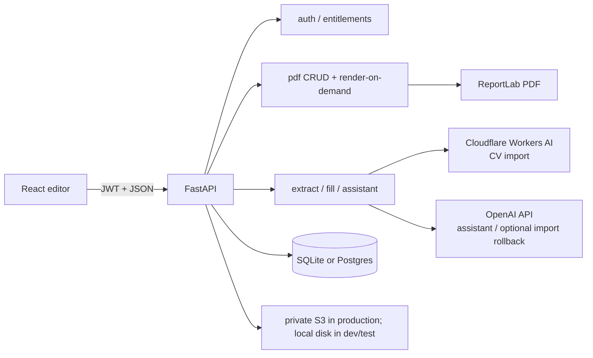
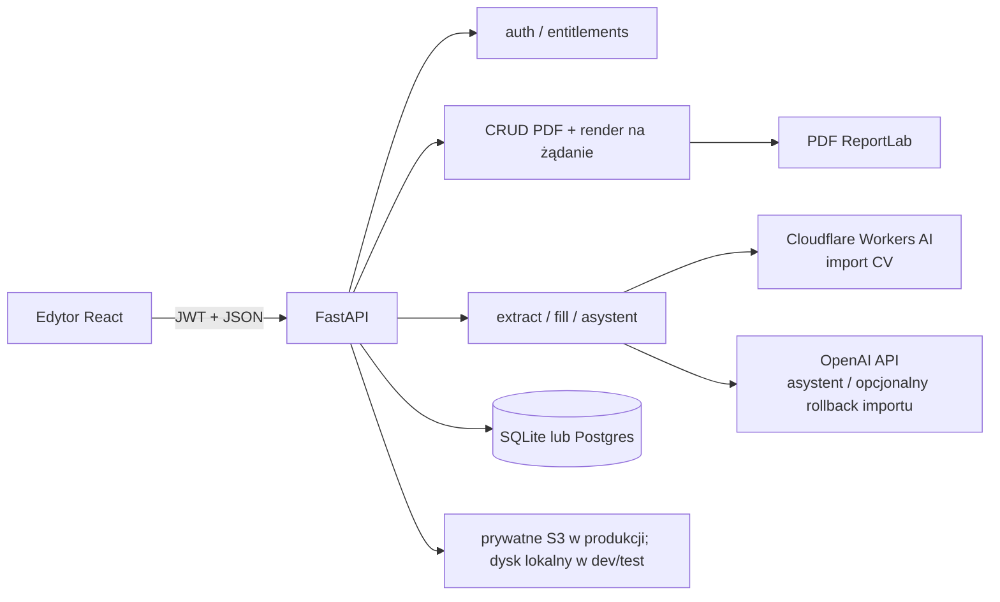

# English

# CV Studio

CV Studio is a Polish-language A4 CV editor: a WYSIWYG canvas, ten individual templates (each with its own name and short stylistic description), PDF import via AI, a guided bio wizard, a floating AI assistant, and ReportLab PDF export that matches the canvas 1:1 (coordinates in points, top-left origin on the frontend, flipped for ReportLab).

This README is the technical entry point for developers and the complete bilingual architecture/tutorial reference. Product-oriented feature copy lives in [`docs/FEATURES.md`](docs/FEATURES.md), template generation (AI extraction versus deterministic Python layout) is explained in [`docs/cv-template-generation.md`](docs/cv-template-generation.md), and the complete English reference for AI scope, providers, safety boundaries, credits, data flow, tests, and extension work lives in [`docs/AI_IMPLEMENTATION_README.md`](docs/AI_IMPLEMENTATION_README.md).

---

## Table of contents

1. [Purpose and problem](#purpose-and-problem)
2. [Main user flows](#main-user-flows)
3. [Architecture and data flow](#architecture-and-data-flow)
4. [Technologies](#technologies)
5. [Folder structure](#folder-structure)
6. [Database](#database)
7. [Features (implementation map)](#features-implementation-map)
8. [API](#api)
9. [Installation and local development](#installation-and-local-development)
10. [Testing](#testing)
11. [Deployment](#deployment)
12. [Security and privacy](#security-and-privacy)
13. [Accessibility and UX](#accessibility-and-ux)
14. [Known limitations and planned work](#known-limitations-and-planned-work)
15. [Further reading](#further-reading)

---

## Purpose and problem

Job seekers need CVs that look professional and export cleanly to PDF. Generic form builders hide layout; design tools are too heavy. CV Studio gives a true A4 canvas (595×842 pt), templates filled with real career data, and AI that extracts or improves content without inventing unsafe coordinates for decorative chrome.

Forcing registration before a visitor had seen the editor used to be the largest funnel loss: every new visitor had to create an account — and pick a paid plan during registration — before touching a single template. **Guest mode** removes that wall: `/cvstudio/guest` works with no JWT at all (authenticated users open `/cvstudio/{username}`), so a visitor can pick a template, run the guided wizard, or freeform-edit and see the exact document they would export, with state kept in `localStorage` instead of the backend. An account is only required at the point of real value — saving or exporting the PDF (a "save-gate" modal) — or for CV import, which stays account-gated because it sends personal CV data to a server-side AI provider and consumes an account-wide quota. See [Guest mode (editor without an account)](#guest-mode-editor-without-an-account) for the full implementation.

**Implemented today:** editor (including guest mode without an account), templates, extract/fill, bio draft, AI assistant (goal-oriented actions, rating dashboard, translate, layout review cards), entitlements (Darmowy / Pro — 59 zł / 30 days), explicit save + independent render-on-demand download, guest-only localStorage autosave, Storage V2 (private S3 in production; local filesystem only in development/tests), JWT auth.

**Optional locally:** AWS S3 may replace the development filesystem. **Required on Render/production:** `S3_BUCKET_NAME`, `AWS_ACCESS_KEY_ID`, `AWS_SECRET_ACCESS_KEY`, and `AWS_REGION`, with a private bucket and Block Public Access enabled. Unpaid plan selection (`ALLOW_UNPAID_PLAN_SELECTION`) remains a local-only option.

**Not implemented as full Stripe Checkout yet:** paid plans can be activated without payment when unpaid selection is enabled; `402 payment_required` is the seam for future Checkout.

---

## Main user flows

1. **Choose a landing-page start** → the primary CTA “Kreator CV” (`start=wizard`) opens the four-step data wizard. After the wizard, guests save the profile locally and continue to registration/login; authentication adopts the draft, generates the Free Meridian CV, and opens the full editor. The secondary “Import CV” (`start=import`) still uses the import flow. The tertiary “DEMO” link (`start=demo`) opens the limited Linden starter with the exact Julia Bernat data used by the Linden picker mockup. The editor topbar’s labelled **Zmień szablon** control opens the change-template gallery after the CV exists.
2. **Edit as a guest** → the limited Linden demo provides text editing, contextual layout controls, undo/redo, zoom, and page navigation. The four-step data wizard is a registration handoff, not a second guest editor; its profile is persisted locally until authentication — see [Guest mode](#guest-mode-editor-without-an-account).
3. **Register / login only when it matters** → clicking “Zapisz” / “Pobierz PDF” as a guest opens `SaveGateModal` instead of calling the backend. Registering or logging in preserves the selected `start` intent, and if a guest document exists, `ClaimGuestDocumentModal` asks the now-authenticated visitor to confirm it is theirs before loading that JSON onto the A4 canvas (no automatic `POST /pdf/create_pdf`) — a guest document belongs to the browser, not to any identity, so silently attaching it to whoever happens to log in next would leak one person's draft into an unrelated account.
4. **Pick a template** → `handleLoadTemplate` materializes specs → canvas.
5. **Import PDF** (account required) → `POST /ai/extract_cv` → choose template → `POST /ai/fill_template` → Python layout in `cv_generator.generate_resume`.

### Import history

Each account-scoped PDF import creates a separate `CvImportSnapshot` record.
The application stores only the normalized `cv_data`, safe filename, size,
status, and timestamps—not the original PDF bytes, URL, or storage key.
`AiCvPanel` lets the owner reopen a successful snapshot, select a template
without another AI extraction, and delete the stored data. `Pdf.source_import_id`
links CVs saved from that snapshot, so history can show their template and open
them from the document library.

The dialog keeps its history heading, refresh/new-import controls, and footer
visible while the snapshot list scrolls inside the available `82vh` shell. The
list is a named, focusable region, so mouse-wheel, touch, and keyboard scrolling
can reach every import without allowing cards to disappear under the footer.
The upload pane uses the same bounded overflow rule only when a short viewport
cannot fit the first step.

The API validates a PDF signature, parseability, encryption state, 10 MB byte
limit, and 12-page limit before extraction. `GET /ai/imports`,
`GET /ai/imports/{id}`, and `DELETE /ai/imports/{id}` are ownership-scoped;
an import ID alone never grants access to another account's data.
6. **Bio wizard** → guests use a four-step fullscreen data creator (`BioCvModal`) from the landing CTA or demo conversion, then authenticate. Authenticated users use the five-step wizard with template selection; they use draft CRUD on `/ai/bio_cv_draft`, while guests autosave to `localStorage` (`cvstudio.guest.wizardDraft`). After guest authentication, the snapshot is adopted and `POST /ai/fill_template` generates the Free Meridian template for the direct wizard conversion or Linden for the demo conversion before the full editor opens.
7. **Edit** → drag/resize/style → edits live in memory (backing undo/redo). Authenticated documents are **not** autosaved to the backend — "Moje dokumenty" is updated only by an explicit **Zapisz** (see step 9). Guests still get a debounced `localStorage` write (`guestDocument.js`) so their unclaimed work survives a reload.
8. **AI assistant** → `POST /ai/assistant` → tips / corrections / reviewable layout groups (account required — every assistant action is entitlement-gated).
9. **Save vs. Download** (two independent actions):
   - **Zapisz** → `POST /pdf/create_pdf` on the first save (creates the "Moje dokumenty" entry + its `pdfId`), then `PUT /pdf/update_pdf` on every later save (updates that same document). This is the only path that writes to "Moje dokumenty".
   - **Pobierz** → `POST /pdf/render_pdf` renders the current canvas on demand and streams it **without** saving, so an unsaved document can still be downloaded. Both actions charge the export quota on download and require an account (guests reach the save-gate).



---

## Architecture and data flow

### Entry points

| Layer | Entry | Role |
|--------|--------|------|
| Frontend | `frontend/src/main.jsx` → `App.jsx` | Router: `/`, `/login`, `/register`, `/cvstudio/:workspace` (`guest` or username — no `ProtectedRoute`); legacy `/pdfcanvas` redirects |
| Editor page | `frontend/src/pages/PdfCanvas.jsx` (`PdfCanvas`) | Composes hooks into focused Canvas / UiSurfaces / Session / DocumentLifecycle providers |
| Backend | `backend/app/main.py` | FastAPI app, CORS, `/health`, routers, optional SPA static |

### Frontend layers

- **Pages** — marketing, auth, editor shell.
- **Hooks** — `useA4Elements` is the canvas facade; undo/redo in `useDocumentHistory`; selection/drag in `useElementSelectionDrag`; factories/materialize helpers are pure utils; `usePdfExport` talks to PDF endpoints; `useEntitlements` loads plan limits.
- **Context** — focused `CanvasContext`, `UiSurfacesContext`, `SessionContext`, and `DocumentLifecycleContext`; the former broad `PdfContext` module has been removed and an architectural test rejects reintroduction.
- **Services** — `ApiClient` (`services/api.js`) with long timeouts and retries for Render cold start; shared `fillTemplate` for `/ai/fill_template`; authenticated image blob helper for private library photos.
- **Templates** — static element specs in `frontend/src/templates/`; registry in `templates/index.js`.

### Backend layers

- **Routes** — thin HTTP in `app/api/routes/*` (PDF create/update delegates to `document_service`).
- **CRUD** — SQLAlchemy writes in `app/crud/*`.
- **Services** — PDF render, CV layout, AI, entitlements, S3.
- **Models** — `app/models/models.py`; engine in `app/models/database.py`.

### Coordinate system

Canvas and stored geometry use **top-left** origin (CSS-like). ReportLab uses **bottom-left**; `PDF_Generator` flips `top` using `page_h` before drawing (`backend/app/services/pdf_generator.py`). Immediately before create, update, or render-on-demand export, `resolveBrowserTextLayouts` builds an off-screen mirror with the textarea's exact CSS width and typography. Chromium `Range` rectangles provide the authoritative soft-wrap slices, bullet indent, line start, and horizontal advance. ReportLab validates this transient metadata against the complete current content and box bounds, then draws those exact lines and compensates the remaining kerning delta so their start and end positions match the canvas. The records exist only in the outgoing request and are never persisted. If the DOM, the requested primary font (including inline bold/italic variants), or validation is unavailable, export falls back safely to the backend wrapper. That fallback uses literal width for Montserrat and all uncalibrated families; only Inter retains its independently verified 2 px `INTER_WRAP_WIDTH_TOLERANCE_PX` correction. After a font change the canvas reflows measured `height` / following `top` values; auto-height PDF export **honours those stored heights** (clipping overflow) instead of recomputing box height from PDF wrap alone. Stub heights from a pre-measure export still expand. Canvas painting maps Helvetica/Courier → Inter via `canvasFontFamily` to match the PDF Unicode aliases.

### Auto-height reflow and aligned icons

Template textareas start with authored placeholder heights and are measured after the browser loads their real fonts. `reflowTextareaHeight` then moves all following elements in the same visual lane by the measured delta. Text-aligned Iconic images (`alignWithText: true`, including backward-compatible `/template-assets/iconic/` URLs) are classified as section chrome and may join a lane when they hang to the left of the column (~40 px tolerance). The same left-hanging rule applies to Monument ordinal badge text (`isDecorativeChromeText` / `flowRole: "section-chrome"` digits inside the numbered square at x=74 while the body column starts at x=102): without it, a page break moved the filled square and title to page 2 and left the number behind or 8 px too low in the square. Icons that sit entirely to the right of a narrow column are excluded, so a sidebar cannot drag main-column icons away from their headings.

Undo/redo history treats that **background** reflow as part of the baseline, not as a user edit: a "quiet" record refreshes the current history entry in place so Cofnij stays disabled until the user actually changes the document. Otherwise Undo would restore pre-measure heights and revive uneven Y gaps (e.g. diploma → school in education records). Two rules make this reliable and are unit-tested as pure functions in `frontend/src/utils/documentHistory.js` (`recordSnapshotState`):

- A **quiet settle preserves the redo tail**. Applying an undo/redo re-renders and fires a quiet record while the index sits before the top of the stack; truncating there used to delete every redo entry, which left Ponów permanently disabled after any Cofnij.
- **A user textarea edit is never quiet.** `handleFitTextareaToContent` only marks history quiet for a *background* measure (mount / font-ready / load). The typing/formatting commit in `Textarea.jsx` passes `{ quiet: false }`, so the content change lands as a real, undoable step instead of overwriting the pre-edit baseline in place.

Every auto-height textarea measures twice — once immediately, once again after `document.fonts.ready` — and each measurement calls `reflowTextareaHeight` independently, so a later field can briefly carry a stale `page` number from an earlier pass. `rawSamePageGap` checks authored `top` values (ignoring `page`) before applying the generic page-break gap: a same-record pair with a stale page keeps its authored small gap, while a genuine cross-page seam uses `DEFAULT_PACK_GAP` (10 px, `SPACE_RECORD`) for ordinary blocks and `SECTION_PACK_GAP` (21 px, `SPACE_SECTION`) for section chrome. Using the leftover page-top inset (often 0–6 px when education starts near `pageTop` on page 2) crushed headings such as WYKSZTAŁCENIE under the previous section. Single-column templates mark section markers/rules `locked` for interaction and guides, but `flowRole: "section-chrome"` still lets them reflow with their heading so underlines do not stay stranded on the next page. The reflow intentionally does **not** infer title/meta relationships from font size or boldness; that heuristic distorted valid record spacing (for example Monument chrome rhythm) and compounded independent height deltas. Section marker/label/rule use `section-chrome`, and ordinary records use `content`. Keep-with-next logic therefore cannot mistake a job title for a section heading and move the real heading behind its own content. Legacy templates without this property keep the category-based fallback.

During the canvas enter hold, auto-height reflow is suppressed and resumes after fonts are ready. Every textarea emitted by the Python generators carries `preserveInitialLayout: true` (via `_block` in `cv_generator_primitives.py`). On first mount the canvas may **shrink** a box to browser `scrollHeight` when ReportLab overshoots (so empty slack cannot inflate visual section gaps), but it will not **grow** — independent growth races still stretch gaps. The same shrink-only first-pass contract now runs when an auto-height textarea enters edit mode before its display node has mounted: `measureSeededEditable` measures the seeded `contentEditable` DOM immediately, repeats after fonts become ready and after the canvas-enter reflow hold ends, and records the normalization as quiet background layout. The field therefore removes stale empty box space without requiring the user to create and Backspace a temporary line. Editing content or later changing typography/width still triggers normal auto-height reflow. Plain and bullet-list textareas preserve every authored newline, including trailing blank paragraphs, after blur and document scrub; those rows are measured as real spacing and therefore move following flow content through the normal reflow path. Bullet mode removes only a trailing bare marker (`•`) because that marker is temporary editor chrome, not an authored row (`trimTrailingEmptyTextareaLines` / `trimTrailingEmptyTextareaPayload` in `textareaHeight.js`). Enter after a filled item creates the next `• ` item; Enter on an empty item removes the marker and places the caret in a normal blank paragraph; another Enter creates another blank paragraph. `createTextareaBackspaceEdit` handles only list paragraph boundaries: one Backspace on an empty plain row removes exactly one newline and shrinks the box immediately, while Backspace at the start of a bullet body removes the marker and converts that row to plain text. Character deletion inside text remains native. Blank rows therefore remain editable and visible both between and after real content. Display rendering keeps a line box for each empty row so authored gaps do not collapse. See `textareaHeight.test.js` (`shouldShrinkPreservedLayout`, authored blank-row, and bullet-placeholder cases), `editableSerialize.test.js` (edit-entry measurement and structural Backspace wiring), and `textareaReflow.test.js` packing cases.

Bullet-list edit mode uses the same hanging-indent geometry as display mode and ReportLab. `bulletRunsToEditableHtml` converts every logical bullet paragraph into a two-column marker/body grid; the shared CSS reserves the actual rendered width of `• ` for every continuation line, and the detached height mirror uses that same structure. `createTextareaEnterEdit` applies Enter as a deterministic stored-text/runs transaction, then selection restoration maps an offset immediately after `\n` into the following paragraph—even when it is empty—instead of falling back to the preceding bullet body. Paste or marker deletion still rebuilds only the paragraph structure, while ordinary character input keeps the live DOM untouched for native caret, IME, and undo behaviour. This fixes both list-line creation and narrow Montserrat sidebars where a borderline word such as `NSE` previously stayed on line three only while editing but moved to line four in the exported PDF.

Section headings are kept with their first body block across page breaks: `avoidOrphanChrome` reserves the full first keep-together record height (degree + meta + description, not only the first textarea), and when a measured body textarea itself jumps to the next page, `precedingRecordMates` + `precedingChromeCluster` pull title/meta siblings and the icon/heading/rule with it. Page-break reclaim similarly reserves `followingRecordMates` (school/meta/body under a grown degree) so continuation pages cannot pull only the degree line back onto page 1 and crush the rest of education on page 2. Reclaim also refuses to jump across intervening lane content (`hasInterveningLaneContent`) — otherwise a later skills body could reclaim into the page-1 footer hole while education still occupies page 2. When the reclaim target carries preceding section chrome (heading/rule/icon), the fit check reserves that chrome span and packs from `SPACE_SECTION` rather than measuring the body alone with `SPACE_RECORD` — otherwise growing a new section with empty lines could snap it back into the page-1 footer even though heading+rule+body no longer fit. That prevents orphans such as “UMIEJĘTNOŚCI” alone at the bottom of page 1, and the education split where Bachelor stayed on page 1 while its description moved to page 2. The same keep-with-next rule applies to rail kickers tagged `sidebar-chrome` (Sterling / Slate): `isChromeLike` treats them as chrome so `precedingChromeCluster` pulls UMIEJĘTNOŚCI onto page 2 with its list, and `_fit_sidebar_sections` refuses to emit a kicker without room for two body lines — Sterling then spills that whole section onto the next existing rail rather than leaving the heading in the page-1 footer. `remainingRecordHeight` and forward packing skip decorative chrome that is Y-sorted inside a tagged `flowGroup` (a template that placed its section chip on the degree line once made reclaim treat school/meta as a new record). Grid rows (a wrapped languages grid or skill-chip grid, whose cells share one `flowGroup` but sit in adjacent, NON-overlapping columns) are held together specially: `recordMatesBeside` counts same-`flowGroup` members as record mates even though they fail the horizontal-overlap `belongsToFlowLane` test, and `placeRecordCluster` moves each grid cell by its authored offset from the row anchor instead of bottom-stacking it. Without the first rule a per-cell reflow pass (each autoHeight cell measures independently on mount) carried one cell across a page break and stranded its row-mates — the Sterling languages bug where "Polski" stayed on page 1 while "Niemiecki"/"Angielski" floated onto page 2; without the second the reunited row collapsed into a single vertical column. Section markers now stay in the heading band and emit `flowRole: "section-chrome"`; ordinary flow nodes use `content`. Backend generators use `Builder.need_section(chrome, body)` before placing a heading, and `Builder.keep_together(height)` for experience/education/other records — each emitted element is tagged with the same `flowGroup` id so canvas reclaim-packing (when earlier boxes shrink) cannot pull only part of a record back onto the previous page. Sections may continue on the next page, but each record stays whole. ReportLab receives the same geometry visible on the canvas.

Section decorations explicitly tagged with `flowRole: "section-chrome"` are treated as a rigid visual composition by `compactChromeCluster`: spacing changes move the complete heading/icon/frame/rule group but preserve every authored mutual Y offset. Explicit main-section chrome also bypasses the generic left-sidebar column heuristic; sidebar chrome has the separate `sidebar-chrome` role. This matters for Cadenza, whose 3 pt accent begins at x=58 while its centered heading text begins near x=219. Filled title bands define their section boundary, and a matching narrow accent that an older pack left up to 48 px away is reclaimed and snapped back onto the band. Recognized legacy-corruption signatures are therefore rebuilt (Cadenza's separated band/accent, the old sequential `SPACE_STACK` marker layout, a flattened Monument accent rule, and Monument ordinal digits that drifted below the title baseline inside the numbered badge — repaired by `healDecorativeOrdinalBaselines`). This keeps template-specific section rhythm stable across Cadenza, Regent, Monument, and other templates while repairing already damaged documents.

### Decorative chrome

Elements with `fixedToPage: true` (backgrounds, frames, sidebars, page numbers) are cloned across pages by default and must not be selected/moved/deleted in the UI (`isDecorativeChrome` in `frontend/src/utils/elementInteraction.js`). First-page-only chrome sets `repeatOnContinuation: false`, which prevents `cloneFixedPageDecorations` from copying it when overflow creates another page. `reconcileDocumentPages` in `frontend/src/utils/structureOperation.js` syncs **only** fixed page chrome and `pageCount` — it never rewrites content `top`/`left`/`page` (packing and textarea reflow own rhythm). `useA4Elements` derives the visible page count from the committed element array after textarea and Sections-panel updates, so React cannot miss an overflow page because a functional state updater ran later than its caller. **Dodaj stronę** and the next-page arrow at the current end create a continuation with the correct page label (including zero-padded Regent-style `01`/`02`); overflow that places content on a new page gets the same chrome; trailing chrome-only pages collapse when content leaves them. When chrome is already in sync the helper returns the same array reference. Design rating prompts respect template typography.

---

## Technologies

| Technology | Version / note | Purpose | Main locations |
|------------|----------------|---------|----------------|
| React | ^19.2 | UI components and hooks | `frontend/src/` |
| Vite | ^7.2 | Dev server and production build | `frontend/` |
| React Router | ^7.18 | Client routes, navigation blocking for unsaved work, and route error surfaces | `App.jsx`, `useDirtyGuard.js`, `authSession.js` (`getEditorPath`) |
| FastAPI | 0.141.1 | HTTP API and dependency injection | `backend/app/main.py`, routes |
| Starlette | 1.6.0 | ASGI middleware, requests/responses, and worker-thread execution | FastAPI runtime |
| python-multipart | 0.0.32 | Streaming multipart form/file parsing | auth and image/CV upload routes |
| Uvicorn | (requirements) | ASGI server | local / Render |
| SQLAlchemy | (requirements) | ORM | `models/`, `crud/` |
| SQLite / PostgreSQL | via `DATABASE_URL` | Persistence | `database.py` |
| ReportLab + fontTools | (requirements) | PDF drawing + TTF name fixes | `pdf_generator.py` |
| PyMuPDF (fitz) | 1.28.2 | Native PDF line/span geometry, column-aware CV extraction, and scan-page rasterisation | `cv_source_layout.py`, `ai_service.py`, `ats_readability.py` |
| OpenAI SDK | 2.14.0 | OpenAI assistant calls and OpenAI-compatible Cloudflare transport | `ai_service.py`, `ai_assistant_service.py` |
| Cloudflare Workers AI | hosted API | Native-text CV extraction (thinking-disabled Gemma 4 with one JSON-mode Llama fallback) and scan extraction (Qwen 3.8 Vision) | `ai_service.py`, `cloudflare_pricing.py` |
| PyJWT / cryptography | 2.13.0 / 50.0.1 | Versioned JWT encode/decode and pinned cryptographic primitives; replaces python-jose/ecdsa | `core/security.py` |
| argon2-cffi / bcrypt | 25.1.0 / 5.0.0 | Authoritative Argon2id hashes plus a temporary bcrypt rollback bridge for N-1 workers | `core/security.py` |
| python-dotenv | 1.2.3 | Loads local backend `.env` configuration | `core/config.py` |
| boto3 | 1.43.51; required in production | Private S3 objects behind the Storage V2 abstraction | `pdf_storage.py`, `s3_storage.py` |
| nanoid | ^5.1 | Client element ids | canvas hooks |
| motion | ^12 | UI motion | modals / assistant |
| pytest + unittest | 9.1.1 + stdlib | Full backend runner plus compatible `unittest.TestCase` tests and subtests | `backend/tests/`, `backend/requirements-dev.txt` |
| Node test runner + Vitest | Node 20+ / ^4.1 | Pure-module regressions plus jsdom React runtime and Error Boundary tests | `frontend/scripts/run-tests.mjs`, `frontend/vitest.config.js` |
| Playwright | ^1.62 | Chromium editor smoke tests and browser-level regression harness | `frontend/playwright.config.js`, `frontend/e2e/` |

Official docs: [React](https://react.dev/), [Vite](https://vite.dev/), [FastAPI](https://fastapi.tiangolo.com/), [SQLAlchemy](https://docs.sqlalchemy.org/), [ReportLab](https://www.reportlab.com/docs/reportlab-userguide.pdf), [Cloudflare Workers AI](https://developers.cloudflare.com/workers-ai/), [Workers AI OpenAI compatibility](https://developers.cloudflare.com/workers-ai/configuration/open-ai-compatibility/), and [OpenAI API](https://platform.openai.com/docs).

---

## Folder structure

```text
pdf-generator/
├── AGENTS.md                 # Project agent / documentation rules
├── BUGZ.MD                   # Known issues tracker
├── README.md                 # This file
├── docs/                     # Product + design + deep-dive docs
├── frontend/
│   ├── public/
│   │   ├── cv-studio-logo.svg     # Full orange CV Studio logo
│   │   ├── cv-studio-mark.svg     # Compact mark for favicon/editor rail
│   │   └── template-mockups/      # Static A4 preview PNGs regenerated from starter element graphs
│   ├── src/
│   │   ├── components/       # canvas, editor, ai, modals, gallery, common
│   │   │   ├── canvas/CanvasPageStage/   # Smooth slide+fade when changing A4 page (single-page view)
│   │   │   ├── canvas/CanvasHoverToolbar/ # Shared gutter toolbar, delayed tooltips, semantic-block highlight, overflow menu
│   │   │   ├── canvas/SectionRecordAdd/  # Section hover/focus adapter: exact-element outline, add/reorder, layout/transfer/delete menu
│   │   │   ├── canvas/RecordBlockAdd/    # Record hover/focus adapter: exact-field outline, add/reorder, description toggle, recoverable deletion
│   │   │   ├── canvas/recordPlusSize(.test).js # Screen-stable toolbar sizing and single/spread gutter resolution
│   │   │   ├── canvas/FlatSectionLayoutToggle/ # Hover icon on flat-list sections (Skills, Languages) to open the layout modal
│   │   │   ├── editor/AddSectionModal/   # "+ Dodaj sekcję" modal (name + aa/cc-sub/cc-edu/cc-exp layout picker)
│   │   │   ├── editor/FlatSectionLayoutModal/  # Inline row ↔ bullet list picker with a live content preview
│   │   │   ├── editor/LongCvModal/        # AI fallback after spacing + typography S cannot hit the page target
│   │   │   ├── editor/SaveGateModal/     # "Create an account to save" modal shown to guests
│   │   │   ├── editor/DemoBanner/        # Persistent banner while the guest-mode demo CV is on canvas
│   │   │   └── editor/StartChooser/      # Empty-state onboarding: wizard vs import chooser on a fresh document
│   │   ├── hooks/            # useA4Elements facade, useDocumentHistory, usePdfExport, …
│   │   ├── pages/            # Hero, Login, Register, PdfCanvas
│   │   ├── services/         # ApiClient, fillTemplate, authenticatedImage, eventLog
│   │   ├── store/            # Focused Canvas / UiSurfaces / Session / DocumentLifecycle contexts
│   │   ├── templates/        # per-template specs + helpers; aurelia.js is the framed one-column editorial starter
│   │   └── utils/            # geometry/reflow/sections, browser text-export layout, template appearance, guest helpers
│   │       ├── planPresentation.js # Canonical Free/Pro UI copy merged with billing-owned prices
│   │       ├── templatePageFit(.test).js # Current typography → S page-fit orchestration before AI
│   │       ├── atriumAppearance(.test).js # Original, white, dark, and three strong semantic palettes with real icons
│   │       ├── atriumTypographyLayout(.test).js # Atrium contact/single-lane repack for S–XL and browser heights
│   │       ├── regentAppearance(.test).js # Four classic and two creative semantic Regent editions with real icons
│   │       ├── regentTypographyLayout(.test).js # Regent contact/single-lane repack for S–XL and browser heights
│   │       ├── cadenzaAppearance(.test).js # Six semantic palettes, contrast, icon switching, reversible type
│   │       ├── cadenzaTypographyLayout(.test).js # Cadenza contact/flow repack for S–XL and browser heights
│   │       ├── vellumAppearance(.test).js # Six white-paper portrait palettes, adaptive field contrast, real icons
│   │       ├── vellumTypographyLayout(.test).js # Vellum contacts/field/record-overlay repack for S–XL
│   │       ├── aureliaAppearance(.test).js # Six white-paper framed palettes, contrast, real icons, reversible type
│   │       ├── aureliaTypographyLayout.js # Aurelia contact/single-lane repack with exact record overlays
│   │       ├── slateAppearance(.test).js # Six semantic Slate palettes, contact assets, and reversible typography
│   │       ├── profilePhotoVisibility(.test).js # Reversible photo slots and Slate's photo-less contact heading
│   │       ├── persistedCanvasElement(.test).js # Category-independent saved-row metadata hydration
│   │       ├── cvImportRequest.js # Four-minute, no-retry CV extraction request and recovery policy
│   │       ├── cvImportRequest.test.js # Timeout and persisted-status regression tests
│   │       ├── addSectionRecordTemplate.test.js # Active-template Education/Experience record inheritance
│   │       ├── aiCvPanelScroll.test.js # Import-history overflow and keyboard-access regression guards
│   │       ├── canvasHighlightBounds.js # Model-first bounds and post-commit ink limits
│   │       ├── canvasHighlightBounds.test.js # Focused semantic-highlight geometry regressions
│   │       └── canvasHighlightAllTemplates.test.js # Main/sidebar isolation contract for every built-in template
│   ├── e2e/                 # Playwright editor smoke and regression scenarios
│   ├── scripts/             # Recursive unit-test discovery + gzip bundle-budget gate
│   ├── package.json
│   └── .env.example
├── shared/
│   └── pdf-element.schema.json  # Exported PdfElement + transient ResolvedTextLine contract
└── backend/
    ├── app/
    │   ├── api/routes/       # auth, pdf, images, ai, assistant, billing, events
    │   ├── core/             # config, security
    │   ├── crud/
    │   ├── models/
    │   ├── schemas/          # PdfElement + JSON Schema export
    │   ├── services/         # document/storage lifecycle, readiness, auth limits, AI reservations, templates
    │   │   ├── ai_service.py             # text-first/vision CV extraction + deterministic fill entry
    │   │   ├── cv_source_layout.py       # column lanes, source sections, deterministic field grounding
    │   │   ├── cloudflare_pricing.py     # Workers AI token-rate telemetry
    │   │   ├── pdf_storage.py            # Storage V2 keys, containment, dual-read, local/S3 IO and cleanup
    │   │   ├── readiness.py              # DB/migration/catalog readiness probe and request gate
    │   │   └── deployment_bootstrap.py   # Render pre-deploy migrations and seed bootstrap
    │   ├── utils/            # image_src_to_path, metrics_logging, upload_security
    │   ├── main.py
    │   └── dependencies.py
    ├── alembic/              # Additive migrations through 0015, including N-1 write compatibility
    ├── fonts/                # Bundled TTFs for PDF
    ├── template_assets/      # Sidebar, IT and Iconic artwork/icons
    │   ├── iconic/cadenza-{porcelain,mist,sage,cobalt,burgundy,emerald}/ # Six real contact-icon palettes
    │   ├── iconic/aurelia-{gilded,pewter,sage,cobalt,burgundy,noir}/ # Six framed-editorial contact-icon palettes
    │   ├── iconic/slate-accent/ + slate-{monochrome,copper,forest,plum,teal}-accent/ # Six Slate palette families
    │   └── iconic/vellum-{sage,mist,rose,ink,burgundy,emerald}/ # Six contact + circular-portrait icon palettes
    ├── tests/                # includes Cloudflare extraction and SQLite migration-recovery regressions
    ├── alembic.ini
    ├── requirements-dev.txt  # Runtime requirements + pytest for full local/CI collection
    ├── requirements.txt
    └── .env.example
```

**Rules:** Frontend templates must stay in sync with `_GENERATORS` in `cv_templates/registry.py` (re-exported from `cv_generator.py`; 10 ids). Each `cv_templates/templates/<id>.py` holds only that template’s live generator — not a shared multi-theme engine with sibling branches. Do not put secrets in the repo. `uploads/` and `static/generated/` are development/test runtime data, not production persistence or source; production uses private S3. Neither user images nor generated PDFs are publicly mounted: image bytes require `GET /images/{id}/content`, while stored PDFs require the authenticated and metered `POST /pdf/download_pdf` route.

---

## Database

Configured by `DATABASE_URL` (`backend/app/models/database.py`). Default if unset: `sqlite:///./pdfgenerator.db`. `postgres://` URLs are rewritten to `postgresql://`. Postgres uses `pool_pre_ping` for Render cold starts.

Production schema changes run before the web process through `python -m app.services.deployment_bootstrap`: `init_db()` creates missing tables, applies `alembic upgrade head`, and seeds the exact plan catalog. It deliberately does not run historical cleanup: maintenance is an explicit, separately observed operation. The ASGI lifespan performs configuration checks but does not mutate the schema. `/ready` reports success only when `SELECT 1` works, the database and code Alembic heads match, the seeded catalog is exact, and SQLite has no residual foreign-key violations; database-backed routes return a sanitized 503 while readiness is false. Manual CLI: `cd backend && alembic upgrade head`.

Revision `20260824_0005` links `pdfs.source_import_id` to the private `cv_import_snapshots` history. SQLite cannot add that foreign key with a regular `ALTER TABLE`, so `upgrade` uses Alembic `batch_alter_table`: SQLite performs a reflected move-and-copy while PostgreSQL uses normal ALTER operations. The migration inspects the table, column, relation, and index independently, which makes a retry repair the partially committed state left by an older failed SQLite run. Do not `stamp` past this revision after an error; update the code, back up the database, and rerun `upgrade head`. Implementation: `backend/alembic/versions/20260824_0005_import_history.py`, lines 19–78, function `upgrade`. Regression tests: `backend/tests/test_alembic_import_history_migration.py`, lines 18–143, class `ImportHistoryMigrationTests`.

### Tables (business purpose)

| Table | Purpose |
|-------|---------|
| `users` | Accounts: display username/email, canonical NFKC+trim+casefold keys, authoritative Argon2id hash, temporary N-1 bcrypt rollback bridge, atomic image-slot count, `is_active`, timestamps |
| `auth_rate_limits` | Database-backed fixed-window registration/login counters keyed by an HMAC digest, never raw IP address or account identity |
| `images` | Uploaded image metadata; `file_path` local or S3 URL; `owner_id` → users |
| `pdfs` | CV documents: normalized `title` + owner-unique `title_key`, immutable create idempotency key/hash, optimistic `revision`, Storage V2 backend/key plus dual-read legacy `file_path`, owner, dimensions, `editor_mode`, active `template_id`, immutable `origin_template_id`, optional rhythm/CV data, and legacy watermark marker |
| `storage_cleanup_jobs` | Durable, deduplicated PDF/image deletion jobs with attempt count, retry time, resource type, sanitized error, and terminal dead-letter state |
| `pdf_elements` | Canvas elements; geometry + style columns; extras in `extra_properties` JSON (`fixedToPage`, `repeatOnContinuation`, `locked`, `flowRole`, `flowGroup`, `preserveInitialLayout`, Atrium/Sterling/Linden/Monument/Slate/Meridian/Cadenza/Vellum `appearanceSettings` + reversible type baselines, bold, `runs` inline-decoration overlay, connectors, …) |
| `bio_cv_drafts` | One private JSON draft per user |
| `plans` | Free (Darmowy) / Pro limits and feature flags, including nullable `max_cv_imports_per_month` (legacy `standard`/`premium` rows deactivated) |
| `user_subscriptions` | Current plan per user (Stripe columns ready, often null) |
| `usage_counters` | Monthly exports, successful CV imports, settled AI credits, and currently reserved AI credits (`period_key` = `YYYY-MM` UTC) |
| `ai_credit_reservations` | Per-user provider reservation: idempotency key/hash, maximum and charged credits, parallel assistant claims bounded by the atomic credit balance, one active CV-import slot, status, replay response, and expiry |
| `payments` | Future payment ledger |
| `maintenance_markers` | One-off cleanup keys |

Migrations `20260901_0009`–`0015` form one additive compatibility chain. Storage V2 adds immutable locators and cleanup jobs; AI reservations add in-flight credit accounting; auth hardening adds canonical identities and persistent throttles; document integrity adds revisions, create replay metadata, title keys, and template provenance. Revision `0013` adds bounded cleanup retries and a terminal dead-letter state. Revision `0014` backfills atomic image-slot counters, enables SQLite foreign keys on every connection, and quarantines orphan image references without deleting their safe display source. Revision `0015` installs SQLite/PostgreSQL compatibility triggers so an N-1 worker that does not know `title_key` or `revision` cannot silently overwrite a current-worker snapshot. Existing documents remain readable through the validated legacy locator path, and colliding historical titles receive deterministic suffixed keys. Implementations: `backend/alembic/versions/20260901_0009_storage_v2.py`, revision `20260901_0009`; `20260901_0013_cleanup_dead_letters.py`, function `upgrade`; `20260901_0014_atomic_image_slots.py`, function `upgrade`; and `20260901_0015_n1_document_writes.py`, functions `_backfill_n1_writes`, `_install_sqlite_triggers`, and `_install_postgres_trigger`.

`resolvedLines` is deliberately absent from `pdf_elements.extra_properties`: it is browser-authored render metadata attached only to create/update/download requests. Saved documents retain semantic `content` and `runs`, so reopening a CV never restores stale line breaks measured for an earlier width or font state.

CV-import quota fields:

- `plans.max_cv_imports_per_month`: nullable integer; `1` for Free and `NULL` (unlimited) for Pro after `seed_plans`.
- `usage_counters.cv_imports_count`: non-null integer, default/server default `0`; incremented only after a successful normalized import.
- `usage_counters.user_id`: foreign key to `users.id`; together with `period_key` it has unique constraint `uq_usage_user_period`, so one user owns at most one UTC monthly counter row.
- Migration `20260829_0007` adds these columns idempotently. Migration `20260831_0008` updates an existing production Free catalog row to one project, three monthly exports, zero AI actions, and one monthly CV import. It deliberately leaves `pdfs.watermarked=true` on legacy rows until the corresponding stored file has actually been rebuilt without the old overlay. The legacy `user_subscriptions.free_import_used` boolean is retained but ignored.

**Relationships:** One user owns many `pdfs` and `images`. Each `pdf` has many `pdf_elements`. Subscription and usage are per user.

Models: `backend/app/models/models.py` (`User`, `Pdf`, `PdfElements`, …).

---

## Features (implementation map)

Product narrative: [`docs/FEATURES.md`](docs/FEATURES.md).

### A4 canvas editor (template vs freeform)

Interactive multi-page **A4 portrait** canvas with two persisted editor modes on each `Pdf` row (`editor_mode`, `template_id`, optional `spacing_px`). Vertical wheel over `.canvas-area` pans overflow first; at the top/bottom edge (or when the page fits without overflow) it calls `goToPage` so **PageControls** (`Strona N / M`) updates with the new page. Single-page view transitions with a short slide+fade (`CanvasPageStage`, ~320 ms; reduced-motion → opacity only) and eases `scrollTop` to 0 instead of a hard jump. Horizontal-dominant gestures, Ctrl/Meta wheel, and editable fields are left alone (`frontend/src/utils/canvasPageWheel.js`, `frontend/src/hooks/useCanvasPageWheel.js`, tests in `canvasPageWheel.test.js`). The canvas scroll rail is styled in `App.css` with neutral surface/border/ink tokens (Firefox via `scrollbar-color`).

- **template** — structural editing: content/chrome positions are layout-owned (no free X/Y drag). `canFreePositionElement` also blocks template icons (`alignWithText` / `/template-assets/…`) and generator shapes (line/rectangle/circle/ellipse/polygon/path) even when a template omitted `flowRole` — this covers harbor/regent/axis contact icons, masthead artwork, and generator frames, and similar. User gallery photos (`/images/…`) may still move, except a fitted profile-photo slot (`photoSlot: "image"` / glyph). **Dostosuj CV** flyout (sidebar label + panel title; formerly “Sekcje”) docks beside the 72px tool rail (reorder + density presets + advanced vertical rhythm `stack` / `record` / `section` / `after_rule`, defaults 4 / 10 / 21 / 8), gallery photo-slot targets (`applyProfilePhoto`), and auto-height reflow with reclaim. The sidebar’s action-oriented **Edytuj jako kopię** label and “Utwórz kopię do swobodnej edycji” tooltip make clear that the existing command creates a freeform copy instead of modifying the source document in place.
- **freeform** — full toolbox (text, shapes, images), free drag/resize, and reflow without page-break reclaim so hand placement is preserved.
- **tool-rail footer stays visible** — the left rail (`Sidebar`) sits in a `100vh` shell with `overflow: hidden` (`.main-container` in `App.css`). Tool tiles stay compact and non-scrolling (`SidebarControls` 36×36 tiles / 30×30 icon boxes) so the plan badge and **Wyloguj się** footer fit a typical laptop viewport without a scrollbar. Every compact tile now reveals an immediate custom label on hover or keyboard focus, and panel-opening actions expose `aria-pressed` plus a persistent accent state for **Zdjęcie profilowe**, **Dostosuj CV**, **Edytuj jako kopię**, and **Moje dokumenty**.

### Freeform geometric ornaments (including cubic Bézier)

Freeform mode exposes CV-friendly geometry tools beyond line / rectangle / circle / ellipse:

- **polygon** — presets `triangle`, `diamond`, `hexagon`. Vertices live in **normalized unit-square space** (`points: [[x,y],…]` in 0…1). Resizing the bounding box scales the shape without rewriting geometry. Inspector: size, fill toggle, stroke width, colour.
- **path** — cubic Bézier ornaments with presets `wave`, `arc`, `flourish`. Segments are `M` / `C` dicts in the same unit-square space (`curves`). Selecting a path shows **draggable anchor and control-point handles** on the canvas; move/resize still operate on the box. Inspector can reset to a preset (rewrites `pathKind` + `curves`).
- **rectangle** — freeform also exposes `filled` and `borderRadius` so panels and pills match template chrome without leaving freeform.

This is intentional product UX, not a Figma pen tool: users place a preset, resize the frame, and optionally reshape Bézier handles. Canvas SVG (`curvesToSvgPath`) and ReportLab `curveTo` share one geometry so export stays WYSIWYG.

Implementation:

- `frontend/src/utils/freeformShapes.js`, lines 17–228 — presets, SVG helpers, `listPathControlHandles`, `movePathHandle`
- `frontend/src/utils/a4ElementFactories.js`, functions `createRectangleElement`, `createPolygonElement`, `createPathElement` (lines 61–181)
- `frontend/src/components/canvas/Polygon/Polygon.jsx`, `Path/Path.jsx` — canvas render + Bézier handle drag
- `frontend/src/components/editor/Sidebar/Sidebar.jsx`, lines 77–116 — freeform tool rail entries
- `frontend/src/components/common/SidebarControls/SidebarControls.module.css`, lines 1–111 — compact 36×36 tool tiles, active state, and hover/focus labels (no rail scrollbar)
- `frontend/src/components/editor/Editor/Editor.jsx` — rectangle / polygon / path inspector groups
- `frontend/src/utils/canvasElementSchema.js` — categories `polygon`, `path`
- `backend/app/schemas/pdf_schema.py` — `ElementCategory` + `shape` / `points` / `pathKind` / `curves`
- `backend/app/crud/pdfs.py` — pack/unpack those fields in `extra_properties`
- `backend/app/services/pdf_generator.py`, methods `renderRectangle` (lines 272–313), `renderPolygon` (314–340), and `renderPath` (341–379)
- `shared/pdf-element.schema.json` — regenerated via `python -m app.schemas.export_pdf_element_schema`

Tests:

- `frontend/src/utils/freeformShapes.test.js`
- `frontend/src/utils/a4ElementFactories.test.js` — polygon / path factories
- `frontend/src/utils/canvasElementSchema.test.js` — accepts `polygon` / `path`
- `backend/tests/test_pdf_shapes.py`, lines 175–206 — filled rectangle, polygon close, Bézier `curveTo`
- `backend/tests/test_elements_from_rows.py` — polygon / path round-trip through `extra_properties`

Further reading:

- [ReportLab graphics — path / `curveTo`](https://docs.reportlab.com/reportlab/userguide/ch2_graphics/) — PDF cubic Bézier API used by `renderPath`.
- [SVG path cubic Bézier (`C`)](https://developer.mozilla.org/en-US/docs/Web/SVG/Tutorial/Paths#curve_commands) — canvas path `d` strings built by `curvesToSvgPath`.

The element inspector uses white as its dominant working surface across the help band, control groups, inputs, and numeric steppers. Its header now uses the warm beige `surface` token instead of a large black slab, while ink remains limited to text, compact active states, and the close button's hover feedback. The result keeps the inspector distinct from the white A4 document without letting application chrome overpower the document.

Element properties open in a **measured top-left workspace inspector** (`Editor` via `createPortal`). Its left and top edges follow the live sidebar and topbar; in the full freeform rail its bottom edge follows the divider above **My documents**. The inspector keeps a fixed 308 px width at every canvas zoom up to and including 200%, so zooming out no longer makes the editing panel grow. Only zoom levels above 200% may narrow it against the enlarged A4 sheet while preserving the 15 px page gap; available viewport width remains a hard safety limit, and the compact layout still becomes a drawer below 720 px. Short template/demo rails use a viewport-contained height fallback so the form is not crushed by a divider immediately below the topbar. The inspector enters and exits with a 240 ms leftward fade/slide; reduced-motion mode removes the movement. A warm `surface` header with ink typography names the selected object in plain Polish, and a persistent help band explains **Ctrl + left mouse button = select multiple elements**. Every editable value now has a visible layperson label (for example “Distance between rows”, “From the left edge”, and “Order on the page”). Numeric fields use the same minus/value/plus stepper contract as spacing controls, while native number input and keyboard editing remain available. The form scrolls inside the measured height; container queries collapse it to one column when the high-zoom gap becomes narrow. Page alignment keeps distinct object-alignment icons, and **Text** / **TextArea** retain their different field sets. Template mode continues to hide layout-owned position, size, layer, clone, and delete actions; freeform keeps the full set and resize chrome.

The editor **Topbar** keeps the existing workflow but groups it by scope: document identity; **Importuj PDF / Kreator CV / Zmień szablon**; conventional icon-only **Cofnij / Ponów**; view controls (zoom, pagination, two-page toggle); and document operations. Ambiguous actions have visible text, while their original handlers remain unchanged. **Wyczyść zawartość CV** stays visible but is visually separated from the labelled **Pobierz PDF** and primary **Zapisz** actions. Save/download expose loading through disabled and `aria-busy` states; the two-page toggle names the action its current state will perform. At widths below 1450px the creation/appearance labels collapse, and below 1120px output labels collapse, leaving the same accessible icon controls in place. The 72px tool rail keeps its footprint and gains custom hover/focus labels plus active panel styling; no panel, route, or editor mode was added.

`spacing_px` is persisted on the Pdf row and applied live via `applyFlowSpacing`. Initial fill flows (import / bio wizard) send the live Sections-panel knobs to `POST /ai/fill_template`. **Zmień szablon** regenerates with generator defaults (`DEFAULT_FLOW_SPACING`) and calls `adoptDocumentFlowSpacing` so the previous template’s custom rhythm does not leak into the new layout (`use_spacing` + `get_spacing()` in the Python generators). Icon masthead contact labels (Regent) are tagged `flowRole: "masthead"` with their icons so a short phone line above the header rule is not mistaken for a section heading when rhythm knobs run; `isSectionHeading` also rejects phone-only labels, labels beside masthead icons, and untagged period lines such as `2011 – 2016`. `resolveFlowStart` keeps authored masthead→section clearances in the 6–56 px window (Regent often sit at 8–18 px) and only substitutes the 36 px default masthead fallback when a prior pack left a huge white band or an overlap. Tight left-aligned iconic mastheads Regent that were previously force-packed to that 36 px band heal back to a tight ~10 px clearance on the next spacing/reorder pack; this heal-back is gated on `hasCenteredMasthead`, so a centered "Ivy League"-style masthead that authors a deliberate ~36 px clearance is exempt and keeps it (otherwise a reorder would yank every section ~26 px up). `sectionElementIds` keeps classic Y-interval membership (so Monument chips above a title stay with that section) and only heals the stacked continuation-page case where Obsługa chrome → Języki chrome → Obsługa body would otherwise leave the earlier section chrome-only.

The **Dostosuj CV** flyout is a layout-and-appearance panel rather than a technical spacing console. **Układ** is always available and contains document structure, density, and rhythm controls. The second accessible tab, **Wygląd**, is rendered only when `activeTemplateId` is `"atrium"`, `"regent"`, `"sterling"`, `"linden"`, `"monument"`, `"slate"`, `"meridian"`, `"cadenza"`, `"vellum"`, or `"aurelia"`; it remains absent for templates without a reviewed semantic colour and typography contract. Atrium provides an architectural miniature and six deliberately different editions: the unchanged **Szałwiowy Trawertyn**, white-paper **Białe Carrara**, dark-mode **Nocne Atrium**, and three high-contrast papers — **Kobaltowa Loggia**, **Bordowa Arkada**, and **Szmaragdowy Dziedziniec**. Regent uses its dedicated editorial miniature in the shared three-column grid, so the six premium editions form two rows of three: the four light classics **Monochromatyczny Regent**, **Gabinet Ivory**, **Perłowa Kancelaria**, and **Szałwiowe Archiwum**, plus the creative dark-paper **Szafirowa Noc** and **Burgundowy Salon** with warm gold accents. Sterling provides six restrained palettes shown as miniature sidebar sheets: **Błękit Północy**, **Grafitowe Atelier**, **Szałwiowa Rezerwa**, **Burgundowy List**, **Bursztynowa Księga**, and **Nocny Fiord**. Linden provides six premium editorial palettes with a faithful sidebar/photo/job-band miniature: **Galeria i Turkus**, **Karminowy Gabinet**, **Botaniczny Papier**, **Nocny Atrament**, **Kobaltowa Porcelana**, and **Śliwkowy Wieczór**. Monument provides six architectural/editorial palettes with its own frame-and-number-plate miniature: **Kamień i Atrament**, **Błękit Architekta**, **Oliwne Archiwum**, **Bordowy Manuskrypt**, **Ciepły Trawertyn**, and **Nocny Granit**. Slate provides six deliberately different drafting palettes with a rectilinear sidebar/photo/badge miniature: **Stalowa Siatka**, **Czysty Monochrom**, **Miedziany Warsztat**, **Leśny Raster**, **Śliwkowy Moduł**, and **Morska Matryca**. Meridian provides six executive-letterhead palettes with a white-paper miniature: **Granatowy Horyzont**, **Czysty Monochrom**, **Burgundowy Rejestr**, **Zielony Gabinet**, **Miedziany Raport**, and **Turkusowy Brief**. Cadenza provides three light and three strong white-paper editorial identities: **Porcelanowa Sepia**, **Mglisty Błękit**, **Szałwiowa Perła**, **Kobaltowa Partytura**, **Burgundowy Akord**, and **Szmaragdowa Kadencja**. Vellum provides three light and three strong portrait-led white-paper identities: **Szałwiowy Welin**, **Błękitna Kalka**, **Różany Welin**, **Atramentowy Welin**, **Bordowa Pieczęć**, and **Szmaragdowy Foliał**. Aurelia provides a dedicated framed miniature and six white-paper editions: **Złocona Oliwka**, **Chłodny Pewter**, **Szałwiowy Gabinet**, **Kobaltowy Kontur**, **Burgundowa Rama**, and **Noir i Złoto**. Selecting a sheet replaces every recognised semantic colour role while preserving manually assigned colours. Atrium changes paper on every page, display/body/meta text, the job position, section labels, two-level hairline inlays, folio, contacts, and the frameless portrait glyph while leaving an uploaded portrait raster and the template geometry untouched. Regent changes the paper on every page, name, role line, headings, body and metadata, section rules, folio, inline text runs, latent role-line state, and real icon theme without changing authored geometry. Sterling changes paper, rail, display/body text, metadata, accents, dividers, and rules. Linden independently changes main paper, sidebar, main/sidebar text roles, metadata, section hierarchy, portrait well/frame, footer, icons, and the job-position band. Monument changes paper, badge text, ink, body, metadata, page/frame rules, pale masthead rail, numbered plates, section frames, footer, and portrait frame. Slate changes paper, sidebar, ink/body/metadata, accent badges and title field, drafting/photo marks, dividers, footer tab, page number, accent icons, and the palette-matched photo-less contact heading. Meridian deliberately keeps every page at `#FFFFFF` and changes only display/body/meta text, the role line, hairlines, section ticks, page numbers, and contact icons. Cadenza also fixes every page at `#FFFFFF`; its light variants use dark tonal labels on pale section fields, while strong variants reverse labels to white on deep fields and independently recolour the register mark, role line, page number, inline accents, and contact icons. Vellum likewise keeps every page white, but separates the résumé field, field-bound heading and copy, portrait halo, portrait well, short section rules, role line, page number, and icon ink; strong variants reverse only the text that sits inside the deep field while ordinary copy remains near-black or dark grey. Aurelia keeps white paper and its one-column geometry fixed while recolouring the outline frame, section rules, dark high-contrast title/folio text, body hierarchy, and palette-matched contact icons. Every enabled template switches to real matching PNG icon assets instead of a browser-only CSS filter, so the editor canvas and ReportLab export stay identical; Atrium, Linden, Monument, Slate, and Vellum also recolour their portrait placeholders.

All ten appearance contracts expose role-aware **S / M / L / XL** text presets. **M** is the original template scale. Display names grow least, body copy grows most, and headings, record titles, metadata, job position, and contacts use intermediate factors with readability floors. Each utility stores immutable baseline font size and line height per text element, so XL → S → M restores the exact authored metrics instead of multiplying rounded values. A preset starts as one layout transaction: a reusable browser-canvas measurer reads the active font's real glyph widths (including weight, italic style, and letter spacing), the wrap estimator respects word boundaries and the bullet marker's separate grid column, and every flow textarea receives a conservative height. The active template helper then rebuilds its contact band (`contact-main` for Atrium and Slate, plus `regent-contact`, `sterling-contact`, `linden-contact`, `monument-contact`, `meridian-contact`, `cadenza-contact`, `vellum-contact`, or `aurelia-contact`), runs `applyFlowSpacing` for Sterling/Linden/Slate main and sidebar lanes or the single editorial lane of Atrium/Regent/Monument/Meridian/Cadenza/Vellum/Aurelia, and reconciles continuation-page chrome. Meridian, Cadenza, Vellum, and Aurelia date/location elements remain exact-top `record-overlay` anchors and do not enter the vertical stack; Vellum's `section-background` continues to follow the résumé copy without becoming a second flow row. After fonts and two animation frames settle, `handleAppearanceTextSize` reads every mounted non-masthead textarea's intrinsic `scrollHeight`, commits the complete height map, and performs one final document-wide pack. A request token discards stale measurement passes after rapid clicks; unmounted continuation-page fields keep their conservative estimate. Genuine overflow can create a continuation, while returning to M can collapse it. The selected `{ palette, textSize }` intent and typography baselines persist through `PdfElements.extra_properties`, restore when a saved document opens, and are ignored safely by ReportLab.

The document card groups page-count status (`formatPageCountLabel`) with the separate **Zmieść na …** page-reduction goal. Structure is split into counted **Kolumna główna** / **Jedna kolumna** and **Sidebar** groups; each group has compact title-cased rows, ↑↓ reorder, a restrained grip cue, and its own contextual **+ Dodaj sekcję** action. **Gęstość** offers **Kompaktowa / Standardowa / Przestronna** relative to `baselineFlowSpacing`; **Zoptymalizuj układ** runs offline spacing trials (see below); and the collapsed **Precyzyjne odstępy** area uses minus/value/plus steppers for the four px knobs (Wewnątrz wpisu / Między wpisami / Między sekcjami / Pod nagłówkiem) plus **Przywróć ustawienia szablonu**. The drawer is 380 px on desktop, 360 px on laptop, 340 px at narrower widths, and becomes a fixed overlay below 720 px. Reset restores knobs captured when the CV was rendered or loaded (`baselineFlowSpacing` in `useA4Elements`, set via `pinFlowSpacingBaseline` / `adoptDocumentFlowSpacing`). If the live knobs already match that baseline, reset does **not** call `applyFlowSpacing`: a force-pack to exact `SPACE_*` is not identical to generator geometry (ReportLab cursor advance, masthead clearance, under-rule gaps) and was pulling later sections onto page 1 on every shared-packer template (Monument, Slate when packed, …). Changing a knob away from baseline and then resetting still retargets the canvas to the baseline rhythm.

**Zoptymalizuj układ** (`proposeAutoFitSpacing` in `layoutDensity.js`) is a separate UX density/balance tool for any page count, distinct from the explicit **Zmieść na …** goal. It scales the four existing spacing knobs around the document baseline (factors 0.65–1.30, with safe minima), runs each candidate through `applyFlowSpacing` **offline** (no undo entries, no autosave, no canvas flicker), scores page count + per-page fill + imbalance + distance from baseline, and commits only the winner when it improves the current score by ≥12%. It never invents an extra page when a denser fit already exists, and it does **not** replace or modify the 3+ page LongCv assistant.

After a height-reducing edit on a sidebar CV (AI shortening, compact/auto-fit/density spacing), `collapseSpilledMainIntoSidebar` re-measures the last main-column leftover(s) **as sidebar elements** (narrow rail width and type via `measureTextareaHeight`) and moves them onto the page-1 rail only when that restyle actually drops a page. Experience stays in the main column. Generation-time `plan_columns_multi_page` cannot see those later canvas heights, so this pass is what lets Education join the rail once AI or tighter spacing has shortened it. A batch move snapshots every source strip before mutating the document, restores the requested sections to their original document order, and stages every transformed strip in its own non-overlapping temporary Y band before the shared sidebar pack. The mechanism is title- and layout-neutral: Languages/Skills composite bodies and ordinary custom, education, or project sections all retain separate `sidebarSectionElementIds` membership, so the canvas hover outline cannot merge adjacent moved sections into one semantic box.

Shared fonts: Inter, Roboto, Helvetica, Montserrat, Times-Roman, PlayfairDisplay, CormorantGaramond, Lora, Courier, JetBrainsMono. Session undo/redo ignores post-load textarea reflow (`markHistoryQuiet`).

Implementation:

- `frontend/src/utils/editorMode.js` — `normalizeEditorMode`, `inferEditorMode`, `canFreePositionElement`, `canEditElementPosition`, `canToggleElementLock`, `canCloneOrDeleteElements`, `canEditElementLayer`, `canResizeElement`, `canEditElementSizeField`
- `frontend/src/utils/canvasPageWheel.js` / `frontend/src/hooks/useCanvasPageWheel.js` — wheel at scroll edge → `goToPage` (PageControls label sync); smooth scroll-to-top after step
- `frontend/src/components/canvas/CanvasPageStage/CanvasPageStage.jsx` — single-page slide+fade between A4 pages
- `frontend/src/utils/flowSpacing.js` — defaults, normalize, `flowSpacingEquals` (Reset no-op guard), `scaleFlowSpacing` / `densityPresetsFromBaseline` / `matchDensityPreset` for the Układ CV panel / save / fill
- `frontend/src/utils/layoutDensity.js` — `measurePageFill`, `proposeAutoFitSpacing`, scoring / page-count labels for density auto-fit
- `frontend/src/utils/collapseMainIntoSidebar.js`, lines 34–70, constants `SIDEBAR_TRANSFER_STAGING_TOP` / `SIDEBAR_TRANSFER_STAGING_GAP` and helper `stagedSectionBottom`; lines 112–122, function `isAnchoredMainSectionTitle`; lines 227–326, function `moveMainSectionsToSidebar`; lines 341–381, function `collapseSpilledMainIntoSidebar` — after AI / spacing, rail leftover main sections (never Experience) when the sidebar-measured height drops a page; batch transfers snapshot source membership, restore document order, and give every generic or specialised section its own staging interval before packing
- `frontend/src/utils/floatingPanelPosition.js` — `computeFloatingPanelPosition`, `unionRects` (viewport placement for the floating inspector)
- `frontend/src/components/editor/Editor/Editor.jsx`, lines 146–1396, component `Editor` and helpers `Group`, `NumField`, `ColorField`, `FontField`, `BulkToolbar`; `Editor.module.css`, lines 1–329; `frontend/src/utils/editorInspectorWidth.js`, lines 1–43, function `resolveEditorInspectorWidth`; `Sidebar/Sidebar.jsx`, lines 62 and 152; `Topbar/Topbar.jsx`, line 72 — measured top-left inspector, fixed 308 px footprint through 200% canvas zoom with high-zoom-only narrowing, white-dominant working surfaces with a warm `surface` header and compact ink states, live layout anchors, plain-language visible labels, multi-select help, ± steppers, bulk edits (including persistent line-height and letter-spacing controls for compatible multi-selections, with a blank mixed-value state), robust pointer/keyboard inline-selection toolbar, a context-only mid-dot action highlighted during inline Skills editing, explicit editor-layer ordering, responsive container layout, and template-mode field gates. Regression coverage: `frontend/src/utils/editorInspectorWidth.test.js`, lines 9–43, three inspector width-boundary tests; `frontend/src/components/editor/Editor/Editor.test.js`, lines 78–92 and 109–124, tests `Editor offers an attention-highlighted mid-dot only for inline Skills editing` and `bulk textarea spacing controls stay visible and update the whole selection`
- `frontend/src/utils/editableSerialize.js`, lines 91–255 and 285–628, functions `bulletRunsToEditableHtml`, `createTextareaEnterEdit`, `createTextareaBackspaceEdit`, `serializeEditable`, `domPositionForOffset`, and `setSelectionOffsets`; `frontend/src/components/canvas/Textarea/Textarea.jsx`, lines 99–144, 354–451, and 504–650, functions `measureEditableContentHeight`, `normalizeBulletEditableDom`, `measureSeededEditable`, and `commitEditable`; `Textarea.module.css`, lines 22–42 and 62–66 — shared display/edit bullet grid, deterministic Enter/structural Backspace transactions, caret restoration, grid-aware height measurement for Canvas↔PDF wrap parity, and edit-entry auto-height normalization before the first input; toolbar rewrites preserve structure and selection in `frontend/src/components/editor/Editor/Editor.jsx`, lines 306–350 and 474–506
- `frontend/src/components/common/Resize/Resize.jsx` — returns null in template mode (`canResizeElement`)
- `frontend/src/hooks/useA4Elements.js` — panel clone/delete no-op and resize no-op in template mode
- `frontend/src/components/editor/SectionsPanel/SectionsPanel.jsx`, component `SectionsPanel` and functions `handleAppearancePalette` / `handleAppearanceTextSize` — strict Atrium/Regent/Sterling/Linden/Monument/Slate/Meridian/Cadenza/Vellum/Aurelia gate, template-specific accessible radio groups, and S–XL layout transaction; `SectionsPanel.module.css`, shared `paletteGrid` plus the established template miniatures, including Aurelia's outline-frame preview; tests: `SectionsPanel.test.js`
- `frontend/src/utils/atriumAppearance.js`, exports `ATRIUM_PALETTES`, `ATRIUM_TEXT_SIZES`, `getAtriumAppearance`, `applyAtriumPalette`, and `applyAtriumTextSize` — unchanged original, white, dark, and three strong semantic editions; legacy colour/geometry migration; hidden-title, inline-run, contact-descriptor, real icon, and reversible photo-placeholder updates; persisted intent and role-aware typography; tests: `atriumAppearance.test.js`
- `frontend/src/utils/regentAppearance.js`, exports `REGENT_PALETTES`, `REGENT_TEXT_SIZES`, `getRegentAppearance`, `applyRegentPalette`, and `applyRegentTextSize` — four classic and two creative editions, semantic paper/text/rule/folio recolouring, latent-title and inline-run updates, true-colour icon switching, manual-colour protection, persisted intent, and reversible role-aware typography; tests: `regentAppearance.test.js`
- `frontend/src/utils/sterlingAppearance.js`, lines 1–473, exports `STERLING_PALETTES`, `normalizeSterlingFamilyPersistence`, `getSterlingAppearance`, `applySterlingPalette`, and `applySterlingTextSize` — targeted upgrade of legacy Sterling/Linden rail-rule geometry and the short-lived Linden Botanical band regression, semantic colour replacement, palette-specific icon paths, reversible role-aware type baselines, glyph-aware flow-textarea height seeding, and persisted appearance intent; tests: `sterlingAppearance.test.js`, lines 1–117
- `frontend/src/utils/monumentAppearance.js`, lines 18–75, `MONUMENT_PALETTES`; lines 156–218 and 242–323, functions `getMonumentAppearance`, `applyMonumentPalette`, and `applyMonumentTextSize` — seven-role Monument colour contract, matching contact/portrait icon paths, reversible role-aware baselines, height seeding, and persisted intent; tests: `monumentAppearance.test.js`, lines 47–98
- `frontend/src/utils/slateAppearance.js`, `SLATE_PALETTES` and functions `getSlateAppearance`, `applySlatePalette`, and `applySlateTextSize` — nine-role Slate colour contract, disambiguated paper/badge white, matching contact/portrait icon paths, reversible role-aware baselines, glyph-aware height seeding, and persisted intent; tests: `frontend/src/utils/slateAppearance.test.js`
- `frontend/src/utils/aureliaAppearance.js`, lines 14–110 and 228–412, exports `AURELIA_PALETTES`, `AURELIA_TEXT_SIZES`, `getAureliaAppearance`, `applyAureliaPalette`, and `applyAureliaTextSize` — six white-paper semantic palettes, WCAG AA text roles, real contact icons, manual-colour protection, hidden-title updates, persisted intent, and reversible typography; tests: `aureliaAppearance.test.js`
- `frontend/src/utils/textareaHeight.js`, lines 78–205, functions `createCanvasTextWidthMeasurer`, `measuredWrappedLineCount`, and `measureTextareaHeight` — browser-canvas glyph measurement, word-boundary wrapping, bullet-column width reservation, and the deterministic non-DOM fallback; regressions: `frontend/src/utils/textareaHeight.test.js`, lines 97–123
- `frontend/src/utils/atriumTypographyLayout.js`, functions `applyAtriumTextSizeLayout` and `applyAtriumRenderedHeightsLayout`; `frontend/src/utils/regentTypographyLayout.js`, functions `applyRegentTextSizeLayout` and `applyRegentRenderedHeightsLayout`; `frontend/src/utils/sterlingTypographyLayout.js`, functions `applySterlingTextSizeLayout` and `applySterlingRenderedHeightsLayout`; `frontend/src/utils/monumentTypographyLayout.js`, functions `applyMonumentTextSizeLayout` and `applyMonumentRenderedHeightsLayout`; `frontend/src/utils/slateTypographyLayout.js`, lines 23–41 and 54–82, functions `applySlateTextSizeLayout` and `applySlateRenderedHeightsLayout`; `frontend/src/utils/aureliaTypographyLayout.js`, lines 22–71, functions `applyAureliaTextSizeLayout` and `applyAureliaRenderedHeightsLayout` — conservative glyph-aware preset transactions followed by one post-paint batch of browser-measured textarea heights and a final lane-aware pack
- `backend/app/schemas/pdf_schema.py`, lines 214–218, `PdfElement` appearance fields; `shared/pdf-element.schema.json`, lines 952–1012; `backend/app/crud/pdfs.py`, lines 116–120, 211–215, 364–368, and 434–438; `frontend/src/components/modals/ModalPdfs/ModalPdfs.jsx`, function `showPDF` — validate, pack, update, unpack, and hydrate template appearance metadata through `extra_properties`; persistence tests: `test_contact_channel_roundtrip.py` and `test_pdf_element_updates.py`
- `scripts/generate_iconic_icons.py`, `_save_png`, `_ATRIUM_GLYPHS`, `_AURELIA_CONTACT_GLYPHS`, Regent entries in `THEME_VARIANTS`, and palette glyph inventories in `SUBSET_THEMES`; `backend/template_assets/iconic/{atrium-*,aurelia-*,regent-*,sterling-*,linden-*,monument-*,slate-*-accent,meridian-*,cadenza-*,vellum-*}` — matching real icon themes for every appearance-enabled template; asset-colour tests: `backend/tests/test_{atrium,aurelia,regent,sterling,linden,monument,slate,meridian,cadenza,vellum}_appearance_assets.py`
- `frontend/src/utils/sectionStructure.js` — `packDocumentSections`, `applyFlowSpacing`, reorder; leading section chrome reserved with the **full first `flowGroup` record** (degree + meta + description, not only the first body line — same orphan rule as `textareaReflow.avoidOrphanChrome` / backend `need_section`); later body records keep mates on one page via private `flowGroupEndIndex` / `remainingStripRecordHeight` inside `placeStrip`. Before strips are compacted, private `healSplitFlowGroupMemberships` assigns every mate of a record to the section that owns its earliest member. This repairs stale multi-page geometry where a following section heading sits between a job title and its company/description, preventing Experience and Education from being interleaved during any pack. Intra-chrome offsets are preserved (never `SPACE_STACK`); section boundaries use the chrome **band** start (badge/frame above the title), via private `resolveSectionChromeBandStart`, so the next Monument-style pre-heading chrome is not absorbed into the previous section during pack; flow start is anchored under the masthead so single-column header rules (Regent, Monument) are not absorbed into sections. Per-strip placement is factored into the private `placeStrip(strip, cursorAbs, pageHeight, pageTop, bottomMargin)` helper, reused by `packDocumentSections`, `appendSectionAtEnd(elements, newElements, pageHeight, options)` (end-of-document), and `insertSectionAfter` (under a chosen section) — placement primitives that drop a freshly built section at the end of the document flow (one `SPACE_SECTION` gap below the deepest non-`fixedToPage` element) and then force-pack every section with `applyFlowSpacing` so wizard-authored gaps and the new strip share one `stack` / `record` / `section` / `after_rule` rhythm. Add section, add record, reorder, and rhythm knobs all go through this packer, so structural edits inherit the same keep-together contract as textarea reflow. `appendSectionAtEnd` is wired to the Sections panel's "+ Dodaj sekcję" button — see [Add Section (structural editor)](#add-section-structural-editor) below for the end-to-end flow and its own file/symbol references. On two-column sidebar templates (Slate, Sterling), every main-column sweep is scoped to the section's own column via private `sameColumnAsHeading` (`SIDEBAR_LEFT_GAP = 150`) **and** skips any element with `flowLane: "sidebar"` (so a right-rail sidebar body cannot be absorbed either). A candidate is treated as a different (left) sidebar column only when it sits more than 150px to the **left** of the section's heading **and does not reach the heading horizontally** (its right edge stops before the heading's left). That two-part test is what makes it safe for a **centered** heading (Atrium): a full-width body under a centered heading also starts left of it, but extends across and past it, so it stays in-column; a narrow left rail (`side_left` ≈ 25-51 vs `main_left` ≈ 218-248) ends before the heading and is excluded. Chrome legitimately parked to the right or a modest distance left of a heading (a marker parked ~450px right, Monument's badge ~50px left) is never affected. Sidebar kickers are tagged `flowRole: "sidebar-chrome"` + `flowLane: "sidebar"` so they never enter `listDocumentSections`; `applyFlowSpacing` then calls `packSidebarLane` (lines 1411–1492) on an independent vertical cursor that retargets the same `stack` / `record` / `section` / `after_rule` rhythm inside the rail without folding it into the main column. Structural add / reorder / remove auto-detect sidebar kickers: `reorderSection` / `removeSection` swap or delete within `listSidebarSections` and re-pack via `packSidebarLane` (optional `orderedHeadingIds`); `appendSectionAtEnd` / `insertSectionAfter` accept `lane: "sidebar"` (or infer it from a sidebar `afterHeadingId`) so new strips join the rail. Canvas heading hover and the Układ CV panel list both lanes. Untagged legacy rails remain geometrically excluded and untouched.
- `frontend/src/utils/sectionStructure.js`, lines 653–668 and 707–748, private functions `findFilledSectionBandForHeading` and `sameMainLaneAsSectionHeading` — a legacy narrow centred label inside a paired filled band/accent inherits the band's complete horizontal span for main-lane membership. Other templates continue through the generic sidebar-column heuristic, so the recovery does not absorb genuine sidebars.
- `frontend/src/pages/PdfCanvas.jsx`, component `PdfCanvas` (`start=templates|import|wizard|blank`, unlock copy; mounts `Editor` outside `Sidebar`)
- `frontend/src/hooks/useA4Elements.js`, `useElementSelectionDrag.js`, `textareaReflow.js` (`allowReclaim`, `spacing`)
- `frontend/src/components/editor/Sidebar/Sidebar.jsx`, `Topbar/Topbar.jsx`, `SectionsPanel/`, `UnlockFreeformModal/`; in guest mode `PdfCanvas.jsx` marks the container with `has-demo-banner`, and `SectionsPanel.module.css` includes the demo-banner height so the panel is not covered by the topbar
- `backend/app/services/cv_generator_primitives.py` — `FlowSpacing`, `get_spacing`, `use_spacing`
- `backend/app/models/models.py` — `Pdf.editor_mode`, `Pdf.template_id`, `Pdf.spacing_px`; Alembic `20260804_0002_editor_mode.py`, `20260804_0003_spacing_px.py`
- tests: `editorMode.test.js`, `sectionStructure.test.js` (including chrome + full first `flowGroup` orphan reservation and later experience-record keep-together under pack), `collapseMainIntoSidebar.test.js`, `flowSpacing.test.js`, `layoutDensity.test.js`, `SectionsPanel.test.js`, `floatingPanelPosition.test.js`, `test_flow_spacing.py`

### Add Section (structural editor)

Adds a new section to a **template-mode** CV. Entry points: the Sections panel **"+ Dodaj sekcję"** button (append at the end of the **main** column), **"+ Dodaj w sidebarze"** when the document has a tagged rail (append at the end of the sidebar), and the canvas hover **+** on any detected main or sidebar section heading (insert immediately under that section in the same lane). All open the same modal for the section name and a layout choice, then place the section in the template's governing rhythm (`stack` / `record` / `section` / `after_rule`), styled to match the CV's existing sections in that lane.

Four layouts ship: **"aa"** — heading + rule + one auto-height content textarea (**Prosta treść**); **"cc-sub"** — heading + rule + a category record (bold **Nazwa kategorii** + body **Treść…** — 2 lines; modal label **Prosta treść (kategorie)**), the same shape as nested skill groups under UMIEJĘTNOŚCI; **"cc-edu"** — a detailed record that follows the active template's Education structure; and **"cc-exp"** — a descriptive record that follows the active template's Experience structure. The two record choices remain semantically distinct because education has a school/organisation field while experience has an employer/organisation field, but both expose the same complete user-facing data set: name, organisation, period, location, and description. Category sections must not inflate to record placeholders when the user adds another block with **+** — `isSubcategorySectionTitle` / `ensureCanonicalRecordTemplate` keep the 2-line shape for non-education titles. Each record's fields share one `flowGroup` so they page-break as a unit. A columns layout ("bb") is out of scope for this feature (it needs horizontal-row support in the packer) and is not offered in the modal.

The modal presents the two multi-line choices using structure-first labels: **"Wpis z dodatkowymi szczegółami"** and **"Wpis z opisem"**. On confirmation, `findRecordTemplateForLayout` selects the strongest matching Education or Experience record in the target lane, preferring exact `record-overlay` metadata rails. `replaceBuiltSectionRecord` then replaces the generic provisional body with the same cloned structure used by in-section **Wpis** insertion. Consequently, Cadenza, Meridian, Aurelia, and Vellum retain their right-aligned period/location fields instead of receiving vertically stacked generic metadata. If the sampled document omitted an optional value, the resolver completes the five-field data-entry structure from the active document's own typography and rail geometry, so a blank new section still exposes **Nazwa wpisu**, **Organizacja**, **Okres**, **Lokalizacja**, and **Opis…**. Documents without a compatible source record keep the previous generic builder fallback.

When the active template decorates section headings with iconic glyphs (Regent, Slate — assets under `/template-assets/iconic/<theme>/`), the modal also shows a compact **Ikona nagłówka** gallery of every glyph available for that theme. The chosen icon replaces (or injects) the section-chrome image at the same size and offset as sibling headings; non-image chrome such as Slate badges is preserved. `deriveSectionStyle` now keeps `src` / `alignWithText` on sampled image markers so the builder can emit a real icon.

On confirm, the new section's visual style — heading font/color, rule width/color/`relLeft`, every decorative chrome shape (zero or more; a small marker dot, or a multi-shape badge system like Monument's numbered square + label frame), body font/color, content-column `bodyLeft` (may differ from the heading column — Monument uses 102 vs 118), and a best-effort muted color for record meta lines — is sampled from the anchor section when inserting under a heading, otherwise from the document's last existing section (`deriveSectionStyle`); a template-neutral default is used when no section can be detected (for example, an empty document). Decorative shapes are replicated verbatim at their sampled offset from the heading. Filled title bands are recognised through the same band/accent contract used by document packing, so Cadenza reproduces both its 479 pt pale band and 3 pt copper edge. The heading now receives that full band as a persistent `width`/`align: "center"` frame rather than a one-off X coordinate calculated from its initial label. CSS therefore re-centres the visible label after every `contentEditable` input, while `PDF_Generator.renderText` uses the same frame, tracking, and resolved font variant during export. The live input updater upgrades older saved Cadenza headings to this contract on their first edit. Structural insertion also treats the paired band and accent as the authoritative main-lane width before any edit occurs; this keeps the leftmost language-grid cell attached to its section when a legacy narrow centred heading opens a Y hole. A decorative ordinal badge (Monument's "01"/"02"/…) is handled differently: its digits are never copied from the sampled section (they'd be wrong), but its styling is — the frontend computes the new section's actual position (insert after index *i* → ordinal *i*+2; append → one past every detected section) and stamps that as the badge text, zero-padded to match the sampled digit width ("5" → "05" alongside sibling "01"). Ordinals are tagged `isDecorativeChromeText` (persisted in `PdfElement` / `extra_properties`) so they are never listed as their own sections; `isDecorativeOrdinalChrome` also treats digit-only chrome as decorative when an older save dropped the flag. Section membership for packing uses the chrome band start (badge/frame above the title baseline), not the title alone — otherwise the next section's pre-heading chrome falls into the previous strip, `rebuildTightChromeCluster` fires, and titles appear to leave their decorative frames after add / rhythm changes. The accent rule's vertical offset is sampled as `rule.relTop` (Monument mid-band ≈ title+7); falling back to `fontSize × 1.35` alone parks that line too low beside the title frame. Packing also snaps a legacy flush-under-label Monument rule back to badge+15 when the tall badge is present. The section's elements are built (`buildSectionElements`) with generator-matched line-box heights (`lines × lineHeight`, same as `Builder.measure_block`, not the canvas `+6` heuristic) and `preserveInitialLayout: true` so the first mount cannot inflate `SPACE_STACK` gaps. Placement uses `appendSectionAtEnd` (panel) or `insertSectionAfter` (heading **+**): the latter opens a document-wide Y-hole under the anchor section so later headings move too, then both paths run `applyFlowSpacing` so wizard-authored under-rule / inter-section gaps are retargeted to the same panel knobs as the new strip. The first editable body field is selected and enters edit mode immediately so the user can start typing.

Implementation:

- `frontend/src/utils/sectionStructure.js`, function `isDecorativeOrdinalChrome`; private `resolveSectionChromeBandStart`; function `sectionElementIds`; lines 1002–1045, function `normalizeFilledBandSectionHeading`; private `sameColumnAsHeading` (two-column sidebar exclusion, see above); functions `listSidebarSections`, `sidebarSectionElementIds` (recovers rail body that lost `flowLane` after save/reload so reorder moves content with kickers, not titles alone), `packSidebarLane` (optional `orderedHeadingIds`); function `applyFlowSpacing` (main pack then sidebar lane); functions `appendSectionAtEnd` (`lane: "sidebar"`), `insertSectionAfter` (auto-detects sidebar anchors), `reorderSection`, `removeSection`; lines 3092–3378, function `deriveSectionStyle` (optional `{ lane: "sidebar" }`) — ordinal safety net, chrome-band section boundaries, legacy full-band heading normalisation, style sampling (`bodyLeft`, heading frame, rule `relLeft`, optional `fromHeadingId` / sidebar rail defaults), end-of-document and after-section placement with full-document rhythm retarget
- `flowLane: "sidebar"` is persisted in `PdfElements.extra_properties` (`backend/app/crud/pdfs.py`, `pdf_schema.py`) and restored when opening Moje dokumenty (`ModalPdfs.jsx`) — without that, only `sidebar-chrome` kickers survived reload and Układ CV rail reorder left body copy stranded
- `frontend/src/utils/sectionBuilder.js`, `SECTION_LAYOUTS`; lines 314–507, function `buildSectionElements` — layout constructors for "aa", "cc-sub", "cc-edu", and "cc-exp"; pass `lane: "sidebar"` to stamp `flowLane: "sidebar"` + `flowRole: "sidebar-chrome"` (record field-line specs in private `recordLineSpecs`; heights via private `measureGeneratorBlockHeight`; content uses `bodyLeft`; image markers keep `src` / `alignWithText`; filled-band headings keep their sampled alignment frame)
- `frontend/src/utils/sectionIcons.js` — `listSectionIconOptions`, `applySelectedSectionIcon`, `suggestSectionIconName`, theme catalogs aligned with `scripts/generate_iconic_icons.py`
- `frontend/src/hooks/useA4Elements.js`, lines 904–1001, function `handleAddSection` — optional `afterHeadingId` / `lane`, style sampling, record-template resolution/replacement, construction, placement, and post-add selection; published through `CanvasContext` as `addSection`
- `frontend/src/utils/sectionRecord.js`, lines 737–981, functions `findRecordTemplateForLayout` and `replaceBuiltSectionRecord` — selects and completes the matching education/experience record contract, clones its exact field geometry, and stamps the fields into the new custom section
- `frontend/src/pages/PdfCanvas.jsx` — owns `AddSectionModal` + `openAddSectionModal` (heading id or `{ lane: "sidebar" }`) so the canvas heading **+** works even when the Sections panel is closed
- `frontend/src/components/editor/AddSectionModal/AddSectionModal.jsx`, lines 50–212, component `AddSectionModal` — name + layout picker (including **Prosta treść (kategorie)** / `cc-sub`) + optional icon gallery; subtitle differs for insert-under vs append-end
- `frontend/src/components/editor/AddSectionModal/AddSectionModal.test.js`, lines 1–13 — regression for structure-first modal labels and the removal of blueprint-specific wording
- `frontend/src/components/editor/SectionsPanel/SectionsPanel.jsx` — "+ Dodaj sekcję" / "+ Dodaj w sidebarze"; lists `listDocumentSections` and `listSidebarSections`; user-facing labels in `SPACING_FIELDS` / `displaySectionTitle`
- `frontend/src/components/canvas/SectionRecordAdd/SectionRecordAdd.jsx`, component `SectionRecordAdd` — adapts the shared gutter toolbar to section add/reorder and overflow transfer/layout/delete actions
- `frontend/src/components/canvas/CanvasElements/CanvasElements.jsx`, `LANE_TRANSFER_TEMPLATE_IDS` and `sectionAnchorsById` — mounts the affordance on every template-mode **main and sidebar** heading with lane-local order, transfer, gutter side, and full-strip highlight from the complete `A4_Elements` document
- `frontend/src/components/canvas/CanvasElements/CanvasElements.jsx`, lines 353–389, and `frontend/src/components/canvas/Text/Text.jsx`, lines 27–333, component `Text` — forwards and renders single-line `width`, `align`, and `letterSpacing`; a positive alignment frame overrides intrinsic `max-content` width without affecting unframed text
- `frontend/src/hooks/useA4Elements.js`, lines 1578–1669, function `handleEditElementValues`; `backend/app/services/pdf_generator.py`, lines 613–679 (`renderText`) and 1446–1484 (`render_elements`) — normalises a legacy filled-band heading on each content update and uses the same frame/font/tracking contract in PDF output
- `frontend/src/utils/transferSectionLane.js`, functions `resolveSectionLaneTransfer` (lines 199–216), `transferSectionLane` (lines 230–238), `moveSidebarSectionsToMain` (lines 152–186) — restyle + append-last pack between main and sidebar under live spacing

Tests:

- `frontend/src/utils/sectionStructure.test.js`, `describe("sectionElementIds", …)`, `describe("applyFlowSpacing", …)` (Monument title-inside-frame regression), `describe("deriveSectionStyle", …)`, `describe("appendSectionAtEnd", …)`, `describe("insertSectionAfter", …)`, `describe("reorderSection", …)`, and `describe("removeSection", …)` — includes regressions that wizard and added sections share the same `after_rule` after append, that insert-after preserves order between neighbouring sections, that Monument badge/frame/title offsets survive a full-document pack, that deleting a middle section re-packs following content upward, that a Slate-shaped sidebar rail is excluded from main membership, and that sidebar add / reorder / remove keep the main-column section order intact
- `frontend/src/utils/transferSectionLane.test.js` — Education → rail last; Skills → main last; Experience never rails; destination widths remasured
- `frontend/src/utils/sectionBuilder.test.js`, `describe("buildSectionElements", …)` — isolated construction, including assertions that "cc-sub" produces 2 lines (`Nazwa kategorii` / `Treść…`), "cc-edu" produces 4, and "cc-exp" produces 3 (no subtitle line), generator-matched heights / `preserveInitialLayout`, and `describe("build -> append -> reorder (composed production pipeline)", …)`, an integration test that chains the real `deriveSectionStyle` -> `buildSectionElements` -> `appendSectionAtEnd` -> `reorderSection` sequence exactly as `handleAddSection` uses it, asserting the new record's members remain one group after a reorder and that existing sections are retargeted to the same `after_rule`
- `frontend/src/utils/sectionIcons.test.js` — gallery listing, icon suggestion, `applySelectedSectionIcon` replace/inject + builder placement
- `frontend/src/utils/sectionRecord.test.js`, `describe("sidebar lane records", …)` — record anchors and reorder inside a sidebar education strip
- `frontend/src/utils/addSectionRecordTemplate.test.js`, lines 1–155, suite `Add section inherits exact template record structure` — runs both record choices through Cadenza, Meridian, Aurelia, and Vellum; verifies five semantic fields, two right-hand overlays, cloned rail geometry, post-pack anchoring, and the generic fallback
- `frontend/src/components/editor/SectionsPanel/SectionsPanel.test.js` — sidebar list + **Dodaj w sidebarze** wiring
- `frontend/src/templates/cadenza.test.js`, lines 134–276; `backend/tests/test_text_transform.py`, lines 33–61 — complete band/accent construction, short/medium/long heading re-centring, and legacy Cadenza insertion that keeps every language-grid cell in one section row

Known limitations:

- The columns layout ("bb") is not available from this flow; it requires horizontal-row packer support and is planned as a follow-up.
- The muted color used for a record's meta line is best-effort: it is sampled from an existing meta line when one can be identified, otherwise it falls back to the body color.
- When appending from the panel, style sampling looks at the document's last detected section in the target lane; when inserting under a heading, it samples that section. A template with no detectable section (or an empty document) falls back to a template-neutral default (narrow rail defaults when `lane: "sidebar"`).

### Add / reorder section from heading hover

Section and record highlights remain local to the A4 page, but the actionable toolbar is portalled to `document.body` from a measured zero-size page marker. This lets the toolbar sit above the top-left inspector without lifting the transformed A4 page or exported content into an application-chrome layer. The editor stack is explicit: inspector first, structural context controls above it, and selected-text formatting above both.

In **template mode**, hovering a detected **main or sidebar** section heading reveals one grouped toolbar outside the authored A4 content. A single page follows the section lane (sidebar on the left, main column on the right). In two-page view, the first sheet always uses its outer-left gutter and the second its outer-right gutter; the 18 px centre gap is intentionally never used because the grouped toolbar would render beneath or over the neighbouring page. The spread reserves 220 px on each outside edge inside its horizontal scroll extent, so neither toolbar is clipped on narrower editor windows. The whole section strip on the heading's page receives a subtle pointer-inert outer outline, so the user sees the semantic scope before acting. While the pointer is over the exact heading, a second pointer-inert **brown inner outline** hugs that element's rendered glyph/box geometry. Selection and structural hover are independent: a selected or inline-edited heading keeps its persistent selection frame, while pointer hover still reveals the section outline and draws a separate offset hover ring around the selected heading so neither state overwrites the other. The hovered id remains transient hook state rather than entering `A4_Elements`, so revealing this inner frame does not select the element, open the inspector, or create history; keyboard focus reveals the structural toolbar while retaining the standard blue `:focus-visible` path instead of imitating pointer hover. The outer geometry is resolved in two safe stages. During `CanvasElements` render, the base rectangle uses **persisted model geometry only**; it never reads a DOM Range before React commits a reorder or lane transfer, because that Range would still describe the section's previous position. Text-aligned section icons (including legacy Iconic saves without `flowRole`) still use the same deterministic optical top shift as their canvas image. Each lane-local anchor then receives two page-local hard limits: `minTop` is the current section's trusted heading/leading-chrome start, and `maxBottom` is the next section's visual start on the same page or the physical page edge. Both limits are applied after every union, so a polluted member above the section and an oversized textarea below it cannot merge neighbouring outlines; corrupt crossing limits suppress the outline instead of drawing a stray zero-height line. When hover or keyboard focus makes the toolbar visible, `SectionRecordAdd` measures both the current and next heading in `useLayoutEffect`, after the new coordinates are committed and before paint. The measurement is keyed to both headings' geometry, typography, content, and zoom, so a visible toolbar cannot reuse the previous slot after reorder/transfer. A live `line-height: 1` Range may refine a boundary upward only within `max(4 px, 0.75 × fontSize)` of the model boundary; a stale or duplicate DOM node farther away is ignored. Reapplying the refined top and bottom keeps the current heading's complete ink inside the outline without letting the outline cover the previous section or cross the next heading. The same structural toolbar is mounted outside the category branches, so explicitly tagged `text` and `textarea` headings follow one boundary contract. The toolbar exposes the labelled **Sekcja** add action and **↑/↓** directly (disabled at lane boundaries); lane transfer, Skills layout, and the destructive action live under **More**. An ordinary single click on template text selects it, starts inline editing, and therefore opens the element-properties panel in the same action. `Ctrl`/`Cmd`-click remains additive multi-selection, and a click emitted after a drag is ignored rather than starting an edit. A trigger click no longer pins structural chrome; opening **More** pins the toolbar only for the duration of menu interaction. Transient hover remains visible for 1,000 ms after pointer leave, giving the user enough time to reach an outer gutter. Controls retain a compact 36 px on-screen target at every canvas zoom, with 15 px icons, delayed Polish tooltips, neutral Swiss-style chrome, and single-toolbar exclusivity. The first template-editor visit shows a one-time hint for hover and single-click editing. Adding still inserts immediately **under that section** in the same lane; reorder and deletion still re-pack under the active rhythm. Freeform mode intentionally keeps its existing contract: one click selects and exposes move/resize controls, while double click enters inline editing.

Implementation:

- `frontend/src/components/canvas/CanvasHoverToolbar/CanvasHoverToolbar.jsx`, lines 39–280, component `CanvasHoverToolbar`, and `CanvasHoverToolbar.module.css`, lines 1–275 — page-local semantic/element outlines, the separate selected-element hover ring, plus a viewport-measured body portal for the grouped gutter surface, explicit context-over-inspector stacking, screen-stable controls, delayed tooltips, and overflow menu. Lines 94–139 keep an already visible portalled toolbar aligned frame-by-frame while the assistant shifts the A4 host; `frontend/src/components/canvas/SectionRecordAdd/SectionRecordAdd.jsx`, lines 72–286, component `SectionRecordAdd`, especially lines 100–213 and 257–284 — section actions, selected/editing hover eligibility, spread-side override, geometry-keyed post-commit heading measurement, bounded ink-limit refinement, and the exact-heading outline
- `frontend/src/hooks/useA4Elements.js`, function `handleReorderSection` — published through `CanvasContext` as `reorderSection`
- `frontend/src/hooks/useCanvasHoverToolbar.js`, lines 34–193, hook `useCanvasHoverToolbar`, and `frontend/src/utils/canvasHoverToolbarState.js`, lines 1–50, constants `CANVAS_TOOLBAR_HIDE_DELAY_MS` / `CANVAS_TOOLBAR_INITIAL_STATE` plus function `reduceCanvasHoverToolbarState` — exclusive hover/focus ownership, transient `hoveredTriggerId`, selection/edit node rebinding, one-second leave delay, and menu-only pinning that clears when the menu closes
- `frontend/src/utils/sectionStructure.js`, functions `insertSectionAfter`, `removeSection`, `reorderSection`
- `frontend/src/components/canvas/CanvasElements/CanvasElements.jsx`, functions `fillSectionAnchors`, `sectionAnchorsById`, and shared `sectionToolbar` — resolves model-only visual starts for both lanes and forwards the physical spread edge; `frontend/src/utils/canvasHighlightBounds.js`, functions `getStoredVisualBounds`, `sectionVisualStartOnPage`, `resolveRenderedHighlightLimits`, and `includeRenderedBounds` — keeps semantic bounds DOM-free; `frontend/src/pages/PdfCanvas.jsx`, `visiblePages.map` — assigns outside gutters while publishing structural handlers through `CanvasContext`; `frontend/src/App.css`, `.canvas-spread` — reserves those gutters inside the horizontal scroll extent

Tests:

- `frontend/src/utils/canvasHoverToolbarState.test.js`, lines 1–50 — one-second leave delay, transient hover/focus, menu-only pin/unpin, and full reset without a trigger-click pin state; `frontend/src/hooks/useCanvasHoverToolbar.test.js`, lines 1–30 — complete pointer/focus listener cleanup, selection-node rebinding, and no click/double-click interception; `frontend/src/utils/elementBounds.test.js`, lines 1–45 — shared outline bounds from model geometry, optical icon alignment, and a visible minimum for an empty field
- `frontend/src/components/canvas/recordPlusSize.test.js`, lines 1–39 — compact screen-stable dimensions plus outer-gutter resolution for both sheets of a spread and lane-gutter preservation on one page
- `frontend/src/components/canvas/CanvasHoverToolbar/CanvasHoverToolbar.test.js`, lines 1–25 — body-portal, live page-scale measurement, fixed positioning, the selected-element hover ring, and the context-layer contract above the inspector; `frontend/src/components/canvas/CanvasElements/CanvasElements.test.js`, lines 19–40 — selected/editing record and heading hover eligibility
- `frontend/src/utils/canvasHighlightBounds.test.js`, lines 1–323 — focused regressions for legacy icon optical ink, zero pre-commit DOM reads, upward member pollution, oversized-body clipping, bounded current/next live Ranges, stale-Range rejection, and corrupt-limit suppression; `frontend/src/utils/canvasHighlightAllTemplates.test.js`, lines 1–160 — independent explicit-heading completeness checks plus model membership and two-sided isolation for every main/sidebar section in all ten built-in starters

### Record-overlay elements survive structural repacking

Some templates (Meridian's date/location rail; formerly also Axis's date gutter and Harbor's date/city/icon row, both since removed) pin a small decoration beside a real content line instead of stacking it below — tagged `flowRole: "record-overlay"` and usually `autoHeight: false`, sharing that line's `flowGroup`. Live typing already handled these correctly (`textareaReflow.js`'s `recordOverlayAnchor` re-pins an overlay to its anchor's new position after a height change), but the **structural packer** — `applyFlowSpacing` → `compactSectionStrip` / `placeStrip` in `sectionStructure.js`, invoked by the density presets (Kompaktowa/Standardowa/Przestronna and **Dopasuj automatycznie**), section reorder, and record insert/delete — did not know about `record-overlay` at all. It treated every body element, overlays included, as a sequential stacked line (`previous.relTop + elementHeight(previous) + gap`). Because an overlay's top is designed to equal another line's top (not extend the record downward), running it through that formula misread it as an extra row and inflated every later line in the record — which showed up in the live app as scrambled, interleaved records (a job's bullets landing under an unrelated education entry, a company name floating mid-section) after switching a density preset or reordering a section.

The fix holds record-overlay elements out of the sequential stacker entirely and reinserts each one, immediately after the real content item it is pinned beside, with its `relTop` derived by translating that anchor's already-computed `relTop` by the overlay's original offset from it (0 for an exact-top pin, but general enough for any future non-zero offset). `placeStrip` positions each reinserted overlay from its anchor's **final placed** position rather than the generic previous-item stacking math, and — critically — never lets an overlay become the `previous` / `activeGroup` / grid-anchor reference for whichever real line follows it, so a real line always stacks under the true previous real line. `remainingStripRecordHeight` (record height used for page-fit decisions) and the equivalent leading-chrome reservation in `placeStrip` were also hardened to scan every member of a keep-together run for the tallest bottom edge, rather than trusting the last array index to be tallest — needed because a reinserted overlay can sit anywhere inside the run once it is placed beside its anchor rather than appended at the tail.

A sibling code path had the identical bug: **record-level** reorder (the ↑/↓ arrows hovering a single experience/education record, `reorderRecordBlock` in `sectionRecord.js`) does its own manual relocation pass — stacking the swapped records' lines sequentially — *before* handing off to `applyFlowSpacing`. That manual pass also treated `record-overlay` lines as ordinary stacked rows, inflating positions independently of (and before) the `sectionStructure.js` fix above, since by the time `applyFlowSpacing` ran, the real content lines it read positions from were already corrupted. The same fix pattern applies here: real lines in a swapped record are relocated first (skipping overlays), then each overlay is placed beside its anchor's already-relocated position (found by matching `flowGroup` + original top proximity within the swapped record's own line group).

Implementation:

- `frontend/src/utils/textareaReflow.js`, exported `isRecordOverlay` — reused by both the packer and the record-reorder relocation so all three engines agree on what counts as a non-flowing overlay
- `frontend/src/utils/sectionStructure.js`, function `compactSectionStrip` — splits `record-overlay` elements out of the sequential body stacker; function `insertRecordOverlayItems` — reinserts each one directly after its anchor (same `flowGroup`, top within ~3px, mirroring `textareaReflow.js`'s `recordOverlayAnchor`), falling back to the strip's tail (rather than dropping the element) when no anchor is found; function `findRecordOverlayAnchorItem` — the anchor lookup; function `stripRangeMaxBottom` — shared "tallest bottom edge across a range" used by both `remainingStripRecordHeight` and `placeStrip`'s leading-chrome reservation; function `placeStrip` — positions a reinserted overlay from its anchor's final placed position and excludes it from `previous` / `activeGroup` / grid-anchor tracking
- `frontend/src/utils/sectionRecord.js`, function `reorderRecordBlock` — relocates each swapped record's real lines first (skipping `record-overlay` lines), then places each overlay from its anchor's already-relocated position; function `firstRealLine` — picks a record's true first line (not an overlay tied on top) as the relocation cursor's starting reference; function `findGroupOverlayAnchor` — the within-record anchor lookup

Tests:

- `frontend/src/utils/sectionStructure.test.js`, `"does not let a record-overlay date/location rail inflate a record's packed height"` — a two-record fixture shaped like Meridian's rail (title/company/bullets + period/city overlays sharing a `flowGroup`) packs the second record's title immediately after the first record's true bottom (bullets), with every overlay still pinned exactly beside its real anchor line and no cross-record interleaving
- `frontend/src/utils/sectionRecord.test.js`, `"does not let a record-overlay date/location rail inflate positions when swapping records"` — swapping two rail-shaped records via `reorderRecordBlock` keeps every overlay pinned beside its real anchor line and keeps the swapped record's lines from interleaving with the other record's

### Transfer section between main and sidebar

On **Sterling, Slate, and Linden** (UI gated by `LANE_TRANSFER_TEMPLATE_IDS` in `CanvasElements.jsx`; the transfer utility itself is template-neutral for any template that tags its sidebar rail with `flowLane: "sidebar"` / `flowRole`), an eligible section's pinned/hover toolbar exposes **Przenieś do sidebara** or **Przenieś do kolumny głównej** in its overflow menu. Choosing it restyles every member for the destination lane (narrow rail width/type vs main-column width/type via `measureTextareaHeight`), appends the section **last** in the target column, dismisses the toolbar, and re-packs both lanes with the **current** flow spacing. Oversized strips may continue onto page 2 between records under the normal packer keep-together rules. **Experience** never receives a main → sidebar action (`isAnchoredMainSectionTitle`).

The same main → sidebar primitive also supports multi-section page-fit moves. It snapshots all source membership before mutation and then stages each restyled strip after the measured bottom of the previous one, with more than the 24 px leading-chrome recovery window between them. Earlier code parked every heading at `top: 10000`; equal section starts gave one section an empty interval and let its neighbour absorb both bodies, merging the sidebar hover outline. The new staging cursor is generic across any number of sections, titles, and body shapes, and derives canonical order from the source document even when the caller supplies IDs out of order.

**Languages** are a special case: the rail keeps one hyphenated textarea (`Polski - A2`), while the main column expands to the equal-width accent grid every generator uses (`Name — Level`, italic CEFR runs in the section accent, `flowRole: "grid-member"`), built client-side by `buildLanguagesMainGrid` (`frontend/src/utils/languagesLayout.js`). This call site has no template-id context — only the sampled `style.recordWidth` — so its column count (`LANGUAGES_GRID_COLUMNS = 4` by default) is derived from that width instead of a template allow-list: below `NARROW_MAIN_COLUMN_MAX_WIDTH` (400 pt), it defaults to 3 columns instead of 4, mirroring the backend's own `languages_columns=3` for Sterling/Slate — a 4th column left too little width per cell for a "Name — Level" line in a ~300–335 pt sidebar-template main column, wrapping or cutting it off mid-word. Moving back onto the rail collapses the grid to a single hyphen list. **Skills with subcategories** are the other special case: the rail keeps `_skills_sidebar_content` (category line + bullets), while main expands to bold category labels + mid-dot bodies with per-group `flowGroup` (same shape as `_place_skills_section`). A width-only restyle left an orphaned `UMIEJĘTNOŚCI` heading and a tall sidebar-shaped body on the next page — transfer now rebuilds the subcategory records. Collapsing either structured representation creates a new deterministic composite textarea id (`compositeSidebarBodyId`) instead of reusing the first category/cell id. The canonical `skills` / `languages` arrays therefore remain unchanged during a representation-only transfer, so a later template fill cannot render the aggregate text together with its original children as duplicates. Packing uses the same `after_rule` / section rhythm as Experience. Style sampling for transfers prefers Experience (or another linear main section): body type comes from the **description / bullet block**, not the bold job-title line (~11px), and never from a languages-grid cell width as `recordWidth`. When a section is promoted to become the rail's new first item — whether the section that used to sit under the photo transferred out to main, or one transferred back from the main column — `packSidebarLane` pulls remaining kickers up to the main-column content top (`min(authoredRailTop, resolveFlowStart)`) but never past a same-column photo/portrait well: `resolveSidebarPhotoFloor` (`sectionStructure.js`, lines 1237–1254) finds the bottom edge of any `photoSlot` element (frame / glyph / ornament / image) above the rail's new first heading, and `packSidebarLane` clamps the pulled-up cursor to `photoBottom + SIDEBAR_PHOTO_SECTION_GAP` when one exists. That gap constant (28) mirrors the generators' authored `sidebar_sections_start = photo_bottom + 28` (Slate `slate.py`), so the photo→heading clearance matches a freshly generated document; using the tighter inter-section rhythm (~21) instead collapsed the gap by ~7px and read as the heading crowding the photo. The floor keys strictly off `photoSlot`, never `fixedToPage` alone: every sidebar template also paints a full-height `fixedToPage` background panel (Slate `_line(0, 0, side_width, A4_H)`) plus page paper, and matching those spanned the floor to the page bottom (y=842) and shoved the whole rail off page 1. Without this floor, promoting a section to the rail's new first slot (Slate: main content starts at y=119, the sidebar photo well ends at y=166) pulled the heading up under the main column's shorter masthead and crowded — or overlapped — the photo. Continuation pages that already have a lone page number still receive any missing rail / divider clones.

When the Slate photo is hidden, the retained `photoSlotHidden` frame is restoration metadata, not a layout obstacle. `resolveSidebarPhotoFloor` ignores it, while `hiddenProfileContactSectionFloor` measures the complete stacked contact band and supplies `contactBottom + 40 pt` as the rail floor. `packSidebarLane` applies that shared floor after its normal main-column pull-up logic. Consequently page-fit packing, density changes, transfers, and sidebar reorders preserve the same boundary that the initial hide operation established, even with all six contact channels active.

Continuation pages clone a **full-height vertical rail + divider** only — never the page-1 letterhead top band (`repeatOnContinuation: false`, plus `isLetterheadBandChrome` / `expandContinuationRailChrome` for legacy short rails). Slate's page-1 photo cluster (frame, corner brackets, the portrait glyph) is `fixedToPage` + `locked` chrome and carries the same `repeatOnContinuation: false` tag for the identical reason: without it, a continuation page synthesized purely by canvas-side overflow (no generator-authored chrome of its own yet — which a transfer can trigger, since the destination lane may not have needed a page 2 before) falls through `cloneFixedPageDecorations`'s "page already has real chrome" guard and clones the photo cluster onto every later page.

**Icon-styled templates** (Slate — any template whose sections carry a `flowRole: "section-chrome"`/`"sidebar-chrome"` image marker) get their heading's decorative chrome cluster (tile square, outline rect, accent dot, icon glyph) rebuilt for the destination lane rather than dropped: main and rail clusters differ in shape count/size (compare `_gen_slate`'s `section()` with `sidebar_heading()`), so the source section's own shapes can never be reused verbatim, and blindly copying the destination-lane sample's icon would paint e.g. a transferred Languages heading with Experience's briefcase glyph. `buildSectionIconChromeMarkers` (`sectionIcons.js`) samples a sibling heading's cluster in the destination lane via `deriveSectionStyle`'s `style.markers`, then swaps only the icon glyph for the one `suggestSectionIconName` picks from the **moved section's own title**, and re-anchors the whole cluster under the moved heading. Runs once per transferred heading after body/chrome restyle, regardless of which branch (generic / Languages / Skills) placed the body — so it is a no-op for Sterling, which has no icon chrome at all (`style.markers` samples empty and nothing is added).

A transferred section's heading→rule gap is parked at the destination lane's canonical offset (`sectionChromeRuleRelTop`, sampled from `deriveSectionStyle`'s `rule.relTop`) rather than a generic `headingHeight + 2` guess, so the moved section's chrome matches its new neighbours instead of the lane it left. `compactChromeCluster` then treats that offset as an authored, rigid composition and never re-derives it on later packs (see "Sidebar/main-column packing internals" above) — correct for templates that intentionally vary chrome per section, but it means a section whose gap was ever set incorrectly (a document saved before this transfer fix shipped, or any future regression) would otherwise stay wrong forever, since nothing re-checks it against its siblings. `healSimpleChromeRuleGaps` closes that gap: it runs on every `applyFlowSpacing` pack and snaps any section whose underline sits at an outlier gap onto the value the majority of that lane's sections already share. It identifies the underline as the **widest thin chrome line** (height ≤ 4px), so it works for rich icon clusters too (Slate's badge + rule, Monument's badge + rule) and moves only that rule, never the surrounding decorative chrome. This matters because `compactChromeCluster` can route two same-shaped sections down different branches: a transferred Slate section (rebuilt rule close to its badge) takes the `explicitlyOwned` preserve branch, while its authored neighbours (rule further from the tile) hit the `healthy` branch's Monument accent-rule flatten and land at a different gap — so the moved section's keyline reads as an outlier until the heal snaps it back. Because every transfer ends by calling `applyFlowSpacing`, the *next* structural edit after an inconsistency is introduced (even one unrelated to the mismatched section) re-normalizes the whole lane.

Implementation:

- `frontend/src/utils/transferSectionLane.js`, functions `resolveSectionLaneTransfer`, `transferSectionLane`, `moveSidebarSectionsToMain` (lines 256–), `restyleMemberAsMain` (lines 78–) — main → sidebar reuses `moveMainSectionsToSidebar`
- `frontend/src/utils/sectionStructure.js`, lines 1237–1254 and 1411–1492, private `resolveSidebarPhotoFloor` and function `packSidebarLane` — visible-photo and hidden-contact rail floors used by every spacing, fit, transfer, and reorder pack; also function `deriveSectionStyle` (lines 3092–3378), `sectionChromeRuleRelTop` (lines 3412–3416), `healSimpleChromeRuleGaps` (lines 285–359), and private `pickLinearBodySample` (lines 3009–3030)
- `frontend/src/utils/languagesLayout.js`, private `compositeSidebarBodyId` (lines 27–37), `isLanguagesSectionTitle` (lines 60–62), `buildLanguagesMainGrid` (lines 164–234, defaults to 3 columns below `NARROW_MAIN_COLUMN_MAX_WIDTH`, else `LANGUAGES_GRID_COLUMNS = 4`), and `restyleLanguagesMembersAsSidebar` (lines 308–369)
- `frontend/src/utils/skillsLayout.js`, private `compositeSidebarBodyId` (lines 43–53), `parseSkillsSidebarContent` (lines 78–139), `buildSkillsMainGroups` (lines 294–388), `restyleSkillsMembersAsMain` (lines 783–787), and `restyleSkillsMembersAsSidebar` (lines 820–908)
- `frontend/src/utils/structureOperation.js`, functions `isLetterheadBandChrome` (lines 109–120), `expandContinuationRailChrome` (lines 131–146), `cloneFixedPageDecorations` (lines 149–)
- `frontend/src/utils/sectionIcons.js`, function `buildSectionIconChromeMarkers` — rebuilds a transferred heading's icon-chrome cluster for the destination lane; reuses `resolveIconTheme`, `suggestSectionIconName`, `applySelectedSectionIcon` (the same icon-picking machinery `AddSectionModal`'s gallery uses)
- `frontend/src/utils/sectionBuilder.js`, function `decorativeShapeElement` (exported) — builds one chrome shape from a `style.markers` entry; accepts a `topOffset` so a transfer can anchor it at an absolute flow position instead of `buildSectionElements`'s relative-to-zero placement. For image markers it preserves `alignWithText` **verbatim, including an explicit `false`**: Slate sidebar glyphs are geometrically placed (`alignWithText: false`), and dropping that to `undefined` let `isTextAlignedIcon`'s iconic-src fallback (`/template-assets/iconic/…` ⇒ text-aligned) optically-centre the rebuilt glyph, shifting it ~half its height up out of its tile — so a transferred section's icon visibly detached from its box
- `frontend/src/utils/transferSectionLane.js`, function `appendTransferIconMarkers` — calls `buildSectionIconChromeMarkers` once per transferred heading (sidebar → main direction), after whichever restyle branch placed the body
- `frontend/src/utils/collapseMainIntoSidebar.js`, lines 34–70 and 227–326, constants `SIDEBAR_TRANSFER_STAGING_TOP` / `SIDEBAR_TRANSFER_STAGING_GAP`, helper `stagedSectionBottom`, and function `moveMainSectionsToSidebar` — main → sidebar icon reconstruction plus non-overlapping, document-ordered staging for arbitrary single- or multi-section transfers
- `backend/app/services/cv_templates/templates/slate.py`, function `lock_chrome` — tags the photo cluster `repeatOnContinuation: False`
- `frontend/src/templates/slate.js` — static picker-preview starters carry the same `repeatOnContinuation: false` on their photo cluster elements
- `frontend/src/hooks/useA4Elements.js`, function `handleTransferSectionLane` — published through `CanvasContext` as `transferSectionLane`
- `frontend/src/components/canvas/SectionRecordAdd/SectionRecordAdd.jsx`, lines 54–87 and 205–231, props `laneTransfer` / `gutterSide`
- `frontend/src/components/canvas/CanvasElements/CanvasElements.jsx`, `LANE_TRANSFER_TEMPLATE_IDS` (lines 72–77) + `sectionAnchorsById` (lines 174–203)

Tests:

- `frontend/src/utils/transferSectionLane.test.js`, lines 324–403 — grouped Skills round-trip sidebar → main → sidebar, the aggregate receives a fresh id, and profile synchronization preserves the exact original `skills` array; the remaining cases cover Education rails last, Languages accent-grid expansion with Experience body/heading type, Summary hole closing, blocked Experience transfer, canonical heading→rule gaps, and icon-chrome reconstruction
- `frontend/src/utils/collapseMainIntoSidebar.test.js`, lines 215–319 — a screenshot-shaped Languages + Skills batch regression and a title-neutral three-custom-section batch supplied out of order; every moved section retains only its own body in `sidebarSectionElementIds`, and final sidebar order follows the source document
- `frontend/src/utils/sectionStructure.test.js` — `deriveSectionStyle` samples description type (not job title); `packSidebarLane` closes rail holes to main content top, and (regression) both clamps a promoted first sidebar section to a `photoSlot` well's bottom (Slate-style masthead, with realistic full-height background panels present) and ignores those full-height `fixedToPage` background panels when the rail has no photo; `describe("healSimpleChromeRuleGaps")` — snaps an outlier gap onto the lane majority, no-ops when every section already agrees, heals an outlier rule gap inside a richer (marker/badge) cluster while leaving the decorative mark in place, and heals automatically inside `applyFlowSpacing`; `describe("section-rule gap stays consistent after transfer (Slate icon cluster)")` — a section transferred in either direction keeps the same underline gap as its new neighbours
- `frontend/src/utils/languagesLayout.test.js`, lines 99–132 — grid-to-sidebar collapse and regression that its composite textarea never inherits a source language-cell id; the other tests cover CEFR runs and width-dependent 3/4-column defaults
- `frontend/src/utils/skillsLayout.test.js`, lines 141–174 — main-to-sidebar collapse, fresh composite id, and immutable profile synchronization; the other tests cover category/bullet parsing and main subcategory construction
- `frontend/src/utils/structureOperation.test.js` — Sterling continuation clones full-height rail without letterhead band; page with only a page number still gets the missing rail

### Delete section / record with rhythm reflow

In **template mode**, section/record deletion is deliberately moved into the toolbar's overflow menu and styled as its only danger action. Deleting a **section** removes the full strip via `sectionElementIds` / `sidebarSectionElementIds`; deleting a **record** removes every mate in its `flowGroup` (or bold-title group). Existing structural handlers still re-pack the lane, queue persistence tombstones, and collapse empty trailing pages. Before removal, `useCanvasDeletionUndo` snapshots visible elements, tombstones, and page count; the success toast exposes **Cofnij**, which restores all three so the next Save cannot persist a deletion the user already reversed.

Implementation:

- `frontend/src/utils/sectionStructure.js`, function `removeSection`
- `frontend/src/utils/sectionRecord.js`, function `removeRecordBlock`
- `frontend/src/hooks/useA4Elements.js`, functions `handleRemoveSection` and `handleRemoveRecordBlock` — published through `CanvasContext`
- `frontend/src/hooks/useCanvasDeletionUndo.js`, lines 14–60, hook `useCanvasDeletionUndo`; `frontend/src/components/common/ToastStack/ToastStack.jsx`, lines 32–76, component `ToastStack` — recoverable deletion snapshot and callable toast action; section/record adapters define the danger menu item

Tests:

- `frontend/src/utils/sectionStructure.test.js`, `describe("removeSection", …)`
- `frontend/src/utils/sectionRecord.test.js`, `describe("removeRecordBlock", …)`

### Add record block on record-field hover

In eligible multi-line sections (education / experience stacks, custom **cc-edu** / **cc-exp**, wizard-filled records sharing a `flowGroup`, or skills subcategories), hovering any editable field painted with the record on the title's page reveals the same gutter toolbar as a section. Its direct labelled action is **Wpis**, clearly distinct from **Sekcja**, followed by **↑/↓**; record description and deletion actions sit in the overflow menu. The description item is state-dependent: **Dodaj opis** appears when an eligible entry has no bullet description, while **Usuń opis** replaces it when the description exists. The muted outer outline covers the complete current-page record, including its description. Inside it, the exact title, metadata, or description field under the pointer receives the same brown inner outline as a section heading; moving between fields updates only transient hover state and never changes selection or history. This remains active when any field in the record is selected or being edited. Hovering a sibling leaves the selected field's persistent frame intact and frames the sibling normally; hovering the selected field adds an offset dark hover ring outside the selection frame. Structural operations remain anchored to the record title, so expanding hover coverage does not make a description a second insertion/deletion anchor. Clicking **Wpis** inserts a placeholder block immediately below, assigns a fresh `flowGroup`, and re-packs through `applyFlowSpacing`; education, experience, and Skills subcategories retain their existing canonical shapes. The toolbar remains reachable while the pointer crosses into the gutter, while only its open overflow menu uses a persistent pin. The first/last direction is disabled, one toolbar owns the canvas at a time, and the control sizing/timing/tooltip rules are shared with section controls.

Records with a right-hand metadata rail retain that authored two-dimensional shape when inserted. The clone path detects `flowRole: "record-overlay"` structurally—there is no Cadenza/Meridian/Vellum allowlist—and excludes those elements from vertical row counting. An overlay aligned with the bold role/degree row receives the generic **Okres** value; an overlay aligned with the organisation/school row receives **Lokalizacja**. The corresponding left rows receive **Nazwa wpisu**, **Organizacja** (or **Organizacja · lokalizacja** when the source exposes only a period rail), and **Opis…**. Placement translates real rows first, then pins every overlay to its source-equivalent row without letting overlay height enlarge the record. Right fields preserve their width, right alignment, typography, and `autoHeight: false`, so Cadenza, Meridian, Vellum, and future templates using the same role contract work without template-specific branches.

**Dodaj opis** inserts an editable `Opis…` textarea into the selected record, preserves its existing `flowGroup` and lane, prefers a fuller sibling's description typography/geometry, opens a lane-scoped hole, re-packs the document, and focuses the new field immediately. **Usuń opis** deletes only that bullet field—not the title, metadata, or record overlays—then closes the space through the same packer. It is styled as destructive and publishes a **Cofnij** toast that restores the exact canvas, deletion tombstones, and page count. Eligibility uses the persisted `bulletList` flag, fuller siblings, and education/experience/project record structure; Skills subcategories are excluded because their second line is already the body. Hovering the first of two records inserts between them; hovering the last inserts after it. Heading clusters (add/delete/reorder *section*) and upper-record clusters (add/delete/reorder *record*) coexist. Programmatic `addSectionRecord` / `appendRecordToSection` remain available for appending a record at a section end, but the heading **+** UI no longer calls them.

Implementation:

- `frontend/src/utils/sectionRecord.js`, lines 340–469, functions `inferRecordLayout`, private `overlayRecordPlaceholders`, and `placeholderContentsForRecord`; lines 490–1131, functions `pickRecordTemplateGroup`, `ensureCanonicalRecordTemplate`, `buildRecordClone`, `findRecordTemplateForLayout`, `replaceBuiltSectionRecord`, private `placeRecordClone`, and `appendRecordToSection`; lines 1158–1467, functions `listUpperRecordMembers`, `findRecordDescription`, `getRecordDescriptionAction`, `listRecordBlockAddAnchors`, and `insertRecordBlockAfterRecord`; lines 1551–1823, functions `addRecordDescription`, `removeRecordDescription`, `removeRecordBlock`, and `reorderRecordBlock` — classify rows independently of right-column overlays, generate field-specific generic copy, preserve the overlay-to-row relationship and sibling/body style, open lane-scoped holes, and rhythm-pack every structural change
- `frontend/src/hooks/useA4Elements.js`, functions `handleAddRecordDescription`, `handleRemoveRecordDescription`, `handleAddRecordBlock`, `handleRemoveRecordBlock`, and `handleReorderRecordBlock` — selects the new description, persists tombstones, and publishes the operations through `CanvasContext`
- `frontend/src/hooks/useCanvasEnterIds.js` — prunes hold/fade when ids leave a page filter; re-queues cancelled enter ids so per-page `CanvasElements` cannot strand new content invisible
- `frontend/src/hooks/useCanvasHoverToolbar.js`, lines 34–193, plus `useHoverPlusExclusive.js` — shared hover/focus lifecycle, transient exact-field id, selection/edit node rebinding, menu-only pinning, and one active toolbar slot
- `frontend/src/components/canvas/recordPlusSize.js`, lines 47–79, functions `structuralToolbarLayoutSize` / `resolveStructuralToolbarSide` — screen-stable 36 px targets, menu/label dimensions, and outer-gutter resolution in two-page view
- `frontend/src/components/canvas/RecordBlockAdd/RecordBlockAdd.jsx`, lines 38–190, component `RecordBlockAdd`, especially lines 65–121 and 161–174 — record-specific **Wpis**, reorder, selected/editing hover eligibility, state-dependent **Dodaj opis** / recoverable **Usuń opis**, recoverable record deletion, spread-side gutter actions, and exact hovered-field bounds on the shared toolbar
- `frontend/src/components/canvas/CanvasElements/CanvasElements.jsx`, lines 216–223, 275–298, 333–347, and 390–404, `recordBlockAnchorsById` — one affordance and full-record outer highlight per record, with `descriptionAction` and every eligible hover id forwarded through both text render branches

Tests:

- `frontend/src/utils/sectionRecord.test.js`, lines 147–436, `describe("appendRecordToSection")`, including the right-column education and experience regressions; lines 511–752, insertion suites; lines 754–879, `describe("optional record descriptions")`; plus reorder/remove/sidebar suites — verifies field-specific overlay placeholders, exact period/title and location/school baselines, right alignment and fixed overlay height, canonical non-overlay records, description round-trips, gap closing, Skills exclusion, deletion, and reorder

### Flat-section layout toggle (inline row ↔ bullet list)

Flat-list sections — Skills, Languages, and any flat custom section (certifications, interests, …) — get a single bare icon on hover, in **template mode**, positioned to the left of the content block and vertically centered on its full height (the same left-cluster placement convention as `SectionRecordAdd` / `RecordBlockAdd`). Clicking it opens a modal to switch the section between an inline row with items separated by a mid-dot (`Strategia  ·  Leadership  ·  P&L`) and a vertical bullet list (`• Polski — C2`). Each modal card shows the section's own real content re-formatted in that style — not a generic example — so the user sees exactly what their CV will look like before choosing; clicking a card applies it immediately and closes the modal.

Eligibility is purely structural, not name-based: a section qualifies when its body is exactly one non-chrome `textarea` **and** that textarea's content currently parses into two or more items. The "exactly one textarea" rule alone would also match Summary (a single paragraph is one textarea too), so the item-count check is required to exclude it — splitting prose on a mid-dot that never appears in it would otherwise produce one meaningless "item" instead of a real list. Record-style sections (Experience, Education, Projects, …) have multiple per-entry blocks (title + meta + bullets, repeated) and are excluded by the "exactly one" rule alone. Because detection has no dependency on section title text, a user's own custom section name still qualifies as long as its body is a genuine flat list — no Polish/English keyword matching required.

Applying a layout change calls the same `editElementValues` commit path as any manual content edit (just like `SectionRecordAdd` / `RecordBlockAdd` reuse existing structural-edit plumbing), so undo/redo and the normal auto-height reflow (which already shifts later content when a textarea's measured height changes) both work with no new plumbing — switching to a taller bullet list pushes following sections down exactly as if the user had typed the extra lines by hand.

While an inline Skills body is being edited, the element-properties panel exposes **Wstaw kropkę między umiejętnościami** instead of the former current-line bullet action. The compact `·` control is shown only for a real Skills content textarea in inline mode, stays disabled until inline editing begins, and receives a restrained accent surface/ring while editing so the next step is visible without looping animation. Clicking it inserts the canonical `  ·  ` separator at the live caret, normalises touching spaces, keeps formatting runs on both neighbouring skills, restores the caret after the separator, and ignores leading or duplicate separators. Bullet-list and chip Skills modes, section headings, and unrelated textareas never receive this control.

Implementation:

- `frontend/src/utils/flatSectionLayout.js`, lines 17–134, symbols `INLINE_SEPARATOR`, `parseFlatListItems`, `formatFlatListContent`, `convertFlatListContent`, `flatSectionLayoutStyle`, and `insertInlineSkillSeparator` — mirrors the backend's `_skills_inline_content` / `_bullet_list_content` / `_clean_list_items` (`backend/app/services/cv_templates/shared/text.py`) separators exactly, so content round-trips between the two styles without changing items; the caret transaction also preserves inline runs while inserting one canonical mid-dot
- `frontend/src/utils/skillsDisplayMode.js`, lines 56–108, functions `listSkillsDisplayAnchors` and `isInlineSkillsContentElement` — confines the panel action to non-heading, non-category content textareas in main-column Skills sections that currently use the inline mode
- `frontend/src/components/editor/Editor/Editor.jsx`, lines 170–174, 306–329, and 722–732, component `Editor`; `Editor.module.css`, lines 170–180 and 266–270 — contextual control, live-DOM insertion/caret restoration, accessible label, and static accent attention state
- `frontend/src/utils/sectionStructure.js`, function `listFlatSectionAnchors` — the "exactly one textarea + ≥2 parsed items" eligibility rule described above
- `frontend/src/components/canvas/FlatSectionLayoutToggle/FlatSectionLayoutToggle.jsx` — hover affordance, structurally mirroring `SectionRecordAdd` / `RecordBlockAdd` (hover timing, exclusive visible slot via `useHoverPlusExclusive`, zoom-aware sizing via `recordPlusLayoutSize`) but rendering a single icon (wrapped in the same `.cluster` surface chip) instead of a two-cluster set
- `frontend/src/components/editor/FlatSectionLayoutModal/FlatSectionLayoutModal.jsx` — the live-preview two-card modal, built on the shared `DialogShell`
- `frontend/src/components/canvas/CanvasElements/CanvasElements.jsx`, lines 237–245, 277, and 348–356, `flatSectionAnchorsById` — mounts the toggle in the `textarea` render branch, keyed by content element id
- `frontend/src/pages/PdfCanvas.jsx` — owns `flatSectionLayoutModal` state, `openFlatSectionLayoutModal` / `closeFlatSectionLayoutModal`, and `handleApplyFlatSectionLayout` (calls `handleEditElementValues`), for the same reason `AddSectionModal` is owned here: the canvas hover icon must be able to open it regardless of which sidebar panel is open
- `frontend/src/store/ui-surfaces-context.jsx`, hook `useUiSurfaces` — owns modal surfaces without document data

Tests:

- `frontend/src/utils/flatSectionLayout.test.js`, lines 1–114 — parse/format for both styles, whitespace-tolerant mid-dot splitting, empty-content handling, inline↔bullet round-trip, canonical caret insertion, formatting-run preservation, and leading/duplicate guards
- `frontend/src/utils/skillsDisplayMode.test.js`, lines 117–161 — Skills anchor detection plus inclusion of inline content bodies and exclusion of headings, category labels, unrelated textareas, and bullet mode
- `frontend/src/components/editor/Editor/Editor.test.js`, lines 78–92 — contextual label, removed bullet action, static attention state, and token-based highlight regression
- `frontend/src/utils/sectionStructure.test.js`, `describe("listFlatSectionAnchors", …)` — Skills/Languages included (real template fixture), Summary excluded despite being one textarea, record-style Experience excluded, anchor resolves to the correct content element

### Skill chip pills

`_place_skills_section` in `backend/app/services/cv_templates/shared/text.py` accepts a third body style, `mode="chips"`, alongside the existing `"inline"` (mid-dot row) and `"bullets"` (vertical bullet list) styles used by the toggle above. The generator's default `chips` mode renders each skill as a solid, rounded-pill `rectangle` with a `text` label on top. The canvas editor can restyle that same chip geometry into seven persisted treatments: filled pill, outlined pill, filled square rectangle, outlined square rectangle, filled rounded rectangle, outlined rounded rectangle, or text with a bottom rule. Wrapping is unchanged across treatments and adds rows only when a row would overflow the section width. `_layout_skill_chips` is shared between the backend measure pass (`_measure_skill_chips_row`) and place pass (`_place_skill_chips_row`), while the editor mirrors its padding/gap contract in `layoutSkillChips`; a category therefore remains inside the same `Builder.keep_together`/`flowGroup` block and is never split mid-row.

No built-in template ships this mode by default (Cardinal, which used to, was removed). Chips remain reachable in the canvas editor for any main-column Skills section via the skills layout picker (`SkillsLayoutModal` — see [Skills layout picker (canvas editor)](#skills-layout-picker-canvas-editor)). Enabling it in a generator is a small, template-local change: passing `mode="chips"`, `chip_bg`, and `chip_fg` to that template's existing `_place_skills_section` call.

Label `top` is the pill midline (`_chip_label_top`), not `CHIP_PAD_Y` below the rectangle's top edge. Canvas `.page-canvas p` uses `line-height: 0` (which beats `.textElement { line-height: 1 }`) and PDF `renderText` places the baseline at `top + 0.34em`, so the visible cap centre sits near the stored `top` — the same optical model the icon templates use for section rules. Using the vertical padding as the label Y parked every glyph in the upper half of the pill. Documents saved with that legacy inset are rewritten on load and on every spacing pass by `healSkillChipLabelBaselines` (paired filled rounded `grid-member` rectangle + `text` label); language-grid textareas that also use `grid-member` are left untouched.

Implementation:

- `backend/app/services/cv_generator_primitives.py`, function `_rect` — gained `filled` / `borderRadius` keyword arguments (previously outline-only; `_circle`/`_ellipse` already supported `filled`)
- `backend/app/services/cv_generator_primitives.py`, function `_text_width` — shared glyph-width measurement (`reportlab` `stringWidth` via `PDF_Generator._resolve_font`, falling back to a character-count estimate when font resolution fails), promoted out of a template's timeline chip row (since removed) so the shared chip mode keeps measuring text the same way
- `backend/app/services/cv_templates/shared/text.py`, functions `_chip_label_top` (lines 291–301), `_layout_skill_chips`, `_measure_skill_chips_row`, `_place_skill_chips_row` (lines 350–398), and the `mode="chips"` branch inside `_place_skills_section` / `_measure_skill_group`
- `frontend/src/utils/sectionStructure.js`, function `healSkillChipLabelBaselines` (lines 220–256); called from `applyFlowSpacing` (lines 2918–2953)
- `frontend/src/hooks/useA4Elements.js`, lines 461–471 — load-time heal so an already-open chip CV recentres without a template change

Tests:

- `backend/tests/test_cv_generator_primitives.py` — `_rect` backward compatibility, `_text_width` sanity and fallback
- `backend/tests/test_skill_chips.py` — row-wrapping correctness, measure/place height agreement, page-break `keep_together` behavior for a long chip category, and rendered `rectangle`/`text` element shape including optical vertical centering (`test_emits_filled_rounded_rectangle_and_centered_text_per_chip`, lines 57–77)
- `frontend/src/utils/sectionStructure.test.js`, `describe("applyFlowSpacing — skill chip grid")` — packer keeps labels on the pill midline; `healSkillChipLabelBaselines` rewrites the legacy `CHIP_PAD_Y` inset

### Skills layout picker (canvas editor)

The generator's three skills body styles above (inline mid-dot row, bullet list, chips) are also switchable **in the canvas editor**, for any main-column Skills section — flat or with subcategories — regardless of which style the CV was generated with. **Styl umiejętności** appears in the Skills heading toolbar's overflow menu (`SectionRecordAdd`) and the same action remains on the section's row in the **"Układ CV"** panel; either opens the wide `SkillsLayoutModal`. Its three primary choices appear side by side on desktop and use the same short, fixed skill example instead of the CV's real content, so long user text cannot make the picker excessively tall. A second panel shows all seven chip treatments. Choosing a treatment updates only the main Chips preview; clicking the main **Chipsy** card then applies that preview and closes the dialog. The selected/current states are textual and exposed through `aria-pressed`. At narrower breakpoints, the seven-column variant rail becomes four, two, and finally one column inside the dialog's scrollable content region.

`changeSkillsDisplayMode` (`frontend/src/utils/skillsDisplayMode.js`) is the single entry point: it re-parses the section's current members into `{ category, items }[]` groups via `collectSkillGroups`, rebuilds them in the target mode with `restyleSkillsMembersAsMode` (`skillsLayout.js`), and re-packs the whole document with `applyFlowSpacing` — the same commit path as reorder and lane transfer, so undo/redo and autosave apply with no extra plumbing, and the earlier heading→rule gap heal (`healSimpleChromeRuleGaps`) runs on every conversion too. `buildSkillsChipGroups` is the canvas-side twin of the backend's `_place_skill_chips_row` / `_layout_skill_chips` — same wrap algorithm (`fontSize * 0.56`-per-character width estimate in place of `reportlab` glyph metrics, since no font-measurement API is available in a pure layout function also exercised from Node tests), same `CHIP_PAD_*` / `CHIP_GAP_*` constants, one `flowGroup` per category so the packer's keep-together rules match `_measure_skill_group`. Chip pill colors are reused from the section's own existing chips, then from any other chip section already in the document, before falling back to a sampled default (`resolveSkillChipColors`) — switching modes back and forth never repaints an already-branded chip color.

`collectSkillGroups` has a chip-aware path (`collectSkillGroupsFromChips`): a chip's own short `text` label is one item in its category's list (grouped by the shared `flowGroup` every chip in that category carries), not its own group. `detectSkillChipVariant` reconstructs the selected treatment from each saved shape's `category`, `filled`, `borderWidth`, and `borderRadius`; the bottom-rule treatment is a standard `line`. No separate database field or migration is required, and both the canvas and PDF renderer already share these primitives.

**Bug this closes:** a wrapped chip grid only stayed a 2D grid across a structural pack (reorder, add section, rhythm change) when every pill shared the same `flowGroup` — `compactSectionStrip` / `placeStrip`'s `continuesGrid` check previously required an *exact* match and fell through to linear stacking for every chip after the first whenever a document's chips were ever saved without that tag (a save predating the tag, or any origin other than this generator). Since packing never rewrites `left`, each pill kept its original column while being stacked into an unrelated vertical order — a category's chips visibly scattered after the very next reorder. `continuesGrid` now only breaks a grid run on an *explicit* flowGroup mismatch (both sides tagged, but different); two consecutive `grid-member` elements with no flowGroup conflict are still treated as one grid run.

Implementation:

- `frontend/src/utils/skillsDisplayMode.js`, lines 120–194, function `changeSkillsDisplayMode` — applies the requested mode and optional chip variant through the shared structural repack
- `frontend/src/utils/skillsLayout.js`, lines 26–72 and 518–699, symbols `SKILL_CHIP_VARIANTS`, `buildSkillsChipGroups`, and `resolveSkillChipColors` — defines all seven treatments, emits rectangle/line primitives, and preserves appropriate accent/text contrast
- `frontend/src/utils/skillsLayout.js`, lines 888–908, function `detectSkillChipVariant` — reconstructs the current variant from persisted shape geometry
- `frontend/src/utils/sectionStructure.js` — `continuesGrid` relaxation in `compactSectionStrip` and `placeStrip`
- `frontend/src/hooks/useA4Elements.js`, lines 1308–1326, function `handleChangeSkillsDisplayMode` — forwards the variant into the undoable/autosaved document commit and is published through `CanvasContext`
- `frontend/src/pages/PdfCanvas.jsx`, lines 746–754, function `handleApplySkillsLayout` — bridges the modal's `(mode, chipVariant)` selection to the canvas commit
- `frontend/src/components/editor/SkillsLayoutModal/SkillsLayoutModal.jsx`, lines 1–209, component `SkillsLayoutModal` — fixed-data primary previews, seven variant controls, current/selected semantics, and preview-before-apply interaction
- `frontend/src/components/editor/SkillsLayoutModal/SkillsLayoutModal.module.css`, lines 1–251 — three-column primary grid, seven-column variant rail, complete interaction states, and 4/2/1-column responsive fallbacks
- `frontend/src/components/canvas/SectionRecordAdd/SectionRecordAdd.jsx` — `skillsMode` prop renders the layout icon in the right hover cluster
- `frontend/src/components/canvas/CanvasElements/CanvasElements.jsx` — merges `listSkillsDisplayAnchors` into `sectionAnchorsById` (main-column only; a sidebar kicker's heading id never matches)
- `frontend/src/components/editor/SectionsPanel/SectionsPanel.jsx` — layout icon on a Skills section's list row, opens the same modal

Tests:

- `frontend/src/utils/skillsDisplayMode.test.js`, lines 303–368 — all seven variants emit the expected primitives, remain detectable after reconstruction, preserve every skill, and can change while staying in chip mode
- `frontend/src/utils/sectionStructure.test.js`, `describe("applyFlowSpacing — skill chip grid")` — `"keeps a chip grid intact across a section reorder even without flowGroup"` regression test (fails without the `continuesGrid` fix, passes with it)
- `frontend/src/components/editor/SkillsLayoutModal/SkillsLayoutModal.test.js`, lines 10–50 — regression guards for fixed example data, seven treatments, the 1080 px dialog, responsive grids, preview-before-apply behavior, `aria-pressed`, and propagation into the canvas commit

### Progressive page-fit and AI shortening

In template mode, a document that exceeds its target page count shows a small badge on the **Dostosuj CV** tile, a one-page-fit action in the Topbar when deterministic spacing or spacing plus typography preset **S** can reach one page, and one gentle toast per document; it never opens a blocking modal automatically. The panel target is always one page fewer than the current document, never below one, for both sidebar and single-column layouts. A three-page CV therefore first targets two pages; after that reduction, the user may separately try two → one. Sidebar layouts still surface the long-CV nudge at two pages because their profile rail is authored on page 1, but they no longer promise an unrealistic multi-page jump. The panel button calls the fit handler without forwarding React's click event, and the handler independently accepts only finite numeric target overrides; this prevents an event object from falling through to the engine's one-page default. The Topbar action appears reactively only when the full deterministic probe can genuinely reach one page, uses the tooltip **“Zmieść CV na 1 stronę…”**, and delegates to the same progressive fit handler as the panel. Opening **Dostosuj CV** runs that probe only while the panel is visible and states whether the result needs spacing alone, spacing plus **S**, or content shortening.

`fitToPages.js` searches from the document's baseline rhythm toward the hidden hard floor `MIN_FLOW_SPACING = {stack:2, record:2, section:10, after_rule:2}`. Each candidate is packed through `applyFlowSpacing` and `collapseSpilledMainIntoSidebar`; the engine returns the first, therefore loosest, rhythm that meets the target. `templatePageFit.js` orchestrates typography around that pure spacing engine. It first keeps the current type and accepts a `clean` or `tight` fit. If the result is `emergency` or `impossible`, it applies the active template's actual **S** transaction—the same contact relayout, text metrics, flow packing, and page-chrome reconciliation used by the Appearance panel—and searches the spacing ladder again. A successful **S** candidate is applied atomically with its loosest fitting rhythm, reports that AI was not used, and remains one undoable document change. A hard-floor result is also deterministic and commits before AI. Only failure of both typography candidates opens `LongCvModal`; the removed emergency choice can no longer recommend AI while local formatting is sufficient.

The AI `shorten` action remains Pro-gated and is offered only after spacing plus **S** fails. After accepted AI changes reduce the page count, the editor silently reruns the same loosest-fit search from baseline down to `COMPACT_FLOW_SPACING`, recovering whitespace without adding a separate visible history action. `layoutDensity.js`, its **Kompaktowa** preset, and **Dopasuj automatycznie** remain separate density/balance tools; they are not page-targeting replacements.

AI content corrections cannot clear an existing CV element. The backend drops empty `content` replacements, and the editor repeats that guard before applying an already received response; record deletion remains an explicit reviewed operation.

`LongCvModal` is a pure AI-fallback presenter over `DialogShell`: its copy confirms that spacing and **S** were already tested, while `PdfCanvas` owns fitting, page reconciliation, toasts, and the assistant-action bridge.

Implementation:

- `frontend/src/utils/documentLength.js` — long-document thresholds and `getNextPageFitTarget`, the shared incremental target rule
- `frontend/src/utils/fitToPages.js` — pure ladder, tier, pack, target-fit, action-routing, and Polish target-label engine
- `frontend/src/utils/templatePageFit.js` — registered template typography map and current-type → S deterministic fit orchestration
- `frontend/src/utils/flowSpacing.js` — `COMPACT_FLOW_SPACING`, `MIN_FLOW_SPACING`, and spacing normalization
- `frontend/src/components/editor/LongCvModal/LongCvModal.jsx` + `.module.css` — AI-only fallback after both deterministic candidates fail
- `frontend/src/components/editor/SectionsPanel/SectionsPanel.jsx` and `frontend/src/components/editor/Sidebar/Sidebar.jsx` — fit hint/CTA and the non-blocking attention badge
- `frontend/src/pages/PdfCanvas.jsx` — fit commit, panel-gated probe, gentle detection toast, post-AI relaxation, modal routing, and the `assistantAction` bridge
- `frontend/src/hooks/useA4Elements.js`, `handleCollapseSpilledMainIntoSidebar` (lines 1744–1753) — after accepted AI content patches
- `frontend/src/components/ai/AiAssistant/AiAssistant.jsx` — `assistantAction` observer effect + „Skróć CV" subaction; `acceptCorrection` / `applyAll` (lines 1459–1530) call the canvas collapse after content patches
- `frontend/src/store/session-context.jsx`, hook `useSession` — publishes session-scoped assistant actions
- Backend `shorten` action: `_shorten_content` (`ai_assistant_service.py`), `VALID_ACTIONS` (`ai_assistant.py`)

Tests:

- `frontend/src/utils/documentLength.test.js` — long-document thresholds and realistic 3 → 2 → 1 target regressions for every layout
- `frontend/src/utils/fitToPages.test.js` — hard-floor search, loosest-fitting candidate, tiers, deterministic action routing, and target labels
- `frontend/src/utils/templatePageFit.test.js` — current-type preference, S fallback, emergency-rhythm avoidance, and AI gating after both candidates fail
- `frontend/src/utils/flowSpacing.test.js` — `MIN_FLOW_SPACING` invariants
- `frontend/src/components/editor/LongCvModal/LongCvModal.test.js` and `frontend/src/pages/PdfCanvas.test.js` — post-deterministic modal copy and spacing → S → AI orchestration guards
- `frontend/src/utils/collapseMainIntoSidebar.test.js` — Education rails and drops a page; Experience never moves; leftovers stay in main when the extra page is held by Experience; last two leftovers move together when only both drop a page
- `backend/tests/test_ai_assistant_schema.py`, `test_shorten_dispatches_and_returns_content_corrections` — the `shorten` prompt leads with shortening intent, forbids inventing facts, and returns content-only corrections

Known limitations:

- Detection uses the deterministic pack's page count to branch; the browser's async auto-height reflow can differ by a hair, but the decision is made from the same measurement the generator uses. The success toast is scoped to the modal-initiated shorten flow (baseline captured on request), so shortening started directly from the assistant subaction does not toast.

### Outcome-focused landing and directed starts

The landing page welcomes the user with the concise, action-led main heading **“Stwórz CV”** (“Create a CV”) and the supporting promise **“Zwiększ swoje szanse”** (“Increase your chances”). Neither phrase ends with punctuation, preserving the direct Swiss-poster rhythm. The visual and semantic hierarchy now makes “Stwórz CV” the only hero `h1`, while the smaller promise sits directly below it before the two start actions. The three-capability offer below explains what CV Studio does. The intentionally compact landing flow uses numbered sections **01, 02, 09, 10, and 11**: hero → concise CV Studio capability offer and template gallery → privacy strip → pricing → FAQ → footer. The later missing numbers remain visible as intentional gaps in the Swiss poster index. Authentication pages are separate routes and are not affected by this landing composition.

The slogan pairs a concrete action with a measured benefit: CV Studio helps the user create a CV that can improve their prospects without claiming to guarantee employment. The Section 01 kicker is the shorter **“CV GOTOWE NA REKRUTACJE”**. The surrounding product copy describes concrete capabilities, ATS guidance still includes the explicit caveat that systems may produce different results, palette/type-scale editing is labelled as available only in selected templates, and Pro remains one payment for 30 days without automatic renewal. The product-level hero benefit rail uses three concise capability labels—**“100% ZA DARMO”**, **“POMOC AI”**, and **“INTELIGENTNY LAYOUT”**—while the pricing and FAQ below remain the detailed source for Free and Pro entitlements. The visual hierarchy remains restrained and editorial: sharp rules, warm paper, near-black typography, one muted earth accent, compact mono labels, and real product mockups instead of generic SaaS illustrations.

The opening hero keeps its 1280 px content column centred within the design system's 1440 px maximum grid while `frontend/public/women-job-call.png` fills a non-interactive background layer. A flat paper-coloured overlay and restrained desaturation keep the photograph subordinate to the message; the overlay becomes stronger on compact screens. The kicker, heading group, CTA group, demo link, and benefit rail remain centred as complete units. The main heading uses the design system's display scale (`2.5rem`–`5.5rem`), the existing taupe accent as its text colour, and no background field. The supporting promise uses the smaller H2 scale (`1.5rem`–`2.25rem`) and the same canvas beige (`--color-canvas`) as the A4 editor field; an ink background preserves strong contrast over the photograph. A 12 px system gap connects the two type levels. Below 620 px, the main heading scales up to a responsive 4rem ceiling and the supporting field expands to the available width so its text can wrap without clipping at compact widths or 200% browser zoom. A 48 px desktop system gap (32 px on compact screens) connects the complete heading group to the actions.

Section 02 stays on the white `var(--paper)` surface and groups the product around three user benefits rather than one mandatory workflow. **“Jedno CV Wiele mocnych wersji Bez wysiłku...”** sits beside a semantic list that explains how users can start from an existing CV or the guided creator, refine content manually or with Pro AI, and reuse the same content across saved, watermark-free PDF versions. The supporting sentence reinforces the same start → refine → reuse progression without mentioning job-offer matching. The heading is built from independent, undecorated block lines with explicit leading and spacing, so wrapping cannot make neighbouring lines overlap; no individual word is underlined or highlighted. The composition collapses into the same logical reading order on compact and zoomed views. The heading **“Ta sama treść. Inny charakter.”** introduces **real template mockups** from `frontend/public/template-mockups/` in a right-to-left marquee of every registry entry and the CTA **“Stwórz CV w wybranym szablonie”**. Hover or keyboard focus pauses the strip and scales the card, while reduced motion falls back to a static wrap.

The pricing headline uses two independent, wrapping-safe lines: **“Gotowe CV za 0 zł.”** and **“Pro, gdy chcesz więcej.”** Free and Pro are separate bordered panels rather than one joined table: their responsive gap scales from 32 px on compact screens through 48 px in the stacked tablet layout to a maximum of 64 px on wide screens. Stable line boxes, `min-width: 0`, and explicit word wrapping prevent headings, summaries, feature rows, and footnotes from collapsing or forcing horizontal overflow at narrow widths and 200% zoom.

Landing start intents used in the hero: `start=wizard`, `start=import`, `start=demo`. Legacy deep links `start=templates` and `start=blank` still work in `PdfCanvas` but are no longer offered on the landing. Every intent except `import` routes through `getEditorPath` (`/cvstudio/guest?start=...` or `/cvstudio/{username}?start=...` when a JWT is present — `buildStartUrl` in `Hero.jsx`) — see [Guest mode](#guest-mode-editor-without-an-account) below for why. `import` still detours through `/register` (or straight to the personalised editor path if already authenticated) because `POST /ai/extract_cv` sends personal CV content to the configured provider and must be attached to a monthly account quota. `PdfCanvas` opens the matching surface once and strips the query param.

**Consistent CTA hierarchy.** The hero leads with the career outcome above. Its primary action is **“Kreator CV”** (→ wizard), the secondary action is **“Import CV”** (→ import), and **“DEMO”** opens the example document with the accessible name **“Zobacz przykładowe CV — demo”**. The benefit rail states **“100% ZA DARMO”**, **“POMOC AI”**, and **“INTELIGENTNY LAYOUT”**. The title group uses two distinct levels: the large taupe main heading remains visually dominant, while the smaller canvas-beige promise sits immediately below on an ink field. The complete copy block remains centred as one readable column across wide, compact, and zoomed layouts. The surviving calls to action emit `hero_wizard`, `hero_import`, `hero_demo`, `templates_wizard`, `pricing_free`, and `pricing_pro` through `queueGuestEvent`.

In the normal editor, labelled Topbar entry points are **Importuj PDF**, **Kreator CV**, and **Zmień szablon** (enabled after a successful fill). They remain in the left workflow group; the labelled template button opens the change-template modal, and the flanking arrows cycle allowed templates in place. The `?start=demo` product-demo mode uses separate, reduced chrome: it keeps undo/redo, zoom, page navigation, and a top-right **Wgraj CV** link to `/register?start=import`; after registration or login, that intent opens the authenticated import modal. The labelled **Dostosuj CV** action is removed from the demo Topbar, while the same layout panel remains keyboard- and pointer-accessible through its icon in the left sidebar. Template selection, project naming, save, download, clear, and account actions remain hidden. A guest **Stwórz moje CV** flow opens four data steps and then authentication; an authenticated user opening the wizard gets all five steps, including template selection.

**Empty-state onboarding (StartChooser).** A user who lands in the editor with nothing on the canvas — right after login, or on a brand-new project — used to see only a blank freeform A4 with no direction. `StartChooser` replaces the complete editor shell with a centred two-card chooser that guides the user into one of the two guided paths: **Stwórz CV w kreatorze** (opens `BioCvModal` via the existing `showBioCvModal` context handler) and **Zaimportuj istniejące CV** (opens `AiCvPanel` via `showAiPanel`). A tertiary “Chcesz zacząć od pustego dokumentu?” action dismisses the chooser into freeform editing for users who want to build by hand. The chooser owns no flow logic — it reuses the same handlers the Topbar buttons already call. Visibility is decided by the pure `shouldShowStartChooser` helper: shown only for a genuinely fresh document (zero canvas elements, no persisted `pdfId`, not the guest demo, not mid-load, not dismissed), so emptying an already-saved CV mid-session never re-triggers it, and the guest demo keeps its own `DemoBanner` flow. While it is visible, `PdfCanvas` does not mount the Sidebar, property editor, Topbar/canvas pane, Gallery, or the subscription-gated AI assistant; this prevents hidden chrome from remaining keyboard- or screen-reader-reachable. Dialogs opened by the chooser stay above it, and closing one returns focus to the originating chooser action. The surface follows DESIGN.md's Swiss/grid language: sharp 0px corners, the muted chrome token palette, an inline Lucide-style icon system (no emojis), and a `prefers-reduced-motion`-guarded fade + translate-Y entry. It is positioned against `.main-container`, so it covers the full dynamic-height application viewport on Free and Pro accounts alike.

Implementation:

- `frontend/src/components/editor/StartChooser/StartChooser.jsx`, lines 93–215, component `StartChooser` — CV Studio brand mark plus two primary onboarding cards, programmatic heading focus, and context-aware recent-document, freeform, and logout actions; props `onWizard` / `onImport` / `onDocuments` / `onBlank` / `onLogout`
- `frontend/src/components/editor/StartChooser/StartChooser.module.css`, lines 8–433 — Swiss/grid styling with an application-shell overlay, visible CV Studio brand, rectilinear axis rules, a two-card primary grid, secondary action row, safe scroll alignment, mobile collapse, and responsive logout control
- `frontend/src/utils/startChooser.js`, lines 30–46, function `shouldShowStartChooser` — pure visibility gate for an empty unsaved workspace (not demo/loading/conversion/dismissed)
- `frontend/src/pages/PdfCanvas.jsx`, lines 2225–2432, component `EditorController` — computes `showStartChooser`, passes `PDFs`/`pdfsLoaded`, and renders `<StartChooser>` wired to wizard/import/documents/freeform/logout handlers while omitting all editor chrome and the Pro AI action; opening the three modals leaves the chooser active so closing them returns to this screen
- `frontend/src/components/ai/BioCvModal/BioCvModal.jsx` and `frontend/src/pages/PdfCanvas.jsx` — guest wizard data is adopted only during the explicit registration-conversion URL flow; an existing account login or a later wizard opening never claims a browser-local draft
- `frontend/src/App.css`, lines 14–20, `.main-container` — dynamic-height application viewport and positioned containing block for the full-shell onboarding surface

Tests:

- `frontend/src/utils/startChooser.test.js`, lines 13–68 — the gate shows for a fresh empty document and hides for filled / demo / loading / saved-then-emptied / dismissed states
- `frontend/src/utils/demoModeChrome.test.js`, lines 46–74 — locks full-shell coverage, heading focus, responsive overlay stacking, and removal of Sidebar, Topbar/canvas, Gallery, and Pro AI chrome

Implementation (Topbar / landing entry points):

- `frontend/src/pages/Hero/Hero.jsx`, lines 150–182 and 184–227, component `Hero`, plus functions `buildStartUrl` and `CtaLink` — preserves directed starts and event attribution while rendering one semantic main heading, its supporting promise, the centred start actions, and the three-benefit offer; lines 228–435 continue with the labelled registry-driven template marquee, privacy strip, pricing, FAQ, and footer
- `frontend/src/pages/Hero/Hero.module.css`, lines 190–288 and 1235–1242, selectors `.hero`, `.heroHeading`, `.hero h1`, `.heroSubheading`, and `.heroActions` — gives the taupe `h1` the display scale, places the smaller canvas-beige promise on an ink field, keeps both levels centred, and lets the supporting field use the available compact width; the remaining file through line 1379 provides the landing page's responsive and reduced-motion layouts
- `frontend/src/pages/Hero/Hero.test.js`, lines 8–156, suite `landing product positioning` — guards the semantic two-level hero hierarchy, requested taupe/canvas-beige colours, responsive sizing, white offer surface, exactly three ordered benefits before the gallery, exclusion of job-offer and layout messaging from that list, undecorated non-overlapping Section 02 heading blocks, responsive collapse, section indices, footer, template count, surviving anchors, directed-start builders, and retained CTA analytics events
- `frontend/src/utils/authSession.js`, function `getEditorPath` — builds `/cvstudio/guest` or `/cvstudio/{username}` (plus optional `?start=`)
- `frontend/src/pages/Register/Register.jsx` / `Login/Login.jsx` — preserve `templates|import|wizard|blank` through the auth round trip; login stores `username` and navigates via `getEditorPath`
- `frontend/src/pages/PdfCanvas.jsx`, lines 188–229 (workspace slug sync and `initialStartIntentRef`, including `demo`) and 1077–1108 — the auto-open picker skips directed intents, while the demo path loads canonical `lindenTemplate` with `templateId: "linden"` and sets `isDemoContent`
- `frontend/src/components/editor/Topbar/Topbar.jsx`, lines 30–291, component `Topbar`; `Topbar.module.css`, lines 39–54, 164–172, 301–307, and 490–511 — existing commands grouped by scope, visible ambiguous-action labels, separated destructive action, processing states, and responsive label collapse
- `frontend/src/components/editor/Sidebar/Sidebar.jsx`, lines 24–209, component `Sidebar`; `frontend/src/components/common/SidebarControls/SidebarControls.jsx`, lines 12–40, component `SidebarControls`; `SidebarControls.module.css`, lines 1–111 — contextual rail labels, active panel state, and immediate accessible tooltips without changing panel handlers
- `frontend/src/components/editor/PageControls/PageControls.jsx`, lines 24–142, component `PageControls` — state-aware two-page action name and existing pressed state
- `frontend/src/components/editor/Topbar/EditorChromeClarity.test.js`, lines 1–70 — regression guards for labels, grouping, responsive collapse, sidebar state, and the two-page toggle copy

### Guest mode (editor without an account)

**Problem this solves.** Every visitor used to have to create an account — and pick a paid plan during registration — before touching a single template. That forced-registration wall was the largest funnel loss: visitors who only wanted to see whether the editor was worth using had to commit before they could find out. Guest mode lets a visitor do everything that does not consume account-scoped storage or quotas (template editing, the guided wizard, freeform canvas, undo/redo, section/record editing) with zero account, and asks for one only at the point where real value has been created: saving or exporting the PDF. CV import stays account-gated in every case because `POST /ai/extract_cv` transmits personal CV content to Cloudflare Workers AI and consumes the application account's monthly import allowance.

**How it works.** The editor lives at `/cvstudio/:workspace` (`guest` without a JWT, otherwise the account username). `frontend/src/App.jsx` does not wrap that route in a `ProtectedRoute` (that component was deleted from the repo); the route is public, and `PdfCanvas` branches on token presence wherever a call would otherwise 401. The URL slug is cosmetic for bookmarks — API authorisation still comes from the JWT. Legacy `/pdfcanvas` bookmarks redirect through `getEditorPath`.

- **Token verification** — the mount effect that revalidates a JWT through header-only `GET /auth/verify-token` is skipped entirely for guests. The JWT remains in `Authorization: Bearer` and is never placed in a URL. When a leftover JWT is expired or invalid, the token is cleared and the visitor **stays** on `/cvstudio/guest` (the old redirect to `/` belonged to the pre-guest-mode era when the editor required auth).
- **Guest autosave (canvas)** — a 2-second-debounce effect persists the canvas (elements, deleted ids, title, page count, editor mode, template id, spacing, and whether the content is still the demo CV) to `localStorage` via `guestDocument.js` (`cvstudio.guest.doc`). This local draft is guest-only: there is no authenticated background autosave. Once a real `pdfId` exists the document is a saved account document, updated only by an explicit **Zapisz**; the guest localStorage effect is skipped from that point.
- **Guest autosave (bio wizard)** — while the four-step guided wizard is open without a JWT, `BioCvModal` debounces (~650 ms) writes of `{ step, profile, selectedTemplateId, updatedAt }` to `cvstudio.guest.wizardDraft` through `guestWizardDraft.js`. Reopening the wizard offers **Kontynuuj** / **Zacznij od nowa** and hydrates the in-memory profile from that snapshot. The wizard has no template-selection step. After **register/login**, `adoptGuestWizardDraftForAccount` uploads the profile into `PUT /ai/bio_cv_draft` when the account draft is empty; `PdfCanvas` then generates Linden for `demo-conversion` and Meridian for `wizard-conversion`. Explicit reset (**Zacznij od nowa** / clear draft) still clears the guest key.
- **Save-gate** — both `handleSaveClick` (Topbar “Zapisz”) and `handleDownloadClick` (Topbar “Pobierz PDF”) check for a token first; a guest sees `SaveGateModal` (“Mam już konto” → `/login`, “Utwórz konto” → `/register`) instead of firing `POST /pdf/create_pdf` or `POST /pdf/render_pdf`. Download requires an account because it consumes the metered export quota.
- **Claim on login/registration requires explicit confirmation** — a guest document is scoped to the *browser*, not to any identity, so a JWT appearing (fresh login/registration, or a reload with a token already present) is not by itself proof that whoever is now authenticated is the same person who wrote the buffered content. Auto-claiming used to hand it over silently; anyone who next signed in on that browser — a different account on a shared computer, or simply an unrelated login later — would inherit someone else's draft CV, including any real personal data it contained. A one-shot effect now only *detects* a buffered guest document and opens `ClaimGuestDocumentModal` (“Tak, wczytaj do edytora” / “To nie moje — odrzuć”); only on confirm does the load run: put the guest JSON onto the A4 canvas via the same primitive `ModalPdfs` uses to reopen a saved PDF (`hydrateDocumentMode`, not `handleLoadTemplate` / `handleLoadAiElements` — those re-materialize elements and mint new ids, which would silently break connectors saved by `saveGuestDocument`), leave `pdfId` null (unsaved), restore `activeCvData` via `resolveActiveCvData` (guest snapshot `cvData` → guest wizard draft → `GET /ai/bio_cv_draft`) so Topbar **Zmień szablon** stays enabled and restyles with the wizard profile, clear the guest buffer, and flush any buffered guest analytics events through the normal authenticated `logEvent`. It does **not** call `POST /pdf/create_pdf` — the user saves later from the Topbar when ready. Declining discards the buffered document and its queued events outright, rather than re-offering it to the next login.
- **Demo entry point** — `?start=demo` loads the canonical Linden starter (`lindenTemplate` from `frontend/src/templates/linden.js`) with `templateId: "linden"`. This is the same Julia Bernat element array used to render `frontend/public/template-mockups/linden.png`, so the demo data and picker mockup cannot drift. A persistent product-demo `DemoBanner` (“Wypróbuj CV Studio” with one **Stwórz moje CV** CTA) opens a four-step data-only `BioCvModal` variant without generating a second guest CV or exposing template selection. The profile is saved to `cvstudio.guest.wizardDraft`; after `/register?start=demo-conversion`, `PdfCanvas` adopts it, generates Linden, and opens the full editor. The reduced demo chrome keeps text editing, contextual editing, history, zoom, page navigation, and the sidebar icon for **Układ CV**. Its top-right **Wgraj CV** link starts `/register?start=import`, which preserves the import intent through authentication and opens the import modal in the personalised editor. The duplicate labelled layout action is absent from the Topbar; template switching, gallery, “Moje dokumenty”, project naming, save, download, clear, freeform unlock, plan/credit controls, and logout stay hidden. Cancelling the wizard leaves Linden and its banner unchanged. Persisted demo snapshots whose `templateId` is not `linden` are product samples from the retired Regent demo and are replaced with a fresh canonical Linden starter rather than restored.
- **Wizard cancelled from its direct landing entry returns to the landing page** — `?start=wizard` (the primary hero CTA “Kreator CV”) opens the guided wizard as the very first thing a guest sees, with nothing yet on the canvas. Previously, cancelling it without filling anything just cleared the dialog and left the visitor on an empty freeform canvas with no explanation. Cancelling (the dialog's Cancel/X, `BioCvModal.handleClose`) now calls a dedicated `cancelBioCvModal` action that navigates back to `/` the first time that specific entry wizard is dismissed with the canvas still empty. This is a separate action from the plain `showBioCvModal` open/close toggle — `BioCvModal.handleFill` also calls that toggle to close the dialog on a **successful** fill, and its closure over `showBioCvModal` is captured at wizard-open time, before any canvas content exists, so folding the redirect into the shared toggle made a just-completed fill indistinguishable from a genuine cancel and sent freshly generated CVs back to the landing page too. Reopening the wizard later from the Topbar, or cancelling after content already exists, behaves exactly as before (just closes).
- **Logout control hidden for guests** — the Sidebar's “Wyloguj się” button used to render unconditionally; a guest (no token to invalidate) would see it anyway, and clicking it discarded their session context and bounced them to the landing page for no reason. It is now hidden whenever there is no token. For signed-in users the control stays in the rail footer because tool tiles are compact enough (36×36, no scrollbar) that logout is not clipped by the `100vh` chrome shell.
- **Anonymous template fill** — finishing the bio wizard (or restyling via `fillTemplate`) calls `POST /ai/fill_template` without a JWT. The backend uses optional auth (`verify_token_optional`) and allows only Free starter templates for guests — the same allowlist as the Free plan. This path is deterministic Python layout (no OpenAI cost). The frontend never sends `Authorization: Bearer null`.
- **Guarded authenticated surfaces** — “Moje dokumenty” (`ModalPdfs`) and the image gallery/upload (`Gallery`, `Dropzone`) check for a token before firing a request that would otherwise 401; guests see the same “loaded, empty” state (or a short Polish explanation) instead of a raw auth error. The bio wizard (`BioCvModal`) skips `/ai/bio_cv_draft` for guests and uses localStorage instead; if a stale JWT still triggers 401/403 on a draft call for a logged-in user, `BioCvModal` clears the token and continues as a guest (falling back to the guest wizard draft path) instead of showing “Token jest nieprawidłowy lub wygasł”.
- **Funnel analytics** — `POST /events/log` requires a JWT (it is the sole signal gating further monetization decisions), so anonymous funnel events queue client-side in `guestEvents.js` (capped at 50 entries, oldest dropped first) and are flushed once a token exists, in the claim effect above.

Implementation:

- `frontend/src/App.jsx`, lines 1–41 — `/cvstudio/:workspace` route with no `ProtectedRoute` wrapper; legacy `/pdfcanvas` → `getEditorPath` redirect
- `frontend/src/utils/authSession.js`, lines 111–120, function `getEditorPath` — personalised editor URLs; `clearAccessToken` also clears cached `username`
- `frontend/src/pages/PdfCanvas.jsx`, lines 188–229 — keep `:workspace` aligned with guest vs username and preserve directed start intents
- `frontend/src/pages/PdfCanvas.jsx`, lines 903–937 — guest-skipped token verification; expired JWT cleared and URL rewritten to `/cvstudio/guest`
- `frontend/src/pages/PdfCanvas.jsx`, lines 547–575, function `flushGuestDraft`, and lines 1596–1671, function `startFreshDocument` and its adapters — guest autosave attribution and fresh-document replacement; authenticated conversion explicitly clears `isDemoContent`
- `frontend/src/pages/PdfCanvas.jsx`, conversion handoff effect — selects Linden for `demo-conversion` and `FREE_WIZARD_TEMPLATE_ID` (Meridian) for `wizard-conversion`, then clears `isDemoContent` to restore the full Topbar and Sidebar
- `frontend/src/pages/PdfCanvas.jsx`, `isConversionLoading` — suppresses the empty-state chooser and displays the existing canvas loader until the adopted profile has produced its destination layout
- `frontend/src/pages/PdfCanvas.jsx`, lines 1761–1816, demo snapshot restore — restores current Linden snapshots before the chooser and replaces persisted Regent demo samples with canonical Linden
- `frontend/src/pages/PdfCanvas.jsx`, conversion detection — an authenticated meaningful guest wizard draft also starts the handoff when an older session lost its auxiliary intent marker
- `frontend/src/pages/Register/Register.jsx` and `frontend/src/pages/Login/Login.jsx` — consume plain `start=wizard` after authentication so the entry wizard cannot reopen; completed `wizard-conversion` and `demo-conversion` intents remain preserved
- `frontend/src/components/ai/BioCvModal/BioCvModal.jsx` — the final wizard action reads the real access token: guests see the registration handoff, while authenticated users see only **Utwórz moje CV**
- `frontend/src/pages/PdfCanvas.jsx`, lines 1539–1551, function `handleSaveClick` — save-gate branch
- `frontend/src/pages/PdfCanvas.jsx`, function `handleCancelBioCvModal` (`wizardEntryNavigatedRef`) — redirects to `/` on the first empty-canvas cancel of a `?start=wizard` entry; kept separate from the plain `handleShowBioCvModal` toggle that `BioCvModal.handleFill` also uses to close on success
- `frontend/src/components/ai/BioCvModal/BioCvModal.jsx`, function `handleClose` — calls `cancelBioCvModal` (not `showBioCvModal`) so only a genuine user cancel can trigger the landing redirect
- `frontend/src/pages/PdfCanvas.jsx`, lines 1818–1840 and 1926–2000 — claim-offer effect (`claimOfferedRef`, `pendingGuestDocRef`) plus `handleClaimGuestDocumentConfirm` (canvas hydrate only) / `handleClaimGuestDocumentDecline`; the effect only detects a buffered document and opens the confirmation dialog, it never claims on its own
- `frontend/src/pages/PdfCanvas.jsx`, claim-offer effect — persisted demo snapshots (`isDemoContent`) are discarded after authentication and are never presented as a user's guest draft
- `frontend/src/pages/PdfCanvas.jsx`, line 188 — `isGuest` (derived from `getAccessToken()`), threaded through `SessionContext` for guest-conditional UI such as the Sidebar logout button
- `frontend/src/pages/PdfCanvas.jsx`, lines 1077–1108 — demo path effect loads `lindenTemplate`
- `frontend/src/templates/linden.js`, lines 1–1158, export `lindenTemplate` — canonical Julia Bernat guest demo document and source for the Linden picker mockup
- `frontend/src/utils/guestDocument.js` — `saveGuestDocument`, `loadGuestDocument`, `clearGuestDocument`, `hasGuestDocument`; storage key `cvstudio.guest.doc` (optional `cvData` for “Zmień szablon” after login)
- `frontend/src/utils/resolveActiveCvData.js` — `resolveActiveCvData` / `normalizeActiveCvData`; rebuilds Topbar restyle profile after claim
- `frontend/src/utils/guestWizardDraft.js` — `saveGuestWizardDraft`, `loadGuestWizardDraft`, `clearGuestWizardDraft`, `hasGuestWizardDraft`, `guestWizardProfileHasContent`, `clampWizardStep`; storage key `cvstudio.guest.wizardDraft`
- `frontend/src/utils/claimGuestWizardDraft.js` — `adoptGuestWizardDraftForAccount`; promotes Demo/guest wizard profile into `PUT /ai/bio_cv_draft` after login/register when the account draft is empty (plan-agnostic)
- `frontend/src/utils/guestEvents.js` — `queueGuestEvent`, `loadGuestEvents`, `clearGuestEvents`; storage key `cvstudio.guest.events`, `MAX_BUFFERED_EVENTS = 50`
- `frontend/src/templates/linden.js` — `lindenTemplate`, the guest demo document emitted from the same generator output used by the Linden mockup
- `frontend/src/components/editor/SaveGateModal/SaveGateModal.jsx` + `.module.css` — guest save/export gate with the shared DialogShell visual language, sharp radius, compact action hierarchy, and accessible focus states
- `frontend/src/components/editor/ClaimGuestDocumentModal/ClaimGuestDocumentModal.jsx` + `.module.css` — “found unsaved work” confirmation; confirm loads guest JSON onto the A4 canvas without auto-saving; uses the shared guest-modal visual treatment with a sharp radius, compact actions, and keyboard focus states
- `frontend/src/components/editor/DemoBanner/DemoBanner.jsx` + `.module.css` — product-demo message with **Stwórz moje CV** CTA and compact responsive layout
- `frontend/src/utils/demoModeChrome.test.js` — source-level regressions for demo-only topbar, sidebar, banner, and context wiring
- `frontend/src/components/editor/Sidebar/Sidebar.jsx`, lines 162–166 — logout button only renders when `!isGuest`
- `frontend/src/components/common/SidebarControls/SidebarControls.module.css`, lines 1–111 — compact 36×36 rail tiles, active state, and hover/focus labels
- `frontend/src/pages/Hero/Hero.jsx`, `buildStartUrl` / `CtaLink` — guest-first CTA routing
- `frontend/src/components/modals/ModalPdfs/ModalPdfs.jsx`, guarded PDF-list `useEffect` — guest guard on the “Moje dokumenty” fetch
- `frontend/src/components/ai/BioCvModal/BioCvModal.jsx`, function `BioCvModal` — `saveDraft` (lines 230–316), mount/resume/adopt effects (lines 318–441), `handleClose` (lines 559–585), `clearDraft` (lines 587–618), `handleFill` (lines 620–656), and `handleWizardComplete` (lines 658–708); guest localStorage drafts kept after fill; Demo→account adopt via `adoptGuestWizardDraftForAccount`; auth `/ai/bio_cv_draft` + stale-JWT recovery; fill uses the live `fillTemplate` client
- `frontend/src/pages/PdfCanvas.jsx`, lines 1844–1914 — silent guest-wizard adopt and Meridian/Linden conversion on authenticated mount
- `frontend/src/services/fillTemplate.js`, lines 21–46, function `fillTemplate` — omits Bearer header when no JWT
- `frontend/src/components/gallery/Gallery/Gallery.jsx`, lines 74–88 — guest guard on the profile-photo library fetch
- `frontend/src/components/gallery/Dropzone/Dropzone.jsx`, lines 93–101 — guest guard on profile-photo upload
- `frontend/src/services/eventLog.js` — `logEvent`, the authenticated sink guest events are flushed through
- `backend/app/core/security.py`, lines 64–66 and 109–128, `optional_bearer` / `verify_token_optional`
- `frontend/src/utils/authSession.js` — `getAccessToken`, `clearAccessToken`, `isAuthFailure` (guest recovery from stale JWTs / FastAPI "Not authenticated")
- `backend/app/api/routes/ai.py`, lines 284–321, function `fill_template` — optional auth; Free starter allowlist for guests
- `backend/app/api/routes/events.py`, `EventLogRequest.event_type` — widened with the guest-funnel events (`landing_cta_clicked`, `guest_editor_opened`, `guest_demo_loaded`, `guest_first_edit`, `save_gate_shown`, `register_completed`, `guest_doc_claimed`) and the per-source landing CTA events (`hero_wizard`, `hero_import`, `hero_demo`, `before_after_import`, `templates_wizard`, `pricing_free`, `pricing_pro`, `final_wizard`, `final_import`)

Tests:

- `frontend/src/utils/guestDocument.test.js` — round-trip persistence, null on empty/corrupt storage, `hasGuestDocument` requires a non-deleted element
- `frontend/src/utils/guestWizardDraft.test.js` — round-trip wizard draft, corrupt JSON, clear, empty-overwrite guard, meaningful-content detection, step clamping
- `frontend/src/utils/claimGuestWizardDraft.test.js` — adopt when account empty; never overwrite non-empty account draft; no-op without guest draft
- `frontend/src/utils/resolveActiveCvData.test.js` — guest-doc / wizard / bio-draft fallbacks for “Zmień szablon” after claim
- `frontend/src/utils/guestEvents.test.js` — append with timestamp, ordering, empty/corrupt storage, 50-entry cap
- `backend/tests/test_fill_template_guest.py` — anonymous Free fill succeeds; Pro-tier template rejected; stale Bearer treated as guest
- `frontend/src/utils/authSession.test.js` — placeholder token rejection and auth-failure detection

The claim-confirmation flow, the demo-banner/wizard-cancel interaction, and the wizard-close-to-landing redirect live entirely inside `PdfCanvas.jsx`, which — consistent with the rest of this page's page-level flows — has no dedicated unit test file; they are covered by manual/browser verification (per this project's `/verify` habit) rather than an automated harness for this specific component.

Dependencies: `localStorage` for the guest buffer; confirm only hydrates the canvas via `hydrateDocumentMode` (shared with `ModalPdfs.showPDF`). Persisting to the account still uses the existing Topbar `POST /pdf/create_pdf` path when the user chooses to save — claim itself does not call it.

Limitations:

- CV import (`POST /ai/extract_cv`) is intentionally **not** part of guest mode — it remains account-gated for consent, ownership, abuse control, and monthly quota metering.
- A guest document lives only in the current browser's `localStorage`; clearing site data, using a private window, or switching devices loses any unclaimed work. After confirm, the canvas is unsaved (`pdfId` null) until the user clicks “Zapisz”, so a refresh before that save can lose the hydrated work.
- The guest event buffer is capped at 50 entries — a tab left open through an unusually long anonymous session drops its oldest funnel events first.
- No entitlement, billing, watermarking, or Stripe changes are part of guest mode; once the user saves from the Topbar, the document becomes an ordinary Free-plan (or other plan) document like any other.

### Brand logo

The application uses a transparent SVG brand system in the same black accent as primary actions (`#171717`), with a gold (`#B8954A`) underline beneath the wordmark in the full logo. The full logo combines a folded-document CV monogram with the **CV STUDIO** wordmark in Montserrat (with browser-safe sans-serif fallbacks), so it remains legible on the white landing header and warm-paper authentication screens. A compact version of the same mark is used where a wordmark would not fit: the editor tool rail and browser favicon.

Implementation:

- `frontend/public/cv-studio-logo.svg`, lines 1–15 — full logo and wordmark
- `frontend/public/cv-studio-mark.svg`, lines 1–8 — compact mark
- `frontend/src/pages/Hero/Hero.jsx`, the header and footer `.brand` lockups; `Hero.module.css`, `.brand` / `.footer .brand` — landing header/footer lockup
- `frontend/src/pages/Login/Login.jsx`, lines 127–131; `Login.module.css`, lines 184–195 — login lockup
- `frontend/src/pages/Register/Register.jsx`, lines 223–225; `Register.module.css`, lines 318–329 — registration lockup
- `frontend/src/components/editor/Sidebar/Sidebar.jsx` — compact editor mark; clicking it navigates to the landing page (`/`)
- `frontend/index.html`, line 5 — SVG favicon

### Auth screens aligned with the landing

Login and registration use the same Swiss visual language as the rest of the product. Both views retain a spacious, responsive split layout: an ink information panel with restrained geometric marks and a warm-paper form panel using the shared typography, borders, focus blue, semantic validation colours, square controls, and the single permitted elevation token. On small screens, the information panel becomes a full-width section above the form without changing field labels, error semantics, or keyboard order.

The intent-aware copy remains functional. Login confirms whether it will open PDF import or the guided wizard after authentication; registration confirms the selected path before account creation. Registration now places an accessible Free/Pro comparison in the left panel. Its tab panel reuses the canonical `PLAN_PRESENTATION` highlights, shows the current price and period note, supports click plus Left/Right/Home/End keyboard navigation, preserves the existing `start` query parameter, and synchronises the selected plan with both the form copy and the submitted `{ username, email, password, plan }` payload. Free remains the default when the URL contains no supported plan.

Implementation:

- `frontend/src/pages/Login/Login.module.css`, lines 1–476; `frontend/src/pages/Login/Login.jsx`, component `Login`
- `frontend/src/pages/Register/Register.module.css`, lines 1–630; `frontend/src/pages/Register/Register.jsx`, lines 38–320, component `Register`

### Application-wide Swiss design system

`DESIGN.md` is the mandatory visual and interaction contract for every frontend route and state. The interface palette is ink `#161616`, paper `#FFFFFF`, canvas `#F5F1E8`, surface `#ECE8DF`, muted `#686868`, border `#C9C5BC`, earth accent `#8A664F`, focus blue `#155EEF`, and semantic success/warning/danger colours. Helvetica/Arial is the UI type stack and JetBrains Mono is reserved for technical labels. Spacing follows a 4 px rhythm; panels remain square, controls use a restrained 2 px radius, and pills are limited to tags/status. Gradients, glow, glass blur, route-specific palettes, and arbitrary local shadows are prohibited.

The system is intentionally denser in task-heavy editor surfaces and more spacious on narrative landing/auth surfaces, but both use the same tokens, geometry, focus treatment, status language, and motion rules. Central compatibility aliases allow older CSS Modules to consume the new values while their hard-coded colours, radii, and elevations have been removed. One subtle shared shadow (`--shadow-pop`) is used only when hierarchy cannot be expressed with a border.

User-selectable CV templates remain visually independent: their authored fonts and palettes describe the document, not the application. `PdfCanvas` mounts Topbar, Sidebar, editor controls, hover toolbars, guides, and selection overlays as React UI siblings around the A4 data. `usePdfExport` serializes only the document element arrays, so application chrome is never part of the payload rendered by ReportLab.

Implementation:

- `DESIGN.md`, lines 80–368 — scope, tokens, layout, components, accessibility, motion, prohibited patterns, and UI definition of done
- `frontend/src/index.css`, lines 1–225 — canonical colour/type/spacing/radius/elevation/motion/z-index tokens, compatibility aliases, global focus, selection, and reduced-motion rules
- `frontend/src/App.css`, lines 1–195 — viewport shell, canvas gutters, neutral scrollbars, compact breakpoint, and assistant-aware single-page A4 transform; lines 197–425 keep document typography isolated inside `.page-canvas`
- `frontend/src/pages/Hero/Hero.module.css`, lines 1–1379; `frontend/src/pages/Login/Login.module.css`, lines 1–476; `frontend/src/pages/Register/Register.module.css`, lines 1–630 — spacious narrative and authentication surfaces on the shared tokens
- `frontend/src/components/common/DialogShell/DialogShell.jsx`, lines 17–153, component `DialogShell`; `DialogShell.module.css`, lines 1–117 — shared modal/alertdialog semantics, focus containment/restoration, nested-dialog ordering, body scroll lock, mobile fullscreen layout, and reduced motion
- `frontend/src/components/common/PanelShell/PanelShell.jsx`, lines 12–47, component `PanelShell`; `PanelShell.module.css`, lines 1–38 — common docked-panel primitive with labelled headings, Escape handling, and reduced Framer Motion
- `frontend/src/components/editor/StartChooser/StartChooser.module.css`, lines 8–433; `frontend/src/components/editor/SectionsPanel/SectionsPanel.module.css`, lines 3–161; `frontend/src/components/gallery/Gallery/Gallery.module.css`, lines 1–142; `frontend/src/components/ai/AiAssistant/AiAssistant.module.css`, lines 2–1474 — compact desktop chrome and mobile drawers/sheets
- `frontend/src/hooks/usePdfExport.js`, lines 24–254, hook `usePdfExport`; `frontend/src/pages/PdfCanvas.jsx`, lines 2225–2432, component `EditorController` — document-only serialization and separation of editor overlays from export data

Limits:

- Free (Darmowy) includes one saved CV, **one successful CV import per UTC month**, three clean PDF downloads per month, and the Sterling, Linden, and Meridian templates with all six appearance variants each. The full editor, typography, spacing, and section controls remain available; user-facing AI tools do not. Pro adds all ten templates, unlimited projects/imports/exports, content AI, ATS, and Layout for **59 zł / 30 days**. Stripe Checkout is not wired yet; unpaid selection may activate Pro via `ALLOW_UNPAID_PLAN_SELECTION`.
- ATS feedback (**Czytelność dla ATS**) checks whether the final PDF text can be extracted and whether content headings/keywords look standard. It is guidance, not a promise that every recruiter ATS will parse the file the same way.
- The privacy section describes implemented data use at a high level and does not claim unimplemented certifications or anonymisation.

### Template load

Loads static specs; assigns `element_id`, interaction flags, locks chrome. The public registry contains exactly ten starters: Atrium, Aurelia, Cadenza, Linden, Meridian, Monument, Regent, Slate, Sterling, and Vellum. Sterling, Linden, and Meridian are the three Free choices and each exposes six appearance palettes plus S–XL typography presets. Regent stays registered as paid so previously saved Regent documents can still resolve, render, and be edited. All ten are generator-owned snapshots rather than hand-maintained approximations; `scripts/regenerate_template_starters.py` regenerates one module for every identifier in its `TEMPLATES` list.

Implementation:

- `frontend/src/templates/index.js`, complete ten-entry `TEMPLATES` registry (`name` + `description` for UI; `layouts` tags for generators)
- `frontend/src/templates/index.test.js` — exact Free allowlist, six-variant contract, pre-entitlement gating, all remaining templates paid, and Regent legacy compatibility
- `frontend/src/utils/materializeElementSpecs.js`, `materializeElementSpecs`
- `frontend/src/hooks/useA4Elements.js`, `handleLoadTemplate` / `useDocumentHistory`
- `scripts/regenerate_template_starters.py`, `TEMPLATES` and `main` — the exact ten-id regeneration list; optional positional ids regenerate only selected modules, for example `python scripts/regenerate_template_starters.py vellum`; generated modules: `frontend/src/templates/{atrium,aurelia,cadenza,linden,meridian,monument,regent,slate,sterling,vellum}.js`

### Canvas enter fade

When a full document lands on the canvas (AI CV upload, bio wizard, or template pick), interactive content fades in from opacity 0→1. Elements are held invisible until `document.fonts.ready` (capped at 1000 ms) so fallback→webfont swaps stay hidden, then fade over 750 ms. Decorative chrome (`fixedToPage`, not selectable) appears immediately with no animation. Manual add/duplicate still uses the same fade for the new ids only. Generators that emit `flowRole` (section chrome vs content) and `preserveInitialLayout` — for example Monument and Slate — keep chrome/content ordered during reflow, while `preserveInitialLayout` blocks first-mount growth (shrink-to-content is still allowed so box height matches glyphs).

Implementation:

- `frontend/src/utils/canvasEnter.js`, lines 1–58, `markContentElementsEnter`, `CANVAS_ENTER_MS`, `CANVAS_ENTER_FONT_WAIT_MS`
- `frontend/src/hooks/useCanvasEnterIds.js`, lines 1–80, `useCanvasEnterIds`
- `frontend/src/components/canvas/CanvasElements/CanvasElements.jsx` + `CanvasElements.module.css`
- `frontend/src/hooks/useA4Elements.js` — `handleLoadAiElements`, `handleLoadTemplate`, `handleLoadTemplateWithFill` call `markContentElementsEnter`
- `frontend/src/components/canvas/CanvasElements/CanvasElements.jsx`, lines 301–332; `frontend/src/components/canvas/Textarea/Textarea.jsx`, lines 257–341 — skip the initial textarea growth measurement when `preserveInitialLayout` is set
- `backend/app/schemas/pdf_schema.py`, fields `flowRole` (line 123) and `preserveInitialLayout` (line 135); `backend/app/crud/pdfs.py`, hydrate lines 78–82, create 225–229, insert 378–382, and update 448–452; `frontend/src/components/modals/ModalPdfs/ModalPdfs.jsx`, function `showPDF` — persist and restore `flowRole` / `preserveInitialLayout`

Tests:

- `frontend/src/utils/canvasEnter.test.js` — pending-id registry and chrome exclusion

### Monument editorial template

Monument is a paid Classic single-column template (`layouts: ["single"]`) for users who want a strong editorial, architectural document. Its default **Kamień i Atrament** appearance remains monochrome: numbered ink rectangles, outlined heading frames, thin grey rules, and an asymmetric masthead. Five optional subtle variants add cool blue-black, archival olive, oxblood, warm travertine, or midnight navy without weakening contrast or the Cormorant Garamond/Montserrat hierarchy. At the authored **M** scale, the smallest text is 9 px; body copy and the summary both use 9 px, record titles use 11 px, education titles use 10 px, and section headings plus the job-position line use 12.5 px. Cormorant Garamond supplies the formal display voice, while Montserrat keeps dense CV content easy to scan.

The frontend starter array and the deterministic Python generator use the same A4 geometry and grayscale palette. `_gen_monument` preserves complete experience and education records during page breaks, supports custom sections through `_extra_sections`, and groups each number, frame, label, and rule into one reflow unit so the heading geometry remains aligned after browser text measurement. The page frame and footer repeat on every page, while the name-and-position masthead and its tall side bars appear only on page one; `repeatOnContinuation: false` preserves this rule when the editor creates another page later. Layout decisions are never sent to the AI model.

The top-right masthead frame (`monument-masthead-frame`) is an 80 × 107 pt profile-photo slot at x=425, y=47 (`photoSlot: "frame"`, `photoShape: "ornament-frame"`). Its palette-matched portrait glyph (`photoSlot: "glyph"`) is replaced by a gallery photo; the ink outline stays above the raster. Contact channels use the same selected Monument icon theme and the shared `monument-contact` wrapping band, so the frontend can reflow them horizontally and into additional vertical rows without colliding with the first section. The name and job-position elements are explicitly tagged `flowRole: "masthead"`; typography packing therefore starts with the first numbered section rather than treating identity text as body content.

The **Wygląd** tab offers **Kamień i Atrament**, **Błękit Architekta**, **Oliwne Archiwum**, **Bordowy Manuskrypt**, **Ciepły Trawertyn**, and **Nocny Granit**. A palette switch updates paper, badge text, display/body ink, muted metadata, the outer frame, masthead rails, portrait frame/glyph, numbered section plates, heading frames, rules, footer decorations, page numbers, and all contact icons. The semantic replacement deliberately leaves an unrecognised custom colour unchanged. Each palette has seven real 128 × 128 transparent PNG assets (phone, email, location, LinkedIn, GitHub, website, and portrait), generated from the project's optically centred line-art source.

The same tab offers **S / M / L / XL** type sizes. Cormorant display type grows gently and 9 px body copy receives the largest readability lift; headings, titles, metadata, job position, and contacts use intermediate role-specific factors and floors. Font size and line height always derive from stored M baselines. The type transaction seeds new auto-height boxes, rebuilds `monument-contact`, packs the single lane, reconciles repeated page chrome, then performs one final batch pack using Chromium's measured textarea heights. Section plates and their following records therefore move together, and overflow creates or removes continuation pages deterministically.

Implementation:

- `frontend/src/templates/monument.js`, lines 17–33 and 109–143, exported array `monumentTemplate` — default appearance anchor plus masthead-tagged name/job line (the same array contains the 80 × 107 pt frame, portrait glyph, and contact band)
- `frontend/src/templates/index.js`, registry entry `monument` (`tier: "paid"`, `layouts: ["single"]`)
- `backend/app/services/cv_templates/templates/monument.py`, lines 43–303, function `_gen_monument` (masthead roles at lines 109–122; appearance anchor at lines 263–279); `cv_templates/registry.py`, `_GENERATORS["monument"]`
- `frontend/src/utils/monumentAppearance.js`, lines 18–75 and 156–323, symbols `MONUMENT_PALETTES`, `applyMonumentPalette`, `applyMonumentTextSize`, and `getMonumentAppearance`
- `frontend/src/utils/monumentTypographyLayout.js`, lines 24–84, functions `applyMonumentTextSizeLayout` and `applyMonumentRenderedHeightsLayout`
- `frontend/src/components/editor/SectionsPanel/SectionsPanel.jsx`, lines 161–186, 259–327, and 407–503, component `SectionsPanel`; `SectionsPanel.module.css`, lines 58–74, Monument palette miniature
- `scripts/generate_iconic_icons.py`, `SUBSET_THEMES` Monument entries; `backend/template_assets/iconic/monument*`, six complete icon themes
- `frontend/src/utils/sectionStructure.js`, lines 108–182, `isDecorativeOrdinalChrome` / `healDecorativeOrdinalBaselines` — keep ordinal digits on the title baseline inside the numbered badge
- `frontend/src/utils/sectionBuilder.js`, `badgeNumberElement` — `badgeNumber.relTop` is offset from the heading (`0`), not the square inset
- `frontend/src/utils/structureOperation.js`, lines 34–63, function `cloneFixedPageDecorations`
- `frontend/src/utils/profilePhoto.js` — `monument-masthead-frame` in `PROFILE_PHOTO_FRAME_IDS`
- `frontend/public/template-mockups/monument.png`, source-driven A4 preview

Tests:

- `frontend/src/templates/monument.test.js`, lines 6–128 — starter hierarchy, default appearance metadata, section numbers, frame geometry, page-one masthead, and photo slot
- `frontend/src/utils/monumentAppearance.test.js`, lines 47–98 — six unique palettes, full visible-colour coverage, contact-descriptor/icon switching, custom-colour preservation, and reversible baselines
- `frontend/src/utils/monumentTypographyLayout.test.js`, lines 55–115 — collision-free L/XL/M packing and final browser-height batch pack
- `backend/tests/test_monument_appearance_assets.py`, lines 1–37 — every theme contains all seven icons with the exact expected visible RGB ink
- `frontend/src/utils/sectionStructure.test.js` — Monument title/ordinal/badge offsets after pack; heals ordinals saved at square+16
- `frontend/src/utils/textareaReflow.test.js` — Monument ordinal digits travel with the badge square across a page break and after a continuation-page clamp
- `frontend/src/utils/profilePhoto.test.js` — Monument ornament-frame apply geometry
- `frontend/src/utils/structureOperation.test.js`, lines 25–44, continuation-page cloning opt-out
- `backend/tests/test_cv_template_layouts.py`, `test_monument_is_monochrome_and_keeps_summary_at_body_size`; `test_summary_matches_experience_body_type_size` — every generator keeps summary type equal to main-column experience body

Known limitation: long user-provided section names are shortened only inside the fixed decorative heading frame. Their section content remains complete.

### Regent executive editorial template

Regent reserves two contact rows even when the document is initially generated with fewer channels. The closing hairline is placed 24 pt below the second row's baseline, leaving 13.5 pt below Regent's 10.5 pt icons. Adding or removing a channel therefore cannot make contacts cross the rule or move the first body section.

Regent is a paid monochrome single-column template (`layouts: ["single", "icons"]`) retained in the registry so legacy saved documents continue to resolve. It uses only white, charcoal, and neutral grey. A 38 px Cormorant Garamond name establishes the masthead, a widely tracked Montserrat role line keeps the hierarchy disciplined, and a centered band of small phone, email, LinkedIn, and location icons remains understated.

Its defining choice is a 9.5 px Montserrat professional summary with an 11 px line height, matching the compact 11 px leading and face used by job and degree lines, record descriptions, education copy, skills, and languages. The serif display face stays on the masthead name. Only the smaller metadata rows keep their own line metric. This keeps imported multi-sentence summaries compact and lets experience, education, skills, and languages share an A4 page. Each section has a letter-spaced uppercase label and a 0.8 px grey hairline. The deterministic Python generator preserves these metrics for imported and user-authored CVs.

The **Wygląd** tab adds six authored editions without replacing Regent's restrained editorial geometry. **Monochromatyczny Regent** is the exact original white-and-charcoal contract; **Gabinet Ivory** uses warm ivory paper with walnut accents. **Perłowa Kancelaria** introduces a cool pearl paper with blue-grey ink, while **Szałwiowe Archiwum** pairs a mineral sage paper with a restrained forest accent. The creative **Szafirowa Noc** and **Burgundowy Salon** use deep sapphire or burgundy paper, warm gold section accents, and light reading text. Every ordinary text role meets the WCAG 2.2 4.5:1 contrast minimum against its paper, and dark-edition rules meet 3:1. Palette changes are semantic: manually assigned colours and every position or dimension stay untouched. Each edition owns a true-colour 15-glyph PNG set, so contact and later-added section icons match the selected palette in both the canvas and ReportLab export. The role-aware S/M/L/XL presets persist with the palette, rebuild the Regent contact descriptor, and repack the single editorial lane after conservative and Chromium-measured textarea heights.

Implementation:

- `frontend/src/templates/regent.js`, lines 18–32, constant `REGENT_ELEMENTS`, and export `regentTemplate` — editable A4 starter, contact icon pairs, monochrome section chrome, and default Regent appearance metadata
- `frontend/src/utils/regentAppearance.js`, lines 15–462, exports `REGENT_PALETTES`, `REGENT_TEXT_SIZES`, `getRegentAppearance`, `applyRegentPalette`, and `applyRegentTextSize` — six semantic editions, true-colour icon switching, reversible type, and persisted intent
- `frontend/src/utils/regentTypographyLayout.js`, lines 10–54, functions `applyRegentTextSizeLayout` and `applyRegentRenderedHeightsLayout` — contact reconstruction, single-lane flow packing, and continuation-page reconciliation
- `frontend/src/components/editor/SectionsPanel/SectionsPanel.jsx`, lines 238–259 and 569–618, component `SectionsPanel`; `SectionsPanel.module.css`, line 45 and lines 58–67, Regent palette miniature classes — accessible two-row, three-column appearance selector and S–XL controls; regression: `SectionsPanel.test.js`, lines 95–105
- `frontend/src/templates/index.js`, registry entry `regent` (`tier: "paid"`, `layouts: ["single", "icons"]`)
- `backend/app/services/cv_templates/templates/regent.py`, lines 238–252, function `_gen_regent` — deterministic content layout, continuation-page decorations, and first-page appearance metadata
- `backend/app/services/cv_templates/registry.py`, `TEMPLATE_LAYOUTS["regent"]` and `_GENERATORS["regent"]`
- `scripts/generate_iconic_icons.py`, lines 20–29 and 513, `THEME_VARIANTS`; `backend/template_assets/iconic/regent-{ivory,pearl,sage,sapphire,burgundy}/` — 75 palette-matched raster glyphs

Tests:

- `frontend/src/templates/regent.test.js`, lines 15–20; `frontend/src/utils/regentAppearance.test.js`, lines 40–162; `regentTypographyLayout.test.js`, lines 18–63 — starter metadata, edition composition, WCAG contrast, semantic/manual colour handling, icon paths, exact M restoration, contact relayout, and browser-height packing
- `backend/tests/test_regent_template.py`, lines 15–125; `test_regent_appearance_assets.py`, lines 9–36 — registry and generated appearance metadata, Montserrat summary at body scale, contact-icon generation, complete 15-glyph inventories, and exact visible RGB for every edition

### Meridian Free executive-letterhead template

Meridian uses the same stable two-row contact reservation as Regent, while retaining its denser character. Its hairline sits 24 pt below the second-row baseline (14 pt of visible clearance below a 10 pt icon); the following body heading keeps its authored coordinate, so the safety margin does not change pagination.

Meridian is a Free single-column template (`layouts: ["single", "icons"]`) in the same structural family as Regent — a 34 px Cormorant Garamond name, a tracked Montserrat role line, and a centered band of phone/email/LinkedIn/location icons — but designed as a restrained executive letterhead. Its default **Granatowy Horyzont** palette uses deep navy-slate and steel blue (`#1B2A41` ink, `#3D5A80` accent, `#657287` muted, `#D7DEE6` hairlines), while five additional variants provide monochrome, burgundy, forest, copper, and teal identities.

Its body type scale sits a full step below Regent's: the Montserrat summary, experience/education records, and skills copy all render at 8.6 px / 11 px line height (Regent: 9.5 px / 11 px), and the masthead's own cursor gaps (name→title, title→contact, contact→rule, rule→first section) are tightened rather than routed through the shared per-document spacing knob, so Meridian reads denser without affecting any other template's rhythm. Every section rule carries a short 18 px accent tick — Meridian's signature mark, distinguishing its chrome from Regent's plain full-width hairline.

The **Wygląd** tab exposes six distinct palettes: **Granatowy Horyzont**, **Czysty Monochrom**, **Burgundowy Rejestr**, **Zielony Gabinet**, **Miedziany Raport**, and **Turkusowy Brief**. Unlike the other appearance-enabled templates, Meridian treats paper white as an invariant: every page background is forced to `#FFFFFF`, including recognised legacy tinted backgrounds. Palette changes are restricted to semantic text roles, masthead and section decoration, page numbers, and contact icons; unrecognised user-assigned colours remain untouched. The monochrome variant contains only black, white, and neutral greys. The ink, body, muted, and accent colours in every variant meet the WCAG 2.2 normal-text contrast minimum of 4.5:1 against white, enforced by a regression test.

Each palette has its own six-file PNG contact set (`email`, `phone`, `location`, `linkedin`, `github`, and `website`) under `backend/template_assets/iconic/meridian*/`. Palette switching rewrites both visible icon paths and the semantic contact-band descriptor, including migration from legacy Regent paths, so newly added contact methods use the selected colour and ReportLab exports match the canvas without CSS filtering.

Role-aware **S / M / L / XL** presets retain the authored Cormorant Garamond display face and Montserrat body face. **M** restores exact original font sizes, line heights, contact metrics, and box heights; the other presets scale name, role, headings, record titles, body, metadata, contacts, and the hidden job-position descriptor by readability role. A typography change then rebuilds the contact band, estimates wrapped textarea heights, packs the single content lane, preserves exact-top date/location overlays, reconciles continuation pages, and performs a final browser-height pass after fonts render.

Experience and education records use a two-column layout, but — unlike an earlier revision that paired title+period and company+city as literal same-row blocks (which broke under the frontend's live textarea reflow, since that reflow assumes one flowing element per line in the left column) — the left column now flows normally (title/degree, company/school, bullets, one textarea per line, exactly like the shared `_place_experience_record` helper) while dates and location are pinned to a separate right-hand rail, stacked one above the other and never sharing a line with the left column. The rail elements carry `flowRole: "record-overlay"` and `autoHeight: False` — a general technique for pinning a decoration beside a real content line without it participating in vertical stacking — so they ride along with the record on reflow/pagination without colliding with it.

Getting the rail to actually survive reordering and spacing changes (not just its first render) required one more fix beyond copying the overlay flag: the frontend re-anchors an overlay after reflow by finding a same-`flowGroup` textarea whose top matches the overlay's *original* top within ~3px (`frontend/src/utils/textareaReflow.js`, `recordOverlayAnchor`), then re-pins the overlay at that textarea's *new* top. A rail line placed at a merely computed offset (e.g. "record top + one line height + a gap") matches no real content line, so `recordOverlayAnchor` returns nothing and the line freezes at its original position — invisibly breaking section reordering, spacing-density changes, and any edit that grows or shrinks an earlier line. `_meridian_place_experience` / `_meridian_place_education` instead capture the *exact* top Y of each left-column line as it is placed and pin the corresponding rail line to that same value: period anchors to the title line, city anchors to the company line (or to bullets when company is absent); for education, city anchors to the school line and period anchors to the degree line (or to bullets when degree is absent). If a record has no second content line at all to anchor to (title-only, no company, no bullets), the second rail line is omitted rather than pinned to an orphaned offset. An experience record's rail shows the period above the city; an education record's rail shows the city above the period, next to a left column that lists the school before the bold degree (matching the common letterhead convention rather than Regent's degree-first order). Bullets render at the full section width (matching the decorative heading rule), not the narrower rail-avoiding column the title/company/degree lines use — bullets always sit below those lines, past the rail's fixed vertical extent, so there is no horizontal collision risk.

Implementation:

- `backend/app/services/cv_templates/templates/meridian.py`, lines 81–103, 138–190, 223–277, and 279–506, functions `_meridian_place_rail_line`, `_meridian_place_experience`, `_meridian_place_education`, and `_gen_meridian` — exact-top date/location rail, compact white-paper starter, default appearance metadata, Meridian icon theme, and accent-tick section rules
- `backend/app/services/cv_templates/registry.py`, `TEMPLATE_LAYOUTS["meridian"]` and `_GENERATORS["meridian"]`
- `frontend/src/templates/meridian.js`, exported `meridianTemplate` — editable A4 starter regenerated from the backend output via `scripts/regenerate_template_starters.py`
- `frontend/src/templates/index.js`, registry entry `meridian` (`tier: "free"`, `layouts: ["single", "icons"]`)
- `frontend/src/utils/meridianAppearance.js`, lines 19–126, 233–289, and 328–423, exports `MERIDIAN_PALETTES`, `MERIDIAN_TEXT_SIZES`, `getMeridianAppearance`, `applyMeridianPalette`, and `applyMeridianTextSize` — six semantic colour contracts, invariant white paper, icon-path migration, persisted intent, role-aware typography, and hidden-title state
- `frontend/src/utils/meridianTypographyLayout.js`, lines 23–82, functions `applyMeridianTextSizeLayout` and `applyMeridianRenderedHeightsLayout` — contact rebuilding, conservative height estimation, single-lane packing, exact overlay anchors, continuation reconciliation, and final rendered-height packing
- `scripts/generate_iconic_icons.py`, `_MERIDIAN_CONTACT_GLYPHS` and its six `SUBSET_THEMES` entries — shared Meridian contact glyph inventory and six palette-coloured PNG themes
- `frontend/public/template-mockups/meridian.png` — source-driven A4 preview

Tests:

- `frontend/src/utils/meridianAppearance.test.js`, lines 1–154 — six distinct palettes, monochrome constraints, WCAG contrast, white-paper invariance, semantic recolouring, icon switching, persistence, manual-colour preservation, and exact M restoration
- `frontend/src/utils/meridianTypographyLayout.test.js`, lines 1–139 — single-lane typography packing, rendered-height batching, continuation reconciliation, and stable record overlays
- `backend/tests/test_meridian_appearance_assets.py`, lines 1–37 — all 36 expected PNG files exist and each non-transparent pixel uses the palette accent
- `backend/tests/test_meridian_template.py`, lines 12–263 — registry metadata, white paper and appearance metadata, compact metrics, Meridian contact icons, accent-tick rules, exact-top record rails, fallback anchors, and realistic first-page pagination

Further reading:

- [Cormorant Garamond on Google Fonts](https://fonts.google.com/specimen/Cormorant+Garamond) — official specimen and family metadata for Meridian's display typeface.
- [Montserrat on Google Fonts](https://fonts.google.com/specimen/Montserrat) — official specimen and family metadata for Meridian's body and metadata typeface.
- [WCAG 2.2: Understanding Success Criterion 1.4.3](https://www.w3.org/WAI/WCAG22/Understanding/contrast-minimum.html) — the W3C explanation of the 4.5:1 normal-text contrast threshold used by the palette test.

### Cadenza white-paper editorial template

Cadenza is a paid single-column template (`layouts: ["single", "icons"]`) for users who want the formality of a traditional editorial résumé without surrendering CV Studio's predictable content editing. Every variant now uses pure white paper (`#FFFFFF`), near-black display ink, dark-grey Lora body copy, and the same centered uppercase Playfair Display identity. The authored **Porcelanowa Sepia** variant uses `#24292C` ink, a pale `#F0F2F2` section field, a `#B88465` register mark, and a restrained `#855C46` role/icon accent. Geometry remains unchanged: full-width 479 pt section fields, a 3 pt left register, one reading column, and the exact right metadata rail.

The **Wygląd** tab exposes exactly three light palettes—**Porcelanowa Sepia**, **Mglisty Błękit**, and **Szałwiowa Perła**—plus three strong palettes—**Kobaltowa Partytura**, **Burgundowy Akord**, and **Szmaragdowa Kadencja**. Light palettes place a dark tonal heading on a pale coloured rectangle. Strong palettes use a deep rectangle and automatically reverse the heading to white, while their contrasting register mark remains independently coloured. A switch also updates the job-position line, page number, inline language accents, rules, metadata, and real contact icons; ordinary text stays within near-black and dark-grey values. Each text role meets at least 4.5:1 against white, and every heading/rectangle pair meets the same threshold. Unknown user-assigned colours are preserved.

Contact data remains functional rather than flattened into one decorative string. The centered band uses one of six dedicated `backend/template_assets/iconic/cadenza-*/` line-art sets, reserves two rows, and closes with a hairline 24 pt below the second row. Palette switching rewrites both visible paths and the `cadenza-contact` descriptor, so a contact added later inherits the selected icon colour and PDF export matches the canvas without a CSS filter. Adding or removing phone, email, LinkedIn, GitHub, website, or location therefore uses the existing contact-band manager and cannot move the first body section unexpectedly. The reversible masthead identity contract keeps the uppercase name and optional job title editable, including palette and S/M/L/XL changes while the title is hidden.

Dates follow the Meridian behavior requested for this design. Experience keeps title → company → bullets in normal left-column flow while period and city are right-aligned `record-overlay` elements pinned to the exact title/company tops. Education intentionally follows the degree-first convention visible in the reference: degree → italic school → optional bullets on the left, period next to the degree and city next to the school on the right. Because the rail anchors to real textareas in the same `flowGroup`, live text growth, density changes, section reordering, and pagination preserve each row. Continuation pages add only a compact uppercase name and hairline above the standard page flow, plus the shared footer rule/page number, so long CVs remain recognisable without repeating the full masthead.

Structural spacing and reorder treat each title field, register mark, and centered label as one main-lane chrome cluster. Every generated and newly added section label uses the field's complete 479 pt width with `align: "center"`; its left edge no longer stores a label-length-specific calculation. As a result, short and long names stay visually centred after every input event and export to the same position in PDF. Existing saved headings are normalised when the user first edits them. Structural operations do not wait for that edit: when a legacy narrow centred label is still present, the paired filled field and mark define the full main-lane span for section membership, append flow-bottom measurement, and the Y-hole opened by insertion. Consequently the leftmost language cell moves with the rest of its grid instead of remaining among Education content while the other cells advance to the next page. The explicit `section-chrome` role also keeps the narrow mark attached to its field. Add Section applies the complete filled-field signature while sampling the active palette, and the signature repairs older documents whose packer separated the field and mark. The next edit, spacing change, or section/record reorder reclaims the relevant legacy geometry, compacts the first body block to the active `after_rule` gap, and remains idempotent on repeated packs.

Implementation:

- `backend/app/services/cv_templates/templates/cadenza.py`, lines 49–166 (`_cadenza_education_height`, `_cadenza_place_education`) and 167–428 (`_gen_cadenza`) — degree-first education rail, masthead/contact geometry, white Porcelain Sepia starter, adaptive heading field/label/mark roles, default appearance metadata, Meridian-compatible experience rail, page flow, and continuation chrome
- `backend/app/services/cv_templates/registry.py`, lines 65–68 and 75–97 — Cadenza catalog metadata, `TEMPLATE_LAYOUTS["cadenza"]`, and `_GENERATORS["cadenza"]`
- `frontend/src/templates/cadenza.js`, lines 18–1364, exported `cadenzaTemplate` — source-generated editable white-paper starter retained for source-level tests; `frontend/src/templates/index.js`, line 25 — metadata-only, server-materialized paid picker entry and Porcelain Sepia accent
- `frontend/src/utils/cadenzaAppearance.js`, lines 21–93 (`CADENZA_PALETTES`), 281–356 (`getCadenzaAppearance`, `applyCadenzaPalette`), and 386–475 (`applyCadenzaTextSize`) — three light/three strong semantic palettes, adaptive heading contrast, legacy colour migration, white-paper enforcement, inline/hidden-title recolouring, real icon switching, persisted intent, and reversible role-aware typography
- `frontend/src/utils/cadenzaTypographyLayout.js`, lines 22–77, functions `applyCadenzaTextSizeLayout` and `applyCadenzaRenderedHeightsLayout` — centered contact rebuild, conservative first pack, browser-height batch pack, continuation reconciliation, and exact-top metadata overlays
- `frontend/src/components/editor/SectionsPanel/SectionsPanel.jsx`, lines 204–270 and 493–643, component `SectionsPanel`; `SectionsPanel.module.css`, lines 116–128 — strict Cadenza Appearance gate, accessible palette/type radio groups, and a faithful white-paper Cadenza miniature showing the role line, icons, adaptive band label, register mark, body, and footer
- `frontend/src/utils/sectionStructure.js`, lines 475–668 and 707–748, private functions `resolveSectionChromeBandStart`, `isFilledSectionBand`, `isMatchingSectionBandAccent`, `findFilledSectionBandForHeading`, and `sameMainLaneAsSectionHeading`; lines 893–981, function `sectionElementIds`; lines 1002–1045, function `normalizeFilledBandSectionHeading`; lines 1650–1775, private `compactChromeCluster`; lines 3092–3378, function `deriveSectionStyle` — explicit main-chrome ownership, full-band lane recovery for legacy centred labels, filled-band boundary recovery, persisted accent/heading repair, rigid cluster packing, and alignment sampling used by Add Section
- `frontend/src/utils/sectionBuilder.js`, lines 314–507 (`buildSectionElements`); `frontend/src/components/canvas/CanvasElements/CanvasElements.jsx`, lines 353–389; `frontend/src/components/canvas/Text/Text.jsx`, lines 27–333; `frontend/src/hooks/useA4Elements.js`, lines 1578–1669 (`handleEditElementValues`) — construction, canvas rendering, and per-input legacy normalisation of centred single-line headings
- `backend/app/services/pdf_generator.py`, lines 613–679 (`renderText`) and 1446–1484 (`render_elements`) — PDF alignment inside the same persisted width frame, measured with the resolved font variant and letter spacing
- `backend/template_assets/iconic/cadenza-{porcelain,mist,sage,cobalt,burgundy,emerald}/` — 36 palette-matched contact PNG glyphs; `scripts/generate_iconic_icons.py`, `_CADENZA_CONTACT_GLYPHS` and its six `SUBSET_THEMES` entries — shared contact inventory and exact palette ink; `frontend/public/template-mockups/cadenza.png` — page-one Porcelain Sepia preview generated from the starter graph
- `scripts/regenerate_template_starters.py`, lines 273–351 and 430–457 — Cadenza id, blurb/persona, and optional targeted regeneration; `frontend/scripts/dump-iconic-templates.mjs`, lines 15–26, plus `scripts/render_iconic_mockups.py`, lines 90–106 — starter dump and optional targeted mockup rendering

Tests:

- `backend/tests/test_cadenza_template.py`, lines 24–135 — registry metadata, white paper/default appearance, masthead/full-width centred field/icon identity, exact experience and education period anchors, and continuation-page identity; `backend/tests/test_cadenza_appearance_assets.py`, lines 1–37 — all 36 palette PNGs exist and contain the exact expected visible RGB; `backend/tests/test_text_transform.py`, lines 33–61 — PDF centre remains fixed for short, medium, and long input values
- `frontend/src/utils/cadenzaAppearance.test.js`, lines 28–127 — exact 3+3 palette split, white-paper invariant, 4.5:1 body and heading/field contrast, semantic colour/icon/descriptor changes, custom-colour preservation, hidden title updates, and exact M restoration; `frontend/src/utils/cadenzaTypographyLayout.test.js`, lines 33–80 — contact rebuild, S–XL pack, rendered-height batch pack, and record-overlay anchoring
- `frontend/src/templates/cadenza.test.js`, lines 77–134 — starter palette/appearance metadata, masthead, full-width centred section labels, register marks, date rail, and icon paths; lines 136–181 — Add Section reproduces the complete field/mark/alignment cluster; lines 183–278 — legacy heading and language-grid repair; lines 280–381 — idempotent repeated spacing, displaced-mark repair, blank-page prevention, record reorder, and section reorder
- `backend/tests/test_contact_band_templates.py`; `frontend/src/templates/contactMastheadSpacing.test.js` — centered contact-band safety; `backend/tests/test_masthead_templates.py` and `frontend/src/templates/mastheadIdentityAllTemplates.test.js` — reversible title/name contract across all ten public templates

Further reading:

- [W3C technique G18 for WCAG 2.2](https://www.w3.org/WAI/WCAG22/Techniques/general/G18) — official luminance formula and 4.5:1 normal-text threshold enforced for Cadenza text and heading-field pairs.

### Vellum portrait-led editorial template

Vellum is a paid single-column template (`layouts: ["single", "icons"]`) inspired by the supplied two-page editorial résumé. It preserves the reference's expressive choices—a widely tracked uppercase identity, compact icon contacts, a large circular portrait, a professional-summary field, generous white space, and restrained section rules—while rebuilding them as native CV Studio elements rather than a flattened image. Every variant now uses pure white paper (`#FFFFFF`) with near-black display ink and dark-grey Lora body copy. The authored **Szałwiowy Welin** uses `#202623` display ink, a pale `#EDF2EF` résumé field, a warm `#8A5E47` job/icon accent, and a separate `#B47B5B` portrait halo/section-rule ornament. Cormorant Garamond carries the identity, Lora handles long-form copy, and Montserrat keeps labels and contacts crisp.

The **Wygląd** tab provides exactly three light palettes—**Szałwiowy Welin**, **Błękitna Kalka**, and **Różany Welin**—and three strong palettes—**Atramentowy Welin**, **Bordowa Pieczęć**, and **Szmaragdowy Foliał**. Palette switching preserves the white paper and independently updates ordinary ink, muted metadata, the résumé field, its heading and body contrast, the job position, contact icons, portrait glyph, portrait halo/well, short section rules, inline language accents, footer, and page number. Light variants use dark tonal copy on a pale field; strong variants use a deep field and reverse only its heading and summary copy to near-white. Ordinary text remains within near-black and dark-grey values. Every normal text role, every field heading, and every summary-copy pair reaches at least 4.5:1 contrast; unrecognised manual colours are preserved.

The first page uses an intentionally asymmetric masthead: the name, optional job title, and managed contact band occupy the left text column, while a 104 pt circular profile-photo frame sits on the right inside a 112 pt palette-aware halo. The slot supports gallery apply/replace/remove and lossless hide/show. A fitted raster carries `borderRadius: 52`; the browser uses CSS clipping and ReportLab uses the equivalent ellipse clipping path, so the canvas and exported PDF preserve the same true circular crop without square image corners covering the halo. The profile photo, name, and contacts do not repeat on continuation pages; later pages retain only the quiet footer rule and page number. Vellum's halo, frame, placeholder glyph, and an applied raster explicitly carry `repeatOnContinuation: false`. `cloneFixedPageDecorations` also treats every semantic `photoSlot` as page-one identity, so older saved documents that predate the flag cannot duplicate the portrait slot when textarea overflow creates page 2. The contact band still reserves two rows and uses the standard add/remove/edit manager, so a new GitHub, website, or location channel cannot collide with the summary. Palette switching rewrites both current icon paths and the `vellum-contact` descriptor, so contacts added later inherit the selected real-ink PNG theme and PDF export does not depend on a CSS filter.

Vellum places Skills before Experience to echo the reference's quick capability scan. Experience and education use the exact Meridian/Cadenza date contract: period labels are right-aligned `record-overlay` elements pinned to the genuine job-title or degree textarea top, and city labels pin to the matching company/school row. The résumé fill uses a dedicated non-flowing `section-background` grouped with its textarea. Structural packing starts that fill exactly at the heading field's lower edge, extends it through the active `after_rule` spacing and text, and preserves the authored lower padding. Spacing changes, S/M/L/XL typography, repeated optimisation, section reorder, and live textarea growth therefore keep one continuous field without counting the background as a second content row or accumulating height. All visible copy remains selectable, editable, reorderable, and export-safe.

Implementation:

- `backend/app/services/cv_templates/templates/vellum.py`, lines 55–171, functions `_vellum_education_height` and `_vellum_place_education`; lines 173–504, function `_gen_vellum` — white Sage Vellum starter, masthead/photo geometry, semantic field/text/ornament roles, default appearance metadata, skills-first order, exact date rail, and page chrome
- `backend/app/services/cv_templates/registry.py`, lines 69–72 and 75–97, Vellum catalog metadata, `TEMPLATE_LAYOUTS["vellum"]`, and `_GENERATORS["vellum"]`; `frontend/src/templates/index.js`, line 26, metadata-only paid Vellum entry
- `frontend/src/templates/vellum.js`, lines 18–1423, exported `vellumTemplate` — source-generated white-paper starter used by source-level tests; `frontend/src/templates/index.js`, line 26 — server-materialized paid registry entry and Sage Vellum accent; `frontend/public/template-mockups/vellum.png` — ReportLab/PyMuPDF A4 preview used by every template picker
- `frontend/src/utils/vellumAppearance.js`, lines 20–131 (`VELLUM_PALETTES`), 328–425 (`getVellumAppearance`, `applyVellumPalette`), and 460–549 (`applyVellumTextSize`) — exact 3+3 semantic palettes, white-paper enforcement, adaptive field contrast, legacy-colour migration, hidden-title/inline updates, real contact/portrait icon switching, persisted intent, and reversible role-aware typography
- `frontend/src/utils/vellumTypographyLayout.js`, lines 23–79, functions `applyVellumTextSizeLayout` and `applyVellumRenderedHeightsLayout` — centered-contact rebuild, conservative first pack, batch browser-height pack, `section-background` continuity, continuation reconciliation, and exact-top metadata overlays
- `frontend/src/components/editor/SectionsPanel/SectionsPanel.jsx`, lines 215–292 and 367–439, component `SectionsPanel`; lines 513–674, Appearance controls; `SectionsPanel.module.css`, lines 129–144 — strict Vellum gate, accessible palette/type radio groups, and a white miniature showing the asymmetric identity, job, icons, circular portrait, adaptive résumé field, section rule, and footer
- `frontend/src/utils/sectionStructure.js`, lines 1793–2032, functions `compactSectionStrip`, `insertRecordOverlayItems`, and `findRecordOverlayAnchorItem`; `frontend/src/utils/textareaReflow.js`, lines 93–145 and 696–1159, functions `isRecordOverlay`, `recordOverlayAnchor`, and `reflowTextareaHeight` — seam-free section-background placement through spacing, reorder, repeated packing, and live text growth
- `backend/app/services/pdf_generator.py`, lines 151–320 and 1406–1524, methods `renderImage`, `_clip_image_box`, `_draw_image_cover`, and `render_elements` — bounded 2× cover crop and exact ellipse/rounded clipping for canvas image radii; the path ellipse uses ReportLab's x/y/width/height contract so the circular photo remains visible
- `frontend/src/utils/profilePhotoVisibility.js`, `SUPPORTED_TEMPLATE_IDS` — reversible Vellum photo-cluster visibility without moving body flow
- `frontend/src/utils/structureOperation.js`, lines 235–294, function `cloneFixedPageDecorations`; `frontend/src/utils/profilePhoto.js`, lines 284–447, function `applyProfilePhoto`; `frontend/src/utils/profilePhotoVisibility.js`, function `removeProfilePhoto` — first-page-only profile-slot semantics for generated, uploaded, restored, and legacy photo clusters
- `scripts/generate_iconic_icons.py`, `_VELLUM_GLYPHS` and six Vellum entries in `SUBSET_THEMES`; `backend/template_assets/iconic/vellum-{sage,mist,rose,ink,burgundy,emerald}/` — 42 real-ink contact and portrait PNGs; `scripts/regenerate_template_starters.py`, `TEMPLATES` and `main`; `frontend/scripts/dump-iconic-templates.mjs` and `scripts/render_iconic_mockups.py` — deterministic icon, starter, and mockup regeneration

Tests:

- `backend/tests/test_vellum_template.py`, lines 26–174 — registry metadata, white paper/default appearance, asymmetric identity, first-page-only circular photo slot, semantic résumé field, skills-first order, exact experience/education period and city anchors, and continuation pages without repeated identity/contact data; `backend/tests/test_vellum_appearance_assets.py`, lines 1–37 — all 42 PNGs exist and contain the exact expected visible RGB
- `frontend/src/utils/vellumAppearance.test.js`, lines 25–114 — exact 3+3 split, white-paper invariant, 4.5:1 ordinary/field contrast, semantic decoration/title/icon updates, custom-colour preservation, and exact M restoration; `frontend/src/utils/vellumTypographyLayout.test.js`, lines 43–99 — contact rebuild, portrait invariance, field continuity, S–XL packing, rendered-height batch packing, and `record-overlay` anchoring
- `frontend/src/templates/vellum.test.js`, lines 21–176 — starter hierarchy/appearance metadata, first-page-only photo cluster, left-aligned field isolation, and continuous-field invariants after spacing, repeated packing, section reorder, and live textarea reflow; `frontend/src/utils/structureOperation.test.js`, lines 255–278 — legacy Vellum photo-slot exclusion while footer chrome and page numbering still repeat; `frontend/src/utils/profilePhoto.test.js`, lines 111–124, and `frontend/src/utils/profilePhotoVisibility.test.js` — uploaded and restored profile images remain page-one-only
- `backend/tests/test_pdf_shapes.py`, lines 153–216 — Vellum ellipse-path assertion and rasterised PDF smoke test proving clean page-coloured corners outside the circular photo
- `frontend/src/utils/profilePhoto.test.js`, lines 42–48 and 111–122; `frontend/src/utils/profilePhotoVisibility.test.js` — circular crop geometry and coordinate-stable hide/show

Further reading:

- [W3C technique G18 for WCAG 2.2](https://www.w3.org/WAI/WCAG22/Techniques/general/G18) — official luminance formula and 4.5:1 threshold enforced for Vellum's ordinary text and field-bound heading/copy pairs.

### Aurelia framed one-column editorial template

Aurelia is a paid one-column template (`layouts: ["single", "icons"]`) derived from the supplied two-column olive-and-gold reference. It keeps the reference's strongest visual decisions—a fine rectangular identity frame, widely tracked uppercase name and role, compact icon contacts, centred section labels, and restrained metallic rules—but rebuilds the document body as one ATS-friendly reading lane. The reference image is used only as a design source: its instructional and filler copy is not included.

The first-page masthead places the name and optional role inside a fixed 479 × 104 pt outline. A managed, centred contact band sits below the frame, reserves two rows, and supports phone, e-mail, LinkedIn, GitHub, website, and location without colliding with the first section. Hiding or restoring the role leaves the frame and downstream geometry fixed. Continuation pages use only a compact name, accent rule, footer rule, and folio, so the large identity block does not repeat.

Experience and education deliberately follow the Vellum/Meridian/Cadenza record structure requested for this template. The genuine job title or degree remains in the left content lane, period is an exact-top right-aligned `record-overlay`, company or school stays on the next left row, and city pins to the same row on the right. Descriptions then use the full document width. Shared `flowGroup` membership keeps each record together through live text growth, spacing presets, section/record reordering, and continuation-page packing.

The design improves the reference in three ways: it removes the narrow secondary column, uses dark WCAG AA text for the small role and folio instead of low-contrast gold, and reserves olive-gold for the frame, rules, and decorative icons. The fixed white paper and compact Montserrat hierarchy preserve a formal editorial tone while remaining easy to scan and export.

The **Wygląd** tab offers six semantic white-paper editions: the light **Złocona Oliwka**, **Chłodny Pewter**, and **Szałwiowy Gabinet**, plus the stronger **Kobaltowy Kontur**, **Burgundowa Rama**, and **Noir i Złoto**. Palette changes recolour semantic text, frame/rules, hidden role state, contact descriptor, and six real PNG contact icons without altering authored geometry or unrecognised manual colours. S/M/L/XL presets use immutable M baselines, glyph-aware height estimates, one contact rebuild, one single-lane pack, and a final browser-height reconciliation.

Implementation:

- `backend/app/services/cv_templates/templates/aurelia.py`, lines 49–183, function `_gen_aurelia` — framed masthead, latent role contract, two-row contact reservation, and fixed divider; lines 190–345 — centred section chrome, full-width content lane, Meridian-compatible exact experience/education overlays, skills, and extra sections; lines 359–412 — white page furniture and quiet continuation identity
- `backend/app/services/cv_templates/registry.py`, line 16, lines 74–76, 90, and 103 — generator import, Pro catalog metadata, layout tags, and generator dispatch; `frontend/src/templates/index.js`, line 27 — paid server-materialized registry row
- `frontend/src/templates/aurelia.js`, lines 18–1327, exported `aureliaTemplate` — 63-element generator-owned starter with four experience records and two education records; `frontend/public/template-mockups/aurelia.png` — ReportLab-rendered picker preview
- `frontend/src/utils/aureliaAppearance.js`, lines 14–110 and 228–412 — six palettes, AA text roles, semantic colour/icon switching, persisted intent, hidden-role updates, and reversible typography; `frontend/src/utils/aureliaTypographyLayout.js`, lines 22–71 — contact rebuild, conservative pack, browser-height pack, and exact overlay reconciliation
- `frontend/src/components/editor/SectionsPanel/SectionsPanel.jsx`, lines 248–360 and 627–641; `SectionsPanel.module.css`, lines 58–67 — strict appearance gate, accessible controls, and a dedicated framed miniature
- `scripts/generate_iconic_icons.py`, lines 349–408 — six icon families (36 PNGs); `scripts/regenerate_template_starters.py`, lines 281, 339–365, and 454–455 — registered Aurelia starter and full four-role/two-degree mockup persona; `scripts/render_iconic_mockups.py`, lines 48–70 and 116–126 — deterministic generated-starter fallback for isolated mockup rendering

Tests:

- `backend/tests/test_aurelia_template.py`, lines 1–130 — registry layout, masthead frame, contact band, section rules, exact record anchors, appearance metadata, and empty-role stability; `backend/tests/test_aurelia_appearance_assets.py`, lines 1–37 — all 36 palette PNGs exist and contain the expected visible RGB
- `frontend/src/templates/aurelia.test.js`, lines 1–59 — starter identity, one-column lane, managed icons, full-width record descriptions, and exact overlays; `frontend/src/utils/aureliaAppearance.test.js`, lines 1–81 — six palettes, fixed white paper, WCAG AA text roles, semantic recolouring, real icon paths, and exact M restoration; `frontend/src/components/editor/SectionsPanel/SectionsPanel.test.js`, lines 23–90 — appearance gate, controls, and miniature wiring
- `backend/tests/test_contact_band_templates.py`, `backend/tests/test_masthead_templates.py`, `frontend/src/templates/contactMastheadSpacing.test.js`, and `frontend/src/templates/mastheadIdentityAllTemplates.test.js` — shared contact reflow and reversible identity contracts across the complete registry

Dependencies and limits: the live layout uses the existing ReportLab primitive graph plus shared contact and Meridian record helpers; Pillow is required only when regenerating PNG icon assets. Aurelia intentionally has no portrait slot, keeps paper white in every palette, and is available on the Pro tier.

Further reading:

- [W3C technique G18 for WCAG 2.2](https://www.w3.org/WAI/WCAG22/Techniques/general/G18) — contrast method used by Aurelia's palette regression.

### Regent editorial masthead template

Regent is a paid, server-materialized single-column template (`layouts: ["single", "icons"]`) with a white paper field, a Cormorant Garamond display name, and a compact Montserrat body. Its masthead places the title below the name and lays out phone, email, LinkedIn, and location in two measured icon rows before a full-width rule. The current template deliberately has no portrait slot or injected marketing-only raster; its picker preview is rendered from the same generated element graph as the editor/server result.

Implementation:

- `backend/app/services/cv_templates/templates/regent.py`, lines 36–259, function `_gen_regent` — deterministic masthead, contact rows, section chrome, and content records
- `frontend/src/templates/regent.js`, lines 17–795, export `regentTemplate` — source-generated starter matching the backend graph
- `scripts/render_iconic_mockups.py`, lines 46–70, function `render_theme` — renders the authored graph without injecting a portrait
- `frontend/public/template-mockups/regent.png` — source-driven A4 preview

Tests:

- `backend/tests/test_contact_links.py` — Regent masthead contact `flowRole`, social icons, header rule below the stacked band
- `backend/tests/test_cv_template_layouts.py`, `test_header_rule_mastheads_clear_first_section_heading` — clear band under the Regent header rule

### Slate blueprint-sidebar template

Slate is a paid two-column template (`layouts: ["sidebar", "icons"]`) built around a narrow profile rail plus a wide narrative column, with a rectilinear blueprint identity. Its palette is cool steel-blue and graphite (`#3E5C76` accent, `#1C2530` ink, `#3A424C` body, `#626F7C` muted, `#F1F4F8` sidebar band, white paper), and its decoration language is strictly rectilinear: a geometric Montserrat masthead, a filled accent title pill, solid steel-blue heading badges with white glyphs, and drafting-style corner brackets around the photo. It emits no `circle` or `ellipse` — only filled/outlined rectangles. The page-number tab shares the footer rule's top edge so pagination remains visually aligned.

The filled job-position pill follows the editable title width within the main-column limit. The title and pill share masthead metadata, so the hide/show control always removes or restores them together. The name begins at y=60, while the pill and its text begin at y=92/y=98. This 32 pt name-to-pill rhythm lowers the compact identity cluster toward the contacts and document body without crowding either element.

The portrait area is a 112×126 px rectangle with an offset "shadow" frame, two accent corner registration squares, a solid accent base bar, a light tint fill, and a generated `portrait.png` glyph tagged `photoSlot: "frame"` / `"glyph"`. Gallery upload in template mode fits the user raster inside the drafting outline — see [Profile photo slot](#profile-photo-slot-template-mode). Only that decorative photo cluster plus the page rails/footer are `fixedToPage`/`locked`; fitted sidebar sections remain selectable and editable. With the photo visible, every contact stays in the wrapping `contact-main` masthead band under the name/role pill. Hiding the slot moves those same elements — never copies them — into the existing stacked sidebar band at x=33/y=84 and adds four first-page-only chrome elements: a palette-accent 16×16 pt badge at x=25/y=60 aligned with the top of the name, a shared white 12×12 pt `contact.png` inset at x=27/y=62, the tracked Montserrat label **DANE KONTAKTOWE** at x=49/y=63, and a 46×1 pt accent rule at x=49/y=76. The first contact starts 8 pt below the rule, and the first ordinary sidebar section remains exactly 40 pt below the lowest contact. Showing the photo removes that alternate heading and restores the original wrapping descriptor, contact coordinates, sidebar positions, and the same placeholder or uploaded raster. Education, skills, languages, and supported extra sections are packed as complete blocks in the left rail under the photo; anything that does not fit before the footer falls through to the main flow instead of being clipped. Summary, experience, fallback education/skills, and custom sections use `Builder`, `need_section`, and record `flowGroup` tags. Continuation pages retain the slate rail, accent hairline divider, footer tab, and page number without duplicating personal sidebar data or the photo-less contact heading.

The **Wygląd** tab extends that authored identity through six palettes: **Stalowa Siatka** preserves the original steel blueprint; **Czysty Monochrom** is a strict black/white/grey treatment; **Miedziany Warsztat** uses warm copper and parchment; **Leśny Raster** uses deep green and mineral tints; **Śliwkowy Moduł** is plum/editorial; and **Morska Matryca** uses saturated teal with cool aqua fields. Each palette defines nine semantic roles (`paper`, `sidebar`, `ink`, `body`, `muted`, `accent`, `rule`, `photo`, and `badgeText`). Switching a palette recolours the page rail, title field, heading badges, drafting marks, photo well/frame, footer tab, page number, rules, text, and hidden masthead-title blueprint while leaving an unrecognised manual colour untouched. Paper white and badge white share `#FFFFFF` in the authored palette; `colorRole` distinguishes the full-page background by geometry so tinted-paper variants never tint white glyph text. Ink, body, muted, and badge text meet at least WCAG AA 4.5:1 on every paper or rail surface where they can appear; legacy muted tokens are recognised and upgraded on the next palette change.

Slate keeps white section glyphs, including the photo-less `contact.png`, on the shared `slate` theme because every palette places them inside a filled accent badge. Contact rows and the portrait placeholder use the accent themes `slate-accent`, `slate-monochrome-accent`, `slate-copper-accent`, `slate-forest-accent`, `slate-plum-accent`, and `slate-teal-accent`. Each accent theme owns the same eight required real transparent 128×128 PNGs: six channel glyphs, `portrait.png`, and a backward-compatible accent `contact.png` for older saved headings — 48 common required palette assets across the six themes. The default steel accent folder also retains ten additional section and legacy glyphs, so the six physical accent folders contain 58 PNGs in total. An uploaded raster is never recoloured; palette changes update its nested placeholder, both the active and parked contact descriptors, and the badge/rule of any visible photo-less heading. The browser preview and ReportLab PDF therefore use the same ink without a CSS filter, even across hide → palette/type change → show. Main section badges use `flowRole: "section-chrome"`; ordinary records use `content`.

Typography follows the same role-aware **S / M / L / XL** workflow as Sterling and Monument. Slate remains Montserrat-only to preserve its geometric voice; the preset changes scale, not family. **M** restores the exact generator-authored values. The 24 pt masthead name grows gently, while the narrow sidebar body and main copy receive the larger readability lift. Headings, record titles, metadata, job position, and contacts use intermediate factors and explicit floors. `applySlateTextSizeLayout` resizes from immutable baselines, rebuilds the wrapping `contact-main` band, packs the main/sidebar lanes, and reconciles continuation chrome. Chromium then supplies one batched post-paint textarea-height map to `applySlateRenderedHeightsLayout`, which performs the final two-lane pack.

Implementation:

- `backend/app/services/cv_templates/templates/slate.py`, function `_gen_slate` — authored masthead icon contacts, dynamic sidebar fit/spill under the photo, rectangular photo slot, main flow, continuation decorations
- `frontend/src/templates/slate.js` — source-driven starter array regenerated from the generator (the visible-photo state starts with masthead icon contacts and no duplicate sidebar block)
- `frontend/src/templates/index.js` — paid `slate` registry entry (`tier: "paid"`, `layouts: ["sidebar", "icons"]`, `accent: "#3E5C76"`)
- `backend/app/services/cv_templates/registry.py`, `_GENERATORS["slate"]` and `TEMPLATE_LAYOUTS["slate"]`
- `frontend/src/components/editor/SectionsPanel/SectionsPanel.jsx`, component `SectionsPanel` — Slate appearance gate, palette selection, S–XL transaction, and template-specific miniature; `SectionsPanel.module.css`, Slate miniature classes — rectilinear Slate preview chrome
- `frontend/src/utils/slateAppearance.js`, symbols `SLATE_PALETTES`, `getSlateAppearance`, `applySlatePalette`, and `applySlateTextSize` — semantic palettes, live/parked contact-descriptor and nested-placeholder switching, persisted intent, and reversible typography
- `frontend/src/utils/slateTypographyLayout.js`, lines 23–41 and 54–82, symbols `applySlateTextSizeLayout` and `applySlateRenderedHeightsLayout` — contact rebuild, two-lane pack, continuation reconciliation, and browser-height settle
- `frontend/src/utils/profilePhotoVisibility.js`, functions `normalizeProfilePhotoVisibilityPersistence`, `hideProfilePhoto`, and `showProfilePhoto` — materializes/removes the four-element labelled contact heading, aligns its badge with the name at y=60, places the contact stack at x=33/y=84, restores exact geometry, and upgrades already-hidden legacy Slate documents
- `frontend/src/utils/persistedCanvasElement.js`, function `hydratePersistedCanvasElement` — category-independent inverse of API `extra_properties`, preserving contact, photo, flow, and appearance metadata across saved-document reloads
- `frontend/src/components/modals/ModalPdfs/ModalPdfs.jsx`, function `showPDF` — hydrates the complete flat element contract, restores text tracking, and runs the idempotent hidden-photo Slate normalizer
- `frontend/src/pages/PdfCanvas.jsx`, guest restore and claim effects — apply the same photo-visibility migration to browser snapshots that bypass the saved-document modal
- `scripts/generate_iconic_icons.py`, function `draw_contact`, constants `_SLATE_GLYPHS` and `_SLATE_ACCENT_GLYPHS`, the shared white Slate theme, and the six Slate accent themes
- `backend/template_assets/iconic/slate-accent/` and `slate-{monochrome,copper,forest,plum,teal}-accent/` — each theme contains the eight required channel/contact/portrait assets; the default steel theme additionally retains section and legacy glyphs
- `frontend/public/template-mockups/slate.png` — ReportLab-rendered preview generated from the starter array

Tests:

- `frontend/src/templates/slate.test.js` — rectilinear category set (no circle/ellipse), two-column origins, rectangular photo, both icon variants, authored masthead contacts, and reflow metadata
- `frontend/src/utils/slateAppearance.test.js` — six unique palettes, WCAG AA paper/rail contrast, both palette→hide and hide→palette heading paths, S–XL materialization without sidebar sections, parked descriptor/placeholder restoration, semantic coverage, custom-colour preservation, and reversible M baselines
- `frontend/src/utils/profilePhotoVisibility.test.js` — four-element badge/header contract, name alignment, lowered hidden contact geometry, full hide→show round trip, idempotent legacy hydration, and non-repeating locked chrome
- `frontend/src/utils/persistedCanvasElement.test.js` — serialized hidden Copper Slate → legacy normalization → show-photo round trip with exact geometry and palette restoration
- `frontend/src/pages/PdfCanvas.test.js` — both guest restore paths invoke the photo-visibility persistence migration
- `frontend/src/utils/slateTypographyLayout.test.js`, lines 55–114 — collision-free S–XL lane packing and post-paint record/section movement
- `frontend/src/components/editor/SectionsPanel/SectionsPanel.test.js` — Slate gate, imports, miniature chrome, and S–XL controls
- `backend/tests/test_slate_appearance_assets.py` — all six accent themes contain the required eight PNGs with their exact visible RGB ink
- `backend/tests/test_cv_template_layouts.py`, function `test_slate_is_rectilinear_icon_sidebar_with_rectangular_photo`

Further reading:

- [Montserrat — Google Fonts](https://fonts.google.com/specimen/Montserrat) — official specimen and family information for Slate's single geometric typeface.
- [WCAG 2.2: Contrast (Minimum)](https://www.w3.org/WAI/WCAG22/Understanding/contrast-minimum.html) — primary guidance for evaluating text/background contrast while curating palettes.
- [MDN: Using CSS custom properties](https://developer.mozilla.org/en-US/docs/Web/CSS/Guides/Cascading_variables/Using_custom_properties) — reference for the semantic variables used by the palette miniatures.

Known limitation: sidebar sections are atomic and remain on page 1. A section too tall for the remaining rail space moves to the main column; Slate does not split one sidebar list across pages. The column-aware structural packer keeps the sidebar rail and main column independent — add-section and rhythm-knob changes never drag Slate's sidebar rail into the main column's flow.

Slate also supports manual [main ↔ sidebar section transfer](#transfer-section-between-main-and-sidebar) from the heading toolbar's overflow menu — a movable section restyles for its destination column (Slate's rectilinear badge chrome vs its main-column type) and re-packs both lanes.

### Atrium centered-axis editorial template

Atrium is a paid template (`layouts: ["single", "icons"]`) built around an architectural gallery axis. The name, job position, managed icon contact band, and quiet three-part masthead hairline are centered; section labels remain left-aligned at `L=82` above an 18 pt inlay and a long rule. The content column stays at `W=431`, the frameless 3:4 portrait glyph remains exactly 60 × 80 pt at x=462/y=19, and the document still contains no rectangles, circles, ellipses, sidebar, badges, or timeline. Playfair Display leads the identity; Montserrat carries the job, contacts, headings, and copy. Palette and type changes never alter this authored geometry.

The **Wygląd** tab provides six complete editions:

| Edition | Paper | Ink/body | Accent | Ornament/rule | Purpose |
|---|---|---|---|---|---|
| Szałwiowy Trawertyn | `#FBFAF7` | `#242521` / `#2C2C29` | `#556158` | `#556158` / `#E5E3DB` | Original appearance, preserved pixel-for-pixel |
| Białe Carrara | `#FFFFFF` | `#20221F` / `#343936` | `#765640` | `#A07854` / `#D8D3CC` | White gallery paper |
| Nocne Atrium | `#171B19` | `#F5F0E7` / `#DCE2DD` | `#D7B66D` | `#9D8350` / `#65716A` | Full dark mode without pure black |
| Kobaltowa Loggia | `#194F7A` | `#FFFDFC` / `#F2F6FA` | `#F2CB78` | `#D7AE5D` / `#86A8C1` | Strong modernist blue |
| Bordowa Arkada | `#702A3E` | `#FFF9F5` / `#F8EBEE` | `#F2C986` | `#D6A95F` / `#C18493` | Strong ceremonial burgundy |
| Szmaragdowy Dziedziniec | `#125A49` | `#FFF9EE` / `#F1F5EF` | `#E4C777` | `#C4A656` / `#7FAD9F` | Strong architectural emerald |

One palette transaction updates paper on every page, display/body/meta text, the live and latent job position, section labels, inline language accents, the two levels of hairline decoration, centered folio, contact descriptor, contact icons, and portrait glyph. Unknown manual colours remain untouched. Each edition owns seven real 128 × 128 transparent PNG assets (`email`, `phone`, `location`, `linkedin`, `github`, `website`, and `portrait`), so the canvas and ReportLab export use the same ink. An uploaded photo is never tinted: the switch updates only its nested `photoPlaceholder.src`, and legacy photos without a placeholder receive one, so deleting the raster restores the currently selected portrait glyph rather than the original sage asset.

Role-aware **S / M / L / XL** typography scales from immutable authored metrics; M restores the exact original font sizes and line heights. A change first rebuilds `contact-main`, then packs the single editorial lane and reconciles continuation pages. Chromium heights are committed as one later batch to prevent a growing field from separating a heading from its body. The five new palettes meet at least 4.5:1 for small text; dark/strong graphical rules meet 3:1. The original muted `#78796F` on `#FBFAF7` remains the deliberate 4.22:1 legacy exception because preserving the original edition exactly is part of the product contract.

The body continues to reuse `Builder`, `need_section`, `flowGroup`, `_place_experience_record`, `_place_education_record`, `_place_skills_section`, and `_extra_sections`. Continuation pages repeat the selected paper and centered folio but never repeat the first-page masthead or portrait.

Implementation:

- `backend/app/services/cv_templates/templates/atrium.py`, function `_gen_atrium` — original geometry, semantic paper/text/ornament/folio tags, default `{palette: "sage", textSize: "M"}` anchor, and the `atrium-sage` contact/portrait family
- `backend/app/services/cv_templates/shared/masthead.py`, function `tag_masthead_identity` — stores the authored job prototype and Atrium's reversible 16 pt title reclaim
- `backend/app/services/cv_templates/registry.py`, `_GENERATORS["atrium"]` and `TEMPLATE_LAYOUTS["atrium"]` (`frozenset({"single", "icons"})`)
- `frontend/src/templates/atrium.js` and `frontend/src/templates/index.js` — generated starter with Appearance metadata and the paid picker entry
- `frontend/src/utils/atriumAppearance.js`, exports `ATRIUM_PALETTES`, `ATRIUM_TEXT_SIZES`, `getAtriumAppearance`, `applyAtriumPalette`, and `applyAtriumTextSize` — semantic migration, exact original restoration, icon/placeholder switching, hidden-title updates, and reversible role-aware type
- `frontend/src/utils/atriumTypographyLayout.js`, exports `applyAtriumTextSizeLayout` and `applyAtriumRenderedHeightsLayout` — contact rebuild, one-lane packing, browser-height settle, and continuation reconciliation
- `frontend/src/components/editor/SectionsPanel/SectionsPanel.jsx` and `SectionsPanel.module.css` — Atrium gate, controls, and faithful architectural miniature for light, dark, and strong paper
- `scripts/generate_iconic_icons.py`, `_ATRIUM_GLYPHS` and six `atrium-*` entries in `SUBSET_THEMES`; `backend/template_assets/iconic/atrium-*/` — 42 deterministic PNG assets
- `frontend/public/template-mockups/atrium.png`, source-driven A4 preview

Tests:

- `frontend/src/templates/atrium.test.js` — original centered masthead, direct 60 × 80 pt photo slot, left-aligned section chrome, metadata, contact clearance, no framing shapes, and page-one-only identity
- `frontend/src/templates/atrium.pack.test.js` (with `atrium.multipage.fixture.json`) — a real two-page Atrium document: every section heading stays glued to its own body through `listDocumentSections` / `sectionElementIds` and after `applyFlowSpacing` at both the default and a compact rhythm (regression guard for the reported "headings detach + spacing scrambles the layout" bug)
- `frontend/src/utils/atriumAppearance.test.js` and `atriumTypographyLayout.test.js` — six-edition composition, contrast, semantic coverage, manual-colour protection, uploaded/legacy photo restoration, exact M baselines, contact relayout, section glue, and Chromium-height batching
- `backend/tests/test_atrium_appearance_assets.py` — all 42 PNGs exist at 128 × 128 and contain the exact palette RGB; shared generator/registry tests continue to cover page bounds and registry parity

### Sterling wide-sidebar elegant free template

Sterling is a free, two-column template (`layouts: ["sidebar"]`) with a quiet blue-gray (`#4A6FA5` accent, `#26313F` ink, `#F7F8FA` paper) palette. Its brief is a **centered letterhead masthead** — serif (`CormorantGaramond`) display name, tracked uppercase title, an **icon-based contact row** — sitting on a **full-width tinted "letterhead band"** (a `595`-pt-wide filled rectangle in the rail tint `#EDF1F6`, from the top of the page down to the masthead rule, `repeatOnContinuation: false`) and closed by a **horizontal rule spanning both columns**. The **rail fill and vertical divider are full page height** on every page so live canvas overflow / section-transfer clones copy a single vertical strip onto page 2 — never the letterhead top bar. On page 1 the band sits at a higher z-index and covers the divider through the centered masthead (name/title/contact cross `x = 210`). Reusing the rail tint makes the top band and the left rail read as one continuous field. Below the masthead rule the page splits into a wide sidebar (`210` pt) and the main column; **which section lands in which column is decided by a balance-driven planner** (described next), not a fixed rule. One rule color (`#C7CFDA`) is reused for the masthead underline, the sidebar divider, and every main-column section rule, so the page reads as one coherent system rather than several separately-styled dividers — the "harmonijny" (harmonious) brief was explicit about this. Continuation pages carry no masthead / letterhead band — only the full-height rail, divider, and page number.

Sterling's main-column section headings use a 12 px font size (`HEADING_FS` in `backend/app/services/cv_templates/templates/sterling.py`); sidebar kickers keep their independent `KICKER_FS` scale.

**Uniform sidebar hairlines.** Every short decorative tick beneath a Sterling sidebar heading uses the shared `SIDEBAR_SECTION_RULE_HEIGHT = 1.0` geometry in both generated documents and the static editor starter. The previous fractional `1.4`-point boxes could cover one or two device-pixel rows depending on their Y coordinate and display scaling, so nominally identical marks appeared to have different weights. The correction changes only the painted height: Sterling retains its authored body offsets and section spacing, avoiding an unrelated rail reflow. Existing saved Sterling/Linden documents are upgraded in memory by `normalizeSterlingFamilyPersistence` when opened from **My documents** or restored from a guest draft; the next explicit save persists the corrected values. The migration recognises only the known legacy section ticks and Linden footer, plus the exact short-lived Botanical green-band regression, so user-authored rules, custom colours, and other derived templates are untouched.

**Contact row (icons).** The masthead contact line is a row of icon + label pairs (phone, email, LinkedIn, GitHub, website, location), centered and wrapping onto additional rows once the row exceeds the letterhead's width — the same `_place_centered_icon_contacts` placer Atrium already uses, driven by a dedicated `sterling` icon theme (steel-blue `#4A6FA5` glyphs, contact-only subset: `email` / `phone` / `location` / `linkedin` / `github` / `website`). Every icon/label pair is tagged `contactChannel` + a shared `contactBandId` (`"sterling-contact"`), and the generator emits a zero-footprint `masthead-anchor` element carrying the band's client-reflow descriptor (mode `"centered"`) — the same mechanism documented under "Contact channel manager (Phase 1)" / "(Phase 2)" below, so the editor's contact-channel manager can add/remove/relayout channels and the PDF stays pixel-identical to the canvas. Replacing the previous single mid-dot-joined textarea (`"email · phone · location · …"`) with individually tagged channels was also the fix for a reported bug (see below).

**Letterhead band reflow bug fix.** The tinted band behind the masthead is `fixedToPage` chrome (it must never clone onto continuation pages), so every reflow path — `textareaReflow.js` for the name/title boxes and `contactBandOps.js` for the contact row — deliberately skips `fixedToPage` elements; resizing ordinary fixed chrome (page background, rail, footer) on every keystroke would be wrong. That exemption previously left the band's height frozen at its generation-time value: typing enough contact text to wrap onto a second row correctly pushed the closing divider rule down (the rule is *not* `fixedToPage`, so ordinary reflow moves it), but the band behind it stayed the old, shorter height — visually detaching the tinted field from the rule that was supposed to close it off. The fix, `syncLetterheadBandHeight` (`frontend/src/utils/structureOperation.js`), does not track deltas at all: because the band's generation-time height and the divider's `top` are both derived from the same `rule_y` cursor in `sterling.py`, the divider's resting `top` is always the exact height the band should have. `reconcileDocumentPages` — the single function every reflow path (name/title textarea growth, contact-channel add/remove/relayout, page add/remove/move) already calls before returning — now resyncs the band's `height` to its divider's `top` on every pass, so the two can never drift apart again, regardless of which masthead element changed.

**Section placement is balance-driven, and fills every page's sidebar rail without draining page 1.** Rather than filling the sidebar first, Sterling measures every section's height in both column widths and calls `plan_columns_multi_page` (`backend/app/services/cv_templates/shared/column_planner.py`). Experience is anchored to the main column; every other section is movable and may render in any column or page rail. Because a sidebar rail cannot paginate, its assignment is a hard per-page fit, while the main column may overflow onto later pages (that overflow is not counted as wasted space). The naive circularity — sidebar assignment depends on main pagination, which depends on sidebar assignment — is broken by anchoring the page count to the main column's **skeleton**: the sections that must stay in main no matter what (Experience plus record-style extras such as Projects). The skeleton's page span does not depend on where the movable sections go, so it is measured once and used as a fixed point. The result is a **deterministic, non-iterative** placement in three steps:

1. **Skeleton pages.** `measure_main` renders main with only the anchored keys, giving the skeleton page count. Every page `2..skeleton_pages` is a "safe" continuation page: it exists because of non-movable content, so putting a movable section on its rail can never blank that page's main column.
2. **Page-1 balance + overflow seeding.** The pure `plan_columns` runs with one bucket per page and a **page-1-scoped** `main_budget`. This balances page 1 (main vs page-1 rail) exactly like the single-page planner and first-fits sidebar-affinity overflow (e.g. Languages that does not fit page 1) onto the continuation rails. The page-1 scope matters: a lump-sum budget spanning every page would make `empty_main` look enormous and pull sidebar content *into* the main column to fill a phantom multi-page capacity, draining the rail (an earlier revision's bug).
3. **Rail the main-affinity leftovers that truly land on a continuation page.** A real `measure_main(plan.main)` reports each remaining main section's start page. A movable leftover (Education is the canonical case) whose start page `P` is a safe continuation page and that fits page `P`'s rail is moved there — but only while page `P` still survives *without* it (a per-section measurement check), so a rail is never filled beside an empty main column. When two leftovers land on the same new page, this greedy check rails the first and keeps the second in the main column, so the page ends with content in **both** columns.

A CV whose main column fits on page 1 has a one-page skeleton, so no continuation rail exists and step 3 is skipped — it reduces to the single-page planner exactly. In practice: Education follows Experience in the main column and moves into the page-1 rail only when Experience is short enough to leave the main column half-empty; when Experience (plus Projects) fills page 1 and the rail is full of Summary and Skills, a short section such as Languages or Certifications that overflows page 1's rail lands on page 2's rail, and Education that would otherwise sit in page 2's main column is railed there too whenever page 2 is already reached by other main content. Only page 1's rail (and the page-1 main column) enters the balance objective (`max(empty_main, empty_page1_sidebar)`), so the balancer never drains page 1 to equalise fill across rails. See `docs/superpowers/specs/2026-08-12-multi-page-column-planner-design.md` for the full design and the rejected alternatives (the earlier bounded-iteration approach oscillated; the skeleton anchor replaced it).

The masthead is centered — every element in it carries `flowRole: "masthead"` (fully exempt from section packing), so centering introduces no column-detection risk the way a centered *section heading* would. The sidebar reuses the shared `_sidebar_candidates` / `_fit_sidebar_sections` / `_fitted_sidebar_body_elements` machinery Slate already use and **does not filter out Skills** — Sterling's brief was "every simple/flat section belongs in the sidebar, Education is the one structured exception," which is exactly what that shared, unfiltered candidate list already provides (Education renders as separate degree/school/meta/bullet elements sharing one `flowGroup`, not a single mashed textarea).

Implementation note this template surfaced: `_fit_sidebar_sections` auto-picks a body font size from a three-tier ladder (`8.3` / `8.0` / `7.5` pt) to fit its budget, and `test_summary_matches_experience_body_type_size` compares the summary against whichever bulleted sidebar content shares its column once one exists — which only happens for templates (like Sterling) that actually put bulleted content in the same column as the summary. Because Skills sits in the rail beside the summary, Sterling's summary must match the auto-fit ladder's top tier (`SIDE_SUMMARY_FS`/`SIDE_SUMMARY_LH` = `8.3`/`12.04` in `sterling.py`) rather than reusing the main-column body size.

Implementation:

- `backend/app/services/cv_templates/shared/column_planner.py`, `SidebarBucket` / `PlaceableSection` / `ColumnPlan` / `plan_columns` (lines 132–296, overflow-catcher pass at lines 244–284, function `plan_columns`) — the pure, balance-driven partitioner (main column + N page-scoped sidebar buckets), and `MainMeasurement` / `plan_columns_multi_page` — the orchestrator that derives buckets for continuation pages via a bounded iteration around a caller-supplied `measure_main` callback
- `backend/app/services/cv_templates/templates/sterling.py`, lines 89–670, constant `SIDEBAR_SECTION_RULE_HEIGHT` and function `_gen_sterling` — canonical one-point sidebar ticks; centered letterhead masthead (name / title / `_place_centered_icon_contacts` contact row) + closing rule; `sidebar_kicker`; per-section descriptor building (measures each section in both column widths); `plan_columns_multi_page` call (with a `measure_main` closure that renders a candidate main-column order into a throwaway `Builder` via the shared `_render_main_column`); then per-bucket sidebar rendering (`_render_sidebar_bucket`, fitting in planner reading order via `_fit_sidebar_sections` / `_fitted_sidebar_body_elements` and spilling a section that cannot keep its kicker with two body lines onto the next existing rail) and main-column rendering (`_render_main_column`, reusing `_place_experience_record` / `_place_education_record` / `_place_skills_section` / `_extra_sections`)
- `backend/app/services/cv_templates/shared/contact.py`, `_place_centered_icon_contacts` / `_contact_channel_items` / `build_contact_band_anchor` — reused, not duplicated, from Atrium's contact row
- `scripts/generate_iconic_icons.py`, `SUBSET_THEMES["sterling"]` — steel-blue (`#4A6FA5`) contact-only icon theme, rendered to `backend/template_assets/iconic/sterling/*.png`
- `frontend/src/utils/structureOperation.js`, `syncLetterheadBandHeight` (resizes the letterhead band to its divider's `top`) called from `reconcileDocumentPages`
- `backend/app/services/cv_templates/registry.py`, `_GENERATORS["sterling"]` and `TEMPLATE_LAYOUTS["sterling"]` (`frozenset({"sidebar"})`)
- `frontend/src/templates/sterling.js` — static starter emitted directly from the generator's own demo output (icon `src` values are stored relative and get `API_BASE_URL` prepended at load time, same as Regent); exported array `sterlingTemplate`
- `frontend/src/utils/sterlingAppearance.js`, lines 249–279, function `normalizeSterlingFamilyPersistence`; `frontend/src/components/modals/ModalPdfs/ModalPdfs.jsx`, function `showPDF`; `frontend/src/pages/PdfCanvas.jsx`, lines 1802 and 1941 — narrow load-time migration for authenticated documents and restored/claimed guest drafts created with legacy rule heights or the exact Linden Botanical band regression
- `frontend/src/templates/index.js`, registry entry `sterling` (`tier: "free"`, `layouts: ["sidebar"]`, `accent: "#4A6FA5"`)
- `frontend/scripts/dump-iconic-templates.mjs`, `frontend/public/template-mockups/sterling.png` — source-driven A4 preview

Tests:

- `frontend/src/templates/sterling.test.js`, lines 16–199 — page/sidebar/divider decorations (full-height wide rail + thin divider), page-1-only letterhead band (`repeatOnContinuation: false`) covering the divider through the masthead, centered masthead content closed by a horizontal rule, the contact row rendering as icon/label pairs (not a single mid-dot textarea) tagged with a `"sterling-contact"` band anchor, the letterhead band's height matching its divider's `top` (regression guard for the reflow bug above), every sidebar section rule retaining the one-point hairline, sidebar kickers tagged `flowRole: "sidebar-chrome"` + `flowLane: "sidebar"`, summary/skills/languages in the sidebar, structured (not mashed) sidebar education sharing one `flowGroup`, exactly one main-column section (Experience), stacked (not same-row) record title/org/period, zero `rectangle` elements
- `frontend/src/templates/sterling.pack.test.js` (with `sterling.multipage.fixture.json`) — a real two-page, four-job Sterling document: the Experience heading stays glued to its body through `listDocumentSections` / `sectionElementIds` after `applyFlowSpacing` at both the default and a compact rhythm, the sidebar lane never folds into the main column, and structured sidebar education elements keep their shared `flowGroup` through a rhythm change
- `frontend/src/utils/structureOperation.test.js` — `syncLetterheadBandHeight` regrows a frozen band to match a moved divider, is a no-op when already in sync, and `reconcileDocumentPages` applies the sync automatically after a masthead reflow
- `frontend/src/utils/sterlingAppearance.test.js`, lines 27–41 — legacy Sterling ticks and the Linden footer normalize to one point while other templates and arbitrary lines remain unchanged
- `backend/tests/test_column_planner.py` — the pure planner: a disjoint-cover partition, Experience always in main, a short Experience keeping Education in main, a large Experience pushing Education to the sidebar, a huge Experience keeping the sidebar within its page-1 budget, the min-improvement threshold preventing trivial moves, a section overflowing bucket 1 seeding into bucket 2, feasibility repair generalizing to any bucket page, a main-affinity leftover (Education) landing on page 2's rail when page 1's rail is full (`test_main_affinity_overflow_lands_on_page_two_sidebar`, lines 215–239), and Education staying in page-1 main when a later extra paginates (`test_education_stays_in_page_one_main_when_a_later_extra_paginates`, lines 243–264) — and the orchestrator: a 1-page CV matching a direct single-bucket `plan_columns` call, a 2-page CV deriving a page-2 bucket, convergence stopping `measure_main` calls once the bucket list stabilizes, and a hard `max_iterations` cap terminating a pathological `measure_main` that never stabilizes
- `backend/tests/test_cv_template_layouts.py`, `test_sterling_balances_education_into_the_main_column` — end-to-end: a short-experience CV renders Education in the main column (`left == 245`), not the rail
- `backend/tests/test_cv_template_layouts.py`, lines 1366–1376, `test_sterling_sidebar_section_rules_share_one_point_height` — regression guard that every generated Sterling sidebar tick uses exactly the same one-point height
- `backend/tests/test_cv_template_layouts.py`, `test_sterling_places_overflow_sidebar_content_on_a_continuation_page_rail` — end-to-end: a multi-page CV with more sidebar-eligible content than page 1's rail can hold places at least one sidebar section kicker on a continuation page's rail, not in the main column
- `backend/tests/test_cv_template_layouts.py`, lines 1257–1335, `test_sterling_places_education_on_page_two_sidebar_when_page_one_rail_is_full` — end-to-end: when Experience paginates and page 1's rail is already full, Education renders as a sidebar kicker on page 2 (`left == 34`), not in the main column beside an empty rail
- `backend/tests/test_cv_template_layouts.py` and `backend/tests/test_template_registry_sync.py` iterate every registered generator, so Sterling is covered for summary-equals-body type size, page bounds, and frontend/backend id / layout-tag / tier parity without a dedicated entry

### Linden botanical editorial sidebar template

Linden is one of the three Free templates and uses the `['sidebar', 'icons']` layout. It interprets the supplied visual reference as an application-native Polish CV instead of copying the reference's sales copy: its default **Botaniczny Papier** treatment preserves the original warm ivory paper (`#FBFAF6`), sand job-position band (`#E5DDCB`) with forest text (`#1E4037`), forest-green display typography (`#285548` / `#1E4037`), rectangular portrait, and narrow supporting-information rail. `CormorantGaramond` provides the editorial name and section hierarchy; `Montserrat` keeps contact data and record copy compact and readable. The Polish starter contains real CV sections (`DANE KONTAKTOWE`, `PODSUMOWANIE ZAWODOWE`, `DOŚWIADCZENIE ZAWODOWE`, `WYKSZTAŁCENIE`, `UMIEJĘTNOŚCI`, `JĘZYKI`, and `CERTYFIKATY`) rather than the editing instructions visible in the reference image.

Linden supports the complete template-mode structural workflow. Users can add, remove, and reorder sections and records; move eligible sections between the main column and sidebar; change flat Skills/Languages layouts; add or remove individual contact channels; toggle name case and job-position visibility; hide/show the portrait slot; remove only the uploaded raster while retaining the reusable slot; change document spacing; paginate; compact a long CV; and unlock the result into freeform mode. The summary and experience are anchored in the main reading column, while the deterministic sidebar planner reserves the measured contact stack before placing the first rail section. The contact descriptor publishes a `sidebarSectionGap` of 32 pt and a photo-hidden anchor, so adding/removing contacts, hiding the portrait, changing section order, and applying density controls all derive the rail start from actual contact geometry rather than a fixed guessed Y coordinate. The masthead identity anchor also publishes `mainFlowStart`, preserving Linden's intentional editorial clearance whenever the main sections are reordered or repacked; the sand job-position band is the sole boundary above the body, so no redundant horizontal rule remains between it and the first section. Hiding the title also hides its band without moving contacts or body content. The band is a fixed, full-width identity strip: committing or leaving the editable job-position field—including selecting the name immediately afterwards—preserves its authored width. Only title decorations that explicitly publish numeric `minWidth` / `maxWidth` sizing metadata (Slate) follow the edited title's measured width. The uppercase identity line measures the complete display name, including editorial letter spacing, and scales its font and tracking together within a guarded 286 pt width; a surname therefore cannot wrap into a clipped second line on initial render.

Linden explicitly applies the same one-point hairline to every horizontal sidebar decoration: section ticks inherited from Sterling, the contact underline, and the fixed footer rule beside the green square. This makes the rail's visual weight consistent in the browser and PDF while leaving the vertical divider and all spacing untouched. The shared load-time migration also corrects these known legacy values and restores the exact original sand band in Botanical documents saved during the short-lived green-band regression, without rewriting other line elements, palettes, or custom colours.

The **Wygląd** tab gives Linden six deliberately different premium palettes: **Galeria i Turkus** keeps both columns white, builds decoration from neutral greys, and introduces a restrained turquoise accent; **Karminowy Gabinet** pairs a pale red sidebar with a deeper carmine title band; **Botaniczny Papier** preserves the original sand band within its warm forest-and-ivory treatment; **Nocny Atrament** combines a dark blue-green rail with brass; **Kobaltowa Porcelana** uses a cool architectural blue field with a coral detail; and **Śliwkowy Wieczór** combines a dark aubergine rail with a muted rose accent. Every palette defines independent main/sidebar ink, heading, and metadata roles plus paper, rule, accent, photo, job-band, and job-text roles. The five new colour variants keep the job band darker than their sidebar—enforced by regression coverage rather than convention—while the authored default retains its original light sand treatment. All actual text/background pairs meet WCAG AA's 4.5:1 normal-text threshold. Unrecognised manually assigned colours remain untouched.

Each palette owns seven real transparent PNGs (`email`, `phone`, `location`, `linkedin`, `github`, `website`, and `portrait`). Switching a palette updates the visible assets and the `linden-contact` descriptor, so a contact channel added later inherits the selected ink and ReportLab exports exactly what the browser canvas shows. Role-aware **S / M / L / XL** type presets resize the display name, job title, headings, record titles, body, metadata, and contacts from immutable baselines. A single transaction rebuilds the contact rail, packs both editorial lanes, reconciles continuation furniture, and then performs one final pack from Chromium's measured textarea heights. Linden's intentionally compact Cormorant display leading has its own safe floor, so XL → S → M restores the authored metrics exactly.

Implementation:

- `backend/app/services/cv_templates/templates/linden.py`, lines 91–396, functions `_fit_name_typography` and `_gen_linden` — fits the complete uppercase identity into one guarded line, publishes the main-flow anchor, stamps Linden's own persisted appearance intent, removes the redundant upper body rule, then applies the original sand job band, rectangular photo slot, stacked contact descriptor, dynamic page-one rail budget, canonical one-point sidebar decorations, fixed continuation chrome, and transformation of Sterling's semantic lanes.
- `backend/app/services/cv_templates/templates/sterling.py`, lines 94–670, constant `SIDEBAR_SECTION_RULE_HEIGHT` and function `_gen_sterling` — accepts private `anchored_main_sections`, `page1_sidebar_start`, and `sidebar_section_rule_height` parameters so Linden can reuse the proven column planner and the shared hairline contract without duplicating pagination.
- `backend/app/services/cv_templates/registry.py`, lines 61–64 and 75–85 — registers `linden` with `{'sidebar', 'icons'}` layout metadata.
- `frontend/src/templates/linden.js`, lines 1–1158, export `lindenTemplate`; `frontend/src/templates/index.js`, line 24 — generated starter with `appearanceTemplateId: "linden"`, the main-flow anchor, uniform sidebar hairlines, the original sand job band, and no redundant upper body rule, plus the Free picker entry.
- `frontend/src/utils/lindenAppearance.js`, lines 15–87, 293–352, and 372–450, exports `LINDEN_PALETTES`, `getLindenAppearance`, `applyLindenPalette`, and `applyLindenTextSize` — six contextual colour contracts, lane-specific text roles, preservation of the original Botanical band plus darker bands in the five new variants, real icon-theme replacement, persisted intent, manual-colour preservation, reversible role-aware typography, and conservative wrapped-height seeding.
- `frontend/src/utils/lindenTypographyLayout.js`, lines 19–70, functions `applyLindenTextSizeLayout` and `applyLindenRenderedHeightsLayout` — contact-rail reconstruction, two-lane packing, continuation reconciliation, and one batch commit of browser-measured textarea heights.
- `frontend/src/components/editor/SectionsPanel/SectionsPanel.jsx`, lines 190–248 and 471–558, component `SectionsPanel`; `SectionsPanel.module.css`, lines 58–73 — strict Linden Appearance gate, palette/type handlers, accessible radio controls, and a Linden-specific miniature with sidebar, portrait, palette-authored job band, headings, copy, and footer.
- `frontend/src/utils/sterlingAppearance.js`, lines 119–169 and 249–279, helper `normalizeLindenBotanicalIdentity` and function `normalizeSterlingFamilyPersistence`; `frontend/src/components/modals/ModalPdfs/ModalPdfs.jsx`, function `showPDF`; `frontend/src/pages/PdfCanvas.jsx`, lines 1802 and 1941 — targeted compatibility upgrade for saved/guest Linden element graphs containing the former `1.4`-point ticks, `0.8`-point footer rule, or the exact green-band Botanical regression.
- `frontend/src/utils/sectionStructure.js`, lines 1125–1204 and 2370–2432, functions `resolveFlowStart` and `packDocumentSections` — honours a generator-authored `mainFlowStart` before applying generic masthead-gap recovery, so reorder cannot pull Linden's first main section into the identity area.
- `frontend/src/utils/profilePhotoVisibility.js`, functions `hiddenProfileContactSectionFloor`, `alignSidebarAfterProfileContacts`, `hideProfilePhoto`, and `showProfilePhoto` — consumes the authored sidebar gap and photo-hidden contact geometry while preserving exact restore coordinates.
- `frontend/src/utils/mastheadIdentityOps.js`, lines 37–91, function `resizeContentSizedTitleDecorations`; `frontend/src/hooks/useA4Elements.js`, lines 1618–1625, function `handleEditElementValues` — distinguishes fixed semantic identity bands from opt-in content-sized title bars when a text edit is committed, preventing Linden's strip from collapsing on blur while retaining Slate resizing.
- `scripts/generate_iconic_icons.py`, Linden entries in `SUBSET_THEMES` — seven-glyph sets for the six palettes in `backend/template_assets/iconic/linden*/`, generated as true palette-coloured PNGs.
- `scripts/regenerate_template_starters.py`, lines 273–457, and `frontend/scripts/dump-iconic-templates.mjs`, lines 15–26 — starter and mockup regeneration routing.
- `frontend/public/template-mockups/linden.png` — ReportLab/PyMuPDF-rendered A4 preview used by the Hero, template picker, carousel, and topbar hover cards.

Tests:

- `backend/tests/test_linden_template.py`, lines 1–131 — registry tags, editorial/photo geometry, original sand job band and forest title text, Linden appearance metadata, explicit main-flow start, absence of the redundant rule, uniform one-point section/contact/footer rules in the sidebar, full-name uppercase fit, semantic lanes, record groups, dedicated icons, and the contact/photo descriptor.
- `backend/tests/test_linden_appearance_assets.py`, lines 1–37 — completeness and exact visible RGB checks for all 42 palette-specific contact and portrait PNGs.
- `frontend/src/components/canvas/CanvasElements/CanvasElements.test.js`, lines 1–17 — verifies that Linden and every compatible sidebar template expose the live lane-transfer UI gate.
- `frontend/src/templates/linden.test.js`, lines 1–146 — starter geometry, original sand-band colours, one-point section/contact/footer sidebar rules, main-section reorder anchor, removed-rule regression, contact band, title decoration toggle, fixed-width band behavior after title blur, stationary body/contact behavior, and a real sidebar → main → sidebar transfer through `transferSectionLane`.
- `frontend/src/utils/sterlingAppearance.test.js`, lines 40–79 — verifies Linden's persisted legacy ticks/footer and the exact Botanical band regression migrate while unrelated template geometry, user-authored lines, and custom colours remain unchanged.
- `frontend/src/utils/lindenAppearance.test.js`, lines 1–147 — six distinct palettes, the original Botanical sand-band regression plus darker-band invariant for the five new variants, WCAG AA role contrast, contextual two-lane recolouring, descriptor and icon replacement, custom-colour preservation, persistence, and exact typography restoration.
- `frontend/src/utils/lindenTypographyLayout.test.js`, lines 1–114 — collision-free L/XL/M packing across both lanes and a batch browser-height regression for the following section.
- `frontend/src/utils/mastheadIdentityOps.test.js`, lines 78–97 — verifies that fixed Linden bands retain their authored width while explicitly content-sized Slate-style bars still follow title text.
- `frontend/src/utils/profilePhotoVisibility.test.js` — Linden hide/reflow/show regression with an exact 32 pt contact-to-section boundary.
- `backend/tests/test_template_registry_sync.py` — frontend/backend registry and paid/free entitlement parity.

### Icon-tagged templates and icon reflow

Regent, Slate, Atrium, Meridian, and Linden are individual templates that share the `icons` layout tag (and optionally `sidebar` / `dark`). The same template IDs are generated deterministically by Python. Browser font measurement can change textarea heights, so icon images are explicitly grouped with nearby heading chrome instead of being left at their authored Y coordinate.

Slate fit complete compact sections via `_fit_sidebar_sections`; anything that does not fit spills into the main column instead of being truncated. Every fitted section's body height (used both to decide what fits and to position the *next* section's heading) is measured by `_sidebar_wrapped_height` (`backend/app/services/cv_templates/shared/extras.py`), which delegates to the same ReportLab-based `Builder.measure_block` used for education, main-column records, and the summary body — not an independent approximation. An earlier character-count heuristic there could diverge from the real wrap point depending on a section's specific text, which showed up as visibly uneven gaps between consecutive sidebar sections (Slate and Sterling all share this code path) once the client canvas corrected each body box down to its real rendered height. The shared Iconic cap offset (`CANVAS_TEXT_CAP_MID = 1.0` in `frontend/src/utils/iconAlignment.js`, mirrored by `PDF_Generator.renderImage`) keeps text-aligned section icons 1:1 between canvas and PDF for Regent, Slate, and similar templates. Iconic experience entries use the same textarea-block stack as project records (`SPACE_STACK` inside a job, `SPACE_RECORD` / 10 px between jobs) so canvas spacing matches exported PDF rhythm.

Implementation:

- `backend/app/services/cv_templates/shared/extras.py`, `_extra_sections` — flat lists via `_bullet_list_content`; `_sidebar_wrapped_height` — authoritative sidebar body height (delegates to `Builder.measure_block`), used by `_fit_sidebar_sections` for Slate and Sterling
- `backend/app/services/cv_templates/templates/regent.py` — per-template `_gen_*` entry point
- `frontend/src/utils/textareaReflow.js`, functions `isTextAlignedImage`, `isPositionLockedForReflow`, `belongsToFlowLane`, `packGapAfterPageBreak`, `rawSamePageGap`, `remainingRecordHeight`, `avoidOrphanChrome`, `precedingChromeCluster`, `precedingRecordMates`, `followingRecordMates`, `hasInterveningLaneContent`, `placeRecordCluster`, and `reflowTextareaHeight`
- `frontend/src/components/canvas/Image/Image.jsx`, lines 93–110 — default `object-fit: fill` (full-page backgrounds stretch like ReportLab `drawImage`); profile slots / explicit `objectFit: "cover"` center-crop instead
- `frontend/src/utils/iconAlignment.js`, `CANVAS_TEXT_CAP_MID` / `iconicDrawTop` — shared optical offset for text-aligned icons (canvas source of truth)
- `backend/app/services/pdf_generator.py`, lines 151–320, methods `PDF_Generator.renderImage`, `_clip_image_box`, and `_draw_image_cover` — shared EXIF-aware, bounded 2× cover crop plus rectangular, rounded, or exact circular clipping
- `backend/app/crud/pdfs.py` / `backend/app/schemas/pdf_schema.py` — persist `alignWithText` in `extra_properties`

Tests:

- `frontend/src/utils/textareaReflow.test.js` — Iconic grouping, Monument ordinal digits that hang left of the body column, explicit `flowRole` values, keep-heading-with-body, stale-page gaps, chrome rhythm, non-collapsing record spacing, page-2 section reclaim that reserves chrome + `SPACE_SECTION` when the body grows, and current/legacy horizontal overlay alignment
- `backend/tests/test_pdf_shapes.py`, lines 67–131 — optical alignment (PDF offset `+1.0` matching canvas), explicit `alignWithText: false`, and alpha-mask regressions
- `backend/tests/test_cv_template_layouts.py`, `test_iconic_experience_record_gap_matches_projects`
- `backend/tests/test_sidebar_wrapped_height.py` — pins `_sidebar_wrapped_height` to the same output as `Builder.measure_block` for realistic bulleted and plain sidebar content, plus an end-to-end check that two differently-shaped fitted sections keep an identical trailing gap

**Shared demo persona.** Built-in starters generally use the fictional **Julia Bernat** profile — AML/compliance analyst with four experience roles, two degrees, eight skills, four languages, plus phone / email / LinkedIn / GitHub / website / Warszawa — so picker mockups stay comparable and follow each generator's `SPACE_*` rhythm on page 1. Regent and Meridian intentionally use Alexandra Nowak, a strategy-consulting persona sized to demonstrate their editorial leads. Atrium and Monument use compacted variants so every section still fits page 1 of the mockup.

**Regenerating source-driven starters and mockups.** All ten public `frontend/src/templates/*.js` starters — Atrium, Aurelia, Cadenza, Linden, Meridian, Monument, Regent, Slate, Sterling, and Vellum — are dumps of `generate_resume` output. To refresh every starter from its documented persona, or only Vellum after an isolated design change:

```bash
python scripts/regenerate_template_starters.py   # rewrites all ten active template modules
python scripts/regenerate_template_starters.py vellum  # rewrites only vellum.js
```

The authoritative list is `TEMPLATES` at `scripts/regenerate_template_starters.py`, lines 271–282; `main`, lines 442–486, loops over the full list when no ids are supplied and validates/writes only requested ids otherwise. Re-run it whenever the shared demo, a generator, or the shared masthead descriptor changes.

`frontend/public/template-mockups/{monument,slate,atrium,aurelia,sterling,regent,meridian,linden,cadenza,vellum}.png` — the previews shown in the Hero template gallery (`frontend/src/pages/Hero/Hero.jsx`), the in-app template picker (`frontend/src/components/modals/TemplatesModal/TemplatesModal.jsx`), and the hover pane in **Wypełnij z mojego CV** (`frontend/src/components/ai/AiCvPanel/AiCvPanel.jsx`) — are rendered from those starter arrays, not hand-drawn mockups. After starter changes, regenerate every PNG or only the edited template:

```bash
node frontend/scripts/dump-iconic-templates.mjs
python scripts/render_iconic_mockups.py           # renders each theme through ReportLab, rasterizes page 1 with PyMuPDF
python scripts/render_iconic_mockups.py vellum    # renders only Vellum
```

The starter modules use explicit `.js` import extensions, and `frontend/src/services/api.js` falls back safely when Vite's `import.meta.env` object is absent. The dump therefore runs directly in Node without a custom loader. The intermediate JSON is git-ignored — it is always regenerated from the starter modules, never edited by hand.

### PDF save (create / update) and download (render-on-demand)

Save and Download are two independent actions.

All three rendering paths (`createPdf`, `updatePdf`, and `downloadPdf`) first call `resolveBrowserTextLayouts` on the sanitized, z-sorted snapshot. The loading state begins before font resolution, preventing a second click from starting a concurrent metered export. The helper waits for every actually used base and inline-run font face; only then does it attach transient `resolvedLines`. A missing face leaves that textarea unchanged so the server uses its calibrated fallback instead of treating fallback-font measurements as authoritative.

**Zapisz** (`createPdf` when there is no `pdfId`, otherwise `updatePdf` with intent `save`) writes to "Moje dokumenty": create inserts the row and renders the initial file (`POST /pdf/create_pdf`); update re-renders and syncs elements for the existing row (`PUT /pdf/update_pdf`). The payload also stores the normalized `cv_data` snapshot used for a later template change. This is the only path that persists to the account. A successful save marks the in-memory document clean (`savedCleanRef`) so a later document switch does not warn about unsaved edits.

**Pobierz** (`downloadPdf`) wakes the API (`wakeBackend`), retries transient network blips, then posts the current canvas to `POST /pdf/render_pdf`, which renders the document and **streams the PDF bytes without persisting anything** (no `Pdf` / `PdfElements` row is created). This is what makes Download independent of Save — an unsaved document still exports. `triggerBlobDownload` triggers the browser download and the same object URL is baked into the success toast action. The bytes are always proxied through the API (never a cross-origin S3 fetch, which failed with opaque `Failed to fetch` without bucket CORS). Cover-fitted profile photos are EXIF-rotated, center-cropped, and resized to twice their authored point dimensions before ReportLab embeds them. A multi-megapixel phone portrait therefore retains 144 DPI in its small CV slot without consuming full-resolution render memory or inflating the streamed PDF. Every download charges the export quota.

**Moje dokumenty** downloads a *stored* document by id via `POST /pdf/download_pdf` (`fetchOwnedPdfDownload`) — a per-row click handler for a document that was already saved. The document list refreshes on dialog open / mount only, not when a download finishes.

Implementation:

- `frontend/src/hooks/usePdfExport.js`, lines 34–223, functions `createPdf`, `updatePdf`, and `downloadPdf` — browser line resolution, loading guard, `wakeBackend` + retries; `downloadPdf` streams the render-on-demand blob and sends an owned `pdf_id` for legacy paid-template continuity
- `frontend/src/utils/browserTextLayout.js`, lines 187–348, functions `resolveTextareaBrowserLines` and `resolveBrowserTextLayouts` — exact CSS mirror, primary-face readiness, DOM Range line geometry, Unicode-safe offsets, and fail-open fallback
- `frontend/src/pages/PdfCanvas.jsx`, `handleSaveClick` (create-or-update), `handleDownloadClick` (render + toast), post-spinner save toast effect (`savedCleanRef`)
- `frontend/src/components/modals/ModalPdfs/ModalPdfs.jsx`, `downloadPdf` — click-to-download a stored id; list fetch not tied to download state
- `frontend/src/utils/download.js`, `fetchOwnedPdfDownload`, `triggerBlobDownload`
- `frontend/src/services/api.js`, `httpRequestBlob` / `parseContentDispositionFilename` / `wakeBackend`
- `backend/app/api/routes/pdf.py`, `create_user_pdf`, `update_user_pdf`, `render_user_pdf` (render-on-demand, metered, no persist), `download_pdf` (stored binary attachment)
- `backend/app/services/document_service.py`, `render_document_bytes` — renders canvas bytes without persistence
- `backend/app/main.py` — CORS `expose_headers=["Content-Disposition"]`
- `backend/app/services/pdf_generator.py`, lines 151–320 and 1406–1524, methods `PDF_Generator._clip_image_box`, `_draw_image_cover`, and `render_elements`
- `backend/app/crud/pdfs.py`, `create_new_pdf`, `update_pdf_elements`

Tests: `backend/tests/test_render_on_demand.py`, lines 108–178 — authenticated `/images/{id}/content` export with a high-resolution circular JPEG drawn visibly above its frame and a bounded PDF response; `backend/tests/test_pdf_shapes.py`, lines 153–216 — exact x/y/width/height circle path and rasterised output.

### Image upload (validated, private content)

Users upload **profile photos** for use in CVs (gallery + template photo slot).
The library is capped at **4 photos per account**. The endpoint treats every
part of the upload as untrusted: it verifies the real raster format from the
file's leading bytes (PNG, JPEG, WEBP, GIF only — SVG is rejected as an
inline-script vector), derives the stored name from a server-generated UUID
(so a crafted filename cannot cause path traversal), caps the body size
(bounding memory use), and enforces the per-user profile-photo count. The
original filename is stored for display only and is never used to locate the
object. Limits are configurable via `MAX_UPLOAD_BYTES` (default 8 MB) and
`MAX_IMAGES_PER_USER` (default **4**).

The editor gallery is a right-edge panel centered vertically (`top`/`bottom`
15% → 70vh height, ~460px wide). The upper **two thirds** show a 2×2 grid of
four portrait slots (`object-fit: contain`, centered so faces stay fully
visible); the lower **third** is an embedded upload dropzone. Upload progress uses the shared earth accent token. Each successful upload returns the new image `id` and fills
the next empty slot immediately. Clicking a filled slot in template mode
applies the photo to the canvas profile slot (`objectFit: cover`) and closes
the gallery. When the library is full, upload is disabled with a Polish
message that the user must delete one or more photos before adding another.
`GET /images/fetch_images` returns an empty list when the library has no
photos yet (not 404).

Bytes are **not** served from a public `/uploads` StaticFiles mount. The gallery
and canvas fetch `GET /images/{id}/content` with a Bearer token and display a
blob URL. Canvas elements persist a stable `/images/{id}/content` `src` plus
`img_id`; PDF export resolves that URL through `document_service.resolve_image_src_for_pdf`.

Implementation:

- `backend/app/utils/upload_security.py`, `sniff_image_type`, `safe_object_name`, `is_safe_path_segment`
- `backend/app/api/routes/images.py`, `create_upload_image` (returns `{ id, filename, mime_type, message }`); `fetch_user_images`; `get_image_content`
- `backend/app/services/document_service.py`, `resolve_image_src_for_pdf` / `make_image_resolver`
- `frontend/src/constants/profilePhotos.js`, `MAX_PROFILE_PHOTOS` (must match backend default = 4)
- `frontend/src/services/authenticatedImage.js`, `fetchAuthenticatedImageObjectUrl`
- `frontend/src/components/gallery/Gallery/Gallery.jsx` — 4-slot grid (2/3) + embedded dropzone (1/3), slide-in panel
- `frontend/src/components/gallery/Dropzone/Dropzone.jsx` — sequential upload + `onUploaded` live slot fill (`variant="embedded"`)
- `frontend/src/components/gallery/GalleryItem/GalleryItem.jsx` — click applies photo and closes gallery
- `backend/app/crud/images.py`, `create_image` (returns row), `count_images_by_user_id`
- `backend/app/core/config.py`, `MAX_UPLOAD_BYTES`, `MAX_IMAGES_PER_USER`
- Deletion is IDOR-checked and blocked while a PDF element still references the image (`delete_user_image`)

Tests: `backend/tests/test_image_upload_security.py` — accepts a real PNG, rejects HTML disguised as PNG (415), neutralises traversal filenames, rejects oversize (413), enforces the per-user count (403), owner-only content GET; `frontend/src/utils/polishUploadMessage.test.js` — Polish profile-photo upload copy; `backend/tests/test_document_service.py` — content URL → local path.

### Profile photo slot (template mode)

In **template** mode, clicking a profile frame, portrait glyph, or existing profile photo on the canvas opens the gallery. Clicking a gallery image then immediately fits it into the declared profile-photo slot (no confirmation dialog, no freeform prompt) and closes the gallery panel. Hovering a supported slot reveals a small eye-off action; an occupied slot also reveals a separate trash action. Eye-off hides the complete slot, while trash removes only the user raster and restores the reusable placeholder/frame. When the slot is hidden, hovering the masthead name reveals an image/eye restore action. These controls are available for Atrium, Linden, Monument, Slate, and Vellum. The fitted photo covers the entire slot (`objectFit: "cover"`). Templates mark the area with `photoSlot`:

- `frame` — the designated rectangle or circle chrome (`slate-photo-frame`, `monument-masthead-frame`, `regent-photo-frame`, `vellum-photo-frame`; `tessera-photo-frame`, `cinder-frame-one`, `nimbus-photo-frame`, and `harbor-photo-frame` are kept from retired templates so older saved documents still resolve their slot)
- `glyph` — portrait placeholder image inside the frame (converted into the user photo)
- `ornament` — decorative shapes covered by a photo in legacy template documents
- `image` — the applied user photo (`id: "profile-photo"`, locked + `fixedToPage`)

`applyProfilePhoto` insets the raster inside Slate frames (border stays visible), replaces Monument’s portrait glyph while raising the frame outline, fills Regent’s square masthead slot, and center-crops Vellum inside its circular 104 pt frame. The same `borderRadius` reaches ReportLab: `_clip_image_box` emits an exact ellipse for a half-radius square using `PDFPathObject.ellipse(x, y, width, height)` and a rounded rectangle for other positive radii. This path API differs from `Canvas.ellipse(x1, y1, x2, y2)`; treating its final two arguments as an opposite corner creates a giant off-page clip and hides the embedded Vellum photo. `_draw_image_cover` first applies camera EXIF orientation, then performs the centered crop and downsizes it to a bounded 2× raster before embedding it. The PDF therefore matches the browser crop instead of exporting a square raster over circular chrome, while large phone photos cannot turn a roughly 100 pt slot into a multi-megabyte full-resolution image layer. When a glyph is converted, `photoPlaceholder` stores its exact asset and geometry so raster deletion is lossless; legacy Atrium rasters fall back to the authored frameless glyph. Hiding Atrium, Linden, Monument, or Vellum changes no other coordinates. Slate alone relocates contacts into its sidebar: it hides every frame, glyph, and `ornament` member, replaces the managed contact-band descriptor with a stacked sidebar descriptor at x=33/y=84, normalises every managed contact to page one, and re-layouts all active channels before measuring their final geometry. It also materializes a locked, first-page-only four-part heading: an accent badge at y=60 aligned with the name, the shared white `contact.png` glyph inset at y=62, **DANE KONTAKTOWE** at y=63, and an accent rule at y=76. The first contact starts at y=84. The first sidebar section chrome is aligned exactly 40 pt below the lowest contact member. The same measurement runs after contact addition, removal, or content edits, so correct spacing appears immediately and does not depend on a later two-pages-to-one-page reconciliation. Legacy Slate photo chrome is recognised by the bounded fixed sidebar zone even when its ornaments predate the semantic tag; an already-hidden saved Slate without the complete heading is upgraded idempotently during document hydration. Showing the slot removes all four temporary heading elements, restores the saved main-column descriptor and every original sidebar/contact position, and preserves the same placeholder or uploaded raster. Hidden slot members remain in state with `photoSlotHidden`, but `CanvasElements` and `PDF_Generator.render_elements` omit them. All restoration metadata persists through `PdfElements.extra_properties` and the shared schema.

Implementation:

- `frontend/src/utils/profilePhoto.js`, lines 284–442, function `applyProfilePhoto` — apply/replace raster and retain the exact placeholder snapshot
- `frontend/src/utils/profilePhotoVisibility.js`, functions `hiddenProfileContactSectionFloor`, `normalizeProfilePhotoVisibilityPersistence`, `hideProfilePhoto`, `showProfilePhoto`, `removeProfilePhoto`, `profilePhotoControlAnchor`, and `alignSidebarAfterProfileContacts` — shared 40 pt contact floor, reversible visibility, palette-aware hidden-photo heading, exact contact/sidebar round trip, and legacy document fallbacks
- `frontend/src/utils/persistedCanvasElement.js`, function `hydratePersistedCanvasElement` — category-independent saved-row hydration for contact descriptors, photo homes/placeholders, flow ownership, and appearance intent
- `frontend/src/components/canvas/ProfilePhotoControls/ProfilePhotoControls.jsx`, lines 1–126, component `ProfilePhotoControls` — slot/name hover controls with accessible labels
- `frontend/src/hooks/useA4Elements.js`, callbacks `removeContactChannel`, `addContactChannel`, `toggleTitle`, `setProfilePhotoVisible`, `hideProfilePhoto`, `showProfilePhoto`, and `removeProfilePhoto` — history-aware commits and post-layout sidebar alignment
- `frontend/src/components/gallery/GalleryItem/GalleryItem.jsx`, lines 32–50 — template-mode click → `applyProfilePhoto` (no prompt)
- `frontend/src/utils/sectionStructure.js`, lines 831–981, private `healSplitFlowGroupMemberships` and function `sectionElementIds` — restores atomic ownership when one record's `flowGroup` members straddle the next section heading; lines 2370–2432 and 2918–2953, functions `packDocumentSections` and `applyFlowSpacing` — optionally source section membership from a stable pre-transition snapshot while placing current geometry; lines 1237–1254 and 1411–1492, private `resolveSidebarPhotoFloor` and function `packSidebarLane` — ignore hidden photo chrome and reapply the shared contact-derived rail floor during full structural packs
- `frontend/src/utils/editorMode.js` — `photoSlot: "image"|"glyph"` treated as layout-owned
- `frontend/src/utils/materializeElementSpecs.js` — preserves template semantic `id`
- `backend/app/schemas/pdf_schema.py`, `shared/pdf-element.schema.json`, `backend/app/crud/pdfs.py`, `ModalPdfs.jsx`, and the guest restore/claim effects in `PdfCanvas.jsx` — validate, persist, hydrate, and migrate visibility/restoration fields; hydration also restores text tracking and upgrades older already-hidden Slate documents
- `backend/app/services/pdf_generator.py`, lines 151–320 and 1406–1524, methods `renderImage`, `_clip_image_box`, `_draw_image_cover`, and `render_elements`; EXIF-aware bounded cover crop, visible rounded/circular clipping, and hidden-slot filtering
- Tests: `frontend/src/utils/profilePhotoVisibility.test.js` (hide/show, the four-element Slate badge heading, name alignment, exact contact round trip, legacy hydration, raster removal, and accessible hover actions); `frontend/src/utils/persistedCanvasElement.test.js` (saved hidden Slate reload and exact show-photo restoration); `frontend/src/pages/PdfCanvas.test.js` (guest snapshot migration); `frontend/src/utils/slateAppearance.test.js` (six heading palettes and parked descriptor/placeholder restoration); `frontend/src/utils/sectionStructure.test.js`; `frontend/src/templates/slate.test.js`; `backend/tests/test_slate_appearance_assets.py`; `backend/tests/test_cv_template_layouts.py`, `test_slate_is_rectilinear_icon_sidebar_with_rectangular_photo`; `backend/tests/test_contact_channel_roundtrip.py`; `backend/tests/test_pdf_watermark.py`
- Generators / starters: `atrium`, `linden`, `monument`, `regent`, `slate`, `vellum` (FE + BE)

Tests: `frontend/src/utils/profilePhoto.test.js` — slot detection on Slate, Monument, and Vellum; circular Vellum geometry, geometry/z-index after apply, and in-place replace. `backend/tests/test_pdf_shapes.py`, lines 153–216 — exact ReportLab ellipse path and rasterised circular-crop verification.

### Deterministic template fill

Python layout from normalised `cv_data` (not LLM placement). Every education record is structured like experience:

1. **diploma / degree** — bold primary ink;
2. **school / university** — primary ink, not bold (visually distinct from muted meta);
3. **city · period** — muted metadata;
4. **description** — bullet list in the readable body colour (`bulletList: true`).

Main-column skills render via `_place_skills_section` (one UMIEJĘTNOŚCI chrome, then optional bold category labels + mid-dot chip rows from `_skills_inline_content`). Main-column languages use `_place_languages_grid` — equal-width textarea cells across the content column (`Name — Level`, level in italic accent colour via textarea `runs`, `flowRole: "grid-member"`). Column count is `_extra_sections`'s `languages_columns` parameter (default `4`): single-column templates (Regent, Meridian, Monument, Atrium) keep the default, but sidebar templates (Sterling, Slate) pass `languages_columns=3`, because their main column (~300–335 pt) is much narrower than a single-column template's (~460–500 pt); at 4 columns a cell had too little width for a "Name — Level" line, wrapping or cutting it off mid-word. Sidebar languages that stay in the rail (never overflow to main) are plain `Name - Level` lines (hyphen, no bullets), unaffected by the column count. Vertical bullet lists (`_bullet_list_content`, `bulletList: true`) remain for sidebar skills and other flat chip sections (interests, certifications). Sidebar education in Slate and Sterling uses the same structured stack as the main column — separate diploma / school / meta / description elements via `_build_sidebar_education_elements` / `_fitted_sidebar_body_elements` (not one mashed plaintext textarea). Description lines carry `bulletList: true`.

When a client sends `languages: []` but languages still exist only in legacy `extra_sections` (typical after PDF extract + template change), `normalize_cv_data` recovers them unless `custom_sections: []` was also sent as an intentional clear. The derived Languages section retains its persisted heading while it is rebuilt, so an accepted translation such as **LANGUAGES** remains **LANGUAGES** after repeated normalization; profiles without a heading still use the Polish **JĘZYKI** fallback. Skills are scrubbed of bare list markers so a template never emits an empty Skills heading, and that template tags flow nodes with `flowRole: "content"`. Distinct skill-family headings (soft skills, hard skills, tools / znane narzędzia) and CV16-style `Category: …` rows become named `{category, items}` groups under the parent skills slot — not separate top-level `extra_sections`. The normalizer preserves the current localized `labels.skills` for that parent. It uses **UMIEJĘTNOŚCI** only when the profile supplied no parent heading or a legacy payload incorrectly repeats a child category as its parent, which prevents duplicate parent-and-child labels without discarding a valid translation such as **SKILLS**. A lone extract wrapper such as `[{category: "SKILLS", items: […]}]` (or any single named category with no sibling groups) is flattened by `_normalize_skills` to a plain chip list so the canvas never shows a redundant bold category equal to its parent heading; generic labels (`SKILLS` / `UMIEJĘTNOŚCI` / `Obszary`) are stripped from category names even inside multi-group taxonomies. The same normalization also keeps the first occurrence of a case-insensitive skill across named groups, preventing AI or imported data from rendering the same skill twice after a template fill.

Implementation:

- `backend/app/services/cv_generator_primitives.py`, class `Builder` — `need`, `need_section`, `keep_together` (tags `flowGroup`; re-exported from `cv_generator.py`)
- `backend/tests/test_builder_keep_together.py` — whole-record page-break regression
- `frontend/src/utils/textareaReflow.test.js` — `flowGroup` reclaim / grow keep-together cases, including section-chip chrome interleaved on the degree line and page-2 sequential education measurement
- `backend/app/services/cv_templates/templates/monument.py`, function `_gen_monument` — a single-column example that reuses the shared record/skills/languages helpers so section headings stay glued to their bodies without template-specific packing code
- `frontend/src/templates/monument.js` — static starter dump emitted from `_gen_monument`
- `frontend/public/template-mockups/monument.png` — source-driven A4 preview
- `backend/app/services/cv_templates/shared/records.py`, `_place_education_record` — degree / school / meta / description bullets; `_build_sidebar_education_elements` — same structure for Slate / Sterling rails
- `backend/app/services/cv_templates/shared/extras.py`, `_fitted_sidebar_body_elements` — emits structured education or a flat sidebar textarea
- `backend/app/services/cv_templates/shared/text.py`, `_skills_inline_content`; `_skills_sidebar_content`; `_place_skills_section` — parent heading + nested category labels; each category+chips pair uses `keep_together` / `flowGroup` so canvas rhythm keeps the inner gap as `stack` (4 px), not `record` (10 px); `_place_languages_grid` / `_measure_languages_grid_height` (`columns` parameter, default `4`) / `_language_level_runs` / `_sidebar_language_content` — main-column languages grid + hyphen sidebar lines
- `backend/app/services/cv_templates/shared/extras.py`, `_extra_sections` (`languages_columns` parameter, default `4`) — forwarded to both `_place_languages_grid` and `_measure_languages_grid_height` so the reserved height always matches the actual render; `sterling.py`/`slate.py` pass `languages_columns=3` at both of their `_extra_sections` call sites (`after_experience` and `after_skills`), and `sterling.py`'s own page-planning estimate (`_measure_languages_grid_height` inside its multi-page column-planner descriptor loop) passes the matching `columns=3`, so the planner's height budget cannot understate the real 3-column render
- `backend/app/services/cv_generator_primitives.py`, `_block` / `Builder.block` — optional textarea `runs` for CEFR accent/italic spans
- `frontend/src/utils/textareaReflow.js` — same-top `flowGroup` mates (crushed skill category+chips after a page break) are detected and restacked; `keep_together` only allows splits when a record is taller than a full content page (`cv_generator_primitives.py`)
- `backend/app/services/cv_data.py`, `skill_groups`; `_is_redundant_skill_category`; `_normalize_skills` (lines 344–398 — flatten lone/redundant categories); `_skill_items`; `is_distinct_skill_family_title`; `_expand_skill_category_lines`; `_absorb_skills_alias_sections`; `normalize_cv_data` — language recovery, skills scrub, nested skill groups
- `backend/app/services/cv_templates/templates/monument.py` — non-empty skills body + `flowRole: "content"`
- `backend/app/api/routes/ai.py`, `fill_template`
- `backend/app/services/document_service.py`, lines 431–527, `create_pdf_document`; lines 528–649, `update_pdf_document`
- Docs: [`docs/cv-template-generation.md`](docs/cv-template-generation.md)

Tests: `backend/tests/test_cv_template_layouts.py`, `test_education_is_structured_in_main_column_and_sidebar`, `test_education_description_uses_the_experience_body_color`, `test_single_column_emits_skills_and_languages_bodies`; `backend/tests/test_languages_grid.py` — grid geometry, run offsets, sidebar hyphen lines, and `test_sidebar_templates_use_a_3_column_languages_grid_not_4` (Sterling emits exactly 3 same-row columns for a languages list long enough to spill into the main column); `backend/tests/test_cv_data.py`, `test_empty_languages_still_recover_from_extra_sections_unless_customs_cleared`, `test_soft_hard_tools_nest_under_skills`, `test_skill_category_lines_become_nested_groups`.

### Record-style extra sections (projects, references, …)

Custom sections such as projects or references render like experience: a **bold title** per entry and a **nested bullet list** for the description. Flat chip-lists (interests, certifications) stay a single bullet block; languages use the main-column grid (4 columns for single-column templates, 3 for sidebar templates — see `languages_columns` above) or hyphen sidebar lines instead. Record extras page-break like experience: the generator reserves only the section heading plus the first entry, then moves later entries individually. Requiring the whole block before the break previously pushed projects onto page 2 and left a large empty band under experience.

Normalization in `cv_data` accepts structured items `{title, subtitle?, bullets[]}`, upgrades headings like `PROJEKTY` even when extract sets `kind: "other"`, and regroups flat bullet dumps with a separator heuristic (`—`, `/`, short heading + longer follow-ups). `_extra_sections` is the shared renderer for every template.

Heuristic regroup is deterministic and imperfect; Pro already meters AI extract credits — a future optional LLM “structure correction” pass before `generate_resume` can refine ambiguous cases without changing layout code.

Implementation:

- `backend/app/services/cv_data.py`, lines 204–380+, `is_record_section`, `group_flat_items_into_records`, `_normalize_section_items`
- `backend/app/services/cv_templates/shared/extras.py`, `_measure_one_record_height`, `_render_record_section_body`, `_extra_sections`
- `backend/tests/test_cv_template_layouts.py`, `test_record_extra_sections_start_on_page_one_when_first_entry_fits`
- `backend/app/services/ai_service.py`, `extract_cv_data` (line 39+) — extract schema asks for record objects on projects/references
- `frontend/src/utils/bioCvData.js`, `parseSectionItems` — expands records for the wizard textarea
- `frontend/src/components/ai/BioCvModal/BioCvModal.jsx` — custom-section type picker (`CUSTOM_SECTION_PRESETS` / `createCustomSectionFromPreset`); placement stays default `after_skills` (hidden in the wizard UI)

Tests:

- `backend/tests/test_cv_data.py`, `test_flat_projects_list_regroups_into_title_and_bullets`, `test_structured_project_records_pass_through`

### Guided bio wizard (create CV step by step)

Fullscreen guided creator opened from the landing (`start=wizard`), Topbar, demo banner, or AI import link. It is not a separate route: `DialogShell` `variant="fullscreen"` covers the editor so the user leaves the canvas mentally without leaving `PdfCanvas`.

**Steps (4):** Podstawowe dane → Doświadczenie → Wykształcenie → Umiejętności i dodatki. There is no template-selection step in onboarding: guests save the profile locally and authenticate, then `PdfCanvas` generates Linden for a demo conversion or Meridian for a direct wizard conversion before opening the full editor. Experience / education / languages / custom sections use compact cards with an expand-to-edit form. On the extras step, skills accept plain chips and `Kategoria: chip, chip` lines (`parseSkills`); the backend turns those into nested groups under UMIEJĘTNOŚCI. Language **Poziom** is a CEFR select (`A1`–`C2`, optional empty) — the chosen code is stored on `languages[].level` and rendered in filled templates (e.g. `Name — C1`). Optional steps expose **Pomiń ten krok**. Destructive **Wyczyść wszystkie dane** lives under a `⋯` menu. Footer save status shows **Zapisywanie…** / **Zapisano · HH:MM** (auth) or **Zapisano na tym urządzeniu · HH:MM** (guest).

**Contact links on step 0:** LinkedIn is always available; **Dodaj link** optionally reveals GitHub and/or website (max those two extras). Values persist through draft save, guest localStorage, and `fill_template`.

Implementation:

- `frontend/src/utils/bioCvData.js`, lines 5–12 (`BIO_CV_STEPS`), 35–56 (`LANGUAGE_CEFR_LEVELS`, `normalizeLanguageLevel`), 71–92 (`createEmptyBioCvData` includes `linkedin` / `github` / `website`), 116–141 (`createCustomSectionFromPreset`), 160–189 (`parseSkills`), 250–256 (language level normalisation in `normalizeBioCvData`), 292–316 (`validateBioCvStep`)
- `frontend/src/utils/contactLinks.js` — categorize / short labels / available extra kinds
- `frontend/src/utils/guestWizardDraft.js`, lines 35–141 (`saveGuestWizardDraft`, empty-overwrite guard, `hasGuestWizardDraft`)
- `frontend/src/utils/claimGuestWizardDraft.js`, lines 48–109, function `adoptGuestWizardDraftForAccount`
- `frontend/src/components/ai/BioCvModal/BioCvModal.jsx`, function `LanguageLevelSelect` (lines 114–139), `renderLanguageEditor` (lines 915–932); personal step LinkedIn + Dodaj link
- `frontend/src/components/ai/BioCvModal/BioCvModal.module.css`, lines 146–181, `.selectShell` / `.selectFilled` — styled CEFR select
- `frontend/src/components/common/DialogShell/DialogShell.jsx` — `variant="fullscreen"`
- `frontend/src/components/ai/AiCvPanel/TemplateCarousel.jsx` — optional `visibleCount` / `actionLabel` (wizard uses 5 cards + “Utwórz moje CV”; the non-scrollable track may extend beyond the grid)

Tests:

- `frontend/src/utils/bioCvData.test.js` — payload build, step validation (including merged extras step), summary jump, social fields, `parseSkills` category lines, CEFR level normalisation
- `frontend/src/utils/contactLinks.test.js`
- `frontend/src/utils/guestWizardDraft.test.js`
- `frontend/src/utils/claimGuestWizardDraft.test.js`

Known limitations: no live A4 preview inside the wizard; template cards still show static mockups (not a live fill of the user’s data); canvas guest reload from `cvstudio.guest.doc` remains claim-time only (wizard draft adopts automatically into an empty account draft after login); wizard step index is not stored on the server draft (only `cv_data`) — after adopt the current session restores the guest step, later reopens start at step 0 with the saved profile; contact URLs are plain text on the canvas (no PDF link annotations).

### Contact links (LinkedIn, GitHub, website)

First-class `cv_data` fields `linkedin`, `github`, and `website` survive `normalize_cv_data` (they were previously dropped). Masthead labels preserve the complete user-entered contact path after removing a URL scheme; no contact channel is shortened with an ellipsis. Icon templates use dedicated PNGs (`linkedin`, `github`, `website`) from `template_assets/iconic/`; wrapping placers move overflow to additional rows inside the template's reserved contact zone. Adding, removing, or editing a contact never changes the authored Y positions of the header rule or body sections below that zone. With its photo visible, Slate places every channel (phone, email, socials, location) in the masthead as wrapping icon+label rows and has no sidebar duplicate. Hiding the photo moves that same managed band beneath the palette-aware **DANE KONTAKTOWE** heading; showing it restores the original masthead geometry. Text mastheads append full social labels to `_contact_line`.

Implementation:

- `backend/app/services/contact_links.py` — categorize, display labels, merge/extract
- `backend/app/services/cv_data.py`, `normalize_cv_data` — whitelist social fields
- `backend/app/services/cv_templates/shared/contact.py` — `_contact_channel_items`, `_place_wrapping_icon_contacts`
- `backend/app/services/cv_templates/shared/text.py` — `_contact_line` / `_contact_line_core`
- Generators: `regent`, `slate` (+ text templates via `_contact_line`)
- `scripts/generate_iconic_icons.py` — `draw_linkedin`, `draw_website` (+ `github` in base themes)
- `frontend/src/utils/sectionIcons.js` — catalog labels

Tests: `backend/tests/test_contact_links.py`.

### Contact channel manager (Phase 1)

After a CV is generated, the masthead contact row is editable channel-by-channel, Enhancv-style. Hovering a contact chip reveals a **trash** that removes that channel — its icon **and** its label as a unit; a **`+`** at the band end lists the channels not currently shown and inserts one (with its icon). After either action only the contact members re-center / re-wrap inside their reserved masthead zone. The header rule and every section below retain their original Y coordinates, so repeated add/remove actions cannot distort the template rhythm. Editing a channel's text still works by clicking it (single-line `text` element).

Phase 1 covers the six existing channels (`phone`, `email`, `linkedin`, `github`, `website`, `location`) on the **centered** and **wrapping** masthead layouts (e.g. Slate). Reflow is **client-side and deterministic**: the canvas positions are authoritative for the PDF, so Save/Download reproduce exactly what the editor shows — no backend re-render. Legacy documents generated before this feature (no band descriptor) keep their previous per-element behaviour; there is no migration.

How it works: the generator tags each icon+label pair with `contactChannel` + a shared `contactBandId` and emits a zero-footprint band **anchor** carrying a layout descriptor (mode, anchor geometry, fonts, icon theme, metrics, channel order). The client ports the backend centre/wrap math to recompute placements, updates only elements carrying that `contactBandId`, and then reconciles page chrome. Non-band elements are deliberately excluded, which makes the contact-zone boundary stable across centered, wrapping, stacked, and chip layouts.

Implementation:

- `frontend/src/utils/contactBandLayout.js` — pure centre/wrap layout engine (ported from `contact.py`).
- `frontend/src/utils/contactBandOps.js`, lines 40–279 — `activeChannels`, `applyChannelRelayout`, `applyChannelRemoval`, and `applyChannelAddition` (band-only recompute + fixed downstream Y + `reconcileDocumentPages`).
- `frontend/src/utils/contactBands.js` — `listContactBands` groups tagged chips per band.
- `frontend/src/components/canvas/ContactChannelControls/` — inline hover trash + add-channel menu.
- `frontend/src/hooks/useA4Elements.js`, `handleEditElementValues`, `removeContactChannel`, and `addContactChannel` — live `applyChannelRelayout` wiring (canvas-font measure; committed via `setA4_Elements`, so undo/redo + save apply).
- `backend/app/services/cv_templates/shared/contact.py` — `band_id` tagging + descriptor, `build_contact_band_anchor`.
- `backend/app/schemas/pdf_schema.py`, `backend/app/crud/pdfs.py` — `contactChannel` / `contactBandId` / `contactBand` persisted via `extra_properties`.

Tests: `frontend/src/utils/contactBandOps.test.js`, lines 156–197 (stable downstream Y for add, remove, and live growth), plus `contactBandLayout.test.js`, `contactBands.test.js`; `backend/tests/test_contact_band_emit.py`, `test_contact_channel_roundtrip.py`.

### Contact channel manager (Phase 2)

Phase 2 makes the manager usable everywhere and adds live editing:

- **Managed contact bands.** The manager covers the descriptor-backed mastheads, including Atrium, Cadenza, Meridian, Regent, and Slate (centered or wrapping placement). Each generator passes a `band_id` to its contact placer and appends the band anchor after its masthead `flowRole` pass so the anchor keeps its own `masthead-anchor` role.
- **A just-added channel is editable.** The added label is seeded with the channel display name (real, clickable glyphs) and follows the template text contract: one click selects it, enters inline editing, and opens the properties panel through `setTextareaEditing`. It is deliberately **not** auto-opened at creation time: mounting an element already `isEditing:true` is an unreliable focus path, and canvas text uses `line-height: 0` (see `App.css` `.page-canvas p`), so an empty single-line label collapses to zero height and has no hit area. An empty label reserves the width of its placeholder (the channel display name) so the following chip never overlaps it.
- **Live horizontal reflow while typing.** Editing a channel's label re-spaces the band on every keystroke (constant inter-item gap) without moving the rule or document body below the fixed contact zone, via `applyChannelRelayout` wired into `handleEditElementValues`. In `chip` mode the pill background is moved **and resized** with its icon and label.
- **Canvas↔PDF parity.** The `chip` pill width uses the same character-count formula on the client (`contactBandLayout.js` `chipWidth`) and the backend (`_place_chip_icon_contacts`), so the canvas matches the PDF exactly.

Additional implementation (on top of Phase 1):

- `frontend/src/utils/contactBandLayout.js` — `stacked` and `chip` layout modes.
- `frontend/src/utils/contactBandOps.js` — `applyChannelRelayout` (live edit reflow); `reposition` moves + resizes the chip `rectangle`; `applyChannelAddition` seeds the display name and creates the chip triple in `chip` mode.
- `frontend/src/utils/contactChannelNames.js` — shared channel display names (add-menu + placeholder seed).
- `frontend/src/components/canvas/Text/Text.jsx` + `Text.module.css` — placeholder + hit area for empty labels; re-focus on click when already flagged editing.
- `backend/app/services/cv_templates/shared/contact.py` — `_place_stacked_icon_contacts` gains a descriptor; new `_place_chip_icon_contacts`.
- Template call sites: `backend/app/services/cv_templates/templates/{atrium,slate,regent}.py`.

Tests (added): `backend/tests/test_contact_band_templates.py` (per-template anchor + tagging), plus `stacked`/`chip` cases in `test_contact_band_emit.py`, `contactBandLayout.test.js`, `contactBandOps.test.js`.

Deferred to later phases: new data fields (extra field, birth date, nationality). Profile-photo visibility/removal and the title/role and name-uppercase toggles that were previously deferred here are now implemented — see the profile-photo slot and masthead identity sections.

**Add-menu channel set (update).** The `+` menu offers every channel the intake wizard supports — phone, email, LinkedIn, GitHub, website, location — minus the ones already on the band, not just channels that were present when the CV was generated. The manager keys its add-menu, chip sorting, and insertion order off the shared canonical order (`CHANNEL_ORDER` in `contactChannelNames.js`) instead of the band descriptor's generation-time `order`, so GitHub/website can be added even when the CV was generated without them, and it works for documents saved before this change. A newly added channel lands in its canonical slot (e.g. GitHub between LinkedIn and location), and its icon is derived from an existing band icon in the same theme (`github.png` / `website.png` ship for every iconic theme). Because the canonical order matches the generator sequence, active chips are never reordered. Files: `frontend/src/utils/contactChannelNames.js` (`CHANNEL_ORDER`), `contactBands.js` (`inactive` + sort), `contactBandOps.js` (`activeChannels`, `applyChannelAddition`).

### Masthead identity toggles (Phase 3)

The same identity contract now covers **all ten public templates**: Atrium, Aurelia, Cadenza, Linden, Meridian, Monument, Regent, Slate, Sterling, and Vellum. Each generator tags the name and an optional live title, then emits one zero-footprint `masthead-anchor` with the template's reconstruction and reflow descriptor.

- **Name-case toggle.** Hovering the name reveals an `Aa`/`AA` chip that flips the reversible `textTransform` flag (`"uppercase"` ↔ `"none"`). Canvas and PDF apply the flag while stored `content` keeps its original case. Cadenza, Slate, Linden, and Vellum author uppercase names through this flag rather than baking uppercase text into the data.
- **Initially missing job position.** A generator with empty `cv_data.title` still builds `title_prototype`, but passes it only as a **latent, unrendered specification**. The output contains no empty live `text`/`textarea`, no title decoration, and therefore no blank pill, strip, or orphan bar. The descriptor preserves the template's category, box geometry, font, line height, colour, tracking, alignment, casing, `bold`, `italic`, `underline`, z-index, auto-height, initial-layout flag, and decoration blueprints.
- **Add and edit.** When no live title exists, the hover UI shows `+` beside the name. It materialises exactly one empty template-native field with the editor-only placeholder **`Wpisz stanowisko…`**. The hint is rendered through `data-placeholder`; it is never copied into element `content`, structured CV data, saved text, or the PDF. Typing a value synchronises it into `cv_data.title`, so changing the template rebuilds the next masthead with that value. Hiding the title is a presentation choice and does not clear `cv_data.title`.
- **Lossless hide/show.** Before hiding a populated title, the client captures its current text, complete box style, inline `runs` formatting (partial bold/italic/underline/colour), appearance baselines, geometry, and live title decorations back into the descriptor. Hiding removes the title and every tagged title decoration together; showing reconstructs them from the latest descriptor. A title entered through `+` therefore survives both hide/show and a later template change without stale copy, lost emphasis, or orphan chrome.
- **Exact layout deltas.** Filled sequential mastheads (Atrium, Cadenza, Slate, Regent, Meridian) use a positive authored hide delta and move only content on the title's page; coupled contact anchors move by the same amount. Their initially-empty descriptors carry a separate add delta because the empty generator already owns the title-to-contact gap—reusing the filled-title delta would double-shift the masthead. Fixed or parallel mastheads (Aurelia, Linden, Monument, Sterling) use a zero delta because their title row, outline frame, letterhead, photo, contact rail, or body boundary is already reserved. Thus the first `+`, ordinary hide/show, contacts, and the first section all return to the generator-authored coordinates.
- **Hidden appearance state.** All ten appearance-enabled templates apply palette and S/M/L/XL typography changes to the latent title spec and its decoration blueprints as well as visible elements. A job-position field added after changing appearance therefore uses the current palette and font size, not the generator's stale defaults.
- **Legacy-safe.** Documents generated before the identity anchor existed expose no controls and otherwise behave as before; no database migration is required because the semantic fields round-trip through `extra_properties`.

Implementation:

- `backend/app/services/cv_templates/shared/masthead.py`, lines 12–27 and 30–159 — `build_masthead_identity_anchor` and `tag_masthead_identity`; `title_prototype` is selected only as a descriptor source, the full style is captured at lines 92–114, and decoration blueprints remain descriptor-only for an absent title while retaining their masthead flow role at lines 116–146.
- `backend/app/services/pdf_generator.py` — `renderText(..., textTransform=None)` uppercases the drawn string when flagged.
- `backend/app/schemas/pdf_schema.py` + `backend/app/crud/pdfs.py` — `textTransform`, `mastheadRole`, `mastheadBandId`, `mastheadIdentity` fields + round-trip.
- All ten generator call sites: `atrium.py`, function `_gen_atrium`; `aurelia.py`, function `_gen_aurelia`; `cadenza.py`, lines 198–268; `linden.py`, lines 245–284; `meridian.py`, lines 324–384; `monument.py`, lines 110–141; `regent.py`, lines 80–140; `slate.py`, lines 255–275 and 445–464; `sterling.py`, lines 172–235; `vellum.py`, function `_gen_vellum`.
- `frontend/src/utils/mastheadIdentityOps.js`, lines 147–361 — `captureVisibleTitle`, `hideTitle`, `buildTitleElement`, `buildTitleDecorations`, `showTitle`, and `applyTitleToggle`; captures current content/style/inline runs/decorations, removes and restores the whole cluster (including `flowRole: "masthead"` for every title decoration), applies the correct delta, and assigns the empty-field placeholder.
- `frontend/src/utils/mastheadBands.js`, lines 9–52 — exact `MASTHEAD_TITLE_PLACEHOLDER` constant and `listMastheadBands`; `frontend/src/components/canvas/MastheadIdentityControls/MastheadIdentityControls.jsx`, lines 20–116 — inline case/hide controls and the add-title `+` shown only when `titlePresent` is false.
- `frontend/src/components/canvas/CanvasElements/CanvasElements.jsx`, lines 301–386; `frontend/src/components/canvas/Text/Text.jsx`, lines 68–73 and 185–196; `frontend/src/components/canvas/Textarea/Textarea.jsx`, lines 200–204 and 517–603 — thread `mastheadRole`/placeholder to the editable element and render the hint only as CSS `data-placeholder`.
- `frontend/src/utils/syncCvDataFromCanvas.js`, lines 494–655 — `editableTextChanges`, `editedMastheadTitle`, and `syncCvDataFromCanvas`; saves the first typed value to the structured profile while deliberately treating a missing live title as hide, not semantic deletion. A fresh title id counts as `+` only when the same identity anchor survives and flips `present: false → true`; a full template replacement creates a new anchor and cannot persist generator-truncated display text over the complete `cv_data.title`. Masthead-title edits are also excluded from the generic unique-string mapper, so an identical phrase in the summary or another field cannot be overwritten after the semantic title update.
- `frontend/src/utils/{atrium,aurelia,cadenza,linden,meridian,monument,slate,sterling,vellum}Appearance.js` — recolour and resize hidden descriptor specs/decorations together with visible template elements.
- `scripts/regenerate_template_starters.py`, `TEMPLATES` and `main` — regenerates all ten starter modules, or only validated positional template ids, after generator-contract changes.
- `frontend/src/hooks/useA4Elements.js`, `store/canvas-context.jsx`, `pages/PdfCanvas.jsx` — `toggleNameCase` / `toggleTitle` operations on the shared history path.

Tests:

- `backend/tests/test_masthead_identity.py`, lines 10–108 — full style capture, including italic/underline/z-index, plus an absent-title prototype that remains unrendered.
- `backend/tests/test_masthead_templates.py` — all ten anchors, casing/style, positive vs zero deltas, separate initially-empty deltas, complete latent specs, and absence of empty live titles or orphan decorations.
- `frontend/src/templates/mastheadIdentityAllTemplates.test.js` — registry-wide regression over exactly ten public starters; every title hides, restores empty, preserves all authored title and decoration fields (including `italic` and decoration `flowRole`), and leaves no decoration behind.
- `frontend/src/utils/mastheadIdentityOps.test.js`, lines 65–220 — reconstruction, exact placeholder, full styling plus inline runs, typed-value hide/show, and live appearance capture; `frontend/src/utils/syncCvDataFromCanvas.test.js`, lines 127–232 — first typed title persists, template replacement cannot save a truncated title, hide preserves semantic profile data, and duplicate old title text in another profile field remains untouched.
- `frontend/src/utils/monumentAppearance.test.js`, `frontend/src/utils/sterlingAppearance.test.js`, and `frontend/src/utils/slateAppearance.test.js` — palette and typography presets update hidden title descriptors and restore their M baselines.

### CV PDF extract

Education description/detail/bullet fields are checked against the native lines geometrically owned by the source Education section before normalization. `_source_supported_field_value` removes model fragments that exist only below another heading, so CV7's Courses list cannot remain inside the university record after `KURSY` has been restored as a certification section. The Regent regression renders the complete pipeline and requires exactly one `KURSY` heading and one occurrence of each course item.

Centred section chrome and left-aligned body copy are assigned to one column with a page-scaled indentation tolerance. This keeps CV7-style **KURSY** and **JĘZYKI OBCE** headings attached to their real rows instead of leaving those rows inside Education. The native Skills body then replaces model-invented `Hard skills` / `Soft skills` groups with the source's genuinely flat list. **PRAWO JAZDY** / **DRIVING LICENCE** is an exact heading alias and, when present, is restored as a separate `other` section rather than a language or skill. Compact same-row forms such as `Prawo jazdy: Kategoria B` are split into the canonical heading and inline value without enabling unsafe prefix matching for other prose. For fully native PDFs, the complete absence of that heading is reliable negative evidence, so a model-invented licence is removed; scanned or mixed documents retain vision-model output that native geometry cannot disprove. `CloudflareCvExtractionTests.test_centered_headings_keep_flat_skills_and_remove_unsupported_licence`, `test_source_driving_licence_is_restored_as_a_separate_section`, and `test_overlapping_font_boxes_keep_first_language_and_inline_licence` lock these cases.

`POST /ai/extract_cv` uses a text-first Cloudflare Workers AI pipeline and returns structured `cv_data`, including `linkedin` / `github` / `website` from the header and record-shaped `extra_sections` for titled entries with description bullets. PyMuPDF first reads each native text line with its bounding box and colour. Before column detection, `_opaque_rect_fills` and `_line_is_visible` discard a line only when all of its opaque spans have negligible contrast against the smallest solid rectangular fill that completely contains the line. This removes Canva leftovers such as a black duplicate of **About me** hidden under a black Skills panel, while retaining the visible light Skills text; text over images and complex decorative paths is left untouched because no reliable solid background can be established. Some PDF writers encode one justified visual row as several independent phrase objects; `_merge_visual_line_fragments` rejoins only same-baseline fragments separated by a font-scaled word gap before column detection, while leaving the wider gutter between real CV columns intact. `cv_source_layout.extract_pdf_source_pages` then clusters compatible horizontal starts into column lanes, serialises each lane separately, and identifies known source headings without flattening neighbouring columns by Y position. This matters because plain `sort=True` can produce a visually plausible but false line such as a left-column **Professional summary** heading followed by a right-column job title. When each page has at least `CV_EXTRACT_MIN_TEXT_CHARS_PER_PAGE` non-whitespace characters (80 by default), only this layout-aware native text is sent to `@cf/google/gemma-4-26b-a4b-it`. If a page is empty or looks scanned, only that page is rasterised at 150 DPI; the request switches to `@cf/qwen/qwen3.8-27b` and contains the readable native text plus labelled PNG data URLs for the scan pages. The original PDF is never stored by the extraction service.

The prompt contains a compact `SOURCE_SECTIONS` inventory (page, column, kind hint, and exact source heading) plus the separately delimited column text. It explicitly forbids copying examples from the instructions and requires factual values to exist in the source. Its experience-record schema includes `title`, `company`, `city`, `period`, and `bullets`, and the rules explicitly map the third segment of `Role | Company | City` to `city`; this prevents both Gemma and Qwen from treating workplace location as an out-of-schema value. Source boundaries use exact accent-insensitive heading aliases after punctuation and letter spacing are removed; they never use arbitrary prefix matching. The aliases include standalone **KURSY** / **COURSES**, so a Courses block is a hard boundary rather than trailing Skills text. Section ownership compares the vertical centres of line boxes rather than requiring the next row's top edge to clear the heading's bottom edge; Canva-style font rectangles may overlap even though their baselines and visible rows are distinct. Consequently, the first row below a heading is retained while wrapped prose beginning with `education. I possess...` or `skills, and empathy...` remains body text instead of becoming a false Education or Skills boundary. After JSON parsing, `ground_cv_data_from_source` deterministically restores high-confidence fields. For native PDF rows shaped as `Role | Company | City`, `_source_experience_cities` matches both the folded role and employer, rejects year-like third segments, and fills or corrects the matching experience city; duplicate role/employer pairs are accepted only when all occurrences agree on the city. Summary prose comes from every line below the summary heading; visual wraps are joined and a line-ending hyphen remains attached to the continued word. Skills/Specialisations inspect both PDF font weight and bullet structure: two or more bold labels that own regular-weight text become `[{category, items}]` groups, while exporters that flatten every row to the same weight are recovered from short title-like rows immediately followed by bullet runs. Lowercase continuations and rows that close an unmatched bracket, such as `incidents`, `YOLO)`, or the `CAE)` continuation of `Angielski - C1 (certyfikat`, remain attached to the previous item even when the visible bullets were exported as vector shapes and are absent from native text. A same-style Languages heading immediately following a proven skill taxonomy stays its final named group; a visually independent Languages section is grounded separately. Middle-dot items are reassembled across visual lines before splitting, and a true single list stays flat with its source label. Native Courses/Training/Certifications sections are also source-owned: the guard replaces model-created certification extras with the exact section title and list, joining wrapped rows before splitting semicolon-delimited items. References become record-shaped items grouped by visual gaps. The guard also clears a job title that merely repeats WORK EXPERIENCE / DOŚWIADCZENIE ZAWODOWE when the source record has no explicit role. This runs before `normalize_cv_data`, so a weak model cannot drop an explicit pipe-delimited workplace city, shorten the summary, flatten nested skills, move part of a skill into Courses, omit source courses or languages, or replace a role with a section heading. It is local processing and adds no provider request or neuron usage. Usage telemetry exposes only the content-free field names in `source_grounded_fields`; CV text is not logged. Scanned/image-only sections still depend on the vision-model result because they have no native coordinates to ground.

Language competencies now have an explicit provider contract, `languages: [{name, level}]`; singular `language` is reserved for the document's main language and language competencies are not duplicated in `extra_sections`. A horizontal Languages grid can place each visible cell in a different geometric lane, so `_section_body_lines` recovers same-baseline adjacent cells only when they carry an explicit proficiency marker. Some ReportLab PDFs, including the Sterling regression fixture, encode all language labels on one baseline while wrapping only `C1` / `B2` below their respective columns. `_page_lines` therefore preserves producer-owned fragments before generic row merging, and `_reconstruct_language_grid_lines` pairs a standalone level only with the dash-terminated label directly above it at the same x-coordinate (or immediately before it on the same baseline). Once a Languages section is reconstructed, `_source_supported_language_items` validates provider rows against those semantic cells instead of globally flattened `plain_text`, so a concatenation such as `Polski — A2 Niemiecki — Angielski — / C1 / B2` cannot overwrite the correct pairs or order. Word processors can also emit a centred **Languages** heading in a separate x-origin lane from its left-aligned body. When a recognised following heading creates a finite vertical boundary, the guard recovers proficiency-bearing rows from that bounded band. **Computer skills** / **Obsługa komputera** is an exact Skills boundary, and any recognised section heading is rejected as a language candidate even if the provider returned it and the text exists in the PDF. `ground_cv_data_from_source` then merges complete source-supported provider rows in stable order and removes unsupported values from fully native PDFs, including an inferred `Polski — A2` when the source contains no such competency. Mixed or scanned PDFs keep vision output because incomplete native text cannot disprove it. Finally, `_split_language_rows` converts compact legacy text such as `Polski - A2 | Angielski - C1 | Niemiecki - B2` and comma-separated parenthesised rows such as `English (fluent), French (B2)` into separate editable records before normalization.

The provider is called through Cloudflare's OpenAI-compatible base URL, using the existing `openai` Python SDK. Native-text Gemma supports reasoning, but production requests disable it through Cloudflare's documented `chat_template_kwargs.enable_thinking=false` option sent in SDK `extra_body`. This avoids spending latency and output neurons on a hidden chain of thought while preserving `max_completion_tokens=32000` as headroom for the final JSON. `CLOUDFLARE_TEXT_ENABLE_THINKING=true` is an explicit quality experiment that restores the configured `reasoning_effort`; it is not the default. Gemma omits JSON Mode because it is not on Cloudflare's published JSON Mode allowlist. The Llama fallback is on that allowlist, so it receives `max_tokens=8000` and `response_format=json_object` without reasoning parameters. Qwen 3.8 Vision remains dedicated to scanned pages: it receives `max_completion_tokens=8000` plus `reasoning_effort=low`, omits JSON Mode, and relies on the same strict prompt/parser boundary. The parser accepts one plain or Markdown-fenced JSON object and typed text parts, but rejects arbitrary/non-object output. The explicit OpenAI rollback keeps `response_format=json_object` and uses the separate 8,000-token JSON budget.

Client construction is lazy: missing Cloudflare credentials do not prevent `/health`, authentication, editing, or PDF export from starting. Both OpenAI-compatible clients use `max_retries=0`; the application owns recovery, so an SDK-level retry cannot silently repeat a slow or neuron-consuming inference. `CV_EXTRACT_PROVIDER=openai` and `CV_EXTRACT_OPENAI_MODEL=gpt-4o` are an explicit rollback path, not an automatic cross-provider fallback; a Cloudflare outage therefore cannot silently send a user's CV to another processor. The default native-text attempt uses thinking-disabled Gemma. It gets one same-provider attempt on `CLOUDFLARE_TEXT_FALLBACK_MODEL` when the result is empty, is not a valid JSON object, fails CV normalisation, or Cloudflare returns internal code `3040` (temporary model capacity). The default fallback is JSON-mode Llama 3.1 8B Fast. Cloudflare code `3036` means the account-wide daily neuron allocation is exhausted; it returns non-retryable `extract_provider_daily_limit` and does not call another model. Generic provider throttling remains retryable. Telemetry sums tokens and estimated cost from every response, records rejected capacity attempts with `provider_response_received=false`, and exposes `fallback_used` / `model_attempts`. Temporary/provider failures become 503, both text attempts returning empty becomes a retryable 502, and a final malformed/non-object CV result becomes 422. Diagnostics log only provider, model, extraction mode, safe numeric provider code, failure category, finish reason, whether reasoning existed, and token count—never CV text, reasoning content, raw responses, or credentials.

Extraction has a dedicated 240-second browser timeout instead of the generic 90-second API timeout. Browser retries and hidden SDK retries are both disabled: closing the browser wait does not necessarily cancel inference already running at Cloudflare, so retrying could submit and charge the same CV twice. The only automatic second model call is the documented same-provider Llama fallback for an unusable Gemma result or Cloudflare `3040`; it reuses the already-extracted source and never uploads a second PDF. The synchronous provider SDK call runs in Starlette's worker thread pool so a slow model does not block `/ai/imports`, health checks, or unrelated API requests. If the four-minute browser wait still expires, `AiCvPanel` opens import history, labels the persisted snapshot **Processing…**, and lets the user refresh its status. A successful background completion can then be reused without re-uploading. Processing snapshots cannot be deleted from this screen because completion and deletion would otherwise race.

When the source CV has **separate** skill-family headings (e.g. Umiejętności miękkie, Umiejętności twarde, Znane narzędzia) or **subsections** under one UMIEJĘTNOŚCI heading (CV16-style `Bezpieczeństwo: …` / `Przemysł / OT: …`), the extract prompt returns `skills` as `[{category, items}, …]` with `labels.skills = "UMIEJĘTNOŚCI"` — not separate `extra_sections` for those categories. A flat English **SKILLS** sidebar without real subsections must be shape A (plain string chips), never a single `{category: "SKILLS"}` group; `_normalize_skills` flattens that mistake if the model still emits it. Templates render one section chrome plus bold category labels and chip bodies (`_place_skills_section`) only when two or more real categories remain. A nested `Języki:` row merges into `languages`. `_expand_skill_category_lines` / `_absorb_skills_alias_sections` build the same nested groups when the model returns flat `Category:` lines or family extras. Only a lone generic skills alias (e.g. Obsługa komputera) still fills the primary skills slot with that heading. Training blocks such as **Szkolenia z cyberbezpieczeństwa** must be extracted as `kind: "certifications"` (`placement: "after_experience"`). The default completion budgets are 32,000 tokens of final-JSON headroom for native text, 8,000 for JSON-only fallback/rollback, and 8,000 for scan vision. Opting into Gemma thinking makes its reasoning share the 32,000-token native-text budget. Configure the budgets independently with `CV_EXTRACT_TEXT_MAX_COMPLETION_TOKENS`, `CV_EXTRACT_JSON_MAX_COMPLETION_TOKENS`, and `CV_EXTRACT_VISION_MAX_COMPLETION_TOKENS`; the older `CV_EXTRACT_MAX_COMPLETION_TOKENS` remains a compatibility override only when a mode-specific variable is absent.

Implementation:

- `backend/app/services/ai_service.py`, lines 59–690, class `CvExtractionError` and functions `_completion_request_options`, `_cloudflare_internal_error_code`, `_request_completion`, `_visible_response_text`, `_pdf_text_pages`, `_pdf_pages_to_b64_images`, `_provider_settings`, `_message_text`, `_parse_model_json`, and `extract_cv_data` — thinking-disabled Gemma configuration, explicit opt-in reasoning, zero SDK retries, safe Cloudflare `3036`/`3040` classification, model-specific budgets, source inventory, text/vision routing, controlled Llama fallback, grounding, diagnostics, and JSON validation
- `backend/app/services/cv_source_layout.py`, functions `_heading_kind`, `_inline_heading_value`, `_relative_luminance`, `_contrast_ratio`, `_opaque_rect_fills`, `_line_is_visible`, `_page_lines`, `_merge_visual_line_fragments`, `_language_level_only`, `_reconstruct_language_grid_lines`, `_assign_lanes`, `_section_body_lines`, `extract_pdf_source_pages`, `source_sections_prompt`, `_prose`, `_middle_dot_items`, `_plain_list_items`, `_compact_list_items`, `_source_supported_field_value`, `_split_language_candidate_rows`, `_model_language_items`, `_source_supported_language_items`, `_deduplicate_language_items`, `_looks_like_plain_skill_group_label`, `_skill_group_label_indices`, `_nested_skill_groups`, `_nested_language_skill_group`, `_source_experience_cities`, and `ground_cv_data_from_source` — exact and licence-inline heading recognition, low-contrast hidden-text rejection on solid panels, same-row phrase reconstruction, overlap-safe section boundaries, separate column lanes, deterministic pipe-delimited experience cities, complete wrapped summaries and plain lists, education-field source validation, wrapped horizontal language-cell reconstruction, styled or bullet-inferred skill groups, source-owned semicolon-delimited courses, visually nested languages, heading-title rejection, and visual-gap grouping of references. The affected language paths are lines 368–627 (`_page_lines`, `_merge_visual_line_fragments`, `_language_level_only`, and `_reconstruct_language_grid_lines`), 658–787 (`_section_body_lines`), 1217–1255 (`_source_supported_language_items`), and 1689–1772 (the Languages branch in `ground_cv_data_from_source`).
- `backend/app/services/cloudflare_pricing.py`, lines 30–145, functions `rates_for_model`, `usage_from_cloudflare_response`, and `usage_from_cloudflare_attempts` — published token-rate telemetry, response-presence metadata, and multi-attempt aggregation; it does not gate imports or consume assistant credits
- `backend/app/core/config.py`, lines 65–137, Cloudflare and `CV_EXTRACT_*` settings — server-only credentials, primary/fallback models, thinking opt-in, reasoning effort, and independent text/JSON/vision limits
- `backend/app/api/routes/ai.py`, lines 144–206, function `extract_cv` — authentication, file validation, thread-pool provider call, atomic snapshot/quota finalization, and safe HTTP errors
- `frontend/src/utils/cvImportRequest.js`, lines 1–28, constants `CV_IMPORT_REQUEST_OPTIONS` / `CV_IMPORT_TIMEOUT_MESSAGE` and function `cvImportStatusLabel` — four-minute no-retry policy and persisted status labels
- `frontend/src/components/ai/AiCvPanel/AiCvPanel.jsx`, lines 142–196 and 315–347, component `AiCvPanel` — request timeout recovery, history refresh, safe reuse of completed snapshots, and the accessible history-list scroll region
- `frontend/src/components/ai/AiCvPanel/AiCvPanel.module.css`, lines 27–77 and 256–262, selectors `stepPane`, `historyPane`, `historyList`, and `historyHeader` — bounded overflow, visible thin scrollbar, stable scrollbar gutter, keyboard focus ring, and fixed history controls
- `backend/app/services/cv_data.py`, lines 811–903, functions `_split_language_rows` and `_normalize_languages`, plus `normalize_cv_data`, `skill_groups`, `is_distinct_skill_family_title`, `_expand_skill_category_lines`, `_absorb_skills_alias_sections`, and `extract_contact_fields_from_raw`
- `backend/app/services/cv_templates/shared/text.py`, `_place_skills_section`

Tests: `backend/tests/test_cloudflare_cv_extraction.py`, class `CloudflareCvExtractionTests`, covers thinking-disabled native-text Gemma, the explicit thinking opt-in, scan-page Qwen, the experience-city schema and deterministic restoration from `Role | Company | City`, independent text/JSON/vision budgets, zero SDK retries, Cloudflare `3036` daily-limit handling, `3040` capacity fallback, fenced/typed content, one-shot Gemma-to-Llama recovery with aggregated response-presence telemetry, OpenAI rollback JSON Mode, final invalid model JSON, and missing credentials without a network call. Its source-layout regressions also verify source-grounded summary, specialisations, references, wrapped groups, overlapping Canva-style font boxes, removal of same-colour hidden text under a sidebar panel, first-language retention, same-row driving-licence values, same-baseline justified fragments, standalone Courses boundaries and content, heading rejection, prompt isolation, safe telemetry, and final template rendering. `backend/tests/test_extract_cv_rejection.py` covers monthly quota and failure-not-consuming behaviour. `frontend/src/utils/cvImportRequest.test.js`, lines 1–21, locks the four-minute no-retry contract and all import-history status labels. `frontend/src/utils/aiCvPanelScroll.test.js`, lines 8–35, protects the fixed-controls/scrolling-list split, stable scrollbar gutter, accessible region, and short-viewport upload overflow. `backend/tests/test_cv_data.py` covers nested skills normalization.

Language regressions additionally cover a three-cell horizontal grid through extraction, grounding, normalization, and Meridian rendering; the Sterling/ReportLab layout where the second and third CEFR values wrap below a shared label row; a CV30-style centred Languages heading followed by **Computer skills**, where a deliberately wrong provider response must be replaced with the three source languages; rejection of a model-only language on a fully native PDF with no Languages section; and safe vision passthrough that ignores nameless/bare-level provider rows (`backend/tests/test_cloudflare_cv_extraction.py`, lines 1098–1305, tests `test_horizontal_language_grid_keeps_all_source_languages`, `test_wrapped_horizontal_language_levels_stay_with_their_columns`, `test_centred_languages_stop_before_computer_skills_heading`, `test_native_pdf_without_languages_rejects_model_invention`, and `test_vision_language_grounding_keeps_named_provider_rows_only`). Pipe-delimited multi-language normalization plus preservation of semicolon-bearing structured level notes are covered in `backend/tests/test_cv_data.py`, lines 471–514, tests `test_pipe_delimited_language_row_becomes_separate_entries` and `test_structured_language_levels_keep_detail_punctuation`.

Official references: [PyMuPDF text-extraction details](https://pymupdf.readthedocs.io/en/latest/app1.html) documents `dict` output and line/span bounding boxes; [Workers AI REST setup](https://developers.cloudflare.com/workers-ai/get-started/rest-api/) explains token permissions; [OpenAI compatibility](https://developers.cloudflare.com/workers-ai/configuration/open-ai-compatibility/) documents the `/ai/v1` endpoint; [Cloudflare's Workers/Wrangler AI guide](https://developers.cloudflare.com/workers-ai/get-started/workers-wrangler/) demonstrates `chat_template_kwargs.enable_thinking=false` for Gemma; [Gemma 4 26B](https://developers.cloudflare.com/workers-ai/models/gemma-4-26b-a4b-it/) documents the primary model; [Llama 3.1 8B Fast](https://developers.cloudflare.com/ai/models/%40cf/meta/llama-3.1-8b-instruct-fast/) documents the JSON fallback; [Qwen 3.8](https://developers.cloudflare.com/workers-ai/models/qwen3.8-27b/) documents vision, reasoning, and `max_completion_tokens`; [JSON Mode](https://developers.cloudflare.com/workers-ai/features/json-mode/) lists Llama Fast as supported; [Workers AI errors](https://developers.cloudflare.com/workers-ai/platform/errors/) distinguishes daily allocation code `3036` from capacity code `3040`; [Workers AI pricing](https://developers.cloudflare.com/workers-ai/platform/pricing/) explains the account-wide daily Free neuron allocation and model rates.

### Template carousel (import and change template)

The same endless-loop `TemplateCarousel` gallery is used after PDF extract (**Wypełnij z mojego CV**) and in **Zmień szablon**. The four-step bio wizard intentionally has no template carousel. Templates appear as individual cards (`name` + short `description` from `TEMPLATES`; registry order via `templateLayouts.js`). There are no industry/style collection chips. Each card shows the template’s A4 mockup and description; hovering or focusing enlarges it in place (`whileHover`/`whileFocus` via Framer Motion). The **Szablony** modal (`TemplatesModal`) renders the same flat grid. Locked (non-Pro) templates stay visible with a **Pro** badge; the currently-filling template shows a spinner. The remaining template flows call the shared `fillTemplate(cvData, templateId)` helper (`POST /ai/fill_template`). Layout tags (`single` / `sidebar` / `icons` / `dark`) stay in code for generators and reflow — they are not product categories.

Implementation:

- `frontend/src/services/fillTemplate.js`, lines 19–34, `fillTemplate`
- `frontend/src/components/ai/AiCvPanel/TemplateCarousel.jsx` — modulo-indexed visible window, optional `selectedId` / `visibleCount` / `actionLabel`, arrows, hover-enlarge
- `frontend/src/utils/templateLayouts.js` — registry order, `layouts` helpers, `startIndexForSelectedTemplate`, `getTemplateAtsReadability`
- `frontend/src/components/modals/TemplatesModal/TemplatesModal.jsx` — flat name/description grid with soft ATS badges
- `frontend/src/components/ai/AiCvPanel/AiCvPanel.jsx` — exclusive step panes (no whole-dialog scroll; step 1 and the history list own bounded overflow), footer step arrows between the step label and Anuluj, step-2 carousel + `handleFill`; `resetImportFlow` clears the extracted session after filling or closing so Topbar **Importuj PDF** always opens the dropzone, while template changes remain in **Zmień szablon**
- `frontend/src/components/ai/BioCvModal/BioCvModal.jsx`, `handleWizardComplete` — saves the four-step profile and starts the Meridian handoff (Linden for `demo-conversion`)
- `frontend/src/components/editor/Topbar/ChangeTemplateModal.jsx` — restyle via `replaceActiveElements`
- Assets: `frontend/public/template-mockups/{id}.png`

### Change template on the current CV (Topbar)

Once a CV has been filled at least once this session (via PDF import or the bio wizard), the Topbar **Zmień szablon** control restyles the document without re-uploading a PDF or redoing the wizard. It remains in the left **Tworzenie i wygląd CV** group beside import and the wizard. Clicking the labelled shuffle control opens a dialog with the same `TemplateCarousel` gallery. The flanking arrows call the same apply path without opening that dialog, wrapping through templates the current plan may use (`adjacentAllowedTemplate` skips Pro-locked ids).

During restyling, the target template owns presentation, geometry, flow metadata, and decorative chrome. It is generated only from the synchronized `activeCvData`; copying text by visual canvas order is unsafe because template record and masthead layouts differ. Styles from the previous template are never copied onto the new one.

It calls the same `/ai/fill_template` endpoint via `useApplyCvTemplate` with `CanvasContext.activeCvData`. On an open canvas this profile starts from the successful import/wizard fill and synchronizes unambiguous direct text edits; on a saved document it is restored from `Pdf.cv_data`. The carousel receives `selectedId={activeTemplateId}`: the current template is labelled **Obecny**, named in the identity header, and becomes the first card in the browsing window so prev/next starts from that choice.

The important difference from the initial fill flows: this one applies the result through `replaceActiveElements` (the raw `handleLoadAiElements` from `useA4Elements`) instead of `loadAiElements`. `loadAiElements` is wrapped in `startFreshDocument`, which clears `pdfId` and starts a brand-new, unsaved project — correct for "create a CV," wrong for "restyle this one." `replaceActiveElements` swaps the canvas elements and template id but leaves `pdfId` and the project title untouched, so the next explicit Save updates the *same* saved document instead of creating a duplicate. Sections spacing knobs stay document-local: change-template fills with `DEFAULT_FLOW_SPACING` and resets knobs/baseline via `adoptDocumentFlowSpacing`, so a custom rhythm from the previous template is not reused.

`activeCvData` is set after a fill, persisted only by an explicit Save, and restored by `ModalPdfs.showPDF` from the owned document response. For profile-aware AI content actions—**Translate**, grammar, language improvement, content improvement, and shortening—the backend receives the canonical profile and returns a complete normalized `updated_cv_data`; **Apply all** replaces the profile atomically before a later template fill. This avoids reverse-mapping renderer-specific canvas text such as bullets or combined date labels. `syncCvDataFromCanvas` remains the conservative path for manual and individually accepted AI edits, updating only uniquely matched source values. The canonicalizer is idempotent for localized section chrome: grouped Skills keeps the current `labels.skills`, and the derived Languages extra section keeps its persisted title. Consequently, accepted **SKILLS** / **LANGUAGES** headings do not revert to **UMIEJĘTNOŚCI** / **JĘZYKI** when **Change template** normalizes the profile again. Before accepting a same-id content change, synchronization verifies stable structural identity (`category`, `flowLane`, `flowRole`, `flowGroup`, and `bulletList`); lane-transfer composites and legacy representation remaps are ignored, while ordinary text edits with unchanged structure still synchronize. Together with fresh aggregate ids from Skills/Languages collapse, this prevents an entire grouped section from replacing one profile leaf and appearing twice after **Change template**.

Structural additions use an explicit semantic contract instead of template names. `sectionRecord.buildRecordClone` tags every field of a user-added record (title/degree, organisation/school, combined metadata, period, location, body, and description), including non-flowing right-column `record-overlay` fields. `sectionBuilder.buildSectionElements` similarly tags a complete user-created section and its layout. `syncCvDataFromCanvas` writes these structures into `experience`, `education`, grouped `skills`, or `custom_sections`, preserves a record inserted between existing entries at its canvas position, and keeps editing the same new record by its `flowGroup` even when several records still contain identical generic placeholders. A full template replacement has fresh, unmarked generated elements, so it cannot be misread as a batch of additions. The next `/ai/fill_template` call therefore receives the added records and sections as canonical data and rebuilds them in the target template's own structure. Semantic identifiers also make deletion exact; legacy records still use the existing text-based tombstone fallback. A live editor-authored structure takes precedence over a retained legacy tombstone with matching copy, while a serialization-identical final profile reuses the original object reference. This makes deletion, delete-then-re-add, and restored-group synchronization idempotent and prevents the React update loop that previously appeared when a Skills category was added again before its old tombstone was saved. The `shorten` action may intentionally clear a field. Starting a fresh document or discarding the active document clears the profile. The Topbar control is disabled with an explanatory tooltip for legacy documents that have no recoverable profile snapshot.

Implementation:

- `frontend/src/store/canvas-context.jsx` and `store/ui-surfaces-context.jsx` — active CV data/replacement actions and change-template modal state
- `frontend/src/pages/PdfCanvas.jsx` — owns `activeCvData`, synchronizes unambiguous canvas text edits, persists the snapshot on Save, and owns the `'changeTemplate'` dialog slot; `startFreshDocument`/`discardActiveDocument` clear it; exposes `replaceActiveElements: handleLoadAiElements` (raw, no `pdfId` reset)
- `frontend/src/hooks/useApplyCvTemplate.js`, lines 24–87, function `useApplyCvTemplate` — shared `/ai/fill_template` + `replaceActiveElements` path for the modal and the arrows
- `frontend/src/utils/cvTemplateSelection.js`, lines 24–34, function `adjacentAllowedTemplate`
- `frontend/src/components/editor/Topbar/ChangeTemplateModal.jsx`, `.module.css` — identity summary + `TemplateCarousel` with `selectedId={activeTemplateId}`
- `frontend/src/utils/templateLayouts.js`, `startIndexForSelectedTemplate` — carousel window aligned to the active template
- `frontend/src/components/editor/Topbar/Topbar.jsx`, component `Topbar` — labelled **Zmień szablon** control + prev/next arrows in the left workflow group
- `frontend/src/components/editor/Topbar/EditorChromeClarity.test.js`, lines 1–70 — regression guards for labels, semantic groups, responsive label collapse, active sidebar state, and the two-page toggle copy
- `frontend/src/components/ai/AiCvPanel/AiCvPanel.jsx`, `frontend/src/components/ai/BioCvModal/BioCvModal.jsx` — `setActiveCvData(...)` on successful fill
- `frontend/src/components/modals/ModalPdfs/ModalPdfs.jsx`, `showPDF` — hydrates `{ document, elements }`, including the saved `cv_data` snapshot
- `frontend/src/utils/sectionBuilder.js`, lines 137–187 and 314–501, private `contentTextarea` and function `buildSectionElements` — semantic tags for complete user-created sections and their record fields
- `frontend/src/utils/sectionRecord.js`, lines 621–736 and 1468–1550, functions `buildRecordClone` and private `buildRecordDescription` — semantic field roles for generic records, including period/location overlays and optional descriptions
- `frontend/src/utils/syncCvDataFromCanvas.js`, lines 120–382, 414–521, and 632–702, private `profileRecordFromCanvas`, `syncEditorStructures`, `liveCanvasStructureIds`, `pruneDeletedRecords`, `pruneCanvasStructures`, and function `syncCvDataFromCanvas` — immutable structural upsert, canvas-order insertion, live-structure precedence over retained tombstones, reference-stable no-op results, exact semantic deletion, and conservative text synchronization
- `backend/app/services/cv_data.py`, lines 922–940 (`_language_section_title`), 943–1029 (`_absorb_skills_alias_sections`), and 1032–1143 (`normalize_cv_data`) — idempotent preservation of localized Skills/Languages headings during template refill, with a legacy parent/child duplicate guard
- `backend/app/models/models.py`, `Pdf.cv_data`; `backend/alembic/versions/20260824_0006_pdf_cv_data.py` — persistent, nullable profile snapshot and migration

Tests:

- `frontend/src/utils/cvTemplateSelection.test.js` — wrap among plan-allowed templates; skip Pro-locked ids
- `frontend/src/components/editor/Topbar/ChangeTemplateModal.test.js` — `DEFAULT_FLOW_SPACING` on `useApplyCvTemplate`; topbar arrows + modal wiring
- `frontend/src/utils/syncCvDataFromCanvas.test.js`, lines 48–661 — manual/AI edit guards plus added Experience, overlay Education, insertion-order, custom-section, template-replacement, repeated Skills-category tombstone, delete-then-re-add, restored semantic-group, re-added custom-section, and repeated duplicate-placeholder deletion regressions
- `backend/tests/test_cv_data.py`, lines 104–150, `test_translated_grouped_headings_survive_template_refill` — two normalization passes plus Regent generation retain **SKILLS** / **LANGUAGES** and reject the Polish-fallback regression
- `backend/tests/test_cv_data.py`, lines 152–168, `test_group_category_name_cannot_become_parent_skills_heading` — a legacy child category cannot duplicate itself as the parent Skills heading
- `backend/tests/test_pdf_editor_mode.py`, `backend/tests/test_pdf_ownership_idor.py` — persist `cv_data` and return it only through the owned document hydration response

### AI assistant

The floating assistant uses **goal-oriented** quick actions (not one tile per API mode): **Sprawdź CV**, **Popraw treść**, **Dopasuj do oferty**, **Sprawdź wygląd** (Pro), and **Przetłumacz CV**. Backend handlers stay specialised (`rating`, `grammar`, `language`, `improve`, `shorten`, `design_rating`, `layout`, `ats_score`, `position_rating`, `translate`, `chat`). Free has no conversational AI assistant; its Cloudflare-backed CV imports use a separate monthly meter.

**Popraw treść** opens four subactions: `improve` (stronger wording), `language` (style), `grammar` (spelling/punctuation), and **Skróć CV** (`shorten`). `shorten` is the AI escalation of the "CV too long" flow (see [Too-long CV assistant](#too-long-cv-assistant-compact-spacing--ai-shortening)): unlike `improve` (which strengthens and may add placeholder metrics), it only condenses, merges, or removes the least important fragments without inventing new facts, returning the same `corrections` shape so the familiar Przed/Po review cards render. It never touches geometry, headings, names, contact data, or dates (`_CONTENT_FIELDS` scope only). The editor still recalculates an accepted textarea's rendered height; long AI-written summaries can grow beyond their placeholder, while an intentionally cleared auto-height block collapses to eliminate its gap. Implementation: `_shorten_content` in `backend/app/services/ai_assistant_service.py`, `"shorten"` in `VALID_ACTIONS` (`ai_assistant.py`) and the service dispatcher; `CONTENT_SUBACTIONS` + `ACTION_META.shorten` in `frontend/src/components/ai/AiAssistant/AiAssistant.jsx`.

**Sprawdź CV** runs `rating` and renders a dashboard: overall score as a percentage derived from rubric `categories` when present (`overallPercentFromRubric`; otherwise `rating × 10`), structured `categories` / `strengths` / `priorities`, and CTAs (lazy **Sprawdź ATS** → `ats_score`, **Popraw treść**, **Sprawdź wygląd** when category scores are weak). Partial scores are no longer dumped into a “Rozkład oceny…” tip string. Prompts for `rating` / `position_rating` / `ats_score` tell the model not to put a numeric score in `message`; `_safe_result` also rewrites any leftover `X/10` phrases in `message`, tips, strengths, and priorities to `X0%` so prose matches the dashboard. The **Język** rubric treats document-wide language consistency as a hard professional signal: Polish section chrome with English body copy (or the reverse), including meta labels such as `CURRENTLY` vs `Obecnie`, scores **0** and must lead `message` / `priorities` / `tips` ahead of typos. `_detect_language_mix` in `ai_assistant_service.py` feeds that fact into the prompt, and `_ensure_language_mix_feedback` prepends an explicit „Ujednolicić język CV” priority when the model still only complains about spelling.

**Czytelność dla ATS** (`ats_score`) is a hybrid check, not a pure LLM guess from canvas text. The backend renders the current canvas with ReportLab (`build_pdf_to_buffer`, no watermark / no S3), extracts text with PyMuPDF (`ats_readability.py`), and scores **Odczyt tekstu** (25%), **Dane kontaktowe** (15%), **Kolejność treści** (15%), and **Długość** (10%) in code. Decorative chrome (`fixedToPage`, `flowRole: section-chrome` / `sidebar-chrome`, `isDecorativeChromeText`, shapes/lines/images, ordinals like `01`) is excluded from the expected content stream so lines and badges do not create false penalties. GPT then scores only **Nagłówki** (20%) and **Słowa kluczowe** (15%). The dashboard overall percent is computed on the client from those six weighted categories (`frontend/src/utils/atsScore.js`) — not from `rating × 10`, because the coarse 1–10 field would round 96% up to a false 100%. Backend still sets `rating` from the same blend for compatibility. If PDF render or extraction fails, the action errors with a Polish message and **no AI credits are charged**. The dashboard label is **Czytelność dla ATS** (with a verbal band such as „Bardzo dobra”) plus a short disclaimer that different ATS products may still behave differently. Credits follow the usual rule: `max(1, ceil(cost_pln / 0.05))` for the successful LLM call.

Template pickers show a soft **ATS:** badge derived from `layouts` via `getTemplateAtsReadability` (`single` → bardzo bezpieczny; `sidebar`/`icons` → bezpieczny; `dark` → bardziej kreatywny). This is a recommendation for portal vs creative applications, not a guarantee.

**Popraw treść** opens a submenu for `improve` / `language` / `grammar`. For `language` and `improve`, the backend tags duty bullets with `employment_tense` (`present` when the period ends in „Obecnie”/„Present”, otherwise `past`) from nearby date lines so rewrites keep ended roles in the past tense and current roles in the present. The same `_detect_language_mix` fact is injected into those prompts so rewrites unify body language with section headers (Polish template chrome → Polish body) before style or metric polish. **Dopasuj do oferty** keeps the job-description panel → `position_rating`. **Sprawdź wygląd** (Pro) offers typography (`design_rating`) and the **Układ** geometry session (`layout`). `design_rating` receives compact inline `runs` (colour/bold spans with a short `text` excerpt) from `_extract_typography`, so a painted word inside a paragraph is visible to the model; the dashboard overall percent uses the same category rubric math as content ratings (`overallPercentFromRubric`), not a stale `rating × 10` badge beside 100% bars. **Przetłumacz CV** picks a target language (`pl`/`en`/`de`/`fr`/`es`/`uk`/`it`/`nl`) and returns content `corrections` to accept like grammar — the recommended one-click fix when rating reports bilingual headers vs body. The response reports the translation target as `cv_language`, so the selector and subsequent content actions immediately follow the translated CV rather than the source language.

**Job-specific CV tailoring.** **Dopasuj do oferty** accepts either `job_offer_url` (a public HTTPS URL) or `job_description` (a manual fallback), plus optional `candidate_notes` containing facts the candidate can verify. `resolve_job_offer` (`backend/app/services/job_offer_service.py`, lines 378–451) recognizes Greenhouse and Lever public postings, prefers JobPosting JSON-LD on generic pages, limits downloads to 1 MiB, revalidates every redirect, rejects credentials/custom ports/non-public DNS answers, and pins TLS to the validated public IP to prevent DNS rebinding. When a URL fails and pasted copy exists, the response reports that the manual fallback was used. Remote text is delimited as untrusted prompt data and cannot override assistant rules.

`_tailor_cv_to_position` (`backend/app/services/ai_assistant_service.py`, lines 1451–1563) sends the complete normalized offer (up to the request limit), measured canvas, canonical profile, CV language, and optional notes through a strict Structured Outputs schema. Every canvas item and candidate-note fragment receives a stable evidence ID (`canvas:*` or `note:*`). This lets the model connect requirements to semantically equivalent CV copy across synonyms, translations, acronyms, umbrella concepts and their typical activities, or technologies and their standard uses, without requiring its explanatory sentence to be a verbatim substring. Every priority must reference one requirement ID. `build_job_tailoring_result` (`backend/app/services/job_tailoring.py`, lines 322–450) resolves every cited ID back to actual candidate text, recomputes the weighted requirement score, removes evidence gaps that contradict a confirmed match, and keeps priorities only for requirements whose final status is `partial` or `missing`; a `matched` requirement remains a strength and cannot produce a contradictory rewrite recommendation. The prompt additionally forbids tautological rewrites that merely place a concept beside its translation, synonym, acronym expansion, or definition. The server rejects a rewrite unless its `before` value still matches the canvas/profile and all cited IDs exist. It also rejects placeholders, new numeric claims, missing-offer technologies, unknown element IDs, and protected profile paths; only the summary and existing experience bullets may update canonical `cv_data`. Unsupported requirements become **Luki w dowodach** instead of invented CV claims. The UI renders the offer identity, concise requirement statuses, genuine evidence gaps, the existing Before/After correction cards, and a separate **Sprawdź czytelność ATS** action. It deliberately does not repeat long evidence excerpts in the chat panel. A `matched` or `partial` status backed by one or more `canvas:*` references is an interactive control: pointer hover or keyboard focus temporarily highlights the referenced CV elements on the canvas. The steady semantic outline has a transparent interior, so it never covers the referenced CV text at any zoom level. Evidence that exists only in candidate notes (`note:*`) remains non-interactive because it has no corresponding canvas element. Pointer hover temporarily takes precedence over keyboard focus; when hover ends, a still-focused status resumes, and pending correction highlights return only after neither interaction remains. Applying changes remains explicit and uses the editor's existing undo/history path; no template is automatically regenerated. Structured Outputs follows the [official OpenAI schema contract](https://developers.openai.com/api/docs/guides/structured-outputs), while URL defenses follow the [OWASP SSRF guidance](https://cheatsheetseries.owasp.org/cheatsheets/Server_Side_Request_Forgery_Prevention_Cheat_Sheet.html).

**Multilingual content corrections (grammar / language / improve / shorten).** These four content-editing actions no longer force Polish output. Before dispatching, `analyze_action` (`backend/app/services/ai_assistant_service.py`) resolves a `resolved_language`: an explicit `cv_language` override wins when it is one of `_SUPPORTED_LANGS` (`pl`/`en`/`de`/`fr`/`es`/`uk`/`it`/`nl`); otherwise the language is auto-detected by `_detect_cv_language`. Detection splits canvas text into section-header chrome and body copy (`_split_headers_and_body`) and scores each group separately against per-language stopword lists plus Cyrillic/Polish-diacritic tie-breakers (`_score_language_signals`, `_dominant_language`). When headers and body disagree — a bilingual template — **the body language wins** the returned `code`, because that is the text these four actions actually rewrite; the header/body mismatch itself keeps being reported as a professionalism issue by the **Sprawdź CV** rubric (`_detect_language_mix`, described above), not silently translated away. Each handler receives the resolved code as `language_code` and its system prompt applies `_content_language_directive(language_code)`: corrected `content` must be written in the CV's language, while `message` / `tips` / `priorities` always stay Polish, because the assistant's advice UI serves the Polish market regardless of which language the CV itself is written in. `_tense_rules_for(language_code)` picks between a Polish tense-rule block with sample verbs (`_TENSE_RULES_PL`) and a language-neutral variant for every other language (`_TENSE_RULES_NEUTRAL`), so a non-Polish rewrite is never nudged toward Polish verb forms. The resolved language is echoed back as `cv_language` for ordinary actions; `translate` instead echoes its validated target language, which becomes the selector value for the next correction. The override is optional end-to-end: `AssistantRequest.cv_language` / `AssistantResponse.cv_language` in `backend/app/api/routes/ai_assistant.py` (validated against the `SUPPORTED_LANGUAGES` frozenset, alias `TRANSLATE_LANGUAGES`, returning HTTP 400 for an unsupported code), and a **Język CV** dropdown (default **Auto**) in the Popraw treść subpanel of `AiAssistant.jsx`, which reuses the existing `TRANSLATE_LANGUAGES` list, sends `cv_language` only for the four content actions, and updates itself from `res.cv_language` after each reply.

The assistant opens as a responsive panel up to 600 px wide (80 px wider than the earlier desktop panel), with enlarged chat typography for AI replies. On compact viewports it remains a sheet between the 56 px tool rail and the right edge. Opening it marks the editor shell with `data-ai-assistant-open` and measures the live zoomed page, canvas, and final chat width. A single A4 page then translates left just far enough to expose the right gutter where space permits, but the shift is capped so 232 px remains available for a contextual toolbar beside the opposite page edge and the full-height application sidebar. If the viewport cannot satisfy both clearances, chat is allowed to overlap the document instead of pushing it beneath the left rail. Mobile layouts and two-page spreads do not shift. The A4 return movement follows the 200 ms panel slide, visible portalled toolbars follow it frame-by-frame, and `prefers-reduced-motion` makes the state change immediate. Rating answers lead with the prose summary, then a structured score card (percent, categories, numbered priorities); tip lists are hidden when priorities already cover the same ground. Its composer starts at two lines, grows with the prompt up to 136 px, and then scrolls internally so long commands do not push the conversation out of view. The fixed panel shell never owns a scroll position: the offer form returns to its natural height on every opening regardless of accumulated message history, and shrinks with its own scrollbar only when the actual viewport height requires it. The message list uses a zero flex basis, consumes only the remaining panel space, and owns chat scrolling. Every user bubble, pending indicator, answer, and pending-indicator removal commits the message list to its exact bottom in `useLayoutEffect`, before the browser paints; CSS scroll anchoring and smooth CSSOM scrolling are disabled for that list so rapid geometry changes cannot expose a blank frame or hide earlier turns after a follow-up. Repeated questions and tailoring analyses therefore keep the full conversation in the DOM while the newest turn, header, quick actions, and composer remain visible in their proper regions. Grammar, style, improve, and translate **correction cards** stay compact in the chat; on pointer hover or keyboard focus they animate open, stack the full **Przed** / **Po** texts vertically, and project subtly beyond their message bubble. Native browser `title` tooltips are not used on the diff text, so hovering the strikethrough “Przed” line does not spawn a system tooltip. The expanded card remains connected to the chat scroll area and scrolls into view, so it cannot flicker, detach, or sit underneath the composer. Leaving the card restores the previous size and position. While review items are still pending, matching A4 elements are softly marked on the canvas (`AiCorrectionOverlay`) with an opacity pulse — covering content/style patches plus layout, structure, deletion, and clone groups (`collectPendingAiHighlights`). Marks clear when each item is accepted/rejected or the assistant closes.

Activating **Układ** (under **Sprawdź wygląd**) is a local UI action: the assistant greets the user and shows four primary suggestion chips plus **Więcej opcji** for the remaining six, without calling the API, uploading the canvas, consuming credits, or waking the backend. Each chip shows a short Polish label in the chat, while the fuller geometry prompt is what GPT receives. The first layout request is sent only after the user picks a suggestion or writes and submits a message. A synchronous in-flight guard blocks double-clicks on chips before `isLoading` re-renders, so a second parallel call cannot append a provider error under a successful answer.

Changing the active template (`activeTemplateId` via template picker, **Zmień szablon**, AI fill, or bio wizard) clears the assistant conversation: messages, composer text, job-description panel, goal submenu, layout mode, and all pending correction / layout / structure / deletion / clone review state, plus canvas AI preview overlays. A `chatSessionRef` generation token discards late responses from a request that was still in flight when the template changed, so stale bubbles cannot reappear on the empty chat.

**Układ** is a Pro-plan, toggleable GPT **geometry corrector**: while active, every question sends a **full multi-page A4 JSON** (`left`/`top`/`width`/`height`/`fontSize`/…). Starting the mode creates a fresh layout-history boundary, so the first analysis cannot repeat a conclusion from ordinary chat or a previous layout session; follow-up questions receive only turns from the active session. `gpt-5.6-terra` groups raw elements itself; Python does not invent per-section gap metrics from freestyle authoring dimensions such as `width: 3`, which are too unreliable for a deterministic grouping heuristic. Instead, every snapshot includes a canonical `layout_contract` with the generator rhythm (`SPACE_STACK=4`, `SPACE_RECORD=10`, `SPACE_SECTION=21`, `SPACE_AFTER_RULE=8`, `SPACE_AFTER_MASTHEAD=32` under solid header bands and solid/ornament mastheads, `SPACE_AFTER_HEADER_RULE=36` under thin masthead dividers) and the same under-header gap band (6–10 px, target 6). Elements that carry template `flowRole` expose that role in the snapshot so chrome can be distinguished from body text. When the editor knows the active template slug (template picker, AI fill, bio wizard), the request also sends optional `template_id` for a short layout hint; freestyle or reopened documents may omit it and still analyse correctly. Both `text` and `textarea` are explicitly textual—generated experience and education records commonly use `textarea`. The frontend normally records the live DOM box in `layout_bounds`. If a visible single-line `<p>` has a collapsed box, `measureElements` falls back to browser `Range` glyph width and a font-size line box, reporting `bounds_measurement_source`; unmounted pages remain explicitly estimated with `bounds_estimate_reason`. The model sees compact sequential references (`e1`, `e2`, …), while private canvas IDs remain server-side; Python resolves valid references after the response and rejects invented ones. Every snapshot also contains precomputed `right` and `bottom`, so the model does not recalculate `left + width` or `top + height`. A single-line `text` element is normalized to at least its `fontSize` because `Text.jsx` renders it as `<p>` with `line-height: 1`; this prevents absent or near-zero stored heights from collapsing `bottom` onto `top`. The original value remains available as diagnostic `measuredHeight`. Separate `<p>` nodes aligned on the same top axis—typically a job/degree title on the left and its date on the right—are exposed as one authoritative `text_rows` row with `row_top`, `row_bottom`, and peer references. `effectiveLineHeight` therefore reflects the rendered line box even when stored `lineHeight` is null or zero. Before proposing corrections, the model must return `section_inventory`, assigning every textual reference exactly once to a section and logical block. Known decorative refs accidentally included as members are ignored for textual coverage, while genuinely unknown or duplicate refs still reject the response. If the model omits one or more text/textarea ids that are **not** part of any proposed move, the compiler soft-completes the inventory by parking those ids under `INNE / NIEPRZYPISANE` / `unassigned` and keeps the reply (with a mild Polish warning). Hard rejection (`incomplete_text_inventory`) remains only when an omitted text id appears in a move — that would risk splitting a logical block. A block-scoped move is also rejected unless every textual member receives the same delta; this prevents a title/date from moving while its company, description, or bullets stay behind. The high-reasoning layout prompt treats top-to-top only as diagnostic and bases analysis on the real bottom-edge gap. It prefers `layout_contract` spacing over inventing a new rhythm when peers already match the generator values. Under-header spacing targets about **6 px** (allowed 6–10 px). A `real_gap` near 0 px means body text sits on the heading line box and is treated as too tight, not “safe”. When peer section gaps differ by more than 2 px, the model must standardize them to one shared positive rhythm—prefer expanding tight gaps downward rather than collapsing a larger gap to 0. Section-gap changes carry structured before/after metrics; the Python compiler rejects any `section_header_gap` whose `real_gap_after` falls below 6 px. The endpoint returns `status` + Polish `summary` + optional `changes[]`, compiled to previewable `layout_groups`. Legacy `findings[].moves` still works without the new inventory contract. Deselect **Układ** to leave the mode. Chat `position_operation` resolvers remain for freeform edit commands. **Projekt** (`design_rating`) scores typography only and does not apply a private geometry score cap.

Layout explanations shown to users are deliberately plain Polish: they name the visible section and the improvement, rather than internal references, coordinates, formulas, or JSON fields. The compiler replaces leaked technical copy with a short fallback and returns warnings only when a safe proposal cannot be created, so the card explanation is not duplicated underneath it.

**Projekt** assesses typography, hierarchy, colour consistency, emphasis, and text alignment. It does not send or display a geometry report, and intentional small template labels are not a penalty. The largest editable one-line identity element is marked as `primary_identity`: its distinct typeface, size, and weight are intentional template contrast and cannot be rewritten or scored as inconsistent. When no concrete, editable typography correction remains, the displayed score has an **8/10** baseline rather than an unsupported low score. Overlaps, clipped boxes, and out-of-bounds geometry are **not** used to cap this score (those belong to **Układ**); a private 5/10 geometry penalty was removed because template boxes often false-positive as collisions and produced a confusing 50% badge next to 100% category bars.

All assistant actions use **`gpt-5.6-terra`** by default with **`reasoning_effort=high`**. Non-layout actions use `AI_ASSISTANT_MODEL` / `AI_ASSISTANT_REASONING_EFFORT` and Standard processing. **Układ** uses the independently configurable `AI_LAYOUT_MODEL` / `AI_LAYOUT_REASONING_EFFORT` plus OpenAI **Fast mode** (`service_tier=fast` via `AI_LAYOUT_SERVICE_TIER`, default **fast**; `"priority"` is equivalent). Terra is metered at **USD 2.00 / 12.00** per 1M input/output tokens in Standard and **USD 4.00 / 24.00** in Fast. A larger layout completion budget (`AI_LAYOUT_MAX_COMPLETION_TOKENS`, default **48000**) covers remaining reasoning headroom; empty layout responses return an actionable Polish tip to retry a narrower request. Costs come from `openai_pricing.py`; each successful response emits a privacy-safe backend `ai_cost` INFO event with model, action, tier, token counts, USD, the applied USD→PLN rate, PLN, and estimated credits, but no prompt, response, CV content, user ID, or document ID. The route remains authoritative for final credit settlement. The existing conversion remains unchanged: USD list prices → PLN via `USD_TO_PLN` (default **4.0**), and **1 AI credit = 5 groszy (0.05 PLN)**. Each successful call charges `max(1, ceil(cost_pln / 0.05))` and returns `usage.credits_charged` plus `usage.service_tier`.

Implementation:

- `frontend/src/components/ai/AiAssistant/AiAssistant.jsx`, lines 81–179, `GOAL_ACTIONS` / content & appearance subactions / `TRANSLATE_LANGUAGES` — goal-oriented menu
- `frontend/src/components/ai/AiAssistant/AiAssistant.jsx`, lines 180–305, `LAYOUT_MODE_GREETING` / `LAYOUT_SUGGESTIONS` (primary + secondary chips)
- `frontend/src/components/ai/AiAssistant/AiAssistant.jsx`, `cvLanguage` state (line 1226) + **Język CV** dropdown (lines 2217–2229, reuses `TRANSLATE_LANGUAGES`) + `cv_language` sent only for `grammar`/`language`/`improve`/`shorten` (lines 1778–1807) + selector re-sync from `res.cv_language` (lines 1823–1824)
- `frontend/src/utils/atsScore.js` — weighted ATS overall (`overallPercentFromCategories`) and rubric overall for design/rating (`overallPercentFromRubric`)
- `frontend/src/utils/aiCorrectionHighlights.js` — `collectPendingAiHighlights` for canvas marks
- `frontend/src/components/canvas/AiCorrectionOverlay/AiCorrectionOverlay.jsx`, lines 1–116, component `AiCorrectionOverlay`, and `frontend/src/components/canvas/AiCorrectionOverlay/AiCorrectionOverlay.module.css`, lines 1–100 — opacity-pulse marks on pending AI targets and steady transparent evidence outlines that preserve CV text visibility
- `frontend/src/components/ai/AiAssistant/AiAssistant.jsx`, `RatingBadge` / `RatingDashboard` — % scores, ATS verbal band + disclaimer, CTA wiring
- `frontend/src/components/ai/AiAssistant/AiAssistant.jsx`, `CorrectionCard` — Przed/Po correction review without native text tooltips
- `frontend/src/components/ai/AiAssistant/AiAssistant.jsx`, component `AiAssistant` — goal panels, translate, Pro appearance gate, layout toggle, deferred layout request, review cards, composer; resets chat on `activeTemplateId` change (`chatSessionRef`)
- `frontend/src/components/ai/AiAssistant/AiAssistant.jsx`, lines 1295–1365 (`CANVAS_CONTEXT_CLEARANCE_PX` is defined at line 42) + `frontend/src/App.css`, lines 120–195 — live assistant/canvas geometry, capped single-page transform, compact fallback, and reduced-motion behavior
- `frontend/src/hooks/useA4Elements.js`, `activeTemplateId` — tracks the last loaded template slug for Layout AI
- `frontend/src/components/ai/AiAssistant/AiAssistant.test.js`, lines 77–94, test `assistant auto-scroll commits the latest message before paint` — zero-basis message viewport and pre-paint scroll contract; lines 96–124, test `assistant width and canvas offset preserve contextual toolbar clearance` — width, clearance cap, compact and reduced-motion contracts; lines 221–265, test `job requirement statuses preview referenced CV evidence without quoting it` — fill-free evidence-overlay regression
- `frontend/e2e/ai-assistant-scroll.spec.js`, lines 35–73, test `AI assistant uses the wider panel and shifts a single A4 only when space allows` — 600 px desktop width, compact sheet width, capped desktop shift, mobile no-shift, and return position; lines 75–115 cover a long answer plus follow-up; lines 117–166 cover first-open / long-result / reopen offer-form geometry. These tests run in desktop and compact Chromium projects.
- `frontend/src/components/ai/AiAssistant/AiAssistant.module.css`, lines 42–63 (`.panel`), 256–267 (`.jobDescArea`), and 357–373 (`.messages`) — 600 px responsive panel and stable job-offer form versus zero-basis message viewport; the same file also owns the goal grid, subpanels, language picker, rating dashboard, ATS disclaimer, and layout chips
- `frontend/src/utils/templateLayouts.js`, `getTemplateAtsReadability` — soft ATS badge from `layouts`
- `frontend/src/components/modals/TemplatesModal/TemplatesModal.jsx` / `TemplateCarousel.jsx` — ATS badge on template cards
- `frontend/src/utils/elementBounds.js`, lines 6–58 (`getCanvasMeasurement`, `getTextRangeRect`) and 140–207 (`measureElements`) — `layout_bounds`, `content_height`, `clipped`, measurement source and estimation reason
- `backend/app/api/routes/ai_assistant.py` — `VALID_ACTIONS` (+ `translate`), `target_language`, `cv_language` on `AssistantRequest`/`AssistantResponse`, `SUPPORTED_LANGUAGES` frozenset (alias `TRANSLATE_LANGUAGES`) with 400 validation, `AssistantResponse.categories` / `strengths` / `priorities`; passes `db` into `analyze_action` for ATS image resolution
- `backend/app/services/job_offer_service.py` — HTTPS-only offer resolver, Greenhouse/Lever and JobPosting extraction, redirect/size/content-type limits, public-IP pinning, manual fallback
- `backend/app/services/job_tailoring.py` — strict response schema, deterministic requirement scoring, evidence and protected-profile validation
- `frontend/src/utils/jobTailoring.js` — client-side form validation, Polish requirement labels, and the mapping of verified `canvas:*` evidence references to canvas element IDs (the backend remains the security boundary)
- `backend/app/services/ats_readability.py` — PDF render + PyMuPDF extract + deterministic ATS categories / weighted overall
- `backend/app/services/ai_assistant_service.py` — `_annotate_employment_tense` / `employment_tense` on structured elements; `_detect_language_mix` / `_ensure_language_mix_feedback` for bilingual header/body consistency; `_detect_cv_language` / `_split_headers_and_body` / `_SUPPORTED_LANGS` for content-correction language auto-detection (body wins on mismatch); `_content_language_directive` / `_tense_rules_for` for the per-language system-prompt directive; `_safe_result` structured scores; `_rate_cv` / `_rate_design` / `_tailor_cv_to_position` / `_ats_score` hybrid ATS merge; `_fix_grammar` / `_check_style` / `_improve_content` / `_shorten_content` tense + language-mix + `language_code` rules; `_translate_cv`; `analyze_action(..., cv_language="")` resolves ordinary correction language and echoes a validated translation target; `_layout_session`; `_chat`
- `backend/app/services/entitlements.py`, `PRO_ONLY_AI_ACTIONS` = `{design_rating, layout}` — **Sprawdź wygląd**
- `backend/app/services/layout_gpt.py`, lines 38–656 (`SECTION_HEADER_GAP_*`, `_build_layout_contract`, `_can_share_text_row`, `_build_text_rows`, `_build_layout_snapshot_data`, `build_layout_snapshot`, `build_layout_user_prompt`), 694–762 (`_resolve_model_references`), 763–853 (plain-language copy guard), 926–973 (`_parse_section_inventory`), 975–1017 (`_moved_element_ids_from_payload`, `_assign_missing_text_to_unassigned`), 1020–1164 (`_affected_text_ids`, `_changes_to_findings`, `_collapses_below_min_section_gap`), and 1234–1549 (`compile_layout_gpt_response`, including inventory soft-complete)
- `backend/app/services/layout_analysis.py`, `resolve_directed_operation` — geometry edits for **Układ** / chat (design rating no longer uses a private geometry score cap)
- `backend/app/services/openai_pricing.py`, `usage_from_response`, `estimate_cost_usd`

Tests: `backend/tests/test_translate_profile.py`, lines 75–161 (`test_translation_keeps_localized_grouped_section_headings`, `test_translation_dispatch_uses_profile_aware_result_when_cv_data_exists`) covers translated chrome and target-language echo; `backend/tests/test_ats_readability.py` (PDF extract scoring, decorative chrome ignored, weighted overall, fail → no charge path); `backend/tests/test_layout_gpt.py` (layout contract / inventory / compiler); `backend/tests/test_ai_chat_command.py` (template-font policy, protected primary identity, no geometry score cap); `backend/tests/test_ai_assistant_schema.py` (structured categories, translate validation, bilingual header/body language-mix detection); `backend/tests/test_ai_language_detection.py` (`_detect_cv_language` body-wins-on-mismatch, `_content_language_directive`, `_tense_rules_for`, language-mix reconciliation); `backend/tests/test_ai_content_language.py` (`_fix_grammar`/`_check_style`/`_improve_content`/`_shorten_content` honour `language_code`, `analyze_action` override/echo wiring); also `test_openai_pricing.py`, `test_ai_credits.py`, and `test_layout_analysis.py`.

### Entitlements / plans (Darmowy + Pro)

Two-tier catalog only:

| | Darmowy (Free) | Pro |
|--|--|--|
| Price | 0 zł | **59 zł / 30 days** (one-shot pass, not auto-renew) |
| Templates | Sterling, Linden, Meridian; **6 appearance variants each** | all 9 |
| CV imports | 1 successful import / UTC month | unlimited |
| PDF downloads | 3 clean PDFs / UTC month | unlimited clean PDFs |
| Editor | full editor, fonts, typography, spacing, and sections | the same editor plus all templates |
| AI | not included | content + ATS + Layout |
| Credits | 0 | **200** / period (internal metering; 1 credit = 0.05 PLN) |
| Saved projects | 1 | unlimited |

Legacy slugs `standard` and `premium` remap to `pro` at registration and `POST /billing/select-plan`. Expired Pro (`current_period_end`) falls back to Free without deleting documents. Free is deliberately a complete, sendable CV rather than a degraded trial: no card, no time limit, and no watermark. Pro is positioned around multiple role-specific versions, all templates, unlimited throughput, and assisted content/ATS/layout work.

Implementation:

- `backend/app/services/entitlements.py`, lines 37–70 (`PLAN_SEEDS`), 422–477 (`get_entitlements`), 480–523 (`assert_can_create_project`), 589–603 (`assert_can_extract_cv`), 620–648 (`assert_template_allowed`), 651–721 (`record_export`), and 724–771 (`record_cv_import`); assistant credits remain in `charge_ai_credits`
- `backend/alembic/versions/20260831_0008_free_plan_contract.py`, lines 1–97, migration `20260831_0008` — updates existing production Free rows without changing legacy file markers
- `backend/app/api/routes/billing.py`, `get_plans`, `select_plan`
- `frontend/src/utils/planPresentation.js`, lines 9–70, `PLAN_PRESENTATION` and `applyPlanPresentation` — one canonical frontend contract used even while the catalog request is loading or unavailable
- `frontend/src/components/modals/PlanSelectModal/PlanSelectModal.jsx`, lines 20–172, component `PlanSelectModal` — accessible two-card picker with loading, fallback, current, pending, success, and error states
- `frontend/src/pages/Hero/Hero.jsx`, lines 298–432, component `Hero` — pricing + FAQ for Darmowy/Pro and the landing footer
- `frontend/src/templates/index.js`, lines 17–27, registry `TEMPLATES` — three shipped Free element packs and six metadata-only, server-materialized Pro entries
- `frontend/src/hooks/useEntitlements.js`, lines 1–47, hook `useEntitlements`

Tests: `backend/tests/test_entitlements.py`, `test_plan_selection.py`, `test_ai_credits.py`, `test_alembic_free_plan_contract_migration.py`, `frontend/src/templates/index.test.js`, and the plan-presentation/frontend contract tests.

### Clean Free exports and monthly CV-import quota

**Problem this solves.** Guest mode (see [Guest mode](#guest-mode-editor-without-an-account)) fixes funnel entry, while a genuinely usable Free result builds trust and makes recommendations possible. Free therefore produces a clean, sendable PDF. Conversion to Pro comes from scale and leverage — more CV versions, every template, unlimited imports/exports, and AI/ATS/Layout — instead of degrading the first document. Cloudflare's low extraction cost supports one successful recurring Free import without exposing provider usage to anonymous abuse.

**Clean PDF and legacy-file repair.** Create, update, and render-on-demand paths always render with `watermark=False` and persist `Pdf.watermarked=False`, regardless of plan. The `watermarked` database column is temporarily retained as a storage-truth compatibility marker: a `true` row means the corresponding local/S3 bytes were created by an older deployment and still contain the old overlay. `POST /pdf/download_pdf` rebuilds only such a file, overwrites it with a clean PDF, then clears the marker. It obtains the local/S3 bytes before atomically claiming an export slot, but claims that slot before constructing the response; a missing or unreadable stored file therefore does not consume quota, while successful bytes cannot leave unmetered. Clean files stay on the cheap read-without-re-render path. Migration `20260831_0008` intentionally does not clear these flags because a data-only update cannot modify the actual stored files.

**Private stored PDFs.** The retired `/static/generated` URL is an explicit 404 tombstone rather than a `StaticFiles` mount, including when the backend also serves the SPA. Create/update responses expose only the new document id, and list/show responses use an explicit metadata allowlist that omits `file_path`, `owner_id`, and the legacy `watermarked` marker. Consequently the only product route that releases stored PDF bytes is the authenticated, ownership-checked, atomically metered `POST /pdf/download_pdf`. In an S3 deployment this guarantee additionally requires Bucket owner enforced, all four Block Public Access settings, and no public bucket/access-point policy; the application does not generate presigned PDF links. Built-in template assets remain public because they are application-owned rather than user documents.

Re-rendering from stored state uses `elements_from_rows`, the inverse of `crud/pdfs.py`'s `extra_properties` packing. It reconstructs full `PdfElement` objects (bold, inline `runs`, connectors, `flowRole`, `borderRadius`, and other persisted fields) so legacy cleanup is faithful even when the editor is closed.

**Monthly CV imports.** `POST /ai/extract_cv` requires an account on every plan because the source contains personal data and provider usage must be attributable. Free gets exactly **one successful import per UTC calendar month**; Pro has no CV-import count limit. `Plan.max_cv_imports_per_month` stores the nullable allowance, and `UsageCounter.cv_imports_count` stores the count under the same `YYYY-MM` UTC period key used by export and AI meters. `assert_can_extract_cv` checks this dedicated counter before any provider call. The route calls `record_cv_import` only after the configured provider returned valid JSON and `normalize_cv_data(..., require_name=True)` succeeded, then commits the conditional quota claim and `snapshot.status=succeeded` in one transaction. A provider failure, rate limit, unreadable PDF, malformed response, snapshot-write failure, or final commit failure therefore never consumes the import. A browser timeout alone is not necessarily a failed import: the server may finish successfully in the background, persist the result, and then consume it. CV imports do not consume Pro assistant credits. The old `UserSubscription.free_import_used` column remains only for rolling-deploy/schema compatibility and is ignored by the monthly gate.

**Concurrency-safe limits and template continuity.** The monthly usage row is created with a dialect-native conflict-safe insert. Export claims use a conditional UPSERT, and project creation serializes the per-user count and insert, so concurrent requests cannot exceed Free's three-export or one-project limits. New Free documents may use only Sterling, Linden, or Meridian. A user who created a paid-template document while on Pro may keep editing and exporting that exact owned document after a downgrade, but cannot use its identifier to create a new paid-template document or switch a Free document to a paid template. Render-on-demand includes an optional `pdf_id` solely as proof of that narrow continuity rule.

Implementation:

- `backend/alembic/versions/20260829_0007_cloudflare_cv_import_quota.py`, lines 1–70, migration `20260829_0007` — adds nullable `plans.max_cv_imports_per_month` and zero-filled `usage_counters.cv_imports_count`; the downgrade removes only these two columns
- `backend/alembic/versions/20260831_0008_free_plan_contract.py`, migration `20260831_0008` — applies the one-import/three-export/one-project/no-AI Free contract to an existing catalog row while preserving truthful legacy-file markers
- `backend/app/models/models.py`, lines 183–239, classes `Plan`, `UserSubscription`, and `UsageCounter` — persisted limit, legacy flag, and monthly count
- `backend/app/services/entitlements.py`, lines 362–413 (`_usage_row`), 480–523 (`assert_can_create_project`), 589–603 (`assert_can_extract_cv`), 620–648 (`assert_template_allowed`), 651–721 (`record_export`), and 724–771 (`record_cv_import`) — race-safe Free limits, transactional import claims, and paid-template enforcement
- `backend/app/api/routes/ai.py`, lines 144–206, function `extract_cv`, and `backend/app/crud/cv_import_snapshots.py`, lines 43–66, function `mark_snapshot_succeeded` — one successful-normalization transaction for the import claim and snapshot, with safe rollback/error mapping
- `frontend/src/components/ai/AiCvPanel/AiCvPanel.jsx`, lines 72–85, 142–196, 315–347, and 387–400, component `AiCvPanel` — disables extraction at zero remaining, displays the remaining count, recovers long-running snapshots through history, and refreshes entitlements after success
- `backend/app/crud/pdfs.py`, line 41, function `elements_from_rows` — reconstructs full `PdfElement` objects (including `runs`, connectors, `flowRole`, `borderRadius`, …) from stored rows, the inverse of this file's existing `extra_properties` packing in `create_new_pdf` / `update_pdf_elements`
- `backend/app/main.py`, lines 215–233, `block_generated_pdf_static_access` — keeps template assets public but makes every retired generated-PDF URL return 404 before the SPA fallback
- `backend/app/services/document_service.py`, lines 269–274 (`render_document_bytes`), 431–527 (`create_pdf_document`), 528–649 (`update_pdf_document`), and 737–782 (`render_pdf_for_download`) — always renders clean, never returns the storage locator, and rebuilds legacy marked local/S3 bytes
- `backend/app/api/routes/pdf.py`, lines 83–113 (`_public_pdf_metadata`), 115–215 (`create_user_pdf`, `render_user_pdf`), 293–346 (`update_user_pdf`, `save_pdf_elements`), and 347–403 (`download_pdf`) — redacts private storage, enforces template access, prepares bytes first, then atomically meters before responding
- `frontend/src/hooks/usePdfExport.js`, lines 175–223, function `downloadPdf`, and `frontend/src/pages/PdfCanvas.jsx`, lines 1487–1534, function `handleDownloadClick` — sends the saved `pdf_id` only to preserve an owned legacy template during render-on-demand

Tests:

- `backend/tests/test_extract_cv_rejection.py`, class `ExtractCvFreeImportTests` — successful metering, second-call rejection, provider/snapshot/commit failure rollback, concurrent finalization, and safe retryable 429/502 mappings
- `backend/tests/test_cloudflare_cv_extraction.py`, class `CloudflareCvExtractionTests` — thinking-disabled Gemma and opt-in reasoning payloads, Qwen vision routing, the experience-city schema and pipe-row source restoration, independent text/JSON/vision budgets, disabled SDK retries, Llama fallback after empty/invalid output or Cloudflare `3040`, non-retried `3036`, fenced/typed JSON, rollback JSON Mode, server-side credential gating, exact source headings, styled and same-weight Monument skill taxonomies, wrapped-item protection, and final template rendering
- `backend/tests/test_elements_from_rows.py` — round-trips every field `create_new_pdf` packs into `extra_properties` (including `runs`, connectors, `borderRadius`, and editor-only fields `zIndex`/`isSelected`/`isMove`) through a real save → DB → reconstruct cycle, not a hand-built fixture
- `backend/tests/test_download_watermark.py` — clean Free files skip re-render; legacy marked files are rebuilt clean for both Free and Pro
- `backend/tests/test_render_on_demand.py` — Free forwards `watermark=False`
- `backend/tests/test_alembic_free_plan_contract_migration.py` — production-row upgrade/downgrade and preservation of the legacy storage marker
- `backend/tests/test_entitlement_concurrency.py` — concurrent first-use, export, import, and project-limit claims
- `backend/tests/test_pdf_template_entitlements.py` — create/render/update/save template gates and the exact-document downgrade exception
- `backend/tests/test_export_metering.py` — missing local/S3 bytes do not consume an export; a successful response does
- `backend/tests/test_generated_pdf_privacy.py` — retired static URLs return 404, API payloads omit storage locators, and only the authenticated download route releases and meters stored bytes
- `backend/tests/test_s3_storage_privacy.py` — S3 uploads omit ACL headers (compatible with Bucket owner enforced) and retain the locator only as server-side state

Known limitations:

- There is no bulk "re-render all my old exports" action. A legacy file is cleaned on its next save or download; until then its truthful `watermarked=true` marker remains in the database.
- The low-level ReportLab overlay primitive remains only for backward/regression compatibility. No application create, update, render-on-demand, or download flow enables it.

### Auth

Register, OAuth2 password token, JWT Bearer, entitlements probe. Registration
rejects duplicate usernames and duplicate emails with an actionable HTTP 400
(the email pre-check avoids a raw database uniqueness 500), and the email is
format-checked and trimmed before it reaches the database.

Implementation:

- `backend/app/api/routes/auth.py`, `register_user` — username + email uniqueness
- `backend/app/schemas/user_schema.py`, `UserCreateRequest` — email format validator
- `backend/app/crud/user.py`, `get_user_by_email`
- `backend/app/core/security.py` — Argon2id, successful-login legacy bcrypt rehash, canonical identity, and versioned Bearer JWT

### Decorative chrome lock

`fixedToPage` elements are non-interactive in the editor.

Implementation:

- `frontend/src/utils/elementInteraction.js`, `isDecorativeChrome`
- Guards in `useA4Elements` select/move/delete; canvas components use `pointer-events: none`

---

### Inline text decoration (runs)

Bold, italic, underline and text colour can be applied to a **selection inside**
a `text` or `textarea` element (for example, bolding a phrase in a summary
paragraph), not just to the whole element. While a text element is in edit mode
and a non-collapsed selection exists, an independent compact **selection
toolbar** appears beside the selected canvas element with B / I / U toggles and
a native `<input type="color">`. It is a separate portal surface from the
top-left element inspector, so selecting a phrase never changes the inspector's
measured workspace geometry. The toolbar fades/slides in and out through
`AnimatePresence`, follows the live union rectangle of selected DOM nodes, and
uses `ResizeObserver` plus scroll/resize listeners to stay inside the viewport.
The compact surface has its own explicit CSS class and the highest editor-chrome
layer. Selection updates are scheduled after `selectionchange`, `pointerup`, and
keyboard `keyup`, so mouse drag and Shift+Arrow selections cannot be lost to a
transient collapsed browser range.

Data model. The plain `content` string stays the source of truth; decoration is
an **overlay of "runs"** addressed by character offset:
`{ start, end, bold?, italic?, underline?, color? }`. A run overrides only the
marks it declares over its `[start, end)` span; absent marks fall through to the
element base style. When an element has no runs, every canvas and PDF code path
takes the original single-font **fast path**, so unformatted documents render
byte-for-byte as before. `runs` is persisted in the existing `extra_properties`
JSON (no database migration).

Canvas↔PDF parity. Inline decoration breaks the "one font per element"
assumption because real bold/italic variants have different glyph metrics, and
even identical TTF files are shaped differently by Chromium and ReportLab.
Every rendering request therefore measures the final textarea DOM in Chromium.
`resolvedLines` carries each visual slice, paragraph boundary, bullet indent,
browser X start, and measured horizontal advance. ReportLab preserves those
breaks and endpoints for plain, mixed-run, centred, right-aligned, and justified
lines. Its run-aware width wrapper remains the compatibility fallback when a
primary font cannot be confirmed or the transient records fail validation.
Per-run font-family/size and hyperlinks remain out of scope.

Bullet lists apply the same parity rule to paragraph geometry, not only glyph
metrics. Display and edit mode share one marker/body grid, and ReportLab reserves
the same normalized `• ` prefix column for every continuation line. The plain
stored `content` string remains unchanged; only the temporary editable DOM is
structured into paragraphs.

The browser metadata is deliberately ephemeral. `usePdfExport` attaches it to
the sanitized snapshot sent by create/update/download, but does not write it to
React state. CRUD persists `content` and `runs`, never `resolvedLines`. The
backend rejects incomplete coverage, skipped or injected blank paragraphs,
invalid bullet prefixes, non-finite/out-of-box geometry, and content-mismatched
slices; it then reverts the complete textarea to width-based wrapping. Strong
RTL text and length-expanding uppercase transforms currently use that fallback
because ReportLab's text path does not yet provide equivalent bidi shaping.

Implementation:

- Data model / contract: `backend/app/schemas/pdf_schema.py`, lines 56–77 and
  112–115 — `ResolvedTextLine` and `PdfElement.resolvedLines`, alongside
  `TextRun` / `PdfElement.runs`; regenerated `shared/pdf-element.schema.json`,
  lines 3–74 and 327–340.
- Persistence: `backend/app/crud/pdfs.py` — `serialize_runs`, `"runs"` in the
  three `extra_properties` writers; hydration read-back in
  `frontend/src/components/modals/ModalPdfs/ModalPdfs.jsx`.
- PDF rendering: `backend/app/services/pdf_generator.py`, lines 580–599,
  803–918, and 1092–1305 — Inter-only fallback tolerance,
  `_validated_resolved_lines`, and `renderTextarea`; `_prepare_styled`,
  `_wrap_textarea_styled`, and `measure_textarea_height` retain the run-aware
  fallback.
- Browser export measurement: `frontend/src/utils/browserTextLayout.js`, lines
  58–178 and 187–348 — Range grouping, required font variants, exact textarea
  mirror, transient line records, and fallback gates; `frontend/src/hooks/usePdfExport.js`,
  lines 34–223 — create/update/download wiring. `saveElements` (lines 229–251)
  intentionally does not generate rendering metadata.
- Frontend model + serialization: `frontend/src/utils/textRuns.js`
  (`normalizeRuns`, `applyMark`, `rangeHasMark`, `sliceRuns`, `styledSegments`),
  `frontend/src/utils/editableSerialize.js`, lines 39–110 and 330–408
  (`serializeEditable`, `runsToHtml`, `bulletRunsToEditableHtml`,
  `getSelectionOffsets`, `setSelectionOffsets`),
  `frontend/src/utils/textEditSurface.js` (`seedTextEditNode`,
  `shouldCommitTextEditBlur`), `sanitizeChar` in
  `frontend/src/utils/sanitizeTextContent.js`,
  `frontend/src/utils/renderStyledText.jsx`.
- Save/export normalization in `sanitizeElementsContent` removes a numeric
  database-row `id` if a reopened document leaked it into canvas state. The API
  reserves optional `PdfElement.id` for string template semantic keys; persisted
  identity remains in `pdf_id` and `element_id`. Hydration in `ModalPdfs` also
  restores `id` exclusively from `extra_properties.id`.
- Editing surfaces + selection row:
  `frontend/src/components/editor/Editor/Editor.jsx` (`inlineSelection`,
  `applyInlineMark`, `selectionBar`),
  `frontend/src/utils/textRuns.js` (`rangeColor`),
  `frontend/src/components/canvas/Text/Text.jsx`,
  `frontend/src/components/canvas/Textarea/Textarea.jsx`, lines 354–451 and
  504–650, component `Textarea` (`measureSeededEditable`, `commitEditable`, and
  the deterministic Enter/structural Backspace handlers),
  `frontend/src/utils/editableSerialize.js`, lines 91–255
  (`bulletRunsToEditableHtml`, `createTextareaEnterEdit`,
  `createTextareaBackspaceEdit`), lines 285–366 (`flatten`,
  `serializeEditable`), and lines 376–628 (selection offset mapping),
  plus `frontend/src/utils/textareaHeight.js`, lines 12–84
  (`trimTrailingEmptyTextareaLines`, `trimTrailingEmptyTextareaPayload`). Edit
  mode is a `contentEditable` surface; bullet paragraphs share the display/PDF
  marker column and the height mirror, entering edit mode normalizes stale
  auto-height space before input, Enter preserves explicit blank paragraphs,
  structural Backspace removes one empty paragraph immediately, and only bare
  trailing bullet placeholders are removed. Any content change that
  does not carry its own runs clears them (`handleEditElementValues` in
  `frontend/src/hooks/useA4Elements.js`) so offsets can never go stale.

Tests:

- `frontend/src/components/editor/Editor/Editor.test.js`, lines 1–92 — warm-surface header, white working surfaces, compact ink-state palette contract, independent selection toolbar with colour input, intrinsic-width containment regression, explicit selection layer, pointer/keyboard range updates, and the contextual highlighted Skills separator
- `backend/tests/test_pdf_inline_runs.py` — no-run identity, style-neutral wrap
  parity, bold-run piece splitting, draw offsets.
- `frontend/src/utils/textRuns.test.js`,
  `frontend/src/utils/editableSerialize.test.js`, lines 55–326 — normalization,
  mark toggling, run slicing, DOM serialization round-trip, explicit consecutive
  blank paragraphs, filled/empty bullet Enter behavior, structural Backspace,
  caret restoration, the Monument training paragraph, and production wiring to
  the shared grid and entry-time height measurement.
- `frontend/src/utils/textareaHeight.test.js`, lines 36–101 — authored trailing
  blank paragraphs survive in bullet mode while bare trailing markers are
  removed from content, inline runs, and height measurement.
- `backend/tests/test_pdf_bullet_layout.py`, lines 86–163 — Monument and Linden
  152 px Montserrat fallback wrapping; lines 164–383 — authoritative browser
  lines, validation/fallback, blank/null safety, advance calibration, and runs.
- `frontend/src/utils/browserTextLayout.test.js`, lines 10–108 — no-DOM,
  missing-font and RTL fallback, all run font variants, and create/update/download wiring.
- `frontend/src/utils/textEditSurface.test.js` — remount seed from stored
  content; detached / in-transition blur must not finalize an edit.

Further reading:

- [MDN: `Range.getClientRects()`](https://developer.mozilla.org/en-US/docs/Web/API/Range/getClientRects) — browser geometry used to identify visual lines without inserting spans that would disable kerning.
- [MDN: `FontFaceSet.load()`](https://developer.mozilla.org/en-US/docs/Web/API/FontFaceSet/load) — explicit font-face readiness used before a line measurement becomes authoritative.

---

### Reliability, concurrency, and private-data baseline

#### Storage V2 and image ownership

Saved PDFs use immutable, server-generated keys in the form `pdfs/{owner_id}/{pdf_id}/{uuid}.pdf`; the 1–120 character display title is normalized and may never become a filesystem or S3 key. Local resolution rejects control characters, absolute paths, traversal, separators outside the key grammar, and any path that escapes the configured root. Reads support validated legacy `file_path` records during migration, while all new writes use `storage_backend` + `storage_key`. Create/update is a database/object-storage saga: a failed database commit deletes or queues the newly written object, a successful replacement queues the old object, and `storage_cleanup_jobs` retries failed deletions with bounded exponential backoff. The scheduled drain filters `next_attempt_at IS NULL OR next_attempt_at <= now` in SQL before applying its ordered `LIMIT`; even 500 older rows still in backoff therefore cannot starve a newer due job. Renaming a document changes metadata only and never physically renames its object. Implementation: `backend/app/services/pdf_storage.py`, lines 32–371, especially `make_pdf_key`, `validate_pdf_key`, `target_for_pdf`, and `process_cleanup_jobs`; `backend/app/services/document_service.py`, lines 277–330 and 431–800. Tests: `backend/tests/test_pdf_storage_v2.py`, including `test_scheduled_cleanup_does_not_starve_due_jobs_behind_backoff_page` at lines 245–278, and `backend/tests/test_alembic_storage_v2_migration.py`.

Production fails closed unless all private-S3 settings are present; Render's ephemeral filesystem is never accepted as durable storage for personal PDFs or images. Local filesystem storage remains available only when neither `APP_ENV=production` nor Render's native marker is active. The API, pre-deploy bootstrap, and cleanup worker all enforce the same invariant. A Render cron service runs `python -m app.services.storage_cleanup_worker` every five minutes, drains at most 500 due outbox jobs, and leaves failures scheduled for their later exponential-backoff retry. Implementation: `backend/app/core/config.py`, lines 81–107, function `assert_private_storage_configured`; `backend/app/services/storage_cleanup_worker.py`, lines 1–33; `render.yaml`, lines 65–101.

Every image reference is also authorized at render time, not only at upload time. Create, update, save-elements, and render/download batch-collect both `img_id` and `/images/{id}/content` references, verify that every database image belongs to the authenticated user, reject identifier/source mismatches, and allow only same-origin authenticated image URLs or contained server template assets. A foreign or missing image is returned as 404 so the API does not reveal another account's asset inventory; arbitrary HTTP(S), protocol-relative, file, and local-path locators are rejected. Implementation: `backend/app/services/document_service.py`, lines 49–239, functions `validate_and_resolve_image_elements` and `resolve_image_src_for_pdf`. Tests: `backend/tests/test_pdf_image_ownership.py`.

#### Document revisions, idempotency, and template provenance

`POST /pdf/create_pdf` requires `Idempotency-Key` (1–128 visible characters). The server hashes the canonical payload: the same key and payload replays the original result without a second document/object, while the same key with different data returns 409 `idempotency_payload_mismatch`. Create starts at revision 1. `PUT /pdf/update_pdf` and `PUT /pdf/save_elements` require `expected_revision`; one conditional SQL update increments the revision, and stale writers receive 409 `document_conflict` with `expected_revision` and `current_revision`. Owner-normalized `title_key` makes title collisions deterministic (`title_conflict`) without corrupting legacy suffixed keys. `editor_mode=freeform` clears the active `template_id`; `origin_template_id` preserves the first template provenance and is not client-overwritable. Implementation: `backend/app/api/routes/pdf.py`, lines 115–346; `backend/app/services/document_service.py`, lines 332–736; `backend/app/schemas/pdf_schema.py`, lines 227–310; migration `backend/alembic/versions/20260901_0012_document_integrity.py`, lines 16–146. Tests: `backend/tests/test_pdf_document_integrity.py` and `backend/tests/test_alembic_document_integrity_migration.py`.

#### Atomic AI credit reservations

Assistant requests require `Idempotency-Key`. Before external model I/O, the backend serializes the user's monthly counter, reconciles stale reservations, and atomically reserves the action's maximum credit cost. Distinct assistant requests may coexist when their combined settled and reserved credits fit the plan balance; this prevents a timed-out or disconnected request from producing a false `ai_operation_active` error for a new action. The existing unique `active_slot=1` is now used only by CV imports because their separate monthly allowance has no reserved-counter column. A pending import does not block an assistant request, and a pending assistant request does not block an import. On the first reservation after deployment, `_reconcile_pending_ai_reservations` clears legacy assistant-wide slots without discarding their pending cost claims. A completed assistant call settles the actual charge and stores a replay response; a confirmed pre-provider failure releases the reservation; an ambiguous provider/transport outcome remains pending for the 10-minute TTL and continues to hold its bounded credits. Same-key payload mismatch and in-progress duplicates return 409, while insufficient unreserved credit returns the plan-limit response. Middleware rejects transport bodies above 1 MiB before JSON parsing (including chunked whitespace abuse); schema validation additionally caps the normalized body at 500 elements, 20 history entries, a 4,000-character message, and a 20,000-character job description. Implementation: `backend/app/main.py`, lines 74–113; `backend/app/services/entitlements.py`, lines 925–1495, functions `_reconcile_pending_ai_reservations`, `reserve_ai_credits`, `reserve_cv_import`, `settle_ai_reservation`, and `release_ai_reservation`; `backend/app/api/routes/ai_assistant.py`, lines 49–53 and 153–379. Tests: `backend/tests/test_ai_credit_reservations.py`, `backend/tests/test_extract_cv_reservations.py`, and `backend/tests/test_ai_assistant_request_limits.py`.

#### Authentication hardening

New passwords (12–128 characters) are hashed with Argon2id (64 MiB memory, three iterations, parallelism two); during the N-1 window registration also writes a rollback-only bcrypt bridge, but current workers always prefer Argon2id and never authenticate against stale bcrypt when the Argon2id value exists. Usernames and emails retain their display form while uniqueness and login use NFKC + trim + casefold keys. Versioned JWTs require an immutable numeric user id in `sub` and the current `ver` epoch. A no-`ver` migration token resolves only an exact stored username—never a canonical match or parsed integer—and must be invalidated by the coordinated secret rotation after cutover. Registration is limited to 5 attempts/IP/hour; login claims the 5/account and 20/IP windows atomically before expensive Argon2 work. Forwarded addresses are considered only when the immediate peer is inside an explicit, non-catch-all `TRUSTED_PROXY_CIDRS` allowlist; the chain is walked from right to left. Implementation: `backend/app/core/security.py`, function `resolve_user_from_payload`; `backend/app/core/config.py`, function `assert_trusted_proxy_configured`; `backend/app/services/auth_rate_limit.py`, functions `client_ip` and `claim_login_attempts`. Tests: `backend/tests/test_auth_hardening.py` and `backend/tests/test_admin_credit_reset_security.py`.

#### Editor lifecycle, recovery, and unsaved-work guard

The editor owns a monotonic document epoch and local revision. Async loads capture that scope and may commit only while it remains current, preventing a late response from an old document from overwriting the newly opened one. Dirty state comes from a stable persisted snapshot that excludes transient selection/edit/resize flags. React Router blocking and `beforeunload` protect authenticated work; guest navigation first flushes the local draft. The accessible discard dialog restores focus and supports the least-destructive default. Route-level and canvas-level Error Boundaries reset on document session changes, expose a branded recovery action, and never render raw exception text or CV content. Implementation: `frontend/src/store/document-lifecycle-context.jsx`, lines 19–70; `frontend/src/utils/persistedDocumentSnapshot.js`, lines 9–68; `frontend/src/hooks/useDirtyGuard.js`, lines 7–110; `frontend/src/components/common/ErrorBoundary/ErrorBoundary.jsx`, lines 12–88; `frontend/src/App.jsx`, lines 24–52. Tests: `frontend/src/utils/documentLifecycleGuards.test.js`, `frontend/src/utils/persistedDocumentSnapshot.test.js`, runtime Error Boundary tests, and `frontend/e2e/editor-smoke.spec.js`.

#### Readiness, catalog, and paginated import history

`GET /health` is process liveness. `GET /ready` checks database connectivity, exact Alembic head parity, and the exact billing catalog without mutating data; a readiness gate temporarily rejects database-backed routes with a sanitized 503. Blueprint-managed Render deployments run `python -m app.services.deployment_bootstrap` as `preDeployCommand`, so migrations and seeds normally finish before traffic. A legacy service created directly in the Render dashboard does not automatically inherit commands later added to `render.yaml`; on Render only, the worker therefore performs an initial read-only probe and starts the same idempotent bootstrap in a background thread when readiness is stale. `/health` remains available during recovery, and database-backed routes open only after the follow-up probe succeeds. Implementation: `backend/app/services/readiness.py`, lines 38–151, classes `ReadinessProbe` and `ReadinessGate`; `backend/app/services/deployment_bootstrap.py`, lines 13–28, function `run_predeploy`; `backend/app/main.py`, lines 50–108, functions `_recover_render_database_bootstrap` and `lifespan`; `render.yaml`. Tests: `backend/tests/test_readiness.py`, lines 160–186.

`GET /templates/catalog` is public, cacheable for five minutes, and returns only allowlisted template metadata. Free template packs remain client material; Pro entries in the production registry contain metadata only and are materialized server-side after entitlement checks, so paid element graphs do not ship in the public browser bundle. Import history uses a stable `(created_at, id)` keyset cursor, owner scope, `limit + 1`, and one grouped document-count query. Each owner-scoped list row includes the original PDF filename as its human-readable identity while still excluding extracted CV content and linked-document titles; the frontend never exposes the database id as the row label, deduplicates appended pages, and exposes **Pokaż starsze importy** while `next_cursor` exists. Deleting stored import data requires an inline, filename-scoped confirmation in the existing dialog, with explicit cancel, destructive, busy, success, and failure states. Implementation: `backend/app/api/routes/templates.py`, lines 14–37; `backend/app/services/cv_templates/registry.py`, lines 19–119; function `_snapshot_list_payload` in `backend/app/api/routes/ai.py`; component `AiCvPanel` in `frontend/src/components/ai/AiCvPanel/AiCvPanel.jsx`. Tests: `backend/tests/test_template_catalog_api.py`, `backend/tests/test_import_pagination.py`, and `frontend/src/utils/aiCvPanelDeleteConfirmation.test.js`.

Import-history rows stack on compact screens, preserve filename truncation, and provide at least 36 px dense-editor action targets. The history footer hides the unrelated extraction action, preventing horizontal overflow while keeping step navigation and cancellation available. Failed rows translate safe backend error codes into an actionable instruction without exposing provider details. These contracts are covered by `frontend/src/utils/aiCvPanelResponsiveHistory.test.js`, `frontend/src/utils/cvImportRecovery.test.js`, and `frontend/e2e/import-history.spec.js`.

---

## API

Base URL: `VITE_API_URL` (frontend) / deployed backend. Auth: `Authorization: Bearer <jwt>` unless noted. Polish `detail` strings are returned to the UI.

| Method | Path | Auth | Purpose | Handler |
|--------|------|------|---------|---------|
| GET | `/health` | no | Liveness / dyno wake | `health` in `main.py` |
| GET | `/ready` | no | Readiness: database, Alembic head, and catalog seed | `ready` in `main.py` |
| POST | `/auth/register` | no | Create user (`plan` optional, defaults to Free; the registration comparison submits the selected Free/Pro tier) | `register_user` |
| POST | `/auth/token` | no | OAuth2 password → JWT | `login_for_acess_token` |
| GET | `/auth/verify-token` | Bearer | Validity check without exposing a token in the URL | `verify_user_token` |
| GET | `/auth/me/entitlements` | yes | Plan limits for UI | `me_entitlements` |
| POST | `/pdf/create_pdf` | yes + `Idempotency-Key` | Create doc + render PDF at revision 1; exact retries replay | `create_user_pdf` |
| POST | `/pdf/render_pdf` | yes | Render current canvas + stream + meter; **no persist** (Download) | `render_user_pdf` |
| GET | `/pdf/fetch_pdfs` | yes | List docs | `fetch_user_pdfs` |
| POST | `/pdf/show_pdf` | yes | Load owned `{ document, elements }`, including `cv_data` (body: pdf id) | `show_user_pdf` |
| PUT | `/pdf/update_pdf` | yes | Save existing doc + re-render using required `expected_revision` | `update_user_pdf` |
| PUT | `/pdf/save_elements` | yes | Elements-only persistence using required `expected_revision` | `save_pdf_elements` |
| DELETE | `/pdf/delete_pdf` | yes | Delete owned doc | `delete_user_pdf` |
| POST | `/pdf/download_pdf` | yes | Stream a **stored** doc's bytes + meter (`Content-Disposition` filename) | `download_pdf` |
| POST | `/images/upload_image` | yes | Multipart image | `create_upload_image` |
| GET | `/images/fetch_images` | yes | List images | `fetch_user_images` |
| GET | `/images/{img_id}/content` | yes | Private image bytes (owner only) | `get_image_content` |
| DELETE | `/images/delete_image` | yes | Delete if unused | `delete_user_image` |
| POST | `/ai/extract_cv` | yes | Multipart `file` (PDF, ≤10 MB, ≤`CV_EXTRACT_MAX_PAGES`) → `{ import, cv_data, usage }`; 403 app quota, 422 unreadable/model JSON, 429 provider daily limit/capacity/throttling, 502 empty output, 503 provider config/outage | `extract_cv` |
| GET | `/ai/imports?limit=20&cursor=...` | yes | Owner-scoped cursor page → `{ items, next_cursor }` | `list_imports` |
| GET / DELETE | `/ai/imports/{snapshot_id}` | yes | Read or delete one owned import snapshot | import detail routes |
| POST | `/ai/fill_template` | optional | cv_data + template → elements (guests: Free starter templates only) | `fill_template` |
| GET/PUT/DELETE | `/ai/bio_cv_draft` | yes | Private draft | bio draft routes |
| POST | `/ai/assistant` | yes + `Idempotency-Key` | Size-limited assistant action with atomic credit reservation and replay | `ai_assistant` |
| GET | `/templates/catalog` | no | Cacheable allowlisted Free/Pro template metadata | `get_template_catalog` |
| GET | `/billing/plans` | yes | Plan catalog | `get_plans` |
| POST | `/billing/select-plan` | yes | Activate plan | `select_plan` |
| POST | `/billing/admin/reset-ai-credits` | `X-Admin-Secret` | Operational reset by numeric `user_id`; dedicated secret only | `admin_reset_ai_credits` |
| POST | `/events/log` | yes | Product metrics log | `log_event` |

**Ownership and private storage:** PDF/image by-id routes use IDOR checks (`_require_owned_pdf` in `pdf.py`). PDF list/show payloads expose allowlisted editor metadata without `file_path`, and `/static/generated/...` always returns 404; stored bytes leave only through authenticated `POST /pdf/download_pdf`.

`POST /events/log` accepts a fixed `event_type` vocabulary (`EventLogRequest.event_type` in `backend/app/api/routes/events.py`): the original `template_picked` / `template_dismissed`; the guest-funnel events `landing_cta_clicked`, `guest_editor_opened`, `guest_demo_loaded`, `guest_first_edit`, `save_gate_shown`, `register_completed`, `guest_doc_claimed`; and the per-source landing CTA events added with the landing redesign — `hero_wizard`, `hero_import`, `hero_demo`, `before_after_import`, `templates_wizard`, `pricing_free`, `pricing_pro`, `final_wizard`, `final_import`. The endpoint itself still requires a JWT; landing/guest-funnel events are queued client-side while anonymous (`frontend/src/utils/guestEvents.js`) and flushed through this same authenticated endpoint once a token exists (see [Guest mode](#guest-mode-editor-without-an-account)).

Example login (form body):

```http
POST /auth/token
Content-Type: application/x-www-form-urlencoded

username=demo&password=secret
```

Create body shape: `{ "pdf_title", "root": [PdfElement...], "pages", "page_width", "page_height", "editor_mode", "template_id", "cv_data" }`; update/save additionally require `{ "pdf_id", "expected_revision" }`. Successful creates return `{ created, pdf_id, revision, replayed }`; update/save return the new `revision`. Conflict bodies use `detail.code`: `idempotency_payload_mismatch`, `document_conflict` (with `expected_revision` and `current_revision`), or `title_conflict`. `cv_data` is optional for legacy/freeform documents and is the normalized source for later template changes. The render-on-demand body reuses `PDFCreateRequest`, does not persist `cv_data`, and accepts optional `pdf_id` only for paid-template entitlement continuity. A textarea may carry transient `resolvedLines`; the server validates and renders them but never stores them. See `backend/app/schemas/pdf_schema.py`, lines 56–77 and 227–301.

---

## Installation and local development

### Requirements

- Node.js 20+ recommended (Vite 7)
- Python 3.11+ recommended
- Optional: PostgreSQL; otherwise SQLite file is fine
- Production/Render: a private S3 bucket and AWS object credentials are mandatory; local disk is for development/tests only
- Cloudflare account ID + Workers AI token for PDF CV import
- Optional: OpenAI API key for the assistant or explicit import rollback

### Backend

```bash
cd backend
python -m venv .venv
# Windows: .venv\Scripts\activate
# Unix:    source .venv/bin/activate
pip install -r requirements-dev.txt  # app dependencies + full backend test runner
copy .env.example .env   # or cp on Unix — then edit secrets
```

Production/Render may install `requirements.txt` alone; `requirements-dev.txt` extends it only with pytest.

Run API (from `backend/` so `app` imports resolve):

```bash
uvicorn app.main:app --reload --host 0.0.0.0 --port 8000
```

OpenAPI docs: `http://localhost:8000/docs`.

### Frontend

```bash
cd frontend
npm install
copy .env.example .env   # set VITE_API_URL=http://localhost:8000
npm run dev
```

App: `http://localhost:5173`.

### Environment variables

#### Backend (see `backend/.env.example` + `app/core/config.py`)

| Variable | Required | Purpose | Example |
|----------|----------|---------|---------|
| `SECRET_KEY` | yes (prod) | JWT signing; at least 32 non-placeholder characters unless explicitly overridden for throwaway local use | long random string |
| `ALGORITHM` | yes | JWT alg | `HS256` |
| `JWT_KEY_VERSION` | no | Token key epoch; changing it invalidates previously issued JWTs | `2026-09-01-v2` |
| `ACCESS_TOKEN_EXPIRE_MINUTES` | no | Token lifetime (default 7 days) | `10080` |
| `TRUST_PROXY_HEADERS` | no | Enable proxy-derived client IPs; startup fails unless the peer CIDR allowlist is explicit | `false` |
| `TRUSTED_PROXY_CIDRS` | when proxy headers are enabled | Comma-separated exact reverse-proxy peer networks; catch-all networks are rejected | `203.0.113.16/28` |
| `DATABASE_URL` | no | DB URL (default SQLite file) | `sqlite:///./pdfgenerator.db` |
| `APP_ENV` | for non-Render production | Set `production` to enable fail-closed CORS/storage checks; Render is detected automatically | `production` |
| `CORS_ORIGINS` | no | Comma-separated origins | `http://localhost:5173` |
| `BACKEND_URL` | no | Public API base for links | `http://localhost:8000` |
| `CV_EXTRACT_PROVIDER` | no | CV import provider: `cloudflare` (default) or explicit `openai` rollback | `cloudflare` |
| `CLOUDFLARE_ACCOUNT_ID` | for Cloudflare import | Workers AI account identifier; server-side only | `replace-with-account-id` |
| `CLOUDFLARE_API_TOKEN` | for Cloudflare import | Token with Workers AI Read + Edit; server-side secret | `replace-with-token` |
| `CLOUDFLARE_TEXT_MODEL` | no | Primary native-text model; Gemma thinking is disabled by default | `@cf/google/gemma-4-26b-a4b-it` |
| `CLOUDFLARE_TEXT_FALLBACK_MODEL` | no | One-shot same-provider JSON fallback after an empty, malformed, non-normalisable, or capacity-rejected (`3040`) primary result | `@cf/meta/llama-3.1-8b-instruct-fast` |
| `CLOUDFLARE_TEXT_ENABLE_THINKING` | no | Opt into Gemma reasoning for quality experiments; keep `false` for production latency and neuron efficiency | `false` |
| `CLOUDFLARE_TEXT_REASONING_EFFORT` | no | Gemma reasoning effort used only when `CLOUDFLARE_TEXT_ENABLE_THINKING=true`: `low`, `medium`, or `high` | `low` |
| `CLOUDFLARE_VISION_MODEL` | no | Scan-page CV model | `@cf/qwen/qwen3.8-27b` |
| `CV_EXTRACT_OPENAI_MODEL` | no | Model used only when provider=`openai` | `gpt-4o` |
| `CV_EXTRACT_MAX_PAGES` | no | Upload/extraction page cap | `12` |
| `CV_EXTRACT_MIN_TEXT_CHARS_PER_PAGE` | no | Below this native-text count, rasterise the page | `80` |
| `CV_EXTRACT_TEXT_MAX_COMPLETION_TOKENS` | no | Native-text final-JSON ceiling; opt-in Gemma reasoning shares this budget | `32000` |
| `CV_EXTRACT_JSON_MAX_COMPLETION_TOKENS` | no | Non-reasoning Llama fallback and explicit OpenAI rollback output budget | `8000` |
| `CV_EXTRACT_VISION_MAX_COMPLETION_TOKENS` | no | Scan-vision completion budget | `8000` |
| `CV_EXTRACT_MAX_COMPLETION_TOKENS` | no | Legacy shared compatibility override, used only when a mode-specific variable is absent | unset (`8000` internal legacy value) |
| `API_GPT_KEY` | for assistant / OpenAI rollback | OpenAI API key | `sk-...` |
| `AI_ASSISTANT_MODEL` | no | Default assistant model (non-layout) | `gpt-5.6-terra` |
| `AI_ASSISTANT_REASONING_EFFORT` | no | Reasoning effort for non-layout assistant actions | `high` |
| `AI_LAYOUT_MODEL` | no | Model for **Układ** (`action=layout`) | `gpt-5.6-terra` |
| `AI_LAYOUT_REASONING_EFFORT` | no | Layout reasoning effort | `high` |
| `AI_LAYOUT_SERVICE_TIER` | no | Layout Fast mode (`fast`/`priority`) or `default` | `fast` |
| `AI_LAYOUT_MAX_COMPLETION_TOKENS` | no | Layout completion budget incl. reasoning | `48000` |
| `USD_TO_PLN` | no | FX used for credit metering | `4.0` |
| `S3_BUCKET_NAME` | required in production; optional dev/test | Private bucket used for all durable personal images and saved PDFs | bucket name |
| `AWS_ACCESS_KEY_ID` / `AWS_SECRET_ACCESS_KEY` / `AWS_REGION` | required in production; with local S3 | Server-side private-object credentials and region; never expose them to the frontend | `eu-north-1` |
| `ALLOW_UNPAID_PLAN_SELECTION` | no | Allow activating paid plans without Stripe (`false` default; set `true` locally pre-Stripe) | `true` (local) |
| `ADMIN_RESET_SECRET` | for admin reset | Dedicated secret for `POST /billing/admin/reset-ai-credits` (does **not** fall back to `SECRET_KEY`) | long random string |
| `ALLOW_INSECURE_SECRET` | no | Local throwaway only: skip strong `SECRET_KEY` boot check | `true` |
| `MAX_UPLOAD_BYTES` | no | Max image upload size in bytes (default 8 MB) | `8388608` |
| `MAX_IMAGES_PER_USER` | no | Max profile photos per user (default 4) | `4` |

#### Frontend

| Variable | Required | Purpose | Example |
|----------|----------|---------|---------|
| `VITE_API_URL` | required for production builds; optional in development | Public HTTPS API origin with no path or trailing slash; development defaults to the local `/api` proxy | `https://api.example.test` |

Never commit real secrets.

For local Cloudflare setup, copy `backend/.env.example` to `backend/.env`, paste the account ID and token into the two server-only variables, and leave `CV_EXTRACT_PROVIDER=cloudflare`. Restart Uvicorn after changing `.env`; configuration is loaded at process start. Do not prefix these variables with `VITE_`, because that would bundle a secret into browser JavaScript.

### Scripts

| Area | Command | Notes |
|------|---------|--------|
| Frontend dev | `npm run dev` | Vite |
| Frontend build | `npm run build` | Output `frontend/dist` |
| Frontend lint | `npm run lint` | ESLint |
| Frontend module tests | `npm test` | Recursive `src/**/*.test.js` discovery with Node's built-in runner; fails on zero/duplicate discovery |
| Frontend runtime tests | `npm run test:runtime` | Vitest + jsdom React integration and recovery tests |
| Frontend browser tests | `npm run test:e2e` | Playwright Chromium smoke/regression suite with intercepted `/api` |
| Frontend bundle gate | `npm run build && npm run check:bundle` | Gzip budgets: landing 200 KiB, editor sync 500 KiB, each non-entry feature chunk 300 KiB |
| Backend tests | `python -m pytest -q` | from `backend/`; collects function-style and `unittest.TestCase` tests |
| Export element schema | `python -m app.schemas.export_pdf_element_schema` | Writes `shared/pdf-element.schema.json` |
| Alembic upgrade | `alembic upgrade head` | from `backend/` |
| CI | GitHub Actions `.github/workflows/ci.yml` | Backend tests/audit, frontend module/runtime/E2E/lint/build/bundle checks, npm audit, and gitleaks |

### Troubleshooting

- **Build fails with `VITE_API_URL is required for a production build`:** this is the intentional production configuration gate, not an npm vulnerability failure. A Blueprint-managed `cv-studio-web` automatically copies the `cv-studio-api` service's public `RENDER_EXTERNAL_URL`; synchronize the latest `render.yaml` and redeploy. If the static site was created manually—or its build command differs from the Blueprint—set `VITE_API_URL` on the **frontend static service** to the deployed backend's public HTTPS origin, with no path or trailing slash, then choose **Save, rebuild, and deploy**.
- **API exits with `Production CORS_ORIGINS must use HTTPS`:** synchronize the latest Blueprint before redeploying. It copies the static frontend's public `RENDER_EXTERNAL_URL` into `CORS_ORIGINS` for both Python services and copies the API's generated URL into `BACKEND_URL`; this replaces stale manually entered HTTP values. For services not managed by the Blueprint, set `CORS_ORIGINS` to only the frontend's public HTTPS origin and `BACKEND_URL` to the API's public HTTPS origin.
- **Login receives 503 after deploy:** `/health` proves only that the process is alive. Inspect `/ready` and Render logs. A Blueprint-managed service must run the configured pre-deploy command. A legacy dashboard-managed Render service automatically attempts the idempotent migration/seed bootstrap after worker start and logs either the recovery attempt or its failure; wait for `/ready` to return 200. If it remains 503, verify database reachability, Alembic head `20260901_0015`, the exact plan catalog, private-S3 configuration, and SQLite foreign-key integrity when applicable. Do not bypass a failed migration with `alembic stamp`.
- **SQLite reports `No support for ALTER of constraints`:** this came from the former revision `0005`. The current migration uses batch mode and can resume after the table/column were already committed. Keep the database at its reported Alembic revision, create a backup, and rerun `python -m alembic upgrade head`; do not delete the partially created table and do not use `alembic stamp` to skip the relation.
- **Asystent AI / Układ “trwa uruchamianie” or timeout:** AI calls wake the dyno, retry network blips (not client timeouts), and use longer waits (`layout` up to 240s for `gpt-5.6-terra`). A timeout message means the client aborted — retry once; if it persists, check Render logs for OpenAI errors.
- **CV import says it is not configured (503):** verify `CLOUDFLARE_ACCOUNT_ID`, `CLOUDFLARE_API_TOKEN`, and `CV_EXTRACT_PROVIDER=cloudflare`, then restart the backend. Never paste the token into the browser console or frontend `.env`.
- **CV import returns `extract_provider_empty_response` (502):** the default thinking-disabled Gemma primary gets one automatic JSON-mode Llama fallback after empty or invalid output. A remaining 502 means both attempts returned empty. On Render, set `CLOUDFLARE_TEXT_MODEL=@cf/google/gemma-4-26b-a4b-it`, `CLOUDFLARE_TEXT_ENABLE_THINKING=false`, and `CV_EXTRACT_TEXT_MAX_COMPLETION_TOKENS=32000`; remove an old model override or legacy shared `CV_EXTRACT_MAX_COMPLETION_TOKENS=8000` unless intentional. Inspect sanitized `cv_extraction` warnings for attempted model, failure category, safe provider code, `finish_reason`, reasoning presence, and completion-token count; logs intentionally contain no CV content.
- **Native-text Gemma is unexpectedly slow:** verify that the deployed service has `CLOUDFLARE_TEXT_ENABLE_THINKING=false` and restart/redeploy it. The application sets `chat_template_kwargs.enable_thinking=false` and `max_retries=0`; an old process will not pick up either setting. A Cloudflare `3040` capacity rejection is handled immediately by the Llama fallback instead of repeating Gemma. Do not switch all native-text imports to Qwen merely for latency: Qwen remains useful for scans but its published output-token rate is substantially higher.
- **CV import exceeded the wait time:** the dedicated client wait is 240 seconds. Do not immediately submit the same PDF again because the first Cloudflare call may still complete and consume neurons. The dialog automatically opens import history; use **Refresh status**, then choose **Create CV** when the snapshot becomes ready. Check Render and Cloudflare logs only if it remains **Processing…** for several minutes.
- **CV import is temporarily unavailable / rate-limited:** inspect `detail.code` and the safe numeric provider code in Render logs. Cloudflare `3036` maps to non-retryable `extract_provider_daily_limit` because the account-wide Free neuron allocation is exhausted until 00:00 UTC. Cloudflare `3040` triggers the Llama fallback first and maps to retryable `extract_provider_capacity` only if no fallback is available. Generic throttling remains retryable; 503 indicates configuration, connectivity, or another provider failure. The Cloudflare daily allocation is independent of the application's per-user monthly quota.
- **Assistant 500 with Polish message:** check `API_GPT_KEY` and server logs (`AIServiceError` handler).
- **Fonts look wrong in PDF:** bold/italic TTFs are remapped via fontTools in `pdf_generator.py` — do not replace fonts without re-testing Polish glyphs.

---

## Testing

- **Framework:** pytest 9.1.1 is the full-suite runner under `backend/tests/`; it also collects the existing `unittest.TestCase` classes and their subtests.
- **Backend coverage:** storage-key containment/dual-read/cleanup compensation, PDF/image IDOR and image-slot races, document compare-and-swap/idempotency/N-1 writes, PDF 4 MiB and nested-shape limits, AI reservation races/replay/request limits, Argon2/canonical identity/proxy-aware throttles/admin reset, readiness and migrations `0009`–`0015`, import keyset pagination, public catalog allowlisting, quota atomicity, schema/render/layout/Unicode contracts, and legacy compatibility.
- **Run:** `cd backend && python -m pytest -q`.
- **PostgreSQL contracts:** set `POSTGRES_TEST_DATABASE_URL` to an isolated test database and run `python -m pytest -q -rs tests/test_postgres_security_contracts.py`. CI supplies PostgreSQL 16 and proves fresh bootstrap, a real N-1 (`0010`) upgrade to head, and 20 concurrent AI reservations; without the variable these three tests skip explicitly.
- **Frontend layers:** `npm test` recursively discovers pure `*.test.js` modules; `npm run test:runtime` runs jsdom React tests with Vitest; `npm run test:e2e` runs isolated Chromium smoke tests. Lifecycle scope, dirty snapshots, category deletion, revision/idempotency headers, accessible recovery, and raw-error redaction have dedicated regressions.
- **Security and supply chain:** CI must pass `pip check` and a blocking `pip-audit`, plus production-dependency `npm audit --omit=dev --audit-level=high` and full-history gitleaks. Actions use pinned major versions. This document treats a clean audit as a release gate; it does not claim a current zero-finding result independently of the latest CI run.
- **Static analysis and exceptions:** `.github/workflows/codeql.yml` runs CodeQL and enforces SARIF severity. [`docs/security/dependency-exceptions.md`](docs/security/dependency-exceptions.md) is the bilingual, expiry-bound exception register; it currently contains no accepted vulnerability exceptions.
- **Documentation gate:** `.github/scripts/check_documentation.py`, lines 30–114, functions `committed_markdown_files`, `broken_local_links`, `readme_parity_failures`, and `main`, rejects missing repository-local Markdown targets and drift in the critical EN/PL README structure before dependencies are installed.
- **Build budgets:** CI builds production assets and runs `frontend/scripts/check-bundle-budget.mjs`, lines 1–70. It fails when the landing path exceeds 200 KiB gzip, synchronous editor assets exceed 500 KiB gzip, or a non-entry feature chunk exceeds 300 KiB gzip.
- **Discovery guarantee:** `frontend/scripts/run-tests.mjs`, lines 1–73, sorts and deduplicates every `src/**/*.test.js`, supports `--list`, and fails rather than silently running an empty suite. Runtime and browser selection live in `frontend/vitest.config.js`, lines 1–13, and `frontend/playwright.config.js`, lines 1–44.
- **CI:** `.github/workflows/ci.yml` runs all layers on push/PR; Playwright retains trace, screenshot, and video only on failure.

---

## Deployment

`render.yaml` defines the production split in Render's Frankfurt region. The API and cleanup cron use paid `0.5c-512mb` compute, and PostgreSQL uses the durable paid `0.1c-256mb` plan: Render limits pre-deploy commands to paid compute and free PostgreSQL is not a production-retention tier.

- **Backend service** — Uvicorn / FastAPI, Postgres, and mandatory private S3. The Blueprint derives `CORS_ORIGINS` from the frontend's public `RENDER_EXTERNAL_URL` and `BACKEND_URL` from the backend's own public URL. Configure the bucket, all three AWS credential/region variables, `CV_EXTRACT_PROVIDER`, `CLOUDFLARE_ACCOUNT_ID`, and `CLOUDFLARE_API_TOKEN` in Render → backend service → Environment; add model overrides only when intentionally changing defaults. Redeploy/restart after saving.
- **Storage-cleanup cron** — the Starter cron service shares Postgres and the same private-S3 configuration, runs `python -m app.services.storage_cleanup_worker` every five minutes, and exits after one bounded batch.
- **Frontend static** — Root Directory `frontend`, Build Command `npm ci && npm run build`, and Publish Directory `dist` (or co-host via `main.py` SPA fallback when `frontend/dist` exists next to the backend tree). The Blueprint maps `VITE_API_URL` from the backend service's public `RENDER_EXTERNAL_URL` before Vite builds the bundle. A manually created static site must instead define `VITE_API_URL=https://<actual-backend-host>.onrender.com` in its own Environment settings before rebuilding.

The backend `preDeployCommand` runs `python -m app.services.deployment_bootstrap`; a failure stops a Blueprint-managed deployment. The command applies additive migrations and the billing seed only—historical cleanup is never an automatic deployment side effect. Because services created manually in the Render dashboard do not automatically adopt later `render.yaml` commands, the web lifespan has a Render-only compatibility recovery: it probes first and runs the same idempotent bootstrap in a background thread only while readiness is stale. Render probes `/ready`, while `/health` remains a dependency-free liveness endpoint during recovery and diagnosis.

Production startup fails when S3 or any AWS credential/region value is missing. Keep Bucket owner enforced Object Ownership and all four S3 Block Public Access settings enabled, and do not attach a public bucket policy. The application sends no ACL with `PutObject`; the stored HTTPS value is an internal locator, while PDF bytes are returned only through the authenticated, ownership-checked, metered API route. A public bucket policy would bypass those controls and is unsupported. Local filesystem storage is supported only for development and tests.

Migrations: the pre-deploy bootstrap must reach head `20260901_0015`. Do not use `alembic stamp` to bypass a failed migration. Storage V2 dual-read and the `0015` database triggers preserve the N-1 rollback window; remove compatibility fields/triggers only after two verified releases and a checked backfill.

CI/CD: `.github/workflows/ci.yml` is committed and gates backend, frontend, browser, dependency, secret, and bundle checks before deployment.

---

## Security and privacy

- Passwords: Argon2id is authoritative for current workers. A temporary bcrypt column remains solely for N-1 rollback compatibility; current authentication cannot fall back to it when an Argon2id hash exists. Passwords are 12–128 characters and are never silently truncated.
- Identity and sessions: NFKC/trim/casefold canonical username/email keys; versioned JWT Bearer with immutable numeric user id in `sub`. Tokens are never accepted in URL paths.
- Auth abuse controls: persistent atomic registration/login windows use HMAC-digested keys; `Retry-After` accompanies 429. Forwarded IPs are ignored unless explicitly trusted.
- Authorisation: ownership checks on PDF/image mutations and every referenced image during create/update/save/render; plan gates on create/export/AI/templates. Public catalog output is allowlisted metadata only.
- CORS: explicit origin allowlist (`CORS_ORIGINS`).
- Uploads: profile-photo library (max 4 by default); format verified from file bytes (PNG/JPEG/WEBP/GIF; SVG rejected), stored under server-generated names (no path traversal), size-capped (`MAX_UPLOAD_BYTES`) and count-limited per user (`MAX_IMAGES_PER_USER`); images owned by user; delete blocked while referenced by a PDF element; bytes served only via ownership-checked `GET /images/{id}/content` (no public `/uploads` mount) (`upload_security.py`, `images.py`).
- Generated PDFs: immutable server keys, root containment, validated legacy dual-read, private S3 production storage (local only in dev/test), API locator redaction, owner-checked download, atomic export charge, and durable cleanup compensation. S3 still requires operator-enforced Block Public Access.
- Concurrency: document optimistic revisions prevent last-write-wins loss; create and assistant idempotency keys prevent duplicate persistence/charges; AI credits are reserved atomically before provider I/O.
- Registration: duplicate canonical username/email rejected with stable 409 codes; email format and password bounds are schema-validated.
- AI errors: CV-import failures are mapped to stable safe codes and 422/429/502/503 responses; assistant failures use a generic Polish 500. Raw provider details never reach the browser.
- CV privacy: PDF bytes are validated in memory, sent server-to-server to the configured provider, and then discarded; import history stores normalized fields and metadata, never the source PDF. Cloudflare states that it does not train models on Customer Content, but CV content is still third-party processing and must be covered by the product privacy notice. See [Workers AI data usage](https://developers.cloudflare.com/workers-ai/platform/data-usage/).
- Assistant replay privacy: the reservation row stores only a canonical request hash, not the submitted request body; a settled row stores the account-scoped assistant response JSON required for exact idempotent replay. No response is exposed through a cross-user listing endpoint.
- Provider secrets: Cloudflare account ID/token and OpenAI key exist only in backend environment variables; no `VITE_` variable may contain them.
- Metrics: `/events/log` logs numeric `user_id`, not raw usernames (`metrics_logging.py`).
- Secrets: env only; never in README or git.
- Administrative reset: dedicated `ADMIN_RESET_SECRET`, constant-time `X-Admin-Secret` comparison, immutable numeric target; there is no fallback to the JWT signing secret.

This does not claim SOC2/compliance — it documents controls that exist in code.

---

## Accessibility and UX

- `DialogShell` is the application-wide modal primitive. It portals above editor stacking contexts, supplies `role="dialog"` or `alertdialog`, `aria-modal`, visible title/description references, an accessible close button, body scroll lock, topmost-dialog Escape handling, Tab/Shift+Tab containment, initial focus, and focus restoration. When an opener is removed with its closing panel, `restoreFocusSelector` moves focus to the logical workflow control; `AddSectionModal` returns to **Dostosuj CV**. Destructive nested confirmations initially focus the least destructive action. Implementation: `frontend/src/components/common/DialogShell/DialogShell.jsx`, lines 17–153, component `DialogShell`; `frontend/src/components/editor/AddSectionModal/AddSectionModal.jsx`, lines 50–212, component `AddSectionModal`.
- `PanelShell` provides the shared labelled, Escape-closeable docked surface. Editor sections, document gallery, and AI use compact desktop panels; at `max-width: 720px`, the 56 px tool rail remains visible while panels become scrollable drawers occupying the remaining width and `100dvh`. Topbar actions scroll horizontally instead of forcing page overflow. Implementation: `frontend/src/components/common/PanelShell/PanelShell.jsx`, lines 12–47; `frontend/src/components/editor/SectionsPanel/SectionsPanel.module.css`, lines 3–161; `frontend/src/components/gallery/Gallery/Gallery.module.css`, lines 1–142; `frontend/src/components/editor/Topbar/Topbar.module.css`, lines 1–539.
- Forms use programmatic labels, described validation copy, semantic fieldsets/radiogroups, accessible names on icon-only controls, disabled states, and the shared 2 px blue `:focus-visible` indicator. Login, registration, editor controls, template pickers, upload/dropzone, AI controls, saved-document search/sort, and modal actions use the same validation/error/success language.
- Loading, skeleton, empty, success, warning, danger, disabled, and toast states use semantic central tokens. `Spinner` uses a flat ring/progress treatment; skeletons pulse without shimmer; `ToastStack` stays outside the A4 workspace and replaces stale notifications by workflow category. All CSS animation modules include `prefers-reduced-motion`; Framer Motion panels use `useReducedMotion`. Implementation: `frontend/src/components/common/Spinner/Spinner.module.css`, lines 1–142; `frontend/src/components/common/ToastStack/ToastStack.module.css`, lines 1–136; `frontend/src/hooks/useToasts.js`, exports `toastReplaceKey`, `mergeToastQueue`, and `useToasts`.
- Empty document/template galleries provide explicit next actions. StartChooser intentionally replaces editor chrome, moves programmatic focus to its heading, and keeps hidden editor actions out of the keyboard and accessibility trees. The chooser is covered by `frontend/src/utils/startChooser.test.js`, lines 13–68, and `frontend/src/utils/demoModeChrome.test.js`, lines 46–74.
- Unsaved-work confirmation uses an `alertdialog`, initially focuses **Return to editing**, restores focus, and protects both Router navigation and browser unload. The AI panel moves focus into its input, restores its opener, exposes expanded state, and gives paginated history a labelled **Pokaż starsze importy** action. Error Boundaries use `role="alert"`, provide a recovery action, reset with the document session, and never display raw exception/CV text.
- Canvas text interaction is mode-aware. In **template mode**, an ordinary single click enters the `contentEditable` surface; `handleSetTextareaEditing` simultaneously makes that text the sole selection, so the element-properties panel opens in the same action. `Ctrl`/`Cmd`-click remains additive multi-selection, a trailing click after a drag is ignored, and a click on an already editing surface preserves native caret placement. In **freeform mode**, a single click still selects the element and exposes its move/resize controls, while double click starts inline editing. `Enter` or `F2` provides the keyboard editing path in either mode. The semantic outer frame, brown exact-element hover frame, selection frame, handles, and structural toolbars are pointer-inert editor DOM only: they do not mutate authored geometry and are never sent to or painted in the exported PDF. Canvas zoom is view-only so export size stays document-true. The single-page editor opens at **160%** by default (`ZOOM_DEFAULT` in `useA4Elements`); two-page view still forces 100% while active. Editing text from a two-page spread temporarily focuses the selected element's page, applies the same 200% edit zoom and animation, then restores both the prior zoom and spread after an intentional edit exit. Single-line `text` elements share one `<p>` for display and edit and do not render React children, so that remount re-seeds the new node from stored content (`seedTextEditNode` in `frontend/src/utils/textEditSurface.js`, used by `frontend/src/components/canvas/Text/Text.jsx` on edit enter). A detached or in-transition blur must not finalize the edit (`shouldCommitTextEditBlur`). Textarea already has a dedicated edit surface that seeds on enter, so it never hit this empty-node path. A single-page edit restores the previous zoom only after the user clicks the bare A4 surface, the canvas padding/gutter, or the element-properties panel's explicit Close action. Clicking another element, a toolbar, a sidebar, a canvas editor control, or the active text-selection surface can end text input but deliberately keeps the 200% focused view. The decision is centralized in `isCanvasInteractionTarget` and includes the regression case in which a canvas element is a descendant of the A4 page but is not the page background itself. The `data-editor-control` marker excludes section, record, flat-layout, and contact editing icons from canvas-exit detection. The editable surface owns its authoritative height measurement during input and blur, while the immediately following display render skips a duplicate background measurement so edit-zoom cannot repack unchanged sections. Implementation: `frontend/src/components/canvas/Text/Text.jsx`, lines 171–287, and `frontend/src/components/canvas/Textarea/Textarea.jsx`, lines 466–703 — mode-aware click/double-click plus `Enter`/`F2`; `frontend/src/utils/textareaEditing.js`, lines 8–42, functions `hasTextareaDragIntent` and `resolveTextClickIntent`; `frontend/src/hooks/useA4Elements.js`, lines 135–403 and 1327–1346, hook `useA4Elements` and `handleSetTextareaEditing`; `frontend/src/utils/editZoomExit.js`, lines 1–30, function `isCanvasInteractionTarget`; `frontend/src/components/editor/Editor/Editor.jsx`, lines 356–365, function `handleCloseEditor`. Tests: `frontend/src/hooks/useA4Elements.test.js`, lines 1–12, default zoom contract; `frontend/src/utils/textareaEditing.test.js`, lines 1–56; and `frontend/src/utils/editZoomExit.test.js`, lines 10–59.

Migration QA covered semantic snapshots, labels, keyboard-visible focus, modal Escape/focus restoration, 375/640/768/1280/1600 px layouts, 200%-zoom-equivalent compact reflow, horizontal overflow, and clean browser console output. This is not a formal WCAG conformance certification. The grouped structural toolbar is still primarily discovered through pointer hover/click on the document; the labelled **Dostosuj CV** panel remains the keyboard/touch route to the same structural operations.

When switching directly from one text element to another during two-page edit-zoom, the replacement edit is activated synchronously after the completed template-mode click (or the freeform double click / keyboard command). The previous edit is therefore not left in an intermediate no-edit state that could restore the spread before the second element becomes selected. This preserves the focused page and 200% zoom until the user actually leaves editing.

---

## Known limitations and planned work

See the classified defect register in [`docs/BUGZ.MD`](docs/BUGZ.MD) and the dated [security/reliability remediation plan](docs/superpowers/plans/2026-09-01-security-reliability-remediation.md).

The checkable product, UX, and commercialization roadmap is maintained in [`docs/CV_STUDIO_PRODUCT_UX_ROADMAP.md`](docs/CV_STUDIO_PRODUCT_UX_ROADMAP.md). It records completed work, pending recommendations, completion evidence, and deliberately superseded ideas. The detailed Final Check implementation roadmap is intentionally outside that artifact for now.

Notable product facts:

- Stripe Checkout not fully wired; unpaid plan selection is a temporary gate.
- Render free tier sleeps — expect cold starts.
- Layout AI proposes; `layout_analysis` owns safe coordinates. Overlaps/clips produce critical repair groups before cosmetic alignment.
- Design rating must not punish intentional small template fonts (prompt + filters in `_rate_design`). Geometry overlaps are handled in **Układ**, not by capping the typography score.
- A guest-mode document lives only in the visitor's browser `localStorage` until claimed by an account; clearing site data or switching devices loses any unclaimed work — see [Guest mode](#guest-mode-editor-without-an-account).
- Idempotency replay is process/database durable, but an ambiguous assistant provider outcome remains reserved for up to 10 minutes before expiry; this intentionally favors avoiding duplicate spend over immediate credit reuse.
- Storage cleanup is eventually consistent. The five-minute cron retries due jobs; disabling or misconfiguring that service leaves failed object deletions in `storage_cleanup_jobs` until an operator restores or manually runs the worker.
- The public template catalog is cacheable for five minutes; revocation or metadata changes may therefore take that long to reach existing caches.
- Settled, released, and expired AI reservation rows are not yet removed by an automated retention job. Production operations must define and execute a retention policy for stored replay responses.

---

## Further reading

- [React documentation](https://react.dev/) — components, hooks, rendering.
- [Updating arrays in React state](https://react.dev/learn/updating-arrays-in-state) — official immutability guidance used by structural element-array transformations.
- [Node.js test runner](https://nodejs.org/api/test.html) — official reference for the frontend regression suite invoked by `npm test`.
- [Vitest guide](https://vitest.dev/guide/) — official jsdom/runtime test configuration used by `npm run test:runtime`.
- [Playwright Test](https://playwright.dev/docs/intro) — official browser-test runner used for the isolated Chromium smoke suite.
- [argon2-cffi API](https://argon2-cffi.readthedocs.io/en/stable/api.html) — official `PasswordHasher` and rehash reference used by the password migration path.
- [Render deploys and pre-deploy commands](https://render.com/docs/deploys) — official lifecycle used for migrations before Uvicorn starts.
- [FastAPI documentation](https://fastapi.tiangolo.com/) — routes, dependencies, OpenAPI.
- Pinned backend releases on PyPI: [FastAPI 0.141.1](https://pypi.org/project/fastapi/0.141.1/), [Starlette 1.6.0](https://pypi.org/project/starlette/1.6.0/), [python-multipart 0.0.32](https://pypi.org/project/python-multipart/0.0.32/), [PyJWT 2.13.0](https://pypi.org/project/PyJWT/2.13.0/), [cryptography 50.0.1](https://pypi.org/project/cryptography/50.0.1/), [PyMuPDF 1.28.2](https://pypi.org/project/PyMuPDF/1.28.2/), and [python-dotenv 1.2.3](https://pypi.org/project/python-dotenv/1.2.3/) — authoritative package metadata matching `backend/requirements.txt`.
- [Render cron jobs](https://render.com/docs/cronjobs) and [Blueprint YAML](https://render.com/docs/blueprint-spec) — official scheduling and infrastructure fields used by the five-minute storage-cleanup service.
- [SQLAlchemy 2.x documentation](https://docs.sqlalchemy.org/) — ORM sessions and models.
- [Alembic batch migrations](https://alembic.sqlalchemy.org/en/latest/batch.html) — official move-and-copy workflow required for SQLite constraint changes.
- [ReportLab user guide](https://www.reportlab.com/docs/reportlab-userguide.pdf) — PDF canvas drawing.
- [OpenAI platform docs](https://platform.openai.com/docs) — chat and vision APIs.
- [Amazon S3 Block Public Access](https://docs.aws.amazon.com/AmazonS3/latest/userguide/GettingStartedS3CLI.html) — official verification and configuration steps for the private-bucket requirement used by stored PDFs and images.
- [pytest documentation](https://docs.pytest.org/en/stable/getting-started.html) — full backend discovery, including function-style and existing unittest-based tests.
- [Vite guide](https://vite.dev/guide/) — frontend tooling.
- [MDN: Using CSS custom properties](https://developer.mozilla.org/en-US/docs/Web/CSS/Guides/Cascading_variables/Using_custom_properties) — official reference for the central token/alias architecture.
- [MDN: `prefers-reduced-motion`](https://developer.mozilla.org/en-US/docs/Web/CSS/Reference/At-rules/%40media/prefers-reduced-motion) — official browser behaviour behind the motion fallback.
- [WAI-ARIA APG: Modal dialog pattern](https://www.w3.org/WAI/ARIA/apg/patterns/dialog-modal/) — keyboard containment, initial focus, Escape, labelling, and focus restoration rules implemented by `DialogShell`.
- [WCAG 2.2: Resize Text](https://www.w3.org/WAI/WCAG22/Understanding/resize-text.html) and [Focus Visible](https://www.w3.org/WAI/WCAG22/Understanding/focus-visible) — official rationale for 200% scaling checks and persistent keyboard focus indicators.
- Project: [`docs/cv-template-generation.md`](docs/cv-template-generation.md), [`docs/FEATURES.md`](docs/FEATURES.md), [`docs/BUGZ.MD`](docs/BUGZ.MD), and [`docs/designs/cv-only-ux-monetization.md`](docs/designs/cv-only-ux-monetization.md).

---

# Polski

# CV Studio

CV Studio to polski edytor CV na A4: płótno WYSIWYG, dziesięć indywidualnych szablonów (każdy z własną nazwą i krótkim opisem stylistycznym), import PDF przez AI, kreator bio, pływający asystent AI oraz eksport PDF w ReportLab zgodny z kanwą 1:1 (współrzędne w punktach, początek układu lewy-górny na froncie, odwrócenie Y w ReportLab).

Ten README jest technicznym punktem wejścia oraz kompletnym, dwujęzycznym przewodnikiem po architekturze projektu. Produktowy opis funkcji znajduje się w [`docs/FEATURES.md`](docs/FEATURES.md), generowanie szablonów (ekstrakcja AI kontra deterministyczny layout w Pythonie) opisuje [`docs/cv-template-generation.md`](docs/cv-template-generation.md), a kompletny anglojęzyczny opis zakresu AI, dostawców, granic bezpieczeństwa, kredytów, przepływu danych, testów i rozszerzania systemu znajduje się w [`docs/AI_IMPLEMENTATION_README.md`](docs/AI_IMPLEMENTATION_README.md).

---

## Spis treści

1. [Cel i problem](#cel-i-problem)
2. [Główne przepływy użytkownika](#główne-przepływy-użytkownika)
3. [Architektura i przepływ danych](#architektura-i-przepływ-danych)
4. [Technologie](#technologie-1)
5. [Struktura katalogów](#struktura-katalogów)
6. [Baza danych](#baza-danych)
7. [Funkcje (mapa implementacji)](#funkcje-mapa-implementacji)
8. [API](#api-1)
9. [Instalacja i rozwój lokalny](#instalacja-i-rozwój-lokalny)
10. [Testy](#testy)
11. [Wdrożenie](#wdrożenie)
12. [Bezpieczeństwo i prywatność](#bezpieczeństwo-i-prywatność)
13. [Dostępność i UX](#dostępność-i-ux)
14. [Ograniczenia i plany](#ograniczenia-i-plany)
15. [Dalsza lektura](#dalsza-lektura)

---

## Cel i problem

Kandydaci potrzebują CV, które wygląda profesjonalnie i eksportuje się do PDF bez niespodzianek. Formularze ukrywają układ; ciężkie narzędzia graficzne są nadmiarem. CV Studio daje prawdziwe płótno A4 (595×842 pt), szablony z danymi kariery oraz AI, które wyciąga lub poprawia treść bez wymyślania niebezpiecznych pozycji dla dekoracji szablonu.

Wymuszanie rejestracji zanim odwiedzający zobaczył edytor było dotąd największą stratą lejka: każdy nowy odwiedzający musiał założyć konto — i wybrać płatny plan już przy rejestracji — zanim dotknął jakiegokolwiek szablonu. **Tryb gościa** usuwa tę barierę: `/cvstudio/guest` działa bez JWT (zalogowani użytkownicy otwierają `/cvstudio/{username}`), więc odwiedzający może wybrać szablon, przejść kreator krok po kroku albo edytować w trybie swobodnym i zobaczyć dokładnie ten dokument, który wyeksportuje — stan trzymany jest w `localStorage` zamiast w backendzie. Konto jest potrzebne dopiero w momencie realnej wartości: przy zapisie lub eksporcie PDF (modal „save-gate”) albo przy imporcie CV, który wysyła dane osobowe do serwerowego dostawcy AI i zużywa limit przypisany do konta. Pełny opis: [Tryb gościa (edytor bez konta)](#tryb-gościa-edytor-bez-konta).

**Zaimplementowane:** edytor (w tym tryb gościa bez konta), szablony, extract/fill, szkic bio, asystent AI (cele użytkownika, dashboard oceny, tłumaczenie, karty układu), entitlements (Darmowy / Pro — 59 zł / 30 dni), jawny zapis + niezależne pobieranie renderowane na żądanie, autozapis do localStorage tylko dla gości, Storage V2 (prywatne S3 w produkcji; filesystem lokalny tylko w dev/test), JWT.

**Opcjonalnie lokalnie:** S3 może zastąpić filesystem deweloperski. **Wymagane na Render/produkcji:** `S3_BUCKET_NAME`, `AWS_ACCESS_KEY_ID`, `AWS_SECRET_ACCESS_KEY` i `AWS_REGION`, z prywatnym bucketem oraz Block Public Access. Wybór planu bez płatności (`ALLOW_UNPAID_PLAN_SELECTION`) pozostaje opcją wyłącznie lokalną.

**Jeszcze nie jako pełny Stripe Checkout:** płatne plany można aktywować bez karty, gdy flaga na to pozwala; odpowiedź `402 payment_required` to miejsce pod przyszły Checkout.

---

## Główne przepływy użytkownika

1. **Wybór startu na stronie głównej** → główne CTA „Kreator CV” (`start=wizard`) otwiera czterostopniowy kreator danych. Po jego zakończeniu gość zapisuje profil lokalnie i przechodzi do rejestracji/logowania; po uwierzytelnieniu szkic jest przejmowany, generowany jest darmowy Meridian i otwiera się pełny edytor. Drugorzędne „Import CV” (`start=import`) nadal używa przepływu importu, a link „DEMO” (`start=demo`) otwiera ograniczony starter Linden z dokładnie tymi samymi danymi Julii Bernat co mockup Linden w pickerze. Podpisana kontrolka **Zmień szablon** w edytorze służy do zmiany wyglądu dopiero po wygenerowaniu CV.
2. **Edycja jako gość** → ograniczone demo Linden pozwala edytować tekst, używać kontekstowych narzędzi układu, undo/redo, zoomu oraz nawigacji stron. Czterostopniowy kreator jest przekazaniem do rejestracji, a nie drugim pełnym edytorem.
3. **Rejestracja / logowanie tylko wtedy, gdy to ma znaczenie** → kliknięcie „Zapisz” / „Pobierz PDF” jako gość otwiera `SaveGateModal` zamiast wywoływać backend. Rejestracja lub logowanie zachowuje wybrany parametr `start`, a jeśli istnieje bufor dokumentu gościa, `ClaimGuestDocumentModal` prosi świeżo zalogowaną osobę o potwierdzenie, że to jej dokument, zanim JSON trafi na płótno A4 (bez automatycznego `POST /pdf/create_pdf`) — dokument gościa należy do przeglądarki, nie do tożsamości, więc ciche przypisanie go komukolwiek, kto akurat się zaloguje, ujawniłoby czyjś szkic na niepowiązanym koncie.
4. **Wybór szablonu** → `handleLoadTemplate` materializuje elementy → płótno.
5. **Import PDF** (wymaga konta) → `POST /ai/extract_cv` → szablon → `POST /ai/fill_template` → layout w `cv_generator.generate_resume`.

### Historia importów

Każdy import PDF przypisany do konta tworzy osobny rekord
`CvImportSnapshot`. Aplikacja zapisuje wyłącznie znormalizowane `cv_data`,
bezpieczną nazwę pliku, rozmiar, status i znaczniki czasu — nie zapisuje
oryginalnych bajtów PDF, adresu URL ani klucza storage. `AiCvPanel` pozwala
właścicielowi ponownie otworzyć udany snapshot, wybrać szablon bez kolejnego
wywołania AI i usunąć zapisane dane. `Pdf.source_import_id` wiąże CV zapisane
z danego snapshotu, dzięki czemu historia pokazuje użyty szablon i powiązane
dokumenty.

Dialog pozostawia widoczny nagłówek historii, kontrolki odświeżenia/nowego
importu oraz stopkę, a lista snapshotów przewija się wewnątrz dostępnej powłoki
`82vh`. Lista jest nazwanym regionem dostępnym z klawiatury, dlatego kółko
myszy, dotyk i klawisze pozwalają dotrzeć do każdego importu bez chowania kart
pod stopką. Panel wysyłania pliku korzysta z tego samego ograniczonego
przewijania tylko wtedy, gdy pierwszy krok nie mieści się w niskim oknie.

API przed ekstrakcją sprawdza sygnaturę PDF, możliwość parsowania, szyfrowanie,
limit 10 MB i limit 12 stron. `GET /ai/imports`, `GET /ai/imports/{id}` oraz
`DELETE /ai/imports/{id}` są ograniczone do właściciela; samo ID importu nigdy
nie daje dostępu do danych innego konta.
6. **Kreator bio** → goście używają czterostopniowego kreatora danych (`BioCvModal`) z landingu lub demo, a następnie przechodzą do autoryzacji. Zalogowani użytkownicy mają pięć kroków, w tym wybór szablonu; używają CRUD `/ai/bio_cv_draft`, podczas gdy goście zapisują profil do `localStorage` (`cvstudio.guest.wizardDraft`). Po autoryzacji snapshot jest przejmowany, a `POST /ai/fill_template` generuje darmowego Meridiana dla bezpośredniej konwersji kreatora albo Linden dla konwersji demo przed otwarciem pełnego edytora.
7. **Edycja** → przeciąganie / styl → zmiany żyją w pamięci (zasilają undo/redo). Dokumenty zalogowanych **nie** są autozapisywane do backendu — „Moje dokumenty” są aktualizowane wyłącznie po jawnym kliknięciu **Zapisz** (zob. krok 9). Goście nadal mają debounced zapis do `localStorage` (`guestDocument.js`), aby ich nieprzejęta praca przetrwała odświeżenie.
8. **Asystent AI** → `POST /ai/assistant` → wskazówki / poprawki / karty układu do akceptacji (wymaga konta — każde działanie asystenta jest objęte entitlements).
9. **Zapis vs. Pobieranie** (dwie niezależne akcje):
   - **Zapisz** → `POST /pdf/create_pdf` przy pierwszym zapisie (tworzy wpis w „Moich dokumentach” i jego `pdfId`), a przy każdym kolejnym `PUT /pdf/update_pdf` (aktualizuje ten sam dokument). Żądanie utrwala też znormalizowany snapshot `cv_data`, potrzebny później do zmiany szablonu. To jedyna ścieżka zapisu do „Moich dokumentów”.
   - **Pobierz** → `POST /pdf/render_pdf` renderuje bieżące płótno na żądanie i strumieniuje je **bez zapisu**, więc niezapisany dokument także można pobrać. Obie akcje naliczają limit eksportów przy pobieraniu i wymagają konta (goście trafiają na save-gate).



---

## Architektura i przepływ danych

### Punkty wejścia

| Warstwa | Wejście | Rola |
|---------|---------|------|
| Frontend | `frontend/src/main.jsx` → `App.jsx` | Routing: `/`, `/login`, `/register`, `/cvstudio/:workspace` (`guest` lub nazwa użytkownika — bez `ProtectedRoute`); legacy `/pdfcanvas` przekierowuje |
| Edytor | `frontend/src/pages/PdfCanvas.jsx` (`PdfCanvas`) | Składa hooki w skupione providery Canvas / UiSurfaces / Session / DocumentLifecycle |
| Backend | `backend/app/main.py` | FastAPI, CORS, `/health`, routery, opcjonalny SPA |

### Warstwy frontendu

- **Pages** — marketing, auth, edytor.
- **Hooks** — `useA4Elements` (fasada), `useDocumentHistory`, `useElementSelectionDrag`, `usePdfExport`, `useEntitlements`; fabryki / `materializeElementSpecs` / `canvasElementSchema` w utils.
- **Context** — skupione `CanvasContext`, `UiSurfacesContext`, `SessionContext` i `DocumentLifecycleContext`; dawny szeroki moduł `PdfContext` został usunięty, a test architektoniczny blokuje jego powrót.
- **Services** — `ApiClient` z długim timeoutem i retry (cold start Render); `fillTemplate`; `authenticatedImage`.
- **Templates** — specyfikacje w `frontend/src/templates/`.

### Warstwy backendu

- **Routes** — `app/api/routes/*` (PDF create/update przez `document_service`)
- **CRUD** — `app/crud/*`
- **Services** — PDF, `cv_generator` + `cv_templates/`, AI, entitlements, S3
- **Models** — `app/models/models.py`; migracje Alembic w `backend/alembic/`

### Współrzędne

Kanwa: początek **lewy-górny**. ReportLab: **lewy-dolny**; `PDF_Generator` odwraca `top` przez `page_h`. Bezpośrednio przed create, update lub renderem na żądanie `resolveBrowserTextLayouts` tworzy poza ekranem lustro o dokładnej szerokości i typografii textarea. Prostokąty `Range` z Chromium wyznaczają autorytatywne fragmenty wierszy, wcięcie punktora, początek linii i jej poziomy advance. ReportLab waliduje te tymczasowe dane względem pełnej bieżącej treści i granic boxa, a następnie rysuje dokładnie te wiersze i kompensuje pozostałą różnicę kerningu, aby ich początki i końce zgadzały się z kanwą. Rekordy istnieją tylko w wysyłanym żądaniu i nigdy nie są utrwalane. Jeśli DOM, właściwy font bazowy (w tym warianty bold/italic z runów) albo walidacja są niedostępne, eksport bezpiecznie wraca do wrappera backendu. Fallback używa literalnej szerokości dla Montserrat i wszystkich nieskalibrowanych rodzin; tylko Inter zachowuje niezależnie potwierdzoną korektę 2 px `INTER_WRAP_WIDTH_TOLERANCE_PX`. Po zmianie czcionki kanwa przepakowuje zmierzone `height` / kolejne `top`; eksport auto-height **respektuje te zapisane wysokości** i przycina overflow. Stub wysokości sprzed pierwszego pomiaru nadal się rozszerza. Malowanie na kanwie mapuje Helvetica/Courier → Inter przez `canvasFontFamily`, zgodnie z aliasami Unicode w PDF.

### Reflow automatycznej wysokości i wyrównanie ikon

Pola tekstowe szablonów zaczynają z projektową wysokością zastępczą, a po załadowaniu właściwych fontów przeglądarka mierzy ich naturalną wysokość. `reflowTextareaHeight` przesuwa następnie wszystkie dalsze elementy w tej samej kolumnie o zmierzoną różnicę. Obrazy Iconic wyrównane do tekstu (`alignWithText: true`, również starsze adresy `/template-assets/iconic/`) są traktowane jak część nagłówka sekcji i mogą dołączyć do kolumny, gdy wiszą po jej lewej stronie (tolerancja ok. 40 px). Ta sama reguła obejmuje tekst ordinali Monument (`isDecorativeChromeText` / cyfry `flowRole: "section-chrome"` w kwadracie na x=74, podczas gdy kolumna treści zaczyna się na x=102): bez niej złamanie strony przenosiło wypełniony kwadrat i tytuł na stronę 2, a numer zostawał w tyle albo 8 px za nisko w kwadracie. Ikony leżące całkowicie na prawo od wąskiej kolumny są wykluczane, więc sidebar nie odciąga ikon głównej kolumny od nagłówków.

Historia cofnij/ponów traktuje ten **tłowy** reflow jako stan bazowy, nie jako edycję użytkownika: zapis „cichy” (quiet) odświeża bieżący wpis historii w miejscu, więc Cofnij pozostaje nieaktywne, dopóki użytkownik realnie nie zmieni dokumentu. Inaczej Undo przywracałoby wysokości sprzed pomiaru i nierówne odstępy Y (np. dyplom → uczelnia). Dwie reguły zapewniają poprawność i są testowane jako czyste funkcje w `frontend/src/utils/documentHistory.js` (`recordSnapshotState`):

- **Cichy zapis zachowuje ogon redo.** Wykonanie cofnij/ponów renderuje ponownie i wyzwala cichy zapis, gdy indeks jest przed szczytem stosu; wcześniejsze obcinanie w tym miejscu kasowało wszystkie wpisy redo, przez co Ponów było trwale nieaktywne po jakimkolwiek Cofnij.
- **Edycja textarea przez użytkownika nigdy nie jest cicha.** `handleFitTextareaToContent` wycisza historię tylko dla pomiaru *tłowego* (montaż / gotowość fontów / wczytanie). Commit pisania/formatowania w `Textarea.jsx` przekazuje `{ quiet: false }`, więc zmiana treści trafia jako realny, cofalny krok, zamiast nadpisywać w miejscu stan sprzed edycji.

Każde pole tekstowe z automatyczną wysokością mierzy się dwukrotnie — od razu i ponownie po `document.fonts.ready` — a każdy pomiar osobno wywołuje `reflowTextareaHeight`, więc późniejsze pole może chwilowo nosić nieaktualny numer `page` z wcześniejszego przebiegu. `rawSamePageGap` sprawdza projektowe wartości `top` (ignorując `page`) przed użyciem ogólnego odstępu page-break: para z jednego rekordu ze stale `page` zachowuje swój mały odstęp, a prawdziwy szew między stronami używa `DEFAULT_PACK_GAP` (10 px, `SPACE_RECORD`) dla zwykłych bloków oraz `SECTION_PACK_GAP` (21 px, `SPACE_SECTION`) dla chrome sekcji. Użycie pozostałego insetu od góry strony (często 0–6 px, gdy edukacja startuje blisko `pageTop` na stronie 2) zgniatało nagłówki takie jak WYKSZTAŁCENIE pod poprzednią sekcją. Szablony jednokolumnowe oznaczają markery/linie sekcji jako `locked` (interakcja i prowadnice), ale `flowRole: "section-chrome"` nadal pozwala im jechać z nagłówkiem w reflow, żeby podkreślenia nie zostawały na następnej stronie. Reflow celowo **nie** zgaduje relacji tytuł/meta na podstawie rozmiaru lub pogrubienia fontu — ta heurystyka deformowała poprawny rytm rekordów (np. chrome Monument) i kumulowała delty niezależnych pomiarów. Marker/etykieta/linia sekcji mają `section-chrome`, a zwykłe rekordy `content`. Logika keep-with-next nie może więc pomylić tytułu stanowiska z nagłówkiem sekcji i przenieść właściwego nagłówka za jego treść. Starsze szablony bez tej właściwości zachowują fallback oparty na kategorii.

W czasie enter-hold reflow auto-height jest wstrzymany i wraca po gotowości fontów. Każda textarea z generatorów Pythona ma `preserveInitialLayout: true` (przez `_block` w `cv_generator_primitives.py`). Przy pierwszym montażu canvas może **zmniejszyć** box do `scrollHeight` przeglądarki, gdy ReportLab zawyży wysokość (żeby pusta przestrzeń nie psuła wizualnych odstępów sekcji), ale nie **powiększa** go — niezależny growth nadal psuje rytm. Ten sam kontrakt pierwszego przebiegu tylko-zmniejszającego działa teraz, gdy textarea z auto-height wchodzi od razu w edycję, zanim zamontuje się jej węzeł wyświetlania: `measureSeededEditable` natychmiast mierzy zainicjalizowany DOM `contentEditable`, ponawia pomiar po gotowości fontów i po zwolnieniu blokady enter-hold oraz zapisuje normalizację jako cichy układ tła. Pole usuwa więc przestarzałą pustą przestrzeń bez tworzenia tymczasowej linii i kasowania jej Backspace. Edycja treści lub późniejsza zmiana typografii/szerokości nadal uruchamia normalny auto-height reflow. Zwykłe textarea i textarea z listą punktowaną zachowują po blur i scrubie dokumentu każdy świadomie wpisany znak nowej linii, także końcowe puste akapity; te wiersze są mierzone jako rzeczywisty odstęp i przesuwają dalszą treść standardową ścieżką reflow. W trybie listy usuwany jest wyłącznie końcowy pusty marker (`•`), ponieważ to tymczasowy chrome edytora, a nie wiersz użytkownika (`trimTrailingEmptyTextareaLines` / `trimTrailingEmptyTextareaPayload` w `textareaHeight.js`). Enter po wypełnionym punkcie tworzy następny punkt `• `; Enter na pustym punkcie usuwa marker i ustawia kursor w zwykłym pustym akapicie; kolejny Enter tworzy następny pusty akapit. `createTextareaBackspaceEdit` obsługuje wyłącznie granice akapitów listy: jeden Backspace w pustym zwykłym wierszu usuwa dokładnie jeden znak nowej linii i natychmiast zmniejsza pole, a Backspace na początku treści punktu usuwa marker i zamienia wiersz na zwykły tekst. Kasowanie znaków wewnątrz tekstu pozostaje natywne. Puste wiersze pozostają więc edytowalne i widoczne zarówno między realną treścią, jak i po niej. Render wyświetlania utrzymuje wysokość każdego pustego wiersza, żeby świadomie dodane odstępy się nie zapadały. Zobacz `textareaHeight.test.js` (`shouldShrinkPreservedLayout`, przypadki świadomie pustych wierszy i placeholderów listy), `editableSerialize.test.js` (podłączenie pomiaru przy wejściu w edycję i strukturalnego Backspace) oraz packing w `textareaReflow.test.js`.

Tryb edycji list punktowanych używa tej samej geometrii wcięcia wiszącego co render wyświetlania i ReportLab. `bulletRunsToEditableHtml` zamienia każdy logiczny akapit punktu na dwukolumnową siatkę marker/treść; wspólny CSS rezerwuje rzeczywistą szerokość wyrenderowanego `• ` dla każdej linii kontynuacji, a odłączone lustro pomiarowe używa tej samej struktury. `createTextareaEnterEdit` stosuje Enter jako deterministyczną transakcję tekstu i runów, a odtwarzanie zaznaczenia mapuje offset bezpośrednio po `\n` do następnego akapitu — również pustego — zamiast wracać do treści poprzedniego punktu. Wklejenie albo usunięcie markera nadal przebudowuje tylko strukturę akapitów, natomiast zwykłe wpisywanie pozostawia żywy DOM nietknięty, zachowując natywną karetkę, IME i historię undo. Naprawia to zarówno tworzenie wierszy listy, jak i wąskie sidebary Montserrat, w których graniczne słowo takie jak `NSE` wcześniej zostawało w trzecim wierszu tylko podczas edycji, ale w eksporcie PDF przechodziło do czwartego.

Nagłówki sekcji zostają z pierwszym blokiem treści przy podziale strony: `avoidOrphanChrome` rezerwuje pełną wysokość pierwszego rekordu keep-together (stopień + meta + opis, nie tylko pierwsze pole), a gdy zmierzone pole treści samo skacze na następną stronę, `precedingRecordMates` + `precedingChromeCluster` zabierają ze sobą rodzeństwo tytułu/meta oraz ikonę, nagłówek i linię. Reclaim przy page-break tak samo rezerwuje `followingRecordMates` (szkoła/meta/opis pod urośniętym degree), żeby strona kontynuacji nie wciągała tylko linii degree na stronę 1 i nie gniotła reszty edukacji na stronie 2. Reclaim nie przeskakuje też treści w tym samym pasie (`hasInterveningLaneContent`) — inaczej późniejsze skills mogłyby wciągnąć się w dziurę na dole strony 1, podczas gdy edukacja nadal zajmuje stronę 2. Gdy cel reclaim ma preceding section chrome (nagłówek/linia/ikona), warunek mieści się dopiero z zarezerwowanym pasem chrome i odstępem `SPACE_SECTION` — a nie samym body i `SPACE_RECORD` — inaczej powiększenie nowej sekcji pustymi liniami wciągało ją z powrotem w stopkę strony 1, mimo że nagłówek+linia+treść już się tam nie mieściły. Dzięki temu nie powstają sieroty w stylu samego „UMIEJĘTNOŚCI” na dole strony 1 ani rozcięcie edukacji, gdzie Bachelor zostawał na stronie 1, a opis na stronie 2. Ta sama reguła keep-with-next dotyczy kickerów szyny otagowanych `sidebar-chrome` (Sterling / Slate): `isChromeLike` traktuje je jako chrome, więc `precedingChromeCluster` zabiera UMIEJĘTNOŚCI na stronę 2 razem z listą, a `_fit_sidebar_sections` nie emituje kickera bez miejsca na dwa wiersze treści — Sterling wtedy zrzuca całą sekcję na następną istniejącą szynę, zamiast zostawiać nagłówek w stopce strony 1. `remainingRecordHeight` i packing w przód pomijają dekoracyjny chrome posortowany Y-em wewnątrz otagowanego `flowGroup` (pewien szablon wcześniej stawiał chip sekcji na linii degree, więc reclaim traktował szkołę/meta jako nowy rekord). Wiersze siatki (rozwinięta siatka języków lub siatka chipów umiejętności, których komórki dzielą jeden `flowGroup`, ale stoją w sąsiednich, NIE nakładających się kolumnach) trzymane są razem w specjalny sposób: `recordMatesBeside` liczy członków tego samego `flowGroup` jako mate'ów rekordu, mimo że nie przechodzą testu poziomego nakładania `belongsToFlowLane`, a `placeRecordCluster` przesuwa każdą komórkę siatki o jej autorski offset od kotwicy wiersza, zamiast układać ją stosowo od dołu. Bez pierwszej reguły przebieg reflow per komórka (każda komórka autoHeight mierzy się niezależnie przy montowaniu) przenosił jedną komórkę przez podział strony i zostawiał jej rodzeństwo z wiersza — bug języków w Sterlingu, gdzie „Polski” zostawał na stronie 1, a „Niemiecki”/„Angielski” lądowały na stronie 2; bez drugiej scalony wiersz zapadał się w jedną pionową kolumnę. Markery sekcji zostają w paśmie nagłówka i mają `flowRole: "section-chrome"`; zwykłe węzły flow mają `content`. Generatory backendu stosują `Builder.need_section(chrome, body)` przed nagłówkiem oraz `Builder.keep_together(height)` dla wpisów doświadczenia/edukacji — każdy element z kontekstu dostaje to samo `flowGroup`, żeby reclaim-packing na kanwie (gdy wcześniejsze boxy się kurczą) nie ściągał tylko części rekordu na poprzednią stronę. Sekcja może iść na kolejną stronę, ale każdy rekord zostaje w całości. ReportLab dostaje tę samą geometrię, którą widać na kanwie.

Dekoracje sekcji jawnie oznaczone `flowRole: "section-chrome"` są w `compactChromeCluster` traktowane jako jedna sztywna kompozycja wizualna: zmiana odstępów przesuwa całą grupę nagłówka, ikony, ramki i linii, ale zachowuje wszystkie autorskie przesunięcia Y między jej elementami. Jawne chrome głównej sekcji omija również ogólną heurystykę lewej kolumny sidebarowej; chrome sidebara ma osobną rolę `sidebar-chrome`. Ma to znaczenie dla Cadenzy, której 3-punktowy akcent zaczyna się przy x=58, a wycentrowany tekst nagłówka dopiero w okolicy x=219. Wypełnione pasy tytułu wyznaczają granicę swojej sekcji, a pasujący wąski akcent pozostawiony przez starszy packer w odległości do 48 px zostaje odzyskany i przypięty z powrotem do pasa. Przebudowywane są więc rozpoznane ślady starego uszkodzenia: rozdzielony pas/akcent Cadenzy, sekwencyjny układ markera po dawnym `SPACE_STACK`, spłaszczona linia akcentu Monument oraz cyfry ordinali Monument zsunięte poniżej baseline tytułu w numerowanym badge (naprawa przez `healDecorativeOrdinalBaselines`). Dzięki temu rytm właściwy dla Cadenza, Regent, Monument i pozostałych szablonów pozostaje stabilny, a wcześniej uszkodzone dokumenty są naprawiane.

### Dekoracje szablonu

Elementy z `fixedToPage: true` — tła, ramki, sidebary, numery stron — są domyślnie klonowane na kolejne strony i nie można ich zaznaczać, przesuwać ani usuwać w UI (`isDecorativeChrome`). Dekoracje przeznaczone wyłącznie dla pierwszej strony ustawiają `repeatOnContinuation: false`, dzięki czemu `cloneFixedPageDecorations` nie kopiuje ich po utworzeniu nowej strony przez overflow. `reconcileDocumentPages` w `frontend/src/utils/structureOperation.js` synchronizuje **tylko** chrome stron i `pageCount` — nie przepisuje `top`/`left`/`page` treści (rytm zostaje po stronie packera i reflow textarea). `useA4Elements` wylicza widoczną liczbę stron z zatwierdzonej tablicy elementów po reflow textarea i zmianach w panelu Sekcje, więc React nie gubi strony overflow przez późniejsze wykonanie funkcyjnego updatera stanu. **Dodaj stronę** oraz strzałka następnej strony na końcu dokumentu tworzą kontynuację z poprawnym numerem (w tym Regent `01`/`02`); overflow treści na nową stronę dostaje ten sam chrome; końcowe strony tylko z chrome znikają, gdy zejdzie z nich treść. Gdy chrome jest już zgodny, helper zwraca tę samą referencję tablicy. Ocena „Projekt” respektuje typografię szablonu.

---

## Technologie

| Technologia | Wersja / uwaga | Rola | Główne miejsca |
|-------------|----------------|------|----------------|
| React | ^19.2 | UI | `frontend/src/` |
| Vite | ^7.2 | Build / dev | `frontend/` |
| React Router | ^7.18 | Trasy, blokowanie nawigacji przy niezapisanej pracy i ekran błędu trasy | `App.jsx`, `useDirtyGuard.js`, `authSession.js` (`getEditorPath`) |
| FastAPI | 0.141.1 | API HTTP i dependency injection | `main.py`, routes |
| Starlette | 1.6.0 | Middleware ASGI, request/response i pula wątków roboczych | runtime FastAPI |
| python-multipart | 0.0.32 | Strumieniowe parsowanie formularzy i uploadów multipart | trasy auth, zdjęć i importu CV |
| Uvicorn | requirements | Serwer ASGI | lokalnie / Render |
| SQLAlchemy | requirements | ORM | `models/`, `crud/` |
| SQLite / PostgreSQL | `DATABASE_URL` | Persistencja | `database.py` |
| ReportLab + fontTools | requirements | PDF + fonty | `pdf_generator.py` |
| PyMuPDF | 1.28.2 | Geometria linii/spanów PDF, kolumnowy odczyt CV i rasteryzacja stron skanowanych | `cv_source_layout.py`, `ai_service.py`, `ats_readability.py` |
| OpenAI SDK | 2.14.0 | Asystent OpenAI i transport kompatybilnego API Cloudflare | serwisy AI |
| Cloudflare Workers AI | hostowane API | Import natywnego tekstu CV (Gemma 4 z wyłączonym thinkingiem i jednorazowym fallbackiem Llama JSON Mode) oraz ekstrakcja skanów (Qwen 3.8 Vision) | `ai_service.py`, `cloudflare_pricing.py` |
| PyJWT / cryptography | 2.13.0 / 50.0.1 | Wersjonowane encode/decode JWT i przypięte prymitywy kryptograficzne; zastępuje python-jose/ecdsa | `security.py` |
| argon2-cffi / bcrypt | 25.1.0 / 5.0.0 | Hasła Argon2id i jednokierunkowa migracja legacy bcrypt | `security.py` |
| python-dotenv | 1.2.3 | Ładowanie lokalnej konfiguracji backendu z `.env` | `core/config.py` |
| boto3 | 1.43.51; wymagane w produkcji | Prywatne obiekty S3 za abstrakcją Storage V2 | `pdf_storage.py`, `s3_storage.py` |
| pytest + unittest | 9.1.1 + stdlib | Pełny runner backendu oraz zgodne klasy `unittest.TestCase` i subtesty | `backend/tests/`, `backend/requirements-dev.txt` |
| Node test runner + Vitest | Node 20+ / ^4.1 | Regresje czystych modułów oraz testy runtime React/jsdom i Error Boundary | `frontend/scripts/run-tests.mjs`, `frontend/vitest.config.js` |
| Playwright | ^1.62 | Scenariusze smoke edytora i regresje na Chromium | `frontend/playwright.config.js`, `frontend/e2e/` |

Dokumentacja oficjalna: [React](https://react.dev/), [Vite](https://vite.dev/), [FastAPI](https://fastapi.tiangolo.com/), [SQLAlchemy](https://docs.sqlalchemy.org/), [ReportLab](https://www.reportlab.com/docs/reportlab-userguide.pdf), [Cloudflare Workers AI](https://developers.cloudflare.com/workers-ai/), [zgodność z OpenAI API](https://developers.cloudflare.com/workers-ai/configuration/open-ai-compatibility/) i [OpenAI](https://platform.openai.com/docs).

---

## Struktura katalogów

```text
pdf-generator/
├── AGENTS.md
├── BUGZ.MD
├── README.md
├── docs/
│   └── CV_STUDIO_PRODUCT_UX_ROADMAP.md # Odhaczana roadmapa produktu, UX i komercjalizacji
├── frontend/
│   ├── public/
│   │   ├── cv-studio-logo.svg
│   │   ├── cv-studio-mark.svg
│   │   └── template-mockups/
│   ├── src/
│   │   ├── components/       # canvas, editor, ai, modals, gallery, common
│   │   │   ├── canvas/CanvasPageStage/   # Płynny slide+fade przy zmianie strony A4 (widok jednej strony)
│   │   │   ├── canvas/CanvasHoverToolbar/ # Wspólny pasek w gutterze, tooltipy, obrys bloku semantycznego i menu nadmiarowe
│   │   │   ├── canvas/SectionRecordAdd/  # Adapter hover/focus sekcji: obrys elementu, dodawanie, kolejność, menu układu/transferu/usunięcia
│   │   │   ├── canvas/RecordBlockAdd/    # Adapter hover/focus wpisu: obrys pola, dodawanie/kolejność, opis i odwracalne usunięcie
│   │   │   ├── canvas/recordPlusSize(.test).js # Stały ekranowo rozmiar paska i wybór guttera dla jednej/dwóch stron
│   │   │   ├── canvas/FlatSectionLayoutToggle/ # ikona hover na płaskich sekcjach (Umiejętności, Języki) otwierająca modal układu
│   │   │   ├── editor/AddSectionModal/   # modal „+ Dodaj sekcję” (nazwa + wybór układu aa/cc-sub/cc-edu/cc-exp)
│   │   │   ├── editor/FlatSectionLayoutModal/  # wybór w linii ↔ lista z podglądem treści na żywo
│   │   │   ├── editor/LongCvModal/        # fallback AI, gdy odstępy + typografia S nie osiągają celu stron
│   │   │   ├── editor/SaveGateModal/     # modal „załóż konto, aby zapisać” pokazywany gościom
│   │   │   ├── editor/DemoBanner/        # baner widoczny, gdy na płótnie jest przykładowe CV gościa
│   │   │   └── editor/StartChooser/      # onboarding pustego stanu: wybór kreator vs import na świeżym dokumencie
│   │   ├── hooks/            # useA4Elements, useDocumentHistory, useElementSelectionDrag, …
│   │   ├── pages/
│   │   ├── services/         # ApiClient, fillTemplate, authenticatedImage
│   │   ├── store/            # Skupione konteksty Canvas / UiSurfaces / Session / DocumentLifecycle
│   │   ├── templates/        # specyfikacje szablonów + helpery; aurelia.js to ramowy starter jednokolumnowy
│   │   └── utils/            # geometria/reflow/sekcje, przeglądarkowy layout eksportu tekstu, wygląd szablonów, helpery gościa
│   │       ├── planPresentation.js # Kanoniczne copy Free/Pro łączone z cenami z billing API
│   │       ├── templatePageFit(.test).js # Orkiestracja bieżąca typografia → S przed AI
│   │       ├── atriumAppearance(.test).js # Oryginał, biel, dark mode i trzy mocne palety semantyczne z prawdziwymi ikonami
│   │       ├── atriumTypographyLayout(.test).js # Pack kontaktów i pojedynczego toru Atrium dla S–XL oraz wysokości przeglądarki
│   │       ├── regentAppearance(.test).js # Cztery klasyczne i dwie kreatywne edycje Regenta z prawdziwymi ikonami
│   │       ├── regentTypographyLayout(.test).js # Pack kontaktów i pojedynczego toru Regenta dla S–XL
│   │       ├── cadenzaAppearance(.test).js # Sześć palet semantycznych, kontrast, ikony i odwracalna typografia
│   │       ├── cadenzaTypographyLayout(.test).js # Pack kontaktów/przepływu Cadenzy dla S–XL i wysokości przeglądarki
│   │       ├── vellumAppearance(.test).js # Sześć białych palet portretowych, adaptacyjny kontrast pola i prawdziwe ikony
│   │       ├── vellumTypographyLayout(.test).js # Pack kontaktów/pola/record-overlay Vellum dla S–XL
│   │       ├── aureliaAppearance(.test).js # Sześć białych palet ramowych, kontrast, prawdziwe ikony i odwracalna typografia
│   │       ├── aureliaTypographyLayout.js # Pack kontaktów/jednego toru Aurelii z dokładnymi nakładkami rekordów
│   │       ├── cvImportRequest.js # Czterominutowa polityka importu CV bez automatycznego retry
│   │       ├── cvImportRequest.test.js # Regresje timeoutu i statusów zapisanych importów
│   │       ├── addSectionRecordTemplate.test.js # Dziedziczenie rekordów Wykształcenia/Doświadczenia z aktywnego szablonu
│   │       ├── aiCvPanelScroll.test.js # Regresje overflow historii importów i dostępu z klawiatury
│   │       ├── canvasHighlightBounds.js # Bounds z modelu i limity tuszu po commicie
│   │       ├── canvasHighlightBounds.test.js # Dokładne regresje geometrii obrysu semantycznego
│   │       └── canvasHighlightAllTemplates.test.js # Kontrakt izolacji main/sidebara dla każdego wbudowanego szablonu
│   ├── e2e/                 # Scenariusze smoke/regresyjne Playwright
│   ├── scripts/             # Rekurencyjne wykrywanie testów i gate budżetu gzip
│   ├── package.json
│   └── .env.example
├── shared/
│   └── pdf-element.schema.json  # Eksport kontraktu PdfElement + tymczasowy ResolvedTextLine
└── backend/
    ├── app/
    │   ├── api/routes/
    │   ├── core/
    │   ├── crud/
    │   ├── models/
    │   ├── schemas/          # PdfElement + eksport JSON Schema
    │   ├── services/         # lifecycle dokumentu/storage, readiness, limity auth, rezerwacje AI, szablony
    │   │   ├── ai_service.py             # tekst-first/vision importu CV + wejście fill
    │   │   ├── cv_source_layout.py       # kolumny, sekcje źródłowe i deterministyczne ugruntowanie
    │   │   ├── cloudflare_pricing.py     # telemetria stawek Workers AI
    │   │   ├── pdf_storage.py            # Storage V2, containment, dual-read, local/S3 i cleanup
    │   │   ├── readiness.py              # probe DB/migracji/katalogu oraz bramka żądań
    │   │   └── deployment_bootstrap.py   # migracje i seed przed wdrożeniem Render
    │   ├── utils/
    │   ├── main.py
    │   └── dependencies.py
    ├── alembic/              # Addytywne migracje do 0015, w tym zgodność zapisów N-1
    ├── fonts/
    ├── template_assets/
    │   ├── iconic/cadenza-{porcelain,mist,sage,cobalt,burgundy,emerald}/ # Sześć rzeczywistych palet ikon kontaktowych
    │   ├── iconic/aurelia-{gilded,pewter,sage,cobalt,burgundy,noir}/ # Sześć palet ikon ramowego editorialu
    │   └── iconic/vellum-{sage,mist,rose,ink,burgundy,emerald}/ # Sześć palet kontaktów + okrągłego portretu
    ├── tests/                # m.in. regresje ekstrakcji Cloudflare i naprawy migracji SQLite
    ├── alembic.ini
    ├── requirements-dev.txt  # Zależności aplikacji + pytest do pełnej kolekcji lokalnej/CI
    ├── requirements.txt
    └── .env.example
```

**Zasady:** 10 id szablonów frontu musi odpowiadać `_GENERATORS` w `cv_templates/registry.py` (re-eksport z `cv_generator.py`). Każdy `cv_templates/templates/<id>.py` zawiera wyłącznie żywy generator tego szablonu — bez wspólnego silnika multi-theme i martwych gałęzi siblingów. Sekrety tylko w env. `uploads/` i `static/generated/` to dane runtime development/test, nie persistence produkcji ani source; produkcja używa prywatnego S3. Ani obrazy użytkownika, ani wygenerowane PDF-y nie są publicznie montowane: bajty obrazu wymagają `GET /images/{id}/content`, a zapisany PDF — uwierzytelnionego i naliczanego `POST /pdf/download_pdf`.

---

## Baza danych

`DATABASE_URL` (`database.py`). Domyślnie SQLite. `postgres://` → `postgresql://`. Postgres: `pool_pre_ping`.

W produkcji zmiany schematu wykonuje przed procesem webowym `python -m app.services.deployment_bootstrap`: `init_db()` tworzy brakujące tabele, uruchamia `alembic upgrade head` i seeduje dokładny katalog planów. Celowo nie uruchamia historycznego cleanupu — maintenance jest osobną, obserwowaną operacją. Lifespan ASGI sprawdza konfigurację, ale nie modyfikuje schematu. `/ready` jest pozytywne wyłącznie po udanym `SELECT 1`, zgodności headów Alembic bazy i kodu, dokładnym seedzie katalogu oraz braku resztkowych naruszeń kluczy obcych SQLite; trasy zależne od bazy zwracają bezpieczne 503, gdy readiness jest fałszywe. CLI: `cd backend && alembic upgrade head`.

Rewizja `20260824_0005` łączy `pdfs.source_import_id` z prywatną historią `cv_import_snapshots`. SQLite nie potrafi dodać takiego klucza obcego zwykłym `ALTER TABLE`, dlatego funkcja `upgrade` używa `batch_alter_table`: SQLite wykonuje odzwierciedlenie oraz „move-and-copy”, a PostgreSQL zwykłe operacje ALTER. Migracja niezależnie sprawdza tabelę, kolumnę, relację i indeks, więc ponowienie naprawia także częściowo zatwierdzony stan po błędzie starszej wersji. Po błędzie nie używaj `stamp`, aby przeskoczyć tę rewizję; zaktualizuj kod, wykonaj kopię bazy i ponów `upgrade head`. Implementacja: `backend/alembic/versions/20260824_0005_import_history.py`, linie 19–78, funkcja `upgrade`. Testy regresyjne: `backend/tests/test_alembic_import_history_migration.py`, linie 18–143, klasa `ImportHistoryMigrationTests`.

### Tabele (cel biznesowy)

| Tabela | Cel |
|--------|-----|
| `users` | Konta: wyświetlane username/e-mail, kanoniczne klucze NFKC+trim+casefold, autorytatywny hash Argon2id, tymczasowy most bcrypt dla rollbacku N-1, atomowy licznik slotów obrazów, aktywność i timestampy |
| `auth_rate_limits` | Bazodanowe liczniki okien rejestracji/logowania, indeksowane digestem HMAC zamiast surowego IP lub tożsamości |
| `images` | Metadane obrazów użytkownika |
| `pdfs` | Dokumenty CV: znormalizowany `title`, unikalny per właściciel `title_key`, klucz/hash idempotencji create, optymistyczna `revision`, Storage V2 backend/key i dual-read legacy `file_path`, wymiary, `editor_mode`, aktywny `template_id`, niezmienny `origin_template_id`, rhythm/CV data i marker watermark legacy |
| `storage_cleanup_jobs` | Trwałe, deduplikowane zadania usunięcia PDF/obrazu z licznikiem prób, terminem retry, typem zasobu, bezpiecznym błędem i końcowym stanem dead-letter |
| `pdf_elements` | Elementy kanwy (+ `extra_properties`, m.in. `fixedToPage`, `repeatOnContinuation`, `locked`, `flowRole`, `flowGroup`, `preserveInitialLayout`, `appearanceSettings` Atrium/Sterling/Linden/Monument/Slate/Meridian/Cadenza/Vellum i odwracalne bazowe metryki tekstu, `runs` — nakładka dekoracji inline) |
| `bio_cv_drafts` | Jeden prywatny szkic bio / user |
| `plans` | Limity Darmowy/Pro, w tym nullable `max_cv_imports_per_month` (legacy `standard`/`premium` dezaktywowane) |
| `user_subscriptions` | Aktualny plan |
| `usage_counters` | Eksporty, udane importy CV, rozliczone kredyty AI i aktualnie zarezerwowane kredyty / miesiąc UTC |
| `ai_credit_reservations` | Rezerwacja providera per użytkownik: klucz/hash idempotencji, maksymalne i naliczone kredyty, równoległe rezerwacje asystenta ograniczone atomowym saldem, jeden aktywny slot importu CV, status, replay i wygaśnięcie |
| `payments` | Ledger płatności (przyszłość) |
| `maintenance_markers` | Jednorazowe cleanupy |

Migracje `20260901_0009`–`0015` tworzą jeden addytywny łańcuch zgodności. Storage V2 dodaje niezmienne lokalizatory i cleanup jobs; rezerwacje AI — księgowanie kredytów in-flight; auth hardening — kanoniczne tożsamości i trwałe limity; document integrity — rewizje, replay create, title keys i pochodzenie szablonu. Rewizja `0013` dodaje ograniczoną liczbę prób cleanupu i końcowy stan dead-letter. Rewizja `0014` backfilluje atomowy licznik slotów obrazów, włącza klucze obce SQLite na każdym połączeniu i poddaje kwarantannie osierocone referencje obrazów bez usuwania ich bezpiecznego źródła wyświetlania. Rewizja `0015` instaluje triggery SQLite/PostgreSQL, dzięki którym worker N-1 nieznający `title_key` ani `revision` nie nadpisze po cichu snapshotu bieżącego workera. Kolidujące historyczne tytuły otrzymują deterministyczne sufiksy. Implementacje: `backend/alembic/versions/20260901_0009_storage_v2.py`, rewizja `20260901_0009`; `20260901_0013_cleanup_dead_letters.py`, funkcja `upgrade`; `20260901_0014_atomic_image_slots.py`, funkcja `upgrade`; `20260901_0015_n1_document_writes.py`, funkcje `_backfill_n1_writes`, `_install_sqlite_triggers` i `_install_postgres_trigger`.

`resolvedLines` celowo nie trafia do `pdf_elements.extra_properties`: to metadane renderowania wyznaczane przez przeglądarkę i dołączane wyłącznie do żądań create/update/download. Zapisany dokument zachowuje semantyczne `content` oraz `runs`, więc ponowne otwarcie CV nie przywraca nieaktualnych podziałów zmierzonych dla wcześniejszej szerokości lub stanu fontu.

Pola limitu importów CV:

- `plans.max_cv_imports_per_month`: nullable integer; `1` dla Darmowego i `NULL` (bez limitu) dla Pro po `seed_plans`.
- `usage_counters.cv_imports_count`: non-null integer, default/server default `0`; rośnie dopiero po udanym, znormalizowanym imporcie.
- `usage_counters.user_id`: klucz obcy do `users.id`; wraz z `period_key` ma unique constraint `uq_usage_user_period`, więc użytkownik ma najwyżej jeden licznik na miesiąc UTC.
- Migracja `20260829_0007` dodaje kolumny idempotentnie. Migracja `20260831_0008` aktualizuje istniejący produkcyjny rekord Darmowego do jednego projektu, trzech miesięcznych eksportów, zera akcji AI i jednego miesięcznego importu CV. Celowo pozostawia `pdfs.watermarked=true` na starszych rekordach do chwili, gdy odpowiadający im zapisany plik rzeczywiście zostanie przebudowany bez dawnej nakładki. Legacy boolean `user_subscriptions.free_import_used` zostaje, ale jest ignorowany.

Modele: `backend/app/models/models.py`.

---

## Funkcje (mapa implementacji)

Opis produktowy: [`docs/FEATURES.md`](docs/FEATURES.md).

### Edytor A4 (tryb szablonu vs projekt własny)

Płótno **A4 pion** z dwoma trwałymi trybami na rekordzie `Pdf` (`editor_mode`, `template_id`, opcjonalne `spacing_px`). Pionowe kółko nad `.canvas-area` najpierw przewija overflow; na górnej/dolnej krawędzi (albo gdy strona mieści się bez overflow) wywołuje `goToPage`, więc **PageControls** (`Strona N / M`) pokazuje nowy numer. W widoku jednej strony przejście to krótki slide+fade (`CanvasPageStage`, ~320 ms; reduced-motion → tylko opacity), a `scrollTop` wraca na górę płynnie zamiast twardego skoku. Gestów poziomych, Ctrl/Meta+wheel oraz pól edycyjnych nie przejmuje (`frontend/src/utils/canvasPageWheel.js`, `frontend/src/hooks/useCanvasPageWheel.js`, testy w `canvasPageWheel.test.js`). Szyna scrolla canvasu w `App.css` używa neutralnych tokenów powierzchni/obramowania/tuszu (Firefox przez `scrollbar-color`).

- **template** — edycja strukturalna: pozycje treści/chrome pilnuje układ (bez swobodnego przeciągania X/Y). `canFreePositionElement` blokuje też ikony szablonów (`alignWithText` / `/template-assets/…`) oraz kształty generatora (line/rectangle/circle/ellipse/polygon/path), nawet gdy szablon pominął `flowRole` — dotyczy m.in. ikon kontaktu harbor/regent/axis, grafiki nagłówka i ramek generatora. Przesuwać można zdjęcia z galerii użytkownika (`/images/…`), z wyjątkiem dopasowanego slotu profilowego (`photoSlot: "image"` / glif). Panel **Dostosuj CV** (etykieta sidebara + tytuł panelu; dawniej „Sekcje”) jest dokowany obok szyny 72px (kolejność + presety gęstości + zaawansowany rytm `stack` / `record` / `section` / `after_rule`, domyślnie 4 / 10 / 21 / 8), ma cele dropzone dla zdjęcia profilowego (`applyProfilePhoto`) i reflow z reclaim. Zadaniowa etykieta **Edytuj jako kopię** i tooltip „Utwórz kopię do swobodnej edycji” jasno wskazują, że istniejąca akcja tworzy kopię freeform zamiast modyfikować dokument źródłowy w miejscu.
- **freeform** — pełny przybornik (tekst, kształty, obrazy), swobodny drag/resize oraz reflow bez reclaim między stronami.
- **stopka szyny narzędzi zawsze widoczna** — lewa szyna (`Sidebar`) siedzi w powłoce `100vh` z `overflow: hidden` (`.main-container` w `App.css`). Kafelki narzędzi są kompaktowe i bez scrolla (`SidebarControls` 36×36 / ikony 30×30), żeby odznaka planu i **Wyloguj się** mieściły się w typowym viewportcie laptopa. Każdy kafelek natychmiast pokazuje własną etykietę przy hoverze lub fokusie klawiatury, a akcje otwierające panele wystawiają `aria-pressed` i trwały stan akcentu dla **Zdjęcia profilowego**, **Dostosuj CV**, **Edytuj jako kopię** oraz **Moich dokumentów**.

### Ozdobniki geometryczne freeform (w tym sześcienna krzywa Béziera)

Tryb freeform udostępnia narzędzia geometryczne przyjazne CV, poza linią / prostokątem / kołem / elipsą:

- **polygon** — presety `triangle`, `diamond`, `hexagon`. Wierzchołki są w **znormalizowanej przestrzeni kwadratu jednostkowego** (`points: [[x,y],…]` w 0…1). Zmiana rozmiaru ramki skaluje kształt bez przepisywania geometrii. Inspektor: rozmiar, wypełnienie, grubość obrysu, kolor.
- **path** — ozdobniki sześcienne Béziera z presetami `wave`, `arc`, `flourish`. Segmenty to słowniki `M` / `C` w tej samej przestrzeni (`curves`). Po zaznaczeniu ścieżki na kanwie pojawiają się **przeciągalne uchwyty kotwic i punktów kontrolnych**; przesuwanie/skalowanie nadal działa na ramce. Inspektor może przywrócić preset (przepisuje `pathKind` + `curves`).
- **rectangle** — freeform udostępnia też `filled` i `borderRadius`, żeby panele i pigułki odpowiadały chromowi szablonów.

To świadomy UX produktowy, nie narzędzie pióra jak w Figmie: użytkownik stawia preset, skaluje ramkę i opcjonalnie kształtuje uchwyty Béziera. SVG na kanwie (`curvesToSvgPath`) oraz ReportLab `curveTo` dzielą jedną geometrię, więc eksport pozostaje WYSIWYG.

Implementacja:

- `frontend/src/utils/freeformShapes.js`, linie 17–228 — presety, helpery SVG, `listPathControlHandles`, `movePathHandle`
- `frontend/src/utils/a4ElementFactories.js`, funkcje `createRectangleElement`, `createPolygonElement`, `createPathElement` (linie 61–181)
- `frontend/src/components/canvas/Polygon/Polygon.jsx`, `Path/Path.jsx` — render na kanwie + przeciąganie uchwytów Béziera
- `frontend/src/components/editor/Sidebar/Sidebar.jsx`, linie 77–116 — wpisy przybornika freeform
- `frontend/src/components/common/SidebarControls/SidebarControls.module.css`, linie 1–111 — kompaktowe kafelki 36×36, stan aktywny oraz etykiety hover/focus (bez scrolla w szynie)
- `frontend/src/components/editor/Editor/Editor.jsx` — grupy inspektora rectangle / polygon / path
- `frontend/src/utils/canvasElementSchema.js` — kategorie `polygon`, `path`
- `backend/app/schemas/pdf_schema.py` — `ElementCategory` + `shape` / `points` / `pathKind` / `curves`
- `backend/app/crud/pdfs.py` — pack/unpack tych pól w `extra_properties`
- `backend/app/services/pdf_generator.py`, metody `renderRectangle` (linie 272–313), `renderPolygon` (314–340) i `renderPath` (341–379)
- `shared/pdf-element.schema.json` — regenerowany przez `python -m app.schemas.export_pdf_element_schema`

Testy:

- `frontend/src/utils/freeformShapes.test.js`
- `frontend/src/utils/a4ElementFactories.test.js` — fabryki polygon / path
- `frontend/src/utils/canvasElementSchema.test.js` — akceptuje `polygon` / `path`
- `backend/tests/test_pdf_shapes.py`, linie 175–206 — wypełniony prostokąt, zamknięcie wielokąta, Bézier `curveTo`
- `backend/tests/test_elements_from_rows.py` — round-trip polygon / path przez `extra_properties`

Dalsza lektura:

- [ReportLab graphics — path / `curveTo`](https://docs.reportlab.com/reportlab/userguide/ch2_graphics/) — API sześciennych Bézierów PDF używane przez `renderPath`.
- [SVG path cubic Bézier (`C`)](https://developer.mozilla.org/en-US/docs/Web/SVG/Tutorial/Paths#curve_commands) — łańcuchy `d` budowane przez `curvesToSvgPath`.

Inspektor elementu używa bieli jako dominującej powierzchni roboczej w pasie podpowiedzi, grupach kontrolek, inputach i stepperach liczbowych. Jego nagłówek korzysta teraz z ciepłego beżowego tokenu `surface` zamiast dużej czarnej płaszczyzny, a kolor `ink` pozostaje ograniczony do tekstu, zwartych stanów aktywnych oraz hoveru przycisku zamknięcia. Dzięki temu inspektor nadal odróżnia się od białej kartki A4, ale chrome aplikacji nie przytłacza dokumentu.

Właściwości elementu otwierają się w **mierzonym inspektorze lewego górnego obszaru roboczego** (`Editor` przez `createPortal`). Lewa i górna krawędź podążają za rzeczywistym sidebarem i topbarem, a w pełnej szynie freeform dół dochodzi do separatora nad **Moimi dokumentami**. Inspektor zachowuje stałą szerokość 308 px przy każdym zoomie canvasu do 200% włącznie, więc pomniejszanie dokumentu nie rozszerza już panelu edycji. Dopiero zoom powyżej 200% może zwęzić panel przy powiększonej kartce A4 z zachowaniem 15 px odstępu; dostępna szerokość viewportu pozostaje twardym limitem, a poniżej 720 px układ kompaktowy nadal przechodzi w drawer. Krótkie szyny szablonu/demo korzystają z bezpiecznej wysokości mieszczącej się w viewporcie, aby separator tuż pod topbarem nie zgniatał formularza. Inspektor pojawia się i znika przez 240 ms fade/slide z lewej strony; tryb ograniczonego ruchu usuwa przesunięcie. Ciepły nagłówek `surface` z typografią `ink` nazywa edytowany obiekt prostym językiem, a stały pas pomocy wyjaśnia **Ctrl + lewy przycisk myszy = zaznacz wiele elementów**. Każda edytowana wartość ma widoczną etykietę zrozumiałą dla laika (np. „Odstęp między wierszami”, „Od lewej krawędzi”, „Kolejność na stronie”). Pola liczbowe używają tego samego kontraktu minus/wartość/plus co kontrolki odstępów, zachowując natywny input i obsługę klawiatury. Formularz przewija się wewnątrz zmierzonej wysokości, a container queries składają go do jednej kolumny, gdy przy wysokim zoomie zostaje wąska szczelina. Wyrównanie strony nadal ma osobne ikony, **Text** i **TextArea** zachowują różne zestawy pól, tryb szablonu ukrywa własności należące do layoutu, a freeform zachowuje pełny zestaw i resizer.

**Topbar** edytora zachowuje dotychczasowy workflow, ale grupuje go według zakresu: tożsamość dokumentu; **Importuj PDF / Kreator CV / Zmień szablon**; konwencjonalne ikonowe **Cofnij / Ponów**; kontrolki widoku (zoom, paginacja, przełącznik dwóch stron); oraz operacje dokumentu. Niejednoznaczne akcje mają widoczny tekst, a ich dotychczasowe handlery pozostają bez zmian. **Wyczyść zawartość CV** jest nadal widoczne, lecz wizualnie oddzielone od podpisanego **Pobierz PDF** i głównego **Zapisz**. Zapis i pobieranie pokazują przetwarzanie przez stan `disabled` i `aria-busy`, a przełącznik dwóch stron nazywa czynność wynikającą z bieżącego stanu. Poniżej 1450px chowają się etykiety tworzenia i wyglądu, a poniżej 1120px etykiety wyjściowe; te same dostępne kontrolki ikonowe pozostają na miejscu. Szyna 72px zachowuje wymiar, dostaje własne etykiety hover/focus oraz stan aktywnego panelu; nie dodano żadnego panelu, trasy ani trybu edytora.

`spacing_px` jest zapisywane na dokumencie i od razu pakuje canvas (`applyFlowSpacing`). Pierwsze wypełnienie (import / kreator bio) wysyła bieżące knoby z panelu Układ CV do `POST /ai/fill_template`. **Zmień szablon** regeneruje z domyślnym rytmem generatora (`DEFAULT_FLOW_SPACING`) i woła `adoptDocumentFlowSpacing`, żeby niestandardowe odstępy poprzedniego szablonu nie przenosiły się na nowy layout (`use_spacing` + `get_spacing()` w generatorach Python). Etykiety kontaktów w mastheadzie ikonowym (Regent) mają `flowRole: "masthead"` razem z ikonami, żeby krótki numer telefonu nad linią nagłówka nie był brany za tytuł sekcji przy zmianie odstępów; `isSectionHeading` odrzuca też etykiety typu telefon, tekst obok ikony masthead oraz nieotagowane linie okresu w stylu `2011 – 2016`. `resolveFlowStart` zachowuje autorski odstęp masthead→sekcja w oknie 6–56 px (Regent często mają 8–18 px) i dopiero przy ogromnej białej dziurze albo nachodzeniu podstawia zapasowy odstęp 36 px. Ciasny, wyrównany do lewej masthead ikoniczny Regent, który wcześniejszy pack wcisnął do tych 36 px, wraca do ciasnego ~10 px przy kolejnej zmianie odstępów / kolejności sekcji; ten heal-back jest bramkowany przez `hasCenteredMasthead`, więc wycentrowany masthead w stylu „Ivy League”, który celowo autoryzuje ~36 px prześwitu, jest z niego wyłączony i zachowuje go (inaczej zmiana kolejności podciągałaby wszystkie sekcje o ~26 px w górę). `sectionElementIds` zostaje przy klasycznym przedziale Y (żeby chipy Monument nad tytułem zostawały w swojej sekcji) i tylko leczy sklejoną kontynuację, gdzie chrome Obsługi → chrome Języków → treść Obsługi zostawiał wcześniejszą sekcję bez body.

Flyout **Dostosuj CV** to panel zarządzania układem i wyglądem, a nie techniczna konsola odstępów. **Układ** jest dostępny zawsze i zawiera strukturę dokumentu, gęstość oraz rytm. Druga dostępna zakładka, **Wygląd**, jest renderowana tylko wtedy, gdy `activeTemplateId` ma wartość `"atrium"`, `"regent"`, `"sterling"`, `"linden"`, `"monument"`, `"slate"`, `"meridian"`, `"cadenza"`, `"vellum"` albo `"aurelia"`; pozostaje ukryta dla szablonów bez zweryfikowanego kontraktu semantycznych kolorów i typografii. Atrium oferuje architektoniczną miniaturę oraz sześć wyraźnie różnych edycji: niezmieniony **Szałwiowy Trawertyn**, białe **Białe Carrara**, dark mode **Nocne Atrium** i trzy mocne, kontrastowe papiery — **Kobaltowa Loggia**, **Bordowa Arkada** oraz **Szmaragdowy Dziedziniec**. Regent korzysta z własnej miniatury editorialnej we wspólnej siatce trzech kolumn, dzięki czemu sześć edycji premium tworzy dwa rzędy po trzy: cztery jasne, klasyczne **Monochromatyczny Regent**, **Gabinet Ivory**, **Perłowa Kancelaria** i **Szałwiowe Archiwum** oraz dwa kreatywne warianty na ciemnym papierze **Szafirowa Noc** i **Burgundowy Salon** ze szlachetnym złotym akcentem. Sterling oferuje sześć stonowanych palet na miniaturze kartki z sidebarem: **Błękit Północy**, **Grafitowe Atelier**, **Szałwiowa Rezerwa**, **Burgundowy List**, **Bursztynowa Księga** i **Nocny Fiord**. Linden oferuje sześć premium palet editorialnych z wierną miniaturą sidebara, zdjęcia i paska stanowiska: **Galeria i Turkus**, **Karminowy Gabinet**, **Botaniczny Papier**, **Nocny Atrament**, **Kobaltowa Porcelana** i **Śliwkowy Wieczór**. Monument oferuje sześć palet architektoniczno-redakcyjnych z własną miniaturą ramy i numerowanych plakietek: **Kamień i Atrament**, **Błękit Architekta**, **Oliwne Archiwum**, **Bordowy Manuskrypt**, **Ciepły Trawertyn** i **Nocny Granit**. Slate oferuje sześć wyraźnie różnych palet kreślarskich z własną prostokątną miniaturą sidebara, zdjęcia i badge'y: **Stalowa Siatka**, **Czysty Monochrom**, **Miedziany Warsztat**, **Leśny Raster**, **Śliwkowy Moduł** i **Morska Matryca**. Meridian oferuje sześć palet eleganckiego papieru firmowego z miniaturą na białym tle: **Granatowy Horyzont**, **Czysty Monochrom**, **Burgundowy Rejestr**, **Zielony Gabinet**, **Miedziany Raport** i **Turkusowy Brief**. Cadenza oferuje trzy lekkie i trzy mocne tożsamości editorialne na białym papierze: **Porcelanowa Sepia**, **Mglisty Błękit**, **Szałwiowa Perła**, **Kobaltowa Partytura**, **Burgundowy Akord** i **Szmaragdowa Kadencja**. Vellum oferuje trzy lekkie i trzy mocne tożsamości portretowe na białym papierze: **Szałwiowy Welin**, **Błękitna Kalka**, **Różany Welin**, **Atramentowy Welin**, **Bordowa Pieczęć** i **Szmaragdowy Foliał**. Aurelia ma własną miniaturę ramowego mastheadu oraz sześć edycji na białym papierze: **Złocona Oliwka**, **Chłodny Pewter**, **Szałwiowy Gabinet**, **Kobaltowy Kontur**, **Burgundowa Rama** i **Noir i Złoto**. Wybór kartki zamienia każdą rozpoznaną semantyczną rolę koloru, pozostawiając ręcznie nadane kolory. Atrium zmienia papier na każdej stronie, tekst display/body/meta, stanowisko, etykiety sekcji, dwupoziomowe intarsje hairline, folio, kontakty i bezramkowy glif portretu, ale nie modyfikuje rastra zdjęcia użytkownika ani geometrii szablonu. Regent zmienia papier na każdej stronie, nazwisko, linię stanowiska, nagłówki, body i metadane, reguły sekcji, folio, tekstowe runs inline, ukryty stan stanowiska i prawdziwy motyw ikon bez ingerencji w autorską geometrię. Sterling zmienia papier, szynę, tekst display/body, metadane, akcenty, podziały i linie. Linden niezależnie zmienia papier główny, sidebar, role tekstu głównego i sidebarowego, metadane, hierarchię sekcji, pole/ramę portretu, stopkę, ikony oraz pas stanowiska. Monument zmienia papier, tekst plakietek, tusz, body, metadane, ramę strony, blade rygle mastheadu, numerowane plakietki, ramki sekcji, stopkę i ramkę portretu. Slate zmienia papier, sidebar, tusz/body/metadane, akcentowe badge'e i pole stanowiska, znaczniki kreślarskie i ramę zdjęcia, separatory, tab stopki, numer strony, ikony akcentowe oraz paletowy nagłówek kontaktów wariantu bez zdjęcia. Meridian celowo pozostawia każdą stronę w kolorze `#FFFFFF` i zmienia tylko tekst display/body/meta, linię stanowiska, hairline'y, znaczniki sekcji, numery stron oraz ikony kontaktowe. Cadenza także wymusza `#FFFFFF` na każdej stronie; lekkie warianty używają ciemnych tonalnych etykiet na jasnych polach sekcji, a mocne odwracają etykiety do bieli na głębokim polu i niezależnie przebarwiają znacznik, stanowisko, numer strony, akcenty inline oraz ikony. Vellum również utrzymuje każdą stronę na bieli, ale rozdziela pole résumé, nagłówek i treść leżące w tym polu, halo portretu, tło slotu zdjęcia, krótkie reguły sekcji, stanowisko, numer strony i tusz ikon; mocne warianty odwracają tylko tekst wewnątrz głębokiego pola, a zwykła treść pozostaje niemal czarna lub ciemnoszara. Aurelia utrzymuje biały papier i stałą geometrię jednej kolumny, a zmienia ramę, reguły sekcji, ciemny kontrastowy tekst stanowiska i folio, hierarchię treści oraz dopasowane ikony kontaktów. Każdy szablon z zakładką przełącza prawdziwe zestawy ikon PNG zamiast filtra CSS, więc canvas i eksport ReportLab pozostają identyczne; Atrium, Linden, Monument, Slate i Vellum zmieniają też kolor placeholdera portretu.

Wszystkie dziesięć kontraktów wyglądu ma zależne od roli presety tekstu **S / M / L / XL**. **M** oznacza autorską skalę szablonu. Imię i nazwisko rośnie najmniej, treść główna najmocniej, a nagłówki, tytuły wpisów, metadane, stanowisko i kontakty korzystają z pośrednich mnożników oraz minimów czytelności. Każde narzędzie zapisuje niezmienne bazowe wartości font-size i line-height, więc XL → S → M odtwarza dokładne metryki autora. Preset zaczyna się jako jedna transakcja layoutu: pomiar canvasu przeglądarki odczytuje prawdziwe szerokości glifów (z grubością, kursywą i letter-spacing), estymator respektuje granice słów i osobną kolumnę punktora, a textarea przepływu dostają konserwatywne wysokości. Helper aktywnego szablonu przebudowuje potem pas kontaktów (`contact-main` dla Atrium i Slate oraz `regent-contact`, `sterling-contact`, `linden-contact`, `monument-contact`, `meridian-contact`, `cadenza-contact`, `vellum-contact` lub `aurelia-contact`), uruchamia `applyFlowSpacing` dla kolumn main/sidebar Sterlinga, Linden i Slate albo pojedynczego toru redakcyjnego Atrium/Regent/Monument/Meridian/Cadenza/Vellum/Aurelia oraz uzgadnia chrome stron kontynuacji. Elementy daty/lokalizacji Meridian, Cadenzy, Vellum i Aurelii pozostają anchorami `record-overlay` na dokładnej górnej krawędzi i nie wchodzą do pionowego stosu; `section-background` Vellum nadal podąża za treścią résumé bez stawania się drugim wierszem przepływu. Po załadowaniu fontów i dwóch klatkach animacji `handleAppearanceTextSize` odczytuje wewnętrzny `scrollHeight` wszystkich zamontowanych textarea spoza mastheadu, zatwierdza całą mapę wysokości i wykonuje jeden końcowy pack dokumentu. Token żądania odrzuca spóźnione pomiary po szybkich kliknięciach; pola na niezamontowanych stronach zachowują konserwatywną estymację. Realny overflow może utworzyć stronę kontynuacji, a powrót do M może ją zwinąć. Wybrany zamiar `{ palette, textSize }` oraz bazowe metryki są zapisywane w `PdfElements.extra_properties`, odtwarzane po otwarciu i bezpiecznie ignorowane przez ReportLab.

Karta dokumentu łączy status liczby stron (`formatPageCountLabel`) z osobnym celem redukcji **Zmieść na …**. Struktura jest podzielona na policzone grupy **Kolumna główna** / **Jedna kolumna** i **Sidebar**; każda ma zwarte wiersze title-case, strzałki ↑↓, dyskretny uchwyt wizualny i kontekstową akcję **+ Dodaj sekcję**. **Gęstość** oferuje **Kompaktowa / Standardowa / Przestronna** względem `baselineFlowSpacing`; **Zoptymalizuj układ** uruchamia offline próby odstępów (poniżej); zwinięte **Precyzyjne odstępy** używają stepperów minus/wartość/plus dla czterech wartości px (Wewnątrz wpisu / Między wpisami / Między sekcjami / Pod nagłówkiem) oraz akcji **Przywróć ustawienia szablonu**. Panel ma 380 px na desktopie, 360 px na laptopie, 340 px na węższych ekranach i poniżej 720 px staje się stałą nakładką. Reset przywraca wartości zapisane przy renderze / wczytaniu CV (`baselineFlowSpacing` w `useA4Elements`, ustawiane przez `pinFlowSpacingBaseline` / `adoptDocumentFlowSpacing`). Gdy żywe wartości już są równe temu baseline, reset **nie** woła `applyFlowSpacing`: force-pack do dokładnych `SPACE_*` nie jest tożsamy z geometrią generatora (kursor ReportLab, odstęp pod mastheadem, luki pod linią nagłówka) i wciągał późniejsze sekcje na stronę 1 we wszystkich szablonach na wspólnym pakerze (Monument, Slate przy pakowaniu, …). Zmiana wartości poza baseline i potem reset nadal przepakowuje canvas do rytmu baseline.

**Zoptymalizuj układ** (`proposeAutoFitSpacing` w `layoutDensity.js`) to osobne narzędzie UX gęstości/balansu dla dowolnej liczby stron, odróżnione od jawnego celu **Zmieść na …**. Skaluje cztery istniejące wartości wokół baseline dokumentu (czynniki 0.65–1.30, z bezpiecznymi minimami), dla każdego kandydata woła `applyFlowSpacing` **offline** (bez wpisów undo, bez autosave, bez migania canvasu), ocenia pageCount + fill stron + imbalance + odległość od baseline i zatwierdza tylko zwycięzcę, gdy poprawia bieżący wynik o ≥12%. Nigdy nie tworzy dodatkowej strony, gdy gęstszy wariant już się mieści, i **nie** zastępuje ani nie modyfikuje asystenta 3+ stron LongCv.

Po edycji, która zmniejsza wysokość na CV z sidebarem (skrócenie AI, kompaktowe/auto-fit/gęstość odstępów), `collapseSpilledMainIntoSidebar` ponownie mierzy ostatnie sekcje z kolumny głównej **jako elementy sidebarowe** (wąska szerokość szyny i krój przez `measureTextareaHeight`) i przenosi je na szynę strony 1 tylko wtedy, gdy ten restyle faktycznie zdejmuje stronę. Doświadczenie zostaje w kolumnie głównej. Generatorowy `plan_columns_multi_page` nie widzi późniejszych wysokości canvasu, więc to ten przebieg pozwala Wykształceniu wejść do szyny, gdy AI albo ciaśniejsze odstępy je skróciły. Transfer zbiorczy zapisuje członków każdego źródłowego pasa przed zmianą dokumentu, przywraca przekazane sekcje do ich pierwotnej kolejności i umieszcza każdą przekształconą sekcję w osobnym, niepokrywającym się tymczasowym paśmie Y przed wspólnym pakowaniem sidebara. Mechanizm nie zależy od tytułu ani układu: zbiorcze body Języków/Umiejętności oraz zwykłe sekcje własne, edukacyjne czy projektowe zachowują osobne członkostwo `sidebarSectionElementIds`, dlatego obrys hover na canvasie nie może połączyć sąsiednich przeniesionych sekcji w jedno pole semantyczne.

Wspólne czcionki: Inter, Roboto, Helvetica, Montserrat, Times-Roman, PlayfairDisplay, CormorantGaramond, Lora, Courier, JetBrainsMono. Cofnij/ponów pomija reflow po załadowaniu (`markHistoryQuiet`).

Implementacja:

- `frontend/src/utils/editorMode.js` (`normalizeEditorMode`, `inferEditorMode`, `canFreePositionElement`, `canEditElementPosition`, `canToggleElementLock`, `canCloneOrDeleteElements`, `canEditElementLayer`, `canResizeElement`, `canEditElementSizeField`), `canvasPageWheel.js` / `useCanvasPageWheel.js` (kółko na krawędzi overflow → `goToPage`, synchronizacja PageControls, płynny powrót scrolla), `CanvasPageStage` (slide+fade między stronami A4), `flowSpacing.js` (`flowSpacingEquals` — strażnik no-op Reset; `scaleFlowSpacing` / `densityPresetsFromBaseline` / `matchDensityPreset`), `layoutDensity.js` (`measurePageFill`, `proposeAutoFitSpacing`), `collapseMainIntoSidebar.js` (linie 34–70: stałe `SIDEBAR_TRANSFER_STAGING_TOP` / `SIDEBAR_TRANSFER_STAGING_GAP` i helper `stagedSectionBottom`; linie 112–122: `isAnchoredMainSectionTitle`; linie 227–326: `moveMainSectionsToSidebar`; linie 341–381: `collapseSpilledMainIntoSidebar` — po AI / odstępach leftover z kolumny głównej, nigdy Doświadczenie, gdy wysokość liczona jak dla sidebara zdejmuje stronę; transfer zbiorczy zapisuje członkostwo źródłowe, przywraca kolejność dokumentu i daje każdej zwykłej lub specjalizowanej sekcji osobny interwał stagingu przed pakowaniem), `floatingPanelPosition.js` (`computeFloatingPanelPosition`, `unionRects`), `sectionStructure.js` (`packDocumentSections`, `applyFlowSpacing`; chrome sekcji rezerwowane z **całym pierwszym rekordem `flowGroup`** — degree + meta + opis, nie tylko pierwszą linią treści — ta sama reguła anty-sieroca co `textareaReflow.avoidOrphanChrome` / backend `need_section`; kolejne rekordy treści trzymają mate’y na jednej stronie przez prywatne `flowGroupEndIndex` / `remainingStripRecordHeight` w `placeStrip`). Przed kompaktowaniem pasków prywatna funkcja `healSplitFlowGroupMemberships` przypisuje wszystkich członków rekordu do sekcji, która zawiera jego najwcześniejszy element. Naprawia to przestarzałą geometrię wielostronicową, w której nagłówek następnej sekcji znajduje się między tytułem stanowiska a firmą/opisem, i nie pozwala przeplatać Doświadczenia z Wykształceniem. Granice sekcji są liczone od startu **pasa** chrome — odznaki/ramki nad tytułem — przez prywatne `resolveSectionChromeBandStart`, żeby chrome kolejnej sekcji Monument nie wpadał do poprzedniej przy pakowaniu; kotwica pod mastheadem chroni Regent/Monument. Logika rozmieszczania pojedynczego paska jest wydzielona do prywatnej funkcji `placeStrip(strip, cursorAbs, pageHeight, pageTop, bottomMargin)`, używanej przez `packDocumentSections`, `appendSectionAtEnd` (koniec dokumentu) oraz `insertSectionAfter` (pod wybraną sekcją) — prymitywy dokładające nową sekcję (przy append: jeden odstęp `SPACE_SECTION` pod najgłębszym elementem bez `fixedToPage`), a następnie przepakowujące wszystkie sekcje przez `applyFlowSpacing`, żeby odstępy z wizarda i nowy pasek dzieliły ten sam rytm `stack` / `record` / `section` / `after_rule`. Dodanie sekcji, dodanie rekordu, zmiana kolejności i pokrętła rytmu idą przez ten paker, więc edycja strukturalna dziedziczy ten sam kontrakt keep-together co reflow textarea. `appendSectionAtEnd` jest podpięte pod przycisk „+ Dodaj sekcję” w panelu Układ CV — pełny przepływ i własne odwołania do plików/symboli opisuje [Dodawanie sekcji (edytor strukturalny)](#dodawanie-sekcji-edytor-strukturalny) poniżej. Na dwukolumnowych szablonach z sidebarem (Slate, Sterling) każde przejście po kolumnie głównej jest ograniczone do własnej kolumny sekcji przez prywatną `sameColumnAsHeading` (`SIDEBAR_LEFT_GAP = 150`) **oraz** pomija elementy z `flowLane: "sidebar"` (więc prawa szyna sidebara też nie jest wchłaniana). Kandydat jest traktowany jako inna (lewa) kolumna sidebarowa tylko wtedy, gdy leży ponad 150px na **lewo** od nagłówka sekcji **i nie sięga poziomo nagłówka** (jego prawa krawędź kończy się przed lewą krawędzią nagłówka). Ten dwuczęściowy warunek sprawia, że reguła jest bezpieczna dla **wycentrowanego** nagłówka (Atrium): pełnoszerokie body pod wycentrowanym nagłówkiem też zaczyna się na lewo od niego, ale przechodzi przez niego i za niego — więc zostaje w kolumnie; wąska lewa szyna (`side_left` ≈ 25-51 vs `main_left` ≈ 218-248) kończy się przed nagłówkiem i jest wykluczana. Chrome zasadnie umieszczony po prawej albo nieznacznie po lewej stronie nagłówka (znacznik ~450px w prawo, odznaka Monument ~50px w lewo) nigdy nie jest tym dotknięty. Kickery sidebaru mają `flowRole: "sidebar-chrome"` + `flowLane: "sidebar"`, więc nie wchodzą do `listDocumentSections`; `applyFlowSpacing` woła potem `packSidebarLane` (linie 1411–1492) na osobnym kursorze pionowym, który przepisuje ten sam rytm `stack` / `record` / `section` / `after_rule` w szynie bez wciągania jej do kolumny głównej. Strukturalne dodawanie / zmiana kolejności / usuwanie rozpoznają kickery sidebara: `reorderSection` / `removeSection` działają w `listSidebarSections` i pakują przez `packSidebarLane` (opcjonalne `orderedHeadingIds`); `appendSectionAtEnd` / `insertSectionAfter` przyjmują `lane: "sidebar"` (albo wykrywają go z sidebarowego `afterHeadingId`). Hover na canvasie i panel Układ CV listują obie kolumny. Nieotagowane legacy szyny pozostają wykluczone geometrycznie i nietknięte.
- `frontend/src/utils/sectionStructure.js`, linie 653–668 i 707–748, prywatne funkcje `findFilledSectionBandForHeading` oraz `sameMainLaneAsSectionHeading` — wąska, wycentrowana etykieta legacy wewnątrz sparowanego wypełnionego pasa i akcentu dziedziczy pełny poziomy zakres pasa przy ustalaniu członkostwa w kolumnie głównej. Pozostałe szablony nadal korzystają z generycznej heurystyki kolumny sidebarowej, więc naprawa nie wciąga prawdziwych sidebarów.
- `frontend/src/components/editor/Editor/Editor.jsx`, linie 146–1396, komponent `Editor` i helpery `Group`, `NumField`, `ColorField`, `FontField`, `BulkToolbar`; `Editor.module.css`, linie 1–329; `frontend/src/utils/editorInspectorWidth.js`, linie 1–43, funkcja `resolveEditorInspectorWidth`; `Sidebar/Sidebar.jsx`, linie 62 i 152; `Topbar/Topbar.jsx`, linia 72 — mierzony inspektor lewego górnego rogu, stała szerokość 308 px do zoomu canvasu 200% z możliwością zwężania dopiero powyżej tego progu, dominujące białe powierzchnie robocze z ciepłym nagłówkiem `surface` i zwartymi stanami `ink`, żywe kotwice layoutu, widoczne etykiety prostym językiem, pomoc wielokrotnego zaznaczenia, steppery ±, edycja zbiorcza (w tym stale widoczne kontrolki interlinii i odstępu między znakami dla zgodnej multiselekcji oraz pusty stan wartości mieszanej), odporny na pointer/klawiaturę toolbar zaznaczenia inline, kontekstowa akcja kropki wyróżniona podczas edycji Umiejętności w linii, jawna kolejność warstw edytora, responsywny układ kontenerowy i bramki trybu szablonu. Pokrycie regresji: `frontend/src/utils/editorInspectorWidth.test.js`, linie 9–43, trzy testy granic szerokości inspektora; `frontend/src/components/editor/Editor/Editor.test.js`, linie 78–92 i 109–124, testy `Editor offers an attention-highlighted mid-dot only for inline Skills editing` i `bulk textarea spacing controls stay visible and update the whole selection`
- `frontend/src/utils/editableSerialize.js`, linie 91–255 i 285–628, funkcje `bulletRunsToEditableHtml`, `createTextareaEnterEdit`, `createTextareaBackspaceEdit`, `serializeEditable`, `domPositionForOffset` i `setSelectionOffsets`; `frontend/src/components/canvas/Textarea/Textarea.jsx`, linie 99–144, 354–451 i 504–650, funkcje `measureEditableContentHeight`, `normalizeBulletEditableDom`, `measureSeededEditable` i `commitEditable`; `Textarea.module.css`, linie 22–42 i 62–66 — wspólna siatka punktów w wyświetlaniu/edycji, deterministyczne transakcje Enter/strukturalnego Backspace, odtwarzanie karetki, pomiar wysokości świadomy siatki dla parytetu Canvas↔PDF oraz normalizacja auto-height przy wejściu w edycję przed pierwszym inputem; przebudowy z toolbara zachowują strukturę i zaznaczenie w `frontend/src/components/editor/Editor/Editor.jsx`, linie 306–350 i 474–506
- `frontend/src/components/common/Resize/Resize.jsx` — `null` w trybie szablonu (`canResizeElement`)
- `frontend/src/components/editor/SectionsPanel/SectionsPanel.jsx`, komponent `SectionsPanel` oraz funkcje `handleAppearancePalette` / `handleAppearanceTextSize` — ścisła bramka Atrium/Regent/Sterling/Linden/Monument/Slate/Meridian/Cadenza/Vellum/Aurelia, dostępne radiogrupy właściwe dla szablonu i transakcja S–XL; `SectionsPanel.module.css`, wspólna `paletteGrid` i miniatury szablonów, w tym ramowy podgląd Aurelii; testy: `SectionsPanel.test.js`
- `frontend/src/utils/atriumAppearance.js`, eksporty `ATRIUM_PALETTES`, `ATRIUM_TEXT_SIZES`, `getAtriumAppearance`, `applyAtriumPalette` i `applyAtriumTextSize` — niezmieniony oryginał, wariant biały, dark mode i trzy mocne edycje semantyczne; migracja starych kolorów/geometrii; aktualizacja ukrytego stanowiska, runs inline, deskryptora kontaktów, prawdziwych ikon i odwracalnego placeholdera zdjęcia; zapis zamiaru i typografia zależna od roli; testy: `atriumAppearance.test.js`
- `frontend/src/utils/regentAppearance.js`, eksporty `REGENT_PALETTES`, `REGENT_TEXT_SIZES`, `getRegentAppearance`, `applyRegentPalette` i `applyRegentTextSize` — cztery klasyczne i dwie kreatywne edycje, semantyczne kolory papieru/tekstu/linii/folio, latentne stanowisko i runs inline, prawdziwe ikony, ochrona ręcznych kolorów, zapis zamiaru oraz odwracalna typografia zależna od roli; testy: `regentAppearance.test.js`
- `frontend/src/utils/sterlingAppearance.js`, linie 1–473, eksporty `STERLING_PALETTES`, `normalizeSterlingFamilyPersistence`, `getSterlingAppearance`, `applySterlingPalette` i `applySterlingTextSize` — celowana aktualizacja geometrii starych linii szyny Sterling/Linden oraz krótkotrwałej regresji pasa Botanicznego Linden, semantyczna zamiana kolorów, ścieżki ikon per paleta, odwracalne bazowe metryki typografii zależne od roli, startowe wysokości przepływu mierzone z uwzględnieniem glifów oraz zapis zamiaru wyglądu; testy: `sterlingAppearance.test.js`, linie 1–117
- `frontend/src/utils/monumentAppearance.js`, linie 18–75, `MONUMENT_PALETTES`; linie 156–218 i 242–323, funkcje `getMonumentAppearance`, `applyMonumentPalette` i `applyMonumentTextSize` — siedmiorolowy kontrakt kolorów Monument, dopasowane ścieżki ikon kontaktów/portretu, odwracalne bazowe metryki, estymacja wysokości i zapis zamiaru; testy: `monumentAppearance.test.js`, linie 47–98
- `frontend/src/utils/slateAppearance.js`, `SLATE_PALETTES` oraz funkcje `getSlateAppearance`, `applySlatePalette` i `applySlateTextSize` — dziewięciorolowy kontrakt Slate, rozróżnienie bieli papieru od bieli badge'y, dopasowane ścieżki ikon kontaktów/portretu, odwracalne bazowe metryki, estymacja wysokości z szerokości glifów i zapis zamiaru; testy: `frontend/src/utils/slateAppearance.test.js`
- `frontend/src/utils/aureliaAppearance.js`, linie 14–110 i 228–412, eksporty `AURELIA_PALETTES`, `AURELIA_TEXT_SIZES`, `getAureliaAppearance`, `applyAureliaPalette` i `applyAureliaTextSize` — sześć semantycznych palet na białym papierze, role tekstowe WCAG AA, prawdziwe ikony kontaktów, ochrona ręcznych kolorów, aktualizacja ukrytego stanowiska, zapis zamiaru i odwracalna typografia; testy: `aureliaAppearance.test.js`
- `frontend/src/utils/textareaHeight.js`, linie 78–205, funkcje `createCanvasTextWidthMeasurer`, `measuredWrappedLineCount` i `measureTextareaHeight` — pomiar glifów przez canvas przeglądarki, zawijanie na granicach słów, rezerwacja szerokości kolumny punktora oraz deterministyczny fallback bez DOM; regresje: `frontend/src/utils/textareaHeight.test.js`, linie 97–123
- `backend/app/schemas/pdf_schema.py`, linie 214–218, pola wyglądu `PdfElement`; `shared/pdf-element.schema.json`, linie 952–1012; `backend/app/crud/pdfs.py`, linie 116–120, 211–215, 364–368 i 434–438; `frontend/src/components/modals/ModalPdfs/ModalPdfs.jsx`, funkcja `showPDF` — walidacja, pakowanie, aktualizacja, odpakowanie i hydratacja metadanych wyglądu szablonu przez `extra_properties`; testy trwałości: `test_contact_channel_roundtrip.py` i `test_pdf_element_updates.py`
- `frontend/src/utils/atriumTypographyLayout.js`, funkcje `applyAtriumTextSizeLayout` i `applyAtriumRenderedHeightsLayout`; `frontend/src/utils/regentTypographyLayout.js`, funkcje `applyRegentTextSizeLayout` i `applyRegentRenderedHeightsLayout`; `frontend/src/utils/sterlingTypographyLayout.js`, funkcje `applySterlingTextSizeLayout` i `applySterlingRenderedHeightsLayout`; `frontend/src/utils/monumentTypographyLayout.js`, funkcje `applyMonumentTextSizeLayout` i `applyMonumentRenderedHeightsLayout`; `frontend/src/utils/slateTypographyLayout.js`, linie 23–41 i 54–82, funkcje `applySlateTextSizeLayout` i `applySlateRenderedHeightsLayout`; `frontend/src/utils/aureliaTypographyLayout.js`, linie 22–71, funkcje `applyAureliaTextSizeLayout` i `applyAureliaRenderedHeightsLayout` — konserwatywne transakcje presetów uwzględniające glify, jeden zbiorczy pomiar textarea po renderze i końcowy pack właściwy dla liczby kolumn
- `scripts/generate_iconic_icons.py`, `_save_png`, `_ATRIUM_GLYPHS`, `_AURELIA_CONTACT_GLYPHS`, wpisy Regenta w `THEME_VARIANTS` oraz zestawy glifów palet w `SUBSET_THEMES`; `backend/template_assets/iconic/{atrium-*,aurelia-*,regent-*,sterling-*,linden-*,monument-*,slate-*-accent,meridian-*,cadenza-*,vellum-*}` — prawdziwe dopasowane motywy ikon dla każdego szablonu z Wyglądem; testy kolorów: `backend/tests/test_{atrium,aurelia,regent,sterling,linden,monument,slate,meridian,cadenza,vellum}_appearance_assets.py`
- `frontend/src/pages/PdfCanvas.jsx` — intencje `templates|import|wizard|blank`, unlock z kopią; `Editor` montowany poza `Sidebar`
- `frontend/src/hooks/useA4Elements.js` (klon/usuń/resize no-op w trybie szablonu), `useElementSelectionDrag.js`, `textareaReflow.js` (`allowReclaim`, `spacing`)
- `frontend/src/components/editor/Sidebar/Sidebar.jsx`, `Topbar/Topbar.jsx`, `SectionsPanel/`, `UnlockFreeformModal/`; w trybie gościa `PdfCanvas.jsx` oznacza kontener klasą `has-demo-banner`, a `SectionsPanel.module.css` uwzględnia wysokość banera demonstracyjnego, aby panel nie był przykryty przez topbar
- `backend/app/services/cv_generator_primitives.py` — `FlowSpacing`, `get_spacing`, `use_spacing`
- `backend/app/models/models.py` — `editor_mode`, `template_id`, `spacing_px`; migracje `20260804_0002`, `20260804_0003_spacing_px.py`
- testy: `editorMode.test.js`, `sectionStructure.test.js` (w tym rezerwacja chrome + pełnego pierwszego `flowGroup` oraz keep-together późniejszego rekordu doświadczenia przy packu), `collapseMainIntoSidebar.test.js`, `flowSpacing.test.js`, `floatingPanelPosition.test.js`, `test_flow_spacing.py`

### Dodawanie sekcji (edytor strukturalny)

Dodaje nową sekcję do CV w **trybie szablonu**. Punkty wejścia: przycisk **„+ Dodaj sekcję”** w panelu (dokładanie na końcu **kolumny głównej**), **„+ Dodaj w sidebarze”** gdy dokument ma tagged rail (dokładanie na końcu szyny) oraz hover **+** na dowolnym wykrytym nagłówku sekcji głównej lub sidebara na canvasie (wstawienie bezpośrednio pod tą sekcją w tym samym torze). Wszystkie otwierają ten sam modal z nazwą i wyborem układu, a potem umieszczają sekcję w rytmie szablonu (`stack` / `record` / `section` / `after_rule`), stylistycznie dopasowaną do istniejących sekcji w danym torze.

Dostępne są cztery układy: **„aa”** — nagłówek + linia + jedno pole tekstowe o automatycznej wysokości (**Prosta treść**); **„cc-sub”** — nagłówek + linia + rekord kategorii (pogrubiona **Nazwa kategorii** + treść **Treść…** — 2 linie; w modalu **Prosta treść (kategorie)**), ten sam kształt co zagnieżdżone grupy skills pod UMIEJĘTNOŚCI; **„cc-edu”** — szczegółowy rekord przejmujący strukturę Wykształcenia z aktywnego szablonu; oraz **„cc-exp”** — rekord opisowy przejmujący strukturę Doświadczenia z aktywnego szablonu. Oba wybory pozostają semantycznie osobne, ponieważ edukacja ma pole uczelni/organizacji, a doświadczenie pole pracodawcy/organizacji, lecz użytkownik w obu przypadkach otrzymuje ten sam pełny zestaw danych: nazwę, organizację, okres, lokalizację i opis. Sekcje kategorii nie mogą rozrastać się do placeholderów rekordów przy kolejnym **+** — `isSubcategorySectionTitle` / `ensureCanonicalRecordTemplate` utrzymują kształt 2 linii dla tytułów innych niż edukacja. Pola każdego rekordu dzielą wspólne `flowGroup`, dzięki czemu łamią się na stronach jako jedna całość. Układ kolumnowy („bb”) jest poza zakresem tej funkcji (wymaga obsługi wierszy poziomych w pakerze) i nie jest oferowany w modalu.

W modalu dwa warianty wieloliniowe mają nazwy opisujące strukturę: **„Wpis z dodatkowymi szczegółami”** oraz **„Wpis z opisem”**. Po zatwierdzeniu `findRecordTemplateForLayout` wybiera najmocniejszy zgodny rekord Wykształcenia lub Doświadczenia w docelowym torze, preferując dokładne szyny metadanych `record-overlay`. Następnie `replaceBuiltSectionRecord` zastępuje ogólną treść tym samym klonowanym kontraktem, którego używa dodawanie **Wpisu** wewnątrz sekcji. Cadenza, Meridian, Aurelia i Vellum zachowują więc prawostronne pola okresu i lokalizacji zamiast otrzymywać pionowo ułożone metadane ogólne. Gdy w próbkowanym dokumencie brakowało opcjonalnej wartości, resolver uzupełnia pięciopolową strukturę wejściową z typografii i geometrii szyny aktywnego dokumentu, dlatego pusta nowa sekcja zawsze udostępnia **Nazwę wpisu**, **Organizację**, **Okres**, **Lokalizację** i **Opis…**. Dokumenty bez zgodnego rekordu źródłowego zachowują dotychczasowy ogólny fallback buildera.

Gdy aktywny szablon dekoruje nagłówki sekcji ikonami (Regent, Slate — pliki w `/template-assets/iconic/<theme>/`), modal pokazuje też zwartą galerię **Ikona nagłówka** ze wszystkimi glifami dostępnego motywu. Wybrana ikona zastępuje (albo wstawia) obraz `section-chrome` w tym samym rozmiarze i przesunięciu co sąsiednie nagłówki; chrome bez obrazu (badge Slate) zostaje. `deriveSectionStyle` zachowuje `src` / `alignWithText` na próbkowanych markerach obrazu, żeby builder mógł wyemitować prawdziwą ikonę.

Po potwierdzeniu styl nowej sekcji — czcionka/kolor nagłówka, szerokość/kolor/`relLeft` linii, wszystkie dekoracyjne kształty chrome (zero lub więcej; mały znacznik, albo wieloelementowy system odznaki jak numerowany kwadrat + ramka etykiety w Monument), czcionka/kolor treści, kolumna treści `bodyLeft` (może się różnić od kolumny nagłówka — w Monument 102 vs 118) oraz przygaszony kolor linii meta w rekordzie (dobierany w sposób najlepszy z możliwych) — jest próbkowany z sekcji-kotwicy przy wstawianiu pod nagłówkiem, a w przeciwnym razie z ostatniej istniejącej sekcji dokumentu (`deriveSectionStyle`); gdy żadnej sekcji nie da się wykryć (np. pusty dokument), używany jest neutralny dla szablonu styl domyślny. Kształty dekoracyjne są odtwarzane dosłownie na próbkowanym przesunięciu względem nagłówka. Wypełnione pasy tytułu są rozpoznawane przez ten sam kontrakt pas/akcent, którego używa pakowanie dokumentu, dlatego Cadenza odtwarza zarówno jasny pas 479 pt, jak i miedzianą krawędź 3 pt. Nagłówek dostaje teraz cały pas jako trwałą ramkę `width`/`align: "center"`, a nie jednorazową współrzędną X wyliczoną z początkowej etykiety. CSS centruje więc widoczny tekst po każdym zdarzeniu `contentEditable`, a `PDF_Generator.renderText` używa w eksporcie tej samej ramki, trackingu i rozwiązanego wariantu fontu. Aktualizator inputu przy pierwszej edycji podnosi do tego kontraktu także starsze zapisane nagłówki Cadenzy. Dekoracyjna odznaka porządkowa (jak „01”/„02”/… w Monument) jest obsługiwana inaczej: jej cyfry nigdy nie są kopiowane z próbkowanej sekcji (byłyby błędne), ale jej stylistyka — tak; front oblicza rzeczywistą pozycję nowej sekcji (wstawienie po indeksie *i* → numer *i*+2; doklejanie na końcu → jedna po każdej wykrytej sekcji) i wstawia ją jako tekst odznaki, uzupełniony zerami do szerokości próbkowanych cyfr („5” → „05” obok sąsiedniej „01”). Odznaki mają flagę `isDecorativeChromeText` (zapisywaną w `PdfElement` / `extra_properties`), więc nie są listowane jako osobne sekcje; `isDecorativeOrdinalChrome` traktuje też samych cyfr jako dekorację, gdy starszy zapis zgubił flagę. Przynależność elementów do sekcji przy pakowaniu bierze start **pasa** chrome (odznaka/ramka nad linią bazową tytułu), a nie samego tytułu — inaczej chrome kolejnej sekcji wpada do poprzedniego paska, odpala się `rebuildTightChromeCluster` i tytuły „wychodzą” z ramek po dodaniu sekcji / zmianie rytmu. Pionowe przesunięcie linii akcentu jest próbkowane jako `rule.relTop` (w Monument środek pasa ≈ tytuł+7); sam fallback `fontSize × 1.35` zostawia tę linię zbyt nisko obok ramki tytułu. Pakowanie też przywraca legacy linię Monument „pod etykietą” do pozycji odznaka+15, gdy jest wysoka odznaka. Elementy sekcji są budowane (`buildSectionElements`) z wysokościami pól jak w generatorze (`liczba_linii × lineHeight`, jak `Builder.measure_block`, bez heurystyki canvas `+6`) oraz `preserveInitialLayout: true`, żeby pierwsze zamontowanie nie rozciągało odstępów `SPACE_STACK`. Umieszczenie używa `appendSectionAtEnd` (panel) albo `insertSectionAfter` (**+** na nagłówku): drugie otwiera dziurę Y w całym dokumencie pod sekcją-kotwicą (przesuwa też kolejne nagłówki), a obie ścieżki uruchamiają `applyFlowSpacing`, żeby odstępy z wizarda zostały przepisane na te same wartości z panelu co nowa sekcja. Pierwsze edytowalne pole treści jest od razu zaznaczane i przechodzi w tryb edycji, więc użytkownik może zacząć pisać natychmiast.

W starszych dokumentach Cadenzy operacja strukturalna nie czeka na pierwszą edycję nagłówka: sparowany wypełniony pas i miedziany akcent wyznaczają pełną szerokość kolumny głównej podczas wstawiania. Dzięki temu lewa komórka siatki języków pozostaje częścią tej samej sekcji i przesuwa się razem z pozostałymi komórkami po otwarciu dziury Y.

Implementacja:

- `frontend/src/utils/sectionStructure.js`, funkcja `isDecorativeOrdinalChrome`; prywatne `resolveSectionChromeBandStart`; funkcja `sectionElementIds`; linie 1002–1045, funkcja `normalizeFilledBandSectionHeading`; prywatne `sameColumnAsHeading` (wykluczanie dwukolumnowego sidebara, patrz wyżej); funkcje `listSidebarSections`, `sidebarSectionElementIds` (odzyskuje treść szyny, która straciła `flowLane` po zapisie/przeładowaniu, żeby reorder przenosił treść z kickerami, a nie same tytuły), `packSidebarLane` (opcjonalne `orderedHeadingIds`); funkcja `applyFlowSpacing` (najpierw kolumna główna, potem tor sidebara); funkcje `appendSectionAtEnd` (`lane: "sidebar"`), `insertSectionAfter` (auto-wykrywanie kotwic sidebara), `reorderSection`, `removeSection`; linie 3092–3378, funkcja `deriveSectionStyle` (opcjonalne `{ lane: "sidebar" }`) — siatka bezpieczeństwa dla odznak, granice pasa chrome, normalizacja legacy ramki nagłówka, próbkowanie stylu (`bodyLeft`, ramka nagłówka, `relLeft` linii, opcjonalne `fromHeadingId` / domyślne wartości wąskiej szyny) oraz umieszczanie na końcu / pod sekcją z ujednoliceniem rytmu całego dokumentu
- `flowLane: "sidebar"` jest utrwalane w `PdfElements.extra_properties` (`backend/app/crud/pdfs.py`, `pdf_schema.py`) i przywracane przy otwarciu Moje dokumenty (`ModalPdfs.jsx`) — bez tego po reloadzie zostawały tylko kickery `sidebar-chrome`, a przestawianie sekcji w Układ CV zostawiało treść w miejscu
- `frontend/src/utils/sectionBuilder.js`, `SECTION_LAYOUTS`; linie 314–507, funkcja `buildSectionElements` — konstruktory układów „aa”, „cc-sub”, „cc-edu” i „cc-exp”; `lane: "sidebar"` stempluje `flowLane: "sidebar"` + `flowRole: "sidebar-chrome"` (specyfikacje linii rekordu w prywatnym `recordLineSpecs`; wysokości przez prywatne `measureGeneratorBlockHeight`; treść na `bodyLeft`; markery obrazu zachowują `src` / `alignWithText`; nagłówki wypełnionych pasów zachowują próbkowaną ramkę wyrównania)
- `frontend/src/utils/sectionIcons.js` — `listSectionIconOptions`, `applySelectedSectionIcon`, `suggestSectionIconName`, katalogi motywów zgodne z `scripts/generate_iconic_icons.py`
- `frontend/src/hooks/useA4Elements.js`, linie 904–1001, funkcja `handleAddSection` — opcjonalne `afterHeadingId` / `lane`, próbkowanie stylu, wybór/podmiana wzorca rekordu, budowa, umieszczenie i zaznaczenie; publikowana przez `CanvasContext` jako `addSection`
- `frontend/src/utils/sectionRecord.js`, linie 737–981, funkcje `findRecordTemplateForLayout` i `replaceBuiltSectionRecord` — wybiera i uzupełnia zgodny kontrakt rekordu edukacji/doświadczenia, klonuje dokładną geometrię pól i stempluje pola jako część nowej własnej sekcji
- `frontend/src/pages/PdfCanvas.jsx` — właściciel `AddSectionModal` + `openAddSectionModal` (id nagłówka albo `{ lane: "sidebar" }`), żeby **+** na canvasie działał także przy zamkniętym panelu Sekcje
- `frontend/src/components/editor/AddSectionModal/AddSectionModal.jsx`, linie 50–212, komponent `AddSectionModal` — nazwa + wybór układu (w tym **Prosta treść (kategorie)** / `cc-sub`) + opcjonalna galeria ikon; inny podtytuł dla wstawienia pod sekcją vs doklejenia na końcu
- `frontend/src/components/editor/AddSectionModal/AddSectionModal.test.js`, linie 1–13 — regresja nazw opisujących strukturę i usunięcia domenowych określeń blueprintów z modalu
- `frontend/src/components/editor/SectionsPanel/SectionsPanel.jsx` — „+ Dodaj sekcję” / „+ Dodaj w sidebarze”; listy `listDocumentSections` i `listSidebarSections`; etykiety UI w `SPACING_FIELDS` / `displaySectionTitle`
- `frontend/src/components/canvas/SectionRecordAdd/SectionRecordAdd.jsx`, komponent `SectionRecordAdd` — adaptuje wspólny pasek guttera do dodawania/kolejności sekcji oraz menu transferu/układu/usunięcia
- `frontend/src/components/canvas/CanvasElements/CanvasElements.jsx`, `LANE_TRANSFER_TEMPLATE_IDS` oraz `sectionAnchorsById` — montuje affordance przy każdym nagłówku **głównym i sidebarowym** z lokalną kolejnością, transferem, stroną guttera i obrysem całej sekcji z pełnego dokumentu `A4_Elements`
- `frontend/src/components/canvas/CanvasElements/CanvasElements.jsx`, linie 353–389, oraz `frontend/src/components/canvas/Text/Text.jsx`, linie 27–333, komponent `Text` — przekazuje i renderuje jednowierszowe `width`, `align` i `letterSpacing`; dodatnia ramka wyrównania nadpisuje wewnętrzne `max-content` bez wpływu na tekst bez ramki
- `frontend/src/hooks/useA4Elements.js`, linie 1578–1669, funkcja `handleEditElementValues`; `backend/app/services/pdf_generator.py`, linie 613–679 (`renderText`) i 1446–1484 (`render_elements`) — normalizuje legacy nagłówek wypełnionego pasa przy każdej zmianie treści i stosuje ten sam kontrakt ramki/fontu/trackingu w PDF
- `frontend/src/utils/transferSectionLane.js`, funkcje `resolveSectionLaneTransfer` (linie 199–216), `transferSectionLane` (linie 230–238), `moveSidebarSectionsToMain` (linie 152–186) — restyle + doklejenie na końcu toru między main a sidebarem w bieżącym spacingu

Testy:

- `frontend/src/utils/sectionStructure.test.js`, `describe("sectionElementIds", …)`, `describe("applyFlowSpacing", …)` (regresja tytułu w ramce Monument), `describe("deriveSectionStyle", …)`, `describe("appendSectionAtEnd", …)`, `describe("insertSectionAfter", …)`, `describe("reorderSection", …)` oraz `describe("removeSection", …)` — w tym regresje wspólnego `after_rule`, zachowania kolejności przy wstawieniu między sekcjami, offsets odznaka/ramka/tytuł Monument po pełnym przepakowaniu, podciągania kolejnych sekcji po usunięciu środkowej, wykluczenia szyny Slate z membership kolumny głównej oraz add / reorder / remove w sidebarze bez zmiany kolejności sekcji głównych
- `frontend/src/utils/transferSectionLane.test.js` — Wykształcenie → koniec szyny; Umiejętności → koniec main; Doświadczenie nigdy na szynę; szerokości docelowe przeliczone
- `frontend/src/utils/sectionBuilder.test.js`, `describe("buildSectionElements", …)` — izolowana budowa, w tym asercje, że „cc-sub” tworzy 2 linie (`Nazwa kategorii` / `Treść…`), „cc-edu” 4, a „cc-exp” 3 (bez linii podtytułu), wysokości jak w generatorze / `preserveInitialLayout`, oraz `describe("build -> append -> reorder (composed production pipeline)", …)`, test integracyjny łączący rzeczywisty ciąg `deriveSectionStyle` -> `buildSectionElements` -> `appendSectionAtEnd` -> `reorderSection` dokładnie tak, jak używa go `handleAddSection`, sprawdzający, że elementy nowego rekordu pozostają jedną grupą po zmianie kolejności i że istniejące sekcje dostają ten sam `after_rule`
- `frontend/src/utils/sectionIcons.test.js` — lista galerii, sugestia ikony, `applySelectedSectionIcon` (zamiana/wstrzyknięcie) + umieszczenie w builderze
- `frontend/src/utils/sectionRecord.test.js`, `describe("sidebar lane records", …)` — anchory rekordów i reorder w edukacji sidebara
- `frontend/src/utils/addSectionRecordTemplate.test.js`, linie 1–155, suite `Add section inherits exact template record structure` — przeprowadza oba warianty wpisu przez Cadenza, Meridian, Aurelia i Vellum; sprawdza pięć pól semantycznych, dwa overlaye po prawej, sklonowaną geometrię szyny, anchory po packu i ogólny fallback
- `frontend/src/components/editor/SectionsPanel/SectionsPanel.test.js` — lista sidebara + **Dodaj w sidebarze**
- `frontend/src/templates/cadenza.test.js`, linie 134–276; `backend/tests/test_text_transform.py`, linie 33–61 — budowa kompletnego pasa/akcentu, krótkie/średnie/długie wartości nagłówka centrowane ponownie po kolejnych zmianach inputu oraz wstawianie legacy, które utrzymuje całą siatkę języków w jednym wierszu sekcji

Znane ograniczenia:

- Układ kolumnowy („bb”) nie jest dostępny w tym przepływie; wymaga obsługi wierszy poziomych w pakerze i jest planowany jako kolejny krok.
- Przygaszony kolor linii meta w rekordzie jest dobierany w sposób najlepszy z możliwych: próbkowany z istniejącej linii meta, jeśli da się ją zidentyfikować, w przeciwnym razie stosowany jest kolor treści głównej.
- Przy doklejaniu z panelu próbkowanie stylu bierze ostatnią wykrytą sekcję w docelowym torze; przy wstawianiu pod nagłówkiem — tę sekcję. Szablon bez wykrywalnej sekcji (lub pusty dokument) korzysta z neutralnego stylu domyślnego (wąska szyna przy `lane: "sidebar"`).

### Dodawanie / zmiana kolejności sekcji po najechaniu na nagłówek

Obrysy sekcji i wpisów pozostają lokalne dla kartki A4, ale interaktywny pasek jest przenoszony portalem do `document.body` z pozycji mierzonego, zerowego markera strony. Dzięki temu leży nad inspektorem lewego górnego rogu bez podnoszenia przeskalowanej kartki A4 ani eksportowanej treści do warstwy chrome aplikacji. Stos edytora jest jawny: najpierw inspektor, nad nim kontrolki kontekstowe struktury, a nad obiema powierzchniami formatowanie zaznaczonego tekstu.

W **trybie szablonu** najechanie na wykryty nagłówek sekcji **głównej lub sidebara** odsłania jeden pogrupowany pasek poza autorską treścią A4. Widok jednej strony respektuje tor sekcji (sidebar po lewej, kolumna główna po prawej). W widoku dwóch stron pierwsza kartka zawsze korzysta z zewnętrznego lewego guttera, a druga z zewnętrznego prawego; środkowa przerwa 18 px celowo nie jest używana, ponieważ zgrupowany pasek wchodziłby pod sąsiednią stronę albo ją zasłaniał. Spread rezerwuje po 220 px na obu zewnętrznych krawędziach w poziomym obszarze przewijania, dlatego panel nie jest ucinany również w węższym oknie edytora. Cały pasek sekcji na stronie nagłówka dostaje subtelny zewnętrzny obrys bez obsługi pointera, więc semantyczny zakres operacji jest widoczny przed kliknięciem. Gdy wskaźnik znajduje się nad konkretnym nagłówkiem, drugi, **brązowy obrys wewnętrzny** bez obsługi pointera ściśle obejmuje wyrenderowane glify/pole tego elementu. Zaznaczenie i hover strukturalny są niezależne: zaznaczony lub edytowany inline nagłówek zachowuje trwałą ramkę zaznaczenia, a hover nadal odsłania obrys sekcji i rysuje osobny, odsunięty pierścień wokół zaznaczonego nagłówka, więc żaden stan nie nadpisuje drugiego. Id spod wskaźnika pozostaje przejściowym stanem hooka zamiast trafiać do `A4_Elements`, dlatego pokazanie obrysu nie zaznacza elementu, nie otwiera panelu i nie tworzy historii; fokus klawiatury odsłania pasek strukturalny, ale zachowuje standardowy niebieski `:focus-visible` zamiast udawać hover wskaźnika. Geometria zewnętrzna powstaje w dwóch bezpiecznych etapach. Podczas renderowania `CanvasElements` bazowy prostokąt korzysta **wyłącznie z utrwalonej geometrii modelu**; nie czyta DOM Range przed commitem Reacta po zmianie kolejności albo transferze między torami, ponieważ taki Range opisywałby jeszcze poprzednią pozycję sekcji. Ikony sekcji wyrównane do tekstu (także starsze zapisy Iconic bez `flowRole`) nadal stosują ten sam deterministyczny offset optyczny co obraz na canvasie. Każda kotwica lokalna dla toru dostaje następnie dwa twarde limity na stronie: `minTop` wskazuje zaufany początek nagłówka/wiodącego chrome bieżącej sekcji, a `maxBottom` początek wizualny następnej sekcji na tej samej stronie albo fizyczny dół kartki. Oba limity są nakładane po każdej sumie prostokątów, więc obcy członek nad sekcją i zbyt wysokie textarea pod nią nie mogą scalić sąsiednich obrysów; przecinające się, uszkodzone limity ukrywają obrys zamiast rysować przypadkową linię o zerowej wysokości. Gdy hover lub fokus klawiatury pokazuje pasek, `SectionRecordAdd` mierzy w `useLayoutEffect` bieżący i następny nagłówek — po zatwierdzeniu nowych współrzędnych, ale przed narysowaniem klatki. Pomiar jest powiązany kluczem z geometrią, typografią, treścią i zoomem obu nagłówków, dlatego widoczny pasek nie może użyć starego miejsca po reorderze/transferze. Żywy Range przy `line-height: 1` może przesunąć granicę w górę wyłącznie w zakresie `max(4 px, 0,75 × fontSize)` od granicy modelowej; bardziej odległy wynik ze starego albo zduplikowanego węzła DOM jest ignorowany. Ponowne nałożenie poprawionej góry i dołu obejmuje cały tusz własnego nagłówka, ale nie pozwala obrysowi wejść w poprzednią sekcję ani przeciąć kolejnego nagłówka. Ten sam pasek strukturalny jest montowany poza gałęziami kategorii, dlatego jawnie oznaczone nagłówki `text` i `textarea` korzystają z jednego kontraktu granic. Bezpośrednio dostępne są podpisana akcja **Sekcja** oraz **↑/↓** (wyłączone na granicach toru); transfer między kolumnami, układ Umiejętności i usunięcie trafiają do menu **Więcej**. Zwykły pojedynczy klik tekstu w trybie szablonu zaznacza go, rozpoczyna edycję inline i tym samym otwiera panel właściwości w jednej akcji. `Ctrl`/`Cmd`-klik nadal dodaje do multiselekcji, a klik wygenerowany po przeciąganiu jest ignorowany zamiast uruchamiać edycję. Klik wyzwalacza nie przypina już chrome strukturalnego; otwarcie menu **Więcej** przypina pasek wyłącznie na czas pracy z menu. Hover przejściowy pozostaje widoczny przez 1000 ms po zejściu kursora, co daje czas na dotarcie do zewnętrznego guttera. Cele zachowują kompaktowe 36 px na ekranie przy każdym zoomie, ikony mają 15 px, tooltipy po polsku są opóźnione, styl jest neutralny i jednocześnie aktywny może być tylko jeden pasek. Przy pierwszej wizycie w edytorze szablonu pojawia się jednorazowa podpowiedź o hoverze i edycji pojedynczym kliknięciem. Dodawanie nadal wstawia sekcję bezpośrednio **pod bieżącą** w tym samym torze, a zmiana kolejności i usunięcie przepakowują dokument w aktywnym rytmie. Tryb freeform celowo zachowuje poprzedni kontrakt: pojedynczy klik zaznacza i odsłania kontrolki przesuwania/rozmiaru, a dwuklik uruchamia edycję inline.

Implementacja:

- `frontend/src/components/canvas/CanvasHoverToolbar/CanvasHoverToolbar.jsx`, linie 39–280, komponent `CanvasHoverToolbar`, oraz `CanvasHoverToolbar.module.css`, linie 1–275 — lokalne dla strony obrysy semantyczny/elementu, osobny pierścień hoveru zaznaczonego pola oraz mierzony względem viewportu portal `body` dla pogrupowanego paska guttera, jawna warstwa kontekstu nad inspektorem, stałe ekranowo kontrolki, opóźnione tooltipy i menu. Linie 94–139 utrzymują już widoczny portallowany pasek w osi A4 klatka po klatce podczas przesunięcia wywołanego chatem; `frontend/src/components/canvas/SectionRecordAdd/SectionRecordAdd.jsx`, linie 72–286, komponent `SectionRecordAdd`, szczególnie linie 100–213 i 257–284 — akcje sekcji, dostępność hoveru przy zaznaczeniu/edycji, override strony spreadu, pomiar nagłówków po commicie, ograniczone doprecyzowanie granicy tuszu i obrys konkretnego nagłówka
- `frontend/src/hooks/useA4Elements.js`, funkcja `handleReorderSection` — publikowana przez `CanvasContext` jako `reorderSection`
- `frontend/src/hooks/useCanvasHoverToolbar.js`, linie 34–193, hook `useCanvasHoverToolbar`, oraz `frontend/src/utils/canvasHoverToolbarState.js`, linie 1–50, stałe `CANVAS_TOOLBAR_HIDE_DELAY_MS` / `CANVAS_TOOLBAR_INITIAL_STATE` i funkcja `reduceCanvasHoverToolbarState` — wyłączna własność hover/focus, przejściowy `hoveredTriggerId`, ponowne podpinanie węzła po zaznaczeniu/edycji, sekundowe opóźnienie i przypięcie tylko przez menu, usuwane po jego zamknięciu
- `frontend/src/utils/sectionStructure.js`, funkcje `insertSectionAfter`, `removeSection`, `reorderSection`
- `frontend/src/components/canvas/CanvasElements/CanvasElements.jsx`, funkcje `fillSectionAnchors`, `sectionAnchorsById` i wspólny `sectionToolbar` — wyznacza modelowe początki wizualne w obu torach i przekazuje fizyczną krawędź spreadu; `frontend/src/utils/canvasHighlightBounds.js`, funkcje `getStoredVisualBounds`, `sectionVisualStartOnPage`, `resolveRenderedHighlightLimits` i `includeRenderedBounds` — utrzymuje semantyczne granice bez DOM; `frontend/src/pages/PdfCanvas.jsx`, mapowanie `visiblePages` — przypisuje zewnętrzne guttery i publikuje handlery przez `CanvasContext`; `frontend/src/App.css`, `.canvas-spread` — rezerwuje te guttery

Testy:

- `frontend/src/utils/canvasHoverToolbarState.test.js`, linie 1–50 — sekundowe opóźnienie znikania, hover/fokus przejściowy, przypięcie/odpięcie menu i pełny reset bez stanu przypięcia kliknięciem wyzwalacza; `frontend/src/hooks/useCanvasHoverToolbar.test.js`, linie 1–30 — komplet listenerów pointer/focus, ponowne podpinanie węzła po zaznaczeniu i brak przechwytywania click/double-click; `frontend/src/utils/elementBounds.test.js`, linie 1–45 — wspólne granice obrysu z geometrii modelu, optyczne wyrównanie ikon i widoczne minimum pustego pola
- `frontend/src/components/canvas/recordPlusSize.test.js`, linie 1–39 — kompaktowe, stałe ekranowo wymiary, zewnętrzne guttery obu kartek spreadu i zachowanie guttera toru przy jednej stronie
- `frontend/src/components/canvas/CanvasHoverToolbar/CanvasHoverToolbar.test.js`, linie 1–25 — portal do `body`, żywy pomiar skali strony, pozycjonowanie fixed, pierścień hoveru zaznaczonego elementu i kontrakt warstwy kontekstowej nad inspektorem; `frontend/src/components/canvas/CanvasElements/CanvasElements.test.js`, linie 19–40 — dostępność hoveru zaznaczonych/edytowanych pól wpisu i nagłówka
- `frontend/src/utils/canvasHighlightBounds.test.js`, linie 1–323 — dokładne regresje tuszu ikony legacy, braku odczytu DOM przed commitem, obcego członka nad sekcją, przycinania zbyt wysokiego body, ograniczonych żywych Range bieżącego/następnego nagłówka, odrzucenia starego Range i ukrycia obrysu przy uszkodzonych limitach; `frontend/src/utils/canvasHighlightAllTemplates.test.js`, linie 1–160 — niezależna kontrola kompletności jawnych nagłówków oraz membership i dwustronna izolacja każdej sekcji main/sidebara we wszystkich dziesięciu wbudowanych starterach

### Elementy record-overlay przetrwają strukturalne przepakowanie

Niektóre szablony (pas daty/lokalizacji w Meridian; dawniej także gutter dat w Axis i wiersz data/miasto/ikona w Harbor, oba już usunięte) przypinają drobną dekorację obok prawdziwej linii treści zamiast układać ją pod nią — otagowaną `flowRole: "record-overlay"` i zwykle `autoHeight: false`, dzielącą `flowGroup` z tą linią. Żywe pisanie już obsługiwało to poprawnie (`recordOverlayAnchor` w `textareaReflow.js` ponownie przypina nakładkę do nowej pozycji jej kotwicy po zmianie wysokości), ale **strukturalny packer** — `applyFlowSpacing` → `compactSectionStrip` / `placeStrip` w `sectionStructure.js`, wywoływany przez presety gęstości (Kompaktowa/Standardowa/Przestronna i **Dopasuj automatycznie**), zmianę kolejności sekcji oraz wstawianie/usuwanie rekordów — w ogóle nie wiedział o `record-overlay`. Traktował każdy element treści, nakładki włącznie, jako sekwencyjnie ułożoną linię (`previous.relTop + elementHeight(previous) + gap`). Ponieważ górna krawędź nakładki z założenia pokrywa się z górną krawędzią innej linii (a nie przedłuża rekord w dół), przepuszczenie jej przez ten wzór odczytywało ją jako dodatkowy wiersz i zawyżało pozycję każdej późniejszej linii w rekordzie — co w żywej aplikacji objawiało się jako pomieszane, przeplatające się rekordy (punktory jednej pracy lądujące pod niepowiązanym wpisem wykształcenia, nazwa firmy unosząca się w środku innej sekcji) po zmianie presetu gęstości lub zmianie kolejności sekcji.

Poprawka trzyma elementy record-overlay całkowicie poza sekwencyjnym stackerem i wstawia każdy z nich z powrotem bezpośrednio po prawdziwym elemencie treści, obok którego jest przypięty, z `relTop` wyliczonym przez przesunięcie już obliczonego `relTop` tej kotwicy o oryginalne przesunięcie nakładki względem niej (0 dla przypięcia dokładnie na tej samej górnej krawędzi, ale wystarczająco ogólne dla dowolnego przyszłego niezerowego przesunięcia). `placeStrip` pozycjonuje każdą przywróconą nakładkę na podstawie *finalnej* umieszczonej pozycji jej kotwicy, zamiast ogólnej matematyki sekwencyjnego układania — i, co kluczowe, nigdy nie pozwala nakładce stać się punktem odniesienia `previous` / `activeGroup` / kotwicą siatki dla kolejnej prawdziwej linii, więc prawdziwa linia zawsze układa się pod prawdziwą poprzednią linią. `remainingStripRecordHeight` (wysokość rekordu używana do decyzji o dopasowaniu do strony) oraz odpowiadająca jej rezerwacja wiodącego chrome w `placeStrip` zostały również wzmocnione, by skanować każdego członka grupy keep-together w poszukiwaniu najniższej krawędzi, zamiast ufać, że ostatni indeks tablicy jest najwyższy — to konieczne, ponieważ przywrócona nakładka może znaleźć się w dowolnym miejscu wewnątrz grupy, gdy zostaje umieszczona obok swojej kotwicy zamiast być doklejona na końcu.

Bliźniacza ścieżka kodu miała identyczny błąd: zmiana kolejności **na poziomie rekordu** (strzałki ↑/↓ przy najechaniu na pojedynczy rekord doświadczenia/wykształcenia, `reorderRecordBlock` w `sectionRecord.js`) wykonuje własny, ręczny przebieg relokacji — układając sekwencyjnie linie zamienianych rekordów — *przed* przekazaniem do `applyFlowSpacing`. Ten ręczny przebieg również traktował linie `record-overlay` jako zwykłe ułożone wiersze, zawyżając pozycje niezależnie od (i przed) poprawką w `sectionStructure.js` powyżej, ponieważ zanim uruchomił się `applyFlowSpacing`, prawdziwe linie treści, z których odczytywał pozycje, były już uszkodzone. Ten sam wzorzec poprawki ma tu zastosowanie: prawdziwe linie zamienianego rekordu są relokowane najpierw (z pominięciem nakładek), a następnie każda nakładka jest umieszczana obok już zrelokowanej pozycji swojej kotwicy (znalezionej przez dopasowanie `flowGroup` + bliskości oryginalnej górnej krawędzi w obrębie własnej grupy linii zamienianego rekordu).

Implementacja:

- `frontend/src/utils/textareaReflow.js`, eksportowana funkcja `isRecordOverlay` — używana ponownie zarówno przez packer, jak i relokację przy zmianie kolejności rekordu, żeby wszystkie trzy mechanizmy zgadzały się co do tego, co liczy się jako nieukładająca się w sekwencji nakładka
- `frontend/src/utils/sectionStructure.js`, funkcja `compactSectionStrip` — wydziela elementy `record-overlay` z sekwencyjnego stackera treści; funkcja `insertRecordOverlayItems` — wstawia każdy z nich z powrotem bezpośrednio po jego kotwicy (ta sama `flowGroup`, górna krawędź w tolerancji ~3 px, tak jak `recordOverlayAnchor` w `textareaReflow.js`), z rezerwowym umieszczeniem na końcu grupy (zamiast porzucenia elementu), gdy nie znaleziono kotwicy; funkcja `findRecordOverlayAnchorItem` — wyszukiwanie kotwicy; funkcja `stripRangeMaxBottom` — współdzielone "najniższa krawędź w zakresie", używane zarówno przez `remainingStripRecordHeight`, jak i rezerwację wiodącego chrome w `placeStrip`; funkcja `placeStrip` — umieszcza przywróconą nakładkę na podstawie finalnej pozycji jej kotwicy i wyklucza ją ze śledzenia `previous` / `activeGroup` / kotwicy siatki
- `frontend/src/utils/sectionRecord.js`, funkcja `reorderRecordBlock` — relokuje najpierw prawdziwe linie każdego zamienianego rekordu (z pominięciem linii `record-overlay`), a następnie umieszcza każdą nakładkę na podstawie już zrelokowanej pozycji jej kotwicy; funkcja `firstRealLine` — wybiera prawdziwą pierwszą linię rekordu (nie nakładkę powiązaną tą samą górną krawędzią) jako punkt odniesienia kursora relokacji; funkcja `findGroupOverlayAnchor` — wyszukiwanie kotwicy w obrębie rekordu

Testy:

- `frontend/src/utils/sectionStructure.test.js`, `"does not let a record-overlay date/location rail inflate a record's packed height"` — fikstura z dwoma rekordami w kształcie pasa Meridiana (stanowisko/firma/punktory + nakładki okres/miasto dzielące `flowGroup`) pakuje stanowisko drugiego rekordu bezpośrednio po prawdziwym dole pierwszego rekordu (punktorach), z każdą nakładką wciąż przypiętą dokładnie obok swojej prawdziwej linii-kotwicy i bez przeplatania się rekordów
- `frontend/src/utils/sectionRecord.test.js`, `"does not let a record-overlay date/location rail inflate positions when swapping records"` — zamiana dwóch rekordów w kształcie pasa przez `reorderRecordBlock` utrzymuje każdą nakładkę przypiętą obok swojej prawdziwej linii-kotwicy i zapobiega przeplataniu się linii zamienianego rekordu z drugim rekordem

### Przenoszenie sekcji między kolumną główną a sidebarem

Na **Sterling, Slate i Linden** (UI ograniczone przez `LANE_TRANSFER_TEMPLATE_IDS` w `CanvasElements.jsx`; sam util jest neutralny wobec każdego szablonu, który oznacza swoją szynę `flowLane: "sidebar"` / `flowRole`) pasek kwalifikującej się sekcji udostępnia w menu nadmiarowym akcję **Przenieś do sidebara** albo **Przenieś do kolumny głównej**. Wybór restyluje wszystkich członków sekcji pod docelowy tor (wąska szyna vs szeroka kolumna główna przez `measureTextareaHeight`), dokleja sekcję **na końcu** docelowej kolumny, zamyka pasek i przepakowuje oba tory w **bieżącym** spacingu. Zbyt wysoki pasek może wejść na stronę 2 między rekordami — obowiązują te same reguły keep-together co przy dodawaniu i zmianie kolejności. **Doświadczenie** nie dostaje akcji main → sidebar (`isAnchoredMainSectionTitle`).

Ten sam prymityw main → sidebar obsługuje także wielosekcyjne ruchy podczas dopasowania stron. Zapisuje członkostwo wszystkich sekcji źródłowych przed mutacją, a następnie umieszcza każdy przestylizowany pasek pod zmierzonym dołem poprzedniego, zachowując odstęp większy niż 24-pikselowe okno odzyskiwania wiodącego chrome. Poprzednio każdy nagłówek dostawał `top: 10000`; identyczne początki sekcji dawały jednej pusty interwał, a sąsiadowi oba body, przez co obrys hover sidebara scalał się w jedno pole. Nowy kursor stagingu działa generycznie dla dowolnej liczby sekcji, tytułów i kształtów body, a kolejność kanoniczną bierze z dokumentu źródłowego nawet wtedy, gdy wywołujący kod poda identyfikatory w innej kolejności.

**Języki** to osobny przypadek: w szynie zostaje jedna textarea z łącznikami (`Polski - A2`), a w kolumnie głównej rozwijają się do siatki z akcentem CEFR jak w generatorach (`Name — Level`, `flowRole: "grid-member"`), budowanej po stronie klienta przez `buildLanguagesMainGrid` (`frontend/src/utils/languagesLayout.js`). To miejsce wywołania nie ma kontekstu id szablonu — tylko próbkowane `style.recordWidth` — więc liczba kolumn (domyślnie `LANGUAGES_GRID_COLUMNS = 4`) jest wyprowadzana z tej szerokości zamiast z listy szablonów: poniżej `NARROW_MAIN_COLUMN_MAX_WIDTH` (400 pkt) domyślnie używa 3 kolumn zamiast 4, odzwierciedlając własne `languages_columns=3` backendu dla Sterling/Slate — 4. kolumna dawała za mało miejsca na linię „Nazwa — Poziom" w ~300–335-punktowej kolumnie głównej szablonu sidebarowego, która się zawijała albo ucinała w połowie słowa. Powrót na szynę zwija siatkę do jednej listy. **Umiejętności z podkategoriami** to drugi specjalny przypadek: w szynie zostaje `_skills_sidebar_content` (linia kategorii + bulletty), a w main rozwijają się do pogrubionych etykiet kategorii + ciał z mid-dotem i `flowGroup` na grupę (jak `_place_skills_section`). Samo poszerzenie textarea zostawiało osierocony nagłówek `UMIEJĘTNOŚCI` i wysoką treść w kształcie sidebara na kolejnej stronie — transfer buduje rekordy podkategorii od nowa. Zwijanie obu reprezentacji nadaje zbiorczej textarea nowy, deterministyczny identyfikator (`compositeSidebarBodyId`) zamiast przejmować id pierwszej kategorii/komórki. Kanoniczne tablice `skills` / `languages` pozostają więc niezmienione podczas transferu samej reprezentacji, a kolejne wypełnienie szablonu nie może wyrenderować tekstu zbiorczego razem z jego pierwotnymi dziećmi jako duplikatów. Packer stosuje ten sam rytm `after_rule` / sekcji co przy Doświadczeniu. Próbkowanie stylu bierze Doświadczenie: krój body z **opisu / bulletów**, nie z tytułu stanowiska (~11px). Gdy sekcja awansuje na nowe pierwsze miejsce szyny — czy to gdy sekcja spod zdjęcia wyszła do kolumny głównej, czy gdy inna wróciła z kolumny głównej — `packSidebarLane` podciąga kickery do góry kolumny głównej (`min(authoredRailTop, resolveFlowStart)`), ale nigdy ponad dolną krawędź slotu na zdjęcie w tej samej kolumnie: `resolveSidebarPhotoFloor` (`sectionStructure.js`, linie 1237–1254) znajduje dolną krawędź elementu z `photoSlot` (frame / glyph / ornament / image) nad nowym pierwszym nagłówkiem szyny, a `packSidebarLane` przypina podciągnięty kursor do `photoBottom + SIDEBAR_PHOTO_SECTION_GAP`, gdy taki slot istnieje. Ta stała (28) odzwierciedla autorski `sidebar_sections_start = photo_bottom + 28` z generatorów (Slate `slate.py`), więc odstęp zdjęcie→nagłówek zgadza się ze świeżo wygenerowanym dokumentem; użycie ciaśniejszego rytmu międzysekcyjnego (~21) zwężało odstęp o ~7px i wyglądało jak nagłówek nachodzący na zdjęcie. Próg filtruje wyłącznie po `photoSlot`, nigdy po samym `fixedToPage`: każdy szablon z sidebarem maluje też pełnowysokościowy panel tła `fixedToPage` (Slate `_line(0, 0, side_width, A4_H)`) oraz papier strony, a dopasowanie ich rozciągało próg do dołu strony (y=842) i wypychało całą szynę poza stronę 1. Bez tego progu awans sekcji na nowe pierwsze miejsce szyny (Slate: kolumna główna zaczyna się na y=119, a slot na zdjęcie w sidebarze kończy się na y=166) podciągał nagłówek pod krótszy masthead kolumny głównej, ściskając — albo nachodząc na — zdjęcie. Strony kontynuacji, które mają tylko numer strony, dostają brakujący rail / divider.

Po ukryciu zdjęcia w Slate zachowana ramka `photoSlotHidden` jest metadanymi odtwarzania, a nie przeszkodą layoutu. `resolveSidebarPhotoFloor` ją ignoruje, natomiast `hiddenProfileContactSectionFloor` mierzy kompletny stos kontaktów i przekazuje jako próg szyny `contactBottom + 40 pt`. `packSidebarLane` stosuje ten wspólny próg po zwykłej próbie podciągnięcia do góry kolumny głównej. Dzięki temu pakowanie do zadanej liczby stron, zmiana gęstości, transfer i reorder sekcji sidebara zachowują ten sam odstęp co pierwsze ukrycie zdjęcia, także przy wszystkich sześciu aktywnych kanałach kontaktowych.

Strony kontynuacji klonują **tylko pełny pionowy pasek + divider** — bez letterhead top bara (`repeatOnContinuation: false` oraz `isLetterheadBandChrome` / `expandContinuationRailChrome` dla starszych krótkich szyn). Klaster zdjęcia na stronie 1 w Tesserze i Slate (ramka, kafel, akcenty orbity/węzła, glif portretu) to chrome `fixedToPage` + `locked` i nosi ten sam tag `repeatOnContinuation: false` z tego samego powodu: bez niego strona kontynuacji zsyntetyzowana wyłącznie przez nadmiar treści na canvasie (bez własnego chrome autorstwa generatora — co transfer może wywołać, bo docelowy tor mógł wcześniej nie potrzebować strony 2) przechodzi przez zabezpieczenie „strona ma już prawdziwe chrome” w `cloneFixedPageDecorations` i dokleja klaster zdjęcia na każdej kolejnej stronie.

**Szablony z ikonami** (Slate — każdy szablon, którego sekcje mają znacznik-obraz `flowRole: "section-chrome"`/`"sidebar-chrome"`) dostają odbudowany klaster chrome nagłówka dla toru docelowego zamiast go tracić: klastry ikon w main i w szynie różnią się liczbą/rozmiarem kształtów (porównaj `section()` z `sidebar_heading()` w `_gen_slate`), więc kształty źródłowej sekcji nigdy nie pasują wprost, a bezmyślne skopiowanie ikony z próbki toru docelowego pomalowałoby np. przeniesiony nagłówek Języki ikoną teczki z Doświadczenia. `buildSectionIconChromeMarkers` (`sectionIcons.js`) próbkuje klaster sąsiedniego nagłówka w torze docelowym przez `style.markers` z `deriveSectionStyle`, po czym podmienia tylko glif ikony na ten, który `suggestSectionIconName` dobiera z **tytułu przenoszonej sekcji**, i zakotwicza cały klaster pod przeniesionym nagłówkiem. Uruchamia się raz na przeniesiony nagłówek po restyle treści/chrome, niezależnie od tego, która gałąź (ogólna / Języki / Umiejętności) umieściła treść — dla Sterlinga, który w ogóle nie ma chrome z ikonami, jest to no-op (`style.markers` próbkuje pustą listę i nic nie zostaje dodane).

Odstęp nagłówek→linia przenoszonej sekcji jest ustawiany na kanoniczny offset toru docelowego (`sectionChromeRuleRelTop`, próbkowany z `rule.relTop` w `deriveSectionStyle`), a nie na generyczne zgadywanie `headingHeight + 2` — dzięki temu chrome przeniesionej sekcji pasuje do nowych sąsiadów, nie do toru, z którego sekcja wyszła. `compactChromeCluster` traktuje potem ten offset jako autorską, sztywną kompozycję i nigdy go nie przelicza przy kolejnych pakowaniach (patrz „Wewnętrzne mechanizmy pakowania sidebar/main" wyżej) — to poprawne dla szablonów, które celowo różnicują chrome między sekcjami, ale oznacza też, że sekcja, której offset kiedykolwiek ustawiono błędnie (dokument zapisany przed wdrożeniem tej poprawki transferu albo przyszła regresja), zostałaby zepsuta na zawsze, bo nic nie porównuje jej z sąsiadami. `healSimpleChromeRuleGaps` domyka tę lukę: uruchamia się przy każdym pakowaniu w `applyFlowSpacing` i dociąga każdą sekcję, której linia leży w odstającym odstępie, do wartości dzielonej przez większość sekcji w danym torze. Rozpoznaje linię jako **najszerszą cienką linię chrome** (wysokość ≤ 4px), więc działa też dla bogatych klastrów ikon (plakietka + linia w Slate, plakietka + linia w Monument) i przesuwa wyłącznie tę linię, nigdy otaczającego chrome dekoracyjnego. Ma to znaczenie, bo `compactChromeCluster` potrafi skierować dwie sekcje o tym samym kształcie w różne gałęzie: przeniesiona sekcja Slate (odbudowana linia blisko swojej plakietki) idzie gałęzią zachowującą `explicitlyOwned`, a jej autorscy sąsiedzi (linia dalej od kafla) trafiają w spłaszczanie linii akcentu Monument w gałęzi `healthy` i lądują na innym odstępie — więc keyline przeniesionej sekcji odstaje, dopóki heal go nie dociągnie. Ponieważ każdy transfer kończy się wywołaniem `applyFlowSpacing`, **kolejna** edycja strukturalna po pojawieniu się niespójności (nawet niezwiązana z odstającą sekcją) renormalizuje cały tor.

Implementacja:

- `frontend/src/utils/transferSectionLane.js`, funkcje `resolveSectionLaneTransfer`, `transferSectionLane`, `moveSidebarSectionsToMain` (linie 256–), `restyleMemberAsMain` (linie 78–); main → sidebar korzysta z `moveMainSectionsToSidebar`
- `frontend/src/utils/sectionStructure.js`, linie 1237–1254 i 1411–1492, prywatne `resolveSidebarPhotoFloor` oraz funkcja `packSidebarLane` — progi widocznego zdjęcia i ukrytego stosu kontaktów używane przy każdym pakowaniu odstępów, fit, transferze i reorderze; ponadto funkcja `deriveSectionStyle` (linie 3092–3378), `sectionChromeRuleRelTop` (linie 3412–3416), `healSimpleChromeRuleGaps` (linie 285–359) i prywatne `pickLinearBodySample` (linie 3009–3030)
- `frontend/src/utils/languagesLayout.js`, prywatna `compositeSidebarBodyId` (linie 27–37), `isLanguagesSectionTitle` (linie 60–62), `buildLanguagesMainGrid` (linie 164–234, domyślnie 3 kolumny poniżej `NARROW_MAIN_COLUMN_MAX_WIDTH`, inaczej `LANGUAGES_GRID_COLUMNS = 4`) oraz `restyleLanguagesMembersAsSidebar` (linie 308–369)
- `frontend/src/utils/skillsLayout.js`, prywatna `compositeSidebarBodyId` (linie 43–53), `parseSkillsSidebarContent` (linie 78–139), `buildSkillsMainGroups` (linie 294–388), `restyleSkillsMembersAsMain` (linie 783–787) oraz `restyleSkillsMembersAsSidebar` (linie 820–908)
- `frontend/src/utils/structureOperation.js`, funkcje `isLetterheadBandChrome` (linie 109–120), `expandContinuationRailChrome` (linie 131–146), `cloneFixedPageDecorations` (linie 149–)
- `frontend/src/utils/sectionIcons.js`, funkcja `buildSectionIconChromeMarkers` — odbudowuje klaster chrome ikony przenoszonego nagłówka dla toru docelowego; korzysta z `resolveIconTheme`, `suggestSectionIconName`, `applySelectedSectionIcon` (ten sam mechanizm doboru ikony co galeria w `AddSectionModal`)
- `frontend/src/utils/sectionBuilder.js`, funkcja `decorativeShapeElement` (eksportowana) — buduje jeden kształt chrome z wpisu `style.markers`; przyjmuje `topOffset`, dzięki czemu transfer może zakotwiczyć go w absolutnej pozycji toru zamiast względnego-do-zera umiejscowienia z `buildSectionElements`. Dla markerów-obrazów zachowuje `alignWithText` **wiernie, łącznie z jawnym `false`**: glify sidebara w Slate są umieszczane geometrycznie (`alignWithText: false`), a zgubienie tego do `undefined` sprawiało, że heurystyka iconic-src w `isTextAlignedIcon` (`/template-assets/iconic/…` ⇒ wyrównanie do tekstu) optycznie centrowała odbudowany glif, przesuwając go o ~pół wysokości w górę poza kafelek — przez co ikona przeniesionej sekcji „odrywała się" od swojego pudełka
- `frontend/src/utils/transferSectionLane.js`, funkcja `appendTransferIconMarkers` — woła `buildSectionIconChromeMarkers` raz na przeniesiony nagłówek (kierunek sidebar → main), po tym jak dowolna gałąź restyle umieściła treść
- `frontend/src/utils/collapseMainIntoSidebar.js`, linie 34–70 i 227–326, stałe `SIDEBAR_TRANSFER_STAGING_TOP` / `SIDEBAR_TRANSFER_STAGING_GAP`, helper `stagedSectionBottom` i funkcja `moveMainSectionsToSidebar` — odbudowa ikon dla kierunku main → sidebar oraz niepokrywający się staging w kolejności dokumentu dla dowolnego transferu pojedynczego lub zbiorczego
- `backend/app/services/cv_templates/templates/slate.py`, funkcja `lock_chrome` — oznacza klaster zdjęcia jako `repeatOnContinuation: False`
- `frontend/src/templates/slate.js` — statyczne startery podglądu w pickerze mają ten sam `repeatOnContinuation: false` na elementach klastra zdjęcia
- `frontend/src/hooks/useA4Elements.js`, funkcja `handleTransferSectionLane` — publikowana przez `CanvasContext` jako `transferSectionLane`
- `frontend/src/components/canvas/SectionRecordAdd/SectionRecordAdd.jsx`, linie 54–87 i 205–231, propsy `laneTransfer` / `gutterSide`
- `frontend/src/components/canvas/CanvasElements/CanvasElements.jsx`, `LANE_TRANSFER_TEMPLATE_IDS` (linie 72–77) + `sectionAnchorsById` (linie 174–203)

Testy:

- `frontend/src/utils/transferSectionLane.test.js`, linie 324–403 — pełna pętla grupowanych Umiejętności sidebar → main → sidebar, świeże id pola zbiorczego i zachowanie dokładnie tej samej tablicy `skills` przez synchronizację profilu; pozostałe przypadki obejmują transfer Wykształcenia, siatkę Języków, zamykanie dziury po Podsumowaniu, blokadę Doświadczenia, kanoniczne odstępy nagłówek→linia i odbudowę chrome ikon
- `frontend/src/utils/collapseMainIntoSidebar.test.js`, linie 215–319 — regresja zbiorczego transferu Języki + Umiejętności odtwarzająca zrzut ekranu oraz neutralny wobec tytułów transfer trzech własnych sekcji przekazanych w złej kolejności; każda przeniesiona sekcja zachowuje wyłącznie własne body w `sidebarSectionElementIds`, a końcowa kolejność sidebara odpowiada dokumentowi źródłowemu
- `frontend/src/utils/sectionStructure.test.js` — `deriveSectionStyle` bierze typ opisu (nie tytułu); `packSidebarLane` zamyka dziury do góry kolumny głównej, oraz (regresja) zarówno przypina awansowaną pierwszą sekcję szyny do dołu slotu `photoSlot` (masthead w stylu Slate, z realistycznymi pełnowysokościowymi panelami tła), jak i ignoruje te pełnowysokościowe panele `fixedToPage`, gdy szyna nie ma zdjęcia; `describe("healSimpleChromeRuleGaps")` — dociąga odstający odstęp do wartości większości toru, nic nie robi gdy wszystkie sekcje już się zgadzają, leczy odstający odstęp linii w bogatszym klastrze (znacznik/plakietka) pozostawiając dekoracyjny znacznik na miejscu, i leczy automatycznie wewnątrz `applyFlowSpacing`; `describe("section-rule gap stays consistent after transfer (Slate icon cluster)")` — sekcja przeniesiona w dowolnym kierunku zachowuje ten sam odstęp linii co jej nowi sąsiedzi
- `frontend/src/utils/languagesLayout.test.js`, linie 99–132 — zwijanie siatki do sidebara i regresja, że zbiorcza textarea nigdy nie dziedziczy id źródłowej komórki języka; pozostałe testy obejmują runy CEFR i zależny od szerokości wybór 3/4 kolumn
- `frontend/src/utils/skillsLayout.test.js`, linie 141–174 — zwijanie main do sidebara, świeże id pola zbiorczego i niemutująca synchronizacja profilu; pozostałe testy obejmują parsowanie kategorii/bulletów i budowę podkategorii w main
- `frontend/src/utils/structureOperation.test.js` — klon Sterling: pełna szyna bez letterhead band; strona z samym numerem dostaje brakujący rail

### Usuwanie sekcji / rekordu z reflow rytmu

W **trybie szablonu** usunięcie sekcji lub wpisu jest celowo schowane w menu nadmiarowym paska i pozostaje jego jedyną akcją niebezpieczną. Usunięcie **sekcji** kasuje cały pasek przez `sectionElementIds` / `sidebarSectionElementIds`, a usunięcie **rekordu** — wszystkich mate’ów w `flowGroup` (albo grupie pogrubionego tytułu). Dotychczasowe handlery nadal przepakowują tor, kolejkują tombstone’y do zapisu i zwijają puste strony końcowe. Przed operacją `useCanvasDeletionUndo` zapisuje snapshot widocznych elementów, tombstone’ów i liczby stron; toast sukcesu pokazuje **Cofnij**, które odtwarza wszystkie trzy wartości, więc następny zapis nie utrwali usunięcia już odwróconego przez użytkownika.

Implementacja:

- `frontend/src/utils/sectionStructure.js`, funkcja `removeSection`
- `frontend/src/utils/sectionRecord.js`, funkcja `removeRecordBlock`
- `frontend/src/hooks/useA4Elements.js`, funkcje `handleRemoveSection` i `handleRemoveRecordBlock` — publikowane przez `CanvasContext`
- `frontend/src/hooks/useCanvasDeletionUndo.js`, linie 14–60, hook `useCanvasDeletionUndo`; `frontend/src/components/common/ToastStack/ToastStack.jsx`, linie 32–76, komponent `ToastStack` — snapshot odwracalnego usunięcia i wykonywalna akcja toastu; adaptery sekcji/wpisu definiują niebezpieczną pozycję menu

Testy:

- `frontend/src/utils/sectionStructure.test.js`, `describe("removeSection", …)`
- `frontend/src/utils/sectionRecord.test.js`, `describe("removeRecordBlock", …)`

### Dodawanie rekordu po najechaniu na pole wpisu

W kwalifikujących się sekcjach wieloliniowych (stosy edukacji / doświadczenia, własne **cc-edu** / **cc-exp**, rekordy z wizarda ze wspólnym `flowGroup` albo podkategorie Umiejętności) najechanie na dowolne edytowalne pole wpisu wyrenderowane na stronie jego tytułu odsłania ten sam pasek w gutterze co sekcja. Jego bezpośrednia, podpisana akcja to **Wpis**, jednoznacznie odróżniona od **Sekcja**, dalej **↑/↓**; operacje opisu i usunięcia wpisu znajdują się w menu nadmiarowym. Pozycja opisu zależy od stanu: **Dodaj opis** pojawia się, gdy kwalifikujący się wpis nie ma opisu punktowanego, a po jego utworzeniu zastępuje ją **Usuń opis**. Wyciszony obrys zewnętrzny obejmuje kompletny wpis na bieżącej stronie, razem z opisem. Wewnątrz niego konkretne pole tytułu, metadanych lub opisu pod wskaźnikiem dostaje ten sam brązowy obrys wewnętrzny co nagłówek sekcji; przechodzenie między polami zmienia wyłącznie przejściowy stan hoveru i nigdy nie modyfikuje zaznaczenia ani historii. Działa to także wtedy, gdy dowolne pole wpisu jest zaznaczone lub edytowane. Hover na polu sąsiednim zachowuje trwałą ramkę zaznaczonego pola i normalnie obrysowuje sąsiada; hover na polu zaznaczonym dodaje odsunięty ciemny pierścień poza ramką zaznaczenia. Operacje strukturalne nadal są zakotwiczone w tytule wpisu, więc rozszerzony hover nie zmienia opisu w drugi anchor dodawania lub usuwania. Kliknięcie **Wpis** wstawia blok placeholderów bezpośrednio niżej, nadaje świeży `flowGroup` i przepakowuje przez `applyFlowSpacing`; edukacja, doświadczenie i podkategorie Umiejętności zachowują dotychczasowe kanoniczne kształty. Pasek pozostaje osiągalny podczas przejścia wskaźnika do guttera, a trwałe przypięcie stosuje wyłącznie jego otwarte menu nadmiarowe. Kierunek jest wyłączony na pierwszym/ostatnim wpisie, tylko jeden pasek może należeć do canvasa, a rozmiar, timing i tooltipy są wspólne z kontrolkami sekcji.

Wpisy z prawym pasem metadanych zachowują przy wstawianiu autorski, dwuwymiarowy kształt. Ścieżka klonowania wykrywa `flowRole: "record-overlay"` strukturalnie — bez allowlisty Cadenza/Meridian/Vellum — i nie zalicza tych elementów do pionowych wierszy. Overlay wyrównany z pogrubionym wierszem stanowiska/kierunku otrzymuje generyczne **Okres**, a overlay wyrównany z wierszem organizacji/uczelni — **Lokalizacja**. Odpowiadające lewe wiersze dostają **Nazwa wpisu**, **Organizacja** (lub **Organizacja · lokalizacja**, gdy źródło udostępnia tylko prawy okres) i **Opis…**. Umieszczanie najpierw przekłada prawdziwe wiersze, a potem przypina każdy overlay do odpowiednika ze źródła, nie doliczając jego wysokości do rekordu. Prawe pola zachowują szerokość, wyrównanie do prawej, typografię i `autoHeight: false`, więc Cadenza, Meridian, Vellum oraz przyszłe szablony z tym samym kontraktem roli działają bez wyjątków po identyfikatorze szablonu.

**Dodaj opis** wstawia do wybranego rekordu edytowalną textarea `Opis…`, zachowuje jego istniejący `flowGroup` i lane, preferuje typografię/geometrię opisu pełniejszego wpisu rodzeństwa, otwiera dziurę tylko w odpowiedniej kolumnie, przepakowuje dokument i natychmiast ustawia fokus w nowym polu. **Usuń opis** kasuje wyłącznie to pole punktowane — nie tytuł, metadane ani overlaye wpisu — po czym zamyka miejsce przez ten sam packer. Akcja ma styl destrukcyjny i publikuje toast **Cofnij**, który odtwarza dokładny canvas, tombstone'y usunięcia oraz liczbę stron. Kwalifikacja korzysta z zapisanego znacznika `bulletList`, pełniejszych wpisów rodzeństwa i struktury rekordów edukacji/doświadczenia/projektów; podkategorie Umiejętności są wykluczone, bo ich drugi wiersz już jest treścią. Najechanie na pierwszy z dwóch rekordów wstawia blok między nimi; na ostatni — pod nim. Klastry nagłówka (dodaj/usuń/przestaw *sekcję*) i klastry górnej części wpisu (dodaj/usuń/przestaw *rekord*) współistnieją. Programatyczne `addSectionRecord` / `appendRecordToSection` nadal dokładają rekord na końcu sekcji, ale UI **+** na nagłówku ich już nie wywołuje.

Implementacja:

- `frontend/src/utils/sectionRecord.js`, linie 340–469, funkcje `inferRecordLayout`, prywatna `overlayRecordPlaceholders` i `placeholderContentsForRecord`; linie 490–1131, funkcje `pickRecordTemplateGroup`, `ensureCanonicalRecordTemplate`, `buildRecordClone`, `findRecordTemplateForLayout`, `replaceBuiltSectionRecord`, prywatna `placeRecordClone` i `appendRecordToSection`; linie 1158–1467, funkcje `listUpperRecordMembers`, `findRecordDescription`, `getRecordDescriptionAction`, `listRecordBlockAddAnchors` i `insertRecordBlockAfterRecord`; linie 1551–1823, funkcje `addRecordDescription`, `removeRecordDescription`, `removeRecordBlock` i `reorderRecordBlock` — klasyfikuje wiersze niezależnie od prawych overlayów, tworzy generyczną treść zależną od pola, zachowuje relację overlay–wiersz oraz styl rodzeństwa/treści, otwiera lane'owe dziury i przepakowuje rytm po każdej zmianie strukturalnej
- `frontend/src/hooks/useA4Elements.js`, funkcje `handleAddRecordDescription`, `handleRemoveRecordDescription`, `handleAddRecordBlock`, `handleRemoveRecordBlock` i `handleReorderRecordBlock` — wybiera nowy opis, zapisuje tombstone i publikuje operacje przez `CanvasContext`
- `frontend/src/hooks/useCanvasEnterIds.js` — czyści hold/fade gdy id opuszcza filtr strony; wraca anulowane id do puli enter, żeby per-page `CanvasElements` nie zostawiał nowej treści niewidocznej
- `frontend/src/hooks/useCanvasHoverToolbar.js`, linie 34–193, oraz `useHoverPlusExclusive.js` — wspólny cykl hover/focus, przejściowe id konkretnego pola, ponowne podpinanie węzła po zaznaczeniu/edycji, przypięcie tylko przez menu i jeden aktywny slot paska
- `frontend/src/components/canvas/recordPlusSize.js`, linie 47–79, funkcje `structuralToolbarLayoutSize` / `resolveStructuralToolbarSide` — stałe ekranowo cele 36 px, wymiary menu/etykiety i wybór zewnętrznego guttera w widoku dwóch stron
- `frontend/src/components/canvas/RecordBlockAdd/RecordBlockAdd.jsx`, linie 38–190, komponent `RecordBlockAdd`, szczególnie linie 65–121 i 161–174 — akcje **Wpis**, kolejności, dostępność hoveru przy zaznaczeniu/edycji, zależnego od stanu **Dodaj opis** / odwracalnego **Usuń opis**, odwracalne usunięcie rekordu, wybór guttera spreadu i granice konkretnego pola pod wskaźnikiem
- `frontend/src/components/canvas/CanvasElements/CanvasElements.jsx`, linie 216–223, 275–298, 333–347 i 390–404, `recordBlockAnchorsById` — jeden affordance i zewnętrzny obrys całego wpisu na rekord, z przekazaniem `descriptionAction` i wszystkich kwalifikujących się id hoveru do obu gałęzi renderujących tekst

Testy:

- `frontend/src/utils/sectionRecord.test.js`, linie 147–436, `describe("appendRecordToSection")`, w tym regresje prawej kolumny edukacji i doświadczenia; linie 511–752, suite’y wstawiania; linie 754–879, `describe("optional record descriptions")`; oraz suite’y reorder/usunięcia/sidebara — sprawdza placeholdery zależne od pola overlay, dokładne poziomy okres–tytuł i lokalizacja–uczelnia, wyrównanie do prawej i stałą wysokość overlayu, kanoniczne wpisy bez overlayów, round-trip opisów, zamykanie odstępu, wykluczenie Umiejętności, usunięcie i reorder

### Przełącznik układu sekcji płaskich (w linii ↔ lista punktowana)

Sekcje płaskich list — Umiejętności, Języki i dowolna płaska sekcja własna (certyfikaty, zainteresowania, …) — dostają po najechaniu na blok treści, w **trybie szablonu**, pojedynczą gołą ikonę po lewej stronie bloku, wyśrodkowaną pionowo na pełnej wysokości treści (ta sama konwencja umieszczania lewego klastra co `SectionRecordAdd` / `RecordBlockAdd`). Kliknięcie otwiera modal pozwalający przełączyć sekcję między wierszem w linii z elementami oddzielonymi kropką (`Strategia  ·  Leadership  ·  P&L`) a pionową listą punktowaną (`• Polski — C2`). Każda karta w modalu pokazuje rzeczywistą treść tej sekcji sformatowaną w danym stylu — nie generyczny przykład — więc użytkownik widzi dokładnie, jak będzie wyglądać jego CV, zanim wybierze; kliknięcie karty od razu stosuje zmianę i zamyka modal.

Kwalifikowalność jest czysto strukturalna, nie oparta na nazwie: sekcja kwalifikuje się, gdy jej ciało to dokładnie jedna textarea bez chrome **i** treść tej textarea aktualnie parsuje się na co najmniej dwa elementy. Sama reguła „dokładnie jedna textarea” pasowałaby też do Podsumowania (pojedynczy akapit to również jedna textarea), więc sprawdzenie liczby elementów jest konieczne, żeby je wykluczyć — dzielenie prozy po kropce, która nigdy w niej nie występuje, dałoby jeden bezsensowny „element” zamiast prawdziwej listy. Sekcje rekordowe (Doświadczenie, Wykształcenie, Projekty, …) mają wiele bloków na wpis (tytuł + meta + bullety, powtórzone) i są wykluczane samą regułą „dokładnie jedna”. Ponieważ wykrywanie nie zależy w ogóle od tekstu tytułu sekcji, własna nazwa sekcji użytkownika nadal się kwalifikuje, o ile jej treść to prawdziwa płaska lista — bez dopasowywania słów kluczowych po polsku/angielsku.

Zastosowanie zmiany layoutu woła tę samą ścieżkę zatwierdzania `editElementValues`, co każda ręczna edycja treści (podobnie jak `SectionRecordAdd` / `RecordBlockAdd` reużywają istniejącą infrastrukturę edycji strukturalnej), więc undo/redo i normalny reflow auto-height (który już przesuwa dalszą treść, gdy zmierzona wysokość textarea się zmienia) działają bez żadnej nowej instalacji — przełączenie na wyższą listę punktowaną przesuwa kolejne sekcje w dół dokładnie tak, jakby użytkownik sam dopisał dodatkowe linie.

Podczas edycji Umiejętności w linii panel właściwości pokazuje akcję **Wstaw kropkę między umiejętnościami** zamiast dawnego punktora bieżącego wiersza. Zwarta kontrolka `·` pojawia się wyłącznie dla prawdziwej textarea treści Umiejętności w trybie liniowym, pozostaje wyłączona do rozpoczęcia edycji inline i podczas pisania dostaje spokojne tło oraz pierścień akcentu, dzięki czemu następny krok jest widoczny bez zapętlonej animacji. Kliknięcie wstawia kanoniczny separator `  ·  ` w miejscu żywej karetki, normalizuje sąsiednie spacje, zachowuje formatowanie obu sąsiednich umiejętności, odtwarza karetkę za separatorem i ignoruje separator początkowy lub zduplikowany. Lista punktowana i chipsy, nagłówki sekcji oraz niepowiązane pola tekstowe nigdy nie dostają tej kontrolki.

Implementacja:

- `frontend/src/utils/flatSectionLayout.js`, linie 17–134, symbole `INLINE_SEPARATOR`, `parseFlatListItems`, `formatFlatListContent`, `convertFlatListContent`, `flatSectionLayoutStyle` i `insertInlineSkillSeparator` — odzwierciedla dokładnie separatory backendowych `_skills_inline_content` / `_bullet_list_content` / `_clean_list_items` (`backend/app/services/cv_templates/shared/text.py`), więc treść przechodzi między oboma stylami bez zmiany elementów; transakcja karetki zachowuje też runy formatowania przy wstawianiu jednej kanonicznej kropki
- `frontend/src/utils/skillsDisplayMode.js`, linie 56–108, funkcje `listSkillsDisplayAnchors` i `isInlineSkillsContentElement` — ogranicza akcję panelu do textarea treści (bez nagłówków i nazw kategorii) w głównej sekcji Umiejętności używającej aktualnie trybu liniowego
- `frontend/src/components/editor/Editor/Editor.jsx`, linie 170–174, 306–329 i 722–732, komponent `Editor`; `Editor.module.css`, linie 170–180 i 266–270 — kontrolka kontekstowa, wstawianie w żywym DOM-ie z odtworzeniem karetki, dostępna etykieta i statyczny stan zwracający uwagę akcentem
- `frontend/src/utils/sectionStructure.js`, funkcja `listFlatSectionAnchors` — opisana wyżej reguła kwalifikowalności „dokładnie jedna textarea + ≥2 sparsowane elementy”
- `frontend/src/components/canvas/FlatSectionLayoutToggle/FlatSectionLayoutToggle.jsx` — hover affordance, strukturalnie na wzór `SectionRecordAdd` / `RecordBlockAdd` (czasowanie hover, wyłączny widoczny slot przez `useHoverPlusExclusive`, rozmiar zależny od zoomu przez `recordPlusLayoutSize`), ale renderujący jedną ikonę (opakowaną w ten sam chip `.cluster`) zamiast dwóch klastrów
- `frontend/src/components/editor/FlatSectionLayoutModal/FlatSectionLayoutModal.jsx` — modal z dwiema kartami z podglądem na żywo, zbudowany na wspólnym `DialogShell`
- `frontend/src/components/canvas/CanvasElements/CanvasElements.jsx`, linie 237–245, 277 i 348–356, `flatSectionAnchorsById` — montuje przełącznik w gałęzi renderującej `textarea`, kluczowany id elementu treści
- `frontend/src/pages/PdfCanvas.jsx` — trzyma stan `flatSectionLayoutModal`, `openFlatSectionLayoutModal` / `closeFlatSectionLayoutModal` oraz `handleApplyFlatSectionLayout` (woła `handleEditElementValues`) — z tego samego powodu co `AddSectionModal`: ikona hover na canvasie musi móc go otworzyć niezależnie od tego, który panel boczny jest otwarty
- `frontend/src/store/ui-surfaces-context.jsx`, hook `useUiSurfaces` — utrzymuje powierzchnie modali bez danych dokumentu

Testy:

- `frontend/src/utils/flatSectionLayout.test.js`, linie 1–114 — parsowanie/formatowanie dla obu stylów, tolerancyjne na spacje dzielenie po kropce, obsługa pustej treści, round-trip w linii↔lista, kanoniczne wstawianie przy karetce, zachowanie runów formatowania i blokady separatora początkowego/zduplikowanego
- `frontend/src/utils/skillsDisplayMode.test.js`, linie 117–161 — wykrywanie kotwic Umiejętności, uwzględnienie treści inline oraz wykluczenie nagłówków, nazw kategorii, obcych textarea i trybu punktowanego
- `frontend/src/components/editor/Editor/Editor.test.js`, linie 78–92 — kontekstowa etykieta, usunięta akcja punktora, statyczny stan uwagi i regresja wyróżnienia opartego na tokenach
- `frontend/src/utils/sectionStructure.test.js`, `describe("listFlatSectionAnchors", …)` — Umiejętności/Języki uwzględnione (fikstura rzeczywistego szablonu), Podsumowanie wykluczone mimo bycia jedną textarea, rekordowe Doświadczenie wykluczone, kotwica wskazuje właściwy element treści

### Chipsy umiejętności — pigułki

`_place_skills_section` w `backend/app/services/cv_templates/shared/text.py` przyjmuje trzeci styl ciała sekcji, `mode="chips"`, obok istniejących stylów `"inline"` (wiersz z kropkami) i `"bullets"` (pionowa lista punktowana), które obsługuje przełącznik opisany wyżej. Domyślny tryb generatora `chips` renderuje każdą umiejętność jako wypełnioną, zaokrągloną pigułkę `rectangle` z etykietą `text`. Edytor canvas może przestylować tę samą geometrię na siedem zapisywanych wariantów: pigułkę wypełnioną, pigułkę z obrysem, prostokąt kwadratowy wypełniony, prostokąt kwadratowy z obrysem, prostokąt zaokrąglony wypełniony, prostokąt zaokrąglony z obrysem albo tekst z dolną kreską. Zawijanie nie zmienia się między wariantami i dodaje wiersze tylko po przekroczeniu szerokości sekcji. `_layout_skill_chips` jest współdzielone przez backendowy przebieg pomiarowy (`_measure_skill_chips_row`) i renderujący (`_place_skill_chips_row`), a edytor odtwarza jego kontrakt paddingu i przerw w `layoutSkillChips`; kategoria pozostaje dzięki temu we wspólnym bloku `Builder.keep_together`/`flowGroup` i nigdy nie jest dzielona w połowie wiersza.

Żaden wbudowany szablon nie włącza tego trybu domyślnie (Cardinal, który go używał, został usunięty). Chipy pozostają dostępne w edytorze canvas dla dowolnej sekcji Umiejętności w kolumnie głównej przez wybór stylu (`SkillsLayoutModal` — zob. [Wybór stylu umiejętności (edytor canvas)](#wybór-stylu-umiejętności-edytor-canvas)). Włączenie go w generatorze to niewielka, lokalna dla szablonu zmiana: przekazanie `mode="chips"`, `chip_bg` i `chip_fg` do istniejącego wywołania `_place_skills_section` w tym szablonie.

`top` etykiety to środek pionowy pigułki (`_chip_label_top`), a nie `CHIP_PAD_Y` pod górną krawędzią prostokąta. Kanwa `.page-canvas p` używa `line-height: 0` (co wygrywa ze specyficznością `.textElement { line-height: 1 }`), a PDF `renderText` stawia baseline na `top + 0,34em`, więc widoczny środek kapitalików leży blisko zapisanego `top` — ten sam model optyczny, którego używają szablony ikonowe do linii sekcji. Użycie paddingu pionowego jako Y etykiety parkowało glif w górnej połowie każdej pigułki. Dokumenty zapisane z tym starym insetem są przepisywane przy wczytaniu i przy każdym przebiegu odstępów przez `healSkillChipLabelBaselines` (para wypełnionego zaokrąglonego `rectangle` z `flowRole: "grid-member"` i etykiety `text`); textarea siatki języków, które też używają `grid-member`, pozostają nietknięte.

Implementacja:

- `backend/app/services/cv_generator_primitives.py`, funkcja `_rect` — zyskała argumenty nazwane `filled` / `borderRadius` (wcześniej tylko obrys; `_circle`/`_ellipse` już wspierały `filled`)
- `backend/app/services/cv_generator_primitives.py`, funkcja `_text_width` — współdzielony pomiar szerokości glifów (`reportlab` `stringWidth` przez `PDF_Generator._resolve_font`, z fallbackiem do szacowania po liczbie znaków, gdy rozwiązanie fontu się nie powiedzie), przeniesiona z wiersza chipsów osi czasu jednego z szablonów (od tego czasu usuniętego), żeby współdzielony tryb chips nadal mierzył tekst tak samo
- `backend/app/services/cv_templates/shared/text.py`, funkcje `_chip_label_top` (linie 291–301), `_layout_skill_chips`, `_measure_skill_chips_row`, `_place_skill_chips_row` (linie 350–398) oraz gałąź `mode="chips"` wewnątrz `_place_skills_section` / `_measure_skill_group`
- `frontend/src/utils/sectionStructure.js`, funkcja `healSkillChipLabelBaselines` (linie 220–256); wywoływana z `applyFlowSpacing` (linie 2918–2953)
- `frontend/src/hooks/useA4Elements.js`, linie 461–471 — naprawa przy wczytaniu, żeby już otwarte CV z chipami wyśrodkowało etykiety bez zmiany szablonu

Testy:

- `backend/tests/test_cv_generator_primitives.py` — wsteczna kompatybilność `_rect`, poprawność i fallback `_text_width`
- `backend/tests/test_skill_chips.py` — poprawność zawijania wierszy, zgodność wysokości między przebiegiem pomiarowym a renderującym, zachowanie `keep_together` przy podziale stron dla długiej kategorii chipsów, kształt wyrenderowanych elementów `rectangle`/`text` wraz z optycznym centrowaniem pionowym (`test_emits_filled_rounded_rectangle_and_centered_text_per_chip`, linie 57–77)
- `frontend/src/utils/sectionStructure.test.js`, `describe("applyFlowSpacing — skill chip grid")` — packer trzyma etykiety na środku pigułki; `healSkillChipLabelBaselines` przepisuje stary inset `CHIP_PAD_Y`

### Wybór stylu umiejętności (edytor canvas)

Trzy style ciała sekcji umiejętności opisane wyżej (wiersz z kropkami, lista punktowana, chipsy) są też przełączalne **w edytorze canvas**, dla dowolnej sekcji Umiejętności w kolumnie głównej — płaskiej albo z podkategoriami — niezależnie od tego, w jakim stylu CV zostało wygenerowane. **Styl umiejętności** znajduje się w menu nadmiarowym paska nagłówka Umiejętności (`SectionRecordAdd`), a ta sama akcja pozostaje przy wierszu sekcji w panelu **„Układ CV"**; obie otwierają szeroki `SkillsLayoutModal`. Na desktopie trzy główne opcje są ustawione obok siebie i korzystają z tego samego krótkiego, stałego przykładu umiejętności zamiast prawdziwej treści CV, dlatego długi tekst użytkownika nie zwiększa nadmiernie wysokości okna. Drugi panel pokazuje wszystkie siedem wariantów chipsów. Wybór wariantu aktualizuje wyłącznie główny podgląd Chipsów; dopiero kliknięcie głównej karty **Chipsy** stosuje podgląd i zamyka dialog. Stan wybrany/bieżący ma tekstową etykietę i semantykę `aria-pressed`. Na kolejnych węższych breakpointach siedmiokolumnowy wybór przechodzi w cztery, dwie i jedną kolumnę w przewijanym obszarze treści dialogu.

`changeSkillsDisplayMode` (`frontend/src/utils/skillsDisplayMode.js`) to jedyny punkt wejścia: parsuje na nowo bieżących członków sekcji do grup `{ category, items }[]` przez `collectSkillGroups`, buduje je od nowa w docelowym trybie przez `restyleSkillsMembersAsMode` (`skillsLayout.js`), a potem przepakowuje cały dokument przez `applyFlowSpacing` — ta sama ścieżka commitu co reorder i transfer między kolumnami, więc undo/redo i autosave działają bez dodatkowego okablowania, a wcześniejsza naprawa odstępu nagłówek→linia (`healSimpleChromeRuleGaps`) też uruchamia się przy każdej konwersji. `buildSkillsChipGroups` to bliźniak `_place_skill_chips_row` / `_layout_skill_chips` z backendu po stronie canvasu — ten sam algorytm zawijania (szacowanie szerokości `fontSize * 0,56` na znak zamiast metryk glifów `reportlab`, bo w czystej funkcji layoutu uruchamianej też z testów Node nie ma dostępnego API pomiaru fontu), te same stałe `CHIP_PAD_*` / `CHIP_GAP_*`, jeden `flowGroup` na kategorię, żeby reguły keep-together packera zgadzały się z `_measure_skill_group`. Kolory pigułek są odzyskiwane najpierw z istniejących chipsów tej samej sekcji, potem z dowolnej innej sekcji chipsowej już w dokumencie, dopiero na końcu spada do próbkowanego domyślnego koloru (`resolveSkillChipColors`) — przełączanie trybów tam i z powrotem nigdy nie przemalowuje już zabrandowanego koloru chipsów.

`collectSkillGroups` ma ścieżkę świadomą chipsów (`collectSkillGroupsFromChips`): własna krótka etykieta `text` chipa to jeden element na liście jego kategorii (grupowanej po wspólnym `flowGroup`, które niesie każdy chip tej kategorii), a nie osobna grupa. `detectSkillChipVariant` odtwarza wybrany wariant z zapisanych właściwości kształtu: `category`, `filled`, `borderWidth` i `borderRadius`; wariant z dolną kreską jest zwykłym elementem `line`. Nie jest potrzebne nowe pole bazy ani migracja, a canvas i renderer PDF już współdzielą te prymitywy.

**Bug, który to zamyka:** zawinięta siatka chipsów zostawała siatką 2D podczas strukturalnego pakowania (reorder, dodanie sekcji, zmiana rytmu) tylko wtedy, gdy każda pigułka niosła ten sam `flowGroup` — sprawdzenie `continuesGrid` w `compactSectionStrip` / `placeStrip` wymagało wcześniej *dokładnej* zgodności i dla każdego chipa po pierwszym spadało do liniowego stackowania, gdy tylko chipsy dokumentu zostały kiedykolwiek zapisane bez tego tagu (zapis sprzed wprowadzenia tagu albo dowolne źródło inne niż ten generator). Ponieważ pakowanie nigdy nie przepisuje `left`, każda pigułka zachowywała swoją oryginalną kolumnę, będąc jednocześnie stackowana w niepowiązanej kolejności pionowej — chipsy kategorii wizualnie się rozsypywały po najbliższym reorderze. `continuesGrid` teraz przerywa ciąg siatki tylko przy *jawnej* niezgodności flowGroup (obie strony otagowane, ale różne); dwa kolejne elementy `grid-member` bez konfliktu flowGroup są nadal traktowane jako jedna siatka.

Implementacja:

- `frontend/src/utils/skillsDisplayMode.js`, linie 120–194, funkcja `changeSkillsDisplayMode` — stosuje żądany tryb i opcjonalny wariant chipsów przez wspólny pack strukturalny
- `frontend/src/utils/skillsLayout.js`, linie 26–72 i 518–699, symbole `SKILL_CHIP_VARIANTS`, `buildSkillsChipGroups` i `resolveSkillChipColors` — definiuje siedem wariantów, emituje prymitywy rectangle/line i zachowuje właściwy kontrast akcentu/tekstu
- `frontend/src/utils/skillsLayout.js`, linie 888–908, funkcja `detectSkillChipVariant` — odtwarza bieżący wariant z zapisanej geometrii kształtu
- `frontend/src/utils/sectionStructure.js` — złagodzenie `continuesGrid` w `compactSectionStrip` i `placeStrip`
- `frontend/src/hooks/useA4Elements.js`, linie 1308–1326, funkcja `handleChangeSkillsDisplayMode` — przekazuje wariant do commita dokumentu obsługiwanego przez undo/autosave i jest publikowana przez `CanvasContext`
- `frontend/src/pages/PdfCanvas.jsx`, linie 746–754, funkcja `handleApplySkillsLayout` — łączy wybór `(mode, chipVariant)` z modala z commitem canvasu
- `frontend/src/components/editor/SkillsLayoutModal/SkillsLayoutModal.jsx`, linie 1–209, komponent `SkillsLayoutModal` — główne podglądy ze stałymi danymi, siedem kontrolek wariantu, semantyka bieżący/wybrany i interakcja podgląd-przed-zastosowaniem
- `frontend/src/components/editor/SkillsLayoutModal/SkillsLayoutModal.module.css`, linie 1–251 — siatka trzech głównych opcji, siedmiokolumnowy wybór wariantów, kompletne stany interakcji i responsywne fallbacki 4/2/1 kolumna
- `frontend/src/components/canvas/SectionRecordAdd/SectionRecordAdd.jsx` — prop `skillsMode` renderuje ikonę stylu w prawym klastrze hover
- `frontend/src/components/canvas/CanvasElements/CanvasElements.jsx` — łączy `listSkillsDisplayAnchors` do `sectionAnchorsById` (tylko kolumna główna; nagłówek kickera sidebara nigdy nie pasuje)
- `frontend/src/components/editor/SectionsPanel/SectionsPanel.jsx` — ikona stylu przy wierszu sekcji Umiejętności, otwiera ten sam modal

Testy:

- `frontend/src/utils/skillsDisplayMode.test.js`, linie 303–368 — wszystkie siedem wariantów emituje oczekiwane prymitywy, pozostaje wykrywalne po odtworzeniu, zachowuje każdą umiejętność i może być zmieniane bez wychodzenia z trybu chipsów
- `frontend/src/utils/sectionStructure.test.js`, `describe("applyFlowSpacing — skill chip grid")` — test regresyjny `"keeps a chip grid intact across a section reorder even without flowGroup"` (nie przechodzi bez poprawki `continuesGrid`, przechodzi z nią)
- `frontend/src/components/editor/SkillsLayoutModal/SkillsLayoutModal.test.js`, linie 10–50 — zabezpieczenia regresji dla stałych danych, siedmiu wariantów, dialogu 1080 px, responsywnych siatek, interakcji podgląd-przed-zastosowaniem, `aria-pressed` i przekazania wyboru do commita canvasu

### Progresywne dopasowanie stron i skracanie AI

W trybie szablonu dokument przekraczający docelową liczbę stron pokazuje małą plakietkę przy kafelku **Dostosuj CV**, akcję dopasowania do jednej strony w Topbarze, gdy deterministyczne odstępy albo odstępy razem z presetem typografii **S** potrafią osiągnąć jedną stronę, oraz jeden delikatny toast na dokument; blokujący modal nie otwiera się automatycznie. Cel panelu to zawsze o jedną stronę mniej niż bieżący dokument, nigdy mniej niż jedna, zarówno dla układów z sidebarem, jak i jednokolumnowych. Trzystronicowe CV najpierw celuje więc w dwie strony; dopiero po tej redukcji użytkownik może osobno spróbować przejścia 2 → 1. Układy z sidebarem nadal pokazują podpowiedź o długim CV już przy dwóch stronach, ponieważ ich szyna profilu jest projektowana na stronie 1, ale nie obiecują już nierealnego skoku o kilka stron. Przycisk panelu wywołuje handler bez przekazywania zdarzenia kliknięcia Reacta, a sam handler niezależnie akceptuje tylko skończone wartości liczbowe jako nadpisanie celu; obiekt zdarzenia nie może więc uruchomić awaryjnego celu jednej strony w silniku. Akcja w Topbarze pojawia się reaktywnie tylko wtedy, gdy pełny test deterministyczny naprawdę potrafi osiągnąć jedną stronę, ma tooltip **„Zmieść CV na 1 stronę…”** i korzysta z tego samego progresywnego handlera dopasowania co panel. Po otwarciu **Dostosuj CV** test działa tylko wtedy, gdy panel jest widoczny, i wskazuje, czy wystarczą same odstępy, odstępy razem z **S**, czy potrzebne jest skrócenie treści.

`fitToPages.js` przeszukuje odstępy od rytmu bazowego dokumentu do ukrytej twardej granicy `MIN_FLOW_SPACING = {stack:2, record:2, section:10, after_rule:2}`. Każdy kandydat jest pakowany przez `applyFlowSpacing` i `collapseSpilledMainIntoSidebar`; silnik zwraca pierwszy, a więc najluźniejszy, rytm spełniający cel. `templatePageFit.js` otacza ten czysty silnik logiką typografii. Najpierw zachowuje bieżący rozmiar i akceptuje wynik `clean` lub `tight`. Jeśli wynik to `emergency` albo `impossible`, stosuje prawdziwą transakcję **S** aktywnego szablonu — tę samą zmianę metryk tekstu, kontaktów, packa przepływu i rekonsyliacji chrome stron, której używa panel Wygląd — po czym ponownie przeszukuje drabinę odstępów. Udany kandydat **S** jest stosowany atomowo z najluźniejszym pasującym rytmem, zgłasza brak użycia AI i pozostaje jedną zmianą dokumentu obsługiwaną przez undo. Wynik na twardej granicy także jest deterministyczny i zostaje zastosowany przed AI. Dopiero porażka obu wariantów typografii otwiera `LongCvModal`; usunięty wybór emergency nie może już sugerować AI, gdy wystarcza lokalne formatowanie.

Akcja AI `shorten` nadal wymaga Pro i jest oferowana dopiero po porażce odstępów razem z **S**. Gdy zaakceptowane zmiany AI zmniejszą liczbę stron, edytor po cichu uruchamia ponownie ten sam algorytm najluźniejszego dopasowania od baseline do `COMPACT_FLOW_SPACING`, odzyskując wolną przestrzeń bez dodawania oddzielnej widocznej operacji historii. `layoutDensity.js`, preset **Kompaktowa** i **Dopasuj automatycznie** pozostają niezależnymi narzędziami gęstości/balansu — nie zastępują dopasowywania do liczby stron.

Poprawki treści z AI nie mogą wyczyścić istniejącego elementu CV. Backend odrzuca puste zamienniki `content`, a edytor powtarza tę ochronę przed zastosowaniem już odebranej odpowiedzi; usunięcie rekordu pozostaje osobną, jawną operacją z podglądem.

`LongCvModal` jest czystym prezenterem fallbacku AI nad `DialogShell`: jego treść potwierdza wcześniejsze sprawdzenie odstępów i **S**, a `PdfCanvas` zarządza dopasowaniem, rekonsyliacją stron, toastami i mostkiem akcji asystenta.

Implementacja:

- `frontend/src/utils/documentLength.js` — progi długiego dokumentu i `getNextPageFitTarget`, wspólna reguła stopniowego celu
- `frontend/src/utils/fitToPages.js` — czysty silnik drabiny, tierów, pakowania, dopasowania do celu, routingu akcji i polskich etykiet celu
- `frontend/src/utils/templatePageFit.js` — mapa typografii zarejestrowanych szablonów i deterministyczna orkiestracja bieżący rozmiar → S
- `frontend/src/utils/flowSpacing.js` — `COMPACT_FLOW_SPACING`, `MIN_FLOW_SPACING` oraz normalizacja odstępów
- `frontend/src/components/editor/LongCvModal/LongCvModal.jsx` + `.module.css` — fallback wyłącznie AI po porażce obu kandydatów deterministycznych
- `frontend/src/components/editor/SectionsPanel/SectionsPanel.jsx` i `frontend/src/components/editor/Sidebar/Sidebar.jsx` — podpowiedź/CTA dopasowania oraz nieblokująca plakietka
- `frontend/src/pages/PdfCanvas.jsx` — commit dopasowania, sprawdzenie przy otwartym panelu, delikatny toast wykrywania, rozluźnienie po AI, routing modala i mostek `assistantAction`
- `frontend/src/hooks/useA4Elements.js`, `handleCollapseSpilledMainIntoSidebar` (linie 1744–1753) — po zaakceptowanych poprawkach treści AI
- `frontend/src/store/session-context.jsx`, hook `useSession` — publikuje sesyjne akcje asystenta
- `frontend/src/components/ai/AiAssistant/AiAssistant.jsx` — efekt obserwatora `assistantAction` + subakcja „Skróć CV"; `acceptCorrection` / `applyAll` (linie 1459–1530) wołają zrzut do sidebara po poprawkach treści
- Backendowa akcja `shorten`: `_shorten_content` (`ai_assistant_service.py`), `VALID_ACTIONS` (`ai_assistant.py`)

Testy:

- `frontend/src/utils/documentLength.test.js` — progi długiego dokumentu i regresje realistycznego celu 3 → 2 → 1 dla każdego układu
- `frontend/src/utils/fitToPages.test.js` — wyszukiwanie do twardej granicy, najluźniejszy pasujący kandydat, tiery, routing deterministyczny i etykiety celu
- `frontend/src/utils/templatePageFit.test.js` — preferencja bieżącego rozmiaru, fallback S, unikanie rytmu emergency oraz bramka AI po porażce obu kandydatów
- `frontend/src/utils/flowSpacing.test.js` — inwarianty `MIN_FLOW_SPACING`
- `frontend/src/components/editor/LongCvModal/LongCvModal.test.js` i `frontend/src/pages/PdfCanvas.test.js` — treść modala po próbach deterministycznych oraz osłony orkiestracji odstępy → S → AI
- `frontend/src/utils/collapseMainIntoSidebar.test.js` — Wykształcenie wchodzi do szyny i zdejmuje stronę; Doświadczenie nigdy nie przechodzi; leftover zostaje w głównej, gdy dodatkową stronę trzyma Doświadczenie; dwa ostatnie leftover’y idą razem, gdy dopiero oba zdejmują stronę
- `backend/tests/test_ai_assistant_schema.py`, `test_shorten_dispatches_and_returns_content_corrections` — prompt `shorten` prowadzi ze skracaniem, zakazuje wymyślania faktów i zwraca poprawki tylko treści

Znane ograniczenia:

- Wykrywanie używa liczby stron z deterministycznego packa do rozgałęzienia; asynchroniczny reflow auto-height w przeglądarce może różnić się o włos, ale decyzja jest podejmowana z tego samego pomiaru, którego używa generator. Toast sukcesu jest ograniczony do przepływu skracania zainicjowanego z modala (baseline zapamiętany przy żądaniu), więc skracanie uruchomione bezpośrednio z subakcji asystenta nie pokazuje toasta.

### Landing skupiony na rezultacie i skierowane starty

Landing wita użytkownika zwięzłym, zorientowanym na działanie nagłówkiem głównym **„Stwórz CV”** i wspierającą obietnicą **„Zwiększ swoje szanse”**. Żadna z fraz nie kończy się znakiem interpunkcyjnym, co zachowuje bezpośredni rytm szwajcarskiego plakatu. Hierarchia wizualna i semantyczna pozostawia „Stwórz CV” jako jedyny `h1` hero, a mniejsza obietnica znajduje się bezpośrednio pod nim, przed dwiema akcjami startowymi. Oferta trzech funkcji poniżej wyjaśnia, co robi CV Studio. Celowo skrócony przepływ landingu używa numerów sekcji **01, 02, 09, 10 i 11**: hero → zwięzła oferta funkcji CV Studio z galerią szablonów → prywatność → cennik → FAQ → stopka. Późniejsze brakujące numery pozostają widoczne jako zamierzone przerwy w szwajcarskim indeksie plakatowym. Ekrany uwierzytelniania są osobnymi trasami i ta kompozycja landingu ich nie zmienia.

Slogan łączy konkretne działanie z wyważoną korzyścią: CV Studio pomaga stworzyć CV, które może zwiększyć szanse użytkownika, ale nie obiecuje zatrudnienia. Kicker sekcji 01 został skrócony do **„CV GOTOWE NA REKRUTACJE”**. Otaczający go opis produktu przedstawia konkretne możliwości, opis ATS nadal zawiera jasne zastrzeżenie, że poszczególne systemy mogą zwrócić różne wyniki, zmiana palety/skali typografii jest oznaczona jako dostępna tylko w wybranych szablonach, a Pro pozostaje jednorazową płatnością za 30 dni bez automatycznego odnowienia. Produktowy pasek korzyści hero używa trzech zwięzłych etykiet możliwości — **„100% ZA DARMO”**, **„POMOC AI”** i **„INTELIGENTNY LAYOUT”** — natomiast cennik i FAQ poniżej pozostają szczegółowym źródłem uprawnień Free i Pro. Hierarchia wizualna pozostaje spokojna i redakcyjna: ostre linie, ciepły papier, niemal czarna typografia, jeden przygaszony ziemisty akcent, zwarte etykiety mono i prawdziwe mockupy produktu zamiast ogólnych ilustracji SaaS.

Otwierające hero zachowuje kolumnę treści o szerokości 1280 px wyśrodkowaną w maksymalnej siatce systemowej 1440 px, a `frontend/public/women-job-call.png` wypełnia nieinteraktywną warstwę tła. Jednolity overlay w kolorze papieru i ograniczone nasycenie podporządkowują zdjęcie komunikatowi; na kompaktowych ekranach overlay jest mocniejszy. Kicker, grupa nagłówka, grupa CTA, link demo i pasek korzyści pozostają wyśrodkowane jako kompletne jednostki. Nagłówek główny używa systemowej skali display (`2.5rem`–`5.5rem`), istniejącego akcentu taupe jako koloru tekstu i nie ma pola tła. Obietnica pomocnicza korzysta z mniejszej skali H2 (`1.5rem`–`2.25rem`) i tego samego beżu canvasu (`--color-canvas`), który otacza kartkę A4 w edytorze; ciemne pole zachowuje wysoki kontrast na tle fotografii. Oba poziomy typografii dzieli systemowe 12 px. Poniżej 620 px nagłówek główny skaluje się responsywnie do maksymalnie 4rem, a pole obietnicy zajmuje dostępną szerokość, dzięki czemu tekst może się zawijać bez ucinania na kompaktowych szerokościach i przy powiększeniu przeglądarki do 200%. Kompletną grupę nagłówka łączy z akcjami odstęp systemowy 48 px na desktopie i 32 px na kompaktowych ekranach.

Sekcja 02 pozostaje na białym tle `var(--paper)` i grupuje produkt wokół trzech korzyści użytkownika zamiast udawać jeden obowiązkowy proces. Hasło **„Jedno CV Wiele mocnych wersji Bez wysiłku...”** stoi obok semantycznej listy, która wyjaśnia rozpoczęcie od istniejącego CV lub kreatora, dopracowanie treści samodzielnie albo z AI w planie Pro oraz ponowne wykorzystanie tej samej treści w zapisanych wersjach PDF bez znaku wodnego. Zdanie uzupełniające wzmacnia ten sam ciąg rozpocznij → dopracuj → wykorzystaj ponownie bez komunikowania dopasowania do oferty. Nagłówek składa się z niezależnych, niedekorowanych bloków wiersza z jawnym odstępem i interlinią, więc zawijanie nie może nałożyć sąsiednich linii; żadne pojedyncze słowo nie jest podkreślone ani wyróżnione. Na układach kompaktowych i przy powiększeniu treść składa się w tę samą logiczną kolejność. Nagłówek **„Ta sama treść. Inny charakter.”** wprowadza zachowane marquee **realnych mockupów** z `frontend/public/template-mockups/` oraz CTA **„Stwórz CV w wybranym szablonie”**. Hover lub focus klawiatury pauzuje taśmę i powiększa kartę, a ograniczenie ruchu przełącza ją na statyczną siatkę.

Nagłówek cennika używa dwóch niezależnych, bezpiecznie zawijanych wierszy: **„Gotowe CV za 0 zł.”** oraz **„Pro, gdy chcesz więcej.”** Darmowy i Pro są osobnymi obramowanymi panelami zamiast jednej sklejonej tabeli: responsywny odstęp rośnie od 32 px na kompaktowych ekranach przez 48 px w stosie tabletowym do maksymalnie 64 px na szerokich ekranach. Stabilne pola wierszy, `min-width: 0` i jawne zawijanie słów zapobiegają zapadaniu się nagłówków, podsumowań, list funkcji i przypisów oraz powstawaniu poziomego overflow przy małej szerokości i powiększeniu 200%.

Intencje startu używane na hero: `start=wizard`, `start=import`, `start=demo`. Legacy deep linki `start=templates` i `start=blank` nadal działają w `PdfCanvas`, ale nie są oferowane na landingu. Każda intencja poza `import` prowadzi przez `getEditorPath` (`/cvstudio/guest?start=...` albo `/cvstudio/{username}?start=...` przy JWT — `buildStartUrl` w `Hero.jsx`) — zob. [Tryb gościa](#tryb-gościa-edytor-bez-konta) poniżej. `import` nadal kieruje przez `/register` (albo od razu do spersonalizowanej ścieżki edytora, jeśli użytkownik jest już zalogowany), bo `POST /ai/extract_cv` wysyła osobiste dane CV do skonfigurowanego dostawcy i wymaga miesięcznego limitu konta. `PdfCanvas` otwiera właściwą powierzchnię raz i usuwa parametr z URL.

**Spójna hierarchia CTA.** Hero prowadzi powyższym rezultatem zawodowym. Główne działanie brzmi **„Kreator CV”** (→ kreator), drugorzędne **„Import CV”** prowadzi do importu, a **„DEMO”** otwiera przykładowy dokument z dostępną nazwą **„Zobacz przykładowe CV — demo”**. Pasek korzyści komunikuje **„100% ZA DARMO”**, **„POMOC AI”** i **„INTELIGENTNY LAYOUT”**. Grupa tytułowa używa dwóch wyraźnych poziomów: duży nagłówek główny w kolorze taupe zachowuje dominację wizualną, a mniejsza obietnica w beżu canvasu znajduje się bezpośrednio pod nim na ciemnym polu. Kompletny blok treści pozostaje wyśrodkowany jako jedna czytelna kolumna na szerokich, kompaktowych i powiększonych układach. Zachowane CTA wysyłają przez `queueGuestEvent` zdarzenia `hero_wizard`, `hero_import`, `hero_demo`, `templates_wizard`, `pricing_free` i `pricing_pro`.

W zwykłym edytorze podpisane wejścia w topbarze to **Importuj PDF**, **Kreator CV** oraz **Zmień szablon** (aktywne po udanym wypełnieniu). Pozostają w lewej grupie workflow; podpisany przycisk szablonu otwiera modal zmiany, a strzałki obok przełączają dozwolone szablony w miejscu. Tryb demo produktu `?start=demo` ma osobny, ograniczony chrome: zachowuje cofanie/ponawianie, zoom, nawigację stron oraz prawy górny link **Wgraj CV** do `/register?start=import`; po rejestracji lub logowaniu intencja otwiera uwierzytelniony modal importu. Podpisana akcja **Dostosuj CV** znika z topbara demo, lecz ten sam panel układu pozostaje dostępny klawiaturą i wskaźnikiem przez ikonę w lewym sidebarze. Wybór szablonu, nazwa projektu, zapis, pobieranie, czyszczenie i akcje konta nadal są ukryte. Gość przez **Stwórz moje CV** przechodzi cztery kroki danych i autoryzację; zalogowany użytkownik ma pełne pięć kroków, w tym wybór szablonu.

**Onboarding pustego stanu (StartChooser).** Użytkownik, który trafia do edytora z pustym canvasem — zaraz po zalogowaniu albo w nowym projekcie — widział wcześniej tylko pustą kartkę A4 w trybie freeform, bez żadnej wskazówki. `StartChooser` zastępuje całą powłokę edytora wyśrodkowanym wyborem dwóch kart, które prowadzą do dwóch prowadzonych ścieżek: **Stwórz CV w kreatorze** (otwiera `BioCvModal` przez istniejący handler kontekstu `showBioCvModal`) oraz **Zaimportuj istniejące CV** (otwiera `AiCvPanel` przez `showAiPanel`). Trzeciorzędna akcja „Chcesz zacząć od pustego dokumentu?” zamyka wybór i wchodzi w tryb freeform dla użytkowników chcących budować ręcznie. Komponent nie ma własnej logiki przepływu — używa tych samych handlerów co przyciski w Topbarze. O widoczności decyduje czysta funkcja `shouldShowStartChooser`: pokazuje się tylko dla naprawdę świeżego dokumentu (zero elementów na canvasie, brak zapisanego `pdfId`, nie wersja demo gościa, nie w trakcie ładowania, nie odrzucony), więc wyczyszczenie już zapisanego CV w trakcie sesji go nie wywołuje, a demo gościa zachowuje własny przepływ `DemoBanner`. Gdy ekran jest widoczny, `PdfCanvas` nie montuje Sidebara, edytora właściwości, Topbaru z panelem canvasa, Gallery ani asystenta AI zależnego od subskrypcji; ukryte chrome nie pozostaje więc dostępne dla klawiatury ani czytnika ekranu. Dialogi uruchamiane z ekranu pozostają nad nim, a ich zamknięcie przywraca fokus do akcji, która je otworzyła. Powierzchnia trzyma się języka Swiss/grid z DESIGN.md: ostre rogi 0px, stonowana paleta tokenów chrome, ikony w stylu Lucide (bez emoji) oraz wejście fade + translate-Y z zabezpieczeniem `prefers-reduced-motion`. Jest pozycjonowana względem `.main-container`, więc pokrywa pełny viewport aplikacji o dynamicznej wysokości zarówno na kontach Free, jak i Pro.

Implementacja:

- `frontend/src/components/editor/StartChooser/StartChooser.jsx`, linie 93–215, komponent `StartChooser` — znak marki CV Studio, dwie główne karty onboardingu, programowy fokus nagłówka oraz kontekstowe akcje ostatniego dokumentu, freeform i wylogowania; propsy `onWizard` / `onImport` / `onDocuments` / `onBlank` / `onLogout`
- `frontend/src/components/editor/StartChooser/StartChooser.module.css`, linie 8–433 — styl Swiss/grid z overlayem całej powłoki aplikacji, znakiem CV Studio, prostokreślnymi osiami, gridem dwóch głównych kart, wierszem akcji drugorzędnych, bezpiecznym wyrównaniem przewijania, układem mobilnym i responsywną kontrolką wylogowania
- `frontend/src/utils/startChooser.js`, linie 30–46, funkcja `shouldShowStartChooser` — czysta bramka widoczności pustego niezapisanego workspace (nie demo/ładowanie/konwersja/odrzucony)
- `frontend/src/pages/PdfCanvas.jsx`, linie 2225–2432, komponent `EditorController` — liczy `showStartChooser`, przekazuje `PDFs`/`pdfsLoaded` i renderuje `<StartChooser>` podpięty do handlerów kreatora/importu/dokumentów/freeform/wylogowania, pomijając całe chrome edytora i akcję AI planu Pro; otwarcie dowolnego z trzech modali pozostawia ekran aktywny, więc zamknięcie modalu wraca do tego ekranu
- `frontend/src/components/ai/BioCvModal/BioCvModal.jsx` i `frontend/src/pages/PdfCanvas.jsx` — dane gościa są przenoszone wyłącznie w jawnej ścieżce rejestracji z parametrem konwersji; zwykłe logowanie istniejącego konta ani późniejsze otwarcie kreatora nie przejmuje lokalnego draftu z przeglądarki
- `frontend/src/App.css`, linie 14–20, `.main-container` — viewport aplikacji o dynamicznej wysokości i pozycjonowany blok odniesienia dla onboardingu całej powłoki

Testy:

- `frontend/src/utils/startChooser.test.js`, linie 13–68 — bramka pokazuje się dla świeżego pustego dokumentu i ukrywa dla wypełnionego / demo / ładowania / zapisanego-potem-opróżnionego / odrzuconego
- `frontend/src/utils/demoModeChrome.test.js`, linie 46–74 — utrwala pokrycie całej powłoki, fokus nagłówka, responsywny stacking overlayu oraz usunięcie Sidebara, Topbara/canvasa, Gallery i chrome AI planu Pro

Implementacja:

- `frontend/src/pages/Hero/Hero.jsx`, linie 150–182 i 184–227, komponent `Hero`, a także funkcje `buildStartUrl` i `CtaLink` — zachowuje skierowane starty i atrybucję zdarzeń, renderując jeden semantyczny nagłówek główny, wspierającą obietnicę, wyśrodkowane akcje startowe oraz ofertę trzech korzyści; linie 228–435 kontynuują opisanym marquee z rejestru szablonów, prywatnością, cennikiem, FAQ i stopką
- `frontend/src/pages/Hero/Hero.module.css`, linie 190–288 i 1235–1242, selektory `.hero`, `.heroHeading`, `.hero h1`, `.heroSubheading` i `.heroActions` — nadaje nagłówkowi `h1` w kolorze taupe skalę display, umieszcza mniejszą obietnicę w beżu canvasu na ciemnym polu, centruje oba poziomy oraz pozwala polu obietnicy wykorzystać dostępną szerokość kompaktową; pozostała część pliku do linii 1379 zapewnia responsywne układy i ograniczony ruch landingu
- `frontend/src/pages/Hero/Hero.test.js`, linie 8–156, suite `landing product positioning` — chroni semantyczną dwupoziomową hierarchię hero, wymagane kolory taupe/beż canvasu, rozmiary responsywne, białe tło oferty, dokładnie trzy uporządkowane korzyści przed galerią, brak komunikatów o ofercie pracy i układzie w tej liście, niedekorowane i nienachodzące bloki nagłówka sekcji 02, składanie responsywne, indeksy sekcji, stopkę, liczbę szablonów, anchory, buildery startów i zachowane zdarzenia analityczne CTA
- `frontend/src/utils/authSession.js`, funkcja `getEditorPath` — buduje `/cvstudio/guest` albo `/cvstudio/{username}` (plus opcjonalne `?start=`)
- `frontend/src/pages/Register/Register.jsx` / `Login/Login.jsx` — zachowują `templates|import|wizard|blank` przez cały przepływ logowania; login zapisuje `username` i nawiguje przez `getEditorPath`
- `frontend/src/pages/PdfCanvas.jsx`, linie 188–229 (synchronizacja sluga workspace i `initialStartIntentRef`, obejmujący `demo`) oraz 1077–1108 — auto-otwarcie pickera pomija skierowane intencje, a ścieżka demo wczytuje kanoniczny `lindenTemplate` z `templateId: "linden"` i ustawia `isDemoContent`
- `frontend/src/components/editor/Topbar/Topbar.jsx`, linie 30–291, komponent `Topbar`; `Topbar.module.css`, linie 39–54, 164–172, 301–307 oraz 490–511 — istniejące polecenia pogrupowane według zakresu, widoczne etykiety niejednoznacznych akcji, oddzielona akcja destrukcyjna, stany przetwarzania i responsywne chowanie etykiet
- `frontend/src/components/editor/Sidebar/Sidebar.jsx`, linie 24–209, komponent `Sidebar`; `frontend/src/components/common/SidebarControls/SidebarControls.jsx`, linie 12–40, komponent `SidebarControls`; `SidebarControls.module.css`, linie 1–111 — kontekstowe etykiety szyny, stan aktywnego panelu oraz natychmiastowe dostępne tooltipy bez zmiany handlerów paneli
- `frontend/src/components/editor/PageControls/PageControls.jsx`, linie 24–142, komponent `PageControls` — nazwa akcji dwóch stron zależna od stanu i dotychczasowy stan wciśnięcia
- `frontend/src/components/editor/Topbar/EditorChromeClarity.test.js`, linie 1–70 — testy regresji etykiet, grupowania, responsywnego chowania, stanu sidebara oraz tekstu przełącznika dwóch stron

### Tryb gościa (edytor bez konta)

**Jaki problem to rozwiązuje.** Każdy odwiedzający musiał wcześniej założyć konto — i wybrać płatny plan już przy rejestracji — zanim dotknął jakiegokolwiek szablonu. Ta bariera wymuszonej rejestracji była największą stratą lejka: osoby, które chciały tylko sprawdzić, czy edytor jest wart użycia, musiały się zaangażować, zanim mogły się o tym przekonać. Tryb gościa pozwala zrobić wszystko, co nie zużywa storage ani limitów przypisanych do konta (edycja szablonu, kreator krok po kroku, płótno swobodne, undo/redo, edycja sekcji/rekordów) bez konta, i prosi o nie dopiero w momencie realnej wartości: przy zapisie lub eksporcie PDF. Import CV zawsze wymaga konta, ponieważ `POST /ai/extract_cv` przekazuje osobiste dane CV do Cloudflare Workers AI i zużywa miesięczny limit importów aplikacji.

**Jak to działa.** Edytor jest pod `/cvstudio/:workspace` (`guest` bez JWT, w przeciwnym razie nazwa użytkownika konta). `frontend/src/App.jsx` nie owija tej trasy w `ProtectedRoute` (ten komponent został usunięty z repozytorium); trasa jest publiczna, a `PdfCanvas` rozgałęzia się na obecność tokenu wszędzie tam, gdzie wywołanie skończyłoby się błędem 401. Slug w URL jest kosmetyczny dla zakładek — autoryzacja API nadal pochodzi z JWT. Stare zakładki `/pdfcanvas` są przekierowywane przez `getEditorPath`.

- **Weryfikacja tokenu** — efekt montowania sprawdza JWT przez header-only `GET /auth/verify-token` i jest całkowicie pomijany dla gości. JWT pozostaje w `Authorization: Bearer` i nigdy nie trafia do URL. Gdy w `localStorage` zostanie wygasły lub nieprawidłowy JWT, token jest usuwany, a odwiedzający **zostaje** na `/cvstudio/guest` (stare przekierowanie na `/` pochodziło z ery sprzed trybu gościa, gdy edytor wymagał logowania).
- **Autozapis gościa (płótno)** — efekt z debounce 2 sekund zapisuje płótno (elementy, usunięte id, tytuł, liczbę stron, tryb edytora, id szablonu, odstępy oraz informację, czy treść to nadal CV demo) do `localStorage` przez `guestDocument.js` (`cvstudio.guest.doc`). Ten lokalny szkic dotyczy tylko gości: nie ma uwierzytelnionego autozapisu w tle. Po powstaniu prawdziwego `pdfId` dokument staje się zapisanym dokumentem konta, aktualizowanym wyłącznie przez jawne **Zapisz**; efekt localStorage gościa jest od tego momentu pomijany.
- **Autozapis gościa (kreator bio)** — gdy kreator jest otwarty bez JWT, `BioCvModal` zapisuje z debounce (~650 ms) `{ step, profile, selectedTemplateId, updatedAt }` do `cvstudio.guest.wizardDraft` przez `guestWizardDraft.js`. Ponowne otwarcie oferuje **Kontynuuj** / **Zacznij od nowa** i odtwarza profil w pamięci z tego snapshotu, żeby wyścig przy zamykaniu nie nadpisał dobrego szkicu pustą powłoką. Udane wypełnienie szablonu (**Wybierz wygląd**) zachowuje szkic (i zapisuje `selectedTemplateId`), żeby gość mógł później wygenerować kolejny wygląd. Po **rejestracji/logowaniu** (dziś Free; kolejne plany przy rejestracji później nie zmieniają tej ścieżki) `adoptGuestWizardDraftForAccount` w `claimGuestWizardDraft.js` wgrywa ten profil gościa do `PUT /ai/bio_cv_draft`, gdy szkic konta jest pusty, i czyści localStorage — dzięki temu odpowiedzi z kreatora Demo przechodzą do kreatora na koncie. Gdy konto ma już niepusty szkic, snapshot gościa jest odrzucany zamiast nadpisywać konto. Adopt uruchamia się raz przy montowaniu `PdfCanvas` z JWT oraz ponownie jako siatka bezpieczeństwa przy otwarciu `BioCvModal`. Jawny reset (**Zacznij od nowa** / wyczyść szkic) nadal czyści klucz gościa. `saveGuestWizardDraft` odmawia też podmiany sensownego zapisanego szkicu pustą powłoką kroku 0.
- **Save-gate** — zarówno `handleSaveClick` (Topbar „Zapisz”), jak i `handleDownloadClick` (Topbar „Pobierz PDF”) najpierw sprawdzają token; gość widzi `SaveGateModal` („Mam już konto” → `/login`, „Utwórz konto” → `/register`) zamiast wywołania `POST /pdf/create_pdf` lub `POST /pdf/render_pdf`. Pobieranie wymaga konta, bo zużywa naliczany limit eksportów.
- **Przejęcie po logowaniu/rejestracji wymaga wyraźnego potwierdzenia** — dokument gościa jest przypisany do *przeglądarki*, nie do tożsamości, więc pojawienie się JWT (świeże logowanie/rejestracja albo przeładowanie z już istniejącym tokenem) samo w sobie nie dowodzi, że zalogowana osoba jest tą samą, która stworzyła zbuforowaną treść. Automatyczne przejęcie działało po cichu: ktokolwiek zalogował się później na tej przeglądarce — inne konto na wspólnym komputerze, albo po prostu niepowiązane logowanie — dziedziczył cudzy szkic CV, wraz z realnymi danymi osobowymi, jakie mógł zawierać. Jednorazowy efekt teraz tylko *wykrywa* zbuforowany dokument i otwiera `ClaimGuestDocumentModal` („Tak, wczytaj do edytora” / „To nie moje — odrzuć”); dopiero po potwierdzeniu następuje wczytanie: JSON gościa trafia na płótno A4 tym samym prymitywem, którego `ModalPdfs` używa do ponownego otwarcia zapisanego PDF (`hydrateDocumentMode`, nie `handleLoadTemplate` / `handleLoadAiElements` — te ponownie materializują elementy i nadają nowe id, co po cichu zepsułoby konektory zapisane przez `saveGuestDocument`), `pdfId` zostaje `null` (dokument niezapisany), `activeCvData` jest odtwarzane przez `resolveActiveCvData` (`cvData` ze snapshota gościa → szkic kreatora → `GET /ai/bio_cv_draft`), żeby Topbar **Zmień szablon** pozostał aktywny i restylował CV danymi z kreatora, bufor gościa jest czyszczony, a zbuforowane zdarzenia analityczne idą przez zwykły, uwierzytelniony `logEvent`. **Nie** wywołuje się `POST /pdf/create_pdf` — użytkownik zapisze później z Topbara, gdy będzie gotowy. Odrzucenie usuwa zbuforowany dokument i jego zdarzenia bez ponawiania oferty przy kolejnym logowaniu.
- **Punkt wejścia demo** — `?start=demo` wczytuje kanoniczny starter Linden (`lindenTemplate` z `frontend/src/templates/linden.js`) z `templateId: "linden"`. Jest to ta sama tablica elementów Julii Bernat, z której renderowany jest `frontend/public/template-mockups/linden.png`, więc dane demo i mockup pickera nie mogą się rozjechać. Trwały `DemoBanner` („Wypróbuj CV Studio” z jednym CTA **Stwórz moje CV**) otwiera czterostopniowy wariant `BioCvModal` wyłącznie do wpisywania danych, bez generowania drugiego CV gościa i bez wyboru szablonu. Profil zapisuje się w `cvstudio.guest.wizardDraft`; po `/register?start=demo-conversion` `PdfCanvas` przejmuje szkic, generuje Linden i otwiera pełny edytor. Ograniczone chrome demo zachowuje edycję tekstu, edycję kontekstową, historię, zoom, nawigację stron oraz ikonę **Układ CV** w sidebarze. Prawy górny link **Wgraj CV** uruchamia `/register?start=import`, które zachowuje intencję przez uwierzytelnienie i otwiera modal importu w spersonalizowanym edytorze. Powtórzona podpisana akcja układu nie występuje w topbarze; zmiana szablonu, galeria, „Moje dokumenty”, nazwa projektu, zapis, pobieranie, czyszczenie, odblokowanie freeform, plan/kredyty i wylogowanie pozostają ukryte. Anulowanie kreatora pozostawia Linden i jego baner bez zmian. Zapisane snapshoty demo z `templateId` innym niż `linden` są próbkami wycofanego demo Regenta i zostają zastąpione świeżym kanonicznym Linden zamiast odtworzenia.
- **Anulowanie kreatora otwartego z bezpośredniego wejścia na landingu wraca na stronę główną** — `?start=wizard` (główne CTA hero „Kreator CV”) otwiera kreator jako pierwszą rzecz, jaką widzi gość, z niczym jeszcze na płótnie. Wcześniej anulowanie go bez wypełnienia niczego po prostu czyściło dialog i zostawiało odwiedzającego na pustym płótnie freeform bez żadnego wyjaśnienia. Anulowanie (przycisk Cancel/X dialogu, `BioCvModal.handleClose`) wywołuje teraz dedykowaną akcję `cancelBioCvModal`, która nawiguje z powrotem na `/` przy pierwszym zamknięciu tego konkretnego kreatora wejściowego, gdy płótno jest wciąż puste. To osobna akcja od zwykłego przełącznika otwórz/zamknij `showBioCvModal` — `BioCvModal.handleFill` też wywołuje ten przełącznik, żeby zamknąć dialog po **udanym** wypełnieniu, a jego domknięcie nad `showBioCvModal` jest przechwycone w momencie otwarcia kreatora, zanim na płótnie pojawi się jakakolwiek treść, więc wpięcie przekierowania we wspólny przełącznik czyniło właśnie zakończone wypełnienie nieodróżnialnym od zwykłego anulowania i odsyłało świeżo wygenerowane CV z powrotem na landing. Ponowne otwarcie kreatora później z Topbara albo anulowanie go, gdy treść już istnieje, zachowuje się dokładnie jak wcześniej (po prostu zamyka).
- **Przycisk wylogowania ukryty dla gości** — przycisk „Wyloguj się” w Sidebarze renderował się bezwarunkowo; gość (bez tokenu do unieważnienia) i tak go widział, a kliknięcie porzucało kontekst sesji i bez powodu odsyłało na stronę główną. Teraz jest ukryty, gdy nie ma tokenu. Dla zalogowanych użytkowników kontrolka zostaje w stopce szyny, bo kafelki są wystarczająco małe (36×36, bez scrolla), żeby wylogowanie nie było ucinane przez powłokę `100vh`.
- **Anonimowe wypełnianie szablonu** — zakończenie kreatora bio (albo zmiana stylu przez `fillTemplate`) wywołuje `POST /ai/fill_template` bez JWT. Backend używa opcjonalnej autoryzacji (`verify_token_optional`) i dla gości zezwala wyłącznie na szablony Free starter — ta sama lista co w planie Free. Ścieżka to deterministyczny layout w Pythonie (bez kosztu OpenAI). Frontend nigdy nie wysyła `Authorization: Bearer null`.
- **Zabezpieczone powierzchnie wymagające konta** — „Moje dokumenty” (`ModalPdfs`) oraz galeria/upload obrazów (`Gallery`, `Dropzone`) sprawdzają token przed wywołaniem, które inaczej skończyłoby się błędem 401; gość widzi ten sam stan „załadowano, pusto” (albo krótkie polskie wyjaśnienie) zamiast surowego błędu autoryzacji. Kreator bio (`BioCvModal`) dla gości pomija `/ai/bio_cv_draft` i używa localStorage; jeśli przestarzały JWT i tak zwróci 401/403 na szkicu zalogowanego użytkownika, `BioCvModal` czyści token i kontynuuje jako gość (ze ścieżką szkicu gościa) zamiast pokazywać „Token jest nieprawidłowy lub wygasł”.
- **Analityka lejka** — `POST /events/log` wymaga JWT (to jedyny sygnał decydujący o dalszych decyzjach monetyzacyjnych), więc anonimowe zdarzenia lejka buforują się po stronie klienta w `guestEvents.js` (limit 50 wpisów, najstarsze usuwane pierwsze) i są wysyłane, gdy tylko pojawi się token, w opisanym wyżej efekcie przejęcia.

Implementacja:

- `frontend/src/App.jsx`, linie 1–41 — trasa `/cvstudio/:workspace` bez owijki `ProtectedRoute`; legacy `/pdfcanvas` → przekierowanie `getEditorPath`
- `frontend/src/utils/authSession.js`, linie 111–120, funkcja `getEditorPath` — spersonalizowane URL edytora; `clearAccessToken` czyści też cache `username`
- `frontend/src/pages/PdfCanvas.jsx`, linie 188–229 — utrzymanie `:workspace` zgodnego z guest vs username i zachowanie skierowanych intencji startu
- `frontend/src/pages/PdfCanvas.jsx`, linie 903–937 — pominięta dla gości weryfikacja tokenu; wygasły JWT czyszczony i URL przepisywany na `/cvstudio/guest`
- `frontend/src/pages/PdfCanvas.jsx`, linie 547–575, funkcja `flushGuestDraft`, oraz linie 1596–1671, funkcja `startFreshDocument` i jej adaptery — atrybucja autozapisu gościa oraz wymiana dokumentu; uwierzytelniona konwersja jawnie czyści `isDemoContent`
- `frontend/src/pages/PdfCanvas.jsx`, linie 1539–1551, funkcja `handleSaveClick` — gałąź save-gate
- `frontend/src/pages/PdfCanvas.jsx`, funkcja `handleCancelBioCvModal` (`wizardEntryNavigatedRef`) — przekierowanie na `/` przy pierwszym anulowaniu pustego płótna z wejścia `?start=wizard`; celowo osobna od zwykłego przełącznika `handleShowBioCvModal`, którego `BioCvModal.handleFill` też używa do zamknięcia po sukcesie
- `frontend/src/components/ai/BioCvModal/BioCvModal.jsx`, funkcja `handleClose` — wywołuje `cancelBioCvModal` (nie `showBioCvModal`), więc przekierowanie może wywołać tylko prawdziwe anulowanie przez użytkownika
- `frontend/src/pages/PdfCanvas.jsx`, linie 1818–1840 i 1926–2000 — efekt oferujący przejęcie (`claimOfferedRef`, `pendingGuestDocRef`) oraz `handleClaimGuestDocumentConfirm` (tylko hydrate płótna) / `handleClaimGuestDocumentDecline`; sam efekt tylko wykrywa zbuforowany dokument i otwiera dialog potwierdzenia, nigdy nie przejmuje samodzielnie
- `frontend/src/pages/PdfCanvas.jsx`, efekt oferty przejęcia — zapisane snapshoty demo (`isDemoContent`) są usuwane po uwierzytelnieniu i nigdy nie są pokazywane jako draft użytkownika gościa
- `frontend/src/pages/PdfCanvas.jsx`, linia 188 — `isGuest` (wyznaczane z `getAccessToken()`), przekazywane przez `SessionContext` do elementów UI warunkowanych trybem gościa, np. przycisku wylogowania w Sidebarze
- `frontend/src/pages/PdfCanvas.jsx`, linie 1077–1108 — efekt ścieżki demo wczytujący `lindenTemplate`
- `frontend/src/utils/guestDocument.js` — `saveGuestDocument`, `loadGuestDocument`, `clearGuestDocument`, `hasGuestDocument`; klucz `cvstudio.guest.doc` (opcjonalne `cvData` dla „Zmień szablon” po logowaniu)
- `frontend/src/utils/resolveActiveCvData.js` — `resolveActiveCvData` / `normalizeActiveCvData`; odtwarza profil restylu Topbara po claim
- `frontend/src/utils/guestWizardDraft.js` — `saveGuestWizardDraft`, `loadGuestWizardDraft`, `clearGuestWizardDraft`, `hasGuestWizardDraft`, `guestWizardProfileHasContent`, `clampWizardStep`; klucz `cvstudio.guest.wizardDraft`
- `frontend/src/utils/claimGuestWizardDraft.js` — `adoptGuestWizardDraftForAccount`; przenosi profil kreatora Demo/gościa do `PUT /ai/bio_cv_draft` po logowaniu/rejestracji, gdy szkic konta jest pusty (niezależnie od planu)
- `frontend/src/utils/guestEvents.js` — `queueGuestEvent`, `loadGuestEvents`, `clearGuestEvents`; klucz `cvstudio.guest.events`, `MAX_BUFFERED_EVENTS = 50`
- `frontend/src/templates/linden.js`, linie 1–1158 — `lindenTemplate`, kanoniczny dokument demo Julii Bernat i źródło mockupu Linden
- `frontend/src/components/editor/SaveGateModal/SaveGateModal.jsx` + `.module.css` — bramka zapisu/eksportu dla gościa zgodna z wizualnym językiem DialogShell, ostrym narożnikiem, zwartą hierarchią akcji i dostępnymi stanami focus
- `frontend/src/components/editor/ClaimGuestDocumentModal/ClaimGuestDocumentModal.jsx` + `.module.css` — potwierdzenie „znaleziono niezapisaną pracę”; potwierdzenie wczytuje JSON gościa na płótno A4 bez autozapisu; modal używa wspólnego stylu modali gościa z ostrym narożnikiem, zwartymi akcjami i stanami focus dla klawiatury
- `frontend/src/components/editor/DemoBanner/DemoBanner.jsx` + `.module.css` — komunikat trybu demo produktu z CTA **Stwórz moje CV** i zwartym układem responsywnym
- `frontend/src/utils/demoModeChrome.test.js` — regresje źródłowe dla demo-topbara, sidebara, bannera i przekazywania stanu przez kontekst
- `frontend/src/components/editor/Sidebar/Sidebar.jsx`, linie 162–166 — przycisk wylogowania renderuje się tylko, gdy `!isGuest`
- `frontend/src/components/common/SidebarControls/SidebarControls.module.css`, linie 1–111 — kompaktowe kafelki 36×36, stan aktywny oraz etykiety hover/focus
- `frontend/src/pages/Hero/Hero.jsx`, `buildStartUrl` / `CtaLink` — routing CTA priorytetowo do trybu gościa
- `frontend/src/components/modals/ModalPdfs/ModalPdfs.jsx`, chroniony `useEffect` listy PDF — zabezpieczenie fetcha „Moje dokumenty” dla gości
- `frontend/src/components/ai/BioCvModal/BioCvModal.jsx`, funkcja `BioCvModal` — `saveDraft` (linie 230–316), efekty montowania/wznawiania/adoptu (linie 318–441), `handleClose` (linie 559–585), `clearDraft` (linie 587–618), `handleFill` (linie 620–656) i `handleWizardComplete` (linie 658–708); szkice gościa w localStorage zachowane po fill; adopt Demo→konto przez `adoptGuestWizardDraftForAccount`; auth `/ai/bio_cv_draft` + odzyskiwanie po wygasłym JWT; fill przez żywy klient `fillTemplate`
- `frontend/src/pages/PdfCanvas.jsx`, linie 1844–1914 — cichy adopt szkicu kreatora i konwersja Meridian/Linden przy montowaniu z JWT
- `frontend/src/services/fillTemplate.js`, linie 21–46, funkcja `fillTemplate` — pomija nagłówek Bearer, gdy brak JWT
- `frontend/src/components/gallery/Gallery/Gallery.jsx`, linie 74–88 — zabezpieczenie fetcha biblioteki zdjęć profilowych dla gości
- `frontend/src/components/gallery/Dropzone/Dropzone.jsx`, linie 93–101 — zabezpieczenie uploadu zdjęć profilowych dla gości
- `frontend/src/services/eventLog.js` — `logEvent`, uwierzytelniony odbiornik, przez który przechodzą zbuforowane zdarzenia gościa
- `backend/app/core/security.py`, linie 64–66 oraz 109–128, `optional_bearer` / `verify_token_optional`
- `frontend/src/utils/authSession.js` — `getAccessToken`, `clearAccessToken`, `isAuthFailure` (odzyskiwanie gościa po wygasłym JWT / FastAPI „Not authenticated”)
- `backend/app/api/routes/ai.py`, linie 284–321, funkcja `fill_template` — opcjonalna autoryzacja; lista Free starter dla gości
- `backend/app/api/routes/events.py`, `EventLogRequest.event_type` — rozszerzony o zdarzenia lejka gościa (`landing_cta_clicked`, `guest_editor_opened`, `guest_demo_loaded`, `guest_first_edit`, `save_gate_shown`, `register_completed`, `guest_doc_claimed`) oraz zdarzenia CTA landingu z konkretnym źródłem (`hero_wizard`, `hero_import`, `hero_demo`, `before_after_import`, `templates_wizard`, `pricing_free`, `pricing_pro`, `final_wizard`, `final_import`)

Testy:

- `frontend/src/utils/guestDocument.test.js` — round-trip zapisu/odczytu, `null` dla pustego/uszkodzonego magazynu, `hasGuestDocument` wymaga co najmniej jednego nieusuniętego elementu
- `frontend/src/utils/guestWizardDraft.test.js` — round-trip szkicu kreatora, uszkodzony JSON, clear, ochrona przed pustym nadpisaniem, wykrywanie treści, clamp kroku
- `frontend/src/utils/claimGuestWizardDraft.test.js` — adopt przy pustym koncie; brak nadpisania niepustego szkicu konta; no-op bez szkicu gościa
- `frontend/src/utils/resolveActiveCvData.test.js` — fallbacki guest-doc / wizard / bio-draft dla „Zmień szablon” po claim
- `frontend/src/utils/guestEvents.test.js` — dodawanie ze znacznikiem czasu, kolejność, pusty/uszkodzony magazyn, limit 50 wpisów
- `backend/tests/test_fill_template_guest.py` — anonimowy fill Free działa; szablon z tieru Pro odrzucony; przestarzały Bearer traktowany jak gość
- `frontend/src/utils/authSession.test.js` — odrzucanie placeholderów tokena i wykrywanie błędów auth

Przepływ potwierdzenia przejęcia, interakcja banera demo z anulowaniem kreatora oraz przekierowanie po zamknięciu kreatora na landing żyją całkowicie wewnątrz `PdfCanvas.jsx`, który — zgodnie z resztą przepływów tej strony na poziomie strony — nie ma dedykowanego pliku testów jednostkowych; są objęte weryfikacją manualną/przeglądarkową (zgodnie z przyjętym w projekcie zwyczajem `/verify`), a nie zautomatyzowanym testem tego konkretnego komponentu.

Zależności: `localStorage` dla bufora gościa; potwierdzenie tylko hydrate’uje płótno przez `hydrateDocumentMode` (współdzielony z `ModalPdfs.showPDF`). Zapis na konto nadal używa istniejącej ścieżki Topbara `POST /pdf/create_pdf`, gdy użytkownik sam wybierze zapis — samo przejęcie jej nie wywołuje.

Ograniczenia:

- Import CV (`POST /ai/extract_cv`) celowo **nie** jest częścią trybu gościa — konto zapewnia zgodę, własność danych, ochronę przed nadużyciami i rozliczanie miesięcznego limitu.
- Dokument gościa istnieje wyłącznie w `localStorage` bieżącej przeglądarki; wyczyszczenie danych strony, tryb prywatny albo zmiana urządzenia powoduje utratę nieprzejętej pracy. Po potwierdzeniu płótno jest niezapisane (`pdfId` null), dopóki użytkownik nie kliknie „Zapisz”, więc odświeżenie przed tym zapisem może utracić wczytaną pracę.
- Bufor zdarzeń gościa ma limit 50 wpisów — karta pozostawiona otwarta przez wyjątkowo długą anonimową sesję traci najpierw najstarsze zdarzenia lejka.
- Tryb gościa nie wprowadza żadnych zmian w entitlements, rozliczeniach, znakach wodnych ani Stripe; po zapisie z Topbara dokument staje się zwykłym dokumentem na planie Free (lub innym), jak każdy inny.

### Logo marki

Aplikacja używa przezroczystego systemu logo SVG w tym samym czarnym akcencie co przyciski główne (`#171717`), ze złotym (`#B8954A`) podkreśleniem pod napisem w pełnym logo. Pełne logo łączy monogram CV w formie zagiętego dokumentu z napisem **CV STUDIO** w Montserrat (oraz bezpiecznymi fontami zastępczymi), dlatego pozostaje czytelne na białym nagłówku strony głównej i ciepłym papierowym tle ekranów uwierzytelniania. Krótsza wersja tego samego znaku działa tam, gdzie napis nie zmieściłby się dobrze: w pasku narzędzi edytora oraz jako favicon.

Implementacja:

- `frontend/public/cv-studio-logo.svg`, linie 1–15 — pełne logo z wordmarkiem
- `frontend/public/cv-studio-mark.svg`, linie 1–8 — skrócony znak
- `frontend/src/pages/Hero/Hero.jsx`, lockupy `.brand` w nagłówku i stopce; `Hero.module.css`, `.brand` / `.footer .brand` — lockup w nagłówku i stopce strony głównej
- `frontend/src/pages/Login/Login.jsx`, linie 127–131; `Login.module.css`, linie 184–195 — logo logowania
- `frontend/src/pages/Register/Register.jsx`, linie 223–225; `Register.module.css`, linie 318–329 — logo rejestracji
- `frontend/src/components/editor/Sidebar/Sidebar.jsx` — skrócony znak w edytorze; kliknięcie prowadzi na landing (`/`)
- `frontend/index.html`, linia 5 — favicon SVG

### Ekrany uwierzytelniania spójne z landing page

Logowanie i rejestracja używają tego samego szwajcarskiego języka co reszta produktu. Oba widoki zachowują przestronny, responsywny układ dzielony: tuszowy panel informacyjny z oszczędną geometrią oraz formularz na ciepłym papierze ze wspólną typografią, obramowaniami, niebieskim focusem, semantyczną walidacją, prostokątnymi kontrolkami i jednym tokenem elewacji. Na małych ekranach panel informacyjny staje się pełnoszeroką sekcją nad formularzem bez zmiany etykiet pól, semantyki błędów ani kolejności klawiatury.

Treść zależna od intencji nadal działa. Login potwierdza, czy po uwierzytelnieniu otworzy import PDF, czy kreator krok po kroku; rejestracja pokazuje tę ścieżkę jeszcze przed utworzeniem konta. Rejestracja ma teraz po lewej dostępne porównanie Free/Pro. Panel taba korzysta z kanonicznych funkcji `PLAN_PRESENTATION`, pokazuje aktualną cenę i informację o okresie, obsługuje kliknięcie oraz klawisze Lewo/Prawo/Home/End, zachowuje istniejący parametr `start` i synchronizuje wybrany plan zarówno z tekstem formularza, jak i wysyłanym payloadem `{ username, email, password, plan }`. Gdy URL nie zawiera obsługiwanego planu, domyślnie wybrany jest Free.

Implementacja:

- `frontend/src/pages/Login/Login.module.css`, linie 1–476; `frontend/src/pages/Login/Login.jsx`, komponent `Login`
- `frontend/src/pages/Register/Register.module.css`, linie 1–630; `frontend/src/pages/Register/Register.jsx`, linie 38–320, komponent `Register`

### Szwajcarski system projektowy całej aplikacji

`DESIGN.md` jest obowiązkowym kontraktem wizualnym i interakcyjnym dla każdej trasy i każdego stanu frontendu. Paleta interfejsu to tusz `#161616`, papier `#FFFFFF`, canvas `#F5F1E8`, powierzchnia `#ECE8DF`, wyciszenie `#686868`, obramowanie `#C9C5BC`, ziemisty akcent `#8A664F`, niebieski focus `#155EEF` oraz semantyczne kolory sukcesu/ostrzeżenia/błędu. UI korzysta ze stosu Helvetica/Arial, a JetBrains Mono jest zarezerwowany dla etykiet technicznych. Odstępy trzymają rytm 4 px; panele są prostokątne, kontrolki mają oszczędny promień 2 px, a kapsułki są ograniczone do tagów/statusów. Gradienty, glow, szkło z blur, palety per trasa oraz lokalne, arbitralne cienie są zabronione.

System jest celowo gęstszy na roboczych powierzchniach edytora i bardziej przestronny na narracyjnych landing/auth, ale wszędzie używa tych samych tokenów, geometrii, focusu, stanów i reguł ruchu. Centralne aliasy zgodności pozwalają starszym CSS Modules pobierać nowe wartości, natomiast ich hardcodowane kolory, promienie i elewacje zostały usunięte. Jeden subtelny wspólny cień (`--shadow-pop`) pojawia się wyłącznie wtedy, gdy sama linia nie daje wystarczającej hierarchii.

Szablony CV pozostają wizualnie niezależne: ich autorskie fonty i palety opisują dokument, nie aplikację. `PdfCanvas` montuje Topbar, Sidebar, kontrolki edytora, hover toolbary, prowadnice i zaznaczenia jako elementy Reacta wokół danych A4. `usePdfExport` serializuje wyłącznie tablice elementów dokumentu, więc chrome aplikacji nie trafia do payloadu renderowanego przez ReportLab.

Implementacja:

- `DESIGN.md`, linie 80–368 — zakres, tokeny, layout, komponenty, dostępność, ruch, wzorce zakazane i definicja ukończenia UI
- `frontend/src/index.css`, linie 1–225 — kanoniczne tokeny koloru/typu/odstępów/promieni/elewacji/ruchu/z-index, aliasy zgodności, globalny focus, zaznaczenie i reduced motion
- `frontend/src/App.css`, linie 1–195 — shell viewportu, rynny canvasa, neutralne scrollbary, breakpoint compact i transform pojedynczego A4 zależny od chatu; linie 197–425 izolują typografię dokumentu wewnątrz `.page-canvas`
- `frontend/src/pages/Hero/Hero.module.css`, linie 1–1379; `frontend/src/pages/Login/Login.module.css`, linie 1–476; `frontend/src/pages/Register/Register.module.css`, linie 1–630 — przestronne powierzchnie narracyjne/auth na wspólnych tokenach
- `frontend/src/components/common/DialogShell/DialogShell.jsx`, linie 17–153, komponent `DialogShell`; `DialogShell.module.css`, linie 1–117 — wspólna semantyka modal/alertdialog, pułapka i przywracanie fokusu, kolejność zagnieżdżonych dialogów, blokada scrolla, mobilny fullscreen i reduced motion
- `frontend/src/components/common/PanelShell/PanelShell.jsx`, linie 12–47, komponent `PanelShell`; `PanelShell.module.css`, linie 1–38 — wspólny prymityw panelu z opisanym nagłówkiem, Escape i ograniczeniem ruchu Framer Motion
- `frontend/src/components/editor/StartChooser/StartChooser.module.css`, linie 8–433; `frontend/src/components/editor/SectionsPanel/SectionsPanel.module.css`, linie 3–161; `frontend/src/components/gallery/Gallery/Gallery.module.css`, linie 1–142; `frontend/src/components/ai/AiAssistant/AiAssistant.module.css`, linie 2–1474 — zwarte chrome desktopowe i mobilne drawery/sheets
- `frontend/src/hooks/usePdfExport.js`, linie 24–254, hook `usePdfExport`; `frontend/src/pages/PdfCanvas.jsx`, linie 2225–2432, komponent `EditorController` — serializacja wyłącznie dokumentu oraz separacja overlayów edytora od danych eksportu

Ograniczenia:

- Plan Darmowy obejmuje jedno zapisane CV, **jeden udany import CV na miesiąc UTC**, trzy czyste pobrania PDF miesięcznie oraz szablony Sterling, Linden i Meridian ze wszystkimi sześcioma wersjami wyglądu. Pełny edytor, typografia, odstępy i zarządzanie sekcjami pozostają dostępne; funkcje AI są wyłączone. Pro dodaje wszystkie dziesięć szablonów, nielimitowane projekty/importy/eksporty, AI treści, ATS i Układ za **59 zł / 30 dni**. Stripe Checkout jeszcze nie jest podłączony; przy `ALLOW_UNPAID_PLAN_SELECTION` Pro można aktywować bez płatności.
- Wskazówki **Czytelność dla ATS** sprawdzają odczyt tekstu z finalnego PDF oraz standardowość nagłówków/słów kluczowych. To wskazówka, nie gwarancja że każdy system ATS odczyta plik tak samo.
- Sekcja prywatności opisuje ogólnie zaimplementowane użycie danych i nie deklaruje niezaimplementowanych certyfikatów ani anonimizacji.

### Ładowanie szablonu

Publiczny rejestr zawiera dokładnie dziesięć starterów: Atrium, Aurelia, Cadenza, Linden, Meridian, Monument, Regent, Slate, Sterling i Vellum. Sterling, Linden i Meridian to trzy wybory Free; każdy ma sześć palet wyglądu oraz presety typografii S–XL. Regent pozostaje zarejestrowany jako płatny, dzięki czemu wcześniej zapisane dokumenty Regent nadal można rozpoznać, wyrenderować i edytować. Wszystkie dziesięć to snapshoty generowane ze źródłowych generatorów, a nie ręcznie utrzymywane przybliżenia; `scripts/regenerate_template_starters.py` odtwarza po jednym module dla każdego identyfikatora z listy `TEMPLATES`.

- `frontend/src/templates/index.js` — kompletny, dziesięcioelementowy rejestr `TEMPLATES` (`name` + `description` w UI; tagi `layouts` dla generatorów)
- `frontend/src/templates/index.test.js` — dokładny allowlist Free, kontrakt sześciu wersji, gating przed załadowaniem entitlements, płatność pozostałych szablonów i zgodność starszych dokumentów Regent
- `frontend/src/utils/materializeElementSpecs.js` — `materializeElementSpecs`
- `frontend/src/hooks/useA4Elements.js` — `handleLoadTemplate` / `useDocumentHistory`
- `scripts/regenerate_template_starters.py`, `TEMPLATES` i `main` — dokładna lista dziesięciu id; opcjonalne argumenty pozycyjne regenerują tylko wybrane moduły, np. `python scripts/regenerate_template_starters.py vellum`; generowane moduły: `frontend/src/templates/{atrium,aurelia,cadenza,linden,meridian,monument,regent,slate,sterling,vellum}.js`

### Fade wejścia na kanwie

Gdy pełny dokument ląduje na kanwie (upload CV AI, kreator bio lub wybór szablonu), interaktywna treść pojawia się fade’em opacity 0→1. Elementy są trzymane niewidoczne do `document.fonts.ready` (limit 1000 ms), żeby zmiana fontu zapasowy→webfont nie była widoczna, potem fade trwa 750 ms. Dekoracje (`fixedToPage`, bez zaznaczania) pojawiają się od razu bez animacji. Ręczne dodanie/duplikacja używa tego samego fade tylko dla nowych id. Generatory, które emitują `flowRole` (chrome sekcji vs treść) oraz `preserveInitialLayout` — na przykład Monument i Slate — utrzymują kolejność chrome/treści podczas reflow, a `preserveInitialLayout` blokuje powiększanie przy pierwszym montażu (shrink-to-content nadal dopasowuje wysokość do glifów).

Implementacja:

- `frontend/src/utils/canvasEnter.js`, linie 1–58, `markContentElementsEnter`, `CANVAS_ENTER_MS`, `CANVAS_ENTER_FONT_WAIT_MS`
- `frontend/src/hooks/useCanvasEnterIds.js`, linie 1–80, `useCanvasEnterIds`
- `frontend/src/components/canvas/CanvasElements/CanvasElements.jsx` + `CanvasElements.module.css`
- `frontend/src/hooks/useA4Elements.js` — `handleLoadAiElements`, `handleLoadTemplate`, `handleLoadTemplateWithFill` wywołują `markContentElementsEnter`
- `frontend/src/components/canvas/CanvasElements/CanvasElements.jsx`, linie 301–332; `frontend/src/components/canvas/Textarea/Textarea.jsx`, linie 257–341 — pominięcie pierwszego pomiaru wzrostu textarea, gdy ustawiono `preserveInitialLayout`
- `backend/app/schemas/pdf_schema.py`, pola `flowRole` (linia 123) i `preserveInitialLayout` (linia 135); `backend/app/crud/pdfs.py`, hydratacja 78–82, create 225–229, insert 378–382 i update 448–452; `frontend/src/components/modals/ModalPdfs/ModalPdfs.jsx`, funkcja `showPDF` — zapis i odtwarzanie `flowRole` / `preserveInitialLayout`

Testy:

- `frontend/src/utils/canvasEnter.test.js` — rejestr id oraz wykluczenie chrome

### Redakcyjny szablon Monument

Monument to płatny jednokolumnowy szablon (`layouts: ["single"]`) dla osób, które chcą mocnego, architektonicznego dokumentu redakcyjnego. Domyślny wariant **Kamień i Atrament** pozostaje monochromatyczny: numerowane prostokąty w kolorze tuszu, konturowe ramki nagłówków, cienkie szare linie i asymetryczny masthead. Pięć opcjonalnych subtelnych wariantów dodaje chłodną czerń z błękitem, archiwalną oliwkę, bordo, ciepły trawertyn albo nocny granat bez osłabiania kontrastu i hierarchii Cormorant Garamond/Montserrat. W autorskiej skali **M** najmniejszy tekst ma 9 px; treść główna i podsumowanie używają po 9 px, tytuły stanowisk 11 px, tytuły edukacji 10 px, a nagłówki sekcji i linia stanowiska 12,5 px. Cormorant Garamond nadaje formalny głos display, a Montserrat utrzymuje czytelność gęstej treści CV.

Startowa tablica frontendu oraz deterministyczny generator Python używają tej samej geometrii A4 i palety szarości. `_gen_monument` nie rozdziela wpisów doświadczenia ani edukacji przy zmianie strony, obsługuje sekcje własne przez `_extra_sections` i grupuje numer, ramkę, etykietę oraz linię jako jeden element reflow, dzięki czemu geometria nagłówka pozostaje równa po pomiarze tekstu w przeglądarce. Rama strony i stopka powtarzają się na każdej stronie, natomiast masthead z nazwiskiem i stanowiskiem oraz jego wysokie boczne belki występują wyłącznie na pierwszej stronie; `repeatOnContinuation: false` zachowuje tę regułę również wtedy, gdy edytor później utworzy kolejną stronę. Decyzje o layoucie nie są przekazywane do modelu AI.

Ramka mastheadu w prawym górnym rogu (`monument-masthead-frame`) jest slotem zdjęcia profilowego 80 × 107 pt na x=425, y=47 (`photoSlot: "frame"`, `photoShape: "ornament-frame"`). Jej dopasowaną do palety ikonę portretu (`photoSlot: "glyph"`) zastępuje zdjęcie z galerii, a kontur tuszu zostaje nad rastrem. Kanały kontaktowe używają tego samego wybranego motywu ikon Monument oraz wspólnego zawijanego pasma `monument-contact`, dlatego frontend może układać je poziomo i w kolejnych rzędach bez kolizji z pierwszą sekcją. Imię i linia stanowiska mają jawne `flowRole: "masthead"`; paker typografii zaczyna więc od pierwszej numerowanej sekcji zamiast traktować tożsamość jako treść body.

Zakładka **Wygląd** oferuje palety **Kamień i Atrament**, **Błękit Architekta**, **Oliwne Archiwum**, **Bordowy Manuskrypt**, **Ciepły Trawertyn** i **Nocny Granit**. Zmiana palety obejmuje papier, tekst plakietek, tusz display/body, wyciszone metadane, zewnętrzną ramę, rygle mastheadu, ramkę i glif portretu, numerowane plakietki sekcji, ramki nagłówków, linie, dekoracje stopki, numery stron i wszystkie ikony kontaktowe. Semantyczna zamiana celowo pozostawia nierozpoznany kolor własny użytkownika. Każda paleta ma siedem prawdziwych przezroczystych ikon PNG 128 × 128 (telefon, e-mail, lokalizacja, LinkedIn, GitHub, strona i portret), generowanych z optycznie centrowanego źródła line-art projektu.

Ta sama zakładka udostępnia rozmiary tekstu **S / M / L / XL**. Display Cormorant rośnie łagodnie, a body 9 px dostaje największy wzrost czytelności; nagłówki, tytuły, metadane, stanowisko i kontakty mają pośrednie czynniki oraz minima zależne od roli. Font-size i line-height zawsze wynikają z zapisanych baz M. Transakcja typografii nadaje textarea nowe wysokości startowe, przebudowuje `monument-contact`, pakuje pojedynczą kolumnę, uzgadnia powtarzane chrome stron, a potem wykonuje jeden końcowy pack z wysokościami zmierzonymi przez Chromium. Plakietki sekcji i ich rekordy przesuwają się więc razem, a overflow deterministycznie tworzy lub usuwa strony kontynuacji.

Implementacja:

- `frontend/src/templates/monument.js`, linie 17–33 i 109–143, eksportowana tablica `monumentTemplate` — domyślna kotwica wyglądu oraz imię/stanowisko otagowane jako masthead (ta sama tablica zawiera ramkę 80 × 107 pt, portret i pas kontaktu)
- `frontend/src/templates/index.js`, wpis rejestru `monument` (`tier: "paid"`, `layouts: ["single"]`)
- `backend/app/services/cv_templates/templates/monument.py`, linie 43–303, funkcja `_gen_monument` (role mastheadu w liniach 109–122, kotwica wyglądu w 263–279); `cv_templates/registry.py`, `_GENERATORS["monument"]`
- `frontend/src/utils/monumentAppearance.js`, linie 18–75 i 156–323, symbole `MONUMENT_PALETTES`, `applyMonumentPalette`, `applyMonumentTextSize` i `getMonumentAppearance`
- `frontend/src/utils/monumentTypographyLayout.js`, linie 24–84, funkcje `applyMonumentTextSizeLayout` i `applyMonumentRenderedHeightsLayout`
- `frontend/src/components/editor/SectionsPanel/SectionsPanel.jsx`, linie 161–186, 259–327 i 407–503, komponent `SectionsPanel`; `SectionsPanel.module.css`, linie 58–74, miniatura Monument
- `scripts/generate_iconic_icons.py`, wpisy Monument w `SUBSET_THEMES`; `backend/template_assets/iconic/monument*`, sześć kompletnych motywów ikon
- `frontend/src/utils/sectionStructure.js`, linie 108–182, `isDecorativeOrdinalChrome` / `healDecorativeOrdinalBaselines` — cyfry ordinali na baseline tytułu w numerowanym badge
- `frontend/src/utils/sectionBuilder.js`, `badgeNumberElement` — `badgeNumber.relTop` to offset od nagłówka (`0`), nie inset w kwadrat
- `frontend/src/utils/structureOperation.js`, linie 34–63, funkcja `cloneFixedPageDecorations`
- `frontend/src/utils/profilePhoto.js` — `monument-masthead-frame` w `PROFILE_PHOTO_FRAME_IDS`
- `frontend/public/template-mockups/monument.png`, podgląd A4 generowany ze źródła

Testy:

- `frontend/src/templates/monument.test.js`, linie 6–128 — hierarchia startera, domyślne metadane wyglądu, numeracja, geometria ramek, masthead strony 1 i slot zdjęcia
- `frontend/src/utils/monumentAppearance.test.js`, linie 47–98 — sześć palet, pokrycie kolorów, przełączanie deskryptora/ikon, kolor własny i odwracalne bazy
- `frontend/src/utils/monumentTypographyLayout.test.js`, linie 55–115 — pack L/XL/M bez kolizji i końcowy zbiorczy pack wysokości przeglądarki
- `backend/tests/test_monument_appearance_assets.py`, linie 1–37 — każdy motyw ma siedem ikon z dokładnym oczekiwanym widocznym RGB
- `frontend/src/utils/sectionStructure.test.js` — offsety title/ordinal/badge Monument po packu; heal ordinali zapisanych na square+16
- `frontend/src/utils/textareaReflow.test.js` — cyfry ordinali Monument podróżują z kwadratem badge przez złamanie strony i po clampie strony kontynuacji
- `frontend/src/utils/profilePhoto.test.js` — geometria apply dla ornament-frame Monument
- `frontend/src/utils/structureOperation.test.js`, linie 25–44, wyłączenie klonowania dekoracji na stronach kontynuacji
- `backend/tests/test_cv_template_layouts.py`, `test_monument_is_monochrome_and_keeps_summary_at_body_size`; `test_summary_matches_experience_body_type_size` — każdy generator trzyma typografię podsumowania równą treści doświadczenia w kolumnie głównej

Znane ograniczenie: długie nazwy sekcji podane przez użytkownika są skracane wyłącznie w stałej ramce dekoracyjnego nagłówka. Treść sekcji pozostaje kompletna.

### Executive editorial: Regent

Regent rezerwuje dwa wiersze kontaktów nawet wtedy, gdy dokument jest początkowo generowany z mniejszą liczbą kanałów. Linia zamykająca znajduje się 24 pt pod bazą drugiego wiersza, co zostawia 13,5 pt prześwitu pod ikonami o wysokości 10,5 pt. Dodanie lub usunięcie kanału nie może więc przeciąć kontaktów linią ani przesunąć pierwszej sekcji body.

Regent to płatny, monochromatyczny szablon jednokolumnowy (`layouts: ["single", "icons"]`), zachowany w rejestrze dla zgodności ze starszymi zapisanymi dokumentami. Używa wyłącznie bieli, grafitu oraz neutralnych szarości. Nazwisko w Cormorant Garamond o rozmiarze 38 px buduje masthead, rozstrzelona linia stanowiska w Montserrat utrzymuje dyscyplinę hierarchii, a wyśrodkowany pas drobnych ikon telefonu, e-maila, LinkedIn i lokalizacji pozostaje subtelny.

Najważniejszym elementem Regenta jest podsumowanie zawodowe złożone krojem Montserrat o rozmiarze 9,5 px i interlinii 11 px, takiej samej jak zwarta interlinia i krój linii stanowisk i dyplomów, opisów rekordów, treści wykształcenia, umiejętności i języków. Szeryfowy krój display zostaje przy nazwisku w mastheadzie, a własne metryki zachowują tylko mniejsze wiersze metadanych. Kompaktowe metryki pozwalają zmieścić wielozdaniowe podsumowanie, doświadczenie, wykształcenie, umiejętności i języki na A4. Każda sekcja ma wersalikową etykietę z rozstrzeleniem oraz szarą linię 0,8 px. Deterministyczny generator Python zachowuje te metryki dla importowanego i edytowanego CV.

Zakładka **Wygląd** dodaje sześć autorskich edycji bez zastępowania dyskretnej geometrii editorialnej Regenta. **Monochromatyczny Regent** to dokładnie pierwotny kontrakt bieli i grafitu, a **Gabinet Ivory** łączy ciepły papier ivory z orzechowymi akcentami. **Perłowa Kancelaria** wprowadza chłodny perłowy papier i niebieskoszary tusz, natomiast **Szałwiowe Archiwum** zestawia mineralny szałwiowy papier ze stonowanym leśnym akcentem. Kreatywne **Szafirowa Noc** i **Burgundowy Salon** używają głębokiego szafirowego albo burgundowego papieru, ciepłych złotych akcentów sekcji i jasnego tekstu. Każda zwykła rola tekstowa osiąga minimum kontrastu 4,5:1 WCAG 2.2 względem papieru, a linie w ciemnych edycjach co najmniej 3:1. Zmiana palety jest semantyczna: ręcznie nadane kolory oraz każda pozycja i wymiar pozostają bez zmian. Każda edycja ma prawdziwy 15-elementowy zestaw PNG, dlatego kontakty i ikony sekcji dodanych później odpowiadają palecie zarówno na canvasie, jak i w eksporcie ReportLab. Zależne od roli presety S/M/L/XL zapisują się z paletą, przebudowują deskryptor kontaktu Regenta i pakują pojedynczy tor editorialny po konserwatywnym i przeglądarkowym pomiarze textarea.

Implementacja:

- `frontend/src/templates/regent.js`, linie 18–32, stała `REGENT_ELEMENTS` i eksport `regentTemplate` — edytowalny starter A4, pary ikon kontaktowych, monochromatyczne chrome sekcji i domyślne metadane wyglądu Regenta
- `frontend/src/utils/regentAppearance.js`, linie 15–462, eksporty `REGENT_PALETTES`, `REGENT_TEXT_SIZES`, `getRegentAppearance`, `applyRegentPalette` i `applyRegentTextSize` — sześć edycji semantycznych, prawdziwe ikony, odwracalna typografia i zapis zamiaru
- `frontend/src/utils/regentTypographyLayout.js`, linie 10–54, funkcje `applyRegentTextSizeLayout` i `applyRegentRenderedHeightsLayout` — przebudowa kontaktów, pack pojedynczego toru i uzgadnianie stron kontynuacji
- `frontend/src/components/editor/SectionsPanel/SectionsPanel.jsx`, linie 238–259 i 569–618, komponent `SectionsPanel`; `SectionsPanel.module.css`, linia 45 i linie 58–67, klasy miniatur Regenta — dostępny wybór wyglądu w dwóch rzędach po trzy oraz kontrolki S–XL; regresja: `SectionsPanel.test.js`, linie 95–105
- `frontend/src/templates/index.js`, wpis rejestru `regent` (`tier: "paid"`, `layouts: ["single", "icons"]`)
- `backend/app/services/cv_templates/templates/regent.py`, linie 238–252, funkcja `_gen_regent` — deterministyczny układ treści, dekoracje stron kontynuacji i metadane wyglądu pierwszej strony
- `backend/app/services/cv_templates/registry.py`, `TEMPLATE_LAYOUTS["regent"]` i `_GENERATORS["regent"]`
- `scripts/generate_iconic_icons.py`, linie 20–29 i 513, `THEME_VARIANTS`; `backend/template_assets/iconic/regent-{ivory,pearl,sage,sapphire,burgundy}/` — 75 glifów rastrowych dopasowanych do palet

Testy:

- `frontend/src/templates/regent.test.js`, linie 15–20; `frontend/src/utils/regentAppearance.test.js`, linie 40–162; `regentTypographyLayout.test.js`, linie 18–63 — metadane startera, skład edycji, kontrast WCAG, semantyczne i ręczne kolory, ścieżki ikon, dokładne odtworzenie M, reflow kontaktów oraz pack wysokości przeglądarki
- `backend/tests/test_regent_template.py`, linie 15–125; `test_regent_appearance_assets.py`, linie 9–36 — metadane rejestru i wygenerowanego wyglądu, podsumowanie Montserrat w skali treści, generowanie ikon kontaktowych, pełne 15-elementowe zestawy glifów oraz dokładny widoczny RGB każdej edycji

### Meridian — darmowy szablon eleganckiego papieru firmowego

Meridian korzysta z tej samej stabilnej rezerwy dwóch wierszy kontaktów co Regent, zachowując przy tym swój gęstszy charakter. Linia znajduje się 24 pt pod bazą drugiego wiersza (14 pt widocznego prześwitu pod ikoną 10 pt), a następujący po niej nagłówek body zachowuje autorską współrzędną Y, dlatego margines bezpieczeństwa nie zmienia paginacji.

Meridian to darmowy szablon jednokolumnowy (`layouts: ["single", "icons"]`) z tej samej rodziny strukturalnej co Regent — nazwisko w Cormorant Garamond 34 px, rozstrzelona linia stanowiska w Montserrat oraz wyśrodkowany pas ikon telefonu/e-maila/LinkedIn/lokalizacji — ale zaprojektowany jako stonowany, elegancki papier firmowy. Domyślna paleta **Granatowy Horyzont** korzysta z głębokiego granatowo-szarego tuszu i stalowego błękitu (`#1B2A41` — atrament, `#3D5A80` — akcent, `#657287` — kolor stonowany, `#D7DEE6` — linie), a pięć dodatkowych wariantów tworzy tożsamość monochromatyczną, burgundową, leśną, miedzianą i turkusową.

Skala typografii treści jest o cały stopień mniejsza niż w Regencie: podsumowanie w Montserrat, rekordy doświadczenia/wykształcenia oraz umiejętności renderują się przy 8,6 px / interlinii 11 px (Regent: 9,5 px / 11 px), a własne odstępy kursora w mastheadzie (nazwisko→stanowisko, stanowisko→kontakt, kontakt→linia, linia→pierwsza sekcja) są zwężone bezpośrednio w kodzie szablonu, a nie przez współdzielony, ogólnodokumentowy suwak odstępów, dzięki czemu Meridian jest gęstszy bez wpływu na rytm innych szablonów. Każda linia sekcji ma krótki, 18-pikselowy znacznik akcentowy — sygnaturowy znak Meridiana, odróżniający jego chrome od zwykłej, pełnej szerokości linii Regenta.

Zakładka **Wygląd** udostępnia sześć wyraźnie różnych palet: **Granatowy Horyzont**, **Czysty Monochrom**, **Burgundowy Rejestr**, **Zielony Gabinet**, **Miedziany Raport** i **Turkusowy Brief**. W odróżnieniu od pozostałych szablonów z ustawieniami wyglądu Meridian traktuje biel papieru jako niezmiennik: tło każdej strony jest wymuszane na `#FFFFFF`, także dla rozpoznanych starszych przybarwionych teł. Zmiana palety obejmuje wyłącznie semantyczne role tekstu, dekoracje mastheadu i sekcji, numery stron oraz ikony kontaktowe; nierozpoznane kolory nadane ręcznie pozostają bez zmian. Wariant monochromatyczny zawiera tylko czerń, biel i neutralne szarości. Kolory atramentu, treści, metadanych i akcentu w każdej palecie spełniają minimalny kontrast WCAG 2.2 dla zwykłego tekstu 4,5:1 względem bieli, czego pilnuje test regresyjny.

Każda paleta ma własny zestaw sześciu ikon PNG (`email`, `phone`, `location`, `linkedin`, `github` i `website`) w katalogach `backend/template_assets/iconic/meridian*/`. Przełączenie palety zmienia ścieżki widocznych ikon i semantyczny deskryptor pasa kontaktów, włącznie z migracją starszych ścieżek Regenta. Dzięki temu później dodana metoda kontaktu korzysta z wybranego koloru, a eksport ReportLab odpowiada canvasowi bez filtrów CSS.

Zależne od roli presety **S / M / L / XL** zachowują autorski font display Cormorant Garamond i font treści Montserrat. **M** odtwarza dokładne pierwotne rozmiary fontu, interlinie, metryki kontaktów oraz wysokości pól; pozostałe presety skalują nazwisko, stanowisko, nagłówki, tytuły rekordów, treść, metadane, kontakty i ukryty deskryptor stanowiska zgodnie z ich rolą czytelności. Zmiana typografii przebudowuje pas kontaktów, szacuje zawijanie textarea, pakuje pojedynczy tor treści, zachowuje anchory dat/lokalizacji na dokładnej górnej krawędzi, uzgadnia strony kontynuacji i po wyrenderowaniu fontów wykonuje końcowy przebieg na rzeczywistych wysokościach przeglądarki.

Rekordy doświadczenia i wykształcenia używają dwukolumnowego układu, ale — inaczej niż we wcześniejszej wersji, która łączyła stanowisko+okres oraz firmę+miasto jako dosłowne bloki w jednym wierszu (co psuło się przy żywym przepływie textarea we frontendzie, ponieważ ten mechanizm zakłada jeden płynący element na wiersz w lewej kolumnie) — lewa kolumna płynie teraz normalnie (stanowisko/kierunek, firma/uczelnia, punktory — jedna textarea na wiersz, dokładnie jak we współdzielonym helperze `_place_experience_record`), a data i lokalizacja są przypięte do osobnego prawego pasa, ułożone jedna nad drugą i nigdy niedzielące wiersza z lewą kolumną. Elementy pasa mają `flowRole: "record-overlay"` i `autoHeight: False` — ogólną technikę przypinania dekoracji obok prawdziwej linii treści bez udziału w pionowym układaniu — dzięki czemu podążają za rekordem przy przepływie/paginacji bez kolidowania z nim.

Żeby pas rzeczywiście przetrwał zmianę kolejności sekcji i odstępów (a nie tylko pierwsze wyrenderowanie), potrzebna była jeszcze jedna poprawka poza samym oznaczeniem nakładki: frontend ponownie zakotwicza nakładkę po reflow, znajdując textarea z tą samą grupą `flowGroup`, której górna krawędź pokrywa się z *pierwotną* górną krawędzią nakładki z tolerancją ~3 px (`frontend/src/utils/textareaReflow.js`, `recordOverlayAnchor`), po czym przypina nakładkę do *nowej* górnej krawędzi tej textarea. Linia pasa umieszczona na wyliczonym przesunięciu (np. "góra rekordu + jedna wysokość linii + odstęp") nie pokrywa się z żadną prawdziwą linią treści, więc `recordOverlayAnchor` nic nie znajduje i linia zamraża się w pierwotnej pozycji — co niewidocznie psuje zmianę kolejności sekcji, zmianę gęstości odstępów oraz każdą edycję powiększającą lub zmniejszającą wcześniejszą linię. `_meridian_place_experience` / `_meridian_place_education` przechwytują zamiast tego *dokładną* górną krawędź każdej linii w lewej kolumnie w momencie jej umieszczania i przypinają odpowiadającą linię pasa do tej samej wartości: okres kotwiczy się do linii stanowiska, miasto do linii firmy (lub do punktorów, gdy firma jest nieobecna); dla wykształcenia miasto kotwiczy się do linii uczelni, a okres do linii kierunku (lub do punktorów, gdy kierunek jest nieobecny). Jeśli rekord w ogóle nie ma drugiej linii treści, do której można się zakotwiczyć (samo stanowisko, bez firmy i bez punktorów), druga linia pasa jest pomijana zamiast być przypięta do osieroconego przesunięcia. Pas rekordu doświadczenia pokazuje okres nad miastem; pas rekordu wykształcenia pokazuje miasto nad okresem, obok lewej kolumny, która wymienia uczelnię przed pogrubionym kierunkiem (zgodnie z powszechną konwencją "papieru firmowego", a nie kolejnością kierunek-najpierw jak w Regencie). Punktory renderują się na pełną szerokość sekcji (zgodnie z dekoracyjną linią nagłówka), a nie w węższej kolumnie omijającej pas, z której korzystają linie stanowisko/firma/kierunek — punktory zawsze znajdują się poniżej tych linii, poza stałym pionowym zasięgiem pasa, więc nie ma ryzyka kolizji poziomej.

Implementacja:

- `backend/app/services/cv_templates/templates/meridian.py`, linie 81–103, 138–190, 223–277 i 279–506, funkcje `_meridian_place_rail_line`, `_meridian_place_experience`, `_meridian_place_education` i `_gen_meridian` — pas daty/lokalizacji zakotwiczony na dokładnej górnej krawędzi, zwarty biały starter, domyślne metadane wyglądu, motyw ikon Meridian i linie sekcji ze znacznikiem akcentowym
- `backend/app/services/cv_templates/registry.py`, `TEMPLATE_LAYOUTS["meridian"]` i `_GENERATORS["meridian"]`
- `frontend/src/templates/meridian.js`, eksport `meridianTemplate` — edytowalny starter A4 regenerowany z wyjścia backendu przez `scripts/regenerate_template_starters.py`
- `frontend/src/templates/index.js`, wpis rejestru `meridian` (`tier: "free"`, `layouts: ["single", "icons"]`)
- `frontend/src/utils/meridianAppearance.js`, linie 19–126, 233–289 i 328–423, eksporty `MERIDIAN_PALETTES`, `MERIDIAN_TEXT_SIZES`, `getMeridianAppearance`, `applyMeridianPalette` i `applyMeridianTextSize` — sześć semantycznych kontraktów kolorów, niezmienny biały papier, migracja ścieżek ikon, utrwalony wybór, typografia zależna od roli oraz ukryty stan stanowiska
- `frontend/src/utils/meridianTypographyLayout.js`, linie 23–82, funkcje `applyMeridianTextSizeLayout` i `applyMeridianRenderedHeightsLayout` — przebudowa kontaktów, konserwatywna estymacja wysokości, pakowanie pojedynczego toru, dokładne anchory nakładek, uzgadnianie kontynuacji i końcowe pakowanie rzeczywistych wysokości
- `scripts/generate_iconic_icons.py`, `_MERIDIAN_CONTACT_GLYPHS` i jego sześć wpisów w `SUBSET_THEMES` — wspólna lista glifów kontaktowych Meridian i sześć motywów PNG w kolorach palet
- `frontend/public/template-mockups/meridian.png` — podgląd A4 generowany ze źródła

Testy:

- `frontend/src/utils/meridianAppearance.test.js`, linie 1–154 — sześć odrębnych palet, ograniczenia monochromu, kontrast WCAG, niezmienność białego papieru, semantyczne przebarwienie, przełączanie ikon, utrwalanie, zachowanie ręcznych kolorów i dokładny powrót do M
- `frontend/src/utils/meridianTypographyLayout.test.js`, linie 1–139 — pakowanie typografii w pojedynczym torze, zbiorczy przebieg rzeczywistych wysokości, uzgadnianie kontynuacji i stabilne nakładki rekordów
- `backend/tests/test_meridian_appearance_assets.py`, linie 1–37 — obecność wszystkich 36 plików PNG i zgodność każdego nieprzezroczystego piksela z akcentem palety
- `backend/tests/test_meridian_template.py`, linie 12–263 — metadane rejestru, biały papier i metadane wyglądu, zwarte metryki, ikony Meridian, znaczniki akcentowe, pasy rekordów na dokładnych górnych krawędziach, anchory awaryjne oraz realistyczna paginacja pierwszej strony

Dalsza lektura:

- [Cormorant Garamond w Google Fonts](https://fonts.google.com/specimen/Cormorant+Garamond) — oficjalny specimen i metadane fontu display Meridian.
- [Montserrat w Google Fonts](https://fonts.google.com/specimen/Montserrat) — oficjalny specimen i metadane fontu treści oraz metadanych Meridian.
- [WCAG 2.2: objaśnienie kryterium sukcesu 1.4.3](https://www.w3.org/WAI/WCAG22/Understanding/contrast-minimum.html) — objaśnienie W3C progu kontrastu 4,5:1 używanego przez test palet.

### Cadenza — biały szablon editorialny

Cadenza to płatny szablon jednokolumnowy (`layouts: ["single", "icons"]`) dla osób, które chcą formalności tradycyjnego CV editorialnego bez rezygnowania z przewidywalnej edycji treści w CV Studio. Każdy wariant korzysta teraz z czystej bieli papieru (`#FFFFFF`), niemal czarnego tuszu display, ciemnoszarego tekstu Lora oraz tej samej wyśrodkowanej tożsamości pisanej wersalikami w Playfair Display. Autorska **Porcelanowa Sepia** używa tuszu `#24292C`, jasnego pola sekcji `#F0F2F2`, znacznika `#B88465` oraz stonowanego akcentu stanowiska/ikon `#855C46`. Geometria pozostaje bez zmian: pola sekcji 479 pt, lewy znacznik 3 pt, jedna oś czytania i dokładny prawy pas metadanych.

Zakładka **Wygląd** udostępnia dokładnie trzy lekkie palety — **Porcelanowa Sepia**, **Mglisty Błękit** i **Szałwiowa Perła** — oraz trzy mocne — **Kobaltowa Partytura**, **Burgundowy Akord** i **Szmaragdowa Kadencja**. Lekkie warianty umieszczają ciemny tonalny nagłówek na jasnym kolorowym prostokącie. Mocne używają głębokiego prostokąta i automatycznie odwracają nagłówek do bieli, zachowując niezależny kontrastowy znacznik. Zmiana aktualizuje również linię stanowiska, numer strony, akcenty inline języków, reguły, metadane oraz prawdziwe ikony kontaktowe; zwykły tekst pozostaje w zakresie niemal czarny–ciemnoszary. Każda rola tekstowa osiąga co najmniej 4,5:1 wobec bieli i każda para nagłówek/prostokąt przechodzi ten sam próg. Nierozpoznane kolory ręczne pozostają bez zmian.

Dane kontaktowe pozostają funkcjonalne, zamiast być spłaszczone do jednego ozdobnego ciągu. Wycentrowany pas korzysta z jednego z sześciu dedykowanych zestawów line-art `backend/template_assets/iconic/cadenza-*/`, rezerwuje dwa wiersze i zamyka się hairline'em 24 pt pod drugim wierszem. Przełączenie palety zmienia widoczne ścieżki i deskryptor `cadenza-contact`, dlatego kontakt dodany później dziedziczy wybrany kolor ikony, a eksport PDF odpowiada canvasowi bez filtra CSS. Dodanie lub usunięcie telefonu, e-maila, LinkedIn, GitHuba, strony WWW albo lokalizacji przechodzi przez istniejący menedżer pasów kontaktu i nie przesuwa niespodziewanie pierwszej sekcji body. Odwracalny kontrakt tożsamości mastheadu zachowuje edytowalne wersaliki imienia i opcjonalne stanowisko, włącznie z paletą i zmianą S/M/L/XL w stanie ukrytym.

Daty działają zgodnie z zachowaniem Meridiana wskazanym dla tego projektu. Doświadczenie utrzymuje stanowisko → firmę → punktory w zwykłym przepływie lewej kolumny, a okres i miasto są wyrównanymi do prawej elementami `record-overlay`, przypiętymi do dokładnych górnych krawędzi stanowiska i firmy. Wykształcenie świadomie stosuje kolejność z referencji: kierunek → uczelnia kursywą → opcjonalne punktory po lewej, z okresem obok kierunku i miastem obok uczelni po prawej. Ponieważ pas kotwiczy się do prawdziwych textarea we wspólnym `flowGroup`, wzrost treści na żywo, zmiana gęstości, kolejności sekcji i paginacja zachowują każdy wiersz. Strony kontynuacji dodają tylko zwarte imię wersalikami i hairline nad standardowym przepływem oraz wspólną linię stopki i numer strony, dzięki czemu długie CV zachowuje tożsamość bez powtarzania całego mastheadu.

Strukturalna zmiana odstępów i kolejności traktuje pole tytułu, znacznik oraz wycentrowaną etykietę jako jeden klaster chrome głównej kolumny. Każda generowana i nowo dodana etykieta sekcji używa pełnej szerokości pola 479 pt z `align: "center"`; jej lewa krawędź nie przechowuje już obliczenia zależnego od długości początkowego tekstu. Dzięki temu krótkie i długie nazwy pozostają wizualnie wycentrowane po każdym zdarzeniu input i trafiają w to samo miejsce w PDF. Starsze zapisane nagłówki są normalizowane przy pierwszej edycji. Operacje strukturalne nie czekają jednak na tę edycję: gdy nadal istnieje wąska, wycentrowana etykieta legacy, sparowane wypełnione pole i znacznik wyznaczają pełny zakres kolumny głównej dla członkostwa sekcji, pomiaru końca przepływu przy doklejaniu oraz dziury Y otwieranej podczas wstawiania. Dzięki temu lewa komórka siatki języków przesuwa się z resztą siatki zamiast pozostawać wśród treści Wykształcenia, gdy pozostałe komórki przechodzą na kolejną stronę. Jawna rola `section-chrome` utrzymuje też wąski znacznik przy polu. Dodawanie sekcji stosuje pełną sygnaturę wypełnionego pola podczas próbkowania aktywnej palety, a sygnatura naprawia starsze dokumenty, w których packer rozdzielił pole i znacznik. Kolejna edycja, zmiana odstępów albo kolejności sekcji/rekordu odzyskuje właściwą geometrię legacy, dosuwa pierwszy blok treści zgodnie z aktywnym `after_rule`, a kolejne packi pozostają idempotentne.

Implementacja:

- `backend/app/services/cv_templates/templates/cadenza.py`, linie 49–166 (`_cadenza_education_height`, `_cadenza_place_education`) i 167–428 (`_gen_cadenza`) — układ wykształcenia kierunek-najpierw, geometria mastheadu/kontaktów, biały starter Porcelanowej Sepii, adaptacyjne role pola/etykiety/znacznika, domyślne metadane wyglądu, pas doświadczenia zgodny z Meridianem, przepływ stron i chrome kontynuacji
- `backend/app/services/cv_templates/registry.py`, linie 65–68 i 75–97 — metadane Cadenzy, `TEMPLATE_LAYOUTS["cadenza"]` i `_GENERATORS["cadenza"]`
- `frontend/src/templates/cadenza.js`, linie 18–1364, eksport `cadenzaTemplate` — edytowalny biały starter generowany ze źródła, zachowany do testów source-level; `frontend/src/templates/index.js`, linia 25 — metadata-only, server-materialized wpis płatny i akcent Porcelanowej Sepii
- `frontend/src/utils/cadenzaAppearance.js`, linie 21–93 (`CADENZA_PALETTES`), 281–356 (`getCadenzaAppearance`, `applyCadenzaPalette`) i 386–475 (`applyCadenzaTextSize`) — trzy lekkie/trzy mocne palety semantyczne, adaptacyjny kontrast nagłówka, migracja starych kolorów, wymuszenie białego papieru, przebarwianie inline/ukrytego stanowiska, rzeczywiste zestawy ikon, zapis intencji i odwracalna typografia zależna od roli
- `frontend/src/utils/cadenzaTypographyLayout.js`, linie 22–77, funkcje `applyCadenzaTextSizeLayout` i `applyCadenzaRenderedHeightsLayout` — przebudowa wycentrowanych kontaktów, konserwatywny pierwszy pack, zbiorczy pack wysokości przeglądarki, uzgadnianie kontynuacji i metadane na dokładnej górnej krawędzi
- `frontend/src/components/editor/SectionsPanel/SectionsPanel.jsx`, linie 204–270 i 493–643, komponent `SectionsPanel`; `SectionsPanel.module.css`, linie 116–128 — ścisła bramka Wyglądu Cadenzy, dostępne grupy radiowe palety/typografii oraz wierna biała miniatura pokazująca stanowisko, ikony, adaptacyjną etykietę pola, znacznik, treść i stopkę
- `frontend/src/utils/sectionStructure.js`, linie 475–668 i 707–748, prywatne funkcje `resolveSectionChromeBandStart`, `isFilledSectionBand`, `isMatchingSectionBandAccent`, `findFilledSectionBandForHeading` oraz `sameMainLaneAsSectionHeading`; linie 893–981, funkcja `sectionElementIds`; linie 1002–1045, funkcja `normalizeFilledBandSectionHeading`; linie 1650–1775, prywatna `compactChromeCluster`; linie 3092–3378, funkcja `deriveSectionStyle` — jawna własność chrome kolumny głównej, odzyskiwanie pełnej szerokości toru dla wycentrowanych etykiet legacy, odzyskiwanie granicy wypełnionego pasa, naprawa zapisanego przesunięcia akcentu/nagłówka, sztywne pakowanie klastra oraz próbkowanie pełnoszerokiej ramki używane przez Dodaj sekcję
- `frontend/src/utils/sectionBuilder.js`, linie 314–507 (`buildSectionElements`); `frontend/src/components/canvas/CanvasElements/CanvasElements.jsx`, linie 353–389; `frontend/src/components/canvas/Text/Text.jsx`, linie 27–333; `frontend/src/hooks/useA4Elements.js`, linie 1578–1669 (`handleEditElementValues`) — budowa, renderowanie na canvasie i normalizacja legacy przy każdym inpucie wycentrowanych nagłówków jednowierszowych
- `backend/app/services/pdf_generator.py`, linie 613–679 (`renderText`) i 1446–1484 (`render_elements`) — wyrównanie PDF w tej samej zapisanej ramce szerokości, mierzone rozwiązanym wariantem fontu i odstępem między literami
- `backend/template_assets/iconic/cadenza-{porcelain,mist,sage,cobalt,burgundy,emerald}/` — 36 glifów PNG kontaktów dopasowanych do palet; `scripts/generate_iconic_icons.py`, `_CADENZA_CONTACT_GLYPHS` i jego sześć wpisów w `SUBSET_THEMES` — wspólny zestaw kontaktów i dokładny tusz palet; `frontend/public/template-mockups/cadenza.png` — podgląd strony 1 Porcelanowej Sepii wygenerowany z grafu startera
- `scripts/regenerate_template_starters.py`, linie 273–351 i 430–457 — id, opis/persona Cadenzy i opcjonalna regeneracja pojedynczego szablonu; `frontend/scripts/dump-iconic-templates.mjs`, linie 15–26, oraz `scripts/render_iconic_mockups.py`, linie 90–106 — dump startera i opcjonalne renderowanie pojedynczego mockupu

Testy:

- `backend/tests/test_cadenza_template.py`, linie 24–135 — metadane rejestru, biały papier/domyślny wygląd, tożsamość mastheadu/pełnoszeroko centrowanego pola/ikon, dokładne anchory okresu doświadczenia i wykształcenia oraz tożsamość stron kontynuacji; `backend/tests/test_cadenza_appearance_assets.py`, linie 1–37 — wszystkie 36 PNG palet istnieją i zawierają dokładny oczekiwany widoczny RGB; `backend/tests/test_text_transform.py`, linie 33–61 — środek PDF pozostaje stały dla krótkiej, średniej i długiej wartości inputu
- `frontend/src/utils/cadenzaAppearance.test.js`, linie 28–127 — dokładny podział 3+3, niezmienność białego papieru, kontrast 4,5:1 tekstu i par etykieta/pole, zmiany semantyczne kolorów/ikon/deskryptora, ochrona koloru własnego, ukryte stanowisko i dokładny powrót do M; `frontend/src/utils/cadenzaTypographyLayout.test.js`, linie 33–80 — przebudowa kontaktów, pack S–XL, zbiorczy pack wysokości renderu i anchory `record-overlay`
- `frontend/src/templates/cadenza.test.js`, linie 77–134 — paleta/metadane wyglądu startera, masthead, pełnoszeroko centrowane etykiety sekcji, znaczniki, pas dat i ścieżki ikon; linie 136–181 — Dodaj sekcję odtwarza kompletny klaster pola/znacznika/wyrównania; linie 183–278 — naprawa nagłówka legacy i siatki języków; linie 280–381 — idempotentne powtarzanie odstępów, naprawa przesuniętego znacznika, zapobieganie pustym stronom oraz zmiana kolejności rekordu i sekcji
- `backend/tests/test_contact_band_templates.py`; `frontend/src/templates/contactMastheadSpacing.test.js` — bezpieczeństwo wycentrowanego pasa kontaktów; `backend/tests/test_masthead_templates.py` i `frontend/src/templates/mastheadIdentityAllTemplates.test.js` — odwracalny kontrakt stanowiska/imienia we wszystkich dziesięciu publicznych szablonach

Dalsza lektura:

- [Technika W3C G18 dla WCAG 2.2](https://www.w3.org/WAI/WCAG22/Techniques/general/G18) — oficjalny wzór luminancji i próg 4,5:1 dla zwykłego tekstu egzekwowany dla tekstu Cadenzy oraz par etykieta–pole.

### Vellum — portretowy szablon editorialny

Vellum to płatny szablon jednokolumnowy (`layouts: ["single", "icons"]`) inspirowany dostarczonym dwustronicowym CV editorialnym. Zachowuje wyraziste rozwiązania referencji — szeroko trackowaną tożsamość pisaną wersalikami, zwarte kontakty z ikonami, duży okrągły portret, pole podsumowania zawodowego, dużą ilość światła oraz oszczędne linie sekcji — ale odbudowuje je jako natywne elementy CV Studio, a nie spłaszczony obraz. Każdy wariant używa teraz czystej bieli papieru (`#FFFFFF`) z niemal czarnym tuszem display i ciemnoszarą treścią Lora. Autorski **Szałwiowy Welin** korzysta z tuszu `#202623`, jasnego pola résumé `#EDF2EF`, ciepłego akcentu stanowiska/ikon `#8A5E47` oraz osobnego ornamentu halo portretu i reguł sekcji `#B47B5B`. Cormorant Garamond prowadzi tożsamość, Lora dłuższy tekst, a Montserrat zachowuje ostrość etykiet i kontaktów.

Zakładka **Wygląd** udostępnia dokładnie trzy lekkie palety — **Szałwiowy Welin**, **Błękitna Kalka** i **Różany Welin** — oraz trzy mocne — **Atramentowy Welin**, **Bordowa Pieczęć** i **Szmaragdowy Foliał**. Przełączenie palety zachowuje biel papieru i niezależnie aktualizuje zwykły tusz, stonowane metadane, pole résumé, kontrast jego nagłówka i treści, stanowisko, ikony kontaktowe, glif portretu, halo/tło slotu zdjęcia, krótkie reguły sekcji, akcenty inline języków, stopkę oraz numer strony. Lekkie warianty używają ciemnego tonalnego tekstu na jasnym polu; mocne używają głębokiego pola i odwracają do niemal bieli wyłącznie jego nagłówek oraz treść podsumowania. Zwykły tekst pozostaje w zakresie niemal czarny–ciemnoszary. Każda zwykła rola tekstu, każdy nagłówek pola i każda para treść–pole osiąga co najmniej 4,5:1; nierozpoznane kolory ręczne pozostają bez zmian.

Pierwsza strona korzysta z celowo asymetrycznego mastheadu: imię, opcjonalne stanowisko oraz zarządzany pas kontaktów zajmują lewą kolumnę tekstu, a po prawej znajduje się okrągła ramka zdjęcia 104 pt wewnątrz halo 112 pt dopasowanego do palety. Slot obsługuje dodanie, podmianę i usunięcie zdjęcia z galerii oraz bezstratne ukrycie/pokazanie. Dopasowany raster ma `borderRadius: 52`; przeglądarka stosuje clipping CSS, a ReportLab równoważną ścieżkę elipsy, więc canvas i eksport PDF zachowują ten sam prawdziwie okrągły kadr bez kwadratowych narożników zasłaniających halo. Zdjęcie, imię i kontakty nie powtarzają się na stronach kontynuacji; kolejne strony zachowują tylko spokojną linię stopki i numer strony. Halo, ramka, glif placeholdera oraz wgrany raster Vellum jawnie mają `repeatOnContinuation: false`. `cloneFixedPageDecorations` traktuje też każdy semantyczny `photoSlot` jako tożsamość wyłącznie strony pierwszej, więc starszy zapis sprzed dodania flagi nie może zduplikować slotu portretu, gdy overflow textarea utworzy stronę 2. Pas kontaktów nadal rezerwuje dwa wiersze i korzysta ze standardowego menedżera dodawania/usuwania/edycji, więc nowy GitHub, strona WWW albo lokalizacja nie kolidują z podsumowaniem. Zmiana palety przepisuje widoczne ścieżki ikon i deskryptor `vellum-contact`, dlatego później dodany kontakt dziedziczy wybrany prawdziwy motyw PNG, a eksport PDF nie zależy od filtra CSS.

Vellum umieszcza Umiejętności przed Doświadczeniem, odtwarzając szybki skan kompetencji z referencji. Doświadczenie i wykształcenie stosują dokładny kontrakt dat z Meridiana/Cadenzy: okres jest wyrównanym do prawej elementem `record-overlay`, przypiętym do prawdziwej górnej krawędzi stanowiska albo kierunku, a miasto do odpowiadającego wiersza firmy lub uczelni. Pole résumé korzysta z osobnego, niewchodzącego do przepływu `section-background`, zgrupowanego ze swoim textarea. Packer rozpoczyna wypełnienie dokładnie na dolnej krawędzi pola nagłówka, prowadzi je przez aktywny odstęp `after_rule` i tekst oraz zachowuje zaprojektowany dolny padding. Zmiana odstępów, typografii S/M/L/XL, ponowna optymalizacja, zmiana kolejności sekcji i live reflow tekstu utrzymują więc jedno ciągłe pole bez liczenia tła jako drugiego wiersza ani narastania wysokości. Cały widoczny tekst pozostaje zaznaczalny, edytowalny, możliwy do zmiany kolejności i bezpieczny dla eksportu.

Implementacja:

- `backend/app/services/cv_templates/templates/vellum.py`, linie 55–171, funkcje `_vellum_education_height` i `_vellum_place_education`; linie 173–504, funkcja `_gen_vellum` — biały starter Szałwiowego Welinu, geometria mastheadu/zdjęcia, semantyczne role pola/tekstu/ornamentu, domyślne metadane wyglądu, kolejność skills-first, dokładny pas dat i chrome strony
- `backend/app/services/cv_templates/registry.py`, linie 69–72 i 75–97, metadane Vellum, `TEMPLATE_LAYOUTS["vellum"]` i `_GENERATORS["vellum"]`; `frontend/src/templates/index.js`, linia 26, metadata-only wpis płatnego Vellum
- `frontend/src/templates/vellum.js`, linie 18–1423, eksport `vellumTemplate` — biały starter generowany ze źródła używany w testach source-level; `frontend/src/templates/index.js`, linia 26 — server-materialized wpis płatny i akcent Szałwiowego Welinu; `frontend/public/template-mockups/vellum.png` — podgląd A4 ReportLab/PyMuPDF używany przez każdy picker szablonów
- `frontend/src/utils/vellumAppearance.js`, linie 20–131 (`VELLUM_PALETTES`), 328–425 (`getVellumAppearance`, `applyVellumPalette`) i 460–549 (`applyVellumTextSize`) — dokładny podział 3+3, wymuszenie białego papieru, adaptacyjny kontrast pola, migracja starych kolorów, aktualizacja ukrytego stanowiska/inline, prawdziwe ikony kontaktów/portretu, zapis intencji i odwracalna typografia zależna od roli
- `frontend/src/utils/vellumTypographyLayout.js`, linie 23–79, funkcje `applyVellumTextSizeLayout` i `applyVellumRenderedHeightsLayout` — przebudowa wycentrowanych kontaktów, konserwatywny pierwszy pack, zbiorczy pack wysokości przeglądarki, ciągłość `section-background`, uzgadnianie kontynuacji i dokładne anchory metadanych
- `frontend/src/components/editor/SectionsPanel/SectionsPanel.jsx`, linie 215–292 i 367–439, komponent `SectionsPanel`; linie 513–674, kontrolki Wyglądu; `SectionsPanel.module.css`, linie 129–144 — ścisła bramka Vellum, dostępne radiogrupy palety/typografii i biała miniatura pokazująca asymetryczną tożsamość, stanowisko, ikony, okrągły portret, adaptacyjne pole résumé, regułę sekcji i stopkę
- `frontend/src/utils/sectionStructure.js`, linie 1793–2032, funkcje `compactSectionStrip`, `insertRecordOverlayItems` i `findRecordOverlayAnchorItem`; `frontend/src/utils/textareaReflow.js`, linie 93–145 i 696–1159, funkcje `isRecordOverlay`, `recordOverlayAnchor` i `reflowTextareaHeight` — ciągłe tło sekcji podczas zmiany odstępów, kolejności, ponownego pakowania i wzrostu tekstu
- `backend/app/services/pdf_generator.py`, linie 151–320 i 1406–1524, metody `renderImage`, `_clip_image_box`, `_draw_image_cover` i `render_elements` — ograniczony crop `cover` 2× oraz dokładny clipping elipsy/zaokrągleń dla promienia obrazu z canvasu; elipsa ścieżki używa kontraktu x/y/szerokość/wysokość ReportLab, więc okrągłe zdjęcie pozostaje widoczne
- `frontend/src/utils/profilePhotoVisibility.js`, `SUPPORTED_TEMPLATE_IDS` — odwracalna widoczność klastra zdjęcia Vellum bez przesuwania przepływu body
- `frontend/src/utils/structureOperation.js`, linie 235–294, funkcja `cloneFixedPageDecorations`; `frontend/src/utils/profilePhoto.js`, linie 284–447, funkcja `applyProfilePhoto`; `frontend/src/utils/profilePhotoVisibility.js`, funkcja `removeProfilePhoto` — semantyka slotu zdjęcia tylko na stronie pierwszej dla klastrów generowanych, wgranych, odtworzonych i starszych zapisów
- `scripts/generate_iconic_icons.py`, `_VELLUM_GLYPHS` i sześć wpisów Vellum w `SUBSET_THEMES`; `backend/template_assets/iconic/vellum-{sage,mist,rose,ink,burgundy,emerald}/` — 42 prawdziwe PNG kontaktów i portretu; `scripts/regenerate_template_starters.py`, `TEMPLATES` i `main`; `frontend/scripts/dump-iconic-templates.mjs` oraz `scripts/render_iconic_mockups.py` — deterministyczna regeneracja ikon, startera i mockupu

Testy:

- `backend/tests/test_vellum_template.py`, linie 26–174 — metadane rejestru, biały papier/domyślny wygląd, asymetryczna tożsamość, okrągły slot zdjęcia tylko na stronie pierwszej, semantyczne pole résumé, kolejność umiejętności przed doświadczeniem, dokładne anchory okresu i miasta doświadczenia/wykształcenia oraz strony kontynuacji bez powtórzonych danych tożsamości i kontaktu; `backend/tests/test_vellum_appearance_assets.py`, linie 1–37 — wszystkie 42 PNG istnieją i zawierają dokładny oczekiwany widoczny RGB
- `frontend/src/utils/vellumAppearance.test.js`, linie 25–114 — dokładny podział 3+3, niezmienność białego papieru, kontrast 4,5:1 tekstu zwykłego i pola, semantyczne zmiany dekoracji/stanowiska/ikon, ochrona koloru własnego i dokładny powrót do M; `frontend/src/utils/vellumTypographyLayout.test.js`, linie 43–99 — przebudowa kontaktów, niezmienna geometria portretu, ciągłość pola, pack S–XL, zbiorczy pack wysokości renderu i anchory `record-overlay`
- `frontend/src/templates/vellum.test.js`, linie 21–176 — hierarchia/metadane wyglądu startera, klaster zdjęcia tylko na stronie pierwszej, izolacja lewostronnego pola i inwarianty ciągłego tła po zmianie odstępów, ponownym pakowaniu, zmianie kolejności i live reflow textarea; `frontend/src/utils/structureOperation.test.js`, linie 255–278 — wykluczenie starszego slotu zdjęcia Vellum przy zachowaniu powtarzania stopki i numeru strony; `frontend/src/utils/profilePhoto.test.js`, linie 111–124, oraz `frontend/src/utils/profilePhotoVisibility.test.js` — wgrane i odtworzone zdjęcia profilowe pozostają wyłącznie na stronie pierwszej
- `backend/tests/test_pdf_shapes.py`, linie 153–216 — asercja ścieżki elipsy Vellum i rasteryzowany smoke test PDF potwierdzający czyste narożniki koloru strony poza okrągłym zdjęciem
- `frontend/src/utils/profilePhoto.test.js`, linie 42–48 i 111–122; `frontend/src/utils/profilePhotoVisibility.test.js` — geometria okrągłego kadru i stabilne współrzędne hide/show

Dalsza lektura:

- [Technika W3C G18 dla WCAG 2.2](https://www.w3.org/WAI/WCAG22/Techniques/general/G18) — oficjalny wzór luminancji i próg 4,5:1 egzekwowany dla zwykłego tekstu Vellum oraz par nagłówek/treść–pole.

### Aurelia — ramowy szablon editorialny z jedną kolumną

Aurelia to płatny szablon jednokolumnowy (`layouts: ["single", "icons"]`) wyprowadzony z dostarczonej dwukolumnowej referencji w oliwkowo-złotej kolorystyce. Zachowuje jej najlepsze decyzje wizualne — cienką prostokątną ramę tożsamości, szeroko rozstrzelone wersaliki imienia i stanowiska, zwarte kontakty ikonowe, wycentrowane etykiety sekcji i oszczędne metaliczne linie — ale przebudowuje body jako jeden tor czytania przyjazny ATS. Obraz referencyjny służy wyłącznie jako źródło projektu; zawarty w nim tekst instruktażowy i zastępczy nie został skopiowany.

Masthead pierwszej strony umieszcza imię i opcjonalne stanowisko w stałej ramie 479 × 104 pt. Zarządzany, wycentrowany pas kontaktów znajduje się pod ramą, rezerwuje dwa rzędy i obsługuje telefon, e-mail, LinkedIn, GitHub, stronę WWW oraz lokalizację bez kolizji z pierwszą sekcją. Ukrycie lub odtworzenie stanowiska nie przesuwa ramy ani dalszej geometrii. Strony kontynuacji używają jedynie zwartego imienia, linii akcentowej, reguły stopki i folio, więc duży blok tożsamości nie powtarza się.

Doświadczenie i wykształcenie celowo korzystają ze struktury rekordów Vellum/Meridian/Cadenza wskazanej dla tego szablonu. Właściwy tytuł stanowiska lub kierunek pozostaje w lewym torze treści, okres jest prawostronnym `record-overlay` przypiętym dokładnie do jego górnej krawędzi, firma lub szkoła zajmuje kolejny wiersz z lewej, a miasto jest przypięte do tego samego wiersza po prawej. Opisy korzystają następnie z pełnej szerokości dokumentu. Wspólny `flowGroup` utrzymuje każdy rekord razem podczas wzrostu tekstu, zmiany odstępów, kolejności sekcji/rekordów i pakowania stron kontynuacji.

Projekt poprawia referencję na trzy sposoby: usuwa wąską kolumnę pomocniczą, używa ciemnego tekstu WCAG AA dla małego stanowiska i folio zamiast słabo kontrastowego złota oraz rezerwuje oliwkowo-złoty kolor dla ramy, reguł i dekoracyjnych ikon. Stały biały papier i zwarta hierarchia Montserrat zachowują formalny charakter editorialny, jednocześnie poprawiając skanowanie i eksport.

Zakładka **Wygląd** oferuje sześć semantycznych edycji na białym papierze: lekkie **Złocona Oliwka**, **Chłodny Pewter** i **Szałwiowy Gabinet** oraz mocniejsze **Kobaltowy Kontur**, **Burgundowa Rama** i **Noir i Złoto**. Zmiana palety przebarwia semantyczny tekst, ramę/reguły, ukryty stan stanowiska, deskryptor kontaktów i sześć prawdziwych ikon PNG bez modyfikowania autorskiej geometrii ani nierozpoznanych ręcznych kolorów. Presety S/M/L/XL używają niezmiennych baseline'ów M, estymacji wysokości z uwzględnieniem glifów, jednej przebudowy kontaktów, jednego packu pojedynczego toru i końcowego uzgodnienia wysokości z przeglądarki.

Implementacja:

- `backend/app/services/cv_templates/templates/aurelia.py`, linie 49–183, funkcja `_gen_aurelia` — ramowy masthead, latentny kontrakt stanowiska, rezerwacja dwóch rzędów kontaktów i stały divider; linie 190–345 — wycentrowane chrome sekcji, tor treści pełnej szerokości, dokładne nakładki doświadczenia/wykształcenia zgodne z Meridian, umiejętności i sekcje dodatkowe; linie 359–412 — białe wyposażenie strony i spokojna tożsamość kontynuacji
- `backend/app/services/cv_templates/registry.py`, linia 16, linie 74–76, 90 i 103 — import generatora, metadane katalogu Pro, tagi układu i dispatch generatora; `frontend/src/templates/index.js`, linia 27 — płatny wpis materializowany na serwerze
- `frontend/src/templates/aurelia.js`, linie 18–1327, eksport `aureliaTemplate` — 63-elementowy starter ze źródła z czterema rekordami doświadczenia i dwoma wykształcenia; `frontend/public/template-mockups/aurelia.png` — podgląd pickera wyrenderowany przez ReportLab
- `frontend/src/utils/aureliaAppearance.js`, linie 14–110 i 228–412 — sześć palet, role tekstowe AA, semantyczna zmiana kolorów/ikon, zapis zamiaru, aktualizacja ukrytego stanowiska i odwracalna typografia; `frontend/src/utils/aureliaTypographyLayout.js`, linie 22–71 — przebudowa kontaktów, konserwatywny pack, pack wysokości z przeglądarki i uzgodnienie dokładnych nakładek
- `frontend/src/components/editor/SectionsPanel/SectionsPanel.jsx`, linie 248–360 i 627–641; `SectionsPanel.module.css`, linie 58–67 — ścisła bramka wyglądu, dostępne kontrolki i własna miniatura z ramą
- `scripts/generate_iconic_icons.py`, linie 349–408 — sześć rodzin ikon (36 PNG); `scripts/regenerate_template_starters.py`, linie 281, 339–365 i 454–455 — rejestracja startera Aurelia i pełna persona mockupu z czterema rolami/dwoma dyplomami; `scripts/render_iconic_mockups.py`, linie 48–70 i 116–126 — deterministyczny fallback startera dla izolowanego renderowania mockupu

Testy:

- `backend/tests/test_aurelia_template.py`, linie 1–130 — układ rejestru, rama mastheadu, pas kontaktów, reguły sekcji, dokładne anchory rekordów, metadane wyglądu i stabilność przy pustym stanowisku; `backend/tests/test_aurelia_appearance_assets.py`, linie 1–37 — wszystkie 36 PNG istnieją i mają oczekiwany widoczny RGB
- `frontend/src/templates/aurelia.test.js`, linie 1–59 — tożsamość startera, jedna kolumna, zarządzane ikony, opisy rekordów pełnej szerokości i dokładne nakładki; `frontend/src/utils/aureliaAppearance.test.js`, linie 1–81 — sześć palet, stały biały papier, role tekstowe WCAG AA, semantyczne przebarwianie, prawdziwe ścieżki ikon i dokładny powrót do M; `frontend/src/components/editor/SectionsPanel/SectionsPanel.test.js`, linie 23–90 — bramka wyglądu, kontrolki i miniatura
- `backend/tests/test_contact_band_templates.py`, `backend/tests/test_masthead_templates.py`, `frontend/src/templates/contactMastheadSpacing.test.js` oraz `frontend/src/templates/mastheadIdentityAllTemplates.test.js` — wspólny reflow kontaktów i odwracalny kontrakt tożsamości dla kompletnego rejestru

Zależności i ograniczenia: żywy układ używa istniejącego grafu prymitywów ReportLab oraz współdzielonych helperów kontaktów i rekordów Meridian; Pillow jest potrzebny wyłącznie do regeneracji ikon PNG. Aurelia celowo nie ma slotu portretu, zachowuje biały papier w każdej palecie i jest dostępna w planie Pro.

Dalsza lektura:

- [Technika W3C G18 dla WCAG 2.2](https://www.w3.org/WAI/WCAG22/Techniques/general/G18) — metoda kontrastu używana przez regresję palet Aurelii.

### Szablon redakcyjny Regent

Regent to płatny, materializowany na serwerze szablon jednokolumnowy (`layouts: ["single", "icons"]`) na białym papierze, z nazwiskiem w Cormorant Garamond i zwartą treścią Montserrat. Masthead umieszcza stanowisko pod nazwiskiem oraz telefon, e-mail, LinkedIn i lokalizację w dwóch mierzonych rzędach ikon przed linią pełnej szerokości. Aktualny szablon celowo nie ma slotu portretu ani rastra wstrzykiwanego tylko do marketingu; picker renderuje ten sam graf elementów co edytor i backend.

Implementacja:

- `backend/app/services/cv_templates/templates/regent.py`, linie 36–259, funkcja `_gen_regent` — deterministyczny masthead, rzędy kontaktów, chrome sekcji i rekordy treści
- `frontend/src/templates/regent.js`, linie 17–795, eksport `regentTemplate` — starter wygenerowany ze źródła i zgodny z grafem backendu
- `scripts/render_iconic_mockups.py`, linie 46–70, funkcja `render_theme` — renderuje graf bez wstrzykiwania portretu
- `frontend/public/template-mockups/regent.png` — źródłowy podgląd A4

Testy:

- `backend/tests/test_contact_links.py` — `flowRole` kontaktu Regent, ikony social, reguła pod stackowanym pasem
- `backend/tests/test_cv_template_layouts.py`, `test_header_rule_mastheads_clear_first_section_heading` — odstęp pod regułą mastheadu Regent

### Szablon Slate z blueprintowym sidebarem

Slate to płatny szablon dwukolumnowy (`layouts: ["sidebar", "icons"]`) zbudowany wokół wąskiej szyny profilu i szerokiej kolumny narracyjnej, o prostokątnej, blueprintowej tożsamości. Paleta jest chłodna, stalowo-grafitowa (`#3E5C76` akcent, `#1C2530` tusz, `#3A424C` tekst, `#626F7C` muted, `#F1F4F8` pasek boczny, biały papier), a język dekoracji jest wyłącznie prostokątny: geometryczny masthead Montserrat, wypełniona pigułka z tytułem, pełne stalowe badge nagłówków z białymi glifami oraz rysunkowe wsporniki w narożnikach zdjęcia. Nie emituje `circle` ani `ellipse` — tylko wypełnione/konturowe prostokąty. Zakładka z numerem strony ma wspólną górną krawędź z linią stopki, dzięki czemu paginacja pozostaje wyrównana.

Wypełniona pigułka stanowiska dopasowuje się do szerokości edytowanego tytułu w granicach kolumny głównej. Tytuł i pigułka mają wspólne metadane mastheadu, więc kontrolka ukrywania/pokazywania zawsze usuwa albo przywraca oba elementy. Imię i nazwisko zaczyna się na y=60, a pigułka stanowiska i jej tekst na y=92/y=98. Rytm 32 pt między imieniem a pigułką obniża zwarty blok identyfikacyjny w stronę kontaktów i treści dokumentu bez ściskania elementów.

Obszar portretu jest prostokątem 112×126 px z przesuniętą ramką „cienia”, dwoma narożnymi kwadratami rejestrującymi w akcencie, pełnym paskiem bazowym w akcencie, jasnym wypełnieniem i generowanym glifem `portrait.png` z tagami `photoSlot: "frame"` / `"glyph"`. Upload z galerii w trybie szablonu dopasowuje raster użytkownika wewnątrz obrysu rysunkowego — zob. [Slot zdjęcia profilowego](#slot-zdjęcia-profilowego-tryb-szablonu). Tylko ten dekoracyjny klaster zdjęcia oraz szyny/stopka strony mają `fixedToPage`/`locked`; dopasowane sekcje sidebara pozostają zaznaczalne i edytowalne. Przy widocznym zdjęciu wszystkie kontakty pozostają w zawijanym pasie mastheadu `contact-main` pod nazwiskiem/pigułką stanowiska. Ukrycie slotu przenosi te same elementy — nigdy ich nie kopiuje — do istniejącego stosu sidebara na x=33/y=84 i dodaje cztery elementy chrome wyłącznie na pierwszej stronie: akcentowy badge 16×16 pt na x=25/y=60 wyrównany z górą imienia i nazwiska, wspólny biały `contact.png` 12×12 pt osadzony na x=27/y=62, rozstrzeloną etykietę Montserrat **DANE KONTAKTOWE** na x=49/y=63 oraz akcentową regułę 46×1 pt na x=49/y=76. Pierwszy kontakt zaczyna się 8 pt pod regułą, a pierwsza zwykła sekcja sidebara pozostaje dokładnie 40 pt pod najniższym kontaktem. Pokazanie zdjęcia usuwa alternatywny nagłówek i odtwarza pierwotny zawijany deskryptor, współrzędne kontaktów, pozycje sidebara oraz ten sam placeholder albo raster użytkownika. Edukacja, umiejętności, języki i obsługiwane sekcje dodatkowe są pakowane w lewą szynę pod zdjęciem jako kompletne bloki; wszystko, co nie mieści się przed stopką, trafia do głównego flow zamiast zostać ucięte. Podsumowanie, doświadczenie, awaryjna edukacja/skills i sekcje własne używają `Builder`, `need_section` oraz tagów rekordów `flowGroup`. Kolejne strony zachowują stalową szynę, akcentowy separator hairline, tab stopki i numer strony, ale nie duplikują prywatnych danych z sidebara ani nagłówka wariantu bez zdjęcia.

Zakładka **Wygląd** rozwija tę autorską tożsamość przez sześć palet: **Stalowa Siatka** zachowuje pierwotny stalowy blueprint; **Czysty Monochrom** to konsekwentna czerń, biel i szarość; **Miedziany Warsztat** łączy ciepłą miedź z pergaminem; **Leśny Raster** używa głębokiej zieleni i mineralnych tintów; **Śliwkowy Moduł** ma ton śliwkowo-redakcyjny; a **Morska Matryca** zestawia nasycony teal z chłodnymi polami aqua. Każda paleta definiuje dziewięć ról semantycznych (`paper`, `sidebar`, `ink`, `body`, `muted`, `accent`, `rule`, `photo` i `badgeText`). Zmiana palety obejmuje szynę strony, pole stanowiska, badge'e nagłówków, znaczniki kreślarskie, pole/ramę zdjęcia, tab stopki, numer strony, linie, tekst i ukryty blueprint stanowiska; nierozpoznany ręczny kolor pozostaje nietknięty. Biel papieru i biel badge'y mają w autorskim wariancie wspólne `#FFFFFF`; `colorRole` rozpoznaje pełnostronicowe tło po geometrii, więc paleta z tintem papieru nie barwi białych glifów. Tusz, body, muted i tekst badge'y zachowują co najmniej kontrast WCAG AA 4,5:1 na każdym papierze lub panelu, na którym mogą wystąpić; starsze tokeny muted są rozpoznawane i aktualizowane przy następnej zmianie palety.

Slate zachowuje białe glify sekcji, w tym `contact.png` wariantu bez zdjęcia, we wspólnym motywie `slate`, ponieważ każda paleta umieszcza je wewnątrz wypełnionego badge'a w akcencie. Wiersze kontaktów i placeholder portretu korzystają z motywów `slate-accent`, `slate-monochrome-accent`, `slate-copper-accent`, `slate-forest-accent`, `slate-plum-accent` i `slate-teal-accent`. Każdy motyw akcentowy ma ten sam zestaw ośmiu wymaganych prawdziwych przezroczystych PNG 128×128: sześć glifów kanałów, `portrait.png` i zgodny wstecznie akcentowy `contact.png` dla starszych zapisanych nagłówków — łącznie 48 wspólnych wymaganych assetów paletowych w sześciu motywach. Domyślny folder stalowego akcentu zachowuje dodatkowo dziesięć glifów sekcji i starszych dokumentów, dlatego sześć fizycznych folderów akcentowych zawiera razem 58 PNG. Wgrany raster nigdy nie jest przebarwiany; zmiana palety aktualizuje jego zagnieżdżony placeholder, aktywny i odłożony deskryptor kontaktów oraz badge/regułę widocznego nagłówka wariantu bez zdjęcia. Podgląd w przeglądarce i PDF ReportLab używają dzięki temu identycznego tuszu bez filtra CSS także w sekwencji hide → zmiana palety/tekstu → show. Badge sekcji głównej mają `flowRole: "section-chrome"`; zwykłe rekordy mają rolę `content`.

Typografia działa analogicznie do Sterling i Monument przez zależne od roli presety **S / M / L / XL**. Slate pozostaje w całości przy Montserrat, aby zachować geometryczny charakter; preset zmienia skalę, nie rodzinę kroju. **M** odtwarza dokładne wartości z generatora. Imię i nazwisko 24 pt rośnie delikatnie, a wąska treść sidebara i tekst główny dostają większy wzrost czytelności. Nagłówki, tytuły rekordów, metadane, stanowisko i kontakty korzystają z pośrednich współczynników oraz jawnych minimów. `applySlateTextSizeLayout` skaluje z niezmiennych baseline'ów, przebudowuje zawijany pas `contact-main`, pakuje kolumnę główną i sidebar oraz uzgadnia chrome stron kontynuacji. Następnie Chromium przekazuje jedną zbiorczą mapę wysokości textarea do `applySlateRenderedHeightsLayout`, która wykonuje końcowy pack dwóch torów.

Implementacja:

- `backend/app/services/cv_templates/templates/slate.py`, funkcja `_gen_slate` — autorski kontakt ikonowy w mastheadzie, dynamiczne dopasowanie/przeniesienie sidebara pod zdjęciem, prostokątny slot zdjęcia, główny flow, dekoracje kolejnych stron
- `frontend/src/templates/slate.js` — starter z generatora (stan z widocznym zdjęciem zaczyna od kontaktu w mastheadzie bez duplikatu w sidebarze)
- `frontend/src/templates/index.js` — płatny wpis rejestru `slate` (`tier: "paid"`, `layouts: ["sidebar", "icons"]`, `accent: "#3E5C76"`)
- `backend/app/services/cv_templates/registry.py`, `_GENERATORS["slate"]` i `TEMPLATE_LAYOUTS["slate"]`
- `frontend/src/components/editor/SectionsPanel/SectionsPanel.jsx`, komponent `SectionsPanel` — bramka wyglądu Slate, wybór palety, transakcja S–XL i miniatura właściwa dla szablonu; `SectionsPanel.module.css`, klasy miniatury Slate — prostokątny chrome podglądu Slate
- `frontend/src/utils/slateAppearance.js`, symbole `SLATE_PALETTES`, `getSlateAppearance`, `applySlatePalette` i `applySlateTextSize` — semantyczne palety, przełączanie aktywnego/odłożonego deskryptora kontaktów i zagnieżdżonego placeholdera, zapis intencji i odwracalna typografia
- `frontend/src/utils/slateTypographyLayout.js`, linie 23–41 i 54–82, symbole `applySlateTextSizeLayout` i `applySlateRenderedHeightsLayout` — przebudowa kontaktów, pack dwóch torów, uzgadnianie kontynuacji i settle wysokości z przeglądarki
- `frontend/src/utils/profilePhotoVisibility.js`, funkcje `normalizeProfilePhotoVisibilityPersistence`, `hideProfilePhoto` i `showProfilePhoto` — materializacja/usunięcie czteroelementowego nagłówka kontaktów z badge'em, wyrównanie go z nazwiskiem na y=60, stos kontaktów x=33/y=84, dokładne odtworzenie geometrii i aktualizacja już ukrytych starszych dokumentów Slate
- `frontend/src/utils/persistedCanvasElement.js`, funkcja `hydratePersistedCanvasElement` — niezależna od kategorii operacja odwrotna do API `extra_properties`, zachowująca metadane kontaktów, zdjęcia, flow i wyglądu po ponownym otwarciu dokumentu
- `frontend/src/components/modals/ModalPdfs/ModalPdfs.jsx`, funkcja `showPDF` — hydratacja pełnego płaskiego kontraktu elementów, odtworzenie trackingu tekstu i uruchomienie idempotentnego normalizatora ukrytego zdjęcia Slate
- `frontend/src/pages/PdfCanvas.jsx`, efekty przywracania i przejęcia szkicu gościa — stosują tę samą migrację widoczności zdjęcia do migawek przeglądarkowych omijających modal zapisanych dokumentów
- `scripts/generate_iconic_icons.py`, funkcja `draw_contact`, stałe `_SLATE_GLYPHS` i `_SLATE_ACCENT_GLYPHS`, wspólny biały motyw Slate oraz sześć motywów akcentowych Slate
- `backend/template_assets/iconic/slate-accent/` i `slate-{monochrome,copper,forest,plum,teal}-accent/` — każdy motyw zawiera osiem wymaganych assetów kanałów/kontaktu/portretu; domyślny motyw stalowy zachowuje dodatkowo glify sekcji i starszych dokumentów
- `frontend/public/template-mockups/slate.png` — podgląd ReportLab wygenerowany z tablicy startera

Testy:

- `frontend/src/templates/slate.test.js` — prostokątny zestaw kategorii (bez circle/ellipse), początki dwóch kolumn, prostokątne zdjęcie, oba warianty ikon, autorski kontakt w mastheadzie i metadane reflow
- `frontend/src/utils/slateAppearance.test.js` — sześć unikalnych palet, kontrast WCAG AA na papierze/panelu, oba warianty kolejności paleta→hide i hide→paleta, materializacja S–XL bez sekcji sidebara, odtworzenie odłożonego deskryptora/placeholdera, pokrycie semantyczne, zachowanie ręcznego koloru i odwracalne baseline'y M
- `frontend/src/utils/profilePhotoVisibility.test.js` — kontrakt czteroelementowego nagłówka z badge'em, wyrównanie z nazwiskiem, obniżona geometria ukrytych kontaktów, pełny round trip hide→show, idempotentna hydratacja starszego zapisu i niepowtarzane zablokowane chrome
- `frontend/src/utils/persistedCanvasElement.test.js` — serializowany ukryty Miedziany Slate → normalizacja starszego zapisu → pokazanie zdjęcia z dokładnym odtworzeniem geometrii i palety
- `frontend/src/pages/PdfCanvas.test.js` — obie ścieżki przywracania szkicu gościa uruchamiają migrację widoczności zdjęcia
- `frontend/src/utils/slateTypographyLayout.test.js`, linie 55–114 — bezkolizyjny pack S–XL w obu torach i przesunięcie rekord/sekcja po pomiarze renderu
- `frontend/src/components/editor/SectionsPanel/SectionsPanel.test.js` — bramka Slate, importy, chrome miniatury i kontrolki S–XL
- `backend/tests/test_slate_appearance_assets.py` — wszystkie sześć motywów akcentowych zawiera wymagane osiem PNG z dokładnym widocznym kolorem RGB
- `backend/tests/test_cv_template_layouts.py`, funkcja `test_slate_is_rectilinear_icon_sidebar_with_rectangular_photo`

Dalsza lektura:

- [Montserrat — Google Fonts](https://fonts.google.com/specimen/Montserrat) — oficjalny podgląd i informacje o jedynym geometrycznym kroju Slate.
- [WCAG 2.2: Contrast (Minimum)](https://www.w3.org/WAI/WCAG22/Understanding/contrast-minimum.html) — źródłowe zasady oceny kontrastu tekstu i tła przy projektowaniu palet.
- [MDN: Using CSS custom properties](https://developer.mozilla.org/en-US/docs/Web/CSS/Guides/Cascading_variables/Using_custom_properties) — dokumentacja zmiennych semantycznych użytych przez miniatury palet.

Znane ograniczenie: sekcje sidebara są atomowe i pozostają na stronie 1. Sekcja zbyt wysoka na pozostałe miejsce w szynie przechodzi do kolumny głównej; Slate nie dzieli jednej listy sidebara między strony. Świadomy kolumn paker strukturalny utrzymuje szynę sidebara i kolumnę główną niezależnie — dodanie sekcji i zmiana pokręteł rytmu nigdy nie przeciągają szyny sidebara Slate do flow kolumny głównej.

Slate obsługuje też ręczne [przenoszenie sekcji między main a sidebarem](#przenoszenie-sekcji-między-kolumną-główną-a-sidebarem) z menu nadmiarowego paska nagłówka — przenoszalna sekcja jest restylowana pod docelową kolumnę (prostokątne badge Slate vs typografia kolumny głównej) i oba tory są przepakowywane.

### Szablon Atrium z centralną osią (editorial)

Atrium to płatny szablon (`layouts: ["single", "icons"]`) zbudowany jak architektoniczna galeria. Imię, stanowisko, zarządzany pas kontaktów z ikonami i spokojna, trzyczęściowa hairline mastheadu są wycentrowane; etykiety sekcji pozostają wyrównane do lewej na `L=82`, nad intarsją 18 pt i długą regułą. Kolumna zachowuje `W=431`, bezramkowy glif portretu pozostaje dokładnie 60 × 80 pt na x=462/y=19, a dokument nadal nie używa prostokątów, kół, elips, sidebara, odznak ani osi czasu. Playfair Display prowadzi tożsamość, a Montserrat obsługuje stanowisko, kontakty, nagłówki i treść. Zmiana palety lub typografii nigdy nie zmienia tej autorskiej geometrii.

Zakładka **Wygląd** udostępnia sześć kompletnych edycji:

| Edycja | Papier | Tusz/body | Akcent | Ornament/reguła | Charakter |
|---|---|---|---|---|---|
| Szałwiowy Trawertyn | `#FBFAF7` | `#242521` / `#2C2C29` | `#556158` | `#556158` / `#E5E3DB` | Oryginał zachowany piksel w piksel |
| Białe Carrara | `#FFFFFF` | `#20221F` / `#343936` | `#765640` | `#A07854` / `#D8D3CC` | Biały papier galeryjny |
| Nocne Atrium | `#171B19` | `#F5F0E7` / `#DCE2DD` | `#D7B66D` | `#9D8350` / `#65716A` | Pełny dark mode bez czystej czerni |
| Kobaltowa Loggia | `#194F7A` | `#FFFDFC` / `#F2F6FA` | `#F2CB78` | `#D7AE5D` / `#86A8C1` | Mocny modernistyczny błękit |
| Bordowa Arkada | `#702A3E` | `#FFF9F5` / `#F8EBEE` | `#F2C986` | `#D6A95F` / `#C18493` | Mocne ceremonialne bordo |
| Szmaragdowy Dziedziniec | `#125A49` | `#FFF9EE` / `#F1F5EF` | `#E4C777` | `#C4A656` / `#7FAD9F` | Mocny architektoniczny szmaragd |

Jedna transakcja palety aktualizuje papier na każdej stronie, tekst display/body/meta, żywe i ukryte stanowisko, etykiety sekcji, akcenty inline języków, oba poziomy dekoracyjnych hairlines, wycentrowane folio, deskryptor kontaktów, ikony kontaktów i glif portretu. Nierozpoznane kolory ręczne pozostają nietknięte. Każda edycja ma siedem prawdziwych przezroczystych plików PNG 128 × 128 (`email`, `phone`, `location`, `linkedin`, `github`, `website` i `portrait`), dzięki czemu canvas i eksport ReportLab używają tego samego tuszu. Wgrane zdjęcie nigdy nie jest przebarwiane: przełączenie aktualizuje wyłącznie zagnieżdżony `photoPlaceholder.src`, a starszy raster bez placeholdera dostaje go, więc usunięcie zdjęcia przywraca glif bieżącej palety zamiast pierwotnej szałwii.

Zależne od roli presety **S / M / L / XL** skalują tekst od niezmiennych metryk autora; M odtwarza dokładne początkowe rozmiary i interlinie. Zmiana najpierw przebudowuje `contact-main`, potem pakuje pojedynczy tor editorialny i uzgadnia strony kontynuacji. Wysokości Chromium są zatwierdzane później jako jeden batch, aby rosnące pole nie oddzieliło nagłówka od body. Pięć nowych palet zachowuje co najmniej 4,5:1 dla małego tekstu, a reguły graficzne dark/mocnych wariantów co najmniej 3:1. Oryginalne muted `#78796F` na `#FBFAF7` pozostaje świadomym wyjątkiem legacy 4,22:1, ponieważ dokładne zachowanie edycji wyjściowej jest częścią kontraktu produktu.

Body nadal reużywa `Builder`, `need_section`, `flowGroup`, `_place_experience_record`, `_place_education_record`, `_place_skills_section` i `_extra_sections`. Strony kontynuacji powtarzają wybrany papier oraz wycentrowane folio, ale nigdy mastheadu i portretu ze strony pierwszej.

Implementacja:

- `backend/app/services/cv_templates/templates/atrium.py`, funkcja `_gen_atrium` — oryginalna geometria, semantyczne tagi papieru/tekstu/ornamentu/folio, domyślny anchor `{palette: "sage", textSize: "M"}` oraz rodzina kontaktów i portretu `atrium-sage`
- `backend/app/services/cv_templates/shared/masthead.py`, funkcja `tag_masthead_identity` — zapisuje autorski prototyp stanowiska i odwracalne odzyskanie 16 pt właściwe dla Atrium
- `backend/app/services/cv_templates/registry.py`, `_GENERATORS["atrium"]` i `TEMPLATE_LAYOUTS["atrium"]` (`frozenset({"single", "icons"})`)
- `frontend/src/templates/atrium.js` i `frontend/src/templates/index.js` — wygenerowany starter z metadanymi Wyglądu oraz płatny wpis pickera
- `frontend/src/utils/atriumAppearance.js`, eksporty `ATRIUM_PALETTES`, `ATRIUM_TEXT_SIZES`, `getAtriumAppearance`, `applyAtriumPalette` i `applyAtriumTextSize` — migracja semantyczna, dokładne odtworzenie oryginału, przełączanie ikon/placeholdera, ukryte stanowisko i odwracalna typografia zależna od roli
- `frontend/src/utils/atriumTypographyLayout.js`, eksporty `applyAtriumTextSizeLayout` i `applyAtriumRenderedHeightsLayout` — przebudowa kontaktów, pack jednego toru, batch wysokości przeglądarki i uzgadnianie kontynuacji
- `frontend/src/components/editor/SectionsPanel/SectionsPanel.jsx` i `SectionsPanel.module.css` — bramka Atrium, kontrolki i wierna architektoniczna miniatura dla jasnego, ciemnego i mocnego papieru
- `scripts/generate_iconic_icons.py`, `_ATRIUM_GLYPHS` i sześć wpisów `atrium-*` w `SUBSET_THEMES`; `backend/template_assets/iconic/atrium-*/` — 42 deterministyczne pliki PNG
- `frontend/public/template-mockups/atrium.png`, podgląd A4 generowany ze źródła

Testy:

- `frontend/src/templates/atrium.test.js` — oryginalny wycentrowany masthead, bezpośredni slot zdjęcia 60 × 80 pt, lewostronne chrome sekcji, metadane, prześwit kontaktów, brak figur ramujących i tożsamość tylko strony pierwszej
- `frontend/src/templates/atrium.pack.test.js` (z `atrium.multipage.fixture.json`) — realny dwustronicowy dokument Atrium: każdy nagłówek sekcji pozostaje przyklejony do swojego body w `listDocumentSections` / `sectionElementIds` oraz po `applyFlowSpacing` przy domyślnym i kompaktowym rytmie (guard regresji dla zgłoszonego buga „nagłówki się odrywają + zmiana odstępów psuje układ”)
- `frontend/src/utils/atriumAppearance.test.js` i `atriumTypographyLayout.test.js` — skład sześciu edycji, kontrast, pełne role semantyczne, ochrona koloru ręcznego, odtwarzanie wgranego/starego zdjęcia, dokładne baseline'y M, reflow kontaktów, przyklejenie sekcji i batch wysokości Chromium
- `backend/tests/test_atrium_appearance_assets.py` — wszystkie 42 PNG istnieją w 128 × 128 i zawierają dokładne RGB palety; wspólne testy generatora/rejestru nadal pokrywają granice stron i parytet rejestru

### Szablon Sterling (elegancki, szeroki sidebar)

Sterling to darmowy, dwukolumnowy szablon (`layouts: ["sidebar"]`) w stonowanej palecie niebiesko-szarej (`#4A6FA5` akcent, `#26313F` tusz, `#F7F8FA` papier). Brief to **wycentrowany masthead w stylu papieru firmowego** — szeryfowe (`CormorantGaramond`) imię i nazwisko, rozstrzelony wielkoliterowy tytuł, **wiersz kontaktu z ikonami** — osadzony na **pełnoszerokościowym, przyciemnionym „pasie papieru firmowego”** (wypełniony prostokąt o szerokości `595` pt w kolorze szyny `#EDF1F6`, od góry strony do linii mastheadu, `repeatOnContinuation: false`) i zamknięty **poziomą linią rozciągającą się na obie kolumny**. **Wypełnienie szyny i pionowy divider mają pełną wysokość strony** na każdej stronie, żeby klony canvasu (overflow / przeniesienie sekcji) kopiowały na stronę 2 jeden pionowy pasek — nigdy górnego pasa letterhead. Na stronie 1 pas ma wyższy z-index i zasłania divider przez wycentrowany masthead (imię/tytuł/kontakt przecinają `x = 210`). Reużycie koloru szyny sprawia, że górny pas i lewa szyna czytają się jako jedno ciągłe pole. Poniżej linii mastheadu strona dzieli się na szeroki sidebar (`210` pt) i kolumnę główną; **o tym, która sekcja trafia do której kolumny, decyduje planer sterowany balansem** (opisany dalej), a nie stała reguła. Jeden kolor linii (`#C7CFDA`) jest reużywany dla podkreślenia mastheadu, dividera sidebaru i każdej linii sekcji w kolumnie głównej, dzięki czemu strona czyta się jako jeden spójny system — brief „harmonijny” był w tej kwestii wyraźny. Strony kontynuacyjne nie mają mastheadu / pasa letterhead — tylko pełną szynę, divider i numer strony.

**Jednolite hairlines sidebara.** Każda krótka kreska dekoracyjna pod nagłówkiem sidebara Sterling używa wspólnej geometrii `SIDEBAR_SECTION_RULE_HEIGHT = 1.0` zarówno w dokumentach generowanych, jak i w statycznym starterze edytora. Poprzednie prostokąty o ułamkowej wysokości `1.4` pt mogły pokrywać jeden albo dwa rzędy pikseli urządzenia zależnie od pozycji Y i skali ekranu, przez co nominalnie identyczne znaki wyglądały na kreski o różnej grubości. Korekta zmienia wyłącznie wysokość malowanego elementu: Sterling zachowuje autorskie odsunięcia body i odstępy sekcji, więc poprawka nie wywołuje niezwiązanego reflow szyny. Istniejące zapisane dokumenty Sterling/Linden są aktualizowane w pamięci przez `normalizeSterlingFamilyPersistence` przy otwarciu z **Moich dokumentów** albo przywróceniu szkicu gościa; kolejny jawny zapis utrwala poprawione wartości. Migracja rozpoznaje wyłącznie znane stare kreski sekcji i stopkę Linden oraz dokładną, krótkotrwałą regresję zielonego pasa Botanicznego, więc nie zmienia linii utworzonych przez użytkownika, własnych kolorów ani pozostałych szablonów pochodnych.

**Wiersz kontaktu (ikony).** Linia kontaktu w maszcie to rząd par ikona + etykieta (telefon, e-mail, LinkedIn, GitHub, strona www, lokalizacja), wycentrowany i zawijający się do kolejnych wierszy, gdy przekroczy szerokość „papieru firmowego” — ten sam mechanizm `_place_centered_icon_contacts`, którego używa już Atrium, zasilany dedykowanym motywem ikon `sterling` (stalowoniebieskie `#4A6FA5` glify, podzbiór tylko-kontaktowy: `email` / `phone` / `location` / `linkedin` / `github` / `website`). Każda para ikona/etykieta jest otagowana `contactChannel` + wspólnym `contactBandId` (`"sterling-contact"`), a generator emituje zerowej wielkości element `masthead-anchor` niosący deskryptor układu klienckiego paska (tryb `"centered"`) — ten sam mechanizm opisany niżej w sekcjach „Menedżer kanałów kontaktu (Faza 1)” / „(Faza 2)”, dzięki czemu menedżer kanałów kontaktu w edytorze może dodawać/usuwać/przeliczać kanały, a PDF pozostaje piksel w piksel zgodny z canvasem. Zastąpienie poprzedniej pojedynczej textarei z linią połączoną kropkami (`"email · telefon · lokalizacja · …"`) osobno otagowanymi kanałami było też naprawą zgłoszonego buga (patrz niżej).

**Naprawa buga z reflow pasa letterhead.** Przyciemniony pas za mastheadem to chrome `fixedToPage` (nigdy nie może się sklonować na strony kontynuacyjne), więc każda ścieżka reflow — `textareaReflow.js` dla pól imienia/tytułu i `contactBandOps.js` dla wiersza kontaktu — celowo pomija elementy `fixedToPage`; przeliczanie zwykłego chrome (tła strony, szyny, stopki) przy każdym naciśnięciu klawisza byłoby błędne. To wyłączenie wcześniej zostawiało wysokość pasa zamrożoną na wartości z momentu generowania: wpisanie wystarczająco dużo tekstu kontaktowego, by zawinął się do drugiego wiersza, poprawnie przesuwało zamykającą linię (divider) w dół (linia nie jest `fixedToPage`, więc zwykły reflow ją porusza), ale pas za nią zostawał przy starej, krótszej wysokości — wizualnie odklejając przyciemnione pole od linii, która miała je zamykać. Naprawa, `syncLetterheadBandHeight` (`frontend/src/utils/structureOperation.js`), w ogóle nie śledzi delt: ponieważ wysokość pasa z momentu generowania i `top` dividera pochodzą z tego samego kursora `rule_y` w `sterling.py`, spoczynkowy `top` dividera zawsze jest dokładnie tą wysokością, jaką pas powinien mieć. `reconcileDocumentPages` — jedyna funkcja, którą każda ścieżka reflow (wzrost textarei imienia/tytułu, dodanie/usunięcie/przeliczenie kanału kontaktu, dodanie/usunięcie/przesunięcie strony) już wywołuje przed zwróceniem wyniku — teraz przy każdym przebiegu przelicza wysokość pasa na `top` jego dividera, więc te dwa elementy nie mogą już się rozjechać, niezależnie od tego, który element mastheadu się zmienił.

**Rozmieszczanie sekcji jest sterowane balansem i wypełnia szynę każdej strony, nie opróżniając strony 1.** Zamiast najpierw wypełniać sidebar, Sterling mierzy wysokość każdej sekcji w obu szerokościach kolumn i wywołuje `plan_columns_multi_page` (`backend/app/services/cv_templates/shared/column_planner.py`). Doświadczenie jest zakotwiczone w kolumnie głównej; każda inna sekcja jest ruchoma i może wyrenderować się w dowolnej kolumnie lub szynie strony. Ponieważ szyna sidebara nie może dzielić się na strony, jej przydział to twarde dopasowanie na daną stronę, podczas gdy kolumna główna może przechodzić na kolejne strony (jej nadmiar nie jest liczony jako zmarnowane miejsce). Naiwna cykliczność — przydział do sidebara zależy od paginacji kolumny głównej, a ta od przydziału do sidebara — jest przerwana przez zakotwiczenie liczby stron w **szkielecie** kolumny głównej: sekcjach, które muszą zostać w kolumnie głównej niezależnie od wszystkiego (Doświadczenie plus rekordowe sekcje dodatkowe, np. Projekty). Zasięg stron szkieletu nie zależy od tego, gdzie trafią sekcje ruchome, więc jest mierzony raz i używany jako punkt stały. Efektem jest **deterministyczne, nieiteracyjne** rozmieszczenie w trzech krokach:

1. **Strony szkieletu.** `measure_main` renderuje kolumnę główną tylko z zakotwiczonymi kluczami, dając liczbę stron szkieletu. Każda strona `2..strony_szkieletu` jest „bezpieczną" stroną kontynuacyjną: istnieje dzięki treści nieruchomej, więc umieszczenie sekcji ruchomej na jej szynie nigdy nie opróżni kolumny głównej tej strony.
2. **Balans strony 1 + zasiew nadmiaru.** Czysty `plan_columns` działa z jednym kubełkiem na stronę i budżetem `main_budget` **ograniczonym do strony 1**. Balansuje stronę 1 (główna vs szyna strony 1) dokładnie jak planer jednostronicowy i metodą first-fit zasiewa nadmiar sekcji o przynależności do sidebara (np. Języki, które nie mieszczą się na stronie 1) na szyny kontynuacyjne. Ograniczenie do strony 1 ma znaczenie: budżet sumaryczny obejmujący wszystkie strony sprawiłby, że `empty_main` wyglądałby ogromnie i wciągał treść sidebara *do* kolumny głównej, by zapełnić pozorną wielostronicową pojemność, opróżniając szynę (błąd wcześniejszej wersji).
3. **Przenieś do szyny resztki o przynależności do kolumny głównej, które naprawdę lądują na stronie kontynuacyjnej.** Realny `measure_main(plan.main)` raportuje stronę początkową każdej pozostałej sekcji głównej. Ruchoma resztka (kanonicznym przypadkiem jest Wykształcenie), której strona początkowa `P` jest bezpieczną stroną kontynuacyjną i która mieści się w szynie strony `P`, jest tam przenoszona — ale tylko dopóki strona `P` przetrwa *bez* niej (sprawdzenie pomiarem per sekcja), więc szyna nigdy nie jest wypełniana obok pustej kolumny głównej. Gdy dwie resztki lądują na tej samej nowej stronie, ten zachłanny test przenosi do szyny pierwszą, a drugą zostawia w kolumnie głównej, dzięki czemu strona kończy z treścią w **obu** kolumnach.

CV, którego kolumna główna mieści się na stronie 1, ma jednostronicowy szkielet, więc nie istnieje żadna szyna kontynuacyjna i krok 3 jest pomijany — sprowadza się to dokładnie do planera jednostronicowego. W praktyce: Wykształcenie następuje po Doświadczeniu w kolumnie głównej i przechodzi do szyny strony 1 tylko wtedy, gdy Doświadczenie jest na tyle krótkie, że kolumna główna byłaby w połowie pusta; gdy Doświadczenie (plus Projekty) zapełnia stronę 1, a szyna jest pełna Podsumowania i Umiejętności, krótka sekcja jak Języki lub Certyfikaty, która nie mieści się w szynie strony 1, trafia do szyny strony 2, a Wykształcenie, które inaczej siedziałoby w kolumnie głównej strony 2, jest tam również przenoszone do szyny, o ile stronę 2 osiąga już inna treść główna. Tylko szyna strony 1 (i kolumna główna strony 1) wchodzi do funkcji celu (`max(puste_główna, puste_sidebar_strony1)`), więc balanser nigdy nie opróżnia strony 1, by wyrównać wypełnienie szyn. Pełny opis projektu i odrzucone alternatywy (wcześniejsze podejście z ograniczoną iteracją oscylowało; zastąpiła je kotwica szkieletu) znajdują się w `docs/superpowers/specs/2026-08-12-multi-page-column-planner-design.md`.

Masthead jest wycentrowany — każdy jego element ma `flowRole: "masthead"` (całkowicie zwolniony z packingu sekcji), więc centrowanie nie niesie ryzyka związanego z detekcją kolumn, jakie miałoby centrowanie prawdziwego *nagłówka sekcji*. Sidebar reużywa wspólny mechanizm `_sidebar_candidates` / `_fit_sidebar_sections` / `_fitted_sidebar_body_elements`, którego używają już Slate, i **nie filtruje Umiejętności** — brief Sterling brzmiał „każda prosta/płaska sekcja należy do sidebaru, Wykształcenie jest jedynym strukturalnym wyjątkiem”, co dokładnie zapewnia ta sama, niefiltrowana lista kandydatów (Wykształcenie renderuje się jako osobne elementy stopień/uczelnia/meta/punkty współdzielące jeden `flowGroup`, a nie jedna zlepiona textarea).

Implementacyjna uwaga, którą ten szablon ujawnił: `_fit_sidebar_sections` automatycznie dobiera rozmiar czcionki treści z trzystopniowej drabinki (`8.3` / `8.0` / `7.5` pt), aby zmieścić się w budżecie, a `test_summary_matches_experience_body_type_size` porównuje podsumowanie z dowolną wypunktowaną treścią sidebaru dzielącą jego kolumnę, o ile taka istnieje — co zdarza się tylko w szablonach (jak Sterling), które faktycznie umieszczają wypunktowaną treść w tej samej kolumnie co podsumowanie. Ponieważ Umiejętności siedzą w szynie obok podsumowania, podsumowanie Sterling musi pasować do najwyższego stopnia drabinki auto-dopasowania (`SIDE_SUMMARY_FS`/`SIDE_SUMMARY_LH` = `8.3`/`12.04` w `sterling.py`), a nie reużywać rozmiaru body kolumny głównej.

Implementacja:

- `backend/app/services/cv_templates/shared/column_planner.py`, `SidebarBucket` / `PlaceableSection` / `ColumnPlan` / `plan_columns` (linie 132–296, przebieg zbierania nadmiaru w liniach 244–284, funkcja `plan_columns`) — czysty, sterowany balansem partycjoner (kolumna główna + N kubełków sidebara przypisanych do stron), oraz `MainMeasurement` / `plan_columns_multi_page` — orkiestrator wyprowadzający kubełki dla stron kontynuacyjnych w ograniczonej iteracji wokół dostarczonego przez wywołującego callbacku `measure_main`
- `backend/app/services/cv_templates/templates/sterling.py`, linie 89–670, stała `SIDEBAR_SECTION_RULE_HEIGHT` i funkcja `_gen_sterling` — kanoniczne jednopunktowe kreski sidebara; wycentrowany masthead w stylu papieru firmowego (imię / tytuł / wiersz kontaktu `_place_centered_icon_contacts`) + zamykająca linia; `sidebar_kicker`; budowa deskryptorów sekcji (mierzy każdą sekcję w obu szerokościach kolumn); wywołanie `plan_columns_multi_page` (z domknięciem `measure_main`, które renderuje kandydujący porządek kolumny głównej do jednorazowego `Builder` przez wspólne `_render_main_column`); a następnie renderowanie każdego kubełka sidebara (`_render_sidebar_bucket`, dopasowanie w kolejności czytania planera przez `_fit_sidebar_sections` / `_fitted_sidebar_body_elements` i zrzut sekcji, która nie utrzyma kickera z dwoma wierszami treści, na następną istniejącą szynę) i kolumny głównej (`_render_main_column`, reużywające `_place_experience_record` / `_place_education_record` / `_place_skills_section` / `_extra_sections`)
- `backend/app/services/cv_templates/shared/contact.py`, `_place_centered_icon_contacts` / `_contact_channel_items` / `build_contact_band_anchor` — reużyte (nie zduplikowane) z wiersza kontaktu Atrium
- `scripts/generate_iconic_icons.py`, `SUBSET_THEMES["sterling"]` — stalowoniebieski (`#4A6FA5`) motyw ikon tylko-kontaktowy, renderowany do `backend/template_assets/iconic/sterling/*.png`
- `frontend/src/utils/structureOperation.js`, `syncLetterheadBandHeight` (przelicza wysokość pasa letterhead na `top` jego dividera) wywoływana z `reconcileDocumentPages`
- `backend/app/services/cv_templates/registry.py`, `_GENERATORS["sterling"]` i `TEMPLATE_LAYOUTS["sterling"]` (`frozenset({"sidebar"})`)
- `frontend/src/templates/sterling.js` — statyczny starter emitowany bezpośrednio z wyjścia demo generatora (wartości `src` ikon przechowywane względnie, baza API dodawana przy ładowaniu, tak jak w Regent); eksportowana tablica `sterlingTemplate`
- `frontend/src/utils/sterlingAppearance.js`, linie 249–279, funkcja `normalizeSterlingFamilyPersistence`; `frontend/src/components/modals/ModalPdfs/ModalPdfs.jsx`, funkcja `showPDF`; `frontend/src/pages/PdfCanvas.jsx`, linie 1802 i 1941 — wąska migracja przy wczytaniu dla dokumentów konta oraz przywracanych/przejmowanych szkiców gościa utworzonych ze starymi wysokościami linii albo dokładną regresją pasa Botanicznego Linden
- `frontend/src/templates/index.js`, wpis rejestru `sterling` (`tier: "free"`, `layouts: ["sidebar"]`, `accent: "#4A6FA5"`)
- `frontend/scripts/dump-iconic-templates.mjs`, `frontend/public/template-mockups/sterling.png` — podgląd A4 generowany ze źródła

Testy:

- `frontend/src/templates/sterling.test.js`, linie 16–199 — dekoracje strony/sidebaru/dividera (pełna wysokość szyny + cienki divider), pas letterhead tylko na stronie 1 (`repeatOnContinuation: false`) zasłaniający divider przez masthead, wycentrowana treść mastheadu zamknięta poziomą linią, wiersz kontaktu renderujący się jako pary ikona/etykieta (nie jedna textarea z kropkami) otagowane anchorem paska `"sterling-contact"`, wysokość pasa letterhead zgodna z `top` jego dividera (guard regresji dla buga reflow opisanego wyżej), każda linia sekcji sidebara zachowująca jednopunktową hairline, kickery sidebaru otagowane `flowRole: "sidebar-chrome"` + `flowLane: "sidebar"`, podsumowanie/umiejętności/języki w sidebarze, strukturalne (nie zlepione) wykształcenie w sidebarze współdzielące jeden `flowGroup`, dokładnie jedna sekcja w kolumnie głównej (Doświadczenie), warstwowy (nie jednowierszowy) tytuł/organizacja/okres rekordu, zero elementów `rectangle`
- `frontend/src/templates/sterling.pack.test.js` (z `sterling.multipage.fixture.json`) — realny dwustronicowy dokument Sterling z czterema stanowiskami: nagłówek Doświadczenia pozostaje przyklejony do swojego body w `listDocumentSections` / `sectionElementIds` po `applyFlowSpacing` przy rytmie domyślnym i kompaktowym, tor sidebara nigdy nie wchodzi do kolumny głównej, a strukturalne elementy wykształcenia w sidebarze zachowują wspólny `flowGroup` po zmianie rytmu
- `frontend/src/utils/structureOperation.test.js` — `syncLetterheadBandHeight` odtwarza zamrożoną wysokość pasa do pozycji przesuniętego dividera, jest no-opem, gdy pas jest już zsynchronizowany, a `reconcileDocumentPages` stosuje synchronizację automatycznie po reflow mastheadu
- `frontend/src/utils/sterlingAppearance.test.js`, linie 27–41 — stare kreski Sterlinga i stopka Linden normalizują się do jednego punktu, a pozostałe szablony i dowolne linie pozostają niezmienione
- `backend/tests/test_column_planner.py` — czysty planer: partycja jako rozłączne pokrycie, Doświadczenie zawsze w kolumnie głównej, krótkie Doświadczenie utrzymujące Wykształcenie w głównej, duże Doświadczenie przenoszące Wykształcenie do sidebara, ogromne Doświadczenie utrzymujące sidebar w budżecie strony 1, próg minimalnej poprawy blokujący trywialne ruchy, sekcja przepełniająca kubełek 1 zasiewana do kubełka 2, naprawa wykonalności uogólniona na dowolny numer strony kubełka, resztka o przynależności do kolumny głównej (Wykształcenie) lądująca na szynie strony 2 gdy szyna strony 1 jest pełna (`test_main_affinity_overflow_lands_on_page_two_sidebar`, linie 215–239) oraz Wykształcenie pozostające w kolumnie głównej strony 1 gdy późniejsza sekcja dodatkowa paginuje (`test_education_stays_in_page_one_main_when_a_later_extra_paginates`, linie 243–264) — oraz orkiestrator: jednostronicowe CV zgodne z bezpośrednim wywołaniem `plan_columns` z jednym kubełkiem, dwustronicowe CV wyprowadzające kubełek strony 2, zbieżność zatrzymująca wywołania `measure_main` po ustabilizowaniu listy kubełków, oraz twardy limit `max_iterations` kończący pętlę dla patologicznego `measure_main`, który nigdy się nie stabilizuje
- `backend/tests/test_cv_template_layouts.py`, `test_sterling_balances_education_into_the_main_column` — end-to-end: CV z krótkim doświadczeniem renderuje Wykształcenie w kolumnie głównej (`left == 245`), a nie w szynie
- `backend/tests/test_cv_template_layouts.py`, linie 1366–1376, `test_sterling_sidebar_section_rules_share_one_point_height` — guard regresji potwierdzający, że każda wygenerowana kreska sekcji sidebara Sterling ma dokładnie tę samą jednopunktową wysokość
- `backend/tests/test_cv_template_layouts.py`, `test_sterling_places_overflow_sidebar_content_on_a_continuation_page_rail` — end-to-end: CV wielostronicowe z większą ilością treści kwalifikującej się do sidebara niż mieści szyna strony 1 umieszcza co najmniej jeden kicker sekcji sidebara na szynie strony kontynuacyjnej, a nie w kolumnie głównej
- `backend/tests/test_cv_template_layouts.py`, linie 1257–1335, `test_sterling_places_education_on_page_two_sidebar_when_page_one_rail_is_full` — end-to-end: gdy Doświadczenie paginuje, a szyna strony 1 jest już pełna, Wykształcenie renderuje się jako kicker sidebara na stronie 2 (`left == 34`), a nie w kolumnie głównej obok pustej szyny
- `backend/tests/test_cv_template_layouts.py` i `backend/tests/test_template_registry_sync.py` iterują po wszystkich zarejestrowanych generatorach, więc Sterling jest objęty pokryciem (rozmiar podsumowania=body, granice strony, parytet id/tagów/planu) bez dedykowanego wpisu

### Botaniczny szablon editorialny Linden z sidebarem

Linden jest jednym z trzech darmowych szablonów i używa layoutu `['sidebar', 'icons']`. Interpretuje dostarczoną referencję wizualną jako natywne dla aplikacji polskie CV, zamiast kopiować tekst sprzedażowy z grafiki: jego domyślny wariant **Botaniczny Papier** zachowuje oryginalny ciepły papier ivory (`#FBFAF6`), piaskowy pas stanowiska (`#E5DDCB`) z leśnym tekstem (`#1E4037`), ekspozycyjną typografię w leśnej zieleni (`#285548` / `#1E4037`), prostokątne zdjęcie i wąską szynę informacji uzupełniających. `CormorantGaramond` buduje editorialną hierarchię nazwiska i sekcji, a `Montserrat` utrzymuje zwarte, czytelne kontakty i rekordy. Polski starter zawiera rzeczywiste sekcje CV (`DANE KONTAKTOWE`, `PODSUMOWANIE ZAWODOWE`, `DOŚWIADCZENIE ZAWODOWE`, `WYKSZTAŁCENIE`, `UMIEJĘTNOŚCI`, `JĘZYKI` i `CERTYFIKATY`), a nie instrukcje edycji widoczne na obrazie referencyjnym.

Linden obsługuje pełny przepływ edycji strukturalnej trybu szablonu. Użytkownik może dodawać, usuwać i zmieniać kolejność sekcji oraz rekordów; przenosić kwalifikujące się sekcje między kolumną główną i sidebarem; zmieniać układ płaskich Umiejętności/Języków; dodawać lub usuwać pojedyncze kanały kontaktowe; przełączać wielkość liter imienia i widoczność stanowiska; chować/pokazywać slot portretu; usuwać wyłącznie wgrany raster z zachowaniem slotu; zmieniać rytm dokumentu; paginować; skracać długie CV i odblokować wynik do trybu freeform. Podsumowanie oraz Doświadczenie są zakotwiczone w głównej ścieżce czytania, a deterministyczny planer sidebara rezerwuje zmierzoną wysokość kontaktów przed ustawieniem pierwszej sekcji szyny. Deskryptor kontaktów publikuje `sidebarSectionGap` równy 32 pt oraz anchor dla ukrytego zdjęcia, dlatego dodawanie/usuwanie kontaktów, chowanie portretu, zmiana kolejności sekcji i kontrolki gęstości wyliczają początek szyny z realnej geometrii kontaktów, a nie ze zgadywanej stałej Y. Anchor tożsamości mastheadu publikuje również `mainFlowStart`, dzięki czemu zmiana kolejności lub ponowne pakowanie sekcji zachowuje zamierzony editorialny odstęp; piaskowy pasek stanowiska jest jedyną granicą nad treścią, więc pomiędzy nim a pierwszą sekcją nie ma już zbędnej poziomej linii. Schowanie stanowiska usuwa również jego pas, nie przesuwając kontaktów ani treści dokumentu. Pas jest stałym, pełnoszerokim elementem tożsamości: zatwierdzenie albo opuszczenie edytowanego pola stanowiska — również przez natychmiastowe kliknięcie imienia i nazwiska — zachowuje jego autorską szerokość. Wyłącznie dekoracje stanowiska z jawnymi numerycznymi metadanymi `minWidth` / `maxWidth` (Slate) dopasowują się do zmierzonej szerokości tekstu. Linia tożsamości pisana uppercase mierzy całe imię i nazwisko razem z editorialnym trackingiem, po czym proporcjonalnie skaluje font i odstępy liter do chronionej szerokości 286 pt; nazwisko nie może więc zawinąć się do przyciętej drugiej linii przy pierwszym renderze.

Linden jawnie stosuje tę samą jednopunktową hairline do każdej poziomej dekoracji sidebara: kresek sekcji odziedziczonych ze Sterlinga, podkreślenia kontaktów oraz nieruchomej linii stopki obok zielonego kwadratu. Ujednolica to ciężar wizualny szyny w przeglądarce i PDF bez zmiany pionowego dividera ani odstępów. Wspólna migracja przy wczytaniu poprawia także te znane stare wartości oraz odtwarza dokładny oryginalny piaskowy pas w dokumentach Botanicznych zapisanych podczas krótkotrwałej regresji zielonego pasa, nie przepisując pozostałych linii, palet ani własnych kolorów.

Zakładka **Wygląd** udostępnia Linden sześć świadomie różnych palet premium: **Galeria i Turkus** zachowuje białe tło obu kolumn, buduje dekoracje z neutralnych szarości i wprowadza stonowany turkus; **Karminowy Gabinet** łączy blady czerwony sidebar z głębszym karminowym pasem tytułu; **Botaniczny Papier** zachowuje oryginalny piaskowy pas w ciepłym, leśno-kremowym wariancie autorskim; **Nocny Atrament** zestawia ciemną niebieskozieloną szynę z mosiądzem; **Kobaltowa Porcelana** używa chłodnego architektonicznego błękitu i koralowego detalu; a **Śliwkowy Wieczór** łączy ciemny bakłażanowy sidebar ze stonowanym różanym akcentem. Każda paleta definiuje niezależne role tuszu, nagłówków i metadanych dla kolumny głównej oraz sidebara, a także papier, linię, akcent, zdjęcie, pas stanowiska i jego tekst. Pięć nowych wariantów kolorystycznych utrzymuje pas stanowiska ciemniejszy od sidebara — pilnuje tego test regresyjny, nie tylko konwencja — natomiast autorski wariant bazowy zachowuje wcześniejszy jasny, piaskowy charakter. Wszystkie rzeczywiste pary tekst/tło spełniają próg WCAG AA 4,5:1 dla zwykłego tekstu. Nierozpoznane kolory nadane ręcznie pozostają bez zmian.

Każda paleta ma siedem prawdziwych przezroczystych plików PNG (`email`, `phone`, `location`, `linkedin`, `github`, `website` i `portrait`). Zmiana palety aktualizuje widoczne assety oraz deskryptor `linden-contact`, dlatego kanał kontaktowy dodany później dziedziczy wybrany tusz, a eksport ReportLab pokazuje dokładnie to samo co canvas przeglądarki. Zależne od roli presety **S / M / L / XL** zmieniają rozmiar nazwiska, stanowiska, nagłówków, tytułów wpisów, treści, metadanych i kontaktów od niezmiennych baz. Jedna transakcja przebudowuje szynę kontaktów, pakuje oba tory editorialne, uzgadnia chrome kontynuacji, a następnie wykonuje końcowy pack z wysokości textarea zmierzonych przez Chromium. Celowo zwarta interlinia display Cormorant w Linden ma własny bezpieczny próg, więc XL → S → M dokładnie odtwarza autorskie metryki.

Implementacja:

- `backend/app/services/cv_templates/templates/linden.py`, linie 91–396, funkcje `_fit_name_typography` i `_gen_linden` — mieści pełną tożsamość uppercase w jednej chronionej linii, publikuje anchor głównego flow, zapisuje własny zamiar wyglądu Linden, usuwa zbędną górną linię treści, a następnie nakłada oryginalny piaskowy pas stanowiska, prostokątny slot zdjęcia, stos kontaktów, dynamiczny budżet szyny strony 1, kanoniczne jednopunktowe dekoracje sidebara, nieruchome chrome kontynuacji i transformację semantycznych torów Sterlinga.
- `backend/app/services/cv_templates/templates/sterling.py`, linie 94–670, stała `SIDEBAR_SECTION_RULE_HEIGHT` i funkcja `_gen_sterling` — przyjmuje prywatne parametry `anchored_main_sections`, `page1_sidebar_start` oraz `sidebar_section_rule_height`, dzięki czemu Linden reużywa sprawdzony planer kolumn i wspólny kontrakt hairline bez duplikowania paginacji.
- `backend/app/services/cv_templates/registry.py`, linie 61–64 i 75–85 — rejestruje `linden` z metadanymi layoutu `{'sidebar', 'icons'}`.
- `frontend/src/templates/linden.js`, linie 1–1158, eksport `lindenTemplate`; `frontend/src/templates/index.js`, linia 24 — wygenerowany starter z `appearanceTemplateId: "linden"`, anchorem głównego flow, jednolitymi hairlines sidebara, oryginalnym piaskowym pasem stanowiska i bez zbędnej górnej linii treści oraz darmowy wpis w pickerze.
- `frontend/src/utils/lindenAppearance.js`, linie 15–87, 293–352 i 372–450, eksporty `LINDEN_PALETTES`, `getLindenAppearance`, `applyLindenPalette` oraz `applyLindenTextSize` — sześć kontekstowych kontraktów koloru, role tekstu zależne od toru, zachowanie oryginalnego pasa Botanicznego Papieru oraz ciemniejsze pasy w pięciu nowych wariantach, podmiana prawdziwych motywów ikon, zapis zamiaru, ochrona ręcznych kolorów, odwracalna typografia zależna od roli i konserwatywne wyznaczanie wysokości zawiniętego tekstu.
- `frontend/src/utils/lindenTypographyLayout.js`, linie 19–70, funkcje `applyLindenTextSizeLayout` i `applyLindenRenderedHeightsLayout` — przebudowa szyny kontaktów, pakowanie dwóch torów, uzgadnianie kontynuacji oraz zbiorcze zatwierdzenie wysokości textarea zmierzonych przez przeglądarkę.
- `frontend/src/components/editor/SectionsPanel/SectionsPanel.jsx`, linie 190–248 i 471–558, komponent `SectionsPanel`; `SectionsPanel.module.css`, linie 58–73 — ścisła bramka Wyglądu Linden, handlery palety/typografii, dostępne kontrolki radiowe i miniatura Linden z sidebarem, portretem, pasem stanowiska zgodnym z paletą, nagłówkami, treścią i stopką.
- `frontend/src/utils/sterlingAppearance.js`, linie 119–169 i 249–279, helper `normalizeLindenBotanicalIdentity` i funkcja `normalizeSterlingFamilyPersistence`; `frontend/src/components/modals/ModalPdfs/ModalPdfs.jsx`, funkcja `showPDF`; `frontend/src/pages/PdfCanvas.jsx`, linie 1802 i 1941 — celowana warstwa zgodności dla zapisanych/gościnnych grafów elementów Linden zawierających dawne kreski `1.4` pt, linię stopki `0.8` pt albo dokładną regresję zielonego pasa Botanicznego.
- `frontend/src/utils/sectionStructure.js`, linie 1125–1204 i 2370–2432, funkcje `resolveFlowStart` i `packDocumentSections` — respektuje wygenerowany `mainFlowStart` przed ogólnym leczeniem odstępu mastheadu, więc reorder nie podciąga pierwszej głównej sekcji pod obszar tożsamości.
- `frontend/src/utils/profilePhotoVisibility.js`, funkcje `hiddenProfileContactSectionFloor`, `alignSidebarAfterProfileContacts`, `hideProfilePhoto` i `showProfilePhoto` — konsumuje autorski odstęp sidebara oraz geometrię kontaktów po schowaniu zdjęcia, zachowując dokładne pozycje do odtworzenia.
- `frontend/src/utils/mastheadIdentityOps.js`, linie 37–91, funkcja `resizeContentSizedTitleDecorations`; `frontend/src/hooks/useA4Elements.js`, linie 1618–1625, funkcja `handleEditElementValues` — rozróżnia stałe semantyczne pasy tożsamości od jawnie dynamicznych pasków stanowiska przy zatwierdzaniu edycji tekstu, dzięki czemu pas Linden nie zwija się po blur, a Slate nadal zmieniają szerokość.
- `scripts/generate_iconic_icons.py`, wpisy Linden w `SUBSET_THEMES` — siedmioelementowe zestawy dla sześciu palet w `backend/template_assets/iconic/linden*/`, generowane jako prawdziwe PNG w kolorach palet.
- `scripts/regenerate_template_starters.py`, linie 273–457, oraz `frontend/scripts/dump-iconic-templates.mjs`, linie 15–26 — routing regeneracji startera i mockupu.
- `frontend/public/template-mockups/linden.png` — podgląd A4 wyrenderowany przez ReportLab/PyMuPDF, używany w Hero, pickerze, karuzeli i podglądach topbara.

Testy:

- `backend/tests/test_linden_template.py`, linie 1–131 — tagi rejestru, geometria editorialna/zdjęcia, oryginalny piaskowy pas stanowiska i leśny tekst, metadane wyglądu Linden, jawny początek głównego flow, brak zbędnej linii, jednolite jednopunktowe linie sekcji/kontaktów/stopki sidebara, pełne imię i nazwisko uppercase, tory semantyczne, grupy rekordów, dedykowane ikony i deskryptor kontakt/zdjęcie.
- `backend/tests/test_linden_appearance_assets.py`, linie 1–37 — kompletność oraz dokładne sprawdzenie widocznego RGB wszystkich 42 plików PNG dla palet.
- `frontend/src/components/canvas/CanvasElements/CanvasElements.test.js`, linie 1–17 — sprawdza, że Linden i każdy kompatybilny szablon sidebarowy udostępniają bramkę UI przenoszenia między torami.
- `frontend/src/templates/linden.test.js`, linie 1–146 — geometria startera, oryginalne kolory piaskowego pasa, jednopunktowe linie sekcji/kontaktów/stopki sidebara, anchor reorderu sekcji głównych, regresja usuniętej linii, pasek kontaktów, przełączanie dekoracji stanowiska, stała szerokość pasa po blur stanowiska, nieruchoma treść/kontakty oraz prawdziwy transfer sidebar → main → sidebar przez `transferSectionLane`.
- `frontend/src/utils/sterlingAppearance.test.js`, linie 40–79 — sprawdza migrację starych kresek/stopki Linden i dokładnej regresji pasa Botanicznego oraz brak zmian w geometrii innych szablonów, liniach użytkownika i własnych kolorach.
- `frontend/src/utils/lindenAppearance.test.js`, linie 1–147 — sześć odrębnych palet, regresja oryginalnego piaskowego pasa wariantu Botanicznego oraz niezmiennik ciemniejszego pasa dla pięciu nowych wariantów, kontrast ról WCAG AA, kontekstowe przebarwienie obu torów, podmiana deskryptora i ikon, ochrona własnego koloru, zapis zamiaru oraz dokładne odtworzenie typografii.
- `frontend/src/utils/lindenTypographyLayout.test.js`, linie 1–114 — bezkolizyjne pakowanie L/XL/M w obu torach i regresja zbiorczego pomiaru wysokości przeglądarki dla kolejnej sekcji.
- `frontend/src/utils/mastheadIdentityOps.test.js`, linie 78–97 — sprawdza, że stały pas Linden zachowuje autorską szerokość, a jawnie dynamiczne paski w stylu Slate nadal dopasowują się do tekstu stanowiska.
- `frontend/src/utils/profilePhotoVisibility.test.js` — regresja Linden hide/reflow/show z dokładną granicą 32 pt między kontaktem i sekcją.
- `backend/tests/test_template_registry_sync.py` — parytet rejestru frontend/backend oraz uprawnień płatny/darmowy.

### Szablony z tagiem `icons` i reflow ikon

Regent, Slate, Atrium, Meridian i Linden to indywidualne szablony ze wspólnym tagiem layoutu `icons` (opcjonalnie też `sidebar` / `dark`). Te same identyfikatory generuje deterministycznie backend w Pythonie. Ponieważ pomiar fontów w przeglądarce może zmienić wysokości pól tekstowych, obrazy ikon są grupowane z nagłówkami i przesuwają się razem z nimi zamiast pozostawać na pierwotnej współrzędnej Y.

Slate pakują kompletne sekcje przez `_fit_sidebar_sections`; to, co się nie mieści, trafia do kolumny głównej zamiast być ucinane. Wysokość body każdej dopasowanej sekcji (używana zarówno do decyzji, co się mieści, jak i do wyznaczenia pozycji nagłówka *następnej* sekcji) jest mierzona przez `_sidebar_wrapped_height` (`backend/app/services/cv_templates/shared/extras.py`), która deleguje do tego samego, opartego na ReportLab `Builder.measure_block`, jakiego używają wykształcenie, rekordy kolumny głównej i treść podsumowania — a nie do niezależnego przybliżenia. Wcześniejsza heurystyka licząca znaki mogła rozjeżdżać się z realnym punktem zawijania w zależności od konkretnego tekstu sekcji, co ujawniało się jako widocznie nierówne odstępy między kolejnymi sekcjami sidebara (Slate i Sterling współdzielą tę ścieżkę kodu) po tym, jak canvas po stronie klienta korygował każdy box treści do jego realnej, wyrenderowanej wysokości. Wspólne przesunięcie optyczne Iconic (`CANVAS_TEXT_CAP_MID = 1.0` w `frontend/src/utils/iconAlignment.js`, odwzorowane w `PDF_Generator.renderImage`) utrzymuje ikony sekcji wyrównane do tekstu 1:1 między kanwą a PDF dla Regent, Slate i podobnych szablonów. Wpisy doświadczenia w Iconic używają tego samego stosu bloków textarea co projekty (`SPACE_STACK` w środku wpisu, `SPACE_RECORD` / 10 px między wpisami), żeby rytm na canvas zgadzał się z eksportem PDF.

Implementacja:

- `backend/app/services/cv_templates/shared/extras.py`, `_extra_sections` — płaskie listy przez `_bullet_list_content`; `_sidebar_wrapped_height` — autorytatywna wysokość body sidebara (deleguje do `Builder.measure_block`), używana przez `_fit_sidebar_sections` dla Slate i Sterling
- `backend/app/services/cv_templates/templates/regent.py` — osobne wejście `_gen_*`
- `frontend/src/utils/textareaReflow.js`, funkcje `isTextAlignedImage`, `isPositionLockedForReflow`, `belongsToFlowLane`, `packGapAfterPageBreak`, `rawSamePageGap`, `remainingRecordHeight`, `avoidOrphanChrome`, `precedingChromeCluster`, `precedingRecordMates`, `followingRecordMates`, `hasInterveningLaneContent`, `placeRecordCluster`, `reflowTextareaHeight`
- `frontend/src/utils/iconAlignment.js`, `CANVAS_TEXT_CAP_MID` / `iconicDrawTop` — wspólne przesunięcie optyczne ikon wyrównanych do tekstu (źródło prawdy kanwy)
- `frontend/src/components/canvas/Image/Image.jsx`, linie 22–76 — obrazy na kanwie używają `object-fit: fill`, żeby tła pełnostronicowe rozciągały się jak ReportLab `drawImage` (nie `contain`, które dawało białe paski przy pełnostronicowych PNG 1024×1536)
- `backend/app/services/pdf_generator.py`, linie 151–320, metody `PDF_Generator.renderImage`, `_clip_image_box` i `_draw_image_cover` — ten sam offset `+1.0` co kanwa, crop `cover` 2× uwzględniający EXIF oraz clipping prostokątny, zaokrąglony lub dokładnie okrągły
- `backend/app/crud/pdfs.py` / `backend/app/schemas/pdf_schema.py` — zapis `alignWithText` w `extra_properties`

Testy:

- `frontend/src/utils/textareaReflow.test.js` — grupowanie Iconic, cyfry ordinali Monument wiszące na lewo od kolumny treści, jawne wartości `flowRole`, keep-heading-with-body, stale-page gaps, rytm chrome, niekolidujące odstępy rekordów, reclaim sekcji ze strony 2 z rezerwacją chrome + `SPACE_SECTION` przy uroście body oraz wyrównanie nowych i starszych nakładek poziomych
- `backend/tests/test_pdf_shapes.py`, linie 67–131 — wyrównanie optyczne (zgodne z canvas `iconicDrawTop`), jawne `alignWithText: false` oraz maska alfa
- `backend/tests/test_cv_template_layouts.py`, `test_iconic_experience_record_gap_matches_projects`
- `backend/tests/test_sidebar_wrapped_height.py` — przypina `_sidebar_wrapped_height` do tego samego wyniku co `Builder.measure_block` dla realistycznej treści wypunktowanej i zwykłej w sidebarze, plus sprawdzenie end-to-end, że dwie inaczej ukształtowane dopasowane sekcje zachowują identyczny odstęp końcowy

**Wspólna persona demo.** Wbudowane startery zazwyczaj używają tej samej fikcyjnej osoby **Julia Bernat** — analityczki AML/compliance z czterema rolami, dwoma pozycjami wykształcenia, ośmioma umiejętnościami, czterema językami oraz telefonem / e-mailem / LinkedIn / GitHub / stroną / Warszawą — żeby mockupy w pickerze były porównywalne i trzymały rytm `SPACE_*` generatora na stronie 1. Regent i Meridian celowo używają Alexandry Nowak, persony strategy consultant, aby zaprezentować swoje redakcyjne leady. Atrium i Monument mają zwarte warianty, żeby wszystkie sekcje nadal mieściły się na stronie 1 mockupu.

**Regenerowanie starterów i podglądów ze źródła.** Wszystkie dziesięć publicznych starterów `frontend/src/templates/*.js` — Atrium, Aurelia, Cadenza, Linden, Meridian, Monument, Regent, Slate, Sterling i Vellum — to zrzuty wyjścia `generate_resume`. Aby odświeżyć wszystkie startery z opisanych person albo tylko Vellum po odizolowanej zmianie projektu:

```bash
python scripts/regenerate_template_starters.py   # przepisuje wszystkie dziesięć aktywnych modułów
python scripts/regenerate_template_starters.py vellum  # przepisuje tylko vellum.js
```

Autorytatywna lista to `TEMPLATES` w `scripts/regenerate_template_starters.py`, linie 271–282; `main`, linie 442–486, iteruje po pełnej liście bez argumentów, a z argumentami waliduje i zapisuje tylko wskazane id. Uruchom skrypt ponownie po zmianie wspólnego demo, generatora albo współdzielonego deskryptora mastheadu.

Pliki `frontend/public/template-mockups/{monument,slate,atrium,aurelia,sterling,regent,meridian,linden,cadenza,vellum}.png` — podglądy w galerii Hero, pickerze i panelu **Wypełnij z mojego CV** — pochodzą z tych tablic starterów, nie z ręcznych grafik. Po zmianie starterów odtwórz wszystkie PNG albo tylko zmieniony szablon:

```bash
node frontend/scripts/dump-iconic-templates.mjs
python scripts/render_iconic_mockups.py           # renderuje każdy motyw przez ReportLab i rasteryzuje stronę 1 w PyMuPDF
python scripts/render_iconic_mockups.py vellum    # renderuje tylko Vellum
```

Moduły starterów używają jawnych rozszerzeń `.js` w importach, a `frontend/src/services/api.js` bezpiecznie korzysta z wartości domyślnej, gdy obiekt Vite `import.meta.env` nie istnieje. Dzięki temu zrzut działa bezpośrednio w Node bez własnego loadera. Pośredni plik JSON jest w `.gitignore` — zawsze generowany na nowo z modułów starterów, nigdy edytowany ręcznie.

### Zapis PDF (create / update) i pobieranie (render na żądanie)

Zapis i Pobieranie to dwie niezależne akcje.

Wszystkie trzy ścieżki renderowania (`createPdf`, `updatePdf` i `downloadPdf`) najpierw wywołują `resolveBrowserTextLayouts` dla oczyszczonego snapshotu posortowanego po Z. Stan ładowania zaczyna się przed rozwiązywaniem fontów, więc drugi klik nie uruchomi równoległego, naliczanego eksportu. Helper czeka na każdą realnie używaną odmianę fontu bazowego oraz runów inline; dopiero wtedy dołącza tymczasowe `resolvedLines`. Brak właściwej odmiany pozostawia textarea bez zmian, aby serwer użył skalibrowanego fallbacku zamiast uznać pomiar fontem zastępczym za autorytatywny.

**Zapisz** (`createPdf`, gdy nie ma `pdfId`, w przeciwnym razie `updatePdf` z intentem `save`) zapisuje do „Moich dokumentów”: create wstawia wiersz i renderuje początkowy plik (`POST /pdf/create_pdf`); update renderuje ponownie i synchronizuje elementy istniejącego wiersza (`PUT /pdf/update_pdf`). Payload zapisuje także znormalizowany snapshot `cv_data`, używany przy późniejszej zmianie szablonu. To jedyna ścieżka utrwalania na koncie. Udany zapis oznacza dokument w pamięci jako „czysty” (`savedCleanRef`), więc późniejsza zmiana dokumentu nie ostrzega o niezapisanych zmianach.

**Pobierz** (`downloadPdf`) budzi API (`wakeBackend`), ponawia chwilowe błędy sieci, a następnie wysyła bieżące płótno do `POST /pdf/render_pdf`, który renderuje dokument i **strumieniuje bajty PDF bez utrwalania czegokolwiek** (nie powstaje wiersz `Pdf` / `PdfElements`). To właśnie czyni Pobieranie niezależnym od Zapisu — niezapisany dokument także się eksportuje. `triggerBlobDownload` uruchamia pobieranie w przeglądarce, a ten sam object URL jest wklejany w akcję toasta sukcesu. Bajty zawsze przechodzą przez API (nigdy cross-origin fetch do S3, który bez CORS bucketu kończył się nieprzezroczystym `Failed to fetch`). Zdjęcia profilowe dopasowane przez `cover` są obracane według EXIF, centralnie kadrowane i zmniejszane do dwukrotności wymiarów slotu w punktach przed osadzeniem przez ReportLab. Wielomegapikselowy portret z telefonu zachowuje więc 144 DPI w małym slocie CV bez zużywania pamięci pełnej rozdzielczości ani nadmuchiwania strumieniowanego PDF-u. Każde pobranie nalicza limit eksportów.

Pobieranie w **Moje dokumenty** pobiera *zapisany* dokument po id przez `POST /pdf/download_pdf` (`fetchOwnedPdfDownload`) — klik per wiersz dla dokumentu, który już został zapisany. Lista dokumentów odświeża się przy otwarciu / mount, nie po zakończeniu pobierania.

Implementacja:

- `frontend/src/hooks/usePdfExport.js`, linie 34–223, funkcje `createPdf`, `updatePdf` i `downloadPdf` — rozwiązanie wierszy w przeglądarce, blokada ładowania, `wakeBackend` + ponowienia; `downloadPdf` strumieniuje blob renderowany na żądanie i wysyła własne `pdf_id` dla zgodności starszego płatnego szablonu
- `frontend/src/utils/browserTextLayout.js`, linie 187–348, funkcje `resolveTextareaBrowserLines` i `resolveBrowserTextLayouts` — dokładne lustro CSS, gotowość właściwych odmian fontu, geometria wierszy przez DOM Range, offsety bezpieczne dla Unicode i bezpieczny fallback
- `frontend/src/pages/PdfCanvas.jsx` — `handleSaveClick` (create-or-update), `handleDownloadClick` (render + toast), efekt toasta zapisu po spinnerze (`savedCleanRef`)
- `frontend/src/components/modals/ModalPdfs/ModalPdfs.jsx`, `downloadPdf` — klik dla zapisanego id; fetch listy niezależny od stanu pobierania
- `frontend/src/utils/download.js`, `fetchOwnedPdfDownload`, `triggerBlobDownload`
- `frontend/src/services/api.js`, `httpRequestBlob` / `parseContentDispositionFilename` / `wakeBackend`
- `backend/app/api/routes/pdf.py` — `create_user_pdf`, `update_user_pdf`, `render_user_pdf` (render na żądanie, naliczany, bez utrwalania), `download_pdf` (załącznik binarny zapisanego dokumentu)
- `backend/app/services/document_service.py` — `render_document_bytes` — renderuje bajty płótna bez utrwalania
- `backend/app/main.py` — CORS `expose_headers=["Content-Disposition"]`
- `backend/app/services/pdf_generator.py`, linie 151–320 i 1406–1524 — metody `PDF_Generator._clip_image_box`, `_draw_image_cover` i `render_elements`
- `backend/app/crud/pdfs.py` — `create_new_pdf`, `update_pdf_elements`

Testy: `backend/tests/test_render_on_demand.py`, linie 108–178 — eksport autoryzowanego `/images/{id}/content` z wysokorozdzielczym okrągłym JPEG-iem widocznym nad ramką i ograniczonym rozmiarem odpowiedzi PDF; `backend/tests/test_pdf_shapes.py`, linie 153–216 — dokładna ścieżka koła x/y/szerokość/wysokość i rasteryzowany wynik.

### Upload obrazów (walidowany, prywatna treść)

Użytkownik przesyła **zdjęcia profilowe** do użycia w CV (galeria + slot
szablonu). Biblioteka jest ograniczona do **4 zdjęć na konto**. Endpoint
traktuje każdą część uploadu jako niezaufaną: weryfikuje rzeczywisty format
rastrowy z początkowych bajtów pliku (tylko PNG, JPEG, WEBP, GIF — SVG jest
odrzucany jako wektor skryptu), tworzy nazwę pliku z serwerowego UUID
(spreparowana nazwa nie może wywołać path traversal), ogranicza rozmiar ciała
(limit pamięci) oraz liczbę zdjęć profilowych na użytkownika. Oryginalna nazwa
jest zapisywana tylko do wyświetlania i nigdy nie służy do lokalizacji pliku.
Limity konfiguruje `MAX_UPLOAD_BYTES` (domyślnie 8 MB) i `MAX_IMAGES_PER_USER`
(domyślnie **4**).

Galeria w edytorze to panel z prawej, wycentrowany pionowo (`top`/`bottom` 15%
→ wysokość 70vh, ok. 460px szerokości). Górne **dwie trzecie** to siatka 2×2
z czterema slotami portretowymi (`object-fit: contain`, wycentrowane, żeby
twarz była w pełni widoczna); dolna **jedna trzecia** to wbudowany dropzone.
Pasek postępu uploadu używa wspólnego ziemistego tokenu akcentu. Każdy udany upload zwraca `id` nowego zdjęcia i od razu wypełnia
kolejny wolny slot. Kliknięcie wypełnionego slotu w trybie szablonu nakłada
zdjęcie na slot profilowy na canvasie (`objectFit: cover`) i zamyka galerię.
Gdy biblioteka jest pełna, upload jest wyłączony z komunikatem, że trzeba
usunąć zdjęcie, aby dodać kolejne. `GET /images/fetch_images` zwraca pustą
listę, gdy nie ma jeszcze zdjęć (nie 404).

Bajty **nie** są serwowane z publicznego mountu `/uploads`. Galeria i kanwa
pobierają `GET /images/{id}/content` z tokenem Bearer i pokazują blob URL.
Elementy kanwy zapisują stabilne `src` `/images/{id}/content` oraz `img_id`;
eksport PDF rozwiązuje ten URL przez `document_service.resolve_image_src_for_pdf`.

Implementacja:

- `backend/app/utils/upload_security.py` — `sniff_image_type`, `safe_object_name`, `is_safe_path_segment`
- `backend/app/api/routes/images.py` — `create_upload_image` (zwraca `{ id, filename, mime_type, message }`); `fetch_user_images`; `get_image_content`
- `backend/app/services/document_service.py` — `resolve_image_src_for_pdf` / `make_image_resolver`
- `frontend/src/constants/profilePhotos.js` — `MAX_PROFILE_PHOTOS` (domyślnie 4)
- `frontend/src/services/authenticatedImage.js` — `fetchAuthenticatedImageObjectUrl`
- `frontend/src/components/gallery/Gallery/Gallery.jsx` — siatka 4 slotów (2/3) + dropzone (1/3), wysuwany panel
- `frontend/src/components/gallery/Dropzone/Dropzone.jsx` — upload sekwencyjny + `onUploaded` (`variant="embedded"`)
- `frontend/src/components/gallery/GalleryItem/GalleryItem.jsx` — klik stosuje zdjęcie i zamyka galerię
- `backend/app/crud/images.py` — `create_image` (zwraca wiersz), `count_images_by_user_id`
- `backend/app/core/config.py` — `MAX_UPLOAD_BYTES`, `MAX_IMAGES_PER_USER`
- Usuwanie jest chronione przed IDOR i blokowane, gdy element PDF nadal używa obrazu (`delete_user_image`)

Testy: `backend/tests/test_image_upload_security.py` — PNG, HTML-as-PNG (415), traversal, oversize (413), limit liczby (403), content tylko dla właściciela; `frontend/src/utils/polishUploadMessage.test.js` — polskie komunikaty uploadu zdjęć profilowych; `backend/tests/test_document_service.py` — URL content → ścieżka lokalna.

### Slot zdjęcia profilowego (tryb szablonu)

W trybie **template** kliknięcie ramki profilu, ikony portretu albo istniejącego zdjęcia profilowego na kanwie otwiera galerię. Kliknięcie obrazu w galerii od razu dopasowuje go do zadeklarowanego slotu zdjęcia profilowego (bez dialogu potwierdzenia i bez pytania o freeform) i zamyka panel galerii. Hover nad obsługiwanym slotem pokazuje małą akcję ukrycia z przekreślonym okiem; zajęty slot pokazuje dodatkowo osobny kosz. Oko ukrywa cały slot, a kosz usuwa wyłącznie raster użytkownika i przywraca placeholder/ramkę do następnego zdjęcia. Gdy slot jest ukryty, hover nad imieniem i nazwiskiem pokazuje akcję przywrócenia obraz/oko. Kontrolki działają dla Atrium, Linden, Monument, Slate i Vellum. Dopasowane zdjęcie przykrywa cały slot (`objectFit: "cover"`). Szablony oznaczają obszar polem `photoSlot`:

- `frame` — ramka prostokątna lub koło (`slate-photo-frame`, `monument-masthead-frame`, `regent-photo-frame`, `vellum-photo-frame`; `tessera-photo-frame`, `cinder-frame-one`, `nimbus-photo-frame` i `harbor-photo-frame` pozostają z wycofanych szablonów, żeby starsze zapisane dokumenty wciąż odnajdywały swój slot)
- `glyph` — placeholder portretu w ramce (zamieniany na zdjęcie użytkownika)
- `ornament` — dekoracje przykrywane zdjęciem w starszych dokumentach szablonowych
- `image` — nałożone zdjęcie użytkownika (`id: "profile-photo"`, `locked` + `fixedToPage`)

`applyProfilePhoto` wstawia raster z insetem w ramkach Slate (kontur zostaje), zastępuje ikonę portretu Monument i podnosi obramowanie, wypełnia kwadratowy slot mastheadu Regent oraz centruje i kadruje Vellum wewnątrz okrągłej ramki 104 pt. Ten sam `borderRadius` trafia do ReportLab: `_clip_image_box` emituje dokładną elipsę dla kwadratu z promieniem równym połowie boku przez `PDFPathObject.ellipse(x, y, szerokość, wysokość)`, a dla innych dodatnich promieni zaokrąglony prostokąt. To API ścieżki różni się od `Canvas.ellipse(x1, y1, x2, y2)`; potraktowanie dwóch ostatnich argumentów jako przeciwległego narożnika tworzy ogromną maskę poza stroną i ukrywa osadzony raster Vellum. `_draw_image_cover` najpierw stosuje orientację EXIF aparatu, następnie wykonuje centralny crop i zmniejsza go do ograniczonego rastra 2× przed osadzeniem. PDF odpowiada dzięki temu kadrowi przeglądarki zamiast eksportować kwadratowy raster nad okrągłym chrome, a duże zdjęcie z telefonu nie zmienia slotu około 100 pt w wielomegabajtową warstwę pełnej rozdzielczości. Przy konwersji glifu `photoPlaceholder` zapisuje jego dokładny asset i geometrię, dlatego usunięcie rastra jest bezstratne; starsze rastry Atrium wracają do autorskiego glifu bez ramki. Ukrycie Atrium, Linden, Monument lub Vellum nie zmienia innych współrzędnych. Tylko Slate przenosi kontakty do sidebara: ukrywa wszystkie elementy `frame`, `glyph` i `ornament`, podmienia zarządzany deskryptor kontaktów na stos w sidebarze od x=33/y=84, normalizuje wszystkie zarządzane kontakty do pierwszej strony i przelicza aktywne kanały przed zmierzeniem ich rzeczywistej końcowej geometrii. Materializuje też zablokowany, wyłącznie pierwszostronicowy czteroelementowy nagłówek: akcentowy badge na y=60 wyrównany z nazwiskiem, wspólny biały glif `contact.png` osadzony na y=62, **DANE KONTAKTOWE** na y=63 i regułę akcentową na y=76. Pierwszy kontakt zaczyna się na y=84. Chrome pierwszej sekcji sidebara jest ustawiany dokładnie 40 pt pod najniższym elementem kontaktowym. Ten sam pomiar jest wykonywany po dodaniu, usunięciu albo edycji treści kontaktu, więc poprawny odstęp pojawia się od razu i nie zależy od późniejszego scalenia dwóch stron do jednej. Starsze chrome zdjęcia Slate są rozpoznawane po ograniczonej strefie stałego zdjęcia w sidebarze, nawet jeśli dekoracje powstały przed dodaniem tagu semantycznego; już ukryty starszy zapis bez kompletnego nagłówka jest idempotentnie aktualizowany podczas hydratacji dokumentu. Pokazanie slotu usuwa wszystkie cztery tymczasowe elementy nagłówka, odtwarza zapisany deskryptor main i wszystkie pierwotne pozycje sidebara/kontaktów oraz zachowuje ten sam placeholder albo raster użytkownika. Ukryte elementy slotu zostają w stanie z `photoSlotHidden`, ale `CanvasElements` i `PDF_Generator.render_elements` pomijają je. Wszystkie dane odtwarzania są zapisywane w `PdfElements.extra_properties` i wspólnym schemacie.

Implementacja:

- `frontend/src/utils/profilePhoto.js`, linie 284–442, funkcja `applyProfilePhoto` — wstawianie/podmiana rastra i zapis dokładnego placeholdera
- `frontend/src/utils/profilePhotoVisibility.js`, funkcje `hiddenProfileContactSectionFloor`, `normalizeProfilePhotoVisibilityPersistence`, `hideProfilePhoto`, `showProfilePhoto`, `removeProfilePhoto`, `profilePhotoControlAnchor` i `alignSidebarAfterProfileContacts` — wspólny próg kontaktów 40 pt, odwracalna widoczność, paletowy nagłówek stanu bez zdjęcia, dokładny round trip kontaktów/sidebara oraz fallbacki starszych dokumentów
- `frontend/src/utils/persistedCanvasElement.js`, funkcja `hydratePersistedCanvasElement` — niezależna od kategorii hydratacja zapisanych wierszy dla deskryptorów kontaktów, domów/placeholderów zdjęcia, własności flow i intencji wyglądu
- `frontend/src/components/canvas/ProfilePhotoControls/ProfilePhotoControls.jsx`, linie 1–126, komponent `ProfilePhotoControls` — dostępne kontrolki hover nad slotem i imieniem
- `frontend/src/hooks/useA4Elements.js`, callbacki `removeContactChannel`, `addContactChannel`, `toggleTitle`, `setProfilePhotoVisible`, `hideProfilePhoto`, `showProfilePhoto` i `removeProfilePhoto` — operacje historii oraz wyrównanie sidebara
- `frontend/src/components/gallery/GalleryItem/GalleryItem.jsx`, linie 32–50 — klik w trybie szablonu → `applyProfilePhoto` (bez promptu)
- `frontend/src/utils/sectionStructure.js`, linie 831–981, prywatna `healSplitFlowGroupMemberships` i funkcja `sectionElementIds` — przywracanie atomowej własności, gdy elementy `flowGroup` jednego rekordu leżą po obu stronach nagłówka następnej sekcji; linie 2370–2432 i 2918–2953, funkcje `packDocumentSections` i `applyFlowSpacing` — opcjonalne odczytanie przynależności sekcji ze stabilnej migawki sprzed transformacji przy rozmieszczaniu bieżącej geometrii; linie 1237–1254 i 1411–1492, prywatna `resolveSidebarPhotoFloor` i funkcja `packSidebarLane` — ignorowanie ukrytego chrome zdjęcia i ponowne stosowanie wspólnego progu wyprowadzonego z kontaktów podczas pełnego pakowania strukturalnego
- `frontend/src/utils/editorMode.js` — `photoSlot: "image"|"glyph"` jako layout-owned
- `frontend/src/utils/materializeElementSpecs.js` — zachowanie semantycznego `id`
- `backend/app/schemas/pdf_schema.py`, `shared/pdf-element.schema.json`, `backend/app/crud/pdfs.py`, `ModalPdfs.jsx` oraz efekty przywracania/przejęcia szkicu gościa w `PdfCanvas.jsx` — walidacja, zapis, hydratacja i migracja pól widoczności/odtwarzania; hydratacja odtwarza też tracking tekstu i aktualizuje starsze już ukryte dokumenty Slate
- `backend/app/services/pdf_generator.py`, linie 151–320 i 1406–1524, metody `renderImage`, `_clip_image_box`, `_draw_image_cover` i `render_elements`; ograniczony crop `cover` z EXIF, widoczny clipping zaokrąglony/okrągły i filtrowanie ukrytego slotu
- Testy: `frontend/src/utils/profilePhotoVisibility.test.js` (hide/show, czteroelementowy nagłówek Slate z badge'em, wyrównanie z nazwiskiem, dokładny round trip kontaktów, hydratacja starszego zapisu, usuwanie rastra i dostępne akcje hover); `frontend/src/utils/persistedCanvasElement.test.js` (ponowne otwarcie zapisanego ukrytego Slate i dokładne odtworzenie po pokazaniu zdjęcia); `frontend/src/pages/PdfCanvas.test.js` (migracja migawek gościa); `frontend/src/utils/slateAppearance.test.js` (sześć palet nagłówka oraz odtwarzanie odłożonego deskryptora/placeholdera); `frontend/src/utils/sectionStructure.test.js`; `frontend/src/templates/slate.test.js`; `backend/tests/test_slate_appearance_assets.py`; `backend/tests/test_cv_template_layouts.py`, `test_slate_is_rectilinear_icon_sidebar_with_rectangular_photo`; `backend/tests/test_contact_channel_roundtrip.py`; `backend/tests/test_pdf_watermark.py`
- Generatory / startery: `atrium`, `linden`, `monument`, `regent`, `slate`, `vellum` (FE + BE)

Testy: `frontend/src/utils/profilePhoto.test.js` — wykrywanie slotu Slate, Monument i Vellum, okrągła geometria Vellum, geometria/z-index po apply oraz zamiana w miejscu. `backend/tests/test_pdf_shapes.py`, linie 153–216 — dokładna ścieżka elipsy ReportLab i rasteryzowana weryfikacja okrągłego kadru.

### Deterministyczne wypełnianie szablonu

Layout Python powstaje ze znormalizowanego `cv_data`, a nie z pozycji wymyślonych przez LLM. Każdy wpis wykształcenia ma strukturę jak doświadczenie:

1. **dyplom / kierunek** — pogrubiony kolor podstawowy;
2. **uczelnia** — ten sam kolor, bez bold (wyraźnie odróżniona od metadanych);
3. **miasto · okres** — stonowany kolor metadanych;
4. **opis** — lista punktów w kolorze treści (`bulletList: true`).

Umiejętności w kolumnie głównej renderuje `_place_skills_section` (jeden chrome UMIEJĘTNOŚCI, potem opcjonalne pogrubione etykiety kategorii + wiersze chipów ze środkowymi kropkami z `_skills_inline_content`). Języki w kolumnie głównej używają `_place_languages_grid` — równe komórki textarea na szerokość kolumny treści (`Nazwa — Poziom`, poziom kursywą w kolorze akcentu przez `runs`, `flowRole: "grid-member"`). Liczba kolumn to parametr `languages_columns` funkcji `_extra_sections` (domyślnie `4`): szablony jednokolumnowe (Regent, Meridian, Monument, Atrium) zachowują wartość domyślną, ale szablony sidebarowe (Sterling, Slate) podają `languages_columns=3`, bo ich kolumna główna (~300–335 pkt) jest dużo węższa niż w szablonie jednokolumnowym (~460–500 pkt); przy 4 kolumnach komórka miała za mało miejsca na linię „Nazwa — Poziom", która się zawijała albo ucinała w połowie słowa. Języki, które zostają w panelu (nigdy nie przelewają się do kolumny głównej), to zwykłe linie `Nazwa - Poziom` (hyphen, bez punktorów), niezależnie od liczby kolumn. Pionowe listy punktów (`_bullet_list_content`, `bulletList: true`) pozostają dla skills w sidebarze oraz innych płaskich sekcji (zainteresowania, certyfikaty). Wykształcenie w sidebarze Slate / Sterling ma tę samą strukturę co kolumna główna — osobne elementy dyplom / uczelnia / meta / opis przez `_build_sidebar_education_elements` / `_fitted_sidebar_body_elements` (nie jeden zbity textarea). Opis ma `bulletList: true`.

Gdy klient wyśle `languages: []`, a języki nadal są tylko w legacy `extra_sections` (typowy kształt po ekstrakcji PDF i zmianie szablonu), `normalize_cv_data` je odzyskuje — chyba że jednocześnie wysłano `custom_sections: []` jako świadome wyczyszczenie. Przy odbudowie pochodna sekcja Języków zachowuje zapisany nagłówek, więc zaakceptowane tłumaczenie **LANGUAGES** pozostaje **LANGUAGES** po kolejnej normalizacji; profil bez zapisanego tytułu nadal dostaje polski fallback **JĘZYKI**. Umiejętności są oczyszczane z samotnych markerów listy, żeby szablon nie emitował pustego nagłówka Skills; ten szablon oznacza też węzły flow jako `flowRole: "content"`. Osobne nagłówki rodzin (miękkie, twarde, narzędzia) oraz wiersze `Kategoria: …` stają się nazwanymi grupami `{category, items}` pod nadrzędnym slotem skills — nie osobnymi top-level `extra_sections`. Normalizator zachowuje dla tego rodzica bieżące, zlokalizowane `labels.skills`. **UMIEJĘTNOŚCI** stosuje tylko wtedy, gdy profil nie dostarczył nagłówka rodzica albo starszy payload błędnie powtarza nazwę kategorii podrzędnej jako nagłówek rodzica; zapobiega to duplikacji rodzic–dziecko bez odrzucania prawidłowego tłumaczenia, takiego jak **SKILLS**. Samotny wrapper ekstrakcji w stylu `[{category: "SKILLS", items: […]}]` (albo jedna nazwana kategoria bez rodzeństwa) jest spłaszczany przez `_normalize_skills` do zwykłej listy chipów, żeby na canvasie nie pojawiało się zbędne pogrubienie kategorii równej nagłówkowi rodzica; generyczne etykiety (`SKILLS` / `UMIEJĘTNOŚCI` / `Obszary`) są usuwane z nazw kategorii także w wielogrupowych taksonomiach. Ta sama normalizacja zachowuje pierwsze wystąpienie umiejętności bez rozróżniania wielkości liter także między nazwanymi grupami, więc treść zwrócona przez AI lub import nie renderuje tej samej umiejętności dwa razy po wypełnieniu szablonu.

- `backend/app/services/cv_generator_primitives.py` — klasa `Builder` (`need`, `need_section`, `keep_together` z tagiem `flowGroup`; re-eksport z `cv_generator.py`)
- `backend/tests/test_builder_keep_together.py` — regresja: rekord nie dzieli się między stronami
- `frontend/src/utils/textareaReflow.test.js` — przypadki keep-together `flowGroup` przy reclaim/wzroście, w tym chrome typu chip sekcji wpleciony w linię degree oraz sekwencyjny pomiar edukacji na stronie 2
- `backend/app/services/cv_templates/templates/monument.py`, funkcja `_gen_monument` — przykład jednokolumnowy, który reużywa współdzielone helpery rekordów/umiejętności/języków, dzięki czemu nagłówki sekcji trzymają się swojej treści bez kodu specyficznego dla szablonu
- `frontend/src/templates/monument.js` — statyczny zrzut startera z `_gen_monument`
- `frontend/public/template-mockups/monument.png` — podgląd A4 generowany ze źródła
- `backend/app/services/cv_templates/shared/records.py` — `_place_education_record` (dyplom / uczelnia / meta / bullet opis); `_build_sidebar_education_elements` — ta sama struktura w szynie Slate / Sterling
- `backend/app/services/cv_templates/shared/extras.py` — `_fitted_sidebar_body_elements` (strukturalne education albo płaski textarea sidebara)
- `backend/app/services/cv_templates/shared/text.py` — `_skills_inline_content`; `_skills_sidebar_content`; `_place_skills_section` (nagłówek nadrzędny + etykiety kategorii; każda para kategoria+chipy w `keep_together` / `flowGroup`, żeby rytm kanwy trzymał wewnętrzny odstęp jako `stack` 4 px, nie `record` 10 px); `_place_languages_grid` / `_measure_languages_grid_height` (parametr `columns`, domyślnie `4`) / `_language_level_runs` / `_sidebar_language_content` — siatka języków w kolumnie głównej + linie z hyphenem w sidebarze
- `backend/app/services/cv_templates/shared/extras.py`, `_extra_sections` (parametr `languages_columns`, domyślnie `4`) — przekazywany zarówno do `_place_languages_grid`, jak i `_measure_languages_grid_height`, żeby zarezerwowana wysokość zawsze zgadzała się z rzeczywistym renderem; `sterling.py`/`slate.py` przekazują `languages_columns=3` w obu miejscach wywołania `_extra_sections` (`after_experience` i `after_skills`), a własny szacunek planowania stron `sterling.py` (`_measure_languages_grid_height` wewnątrz pętli deskryptorów wieloczłonowego planera kolumn) przekazuje pasujące `columns=3`, żeby budżet wysokości planera nie mógł zaniżyć rzeczywistego trzykolumnowego renderu
- `backend/app/services/cv_generator_primitives.py`, `_block` / `Builder.block` — opcjonalne `runs` na textarea dla kursywy/koloru CEFR
- `frontend/src/utils/textareaReflow.js` — mate’y `flowGroup` na tym samym Y (zgnieciona kategoria+chipy po page-break) są wykrywane i restackowane; `keep_together` dzieli rekord tylko gdy jest wyższy niż pełna strona treści (`cv_generator_primitives.py`)
- `backend/app/services/cv_data.py` — `skill_groups`; `_is_redundant_skill_category`; `_normalize_skills` (linie 344–398 — spłaszczanie samotnych/redundantnych kategorii); `_skill_items`; `is_distinct_skill_family_title`; `_expand_skill_category_lines`; `_absorb_skills_alias_sections`; `normalize_cv_data` (odzyskiwanie języków, czyszczenie skills, zagnieżdżone grupy)
- `backend/app/services/cv_templates/templates/monument.py` — niepusta treść skills + `flowRole: "content"`
- `backend/app/api/routes/ai.py` — `fill_template`
- `backend/app/services/document_service.py`, linie 431–527 — `create_pdf_document`; linie 528–649 — `update_pdf_document`
- [`docs/cv-template-generation.md`](docs/cv-template-generation.md)

Testy: `backend/tests/test_cv_template_layouts.py`, `test_education_is_structured_in_main_column_and_sidebar`, `test_education_description_uses_the_experience_body_color`, `test_single_column_emits_skills_and_languages_bodies`; `backend/tests/test_languages_grid.py` — geometria siatki, offsety `runs`, linie sidebar z hyphenem, oraz `test_sidebar_templates_use_a_3_column_languages_grid_not_4` (Sterling emituje dokładnie 3 kolumny w tym samym wierszu dla listy języków wystarczająco długiej, by przelać się do kolumny głównej); `backend/tests/test_cv_data.py`, `test_empty_languages_still_recover_from_extra_sections_unless_customs_cleared`, `test_soft_hard_tools_nest_under_skills`, `test_skill_category_lines_become_nested_groups`.

### Sekcje rekordowe (projekty, referencje, …)

Sekcje własne takie jak projekty lub referencje renderują się jak doświadczenie: **pogrubiony tytuł** wpisu i **zagnieżdżona lista punktów** z opisem. Zwarte listy (zainteresowania, certyfikaty) pozostają jednym blokiem bulletów; języki używają siatki w kolumnie głównej (4 kolumny dla szablonów jednokolumnowych, 3 dla sidebarowych — zob. `languages_columns` powyżej) albo linii z hyphenem w sidebarze. Sekcje rekordowe łamią stronę jak doświadczenie: generator rezerwuje tylko nagłówek sekcji i pierwszy wpis, a kolejne przenosi osobno. Wcześniejsze wymaganie całego bloku przed łamaniem wypychało projekty na stronę 2 i zostawiało dużą pustą przestrzeń pod doświadczeniem.

Normalizacja w `cv_data` przyjmuje obiekty `{title, subtitle?, bullets[]}`, rozpoznaje nagłówki typu `PROJEKTY` nawet przy `kind: "other"` i grupuje płaskie listy heurystyką separatorów (`—`, `/`, krótki nagłówek + dłuższy opis). Wspólny renderer to `_extra_sections` we wszystkich szablonach.

Heurystyka jest deterministyczna i niedoskonała; Pro już rozlicza kredyty AI przy ekstrakcji — opcjonalny przyszły krok LLM „korekty struktury” przed `generate_resume` może rozstrzygać niejednoznaczne przypadki bez ruszania kodu layoutu.

Implementacja:

- `backend/app/services/cv_data.py`, linie 204–380+, `is_record_section`, `group_flat_items_into_records`, `_normalize_section_items`
- `backend/app/services/cv_templates/shared/extras.py`, `_measure_one_record_height`, `_render_record_section_body`, `_extra_sections`
- `backend/tests/test_cv_template_layouts.py`, `test_record_extra_sections_start_on_page_one_when_first_entry_fits`
- `backend/app/services/ai_service.py`, `extract_cv_data` (linia 39+) — schemat ekstrakcji wymaga obiektów rekordów dla projektów/referencji
- `frontend/src/utils/bioCvData.js`, `parseSectionItems`
- `frontend/src/components/ai/BioCvModal/BioCvModal.jsx` — wybór typu sekcji (`CUSTOM_SECTION_PRESETS` / `createCustomSectionFromPreset`); `placement` domyślnie `after_skills` (ukryte w UI kreatora)

Testy:

- `backend/tests/test_cv_data.py`, `test_flat_projects_list_regroups_into_title_and_bullets`, `test_structured_project_records_pass_through`

### Kreator bio (CV krok po kroku)

Pełnoekranowy kreator otwierany z landingu (`start=wizard`), Topbara, banera demo albo linku z importu AI. To nie jest osobna trasa: `DialogShell` `variant="fullscreen"` przykrywa edytor, więc użytkownik mentalnie wychodzi z kanwy, pozostając w `PdfCanvas`.

**Kroki (4):** Podstawowe dane → Doświadczenie → Wykształcenie → Umiejętności i dodatki. Wybór szablonu nie należy do onboardingu: po rejestracji/logowaniu `PdfCanvas` generuje Linden dla konwersji demo albo Meridiana dla bezpośredniej konwersji kreatora, a następnie otwiera pełny edytor z kontrolką **Szablony**. Doświadczenie / edukacja / języki / sekcje własne używają kompaktowych kart z rozwijanym formularzem. Na kroku dodatków skills przyjmują płaskie chipy oraz linie `Kategoria: chip, chip` (`parseSkills`); backend zamienia je na zagnieżdżone grupy pod UMIEJĘTNOŚCI. **Poziom** języka to select CEFR (`A1`–`C2`, opcjonalnie puste) — wybrany kod trafia do `languages[].level` i jest renderowany w wypełnionych szablonach (np. `Nazwa — C1`). Kroki opcjonalne mają **Pomiń ten krok**. Destrukcyjne **Wyczyść wszystkie dane** jest w menu `⋯`. Status zapisu w stopce: **Zapisywanie…** / **Zapisano · HH:MM** (konto) albo **Zapisano na tym urządzeniu · HH:MM** (gość).

**Linki kontaktowe na kroku 0:** LinkedIn jest zawsze dostępny; **Dodaj link** opcjonalnie ujawnia GitHub i/lub stronę WWW (maks. te dwa dodatkowe). Wartości przechodzą przez zapis szkicu, localStorage gościa i `fill_template`.

Implementacja:

- `frontend/src/utils/bioCvData.js`, linie 5–12 (`BIO_CV_STEPS`), 35–56 (`LANGUAGE_CEFR_LEVELS`, `normalizeLanguageLevel`), 71–92 (`createEmptyBioCvData` z `linkedin` / `github` / `website`), 116–141 (`createCustomSectionFromPreset`), 160–189 (`parseSkills`), 250–256 (normalizacja poziomu w `normalizeBioCvData`), 292–316 (`validateBioCvStep`)
- `frontend/src/utils/contactLinks.js` — kategoryzacja / krótkie etykiety / dostępne dodatkowe rodzaje
- `frontend/src/utils/guestWizardDraft.js`, linie 35–141 (`saveGuestWizardDraft`, ochrona przed pustym nadpisaniem, `hasGuestWizardDraft`)
- `frontend/src/utils/claimGuestWizardDraft.js`, linie 48–109, funkcja `adoptGuestWizardDraftForAccount`
- `frontend/src/components/ai/BioCvModal/BioCvModal.jsx`, funkcja `LanguageLevelSelect` (linie 114–139), `renderLanguageEditor` (linie 915–932); LinkedIn + Dodaj link na kroku danych osobowych
- `frontend/src/components/ai/BioCvModal/BioCvModal.module.css`, linie 146–181, `.selectShell` / `.selectFilled` — stylizowany select CEFR
- `frontend/src/components/common/DialogShell/DialogShell.jsx` — `variant="fullscreen"`
- `frontend/src/components/ai/AiCvPanel/TemplateCarousel.jsx` — opcjonalne `visibleCount` / `actionLabel` (kreator: 5 kart + „Utwórz moje CV”; nieprzewijalna taśma może wystawać poza grid)

Testy:

- `frontend/src/utils/bioCvData.test.js` — budowa payloadu, walidacja kroków, skok do podsumowania, pola social, linie kategorii `parseSkills`, normalizacja poziomów CEFR
- `frontend/src/utils/contactLinks.test.js`
- `frontend/src/utils/guestWizardDraft.test.js`
- `frontend/src/utils/claimGuestWizardDraft.test.js`

Znane ograniczenia: brak live podglądu A4 w kreatorze; karty szablonów nadal pokazują statyczne mockupy (nie live fill z danymi użytkownika); odtwarzanie płótna gościa z `cvstudio.guest.doc` nadal tylko przy claim (szkic kreatora adoptuje się automatycznie do pustego szkicu konta po logowaniu); indeks kroku kreatora nie jest przechowywany w szkicu serwerowym (tylko `cv_data`) — po adopcie bieżąca sesja odtwarza krok gościa, późniejsze otwarcia startują od kroku 0 z zapisanym profilem; URL-e kontaktowe są zwykłym tekstem na płótnie (bez adnotacji hiperłączy w PDF).

### Linki kontaktowe (LinkedIn, GitHub, strona)

Pola pierwszego rzędu `linkedin`, `github` i `website` w `cv_data` przechodzą przez `normalize_cv_data` (wcześniej były odrzucane). Etykiety w mastheadzie zachowują pełną ścieżkę kontaktu wpisaną przez użytkownika po usunięciu schematu URL; żaden kanał kontaktowy nie jest skracany wielokropkiem. Szablony z ikonami używają PNG (`linkedin`, `github`, `website`); zawijanie przenosi nadmiar do kolejnych wierszy wewnątrz zarezerwowanej strefy kontaktów. Dodanie, usunięcie ani edycja kontaktu nie zmienia autorskich pozycji Y linii nagłówka i sekcji poniżej tej strefy. Przy widocznym zdjęciu Slate umieszcza wszystkie kanały (telefon, email, social, lokalizacja) w mastheadzie jako zawijane wiersze ikona+etykieta i nie ma duplikatu w sidebarze. Ukrycie zdjęcia przenosi ten sam zarządzany pas pod paletowy nagłówek **DANE KONTAKTOWE**, a pokazanie odtwarza pierwotną geometrię mastheadu. Mastheady tekstowe dopisują pełne etykiety social do `_contact_line`.

Implementacja:

- `backend/app/services/contact_links.py`
- `backend/app/services/cv_data.py`, `normalize_cv_data`
- `backend/app/services/cv_templates/shared/contact.py`
- `backend/app/services/cv_templates/shared/text.py` — `_contact_line` / `_contact_line_core`
- Generatory: `regent`, `slate` (+ szablony tekstowe przez `_contact_line`)
- `scripts/generate_iconic_icons.py`, `frontend/src/utils/sectionIcons.js`

Testy: `backend/tests/test_contact_links.py`.

### Menedżer kanałów kontaktu (Faza 1)

Po wygenerowaniu CV rząd kontaktu w mastheadzie jest edytowalny kanał po kanale, w stylu Enhancv. Najechanie na chip kontaktu odsłania **kosz**, który usuwa dany kanał — jego ikonę **oraz** etykietę jako całość; **`+`** na końcu paska pokazuje kanały aktualnie niewidoczne i wstawia wybrany (wraz z ikoną). Po każdej akcji wyłącznie elementy kontaktowe ponownie się centrują / zawijają wewnątrz zarezerwowanej strefy mastheadu. Linia nagłówka oraz wszystkie sekcje poniżej zachowują oryginalne współrzędne Y, więc wielokrotne dodawanie i usuwanie nie psuje rytmu szablonu. Edycja tekstu kanału nadal działa przez kliknięcie (jednoliniowy element `text`).

Faza 1 obejmuje sześć istniejących kanałów (`phone`, `email`, `linkedin`, `github`, `website`, `location`) w układach **wycentrowanym** i **zawijanym** masthead (np. Slate). Reflow jest **po stronie klienta i deterministyczny**: pozycje na płótnie są autorytetem dla PDF, więc Zapisz/Pobierz odtwarzają dokładnie to, co widać w edytorze — bez ponownego renderu backendu. Dokumenty utworzone przed tą funkcją (bez deskryptora paska) zachowują dotychczasowe zachowanie per-element; brak migracji.

Jak to działa: generator taguje każdą parę ikona+etykieta polami `contactChannel` + wspólnym `contactBandId` i emituje zerowej wielkości **anchor** paska z deskryptorem układu (tryb, geometria kotwicy, czcionki, motyw ikon, metryki, kolejność kanałów). Klient przenosi matematykę centrowania/zawijania z backendu, przelicza pozycje wyłącznie elementów z tym `contactBandId`, a następnie uzgadnia chrome stron. Elementy spoza paska są celowo wyłączone, dzięki czemu granica strefy kontaktowej pozostaje stała w trybach centered, wrapping, stacked i chip.

Implementacja:

- `frontend/src/utils/contactBandLayout.js` — czysty silnik układu (port z `contact.py`).
- `frontend/src/utils/contactBandOps.js`, linie 40–279 — `activeChannels`, `applyChannelRelayout`, `applyChannelRemoval` i `applyChannelAddition` (przeliczenie tylko paska + stałe Y treści poniżej + `reconcileDocumentPages`).
- `frontend/src/utils/contactBands.js` — `listContactBands` grupuje otagowane chipy per pasek.
- `frontend/src/components/canvas/ContactChannelControls/` — hover kosz + menu dodawania kanału.
- `frontend/src/hooks/useA4Elements.js`, `handleEditElementValues`, `removeContactChannel` i `addContactChannel` — podpięcie live `applyChannelRelayout` (pomiar czcionką płótna; zatwierdzane przez `setA4_Elements`, więc undo/redo + zapis działają).
- `backend/app/services/cv_templates/shared/contact.py` — tagowanie `band_id` + deskryptor, `build_contact_band_anchor`.
- `backend/app/schemas/pdf_schema.py`, `backend/app/crud/pdfs.py` — `contactChannel` / `contactBandId` / `contactBand` utrwalane przez `extra_properties`.

Testy: `frontend/src/utils/contactBandOps.test.js`, linie 156–197 (stałe Y treści poniżej przy dodawaniu, usuwaniu i wzroście etykiety), a także `contactBandLayout.test.js`, `contactBands.test.js`; `backend/tests/test_contact_band_emit.py`, `test_contact_channel_roundtrip.py`.

### Menedżer kanałów kontaktu (Faza 2)

Faza 2 udostępnia menedżera we wszystkich szablonach i dodaje edycję na żywo:

- **Zarządzane pasy kontaktów.** Menedżer obejmuje mastheady z deskryptorem, w tym Atrium, Cadenzę, Meridian, Regent i Slate (układ wycentrowany lub zawijany). Każdy generator przekazuje `band_id` do swojego placera kontaktów i dopina anchor paska **po** przejściu ustawiającym `flowRole` masthead, aby anchor zachował własną rolę `masthead-anchor`.
- **Świeżo dodany kanał jest edytowalny.** Dodana etykieta jest zasilana nazwą wyświetlaną kanału (prawdziwe, klikalne glify) i korzysta z kontraktu tekstu szablonu: jeden klik zaznacza ją, uruchamia edycję inline i otwiera panel właściwości przez `setTextareaEditing`. Celowo **nie** jest automatycznie otwierana przy tworzeniu: montowanie elementu już z `isEditing:true` to zawodna ścieżka fokusu, a tekst na płótnie używa `line-height: 0` (patrz `App.css` `.page-canvas p`), więc pusta jednowierszowa etykieta zapada się do zerowej wysokości i nie ma pola trafienia. Pusta etykieta rezerwuje szerokość swojego placeholdera (nazwy kanału), aby następny chip jej nie nachodził.
- **Poziomy reflow na żywo podczas pisania.** Edycja etykiety kanału przelicza odstępy paska przy każdym naciśnięciu klawisza (stały odstęp między elementami), ale nie przesuwa linii ani treści dokumentu pod stałą strefą kontaktów; odpowiada za to `applyChannelRelayout` wpięte w `handleEditElementValues`. W trybie `chip` tło pigułki jest przesuwane **i skalowane** wraz z ikoną i etykietą.
- **Parzystość płótno↔PDF.** Szerokość pigułki `chip` używa tej samej formuły opartej na liczbie znaków po stronie klienta (`contactBandLayout.js` `chipWidth`) i backendu (`_place_chip_icon_contacts`), więc płótno odpowiada dokładnie PDF.

Dodatkowa implementacja (ponad Fazę 1):

- `frontend/src/utils/contactBandLayout.js` — tryby układu `stacked` i `chip`.
- `frontend/src/utils/contactBandOps.js` — `applyChannelRelayout` (reflow edycji na żywo); `reposition` przesuwa + skaluje `rectangle` pigułki; `applyChannelAddition` zasila nazwę wyświetlaną i tworzy trójkę chipa w trybie `chip`.
- `frontend/src/utils/contactChannelNames.js` — współdzielone nazwy kanałów (menu dodawania + placeholder).
- `frontend/src/components/canvas/Text/Text.jsx` + `Text.module.css` — placeholder + pole trafienia dla pustych etykiet; ponowny fokus przy kliknięciu, gdy element jest już oznaczony jako edytowany.
- `backend/app/services/cv_templates/shared/contact.py` — `_place_stacked_icon_contacts` zwraca deskryptor; nowy `_place_chip_icon_contacts`.
- Miejsca wywołań szablonów: `backend/app/services/cv_templates/templates/{atrium,slate,regent}.py`.

Testy (dodane): `backend/tests/test_contact_band_templates.py` (anchor + tagowanie per szablon) oraz przypadki `stacked`/`chip` w `test_contact_band_emit.py`, `contactBandLayout.test.js`, `contactBandOps.test.js`.

Odłożone do kolejnych faz: nowe pola danych (dodatkowe pole, data urodzenia, narodowość). Widoczność/usuwanie zdjęcia profilowego oraz przełączniki tytułu/roli i wielkich liter w imieniu, wcześniej tu odłożone, są już zaimplementowane — patrz sekcje slotu zdjęcia profilowego i tożsamości masthead.

**Zestaw kanałów w menu dodawania (aktualizacja).** Menu `+` oferuje każdy kanał obsługiwany przez kreatora — telefon, e-mail, LinkedIn, GitHub, stronę WWW, lokalizację — pomniejszony o te już obecne na pasku, a nie tylko kanały obecne w chwili generowania CV. Menedżer opiera menu dodawania, sortowanie chipów i kolejność wstawiania na współdzielonej kolejności kanonicznej (`CHANNEL_ORDER` w `contactChannelNames.js`) zamiast na `order` z deskryptora (z chwili generowania), więc GitHub/stronę WWW można dodać nawet wtedy, gdy CV wygenerowano bez nich, i działa to również dla dokumentów zapisanych przed tą zmianą. Nowo dodany kanał trafia do swojego kanonicznego miejsca (np. GitHub między LinkedIn a lokalizacją), a jego ikona jest wyprowadzana z istniejącej ikony paska w tym samym motywie (`github.png` / `website.png` są dostępne dla każdego motywu ikonicznego). Ponieważ kolejność kanoniczna odpowiada sekwencji generatora, aktywne chipy nigdy nie są przestawiane. Pliki: `frontend/src/utils/contactChannelNames.js` (`CHANNEL_ORDER`), `contactBands.js` (`inactive` + sortowanie), `contactBandOps.js` (`activeChannels`, `applyChannelAddition`).

### Przełączniki tożsamości masthead (Faza 3)

Ten sam kontrakt tożsamości obejmuje teraz **wszystkie dziesięć publicznych szablonów**: Atrium, Aurelia, Cadenza, Linden, Meridian, Monument, Regent, Slate, Sterling i Vellum. Każdy generator taguje imię oraz opcjonalny żywy element stanowiska, a następnie emituje jeden bezwymiarowy `masthead-anchor` z deskryptorem rekonstrukcji i reflow właściwym dla szablonu.

- **Przełącznik wielkości liter imienia.** Najechanie na imię odsłania chip `Aa`/`AA`, który przełącza odwracalną flagę `textTransform` (`"uppercase"` ↔ `"none"`). Canvas i PDF stosują flagę, podczas gdy zapisane `content` zachowuje oryginalną wielkość liter. Cadenza, Slate, Linden i Vellum projektują domyślne wersaliki przez tę flagę, a nie przez zapis wielkimi literami w danych.
- **Początkowo brakujące stanowisko.** Generator z pustym `cv_data.title` nadal buduje `title_prototype`, ale przekazuje go wyłącznie jako **ukrytą, nierenderowaną specyfikację**. Wyjście nie zawiera pustego żywego `text`/`textarea` ani dekoracji stanowiska, więc nie powstaje pusta pigułka, pas ani osierocona belka. Deskryptor zachowuje kategorię, geometrię pola, font, interlinię, kolor, tracking, wyrównanie, wielkość liter, `bold`, `italic`, `underline`, z-index, auto-height, flagę układu początkowego oraz wzorce dekoracji.
- **Dodawanie i edycja.** Gdy nie ma żywego stanowiska, UI hover pokazuje `+` obok imienia. Kliknięcie materializuje dokładnie jedno puste pole zgodne ze stylem szablonu z placeholderem widocznym tylko w edytorze: **`Wpisz stanowisko…`**. Podpowiedź jest renderowana przez `data-placeholder`; nigdy nie trafia do `content` elementu, strukturalnych danych CV, zapisanego tekstu ani PDF. Wpisana wartość synchronizuje się do `cv_data.title`, dlatego zmiana szablonu odbudowuje kolejny masthead z tą treścią. Ukrycie stanowiska jest decyzją prezentacyjną i nie czyści `cv_data.title`.
- **Bezstratne hide/show.** Przed ukryciem wypełnionego stanowiska klient zapisuje do deskryptora jego bieżącą treść, pełny styl pola, formatowanie fragmentów w `runs` (częściowe pogrubienie/kursywa/podkreślenie/kolor), baseline'y wyglądu, geometrię i żywe dekoracje. Ukrycie usuwa razem stanowisko i wszystkie otagowane dekoracje; pokazanie odtwarza je z najnowszego deskryptora. Stanowisko wpisane przez `+` przetrwa więc hide/show i późniejszą zmianę szablonu bez powrotu starej treści, utraty wyróżnienia ani osieroconego chrome.
- **Dokładne delty układu.** Wypełnione, sekwencyjne mastheady (Atrium, Cadenza, Slate, Regent, Meridian) używają dodatniej autorskiej delty ukrycia i przesuwają tylko treść na stronie stanowiska; sprzężone anchory kontaktów przesuwają się o tę samą wartość. Ich deskryptory początkowo pustego stanowiska mają osobną deltę dodawania, ponieważ pusty generator już zawiera odstęp stanowisko→kontakt — ponowne użycie delty wypełnionego tytułu przesunęłoby masthead podwójnie. Mastheady stałe lub równoległe (Aurelia, Linden, Monument, Sterling) używają delty zero, bo wiersz stanowiska, ramowy kontur, letterhead, zdjęcie, szyna kontaktów albo granica treści są już zarezerwowane. Pierwsze `+`, zwykłe hide/show, kontakty i pierwsza sekcja wracają dzięki temu dokładnie na współrzędne ustalone przez generator.
- **Wygląd ukrytego stanu.** Wszystkie dziesięć szablonów z zakładką Wygląd stosuje zmianę palety oraz typografii S/M/L/XL także do latentnej specyfikacji stanowiska i blueprintów dekoracji, nie tylko do żywych elementów. Pole dodane po zmianie wyglądu używa więc bieżącej palety i rozmiaru fontu, a nie starych wartości generatora.
- **Bezpieczne dla starszych dokumentów.** Dokumenty sprzed anchora tożsamości nie pokazują kontrolek i poza tym zachowują się jak wcześniej; migracja bazy nie jest potrzebna, ponieważ pola semantyczne przechodzą przez `extra_properties`.

Implementacja:

- `backend/app/services/cv_templates/shared/masthead.py`, linie 12–27 i 30–159 — `build_masthead_identity_anchor` i `tag_masthead_identity`; `title_prototype` jest wyłącznie źródłem deskryptora, pełny styl jest przechwytywany w liniach 92–114, a wzorce dekoracji pozostają tylko w deskryptorze przy nieobecnym stanowisku i zachowują rolę flow mastheadu w liniach 116–146.
- `backend/app/services/pdf_generator.py` — `renderText(..., textTransform=None)` zamienia rysowany ciąg na wielkie litery, gdy flaga jest ustawiona.
- `backend/app/schemas/pdf_schema.py` + `backend/app/crud/pdfs.py` — pola `textTransform`, `mastheadRole`, `mastheadBandId`, `mastheadIdentity` + round-trip.
- Miejsca wywołań wszystkich dziesięciu generatorów: `atrium.py`, funkcja `_gen_atrium`; `aurelia.py`, funkcja `_gen_aurelia`; `cadenza.py`, linie 198–268; `linden.py`, linie 245–284; `meridian.py`, linie 324–384; `monument.py`, linie 110–141; `regent.py`, linie 80–140; `slate.py`, linie 255–275 i 445–464; `sterling.py`, linie 172–235; `vellum.py`, funkcja `_gen_vellum`.
- `frontend/src/utils/mastheadIdentityOps.js`, linie 147–361 — `captureVisibleTitle`, `hideTitle`, `buildTitleElement`, `buildTitleDecorations`, `showTitle` i `applyTitleToggle`; zapisują bieżącą treść/styl/formatowanie inline/dekoracje, usuwają i odtwarzają cały klaster (łącznie z `flowRole: "masthead"` każdej dekoracji stanowiska), stosują właściwą deltę i nadają placeholder pustemu polu.
- `frontend/src/utils/mastheadBands.js`, linie 9–52 — dokładna stała `MASTHEAD_TITLE_PLACEHOLDER` i `listMastheadBands`; `frontend/src/components/canvas/MastheadIdentityControls/MastheadIdentityControls.jsx`, linie 20–116 — kontrolki case/hide oraz `+` dodania stanowiska pokazywany wyłącznie przy `titlePresent === false`.
- `frontend/src/components/canvas/CanvasElements/CanvasElements.jsx`, linie 301–386; `frontend/src/components/canvas/Text/Text.jsx`, linie 68–73 i 185–196; `frontend/src/components/canvas/Textarea/Textarea.jsx`, linie 200–204 i 517–603 — przekazują `mastheadRole`/placeholder do elementu edytowalnego i renderują podpowiedź wyłącznie jako CSS `data-placeholder`.
- `frontend/src/utils/syncCvDataFromCanvas.js`, linie 494–655 — `editableTextChanges`, `editedMastheadTitle` i `syncCvDataFromCanvas`; zapisują pierwszą wpisaną wartość do profilu strukturalnego, a brak żywego stanowiska traktują celowo jako hide, nie usunięcie semantyczne. Świeże id stanowiska jest uznawane za wynik `+` tylko wtedy, gdy ten sam anchor tożsamości przetrwał i zmienił `present: false → true`; pełna zmiana szablonu tworzy nowy anchor i nie może nadpisać kompletnego `cv_data.title` skróconą treścią wyświetlaną przez generator. Edycje stanowiska są też wykluczone z ogólnego mapowania unikalnych stringów, więc identyczna fraza w podsumowaniu lub innym polu nie zostanie nadpisana po semantycznej aktualizacji tytułu.
- `frontend/src/utils/{atrium,aurelia,cadenza,linden,meridian,monument,slate,sterling,vellum}Appearance.js` — zmieniają kolor i rozmiar ukrytych specyfikacji/dekoracji razem z żywymi elementami szablonu.
- `scripts/regenerate_template_starters.py`, `TEMPLATES` i `main` — regeneruje wszystkie dziesięć modułów starterów albo tylko zwalidowane id przekazane pozycyjnie po zmianie kontraktu generatora.
- `frontend/src/hooks/useA4Elements.js`, `store/canvas-context.jsx`, `pages/PdfCanvas.jsx` — operacje `toggleNameCase` / `toggleTitle` na wspólnej ścieżce historii.

Testy:

- `backend/tests/test_masthead_identity.py`, linie 10–108 — pełne przechwycenie stylu, w tym italic/underline/z-index, oraz prototyp nieobecnego stanowiska, który pozostaje nierenderowany.
- `backend/tests/test_masthead_templates.py` — anchory wszystkich dziesięciu szablonów, casing/styl, dodatnie i zerowe delty, osobne delty początkowo pustego stanu, kompletne ukryte specyfikacje oraz brak pustych żywych stanowisk i osieroconych dekoracji.
- `frontend/src/templates/mastheadIdentityAllTemplates.test.js` — regresja registry-wide na dokładnie dziesięciu publicznych starterach; każde stanowisko chowa się, odtwarza puste, zachowuje wszystkie autorskie pola stanowiska i dekoracji (w tym `italic` oraz `flowRole` dekoracji) i nie zostawia dekoracji.
- `frontend/src/utils/mastheadIdentityOps.test.js`, linie 65–220 — rekonstrukcja, dokładny placeholder, pełny styl z formatowaniem inline, wpisana wartość przez hide/show i zapis bieżącego wyglądu; `frontend/src/utils/syncCvDataFromCanvas.test.js`, linie 127–232 — pierwsze wpisane stanowisko jest utrwalane, zmiana szablonu nie zapisuje skróconego tytułu, hide zachowuje dane semantyczne profilu, a zduplikowana stara treść stanowiska w innym polu profilu pozostaje nietknięta.
- `frontend/src/utils/monumentAppearance.test.js`, `frontend/src/utils/sterlingAppearance.test.js` i `frontend/src/utils/slateAppearance.test.js` — preset palety i typografii aktualizuje ukryte deskryptory stanowiska i odtwarza baseline M.

### Extract CV z PDF

Pola opisu, detalu i punktów edukacji są przed normalizacją sprawdzane względem natywnych wierszy geometrycznie należących do źródłowej sekcji Wykształcenie. `_source_supported_field_value` usuwa fragmenty modelu występujące wyłącznie pod innym nagłówkiem, dlatego lista Kursów z CV7 nie może pozostać w rekordzie uczelni po odtworzeniu `KURSY` jako sekcji certyfikacyjnej. Regresja Regenta renderuje cały przepływ i wymaga dokładnie jednego nagłówka `KURSY` oraz jednego wystąpienia każdej pozycji kursu.

Wyśrodkowany chrome sekcji i wyrównana do lewej treść są przypisywane do jednej kolumny przez tolerancję wcięcia skalowaną szerokością strony. Dzięki temu nagłówki **KURSY** i **JĘZYKI OBCE** w układzie takim jak CV7 pozostają połączone z własnymi wierszami, zamiast zostawiać je w Wykształceniu. Natywna treść Umiejętności zastępuje wtedy wymyślone przez model grupy `Umiejętności twarde` / `Umiejętności miękkie` rzeczywistą płaską listą ze źródła. **PRAWO JAZDY** / **DRIVING LICENCE** jest dokładnym aliasem nagłówka i — gdy występuje — wraca jako osobna sekcja `other`, nigdy jako język ani umiejętność. Zwarty wariant jednowierszowy, np. `Prawo jazdy: Kategoria B`, jest dzielony na kanoniczny nagłówek i wartość bez włączania niebezpiecznego dopasowania prefiksów dla pozostałej prozy. W całkowicie natywnym PDF-ie brak takiego nagłówka jest wiarygodnym dowodem negatywnym, więc dopisane przez model prawo jazdy zostaje usunięte; dokumenty skanowane lub mieszane zachowują wynik vision, którego geometria tekstu nie może podważyć. Regresje `CloudflareCvExtractionTests.test_centered_headings_keep_flat_skills_and_remove_unsupported_licence`, `test_source_driving_licence_is_restored_as_a_separate_section` i `test_overlapping_font_boxes_keep_first_language_and_inline_licence` utrwalają te przypadki.

`POST /ai/extract_cv` używa tekstowego w pierwszej kolejności pipeline'u Cloudflare Workers AI i zwraca strukturalne `cv_data`, w tym `linkedin` / `github` / `website` z nagłówka oraz rekordowe `extra_sections`. PyMuPDF najpierw odczytuje każdą natywną linię tekstu wraz z jej prostokątem położenia i kolorem. Przed wykrywaniem kolumn `_opaque_rect_fills` i `_line_is_visible` odrzucają wiersz wyłącznie wtedy, gdy wszystkie jego nieprzezroczyste fragmenty mają pomijalny kontrast względem najmniejszego jednolitego prostokątnego wypełnienia, które całkowicie obejmuje wiersz. Usuwa to pozostałości Canvy, np. czarną kopię **O mnie** ukrytą pod czarnym panelem Umiejętności, zachowując jasną widoczną treść skills; tekst nad zdjęciami i złożonymi dekoracjami pozostaje nietknięty, bo nie da się dla niego wiarygodnie ustalić jednolitego tła. Część generatorów PDF zapisuje jeden wyjustowany wiersz jako kilka niezależnych obiektów fraz; `_merge_visual_line_fragments` scala wyłącznie fragmenty na tej samej linii bazowej, oddzielone odstępem słowa skalowanym rozmiarem fontu, pozostawiając nietknięty szerszy gutter między prawdziwymi kolumnami CV. `cv_source_layout.extract_pdf_source_pages` następnie grupuje zgodne początki poziome w osobne kolumny, serializuje każdą kolumnę oddzielnie i wykrywa znane nagłówki źródłowe bez spłaszczania sąsiednich kolumn według Y. To istotne, ponieważ zwykłe `sort=True` może utworzyć wyglądający wiarygodnie, ale fałszywy wiersz: lewy nagłówek **Podsumowanie zawodowe** połączony ze stanowiskiem z prawej kolumny. Gdy każda strona ma co najmniej `CV_EXTRACT_MIN_TEXT_CHARS_PER_PAGE` znaków innych niż białe (domyślnie 80), wyłącznie ten tekst zachowujący layout trafia do `@cf/google/gemma-4-26b-a4b-it`. Jeśli strona jest pusta lub wygląda jak skan, rasteryzowana jest tylko ta strona w 150 DPI; całe żądanie przełącza się na `@cf/qwen/qwen3.8-27b` i zawiera odczytany tekst oraz podpisane adresy data URL PNG stron skanowanych. Oryginalny PDF nie jest zapisywany przez usługę ekstrakcji.

Prompt zawiera zwarty inwentarz `SOURCE_SECTIONS` (strona, kolumna, podpowiedź rodzaju i dokładny nagłówek źródłowy) oraz osobno odgrodzony tekst kolumn. Wprost zabrania kopiowania przykładów z instrukcji i wymaga, żeby każda wartość faktograficzna występowała w źródle. Schemat rekordu doświadczenia obejmuje `title`, `company`, `city`, `period` i `bullets`, a reguły jawnie mapują trzeci człon `Stanowisko | Firma | Miasto` do `city`; Gemma ani Qwen nie mogą już traktować miasta zatrudnienia jako wartości spoza kontraktu. Granice sekcji używają dokładnych aliasów nagłówków bez rozróżniania akcentów, po usunięciu interpunkcji i odstępów między literami; nie stosują dowolnego dopasowania prefiksu. Aliasy obejmują samodzielne **KURSY** / **COURSES**, dlatego blok kursów jest twardą granicą, a nie dalszym tekstem Umiejętności. Przynależność wiersza do sekcji porównuje pionowe środki prostokątów, zamiast wymagać, aby górna krawędź treści znalazła się poniżej dolnej krawędzi nagłówka; w PDF-ach z Canvy prostokąty fontów mogą się nakładać mimo osobnych linii bazowych i widocznych wierszy. Dzięki temu pierwszy wiersz po nagłówku nie znika, a zawinięte zdania zaczynające się od `education. I possess...` albo `skills, and empathy...` nadal pozostają treścią, zamiast tworzyć fałszywą granicę Wykształcenia lub Umiejętności. Po parsowaniu JSON `ground_cv_data_from_source` deterministycznie odtwarza pola o wysokiej pewności. Dla natywnych wierszy PDF o postaci `Stanowisko | Firma | Miasto` funkcja `_source_experience_cities` dopasowuje jednocześnie znormalizowane stanowisko i pracodawcę, odrzuca trzeci człon wyglądający jak rok i uzupełnia lub poprawia miasto właściwego rekordu; powtórzone pary stanowisko/pracodawca są akceptowane tylko wtedy, gdy wszystkie wystąpienia zgadzają się co do miasta. Podsumowanie bierze wszystkie wiersze pod nagłówkiem; zawinięcia wizualne są łączone, a łącznik na końcu wiersza pozostaje przy kontynuowanym słowie. Umiejętności/Specjalizacje uwzględniają zarówno grubość fontu, jak i strukturę listy: co najmniej dwie pogrubione etykiety posiadające zwykłą treść stają się grupami `[{category, items}]`, natomiast eksporty spłaszczające wszystkie wiersze do tej samej wagi są odtwarzane z krótkich tytułowych wierszy bezpośrednio poprzedzających serie punktów. Kontynuacje zaczynające się małą literą oraz wiersze domykające wcześniej otwarty nawias, np. `incydentów`, `YOLO)` albo `CAE)` po `Angielski - C1 (certyfikat`, pozostają częścią poprzedniej pozycji także wtedy, gdy widoczne punktory wyeksportowano jako kształty wektorowe i nie ma ich w natywnym tekście. Nagłówek Języków o tym samym stylu, występujący bezpośrednio po potwierdzonej taksonomii skills, pozostaje jej ostatnią grupą; wizualnie niezależna sekcja Języków jest ugruntowana osobno. Elementy rozdzielone kropką środkową są składane przez granice wierszy przed podziałem, a prawdziwa pojedyncza lista pozostaje płaska z etykietą źródłową. Natywne sekcje Kursy/Szkolenia/Certyfikaty także należą do źródła: guard zastępuje dodatkowe sekcje certyfikacyjne zwrócone przez model dokładnym tytułem i listą z PDF, łącząc zawinięte wiersze przed podziałem elementów po średnikach. Referencje stają się rekordami grupowanymi według odstępów wizualnych. Zabezpieczenie czyści też stanowisko, które tylko powtarza WORK EXPERIENCE / DOŚWIADCZENIE ZAWODOWE, gdy rekord źródłowy nie ma jawnej roli. Działa to przed `normalize_cv_data`, dlatego słabszy model nie może pominąć jawnego miasta z wiersza rozdzielonego pionowymi kreskami, skrócić podsumowania, spłaszczyć podkategorii skills, przenieść fragmentu umiejętności do Kursów, pominąć kursów lub języków obecnych w źródle ani zastąpić roli nagłówkiem sekcji. Jest to lokalne przetwarzanie, bez dodatkowego wywołania dostawcy i bez dodatkowych neuronów. Telemetria usage ujawnia tylko nazwy pól w `source_grounded_fields`, bez treści CV. Sekcje dostępne wyłącznie jako obraz nadal zależą od wyniku modelu vision, ponieważ nie mają natywnych współrzędnych do ugruntowania.

Kompetencje językowe mają teraz jawny kontrakt dostawcy `languages: [{name, level}]`; pojedyncze `language` jest zarezerwowane dla głównego języka dokumentu, a języki kandydata nie są duplikowane w `extra_sections`. Pozioma siatka Języków może umieścić każdą widoczną komórkę w innym pasie geometrii, dlatego `_section_body_lines` odzyskuje komórki z sąsiednich pasów na tej samej linii bazowej wyłącznie wtedy, gdy mają jawny znacznik poziomu. Niektóre PDF-y ReportLab, w tym przypadek regresji Sterlina, zapisują wszystkie nazwy języków w jednym wierszu, lecz zawijają wyłącznie `C1` / `B2` pod odpowiednimi kolumnami. `_page_lines` zachowuje więc fragmenty producenta przed ogólnym scalaniem wierszy, a `_reconstruct_language_grid_lines` łączy sam poziom wyłącznie z zakończoną myślnikiem etykietą bezpośrednio nad nim na tej samej współrzędnej x (albo stojącą tuż przed nim na tej samej linii bazowej). Po zrekonstruowaniu sekcji Języków `_source_supported_language_items` weryfikuje wynik modelu względem tych semantycznych komórek zamiast globalnego, spłaszczonego `plain_text`, więc zlepek `Polski — A2 Niemiecki — Angielski — / C1 / B2` nie może nadpisać prawidłowych par ani kolejności. Edytory tekstu mogą też zapisać wyśrodkowany nagłówek **Języki** w innym pasie początku x niż wyrównane do lewej body. Gdy rozpoznany kolejny nagłówek wyznacza skończoną dolną granicę, guard odzyskuje z tego przedziału wiersze ze znacznikiem poziomu. **Obsługa komputera** / **Computer skills** jest dokładną granicą Umiejętności, a każdy rozpoznany nagłówek sekcji jest odrzucany jako kandydat na język nawet wtedy, gdy dostawca go zwrócił i tekst występuje w PDF-ie. `ground_cv_data_from_source` scala następnie w stabilnej kolejności pełne wiersze modelu potwierdzone przez źródło i usuwa niepotwierdzone wartości z całkowicie natywnych PDF-ów — także wywnioskowane `Polski — A2`, gdy dokument nie zawiera takiej kompetencji. Dokumenty mieszane i skanowane zachowują wynik vision, ponieważ niepełny tekst natywny nie może go obalić. Na końcu `_split_language_rows` zamienia starszy zwarty zapis `Polski - A2 | Angielski - C1 | Niemiecki - B2` oraz rozdzielone przecinkami wiersze nawiasowe, np. `angielski (biegły), francuski (B2)`, na osobne edytowalne rekordy przed normalizacją.

Cloudflare jest wywoływany przez adres bazowy zgodny z OpenAI przy użyciu istniejącego SDK `openai`. Tekstowa Gemma obsługuje reasoning, ale żądania produkcyjne wyłączają go przez udokumentowane przez Cloudflare `chat_template_kwargs.enable_thinking=false`, przekazywane w `extra_body` SDK. Eliminuje to opóźnienie i neurony zużywane przez ukryty tok rozumowania, a `max_completion_tokens=32000` pozostaje zapasem dla końcowego JSON-u. `CLOUDFLARE_TEXT_ENABLE_THINKING=true` to jawny eksperyment jakościowy, który przywraca skonfigurowany `reasoning_effort`; nie jest ustawieniem domyślnym. Gemma pomija JSON Mode, ponieważ nie znajduje się na opublikowanej allowliście Cloudflare. Awaryjna Llama jest na tej liście, dlatego dostaje `max_tokens=8000` i `response_format=json_object`, bez parametrów reasoningu. Qwen 3.8 Vision pozostaje modelem tylko dla skanów: dostaje `max_completion_tokens=8000` i `reasoning_effort=low`, pomija JSON Mode i używa tego samego ścisłego promptu/parsera. Parser przyjmuje jeden zwykły albo opakowany fence'em obiekt JSON oraz typowane fragmenty tekstowe, lecz odrzuca dowolny tekst i JSON niebędący obiektem. Jawny rollback OpenAI zachowuje `response_format=json_object` i osobny budżet JSON 8000 tokenów.

Klient powstaje leniwie: brak danych Cloudflare nie blokuje startu `/health`, logowania, edycji ani eksportu PDF. Oba klienty zgodne z OpenAI używają `max_retries=0`; odzyskiwaniem steruje aplikacja, więc retry SDK nie powtórzy po cichu wolnej ani zużywającej neurony inferencji. `CV_EXTRACT_PROVIDER=openai` wraz z `CV_EXTRACT_OPENAI_MODEL=gpt-4o` to jawna ścieżka rollbacku, nie automatyczny fallback między dostawcami; awaria Cloudflare nie może więc po cichu wysłać CV do innego procesora. Domyślna próba dla natywnego tekstu używa Gemmy z wyłączonym thinkingiem. Jedna próba na `CLOUDFLARE_TEXT_FALLBACK_MODEL` następuje, gdy wynik jest pusty, nie jest obiektem JSON, nie przechodzi normalizacji CV albo Cloudflare zwróci wewnętrzny kod `3040` (chwilowy brak pojemności modelu). Domyślnym fallbackiem jest Llama 3.1 8B Fast w JSON Mode. Kod Cloudflare `3036` oznacza wyczerpanie dziennej puli neuronów konta; zwraca nieponawialny `extract_provider_daily_limit` i nie uruchamia kolejnego modelu. Zwykły throttling dostawcy pozostaje ponawialny. Telemetria sumuje tokeny i koszt odpowiedzi, oznacza odrzuconą próbę capacity przez `provider_response_received=false` oraz zapisuje `fallback_used` / `model_attempts`. Przejściowa awaria dostawcy daje 503, puste obie próby tekstowe — ponawialny 502, a niepoprawny końcowy wynik CV — 422. Diagnostyka zapisuje jedynie dostawcę, model, tryb, bezpieczny numeryczny kod dostawcy, kategorię błędu, `finish_reason`, obecność reasoningu i liczbę tokenów — nigdy treść CV, reasoning, surową odpowiedź ani dane dostępowe.

Ekstrakcja ma osobny timeout przeglądarki 240 sekund zamiast ogólnego limitu API 90 sekund. Retry przeglądarki i ukryte retry SDK są wyłączone: zakończenie oczekiwania nie musi anulować inferencji działającej już w Cloudflare, więc ponowienie mogłoby wysłać i rozliczyć to samo CV drugi raz. Jedynym automatycznym drugim wywołaniem modelu jest opisany fallback Llama po bezużytecznym wyniku Gemmy lub kodzie Cloudflare `3040`; używa już odczytanego źródła i nie wysyła PDF-a ponownie. Synchroniczne wywołanie SDK dostawcy działa w puli wątków roboczych Starlette, aby wolny model nie blokował `/ai/imports`, health checków ani innych żądań API. Jeżeli czterominutowe oczekiwanie nadal się skończy, `AiCvPanel` otwiera historię, oznacza zapisany snapshot jako **Przetwarzanie…** i pozwala odświeżyć status. Zakończony sukcesem wynik można potem wykorzystać bez ponownego uploadu. Snapshotu w trakcie przetwarzania nie można usunąć na tym ekranie, ponieważ ukończenie i usunięcie mogłyby wejść w wyścig.

Gdy CV źródłowe ma **osobne** nagłówki rodzin umiejętności (np. Umiejętności miękkie, Umiejętności twarde, Znane narzędzia) albo **podsekcje** pod jednym nagłówkiem UMIEJĘTNOŚCI (styl CV16: `Bezpieczeństwo: …` / `Przemysł / OT: …`), prompt ekstrakcji zwraca `skills` jako `[{category, items}, …]` z `labels.skills = "UMIEJĘTNOŚCI"` — nie osobne `extra_sections` dla tych kategorii. Płaski angielski sidebar **SKILLS** bez prawdziwych podsekcji musi być kształtem A (zwykłe stringi), nigdy samotną grupą `{category: "SKILLS"}`; `_normalize_skills` spłaszcza ten błąd, jeśli model go mimo to zwróci. Szablony rysują jeden chrome sekcji oraz pogrubione etykiety kategorii i chipy (`_place_skills_section`) tylko gdy zostaną co najmniej dwie realne kategorie. Wiersz `Języki:` trafia do `languages`. `_expand_skill_category_lines` / `_absorb_skills_alias_sections` budują te same zagnieżdżone grupy, gdy model zwróci płaskie linie `Kategoria:` albo extras rodzin. Tylko samotny ogólny alias skills (np. Obsługa komputera) nadal wypełnia główny slot skills z tym nagłówkiem. Bloki szkoleń (np. **Szkolenia z cyberbezpieczeństwa**) muszą być ekstrahowane jako `kind: "certifications"` (`placement: "after_experience"`). Domyślne budżety odpowiedzi wynoszą 32 000 tokenów zapasu na końcowy JSON natywnego tekstu, 8000 dla fallbacku/rollbacku zwracającego wyłącznie JSON oraz 8000 dla vision skanów. Włączenie thinking Gemmy sprawia, że reasoning dzieli ten sam budżet 32 000 tokenów. Niezależne limity ustawia się przez `CV_EXTRACT_TEXT_MAX_COMPLETION_TOKENS`, `CV_EXTRACT_JSON_MAX_COMPLETION_TOKENS` i `CV_EXTRACT_VISION_MAX_COMPLETION_TOKENS`; starszy `CV_EXTRACT_MAX_COMPLETION_TOKENS` pozostaje zgodnościowym nadpisaniem tylko wtedy, gdy brakuje zmiennej właściwej dla danego trybu.

- `backend/app/services/ai_service.py`, linie 59–690, klasa `CvExtractionError` i funkcje `_completion_request_options`, `_cloudflare_internal_error_code`, `_request_completion`, `_visible_response_text`, `_pdf_text_pages`, `_pdf_pages_to_b64_images`, `_provider_settings`, `_message_text`, `_parse_model_json` i `extract_cv_data` — Gemma z wyłączonym thinkingiem, jawny opt-in reasoningu, brak retry SDK, bezpieczna klasyfikacja `3036`/`3040`, budżety modeli, inwentarz źródła, routing tekst/vision, kontrolowany fallback Llama, ugruntowanie, diagnostyka i walidacja JSON
- `backend/app/services/cv_source_layout.py`, funkcje `_heading_kind`, `_inline_heading_value`, `_relative_luminance`, `_contrast_ratio`, `_opaque_rect_fills`, `_line_is_visible`, `_page_lines`, `_merge_visual_line_fragments`, `_language_level_only`, `_reconstruct_language_grid_lines`, `_assign_lanes`, `_section_body_lines`, `extract_pdf_source_pages`, `source_sections_prompt`, `_prose`, `_middle_dot_items`, `_plain_list_items`, `_compact_list_items`, `_source_supported_field_value`, `_split_language_candidate_rows`, `_model_language_items`, `_source_supported_language_items`, `_deduplicate_language_items`, `_looks_like_plain_skill_group_label`, `_skill_group_label_indices`, `_nested_skill_groups`, `_nested_language_skill_group`, `_source_experience_cities` i `ground_cv_data_from_source` — dokładne oraz jednowierszowe rozpoznawanie prawa jazdy, odrzucanie niewidocznego tekstu o znikomym kontraście na jednolitych panelach, składanie fraz jednego wiersza, odporne na nakładanie prostokątów granice sekcji, osobne kolumny, deterministyczne miasta doświadczenia z wierszy rozdzielonych pionowymi kreskami, pełne zawijane podsumowania i listy bez tekstowych punktorów, źródłową walidację pól edukacji, rekonstrukcję zawiniętych komórek poziomej siatki języków, stylowane lub wywnioskowane z punktów grupy skills, źródłowe kursy rozdzielane średnikami, wizualnie zagnieżdżone języki, odrzucanie nagłówka jako stanowiska i grupowanie referencji według odstępów. Zmienione ścieżki językowe znajdują się w liniach 368–627 (`_page_lines`, `_merge_visual_line_fragments`, `_language_level_only` i `_reconstruct_language_grid_lines`), 658–787 (`_section_body_lines`), 1217–1255 (`_source_supported_language_items`) oraz 1689–1772 (gałąź Języków w `ground_cv_data_from_source`).
- `backend/app/services/cloudflare_pricing.py`, linie 30–145, funkcje `rates_for_model`, `usage_from_cloudflare_response` i `usage_from_cloudflare_attempts` — telemetria stawek, informacja o obecności odpowiedzi i sumowanie wielu prób; nie bramkuje importu i nie pobiera kredytów asystenta
- `backend/app/core/config.py`, linie 65–137, ustawienia Cloudflare i `CV_EXTRACT_*` — sekrety serwerowe, modele główny/awaryjny, opt-in thinking, poziom reasoningu i niezależne limity tekst/JSON/vision
- `backend/app/api/routes/ai.py`, linie 144–206, funkcja `extract_cv` — auth, walidacja pliku, wywołanie dostawcy w puli wątków, atomowe zakończenie snapshotu/licznika i bezpieczne statusy HTTP
- `frontend/src/utils/cvImportRequest.js`, linie 1–28, stałe `CV_IMPORT_REQUEST_OPTIONS` / `CV_IMPORT_TIMEOUT_MESSAGE` i funkcja `cvImportStatusLabel` — czterominutowa polityka bez retry oraz etykiety statusów
- `frontend/src/components/ai/AiCvPanel/AiCvPanel.jsx`, linie 142–196 i 315–347, komponent `AiCvPanel` — odzyskiwanie po timeout, odświeżanie historii, bezpieczne użycie gotowego snapshotu oraz dostępny region przewijania listy historii
- `frontend/src/components/ai/AiCvPanel/AiCvPanel.module.css`, linie 27–77 i 256–262, selektory `stepPane`, `historyPane`, `historyList` i `historyHeader` — ograniczone przewijanie, widoczny cienki scrollbar, stabilny gutter, obrys fokusu klawiatury i nieruchome kontrolki historii
- `backend/app/services/cv_data.py`, linie 811–903 — funkcje `_split_language_rows` i `_normalize_languages`; ponadto `normalize_cv_data`, `skill_groups`, `is_distinct_skill_family_title`, `_expand_skill_category_lines`, `_absorb_skills_alias_sections` i `extract_contact_fields_from_raw`
- `backend/app/services/cv_templates/shared/text.py` — `_place_skills_section`
- `backend/app/services/contact_links.py`

Testy: `backend/tests/test_cloudflare_cv_extraction.py`, klasa `CloudflareCvExtractionTests`, obejmuje Gemmę z wyłączonym thinkingiem, jawny opt-in, Qwen dla skanów, schemat miasta doświadczenia i deterministyczne odtwarzanie z `Stanowisko | Firma | Miasto`, niezależne budżety tekst/JSON/vision, brak retry SDK, dzienny limit `3036`, fallback po capacity `3040`, fenced/typed content, odzyskiwanie Gemma→Llama z telemetrią obecności odpowiedzi, JSON Mode rollbacku OpenAI, końcowy błędny JSON i brak danych logowania bez sieci. Regresje układu źródła sprawdzają także ugruntowane podsumowanie, specjalizacje, referencje, zawinięte grupy, nakładające się prostokąty fontów w stylu Canvy, usuwanie niewidocznego tekstu w kolorze panelu sidebaru, zachowanie pierwszego języka, jednowierszowe prawo jazdy, fragmenty wyjustowanego wiersza na tej samej linii bazowej, granicę i treść samodzielnej sekcji Kursy, odrzucenie nagłówka jako stanowiska, izolację promptu, bezpieczną telemetrię i końcowe rendery szablonów. `backend/tests/test_extract_cv_rejection.py` sprawdza miesięczny limit oraz brak naliczenia po błędzie. `frontend/src/utils/cvImportRequest.test.js`, linie 1–21, utrwala kontrakt czterech minut bez retry i wszystkie etykiety historii importów. `frontend/src/utils/aiCvPanelScroll.test.js`, linie 8–35, chroni podział na nieruchome kontrolki i przewijaną listę, stabilny gutter scrollbara, dostępny region oraz overflow panelu wysyłania w niskim oknie. `backend/tests/test_cv_data.py` obejmuje normalizację zagnieżdżonych skills.

Regresje językowe obejmują dodatkowo trzykomórkową poziomą siatkę na całej ścieżce ekstrakcja → grounding → normalizacja → render Meridian; układ Sterling/ReportLab, w którym drugi i trzeci poziom CEFR zawijają się pod wspólnym wierszem etykiet; układ CV30 z wyśrodkowanym nagłówkiem Języków przed **Obsługą komputera**, gdzie celowo błędna odpowiedź dostawcy musi zostać zastąpiona trzema językami ze źródła; odrzucenie języka istniejącego wyłącznie w odpowiedzi modelu dla natywnego PDF-u bez sekcji Języki oraz bezpieczny passthrough vision ignorujący rekordy bez nazwy i sam poziom (`backend/tests/test_cloudflare_cv_extraction.py`, linie 1098–1305, testy `test_horizontal_language_grid_keeps_all_source_languages`, `test_wrapped_horizontal_language_levels_stay_with_their_columns`, `test_centred_languages_stop_before_computer_skills_heading`, `test_native_pdf_without_languages_rejects_model_invention` i `test_vision_language_grounding_keeps_named_provider_rows_only`). Normalizację wielu języków rozdzielonych pionową kreską oraz zachowanie średników w opisowym poziomie mapowania sprawdza `backend/tests/test_cv_data.py`, linie 471–514, testy `test_pipe_delimited_language_row_becomes_separate_entries` i `test_structured_language_levels_keep_detail_punctuation`.

Oficjalne źródła: [szczegóły ekstrakcji tekstu PyMuPDF](https://pymupdf.readthedocs.io/en/latest/app1.html) opisują format `dict` i prostokąty linii/spanów; [REST Workers AI](https://developers.cloudflare.com/workers-ai/get-started/rest-api/) opisuje uprawnienia tokenu; [zgodność z OpenAI](https://developers.cloudflare.com/workers-ai/configuration/open-ai-compatibility/) — endpoint `/ai/v1`; [przewodnik Workers/Wrangler AI Cloudflare](https://developers.cloudflare.com/workers-ai/get-started/workers-wrangler/) pokazuje `chat_template_kwargs.enable_thinking=false` dla Gemmy; [Gemma 4 26B](https://developers.cloudflare.com/workers-ai/models/gemma-4-26b-a4b-it/) opisuje model główny; [Llama 3.1 8B Fast](https://developers.cloudflare.com/ai/models/%40cf/meta/llama-3.1-8b-instruct-fast/) — fallback JSON; [Qwen 3.8](https://developers.cloudflare.com/workers-ai/models/qwen3.8-27b/) — vision, reasoning i `max_completion_tokens`; [JSON Mode](https://developers.cloudflare.com/workers-ai/features/json-mode/) wymienia Llamę Fast jako wspieraną; [błędy Workers AI](https://developers.cloudflare.com/workers-ai/platform/errors/) rozróżniają dzienny limit `3036` i brak pojemności `3040`; [cennik Workers AI](https://developers.cloudflare.com/workers-ai/platform/pricing/) opisuje wspólną dzienną pulę Free i stawki modeli.

### Karuzela szablonów (import, kreator bio, zmiana szablonu)

Ta sama nieskończona galeria `TemplateCarousel` jest używana po ekstrakcji PDF (**Wypełnij z mojego CV**), na kroku **Wybierz wygląd** kreatora bio oraz w **Zmień szablon**. W **Wypełnij z mojego CV** kroki 1 i 2 to osobne pełne panele (bez scrolla całego modala); strzałki w stopce między etykietą kroku a Anuluj przełączają kroki. Szablony pojawiają się jako indywidualne karty (`name` + krótki `description` z `TEMPLATES`; kolejność rejestru przez `templateLayouts.js`). Nie ma chipów kolekcji branżowych/stylistycznych. Każda karta pokazuje mockup A4 i opis; najazd/fokus powiększa ją w miejscu. Domyślnie renderowanych jest pięć kart (indeksowanie modulo); kreator bio przekazuje `visibleCount={3}` i `actionLabel="Utwórz moje CV"`. Modal **Szablony** (`TemplatesModal`) pokazuje tę samą płaską siatkę. Zablokowane szablony mają plakietkę **Pro**. Wszystkie trzy ścieżki wołają wspólny helper `fillTemplate(cvData, templateId)` (`POST /ai/fill_template`). Tagi layoutu (`single` / `sidebar` / `icons` / `dark`) zostają w kodzie dla generatorów i reflow — nie są kategoriami produktowymi.

Implementacja:

- `frontend/src/services/fillTemplate.js`, linie 19–34 — `fillTemplate`
- `frontend/src/components/ai/AiCvPanel/TemplateCarousel.jsx` — okno modulo, opcjonalne `selectedId` / `visibleCount` / `actionLabel`, strzałki, powiększenie
- `frontend/src/utils/templateLayouts.js` — kolejność rejestru, helpery `layouts`, `startIndexForSelectedTemplate`, `getTemplateAtsReadability`
- `frontend/src/components/modals/TemplatesModal/TemplatesModal.jsx` — płaska siatka nazwa/opis z plakietkami ATS
- `frontend/src/components/ai/AiCvPanel/AiCvPanel.jsx` — osobne panele kroków (bez scrolla całego dialogu; krok 1 i lista historii mają własny ograniczony overflow), strzałki w stopce między etykietą kroku a Anuluj, karuzela kroku 2 + `handleFill`; `resetImportFlow` czyści sesję importu po wypełnieniu lub zamknięciu, więc Topbar **Importuj PDF** zawsze otwiera dropzone, a zmianę szablonu obsługuje wyłącznie **Zmień szablon**
- `frontend/src/components/ai/BioCvModal/BioCvModal.jsx`, linie 1077–1102 — karuzela w `renderReview`
- `frontend/src/components/editor/Topbar/ChangeTemplateModal.jsx` — restyl przez `replaceActiveElements`
- Pliki: `frontend/public/template-mockups/{id}.png`

### Zmiana szablonu na bieżącym CV (Topbar)

Gdy CV zostało w tej sesji przynajmniej raz wypełnione (przez import PDF albo kreator bio), kontrolka **Zmień szablon** w Topbarze przestylizowuje dokument bez ponownego przesyłania PDF-a czy przechodzenia kreatora od nowa. Pozostaje w lewej grupie **Tworzenie i wygląd CV** obok importu i kreatora. Kliknięcie podpisanej kontrolki shuffle otwiera dialog z tą samą galerią `TemplateCarousel`. Strzałki obok wołają tę samą ścieżkę aplikowania bez otwierania dialogu i owijają listę szablonów dostępnych w planie (`adjacentAllowedTemplate` pomija identyfikatory zablokowane w Pro).

Podczas restylizacji szablon docelowy posiada style prezentacji, geometrię, metadane przepływu i dekoracyjny chrome. Jest generowany wyłącznie z zsynchronizowanego `activeCvData`; kopiowanie tekstu według wizualnej kolejności płótna jest niebezpieczne, ponieważ układ rekordów i mastheada różni się między szablonami. Style poprzedniego szablonu nie są kopiowane do nowego.

Wywołuje ten sam endpoint `/ai/fill_template` przez `useApplyCvTemplate`, przekazując `CanvasContext.activeCvData`. Na otwartym płótnie profil zaczyna się od udanego importu/kreatora i synchronizuje jednoznaczne ręczne zmiany tekstu; dla zapisanego dokumentu jest odtwarzany z `Pdf.cv_data`. Karuzela dostaje `selectedId={activeTemplateId}`: bieżący szablon ma etykietę **Obecny**, jest nazwany w nagłówku tożsamości i staje się pierwszą kartą w oknie przeglądania, więc strzałki zaczynają od tego wyboru.

Kluczowa różnica względem początkowych ścieżek wypełniania: ta akcja aplikuje wynik przez `replaceActiveElements` (surowe `handleLoadAiElements` z `useA4Elements`), a nie przez `loadAiElements`. `loadAiElements` jest opakowane w `startFreshDocument`, które czyści `pdfId` i zaczyna zupełnie nowy, niezapisany projekt — poprawne dla „utwórz CV”, błędne dla „przestylizuj to CV”. `replaceActiveElements` podmienia elementy płótna i id szablonu, ale zostawia `pdfId` oraz tytuł projektu nietknięte, więc najbliższy jawny Zapis aktualizuje *ten sam* zapisany dokument zamiast tworzyć duplikat. Odstępy z panelu Sekcje są lokalne dla dokumentu: zmiana szablonu wypełnia z `DEFAULT_FLOW_SPACING` i resetuje knoby/baseline przez `adoptDocumentFlowSpacing`, więc rytm poprzedniego szablonu nie jest ponownie używany.

`activeCvData` jest ustawiane po wypełnieniu, utrwalane wyłącznie przez jawny Zapis i odtwarzane przez `ModalPdfs.showPDF` z odpowiedzi należącego do użytkownika dokumentu. Dla obsługiwanych profilowo akcji AI na treści — **Przetłumacz**, korekty gramatyki, poprawy języka, ulepszenia treści i skracania — backend otrzymuje kanoniczny profil i zwraca kompletny, znormalizowany `updated_cv_data`; **Zastosuj wszystkie** atomowo zastępuje profil przed kolejnym wypełnieniem szablonu. Eliminuje to odtwarzanie profilu z tekstu zależnego od renderera, np. punktów listy lub połączonych etykiet dat. `syncCvDataFromCanvas` pozostaje konserwatywną ścieżką dla ręcznych i indywidualnie zaakceptowanych zmian AI, aktualizując tylko jednoznacznie dopasowane wartości źródłowe. Kanonizator jest idempotentny dla zlokalizowanego chrome sekcji: grupowane Umiejętności zachowują bieżące `labels.skills`, a pochodna sekcja Języków zachowuje zapisany tytuł. Dzięki temu zaakceptowane **SKILLS** / **LANGUAGES** nie wracają do **UMIEJĘTNOŚCI** / **JĘZYKI**, gdy **Zmiana szablonu** ponownie normalizuje profil. Przed przyjęciem zmiany treści pod tym samym id synchronizacja sprawdza stabilną tożsamość strukturalną (`category`, `flowLane`, `flowRole`, `flowGroup` i `bulletList`); pola zbiorcze z transferu oraz starsze remapy reprezentacji są ignorowane, a zwykłe edycje tekstu o niezmienionej strukturze nadal się synchronizują. Wraz ze świeżymi id zbiorczych pól po zwinięciu Umiejętności/Języków zapobiega to zastąpieniu jednego liścia profilu przez całą grupowaną sekcję i jej podwójnemu pokazaniu po **Zmianie szablonu**.

Dodawane struktury używają jawnego kontraktu semantycznego zamiast nazw szablonów. `sectionRecord.buildRecordClone` oznacza każde pole dodanego wpisu (tytuł/kierunek, organizację/uczelnię, połączone metadane, okres, lokalizację, treść i opis), również niepłynące pola prawej kolumny `record-overlay`. `sectionBuilder.buildSectionElements` analogicznie oznacza całą sekcję utworzoną przez użytkownika oraz jej układ. `syncCvDataFromCanvas` zapisuje te struktury do `experience`, `education`, grupowanych `skills` albo `custom_sections`, zachowuje pozycję wpisu wstawionego między istniejące rekordy i aktualizuje ten sam nowy wpis po `flowGroup` nawet wtedy, gdy kilka wpisów nadal ma identyczne placeholdery. Pełna podmiana szablonu tworzy świeże, nieoznaczone elementy generatora, więc nie może zostać błędnie uznana za serię nowych wpisów. Kolejne `/ai/fill_template` otrzymuje zatem dodane wpisy i sekcje jako dane kanoniczne i odbudowuje je we własnej strukturze szablonu docelowego. Identyfikatory semantyczne precyzują również usunięcia; starsze rekordy nadal korzystają z istniejącego fallbacku tombstonów opartego na tekście. Żywa struktura utworzona przez edytor ma pierwszeństwo przed zachowanym starszym tombstonem o tej samej treści, a profil końcowy identyczny po serializacji ponownie wykorzystuje pierwotną referencję obiektu. Dzięki temu usuwanie, sekwencja usuń–dodaj ponownie oraz odtworzenie grupy są idempotentne i nie powodują pętli aktualizacji Reacta, która wcześniej pojawiała się po ponownym dodaniu kategorii Umiejętności przed zapisaniem jej starego tombstone'a. Akcja `shorten` może celowo wyczyścić pole. Rozpoczęcie nowego dokumentu lub odrzucenie aktywnego dokumentu czyści profil. Kontrolka Topbara pozostaje wyłączona z wyjaśniającym tooltipem dla starszych dokumentów bez możliwego do odzyskania snapshotu.

Implementacja:

- `frontend/src/store/canvas-context.jsx` i `store/ui-surfaces-context.jsx` — dane aktywnego CV/akcje podmiany oraz stan modalu zmiany szablonu
- `frontend/src/pages/PdfCanvas.jsx` — trzyma `activeCvData`, synchronizuje jednoznaczne zmiany tekstu płótna, utrwala snapshot przy Zapisz i obsługuje slot dialogu `'changeTemplate'`; `startFreshDocument`/`discardActiveDocument` je czyszczą; wystawia `replaceActiveElements: handleLoadAiElements` (surowe, bez resetu `pdfId`)
- `frontend/src/hooks/useApplyCvTemplate.js`, linie 24–87, funkcja `useApplyCvTemplate` — wspólna ścieżka `/ai/fill_template` + `replaceActiveElements` dla modala i strzałek
- `frontend/src/utils/cvTemplateSelection.js`, linie 24–34, funkcja `adjacentAllowedTemplate`
- `frontend/src/components/editor/Topbar/ChangeTemplateModal.jsx`, `.module.css` — podsumowanie tożsamości + `TemplateCarousel` z `selectedId={activeTemplateId}`
- `frontend/src/utils/templateLayouts.js`, `startIndexForSelectedTemplate` — okno karuzeli wyrównane do aktywnego szablonu
- `frontend/src/components/editor/Topbar/Topbar.jsx`, komponent `Topbar` — podpisana kontrolka **Zmień szablon** oraz strzałki poprzedni/następny w lewej grupie workflow
- `frontend/src/components/editor/Topbar/EditorChromeClarity.test.js`, linie 1–70 — testy regresji etykiet, grup semantycznych, responsywnego chowania etykiet, aktywnego stanu sidebara oraz tekstu przełącznika dwóch stron
- `frontend/src/components/ai/AiCvPanel/AiCvPanel.jsx`, `frontend/src/components/ai/BioCvModal/BioCvModal.jsx` — `setActiveCvData(...)` po udanym wypełnieniu
- `frontend/src/components/modals/ModalPdfs/ModalPdfs.jsx`, `showPDF` — hydrate’uje `{ document, elements }`, w tym zapisany snapshot `cv_data`
- `frontend/src/utils/sectionBuilder.js`, linie 137–187 i 314–501, prywatna `contentTextarea` i funkcja `buildSectionElements` — znaczniki semantyczne całych sekcji tworzonych przez użytkownika oraz ich pól rekordów
- `frontend/src/utils/sectionRecord.js`, linie 621–736 i 1468–1550, funkcja `buildRecordClone` i prywatna `buildRecordDescription` — role semantyczne pól wpisów generycznych, w tym overlayów okresu/lokalizacji oraz opcjonalnych opisów
- `frontend/src/utils/syncCvDataFromCanvas.js`, linie 120–382, 414–521 i 632–702, prywatne `profileRecordFromCanvas`, `syncEditorStructures`, `liveCanvasStructureIds`, `pruneDeletedRecords`, `pruneCanvasStructures` i funkcja `syncCvDataFromCanvas` — niemutujący upsert struktur, wstawianie w kolejności płótna, pierwszeństwo żywych struktur nad zachowanymi tombstonami, stabilne referencyjnie wyniki bez zmian, precyzyjne usunięcia semantyczne oraz konserwatywna synchronizacja tekstu
- `backend/app/services/cv_data.py`, linie 922–940 (`_language_section_title`), 943–1029 (`_absorb_skills_alias_sections`) i 1032–1143 (`normalize_cv_data`) — idempotentne zachowanie zlokalizowanych nagłówków Umiejętności/Języków podczas ponownego wypełnienia szablonu wraz z ochroną przed starszą duplikacją rodzic–dziecko
- `backend/app/models/models.py`, `Pdf.cv_data`; `backend/alembic/versions/20260824_0006_pdf_cv_data.py` — trwały, opcjonalny snapshot profilu oraz migracja

Testy:

- `frontend/src/utils/cvTemplateSelection.test.js` — zawijanie wśród szablonów dostępnych w planie; pomijanie zablokowanych w Pro
- `frontend/src/components/editor/Topbar/ChangeTemplateModal.test.js` — `DEFAULT_FLOW_SPACING` w `useApplyCvTemplate`; strzałki topbara i podłączenie modala
- `frontend/src/utils/syncCvDataFromCanvas.test.js`, linie 48–661 — zabezpieczenia zmian ręcznych/AI oraz regresje dodanego Doświadczenia, Edukacji z overlayami, kolejności wstawienia, sekcji własnej, pełnej podmiany szablonu, powtórzonego tombstone kategorii Umiejętności, sekwencji usuń–dodaj ponownie, odtworzonej grupy semantycznej, ponownie dodanej sekcji własnej i ponowionego usunięcia przy zduplikowanych placeholderach
- `backend/tests/test_cv_data.py`, linie 104–150, `test_translated_grouped_headings_survive_template_refill` — dwie normalizacje i generowanie Regent zachowują **SKILLS** / **LANGUAGES** oraz blokują regresję do polskich fallbacków
- `backend/tests/test_cv_data.py`, linie 152–168, `test_group_category_name_cannot_become_parent_skills_heading` — starsza nazwa kategorii podrzędnej nie może powielić się jako nadrzędny nagłówek Umiejętności
- `backend/tests/test_pdf_editor_mode.py`, `backend/tests/test_pdf_ownership_idor.py` — utrwalanie `cv_data` i zwrócenie go wyłącznie przez odpowiedź hydratacji dokumentu należącego do użytkownika

### Asystent AI

Asystent używa **celów użytkownika**, a nie osobnego kafelka na każdy endpoint: **Sprawdź CV**, **Popraw treść**, **Dopasuj do oferty**, **Sprawdź wygląd** (Pro) i **Przetłumacz CV**. Backend nadal ma wyspecjalizowane handlery (`rating`, `grammar`, `language`, `improve`, `shorten`, `design_rating`, `layout`, `ats_score`, `position_rating`, `translate`, `chat`). Darmowy nie ma konwersacyjnego asystenta AI; importy Cloudflare mają osobny miesięczny licznik.

**Popraw treść** otwiera cztery subakcje: `improve` (mocniejsze opisy), `language` (styl), `grammar` (ortografia/interpunkcja) oraz **Skróć CV** (`shorten`). `shorten` to krok AI w przepływie „CV za długie" (zob. [Asystent zbyt długiego CV](#asystent-zbyt-długiego-cv-kompaktowe-odstępy--skracanie-ai)): w przeciwieństwie do `improve` (który wzmacnia i może dodać zastępcze metryki), wyłącznie skraca, łączy lub usuwa najmniej istotne fragmenty bez wymyślania nowych faktów, zwracając ten sam kształt `corrections`, więc renderują się znane karty Przed/Po. Nigdy nie rusza geometrii, nagłówków, imion, danych kontaktowych ani dat (tylko zakres `_CONTENT_FIELDS`). Edytor nadal przelicza wyrenderowaną wysokość zaakceptowanego textarea: długie podsumowanie napisane przez AI może urosnąć ponad placeholder, a celowo wyczyszczony blok auto-height zapada się, usuwając pustą lukę. Implementacja: `_shorten_content` w `backend/app/services/ai_assistant_service.py`, `"shorten"` w `VALID_ACTIONS` (`ai_assistant.py`) i dispatcherze serwisu; `CONTENT_SUBACTIONS` + `ACTION_META.shorten` w `frontend/src/components/ai/AiAssistant/AiAssistant.jsx`.

**Sprawdź CV** uruchamia `rating` i pokazuje dashboard: ocena ogólna w procentach liczona z rubryki `categories`, gdy są obecne (`overallPercentFromRubric`; w przeciwnym razie `rating × 10`), strukturalne `categories` / `strengths` / `priorities` oraz CTA (leniwe **Sprawdź ATS** → `ats_score`, **Popraw treść**, **Sprawdź wygląd** przy słabych kategoriach). Wyniki cząstkowe nie trafiają już do tipa „Rozkład oceny…”. Prompty `rating` / `position_rating` / `ats_score` zakazują liczby oceny w `message`; `_safe_result` dodatkowo przepisuje pozostałe frazy `X/10` w `message`, tipach, mocnych stronach i priorytetach na `X0%`, żeby tekst zgadzał się z dashboardem. Rubryka **Język** traktuje spójność językową całego dokumentu jako twardy sygnał profesjonalizmu: polskie nagłówki sekcji z angielską treścią (albo odwrotnie), w tym etykiety meta typu `CURRENTLY` vs `Obecnie`, dają **0** pkt i muszą prowadzić `message` / `priorities` / `tips` przed literówkami. `_detect_language_mix` w `ai_assistant_service.py` wstrzykuje ten fakt do promptu, a `_ensure_language_mix_feedback` dopisuje jawny priorytet „Ujednolicić język CV”, gdy model nadal narzeka tylko na ortografię.

**Czytelność dla ATS** (`ats_score`) to hybrydowa kontrola, a nie czyste zgadywanie LLM z tekstu canvasu. Backend renderuje bieżące płótno ReportLabem (`build_pdf_to_buffer`, bez watermarka / bez S3), wyciąga tekst PyMuPDF (`ats_readability.py`) i w kodzie ocenia **Odczyt tekstu** (25%), **Dane kontaktowe** (15%), **Kolejność treści** (15%) oraz **Długość** (10%). Dekoracyjny chrome (`fixedToPage`, `flowRole: section-chrome` / `sidebar-chrome`, `isDecorativeChromeText`, kształty/linie/obrazy, ordinalne `01`) jest wyłączony z oczekiwanego strumienia treści, więc linie i ozdobniki nie dają fałszywych kar. GPT ocenia tylko **Nagłówki** (20%) i **Słowa kluczowe** (15%). Procent overall na dashboardzie liczy frontend z tych sześciu wag (`frontend/src/utils/atsScore.js`) — nie z `rating × 10`, bo skala 1–10 zaokrąglałaby 96% do fałszywych 100%. Backend nadal ustawia `rating` z tej samej średniej dla kompatybilności. Gdy render PDF lub ekstrakcja się nie uda, akcja kończy się błędem po polsku i **nie pobiera kredytów AI**. Dashboard pokazuje etykietę **Czytelność dla ATS** (z pasmem słownym, np. „Bardzo dobra”) oraz krótki disclaimer, że różne systemy ATS mogą zachować się inaczej. Kredyty: jak zwykle `max(1, ceil(cost_pln / 0.05))` za udane wywołanie LLM.

Wybór szablonów pokazuje miękką plakietkę **ATS:** z `getTemplateAtsReadability` według `layouts` (`single` → bardzo bezpieczny; `sidebar`/`icons` → bezpieczny; `dark` → bardziej kreatywny). To rekomendacja pod portal vs CV kreatywne, nie gwarancja.

**Popraw treść** otwiera submenu `improve` / `language` / `grammar`. Dla `language` i `improve` backend oznacza punkty obowiązków polem `employment_tense` (`present` gdy okres kończy się na „Obecnie”/„Present”, w przeciwnym razie `past`) na podstawie sąsiednich dat, żeby przeredagowania zostawiały zakończone role w czasie przeszłym, a aktualne w teraźniejszym. Ten sam fakt z `_detect_language_mix` trafia do tych promptów, żeby najpierw ujednolicić język treści z nagłówkami (polski chrome szablonu → treść po polsku), a dopiero potem poprawiać styl i metryki. **Dopasuj do oferty** zostawia panel ogłoszenia → `position_rating`. **Sprawdź wygląd** (Pro) łączy typografię (`design_rating`) i tryb **Układ** (`layout`). `design_rating` dostaje zwarte inline `runs` (kolor/bold ze skrótem `text`) z `_extract_typography`, więc pomalowane słowo w akapicie jest widoczne dla modelu; overall na dashboardzie liczy się z rubryki kategorii (`overallPercentFromRubric`), a nie ze starego `rating × 10` obok pasków 100%. **Przetłumacz CV** wybiera język (`pl`/`en`/`de`/`fr`/`es`/`uk`/`it`/`nl`) i zwraca `corrections` do akceptacji jak gramatyka — to zalecana poprawka jednym kliknięciem, gdy ocena zgłasza mieszankę nagłówków i treści. Odpowiedź zwraca cel tłumaczenia jako `cv_language`, dzięki czemu selektor i kolejne akcje treści od razu używają języka przetłumaczonego CV, a nie języka źródłowego.

**Dopasowanie CV do konkretnej oferty.** **Dopasuj do oferty** przyjmuje `job_offer_url` (publiczny adres HTTPS) albo `job_description` (ręczny fallback) oraz opcjonalne `candidate_notes` z faktami, które kandydat potrafi potwierdzić. `resolve_job_offer` (`backend/app/services/job_offer_service.py`, linie 378–451) rozpoznaje publiczne ogłoszenia Greenhouse i Lever, na zwykłych stronach preferuje JobPosting JSON-LD, ogranicza pobieranie do 1 MiB, ponownie waliduje każde przekierowanie, odrzuca dane logowania, niestandardowe porty i niepubliczne odpowiedzi DNS oraz przypina TLS do sprawdzonego publicznego IP, chroniąc przed DNS rebinding. Gdy link zawiedzie, ale użytkownik wkleił treść, odpowiedź jawnie informuje o użyciu fallbacku. Zdalny tekst jest oznaczony w prompcie jako niezaufane dane i nie może nadpisywać zasad asystenta.

`_tailor_cv_to_position` (`backend/app/services/ai_assistant_service.py`, linie 1451–1563) przekazuje pełną znormalizowaną ofertę (do limitu requestu), zmierzone płótno, kanoniczny profil, język CV i opcjonalne notatki przez ścisły schemat Structured Outputs. Każdy element kanwy i fragment notatek dostaje stabilny identyfikator dowodu (`canvas:*` albo `note:*`). Dzięki temu model może łączyć wymagania z semantycznie równoważną treścią CV przez synonimy, tłumaczenia, skróty, pojęcia nadrzędne i ich typowe czynności albo technologie i ich standardowe zastosowania, bez wymagania dosłownego podciągu. Każdy priorytet musi wskazać identyfikator wymagania. `build_job_tailoring_result` (`backend/app/services/job_tailoring.py`, linie 322–450) rozwiązuje każdy identyfikator do rzeczywistej treści kandydata, ponownie liczy ważony wynik, usuwa luki sprzeczne z potwierdzonym dopasowaniem i zachowuje priorytety wyłącznie dla wymagań o końcowym statusie `partial` albo `missing`; wymaganie `matched` pozostaje mocną stroną i nie może wygenerować sprzecznej rekomendacji przeredagowania. Prompt zakazuje też tautologicznych zmian, które tylko stawiają obok siebie pojęcie, jego tłumaczenie, synonim, rozwinięcie skrótu lub definicję. Serwer odrzuca zmianę, jeśli jej `before` nie zgadza się z płótnem/profilem albo którykolwiek identyfikator nie istnieje. Odrzucane są również placeholdery, nowe liczby, technologie z brakujących wymagań, obce identyfikatory elementów i chronione ścieżki profilu; kanoniczne `cv_data` może zmienić tylko podsumowanie i istniejące punkty doświadczenia. Niepotwierdzone wymagania trafiają do **Luk w dowodach**, a nie do CV. UI pokazuje identyfikację oferty, zwięzłe statusy wymagań, prawdziwe luki, istniejące karty Przed/Po oraz osobną akcję **Sprawdź czytelność ATS**. Długie cytaty dowodów celowo nie są powtarzane w panelu czatu. Status `matched` albo `partial`, który ma co najmniej jedno odwołanie `canvas:*`, jest interaktywną kontrolką: najechanie kursorem lub fokus z klawiatury tymczasowo podświetla wskazane elementy CV na płótnie. Stały semantyczny obrys ma przezroczyste wnętrze, dzięki czemu nie zasłania wskazanego tekstu CV przy żadnym poziomie powiększenia. Dowód występujący wyłącznie w notatkach kandydata (`note:*`) pozostaje nieinteraktywny, ponieważ nie ma odpowiadającego mu elementu na płótnie. Hover kursora ma chwilowo pierwszeństwo przed fokusem klawiatury; po zejściu kursora wraca nadal aktywny fokus, a podświetlenia oczekujących poprawek są przywracane dopiero wtedy, gdy nie pozostała żadna z tych interakcji. Zastosowanie pozostaje jawne i korzysta z historii/undo edytora; szablon nie jest automatycznie regenerowany. Structured Outputs opiera się na [oficjalnym kontrakcie OpenAI](https://developers.openai.com/api/docs/guides/structured-outputs), a zabezpieczenia URL na [zaleceniach OWASP SSRF](https://cheatsheetseries.owasp.org/cheatsheets/Server_Side_Request_Forgery_Prevention_Cheat_Sheet.html).

**Wielojęzyczne korekty treści (gramatyka / styl / ulepsz / skróć).** Te cztery akcje edytujące treść nie wymuszają już polskiej odpowiedzi. Przed uruchomieniem handlera `analyze_action` (`backend/app/services/ai_assistant_service.py`) ustala `resolved_language`: jawny override `cv_language` wygrywa, jeśli jest jednym z `_SUPPORTED_LANGS` (`pl`/`en`/`de`/`fr`/`es`/`uk`/`it`/`nl`); w przeciwnym razie język jest wykrywany automatycznie przez `_detect_cv_language`. Wykrywanie dzieli tekst z płótna na nagłówki sekcji i treść (`_split_headers_and_body`) i liczy sygnały językowe osobno dla obu grup na podstawie list słów charakterystycznych dla każdego języka plus dodatkowej wagi za cyrylicę / polskie znaki diakrytyczne (`_score_language_signals`, `_dominant_language`). Gdy nagłówki i treść nie zgadzają się — dokument dwujęzyczny — **wygrywa język treści** jako zwracany `code`, bo to właśnie tę treść przepisują te cztery akcje; sama niespójność nagłówków i treści nadal jest zgłaszana jako problem profesjonalizmu przez rubrykę **Sprawdź CV** (`_detect_language_mix`, opisane wyżej), a nie po cichu tłumaczona. Każdy handler dostaje wykryty kod jako `language_code`, a jego prompt systemowy stosuje `_content_language_directive(language_code)`: poprawiony `content` musi być w języku CV, natomiast `message` / `tips` / `priorities` zawsze zostają po polsku, bo interfejs porad asystenta obsługuje polski rynek niezależnie od języka samego CV. `_tense_rules_for(language_code)` wybiera między polskim wariantem reguł czasu z przykładowymi czasownikami (`_TENSE_RULES_PL`) a neutralnym wariantem dla pozostałych języków (`_TENSE_RULES_NEUTRAL`), żeby przeredagowanie w innym języku nigdy nie „ześlizgiwało się” w polskie formy czasownikowe. Zwykłe akcje echoują w odpowiedzi `resolved_language` jako `cv_language`; `translate` echouje zamiast tego zwalidowany język docelowy, który staje się wartością selektora dla następnej korekty. Override jest opcjonalny na całej ścieżce: `AssistantRequest.cv_language` / `AssistantResponse.cv_language` w `backend/app/api/routes/ai_assistant.py` (walidowane względem zbioru `SUPPORTED_LANGUAGES`, alias `TRANSLATE_LANGUAGES`, z błędem 400 dla nieobsługiwanego kodu) oraz rozwijana lista **Język CV** (domyślnie **Auto**) w podpanelu Popraw treść w `AiAssistant.jsx`, która ponownie wykorzystuje istniejącą listę `TRANSLATE_LANGUAGES`, wysyła `cv_language` tylko dla czterech akcji treści i aktualizuje się na podstawie `res.cv_language` po każdej odpowiedzi.

Asystent otwiera się jako responsywny panel o szerokości do 600 px (o 80 px więcej niż poprzedni panel desktopowy), z powiększoną typografią odpowiedzi AI. Na kompaktowym viewporcie pozostaje arkuszem między 56-pikselowym paskiem narzędzi i prawą krawędzią. Otwarcie ustawia na shellu edytora `data-ai-assistant-open` i mierzy aktualnie przeskalowaną stronę, canvas oraz docelową szerokość chatu. Pojedyncze A4 przesuwa się wtedy w lewo tylko na tyle, aby przy dostępnej przestrzeni odsłonić prawą rynnę, ale limit zachowuje 232 px na kontekstowy pasek przy przeciwnej krawędzi strony i pełnowysokościowy sidebar aplikacji. Gdy viewport nie mieści obu rynien, chat może nachodzić na dokument zamiast wypychać go pod lewy pasek. Widok mobilny i spread dwóch stron nie są przesuwane. Powrót A4 jest zsynchronizowany z 200-ms wysunięciem panelu, widoczne portallowane paski kontekstowe podążają klatka po klatce, a `prefers-reduced-motion` przełącza stan natychmiast. Odpowiedzi z oceną zaczynają się od podsumowania tekstowego, potem jest karta wyniku (procent, kategorie, numerowane priorytety); lista tipów jest ukrywana, gdy priorytety już pokrywają ten sam zakres. Pole wpisywania ma początkowo wysokość dwóch wierszy, rośnie wraz z poleceniem do 136 px, a następnie przewija zawartość wewnętrznie, dzięki czemu długie polecenia nie wypychają rozmowy poza ekran. Stała powłoka panelu nie przechowuje pozycji przewijania: formularz oferty przy każdym otwarciu wraca do naturalnej wysokości niezależnie od długości zapisanej rozmowy, a kurczy się i dostaje własny scrollbar dopiero wtedy, gdy rzeczywiście wymaga tego wysokość viewportu. Lista wiadomości ma zerową bazę Flexboxa, zajmuje wyłącznie pozostałe miejsce panelu i odpowiada za przewijanie czatu. Każde dodanie pytania, wskaźnika oczekiwania, odpowiedzi oraz usunięcie wskaźnika ustawia listę dokładnie na dole w `useLayoutEffect`, zanim przeglądarka narysuje klatkę; dla tej listy wyłączone są kotwiczenie przewijania CSS i płynne przewijanie CSSOM, więc szybkie zmiany geometrii nie pokazują pustej klatki i nie ukrywają wcześniejszych wiadomości po kolejnym pytaniu. Dzięki temu ponowne pytania i analizy dopasowania zachowują całą rozmowę w DOM, a najnowsza wiadomość, nagłówek, szybkie akcje oraz pole wpisywania pozostają widoczne w swoich regionach. Karty **poprawek** (gramatyka, styl, wzmocnij, tłumaczenie) są w czacie kompaktowe; po najechaniu kursorem lub otrzymaniu fokusu z klawiatury animują otwarcie, układają pełne teksty **Przed** / **Po** jeden pod drugim i lekko wychodzą poza bąbelek wiadomości. Na tekstach diffu nie ma natywnego atrybutu `title`, więc najechanie na przekreślone „Przed” nie pokazuje systemowego tooltipa. Rozwinięta karta pozostaje połączona z obszarem przewijania czatu oraz jest do niego przewijana, dlatego nie mruga, nie odrywa się od elementu i nie chowa się pod polem wpisywania. Po zejściu kursora wraca do poprzedniego rozmiaru i pozycji. Dopóki pozycje do przeglądu są oczekujące, odpowiadające elementy A4 są delikatnie zaznaczone na płótnie (`AiCorrectionOverlay`) animacją opacity — obejmuje poprawki treści/stylu oraz grupy układu, przebudowy, usuwania i klonowania (`collectPendingAiHighlights`). Znaczniki znikają po akceptacji/odrzuceniu albo zamknięciu asystenta.

Włączenie **Układu** (pod **Sprawdź wygląd**) jest lokalną akcją interfejsu: asystent wita użytkownika i pokazuje cztery główne chipy plus **Więcej opcji** dla pozostałych sześciu, bez wywołania API, wysyłania płótna, zużywania kredytów ani budzenia backendu. Każdy chip ma krótką etykietę w czacie, a do GPT trafia pełniejsze zlecenie geometrii. Pierwszy request Układu wychodzi dopiero po wyborze propozycji albo napisaniu i wysłaniu własnej wiadomości. Synchroniczna blokada in-flight chroni przed podwójnym kliknięciem chipa zanim przeładuje się `isLoading`, więc równoległy drugi request nie dokłada błędu providera pod udaną odpowiedzią.

Zmiana aktywnego szablonu (`activeTemplateId` przez wybór szablonu, **Zmień szablon**, wypełnienie AI lub kreator bio) czyści rozmowę asystenta: wiadomości, pole wpisywania, panel ogłoszenia, submenu celów, tryb Układu oraz wszystkie oczekujące stany poprawek / układu / przebudowy / usuwania / klonowania, a także podglądy AI na płótnie. Token sesji `chatSessionRef` odrzuca spóźnione odpowiedzi z requestu rozpoczętego przed zmianą szablonu, żeby stare bąbelki nie wróciły na pusty czat.

**Układ** to dostępny w Pro, przełączany **korektor geometrii** GPT: gdy aktywny, każde pytanie dostaje **pełny JSON A4**. Włączenie trybu wyznacza nową granicę historii, więc pierwsza analiza nie powtarza wniosku ze zwykłego czatu ani poprzedniej sesji Układu; kolejne pytania otrzymują wyłącznie wcześniejsze wiadomości z aktywnej sesji. `gpt-5.6-terra` sam grupuje surowe elementy; Python nie wymyśla metryk odstępów sekcji z wymiarów freestyle, np. `width: 3`, bo są zbyt zawodne dla deterministycznej heurystyki. Zamiast tego każdy snapshot zawiera kanoniczny `layout_contract` z rytmem generatora (`SPACE_STACK=4`, `SPACE_RECORD=10`, `SPACE_SECTION=21`, `SPACE_AFTER_RULE=8`, `SPACE_AFTER_MASTHEAD=32` pod solidnymi i ornamentowymi mastheadami, `SPACE_AFTER_HEADER_RULE=36` pod cienkimi liniami mastheadu) oraz tym samym pasem odstępu pod nagłówkiem (6–10 px, cel 6). Elementy z szablonowym `flowRole` przekazują tę rolę w snapshocie, żeby chrome dało się odróżnić od treści. Gdy edytor zna aktywny slug szablonu (wybór szablonu, wypełnienie AI, kreator bio), request wysyła opcjonalne `template_id` ze krótką wskazówką układu; dokumenty freestyle lub ponownie otwarte mogą je pominąć i nadal są analizowane poprawnie. Zarówno `text`, jak i `textarea` są jawnie traktowane jako elementy tekstowe—wygenerowane wpisy doświadczenia i wykształcenia zwykle używają `textarea`. Frontend standardowo zapisuje rzeczywiste pole DOM w `layout_bounds`. Jeśli widoczny jednowierszowy `<p>` ma złożone pole o zerowym rozmiarze, `measureElements` używa pomiaru glifów przez przeglądarkowy `Range` oraz pola linii o wysokości co najmniej `fontSize`, zapisując `bounds_measurement_source`; niewyrenderowane strony pozostają jawnie oszacowane wraz z `bounds_estimate_reason`. Model widzi krótkie kolejne referencje (`e1`, `e2`, …), natomiast prywatne ID płótna pozostają po stronie serwera; Python po odpowiedzi zamienia poprawne referencje na ID i odrzuca zmyślone wartości. Każdy snapshot zawiera również gotowe `right` oraz `bottom`, więc model nie liczy ponownie `left + width` ani `top + height`. Jednowierszowy element `text` jest normalizowany do wysokości co najmniej `fontSize`, ponieważ `Text.jsx` renderuje go jako `<p>` z `line-height: 1`; brakująca lub bliska zeru zapisana wysokość nie może już złożyć `bottom` do wartości `top`. Surowa wartość pozostaje dostępna diagnostycznie jako `measuredHeight`. Osobne węzły `<p>` ustawione na tej samej osi `top`—zwykle tytuł stanowiska/wykształcenia po lewej i data po prawej—są przekazywane jako jeden autorytatywny wiersz `text_rows` z `row_top`, `row_bottom` i referencjami peerów. `effectiveLineHeight` odzwierciedla dzięki temu wyrenderowane pole linii również wtedy, gdy zapisane `lineHeight` jest puste lub równe zero. Przed zaproponowaniem korekty model musi zwrócić `section_inventory`, przypisując dokładnie raz każdą tekstową referencję do sekcji i logicznego bloku. Znane referencje dekoracji omyłkowo wpisane do `members` nie psują pokrycia tekstu, natomiast rzeczywiście nieznane albo powtórzone referencje nadal odrzucają odpowiedź. Jeśli model pominie jeden lub więcej elementów text/textarea, które **nie** wchodzą w żadną propozycję ruchu, kompilator uzupełnia inwentarz (parkując je w `INNE / NIEPRZYPISANE` / `unassigned`) i zachowuje odpowiedź (z łagodnym ostrzeżeniem po polsku). Twarde odrzucenie (`incomplete_text_inventory`) zostaje tylko wtedy, gdy pominięte ID tekstowe pojawia się w ruchu — wtedy ryzyko jest rozdzielenie logicznego bloku. Ruch całego bloku jest także odrzucany, jeśli wszystkie jego tekstowe elementy nie otrzymały identycznej delty; tytuł albo data nie mogą więc odjechać bez firmy, opisu lub punktów. Prompt Układu z reasoningiem high traktuje top-to-top tylko diagnostycznie i opiera analizę na realnym odstępie między krawędziami. Preferuje odstępy z `layout_contract` zamiast inventować nowy rytm, gdy peery już odpowiadają wartościom generatora. Odstęp pod nagłówkiem celuje w ok. **6 px** (dopuszczalnie 6–10 px). `real_gap` bliski 0 px oznacza, że treść siedzi na dolnej krawędzi nagłówka — to za ciasno, nie „bezpiecznie”. Gdy peery różnią się o więcej niż 2 px, model musi ujednolicić je do jednego dodatniego rytmu — lepiej odsunąć zbyt ciasną treść w dół niż zwijać większy odstęp do 0. Zmiany odstępu pod nagłówkiem mają strukturalne wartości przed/po; kompilator Pythona odrzuca każdy `section_header_gap` z `real_gap_after` poniżej 6 px. Endpoint zwraca `status` + `summary` + opcjonalne `changes[]` → karty `layout_groups`. Stary format `findings[].moves` nadal działa bez nowego kontraktu inwentarza. Ponowne kliknięcie **Układ** wychodzi z trybu. Czatowe `position_operation` nadal działają. **Projekt** (`design_rating`) ocenia tylko typografię i nie stosuje już prywatnego limitu oceny za kolizje.

Komunikaty **Układu** widoczne dla użytkownika są celowo pisane prostą polszczyzną: wskazują sekcję i efekt zmiany, zamiast referencji wewnętrznych, współrzędnych, wzorów lub pól JSON. Kompilator zastępuje przypadkowo zwrócony techniczny opis krótkim, zrozumiałym komunikatem i zwraca listę ostrzeżeń tylko wtedy, gdy nie da się bezpiecznie przygotować propozycji. Dzięki temu opis karty nie jest powtarzany ponownie pod kartami.

**Projekt** ocenia typografię, hierarchię, spójność kolorów, wyróżnienia i wyrównanie tekstu. Nie wysyła ani nie pokazuje raportu geometrii, a celowo małe etykiety szablonu nie obniżają wyniku. Największy edytowalny, jednowierszowy element tożsamości jest oznaczany jako `primary_identity`: jego odmienny krój, rozmiar i pogrubienie są celowym kontrastem szablonu i nie mogą zostać poprawione ani uznane za niespójność. Gdy nie ma konkretnej, edytowalnej poprawki typografii, widoczna ocena ma bazę **8/10**, a nie nieuzasadniony niski wynik. Nachodzenia, ucięte pola i geometria poza stroną **nie** obniżają już tej oceny (to domena **Układu**); prywatny limit 5/10 za kolizje został usunięty, bo na szablonach często dawał fałszywe 50% przy 100% kategoriach.

Wszystkie akcje asystenta domyślnie używają **`gpt-5.6-terra`** z **`reasoning_effort=high`**. Akcje poza Układem korzystają z `AI_ASSISTANT_MODEL` / `AI_ASSISTANT_REASONING_EFFORT` i trybu Standard. **Układ** ma osobne `AI_LAYOUT_MODEL` / `AI_LAYOUT_REASONING_EFFORT` oraz tryb OpenAI **Fast** (`service_tier=fast` przez `AI_LAYOUT_SERVICE_TIER`, domyślnie **fast**; `"priority"` działa tak samo). Terra kosztuje **USD 2.00 / 12.00** za 1 mln tokenów wejściowych/wyjściowych w Standard i **USD 4.00 / 24.00** w Fast. Większy budżet odpowiedzi Układu (`AI_LAYOUT_MAX_COMPLETION_TOKENS`, domyślnie **48000**) zostawia zapas na rozumowanie; puste odpowiedzi dostają konkretną wskazówkę po polsku. Koszt liczy `openai_pricing.py`; po każdej udanej odpowiedzi backend wypisuje bezpieczne zdarzenie INFO loggera `ai_cost`: model, akcję, tier, tokeny, USD, zastosowany kurs USD→PLN, PLN i szacowane kredyty, ale bez promptu, odpowiedzi, treści CV, ID użytkownika i ID dokumentu. Trasa pozostaje źródłem prawdy dla ostatecznego rozliczenia kredytów. Dotychczasowy przelicznik pozostaje bez zmian: ceny USD → PLN przez `USD_TO_PLN` (domyślnie **4.0**), a **1 kredyt AI = 5 groszy (0.05 PLN)**. Udane wywołanie pobiera `max(1, ceil(cost_pln / 0.05))` i zwraca `usage.credits_charged` oraz `usage.service_tier`.

Implementacja:

- `frontend/src/components/ai/AiAssistant/AiAssistant.jsx`, linie 81–179 — `GOAL_ACTIONS` / subakcje treści i wyglądu / `TRANSLATE_LANGUAGES`
- `frontend/src/components/ai/AiAssistant/AiAssistant.jsx`, linie 180–305 — `LAYOUT_MODE_GREETING` / `LAYOUT_SUGGESTIONS` (primary + secondary)
- `frontend/src/components/ai/AiAssistant/AiAssistant.jsx` — stan `cvLanguage` (linia 1226) + rozwijana lista **Język CV** (linie 2217–2229, ponownie wykorzystuje `TRANSLATE_LANGUAGES`) + `cv_language` wysyłane tylko dla `grammar`/`language`/`improve`/`shorten` (linie 1778–1807) + resynchronizacja selektora z `res.cv_language` (linie 1823–1824)
- `frontend/src/utils/atsScore.js` — ważony overall ATS (`overallPercentFromCategories`) oraz overall z rubryki dla design/rating (`overallPercentFromRubric`)
- `frontend/src/utils/aiCorrectionHighlights.js` — `collectPendingAiHighlights` dla znaczników na płótnie
- `frontend/src/components/canvas/AiCorrectionOverlay/AiCorrectionOverlay.jsx`, linie 1–116, komponent `AiCorrectionOverlay`, oraz `frontend/src/components/canvas/AiCorrectionOverlay/AiCorrectionOverlay.module.css`, linie 1–100 — znaczniki z pulsem opacity na oczekujących celach AI oraz stałe przezroczyste obrysy dowodów, które zachowują czytelność tekstu CV
- `frontend/src/components/ai/AiAssistant/AiAssistant.jsx` — `RatingBadge` / `RatingDashboard` (%, pasmo ATS + disclaimer, CTA)
- `frontend/src/components/ai/AiAssistant/AiAssistant.jsx` — `CorrectionCard` (Przed/Po bez natywnego tooltipa)
- `frontend/src/components/ai/AiAssistant/AiAssistant.jsx` — komponent `AiAssistant` (panele celów, tłumaczenie, Pro dla wyglądu, Układ, karty, composer; reset czatu przy zmianie `activeTemplateId` / `chatSessionRef`)
- `frontend/src/components/ai/AiAssistant/AiAssistant.jsx`, linie 1295–1365 (`CANVAS_CONTEXT_CLEARANCE_PX` jest zdefiniowane w linii 42) + `frontend/src/App.css`, linie 120–195 — żywa geometria asystenta/canvasa, limitowany transform jednej strony, fallback compact i reduced motion
- `frontend/src/hooks/useA4Elements.js`, `activeTemplateId` — zapamiętuje slug ostatnio wczytanego szablonu dla Układu
- `frontend/src/components/ai/AiAssistant/AiAssistant.test.js`, linie 77–94, test `assistant auto-scroll commits the latest message before paint` — kontrakt zerowej bazy viewportu wiadomości i przewijania przed paintem; linie 96–124, test `assistant width and canvas offset preserve contextual toolbar clearance` — kontrakty szerokości, limitu prześwitu, trybu compact i reduced motion; linie 221–265, test `job requirement statuses preview referenced CV evidence without quoting it` — regresja overlaya dowodów bez wypełnienia
- `frontend/e2e/ai-assistant-scroll.spec.js`, linie 35–73, test `AI assistant uses the wider panel and shifts a single A4 only when space allows` — szerokość desktopowa 600 px, szerokość arkusza compact, limitowane przesunięcie desktopowe, brak przesunięcia mobile i pozycja po powrocie; linie 75–115 obejmują długą odpowiedź z kolejnym pytaniem; linie 117–166 obejmują geometrię pierwszego otwarcia, długiego wyniku i ponownego otwarcia formularza oferty. Testy działają w projektach desktopowym i kompaktowym Chromium.
- `frontend/src/components/ai/AiAssistant/AiAssistant.module.css`, linie 42–63 (`.panel`), 256–267 (`.jobDescArea`) i 357–373 (`.messages`) — responsywny panel 600 px i stabilny formularz oferty względem viewportu wiadomości o zerowej bazie; ten sam plik zawiera także siatkę celów, subpanele, wybór języka, dashboard oceny, disclaimer ATS i chipy Układu
- `frontend/src/utils/templateLayouts.js`, `getTemplateAtsReadability` — miękka plakietka ATS z `layouts`
- `frontend/src/components/modals/TemplatesModal/TemplatesModal.jsx` / `TemplateCarousel.jsx` — plakietka ATS na kartach szablonów
- `backend/app/services/ats_readability.py` — render PDF + PyMuPDF + deterministyczne kategorie ATS / ważony overall
- `frontend/src/utils/elementBounds.js`, linie 6–58 (`getCanvasMeasurement`, `getTextRangeRect`) i 140–207 (`measureElements`) — `layout_bounds`, przyczyna estymacji i źródło pomiaru
- `backend/app/api/routes/ai_assistant.py` — `translate`, `target_language`, `cv_language` w `AssistantRequest`/`AssistantResponse`, zbiór `SUPPORTED_LANGUAGES` (alias `TRANSLATE_LANGUAGES`) z walidacją 400, `categories` / `strengths` / `priorities`
- `backend/app/services/job_offer_service.py` — resolver ofert tylko przez HTTPS, adaptery Greenhouse/Lever i JobPosting, limity przekierowań/rozmiaru/typu, przypięcie publicznego IP, ręczny fallback
- `backend/app/services/job_tailoring.py` — ścisły schemat odpowiedzi, deterministyczny scoring wymagań, walidacja dowodów i chronionego profilu
- `frontend/src/utils/jobTailoring.js` — walidacja formularza w przeglądarce, polskie etykiety statusów i mapowanie zweryfikowanych odwołań dowodowych `canvas:*` na identyfikatory elementów płótna (granicą bezpieczeństwa pozostaje backend)
- `backend/app/services/ai_assistant_service.py` — `_annotate_employment_tense` / `employment_tense`; `_detect_language_mix` / `_ensure_language_mix_feedback` dla spójności PL/EN nagłówków i treści; `_detect_cv_language` / `_split_headers_and_body` / `_SUPPORTED_LANGS` — auto-detekcja języka korekt treści (przy niezgodności wygrywa treść); `_content_language_directive` / `_tense_rules_for` — dyrektywa językowa w promptach systemowych; `_ats_score` hybrydowy merge ATS; strukturalne wyniki ocen; reguły czasu, języka i `language_code` w `_fix_grammar` / `_check_style` / `_improve_content` / `_shorten_content`; `_translate_cv`; `analyze_action(..., cv_language="")` ustala język zwykłych korekt, a linie 2503–2515 echoują zwalidowany cel tłumaczenia; `_layout_session`, `_chat`
- `backend/app/services/entitlements.py`, `PRO_ONLY_AI_ACTIONS` = `{design_rating, layout}` — **Sprawdź wygląd**
- `backend/app/services/layout_gpt.py`, linie 38–656 (`SECTION_HEADER_GAP_*`, `_build_layout_contract`, `_can_share_text_row`, `_build_text_rows`, `_build_layout_snapshot_data`, `build_layout_snapshot`, `build_layout_user_prompt`), 694–762 (`_resolve_model_references`), 763–853 (ochrona prostego języka), 926–973 (`_parse_section_inventory`), 975–1017 (`_moved_element_ids_from_payload`, `_assign_missing_text_to_unassigned`), 1020–1164 (`_affected_text_ids`, `_changes_to_findings`, `_collapses_below_min_section_gap`) i 1234–1549 (`compile_layout_gpt_response`, w tym soft-complete inwentarza)
- `backend/app/services/layout_analysis.py` — `resolve_directed_operation` (geometria dla **Układu** / czatu; ocena Projekt nie ma już prywatnego limitu za kolizje)
- `backend/app/services/openai_pricing.py` — `usage_from_response`, `estimate_cost_usd`

Testy: `backend/tests/test_translate_profile.py`, linie 75–161 (`test_translation_keeps_localized_grouped_section_headings`, `test_translation_dispatch_uses_profile_aware_result_when_cv_data_exists`) obejmuje przetłumaczone chrome i echo języka docelowego; `backend/tests/test_ats_readability.py` (ekstrakcja PDF, ignorowanie chrome, ważony overall, fail bez charge); `backend/tests/test_layout_gpt.py` (kontrakt układu / inwentarz / kompilator); `backend/tests/test_ai_chat_command.py` (polityka czcionek szablonu, chroniona tożsamość, prywatny limit oceny); `backend/tests/test_ai_assistant_schema.py` (kategorie strukturalne, walidacja translate, detekcja mieszanki PL/EN nagłówków i treści); `backend/tests/test_ai_language_detection.py` (`_detect_cv_language` — przy niezgodności wygrywa treść, `_content_language_directive`, `_tense_rules_for`, uzgadnianie z mieszanką językową); `backend/tests/test_ai_content_language.py` (`_fix_grammar`/`_check_style`/`_improve_content`/`_shorten_content` respektują `language_code`, podłączenie override/echo w `analyze_action`); ponadto `test_openai_pricing.py`, `test_ai_credits.py` i `test_layout_analysis.py`.

### Entitlements / plany (Darmowy + Pro)

Katalog ma tylko dwa pakiety:

| | Darmowy (Free) | Pro |
|--|--|--|
| Cena | 0 zł | **59 zł / 30 dni** (jednorazowy pass, bez auto-odnawiania) |
| Szablony | Sterling, Linden, Meridian; po **6 wersji wyglądu** | wszystkie 9 |
| Importy CV | 1 udany / miesiąc UTC | bez limitu |
| Pobrania PDF | 3 czyste PDF-y / miesiąc UTC | czyste PDF-y bez limitu |
| Edytor | pełny edytor, czcionki, typografia, odstępy i sekcje | ten sam edytor oraz wszystkie szablony |
| AI | brak | treść + ATS + Układ |
| Kredyty | 0 | **200** / okres (wewnętrzne rozliczanie; 1 kredyt = 0,05 PLN) |
| Zapisane projekty | 1 | bez limitu |

Legacy slugi `standard` i `premium` mapują się na `pro`. Po wygaśnięciu Pro dokumenty zostają — konto wraca do Darmowego. Darmowy jest celowo kompletnym CV gotowym do wysłania, a nie zdegradowanym trialem: bez karty, limitu czasu i znaku wodnego. Pro sprzedaje wiele wersji pod role, wszystkie szablony, brak limitów przepustowości oraz wsparcie treści/ATS/Układu.

- `backend/app/services/entitlements.py`, linie 37–70 (`PLAN_SEEDS`), 422–477 (`get_entitlements`), 480–523 (`assert_can_create_project`), 589–603 (`assert_can_extract_cv`), 620–648 (`assert_template_allowed`), 651–721 (`record_export`) i 724–771 (`record_cv_import`); kredyty asystenta pozostają w `charge_ai_credits`
- `backend/alembic/versions/20260831_0008_free_plan_contract.py`, linie 1–97, migracja `20260831_0008` — aktualizuje istniejące produkcyjne rekordy Darmowego bez zmiany znaczników starszych plików
- `backend/app/api/routes/billing.py`
- `frontend/src/utils/planPresentation.js`, linie 9–70, `PLAN_PRESENTATION` i `applyPlanPresentation` — jeden kanoniczny kontrakt frontendu używany także podczas ładowania lub awarii katalogu
- `frontend/src/components/modals/PlanSelectModal/PlanSelectModal.jsx`, linie 20–172, komponent `PlanSelectModal` — dostępny modal dwóch planów ze stanami ładowania, fallbacku, planu bieżącego, operacji, sukcesu i błędu
- `frontend/src/pages/Hero/Hero.jsx`, linie 298–432, komponent `Hero` — cennik i FAQ planów Darmowy/Pro oraz stopka landingu
- `frontend/src/templates/index.js`, linie 17–27, rejestr `TEMPLATES` — trzy wysyłane pakiety elementów Free i sześć metadata-only, server-materialized wpisów Pro
- `frontend/src/hooks/useEntitlements.js`, linie 1–47, hook `useEntitlements`

Testy: `backend/tests/test_entitlements.py`, `test_plan_selection.py`, `test_ai_credits.py`, `test_alembic_free_plan_contract_migration.py`, `frontend/src/templates/index.test.js` oraz testy kontraktu prezentacji planów.

### Czyste eksporty Free i miesięczny limit importów CV

**Jaki problem to rozwiązuje.** Tryb gościa (zob. [Tryb gościa](#tryb-gościa-edytor-bez-konta)) naprawia wejście do lejka, a naprawdę użyteczny wynik Free buduje zaufanie i rekomendacje. Darmowy daje więc czysty PDF gotowy do wysłania. Konwersja do Pro wynika ze skali i przewagi — wielu wersji CV, wszystkich szablonów, nielimitowanych importów/eksportów oraz AI/ATS/Układu — zamiast z pogarszania pierwszego dokumentu. Niski koszt ekstrakcji Cloudflare pozwala utrzymać jeden udany, odnawialny import Free bez wystawiania dostawcy na anonimowe nadużycia.

**Czysty PDF i naprawa starszych plików.** Ścieżki create, update oraz render-on-demand zawsze renderują z `watermark=False` i zapisują `Pdf.watermarked=False`, niezależnie od planu. Kolumna `watermarked` pozostaje tymczasowo jako zgodny ze stanem storage znacznik: `true` oznacza, że odpowiadające mu bajty lokalne/S3 powstały na starszym wdrożeniu i nadal zawierają dawną nakładkę. `POST /pdf/download_pdf` przebudowuje tylko taki plik, nadpisuje go czystym PDF-em, a dopiero potem zeruje znacznik. Najpierw uzyskuje bajty lokalne/S3, następnie atomowo zajmuje slot eksportu i dopiero potem buduje odpowiedź; brakujący lub nieczytelny plik nie zużywa więc limitu, a poprawnych bajtów nie da się wysłać bez naliczenia. Czyste pliki pozostają na taniej ścieżce odczytu bez ponownego renderu. Migracja `20260831_0008` celowo nie zeruje flag, ponieważ sama aktualizacja danych nie zmienia plików w storage.

**Prywatne zapisane PDF-y.** Wycofany adres `/static/generated` jest jawnym tombstone’em 404 zamiast mountu `StaticFiles`, także gdy backend serwuje SPA. Odpowiedzi create/update ujawniają tylko id dokumentu, a list/show używają jawnej allowlisty metadanych bez `file_path`, `owner_id` i legacy `watermarked`. Jedyną ścieżką produktu wydającą bajty zapisanego PDF-a jest więc uwierzytelnione, sprawdzające właściciela i atomowo naliczane `POST /pdf/download_pdf`. Przy S3 ta gwarancja dodatkowo wymaga Bucket owner enforced, wszystkich czterech ustawień Block Public Access i braku publicznej polityki bucketu/access pointu; aplikacja nie generuje linków presigned do PDF-ów. Wbudowane zasoby szablonów pozostają publiczne, bo należą do aplikacji, a nie użytkownika.

Przerenderowanie z zapisanego stanu używa `elements_from_rows`, czyli odwrotności pakowania `extra_properties` z `crud/pdfs.py`. Funkcja odtwarza pełne obiekty `PdfElement` (pogrubienie, inline `runs`, konektory, `flowRole`, `borderRadius` i inne zapisane pola), dlatego czyszczenie starszego pliku pozostaje wierne także przy zamkniętym edytorze.

**Miesięczne importy CV.** `POST /ai/extract_cv` wymaga konta na każdym planie, ponieważ źródło zawiera dane osobowe, a użycie dostawcy musi być przypisane. Darmowy ma dokładnie **jeden udany import w miesiącu kalendarzowym UTC**; Pro nie ma limitu liczby importów. `Plan.max_cv_imports_per_month` przechowuje limit nullable, a `UsageCounter.cv_imports_count` — licznik pod tym samym kluczem `YYYY-MM` UTC co eksporty i AI. `assert_can_extract_cv` sprawdza osobny licznik przed kontaktem z dostawcą. Route woła `record_cv_import` dopiero po poprawnym JSON-ie i udanym `normalize_cv_data(..., require_name=True)`, a następnie commit-uje warunkowy claim limitu i `snapshot.status=succeeded` w jednej transakcji. Awaria dostawcy, rate limit, nieczytelny PDF, błędna odpowiedź, błąd zapisu snapshotu lub końcowego commita nie zużywa więc importu. Sam timeout przeglądarki nie musi oznaczać nieudanego importu: serwer może zakończyć pracę w tle, zapisać wynik i wtedy go zużyć. Import CV nie zużywa kredytów asystenta w Pro. Stara kolumna `UserSubscription.free_import_used` zostaje wyłącznie dla zgodności schema/rolling deploy i nie bierze udziału w miesięcznej bramce.

**Limity odporne na współbieżność i ciągłość szablonu.** Miesięczny wiersz użycia powstaje przez bezpieczny dla konfliktów insert właściwy dla dialektu bazy. Eksport zajmuje slot warunkowym UPSERT-em, a tworzenie projektu serializuje licznik i insert w zakresie użytkownika, dlatego równoległe żądania nie przekroczą limitu trzech eksportów ani jednego projektu Free. Nowy dokument Free może korzystać wyłącznie ze Sterling, Linden lub Meridian. Użytkownik, który utworzył dokument płatnego szablonu w Pro, może po downgrade nadal edytować i eksportować dokładnie ten własny dokument, ale nie może użyć jego identyfikatora do utworzenia nowego dokumentu płatnego ani zmiany dokumentu Free na płatny szablon. Render-on-demand przesyła opcjonalne `pdf_id` wyłącznie jako dowód tej wąskiej reguły ciągłości.

Implementacja:

- `backend/alembic/versions/20260829_0007_cloudflare_cv_import_quota.py`, linie 1–70, migracja `20260829_0007` — dodaje nullable `plans.max_cv_imports_per_month` i wyzerowane `usage_counters.cv_imports_count`; downgrade usuwa tylko te kolumny
- `backend/alembic/versions/20260831_0008_free_plan_contract.py`, migracja `20260831_0008` — stosuje kontrakt jednego importu, trzech eksportów, jednego projektu i braku AI do istniejącego rekordu katalogu, zachowując prawdziwe znaczniki starszych plików
- `backend/app/models/models.py`, linie 183–239, klasy `Plan`, `UserSubscription`, `UsageCounter` — utrwalony limit, legacy flag i miesięczny licznik
- `backend/app/services/entitlements.py`, linie 362–413 (`_usage_row`), 480–523 (`assert_can_create_project`), 589–603 (`assert_can_extract_cv`), 620–648 (`assert_template_allowed`), 651–721 (`record_export`) i 724–771 (`record_cv_import`) — odporne na wyścigi limity Free, transakcyjny claim importu i kontrola płatnych szablonów
- `backend/app/api/routes/ai.py`, linie 144–206, funkcja `extract_cv`, oraz `backend/app/crud/cv_import_snapshots.py`, linie 43–66, funkcja `mark_snapshot_succeeded` — jedna transakcja sukcesu dla claimu importu i snapshotu, z bezpiecznym rollbackiem/mapowaniem błędów
- `frontend/src/components/ai/AiCvPanel/AiCvPanel.jsx`, linie 72–85, 142–196, 315–347 i 387–400, komponent `AiCvPanel` — blokuje przy zerze, pokazuje pozostałą liczbę, odzyskuje długo działający snapshot przez historię i odświeża entitlements po sukcesie
- `backend/app/crud/pdfs.py`, linia 41, funkcja `elements_from_rows` — rekonstruuje pełne obiekty `PdfElement` (w tym `runs`, konektory, `flowRole`, `borderRadius`, …) z zapisanych wierszy, odwrotność istniejącego pakowania `extra_properties` w `create_new_pdf` / `update_pdf_elements`
- `backend/app/main.py`, linie 215–233, `block_generated_pdf_static_access` — pozostawia zasoby szablonów publiczne, ale każdy wycofany URL wygenerowanego PDF-a zatrzymuje 404 przed fallbackiem SPA
- `backend/app/services/document_service.py`, linie 269–274 (`render_document_bytes`), 431–527 (`create_pdf_document`), 528–649 (`update_pdf_document`) i 737–782 (`render_pdf_for_download`) — zawsze renderuje czysto, nie zwraca lokatora storage i przebudowuje starsze oznaczone bajty lokalne/S3
- `backend/app/api/routes/pdf.py`, linie 83–113 (`_public_pdf_metadata`), 115–215 (`create_user_pdf`, `render_user_pdf`), 293–346 (`update_user_pdf`, `save_pdf_elements`) i 347–403 (`download_pdf`) — redaguje prywatny storage, kontroluje szablon, przygotowuje bajty, a potem atomowo nalicza przed odpowiedzią
- `frontend/src/hooks/usePdfExport.js`, linie 175–223, funkcja `downloadPdf`, oraz `frontend/src/pages/PdfCanvas.jsx`, linie 1487–1534, funkcja `handleDownloadClick` — przekazuje `pdf_id` zapisanego dokumentu tylko dla zachowania własnego starszego szablonu przy render-on-demand

Testy:

- `backend/tests/test_extract_cv_rejection.py`, klasa `ExtractCvFreeImportTests` — naliczanie, blokada drugiego wywołania, rollback po błędzie dostawcy/snapshotu/commita, równoległa finalizacja i bezpieczne mapowanie ponawialnych 429/502
- `backend/tests/test_cloudflare_cv_extraction.py`, klasa `CloudflareCvExtractionTests` — Gemma z wyłączonym thinkingiem i opt-in reasoningu, routing Qwen vision, schemat miasta doświadczenia i odtwarzanie ze źródłowych wierszy z pionowymi kreskami, niezależne budżety tekst/JSON/vision, wyłączone retry SDK, fallback Llama po pustym/błędnym wyniku lub Cloudflare `3040`, nieponawiany `3036`, fenced/typed JSON, JSON Mode rollbacku, server-only credentials, dokładne nagłówki źródłowe, stylowane i spłaszczone taksonomie Monument, ochrona zawiniętych punktów i końcowe rendery szablonów
- `backend/tests/test_elements_from_rows.py` — odtwarza każde pole, które `create_new_pdf` pakuje do `extra_properties` (w tym `runs`, konektory, `borderRadius` oraz pola tylko-edytorowe `zIndex`/`isSelected`/`isMove`) przez prawdziwy cykl zapis → baza → rekonstrukcja, nie ręcznie zbudowaną fikstrę
- `backend/tests/test_download_watermark.py` — czyste pliki Free pomijają render, a starsze oznaczone pliki są przebudowywane na czysto zarówno dla Free, jak i Pro
- `backend/tests/test_render_on_demand.py` — Free przekazuje `watermark=False`
- `backend/tests/test_alembic_free_plan_contract_migration.py` — upgrade/downgrade rekordu produkcyjnego i zachowanie znacznika starszego storage
- `backend/tests/test_entitlement_concurrency.py` — współbieżne tworzenie wiersza użycia oraz zajmowanie limitów eksportu, importu i projektu
- `backend/tests/test_pdf_template_entitlements.py` — bramki szablonu create/render/update/save i wyjątek downgrade dla dokładnie tego dokumentu
- `backend/tests/test_export_metering.py` — brakujące bajty lokalne/S3 nie zużywają eksportu, a poprawna odpowiedź go nalicza
- `backend/tests/test_generated_pdf_privacy.py` — wycofane adresy statyczne zwracają 404, payloady API nie ujawniają storage, a bajty wydaje i nalicza wyłącznie uwierzytelniona trasa pobierania
- `backend/tests/test_s3_storage_privacy.py` — upload S3 pomija nagłówki ACL (zgodność z Bucket owner enforced), a lokalizator pozostaje wyłącznie stanem serwera

Znane ograniczenia:

- Nie ma zbiorczej akcji „przerenderuj wszystkie moje stare eksporty”. Starszy plik zostaje wyczyszczony przy kolejnym zapisie lub pobraniu; do tego czasu prawdziwy znacznik `watermarked=true` pozostaje w bazie.
- Niskopoziomowy prymityw nakładki ReportLab pozostaje wyłącznie dla zgodności wstecznej i regresji. Żadna ścieżka create, update, render-on-demand ani download w aplikacji go nie włącza.

### Auth

Rejestracja odrzuca zajętą nazwę użytkownika oraz zajęty e-mail komunikatem
HTTP 400 (kontrola e-maila przed zapisem zamienia surowy błąd unikalności bazy,
czyli 500, na czytelny komunikat), a adres e-mail jest walidowany formatem i
przycinany przed zapisem.

- `backend/app/api/routes/auth.py` — `register_user`, unikalność nazwy i e-maila
- `backend/app/schemas/user_schema.py` — `UserCreateRequest`, walidator formatu e-maila
- `backend/app/crud/user.py` — `get_user_by_email`
- `backend/app/core/security.py` — Argon2id, rehash legacy bcrypt po udanym logowaniu, kanoniczna tożsamość i wersjonowany JWT Bearer

### Blokada dekoracji

- `frontend/src/utils/elementInteraction.js` — `isDecorativeChrome`
- Guardy w `useA4Elements` + `pointer-events: none` na chrome

---

### Dekoracja tekstu inline (runs)

Pogrubienie, kursywę, podkreślenie i kolor tekstu można nałożyć na **zaznaczenie
wewnątrz** elementu `text` lub `textarea` (np. pogrubić frazę w akapicie
podsumowania), a nie tylko na cały element. Gdy tekst jest w trybie edycji i
istnieje niepuste zaznaczenie, obok zaznaczonego elementu canvasu pojawia się
niezależny, kompaktowy **toolbar zaznaczenia** z przełącznikami B / I / U oraz
natywnym `<input type="color">`. Jest osobną powierzchnią portalu względem
inspektora lewego górnego rogu, więc zaznaczenie frazy nie zmienia zmierzonej
geometrii głównego panelu. Toolbar wchodzi i wychodzi przez fade/slide w
`AnimatePresence`, podąża za sumą prostokątów DOM zaznaczenia i korzysta z
`ResizeObserver` oraz listenerów scroll/resize, aby pozostać w viewporcie.
Kompaktowa powierzchnia ma własną jawną klasę CSS i najwyższą warstwę chrome
edytora. Aktualizacja zaznaczenia jest planowana po `selectionchange`,
`pointerup` i klawiaturowym `keyup`, dlatego zaznaczenie przeciągnięciem myszy
albo Shift+strzałki nie znika przez przejściowo zwinięty zakres przeglądarki.

Model danych. Zwykły string `content` pozostaje źródłem prawdy; dekoracja to
**nakładka „runs”** adresowana offsetem znaku:
`{ start, end, bold?, italic?, underline?, color? }`. Run nadpisuje tylko
zadeklarowane marki na swoim zakresie `[start, end)`; brakujące marki spadają do
stylu bazowego elementu. Gdy element nie ma runów, każda ścieżka kodu na kanwie i
w PDF idzie oryginalną **szybką ścieżką** jedno-fontową, więc niesformatowane
dokumenty renderują się bajt-w-bajt jak wcześniej. `runs` zapisywane jest w
istniejącym JSON-ie `extra_properties` (bez migracji bazy).

Parytet Canvas↔PDF. Dekoracja inline łamie założenie „jeden font na element”, bo
realne warianty bold/italic mają inne metryki glifów, a nawet identyczne pliki
TTF są inaczej kształtowane przez Chromium i ReportLab. Każde żądanie renderu
mierzy więc końcowy DOM textarea w Chromium. `resolvedLines` przenosi każdy
widoczny fragment, granicę akapitu, wcięcie punktora, przeglądarkowy początek X i
zmierzony poziomy advance. ReportLab zachowuje te podziały oraz końce dla linii
zwykłych, mieszanych runów, wycentrowanych, wyrównanych do prawej i justowanych.
Wrapper świadomy runów pozostaje fallbackiem zgodności, gdy nie można potwierdzić
właściwego fontu albo tymczasowe rekordy nie przejdą walidacji. Font/rozmiar
per-run i hiperłącza nadal są poza zakresem.

Listy punktowane stosują tę samą zasadę parytetu również do geometrii akapitu,
nie tylko metryk glifów. Wyświetlanie i edycja dzielą jedną siatkę marker/treść,
a ReportLab rezerwuje tę samą znormalizowaną kolumnę prefiksu `• ` dla każdej
linii kontynuacji. Zwykły string `content` pozostaje bez zmian; tylko tymczasowy
DOM edycji jest strukturyzowany na akapity.

Metadane przeglądarki są celowo krótkotrwałe. `usePdfExport` dołącza je do
oczyszczonego snapshotu wysyłanego przez create/update/download, ale nie zapisuje
ich w stanie React. CRUD utrwala `content` i `runs`, nigdy `resolvedLines`.
Backend odrzuca niepełne pokrycie, pominięte lub wstrzyknięte puste akapity,
błędne prefiksy punktów, geometrię niefinitywną/poza boxem oraz fragmenty
niezgodne z treścią; wtedy cała textarea wraca do zawijania po szerokości. Tekst
z silnym RTL i uppercase zwiększający długość korzystają obecnie z fallbacku,
ponieważ ścieżka tekstowa ReportLab nie zapewnia jeszcze równoważnego bidi shaping.

Implementacja:

- Model danych / kontrakt: `backend/app/schemas/pdf_schema.py`, linie 56–77 i
  112–115 — `ResolvedTextLine` oraz `PdfElement.resolvedLines`, obok `TextRun` /
  `PdfElement.runs`; wygenerowany ponownie `shared/pdf-element.schema.json`,
  linie 3–74 i 327–340.
- Trwałość: `backend/app/crud/pdfs.py` — `serialize_runs`, `"runs"` w trzech
  miejscach zapisujących `extra_properties`; odczyt przy hydratacji w
  `frontend/src/components/modals/ModalPdfs/ModalPdfs.jsx`.
- Render PDF: `backend/app/services/pdf_generator.py`, linie 580–599, 803–918 i
  1092–1305 — tolerancja fallbacku wyłącznie dla Inter,
  `_validated_resolved_lines` oraz `renderTextarea`; `_prepare_styled`,
  `_wrap_textarea_styled` i `measure_textarea_height` zachowują fallback świadomy
  runów.
- Pomiar eksportu w przeglądarce: `frontend/src/utils/browserTextLayout.js`,
  linie 58–178 i 187–348 — grupowanie Range, wymagane odmiany fontów, dokładne
  lustro textarea, tymczasowe rekordy linii i bramki fallbacku;
  `frontend/src/hooks/usePdfExport.js`, linie 34–223 — podłączenie
  create/update/download. `saveElements` (linie 229–251) celowo nie generuje
  metadanych renderowania.
- Model + serializacja na froncie: `frontend/src/utils/textRuns.js`
  (`normalizeRuns`, `applyMark`, `rangeHasMark`, `sliceRuns`, `styledSegments`),
  `frontend/src/utils/editableSerialize.js`, linie 39–110 i 330–408
  (`serializeEditable`, `runsToHtml`, `bulletRunsToEditableHtml`,
  `getSelectionOffsets`, `setSelectionOffsets`),
  `frontend/src/utils/textEditSurface.js` (`seedTextEditNode`,
  `shouldCommitTextEditBlur`), `sanitizeChar` w
  `frontend/src/utils/sanitizeTextContent.js`,
  `frontend/src/utils/renderStyledText.jsx`.
- Normalizacja zapisu/eksportu w `sanitizeElementsContent` usuwa numeryczne `id`
  rekordu bazy, jeśli ponownie otwarty dokument wprowadzi je do stanu canvasu.
  Opcjonalne `PdfElement.id` jest zarezerwowane w API dla tekstowych kluczy
  semantycznych szablonu; trwała identyfikacja pozostaje w `pdf_id` i
  `element_id`. Hydratacja w `ModalPdfs` również odtwarza `id` wyłącznie z
  `extra_properties.id`.
- Powierzchnie edycji + rząd zaznaczenia:
  `frontend/src/components/editor/Editor/Editor.jsx` (`inlineSelection`,
  `applyInlineMark`, `selectionBar`),
  `frontend/src/utils/textRuns.js` (`rangeColor`),
  `frontend/src/components/canvas/Text/Text.jsx`,
  `frontend/src/components/canvas/Textarea/Textarea.jsx`, linie 354–451 i
  504–650, komponent `Textarea` (`measureSeededEditable`, `commitEditable` i
  deterministyczna obsługa Enter/strukturalnego Backspace),
  `frontend/src/utils/editableSerialize.js`, linie 91–255
  (`bulletRunsToEditableHtml`, `createTextareaEnterEdit`,
  `createTextareaBackspaceEdit`), linie 285–366 (`flatten`,
  `serializeEditable`) oraz linie 376–628 (mapowanie offsetów zaznaczenia), a
  także `frontend/src/utils/textareaHeight.js`, linie 12–84
  (`trimTrailingEmptyTextareaLines`, `trimTrailingEmptyTextareaPayload`). Tryb
  edycji to `contentEditable`; akapity punktów dzielą kolumnę markera z
  wyświetlaniem/PDF i lustrem wysokości, wejście w edycję normalizuje
  przestarzałą pustą przestrzeń auto-height przed inputem, Enter zachowuje jawne
  puste akapity, strukturalny Backspace natychmiast usuwa jeden pusty akapit, a
  usuwane są tylko końcowe puste markery punktów. Każda zmiana treści,
  która nie niesie własnych runów, czyści je (`handleEditElementValues` w
  `frontend/src/hooks/useA4Elements.js`), więc offsety nie mogą się rozjechać.

Testy:

- `frontend/src/components/editor/Editor/Editor.test.js`, linie 1–92 — kontrakt ciepłego nagłówka `surface`, białych powierzchni roboczych i zwartych stanów `ink`, niezależny toolbar zaznaczenia z color input, regresja intrinsic width/containment, jawna warstwa zaznaczenia, aktualizacja zakresu pointerem/klawiaturą i kontekstowy wyróżniony separator Umiejętności
- `backend/tests/test_pdf_inline_runs.py` — tożsamość bez runów, parytet
  zawijania dla runów neutralnych stylowo, podział na kawałki dla runu bold,
  offsety rysowania.
- `frontend/src/utils/textRuns.test.js`,
  `frontend/src/utils/editableSerialize.test.js`, linie 55–326 — normalizacja,
  przełączanie marek, cięcie runów, round-trip serializacji DOM, jawne kolejne
  puste akapity, Enter na pełnym/pustym punkcie, strukturalny Backspace,
  odtwarzanie kursora, akapit szkolenia z Monument oraz podłączenie produkcyjne
  do wspólnej siatki i pomiaru wysokości przy wejściu w edycję.
- `frontend/src/utils/textareaHeight.test.js`, linie 36–101 — końcowe puste
  akapity pozostają w trybie listy, natomiast same końcowe markery są usuwane z
  treści, runów i pomiaru wysokości.
- `backend/tests/test_pdf_bullet_layout.py`, linie 86–163 — fallbackowe
  zawijanie Montserrat 152 px dla Monument i Linden; linie 164–383 —
  autorytatywne linie przeglądarki, walidacja/fallback, bezpieczeństwo pustej/null
  treści, kalibracja advance i runy.
- `frontend/src/utils/browserTextLayout.test.js`, linie 10–108 — fallback bez
  DOM, przy braku fontu i dla RTL, wszystkie odmiany fontów z runów oraz podłączenie
  create/update/download.
- `frontend/src/utils/textEditSurface.test.js` — ponowne wstawienie treści po
  remoncie; odłączony / przejściowy blur nie finalizuje edycji.

Dalsza lektura:

- [MDN: `Range.getClientRects()`](https://developer.mozilla.org/en-US/docs/Web/API/Range/getClientRects) — geometria przeglądarki używana do wykrywania widocznych linii bez wstawiania spanów, które wyłączyłyby kerning.
- [MDN: `FontFaceSet.load()`](https://developer.mozilla.org/en-US/docs/Web/API/FontFaceSet/load) — jawne oczekiwanie na właściwą odmianę fontu, zanim pomiar linii stanie się autorytatywny.

---

### Warstwa niezawodności, współbieżności i prywatnych danych

#### Storage V2 i własność obrazów

Zapisane PDF-y używają niezmiennych kluczy serwerowych `pdfs/{owner_id}/{pdf_id}/{uuid}.pdf`; znormalizowany tytuł wyświetlany o długości 1–120 znaków nigdy nie staje się ścieżką pliku ani kluczem S3. Resolver lokalny odrzuca znaki kontrolne, ścieżki absolutne, traversal, separatory poza gramatyką klucza i każdy wynik wychodzący poza skonfigurowany root. Odczyt obsługuje walidowane legacy `file_path` na czas migracji, a nowe zapisy używają `storage_backend` + `storage_key`. Create/update działa jako saga bazy i object storage: błąd commitu usuwa lub kolejkuje nowy obiekt, udana podmiana kolejkuje stary, a `storage_cleanup_jobs` ponawia usunięcia z ograniczonym wykładniczym backoffem. Zaplanowany drain filtruje w SQL `next_attempt_at IS NULL OR next_attempt_at <= now` przed zastosowaniem uporządkowanego `LIMIT`; nawet 500 starszych wierszy pozostających w backoffie nie może więc zagłodzić nowszego gotowego zadania. Zmiana tytułu aktualizuje tylko metadane i nie zmienia fizycznej nazwy obiektu. Implementacja: `backend/app/services/pdf_storage.py`, linie 32–371, szczególnie `make_pdf_key`, `validate_pdf_key`, `target_for_pdf` i `process_cleanup_jobs`; `backend/app/services/document_service.py`, linie 277–330 i 431–800. Testy: `backend/tests/test_pdf_storage_v2.py`, w tym `test_scheduled_cleanup_does_not_starve_due_jobs_behind_backoff_page` w liniach 245–278, oraz `backend/tests/test_alembic_storage_v2_migration.py`.

Produkcja odmawia startu bez kompletu ustawień prywatnego S3; ephemeral filesystem Render nigdy nie jest akceptowany jako trwały storage osobistych PDF-ów ani obrazów. Filesystem lokalny pozostaje dostępny tylko wtedy, gdy nie działa `APP_ENV=production` ani natywny marker Render. API, bootstrap pre-deploy i worker cleanup egzekwują ten sam warunek. Usługa cron Render uruchamia `python -m app.services.storage_cleanup_worker` co pięć minut, pobiera najwyżej 500 gotowych zadań outbox i pozostawia błędy do późniejszego retry według exponential backoff. Implementacja: `backend/app/core/config.py`, linie 81–107, funkcja `assert_private_storage_configured`; `backend/app/services/storage_cleanup_worker.py`, linie 1–33; `render.yaml`, linie 65–101.

Każde odwołanie do obrazu jest autoryzowane również w czasie renderowania, nie tylko uploadu. Create, update, save-elements i render/download zbiorczo analizują `img_id` oraz `/images/{id}/content`, sprawdzają własność każdego obrazu w bazie, odrzucają rozbieżność identyfikatora ze źródłem i dopuszczają tylko adres obrazu tego samego originu albo contained assets szablonu. Obcy lub brakujący obraz daje 404, aby API nie ujawniało inventory innego konta; arbitrary HTTP(S), protocol-relative, file i lokalne ścieżki są odrzucane. Implementacja: `backend/app/services/document_service.py`, linie 49–239, funkcje `validate_and_resolve_image_elements` oraz `resolve_image_src_for_pdf`. Testy: `backend/tests/test_pdf_image_ownership.py`.

#### Rewizje dokumentów, idempotencja i pochodzenie szablonu

`POST /pdf/create_pdf` wymaga `Idempotency-Key` (1–128 widocznych znaków). Serwer hashuje kanoniczny payload: ten sam klucz i dane odtwarzają pierwotny wynik bez drugiego dokumentu/obiektu, a ten sam klucz z innymi danymi zwraca 409 `idempotency_payload_mismatch`. Create zaczyna od revision 1. `PUT /pdf/update_pdf` i `PUT /pdf/save_elements` wymagają `expected_revision`; pojedynczy warunkowy SQL update zwiększa rewizję, a stale writer dostaje 409 `document_conflict` z `expected_revision` i `current_revision`. Znormalizowany per właściciel `title_key` daje deterministyczny `title_conflict` bez niszczenia sufiksów legacy. `editor_mode=freeform` czyści aktywny `template_id`; `origin_template_id` zachowuje pierwsze pochodzenie i nie może być nadpisany przez klienta. Implementacja: `backend/app/api/routes/pdf.py`, linie 115–346; `backend/app/services/document_service.py`, linie 332–736; `backend/app/schemas/pdf_schema.py`, linie 227–310; migracja `backend/alembic/versions/20260901_0012_document_integrity.py`, linie 16–146. Testy: `backend/tests/test_pdf_document_integrity.py` i `backend/tests/test_alembic_document_integrity_migration.py`.

#### Atomowe rezerwacje kredytów AI

Żądania asystenta wymagają `Idempotency-Key`. Przed zewnętrznym I/O modelu backend serializuje miesięczny licznik użytkownika, uzgadnia wygasłe rezerwacje i atomowo rezerwuje maksymalny koszt akcji. Różne żądania asystenta mogą działać równolegle, jeśli suma kredytów rozliczonych i zarezerwowanych mieści się w saldzie planu; dzięki temu timeout albo utrata połączenia nie powodują fałszywego `ai_operation_active` dla nowej akcji. Istniejący unikalny `active_slot=1` służy teraz wyłącznie importom CV, ponieważ ich osobny miesięczny limit nie ma kolumny zarezerwowanego licznika. Oczekujący import nie blokuje asystenta, a oczekujący asystent nie blokuje importu. Przy pierwszej rezerwacji po wdrożeniu `_reconcile_pending_ai_reservations` usuwa starsze globalne sloty asystenta bez porzucania ich oczekujących rozliczeń. Ukończone wywołanie asystenta rozlicza koszt rzeczywisty i zapisuje replay; potwierdzony błąd przed providerem zwalnia rezerwację; niejednoznaczny błąd providera/transportu pozostaje pending przez TTL 10 minut i nadal zajmuje ograniczoną liczbę kredytów. Mismatch payloadu i duplikat in-progress dla tego samego klucza zwracają 409, a brak niezarezerwowanych kredytów zwraca błąd limitu planu. Middleware odrzuca transport body powyżej 1 MiB przed parserem JSON (także chunked whitespace abuse); schema dodatkowo ogranicza znormalizowane ciało do 500 elementów, 20 wpisów historii, wiadomości 4 000 znaków i opisu stanowiska 20 000 znaków. Implementacja: `backend/app/main.py`, linie 74–113; `backend/app/services/entitlements.py`, linie 925–1495, funkcje `_reconcile_pending_ai_reservations`, `reserve_ai_credits`, `reserve_cv_import`, `settle_ai_reservation` i `release_ai_reservation`; `backend/app/api/routes/ai_assistant.py`, linie 49–53 i 153–379. Testy: `backend/tests/test_ai_credit_reservations.py`, `backend/tests/test_extract_cv_reservations.py` i `backend/tests/test_ai_assistant_request_limits.py`.

#### Wzmocnienie uwierzytelniania

Nowe hasła (12–128 znaków) korzystają z Argon2id (64 MiB pamięci, trzy iteracje, równoległość dwa); w oknie zgodności N-1 rejestracja zapisuje też bcrypt wyłącznie jako most rollbacku, lecz bieżący worker zawsze wybiera Argon2id i nie uwierzytelnia przez nieaktualny bcrypt, gdy istnieje hash Argon2id. Username i e-mail zachowują formę wyświetlaną, a unikalność i logowanie używają kluczy NFKC + trim + casefold. Wersjonowany JWT wymaga numerycznego user id w `sub` i bieżącego `ver`. Token migracyjny bez `ver` rozwiązuje wyłącznie dokładny zapisany username — nigdy dopasowanie kanoniczne ani liczbę — i po cutoverze musi zostać unieważniony skoordynowaną rotacją sekretu. Logowanie atomowo zajmuje limity 5/konto i 20/IP przed kosztownym Argon2. Adres forwarded jest używany tylko wtedy, gdy bezpośredni peer należy do jawnej, nieuniwersalnej allowlisty `TRUSTED_PROXY_CIDRS`; łańcuch jest analizowany od prawej do lewej. Implementacja: `backend/app/core/security.py`, funkcja `resolve_user_from_payload`; `backend/app/core/config.py`, funkcja `assert_trusted_proxy_configured`; `backend/app/services/auth_rate_limit.py`, funkcje `client_ip` i `claim_login_attempts`. Testy: `backend/tests/test_auth_hardening.py` i `backend/tests/test_admin_credit_reset_security.py`.

#### Lifecycle edytora, odzyskiwanie i ochrona niezapisanej pracy

Edytor utrzymuje monotoniczną epokę dokumentu i lokalną rewizję. Operacje async przechwytują scope i mogą zatwierdzić wynik tylko, gdy nadal jest aktualny, więc spóźniona odpowiedź starego dokumentu nie nadpisze nowo otwartego. Dirty state powstaje ze stabilnego persisted snapshot, który pomija tymczasowe flagi selection/edit/resize. Blokada React Router i `beforeunload` chronią pracę zalogowaną; nawigacja gościa najpierw flushuje lokalny draft. Dostępny dialog odrzucenia przywraca fokus i domyślnie wybiera najmniej destrukcyjną akcję. Error Boundary trasy i canvasu resetują się po zmianie sesji dokumentu, pokazują markową akcję recovery i nigdy nie renderują surowego wyjątku ani treści CV. Implementacja: `frontend/src/store/document-lifecycle-context.jsx`, linie 19–70; `frontend/src/utils/persistedDocumentSnapshot.js`, linie 9–68; `frontend/src/hooks/useDirtyGuard.js`, linie 7–110; `frontend/src/components/common/ErrorBoundary/ErrorBoundary.jsx`, linie 12–88; `frontend/src/App.jsx`, linie 24–52. Testy: `frontend/src/utils/documentLifecycleGuards.test.js`, `frontend/src/utils/persistedDocumentSnapshot.test.js`, runtime testy Error Boundary i `frontend/e2e/editor-smoke.spec.js`.

#### Readiness, katalog i stronicowana historia importów

`GET /health` oznacza liveness procesu. `GET /ready` sprawdza połączenie z bazą, dokładną zgodność headów Alembic oraz katalog billing bez mutacji danych; readiness gate czasowo odrzuca trasy bazodanowe bezpiecznym 503. Wdrożenia Render zarządzane przez Blueprint uruchamiają `python -m app.services.deployment_bootstrap` jako `preDeployCommand`, więc migracje i seedy normalnie kończą się przed ruchem. Starsza usługa utworzona bezpośrednio w panelu Render nie dziedziczy automatycznie komend dodanych później do `render.yaml`; wyłącznie na Render worker wykonuje więc początkowy read-only probe i uruchamia ten sam idempotentny bootstrap w tle, gdy readiness jest nieaktualne. `/health` pozostaje dostępne podczas odzyskiwania, a trasy bazodanowe otwierają się dopiero po udanym ponownym probe. Implementacja: `backend/app/services/readiness.py`, linie 38–151, klasy `ReadinessProbe` i `ReadinessGate`; `backend/app/services/deployment_bootstrap.py`, linie 13–28, funkcja `run_predeploy`; `backend/app/main.py`, linie 50–108, funkcje `_recover_render_database_bootstrap` i `lifespan`; `render.yaml`. Testy: `backend/tests/test_readiness.py`, linie 160–186.

`GET /templates/catalog` jest publiczny, cache'owany przez pięć minut i zwraca wyłącznie allowlisted metadata. Pakiety Free pozostają po stronie klienta; wpisy Pro w rejestrze produkcyjnym zawierają tylko metadane i są materializowane na serwerze po sprawdzeniu entitlements, więc płatne grafy elementów nie trafiają do publicznego bundle przeglądarki. Historia importów używa stabilnego kursora keyset `(created_at, id)`, owner scope, `limit + 1` i jednego grupowanego zapytania o liczbę dokumentów. Każdy owner-scoped wiersz listy zawiera pierwotną nazwę PDF jako czytelną tożsamość, nadal bez treści wyodrębnionego CV i tytułów powiązanych dokumentów; frontend nigdy nie pokazuje identyfikatora bazy jako etykiety wiersza, deduplikuje dołączane strony i pokazuje **Pokaż starsze importy**, dopóki istnieje `next_cursor`. Usunięcie zapisanych danych importu wymaga potwierdzenia w tym samym dialogu, powiązanego z nazwą pliku, z jawnymi stanami anulowania, operacji destrukcyjnej, oczekiwania, sukcesu i błędu. Implementacja: `backend/app/api/routes/templates.py`, linie 14–37; `backend/app/services/cv_templates/registry.py`, linie 19–119; funkcja `_snapshot_list_payload` w `backend/app/api/routes/ai.py`; komponent `AiCvPanel` w `frontend/src/components/ai/AiCvPanel/AiCvPanel.jsx`. Testy: `backend/tests/test_template_catalog_api.py`, `backend/tests/test_import_pagination.py` i `frontend/src/utils/aiCvPanelDeleteConfirmation.test.js`.

Na małych ekranach wiersze historii importów układają się pionowo, zachowują skracanie długich nazw i zapewniają cele akcji o wysokości co najmniej 36 px zgodnie z gęstym interfejsem edytora. Stopka historii ukrywa niepowiązaną akcję wyodrębniania, zapobiegając poziomemu przepełnieniu przy zachowaniu nawigacji kroków i anulowania. Nieudane wiersze tłumaczą bezpieczny kod błędu backendu na praktyczną instrukcję bez ujawniania szczegółów dostawcy. Te kontrakty obejmują testy `frontend/src/utils/aiCvPanelResponsiveHistory.test.js`, `frontend/src/utils/cvImportRecovery.test.js` i `frontend/e2e/import-history.spec.js`.

---

## API

URL bazowy: `VITE_API_URL`. Auth: `Authorization: Bearer <jwt>` (chyba że zaznaczono inaczej). Komunikaty błędów po polsku w `detail`.

| Metoda | Ścieżka | Auth | Cel | Handler |
|--------|---------|------|-----|---------|
| GET | `/health` | nie | Liveness / budzenie dyno | `health` |
| GET | `/ready` | nie | Readiness bazy, headu Alembic i seedu katalogu | `ready` |
| POST | `/auth/register` | nie | Rejestracja (`plan` opcjonalny, domyślnie Free; UI rejestracji nie oferuje już wyboru) | `register_user` |
| POST | `/auth/token` | nie | JWT | `login_for_acess_token` |
| GET | `/auth/verify-token` | Bearer | Walidacja bez ujawniania tokenu w URL | `verify_user_token` |
| GET | `/auth/me/entitlements` | tak | Limity planu | `me_entitlements` |
| POST | `/pdf/create_pdf` | tak + `Idempotency-Key` | Utwórz + render na revision 1; identyczne retry robi replay | `create_user_pdf` |
| POST | `/pdf/render_pdf` | tak | Render bieżącego płótna + strumień + licznik; **bez utrwalania** (Pobierz) | `render_user_pdf` |
| GET | `/pdf/fetch_pdfs` | tak | Lista | `fetch_user_pdfs` |
| POST | `/pdf/show_pdf` | tak | Wczytaj należące do użytkownika `{ document, elements }`, w tym `cv_data` | `show_user_pdf` |
| PUT | `/pdf/update_pdf` | tak | Zapisz istniejący + render z wymaganym `expected_revision` | `update_user_pdf` |
| PUT | `/pdf/save_elements` | tak | Utrwal elementy z wymaganym `expected_revision` | `save_pdf_elements` |
| DELETE | `/pdf/delete_pdf` | tak | Usuń | `delete_user_pdf` |
| POST | `/pdf/download_pdf` | tak | Strumień bajtów **zapisanego** dokumentu + licznik (`Content-Disposition`) | `download_pdf` |
| POST | `/images/upload_image` | tak | Multipart obraz | `create_upload_image` |
| GET | `/images/fetch_images` | tak | Lista obrazów | `fetch_user_images` |
| GET | `/images/{img_id}/content` | tak | Bajty obrazu (tylko właściciel) | `get_image_content` |
| DELETE | `/images/delete_image` | tak | Usuń nieużywany | `delete_user_image` |
| POST | `/ai/extract_cv` | tak | Multipart `file` (PDF ≤10 MB, ≤`CV_EXTRACT_MAX_PAGES`) → `{ import, cv_data, usage }`; 403 limit aplikacji, 422 plik/JSON, 429 dzienny limit/capacity/throttling dostawcy, 502 pusta odpowiedź, 503 konfiguracja/awaria | `extract_cv` |
| GET | `/ai/imports?limit=20&cursor=...` | tak | Strona historii właściciela → `{ items, next_cursor }` | `list_imports` |
| GET / DELETE | `/ai/imports/{snapshot_id}` | tak | Odczyt lub usunięcie własnego snapshotu importu | trasy szczegółów importu |
| POST | `/ai/fill_template` | opcjonalnie | Fill (goście: tylko szablony Free starter) | `fill_template` |
| GET/PUT/DELETE | `/ai/bio_cv_draft` | tak | Szkic bio | routes/ai |
| POST | `/ai/assistant` | tak + `Idempotency-Key` | Ograniczona rozmiarem akcja z atomową rezerwacją i replay | `ai_assistant` |
| GET | `/templates/catalog` | nie | Cache'owane allowlisted metadata szablonów Free/Pro | `get_template_catalog` |
| GET | `/billing/plans` | tak | Katalog planów | `get_plans` |
| POST | `/billing/select-plan` | tak | Aktywacja planu | `select_plan` |
| POST | `/billing/admin/reset-ai-credits` | `X-Admin-Secret` | Operacyjny reset po numerycznym `user_id`; wyłącznie osobny sekret | `admin_reset_ai_credits` |
| POST | `/events/log` | tak | Metryki produktu | `log_event` |

**Własność i prywatny storage:** trasy PDF/obrazu po id wykonują kontrolę IDOR (`_require_owned_pdf` w `pdf.py`). Payload list/show PDF-a udostępnia allowlistę metadanych edytora bez `file_path`, a `/static/generated/...` zawsze zwraca 404; zapisane bajty wychodzą wyłącznie przez uwierzytelnione `POST /pdf/download_pdf`.

`POST /events/log` przyjmuje ustalony słownik `event_type` (`EventLogRequest.event_type` w `backend/app/api/routes/events.py`): pierwotne `template_picked` / `template_dismissed`; zdarzenia lejka gościa `landing_cta_clicked`, `guest_editor_opened`, `guest_demo_loaded`, `guest_first_edit`, `save_gate_shown`, `register_completed`, `guest_doc_claimed`; oraz zdarzenia CTA landingu z konkretnym źródłem dodane wraz z przebudową landingu — `hero_wizard`, `hero_import`, `hero_demo`, `before_after_import`, `templates_wizard`, `pricing_free`, `pricing_pro`, `final_wizard`, `final_import`. Endpoint nadal wymaga JWT; zdarzenia landingu/lejka gościa buforują się po stronie klienta, gdy użytkownik jest anonimowy (`frontend/src/utils/guestEvents.js`), i są wysyłane przez ten sam uwierzytelniony endpoint, gdy tylko pojawi się token (zob. [Tryb gościa](#tryb-gościa-edytor-bez-konta)).

Create przyjmuje `{ "pdf_title", "root": [PdfElement...], "pages", "page_width", "page_height", "editor_mode", "template_id", "cv_data" }`; update/save wymagają dodatkowo `{ "pdf_id", "expected_revision" }`. Udany create zwraca `{ created, pdf_id, revision, replayed }`, a update/save nową `revision`. Konflikty mają `detail.code`: `idempotency_payload_mismatch`, `document_conflict` (z `expected_revision` i `current_revision`) albo `title_conflict`. `cv_data` jest opcjonalne dla legacy/freeform i stanowi źródło późniejszej zmiany szablonu. Render-on-demand ponownie używa `PDFCreateRequest`, nie utrwala `cv_data` i przyjmuje opcjonalne `pdf_id` wyłącznie dla ciągłości entitlement płatnego szablonu. Textarea może nieść tymczasowe `resolvedLines`; serwer je waliduje i renderuje, ale nie zapisuje. Zob. `backend/app/schemas/pdf_schema.py`, linie 56–77 i 227–301.

---

## Instalacja i rozwój lokalny

### Wymagania

- Node.js 20+ (zalecane)
- Python 3.11+ (zalecane)
- Account ID Cloudflare i token Workers AI do importu CV
- Opcjonalnie PostgreSQL oraz klucz OpenAI dla asystenta lub jawnego rollbacku importu
- Produkcja/Render: prywatny bucket S3 i credentials obiektów AWS są obowiązkowe; dysk lokalny służy wyłącznie development/testom

### Backend

```bash
cd backend
python -m venv .venv
# Windows: .venv\Scripts\activate
pip install -r requirements-dev.txt  # aplikacja + pełny runner testów backendu
copy .env.example .env
uvicorn app.main:app --reload --host 0.0.0.0 --port 8000
```

Na produkcji/Render wystarczy `requirements.txt`; `requirements-dev.txt` rozszerza go wyłącznie o pytest.

Swagger: `http://localhost:8000/docs`.

### Frontend

```bash
cd frontend
npm install
copy .env.example .env
# VITE_API_URL=http://localhost:8000
npm run dev
```

Aplikacja: `http://localhost:5173`.

### Zmienne środowiskowe

#### Backend (`backend/.env.example` i `app/core/config.py`)

| Zmienna | Wymagana | Cel | Przykład |
|---------|----------|-----|----------|
| `SECRET_KEY` | tak w prod | Podpis JWT; min. 32 znaki i bez placeholdera poza jawnym lokalnym override | długi losowy tekst |
| `ALGORITHM` | tak | Algorytm JWT | `HS256` |
| `JWT_KEY_VERSION` | nie | Epoch klucza tokenu; zmiana unieważnia wydane wcześniej JWT | `2026-09-01-v2` |
| `ACCESS_TOKEN_EXPIRE_MINUTES` | nie | Czas życia tokenu; domyślnie 7 dni | `10080` |
| `TRUST_PROXY_HEADERS` | nie | Włącz adres klienta z proxy; start odmawia działania bez jawnej allowlisty CIDR peerów | `false` |
| `TRUSTED_PROXY_CIDRS` | gdy proxy headers są włączone | Rozdzielone przecinkami dokładne sieci reverse proxy; sieci catch-all są odrzucane | `203.0.113.16/28` |
| `DATABASE_URL` | nie | Baza; domyślnie SQLite | `sqlite:///./pdfgenerator.db` |
| `APP_ENV` | dla produkcji poza Render | Ustaw `production`, aby włączyć fail-closed checks CORS/storage; Render jest wykrywany automatycznie | `production` |
| `CORS_ORIGINS` | nie | Lista originów frontendu | `http://localhost:5173` |
| `CV_EXTRACT_PROVIDER` | nie | `cloudflare` (domyślnie) lub jawny rollback `openai` | `cloudflare` |
| `CLOUDFLARE_ACCOUNT_ID` | dla Cloudflare | Identyfikator konta Workers AI, tylko backend | `replace-with-account-id` |
| `CLOUDFLARE_API_TOKEN` | dla Cloudflare | Sekret z Workers AI Read + Edit, tylko backend | `replace-with-token` |
| `CLOUDFLARE_TEXT_MODEL` | nie | Główny model natywnego tekstu; thinking Gemmy jest domyślnie wyłączony | `@cf/google/gemma-4-26b-a4b-it` |
| `CLOUDFLARE_TEXT_FALLBACK_MODEL` | nie | Jednorazowy fallback JSON po pustym, błędnym, nienormalizowalnym lub odrzuconym z powodu capacity (`3040`) wyniku primary | `@cf/meta/llama-3.1-8b-instruct-fast` |
| `CLOUDFLARE_TEXT_ENABLE_THINKING` | nie | Opt-in reasoningu Gemmy do eksperymentów jakościowych; w produkcji zachowaj `false` dla szybkości i neuronów | `false` |
| `CLOUDFLARE_TEXT_REASONING_EFFORT` | nie | Poziom reasoningu używany tylko przy `CLOUDFLARE_TEXT_ENABLE_THINKING=true`: `low`, `medium` albo `high` | `low` |
| `CLOUDFLARE_VISION_MODEL` | nie | Model dla stron skanowanych | `@cf/qwen/qwen3.8-27b` |
| `CV_EXTRACT_OPENAI_MODEL` | nie | Model tylko przy provider=`openai` | `gpt-4o` |
| `CV_EXTRACT_MAX_PAGES` | nie | Limit uploadu i ekstrakcji | `12` |
| `CV_EXTRACT_MIN_TEXT_CHARS_PER_PAGE` | nie | Poniżej progu strona trafia do vision | `80` |
| `CV_EXTRACT_TEXT_MAX_COMPLETION_TOKENS` | nie | Limit końcowego JSON-u dla natywnego tekstu; opt-in reasoning Gemmy dzieli ten budżet | `32000` |
| `CV_EXTRACT_JSON_MAX_COMPLETION_TOKENS` | nie | Budżet odpowiedzi niereasoningowego fallbacku Llama i jawnego rollbacku OpenAI | `8000` |
| `CV_EXTRACT_VISION_MAX_COMPLETION_TOKENS` | nie | Budżet odpowiedzi vision dla skanów | `8000` |
| `CV_EXTRACT_MAX_COMPLETION_TOKENS` | nie | Starszy wspólny override zgodnościowy, używany tylko bez zmiennej właściwej dla trybu | nieustawiony (wewnętrzna wartość legacy `8000`) |
| `API_GPT_KEY` | dla asystenta/rollbacku | Klucz OpenAI | `sk-...` |
| `AI_ASSISTANT_MODEL` | nie | Model asystenta poza Układem | `gpt-5.6-terra` |
| `AI_ASSISTANT_REASONING_EFFORT` | nie | Poziom rozumowania asystenta poza Układem | `high` |
| `AI_LAYOUT_MODEL` | nie | Model akcji Układ | `gpt-5.6-terra` |
| `AI_LAYOUT_REASONING_EFFORT` | nie | Poziom rozumowania Układu | `high` |
| `AI_LAYOUT_SERVICE_TIER` | nie | Tryb Fast Układu (`fast`/`priority`) albo `default` | `fast` |
| `AI_LAYOUT_MAX_COMPLETION_TOKENS` | nie | Budżet odpowiedzi Układu wraz z reasoningiem | `48000` |
| `USD_TO_PLN` | nie | Kurs do telemetrii/kredytów | `4.0` |
| `S3_BUCKET_NAME` | wymagane w produkcji; opcjonalne dev/test | Prywatny bucket dla wszystkich trwałych zdjęć użytkownika i zapisanych PDF-ów | nazwa bucketu |
| `AWS_ACCESS_KEY_ID` / `AWS_SECRET_ACCESS_KEY` / `AWS_REGION` | wymagane w produkcji; z lokalnym S3 | Serwerowe credentials prywatnych obiektów i region; nigdy we frontendzie | `eu-north-1` |
| `ALLOW_UNPAID_PLAN_SELECTION` | nie | Tymczasowa aktywacja Pro bez Stripe | `true` lokalnie |
| `ADMIN_RESET_SECRET` | dla admin reset | Osobny sekret `X-Admin-Secret`; bez fallbacku do `SECRET_KEY` | długi losowy tekst |
| `ALLOW_INSECURE_SECRET` | nie | Wyłącznie throwaway local: pomiń kontrolę silnego `SECRET_KEY` | `true` |
| `MAX_UPLOAD_BYTES` / `MAX_IMAGES_PER_USER` | nie | Limity zdjęć: 8 MB / 4 | `8388608` / `4` |

#### Frontend

`VITE_API_URL` jest wymagany w buildzie produkcyjnym i wskazuje publiczny origin HTTPS backendu bez ścieżki ani końcowego ukośnika; w development jest opcjonalny, ponieważ domyślnie działa proxy `/api` do lokalnego serwera. Przykład produkcyjny: `https://api.example.test`.

Lokalnie skopiuj `backend/.env.example` do `backend/.env`, wstaw Account ID i token do dwóch zmiennych serwerowych, zostaw `CV_EXTRACT_PROVIDER=cloudflare`, a następnie zrestartuj Uvicorn. Nigdy nie dodawaj prefiksu `VITE_` do tokenu — taki sekret zostałby wbudowany w JavaScript przeglądarki.

### Skrypty

| Obszar | Komenda |
|--------|---------|
| Frontend dev/build/lint | `npm run dev` / `npm run build` / `npm run lint` |
| Testy modułowe frontendu | `npm test` — rekurencyjne wykrywanie `src/**/*.test.js`; błąd dla pustej/zdublowanej kolekcji |
| Testy runtime frontendu | `npm run test:runtime` — Vitest + jsdom |
| Testy przeglądarkowe | `npm run test:e2e` — Playwright Chromium z przechwyconym `/api` |
| Gate bundle | `npm run build && npm run check:bundle` — landing 200 KiB, editor sync 500 KiB, feature chunk 300 KiB gzip |
| Backend testy | `python -m pytest -q` (z katalogu `backend/`; zbiera funkcje i klasy `unittest.TestCase`) |
| Eksport schematu elementów | `python -m app.schemas.export_pdf_element_schema` → `shared/pdf-element.schema.json` |
| Alembic | `alembic upgrade head` (z `backend/`) |
| CI | `.github/workflows/ci.yml`: testy/audyty backendu, modułowe/runtime/E2E/lint/build/bundle frontendu, npm audit i gitleaks |

### Rozwiązywanie problemów

- Build kończy się błędem `VITE_API_URL is required for a production build`: to zamierzona bramka konfiguracji produkcyjnej, a nie skutek ostrzeżeń npm o podatnościach. Dla `cv-studio-web` zarządzanego przez Blueprint najnowszy `render.yaml` automatycznie kopiuje publiczny `RENDER_EXTERNAL_URL` usługi `cv-studio-api`; zsynchronizuj Blueprint i ponów wdrożenie. Jeśli statyczny frontend utworzono ręcznie — albo jego build command różni się od Blueprintu — ustaw `VITE_API_URL` w Environment **statycznej usługi frontendowej** na publiczny origin HTTPS wdrożonego backendu, bez ścieżki i końcowego ukośnika, po czym wybierz **Save, rebuild, and deploy**.
- API kończy pracę z błędem `Production CORS_ORIGINS must use HTTPS`: przed ponownym wdrożeniem zsynchronizuj najnowszy Blueprint. Kopiuje on publiczny `RENDER_EXTERNAL_URL` statycznego frontendu do `CORS_ORIGINS` obu usług Pythona oraz wygenerowany URL API do `BACKEND_URL`, zastępując przestarzałe ręcznie wpisane wartości HTTP. Dla usług niezarządzanych przez Blueprint ustaw `CORS_ORIGINS` wyłącznie na publiczny origin HTTPS frontendu, a `BACKEND_URL` na publiczny origin HTTPS API.
- 503 po wdrożeniu: `/health` potwierdza tylko działanie procesu. Sprawdź `/ready` i logi Render. Usługa zarządzana przez Blueprint musi wykonać skonfigurowany pre-deploy. Starsza usługa zarządzana ręcznie w panelu Render automatycznie próbuje po starcie workera wykonać idempotentny bootstrap migracji i seedów oraz loguje próbę albo jej błąd; poczekaj, aż `/ready` zwróci 200. Jeśli nadal zwraca 503, sprawdź połączenie z bazą, head Alembic `20260901_0015`, dokładny katalog planów, konfigurację prywatnego S3 oraz — dla SQLite — integralność kluczy obcych. Nie omijaj nieudanej migracji przez `alembic stamp`.
- SQLite zgłasza `No support for ALTER of constraints`: błąd pochodził ze starszej wersji rewizji `0005`. Aktualna migracja używa batch mode i potrafi kontynuować, gdy tabela lub kolumna zostały już zatwierdzone. Pozostaw wersję Alembic bez zmian, zrób kopię bazy i ponów `python -m alembic upgrade head`; nie usuwaj częściowo utworzonej tabeli i nie omijaj relacji przez `alembic stamp`.
- Asystent / Układ: `wakeBackend` + retry sieci (bez ponawiania AbortError); `layout` ma timeout do 240 s pod `gpt-5.6-terra`.
- Import CV 503 „nie skonfigurowany”: sprawdź `CLOUDFLARE_ACCOUNT_ID`, `CLOUDFLARE_API_TOKEN`, `CV_EXTRACT_PROVIDER=cloudflare` i zrestartuj backend.
- Import CV zwraca `extract_provider_empty_response` (502): domyślna Gemma z wyłączonym thinkingiem dostaje jedno automatyczne ponowienie Llamą w JSON Mode po pustym albo błędnym wyniku. Dalszy 502 oznacza puste obie próby. Na Render ustaw `CLOUDFLARE_TEXT_MODEL=@cf/google/gemma-4-26b-a4b-it`, `CLOUDFLARE_TEXT_ENABLE_THINKING=false` i `CV_EXTRACT_TEXT_MAX_COMPLETION_TOKENS=32000`; usuń stary override modelu lub wspólny `CV_EXTRACT_MAX_COMPLETION_TOKENS=8000`, o ile nie jest zamierzony. Sprawdź bezpieczne warningi `cv_extraction`: model, kategorię błędu, bezpieczny kod dostawcy, `finish_reason`, obecność reasoningu i liczbę tokenów; logi nie zawierają treści CV.
- Tekstowa Gemma jest niespodziewanie wolna: sprawdź, czy wdrożona usługa ma `CLOUDFLARE_TEXT_ENABLE_THINKING=false`, a potem ją zrestartuj lub wdróż ponownie. Aplikacja ustawia `chat_template_kwargs.enable_thinking=false` i `max_retries=0`; stary proces nie pobierze nowych ustawień. Kod Cloudflare `3040` od razu uruchamia fallback Llama zamiast ponawiać Gemmę. Nie przełączaj wszystkich tekstowych importów na Qwen tylko dla czasu: Qwen pozostaje właściwy dla skanów, ale jego opublikowana stawka tokenów wyjściowych jest znacznie wyższa.
- Import CV przekroczył czas oczekiwania: osobny limit klienta wynosi 240 sekund. Nie wysyłaj od razu ponownie tego samego PDF-a, bo pierwsze wywołanie Cloudflare może nadal się zakończyć i zużyć neurony. Dialog automatycznie otworzy historię; użyj **Odśwież status**, a po stanie gotowym wybierz **Utwórz CV**. Logi Render i Cloudflare sprawdzaj, jeśli wpis pozostaje **Przetwarzanie…** przez kilka minut.
- Import CV 429/503: sprawdź `detail.code` i bezpieczny numeryczny kod dostawcy w logach Render. Cloudflare `3036` mapuje się na nieponawialny `extract_provider_daily_limit`, ponieważ wspólna pula neuronów Free jest wyczerpana do 00:00 UTC. Kod `3040` najpierw uruchamia fallback Llama i daje ponawialny `extract_provider_capacity` tylko bez dostępnego fallbacku. Zwykły throttling pozostaje ponawialny, a 503 oznacza konfigurację, sieć lub inną awarię dostawcy. Dzienna pula Cloudflare jest niezależna od miesięcznego limitu użytkownika w aplikacji.
- Błąd asystenta AI: sprawdź `API_GPT_KEY` i logi.
- Fonty PDF: nie wymieniaj TTF bez testu polskich znaków (remap fontTools).

---

## Testy

- **Framework:** pytest 9.1.1 jest pełnym runnerem `backend/tests/` i zbiera także istniejące klasy `unittest.TestCase` wraz z subtestami.
- **Zakres backendu:** containment kluczy/dual-read/kompensacja Storage V2, IDOR PDF/obrazu i wyścigi slotów obrazów, compare-and-swap dokumentów/idempotencja/zapisy N-1, limit PDF 4 MiB i limity zagnieżdżonej struktury, wyścigi/replay/limity AI, Argon2/kanoniczna tożsamość/proxy-aware throttling/admin reset, readiness i migracje `0009`–`0015`, paginacja keyset importów, allowlista katalogu, atomowość quota oraz zgodność legacy.
- **Uruchomienie:** `cd backend && python -m pytest -q`.
- **Kontrakty PostgreSQL:** ustaw `POSTGRES_TEST_DATABASE_URL` na izolowaną bazę testową i uruchom `python -m pytest -q -rs tests/test_postgres_security_contracts.py`. CI dostarcza PostgreSQL 16 i sprawdza świeży bootstrap, rzeczywisty upgrade N-1 (`0010`) do head oraz 20 równoległych rezerwacji AI; bez zmiennej te trzy testy są jawnie pomijane.
- **Warstwy frontendu:** `npm test` rekurencyjnie wykrywa czyste moduły `*.test.js`; `npm run test:runtime` uruchamia testy React/jsdom w Vitest; `npm run test:e2e` — izolowane smoke testy Chromium. Dedykowane regresje obejmują lifecycle scope, dirty snapshot, kasowanie kategorii, nagłówki revision/idempotency, dostępne odzyskiwanie i ukrywanie surowego błędu.
- **Bezpieczeństwo i supply chain:** CI musi przejść `pip check` i blokujący `pip-audit`, a także `npm audit --omit=dev --audit-level=high` dla zależności produkcyjnych oraz gitleaks po pełnej historii. Actions używają przypiętych wersji głównych. Dokument traktuje czysty audyt jako gate wydania; nie deklaruje bieżącego wyniku zero findings niezależnie od najnowszego CI.
- **Analiza statyczna i wyjątki:** `.github/workflows/codeql.yml` uruchamia CodeQL i egzekwuje próg SARIF. [`docs/security/dependency-exceptions.md`](docs/security/dependency-exceptions.md) jest dwujęzycznym rejestrem wyjątków z terminem ważności; obecnie nie zawiera zaakceptowanych wyjątków podatności.
- **Gate dokumentacji:** `.github/scripts/check_documentation.py`, linie 30–114, funkcje `committed_markdown_files`, `broken_local_links`, `readme_parity_failures` i `main`, odrzuca brakujące lokalne cele linków Markdown oraz rozjazd kluczowej struktury EN/PL README jeszcze przed instalacją zależności.
- **Budżety builda:** po produkcyjnym buildzie CI uruchamia `frontend/scripts/check-bundle-budget.mjs`, linie 1–70. Gate odrzuca landing powyżej 200 KiB gzip, synchroniczne assets edytora powyżej 500 KiB gzip oraz każdy nie-entry feature chunk powyżej 300 KiB gzip.
- **Gwarancja discovery:** `frontend/scripts/run-tests.mjs`, linie 1–73, sortuje i deduplikuje wszystkie `src/**/*.test.js`, obsługuje `--list` i odrzuca pustą suitę. Runtime i browser selection są w `frontend/vitest.config.js`, linie 1–13, oraz `frontend/playwright.config.js`, linie 1–44.
- **CI:** `.github/workflows/ci.yml` uruchamia wszystkie warstwy dla push/PR; Playwright zachowuje trace, screenshot i video tylko po błędzie.

---

## Wdrożenie

`render.yaml` definiuje podział produkcyjny w regionie Frankfurt platformy Render. API i cron cleanup korzystają z płatnego compute `0.5c-512mb`, a PostgreSQL z trwałego płatnego planu `0.1c-256mb`: Render udostępnia pre-deploy commands tylko dla płatnego compute, a darmowy PostgreSQL nie jest warstwą retencji produkcyjnej.

- Backend: Uvicorn/FastAPI + Postgres + obowiązkowe prywatne S3. Blueprint wyprowadza `CORS_ORIGINS` z publicznego `RENDER_EXTERNAL_URL` frontendu, a `BACKEND_URL` z własnego publicznego URL backendu. W Render → backend → Environment ustaw bucket, trzy zmienne AWS credentials/region, `CV_EXTRACT_PROVIDER`, `CLOUDFLARE_ACCOUNT_ID` i `CLOUDFLARE_API_TOKEN`; override modeli dodawaj tylko świadomie. Po zapisie wykonaj restart/redeploy.
- Cron storage cleanup: usługa Starter współdzieli Postgres i tę samą konfigurację prywatnego S3, co pięć minut uruchamia `python -m app.services.storage_cleanup_worker` i kończy się po jednej ograniczonej partii.
- Frontend statyczny: Root Directory `frontend`, Build Command `npm ci && npm run build`, Publish Directory `dist` (albo SPA z `main.py`, gdy `frontend/dist` jest dostępny). Blueprint przekazuje do `VITE_API_URL` publiczny `RENDER_EXTERNAL_URL` backendu przed buildem Vite. Ręcznie utworzona usługa statyczna musi zamiast tego mieć `VITE_API_URL=https://<rzeczywisty-host-backendu>.onrender.com` we własnych ustawieniach Environment przed ponownym buildem.

Backendowy `preDeployCommand` uruchamia `python -m app.services.deployment_bootstrap`; błąd zatrzymuje wdrożenie zarządzane przez Blueprint. Komenda wykonuje wyłącznie addytywne migracje i seed billing — historyczny cleanup nigdy nie jest automatycznym skutkiem deployu. Ponieważ usługi utworzone ręcznie w panelu Render nie przejmują automatycznie późniejszych komend z `render.yaml`, lifespan web ma zgodnościową ścieżkę odzyskiwania tylko dla Render: najpierw sprawdza readiness i uruchamia ten sam idempotentny bootstrap w tle wyłącznie wtedy, gdy stan jest nieaktualny. Render sprawdza `/ready`, a `/health` pozostaje liveness bez zależności podczas odzyskiwania i diagnozy.

Produkcja odmawia startu bez S3 albo któregokolwiek AWS credential/region. Zachowaj Object Ownership jako Bucket owner enforced, wszystkie cztery ustawienia Block Public Access i brak publicznej polityki bucketu. Aplikacja nie wysyła ACL przy `PutObject`; zapisany HTTPS locator jest wewnętrzny, a bajty PDF zwraca tylko uwierzytelniony endpoint z kontrolą właściciela i naliczeniem limitu. Publiczna polityka omijałaby te zabezpieczenia i nie jest wspierana. Filesystem lokalny jest obsługiwany wyłącznie w development i testach.

Migracje: pre-deploy musi osiągnąć head `20260901_0015`. Nie używaj `alembic stamp`, aby ominąć błąd. Dual-read Storage V2 i triggery `0015` utrzymują okno rollbacku N-1; pola i triggery zgodności można usunąć dopiero po dwóch zweryfikowanych wydaniach i sprawdzonym backfillu.

CI/CD: `.github/workflows/ci.yml` jest częścią repozytorium i przed wdrożeniem bramkuje backend, frontend, przeglądarkę, zależności, sekrety i budżet bundle.

---

## Bezpieczeństwo i prywatność

- Hasła: Argon2id jest autorytatywny dla bieżących workerów. Tymczasowa kolumna bcrypt służy wyłącznie rollbackowi N-1; bieżące uwierzytelnianie nie może do niej wrócić, gdy istnieje Argon2id. Hasło ma 12–128 znaków i nie jest po cichu obcinane.
- Tożsamość i sesje: kanoniczne klucze username/e-mail NFKC/trim/casefold; wersjonowany JWT Bearer z niezmiennym numerycznym user id w `sub`. Token nie jest akceptowany w ścieżce URL.
- Ochrona auth: trwałe, atomowe okna rejestracji/logowania używają kluczy po HMAC; 429 zawiera `Retry-After`. Forwarded IP jest ignorowany bez jawnego zaufania.
- Autoryzacja: własność PDF/obrazu przy mutacji i każdego referencjonowanego obrazu na create/update/save/render; bramki planu na create/export/AI/szablony. Publiczny katalog zwraca wyłącznie allowlisted metadata.
- CORS z allowlistą.
- Upload: biblioteka zdjęć profilowych (domyślnie maks. 4); format weryfikowany z bajtów pliku (PNG/JPEG/WEBP/GIF; SVG odrzucany), nazwy generowane po stronie serwera (brak path traversal), limit rozmiaru (`MAX_UPLOAD_BYTES`) i liczby zdjęć na użytkownika (`MAX_IMAGES_PER_USER`); usuwanie blokowane, gdy obraz jest używany przez element PDF; bajty tylko przez `GET /images/{id}/content` z kontrolą właściciela (bez publicznego `/uploads`) (`upload_security.py`, `images.py`).
- Wygenerowane PDF-y: niezmienne klucze serwera, containment root, walidowany dual-read legacy, prywatne S3 w produkcji (local tylko dev/test), ukrywanie lokalizatora API, owner-checked download, atomowe naliczenie eksportu i trwała kompensacja cleanup. S3 nadal wymaga Block Public Access po stronie operatora.
- Współbieżność: optymistyczne rewizje zapobiegają nadpisaniu nowszego zapisu; idempotencja create i asystenta zapobiega duplikatom persistence/naliczeń; kredyty AI są rezerwowane atomowo przed I/O providera.
- Rejestracja: duplikat kanonicznego username/e-mail daje stabilny 409; format e-mail i granice hasła waliduje schema.
- Błędy importu CV mają stabilne kody i bezpieczne 422/429/502/503; asystent zwraca ogólne 500. Surowe szczegóły dostawcy nie trafiają do klienta.
- Prywatność CV: bajty PDF są walidowane w pamięci, wysyłane server-to-server do skonfigurowanego dostawcy i odrzucane; historia zapisuje znormalizowane pola i metadane, nigdy źródłowy PDF. Cloudflare deklaruje, że nie trenuje modeli na Customer Content, ale nadal jest to przetwarzanie przez stronę trzecią i musi być opisane w polityce prywatności produktu. Zob. [Workers AI data usage](https://developers.cloudflare.com/workers-ai/platform/data-usage/).
- Prywatność replay asystenta: rekord rezerwacji zapisuje wyłącznie kanoniczny hash żądania, nie przesłane body; rekord rozliczony przechowuje przypisany do konta JSON odpowiedzi potrzebny do dokładnego replay idempotency. Żaden cross-user listing endpoint go nie ujawnia.
- Sekrety dostawców: Account ID/token Cloudflare i klucz OpenAI tylko w env backendu; żadna zmienna `VITE_` nie może ich zawierać.
- Metryki z `user_id`, nie raw username.
- Sekrety tylko w env.
- Reset administracyjny: osobny `ADMIN_RESET_SECRET`, stałoczasowe porównanie `X-Admin-Secret`, niezmienny numeryczny cel; brak fallbacku do sekretu JWT.

---

## Dostępność i UX

- `DialogShell` jest wspólnym prymitywem modalnym całej aplikacji. Portal omija stacking context edytora, dodaje `role="dialog"` albo `alertdialog`, `aria-modal`, powiązania z widocznym tytułem/opisem, dostępną kontrolkę zamknięcia, blokadę scrolla body, Escape tylko dla najwyższego dialogu, pułapkę Tab/Shift+Tab, focus początkowy i jego przywracanie. Gdy opener znika razem z panelem, `restoreFocusSelector` kieruje focus do logicznej kontrolki przepływu; `AddSectionModal` wraca do **Dostosuj CV**. Zagnieżdżone potwierdzenia destrukcyjne zaczynają od najmniej ryzykownej akcji. Implementacja: `frontend/src/components/common/DialogShell/DialogShell.jsx`, linie 17–153, komponent `DialogShell`; `frontend/src/components/editor/AddSectionModal/AddSectionModal.jsx`, linie 50–212, komponent `AddSectionModal`.
- `PanelShell` dostarcza wspólną, opisaną powierzchnię panelu zamykaną Escape. Sekcje edytora, galeria dokumentów i AI korzystają ze zwartych paneli desktopowych; przy `max-width: 720px` szyna 56 px pozostaje widoczna, a panele stają się przewijalnymi drawerami wypełniającymi resztę szerokości i `100dvh`. Akcje Topbara przewijają się poziomo zamiast poszerzać stronę. Implementacja: `frontend/src/components/common/PanelShell/PanelShell.jsx`, linie 12–47; `frontend/src/components/editor/SectionsPanel/SectionsPanel.module.css`, linie 3–161; `frontend/src/components/gallery/Gallery/Gallery.module.css`, linie 1–142; `frontend/src/components/editor/Topbar/Topbar.module.css`, linie 1–539.
- Formularze mają programatyczne etykiety, opisane błędy walidacji, semantyczne fieldsety/radiogroups, dostępne nazwy kontrolek ikonowych, stany disabled i wspólny niebieski wskaźnik `:focus-visible` 2 px. Logowanie, rejestracja, kontrolki edytora, wybór szablonu, upload/dropzone, AI, wyszukiwanie/sortowanie dokumentów i akcje modalne używają jednego języka walidacji/error/success.
- Loading, skeleton, empty, success, warning, danger, disabled i toasty korzystają z centralnych tokenów semantycznych. `Spinner` ma płaski ring/progress; skeleton pulsuje bez shimmery; `ToastStack` pozostaje poza A4 i zastępuje stare komunikaty według kategorii przepływu. Każdy moduł CSS z animacją zawiera `prefers-reduced-motion`, a panele Framer Motion używają `useReducedMotion`. Implementacja: `frontend/src/components/common/Spinner/Spinner.module.css`, linie 1–142; `frontend/src/components/common/ToastStack/ToastStack.module.css`, linie 1–136; `frontend/src/hooks/useToasts.js`, eksporty `toastReplaceKey`, `mergeToastQueue` i `useToasts`.
- Puste galerie dokumentów/szablonów pokazują jawny następny krok. StartChooser celowo zastępuje chrome edytora, przenosi fokus programowy na swój nagłówek i usuwa ukryte akcje edytora z kolejności klawiatury oraz drzewa dostępności. Zachowanie wyboru obejmują `frontend/src/utils/startChooser.test.js`, linie 13–68, oraz `frontend/src/utils/demoModeChrome.test.js`, linie 46–74.
- Potwierdzenie niezapisanej pracy używa `alertdialog`, początkowo skupia **Wróć do edycji**, przywraca fokus i chroni zarówno nawigację Routera, jak i browser unload. Panel AI przenosi fokus do inputu, przywraca opener, wystawia expanded state i daje historii opisaną akcję **Pokaż starsze importy**. Error Boundary używa `role="alert"`, oferuje recovery, resetuje się z sesją dokumentu i nigdy nie pokazuje surowego wyjątku/treści CV.
- Interakcja z tekstem na canvasie zależy od trybu. W **trybie szablonu** zwykły pojedynczy klik otwiera powierzchnię `contentEditable`; `handleSetTextareaEditing` jednocześnie ustawia ten tekst jako jedyne zaznaczenie, więc w tej samej akcji otwiera się panel właściwości elementu. `Ctrl`/`Cmd`-klik nadal dodaje do multiselekcji, klik końcowy po przeciąganiu jest ignorowany, a klik na już edytowanej powierzchni zachowuje natywne ustawianie kursora. W **trybie freeform** pojedynczy klik nadal zaznacza element i odsłania kontrolki przesuwania/rozmiaru, a dwuklik rozpoczyna edycję inline. `Enter` lub `F2` zapewnia klawiaturową ścieżkę edycji w obu trybach. Semantyczna ramka zewnętrzna, brązowa ramka konkretnego elementu na hoverze, ramka zaznaczenia, uchwyty i paski strukturalne są wyłącznie nieprzechwytującym pointera DOM-em edytora: nie modyfikują autorskiej geometrii i nigdy nie trafiają do eksportowanego PDF. Zoom pozostaje tylko wizualny — eksport zostaje w rozmiarze dokumentu. Edytor jednostronicowy otwiera się domyślnie na **160%** (`ZOOM_DEFAULT` w `useA4Elements`); widok dwóch stron nadal wymusza 100% na czas trwania. Rozpoczęcie edycji tekstu w rozkładówce dwóch stron tymczasowo skupia stronę z wybranym elementem, uruchamia ten sam zoom 200% z animacją, a po świadomym wyjściu z edycji przywraca poprzedni zoom i rozkładówkę. Jednowierszowe elementy `text` dzielą jeden `<p>` na wyświetlanie i edycję i nie renderują dzieci Reacta, więc ten remount ponownie wstawia treść z zapisanego stanu (`seedTextEditNode` w `frontend/src/utils/textEditSurface.js`, używane przez `frontend/src/components/canvas/Text/Text.jsx` przy wejściu w edycję). Odłączony albo przejściowy blur nie może finalizować edycji (`shouldCommitTextEditBlur`). Textarea ma osobną powierzchnię edycji, która i tak seeduje treść przy wejściu, więc ta pusta ścieżka jej nie dotyczyła. Edycja na jednej stronie przywraca poprzedni zoom wyłącznie po kliknięciu pustej powierzchni A4, paddingu/rynny canvasu albo jawnej akcji „Zamknij” w panelu właściwości elementu. Kliknięcie innego elementu, toolbara, sidebara, kontrolki edytorskiej na canvasie lub aktywnej powierzchni zaznaczania tekstu może zakończyć wpisywanie, ale świadomie pozostawia skupiony widok 200%. Decyzja jest scentralizowana w `isCanvasInteractionTarget` i obejmuje przypadek regresji, w którym element canvasu jest potomkiem strony A4, lecz nie jest samym tłem strony. Atrybut `data-editor-control` oznacza kontrolki sekcji, rekordów, układu list i kontaktu, aby ich kliknięcia nie kończyły edit-zoom. Powierzchnia edytowalna wyznacza autorytatywną wysokość podczas wpisywania i blur, a pierwszy render wyświetlania po niej pomija zduplikowany pomiar w tle, dzięki czemu edit-zoom nie przepakowuje niezmienionych sekcji. Implementacja: `frontend/src/components/canvas/Text/Text.jsx`, linie 171–287, oraz `frontend/src/components/canvas/Textarea/Textarea.jsx`, linie 466–703 — zależne od trybu click/double-click i `Enter`/`F2`; `frontend/src/utils/textareaEditing.js`, linie 8–42, funkcje `hasTextareaDragIntent` i `resolveTextClickIntent`; `frontend/src/hooks/useA4Elements.js`, linie 135–403 i 1327–1346, hook `useA4Elements` oraz `handleSetTextareaEditing`; `frontend/src/utils/editZoomExit.js`, linie 1–30, funkcja `isCanvasInteractionTarget`; `frontend/src/components/editor/Editor/Editor.jsx`, linie 356–365, funkcja `handleCloseEditor`. Testy: `frontend/src/hooks/useA4Elements.test.js`, linie 1–12, kontrakt domyślnego zoomu; `frontend/src/utils/textareaEditing.test.js`, linie 1–56; oraz `frontend/src/utils/editZoomExit.test.js`, linie 10–59.
- QA migracji objęło snapshoty semantyczne, etykiety, widoczny focus klawiatury, Escape i przywracanie fokusu modali, układy 375/640/768/1280/1600 px, kompaktowy reflow odpowiadający zoomowi 200%, poziomy overflow i czystą konsolę przeglądarki. Nie jest to formalna certyfikacja zgodności WCAG. Grupowany toolbar strukturalny nadal odkrywa się głównie przez hover/klik na dokumencie; opisana kontrolka **Dostosuj CV** pozostaje klawiaturową/dotykową drogą do tych samych operacji strukturalnych.

Przy bezpośrednim przejściu z jednego elementu tekstowego do drugiego podczas edit-zoomu w widoku dwóch stron nowa edycja jest aktywowana synchronicznie po zakończonym kliknięciu w trybie szablonu (albo po dwukliku freeform / komendzie klawiaturowej). Poprzednia edycja nie pozostaje więc w przejściowym stanie, który mógłby przywrócić rozkładówkę przed zaznaczeniem drugiego elementu. Dzięki temu strona i zoom 200% pozostają zachowane do czasu rzeczywistego wyjścia z edycji.

---

## Ograniczenia i plany

Zobacz sklasyfikowany rejestr błędów [`docs/BUGZ.MD`](docs/BUGZ.MD) oraz datowany [plan napraw bezpieczeństwa i niezawodności](docs/superpowers/plans/2026-09-01-security-reliability-remediation.md).

Odhaczana roadmapa produktu, UX i komercjalizacji jest utrzymywana w [`docs/CV_STUDIO_PRODUCT_UX_ROADMAP.md`](docs/CV_STUDIO_PRODUCT_UX_ROADMAP.md). Dokument zapisuje ukończone zmiany, oczekujące rekomendacje, dowody weryfikacji i świadomie zastąpione pomysły. Szczegółowa roadmapa implementacji Final Check pozostaje na razie poza tym artefaktem.

- Stripe Checkout nie jest domknięty.
- Free Render usypia dyno.
- Layout AI proponuje; współrzędne zatwierdza `layout_analysis`. Kolizje/ucięcia dają grupy krytyczne przed kosmetycznym wyrównaniem.
- Ocena „Projekt” nie powinna karać celowo małych czcionek szablonu. Nachodzenia / geometria należą do **Układu**, a nie do limitu oceny typografii.
- Dokument w trybie gościa istnieje wyłącznie w `localStorage` przeglądarki odwiedzającego, dopóki nie zostanie przejęty przez konto; wyczyszczenie danych strony albo zmiana urządzenia powoduje utratę nieprzejętej pracy — zob. [Tryb gościa](#tryb-gościa-edytor-bez-konta).
- Replay idempotency jest trwały w bazie, ale niejednoznaczny wynik providera asystenta pozostaje zarezerwowany do 10 minut; świadomie priorytetyzuje to brak podwójnego kosztu nad natychmiastowym zwolnieniem kredytów.
- Cleanup storage jest ostatecznie spójny. Cron co pięć minut ponawia gotowe zadania; wyłączenie lub błędna konfiguracja tej usługi pozostawia nieudane usunięcia w `storage_cleanup_jobs`, dopóki operator nie przywróci albo ręcznie nie uruchomi workera.
- Publiczny katalog szablonów jest cache'owany przez pięć minut, więc revocation lub zmiana metadanych może tyle czasu docierać do istniejących cache'y.
- Rozliczone, zwolnione i wygasłe rekordy rezerwacji AI nie mają jeszcze automatycznego joba retencji. Operacje produkcyjne muszą ustalić i wykonywać politykę usuwania zapisanych odpowiedzi replay.

---

## Dalsza lektura

- [React](https://react.dev/) — oficjalna dokumentacja komponentów, hooków i renderowania.
- [Aktualizowanie tablic w stanie React](https://react.dev/learn/updating-arrays-in-state) — oficjalne zasady niemutowalnych transformacji używane przez operacje na tablicy elementów dokumentu.
- [Runner testów Node.js](https://nodejs.org/api/test.html) — oficjalna dokumentacja frontowej suity regresyjnej uruchamianej przez `npm test`.
- [Przewodnik Vitest](https://vitest.dev/guide/) — oficjalna konfiguracja testów jsdom/runtime używana przez `npm run test:runtime`.
- [Playwright Test](https://playwright.dev/docs/intro) — oficjalny runner testów przeglądarkowych dla izolowanej suity smoke Chromium.
- [API argon2-cffi](https://argon2-cffi.readthedocs.io/en/stable/api.html) — oficjalny opis `PasswordHasher` i rehashu używanego w migracji haseł.
- [Wdrożenia i pre-deploy w Render](https://render.com/docs/deploys) — oficjalny lifecycle migracji wykonywanych przed startem Uvicorn.
- [FastAPI](https://fastapi.tiangolo.com/)
- Przypięte wydania backendu w PyPI: [FastAPI 0.141.1](https://pypi.org/project/fastapi/0.141.1/), [Starlette 1.6.0](https://pypi.org/project/starlette/1.6.0/), [python-multipart 0.0.32](https://pypi.org/project/python-multipart/0.0.32/), [PyJWT 2.13.0](https://pypi.org/project/PyJWT/2.13.0/), [cryptography 50.0.1](https://pypi.org/project/cryptography/50.0.1/), [PyMuPDF 1.28.2](https://pypi.org/project/PyMuPDF/1.28.2/) i [python-dotenv 1.2.3](https://pypi.org/project/python-dotenv/1.2.3/) — oficjalne metadane pakietów zgodne z `backend/requirements.txt`.
- [Cron jobs Render](https://render.com/docs/cronjobs) i [Blueprint YAML](https://render.com/docs/blueprint-spec) — oficjalne pola harmonogramu i infrastruktury używane przez usługę storage cleanup co pięć minut.
- [SQLAlchemy](https://docs.sqlalchemy.org/)
- [Alembic: migracje batch](https://alembic.sqlalchemy.org/en/latest/batch.html) — oficjalny mechanizm move-and-copy dla zmian ograniczeń w SQLite.
- [ReportLab](https://www.reportlab.com/docs/reportlab-userguide.pdf)
- [OpenAI](https://platform.openai.com/docs)
- [Amazon S3 Block Public Access](https://docs.aws.amazon.com/AmazonS3/latest/userguide/GettingStartedS3CLI.html) — oficjalne kroki weryfikacji i konfiguracji prywatnego bucketu używanego dla zapisanych PDF-ów i zdjęć.
- [pytest](https://docs.pytest.org/en/stable/getting-started.html) — pełna kolekcja testów backendu, w tym funkcje oraz istniejące testy oparte na unittest.
- [Vite](https://vite.dev/guide/)
- [MDN: własne właściwości CSS](https://developer.mozilla.org/en-US/docs/Web/CSS/Guides/Cascading_variables/Using_custom_properties) — oficjalna podstawa architektury centralnych tokenów i aliasów.
- [MDN: `prefers-reduced-motion`](https://developer.mozilla.org/en-US/docs/Web/CSS/Reference/At-rules/%40media/prefers-reduced-motion) — oficjalny opis mechanizmu przeglądarki użytego do ograniczenia animacji.
- [WAI-ARIA APG: wzorzec okna modalnego](https://www.w3.org/WAI/ARIA/apg/patterns/dialog-modal/) — zasady pułapki klawiatury, fokusu początkowego, Escape, etykietowania i przywracania fokusu wdrożone w `DialogShell`.
- [WCAG 2.2: powiększanie tekstu](https://www.w3.org/WAI/WCAG22/Understanding/resize-text.html) oraz [widoczny focus](https://www.w3.org/WAI/WCAG22/Understanding/focus-visible) — oficjalne uzasadnienie kontroli skalowania do 200% i trwałych wskaźników klawiatury.
- Projekt: [`docs/cv-template-generation.md`](docs/cv-template-generation.md), [`docs/FEATURES.md`](docs/FEATURES.md), [`docs/BUGZ.MD`](docs/BUGZ.MD) oraz [`docs/designs/cv-only-ux-monetization.md`](docs/designs/cv-only-ux-monetization.md)
