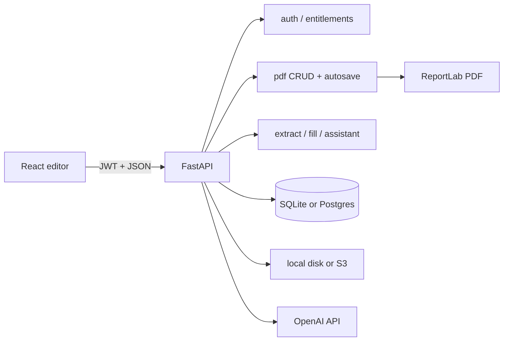
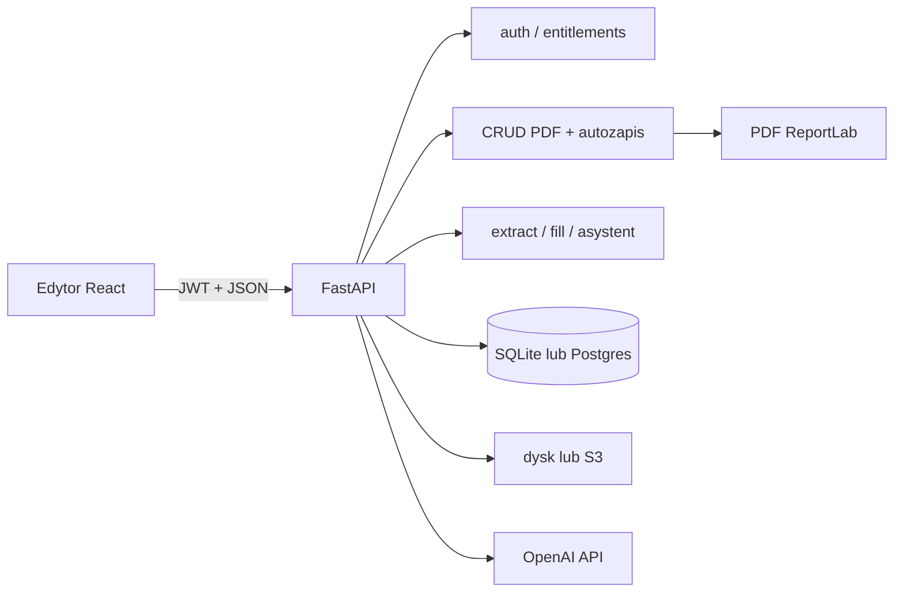

# English

# CV Studio

CV Studio is a Polish-language A4 CV editor: a WYSIWYG canvas, 14 individual templates (each with its own name and short stylistic description), PDF import via AI, a guided bio wizard, a floating AI assistant, and ReportLab PDF export that matches the canvas 1:1 (coordinates in points, top-left origin on the frontend, flipped for ReportLab).

This README is the technical entry point for developers. A beginner-friendly deep guide to canvas coordinates, React interaction, deterministic Python layout, AI responsibilities, reflow, persistence, and ReportLab export lives in [`CANVA.md`](CANVA.md). Every live AI prompt (full text, variables, file/line references) is documented in [`PROMPTS.md`](PROMPTS.md). Product-oriented feature copy lives in [`docs/FEATURES.md`](docs/FEATURES.md). Marketing brief for the website „Dlaczego CV STUDIO” section (features + competitive positioning, no competitor brand names in public copy) lives in [`FEATURES_MARKETING.md`](FEATURES_MARKETING.md). Template generation (AI extract vs Python layout) is explained in [`docs/cv-template-generation.md`](docs/cv-template-generation.md). A layperson-friendly end-to-end guide covering Frontend and Backend (flows, files, classes, functions) lives in [`CV_GENERATOR.md`](CV_GENERATOR.md).

---

## Table of contents

1. [Purpose and problem](#purpose-and-problem)
2. [Main user flows](#main-user-flows)
3. [Architecture and data flow](#architecture-and-data-flow)
4. [Technologies](#technologies)
5. [Folder structure](#folder-structure)
6. [Database](#database)
7. [Features (implementation map)](#features-implementation-map)
8. [API](#api)
9. [Installation and local development](#installation-and-local-development)
10. [Testing](#testing)
11. [Deployment](#deployment)
12. [Security and privacy](#security-and-privacy)
13. [Accessibility and UX](#accessibility-and-ux)
14. [Known limitations and planned work](#known-limitations-and-planned-work)
15. [Further reading](#further-reading)

---

## Purpose and problem

Job seekers need CVs that look professional and export cleanly to PDF. Generic form builders hide layout; design tools are too heavy. CV Studio gives a true A4 canvas (595×842 pt), templates filled with real career data, and AI that extracts or improves content without inventing unsafe coordinates for decorative chrome.

**Implemented today:** editor, templates, extract/fill, bio draft, AI assistant (ratings, grammar, layout review cards), entitlements (Free / Standard / Premium), autosave, local or S3 storage, JWT auth.

**Optional:** AWS S3 (`S3_BUCKET_NAME`), unpaid plan selection (`ALLOW_UNPAID_PLAN_SELECTION`).

**Not implemented as full Stripe Checkout yet:** paid plans can be activated without payment when unpaid selection is enabled; `402 payment_required` is the seam for future Checkout.

---

## Main user flows

1. **Choose a landing-page start** → “Upload my CV” (`start=import`) or “Create a CV from scratch” (`start=wizard`).
2. **Register / login** → JWT in `localStorage` → the selected `start` intent survives authentication and opens the matching editor dialog.
3. **Pick a template** → `handleLoadTemplate` materializes specs → canvas.
4. **Import PDF** → `POST /ai/extract_cv` → choose template → `POST /ai/fill_template` → Python layout in `cv_generator.generate_resume`.
5. **Bio wizard** → draft CRUD on `/ai/bio_cv_draft` → fill template.
6. **Edit** → drag/resize/style → debounced `PUT /pdf/save_elements`.
7. **AI assistant** → `POST /ai/assistant` → tips / corrections / reviewable layout groups.
8. **Export** → create/update PDF → `POST /pdf/download_pdf` (export quota charged).



---

## Architecture and data flow

### Entry points

| Layer | Entry | Role |
|--------|--------|------|
| Frontend | `frontend/src/main.jsx` → `App.jsx` | Router: `/`, `/login`, `/register`, protected `/pdfcanvas` |
| Editor page | `frontend/src/pages/PdfCanvas.jsx` (`PdfCanvas`) | Composes hooks into Canvas / UiSurfaces / Session (+ `PdfContext` facade) |
| Backend | `backend/app/main.py` | FastAPI app, CORS, `/health`, routers, optional SPA static |

### Frontend layers

- **Pages** — marketing, auth, editor shell.
- **Hooks** — `useA4Elements` is the canvas facade; undo/redo in `useDocumentHistory`; selection/drag in `useElementSelectionDrag`; factories/materialize helpers are pure utils; `usePdfExport` talks to PDF endpoints; `useEntitlements` loads plan limits.
- **Context** — nested `CanvasContext` / `UiSurfacesContext` / `SessionContext` from `PdfCanvas`, plus temporary merged `PdfContext` facade for remaining consumers.
- **Services** — `ApiClient` (`services/api.js`) with long timeouts and retries for Render cold start; shared `fillTemplate` for `/ai/fill_template`; authenticated image blob helper for private library photos.
- **Templates** — static element specs in `frontend/src/templates/`; registry in `templates/index.js`.

### Backend layers

- **Routes** — thin HTTP in `app/api/routes/*` (PDF create/update delegates to `document_service`).
- **CRUD** — SQLAlchemy writes in `app/crud/*`.
- **Services** — PDF render, CV layout, AI, entitlements, S3.
- **Models** — `app/models/models.py`; engine in `app/models/database.py`.

### Coordinate system

Canvas and stored geometry use **top-left** origin (CSS-like). ReportLab uses **bottom-left**; `PDF_Generator` flips `top` using `page_h` before drawing (`backend/app/services/pdf_generator.py`). Textarea soft-wrap uses the same word-break rules as the canvas, plus a 2 px `WRAP_WIDTH_TOLERANCE_PX` so borderline last words (tight Inter body lines) stay on the same line in the PDF as on the canvas — see `tests/test_pdf_bullet_layout.py`.

### Auto-height reflow and aligned icons

Template textareas start with authored placeholder heights and are measured after the browser loads their real fonts. `reflowTextareaHeight` then moves all following elements in the same visual lane by the measured delta. Text-aligned Iconic images (`alignWithText: true`, including backward-compatible `/template-assets/iconic/` URLs) are classified as section chrome and may join a lane when they hang to the left of the column (~40 px tolerance). Icons that sit entirely to the right of a narrow column are excluded, so a sidebar cannot drag main-column icons away from their headings.

Undo/redo history treats that post-load reflow as part of the **baseline**, not as a user edit: `markHistoryQuiet` in `useA4Elements` updates the current history entry in place so Cofnij stays disabled until the user actually changes the document. Otherwise Undo would restore pre-measure heights and revive uneven Y gaps (e.g. diploma → school in education records).

Every auto-height textarea measures twice — once immediately, once again after `document.fonts.ready` — and each measurement calls `reflowTextareaHeight` independently, so a later field can briefly carry a stale `page` number from an earlier pass. `rawSamePageGap` checks authored `top` values (ignoring `page`) before applying the generic page-break gap: a same-record pair with a stale page keeps its authored small gap, while a genuine cross-page seam uses `DEFAULT_PACK_GAP` (10 px, `SPACE_RECORD`) for ordinary blocks and `SECTION_PACK_GAP` (21 px, `SPACE_SECTION`) for section chrome. Using the leftover page-top inset (often 0–6 px when education starts near `pageTop` on page 2) crushed headings such as WYKSZTAŁCENIE under the previous section. Templates such as Kernel mark section markers/rules `locked` for interaction and guides, but `flowRole: "section-chrome"` still lets them reflow with their heading so underlines do not stay stranded on the next page. The reflow intentionally does **not** infer title/meta relationships from font size or boldness; that heuristic distorted valid record spacing (for example Monument/Words chrome rhythm) and compounded independent height deltas. Section marker/label/rule use `section-chrome`, and ordinary records use `content`. Keep-with-next logic therefore cannot mistake a job title for a section heading and move the real heading behind its own content. Legacy templates without this property keep the category-based fallback.

During the canvas enter hold, auto-height reflow is suppressed and resumes after fonts are ready. Every textarea emitted by the Python generators carries `preserveInitialLayout: true` (via `_block` in `cv_generator_primitives.py`). On first mount the canvas may **shrink** a box to browser `scrollHeight` when ReportLab overshoots (so empty slack cannot inflate visual section gaps), but it will not **grow** — independent growth races still stretch gaps. Editing content or later changing typography/width still triggers normal auto-height reflow. See `textareaHeight.test.js` (`shouldShrinkPreservedLayout`) and `textareaReflow.test.js` packing cases.

Section headings are kept with their first body block across page breaks: `avoidOrphanChrome` reserves the full first keep-together record height (degree + meta + description, not only the first textarea), and when a measured body textarea itself jumps to the next page, `precedingRecordMates` + `precedingChromeCluster` pull title/meta siblings and the icon/heading/rule with it. Page-break reclaim similarly reserves `followingRecordMates` (school/meta/body under a grown degree) so Kernel continuation pages cannot pull only the degree line back onto page 1 and crush the rest of education on page 2. Reclaim also refuses to jump across intervening lane content (`hasInterveningLaneContent`) — otherwise a later skills body could reclaim into the page-1 footer hole while education still occupies page 2. That prevents orphans such as “UMIEJĘTNOŚCI” alone at the bottom of page 1, and the education split where Bachelor stayed on page 1 while its description moved to page 2. `remainingRecordHeight` and forward packing skip decorative chrome that is Y-sorted inside a tagged `flowGroup` (Nimbus previously placed its section chip on the degree line, which made reclaim treat school/meta as a new record). Nimbus markers now stay in the heading band and emit `flowRole: "section-chrome"`; ordinary flow nodes use `content`. Backend generators use `Builder.need_section(chrome, body)` before placing a heading, and `Builder.keep_together(height)` for experience/education/other records — each emitted element is tagged with the same `flowGroup` id so canvas reclaim-packing (when earlier boxes shrink) cannot pull only part of a record back onto the previous page. Sections may continue on the next page, but each record stays whole. ReportLab receives the same geometry visible on the canvas.

### Decorative chrome

Elements with `fixedToPage: true` (backgrounds, frames, sidebars, page numbers) are cloned across pages by default and must not be selected/moved/deleted in the UI (`isDecorativeChrome` in `frontend/src/utils/elementInteraction.js`). First-page-only chrome sets `repeatOnContinuation: false`, which prevents `cloneFixedPageDecorations` from copying it when overflow creates another page. Design rating prompts respect template typography.

---

## Technologies

| Technology | Version / note | Purpose | Main locations |
|------------|----------------|---------|----------------|
| React | ^19.2 | UI components and hooks | `frontend/src/` |
| Vite | ^7.2 | Dev server and production build | `frontend/` |
| React Router | ^7.13 | Client routes + `ProtectedRoute` | `App.jsx` |
| FastAPI | (requirements) | HTTP API | `backend/app/main.py`, routes |
| Uvicorn | (requirements) | ASGI server | local / Render |
| SQLAlchemy | (requirements) | ORM | `models/`, `crud/` |
| SQLite / PostgreSQL | via `DATABASE_URL` | Persistence | `database.py` |
| ReportLab + fontTools | (requirements) | PDF drawing + TTF name fixes | `pdf_generator.py` |
| PyMuPDF (fitz) | (requirements) | PDF → images for extract | `ai_service.py` |
| OpenAI SDK | (requirements) | Extract + assistant | `ai_service.py`, `ai_assistant_service.py` |
| python-jose / passlib bcrypt | (requirements) | JWT + passwords | `core/security.py` |
| boto3 | optional | S3 uploads | `s3_storage.py` |
| nanoid | ^5.1 | Client element ids | canvas hooks |
| motion | ^12 | UI motion | modals / assistant |
| unittest | stdlib | Backend tests | `backend/tests/` |

Official docs: [React](https://react.dev/), [Vite](https://vite.dev/), [FastAPI](https://fastapi.tiangolo.com/), [SQLAlchemy](https://docs.sqlalchemy.org/), [ReportLab](https://www.reportlab.com/docs/reportlab-userguide.pdf), [OpenAI API](https://platform.openai.com/docs).

---

## Folder structure

```text
pdf-generator/
├── AGENTS.md                 # Project agent / documentation rules
├── BUGZ.MD                   # Known issues tracker
├── README.md                 # This file
├── docs/                     # Product + design + deep-dive docs
├── frontend/
│   ├── public/
│   │   ├── cv-studio-logo.svg     # Full orange CV Studio logo
│   │   ├── cv-studio-mark.svg     # Compact mark for favicon/editor rail
│   │   └── template-mockups/      # Static A4 preview PNGs
│   ├── src/
│   │   ├── components/       # canvas, editor, ai, modals, gallery, common
│   │   │   ├── canvas/SectionRecordAdd/  # Hover "+" on record-section headings
│   │   │   └── editor/AddSectionModal/   # "+ Dodaj sekcję" modal (name + aa/cc layout picker)
│   │   ├── hooks/            # useA4Elements facade, useDocumentHistory, usePdfExport, …
│   │   ├── pages/            # Hero, Login, Register, PdfCanvas
│   │   ├── services/         # ApiClient, fillTemplate, authenticatedImage, eventLog
│   │   ├── store/            # Canvas / UiSurfaces / Session + PdfContext facade
│   │   ├── templates/        # 14 template specs + helpers
│   │   └── utils/            # a4ElementFactories, canvasElementSchema, geometry, reflow, sectionBuilder, sectionRecord
│   ├── package.json
│   └── .env.example
├── shared/
│   └── pdf-element.schema.json  # Exported from Pydantic PdfElement
└── backend/
    ├── app/
    │   ├── api/routes/       # auth, pdf, images, ai, assistant, billing, events
    │   ├── core/             # config, security
    │   ├── crud/
    │   ├── models/
    │   ├── schemas/          # PdfElement + JSON Schema export
    │   ├── services/         # pdf, document_service, cv_generator (+ cv_templates/), ai, entitlements
    │   ├── utils/            # image_src_to_path, metrics_logging, upload_security
    │   ├── main.py
    │   └── dependencies.py
    ├── alembic/              # Schema migrations (replaces ad-hoc ALTER)
    ├── fonts/                # Bundled TTFs for PDF
    ├── template_assets/      # Sidebar, IT and Iconic artwork/icons
    ├── tests/
    ├── alembic.ini
    ├── requirements.txt
    └── .env.example
```

**Rules:** Frontend templates must stay in sync with `_GENERATORS` in `cv_templates/registry.py` (re-exported from `cv_generator.py`; 14 ids). Each `cv_templates/templates/<id>.py` holds only that template’s live generator — not a shared multi-theme engine with sibling branches. Do not put secrets in the repo. Uploads and generated PDFs are runtime data (`uploads/`, `static/generated/`), not source. User image bytes are not publicly mounted — only via `GET /images/{id}/content`.

---

## Database

Configured by `DATABASE_URL` (`backend/app/models/database.py`). Default if unset: `sqlite:///./pdfgenerator.db`. `postgres://` URLs are rewritten to `postgresql://`. Postgres uses `pool_pre_ping` for Render cold starts.

Schema is created by `init_db()` during app lifespan (not at import): `Base.metadata.create_all` for missing tables, then `alembic upgrade head` for schema changes (multi-page columns live in `backend/alembic/versions/`). Billing catalog is seeded via `bootstrap_billing`. Manual CLI: `cd backend && alembic upgrade head`.

### Tables (business purpose)

| Table | Purpose |
|-------|---------|
| `users` | Accounts: username, email, bcrypt hash, `is_active`, timestamps |
| `images` | Uploaded image metadata; `file_path` local or S3 URL; `owner_id` → users |
| `pdfs` | CV documents: title, path, pages, page_width/height (default 595×842), owner, `editor_mode`, `template_id`, optional `spacing_px` rhythm JSON |
| `pdf_elements` | Canvas elements; geometry + style columns; extras in `extra_properties` JSON (`fixedToPage`, `repeatOnContinuation`, `locked`, `flowRole`, `flowGroup`, `preserveInitialLayout`, bold, connectors, …) |
| `bio_cv_drafts` | One private JSON draft per user |
| `plans` | Free / standard / premium limits and feature flags |
| `user_subscriptions` | Current plan per user (Stripe columns ready, often null) |
| `usage_counters` | Monthly exports + AI credit usage (`period_key` = `YYYY-MM` UTC) |
| `payments` | Future payment ledger |
| `maintenance_markers` | One-off cleanup keys |

**Relationships:** One user owns many `pdfs` and `images`. Each `pdf` has many `pdf_elements`. Subscription and usage are per user.

Models: `backend/app/models/models.py` (`User`, `Pdf`, `PdfElements`, …).

---

## Features (implementation map)

Product narrative: [`docs/FEATURES.md`](docs/FEATURES.md).

### A4 canvas editor (template vs freeform)

Interactive multi-page **A4 portrait** canvas with two persisted editor modes on each `Pdf` row (`editor_mode`, `template_id`, optional `spacing_px`):

- **template** — structural editing: content/chrome positions are layout-owned (no free X/Y drag), **Sekcje** flyout docked beside the 72px tool rail (reorder + editable vertical rhythm `stack` / `record` / `section` / `after_rule`, defaults 4 / 10 / 21 / 8), gallery photo-slot targets, auto-height reflow with reclaim. Topbar **Odblokuj edycję** (icon + tooltip) copies the document into freeform.
- **freeform** — full toolbox (text, shapes, images), free drag/resize, and reflow without page-break reclaim so hand placement is preserved.

Element properties open as a **compact horizontal floating toolbar** anchored above the selection (`Editor` via `createPortal`) — icon-first controls in CV STUDIO chrome (not a tall labeled sheet). **Text** and **TextArea** still differ (TextArea adds bullets, text align, line height / letter spacing, width / height); tooltips carry the former label text. Placement uses selection DOM bboxes (`floatingPanelPosition.js`: prefer above, flip below, clamp to the viewport). The editor **Topbar** is icon-only (Szablony, Importuj CV, kreator, Zmień szablon, Odblokuj edycję, Wyczyść, Pobierz, Zapisz PDF) with the former labels as `title` / `aria-label` tooltips and ~18px icons in a 48px bar; the left tool rail is **72px** with larger 20px tool icons. Only **Sekcje** still docks as a flyout next to that rail.

`spacing_px` is persisted on the Pdf row, applied live via `applyFlowSpacing`, and sent to `POST /ai/fill_template` so change-template / import regeneration uses the same rhythm (`use_spacing` + `get_spacing()` in the Python generators).

**Rytm układu → Reset** restores the knobs captured when the CV was rendered or loaded (`baselineFlowSpacing` in `useA4Elements`, set via `pinFlowSpacingBaseline` / `adoptDocumentFlowSpacing`). If the live knobs already match that baseline, Reset does **not** call `applyFlowSpacing`: a force-pack to exact `SPACE_*` is not identical to generator geometry (ReportLab cursor advance, masthead clearance, under-rule gaps) and was pulling later sections onto page 1 on every shared-packer template (Regent, Monument, Cinder, Aldine, Words, Cardinal, Volt, Kernel, Iconic, Ledger, Harbor/Tessera/Slate when packed, …). Changing a knob away from baseline and then Reset still retargets the canvas to the baseline rhythm.

Shared fonts: Inter, Roboto, Helvetica, Montserrat, Times-Roman, PlayfairDisplay, CormorantGaramond, Lora, Courier, JetBrainsMono. Session undo/redo ignores post-load textarea reflow (`markHistoryQuiet`).

Implementation:

- `frontend/src/utils/editorMode.js` — `normalizeEditorMode`, `inferEditorMode`, `canFreePositionElement`
- `frontend/src/utils/flowSpacing.js` — defaults, normalize, `flowSpacingEquals` (Reset no-op guard) for the Sections panel / save / fill
- `frontend/src/utils/floatingPanelPosition.js` — `computeFloatingPanelPosition`, `unionRects` (viewport placement for the floating inspector)
- `frontend/src/components/editor/Editor/Editor.jsx` — horizontal floating toolbar (portal, icon-first); Text vs TextArea field sets; multi-select bulk edits
- `frontend/src/components/editor/SectionsPanel/SectionsPanel.jsx` — rhythm knobs + Reset → `baselineFlowSpacing`
- `frontend/src/utils/sectionStructure.js` — `packDocumentSections`, `applyFlowSpacing`, reorder; leading section chrome reserved with the first body; intra-chrome offsets preserved (never `SPACE_STACK`); section boundaries use the chrome **band** start (badge/frame above the title), via private `resolveSectionChromeBandStart`, so the next Monument-style pre-heading chrome is not absorbed into the previous section during pack; flow start anchored under the masthead so Regent/Aldine header rules are not absorbed into sections. Per-strip placement (chrome + first body reserved together, then remaining body laid out against the flow cursor) is factored into the private `placeStrip(strip, cursorAbs, pageHeight, pageTop, bottomMargin)` helper, reused by `packDocumentSections` and by `appendSectionAtEnd(elements, newElements, pageHeight, options)` — a placement primitive that drops a freshly built section at the end of the document flow (one `SPACE_SECTION` gap below the deepest non-`fixedToPage` element) and then force-packs every section with `applyFlowSpacing` so wizard-authored gaps and the new strip share one `stack` / `record` / `section` / `after_rule` rhythm. `appendSectionAtEnd` is wired to the Sections panel's "+ Dodaj sekcję" button — see [Add Section (structural editor)](#add-section-structural-editor) below for the end-to-end flow and its own file/symbol references.
- `frontend/src/pages/PdfCanvas.jsx`, component `PdfCanvas` (`start=templates|import|wizard|blank`, unlock copy; mounts `Editor` outside `Sidebar`)
- `frontend/src/hooks/useA4Elements.js`, `useElementSelectionDrag.js`, `textareaReflow.js` (`allowReclaim`, `spacing`)
- `frontend/src/components/editor/Sidebar/Sidebar.jsx`, `Topbar/Topbar.jsx`, `SectionsPanel/`, `UnlockFreeformModal/`
- `backend/app/services/cv_generator_primitives.py` — `FlowSpacing`, `get_spacing`, `use_spacing`
- `backend/app/models/models.py` — `Pdf.editor_mode`, `Pdf.template_id`, `Pdf.spacing_px`; Alembic `20260804_0002_editor_mode.py`, `20260804_0003_spacing_px.py`
- tests: `editorMode.test.js`, `sectionStructure.test.js`, `flowSpacing.test.js`, `floatingPanelPosition.test.js`, `test_flow_spacing.py`

### Add Section (structural editor)

Adds a new section to a **template-mode** CV from the Sections panel. The panel's "+ Dodaj sekcję" button opens a modal for the section name and a layout choice, then appends the section at the end of the document in the template's governing rhythm (`stack` / `record` / `section` / `after_rule`), styled to match the CV's existing sections.

Three layouts ship: **"aa"** — heading + rule + one auto-height content textarea; **"cc-edu"** — heading + rule + an education-style record (bold degree/title, school subtitle, muted city·period meta, bullet description — 4 lines); and **"cc-exp"** — heading + rule + an experience-style record (bold role title, muted company·period meta, bullet description — 3 lines, no subtitle). Education and Experience are offered as distinct choices, not one merged "record" option, because their field structures genuinely differ in the backend generator: `_place_education_record` renders a dedicated school/university line that `_place_experience_record` does not — company and period there are a single meta line (`backend/app/services/cv_templates/shared/records.py`). Each record's lines share one `flowGroup` so they page-break as a unit. A fourth layout, columns ("bb"), is out of scope for this feature (it needs horizontal-row support in the packer) and is not offered in the modal.

On confirm, the new section's visual style — heading font/color, rule width/color/`relLeft`, every decorative chrome shape (zero or more; a small marker dot, or a multi-shape badge system like Monument's numbered square + label frame), body font/color, content-column `bodyLeft` (may differ from the heading column — Monument uses 102 vs 118), and a best-effort muted color for record meta lines — is sampled from the document's last existing section (`deriveSectionStyle`); a template-neutral default is used when no section can be detected (for example, an empty document). Decorative shapes are replicated verbatim at their sampled offset from the heading. A decorative ordinal badge (Monument's "01"/"02"/…) is handled differently: its digits are never copied from the sampled section (they'd be wrong), but its styling is — the frontend computes the new section's actual position (one past every currently detected section) and stamps that as the badge text, zero-padded to match the sampled digit width ("5" → "05" alongside sibling "01"). Ordinals are tagged `isDecorativeChromeText` (persisted in `PdfElement` / `extra_properties`) so they are never listed as their own sections; `isDecorativeOrdinalChrome` also treats digit-only chrome as decorative when an older save dropped the flag. Section membership for packing uses the chrome band start (badge/frame above the title baseline), not the title alone — otherwise the next section's pre-heading chrome falls into the previous strip, `rebuildTightChromeCluster` fires, and titles appear to leave their decorative frames after add / rhythm changes. The accent rule's vertical offset is sampled as `rule.relTop` (Monument mid-band ≈ title+7); falling back to `fontSize × 1.35` alone parks that line too low beside the title frame. Packing also snaps a legacy flush-under-label Monument rule back to badge+15 when the tall badge is present. The section's elements are built (`buildSectionElements`) with generator-matched line-box heights (`lines × lineHeight`, same as `Builder.measure_block`, not the canvas `+6` heuristic) and `preserveInitialLayout: true` so the first mount cannot inflate `SPACE_STACK` gaps. Placement (`appendSectionAtEnd`) drops the strip one `SPACE_SECTION` gap below the deepest non-`fixedToPage` element, then runs `applyFlowSpacing` so wizard-authored under-rule / inter-section gaps are retargeted to the same panel knobs as the new strip. The first editable body field is selected and enters edit mode immediately so the user can start typing.

Implementation:

- `frontend/src/utils/sectionStructure.js`, lines 81–88, function `isDecorativeOrdinalChrome`; lines 164–178, private `resolveSectionChromeBandStart`; lines 227–252, function `sectionElementIds`; lines 745–779, function `appendSectionAtEnd`; lines 881–1030, function `deriveSectionStyle` — ordinal safety net, chrome-band section boundaries, style sampling (`bodyLeft`, rule `relLeft`), and end-of-document placement with full-document rhythm retarget
- `frontend/src/utils/sectionBuilder.js`, line 64, `SECTION_LAYOUTS`; lines 235–380, function `buildSectionElements` — layout constructors for "aa", "cc-edu", and "cc-exp" (record field-line specs in private `recordLineSpecs`; heights via private `measureGeneratorBlockHeight`; content uses `bodyLeft`)
- `frontend/src/hooks/useA4Elements.js`, line 499, function `handleAddSection` — orchestrates style sampling, construction, placement, and post-add selection; exposed through `PdfContext` as `addSection`
- `frontend/src/components/editor/AddSectionModal/AddSectionModal.jsx`, line 34, component `AddSectionModal` — name input + "aa"/"cc-edu"/"cc-exp" layout picker (`AddSectionModal.module.css` for styling)
- `frontend/src/components/editor/SectionsPanel/SectionsPanel.jsx` — "+ Dodaj sekcję" entry point (line 110) and modal wiring (`addModalOpen` state, line 49; `handleConfirmAddSection`, line 76)

Tests:

- `frontend/src/utils/sectionStructure.test.js`, `describe("sectionElementIds", …)`, `describe("applyFlowSpacing", …)` (Monument title-inside-frame regression), `describe("deriveSectionStyle", …)`, and `describe("appendSectionAtEnd", …)` — includes regressions that wizard and added sections share the same `after_rule` after append, and that Monument badge/frame/title offsets survive a full-document pack
- `frontend/src/utils/sectionBuilder.test.js`, `describe("buildSectionElements", …)` — isolated construction, including separate assertions that "cc-edu" produces 4 record lines and "cc-exp" produces 3 (no subtitle line), generator-matched heights / `preserveInitialLayout`, and `describe("build -> append -> reorder (composed production pipeline)", …)`, an integration test that chains the real `deriveSectionStyle` -> `buildSectionElements` -> `appendSectionAtEnd` -> `reorderSection` sequence exactly as `handleAddSection` uses it, asserting the new record's members remain one group after a reorder and that existing sections are retargeted to the same `after_rule`

Known limitations:

- The columns layout ("bb") is not available from this flow; it requires horizontal-row packer support and is planned as a follow-up.
- The muted color used for a record's meta line is best-effort: it is sampled from an existing meta line when one can be identified, otherwise it falls back to the body color.
- Style sampling only looks at the document's last detected section; a template with no detectable section (or an empty document) falls back to a template-neutral default rather than matching a specific visual identity.

### Add record on section heading hover

In **template mode**, when a section’s body is more than a single content textarea (education / experience stacks, custom **cc-edu** / **cc-exp** sections, or wizard-filled records sharing a `flowGroup`), hovering the section heading shows a compact **+** control. Clicking it appends another record that clones the last record’s field structure and styling, filled with generic Polish placeholders (e.g. „Nazwa dyplomu” / „Stanowisko”), assigns a new `flowGroup`, re-packs the document with `applyFlowSpacing`, and opens the first new line for editing.

Timing: the **+** appears on pointer enter over the heading and remains clickable for **2 seconds** even after the pointer leaves the heading; without a click it hides when that window ends (leaving the heading does not cancel it). Re-hovering the heading restarts the window. Single-textarea sections (**aa** / summary-style) do not show the control.

Implementation:

- `frontend/src/utils/sectionRecord.js`, lines 65–97, `listSectionContentElements`; lines 103–140, `partitionSectionRecords`; lines 153–158, `sectionSupportsRecordAdd`; lines 201–227, `buildRecordClone`; lines 235–301, `appendRecordToSection` — eligibility, clone with placeholders, in-band provisional placement, then full-document rhythm pack
- `frontend/src/hooks/useA4Elements.js`, lines 565–596, function `handleAddSectionRecord` — exposed through `PdfContext` as `addSectionRecord`
- `frontend/src/components/canvas/SectionRecordAdd/SectionRecordAdd.jsx`, lines 22–133, component `SectionRecordAdd` — heading hover listeners + 2s click window (`SectionRecordAdd.module.css`)
- `frontend/src/components/canvas/CanvasElements/CanvasElements.jsx`, lines 36–45, `recordHeadingIds`; lines 80–110 — mounts the affordance next to eligible headings

Tests:

- `frontend/src/utils/sectionRecord.test.js` — aa rejected; cc-edu / cc-exp accepted; second education/experience record gets placeholders and a distinct `flowGroup`

Known limitations:

- Eligibility requires a multi-line record group (typically `flowGroup` with ≥2 lines, or a bold-title partitioned legacy stack). A lone body textarea never offers **+**.
- Placeholder copy follows 4-line education / 3-line experience inference from the cloned record’s line count; other shapes use generic „Tekst…”.

### Outcome-focused landing and directed starts

The landing page presents one outcome — an editable PDF-ready CV — and **three** product paths: create from a template, import an existing CV, or design from a blank freeform page. It still explains the shared journey, templates, privacy, plans, and assistive AI review.

Start intents: `start=templates`, `start=import`, `start=wizard`, `start=blank`. Signed-in visitors go to `/pdfcanvas`; new visitors keep the choice through registration and login. `PdfCanvas` opens the matching surface once (templates modal, import, wizard, or empty freeform) and strips the query param.

Topbar tooltip / `aria-label` **Importuj CV** replaces the older “Wypełnij z PDF” wording (same `AiCvPanel` flow); the control is icon-only.

Implementation:

- `frontend/src/pages/Hero/Hero.jsx`, component `Hero`; three `#start` path cards; `buildStartUrl`
- `frontend/src/pages/Register/Register.jsx` / `Login/Login.jsx` — preserve `templates|import|wizard|blank`
- `frontend/src/pages/PdfCanvas.jsx` — intent handling + mode hydration from saved PDFs

### Rust brand logo

The application uses a transparent SVG brand system in the same rust accent as primary actions (`#DC6743`). The full logo combines a folded-document CV monogram with the **CV STUDIO** wordmark in Montserrat (with browser-safe sans-serif fallbacks), so it remains legible on both the dark landing header and warm-paper authentication screens. A compact version of the same mark is used where a wordmark would not fit: the editor tool rail and browser favicon. The former blue `kompoza-logo*.png` assets have been removed.

Implementation:

- `frontend/public/cv-studio-logo.svg`, lines 1–15 — full logo and wordmark
- `frontend/public/cv-studio-mark.svg`, lines 1–8 — compact mark
- `frontend/src/pages/Hero/Hero.jsx`, lines 141–145 and 442–445; `Hero.module.css`, lines 40–51 and 1173–1176 — landing header/footer lockup
- `frontend/src/pages/Login/Login.jsx`, lines 127–131; `Login.module.css`, lines 184–195 — login lockup
- `frontend/src/pages/Register/Register.jsx`, lines 129–133; `Register.module.css`, lines 180–191 — registration lockup
- `frontend/src/components/editor/Sidebar/Sidebar.jsx`, lines 43–46 — compact editor mark
- `frontend/index.html`, line 5 — SVG favicon

### Auth screens aligned with the landing

Login and registration continue the landing page’s editorial “document transformation” visual language instead of switching to the former generic dark cards. Both views use a responsive split layout: an explanatory story panel on the left and a paper-like form panel with the rust action accent on the right. On small screens, the story panel becomes a compact header above the form.

The intent-aware copy remains functional. Login confirms whether it will open PDF import or the guided wizard after authentication; registration confirms the selected path before account creation. Registration plan labels describe user outcomes, such as “import and AI help”, instead of AI-credit counts. Prices and entitlement gates are unchanged.

Implementation:

- `frontend/src/pages/Login/Login.jsx`, lines 102–192; `frontend/src/pages/Login/Login.module.css`
- `frontend/src/pages/Register/Register.jsx`, lines 104–228; `frontend/src/pages/Register/Register.module.css`
- `frontend/src/pages/Register/PlanSelector.jsx`, lines 4–31; `frontend/src/pages/Register/PlanSelector.module.css`

### Unified dark application palette

The editor keeps its near-black background as the dominant surface, while using the same rust action colour (`#DC6743`), deep rust pressed state (`#A73E26`), gold detail (`#CAA66B`), and warm-paper text family as the landing and auth screens. A shared warm `--on-accent` token keeps text legible on rust buttons. Shared controls, focus outlines, selection chrome, AI quick actions, page controls, and the PDF-rendering loader therefore no longer introduce a separate blue visual language. Control corners are deliberately tighter to make dark editor forms feel related to the paper-like landing forms without reducing their density.

White remains intentionally reserved for the editable A4 document and its template preview because it represents the exported page; editor chrome uses warm off-white instead. Green success and red destructive states remain semantic status colours rather than becoming brand accents.

Implementation:

- `frontend/src/index.css`, lines 1–77, root palette tokens, warm text colours, on-accent text, and shared control radius scale
- `frontend/src/App.css`, lines 5–18, charcoal application background with rust and gold ambient gradients
- `frontend/src/components/canvas/SelectionOverlay/SelectionOverlay.module.css`, lines 8–90, rust selection and movement chrome
- `frontend/src/components/common/Spinner/Spinner.module.css`, lines 7–167, dark overlay and paper-like export-status card

Limits:

- PDF extraction and content-focused AI actions are entitlement-gated from Standard; the full-canvas `layout` action requires Premium. The landing assigns the import start to Standard and the guided wizard to Free, which includes five starter templates.
- ATS feedback is guidance about document readability and content structure. It is not a promise of recruiter response or an ATS pass.
- The privacy section describes implemented data use at a high level and does not claim unimplemented certifications or anonymisation.

### Template load

Loads static specs; assigns `element_id`, interaction flags, locks chrome.

Implementation:

- `frontend/src/templates/index.js` — `TEMPLATES` registry (`name` + `description` for UI; `layouts` tags for generators)
- `frontend/src/utils/materializeElementSpecs.js`, `materializeElementSpecs`
- `frontend/src/hooks/useA4Elements.js`, `handleLoadTemplate` / `useDocumentHistory`

### Canvas enter fade

When a full document lands on the canvas (AI CV upload, bio wizard, or template pick), interactive content fades in from opacity 0→1. Elements are held invisible until `document.fonts.ready` (capped at 1000 ms) so fallback→webfont swaps stay hidden, then fade over 750 ms. Decorative chrome (`fixedToPage`, not selectable) appears immediately with no animation. Manual add/duplicate still uses the same fade for the new ids only. Generators that emit `flowRole` (section chrome vs content) and `preserveInitialLayout` — for example Monument, Words, and Tessera — keep chrome/content ordered during reflow, while `preserveInitialLayout` blocks first-mount growth (shrink-to-content is still allowed so box height matches glyphs).

Implementation:

- `frontend/src/utils/canvasEnter.js`, lines 1–58, `markContentElementsEnter`, `CANVAS_ENTER_MS`, `CANVAS_ENTER_FONT_WAIT_MS`
- `frontend/src/hooks/useCanvasEnterIds.js`, lines 1–80, `useCanvasEnterIds`
- `frontend/src/components/canvas/CanvasElements/CanvasElements.jsx` + `CanvasElements.module.css`
- `frontend/src/hooks/useA4Elements.js` — `handleLoadAiElements`, `handleLoadTemplate`, `handleLoadTemplateWithFill` call `markContentElementsEnter`
- `frontend/src/components/canvas/CanvasElements/CanvasElements.jsx`, lines 51–78; `frontend/src/components/canvas/Textarea/Textarea.jsx`, lines 42–164 — skip the initial textarea measurement when `preserveInitialLayout` is set
- `backend/app/schemas/pdf_schema.py`, lines 44–46; `backend/app/crud/pdfs.py`, lines 81–82, 187–188, 226–227; `frontend/src/components/modals/ModalPdfs/ModalPdfs.jsx`, lines 104–105 — persist and restore `flowRole` / `preserveInitialLayout`

Tests:

- `frontend/src/utils/canvasEnter.test.js` — pending-id registry and chrome exclusion

### Monument monochrome template

Monument is a paid Classic template for users who want an elegant editorial result without colour. Its visual identity comes from numbered black rectangles, outlined heading frames, thin grey rules, and an asymmetric masthead. The smallest text is 9 px; body copy and the summary both use 9 px so the lead paragraph does not sit one step above surrounding text, record titles use 11 px, education titles use 10 px, and section headings plus the job-position line use 12.5 px. Cormorant Garamond supplies the formal display voice, while Montserrat keeps dense CV content easy to scan. The same summary-equals-body rule applies across every filled template in `generate_resume` (for example Regent uses 9.3 px to match experience bullets).

The frontend starter array and the deterministic Python generator use the same A4 geometry and grayscale palette. `_gen_monument` preserves complete experience and education records during page breaks, supports custom sections through `_extra_sections`, and groups each number, frame, label, and rule into one reflow unit so the heading geometry remains aligned after browser text measurement. The page frame and footer repeat on every page, while the name-and-position masthead and its tall side bars appear only on page one; `repeatOnContinuation: false` preserves this rule when the editor creates another page later. Layout decisions are never sent to the AI model.

Implementation:

- `frontend/src/templates/monument.js`, lines 1–108, exported array `monumentTemplate`
- `frontend/src/templates/index.js`, registry entry `monument` (`tier: "paid"`, `layouts: ["single"]`)
- `backend/app/services/cv_templates/templates/monument.py`, function `_gen_monument`; `cv_templates/registry.py`, `_GENERATORS["monument"]`
- `frontend/src/utils/structureOperation.js`, lines 34–63, function `cloneFixedPageDecorations`
- `frontend/public/template-mockups/monument.png`, source-driven A4 preview

Tests:

- `frontend/src/templates/monument.test.js`, lines 6–56, starter-layout hierarchy, section-number, frame-geometry, and page-one masthead assertions
- `frontend/src/utils/structureOperation.test.js`, lines 25–44, continuation-page cloning opt-out
- `backend/tests/test_cv_template_layouts.py`, `test_monument_is_monochrome_and_keeps_summary_at_body_size`; `test_summary_matches_experience_body_type_size` — every generator keeps summary type equal to main-column experience body

Known limitation: long user-provided section names are shortened only inside the fixed decorative heading frame. Their section content remains complete.

### Words Word-style template

Words is a paid Classic template for users who want a familiar office-document result rather than a poster-like CV. It uses a single Times-Roman column on pure white paper, with a 29 px name, a 13.5 px position, 12 px section headings, and 10–11.5 px content. Thin grey rules and circles no larger than 7 px are its only decoration. It has no rectangles, side panels, or decorative margin frames.

The frontend starter and `_gen_words` share the same A4 geometry. Long names, positions, and contact lines wrap instead of being shortened, and the first section moves down by the measured header height. The Python generator keeps complete experience and education records together when they fit, supports custom sections through `_extra_sections`, starts continuation content below a compact 58 px inset, and repeats only the plain page background, footer rule, small footer circle, and page number. Explicit `flowRole` and `preserveInitialLayout` values keep the browser's text measurement from separating section markers from their headings or repaginating the deterministic initial layout.

Implementation:

- `frontend/src/templates/words.js`, lines 1–123, exported array `wordsTemplate`
- `frontend/src/templates/index.js`, registry entry `words` (`tier: "paid"`, `layouts: ["single"]`)
- `backend/app/services/cv_templates/templates/words.py`, function `_gen_words`; `cv_templates/registry.py`, `_GENERATORS["words"]`
- `frontend/public/template-mockups/words.png`, source-driven A4 preview

Tests:

- `frontend/src/templates/words.test.js`, lines 6–37, Word-like typography, grayscale palette, marker size, and no-frame assertions
- `backend/tests/test_cv_template_layouts.py`, lines 733–801, `test_words_uses_word_document_rhythm_without_decorative_frames`

Known limitation: Words reproduces the visual language of a carefully formatted Word document, but it does not create or import `.docx` files. Export remains PDF.

### Cardinal noble-red template

Cardinal is a paid single-column template (`layouts: ["icons"]`) for candidates who want a formal document with one restrained accent of colour. It reserves a "noble red" (`#9E2532`) for typography only — the role line under the name and every section heading — while all ornament stays neutral grey (`#8A8A8A`): the generated line-art icons beside each section heading and contact detail, plus the decorative rules under the headings and along the header and footer. Body copy is dark grey (`#333333`); the name uses Times-Roman while labels, contact, dates, and body use Helvetica. Pairing generated icons with every heading and contact row is what sets it apart from Regent, Aldine, Monument, and Words.

The grey glyphs come from a dedicated `cardinal` theme added to the shared icon pipeline (`scripts/generate_iconic_icons.py`, `THEMES["cardinal"] = "#8A8A8A"`), rendered to `backend/template_assets/iconic/cardinal/*.png` and served from the existing `/template-assets/` mount. The static editor preview and the deterministic AI fill share one visual identity because the backend generator reuses the same single-column icon machinery as other icon-tagged templates, under its own layout branch so no red accent band is drawn.

Implementation:

- `frontend/src/templates/cardinal.js`, lines 1–158 — static starter spec; local `icon` helper (line 49), `sectionHead` (line 65), `contact` (line 76), and the `flowRole` mapping in `cardinalTemplate` (line 150)
- `frontend/src/templates/index.js`, registry entry `cardinal` (`tier: "paid"`, `layouts: ["icons"]`, `accent: "#9E2532"`)
- `backend/app/services/cv_templates/templates/cardinal.py`, function `_gen_cardinal`
- `backend/app/services/cv_templates/registry.py`, `_GENERATORS["cardinal"]`
- `scripts/generate_iconic_icons.py`, line 23, grey `cardinal` icon theme
- `frontend/public/template-mockups/cardinal.png`, source-driven A4 preview

Tests:

- `frontend/src/templates/cardinal.test.js`, lines 1–57 — single-column, red-headings-only, grey-icons/rules, dark-grey body, and serif-name assertions
- `backend/tests/test_template_registry_sync.py`, `test_frontend_ids_match_backend_generators` — enforces the frontend/backend id parity that `cardinal` now participates in

### Harbor two-column template

Harbor is a paid two-column template (`layouts: ["sidebar", "icons"]`) that reproduces the popular "double column" résumé: a wide main column on the left (summary + experience) and a narrower sidebar on the right (education, skills, languages, tools). A single teal accent (`#17A2B8`) carries the role line, company names and teal diamond bullets; everything else is charcoal (`#2B2B2B`/`#3A3A3A`) on white, set in Inter. Grey contact and meta icons (phone, email, a `< >` code mark for a repository link, location, calendar) come from the `harbor` icon theme; the teal diamond bullet comes from the `harbor-accent` variant. A circular photo placeholder (a soft-grey disc plus a centred person glyph) sits in the top-right; users drop their own photo over it in the editor.

Harbor sidebar lists (skills, languages, tools, education description bullets) all use the same teal diamond glyph. The canvas still supports `borderRadius` on rectangles (`PdfElement.borderRadius`, `Rectangle.jsx`, ReportLab `roundRect`) for freestyle authoring; Harbor’s starter no longer depends on skill pills or proficiency-dot rows.

The static editor preview and the deterministic AI fill share the same identity. Generic "other" list sections are folded into `skills` and render as diamond bullets alongside certifications, interests and other flat lists.

New icon glyphs (`github`, `calendar`, `diamond`) are kept in a separate `EXTRA_ICONS` set and generated only for the two curated Harbor themes, so other icon-theme asset folders stay untouched.

Implementation:

- `frontend/src/templates/harbor.js` — static starter; `diamondItem` bullets for skills/languages/tools/education notes, sidebar IIFE
- `frontend/src/templates/index.js`, registry entry `harbor` (`tier: "paid"`, `layouts: ["sidebar", "icons"]`, `accent: "#17A2B8"`)
- `backend/app/services/cv_templates/templates/harbor.py`, `_gen_harbor`; `cv_templates/registry.py`, `_GENERATORS["harbor"]`
- `scripts/generate_iconic_icons.py`, `draw_github`/`draw_calendar`/`draw_diamond` (lines 183–213), `EXTRA_ICONS` (line 234), `SUBSET_THEMES` (line 244)
- `backend/app/schemas/pdf_schema.py`, line 85, `borderRadius` field
- `backend/app/services/pdf_generator.py`, `renderRectangle` rounded-corner path (uses `roundRect`); dispatch at line 629
- `frontend/src/components/canvas/Rectangle/Rectangle.jsx`, line 50; `frontend/src/components/canvas/CanvasElements/CanvasElements.jsx`, line 155
- `frontend/public/template-mockups/harbor.png`, source-driven A4 preview

Tests:

- `frontend/src/templates/harbor.test.js` — two-column origins, teal diamond counts, grey icons, photo placeholder, education diploma/school, Polish headings
- `backend/tests/test_template_registry_sync.py`, `test_frontend_ids_match_backend_generators` — enforces the frontend/backend id parity that `harbor` now participates in

### Tessera mosaic-sidebar template

Tessera is a paid two-column template (`layouts: ["sidebar", "icons"]`) built around an independently designed mosaic language rather than a visual copy of another résumé. It keeps the useful information hierarchy of a narrow profile rail plus a wide narrative column, but changes the composition and identity: the sidebar is on warm blush paper, the main surface is cream, aubergine serif typography carries the masthead, and coral/ochre offset tiles frame every custom line-art icon. The palette (`#4A2347`, `#E15D4F`, `#DCA65A`, `#FCF8F2`) and asymmetric tile geometry distinguish it from Harbor and Slate.

The portrait area is a 112×126 px rectangle with an offset underlay, aubergine outline, ochre orbit, coral nodes, and a generated `portrait.png` glyph. It is a placeholder rather than a stored user image: the user may place an uploaded raster image over the frame in the editor. Only that decorative photo cluster plus the page rails/footer are `fixedToPage`/`locked`; contact rows and fitted sidebar sections remain selectable and editable. Contact, education, skills, languages, and supported extra sections are packed as complete blocks in the left rail. Tessera prioritises education before skill lists; anything that does not fit before the footer falls through to the main flow instead of being clipped. Summary, experience, fallback education/skills, and custom sections use `Builder`, `need_section`, and record `flowGroup` tags. Continuation pages retain the blush rail, coral divider, footer orbit, and page number without duplicating personal sidebar data.

Tessera exercises every supported canvas primitive used by deterministic templates: `text`, auto-height `textarea`, filled `line`, outlined `rectangle`, `circle`, `ellipse`, and PNG `image`. It intentionally does not emit the obsolete `connector` category. Fifteen aubergine PNG glyphs are generated under `backend/template_assets/iconic/tessera/`, including contact, section, calendar, profile-link, and portrait symbols. Main section icons and their tile chrome use `flowRole: "section-chrome"`; ordinary records use `content`.

Implementation:

- `backend/app/services/cv_templates/templates/tessera.py`, lines 38–386, function `_gen_tessera` — dynamic sidebar fit/spill, rectangular portrait, main flow, continuation decorations
- `frontend/src/templates/tessera.js`, lines 43–185 — icon/tile helpers, source-driven starter array, explicit reflow roles
- `frontend/src/templates/index.js`, lines 32 and 62 — paid `tessera` registry entry
- `backend/app/services/cv_templates/registry.py`, `_GENERATORS["tessera"]` and `TEMPLATE_LAYOUTS["tessera"]`
- `scripts/generate_iconic_icons.py`, lines 216–272 — `draw_portrait` and curated `tessera` icon theme
- `frontend/public/template-mockups/tessera.png` — ReportLab-rendered preview generated from the starter array

Tests:

- `frontend/src/templates/tessera.test.js`, lines 6–47 — every supported primitive, two-column origins, rectangular photo, icon assets, and reflow metadata
- `backend/tests/test_cv_template_layouts.py`, function `test_tessera_is_original_icon_sidebar_with_rectangular_photo`
- `backend/tests/test_template_registry_sync.py` — frontend/backend ID, layout-tag, and entitlement parity

Known limitation: sidebar sections are atomic and remain on page 1. A section too tall for the remaining rail space moves to the main column; Tessera does not split one sidebar list across pages.

### Slate blueprint-sidebar template

Slate is a paid two-column template (`layouts: ["sidebar", "icons"]`) that reuses Tessera's proven information hierarchy — a narrow profile rail plus a wide narrative column — but has a deliberately distinct visual identity. Its palette is cool steel-blue and graphite (`#3E5C76` accent, `#1C2530` ink, `#3A424C` body, `#7A8794` muted, `#F1F4F8` sidebar band, white paper), and its decoration language is strictly rectilinear: a geometric Montserrat masthead, a filled accent title pill, solid steel-blue heading badges with white glyphs, a 3×3 "precision grid" ornament, and drafting-style corner brackets around the photo. Unlike Tessera it emits no `circle` or `ellipse` — only filled/outlined rectangles — which is the point of difference from Tessera's warm mosaic motif.

The portrait area is a 112×126 px rectangle with an offset "shadow" frame, two accent corner registration squares, a solid accent base bar, a light tint fill, and a generated `portrait.png` glyph. It is a placeholder rather than a stored user image: the user may place an uploaded raster image over the frame in the editor. Only that decorative photo cluster plus the page rails/footer are `fixedToPage`/`locked`; contact rows and fitted sidebar sections remain selectable and editable. Contact, education, skills, languages, and supported extra sections are packed as complete blocks in the left rail; anything that does not fit before the footer falls through to the main flow instead of being clipped. Summary, experience, fallback education/skills, and custom sections use `Builder`, `need_section`, and record `flowGroup` tags. Continuation pages retain the slate rail, accent hairline divider, footer tab, and page number without duplicating personal sidebar data.

Slate uses two icon colour variants generated by the shared pipeline: white glyphs (`slate`) that sit inside the filled heading badges, and accent glyphs (`slate-accent`) for the bare contact rows and the photo placeholder. Both variants carry the full glyph set so any heading or contact role resolves to an existing asset. Main section badges use `flowRole: "section-chrome"`; ordinary records use `content`.

Implementation:

- `backend/app/services/cv_templates/templates/slate.py`, lines 48–409, function `_gen_slate` — dynamic sidebar fit/spill, rectangular photo slot, main flow, continuation decorations
- `frontend/src/templates/slate.js`, lines 30–189 — decoration/icon helpers, source-driven starter array, explicit reflow roles, exported array `slateTemplate`
- `frontend/src/templates/index.js`, line 46 — paid `slate` registry entry (`tier: "paid"`, `layouts: ["sidebar", "icons"]`, `accent: "#3E5C76"`)
- `backend/app/services/cv_templates/registry.py`, `_GENERATORS["slate"]` and `TEMPLATE_LAYOUTS["slate"]`
- `scripts/generate_iconic_icons.py`, lines 252–285 — `_SLATE_GLYPHS` and the `slate` / `slate-accent` subset themes
- `frontend/public/template-mockups/slate.png` — ReportLab-rendered preview generated from the starter array

Tests:

- `frontend/src/templates/slate.test.js`, lines 6–50 — rectilinear category set (no circle/ellipse), two-column origins, rectangular photo, both icon variants, and reflow metadata
- `backend/tests/test_cv_template_layouts.py`, function `test_slate_is_rectilinear_icon_sidebar_with_rectangular_photo`

Known limitation: like Tessera, sidebar sections are atomic and remain on page 1. A section too tall for the remaining rail space moves to the main column; Slate does not split one sidebar list across pages.

### Icon-tagged templates and icon reflow

Nova, Volt, Cardinal, Harbor, Tessera, and Slate are individual templates that share the `icons` layout tag (and optionally `sidebar` / `dark`). The same template IDs are generated deterministically by Python. Browser font measurement can change textarea heights, so icon images are explicitly grouped with nearby heading chrome instead of being left at their authored Y coordinate.

Sidebar templates (Harbor, Tessera, Slate) fit complete compact sections via `_fit_sidebar_sections`; anything that does not fit spills into the main column instead of being truncated. Iconic experience entries use the same textarea-block stack as project records (`SPACE_STACK` inside a job, `SPACE_RECORD` / 10 px between jobs) so canvas spacing matches exported PDF rhythm.

Implementation:

- `frontend/src/templates/iconic.js`, exports `novaTemplate` and `voltTemplate`
- `backend/app/services/cv_templates/shared/extras.py`, `_extra_sections` — flat lists via `_bullet_list_content`
- `backend/app/services/cv_templates/templates/{nova,volt,cardinal}.py` — per-template `_gen_*` entry points
- `frontend/src/utils/textareaReflow.js`, functions `isTextAlignedImage`, `isPositionLockedForReflow`, `belongsToFlowLane`, `packGapAfterPageBreak`, `rawSamePageGap`, `remainingRecordHeight`, `avoidOrphanChrome`, `precedingChromeCluster`, `precedingRecordMates`, `followingRecordMates`, `hasInterveningLaneContent`, `placeRecordCluster`, and `reflowTextareaHeight`
- `frontend/src/components/canvas/Image/Image.jsx`, lines 22–76, functions `isTextAlignedIcon`, `iconicDrawTop`; canvas images use `object-fit: fill` so full-page backgrounds stretch like ReportLab `drawImage` (not `contain`, which letterboxed full-page background PNGs that are 1024×1536)
- `backend/app/services/pdf_generator.py`, lines 141–193, method `PDF_Generator.renderImage`
- `backend/app/crud/pdfs.py` / `backend/app/schemas/pdf_schema.py` — persist `alignWithText` in `extra_properties`

Tests:

- `frontend/src/utils/textareaReflow.test.js`, lines 83–758 — Iconic grouping, explicit `flowRole` values, keep-heading-with-body, stale-page gaps, chrome rhythm, and non-collapsing record spacing
- `backend/tests/test_pdf_shapes.py`, lines 67–131 — optical alignment, explicit `alignWithText: false`, and alpha-mask regressions
- `backend/tests/test_cv_template_layouts.py`, `test_iconic_templates_pair_contact_and_section_icons`, `test_iconic_experience_record_gap_matches_projects`

**Regenerating source-driven mockups.** `frontend/public/template-mockups/{nova,volt,monument,words,cardinal,harbor,tessera,slate}.png` — the previews shown in the Hero template gallery (`frontend/src/pages/Hero/Hero.jsx`), the in-app template picker (`frontend/src/components/modals/TemplatesModal/TemplatesModal.jsx`), and the hover pane in **Wypełnij z mojego CV** (`frontend/src/components/ai/AiCvPanel/AiCvPanel.jsx`) — are rendered from the same starter element arrays a user gets when picking the template in the editor, not hand-drawn mockups. Whenever `frontend/src/templates/iconic.js`, `frontend/src/templates/monument.js`, `frontend/src/templates/words.js`, `frontend/src/templates/cardinal.js`, `frontend/src/templates/harbor.js`, `frontend/src/templates/tessera.js`, or `frontend/src/templates/slate.js` changes, regenerate them:

```bash
node frontend/scripts/dump-iconic-templates.mjs
python scripts/render_iconic_mockups.py           # renders each theme through ReportLab, rasterizes page 1 with PyMuPDF
```

The starter modules use explicit `.js` import extensions, and `frontend/src/services/api.js` falls back safely when Vite's `import.meta.env` object is absent. The dump therefore runs directly in Node without a custom loader. The intermediate JSON is git-ignored — it is always regenerated from the starter modules, never edited by hand.

### PDF create / update / autosave / download

Full render on create/update; autosave is elements-only.

Implementation:

- `frontend/src/hooks/usePdfExport.js`, lines 19+, `createPdf` / `updatePdf` / `saveElements`
- `backend/app/api/routes/pdf.py`, `create_user_pdf`, `save_pdf_elements`, `download_pdf`
- `backend/app/services/pdf_generator.py`, class `PDF_Generator`, `render_elements` (line 492+)
- `backend/app/crud/pdfs.py`, `create_new_pdf`, `update_pdf_elements`

### Image upload (validated, private content)

Users upload images for canvas elements. The endpoint treats every part of the
upload as untrusted: it verifies the real raster format from the file's leading
bytes (PNG, JPEG, WEBP, GIF only — SVG is rejected as an inline-script vector),
derives the stored name from a server-generated UUID (so a crafted filename
cannot cause path traversal), caps the body size (bounding memory use), and
enforces a per-user image count. The original filename is stored for display
only and is never used to locate the object. Limits are configurable via
`MAX_UPLOAD_BYTES` (default 8 MB) and `MAX_IMAGES_PER_USER` (default 200).

Bytes are **not** served from a public `/uploads` StaticFiles mount. The gallery
and canvas fetch `GET /images/{id}/content` with a Bearer token and display a
blob URL. Canvas elements persist a stable `/images/{id}/content` `src` plus
`img_id`; PDF export resolves that URL through `document_service.resolve_image_src_for_pdf`.

Implementation:

- `backend/app/utils/upload_security.py`, `sniff_image_type`, `safe_object_name`, `is_safe_path_segment`
- `backend/app/api/routes/images.py`, lines 57–143, `create_upload_image`; lines 167–199, `get_image_content`
- `backend/app/services/document_service.py`, lines 39–66, `resolve_image_src_for_pdf` / `make_image_resolver`
- `frontend/src/services/authenticatedImage.js`, `fetchAuthenticatedImageObjectUrl`
- `frontend/src/components/gallery/Gallery/Gallery.jsx`, `GalleryItem.jsx`, `canvas/Image/Image.jsx`
- `backend/app/crud/images.py`, `create_image`, `count_images_by_user_id`
- `backend/app/core/config.py`, `MAX_UPLOAD_BYTES`, `MAX_IMAGES_PER_USER`
- Deletion is IDOR-checked and blocked while a PDF element still references the image (`delete_user_image`)

Tests: `backend/tests/test_image_upload_security.py` — accepts a real PNG, rejects HTML disguised as PNG (415), neutralises traversal filenames, rejects oversize (413), enforces the per-user count (403), owner-only content GET; `backend/tests/test_document_service.py` — content URL → local path.

### Deterministic template fill

Python layout from normalised `cv_data` (not LLM placement). Every education record is structured like experience:

1. **diploma / degree** — bold primary ink;
2. **school / university** — primary ink, not bold (visually distinct from muted meta);
3. **city · period** — muted metadata;
4. **description** — bullet list in the readable body colour (`bulletList: true`).

Main-column skills render as a compact mid-dot row (`_skills_inline_content`). Vertical bullet lists (`_bullet_list_content`, `bulletList: true`) are reserved for sidebar skills and for other flat chip sections (languages, interests, certifications). Compact sidebar education blocks keep the diploma / school / meta / description structure; Harbor uses teal diamond glyphs for sidebar list lines.

When a client sends `languages: []` but languages still exist only in legacy `extra_sections` (typical after PDF extract + template change), `normalize_cv_data` recovers them unless `custom_sections: []` was also sent as an intentional clear. Skills are scrubbed of bare list markers so Kernel never emits an empty UMIEJĘTNOŚCI heading, and that template tags flow nodes with `flowRole: "content"`.

Implementation:

- `backend/app/services/cv_generator_primitives.py`, class `Builder` — `need`, `need_section`, `keep_together` (tags `flowGroup`; re-exported from `cv_generator.py`)
- `backend/tests/test_builder_keep_together.py` — whole-record page-break regression
- `frontend/src/utils/textareaReflow.test.js` — `flowGroup` reclaim / grow keep-together cases, including Nimbus-style chrome interleaved on the degree line and Kernel page-2 sequential education measurement
- `backend/app/services/cv_templates/templates/nimbus.py`, `_gen_nimbus` — heading-band markers + `flowRole`; `test_nimbus_keeps_education_record_with_heading_near_page_break`
- `backend/app/services/cv_templates/shared/records.py`, `_place_education_record` — degree / school / meta / description bullets
- `backend/app/services/cv_templates/shared/text.py`, `_skills_inline_content` — main-column skills mid-dot row; `_bullet_list_content` — sidebar skills and other flat lists
- `backend/app/services/cv_data.py`, lines 165–183, `_skill_items`; lines 620–727, `normalize_cv_data` — language recovery + skills scrub
- `backend/app/services/cv_templates/templates/kernel.py` — non-empty skills body + `flowRole: "content"`
- `backend/app/api/routes/ai.py`, `fill_template`
- `backend/app/services/document_service.py`, lines 69–127, `create_pdf_document`; lines 129–165, `update_pdf_document`
- Docs: [`docs/cv-template-generation.md`](docs/cv-template-generation.md)

Tests: `backend/tests/test_cv_template_layouts.py`, `test_education_is_structured_in_main_column_and_sidebar`, `test_education_description_uses_the_experience_body_color`, `test_kernel_emits_skills_and_languages_bodies`; `backend/tests/test_cv_data.py`, `test_empty_languages_still_recover_from_extra_sections_unless_customs_cleared`.

### Record-style extra sections (projects, references, …)

Custom sections such as projects or references render like experience: a **bold title** per entry and a **nested bullet list** for the description. Flat chip-lists (interests, certifications, languages) stay a single bullet block. Record extras page-break like experience: the generator reserves only the section heading plus the first entry, then moves later entries individually. Requiring the whole block before the break previously pushed projects onto page 2 and left a large empty band under experience.

Normalization in `cv_data` accepts structured items `{title, subtitle?, bullets[]}`, upgrades headings like `PROJEKTY` even when extract sets `kind: "other"`, and regroups flat bullet dumps with a separator heuristic (`—`, `/`, short heading + longer follow-ups). `_extra_sections` is the shared renderer for every template.

Heuristic regroup is deterministic and imperfect; Standard/Premium already pay for AI extract credits — a future optional LLM “structure correction” pass before `generate_resume` can refine ambiguous cases without changing layout code.

Implementation:

- `backend/app/services/cv_data.py`, lines 204–380+, `is_record_section`, `group_flat_items_into_records`, `_normalize_section_items`
- `backend/app/services/cv_templates/shared/extras.py`, `_measure_one_record_height`, `_render_record_section_body`, `_extra_sections`
- `backend/tests/test_cv_template_layouts.py`, `test_record_extra_sections_start_on_page_one_when_first_entry_fits`
- `backend/app/services/ai_service.py`, `extract_cv_data` (line 39+) — extract schema asks for record objects on projects/references
- `frontend/src/utils/bioCvData.js`, `parseSectionItems` — expands records for the wizard textarea
- `frontend/src/components/ai/BioCvModal/BioCvModal.jsx` — kind options include projects/references

Tests:

- `backend/tests/test_cv_data.py`, `test_flat_projects_list_regroups_into_title_and_bullets`, `test_structured_project_records_pass_through`

### CV PDF extract

Vision extract of first pages → structured `cv_data`, including record-shaped `extra_sections` items when the source CV has titled entries with description bullets.

Implementation:

- `backend/app/services/ai_service.py`, `extract_cv_data` (line 39+)
- `backend/app/api/routes/ai.py`, `extract_cv`
- `backend/app/services/cv_data.py`, `normalize_cv_data` (line 585+)

### Template carousel (import, bio wizard, change template)

The same endless-loop `TemplateCarousel` gallery is used after PDF extract (**Wypełnij z mojego CV**), on the bio wizard **Podsumowanie** step, and in **Zmień szablon**. In **Wypełnij z mojego CV**, step 1 and step 2 are exclusive full-body panes (no stacked modal scrollbar); footer arrows between the step label and Anuluj switch steps. Templates appear as individual cards (`name` + short `description` from `TEMPLATES`; registry order via `templateLayouts.js`). There are no industry/style collection chips. Each card shows the template’s A4 mockup and description; hovering or focusing enlarges it in place (`whileHover`/`whileFocus` via Framer Motion). Only five cards render at once (modulo indexing), so prev/next never hits an end. The **Szablony** modal (`TemplatesModal`) renders the same flat grid. Locked (non-Standard) templates stay visible with a **Standard** badge; the currently-filling template shows a spinner. All three flows call the shared `fillTemplate(cvData, templateId)` helper (`POST /ai/fill_template`). Layout tags (`single` / `sidebar` / `icons` / `dark`) stay in code for generators and reflow — they are not product categories.

Implementation:

- `frontend/src/services/fillTemplate.js`, lines 19–34, `fillTemplate`
- `frontend/src/components/ai/AiCvPanel/TemplateCarousel.jsx` — modulo-indexed visible window, optional `selectedId`, arrows, hover-enlarge
- `frontend/src/utils/templateLayouts.js` — registry order, `layouts` helpers, `startIndexForSelectedTemplate`
- `frontend/src/components/modals/TemplatesModal/TemplatesModal.jsx` — flat name/description grid
- `frontend/src/components/ai/AiCvPanel/AiCvPanel.jsx` — exclusive step panes (no modal scroll), footer step arrows between the step label and Anuluj, step-2 carousel + `handleFill`
- `frontend/src/components/ai/BioCvModal/BioCvModal.jsx`, lines 486–492, `renderReview` carousel
- `frontend/src/components/editor/Topbar/ChangeTemplateModal.jsx` — restyle via `replaceActiveElements`
- Assets: `frontend/public/template-mockups/{id}.png`

### Change template on the current CV (Topbar)

Once a CV has been filled at least once this session (via PDF import or the bio wizard), the Topbar's **Zmień szablon** button opens a dialog with the same `TemplateCarousel` gallery, so the user can restyle the document without re-uploading a PDF or redoing the wizard. It reuses the exact `cv_data` captured at the last successful fill (`PdfContext.activeCvData`) and calls the same `/ai/fill_template` endpoint. The carousel receives `selectedId={activeTemplateId}`: the current template is labelled **Obecny**, named in the identity header, and becomes the first card in the browsing window so prev/next starts from that choice.

The important difference from the initial fill flows: this one applies the result through `replaceActiveElements` (the raw `handleLoadAiElements` from `useA4Elements`) instead of `loadAiElements`. `loadAiElements` is wrapped in `startFreshDocument`, which clears `pdfId` and starts a brand-new, unsaved project — correct for "create a CV," wrong for "restyle this one." `replaceActiveElements` swaps the canvas elements and template id but leaves `pdfId` and the project title untouched, so the very next autosave updates the *same* saved document instead of creating a duplicate.

`activeCvData` is set only at the moment a fill succeeds (in `AiCvPanel.handleFill` and `BioCvModal.handleFill`) and is cleared whenever the canvas stops representing that data: starting any fresh document (`startFreshDocument` — covers clear/template/AI-load), discarding the active document, or opening a different saved PDF from **Moje dokumenty** (`ModalPdfs.showPDF`, which has no persisted `cv_data` to offer). The Topbar button is disabled with an explanatory tooltip whenever `activeCvData` is null.

Implementation:

- `frontend/src/store/pdfgenerator-context.jsx` — `activeCvData`, `setActiveCvData`, `replaceActiveElements`, `isChangeTemplateModal`, `showChangeTemplateModal` defaults
- `frontend/src/pages/PdfCanvas.jsx` — owns `activeCvData` state and the `'changeTemplate'` dialog slot; `startFreshDocument`/`discardActiveDocument` clear it; exposes `replaceActiveElements: handleLoadAiElements` (raw, no `pdfId` reset)
- `frontend/src/components/editor/Topbar/ChangeTemplateModal.jsx`, `.module.css` — identity summary + `TemplateCarousel` with `selectedId={activeTemplateId}`, `handleChangeTemplate`
- `frontend/src/utils/templateLayouts.js`, `startIndexForSelectedTemplate` — carousel window aligned to the active template
- `frontend/src/components/editor/Topbar/Topbar.jsx` — **Zmień szablon** button, disabled when `activeCvData` is null
- `frontend/src/components/ai/AiCvPanel/AiCvPanel.jsx`, `frontend/src/components/ai/BioCvModal/BioCvModal.jsx` — `setActiveCvData(...)` on successful fill
- `frontend/src/components/modals/ModalPdfs/ModalPdfs.jsx`, `showPDF` — `setActiveCvData(null)` when opening a different saved document

### AI assistant

Standard provides CV and design ratings, role fit, grammar, style, improvements, ATS guidance, and ordinary chat. Premium additionally unlocks **Układ**, the full-canvas geometry session.

The assistant opens as a responsive panel up to 430 px wide, with slightly enlarged interface text for readability. Its composer starts at two lines, grows with the prompt up to 136 px, and then scrolls internally so long commands do not push the conversation out of view. Grammar, style, and improve **correction cards** stay compact in the chat; on pointer hover or keyboard focus they animate open, stack the full **Przed** / **Po** texts vertically, and project subtly beyond their message bubble. The expanded card remains connected to the chat scroll area and scrolls into view, so it cannot flicker, detach, or sit underneath the composer. Leaving the card restores the previous size and position.

Activating **Układ** is a local UI action: the assistant greets the user and shows about ten quiet suggestion chips without calling the API, uploading the canvas, consuming credits, or waking the backend. Each chip shows a short Polish label in the chat, while the fuller geometry prompt is what GPT receives. The first layout request is sent only after the user picks a suggestion or writes and submits a message. A synchronous in-flight guard blocks double-clicks on chips before `isLoading` re-renders, so a second parallel call cannot append a provider error under a successful answer.

**Układ** is a Premium-only, toggleable GPT **geometry corrector**: while active, every question sends a **full multi-page A4 JSON** (`left`/`top`/`width`/`height`/`fontSize`/…). Starting the mode creates a fresh layout-history boundary, so the first analysis cannot repeat a conclusion from ordinary chat or a previous layout session; follow-up questions receive only turns from the active session. `gpt-5.6-luna` groups raw elements itself; Python does not invent per-section gap metrics from freestyle authoring dimensions such as `width: 3`, which are too unreliable for a deterministic grouping heuristic. Instead, every snapshot includes a canonical `layout_contract` with the generator rhythm (`SPACE_STACK=4`, `SPACE_RECORD=10`, `SPACE_SECTION=21`, `SPACE_AFTER_RULE=8`, `SPACE_AFTER_MASTHEAD=32` under solid header bands and solid/ornament mastheads, `SPACE_AFTER_HEADER_RULE=36` under thin masthead dividers) and the same under-header gap band (6–10 px, target 6). Elements that carry template `flowRole` expose that role in the snapshot so chrome can be distinguished from body text. When the editor knows the active template slug (template picker, AI fill, bio wizard), the request also sends optional `template_id` for a short layout hint; freestyle or reopened documents may omit it and still analyse correctly. Both `text` and `textarea` are explicitly textual—generated experience and education records commonly use `textarea`. The frontend normally records the live DOM box in `layout_bounds`. If a visible single-line `<p>` has a collapsed box, `measureElements` falls back to browser `Range` glyph width and a font-size line box, reporting `bounds_measurement_source`; unmounted pages remain explicitly estimated with `bounds_estimate_reason`. The model sees compact sequential references (`e1`, `e2`, …), while private canvas IDs remain server-side; Python resolves valid references after the response and rejects invented ones. Every snapshot also contains precomputed `right` and `bottom`, so the model does not recalculate `left + width` or `top + height`. A single-line `text` element is normalized to at least its `fontSize` because `Text.jsx` renders it as `<p>` with `line-height: 1`; this prevents absent or near-zero stored heights from collapsing `bottom` onto `top`. The original value remains available as diagnostic `measuredHeight`. Separate `<p>` nodes aligned on the same top axis—typically a job/degree title on the left and its date on the right—are exposed as one authoritative `text_rows` row with `row_top`, `row_bottom`, and peer references. `effectiveLineHeight` therefore reflects the rendered line box even when stored `lineHeight` is null or zero. Before proposing corrections, the model must return `section_inventory`, assigning every textual reference exactly once to a section and logical block. Known decorative refs accidentally included as members are ignored for textual coverage, while genuinely unknown or duplicate refs still reject the response. If the model omits one or more text/textarea ids that are **not** part of any proposed move, the compiler soft-completes the inventory by parking those ids under `INNE / NIEPRZYPISANE` / `unassigned` and keeps the reply (with a mild Polish warning). Hard rejection (`incomplete_text_inventory`) remains only when an omitted text id appears in a move — that would risk splitting a logical block. A block-scoped move is also rejected unless every textual member receives the same delta; this prevents a title/date from moving while its company, description, or bullets stay behind. The high-reasoning layout prompt treats top-to-top only as diagnostic and bases analysis on the real bottom-edge gap. It prefers `layout_contract` spacing over inventing a new rhythm when peers already match the generator values. Under-header spacing targets about **6 px** (allowed 6–10 px). A `real_gap` near 0 px means body text sits on the heading line box and is treated as too tight, not “safe”. When peer section gaps differ by more than 2 px, the model must standardize them to one shared positive rhythm—prefer expanding tight gaps downward rather than collapsing a larger gap to 0. Section-gap changes carry structured before/after metrics; the Python compiler rejects any `section_header_gap` whose `real_gap_after` falls below 6 px. The endpoint returns `status` + Polish `summary` + optional `changes[]`, compiled to previewable `layout_groups`. Legacy `findings[].moves` still works without the new inventory contract. Deselect **Układ** to leave the mode. Chat `position_operation` resolvers remain for freeform edit commands. **Projekt** (`design_rating`) uses `summarize_geometry_issues` for geometry score caps.

Layout explanations shown to users are deliberately plain Polish: they name the visible section and the improvement, rather than internal references, coordinates, formulas, or JSON fields. The compiler replaces leaked technical copy with a short fallback and returns warnings only when a safe proposal cannot be created, so the card explanation is not duplicated underneath it.

**Projekt** assesses typography, hierarchy, colour consistency, emphasis, and text alignment. It does not send or display a geometry report, and intentional small template labels are not a penalty. The largest editable one-line identity element is marked as `primary_identity`: its distinct typeface, size, and weight are intentional template contrast and cannot be rewritten or scored as inconsistent. When there are no structural faults and no concrete, editable typography correction remains, the displayed score has an **8/10** baseline rather than an unsupported low score. The backend still checks for unreadable structural faults privately; any collision, clipped textarea, line through text, or element outside the page caps the displayed score at **5/10**, without exposing diagnostic counts in this assessment. Page-fixed or locked background images, rules, and rectangles are treated as template chrome rather than CV content, so their intentional overlap cannot lower the score.

Layout calls use **`gpt-5.6-luna`** by default (`AI_LAYOUT_MODEL`) with **`reasoning_effort=high`** (`AI_LAYOUT_REASONING_EFFORT` — Luna’s maximum supported effort; `none`/`low`/`medium`/`high`) and OpenAI **Fast mode** (`service_tier=fast` via `AI_LAYOUT_SERVICE_TIER`, default **fast**; `"priority"` is equivalent). Fast mode is metered at the published Luna Fast rates (**USD 0.20 / 1.20 → 0.40 / 2.40** per 1M input/output tokens — 2× Standard). A larger completion budget (`AI_LAYOUT_MAX_COMPLETION_TOKENS`, default **48000**) covers remaining reasoning headroom; empty layout responses return an actionable Polish tip to retry a narrower request. Other assistant actions stay on **`gpt-5.4-mini`** (`AI_ASSISTANT_MODEL`) at Standard processing. Costs come from `openai_pricing.py` (USD list prices → PLN via `USD_TO_PLN`, default 4.0). **1 AI credit = 5 groszy (0.05 PLN)**; each successful call charges `max(1, ceil(cost_pln / 0.05))` from the selected model's estimated input/output token cost (including Fast tier when used) and returns `usage.credits_charged` plus `usage.service_tier`.

Implementation:

- `frontend/src/components/ai/AiAssistant/AiAssistant.jsx`, lines 41–155, `LAYOUT_MODE_GREETING` / `LAYOUT_SUGGESTIONS` — short chat labels with fuller GPT geometry prompts
- `frontend/src/components/ai/AiAssistant/AiAssistant.jsx`, lines 185–262, `CorrectionCard` — stable Przed/Po correction review expansion
- `frontend/src/components/ai/AiAssistant/AiAssistant.jsx`, lines 661–1301, component `AiAssistant` — Premium upgrade path for Układ, local greeting with suggestion chips, deferred request, optional `template_id`, layout-session history boundary, review cards, and composer
- `frontend/src/components/ai/AiAssistant/AiAssistant.jsx`, lines 700–708 and 1274–1293 — auto-growing two-line chat composer
- `frontend/src/hooks/useA4Elements.js`, `activeTemplateId` — tracks the last loaded template slug for Layout AI
- `frontend/src/components/ai/AiAssistant/AiAssistant.test.js`, lines 5–35 — layout activation stays local; suggestion chips send fuller prompts with short display labels
- `frontend/src/components/ai/AiAssistant/AiAssistant.module.css`, lines 42–57, 308–361, 401–450, 488–736, and 903–950 — panel width, layout suggestion chips, scroll-safe correction expansion, and composer sizing
- `frontend/src/utils/elementBounds.js`, lines 6–58 (`getCanvasMeasurement`, `getTextRangeRect`) and 140–207 (`measureElements`) — `layout_bounds`, `content_height`, `clipped`, measurement source and estimation reason
- `backend/app/api/routes/ai_assistant.py`, `AssistantRequest.template_id`, `ai_assistant` (action `layout`), `TokenUsage`
- `backend/app/services/ai_assistant_service.py`, lines 158–227, `_primary_identity_id`, `_extract_typography`, and `_protected_typography_ids` — protects intentional name styling; lines 390–493, `_rate_design` — template-respecting visual rating, 8/10 no-correction baseline, and private 5/10 safety cap; lines 1071–1171, `_layout_session` — snapshot with `layout_contract` + UI-ready plain-language summary; plus `_model_for_action`, `_chat`
- `backend/app/services/layout_gpt.py`, lines 38–656 (`SECTION_HEADER_GAP_*`, `_build_layout_contract`, `_can_share_text_row`, `_build_text_rows`, `_build_layout_snapshot_data`, `build_layout_snapshot`, `build_layout_user_prompt`), 694–762 (`_resolve_model_references`), 763–853 (plain-language copy guard), 926–973 (`_parse_section_inventory`), 975–1017 (`_moved_element_ids_from_payload`, `_assign_missing_text_to_unassigned`), 1020–1164 (`_affected_text_ids`, `_changes_to_findings`, `_collapses_below_min_section_gap`), and 1234–1549 (`compile_layout_gpt_response`, including inventory soft-complete)
- `backend/app/services/layout_analysis.py`, `resolve_directed_operation`; lines 868–940, `_is_static_template_chrome` and `summarize_geometry_issues` — ignores page-fixed and locked template chrome in the private design-score cap
- `backend/app/services/openai_pricing.py`, `usage_from_response`, `estimate_cost_usd`

Tests: `backend/tests/test_layout_gpt.py`, lines 78–103 (`test_snapshot_includes_layout_contract_and_flow_role`), 105–137 (`test_user_prompt_includes_corrector_contract`), 139–152 (`test_user_prompt_standardizes_positive_section_header_gaps`), 168–230 (row grouping and text-height regressions), 336–364 (`test_compile_replaces_technical_layout_copy_with_plain_polish`), 365–399 (`test_compile_rejects_collapsing_section_header_gap_to_zero`), 400–435 (`test_compile_allows_standardizing_section_header_gap_to_target`), 522–615 (inventory soft-complete and hard-reject when an omitted text id is moved), plus the remaining inventory and compiler tests in the same module; `backend/tests/test_ai_chat_command.py`, lines 612–841 (template-font policy, protected primary identity, private score cap, and page-fixed background regression); also `test_openai_pricing.py`, `test_ai_credits.py`, and `test_layout_analysis.py`.

### Entitlements / plans

Gates projects, exports, AI, templates. Standard permits the content-focused assistant actions; `layout` is Premium-only and returns a structured `plan_feature_ai_layout` upgrade response for lower plans. AI credits: **1 credit = 0.05 PLN (5 groszy)**; charged from each call’s `cost_pln_estimate`.

Implementation:

- `backend/app/services/entitlements.py`, `CREDIT_PLN`, `PREMIUM_ONLY_AI_ACTIONS`, `assert_can_use_ai_action`, `get_entitlements`, `assert_can_export`, `charge_ai_credits`
- `backend/app/api/routes/billing.py`, `get_plans`, `select_plan`
- `frontend/src/hooks/useEntitlements.js`

### Auth

Register, OAuth2 password token, JWT Bearer, entitlements probe. Registration
rejects duplicate usernames and duplicate emails with an actionable HTTP 400
(the email pre-check avoids a raw database uniqueness 500), and the email is
format-checked and trimmed before it reaches the database.

Implementation:

- `backend/app/api/routes/auth.py`, `register_user` — username + email uniqueness
- `backend/app/schemas/user_schema.py`, `UserCreateRequest` — email format validator
- `backend/app/crud/user.py`, `get_user_by_email`
- `backend/app/core/security.py` — bcrypt 72-byte truncate, JWT

### Decorative chrome lock

`fixedToPage` elements are non-interactive in the editor.

Implementation:

- `frontend/src/utils/elementInteraction.js`, `isDecorativeChrome`
- Guards in `useA4Elements` select/move/delete; canvas components use `pointer-events: none`

---

## API

Base URL: `VITE_API_URL` (frontend) / deployed backend. Auth: `Authorization: Bearer <jwt>` unless noted. Polish `detail` strings are returned to the UI.

| Method | Path | Auth | Purpose | Handler |
|--------|------|------|---------|---------|
| GET | `/health` | no | Liveness / dyno wake | `health` in `main.py` |
| POST | `/auth/register` | no | Create user (+ plan) | `register_user` |
| POST | `/auth/token` | no | OAuth2 password → JWT | `login_for_acess_token` |
| GET | `/auth/verify-token/{token}` | token in path | Validity check | `verify_user_token` |
| GET | `/auth/me/entitlements` | yes | Plan limits for UI | `me_entitlements` |
| POST | `/pdf/create_pdf` | yes | Create doc + render PDF | `create_user_pdf` |
| GET | `/pdf/fetch_pdfs` | yes | List docs | `fetch_user_pdfs` |
| POST | `/pdf/show_pdf` | yes | Load elements (body: pdf id) | `show_user_pdf` |
| PUT | `/pdf/update_pdf` | yes | Save + re-render | `update_user_pdf` |
| PUT | `/pdf/save_elements` | yes | Autosave elements only | `save_pdf_elements` |
| DELETE | `/pdf/delete_pdf` | yes | Delete owned doc | `delete_user_pdf` |
| POST | `/pdf/download_pdf` | yes | Export URL/row + meter | `download_pdf` |
| POST | `/images/upload_image` | yes | Multipart image | `create_upload_image` |
| GET | `/images/fetch_images` | yes | List images | `fetch_user_images` |
| GET | `/images/{img_id}/content` | yes | Private image bytes (owner only) | `get_image_content` |
| DELETE | `/images/delete_image` | yes | Delete if unused | `delete_user_image` |
| POST | `/ai/extract_cv` | yes | PDF → cv_data | `extract_cv` |
| POST | `/ai/fill_template` | yes | cv_data + template → elements | `fill_template` |
| GET/PUT/DELETE | `/ai/bio_cv_draft` | yes | Private draft | bio draft routes |
| POST | `/ai/assistant` | yes | Assistant actions | `ai_assistant` |
| GET | `/billing/plans` | yes | Plan catalog | `get_plans` |
| POST | `/billing/select-plan` | yes | Activate plan | `select_plan` |
| POST | `/events/log` | yes | Product metrics log | `log_event` |

**Ownership:** PDF/image by-id routes use IDOR checks (`_require_owned_pdf` in `pdf.py`).

Example login (form body):

```http
POST /auth/token
Content-Type: application/x-www-form-urlencoded

username=demo&password=secret
```

Example autosave body shape: `{ "pdf_id", "pdf_title", "root": [PdfElement...], "pages", "page_width", "page_height" }` — see `backend/app/schemas/pdf_schema.py`.

---

## Installation and local development

### Requirements

- Node.js 20+ recommended (Vite 7)
- Python 3.11+ recommended
- Optional: PostgreSQL; otherwise SQLite file is fine
- Optional: OpenAI API key for AI routes

### Backend

```bash
cd backend
python -m venv .venv
# Windows: .venv\Scripts\activate
# Unix:    source .venv/bin/activate
pip install -r requirements.txt
copy .env.example .env   # or cp on Unix — then edit secrets
```

Run API (from `backend/` so `app` imports resolve):

```bash
uvicorn app.main:app --reload --host 0.0.0.0 --port 8000
```

OpenAPI docs: `http://localhost:8000/docs`.

### Frontend

```bash
cd frontend
npm install
copy .env.example .env   # set VITE_API_URL=http://localhost:8000
npm run dev
```

App: `http://localhost:5173`.

### Environment variables

#### Backend (see `backend/.env.example` + `app/core/config.py`)

| Variable | Required | Purpose | Example |
|----------|----------|---------|---------|
| `SECRET_KEY` | yes (prod) | JWT signing | long random string |
| `ALGORITHM` | yes | JWT alg | `HS256` |
| `ACCESS_TOKEN_EXPIRE_MINUTES` | no | Token lifetime (default 7 days) | `10080` |
| `DATABASE_URL` | no | DB URL (default SQLite file) | `sqlite:///./pdfgenerator.db` |
| `CORS_ORIGINS` | no | Comma-separated origins | `http://localhost:5173` |
| `BACKEND_URL` | no | Public API base for links | `http://localhost:8000` |
| `API_GPT_KEY` | for AI | OpenAI API key | `sk-...` |
| `AI_ASSISTANT_MODEL` | no | Default assistant model (non-layout) | `gpt-5.4-mini` |
| `AI_LAYOUT_MODEL` | no | Model for **Układ** (`action=layout`) | `gpt-5.6-luna` |
| `AI_LAYOUT_REASONING_EFFORT` | no | Layout reasoning effort (Luna max: `high`) | `high` |
| `AI_LAYOUT_SERVICE_TIER` | no | Layout Fast mode (`fast`/`priority`) or `default` | `fast` |
| `AI_LAYOUT_MAX_COMPLETION_TOKENS` | no | Layout completion budget incl. reasoning | `48000` |
| `USD_TO_PLN` | no | FX used for credit metering | `4.0` |
| `S3_BUCKET_NAME` | no | Enable S3 when set | bucket name |
| `AWS_REGION` / keys | with S3 | AWS credentials | — |
| `ALLOW_UNPAID_PLAN_SELECTION` | no | Allow activating paid plans without Stripe (`false` default; set `true` locally pre-Stripe) | `true` (local) |
| `ADMIN_RESET_SECRET` | for admin reset | Dedicated secret for `POST /billing/admin/reset-ai-credits` (does **not** fall back to `SECRET_KEY`) | long random string |
| `ALLOW_INSECURE_SECRET` | no | Local throwaway only: skip strong `SECRET_KEY` boot check | `true` |
| `MAX_UPLOAD_BYTES` | no | Max image upload size in bytes (default 8 MB) | `8388608` |
| `MAX_IMAGES_PER_USER` | no | Max stored images per user (default 200) | `200` |

#### Frontend

| Variable | Required | Purpose | Example |
|----------|----------|---------|---------|
| `VITE_API_URL` | recommended | API origin, no trailing slash | `http://localhost:8000` |

Never commit real secrets.

### Scripts

| Area | Command | Notes |
|------|---------|--------|
| Frontend dev | `npm run dev` | Vite |
| Frontend build | `npm run build` | Output `frontend/dist` |
| Frontend lint | `npm run lint` | ESLint |
| Frontend unit tests | `npm test` | From `frontend/`; Node built-in test runner |
| Backend tests | `python -m unittest discover -s tests` | from `backend/` |
| Export element schema | `python -m app.schemas.export_pdf_element_schema` | Writes `shared/pdf-element.schema.json` |
| Alembic upgrade | `alembic upgrade head` | from `backend/` |
| CI | GitHub Actions `.github/workflows/ci.yml` | Backend unittest + frontend `npm test` on PR/push |

### Troubleshooting

- **Login “Failed to fetch” on Render:** free dyno cold start. Frontend uses long timeouts + retries and `wakeBackend()`; `/health` must answer while DB init runs in background (`main.py` lifespan).
- **Asystent AI / Układ “trwa uruchamianie” or timeout:** AI calls wake the dyno, retry network blips (not client timeouts), and use longer waits (`layout` up to 240s for `gpt-5.6-luna`). A timeout message means the client aborted — retry once; if it persists, check Render logs for OpenAI errors.
- **AI 500 with Polish message:** check `API_GPT_KEY` and server logs (`AIServiceError` handler).
- **Fonts look wrong in PDF:** bold/italic TTFs are remapped via fontTools in `pdf_generator.py` — do not replace fonts without re-testing Polish glyphs.

---

## Testing

- **Framework:** Python `unittest` under `backend/tests/`.
- **Coverage focus:** image upload security (format sniffing, traversal, size/count limits, owner-only content), PDF ownership IDOR, export metering HTTP, Free extract rejection, PdfElement schema contract (`shared/pdf-element.schema.json`), layout analysis safety, AI chat/command sanitisation, entitlements, template registry sync (frontend `TEMPLATES` ↔ `_GENERATORS` ↔ `FREE_STARTER_TEMPLATE_IDS`), PDF element upsert/`fixedToPage`, CV data normalisation, bullet layout, Unicode fonts.
- **Run:** `cd backend && python -m unittest discover -s tests`.
- **Frontend:** ESLint via `npm run lint`; unit tests via `cd frontend && npm test` (Node built-in runner).
- **CI:** `.github/workflows/ci.yml` runs both suites on push/PR.

---

## Deployment

Typical production split (as used with Render):

- **Backend service** — Uvicorn / FastAPI, Postgres, env vars above, optional S3.
- **Frontend static** — `npm run build`, host `frontend/dist` (or co-host via `main.py` SPA fallback when `frontend/dist` exists next to the backend tree).

Cold-start behaviour is intentional: DB init is deferred so `/health` stays fast.

Migrations: `create_all` + Alembic (`backend/alembic/`) on startup.

CI/CD: configure in your host (Render dashboards / GitHub Actions) — no committed workflow is required by this README.

---

## Security and privacy

- Passwords: bcrypt; inputs truncated to 72 bytes consistently (`security.py`).
- Sessions: JWT Bearer; username in `sub`.
- Authorisation: ownership checks on PDF/image mutations; plan gates on create/export/AI/templates.
- CORS: explicit origin allowlist (`CORS_ORIGINS`).
- Uploads: format verified from file bytes (PNG/JPEG/WEBP/GIF; SVG rejected), stored under server-generated names (no path traversal), size-capped (`MAX_UPLOAD_BYTES`) and count-limited per user (`MAX_IMAGES_PER_USER`); images owned by user; delete blocked while referenced by a PDF element; bytes served only via ownership-checked `GET /images/{id}/content` (no public `/uploads` mount) (`upload_security.py`, `images.py`).
- Registration: duplicate username/email rejected with 400; email format-validated (`auth.py`, `user_schema.py`).
- AI: provider errors mapped to generic Polish 500; details stay in logs.
- Metrics: `/events/log` logs numeric `user_id`, not raw usernames (`metrics_logging.py`).
- Secrets: env only; never in README or git.

This does not claim SOC2/compliance — it documents controls that exist in code.

---

## Accessibility and UX

- Dialogs use `DialogShell` (Escape to close, backdrop, titled header). Large surfaces (`PlanSelectModal`, `TemplatesModal`, `BioCvModal` form steps) share a 1280px shell with `radius={2}`; fill/summary galleries widen to 1400px (`AiCvPanel`, `BioCvModal` review, `ChangeTemplateModal`). Narrower dialogs (docs library, dropzone) keep compact widths and the default 8px radius.
- Docked panels use `PanelShell`.
- Forms expose labels/icons; plan radios use `role="radiogroup"`.
- Loading: PDF spinner minimum display time; toasts via `useToasts` / `ToastStack`.
- Empty docs library returns a clear Polish 404 message prompting create.
- Canvas zoom is view-only so export size stays document-true.

Gaps: not a full WCAG audit; continue improving focus traps and contrast where needed.

---

## Known limitations and planned work

See [`BUGZ.MD`](BUGZ.MD) and [`TODOS.md`](TODOS.md).

Notable product facts:

- Stripe Checkout not fully wired; unpaid plan selection is a temporary gate.
- Render free tier sleeps — expect cold starts.
- Layout AI proposes; `layout_analysis` owns safe coordinates. Overlaps/clips produce critical repair groups before cosmetic alignment.
- Design rating must not punish intentional small template fonts (prompt + filters in `_rate_design`), but must cap the score when geometry reports overlaps, clipped textareas, rules through text, or out-of-bounds boxes.

---

## Further reading

- [React documentation](https://react.dev/) — components, hooks, rendering.
- [FastAPI documentation](https://fastapi.tiangolo.com/) — routes, dependencies, OpenAPI.
- [SQLAlchemy 2.x documentation](https://docs.sqlalchemy.org/) — ORM sessions and models.
- [ReportLab user guide](https://www.reportlab.com/docs/reportlab-userguide.pdf) — PDF canvas drawing.
- [OpenAI platform docs](https://platform.openai.com/docs) — chat and vision APIs.
- [Vite guide](https://vite.dev/guide/) — frontend tooling.
- Project: [`CANVA.md`](CANVA.md), [`CV_GENERATOR.md`](CV_GENERATOR.md) (layperson CV generation guide), [`PROMPTS.md`](PROMPTS.md) (all AI prompts with line references), [`docs/cv-template-generation.md`](docs/cv-template-generation.md), [`docs/FEATURES.md`](docs/FEATURES.md), [`docs/designs/cv-only-ux-monetization.md`](docs/designs/cv-only-ux-monetization.md).

---

# Polski

# CV Studio

CV Studio to polski edytor CV na A4: płótno WYSIWYG, 14 indywidualnych szablonów (każdy z własną nazwą i krótkim opisem stylistycznym), import PDF przez AI, kreator bio, pływający asystent AI oraz eksport PDF w ReportLab zgodny z kanwą 1:1 (współrzędne w punktach, początek układu lewy-górny na froncie, odwrócenie Y w ReportLab).

Ten README to wejście techniczne dla programistów. Obszerne, napisane dla początkujących wyjaśnienie współrzędnych canvasu, interakcji React, deterministycznego layoutu Python, roli AI, reflow, zapisu i eksportu ReportLab znajduje się w [`CANVA.md`](CANVA.md). Wszystkie prompty AI (treść, zmienne, numery linii): [`PROMPTS.md`](PROMPTS.md). Opis produktowy funkcji: [`docs/FEATURES.md`](docs/FEATURES.md). Brief marketingowy pod sekcję „Dlaczego CV STUDIO” na stronie (funkcje + pozycjonowanie względem rynku, bez nazw marek konkurencji w copy publicznym): [`FEATURES_MARKETING.md`](FEATURES_MARKETING.md). Generowanie szablonów (AI extract vs layout w Pythonie): [`docs/cv-template-generation.md`](docs/cv-template-generation.md). Przystępny, kompletny przewodnik Frontend + Backend (ścieżki, pliki, klasy, funkcje): [`CV_GENERATOR.md`](CV_GENERATOR.md).

---

## Spis treści

1. [Cel i problem](#cel-i-problem)
2. [Główne przepływy użytkownika](#główne-przepływy-użytkownika)
3. [Architektura i przepływ danych](#architektura-i-przepływ-danych)
4. [Technologie](#technologie-1)
5. [Struktura katalogów](#struktura-katalogów)
6. [Baza danych](#baza-danych)
7. [Funkcje (mapa implementacji)](#funkcje-mapa-implementacji)
8. [API](#api-1)
9. [Instalacja i rozwój lokalny](#instalacja-i-rozwój-lokalny)
10. [Testy](#testy)
11. [Wdrożenie](#wdrożenie)
12. [Bezpieczeństwo i prywatność](#bezpieczeństwo-i-prywatność)
13. [Dostępność i UX](#dostępność-i-ux)
14. [Ograniczenia i plany](#ograniczenia-i-plany)
15. [Dalsza lektura](#dalsza-lektura)

---

## Cel i problem

Kandydaci potrzebują CV, które wygląda profesjonalnie i eksportuje się do PDF bez niespodzianek. Formularze ukrywają układ; ciężkie narzędzia graficzne są nadmiarem. CV Studio daje prawdziwe płótno A4 (595×842 pt), szablony z danymi kariery oraz AI, które wyciąga lub poprawia treść bez wymyślania niebezpiecznych pozycji dla dekoracji szablonu.

**Zaimplementowane:** edytor, szablony, extract/fill, szkic bio, asystent AI, entitlements (Free / Standard / Premium), autozapis, dysk lokalny lub S3, JWT.

**Opcjonalne:** S3 (`S3_BUCKET_NAME`), wybór planu bez płatności (`ALLOW_UNPAID_PLAN_SELECTION`).

**Jeszcze nie jako pełny Stripe Checkout:** płatne plany można aktywować bez karty, gdy flaga na to pozwala; odpowiedź `402 payment_required` to miejsce pod przyszły Checkout.

---

## Główne przepływy użytkownika

1. **Wybór startu na stronie głównej** → „Wgraj moje CV” (`start=import`) albo „Stwórz CV od początku” (`start=wizard`).
2. **Rejestracja / logowanie** → JWT w `localStorage` → wybrany parametr `start` przechodzi przez uwierzytelnienie i otwiera właściwy dialog edytora.
3. **Wybór szablonu** → `handleLoadTemplate` materializuje elementy → płótno.
4. **Import PDF** → `POST /ai/extract_cv` → szablon → `POST /ai/fill_template` → layout w `cv_generator.generate_resume`.
5. **Kreator bio** → CRUD `/ai/bio_cv_draft` → wypełnienie szablonu.
6. **Edycja** → przeciąganie / styl → debounced `PUT /pdf/save_elements`.
7. **Asystent AI** → `POST /ai/assistant` → wskazówki / poprawki / karty układu do akceptacji.
8. **Eksport** → create/update PDF → `POST /pdf/download_pdf` (naliczany limit eksportów).



---

## Architektura i przepływ danych

### Punkty wejścia

| Warstwa | Wejście | Rola |
|---------|---------|------|
| Frontend | `frontend/src/main.jsx` → `App.jsx` | Routing: `/`, `/login`, `/register`, chronione `/pdfcanvas` |
| Edytor | `frontend/src/pages/PdfCanvas.jsx` (`PdfCanvas`) | Canvas / UiSurfaces / Session (+ fasada `PdfContext`) |
| Backend | `backend/app/main.py` | FastAPI, CORS, `/health`, routery, opcjonalny SPA |

### Warstwy frontendu

- **Pages** — marketing, auth, edytor.
- **Hooks** — `useA4Elements` (fasada), `useDocumentHistory`, `useElementSelectionDrag`, `usePdfExport`, `useEntitlements`; fabryki / `materializeElementSpecs` / `canvasElementSchema` w utils.
- **Context** — zagnieżdżone `CanvasContext` / `UiSurfacesContext` / `SessionContext` + tymczasowa fasada `PdfContext`.
- **Services** — `ApiClient` z długim timeoutem i retry (cold start Render); `fillTemplate`; `authenticatedImage`.
- **Templates** — specyfikacje w `frontend/src/templates/`.

### Warstwy backendu

- **Routes** — `app/api/routes/*` (PDF create/update przez `document_service`)
- **CRUD** — `app/crud/*`
- **Services** — PDF, `cv_generator` + `cv_templates/`, AI, entitlements, S3
- **Models** — `app/models/models.py`; migracje Alembic w `backend/alembic/`

### Współrzędne

Kanwa: początek **lewy-górny**. ReportLab: **lewy-dolny**; `PDF_Generator` odwraca `top` przez `page_h`. Soft-wrap textarea używa tych samych reguł łamania co kanwa oraz 2 px `WRAP_WIDTH_TOLERANCE_PX`, żeby graniczne ostatnie słowa (ciasne linie Inter) zostawały w PDF w tej samej linii co na kanwie — zob. `tests/test_pdf_bullet_layout.py`.

### Reflow automatycznej wysokości i wyrównanie ikon

Pola tekstowe szablonów zaczynają z projektową wysokością zastępczą, a po załadowaniu właściwych fontów przeglądarka mierzy ich naturalną wysokość. `reflowTextareaHeight` przesuwa następnie wszystkie dalsze elementy w tej samej kolumnie o zmierzoną różnicę. Obrazy Iconic wyrównane do tekstu (`alignWithText: true`, również starsze adresy `/template-assets/iconic/`) są traktowane jak część nagłówka sekcji i mogą dołączyć do kolumny, gdy wiszą po jej lewej stronie (tolerancja ok. 40 px). Ikony leżące całkowicie na prawo od wąskiej kolumny są wykluczane, więc sidebar nie odciąga ikon głównej kolumny od nagłówków.

Historia cofnij/ponów traktuje ten reflow po załadowaniu jako **stan bazowy**, nie jako edycję użytkownika: `markHistoryQuiet` w `useA4Elements` aktualizuje bieżący wpis historii w miejscu, więc Cofnij pozostaje nieaktywne, dopóki użytkownik realnie nie zmieni dokumentu. Inaczej Undo przywracałoby wysokości sprzed pomiaru i nierówne odstępy Y (np. dyplom → uczelnia).

Każde pole tekstowe z automatyczną wysokością mierzy się dwukrotnie — od razu i ponownie po `document.fonts.ready` — a każdy pomiar osobno wywołuje `reflowTextareaHeight`, więc późniejsze pole może chwilowo nosić nieaktualny numer `page` z wcześniejszego przebiegu. `rawSamePageGap` sprawdza projektowe wartości `top` (ignorując `page`) przed użyciem ogólnego odstępu page-break: para z jednego rekordu ze stale `page` zachowuje swój mały odstęp, a prawdziwy szew między stronami używa `DEFAULT_PACK_GAP` (10 px, `SPACE_RECORD`) dla zwykłych bloków oraz `SECTION_PACK_GAP` (21 px, `SPACE_SECTION`) dla chrome sekcji. Użycie pozostałego insetu od góry strony (często 0–6 px, gdy edukacja startuje blisko `pageTop` na stronie 2) zgniatało nagłówki takie jak WYKSZTAŁCENIE pod poprzednią sekcją. Szablony takie jak Kernel oznaczają markery/linie sekcji jako `locked` (interakcja i prowadnice), ale `flowRole: "section-chrome"` nadal pozwala im jechać z nagłówkiem w reflow, żeby podkreślenia nie zostawały na następnej stronie. Reflow celowo **nie** zgaduje relacji tytuł/meta na podstawie rozmiaru lub pogrubienia fontu — ta heurystyka deformowała poprawny rytm rekordów (np. chrome Monument/Words) i kumulowała delty niezależnych pomiarów. Marker/etykieta/linia sekcji mają `section-chrome`, a zwykłe rekordy `content`. Logika keep-with-next nie może więc pomylić tytułu stanowiska z nagłówkiem sekcji i przenieść właściwego nagłówka za jego treść. Starsze szablony bez tej właściwości zachowują fallback oparty na kategorii.

W czasie enter-hold reflow auto-height jest wstrzymany i wraca po gotowości fontów. Każda textarea z generatorów Pythona ma `preserveInitialLayout: true` (przez `_block` w `cv_generator_primitives.py`). Przy pierwszym montażu canvas może **zmniejszyć** box do `scrollHeight` przeglądarki, gdy ReportLab zawyży wysokość (żeby pusta przestrzeń nie psuła wizualnych odstępów sekcji), ale nie **powiększa** go — niezależny growth nadal psuje rytm. Edycja treści lub późniejsza zmiana typografii/szerokości nadal uruchamia normalny auto-height reflow. Zobacz `textareaHeight.test.js` (`shouldShrinkPreservedLayout`) oraz packing w `textareaReflow.test.js`.

Nagłówki sekcji zostają z pierwszym blokiem treści przy podziale strony: `avoidOrphanChrome` rezerwuje pełną wysokość pierwszego rekordu keep-together (stopień + meta + opis, nie tylko pierwsze pole), a gdy zmierzone pole treści samo skacze na następną stronę, `precedingRecordMates` + `precedingChromeCluster` zabierają ze sobą rodzeństwo tytułu/meta oraz ikonę, nagłówek i linię. Reclaim przy page-break tak samo rezerwuje `followingRecordMates` (szkoła/meta/opis pod urośniętym degree), żeby strona kontynuacji Kernela nie wciągała tylko linii degree na stronę 1 i nie gniotła reszty edukacji na stronie 2. Reclaim nie przeskakuje też treści w tym samym pasie (`hasInterveningLaneContent`) — inaczej późniejsze skills mogłyby wciągnąć się w dziurę na dole strony 1, podczas gdy edukacja nadal zajmuje stronę 2. Dzięki temu nie powstają sieroty w stylu samego „UMIEJĘTNOŚCI” na dole strony 1 ani rozcięcie edukacji, gdzie Bachelor zostawał na stronie 1, a opis na stronie 2. `remainingRecordHeight` i packing w przód pomijają dekoracyjny chrome posortowany Y-em wewnątrz otagowanego `flowGroup` (Nimbus wcześniej stawiał chip sekcji na linii degree, więc reclaim traktował szkołę/meta jako nowy rekord). Markery Nimbus zostają w paśmie nagłówka i mają `flowRole: "section-chrome"`; zwykłe węzły flow mają `content`. Generatory backendu stosują `Builder.need_section(chrome, body)` przed nagłówkiem oraz `Builder.keep_together(height)` dla wpisów doświadczenia/edukacji — każdy element z kontekstu dostaje to samo `flowGroup`, żeby reclaim-packing na kanwie (gdy wcześniejsze boxy się kurczą) nie ściągał tylko części rekordu na poprzednią stronę. Sekcja może iść na kolejną stronę, ale każdy rekord zostaje w całości. ReportLab dostaje tę samą geometrię, którą widać na kanwie.

### Dekoracje szablonu

Elementy z `fixedToPage: true` — tła, ramki, sidebary, numery stron — są domyślnie klonowane na kolejne strony i nie można ich zaznaczać, przesuwać ani usuwać w UI (`isDecorativeChrome`). Dekoracje przeznaczone wyłącznie dla pierwszej strony ustawiają `repeatOnContinuation: false`, dzięki czemu `cloneFixedPageDecorations` nie kopiuje ich po utworzeniu nowej strony przez overflow. Ocena „Projekt” respektuje typografię szablonu.

---

## Technologie

| Technologia | Wersja / uwaga | Rola | Główne miejsca |
|-------------|----------------|------|----------------|
| React | ^19.2 | UI | `frontend/src/` |
| Vite | ^7.2 | Build / dev | `frontend/` |
| React Router | ^7.13 | Trasy + `ProtectedRoute` | `App.jsx` |
| FastAPI | requirements | API HTTP | `main.py`, routes |
| Uvicorn | requirements | Serwer ASGI | lokalnie / Render |
| SQLAlchemy | requirements | ORM | `models/`, `crud/` |
| SQLite / PostgreSQL | `DATABASE_URL` | Persistencja | `database.py` |
| ReportLab + fontTools | requirements | PDF + fonty | `pdf_generator.py` |
| PyMuPDF | requirements | PDF → obrazki (extract) | `ai_service.py` |
| OpenAI SDK | requirements | Extract + asystent | serwisy AI |
| python-jose / bcrypt | requirements | JWT + hasła | `security.py` |
| boto3 | opcjonalnie | S3 | `s3_storage.py` |
| unittest | stdlib | Testy backendu | `backend/tests/` |

Dokumentacja oficjalna: [React](https://react.dev/), [Vite](https://vite.dev/), [FastAPI](https://fastapi.tiangolo.com/), [SQLAlchemy](https://docs.sqlalchemy.org/), [ReportLab](https://www.reportlab.com/docs/reportlab-userguide.pdf), [OpenAI](https://platform.openai.com/docs).

---

## Struktura katalogów

```text
pdf-generator/
├── AGENTS.md
├── BUGZ.MD
├── README.md
├── docs/
├── frontend/
│   ├── public/
│   │   ├── cv-studio-logo.svg
│   │   ├── cv-studio-mark.svg
│   │   └── template-mockups/
│   ├── src/
│   │   ├── components/       # canvas, editor, ai, modals, gallery, common
│   │   │   ├── canvas/SectionRecordAdd/  # „+” po najechaniu na nagłówek sekcji-rekordu
│   │   │   └── editor/AddSectionModal/   # modal „+ Dodaj sekcję” (nazwa + wybór układu aa/cc)
│   │   ├── hooks/            # useA4Elements, useDocumentHistory, useElementSelectionDrag, …
│   │   ├── pages/
│   │   ├── services/         # ApiClient, fillTemplate, authenticatedImage
│   │   ├── store/            # Canvas / UiSurfaces / Session + fasada PdfContext
│   │   ├── templates/        # 14 specyfikacji szablonów + helpery
│   │   └── utils/            # a4ElementFactories, canvasElementSchema, geometry, reflow, sectionBuilder, sectionRecord
│   ├── package.json
│   └── .env.example
├── shared/
│   └── pdf-element.schema.json  # Eksport z Pydantic PdfElement
└── backend/
    ├── app/
    │   ├── api/routes/
    │   ├── core/
    │   ├── crud/
    │   ├── models/
    │   ├── schemas/          # PdfElement + eksport JSON Schema
    │   ├── services/         # pdf, document_service, cv_generator (+ cv_templates/), ai, …
    │   ├── utils/
    │   ├── main.py
    │   └── dependencies.py
    ├── alembic/              # Migracje schematu
    ├── fonts/
    ├── template_assets/
    ├── tests/
    ├── alembic.ini
    ├── requirements.txt
    └── .env.example
```

**Zasady:** 14 id szablonów frontu muszą odpowiadać `_GENERATORS` w `cv_templates/registry.py` (re-eksport z `cv_generator.py`). Każdy `cv_templates/templates/<id>.py` zawiera wyłącznie żywy generator tego szablonu — bez wspólnego silnika multi-theme i martwych gałęzi siblingów. Sekrety tylko w env. `uploads/` i `static/generated/` to dane runtime. Bajty obrazów użytkownika nie są publicznie montowane — tylko przez `GET /images/{id}/content`.

---

## Baza danych

`DATABASE_URL` (`database.py`). Domyślnie SQLite. `postgres://` → `postgresql://`. Postgres: `pool_pre_ping`.

`init_db()` w lifespanie: `create_all` + `alembic upgrade head` (kolumny wielostronicowe w `backend/alembic/versions/`); seed planów przez `bootstrap_billing`. CLI: `cd backend && alembic upgrade head`.

| Tabela | Cel |
|--------|-----|
| `users` | Konta |
| `images` | Metadane obrazów użytkownika |
| `pdfs` | Dokumenty CV (`editor_mode`, `template_id`, opcjonalne `spacing_px`) |
| `pdf_elements` | Elementy kanwy (+ `extra_properties`, m.in. `fixedToPage`, `repeatOnContinuation`, `locked`, `flowRole`, `flowGroup`, `preserveInitialLayout`) |
| `bio_cv_drafts` | Jeden prywatny szkic bio / user |
| `plans` | Limity Free / Standard / Premium |
| `user_subscriptions` | Aktualny plan |
| `usage_counters` | Eksporty i kredyty AI / miesiąc UTC |
| `payments` | Ledger płatności (przyszłość) |
| `maintenance_markers` | Jednorazowe cleanupy |

Modele: `backend/app/models/models.py`.

---

## Funkcje (mapa implementacji)

Opis produktowy: [`docs/FEATURES.md`](docs/FEATURES.md).

### Edytor A4 (tryb szablonu vs projekt własny)

Płótno **A4 pion** z dwoma trwałymi trybami na rekordzie `Pdf` (`editor_mode`, `template_id`, opcjonalne `spacing_px`):

- **template** — edycja strukturalna: pozycje treści/chrome pilnuje układ (bez swobodnego przeciągania X/Y), panel **Sekcje** dokowany obok szyny 72px (kolejność + rytm `stack` / `record` / `section` / `after_rule`, domyślnie 4 / 10 / 21 / 8), cele dropzone dla zdjęcia profilowego, reflow z reclaim. **Odblokuj edycję** (ikona + tooltip) tworzy kopię w trybie freeform.
- **freeform** — pełny przybornik (tekst, kształty, obrazy), swobodny drag/resize oraz reflow bez reclaim między stronami.

Właściwości elementu otwierają się jako **kompaktowy poziomy pasek narzędzi** nad zaznaczeniem (`Editor` przez `createPortal`) — najpierw ikony, styl CV STUDIO (nie wysoki arkusz z etykietami). **Text** i **TextArea** nadal się różnią (TextArea: punktory, wyrównanie tekstu, wysokość linii / tracking, szerokość / wysokość); dawne etykiety są w tooltipach. Pozycja liczy bbox DOM zaznaczenia (`floatingPanelPosition.js`: preferuj nad, flip pod, clamp do viewport). **Topbar** edytora jest ikonowy (Szablony, Importuj CV, kreator, Zmień szablon, Odblokuj edycję, Wyczyść, Pobierz, Zapisz PDF) — dawne etykiety w `title` / `aria-label`, ikony ~18px w pasku 48px; lewa szyna narzędzi ma **72px** i większe ikony 20px. Tylko **Sekcje** nadal dokują się jako flyout obok tej szyny.

`spacing_px` jest zapisywane na dokumencie, od razu pakuje canvas (`applyFlowSpacing`) i trafia do `POST /ai/fill_template` przy zmianie szablonu / imporcie (`use_spacing` + `get_spacing()` w generatorach Python).

**Rytm układu → Reset** przywraca pokrętła zapisane przy renderze / wczytaniu CV (`baselineFlowSpacing` w `useA4Elements`, ustawiane przez `pinFlowSpacingBaseline` / `adoptDocumentFlowSpacing`). Gdy żywe wartości już są równe temu baseline, Reset **nie** woła `applyFlowSpacing`: force-pack do dokładnych `SPACE_*` nie jest tożsamy z geometrią generatora (kursor ReportLab, odstęp pod mastheadem, luki pod linią nagłówka) i wciągał późniejsze sekcje na stronę 1 we wszystkich szablonach na wspólnym pakerze (Regent, Monument, Cinder, Aldine, Words, Cardinal, Volt, Kernel, Iconic, Ledger, Harbor/Tessera/Slate przy pakowaniu, …). Zmiana pokrętła poza baseline i potem Reset nadal przepakowuje canvas do rytmu baseline.

Wspólne czcionki: Inter, Roboto, Helvetica, Montserrat, Times-Roman, PlayfairDisplay, CormorantGaramond, Lora, Courier, JetBrainsMono. Cofnij/ponów pomija reflow po załadowaniu (`markHistoryQuiet`).

Implementacja:

- `frontend/src/utils/editorMode.js`, `flowSpacing.js` (`flowSpacingEquals` — strażnik no-op Reset), `floatingPanelPosition.js` (`computeFloatingPanelPosition`, `unionRects`), `sectionStructure.js` (`packDocumentSections`, `applyFlowSpacing`; chrome sekcji z pierwszym blokiem treści; granice sekcji od startu **pasa** chrome — odznaka/ramka nad tytułem — przez prywatne `resolveSectionChromeBandStart`, żeby chrome kolejnej sekcji Monument nie wpadał do poprzedniej przy pakowaniu; kotwica pod mastheadem dla Regent/Aldine). Logika rozmieszczania pojedynczego paska (chrome + pierwszy blok treści rezerwowane razem, reszta treści układana względem kursora przepływu) jest wydzielona do prywatnej funkcji `placeStrip(strip, cursorAbs, pageHeight, pageTop, bottomMargin)`, używanej zarówno przez `packDocumentSections`, jak i przez `appendSectionAtEnd(elements, newElements, pageHeight, options)` — prymityw dokładający nową sekcję na końcu dokumentu (jeden odstęp `SPACE_SECTION` pod najgłębszym elementem bez `fixedToPage`), a następnie przepakowujący wszystkie sekcje przez `applyFlowSpacing`, żeby odstępy z wizarda i nowy pasek dzieliły ten sam rytm `stack` / `record` / `section` / `after_rule`. `appendSectionAtEnd` jest podpięte pod przycisk „+ Dodaj sekcję” w panelu Sekcje — pełny przepływ i własne odwołania do plików/symboli opisuje [Dodawanie sekcji (edytor strukturalny)](#dodawanie-sekcji-edytor-strukturalny) poniżej.
- `frontend/src/components/editor/Editor/Editor.jsx` — poziomy pasek narzędzi (portal, ikony); zestawy pól Text vs TextArea; edycja zbiorcza
- `frontend/src/components/editor/SectionsPanel/SectionsPanel.jsx` — pokrętła rytmu + Reset → `baselineFlowSpacing`
- `frontend/src/pages/PdfCanvas.jsx` — intencje `templates|import|wizard|blank`, unlock z kopią; `Editor` montowany poza `Sidebar`
- `frontend/src/hooks/useA4Elements.js`, `useElementSelectionDrag.js`, `textareaReflow.js` (`allowReclaim`, `spacing`)
- `frontend/src/components/editor/Sidebar/Sidebar.jsx`, `Topbar/Topbar.jsx`, `SectionsPanel/`, `UnlockFreeformModal/`
- `backend/app/services/cv_generator_primitives.py` — `FlowSpacing`, `get_spacing`, `use_spacing`
- `backend/app/models/models.py` — `editor_mode`, `template_id`, `spacing_px`; migracje `20260804_0002`, `20260804_0003_spacing_px.py`
- testy: `editorMode.test.js`, `sectionStructure.test.js`, `flowSpacing.test.js`, `floatingPanelPosition.test.js`, `test_flow_spacing.py`

### Dodawanie sekcji (edytor strukturalny)

Dodaje nową sekcję do CV w **trybie szablonu** z poziomu panelu Sekcje. Przycisk „+ Dodaj sekcję” otwiera modal z nazwą sekcji i wyborem układu, a po potwierdzeniu sekcja trafia na koniec dokumentu, w rytmie obowiązującym w danym szablonie (`stack` / `record` / `section` / `after_rule`), stylistycznie dopasowana do istniejących sekcji dokumentu.

Dostępne są trzy układy: **„aa”** — nagłówek + linia + jedno pole tekstowe o automatycznej wysokości; **„cc-edu”** — nagłówek + linia + rekord w stylu edukacji (pogrubiony dyplom/tytuł, podtytuł uczelni, przygaszona linia „miasto · okres”, opis punktowany — 4 linie); oraz **„cc-exp”** — nagłówek + linia + rekord w stylu doświadczenia (pogrubione stanowisko, przygaszona linia „firma · okres”, opis punktowany — 3 linie, bez podtytułu). Edukacja i Doświadczenie są dwoma osobnymi wyborami, a nie jednym wspólnym „rekordem”, ponieważ ich struktura pól realnie się różni w generatorze backendu: `_place_education_record` renderuje dedykowaną linię uczelni, której `_place_experience_record` nie ma — firma i okres są tam jedną, wspólną linią meta (`backend/app/services/cv_templates/shared/records.py`). Linie każdego rekordu dzielą wspólne `flowGroup`, dzięki czemu łamią się na stronach jako jedna całość. Czwarty układ, kolumnowy („bb”), jest poza zakresem tej funkcji (wymaga obsługi wierszy poziomych w pakerze) i nie jest oferowany w modalu.

Po potwierdzeniu styl nowej sekcji — czcionka/kolor nagłówka, szerokość/kolor/`relLeft` linii, wszystkie dekoracyjne kształty chrome (zero lub więcej; mały znacznik, albo wieloelementowy system odznaki jak numerowany kwadrat + ramka etykiety w Monument), czcionka/kolor treści, kolumna treści `bodyLeft` (może się różnić od kolumny nagłówka — w Monument 102 vs 118) oraz przygaszony kolor linii meta w rekordzie (dobierany w sposób najlepszy z możliwych) — jest próbkowany z ostatniej istniejącej sekcji dokumentu (`deriveSectionStyle`); gdy żadnej sekcji nie da się wykryć (np. pusty dokument), używany jest neutralny dla szablonu styl domyślny. Kształty dekoracyjne są odtwarzane dosłownie na próbkowanym przesunięciu względem nagłówka. Dekoracyjna odznaka porządkowa (jak „01”/„02”/… w Monument) jest obsługiwana inaczej: jej cyfry nigdy nie są kopiowane z próbkowanej sekcji (byłyby błędne), ale jej stylistyka — tak; front oblicza rzeczywistą pozycję nowej sekcji (jedna po każdej aktualnie wykrytej sekcji) i wstawia ją jako tekst odznaki, uzupełniony zerami do szerokości próbkowanych cyfr („5” → „05” obok sąsiedniej „01”). Odznaki mają flagę `isDecorativeChromeText` (zapisywaną w `PdfElement` / `extra_properties`), więc nie są listowane jako osobne sekcje; `isDecorativeOrdinalChrome` traktuje też samych cyfr jako dekorację, gdy starszy zapis zgubił flagę. Przynależność elementów do sekcji przy pakowaniu bierze start **pasa** chrome (odznaka/ramka nad linią bazową tytułu), a nie samego tytułu — inaczej chrome kolejnej sekcji wpada do poprzedniego paska, odpala się `rebuildTightChromeCluster` i tytuły „wychodzą” z ramek po dodaniu sekcji / zmianie rytmu. Pionowe przesunięcie linii akcentu jest próbkowane jako `rule.relTop` (w Monument środek pasa ≈ tytuł+7); sam fallback `fontSize × 1.35` zostawia tę linię zbyt nisko obok ramki tytułu. Pakowanie też przywraca legacy linię Monument „pod etykietą” do pozycji odznaka+15, gdy jest wysoka odznaka. Elementy sekcji są budowane (`buildSectionElements`) z wysokościami pól jak w generatorze (`liczba_linii × lineHeight`, jak `Builder.measure_block`, bez heurystyki canvas `+6`) oraz `preserveInitialLayout: true`, żeby pierwsze zamontowanie nie rozciągało odstępów `SPACE_STACK`. Umieszczenie (`appendSectionAtEnd`) dokłada pasek jeden odstęp `SPACE_SECTION` pod najgłębszym elementem bez `fixedToPage`, a potem uruchamia `applyFlowSpacing`, żeby odstępy z wizarda zostały przepisane na te same wartości z panelu co nowa sekcja. Pierwsze edytowalne pole treści jest od razu zaznaczane i przechodzi w tryb edycji, więc użytkownik może zacząć pisać natychmiast.

Implementacja:

- `frontend/src/utils/sectionStructure.js`, linie 81–88, funkcja `isDecorativeOrdinalChrome`; linie 164–178, prywatne `resolveSectionChromeBandStart`; linie 227–252, funkcja `sectionElementIds`; linie 745–779, funkcja `appendSectionAtEnd`; linie 881–1030, funkcja `deriveSectionStyle` — siatka bezpieczeństwa dla odznak, granice pasa chrome, próbkowanie stylu (`bodyLeft`, `relLeft` linii) i umieszczanie z ujednoliceniem rytmu całego dokumentu
- `frontend/src/utils/sectionBuilder.js`, linia 64, `SECTION_LAYOUTS`; linie 235–380, funkcja `buildSectionElements` — konstruktory układów „aa”, „cc-edu” i „cc-exp” (specyfikacje linii rekordu w prywatnym `recordLineSpecs`; wysokości przez prywatne `measureGeneratorBlockHeight`; treść na `bodyLeft`)
- `frontend/src/hooks/useA4Elements.js`, linia 499, funkcja `handleAddSection` — koordynuje próbkowanie stylu, budowę, umieszczenie i zaznaczenie po dodaniu; wystawiana przez `PdfContext` jako `addSection`
- `frontend/src/components/editor/AddSectionModal/AddSectionModal.jsx`, linia 34, komponent `AddSectionModal` — pole nazwy + wybór układu „aa”/„cc-edu”/„cc-exp” (stylowanie w `AddSectionModal.module.css`)
- `frontend/src/components/editor/SectionsPanel/SectionsPanel.jsx` — przycisk „+ Dodaj sekcję” (linia 110) i podpięcie modala (stan `addModalOpen`, linia 49; `handleConfirmAddSection`, linia 76)

Testy:

- `frontend/src/utils/sectionStructure.test.js`, `describe("sectionElementIds", …)`, `describe("applyFlowSpacing", …)` (regresja tytułu w ramce Monument), `describe("deriveSectionStyle", …)` oraz `describe("appendSectionAtEnd", …)` — w tym regresje, że sekcje z wizarda i dodana sekcja dzielą ten sam `after_rule` po dołączeniu oraz że offsets odznaka/ramka/tytuł Monument przeżywają pełne przepakowanie dokumentu
- `frontend/src/utils/sectionBuilder.test.js`, `describe("buildSectionElements", …)` — izolowana budowa, w tym osobne asercje sprawdzające, że „cc-edu” tworzy 4 linie rekordu, a „cc-exp” 3 (bez linii podtytułu), wysokości jak w generatorze / `preserveInitialLayout`, oraz `describe("build -> append -> reorder (composed production pipeline)", …)`, test integracyjny łączący rzeczywisty ciąg `deriveSectionStyle` -> `buildSectionElements` -> `appendSectionAtEnd` -> `reorderSection` dokładnie tak, jak używa go `handleAddSection`, sprawdzający, że elementy nowego rekordu pozostają jedną grupą po zmianie kolejności i że istniejące sekcje dostają ten sam `after_rule`

Znane ograniczenia:

- Układ kolumnowy („bb”) nie jest dostępny w tym przepływie; wymaga obsługi wierszy poziomych w pakerze i jest planowany jako kolejny krok.
- Przygaszony kolor linii meta w rekordzie jest dobierany w sposób najlepszy z możliwych: próbkowany z istniejącej linii meta, jeśli da się ją zidentyfikować, w przeciwnym razie stosowany jest kolor treści głównej.
- Próbkowanie stylu bierze pod uwagę wyłącznie ostatnią wykrytą sekcję dokumentu; szablon bez wykrywalnej sekcji (lub pusty dokument) korzysta z neutralnego stylu domyślnego zamiast dopasowania do konkretnej tożsamości wizualnej.

### Dodawanie rekordu po najechaniu na nagłówek sekcji

W **trybie szablonu**, gdy treść sekcji to więcej niż jedno pole textarea (stosy edukacji / doświadczenia, własne sekcje **cc-edu** / **cc-exp** albo rekordy z wizarda ze wspólnym `flowGroup`), najechanie na nagłówek sekcji pokazuje kompaktowy przycisk **+**. Kliknięcie dokłada kolejny rekord: klonuje strukturę i styl ostatniego rekordu, wypełnia go generycznymi polskimi placeholderami (np. „Nazwa dyplomu” / „Stanowisko”), nadaje nowe `flowGroup`, przepakowuje dokument przez `applyFlowSpacing` i otwiera pierwszą nową linię do edycji.

Czasowanie: **+** pojawia się przy `pointerenter` na nagłówku i jest klikalny przez **2 sekundy** także po zejściu z nagłówka; bez kliknięcia znika dopiero po upływie tego okna (zejście z nagłówka go nie anuluje). Ponowne najechanie restartuje okno. Sekcje z jednym textarea (**aa** / podsumowanie) nie pokazują kontrolki.

Implementacja:

- `frontend/src/utils/sectionRecord.js`, linie 65–97, `listSectionContentElements`; linie 103–140, `partitionSectionRecords`; linie 153–158, `sectionSupportsRecordAdd`; linie 201–227, `buildRecordClone`; linie 235–301, `appendRecordToSection` — kwalifikacja, klon z placeholderami, prowizoryczne umieszczenie w paśmie sekcji, potem pełne przepakowanie rytmu
- `frontend/src/hooks/useA4Elements.js`, linie 565–596, funkcja `handleAddSectionRecord` — wystawiana przez `PdfContext` jako `addSectionRecord`
- `frontend/src/components/canvas/SectionRecordAdd/SectionRecordAdd.jsx`, linie 22–133, komponent `SectionRecordAdd` — nasłuch hover na nagłówku + okno 2 s (`SectionRecordAdd.module.css`)
- `frontend/src/components/canvas/CanvasElements/CanvasElements.jsx`, linie 36–45, `recordHeadingIds`; linie 80–110 — montaż affordance przy kwalifikujących się nagłówkach

Testy:

- `frontend/src/utils/sectionRecord.test.js` — odrzucenie aa; akceptacja cc-edu / cc-exp; drugi rekord edukacji/doświadczenia dostaje placeholdery i osobne `flowGroup`

Znane ograniczenia:

- Kwalifikacja wymaga wieloliniowej grupy rekordu (zwykle `flowGroup` z ≥2 liniami albo legacy stos dzielony po pogrubionym tytule). Samotne textarea treści nigdy nie oferuje **+**.
- Placeholdery wynikają z inferencji 4-liniowej edukacji / 3-liniowego doświadczenia na podstawie liczby linii klonowanego rekordu; inne kształty dostają generyczne „Tekst…”.

### Landing skupiony na rezultacie i skierowane starty

Strona główna pokazuje jeden rezultat — edytowalne CV do PDF — oraz **trzy** ścieżki: utwórz z szablonu, importuj CV, projektuj od zera. Opisuje wspólną drogę, szablony, prywatność, plany i AI jako pomoc (z przeglądem przed zastosowaniem).

Intencje: `start=templates`, `start=import`, `start=wizard`, `start=blank`. Zalogowany użytkownik idzie do `/pdfcanvas`; nowy zachowuje wybór przez rejestrację i logowanie. `PdfCanvas` otwiera właściwą powierzchnię raz i usuwa parametr z URL.

Tooltip / `aria-label` topbara **Importuj CV** zastępuje starsze „Wypełnij z PDF” (ten sam `AiCvPanel`); kontrolka jest tylko ikoną.

Implementacja:

- `frontend/src/pages/Hero/Hero.jsx` — trzy karty w `#start`
- `frontend/src/pages/Register/Register.jsx` / `Login/Login.jsx` — `templates|import|wizard|blank`
- `frontend/src/pages/PdfCanvas.jsx` — obsługa intencji i hydratacja trybu z zapisanych PDF

### Rdzawo-pomarańczowe logo marki

Aplikacja używa przezroczystego systemu logo SVG w tym samym rdzawo-pomarańczowym akcencie co przyciski główne (`#DC6743`). Pełne logo łączy monogram CV w formie zagiętego dokumentu z napisem **CV STUDIO** w Montserrat (oraz bezpiecznymi fontami zastępczymi), dlatego pozostaje czytelne zarówno na ciemnym nagłówku strony głównej, jak i na papierowym tle ekranów uwierzytelniania. Krótsza wersja tego samego znaku działa tam, gdzie napis nie zmieściłby się dobrze: w pasku narzędzi edytora oraz jako favicon. Poprzednie niebieskie pliki `kompoza-logo*.png` zostały usunięte.

Implementacja:

- `frontend/public/cv-studio-logo.svg`, linie 1–15 — pełne logo z wordmarkiem
- `frontend/public/cv-studio-mark.svg`, linie 1–8 — skrócony znak
- `frontend/src/pages/Hero/Hero.jsx`, linie 141–145 i 442–445; `Hero.module.css`, linie 40–51 i 1173–1176 — lockup w nagłówku i stopce strony głównej
- `frontend/src/pages/Login/Login.jsx`, linie 127–131; `Login.module.css`, linie 184–195 — logo logowania
- `frontend/src/pages/Register/Register.jsx`, linie 129–133; `Register.module.css`, linie 180–191 — logo rejestracji
- `frontend/src/components/editor/Sidebar/Sidebar.jsx`, linie 43–46 — skrócony znak w edytorze
- `frontend/index.html`, linia 5 — favicon SVG

### Ekrany uwierzytelniania spójne z landing page

Logowanie i rejestracja kontynuują redakcyjny język wizualny „transformacji dokumentu” ze strony głównej zamiast poprzednich, generycznych ciemnych kart. Oba widoki mają responsywny układ dzielony: po lewej znajduje się panel wyjaśniający proces, a po prawej karta formularza przypominająca papier z rdzawym akcentem akcji. Na małych ekranach panel staje się krótkim nagłówkiem nad formularzem.

Treść zależna od intencji nadal działa. Login potwierdza, czy po uwierzytelnieniu otworzy import PDF, czy kreator krok po kroku; rejestracja pokazuje tę ścieżkę jeszcze przed utworzeniem konta. Etykiety planów opisują efekt dla użytkownika, na przykład „import i pomoc AI”, zamiast liczby kredytów AI. Ceny i bramki uprawnień nie uległy zmianie.

Implementacja:

- `frontend/src/pages/Login/Login.jsx`, linie 102–192; `frontend/src/pages/Login/Login.module.css`
- `frontend/src/pages/Register/Register.jsx`, linie 104–228; `frontend/src/pages/Register/Register.module.css`
- `frontend/src/pages/Register/PlanSelector.jsx`, linie 4–31; `frontend/src/pages/Register/PlanSelector.module.css`

### Spójna ciemna paleta aplikacji

Edytor zachowuje niemal czarne tło jako dominującą powierzchnię, a jednocześnie korzysta z tego samego rdzawego koloru akcji (`#DC6743`), ciemnej rdzy dla stanu wciśniętego (`#A73E26`), złotego detalu (`#CAA66B`) i ciepłej rodziny bieli co landing oraz ekrany uwierzytelniania. Wspólny token `--on-accent` zapewnia czytelny, ciepły tekst na rdzawych przyciskach. Wspólne kontrolki, obramowania fokusu, zaznaczenie na płótnie, szybkie akcje AI, sterowanie stronami i ekran generowania PDF nie wprowadzają już oddzielnego, niebieskiego języka wizualnego. Narożniki kontrolek są celowo mniej zaokrąglone, aby ciemne formularze edytora nawiązywały do papierowych formularzy landingu bez zmniejszania ich gęstości.

Biel pozostaje celowo zarezerwowana dla edytowalnej strony A4 i podglądu szablonu, ponieważ reprezentuje wynikowy dokument. Chrome edytora używa zamiast niej ciepłej złamanej bieli. Zielony sukces i czerwone działania destrukcyjne pozostają kolorami stanów semantycznych, a nie akcentami marki.

Implementacja:

- `frontend/src/index.css`, linie 1–77, tokeny głównej palety, ciepłe kolory tekstu, tekst na akcencie i wspólna skala promieni kontrolek
- `frontend/src/App.css`, linie 5–18, grafitowe tło aplikacji z rdzawymi i złotymi gradientami otoczenia
- `frontend/src/components/canvas/SelectionOverlay/SelectionOverlay.module.css`, linie 8–90, rdzawe zaznaczenie i chrome przesuwania
- `frontend/src/components/common/Spinner/Spinner.module.css`, linie 7–167, ciemna warstwa tła i karta statusu eksportu przypominająca papier

Ograniczenia:

- Ekstrakcja PDF i działania AI skupione na treści wymagają planu Standard, natomiast pełnopłótnowa akcja `layout` wymaga Premium. Landing przypisuje import do Standard, a kreator krok po kroku do Free, który zawiera pięć szablonów startowych.
- Wskazówki ATS dotyczą czytelności struktury i treści. Nie są gwarancją odpowiedzi rekrutera ani przejścia przez system ATS.
- Sekcja prywatności opisuje ogólnie zaimplementowane użycie danych i nie deklaruje niezaimplementowanych certyfikatów ani anonimizacji.

### Ładowanie szablonu

- `frontend/src/templates/index.js` — `TEMPLATES` (`name` + `description` w UI; tagi `layouts` dla generatorów)
- `frontend/src/utils/materializeElementSpecs.js` — `materializeElementSpecs`
- `frontend/src/hooks/useA4Elements.js` — `handleLoadTemplate` / `useDocumentHistory`

### Fade wejścia na kanwie

Gdy pełny dokument ląduje na kanwie (upload CV AI, kreator bio lub wybór szablonu), interaktywna treść pojawia się fade’em opacity 0→1. Elementy są trzymane niewidoczne do `document.fonts.ready` (limit 1000 ms), żeby zmiana fontu zapasowy→webfont nie była widoczna, potem fade trwa 750 ms. Dekoracje (`fixedToPage`, bez zaznaczania) pojawiają się od razu bez animacji. Ręczne dodanie/duplikacja używa tego samego fade tylko dla nowych id. Generatory, które emitują `flowRole` (chrome sekcji vs treść) oraz `preserveInitialLayout` — na przykład Monument, Words i Tessera — utrzymują kolejność chrome/treści podczas reflow, a `preserveInitialLayout` blokuje powiększanie przy pierwszym montażu (shrink-to-content nadal dopasowuje wysokość do glifów).

Implementacja:

- `frontend/src/utils/canvasEnter.js`, linie 1–58, `markContentElementsEnter`, `CANVAS_ENTER_MS`, `CANVAS_ENTER_FONT_WAIT_MS`
- `frontend/src/hooks/useCanvasEnterIds.js`, linie 1–80, `useCanvasEnterIds`
- `frontend/src/components/canvas/CanvasElements/CanvasElements.jsx` + `CanvasElements.module.css`
- `frontend/src/hooks/useA4Elements.js` — `handleLoadAiElements`, `handleLoadTemplate`, `handleLoadTemplateWithFill` wywołują `markContentElementsEnter`
- `frontend/src/components/canvas/CanvasElements/CanvasElements.jsx`, linie 51–78; `frontend/src/components/canvas/Textarea/Textarea.jsx`, linie 42–164 — pominięcie pierwszego pomiaru textarea, gdy ustawiono `preserveInitialLayout`
- `backend/app/schemas/pdf_schema.py`, linie 44–46; `backend/app/crud/pdfs.py`, linie 81–82, 187–188, 226–227; `frontend/src/components/modals/ModalPdfs/ModalPdfs.jsx`, linie 104–105 — zapis i odtwarzanie `flowRole` / `preserveInitialLayout`

Testy:

- `frontend/src/utils/canvasEnter.test.js` — rejestr id oraz wykluczenie chrome

### Monochromatyczny szablon Monument

Monument to płatny jednokolumnowy szablon (`layouts: ["single"]`) dla osób, które chcą eleganckiego, redakcyjnego efektu bez koloru. Jego charakter budują numerowane czarne prostokąty, konturowe ramki nagłówków, cienkie szare linie i asymetryczny masthead. Najmniejszy tekst ma 9 px; treść główna i podsumowanie używają po 9 px, żeby akapit wstępny nie był o stopień większy od otaczającego tekstu, tytuły stanowisk mają 11 px, tytuły edukacji 10 px, a nagłówki sekcji i linia stanowiska przy nazwisku 12,5 px. Cormorant Garamond odpowiada za formalny charakter display, a Montserrat utrzymuje czytelność gęstej treści CV. Ta sama zasada „podsumowanie = treść body” obowiązuje we wszystkich szablonach wypełnianych przez `generate_resume` (np. Regent używa 9,3 px jak bulletów doświadczenia).

Startowa tablica frontendu oraz deterministyczny generator Python używają tej samej geometrii A4 i palety szarości. `_gen_monument` nie rozdziela wpisów doświadczenia ani edukacji przy zmianie strony, obsługuje sekcje własne przez `_extra_sections` i grupuje numer, ramkę, etykietę oraz linię jako jeden element reflow, dzięki czemu geometria nagłówka pozostaje równa po pomiarze tekstu w przeglądarce. Rama strony i stopka powtarzają się na każdej stronie, natomiast masthead z nazwiskiem i stanowiskiem oraz jego wysokie boczne belki występują wyłącznie na pierwszej stronie; `repeatOnContinuation: false` zachowuje tę regułę również wtedy, gdy edytor później utworzy kolejną stronę. Decyzje o layoucie nie są przekazywane do modelu AI.

Implementacja:

- `frontend/src/templates/monument.js`, linie 1–108, eksportowana tablica `monumentTemplate`
- `frontend/src/templates/index.js`, wpis rejestru `monument` (`tier: "paid"`, `layouts: ["single"]`)
- `backend/app/services/cv_templates/templates/monument.py`, funkcja `_gen_monument`; `cv_templates/registry.py`, `_GENERATORS["monument"]`
- `frontend/src/utils/structureOperation.js`, linie 34–63, funkcja `cloneFixedPageDecorations`
- `frontend/public/template-mockups/monument.png`, podgląd A4 generowany ze źródła

Testy:

- `frontend/src/templates/monument.test.js`, linie 6–56, asercje hierarchii, numeracji sekcji, geometrii ramek i mastheadu wyłącznie na pierwszej stronie
- `frontend/src/utils/structureOperation.test.js`, linie 25–44, wyłączenie klonowania dekoracji na stronach kontynuacji
- `backend/tests/test_cv_template_layouts.py`, `test_monument_is_monochrome_and_keeps_summary_at_body_size`; `test_summary_matches_experience_body_type_size` — każdy generator trzyma typografię podsumowania równą treści doświadczenia w kolumnie głównej

Znane ograniczenie: długie nazwy sekcji podane przez użytkownika są skracane wyłącznie w stałej ramce dekoracyjnego nagłówka. Treść sekcji pozostaje kompletna.

### Szablon Words w stylu dokumentu Word

Words to płatny jednokolumnowy szablon (`layouts: ["single"]`) dla osób, które chcą znajomego efektu dokumentu biurowego zamiast CV przypominającego plakat. Używa jednej kolumny Times-Roman na czysto białej stronie: nazwisko ma 29 px, stanowisko 13,5 px, nagłówki sekcji 12 px, a treść 10–11,5 px. Jedynymi dekoracjami są cienkie szare linie i kółka nie większe niż 7 px. Szablon nie zawiera prostokątów, paneli bocznych ani dekoracyjnych ramek udających dodatkowe marginesy.

Startowy układ frontendu i `_gen_words` używają tej samej geometrii A4. Długie imię, stanowisko i dane kontaktowe zawijają się zamiast być skracane, a pierwsza sekcja przesuwa się w dół o zmierzoną wysokość nagłówka. Generator Python nie rozdziela kompletnych wpisów doświadczenia ani edukacji, jeżeli mieszczą się razem, obsługuje sekcje własne przez `_extra_sections`, rozpoczyna treść kolejnej strony poniżej zwartego wcięcia 58 px i powtarza wyłącznie białe tło, linię stopki, małe kółko oraz numer strony. Jawne `flowRole` i `preserveInitialLayout` zapobiegają rozdzieleniu markerów od nagłówków oraz ponownemu przepaginowaniu początkowego układu przez pomiar tekstu w przeglądarce.

Implementacja:

- `frontend/src/templates/words.js`, linie 1–123, eksportowana tablica `wordsTemplate`
- `frontend/src/templates/index.js`, wpis rejestru `words` (`tier: "paid"`, `layouts: ["single"]`)
- `backend/app/services/cv_templates/templates/words.py`, funkcja `_gen_words`; `cv_templates/registry.py`, `_GENERATORS["words"]`
- `frontend/public/template-mockups/words.png`, podgląd A4 generowany ze źródła

Testy:

- `frontend/src/templates/words.test.js`, linie 6–37, asercje typografii dokumentu Word, palety szarości, rozmiaru markerów i braku ramek
- `backend/tests/test_cv_template_layouts.py`, linie 733–801, `test_words_uses_word_document_rhythm_without_decorative_frames`

Znane ograniczenie: Words odtwarza wizualny język starannie sformatowanego dokumentu Word, ale nie tworzy ani nie importuje plików `.docx`. Eksport pozostaje w formacie PDF.

### Szablon Cardinal w szlachetnej czerwieni

Cardinal to płatny jednokolumnowy szablon (`layouts: ["icons"]`) dla osób, które chcą formalnego dokumentu z jednym powściągliwym akcentem koloru. „Szlachetna czerwień” (`#9E2532`) jest zarezerwowana wyłącznie dla typografii — linii stanowiska pod nazwiskiem oraz każdego nagłówka sekcji — a cała dekoracja pozostaje neutralnie szara (`#8A8A8A`): generowane ikony line-art przy każdym nagłówku sekcji i elemencie kontaktu oraz dekoracyjne linie pod nagłówkami i wzdłuż nagłówka i stopki. Treść główna jest ciemnoszara (`#333333`); nazwisko używa Times-Roman, a etykiety, kontakt, daty i treść — Helvetica. Połączenie generowanych ikon z każdym nagłówkiem i wierszem kontaktu odróżnia go od Regent, Aldine, Monument i Words.

Szare glify pochodzą z dedykowanego motywu `cardinal` dodanego do wspólnego potoku ikon (`scripts/generate_iconic_icons.py`, `THEMES["cardinal"] = "#8A8A8A"`), renderowane do `backend/template_assets/iconic/cardinal/*.png` i serwowane z istniejącego montowania `/template-assets/`. Statyczny podgląd w edytorze i deterministyczne wypełnianie AI mają jedną tożsamość wizualną, ponieważ generator backendu korzysta z tej samej jednokolumnowej maszynerii ikon co inne szablony z tagiem `icons`, w osobnej gałęzi układu, dzięki czemu nie jest rysowany żaden czerwony pas akcentu.

Implementacja:

- `frontend/src/templates/cardinal.js`, linie 1–158 — statyczna specyfikacja startowa; lokalny helper `icon` (linia 49), `sectionHead` (linia 65), `contact` (linia 76) oraz mapowanie `flowRole` w `cardinalTemplate` (linia 150)
- `frontend/src/templates/index.js`, wpis rejestru `cardinal` (`tier: "paid"`, `layouts: ["icons"]`, `accent: "#9E2532"`)
- `backend/app/services/cv_templates/templates/cardinal.py`, funkcja `_gen_cardinal`
- `backend/app/services/cv_templates/registry.py`, `_GENERATORS["cardinal"]`
- `scripts/generate_iconic_icons.py`, linia 23, szary motyw ikon `cardinal`
- `frontend/public/template-mockups/cardinal.png`, podgląd A4 generowany ze źródła

Testy:

- `frontend/src/templates/cardinal.test.js`, linie 1–57 — asercje jednej kolumny, czerwieni tylko w nagłówkach, szarych ikon/linii, ciemnoszarej treści i szeryfowego nazwiska
- `backend/tests/test_template_registry_sync.py`, `test_frontend_ids_match_backend_generators` — wymusza parytet id frontend/backend, w którym `cardinal` teraz uczestniczy

### Szablon dwukolumnowy Harbor

Harbor to płatny dwukolumnowy szablon (`layouts: ["sidebar", "icons"]`) odtwarzający popularny układ „dwukolumnowy": szeroka kolumna główna po lewej (podsumowanie + doświadczenie) i węższy sidebar po prawej (edukacja, umiejętności, języki, narzędzia). Jeden akcent teal (`#17A2B8`) niesie linię stanowiska, nazwy firm oraz tealowe diamentowe punktory; reszta jest w grafitowej czerni (`#2B2B2B`/`#3A3A3A`) na bieli, złożona krojem Inter. Szare ikony kontaktu i metadanych (telefon, e-mail, znak `< >` dla linku do repozytorium, lokalizacja, kalendarz) pochodzą z motywu ikon `harbor`; teal diamentowy punktor pochodzi z wariantu `harbor-accent`. Okrągły placeholder zdjęcia (miękko-szary dysk z wyśrodkowanym glifem osoby) znajduje się w prawym górnym rogu; użytkownik nakłada na niego własne zdjęcie w edytorze.

Listy w sidebarze Harbor (umiejętności, języki, narzędzia, punkty opisu wykształcenia) używają tego samego tealowego diamentu. Kanwa nadal obsługuje `borderRadius` na prostokątach (`PdfElement.borderRadius`, `Rectangle.jsx`, ReportLab `roundRect`) do freestyle; starter Harbor nie zależy już od pigułek umiejętności ani wierszy kropek biegłości.

Statyczny podgląd w edytorze i deterministyczne wypełnianie AI mają tę samą tożsamość. Ogólne sekcje listowe typu „other" są scalane do `skills` i renderują się jako listy diamentów obok certyfikatów, zainteresowań i innych płaskich list.

Nowe glify ikon (`github`, `calendar`, `diamond`) są trzymane w osobnym zbiorze `EXTRA_ICONS` i generowane tylko dla dwóch dedykowanych motywów Harbor, więc pozostałe foldery motywów ikon pozostają nietknięte.

Implementacja:

- `frontend/src/templates/harbor.js` — starter; `diamondItem` dla skills/języków/narzędzi/opisów edukacji, IIFE sidebara
- `frontend/src/templates/index.js`, wpis rejestru `harbor` (`tier: "paid"`, `layouts: ["sidebar", "icons"]`, `accent: "#17A2B8"`)
- `backend/app/services/cv_templates/templates/harbor.py`, `_gen_harbor`; `cv_templates/registry.py`, `_GENERATORS["harbor"]`
- `scripts/generate_iconic_icons.py`, `draw_github`/`draw_calendar`/`draw_diamond` (linie 183–213), `EXTRA_ICONS` (linia 234), `SUBSET_THEMES` (linia 244)
- `backend/app/schemas/pdf_schema.py`, linia 85, pole `borderRadius`
- `backend/app/services/pdf_generator.py`, ścieżka zaokrąglonych rogów w `renderRectangle` (używa `roundRect`); wywołanie w linii 629
- `frontend/src/components/canvas/Rectangle/Rectangle.jsx`, linia 50; `frontend/src/components/canvas/CanvasElements/CanvasElements.jsx`, linia 155
- `frontend/public/template-mockups/harbor.png`, podgląd A4 generowany ze źródła

Testy:

- `frontend/src/templates/harbor.test.js` — dwie kolumny, liczba teal diamentów, szare ikony, placeholder zdjęcia, dyplom/uczelnia, polskie nagłówki
- `backend/tests/test_template_registry_sync.py`, `test_frontend_ids_match_backend_generators` — wymusza parytet id frontend/backend, w którym `harbor` teraz uczestniczy

### Szablon Tessera z mozaikowym sidebarem

Tessera to płatny szablon dwukolumnowy (`layouts: ["sidebar", "icons"]`) z niezależnie zaprojektowanym językiem mozaiki, a nie wizualną kopią innego CV. Zachowuje użyteczną hierarchię wąskiej szyny profilu i szerokiej kolumny narracyjnej, ale zmienia kompozycję oraz tożsamość: sidebar leży na ciepłym pudrowym tle, powierzchnia główna jest kremowa, masthead używa szeryfowej typografii w kolorze aubergine, a koralowo-ochrowe przesunięte kafle oprawiają każdą własną ikonę line-art. Paleta (`#4A2347`, `#E15D4F`, `#DCA65A`, `#FCF8F2`) i asymetryczna geometria kafli odróżniają ją od Harbor i Slate.

Obszar portretu jest prostokątem 112×126 px z przesuniętym podkładem, konturem aubergine, ochrową orbitą, koralowymi węzłami i generowanym glifem `portrait.png`. To placeholder, a nie zapisane zdjęcie użytkownika: w edytorze można położyć na ramie przesłany obraz rastrowy. Tylko ten dekoracyjny klaster zdjęcia oraz szyny/stopka strony mają `fixedToPage`/`locked`; wiersze kontaktu i dopasowane sekcje sidebara pozostają zaznaczalne i edytowalne. Kontakt, edukacja, umiejętności, języki i obsługiwane sekcje dodatkowe są pakowane w lewą szynę jako kompletne bloki. Tessera daje pierwszeństwo edukacji przed listami umiejętności; wszystko, co nie mieści się przed stopką, trafia do głównego flow zamiast zostać ucięte. Podsumowanie, doświadczenie, awaryjna edukacja/skills i sekcje własne używają `Builder`, `need_section` oraz tagów rekordów `flowGroup`. Kolejne strony zachowują pudrową szynę, koralowy separator, orbitę stopki i numer strony, ale nie duplikują prywatnych danych z sidebara.

Tessera wykorzystuje każdy obsługiwany prymityw kanwy używany przez deterministyczne szablony: `text`, automatyczne `textarea`, wypełniony `line`, konturowy `rectangle`, `circle`, `ellipse` i obraz PNG `image`. Celowo nie emituje przestarzałej kategorii `connector`. Piętnaście glifów PNG w kolorze aubergine jest generowanych do `backend/template_assets/iconic/tessera/`, w tym ikony kontaktu, sekcji, kalendarza, linku profilowego i portretu. Ikony sekcji głównej oraz ich kafle mają `flowRole: "section-chrome"`; zwykłe rekordy mają rolę `content`.

Implementacja:

- `backend/app/services/cv_templates/templates/tessera.py`, linie 38–386, funkcja `_gen_tessera` — dynamiczne dopasowanie/przeniesienie sidebara, prostokątny portret, główny flow, dekoracje kolejnych stron
- `frontend/src/templates/tessera.js`, linie 43–185 — helpery ikon/kafli, starter generujący podgląd, jawne role reflow
- `frontend/src/templates/index.js`, linie 32 i 62 — płatny wpis rejestru `tessera`
- `backend/app/services/cv_templates/registry.py`, `_GENERATORS["tessera"]` i `TEMPLATE_LAYOUTS["tessera"]`
- `scripts/generate_iconic_icons.py`, linie 216–272 — `draw_portrait` i dedykowany motyw ikon `tessera`
- `frontend/public/template-mockups/tessera.png` — podgląd ReportLab wygenerowany z tablicy startera

Testy:

- `frontend/src/templates/tessera.test.js`, linie 6–47 — wszystkie obsługiwane prymitywy, początki dwóch kolumn, prostokątne zdjęcie, assety ikon i metadane reflow
- `backend/tests/test_cv_template_layouts.py`, funkcja `test_tessera_is_original_icon_sidebar_with_rectangular_photo`
- `backend/tests/test_template_registry_sync.py` — parytet ID frontend/backend, tagów layoutu i uprawnień

Znane ograniczenie: sekcje sidebara są atomowe i pozostają na stronie 1. Sekcja zbyt wysoka na pozostałe miejsce w szynie przechodzi do kolumny głównej; Tessera nie dzieli jednej listy sidebara między strony.

### Szablon Slate z blueprintowym sidebarem

Slate to płatny szablon dwukolumnowy (`layouts: ["sidebar", "icons"]`), który wykorzystuje sprawdzoną hierarchię informacji z Tessery — wąską szynę profilu i szeroką kolumnę narracyjną — ale ma celowo odrębną tożsamość wizualną. Paleta jest chłodna, stalowo-grafitowa (`#3E5C76` akcent, `#1C2530` tusz, `#3A424C` tekst, `#7A8794` muted, `#F1F4F8` pasek boczny, biały papier), a język dekoracji jest wyłącznie prostokątny: geometryczny masthead Montserrat, wypełniona pigułka z tytułem, pełne stalowe badge nagłówków z białymi glifami, ornament „siatki precyzyjnej” 3×3 oraz rysunkowe wsporniki w narożnikach zdjęcia. W przeciwieństwie do Tessery nie emituje `circle` ani `ellipse` — tylko wypełnione/konturowe prostokąty — co jest punktem odróżniającym od ciepłej mozaiki Tessery.

Obszar portretu jest prostokątem 112×126 px z przesuniętą ramką „cienia”, dwoma narożnymi kwadratami rejestrującymi w akcencie, pełnym paskiem bazowym w akcencie, jasnym wypełnieniem i generowanym glifem `portrait.png`. To placeholder, a nie zapisane zdjęcie użytkownika: w edytorze można położyć na ramie przesłany obraz rastrowy. Tylko ten dekoracyjny klaster zdjęcia oraz szyny/stopka strony mają `fixedToPage`/`locked`; wiersze kontaktu i dopasowane sekcje sidebara pozostają zaznaczalne i edytowalne. Kontakt, edukacja, umiejętności, języki i obsługiwane sekcje dodatkowe są pakowane w lewą szynę jako kompletne bloki; wszystko, co nie mieści się przed stopką, trafia do głównego flow zamiast zostać ucięte. Podsumowanie, doświadczenie, awaryjna edukacja/skills i sekcje własne używają `Builder`, `need_section` oraz tagów rekordów `flowGroup`. Kolejne strony zachowują stalową szynę, akcentowy separator hairline, tab stopki i numer strony, ale nie duplikują prywatnych danych z sidebara.

Slate używa dwóch wariantów kolorystycznych ikon generowanych przez wspólny pipeline: białe glify (`slate`) wewnątrz wypełnionych badge nagłówków oraz glify w akcencie (`slate-accent`) do gołych wierszy kontaktu i placeholdera zdjęcia. Oba warianty zawierają pełny zestaw glifów, więc każda rola nagłówka lub kontaktu ma istniejący asset. Badge sekcji głównej mają `flowRole: "section-chrome"`; zwykłe rekordy mają rolę `content`.

Implementacja:

- `backend/app/services/cv_templates/templates/slate.py`, linie 48–409, funkcja `_gen_slate` — dynamiczne dopasowanie/przeniesienie sidebara, prostokątny slot zdjęcia, główny flow, dekoracje kolejnych stron
- `frontend/src/templates/slate.js`, linie 30–189 — helpery dekoracji/ikon, starter generujący podgląd, jawne role reflow, eksportowana tablica `slateTemplate`
- `frontend/src/templates/index.js`, linia 46 — płatny wpis rejestru `slate` (`tier: "paid"`, `layouts: ["sidebar", "icons"]`, `accent: "#3E5C76"`)
- `backend/app/services/cv_templates/registry.py`, `_GENERATORS["slate"]` i `TEMPLATE_LAYOUTS["slate"]`
- `scripts/generate_iconic_icons.py`, linie 252–285 — `_SLATE_GLYPHS` oraz motywy `slate` / `slate-accent`
- `frontend/public/template-mockups/slate.png` — podgląd ReportLab wygenerowany z tablicy startera

Testy:

- `frontend/src/templates/slate.test.js`, linie 6–50 — prostokątny zestaw kategorii (bez circle/ellipse), początki dwóch kolumn, prostokątne zdjęcie, oba warianty ikon i metadane reflow
- `backend/tests/test_cv_template_layouts.py`, funkcja `test_slate_is_rectilinear_icon_sidebar_with_rectangular_photo`

Znane ograniczenie: podobnie jak Tessera, sekcje sidebara są atomowe i pozostają na stronie 1. Sekcja zbyt wysoka na pozostałe miejsce w szynie przechodzi do kolumny głównej; Slate nie dzieli jednej listy sidebara między strony.

### Szablony z tagiem `icons` i reflow ikon

Nova, Volt, Cardinal, Harbor, Tessera i Slate to indywidualne szablony ze wspólnym tagiem layoutu `icons` (opcjonalnie też `sidebar` / `dark`). Te same identyfikatory generuje deterministycznie backend w Pythonie. Ponieważ pomiar fontów w przeglądarce może zmienić wysokości pól tekstowych, obrazy ikon są grupowane z nagłówkami i przesuwają się razem z nimi zamiast pozostawać na pierwotnej współrzędnej Y.

Szablony sidebar (Harbor, Tessera, Slate) pakują kompletne sekcje przez `_fit_sidebar_sections`; to, co się nie mieści, trafia do kolumny głównej zamiast być ucinane. Wpisy doświadczenia w Iconic używają tego samego stosu bloków textarea co projekty (`SPACE_STACK` w środku wpisu, `SPACE_RECORD` / 10 px między wpisami), żeby rytm na canvas zgadzał się z eksportem PDF.

Implementacja:

- `frontend/src/templates/iconic.js`, eksporty `novaTemplate` i `voltTemplate`
- `backend/app/services/cv_templates/shared/extras.py`, `_extra_sections` — płaskie listy przez `_bullet_list_content`
- `backend/app/services/cv_templates/templates/{nova,volt,cardinal}.py` — osobne wejścia `_gen_*`
- `frontend/src/utils/textareaReflow.js`, funkcje `isTextAlignedImage`, `isPositionLockedForReflow`, `belongsToFlowLane`, `packGapAfterPageBreak`, `rawSamePageGap`, `remainingRecordHeight`, `avoidOrphanChrome`, `precedingChromeCluster`, `precedingRecordMates`, `followingRecordMates`, `hasInterveningLaneContent`, `placeRecordCluster`, `reflowTextareaHeight`
- `frontend/src/components/canvas/Image/Image.jsx`, linie 22–76, funkcje `isTextAlignedIcon`, `iconicDrawTop`; obrazy na kanwie używają `object-fit: fill`, żeby tła pełnostronicowe rozciągały się jak ReportLab `drawImage` (nie `contain`, które dawało białe paski przy pełnostronicowych PNG 1024×1536)
- `backend/app/services/pdf_generator.py`, linie 141–193, metoda `PDF_Generator.renderImage`
- `backend/app/crud/pdfs.py` / `backend/app/schemas/pdf_schema.py` — zapis `alignWithText` w `extra_properties`

Testy:

- `frontend/src/utils/textareaReflow.test.js`, linie 83–758 — grupowanie Iconic, jawne wartości `flowRole`, keep-heading-with-body, stale-page gaps, rytm chrome oraz niekolidujące odstępy rekordów
- `backend/tests/test_pdf_shapes.py`, linie 67–131 — wyrównanie optyczne, jawne `alignWithText: false` oraz maska alfa
- `backend/tests/test_cv_template_layouts.py`, `test_iconic_templates_pair_contact_and_section_icons`, `test_iconic_experience_record_gap_matches_projects`

**Regenerowanie podglądów opartych na kodzie źródłowym.** Pliki `frontend/public/template-mockups/{nova,volt,monument,words,cardinal,harbor,tessera,slate}.png` — podglądy widoczne w galerii szablonów na stronie głównej (`frontend/src/pages/Hero/Hero.jsx`), w wewnętrznym wyborze szablonów (`frontend/src/components/modals/TemplatesModal/TemplatesModal.jsx`) oraz w panelu hover w **Wypełnij z mojego CV** (`frontend/src/components/ai/AiCvPanel/AiCvPanel.jsx`) — są renderowane z tych samych tablic elementów startowych, które użytkownik dostaje po wybraniu szablonu w edytorze, a nie rysowane ręcznie. Po każdej zmianie w `frontend/src/templates/iconic.js`, `frontend/src/templates/monument.js`, `frontend/src/templates/words.js`, `frontend/src/templates/cardinal.js`, `frontend/src/templates/harbor.js`, `frontend/src/templates/tessera.js` lub `frontend/src/templates/slate.js` należy je odtworzyć:

```bash
node frontend/scripts/dump-iconic-templates.mjs
python scripts/render_iconic_mockups.py           # renderuje każdy motyw przez ReportLab i rasteryzuje stronę 1 w PyMuPDF
```

Moduły starterów używają jawnych rozszerzeń `.js` w importach, a `frontend/src/services/api.js` bezpiecznie korzysta z wartości domyślnej, gdy obiekt Vite `import.meta.env` nie istnieje. Dzięki temu zrzut działa bezpośrednio w Node bez własnego loadera. Pośredni plik JSON jest w `.gitignore` — zawsze generowany na nowo z modułów starterów, nigdy edytowany ręcznie.

### PDF create / update / autosave / download

- `frontend/src/hooks/usePdfExport.js` — `createPdf`, `updatePdf`, `saveElements`
- `backend/app/api/routes/pdf.py`
- `backend/app/services/pdf_generator.py` — `PDF_Generator.render_elements` (ok. 492+)
- `backend/app/crud/pdfs.py` — `create_new_pdf`, `update_pdf_elements`

### Upload obrazów (walidowany, prywatna treść)

Użytkownik przesyła obrazy do elementów kanwy. Endpoint traktuje każdą część
uploadu jako niezaufaną: weryfikuje rzeczywisty format rastrowy z początkowych
bajtów pliku (tylko PNG, JPEG, WEBP, GIF — SVG jest odrzucany jako wektor
skryptu), tworzy nazwę pliku z serwerowego UUID (spreparowana nazwa nie może
wywołać path traversal), ogranicza rozmiar ciała (limit pamięci) oraz liczbę
obrazów na użytkownika. Oryginalna nazwa jest zapisywana tylko do wyświetlania
i nigdy nie służy do lokalizacji pliku. Limity konfiguruje `MAX_UPLOAD_BYTES`
(domyślnie 8 MB) i `MAX_IMAGES_PER_USER` (domyślnie 200).

Bajty **nie** są serwowane z publicznego mountu `/uploads`. Galeria i kanwa
pobierają `GET /images/{id}/content` z tokenem Bearer i pokazują blob URL.
Elementy kanwy zapisują stabilne `src` `/images/{id}/content` oraz `img_id`;
eksport PDF rozwiązuje ten URL przez `document_service.resolve_image_src_for_pdf`.

Implementacja:

- `backend/app/utils/upload_security.py` — `sniff_image_type`, `safe_object_name`, `is_safe_path_segment`
- `backend/app/api/routes/images.py`, linie 57–143 — `create_upload_image`; linie 167–199 — `get_image_content`
- `backend/app/services/document_service.py`, linie 39–66 — `resolve_image_src_for_pdf` / `make_image_resolver`
- `frontend/src/services/authenticatedImage.js` — `fetchAuthenticatedImageObjectUrl`
- `frontend/src/components/gallery/Gallery/Gallery.jsx`, `GalleryItem.jsx`, `canvas/Image/Image.jsx`
- `backend/app/crud/images.py` — `create_image`, `count_images_by_user_id`
- `backend/app/core/config.py` — `MAX_UPLOAD_BYTES`, `MAX_IMAGES_PER_USER`
- Usuwanie jest chronione przed IDOR i blokowane, gdy element PDF nadal używa obrazu (`delete_user_image`)

Testy: `backend/tests/test_image_upload_security.py` — PNG, HTML-as-PNG (415), traversal, oversize (413), limit liczby (403), content tylko dla właściciela; `backend/tests/test_document_service.py` — URL content → ścieżka lokalna.

### Deterministyczne wypełnianie szablonu

Layout Python powstaje ze znormalizowanego `cv_data`, a nie z pozycji wymyślonych przez LLM. Każdy wpis wykształcenia ma strukturę jak doświadczenie:

1. **dyplom / kierunek** — pogrubiony kolor podstawowy;
2. **uczelnia** — ten sam kolor, bez bold (wyraźnie odróżniona od metadanych);
3. **miasto · okres** — stonowany kolor metadanych;
4. **opis** — lista punktów w kolorze treści (`bulletList: true`).

Umiejętności w kolumnie głównej renderują się jako zwarty wiersz ze środkowymi kropkami (`_skills_inline_content`). Pionowe listy punktów (`_bullet_list_content`, `bulletList: true`) są zarezerwowane dla skills w sidebarze oraz innych płaskich sekcji (języki, zainteresowania, certyfikaty). Harbor używa tealowych diamentów dla list w sidebarze.

Gdy klient wyśle `languages: []`, a języki nadal są tylko w legacy `extra_sections` (typowy kształt po ekstrakcji PDF i zmianie szablonu), `normalize_cv_data` je odzyskuje — chyba że jednocześnie wysłano `custom_sections: []` jako świadome wyczyszczenie. Umiejętności są oczyszczane z samotnych markerów listy, żeby Kernel nie emitował pustego nagłówka UMIEJĘTNOŚCI; ten szablon oznacza też węzły flow jako `flowRole: "content"`.

- `backend/app/services/cv_generator_primitives.py` — klasa `Builder` (`need`, `need_section`, `keep_together` z tagiem `flowGroup`; re-eksport z `cv_generator.py`)
- `backend/tests/test_builder_keep_together.py` — regresja: rekord nie dzieli się między stronami
- `frontend/src/utils/textareaReflow.test.js` — przypadki keep-together `flowGroup` przy reclaim/wzroście, w tym chrome Nimbus wpleciony w linię degree oraz sekwencyjny pomiar edukacji Kernela na stronie 2
- `backend/app/services/cv_templates/templates/nimbus.py`, `_gen_nimbus` — markery w paśmie nagłówka + `flowRole`; `test_nimbus_keeps_education_record_with_heading_near_page_break`
- `backend/app/services/cv_templates/shared/records.py` — `_place_education_record` (dyplom / uczelnia / meta / bullet opis)
- `backend/app/services/cv_templates/shared/text.py` — `_skills_inline_content` (skills w main), `_bullet_list_content` (sidebar / inne listy)
- `backend/app/services/cv_data.py`, linie 165–183 — `_skill_items`; linie 620–727 — `normalize_cv_data` (odzyskiwanie języków + czyszczenie skills)
- `backend/app/services/cv_templates/templates/kernel.py` — niepusta treść skills + `flowRole: "content"`
- `backend/app/api/routes/ai.py` — `fill_template`
- `backend/app/services/document_service.py`, linie 69–127 — `create_pdf_document`; linie 129–165 — `update_pdf_document`
- [`docs/cv-template-generation.md`](docs/cv-template-generation.md)

Testy: `backend/tests/test_cv_template_layouts.py`, `test_education_is_structured_in_main_column_and_sidebar`, `test_education_description_uses_the_experience_body_color`, `test_kernel_emits_skills_and_languages_bodies`; `backend/tests/test_cv_data.py`, `test_empty_languages_still_recover_from_extra_sections_unless_customs_cleared`.

### Sekcje rekordowe (projekty, referencje, …)

Sekcje własne takie jak projekty lub referencje renderują się jak doświadczenie: **pogrubiony tytuł** wpisu i **zagnieżdżona lista punktów** z opisem. Zwarte listy (zainteresowania, certyfikaty, języki) pozostają jednym blokiem bulletów. Sekcje rekordowe łamią stronę jak doświadczenie: generator rezerwuje tylko nagłówek sekcji i pierwszy wpis, a kolejne przenosi osobno. Wcześniejsze wymaganie całego bloku przed łamaniem wypychało projekty na stronę 2 i zostawiało dużą pustą przestrzeń pod doświadczeniem.

Normalizacja w `cv_data` przyjmuje obiekty `{title, subtitle?, bullets[]}`, rozpoznaje nagłówki typu `PROJEKTY` nawet przy `kind: "other"` i grupuje płaskie listy heurystyką separatorów (`—`, `/`, krótki nagłówek + dłuższy opis). Wspólny renderer to `_extra_sections` we wszystkich szablonach.

Heurystyka jest deterministyczna i niedoskonała; plany Standard/Premium już rozliczają kredyty AI przy ekstrakcji — opcjonalny przyszły krok LLM „korekty struktury” przed `generate_resume` może rozstrzygać niejednoznaczne przypadki bez ruszania kodu layoutu.

Implementacja:

- `backend/app/services/cv_data.py`, linie 204–380+, `is_record_section`, `group_flat_items_into_records`, `_normalize_section_items`
- `backend/app/services/cv_templates/shared/extras.py`, `_measure_one_record_height`, `_render_record_section_body`, `_extra_sections`
- `backend/tests/test_cv_template_layouts.py`, `test_record_extra_sections_start_on_page_one_when_first_entry_fits`
- `backend/app/services/ai_service.py`, `extract_cv_data` (linia 39+) — schemat ekstrakcji wymaga obiektów rekordów dla projektów/referencji
- `frontend/src/utils/bioCvData.js`, `parseSectionItems`
- `frontend/src/components/ai/BioCvModal/BioCvModal.jsx` — typy sekcji: projekty, referencje, …

Testy:

- `backend/tests/test_cv_data.py`, `test_flat_projects_list_regroups_into_title_and_bullets`, `test_structured_project_records_pass_through`

### Extract CV z PDF

- `backend/app/services/ai_service.py` — `extract_cv_data` (linia 39+)
- `backend/app/api/routes/ai.py` — `extract_cv`
- `backend/app/services/cv_data.py` — `normalize_cv_data` (ok. 585+)

### Karuzela szablonów (import, kreator bio, zmiana szablonu)

Ta sama nieskończona galeria `TemplateCarousel` jest używana po ekstrakcji PDF (**Wypełnij z mojego CV**), na kroku **Podsumowanie** kreatora bio oraz w **Zmień szablon**. W **Wypełnij z mojego CV** kroki 1 i 2 to osobne pełne panele (bez scrolla całego modala); strzałki w stopce między etykietą kroku a Anuluj przełączają kroki. Szablony pojawiają się jako indywidualne karty (`name` + krótki `description` z `TEMPLATES`; kolejność rejestru przez `templateLayouts.js`). Nie ma chipów kolekcji branżowych/stylistycznych. Każda karta pokazuje mockup A4 i opis; najazd/fokus powiększa ją w miejscu. Renderowanych jest naraz pięć kart (indeksowanie modulo). Modal **Szablony** (`TemplatesModal`) pokazuje tę samą płaską siatkę. Zablokowane szablony mają plakietkę **Standard**. Wszystkie trzy ścieżki wołają wspólny helper `fillTemplate(cvData, templateId)` (`POST /ai/fill_template`). Tagi layoutu (`single` / `sidebar` / `icons` / `dark`) zostają w kodzie dla generatorów i reflow — nie są kategoriami produktowymi.

Implementacja:

- `frontend/src/services/fillTemplate.js`, linie 19–34 — `fillTemplate`
- `frontend/src/components/ai/AiCvPanel/TemplateCarousel.jsx` — okno modulo, opcjonalne `selectedId`, strzałki, powiększenie
- `frontend/src/utils/templateLayouts.js` — kolejność rejestru, helpery `layouts`, `startIndexForSelectedTemplate`
- `frontend/src/components/modals/TemplatesModal/TemplatesModal.jsx` — płaska siatka nazwa/opis
- `frontend/src/components/ai/AiCvPanel/AiCvPanel.jsx` — osobne panele kroków (bez scrolla modala), strzałki w stopce między etykietą kroku a Anuluj, karuzela kroku 2 + `handleFill`
- `frontend/src/components/ai/BioCvModal/BioCvModal.jsx`, linie 486–492 — karuzela w `renderReview`
- `frontend/src/components/editor/Topbar/ChangeTemplateModal.jsx` — restyl przez `replaceActiveElements`
- Pliki: `frontend/public/template-mockups/{id}.png`

### Zmiana szablonu na bieżącym CV (Topbar)

Gdy CV zostało w tej sesji przynajmniej raz wypełnione (przez import PDF albo kreator bio), przycisk **Zmień szablon** w Topbarze otwiera dialog z tą samą galerią `TemplateCarousel`, więc użytkownik może przestylizować dokument bez ponownego przesyłania PDF-a czy przechodzenia kreatora od nowa. Wykorzystuje dokładnie te same dane `cv_data` zapisane przy ostatnim udanym wypełnieniu (`PdfContext.activeCvData`) i wywołuje ten sam endpoint `/ai/fill_template`. Karuzela dostaje `selectedId={activeTemplateId}`: bieżący szablon ma etykietę **Obecny**, jest nazwany w nagłówku tożsamości i staje się pierwszą kartą w oknie przeglądania, więc strzałki zaczynają od tego wyboru.

Kluczowa różnica względem początkowych ścieżek wypełniania: ta akcja aplikuje wynik przez `replaceActiveElements` (surowe `handleLoadAiElements` z `useA4Elements`), a nie przez `loadAiElements`. `loadAiElements` jest opakowane w `startFreshDocument`, które czyści `pdfId` i zaczyna zupełnie nowy, niezapisany projekt — poprawne dla „utwórz CV”, błędne dla „przestylizuj to CV”. `replaceActiveElements` podmienia elementy płótna i id szablonu, ale zostawia `pdfId` oraz tytuł projektu nietknięte, więc najbliższy autozapis aktualizuje *ten sam* zapisany dokument zamiast tworzyć duplikat.

`activeCvData` jest ustawiane wyłącznie w momencie udanego wypełnienia (w `AiCvPanel.handleFill` i `BioCvModal.handleFill`) i czyszczone, gdy płótno przestaje reprezentować te dane: rozpoczęcie dowolnego nowego dokumentu (`startFreshDocument` — obejmuje czyszczenie/szablon/wczytanie AI), odrzucenie aktywnego dokumentu albo otwarcie innego zapisanego PDF-a z **Moje dokumenty** (`ModalPdfs.showPDF`, który nie ma trwałych danych `cv_data` do zaoferowania). Przycisk w Topbarze jest wyłączony z wyjaśniającym tooltipem, gdy `activeCvData` jest puste.

Implementacja:

- `frontend/src/store/pdfgenerator-context.jsx` — wartości domyślne `activeCvData`, `setActiveCvData`, `replaceActiveElements`, `isChangeTemplateModal`, `showChangeTemplateModal`
- `frontend/src/pages/PdfCanvas.jsx` — trzyma stan `activeCvData` i slot dialogu `'changeTemplate'`; `startFreshDocument`/`discardActiveDocument` je czyszczą; wystawia `replaceActiveElements: handleLoadAiElements` (surowe, bez resetu `pdfId`)
- `frontend/src/components/editor/Topbar/ChangeTemplateModal.jsx`, `.module.css` — podsumowanie tożsamości + `TemplateCarousel` z `selectedId={activeTemplateId}`, `handleChangeTemplate`
- `frontend/src/utils/templateLayouts.js`, `startIndexForSelectedTemplate` — okno karuzeli wyrównane do aktywnego szablonu
- `frontend/src/components/editor/Topbar/Topbar.jsx` — przycisk **Zmień szablon**, wyłączony gdy `activeCvData` jest puste
- `frontend/src/components/ai/AiCvPanel/AiCvPanel.jsx`, `frontend/src/components/ai/BioCvModal/BioCvModal.jsx` — `setActiveCvData(...)` po udanym wypełnieniu
- `frontend/src/components/modals/ModalPdfs/ModalPdfs.jsx`, `showPDF` — `setActiveCvData(null)` przy otwieraniu innego zapisanego dokumentu

### Asystent AI

Standard obejmuje oceny CV i projektu, dopasowanie do oferty, gramatykę, styl, ulepszanie opisów, wskazówki ATS i zwykły czat. Premium dodatkowo odblokowuje **Układ**, czyli pełnopłótnową sesję geometrii.

Asystent otwiera się jako responsywny panel o szerokości do 430 px, z lekko powiększoną typografią interfejsu. Pole wpisywania ma początkowo wysokość dwóch wierszy, rośnie wraz z poleceniem do 136 px, a następnie przewija zawartość wewnętrznie, dzięki czemu długie polecenia nie wypychają rozmowy poza ekran. Karty **poprawek** (gramatyka, styl, ulepsz) są w czacie kompaktowe; po najechaniu kursorem lub otrzymaniu fokusu z klawiatury animują otwarcie, układają pełne teksty **Przed** / **Po** jeden pod drugim i lekko wychodzą poza bąbelek wiadomości. Rozwinięta karta pozostaje połączona z obszarem przewijania czatu oraz jest do niego przewijana, dlatego nie mruga, nie odrywa się od elementu i nie chowa się pod polem wpisywania. Po zejściu kursora wraca do poprzedniego rozmiaru i pozycji.

Włączenie **Układu** jest lokalną akcją interfejsu: asystent wita użytkownika i pokazuje około dziesięciu spokojnych propozycji (chipów) bez wywołania API, wysyłania płótna, zużywania kredytów ani budzenia backendu. Każdy chip ma krótką etykietę w czacie, a do GPT trafia pełniejsze zlecenie geometrii. Pierwszy request Układu wychodzi dopiero po wyborze propozycji albo napisaniu i wysłaniu własnej wiadomości. Synchroniczna blokada in-flight chroni przed podwójnym kliknięciem chipa zanim przeładuje się `isLoading`, więc równoległy drugi request nie dokłada błędu providera pod udaną odpowiedzią.

**Układ** to dostępny wyłącznie w Premium, przełączany **korektor geometrii** GPT: gdy aktywny, każde pytanie dostaje **pełny JSON A4**. Włączenie trybu wyznacza nową granicę historii, więc pierwsza analiza nie powtarza wniosku ze zwykłego czatu ani poprzedniej sesji Układu; kolejne pytania otrzymują wyłącznie wcześniejsze wiadomości z aktywnej sesji. `gpt-5.6-luna` sam grupuje surowe elementy; Python nie wymyśla metryk odstępów sekcji z wymiarów freestyle, np. `width: 3`, bo są zbyt zawodne dla deterministycznej heurystyki. Zamiast tego każdy snapshot zawiera kanoniczny `layout_contract` z rytmem generatora (`SPACE_STACK=4`, `SPACE_RECORD=10`, `SPACE_SECTION=21`, `SPACE_AFTER_RULE=8`, `SPACE_AFTER_MASTHEAD=32` pod solidnymi i ornamentowymi mastheadami, `SPACE_AFTER_HEADER_RULE=36` pod cienkimi liniami mastheadu) oraz tym samym pasem odstępu pod nagłówkiem (6–10 px, cel 6). Elementy z szablonowym `flowRole` przekazują tę rolę w snapshocie, żeby chrome dało się odróżnić od treści. Gdy edytor zna aktywny slug szablonu (wybór szablonu, wypełnienie AI, kreator bio), request wysyła opcjonalne `template_id` ze krótką wskazówką układu; dokumenty freestyle lub ponownie otwarte mogą je pominąć i nadal są analizowane poprawnie. Zarówno `text`, jak i `textarea` są jawnie traktowane jako elementy tekstowe—wygenerowane wpisy doświadczenia i wykształcenia zwykle używają `textarea`. Frontend standardowo zapisuje rzeczywiste pole DOM w `layout_bounds`. Jeśli widoczny jednowierszowy `<p>` ma złożone pole o zerowym rozmiarze, `measureElements` używa pomiaru glifów przez przeglądarkowy `Range` oraz pola linii o wysokości co najmniej `fontSize`, zapisując `bounds_measurement_source`; niewyrenderowane strony pozostają jawnie oszacowane wraz z `bounds_estimate_reason`. Model widzi krótkie kolejne referencje (`e1`, `e2`, …), natomiast prywatne ID płótna pozostają po stronie serwera; Python po odpowiedzi zamienia poprawne referencje na ID i odrzuca zmyślone wartości. Każdy snapshot zawiera również gotowe `right` oraz `bottom`, więc model nie liczy ponownie `left + width` ani `top + height`. Jednowierszowy element `text` jest normalizowany do wysokości co najmniej `fontSize`, ponieważ `Text.jsx` renderuje go jako `<p>` z `line-height: 1`; brakująca lub bliska zeru zapisana wysokość nie może już złożyć `bottom` do wartości `top`. Surowa wartość pozostaje dostępna diagnostycznie jako `measuredHeight`. Osobne węzły `<p>` ustawione na tej samej osi `top`—zwykle tytuł stanowiska/wykształcenia po lewej i data po prawej—są przekazywane jako jeden autorytatywny wiersz `text_rows` z `row_top`, `row_bottom` i referencjami peerów. `effectiveLineHeight` odzwierciedla dzięki temu wyrenderowane pole linii również wtedy, gdy zapisane `lineHeight` jest puste lub równe zero. Przed zaproponowaniem korekty model musi zwrócić `section_inventory`, przypisując dokładnie raz każdą tekstową referencję do sekcji i logicznego bloku. Znane referencje dekoracji omyłkowo wpisane do `members` nie psują pokrycia tekstu, natomiast rzeczywiście nieznane albo powtórzone referencje nadal odrzucają odpowiedź. Jeśli model pominie jeden lub więcej elementów text/textarea, które **nie** wchodzą w żadną propozycję ruchu, kompilator uzupełnia inwentarz (parkując je w `INNE / NIEPRZYPISANE` / `unassigned`) i zachowuje odpowiedź (z łagodnym ostrzeżeniem po polsku). Twarde odrzucenie (`incomplete_text_inventory`) zostaje tylko wtedy, gdy pominięte ID tekstowe pojawia się w ruchu — wtedy ryzyko jest rozdzielenie logicznego bloku. Ruch całego bloku jest także odrzucany, jeśli wszystkie jego tekstowe elementy nie otrzymały identycznej delty; tytuł albo data nie mogą więc odjechać bez firmy, opisu lub punktów. Prompt Układu z reasoningiem high traktuje top-to-top tylko diagnostycznie i opiera analizę na realnym odstępie między krawędziami. Preferuje odstępy z `layout_contract` zamiast inventować nowy rytm, gdy peery już odpowiadają wartościom generatora. Odstęp pod nagłówkiem celuje w ok. **6 px** (dopuszczalnie 6–10 px). `real_gap` bliski 0 px oznacza, że treść siedzi na dolnej krawędzi nagłówka — to za ciasno, nie „bezpiecznie”. Gdy peery różnią się o więcej niż 2 px, model musi ujednolicić je do jednego dodatniego rytmu — lepiej odsunąć zbyt ciasną treść w dół niż zwijać większy odstęp do 0. Zmiany odstępu pod nagłówkiem mają strukturalne wartości przed/po; kompilator Pythona odrzuca każdy `section_header_gap` z `real_gap_after` poniżej 6 px. Endpoint zwraca `status` + `summary` + opcjonalne `changes[]` → karty `layout_groups`. Stary format `findings[].moves` nadal działa bez nowego kontraktu inwentarza. Ponowne kliknięcie **Układ** wychodzi z trybu. Czatowe `position_operation` nadal działają. **Projekt** używa `summarize_geometry_issues` do limitu oceny przy kolizjach.

Komunikaty **Układu** widoczne dla użytkownika są celowo pisane prostą polszczyzną: wskazują sekcję i efekt zmiany, zamiast referencji wewnętrznych, współrzędnych, wzorów lub pól JSON. Kompilator zastępuje przypadkowo zwrócony techniczny opis krótkim, zrozumiałym komunikatem i zwraca listę ostrzeżeń tylko wtedy, gdy nie da się bezpiecznie przygotować propozycji. Dzięki temu opis karty nie jest powtarzany ponownie pod kartami.

**Projekt** ocenia typografię, hierarchię, spójność kolorów, wyróżnienia i wyrównanie tekstu. Nie wysyła ani nie pokazuje raportu geometrii, a celowo małe etykiety szablonu nie obniżają wyniku. Największy edytowalny, jednowierszowy element tożsamości jest oznaczany jako `primary_identity`: jego odmienny krój, rozmiar i pogrubienie są celowym kontrastem szablonu i nie mogą zostać poprawione ani uznane za niespójność. Gdy nie ma błędów konstrukcyjnych ani konkretnej, edytowalnej poprawki typografii, widoczna ocena ma bazę **8/10**, a nie nieuzasadniony niski wynik. Backend nadal prywatnie sprawdza nieczytelne błędy konstrukcyjne; kolizja, ucięte pole tekstowe, linia przechodząca przez tekst lub element poza stroną ogranicza widoczną ocenę do **5/10**, bez pokazywania liczników diagnostycznych w tej ocenie. Obrazy tła, linie i prostokąty przypięte do strony albo zablokowane są traktowane jako chrome szablonu, a nie treść CV, więc ich celowe nachodzenie nie obniża wyniku.

Układ domyślnie woła **`gpt-5.6-luna`** (`AI_LAYOUT_MODEL`) z **`reasoning_effort=high`** (`AI_LAYOUT_REASONING_EFFORT` — maksymalny poziom obsługiwany przez Lunę; `none`/`low`/`medium`/`high`) oraz trybem **Fast** (`service_tier=fast` przez `AI_LAYOUT_SERVICE_TIER`, domyślnie **fast**; `"priority"` działa tak samo). Fast jest liczony według cennika Luna Fast (**USD 0.40 / 2.40** za 1 mln tokenów wejściowych/wyjściowych — 2× Standard). Większy budżet odpowiedzi (`AI_LAYOUT_MAX_COMPLETION_TOKENS`, domyślnie **48000**) zostawia zapas na rozumowanie; puste odpowiedzi Układu dostają konkretną wskazówkę po polsku. Pozostałe akcje asystenta zostają na **`gpt-5.4-mini`** (`AI_ASSISTANT_MODEL`) w trybie Standard. Koszt liczy `openai_pricing.py` (cennik USD → PLN przez `USD_TO_PLN`, domyślnie 4.0). **1 kredyt AI = 5 groszy (0.05 PLN)**; udane wywołanie pobiera `max(1, ceil(cost_pln / 0.05))` z oszacowanego kosztu tokenów (w tym stawki Fast, gdy użyte) i zwraca `usage.credits_charged` oraz `usage.service_tier`.

Implementacja:

- `frontend/src/components/ai/AiAssistant/AiAssistant.jsx`, linie 41–155, `LAYOUT_MODE_GREETING` / `LAYOUT_SUGGESTIONS` — krótkie etykiety w czacie i pełniejsze prompty geometrii dla GPT
- `frontend/src/components/ai/AiAssistant/AiAssistant.jsx`, linie 185–262, `CorrectionCard` — stabilne rozwijanie poprawek Przed/Po
- `frontend/src/components/ai/AiAssistant/AiAssistant.jsx`, linie 661–1301, komponent `AiAssistant` — ścieżka ulepszenia do Premium dla Układu, lokalne powitanie z chipami propozycji, odroczony request, opcjonalne `template_id`, granica historii sesji, karty zmian i pole wpisywania
- `frontend/src/components/ai/AiAssistant/AiAssistant.jsx`, linie 700–708 i 1274–1293 — automatycznie rosnące, dwuwierszowe pole czatu
- `frontend/src/hooks/useA4Elements.js`, `activeTemplateId` — zapamiętuje slug ostatnio wczytanego szablonu dla Układu
- `frontend/src/components/ai/AiAssistant/AiAssistant.test.js`, linie 5–35 — włączenie Układu pozostaje lokalne; chipy wysyłają pełniejsze prompty z krótką etykietą
- `frontend/src/components/ai/AiAssistant/AiAssistant.module.css`, linie 42–57, 308–361, 401–450, 488–736 i 903–950 — szerokość panelu, chipy propozycji układu, bezpieczne przewijanie poprawek i pole wpisywania
- `frontend/src/utils/elementBounds.js`, linie 6–58 (`getCanvasMeasurement`, `getTextRangeRect`) i 140–207 (`measureElements`) — `layout_bounds`, przyczyna estymacji i źródło pomiaru
- `backend/app/api/routes/ai_assistant.py` — `AssistantRequest.template_id`, akcja `layout`, `TokenUsage`
- `backend/app/services/ai_assistant_service.py`, linie 158–227 — `_primary_identity_id`, `_extract_typography` oraz `_protected_typography_ids`, ochrona celowej stylizacji imienia; linie 390–493 — `_rate_design`, ocena zgodna z szablonem, baza 8/10 bez poprawek i prywatny limit 5/10; linie 1071–1171 — `_layout_session`, snapshot z `layout_contract` oraz proste podsumowanie dla UI; ponadto `_model_for_action`, `_chat`
- `backend/app/services/layout_gpt.py`, linie 38–656 (`SECTION_HEADER_GAP_*`, `_build_layout_contract`, `_can_share_text_row`, `_build_text_rows`, `_build_layout_snapshot_data`, `build_layout_snapshot`, `build_layout_user_prompt`), 694–762 (`_resolve_model_references`), 763–853 (ochrona prostego języka), 926–973 (`_parse_section_inventory`), 975–1017 (`_moved_element_ids_from_payload`, `_assign_missing_text_to_unassigned`), 1020–1164 (`_affected_text_ids`, `_changes_to_findings`, `_collapses_below_min_section_gap`) i 1234–1549 (`compile_layout_gpt_response`, w tym soft-complete inwentarza)
- `backend/app/services/layout_analysis.py` — `resolve_directed_operation`; linie 868–940, `_is_static_template_chrome` oraz `summarize_geometry_issues` — pomija przypięty do strony i zablokowany chrome szablonu w prywatnym limicie oceny Projekt
- `backend/app/services/openai_pricing.py` — `usage_from_response`, `estimate_cost_usd`

Testy: `backend/tests/test_layout_gpt.py`, linie 78–103 (`test_snapshot_includes_layout_contract_and_flow_role`), 105–137 (`test_user_prompt_includes_corrector_contract`), 139–152 (`test_user_prompt_standardizes_positive_section_header_gaps`), 168–230 (regresje grupowania wierszy oraz wysokości tekstu), 336–364 (`test_compile_replaces_technical_layout_copy_with_plain_polish`), 365–399 (`test_compile_rejects_collapsing_section_header_gap_to_zero`), 400–435 (`test_compile_allows_standardizing_section_header_gap_to_target`), 522–615 (soft-complete inwentarza i twarde odrzucenie, gdy pominięte ID tekstowe jest w ruchu), a także pozostałe testy inwentarza i kompilatora w tym samym module; `backend/tests/test_ai_chat_command.py`, linie 612–841 (polityka małych czcionek szablonu, chroniona główna tożsamość, prywatny limit oceny i regresja tła przypiętego do strony); ponadto `test_openai_pricing.py`, `test_ai_credits.py` i `test_layout_analysis.py`.

### Entitlements / plany

Standard udostępnia działania Asystenta AI skupione na treści, a `layout` wymaga Premium i dla niższych planów zwraca uporządkowaną odpowiedź o potrzebie ulepszenia `plan_feature_ai_layout`. **1 kredyt = 0.05 PLN (5 groszy)**; obciążenie z `cost_pln_estimate` wywołania.

- `backend/app/services/entitlements.py` — `CREDIT_PLN`, `PREMIUM_ONLY_AI_ACTIONS`, `assert_can_use_ai_action`, `credits_for_cost`, `charge_ai_credits`
- `backend/app/api/routes/billing.py`
- `frontend/src/hooks/useEntitlements.js`

### Auth

Rejestracja odrzuca zajętą nazwę użytkownika oraz zajęty e-mail komunikatem
HTTP 400 (kontrola e-maila przed zapisem zamienia surowy błąd unikalności bazy,
czyli 500, na czytelny komunikat), a adres e-mail jest walidowany formatem i
przycinany przed zapisem.

- `backend/app/api/routes/auth.py` — `register_user`, unikalność nazwy i e-maila
- `backend/app/schemas/user_schema.py` — `UserCreateRequest`, walidator formatu e-maila
- `backend/app/crud/user.py` — `get_user_by_email`
- `backend/app/core/security.py` — bcrypt (72 bajty), JWT

### Blokada dekoracji

- `frontend/src/utils/elementInteraction.js` — `isDecorativeChrome`
- Guardy w `useA4Elements` + `pointer-events: none` na chrome

---

## API

URL bazowy: `VITE_API_URL`. Auth: `Authorization: Bearer <jwt>` (chyba że zaznaczono inaczej). Komunikaty błędów po polsku w `detail`.

| Metoda | Ścieżka | Auth | Cel | Handler |
|--------|---------|------|-----|---------|
| GET | `/health` | nie | Liveness / budzenie dyno | `health` |
| POST | `/auth/register` | nie | Rejestracja | `register_user` |
| POST | `/auth/token` | nie | JWT | `login_for_acess_token` |
| GET | `/auth/verify-token/{token}` | token w ścieżce | Walidacja | `verify_user_token` |
| GET | `/auth/me/entitlements` | tak | Limity planu | `me_entitlements` |
| POST | `/pdf/create_pdf` | tak | Utwórz + render | `create_user_pdf` |
| GET | `/pdf/fetch_pdfs` | tak | Lista | `fetch_user_pdfs` |
| POST | `/pdf/show_pdf` | tak | Wczytaj elementy | `show_user_pdf` |
| PUT | `/pdf/update_pdf` | tak | Zapisz + render | `update_user_pdf` |
| PUT | `/pdf/save_elements` | tak | Autozapis | `save_pdf_elements` |
| DELETE | `/pdf/delete_pdf` | tak | Usuń | `delete_user_pdf` |
| POST | `/pdf/download_pdf` | tak | Pobierz + licznik | `download_pdf` |
| POST | `/images/upload_image` | tak | Multipart obraz | `create_upload_image` |
| GET | `/images/fetch_images` | tak | Lista obrazów | `fetch_user_images` |
| GET | `/images/{img_id}/content` | tak | Bajty obrazu (tylko właściciel) | `get_image_content` |
| DELETE | `/images/delete_image` | tak | Usuń nieużywany | `delete_user_image` |
| POST | `/ai/extract_cv` | tak | Extract | `extract_cv` |
| POST | `/ai/fill_template` | tak | Fill | `fill_template` |
| GET/PUT/DELETE | `/ai/bio_cv_draft` | tak | Szkic bio | routes/ai |
| POST | `/ai/assistant` | tak | Asystent | `ai_assistant` |
| GET/POST | `/billing/*` | tak | Plany | billing |
| POST | `/events/log` | tak | Metryki produktu | `log_event` |

Schemat elementów: `backend/app/schemas/pdf_schema.py`.

---

## Instalacja i rozwój lokalny

### Wymagania

- Node.js 20+ (zalecane)
- Python 3.11+ (zalecane)
- Opcjonalnie PostgreSQL i klucz OpenAI

### Backend

```bash
cd backend
python -m venv .venv
# Windows: .venv\Scripts\activate
pip install -r requirements.txt
copy .env.example .env
uvicorn app.main:app --reload --host 0.0.0.0 --port 8000
```

Swagger: `http://localhost:8000/docs`.

### Frontend

```bash
cd frontend
npm install
copy .env.example .env
# VITE_API_URL=http://localhost:8000
npm run dev
```

Aplikacja: `http://localhost:5173`.

### Zmienne środowiskowe

Backend (m.in.): `SECRET_KEY` (min. 16 znaków, bez placeholderów; boot-check w lifespan), `ALGORITHM`, `ACCESS_TOKEN_EXPIRE_MINUTES`, `DATABASE_URL`, `CORS_ORIGINS`, `BACKEND_URL`, `API_GPT_KEY`, `AI_ASSISTANT_MODEL`, `AI_LAYOUT_MODEL`, `AI_LAYOUT_REASONING_EFFORT`, `AI_LAYOUT_SERVICE_TIER`, `AI_LAYOUT_MAX_COMPLETION_TOKENS`, `USD_TO_PLN`, `S3_BUCKET_NAME`, `AWS_*`, `ALLOW_UNPAID_PLAN_SELECTION` (domyślnie `false`; lokalnie `true`), `ADMIN_RESET_SECRET` (osobny sekret ops, bez fallbacku do `SECRET_KEY`), `ALLOW_INSECURE_SECRET` (tylko lokalne throwaway), `MAX_UPLOAD_BYTES` (domyślnie 8 MB), `MAX_IMAGES_PER_USER` (domyślnie 200).

Frontend: `VITE_API_URL`.

### Skrypty

| Obszar | Komenda |
|--------|---------|
| Frontend | `npm run dev` / `build` / `lint` / `test` |
| Backend testy | `python -m unittest discover -s tests` (z katalogu `backend/`) |
| Eksport schematu elementów | `python -m app.schemas.export_pdf_element_schema` → `shared/pdf-element.schema.json` |
| Alembic | `alembic upgrade head` (z `backend/`) |
| CI | GitHub Actions `.github/workflows/ci.yml` |

### Rozwiązywanie problemów

- Cold start Render: długie timeouty + `wakeBackend()`; `/health` bez blokady na DB.
- Asystent / Układ: `wakeBackend` + retry sieci (bez ponawiania AbortError); `layout` ma timeout do 240 s pod `gpt-5.6-luna`.
- Błędy AI: sprawdź `API_GPT_KEY` i logi.
- Fonty PDF: nie wymieniaj TTF bez testu polskich znaków (remap fontTools).

---

## Testy

- **Framework:** `unittest` w `backend/tests/`.
- **Zakres:** bezpieczeństwo uploadu (w tym content tylko dla właściciela), IDOR PDF, metering eksportów HTTP, reject extract na Free, kontrakt schematu `PdfElement` (`shared/pdf-element.schema.json`), analiza układu, sanityzacja AI, entitlements, synchronizacja rejestru szablonów, upsert elementów PDF, normalizacja `cv_data`, listy punktów, fonty Unicode.
- **Uruchomienie:** `cd backend && python -m unittest discover -s tests`.
- **Frontend:** `npm run lint` oraz `npm test`.
- **CI:** `.github/workflows/ci.yml` uruchamia obie suity przy push/PR.

---

## Wdrożenie

Typowy podział (Render):

- Backend: Uvicorn/FastAPI + Postgres + env (+ opcjonalnie S3).
- Frontend: `npm run build` → hosting `dist` (albo SPA z `main.py`, gdy `frontend/dist` jest dostępny).

Migracje: `create_all` + Alembic (`backend/alembic/`) przy starcie.

---

## Bezpieczeństwo i prywatność

- Bcrypt + spójne obcięcie hasła do 72 bajtów.
- JWT Bearer; `sub` = username.
- IDOR: właściciel PDF/obrazu; bramki planu na create/export/AI/szablony.
- CORS z allowlistą.
- Upload: format weryfikowany z bajtów pliku (PNG/JPEG/WEBP/GIF; SVG odrzucany), nazwy generowane po stronie serwera (brak path traversal), limit rozmiaru (`MAX_UPLOAD_BYTES`) i liczby obrazów na użytkownika (`MAX_IMAGES_PER_USER`); usuwanie blokowane, gdy obraz jest używany przez element PDF; bajty tylko przez `GET /images/{id}/content` z kontrolą właściciela (bez publicznego `/uploads`) (`upload_security.py`, `images.py`).
- Rejestracja: zajęta nazwa/e-mail odrzucane z 400; e-mail walidowany formatem (`auth.py`, `user_schema.py`).
- Błędy AI bez wycieku szczegółów do klienta.
- Metryki z `user_id`, nie raw username.
- Sekrety tylko w env.

---

## Dostępność i UX

- `DialogShell` / `PanelShell` (Escape, nagłówki). Duże powierzchnie (`PlanSelectModal`, `TemplatesModal`, kroki formularza `BioCvModal`) dzielą shell 1280px z `radius={2}`; galerie wypełniania/podsumowania rozszerzają się do 1400px (`AiCvPanel`, podsumowanie `BioCvModal`, `ChangeTemplateModal`). Węższe dialogi (biblioteka dokumentów, dropzone) zostają kompaktowe z domyślnym radiusem 8px.
- Toasty i spinner PDF z minimalnym czasem widoczności.
- Zoom tylko wizualny — eksport zostaje w rozmiarze dokumentu.
- Brak pełnego audytu WCAG — kolejne poprawki mile widziane.

---

## Ograniczenia i plany

Zobacz [`BUGZ.MD`](BUGZ.MD) i [`TODOS.md`](TODOS.md).

- Stripe Checkout nie jest domknięty.
- Free Render usypia dyno.
- Layout AI proponuje; współrzędne zatwierdza `layout_analysis`. Kolizje/ucięcia dają grupy krytyczne przed kosmetycznym wyrównaniem.
- Ocena „Projekt” nie powinna karać celowo małych czcionek szablonu, ale musi obniżyć wynik (max 5), gdy raport geometrii wykryje kolizje, ucięte textarea, linie przez tekst lub elementy poza stroną.

---

## Dalsza lektura

- [React](https://react.dev/)
- [FastAPI](https://fastapi.tiangolo.com/)
- [SQLAlchemy](https://docs.sqlalchemy.org/)
- [ReportLab](https://www.reportlab.com/docs/reportlab-userguide.pdf)
- [OpenAI](https://platform.openai.com/docs)
- [Vite](https://vite.dev/guide/)
- Projekt: [`CANVA.md`](CANVA.md), [`CV_GENERATOR.md`](CV_GENERATOR.md) (przewodnik generowania CV dla laików), [`PROMPTS.md`](PROMPTS.md) (wszystkie prompty AI z referencjami linii), [`docs/cv-template-generation.md`](docs/cv-template-generation.md), [`docs/FEATURES.md`](docs/FEATURES.md), [`docs/designs/cv-only-ux-monetization.md`](docs/designs/cv-only-ux-monetization.md)
