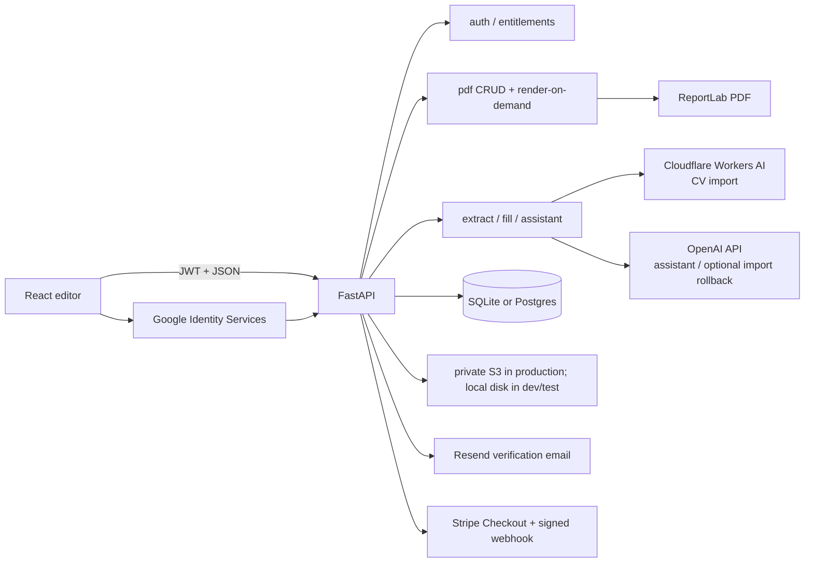
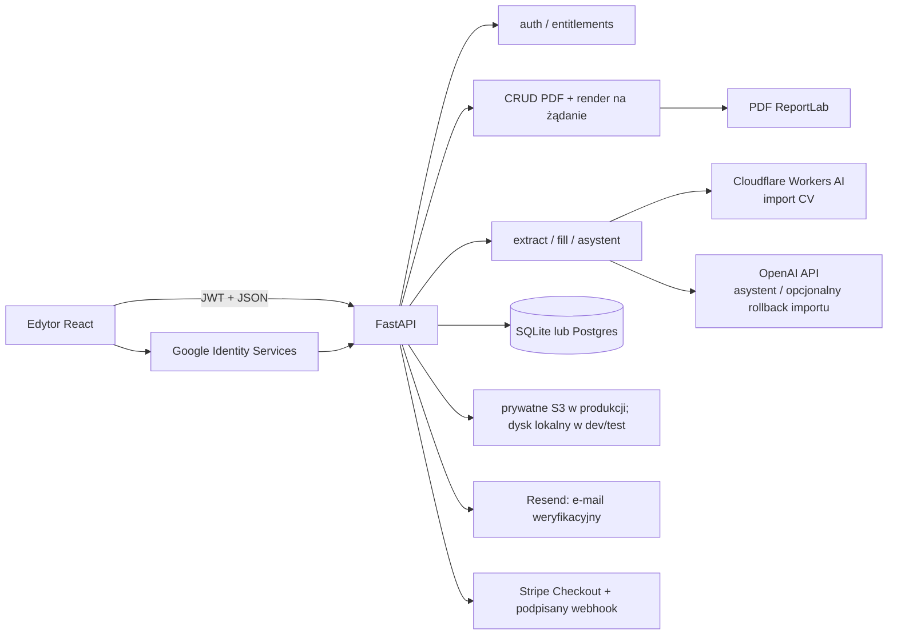

# English

## Saved CV density and reflow compatibility

Short neighboring sections also require unambiguous ownership of their heading decorations. A saved one-line Skills section exposed a separate bug even with every `flowRole` present: its filled band was at 695.52 and the following Languages band at 736.38, only 40.86 document units apart. The 48-unit recovery window for displaced accents incorrectly reclaimed the correctly aligned Skills accent for Languages. Both sections then started at 695.52, the Skills heading fell outside its empty membership interval, and density changes moved its background/body while leaving the label behind. Deleting that section could return no result for the same reason. The visible heading name does not cause this failure; a short section creates the close geometry.

The section helpers now compute confirmed band/accent ownership once per inspection pass and exclude another section's intact decoration from both recovery windows and membership. Each main-column section always owns its own heading, even when saved heading positions coincide. This preserves existing displaced-accent recovery while preventing a healthy compact section from being torn apart. The ownership map is local to the pass, so it cannot retain stale geometry across edits. [MDN: Map](https://developer.mozilla.org/en-US/docs/Web/JavaScript/Reference/Global_Objects/Map) explains the keyed collection used for these lookups.

Implementation: `frontend/src/utils/sectionStructure.js`, lines 477–528, `resolveSectionChromeBandStart`; lines 730–757, `confirmedSectionBandOwners`; lines 1017–1110, `sectionElementIds`. Regression tests: `frontend/src/utils/sectionStructure.test.js`, lines 254–335; `frontend/e2e/saved-compact-sections.spec.js`, lines 1–116.

Regression coverage includes the observed 40.86-unit separation, overlapping-heading deletion, and coincident-heading ownership in `frontend/src/utils/sectionStructure.test.js`. `frontend/e2e/saved-compact-sections.spec.js` loads synthetic saved data with the observed short-section geometry, checks every density change and optimization through the saved payload, then deletes Skills and verifies that all neighboring elements remain. It runs at 390/834/1280/1920px with reduced motion and keyboard-operated density controls. Run `cd frontend`, `npm test`, and `npm run test:e2e -- e2e/saved-compact-sections.spec.js --project=desktop-chromium --workers=1`. The fix changes frontend section ownership only; no schema, API, configuration, dependency or template visual design changes are required. Reload the updated frontend and reopen the saved CV before testing density again; ambiguous geometry already persisted by an older broken operation is not reconstructed by guessing.

Opening an older Cadenza CV can expose missing `flowRole` metadata on the filled heading background and its narrow edge accent. The text heading may still be tagged `section-chrome`. Without normalization, changing density assigns the background above the heading baseline to the preceding section and stacks it as ordinary content, separating the title, band and body and potentially adding a page.

1. `normalizeFilledBandSectionMetadata` recognizes a wide, short band containing exactly one tagged heading and one same-top, same-height edge accent. It repairs only absent/null roles. Explicit roles, fixed artwork, sidebar elements, standalone backgrounds and ambiguous signatures are left alone.
2. `normalizeCommittedDocumentSnapshot` runs that metadata repair before establishing the saved-text baseline. Opening a document preserves its coordinates, dimensions and content and does not manufacture unsaved changes. `applyFlowSpacing` also runs the repair for existing in-memory or guest graphs before repacking.
3. `reflowTextareaHeight` includes the complete semantic group of a downstream grid when a narrower edited field overlaps one of its cells. A title that leaves room for a date rail must not move only the left-hand language cells and leave the last cell on another page.
4. Density changes and subsequent saves use the repaired graph. No database migration, new dependency, API endpoint or environment variable is required. The existing JSON metadata stores the repaired role; UI overlays do not enter PDF geometry.

Implementation: `frontend/src/utils/sectionStructure.js`, lines 639–674, `normalizeFilledBandSectionMetadata`, and lines 3052–3095, `applyFlowSpacing`; `frontend/src/utils/documentSnapshotCommit.js`, lines 11–21, `normalizeLoadedElements`; `frontend/src/utils/textareaReflow.js`, lines 761–1321, `reflowTextareaHeight`.

Tests: `frontend/src/utils/savedDocumentReflow.test.js`, lines 1–103, covers nullable API round trips, fresh/saved parity, repeated density changes, grid alignment, saved-height preservation and narrow recovery exclusions. `frontend/e2e/saved-document-density.spec.js`, lines 1–68, opens mocked saved Cadenza data through `/app/documents/41`, operates density with the keyboard at 390/834/1280/1920px with reduced motion, and checks the saved heading-band geometry. Run `cd frontend`, `npm test`, and `npm run test:e2e -- e2e/saved-document-density.spec.js --project=desktop-chromium --workers=1`.

Compatibility is deliberately limited to recognizable metadata loss; it does not infer original ownership from already detached, ambiguous geometry. Tests use synthetic saved documents, not a copy of a production account's CV. [MDN: JSON.stringify](https://developer.mozilla.org/en-US/docs/Web/JavaScript/Reference/Global_Objects/JSON/stringify) explains why undefined object fields disappear during JSON persistence while explicit nulls remain.

## Automatic CV fitting after the interview

If the verified result still uses multiple pages, the result now automatically compares other entitled templates using exactly the same content, each template's S typography and compact spacing. An existing reopened preview has a **Check other templates** action. Only a measured, complete one-page candidate is offered. Flow textarea heights use `Math.ceil(measured line count × lineHeight)`, matching the canvas's zero-padding text boxes; the heuristic's extra 6px is not added to measured fields. A regression with 33 one-line records verifies that accumulated padding cannot incorrectly manufacture a second page. The labelled template selector shows a sample design, reports partial failures honestly and applies a layout only through **Use this template — 1 page**. Scanning, retrying and changing the template use no AI credits; the current CV stays available during comparison. Restore includes the previous template identity as well as its content and geometry.

The [complete alternate-template tutorial](docs/INTERVIEW_TEMPLATES.md#english) documents both authenticated endpoints (`POST /ai/interviews/{id}/preview-templates` and `POST /ai/interviews/{id}/preview-template`), versioned request/response examples, ownership/entitlement checks, photo and content preservation, errors, cancellation, storage and deployment. This extends the existing session JSON without a migration, dependency or environment variable. Template enumeration is stateless; explicit selection uses the existing atomic session revision check. The browser keeps failed or stale measurements out of the choice list.

Verified implementation and regression references:

- `backend/app/services/interview_templates.py`, lines 1–168, `preview_templates` and `select_preview_template`; `backend/app/schemas/interview_schema.py`, lines 98–102, `PreviewTemplateWrite`; `backend/app/api/routes/interviews.py`, lines 591–600, the two authenticated route handlers.
- `frontend/src/utils/interviewTemplateFit.js`, lines 1–212, `measureInterviewTemplateCandidate` and `measureInterviewTemplateCandidates`; `frontend/src/utils/templatePageFit.js`, lines 1–207, shared S typography registration and `applyTemplateSmallTypography`. The scan yields to the browser between candidates so progress and cancellation remain responsive with cached fonts.
- `frontend/src/components/ai/Interview/InterviewTemplateOptions.jsx`, lines 1–130, optional comparison, progress, cancellation, accessible selector and explicit choice; `InterviewTemplateOptions.module.css` supplies the token-based responsive sample layout.
- `backend/tests/test_interview_templates.py`, lines 1–175; `frontend/src/utils/interviewTemplateFit.test.js`, lines 1–208 (33-field height regression: lines 34–54; cached-font cancellation: lines 179–190); `frontend/src/components/ai/Interview/InterviewTemplateOptions.runtime.test.jsx`, lines 1–78; `frontend/e2e/interview-templates.spec.js`, lines 1–109. The generated synthetic fixture is `frontend/e2e/fixtures/interview-templates.json`; browser selection covers Linden, Cadenza, Sterling and Meridian in both PL and EN.

Run the existing test/runtime/lint/build commands and `npm run test:e2e -- e2e/interview-templates.spec.js --project=desktop-chromium` from `frontend`; backend commands are in the tutorial. Coverage includes PL/EN at 390/834/1280/1920px, keyboard selection, 200% text zoom, reduced motion, failed selection retry and restore. [CSS Font Loading API](https://developer.mozilla.org/en-US/docs/Web/API/CSS_Font_Loading_API) explains actual-font measurement; [React effect cleanup](https://react.dev/reference/react/useEffect) explains ignoring late comparison results. Unsupported or unmeasurable layouts are excluded, so the feature makes no guarantee that every CV can fit one page.

New multi-page results are fitted before the user sees them. The browser measures actual font wrapping, tries existing spacing and the template's S preset, and targets one fewer page at a time. Automatic spacing stops at the compact preset. If a page can plausibly be recovered, the server permits 1/2/3 shortening attempts for estimated editable-prose reductions up to 10%/25%/30%. Each attempt preserves the original verified descriptions and receives a separate factual check. Larger reductions, less than 3% measured progress, rejected facts, exhausted credits or the 600-second scheduling budget end further shortening. An already running provider pair retains its normal timeout.

The final content, elements, page count and spacing are stored together. A free restore action returns to the verified result before fitting. Interrupted fitting exposes explicit resume/restore actions and blocks document creation until resolved. Reads, navigation and answer saves never invoke paid fitting; manual preview corrections trigger only free layout work. Additional shortening and verification charges appear separately in the existing receipt. No database migration, dependency or environment variable was added; baseline/best variants and progress live in the owned interview session JSON and follow its retention/deletion rules.

Read the complete [fitting tutorial and API contract](docs/INTERVIEW_FIT.md#english) for the measurement formula, multi-column limitations, state fields, request/response examples, error codes, recovery, deployment order and tests. This implements bounded optimisation, not a guarantee that every CV fits one page. Semantic verification uses a model and must be evaluated on real documents. Deploy the compatible backend before the frontend; roll back both together.

Implementation and regression coverage:

| File | Verified lines and responsibility |
| --- | --- |
| `backend/app/services/interview_fit.py` | 1–237; `initialise_fit`, `fit_preview`: baseline, limits, evidence checks and final publication |
| `backend/app/schemas/interview_schema.py` | 77–95; `PreviewFitWrite`, `FitVerification`: layout request and independent factual review |
| `backend/app/api/routes/interviews.py` | 585–588; `fit_interview_preview`: authenticated `POST /ai/interviews/{session_id}/preview-fit` |
| `frontend/src/utils/interviewFit.js` | 1–165; `prepareInterviewFit`, `completeInterviewFit`, `balanceInterviewPages`: measured typography/spacing and ordered record pagination |
| `backend/tests/test_interview_fit.py` | 1–220; synthetic tests for ownership, stale writes, loss of facts, limits, restore and billing recovery |
| `frontend/src/utils/interviewFit.test.js` | 1–53; measurement and orchestration contracts |
| `frontend/e2e/interview-fit.spec.js` | 1–108; actual template geometry, PL/EN, keyboard, responsive states, interrupted persistence and restore |

The new domain service belongs in `backend/app/services/`, its schemas stay in the existing schema module, and the browser coordinator belongs in `frontend/src/utils/`. The synthetic generated fixture is `frontend/e2e/fixtures/interview-fit.json`; it contains no uploaded candidate data. Run the existing frontend test, runtime, lint and build scripts; run `npm run test:e2e -- e2e/interview-fit.spec.js --project=desktop-chromium` for the new browser flow. Backend commands and external references are in the linked tutorial. Browser coverage includes 390, 834, 1280 and 1920 px, 200% text zoom, reduced motion and 44px actions. Loading, errors and focus use the existing shared interview components; application controls never enter PDF output.

## AI assistant task workspace

Open the assistant and choose **Check CV**, **Improve content** or **Tailor to a job**. **Interview**, translation and ATS remain visible shortcuts. Results occupy their own view; **Tools** returns to the start, **Return to the latest task** resumes the latest result, and **Result history** lists earlier responses. Opening these views makes no AI request. History belongs to the existing document lifecycle; template changes retain readable results with obsolete actions disabled.

Audit results start with the real finding count, assessed-category coverage and up to three priorities. **All findings** reveals full counts, categories, evidence, strengths and limitations. Selecting a priority opens the relevant disclosures and focuses its finding. Both global and scoped text corrections use the shared `AiChangeReview`: explicit disclosure, complete Before/After text, Apply/Skip, and retained decision status. Hover does not expand or move a proposal. Global reviews snapshot original elements and compare source text before application, allowing their own accepted replacements while rejecting unrelated text changes. Existing scoped validation, canvas mutation and undo remain in their owning controllers.

Job input offers **Link** and **Paste text** as native radios. Both drafts survive switching and returning, but only the selected input enters the request and analysis signature. Analyse is primary before a result and interview afterwards; valid analysis reuse retains its existing billing rules. The shared interview keeps its four stages, using a native selector in narrow containers. Ordinary alternative answers live under **Other answers**; factual clarification decisions remain explicit. Short save/question/synchronisation operations keep the form visible with disabled duplicate actions. Longer operations show truthful indeterminate progress and elapsed time, with optional context; no decorative illustration or simulated completion percentage.

Implementation files and responsibilities:

- `frontend/src/components/ai/AiAssistant/AiAssistant.jsx` (1–2082): task navigation, result history, original snapshots and integration with existing document actions.
- `frontend/src/components/ai/shared/AiChangeReview.jsx` and `AiTask.module.css`: shared, presentation-only review controls used by the assistant and `ScopedAiReview`.
- `frontend/src/utils/assistantReview.js` (1–17): original-text validation that tolerates accepted replacements and layout reflow.
- `frontend/src/components/ai/AiAssistant/CvAuditPanel.jsx` and `JobMatchPanel.jsx`: progressive report disclosure and offer input.
- `frontend/src/components/ai/Interview/InterviewStages.jsx`, `InterviewFlow.jsx` and `InterviewLoading.jsx`: shared responsive stages and operation states for embedded and standalone interviews.

No endpoint, database migration, dependency, model, environment setting, CV template or PDF geometry changes. New shared components live under `components/ai/shared`; they never enter the PDF element graph. PL/EN messages remain in the existing generated locale pipeline. Run frontend `npm test`, `npm run test:runtime`, `npm run test:e2e -- ai-task-workspace.spec.js ai-task-workspace.spec.js ai-assistant-scroll.spec.js cv-audit.spec.js job-match-workspace.spec.js interview-workspace.spec.js --workers=1`, `npm run lint -- --quiet` and `npm run build`. The new review runtime and source-validation unit tests cover explicit application and stale text. Browser fixtures use synthetic data and intercepted APIs; they cannot establish live-model quality or a measured reduction in reading time. Human usability validation remains outstanding.

The [original UX plan](docs/AI_ASSISTANT_UX_PLAN.md) records the design rationale. [NN/g progressive disclosure](https://www.nngroup.com/articles/progressive-disclosure/) explains deferring secondary information; [W3C reflow](https://www.w3.org/WAI/WCAG21/Understanding/reflow.html) defines the narrow-layout requirement.

The shared template catalogue lists Monument, Slate, Aurelia, Sterling, Regent, Meridian, Linden, Cadenza, Vellum, and Atrium, in that order. Aurelia takes the former Atrium position; Atrium is last. New-CV setup still shows Free templates first.

## Job analysis and tailoring through an interview

In the editor, open **Tailor to a job**. The task occupies the assistant body below its header, with 16px text and inputs, 44px actions and one vertical scroll area. Paste a public job link or the advert text; optional experience notes are in a disclosure. Back returns to assistant actions without losing the draft. The page supports Polish/British English, keyboard focus, compact layouts, 200% text enlargement and reduced motion. CV layout and exported PDF geometry are unchanged.

1. **Analyse only** calls `POST /ai/assistant` with `action: "position_rating"`. It displays requirements as covered, needing detail or not mentioned. This action always returns empty `corrections` and null `updated_cv_data`, including cached legacy responses; it cannot apply changes. A strict analysis-only schema excludes rewrite fields. The existing resolver still validates public HTTPS destinations and supports pasted fallback text.
2. **Tailor through an interview** uses the live CV and optionally the explicitly selected same-person career profile. An unchanged result supplies an optional `analysis_key` (1–128 characters) to `POST /ai/interviews`. The server reads an owned, settled `position_rating` receipt and compares a digest of normalised CV, notes and offer inputs. Missing, foreign or stale analysis returns HTTP 409 with `job_analysis_stale`; go back and analyse again. The client omits an outdated key when source inputs or intake notes change. No new analysis charge occurs for valid reuse. Without a reusable result, the first requested interview question performs a paid requirement analysis, followed by the question request. Both charges remain visible in the interview credit history.
3. `requirement_topics` gives requirements stable content-derived IDs. `update_discovery_budget` offers up to two questions for each partial/unknown requirement or explicitly confirmed gap (up to 20 analysed requirements and the existing 50-answer ceiling); matched points are omitted. Questions select different useful aspects of the requirement from the CV, its referenced facts and earlier answers: for example, application, method, a decision or quality checking. A confirmed gap allows questions about related experience without implying that the missing requirement is met. An absent CV detail never proves no experience. No experience, cannot remember or skip closes that requirement; there is no third follow-up. Repeated, wrong-scope or invalid proposals use a local question without another paid request. Generic creation/enrichment retains its record-based policy and shares the question-selection safeguards described below. Session responses expose the live maximum as `planned_question_count`; the shared UI shows **Question X of up to N** plus saved discovery answers. A fresh tailoring session reports that the plan is pending until requirement analysis, while a reused analysis provides it immediately.
4. Answers persist before the next question. The existing preview receives offer analysis and answers as context alongside confirmed facts, runs drafting/editing/verification, then saves a separate CV. Analysis classifications and job requirements are never accepted as career evidence. Source refresh invalidates the analysis while retaining saved answers and their topic IDs.

`job_matching_policy.py` defines the shared rules used by `_tailor_cv_to_position` and direct interview analysis. The instructions treat every CV field, note, answer, advert and offer metadata value as untrusted source data. They distinguish essential requirements, optional advantages and responsibilities, retain thresholds and alternatives, and rank criteria by relevance to the actual role. For example, **Python or R** remains one alternative requirement; **at least three years using SQL** remains a qualified requirement. A CV that confirms SQL but omits duration supports a partial match and a question about duration. It does not justify asking again whether the candidate knows SQL. Related skills may support a partial match without establishing a specialised tool, industry or qualification. The assistant accepts 0–15 meaningful criteria and direct interview analysis 0–20; these are ceilings, so a short or unusable advert must not produce invented criteria. Experience may be demonstrated through concrete work, studies, projects or volunteering without a numerical result. Analysis feedback follows the interface language; the separate CV language controls drafted prose.

`build_evidence_catalog(elements, candidate_notes, cv_data)` creates references to source text: `canvas:<element_id>`, `note:<fragment_number>` and canonical `cv:/path` values such as `cv:/experience/0/bullets/0`. Canonical references cover authored profile content and exclude presentation/grouping metadata and duplicate generated views. The model receives the full source context as well as these references, so a cited fragment must retain qualifications in adjacent content. `build_job_tailoring_result` checks that positive matches cite existing sources; an invalid citation downgrades the requirement to missing information. It removes duplicate criteria after case, whitespace and trailing-punctuation normalisation, makes IDs unique, rejects recommendations for unknown or ambiguously reused IDs, and suppresses repeated feedback. Requirement scores are calculated deterministically from normalised status and weight; non-finite component scores become zero. This validates references and output consistency, not the semantic truth of every model judgement. The score describes documented match evidence and is not an employment probability or ATS guarantee.

The owned analysis receipt also retains the evidence catalogue, priorities and evidence gaps. `requirement_topics` carries requirement kind, weight and `missing_detail` into the interview queue. `requirement_facts` resolves canonical references only when both the original path and complete normalised text match one currently selected confirmed fact. A note fragment binds to the complete authored note, preserving neighbouring qualifications. Canvas-only references, changed text and ambiguous matches remain unbound; the analysis never creates a career fact. This lets questions target the missing detail in important requirements while keeping source identity and role context intact. Historical receipts without the added metadata remain readable.

Tailored CV preparation adds `TAILORED_DRAFT_POLICY` during drafting and `TAILORED_EDITORIAL_POLICY` during style editing. These policies emphasise confirmed information relevant to the offer, integrate an answer into the duty it clarifies, use precise verbs and remove filler and repetition. A summary synthesises the strongest supported areas instead of copying complete experience bullets. They preserve all distinct source facts, accepted `framing`, negations, educational context, record identities and the candidate's actual responsibility. They prohibit fabricated metrics, copying job requirements as achievements and transferring team results or experience between roles. Editorial changes remain within existing fields; independent verification decides whether cross-field duplicates can be removed without losing information. Unresolved questions belong in `remaining_gaps`, never finished CV prose. The analysis action itself still cannot rewrite the CV.

Storage reuses `ai_credit_reservations.response_json` for private `_interview_analysis` (input digest, resolved offer, requirements, evidence catalogue, priorities and evidence gaps); the public assistant response exposes only `analysis_key` plus the analysis fields. `interview_sessions.state` retains requirement kind, weight, missing detail and source snapshots alongside `job_analysis_ready`, stable requirement IDs and `planned_question_count`. No endpoint, table, migration, dependency, model setting or environment variable is added. These snapshots follow existing account export/deletion and receipt retention. Tests use synthetic data and mocked provider responses; they establish orchestration and regression behaviour, not live model language or matching quality. Assess that quality separately on representative occupations, seniority levels, short adverts and incomplete CVs.

Deploy the backend before the frontend so the interview API accepts analysis keys. Use the existing build/deployment workflow; no additional configuration is required.

Main files: `frontend/src/components/ai/AiAssistant/JobMatchPanel.jsx` and its CSS Module own the offer workspace; `backend/app/services/job_matching_policy.py` owns shared matching, analysis and tailored-prose instructions; `job_tailoring.py` validates analysis output; `interview_job_analysis.py` owns receipt lookup, input binding and topic normalisation. The generated [`docs/PROMPTS.md`](docs/PROMPTS.md) includes the shared policy source; regenerate it with `python scripts/generate_prompts_md.py` from the repository root after changing those instructions.

Run from `backend`: `python -m pytest tests/test_interview_job_analysis.py tests/test_interview_discovery.py tests/test_interviews.py tests/test_job_tailoring.py tests/test_ai_assistant_schema.py tests/test_interview_credits.py tests/test_interview_editorial.py -q`. Run from `frontend`: `npm run test:e2e -- job-match-workspace.spec.js ai-assistant-scroll.spec.js --grep "job|analysis" --workers=1`, `npm run lint -- --quiet`, and `npm run build`. Browser tests use synthetic data, verify analysis without CV edits, cached handoff, link validation, pending/error recovery, focus restoration, draft retention, 390/834/1280/1920/640px layouts and enlarged text.

References: [W3C reflow guidance](https://www.w3.org/WAI/WCAG21/Understanding/reflow.html) explains readable layouts under enlargement; [Pydantic fields](https://pydantic.dev/docs/validation/2.12/concepts/fields/) explains the bounded optional analysis key and validated provider outputs. [OpenAI prompt engineering](https://developers.openai.com/api/docs/guides/prompt-engineering) explains separating instructions from contextual data; [Structured Outputs](https://developers.openai.com/api/docs/guides/structured-outputs) explains schema constraints and the remaining possibility of semantic mistakes, which is why source validation and independent CV verification remain necessary.

Implementation and regression references:

- `backend/app/services/job_matching_policy.py`, lines 9–189, `JOB_MATCHING_RULES`, `JOB_ANALYSIS_TASK`, `INTERVIEW_JOB_ANALYSIS_TASK`, `TAILORED_DRAFT_POLICY`, `TAILORED_EDITORIAL_POLICY` — shared instructions and separate operation contracts.
- `backend/app/services/ai_assistant_service.py`, lines 1195–1274, `_tailor_cv_to_position`; `backend/app/services/job_tailoring.py`, lines 205–234, `build_evidence_catalog`, and lines 494–599, `build_job_tailoring_result` — source preparation, model request, deterministic output validation and analysis-only response.
- `backend/app/api/routes/ai_assistant.py`, lines 1–470, `ai_assistant`; `backend/app/services/interview_job_analysis.py`, lines 1–154, `analysis_signature`, `load_owned_analysis`, `requirement_topics`, `requirement_facts` — private receipt and source handoff.
- `backend/app/schemas/interview_schema.py`, lines 135–147, `Requirement`, `JobAnalysis`; `backend/app/services/interview_service.py`, lines 572–651, `next_question`; `backend/app/services/interview_discovery.py`, lines 210–279, `update_discovery_budget`; `backend/app/api/routes/interviews.py`, lines 486–575, `preview_interview` — direct analysis, ranked question context and tailored generation.
- `backend/tests/test_job_tailoring.py`, lines 1–572; `backend/tests/test_interview_job_analysis.py`, lines 1–351 — canonical-only evidence, fake source markers, metadata exclusions, duplicate IDs/criteria, feedback filtering, finite scoring, empty analyses, source-bound handoff, ownership, replay and missing-detail question context.
- `backend/tests/test_interview_editorial.py`, lines 1–325 — tailored drafting/editing instructions apply only in `tailor` mode, alongside existing source-preservation, verification and generation-replay checks.
- `frontend/src/components/ai/AiAssistant/JobMatchPanel.jsx`, lines 1–57, `JobMatchPanel`; `frontend/src/components/ai/AiAssistant/JobMatchPanel.module.css`, lines 1–36, `.workspace`; `frontend/e2e/job-match-workspace.spec.js`, lines 1–121, `Playwright` — existing analysis workspace and browser regression coverage.

## Saved CVs and saved imports

At `/app/documents`, choose **Saved CVs** to search, sort, open, download or delete account documents, or **Saved imports** to see PDF filenames, dates, processing status, file size and the number of created CVs. Arrow keys, Home and End select tabs; Tab enters the selected panel. Both views reuse the shared SiteLayout tokens and compact responsive rows.

1. Open Saved imports. `SavedImports` requests owned metadata from `GET /ai/imports`; **Show older imports** follows `next_cursor` without duplicating rows, and **Refresh status** reloads the first page. Loading, empty lists and retryable errors remain explicit.
2. For a successful import, choose **Create CV**. The link uses the existing private editor route with `start=import&savedImport=<id>`. `AiCvPanel` validates the positive ID, fetches `GET /ai/imports/{id}`, then opens the existing template selection with that import's `cv_data`. It does not upload or extract the PDF again. The existing fill workflow retains template permissions and records `sourceImportId`; list metadata never contains the full extracted profile.
3. Choose **Delete** for any status and confirm the named file in the shared dialog. `DELETE /ai/imports/{id}` removes its stored import data; existing CV documents remain. Deleting a processing history item does not cancel an extraction already running. Failed deletion retains the confirmation for retry. Cancel/Escape restores the trigger; successful deletion focuses the list heading.

No database, API contract, dependency or PDF renderer changes are introduced. The new module belongs beside `DocumentsPage` in `frontend/src/pages/Site/`; existing upload history remains available in the editor.

Implementation: `frontend/src/pages/Site/DocumentsPage.jsx`, lines 1–116, `DocumentsPage`; `frontend/src/pages/Site/SavedImports.jsx`, lines 1–93, `SavedImports`; `frontend/src/components/ai/AiCvPanel/AiCvPanel.jsx`, lines 1–678, `AiCvPanel`. Tests: `frontend/e2e/documents-library.spec.js`, lines 1–71; run `cd frontend` then `npm run test:e2e -- documents-library.spec.js import-history.spec.js --workers=1`. Coverage includes tab keyboard navigation, import reuse, deletion focus, read retry, empty state and 390/834/1280/1920px layouts plus 640px reflow and reduced motion.

Reference: [W3C tabs pattern](https://www.w3.org/WAI/ARIA/apg/patterns/tabs/) explains tab selection, panel relationships and keyboard navigation.

# CV Studio

CV Studio is an A4 CV editor with Polish and English interfaces: a WYSIWYG canvas, ten individual templates, PDF import via AI, a single-screen new-CV setup with optional customization, a floating AI assistant, and ReportLab PDF export that matches the canvas 1:1 (coordinates in points, top-left origin on the frontend, flipped for ReportLab).

This README is the technical entry point for developers and the complete bilingual architecture/tutorial reference. Product-oriented feature copy lives in [`docs/FEATURES.md`](docs/FEATURES.md), template generation (AI extraction versus deterministic Python layout) is explained in [`docs/cv-template-generation.md`](docs/cv-template-generation.md), and the complete English reference for AI scope, providers, safety boundaries, credits, data flow, tests, and extension work lives in [`docs/AI_IMPLEMENTATION_README.md`](docs/AI_IMPLEMENTATION_README.md).

---

## Polish and English interface

The landing-page header is the only place that shows the **Polski / English** application-language selector. Polish is the default; English uses British spelling and `en-GB` formatting. The chosen interface language persists across public pages, authentication, account workspaces, the editor and fullscreen setup without repeating the control in those task-focused surfaces. Both interfaces share routes, components, permissions, A4 geometry, prices and allowances. The browser stores `cvstudio.uiLanguage` independently of login. Invalid or unavailable storage falls back to Polish; an in-memory selection still works. No user-table field or database migration is added.

1. `initialLanguage` reads the browser preference before the first render. A supported `lang` parameter on `/verify-email` takes precedence so an emailed link can select its language in another browser.
2. i18next and react-i18next own nine semantic namespaces. `generate-locale-bundles.mjs` derives public and workspace bundles from the complete PL/EN dictionaries. The landing selector waits for the necessary bundle, then updates labels and `html.lang` without navigation; route loaders retain that preference and await workspace copy before evaluating editor/account modules.
3. Presentation registries use getters; transient messages use `messageRef` and resolve at render time. Authored CV text and historical AI results are never passed through this translation mechanism. Page-title effects are separate from route focus and scroll.
4. New-CV setup captures the UI language as its initial document language. The document selector remains independent after that. `cv_data.language` controls generated headings; existing and custom headings retain their content. Canvas hint translation happens at the display boundary and does not modify the stored document. Sample text inserted in freeform mode follows the document language at insertion and remains unchanged afterwards.
5. JSON and file requests send `Accept-Language: pl` or `en`, captured once for automatic retries. The backend isolates language with a context variable and returns `Content-Language`. Existing errors retain HTTP statuses/codes and readable details, with `message_key` and `params` for frontend rendering. Validation keeps field locations and types.
6. AI explanations and new interview questions follow request language; CV corrections follow the document language. Verification emails and their link context, the Google button, and new Stripe Checkout sessions receive the selected locale. Saved answers and previous results stay in their original language.


Slate’s generated contact heading follows the CV language when creating a document, hiding its photo and restoring a saved draft. Opening an English CV repairs the legacy locked Polish contact label without moving elements or renaming custom sections. The interface preference selected on landing preserves document headings and PDF content. Empty-field hints follow that preference, including English placeholder metadata saved by older versions; hints never become authored text. Regression coverage: `profilePhotoVisibility.test.js`, `i18n.test.js` and the English Slate scenario in `e2e/localisation.spec.js`.

**Contact hints in English.** Empty email fields display `name@example.com`, including drafts with the older `firstname.lastname@example.com` hint. The shorter example fits contact spacing measured from canonical Polish metadata, so changing the interface language cannot overlap the following website icon or change saved A4 coordinates. Authored email addresses retain their complete text. `markerBindings` also recognises the lowercase contact sentinels produced by URL display normalisation (for example `__cvstart_website__`); `finalizeStarterElements` removes them and restores empty-field bindings before starter layout and template replacement. Empty contacts and their icons remain excluded from the render-only PDF payload.

Implementation: `frontend/src/i18n/editorHints.js`, lines 1–72, `editorHint` and its legacy aliases; `frontend/src/i18n/locales/en.json`, line 949, `editor:hints.emailExample` (regenerate the workspace bundle with `npm --prefix frontend run build`); `frontend/src/utils/cvStarter.js`, lines 343–418, `markerBindings` and `finalizeStarterElements`. Tests: `frontend/src/utils/cvStarter.test.js`, lines 59–73, normalised URL markers and authored-text preservation; `frontend/src/i18n/i18n.test.js`, lines 71–90, `legacy Polish and English hints switch both ways without mutating document metadata`; `frontend/e2e/contact-placeholder-spacing.spec.js`, initial PL/EN layout, keyboard edit/clear cycles, save/render isolation and Cadenza/Aurelia at 390, 834, 1280 and 1920 px. Run `npm --prefix frontend run test:e2e -- contact-placeholder-spacing.spec.js --project=desktop-chromium`. [W3C generated content](https://www.w3.org/TR/CSS2/generate.html) explains the CSS pseudo-content used for editor hints; these hints never enter authored text. This repair needs no database, API, dependency or environment changes.

Implementation references (verified against this revision):

- `frontend/src/i18n/index.js`, lines 1–111, `initialLanguage, setUiLanguage, ensureWorkspaceMessages`.
- `frontend/src/i18n/messageState.js`, lines 1–26, `messageRef, useMessageState, resolveMessage`.
- `frontend/src/components/common/LanguageSelect/LanguageSelect.jsx`, lines 1–18, `LanguageSelect`.
- `frontend/src/components/common/SiteLayout/SiteLayout.jsx`, lines 1–71, `SiteHeader` and its opt-in `showLanguageSelect` placement.
- `frontend/src/pages/Hero/Hero.jsx`, line 120, the sole `SiteHeader` call that enables the application-language selector.
- `frontend/src/utils/cvStarter.js`, lines 1–423, `createDefaultStarterConfig, buildStarterDocument`.
- `backend/app/core/localisation.py`, lines 1–81, `UiLanguageMiddleware, message, ui_language_policy`.
- `scripts/generate_english_previews.py`, lines 1–60, `main`.
- `frontend/scripts/check-locales.mjs`, lines 1–45, `validateCatalogues`.
- `frontend/scripts/generate-locale-bundles.mjs`, lines 1–28, `public/workspace catalogue generation`.

Run `npm run check:locales`, `npm test`, `npm run test:runtime`, `npm run test:e2e -- e2e/localisation.spec.js --project=desktop-chromium`, `npm run lint`, `npm run build` and `npm run check:bundle` from `frontend/`; run `python -m pytest -q` from `backend/`. The locale gate checks missing/empty keys, interpolation parameters and required plural forms. `i18n.test.js`, `NewCvSetupModal.runtime.test.jsx`, `localisation.spec.js` and `backend/tests/test_localisation.py` cover landing-only selector placement, language persistence, independent CV selection and request isolation. Structural source tests use the explicit `@babel/parser` and `@babel/traverse` development dependencies to compile literal translation calls for their existing layout/handler assertions; runtime tests use the actual translation instance.

Optional test configuration: `PLAYWRIGHT_PORT` is a local numeric HTTP port (default `4173`; for example `4183`) for an isolated browser-test server. It contains no credentials and is not production configuration. Generate English raster previews and Free starter packs with `python scripts/generate_english_previews.py` using the backend environment. Paid geometry stays server-side; English assets live in `frontend/public/template-mockups/en`, `frontend/public/hero-templates/en` and Free packs in `frontend/src/templates/en`.

The [acceptance matrix](docs/localisation-matrix.md) tracks the release gate. Deploy the compatible backend before the frontend. Browser checks use mocked services; they do not send real verification emails, spend AI credits or purchase Stripe products. The full backend run currently reports three Regent layout failures also reproduced from clean HEAD; they are recorded separately from localisation regressions. Release remains blocked until the complete matrix is green on a stable revision; the concurrent source-required interview change needs an integrated browser rerun.

References: [react-i18next useTranslation](https://react.i18next.com/latest/usetranslation-hook) explains render subscriptions; [i18next plurals](https://www.i18next.com/translation-function/plurals) explains count forms; [Google button locale](https://developers.google.com/identity/gsi/web/reference/js-reference#locale) and [Stripe Checkout creation](https://docs.stripe.com/api/checkout/sessions/create) document external locale parameters.

## Table of contents

1. [Purpose and problem](#purpose-and-problem)
2. [Main user flows](#main-user-flows)
3. [Architecture and data flow](#architecture-and-data-flow)
4. [Technologies](#technologies)
5. [Folder structure](#folder-structure)
6. [Database](#database)
7. [Features (implementation map)](#features-implementation-map)
8. [API](#api)
9. [Installation and local development](#installation-and-local-development)
10. [Testing](#testing)
11. [Deployment](#deployment)
12. [Security and privacy](#security-and-privacy)
13. [Accessibility and UX](#accessibility-and-ux)
14. [Known limitations and planned work](#known-limitations-and-planned-work)
15. [Further reading](#further-reading)

---

## Purpose and problem

Job seekers need CVs that look professional and export cleanly to PDF. Generic form builders hide layout; design tools are too heavy. CV Studio gives a true A4 canvas (595×842 pt), templates filled with real career data, and AI that extracts or improves content without inventing unsafe coordinates for decorative chrome.

Forcing registration before a visitor had seen the editor used to be the largest funnel loss. **Guest mode** removes that wall: `/cvstudio/guest` works with no JWT, so a visitor can configure a new CV and edit the generated A4 immediately, with state kept in `localStorage` instead of the backend. An account is required only for saving or exporting (the save gate). CV import remains account-gated because it sends personal CV data to a server-side AI provider and consumes an account-wide quota. See [Guest mode (editor without an account)](#guest-mode-editor-without-an-account).

**Implemented today:** editor (including guest mode without an account), single-screen A4 starter with optional customization, templates, extract/fill, explicit legacy bio-draft recovery, AI assistant (goal-oriented quick actions, detailed CV audit, ATS dashboard, translation, and reviewable action results), entitlements (Darmowy / Pro — 59 zł / 30 days), one-time Stripe Checkout for Pro, password accounts with transactional email verification, Google Identity Services login/linking, explicit save + independent render-on-demand download, guest-only localStorage autosave, Storage V2 (private S3 in production; local filesystem only in development/tests), and versioned JWT sessions.

**Optional locally:** AWS S3 may replace the development filesystem. **Required on Render/production:** `S3_BUCKET_NAME`, `AWS_ACCESS_KEY_ID`, `AWS_SECRET_ACCESS_KEY`, and `AWS_REGION`, with a private bucket and Block Public Access enabled. Unpaid plan selection (`ALLOW_UNPAID_PLAN_SELECTION`) remains a local-only option.

**Production integrations:** Stripe, Google, and Resend are active only when their server-side configuration is present. `ALLOW_UNPAID_PLAN_SELECTION=true` bypasses Stripe for local development and must remain false in production.

---

## Main user flows

### Studio, Interview and one-page guidance

1. On the homepage, choose a Free template for manual editing, or follow the Interview link to its worked example. The public header and footer link to `/help#wywiad`; the example links to `/app/interview`. Guests sign in before entering the account workspace.
2. Import an existing PDF or select a saved CV with candidate details. Onboarding keeps manual setup, import and the entitlement-aware Interview in that order. Short descriptions explain each result; Pro and unknown-access states retain their existing checks. Secondary help/library controls have 44px minimum targets.
3. Use the Interview to supply concrete activities, tools and results. Review the generated text and save a separate CV. The example on the homepage is illustrative, not a testimonial or live AI response.
4. Read `/help#jedna-strona` for layout fitting, fact-checked shortening and measured alternative templates. A one-page result is conditional on the content and layout. Template comparison and selection use no AI credits; text generation, editing, shortening and verification are paid AI operations. A longer CV can be retained.

Both complete dictionaries in `frontend/src/i18n/locales/pl.json` and `en.json` own the copy; the existing generator produces shell/workspace bundles. No API, database, dependency, document geometry or export code changes are required by this presentation update. All new elements remain outside the PDF tree. The existing frontend deployment pipeline applies.

Implementation (whole-module ranges, including `Hero`, `PricingPage`, `HelpPage`, `SiteHeader`, `SiteFooter` and `InterviewPage`):

- `frontend/src/pages/Hero/Hero.jsx`, lines 1–352.
- `frontend/src/pages/Site/PublicPages.jsx`, lines 1–123.
- `frontend/src/components/common/SiteLayout/SiteLayout.jsx`, lines 1–71.
- `frontend/src/pages/Site/InterviewPage.jsx`, lines 1–13.

Tests: `frontend/e2e/interview-positioning.spec.js` adds the bilingual discovery journey under the existing `frontend/e2e/` directory. Run `npm run test:e2e -- e2e/interview-positioning.spec.js --project=desktop-chromium --workers=1` from `frontend/`. It checks 390/834/1280/1920px layouts, 200% text zoom at 834px, reduced motion, keyboard anchor focus, guest login return and absence of paid AI calls. `Hero.test.js` checks presentation contracts; `StartChooser.runtime.test.jsx` checks Pro/Free/unresolved/revoked access. These mocked tests do not assess live AI quality or production PDF rendering. [WAI page structure](https://www.w3.org/WAI/tutorials/page-structure/) explains the semantic regions, headings and navigation used here.

### Discovering the Pro career interview

The interview is introduced as a way to turn real experience into CV content. The minimum path is **library → interview → review source facts → answer questions → preview → save a new CV**. Submitted answers are stored as confirmed evidence without a second approval screen. For an existing offer, the help guide directs the owner to **open a CV → assistant → Dopasuj do oferty → Dopasuj z wywiadem**. This keeps the selected source in the existing assistant instead of inventing a second tailoring route.

- `/help#wywiad` explains choosing a source, answering in plain language, reviewing the result, beginner projects, answer meanings, credits and resuming saved answers. Native disclosures keep optional explanations collapsed.
- `/help#dopasowanie` explains two questions per unresolved job requirement, review and preservation of the source document. `/help#profil` explains source selection, note edits, explicit profile save and the separate effects of deleting profiles, interviews and documents.
- `/pricing#wywiad` explains the benefit and shared credit pool. `PLAN_PRESENTATION` puts the interview first in Pro benefits, so public pricing, the landing, registration and the plan picker use the same wording. Backend prices and entitlements remain authoritative.
- The library replaces its supporting hero note with a direct interview invitation only when the resolved server `ai_assistant` entitlement is exactly `true`. The account page uses the same condition for its Pro interview section. Loading, unavailable and Free access never claim active Pro access; the existing profile navigation remains available. No invitation invokes paid AI.
- The landing feature list links to the help guide. The existing start chooser entry states Pro and credit requirements. Interview help opens in an explicitly labelled new tab so reading instructions does not navigate away from the current answer.

`SiteLayout` scrolls to and focuses a matching fragment after a client-side route mounts; ordinary route changes retain heading focus. The new help topics preserve existing URLs and anchors. This change adds no endpoint, schema, migration, runtime dependency, price, credit allowance or PDF behavior. The interview still needs active Pro and available credits for AI operations; profile management remains free after Pro expires. Unsaved answer text is not promised to survive a browser restart.

Implementation (verified whole-module extents):

- `frontend/src/pages/Site/PublicPages.jsx`, lines 1–123, `PricingPage, HelpPage`.
- `frontend/src/utils/planPresentation.js`, lines 3–73, `PLAN_PRESENTATION, applyPlanPresentation`.
- `frontend/src/pages/Site/DocumentsPage.jsx`, lines 1–116, `DocumentsPage`.
- `frontend/src/pages/Site/AccountPage.jsx`, lines 4–87, `AccountPage`.
- `frontend/src/pages/Hero/Hero.jsx`, lines 1–352, `Hero`.
- `frontend/src/components/editor/StartChooser/StartChooser.jsx`, lines 103–247, `StartChooser`.
- `frontend/src/pages/Site/InterviewPage.jsx`, lines 1–13, `InterviewPage`.
- `frontend/src/components/ai/Interview/InterviewFlow.jsx`, lines 1–363, `InterviewFlow`.
- `frontend/src/components/common/SiteLayout/SiteLayout.jsx`, lines 1–71, `SiteLayout`.
- `frontend/src/components/common/SiteLayout/SiteLayout.module.css`, lines 1–199, `guideFaq`.
- `frontend/e2e/interview-discovery.spec.js`, lines 1–100, `Playwright`.

Tests: `frontend/e2e/interview-discovery.spec.js` covers pricing-to-help navigation and focus, keyboard disclosures, 390/834/1280/1920 px widths, 200% text zoom, Pro invitations, Free/unavailable access, landing and start-chooser links, registration and plan-picker copy without paid calls. `planPresentation.test.js` verifies canonical benefits and retained server pricing. Run `npm run test:e2e -- e2e/interview-discovery.spec.js e2e/site-architecture.spec.js --project=desktop-chromium`, `npm test`, `npm run test:runtime`, `npm run lint` and `npm run build` from `frontend/`. The new browser test lives in the existing `frontend/e2e/` directory; application folder and database structures are unchanged. Deploy through the existing frontend pipeline. Tests use mocked account data and do not verify production activation or live AI quality. [WAI page structure](https://www.w3.org/WAI/tutorials/page-structure/) explains semantic regions, headings and navigation used by the guide.

### Site navigation, document library, and private bookmarks

The shared site layout uses the warm canvas token behind white content regions. `/app/documents`, `/pricing`, `/help`, and `/app/account` pair the page title with a contextual note through `SiteLayout`'s optional `heroAside` and `heroActions` slots. `SitePrimitives.jsx` contains `HeroNote` (supporting copy), `SiteMarker` (decorative Feather icons), and `UsageMetric` (server-owned usage presentation); `SiteLayout.module.css` owns their shared responsive styling. This folder remains responsible for site chrome only, outside the document/PDF render tree. The gallery, template details, and privacy policy inherit the same warm background.

The library groups labelled search/sort controls and compact document rows inside one working region. Clearing a search with no results resets the query and restores input focus. Pricing uses the existing `PLAN_PRESENTATION` data in contrasting Free and Pro panels. Help keeps native, bookmarkable topic anchors; its sidebar stacks above the instructions below 768px. Account settings separate Google sign-in, data export, and permanent deletion. `UsageMetric` receives `label`, `used`, `limit`, and an optional icon. A known positive finite limit produces a labelled native meter; `null` means unlimited, zero means unavailable in the plan, and a missing limit remains unknown. For example, 230 of 200 credits displays 230 in text and caps the meter at 200. These presentation changes add no API, database, billing, environment, or PDF-generation changes.

Implementation: `frontend/src/components/common/SiteLayout/SitePrimitives.jsx`, lines 3–31, exports `HeroNote`, `SiteMarker`, and `UsageMetric`; `frontend/src/pages/Site/PublicPages.jsx`, lines 1–123, `PricingPage` and `HelpPage`. Regression coverage: `SitePrimitives.runtime.test.jsx` in the same shared-component directory checks finite, exceeded, unlimited, zero, and missing allowances; `frontend/e2e/site-architecture.spec.js` checks search-reset focus, account meter semantics, and responsive navigation alongside download/deletion flows. Run `npm run test:runtime -- src/components/common/SiteLayout/SitePrimitives.runtime.test.jsx` and `npm run test:e2e -- e2e/site-architecture.spec.js` from `frontend/`. [MDN's native meter reference](https://developer.mozilla.org/en-US/docs/Web/HTML/Reference/Elements/meter) explains why bounded usage is a measurement, with a known minimum and maximum.

The public site has `/templates`, `/templates/:slug`, `/pricing`, `/help`, and `/privacy`, all linked by `SiteHeader` and `SiteFooter`. Its copy uses direct customer language: the landing explains the actual workflow, the catalog cards describe visible layout choices, and every template detail page explains how that specific structure organizes content before naming plan availability and the next action. The ten template summaries and their detail-page heading, explanation, and three structural highlights come from `TEMPLATES`; both pricing plans use `PLAN_PRESENTATION`. Appearance-picker taglines describe the actual background, accent colours, and contrast instead of assigning abstract personalities to palette variants. The pricing, help, footer, login, and registration copy follows the same factual tone. There is no separate content database or new dependency.

| URL | Purpose and access |
| --- | --- |
| `/app` | Redirect to the authenticated document library |
| `/app/documents` | Owned documents, name search, last-change/name sorting, open, download, confirmed deletion |
| `/app/documents/:documentId` | A specific saved CV; positive integer ID, account required, server ownership checks |
| `/app/new` | Generic creation entry: authenticated users open the three-path `StartChooser`, while guests and links with an optional `template` query open A4 setup directly |
| `/app/import` | Named entry to the existing import/account-gate workflow |
| `/app/account` | Current plan and limits, Google connection, portable data export, confirmed permanent account deletion, logout |
| `/cvstudio/:workspace`, `/pdfcanvas` | Supported legacy/guest entry points with existing `start` and `template` intent |

To resume work, log in and open a library row. Ordinary authentication returns to the library. A recognized `returnTo` address takes precedence; otherwise explicit `start`/`template` intent and an authored browser draft retain their existing recovery flow. `safeReturnTo` accepts only known internal destinations, rejects external URLs and malformed IDs, and is not an authorization mechanism. Login/registration links preserve the same validated task parameters.

Opening a saved address calls `loadOwnedDocument`: it posts the ID to the existing ownership-checked `POST /pdf/show_pdf`, hydrates persisted element properties, applies the established appearance/photo migrations, then returns a complete snapshot. `EditorController` rejects stale responses before its lifecycle-owned commit. The screen exposes loading, retry, missing/forbidden, and expired-session states without exposing a previous canvas. First save replaces the workspace address with the returned document ID without restarting the editor; creating another CV removes the previous saved address. Existing unsaved-change confirmation still guards route exits, including the link to the library. Older templates may become dirty after their existing normalization/reflow; saving retains those changes.

The library calls existing `GET /pdf/fetch_pdfs`, `POST /pdf/download_pdf`, and `DELETE /pdf/delete_pdf` endpoints. It does not render or save documents automatically. Download and delete reject duplicate activation; delete requires confirmation, remains retryable on failure, and restores focus. The editor retains **Szybko otwórz dokument** as a contextual quick-switch dialog, while **Moje dokumenty** opens the standalone library. In `frontend/src/components/editor/Sidebar/Sidebar.jsx`, lines 161–176, `Sidebar` groups these controls together and distinguishes them with Lucide icons from the existing `react-icons/lu` dependency: a document with a magnifier (`LuFileSearch`) for quick opening and a folder (`LuFolderOpen`) for the library. Their accessible names, hover/focus tooltips, document count, and dialog active state remain in the shared `SidebarControls` primitive. The [Lucide icon catalog](https://lucide.dev/) is the official visual reference for this icon family. The legacy start chooser's **Kontynuuj ostatnie CV** opens its exact latest document; **Wszystkie dokumenty** opens the library.

Known Pro template hints now preserve the chosen preview instead of falling back to Meridian. The create action is disabled until current entitlements allow that template, and the server remains authoritative. Unknown hints still open ordinary setup. Registration preserves the chosen template; entering account/plan management from setup offers a return link to the same template.

`/privacy` is the published Polish privacy policy. It identifies the controller and contact channel and describes data categories, purposes, legal bases, browser storage, AI/import processing, recipients, international transfers, retention, security, user rights, the 18+ rule, and policy changes. The footer links to this stable flat URL. `docs/POLITYKA_PRYWATNOSCI.md` is the synchronized operator/review copy and contains a production verification checklist. There is still no `/terms` route.

Implementation (verified file extents; the listed exports own the complete workflows):

- `frontend/src/pages/Site/DocumentsPage.jsx`, lines 1–116, `DocumentsPage`.
- `frontend/src/pages/Site/AccountPage.jsx`, component `AccountPage`.
- `frontend/src/pages/Site/PublicPages.jsx`, exports `TemplatesPage, TemplatePage, PricingPage, HelpPage`.
- `frontend/src/pages/Site/PrivacyPage.jsx`, component `PrivacyPage`.
- `frontend/src/components/common/SiteLayout/SiteLayout.jsx`, lines 1–71, `SiteLayout, SiteHeader, SiteFooter`.
- `frontend/src/templates/index.js`, lines 3–201, `TEMPLATES` — picker summaries and detail-page copy for all ten templates.
- `frontend/src/utils/planPresentation.js`, lines 3–73, `FREE_PLAN_HIGHLIGHTS, PRO_PLAN_HIGHLIGHTS, PLAN_PRESENTATION`.
- `frontend/src/services/documents.js`, lines 2–46, `listOwnedDocuments, loadOwnedDocument`.
- `frontend/src/utils/siteRoutes.js`, lines 1–78, `getDocumentPath, parseDocumentId, safeReturnTo, authLink, savePendingAuthIntent, getPendingAuthIntent, postAuthPath`.

New directories: `pages/Site/` owns route content and library/account state; `components/common/SiteLayout/` owns shared navigation, semantic page layout and token-based styles. `services/documents.js` owns document reads and hydration, `services/accountApi.js` owns privacy-control requests, and `utils/siteRoutes.js` owns URL validation and authentication continuation. Editor state remains in the existing lifecycle/context layers. The privacy controls reuse the existing tables and storage cleanup outbox, so no database migration or environment variable is required; the backend adds authenticated `/account/export` and `/account` routes. The existing `render.yaml` SPA rewrite to `/index.html` supports refreshing every new address.

Verification: run `npm test`, `npm run test:runtime -- --maxWorkers=2`, `npm run test:e2e -- e2e/site-architecture.spec.js`, `npm run lint`, and `npm run build` from `frontend/`, plus `pytest tests/test_account_privacy.py` from `backend/`. `siteRoutes.test.js` tests unsafe/malformed destinations and intent preservation. `site-architecture.spec.js` covers library login, bookmarks/refresh/Back, retry, search, download, deletion focus, privacy export/account-erasure confirmation, Pro selection, and public/account routes at 390, 834, 1280, 1920 and 640×400 CSS pixels. Tests intercept the API locally and do not upload personal files or contact production. Visual review covers the shared public, library, policy and account layouts; full assistive-technology certification is not implied.

Further reading: [React Router useBlocker](https://reactrouter.com/api/hooks/useBlocker) explains the retained in-app unsaved-work guard; [useNavigate](https://reactrouter.com/api/hooks/useNavigate) explains history replacement on first save; [W3C consistent navigation](https://www.w3.org/WAI/WCAG22/Understanding/consistent-navigation) explains the stable menu order shared by the new surfaces.


1. **Choose a landing-page start** → **Stwórz CV z tym szablonem** (`start=new&template=…`) opens the single-screen A4 setup with the selected Free template, while **Importuj CV z PDF** (`start=import`) opens the account-gated import flow. The tertiary **Zobacz edytor** link (`start=demo`) opens the limited Linden example. The editor Topbar exposes **Nowe CV** and **Zmień szablon**.
2. **Create and edit as a guest** → a landing Free selection starts immediately if no browser draft exists; ordinary New CV opens optional template/contact/photo/section configuration in `NewCvSetupModal`; `POST /ai/fill_template` materializes empty bound fields directly on A4. The name field starts selected. Editing, undo/redo, zoom, and page navigation work immediately; an account is requested only on Save or Export.
3. **Register / login only when it matters** → clicking “Zapisz” / “Pobierz PDF” as a guest opens `SaveGateModal` with operation-specific copy instead of calling the backend. Password registration creates an unverified Free account, sends a 24-hour single-use link through Resend, and issues no JWT until the link is consumed and the user logs in. Google can create a verified session immediately; an existing password account must link Google explicitly from the account page. The allow-listed `start`, `template`, `plan`, and `returnTo` intent survives email verification. If a guest document exists, `ClaimGuestDocumentModal` asks the now-authenticated visitor to confirm it is theirs before loading that JSON onto the A4 canvas (no automatic `POST /pdf/create_pdf`) — a guest document belongs to the browser, not to any identity, so silently attaching it to whoever happens to log in next would leak one person's draft into an unrelated account.
4. **Pick a template** → `handleLoadTemplate` materializes specs → canvas.
5. **Import PDF** (account required) → `POST /ai/extract_cv` → choose template → `POST /ai/fill_template` → Python layout in `cv_generator.generate_resume`.

### Import history

Each account-scoped PDF import creates a separate `CvImportSnapshot` record.
The application stores only the normalized `cv_data`, safe filename, size,
status, and timestamps—not the original PDF bytes, URL, or storage key.
`AiCvPanel` lets the owner reopen a successful snapshot, select a template
without another AI extraction, and delete the stored data. `Pdf.source_import_id`
links CVs saved from that snapshot, so history can show their template and open
them from the document library.

The dialog keeps its history heading, refresh/new-import controls, and footer
visible while the snapshot list scrolls inside the available `82vh` shell. The
list is a named, focusable region, so mouse-wheel, touch, and keyboard scrolling
can reach every import without allowing cards to disappear under the footer.
The upload pane uses the same bounded overflow rule only when a short viewport
cannot fit the first step.

The API validates a PDF signature, parseability, encryption state, 10 MB byte
limit, and 12-page limit before extraction. `GET /ai/imports`,
`GET /ai/imports/{id}`, and `DELETE /ai/imports/{id}` are ownership-scoped;
an import ID alone never grants access to another account's data.
6. **Recover a legacy bio draft** → if an older browser or account draft exists, `StartChooser` exposes an explicit one-time conversion to A4. The old draft is removed only after successful generation; new documents never write bio-draft state.
7. **Edit** → drag/resize/style → edits live in memory (backing undo/redo). Authenticated documents are **not** autosaved to the backend — "Moje dokumenty" is updated only by an explicit **Zapisz** (see step 9). Guests still get a debounced `localStorage` write (`guestDocument.js`) so their unclaimed work survives a reload.
8. **AI assistant** → `POST /ai/assistant` → tips / corrections / reviewable layout groups (account required — every assistant action is entitlement-gated).
9. **Save vs. Download** (two independent actions):
   - **Zapisz** → `POST /pdf/create_pdf` on the first save (creates the "Moje dokumenty" entry + its `pdfId`), then `PUT /pdf/update_pdf` on every later save (updates that same document). This is the only path that writes to "Moje dokumenty".
   - **Pobierz** → `POST /pdf/render_pdf` renders the current canvas on demand and streams it **without** saving, so an unsaved document can still be downloaded. Both actions charge the export quota on download and require an account (guests reach the save-gate).



---

## Architecture and data flow

### Entry points

| Layer | Entry | Role |
|--------|--------|------|
| Frontend | `frontend/src/main.jsx` → `App.jsx` | Router: public information/auth pages, guarded `/app/documents` and `/app/account`, saved CV addresses; compatible guest/workspace and `/pdfcanvas` entries |
| Editor page | `frontend/src/pages/PdfCanvas.jsx` (`PdfCanvas`) | Composes hooks into focused Canvas / UiSurfaces / Session / DocumentLifecycle providers |
| Backend | `backend/app/main.py` | FastAPI app, CORS, `/health`, routers, optional SPA static |

### Frontend layers

- **Pages** — marketing, auth, editor shell.
- **Hooks** — `useA4Elements` is the canvas facade; undo/redo in `useDocumentHistory`; selection/drag in `useElementSelectionDrag`; factories/materialize helpers are pure utils; `usePdfExport` talks to PDF endpoints; `useEntitlements` loads plan limits.
- **Context** — focused `CanvasContext`, `UiSurfacesContext`, `SessionContext`, and `DocumentLifecycleContext`; the former broad `PdfContext` module has been removed and an architectural test rejects reintroduction.
- **Services** — `ApiClient` (`services/api.js`) with long timeouts and retries for Render cold start; shared `fillTemplate` for `/ai/fill_template`; authenticated image blob helper for private library photos.
- **Templates** — static element specs in `frontend/src/templates/`; registry in `templates/index.js`.

### Backend layers

- **Routes** — thin HTTP in `app/api/routes/*` (PDF create/update delegates to `document_service`).
- **CRUD** — SQLAlchemy writes in `app/crud/*`.
- **Services** — PDF render, CV layout, AI, entitlements, S3.
- **Models** — `app/models/models.py`; engine in `app/models/database.py`.

### Coordinate system

Canvas and stored geometry use **top-left** origin (CSS-like). ReportLab uses **bottom-left**; `PDF_Generator` flips `top` using `page_h` before drawing (`backend/app/services/pdf_generator.py`). Immediately before create, update, or render-on-demand export, `resolveBrowserTextLayouts` builds an off-screen mirror with the textarea's exact CSS width and typography. Chromium `Range` rectangles provide the authoritative soft-wrap slices, bullet indent, line start, and horizontal advance. ReportLab validates this transient metadata against the complete current content and box bounds, then draws those exact lines and compensates the remaining kerning delta so their start and end positions match the canvas. The records exist only in the outgoing request and are never persisted. If the DOM, the requested primary font (including inline bold/italic variants), or validation is unavailable, export falls back safely to the backend wrapper. That fallback uses literal width for Montserrat and all uncalibrated families; only Inter retains its independently verified 2 px `INTER_WRAP_WIDTH_TOLERANCE_PX` correction. After a font change the canvas reflows measured `height` / following `top` values; auto-height PDF export **honours those stored heights** (clipping overflow) instead of recomputing box height from PDF wrap alone. Stub heights from a pre-measure export still expand. Canvas painting maps Helvetica/Courier → Inter via `canvasFontFamily` to match the PDF Unicode aliases.

### Auto-height reflow and aligned icons

Template textareas start with authored placeholder heights and are measured after the browser loads their real fonts. `reflowTextareaHeight` then moves all following elements in the same visual lane by the measured delta. Text-aligned Iconic images (`alignWithText: true`, including backward-compatible `/template-assets/iconic/` URLs) are classified as section chrome and may join a lane when they hang to the left of the column (~40 px tolerance). The same left-hanging rule applies to Monument ordinal badge text (`isDecorativeChromeText` / `flowRole: "section-chrome"` digits inside the numbered square at x=74 while the body column starts at x=102): without it, a page break moved the filled square and title to page 2 and left the number behind or 8 px too low in the square. Icons that sit entirely to the right of a narrow column are excluded, so a sidebar cannot drag main-column icons away from their headings.

Undo/redo history treats that **background** reflow as part of the baseline, not as a user edit: a "quiet" record refreshes the current history entry in place so Cofnij stays disabled until the user actually changes the document. Otherwise Undo would restore pre-measure heights and revive uneven Y gaps (e.g. diploma → school in education records). Two rules make this reliable and are unit-tested as pure functions in `frontend/src/utils/documentHistory.js` (`recordSnapshotState`):

- A **quiet settle preserves the redo tail**. Applying an undo/redo re-renders and fires a quiet record while the index sits before the top of the stack; truncating there used to delete every redo entry, which left Ponów permanently disabled after any Cofnij.
- **A user textarea edit is never quiet.** `handleFitTextareaToContent` only marks history quiet for a *background* measure (mount / font-ready / load). The typing/formatting commit in `Textarea.jsx` passes `{ quiet: false }`, so the content change lands as a real, undoable step instead of overwriting the pre-edit baseline in place.

Every auto-height textarea measures twice — once immediately, once again after `document.fonts.ready` — and each measurement calls `reflowTextareaHeight` independently, so a later field can briefly carry a stale `page` number from an earlier pass. `rawSamePageGap` checks authored `top` values (ignoring `page`) before applying the generic page-break gap: a same-record pair with a stale page keeps its authored small gap, while a genuine cross-page seam uses `DEFAULT_PACK_GAP` (10 px, `SPACE_RECORD`) for ordinary blocks and `SECTION_PACK_GAP` (21 px, `SPACE_SECTION`) for section chrome. Using the leftover page-top inset (often 0–6 px when education starts near `pageTop` on page 2) crushed headings such as WYKSZTAŁCENIE under the previous section. Single-column templates mark section markers/rules `locked` for interaction and guides, but `flowRole: "section-chrome"` still lets them reflow with their heading so underlines do not stay stranded on the next page. The reflow intentionally does **not** infer title/meta relationships from font size or boldness; that heuristic distorted valid record spacing (for example Monument chrome rhythm) and compounded independent height deltas. Section marker/label/rule use `section-chrome`, and ordinary records use `content`. Keep-with-next logic therefore cannot mistake a job title for a section heading and move the real heading behind its own content. Legacy templates without this property keep the category-based fallback.

During the canvas enter hold, auto-height reflow is suppressed and resumes after fonts are ready. Every textarea emitted by the Python generators carries `preserveInitialLayout: true` (via `_block` in `cv_generator_primitives.py`). On first mount the canvas may **shrink** a box to browser `scrollHeight` when ReportLab overshoots (so empty slack cannot inflate visual section gaps), but it will not **grow** — independent growth races still stretch gaps. The same shrink-only first-pass contract now runs when an auto-height textarea enters edit mode before its display node has mounted: `measureSeededEditable` measures the seeded `contentEditable` DOM immediately, repeats after fonts become ready and after the canvas-enter reflow hold ends, and records the normalization as quiet background layout. The field therefore removes stale empty box space without requiring the user to create and Backspace a temporary line. Editing content or later changing typography/width still triggers normal auto-height reflow. Plain and bullet-list textareas preserve every authored newline, including trailing blank paragraphs, after blur and document scrub; those rows are measured as real spacing and therefore move following flow content through the normal reflow path. Bullet mode removes only a trailing bare marker (`•`) because that marker is temporary editor chrome, not an authored row (`trimTrailingEmptyTextareaLines` / `trimTrailingEmptyTextareaPayload` in `textareaHeight.js`). Enter after a filled item creates the next `• ` item; Enter on an empty item removes the marker and places the caret in a normal blank paragraph; another Enter creates another blank paragraph. `createTextareaBackspaceEdit` handles only list paragraph boundaries: one Backspace on an empty plain row removes exactly one newline and shrinks the box immediately, while Backspace at the start of a bullet body removes the marker and converts that row to plain text. Character deletion inside text remains native. Blank rows therefore remain editable and visible both between and after real content. Display rendering keeps a line box for each empty row so authored gaps do not collapse. See `textareaHeight.test.js` (`shouldShrinkPreservedLayout`, authored blank-row, and bullet-placeholder cases), `editableSerialize.test.js` (edit-entry measurement and structural Backspace wiring), and `textareaReflow.test.js` packing cases.

Bullet-list edit mode uses the same hanging-indent geometry as display mode and ReportLab. `bulletRunsToEditableHtml` converts every logical bullet paragraph into a two-column marker/body grid; the shared CSS reserves the actual rendered width of `• ` for every continuation line, and the detached height mirror uses that same structure. When a persisted bullet-list field is completely empty, `seedBulletEditableHtml` inserts a temporary editor-only `• ` row so the first typed character becomes a real list item; leaving the field untouched removes that bare marker through the normal cleanup, so it is never saved or exported. Existing plain paragraphs remain plain. `createTextareaEnterEdit` applies Enter as a deterministic stored-text/runs transaction, then selection restoration maps an offset immediately after `\n` into the following paragraph—even when it is empty—instead of falling back to the preceding bullet body. Paste or marker deletion still rebuilds only the paragraph structure, while ordinary character input keeps the live DOM untouched for native caret, IME, and undo behaviour. This fixes empty-list entry, list-line creation, and narrow Montserrat sidebars where a borderline word such as `NSE` previously stayed on line three only while editing but moved to line four in the exported PDF.

Section headings are kept with their first body block across page breaks: `avoidOrphanChrome` reserves the full first keep-together record height (degree + meta + description, not only the first textarea), and when a measured body textarea itself jumps to the next page, `precedingRecordMates` + `precedingChromeCluster` pull title/meta siblings and the icon/heading/rule with it. Page-break reclaim similarly reserves `followingRecordMates` (school/meta/body under a grown degree) so continuation pages cannot pull only the degree line back onto page 1 and crush the rest of education on page 2. Reclaim also refuses to jump across intervening lane content (`hasInterveningLaneContent`) — otherwise a later skills body could reclaim into the page-1 footer hole while education still occupies page 2. When the reclaim target carries preceding section chrome (heading/rule/icon), the fit check reserves that chrome span and packs from `SPACE_SECTION` rather than measuring the body alone with `SPACE_RECORD` — otherwise growing a new section with empty lines could snap it back into the page-1 footer even though heading+rule+body no longer fit. That prevents orphans such as “UMIEJĘTNOŚCI” alone at the bottom of page 1, and the education split where Bachelor stayed on page 1 while its description moved to page 2. The same keep-with-next rule applies to rail kickers tagged `sidebar-chrome` (Sterling / Slate): `isChromeLike` treats them as chrome so `precedingChromeCluster` pulls UMIEJĘTNOŚCI onto page 2 with its list, and `_fit_sidebar_sections` refuses to emit a kicker without room for two body lines — Sterling then spills that whole section onto the next existing rail rather than leaving the heading in the page-1 footer. `remainingRecordHeight` and forward packing skip decorative chrome that is Y-sorted inside a tagged `flowGroup` (a template that placed its section chip on the degree line once made reclaim treat school/meta as a new record). Grid rows (a wrapped languages grid or skill-chip grid, whose cells share one `flowGroup` but sit in adjacent, NON-overlapping columns) are held together specially: `recordMatesBeside` counts same-`flowGroup` members as record mates even though they fail the horizontal-overlap `belongsToFlowLane` test, and `placeRecordCluster` moves each grid cell by its authored offset from the row anchor instead of bottom-stacking it. Without the first rule a per-cell reflow pass (each autoHeight cell measures independently on mount) carried one cell across a page break and stranded its row-mates — the Sterling languages bug where "Polski" stayed on page 1 while "Niemiecki"/"Angielski" floated onto page 2; without the second the reunited row collapsed into a single vertical column. Live grid-cell settling also treats the complete same-`flowGroup`, same-row frame as the flow lane and uses the row's maximum bottom edge as its cursor. Measuring a non-tallest cell therefore moves nothing; once the row envelope really changes, the following heading, accent/rule, and body receive one identical translation regardless of DOM measurement order or generated-id sorting. This prevents Languages add/delete from changing the following section's 18/8 px internal rhythm into 12/2 px. Section markers now stay in the heading band and emit `flowRole: "section-chrome"`; ordinary flow nodes use `content`. Backend generators use `Builder.need_section(chrome, body)` before placing a heading, and `Builder.keep_together(height)` for experience/education/other records — each emitted element is tagged with the same `flowGroup` id so canvas reclaim-packing (when earlier boxes shrink) cannot pull only part of a record back onto the previous page. Sections may continue on the next page, but each record stays whole. ReportLab receives the same geometry visible on the canvas.

Section decorations explicitly tagged with `flowRole: "section-chrome"` are treated as a rigid visual composition by `compactChromeCluster`: spacing changes move the complete heading/icon/frame/rule group but preserve every authored mutual Y offset. Explicit main-section chrome also bypasses the generic left-sidebar column heuristic; sidebar chrome has the separate `sidebar-chrome` role. This matters for Cadenza, whose 3 pt accent begins at x=58 while its centered heading text begins near x=219. Filled title bands define their section boundary, and a matching narrow accent that an older pack left up to 48 px away is reclaimed and snapped back onto the band. Recognized legacy-corruption signatures are therefore rebuilt (Cadenza's separated band/accent, the old sequential `SPACE_STACK` marker layout, a flattened Monument accent rule, and Monument ordinal digits that drifted below the title baseline inside the numbered badge — repaired by `healDecorativeOrdinalBaselines`). This keeps template-specific section rhythm stable across Cadenza, Regent, Monument, and other templates while repairing already damaged documents.

### Decorative chrome

Elements with `fixedToPage: true` (backgrounds, frames, sidebars, page numbers) are cloned across pages by default and must not be selected/moved/deleted in the UI (`isDecorativeChrome` in `frontend/src/utils/elementInteraction.js`). First-page-only chrome sets `repeatOnContinuation: false`, which prevents `cloneFixedPageDecorations` from copying it when overflow creates another page. `reconcileDocumentPages` in `frontend/src/utils/structureOperation.js` syncs **only** fixed page chrome and `pageCount` — it never rewrites content `top`/`left`/`page` (packing and textarea reflow own rhythm). `useA4Elements` derives the visible page count from the committed element array after textarea and Sections-panel updates, so React cannot miss an overflow page because a functional state updater ran later than its caller. **Dodaj stronę** and the next-page arrow at the current end create a continuation with the correct page label (including zero-padded Regent-style `01`/`02`); overflow that places content on a new page gets the same chrome; trailing chrome-only pages collapse when content leaves them. When chrome is already in sync the helper returns the same array reference.

---

## Technologies

| Technology | Version / note | Purpose | Main locations |
|------------|----------------|---------|----------------|
| React | ^19.2 | UI components and hooks | `frontend/src/` |
| Vite | ^7.2 | Dev server and production build | `frontend/` |
| React Router | ^7.18 | Client routes, navigation blocking for unsaved work, and route error surfaces | `App.jsx`, `useDirtyGuard.js`, `authSession.js` (`getEditorPath`) |
| FastAPI | 0.141.1 | HTTP API and dependency injection | `backend/app/main.py`, routes |
| Starlette | 1.6.0 | ASGI middleware, requests/responses, and worker-thread execution | FastAPI runtime |
| python-multipart | 0.0.32 | Streaming multipart form/file parsing | auth and image/CV upload routes |
| Uvicorn | (requirements) | ASGI server | local / Render |
| SQLAlchemy | (requirements) | ORM | `models/`, `crud/` |
| SQLite / PostgreSQL | via `DATABASE_URL` | Persistence | `database.py` |
| ReportLab + fontTools | (requirements) | PDF drawing + TTF name fixes | `pdf_generator.py` |
| PyMuPDF (fitz) | 1.28.2 | Native PDF line/span geometry, column-aware CV extraction, and scan-page rasterisation | `cv_source_layout.py`, `ai_service.py`, `ats_readability.py` |
| OpenAI SDK | 2.14.0 | OpenAI assistant calls and OpenAI-compatible Cloudflare transport | `ai_service.py`, `ai_assistant_service.py` |
| Cloudflare Workers AI | hosted API | Native-text CV extraction (thinking-disabled Gemma 4 with one JSON-mode Llama fallback) and scan extraction (Qwen 3.8 Vision) | `ai_service.py`, `cloudflare_pricing.py` |
| PyJWT / cryptography | 2.13.0 / 50.0.1 | Versioned JWT encode/decode and pinned cryptographic primitives; replaces python-jose/ecdsa | `core/security.py` |
| argon2-cffi / bcrypt | 25.1.0 / 5.0.0 | Authoritative Argon2id hashes plus a temporary bcrypt rollback bridge for N-1 workers | `core/security.py` |
| Google Identity Services / google-auth | browser script / >=2.40,<3 | Provider-rendered sign-in control and server-side ID-token signature, issuer, audience, and expiry verification | `GoogleSignInButton.jsx`, `google_auth_service.py`, `auth.py` |
| Stripe Checkout / stripe-python | hosted Checkout / >=12,<15 | One-time 30-day Pro checkout, signed webhooks, and idempotent fulfillment | `stripe_service.py`, `billing_service.py`, `billing.py` |
| Resend | HTTPS API | Transactional delivery of 24-hour email-verification links; only token hashes are stored | `email_service.py`, `email_verification.py` |
| python-dotenv | 1.2.3 | Loads local backend `.env` configuration | `core/config.py` |
| boto3 | 1.43.51; required in production | Private S3 objects behind the Storage V2 abstraction | `pdf_storage.py`, `s3_storage.py` |
| nanoid | ^5.1 | Client element ids | canvas hooks |
| motion | ^12 | UI motion | modals / assistant |
| pytest + unittest | 9.1.1 + stdlib | Full backend runner plus compatible `unittest.TestCase` tests and subtests | `backend/tests/`, `backend/requirements-dev.txt` |
| Node test runner + Vitest | Node 20+ / ^4.1 | Pure-module regressions plus jsdom React runtime and Error Boundary tests | `frontend/scripts/run-tests.mjs`, `frontend/vitest.config.js` |
| Playwright | ^1.62 | Chromium editor smoke tests and browser-level regression harness | `frontend/playwright.config.js`, `frontend/e2e/` |

Official docs: [React](https://react.dev/), [Vite](https://vite.dev/), [FastAPI](https://fastapi.tiangolo.com/), [SQLAlchemy](https://docs.sqlalchemy.org/), [ReportLab](https://www.reportlab.com/docs/reportlab-userguide.pdf), [Cloudflare Workers AI](https://developers.cloudflare.com/workers-ai/), [Workers AI OpenAI compatibility](https://developers.cloudflare.com/workers-ai/configuration/open-ai-compatibility/), and [OpenAI API](https://platform.openai.com/docs).

---

## Folder structure

```text
pdf-generator/
├── AGENTS.md                 # Project agent / documentation rules
├── BUGZ.MD                   # Known issues tracker
├── README.md                 # This file
├── docs/                     # Product + design + deep-dive docs
│   ├── INTERVIEW_TEMPLATES.md # EN/PL: measured alternate templates and selection API
│   ├── INTERVIEW_FIT.md     # Complete EN/PL automatic fitting and API tutorial
│   ├── INTERVIEWS.md         # Complete EN/PL interview, API, data and deployment tutorial
│   ├── WYWIAD_JAK_DZIALA.md  # Polish user/technical guide to create, enrich, and tailor interview flows
│   ├── licenses/resume-agent-skills-MIT.txt # MIT: Vignesh Pai
│   ├── LANDING_COPY.md        # Current Polish landing copy and labelled alternatives
│   └── POLITYKA_PRYWATNOSCI.md # Review copy plus production privacy checklist
├── frontend/
│   ├── public/
│   │   ├── cv-studio-logo.svg     # Full orange CV Studio logo
│   │   ├── cv-studio-mark.svg     # Compact mark for favicon/editor rail
│   │   ├── hero-templates/       # Responsive Free hero WebP previews (360/595 px)
│   │   └── template-mockups/      # Static A4 preview PNGs regenerated from starter element graphs
│   ├── src/
│   │   ├── components/       # canvas, editor, ai, modals, gallery, common
│   │   │   ├── canvas/CanvasPageStage/   # Smooth slide+fade when changing A4 page (single-page view)
│   │   │   ├── canvas/CanvasControls.module.css # Shared canvas toolbar surfaces and interaction states
│   │   │   ├── canvas/CanvasHoverToolbar/ # Shared text-anchored toolbar, delayed tooltips, dotted blue structural outlines, direct actions/overflow menu
│   │   │   ├── ai/Interview/ # Shared interview, grouped FactEditor + CSS, content review and runtime tests
│   │   │   ├── ai/ScopedAi/ # Scoped request history, inline assistant reviews, and runtime tests
│   │   │   ├── canvas/GridEntryActions/ # Per-cell + / trash controls for repeatable short-entry grids
│   │   │   ├── canvas/SkillsEntryActions/ # Centred + and inline add form for flat or categorised Skills groups
│   │   │   ├── canvas/SectionRecordAdd/  # Heading controls plus dotted section context from plain content hover
│   │   │   ├── canvas/RecordBlockAdd/    # Record hover/focus adapter: entry/field outlines, add/reorder, description toggle, recoverable deletion
│   │   │   ├── canvas/recordPlusSize(.test).js # Shared zoom growth for structural and compact controls and single/spread gutters
│   │   │   ├── canvas/FlatSectionLayoutToggle/ # Hover icon on flat-list sections (Skills, Languages) to open the layout modal
│   │   │   ├── editor/AddSectionModal/   # "+ Dodaj sekcję" modal (six named section cards with structure previews)
│   │   │   ├── editor/FlatSectionLayoutModal/  # Inline row ↔ bullet list picker with a live content preview
│   │   │   ├── editor/SkillsLayoutPanel/ # Nine-option Skills style panel with immediate canvas updates
│   │   │   ├── editor/LongCvModal/        # AI fallback after spacing + typography S cannot hit the page target
│   │   │   ├── common/AuthLayout/       # Shared login/registration layout (AuthLayout.module.css)
│   │   │   ├── common/GoogleSignInButton/ # Provider-rendered Google Identity Services control
│   │   │   ├── editor/SaveGateModal/     # Account gate for guest save/export and CV import
│   │   │   ├── editor/DemoBanner/        # Persistent banner while the guest-mode demo CV is on canvas
│   │   │   ├── editor/StartChooser/      # authenticated empty-state choice: new A4, import or Pro interview
│   │   ├── hooks/            # useA4Elements facade, useDocumentHistory, usePdfExport, …
│   │   ├── pages/Site/CareerProfilePage.jsx # CareerProfilePage
│   │   ├── pages/Site/InterviewPage.jsx # InterviewPage
│   │   ├── services/interviews.js # interviewRequest / reviewFacts
│   │   ├── services/interviews.runtime.test.js # Request timeout and retry regression tests
│   │   ├── utils/interviewPresentation.js # Human-readable field labels
│   │   ├── pages/            # Hero, Login, Register, PdfCanvas, Site, Auth verification, Billing return pages
│   │   ├── services/         # ApiClient, auth/account APIs, documents, fillTemplate, authenticatedImage, eventLog
│   │   ├── store/            # Focused Canvas / UiSurfaces / Session / DocumentLifecycle contexts
│   │   │   ├── a4-zoom-context.js # Live page scale for transient canvas controls
│   │   │   ├── canvas-outline-context.js # Page-local filled surfaces for adaptive hover outlines
│   │   │   └── scoped-ai-context.jsx # Toolbar/review/inspector coordination
│   │   ├── templates/        # per-template specs + helpers; aurelia.js is the framed one-column editorial starter
│   │   └── utils/            # geometry/reflow/sections, browser text-export layout, template appearance, guest helpers
│   │       ├── planPresentation.js # Canonical Free/Pro UI copy merged with billing-owned prices
│   │       ├── scopedAi(.test).js # Minimal scoped payload, local patch mapping and freshness
│   │       ├── interviewTemplateFit(.test).js # Actual-font S/compact alternate measurements
│   │       ├── templatePageFit(.test).js # Current typography → S page-fit orchestration before AI
│   │       ├── atriumAppearance(.test).js # Original, white, dark, and three strong semantic palettes with real icons
│   │       ├── atriumTypographyLayout(.test).js # Atrium contact/single-lane repack for S–XL and browser heights
│   │       ├── regentAppearance(.test).js # Four classic and two creative semantic Regent editions with real icons
│   │       ├── regentTypographyLayout(.test).js # Regent contact/single-lane repack for S–XL and browser heights
│   │       ├── cadenzaAppearance(.test).js # Six semantic palettes, contrast, icon switching, reversible type
│   │       ├── cadenzaTypographyLayout(.test).js # Cadenza contact/flow repack for S–XL and browser heights
│   │       ├── interviewPreview(.test).js # previewRecords, recordContent
│   │       ├── careerProfileView(.test).js # groupCareerFacts, isCareerNote, careerNoteSignature
│   │       ├── vellumAppearance(.test).js # Six white-paper portrait palettes, adaptive field contrast, real icons
│   │       ├── vellumTypographyLayout(.test).js # Vellum contacts/field/record-overlay repack for S–XL
│   │       ├── aureliaAppearance(.test).js # Six white-paper framed palettes, contrast, real icons, reversible type
│   │       ├── aureliaTypographyLayout.js # Aurelia contact/single-lane repack with exact record overlays
│   │       ├── slateAppearance(.test).js # Six semantic Slate palettes, contact assets, and reversible typography
│   │       ├── profilePhotoVisibility(.test).js # Reversible photo slots and Slate's photo-less contact heading
│   │       ├── persistedCanvasElement(.test).js # Category-independent saved-row metadata hydration
│   │       ├── cvImportRequest.js # Four-minute, no-retry CV extraction request and recovery policy
│   │       ├── cvImportRequest.test.js # Timeout and persisted-status regression tests
│   │       ├── addSectionRecordTemplate.test.js # Active-template Education/Experience record inheritance
│   │       ├── aiCvPanelScroll.test.js # Import-history overflow and keyboard-access regression guards
│   │       ├── canvasOutlinePalette(.test).js # Blue hover tokens selected from local solid backgrounds
│   │       ├── canvasHighlightBounds.js # Model-first bounds and post-commit ink limits
│   │       ├── canvasHighlightBounds.test.js # Focused semantic-highlight geometry regressions
│   │       └── canvasHighlightAllTemplates.test.js # Main/sidebar isolation contract for every built-in template
│   ├── e2e/                 # Playwright editor smoke and regression scenarios
│   │   └── canvas-hover-outline.spec.js # Responsive blue outlines, contrast and zoom geometry
│   ├── scripts/             # Recursive unit-test discovery + gzip bundle-budget gate
│   ├── package.json
│   └── .env.example
├── shared/
│   └── pdf-element.schema.json  # Exported PdfElement + transient ResolvedTextLine contract
└── backend/
    ├── app/
    │   ├── api/routes/interviews.py # Authenticated profile and session operations
    │   ├── api/routes/       # auth, account privacy, pdf, images, ai, assistant, billing, events
    │   ├── core/             # config, security
    │   ├── crud/
    │   ├── models/
    │   ├── schemas/interview_schema.py # Public contracts and provider output
    │   ├── schemas/          # API validation, including account-erasure confirmation
    │   ├── services/         # document/storage, account export/erasure, email, Google, Stripe, readiness, AI, templates
    │   │   ├── career_profile_source.py # Source snapshots, retained notes and source ownership
    │   │   ├── interview_sources.py # CV/import eligibility and owned source choices
    │   │   ├── interview_service.py # Evidence, versions, discovery and billing
    │   │   ├── interview_discovery.py # Record queue, per-entry caps and scoped proposal validation
    │   │   ├── interview_questions.py # Question angles, repetition heuristics and neutral PL/EN fallbacks
    │   │   ├── job_matching_policy.py # Shared offer analysis and grounded tailored-CV prose instructions
    │   │   ├── job_tailoring.py # Source catalogue, requirement scoring and analysis-output validation
    │   │   ├── interview_job_analysis.py # Owned receipt reuse and requirement-to-source handoff
    │   │   ├── interview_clarification.py # Targeted questions before final preview
    │   │   ├── interview_recovery.py # Filter rejected claims and assemble verified changes
    │   │   ├── interview_templates.py # Free template comparison and explicit selection
    │   │   ├── interview_fit.py       # Bounded fitting, source protection and final layout commit
    │   │   ├── interview_editorial.py # Prose redaction and versioned generation attempts
    │   │   ├── cv_editorial_policy.py # Shared editorial rubric, examples and factual-preservation rules
    │   │   ├── ai_service.py             # text-first/vision CV extraction + deterministic fill entry
    │   │   ├── ai_credit_budget.py # Final-prompt admission and affordable provider output limits
    │   │   ├── scoped_ai.py # Strict scoped GPT request/output models and fact guards
    │   │   ├── cv_source_layout.py       # column lanes, source sections, deterministic field grounding
    │   │   ├── cloudflare_pricing.py     # Workers AI token-rate telemetry
    │   │   ├── pdf_storage.py            # Storage V2 keys, containment, dual-read, local/S3 IO and cleanup
    │   │   ├── readiness.py              # DB/migration/catalog readiness probe and request gate
    │   │   └── deployment_bootstrap.py   # Render pre-deploy migrations and seed bootstrap
    │   ├── utils/            # image_src_to_path, metrics_logging, upload_security
    │   ├── main.py
    │   └── dependencies.py
    ├── alembic/              # Additive migrations through 0018, including identity, payments and profile source binding
    │   └── versions/20260912_0018_profile_source.py # Nullable source_binding, no evidence backfill
    ├── fonts/                # Bundled TTFs for PDF
    ├── template_assets/      # Sidebar, IT and Iconic artwork/icons
    │   ├── iconic/cadenza-{porcelain,mist,sage,cobalt,burgundy,emerald}/ # Six real contact-icon palettes
    │   ├── iconic/aurelia-{gilded,pewter,sage,cobalt,burgundy,noir}/ # Six framed-editorial contact-icon palettes
    │   ├── iconic/slate-accent/ + slate-{monochrome,copper,forest,plum,teal}-accent/ # Six Slate palette families
    │   └── iconic/vellum-{sage,mist,rose,ink,burgundy,emerald}/ # Six contact + circular-portrait icon palettes
    ├── tests/                # includes Cloudflare extraction and SQLite migration-recovery regressions
    │   ├── test_career_profile_source.py # Switching, read-only fields, notes, migration and recovery
    │   ├── test_interview_questions.py # Question variety, source boundaries and local fallback regressions
    │   └── test_cv_editorial_policy.py # Shared editorial prompts, action boundaries and factual-token guards
    ├── alembic.ini
    ├── requirements-dev.txt  # Runtime requirements + pytest for full local/CI collection
    ├── requirements.txt
    └── .env.example
```

**Rules:** Frontend templates must stay in sync with `_GENERATORS` in `cv_templates/registry.py` (re-exported from `cv_generator.py`; 10 ids). Each `cv_templates/templates/<id>.py` holds only that template’s live generator — not a shared multi-theme engine with sibling branches. Do not put secrets in the repo. The root `tmp/` directory is ignored disposable workspace for local screenshots, browser traces, patches, helper scripts, and command output; none of its contents is a source of truth or belongs in commits. `uploads/` and `static/generated/` are development/test runtime data, not production persistence or source; production uses private S3. Neither user images nor generated PDFs are publicly mounted: image bytes require `GET /images/{id}/content`, while stored PDFs require the authenticated and metered `POST /pdf/download_pdf` route.

---

## Database

Migration `20260910_0017` adds profiles and interviews after `20260909_0016`. The [complete field schema, constraints, retention and relationships](docs/INTERVIEWS.md#database) supplement the existing tables below.

Configured by `DATABASE_URL` (`backend/app/models/database.py`). Default if unset: `sqlite:///./pdfgenerator.db`. `postgres://` URLs are rewritten to `postgresql://`. Postgres uses `pool_pre_ping` for Render cold starts.

Production schema changes run before the web process through `python -m app.services.deployment_bootstrap`: `init_db()` creates missing tables, applies `alembic upgrade head`, and seeds the exact plan catalog. It deliberately does not run historical cleanup: maintenance is an explicit, separately observed operation. The ASGI lifespan performs configuration checks but does not mutate the schema. `/ready` reports success only when `SELECT 1` works, the database and code Alembic heads match, the seeded catalog is exact, and SQLite has no residual foreign-key violations; database-backed routes return a sanitized 503 while readiness is false. Manual CLI: `cd backend && alembic upgrade head`.

Revision `20260824_0005` links `pdfs.source_import_id` to the private `cv_import_snapshots` history. SQLite cannot add that foreign key with a regular `ALTER TABLE`, so `upgrade` uses Alembic `batch_alter_table`: SQLite performs a reflected move-and-copy while PostgreSQL uses normal ALTER operations. The migration inspects the table, column, relation, and index independently, which makes a retry repair the partially committed state left by an older failed SQLite run. Do not `stamp` past this revision after an error; update the code, back up the database, and rerun `upgrade head`. Implementation: `backend/alembic/versions/20260824_0005_import_history.py`, lines 19–78, function `upgrade`. Regression tests: `backend/tests/test_alembic_import_history_migration.py`, lines 18–143, class `ImportHistoryMigrationTests`.

### Tables (business purpose)

| Table | Purpose |
|-------|---------|
| `users` | Accounts: display username/email, canonical NFKC+trim+casefold keys, authoritative Argon2id hash, temporary N-1 bcrypt rollback bridge, nullable Google `sub`, email verification timestamp, atomic image-slot count, `is_active`, timestamps |
| `auth_rate_limits` | Database-backed fixed-window registration/login/resend counters keyed by an HMAC digest, never raw IP address or account identity |
| `email_verification_tokens` | User foreign key, unique SHA-256 token digest, creation/expiry timestamps and nullable consumption timestamp; the raw token is delivered only by email |
| `images` | Uploaded image metadata; `file_path` local or S3 URL; `owner_id` → users |
| `pdfs` | CV documents: normalized `title` + owner-unique `title_key`, immutable create idempotency key/hash, optimistic `revision`, Storage V2 backend/key plus dual-read legacy `file_path`, owner, dimensions, `editor_mode`, active `template_id`, immutable `origin_template_id`, optional rhythm/CV data, and legacy watermark marker |
| `storage_cleanup_jobs` | Durable, deduplicated PDF/image deletion jobs with attempt count, retry time, resource type, sanitized error, and terminal dead-letter state |
| `pdf_elements` | Canvas elements; geometry + style columns; extras in `extra_properties` JSON (`fixedToPage`, `repeatOnContinuation`, `locked`, `flowRole`, `flowGroup`, `preserveInitialLayout`, Atrium/Sterling/Linden/Monument/Slate/Meridian/Cadenza/Vellum `appearanceSettings` + reversible type baselines, bold, `runs` inline-decoration overlay, connectors, …) |
| `career_profiles` | One owner profile: revision, confirmed JSON facts, nullable JSON source_binding and UTC write time |
| `interview_sessions` | Private sessions: mode, snapshots, questions, answers, proposals, result and revision |
| `bio_cv_drafts` | Legacy private JSON draft retained only for explicit A4 recovery |
| `plans` | Free (Darmowy) / Pro limits and feature flags, including nullable `max_cv_imports_per_month` (legacy `standard`/`premium` rows deactivated) |
| `user_subscriptions` | Current plan and validity period per user, plus nullable Stripe customer/subscription references |
| `usage_counters` | Monthly exports, successful CV imports, settled AI credits, and currently reserved AI credits (`period_key` = `YYYY-MM` UTC) |
| `ai_credit_reservations` | Per-user provider reservation: idempotency key/hash, maximum and charged credits, parallel assistant claims bounded by the atomic credit balance, one active CV-import slot, status, replay response, and expiry |
| `payments` | Stripe Checkout ledger: unique provider/session pair and webhook event id, owner, plan, amount/currency, pending/succeeded state and paid timestamp |
| `maintenance_markers` | One-off cleanup keys |

Migrations `20260901_0009`–`20260909_0016` form one additive compatibility chain. Storage V2 adds immutable locators and cleanup jobs; AI reservations add in-flight credit accounting; auth hardening adds canonical identities and persistent throttles; document integrity adds revisions, create replay metadata, title keys, and template provenance. Revision `0016` grandfathers existing users as verified, adds nullable `google_sub`, creates hashed verification proofs, and installs unique Stripe session/event constraints with `paid_at`. Revision `0014` backfills atomic image-slot counters, and revision `0015` protects N-1 document writes. Implementations: `backend/alembic/versions/20260901_0009_storage_v2.py`; `20260901_0014_atomic_image_slots.py`; `20260901_0015_n1_document_writes.py`; and `20260909_0016_auth_providers_and_payments.py`, functions `upgrade` and `downgrade`.

`resolvedLines` is deliberately absent from `pdf_elements.extra_properties`: it is browser-authored render metadata attached only to create/update/download requests. Saved documents retain semantic `content` and `runs`, so reopening a CV never restores stale line breaks measured for an earlier width or font state.

CV-import quota fields:

- `plans.max_cv_imports_per_month`: nullable integer; `1` for Free and `NULL` (unlimited) for Pro after `seed_plans`.
- `usage_counters.cv_imports_count`: non-null integer, default/server default `0`; incremented only after a successful normalized import.
- `usage_counters.user_id`: foreign key to `users.id`; together with `period_key` it has unique constraint `uq_usage_user_period`, so one user owns at most one UTC monthly counter row.
- Migration `20260829_0007` adds these columns idempotently. Migration `20260831_0008` updates an existing production Free catalog row to one project, three monthly exports, zero AI actions, and one monthly CV import. It deliberately leaves `pdfs.watermarked=true` on legacy rows until the corresponding stored file has actually been rebuilt without the old overlay. The legacy `user_subscriptions.free_import_used` boolean is retained but ignored.

**Relationships:** One user owns many `pdfs`, `images`, verification proofs, import snapshots, AI reservations, usage counters, and payments; the subscription and legacy profile draft are per user. Each `pdf` has many `pdf_elements`. Self-service account erasure deletes these rows in one transaction and commits durable cleanup jobs for private PDF/image objects. Provider-held records governed by a provider's independent legal obligations are outside that local transaction.

Models: `backend/app/models/models.py` (`User`, `Pdf`, `PdfElements`, …).

---

## Features (implementation map)

### Source-based career profile

#### Start an interview from the career profile

In `/app/interview`, **Information source → Career profile** is available only when `GET /career-profile` reports a `source_binding` and `source_available: true`. It uses that linked CV/import plus saved profile notes and answers. No extra inclusion checkbox is shown for this choice. Choosing a document/import instead resets the checkbox to unchecked and restores isolated scope; local intake-note drafts remain separate per choice.

`POST /ai/interviews` accepts optional `use_profile_source: boolean = false`. For example, send `{"mode":"create","use_profile_source":true,"language":"en"}` with the existing authenticated session and `Idempotency-Key` header. The server resolves the owner's current profile binding at Start, revalidates availability and ownership, selects the underlying document/import, and forces `include_profile: true`. The returned session uses `evidence_scope: "profile"`, the resolved source ID and a snapshot of its CV data. A missing, deleted, unsuccessful, foreign or otherwise unavailable binding returns the existing source-required 422; profile facts alone cannot bypass it. Combining this choice with a document ID, import ID or nonempty `cv_data` returns 422. An identical successful retry returns its original session even if the profile binding subsequently changes or disappears; default-false requests retain historical retry hashes. Reading/selecting/starting makes no AI call; existing Pro access checks remain. No migration, dependency or environment variable is added. Deploy backend support before the frontend.

Tests: `backend/tests/test_career_profile_source.py` covers document/import bindings, changed bindings between display and Start, retained notes, ownership, missing sources, conflicting overrides and idempotent retries. `Interview.runtime.test.jsx` covers availability and scope reset. `frontend/e2e/interview-sources.spec.js` covers selection, keyboard start and saved notes in PL/EN at 390/834/1280/1920 px, reduced motion and 200% text zoom. Run `python -m pytest tests/test_career_profile_source.py tests/test_interviews.py tests/test_interview_sources.py -q` in `backend`; run `npm run test:runtime -- src/components/ai/Interview` and `npm run test:e2e -- e2e/interview-sources.spec.js --project=desktop-chromium` in `frontend`.


1. Open `/app/career-profile` and choose a saved CV or a successful PDF import under **Profile data source**. The choice is saved immediately with `PUT /career-profile/source`. No AI is called and no credits are charged. The source must belong to the authenticated account and contain a nonblank candidate name.
2. Details/summary, experience, education, skills, languages and custom sections come from that source and are read-only in the profile. Switching sources replaces this snapshot, including fields removed from the next CV. Use **Edit in the CV editor** to open the exact saved document. For an import, open the existing import history in the editor, prepare and save a CV, then select that saved document as the profile source; imports remain extraction snapshots rather than editable documents.
3. **From interview and notes** retains local editing, Apply, Cancel/Escape, delete/undo and explicit **Save profile**. Older manually authored fields and explicit gap/framing overrides are preserved as notes. Their original IDs, prompts, context and meaning survive; their old field paths are cleared so switching CVs cannot attach an answer to an unrelated role at the same array index. Notes already applied locally but not saved survive source switching and retry. An open note form disables source changes. Save notes before following the editor link; reloading the browser can still discard unsaved input.
4. Opening the profile, returning focus from the editor, or choosing **Refresh CV details** reads the current saved source. `profile_payload` resolves an explicit `source_binding`, normalises source content, rebuilds stable source facts, and retains supplemental evidence. If saved notes changed concurrently while a local draft exists, refresh keeps the draft and blocks saving; an explicitly labelled recovery action loads the saved notes and discards local edits after the user can copy them. A changed snapshot uses `put_profile` to increment the existing optimistic revision; unchanged reads remain stable. This also invalidates stale profile-scoped interview previews. Unsaved edits in another CV editor are not read. If the selected source disappears, becomes ineligible, or exceeds the profile limits (500 total facts and 4000 characters per fact), its derived fields are removed and its unavailable binding remains visible; the service never silently chooses a different document. Notes, interview histories and existing PDFs survive.
5. **Clear profile** clears both facts and the binding in the same revision update. A subsequent read cannot repopulate deleted information. Selecting a source again is an explicit action. Existing unbound profiles remain compatible with legacy interview confirmation until a source is selected; the account UI exposes their authored information as notes. Isolated interview evidence and its review workflow remain separate.

The **Information type** selector is removed from the shared fact form, including interview review. New notes default to `fact`; existing `gap` and `framing` values remain stored and the account API preserves them on note edits. Explicit lack-of-experience answers in the interview still create `gap`; unknown/skipped answers still create no fact. AI continues to receive these meanings. Neither the profile nor interview review exposes CV field assignment: source fields belong to the CV editor, while existing interview-answer bindings remain internal for generation and clarification.

The same editing boundary applies to **Your information** at `/app/interview`, resumed interviews and the editor assistant, in both account and isolated scopes. `FactEditor` enforces it directly rather than requiring a caller flag. `detachNotePaths` is used only by account management; interview note edits retain existing paths, IDs, questions and meanings without displaying an assignment selector. Legacy intake notes with a document/import provenance but no source ID or field path remain editable and survive account-source changes. Source-editor links open in a labelled new tab to retain the conversation; the assistant offers a return action. Source refresh is disabled during an open note form or applied unsaved changes. Continue to conversation/preparation to save those changes before refreshing. These controls make no paid AI request and do not change document or PDF output. No additional migration, dependency or configuration is required for this correction.

During intake and source refresh, the session response includes `review_source_facts`, the complete current source snapshot. `reviewFacts` replaces old source records rather than merging conflicting old/new values, removes deleted fields and retains supplemental notes plus confirmed answer IDs/paths. Confirming a different selected CV/import into an already source-bound account profile updates its binding atomically, preventing the next read from restoring the previous CV. Isolated evidence remains separate. This additive response field needs no database migration; deploy the backend before the frontend.

Tests: `frontend/e2e/interview-note-boundary.spec.js` covers the actual interview route in PL/EN at 390/834/1280/1920 px, both evidence scopes, document/import links, 200% text zoom, keyboard focus, read-only CV fields, note creation/editing, persistence and absent classification controls. Run `npm run test:e2e -- e2e/interview-note-boundary.spec.js e2e/interview-sources.spec.js e2e/career-profile.spec.js --project=desktop-chromium`. `Interview.runtime.test.jsx` additionally checks the embedded assistant and blocking source refresh until notes are saved; `FactEditor.runtime.test.jsx` verifies preserved answer paths and meanings. [React state preservation](https://react.dev/learn/preserving-and-resetting-state) explains why source navigation must not unmount an unsaved note form.


**Storage and deployment:** migration `20260912_0018_profile_source.py`, after `20260910_0017`, adds nullable JSON `career_profiles.source_binding`, either `null` or `{"kind":"document"|"import","id":positive_integer}`. It has no index, foreign key or database default; eligibility and ownership are checked against the existing `pdfs`/import snapshot records on each resolution. The profile still has one owner primary/foreign key with account-deletion cascade, versioned JSON facts and UTC timestamps. Existing rows stay unbound, with no inferred choice or data backfill. The binding is included in private account export and disappears with account erasure. Downgrade removes only the binding column, retaining facts, notes, interviews and documents. Run the existing backend migration/bootstrap before deploying the matching frontend (`python -m alembic upgrade head` from `backend/`). No new package, environment variable, AI provider, PDF layout or rendering change is introduced.

**API:** all profile endpoints require the existing bearer session; Free and Pro may use them. `PUT /career-profile/source` accepts exactly `{revision: nonnegative_integer, kind: "document" | "import", id: positive_integer}`. Example: `{"revision":3,"kind":"document","id":30}`. It returns HTTP 200 with `{revision,facts,updated_at,source_binding,source_available,sources:{documents,imports}}`; `facts` uses the existing `CareerFact` schema. Example selected metadata: `source_binding:{kind:"document",id:30}, source_available:true`. Missing/foreign/deleted/failed/empty sources and invalid requests return 422; stale revisions return 409; expired/missing authentication uses the existing authentication errors. Errors retain `detail.code`, localised message and message key. `GET /career-profile` returns the same extended shape (`source_available` is present when bound) and may synchronise the bound snapshot. `PUT /career-profile` retains `{revision,facts}` and checks source-owned fields against the authoritative snapshot for bound profiles; altered/removed source fields return 409, while notes retain their original meaning/provenance. `DELETE /career-profile?revision=…` now also removes the binding. See the handler references below for the exact existing validation and response contracts.

Implementation and tests (verified complete module extents):

| File | Lines and symbols |
| --- | --- |
| `backend/app/services/career_profile_source.py` | 1–90; `is_supplemental_fact, supplemental_facts, resolve_source, synchronise_source` |
| `backend/app/api/routes/interviews.py` | 1–642; `get_profile, write_profile, choose_profile_source, clear_profile` |
| `backend/app/schemas/interview_schema.py` | 1–226; `ProfileWrite, ProfileSourceWrite` |
| `backend/app/models/models.py` | 1–586; `CareerProfile.source_binding` |
| `backend/app/services/interview_service.py` | 1–651; `profile_payload, put_profile` |
| `backend/app/services/account_data_service.py` | 1–309; `build_account_export` |
| `backend/alembic/versions/20260912_0018_profile_source.py` | 1–24; `upgrade, downgrade` |
| `frontend/src/pages/Site/CareerProfilePage.jsx` | 1–150; `CareerProfilePage, refreshSource` |
| `frontend/src/pages/Site/CareerProfilePage.module.css` | 1–36; `source, source selection layout` |
| `frontend/e2e/interview-note-boundary.spec.js` | 1–88; `source-only interview review, notes and persistence` |
| `frontend/src/components/ai/Interview/FactEditor.jsx` | 1–135; `FactEditor, detachNotePaths` |
| `frontend/src/utils/careerProfileView.js` | 1–90; `isCareerNote, careerNoteSignature, groupCareerFacts` |
| `frontend/src/components/ai/Interview/FactEditor.runtime.test.jsx` | 1–116; `read-only fields and retained note meanings` |
| `frontend/e2e/career-profile.spec.js` | 1–174; `source switching, saved notes, responsive keyboard flow` |
| `backend/tests/test_career_profile_source.py` | 1–243; `source selection, synchronisation, notes, erasure, ownership` |

The new service lives in the existing backend `services/` layer, the additive migration in `alembic/versions/`, and the regression file in `tests/`. Frontend code extends the existing profile route, grouping utility and shared fact editor; global Swiss tokens supply the layout. Tests cover source replacement/refresh, stale writes, ownership, import availability, source-field rejection, note meanings, clarification ID collisions, erasure without resurrection, keyboard focus, source selection, unsaved notes, search, PL/EN and 390/834/1280/1920 px layouts, 200% zoom and reduced motion. Run `python -m pytest tests/test_career_profile_source.py tests/test_interviews.py tests/test_interview_sources.py -q` in `backend/`; run `npm test`, `npm run test:runtime -- src/components/ai/Interview`, `npm run test:e2e -- e2e/career-profile.spec.js e2e/interview-prerequisites.spec.js --project=desktop-chromium`, `npm run lint`, and `npm run build` in `frontend/`. Browser tests use synthetic mocked data and do not validate production services. [React Effects](https://react.dev/reference/react/useEffect) explains cleanup for browser event subscriptions; [SQLAlchemy version counters](https://docs.sqlalchemy.org/en/20/orm/versioning.html) explains stale-write detection, while this application implements it explicitly with a revision-conditioned SQL update.


### Career profile, interview and a separate tailored CV

### CV/import prerequisite

The career profile and interview enrich existing CV data. Open `/app/interview`, select a saved CV or successful import, then review its facts before asking questions. An open editor may supply its current structured `cv_data` without an extra save. Account-profile facts and `candidate_notes` only supplement that selected source; neither starts an interview alone. Blank-candidate and unbound-profile starts are not supported; a profile with an available binding resolves that linked source.

`has_interview_source` requires a nonblank string `cv_data.name`, matching the identity needed by preview generation. An empty starter or layout metadata does not qualify. Employment history is not mandatory, so students can start with their name and add education/skills through enrichment. `available_interview_sources` filters owned saved documents and successful, nondeleted imports and returns only their IDs and labels; it includes older eligible imports without a separate pagination step. No documents are merged automatically.

Authenticated `GET /career-profile` now returns `{revision,facts,updated_at,sources:{documents:[{id,title}],imports:[{id,filename}]}}`. It never charges AI credits. `PUT /career-profile` retains `{revision,facts}` as input and returns the same sources with the updated profile; adding or editing facts without an eligible owned source returns 422. Clearing personal data remains allowed. `POST /ai/interviews` and source refresh reject missing candidate identity with 422 (`interview_invalid`, localised message key `interview_source_required`) before session creation or AI work; `include_profile:true` cannot bypass this rule. Existing profile-only sessions return `requires_source_choice:true`, preserve saved answers and reject further edits/generation until the user starts a new interview from a CV/import.

`InterviewFlow` loads server-filtered choices with the profile and exposes notes, language and Start only after source selection. A failed read shows retry rather than claiming there are no sources. `CareerProfilePage` enables note editing only when eligible sources exist; historical notes remain readable and deletable without a source. Both use `InterviewSourceRequired`: import a PDF or create, complete and save a CV. The embedded assistant offers return to the current CV. History and data deletion remain available; there is no automatic session, AI call, document edit or PDF change from opening these screens.

Tests: `backend/tests/test_interview_sources.py` covers empty/whitespace/metadata-only data, profile/notes bypass attempts, ownership, import status, profile editing/deletion and legacy recovery. `frontend/e2e/interview-prerequisites.spec.js` checks both routes in PL/EN at 390/834/1280/1920 px, keyboard focus, 44px actions, reduced motion and 200% text scaling. Run `python -m pytest tests/test_interview_sources.py tests/test_interviews.py -q` in `backend/`, and `npm run test:runtime -- src/components/ai/Interview`, `npm run test:e2e -- e2e/interview-prerequisites.spec.js e2e/interview-sources.spec.js e2e/career-profile.spec.js e2e/interviews.spec.js --project=desktop-chromium` in `frontend/`. Tests use local synthetic data and mock AI. Deploy the backend first, then the frontend; a frontend rollback must retain server validation. No database schema, migration, dependency or environment changes are required. [React conditional rendering](https://react.dev/learn/conditional-rendering) explains how the prerequisite keeps unavailable editors out of the rendered interface.

**Candidate separation:** selecting a document/import (including the embedded assistant) defaults to that CV and its own interview facts. Account ownership never establishes candidate identity. The unchecked **To moje CV — dołącz mój profil zawodowy** option allows joining it only when the user identifies the selected CV as theirs. Changing sources resets that opt-in and switches between separate in-memory note drafts. Isolated fact review, questions, verification, preview and document creation never load account facts. Confirmation changes only the selected store; changing the account profile cannot invalidate isolated work.

`InterviewCreate.include_profile` defaults to `false`; `true` selects account-backed evidence for the session's lifetime. New session JSON contains immutable `evidence_scope` (`session` or `profile`) and `session_profile` (isolated `{revision,facts}`, initially `{revision:0,facts:[]}`, otherwise null). API responses expose isolated facts as `evidence_profile`. `SessionWrite` sends `evidence_scope` alongside `revision` and `profile_revision`; that latter revision refers to the selected evidence store. A missing/wrong scope or stale version returns 409 before confirmation or paid work. `interview_profile` resolves the store, `validate_facts` shares path/conflict checks, and the existing session compare-and-swap saves isolated evidence atomically. `source` rejects changing an existing nonempty candidate name or email; start a new interview for that change. Answer/document replay and credit reservations retain their existing identities.

Legacy rows without scope or a usable CV snapshot return `requires_source_choice:true`. Their original answers and documents are preserved, but confirmation and generation are blocked; start a new conversation and select its source explicitly. Existing mixed account facts are not automatically cleaned or reassigned: review them manually in the career profile. Deleting an isolated session also deletes its facts; exported account data includes them in `interviews[].state`, and account erasure removes them. No new table, migration, dependency or environment variable is needed. Deploy the backend before the frontend and keep its scope guard during any frontend rollback; older clients must refresh before mutating sessions. Do not roll back to the old automatic merge implementation. [SQLAlchemy JSON documentation](https://docs.sqlalchemy.org/en/20/core/type_basics.html#sqlalchemy.types.JSON) explains why updates replace the JSON structure rather than relying on in-place nested mutation.

Regression checks: `test_interviews.py` covers a different candidate through create/enrich/tailor, provider contexts, document save/replay, imports, ownership, explicit profile joining, stale scope/version, edits/deletions, account export and legacy blocking. `Interview.runtime.test.jsx` checks isolated rendering, resumption without profile reads, opt-in reset, required source selection and legacy recovery. `e2e/interview-sources.spec.js` checks document/import selection, keyboard opt-in, confirmation and resume at 390/834/1280/1920px with reduced motion and 200% text scaling. Run `python -m pytest tests/test_interviews.py tests/test_interview_recovery.py -q` in `backend/`; run `npm run test:runtime -- src/components/ai/Interview` and `npm run test:e2e -- e2e/interview-sources.spec.js e2e/interviews.spec.js e2e/interview-workspace.spec.js --project=desktop-chromium` in `frontend/`. These use synthetic candidate data and mocked AI, not production records.

**Implemented:** `/app/interview` creates a CV through a short Polish interview; `/app/career-profile` manages confirmed facts and saved conversations. The editor assistant embeds the same flow for **Uzupełnij CV przez wywiad** and **Dopasuj do oferty → Dopasuj z wywiadem**. The first quick action uses the same conversation icon sizing and colour treatment as the other assistant goals, while its visible label remains the accessible control name. Import can open enrichment after filling a CV. Manual creation remains available.

**Review individual suggestions:** In Result → Changes, edit a complete proposed description or reject it. `POST /ai/interviews/{id}/preview-review` checks owner and current revisions, saves user corrections as cited framing in the selected store, restores source content for rejected changes and regenerates preview geometry without AI credits. The original CV remains unchanged. Open drafts block navigation/final save; errors retain the draft and Escape restores edit-button focus. Identity/contact corrections remain in the source editor. Full API examples, persistence and limitations: [quality tutorial](docs/INTERVIEW_QUALITY.md#english).

| Quality implementation / tests | Verified module lines and symbols |
| --- | --- |
| `backend/app/services/interview_quality.py` | 1–166; adaptive_entries, apply_discovery_review, literal_answer_status |
| `backend/app/services/interview_preview_review.py` | 1–72; review_preview |
| `backend/tests/test_interview_quality.py` | 1–227; controlled facts, budgets, grounding, preview review |
| `frontend/src/components/ai/Interview/InterviewPreview.runtime.test.jsx` | 1–44; PL/EN editing, drafts, Escape focus |
| `frontend/e2e/interview-quality.spec.js` | 1–66; PL/EN, four widths, 200% text, reduced motion |

Start with a saved CV, a successful import or a career profile with an available linked source. Creation/enrichment prioritises existing work experience, projects and tools before education and missing-section invitations. The first round allows eight main questions and ten answers including focused follow-ups. Education has one main question; each scope permits at most one follow-up. Explicit skipping, unknown or no-experience meanings close the scope. You can prepare the CV after any saved answer.

The server groups records by stable paths and selects the next entry after validating the assessment returned in the existing `/next` call. `answer_assessment` distinguishes concrete, partial, off-topic, contradictory and unknown answers; only the last saved ordinary answer can be assessed. `completed_scopes` must cite current evidence including the entry or its answer, explain completion and preserve unresolved limitations. Completion is invalidated when its supporting evidence changes. No assessment becomes a career fact. Wrong or repetitive question proposals use a local fallback without an additional paid call.

`update_discovery_budget` stores `discovery_limit`, `discovery_main_limit`, `discovery_round_complete`, `discovery_complete` and `planned_question_count` in existing session JSON. Refresh and added records cannot extend the first round. An explicit extension adds five slots while unfinished entries remain. Verification retains its own five-question budget and shares only the 50-answer session ceiling. Tailoring retains two questions per unresolved analysed requirement, with a pending plan before analysis. The visible counter reflects actual reachable slots; ending a round does not claim every entry was discussed. Saved legacy answers remain intact. See [adaptive interview and preview decisions](docs/INTERVIEW_QUALITY.md#english) for state, API, limitations and tests. Deploy backend support before the frontend.

**How questions gain variety:** `interview_service.SYSTEM`, `QUESTION_POLICY` and `DISCOVERY_TASK` ask for one useful unknown detail anchored in the selected CV entry or a saved answer. They adapt wording to the documented profession and career stage, treat supervised work and beginner projects as valid experience, and request personal attribution only when team wording leaves it unclear. A method, quality check or learning example can be useful without a metric. For example, confirmed report comparison can lead to a question about how the candidate checks consistency; the example does not establish that the candidate compared reports. The model must preserve reservations and accepted `kind=framing` wording. CVs, offers, notes, previous questions and answers remain untrusted data; questions themselves never prove their suggested facts.

`interview_questions.question_guidance` derives question-angle guidance from the selected record kind and saved question history without writing to the database or making an AI request. An angle describes the detail being requested, such as method, decision or quality checking. The provider receives covered angles and preferred alternatives alongside the original facts and answers. Covered angles describe previous questions, not proof that their subject was answered. Deterministic selection favours angles not yet asked for this record and less frequent in the last six discovery questions. This is a soft preference across records; the prompt still requires the model to check the original facts and answers for relevance and already known details. In tailoring, a requirement scope includes its currently referenced facts; a confirmed `gap` prompts only related practice or learning and never becomes a claim that the requirement is met.

The public `Question` contract adds nullable `angle` metadata: `overview`, `problem`, `approach`, `decision`, `constraint`, `quality`, `collaboration`, `learning`, `outcome`, `contribution`, `application` or `proficiency`. For example, an ordinary method question carries `"angle":"approach"` and `"follow_up_to":null`. Historical JSON may omit `angle`, which defaults to null; strict provider output includes the key. Saved questions retain their wording and answers. `is_distinct_question` returns a boolean from bounded wording/angle heuristics: it detects repeated ordinary angles, removes record labels before comparing wording, and checks recent generic ownership/result paraphrases even after a topic is renamed. A follow-up may reuse an angle when it clarifies an assessed missing detail or adds vocabulary grounded in saved evidence, within the parent/slot limits. `fallback_question` returns a complete question with one focus from the shared Polish/English bank when the proposal is empty or rejected. If a finite bank is exhausted across distinct records with the same displayed label, the fallback adds a stable entry number and, only for a collision with legacy text, a bounded question number. It retains an unused local angle for normal scheduled scopes while relaxing cross-record template diversity, so the exact question is still fresh. These checks are not a semantic-equivalence guarantee: they can miss paraphrases or reject a useful similar question. The local fallback does not invent an answer or alter source facts. Existing record, follow-up, clarification and session limits remain authoritative.

`paid_model` appends `QUESTION_POLICY` only for the `next` operation; offer analysis, drafting and verification retain the common evidence rules without the discovery-specific examples. The exact system text is included in the existing request digest. Question-policy changes use the existing backend deployment and require no model change, dependency, environment variable, endpoint or database migration. `angle` lives inside the existing session JSON. Existing saved conversations and evidence remain readable. Run `python -m pytest tests/test_interview_questions.py tests/test_interview_discovery.py tests/test_interview_job_analysis.py tests/test_interviews.py tests/test_interview_editorial.py tests/test_interview_recovery.py -q` from `backend/` to check selection, local fallbacks, identical labels/long requirements, history compatibility, offer context and preserved interview boundaries. Tests use synthetic data and mocked provider output; they cannot establish live model question quality. Evaluate representative conversations separately when assessing that quality. [OpenAI prompt engineering](https://developers.openai.com/api/docs/guides/prompt-engineering) explains explicit instructions, contextual examples and the nondeterministic nature of generated output; these motivate combining prompt improvements with server checks.

Legacy questions are attributed only when their context, record identity, evidence references or follow-up parent identifies a unique entry. Ambiguous old questions cannot always be assigned; current questions receive a server-owned scope. Free-form notes remain grouped by explicit context: a note listing several jobs is not automatically split into separate CV records. Use structured entries to obtain separate per-record questions. More than 50 required answers cannot fit one session. The model's prose still requires user review; syntactic scope and bounded scheduling do not prove semantic correctness.

Regression coverage: `backend/tests/test_interview_discovery.py` tests multiple projects and employers, changing topic names, wrong/spoofed scopes, one follow-up, declined entries, known/missing language levels, legacy histories, repeated account notes, adaptive capacity, the CV-based plan, the 50-answer ceiling and full create/enrich/tailor flows with answer replay. `backend/tests/test_interviews.py` covers the legacy-session plan fallback; `backend/tests/test_interview_job_analysis.py` covers known, pending and invalidated tailoring plans. Run `python -m pytest tests/test_interview_discovery.py tests/test_interview_job_analysis.py tests/test_interviews.py tests/test_interview_editorial.py tests/test_interview_recovery.py tests/test_alembic_interviews.py -q` from `backend/`. Frontend coverage uses `npm run test:runtime -- src/components/ai/Interview` and `npm run test:e2e -- e2e/interviews.spec.js e2e/job-match-workspace.spec.js e2e/interview-workspace.spec.js e2e/interview-discovery.spec.js --project=desktop-chromium`; it checks the creation/enrichment and tailoring plan copy, completion, preparation by keyboard, 390/834/1280/1920px, reduced motion and 200% text scaling. `Question.entry_id` defaults to null for historical JSON; new strict provider schemas require the key. [Pydantic field defaults](https://docs.pydantic.dev/latest/concepts/fields/) explains why a nullable type also needs an explicit default for backward-compatible loading.

The generated content uses the chosen CV language, current confirmed facts and cited evidence. The offer defines priorities and is never evidence of competence. A separate semantic check supplements reference, number, role and identity validation; final user review remains necessary. Review full content, changes and page count, then save a **new document** using the source template or an explicitly selected template. Source CVs remain unchanged. Supported spacing survives, manual geometry is regenerated, and no content is cut automatically to fit a page target.

AI operations require Pro and existing credits; preview performs drafting, separate style editing and independent factual verification, each paid. Profile editing/deletion, saved-state access, answer persistence and confirmation remain credit-free after Pro expires. Optimistic profile/session revisions reject stale writes. Creation keys, answer IDs, provider reservation keys and the existing document-create saga prevent duplicate work/charges/documents on retries. Removed facts cannot silently return from old snapshots. A changed saved source can be refreshed in the same interview, preserving saved answers and requiring fact review; unsubmitted browser text is not recovered after closing the page.

The additive migration `20260910_0017` creates `career_profiles` (one owner profile) and `interview_sessions` (many owned sessions). Both contain versioned JSON and UTC timestamps; owner foreign keys cascade on account erasure. Profile deletion retains its revision epoch. Portable account export and account deletion include these records. Interview logs contain operation/status/cost, not answers. There are no new dependencies or environment variables.

**API:** authenticated `GET/PUT/DELETE /career-profile`; `POST/GET /ai/interviews`; `GET/DELETE /ai/interviews/{id}`; `GET /ai/interviews/{id}/credits`; session `POST` actions `answers`, `next`, `confirm`, `extend`, `source`, `preview`, `preview-review`, `clarify`, `skip-clarifications`, `document`. The [complete EN/PL tutorial](docs/INTERVIEWS.md#english) documents schemas, field limits, response examples, errors, transactions, retention, credits, tests and recovery. The [Swiss interaction contract](DESIGN.md#59-career-interview-contract) applies to all interview states.


Clarification corrections retain the cited fact IDs (`target_fact_ids`) when the source is an unambiguous existing field or one unbound answer. `answer_proposals` builds the replacement and `/answers` writes it atomically with answer history to the selected evidence store. Typed corrections therefore need no second `/confirm`; the optional fact view supports later edits. Unknown/skip never overwrite a fact. The screen asks the stable decision question **Czy proponowany opis jest w pełni zgodny z Twoim doświadczeniem?** and places the provider question under **Co wymaga sprawdzenia**. **Tak — zatwierdź ten opis** confirms the complete visible AI-authored proposal. **Pełny poprawiony opis** must contain the complete replacement, not only an answer to the provider question; entering a correction disables proposal confirmation. The secondary group explains the different effects of confirmed lack of experience, inability to remember and ending clarification. Rewording cannot reopen an already resolved target in the same session. Ambiguous and older questions without a reliable target remain independent notes; previously saved duplicates are not silently deleted. Generation instructions consolidate related details into one task. `Verification.duplicate_paths` separates redundant additions from unsupported claims; only added bullet points can be omitted on that basis, while existing authored fields and separate roles survive. Exact duplicate additions within one bullet list are also filtered locally; semantic duplication still depends on AI review. No schema migration or additional automatic AI call is required. Deploy the frontend change, then refresh active clients. Tests cover both clarification choices, immediate replacement/replay in both evidence scopes, non-answers, repeated targets, duplicate additions and explicit approval of AI text. [Pydantic field defaults](https://docs.pydantic.dev/latest/concepts/fields/) explain why older cached verification results can omit `duplicate_paths` while new provider schemas require it.


### Credits for each interview request

The interview shared by the AI assistant and the career-profile entry shows the last AI request's actual charge, total credits charged during this interview and the available account balance. Expand **AI request history** to inspect each request and its drafting, language editing and verification stages. Saving answers, facts and clarifications costs zero credits. Costs are known after settlement; pending work and unavailable balances have explicit text. Failed receipt reads retain the last known amounts with a notice and a read-only retry. The assistant header also refreshes its balance after interview operations.

`GET /ai/interviews/{id}/credits` resolves the authenticated owner and reads the existing `ai_credit_reservations` ledger through `interview_credit_usage`. It groups stages by the request revision that incurred the charge, excludes reserved credits and does not count recovered stages again. Metered failures remain included. Reading receipts is free and works after Pro expires; it never returns provider payloads or changes billing. The total covers the interview's retained history, whereas account availability concerns the current allowance. `InterviewCredits` refreshes after successful and failed work, discards stale reads from another session, and renders PL/EN plural forms in a polite status region. [The full API and recovery tutorial](docs/INTERVIEWS.md#per-request-credit-receipts) includes a response example and limitations.

The new service belongs to `backend/app/services/`, its regression tests to `backend/tests/`, and the reusable component and runtime tests to `frontend/src/components/ai/Interview/`. Existing database tables, configuration, dependencies, CV templates and PDF geometry are unchanged. Deploy the backend before the frontend; rolling back the UI only removes receipts. Run `python -m pytest tests/test_interview_credits.py tests/test_interviews.py tests/test_interview_editorial.py tests/test_interview_recovery.py -q` in `backend/`; run `npm run test:runtime -- src/components/ai/Interview src/services/interviews.runtime.test.js` and `npm run test:e2e -- e2e/interviews.spec.js --project=desktop-chromium` in `frontend/`. Tests cover real ledger reads with mocked AI, request grouping, owner isolation, replay, failure recovery, balances, PL/EN, keyboard history, reduced motion, four widths and 200% text scaling. [WAI status messages](https://www.w3.org/WAI/WCAG21/Techniques/aria/ARIA22) explains announcements without moving focus; [SQLAlchemy string operators](https://docs.sqlalchemy.org/en/20/orm/internals.html#sqlalchemy.orm.PropComparator.startswith) documents the escaped prefix filter used to select this interview's ledger rows.

### Shared CV language-editing standard

`backend/app/services/cv_editorial_policy.py` owns one reusable editorial rubric, examples and factual-preservation policy. `STYLE_REVIEW_POLICY` combines `STYLE_INSTRUCTION`, `STYLE_EXAMPLES` and `FACT_PRESERVATION`; style editing and stronger-wording actions use this exact block across the whole-CV assistant, selected sections/records and post-interview editing. Adapters add only the instructions needed for their input, language, editable fields and response format.

The rubric asks for natural syntax, precise supported actions, readable parallel lists and consistent terminology. It removes filler and inflated wording without replacing missing evidence with achievements. It preserves grammatical person and gender, distinguishes ongoing duties from completed results and retains negation, uncertainty, units, tools and responsibility. Supporting a team cannot become leading it; a test project cannot become a commercial launch. Clear source text may remain unchanged. Input text and examples are data, never instructions or evidence for additional claims.

| Entry point | Shared quality and retained responsibility |
| --- | --- |
| Whole-CV **Popraw język** / `language` | `_check_style` supplies complete element text and review cards for legacy documents. `_rewrite_profile_content` applies the same policy when `cv_data` exists, returning both canvas corrections and a complete canonical profile. Its prompt requires matching changes in both representations and leaves ambiguous mappings unchanged. |
| Whole-CV / selected `improve` | Adds `IMPROVE_INSTRUCTION` to emphasise existing evidence of contribution and results. Missing metrics belong in separate questions, not applicable corrections. Scoped descriptions retain optional `achievement_templates` with visibly unconfirmed placeholders; skills cannot receive these templates. |
| Selected section, record or skill | `review_scoped_content` keeps only the selected fragments writable; record context stays read-only. Existing identifiers, source matching, number/tool checks and skill boundaries remain enforced. |
| Interview create/enrich/tailor | `EDITORIAL_TASK` keeps complete `path/value` replacements, editable prose paths, source evidence and accepted `framing`. Tailoring adds its offer-specific policy. Independent factual verification still follows editing. |
| **Skróć CV** / `shorten` | Reuses the language rubric with its own reduction goal. Whole-CV shortening condenses within existing fields while preserving the most important facts; scoped shortening preserves every distinct fact. Neither produces empty deletion patches. |
| Grammar, translation and compatibility chat | Grammar remains limited to errors; translation retains its target-language task. The backend-only chat applies the editorial policy when rewriting prose while preserving its existing commands and explicit user scope. |

Legacy `language`, `improve` and `shorten` include every supplied structured element, removing the former first-40-element cutoff. The resolved CV language still controls whole-CV corrections; a template heading in another language does not silently translate the prose. Scoped editing retains each fragment's language. Advice follows the request UI language. Response schemas, acceptance/undo, credit settlement, configured models and provider-call counts remain unchanged. Larger prompts can consume more tokens; the existing request limits and credit budget still apply. No endpoint, database migration, dependency, environment variable, frontend or PDF-template change is required; deploy the backend with the existing workflow.

Interview generation uses pipeline version 4 so a new or retried attempt cannot reuse stages from the older editorial policy. Existing saved previews remain readable without an AI call. The usual three paid stages and verification/recovery boundaries remain in place.

The shared `preserves_protected_tokens` guard accepts recognised tool case fixes such as `sql` → `SQL` in scoped and interview editing while rejecting changed detected numbers, including digits embedded in levels or versions. This is a lexical check, not proof of semantic fidelity. Whole-CV assistant edits still rely on their prompts, existing response validation and user review; they do not gain the interview's independent evidence-verification stage. Read-only canvas flags (`fixedToPage` and `locked`) are now visible in structured prompt input, without introducing new semantic enforcement. Global shortening uses the same language rubric without its examples to keep input cost lower.

Implementation and tests (verified current ranges):

| File | Lines and symbols |
| --- | --- |
| `backend/app/services/cv_editorial_policy.py` | 1–78; `STYLE_INSTRUCTION`, `STYLE_EXAMPLES`, `FACT_PRESERVATION`, `STYLE_REVIEW_POLICY`, `IMPROVE_INSTRUCTION` |
| `backend/app/services/ai_assistant_service.py` | 714–757 `_extract_structured`; 1333–1387 `_check_style`; 1390–1437 `_improve_content`; 1440–1505 `_shorten_content`; 1569–1654 `_rewrite_profile_content`; 1881–2182 `_chat` |
| `backend/app/services/scoped_ai.py` | 111–132 `preserves_protected_tokens`; 135–165 `validate_scoped_result`; 168–208 `review_scoped_content` |
| `backend/app/services/interview_editorial.py` | 1–120; `EDITORIAL_TASK`, `prepare_editorial_draft`, `apply_editorial_review`, `begin_generation` |
| `backend/tests/test_cv_editorial_policy.py` | 1–226; `test_style_actions_share_one_policy_and_keep_review_and_metering_contracts`, `test_scoped_quality_preserves_input_scope_and_separate_achievement_examples` |
| `backend/tests/test_interview_editorial.py` | 1–325; `test_editorial_preserves_metrics_levels_and_version_numbers` |
| `scripts/generate_prompts_md.py` | 1–173; `function_block`, `module_section`, `handler_section`, `main` |

Run from `backend/`: `python -m pytest tests/test_cv_editorial_policy.py tests/test_interview_editorial.py tests/test_ai_content_language.py tests/test_ai_language_detection.py tests/test_scoped_ai.py tests/test_ai_chat_command.py tests/test_translate_profile.py -q`. The new `backend/tests/test_cv_editorial_policy.py` covers shared prompt wiring, full input coverage, action boundaries, language selection, scoped achievement templates, review/profile output and metering contracts. Interview tests cover policy composition and old-attempt invalidation. These tests use mocked providers: they prove wiring and response contracts, not measured live prose quality.

For manual acceptance with a configured provider, compare the same synthetic facts in whole-CV, scoped and interview editing, preserving each flow's schema. Check natural wording, complete factual fidelity, grammatical form, output language and valid applicable patches. Do not require identical sentences between independent calls. Suggested cases:

| Synthetic source | Acceptance check |
| --- | --- |
| PL: “Robiłem takie różne raporty w Excel dla zespołu”; EN: “I was doing various reports in Excel for the team” | Remove colloquial filler; retain reports, Excel and the team without adding frequency, metrics or an outcome. |
| “Pomagałam zespołowi sprawdzać faktury” | Preserve support and grammatical gender; do not claim ownership, leadership or independent responsibility. |
| “Testowałem projekt na studiach; nie trafił do klientów” | Preserve educational context and the explicit lack of customer deployment. |
| “Co tydzień przygotowywałem 4 raporty dla zespołu” | Keep all facts and allow the already-clear sentence to remain unchanged. |

The generated [prompt reference](docs/PROMPTS.md) includes the shared policy, legacy handlers, canonical adapter, scoped handler and interview policy. Regenerate it with `python scripts/generate_prompts_md.py` from the repository root; the standard-library generator parses Python syntax to verify current function boundaries and line references without importing the application. [OpenAI prompt engineering](https://developers.openai.com/api/docs/guides/prompt-engineering) explains explicit instructions, contextual examples and evaluation of variable model outputs; it supports this combination of a shared rubric, regression checks and separate live evaluation.

### Automatic professional editing of interview CVs

The preview request's browser timeout is 1,680,000 ms (three server caps of 540 seconds plus layout/settlement headroom); other interview operations keep 180,000 ms. This is an upper bound, not an estimated duration. Automatic retries stay disabled; earlier network/proxy failures use saved-state recovery. `frontend/src/services/interviews.runtime.test.js` checks these options; run it with `npm run test:runtime -- src/components/ai/Interview src/services/interviews.runtime.test.js`.

Every new `preview` in create/enrich/tailor now runs three paid operations: drafting, professional style editing (`language`), then independent verification of the edited text against original evidence. Informal wording and grammar are corrected in CV prose, not in stored answers or career facts. The editor makes supported actions, personal contribution and results clearer; it cannot invent metrics, tools, seniority, commercial deployment or ownership of team work. Missing detail may prompt one optional discovery follow-up via `Question.follow_up_to` (original question ID, otherwise null). It retains the topic, counts toward the existing limit, cannot target skipped/unknown/no-experience answers or clarification questions, and cannot form a chain. Exact wording repeats are rejected without a paid retry.

`prepare_editorial_draft` includes original prose omitted by the draft. `EditorialReview.fields` contains complete `path/value` replacements for every editable prose field, including unchanged text. `apply_editorial_review` rejects missing, duplicate, extra or empty patches and changed protected numbers/tools/placeholders; it preserves order, evidence IDs and read-only identity/metadata. These lexical checks do not prove semantic fidelity: verification must reject changed meaning and omissions, and the user still reviews the final CV. Unsupported claims use the existing clarification/fallback flow. No style output becomes source evidence automatically.

`begin_generation` persists `generation_attempt` (`id`, input fingerprint, pipeline version 4) in existing session JSON before charging. `paid_model` caches successful stages under owner/session/attempt/stage keys and hashes each stage's inputs, schema and policy. Reload after a failure, then retry: completed stages with unchanged inputs are reused, while failed/missing stages can incur their actual provider cost. Changed facts, source, language or template start a new attempt. Successful publication removes the attempt and adds `preview.pipeline_version`; stages cached under earlier pipeline versions cannot bypass the current editorial policy, while existing saved previews remain readable without AI. `usage.stages` stores per-stage usage and `usage.cost_pln_estimate` is the total attempt cost, including reused stages; `recovered_previous_attempt` means all three stages were reused, not a partially paid retry.

The shared answer guidance, preparation cost notice and indeterminate loading surface cover standalone and assistant interviews. There are no new endpoints, tables, dependencies or environment variables. Deploy backend before frontend; rollback to a backend without this pipeline removes mandatory editing. Run `python -m pytest tests/test_interview_editorial.py tests/test_interviews.py tests/test_interview_recovery.py tests/test_scoped_ai.py tests/test_ai_credit_reservations.py -q` in `backend/`, plus the interview runtime/E2E checks below. Synthetic cases cover colloquial text, team responsibility, test versus commercial projects, negation, numbers/tools, unchanged source answers, source conflicts, retry costs and follow-up limits. Mocks validate orchestration and safeguards, not live editorial quality; manually evaluate representative synthetic answers before changing model configuration. [Pydantic field defaults](https://docs.pydantic.dev/latest/concepts/fields/) explains backward-compatible defaults for nullable `follow_up_to`.

### Save facts when continuing the interview

`InterviewFlow.goTo` uses **Przejdź do rozmowy** / **Przejdź do przygotowania CV** to save only initial source facts, refreshed-source proposals or manual edits before stage navigation. A submitted text answer or explicit lack-of-experience choice instead updates the selected evidence store atomically with answer history; **Twoje informacje** never asks for the same confirmation again and remains available for optional editing. Unknown and skipped answers create no fact. Unchanged facts cause no request, revision increment or preview invalidation. The status message names the answer destination. No navigation action starts paid AI. Open field drafts disable stage transitions; a failed save preserves the current stage and parent draft, and the synchronous lock prevents double submissions. A page reload can still discard unsent local edits. Server validation, candidate isolation, credits and PDF output remain unchanged. Runtime tests cover direct answer-save feedback, unchanged navigation, single source/manual save before preparation and failure recovery; E2E covers both candidate scopes and responsive keyboard flows. [React event handlers](https://react.dev/learn/separating-events-from-effects) explains why persistence belongs to the user action, rather than an effect triggered by rendering.

Uncertain AI proposals lead to clarification before the final preview. `interview_clarification.py` builds up to five targeted questions from the verification output; `clarify` starts a voluntary round and `skip-clarifications` explicitly defers it. Questions and answers reuse stored work without another AI charge. A typed full-description correction is confirmed by submission and saved immediately; **Tak — zatwierdź ten opis** explicitly approves all visible AI-authored text. Regenerating the CV then uses normal credits. The user's answers are not discarded. `interview_recovery.py` maintains a confirmed fallback for explicit skipping; the versioned generation attempt reuses completed current-pipeline stages for unchanged inputs. Results from older pipeline versions cannot bypass the current style-editing policy. Resolved topics are not asked again. `InterviewReviewNotice` explains remaining unconfirmed details without raw diagnostics. Session JSON adds `pending_clarifications`, `dismissed_clarifications`, `clarification_round`, `review_notes` and `recovered_previous_attempt`; no migration is needed. Retained fields may remain in the source language when a translation is unconfirmed. Tests cover chronology, project attribution, question caps, answer statuses, explicit skipping and recovery without extra billing.

Clarification loop protection: only a changed scalar explicitly rejected by verification and citing current profile facts can become a question. Technical errors, unknown paths, dependent record rejections and unchanged fields use the confirmed fallback without asking the user to diagnose them. The disputed proposal is always visible and labelled as unconfirmed, beside its section/role label. Clarifications have a separate position/total counter and a cumulative budget of five answered or explicitly deferred questions per session; regeneration cannot reset it. Normalized claim and question fingerprints suppress repeats across field reordering, case and punctuation changes. This is deterministic duplicate detection, not semantic equivalence detection; reworded claims may remain distinct, but the budget still bounds them. Discovery also stops repeated wording under a new topic without an automatic paid retry.

On owner-authorized `GET /ai/interviews/{id}`, `repair_clarification_state` repairs an active legacy queue, preserves retained question IDs and every saved answer, and persists only changed state using revision compare-and-swap. Repeated reads are stable; a concurrent edit can return 409 and requires reloading. An exhausted queue returns to fact review or the existing confirmed preview. Repair does not touch the career profile, documents or credits. Session JSON adds optional question `record_label` and `dismissed_clarification_keys`; no database migration or new dependency is required. `preview` and `next` reject attempts to restart paid work while clarification is pending. Tests reproduce eight duplicate legacy prompts, owner isolation, free repair, answer replay, budget exhaustion and changed-topic repetition.

The career workspace presents complete records rather than one accordion per scalar. `groupCareerFacts` groups roles, education, languages, skills and custom sections by their stored paths; narrative notes stay separate and are grouped only by explicit context. A company, city, period and achievements therefore form one role. Equivalent visible rows share a display entry while retaining every fact ID; differing values remain visible as variants for review. No database records are automatically merged or deleted.

`FactEditor` provides section navigation (a native selector in narrow containers), profile-wide search, six records per page and eight fields per selected record page. Only one field form opens at a time. **Zastosuj zmianę** updates the parent draft; **Anuluj edycję** or Escape discards the field draft. Profile saving/interview confirmation is disabled while that form is open. Deleting a displayed fact offers one-step undo and preserves the remaining IDs; **Zapisz profil** performs the existing versioned PUT, while interview confirmation retains its existing atomic API. New notes retain the backend's 500-fact limit; adding structured CV records or fields is available only in the CV editor. Context remains under a secondary disclosure. Stored fact/gap/framing meanings are preserved without a selector. All entry points expose CV fields read-only and edit only supplemental notes and interview answers, without field-assignment controls. Custom-section layout metadata remains stored but is not shown as career prose. The account page separates **Moje informacje** and six-at-a-time **Zapisane wywiady**; `SiteLayout compact` reduces the shared introduction, and the standalone interview has a wider workspace.

An answer-derived `CareerFact` stores the exact interview prompt in its optional `question` field. The list uses that prompt as the entry title; the detail and edit views present **Pytanie z wywiadu**, **Twoja odpowiedź**, and the secondary role/project context as one readable unit. Search covers the prompt, answer, and context, and selecting a search result synchronizes the section navigation. `profile_payload` restores missing prompts for older account facts by reading only their referenced owned sessions in one query; `session_payload` performs the equivalent in-memory restoration for isolated interview evidence. Reads do not mutate stored JSON, while the next explicit profile save retains restored metadata. The API change is additive and requires no endpoint, database migration, dependency, AI-credit, or PDF-template change. Unsaved browser field drafts are not recovered after a page reload.

Validation includes `careerProfileView.test.js`, `FactEditor.runtime.test.jsx`, and `e2e/career-profile.spec.js`: grouped roles/languages, duplicate evidence identity, record bounds, search, apply/cancel/undo, keyboard focus, persistence of all source IDs and four viewport widths. Run `npm run test:e2e -- e2e/career-profile.spec.js e2e/interviews.spec.js --project=desktop-chromium`. [WAI form labels](https://www.w3.org/WAI/tutorials/forms/labels/) explains the explicit field labels; [Playwright input actions](https://playwright.dev/docs/input) documents the keyboard and form interactions used by these tests.

The interview now exposes one working stage at a time: **Twoje informacje → Rozmowa → Przygotuj CV → Wynik**. Open **Przygotuj CV** to select the template and request generation. An active question or clarification stays in the conversation until answered or explicitly skipped. The result separates **Treść CV**, **Zmiany** and **Do sprawdzenia**. Select a complete role, education entry, language or other record using **Wpis CV**. Content lists show six items per page; changes and remaining gaps show five. Repeated correction notices are grouped by section and outcome. Pagination changes only the browser view: the full `cv_data`, stable evidence references and exported content remain intact. A long individual paragraph can still require scrolling.

`InterviewPreview` uses `previewRecords` to group the generated data and scalar changes, then `recordContent` selects one record for `CvContent`. The selector is explicitly labelled; view/pagination changes restore reading focus. `InterviewFlow` owns the stage and synchronous request lock. Its `InterviewLoading` replaces the working surface during a request while hidden mounted forms retain their drafts. The loader distinguishes initial reads, answer saves, AI question selection, generation, document creation and subsequent profile synchronization. It shows a document composition illustration, an indeterminate indicator, elapsed time and available saved-answer/profile counts, language and template. A 30-second message explains the continuing wait. Time never invents server stages, an ETA, percentage, success or an automatic retry. Operation changes are politely announced; timer ticks are not. Reduced motion stops the illustration and indicator animation. Failed answer saves restore the entered text and an enabled retry action. Unsaved browser input is not guaranteed after reload or closing the tab.

The staged preview and loading interface uses existing Swiss tokens, React state, native form controls and API; clarification repair and atomic answer/evidence persistence are implemented in the backend. The change requires no new dependency, endpoint, database migration, billing rule or deployment configuration. Source CVs and template/PDF geometry remain unchanged. Deploy the backend before the frontend so direct-save feedback never runs against the older answer contract. `interviewPreview.test.js` checks grouping, evidence identity and removed fields; `InterviewLoading.runtime.test.jsx` checks long waits and truthful statuses; `interview-workspace.spec.js` uses 75 scalar changes, four roles and controlled delayed/failed responses to test bounded lists, keyboard focus, 390/834/1280/1920 px, 200% text zoom and reduced motion. These mocked tests do not measure live AI speed or quality. Run `npm test`, `npm run test:runtime`, `npm run test:e2e -- e2e/interviews.spec.js e2e/interview-workspace.spec.js --project=desktop-chromium`, `npm run lint` and `npm run build` in `frontend/`. [WAI range properties](https://www.w3.org/WAI/ARIA/apg/practices/range-related-properties/) explains why unknown progress omits `aria-valuenow`.

Implementation and tests (verified whole-module ranges; use the named symbols for navigation):

| File | Current lines and symbols |
| --- | --- |
| `backend/app/models/models.py` | 1–586; CareerProfile, InterviewSession |
| `backend/alembic/versions/20260910_0017_career_interviews.py` | 1–41; upgrade, downgrade |
| `backend/app/services/interview_clarification.py` | 1–214; answer_proposals, clarification_queue, repair_clarification_state, start_clarifications, finish_clarification_answer |
| `backend/app/services/interview_recovery.py` | 1–90; assemble_reviewed_draft |
| `backend/app/services/interview_editorial.py` | 1–120; prepare_editorial_draft, apply_editorial_review, begin_generation |
| `backend/app/services/cv_editorial_policy.py` | 1–78; STYLE_INSTRUCTION, STYLE_EXAMPLES, FACT_PRESERVATION, STYLE_REVIEW_POLICY, IMPROVE_INSTRUCTION |
| `backend/tests/test_interview_editorial.py` | 1–325; granice redakcji, ponawianie etapów, zachowanie źródeł, limity dopytań |
| `frontend/src/components/ai/Interview/InterviewReviewNotice.jsx` | 1–24; InterviewReviewNotice |
| `backend/tests/test_interview_recovery.py` | 1–176; test_report_chronology_and_project_technology_rejections_keep_usable_cv |
| `backend/app/services/interview_editorial.py` | 1–120; prepare_editorial_draft, apply_editorial_review, begin_generation |
| `backend/app/services/cv_editorial_policy.py` | 1–78; STYLE_INSTRUCTION, STYLE_EXAMPLES, FACT_PRESERVATION, STYLE_REVIEW_POLICY, IMPROVE_INSTRUCTION |
| `backend/tests/test_interview_editorial.py` | 1–325; editorial boundaries, pipeline replay, source preservation, follow-up limits |
| `backend/app/schemas/interview_schema.py` | 1–226; CareerFact, InterviewCreate, SessionWrite, SourceRefresh, Question, Discovery, Draft, EditorialReview, Clarification, Verification |
| `backend/app/services/interview_discovery.py` | 1–310; discovery_entries, question_entry, next_entry, _planned_question_count, update_discovery_budget, scoped_question |
| `backend/app/services/interview_questions.py` | 1–329; ANGLES, question_guidance, is_distinct_question, fallback_question |
| `backend/tests/test_interview_questions.py` | 1–318; test_local_conversation_varies_lenses_across_records_and_is_stable_after_resume, test_legacy_paraphrases_cannot_reopen_same_record_by_renaming_topic, test_focused_follow_up_can_revisit_lens_using_a_concrete_answer_detail |
| `backend/tests/test_interview_discovery.py` | 1–347; record coverage / pokrycie wpisów, retry, legacy, plans / plany, limits / limity |
| `backend/app/services/interview_service.py` | 1–651; SYSTEM, QUESTION_POLICY, DISCOVERY_TASK, is_fresh_question, profile_payload, _facts_with_answer_questions, session_payload, put_profile, check_versions, source_facts, base_cv, assemble_draft, paid_model, next_question |
| `backend/app/services/interview_credits.py` | 1–51; interview_credit_usage |
| `backend/tests/test_interview_credits.py` | 1–77; test_receipts_group_requests_without_exposing_provider_data, test_question_receipt_survives_resume_and_replay_without_new_charge |
| `frontend/src/components/ai/Interview/InterviewCredits.jsx` | 1–65; InterviewCredits |
| `frontend/src/components/ai/Interview/InterviewCredits.runtime.test.jsx` | 1–60; InterviewCredits |
| `backend/app/api/routes/interviews.py` | 1–642; get_interview_credits (258–261), create_interview, answer_interview, confirm_interview, refresh_interview_source, preview_interview, clarify_interview, skip_clarifications, save_interview_document |
| `frontend/e2e/interview-prerequisites.spec.js` | 1–64; PL/EN source prerequisite browser tests |
| `backend/tests/test_interview_sources.py` | 1–76; source eligibility regression tests |
| `frontend/src/components/ai/Interview/InterviewSourceRequired.jsx` | 1–20; InterviewSourceRequired |
| `backend/app/services/interview_sources.py` | 1–30; has_interview_source, available_interview_sources |
| `frontend/src/components/ai/Interview/InterviewLoading.jsx` | 1–45; InterviewLoading |
| `frontend/src/components/ai/Interview/InterviewLoading.module.css` | 1–24; loading, manuscript, track |
| `frontend/src/components/ai/Interview/InterviewLoading.runtime.test.jsx` | 1–27; long wait, operation boundaries |
| `frontend/src/components/ai/Interview/InterviewPreview.jsx` | 1–61; InterviewPreview |
| `frontend/src/components/ai/Interview/InterviewPreview.module.css` | 1–38; preview, reading, pagination |
| `frontend/src/components/ai/Interview/Interview.module.css` | 1–96; stages, question, preparation, resultActions |
| `frontend/src/utils/interviewPreview.js` | 1–27; previewRecords, recordContent |
| `frontend/src/utils/interviewPreview.test.js` | 1–24; grouping, evidence, removed fields |
| `frontend/e2e/interview-workspace.spec.js` | 1–140; bounded preview, delayed operations, failure recovery |
| `frontend/src/components/ai/Interview/InterviewFlow.jsx` | 1–363; InterviewFlow |
| `frontend/src/utils/careerProfileView.js` | 1–90; groupCareerFacts, careerFieldLabel, isCareerNote |
| `frontend/src/utils/careerProfileView.test.js` | 1–42; grouping, identity, limits, interview-question titles |
| `frontend/src/components/ai/Interview/FactEditor.runtime.test.jsx` | 1–116; apply, cancel, undo, focus, search, question-and-answer presentation |
| `frontend/src/components/ai/Interview/FactEditor.module.css` | 1–88; editor, workspace, interviewAnswer, mobileNav |
| `frontend/src/pages/Site/CareerProfilePage.module.css` | 1–36; profile, views, saveBar |
| `frontend/e2e/career-profile.spec.js` | 1–174; grouped profile, responsive question-and-answer display, editing and persistence |
| `frontend/src/components/common/SiteLayout/SiteLayout.jsx` | 1–71; SiteLayout compact |
| `frontend/src/components/common/SiteLayout/SiteLayout.module.css` | 1–199; compactHero |
| `frontend/e2e/interview-note-boundary.spec.js` | 1–88; `source-only interview review, notes and persistence` |
| `frontend/src/components/ai/Interview/FactEditor.jsx` | 1–135; FactEditor |
| `frontend/src/components/ai/Interview/CvContent.jsx` | 1–31; CvContent |
| `frontend/src/services/interviews.js` | 1–52; interviewRequest, reviewFacts |
| `frontend/src/services/interviews.runtime.test.js` | 1–18; preview timeout, disabled retries |
| `frontend/src/pages/Site/CareerProfilePage.jsx` | 1–150; CareerProfilePage |
| `frontend/src/pages/Site/InterviewPage.jsx` | 1–10; InterviewPage |
| `frontend/src/utils/interviewPresentation.js` | 1–13; factLabel, interviewFields |
| `backend/tests/test_interviews.py` | 1–732; state, answer prompt persistence, legacy restoration, grounding, billing, source preservation and PDF regressions |
| `backend/tests/test_alembic_interviews.py` | 1–26; additive migration regression |
| `frontend/src/components/ai/Interview/Interview.runtime.test.jsx` | 1–518; question plans, answer-ceiling state, clarification decisions, direct answer-save feedback, save-before-next, recovery, focus and source changes |
| `frontend/e2e/interview-sources.spec.js` | 1–108; isolated source selection, confirmation, resumption |
| `frontend/e2e/interviews.spec.js` | 1–214; create, question plan, clarification decisions, immediate answer persistence, resume, profile and assistant flows |

Folder additions: `backend/app/services/interview_quality.py` owns adaptive scheduling; `interview_preview_review.py` owns atomic human decisions. Their regression fixtures live in `backend/tests/test_interview_quality.py`, with preview interaction tests in `frontend/src/components/ai/Interview/InterviewPreview.runtime.test.jsx` and `frontend/e2e/interview-quality.spec.js`. `docs/INTERVIEW_QUALITY.md` explains their EN/PL contracts. `backend/app/schemas/interview_schema.py` defines API/provider contracts, `backend/app/services/interview_service.py` owns evidence and conversation rules, and `backend/app/api/routes/interviews.py` owns HTTP orchestration. `frontend/src/components/ai/Interview/` contains the shared flow, controlled fact editor, content review, token-based styles and runtime tests. `docs/INTERVIEWS.md` is the complete EN/PL technical tutorial; `docs/WYWIAD_JAK_DZIALA.md` is the focused Polish guide to the CV prerequisites, enrichment and job-offer flows; `docs/licenses/resume-agent-skills-MIT.txt` retains Vignesh Pai's MIT attribution.

Run the existing backend pytest environment plus `npm test`, `npm run test:runtime`, `npm run test:e2e -- e2e/interviews.spec.js --project=desktop-chromium`, `npm run lint` and `npm run build` from `frontend/`; exact backend commands and test boundaries are in the tutorial. Mocked AI tests do not establish live-provider quality. Deploy the migration/backend through the existing predeploy bootstrap before publishing the frontend, check `/ready`, then smoke-test with an authenticated account. This source change does not itself deploy production. Downgrading the migration deletes profile/session rows, while generated CVs survive.

### Published privacy policy and self-service privacy rights

The flat public `/privacy` route publishes the controller identity, contact details, data inventory, purposes and legal bases, browser-only storage, AI/import rules, all provider categories found in the implementation (Render, AWS, Cloudflare, OpenAI, Google, Resend, Stripe, home.pl and a user-selected public job site), international-transfer safeguards, actual retention limitations, security controls, GDPR rights, and the 18+ audience rule. The policy does not claim an unverified Render/AWS region or an unverified DPA status. AI upload and prompt surfaces warn users not to submit special-category data. Anonymous guest analytics buffering has been retired and legacy buffered events are removed without deleting a guest CV draft.

Authenticated users can download an allowlisted JSON copy from **Konto i plan**. It includes their account, documents/elements, image metadata, profile draft, import snapshots, subscription and usage, stored AI responses, and Stripe payment records. It excludes password/token hashes, access tokens, Google `sub`, storage locators and internal idempotency/rate-limit digests. Permanent erasure requires the exact case-sensitive username, deletes every user-owned row atomically, invalidates the JWT by removing the user, clears CV Studio account/draft keys from this browser, and queues private PDF/image deletion in the durable retry outbox. Stripe/Google data retained by those providers as independent controllers is not erased by the local transaction.

Implementation:

- `frontend/src/pages/Site/PrivacyPage.jsx`, lines 3–61, component `PrivacyPage`.
- `frontend/src/pages/Site/AccountPage.jsx`, lines 4–87, component `AccountPage`.
- `frontend/src/services/accountApi.js`, lines 2–36, functions `downloadAccountData` and `deleteAccount`.
- `frontend/src/utils/authSession.js`, lines 144–166, function `clearLocalAccountData`.
- `backend/app/api/routes/account.py`, lines 1–59, handlers `export_account_data` and `delete_account`.
- `backend/app/services/account_data_service.py`, lines 50–213, function `build_account_export`, and lines 216–309, function `delete_account_data`.

Tests: `backend/tests/test_account_privacy.py`, lines 105–203; `frontend/src/pages/Site/PrivacyPage.test.js`, lines 1–24; `frontend/src/utils/authSession.test.js`, lines 50–70; and `frontend/e2e/site-architecture.spec.js`, lines 76–99 (the account privacy-controls scenario).

### Guest onboarding, import access, and reload

Generic **Stwórz CV** and **Stwórz CV za darmo** actions use `/app/new`. That route opens the three-path `StartChooser` for an authenticated user and the A4 setup directly for a guest. Contextual actions with an already selected template continue to open setup directly for both groups. `StartChooser` belongs only to signed-in users; its `isGuest` gate defaults to true when identity is unspecified. Guests never see account documents/import choices behind the setup or after refresh. The automatic template picker also skips guests.

The Topbar keeps **Importuj PDF** with an account-required tooltip. `handleShowAiPanel` checks the current token before mounting `AiCvPanel`. Guests see `SaveGateModal` with `purpose="import"`. Its shared `DialogShell variant="decision"` uses an action-led title, concise safety copy, and two scannable facts: Free includes one PDF import per month, while the current draft is unchanged at this stage. The primary **Utwórz darmowe konto** action receives initial focus; **Zaloguj się** is secondary and **Wróć do edytora** is the tertiary escape. On compact screens the facts and 44px actions stack without leaving `100dvh`; desktop keeps a two-column fact row and a split footer. Cancel, backdrop click, or Escape preserves the current CV and restores focus; registration and login links carry `?start=import`. The same gate handles direct import links. No file input, import-history request, or extraction is available before authentication; the backend still independently requires authentication for imports.

The existing routes remain: `/cvstudio/guest` for guests, `/cvstudio/{username}` for accounts, and `/pdfcanvas` as a legacy redirect preserving `start`. A guest opening a named workspace is redirected to the guest URL; the path never grants account access. A plain guest reload restores both authored and demo snapshots from `cvstudio.guest.doc`, including text, title, profile, layout mode, deleted IDs, and spacing. Only obsolete demo samples are replaced with Linden. Explicit creation/template/demo intents retain their own initialization, while an import gate may keep the existing draft underneath. Restore uses the document lifecycle boundary, clears account document/import identifiers, and performs no account save. Existing local-storage availability limitations still apply.

Implementation: `frontend/src/utils/startChooser.js` (`shouldShowStartChooser`), `frontend/src/pages/PdfCanvas.jsx` (`EditorController`, `handleShowAiPanel`, guest restore effect), `frontend/src/components/editor/SaveGateModal/SaveGateModal.jsx` (`SaveGateModal`), and `frontend/src/components/editor/Topbar/Topbar.jsx` (`Topbar`). Tests: `frontend/src/utils/startChooser.test.js` and `frontend/e2e/guest-entry.spec.js`; run `npm test` and `npm run test:e2e -- e2e/guest-entry.spec.js` from `frontend/`. Browser cases cover four widths, focus/Escape, guest draft refresh, direct and legacy routes, import intent through login, and retained authenticated onboarding, using mocked API calls without uploading personal files.

- `frontend/src/utils/startChooser.js`, lines 1–46.
- `frontend/src/components/editor/SaveGateModal/SaveGateModal.jsx`, lines 15–104, component `SaveGateModal`; `SaveGateModal.module.css`, lines 1–190 — save-, download-, and import-specific Polish content, truthful operation side effects, Free limits, account navigation, primary-focus contract, interaction states, and compact layout.
- `frontend/src/components/common/DialogShell/DialogShell.jsx`, lines 3–195, component `DialogShell`, and `DialogShell.module.css`, lines 21–220, selectors `backdropDecision`, `dialogDecision`, and `eyebrow` — shared semantic, focus, responsive, and visual shell.
- `frontend/src/components/editor/SaveGateModal/SaveGateModal.runtime.test.jsx`, lines 15–68, and `frontend/e2e/guest-entry.spec.js`, lines 4–64 — operation-specific content, navigation, initial focus, focus restoration, no pre-auth file input or output request, and compact, tablet, laptop, and wide viewport coverage.

### Scoped AI in section and entry toolbars

[React state identity](https://react.dev/learn/preserving-and-resetting-state) explains why a stable conversation key preserves history; [Motion accessibility](https://motion.dev/docs/react-accessibility) documents reduced-motion behavior. Regression coverage: `frontend/e2e/scoped-ai.spec.js` tests a predefined quick action followed by a scoped action, Escape/focus restoration, and preserved read-only history after switching templates. The lifecycle runtime test `frontend/src/store/document-lifecycle.runtime.test.jsx` checks that template changes invalidate old canvas scopes while a new document resets the conversation key. API contracts, database schema, and deployment configuration are unchanged.

For active **Pro (formerly Premium)** accounts in template mode, the AI icon opens **Skróć / Popraw styl / Polepsz** for a section, record, or Skills category. AI is attached only to `SectionRecordAdd` and `RecordBlockAdd` (including Skills categories). Individual Languages/grid cells and the Skills plus/add form do not expose AI; flat Skills and other non-record content use the section toolbar. Opening the menu is local; choosing an operation sends a request. A section includes its text across pages; an entry includes only its record. Skills are projected as separate items in inline, bullet, chip, and sidebar representations. Names, dates, contact details, language levels, and category labels are not writable targets. Unsupported or empty targets explain why there is no text to improve.

**Premium access.** `GET /auth/me/entitlements` adds the boolean `scoped_ai`: it is true only for an active, unexpired Pro subscription with `ai_assistant` enabled. Legacy `premium` selection maps to `pro`; no new plan is created. Free, unknown/loading entitlement state, and expired or inactive subscriptions hide the icon, its menu, and its review panel. The frontend also blocks direct calls through the coordinator. `assert_can_use_scoped_ai` independently enforces this on every scoped API request before credit reservation or idempotent replay, returning HTTP `403` with `code: "plan_feature_scoped_ai"` and `upgrade_required: "pro"`. The existing credit limit still applies. A generic AI flag on Free does not grant scoped access. Tests cover Free with that flag, active Premium/Pro, inactive/expired subscriptions, and hidden toolbar actions. Deploy the backend capability together with the frontend; an older backend without `scoped_ai` leaves this feature hidden.

1. `buildScopedAiSnapshot` resolves existing section/record membership and creates two objects: a minimal API payload and a local source map containing element IDs and text offsets. Only selected descriptions, individual skills, and read-only record context (for example, role/company/period) leave the browser. The rest of the CV, full `cv_data`, images, geometry, styles, and chat history are excluded.
2. The existing authenticated assistant endpoint reserves credits and calls OpenAI GPT once. `AI_ASSISTANT_MODEL` defaults to `gpt-5.6-terra`; scoped reviews reject non-`gpt-` model IDs and have no Gemma/Qwen fallback. The existing API key, timeout, reasoning configuration, and credit settlement remain in use; no new dependency, environment variable, or database migration is required.
3. Shortening removes repetition and verbosity without dropping distinct facts. Style edits preserve meaning and language. Improvement strengthens supported actions/results without inventing ownership, numbers, or outcomes. When evidence is missing, the same response can contain an achievement **template with explicit blanks and questions**. Copying that template does not apply it to the document.
4. `ScopedAiProvider` keeps scoped requests in conversation history; `ScopedAiReview` renders the before/after comparison, character counts, accept/reject controls, retry, and “Apply all” inside the existing AI assistant current-result workspace. A toolbar action opens that assistant with its 200 ms slide; when already open, it displays the new review in the current-result workspace. Reduced motion makes both transitions immediate. There is no separate review window or modal. Menus retain arrows, Home/End, Escape, outside-click dismissal, and focus restoration. Structural toolbars and the inspector temporarily hide during scoped review; closing the assistant restores the trigger. The same responsive assistant shell serves desktop and compact screens.
5. Acceptance verifies the source/context snapshot again, reconstructs complete text replacements locally, synchronizes `cv_data`, measures changed text and chip rows, and commits one history transaction for the accepted batch. Undo/redo and later saves/template changes retain the accepted profile text. Reflow may move document content normally; the model cannot provide layout patches. Whole-field formatting and uniquely retained marked phrases survive; ambiguous inline marks are removed instead of keeping stale offsets.

**API contract.** `POST /ai/assistant` accepts `action: "shorten" | "language" | "improve"` plus `scoped_content`. Send `Authorization: Bearer <jwt>` and `Idempotency-Key: <unique-operation-key>`. Repeating the same logical request uses the same key. Regeneration after editing creates a new snapshot and key. Global assistant requests without `scoped_content` retain their existing behavior.

```json
{
  "action": "shorten",
  "scoped_content": {
    "kind": "entry",
    "section_type": "experience",
    "language": "pl",
    "records": [{"id": "role-1", "context": ["Developer", "2020–2023"]}],
    "fragments": [{"id": "body:0", "record_id": "role-1", "kind": "description", "content": "Tworzyłem i rozwijałem aplikacje Python."}]
  }
}
```

`kind` is `section` or `entry`; fragment `kind` is `description` or `skill`. Empty `language` requests detection using only the selected text; supported explicit codes are `pl/en/de/fr/es/uk/it/nl`. IDs must be unique, with every fragment referencing an existing record. The limit is **20,000 characters** across section type, fragment text, and record context, with at most 200 records, 20 context strings per record, and 500 fragments. No silent truncation is performed. Nested models reject extra fields. A scoped request rejects explicitly supplied global fields even when empty (`elements`, `cv_data`, `history`, `page_size`, and the other global assistant context/options).

Successful responses add `scoped_corrections` (items with `fragment_id`, exact `before`, and complete replacement `content`) and `achievement_templates` (items with `fragment_id`, `template`, and `questions`) to the existing message/usage response. Both arrays may be empty. Only `improve` can return templates, and only for descriptions. Unknown/duplicate targets, source mismatches, empty replacements, extra correction fields, new bracketed placeholders, changed detected numbers/tool names, and a skill becoming a list are rejected. A shortening patch cannot increase its fragment length.

Status handling: `200` is a completed/replayed review; `400` covers invalid action or missing idempotency key; `401` requires authentication; `403` is an entitlement/credit denial; `409/429` retain the reservation conflict/rate-limit behavior; `413` is the global byte limit; `422` is invalid scoped input; `500` includes provider or output-validation failure. Errors preserve the document. A paid model response failing validation still settles reported usage; confirmed pre-provider failures release reservations. Closing the panel does not cancel an already dispatched provider call or waive its cost. Proposals are transient in the editor, while existing server reservation records can retain the response for idempotent replay.

**Limits and recovery.** Numeric/tool-name checks supplement the prompt; they do not prove semantic truth or cover every possible technology name. Review remains mandatory. A changed source, record context, or document session prevents stale application; unrelated edits and ordinary geometry reflow do not invalidate the review. Only one scoped request runs at a time. Network retry reuses the snapshot/key; a stale proposal offers regeneration. A safe no-change result is expected when further shortening would lose information. There is no promise about saved PDF lines/pages.

Implementation and regression references are listed in the scoped AI reference map below. `CanvasHoverToolbar.test.js` checks the two allowed AI attachment points, and `e2e/toolbar-appearance.spec.js` verifies section/category AI plus the absence of AI on Languages and Skills add controls at four widths. Tests use mocked providers/API responses; they do not call paid GPT models. Run the standard frontend unit/runtime suites, `npm run test:e2e -- e2e/scoped-ai.spec.js`, and from `backend/`, `python -m pytest tests/test_scoped_ai.py tests/test_entitlements.py tests/test_ai_assistant_request_limits.py tests/test_ai_credit_reservations.py -q`.

Further reading: [React portals](https://react.dev/reference/react-dom/createPortal) explain the separate DOM layer and event propagation; [Pydantic models](https://docs.pydantic.dev/latest/concepts/models/) explain strict nested validation; [OpenAI structured-output guidance](https://developers.openai.com/api/docs/guides/structured-outputs) explains why JSON mode still needs application schema validation. This scoped path uses the existing GPT JSON-mode wrapper and validates its output locally.

**Implementation reference map:**

- `backend/app/services/entitlements.py`, lines 1–1569, `get_entitlements / assert_can_use_scoped_ai`.

- `frontend/src/utils/scopedAi.js`, lines 2–172, `buildScopedAiSnapshot / scopedCorrectionsToPatches / remapScopedRuns`.
- `frontend/src/components/ai/ScopedAi/ScopedAiProvider.jsx`, lines 3–119, `ScopedAiProvider`.
- `frontend/src/components/ai/ScopedAi/ScopedAiReview.jsx`, lines 1–77, `ScopedAiReview`.
- `frontend/src/components/canvas/CanvasHoverToolbar/CanvasHoverToolbar.jsx`, lines 1–453, `CanvasHoverToolbar`.
- `frontend/src/store/scoped-ai-context.jsx`, lines 1–9, `ScopedAiContext / useScopedAi`.
- `backend/app/services/scoped_ai.py`, lines 1–208, `ScopedContent / validate_scoped_result / review_scoped_content`.
- `backend/app/api/routes/ai_assistant.py`, lines 1–470, `AssistantRequest / AssistantResponse / ai_assistant`.
- `frontend/src/hooks/useDocumentHistory.js`, lines 1–167, `useDocumentHistory / commitElements`.
- `frontend/src/hooks/useA4Elements.js`, lines 1–2860, `applyScopedTextPatches`.

**Tests:**

- `frontend/src/utils/scopedAi.test.js`, lines 1–110.
- `frontend/src/utils/skillsEntry.test.js`, lines 1–443.
- `frontend/src/components/ai/ScopedAi/ScopedAi.runtime.test.jsx`, lines 1–123.
- `frontend/e2e/scoped-ai.spec.js`, lines 1–162.
- `backend/tests/test_scoped_ai.py`, lines 1–156.

### Consistent canvas toolbars and Skills entry form

Canvas icon controls share the settings cog dimensions (36px at 140%, 48px at 280%, minimum 36px), borderless surfaces and beige hover/press feedback. Inline surfaces and section/record toolbars have zero outer padding, so their complete visible height matches the cog: 36px at 140% and 48px at 280%. The add icon and label are centred together; icons, text and action spacing retain their shared zoom scaling. Structural menus keep their own inset. Keyboard focus remains a separate screen-stable blue outline. This changes editor chrome only; document geometry, storage and PDF output are unaffected.

A scoped `DESIGN.md` exception gives editing tools directly on A4 circular icon buttons and pill-shaped labelled actions/toolbars. This includes section/record, Languages, Skills, contact, masthead, photo, list-layout and settings-cog actions. The shared `--radius-canvas-tool` token in `frontend/src/index.css`, lines 64–66, aliases the existing pill radius. `CanvasControls.surface` caps the outer radius at half one control row (18px at 140%, 24px at 280%), giving single-row toolbars semicircular ends matching the circular icons, keeping wrapped toolbars usable. Hover, pressed, expanded, disabled and keyboard-focus states retain this shape. Menus, tooltips, settings panels and forms retain standard geometry; CV templates, selection bounds and PDF output are unchanged. [W3C CSS corner shaping](https://www.w3.org/TR/css-backgrounds-3/#corner-shaping) describes how radius rounds borders and backgrounds.

Section and record buttons grow with canvas zoom: 36px at 140% and 48px at 280%, with 16px icons and 14px text at 140%. Their surfaces begin at the live rendered left edge of the controlled text and sit directly above it with a 0px gap. Language, Skills, contact, identity, photo, and list-layout buttons grow from 36px targets / 16px icons at 140% to 48px / 21.33px at 280%, with a 36px minimum when zooming out. A contact trash surface is centred on both axes over the live field bounds (the whole textarea for wrapped contacts, visible glyphs for single-line contacts). Move horizontally within the hovered contact to reach its trash without activating a neighbouring row. The surface claims the shared canvas-toolbar slot and stays visible while its button has keyboard focus, even after the pointer leaves. If the add button overlaps the centred trash on a short contact, only that add button moves to the right with an 8px screen gap. The job-position hide surface stays completely to the left of the title with an 8px gap, including its border and padding. All controls share white surfaces, brown foregrounds, no border, a restrained entry shadow, and the same beige hover/press background. Delete icons remain red. Masthead name-case, title, contact, and photo actions use the same `data-tooltip` styling as structural toolbars: editor-brown background, white UI text with a 12px minimum, square corners, and pointer/focus-visible activation. Long hints wrap within their maximum width as text grows. Native `title` bubbles are removed while accessible button names remain. `A4.editorDepthStyle` inverse-scales tooltip text and spacing; opening the contact menu suppresses its trigger hint. `CanvasControls.module.css` owns these styles through CSS Modules composition; `recordPlusSize.js` owns geometry; `A4.editorDepthStyle` inverse-scales in-page controls, while `CanvasHoverToolbar` measures the live A4 transform and uses `structuralToolbarScreenLayoutSize` for structural portal dimensions. The scale `(2 + zoom / 1.4) / 3` grows buttons, icons, labels, tooltips and menus together; text stays at least 12px and menu rows at least 36px. Compact actions use the same growth rate, clamped to a 36px minimum target. Animation-frame measurements avoid double scaling; ancestor fit and assistant transforms affect only the anchor. At viewport edges, an 8px inset and wrapping keep every action reachable without shrinking targets; the overflow tooltip aligns to its right edge. This is editor chrome and never changes PDF content or physical page size. [React portals](https://react.dev/reference/react-dom/createPortal) explains rendering outside the transformed page; [W3C target sizing](https://www.w3.org/WAI/WCAG22/Understanding/target-size-minimum) explains pointer-target accessibility.

The compact actions and settings cog now follow the same growth rule as section/record toolbars. Previously, compact controls stayed fixed on screen and page-local inverse sizing used the destination zoom before the CSS transition finished. A4 now samples the painted transform once per page during the transition and synchronously publishes it before paint through `A4ZoomContext`; the sampler stops when zoom settles and is cancelled on interruption/unmount. Contacts, identity/title, photo and list-layout actions consume that scale. Language/Skills portals and the settings cog read the same live transform through `readCanvasZoom`; trash placement and cog collision checks include the enlarged target. Forms retain their existing dimensions. The measurements change only transient application chrome, with no document, PDF, database or API changes. Implementation: `frontend/src/store/a4-zoom-context.js`, lines 1–9 (`A4ZoomContext`, `useA4Zoom`), and `frontend/src/utils/readCanvasZoom.js`, lines 1–12 (`readCanvasZoom`). [React layout effects](https://react.dev/reference/react/useLayoutEffect) explains measurements before paint; [React flushSync](https://react.dev/reference/react-dom/flushSync) explains the narrow synchronous commit needed to match an external browser animation. `toolbar-appearance.spec.js` samples contact, Skills plus/trash, Language and settings controls during zoom in/out; the existing responsive and form tests cover keyboard focus, disabled/error states and reduced motion.

To add a skill, focus its body and press Shift+F10 (or use its plus), then activate **Dodaj umiejętność**. The panel shows the category when available, a labelled 16px-text input, a visible **Dodaj** submit action, and a separate close control. Input and submit targets are 44px high. Empty input disables submission; duplicates show a linked error while preserving text; Enter adds, Escape cancels, and focus returns to the plus. The panel is clamped to the viewport and remeasured when an error changes its height. The shared UI font prevents document fonts from reaching the form. Existing live success announcements and all three Skills layouts remain supported.

Implementation: `frontend/src/components/canvas/CanvasControls.module.css`, lines 1–106 (`surface`, `button`, `danger`); `frontend/src/components/canvas/recordPlusSize.js`, lines 1–143 (`STRUCTURAL_TOOLBAR_VERTICAL_GAP_SCREEN_PX`, `recordPlusLayoutSize`, `structuralToolbarLayoutSize`, and `structuralToolbarScreenLayoutSize`); `frontend/src/components/canvas/A4/A4.jsx` (`editorDepthStyle`); `frontend/src/components/canvas/CanvasHoverToolbar/CanvasHoverToolbar.jsx`, lines 1–453 (`CanvasHoverToolbar`), with `CanvasHoverToolbar.module.css`, lines 1–278 (`above`); `frontend/src/components/canvas/SectionRecordAdd/SectionRecordAdd.jsx`, lines 1–339 (`SectionRecordAdd`); `frontend/src/components/canvas/RecordBlockAdd/RecordBlockAdd.jsx`, lines 1–241 (`RecordBlockAdd`); `frontend/src/components/canvas/ContactChannelControls/ContactChannelControls.jsx`, lines 34–241 (`ContactChannelControls`); `frontend/src/components/canvas/MastheadIdentityControls/MastheadIdentityControls.jsx`, lines 25–166 (`MastheadIdentityControls`); and `frontend/src/utils/contactBands.js`, lines 18–59 (`listContactBands`). Tests: `frontend/src/components/canvas/recordPlusSize.test.js`, lines 1–110; `frontend/src/utils/contactBands.test.js`, lines 17–27; `frontend/e2e/toolbar-appearance.spec.js`, lines 1–430, which checks full surface height and semicircular ends against the action size, plus circular/pill geometry across hover, expanded, disabled and focus states, square menus/forms, above-start alignment with viewport clamping, growth from 140% to 280%, the exact 0px structural gap, the centred contact trash placement, toolbar exclusivity, appearance, responsive fit, keyboard behavior, and animated zoom; and `frontend/e2e/masthead-title.spec.js`, lines 28–66, which verifies the complete hide surface remains 8px outside the job-position field in all built-in templates. `frontend/e2e/editor-smoke.spec.js` covers grouped/flat/chip insertion and persistence; `frontend/e2e/language-toolbar.spec.js` checks placement and insertion/deletion. Run `npm --prefix frontend run test:e2e -- toolbar-appearance.spec.js masthead-title.spec.js --project=desktop-chromium`. [W3C CSS Transforms](https://www.w3.org/TR/css-transforms-1/) explains transformed client rectangles and coordinate spaces used to position the portal. No database, API, dependencies, environment variables, or deployment steps change. [W3C CSS UI: outlines](https://www.w3.org/TR/css-ui-4/#outline-props) explains why focus outlines can remain visible without changing document layout.


### Single-line text selection and edit outline

Click a single-line heading or focus it and press F2. Its blue edit outline follows the visible text, including centred and right-aligned headings whose authored alignment frame spans the column. The selected, non-editing state now keeps the same two screen pixels of breathing room around populated glyphs. Moving focus to a contact trash button, the add-channel menu, another canvas icon, or any other editor control therefore no longer makes the boundary drop onto the text. The padding is converted through the current A4 zoom, so it remains visually constant at 140%, 280%, and intermediate animated scales. Typing, font changes and animated canvas zoom update the outline without changing the native caret or text layout. Empty starter fields render guidance through CSS `::before`, which an empty DOM Range cannot measure. Their selected frame follows the live, lifted guidance box with the same padding, not the saved PDF baseline. This also applies after opening the settings cog and closing the inspector, including after deleting typed text. Leaving editing removes only temporary edit measurements. Textarea outlines still describe their multiline boxes.

Implementation: `frontend/src/utils/textEditSurface.js`, lines 80–122 (`trackTextEditOutline`), measures a DOM Range and converts its viewport rectangle into node-local coordinates using the live A4 scale. Only the active edit is tracked, and unchanged measurements do not write styles. `frontend/src/utils/elementBounds.js`, lines 90–207 (`getTextContentBounds`, `getElementOutlineBounds` and `getElementSelectionBounds`), applies the matching two-screen-pixel expansion to populated single-line text and empty CSS guidance; `frontend/src/components/canvas/SelectionOverlay/SelectionOverlay.jsx`, lines 12–120 (`SelectionOverlay`), measures that shared selection geometry after React commits the DOM and tracks subsequent font, zoom and layout changes for single, multiple, and moving states. It writes only changed overlay coordinates and cancels tracking on deselection/unmount. `frontend/src/components/canvas/Text/Text.jsx`, lines 1–386 (`Text`), starts and cleans up edit tracking; `frontend/src/components/canvas/Text/Text.module.css`, lines 1–133 (`editing::after`), uses those temporary CSS properties for its pointer-inert outline. Authored width, alignment, coordinates, saved data and PDF geometry are preserved; there are no database, API, dependency or deployment changes. [MDN: Range.getBoundingClientRect](https://developer.mozilla.org/en-US/docs/Web/API/Range/getBoundingClientRect) explains measuring text independently of its container. [W3C CSS UI: outlines](https://www.w3.org/TR/css-ui-4/#outline-props) explains why this editor chrome does not participate in document layout.

Tests: `frontend/src/utils/elementBounds.test.js`, lines 47–106, verifies zoom-compensated padding, model-only fallbacks, and CSS guidance positioned above its saved baseline during animated zoom. `frontend/e2e/text-edit-outline.spec.js`, lines 1–224, checks left/centre/right alignment, native keyboard entry, shortening/deletion/re-entry, cleanup, responsive widths 390/768/1280/1920, reduced motion, unchanged save geometry, and the exact contact sequence from the regression: delete a channel, select the next label, and open the add-channel menu. It also covers empty contacts, settings cog → Close, restored trigger focus and typing/deletion across all four widths. Run `npm --prefix frontend run test:e2e -- text-edit-outline.spec.js placeholder-return.spec.js element-settings.spec.js --project=desktop-chromium` to include existing empty-field regressions.

### Returning advice in empty CV fields

Open a guided canvas field, enter text, delete it, and leave editing with Escape or by moving focus. The original CV-writing advice returns every time, including when nothing was entered. Single-line fields remove empty browser `<br>`/formatting wrappers both during input and on display (outside active input-method composition); guided multiline fields display advice when only whitespace remains. Bullet-field height measurement includes the full returning advice, preventing clipping. Populated content retains its spacing and formatting. Guidance remains CSS pseudo-content, never authored CV text; saving and PDF generation retain their existing data contracts.

Implementation: `frontend/src/utils/textEditSurface.js`, lines 26–45 (`seedTextEditNode`); `frontend/src/components/canvas/Text/Text.jsx`, component `Text`; `frontend/src/components/canvas/Textarea/Textarea.jsx`, lines 1–1000 (`measureEditableContentHeight`) and component `Textarea`. Tests: `frontend/src/utils/textEditSurface.test.js`, case `restores an empty hint after deletion leaves browser markup`; `frontend/e2e/placeholder-return.spec.js` covers untouched fields, repeated deletion, keyboard re-entry, full advice height, and save/render payloads at 390, 768, 1280, and 1920 pixels. Run `npm --prefix frontend run test:e2e -- placeholder-return.spec.js --project=desktop-chromium`. No database, API, dependencies, or deployment changes are required. [MDN: `:empty`](https://developer.mozilla.org/en-US/docs/Web/CSS/Reference/Selectors/:empty) explains why empty child elements and whitespace prevent this selector from matching.

**Contact spacing after clearing text.** Type into phone, e-mail, or location, select all, then press Backspace or Delete. The empty field immediately restores its editor hint and keeps room for it between neighbouring contacts, including while editing at 280% zoom. `Text.commitEditing` removes browser-only empty markup before publishing the edit, while `channelLabels` treats whitespace-only stored values as empty for placement. Populated text keeps its original spacing and inline formatting; the layout helper keeps hint text out of document content. Fixed bands keep body sections in place; Vellum, Regent and Meridian repack them when their multiline contact lists change height. This also handles newline/space values retained in older drafts when their band is next recalculated. Implementation: `frontend/src/components/canvas/Text/Text.jsx`, lines 1–386, `commitEditing` and `finishEditing`; `frontend/src/utils/contactBandOps.js`, lines 1–322, `channelLabels` and `applyChannelRelayout`. Tests: `frontend/src/utils/contactBandOps.test.js`, lines 310–335, repeated type/clear layout recovery with empty strings, newline, whitespace and non-breaking spaces; `frontend/e2e/contact-placeholder-spacing.spec.js`, native Backspace/Delete, in-focus and blurred hints, actual non-overlap, stable positions, and empty save/render payloads across Meridian, Monument and Linden at compact/tablet/laptop/wide widths. Run `npm --prefix frontend run test:e2e -- contact-placeholder-spacing.spec.js`. The [W3C definition of `:empty`](https://www.w3.org/TR/2018/REC-selectors-3-20181106/#empty-pseudo) explains why an empty child `<br>` still blocks CSS guidance. APIs, database schema, dependencies and deployment remain unchanged.

### Independent hints in combined Experience and Education metadata

In a starter CV or a newly added Experience record with a combined metadata row, click **Nazwa firmy · Miasto · MM RRRR – obecnie** directly on A4. This is one existing `Textarea` component and one `contentEditable` editing host, not three inputs or a native HTML textarea. Each empty slot keeps its hint when focused and loses only its own hint on input; the other hints and two real middle dots move with the text. Click a hint to place the caret there, or use Tab / Shift+Tab to move between slots and then leave the field. Deleting the final character restores that slot's hint. Backspace at a boundary moves to the preceding slot without deleting a dot. Paste accepts plain text or a complete middle-dot-separated row; selection deletion, cut, and local undo/redo preserve the three slots. Enter does not create a new metadata paragraph; long text wraps naturally. Education rows shaped as **Miasto · RRRR – RRRR** use the same behavior with two slots and one dot. Clicking the period first leaves the city hint visible; degree and school remain separate ordinary fields.

The scope is deliberately semantic: three `experience` bindings in company/city/period order, two `education` bindings in city/period order, or a newly added record of the corresponding section type with the matching hint count. The bindings must reference the same record. Meridian's separate date/location rail, other separate fields, Languages, and free text are excluded. Existing populated rows without this guidance metadata retain their ordinary editor. There is no new API, dependency, environment variable, database column, or deployment step.

`compositeMetadataHints` selects eligible rows. `seedCompositeMetadata` creates inline spans and protected separator spans inside the existing editor according to the hint count: three/two for Experience and two/one for Education. CSS pseudo-content supplies hints without adding them to copied or saved text. Native typing retains the live DOM; `guardCompositeMetadataInput` handles structural boundaries and `refreshCompositeMetadata` restores structure after formatting/paste. Composition input is not rebuilt until composition ends. The editing host has an accessible name and uses the shared focus/muted tokens, without additional controls. Hints have no added underline. While the caret is at the beginning of an empty slot, only that hint fades to 40% of its usual color opacity (`--color-placeholder-active` in `frontend/src/index.css`, line 20). Other hints, the caret, separators, and authored text retain their normal contrast. Moving to another slot restores the previous hint. On focus their background gently pulses twice (1.28 seconds total); reduced motion disables the pulse. The text stays readable throughout. `syncMetadataCaret` follows selection, input, and focus changes to show a steady CSS caret at the beginning of the active empty hint, without inserting invisible characters. Filled slots retain a native blue caret, including after another click. Focusing a slot reveals it in the canvas viewport. The A4 wrapper retains its scaled flex width and the page stage safely aligns oversized pages, keeping the first insertion point reachable at 280% edit zoom on compact screens. These cues never enter copied text, persistence, or PDF output. The existing canvas zoom/panning behavior still applies on narrow screens.

Persistence retains positional empties: ` ·  · 2025` in Experience or ` · 2025` in Education means only the period is filled. `syncStarterBindings` and `profileRecordFromCanvas` preserve these empty positions instead of treating 2025 as a company. `compactCompositeMetadata`, called by `prepareStarterElementsForRender`, omits empty slots and unused separators only in the PDF render copy and rebases inline styles. Saving the editor graph retains the hints and positions for reopening; PDF content contains only `2025` in this example.

Implementation and folder changes (verified inclusive ranges): the former `experienceMetadata*` utilities are now the shared `compositeMetadata*` modules. No compatibility wrappers or duplicate Education editor were added.

- `frontend/src/utils/compositeMetadata.js`, lines 4–65 — eligibility, positional parsing, and render-only compaction.
- `frontend/src/utils/compositeMetadataEditable.js`, lines 1–201 — DOM seeding, caret placement, structured replacement, and separator protection.
- `frontend/src/components/canvas/Textarea/Textarea.jsx`, lines 1–1000, component `Textarea` — input, click/keyboard/composition handling, per-edit-session history, and height measurement; `Textarea.module.css` owns editor-only hint styling.
- `frontend/src/components/canvas/CanvasElements/CanvasElements.jsx`, lines 1–710 — passes semantic metadata hints into the shared component.
- `frontend/src/utils/syncCvDataFromCanvas.js`, lines 96–109 (`splitMeta`), 127–181 (`profileRecordFromCanvas`), and 909–929 (`syncStarterBindings`); `frontend/src/utils/starterElementStructure.js`, lines 174–235 (`prepareStarterElementsForRender`) — profile and PDF boundaries.

Tests: `frontend/src/utils/compositeMetadata.test.js`, lines 1–95, covers scope, date-only persistence and style offsets; `frontend/e2e/experience-metadata.spec.js`, lines 1–114, uses the mocked API with real Chromium input at 390/820/1366/1920 px, including clicking the third hint first, keyboard navigation, undo/redo, protected dots, paste, wrapping, and separate saved/rendered payloads. Run the standard `npm test` and `npx playwright test e2e/experience-metadata.spec.js --project=desktop-chromium --workers=1` from `frontend`. Education coverage is in `frontend/e2e/education-metadata.spec.js`, lines 1–89: click the period first, retain the city hint, type using Tab/Shift+Tab, protect the dot, paste, undo/redo, wrap long text, leave the last slot, save a period-only row, and exclude school/degree/rail fields. Run `npx playwright test e2e/education-metadata.spec.js e2e/experience-metadata.spec.js --project=desktop-chromium --workers=1` for both flows. Native mobile IME behavior in Safari is not covered by this Chromium suite.

Caret regression coverage: `frontend/e2e/support/metadataCaret.js`, lines 1–41, function `expectMetadataCaret`, inspects actual screenshot pixels with the caret enabled, rather than relying only on selection offsets. Both metadata suites check repeated hint clicks, the beginning of empty slots, and the native caret after typing; Experience also checks another click after the company name and finite/reduced-motion animation. Editor styling: `frontend/src/components/canvas/Textarea/Textarea.module.css`, lines 1–205; scroll geometry: `frontend/src/components/canvas/A4/A4.module.css`, lines 1–37, and `frontend/src/components/canvas/CanvasPageStage/CanvasPageStage.module.css`, lines 1–9.

Further references: [MDN caret-color](https://developer.mozilla.org/en-US/docs/Web/CSS/Reference/Properties/caret-color) documents the native caret color and transparency; [MDN selectionchange](https://developer.mozilla.org/en-US/docs/Web/API/Document/selectionchange_event) describes the document selection event used to keep the empty caret synchronized.

References: [MDN beforeinput](https://developer.mozilla.org/en-US/docs/Web/API/Element/beforeinput_event) explains interception and browser limitations; [MDN isComposing](https://developer.mozilla.org/en-US/docs/Web/API/InputEvent/isComposing) explains how active composition is identified.


Product narrative: [`docs/FEATURES.md`](docs/FEATURES.md).

### Custom category sections survive template changes

A section created using **skills with categories** keeps its category/body structure and all Skills actions even after being renamed **PROJEKTY** and switched from Meridian to Linden or another template. `Projekt 1` remains a separate bold category; `SKILLS` remains a separate normal-weight body; the Skills layout picker can still convert the section to chips. The destination template supplies fonts, colours, widths and spacing, not a replacement semantic structure.

Empty categories follow the same contract. Previously, synchronization and profile normalization discarded `{ title: "", body: "" }`, and the starter adapter substituted a flat “Dodaj treść” item. Now an untouched category, multiple empty categories, and partially completed pairs retain both editable fields through template changes and save/reload. Clearing text keeps the record; removing a record removes it from the next refill. The category renderer measures the existing “Kategoria umiejętności” / “Umiejętność” guidance but returns empty `content` with placeholder metadata, so guidance is never saved as CV text or printed. The starter adapter leaves structured category sections intact, including an empty item array after record deletion. This applies to starter and imported profiles.

1. Canvas synchronization writes `custom_sections[].layout: "cc-sub"`, `section_type: "skills-categories"`, and ordered `items: [{ title: "Projekt 1", body: "SKILLS", bulletList: false }]`. Multiline bodies, duplicate categories and list mode are preserved instead of concatenating `title: body`.
2. `useApplyCvTemplate` snapshots live custom sections immediately before `/ai/fill_template`, including edits not yet processed by the React synchronization effect. Original marked canvas sections can repair older flattened profile data while the separate fields still exist.
3. Backend normalization respects the explicit layout before guessing a section type from its heading. It preserves the optional semantic `section_type` key and the shared renderer restores it as `editorSectionType` on the generated heading. The renderer also emits independently editable category/body fields, groups each pair for pagination, and uses the main column on sidebar templates so compact sidebar text cannot flatten them.
4. Generated field/layout tags let subsequent edits, record insertion/removal, profile restoration and another template switch preserve the same structure and actions. Legacy `cc-sub` headings without `editorSectionType` are treated as Skills categories, so documents already affected by the old refill bug regain the chips picker without reconstructing their text. Record cloning respects `cc-sub` even under headings such as Projects or Education.

Manual column transfers also respect `cc-sub` before checking the heading or original Skills type: category/body fields, bold category labels, line breaks and record groups survive both directions. Moving a section from the sidebar to main discards the old photo/contact position snapshot. Showing the photo then preserves the current main-column heading, rule and body positions instead of restoring only the surviving heading and rule to their former sidebar coordinates. Already-saved transfers with stale snapshots receive the same protection when the photo is shown again; this prevents further movement but does not reconstruct previously lost text or an already-corrupted layout.

Implementation: `frontend/src/utils/transferSectionLane.js`, lines 290–376 (`moveSidebarSectionsToMain`); `frontend/src/utils/collapseMainIntoSidebar.js`, lines 227–329 (`moveMainSectionsToSidebar`); `frontend/src/utils/profilePhotoVisibility.js`, lines 617–669 (`showProfilePhoto`). Regression tests: `frontend/src/utils/transferSectionLane.test.js`, lines 21–47 (Projects, Skills and Languages labels); `frontend/src/utils/profilePhotoVisibility.test.js`, lines 30–59 (Slate hidden contacts → transfer → repeated photo toggles, including legacy snapshots). These tests use the existing [Node.js test runner](https://nodejs.org/api/test.html), whose documentation explains assertions and test execution. No new files, dependencies, endpoints or database migrations are required; `section_type` is an optional key inside the existing CV JSON payload.

Implementation and tests:

- `frontend/src/utils/syncCvDataFromCanvas.js`, lines 233–269 (`customSectionItems`), 307–437 (`syncEditorStructures`), and 631–715 (`generatedCustomLayoutSections`, `syncGeneratedCustomLayouts`, `syncCustomSectionsForTemplateSwitch`).
- `frontend/src/hooks/useApplyCvTemplate.js`, lines 58–72 — live pre-refill snapshot; `frontend/src/utils/bioCvData.js`, lines 218–304 (`normalizeBioCvData`) — category records and `section_type` in guest/profile normalization.
- `frontend/src/utils/sectionRecord.js`, lines 120–133 (`isSkillsSectionElement`), 385–418 (`inferRecordLayout`), and 717–834 (`buildRecordClone`) — recover Skills actions from `cc-sub` and preserve category field roles when cloning, including a bulleted body.
- `backend/app/services/cv_data.py`, lines 935–1008 — `_normalize_category_records` and `_normalize_custom_sections`; `backend/app/services/cv_templates/shared/extras.py`, lines 211–257 — `_category_sections` and regenerated `editorSectionType`.
- `frontend/src/utils/cvStarter.js`, lines 275–341 (`prepareStarterProfileForTemplate`) — preserve structured empty records without flat starter markers; regression in `frontend/src/utils/cvStarter.test.js`, lines 11–18.
- `frontend/src/utils/skillsDisplayMode.test.js`, lines 186–228 — renamed post-template-change `cc-sub` headings recover the chips conversion; `frontend/src/utils/syncCvDataFromCanvas.test.js`, lines 692–770 — populated and empty category round trips, semantic type, edits, clearing and deletion; `frontend/src/utils/bioCvData.test.js`, lines 94–109 — repeated guest/profile normalization; `frontend/src/utils/sectionRecord.test.js`, lines 149–165 — record cloning; `backend/tests/test_custom_category_sections.py`, lines 8–82 — all ten templates, semantic heading restoration, empty and partial records, independent headings, duplicate categories, multiline bodies, placeholder-only content and field grouping.

Run `npm --prefix frontend test`; from `backend`, run `python -m pytest -q tests/test_custom_category_sections.py tests/test_cv_data.py tests/test_cv_template_layouts.py tests/test_languages_grid.py`. No database migration, dependency or endpoint change is required: the semantic type and category structure are stored in the existing CV JSON. Already flattened documents without the original category/body fields cannot be reconstructed reliably from punctuation alone; restore the original canvas or recreate those fields. Documents whose two fields still exist but only lost the semantic type are repaired automatically. Application chrome, keyboard controls and PDF dimensions are unchanged. [Python JSON documentation](https://docs.python.org/3/library/json.html) explains the object/array serialization used for this structural contract.

### A4 canvas editor (template vs freeform)

Interactive multi-page **A4 portrait** canvas with two persisted editor modes on each `Pdf` row (`editor_mode`, `template_id`, optional `spacing_px`). The workspace behind the document is a cool light-grey base softened by a translucent white overlay (`--color-editor-canvas-base` and `--color-editor-canvas-overlay` in `frontend/src/index.css`, lines 16–17, composed by `.right-pane` and `.canvas-area` in `frontend/src/App.css`, lines 61–101). The A4 surface remains independently white (`.A4` in `frontend/src/components/canvas/A4/A4.module.css`, lines 19–25), so the workspace treatment cannot enter document pixels or PDF export. Vertical wheel over `.canvas-area` pans overflow first; at the top/bottom edge (or when the page fits without overflow) it calls `goToPage` so **PageControls** (`Strona N / M`) updates with the new page. Single-page view transitions with a short slide+fade (`CanvasPageStage`, ~320 ms; reduced-motion → opacity only) and eases `scrollTop` to 0 instead of a hard jump. Horizontal-dominant gestures, Ctrl/Meta wheel, and editable fields are left alone (`frontend/src/utils/canvasPageWheel.js`, `frontend/src/hooks/useCanvasPageWheel.js`, tests in `canvasPageWheel.test.js`). The canvas scroll rail uses the same overlay plus neutral border/ink tokens (Firefox via `scrollbar-color`).

- **template** — structural editing: content/chrome positions are layout-owned (no free X/Y drag). `canFreePositionElement` also blocks template icons (`alignWithText` / `/template-assets/…`) and generator shapes (line/rectangle/circle/ellipse/polygon/path) even when a template omitted `flowRole` — this covers harbor/regent/axis contact icons, masthead artwork, and generator frames, and similar. User gallery photos (`/images/…`) may still move, except a fitted profile-photo slot (`photoSlot: "image"` / glyph). **Dostosuj CV** flyout (sidebar label + panel title; formerly “Sekcje”) docks beside the 72px tool rail (reorder + density presets + advanced vertical rhythm `stack` / `record` / `section` / `after_rule`, defaults 4 / 10 / 21 / 8), gallery photo-slot targets (`applyProfilePhoto`), and auto-height reflow with reclaim. The sidebar’s action-oriented **Edytuj jako kopię** label and “Utwórz kopię do swobodnej edycji” tooltip make clear that the existing command creates a freeform copy instead of modifying the source document in place.
- **freeform** — full toolbox (text, shapes, images), free drag/resize, and reflow without page-break reclaim so hand placement is preserved.
- **editor-only warm ink** — text, primary actions, controls, AI surfaces, feedback, and portalled dialog contents in `/cvstudio/*` replace near-black with the dark Swiss brown `#674E3E`, derived from the palette's earth-brown accent and providing at least 6.28:1 contrast against the editor's light surfaces. Modal backdrops are deliberately excluded: every route uses the same translucent white `--color-modal-backdrop`, so opening a dialog washes out the underlying page instead of tinting it brown. `--color-editor-ink` and the backdrop token are defined in `frontend/src/index.css`, lines 13–34; `body:has(.main-container)` remaps only editor ink aliases in `frontend/src/App.css`, lines 437–448, including portals mounted beside the editor root. Landing, login, registration, persisted A4 colours, and PDF export remain unchanged. `frontend/src/App.test.js`, lines 41–68, guards the route scope and the shared white modal backdrop.
- **tool-rail footer stays visible** — the left rail (`Sidebar`) sits in a `100vh` shell with `overflow: hidden` (`.main-container` in `App.css`). Tool tiles stay compact and non-scrolling (`SidebarControls` 36×36 tiles / 30×30 icon boxes) so the plan badge and **Wyloguj się** footer fit a typical laptop viewport without a scrollbar. Every compact tile now reveals an immediate custom label on hover or keyboard focus, and panel-opening actions expose `aria-pressed` plus a persistent accent state for **Zdjęcie profilowe**, **Dostosuj CV**, **Edytuj jako kopię**, and **Moje dokumenty**.

### Freeform geometric ornaments (including cubic Bézier)

Freeform mode exposes CV-friendly geometry tools beyond line / rectangle / circle / ellipse:

- **polygon** — presets `triangle`, `diamond`, `hexagon`. Vertices live in **normalized unit-square space** (`points: [[x,y],…]` in 0…1). Resizing the bounding box scales the shape without rewriting geometry. Inspector: size, fill toggle, stroke width, colour.
- **path** — cubic Bézier ornaments with presets `wave`, `arc`, `flourish`. Segments are `M` / `C` dicts in the same unit-square space (`curves`). Selecting a path shows **draggable anchor and control-point handles** on the canvas; move/resize still operate on the box. Inspector can reset to a preset (rewrites `pathKind` + `curves`).
- **rectangle** — freeform also exposes `filled` and `borderRadius` so panels and pills match template chrome without leaving freeform.

This is intentional product UX, not a Figma pen tool: users place a preset, resize the frame, and optionally reshape Bézier handles. Canvas SVG (`curvesToSvgPath`) and ReportLab `curveTo` share one geometry so export stays WYSIWYG.

Implementation:

- `frontend/src/utils/freeformShapes.js`, lines 17–228 — presets, SVG helpers, `listPathControlHandles`, `movePathHandle`
- `frontend/src/utils/a4ElementFactories.js`, functions `createRectangleElement`, `createPolygonElement`, `createPathElement` (lines 61–181)
- `frontend/src/components/canvas/Polygon/Polygon.jsx`, `Path/Path.jsx` — canvas render + Bézier handle drag
- `frontend/src/components/editor/Sidebar/Sidebar.jsx`, lines 116–155 — freeform tool rail entries
- `frontend/src/components/common/SidebarControls/SidebarControls.module.css`, lines 1–112 — compact 36×36 tool tiles, active state, and hover/focus labels (no rail scrollbar)
- `frontend/src/components/editor/Editor/Editor.jsx` — rectangle / polygon / path inspector groups
- `frontend/src/utils/canvasElementSchema.js` — categories `polygon`, `path`
- `backend/app/schemas/pdf_schema.py` — `ElementCategory` + `shape` / `points` / `pathKind` / `curves`
- `backend/app/crud/pdfs.py` — pack/unpack those fields in `extra_properties`
- `backend/app/services/pdf_generator.py`, methods `renderRectangle` (lines 272–313), `renderPolygon` (314–340), and `renderPath` (341–379)
- `shared/pdf-element.schema.json` — regenerated via `python -m app.schemas.export_pdf_element_schema`

Tests:

- `frontend/src/utils/freeformShapes.test.js`
- `frontend/src/utils/a4ElementFactories.test.js` — polygon / path factories
- `frontend/src/utils/canvasElementSchema.test.js` — accepts `polygon` / `path`
- `backend/tests/test_pdf_shapes.py`, lines 175–206 — filled rectangle, polygon close, Bézier `curveTo`
- `backend/tests/test_elements_from_rows.py` — polygon / path round-trip through `extra_properties`

Further reading:

- [ReportLab graphics — path / `curveTo`](https://docs.reportlab.com/reportlab/userguide/ch2_graphics/) — PDF cubic Bézier API used by `renderPath`.
- [SVG path cubic Bézier (`C`)](https://developer.mozilla.org/en-US/docs/Web/SVG/Tutorial/Paths#curve_commands) — canvas path `d` strings built by `curvesToSvgPath`.

The element toolbar uses a white paper shell, thin group dividers, editor-brown text, 12 px field labels, 36 px controls, blue focus feedback and existing active/destructive states. The settings cog composes the shared CanvasControls primitives. Application chrome remains isolated from authored A4 styles and PDF rendering.

Selecting or directly editing an element shows a settings cog that grows from 36 × 36 px at 140% to 48 × 48 px at 280% to the left of its visible bounds, normally with an 8 px gap. It measures existing canvas buttons and chooses a free vertical slot on the left; that slot is retained for the selection when transient hover controls disappear. Clicking it opens the contextual element toolbar; a different selection starts closed. The desktop form prefers 344 px width and a maximum height of 480 px, using a free region to the left, right, below or above the complete edited element. A shorter region reduces the panel height and scrolls its content, never clamps the panel across the edited field. If no usable region remains, a bounded sheet requests view-only reveal. Entry animates opacity only so animation cannot temporarily cross the protected bounds. Its fixed header identifies the element; the body scrolls through the existing type-specific controls and the footer explains keyboard shortcuts. Below 720 px it becomes a bottom sheet limited to 46dvh / 420 px; view-only scrolling reveals the selected field above it. Partially clipped selections keep an edge-clamped cog, while fully offscreen selections hide it. Live glyph/element bounds follow scroll and animated zoom. Pointer opening preserves the text caret; keyboard opening focuses the nonmodal dialog. Close and Escape return focus to settings without clearing selection or resetting edit zoom. The cog uses shared canvas-control appearance, delayed tooltip, aria-haspopup, aria-expanded and aria-controls. Reduced motion disables the entry animation. Text, textarea, images, shapes, connectors and multi-selection retain their existing controls and mode restrictions. Structural section/photo actions and inline-range formatting remain separate; these view-only portals never enter saved elements or PDF output. Regression coverage includes a left-aligned record with its action buttons visible at 280%, panel/field intersection checks after scrolling, and the exact geometry reported in the screenshots.

The editor **Topbar** separates creation/page navigation, fixed canvas controls, and document output. **Importuj PDF** and **Nowe CV** stay on the left, followed by page navigation. The right-hand order is **clear → document name → save → download**. Typing updates the same controlled title; the pen focuses that field, and Save/Download retain their existing persistence, account gates, disabled, and `aria-busy` behavior.

**Save and download use one staged progress language with operation-specific meaning.** Clicking **Save** opens `SaveProgressModal`, names **My documents** as the destination, states that no file will be downloaded, and reports preparation, persistence, and authoritative revision confirmation. Clicking **Download PDF** opens the matching `DownloadProgressModal`, names **This computer** as the destination, states that the editor and stored project remain unchanged, and reports page preparation, server PDF rendering, and the actual browser-download handoff. Both adapters render the shared `PdfOperationProgressModal`, so geometry, filename placement, numbered steps, semantic progress, focus containment, responsive density, and reduced-motion behavior remain identical. `usePdfExport` advances each stage only after its real boundary. Every successful stage remains visible for at least 1.2 seconds, making a fast three-stage operation visible for approximately 3.6 seconds. This presentation timing never delays layout work, network requests, persistence, or the download click; it never announces a boundary early and does not extend failures. The modal blocks conflicting interaction, contains Tab and Escape focus during the non-cancellable work, fits within `100dvh`, and restores focus to the initiating **Save document** or **Download PDF** control. Success and recoverable failure continue through toasts without entering the A4 render tree or changing PDF output.

Implementation: `frontend/src/components/editor/PdfOperationProgressModal/PdfOperationProgressModal.jsx`, lines 3–173, component `PdfOperationProgressModal`; `PdfOperationProgressModal.module.css`, lines 1–301; `frontend/src/components/editor/SaveProgressModal/SaveProgressModal.jsx`, lines 1–11, component `SaveProgressModal`; `frontend/src/components/editor/DownloadProgressModal/DownloadProgressModal.jsx`, lines 1–11, component `DownloadProgressModal`; `frontend/src/hooks/usePdfExport.js`, lines 38–384, hook `usePdfExport`; `frontend/src/utils/operationProgressTiming.js`, lines 1–30, helpers `nextOperationProgressStageAt` and `operationProgressDismissAt`; and `frontend/src/pages/PdfCanvas.jsx`, lines 8–2642, browser handoff and operation-specific routing. Tests: `frontend/src/utils/operationProgressTiming.test.js`, lines 1–27; `frontend/src/components/editor/SaveProgressModal/SaveProgressModal.runtime.test.jsx`, lines 1–44; `frontend/src/components/editor/DownloadProgressModal/DownloadProgressModal.runtime.test.jsx`, lines 1–38; and `frontend/e2e/save-progress-modal.spec.js`, lines 1–112. The unit and runtime regressions verify the longer minimum duration, boundary gating, variant copy, phase semantics, and focus restoration. The browser regression holds mocked persistence and rendering responses at their real request boundaries and verifies all stages, the actual downloaded filename, keyboard containment, viewport bounds, success dismissal, and focus restoration at 390, 834, 1366, and 1920 px.

The center rail takes `pageSize.width` at **100%**, not the live scaled A4 bounds. Undo/redo start at that reference page's left edge, the template button and symmetric 8 px arrow gaps remain centered, and zoom plus `TwoPageViewToggle` sit above its right side. Zoom, horizontal canvas scrolling, and two-page mode never reposition the rail. Equal outer grid columns and the measured scrollbar gutter keep the reference centered in the canvas viewport. The resize observer publishes the topbar height for sidebar flyouts and disconnects on unmount. At up to 1600 px, outer action labels collapse; up to 1200 px, creation, canvas controls, and output stack in DOM/keyboard order. Below 720 px, the canvas groups also stack; the name field expands into available space with 16 px input text. Canvas, page, and title controls use 36 px targets with visible focus and reduced-motion support. Template styling, persisted document geometry, and PDF content are unaffected.

Implementation: `frontend/src/components/editor/Topbar/Topbar.jsx`, lines 35–315, component `Topbar`; `Topbar.module.css`, lines 1–605 (`.canvasGroup`, `.outputActions`, and responsive rules); `frontend/src/components/editor/PageControls/PageControls.jsx`, lines 24–125 (`PageControls`) and 125–143 (`TwoPageViewToggle`), with shared control styling in `PageControls.module.css`, lines 1–138. Browser regression: `frontend/e2e/topbar-alignment.spec.js`, lines 1–113; run `npm run test:e2e -- e2e/topbar-alignment.spec.js --project=desktop-chromium --workers=1` from `frontend/`. It checks six widths (390, 834, 960, 1280, 1366, 1920 px), 100% page alignment within 1 px, fixed positions while zooming, collisions, overflow, output order, keyboard/modal focus, saving a renamed document, and two-page mode with a freeform fixture. The 960 px case represents the layout width of a 1920 px screen at 200% browser zoom; it does not automate browser chrome zoom. [MDN grid-template-columns](https://developer.mozilla.org/en-US/docs/Web/CSS/Reference/Properties/grid-template-columns) explains the fixed center track and equal flexible outer tracks used here.

`spacing_px` is persisted on the Pdf row and applied by `applyFlowSpacing`. Import, the A4 starter, and later template changes use the deterministic generator while keeping main and sidebar lanes independent.

The **Dostosuj CV** flyout is a layout-and-appearance panel rather than a technical spacing console. **Układ** is always available and contains document structure, density, and rhythm controls. The second accessible tab, **Wygląd**, is rendered only when `activeTemplateId` is `"atrium"`, `"regent"`, `"sterling"`, `"linden"`, `"monument"`, `"slate"`, `"meridian"`, `"cadenza"`, `"vellum"`, or `"aurelia"`; it remains absent for templates without a reviewed semantic colour and typography contract. Atrium provides an architectural miniature and six deliberately different editions: the unchanged **Szałwiowy Trawertyn**, white-paper **Białe Carrara**, dark-mode **Nocne Atrium**, and three high-contrast papers — **Kobaltowa Loggia**, **Bordowa Arkada**, and **Szmaragdowy Dziedziniec**. Regent uses its dedicated editorial miniature in the shared three-column grid, so the six premium editions form two rows of three: the four light classics **Monochromatyczny Regent**, **Gabinet Ivory**, **Perłowa Kancelaria**, and **Szałwiowe Archiwum**, plus the creative dark-paper **Szafirowa Noc** and **Burgundowy Salon** with warm gold accents. Sterling provides six restrained palettes shown as miniature sidebar sheets: **Błękit Północy**, **Grafitowe Atelier**, **Szałwiowa Rezerwa**, **Burgundowy List**, **Bursztynowa Księga**, and **Nocny Fiord**. Linden provides six premium editorial palettes with a faithful sidebar/photo/job-band miniature: **Galeria i Turkus**, **Karminowy Gabinet**, **Botaniczny Papier**, **Nocny Atrament**, **Kobaltowa Porcelana**, and **Śliwkowy Wieczór**. Monument provides six architectural/editorial palettes with its own frame-and-number-plate miniature: **Kamień i Atrament**, **Błękit Architekta**, **Oliwne Archiwum**, **Bordowy Manuskrypt**, **Ciepły Trawertyn**, and **Nocny Granit**. Slate provides six deliberately different drafting palettes with a rectilinear sidebar/photo/badge miniature: **Stalowa Siatka**, **Czysty Monochrom**, **Miedziany Warsztat**, **Leśny Raster**, **Śliwkowy Moduł**, and **Morska Matryca**. Meridian provides six executive-letterhead palettes with a white-paper miniature: **Granatowy Horyzont**, **Czysty Monochrom**, **Burgundowy Rejestr**, **Zielony Gabinet**, **Miedziany Raport**, and **Turkusowy Brief**. Cadenza provides three light and three strong white-paper editorial identities: **Porcelanowa Sepia**, **Mglisty Błękit**, **Szałwiowa Perła**, **Kobaltowa Partytura**, **Burgundowy Akord**, and **Szmaragdowa Kadencja**. Vellum provides three light and three strong portrait-led white-paper identities: **Szałwiowy Welin**, **Błękitna Kalka**, **Różany Welin**, **Atramentowy Welin**, **Bordowa Pieczęć**, and **Szmaragdowy Foliał**. Aurelia provides a dedicated framed miniature and six white-paper editions: **Złocona Oliwka**, **Chłodny Pewter**, **Szałwiowy Gabinet**, **Kobaltowy Kontur**, **Burgundowa Rama**, and **Noir i Złoto**. Selecting a sheet replaces every recognised semantic colour role while preserving manually assigned colours. Atrium changes paper on every page, display/body/meta text, the job position, section labels, two-level hairline inlays, folio, contacts, and the frameless portrait glyph while leaving an uploaded portrait raster and the template geometry untouched. Regent changes the paper on every page, name, role line, headings, body and metadata, section rules, folio, inline text runs, latent role-line state, and real icon theme without changing authored geometry. Sterling changes paper, rail, display/body text, metadata, accents, dividers, and rules. Linden independently changes main paper, sidebar, main/sidebar text roles, metadata, section hierarchy, portrait well/frame, footer, icons, and the job-position band. Monument changes paper, badge text, ink, body, metadata, page/frame rules, pale masthead rail, numbered plates, section frames, footer, and portrait frame. Slate changes paper, sidebar, ink/body/metadata, accent badges and title field, drafting/photo marks, dividers, footer tab, page number, accent icons, and the palette-matched photo-less contact heading. Meridian deliberately keeps every page at `#FFFFFF` and changes only display/body/meta text, the role line, hairlines, section ticks, page numbers, and contact icons. Cadenza also fixes every page at `#FFFFFF`; its light variants use dark tonal labels on pale section fields, while strong variants reverse labels to white on deep fields and independently recolour the register mark, role line, page number, inline accents, and contact icons. Vellum likewise keeps every page white, but separates the résumé field, field-bound heading and copy, portrait halo, portrait well, short section rules, role line, page number, and icon ink; strong variants reverse only the text that sits inside the deep field while ordinary copy remains near-black or dark grey. Aurelia keeps white paper and its one-column geometry fixed while recolouring the outline frame, section rules, dark high-contrast title/folio text, body hierarchy, and palette-matched contact icons. Every enabled template switches to real matching PNG icon assets instead of a browser-only CSS filter, so the editor canvas and ReportLab export stay identical; Atrium, Linden, Monument, Slate, and Vellum also recolour their portrait placeholders.

All ten appearance contracts expose role-aware **S / M / L / XL** text presets. **M** is the original template scale. Display names grow least, body copy grows most, and headings, record titles, metadata, job position, and contacts use intermediate factors with readability floors. Each utility stores immutable baseline font size and line height per text element, so XL → S → M restores the exact authored metrics instead of multiplying rounded values. A preset starts as one layout transaction: a reusable browser-canvas measurer reads the active font's real glyph widths (including weight, italic style, and letter spacing), the wrap estimator respects word boundaries and the bullet marker's separate grid column, and every flow textarea receives a conservative height. The active template helper then rebuilds its contact band (`contact-main` for Atrium and Slate, plus `regent-contact`, `sterling-contact`, `linden-contact`, `monument-contact`, `meridian-contact`, `cadenza-contact`, `vellum-contact`, or `aurelia-contact`), runs `applyFlowSpacing` for Sterling/Linden/Slate main and sidebar lanes or the single editorial lane of Atrium/Regent/Monument/Meridian/Cadenza/Vellum/Aurelia, and reconciles continuation-page chrome. Meridian, Cadenza, Vellum, and Aurelia date/location elements remain exact-top `record-overlay` anchors and do not enter the vertical stack; Vellum's `section-background` continues to follow the résumé copy without becoming a second flow row. After fonts and two animation frames settle, `handleAppearanceTextSize` reads every mounted non-masthead textarea's intrinsic `scrollHeight`, commits the complete height map, and performs one final document-wide pack. A request token discards stale measurement passes after rapid clicks; unmounted continuation-page fields keep their conservative estimate. Genuine overflow can create a continuation, while returning to M can collapse it. The selected `{ palette, textSize }` intent and typography baselines persist through `PdfElements.extra_properties`, restore when a saved document opens, and are ignored safely by ReportLab.

The document card groups page-count status (`formatPageCountLabel`) with the separate **Zmieść na …** page-reduction goal. Structure is split into counted **Kolumna główna** / **Jedna kolumna** and **Sidebar** groups; each group has compact title-cased rows, ↑↓ reorder, a restrained grip cue, and its own contextual **+ Dodaj sekcję** action. **Gęstość** offers **Kompaktowa / Standardowa / Przestronna** relative to `baselineFlowSpacing`; **Zoptymalizuj układ** runs offline spacing trials (see below); and the collapsed **Precyzyjne odstępy** area uses minus/value/plus steppers for the four px knobs (Wewnątrz wpisu / Między wpisami / Między sekcjami / Pod nagłówkiem) plus **Przywróć ustawienia szablonu**. The drawer is 380 px on desktop, 360 px on laptop, 340 px at narrower widths, and becomes a fixed overlay below 720 px. Reset restores knobs captured when the CV was rendered or loaded (`baselineFlowSpacing` in `useA4Elements`, set via `pinFlowSpacingBaseline` / `adoptDocumentFlowSpacing`). If the live knobs already match that baseline, reset does **not** call `applyFlowSpacing`: a force-pack to exact `SPACE_*` is not identical to generator geometry (ReportLab cursor advance, masthead clearance, under-rule gaps) and was pulling later sections onto page 1 on every shared-packer template (Monument, Slate when packed, …). Changing a knob away from baseline and then resetting still retargets the canvas to the baseline rhythm.

**Zoptymalizuj układ** (`proposeAutoFitSpacing` in `layoutDensity.js`) is a separate UX density/balance tool for any page count, distinct from the explicit **Zmieść na …** goal. It scales the four existing spacing knobs around the document baseline (factors 0.65–1.30, with safe minima), runs each candidate through `applyFlowSpacing` **offline** (no undo entries, no autosave, no canvas flicker), scores page count + per-page fill + imbalance + distance from baseline, and commits only the winner when it improves the current score by ≥12%. It never invents an extra page when a denser fit already exists, and it does **not** replace or modify the 3+ page LongCv assistant.

After a height-reducing edit on a sidebar CV (AI shortening, compact/auto-fit/density spacing), `collapseSpilledMainIntoSidebar` re-measures the last main-column leftover(s) **as sidebar elements** (narrow rail width and type via `measureTextareaHeight`) and moves them onto the page-1 rail only when that restyle actually drops a page. Experience stays in the main column. Generation-time `plan_columns_multi_page` cannot see those later canvas heights, so this pass is what lets Education join the rail once AI or tighter spacing has shortened it. A batch move snapshots every source strip before mutating the document, restores the requested sections to their original document order, and stages every transformed strip in its own non-overlapping temporary Y band before the shared sidebar pack. The mechanism is title- and layout-neutral: Languages/Skills composite bodies and ordinary custom, education, or project sections all retain separate `sidebarSectionElementIds` membership, so the canvas hover outline cannot merge adjacent moved sections into one semantic box.

Shared fonts: Inter, Roboto, Helvetica, Montserrat, Times-Roman, PlayfairDisplay, CormorantGaramond, Lora, Courier, JetBrainsMono. Session undo/redo ignores post-load textarea reflow (`markHistoryQuiet`).

Implementation:

- `frontend/src/utils/editorMode.js` — `normalizeEditorMode`, `inferEditorMode`, `canFreePositionElement`, `canEditElementPosition`, `canToggleElementLock`, `canCloneOrDeleteElements`, `canEditElementLayer`, `canResizeElement`, `canEditElementSizeField`
- `frontend/src/utils/canvasPageWheel.js` / `frontend/src/hooks/useCanvasPageWheel.js` — wheel at scroll edge → `goToPage` (PageControls label sync); smooth scroll-to-top after step
- `frontend/src/components/canvas/CanvasPageStage/CanvasPageStage.jsx` — single-page slide+fade between A4 pages
- `frontend/src/utils/flowSpacing.js` — defaults, normalize, `flowSpacingEquals` (Reset no-op guard), `scaleFlowSpacing` / `densityPresetsFromBaseline` / `matchDensityPreset` for the Układ CV panel / save / fill
- `frontend/src/utils/layoutDensity.js` — `measurePageFill`, `proposeAutoFitSpacing`, scoring / page-count labels for density auto-fit
- `frontend/src/utils/collapseMainIntoSidebar.js`, lines 34–70, constants `SIDEBAR_TRANSFER_STAGING_TOP` / `SIDEBAR_TRANSFER_STAGING_GAP` and helper `stagedSectionBottom`; lines 112–122, function `isAnchoredMainSectionTitle`; lines 227–329, function `moveMainSectionsToSidebar`; lines 344–384, function `collapseSpilledMainIntoSidebar` — after AI / spacing, rail leftover main sections (never Experience) when the sidebar-measured height drops a page; batch transfers snapshot source membership, restore document order, and give every generic or specialised section its own staging interval before packing
- `frontend/src/utils/floatingPanelPosition.js` — `computeFloatingPanelPosition`, `unionRects` (viewport placement for the floating inspector)
- `frontend/src/components/editor/Editor/Editor.jsx`, lines 169–271 (`InspectorDisclosure`), 265–1143 (`Editor`), and 1145–1448 (form helpers) — selection-keyed settings trigger, keyboard/caret handling, type-specific fields and unchanged editing callbacks; `Editor.module.css` — shared-token panel, readable groups, mobile sheet and print exclusion; `frontend/src/utils/elementToolbarPosition.js`, lines 1–85, `elementToolbarPosition` — viewport geometry, left placement and clipping. Regression coverage: `frontend/src/components/editor/Editor/Editor.test.js`, `frontend/src/utils/elementToolbarPosition.test.js`, `frontend/e2e/element-settings.spec.js` and the new-document scenario in `frontend/e2e/editor-smoke.spec.js`. The obsolete dock-width helper was removed. [MDN Range bounds](https://developer.mozilla.org/en-US/docs/Web/API/Range/getBoundingClientRect) explains glyph measurement for zero-height PDF baseline text; [MDN popup semantics](https://developer.mozilla.org/en-US/docs/Web/API/Element/ariaHasPopup) explains the dialog trigger.
- `frontend/src/utils/editableSerialize.js`, lines 91–274 and 306–647, functions `bulletRunsToEditableHtml`, `seedBulletEditableHtml`, `createTextareaEnterEdit`, `createTextareaBackspaceEdit`, `serializeEditable`, `domPositionForOffset`, and `setSelectionOffsets`; `frontend/src/components/canvas/Textarea/Textarea.jsx`, lines 1–1000, functions `measureEditableContentHeight`, `normalizeBulletEditableDom`, `measureSeededEditable`, and `commitEditable`; `Textarea.module.css`, lines 1–205 — shared display/edit bullet grid, editor-only first marker for an empty active list, deterministic Enter/structural Backspace transactions, caret restoration, grid-aware height measurement for Canvas↔PDF wrap parity, and edit-entry auto-height normalization before the first input; toolbar rewrites preserve structure and selection in `frontend/src/components/editor/Editor/Editor.jsx`, lines 427–471 (`insertSkillSeparatorAtCaret`, `toggleBulletList`) and 575–607 (`applyInlineMark`)
- `frontend/src/components/common/Resize/Resize.jsx` — returns null in template mode (`canResizeElement`)
- `frontend/src/hooks/useA4Elements.js` — panel clone/delete no-op and resize no-op in template mode
- `frontend/src/components/editor/SectionsPanel/SectionsPanel.jsx`, component `SectionsPanel` and functions `handleAppearancePalette` / `handleAppearanceTextSize` — strict Atrium/Regent/Sterling/Linden/Monument/Slate/Meridian/Cadenza/Vellum/Aurelia gate, template-specific accessible radio groups, and S–XL layout transaction; `SectionsPanel.module.css`, shared `paletteGrid` plus the established template miniatures, including Aurelia's outline-frame preview; tests: `SectionsPanel.test.js`
- `frontend/src/utils/atriumAppearance.js`, exports `ATRIUM_PALETTES`, `ATRIUM_TEXT_SIZES`, `getAtriumAppearance`, `applyAtriumPalette`, and `applyAtriumTextSize` — unchanged original, white, dark, and three strong semantic editions; legacy colour/geometry migration; hidden-title, inline-run, contact-descriptor, real icon, and reversible photo-placeholder updates; persisted intent and role-aware typography; tests: `atriumAppearance.test.js`
- `frontend/src/utils/regentAppearance.js`, exports `REGENT_PALETTES`, `REGENT_TEXT_SIZES`, `getRegentAppearance`, `applyRegentPalette`, and `applyRegentTextSize` — four classic and two creative editions, semantic paper/text/rule/folio recolouring, latent-title and inline-run updates, true-colour icon switching, manual-colour protection, persisted intent, and reversible role-aware typography; tests: `regentAppearance.test.js`
- `frontend/src/utils/sterlingAppearance.js`, lines 2–474, exports `STERLING_PALETTES`, `normalizeSterlingFamilyPersistence`, `getSterlingAppearance`, `applySterlingPalette`, and `applySterlingTextSize` — targeted upgrade of legacy Sterling/Linden rail-rule geometry and the short-lived Linden Botanical band regression, semantic colour replacement, palette-specific icon paths, reversible role-aware type baselines, glyph-aware flow-textarea height seeding, and persisted appearance intent; tests: `sterlingAppearance.test.js`, lines 1–117
- `frontend/src/utils/monumentAppearance.js`, lines 19–76, `MONUMENT_PALETTES`; lines 156–218 and 242–323, functions `getMonumentAppearance`, `applyMonumentPalette`, and `applyMonumentTextSize` — seven-role Monument colour contract, matching contact/portrait icon paths, reversible role-aware baselines, height seeding, and persisted intent; tests: `monumentAppearance.test.js`, lines 47–98
- `frontend/src/utils/slateAppearance.js`, `SLATE_PALETTES` and functions `getSlateAppearance`, `applySlatePalette`, and `applySlateTextSize` — nine-role Slate colour contract, disambiguated paper/badge white, matching contact/portrait icon paths, reversible role-aware baselines, glyph-aware height seeding, and persisted intent; tests: `frontend/src/utils/slateAppearance.test.js`
- `frontend/src/utils/aureliaAppearance.js`, lines 15–111 and 228–412, exports `AURELIA_PALETTES`, `AURELIA_TEXT_SIZES`, `getAureliaAppearance`, `applyAureliaPalette`, and `applyAureliaTextSize` — six white-paper semantic palettes, WCAG AA text roles, real contact icons, manual-colour protection, hidden-title updates, persisted intent, and reversible typography; tests: `aureliaAppearance.test.js`
- `frontend/src/utils/textareaHeight.js`, lines 78–205, functions `createCanvasTextWidthMeasurer`, `measuredWrappedLineCount`, and `measureTextareaHeight` — browser-canvas glyph measurement, word-boundary wrapping, bullet-column width reservation, and the deterministic non-DOM fallback; regressions: `frontend/src/utils/textareaHeight.test.js`, lines 97–123
- `frontend/src/utils/atriumTypographyLayout.js`, functions `applyAtriumTextSizeLayout` and `applyAtriumRenderedHeightsLayout`; `frontend/src/utils/regentTypographyLayout.js`, functions `applyRegentTextSizeLayout` and `applyRegentRenderedHeightsLayout`; `frontend/src/utils/sterlingTypographyLayout.js`, functions `applySterlingTextSizeLayout` and `applySterlingRenderedHeightsLayout`; `frontend/src/utils/monumentTypographyLayout.js`, functions `applyMonumentTextSizeLayout` and `applyMonumentRenderedHeightsLayout`; `frontend/src/utils/slateTypographyLayout.js`, lines 23–41 and 54–82, functions `applySlateTextSizeLayout` and `applySlateRenderedHeightsLayout`; `frontend/src/utils/aureliaTypographyLayout.js`, lines 22–71, functions `applyAureliaTextSizeLayout` and `applyAureliaRenderedHeightsLayout` — conservative glyph-aware preset transactions followed by one post-paint batch of browser-measured textarea heights and a final lane-aware pack
- `backend/app/schemas/pdf_schema.py`, lines 274–278, `PdfElement` appearance fields; `shared/pdf-element.schema.json`, lines 1160–1220; `backend/app/crud/pdfs.py`, lines 172–176, 304–308, 532–536, and 608–612; `frontend/src/components/modals/ModalPdfs/ModalPdfs.jsx`, function `showPDF` — validate, pack, update, unpack, and hydrate template appearance metadata through `extra_properties`; persistence tests: `test_contact_channel_roundtrip.py` and `test_pdf_element_updates.py`
- `scripts/generate_iconic_icons.py`, `_save_png`, `_ATRIUM_GLYPHS`, `_AURELIA_CONTACT_GLYPHS`, Regent entries in `THEME_VARIANTS`, and palette glyph inventories in `SUBSET_THEMES`; `backend/template_assets/iconic/{atrium-*,aurelia-*,regent-*,sterling-*,linden-*,monument-*,slate-*-accent,meridian-*,cadenza-*,vellum-*}` — matching real icon themes for every appearance-enabled template; asset-colour tests: `backend/tests/test_{atrium,aurelia,regent,sterling,linden,monument,slate,meridian,cadenza,vellum}_appearance_assets.py`
- `frontend/src/utils/sectionStructure.js` — `packDocumentSections`, `applyFlowSpacing`, and structural reorder keep generator-authored and user-added sections on one shared flow rhythm; sidebar lanes are packed independently.
- `frontend/src/utils/sectionStructure.js`, lines 1–3563, private functions `findFilledSectionBandForHeading` and `sameMainLaneAsSectionHeading` — a legacy narrow centred label inside a paired filled band/accent inherits the band's complete horizontal span for main-lane membership. Other templates continue through the generic sidebar-column heuristic, so the recovery does not absorb genuine sidebars.
- `frontend/src/pages/PdfCanvas.jsx`, component `PdfCanvas` (`start=templates|import|new`, with legacy `wizard` mapped to `new`; mounts `Editor` outside `Sidebar`)
- `frontend/src/hooks/useA4Elements.js`, `useElementSelectionDrag.js`, `textareaReflow.js` (`allowReclaim`, `spacing`)
- `frontend/src/components/editor/Sidebar/Sidebar.jsx`, `Topbar/Topbar.jsx`, `SectionsPanel/`, `UnlockFreeformModal/`; in guest mode `PdfCanvas.jsx` marks the container with `has-demo-banner`, and `SectionsPanel.module.css` includes the demo-banner height so the panel is not covered by the topbar
- `backend/app/services/cv_generator_primitives.py` — `FlowSpacing`, `get_spacing`, `use_spacing`
- `backend/app/models/models.py` — `Pdf.editor_mode`, `Pdf.template_id`, `Pdf.spacing_px`; Alembic `20260804_0002_editor_mode.py`, `20260804_0003_spacing_px.py`
- tests: `editorMode.test.js`, `sectionStructure.test.js` (including chrome + full first `flowGroup` orphan reservation and later experience-record keep-together under pack), `collapseMainIntoSidebar.test.js`, `flowSpacing.test.js`, `layoutDensity.test.js`, `SectionsPanel.test.js`, `floatingPanelPosition.test.js`, `test_flow_spacing.py`

### Add Section (structural editor)

Adds a new section to a **template-mode** CV. Entry points: the Sections panel **"+ Dodaj sekcję"** button (append at the end of the **main** column), **"+ Dodaj w sidebarze"** when the document has a tagged rail (append at the end of the sidebar), and the canvas hover **+** on any detected main or sidebar section heading (insert immediately under that section in the same lane). All open one domain-specific picker with six named cards: **Summary**, **Experience**, **Education**, **Languages**, **Skills**, and **Skills (Categories)**. The former free-name field and generic layout labels are no longer presented. Each card contains a miniature of the actual field hierarchy, and confirmation places that structure in the template's governing rhythm (`stack` / `record` / `section` / `after_rule`), styled to match existing sections in the target lane.

The six choices map onto the existing canvas layouts without exposing those implementation codes to the user: Summary and flat Skills use **`aa`**; Languages uses **`grid`**; Skills (Categories) uses **`cc-sub`**; Education uses **`cc-edu`**; and Experience uses **`cc-exp`**. Record fields share one `flowGroup` so they page-break as a unit. Education and Experience remain distinct and, where available, borrow the active template's exact right-column period/location rail. Category sections remain a two-line category + items structure when another block is added with **+**.

Every new field is empty content with visible `placeholder` metadata copied verbatim from the Polish **Utwórz nowe CV** starter contract: for example **Stanowisko**, **Nazwa firmy**, **Miasto**, **MM RRRR – obecnie**, the achievement prompt, **Kierunek lub dyplom**, **Nazwa uczelni lub szkoły**, **RRRR – RRRR**, **Umiejętność**, and **Język · Poziom**. The guidance is measured for initial canvas height but is not saved as authored text and does not appear in PDF output. This applies when a complete Experience, Education, flat Skills, Languages, or Skills (Categories) section is created and when a local **+** adds a record, category, language cell, or optional description. Editor-created sections retain their meaning in `editorSectionType`; generator-authored sections recover it from the recognised heading and record/grid structure. Every add path therefore uses the current field-specific guidance instead of persisting old generic “New entry”, “Name”, or “Description…” copy as document text.

The Languages grid starts with one editable **Język · Poziom** placeholder cell. Hover or keyboard focus on any language reveals two structural icons: **Dodaj wpis** (`+`) and **Usuń wpis** (trash). AI remains on the section toolbar; language names and levels stay protected. This compact language menu is centred on the active cell, begins 18 screen pixels below its lower edge at every canvas zoom, and uses compact buttons that grow from 36px at 140% to 48px at 280%. This placement applies both to generated language grids (`gridKind: "languages"`) and the Languages preset added through **Dodaj sekcję** (`editorSectionType: "languages"`), including saved documents and renamed headings. `listGridSectionEntryAnchors` passes the persisted section type through `CanvasElements` to `GridEntryActions`; custom-grid storage and profile synchronization remain unchanged. Other custom repeatable grids retain their outside-A4 gutter placement. `+` inserts immediately after the active cell, keeps reading order, fills the current fixed-column row, and wraps to a new line when the row is full. The inserted cell is always empty content with **Język · Poziom** placeholder metadata, whether the section came from the picker or the template generator. Trash removes that cell and its content, then compacts every later cell left and upward so no empty slot remains; the action is recoverable through the standard **Cofnij** toast. Browser auto-height effects may settle the rebuilt cells independently, but reflow treats their row as one envelope: a same-row add/delete leaves the complete next section strip unchanged, while opening or closing a row translates that strip exactly once. The last cell's trash remains visible but disabled, preserving the only local `+` affordance. Pointer hover draws one thin solid blue field outline; selection uses a screen-stable blue hairline and active editing uses a thin blue focus outline with the textarea's separate active shadow. `Shift+F10`/the Context Menu key focuses the actions, `Escape` returns focus to the cell, and all controls are portalled outside document layout and PDF export. Wide main columns use four tracks, narrower main columns three, and sidebars two. The heading and cell metadata are stored in `extra_properties`, while `custom_sections[].layout: "grid"` preserves the semantic shape; the same controls, item order, and fixed geometry therefore survive save/reopen, guest-profile recovery, and a later template change.

Browser regression: `frontend/e2e/language-toolbar.spec.js` reopens both stored grid kinds, measures the toolbar centre and 18px gap on compact, tablet, laptop, and wide viewports, and checks hover, edit zoom, keyboard focus, insertion, and deletion.

Generated **Languages** grids use the same controls. Adding or deleting a cell synchronises the canonical `cv_data.languages` array, so a later template change preserves the structural edit instead of regenerating the old language list. Immediately before a refill, the change-template action also snapshots the live grid in visual row/column order and carries that exact profile into the replacement document. This closes the React-effect timing window and preserves every cell even when several newly added rows are still empty and display the identical **Język · Poziom** editor placeholder. Backend normalization treats structured language mappings as ordered editor rows and therefore keeps their multiplicity, while legacy free-text imports continue to deduplicate repeated extraction noise. Language name, separator, and level (for example `Polski — C2`) use one body colour and normal type: the generators, static starters, lane-transfer rebuild, and new cells emit no automatic level `runs`, colour, or italic. On opening an older saved CV, only the exact legacy generator-owned suffix run is removed; unrelated user-authored inline formatting stays intact.

Main-column **Skills** sections have a similarly direct, document-local add flow in all three layouts: inline, bullet list, and chips. A categorised section exposes one centred `+` for each category body; a category-free section exposes one for the complete section. Its compact geometry is the same zoom-responsive treatment used by Languages (36px at 140%, 48px at 280%). Skills behaviour follows the persisted semantic `editorSectionType`, not the visible heading: renaming **Skills (Categories)** to a custom label therefore keeps every per-category `+`, layout action, category toolbar, lane transfer, and `cv_data.skills` synchronization. Legacy generated headings receive that semantic type on the first content edit, before their recognised original label changes. In inline, bullet, and chip modes, the plus is centred on the original full-width content X axis and its visual midpoint intersects the true lower content edge. Chip positioning uses the paired shapes rather than the optical, heightless label boxes. The category title remains the trigger for record actions, while its body or chip cells own the Skills add affordance, so the two contextual toolbars never compete. Activating `+` opens a compact **Dodaj umiejętność** form in the shared body portal, retaining 18 screen pixels of clear space from content. Its 44 px input/submit targets and separate 36 px close control, labelled input, autofocus, Enter/Dodaj submit, Escape/×/outside-click cancel, focus restoration, local duplicate message, disabled blank submission, whitespace normalization, and `aria-live` confirmation form one keyboard- and screen-reader-complete interaction. Collision-aware positioning clamps the form to the viewport and flips it above the anchor when required, including compact screens and 200% zoom. Every inline/list Skills body and category-name textarea uses the shared solid blue field outline on hover. The blue shade adapts to the local solid template background; selected or edited Skills textareas additionally retain the centred four-edge `editorSkillsActive` shadow. Because the trigger, active shadow, and form remain editor chrome outside authored geometry, none appears in PDF output. The sidebar intentionally keeps its existing editing flow.

Insertion preserves the active representation. Inline Skills append the canonical `  ·  ` separator, which also solves entry of the otherwise inconvenient middle dot; bullet Skills append a real bullet item; chip Skills clone the active one of seven persisted shape/text variants and inherit colour and typography. Applying chip mode in the layout panel measures every existing label with the active browser canvas font before creating its shape; adding another skill uses the same measurement, padding, and complete-row wrapping contract, so a later insertion cannot visibly resize earlier chips. An empty authored Skills body becomes an editor-only placeholder pill instead of disappearing during conversion. The first value submitted through **Dodaj umiejętność** materialises that existing shape/label pair at its measured width and removes the hint; untouched placeholder pairs are stripped from render copies and PDF output. Categorised chip sections use exactly the same **Wpis / move up / move down / more actions** toolbar as categorised inline and bullet Skills. Add still inserts an empty category plus skill placeholder in the inherited chip treatment without rebuilding existing groups; move translates the complete category `flowGroup`, and delete removes the category plus every paired chip shape/label in one undoable transaction. The deterministic character-width estimate is used only when browser canvas metrics are unavailable. Only elements that need to move are repositioned, after which shared packing shifts later categories and sections and reconciles overflow pages. The semantic result is written back as `cv_data.skills`: flat sections remain string arrays and categorised sections remain `{ category, items }` arrays. The change-template action snapshots live Skills synchronously before refill, so an immediate template switch cannot outrun React synchronization. Autosave, reopen, template changes, existing IDs, inline formatting, and the manual **Wstaw kropkę między umiejętnościami** editing shortcut remain supported.

Live textarea reflow treats a categorised chip block as one mixed record: the category label remains a linear row, while all following chip shapes and labels contribute only their two-dimensional vertical extent. Entering or editing an earlier Experience description can therefore remeasure and repack the page without falsely reserving one vertical row per pill or moving an otherwise fitting Skills section to the next page.

The modal renders its options as a three-column Swiss comparison grid on wide screens, two columns on tablet, and one column on compact screens. Each semantic radio card has a selected border/check indicator, visible title and description, an A4-like structure miniature, and focus-visible treatment. The shared `DialogShell` provides the accessible title/description, focus trap, Escape close, focus restoration, a bounded scrolling body at short heights and 200% zoom, and the consistent footer. On confirmation, `findRecordTemplateForLayout` selects the strongest Education or Experience geometry in the target lane, preferring an exact `record-overlay` rail. If the requested record type is absent, the compatible live sibling supplies the same template-native title/organisation/description rows and right-hand rail; if the live CV has no record sections at all, a materialized copy of the registered active template is used as a transient geometry donor. `replaceBuiltSectionRecord` then replaces the provisional body while preserving the selected preset's semantic roles and field-specific placeholders. Consequently, the first Education section added to Meridian already has the period beside the degree and city beside the school instead of using the generic vertical fallback.

When the active template decorates section headings with iconic glyphs (Regent, Slate — assets under `/template-assets/iconic/<theme>/`), the modal also shows a compact **Ikona nagłówka** gallery of every glyph available for that theme. The chosen icon replaces (or injects) the section-chrome image at the same size and offset as sibling headings; non-image chrome such as Slate badges is preserved. `deriveSectionStyle` now keeps `src` / `alignWithText` on sampled image markers so the builder can emit a real icon.

On confirm, the section style is sampled from its anchor and `applyFlowSpacing` integrates the new strip with generator-authored spacing. The first editable body field is selected immediately.

Implementation:

- `frontend/src/utils/sectionStructure.js`, function `isDecorativeOrdinalChrome`; private `resolveSectionChromeBandStart`; function `sectionElementIds`; lines 1131–1174, function `normalizeFilledBandSectionHeading`; private `sameColumnAsHeading` (two-column sidebar exclusion, see above); functions `listSidebarSections`, `sidebarSectionElementIds` (recovers rail body that lost `flowLane` after save/reload so reorder moves content with kickers, not titles alone), `packSidebarLane` (optional `orderedHeadingIds`); function `applyFlowSpacing` (main pack then sidebar lane); functions `appendSectionAtEnd` (`lane: "sidebar"`), `insertSectionAfter` (auto-detects sidebar anchors), `reorderSection`, `removeSection`; lines 3234–3520, function `deriveSectionStyle` (optional `{ lane: "sidebar" }`) — ordinal safety net, chrome-band section boundaries, legacy full-band heading normalisation, style sampling (`bodyLeft`, heading frame, rule `relLeft`, optional `fromHeadingId` / sidebar rail defaults), end-of-document and after-section placement with full-document rhythm retarget
- `backend/app/schemas/pdf_schema.py`, lines 144–180; `backend/app/crud/pdfs.py`, lines 41–78 and 118–136; `shared/pdf-element.schema.json`; and `frontend/src/utils/persistedCanvasElement.js`, lines 28–127, function `hydratePersistedCanvasElement` — persist and restore `flowLane`, the semantic `editorSectionType`, and grid identity/geometry (`editorSectionLayout`, `editorGrid*`, `gridSectionId`, `gridColumns`, `gridGutter`, `gridWidth`, `gridLeft`, `gridKind`) through `PdfElements.extra_properties`, without adding database columns.
- `frontend/src/utils/cvStarter.js`, lines 114–121, `STARTER_FIELD_PLACEHOLDERS`; `frontend/src/utils/sectionBuilder.js`, lines 84–142, `SECTION_TYPES`, `SECTION_PRESETS`, and `getSectionPreset`; lines 165–216, private `presetPlaceholderCopy`; lines 246–310, private `contentTextarea`; lines 467–700, `buildSectionElements` — one shared starter guidance source, six domain presets, empty placeholder-backed fields, low-level layout construction, lane tags, and `editorSectionType` persistence.
- `frontend/src/utils/gridSection.js`, lines 299–338, private `buildInsertedCell`; lines 467–498, function `listGridSectionEntryAnchors`; lines 514–571, function `insertGridSectionEntry`; and lines 590–632, function `removeGridSectionEntry` — discovers generated Languages and explicit custom grids while rejecting Skills chips; inserts after or removes the active cell, carries empty **Język · Poziom** placeholder metadata for both generated and picker-created Languages, recalculates equal tracks/row heights, compacts/wraps, and re-packs following sections with live spacing.
- `frontend/src/utils/textareaReflow.js`, lines 84–140, private `gridRowFlowContext`, and lines 761–1321, function `reflowTextareaHeight` — resolves a grid cell's complete row lane, advances downstream content from the row's maximum old/new bottom, keeps the following section's heading, accents, rule, and body on one translation during independent browser height measurements, and preserves authored seams in legacy multi-page grids.
- `frontend/src/utils/sectionIcons.js` — `listSectionIconOptions`, `applySelectedSectionIcon`, `suggestSectionIconName`, theme catalogs aligned with `scripts/generate_iconic_icons.py`
- `frontend/src/hooks/useA4Elements.js`, lines 1–2860, `handleAddSection`, plus lines 1081–1116 (`handleAddGridSectionEntry`) and 1334–1356 (`handleRemoveGridSectionEntry`) — materializes the active registered template as a record-geometry fallback, resolves/replaces the requested section structure, applies grid operations, selects inserted content, queues deletion tombstones, and collapses empty pages.
- `frontend/src/utils/sectionRecord.js`, lines 130–152, private `resolveRecordSectionType`; lines 467–528, `placeholderContentsForRecord`; lines 690–803, `buildRecordClone`; lines 1186–1250, `appendRecordToSection`; lines 1489–1590, `insertRecordBlockAfterRecord`; and lines 1608–1799, private `buildRecordDescription` plus `addRecordDescription` — recovers the semantic type of generated Education, Experience, and grouped-Skills headings and maps every added field or optional description to empty starter guidance. Lines 823–1095, `findRecordTemplateForLayout` and `replaceBuiltSectionRecord`, preserve template-native rails and semantic field roles in new sections.
- `frontend/src/pages/PdfCanvas.jsx`, lines 8–2642 — publishes add/remove grid-entry callbacks through `CanvasContext`; the page also owns `AddSectionModal` + `openAddSectionModal` (heading id or `{ lane: "sidebar" }`) so the canvas heading **+** works even when the Sections panel is closed.
- `frontend/src/components/editor/AddSectionModal/AddSectionModal.jsx`, lines 40–122, `SectionStructurePreview`, and lines 124–272, `AddSectionModal` — six domain radio cards with faithful field hierarchy miniatures, responsive selection states, keyboard initial focus, insertion-aware subtitle, confirmation payload, and optional icon gallery.
- `frontend/src/components/editor/AddSectionModal/AddSectionModal.test.js`, lines 11–42, and `AddSectionModal.runtime.test.jsx`, test `selects a concrete CV structure and submits its semantic preset` — regressions for all six names, starter-placeholder reuse, removal of generic labels/name input, semantic fieldset, initial keyboard focus, responsive 3/2/1-column grid, and the submitted Experience preset.
- `frontend/src/components/editor/SectionsPanel/SectionsPanel.jsx` — "+ Dodaj sekcję" / "+ Dodaj w sidebarze"; lists `listDocumentSections` and `listSidebarSections`; user-facing labels in `SPACING_FIELDS` / `displaySectionTitle`
- `frontend/src/components/canvas/SectionRecordAdd/SectionRecordAdd.jsx`, component `SectionRecordAdd` — adapts the shared text-anchored toolbar to section add/reorder and direct Skills style and overflow transfer/delete actions, and keeps the full semantic dotted section outline active over plain body copy
- `frontend/src/components/canvas/GridEntryActions/GridEntryActions.jsx`, lines 1–233, component `GridEntryActions` (language sizing, placement, and direct actions); `CanvasHoverToolbar.jsx`, lines 1–453, component `CanvasHoverToolbar` (`updatePortalGeometry`); and `CanvasElements.jsx`, lines 1–710 (`gridEntryAnchorsById` and cell mount) — mount only `+` and trash for each eligible textarea cell, centre the zoom-responsive compact language variant 18 px below its cell, retain gutter placement for other repeatable grids, support hover/focus/`Shift+F10`/`Escape`, avoid stacking a toolbar frame over selection/edit chrome, and keep the final trash disabled.
- `frontend/src/utils/sectionRecord.js`, lines 107–133, functions `isSkillsSectionTitle` and `isSkillsSectionElement`; `frontend/src/utils/skillsEntry.js`, lines 2–978, private `skillGroupDescriptors` plus functions `listSkillsEntryAnchors`, `insertSkillsChipCategoryAfter`, `removeSkillsChipCategory`, `reorderSkillsChipCategory`, and `insertSkillItem`; `frontend/src/utils/skillsLayout.js`, lines 107–111, function `isSkillsSectionHeading`; and `frontend/src/utils/skillsDisplayMode.js`, lines 56–199, functions `listSkillsDisplayAnchors` and `changeSkillsDisplayMode` — identify Skills from persisted semantics or the durable `cc-sub` category layout after a user rename/template refill, preserve empty body guidance through every mode, materialise the first real chip in place, discover flat/category groups, anchor to authored geometry, normalize values, measure and wrap chips, inherit the active treatment, insert/reorder/remove complete chip categories, shift downstream content, and invoke the shared page packer.
- `frontend/src/utils/textareaReflow.js`, lines 348–424, private `remainingRecordHeight` — reserves category-led chip records by their real vertical bounds instead of summing each grid member, so editing an earlier textarea cannot create a false page overflow.
- `frontend/src/components/canvas/recordPlusSize.js`, lines 1–143, function `compactInlineToolbarLayoutSize`; `frontend/src/utils/skillsEntryToolbarGeometry.js`, lines 1–31, function `resolveSkillsEntryToolbarTop`; `frontend/src/components/canvas/SkillsEntryActions/SkillsEntryActions.jsx`, lines 1–362, component `SkillsEntryActions`; and `CanvasElements.jsx`, lines 1–710 — give the plus the same compact size as Languages and the shared toolbar growth rate, centre every Skills mode on the true lower content edge, keep the open form 18 px clear, mount one exclusive main-column affordance, and retain portal collision handling, keyboard access, validation, focus restoration, and live announcements.
- `frontend/src/utils/sectionRecord.js`, lines 352–363 and 1433–1502, functions `sectionSupportsRecordAdd` and `listRecordBlockAddAnchors`; `frontend/src/hooks/useA4Elements.js`, lines 1–2860, callbacks `handleAddRecordBlock`, `handleRemoveRecordBlock`, and `handleReorderRecordBlock`; and `frontend/src/components/canvas/RecordBlockAdd/RecordBlockAdd.jsx`, lines 1–241, component `RecordBlockAdd` — expose the identical record toolbar for every categorised Skills mode, including renamed headings, while routing chip add/move/delete to complete paired shape/label transactions before the generic record fallback.
- `frontend/src/components/canvas/Text/Text.jsx`, lines 1–386, component `Text`, and `Text.module.css`, lines 1–133, class `skillChipPlaceholder`; `frontend/src/utils/starterElementStructure.js`, lines 1–235, function `prepareStarterElementsForRender` — show the empty chip hint with the active variant's foreground colour in the editor and remove both its empty label and decorative shape from render copies.
- `frontend/src/components/canvas/CanvasElements/CanvasElements.jsx`, lines 1–710, `skillsFieldIds` plus Skills-field/action mounts; `frontend/src/utils/skillsEntry.js`, lines 2–978, function `anchorForGroup`; `frontend/src/components/canvas/SkillsEntryActions/SkillsEntryActions.jsx`, lines 1–362; `RecordBlockAdd/RecordBlockAdd.jsx`, lines 1–241; and `CanvasHoverToolbar/CanvasHoverToolbar.jsx`, lines 1–453 with `CanvasHoverToolbar.module.css`, lines 1–278 — keep the dotted blue Skills group/entry boundary mounted when the pointer moves from a body/category field onto its toolbar. `frontend/src/components/canvas/Textarea/Textarea.jsx`, lines 1–1000, and `Textarea.module.css`, lines 1–205, retain the separate active shadow during selection/editing. `frontend/src/components/canvas/A4/A4.jsx`, lines 1–127, and `frontend/src/index.css`, lines 71–80, inverse-scale both variants without changing authored layout or exported pixels.
- `frontend/src/hooks/useA4Elements.js`, lines 1–2860, callback `handleAddSkillItem`, and lines 1741–1861, callback `handleEditElementValues`; `frontend/src/pages/PdfCanvas.jsx`, lines 8–2642, `CanvasContext` value `addSkillItem`; `frontend/src/utils/syncCvDataFromCanvas.js`, lines 2–1097, `generatedSkillsSection`, `syncGeneratedSkillsForTemplateSwitch`, and `syncCvDataFromCanvas`; and `frontend/src/hooks/useApplyCvTemplate.js`, lines 51–77, callback `applyTemplate` — commit the insertion through document history, stamp semantic Skills identity before a legacy heading rename loses its text signal, synchronize flat or categorised `cv_data.skills`, and take a synchronous pre-refill snapshot.
- `frontend/src/components/canvas/CanvasElements/CanvasElements.jsx`, lines 1–710, and `frontend/src/components/canvas/Text/Text.jsx`, lines 1–386, component `Text` — forwards and renders single-line `width`, `align`, and `letterSpacing`; a positive alignment frame overrides intrinsic `max-content` width without affecting unframed text.
- `frontend/src/hooks/useA4Elements.js`, lines 1–2860, function `handleEditElementValues`; `backend/app/services/pdf_generator.py`, lines 613–679 (`renderText`) and 1446–1484 (`render_elements`) — normalises a legacy filled-band heading on each content update and uses the same frame/font/tracking contract in PDF output.
- `frontend/src/utils/transferSectionLane.js`, functions `resolveSectionLaneTransfer` (lines 389–405), `transferSectionLane` (lines 422–430), `moveSidebarSectionsToMain` (lines 290–376) — restyle + append-last pack between main and sidebar under live spacing
- `backend/app/services/cv_templates/shared/text.py`, lines 98–182 (`_measure_languages_grid_height` / `_place_languages_grid`); `frontend/src/utils/languagesLayout.js`, lines 78–124 (semantic Languages identity), 178–225 (`removeLegacyLanguageLevelStyling`), and 278–340 (`buildLanguagesMainGrid`); plus the five affected static starters — one body colour and normal type for the complete language line, with no generated CEFR suffix run. `frontend/src/utils/documentSnapshotCommit.js`, lines 52–90, applies the strict legacy-run cleanup during complete-document hydration.
- `frontend/src/utils/syncCvDataFromCanvas.js`, lines 303–428 (`syncEditorStructures`), 440–520 (`generatedLanguageGridEntries`, `syncGeneratedLanguagesForTemplateSwitch`, and generated Languages synchronization), and 991–1091 (`syncCvDataFromCanvas`); and `frontend/src/utils/bioCvData.js`, lines 218–292 (`normalizeBioCvData`) — preserve visual cell order and count, `layout: "grid"`, canonical Languages, custom grids, and explicit `gridKind: "entries"` semantics through editing, immediate template refills, and guest/profile normalisation.
- `backend/app/services/cv_templates/shared/extras.py`, lines 161–208 (`_mark_generated_entry_grid`) and 211–370 (`_extra_sections`, custom-grid branch at 257–288 and Languages at 325–357); and `backend/app/services/cv_data.py`, lines 846–902 (`_normalize_languages`), 951–1037 (`_normalize_custom_sections` / `_derive_manual_sections`), and 1157–1268 (`normalize_cv_data`) — preserve ordered structured language rows including duplicate editor placeholders, retain legacy text deduplication, preserve custom-grid layout during normalisation, and regenerate equal-width editor metadata after a template change without absorbing a custom **JĘZYKI** grid into canonical Languages or Skills.

Tests:

- `frontend/src/utils/sectionStructure.test.js` — covers section packing, insert/reorder/remove, decorative chrome, and independent sidebar order for generator and user-added sections
- `frontend/src/utils/transferSectionLane.test.js` — Education → rail last; Skills → main last; Experience never rails; destination widths remasured
- `frontend/src/utils/sectionBuilder.test.js`, lines 367–415, `describe("domain-specific section presets", …)`, plus the existing builder/append suites — exact preset order and empty placeholder-backed structures for all six cards.
- `frontend/src/utils/gridSection.test.js`, lines 132–246, `describe("insertGridSectionEntry", …)`, and lines 248–386, `describe("removeGridSectionEntry", …)` — empty starter guidance in picker-created and generator-authored Languages grids, insertion order, wrapping, compaction, last-cell protection, and an exact downstream-geometry round trip through add, DOM height settle, delete, and settle.
- `frontend/src/utils/sectionRecord.test.js`, lines 147–454, `describe("appendRecordToSection", …)`; lines 530–808, `describe("listUpperRecordMembers / insertRecordBlockAfterRecord", …)`; and lines 811–965, `describe("optional record descriptions", …)` — current empty placeholders for generated Education, Experience, Skills categories, both record-add controls, and restored descriptions, including right-column metadata rails.
- `frontend/src/components/canvas/GridEntryActions/GridEntryActions.test.js`, lines 1–66; `CanvasElements.test.js`, lines 1–158; `CanvasHoverToolbar.test.js`, lines 1–138; and `frontend/src/pages/PdfCanvas.test.js`, lines 83–90 — two structural-action contract, keyboard path, language centring/gap/scale, custom-grid gutter fallback, one-frame hover regression, context wiring, direct-action rendering, and final-entry disablement.
- `frontend/src/utils/skillsEntryToolbarGeometry.test.js`, lines 1–38; `frontend/src/components/canvas/recordPlusSize.test.js`, lines 1–110; `frontend/src/utils/skillsEntry.test.js`, lines 1–443; `frontend/src/utils/skillsDisplayMode.test.js`, lines 305–416; `frontend/src/utils/sectionRecord.test.js`, lines 83–119; `frontend/src/utils/starterElementStructure.test.js`, lines 142–170; `frontend/src/components/canvas/CanvasElements/CanvasElements.test.js`, lines 1–158; `frontend/src/components/canvas/SkillsEntryActions/SkillsEntryActions.test.js`, lines 1–43; `frontend/src/components/canvas/CanvasHoverToolbar/CanvasHoverToolbar.test.js`; and `frontend/e2e/editor-smoke.spec.js`, lines 180–382 — shared zoom growth for structural and compact controls, content-edge intersection in every Skills mode, empty placeholder survival/materialisation, render-copy omission, uniform category toolbar, atomic chip-category reorder/delete, shared body/category hover outlines and separate active shadows, keyboard/form behavior, and desktop/mobile geometry.
- `frontend/src/utils/textareaReflow.test.js`, lines 1969–2049, test `remeasuring an Experience description keeps a category-led chip grid on page 1` — reproduces the click-triggered height settle before a category plus eleven chips and verifies that the complete fitting Skills section remains on page 1.
- `frontend/src/utils/textareaReflow.test.js`, lines 2092–2146, test `a languages grid row keeps the following section strip intact while cells settle` — reproduces the 19→13 px per-cell settle from the reported Languages add/delete bug, verifies that a non-tallest cell cannot move downstream chrome, and checks both measurement orders plus generated-id sort independence.
- `frontend/src/utils/textareaReflow.test.js`, lines 2148–2201, tests `legacy grid rows with equal page-local tops remain separate across pages` and `an atomically moved legacy grid advances from its tallest final-row cell` — protect saved multi-page grids from cross-page row merging and from a short final cell collapsing the next-section gap.
- `frontend/src/utils/syncCvDataFromCanvas.test.js`, lines 891–979, and `backend/tests/test_languages_grid.py`, lines 144–185, test `test_structured_placeholder_duplicates_survive_template_refill_in_order` — visual-order add/remove snapshots, exact duplicate-placeholder count across a template refill, and retained deduplication for legacy string rows.
- `frontend/src/utils/persistedCanvasElement.test.js`, lines 107–183; `backend/tests/test_elements_from_rows.py`, lines 45–151; `test_pdf_element_updates.py`, lines 71–120; and `test_pdf_element_schema.py`, lines 29–45 — save/reopen metadata round-trip and retained add/delete geometry.
- `frontend/src/utils/syncCvDataFromCanvas.test.js`, lines 769–979; `frontend/src/utils/bioCvData.test.js`, lines 78–93; `backend/tests/test_cv_data.py`, lines 599–620; and `backend/tests/test_languages_grid.py`, lines 187–222 — custom-grid order/compaction, profile normalisation, custom **JĘZYKI** isolation, and template-switch regeneration.
- `frontend/src/utils/languagesLayout.test.js`, lines 12–74; `documentSnapshotCommit.test.js`, lines 58–188; five template appearance suites; `backend/tests/test_languages_grid.py`, lines 31–142; and `test_cv_template_layouts.py`, lines 351–393 — no generated colour or italic level run in new, transferred, starter, exported, or legacy-loaded Languages grids.
- `frontend/src/utils/sectionIcons.test.js` — gallery listing, icon suggestion, `applySelectedSectionIcon` replace/inject + builder placement
- `frontend/src/utils/sectionRecord.test.js`, `describe("sidebar lane records", …)` — record anchors and reorder inside a sidebar education strip
- `frontend/src/utils/addSectionRecordTemplate.test.js`, lines 1–253, suite `Add section inherits exact template record structure` — runs both record choices through Cadenza, Meridian, Aurelia, and Vellum; reproduces a first Meridian Education insertion with the live Education section removed; and verifies five semantic fields, two right-hand overlays, authored-template fallback, cloned rail geometry, post-pack anchoring, and the generic non-record fallback
- `frontend/src/components/editor/SectionsPanel/SectionsPanel.test.js` — sidebar list + **Dodaj w sidebarze** wiring
- `frontend/src/templates/cadenza.test.js`, lines 134–276; `backend/tests/test_text_transform.py`, lines 33–61 — complete band/accent construction, short/medium/long heading re-centring, and legacy Cadenza insertion that keeps every language-grid cell in one section row

Known limitations:

- The repeatable short-entry grid is fixed-track and intended for compact values. A free-form two-column prose layout ("bb") is a separate layout type and is not available from this flow.
- The muted color used for a record's meta line is best-effort: it is sampled from an existing meta line when one can be identified, otherwise it falls back to the body color.
- When appending from the panel, style sampling looks at the document's last detected section in the target lane; when inserting under a heading, it samples that section. A template with no detectable section (or an empty document) falls back to a template-neutral default (narrow rail defaults when `lane: "sidebar"`).

### Section outlines and add / reorder controls

The section and record toolbars both start at the live rendered left edge of their text anchor. The complete toolbar surface sits directly above the heading or first record-title field with a 0px gap, rather than covering the text or following the complete multi-line record outline. Removing the gap keeps the pointer from crossing the preceding entry on its way to the toolbar. The browser regression `reachToolbarFromText` in `frontend/e2e/toolbar-appearance.spec.js`, lines 1–430, follows that pointer path for both a record and a section, opens More, and checks Escape focus restoration at 390, 834, 1280, and 1920px widths. The alignment and vertical gap remain constant after zoom, reorder, or lane transfer.

Section and record highlights remain local to the A4 page, but the actionable toolbar is portalled to `document.body` from a measured zero-size page marker. This lets the toolbar sit above the settings trigger without lifting the transformed A4 page or exported content into an application-chrome layer. The closed settings trigger sits below structural context controls; the explicitly opened settings form and independent selected-text formatting sit above structural hover controls so they cannot obscure the form.

Hovering plain section content draws the same complete, pointer-inert dotted blue outline as hovering its heading. For example, pointing at the summary copy outlines **PODSUMOWANIE together with its body**, rather than isolating only the textarea. Record fields and repeatable grid cells retain their more precise record/cell controls and are excluded from this section-content trigger, preventing competing context layers. Keyboard focus still exposes the structural actions but does not retain the pointer-hover outline; content hover exposes visual context only, and the section action toolbar remains attached to the heading, so document editing and PDF output are unchanged.

Hover colours come from the local template surface. `A4` supplies the current page and authored filled rectangles through `CanvasOutlineContext`; `useCanvasOutlineStyle` passes page-local bounds and the live A4 zoom to `canvasOutlineStyle`. That pure helper composites supported hexadecimal/RGB colours and alpha over white paper in paint order at eight perimeter points on each role's actual padded outline, converting its 4/8/12px screen offset back into page coordinates. It then picks the global light- or dark-surface blue with the strongest minimum sampled contrast separately for fields, entries and sections. The CSS tokens own the rendered colours; the helper holds matching numeric references for contrast selection. Photos, gradients, non-rectangular fills and unsupported colour syntax are not sampled, so their underlying supported solid regions or white paper provide the fallback. A mixed light/dark region may not allow either shade to reach 3:1 everywhere. The outline never becomes authored content, changes the hit area or moves selected text; selected/focused textarea shadows and toolbar-control shadows keep their separate roles. [W3C border styles](https://www.w3.org/TR/css-backgrounds-3/#border-style) defines the solid/dotted line treatments.

In **template mode**, hovering a detected **main or sidebar** section heading reveals one grouped toolbar anchored to that heading. Its left edge equals the heading's rendered left edge and its bottom edge touches the top of the glyph bounds with no gap. Record actions use the same portal surface and the same above-start geometry relative to the first title field, not the complete record. These anchors are page-local before portal measurement, so they continue to follow their elements through zoom, reorder, lane transfer, and two-page view without using an A4 edge as the spacing reference. Pointer-hover context uses distinct blue shades: a dotted line 12 screen pixels outside the complete section, a dotted line 8 screen pixels outside a record, and a solid line 4 screen pixels outside the exact field. All lines remain one screen pixel thick; the larger structural offsets separate the nested boundaries without shadows or a lift. The hover pseudo-element expands into screen-sized coordinates, then cancels the live A4 transform locally through `--canvas-hover-scale` / `--canvas-hover-inverse-scale`. This keeps its real 1px border and 2px corners stable without Chromium rounding a fractional border before zoom. Selection uses a screen-stable blue `--color-focus` hairline in single, multiple, and moving states; leaving inline editing keeps the same blue frame; selected textareas additionally retain the `editorActive` shadow to expose their multi-line bounds. Active `text` and `textarea` editing replaces that selection frame with a one-screen-pixel blue focus outline, including empty starter contacts, while focused textareas keep that same active shadow. The hovered id remains transient hook state rather than entering `A4_Elements`, so showing the outline does not select the element, open the inspector, or create history. During `CanvasElements` render, the base rectangle uses **persisted model geometry only**; it never reads a DOM Range before React commits a reorder or lane transfer, because that Range would still describe the section's previous position. When hover or keyboard focus makes the toolbar visible, `SectionRecordAdd` measures the current and next heading in `useLayoutEffect`, after the new coordinates are committed and before paint. The measurement is keyed to both headings' geometry, typography, content, and zoom, so a visible toolbar cannot reuse the previous slot. The toolbar exposes the labelled **Sekcja** add action and **↑/↓** directly (disabled at lane boundaries); the Skills style icon follows the reorder arrows, while lane transfer and the destructive action live under **More**. An ordinary single click on template text selects it and starts inline editing; only the settings cog appears and opens after a separate explicit click. `Ctrl`/`Cmd`-click remains additive multi-selection, and a click emitted after a drag is ignored rather than starting an edit. Opening **More** pins the toolbar only for the duration of menu interaction. Transient hover remains visible for 1,000 ms after pointer leave. Section and record controls grow from 36px at 140% to 48px at 280%, together with icons and labels, while their shared vertical gap remains 0 px. Delayed Polish tooltips, neutral Swiss-style chrome, keyboard access, and single-toolbar exclusivity are preserved. Adding still inserts immediately **under that section** in the same lane; reorder and deletion still re-pack under the active rhythm. Freeform mode intentionally keeps its existing selection and editing contract.

Implementation:

- `frontend/src/index.css`, lines 24–30, `--color-canvas-{element,entry,section}-{light,dark}`; `frontend/src/components/canvas/A4/A4.jsx`, lines 1–127, `editorDepthStyle` and `outlineContext`; `frontend/src/utils/canvasOutlinePalette.js`, lines 1–99, `canvasOutlineStyle`; `frontend/src/store/canvas-outline-context.js`, lines 1–17, `CanvasOutlineContext` / `useCanvasOutlineStyle` — central blue colours, page-local surface selection and inverse-scaled 4/8/12px offsets, 1px lines and 2px corners. `frontend/src/components/canvas/CanvasHoverToolbar/CanvasHoverToolbar.jsx`, lines 1–453, `CanvasHoverToolbar`, and `CanvasHoverToolbar.module.css`, lines 1–278, `highlightSection`, `highlightEntry`, `highlightSkills`, `highlightElement` / `elementHighlight` — dotted outer boundaries and solid field outlines on pointer-inert pseudo-elements, without selected-hover translation. `frontend/src/components/canvas/Text/Text.jsx`, lines 1–386, `Text`, and `Text/Text.module.css`, lines 1–133, `editorHoverOutline`; `frontend/src/components/canvas/Textarea/Textarea.jsx`, lines 1–1000, `Textarea`, and `Textarea/Textarea.module.css`, lines 1–205, `editorHoverOutline`, `selected`, `editing` / `skillsField` — adaptive field-hover colours and the retained active edit cues. `frontend/src/components/canvas/SelectionOverlay/SelectionOverlay.jsx`, lines 12–120, `SelectionOverlay`, continues to own square selection frames. [W3C CSS UI](https://www.w3.org/TR/css-ui-4/#outline-props) explains why edit outlines do not consume layout space.
- `frontend/src/components/canvas/CanvasElements/CanvasElements.jsx`, lines 1–710, functions `fillSectionAnchors`, `nestedStructuralHoverIds`, and `sectionAnchorsById`, and `frontend/src/components/canvas/SectionRecordAdd/SectionRecordAdd.jsx`, lines 1–339, state `contentHoverActive` / `sectionHoverVisible` — collect same-page plain text members, exclude record/grid triggers, and keep the full dotted section outline visible only during pointer hover without opening the heading toolbar. `frontend/src/components/canvas/RecordBlockAdd/RecordBlockAdd.jsx`, lines 1–241, and `GridEntryActions/GridEntryActions.jsx`, lines 1–233 — retain keyboard-accessible actions without focus-only pointer-hover outlines
- `frontend/src/hooks/useA4Elements.js`, function `handleReorderSection` — published through `CanvasContext` as `reorderSection`
- `frontend/src/hooks/useCanvasHoverToolbar.js`, lines 34–193, hook `useCanvasHoverToolbar`, and `frontend/src/utils/canvasHoverToolbarState.js`, lines 1–57, constants `CANVAS_TOOLBAR_HIDE_DELAY_MS` / `CANVAS_TOOLBAR_INITIAL_STATE` plus function `reduceCanvasHoverToolbarState` — exclusive hover/focus ownership, transient `hoveredTriggerId`, selection/edit node rebinding, one-second leave delay, and menu-only pinning that clears when the menu closes
- `frontend/src/utils/sectionStructure.js`, functions `insertSectionAfter`, `removeSection`, `reorderSection`
- `frontend/src/components/canvas/CanvasElements/CanvasElements.jsx`, functions `fillSectionAnchors`, `sectionAnchorsById`, and shared `sectionToolbar` — resolves model-only visual starts and structural action metadata for both lanes; `frontend/src/utils/canvasHighlightBounds.js`, functions `getStoredVisualBounds`, `sectionVisualStartOnPage`, `resolveRenderedHighlightLimits`, and `includeRenderedBounds` — keeps semantic bounds DOM-free; `frontend/src/pages/PdfCanvas.jsx`, `visiblePages.map` — assigns outside gutters to controls that still use them while publishing structural handlers through `CanvasContext`; `frontend/src/App.css`, `.canvas-spread` — reserves those gutters inside the horizontal scroll extent

Tests:

- `frontend/src/utils/canvasHoverToolbarState.test.js`, lines 1–66 — one-second leave delay, transient hover/focus, menu-only pin/unpin, and full reset without a trigger-click pin state; `frontend/src/hooks/useCanvasHoverToolbar.test.js`, lines 1–30 — complete pointer/focus listener cleanup, selection-node rebinding, and no click/double-click interception; `frontend/src/utils/elementBounds.test.js`, lines 1–106 — shared outline bounds from model geometry, optical icon alignment, and a visible minimum for an empty field
- `frontend/src/components/canvas/recordPlusSize.test.js` — zoom-responsive structural and compact dimensions, the exact shared 0 px structural gap across zoom levels, outer-gutter resolution for both sheets of a spread, and lane-gutter preservation on one page
- `frontend/src/components/canvas/CanvasHoverToolbar/CanvasHoverToolbar.test.js`, lines 1–138 — body portal, live anchor-position measurement, anchor fallback, inverse zoom scaling, distinct blue field/entry/section tokens, solid/dotted styles, and the 4/8/12px offsets with a 2px radius, screen-stable selection hairlines, and thin blue edit-focus outlines; `frontend/src/components/canvas/CanvasElements/CanvasElements.test.js`, lines 1–158 — selected/editing action eligibility, semantic text-field hover chrome, and the empty-contact hit area
- `frontend/src/utils/canvasOutlinePalette.test.js`, lines 1–106 — page-local light/dark selection, paint order, alpha compositing, ignored decorative/unsupported sources, mixed-surface selection, token parity and representative 3:1 contrast. Run `node --import ./frontend/scripts/register-hook.mjs --test frontend/src/utils/canvasOutlinePalette.test.js frontend/src/components/canvas/CanvasHoverToolbar/CanvasHoverToolbar.test.js` for the targeted unit contracts. No database, API, dependency, configuration or deployment changes are required.
- `frontend/e2e/canvas-hover-outline.spec.js`, lines 1–169, `hover outlines remain separated…` — checks white/dark surfaces at 390, 834, 1280 and 1920px, 140%/280% canvas zoom, true 1px solid/dotted borders, 4/8/12px spacing, 2px corners, distinct blue shades and representative 3:1 contrast with reduced motion. It also verifies unchanged canvas scroll extents, authored geometry and no save/export request on hover. Run `npm --prefix frontend run test:e2e -- canvas-hover-outline.spec.js --project=desktop-chromium`.
- `frontend/src/components/canvas/CanvasElements/CanvasElements.test.js`, test `section and record toolbars align above their text anchors with a shared gap`, plus `frontend/src/components/canvas/CanvasHoverToolbar/CanvasHoverToolbar.test.js` — above-start anchor coverage, live title measurement, section-content trigger wiring, and blue-outline token regression coverage
- `frontend/src/utils/canvasHighlightBounds.test.js`, lines 1–323 — focused regressions for legacy icon optical ink, zero pre-commit DOM reads, upward member pollution, oversized-body clipping, bounded current/next live Ranges, stale-Range rejection, and corrupt-limit suppression; `frontend/src/utils/canvasHighlightAllTemplates.test.js`, lines 1–160 — independent explicit-heading completeness checks plus model membership and two-sided isolation for every main/sidebar section in all ten built-in starters

### Record-overlay elements survive structural repacking

Some templates (Meridian's date/location rail; formerly also Axis's date gutter and Harbor's date/city/icon row, both since removed) pin a small decoration beside a real content line instead of stacking it below — tagged `flowRole: "record-overlay"` and usually `autoHeight: false`, sharing that line's `flowGroup`. Live typing already handled these correctly (`textareaReflow.js`'s `recordOverlayAnchor` re-pins an overlay to its anchor's new position after a height change), but the **structural packer** — `applyFlowSpacing` → `compactSectionStrip` / `placeStrip` in `sectionStructure.js`, invoked by the density presets (Kompaktowa/Standardowa/Przestronna and **Dopasuj automatycznie**), section reorder, and record insert/delete — did not know about `record-overlay` at all. It treated every body element, overlays included, as a sequential stacked line (`previous.relTop + elementHeight(previous) + gap`). Because an overlay's top is designed to equal another line's top (not extend the record downward), running it through that formula misread it as an extra row and inflated every later line in the record — which showed up in the live app as scrambled, interleaved records (a job's bullets landing under an unrelated education entry, a company name floating mid-section) after switching a density preset or reordering a section.

The fix holds record-overlay elements out of the sequential stacker entirely and reinserts each one, immediately after the real content item it is pinned beside, with its `relTop` derived by translating that anchor's already-computed `relTop` by the overlay's original offset from it (0 for an exact-top pin, but general enough for any future non-zero offset). `placeStrip` positions each reinserted overlay from its anchor's **final placed** position rather than the generic previous-item stacking math, and — critically — never lets an overlay become the `previous` / `activeGroup` / grid-anchor reference for whichever real line follows it, so a real line always stacks under the true previous real line. `remainingStripRecordHeight` (record height used for page-fit decisions) and the equivalent leading-chrome reservation in `placeStrip` were also hardened to scan every member of a keep-together run for the tallest bottom edge, rather than trusting the last array index to be tallest — needed because a reinserted overlay can sit anywhere inside the run once it is placed beside its anchor rather than appended at the tail.

A sibling code path had the identical bug: **record-level** reorder (the ↑/↓ arrows hovering a single experience/education record, `reorderRecordBlock` in `sectionRecord.js`) does its own manual relocation pass — stacking the swapped records' lines sequentially — *before* handing off to `applyFlowSpacing`. That manual pass also treated `record-overlay` lines as ordinary stacked rows, inflating positions independently of (and before) the `sectionStructure.js` fix above, since by the time `applyFlowSpacing` ran, the real content lines it read positions from were already corrupted. The same fix pattern applies here: real lines in a swapped record are relocated first (skipping overlays), then each overlay is placed beside its anchor's already-relocated position (found by matching `flowGroup` + original top proximity within the swapped record's own line group).

Implementation:

- `frontend/src/utils/textareaReflow.js`, exported `isRecordOverlay` — reused by both the packer and the record-reorder relocation so all three engines agree on what counts as a non-flowing overlay
- `frontend/src/utils/sectionStructure.js`, function `compactSectionStrip` — splits `record-overlay` elements out of the sequential body stacker; function `insertRecordOverlayItems` — reinserts each one directly after its anchor (same `flowGroup`, top within ~3px, mirroring `textareaReflow.js`'s `recordOverlayAnchor`), falling back to the strip's tail (rather than dropping the element) when no anchor is found; function `findRecordOverlayAnchorItem` — the anchor lookup; function `stripRangeMaxBottom` — shared "tallest bottom edge across a range" used by both `remainingStripRecordHeight` and `placeStrip`'s leading-chrome reservation; function `placeStrip` — positions a reinserted overlay from its anchor's final placed position and excludes it from `previous` / `activeGroup` / grid-anchor tracking
- `frontend/src/utils/sectionRecord.js`, function `reorderRecordBlock` — relocates each swapped record's real lines first (skipping `record-overlay` lines), then places each overlay from its anchor's already-relocated position; function `firstRealLine` — picks a record's true first line (not an overlay tied on top) as the relocation cursor's starting reference; function `findGroupOverlayAnchor` — the within-record anchor lookup

Tests:

- `frontend/src/utils/sectionStructure.test.js`, `"does not let a record-overlay date/location rail inflate a record's packed height"` — a two-record fixture shaped like Meridian's rail (title/company/bullets + period/city overlays sharing a `flowGroup`) packs the second record's title immediately after the first record's true bottom (bullets), with every overlay still pinned exactly beside its real anchor line and no cross-record interleaving
- `frontend/src/utils/sectionRecord.test.js`, `"does not let a record-overlay date/location rail inflate positions when swapping records"` — swapping two rail-shaped records via `reorderRecordBlock` keeps every overlay pinned beside its real anchor line and keeps the swapped record's lines from interleaving with the other record's

### Transfer section between main and sidebar

On **Sterling, Slate, and Linden** (UI gated by `LANE_TRANSFER_TEMPLATE_IDS` in `CanvasElements.jsx`; the transfer utility itself is template-neutral for any template that tags its sidebar rail with `flowLane: "sidebar"` / `flowRole`), an eligible section's pinned/hover toolbar exposes **Przenieś do sidebara** or **Przenieś do kolumny głównej** in its overflow menu. Choosing it restyles every member for the destination lane (narrow rail width/type vs main-column width/type via `measureTextareaHeight`), appends the section **last** in the target column, dismisses the toolbar, and re-packs both lanes with the **current** flow spacing. Oversized strips may continue onto page 2 between records under the normal packer keep-together rules. **Experience** never receives a main → sidebar action (`isAnchoredMainSectionTitle`).

The same main → sidebar primitive also supports multi-section page-fit moves. It snapshots all source membership before mutation and then stages each restyled strip after the measured bottom of the previous one, with more than the 24 px leading-chrome recovery window between them. Earlier code parked every heading at `top: 10000`; equal section starts gave one section an empty interval and let its neighbour absorb both bodies, merging the sidebar hover outline. The new staging cursor is generic across any number of sections, titles, and body shapes, and derives canonical order from the source document even when the caller supplies IDs out of order.

**Languages** are a special case: the rail keeps one hyphenated textarea (`Polski - A2`), while the main column expands to the equal-width grid every generator uses (`Name — Level`, one uniform body style with no automatic CEFR colour or italic run, `flowRole: "grid-member"`), built client-side by `buildLanguagesMainGrid` (`frontend/src/utils/languagesLayout.js`). This call site has no template-id context — only the sampled `style.recordWidth` — so its column count (`LANGUAGES_GRID_COLUMNS = 4` by default) is derived from that width instead of a template allow-list: below `NARROW_MAIN_COLUMN_MAX_WIDTH` (400 pt), it defaults to 3 columns instead of 4, mirroring the backend's own `languages_columns=3` for Sterling/Slate — a 4th column left too little width per cell for a "Name — Level" line in a ~300–335 pt sidebar-template main column, wrapping or cutting it off mid-word. Moving back onto the rail collapses the grid to a single hyphen list. **Skills with subcategories** are the other special case: the rail keeps `_skills_sidebar_content` (category line + bullets), while main expands to bold category labels + mid-dot bodies with per-group `flowGroup` (same shape as `_place_skills_section`). A width-only restyle left an orphaned `UMIEJĘTNOŚCI` heading and a tall sidebar-shaped body on the next page — transfer now rebuilds the subcategory records. Collapsing either structured representation creates a new deterministic composite textarea id (`compositeSidebarBodyId`) instead of reusing the first category/cell id. The canonical `skills` / `languages` arrays therefore remain unchanged during a representation-only transfer, so a later template fill cannot render the aggregate text together with its original children as duplicates. Packing uses the same `after_rule` / section rhythm as Experience. Style sampling for transfers prefers Experience (or another linear main section): body type comes from the **description / bullet block**, not the bold job-title line (~11px), and never from a languages-grid cell width as `recordWidth`. When a section is promoted to become the rail's new first item — whether the section that used to sit under the photo transferred out to main, or one transferred back from the main column — `packSidebarLane` pulls remaining kickers up to the main-column content top (`min(authoredRailTop, resolveFlowStart)`) but never past a same-column photo/portrait well: `resolveSidebarPhotoFloor` (`sectionStructure.js`, lines 1237–1254) finds the bottom edge of any `photoSlot` element (frame / glyph / ornament / image) above the rail's new first heading, and `packSidebarLane` clamps the pulled-up cursor to `photoBottom + SIDEBAR_PHOTO_SECTION_GAP` when one exists. That gap constant (28) mirrors the generators' authored `sidebar_sections_start = photo_bottom + 28` (Slate `slate.py`), so the photo→heading clearance matches a freshly generated document; using the tighter inter-section rhythm (~21) instead collapsed the gap by ~7px and read as the heading crowding the photo. The floor keys strictly off `photoSlot`, never `fixedToPage` alone: every sidebar template also paints a full-height `fixedToPage` background panel (Slate `_line(0, 0, side_width, A4_H)`) plus page paper, and matching those spanned the floor to the page bottom (y=842) and shoved the whole rail off page 1. Without this floor, promoting a section to the rail's new first slot (Slate: main content starts at y=119, the sidebar photo well ends at y=166) pulled the heading up under the main column's shorter masthead and crowded — or overlapped — the photo. Continuation pages that already have a lone page number still receive any missing rail / divider clones.

When the Slate photo is hidden, the retained `photoSlotHidden` frame is restoration metadata, not a layout obstacle. `resolveSidebarPhotoFloor` ignores it, while `hiddenProfileContactSectionFloor` measures the complete stacked contact band and supplies `contactBottom + 40 pt` as the rail floor. `packSidebarLane` applies that shared floor after its normal main-column pull-up logic. Consequently page-fit packing, density changes, transfers, and sidebar reorders preserve the same boundary that the initial hide operation established, even with all six contact channels active.

Continuation pages clone a **full-height vertical rail + divider** only — never the page-1 letterhead top band (`repeatOnContinuation: false`, plus `isLetterheadBandChrome` / `expandContinuationRailChrome` for legacy short rails). Slate's page-1 photo cluster (frame, corner brackets, the portrait glyph) is `fixedToPage` + `locked` chrome and carries the same `repeatOnContinuation: false` tag for the identical reason: without it, a continuation page synthesized purely by canvas-side overflow (no generator-authored chrome of its own yet — which a transfer can trigger, since the destination lane may not have needed a page 2 before) falls through `cloneFixedPageDecorations`'s "page already has real chrome" guard and clones the photo cluster onto every later page.

**Icon-styled templates** (Slate — any template whose sections carry a `flowRole: "section-chrome"`/`"sidebar-chrome"` image marker) get their heading's decorative chrome cluster (tile square, outline rect, accent dot, icon glyph) rebuilt for the destination lane rather than dropped: main and rail clusters differ in shape count/size (compare `_gen_slate`'s `section()` with `sidebar_heading()`), so the source section's own shapes can never be reused verbatim, and blindly copying the destination-lane sample's icon would paint e.g. a transferred Languages heading with Experience's briefcase glyph. `buildSectionIconChromeMarkers` (`sectionIcons.js`) samples a sibling heading's cluster in the destination lane via `deriveSectionStyle`'s `style.markers`, then swaps only the icon glyph for the one `suggestSectionIconName` picks from the **moved section's own title**, and re-anchors the whole cluster under the moved heading. Runs once per transferred heading after body/chrome restyle, regardless of which branch (generic / Languages / Skills) placed the body — so it is a no-op for Sterling, which has no icon chrome at all (`style.markers` samples empty and nothing is added).

A transferred section's heading→rule gap is parked at the destination lane's canonical offset (`sectionChromeRuleRelTop`, sampled from `deriveSectionStyle`'s `rule.relTop`) rather than a generic `headingHeight + 2` guess, so the moved section's chrome matches its new neighbours instead of the lane it left. `compactChromeCluster` then treats that offset as an authored, rigid composition and never re-derives it on later packs (see "Sidebar/main-column packing internals" above) — correct for templates that intentionally vary chrome per section, but it means a section whose gap was ever set incorrectly (a document saved before this transfer fix shipped, or any future regression) would otherwise stay wrong forever, since nothing re-checks it against its siblings. `healSimpleChromeRuleGaps` closes that gap: it runs on every `applyFlowSpacing` pack and snaps any section whose underline sits at an outlier gap onto the value the majority of that lane's sections already share. It identifies the underline as the **widest thin chrome line** (height ≤ 4px), so it works for rich icon clusters too (Slate's badge + rule, Monument's badge + rule) and moves only that rule, never the surrounding decorative chrome. This matters because `compactChromeCluster` can route two same-shaped sections down different branches: a transferred Slate section (rebuilt rule close to its badge) takes the `explicitlyOwned` preserve branch, while its authored neighbours (rule further from the tile) hit the `healthy` branch's Monument accent-rule flatten and land at a different gap — so the moved section's keyline reads as an outlier until the heal snaps it back. Because every transfer ends by calling `applyFlowSpacing`, the *next* structural edit after an inconsistency is introduced (even one unrelated to the mismatched section) re-normalizes the whole lane.

Implementation:

- `frontend/src/utils/transferSectionLane.js`, functions `resolveSectionLaneTransfer`, `transferSectionLane`, `moveSidebarSectionsToMain` (lines 290–376), `restyleMemberAsMain` (lines 119–207) — main → sidebar reuses `moveMainSectionsToSidebar`
- `frontend/src/utils/sectionStructure.js`, lines 1–3563, private `resolveSidebarPhotoFloor` and function `packSidebarLane` — visible-photo and hidden-contact rail floors used by every spacing, fit, transfer, and reorder pack; also function `deriveSectionStyle` (lines 3234–3520), `sectionChromeRuleRelTop` (lines 3554–3558), `healSimpleChromeRuleGaps` (lines 285–359), and private `pickLinearBodySample` (lines 3151–3172)
- `frontend/src/utils/languagesLayout.js`, private `compositeSidebarBodyId` (lines 45–55), `isLanguagesSectionTitle` (lines 78–84), `buildLanguagesMainGrid` (lines 278–340, defaults to 3 columns below `NARROW_MAIN_COLUMN_MAX_WIDTH`, else `LANGUAGES_GRID_COLUMNS = 4`), and `restyleLanguagesMembersAsSidebar` (lines 399–460)
- `frontend/src/utils/skillsLayout.js`, private `compositeSidebarBodyId` (lines 91–101), `parseSkillsSidebarContent` (lines 128–188), `buildSkillsMainGroups` (lines 397–509), `restyleSkillsMembersAsMain` (lines 1005–1009), and `restyleSkillsMembersAsSidebar` (lines 1072–1160)
- `frontend/src/utils/structureOperation.js`, functions `isLetterheadBandChrome` (lines 109–120), `expandContinuationRailChrome` (lines 131–146), `cloneFixedPageDecorations` (lines 149–)
- `frontend/src/utils/sectionIcons.js`, function `buildSectionIconChromeMarkers` — rebuilds a transferred heading's icon-chrome cluster for the destination lane; reuses `resolveIconTheme`, `suggestSectionIconName`, `applySelectedSectionIcon` (the same icon-picking machinery `AddSectionModal`'s gallery uses)
- `frontend/src/utils/sectionBuilder.js`, function `decorativeShapeElement` (exported) — builds one chrome shape from a `style.markers` entry; accepts a `topOffset` so a transfer can anchor it at an absolute flow position instead of `buildSectionElements`'s relative-to-zero placement. For image markers it preserves `alignWithText` **verbatim, including an explicit `false`**: Slate sidebar glyphs are geometrically placed (`alignWithText: false`), and dropping that to `undefined` let `isTextAlignedIcon`'s iconic-src fallback (`/template-assets/iconic/…` ⇒ text-aligned) optically-centre the rebuilt glyph, shifting it ~half its height up out of its tile — so a transferred section's icon visibly detached from its box
- `frontend/src/utils/transferSectionLane.js`, function `appendTransferIconMarkers` — calls `buildSectionIconChromeMarkers` once per transferred heading (sidebar → main direction), after whichever restyle branch placed the body
- `frontend/src/utils/collapseMainIntoSidebar.js`, lines 34–70 and 227–329, constants `SIDEBAR_TRANSFER_STAGING_TOP` / `SIDEBAR_TRANSFER_STAGING_GAP`, helper `stagedSectionBottom`, and function `moveMainSectionsToSidebar` — main → sidebar icon reconstruction plus non-overlapping, document-ordered staging for arbitrary single- or multi-section transfers
- `backend/app/services/cv_templates/templates/slate.py`, function `lock_chrome` — tags the photo cluster `repeatOnContinuation: False`
- `frontend/src/templates/slate.js` — static picker-preview starters carry the same `repeatOnContinuation: false` on their photo cluster elements
- `frontend/src/hooks/useA4Elements.js`, function `handleTransferSectionLane` — published through `CanvasContext` as `transferSectionLane`
- `frontend/src/components/canvas/SectionRecordAdd/SectionRecordAdd.jsx`, lines 1–339, prop `laneTransfer` and its overflow action
- `frontend/src/components/canvas/CanvasElements/CanvasElements.jsx`, `LANE_TRANSFER_TEMPLATE_IDS` (lines 80–84) and `sectionAnchorsById` (from line 265)

Tests:

- `frontend/src/utils/transferSectionLane.test.js`, lines 354–433 — grouped Skills round-trip sidebar → main → sidebar, the aggregate receives a fresh id, and profile synchronization preserves the exact original `skills` array; the remaining cases cover Education rails last, Languages accent-grid expansion with Experience body/heading type, Summary hole closing, blocked Experience transfer, canonical heading→rule gaps, and icon-chrome reconstruction
- `frontend/src/utils/collapseMainIntoSidebar.test.js`, lines 215–319 — a screenshot-shaped Languages + Skills batch regression and a title-neutral three-custom-section batch supplied out of order; every moved section retains only its own body in `sidebarSectionElementIds`, and final sidebar order follows the source document
- `frontend/src/utils/sectionStructure.test.js` — `deriveSectionStyle` samples description type (not job title); `packSidebarLane` closes rail holes to main content top, and (regression) both clamps a promoted first sidebar section to a `photoSlot` well's bottom (Slate-style masthead, with realistic full-height background panels present) and ignores those full-height `fixedToPage` background panels when the rail has no photo; `describe("healSimpleChromeRuleGaps")` — snaps an outlier gap onto the lane majority, no-ops when every section already agrees, heals an outlier rule gap inside a richer (marker/badge) cluster while leaving the decorative mark in place, and heals automatically inside `applyFlowSpacing`; `describe("section-rule gap stays consistent after transfer (Slate icon cluster)")` — a section transferred in either direction keeps the same underline gap as its new neighbours
- `frontend/src/utils/languagesLayout.test.js` — grid-to-sidebar collapse and regression that its composite textarea never inherits a source language-cell id; the other tests cover the uniform no-run language style and width-dependent 3/4-column defaults.
- `frontend/src/utils/skillsLayout.test.js`, lines 141–174 — main-to-sidebar collapse, fresh composite id, and immutable profile synchronization; the other tests cover category/bullet parsing and main subcategory construction
- `frontend/src/utils/structureOperation.test.js` — Sterling continuation clones full-height rail without letterhead band; page with only a page number still gets the missing rail

### Delete section / record with rhythm reflow

In **template mode**, section/record deletion is deliberately moved into the toolbar's overflow menu and styled as its only danger action. Deleting a **section** removes the full strip via `sectionElementIds` / `sidebarSectionElementIds`; deleting a **record** removes every mate in its `flowGroup` (or bold-title group). Existing structural handlers still re-pack the lane, queue persistence tombstones, and collapse empty trailing pages. Before removal, `useCanvasDeletionUndo` snapshots visible elements, tombstones, and page count; the success toast exposes **Cofnij**, which restores all three so the next Save cannot persist a deletion the user already reversed.

Implementation:

- `frontend/src/utils/sectionStructure.js`, function `removeSection`
- `frontend/src/utils/sectionRecord.js`, function `removeRecordBlock`
- `frontend/src/hooks/useA4Elements.js`, functions `handleRemoveSection` and `handleRemoveRecordBlock` — published through `CanvasContext`
- `frontend/src/hooks/useCanvasDeletionUndo.js`, lines 15–61, hook `useCanvasDeletionUndo`; `frontend/src/components/common/ToastStack/ToastStack.jsx`, lines 34–80, component `ToastStack` — recoverable deletion snapshot and callable toast action; section/record adapters define the danger menu item

Tests:

- `frontend/src/utils/sectionStructure.test.js`, `describe("removeSection", …)`
- `frontend/src/utils/sectionRecord.test.js`, `describe("removeRecordBlock", …)`

### Add record block on record-field hover

In eligible multi-line sections (education, experience, custom records, or skill subcategories), hovering an editable field reveals the shared record toolbar. Add/reorder/delete operations preserve each `flowGroup` and repack with `applyFlowSpacing`.

Records with a right-hand metadata rail retain that authored two-dimensional shape when inserted. The clone path detects `flowRole: "record-overlay"` structurally—there is no Cadenza/Meridian/Vellum allowlist—and excludes those elements from vertical row counting. An overlay aligned with the bold role/degree row receives the generic **Okres** value; an overlay aligned with the organisation/school row receives **Lokalizacja**. The corresponding left rows receive **Nazwa wpisu**, **Organizacja** (or **Organizacja · lokalizacja** when the source exposes only a period rail), and **Opis…**. Placement translates real rows first, then pins every overlay to its source-equivalent row without letting overlay height enlarge the record. Right fields preserve their width, right alignment, typography, and `autoHeight: false`, so Cadenza, Meridian, Vellum, and future templates using the same role contract work without template-specific branches.

**Dodaj opis** inserts an editable `Opis…` textarea into the selected record, preserves its existing `flowGroup` and lane, prefers a fuller sibling's description typography/geometry, opens a lane-scoped hole, re-packs the document, and focuses the new field immediately. **Usuń opis** deletes only that bullet field—not the title, metadata, or record overlays—then closes the space through the same packer. It is styled as destructive and publishes a **Cofnij** toast that restores the exact canvas, deletion tombstones, and page count. Eligibility uses the persisted `bulletList` flag, fuller siblings, and education/experience/project record structure; Skills subcategories are excluded because their second line is already the body. Hovering the first of two records inserts between them; hovering the last inserts after it. Heading clusters (add/delete/reorder *section*) and upper-record clusters (add/delete/reorder *record*) coexist. Programmatic `addSectionRecord` / `appendRecordToSection` remain available for appending a record at a section end, but the heading **+** UI no longer calls them.

Implementation:

- `frontend/src/utils/sectionRecord.js`, lines 341–511, functions `inferRecordLayout`, private `overlayRecordPlaceholders`, and `placeholderContentsForRecord`; lines 532–1232, functions `pickRecordTemplateGroup`, `ensureCanonicalRecordTemplate`, `buildRecordClone`, `findRecordTemplateForLayout`, `replaceBuiltSectionRecord`, private `placeRecordClone`, and `appendRecordToSection`; lines 1259–1569, functions `listUpperRecordMembers`, `findRecordDescription`, `getRecordDescriptionAction`, `listRecordBlockAddAnchors`, and `insertRecordBlockAfterRecord`; lines 1653–1925, functions `addRecordDescription`, `removeRecordDescription`, `removeRecordBlock`, and `reorderRecordBlock` — classify rows independently of right-column overlays, generate field-specific generic copy, preserve the overlay-to-row relationship and sibling/body style, open lane-scoped holes, and rhythm-pack every structural change
- `frontend/src/hooks/useA4Elements.js`, functions `handleAddRecordDescription`, `handleRemoveRecordDescription`, `handleAddRecordBlock`, `handleRemoveRecordBlock`, and `handleReorderRecordBlock` — selects the new description, persists tombstones, and publishes the operations through `CanvasContext`
- `frontend/src/hooks/useCanvasEnterIds.js` — prunes hold/fade when ids leave a page filter; re-queues cancelled enter ids so per-page `CanvasElements` cannot strand new content invisible
- `frontend/src/hooks/useCanvasHoverToolbar.js`, lines 34–193, plus `useHoverPlusExclusive.js` — shared hover/focus lifecycle, transient exact-field id, selection/edit node rebinding, menu-only pinning, and one active toolbar slot
- `frontend/src/components/canvas/recordPlusSize.js`, constant `STRUCTURAL_TOOLBAR_VERTICAL_GAP_SCREEN_PX` and functions `structuralToolbarLayoutSize`, `compactInlineToolbarLayoutSize`, and `resolveStructuralToolbarSide` — exact zoom-stable 0 px structural gap, zoom-responsive grouped controls (36px at 140%, 48px at 280%), compact controls using the same growth rate with a 36px minimum, menu/label dimensions, and outer-gutter resolution where still used
- `frontend/src/components/canvas/RecordBlockAdd/RecordBlockAdd.jsx`, component `RecordBlockAdd` — record-specific **Wpis**, live above-start alignment to the first rendered title element, reorder, selected/editing hover eligibility, state-dependent **Dodaj opis** / recoverable **Usuń opis**, recoverable record deletion, and exact hovered-field bounds on the shared toolbar
- `frontend/src/components/canvas/CanvasElements/CanvasElements.jsx`, lines 1–710, `recordBlockAnchorsById` — one affordance and full-record outer highlight per record, with `descriptionAction` and every eligible hover id forwarded through both text render branches

Tests:

- `frontend/src/utils/sectionRecord.test.js`, lines 147–437, `describe("appendRecordToSection")`, including the right-column education and experience regressions; lines 511–780, insertion suites; lines 781–927, `describe("optional record descriptions")`; plus reorder/remove/sidebar suites — verifies field-specific overlay placeholders, exact period/title and location/school baselines, right alignment and fixed overlay height, canonical non-overlay records, description round-trips, gap closing, Skills exclusion, deletion, and reorder

### Flat-section layout toggle (inline row ↔ bullet list)

Flat-list sections — Skills, Languages, and any flat custom section (certifications, interests, …) — get a single bare icon on hover, in **template mode**, positioned to the left of the content block and vertically centered on its full height (the same left-cluster placement convention as `SectionRecordAdd` / `RecordBlockAdd`). Clicking it opens a modal to switch the section between an inline row with items separated by a mid-dot (`Strategia  ·  Leadership  ·  P&L`) and a vertical bullet list (`• Polski — C2`). Each modal card shows the section's own real content re-formatted in that style — not a generic example — so the user sees exactly what their CV will look like before choosing; clicking a card applies it immediately and closes the modal.

Eligibility is purely structural, not name-based: a section qualifies when its body is exactly one non-chrome `textarea` **and** that textarea's content currently parses into two or more items. The "exactly one textarea" rule alone would also match Summary (a single paragraph is one textarea too), so the item-count check is required to exclude it — splitting prose on a mid-dot that never appears in it would otherwise produce one meaningless "item" instead of a real list. Record-style sections (Experience, Education, Projects, …) have multiple per-entry blocks (title + meta + bullets, repeated) and are excluded by the "exactly one" rule alone. Because detection has no dependency on section title text, a user's own custom section name still qualifies as long as its body is a genuine flat list — no Polish/English keyword matching required.

Applying a layout change calls the same `editElementValues` commit path as any manual content edit (just like `SectionRecordAdd` / `RecordBlockAdd` reuse existing structural-edit plumbing), so undo/redo and the normal auto-height reflow (which already shifts later content when a textarea's measured height changes) both work with no new plumbing — switching to a taller bullet list pushes following sections down exactly as if the user had typed the extra lines by hand.

While an inline Skills body is being edited, the element-properties panel exposes **Wstaw kropkę między umiejętnościami** instead of the former current-line bullet action. The compact `·` control is shown only for a real Skills content textarea in inline mode, stays disabled until inline editing begins, and receives a restrained accent surface/ring while editing so the next step is visible without looping animation. Clicking it inserts the canonical `  ·  ` separator at the live caret, normalises touching spaces, keeps formatting runs on both neighbouring skills, restores the caret after the separator, and ignores leading or duplicate separators. Bullet-list and chip Skills modes, section headings, and unrelated textareas never receive this control.

Implementation:

- `frontend/src/utils/flatSectionLayout.js`, lines 17–134, symbols `INLINE_SEPARATOR`, `parseFlatListItems`, `formatFlatListContent`, `convertFlatListContent`, `flatSectionLayoutStyle`, and `insertInlineSkillSeparator` — mirrors the backend's `_skills_inline_content` / `_bullet_list_content` / `_clean_list_items` (`backend/app/services/cv_templates/shared/text.py`) separators exactly, so content round-trips between the two styles without changing items; the caret transaction also preserves inline runs while inserting one canonical mid-dot
- `frontend/src/utils/skillsDisplayMode.js`, lines 56–108, functions `listSkillsDisplayAnchors` and `isInlineSkillsContentElement` — confines the panel action to non-heading, non-category content textareas in main-column Skills sections that currently use the inline mode
- `frontend/src/components/editor/Editor/Editor.jsx`, lines 297–300, 418–441, and 769–779, component `Editor` / `insertSkillSeparatorAtCaret`; `Editor.module.css`, lines 172–181 and 274–278 — contextual control, live-DOM insertion/caret restoration, accessible label, and static accent attention state
- `frontend/src/utils/sectionStructure.js`, function `listFlatSectionAnchors` — the "exactly one textarea + ≥2 parsed items" eligibility rule described above
- `frontend/src/components/canvas/FlatSectionLayoutToggle/FlatSectionLayoutToggle.jsx` — hover affordance, structurally mirroring `SectionRecordAdd` / `RecordBlockAdd` (hover timing, exclusive visible slot via `useHoverPlusExclusive`, zoom-aware sizing via `recordPlusLayoutSize`) but rendering a single icon (wrapped in the same `.cluster` surface chip) instead of a two-cluster set
- `frontend/src/components/editor/FlatSectionLayoutModal/FlatSectionLayoutModal.jsx` — the live-preview two-card modal, built on the shared `DialogShell`
- `frontend/src/components/canvas/CanvasElements/CanvasElements.jsx`, lines 1–710, 327, and 402–429, `flatSectionAnchorsById` — mounts the toggle in the `textarea` render branch, keyed by content element id
- `frontend/src/pages/PdfCanvas.jsx` — owns `flatSectionLayoutModal` state, `openFlatSectionLayoutModal` / `closeFlatSectionLayoutModal`, and `handleApplyFlatSectionLayout` (calls `handleEditElementValues`), for the same reason `AddSectionModal` is owned here: the canvas hover icon must be able to open it regardless of which sidebar panel is open
- `frontend/src/store/ui-surfaces-context.jsx`, hook `useUiSurfaces` — owns modal surfaces without document data

Tests:

- `frontend/src/utils/flatSectionLayout.test.js`, lines 1–114 — parse/format for both styles, whitespace-tolerant mid-dot splitting, empty-content handling, inline↔bullet round-trip, canonical caret insertion, formatting-run preservation, and leading/duplicate guards
- `frontend/src/utils/skillsDisplayMode.test.js`, lines 174–259 — Skills anchor detection plus inclusion of inline content bodies and exclusion of headings, category labels, unrelated textareas, and bullet mode
- `frontend/src/components/editor/Editor/Editor.test.js`, lines 78–92 — contextual label, removed bullet action, static attention state, and token-based highlight regression
- `frontend/src/utils/sectionStructure.test.js`, `describe("listFlatSectionAnchors", …)` — Skills/Languages included (real template fixture), Summary excluded despite being one textarea, record-style Experience excluded, anchor resolves to the correct content element

### Skill chip pills

`_place_skills_section` in `backend/app/services/cv_templates/shared/text.py` accepts a third body style, `mode="chips"`, alongside the existing `"inline"` (mid-dot row) and `"bullets"` (vertical bullet list) styles used by the toggle above. The generator's default `chips` mode renders each skill as a solid, rounded-pill `rectangle` with a `text` label on top. The canvas editor can restyle that same chip geometry into seven persisted treatments: filled pill, outlined pill, filled square rectangle, outlined square rectangle, filled rounded rectangle, outlined rounded rectangle, or text with a bottom rule. Wrapping is unchanged across treatments and adds rows only when a row would overflow the section width. `_layout_skill_chips` is shared between the backend measure pass (`_measure_skill_chips_row`) and place pass (`_place_skill_chips_row`), while the editor mirrors its padding/gap contract in `layoutSkillChips`; a category therefore remains inside the same `Builder.keep_together`/`flowGroup` block and is never split mid-row.

No built-in template ships this mode by default (Cardinal, which used to, was removed). Chips remain reachable in the canvas editor for any main-column Skills section via the skills layout picker (`SkillsLayoutPanel` — see [Skills layout picker (canvas editor)](#skills-layout-picker-canvas-editor)). Enabling it in a generator is a small, template-local change: passing `mode="chips"`, `chip_bg`, and `chip_fg` to that template's existing `_place_skills_section` call.

Label `top` is the pill midline (`_chip_label_top`), not `CHIP_PAD_Y` below the rectangle's top edge. Canvas `.page-canvas p` uses `line-height: 0` (which beats `.textElement { line-height: 1 }`) and PDF `renderText` places the baseline at `top + 0.34em`, so the visible cap centre sits near the stored `top` — the same optical model the icon templates use for section rules. Using the vertical padding as the label Y parked every glyph in the upper half of the pill. Documents saved with that legacy inset are rewritten on load and on every spacing pass by `healSkillChipLabelBaselines` (paired filled rounded `grid-member` rectangle + `text` label); language-grid textareas that also use `grid-member` are left untouched.

Implementation:

- `backend/app/services/cv_generator_primitives.py`, function `_rect` — gained `filled` / `borderRadius` keyword arguments (previously outline-only; `_circle`/`_ellipse` already supported `filled`)
- `backend/app/services/cv_generator_primitives.py`, function `_text_width` — shared glyph-width measurement (`reportlab` `stringWidth` via `PDF_Generator._resolve_font`, falling back to a character-count estimate when font resolution fails), promoted out of a template's timeline chip row (since removed) so the shared chip mode keeps measuring text the same way
- `backend/app/services/cv_templates/shared/text.py`, functions `_chip_label_top` (lines 291–301), `_layout_skill_chips`, `_measure_skill_chips_row`, `_place_skill_chips_row` (lines 350–398), and the `mode="chips"` branch inside `_place_skills_section` / `_measure_skill_group`
- `frontend/src/utils/sectionStructure.js`, function `healSkillChipLabelBaselines` (lines 220–256); called from `applyFlowSpacing` (lines 3052–3095)
- `frontend/src/hooks/useA4Elements.js`, lines 1–2860 — load-time heal so an already-open chip CV recentres without a template change

Tests:

- `backend/tests/test_cv_generator_primitives.py` — `_rect` backward compatibility, `_text_width` sanity and fallback
- `backend/tests/test_skill_chips.py` — row-wrapping correctness, measure/place height agreement, page-break `keep_together` behavior for a long chip category, and rendered `rectangle`/`text` element shape including optical vertical centering (`test_emits_filled_rounded_rectangle_and_centered_text_per_chip`, lines 57–77)
- `frontend/src/utils/sectionStructure.test.js`, `describe("applyFlowSpacing — skill chip grid")` — packer keeps labels on the pill midline; `healSkillChipLabelBaselines` rewrites the legacy `CHIP_PAD_Y` inset

### Delete individual skills

Hover a skill to reveal a compact trash button (36px at 140%, 48px at 280%) directly over the right end of that skill’s text line or chip. For a wrapped skill, the button stays on the line fragment first entered by the pointer, including while moving onto the button. It follows scrolling and zoom without an entry animation. The add control remains centred under the group. Clicking **Usuń umiejętność: [name]** immediately removes that item, with a **Cofnij** toast for recovery. This works in inline text, bullet lists, and all seven chip treatments, with or without categories. The category and adjacent skills retain their content and formatting. The final item becomes empty **Umiejętność** editor guidance so the add action remains available.

For keyboard access, focus the Skills body/chip and press **Shift+F10**. Use **Left/Right** in the toolbar to choose a skill in a shared text field, then Tab to its labelled trash button and press Enter/Space. Escape returns to the field; deletion focuses the surviving field or chip. The shared zoom-responsive compact controls retain focus styling, collision handling and reduced-motion support. These are template-mode controls; freeform editing retains its existing behavior.

Implementation: `frontend/src/utils/skillsEntry.js`, lines 904–978, `removeSkillItem`, validates the group/index/expected name, removes a text segment with its separator while rebasing inline runs, or removes and repacks both chip elements. The last chip pair remains an empty placeholder. `frontend/src/hooks/useA4Elements.js`, lines 1–2860, `handleRemoveSkillItem`, tracks deleted IDs for saving and finalizes page layout in the existing history flow. `SkillsEntryActions` uses `useCanvasDeletionUndo` for snapshot recovery. `frontend/src/utils/skillsItemTarget.js`, lines 1–91, contains `skillTextSegments` and `measureSkillTargets`: pure text offsets and DOM glyph measurements, including wrapped text, styled spans and repeated names. This new utility belongs to the existing `frontend/src/utils/` layer; `frontend/e2e/skills-delete.spec.js` adds browser regressions to the existing E2E directory. `CanvasElements` passes transient item targets to the shared Skills toolbar. Targets and toolbar DOM never enter saved document data or PDF output; no database, API, dependency or environment changes are required.

Tests: `frontend/src/utils/skillsEntry.test.js`, lines 30–73, exercises deletion, duplicate occurrences, neighbouring formatting, every chip treatment, and last-item replacement. `frontend/e2e/skills-delete.spec.js`, lines 1–185, uses real heading hover to open the style picker and exercises pointer targeting, keyboard deletion, undo, empty/add recovery and saving on compact, tablet, laptop and wide viewports. Run `npm run test` and `npm run test:e2e -- e2e/skills-delete.spec.js` from `frontend/`.

Placement: `frontend/src/components/canvas/SkillsEntryActions/SkillDeleteControl.jsx`, lines 3–74, component `SkillDeleteControl`, lives beside `SkillsEntryActions` and renders the trash in a separate body portal sharing the group hover lifecycle. `mergeSkillRects` combines styled spans per visual line; `skillDeletePosition` places the button using its live zoom-dependent size on the chosen fragment and suppresses fully offscreen targets. The separate plus/trash portals retain logical Tab/Shift+Tab order. The shared danger button uses a short edge-aligned tooltip while its accessible label includes the complete skill name. `frontend/src/utils/skillsItemTarget.test.js`, lines 1–38, covers wrapping, zoom, scrolling and viewport edges; the browser suite also checks that the button stays still along an actual pointer path.

References: [MDN Range.getClientRects](https://developer.mozilla.org/en-US/docs/Web/API/Range/getClientRects) explains measuring the visible fragments of a text range; [React createPortal](https://react.dev/reference/react-dom/createPortal) explains rendering the shared controls outside transformed document content.

### Skills layout picker (canvas editor)

The generator's three skills body styles above (inline mid-dot row, bullet list, chips) are also switchable **in the canvas editor**, for any main-column Skills section — flat or with subcategories — regardless of which style the CV was generated with. **Styl umiejętności** appears as a separate grid icon after the reorder arrows and before AI/overflow in the Skills heading toolbar (`SectionRecordAdd`). Its delayed hover/keyboard-focus tooltip and accessible name identify the current style: **w linii**, **lista**, or **etykiety**. Enter/Space opens the picker; after closing it, focus returns to the section heading so the transient toolbar can be reached again. The shared `CanvasHoverToolbar.additionalActions` slot preserves structural controls and their shared zoom-responsive geometry. The icon stays outside the PDF render tree and the same action remains on the section's row in the **"Układ CV"** panel; either opens the non-modal `SkillsLayoutPanel` beside the canvas.

The panel presents two text layouts and seven chip treatments as nine native radio choices. Its introduction explains the result: **Choose how your skills appear in your CV. See each change straight away.** Tiles use short shape names (**Oval**, **Rectangular**, **Rounded**) with a separate **With fill** or **With outline** description; text styles are **Inline**, **List**, and **Underlined**. The Polish interface uses the corresponding **Owalne**, **Prostokątne**, **Zaokrąglone**, **Z tłem**, **Z obrysem**, **W linii**, **Lista**, and **Podkreślone**. Each radio retains a complete accessible name, such as **Oval with outline**. Fixed **Excel · SQL**, two-row bullet, and **Excel** chip examples make the visual differences easy to compare without clipping long sample text or depending on the CV's real content. Tile titles use 14px text and descriptions use 12px text; ordinal numbers and repeated selection instructions are removed. A semantic `fieldset` retains a short, visually hidden group name, while the preview examples are hidden from screen readers.

White paper tiles use the central editor-brown tokens. Hover, press, selection, and keyboard focus have distinct states: the selected option has a beige background, a two-pixel brown border treatment, and a checked circular indicator; keyboard focus adds the shared blue outline. Selecting a different radio immediately commits that representation to the canvas and keeps the panel open for comparison. The persistent footer announces **Selected style:** and the complete choice name through a polite, atomic status region. Opening the panel or selecting its already checked option does not edit the document. The selected option receives focus and scrolls into view on opening; Escape and the close button restore focus to the section heading.

The panel uses the shared `PanelShell` with `appearance="comfortable"`: an 18px heading, 14px help text, a 44px close target, and a programmatically associated subtitle. The close accessible name follows the application language. Other panels retain the default compact header. The picker is content-sized up to `460px` wide and `70vh`/`70dvh` high, with three columns above 480px and two at 480px or below. At 720px and below it becomes the existing right-hand drawer beside the tool rail; its body scrolls while the header and current-style footer remain visible. While the picker is open, the closed AI assistant's floating launcher is hidden so it cannot cover that footer; closing the picker restores it. The assistant stays mounted to preserve history, and an already open assistant retains its close control. Opening and closing animate only opacity, and reduced motion removes the transition. The panel is hidden during browser printing and remains outside saved document data and the PDF tree. The redesign does not change document geometry, storage, API endpoints, dependencies, or environment configuration.

The toolbar regression in `frontend/e2e/toolbar-appearance.spec.js` checks the icon, tooltip colours and compact geometry at 390, 834, 1280 and 1920 px. `frontend/e2e/editor-smoke.spec.js`, test `creates correctly sized skill chips through the layout panel`, verifies direct keyboard activation, all nine choices, absence from overflow, immediate application, the persistent panel, and Escape focus restoration. The additional `frontend/e2e/skills-style-panel.spec.js` suite covers both languages, native arrow-key selection, document dirty state, reopening the current style, close/focus restoration, reduced motion, and reachability from 390px to 1920px, including a 640×480 CSS viewport representing the available layout at 200% zoom on a 1280×960 screen. Run `npm run test:e2e -- e2e/skills-style-panel.spec.js` from `frontend/`; this suite belongs to the existing E2E directory and uses its mock API fixture. [WAI radio-group pattern](https://www.w3.org/WAI/ARIA/apg/patterns/radio/) explains single-selection keyboard behavior; [WAI grouping-controls tutorial](https://www.w3.org/WAI/tutorials/forms/grouping/) explains the native `fieldset` and `legend` relationship.


`changeSkillsDisplayMode` (`frontend/src/utils/skillsDisplayMode.js`) is the single entry point: it re-parses the section's current members into `{ category, items }[]` groups via `collectSkillGroups`, rebuilds them in the target mode with `restyleSkillsMembersAsMode` (`skillsLayout.js`), and re-packs the whole document with `applyFlowSpacing` — the same commit path as reorder and lane transfer, so undo/redo and autosave apply with no extra plumbing, and the earlier heading→rule gap heal (`healSimpleChromeRuleGaps`) runs on every conversion too. Sections such as Atrium can contain both a short accent tick and a long structural divider. The restyle path treats the widest thin chrome line as that divider and carries shorter lines forward as independent decorations with their original size, colour, and offset; changing Skills to chips therefore preserves the complete heading composition in every template that uses this pattern. [MDN's `Array.prototype.sort()` reference](https://developer.mozilla.org/en-US/docs/Web/JavaScript/Reference/Global_Objects/Array/sort) documents the numeric comparator used to select that widest candidate. `buildSkillsChipGroups` is the canvas-side twin of the backend's `_place_skill_chips_row` / `_layout_skill_chips` — same wrap algorithm (`fontSize * 0.56`-per-character width estimate in place of `reportlab` glyph metrics, since no font-measurement API is available in a pure layout function also exercised from Node tests), same `CHIP_PAD_*` / `CHIP_GAP_*` constants, one `flowGroup` per category so the packer's keep-together rules match `_measure_skill_group`. Chip pill colors are reused from the section's own existing chips, then from any other chip section already in the document, before falling back to a sampled default (`resolveSkillChipColors`) — switching modes back and forth never repaints an already-branded chip color.

`collectSkillGroups` has a chip-aware path (`collectSkillGroupsFromChips`): a chip's own short `text` label is one item in its category's list (grouped by the shared `flowGroup` every chip in that category carries), not its own group. Fresh categorized sections may have an empty authored category and show **Kategoria umiejętności** only through `placeholder`/`starterPlaceholder`. The collector carries this editor-only guidance separately as `categoryPlaceholder`, and both inline/list and chip builders restore it after every conversion. It therefore remains visible and editable without becoming a real category in `cv_data.skills` or exported PDF content. `detectSkillChipVariant` reconstructs the selected treatment from each saved shape's `category`, `filled`, `borderWidth`, and `borderRadius`; the bottom-rule treatment is a standard `line`. No separate database field or migration is required, and both the canvas and PDF renderer already share these primitives.

**Bug this closes:** a wrapped chip grid only stayed a 2D grid across a structural pack (reorder, add section, rhythm change) when every pill shared the same `flowGroup` — `compactSectionStrip` / `placeStrip`'s `continuesGrid` check previously required an *exact* match and fell through to linear stacking for every chip after the first whenever a document's chips were ever saved without that tag (a save predating the tag, or any origin other than this generator). Since packing never rewrites `left`, each pill kept its original column while being stacked into an unrelated vertical order — a category's chips visibly scattered after the very next reorder. `continuesGrid` now only breaks a grid run on an *explicit* flowGroup mismatch (both sides tagged, but different); two consecutive `grid-member` elements with no flowGroup conflict are still treated as one grid run.

Implementation:

- `frontend/src/utils/skillsDisplayMode.js`, lines 120–194, function `changeSkillsDisplayMode` — applies the requested mode and optional chip variant through the shared structural repack
- `frontend/src/utils/skillsLayout.js`, lines 205–360 and 397–768, symbols `skillCategoryDescriptor`, `collectSkillGroups`, `buildSkillsMainGroups`, and `buildSkillsChipGroups` — preserves authored categories and editor-only starter placeholders as distinct values while rebuilding inline/list/chip layouts; the chip builder also defines the seven treatments and emits their rectangle/line primitives
- `frontend/src/utils/skillsLayout.js`, lines 847–990, function `restyleSkillsMembersAsMode` — rebuilds the chosen representation while preserving the structural heading rule and every separate decorative accent
- `frontend/src/utils/skillsLayout.js`, lines 1041–1061, function `detectSkillChipVariant` — reconstructs the current variant from persisted shape geometry
- `frontend/src/utils/sectionStructure.js` — `continuesGrid` relaxation in `compactSectionStrip` and `placeStrip`
- `frontend/src/hooks/useA4Elements.js`, lines 1–2860, function `handleChangeSkillsDisplayMode` — forwards the variant into the undoable/autosaved document commit and is published through `CanvasContext`
- `frontend/src/pages/PdfCanvas.jsx`, lines 819–825, function `handleChangeSkillsLayout` — bridges each panel radio change `(mode, chipVariant)` to the canvas commit without closing the panel
- `frontend/src/components/editor/SkillsLayoutPanel/SkillsLayoutPanel.jsx`, lines 33–233, symbols `STYLE_OPTIONS`, `StylePreview`, and `SkillsLayoutPanel` — nine native radio choices with short translated titles and descriptions, fixed examples, immediate application, persistent status, focus entry/restoration, and opacity-only panel motion
- `frontend/src/components/editor/SkillsLayoutPanel/SkillsLayoutPanel.module.css`, lines 1–245 — content-sized panel, readable tile typography, checked indicator, shared interaction tokens, three/two-column grid, right-hand drawer, reduced motion, and print exclusion
- `frontend/src/components/common/PanelShell/PanelShell.jsx`, lines 7–51, component `PanelShell`; `PanelShell.module.css`, lines 25–58 — opt-in comfortable header, associated subtitle, translated close name, and persistent scroll-body/footer structure
- `frontend/src/pages/PdfCanvas.jsx`, lines 2631–2635, component `EditorController`; `frontend/src/components/ai/AiAssistant/AiAssistant.jsx`, lines 939 and 1864–1880, component `AiAssistant` — passes `hideLauncher` while the style picker is open and conditionally hides only the closed assistant's floating button, preserving mounted history and the open assistant's close action
- `frontend/src/i18n/locales/en.json` and `pl.json`, lines 327–342, 547, and 896, keys `skillsLayoutPanel.*` — complete choice names, shorter visible shape/finish labels, natural instructions, and current-style copy; the existing locale-bundle generator distributes these strings to workspace bundles
- `frontend/src/components/canvas/SectionRecordAdd/SectionRecordAdd.jsx` — `skillsMode` supplies the direct layout icon through `additionalActions` at lines 257–268 and 327
- `frontend/src/components/canvas/CanvasElements/CanvasElements.jsx` — merges `listSkillsDisplayAnchors` into `sectionAnchorsById` (main-column only; a sidebar kicker's heading id never matches)
- `frontend/src/components/editor/SectionsPanel/SectionsPanel.jsx` — layout icon on a Skills section's list row, opens the same panel

Tests:

- `frontend/src/utils/skillsDisplayMode.test.js`, lines 305–342 and 516–606 — empty category placeholders survive chip/inline round trips as separate groups, all seven variants emit the expected primitives and remain detectable, and the Atrium-style short accent plus long divider both survive conversion to chips
- `frontend/src/utils/sectionStructure.test.js`, `describe("applyFlowSpacing — skill chip grid")` — `"keeps a chip grid intact across a section reorder even without flowGroup"` regression test (fails without the `continuesGrid` fix, passes with it)
- `frontend/src/components/editor/SkillsLayoutPanel/SkillsLayoutPanel.test.js`, lines 10–65 — regression guards for exactly nine native radios, fixed inline/list/chip examples, white paper and editor-brown tile styling, immediate application, gallery bounds, 3×3 layout, opacity-only motion, and propagation into the canvas commit
- `frontend/e2e/skills-style-panel.spec.js`, lines 1–203 — bilingual browser regressions for keyboard changes, current-value reopening, unchanged-document behavior, responsive reachability, focus restoration, reduced motion, print exclusion, and hiding/restoring the AI launcher
- `frontend/e2e/editor-smoke.spec.js`, lines 224–406 — desktop and mobile browser regression proving that the non-modal panel exposes nine options, applies chips immediately, remains open for comparison, restores focus with Escape, and preserves empty starter category labels

### Progressive page-fit and AI shortening

In template mode, a document that exceeds its target page count shows a small badge on the **Dostosuj CV** tile, a one-page-fit action in the Topbar when deterministic spacing or spacing plus typography preset **S** can reach one page, and one gentle toast per document; it never opens a blocking modal automatically. The panel target is always one page fewer than the current document, never below one, for both sidebar and single-column layouts. A three-page CV therefore first targets two pages; after that reduction, the user may separately try two → one. Sidebar layouts still surface the long-CV nudge at two pages because their profile rail is authored on page 1, but they no longer promise an unrealistic multi-page jump. The panel button calls the fit handler without forwarding React's click event, and the handler independently accepts only finite numeric target overrides; this prevents an event object from falling through to the engine's one-page default. The Topbar action appears reactively only when the full deterministic probe can genuinely reach one page, uses the tooltip **“Zmieść CV na 1 stronę…”**, and delegates to the same progressive fit handler as the panel. Opening **Dostosuj CV** runs that probe only while the panel is visible and states whether the result needs spacing alone, spacing plus **S**, or content shortening.

`fitToPages.js` searches from the document's baseline rhythm toward the hidden hard floor `MIN_FLOW_SPACING = {stack:2, record:2, section:10, after_rule:2}`. Each candidate is packed through `applyFlowSpacing` and `collapseSpilledMainIntoSidebar`; the engine returns the first, therefore loosest, rhythm that meets the target. `templatePageFit.js` orchestrates typography around that pure spacing engine. It first keeps the current type and accepts a `clean` or `tight` fit. If the result is `emergency` or `impossible`, it applies the active template's actual **S** transaction—the same contact relayout, text metrics, flow packing, and page-chrome reconciliation used by the Appearance panel—and searches the spacing ladder again. A successful **S** candidate is applied atomically with its loosest fitting rhythm, reports that AI was not used, and remains one undoable document change. A hard-floor result is also deterministic and commits before AI. Only failure of both typography candidates opens `LongCvModal`; the removed emergency choice can no longer recommend AI while local formatting is sufficient.

The AI `shorten` action remains Pro-gated and is offered only after spacing plus **S** fails. After accepted AI changes reduce the page count, the editor silently reruns the same loosest-fit search from baseline down to `COMPACT_FLOW_SPACING`, recovering whitespace without adding a separate visible history action. `layoutDensity.js`, its **Kompaktowa** preset, and **Dopasuj automatycznie** remain separate density/balance tools; they are not page-targeting replacements.

AI content corrections cannot clear an existing CV element. The backend drops empty `content` replacements, and the editor repeats that guard before applying an already received response; record deletion remains an explicit reviewed operation.

`LongCvModal` is a pure AI-fallback presenter over `DialogShell`: its copy confirms that spacing and **S** were already tested, while `PdfCanvas` owns fitting, page reconciliation, toasts, and the assistant-action bridge.

Implementation:

- `frontend/src/utils/documentLength.js` — long-document thresholds and `getNextPageFitTarget`, the shared incremental target rule
- `frontend/src/utils/fitToPages.js` — pure ladder, tier, pack, target-fit, action-routing, and Polish target-label engine
- `frontend/src/utils/templatePageFit.js` — registered template typography map and current-type → S deterministic fit orchestration
- `frontend/src/utils/flowSpacing.js` — `COMPACT_FLOW_SPACING`, `MIN_FLOW_SPACING`, and spacing normalization
- `frontend/src/components/editor/LongCvModal/LongCvModal.jsx` + `.module.css` — AI-only fallback after both deterministic candidates fail
- `frontend/src/components/editor/SectionsPanel/SectionsPanel.jsx` and `frontend/src/components/editor/Sidebar/Sidebar.jsx` — fit hint/CTA and the non-blocking attention badge
- `frontend/src/pages/PdfCanvas.jsx` — fit commit, panel-gated probe, gentle detection toast, post-AI relaxation, modal routing, and the `assistantAction` bridge
- `frontend/src/hooks/useA4Elements.js`, `handleCollapseSpilledMainIntoSidebar` (lines 1809–1818) — after accepted AI content patches
- `frontend/src/components/ai/AiAssistant/AiAssistant.jsx` — `assistantAction` observer effect + „Skróć CV" subaction; `acceptCorrection` / `applyAll` (within component `AiAssistant`) call the canvas collapse after content patches
- `frontend/src/store/session-context.jsx`, hook `useSession` — publishes session-scoped assistant actions
- Backend `shorten` action: `_shorten_content` (`ai_assistant_service.py`), `VALID_ACTIONS` (`ai_assistant.py`)

Tests:

- `frontend/src/utils/documentLength.test.js` — long-document thresholds and realistic 3 → 2 → 1 target regressions for every layout
- `frontend/src/utils/fitToPages.test.js` — hard-floor search, loosest-fitting candidate, tiers, deterministic action routing, and target labels
- `frontend/src/utils/templatePageFit.test.js` — current-type preference, S fallback, emergency-rhythm avoidance, and AI gating after both candidates fail
- `frontend/src/utils/flowSpacing.test.js` — `MIN_FLOW_SPACING` invariants
- `frontend/src/components/editor/LongCvModal/LongCvModal.test.js` and `frontend/src/pages/PdfCanvas.test.js` — post-deterministic modal copy and spacing → S → AI orchestration guards
- `frontend/src/utils/collapseMainIntoSidebar.test.js` — Education rails and drops a page; Experience never moves; leftovers stay in main when the extra page is held by Experience; last two leftovers move together when only both drop a page
- `backend/tests/test_ai_assistant_schema.py`, `test_shorten_dispatches_and_returns_content_corrections` — the `shorten` prompt leads with shortening intent, forbids inventing facts, and returns content-only corrections

Known limitations:

- Detection uses the deterministic pack's page count to branch; the browser's async auto-height reflow can differ by a hair, but the decision is made from the same measurement the generator uses. The success toast is scoped to the modal-initiated shorten flow (baseline captured on request), so shortening started directly from the assistant subaction does not toast.

### Human, outcome-focused public copy and directed starts

The public copy explains the result in plain Polish: choose a template, edit directly on the A4 page, and download a watermark-free PDF. Sentences use a natural rhythm and avoid staged contrasts, clipped slogans, inflated claims, and design-industry shorthand. Every `/templates/:slug` route describes the template's real information hierarchy, three visible structural advantages, plan availability, and a template-named CTA. Import copy names the one-successful-import monthly Free allowance; the FAQ explicitly names three monthly Free downloads, account requirements, data verification after extraction, and one-time Pro access. Pricing, help, privacy, login, registration, e-mail verification, and billing-return states use the same direct tone while preserving limits, recovery paths, and account boundaries. No recruitment outcome, unsupported ATS guarantee, or customer evidence is claimed. The full Polish public-site copy and rationale live in [`docs/LANDING_COPY.md`](docs/LANDING_COPY.md); proposed metadata there is not applied to the shared application title.


The landing opens with **“Lepsza treść. Lepsze CV.”** (English: “Stronger content. A better CV.”). Sections 01–07 follow this order: hero → Interview example and outcome → Studio tools and template gallery → privacy → pricing → five-question FAQ → final CTA → footer. Studio explains design and layout; the Interview explains factual content development.

The primary **“Stwórz CV z tym szablonem”** opens A4 setup with the selected Free template; **“Zobacz edytor”** opens the existing demo. **“Importuj CV z PDF”** starts import from the capabilities section. The account note explains that starting needs no account, while saving and downloading require free registration. The hero benefit rail states that three templates are free; the capabilities and pricing sections label AI as Pro. Shared `FREE_PLAN_HIGHLIGHTS` and `PRO_PLAN_HIGHLIGHTS` preserve pricing limits, credits, and the 30-day Pro offer without automatic renewal.

The hero uses a split editorial layout with three perspective CV previews and shared Swiss tokens. Short supporting copy uses ink on the light background. The heading and action labels wrap within the existing responsive typography at compact and zoomed widths. Labels have at least 12 px type, navigation/demo links have 44 px targets, and links and FAQ summaries have an explicit focus-visible ring.

The Studio section explains PDF import, direct editing and fitting to one page. A separate Interview section uses a labelled source → question → answer → result example. Every detail in the result comes from the illustrative answer. It sends no request and consumes no credits. The registry-driven gallery retains real template samples, keyboard links and a static reduced-motion grid.

Implementation and copy regressions: `frontend/src/templates/index.js` (`TEMPLATES`); `frontend/src/pages/Site/PublicPages.jsx` (`TemplatesPage`, `TemplatePage`, `PricingPage`, `HelpPage`); `frontend/src/pages/Site/PrivacyPage.jsx` (`PrivacyPage`); `frontend/src/pages/Hero/Hero.jsx` (`Hero`); `frontend/src/utils/planPresentation.js`; the ten `frontend/src/utils/*Appearance.js` palette registries (`*_PALETTES`); `frontend/src/components/common/SiteLayout/SiteLayout.jsx` (`SiteFooter`); `frontend/src/pages/Login/Login.jsx` (`Login`); and `frontend/src/pages/Register/Register.jsx` (`Register`). `frontend/src/templates/index.test.js` rejects missing template detail copy and the removed jargon; `frontend/src/utils/appearanceCopy.test.js` applies the same rule to all 60 palette taglines. `frontend/e2e/site-architecture.spec.js` verifies named template CTAs, Pro gating, keyboard focus, privacy controls, and no horizontal overflow at 390, 640, 834, 1280, and 1920 CSS pixels.

The shorter privacy strip describes account-bound documents and import history. Placeholder social, terms, and contact destinations remain absent; the shared footer links to the published `/privacy` policy. Four native disclosure questions cover Free, accounts, import, and Pro renewal; Free links to the existing pricing limits. [MDN: details](https://developer.mozilla.org/en-US/docs/Web/HTML/Reference/Elements/details) explains the native disclosure behaviour used here.

Start intents remain `new`, `import`, and `demo`. `getEditorPath` resolves guest or signed-in workspaces; anonymous import goes through registration. Legacy `wizard` remains an alias for `new`. Public CTA clicks are no longer buffered as anonymous analytics. Account, billing, persistence, and PDF rendering contracts otherwise remain unchanged; setup accepts the validated template hint described below.


**Free template hero: selection → setup → editor.** `HeroTemplateShowcase` receives the Free registry entries (Sterling, Meridian and Linden), the selected ID and a callback from `Hero`. Linden is selected by default. Clicking a preview or a native radio, using radio arrow keys, or swiping horizontally brings the selected document forward with a 320 ms Motion/CSS perspective transition. There is no automatic rotation. `useReducedMotion` makes selection immediate. On compact layouts the primary action is repeated below selection so visitors do not have to scroll back to continue. Labels, selected borders and focus rings remain ordinary HTML.

`getEditorPath({ start: "new", template: "linden" })` builds `/cvstudio/guest?start=new&template=linden` or the signed-in workspace equivalent. `EditorController` captures the selection once through `resolveStartTemplate` (with `resolveFreeStartTemplate` retained for guest auto-start), preserves it through workspace redirects, and consumes both query parameters only after the canonical workspace is reached. `NewCvSetupModal` validates the hint again. A guest without a browser draft starts editing immediately after the landing CTA; pending and failure states reuse setup and manual retry. Other users retain the selected-template setup with optional Change template. Missing and unknown IDs use ordinary setup. Known Pro IDs retain their preview with creation gated by live entitlements. Closing clears the hint, so a later New CV action is independent. Existing replacement consent and the deterministic `/ai/fill_template` generation path remain in force; the hint never grants Pro access.

Assets in `frontend/public/hero-templates/` are WebP derivatives of the matching `template-mockups/*.png` samples at 360 and 595 px wide (quality 88). `srcSet` chooses a suitable size; explicit A4 dimensions reserve layout space. The initially selected Linden preview has high fetch priority. Image failures display a readable fallback while radio selection and CTA stay usable. This is a static sample preview, not a live editor or PDF renderer; there is no new database, API endpoint, runtime dependency or deployment setting. The three large WebP files total about 140 KiB; the smaller alternatives total about 59 KiB.

Implementation and tests:

- `frontend/src/pages/Hero/HeroTemplateShowcase.jsx`, lines 4–118, `HeroTemplateShowcase`.
- `frontend/src/pages/Hero/HeroTemplateShowcase.module.css`, lines 1–36, `showcase, stage, card, choices, mobileAction`.
- `frontend/src/utils/cvTemplateSelection.js`, lines 1–48, `resolveFreeStartTemplate`.
- `frontend/e2e/hero-templates.spec.js`, lines 1–120, `Free hero browser regressions`.

The component and its CSS live beside `Hero.jsx` under `frontend/src/pages/Hero/`; the new browser suite lives in `frontend/e2e/`. `NewCvSetupModal.runtime.test.jsx` covers all three preselected configurations, unknown hints and replacement consent; the site architecture suite covers retained Pro hints; `authSession.test.js` verifies guest/account URLs and query encoding. Run `npm --prefix frontend run test:e2e -- e2e/hero-templates.spec.js e2e/guest-entry.spec.js`. These suites mock the API and verify the requested template ID, name-field focus for a new guest, setup-heading focus for signed-in users, redirects, keyboard/swipe controls, image errors and 390/834/1280/1920 px layouts plus a 640×400 CSS viewport equivalent to 200% zoom on 1280×800. They do not validate production backend availability or live PDF pixels. [Motion 3D transforms](https://motion.dev/docs/3d-transforms) explains perspective; [Motion accessibility](https://motion.dev/docs/react-accessibility) explains reduced motion.

In the normal editor, labelled Topbar entry points are **Importuj PDF**, **Nowe CV**, and **Zmień szablon**. The template button opens the change-template modal, and its arrows cycle allowed templates in place. The `?start=demo` mode keeps reduced chrome and uses the same one-screen **Utwórz moje CV na A4** setup instead of a separate conversion wizard.

**Authenticated creation hub (StartChooser).** `/app/new` is the canonical generic creation entry for signed-in users, including shared **Stwórz CV**, landing free-plan/final actions, and **Utwórz nowe CV** in the document library. It replaces the complete editor shell with three primary cards: **Utwórz nowe CV** opens `NewCvSetupModal`, **Zaimportuj istniejące CV** opens `AiCvPanel`, and the highlighted **Wywiad** opens `/app/interview` for resolved `ai_assistant: true`. Template-specific actions bypass the hub because the user has already made that choice. Free accounts see **Dostępny w Pro**, an explanation and **Poznaj Pro** linking to `/app/account`. Unknown or failed permission loading never grants AI access; **Sprawdź dostęp** links to the account. `EditorController` passes existing entitlements into the chooser without a second plan request. Entry navigation never starts paid generation. There is no blank-canvas escape. Saved documents and optional legacy-draft recovery are secondary actions. The pure `shouldShowStartChooser` helper requires an authenticated user and a genuinely new unsaved document, and hidden editor chrome is not mounted while it is visible. The `choose` intent is consumed from the URL, but remains an in-memory guard against the automatic template picker; the same intent falls back to guest setup if a copied account link is opened without a session. The surface follows `DESIGN.md`, restores focus through `DialogShell`, prevents horizontal overflow, and disables entrance motion under `prefers-reduced-motion`. Tests: `frontend/src/components/editor/StartChooser/StartChooser.runtime.test.jsx` covers keyboard order and Free/Pro/unresolved/revoked permissions; `frontend/e2e/start-interview.spec.js` checks plan destinations, all three choices, four viewport widths, reduced motion and 200% text reflow with mocked API calls. The inverse interview card reuses editor ink and paper tokens; controls remain outside saved documents and PDF output. No backend, schema, credit or deployment configuration changes are required.

Implementation:

- `frontend/src/components/editor/StartChooser/StartChooser.jsx`, component `StartChooser` — three primary cards (`onNew`, `onImport`, entitlement-aware interview link) plus secondary saved-document and legacy-recovery actions
- `frontend/src/components/editor/StartChooser/StartChooser.module.css`, lines 8–454 — Swiss/grid styling with an application-shell overlay, visible CV Studio brand, rectilinear axis rules, three columns on wide screens, two columns with a full-width third choice on tablets, and one column on compact screens, secondary action row, safe scroll alignment, mobile collapse, and responsive logout control
- `frontend/src/App.jsx`, lines 53–73, functions `StartRoute` and `CreateCvRoute` — resolves generic `/app/new` to `start=choose` for an account and `start=new` for a guest or an explicit template; `/app/import` remains directed
- `frontend/src/components/common/SiteLayout/SiteLayout.jsx`, lines 1–71, `SiteHeader`; `frontend/src/pages/Hero/Hero.jsx`, lines 1–352, `Hero`; and `frontend/src/pages/Site/PublicPages.jsx`, lines 1–123, `PricingPage` — generic creation CTAs use `/app/new`, while template CTAs retain direct setup
- `frontend/src/utils/startChooser.js`, lines 30–46, function `shouldShowStartChooser` — pure visibility gate for an empty unsaved workspace (not demo/loading/conversion/dismissed)
- `frontend/src/pages/PdfCanvas.jsx`, lines 253–265 and 1110–1135, component `EditorController` — consumes the `choose` intent, keeps the chooser ahead of automatic template selection, and wires new/import/documents/recovery actions while omitting editor chrome
- `frontend/src/components/editor/NewCvSetupModal/NewCvSetupModal.jsx` and `frontend/src/pages/PdfCanvas.jsx` — a new A4 setup is generated directly; legacy browser drafts require the explicit recovery action
- `frontend/src/App.css`, lines 14–20, `.main-container` — dynamic-height application viewport and positioned containing block for the full-shell onboarding surface

Tests:

- `frontend/src/utils/startChooser.test.js`, lines 14–67 — the gate shows for a fresh empty document and hides for filled / demo / loading / saved-then-emptied / dismissed states
- `frontend/src/utils/demoModeChrome.test.js`, lines 46–74 — locks full-shell coverage, heading focus, responsive overlay stacking, and removal of Sidebar, Topbar/canvas, Gallery, and Pro AI chrome
- `frontend/src/App.test.js`, lines 27–41, and `frontend/e2e/new-cv-setup.spec.js`, lines 153–168 — lock the account/guest route split and verify that an authenticated shared-header action renders all three creation paths

Implementation (Topbar / landing entry points):

- `frontend/src/pages/Hero/Hero.jsx`, lines 1–352, `buildStartUrl`, `CtaLink`, and `Hero` — directed starts, concise copy, AI example, pricing, four-question FAQ, final CTA, and footer.
- `frontend/src/pages/Hero/Hero.module.css`, lines 1–944 — Swiss tokens, responsive hero, `.copyExample`, `.finalCta`, focus-visible, and reduced motion.
- `frontend/src/pages/Hero/Hero.test.js`, lines 1–47 — account and Pro boundaries, starts and CTA events, canonical plans, accessible gallery and FAQ.
- `frontend/src/utils/authSession.js`, function `getEditorPath` — builds `/cvstudio/guest` or `/cvstudio/{username}` (plus optional `?start=` and the setup-only `template` hint)
- `frontend/src/pages/Register/Register.jsx` / `Login/Login.jsx` — preserve `templates|import|new|download` through authentication and map the legacy `wizard` intent to `new`
- `frontend/src/pages/PdfCanvas.jsx`, lines 8–2642 (workspace slug sync and `initialStartIntentRef`, including `choose` and `demo`) and 1102–1128 — the auto-open picker skips directed intents, while the demo path loads canonical `lindenTemplate` with `templateId: "linden"` and sets `isDemoContent`
- `frontend/src/components/editor/Topbar/Topbar.jsx`, lines 35–315, component `Topbar`; `Topbar.module.css`, lines 1–605 — existing commands grouped by scope, visible ambiguous-action labels, separated destructive action, processing states, and responsive label collapse
- `frontend/src/components/editor/Sidebar/Sidebar.jsx`, lines 27–228, component `Sidebar`; `frontend/src/components/common/SidebarControls/SidebarControls.jsx`, lines 13–46, component `SidebarControls`; `SidebarControls.module.css`, lines 1–111 — contextual rail labels, active panel state, and immediate accessible tooltips without changing panel handlers
- `frontend/src/components/editor/PageControls/PageControls.jsx`, lines 24–125 (`PageControls`) and 125–143 (`TwoPageViewToggle`) — state-aware two-page action name and existing pressed state
- `frontend/src/components/editor/Topbar/EditorChromeClarity.test.js`, lines 1–69 — regression guards for labels, grouping, responsive collapse, sidebar state, and the two-page toggle copy

### Guest mode (editor without an account)

Guest mode lets a visitor configure and edit a real A4 CV before creating an account. The editor route is public at `/cvstudio/:workspace`; `guest` is used without a JWT, while authenticated workspaces use the account name. API ownership is still determined exclusively by the bearer token.

- **New CV** — `start=new`, the manual action in StartChooser, the normal Topbar, and contextual template/demo CTAs open the same `NewCvSetupModal`. Generic `/app/new` sends guests to that setup and authenticated users to StartChooser. Anonymous `POST /ai/fill_template` is allowed only for Free templates and uses deterministic Python layout. The generated canvas remains unsaved with `pdfId: null`.
- **Guest canvas autosave** — `guestDocument.js` stores the current document in `cvstudio.guest.doc` after a debounce. Authenticated documents are never background-saved; **Zapisz** remains the only persistence action.
- **Save and export gate** — guests can edit, reorder, change templates, and use history, but **Zapisz** and **Pobierz PDF** open operation-specific variants of the editorial `SaveGateModal`. Save names account persistence and the **1 CV** Free limit. Download names browser delivery, the **3 PDF files per month** limit, watermark-free output, and explicitly states that downloading does not save the project in **My documents** or change the editor draft. Both variants preserve the browser-local draft and lead with **Utwórz darmowe konto** while retaining login and editor-return paths. Import and account-scoped AI also require authentication.
- **Safe claim after authentication** — `ClaimGuestDocumentModal` names the browser-local document and asks whether it belongs to the newly authenticated person. Its decision layout contrasts the exact outcomes: recovery opens an unsaved canvas that still requires **Zapisz**, while explicit deletion permanently removes the browser copy. **Wczytaj mój szkic** receives initial focus for ordinary returns; `start=download` instead focuses **To moje CV — pobierz PDF**, which confirms ownership and requests one export after restoring the canvas. Close, backdrop click, Escape, and **Pomiń na razie** preserve the draft; only **Usuń ten szkic** invokes the destructive decline handler. A JWT alone never silently attaches local personal data to an account.
- **Demo** — `start=demo` loads the canonical Linden sample. `DemoBanner` opens the same A4 setup, without the retired conversion intent.
- **Legacy bio drafts** — `guestWizardDraft.js` and `GET /ai/bio_cv_draft` are read only to offer explicit recovery in StartChooser. The draft is deleted only after a successful conversion; no new A4 setup writes it.
- **Analytics** — anonymous visitors neither send nor buffer product events. `POST /events/log` is reserved for authenticated product actions, and startup removes the retired event-buffer key without touching the guest document.

Implementation:

- `frontend/src/App.jsx` — public editor route and legacy redirect
- `frontend/src/pages/PdfCanvas.jsx`, lines 8–2642, components `EditorController` and `EditorView` — browser-draft detection, explicit load/delete handlers, non-destructive dismissal wiring, local restoration, demo, legacy recovery, and A4 setup
- `frontend/src/components/editor/StartChooser/StartChooser.jsx` — new/import/interview primary actions, saved documents and legacy recovery as secondary actions
- `frontend/src/components/editor/NewCvSetupModal/NewCvSetupModal.jsx` — common guest/authenticated A4 configuration
- `frontend/src/utils/guestDocument.js`, `resolveActiveCvData.js`, and `guestWizardDraft.js`
- `frontend/src/components/editor/SaveGateModal/SaveGateModal.jsx`; `ClaimGuestDocumentModal/ClaimGuestDocumentModal.jsx`, lines 22–86, and `ClaimGuestDocumentModal.module.css`, lines 1–223 — the ownership prompt uses the shared `DialogShell` decision variant, names the draft, compares consequences, and keeps dismissal separate from deletion
- `frontend/src/services/fillTemplate.js` — omits the bearer header when there is no token
- `backend/app/core/security.py`, `verify_token_optional`; `backend/app/api/routes/ai.py`, `fill_template` — Free-template anonymous fill boundary

Tests:

- `frontend/src/utils/guestDocument.test.js`, `resolveActiveCvData.test.js`, `guestWizardDraft.test.js`, `demoModeChrome.test.js`, and `documentLifecycleGuards.test.js`; `ClaimGuestDocumentModal.runtime.test.jsx`, lines 9–61, covers copy, fallback title, initial focus, safe dismissal, Escape, and explicit deletion
- `frontend/e2e/guest-entry.spec.js`, lines 119–151, covers the complete guest-draft → login → ownership decision at compact, tablet, laptop, and wide widths, including preservation after Escape and deletion only after the danger action
- `backend/tests/test_fill_template_guest.py`

Limitations: browser-local work is lost when site data is cleared or another device is used. Import remains account-gated for consent, ownership, abuse control, and quota metering. An authenticated user must still click **Zapisz** after claiming a guest canvas.
### Brand logo

The application uses a transparent SVG brand system in the same black accent as primary actions (`#171717`), with a gold (`#B8954A`) underline beneath the wordmark in the full logo. The full logo combines a folded-document CV monogram with the **CV STUDIO** wordmark in Montserrat (with browser-safe sans-serif fallbacks), so it remains legible on the white landing header and warm-paper authentication screens. A compact version of the same mark is used where a wordmark would not fit: the editor tool rail and browser favicon.

Implementation:

- `frontend/public/cv-studio-logo.svg`, lines 1–15 — full logo and wordmark
- `frontend/public/cv-studio-mark.svg`, lines 1–8 — compact mark
- `frontend/src/components/common/SiteLayout/SiteLayout.jsx`, `SiteHeader` and `SiteFooter` — shared public header/footer lockup
- `frontend/src/pages/Login/Login.jsx`, lines 144–146; `frontend/src/components/common/AuthLayout/AuthLayout.module.css`, lines 1–79 — login lockup
- `frontend/src/pages/Register/Register.jsx`, lines 208–211; `frontend/src/components/common/AuthLayout/AuthLayout.module.css`, lines 1–79 — registration lockup
- `frontend/src/components/editor/Sidebar/Sidebar.jsx` — compact editor mark; clicking it navigates to the landing page (`/`)
- `frontend/index.html`, line 5 — SVG favicon

### First CV: landing to PDF

The activation goal is a user-authored CV handed to the browser as a PDF. The implemented path is:

1. Choose a Free template on the landing and activate its CTA. A guest without a browser draft enters the name field directly; ordinary setup remains available from New CV. Existing drafts require replacement consent, and unknown template hints open the picker and Pro hints retain their locked preview.
2. Edit the document and choose **Pobierz PDF**. The existing name validation runs first. The editor flushes the latest guest snapshot before opening the account gate.
3. Register for Free or log in. Password registration sends a one-time verification link and shows a resend action; after verification, login resumes the allow-listed download intent. Google authentication returns directly to the same intent.
4. Confirm **To moje CV — pobierz PDF**. `handleClaimGuestDocumentConfirm` restores the document and its spacing, marks template onboarding as seen and queues one export against that document scope. The effect waits for the restored React state; `handleDownloadClick` uses the existing rendering, quota, progress and browser-download code. It never calls create/update-save endpoints. Dismissal retains the browser draft; a failed export leaves the restored document editable and requires an explicit retry.

`NewCvSetupModal` uses a guarded Effect Event for automatic creation; the same form handles loading, manual retry and optional settings. `signIn(username, password, options)` posts the OAuth form to `/auth/token` after verification and stores only the returned token and route username. Passwords and verification tokens are never persisted as account credentials; only an allow-listed workflow query is kept temporarily in browser storage. Authentication alone never claims a draft or consumes an export.

File inventory: `frontend/src/services/signIn.js` owns shared login; `frontend/src/components/common/AuthLayout/AuthLayout.module.css` owns both auth layouts; `frontend/e2e/first-cv-download.spec.js` covers the complete workflow; [the bilingual onboarding audit](docs/ONBOARDING.md) records findings, affected states and a proposed measurement plan. No new analytics service or event vocabulary was introduced, and conversion improvement has not been measured.

Verification on 2026-09-09: all 1,112 source tests, 50 runtime component tests, the 11 focused first-PDF browser scenarios, the full backend suite (including 135 subtests), the documentation gate, and the production build passed. Every frontend file changed by this feature passes ESLint. Repository-wide lint still reports pre-existing React hook/compiler errors in unrelated editor modules.

Implementation/test references (current file ranges):

- `frontend/src/services/signIn.js`, lines 2–26, `establishSession`, `signIn`.
- `frontend/src/pages/Register/Register.jsx`, lines 6–377, `Register`.
- `frontend/src/pages/Login/Login.jsx`, lines 6–233, `Login`.
- `frontend/src/components/editor/NewCvSetupModal/NewCvSetupModal.jsx`, lines 7–445, `NewCvSetupModal`.
- `frontend/e2e/first-cv-download.spec.js`, lines 1–160, `first-PDF browser scenarios`.

Validation commands from `frontend/`: `npm run test:runtime -- src/components/editor/NewCvSetupModal/NewCvSetupModal.runtime.test.jsx src/components/editor/SaveGateModal/SaveGateModal.runtime.test.jsx src/components/editor/ClaimGuestDocumentModal/ClaimGuestDocumentModal.runtime.test.jsx`; `npm run test:e2e -- e2e/first-cv-download.spec.js e2e/hero-templates.spec.js e2e/guest-entry.spec.js e2e/new-cv-setup.spec.js`; `npm run lint`; `npm run build`. Browser fixtures isolate API calls, exercise 390/834/1280/1920px and a 640px viewport equivalent to 200% zoom, preserve keyboard order, and assert one export with the latest name and no save. They do not validate live production PDF pixels.

[React Effect Events](https://react.dev/reference/react/useEffectEvent) explains why automatic start can read current callbacks without restarting on each render. [W3C form notifications](https://www.w3.org/WAI/tutorials/forms/notifications/) explains associated errors and accessible success/failure feedback.

### Auth screens aligned with the landing

Login and registration share `frontend/src/components/common/AuthLayout/AuthLayout.module.css`. The form comes before supporting information in both DOM and visual order, with white paper, a warm neutral secondary panel, 16px inputs, persistent labels, visible focus, 44px controls, and no entrance animation. Below 900px the supporting panel follows the form. The two obsolete route-specific CSS Modules have been removed.

Registration defaults to Free; ordinary registration retains the optional plan tabs. The download path fixes Free and replaces the plan comparison with the remaining steps. Password registration shows the email-delivery result and resend recovery instead of attempting an automatic login. `/verify-email` consumes the opaque one-time token, then returns to login with only the previously allow-listed workflow parameters. The shared Google control measures its host on initial render and responsive reflow. Because Google caps the provider-rendered base control at 400 px, CV Studio scales the complete button proportionally between 1.1× and 1.2×, up to the 480 px authentication column, without stretching the logo or creating horizontal overflow. The account page uses the same responsive control for explicit linking of an existing password identity. Login, registration, account gates and the editor preserve `start=download`; download still requires explicit ownership confirmation and the existing server quota checks. See the [Google Identity Services JavaScript reference](https://developers.google.com/identity/gsi/web/reference/js-reference) for the 400 px provider limit and the [Google sign-in branding guidelines](https://developers.google.com/identity/branding-guidelines) for proportional scaling requirements.

Implementation: `frontend/src/pages/Login/Login.jsx` (`Login`), `frontend/src/pages/Register/Register.jsx` (`Register`), `frontend/src/services/signIn.js` (`signIn`), `frontend/src/components/common/GoogleSignInButton/GoogleSignInButton.jsx`, lines 3–107 (`GoogleSignInButton`), `GoogleSignInButton.module.css`, lines 1–12, `googleButtonGeometry.js`, lines 1–39 (`resolveGoogleButtonGeometry`), and the shared `AuthLayout.module.css`, lines 1–79. Regression coverage: `frontend/src/utils/authBillingFrontend.test.js`, lines 1–44. See the first-PDF workflow above for the remaining tests and recovery behavior.

### Application-wide Swiss design system

`DESIGN.md` is the mandatory visual and interaction contract for every frontend route and state. The interface palette is ink `#161616`, paper `#FFFFFF`, canvas `#F5F1E8`, surface `#ECE8DF`, muted `#686868`, border `#C9C5BC`, earth accent `#8A664F`, focus blue `#155EEF`, and semantic success/warning/danger colours. Every standard, decision, progress, loading, error, and confirmation modal uses the same translucent white backdrop (`rgba(255, 255, 255, 0.84)`); editor route colours cannot override it. Helvetica/Arial is the UI type stack and JetBrains Mono is reserved for technical labels. Spacing follows a 4 px rhythm; panels remain square, controls use a restrained 2 px radius, and pills are limited to tags/status and the documented A4 editing-tool exception. Gradients, glow, glass blur, route-specific palettes, and arbitrary local shadows are prohibited.

The system is intentionally denser in task-heavy editor surfaces and more spacious on narrative landing/auth surfaces, but both use the same tokens, geometry, focus treatment, status language, and motion rules. Central compatibility aliases allow older CSS Modules to consume the new values while their hard-coded colours, radii, and elevations have been removed. One subtle shared shadow (`--shadow-pop`) is used only when hierarchy cannot be expressed with a border.

User-selectable CV templates remain visually independent: their authored fonts and palettes describe the document, not the application. `PdfCanvas` mounts Topbar, Sidebar, editor controls, hover toolbars, guides, and selection overlays as React UI siblings around the A4 data. `usePdfExport` serializes only the document element arrays, so application chrome is never part of the payload rendered by ReportLab.

Implementation:

- `DESIGN.md`, lines 1–420 — scope, tokens (including `modalBackdrop` at lines 31 and 151), layout, components, accessibility, motion, prohibited patterns, and UI definition of done
- `frontend/src/index.css`, lines 1–247 — canonical colour/type/spacing/radius/elevation/motion/z-index tokens, including `--color-modal-backdrop` at line 34, compatibility aliases, global focus, selection, and reduced-motion rules
- `frontend/src/App.css`, lines 1–449 — viewport shell, canvas gutters, neutral scrollbars, compact breakpoint, and assistant-aware single-page A4 transform; lines 197–425 keep document typography isolated inside `.page-canvas`
- `frontend/src/pages/Hero/Hero.module.css`, lines 1–944; `frontend/src/components/common/AuthLayout/AuthLayout.module.css`, lines 1–79 — spacious narrative and authentication surfaces on the shared tokens
- `frontend/src/components/common/DialogShell/DialogShell.jsx`, lines 3–195, component `DialogShell`; `DialogShell.module.css`, lines 1–21 — shared white backdrop for modal variants; the remaining module supplies focus-safe responsive layout and reduced motion
- `frontend/src/components/editor/PdfOperationProgressModal/PdfOperationProgressModal.module.css`, lines 6–15 — the standalone save/download progress overlay consumes the same white backdrop token
- `frontend/src/App.test.js`, lines 53–68 — regression proving that the shared dialog shell and standalone operation modal both use the white token and the editor route does not override it
- `frontend/src/components/common/PanelShell/PanelShell.jsx`, lines 7–51, component `PanelShell`; `PanelShell.module.css`, lines 1–58 — common docked-panel primitive with labelled headings, Escape handling, and reduced Framer Motion
- `frontend/src/components/editor/StartChooser/StartChooser.module.css`, lines 8–454; `frontend/src/components/editor/SectionsPanel/SectionsPanel.module.css`, lines 3–161; `frontend/src/components/gallery/Gallery/Gallery.module.css`, lines 1–142; `frontend/src/components/ai/AiAssistant/AiAssistant.module.css`, lines 1–1255 — compact desktop chrome and mobile drawers/sheets
- `frontend/src/hooks/usePdfExport.js`, lines 25–255, hook `usePdfExport`; `frontend/src/pages/PdfCanvas.jsx`, lines 8–2642, component `EditorController` — document-only serialization and separation of editor overlays from export data

Limits:

- Free (Darmowy) includes one saved CV, **one successful CV import per UTC month**, three clean PDF downloads per month, and the Sterling, Linden, and Meridian templates with all six appearance variants each. The full editor, typography, spacing, and section controls remain available; user-facing AI tools do not. Pro adds all ten templates, unlimited projects/imports/exports, content AI, ATS, and Layout for **59 zł / 30 days**. Production purchase uses one-time Stripe Checkout; `ALLOW_UNPAID_PLAN_SELECTION` is a local-development bypass only.
- ATS feedback (**Czytelność dla ATS**) checks whether the final PDF text can be extracted and whether content headings/keywords look standard. It is guidance, not a promise that every recruiter ATS will parse the file the same way.
- The privacy section describes implemented data use at a high level and does not claim unimplemented certifications or anonymisation.

### Template load

New documents opened from the template gallery or generated from an imported CV start with an empty document title. The topbar displays the placeholder **Projekt bez tytułu** until the user enters a name. Editing CV content or switching templates does not automatically name the project; template changes preserve an explicitly entered title. Saved documents retain their existing names. The document title is separate from both the template name and the job-position field inside the CV.

Title flow: `TemplatesModal.applyTemplate` (`frontend/src/components/modals/TemplatesModal/TemplatesModal.jsx`, lines 47–79) and `AiCvPanel.handleFill` (`frontend/src/components/ai/AiCvPanel/AiCvPanel.jsx`, lines 1–678) pass an empty title to the fresh-document snapshot. `loadTemplateWithFillFresh` (`frontend/src/pages/PdfCanvas.jsx`, lines 8–2642) and `handleLoadTemplateWithFill` (`frontend/src/hooks/useA4Elements.js`, lines 1–2860) accept an explicit document title without adding a template name or a CV suffix. The existing controlled topbar input owns manual renaming; [React input documentation](https://react.dev/reference/react-dom/components/input) explains the `value` / `onChange` contract and why a placeholder is separate from the stored value.

Regression tests: `frontend/src/components/modals/TemplatesModal/TemplatesModal.runtime.test.jsx`, lines 1–45, covers static and generated gallery templates; `frontend/e2e/document-title.spec.js`, lines 1–40, covers import, empty titles, keyboard renaming, and template switching at compact, tablet, laptop, and wide widths. No storage schema or API changes are required.

Loads static specs; assigns `element_id`, interaction flags, locks chrome. The public registry contains exactly ten starters: Atrium, Aurelia, Cadenza, Linden, Meridian, Monument, Regent, Slate, Sterling, and Vellum. Sterling, Linden, and Meridian are the three Free choices and each exposes six appearance palettes plus S–XL typography presets. Regent stays registered as paid so previously saved Regent documents can still resolve, render, and be edited. All ten are generator-owned snapshots rather than hand-maintained approximations; `scripts/regenerate_template_starters.py` regenerates one module for every identifier in its `TEMPLATES` list.

Implementation:

- `frontend/src/templates/index.js`, complete ten-entry `TEMPLATES` registry (`name` + `description` for UI; `layouts` tags for generators)
- `frontend/src/templates/index.test.js` — exact Free allowlist, six-variant contract, pre-entitlement gating, all remaining templates paid, and Regent legacy compatibility
- `frontend/src/utils/materializeElementSpecs.js`, `materializeElementSpecs`
- `frontend/src/hooks/useA4Elements.js`, `handleLoadTemplate` / `useDocumentHistory`
- `scripts/regenerate_template_starters.py`, `TEMPLATES` and `main` — the exact ten-id regeneration list; optional positional ids regenerate only selected modules, for example `python scripts/regenerate_template_starters.py vellum`; generated modules: `frontend/src/templates/{atrium,aurelia,cadenza,linden,meridian,monument,regent,slate,sterling,vellum}.js`

### Canvas enter fade

When a full document lands on the canvas (CV import, A4 starter, or template change), interactive content waits for fonts and fades in with the reduced-motion preference respected.

Implementation:

- `frontend/src/utils/canvasEnter.js`, lines 1–96, `markContentElementsEnter`, `CANVAS_ENTER_MS`, `CANVAS_ENTER_FONT_WAIT_MS`
- `frontend/src/hooks/useCanvasEnterIds.js`, lines 1–120, `useCanvasEnterIds`
- `frontend/src/components/canvas/CanvasElements/CanvasElements.jsx` + `CanvasElements.module.css`
- `frontend/src/hooks/useA4Elements.js` — `handleLoadAiElements`, `handleLoadTemplate`, `handleLoadTemplateWithFill` call `markContentElementsEnter`
- `frontend/src/components/canvas/CanvasElements/CanvasElements.jsx`, lines 1–710; `frontend/src/components/canvas/Textarea/Textarea.jsx`, lines 1–1000 — skip the initial textarea growth measurement when `preserveInitialLayout` is set
- `backend/app/schemas/pdf_schema.py`, fields `flowRole` (line 144) and `preserveInitialLayout` (line 185); `backend/app/crud/pdfs.py`, hydrate lines 118–137, create 322–327, insert 550–555, and update 626–631; `frontend/src/components/modals/ModalPdfs/ModalPdfs.jsx`, function `showPDF` — persist and restore `flowRole` / `preserveInitialLayout`

Tests:

- `frontend/src/utils/canvasEnter.test.js` — pending-id registry and chrome exclusion

### Monument editorial template

Monument is a paid Classic single-column template (`layouts: ["single"]`) for users who want a strong editorial, architectural document. Its default **Kamień i Atrament** appearance remains monochrome: numbered ink rectangles, outlined heading frames, thin grey rules, and an asymmetric masthead. Five optional subtle variants add cool blue-black, archival olive, oxblood, warm travertine, or midnight navy without weakening contrast or the Cormorant Garamond/Montserrat hierarchy. At the authored **M** scale, the smallest text is 9 px; body copy and the summary both use 9 px, record titles use 11 px, education titles use 10 px, and section headings plus the job-position line use 12.5 px. Cormorant Garamond supplies the formal display voice, while Montserrat keeps dense CV content easy to scan.

The frontend starter array and the deterministic Python generator use the same A4 geometry and grayscale palette. `_gen_monument` preserves complete experience and education records during page breaks, supports custom sections through `_extra_sections`, and groups each number, frame, label, and rule into one reflow unit so the heading geometry remains aligned after browser text measurement. The page frame and footer repeat on every page, while the name-and-position masthead and its tall side bars appear only on page one; `repeatOnContinuation: false` preserves this rule when the editor creates another page later. Layout decisions are never sent to the AI model.

The top-right masthead frame (`monument-masthead-frame`) is an 80 × 107 pt profile-photo slot at x=425, y=47 (`photoSlot: "frame"`, `photoShape: "ornament-frame"`). Its palette-matched portrait glyph (`photoSlot: "glyph"`) is replaced by a gallery photo; the ink outline stays above the raster. Contact channels use the same selected Monument icon theme and the shared `monument-contact` wrapping band, so the frontend can reflow them horizontally and into additional vertical rows without colliding with the first section. The name and job-position elements are explicitly tagged `flowRole: "masthead"`; typography packing therefore starts with the first numbered section rather than treating identity text as body content.

The **Wygląd** tab offers **Kamień i Atrament**, **Błękit Architekta**, **Oliwne Archiwum**, **Bordowy Manuskrypt**, **Ciepły Trawertyn**, and **Nocny Granit**. A palette switch updates paper, badge text, display/body ink, muted metadata, the outer frame, masthead rails, portrait frame/glyph, numbered section plates, heading frames, rules, footer decorations, page numbers, and all contact icons. The semantic replacement deliberately leaves an unrecognised custom colour unchanged. Each palette has seven real 128 × 128 transparent PNG assets (phone, email, location, LinkedIn, GitHub, website, and portrait), generated from the project's optically centred line-art source.

The same tab offers **S / M / L / XL** type sizes. Cormorant display type grows gently and 9 px body copy receives the largest readability lift; headings, titles, metadata, job position, and contacts use intermediate role-specific factors and floors. Font size and line height always derive from stored M baselines. The type transaction seeds new auto-height boxes, rebuilds `monument-contact`, packs the single lane, reconciles repeated page chrome, then performs one final batch pack using Chromium's measured textarea heights. Section plates and their following records therefore move together, and overflow creates or removes continuation pages deterministically.

Implementation:

- `frontend/src/templates/monument.js`, lines 17–33 and 109–143, exported array `monumentTemplate` — default appearance anchor plus masthead-tagged name/job line (the same array contains the 80 × 107 pt frame, portrait glyph, and contact band)
- `frontend/src/templates/index.js`, registry entry `monument` (`tier: "paid"`, `layouts: ["single"]`)
- `backend/app/services/cv_templates/templates/monument.py`, lines 43–303, function `_gen_monument` (masthead roles at lines 109–122; appearance anchor at lines 263–279); `cv_templates/registry.py`, `_GENERATORS["monument"]`
- `frontend/src/utils/monumentAppearance.js`, lines 19–76 and 156–323, symbols `MONUMENT_PALETTES`, `applyMonumentPalette`, `applyMonumentTextSize`, and `getMonumentAppearance`
- `frontend/src/utils/monumentTypographyLayout.js`, lines 24–84, functions `applyMonumentTextSizeLayout` and `applyMonumentRenderedHeightsLayout`
- `frontend/src/components/editor/SectionsPanel/SectionsPanel.jsx`, lines 164–189, 259–327, and 407–503, component `SectionsPanel`; `SectionsPanel.module.css`, lines 58–74, Monument palette miniature
- `scripts/generate_iconic_icons.py`, `SUBSET_THEMES` Monument entries; `backend/template_assets/iconic/monument*`, six complete icon themes
- `frontend/src/utils/sectionStructure.js`, lines 1–3563, `isDecorativeOrdinalChrome` / `healDecorativeOrdinalBaselines` — keep ordinal digits on the title baseline inside the numbered badge
- `frontend/src/utils/sectionBuilder.js`, `badgeNumberElement` — `badgeNumber.relTop` is offset from the heading (`0`), not the square inset
- `frontend/src/utils/structureOperation.js`, lines 34–63, function `cloneFixedPageDecorations`
- `frontend/src/utils/profilePhoto.js` — `monument-masthead-frame` in `PROFILE_PHOTO_FRAME_IDS`
- `frontend/public/template-mockups/monument.png`, source-driven A4 preview

Tests:

- `frontend/src/templates/monument.test.js`, lines 6–128 — starter hierarchy, default appearance metadata, section numbers, frame geometry, page-one masthead, and photo slot
- `frontend/src/utils/monumentAppearance.test.js`, lines 47–98 — six unique palettes, full visible-colour coverage, contact-descriptor/icon switching, custom-colour preservation, and reversible baselines
- `frontend/src/utils/monumentTypographyLayout.test.js`, lines 55–115 — collision-free L/XL/M packing and final browser-height batch pack
- `backend/tests/test_monument_appearance_assets.py`, lines 1–37 — every theme contains all seven icons with the exact expected visible RGB ink
- `frontend/src/utils/sectionStructure.test.js` — Monument title/ordinal/badge offsets after pack; heals ordinals saved at square+16
- `frontend/src/utils/textareaReflow.test.js` — Monument ordinal digits travel with the badge square across a page break and after a continuation-page clamp
- `frontend/src/utils/profilePhoto.test.js` — Monument ornament-frame apply geometry
- `frontend/src/utils/structureOperation.test.js`, lines 25–44, continuation-page cloning opt-out
- `backend/tests/test_cv_template_layouts.py`, `test_monument_is_monochrome_and_keeps_summary_at_body_size`; `test_summary_matches_experience_body_type_size` — every generator keeps summary type equal to main-column experience body

Known limitation: long user-provided section names are shortened only inside the fixed decorative heading frame. Their section content remains complete.

### Regent executive editorial template

Regent now places every contact, including location, in one left-aligned wrapping list. Name starts 24 pt from the page top; name-to-title spacing is 4 pt and title-to-contact spacing is 8 pt. Icons are 11 pt, geometrically centred against their complete fields with `alignWithText: false`; labels start at x=76 pt and wrap inside 457 pt. A 14 pt row step with 11 pt leading leaves 3 pt between ordinary rows. The list reserves at least two rows, grows for full addresses, and keeps its divider 24 pt below the last visual-row top; body content starts 14 pt after the divider and repaginates as needed. These changes apply to new or regenerated template documents; existing centred saved layouts retain their authored geometry.

Regent is a paid monochrome single-column template (`layouts: ["single", "icons"]`) retained in the registry so legacy saved documents continue to resolve. It uses only white, charcoal, and neutral grey. A 38 px Cormorant Garamond name establishes the masthead, a widely tracked Montserrat role line keeps the hierarchy disciplined, and a centered band of small phone, email, LinkedIn, and location icons remains understated.

Its defining choice is a 9.5 px Montserrat professional summary with an 11 px line height, matching the compact 11 px leading and face used by job and degree lines, record descriptions, education copy, skills, and languages. The serif display face stays on the masthead name. Only the smaller metadata rows keep their own line metric. This keeps imported multi-sentence summaries compact and lets experience, education, skills, and languages share an A4 page. Each section has a letter-spaced uppercase label and a 0.8 px grey hairline. The deterministic Python generator preserves these metrics for imported and user-authored CVs.

The **Wygląd** tab adds six authored editions without replacing Regent's restrained editorial geometry. **Monochromatyczny Regent** is the exact original white-and-charcoal contract; **Gabinet Ivory** uses warm ivory paper with walnut accents. **Perłowa Kancelaria** introduces a cool pearl paper with blue-grey ink, while **Szałwiowe Archiwum** pairs a mineral sage paper with a restrained forest accent. The creative **Szafirowa Noc** and **Burgundowy Salon** use deep sapphire or burgundy paper, warm gold section accents, and light reading text. Every ordinary text role meets the WCAG 2.2 4.5:1 contrast minimum against its paper, and dark-edition rules meet 3:1. Palette changes are semantic: manually assigned colours and every position or dimension stay untouched. Each edition owns a true-colour 15-glyph PNG set, so contact and later-added section icons match the selected palette in both the canvas and ReportLab export. The role-aware S/M/L/XL presets persist with the palette, rebuild the Regent contact descriptor, and repack the single editorial lane after conservative and Chromium-measured textarea heights.

Implementation:

- `frontend/src/templates/regent.js`, lines 18–32, constant `REGENT_ELEMENTS`, and export `regentTemplate` — editable A4 starter, contact icon pairs, monochrome section chrome, and default Regent appearance metadata
- `frontend/src/utils/regentAppearance.js`, lines 17–471, exports `REGENT_PALETTES`, `REGENT_TEXT_SIZES`, `getRegentAppearance`, `applyRegentPalette`, and `applyRegentTextSize` — six semantic editions, true-colour icon switching, reversible type, and persisted intent
- `frontend/src/utils/regentTypographyLayout.js`, lines 11–57, functions `applyRegentTextSizeLayout` and `applyRegentRenderedHeightsLayout` — contact reconstruction, single-lane flow packing, and continuation-page reconciliation
- `frontend/src/components/editor/SectionsPanel/SectionsPanel.jsx`, lines 242–263 and 569–618, component `SectionsPanel`; `SectionsPanel.module.css`, line 45 and lines 58–67, Regent palette miniature classes — accessible two-row, three-column appearance selector and S–XL controls; regression: `SectionsPanel.test.js`, lines 95–105
- `frontend/src/templates/index.js`, registry entry `regent` (`tier: "paid"`, `layouts: ["single", "icons"]`)
- `backend/app/services/cv_templates/templates/regent.py`, lines 238–252, function `_gen_regent` — deterministic content layout, continuation-page decorations, and first-page appearance metadata
- `backend/app/services/cv_templates/registry.py`, `TEMPLATE_LAYOUTS["regent"]` and `_GENERATORS["regent"]`
- `scripts/generate_iconic_icons.py`, lines 20–29 and 513, `THEME_VARIANTS`; `backend/template_assets/iconic/regent-{ivory,pearl,sage,sapphire,burgundy}/` — 75 palette-matched raster glyphs

Tests:

- `frontend/src/templates/regent.test.js`, lines 15–20; `frontend/src/utils/regentAppearance.test.js`, lines 40–162; `regentTypographyLayout.test.js`, lines 18–63 — starter metadata, edition composition, WCAG contrast, semantic/manual colour handling, icon paths, exact M restoration, contact relayout, and browser-height packing
- `backend/tests/test_regent_template.py`, lines 15–125; `test_regent_appearance_assets.py`, lines 9–36 — registry and generated appearance metadata, Montserrat summary at body scale, contact-icon generation, complete 15-glyph inventories, and exact visible RGB for every edition

### Meridian Free executive-letterhead template


Regent/Meridian list implementation and regressions: `frontend/src/utils/editorialMastheadLayout.js`, lines 1–51; `frontend/src/utils/editorialContactLists.test.js`, lines 3–83; `frontend/e2e/editorial-contact-list.spec.js`, lines 1–149; `frontend/e2e/editorial-masthead-edit.spec.js`, lines 2–108. `layoutEditorialMasthead` orders the resized name, visible or hidden title blueprint, and contact anchor before band reflow. Live identity height commits use the same helper, so adding a contact after wrapping a name cannot restore a stale contact position. Palette changes preserve 11 pt icons, and S–XL scales both contact font size and line height from immutable baselines. Tests cover all six palettes per template, actual pointer travel to the centred trash, deletion by keyboard, empty/re-added channels, long URLs, title hide/show, save/reload, compact/tablet/laptop/wide views and 140%/280% canvas zoom. Run `node --test frontend/src/utils/editorialContactLists.test.js` and `npm --prefix frontend run test:e2e -- editorial-contact-list.spec.js editorial-masthead-edit.spec.js --project=desktop-chromium`. The existing shared canvas controls own hover, focus and plus/trash collision avoidance; no controls enter PDF data. No API, database, dependency or deployment change is required for this layout. Clearing a contact textarea removes the browser’s empty `<br>` artifact before serialization and restores its editor-only hint immediately, including while focused (`Textarea` input handler and `Textarea.module.css`). Entering and leaving an empty starter name or job title does not collapse the masthead as a zero-height body paragraph. The managed masthead fit callback alone updates its reserved height and contact/body floor; the browser regression also clicks from an empty name to the title and verifies unchanged body geometry.

Managed header measurements are dispatched inside the shared `reflowTextareaHeight` function (`frontend/src/utils/textareaReflow.js`), before ordinary body-record packing. Name/title clearing reserves their line height, and contact measurements rebuild their own band. This applies to typing, font settling, empty commits and AI edits without template-name checks. `contactBandOps` also repacks saved sections that have crossed above the managed body floor. `frontend/e2e/fixtures/editorial-starters.json` contains backend-generated wizard payloads for Regent and Meridian (phone, email, website, location; summary, experience and education). The browser regression finalizes them through `applyStarterElementStructure`, types short and wrapped name/title/contact values, clears them, and checks every heading against the divider. The shared Node regression exercises the same measurement entry point and repairs a deliberately overlapped document. An additional browser case creates each CV through the actual setup dialog and types immediately into its initially focused name field; reopening a saved fixture alone would suppress initial measurements and miss this lifecycle.

Regent and Meridian gallery mockups are rendered from the current starter graphs with `backend/.venv/Scripts/python.exe scripts/render_iconic_mockups.py regent meridian`. They show the compact identity and vertical contact list. Meridian’s landing-page WebP previews (360 and 595 pixels wide) are refreshed from the same 595×842 PNG so the landing page and picker agree.

Meridian shares Regent's compact identity and bounded contact-list geometry: 24 pt above the name, 4 pt before the title, 8 pt before the contacts, 11 pt centred icons and wrapping labels from x=76 pt to x=533 pt. Location stays in the same list. The divider and body floor grow or shrink with the list instead of allowing contacts to cross body content. Existing saved centred layouts remain compatible; choose or regenerate Meridian to use this revised template.

Meridian is a Free single-column template (`layouts: ["single", "icons"]`) in the same structural family as Regent — a 34 px Cormorant Garamond name, a tracked Montserrat role line, and a centered band of phone/email/LinkedIn/location icons — but designed as a restrained executive letterhead. Its default **Granatowy Horyzont** palette uses deep navy-slate and steel blue (`#1B2A41` ink, `#3D5A80` accent, `#657287` muted, `#D7DEE6` hairlines), while five additional variants provide monochrome, burgundy, forest, copper, and teal identities.

Its body type scale sits a full step below Regent's: the Montserrat summary, experience/education records, and skills copy all render at 8.6 px / 11 px line height (Regent: 9.5 px / 11 px), and the masthead's own cursor gaps (name→title, title→contact, contact→rule, rule→first section) are tightened rather than routed through the shared per-document spacing knob, so Meridian reads denser without affecting any other template's rhythm. Every section rule carries a short 18 px accent tick — Meridian's signature mark, distinguishing its chrome from Regent's plain full-width hairline.

The **Wygląd** tab exposes six distinct palettes: **Granatowy Horyzont**, **Czysty Monochrom**, **Burgundowy Rejestr**, **Zielony Gabinet**, **Miedziany Raport**, and **Turkusowy Brief**. Unlike the other appearance-enabled templates, Meridian treats paper white as an invariant: every page background is forced to `#FFFFFF`, including recognised legacy tinted backgrounds. Palette changes are restricted to semantic text roles, masthead and section decoration, page numbers, and contact icons; unrecognised user-assigned colours remain untouched. The monochrome variant contains only black, white, and neutral greys. The ink, body, muted, and accent colours in every variant meet the WCAG 2.2 normal-text contrast minimum of 4.5:1 against white, enforced by a regression test.

Each palette has its own six-file PNG contact set (`email`, `phone`, `location`, `linkedin`, `github`, and `website`) under `backend/template_assets/iconic/meridian*/`. Palette switching rewrites both visible icon paths and the semantic contact-band descriptor, including migration from legacy Regent paths, so newly added contact methods use the selected colour and ReportLab exports match the canvas without CSS filtering.

Role-aware **S / M / L / XL** presets retain the authored Cormorant Garamond display face and Montserrat body face. **M** restores exact original font sizes, line heights, contact metrics, and box heights; the other presets scale name, role, headings, record titles, body, metadata, contacts, and the hidden job-position descriptor by readability role. A typography change then rebuilds the contact band, estimates wrapped textarea heights, packs the single content lane, preserves exact-top date/location overlays, reconciles continuation pages, and performs a final browser-height pass after fonts render.

Experience and education now use one shared two-column record structure. The left column always presents a bold primary title, a smaller muted organisation, and optional bullets: Experience maps these rows to role and company, while Education maps them to degree and school. The right rail always presents period beside the primary title and city beside the organisation. `_meridian_education_as_experience` performs only that semantic field mapping, after which both categories are measured and rendered by `_meridian_experience_height` and `_meridian_place_experience`. This matches Cadenza and removes Meridian's former school-first education exception without changing normalized CV data or template-switch persistence.

Each right-rail field remains a `flowRole: "record-overlay"`, `autoHeight: False` element pinned to the *exact* top Y of the corresponding left-column textarea. The frontend can therefore re-anchor period and city after live edits, density changes, record/section reordering, and pagination by matching the shared `flowGroup`. If a record has no second flowing line, the second rail field is omitted instead of being left at an unanchored guessed offset. Bullets still span the full section width below the two compact header rows, so the rail cannot collide with descriptive copy.

Implementation:

- `backend/app/services/cv_templates/templates/meridian.py`, lines 84–211 and 299–528, functions `_meridian_place_rail_line`, `_meridian_place_experience`, `_meridian_education_as_experience`, and `_gen_meridian` — one shared Experience/Education record renderer, exact-top date/location rail, compact white-paper starter, default appearance metadata, Meridian icon theme, and accent-tick section rules
- `backend/app/services/cv_templates/registry.py`, `TEMPLATE_LAYOUTS["meridian"]` and `_GENERATORS["meridian"]`
- `frontend/src/templates/meridian.js`, lines 753–947 and 954–958, exported `meridianTemplate` — editable A4 starter regenerated from the backend output via `scripts/regenerate_template_starters.py`
- `frontend/src/templates/index.js`, registry entry `meridian` (`tier: "free"`, `layouts: ["single", "icons"]`)
- `frontend/src/utils/meridianAppearance.js`, lines 21–128, 233–289, and 328–423, exports `MERIDIAN_PALETTES`, `MERIDIAN_TEXT_SIZES`, `getMeridianAppearance`, `applyMeridianPalette`, and `applyMeridianTextSize` — six semantic colour contracts, invariant white paper, icon-path migration, persisted intent, role-aware typography, and hidden-title state
- `frontend/src/utils/meridianTypographyLayout.js`, lines 24–85, functions `applyMeridianTextSizeLayout` and `applyMeridianRenderedHeightsLayout` — contact rebuilding, conservative height estimation, single-lane packing, exact overlay anchors, continuation reconciliation, and final rendered-height packing
- `scripts/generate_iconic_icons.py`, `_MERIDIAN_CONTACT_GLYPHS` and its six `SUBSET_THEMES` entries — shared Meridian contact glyph inventory and six palette-coloured PNG themes
- `frontend/public/template-mockups/meridian.png` — regenerated source-driven A4 preview; `scripts/render_iconic_mockups.py`, lines 116–144, function `main` — a targeted render reloads the requested starter directly so a stale catalog dump cannot preserve an obsolete picker image

Tests:

- `frontend/src/utils/meridianAppearance.test.js`, lines 1–154 — six distinct palettes, monochrome constraints, WCAG contrast, white-paper invariance, semantic recolouring, icon switching, persistence, manual-colour preservation, and exact M restoration
- `frontend/src/utils/meridianTypographyLayout.test.js`, lines 1–139 — single-lane typography packing, rendered-height batching, continuation reconciliation, and stable record overlays
- `backend/tests/test_meridian_appearance_assets.py`, lines 1–37 — all 36 expected PNG files exist and each non-transparent pixel uses the palette accent
- `frontend/src/templates/meridian.test.js`, lines 6–47, test `Meridian starter gives Education the Experience record structure` — the editor starter keeps identical title/organisation typography and the period-to-primary-title overlay anchor
- `backend/tests/test_meridian_template.py`, lines 9–275, class `MeridianTemplateTests` — registry metadata, white paper and appearance metadata, compact metrics, Meridian contact icons, accent-tick rules, the shared Experience/Education hierarchy, exact-top record rails, fallback anchors, and realistic first-page pagination

Further reading:

- [Cormorant Garamond on Google Fonts](https://fonts.google.com/specimen/Cormorant+Garamond) — official specimen and family metadata for Meridian's display typeface.
- [Montserrat on Google Fonts](https://fonts.google.com/specimen/Montserrat) — official specimen and family metadata for Meridian's body and metadata typeface.
- [WCAG 2.2: Understanding Success Criterion 1.4.3](https://www.w3.org/WAI/WCAG22/Understanding/contrast-minimum.html) — the W3C explanation of the 4.5:1 normal-text contrast threshold used by the palette test.

### Cadenza white-paper editorial template

Cadenza is a paid single-column template (`layouts: ["single", "icons"]`) for users who want the formality of a traditional editorial résumé without surrendering CV Studio's predictable content editing. Every variant now uses pure white paper (`#FFFFFF`), near-black display ink, dark-grey Lora body copy, and the same centered uppercase Playfair Display identity. The authored **Porcelanowa Sepia** variant uses `#24292C` ink, a pale `#F0F2F2` section field, a `#B88465` register mark, and a restrained `#855C46` role/icon accent. Geometry remains unchanged: full-width 479 pt section fields, a 3 pt left register, one reading column, and the exact right metadata rail.

The **Wygląd** tab exposes exactly three light palettes—**Porcelanowa Sepia**, **Mglisty Błękit**, and **Szałwiowa Perła**—plus three strong palettes—**Kobaltowa Partytura**, **Burgundowy Akord**, and **Szmaragdowa Kadencja**. Light palettes place a dark tonal heading on a pale coloured rectangle. Strong palettes use a deep rectangle and automatically reverse the heading to white, while their contrasting register mark remains independently coloured. A switch also updates the job-position line, page number, inline language accents, rules, metadata, and real contact icons; ordinary text stays within near-black and dark-grey values. Each text role meets at least 4.5:1 against white, and every heading/rectangle pair meets the same threshold. Unknown user-assigned colours are preserved.

Contact data remains functional rather than flattened into one decorative string. The centered band uses one of six dedicated `backend/template_assets/iconic/cadenza-*/` line-art sets, reserves two rows, and closes with a hairline 24 pt below the second row. Palette switching rewrites both visible paths and the `cadenza-contact` descriptor, so a contact added later inherits the selected icon colour and PDF export matches the canvas without a CSS filter. Adding or removing phone, email, LinkedIn, GitHub, website, or location therefore uses the existing contact-band manager and cannot move the first body section unexpectedly. The reversible masthead identity contract keeps the uppercase name and optional job title editable, including palette and S/M/L/XL changes while the title is hidden.

Dates follow the Meridian behavior requested for this design. Experience keeps title → company → bullets in normal left-column flow while period and city are right-aligned `record-overlay` elements pinned to the exact title/company tops. Education intentionally follows the degree-first convention visible in the reference: degree → italic school → optional bullets on the left, period next to the degree and city next to the school on the right. Because the rail anchors to real textareas in the same `flowGroup`, live text growth, density changes, section reordering, and pagination preserve each row. Continuation pages add only a compact uppercase name and hairline above the standard page flow, plus the shared footer rule/page number, so long CVs remain recognisable without repeating the full masthead.

Structural spacing and reorder treat each title field, register mark, and centered label as one main-lane chrome cluster. Every generated and newly added section label uses the field's complete 479 pt width with `align: "center"`; its left edge no longer stores a label-length-specific calculation. As a result, short and long names stay visually centred after every input event and export to the same position in PDF. Existing saved headings are normalised when the user first edits them. Structural operations do not wait for that edit: when a legacy narrow centred label is still present, the paired filled field and mark define the full main-lane span for section membership, append flow-bottom measurement, and the Y-hole opened by insertion. Consequently the leftmost language cell moves with the rest of its grid instead of remaining among Education content while the other cells advance to the next page. The explicit `section-chrome` role also keeps the narrow mark attached to its field. Add Section applies the complete filled-field signature while sampling the active palette, and the signature repairs older documents whose packer separated the field and mark. The next edit, spacing change, or section/record reorder reclaims the relevant legacy geometry, compacts the first body block to the active `after_rule` gap, and remains idempotent on repeated packs.

Implementation:

- `backend/app/services/cv_templates/templates/cadenza.py`, lines 49–166 (`_cadenza_education_height`, `_cadenza_place_education`) and 167–428 (`_gen_cadenza`) — degree-first education rail, masthead/contact geometry, white Porcelain Sepia starter, adaptive heading field/label/mark roles, default appearance metadata, Meridian-compatible experience rail, page flow, and continuation chrome
- `backend/app/services/cv_templates/registry.py`, lines 65–68 and 75–97 — Cadenza catalog metadata, `TEMPLATE_LAYOUTS["cadenza"]`, and `_GENERATORS["cadenza"]`
- `frontend/src/templates/cadenza.js`, lines 18–1364, exported `cadenzaTemplate` — source-generated editable white-paper starter retained for source-level tests; `frontend/src/templates/index.js`, line 25 — metadata-only, server-materialized paid picker entry and Porcelain Sepia accent
- `frontend/src/utils/cadenzaAppearance.js`, lines 22–94 (`CADENZA_PALETTES`), 281–356 (`getCadenzaAppearance`, `applyCadenzaPalette`), and 386–475 (`applyCadenzaTextSize`) — three light/three strong semantic palettes, adaptive heading contrast, legacy colour migration, white-paper enforcement, inline/hidden-title recolouring, real icon switching, persisted intent, and reversible role-aware typography
- `frontend/src/utils/cadenzaTypographyLayout.js`, lines 22–77, functions `applyCadenzaTextSizeLayout` and `applyCadenzaRenderedHeightsLayout` — centered contact rebuild, conservative first pack, browser-height batch pack, continuation reconciliation, and exact-top metadata overlays
- `frontend/src/components/editor/SectionsPanel/SectionsPanel.jsx`, lines 208–274 and 493–643, component `SectionsPanel`; `SectionsPanel.module.css`, lines 116–128 — strict Cadenza Appearance gate, accessible palette/type radio groups, and a faithful white-paper Cadenza miniature showing the role line, icons, adaptive band label, register mark, body, and footer
- `frontend/src/utils/sectionStructure.js`, lines 1–3563, private functions `resolveSectionChromeBandStart`, `isFilledSectionBand`, `isMatchingSectionBandAccent`, `findFilledSectionBandForHeading`, and `sameMainLaneAsSectionHeading`; lines 1017–1110, function `sectionElementIds`; lines 1131–1174, function `normalizeFilledBandSectionHeading`; lines 1784–1909, private `compactChromeCluster`; lines 3234–3520, function `deriveSectionStyle` — explicit main-chrome ownership, full-band lane recovery for legacy centred labels, filled-band boundary recovery, persisted accent/heading repair, rigid cluster packing, and alignment sampling used by Add Section
- `frontend/src/utils/sectionBuilder.js`, lines 356–582 (`buildSectionElements`); `frontend/src/components/canvas/CanvasElements/CanvasElements.jsx`, lines 1–710; `frontend/src/components/canvas/Text/Text.jsx`, lines 1–386; `frontend/src/hooks/useA4Elements.js`, lines 1–2860 (`handleEditElementValues`) — construction, canvas rendering, and per-input legacy normalisation of centred single-line headings
- `backend/app/services/pdf_generator.py`, lines 613–679 (`renderText`) and 1446–1484 (`render_elements`) — PDF alignment inside the same persisted width frame, measured with the resolved font variant and letter spacing
- `backend/template_assets/iconic/cadenza-{porcelain,mist,sage,cobalt,burgundy,emerald}/` — 36 palette-matched contact PNG glyphs; `scripts/generate_iconic_icons.py`, `_CADENZA_CONTACT_GLYPHS` and its six `SUBSET_THEMES` entries — shared contact inventory and exact palette ink; `frontend/public/template-mockups/cadenza.png` — page-one Porcelain Sepia preview generated from the starter graph
- `scripts/regenerate_template_starters.py`, lines 273–351 and 430–457 — Cadenza id, blurb/persona, and optional targeted regeneration; `frontend/scripts/dump-iconic-templates.mjs`, lines 15–26, plus `scripts/render_iconic_mockups.py`, lines 90–106 — starter dump and optional targeted mockup rendering

Tests:

- `backend/tests/test_cadenza_template.py`, lines 24–135 — registry metadata, white paper/default appearance, masthead/full-width centred field/icon identity, exact experience and education period anchors, and continuation-page identity; `backend/tests/test_cadenza_appearance_assets.py`, lines 1–37 — all 36 palette PNGs exist and contain the exact expected visible RGB; `backend/tests/test_text_transform.py`, lines 33–61 — PDF centre remains fixed for short, medium, and long input values
- `frontend/src/utils/cadenzaAppearance.test.js`, lines 28–127 — exact 3+3 palette split, white-paper invariant, 4.5:1 body and heading/field contrast, semantic colour/icon/descriptor changes, custom-colour preservation, hidden title updates, and exact M restoration; `frontend/src/utils/cadenzaTypographyLayout.test.js`, lines 33–80 — contact rebuild, S–XL pack, rendered-height batch pack, and record-overlay anchoring
- `frontend/src/templates/cadenza.test.js`, lines 77–134 — starter palette/appearance metadata, masthead, full-width centred section labels, register marks, date rail, and icon paths; lines 136–181 — Add Section reproduces the complete field/mark/alignment cluster; lines 183–278 — legacy heading and language-grid repair; lines 280–381 — idempotent repeated spacing, displaced-mark repair, blank-page prevention, record reorder, and section reorder
- `backend/tests/test_contact_band_templates.py`; `frontend/src/templates/contactMastheadSpacing.test.js` — centered contact-band safety; `backend/tests/test_masthead_templates.py` and `frontend/src/templates/mastheadIdentityAllTemplates.test.js` — reversible title/name contract across all ten public templates

Further reading:

- [W3C technique G18 for WCAG 2.2](https://www.w3.org/WAI/WCAG22/Techniques/general/G18) — official luminance formula and 4.5:1 normal-text threshold enforced for Cadenza text and heading-field pairs.

### Vellum portrait-led editorial template

Vellum is a paid single-column template (`layouts: ["single", "icons"]`) inspired by the supplied two-page editorial résumé. It preserves the reference's expressive choices—a widely tracked uppercase identity, compact icon contacts, a large circular portrait, a professional-summary field, generous white space, and restrained section rules—while rebuilding them as native CV Studio elements rather than a flattened image. Every variant now uses pure white paper (`#FFFFFF`) with near-black display ink and dark-grey Lora body copy. The authored **Szałwiowy Welin** uses `#202623` display ink, a pale `#EDF2EF` résumé field, a warm `#8A5E47` job/icon accent, and a separate `#B47B5B` portrait halo/section-rule ornament. Cormorant Garamond carries the identity, Lora handles long-form copy, and Montserrat keeps labels and contacts crisp.

The **Wygląd** tab provides exactly three light palettes—**Szałwiowy Welin**, **Błękitna Kalka**, and **Różany Welin**—and three strong palettes—**Atramentowy Welin**, **Bordowa Pieczęć**, and **Szmaragdowy Foliał**. Palette switching preserves the white paper and independently updates ordinary ink, muted metadata, the résumé field, its heading and body contrast, the job position, contact icons, portrait glyph, portrait halo/well, short section rules, inline language accents, footer, and page number. Light variants use dark tonal copy on a pale field; strong variants use a deep field and reverse only its heading and summary copy to near-white. Ordinary text remains within near-black and dark-grey values. Every normal text role, every field heading, and every summary-copy pair reaches at least 4.5:1 contrast; unrecognised manual colours are preserved.

The first page uses an intentionally asymmetric masthead: the name, optional job title, and managed contact band occupy the left text column, while a 104 pt circular profile-photo frame sits on the right inside a 112 pt palette-aware halo. The slot supports gallery apply/replace/remove and lossless hide/show. A fitted raster carries `borderRadius: 52`; the browser uses CSS clipping and ReportLab uses the equivalent ellipse clipping path, so the canvas and exported PDF preserve the same true circular crop without square image corners covering the halo. The profile photo, name, and contacts do not repeat on continuation pages; later pages retain only the quiet footer rule and page number. Vellum's halo, frame, placeholder glyph, and an applied raster explicitly carry `repeatOnContinuation: false`. `cloneFixedPageDecorations` also treats every semantic `photoSlot` as page-one identity, so older saved documents that predate the flag cannot duplicate the portrait slot when textarea overflow creates page 2. All contacts now form one left-aligned list beneath the job title: phone, email, LinkedIn, GitHub, website, and location. Every 11 pt icon starts at 58 pt and every label at 72 pt, leaving a 3 pt gap; labels have 334 pt of usable width and wrap without truncating their stored values. Icons are vertically centred on the complete associated textarea, including every wrapped line, in all six palettes and S–XL presets. Geometric placement (`alignWithText: false`) keeps canvas images, selection bounds and PDF output aligned. The list reserves at least two rows, then grows as needed. Its divider remains 24 pt below the final visual-row top, and the body begins 12 pt below that divider, with a 152 pt minimum to clear the portrait. Adding/removing channels or changing S–XL typography repacks complete body records only when the contact-list height changes; ordinary same-height edits leave body geometry intact. The standard contact manager and textarea editor retain editing, removal, empty-field guidance, and persistence. Saved Vellum documents with the original centred contact band retain that layout; creating or regenerating Vellum uses the new list. Opening a saved first-release list (8.6 pt icons with a 10 pt gutter) upgrades its icons and gutter before establishing the clean document snapshot, without a database migration or an unsaved-change warning. Palette switching rewrites both current icon paths and the `vellum-contact` descriptor, so contacts added later inherit the selected real-ink PNG theme and PDF export does not depend on a CSS filter.

Vellum places Skills before Experience to echo the reference's quick capability scan. Experience and education use the exact Meridian/Cadenza date contract: period labels are right-aligned `record-overlay` elements pinned to the genuine job-title or degree textarea top, and city labels pin to the matching company/school row. The résumé fill uses a dedicated non-flowing `section-background` grouped with its textarea. Structural packing starts that fill exactly at the heading field's lower edge, extends it through the active `after_rule` spacing and text, and preserves the authored lower padding. Spacing changes, S/M/L/XL typography, repeated optimisation, section reorder, and live textarea growth therefore keep one continuous field without counting the background as a second content row or accumulating height. All visible copy remains selectable, editable, reorderable, and export-safe.

Implementation:

- `backend/app/services/cv_templates/templates/vellum.py`, lines 55–171, functions `_vellum_education_height` and `_vellum_place_education`; lines 173–513, function `_gen_vellum` — white Sage Vellum starter, masthead/photo geometry, semantic field/text/ornament roles, default appearance metadata, skills-first order, exact date rail, and page chrome
- `backend/app/services/cv_templates/registry.py`, lines 69–72 and 75–97, Vellum catalog metadata, `TEMPLATE_LAYOUTS["vellum"]`, and `_GENERATORS["vellum"]`; `frontend/src/templates/index.js`, line 26, metadata-only paid Vellum entry
- `frontend/src/templates/vellum.js`, lines 1–1494, exported `vellumTemplate` — source-generated white-paper starter used by source-level tests; `frontend/src/templates/index.js`, line 26 — server-materialized paid registry entry and Sage Vellum accent; `frontend/public/template-mockups/vellum.png` — ReportLab/PyMuPDF A4 preview used by every template picker
- `frontend/src/utils/vellumAppearance.js`, lines 2–558 (`VELLUM_PALETTES`), 328–425 (`getVellumAppearance`, `applyVellumPalette`), and 460–549 (`applyVellumTextSize`) — exact 3+3 semantic palettes, white-paper enforcement, adaptive field contrast, legacy-colour migration, hidden-title/inline updates, real contact/portrait icon switching, persisted intent, and reversible role-aware typography
- `frontend/src/utils/vellumTypographyLayout.js`, lines 75–131, functions `applyVellumTextSizeLayout` and `applyVellumRenderedHeightsLayout` — left-aligned multiline-contact rebuild, conservative first pack, batch browser-height pack, `section-background` continuity, continuation reconciliation, and exact-top metadata overlays
- `frontend/src/components/editor/SectionsPanel/SectionsPanel.jsx`, lines 219–296 and 367–439, component `SectionsPanel`; lines 513–674, Appearance controls; `SectionsPanel.module.css`, lines 129–144 — strict Vellum gate, accessible palette/type radio groups, and a white miniature showing the asymmetric identity, job, icons, circular portrait, adaptive résumé field, section rule, and footer
- `frontend/src/utils/sectionStructure.js`, lines 1–3563, functions `compactSectionStrip`, `insertRecordOverlayItems`, and `findRecordOverlayAnchorItem`; `frontend/src/utils/textareaReflow.js`, lines 153–205 and 761–1321, functions `isRecordOverlay`, `recordOverlayAnchor`, and `reflowTextareaHeight` — seam-free section-background placement through spacing, reorder, repeated packing, and live text growth
- `backend/app/services/pdf_generator.py`, lines 151–320 and 1406–1524, methods `renderImage`, `_clip_image_box`, `_draw_image_cover`, and `render_elements` — bounded 2× cover crop and exact ellipse/rounded clipping for canvas image radii; the path ellipse uses ReportLab's x/y/width/height contract so the circular photo remains visible
- `frontend/src/utils/profilePhotoVisibility.js`, `SUPPORTED_TEMPLATE_IDS` — reversible Vellum photo-cluster visibility without moving body flow
- `frontend/src/utils/structureOperation.js`, lines 235–294, function `cloneFixedPageDecorations`; `frontend/src/utils/profilePhoto.js`, lines 284–447, function `applyProfilePhoto`; `frontend/src/utils/profilePhotoVisibility.js`, function `removeProfilePhoto` — first-page-only profile-slot semantics for generated, uploaded, restored, and legacy photo clusters
- `scripts/generate_iconic_icons.py`, `_VELLUM_GLYPHS` and six Vellum entries in `SUBSET_THEMES`; `backend/template_assets/iconic/vellum-{sage,mist,rose,ink,burgundy,emerald}/` — 42 real-ink contact and portrait PNGs; `scripts/regenerate_template_starters.py`, `TEMPLATES` and `main`; `frontend/scripts/dump-iconic-templates.mjs` and `scripts/render_iconic_mockups.py` — deterministic icon, starter, and mockup regeneration

Tests:

- `backend/tests/test_vellum_template.py`, lines 1–220 — registry metadata, white paper/default appearance, asymmetric identity, first-page-only circular photo slot, semantic résumé field, skills-first order, exact experience/education period and city anchors, and continuation pages without repeated identity/contact data; `backend/tests/test_vellum_appearance_assets.py`, lines 1–51 — all 42 PNGs exist and contain the exact expected visible RGB
- `frontend/src/utils/vellumAppearance.test.js`, lines 25–114 — exact 3+3 split, white-paper invariant, 4.5:1 ordinary/field contrast, semantic decoration/title/icon updates, custom-colour preservation, and exact M restoration; `frontend/src/utils/vellumTypographyLayout.test.js`, lines 43–99 — contact rebuild, portrait invariance, field continuity, S–XL packing, rendered-height batch packing, and `record-overlay` anchoring
- `frontend/src/templates/vellum.test.js`, lines 21–176 — starter hierarchy/appearance metadata, first-page-only photo cluster, left-aligned field isolation, and continuous-field invariants after spacing, repeated packing, section reorder, and live textarea reflow; `frontend/src/utils/structureOperation.test.js`, lines 255–278 — legacy Vellum photo-slot exclusion while footer chrome and page numbering still repeat; `frontend/src/utils/profilePhoto.test.js`, lines 111–124, and `frontend/src/utils/profilePhotoVisibility.test.js` — uploaded and restored profile images remain page-one-only
- `backend/tests/test_pdf_shapes.py`, lines 153–216 — Vellum ellipse-path assertion and rasterised PDF smoke test proving clean page-coloured corners outside the circular photo
- `frontend/src/utils/profilePhoto.test.js`, lines 42–48 and 111–122; `frontend/src/utils/profilePhotoVisibility.test.js` — circular crop geometry and coordinate-stable hide/show

Further reading:

- [W3C technique G18 for WCAG 2.2](https://www.w3.org/WAI/WCAG22/Techniques/general/G18) — official luminance formula and 4.5:1 threshold enforced for Vellum's ordinary text and field-bound heading/copy pairs.

Contact-list implementation: `backend/app/services/cv_templates/shared/contact.py`, lines 1–523, `_place_bounded_stack_icon_contacts`; `frontend/src/utils/contactBandLayout.js`, lines 1–205, `layoutBoundedStack`; `frontend/src/utils/contactBandOps.js`, lines 1–322, `relayoutAndReconcile`; `frontend/src/utils/sectionStructure.js`, lines 1–3563, `resolveFlowStart / applyFlowSpacing`. The existing `contactBand.flow` JSON stores the body origin and active spacing; no database migration, new endpoint, dependency, or deployment configuration is needed. Contact labels reuse the shared textarea renderer, with character-level breaking for long identifiers. [MDN overflow-wrap](https://developer.mozilla.org/en-US/docs/Web/CSS/Reference/Properties/overflow-wrap) explains bounded text wrapping; [ReportLab text and graphics](https://docs.reportlab.com/reportlab/userguide/ch2_graphics/) explains the font measurements and coordinates used by export.

Contact-list regressions: `frontend/src/utils/vellumContacts.test.js`, lines 1–183; `frontend/e2e/vellum-contacts.spec.js`, lines 1–123. Cover six channels, long addresses, add/remove/empty states, S–XL, page overflow and shrink, keyboard editing, save/render payloads, reduced motion, and 390/834/1280/1920px viewports. Run `npm --prefix frontend run test:e2e -- vellum-contacts.spec.js --project=desktop-chromium`.

Icon correction and saved-list repair: `frontend/src/utils/vellumTypographyLayout.js`, lines 6–56, `normalizeVellumContactLayout`; `frontend/src/utils/documentSnapshotCommit.js`, lines 11–21, `normalizeLoadedElements`. Both saved account documents and browser drafts use this normalization before their baseline is recorded. Current-size lists are also checked for added icons retaining legacy baseline alignment (a true or missing `alignWithText` flag); only these icons are centred on their saved textarea bounds. Geometrically positioned icons, manual moves, label content, spacing, palette and body geometry remain intact. After the updated app is loaded, reopen an affected CV to repair previously saved added icons. Tests also verify the actual rendered icon centre, six palette asset families, geometric PDF payloads, wrapped labels and restoration of deleted channels. [W3C CSS Inline Layout](https://www.w3.org/TR/css-inline-3/) explains why a multiline line box must be distinguished from a text baseline.

The actual add-menu regression is covered by `frontend/e2e/vellum-contact-addition.spec.js`, lines 1–143: add LinkedIn/GitHub/website through **Dodaj kontakt**, type and clear values, restore a removed contact, repair a saved mixed-alignment list, verify centres and save/render payloads at 280% edit zoom, and approach the centred trash with a real pointer at 140% and 280%, remove only the chosen channel, and activate the focused trash after the pointer leaves across all six palettes and compact/tablet/laptop/wide viewports. Run `npm --prefix frontend run test:e2e -- vellum-contact-addition.spec.js --project=desktop-chromium`.

### Aurelia framed one-column editorial template

Aurelia is a paid one-column template (`layouts: ["single", "icons"]`) derived from the supplied two-column olive-and-gold reference. It keeps the reference's strongest visual decisions—a fine rectangular identity frame, widely tracked uppercase name and role, compact icon contacts, centred section labels, and restrained metallic rules—but rebuilds the document body as one ATS-friendly reading lane. The reference image is used only as a design source: its instructional and filler copy is not included.

The first-page masthead places the name and optional role inside a fixed 479 × 104 pt outline. A managed, centred contact band sits below the frame, reserves two rows, and supports phone, e-mail, LinkedIn, GitHub, website, and location without colliding with the first section. Hiding or restoring the role leaves the frame and downstream geometry fixed. Continuation pages use only a compact name, accent rule, footer rule, and folio, so the large identity block does not repeat.

Experience and education deliberately follow the Vellum/Meridian/Cadenza record structure requested for this template. The genuine job title or degree remains in the left content lane, period is an exact-top right-aligned `record-overlay`, company or school stays on the next left row, and city pins to the same row on the right. Descriptions then use the full document width. Shared `flowGroup` membership keeps each record together through live text growth, spacing presets, section/record reordering, and continuation-page packing.

The design improves the reference in three ways: it removes the narrow secondary column, uses dark WCAG AA text for the small role and folio instead of low-contrast gold, and reserves olive-gold for the frame, rules, and decorative icons. The fixed white paper and compact Montserrat hierarchy preserve a formal editorial tone while remaining easy to scan and export.

The **Wygląd** tab offers six semantic white-paper editions: the light **Złocona Oliwka**, **Chłodny Pewter**, and **Szałwiowy Gabinet**, plus the stronger **Kobaltowy Kontur**, **Burgundowa Rama**, and **Noir i Złoto**. Palette changes recolour semantic text, frame/rules, hidden role state, contact descriptor, and six real PNG contact icons without altering authored geometry or unrecognised manual colours. S/M/L/XL presets use immutable M baselines, glyph-aware height estimates, one contact rebuild, one single-lane pack, and a final browser-height reconciliation.

Implementation:

- `backend/app/services/cv_templates/templates/aurelia.py`, lines 49–183, function `_gen_aurelia` — framed masthead, latent role contract, two-row contact reservation, and fixed divider; lines 190–345 — centred section chrome, full-width content lane, Meridian-compatible exact experience/education overlays, skills, and extra sections; lines 359–412 — white page furniture and quiet continuation identity
- `backend/app/services/cv_templates/registry.py`, line 16, lines 74–76, 90, and 103 — generator import, Pro catalog metadata, layout tags, and generator dispatch; `frontend/src/templates/index.js`, line 27 — paid server-materialized registry row
- `frontend/src/templates/aurelia.js`, lines 18–1327, exported `aureliaTemplate` — 63-element generator-owned starter with four experience records and two education records; `frontend/public/template-mockups/aurelia.png` — ReportLab-rendered picker preview
- `frontend/src/utils/aureliaAppearance.js`, lines 15–111 and 228–412 — six palettes, AA text roles, semantic colour/icon switching, persisted intent, hidden-role updates, and reversible typography; `frontend/src/utils/aureliaTypographyLayout.js`, lines 22–71 — contact rebuild, conservative pack, browser-height pack, and exact overlay reconciliation
- `frontend/src/components/editor/SectionsPanel/SectionsPanel.jsx`, lines 252–364 and 627–641; `SectionsPanel.module.css`, lines 58–67 — strict appearance gate, accessible controls, and a dedicated framed miniature
- `scripts/generate_iconic_icons.py`, lines 349–408 — six icon families (36 PNGs); `scripts/regenerate_template_starters.py`, lines 281, 339–365, and 454–455 — registered Aurelia starter and full four-role/two-degree mockup persona; `scripts/render_iconic_mockups.py`, lines 48–70 and 116–126 — deterministic generated-starter fallback for isolated mockup rendering

Tests:

- `backend/tests/test_aurelia_template.py`, lines 1–130 — registry layout, masthead frame, contact band, section rules, exact record anchors, appearance metadata, and empty-role stability; `backend/tests/test_aurelia_appearance_assets.py`, lines 1–37 — all 36 palette PNGs exist and contain the expected visible RGB
- `frontend/src/templates/aurelia.test.js`, lines 1–59 — starter identity, one-column lane, managed icons, full-width record descriptions, and exact overlays; `frontend/src/utils/aureliaAppearance.test.js`, lines 1–90 — six palettes, fixed white paper, WCAG AA text roles, semantic recolouring, real icon paths, and exact M restoration; `frontend/src/components/editor/SectionsPanel/SectionsPanel.test.js`, lines 23–90 — appearance gate, controls, and miniature wiring
- `backend/tests/test_contact_band_templates.py`, `backend/tests/test_masthead_templates.py`, `frontend/src/templates/contactMastheadSpacing.test.js`, and `frontend/src/templates/mastheadIdentityAllTemplates.test.js` — shared contact reflow and reversible identity contracts across the complete registry

Dependencies and limits: the live layout uses the existing ReportLab primitive graph plus shared contact and Meridian record helpers; Pillow is required only when regenerating PNG icon assets. Aurelia intentionally has no portrait slot, keeps paper white in every palette, and is available on the Pro tier.

Further reading:

- [W3C technique G18 for WCAG 2.2](https://www.w3.org/WAI/WCAG22/Techniques/general/G18) — contrast method used by Aurelia's palette regression.

### Regent editorial masthead template

Regent is a paid, server-materialized single-column template (`layouts: ["single", "icons"]`) with a white paper field, a Cormorant Garamond display name, and a compact Montserrat body. Its masthead places the title below the name and lays out phone, email, LinkedIn, and location in two measured icon rows before a full-width rule. The current template deliberately has no portrait slot or injected marketing-only raster; its picker preview is rendered from the same generated element graph as the editor/server result.

Implementation:

- `backend/app/services/cv_templates/templates/regent.py`, lines 35–259, function `_gen_regent` — deterministic masthead, contact rows, section chrome, and content records
- `frontend/src/templates/regent.js`, lines 17–852, export `regentTemplate` — source-generated starter matching the backend graph
- `scripts/render_iconic_mockups.py`, lines 46–70, function `render_theme` — renders the authored graph without injecting a portrait
- `frontend/public/template-mockups/regent.png` — source-driven A4 preview

Tests:

- `backend/tests/test_contact_links.py` — Regent masthead contact `flowRole`, social icons, header rule below the stacked band
- `backend/tests/test_cv_template_layouts.py`, `test_header_rule_mastheads_clear_first_section_heading` — clear band under the Regent header rule

### Slate blueprint-sidebar template

Slate is a paid two-column template (`layouts: ["sidebar", "icons"]`) built around a narrow profile rail plus a wide narrative column, with a rectilinear blueprint identity. Its palette is cool steel-blue and graphite (`#3E5C76` accent, `#1C2530` ink, `#3A424C` body, `#626F7C` muted, `#F1F4F8` sidebar band, white paper), and its decoration language is strictly rectilinear: a geometric Montserrat masthead, a filled accent title pill, solid steel-blue heading badges with white glyphs, and drafting-style corner brackets around the photo. It emits no `circle` or `ellipse` — only filled/outlined rectangles. The page-number tab shares the footer rule's top edge so pagination remains visually aligned.

The filled job-position pill follows the editable title width within the main-column limit. The title and pill share masthead metadata, so the hide/show control always removes or restores them together. The name begins at y=60, while the pill and its text begin at y=92/y=98. This 32 pt name-to-pill rhythm lowers the compact identity cluster toward the contacts and document body without crowding either element.

The portrait area is a 112×126 px rectangle with an offset "shadow" frame, two accent corner registration squares, a solid accent base bar, a light tint fill, and a generated `portrait.png` glyph tagged `photoSlot: "frame"` / `"glyph"`. Gallery upload in template mode fits the user raster inside the drafting outline — see [Profile photo slot](#profile-photo-slot-template-mode). Only that decorative photo cluster plus the page rails/footer are `fixedToPage`/`locked`; fitted sidebar sections remain selectable and editable. With the photo visible, every contact stays in the wrapping `contact-main` masthead band under the name/role pill. Hiding the slot moves those same elements — never copies them — into the existing stacked sidebar band at x=33/y=84 and adds four first-page-only chrome elements: a palette-accent 16×16 pt badge at x=25/y=60 aligned with the top of the name, a shared white 12×12 pt `contact.png` inset at x=27/y=62, the tracked Montserrat label **DANE KONTAKTOWE** at x=49/y=63, and a 46×1 pt accent rule at x=49/y=76. The first contact starts 8 pt below the rule, and the first ordinary sidebar section remains exactly 40 pt below the lowest contact. Showing the photo removes that alternate heading and restores the original wrapping descriptor, contact coordinates, sidebar positions, and the same placeholder or uploaded raster. Education, skills, languages, and supported extra sections are packed as complete blocks in the left rail under the photo; anything that does not fit before the footer falls through to the main flow instead of being clipped. Summary, experience, fallback education/skills, and custom sections use `Builder`, `need_section`, and record `flowGroup` tags. Continuation pages retain the slate rail, accent hairline divider, footer tab, and page number without duplicating personal sidebar data or the photo-less contact heading.

The **Wygląd** tab extends that authored identity through six palettes: **Stalowa Siatka** preserves the original steel blueprint; **Czysty Monochrom** is a strict black/white/grey treatment; **Miedziany Warsztat** uses warm copper and parchment; **Leśny Raster** uses deep green and mineral tints; **Śliwkowy Moduł** is plum/editorial; and **Morska Matryca** uses saturated teal with cool aqua fields. Each palette defines nine semantic roles (`paper`, `sidebar`, `ink`, `body`, `muted`, `accent`, `rule`, `photo`, and `badgeText`). Switching a palette recolours the page rail, title field, heading badges, drafting marks, photo well/frame, footer tab, page number, rules, text, and hidden masthead-title blueprint while leaving an unrecognised manual colour untouched. Paper white and badge white share `#FFFFFF` in the authored palette; `colorRole` distinguishes the full-page background by geometry so tinted-paper variants never tint white glyph text. Ink, body, muted, and badge text meet at least WCAG AA 4.5:1 on every paper or rail surface where they can appear; legacy muted tokens are recognised and upgraded on the next palette change.

Slate keeps white section glyphs, including the photo-less `contact.png`, on the shared `slate` theme because every palette places them inside a filled accent badge. Contact rows and the portrait placeholder use the accent themes `slate-accent`, `slate-monochrome-accent`, `slate-copper-accent`, `slate-forest-accent`, `slate-plum-accent`, and `slate-teal-accent`. Each accent theme owns the same eight required real transparent 128×128 PNGs: six channel glyphs, `portrait.png`, and a backward-compatible accent `contact.png` for older saved headings — 48 common required palette assets across the six themes. The default steel accent folder also retains ten additional section and legacy glyphs, so the six physical accent folders contain 58 PNGs in total. An uploaded raster is never recoloured; palette changes update its nested placeholder, both the active and parked contact descriptors, and the badge/rule of any visible photo-less heading. The browser preview and ReportLab PDF therefore use the same ink without a CSS filter, even across hide → palette/type change → show. Main section badges use `flowRole: "section-chrome"`; ordinary records use `content`.

Typography follows the same role-aware **S / M / L / XL** workflow as Sterling and Monument. Slate remains Montserrat-only to preserve its geometric voice; the preset changes scale, not family. **M** restores the exact generator-authored values. The 24 pt masthead name grows gently, while the narrow sidebar body and main copy receive the larger readability lift. Headings, record titles, metadata, job position, and contacts use intermediate factors and explicit floors. `applySlateTextSizeLayout` resizes from immutable baselines, rebuilds the wrapping `contact-main` band, packs the main/sidebar lanes, and reconciles continuation chrome. Chromium then supplies one batched post-paint textarea-height map to `applySlateRenderedHeightsLayout`, which performs the final two-lane pack.

Implementation:

- `backend/app/services/cv_templates/templates/slate.py`, function `_gen_slate` — authored masthead icon contacts, dynamic sidebar fit/spill under the photo, rectangular photo slot, main flow, continuation decorations
- `frontend/src/templates/slate.js` — source-driven starter array regenerated from the generator (the visible-photo state starts with masthead icon contacts and no duplicate sidebar block)
- `frontend/src/templates/index.js` — paid `slate` registry entry (`tier: "paid"`, `layouts: ["sidebar", "icons"]`, `accent: "#3E5C76"`)
- `backend/app/services/cv_templates/registry.py`, `_GENERATORS["slate"]` and `TEMPLATE_LAYOUTS["slate"]`
- `frontend/src/components/editor/SectionsPanel/SectionsPanel.jsx`, component `SectionsPanel` — Slate appearance gate, palette selection, S–XL transaction, and template-specific miniature; `SectionsPanel.module.css`, Slate miniature classes — rectilinear Slate preview chrome
- `frontend/src/utils/slateAppearance.js`, symbols `SLATE_PALETTES`, `getSlateAppearance`, `applySlatePalette`, and `applySlateTextSize` — semantic palettes, live/parked contact-descriptor and nested-placeholder switching, persisted intent, and reversible typography
- `frontend/src/utils/slateTypographyLayout.js`, lines 23–41 and 54–82, symbols `applySlateTextSizeLayout` and `applySlateRenderedHeightsLayout` — contact rebuild, two-lane pack, continuation reconciliation, and browser-height settle
- `frontend/src/utils/profilePhotoVisibility.js`, functions `normalizeProfilePhotoVisibilityPersistence`, `hideProfilePhoto`, and `showProfilePhoto` — materializes/removes the four-element labelled contact heading, aligns its badge with the name at y=60, places the contact stack at x=33/y=84, restores exact geometry, and upgrades already-hidden legacy Slate documents
- `frontend/src/utils/persistedCanvasElement.js`, function `hydratePersistedCanvasElement` — category-independent inverse of API `extra_properties`, preserving contact, photo, flow, and appearance metadata across saved-document reloads
- `frontend/src/components/modals/ModalPdfs/ModalPdfs.jsx`, function `showPDF` — hydrates the complete flat element contract, restores text tracking, and runs the idempotent hidden-photo Slate normalizer
- `frontend/src/pages/PdfCanvas.jsx`, guest restore and claim effects — apply the same photo-visibility migration to browser snapshots that bypass the saved-document modal
- `scripts/generate_iconic_icons.py`, function `draw_contact`, constants `_SLATE_GLYPHS` and `_SLATE_ACCENT_GLYPHS`, the shared white Slate theme, and the six Slate accent themes
- `backend/template_assets/iconic/slate-accent/` and `slate-{monochrome,copper,forest,plum,teal}-accent/` — each theme contains the eight required channel/contact/portrait assets; the default steel theme additionally retains section and legacy glyphs
- `frontend/public/template-mockups/slate.png` — ReportLab-rendered preview generated from the starter array

Tests:

- `frontend/src/templates/slate.test.js` — rectilinear category set (no circle/ellipse), two-column origins, rectangular photo, both icon variants, authored masthead contacts, and reflow metadata
- `frontend/src/utils/slateAppearance.test.js` — six unique palettes, WCAG AA paper/rail contrast, both palette→hide and hide→palette heading paths, S–XL materialization without sidebar sections, parked descriptor/placeholder restoration, semantic coverage, custom-colour preservation, and reversible M baselines
- `frontend/src/utils/profilePhotoVisibility.test.js` — four-element badge/header contract, name alignment, lowered hidden contact geometry, full hide→show round trip, idempotent legacy hydration, and non-repeating locked chrome
- `frontend/src/utils/persistedCanvasElement.test.js` — serialized hidden Copper Slate → legacy normalization → show-photo round trip with exact geometry and palette restoration
- `frontend/src/pages/PdfCanvas.test.js` — both guest restore paths invoke the photo-visibility persistence migration
- `frontend/src/utils/slateTypographyLayout.test.js`, lines 55–114 — collision-free S–XL lane packing and post-paint record/section movement
- `frontend/src/components/editor/SectionsPanel/SectionsPanel.test.js` — Slate gate, imports, miniature chrome, and S–XL controls
- `backend/tests/test_slate_appearance_assets.py` — all six accent themes contain the required eight PNGs with their exact visible RGB ink
- `backend/tests/test_cv_template_layouts.py`, function `test_slate_is_rectilinear_icon_sidebar_with_rectangular_photo`

Further reading:

- [Montserrat — Google Fonts](https://fonts.google.com/specimen/Montserrat) — official specimen and family information for Slate's single geometric typeface.
- [WCAG 2.2: Contrast (Minimum)](https://www.w3.org/WAI/WCAG22/Understanding/contrast-minimum.html) — primary guidance for evaluating text/background contrast while curating palettes.
- [MDN: Using CSS custom properties](https://developer.mozilla.org/en-US/docs/Web/CSS/Guides/Cascading_variables/Using_custom_properties) — reference for the semantic variables used by the palette miniatures.

Known limitation: sidebar sections are atomic and remain on page 1. A section too tall for the remaining rail space moves to the main column; Slate does not split one sidebar list across pages. The column-aware structural packer keeps the sidebar rail and main column independent — add-section and rhythm-knob changes never drag Slate's sidebar rail into the main column's flow.

Slate also supports manual [main ↔ sidebar section transfer](#transfer-section-between-main-and-sidebar) from the heading toolbar's overflow menu — a movable section restyles for its destination column (Slate's rectilinear badge chrome vs its main-column type) and re-packs both lanes.

### Atrium centered-axis editorial template

Atrium is a paid template (`layouts: ["single", "icons"]`) built around an architectural gallery axis. The name, job position, managed icon contact band, and quiet three-part masthead hairline are centered; section labels remain left-aligned at `L=82` above an 18 pt inlay and a long rule. The content column stays at `W=431`, the frameless 3:4 portrait glyph remains exactly 60 × 80 pt at x=462/y=19, and the document still contains no rectangles, circles, ellipses, sidebar, badges, or timeline. Playfair Display leads the identity; Montserrat carries the job, contacts, headings, and copy. Palette and type changes never alter this authored geometry.

The **Wygląd** tab provides six complete editions:

| Edition | Paper | Ink/body | Accent | Ornament/rule | Purpose |
|---|---|---|---|---|---|
| Szałwiowy Trawertyn | `#FBFAF7` | `#242521` / `#2C2C29` | `#556158` | `#556158` / `#E5E3DB` | Original appearance, preserved pixel-for-pixel |
| Białe Carrara | `#FFFFFF` | `#20221F` / `#343936` | `#765640` | `#A07854` / `#D8D3CC` | White gallery paper |
| Nocne Atrium | `#171B19` | `#F5F0E7` / `#DCE2DD` | `#D7B66D` | `#9D8350` / `#65716A` | Full dark mode without pure black |
| Kobaltowa Loggia | `#194F7A` | `#FFFDFC` / `#F2F6FA` | `#F2CB78` | `#D7AE5D` / `#86A8C1` | Strong modernist blue |
| Bordowa Arkada | `#702A3E` | `#FFF9F5` / `#F8EBEE` | `#F2C986` | `#D6A95F` / `#C18493` | Strong ceremonial burgundy |
| Szmaragdowy Dziedziniec | `#125A49` | `#FFF9EE` / `#F1F5EF` | `#E4C777` | `#C4A656` / `#7FAD9F` | Strong architectural emerald |

One palette transaction updates paper on every page, display/body/meta text, the live and latent job position, section labels, inline language accents, the two levels of hairline decoration, centered folio, contact descriptor, contact icons, and portrait glyph. Unknown manual colours remain untouched. Each edition owns seven real 128 × 128 transparent PNG assets (`email`, `phone`, `location`, `linkedin`, `github`, `website`, and `portrait`), so the canvas and ReportLab export use the same ink. An uploaded photo is never tinted: the switch updates only its nested `photoPlaceholder.src`, and legacy photos without a placeholder receive one, so deleting the raster restores the currently selected portrait glyph rather than the original sage asset.

Role-aware **S / M / L / XL** typography scales from immutable authored metrics; M restores the exact original font sizes and line heights. A change first rebuilds `contact-main`, then packs the single editorial lane and reconciles continuation pages. Chromium heights are committed as one later batch to prevent a growing field from separating a heading from its body. The five new palettes meet at least 4.5:1 for small text; dark/strong graphical rules meet 3:1. The original muted `#78796F` on `#FBFAF7` remains the deliberate 4.22:1 legacy exception because preserving the original edition exactly is part of the product contract.

The body continues to reuse `Builder`, `need_section`, `flowGroup`, `_place_experience_record`, `_place_education_record`, `_place_skills_section`, and `_extra_sections`. Continuation pages repeat the selected paper and centered folio but never repeat the first-page masthead or portrait.

Implementation:

- `backend/app/services/cv_templates/templates/atrium.py`, function `_gen_atrium` — original geometry, semantic paper/text/ornament/folio tags, default `{palette: "sage", textSize: "M"}` anchor, and the `atrium-sage` contact/portrait family
- `backend/app/services/cv_templates/shared/masthead.py`, function `tag_masthead_identity` — stores the authored job prototype and Atrium's reversible 16 pt title reclaim
- `backend/app/services/cv_templates/registry.py`, `_GENERATORS["atrium"]` and `TEMPLATE_LAYOUTS["atrium"]` (`frozenset({"single", "icons"})`)
- `frontend/src/templates/atrium.js` and `frontend/src/templates/index.js` — generated starter with Appearance metadata and the paid picker entry
- `frontend/src/utils/atriumAppearance.js`, exports `ATRIUM_PALETTES`, `ATRIUM_TEXT_SIZES`, `getAtriumAppearance`, `applyAtriumPalette`, and `applyAtriumTextSize` — semantic migration, exact original restoration, icon/placeholder switching, hidden-title updates, and reversible role-aware type
- `frontend/src/utils/atriumTypographyLayout.js`, exports `applyAtriumTextSizeLayout` and `applyAtriumRenderedHeightsLayout` — contact rebuild, one-lane packing, browser-height settle, and continuation reconciliation
- `frontend/src/components/editor/SectionsPanel/SectionsPanel.jsx` and `SectionsPanel.module.css` — Atrium gate, controls, and faithful architectural miniature for light, dark, and strong paper
- `scripts/generate_iconic_icons.py`, `_ATRIUM_GLYPHS` and six `atrium-*` entries in `SUBSET_THEMES`; `backend/template_assets/iconic/atrium-*/` — 42 deterministic PNG assets
- `frontend/public/template-mockups/atrium.png`, source-driven A4 preview

Tests:

- `frontend/src/templates/atrium.test.js` — original centered masthead, direct 60 × 80 pt photo slot, left-aligned section chrome, metadata, contact clearance, no framing shapes, and page-one-only identity
- `frontend/src/templates/atrium.pack.test.js` (with `atrium.multipage.fixture.json`) — a real two-page Atrium document: every section heading stays glued to its own body through `listDocumentSections` / `sectionElementIds` and after `applyFlowSpacing` at both the default and a compact rhythm (regression guard for the reported "headings detach + spacing scrambles the layout" bug)
- `frontend/src/utils/atriumAppearance.test.js` and `atriumTypographyLayout.test.js` — six-edition composition, contrast, semantic coverage, manual-colour protection, uploaded/legacy photo restoration, exact M baselines, contact relayout, section glue, and Chromium-height batching
- `backend/tests/test_atrium_appearance_assets.py` — all 42 PNGs exist at 128 × 128 and contain the exact palette RGB; shared generator/registry tests continue to cover page bounds and registry parity

### Sterling wide-sidebar elegant free template

Sterling is a free, two-column template (`layouts: ["sidebar"]`) with a quiet blue-gray (`#4A6FA5` accent, `#26313F` ink, `#F7F8FA` paper) palette. Its brief is a **centered letterhead masthead** — serif (`CormorantGaramond`) display name, tracked uppercase title, an **icon-based contact row** — sitting on a **full-width tinted "letterhead band"** (a `595`-pt-wide filled rectangle in the rail tint `#EDF1F6`, from the top of the page down to the masthead rule, `repeatOnContinuation: false`) and closed by a **horizontal rule spanning both columns**. The **rail fill and vertical divider are full page height** on every page so live canvas overflow / section-transfer clones copy a single vertical strip onto page 2 — never the letterhead top bar. On page 1 the band sits at a higher z-index and covers the divider through the centered masthead (name/title/contact cross `x = 210`). Reusing the rail tint makes the top band and the left rail read as one continuous field. Below the masthead rule the page splits into a wide sidebar (`210` pt) and the main column; **which section lands in which column is decided by a balance-driven planner** (described next), not a fixed rule. One rule color (`#C7CFDA`) is reused for the masthead underline, the sidebar divider, and every main-column section rule, so the page reads as one coherent system rather than several separately-styled dividers — the "harmonijny" (harmonious) brief was explicit about this. Continuation pages carry no masthead / letterhead band — only the full-height rail, divider, and page number.

Sterling's main-column section headings use a 12 px font size (`HEADING_FS` in `backend/app/services/cv_templates/templates/sterling.py`); sidebar kickers keep their independent `KICKER_FS` scale.

**Uniform sidebar hairlines.** Every short decorative tick beneath a Sterling sidebar heading uses the shared `SIDEBAR_SECTION_RULE_HEIGHT = 1.0` geometry in both generated documents and the static editor starter. The previous fractional `1.4`-point boxes could cover one or two device-pixel rows depending on their Y coordinate and display scaling, so nominally identical marks appeared to have different weights. The correction changes only the painted height: Sterling retains its authored body offsets and section spacing, avoiding an unrelated rail reflow. Existing saved Sterling/Linden documents are upgraded in memory by `normalizeSterlingFamilyPersistence` when opened from **My documents** or restored from a guest draft; the next explicit save persists the corrected values. The migration recognises only the known legacy section ticks and Linden footer, plus the exact short-lived Botanical green-band regression, so user-authored rules, custom colours, and other derived templates are untouched.

**Contact row (icons).** The masthead contact line is a row of icon + label pairs (phone, email, LinkedIn, GitHub, website, location), centered and wrapping onto additional rows once the row exceeds the letterhead's width — the same `_place_centered_icon_contacts` placer Atrium already uses, driven by a dedicated `sterling` icon theme (steel-blue `#4A6FA5` glyphs, contact-only subset: `email` / `phone` / `location` / `linkedin` / `github` / `website`). Every icon/label pair is tagged `contactChannel` + a shared `contactBandId` (`"sterling-contact"`), and the generator emits a zero-footprint `masthead-anchor` element carrying the band's client-reflow descriptor (mode `"centered"`) — the same mechanism documented under "Contact channel manager (Phase 1)" / "(Phase 2)" below, so the editor's contact-channel manager can add/remove/relayout channels and the PDF stays pixel-identical to the canvas. Replacing the previous single mid-dot-joined textarea (`"email · phone · location · …"`) with individually tagged channels was also the fix for a reported bug (see below).

**Letterhead band reflow bug fix.** The tinted band behind the masthead is `fixedToPage` chrome (it must never clone onto continuation pages), so every reflow path — `textareaReflow.js` for the name/title boxes and `contactBandOps.js` for the contact row — deliberately skips `fixedToPage` elements; resizing ordinary fixed chrome (page background, rail, footer) on every keystroke would be wrong. That exemption previously left the band's height frozen at its generation-time value: typing enough contact text to wrap onto a second row correctly pushed the closing divider rule down (the rule is *not* `fixedToPage`, so ordinary reflow moves it), but the band behind it stayed the old, shorter height — visually detaching the tinted field from the rule that was supposed to close it off. The fix, `syncLetterheadBandHeight` (`frontend/src/utils/structureOperation.js`), does not track deltas at all: because the band's generation-time height and the divider's `top` are both derived from the same `rule_y` cursor in `sterling.py`, the divider's resting `top` is always the exact height the band should have. `reconcileDocumentPages` — the single function every reflow path (name/title textarea growth, contact-channel add/remove/relayout, page add/remove/move) already calls before returning — now resyncs the band's `height` to its divider's `top` on every pass, so the two can never drift apart again, regardless of which masthead element changed.

**Section placement is balance-driven, and fills every page's sidebar rail without draining page 1.** Rather than filling the sidebar first, Sterling measures every section's height in both column widths and calls `plan_columns_multi_page` (`backend/app/services/cv_templates/shared/column_planner.py`). Experience is anchored to the main column; every other section is movable and may render in any column or page rail. Because a sidebar rail cannot paginate, its assignment is a hard per-page fit, while the main column may overflow onto later pages (that overflow is not counted as wasted space). The naive circularity — sidebar assignment depends on main pagination, which depends on sidebar assignment — is broken by anchoring the page count to the main column's **skeleton**: the sections that must stay in main no matter what (Experience plus record-style extras such as Projects). The skeleton's page span does not depend on where the movable sections go, so it is measured once and used as a fixed point. The result is a **deterministic, non-iterative** placement in three steps:

1. **Skeleton pages.** `measure_main` renders main with only the anchored keys, giving the skeleton page count. Every page `2..skeleton_pages` is a "safe" continuation page: it exists because of non-movable content, so putting a movable section on its rail can never blank that page's main column.
2. **Page-1 balance + overflow seeding.** The pure `plan_columns` runs with one bucket per page and a **page-1-scoped** `main_budget`. This balances page 1 (main vs page-1 rail) exactly like the single-page planner and first-fits sidebar-affinity overflow (e.g. Languages that does not fit page 1) onto the continuation rails. The page-1 scope matters: a lump-sum budget spanning every page would make `empty_main` look enormous and pull sidebar content *into* the main column to fill a phantom multi-page capacity, draining the rail (an earlier revision's bug).
3. **Rail the main-affinity leftovers that truly land on a continuation page.** A real `measure_main(plan.main)` reports each remaining main section's start page. A movable leftover (Education is the canonical case) whose start page `P` is a safe continuation page and that fits page `P`'s rail is moved there — but only while page `P` still survives *without* it (a per-section measurement check), so a rail is never filled beside an empty main column. When two leftovers land on the same new page, this greedy check rails the first and keeps the second in the main column, so the page ends with content in **both** columns.

A CV whose main column fits on page 1 has a one-page skeleton, so no continuation rail exists and step 3 is skipped — it reduces to the single-page planner exactly. In practice: Education follows Experience in the main column and moves into the page-1 rail only when Experience is short enough to leave the main column half-empty; when Experience (plus Projects) fills page 1 and the rail is full of Summary and Skills, a short section such as Languages or Certifications that overflows page 1's rail lands on page 2's rail, and Education that would otherwise sit in page 2's main column is railed there too whenever page 2 is already reached by other main content. Only page 1's rail (and the page-1 main column) enters the balance objective (`max(empty_main, empty_page1_sidebar)`), so the balancer never drains page 1 to equalise fill across rails. See `docs/superpowers/specs/2026-08-12-multi-page-column-planner-design.md` for the full design and the rejected alternatives (the earlier bounded-iteration approach oscillated; the skeleton anchor replaced it).

The masthead is centered — every element in it carries `flowRole: "masthead"` (fully exempt from section packing), so centering introduces no column-detection risk the way a centered *section heading* would. The sidebar reuses the shared `_sidebar_candidates` / `_fit_sidebar_sections` / `_fitted_sidebar_body_elements` machinery Slate already use and **does not filter out Skills** — Sterling's brief was "every simple/flat section belongs in the sidebar, Education is the one structured exception," which is exactly what that shared, unfiltered candidate list already provides (Education renders as separate degree/school/meta/bullet elements sharing one `flowGroup`, not a single mashed textarea).

Implementation note this template surfaced: `_fit_sidebar_sections` auto-picks a body font size from a three-tier ladder (`8.3` / `8.0` / `7.5` pt) to fit its budget, and `test_summary_matches_experience_body_type_size` compares the summary against whichever bulleted sidebar content shares its column once one exists — which only happens for templates (like Sterling) that actually put bulleted content in the same column as the summary. Because Skills sits in the rail beside the summary, Sterling's summary must match the auto-fit ladder's top tier (`SIDE_SUMMARY_FS`/`SIDE_SUMMARY_LH` = `8.3`/`12.04` in `sterling.py`) rather than reusing the main-column body size.

Implementation:

- `backend/app/services/cv_templates/shared/column_planner.py`, `SidebarBucket` / `PlaceableSection` / `ColumnPlan` / `plan_columns` (lines 132–296, overflow-catcher pass at lines 244–284, function `plan_columns`) — the pure, balance-driven partitioner (main column + N page-scoped sidebar buckets), and `MainMeasurement` / `plan_columns_multi_page` — the orchestrator that derives buckets for continuation pages via a bounded iteration around a caller-supplied `measure_main` callback
- `backend/app/services/cv_templates/templates/sterling.py`, lines 89–670, constant `SIDEBAR_SECTION_RULE_HEIGHT` and function `_gen_sterling` — canonical one-point sidebar ticks; centered letterhead masthead (name / title / `_place_centered_icon_contacts` contact row) + closing rule; `sidebar_kicker`; per-section descriptor building (measures each section in both column widths); `plan_columns_multi_page` call (with a `measure_main` closure that renders a candidate main-column order into a throwaway `Builder` via the shared `_render_main_column`); then per-bucket sidebar rendering (`_render_sidebar_bucket`, fitting in planner reading order via `_fit_sidebar_sections` / `_fitted_sidebar_body_elements` and spilling a section that cannot keep its kicker with two body lines onto the next existing rail) and main-column rendering (`_render_main_column`, reusing `_place_experience_record` / `_place_education_record` / `_place_skills_section` / `_extra_sections`)
- `backend/app/services/cv_templates/shared/contact.py`, `_place_centered_icon_contacts` / `_contact_channel_items` / `build_contact_band_anchor` — reused, not duplicated, from Atrium's contact row
- `scripts/generate_iconic_icons.py`, `SUBSET_THEMES["sterling"]` — steel-blue (`#4A6FA5`) contact-only icon theme, rendered to `backend/template_assets/iconic/sterling/*.png`
- `frontend/src/utils/structureOperation.js`, `syncLetterheadBandHeight` (resizes the letterhead band to its divider's `top`) called from `reconcileDocumentPages`
- `backend/app/services/cv_templates/registry.py`, `_GENERATORS["sterling"]` and `TEMPLATE_LAYOUTS["sterling"]` (`frozenset({"sidebar"})`)
- `frontend/src/templates/sterling.js` — static starter emitted directly from the generator's own demo output (icon `src` values are stored relative and get `API_BASE_URL` prepended at load time, same as Regent); exported array `sterlingTemplate`
- `frontend/src/utils/sterlingAppearance.js`, lines 250–280, function `normalizeSterlingFamilyPersistence`; `frontend/src/components/modals/ModalPdfs/ModalPdfs.jsx`, function `showPDF`; `frontend/src/pages/PdfCanvas.jsx`, lines 1802 and 1941 — narrow load-time migration for authenticated documents and restored/claimed guest drafts created with legacy rule heights or the exact Linden Botanical band regression
- `frontend/src/templates/index.js`, registry entry `sterling` (`tier: "free"`, `layouts: ["sidebar"]`, `accent: "#4A6FA5"`)
- `frontend/scripts/dump-iconic-templates.mjs`, `frontend/public/template-mockups/sterling.png` — source-driven A4 preview

Tests:

- `frontend/src/templates/sterling.test.js`, lines 16–199 — page/sidebar/divider decorations (full-height wide rail + thin divider), page-1-only letterhead band (`repeatOnContinuation: false`) covering the divider through the masthead, centered masthead content closed by a horizontal rule, the contact row rendering as icon/label pairs (not a single mid-dot textarea) tagged with a `"sterling-contact"` band anchor, the letterhead band's height matching its divider's `top` (regression guard for the reflow bug above), every sidebar section rule retaining the one-point hairline, sidebar kickers tagged `flowRole: "sidebar-chrome"` + `flowLane: "sidebar"`, summary/skills/languages in the sidebar, structured (not mashed) sidebar education sharing one `flowGroup`, exactly one main-column section (Experience), stacked (not same-row) record title/org/period, zero `rectangle` elements
- `frontend/src/templates/sterling.pack.test.js` (with `sterling.multipage.fixture.json`) — a real two-page, four-job Sterling document: the Experience heading stays glued to its body through `listDocumentSections` / `sectionElementIds` after `applyFlowSpacing` at both the default and a compact rhythm, the sidebar lane never folds into the main column, and structured sidebar education elements keep their shared `flowGroup` through a rhythm change
- `frontend/src/utils/structureOperation.test.js` — `syncLetterheadBandHeight` regrows a frozen band to match a moved divider, is a no-op when already in sync, and `reconcileDocumentPages` applies the sync automatically after a masthead reflow
- `frontend/src/utils/sterlingAppearance.test.js`, lines 27–41 — legacy Sterling ticks and the Linden footer normalize to one point while other templates and arbitrary lines remain unchanged
- `backend/tests/test_column_planner.py` — the pure planner: a disjoint-cover partition, Experience always in main, a short Experience keeping Education in main, a large Experience pushing Education to the sidebar, a huge Experience keeping the sidebar within its page-1 budget, the min-improvement threshold preventing trivial moves, a section overflowing bucket 1 seeding into bucket 2, feasibility repair generalizing to any bucket page, a main-affinity leftover (Education) landing on page 2's rail when page 1's rail is full (`test_main_affinity_overflow_lands_on_page_two_sidebar`, lines 215–239), and Education staying in page-1 main when a later extra paginates (`test_education_stays_in_page_one_main_when_a_later_extra_paginates`, lines 243–264) — and the orchestrator: a 1-page CV matching a direct single-bucket `plan_columns` call, a 2-page CV deriving a page-2 bucket, convergence stopping `measure_main` calls once the bucket list stabilizes, and a hard `max_iterations` cap terminating a pathological `measure_main` that never stabilizes
- `backend/tests/test_cv_template_layouts.py`, `test_sterling_balances_education_into_the_main_column` — end-to-end: a short-experience CV renders Education in the main column (`left == 245`), not the rail
- `backend/tests/test_cv_template_layouts.py`, lines 1366–1376, `test_sterling_sidebar_section_rules_share_one_point_height` — regression guard that every generated Sterling sidebar tick uses exactly the same one-point height
- `backend/tests/test_cv_template_layouts.py`, `test_sterling_places_overflow_sidebar_content_on_a_continuation_page_rail` — end-to-end: a multi-page CV with more sidebar-eligible content than page 1's rail can hold places at least one sidebar section kicker on a continuation page's rail, not in the main column
- `backend/tests/test_cv_template_layouts.py`, lines 1257–1335, `test_sterling_places_education_on_page_two_sidebar_when_page_one_rail_is_full` — end-to-end: when Experience paginates and page 1's rail is already full, Education renders as a sidebar kicker on page 2 (`left == 34`), not in the main column beside an empty rail
- `backend/tests/test_cv_template_layouts.py` and `backend/tests/test_template_registry_sync.py` iterate every registered generator, so Sterling is covered for summary-equals-body type size, page bounds, and frontend/backend id / layout-tag / tier parity without a dedicated entry

### Linden botanical editorial sidebar template

Linden is one of the three Free templates and uses the `['sidebar', 'icons']` layout. It interprets the supplied visual reference as an application-native Polish CV instead of copying the reference's sales copy: its default **Botaniczny Papier** treatment preserves the original warm ivory paper (`#FBFAF6`), sand job-position band (`#E5DDCB`) with forest text (`#1E4037`), forest-green display typography (`#285548` / `#1E4037`), rectangular portrait, and narrow supporting-information rail. `CormorantGaramond` provides the editorial name and section hierarchy; `Montserrat` keeps contact data and record copy compact and readable. The Polish starter contains real CV sections (`DANE KONTAKTOWE`, `PODSUMOWANIE ZAWODOWE`, `DOŚWIADCZENIE ZAWODOWE`, `WYKSZTAŁCENIE`, `UMIEJĘTNOŚCI`, `JĘZYKI`, and `CERTYFIKATY`) rather than the editing instructions visible in the reference image.

Linden supports the complete template-mode structural workflow. Users can add, remove, and reorder sections and records; move eligible sections between the main column and sidebar; change flat Skills/Languages layouts; add or remove individual contact channels; toggle name case and job-position visibility; hide/show the portrait slot; remove only the uploaded raster while retaining the reusable slot; change document spacing; paginate; compact a long CV; and unlock the result into freeform mode. The summary and experience are anchored in the main reading column, while the deterministic sidebar planner reserves the measured contact stack before placing the first rail section. The contact descriptor publishes a `sidebarSectionGap` of 32 pt and a photo-hidden anchor, so adding/removing contacts, hiding the portrait, changing section order, and applying density controls all derive the rail start from actual contact geometry rather than a fixed guessed Y coordinate. The masthead identity anchor also publishes `mainFlowStart`, preserving Linden's intentional editorial clearance whenever the main sections are reordered or repacked; the sand job-position band is the sole boundary above the body, so no redundant horizontal rule remains between it and the first section. Hiding the title also hides its band without moving contacts or body content. The band is a fixed, full-width identity strip: committing or leaving the editable job-position field—including selecting the name immediately afterwards—preserves its authored width. Only title decorations that explicitly publish numeric `minWidth` / `maxWidth` sizing metadata (Slate) follow the edited title's measured width. The uppercase identity line measures the complete display name, including editorial letter spacing, and scales its font and tracking together within a guarded 286 pt width; a surname therefore cannot wrap into a clipped second line on initial render.

Linden explicitly applies the same one-point hairline to every horizontal sidebar decoration: section ticks inherited from Sterling, the contact underline, and the fixed footer rule beside the green square. This makes the rail's visual weight consistent in the browser and PDF while leaving the vertical divider and all spacing untouched. The shared load-time migration also corrects these known legacy values and restores the exact original sand band in Botanical documents saved during the short-lived green-band regression, without rewriting other line elements, palettes, or custom colours.

The **Wygląd** tab gives Linden six deliberately different premium palettes: **Galeria i Turkus** keeps both columns white, builds decoration from neutral greys, and introduces a restrained turquoise accent; **Karminowy Gabinet** pairs a pale red sidebar with a deeper carmine title band; **Botaniczny Papier** preserves the original sand band within its warm forest-and-ivory treatment; **Nocny Atrament** combines a dark blue-green rail with brass; **Kobaltowa Porcelana** uses a cool architectural blue field with a coral detail; and **Śliwkowy Wieczór** combines a dark aubergine rail with a muted rose accent. Every palette defines independent main/sidebar ink, heading, and metadata roles plus paper, rule, accent, photo, job-band, and job-text roles. The five new colour variants keep the job band darker than their sidebar—enforced by regression coverage rather than convention—while the authored default retains its original light sand treatment. All actual text/background pairs meet WCAG AA's 4.5:1 normal-text threshold. Unrecognised manually assigned colours remain untouched.

Each palette owns seven real transparent PNGs (`email`, `phone`, `location`, `linkedin`, `github`, `website`, and `portrait`). Switching a palette updates the visible assets and the `linden-contact` descriptor, so a contact channel added later inherits the selected ink and ReportLab exports exactly what the browser canvas shows. Role-aware **S / M / L / XL** type presets resize the display name, job title, headings, record titles, body, metadata, and contacts from immutable baselines. A single transaction rebuilds the contact rail, packs both editorial lanes, reconciles continuation furniture, and then performs one final pack from Chromium's measured textarea heights. Linden's intentionally compact Cormorant display leading has its own safe floor, so XL → S → M restores the authored metrics exactly.

Implementation:

- `backend/app/services/cv_templates/templates/linden.py`, lines 91–396, functions `_fit_name_typography` and `_gen_linden` — fits the complete uppercase identity into one guarded line, publishes the main-flow anchor, stamps Linden's own persisted appearance intent, removes the redundant upper body rule, then applies the original sand job band, rectangular photo slot, stacked contact descriptor, dynamic page-one rail budget, canonical one-point sidebar decorations, fixed continuation chrome, and transformation of Sterling's semantic lanes.
- `backend/app/services/cv_templates/templates/sterling.py`, lines 94–670, constant `SIDEBAR_SECTION_RULE_HEIGHT` and function `_gen_sterling` — accepts private `anchored_main_sections`, `page1_sidebar_start`, and `sidebar_section_rule_height` parameters so Linden can reuse the proven column planner and the shared hairline contract without duplicating pagination.
- `backend/app/services/cv_templates/registry.py`, lines 61–64 and 75–85 — registers `linden` with `{'sidebar', 'icons'}` layout metadata.
- `frontend/src/templates/linden.js`, lines 1–1158, export `lindenTemplate`; `frontend/src/templates/index.js`, line 24 — generated starter with `appearanceTemplateId: "linden"`, the main-flow anchor, uniform sidebar hairlines, the original sand job band, and no redundant upper body rule, plus the Free picker entry.
- `frontend/src/utils/lindenAppearance.js`, lines 16–88, 293–352, and 372–450, exports `LINDEN_PALETTES`, `getLindenAppearance`, `applyLindenPalette`, and `applyLindenTextSize` — six contextual colour contracts, lane-specific text roles, preservation of the original Botanical band plus darker bands in the five new variants, real icon-theme replacement, persisted intent, manual-colour preservation, reversible role-aware typography, and conservative wrapped-height seeding.
- `frontend/src/utils/lindenTypographyLayout.js`, lines 19–70, functions `applyLindenTextSizeLayout` and `applyLindenRenderedHeightsLayout` — contact-rail reconstruction, two-lane packing, continuation reconciliation, and one batch commit of browser-measured textarea heights.
- `frontend/src/components/editor/SectionsPanel/SectionsPanel.jsx`, lines 193–252 and 471–558, component `SectionsPanel`; `SectionsPanel.module.css`, lines 58–73 — strict Linden Appearance gate, palette/type handlers, accessible radio controls, and a Linden-specific miniature with sidebar, portrait, palette-authored job band, headings, copy, and footer.
- `frontend/src/utils/sterlingAppearance.js`, lines 120–170 and 249–279, helper `normalizeLindenBotanicalIdentity` and function `normalizeSterlingFamilyPersistence`; `frontend/src/components/modals/ModalPdfs/ModalPdfs.jsx`, function `showPDF`; `frontend/src/pages/PdfCanvas.jsx`, lines 1802 and 1941 — targeted compatibility upgrade for saved/guest Linden element graphs containing the former `1.4`-point ticks, `0.8`-point footer rule, or the exact green-band Botanical regression.
- `frontend/src/utils/sectionStructure.js`, lines 1–3563, functions `resolveFlowStart` and `packDocumentSections` — honours a generator-authored `mainFlowStart` before applying generic masthead-gap recovery, so reorder cannot pull Linden's first main section into the identity area.
- `frontend/src/utils/profilePhotoVisibility.js`, functions `hiddenProfileContactSectionFloor`, `alignSidebarAfterProfileContacts`, `hideProfilePhoto`, and `showProfilePhoto` — consumes the authored sidebar gap and photo-hidden contact geometry while preserving exact restore coordinates.
- `frontend/src/utils/mastheadIdentityOps.js`, lines 1–441, function `resizeContentSizedTitleDecorations`; `frontend/src/hooks/useA4Elements.js`, lines 1–2860, function `handleEditElementValues` — distinguishes fixed semantic identity bands from opt-in content-sized title bars when a text edit is committed, preventing Linden's strip from collapsing on blur while retaining Slate resizing.
- `scripts/generate_iconic_icons.py`, Linden entries in `SUBSET_THEMES` — seven-glyph sets for the six palettes in `backend/template_assets/iconic/linden*/`, generated as true palette-coloured PNGs.
- `scripts/regenerate_template_starters.py`, lines 273–457, and `frontend/scripts/dump-iconic-templates.mjs`, lines 15–26 — starter and mockup regeneration routing.
- `frontend/public/template-mockups/linden.png` — ReportLab/PyMuPDF-rendered A4 preview used by the Hero, template picker, carousel, and topbar hover cards.

Tests:

- `backend/tests/test_linden_template.py`, lines 1–131 — registry tags, editorial/photo geometry, original sand job band and forest title text, Linden appearance metadata, explicit main-flow start, absence of the redundant rule, uniform one-point section/contact/footer rules in the sidebar, full-name uppercase fit, semantic lanes, record groups, dedicated icons, and the contact/photo descriptor.
- `backend/tests/test_linden_appearance_assets.py`, lines 1–37 — completeness and exact visible RGB checks for all 42 palette-specific contact and portrait PNGs.
- `frontend/src/components/canvas/CanvasElements/CanvasElements.test.js`, lines 1–158 — verifies that Linden and every compatible sidebar template expose the live lane-transfer UI gate.
- `frontend/src/templates/linden.test.js`, lines 1–146 — starter geometry, original sand-band colours, one-point section/contact/footer sidebar rules, main-section reorder anchor, removed-rule regression, contact band, title decoration toggle, fixed-width band behavior after title blur, stationary body/contact behavior, and a real sidebar → main → sidebar transfer through `transferSectionLane`.
- `frontend/src/utils/sterlingAppearance.test.js`, lines 40–79 — verifies Linden's persisted legacy ticks/footer and the exact Botanical band regression migrate while unrelated template geometry, user-authored lines, and custom colours remain unchanged.
- `frontend/src/utils/lindenAppearance.test.js`, lines 1–147 — six distinct palettes, the original Botanical sand-band regression plus darker-band invariant for the five new variants, WCAG AA role contrast, contextual two-lane recolouring, descriptor and icon replacement, custom-colour preservation, persistence, and exact typography restoration.
- `frontend/src/utils/lindenTypographyLayout.test.js`, lines 1–114 — collision-free L/XL/M packing across both lanes and a batch browser-height regression for the following section.
- `frontend/src/utils/mastheadIdentityOps.test.js`, lines 78–97 — verifies that fixed Linden bands retain their authored width while explicitly content-sized Slate-style bars still follow title text.
- `frontend/src/utils/profilePhotoVisibility.test.js` — Linden hide/reflow/show regression with an exact 32 pt contact-to-section boundary.
- `backend/tests/test_template_registry_sync.py` — frontend/backend registry and paid/free entitlement parity.

### Icon-tagged templates and icon reflow

Regent, Slate, Atrium, Meridian, and Linden are individual templates that share the `icons` layout tag (and optionally `sidebar` / `dark`). The same template IDs are generated deterministically by Python. Browser font measurement can change textarea heights, so icon images are explicitly grouped with nearby heading chrome instead of being left at their authored Y coordinate.

Slate fit complete compact sections via `_fit_sidebar_sections`; anything that does not fit spills into the main column instead of being truncated. Every fitted section's body height (used both to decide what fits and to position the *next* section's heading) is measured by `_sidebar_wrapped_height` (`backend/app/services/cv_templates/shared/extras.py`), which delegates to the same ReportLab-based `Builder.measure_block` used for education, main-column records, and the summary body — not an independent approximation. An earlier character-count heuristic there could diverge from the real wrap point depending on a section's specific text, which showed up as visibly uneven gaps between consecutive sidebar sections (Slate and Sterling all share this code path) once the client canvas corrected each body box down to its real rendered height. The shared Iconic cap offset (`CANVAS_TEXT_CAP_MID = 1.0` in `frontend/src/utils/iconAlignment.js`, mirrored by `PDF_Generator.renderImage`) keeps text-aligned section icons 1:1 between canvas and PDF for Regent, Slate, and similar templates. Iconic experience entries use the same textarea-block stack as project records (`SPACE_STACK` inside a job, `SPACE_RECORD` / 10 px between jobs) so canvas spacing matches exported PDF rhythm.

Implementation:

- `backend/app/services/cv_templates/shared/extras.py`, `_extra_sections` — flat lists via `_bullet_list_content`; `_sidebar_wrapped_height` — authoritative sidebar body height (delegates to `Builder.measure_block`), used by `_fit_sidebar_sections` for Slate and Sterling
- `backend/app/services/cv_templates/templates/regent.py` — per-template `_gen_*` entry point
- `frontend/src/utils/textareaReflow.js`, functions `isTextAlignedImage`, `isPositionLockedForReflow`, `belongsToFlowLane`, `packGapAfterPageBreak`, `rawSamePageGap`, `remainingRecordHeight`, `avoidOrphanChrome`, `precedingChromeCluster`, `precedingRecordMates`, `followingRecordMates`, `hasInterveningLaneContent`, `placeRecordCluster`, and `reflowTextareaHeight`
- `frontend/src/components/canvas/Image/Image.jsx`, lines 93–110 — default `object-fit: fill` (full-page backgrounds stretch like ReportLab `drawImage`); profile slots / explicit `objectFit: "cover"` center-crop instead
- `frontend/src/utils/iconAlignment.js`, `CANVAS_TEXT_CAP_MID` / `iconicDrawTop` — shared optical offset for text-aligned icons (canvas source of truth)
- `backend/app/services/pdf_generator.py`, lines 151–320, methods `PDF_Generator.renderImage`, `_clip_image_box`, and `_draw_image_cover` — shared EXIF-aware, bounded 2× cover crop plus rectangular, rounded, or exact circular clipping
- `backend/app/crud/pdfs.py` / `backend/app/schemas/pdf_schema.py` — persist `alignWithText` in `extra_properties`

Tests:

- `frontend/src/utils/textareaReflow.test.js` — Iconic grouping, Monument ordinal digits that hang left of the body column, explicit `flowRole` values, keep-heading-with-body, stale-page gaps, chrome rhythm, non-collapsing record spacing, page-2 section reclaim that reserves chrome + `SPACE_SECTION` when the body grows, and current/legacy horizontal overlay alignment
- `backend/tests/test_pdf_shapes.py`, lines 67–131 — optical alignment (PDF offset `+1.0` matching canvas), explicit `alignWithText: false`, and alpha-mask regressions
- `backend/tests/test_cv_template_layouts.py`, `test_iconic_experience_record_gap_matches_projects`
- `backend/tests/test_sidebar_wrapped_height.py` — pins `_sidebar_wrapped_height` to the same output as `Builder.measure_block` for realistic bulleted and plain sidebar content, plus an end-to-end check that two differently-shaped fitted sections keep an identical trailing gap

**Shared demo persona.** Built-in starters generally use the fictional **Julia Bernat** profile — AML/compliance analyst with four experience roles, two degrees, eight skills, four languages, plus phone / email / LinkedIn / GitHub / website / Warszawa — so picker mockups stay comparable and follow each generator's `SPACE_*` rhythm on page 1. Regent and Meridian intentionally use Alexandra Nowak, a strategy-consulting persona sized to demonstrate their editorial leads. Atrium and Monument use compacted variants so every section still fits page 1 of the mockup.

**Regenerating source-driven starters and mockups.** All ten public `frontend/src/templates/*.js` starters — Atrium, Aurelia, Cadenza, Linden, Meridian, Monument, Regent, Slate, Sterling, and Vellum — are dumps of `generate_resume` output. To refresh every starter from its documented persona, or only Vellum after an isolated design change:

```bash
python scripts/regenerate_template_starters.py   # rewrites all ten active template modules
python scripts/regenerate_template_starters.py vellum  # rewrites only vellum.js
```

The authoritative list is `TEMPLATES` at `scripts/regenerate_template_starters.py`, lines 271–282; `main`, lines 442–486, loops over the full list when no ids are supplied and validates/writes only requested ids otherwise. Re-run it whenever the shared demo, a generator, or the shared masthead descriptor changes.

`frontend/public/template-mockups/{monument,slate,atrium,aurelia,sterling,regent,meridian,linden,cadenza,vellum}.png` — the previews shown in the Hero template gallery (`frontend/src/pages/Hero/Hero.jsx`), the in-app template picker (`frontend/src/components/modals/TemplatesModal/TemplatesModal.jsx`), and the hover pane in **Wypełnij z mojego CV** (`frontend/src/components/ai/AiCvPanel/AiCvPanel.jsx`) — are rendered from those starter arrays, not hand-drawn mockups. After starter changes, regenerate every PNG or only the edited template:

```bash
node frontend/scripts/dump-iconic-templates.mjs
python scripts/render_iconic_mockups.py           # renders each theme through ReportLab, rasterizes page 1 with PyMuPDF
python scripts/render_iconic_mockups.py vellum    # renders only Vellum
```

The starter modules use explicit `.js` import extensions, and `frontend/src/services/api.js` falls back safely when Vite's `import.meta.env` object is absent. The dump therefore runs directly in Node without a custom loader. The intermediate JSON is git-ignored — it is always regenerated from the starter modules, never edited by hand.

### PDF save (create / update) and download (render-on-demand)

Save and Download are two independent actions.

All three rendering paths (`createPdf`, `updatePdf`, and `downloadPdf`) first call `resolveBrowserTextLayouts` on the sanitized, z-sorted snapshot. The loading state begins before font resolution, preventing a second click from starting a concurrent metered export. The helper waits for every actually used base and inline-run font face; only then does it attach transient `resolvedLines`. A missing face leaves that textarea unchanged so the server uses its calibrated fallback instead of treating fallback-font measurements as authoritative.

**Zapisz** (`createPdf` when there is no `pdfId`, otherwise `updatePdf` with intent `save`) writes to "Moje dokumenty": create inserts the row and renders the initial file (`POST /pdf/create_pdf`); update re-renders and syncs elements for the existing row (`PUT /pdf/update_pdf`). The payload also stores the normalized `cv_data` snapshot used for a later template change. This is the only path that persists to the account. A successful save marks the in-memory document clean (`markDocumentClean`) so a later document switch does not warn about unsaved edits.

**Pobierz** (`downloadPdf`) wakes the API (`wakeBackend`), retries transient network blips, then posts the current canvas to `POST /pdf/render_pdf`, which renders the document and **streams the PDF bytes without persisting anything** (no `Pdf` / `PdfElements` row is created). This is what makes Download independent of Save — an unsaved document still exports. `triggerBlobDownload` triggers the browser download and the same object URL is baked into the success toast action. The bytes are always proxied through the API (never a cross-origin S3 fetch, which failed with opaque `Failed to fetch` without bucket CORS). Cover-fitted profile photos are EXIF-rotated, center-cropped, and resized to twice their authored point dimensions before ReportLab embeds them. A multi-megapixel phone portrait therefore retains 144 DPI in its small CV slot without consuming full-resolution render memory or inflating the streamed PDF. Every download charges the export quota.

**Moje dokumenty** downloads a *stored* document by id via `POST /pdf/download_pdf` (`fetchOwnedPdfDownload`) — a per-row click handler for a document that was already saved. The document list refreshes on dialog open / mount only, not when a download finishes.

Implementation:

- `frontend/src/hooks/usePdfExport.js`, lines 35–224, functions `createPdf`, `updatePdf`, and `downloadPdf` — browser line resolution, loading guard, `wakeBackend` + retries; `downloadPdf` streams the render-on-demand blob and sends an owned `pdf_id` for legacy paid-template continuity
- `frontend/src/utils/browserTextLayout.js`, lines 187–348, functions `resolveTextareaBrowserLines` and `resolveBrowserTextLayouts` — exact CSS mirror, primary-face readiness, DOM Range line geometry, Unicode-safe offsets, and fail-open fallback
- `frontend/src/pages/PdfCanvas.jsx`, `handleSaveClick` (create-or-update), `handleDownloadClick` (render + toast), post-progress save toast effect (`markDocumentClean`)
- `frontend/src/components/modals/ModalPdfs/ModalPdfs.jsx`, `downloadPdf` — click-to-download a stored id; list fetch not tied to download state
- `frontend/src/utils/download.js`, `fetchOwnedPdfDownload`, `triggerBlobDownload`
- `frontend/src/services/api.js`, `httpRequestBlob` / `parseContentDispositionFilename` / `wakeBackend`
- `backend/app/api/routes/pdf.py`, `create_user_pdf`, `update_user_pdf`, `render_user_pdf` (render-on-demand, metered, no persist), `download_pdf` (stored binary attachment)
- `backend/app/services/document_service.py`, `render_document_bytes` — renders canvas bytes without persistence
- `backend/app/main.py` — CORS `expose_headers=["Content-Disposition"]`
- `backend/app/services/pdf_generator.py`, lines 151–320 and 1406–1524, methods `PDF_Generator._clip_image_box`, `_draw_image_cover`, and `render_elements`
- `backend/app/crud/pdfs.py`, `create_new_pdf`, `update_pdf_elements`

Tests: `backend/tests/test_render_on_demand.py`, lines 108–178 — authenticated `/images/{id}/content` export with a high-resolution circular JPEG drawn visibly above its frame and a bounded PDF response; `backend/tests/test_pdf_shapes.py`, lines 153–216 — exact x/y/width/height circle path and rasterised output.

### Image upload (validated, private content)

Users upload **profile photos** for use in CVs (gallery + template photo slot).
The library is capped at **4 photos per account**. The endpoint treats every
part of the upload as untrusted: it verifies the real raster format from the
file's leading bytes (PNG, JPEG, WEBP, GIF only — SVG is rejected as an
inline-script vector), derives the stored name from a server-generated UUID
(so a crafted filename cannot cause path traversal), caps the body size
(bounding memory use), and enforces the per-user profile-photo count. The
original filename is stored for display only and is never used to locate the
object. Limits are configurable via `MAX_UPLOAD_BYTES` (default 8 MB) and
`MAX_IMAGES_PER_USER` (default **4**).

The editor gallery is a right-edge panel centered vertically (`top`/`bottom`
15% → 70vh height, ~460px wide). The upper **two thirds** show a 2×2 grid of
four portrait slots (`object-fit: contain`, centered so faces stay fully
visible); the lower **third** is an embedded upload dropzone. Upload progress uses the shared earth accent token. Each successful upload returns the new image `id` and fills
the next empty slot immediately. Clicking a filled slot in template mode
applies the photo to the canvas profile slot (`objectFit: cover`) and closes
the gallery. When the library is full, upload is disabled with a Polish
message that the user must delete one or more photos before adding another.
`GET /images/fetch_images` returns an empty list when the library has no
photos yet (not 404).

Bytes are **not** served from a public `/uploads` StaticFiles mount. The gallery
and canvas fetch `GET /images/{id}/content` with a Bearer token and display a
blob URL. Canvas elements persist a stable `/images/{id}/content` `src` plus
`img_id`; PDF export resolves that URL through `document_service.resolve_image_src_for_pdf`.

Implementation:

- `backend/app/utils/upload_security.py`, `sniff_image_type`, `safe_object_name`, `is_safe_path_segment`
- `backend/app/api/routes/images.py`, `create_upload_image` (returns `{ id, filename, mime_type, message }`); `fetch_user_images`; `get_image_content`
- `backend/app/services/document_service.py`, `resolve_image_src_for_pdf` / `make_image_resolver`
- `frontend/src/constants/profilePhotos.js`, `MAX_PROFILE_PHOTOS` (must match backend default = 4)
- `frontend/src/services/authenticatedImage.js`, `fetchAuthenticatedImageObjectUrl`
- `frontend/src/components/gallery/Gallery/Gallery.jsx` — 4-slot grid (2/3) + embedded dropzone (1/3), slide-in panel
- `frontend/src/components/gallery/Dropzone/Dropzone.jsx` — sequential upload + `onUploaded` live slot fill (`variant="embedded"`)
- `frontend/src/components/gallery/GalleryItem/GalleryItem.jsx` — click applies photo and closes gallery
- `backend/app/crud/images.py`, `create_image` (returns row), `count_images_by_user_id`
- `backend/app/core/config.py`, `MAX_UPLOAD_BYTES`, `MAX_IMAGES_PER_USER`
- Deletion is IDOR-checked and blocked while a PDF element still references the image (`delete_user_image`)

Tests: `backend/tests/test_image_upload_security.py` — accepts a real PNG, rejects HTML disguised as PNG (415), neutralises traversal filenames, rejects oversize (413), enforces the per-user count (403), owner-only content GET; `frontend/src/utils/polishUploadMessage.test.js` — Polish profile-photo upload copy; `backend/tests/test_document_service.py` — content URL → local path.

### Profile photo slot (template mode)

In **template** mode, clicking a profile frame, portrait glyph, or existing profile photo on the canvas opens the gallery. Clicking a gallery image then immediately fits it into the declared profile-photo slot (no confirmation dialog, no freeform prompt) and closes the gallery panel. Hovering a supported slot reveals a small eye-off action; an occupied slot also reveals a separate trash action. Eye-off hides the complete slot, while trash removes only the user raster and restores the reusable placeholder/frame. When the slot is hidden, a persistent image/eye restore button sits centred above its saved location, with an 8px screen-space gap where the page margin permits. It stays keyboard-reachable without hovering the name and clears contacts moved into the former photo area. These controls are available for Atrium, Linden, Monument, Slate, and Vellum. The fitted photo covers the entire slot (`objectFit: "cover"`). Templates mark the area with `photoSlot`:

- `frame` — the designated rectangle or circle chrome (`slate-photo-frame`, `monument-masthead-frame`, `regent-photo-frame`, `vellum-photo-frame`; `tessera-photo-frame`, `cinder-frame-one`, `nimbus-photo-frame`, and `harbor-photo-frame` are kept from retired templates so older saved documents still resolve their slot)
- `glyph` — portrait placeholder image inside the frame (converted into the user photo)
- `ornament` — decorative shapes covered by a photo in legacy template documents
- `image` — the applied user photo (`id: "profile-photo"`, locked + `fixedToPage`)

`applyProfilePhoto` insets the raster inside Slate frames (border stays visible), replaces Monument’s portrait glyph while raising the frame outline, fills Regent’s square masthead slot, and center-crops Vellum inside its circular 104 pt frame. The same `borderRadius` reaches ReportLab: `_clip_image_box` emits an exact ellipse for a half-radius square using `PDFPathObject.ellipse(x, y, width, height)` and a rounded rectangle for other positive radii. This path API differs from `Canvas.ellipse(x1, y1, x2, y2)`; treating its final two arguments as an opposite corner creates a giant off-page clip and hides the embedded Vellum photo. `_draw_image_cover` first applies camera EXIF orientation, then performs the centered crop and downsizes it to a bounded 2× raster before embedding it. The PDF therefore matches the browser crop instead of exporting a square raster over circular chrome, while large phone photos cannot turn a roughly 100 pt slot into a multi-megabyte full-resolution image layer. When a glyph is converted, `photoPlaceholder` stores its exact asset and geometry so raster deletion is lossless; legacy Atrium rasters fall back to the authored frameless glyph. Hiding Atrium, Monument, or Vellum changes no other coordinates. Linden moves its existing contact label and stack into the released photo area and keeps the first rail section 32 pt below the measured contact bottom. Slate relocates contacts into its sidebar: it hides every frame, glyph, and `ornament` member, replaces the managed contact-band descriptor with a stacked sidebar descriptor at x=33/y=84, normalises every managed contact to page one, and re-layouts all active channels before measuring their final geometry. It also materializes a locked, first-page-only four-part heading: an accent badge at y=60 aligned with the name, the shared white `contact.png` glyph inset at y=62, **DANE KONTAKTOWE** at y=63, and an accent rule at y=76. The first contact starts at y=84, and the first ordinary rail section remains exactly 40 pt below the lowest contact member. For both Linden and Slate, the transition records one accumulated rail translation on the stable contact anchor. Showing the slot reverses that translation only for elements whose live geometry is still inside the sidebar rail, including sections added, removed, reordered, or remeasured while the photo was hidden. This geometry guard ignores obsolete sidebar metadata retained by a section already transferred to the main column, so restoring Linden's photo cannot move only the **JĘZYKI** heading away from its rule and language rows. The transition therefore preserves the live section order instead of mixing old per-element coordinates with new hidden-state coordinates. The same measurement runs after contact addition, removal, or content edits. Legacy Slate photo chrome is recognised by the bounded fixed sidebar zone even when its ornaments predate the semantic tag; an already-hidden saved Slate without the complete heading is upgraded idempotently during document hydration. Showing Slate also removes its four temporary heading elements and restores the saved main-column contact descriptor. Hidden slot members remain in state with `photoSlotHidden`, but `CanvasElements` and `PDF_Generator.render_elements` omit them. Flow-lane and restoration metadata persist through `PdfElements.extra_properties` and the shared schema, so authenticated reloads preserve sidebar Languages and the same hide/show behavior as guest drafts.

Implementation:

- `frontend/src/utils/profilePhoto.js`, lines 284–442, function `applyProfilePhoto` — apply/replace raster and retain the exact placeholder snapshot
- `frontend/src/utils/profilePhotoVisibility.js`, functions `hiddenProfileContactSectionFloor`, `normalizeProfilePhotoVisibilityPersistence`, `hideProfilePhoto`, `showProfilePhoto`, `removeProfilePhoto`, `profilePhotoControlAnchor`, and `alignSidebarAfterProfileContacts` — contact-derived rail floors, one reversible live-sidebar translation, palette-aware hidden-photo heading, exact contact round trip, and legacy document fallbacks
- `frontend/src/utils/persistedCanvasElement.js`, function `hydratePersistedCanvasElement` — category-independent saved-row hydration for contact descriptors, photo homes/placeholders, flow ownership, and appearance intent
- `frontend/src/components/canvas/ProfilePhotoControls/ProfilePhotoControls.jsx`, lines 3–135, component `ProfilePhotoControls` — photo-slot actions with accessible labels and a persistent restore control
- `frontend/src/hooks/useA4Elements.js`, callbacks `removeContactChannel`, `addContactChannel`, `toggleTitle`, `setProfilePhotoVisible`, `hideProfilePhoto`, `showProfilePhoto`, and `removeProfilePhoto` — history-aware commits and post-layout sidebar alignment
- `frontend/src/components/gallery/GalleryItem/GalleryItem.jsx`, lines 35–53 — template-mode click → `applyProfilePhoto` (no prompt)
- `frontend/src/utils/sectionStructure.js`, lines 1–3563, private `healSplitFlowGroupMemberships` and function `sectionElementIds` — restores atomic ownership when one record's `flowGroup` members straddle the next section heading; lines 2504–2566 and 3052–3095, functions `packDocumentSections` and `applyFlowSpacing` — optionally source section membership from a stable pre-transition snapshot while placing current geometry; lines 1367–1384 and 1547–1626, private `resolveSidebarPhotoFloor` and function `packSidebarLane` — ignore hidden photo chrome and reapply the shared contact-derived rail floor during full structural packs
- `frontend/src/utils/editorMode.js` — `photoSlot: "image"|"glyph"` treated as layout-owned
- `frontend/src/utils/materializeElementSpecs.js` — preserves template semantic `id`
- `backend/app/schemas/pdf_schema.py`, `shared/pdf-element.schema.json`, `backend/app/crud/pdfs.py`, `ModalPdfs.jsx`, and the guest restore/claim effects in `PdfCanvas.jsx` — validate, persist, hydrate, and migrate visibility/restoration fields; hydration also restores text tracking and upgrades older already-hidden Slate documents
- `backend/app/services/pdf_generator.py`, lines 151–320 and 1406–1524, methods `renderImage`, `_clip_image_box`, `_draw_image_cover`, and `render_elements`; EXIF-aware bounded cover crop, visible rounded/circular clipping, and hidden-slot filtering
- Tests: `frontend/src/utils/profilePhotoVisibility.test.js` (hide/show, adding a sidebar section while hidden in Linden and Slate, preserving a main-column **JĘZYKI** heading with stale sidebar metadata when Linden's photo returns, the four-element Slate badge heading, name alignment, exact contact round trip, legacy hydration, raster removal, and accessible hover actions); `frontend/src/utils/persistedCanvasElement.test.js` (saved hidden Slate reload, exact show-photo restoration, authenticated-style Linden Languages lane hydration, and a hidden-photo sidebar edit surviving save/reopen); `frontend/src/templates/sidebarSections.test.js` (Languages remain rail sections in Sterling, Linden, and Slate); `frontend/src/pages/PdfCanvas.test.js` (guest snapshot migration); `frontend/src/utils/slateAppearance.test.js` (six heading palettes and parked descriptor/placeholder restoration); `frontend/src/utils/sectionStructure.test.js`; `frontend/src/templates/slate.test.js`; `backend/tests/test_slate_appearance_assets.py`; `backend/tests/test_cv_template_layouts.py`, `test_slate_is_rectilinear_icon_sidebar_with_rectangular_photo`; `backend/tests/test_contact_channel_roundtrip.py`; `backend/tests/test_pdf_watermark.py`
- Generators / starters: `atrium`, `linden`, `monument`, `regent`, `slate`, `vellum` (FE + BE)

Tests: `frontend/src/utils/profilePhoto.test.js` — slot detection on Slate, Monument, and Vellum; circular Vellum geometry, geometry/z-index after apply, and in-place replace. `backend/tests/test_pdf_shapes.py`, lines 153–216 — exact ReportLab ellipse path and rasterised circular-crop verification.

#### Linden contact heading after save and reload

Linden stores `profilePhotoHiddenTop` on the contact heading and its rule: their authored visible positions are 190/204 pt, and their hidden-photo positions are 38/52 pt. Previously, schema validation and persistence dropped this field while retaining the contact-stack descriptor. After reopening, hiding the photo moved the contacts and lower sections but left the heading over those sections. The field now survives validation, every create/update path, `PdfElements.extra_properties`, and hydration for both text and line elements. It is an optional number with default `null`; null means no movement override, while zero remains a valid coordinate. No database column or SQL migration is required.

The existing load normalizer repairs older Linden documents before establishing the clean snapshot. It recognizes only page-one masthead text and the 56×1 pt rule at the contact rail's authored visible/hidden positions. It restores missing destinations and, for hidden documents, their visible-photo home. Explicit destinations and manually moved or unrelated elements remain unchanged. This also repairs a heading stranded in the wrong photo state; it does not remeasure text, change section spacing, or disable saved-text layout preservation. The existing 32 pt contact-to-section gap and keyboard photo controls remain in effect. Deploy the backend and frontend together; saving through an older backend would discard the field again.

Implementation and regression coverage:

- `backend/app/schemas/pdf_schema.py`, lines 193–203, `PdfElement`; `backend/app/crud/pdfs.py`, lines 143, 333, 561 and 637, `elements_from_rows`, `create_new_pdf` and `update_pdf_elements`; `shared/pdf-element.schema.json`, lines 693–704 — optional geometry contract and all persistence paths.
- `frontend/src/utils/persistedCanvasElement.js`, lines 28–127, `hydratePersistedCanvasElement`; `frontend/src/utils/profilePhotoVisibility.js`, lines 353–450, `normalizeLindenContactHeadingPersistence` / `normalizeProfilePhotoVisibilityPersistence`, and lines 553–669, `hideProfilePhoto` / `showProfilePhoto` — hydration, narrow legacy repair, and nullable-coordinate guards.
- `frontend/src/utils/persistedCanvasElement.test.js`, lines 210–245 — three hide/save/reopen/show cycles; `frontend/src/utils/profilePhotoVisibility.test.js`, lines 265–330 — four legacy photo/header combinations, explicit/manual positions and null handling; `backend/tests/test_contact_channel_roundtrip.py`, lines 86–167 — generated Linden through real SQLite create, existing-row update and insert-on-update.
- `frontend/e2e/linden-photo-visibility.spec.js` — saved-document UI regression with keyboard toggles, hidden-state save/reload, heading and section geometry, hidden-photo flags in the PDF render payload, 390/834/1280/1920 px layouts, reduced motion and 200% text zoom. This file belongs to the existing `frontend/e2e/` browser suite; it uses local API fixtures without production writes.

Run `npm --prefix frontend run test`, `npm --prefix frontend run test:e2e -- e2e/linden-photo-visibility.spec.js --workers=1`, and, from `backend/`, `python -m pytest tests/test_contact_channel_roundtrip.py tests/test_pdf_element_updates.py tests/test_pdf_element_schema.py tests/test_contact_band_templates.py -q`. The schema test also regenerates the shared JSON schema. [Pydantic model documentation](https://pydantic.dev/docs/validation/2.12/concepts/models/) explains why undeclared fields are ignored and why the geometry must be explicitly declared before serialization.

### Deterministic template fill

Python layout from normalised `cv_data` (not LLM placement). Every education record is structured like experience:

1. **diploma / degree** — bold primary ink;
2. **school / university** — primary ink, not bold (visually distinct from muted meta);
3. **city · period** — muted metadata;
4. **description** — bullet list in the readable body colour (`bulletList: true`).

Main-column skills render via `_place_skills_section` (one UMIEJĘTNOŚCI chrome, then optional bold category labels + mid-dot chip rows from `_skills_inline_content`). Main-column languages use `_place_languages_grid` — equal-width textarea cells across the content column (`Name — Level`, one uniform body colour and normal type for the complete line, no generated suffix `runs`, `flowRole: "grid-member"`). Column count is `_extra_sections`'s `languages_columns` parameter (default `4`): single-column templates (Regent, Meridian, Monument, Atrium) keep the default, but sidebar templates (Sterling, Slate) pass `languages_columns=3`, because their main column (~300–335 pt) is much narrower than a single-column template's (~460–500 pt); at 4 columns a cell had too little width for a "Name — Level" line, wrapping or cutting it off mid-word. Sidebar languages that stay in the rail (never overflow to main) are plain `Name - Level` lines (hyphen, no bullets), unaffected by the column count. Vertical bullet lists (`_bullet_list_content`, `bulletList: true`) remain for sidebar skills and other flat chip sections (interests, certifications). Sidebar education in Slate and Sterling uses the same structured stack as the main column — separate diploma / school / meta / description elements via `_build_sidebar_education_elements` / `_fitted_sidebar_body_elements` (not one mashed plaintext textarea). Description lines carry `bulletList: true`.

When a client sends `languages: []` but languages still exist only in legacy `extra_sections` (typical after PDF extract + template change), `normalize_cv_data` recovers them unless `custom_sections: []` was also sent as an intentional clear. The derived Languages section retains its persisted heading while it is rebuilt, so an accepted translation such as **LANGUAGES** remains **LANGUAGES** after repeated normalization; profiles without a heading still use the Polish **JĘZYKI** fallback. Skills are scrubbed of bare list markers so a template never emits an empty Skills heading, and that template tags flow nodes with `flowRole: "content"`. Distinct skill-family headings (soft skills, hard skills, tools / znane narzędzia) and CV16-style `Category: …` rows become named `{category, items}` groups under the parent skills slot — not separate top-level `extra_sections`. The normalizer preserves the current localized `labels.skills` for that parent. It uses **UMIEJĘTNOŚCI** only when the profile supplied no parent heading or a legacy payload incorrectly repeats a child category as its parent, which prevents duplicate parent-and-child labels without discarding a valid translation such as **SKILLS**. A lone extract wrapper such as `[{category: "SKILLS", items: […]}]` (or any single named category with no sibling groups) is flattened by `_normalize_skills` to a plain chip list so the canvas never shows a redundant bold category equal to its parent heading; generic labels (`SKILLS` / `UMIEJĘTNOŚCI` / `Obszary`) are stripped from category names even inside multi-group taxonomies. The same normalization also keeps the first occurrence of a case-insensitive skill across named groups, preventing AI or imported data from rendering the same skill twice after a template fill.

Implementation:

- `backend/app/services/cv_generator_primitives.py`, class `Builder` — `need`, `need_section`, `keep_together` (tags `flowGroup`; re-exported from `cv_generator.py`)
- `backend/tests/test_builder_keep_together.py` — whole-record page-break regression
- `frontend/src/utils/textareaReflow.test.js` — `flowGroup` reclaim / grow keep-together cases, including section-chip chrome interleaved on the degree line and page-2 sequential education measurement
- `backend/app/services/cv_templates/templates/monument.py`, function `_gen_monument` — a single-column example that reuses the shared record/skills/languages helpers so section headings stay glued to their bodies without template-specific packing code
- `frontend/src/templates/monument.js` — static starter dump emitted from `_gen_monument`
- `frontend/public/template-mockups/monument.png` — source-driven A4 preview
- `backend/app/services/cv_templates/shared/records.py`, `_place_education_record` — degree / school / meta / description bullets; `_build_sidebar_education_elements` — same structure for Slate / Sterling rails
- `backend/app/services/cv_templates/shared/extras.py`, `_fitted_sidebar_body_elements` — emits structured education or a flat sidebar textarea
- `backend/app/services/cv_templates/shared/text.py`, `_skills_inline_content`; `_skills_sidebar_content`; `_place_skills_section` — parent heading + nested category labels; each category+chips pair uses `keep_together` / `flowGroup` so canvas rhythm keeps the inner gap as `stack` (4 px), not `record` (10 px); `_place_languages_grid` / `_measure_languages_grid_height` (`columns` parameter, default `4`) / `_sidebar_language_content` — uniform main-column language cells with semantic `gridKind: "languages"` + hyphen sidebar lines
- `backend/app/services/cv_templates/shared/extras.py`, `_extra_sections` (`languages_columns` parameter, default `4`) — forwarded to both `_place_languages_grid` and `_measure_languages_grid_height` so the reserved height always matches the actual render; `sterling.py`/`slate.py` pass `languages_columns=3` at both of their `_extra_sections` call sites (`after_experience` and `after_skills`), and `sterling.py`'s own page-planning estimate (`_measure_languages_grid_height` inside its multi-page column-planner descriptor loop) passes the matching `columns=3`, so the planner's height budget cannot understate the real 3-column render
- `backend/app/services/cv_generator_primitives.py`, `_block` / `Builder.block` — optional textarea `runs` for user-authored inline formatting; Languages no longer generate a CEFR-specific run.
- `frontend/src/utils/textareaReflow.js` — same-top `flowGroup` mates (crushed skill category+chips after a page break) are detected and restacked; `keep_together` only allows splits when a record is taller than a full content page (`cv_generator_primitives.py`)
- `backend/app/services/cv_data.py`, `skill_groups`; `_is_redundant_skill_category`; `_normalize_skills` (lines 344–398 — flatten lone/redundant categories); `_skill_items`; `is_distinct_skill_family_title`; `_expand_skill_category_lines`; `_absorb_skills_alias_sections`; `normalize_cv_data` — language recovery, skills scrub, nested skill groups
- `backend/app/services/cv_templates/templates/monument.py` — non-empty skills body + `flowRole: "content"`
- `backend/app/api/routes/ai.py`, `fill_template`
- `backend/app/services/document_service.py`, lines 433–529, `create_pdf_document`; lines 528–649, `update_pdf_document`
- Docs: [`docs/cv-template-generation.md`](docs/cv-template-generation.md)

Tests: `backend/tests/test_cv_template_layouts.py`, `test_education_is_structured_in_main_column_and_sidebar`, `test_education_description_uses_the_experience_body_color`, `test_single_column_emits_skills_and_languages_bodies`; `backend/tests/test_languages_grid.py` — grid geometry, uniform base colour/no generated run, semantic markers, sidebar hyphen lines, custom-grid template regeneration, and `test_sidebar_templates_use_a_3_column_languages_grid_not_4` (Sterling emits exactly 3 same-row columns for a languages list long enough to spill into the main column); `backend/tests/test_cv_data.py`, `test_empty_languages_still_recover_from_extra_sections_unless_customs_cleared`, `test_custom_entry_grid_layout_survives_normalization`, `test_soft_hard_tools_nest_under_skills`, `test_skill_category_lines_become_nested_groups`.

### Record-style extra sections (projects, references, …)

Custom sections such as projects or references render like experience: a **bold title** per entry and a **nested bullet list** for the description. Flat chip-lists (interests, certifications) stay a single bullet block; languages use the main-column grid (4 columns for single-column templates, 3 for sidebar templates — see `languages_columns` above) or hyphen sidebar lines instead. Record extras page-break like experience: the generator reserves only the section heading plus the first entry, then moves later entries individually. Requiring the whole block before the break previously pushed projects onto page 2 and left a large empty band under experience.

Normalization in `cv_data` accepts structured items `{title, subtitle?, bullets[]}`, upgrades headings like `PROJEKTY` even when extract sets `kind: "other"`, and regroups flat bullet dumps with a separator heuristic (`—`, `/`, short heading + longer follow-ups). `_extra_sections` is the shared renderer for every template.

Heuristic regroup is deterministic and imperfect; Pro already meters AI extract credits — a future optional LLM “structure correction” pass before `generate_resume` can refine ambiguous cases without changing layout code.

Implementation:

- `backend/app/services/cv_data.py`, lines 204–380+, `is_record_section`, `group_flat_items_into_records`, `_normalize_section_items`
- `backend/app/services/cv_templates/shared/extras.py`, `_measure_one_record_height`, `_render_record_section_body`, `_extra_sections`
- `backend/tests/test_cv_template_layouts.py`, `test_record_extra_sections_start_on_page_one_when_first_entry_fits`
- `backend/app/services/ai_service.py`, `extract_cv_data` (line 39+) — extract schema asks for record objects on projects/references
- `frontend/src/utils/bioCvData.js`, `parseSectionItems` — retained only to normalize explicitly recovered legacy bio drafts
- `frontend/src/components/editor/NewCvSetupModal/NewCvSetupModal.jsx` — selectable built-in sections plus any number of user-named custom sections

Tests:

- `backend/tests/test_cv_data.py`, `test_flat_projects_list_regroups_into_title_and_bullets`, `test_structured_project_records_pass_through`

### New A4 CV setup

For a guest with an active document, **Wróć do obecnego CV**, close, and Escape dismiss replacement confirmation and return to that document. Cancelling the following template setup also keeps its content and title. Only a guest without any active document returns to `/` with history replacement. The landing shows **Wróć do szkicu CV** instead of the demo action when a non-demo browser draft exists; it opens `/cvstudio/guest` without a new-document intent and restores the snapshot. Successful creation reports `onClose("created")` and stays in the editor; pending creation blocks dismissal, and failure retains both setup choices and the previous document.

Replacement copy follows actual persistence: guests have one localStorage slot (`cvstudio.guest.doc`), replaced only after successful creation and the existing draft flush; entry restoration runs once even when no draft existed initially, preventing a later template change from restoring stale content; it is not a document archive. Account users retain the last saved server version, not unsaved edits. An unsaved account document has no saved version to return to. The compact decision dialog suppresses the floating property inspector. The recovery action receives initial focus and the shared dialog restores the editor trigger on dismissal. Regression tests in `frontend/e2e/guest-draft-recovery.spec.js`, lines 1–79, cover all dismissal paths, landing recovery, new-template deep links, reload, failed creation, and successful replacement at 390/834/1280/1920px and 640×400. Run `npm run test:e2e -- e2e/guest-draft-recovery.spec.js e2e/new-cv-setup.spec.js --workers=1` from `frontend/`; the API is mocked, with no production writes.

Implementation: `frontend/src/pages/PdfCanvas.jsx`, lines 8–2642, setup dismissal callback in `EditorController`; `frontend/src/components/editor/NewCvSetupModal/NewCvSetupModal.jsx`, lines 7–445, `submit`. Regression tests: `frontend/e2e/new-cv-setup.spec.js`, lines 1–221, cover all dismissal controls at 390/834/1280/1920px and 640×400 (200% zoom equivalent), Back navigation, direct entry, preserved drafts, authenticated onboarding, and the generic account creation route. The creation tests ensure successful submission remains in the editor; pending requests retain the focus loop, and failure/retry preserves choices. [React Router useNavigate](https://reactrouter.com/api/hooks/useNavigate) explains explicit destinations and replacement of browser history entries.

The former bio wizard has been replaced by fullscreen A4 configuration: one screen selects the template with optional structure settings, while actual CV content is entered directly in the editor. Generic landing/navigation actions use `/app/new`, which opens the three-path chooser for an account and `start=new` setup for a guest. The editor Topbar and contextual template/demo actions still open setup directly, while **Importuj CV** remains the directed alternative start. A fresh editor no longer exposes a blank-canvas choice. Saved documents remain available as a secondary action.

`NewCvSetupModal` uses the shared `DialogShell variant="fullscreen" surface="paper"`. **Utwórz CV** shows the three Free templates first and a persistent **Rozpocznij edycję** action. **Więcej szablonów** reveals the remaining templates with their Pro locks; collapsing the gallery preserves the selected template. A validated Free selection from the landing hero creates the starter immediately for a guest without a browser draft. Other visitors retain compact setup with **Zmień szablon**; existing drafts require replacement consent. Ordinary entry starts with Meridian. The default configuration includes name, professional title, phone, e-mail, location, summary, experience, education, and skills; photos and social links start off.

**Dostosuj zawartość** replaces the gallery with one settings view at a time: **Nagłówek i kontakt** or **Sekcje CV**. **Szablony** returns to the gallery without losing selections or unfinished custom-section input. Three compact template rows show an A4 thumbnail, column/photo metadata, and an explicit selected indicator; **Więcej szablonów** switches to a compact two-column gallery with Pro locks. The selected sample appears once, at a viewport-dependent size that preserves its A4 ratio, and is explicitly labelled as sample data. Contact choices retain the always-present name, optional social-link disclosure, and template-dependent photo control. Switching to an incompatible template clears the photo and announces why. Sections use a numbered two-column, row-major ordered list on desktop, with 44px up/down controls, drag-and-drop, and an optional custom-section field. On compact screens section rows form one column. The default gallery and ordinary desktop settings fit without scrolling at the tested laptop and wide sizes. The shared dialog body remains the only scroll fallback for short screens, 200% zoom, errors, and additional custom sections; it never hides controls to force a fit. Below 900px, **Podgląd szablonu** temporarily replaces the form while keeping its toggle and primary action reachable. Closing the sample restores the same form state. Loading and failed images retain their A4 footprint and never block creation. The contact view contains the configuration summary; empty section validation switches to the sections view and focuses its labelled error.

Viewport regression: `frontend/e2e/new-cv-setup.spec.js`, lines 1–221, verifies the default gallery and contact view at 390×844, 834×950, 1280×720, 1366×768, and 1920×920, plus the full gallery and section view without scrolling on desktop. The same suite checks focus trapping, choice retention, error/retry, creation, cancellation, reduced motion, and print exclusion. [MDN viewport lengths](https://developer.mozilla.org/en-US/docs/Web/CSS/Reference/Values/length) explains the dynamic viewport units used to size the sample without changing PDF dimensions.

Opening **Nowe CV** over a user-authored active document first shows an in-dialog replacement confirmation. The built-in Linden demo is product-owned sample content, so its creation action opens setup directly and authorizes replacement of only that sample. Successful creation commits a new unsaved document (`pdfId: null`) atomically and focuses the name field. It never overwrites the previous saved project.

The setup header exposes **Wywiad AI** between its title and close control through the optional `DialogShell.headerAction` slot. The solid editor-ink action stays visible in both template and content views. A confirmed `ai_assistant: true` entitlement opens `/app/interview`; Free displays **Tylko w Pro** and links to `/app/account`. Unresolved access displays **Sprawdź dostęp Pro**. Guests and replacement confirmation omit this alternate entry. Creation disables navigation until completion or failure; the header action itself never calls AI or consumes credits. On compact screens only decorative icons and the badge disappear. Keyboard focus, Escape and restoration remain owned by the shared shell. `frontend/e2e/setup-interview.spec.js` verifies Free/Pro destinations, header placement, focus and dismissal at 390/834/1280/1920px, reduced motion and 200% text scaling; `NewCvSetupModal.runtime.test.jsx` also covers unresolved access, guests, replacement and failure recovery.

The fullscreen setup covers the viewport with opaque white paper; the short replacement confirmation alone retains the shared translucent white backdrop. Beige is restricted to selection/hover, with brown headings and actions. Locked Pro previews are dimmed but labels remain readable. Reorder and primary controls have 44px targets; drag feedback marks origin and destination. Duplicate custom names show a field-associated error and restore input focus; an empty section selection opens settings and focuses the section heading with an associated error, while creation failures appear beside the persistent retry action. Submission freezes configuration until the result, retaining choices for retry. `DialogShell` keeps the original opener across confirmation-to-setup transitions, traps Tab/Shift+Tab while excluding CSS-hidden controls and disabled fieldset descendants, handles Escape, and hides its complete overlay during browser printing. These controls never enter the generated document graph; APIs, storage, and PDF dimensions are unchanged. The shared shell and optional settings layout use central tokens. Styles: `frontend/src/components/editor/NewCvSetupModal/NewCvSetupModal.module.css`, lines 1–160; `frontend/src/components/common/DialogShell/DialogShell.module.css`, lines 1–229. [W3C disclosure pattern](https://www.w3.org/WAI/ARIA/apg/patterns/disclosure/) explains the native button and expanded state used for optional settings; [W3C radio group pattern](https://www.w3.org/WAI/ARIA/apg/patterns/radio/) explains keyboard selection; [W3C modal dialog pattern](https://www.w3.org/WAI/ARIA/apg/patterns/dialog-modal/) explains focus containment and restoration.

The pure starter adapter converts the choices into an empty canonical `cv_data` profile plus temporary sentinel content for the existing `POST /ai/fill_template` layout generator. The e-mail sentinel uses the reserved `example.invalid` domain, so it passes the endpoint's normal e-mail-shape validation without representing a real mailbox. After generation, sentinels become empty canvas fields with persistent editor-only hints. `cvDataBindings` maps both simple and composite fields back to canonical data, `starterSectionKey` stores structural ownership, and `starter_structure` preserves chosen visibility and priority. A template change re-materializes both completed and still-empty fields. Every repeated Experience, Education, Skills, Languages, and custom-section item receives an index-specific temporary marker, so blank fields in the second and later records survive regeneration and remain bound to their own `cv_data` paths instead of disappearing or updating record 1. The marker copy is never persisted. In a two-column template, the selected order is applied independently inside the main and sidebar lanes.

The first real keystroke clears `starterPlaceholder` and synchronizes the bound `cv_data` path. The shared contact-band engine immediately reflows centered, wrapping, chip, and stacked contact layouts from the visible placeholder or authored text; technical sentinel widths never reach the canvas. Save and export require a non-empty bound name and focus that field on failure. Output is prepared from a clone: empty starter sections, contact icon/label pairs, and an unused starter photo are removed, the surviving contacts are reflowed horizontally to close every optional-channel gap, and the remaining document is packed again. The full editor graph is persisted in `root`, while the compact output graph is sent as `render_root`; this keeps hints available after save/reload without printing them. The backend validates the name again and stores all starter metadata in existing `extra_properties`, so no SQL migration is required.

Legacy browser/server bio drafts are read only for an explicit one-time **Przenieś stary szkic kreatora na A4** recovery action. They are deleted only after a successful A4 conversion; no new workflow writes that format.

Implementation:

- `frontend/src/components/editor/NewCvSetupModal/NewCvSetupModal.jsx`, lines 7–445, component `NewCvSetupModal` — single-screen creation with optional configuration, replacement confirmation for user-authored documents, direct demo replacement, Pro/photo states, drag and keyboard ordering, custom sections, focus and error retention
- `frontend/src/utils/cvStarter.js`, lines 51–418, constants/functions `MARKER_VALUES`, `REPEATED_FIELD_DEFINITIONS`, `createDefaultStarterConfig`, `buildStarterDocument`, `prepareStarterProfileForTemplate`, and `finalizeStarterElements`
- `frontend/src/utils/starterElementStructure.js`, lines 1–235, functions `reflowStarterContacts`, `applyStarterElementStructure`, and `prepareStarterElementsForRender`; `frontend/src/utils/contactBandOps.js`, lines 1–322, functions `channelLabels` and `applyChannelRelayout` — placeholder-aware editor and render-copy contact reflow
- `frontend/src/pages/PdfCanvas.jsx`, lines 8–2642, `startFreshDocument`, `loadAiElementsFresh`, `handleCreateStarterCv`, and the demo-aware modal wiring
- `frontend/src/utils/syncCvDataFromCanvas.js`, lines 2–1097, `syncStarterBindings` and `syncCvDataFromCanvas`
- `frontend/src/hooks/usePdfExport.js`, lines 32–331, hook `usePdfExport` — persists `root` and sends the template-aware compact `render_root`
- `backend/app/schemas/pdf_schema.py`, lines 279–377, `PdfElement`, `PDFCreateRequest`, and `PDFUpdateRequest`; `backend/app/crud/pdfs.py`, lines 81–182, 211–358, 471–656 — starter metadata round trip through `extra_properties`
- `backend/app/services/document_service.py`, lines 339–364 and 683–790 — required-name validation and render-copy selection

Tests:

- `frontend/src/components/editor/NewCvSetupModal/NewCvSetupModal.test.js` and `NewCvSetupModal.runtime.test.jsx` — structural contract, step persistence, custom-name validation, photo compatibility, pending/failure recovery, and original-opener focus after replacement confirmation
- `frontend/e2e/new-cv-setup.spec.js` — browser coverage at 390, 834, 1280, and 1920px plus a 640×400 CSS viewport for the 200% zoom layout; template keyboard navigation, preserved choices, focus trap, single scrolling region, reachable actions, and successful A4 creation. Run `npm run test:e2e -- e2e/new-cv-setup.spec.js --project=desktop-chromium`. Existing guest, Topbar, and editor smoke tests also use the direct creation action.
- `frontend/src/utils/demoNewCvFlow.test.js` — locks the demo-aware integration between `PdfCanvas` and the setup modal
- `frontend/src/utils/cvStarter.test.js`, lines 10–196, suite `CV starter adapter`, including `restores and rebinds blank fields in every repeated record`
- `frontend/src/utils/starterElementStructure.test.js`
- `frontend/src/utils/requiredCvName.test.js`
- `frontend/src/utils/syncCvDataFromCanvas.test.js`
- `frontend/e2e/editor-smoke.spec.js` — desktop and mobile setup, Pro/photo compatibility, pointer and keyboard reorder paths, name focus, and `root`/`render_root` save payload
- `backend/tests/test_starter_output_validation.py`
- `backend/tests/test_fill_template_guest.py`, test `test_guest_starter_sentinel_passes_email_validation`
- `backend/tests/test_pdf_element_schema.py` and `backend/tests/test_contact_channel_roundtrip.py`

Known limitation: template cards are static registry mockups rather than a live preview of the empty starter. Contact URLs remain plain canvas text and do not create PDF link annotations.

### Contact links (LinkedIn, GitHub, website)

First-class `cv_data` fields `linkedin`, `github`, and `website` survive `normalize_cv_data` (they were previously dropped). Masthead labels preserve the complete user-entered contact path after removing a URL scheme; no contact channel is shortened with an ellipsis. Icon templates use dedicated PNGs (`linkedin`, `github`, `website`) from `template_assets/iconic/`; wrapping placers move overflow to additional rows inside the template's reserved contact zone. Adding, removing, or editing a contact never changes the authored Y positions of the header rule or body sections below that zone. With its photo visible, Slate places every channel (phone, email, socials, location) in the masthead as wrapping icon+label rows and has no sidebar duplicate. Hiding the photo moves that same managed band beneath the palette-aware **DANE KONTAKTOWE** heading; showing it restores the original masthead geometry. Text mastheads append full social labels to `_contact_line`.

Implementation:

- `backend/app/services/contact_links.py` — categorize, display labels, merge/extract
- `backend/app/services/cv_data.py`, `normalize_cv_data` — whitelist social fields
- `backend/app/services/cv_templates/shared/contact.py` — `_contact_channel_items`, `_place_wrapping_icon_contacts`
- `backend/app/services/cv_templates/shared/text.py` — `_contact_line` / `_contact_line_core`
- Generators: `regent`, `slate` (+ text templates via `_contact_line`)
- `scripts/generate_iconic_icons.py` — `draw_linkedin`, `draw_website` (+ `github` in base themes)
- `frontend/src/utils/sectionIcons.js` — catalog labels

Tests: `backend/tests/test_contact_links.py`.

### Contact channel manager (Phase 1)

After a CV is generated, the masthead contact row is editable channel-by-channel, Enhancv-style. Hovering a contact label draws a thin solid blue outline around its editable box and reveals a **trash** that removes that channel — its icon **and** its label as a unit; a **`+`** at the band end lists the channels not currently shown and inserts one (with its icon). Every empty contact, whether selected during setup or inserted later, shows format-specific editor guidance: `+48 000 000 000`, `imie.nazwisko@email.com`, `linkedin.com/in/profil`, `github.com/profil`, `twojastrona.pl`, or `Miasto, kraj`. This guidance remains empty authored content, is persisted as metadata, and is omitted with its unused icon from PDF/render copies. The hover outline is application chrome outside the box model, so it does not change wrapping or exported geometry. Selection and active text editing retain their screen-stable blue hairlines. Wrapped contact textareas retain their separate active shadow. After either action only the contact members re-center / re-wrap inside their reserved masthead zone. The header rule and every section below retain their original Y coordinates, so repeated add/remove actions cannot distort the template rhythm. Editing a channel's text works by clicking the visible guidance; the first authored value synchronizes to the matching `cv_data` path.

Phase 1 covers the six existing channels (`phone`, `email`, `linkedin`, `github`, `website`, `location`) on the **centered** and **wrapping** masthead layouts (e.g. Slate). Reflow is **client-side and deterministic**: the canvas positions are authoritative for the PDF, so Save/Download reproduce exactly what the editor shows — no backend re-render. Legacy documents generated before this feature (no band descriptor) keep their previous per-element behaviour; there is no migration.

How it works: the generator tags each icon+label pair with `contactChannel` + a shared `contactBandId` and emits a zero-footprint band **anchor** carrying a layout descriptor (mode, anchor geometry, fonts, icon theme, metrics, channel order). The client ports the backend centre/wrap math to recompute placements, updates only elements carrying that `contactBandId`, and then reconciles page chrome. Non-band elements are deliberately excluded, which makes the contact-zone boundary stable across centered, wrapping, stacked, and chip layouts.

Implementation:

- `frontend/src/utils/contactBandLayout.js` — pure centre/wrap layout engine (ported from `contact.py`).
- `frontend/src/utils/contactBandOps.js`, lines 1–322 — `activeChannels`, `applyChannelRelayout`, `applyChannelRemoval`, and `applyChannelAddition` (band-only recompute + fixed downstream Y + channel-specific placeholder metadata + `reconcileDocumentPages`).
- `frontend/src/utils/contactBands.js` — `listContactBands` groups tagged chips per band.
- `frontend/src/components/canvas/ContactChannelControls/` — inline hover trash + add-channel menu.
- `frontend/src/components/canvas/CanvasElements/CanvasElements.jsx`, lines 1–710; `Text/Text.jsx`, lines 1–386; `Text/Text.module.css`, lines 1–133 — recognise semantic contact fields in template mode and draw their padded, rounded, layout-neutral solid blue hover outline, including the zero-line-height canvas-text fallback.
- `frontend/src/hooks/useA4Elements.js`, `handleEditElementValues`, `removeContactChannel`, and `addContactChannel` — live `applyChannelRelayout` wiring (canvas-font measure; committed via `setA4_Elements`, so undo/redo + save apply).
- `backend/app/services/cv_templates/shared/contact.py` — `band_id` tagging + descriptor, `build_contact_band_anchor`.
- `backend/app/schemas/pdf_schema.py`, `backend/app/crud/pdfs.py` — `contactChannel` / `contactBandId` / `contactBand` persisted via `extra_properties`.

Tests: `frontend/src/utils/contactBandOps.test.js`, lines 71–239 (all six placeholder values, empty-content binding, stable downstream Y for add, remove, and live growth), plus `contactBandLayout.test.js`, `contactBands.test.js`; `backend/tests/test_contact_band_emit.py`, `test_contact_channel_roundtrip.py`.

### Contact channel manager (Phase 2)

Phase 2 makes the manager usable everywhere and adds live editing:

- **Managed contact bands.** The manager covers the descriptor-backed mastheads, including Atrium, Cadenza, Meridian, Regent, and Slate (centered or wrapping placement). Each generator passes a `band_id` to its contact placer and appends the band anchor after its masthead `flowRole` pass so the anchor keeps its own `masthead-anchor` role.
- **A just-added channel is editable.** The added label keeps `content` empty and receives a format-specific placeholder plus an exact `cvDataBindings` path. One click on the visible guidance selects it and enters inline editing through `setTextareaEditing`, while the optional parameter inspector initially exposes only its settings cog. It is deliberately **not** auto-edited at creation time: mounting an element already `isEditing:true` is an unreliable focus path. Canvas text uses `line-height: 0` (see `App.css` `.page-canvas p`), so the shared placeholder CSS supplies a stable hit area and the layout engine reserves the guidance width to prevent the following chip from overlapping it. The first real value clears `starterPlaceholder`; an untouched label and its icon remain editor-only and do not enter PDF output.
- **Live horizontal reflow while typing.** Editing a channel's label re-spaces the band on every keystroke (constant inter-item gap) without moving the rule or document body below the fixed contact zone, via `applyChannelRelayout` wired into `handleEditElementValues`. In `chip` mode the pill background is moved **and resized** with its icon and label.
- **Canvas↔PDF parity.** The `chip` pill width uses the same character-count formula on the client (`contactBandLayout.js` `chipWidth`) and the backend (`_place_chip_icon_contacts`), so the canvas matches the PDF exactly.

Additional implementation (on top of Phase 1):

- `frontend/src/utils/contactBandLayout.js` — `stacked` and `chip` layout modes.
- `frontend/src/utils/contactBandOps.js`, lines 1–322 — `applyChannelRelayout` (live edit reflow); `reposition` moves + resizes the chip `rectangle`; `applyChannelAddition` attaches empty-content guidance/binding metadata and creates the chip triple in `chip` mode.
- `frontend/src/utils/contactChannelNames.js`, lines 25–63 — shared display names, canonical channel order, and `CONTACT_CHANNEL_PLACEHOLDERS` / `contactChannelPlaceholder` guidance source.
- `frontend/src/components/canvas/Text/Text.jsx` + `Text.module.css` — placeholder + hit area for empty labels; re-focus on click when already flagged editing.
- `backend/app/services/cv_templates/shared/contact.py` — `_place_stacked_icon_contacts` gains a descriptor; new `_place_chip_icon_contacts`.
- Template call sites: `backend/app/services/cv_templates/templates/{atrium,slate,regent}.py`.

Tests (added): `backend/tests/test_contact_band_templates.py` (per-template anchor + tagging), plus `stacked`/`chip` cases in `test_contact_band_emit.py`, `contactBandLayout.test.js`, `contactBandOps.test.js`.

Deferred to later phases: new data fields (extra field, birth date, nationality). Profile-photo visibility/removal and the title/role and name-uppercase toggles that were previously deferred here are now implemented — see the profile-photo slot and masthead identity sections.

**Add-menu channel set (update).** The `+` menu offers every channel the intake wizard supports — phone, email, LinkedIn, GitHub, website, location — minus the ones already on the band, not just channels that were present when the CV was generated. The manager keys its add-menu, chip sorting, and insertion order off the shared canonical order (`CHANNEL_ORDER` in `contactChannelNames.js`) instead of the band descriptor's generation-time `order`, so GitHub/website can be added even when the CV was generated without them, and it works for documents saved before this change. A newly added channel lands in its canonical slot (e.g. GitHub between LinkedIn and location), and its icon is derived from an existing band icon in the same theme (`github.png` / `website.png` ship for every iconic theme). Because the canonical order matches the generator sequence, active chips are never reordered. Files: `frontend/src/utils/contactChannelNames.js` (`CHANNEL_ORDER`), `contactBands.js` (`inactive` + sort), `contactBandOps.js` (`activeChannels`, `applyChannelAddition`).

### Masthead identity toggles (Phase 3)

The same identity contract now covers **all ten public templates**: Atrium, Aurelia, Cadenza, Linden, Meridian, Monument, Regent, Slate, Sterling, and Vellum. Each generator tags the name and an optional live title, then emits one zero-footprint `masthead-anchor` with the template's reconstruction and reflow descriptor.

- **Name-case toggle.** Hovering or focusing the name reveals an `Aa`/`AA` chip outside its upper-left glyph corner, separated by 8 screen pixels at every canvas zoom. Near a page edge it uses the available space above or to the left. The chip flips the reversible `textTransform` flag (`"uppercase"` ↔ `"none"`). Canvas and PDF apply the flag while normally leaving the stored mixed-case `content` unchanged. PDF imports may already contain an all-caps source such as `ANTON TSEITLIN`; when uppercase is disabled, the client detects that condition and repairs it once to Unicode-aware word case (`Anton Tseitlin`) so removing the CSS transform always has a visible effect. Existing mixed-case spelling such as `McDonald` or `de la Cruz` is never rewritten. The repaired text follows the ordinary document-history, save, PDF-export, and structured-profile synchronisation paths. Cadenza, Slate, Linden, and Vellum author uppercase names through the flag rather than baking uppercase text into generated data.
- **Direct-edit feedback.** Hovering the full name or a visible job-position field draws the same thin solid blue outline used by contact labels, with a shade selected for the local solid template background. Single-line `Text` and wrapped `Textarea` mastheads share this hover contract; editing uses the existing one-screen-pixel blue focus outline, and active textareas retain their separate shadow. Neither treatment participates in A4 measurement or PDF serialization.
- **Initially missing job position.** A generator with empty `cv_data.title` still builds `title_prototype`, but passes it only as a **latent, unrendered specification**. The output contains no empty live `text`/`textarea`, no title decoration, and therefore no blank pill, strip, or orphan bar. The descriptor preserves the template's category, box geometry, font, line height, colour, tracking, alignment, casing, `bold`, `italic`, `underline`, z-index, auto-height, initial-layout flag, and decoration blueprints.
- **Add and edit.** When no live title exists, `+` is centred in the saved title field or its decorative band (for example Slate). Width-less legacy titles fall back to the name width. Only editor controls move; document geometry and PDF content remain unchanged. It materialises exactly one empty template-native field with the editor-only placeholder **`Wpisz stanowisko…`**. The hint is rendered through `data-placeholder`; it is never copied into element `content`, structured CV data, saved text, or the PDF. Typing a value synchronises it into `cv_data.title`, so changing the template rebuilds the next masthead with that value. Hiding the title is a presentation choice and does not clear `cv_data.title`.
- **Lossless hide/show.** Before hiding a populated title, the client captures its current text, complete box style, inline `runs` formatting (partial bold/italic/underline/colour), appearance baselines, geometry, and live title decorations back into the descriptor. Hiding removes the title and every tagged title decoration together; showing reconstructs them from the latest descriptor. A title entered through `+` therefore survives both hide/show and a later template change without stale copy, lost emphasis, or orphan chrome.
- **Exact layout deltas.** Filled sequential mastheads (Atrium, Cadenza, Slate, Regent, Meridian) use a positive authored hide delta and move only content on the title's page; coupled contact anchors move by the same amount. Their initially-empty descriptors carry a separate add delta because the empty generator already owns the title-to-contact gap—reusing the filled-title delta would double-shift the masthead. Fixed or parallel mastheads (Aurelia, Linden, Monument, Sterling) use a zero delta because their title row, outline frame, letterhead, photo, contact rail, or body boundary is already reserved. Thus the first `+`, ordinary hide/show, contacts, and the first section all return to the generator-authored coordinates.
- **Hidden appearance state.** All ten appearance-enabled templates apply palette and S/M/L/XL typography changes to the latent title spec and its decoration blueprints as well as visible elements. A job-position field added after changing appearance therefore uses the current palette and font size, not the generator's stale defaults.
- **Contact rows after title restoration.** Hiding records the IDs of elements actually moved in `mastheadIdentity.title.shiftedElementIds`. Showing restores those elements even when compaction placed the first contact row above the former title boundary; the coupled contact band also covers newly added contacts and older saved documents without that ID list. The name, fixed page decorations, and continuation pages retain their positions. Empty starter titles preserve their original guidance, `starterPlaceholder`, and `cvDataBindings`, so restoring the field does not replace “Tytuł zawodowy” or detach it from `cv_data.title`.
- **Legacy-safe.** Documents generated before the identity anchor existed expose no controls and otherwise behave as before; no database migration is required because the semantic fields round-trip through `extra_properties`.

Implementation:

- `backend/app/services/cv_templates/shared/masthead.py`, lines 12–27 and 30–159 — `build_masthead_identity_anchor` and `tag_masthead_identity`; `title_prototype` is selected only as a descriptor source, the full style is captured at lines 92–114, and decoration blueprints remain descriptor-only for an absent title while retaining their masthead flow role at lines 116–146.
- `backend/app/services/pdf_generator.py` — `renderText(..., textTransform=None)` uppercases the drawn string when flagged.
- `backend/app/schemas/pdf_schema.py` + `backend/app/crud/pdfs.py` — `textTransform`, `mastheadRole`, `mastheadBandId`, `mastheadIdentity` fields + round-trip.
- All ten generator call sites: `atrium.py`, function `_gen_atrium`; `aurelia.py`, function `_gen_aurelia`; `cadenza.py`, lines 198–268; `linden.py`, lines 245–284; `meridian.py`, lines 324–384; `monument.py`, lines 110–141; `regent.py`, lines 80–140; `slate.py`, lines 255–275 and 445–464; `sterling.py`, lines 172–235; `vellum.py`, function `_gen_vellum`.
- `frontend/src/utils/mastheadIdentityOps.js`, lines 1–441, `restoreOrdinaryNameCase` and `applyNameCaseToggle` — repairs an all-caps imported name when uppercase is disabled while preserving existing mixed-case spelling and all element geometry; lines 198–436, `captureVisibleTitle`, `hideTitle`, `buildTitleElement`, `buildTitleDecorations`, `showTitle`, and `applyTitleToggle`, capture content/style/inline runs/decorations and starter bindings, persist moved element IDs, and restore the whole cluster and contact rows with the correct delta.
- `frontend/src/utils/mastheadBands.js`, lines 10–54 — exact `MASTHEAD_TITLE_PLACEHOLDER` constant and `listMastheadBands`; `frontend/src/components/canvas/MastheadIdentityControls/MastheadIdentityControls.jsx`, lines 25–165 — inline case/hide controls and the add-title `+` shown only when `titlePresent` is false.
- `frontend/src/components/canvas/CanvasElements/CanvasElements.jsx`, lines 1–710; `frontend/src/components/canvas/Text/Text.jsx`, lines 1–386; `frontend/src/components/canvas/Textarea/Textarea.jsx`, lines 1–1000; `Text/Text.module.css`, lines 1–133; `Textarea/Textarea.module.css`, lines 1–205 — thread `mastheadRole`/placeholder and the template-only semantic hover flag to both editable primitives; render the hint and the pointer-inert solid blue hover outline with a 4px offset and 2px radius only as CSS/data attributes.
- `frontend/src/utils/syncCvDataFromCanvas.js`, lines 2–1097 — `editableTextChanges`, `editedMastheadTitle`, and `syncCvDataFromCanvas`; saves the first typed value to the structured profile while deliberately treating a missing live title as hide, not semantic deletion. A fresh title id counts as `+` only when the same identity anchor survives and flips `present: false → true`; a full template replacement creates a new anchor and cannot persist generator-truncated display text over the complete `cv_data.title`. Masthead-title edits are also excluded from the generic unique-string mapper, so an identical phrase in the summary or another field cannot be overwritten after the semantic title update.
- `frontend/src/utils/{atrium,aurelia,cadenza,linden,meridian,monument,slate,sterling,vellum}Appearance.js` — recolour and resize hidden descriptor specs/decorations together with visible template elements.
- `scripts/regenerate_template_starters.py`, `TEMPLATES` and `main` — regenerates all ten starter modules, or only validated positional template ids, after generator-contract changes.
- `frontend/src/hooks/useA4Elements.js`, `store/canvas-context.jsx`, `pages/PdfCanvas.jsx` — `toggleNameCase` / `toggleTitle` operations on the shared history path.

Tests:

- `backend/tests/test_masthead_identity.py`, lines 10–108 — full style capture, including italic/underline/z-index, plus an absent-title prototype that remains unrendered.
- `backend/tests/test_masthead_templates.py` — all ten anchors, casing/style, positive vs zero deltas, separate initially-empty deltas, complete latent specs, and absence of empty live titles or orphan decorations.
- `frontend/src/templates/mastheadIdentityAllTemplates.test.js` — registry-wide regression over exactly ten public starters; every title hides, restores empty, preserves all authored title and decoration fields (including `italic` and decoration `flowRole`), and leaves no decoration behind.
- `frontend/e2e/masthead-title.spec.js` — Slate control placement also checks 390/834/1366/1920px viewports at 100/160/200% canvas zoom, measured glyph clearance, the saved photo/title positions, keyboard activation, shared tooltip colours and 12px screen text on hover/focus, reduced motion, and no horizontal page overflow; all ten templates in desktop and mobile Chromium: reopen saved geometry with tighter contact spacing, hide/show an empty title through the real controls, and check every contact row and the restored hint. The unit matrix additionally verifies three hide/show cycles with JSON serialization between operations.
- `frontend/src/utils/mastheadIdentityOps.test.js`, lines 44–81 and 83–384 — reversible name casing, repair of imported all-caps ASCII/Polish/compound names, preservation of intentional mixed case, title reconstruction, exact placeholder, full styling plus inline runs, typed-value hide/show, and live appearance capture; `frontend/src/utils/syncCvDataFromCanvas.test.js`, lines 54–96 and 203–314 — first starter and repaired imported names persist, the first typed title persists, template replacement cannot save a truncated title, hide preserves semantic profile data, and duplicate old title text in another profile field remains untouched.
- `frontend/src/utils/monumentAppearance.test.js`, `frontend/src/utils/sterlingAppearance.test.js`, and `frontend/src/utils/slateAppearance.test.js` — palette and typography presets update hidden title descriptors and restore their M baselines.
- `frontend/src/components/canvas/CanvasElements/CanvasElements.test.js`, lines 1–158, and `frontend/src/components/canvas/CanvasHoverToolbar/CanvasHoverToolbar.test.js`, lines 1–138 — regression for contact/name/title semantic targeting, both text primitives, the empty-placeholder hit area, the padded rounded hover plate, square selection hairlines, and thin square edit-focus outlines.

### CV PDF extract

Education description/detail/bullet fields are checked against the native lines geometrically owned by the source Education section before normalization. `_source_supported_field_value` removes model fragments that exist only below another heading, so CV7's Courses list cannot remain inside the university record after `KURSY` has been restored as a certification section. The Regent regression renders the complete pipeline and requires exactly one `KURSY` heading and one occurrence of each course item.

Centred section chrome and left-aligned body copy are assigned to one column with a page-scaled indentation tolerance. This keeps CV7-style **KURSY** and **JĘZYKI OBCE** headings attached to their real rows instead of leaving those rows inside Education. The native Skills body then replaces model-invented `Hard skills` / `Soft skills` groups with the source's genuinely flat list. **PRAWO JAZDY** / **DRIVING LICENCE** is an exact heading alias and, when present, is restored as a separate `other` section rather than a language or skill. Compact same-row forms such as `Prawo jazdy: Kategoria B` are split into the canonical heading and inline value without enabling unsafe prefix matching for other prose. For fully native PDFs, the complete absence of that heading is reliable negative evidence, so a model-invented licence is removed; scanned or mixed documents retain vision-model output that native geometry cannot disprove. `CloudflareCvExtractionTests.test_centered_headings_keep_flat_skills_and_remove_unsupported_licence`, `test_source_driving_licence_is_restored_as_a_separate_section`, and `test_overlapping_font_boxes_keep_first_language_and_inline_licence` lock these cases.

`POST /ai/extract_cv` uses a text-first Cloudflare Workers AI pipeline and returns structured `cv_data`, including `linkedin` / `github` / `website` from the header and record-shaped `extra_sections` for titled entries with description bullets. PyMuPDF first reads each native text line with its bounding box and colour. Before column detection, `_opaque_rect_fills` and `_line_is_visible` discard a line only when all of its opaque spans have negligible contrast against the smallest solid rectangular fill that completely contains the line. This removes Canva leftovers such as a black duplicate of **About me** hidden under a black Skills panel, while retaining the visible light Skills text; text over images and complex decorative paths is left untouched because no reliable solid background can be established. Some PDF writers encode one justified visual row as several independent phrase objects; `_merge_visual_line_fragments` rejoins only same-baseline fragments separated by a font-scaled word gap before column detection, while leaving the wider gutter between real CV columns intact. `cv_source_layout.extract_pdf_source_pages` then clusters compatible horizontal starts into column lanes, serialises each lane separately, and identifies known source headings without flattening neighbouring columns by Y position. This matters because plain `sort=True` can produce a visually plausible but false line such as a left-column **Professional summary** heading followed by a right-column job title. When each page has at least `CV_EXTRACT_MIN_TEXT_CHARS_PER_PAGE` non-whitespace characters (80 by default), only this layout-aware native text is sent to `@cf/google/gemma-4-26b-a4b-it`. If a page is empty or looks scanned, only that page is rasterised at 150 DPI; the request switches to `@cf/qwen/qwen3.8-27b` and contains the readable native text plus labelled PNG data URLs for the scan pages. The original PDF is never stored by the extraction service.

The prompt contains a compact `SOURCE_SECTIONS` inventory (page, column, kind hint, and exact source heading) plus the separately delimited column text. It explicitly forbids copying examples from the instructions and requires factual values to exist in the source. Its experience-record schema includes `title`, `company`, `city`, `period`, and `bullets`, and the rules explicitly map the third segment of `Role | Company | City` to `city`; this prevents both Gemma and Qwen from treating workplace location as an out-of-schema value. Source boundaries use exact accent-insensitive heading aliases after punctuation and letter spacing are removed; they never use arbitrary prefix matching. The aliases include standalone **KURSY** / **COURSES**, so a Courses block is a hard boundary rather than trailing Skills text. Section ownership compares the vertical centres of line boxes rather than requiring the next row's top edge to clear the heading's bottom edge; Canva-style font rectangles may overlap even though their baselines and visible rows are distinct. Consequently, the first row below a heading is retained while wrapped prose beginning with `education. I possess...` or `skills, and empathy...` remains body text instead of becoming a false Education or Skills boundary. After JSON parsing, `ground_cv_data_from_source` deterministically restores high-confidence fields. For native PDF rows shaped as `Role | Company | City`, `_source_experience_cities` matches both the folded role and employer, rejects year-like third segments, and fills or corrects the matching experience city; duplicate role/employer pairs are accepted only when all occurrences agree on the city. Summary prose comes from every line below the summary heading; visual wraps are joined and a line-ending hyphen remains attached to the continued word. Skills/Specialisations inspect both PDF font weight and bullet structure: two or more bold labels that own regular-weight text become `[{category, items}]` groups, while exporters that flatten every row to the same weight are recovered from short title-like rows immediately followed by bullet runs. Lowercase continuations and rows that close an unmatched bracket, such as `incidents`, `YOLO)`, or the `CAE)` continuation of `Angielski - C1 (certyfikat`, remain attached to the previous item even when the visible bullets were exported as vector shapes and are absent from native text. A same-style Languages heading immediately following a proven skill taxonomy stays its final named group; a visually independent Languages section is grounded separately. Middle-dot items are reassembled across visual lines before splitting, and a true single list stays flat with its source label. Native Courses/Training/Certifications sections are also source-owned: the guard replaces model-created certification extras with the exact section title and list, joining wrapped rows before splitting semicolon-delimited items. References become record-shaped items grouped by visual gaps. The guard also clears a job title that merely repeats WORK EXPERIENCE / DOŚWIADCZENIE ZAWODOWE when the source record has no explicit role. This runs before `normalize_cv_data`, so a weak model cannot drop an explicit pipe-delimited workplace city, shorten the summary, flatten nested skills, move part of a skill into Courses, omit source courses or languages, or replace a role with a section heading. It is local processing and adds no provider request or neuron usage. Usage telemetry exposes only the content-free field names in `source_grounded_fields`; CV text is not logged. Scanned/image-only sections still depend on the vision-model result because they have no native coordinates to ground.

Language competencies now have an explicit provider contract, `languages: [{name, level}]`; singular `language` is reserved for the document's main language and language competencies are not duplicated in `extra_sections`. A horizontal Languages grid can place each visible cell in a different geometric lane, so `_section_body_lines` recovers same-baseline adjacent cells only when they carry an explicit proficiency marker. Some ReportLab PDFs, including the Sterling regression fixture, encode all language labels on one baseline while wrapping only `C1` / `B2` below their respective columns. `_page_lines` therefore preserves producer-owned fragments before generic row merging, and `_reconstruct_language_grid_lines` pairs a standalone level only with the dash-terminated label directly above it at the same x-coordinate (or immediately before it on the same baseline). Once a Languages section is reconstructed, `_source_supported_language_items` validates provider rows against those semantic cells instead of globally flattened `plain_text`, so a concatenation such as `Polski — A2 Niemiecki — Angielski — / C1 / B2` cannot overwrite the correct pairs or order. Word processors can also emit a centred **Languages** heading in a separate x-origin lane from its left-aligned body. When a recognised following heading creates a finite vertical boundary, the guard recovers proficiency-bearing rows from that bounded band. **Computer skills** / **Obsługa komputera** is an exact Skills boundary, and any recognised section heading is rejected as a language candidate even if the provider returned it and the text exists in the PDF. `ground_cv_data_from_source` then merges complete source-supported provider rows in stable order and removes unsupported values from fully native PDFs, including an inferred `Polski — A2` when the source contains no such competency. Mixed or scanned PDFs keep vision output because incomplete native text cannot disprove it. Finally, `_split_language_rows` converts compact legacy text such as `Polski - A2 | Angielski - C1 | Niemiecki - B2` and comma-separated parenthesised rows such as `English (fluent), French (B2)` into separate editable records before normalization.

The provider is called through Cloudflare's OpenAI-compatible base URL, using the existing `openai` Python SDK. Native-text Gemma supports reasoning, but production requests disable it through Cloudflare's documented `chat_template_kwargs.enable_thinking=false` option sent in SDK `extra_body`. This avoids spending latency and output neurons on a hidden chain of thought while preserving `max_completion_tokens=32000` as headroom for the final JSON. `CLOUDFLARE_TEXT_ENABLE_THINKING=true` is an explicit quality experiment that restores the configured `reasoning_effort`; it is not the default. Gemma omits JSON Mode because it is not on Cloudflare's published JSON Mode allowlist. The Llama fallback is on that allowlist, so it receives `max_tokens=8000` and `response_format=json_object` without reasoning parameters. Qwen 3.8 Vision remains dedicated to scanned pages: it receives `max_completion_tokens=8000` plus `reasoning_effort=low`, omits JSON Mode, and relies on the same strict prompt/parser boundary. The parser accepts one plain or Markdown-fenced JSON object and typed text parts, but rejects arbitrary/non-object output. The explicit OpenAI rollback keeps `response_format=json_object` and uses the separate 8,000-token JSON budget.

Client construction is lazy: missing Cloudflare credentials do not prevent `/health`, authentication, editing, or PDF export from starting. Both OpenAI-compatible clients use `max_retries=0`; the application owns recovery, so an SDK-level retry cannot silently repeat a slow or neuron-consuming inference. `CV_EXTRACT_PROVIDER=openai` and `CV_EXTRACT_OPENAI_MODEL=gpt-4o` are an explicit rollback path, not an automatic cross-provider fallback; a Cloudflare outage therefore cannot silently send a user's CV to another processor. The default native-text attempt uses thinking-disabled Gemma. It gets one same-provider attempt on `CLOUDFLARE_TEXT_FALLBACK_MODEL` when the result is empty, is not a valid JSON object, fails CV normalisation, or Cloudflare returns internal code `3040` (temporary model capacity). The default fallback is JSON-mode Llama 3.1 8B Fast. Cloudflare code `3036` means the account-wide daily neuron allocation is exhausted; it returns non-retryable `extract_provider_daily_limit` and does not call another model. Generic provider throttling remains retryable. Telemetry sums tokens and estimated cost from every response, records rejected capacity attempts with `provider_response_received=false`, and exposes `fallback_used` / `model_attempts`. Temporary/provider failures become 503, both text attempts returning empty becomes a retryable 502, and a final malformed/non-object CV result becomes 422. Diagnostics log only provider, model, extraction mode, safe numeric provider code, failure category, finish reason, whether reasoning existed, and token count—never CV text, reasoning content, raw responses, or credentials.

Extraction has a dedicated 240-second browser timeout instead of the generic 90-second API timeout. Browser retries and hidden SDK retries are both disabled: closing the browser wait does not necessarily cancel inference already running at Cloudflare, so retrying could submit and charge the same CV twice. The only automatic second model call is the documented same-provider Llama fallback for an unusable Gemma result or Cloudflare `3040`; it reuses the already-extracted source and never uploads a second PDF. The synchronous provider SDK call runs in Starlette's worker thread pool so a slow model does not block `/ai/imports`, health checks, or unrelated API requests. If the four-minute browser wait still expires, `AiCvPanel` opens import history, labels the persisted snapshot **Processing…**, and lets the user refresh its status. A successful background completion can then be reused without re-uploading. Processing snapshots cannot be deleted from this screen because completion and deletion would otherwise race.

When the source CV has **separate** skill-family headings (e.g. Umiejętności miękkie, Umiejętności twarde, Znane narzędzia) or **subsections** under one UMIEJĘTNOŚCI heading (CV16-style `Bezpieczeństwo: …` / `Przemysł / OT: …`), the extract prompt returns `skills` as `[{category, items}, …]` with `labels.skills = "UMIEJĘTNOŚCI"` — not separate `extra_sections` for those categories. A flat English **SKILLS** sidebar without real subsections must be shape A (plain string chips), never a single `{category: "SKILLS"}` group; `_normalize_skills` flattens that mistake if the model still emits it. Templates render one section chrome plus bold category labels and chip bodies (`_place_skills_section`) only when two or more real categories remain. A nested `Języki:` row merges into `languages`. `_expand_skill_category_lines` / `_absorb_skills_alias_sections` build the same nested groups when the model returns flat `Category:` lines or family extras. Only a lone generic skills alias (e.g. Obsługa komputera) still fills the primary skills slot with that heading. Training blocks such as **Szkolenia z cyberbezpieczeństwa** must be extracted as `kind: "certifications"` (`placement: "after_experience"`). The default completion budgets are 32,000 tokens of final-JSON headroom for native text, 8,000 for JSON-only fallback/rollback, and 8,000 for scan vision. Opting into Gemma thinking makes its reasoning share the 32,000-token native-text budget. Configure the budgets independently with `CV_EXTRACT_TEXT_MAX_COMPLETION_TOKENS`, `CV_EXTRACT_JSON_MAX_COMPLETION_TOKENS`, and `CV_EXTRACT_VISION_MAX_COMPLETION_TOKENS`; the older `CV_EXTRACT_MAX_COMPLETION_TOKENS` remains a compatibility override only when a mode-specific variable is absent.

Implementation:

- `backend/app/services/ai_service.py`, lines 59–690, class `CvExtractionError` and functions `_completion_request_options`, `_cloudflare_internal_error_code`, `_request_completion`, `_visible_response_text`, `_pdf_text_pages`, `_pdf_pages_to_b64_images`, `_provider_settings`, `_message_text`, `_parse_model_json`, and `extract_cv_data` — thinking-disabled Gemma configuration, explicit opt-in reasoning, zero SDK retries, safe Cloudflare `3036`/`3040` classification, model-specific budgets, source inventory, text/vision routing, controlled Llama fallback, grounding, diagnostics, and JSON validation
- `backend/app/services/cv_source_layout.py`, functions `_heading_kind`, `_inline_heading_value`, `_relative_luminance`, `_contrast_ratio`, `_opaque_rect_fills`, `_line_is_visible`, `_page_lines`, `_merge_visual_line_fragments`, `_language_level_only`, `_reconstruct_language_grid_lines`, `_assign_lanes`, `_section_body_lines`, `extract_pdf_source_pages`, `source_sections_prompt`, `_prose`, `_middle_dot_items`, `_plain_list_items`, `_compact_list_items`, `_source_supported_field_value`, `_split_language_candidate_rows`, `_model_language_items`, `_source_supported_language_items`, `_deduplicate_language_items`, `_looks_like_plain_skill_group_label`, `_skill_group_label_indices`, `_nested_skill_groups`, `_nested_language_skill_group`, `_source_experience_cities`, and `ground_cv_data_from_source` — exact and licence-inline heading recognition, low-contrast hidden-text rejection on solid panels, same-row phrase reconstruction, overlap-safe section boundaries, separate column lanes, deterministic pipe-delimited experience cities, complete wrapped summaries and plain lists, education-field source validation, wrapped horizontal language-cell reconstruction, styled or bullet-inferred skill groups, source-owned semicolon-delimited courses, visually nested languages, heading-title rejection, and visual-gap grouping of references. The affected language paths are lines 368–627 (`_page_lines`, `_merge_visual_line_fragments`, `_language_level_only`, and `_reconstruct_language_grid_lines`), 658–787 (`_section_body_lines`), 1217–1255 (`_source_supported_language_items`), and 1689–1772 (the Languages branch in `ground_cv_data_from_source`).
- `backend/app/services/cloudflare_pricing.py`, lines 30–145, functions `rates_for_model`, `usage_from_cloudflare_response`, and `usage_from_cloudflare_attempts` — published token-rate telemetry, response-presence metadata, and multi-attempt aggregation; it does not gate imports or consume assistant credits
- `backend/app/core/config.py`, lines 65–137, Cloudflare and `CV_EXTRACT_*` settings — server-only credentials, primary/fallback models, thinking opt-in, reasoning effort, and independent text/JSON/vision limits
- `backend/app/api/routes/ai.py`, lines 267–400, function `extract_cv` — authentication, file validation, thread-pool provider call, atomic snapshot/quota finalization, and safe HTTP errors
- `frontend/src/utils/cvImportRequest.js`, lines 2–30, constants `CV_IMPORT_REQUEST_OPTIONS` / `CV_IMPORT_TIMEOUT_MESSAGE` and function `cvImportStatusLabel` — four-minute no-retry policy and persisted status labels
- `frontend/src/components/ai/AiCvPanel/AiCvPanel.jsx`, lines 1–678, component `AiCvPanel` — request timeout recovery, history refresh, safe reuse of completed snapshots, and the accessible history-list scroll region
- `frontend/src/components/ai/AiCvPanel/AiCvPanel.module.css`, lines 27–77 and 256–262, selectors `stepPane`, `historyPane`, `historyList`, and `historyHeader` — bounded overflow, visible thin scrollbar, stable scrollbar gutter, keyboard focus ring, and fixed history controls
- `backend/app/services/cv_data.py`, lines 811–902, functions `_split_language_rows` and `_normalize_languages`, plus `normalize_cv_data`, `skill_groups`, `is_distinct_skill_family_title`, `_expand_skill_category_lines`, `_absorb_skills_alias_sections`, and `extract_contact_fields_from_raw`
- `backend/app/services/cv_templates/shared/text.py`, `_place_skills_section`

Tests: `backend/tests/test_cloudflare_cv_extraction.py`, class `CloudflareCvExtractionTests`, covers thinking-disabled native-text Gemma, the explicit thinking opt-in, scan-page Qwen, the experience-city schema and deterministic restoration from `Role | Company | City`, independent text/JSON/vision budgets, zero SDK retries, Cloudflare `3036` daily-limit handling, `3040` capacity fallback, fenced/typed content, one-shot Gemma-to-Llama recovery with aggregated response-presence telemetry, OpenAI rollback JSON Mode, final invalid model JSON, and missing credentials without a network call. Its source-layout regressions also verify source-grounded summary, specialisations, references, wrapped groups, overlapping Canva-style font boxes, removal of same-colour hidden text under a sidebar panel, first-language retention, same-row driving-licence values, same-baseline justified fragments, standalone Courses boundaries and content, heading rejection, prompt isolation, safe telemetry, and final template rendering. `backend/tests/test_extract_cv_rejection.py` covers monthly quota and failure-not-consuming behaviour. `frontend/src/utils/cvImportRequest.test.js`, lines 1–21, locks the four-minute no-retry contract and all import-history status labels. `frontend/src/utils/aiCvPanelScroll.test.js`, lines 8–35, protects the fixed-controls/scrolling-list split, stable scrollbar gutter, accessible region, and short-viewport upload overflow. `backend/tests/test_cv_data.py` covers nested skills normalization.

Language regressions additionally cover a three-cell horizontal grid through extraction, grounding, normalization, and Meridian rendering; the Sterling/ReportLab layout where the second and third CEFR values wrap below a shared label row; a CV30-style centred Languages heading followed by **Computer skills**, where a deliberately wrong provider response must be replaced with the three source languages; rejection of a model-only language on a fully native PDF with no Languages section; and safe vision passthrough that ignores nameless/bare-level provider rows (`backend/tests/test_cloudflare_cv_extraction.py`, lines 1098–1305, tests `test_horizontal_language_grid_keeps_all_source_languages`, `test_wrapped_horizontal_language_levels_stay_with_their_columns`, `test_centred_languages_stop_before_computer_skills_heading`, `test_native_pdf_without_languages_rejects_model_invention`, and `test_vision_language_grounding_keeps_named_provider_rows_only`). Pipe-delimited multi-language normalization plus preservation of semicolon-bearing structured level notes are covered in `backend/tests/test_cv_data.py`, lines 471–514, tests `test_pipe_delimited_language_row_becomes_separate_entries` and `test_structured_language_levels_keep_detail_punctuation`.

Official references: [PyMuPDF text-extraction details](https://pymupdf.readthedocs.io/en/latest/app1.html) documents `dict` output and line/span bounding boxes; [Workers AI REST setup](https://developers.cloudflare.com/workers-ai/get-started/rest-api/) explains token permissions; [OpenAI compatibility](https://developers.cloudflare.com/workers-ai/configuration/open-ai-compatibility/) documents the `/ai/v1` endpoint; [Cloudflare's Workers/Wrangler AI guide](https://developers.cloudflare.com/workers-ai/get-started/workers-wrangler/) demonstrates `chat_template_kwargs.enable_thinking=false` for Gemma; [Gemma 4 26B](https://developers.cloudflare.com/workers-ai/models/gemma-4-26b-a4b-it/) documents the primary model; [Llama 3.1 8B Fast](https://developers.cloudflare.com/ai/models/%40cf/meta/llama-3.1-8b-instruct-fast/) documents the JSON fallback; [Qwen 3.8](https://developers.cloudflare.com/workers-ai/models/qwen3.8-27b/) documents vision, reasoning, and `max_completion_tokens`; [JSON Mode](https://developers.cloudflare.com/workers-ai/features/json-mode/) lists Llama Fast as supported; [Workers AI errors](https://developers.cloudflare.com/workers-ai/platform/errors/) distinguishes daily allocation code `3036` from capacity code `3040`; [Workers AI pricing](https://developers.cloudflare.com/workers-ai/platform/pricing/) explains the account-wide daily Free neuron allocation and model rates.

### Template carousel (import and change template)

The `TemplateCarousel` gallery is used after PDF extraction and in **Zmień szablon**. The new-A4 dialog has its own visible all-template grid with Pro locks and Meridian selected initially. All flows call the shared `fillTemplate(cvData, templateId)` helper (`POST /ai/fill_template`).

Implementation:

- `frontend/src/services/fillTemplate.js`, lines 20–35, `fillTemplate`
- `frontend/src/components/ai/AiCvPanel/TemplateCarousel.jsx` — modulo-indexed visible window, optional `selectedId` / `visibleCount` / `actionLabel`, arrows, hover-enlarge
- `frontend/src/utils/templateLayouts.js` — registry order, `layouts` helpers, `startIndexForSelectedTemplate`, `getTemplateAtsReadability`
- `frontend/src/components/modals/TemplatesModal/TemplatesModal.jsx` — flat name/description grid with soft ATS badges
- `frontend/src/components/ai/AiCvPanel/AiCvPanel.jsx` — exclusive step panes (no whole-dialog scroll; step 1 and the history list own bounded overflow), footer step arrows between the step label and Anuluj, step-2 carousel + `handleFill`; `resetImportFlow` clears the extracted session after filling or closing so Topbar **Importuj PDF** always opens the dropzone, while template changes remain in **Zmień szablon**
- `frontend/src/pages/PdfCanvas.jsx`, `handleCreateStarterCv` — builds the starter profile, fills the chosen template, and commits a fresh unsaved A4 document
- `frontend/src/components/editor/Topbar/ChangeTemplateModal.jsx` — restyle via `replaceActiveElements`
- Assets: `frontend/public/template-mockups/{id}.png`

### Change template on the current CV (Topbar)

Once a CV has been generated from import or the A4 starter, **Zmień szablon** restyles it without re-uploading data. The dialog and adjacent arrows skip templates locked by the current plan.

During restyling, the target template owns presentation, geometry, flow metadata, and decorative chrome. It is generated only from the synchronized `activeCvData`; copying text by visual canvas order is unsafe because template record and masthead layouts differ. Styles from the previous template are never copied onto the new one.

It calls `/ai/fill_template` through `useApplyCvTemplate`. The profile starts from import or the A4 starter, then incorporates direct edits and live language-grid structure before the same snapshot is used to fill and replace the document. Empty starter fields are reintroduced as index-aware sentinels only for generation and remain empty after materialization; this includes every field of every repeated record, not only the first Experience or Education entry.

The important difference from the initial fill flows: this one applies the result through `replaceActiveElements` (the raw `handleLoadAiElements` from `useA4Elements`) instead of `loadAiElements`. `loadAiElements` is wrapped in `startFreshDocument`, which clears `pdfId` and starts a brand-new, unsaved project — correct for "create a CV," wrong for "restyle this one." `replaceActiveElements` swaps the canvas elements and template id but leaves `pdfId` and the project title untouched, so the next explicit Save updates the *same* saved document instead of creating a duplicate. Sections spacing knobs stay document-local: change-template fills with `DEFAULT_FLOW_SPACING` and resets knobs/baseline via `adoptDocumentFlowSpacing`, so a custom rhythm from the previous template is not reused.

`activeCvData` is set after a fill, persisted only by an explicit Save, and restored by `ModalPdfs.showPDF` from the owned document response. For profile-aware AI content actions—**Translate**, grammar, language improvement, content improvement, and shortening—the backend receives the canonical profile and returns a complete normalized `updated_cv_data`; **Apply all** replaces the profile atomically before a later template fill. This avoids reverse-mapping renderer-specific canvas text such as bullets or combined date labels. `syncCvDataFromCanvas` remains the conservative path for manual and individually accepted AI edits, updating only uniquely matched source values. The canonicalizer is idempotent for localized section chrome: grouped Skills keeps the current `labels.skills`, and the derived Languages extra section keeps its persisted title. Consequently, accepted **SKILLS** / **LANGUAGES** headings do not revert to **UMIEJĘTNOŚCI** / **JĘZYKI** when **Change template** normalizes the profile again. Before accepting a same-id content change, synchronization verifies stable structural identity (`category`, `flowLane`, `flowRole`, `flowGroup`, and `bulletList`); lane-transfer composites and legacy representation remaps are ignored, while ordinary text edits with unchanged structure still synchronize. Together with fresh aggregate ids from Skills/Languages collapse, this prevents an entire grouped section from replacing one profile leaf and appearing twice after **Change template**.

Structural additions use an explicit semantic contract instead of template names. `sectionRecord.buildRecordClone` tags every field of a user-added record (title/degree, organisation/school, combined metadata, period, location, body, and description), including non-flowing right-column `record-overlay` fields. `sectionBuilder.buildSectionElements` similarly tags a complete user-created section and its layout. `syncCvDataFromCanvas` writes these structures into `experience`, `education`, grouped `skills`, or `custom_sections`, preserves a record inserted between existing entries at its canvas position, and keeps editing the same new record by its `flowGroup` even when several records still contain identical generic placeholders. A full template replacement has fresh, unmarked generated elements, so it cannot be misread as a batch of additions. The next `/ai/fill_template` call therefore receives the added records and sections as canonical data and rebuilds them in the target template's own structure. Semantic identifiers also make deletion exact; legacy records still use the existing text-based tombstone fallback. A live editor-authored structure takes precedence over a retained legacy tombstone with matching copy, while a serialization-identical final profile reuses the original object reference. This makes deletion, delete-then-re-add, and restored-group synchronization idempotent and prevents the React update loop that previously appeared when a Skills category was added again before its old tombstone was saved. Manual clearing remains supported; assistant `shorten` corrections keep a non-empty replacement because the response normaliser drops empty content patches. Starting a fresh document or discarding the active document clears the profile. The Topbar control is disabled with an explanatory tooltip for legacy documents that have no recoverable profile snapshot.

Implementation:

- `frontend/src/store/canvas-context.jsx` and `store/ui-surfaces-context.jsx` — active CV data/replacement actions and change-template modal state
- `frontend/src/pages/PdfCanvas.jsx` — owns `activeCvData`, synchronizes unambiguous canvas text edits, persists the snapshot on Save, and owns the `'changeTemplate'` dialog slot; `startFreshDocument`/`discardActiveDocument` clear it; exposes `replaceActiveElements: handleLoadAiElements` (raw, no `pdfId` reset)
- `frontend/src/hooks/useApplyCvTemplate.js`, lines 29–120, function `useApplyCvTemplate` — shared `/ai/fill_template` + `replaceActiveElements` path for the modal and the arrows; lines 48–59 snapshot the live Languages grid, and lines 63–86 use the same profile for generation and document replacement
- `frontend/src/utils/cvStarter.js`, lines 275–418, functions `prepareStarterProfileForTemplate` and `finalizeStarterElements` — index-aware temporary markers preserve blank repeated fields and rebuild exact `cvDataBindings` without storing marker text
- `frontend/src/utils/cvStarter.test.js`, lines 83–169, test `restores and rebinds blank fields in every repeated record` — regression for two partially completed Experience and Education records, composite metadata, an empty bullet, Skills, Languages, and a custom-section item
- `frontend/src/utils/cvTemplateSelection.js`, lines 38–48, function `adjacentAllowedTemplate`
- `frontend/src/components/editor/Topbar/ChangeTemplateModal.jsx`, `.module.css` — identity summary + `TemplateCarousel` with `selectedId={activeTemplateId}`
- `frontend/src/utils/templateLayouts.js`, `startIndexForSelectedTemplate` — carousel window aligned to the active template
- `frontend/src/components/editor/Topbar/Topbar.jsx`, component `Topbar` — labelled **Zmień szablon** control + prev/next arrows centered above the A4 workspace
- `frontend/src/components/editor/Topbar/EditorChromeClarity.test.js`, lines 1–69 — regression guards for labels, semantic groups, responsive label collapse, active sidebar state, and the two-page toggle copy
- `frontend/src/components/ai/AiCvPanel/AiCvPanel.jsx` and `frontend/src/pages/PdfCanvas.jsx` — set canonical `cv_data` after import or new-A4 generation
- `frontend/src/components/modals/ModalPdfs/ModalPdfs.jsx`, `showPDF` — hydrates `{ document, elements }`, including the saved `cv_data` snapshot
- `frontend/src/utils/sectionBuilder.js`, lines 143–197 and 355–581, private `contentTextarea` and function `buildSectionElements` — semantic tags for complete user-created sections and their record fields
- `frontend/src/utils/sectionRecord.js`, lines 621–736 and 1468–1550, functions `buildRecordClone` and private `buildRecordDescription` — semantic field roles for generic records, including period/location overlays and optional descriptions
- `frontend/src/utils/syncCvDataFromCanvas.js`, lines 2–1097, private `profileRecordFromCanvas`, `syncEditorStructures`, `generatedLanguageGridEntries`, exported `syncGeneratedLanguagesForTemplateSwitch`, `liveCanvasStructureIds`, `pruneDeletedRecords`, `pruneCanvasStructures`, and function `syncCvDataFromCanvas` — immutable structural upsert, live Languages snapshot in visual order, canvas-order insertion, live-structure precedence over retained tombstones, reference-stable no-op results, exact semantic deletion, and conservative text synchronization
- `backend/app/services/cv_data.py`, lines 846–902 (`_normalize_languages`), 1040–1058 (`_language_section_title`), 1061–1154 (`_absorb_skills_alias_sections`), and 1157–1268 (`normalize_cv_data`) — ordered multiplicity for structured language rows, legacy text deduplication, and idempotent preservation of localized Skills/Languages headings during template refill with a legacy parent/child duplicate guard
- `backend/app/models/models.py`, `Pdf.cv_data`; `backend/alembic/versions/20260824_0006_pdf_cv_data.py` — persistent, nullable profile snapshot and migration

Tests:

- `frontend/src/utils/cvTemplateSelection.test.js` — wrap among plan-allowed templates; skip Pro-locked ids
- `frontend/src/components/editor/Topbar/ChangeTemplateModal.test.js`, lines 17–35 — `DEFAULT_FLOW_SPACING`, live Languages snapshot reuse, topbar arrows, and modal wiring
- `frontend/src/utils/syncCvDataFromCanvas.test.js`, lines 53–1027 — manual/AI edit guards plus added Experience, overlay Education, insertion-order, custom-section, template-replacement, repeated Skills-category tombstone, delete-then-re-add, restored semantic-group, re-added custom-section, duplicate-placeholder deletion, and exact template-switch language count/order regressions
- `backend/tests/test_languages_grid.py`, lines 144–185, `test_structured_placeholder_duplicates_survive_template_refill_in_order` — two normalization passes and Regent generation preserve structured duplicate placeholders, while legacy text rows remain deduplicated
- `backend/tests/test_cv_data.py`, lines 104–150, `test_translated_grouped_headings_survive_template_refill` — two normalization passes plus Regent generation retain **SKILLS** / **LANGUAGES** and reject the Polish-fallback regression
- `backend/tests/test_cv_data.py`, lines 152–168, `test_group_category_name_cannot_become_parent_skills_heading` — a legacy child category cannot duplicate itself as the parent Skills heading
- `backend/tests/test_pdf_editor_mode.py`, `backend/tests/test_pdf_ownership_idor.py` — persist `cv_data` and return it only through the owned document hydration response

### AI assistant

The floating assistant uses five **goal-oriented** quick actions: **Sprawdź CV**, **Oceń ATS**, **Popraw treść**, **Dopasuj do oferty**, and **Przetłumacz CV**, plus the separate **Uzupełnij CV przez wywiad** entry. There is no free-form message field, send button, custom-prompt shortcut, or composer-local sensitive-data notice. Opening the panel focuses the first quick action, and all provider requests started by these actions send an empty `message` and empty `history`; task-specific subflows may still collect the job offer, verified candidate facts, or interview answers they require. Translation occupies the former appearance-review position. The removed `design_rating` and `layout` actions are rejected by the API; the user-visible specialised actions are `rating`, `grammar`, `language`, `improve`, `shorten`, `ats_score`, `position_rating`, and `translate`. The backend `chat` handler remains compatibility-only and has no editor UI entry point. Free has no assistant panel; its Cloudflare-backed CV imports use a separate monthly meter.

**Popraw treść** opens four subactions: `improve` (stronger wording), `language` (style), `grammar` (spelling/punctuation), and **Skróć CV** (`shorten`). `shorten` is the AI escalation of the "CV too long" flow (see [Too-long CV assistant](#too-long-cv-assistant-compact-spacing--ai-shortening)): it condenses wording and repetitions within existing fields without inventing facts; `improve` instead emphasises existing evidence of contribution without adding metrics or placeholders, returning the same `corrections` shape so the familiar Przed/Po review cards render. It never touches geometry, headings, names, contact data, or dates (`_CONTENT_FIELDS` scope only). The editor still recalculates an accepted textarea's rendered height; long AI-written summaries can grow beyond their placeholder, and shorter accepted text reduces its height. Empty deletion patches are not supported by the assistant's correction normaliser. Implementation: `_shorten_content` in `backend/app/services/ai_assistant_service.py`, `"shorten"` in `VALID_ACTIONS` (`ai_assistant.py`) and the service dispatcher; `CONTENT_SUBACTIONS` + `ACTION_META.shorten` in `frontend/src/components/ai/AiAssistant/AiAssistant.jsx`.

**Assess ATS** is available immediately among the six assistant quick actions (interview, CV review, ATS assessment, content improvement, job tailoring and translation). Open the assistant and activate **Assess ATS** to send `ats_score` for the current CV without first running `rating`. `handleGoalAction` closes any open subpanel and reuses the existing request lock, loading/error handling, credit accounting and ATS dashboard. Opening the assistant alone sends no assessment request. The results dashboard retains its existing ATS follow-up button. The six native buttons use a two-column grid, 44px minimum height and 12px labels; application controls do not enter PDF output. Implementation: `frontend/src/components/ai/AiAssistant/AiAssistant.jsx`, `GOAL_ACTIONS` and `handleGoalAction`; `AiAssistant.module.css`, `.actions` / `.actionBtn`. Regression tests: `frontend/e2e/ai-assistant-ats.spec.js`, lines 1–38, checks six actions, keyboard activation, a single direct ATS request and button bounds at 390, 834, 1280 and 1920px. Run `npx playwright test e2e/ai-assistant-ats.spec.js --project=desktop-chromium --workers=1` from `frontend`. [React event handling](https://react.dev/learn/responding-to-events) explains how explicit button activation dispatches the request.

**Check CV / Sprawdź CV: detailed CV audit.** The `rating` action now returns a read-only `audit` report instead of a subjective percentage. Open the assistant, select **Check CV**, read the summary and counts, then expand a category or follow one of the priority links. The report covers contact details, professional summary, experience, achievements, skills and languages, education, grammar and spelling, language style, consistency and chronology, conciseness, content structure, and privacy. Two additional categories explicitly remain **Not assessed**: PDF readability for ATS and fit to a specific job offer. Their buttons open the dedicated checks; the text audit cannot verify a PDF or infer a job's requirements.

1. `_rate_cv` sends the current canvas text and element identifiers through `CV_AUDIT_POLICY` and a strict response schema. Canvas content is untrusted context, never instructions. Audit prose follows the interface language; quoted evidence retains the document language.
2. `build_cv_audit_result` validates findings, checks that each quote occurs in its referenced source element, removes duplicates, and derives every total from the accepted finding list. Categories omitted by the provider stay unassessed. A category with rejected findings cannot silently become a clean bill of health. Counts mean listed findings, not a guarantee that every possible error was found. The report is bounded to six findings per category and 48 overall; reaching a bound adds an explicit limitation and invites another audit after corrections.
3. Every finding identifies its location, priority (`high`, `medium`, `low`), type (`error`, `improvement`, `missing`, `verification`), explanation and recommended next step. Where information is missing, a concrete question helps the candidate supply it. Missing information is never proof of missing experience. The audit does not invent metrics, achievements, qualifications or a hiring probability. International role titles and technology names are not automatically language errors; actual mixed headings and prose are checked separately. A summary, photograph, full address, university degree and a metric in every bullet are not universal requirements.
4. **Correct grammar**, **Improve language**, **Strengthen content**, **Shorten CV** and **Assess ATS** explicitly start the corresponding existing AI operation on the current CV. **Translate**, **Interview** and **Job matching** open their existing workflow first. Suggested questions are advisory and are never silently stored as candidate facts or passed as a custom prompt. Manual advice remains readable without pretending an automated fix exists. Paid operations use the existing Pro entitlement, request lock, idempotency key and credit accounting; opening a workflow does not start paid AI.
5. `CvAuditPanel` presents native category disclosures with counts, source quotes, strengths and limitations. Buttons retain visible keyboard focus and 44px targets, text wraps on compact screens, and the new report receives heading focus. Opening an interview or job workspace preserves the report; returning restores its recommendation control. Editing the CV makes its old report stale: the findings remain readable, outdated tool actions are disabled and **Run audit again** requests fresh analysis. The API, replay handling and client all exclude document operations from `rating`; audit UI and metadata never enter exported PDFs.

API addition: authenticated, entitlement-gated `POST /ai/assistant` still accepts `{"action":"rating","elements":[...]}` with the existing required `Idempotency-Key` header. Successful responses add `audit: {version: 1, summary, total_findings, error_count, improvement_count, missing_count, verification_count, categories, strengths, limitations}`. Each category includes `id`, `label`, `description`, `status`, `summary`, derived counts, `recommended_action` and `findings`; findings include `id`, `location`, `severity`, `kind`, `title`, `description`, `evidence: [{element_id, quote}]`, `recommendation`, nullable `question` and an allow-listed `action`. `rating` is null and legacy `categories` is empty for new audits. Existing validation, authentication, credit and provider-error responses remain unchanged. A response without an `audit` object can still use the legacy dashboard. No database migration, dependency, environment variable or deployment step is added; normal backend and frontend deployment applies. Reports remain in the current editor's in-memory history and existing private idempotency receipts.

Sources: [OpenAI Structured Outputs](https://developers.openai.com/api/docs/guides/structured-outputs) explains the constrained JSON format; source verification is still needed for semantic accuracy. [W3C reflow guidance](https://www.w3.org/WAI/WCAG22/Understanding/reflow.html) explains why the audit text and actions must remain usable in a narrow reading area.

```text
backend/app/services/cv_audit.py
backend/tests/test_cv_audit.py
frontend/src/components/ai/AiAssistant/
  CvAuditPanel.jsx
  CvAuditPanel.module.css
  CvAuditPanel.runtime.test.jsx
frontend/e2e/cv-audit.spec.js
```

The audit service owns the rubric, provider schema and normalisation; the panel owns presentation and delegates named actions to `AiAssistant`; its CSS Module uses global tokens. Unit/API tests cover invalid citations, duplicate counts, safe routing and replay; component/browser tests cover disclosure navigation, tool dispatch, stale results, focus, PL/EN and responsive layouts. No new persistence collection is created.

- `backend/app/services/cv_audit.py`, lines 1–331 — `CV_AUDIT_POLICY, CV_AUDIT_RESPONSE_SCHEMA, build_cv_audit_result, audit_read_only_result`.
- `frontend/src/components/ai/AiAssistant/CvAuditPanel.jsx`, lines 1–182 — `CvAuditPanel, AuditAction`.
- `frontend/src/components/ai/AiAssistant/CvAuditPanel.module.css`, lines 1–82 — `.audit, .category, .counts`.
- `backend/tests/test_cv_audit.py`, lines 1–191 — `audit contract, source validation, count bounds and read-only API/replay tests`.
- `frontend/src/components/ai/AiAssistant/CvAuditPanel.runtime.test.jsx`, lines 1–221 — `Vitest interaction tests`.
- `frontend/e2e/cv-audit.spec.js`, lines 1–338 — `Playwright browser tests`.

Run from `backend`: `python -m pytest tests/test_cv_audit.py tests/test_ai_assistant_schema.py -q`. From `frontend`: `npm run test`, `npm run test:runtime -- src/components/ai/AiAssistant/CvAuditPanel.runtime.test.jsx`, `npm run test:e2e -- e2e/cv-audit.spec.js --workers=1`, `npm run lint -- --quiet`, and `npm run build`. Browser/provider fixtures are deterministic; these checks do not measure the quality of every possible live-model judgement. Regenerate the prompt reference with `python scripts/generate_prompts_md.py` from the repository root.

**Czytelność dla ATS** (`ats_score`) is a hybrid check, not a pure LLM guess from canvas text. The backend renders the current canvas with ReportLab (`build_pdf_to_buffer`, no watermark / no S3), extracts text with PyMuPDF (`ats_readability.py`), and scores **Odczyt tekstu** (25%), **Dane kontaktowe** (15%), **Kolejność treści** (15%), and **Długość** (10%) in code. Decorative chrome (`fixedToPage`, `flowRole: section-chrome` / `sidebar-chrome`, `isDecorativeChromeText`, shapes/lines/images, ordinals like `01`) is excluded from the expected content stream so lines and badges do not create false penalties. GPT then scores only **Nagłówki** (20%) and **Słowa kluczowe** (15%). The dashboard overall percent is computed on the client from those six weighted categories (`frontend/src/utils/atsScore.js`) — not from `rating × 10`, because the coarse 1–10 field would round 96% up to a false 100%. Backend still sets `rating` from the same blend for compatibility. If PDF render or extraction fails, the action errors with a Polish message and **no AI credits are charged**. The dashboard label is **Czytelność dla ATS** (with a verbal band such as „Bardzo dobra”) plus a short disclaimer that different ATS products may still behave differently. Credits follow the usual rule: `max(1, ceil(cost_pln / 0.05))` for the successful LLM call.

Template pickers show a soft **ATS:** badge derived from `layouts` via `getTemplateAtsReadability` (`single` → bardzo bezpieczny; `sidebar`/`icons` → bezpieczny; `dark` → bardziej kreatywny). This is a recommendation for portal vs creative applications, not a guarantee.

**Popraw treść** opens a submenu for `improve` / `language` / `grammar`. For `language` and `improve`, the backend tags duty bullets with `employment_tense` (`present` when the period ends in „Obecnie”/„Present”, otherwise `past`) from nearby date lines so rewrites keep ended roles in the past tense and ongoing duties in the present; already-completed results in a current role retain the past tense. The legacy handlers receive `_detect_language_mix` as feedback context. The resolved CV language controls corrections; a template heading does not override it, and any genuine heading/prose mismatch belongs in advice. **Dopasuj do oferty** keeps the job-description panel → `position_rating`. **Przetłumacz CV** picks a target language (`pl`/`en`/`de`/`fr`/`es`/`uk`/`it`/`nl`) and returns content `corrections` to accept like grammar — the recommended one-click fix when rating reports bilingual headers vs body. The response reports the translation target as `cv_language`, so the selector and subsequent content actions immediately follow the translated CV rather than the source language.

**Job-specific CV tailoring.** **Dopasuj do oferty** accepts either `job_offer_url` (a public HTTPS URL) or `job_description` (a manual fallback), plus optional `candidate_notes` containing facts the candidate can verify. `resolve_job_offer` (`backend/app/services/job_offer_service.py`, lines 378–451) recognizes Greenhouse and Lever public postings, prefers JobPosting JSON-LD on generic pages, limits downloads to 1 MiB, revalidates every redirect, rejects credentials/custom ports/non-public DNS answers, and pins TLS to the validated public IP to prevent DNS rebinding. When a URL fails and pasted copy exists, the response reports that the manual fallback was used. Remote text is delimited as untrusted prompt data and cannot override assistant rules.

`_tailor_cv_to_position` uses `JOB_ANALYSIS_RESPONSE_SCHEMA` to classify requirements and `build_job_tailoring_result` to validate references and compute fit. The live action strips all corrections and profile updates. `JobMatchPanel` displays plain requirement statuses; it has no Before/After or Apply controls. Only the verified interview workflow can create a tailored CV. See “Job analysis and tailoring through an interview” above for cached handoff, ownership, question policy and tests.

**Multilingual content corrections (grammar / language / improve / shorten).** These four content-editing actions no longer force Polish output. Before dispatching, `analyze_action` (`backend/app/services/ai_assistant_service.py`) resolves a `resolved_language`: an explicit `cv_language` override wins when it is one of `_SUPPORTED_LANGS` (`pl`/`en`/`de`/`fr`/`es`/`uk`/`it`/`nl`); otherwise the language is auto-detected by `_detect_cv_language`. Detection splits canvas text into section-header chrome and body copy (`_split_headers_and_body`), removes recognised international role-title lines from the scoreable prose, and scores each group separately against per-language stopword lists plus Cyrillic/Polish-diacritic tie-breakers (`_score_language_signals`, `_dominant_language`). When headers and actual body prose disagree — a bilingual template — **the body language wins** the returned `code`, because that is the text these four actions actually rewrite; the heading/prose mismatch itself keeps being reported as a professionalism issue by the **Sprawdź CV** audit (`_detect_language_mix`, described above), not silently translated away. Each handler receives the resolved code as `language_code` and its system prompt applies `_content_language_directive(language_code)`: corrected `content` must be written in the CV's language, while `message` / `tips` / `priorities` follow the request UI language (Polish or English), independently of the CV language. `_tense_rules_for(language_code)` picks between a Polish tense-rule block with sample verbs (`_TENSE_RULES_PL`) and a language-neutral variant for every other language (`_TENSE_RULES_NEUTRAL`), so a non-Polish rewrite is never nudged toward Polish verb forms. The resolved language is echoed back as `cv_language` for ordinary actions; `translate` instead echoes its validated target language, which becomes the selector value for the next correction. The override is optional end-to-end: `AssistantRequest.cv_language` / `AssistantResponse.cv_language` in `backend/app/api/routes/ai_assistant.py` (validated against the `SUPPORTED_LANGUAGES` frozenset, alias `TRANSLATE_LANGUAGES`, returning HTTP 400 for an unsupported code), and a **Język CV** dropdown (default **Auto**) in the Popraw treść subpanel of `AiAssistant.jsx`, which reuses the existing `TRANSLATE_LANGUAGES` list, sends `cv_language` only for the four content actions, and updates itself from `res.cv_language` after each reply.

The assistant uses the shared 200 ms slide and immediate reduced-motion transitions. Tools, current results and history occupy separate views. One task body scrolls vertically and a completed audit receives heading focus. Global and scoped text reviews use `AiChangeReview`: explicit disclosure, complete original and proposed text, and Apply/Skip controls. The first proposal is open; hovering never changes its size or scroll position. Pending canvas highlights remain owned by `AiCorrectionOverlay` and `collectPendingAiHighlights`, outside exported document content.

Changing a template preserves quick-action and scoped-review history, job-offer input, and accepted/rejected results for the current document. `conversationKey` stays stable in `replaceActiveElements`, while the document epoch still advances to invalidate old element references and in-flight responses. Historical cards remain readable, but cannot apply or preview edits against the new template; choose a current section/entry to analyse again. Opening or creating a different document resets the action history. History lives in React memory for the current editor visit; it is not saved to the backend, browser storage, or exported PDF. The `chatSessionRef` guard prevents a late request from appending obsolete results or unlocking a newer request.

The compatibility-only backend chat path still sanitizes geometry explanations, but the editor exposes no control that can invoke it.


All assistant actions use **`gpt-5.6-terra`** by default with **`reasoning_effort=high`**, configured through `AI_ASSISTANT_MODEL` / `AI_ASSISTANT_REASONING_EFFORT` and Standard processing. Terra is metered at **USD 2.00 / 12.00** per 1M input/output tokens. Costs come from `openai_pricing.py`; each successful response emits a privacy-safe backend `ai_cost` INFO event with model, action, tier, token counts, USD, the applied USD→PLN rate, PLN, and estimated credits, but no prompt, response, CV content, user ID, or document ID. The route remains authoritative for final credit settlement. The existing conversion remains unchanged: USD list prices → PLN via `USD_TO_PLN` (default **4.0**), and **1 AI credit = 5 groszy (0.05 PLN)**. Each successful call charges `max(1, ceil(cost_pln / 0.05))` and returns `usage.credits_charged` plus `usage.service_tier`.

The shared Terra model covers scoped section/entry reviews and the entire interview: offer analysis, questions, CV drafting, language editing and fact verification. `_model_for_action` in `backend/app/services/ai_assistant_service.py`, lines 56–87, returns the same configured model for every action; there is no per-stage model fallback. Reasoning, prompts, validation and the 16,000-token completion budget remain unchanged after ending the Luna trial. PDF import retains its separately configured provider. The [official Terra model reference](https://developers.openai.com/api/docs/models/gpt-5.6-terra) documents supported reasoning settings and token prices; regression tests with mocked provider responses do not establish live interview quality.

The restored Terra default applies when `AI_ASSISTANT_MODEL` is unset; an existing environment override must be changed to `gpt-5.6-terra`. Restart the backend after changing it because configuration is read at import. `backend/.env.example` documents this setting, and `render.yaml` sets it explicitly for the API service when the Blueprint is synchronized and deployed. To end an existing Luna deployment, set `AI_ASSISTANT_MODEL=gpt-5.6-terra` and restart/redeploy; also synchronize the Blueprint value when it manages that setting. No database migration, dependency or frontend build is required for this model change.

Regression coverage: `backend/tests/test_ai_assistant_exception_handling.py`, lines 406–430, `test_assistant_defaults_to_terra_with_high_reasoning` and `test_assistant_provider_retains_configured_model_and_reasoning`, checks every action and preserves configured overrides at the provider boundary. From `backend/`, run `python -m pytest tests/test_ai_assistant_exception_handling.py tests/test_openai_pricing.py tests/test_ai_credit_budget.py tests/test_ai_credit_reservations.py tests/test_interviews.py tests/test_interview_editorial.py -q` to check routing, token prices, credit settlement and interview generation with mocked AI.

Implementation:

- `frontend/src/components/ai/AiAssistant/AiAssistant.jsx`, lines 1–2084, `GOAL_ACTIONS`, `CONTENT_SUBACTIONS`, and `TRANSLATE_LANGUAGES` — the action-only assistant, six quick actions including the interview and direct ATS assessment, empty custom-message/history payloads, and first-action focus
- `frontend/src/components/ai/AiAssistant/AiAssistant.jsx`, `cvLanguage`: `send`, `handleCvLanguageChange`, `TRANSLATE_LANGUAGES`.
- `frontend/src/utils/atsScore.js` — weighted ATS overall (`overallPercentFromCategories`) and rubric overall for rating/position (`overallPercentFromRubric`)
- `frontend/src/utils/aiCorrectionHighlights.js` — `collectPendingAiHighlights` for canvas marks
- `frontend/src/components/canvas/AiCorrectionOverlay/AiCorrectionOverlay.jsx`, lines 1–116, component `AiCorrectionOverlay`, and `frontend/src/components/canvas/AiCorrectionOverlay/AiCorrectionOverlay.module.css`, lines 1–100 — opacity-pulse marks on pending AI targets and steady transparent evidence outlines that preserve CV text visibility
- `frontend/src/components/ai/AiAssistant/AiAssistant.jsx`, `RatingBadge` / `RatingDashboard` — % scores, ATS verbal band + disclaimer, CTA wiring
- `frontend/src/components/ai/AiAssistant/AiAssistant.jsx`, `CorrectionCard` — Przed/Po correction review without native text tooltips
- `frontend/src/components/ai/AiAssistant/AiAssistant.jsx`, component `AiAssistant` — quick-action panels, translation, review cards, first-action focus, and action-only request payloads; canvas-request invalidation through `chatSessionRef`; history is reset only by a different `conversationKey`
- `frontend/src/components/ai/AiAssistant/AiAssistant.jsx`, lines 1–2084 (`CANVAS_CONTEXT_CLEARANCE_PX`: 232) + `frontend/src/App.css`, lines 120–195 — live assistant/canvas geometry, capped single-page transform, compact fallback, and reduced-motion behavior
- `frontend/src/components/ai/AiAssistant/AiAssistant.test.js`, lines 1–275 (pre-paint auto-scroll), 61–85 (panel clearance), 113–139 (translation replaces appearance), 141–149 (interview icon), 151–163 (quick-actions-only contract), and 216–260 (job-evidence overlay)
- `frontend/e2e/ai-assistant-scroll.spec.js`, lines 1–237, test `AI assistant uses the wider panel and shifts a single A4 only when space allows` — 600 px desktop width, compact sheet width, capped desktop shift, mobile no-shift, and return position; lines 77–149 cover edit-zoom focus/scroll preservation, lines 151–195 cover first-action focus, consecutive quick actions without a composer, and empty custom-message/history payloads; lines 197–245 cover offer-form geometry. These tests run in desktop and compact Chromium projects.
- `frontend/src/components/ai/AiAssistant/AiAssistant.module.css`, lines 1–1255 (`.panel`) — responsive 600 px panel, bounded offer form, stable chat viewport, goal grid, subpanels, language picker, rating dashboard, and ATS disclaimer
- `frontend/src/utils/templateLayouts.js`, `getTemplateAtsReadability` — soft ATS badge from `layouts`
- `frontend/src/components/modals/TemplatesModal/TemplatesModal.jsx` / `TemplateCarousel.jsx` — ATS badge on template cards
- `frontend/src/utils/elementBounds.js`, lines 7–58 (`getCanvasMeasurement`, `getTextRangeRect`) and 215–282 (`measureElements`) — `layout_bounds`, `content_height`, `clipped`, measurement source and estimation reason
- `backend/app/api/routes/ai_assistant.py` — `VALID_ACTIONS` (+ `translate`), `target_language`, `cv_language` on `AssistantRequest`/`AssistantResponse`, `SUPPORTED_LANGUAGES` frozenset (alias `TRANSLATE_LANGUAGES`) with 400 validation, `AssistantResponse.categories` / `strengths` / `priorities`; passes `db` into `analyze_action` for ATS image resolution
- `backend/app/services/job_offer_service.py` — HTTPS-only offer resolver, Greenhouse/Lever and JobPosting extraction, redirect/size/content-type limits, public-IP pinning, manual fallback
- `backend/app/services/job_matching_policy.py` — shared requirement/evidence rules and separate analysis, tailored drafting and editorial instructions
- `backend/app/services/job_tailoring.py` — strict response schema, canonical/canvas/note evidence catalogue, deterministic requirement scoring, duplicate and orphan-feedback filtering, and protected-profile validation
- `frontend/src/utils/jobTailoring.js` — client-side form validation, Polish requirement labels, and the mapping of verified `canvas:*` evidence references to canvas element IDs (the backend remains the security boundary)
- `backend/app/services/ats_readability.py` — PDF render + PyMuPDF extract + deterministic ATS categories / weighted overall
- `backend/app/services/ai_assistant_service.py` — `_annotate_employment_tense` / `employment_tense` on structured elements; `_is_international_role_title` exempts recognised professional role labels; `_detect_language_mix` / `build_cv_audit_result` handle genuine bilingual heading/prose inconsistency; `_detect_cv_language` / `_split_headers_and_body` / `_SUPPORTED_LANGS` provide content-correction language auto-detection (body prose wins on mismatch); `_content_language_directive` / `_tense_rules_for` provide the per-language system-prompt directive; `_safe_result` normalises structured scores; `_rate_cv` / `_tailor_cv_to_position` / `_ats_score` implement ratings; `_fix_grammar` / `_check_style` / `_improve_content` / `_shorten_content` retain each action scope and resolved `language_code`; style/improve add the shared editorial policy; `_translate_cv`; `analyze_action(..., cv_language="")` resolves ordinary correction language and echoes a validated translation target; `_chat`
- `backend/app/services/layout_analysis.py`, `resolve_directed_operation` — deterministic validation and compilation retained for the compatibility-only backend chat action
- `backend/app/services/openai_pricing.py`, `usage_from_response`, `estimate_cost_usd`

Tests: `backend/tests/test_translate_profile.py`, lines 75–161 (`test_translation_keeps_localized_grouped_section_headings`, `test_translation_dispatch_uses_profile_aware_result_when_cv_data_exists`) covers translated chrome and target-language echo; `backend/tests/test_ats_readability.py` (PDF extract scoring, decorative chrome ignored, weighted overall, fail → no charge path); `backend/tests/test_ai_chat_command.py` (constrained chat commands and protected elements); `backend/tests/test_ai_assistant_schema.py` (structured categories, translate validation, rejection of removed appearance actions, genuine bilingual heading/prose detection, and English job-title exemptions in Polish CVs); `backend/tests/test_ai_language_detection.py` (`_detect_cv_language` body-wins-on-mismatch, `_content_language_directive`, `_tense_rules_for`, language-mix reconciliation); `backend/tests/test_ai_content_language.py` (`_fix_grammar`/`_check_style`/`_improve_content`/`_shorten_content` honour `language_code`, `analyze_action` override/echo wiring); also `test_openai_pricing.py`, `test_ai_credits.py`, and `test_layout_analysis.py`.

### Entitlements / plans (Darmowy + Pro)

Two-tier catalog only:

| | Darmowy (Free) | Pro |
|--|--|--|
| Price | 0 zł | **59 zł / 30 days** (one-shot pass, not auto-renew) |
| Templates | Sterling, Linden, Meridian; **6 appearance variants each** | all 9 |
| CV imports | 1 successful import / UTC month | unlimited |
| PDF downloads | 3 clean PDFs / UTC month | unlimited clean PDFs |
| Editor | full editor, fonts, typography, spacing, and sections | the same editor plus all templates |
| AI | not included | content + ATS + Layout |
| Credits | 0 | **200** / period (internal metering; 1 credit = 0.05 PLN) |
| Saved projects | 1 | unlimited |

Legacy slugs `standard` and `premium` remap to `pro` at registration and `POST /billing/select-plan`. Expired Pro (`current_period_end`) falls back to Free without deleting documents. Free is deliberately a complete, sendable CV rather than a degraded trial: no card, no time limit, and no watermark. Pro is positioned around multiple role-specific versions, all templates, unlimited throughput, and assisted content/ATS/layout work.

Production support can assign `free` or `pro` through `POST /billing/admin/set-user-plan` when a workstation cannot reach Render PostgreSQL directly. The route requires the dedicated `X-Admin-Secret`, matches the supplied username exactly and case-sensitively, returns no username or email, and writes only through the same `set_user_plan` service used by the product flow. Selecting Pro therefore starts a fresh 30-day pass and resets the current AI-credit meter.

Implementation:

- `backend/app/services/entitlements.py`, lines 37–70 (`PLAN_SEEDS`), 422–477 (`get_entitlements`), 480–523 (`assert_can_create_project`), 589–603 (`assert_can_extract_cv`), 620–648 (`assert_template_allowed`), 651–721 (`record_export`), and 724–771 (`record_cv_import`); assistant credits remain in `charge_ai_credits`
- `backend/alembic/versions/20260831_0008_free_plan_contract.py`, lines 1–97, migration `20260831_0008` — updates existing production Free rows without changing legacy file markers
- `backend/app/api/routes/billing.py`, lines 49–106 (`get_plans`, `select_plan`) and 147–214 (`admin_set_user_plan`) — product plan selection plus the exact-account, secret-protected support path
- `frontend/src/utils/planPresentation.js`, lines 3–73, `PLAN_PRESENTATION` and `applyPlanPresentation` — one canonical frontend contract used even while the catalog request is loading or unavailable
- `frontend/src/components/modals/PlanSelectModal/PlanSelectModal.jsx`, lines 22–175, component `PlanSelectModal` — accessible two-card picker with loading, fallback, current, pending, success, and error states
- `frontend/src/pages/Hero/Hero.jsx`, lines 1–352, `buildStartUrl`, `CtaLink`, and `Hero` — directed starts, concise copy, AI example, pricing, four-question FAQ, final CTA, and footer.
- `frontend/src/templates/index.js`, lines 19–33, registry `TEMPLATES` — three shipped Free element packs and six metadata-only, server-materialized Pro entries
- `frontend/src/hooks/useEntitlements.js`, lines 3–49, hook `useEntitlements`

Tests: `backend/tests/test_entitlements.py`, `test_plan_selection.py`, `test_ai_credits.py`, `test_alembic_free_plan_contract_migration.py`, `backend/tests/test_admin_credit_reset_security.py`, lines 110–160 (exact username matching, redacted response/audit and unknown-plan rejection), `frontend/src/templates/index.test.js`, and the plan-presentation/frontend contract tests.

### Clean Free exports and monthly CV-import quota

**Problem this solves.** Guest mode (see [Guest mode](#guest-mode-editor-without-an-account)) fixes funnel entry, while a genuinely usable Free result builds trust and makes recommendations possible. Free therefore produces a clean, sendable PDF. Conversion to Pro comes from scale and leverage — more CV versions, every template, unlimited imports/exports, and AI/ATS/Layout — instead of degrading the first document. Cloudflare's low extraction cost supports one successful recurring Free import without exposing provider usage to anonymous abuse.

**Clean PDF and legacy-file repair.** Create, update, and render-on-demand paths always render with `watermark=False` and persist `Pdf.watermarked=False`, regardless of plan. The `watermarked` database column is temporarily retained as a storage-truth compatibility marker: a `true` row means the corresponding local/S3 bytes were created by an older deployment and still contain the old overlay. `POST /pdf/download_pdf` rebuilds only such a file, overwrites it with a clean PDF, then clears the marker. It obtains the local/S3 bytes before atomically claiming an export slot, but claims that slot before constructing the response; a missing or unreadable stored file therefore does not consume quota, while successful bytes cannot leave unmetered. Clean files stay on the cheap read-without-re-render path. Migration `20260831_0008` intentionally does not clear these flags because a data-only update cannot modify the actual stored files.

**Private stored PDFs.** The retired `/static/generated` URL is an explicit 404 tombstone rather than a `StaticFiles` mount, including when the backend also serves the SPA. Create/update responses expose only the new document id, and list/show responses use an explicit metadata allowlist that omits `file_path`, `owner_id`, and the legacy `watermarked` marker. Consequently the only product route that releases stored PDF bytes is the authenticated, ownership-checked, atomically metered `POST /pdf/download_pdf`. In an S3 deployment this guarantee additionally requires Bucket owner enforced, all four Block Public Access settings, and no public bucket/access-point policy; the application does not generate presigned PDF links. Built-in template assets remain public because they are application-owned rather than user documents.

Re-rendering from stored state uses `elements_from_rows`, the inverse of `crud/pdfs.py`'s `extra_properties` packing. It reconstructs full `PdfElement` objects (bold, inline `runs`, connectors, `flowRole`, `borderRadius`, and other persisted fields) so legacy cleanup is faithful even when the editor is closed.

**Monthly CV imports.** `POST /ai/extract_cv` requires an account on every plan because the source contains personal data and provider usage must be attributable. Free gets exactly **one successful import per UTC calendar month**; Pro has no CV-import count limit. `Plan.max_cv_imports_per_month` stores the nullable allowance, and `UsageCounter.cv_imports_count` stores the count under the same `YYYY-MM` UTC period key used by export and AI meters. `assert_can_extract_cv` checks this dedicated counter before any provider call. The route calls `record_cv_import` only after the configured provider returned valid JSON and `normalize_cv_data(..., require_name=True)` succeeded, then commits the conditional quota claim and `snapshot.status=succeeded` in one transaction. A provider failure, rate limit, unreadable PDF, malformed response, snapshot-write failure, or final commit failure therefore never consumes the import. A browser timeout alone is not necessarily a failed import: the server may finish successfully in the background, persist the result, and then consume it. CV imports do not consume Pro assistant credits. The old `UserSubscription.free_import_used` column remains only for rolling-deploy/schema compatibility and is ignored by the monthly gate.

**Concurrency-safe limits and template continuity.** The monthly usage row is created with a dialect-native conflict-safe insert. Export claims use a conditional UPSERT, and project creation serializes the per-user count and insert, so concurrent requests cannot exceed Free's three-export or one-project limits. New Free documents may use only Sterling, Linden, or Meridian. A user who created a paid-template document while on Pro may keep editing and exporting that exact owned document after a downgrade, but cannot use its identifier to create a new paid-template document or switch a Free document to a paid template. Render-on-demand includes an optional `pdf_id` solely as proof of that narrow continuity rule.

Implementation:

- `backend/alembic/versions/20260829_0007_cloudflare_cv_import_quota.py`, lines 1–70, migration `20260829_0007` — adds nullable `plans.max_cv_imports_per_month` and zero-filled `usage_counters.cv_imports_count`; the downgrade removes only these two columns
- `backend/alembic/versions/20260831_0008_free_plan_contract.py`, migration `20260831_0008` — applies the one-import/three-export/one-project/no-AI Free contract to an existing catalog row while preserving truthful legacy-file markers
- `backend/app/models/models.py`, lines 1–586, classes `Plan`, `UserSubscription`, and `UsageCounter` — persisted limit, legacy flag, and monthly count
- `backend/app/services/entitlements.py`, lines 362–413 (`_usage_row`), 480–523 (`assert_can_create_project`), 589–603 (`assert_can_extract_cv`), 620–648 (`assert_template_allowed`), 651–721 (`record_export`), and 724–771 (`record_cv_import`) — race-safe Free limits, transactional import claims, and paid-template enforcement
- `backend/app/api/routes/ai.py`, lines 267–400, function `extract_cv`, and `backend/app/crud/cv_import_snapshots.py`, lines 71–100, function `mark_snapshot_succeeded` — one successful-normalization transaction for the import claim and snapshot, with safe rollback/error mapping
- `frontend/src/components/ai/AiCvPanel/AiCvPanel.jsx`, lines 1–678, component `AiCvPanel` — disables extraction at zero remaining, displays the remaining count, recovers long-running snapshots through history, and refreshes entitlements after success
- `backend/app/crud/pdfs.py`, line 81, function `elements_from_rows` — reconstructs full `PdfElement` objects (including `runs`, connectors, `flowRole`, `borderRadius`, …) from stored rows, the inverse of this file's existing `extra_properties` packing in `create_new_pdf` / `update_pdf_elements`
- `backend/app/main.py`, lines 1–427, `block_generated_pdf_static_access` — keeps template assets public but makes every retired generated-PDF URL return 404 before the SPA fallback
- `backend/app/services/document_service.py`, lines 271–276 (`render_document_bytes`), 431–527 (`create_pdf_document`), 528–649 (`update_pdf_document`), and 737–782 (`render_pdf_for_download`) — always renders clean, never returns the storage locator, and rebuilds legacy marked local/S3 bytes
- `backend/app/api/routes/pdf.py`, lines 85–115 (`_public_pdf_metadata`), 115–215 (`create_user_pdf`, `render_user_pdf`), 293–346 (`update_user_pdf`, `save_pdf_elements`), and 347–403 (`download_pdf`) — redacts private storage, enforces template access, prepares bytes first, then atomically meters before responding
- `frontend/src/hooks/usePdfExport.js`, lines 176–224, function `downloadPdf`, and `frontend/src/pages/PdfCanvas.jsx`, lines 8–2642, function `handleDownloadClick` — sends the saved `pdf_id` only to preserve an owned legacy template during render-on-demand

Tests:

- `backend/tests/test_extract_cv_rejection.py`, class `ExtractCvFreeImportTests` — successful metering, second-call rejection, provider/snapshot/commit failure rollback, concurrent finalization, and safe retryable 429/502 mappings
- `backend/tests/test_cloudflare_cv_extraction.py`, class `CloudflareCvExtractionTests` — thinking-disabled Gemma and opt-in reasoning payloads, Qwen vision routing, the experience-city schema and pipe-row source restoration, independent text/JSON/vision budgets, disabled SDK retries, Llama fallback after empty/invalid output or Cloudflare `3040`, non-retried `3036`, fenced/typed JSON, rollback JSON Mode, server-side credential gating, exact source headings, styled and same-weight Monument skill taxonomies, wrapped-item protection, and final template rendering
- `backend/tests/test_elements_from_rows.py` — round-trips every field `create_new_pdf` packs into `extra_properties` (including `runs`, connectors, `borderRadius`, and editor-only fields `zIndex`/`isSelected`/`isMove`) through a real save → DB → reconstruct cycle, not a hand-built fixture
- `backend/tests/test_download_watermark.py` — clean Free files skip re-render; legacy marked files are rebuilt clean for both Free and Pro
- `backend/tests/test_render_on_demand.py` — Free forwards `watermark=False`
- `backend/tests/test_alembic_free_plan_contract_migration.py` — production-row upgrade/downgrade and preservation of the legacy storage marker
- `backend/tests/test_entitlement_concurrency.py` — concurrent first-use, export, import, and project-limit claims
- `backend/tests/test_pdf_template_entitlements.py` — create/render/update/save template gates and the exact-document downgrade exception
- `backend/tests/test_export_metering.py` — missing local/S3 bytes do not consume an export; a successful response does
- `backend/tests/test_generated_pdf_privacy.py` — retired static URLs return 404, API payloads omit storage locators, and only the authenticated download route releases and meters stored bytes
- `backend/tests/test_s3_storage_privacy.py` — S3 uploads omit ACL headers (compatible with Bucket owner enforced) and retain the locator only as server-side state

Known limitations:

- There is no bulk "re-render all my old exports" action. A legacy file is cleaned on its next save or download; until then its truthful `watermarked=true` marker remains in the database.
- The low-level ReportLab overlay primitive remains only for backward/regression compatibility. No application create, update, render-on-demand, or download flow enables it.

### Auth

Password registration validates and canonicalizes the username/email, creates
an inactive-for-login Free identity, stores only a SHA-256 digest of a random
verification token, and asks Resend to send its 24-hour raw counterpart. The
201 response never contains a JWT. `/auth/verify-email` consumes the proof once;
`/auth/resend-verification` invalidates older live proofs, returns a generic
non-enumerating response, and is limited to 10/IP and 3/email/hour. Password
login returns `403 email_unverified` after valid credentials until verification.
Rejected Resend requests log the HTTP status, provider error code, and a bounded
provider message; email addresses and URLs are redacted before the message is
written so production failures remain diagnosable without exposing user data or
verification proofs.
The outbound request identifies CV Studio with a stable `User-Agent` and asks
for JSON explicitly so provider edge controls do not classify the standard
Python transport as anonymous bot traffic.

Google Identity Services renders its own browser button. The backend validates
the ID token signature, issuer, audience, expiry and `email_verified`, then uses
the immutable Google `sub` as the binding. A new Google identity receives Free
and a normal application JWT. An existing local account with the same email is
not linked silently: the user must authenticate by password and use
`POST /auth/google/link`, whose Google email must match the local canonical
email. This prevents an email string alone from becoming an account-takeover
credential.

For Pro, `POST /billing/select-plan` requires an `Idempotency-Key` and creates a
server-priced, `mode=payment` Stripe Checkout Session. The browser redirect and
success URL never activate access. Only a signature-verified
`checkout.session.completed` or `checkout.session.async_payment_succeeded`
event with `payment_status=paid` and a matching local pending ledger row can
extend Pro by 30 days. The payment/session pair and provider event id are unique,
so retries return `already_processed`; `GET /billing/checkout-session/{id}`
exposes only the authenticated owner's local fulfillment state.

Implementation:

- `backend/app/api/routes/auth.py`, lines 87–364 — `register_user`, `verify_email`, `resend_verification`, `google_login`, `link_google_account`
- `backend/app/services/email_verification.py`, lines 29–68 — `issue_email_verification_token`, `consume_email_verification_token`
- `backend/app/services/email_service.py`, lines 20–102 — `_safe_provider_error`, `send_verification_email`
- `backend/app/services/google_auth_service.py`, lines 7–18 — `verify_google_credential`
- `backend/app/api/routes/billing.py`, lines 68–136 and 262–331 — `select_plan`, `stripe_webhook`, `checkout_session_status`
- `backend/app/services/stripe_service.py`, lines 17–37, and `billing_service.py`, lines 18–68 — hosted checkout boundary and `fulfill_pro_payment`
- `backend/app/core/security.py` — Argon2id, successful-login legacy bcrypt rehash, canonical identity, and versioned Bearer JWT
- `frontend/src/pages/Auth/VerifyEmail.jsx`, lines 6–61; `frontend/src/components/common/GoogleSignInButton/GoogleSignInButton.jsx`, lines 3–78; `frontend/src/services/authApi.js`, lines 2–43; `frontend/src/pages/Billing/CheckoutResult.jsx`, lines 3–55; and `frontend/src/components/modals/PlanSelectModal/PlanSelectModal.jsx`, lines 22–198 — verification, federated login/linking, checkout redirect and truthful return states

Tests: `backend/tests/test_auth_providers_and_stripe.py`,
`backend/tests/test_alembic_auth_billing_migration.py`,
`frontend/src/utils/authBillingFrontend.test.js`, and
`frontend/src/utils/siteRoutes.test.js`.

### Decorative chrome lock

`fixedToPage` elements are non-interactive in the editor.

Implementation:

- `frontend/src/utils/elementInteraction.js`, `isDecorativeChrome`
- Guards in `useA4Elements` select/move/delete; canvas components use `pointer-events: none`

---

### Inline text decoration (runs)

Bold, italic, underline and text colour can be applied to a **selection inside**
a `text` or `textarea` element (for example, bolding a phrase in a summary
paragraph), not just to the whole element. While a text element is in edit mode
and a non-collapsed selection exists, an independent compact **selection
toolbar** appears beside the selected canvas element with B / I / U toggles and
a native `<input type="color">`. It is a separate portal surface from the
contextual element-settings panel, so selecting a phrase never changes the inspector's
measured workspace geometry. The toolbar fades/slides in and out through
`AnimatePresence`, follows the live union rectangle of selected DOM nodes, and
uses `ResizeObserver` plus scroll/resize listeners to stay inside the viewport.
The compact surface has its own explicit CSS class and the highest editor-chrome
layer. Selection updates are scheduled after `selectionchange`, `pointerup`, and
keyboard `keyup`, so mouse drag and Shift+Arrow selections cannot be lost to a
transient collapsed browser range.

Data model. The plain `content` string stays the source of truth; decoration is
an **overlay of "runs"** addressed by character offset:
`{ start, end, bold?, italic?, underline?, color? }`. A run overrides only the
marks it declares over its `[start, end)` span; absent marks fall through to the
element base style. When an element has no runs, every canvas and PDF code path
takes the original single-font **fast path**, so unformatted documents render
byte-for-byte as before. `runs` is persisted in the existing `extra_properties`
JSON (no database migration).

Canvas↔PDF parity. Inline decoration breaks the "one font per element"
assumption because real bold/italic variants have different glyph metrics, and
even identical TTF files are shaped differently by Chromium and ReportLab.
Every rendering request therefore measures the final textarea DOM in Chromium.
`resolvedLines` carries each visual slice, paragraph boundary, bullet indent,
browser X start, and measured horizontal advance. ReportLab preserves those
breaks and endpoints for plain, mixed-run, centred, right-aligned, and justified
lines. Its run-aware width wrapper remains the compatibility fallback when a
primary font cannot be confirmed or the transient records fail validation.
Per-run font-family/size and hyperlinks remain out of scope.

Bullet lists apply the same parity rule to paragraph geometry, not only glyph
metrics. Display and edit mode share one marker/body grid, and ReportLab reserves
the same normalized `• ` prefix column for every continuation line. The plain
stored `content` string remains unchanged; only the temporary editable DOM is
structured into paragraphs.

The browser metadata is deliberately ephemeral. `usePdfExport` attaches it to
the sanitized snapshot sent by create/update/download, but does not write it to
React state. CRUD persists `content` and `runs`, never `resolvedLines`. The
backend rejects incomplete coverage, skipped or injected blank paragraphs,
invalid bullet prefixes, non-finite/out-of-box geometry, and content-mismatched
slices; it then reverts the complete textarea to width-based wrapping. Strong
RTL text and length-expanding uppercase transforms currently use that fallback
because ReportLab's text path does not yet provide equivalent bidi shaping.

Implementation:

- Data model / contract: `backend/app/schemas/pdf_schema.py`, lines 73–94 and
  128–135 — `ResolvedTextLine` and `PdfElement.resolvedLines`, alongside
  `TextRun` / `PdfElement.runs`; regenerated `shared/pdf-element.schema.json`,
  lines 3–75 and 317–348.
- Persistence: `backend/app/crud/pdfs.py` — `serialize_runs`, `"runs"` in the
  three `extra_properties` writers; hydration read-back in
  `frontend/src/components/modals/ModalPdfs/ModalPdfs.jsx`.
- PDF rendering: `backend/app/services/pdf_generator.py`, lines 580–599,
  803–918, and 1092–1305 — Inter-only fallback tolerance,
  `_validated_resolved_lines`, and `renderTextarea`; `_prepare_styled`,
  `_wrap_textarea_styled`, and `measure_textarea_height` retain the run-aware
  fallback.
- Browser export measurement: `frontend/src/utils/browserTextLayout.js`, lines
  58–178 and 187–348 — Range grouping, required font variants, exact textarea
  mirror, transient line records, and fallback gates; `frontend/src/hooks/usePdfExport.js`,
  lines 34–223 — create/update/download wiring. `saveElements` (lines 229–251)
  intentionally does not generate rendering metadata.
- Frontend model + serialization: `frontend/src/utils/textRuns.js`
  (`normalizeRuns`, `applyMark`, `rangeHasMark`, `sliceRuns`, `styledSegments`),
  `frontend/src/utils/editableSerialize.js`, lines 39–150 and 367–647
  (`serializeEditable`, `runsToHtml`, `bulletRunsToEditableHtml`, `seedBulletEditableHtml`,
  `getSelectionOffsets`, `setSelectionOffsets`),
  `frontend/src/utils/textEditSurface.js` (`seedTextEditNode`,
  `shouldCommitTextEditBlur`), `sanitizeChar` in
  `frontend/src/utils/sanitizeTextContent.js`,
  `frontend/src/utils/renderStyledText.jsx`.
- Save/export normalization in `sanitizeElementsContent` removes a numeric
  database-row `id` if a reopened document leaked it into canvas state. The API
  reserves optional `PdfElement.id` for string template semantic keys; persisted
  identity remains in `pdf_id` and `element_id`. Hydration in `ModalPdfs` also
  restores `id` exclusively from `extra_properties.id`.
- Editing surfaces + selection row:
  `frontend/src/components/editor/Editor/Editor.jsx` (`inlineSelection`,
  `applyInlineMark`, `selectionBar`),
  `frontend/src/utils/textRuns.js` (`rangeColor`),
  `frontend/src/components/canvas/Text/Text.jsx`,
  `frontend/src/components/canvas/Textarea/Textarea.jsx`, lines 1–1000, component `Textarea` (`measureSeededEditable`, `commitEditable`, and
  the deterministic Enter/structural Backspace handlers),
  `frontend/src/utils/editableSerialize.js`, lines 91–274
  (`bulletRunsToEditableHtml`, `seedBulletEditableHtml`, `createTextareaEnterEdit`,
  `createTextareaBackspaceEdit`), lines 306–394 (`flatten`,
  `serializeEditable`), and lines 395–647 (selection offset mapping),
  plus `frontend/src/utils/textareaHeight.js`, lines 12–84
  (`trimTrailingEmptyTextareaLines`, `trimTrailingEmptyTextareaPayload`). Edit
  mode is a `contentEditable` surface; bullet paragraphs share the display/PDF
  marker column and the height mirror, entering an empty active list seeds an
  editor-only first marker and normalizes stale auto-height space before input,
  Enter preserves explicit blank paragraphs,
  structural Backspace removes one empty paragraph immediately, and only bare
  trailing bullet placeholders are removed. Any content change that
  does not carry its own runs clears them (`handleEditElementValues` in
  `frontend/src/hooks/useA4Elements.js`) so offsets can never go stale.

Tests:

- `frontend/src/components/editor/Editor/Editor.test.js`, lines 1–130 — warm-surface header, white working surfaces, compact ink-state palette contract, independent selection toolbar with colour input, intrinsic-width containment regression, explicit selection layer, pointer/keyboard range updates, and the contextual highlighted Skills separator
- `backend/tests/test_pdf_inline_runs.py` — no-run identity, style-neutral wrap
  parity, bold-run piece splitting, draw offsets.
- `frontend/src/utils/textRuns.test.js`,
  `frontend/src/utils/editableSerialize.test.js`, lines 36–344 — normalization,
  mark toggling, run slicing, DOM serialization round-trip, explicit consecutive
  blank paragraphs, filled/empty bullet Enter behavior, structural Backspace,
  caret restoration, empty-list marker seeding, the Monument training paragraph,
  and production wiring to the shared grid and entry-time height measurement.
- `frontend/src/utils/textareaHeight.test.js`, lines 36–101 — authored trailing
  blank paragraphs survive in bullet mode while bare trailing markers are
  removed from content, inline runs, and height measurement.
- `backend/tests/test_pdf_bullet_layout.py`, lines 86–163 — Monument and Linden
  152 px Montserrat fallback wrapping; lines 164–383 — authoritative browser
  lines, validation/fallback, blank/null safety, advance calibration, and runs.
- `frontend/src/utils/browserTextLayout.test.js`, lines 10–108 — no-DOM,
  missing-font and RTL fallback, all run font variants, and create/update/download wiring.
- `frontend/src/utils/textEditSurface.test.js` — remount seed from stored
  content; detached / in-transition blur must not finalize an edit.

Further reading:

- [MDN: `Range.getClientRects()`](https://developer.mozilla.org/en-US/docs/Web/API/Range/getClientRects) — browser geometry used to identify visual lines without inserting spans that would disable kerning.
- [MDN: `FontFaceSet.load()`](https://developer.mozilla.org/en-US/docs/Web/API/FontFaceSet/load) — explicit font-face readiness used before a line measurement becomes authoritative.

---

### Reliability, concurrency, and private-data baseline

#### Storage V2 and image ownership

Saved PDFs use immutable, server-generated keys in the form `pdfs/{owner_id}/{pdf_id}/{uuid}.pdf`; the 1–120 character display title is normalized and may never become a filesystem or S3 key. Local resolution rejects control characters, absolute paths, traversal, separators outside the key grammar, and any path that escapes the configured root. Reads support validated legacy `file_path` records during migration, while all new writes use `storage_backend` + `storage_key`. Create/update is a database/object-storage saga: a failed database commit deletes or queues the newly written object, a successful replacement queues the old object, and `storage_cleanup_jobs` retries failed deletions with bounded exponential backoff. The scheduled drain filters `next_attempt_at IS NULL OR next_attempt_at <= now` in SQL before applying its ordered `LIMIT`; even 500 older rows still in backoff therefore cannot starve a newer due job. Renaming a document changes metadata only and never physically renames its object. Implementation: `backend/app/services/pdf_storage.py`, lines 32–371, especially `make_pdf_key`, `validate_pdf_key`, `target_for_pdf`, and `process_cleanup_jobs`; `backend/app/services/document_service.py`, lines 279–332 and 431–800. Tests: `backend/tests/test_pdf_storage_v2.py`, including `test_scheduled_cleanup_does_not_starve_due_jobs_behind_backoff_page` at lines 245–278, and `backend/tests/test_alembic_storage_v2_migration.py`.

Production fails closed unless all private-S3 settings are present; Render's ephemeral filesystem is never accepted as durable storage for personal PDFs or images. Local filesystem storage remains available only when neither `APP_ENV=production` nor Render's native marker is active. The API, pre-deploy bootstrap, and cleanup worker all enforce the same invariant. A Render cron service runs `python -m app.services.storage_cleanup_worker` every five minutes, drains at most 500 due outbox jobs, and leaves failures scheduled for their later exponential-backoff retry. Implementation: `backend/app/core/config.py`, lines 81–107, function `assert_private_storage_configured`; `backend/app/services/storage_cleanup_worker.py`, lines 1–34; `render.yaml`, lines 94–121 (`cv-studio-storage-cleanup`).

Every image reference is also authorized at render time, not only at upload time. Create, update, save-elements, and render/download batch-collect both `img_id` and `/images/{id}/content` references, verify that every database image belongs to the authenticated user, reject identifier/source mismatches, and allow only same-origin authenticated image URLs or contained server template assets. A foreign or missing image is returned as 404 so the API does not reveal another account's asset inventory; arbitrary HTTP(S), protocol-relative, file, and local-path locators are rejected. Implementation: `backend/app/services/document_service.py`, lines 51–241, functions `validate_and_resolve_image_elements` and `resolve_image_src_for_pdf`. Tests: `backend/tests/test_pdf_image_ownership.py`.

#### Document revisions, idempotency, and template provenance

`POST /pdf/create_pdf` requires `Idempotency-Key` (1–128 visible characters). The server hashes the canonical payload: the same key and payload replays the original result without a second document/object, while the same key with different data returns 409 `idempotency_payload_mismatch`. Create starts at revision 1. `PUT /pdf/update_pdf` and `PUT /pdf/save_elements` require `expected_revision`; one conditional SQL update increments the revision, and stale writers receive 409 `document_conflict` with `expected_revision` and `current_revision`. Owner-normalized `title_key` makes title collisions deterministic (`title_conflict`) without corrupting legacy suffixed keys. `editor_mode=freeform` clears the active `template_id`; `origin_template_id` preserves the first template provenance and is not client-overwritable. Implementation: `backend/app/api/routes/pdf.py`, lines 117–348; `backend/app/services/document_service.py`, lines 334–738; `backend/app/schemas/pdf_schema.py`, lines 290–377; migration `backend/alembic/versions/20260901_0012_document_integrity.py`, lines 16–146. Tests: `backend/tests/test_pdf_document_integrity.py` and `backend/tests/test_alembic_document_integrity_migration.py`.

#### Atomic AI credit reservations

Assistant requests require `Idempotency-Key`. Before external model I/O, the backend serializes the user's monthly counter, reconciles stale reservations, and claims one admission credit and the idempotency key before preparing the prompt. Immediately before the provider call it atomically resizes this hold using the final messages and response schema. Distinct assistant requests may coexist when their combined settled and reserved credits fit the plan balance; this prevents a timed-out or disconnected request from producing a false `ai_operation_active` error for a new action. The existing unique `active_slot=1` is now used only by CV imports because their separate monthly allowance has no reserved-counter column. A pending import does not block an assistant request, and a pending assistant request does not block an import. On the first reservation after deployment, `_reconcile_pending_ai_reservations` clears legacy assistant-wide slots without discarding their pending cost claims. A completed assistant call settles the actual charge and stores a replay response; a confirmed pre-provider failure releases the reservation; an ambiguous provider/transport outcome remains pending for the 10-minute TTL and continues to hold its bounded credits. Same-key payload mismatch and in-progress duplicates return 409, while insufficient unreserved credit returns the plan-limit response. Middleware rejects transport bodies above 1 MiB before JSON parsing (including chunked whitespace abuse); schema validation additionally caps the normalized body at 500 elements, 20 history entries, a 4,000-character message, and a 20,000-character job description. Implementation: `backend/app/main.py`, lines 1–427; `backend/app/services/entitlements.py`, lines 929–1569, functions `_reconcile_pending_ai_reservations`, `reserve_ai_credits`, `reserve_cv_import`, `settle_ai_reservation`, and `release_ai_reservation`; `backend/app/api/routes/ai_assistant.py`, lines 1–470. Tests: `backend/tests/test_ai_credit_reservations.py`, `backend/tests/test_extract_cv_reservations.py`, and `backend/tests/test_ai_assistant_request_limits.py`.

The assistant no longer treats the entire editor JSON as model tokens: unused styling, duplicate transport data and editor metadata do not increase admission cost. `apply_assistant_credit_budget` conservatively bounds the UTF-8 bytes of the actual messages and response format, adds 256 framing tokens and accounts for the configured model, exchange rate and completion ceiling. `resize_ai_reservation` locks the monthly counter, subtracts other pending holds and grants up to the preferred amount. When the balance cannot fund the default 16,000 output tokens, a binary search selects the largest affordable `max_completion_tokens`, including reasoning. The prompt plus at least 256 output tokens must fit; otherwise HTTP 403 `plan_limit_ai_credits` releases the admission credit without calling the provider. Successful calls still charge reported usage, not the temporary hold: a test with 48 credits, 300 KB of unused editor metadata and a two-credit response ends at 46 credits. Two credits can also admit a small prompt with a reduced output cap. This is not a universal two-credit price; long prompts and completions can cost more, and a reduced cap can still produce an incomplete response handled by the existing provider-error path. Interview calls retain their separate reservation policy.

Implementation: `backend/app/services/ai_credit_budget.py`, lines 26–90, `assistant_credit_budget` and `apply_assistant_credit_budget`; `backend/app/services/entitlements.py`, lines 1511–1569, `resize_ai_reservation`; `backend/app/services/ai_assistant_service.py`, lines 872–966, `_gpt`. The context manager resets request-local state after success or failure; [Python 3.12 context variables](https://docs.python.org/3.12/library/contextvars.html) explain isolation across concurrent contexts. No migration, dependency, environment variable or frontend change is required; deploy the backend through the existing workflow. Regressions: `backend/tests/test_ai_credit_reservations.py`, class `AiCreditReservationTests`, and `backend/tests/test_ai_credit_budget.py`, lines 20–62, cover 48/2/0 credits, unaffordable prompts, settlement/replay, concurrent reservation expansion, schema costs and context cleanup. Run `python -m pytest tests/test_ai_credit_reservations.py tests/test_ai_credit_budget.py tests/test_ai_assistant_exception_handling.py tests/test_ai_assistant_request_limits.py -q` from `backend/`.

#### Authentication hardening

New passwords (12–128 characters) are hashed with Argon2id (64 MiB memory, three iterations, parallelism two); during the N-1 window registration also writes a rollback-only bcrypt bridge, but current workers always prefer Argon2id and never authenticate against stale bcrypt when the Argon2id value exists. Usernames and emails retain their display form while uniqueness and login use NFKC + trim + casefold keys. Versioned JWTs require an immutable numeric user id in `sub` and the current `ver` epoch. A no-`ver` migration token resolves only an exact stored username—never a canonical match or parsed integer—and must be invalidated by the coordinated secret rotation after cutover. Registration is limited to 5 attempts/IP/hour; login claims the 5/account and 20/IP windows atomically before expensive Argon2 work. Forwarded addresses are considered only when the immediate peer is inside an explicit, non-catch-all `TRUSTED_PROXY_CIDRS` allowlist; the chain is walked from right to left. Implementation: `backend/app/core/security.py`, function `resolve_user_from_payload`; `backend/app/core/config.py`, function `assert_trusted_proxy_configured`; `backend/app/services/auth_rate_limit.py`, functions `client_ip` and `claim_login_attempts`. Tests: `backend/tests/test_auth_hardening.py` and `backend/tests/test_admin_credit_reset_security.py`.

#### Editor lifecycle, recovery, and unsaved-work guard

**Confirmation policy.** A new account CV with content requires its first server save. A saved CV warns only when its persisted snapshot differs from the last confirmed save. Loading, zoom, selection, page navigation and focus/blur without editing are not changes. Reverting to the saved snapshot removes the warning; downloading PDF does not save the account document. Guest navigation retains the existing local-draft flush policy.

The false warning came from automatic textarea measurement after loading: it changed saved heights and downstream positions without an edit. `normalizeCommittedDocumentSnapshot` now applies existing legacy text/badge repairs before establishing the clean snapshot. `preserveSavedTextLayouts` attaches a symbol containing text, typography and width inputs to saved textareas. Selection/history object copies preserve it; JSON, persisted signatures and PDF requests omit it. `Textarea` retains saved geometry until those inputs change, then resumes normal automatic height measurement. Successful saves pin only fields matching the submitted snapshot, preserving any later edits. No database, API, dependencies or deployment configuration changes are required.

The dialog distinguishes **Niezapisane CV** (loss of the entire new CV) from **Niezapisane zmiany** (loss of edits; the account version survives). Failed/conflicting saves keep the document and dialog available for retry. New edits during saving prevent navigation. Escape restores the editor trigger; save disables duplicate actions. The shared `DialogShell` uses central spacing, focus and danger tokens, 44px actions and matching visual/keyboard order on compact screens. Browser-close prompts use browser-owned text and are not guaranteed for every mobile lifecycle event; [MDN beforeunload](https://developer.mozilla.org/en-US/docs/Web/API/Window/beforeunload_event) explains those limits. [React Router useBlocker](https://reactrouter.com/api/hooks/useBlocker) documents the separate application-navigation guard.

Implementation: `frontend/src/utils/savedTextLayout.js`, lines 1–38, `preserveSavedTextLayouts` / `hasUnchangedSavedTextLayout`; `frontend/src/utils/documentSnapshotCommit.js`, lines 1–90, `normalizeCommittedDocumentSnapshot`; `frontend/src/hooks/useDirtyGuard.js`, lines 9–159, `useDirtyGuard`; `frontend/src/components/common/UnsavedChangesDialog/UnsavedChangesDialog.jsx`, lines 14–79, `UnsavedChangesDialog`. The new utility belongs to the existing `src/utils` normalization layer; the guard stays in `src/hooks`, and shared canvas/dialog components own presentation.

Tests: `frontend/src/utils/savedTextLayout.test.js`, lines 1–38; `frontend/src/hooks/useDirtyGuard.runtime.test.jsx`, lines 1–66; `frontend/src/components/common/RecoverySurfaces.runtime.test.jsx`; `frontend/e2e/unsaved-changes.spec.js`, lines 1–102. Run `npm --prefix frontend run test:runtime -- src/hooks/useDirtyGuard.runtime.test.jsx src/components/common/RecoverySurfaces.runtime.test.jsx` and `npm --prefix frontend run test:e2e -- e2e/unsaved-changes.spec.js --workers=1`. Browser fixtures cover 390/834/1280/1920px, desktop/touch profiles, reduced motion, 200% text zoom, focus restoration, failed save/retry and first-save copy without production API writes.


The editor owns a monotonic document epoch and local revision. Async loads capture that scope and may commit only while it remains current, preventing a late response from an old document from overwriting the newly opened one. Dirty state comes from a stable persisted snapshot that excludes transient selection/edit/resize flags. React Router blocking and `beforeunload` protect authenticated work; guest navigation first flushes the local draft. The accessible discard dialog restores focus and supports the least-destructive default. Route-level and canvas-level Error Boundaries reset on document session changes, expose a branded recovery action, and never render raw exception text or CV content. Implementation: `frontend/src/store/document-lifecycle-context.jsx`, lines 1–86; `frontend/src/utils/persistedDocumentSnapshot.js`, lines 9–68; `frontend/src/hooks/useDirtyGuard.js`, lines 9–159; `frontend/src/components/common/ErrorBoundary/ErrorBoundary.jsx`, lines 14–93; `frontend/src/App.jsx`, lines 4–130. Tests: `frontend/src/utils/documentLifecycleGuards.test.js`, `frontend/src/utils/persistedDocumentSnapshot.test.js`, runtime Error Boundary tests, and `frontend/e2e/editor-smoke.spec.js`.

#### Readiness, catalog, and paginated import history

`GET /health` is process liveness. `GET /ready` checks database connectivity, exact Alembic head parity, and the exact billing catalog without mutating data; a readiness gate temporarily rejects database-backed routes with a sanitized 503. Blueprint-managed Render deployments run `python -m app.services.deployment_bootstrap` as `preDeployCommand`, so migrations and seeds normally finish before traffic. A legacy service created directly in the Render dashboard does not automatically inherit commands later added to `render.yaml`; on Render only, the worker therefore performs an initial read-only probe and starts the same idempotent bootstrap in a background thread when readiness is stale. `/health` remains available during recovery, and database-backed routes open only after the follow-up probe succeeds. Implementation: `backend/app/services/readiness.py`, lines 1–162, classes `ReadinessProbe` and `ReadinessGate`; `backend/app/services/deployment_bootstrap.py`, lines 13–28, function `run_predeploy`; `backend/app/main.py`, lines 1–427, functions `_recover_render_database_bootstrap` and `lifespan`; `render.yaml`. Tests: `backend/tests/test_readiness.py`, lines 160–186.

`GET /templates/catalog` is public, cacheable for five minutes, and returns only allowlisted template metadata. Free template packs remain client material; Pro entries in the production registry contain metadata only and are materialized server-side after entitlement checks, so paid element graphs do not ship in the public browser bundle. Import history uses a stable `(created_at, id)` keyset cursor, owner scope, `limit + 1`, and one grouped document-count query. Each owner-scoped list row includes the original PDF filename as its human-readable identity while still excluding extracted CV content and linked-document titles; the frontend never exposes the database id as the row label, deduplicates appended pages, and exposes **Pokaż starsze importy** while `next_cursor` exists. Deleting stored import data requires an inline, filename-scoped confirmation in the existing dialog, with explicit cancel, destructive, busy, success, and failure states. Implementation: `backend/app/api/routes/templates.py`, lines 14–37; `backend/app/services/cv_templates/registry.py`, lines 19–119; function `_snapshot_list_payload` in `backend/app/api/routes/ai.py`; component `AiCvPanel` in `frontend/src/components/ai/AiCvPanel/AiCvPanel.jsx`. Tests: `backend/tests/test_template_catalog_api.py`, `backend/tests/test_import_pagination.py`, and `frontend/src/utils/aiCvPanelDeleteConfirmation.test.js`.

Import-history rows stack on compact screens, preserve filename truncation, and provide at least 36 px dense-editor action targets. The history footer hides the unrelated extraction action, preventing horizontal overflow while keeping step navigation and cancellation available. Failed rows translate safe backend error codes into an actionable instruction without exposing provider details. These contracts are covered by `frontend/src/utils/aiCvPanelResponsiveHistory.test.js`, `frontend/src/utils/cvImportRecovery.test.js`, and `frontend/e2e/import-history.spec.js`.

**Deleting a stuck import.** Open import history, choose **Usuń dane** beside the filename, then confirm **Usuń trwale**. This action is available for every status, including old `processing` records left after an interrupted server request. Cancellation restores focus to the delete button; success removes the row, announces completion and focuses the history list. Errors preserve the row for retry. Existing CV documents remain intact.

Deletion uses the existing owner-scoped `DELETE /ai/imports/{snapshot_id}` endpoint (200 `{ "deleted": true }`; 404 for missing, deleted or another owner's record). It atomically clears `cv_data` and keeps a tombstone. Late success/failure writes include `deleted_at IS NULL`, so another worker cannot restore the discarded data. A successfully completed extraction whose import was deleted settles its existing quota/reservation, then returns 409 with `detail.code = "import_deleted"` and no CV data; replay also remains unavailable. Deletion does not cancel an external provider call, release an active reservation early or renew the allowance. No migration, new configuration, dependency or PDF-layout change is needed. Deploy the backend protection before exposing processing-row deletion in the frontend; old stuck rows can then be deleted without a database repair.

Implementation: `backend/app/crud/cv_import_snapshots.py`, lines 71–132, `mark_snapshot_succeeded`, `mark_snapshot_failed`, `soft_delete_snapshot`; `backend/app/api/routes/ai.py`, lines 267–400, `extract_cv`; `frontend/src/components/ai/AiCvPanel/AiCvPanel.jsx`, lines 1–678, `AiCvPanel`. Regressions: `backend/tests/test_import_history.py`, lines 50–78; `backend/tests/test_extract_cv_reservations.py`, lines 134–177; `frontend/e2e/import-history.spec.js`, the processing-import keyboard/reflow test. Run `python -m pytest tests/test_import_history.py tests/test_import_pagination.py tests/test_extract_cv_reservations.py tests/test_extract_cv_rejection.py -q` from `backend/` and `npm run test:e2e -- e2e/import-history.spec.js` from `frontend/`. Browser tests use synthetic API data; they do not remove production records. [SQLAlchemy conditional updates](https://docs.sqlalchemy.org/en/20/orm/queryguide/dml.html#orm-update-and-delete-with-custom-where-criteria) explains database predicates and session synchronization used to avoid stale ORM writes.


---

## API

New authenticated profile/interview API: [contracts, examples, versions and errors](docs/INTERVIEWS.md#api-contracts).

The scoped toolbar variant of `/ai/assistant`, including its minimal request and response contract, is documented under [Scoped AI in section and entry toolbars](#scoped-ai-in-section-and-entry-toolbars).

Base URL: `VITE_API_URL` (frontend) / deployed backend. Auth: `Authorization: Bearer <jwt>` unless noted. Polish `detail` strings are returned to the UI.

| Method | Path | Auth | Purpose | Handler |
|--------|------|------|---------|---------|
| GET | `/health` | no | Liveness / dyno wake | `health` in `main.py` |
| GET | `/ready` | no | Readiness: database, Alembic head, and catalog seed | `ready` in `main.py` |
| POST | `/auth/register` | no | Create an unverified password account and send a one-time email link; returns 201 without JWT | `register_user` |
| POST | `/auth/verify-email` | no | Consume `{ token }` once and mark the account email verified | `verify_email` |
| POST | `/auth/resend-verification` | no | Rate-limited generic resend for `{ email }`; invalidates older live proofs | `resend_verification` |
| POST | `/auth/google` | no | Verify `{ credential }`, create/find the Google-`sub` account, and return JWT | `google_login` |
| POST | `/auth/google/link` | Bearer | Explicitly bind a same-email Google `sub` to the current account | `link_google_account` |
| POST | `/auth/token` | no | OAuth2 password → JWT; verified email required | `login_for_acess_token` |
| GET | `/auth/verify-token` | Bearer | Validity check without exposing a token in the URL | `verify_user_token` |
| GET | `/auth/me/entitlements` | yes | Plan limits for UI | `me_entitlements` |
| GET | `/account/export` | Bearer | Download an allowlisted JSON copy of the current user's stored data | `export_account_data` |
| DELETE | `/account` | Bearer | Permanently erase the account after `{ "confirmation": "exact username" }` | `delete_account` |
| POST | `/pdf/create_pdf` | yes + `Idempotency-Key` | Create doc + render PDF at revision 1; exact retries replay | `create_user_pdf` |
| POST | `/pdf/render_pdf` | yes | Render current canvas + stream + meter; **no persist** (Download) | `render_user_pdf` |
| GET | `/pdf/fetch_pdfs` | yes | List docs | `fetch_user_pdfs` |
| POST | `/pdf/show_pdf` | yes | Load owned `{ document, elements }`, including `cv_data` (body: pdf id) | `show_user_pdf` |
| PUT | `/pdf/update_pdf` | yes | Save existing doc + re-render using required `expected_revision` | `update_user_pdf` |
| PUT | `/pdf/save_elements` | yes | Elements-only persistence using required `expected_revision` | `save_pdf_elements` |
| DELETE | `/pdf/delete_pdf` | yes | Delete owned doc | `delete_user_pdf` |
| POST | `/pdf/download_pdf` | yes | Stream a **stored** doc's bytes + meter (`Content-Disposition` filename) | `download_pdf` |
| POST | `/images/upload_image` | yes | Multipart image | `create_upload_image` |
| GET | `/images/fetch_images` | yes | List images | `fetch_user_images` |
| GET | `/images/{img_id}/content` | yes | Private image bytes (owner only) | `get_image_content` |
| DELETE | `/images/delete_image` | yes | Delete if unused | `delete_user_image` |
| POST | `/ai/extract_cv` | yes | Multipart `file` (PDF, ≤10 MB, ≤`CV_EXTRACT_MAX_PAGES`) → `{ import, cv_data, usage }`; 403 app quota, 422 unreadable/model JSON, 429 provider daily limit/capacity/throttling, 502 empty output, 503 provider config/outage | `extract_cv` |
| GET | `/ai/imports?limit=20&cursor=...` | yes | Owner-scoped cursor page → `{ items, next_cursor }` | `list_imports` |
| GET / DELETE | `/ai/imports/{snapshot_id}` | yes | Read or delete one owned import snapshot | import detail routes |
| POST | `/ai/fill_template` | optional | cv_data + template → elements (guests: Free starter templates only) | `fill_template` |
| GET/PUT/DELETE | `/ai/bio_cv_draft` | yes | Legacy draft recovery/cleanup; the new setup does not write it | bio draft routes |
| POST | `/ai/assistant` | yes + `Idempotency-Key` | Size-limited assistant action with atomic credit reservation and replay | `ai_assistant` |
| GET | `/templates/catalog` | no | Cacheable allowlisted Free/Pro template metadata | `get_template_catalog` |
| GET | `/billing/plans` | yes | Plan catalog | `get_plans` |
| POST | `/billing/select-plan` | Bearer; `Idempotency-Key` for Pro | Select Free/local bypass or create a hosted Stripe Checkout Session for Pro | `select_plan` |
| POST | `/billing/webhook` | Stripe signature | Verify raw-body signature and idempotently fulfill a paid, known Checkout Session | `stripe_webhook` |
| GET | `/billing/checkout-session/{session_id}` | Bearer | Return the current user's local pending/succeeded fulfillment state | `checkout_session_status` |
| POST | `/billing/admin/set-user-plan` | `X-Admin-Secret` | Assign Free/Pro to one exact, case-sensitive username; response and audit omit account identity | `admin_set_user_plan` |
| POST | `/billing/admin/reset-ai-credits` | `X-Admin-Secret` | Operational reset by numeric `user_id`; dedicated secret only | `admin_reset_ai_credits` |
| POST | `/events/log` | yes | Product metrics log | `log_event` |

**Ownership and private storage:** PDF/image by-id routes use IDOR checks (`_require_owned_pdf` in `pdf.py`). PDF list/show payloads expose allowlisted editor metadata without `file_path`, and `/static/generated/...` always returns 404; stored bytes leave only through authenticated `POST /pdf/download_pdf`.

`POST /events/log` accepts a fixed vocabulary and requires authentication. Anonymous visitors do not send or buffer analytics; startup removes the obsolete `cvstudio.guest.events` key created by older releases while preserving the guest document and setup draft.

The administrative plan body is `{ "username": "exact-case-sensitive-name", "plan_slug": "free|pro" }`. It is intended for controlled support operations only: a missing account returns `404 user_not_found`, an unsupported plan returns `400 unknown_plan`, and an absent, short, or incorrect dedicated secret returns `403 admin_secret_invalid`.

`GET /account/export` returns HTTP 200 with `Content-Disposition: attachment` and a JSON object containing `exported_at`, `service`, the account, documents with elements, image metadata, profile drafts, import snapshots, subscriptions, monthly usage, AI operations, payments, and an explicit `not_included` list. It is read-only. `DELETE /account` accepts `{ "confirmation": "ExactUsername" }`; mismatch returns 422, a concurrent missing account returns 404, and success returns 200 `{ "deleted": true }`. Both routes return 401 without a valid Bearer token. Erasure commits database deletion and durable file-cleanup requests atomically; physical object deletion may finish on a retry.

Example login (form body):

```http
POST /auth/token
Content-Type: application/x-www-form-urlencoded

username=demo&password=secret
```

New integration bodies and responses:

```http
POST /auth/register
Content-Type: application/json

{"username":"demo","email":"demo@example.test","password":"long-local-password","plan":"free"}
```

Success is `201 {"status":"verification_required","email_sent":true|false,"message":"..."}`.
Duplicate canonical identity is 409; invalid shape/password is 422; the IP
registration limit is 429. Verification and resend use
`{"token":"opaque-value"}` and `{"email":"demo@example.test"}` respectively.
An invalid/expired/consumed proof is 400 `verification_invalid`; resend always
returns the same 202 shape for known and unknown addresses.

Google login/link use `{"credential":"provider-ID-token"}`. Login returns the
standard `{ access_token, token_type, username }`; invalid provider proof is
401, missing provider configuration is 503, and a same-email local account is
409 `google_link_required`. Linking additionally requires Bearer auth and may
return 409 for email mismatch or an already-owned Google subject.

Pro selection sends `{"plan_slug":"pro"}` plus Bearer auth and an
`Idempotency-Key`. Success returns `{ plan_slug, payment_required: true,
checkout_url, checkout_session_id }`; missing Stripe configuration retains the
recoverable 402 `payment_required`, and a missing key is 400. Stripe posts the
raw event body with `Stripe-Signature` to `/billing/webhook`; invalid signatures
are 400 and unknown local Sessions are 409 so Stripe can retry. The owner status
endpoint returns `{ "status":"pending|succeeded", "plan_slug":"pro" }` or 404.

Create body shape: `{ "pdf_title", "root": [PdfElement...], "pages", "page_width", "page_height", "editor_mode", "template_id", "cv_data" }`; update/save additionally require `{ "pdf_id", "expected_revision" }`. Successful creates return `{ created, pdf_id, revision, replayed }`; update/save return the new `revision`. Conflict bodies use `detail.code`: `idempotency_payload_mismatch`, `document_conflict` (with `expected_revision` and `current_revision`), or `title_conflict`. `cv_data` is optional for legacy/freeform documents and is the normalized source for later template changes. The render-on-demand body reuses `PDFCreateRequest`, does not persist `cv_data`, and accepts optional `pdf_id` only for paid-template entitlement continuity. A textarea may carry transient `resolvedLines`; the server validates and renders them but never stores them. See `backend/app/schemas/pdf_schema.py`, lines 73–94 and 304–377.

---

## Installation and local development

### Requirements

- Node.js 20+ recommended (Vite 7)
- Python 3.11+ recommended
- Optional: PostgreSQL; otherwise SQLite file is fine
- Production/Render: a private S3 bucket and AWS object credentials are mandatory; local disk is for development/tests only
- Cloudflare account ID + Workers AI token for PDF CV import
- Optional: OpenAI API key for the assistant or explicit import rollback
- For live account/payment flows: a verified Resend sender, Google OAuth Web client, Stripe account/Price, and Stripe CLI for optional local webhook forwarding

### Backend

```bash
cd backend
python -m venv .venv
# Windows: .venv\Scripts\activate
# Unix:    source .venv/bin/activate
pip install -r requirements-dev.txt  # app dependencies + full backend test runner
copy .env.example .env   # or cp on Unix — then edit secrets
```

Production/Render may install `requirements.txt` alone; `requirements-dev.txt` extends it only with pytest.

Run API (from `backend/` so `app` imports resolve):

```bash
uvicorn app.main:app --reload --host 0.0.0.0 --port 8000
```

OpenAPI docs: `http://localhost:8000/docs`.

### Frontend

```bash
cd frontend
npm install
copy .env.example .env   # set VITE_API_URL=http://localhost:8000
npm run dev
```

App: `http://localhost:5173`.

### Environment variables

#### Backend (see `backend/.env.example` + `app/core/config.py`)

| Variable | Required | Purpose | Example |
|----------|----------|---------|---------|
| `SECRET_KEY` | yes (prod) | JWT signing; at least 32 non-placeholder characters unless explicitly overridden for throwaway local use | long random string |
| `ALGORITHM` | yes | JWT alg | `HS256` |
| `JWT_KEY_VERSION` | no | Token key epoch; changing it invalidates previously issued JWTs | `2026-09-01-v2` |
| `ACCESS_TOKEN_EXPIRE_MINUTES` | no | Token lifetime (default 7 days) | `10080` |
| `TRUST_PROXY_HEADERS` | no | Enable proxy-derived client IPs; startup fails unless the peer CIDR allowlist is explicit | `false` |
| `TRUSTED_PROXY_CIDRS` | when proxy headers are enabled | Comma-separated exact reverse-proxy peer networks; catch-all networks are rejected | `203.0.113.16/28` |
| `DATABASE_URL` | no | DB URL (default SQLite file) | `sqlite:///./pdfgenerator.db` |
| `APP_ENV` | for non-Render production | Set `production` to enable fail-closed CORS/storage checks; Render is detected automatically | `production` |
| `CORS_ORIGINS` | no | Comma-separated origins | `http://localhost:5173` |
| `BACKEND_URL` | no | Public API base for links | `http://localhost:8000` |
| `FRONTEND_URL` | for verification/Checkout | Browser origin used in email and Stripe return links; no trailing slash | `http://localhost:5173` |
| `RESEND_API_KEY` | for password registration email | Server-side Resend secret; never prefix with `VITE_` | `re_...` |
| `EMAIL_FROM` | with Resend | Verified sender identity used for account messages | `CV Studio <accounts@example.com>` |
| `GOOGLE_CLIENT_ID` | for Google auth | OAuth Web client ID used as the backend ID-token audience | `000000000000-example.apps.googleusercontent.com` |
| `STRIPE_SECRET_KEY` | for paid Pro | Server-side Stripe API key | `sk_test_...` |
| `STRIPE_WEBHOOK_SECRET` | for paid Pro | Signing secret for the exact `/billing/webhook` endpoint | `whsec_...` |
| `STRIPE_PRICE_PRO` | for paid Pro | Stripe Price ID for one 59 PLN, non-recurring Pro purchase | `price_...` |
| `CV_EXTRACT_PROVIDER` | no | CV import provider: `cloudflare` (default) or explicit `openai` rollback | `cloudflare` |
| `CLOUDFLARE_ACCOUNT_ID` | for Cloudflare import | Workers AI account identifier; server-side only | `replace-with-account-id` |
| `CLOUDFLARE_API_TOKEN` | for Cloudflare import | Token with Workers AI Read + Edit; server-side secret | `replace-with-token` |
| `CLOUDFLARE_TEXT_MODEL` | no | Primary native-text model; Gemma thinking is disabled by default | `@cf/google/gemma-4-26b-a4b-it` |
| `CLOUDFLARE_TEXT_FALLBACK_MODEL` | no | One-shot same-provider JSON fallback after an empty, malformed, non-normalisable, or capacity-rejected (`3040`) primary result | `@cf/meta/llama-3.1-8b-instruct-fast` |
| `CLOUDFLARE_TEXT_ENABLE_THINKING` | no | Opt into Gemma reasoning for quality experiments; keep `false` for production latency and neuron efficiency | `false` |
| `CLOUDFLARE_TEXT_REASONING_EFFORT` | no | Gemma reasoning effort used only when `CLOUDFLARE_TEXT_ENABLE_THINKING=true`: `low`, `medium`, or `high` | `low` |
| `CLOUDFLARE_VISION_MODEL` | no | Scan-page CV model | `@cf/qwen/qwen3.8-27b` |
| `CV_EXTRACT_OPENAI_MODEL` | no | Model used only when provider=`openai` | `gpt-4o` |
| `CV_EXTRACT_MAX_PAGES` | no | Upload/extraction page cap | `12` |
| `CV_EXTRACT_MIN_TEXT_CHARS_PER_PAGE` | no | Below this native-text count, rasterise the page | `80` |
| `CV_EXTRACT_TEXT_MAX_COMPLETION_TOKENS` | no | Native-text final-JSON ceiling; opt-in Gemma reasoning shares this budget | `32000` |
| `CV_EXTRACT_JSON_MAX_COMPLETION_TOKENS` | no | Non-reasoning Llama fallback and explicit OpenAI rollback output budget | `8000` |
| `CV_EXTRACT_VISION_MAX_COMPLETION_TOKENS` | no | Scan-vision completion budget | `8000` |
| `CV_EXTRACT_MAX_COMPLETION_TOKENS` | no | Legacy shared compatibility override, used only when a mode-specific variable is absent | unset (`8000` internal legacy value) |
| `API_GPT_KEY` | for assistant / OpenAI rollback | OpenAI API key | `sk-...` |
| `AI_ASSISTANT_MODEL` | no | Shared model for all assistant actions and interview stages | `gpt-5.6-terra` |
| `AI_ASSISTANT_REASONING_EFFORT` | no | Reasoning effort for non-layout assistant actions | `high` |
| `USD_TO_PLN` | no | FX used for credit metering | `4.0` |
| `S3_BUCKET_NAME` | required in production; optional dev/test | Private bucket used for all durable personal images and saved PDFs | bucket name |
| `AWS_ACCESS_KEY_ID` / `AWS_SECRET_ACCESS_KEY` / `AWS_REGION` | required in production; with local S3 | Server-side private-object credentials and region; never expose them to the frontend | `eu-north-1` |
| `ALLOW_UNPAID_PLAN_SELECTION` | no | Development-only direct plan activation; keep false/unset in production | `true` (local only) |
| `ADMIN_RESET_SECRET` | for billing administration | Dedicated secret for plan assignment and AI-credit reset endpoints (does **not** fall back to `SECRET_KEY`) | long random string |
| `ALLOW_INSECURE_SECRET` | no | Local throwaway only: skip strong `SECRET_KEY` boot check | `true` |
| `MAX_UPLOAD_BYTES` | no | Max image upload size in bytes (default 8 MB) | `8388608` |
| `MAX_IMAGES_PER_USER` | no | Max profile photos per user (default 4) | `4` |

#### Frontend

| Variable | Required | Purpose | Example |
|----------|----------|---------|---------|
| `VITE_API_URL` | required for production builds; optional in development | Public HTTPS API origin with no path or trailing slash; development defaults to the local `/api` proxy | `https://api.example.test` |
| `VITE_GOOGLE_CLIENT_ID` | for Google auth | Public OAuth Web client ID; must equal backend `GOOGLE_CLIENT_ID` | `000000000000-example.apps.googleusercontent.com` |

Never commit real secrets.

For authentication and billing setup: verify the sender domain in Resend and
set `EMAIL_FROM` to that domain; create one Google OAuth **Web application**
client with the frontend origins and copy the same client ID to backend and
frontend; create a one-time 59 PLN Stripe Price and copy its `price_...` ID;
then register `https://<api>/billing/webhook` for
`checkout.session.completed` and `checkout.session.async_payment_succeeded`
and store that endpoint's `whsec_...` secret. For local Stripe testing, forward
events with `stripe listen --forward-to localhost:8000/billing/webhook` and use
the temporary signing secret printed by the CLI. Restart backend and Vite after
changing environment variables. Provider secrets stay exclusively in backend
configuration.

For local Cloudflare setup, copy `backend/.env.example` to `backend/.env`, paste the account ID and token into the two server-only variables, and leave `CV_EXTRACT_PROVIDER=cloudflare`. Restart Uvicorn after changing `.env`; configuration is loaded at process start. Do not prefix these variables with `VITE_`, because that would bundle a secret into browser JavaScript.

### Scripts

| Area | Command | Notes |
|------|---------|--------|
| Frontend dev | `npm run dev` | Vite |
| Frontend build | `npm run build` | Output `frontend/dist` |
| Frontend lint | `npm run lint` | ESLint |
| Frontend module tests | `npm test` | Recursive `src/**/*.test.js` discovery with Node's built-in runner; fails on zero/duplicate discovery |
| Frontend runtime tests | `npm run test:runtime` | Vitest + jsdom React integration and recovery tests |
| Frontend browser tests | `npm run test:e2e` | Playwright Chromium smoke/regression suite with intercepted `/api` |
| Frontend bundle gate | `npm run build && npm run check:bundle` | Gzip budgets: landing 200 KiB, editor sync 500 KiB, each non-entry feature chunk 300 KiB |
| Backend tests | `python -m pytest -q` | from `backend/`; collects function-style and `unittest.TestCase` tests |
| Export element schema | `python -m app.schemas.export_pdf_element_schema` | Writes `shared/pdf-element.schema.json` |
| Alembic upgrade | `alembic upgrade head` | from `backend/` |
| CI | GitHub Actions `.github/workflows/ci.yml` | Backend tests/audit, frontend module/runtime/E2E/lint/build/bundle checks, npm audit, and gitleaks |

### Troubleshooting

- **Build fails with `VITE_API_URL is required for a production build`:** this is the intentional production configuration gate, not an npm vulnerability failure. A Blueprint-managed `cv-studio-web` automatically copies the `cv-studio-api` service's public `RENDER_EXTERNAL_URL`; synchronize the latest `render.yaml` and redeploy. If the static site was created manually—or its build command differs from the Blueprint—set `VITE_API_URL` on the **frontend static service** to the deployed backend's public HTTPS origin, with no path or trailing slash, then choose **Save, rebuild, and deploy**.
- **API exits with `Production CORS_ORIGINS must use HTTPS`:** synchronize the latest Blueprint before redeploying. It copies the static frontend's public `RENDER_EXTERNAL_URL` into `CORS_ORIGINS` for both Python services and copies the API's generated URL into `BACKEND_URL`; this replaces stale manually entered HTTP values. For services not managed by the Blueprint, set `CORS_ORIGINS` to only the frontend's public HTTPS origin and `BACKEND_URL` to the API's public HTTPS origin.
- **Login receives 503 after deploy:** `/health` proves only that the process is alive. Inspect `/ready` and Render logs. A Blueprint-managed service must run the configured pre-deploy command. A legacy dashboard-managed Render service automatically attempts the idempotent migration/seed bootstrap after worker start and logs either the recovery attempt or its failure; wait for `/ready` to return 200. If it remains 503, verify database reachability, Alembic head `20260912_0018`, the exact plan catalog, private-S3 configuration, and SQLite foreign-key integrity when applicable. Do not bypass a failed migration with `alembic stamp`.
- **SQLite reports `No support for ALTER of constraints`:** this came from the former revision `0005`. The current migration uses batch mode and can resume after the table/column were already committed. Keep the database at its reported Alembic revision, create a backup, and rerun `python -m alembic upgrade head`; do not delete the partially created table and do not use `alembic stamp` to skip the relation.
- **Assistant remains pending or times out:** the selected model is read when the backend starts, so restart after changing `AI_ASSISTANT_MODEL`. Inspect the backend `ai_cost` events to verify successful requests use `gpt-5.6-terra`, and check Render logs for provider timeouts or access errors if no response arrives.
- **CV import says it is not configured (503):** verify `CLOUDFLARE_ACCOUNT_ID`, `CLOUDFLARE_API_TOKEN`, and `CV_EXTRACT_PROVIDER=cloudflare`, then restart the backend. Never paste the token into the browser console or frontend `.env`.
- **CV import returns `extract_provider_empty_response` (502):** the default thinking-disabled Gemma primary gets one automatic JSON-mode Llama fallback after empty or invalid output. A remaining 502 means both attempts returned empty. On Render, set `CLOUDFLARE_TEXT_MODEL=@cf/google/gemma-4-26b-a4b-it`, `CLOUDFLARE_TEXT_ENABLE_THINKING=false`, and `CV_EXTRACT_TEXT_MAX_COMPLETION_TOKENS=32000`; remove an old model override or legacy shared `CV_EXTRACT_MAX_COMPLETION_TOKENS=8000` unless intentional. Inspect sanitized `cv_extraction` warnings for attempted model, failure category, safe provider code, `finish_reason`, reasoning presence, and completion-token count; logs intentionally contain no CV content.
- **Native-text Gemma is unexpectedly slow:** verify that the deployed service has `CLOUDFLARE_TEXT_ENABLE_THINKING=false` and restart/redeploy it. The application sets `chat_template_kwargs.enable_thinking=false` and `max_retries=0`; an old process will not pick up either setting. A Cloudflare `3040` capacity rejection is handled immediately by the Llama fallback instead of repeating Gemma. Do not switch all native-text imports to Qwen merely for latency: Qwen remains useful for scans but its published output-token rate is substantially higher.
- **CV import exceeded the wait time:** the dedicated client wait is 240 seconds. Do not immediately submit the same PDF again because the first Cloudflare call may still complete and consume neurons. The dialog automatically opens import history; use **Refresh status**, then choose **Create CV** when the snapshot becomes ready. Check Render and Cloudflare logs only if it remains **Processing…** for several minutes.
- **CV import is temporarily unavailable / rate-limited:** inspect `detail.code` and the safe numeric provider code in Render logs. Cloudflare `3036` maps to non-retryable `extract_provider_daily_limit` because the account-wide Free neuron allocation is exhausted until 00:00 UTC. Cloudflare `3040` triggers the Llama fallback first and maps to retryable `extract_provider_capacity` only if no fallback is available. Generic throttling remains retryable; 503 indicates configuration, connectivity, or another provider failure. The Cloudflare daily allocation is independent of the application's per-user monthly quota.
- **Assistant 500 with Polish message:** check `API_GPT_KEY` and server logs (`AIServiceError` handler).
- **Fonts look wrong in PDF:** bold/italic TTFs are remapped via fontTools in `pdf_generator.py` — do not replace fonts without re-testing Polish glyphs.

---

## Testing

- **Framework:** pytest 9.1.1 is the full-suite runner under `backend/tests/`; it also collects the existing `unittest.TestCase` classes and their subtests.
- **Backend coverage:** storage-key containment/dual-read/cleanup compensation, PDF/image IDOR and image-slot races, document compare-and-swap/idempotency/N-1 writes, PDF 4 MiB and nested-shape limits, AI reservation races/replay/request limits, Argon2/canonical identity/proxy-aware throttles/admin reset, email/Google/Stripe provider boundaries, signed and duplicate webhook fulfillment, readiness and migrations `0009`–`0017`, import keyset pagination, public catalog allowlisting, quota atomicity, schema/render/layout/Unicode contracts, and legacy compatibility.
- **Run:** `cd backend && python -m pytest -q`.
- **PostgreSQL contracts:** set `POSTGRES_TEST_DATABASE_URL` to an isolated test database and run `python -m pytest -q -rs tests/test_postgres_security_contracts.py`. CI supplies PostgreSQL 16 and proves fresh bootstrap, a real N-1 (`0010`) upgrade to head, and 20 concurrent AI reservations; without the variable these three tests skip explicitly.
- **Frontend layers:** `npm test` recursively discovers pure `*.test.js` modules; `npm run test:runtime` runs jsdom React tests with Vitest; `npm run test:e2e` runs isolated Chromium smoke tests. Lifecycle scope, dirty snapshots, category deletion, revision/idempotency headers, accessible recovery, and raw-error redaction have dedicated regressions.
- **Security and supply chain:** CI must pass `pip check` and a blocking `pip-audit`, plus production-dependency `npm audit --omit=dev --audit-level=high` and full-history gitleaks. Actions use pinned major versions. This document treats a clean audit as a release gate; it does not claim a current zero-finding result independently of the latest CI run.
- **Static analysis and exceptions:** `.github/workflows/codeql.yml` runs CodeQL and enforces SARIF severity. [`docs/security/dependency-exceptions.md`](docs/security/dependency-exceptions.md) is the bilingual, expiry-bound exception register; it currently contains no accepted vulnerability exceptions.
- **Documentation gate:** `.github/scripts/check_documentation.py`, lines 30–114, functions `committed_markdown_files`, `broken_local_links`, `readme_parity_failures`, and `main`, rejects missing repository-local Markdown targets and drift in the critical EN/PL README structure before dependencies are installed.
- **Build budgets:** CI builds production assets and runs `frontend/scripts/check-bundle-budget.mjs`, lines 1–89. It fails when the landing path exceeds 200 KiB gzip, synchronous editor assets exceed 500 KiB gzip, or a non-entry feature chunk exceeds 300 KiB gzip.
- **Discovery guarantee:** `frontend/scripts/run-tests.mjs`, lines 1–73, sorts and deduplicates every `src/**/*.test.js`, supports `--list`, and fails rather than silently running an empty suite. Runtime and browser selection live in `frontend/vitest.config.js`, lines 1–13, and `frontend/playwright.config.js`, lines 1–51.
- **CI:** `.github/workflows/ci.yml` runs all layers on push/PR; Playwright retains trace, screenshot, and video only on failure.

---

## Deployment

`render.yaml` defines the production split in Render's Frankfurt region. The API and cleanup cron use paid `0.5c-512mb` compute, and PostgreSQL uses the durable paid `0.1c-256mb` plan: Render limits pre-deploy commands to paid compute and free PostgreSQL is not a production-retention tier.

- **Backend service** — Uvicorn / FastAPI, Postgres, and mandatory private S3. The Blueprint derives CORS/backend/frontend URLs from public Render services. Configure the bucket/AWS values, AI provider values, `RESEND_API_KEY`, `EMAIL_FROM`, `GOOGLE_CLIENT_ID`, `STRIPE_SECRET_KEY`, `STRIPE_WEBHOOK_SECRET`, and `STRIPE_PRICE_PRO` in Render → backend service → Environment; add model overrides only when intentionally changing defaults. Keep `ALLOW_UNPAID_PLAN_SELECTION` false. Redeploy/restart after saving.
- **Storage-cleanup cron** — the Starter cron service shares Postgres and the same private-S3 configuration, runs `python -m app.services.storage_cleanup_worker` every five minutes, and exits after one bounded batch.
- **Frontend static** — Root Directory `frontend`, Build Command `npm ci && npm run build`, and Publish Directory `dist` (or co-host via `main.py` SPA fallback when `frontend/dist` exists next to the backend tree). The Blueprint maps `VITE_API_URL`; configure public `VITE_GOOGLE_CLIENT_ID` to the same Web client ID as the backend. A manually created static site must define both values before rebuilding.

The backend `preDeployCommand` runs `python -m app.services.deployment_bootstrap`; a failure stops a Blueprint-managed deployment. The command applies additive migrations and the billing seed only—historical cleanup is never an automatic deployment side effect. Because services created manually in the Render dashboard do not automatically adopt later `render.yaml` commands, the web lifespan has a Render-only compatibility recovery: it probes first and runs the same idempotent bootstrap in a background thread only while readiness is stale. Render probes `/ready`, while `/health` remains a dependency-free liveness endpoint during recovery and diagnosis.

Production startup fails when S3 or any AWS credential/region value is missing. Keep Bucket owner enforced Object Ownership and all four S3 Block Public Access settings enabled, and do not attach a public bucket policy. The application sends no ACL with `PutObject`; the stored HTTPS value is an internal locator, while PDF bytes are returned only through the authenticated, ownership-checked, metered API route. A public bucket policy would bypass those controls and is unsupported. Local filesystem storage is supported only for development and tests.

Migrations: the pre-deploy bootstrap must reach head `20260912_0018`. Do not use `alembic stamp` to bypass a failed migration. Revision `0016` grandfathers existing users as verified and adds identity/payment constraints; Storage V2 dual-read and the `0015` database triggers preserve the N-1 rollback window.

CI/CD: `.github/workflows/ci.yml` is committed and gates backend, frontend, browser, dependency, secret, and bundle checks before deployment.

---

## Security and privacy

- Passwords: Argon2id is authoritative for current workers. A temporary bcrypt column remains solely for N-1 rollback compatibility; current authentication cannot fall back to it when an Argon2id hash exists. Passwords are 12–128 characters and are never silently truncated.
- Identity and sessions: NFKC/trim/casefold canonical username/email keys; versioned JWT Bearer with immutable numeric user id in `sub`. Tokens are never accepted in URL paths.
- Auth abuse controls: persistent atomic registration/login windows use HMAC-digested keys; `Retry-After` accompanies 429. Forwarded IPs are ignored unless explicitly trusted.
- Authorisation: ownership checks on PDF/image mutations and every referenced image during create/update/save/render; plan gates on create/export/AI/templates. Public catalog output is allowlisted metadata only.
- CORS: explicit origin allowlist (`CORS_ORIGINS`).
- Uploads: profile-photo library (max 4 by default); format verified from file bytes (PNG/JPEG/WEBP/GIF; SVG rejected), stored under server-generated names (no path traversal), size-capped (`MAX_UPLOAD_BYTES`) and count-limited per user (`MAX_IMAGES_PER_USER`); images owned by user; delete blocked while referenced by a PDF element; bytes served only via ownership-checked `GET /images/{id}/content` (no public `/uploads` mount) (`upload_security.py`, `images.py`).
- Generated PDFs: immutable server keys, root containment, validated legacy dual-read, private S3 production storage (local only in dev/test), API locator redaction, owner-checked download, atomic export charge, and durable cleanup compensation. S3 still requires operator-enforced Block Public Access.
- Concurrency: document optimistic revisions prevent last-write-wins loss; create and assistant idempotency keys prevent duplicate persistence/charges; AI credits are reserved atomically before provider I/O.
- Registration: duplicate canonical username/email rejected with stable 409 codes; email format and password bounds are schema-validated.
- Email verification: raw proofs use cryptographic randomness, expire after 24 hours, are stored only as SHA-256 digests, become single-use under a row lock, and are replaced on resend. Resend responses do not enumerate accounts; delivery receives the destination email and verification URL.
- Google identity: the server verifies ID-token signature/issuer/audience/expiry and `email_verified`, binds by immutable `sub`, and requires a same-email authenticated local session for linking; no OAuth client secret is bundled into the browser.
- Stripe: secret keys and price IDs remain server-side; the webhook verifies the raw-body signature, accepts only paid completion types, requires a locally created pending Session, and uses database uniqueness plus row locks for exactly-once activation. Full card details stay on hosted Stripe Checkout.
- AI errors: CV-import failures are mapped to stable safe codes and 422/429/502/503 responses; assistant failures use a generic Polish 500. Raw provider details never reach the browser.
- CV privacy: PDF bytes are validated in memory, sent server-to-server to the configured provider, and then discarded; import history stores normalized fields and metadata, never the source PDF. Cloudflare states that it does not train models on Customer Content, but CV content is still third-party processing and must be covered by the product privacy notice. See [Workers AI data usage](https://developers.cloudflare.com/workers-ai/platform/data-usage/).
- Assistant replay privacy: the reservation row stores only a canonical request hash, not the submitted request body; a settled row stores the account-scoped assistant response JSON required for exact idempotent replay. No response is exposed through a cross-user listing endpoint.
- Self-service rights: `/account/export` uses explicit column allowlists and excludes password/token hashes, Google `sub`, request/idempotency hashes, and private storage locators. `/account` requires exact username confirmation, removes mapped user-owned rows atomically, and stages S3/local files in the durable cleanup outbox before commit. Once the user row is gone, previously issued JWTs fail subsequent account resolution.
- Browser analytics: anonymous visitors neither send nor queue product events. Startup deletes only the retired event-buffer key and preserves the resumable guest CV and setup draft.
- Special-category data: the PDF import surface warns users not to place health, biometric, genetic, political, religious, ethnicity, or sexuality data in AI-bound content. The assistant panel has no free-form composer or composer-local privacy warning; its task-specific workflows are still subject to the privacy policy. This is a product rule, not an automated content-classification guarantee.
- Published notice and minimisation: `/privacy` names the controller and implemented recipients and documents the current retention limitations. AI import and prompt surfaces prohibit special-category data. Anonymous analytics buffering has been removed; authenticated product metrics contain numeric `user_id`, not raw usernames.
- Self-service rights: `GET /account/export` returns an explicit allowlist of account content and excludes password/token hashes, Google `sub`, storage locators, and idempotency digests. `DELETE /account` requires exact username confirmation, deletes all user-linked database rows transactionally, invalidates the JWT by removing its user, and enqueues private file deletion in the durable cleanup outbox. Provider-held records subject to independent legal obligations are not represented as erased by this local operation.
- Provider secrets: Cloudflare, OpenAI, Resend, and Stripe secrets exist only in backend environment variables. `VITE_GOOGLE_CLIENT_ID` is intentionally public; no `VITE_` variable may contain a provider secret.
- Metrics: `/events/log` requires authentication and logs numeric `user_id`, not raw usernames (`metrics_logging.py`).
- Secrets: env only; never in README or git.
- Billing administration: dedicated `ADMIN_RESET_SECRET`, constant-time `X-Admin-Secret` comparison, exact case-sensitive username for plan assignment, immutable numeric target for credit reset, redacted audit references, and no fallback to the JWT signing secret.

This does not claim SOC2/compliance — it documents controls that exist in code.

---

## Accessibility and UX

- `DialogShell` is the application-wide modal primitive. It portals above editor stacking contexts, supplies `role="dialog"` or `alertdialog`, `aria-modal`, visible title/description references, an accessible close button, body scroll lock, topmost-dialog Escape handling, Tab/Shift+Tab containment, initial focus, and focus restoration. When an opener is removed with its closing panel, `restoreFocusSelector` moves focus to the logical workflow control; `AddSectionModal` returns to **Dostosuj CV**. Destructive nested confirmations initially focus the least destructive action. Implementation: `frontend/src/components/common/DialogShell/DialogShell.jsx`, lines 3–195, component `DialogShell`; `frontend/src/components/editor/AddSectionModal/AddSectionModal.jsx`, lines 64–223, component `AddSectionModal`.
- `PanelShell` provides the shared labelled, Escape-closeable docked surface. Editor sections, document gallery, and AI use compact desktop panels; at `max-width: 720px`, the 56 px tool rail remains visible while panels become scrollable drawers occupying the remaining width and `100dvh`. Topbar groups stack and actions wrap on narrow screens without horizontal scrolling. Implementation: `frontend/src/components/common/PanelShell/PanelShell.jsx`, lines 7–51; `frontend/src/components/editor/SectionsPanel/SectionsPanel.module.css`, lines 3–161; `frontend/src/components/gallery/Gallery/Gallery.module.css`, lines 1–142; `frontend/src/components/editor/Topbar/Topbar.module.css`, lines 1–605.
- Forms use programmatic labels, described validation copy, semantic fieldsets/radiogroups, accessible names on icon-only controls, disabled states, and the shared 2 px blue `:focus-visible` indicator. Login, registration, editor controls, template pickers, upload/dropzone, AI controls, saved-document search/sort, and modal actions use the same validation/error/success language.
- Direct Skills entry is fully reachable without a pointer: focus a group body or chip and press `Shift+F10` (or the Context Menu key), then use Enter/✓ to add or Escape/× to cancel. The form moves focus into its labelled input, keeps invalid duplicate text in place with a described local error, announces successful insertion through `aria-live`, and restores focus to the group trigger. Its portal and viewport collision handling remain usable at 200% zoom without entering the PDF accessibility tree.
- Loading, skeleton, empty, success, warning, danger, disabled, and toast states use semantic central tokens. Save and download use operation-specific adapters over the shared, three-phase, focus-contained `PdfOperationProgressModal`. Skeletons pulse without shimmer; `ToastStack` stays outside the A4 workspace and replaces stale notifications by workflow category. All CSS animation modules include `prefers-reduced-motion`; Framer Motion panels use `useReducedMotion`. Implementation: `frontend/src/components/editor/PdfOperationProgressModal/PdfOperationProgressModal.jsx`; `frontend/src/components/editor/PdfOperationProgressModal/PdfOperationProgressModal.module.css`; `frontend/src/components/editor/SaveProgressModal/SaveProgressModal.jsx`; `frontend/src/components/editor/DownloadProgressModal/DownloadProgressModal.jsx`; `frontend/src/components/common/ToastStack/ToastStack.module.css`, lines 1–136; `frontend/src/hooks/useToasts.js`, exports `toastReplaceKey`, `mergeToastQueue`, and `useToasts`.
- Empty document/template galleries provide explicit next actions. StartChooser intentionally replaces editor chrome, moves programmatic focus to its heading, and keeps hidden editor actions out of the keyboard and accessibility trees. The chooser is covered by `frontend/src/utils/startChooser.test.js`, lines 14–67, and `frontend/src/utils/demoModeChrome.test.js`, lines 46–74.
- Unsaved-work confirmation uses an `alertdialog`, initially focuses **Return to editing**, restores focus, and protects both Router navigation and browser unload. The AI panel moves focus to its first available quick action, restores its opener, exposes expanded state, and gives paginated history a labelled **Pokaż starsze importy** action. Error Boundaries use `role="alert"`, provide a recovery action, reset with the document session, and never display raw exception/CV text.
- Canvas text interaction is mode-aware. In **template mode**, an ordinary single click enters the `contentEditable` surface and `handleSetTextareaEditing` simultaneously makes that text the sole selection. The optional element-parameter inspector initially exposes only a settings cog; a separate click opens it only when advanced controls are needed. `Ctrl`/`Cmd`-click remains additive multi-selection, a trailing click after a drag is ignored, and a click on an already editing surface preserves native caret placement. In **freeform mode**, a single click still selects the element and exposes its move/resize controls, while double click starts inline editing. `Enter` or `F2` provides the keyboard editing path in either mode. Dotted blue section/entry outlines and solid blue field outlines appear during pointer hover; selection uses a screen-stable blue hairline, while a focused `text` or `textarea` edit surface uses a thinner one-screen-pixel blue outline. These affordances, handles, structural toolbars, and the parameter disclosure are editor-only DOM: they do not mutate authored geometry and are never sent to or painted in the exported PDF. Canvas zoom is view-only so export size stays document-true. The single-page editor opens at **140%** by default (`ZOOM_DEFAULT` in `useA4Elements`); two-page view still forces 100% while active. Editing text from a two-page spread temporarily focuses the selected element's page, applies the same 280% edit zoom and animation, then restores both the prior zoom and spread after an intentional edit exit. Single-line `text` elements share one `<p>` for display and edit and do not render React children, so that remount re-seeds the new node from stored content (`seedTextEditNode` in `frontend/src/utils/textEditSurface.js`, used by `frontend/src/components/canvas/Text/Text.jsx` on edit enter). A detached or in-transition blur must not finalize the edit (`shouldCommitTextEditBlur`). An untouched starter contact stores its guidance as CSS pseudo-content; its empty `<p>` therefore receives a baseline-preserving hit area so the visible label can be clicked and typed into. Textarea already has a dedicated edit surface that seeds on enter, so it never hit this empty-node path. A single-page edit restores the previous zoom only after the user clicks the bare, unoccupied A4 paper. Canvas padding and gutters, scrollbars, wheel scrolling, application chrome, the AI assistant, another document element, toolbars, sidebars, editor controls, and the active text-selection surface may finish text input but deliberately keep the 280% focused view. Opening or collapsing the parameter disclosure likewise does not clear selection, discard edits, or act as an edit-zoom exit. The decision is centralized in `isCanvasInteractionTarget`: only the page node itself opts in, while every descendant and every node outside the paper falls through without creating an exit request. Chromium can nevertheless report a native scrollbar press as that underlying page node, so `isScrollbarInteraction` first compares the pointer coordinates with the canvas client box and excludes the browser-owned vertical or horizontal gutter before target classification. The `data-editor-control` marker keeps section, record, flat-layout, and contact editing icons explicit even when they are portalled over A4. The editable surface owns its authoritative height measurement during input and blur, while the immediately following display render skips a duplicate background measurement so edit-zoom cannot repack unchanged sections. Implementation: `frontend/src/components/canvas/Text/Text.jsx`, component `Text`, and `Text.module.css`, selectors `textElement[data-placeholder]:empty` / `editing:focus`; `frontend/src/components/canvas/Textarea/Textarea.jsx`, component `Textarea`, and `Textarea.module.css`, selector `editing:focus`; `frontend/src/utils/textareaEditing.js`, functions `hasTextareaDragIntent` and `resolveTextClickIntent`; `frontend/src/hooks/useA4Elements.js`, hook `useA4Elements` and `handleSetTextareaEditing`; `frontend/src/utils/editZoomExit.js`, functions `isScrollbarInteraction` and `isCanvasInteractionTarget`; `frontend/src/components/editor/Editor/Editor.jsx`, components `InspectorDisclosure` and `Editor`. Tests: `frontend/src/utils/editZoomExit.test.js`, including misleading native-scrollbar target coverage; `frontend/src/components/canvas/CanvasElements/CanvasElements.test.js`; `frontend/src/components/canvas/CanvasHoverToolbar/CanvasHoverToolbar.test.js`; `frontend/src/components/editor/Editor/Editor.test.js`; `frontend/e2e/ai-assistant-scroll.spec.js`, scenario `edit zoom survives assistant focus and canvas scrolling until the bare A4 is clicked`, which uses a real scrollbar-gutter pointer sequence; and `frontend/e2e/editor-smoke.spec.js`, scenario `configures a new A4 CV, edits name and an empty contact, and saves the editor graph`.

Edit zoom now uses one coordinated 500 ms motion, exactly 2.5 times the previous 200 ms duration. The dedicated `--motion-edit-zoom` token drives the A4 transform and its scaled width/height wrapper in both zoom directions, so zooming in and returning to the previous scale share one duration and easing curve. On entry, `coordinateEditZoomMotion` reads the edited field's live transformed bounds on every animation frame, counter-scrolls scale drift, and moves the field towards the vertical centre while retaining nearest-edge horizontal visibility. This keeps the selected text on one continuous visual path at desktop, compact, and browser-zoomed layouts. A direct switch between fields reuses the same motion without restoring the previous zoom. `prefers-reduced-motion` removes both the A4 transition and scroll animation; one post-commit offset update still reveals the field. The motion remains view-only and cannot change saved A4 geometry or PDF output. Implementation: `frontend/src/index.css`, line 87, token `--motion-edit-zoom`; `frontend/src/utils/editZoomMotion.js`, lines 1–125, exports `EDIT_ZOOM_MOTION_MS`, `coordinateEditZoomMotion`, and `revealEditedElementImmediately`; `frontend/src/hooks/useA4Elements.js`, lines 1–2860, hook `useA4Elements`; `frontend/src/components/canvas/A4/A4.module.css`, lines 1–37, selectors `.zoomWrapper` and `.A4`. Regression coverage: `frontend/src/utils/editZoomMotion.test.js`, lines 1–99, including the exact JavaScript/CSS duration contract.

Migration QA covered semantic snapshots, labels, keyboard-visible focus, modal Escape/focus restoration, 375/640/768/1280/1600 px layouts, 200%-zoom-equivalent compact reflow, horizontal overflow, and clean browser console output. This is not a formal WCAG conformance certification. The grouped structural toolbar is still primarily discovered through pointer hover/click on the document; the labelled **Dostosuj CV** panel remains the keyboard/touch route to the same structural operations.

When switching directly from one text element to another during two-page edit-zoom, the replacement edit is activated synchronously after the completed template-mode click (or the freeform double click / keyboard command). The previous edit is therefore not left in an intermediate no-edit state that could restore the spread before the second element becomes selected. This preserves the focused page and 280% zoom until the user actually leaves editing.

---

## Known limitations and planned work

See the classified defect register in [`docs/BUGZ.MD`](docs/BUGZ.MD) and the dated [security/reliability remediation plan](docs/superpowers/plans/2026-09-01-security-reliability-remediation.md).

The checkable product, UX, and commercialization roadmap is maintained in [`docs/CV_STUDIO_PRODUCT_UX_ROADMAP.md`](docs/CV_STUDIO_PRODUCT_UX_ROADMAP.md). It records completed work, pending recommendations, completion evidence, and deliberately superseded ideas. The detailed Final Check implementation roadmap is intentionally outside that artifact for now.

Notable product facts:

- Refunds/disputes are visible in Stripe but do not yet revoke or shorten an already activated 30-day pass automatically; operators must apply that policy manually.
- Live delivery, Google consent-screen status, and Stripe payment acceptance depend on correctly configured provider accounts and verified domains; automated tests use provider boundaries rather than real customer transactions.
- Render free tier sleeps — expect cold starts.
- The backend retains legacy free-form chat and geometry compilation for compatibility, but the editor does not expose that path; users operate the assistant through named quick actions and scoped canvas actions only.
- A guest-mode document lives only in the visitor's browser `localStorage` until claimed by an account; clearing site data or switching devices loses any unclaimed work — see [Guest mode](#guest-mode-editor-without-an-account).
- Idempotency replay is process/database durable, but an ambiguous assistant provider outcome remains reserved for up to 10 minutes before expiry; this intentionally favors avoiding duplicate spend over immediate credit reuse.
- Storage cleanup is eventually consistent. The five-minute cron retries due jobs; disabling or misconfiguring that service leaves failed object deletions in `storage_cleanup_jobs` until an operator restores or manually runs the worker.
- The public template catalog is cacheable for five minutes; revocation or metadata changes may therefore take that long to reach existing caches.
- Settled, released, and expired AI reservation rows are not yet removed by an automated retention job. Production operations must define and execute a retention policy for stored replay responses.

---

## Further reading

- [React documentation](https://react.dev/) — components, hooks, rendering.
- [Updating arrays in React state](https://react.dev/learn/updating-arrays-in-state) — official immutability guidance used by structural element-array transformations.
- [Node.js test runner](https://nodejs.org/api/test.html) — official reference for the frontend regression suite invoked by `npm test`.
- [Vitest guide](https://vitest.dev/guide/) — official jsdom/runtime test configuration used by `npm run test:runtime`.
- [Playwright Test](https://playwright.dev/docs/intro) — official browser-test runner used for the isolated Chromium smoke suite.
- [argon2-cffi API](https://argon2-cffi.readthedocs.io/en/stable/api.html) — official `PasswordHasher` and rehash reference used by the password migration path.
- [Google ID-token verification](https://developers.google.com/identity/gsi/web/guides/verify-google-id-token) — official backend validation and immutable `sub` guidance used by Google authentication.
- [Stripe Checkout fulfillment](https://docs.stripe.com/checkout/fulfillment) — official webhook and idempotent fulfillment guidance used by the Pro pass.
- [GDPR, Regulation (EU) 2016/679](https://eur-lex.europa.eu/eli/reg/2016/679/oj) — official source for transparency, access, erasure, portability, objection, and transfer requirements reflected by the policy.
- [Polish DPA guidance on GDPR rights](https://uodo.gov.pl/pl/493) — official user-facing explanation of rights and complaints to the President of UODO.
- [OpenAI Data Processing Addendum](https://openai.com/policies/data-processing-addendum/) — official processor terms and international-transfer information to verify against the production API account.
- [Resend domain setup](https://resend.com/docs/dashboard/domains/introduction) — official sender-domain verification and DNS guidance for transactional email.
- [EU General Data Protection Regulation](https://eur-lex.europa.eu/eli/reg/2016/679/oj) — official legal text behind the transparency, access, erasure, portability, and objection information published at `/privacy`.
- [Polish UODO: data-subject rights](https://uodo.gov.pl/pl/493) — official Polish guidance on exercising GDPR rights and lodging a complaint.
- [OpenAI Data Processing Addendum](https://openai.com/policies/data-processing-addendum/) — official processor terms to verify before production AI processing.
- [Stripe Privacy Center](https://stripe.com/privacy-center/legal) — official description of Stripe's privacy roles and legal documents for Checkout data.
- [Render deploys and pre-deploy commands](https://render.com/docs/deploys) — official lifecycle used for migrations before Uvicorn starts.
- [FastAPI documentation](https://fastapi.tiangolo.com/) — routes, dependencies, OpenAPI.
- Pinned backend releases on PyPI: [FastAPI 0.141.1](https://pypi.org/project/fastapi/0.141.1/), [Starlette 1.6.0](https://pypi.org/project/starlette/1.6.0/), [python-multipart 0.0.32](https://pypi.org/project/python-multipart/0.0.32/), [PyJWT 2.13.0](https://pypi.org/project/PyJWT/2.13.0/), [cryptography 50.0.1](https://pypi.org/project/cryptography/50.0.1/), [PyMuPDF 1.28.2](https://pypi.org/project/PyMuPDF/1.28.2/), and [python-dotenv 1.2.3](https://pypi.org/project/python-dotenv/1.2.3/) — authoritative package metadata matching `backend/requirements.txt`.
- [Render cron jobs](https://render.com/docs/cronjobs) and [Blueprint YAML](https://render.com/docs/blueprint-spec) — official scheduling and infrastructure fields used by the five-minute storage-cleanup service.
- [SQLAlchemy 2.x documentation](https://docs.sqlalchemy.org/) — ORM sessions and models.
- [Alembic batch migrations](https://alembic.sqlalchemy.org/en/latest/batch.html) — official move-and-copy workflow required for SQLite constraint changes.
- [ReportLab user guide](https://www.reportlab.com/docs/reportlab-userguide.pdf) — PDF canvas drawing.
- [OpenAI platform docs](https://platform.openai.com/docs) — chat and vision APIs.
- [Amazon S3 Block Public Access](https://docs.aws.amazon.com/AmazonS3/latest/userguide/GettingStartedS3CLI.html) — official verification and configuration steps for the private-bucket requirement used by stored PDFs and images.
- [pytest documentation](https://docs.pytest.org/en/stable/getting-started.html) — full backend discovery, including function-style and existing unittest-based tests.
- [Vite guide](https://vite.dev/guide/) — frontend tooling.
- [MDN: Using CSS custom properties](https://developer.mozilla.org/en-US/docs/Web/CSS/Guides/Cascading_variables/Using_custom_properties) — official reference for the central token/alias architecture.
- [MDN: `prefers-reduced-motion`](https://developer.mozilla.org/en-US/docs/Web/CSS/Reference/At-rules/%40media/prefers-reduced-motion) — official browser behaviour behind the motion fallback.
- [WAI-ARIA APG: Modal dialog pattern](https://www.w3.org/WAI/ARIA/apg/patterns/dialog-modal/) — keyboard containment, initial focus, Escape, labelling, and focus restoration rules implemented by `DialogShell`.
- [WCAG 2.2: Resize Text](https://www.w3.org/WAI/WCAG22/Understanding/resize-text.html) and [Focus Visible](https://www.w3.org/WAI/WCAG22/Understanding/focus-visible) — official rationale for 200% scaling checks and persistent keyboard focus indicators.
- Project: [`docs/cv-template-generation.md`](docs/cv-template-generation.md), [`docs/FEATURES.md`](docs/FEATURES.md), [`docs/BUGZ.MD`](docs/BUGZ.MD), and [`docs/designs/cv-only-ux-monetization.md`](docs/designs/cv-only-ux-monetization.md).

---

# Polski

## Zgodność gęstości i reflow zapisanych CV

Krótkie sąsiadujące sekcje wymagają również jednoznacznej przynależności dekoracji nagłówków. Zapisana jednoliniowa sekcja Umiejętności ujawniła osobny błąd mimo obecności wszystkich pól `flowRole`: jej pas znajdował się na 695.52, a pas kolejnej sekcji Języki na 736.38, zaledwie 40.86 jednostki dokumentu dalej. Okno odzyskiwania przesuniętego akcentu o wielkości 48 jednostek błędnie przejmowało poprawnie wyrównany akcent Umiejętności dla Języków. Obie sekcje zaczynały się wtedy na 695.52, nagłówek Umiejętności wypadał z pustego przedziału przynależności, a zmiana gęstości przesuwała tło/treść i pozostawiała napis. Usuwanie tej sekcji mogło z tego samego powodu nie zwracać wyniku. Widoczna nazwa nagłówka nie powoduje tego błędu; krótka sekcja tworzy bliską geometrię.

Helpery sekcji obliczają teraz potwierdzoną przynależność pasów/akcentów raz na przebieg i wykluczają poprawną dekorację innej sekcji z obu okien odzyskiwania oraz z przypisywania elementów. Każda sekcja kolumny głównej zawsze zawiera własny nagłówek, także gdy zapisane pozycje nagłówków się pokrywają. Zachowuje to dotychczasową naprawę przesuniętych akcentów, a jednocześnie zapobiega rozdzielaniu poprawnej krótkiej sekcji. Mapa przynależności jest lokalna dla przebiegu, więc nie zachowuje nieaktualnej geometrii między edycjami. [MDN: Map](https://developer.mozilla.org/en-US/docs/Web/JavaScript/Reference/Global_Objects/Map) opisuje kolekcję z kluczami używaną do tych odczytów.

Implementacja: `frontend/src/utils/sectionStructure.js`, linie 477–528, `resolveSectionChromeBandStart`; linie 730–757, `confirmedSectionBandOwners`; linie 1017–1110, `sectionElementIds`. Testy regresji: `frontend/src/utils/sectionStructure.test.js`, linie 254–335; `frontend/e2e/saved-compact-sections.spec.js`, linie 1–116.

Regresje obejmują zaobserwowany odstęp 40.86 jednostki, usuwanie przy bliskich nagłówkach i przynależność pokrywających się nagłówków w `frontend/src/utils/sectionStructure.test.js`. `frontend/e2e/saved-compact-sections.spec.js` wczytuje syntetyczne zapisane dane z zaobserwowaną geometrią krótkiej sekcji, sprawdza każdą zmianę gęstości i optymalizację poprzez dane zapisu, a następnie usuwa Umiejętności i weryfikuje zachowanie wszystkich sąsiednich elementów. Działa przy 390/834/1280/1920px, z ograniczonym ruchem i obsługą gęstości klawiaturą. Uruchom `cd frontend`, `npm test` oraz `npm run test:e2e -- e2e/saved-compact-sections.spec.js --project=desktop-chromium --workers=1`. Poprawka zmienia tylko przynależność elementów sekcji we frontendzie; nie wymaga zmian schematu, API, konfiguracji, zależności ani wyglądu szablonów. Przeładuj zaktualizowany frontend i ponownie otwórz zapisane CV przed sprawdzeniem gęstości; niejednoznaczna geometria utrwalona wcześniej przez błędną operację nie jest odtwarzana przez zgadywanie.

Starsze CV Cadenza może nie mieć metadanych `flowRole` przy wypełnionym tle nagłówka i jego wąskim akcencie. Sam napis może nadal mieć rolę `section-chrome`. Bez normalizacji zmiana gęstości przypisuje tło zaczynające się nad linią nagłówka do poprzedniej sekcji i układa je jak zwykłą treść. Rozdziela to napis, pas i treść oraz może dodać stronę.

1. `normalizeFilledBandSectionMetadata` rozpoznaje szeroki, niski pas zawierający dokładnie jeden oznaczony nagłówek i jeden akcent o tej samej pozycji pionowej oraz wysokości. Uzupełnia wyłącznie brakujące role lub wartości null. Jawne role, stałe dekoracje, elementy bocznej kolumny, samodzielne tła i niejednoznaczne układy pozostają nienaruszone.
2. `normalizeCommittedDocumentSnapshot` naprawia metadane przed ustaleniem stanu bazowego zapisanego tekstu. Otwarcie dokumentu zachowuje współrzędne, wymiary i treść oraz nie tworzy pozornych niezapisanych zmian. `applyFlowSpacing` wykonuje tę samą naprawę przed pakowaniem istniejącego grafu w pamięci lub szkicu gościa.
3. `reflowTextareaHeight` uwzględnia całą grupę późniejszej siatki, gdy węższe edytowane pole przecina jedną z jej komórek. Nazwa stanowiska pozostawiająca miejsce na datę nie może przesunąć tylko lewych komórek języków i pozostawić ostatniej na innej stronie.
4. Zmiana gęstości i późniejszy zapis korzystają z naprawionego grafu. Nie są wymagane migracja bazy, nowa zależność, endpoint API ani zmienna środowiskowa. Istniejące metadane JSON zapisują poprawioną rolę; nakładki interfejsu nie wchodzą do geometrii PDF.

Implementacja: `frontend/src/utils/sectionStructure.js`, linie 639–674, `normalizeFilledBandSectionMetadata`, oraz linie 3052–3095, `applyFlowSpacing`; `frontend/src/utils/documentSnapshotCommit.js`, linie 11–21, `normalizeLoadedElements`; `frontend/src/utils/textareaReflow.js`, linie 761–1321, `reflowTextareaHeight`.

Testy: `frontend/src/utils/savedDocumentReflow.test.js`, linie 1–103, sprawdza cykl zapisu/odczytu API z wartościami null, zgodność świeżego i zapisanego dokumentu, kolejne zmiany gęstości, wyrównanie siatki, zachowanie zapisanych wysokości i ograniczenia naprawy. `frontend/e2e/saved-document-density.spec.js`, linie 1–68, otwiera lokalne dane zapisanego Cadenza przez `/app/documents/41`, obsługuje gęstość klawiaturą przy 390/834/1280/1920px z ograniczonym ruchem i sprawdza zapisaną geometrię nagłówków oraz pasów. Uruchom `cd frontend`, `npm test` oraz `npm run test:e2e -- e2e/saved-document-density.spec.js --project=desktop-chromium --workers=1`.

Zgodność celowo obejmuje rozpoznawalną utratę metadanych; nie odgaduje pierwotnej przynależności na podstawie już rozdzielonej, niejednoznacznej geometrii. Testy używają syntetycznych zapisanych dokumentów, a nie kopii CV z konta produkcyjnego. [MDN: JSON.stringify](https://developer.mozilla.org/en-US/docs/Web/JavaScript/Reference/Global_Objects/JSON/stringify) wyjaśnia, dlaczego pola obiektu o wartości undefined znikają podczas zapisu JSON, a jawne wartości null pozostają.

## Automatyczne dopasowanie CV po wywiadzie

Jeżeli zweryfikowany wynik nadal zajmuje kilka stron, widok wyniku automatycznie porównuje inne szablony dostępne w planie z dokładnie tą samą treścią, typografią S każdego szablonu i małymi odstępami. Ponownie otwarty podgląd ma przycisk **Sprawdź inne szablony**. Proponowany jest wyłącznie zmierzony, kompletny wariant jednej strony. Wysokości pól tekstowych w przepływie wynikają z `Math.ceil(zmierzona liczba linii × lineHeight)`, zgodnie z polami tekstu bez wewnętrznego paddingu na kanwie; do zmierzonych pól nie dodaje się heurystycznego zapasu 6px. Regresja z 33 jednoliniowymi rekordami sprawdza, że suma takiego zapasu nie tworzy błędnie drugiej strony. Podpisana lista szablonów pokazuje przykładowy wygląd, jawnie podaje częściowe błędy i stosuje układ dopiero przez **Użyj tego szablonu — 1 strona**. Sprawdzanie, ponawianie i zmiana szablonu nie zużywają kredytów AI; obecne CV jest dostępne podczas porównania. Przywracanie obejmuje poprzednią tożsamość szablonu wraz z treścią i geometrią.

Pełna [instrukcja alternatywnych szablonów](docs/INTERVIEW_TEMPLATES.md#polski) dokumentuje oba uwierzytelnione endpointy (`POST /ai/interviews/{id}/preview-templates` i `POST /ai/interviews/{id}/preview-template`), wersjonowane przykłady żądań/odpowiedzi, kontrolę własności/uprawnień, zachowanie zdjęć i treści, błędy, przerwanie, zapis i wdrożenie. Funkcja rozszerza istniejący JSON sesji bez migracji, zależności ani zmiennej środowiskowej. Porównanie nie przechowuje stanu; jawny wybór korzysta z obecnej atomowej kontroli rewizji sesji. Przeglądarka wyklucza z listy wyboru nieudane lub nieaktualne pomiary.

Zweryfikowane odwołania do implementacji i regresji:

- `backend/app/services/interview_templates.py`, linie 1–168, `preview_templates` i `select_preview_template`; `backend/app/schemas/interview_schema.py`, linie 98–102, `PreviewTemplateWrite`; `backend/app/api/routes/interviews.py`, linie 591–600, dwa uwierzytelnione handlery tras.
- `frontend/src/utils/interviewTemplateFit.js`, linie 1–212, `measureInterviewTemplateCandidate` i `measureInterviewTemplateCandidates`; `frontend/src/utils/templatePageFit.js`, linie 1–207, wspólna rejestracja typografii S i `applyTemplateSmallTypography`. Porównanie oddaje przeglądarce sterowanie między wariantami, aby postęp i przerwanie pozostawały responsywne również przy czcionkach w pamięci podręcznej.
- `frontend/src/components/ai/Interview/InterviewTemplateOptions.jsx`, linie 1–130, opcjonalne porównanie, postęp, przerwanie, dostępna lista i jawny wybór; `InterviewTemplateOptions.module.css` zapewnia responsywny układ próbki oparty na tokenach.
- `backend/tests/test_interview_templates.py`, linie 1–175; `frontend/src/utils/interviewTemplateFit.test.js`, linie 1–208 (regresja wysokości 33 pól: linie 34–54; przerwanie przy czcionkach z pamięci podręcznej: linie 179–190); `frontend/src/components/ai/Interview/InterviewTemplateOptions.runtime.test.jsx`, linie 1–78; `frontend/e2e/interview-templates.spec.js`, linie 1–109. Wygenerowane syntetyczne dane testowe to `frontend/e2e/fixtures/interview-templates.json`; wybór w przeglądarce obejmuje Linden, Cadenzę, Sterling i Meridian w wersjach PL i EN.

W `frontend` uruchom obecne polecenia testów/runtime/lint/build i `npm run test:e2e -- e2e/interview-templates.spec.js --project=desktop-chromium`; polecenia backendu są w instrukcji. Pokrycie obejmuje PL/EN przy 390/834/1280/1920px, wybór klawiaturą, powiększenie tekstu 200%, ograniczenie animacji, ponowienie nieudanego wyboru i przywracanie. [CSS Font Loading API](https://developer.mozilla.org/en-US/docs/Web/API/CSS_Font_Loading_API) wyjaśnia pomiar rzeczywistych czcionek, a [czyszczenie efektów React](https://react.dev/reference/react/useEffect) odrzucanie spóźnionych wyników porównania. Układy nieobsługiwane lub niemożliwe do zmierzenia są wykluczane, więc funkcja nie gwarantuje zmieszczenia każdego CV na jednej stronie.

Nowe wielostronicowe wyniki są dopasowywane przed pokazaniem użytkownikowi. Przeglądarka mierzy rzeczywiste zawijanie czcionek, próbuje istniejących odstępów i wariantu S szablonu oraz zmniejsza cel o jedną stronę naraz. Automatyczne odstępy kończą się na wariancie kompaktowym. Jeżeli odzyskanie strony jest realne, serwer dopuszcza 1/2/3 próby skrócenia dla szacowanej redukcji edytowalnych opisów do 10%/25%/30%. Każda próba zachowuje pierwotne zweryfikowane opisy i przechodzi osobną kontrolę faktów. Większa redukcja, postęp pomiaru poniżej 3%, odrzucone fakty, brak kredytów albo 600-sekundowy budżet rozpoczynania prób kończą dalsze skracanie. Działająca para wywołań dostawcy zachowuje swój normalny limit czasu.

Końcowa treść, elementy, liczba stron i odstępy są zapisywane razem. Bezpłatne przywracanie wraca do zweryfikowanego wyniku sprzed dopasowania. Przerwany proces udostępnia jawne wznowienie/przywrócenie i blokuje utworzenie dokumentu do rozstrzygnięcia. Odczyty, nawigacja i zapis odpowiedzi nigdy nie uruchamiają płatnego dopasowania; ręczne poprawki podglądu wywołują wyłącznie bezpłatną zmianę układu. Dodatkowe opłaty za skracanie i weryfikację są pokazane osobno w obecnym zestawieniu. Nie dodano migracji bazy, zależności ani zmiennych środowiskowych; wariant bazowy/najlepszy i postęp są w JSON własnej sesji wywiadu i podlegają jej zasadom retencji/usuwania.

Pełna [instrukcja dopasowania i kontrakt API](docs/INTERVIEW_FIT.md#polski) opisuje wzór pomiaru, ograniczenia wielu kolumn, pola stanu, przykłady żądań/odpowiedzi, kody błędów, odzyskiwanie, kolejność wdrożenia i testy. Implementacja zapewnia ograniczoną optymalizację, a nie gwarancję zmieszczenia każdego CV na stronie. Weryfikacja znaczenia korzysta z modelu i wymaga oceny na rzeczywistych dokumentach. Wdrażaj zgodny backend przed frontendem; wycofuj oba razem.

Implementacja i pokrycie regresji:

| Plik | Zweryfikowane linie i odpowiedzialność |
| --- | --- |
| `backend/app/services/interview_fit.py` | 1–237; `initialise_fit`, `fit_preview`: baza, limity, kontrola źródeł i publikacja wyniku |
| `backend/app/schemas/interview_schema.py` | 77–95; `PreviewFitWrite`, `FitVerification`: żądanie układu i niezależna kontrola faktów |
| `backend/app/api/routes/interviews.py` | 585–588; `fit_interview_preview`: uwierzytelniony `POST /ai/interviews/{session_id}/preview-fit` |
| `frontend/src/utils/interviewFit.js` | 1–165; `prepareInterviewFit`, `completeInterviewFit`, `balanceInterviewPages`: mierzone odstępy/typografia i podział uporządkowanych rekordów |
| `backend/tests/test_interview_fit.py` | 1–220; syntetyczne testy własności, nieaktualnych zapisów, utraty faktów, limitów, przywracania i rozliczeń ponowień |
| `frontend/src/utils/interviewFit.test.js` | 1–53; kontrakty pomiaru i koordynacji |
| `frontend/e2e/interview-fit.spec.js` | 1–108; rzeczywista geometria szablonu, PL/EN, klawiatura, responsywność, przerwany zapis i przywracanie |

Nowy serwis domenowy należy do `backend/app/services/`, jego schematy pozostają w obecnym module schematów, a koordynator przeglądarki należy do `frontend/src/utils/`. Syntetyczny wygenerowany fixture to `frontend/e2e/fixtures/interview-fit.json`; nie zawiera danych przesłanego kandydata. Uruchom obecne skrypty testów frontendu, testów runtime, lint i build; nowy przepływ przeglądarkowy sprawdza `npm run test:e2e -- e2e/interview-fit.spec.js --project=desktop-chromium`. Polecenia backendu i źródła zewnętrzne są w podlinkowanej instrukcji. Testy przeglądarkowe obejmują 390, 834, 1280 i 1920 px, powiększenie tekstu 200%, ograniczenie animacji i przyciski 44px. Ładowanie, błędy i fokus korzystają z obecnych wspólnych komponentów wywiadu; kontrolki aplikacji nie trafiają do PDF.

## Panel zadaniowy asystenta AI

Otwórz asystenta i wybierz **Sprawdź CV**, **Popraw treść** lub **Dopasuj do oferty**. **Wywiad**, tłumaczenie i ATS pozostają widocznymi skrótami. Wyniki zajmują osobny widok; **Narzędzia** przywracają start, **Wróć do ostatniego zadania** otwiera ostatni wynik, a **Historia wyników** pokazuje wcześniejsze odpowiedzi. Otwarcie tych widoków nie wysyła żądania AI. Historia korzysta z dotychczasowego cyklu życia dokumentu; zmiana szablonu zachowuje czytelne wyniki z wyłączonymi nieaktualnymi akcjami.

Audyt zaczyna się od rzeczywistej liczby ustaleń, zakresu ocenionych kategorii i maksymalnie trzech priorytetów. **Wszystkie wyniki** rozwijają pełne liczniki, kategorie, dowody, mocne strony i ograniczenia. Wybór priorytetu otwiera odpowiednie rozwinięcia i ustawia fokus na ustaleniu. Globalne i kontekstowe poprawki tekstu korzystają ze wspólnego `AiChangeReview`: jawne rozwijanie, pełny tekst Przed/Po, Zastosuj/Pomiń i zachowany stan decyzji. Najechanie nie rozwija ani nie przesuwa propozycji. Globalny przegląd zapisuje oryginalne elementy i sprawdza tekst źródłowy przed zastosowaniem, dopuszczając własne zatwierdzone poprawki, ale odrzucając niezależne zmiany tekstu. Dotychczasowa walidacja kontekstowa, zmiany canvas i cofanie pozostają w swoich kontrolerach.

Oferta ma natywne opcje **Link** i **Wklej treść**. Oba szkice przetrwają przełączenie i powrót, ale tylko wybrane źródło trafia do żądania i sygnatury analizy. Przed wynikiem główna jest analiza, a po wyniku wywiad; poprawne wykorzystanie analizy zachowuje istniejące reguły rozliczeń. Wspólny wywiad zachowuje cztery etapy, z natywnym selektorem w wąskim panelu. Zwykłe alternatywne odpowiedzi znajdują się pod **Inne odpowiedzi**; decyzje wyjaśniające fakty pozostają jawne. Krótkie operacje zapisu, pytania i synchronizacji zachowują widoczny formularz z blokadą powtórnych akcji. Dłuższe operacje pokazują prawdziwy status nieokreślonego postępu i czas oczekiwania, z opcjonalnym kontekstem; bez ozdobnej ilustracji i symulowanych procentów ukończenia.

Pliki implementacji i odpowiedzialności:

- `frontend/src/components/ai/AiAssistant/AiAssistant.jsx` (1–2082): nawigacja zadań, historia wyników, oryginalne migawki i integracja z istniejącymi akcjami dokumentu.
- `frontend/src/components/ai/shared/AiChangeReview.jsx` oraz `AiTask.module.css`: wspólne kontrolki prezentacyjne przeglądu używane przez asystenta i `ScopedAiReview`.
- `frontend/src/utils/assistantReview.js` (1–17): walidacja oryginalnego tekstu dopuszczająca zatwierdzone poprawki i ponowne rozmieszczenie elementów.
- `frontend/src/components/ai/AiAssistant/CvAuditPanel.jsx` i `JobMatchPanel.jsx`: stopniowe ujawnianie raportu i wprowadzanie oferty.
- `frontend/src/components/ai/Interview/InterviewStages.jsx`, `InterviewFlow.jsx` i `InterviewLoading.jsx`: wspólne responsywne etapy i stany operacji wywiadu osadzonego oraz samodzielnego.

Bez zmian endpointów, migracji bazy, zależności, modeli, ustawień środowiska, szablonów CV i geometrii PDF. Nowe komponenty współdzielone znajdują się w `components/ai/shared`; nie trafiają do grafu elementów PDF. Teksty PL/EN pozostają w istniejącym procesie generowania pakietów językowych. Uruchom w frontendzie `npm test`, `npm run test:runtime`, `npm run test:e2e -- ai-task-workspace.spec.js ai-task-workspace.spec.js ai-assistant-scroll.spec.js cv-audit.spec.js job-match-workspace.spec.js interview-workspace.spec.js --workers=1`, `npm run lint -- --quiet` i `npm run build`. Nowe testy runtime przeglądu i jednostkowe walidacji źródła sprawdzają jawne zastosowanie oraz nieaktualny tekst. Testy przeglądarkowe używają danych syntetycznych i przechwyconych API; nie dowodzą jakości modelu na żywo ani zmierzonego skrócenia czasu czytania. Walidacja użyteczności z ludźmi pozostaje do wykonania.

[Pierwotny plan UX](docs/AI_ASSISTANT_UX_PLAN.md) zapisuje uzasadnienie kierunku. [Stopniowe ujawnianie informacji NN/g](https://www.nngroup.com/articles/progressive-disclosure/) wyjaśnia odsuwanie informacji pomocniczych; [W3C reflow](https://www.w3.org/WAI/WCAG21/Understanding/reflow.html) definiuje wymagania dla wąskich układów.

Wspólny katalog szablonów ma kolejność: Monument, Slate, Aurelia, Sterling, Regent, Meridian, Linden, Cadenza, Vellum i Atrium. Aurelia zajmuje wcześniejsze miejsce Atrium, a Atrium jest ostatnie. Konfiguracja nowego CV nadal pokazuje najpierw szablony Free.

## Analiza oferty i dopasowanie przez wywiad

W edytorze otwórz **Dopasuj do oferty**. Zadanie zajmuje cały obszar asystenta pod nagłówkiem, ma tekst i pola 16 px, przyciski 44 px i jeden obszar przewijania pionowego. Wklej publiczny link lub treść ogłoszenia; opcjonalne informacje o doświadczeniu są w rozwijanej sekcji. Powrót do działań asystenta zachowuje formularz. Widok obsługuje polski/brytyjski angielski, fokus klawiatury, małe ekrany, tekst powiększony do 200% i ograniczony ruch. Układ CV i geometria eksportowanego PDF pozostają bez zmian.

Wdróż backend przed frontendem, aby API wywiadu przyjmowało klucze analizy. Użyj dotychczasowego procesu budowania i wdrożenia; dodatkowa konfiguracja nie jest potrzebna.

1. **Tylko analiza** wywołuje `POST /ai/assistant` z `action: "position_rating"`. Pokazuje wymagania jako opisane, wymagające doprecyzowania lub nieobecne w CV. Akcja zawsze zwraca puste `corrections` i null w `updated_cv_data`, także przy odtwarzaniu dawnych wyników; nie może zastosować zmian. Ścisły schemat analizy nie zawiera pól poprawek. Istniejący resolver nadal sprawdza publiczne adresy HTTPS i obsługuje wklejoną treść zastępczą.
2. **Dopasuj z wywiadem** używa bieżącego CV i opcjonalnie jawnie wybranego profilu zawodowego tej samej osoby. Aktualny wynik przekazuje opcjonalne `analysis_key` (1–128 znaków) do `POST /ai/interviews`. Serwer odczytuje rozliczony wynik `position_rating` właściciela i porównuje skrót znormalizowanego CV, notatek i danych oferty. Brakująca, cudza lub nieaktualna analiza zwraca HTTP 409 z `job_analysis_stale`; wróć i ponów analizę. Klient pomija nieaktualny klucz po zmianie danych źródłowych lub notatek na początku wywiadu. Prawidłowe ponowne użycie nie nalicza kolejnej opłaty za analizę. Bez gotowego wyniku pierwsze żądane pytanie uruchamia płatną analizę wymagań, a następnie żądanie pytania. Obie opłaty są widoczne w historii kredytów wywiadu.
3. `requirement_topics` nadaje wymaganiom stabilne identyfikatory oparte na treści. `update_discovery_budget` oferuje do dwóch pytań na wymaganie częściowo opisane, nieznane lub z jawnie potwierdzonym brakiem doświadczenia (do 20 analizowanych wymagań i dotychczasowego limitu 50 odpowiedzi); spełnione punkty pomija. Pytania wybierają różne przydatne aspekty wymagania na podstawie CV, przywołanych faktów i wcześniejszych odpowiedzi: na przykład zastosowanie, metodę, decyzję albo sprawdzanie jakości. Potwierdzony brak pozwala zapytać o pokrewne doświadczenie bez sugerowania spełnienia brakującego wymagania. Brak wzmianki w CV nie dowodzi braku doświadczenia. Brak doświadczenia, niepamięć lub pominięcie zamyka wymaganie; nie ma trzeciego dopytania. Powtórzona, błędnie przypisana lub nieprawidłowa propozycja używa lokalnego pytania bez kolejnego płatnego żądania. Zwykłe tworzenie/uzupełnianie zachowuje politykę pytań według wpisów CV i korzysta ze wspólnych zabezpieczeń doboru pytań opisanych poniżej. Odpowiedzi sesji udostępniają bieżący maksymalny plan jako `planned_question_count`; wspólny interfejs pokazuje **Pytanie X z maksymalnie N** i liczbę zapisanych odpowiedzi zwykłego wywiadu. Świeże dopasowanie informuje, że plan czeka na analizę wymagań, a aktualna ponownie użyta analiza podaje go od razu.
4. Odpowiedź zapisuje się przed następnym pytaniem. Istniejący podgląd otrzymuje analizę oferty i odpowiedzi jako kontekst obok potwierdzonych faktów, przechodzi przygotowanie/redakcję/weryfikację i zapisuje osobne CV. Klasyfikacja analizy i wymagania oferty nigdy nie stają się potwierdzonymi faktami zawodowymi. Odświeżenie źródła unieważnia analizę, zachowując odpowiedzi i identyfikatory tematów.

`job_matching_policy.py` definiuje wspólne reguły używane przez `_tailor_cv_to_position` i bezpośrednią analizę w wywiadzie. Instrukcje traktują każde pole CV, notatkę, odpowiedź, ogłoszenie i metadane oferty jako niezaufane dane źródłowe. Rozróżniają wymagania konieczne, opcjonalne atuty i obowiązki, zachowują progi i alternatywy oraz porządkują kryteria według znaczenia dla rzeczywistej roli. Na przykład **Python lub R** pozostaje jednym wymaganiem alternatywnym, a **co najmniej trzy lata pracy z SQL** pozostaje wymaganiem z kwalifikatorem. CV potwierdzające SQL bez okresu użycia uzasadnia częściowe dopasowanie i pytanie o staż. Nie uzasadnia ponownego pytania, czy kandydat zna SQL. Pokrewne umiejętności mogą uzasadnić częściowe dopasowanie bez potwierdzenia specjalistycznego narzędzia, branży lub uprawnienia. Asystent przyjmuje 0–15 rzeczywistych kryteriów, a bezpośrednia analiza wywiadu 0–20; to limity maksymalne, więc krótka lub nieprzydatna oferta nie powinna prowadzić do wymyślania kryteriów. Konkretna praca, edukacja, projekty i wolontariat mogą potwierdzać doświadczenie bez wyniku liczbowego. Komentarz analizy używa języka interfejsu, a osobny język CV określa język przygotowywanej treści.

`build_evidence_catalog(elements, candidate_notes, cv_data)` tworzy odwołania do tekstu źródłowego: `canvas:<element_id>`, `note:<numer_fragmentu>` oraz kanoniczne `cv:/path`, na przykład `cv:/experience/0/bullets/0`. Odwołania kanoniczne obejmują autorską treść profilu, pomijając metadane prezentacji/grupowania i powielone widoki generowane. Model otrzymuje pełny kontekst źródła obok odwołań, więc cytowany fragment musi zachować zastrzeżenia z sąsiedniej treści. `build_job_tailoring_result` sprawdza, czy pozytywne dopasowania cytują istniejące źródła; nieprawidłowe odwołanie zmienia status wymagania na brak informacji. Usuwa powtórzone kryteria po normalizacji wielkości liter, odstępów i końcowej interpunkcji, zapewnia unikalne identyfikatory, odrzuca rekomendacje dotyczące nieznanych lub niejednoznacznie powtórzonych ID i ogranicza powtórzenia komentarzy. Punkty wymagań oblicza deterministycznie na podstawie znormalizowanego statusu i wagi; zastępuje nieskończone lub nieliczbowe wartości składowe zerem. Sprawdza to odwołania i spójność wyniku, a nie semantyczną prawdziwość każdej oceny modelu. Wynik opisuje udokumentowane dopasowanie, nie prawdopodobieństwo zatrudnienia ani gwarancję przejścia ATS.

Rozliczona analiza właściciela zachowuje też katalog dowodów, priorytety i braki dowodowe. `requirement_topics` przenosi rodzaj wymagania, wagę i `missing_detail` do kolejki wywiadu. `requirement_facts` rozwiązuje odwołanie kanoniczne tylko wtedy, gdy oryginalna ścieżka i pełny znormalizowany tekst odpowiadają jednemu aktualnie wybranemu, potwierdzonemu faktowi. Fragment notatki wiąże z całą autorską notatką, zachowując sąsiednie zastrzeżenia. Odwołania tylko do canvasa, zmieniony tekst i niejednoznaczne dopasowania pozostają niepowiązane; analiza nigdy nie tworzy faktu zawodowego. Pytania mogą dzięki temu dotyczyć brakującego szczegółu ważnych wymagań z zachowaniem tożsamości źródła i kontekstu roli. Starsze rozliczenia bez nowych metadanych pozostają czytelne.

Przygotowanie dopasowanego CV dołącza `TAILORED_DRAFT_POLICY` podczas tworzenia treści i `TAILORED_EDITORIAL_POLICY` podczas redakcji językowej. Reguły eksponują potwierdzone informacje istotne dla oferty, włączają odpowiedź do obowiązku, który ona doprecyzowuje, wymagają precyzyjnych czasowników oraz usuwania pustych wstępów i powtórzeń. Podsumowanie syntetyzuje najsilniejsze potwierdzone obszary zamiast kopiować całe punkty doświadczenia. Reguły zachowują wszystkie odrębne fakty źródłowe, zaakceptowane `framing`, negacje, kontekst edukacyjny, tożsamość wpisów i rzeczywistą odpowiedzialność kandydata. Zabraniają wymyślonych metryk, kopiowania wymagań oferty jako osiągnięć oraz przenoszenia wyników zespołu lub doświadczenia pomiędzy rolami. Redakcja pozostaje wewnątrz istniejących pól; niezależna weryfikacja rozstrzyga, czy powtórzenia pomiędzy polami można usunąć bez utraty informacji. Nierozstrzygnięte pytania należą do `remaining_gaps`, nigdy do gotowej treści CV. Sama akcja analizy nadal nie może przepisywać CV.

Zapis wykorzystuje `ai_credit_reservations.response_json` dla prywatnego `_interview_analysis` (skrót wejścia, odczytana oferta, wymagania, katalog dowodów, priorytety i braki dowodowe); publiczna odpowiedź asystenta udostępnia tylko `analysis_key` i pola analizy. `interview_sessions.state` zachowuje rodzaj wymagania, wagę, brakujący szczegół i migawki źródeł obok `job_analysis_ready`, stabilnych identyfikatorów wymagań i `planned_question_count`. Nie dodano endpointu, tabeli, migracji, zależności, ustawienia modelu ani zmiennej środowiskowej. Migawki podlegają istniejącym zasadom eksportu/usuwania konta i retencji rozliczeń. Testy używają danych syntetycznych i atrap odpowiedzi dostawcy; sprawdzają przepływ i zachowanie regresji, a nie jakość języka lub dopasowania rzeczywistego modelu. Tę jakość należy ocenić osobno na reprezentatywnych zawodach, poziomach doświadczenia, krótkich ofertach i niepełnych CV.

Główne pliki: `frontend/src/components/ai/AiAssistant/JobMatchPanel.jsx` i jego CSS Module odpowiadają za widok oferty; `backend/app/services/job_matching_policy.py` definiuje wspólne instrukcje dopasowania, analizy i redakcji dopasowanej treści; `job_tailoring.py` waliduje wynik analizy; `interview_job_analysis.py` odpowiada za odczyt rozliczonej analizy, powiązanie wejścia i normalizację tematów. Generowany [`docs/PROMPTS.md`](docs/PROMPTS.md) zawiera źródło wspólnej polityki; po zmianie instrukcji odtwórz go poleceniem `python scripts/generate_prompts_md.py` z katalogu głównego repozytorium.

Uruchom w `backend`: `python -m pytest tests/test_interview_job_analysis.py tests/test_interview_discovery.py tests/test_interviews.py tests/test_job_tailoring.py tests/test_ai_assistant_schema.py tests/test_interview_credits.py tests/test_interview_editorial.py -q`. W `frontend`: `npm run test:e2e -- job-match-workspace.spec.js ai-assistant-scroll.spec.js --grep "job|analysis" --workers=1`, `npm run lint -- --quiet` i `npm run build`. Testy przeglądarki używają danych syntetycznych, sprawdzają analizę bez zmian CV, przekazanie zapisanej analizy, zachowanie formularza, układy 390/834/1280/1920/640 px i powiększony tekst.

Źródła: [wytyczne reflow W3C](https://www.w3.org/WAI/WCAG21/Understanding/reflow.html) wyjaśniają czytelny układ przy powiększeniu; [pola Pydantic](https://pydantic.dev/docs/validation/2.12/concepts/fields/) wyjaśniają ograniczony opcjonalny klucz analizy i walidację odpowiedzi modelu. [Dokumentacja promptów OpenAI](https://developers.openai.com/api/docs/guides/prompt-engineering) wyjaśnia oddzielanie instrukcji od danych kontekstowych; [Structured Outputs](https://developers.openai.com/api/docs/guides/structured-outputs) opisuje ograniczenia schematu i nadal możliwe błędy semantyczne, które uzasadniają walidację źródeł i niezależną weryfikację CV.

Odwołania do implementacji i regresji:

- `backend/app/services/job_matching_policy.py`, linie 9–189, `JOB_MATCHING_RULES`, `JOB_ANALYSIS_TASK`, `INTERVIEW_JOB_ANALYSIS_TASK`, `TAILORED_DRAFT_POLICY`, `TAILORED_EDITORIAL_POLICY` — wspólne instrukcje i osobne kontrakty operacji.
- `backend/app/services/ai_assistant_service.py`, linie 1195–1274, `_tailor_cv_to_position`; `backend/app/services/job_tailoring.py`, linie 205–234, `build_evidence_catalog`, oraz linie 494–599, `build_job_tailoring_result` — przygotowanie źródeł, żądanie modelu, deterministyczna walidacja wyniku i odpowiedź zawierająca wyłącznie analizę.
- `backend/app/api/routes/ai_assistant.py`, linie 1–470, `ai_assistant`; `backend/app/services/interview_job_analysis.py`, linie 1–154, `analysis_signature`, `load_owned_analysis`, `requirement_topics`, `requirement_facts` — prywatne rozliczenie i przekazanie źródeł.
- `backend/app/schemas/interview_schema.py`, linie 135–147, `Requirement`, `JobAnalysis`; `backend/app/services/interview_service.py`, linie 572–651, `next_question`; `backend/app/services/interview_discovery.py`, linie 210–279, `update_discovery_budget`; `backend/app/api/routes/interviews.py`, linie 486–575, `preview_interview` — bezpośrednia analiza, uporządkowany kontekst pytań i generowanie dopasowanej treści.
- `backend/tests/test_job_tailoring.py`, linie 1–572; `backend/tests/test_interview_job_analysis.py`, linie 1–351 — dowody wyłącznie kanoniczne, fałszywe znaczniki źródeł, wykluczenie metadanych, powtórzone ID/kryteria, filtrowanie komentarzy, skończona punktacja, puste analizy, przekazanie powiązane ze źródłem, własność, odtwarzanie i brakujący szczegół w kontekście pytania.
- `backend/tests/test_interview_editorial.py`, linie 1–325 — instrukcje dopasowania przy tworzeniu/redakcji treści działają tylko w trybie `tailor`, obok dotychczasowych kontroli zachowania źródeł, weryfikacji i odtwarzania generacji.
- `frontend/src/components/ai/AiAssistant/JobMatchPanel.jsx`, linie 1–57, `JobMatchPanel`; `frontend/src/components/ai/AiAssistant/JobMatchPanel.module.css`, linie 1–36, `.workspace`; `frontend/e2e/job-match-workspace.spec.js`, linie 1–121, `Playwright` — istniejący widok analizy i regresje przeglądarki.

## Zapisane CV i zapisane importy

Na `/app/documents` wybierz **Zapisane CV**, aby wyszukiwać, sortować, otwierać, pobierać lub usuwać dokumenty konta, albo **Zapisane importy**, aby zobaczyć nazwy plików PDF, daty, status przetwarzania, rozmiar i liczbę utworzonych CV. Strzałki, Home i End wybierają zakładkę; Tab przechodzi do wybranego panelu. Oba widoki korzystają ze wspólnych tokenów SiteLayout i zwartych, responsywnych wierszy.

1. Otwórz Zapisane importy. `SavedImports` pobiera metadane właściciela przez `GET /ai/imports`; **Pokaż starsze importy** korzysta z `next_cursor` bez powielania wierszy, a **Odśwież status** ponownie pobiera pierwszą stronę. Ładowanie, pusta lista i błędy z możliwością ponowienia są jawne.
2. Przy udanym imporcie wybierz **Utwórz CV**. Link używa istniejącej prywatnej trasy edytora z `start=import&savedImport=<id>`. `AiCvPanel` sprawdza dodatni identyfikator, pobiera `GET /ai/imports/{id}`, a następnie otwiera istniejący wybór szablonu z `cv_data` tego importu. Nie wysyła ani nie odczytuje ponownie PDF. Dotychczasowe wypełnianie zachowuje uprawnienia szablonów i zapisuje `sourceImportId`; metadane listy nie zawierają pełnego wyodrębnionego profilu.
3. Wybierz **Usuń** przy dowolnym statusie i potwierdź nazwany plik we wspólnym dialogu. `DELETE /ai/imports/{id}` usuwa zapisane dane importu; istniejące dokumenty CV pozostają. Usunięcie wpisu w trakcie przetwarzania nie anuluje już uruchomionego odczytu. Błąd usuwania zachowuje potwierdzenie do ponowienia. Anuluj/Escape przywraca fokus na przycisk; udane usunięcie przenosi go na nagłówek listy.

Zmiana nie wprowadza zmian bazy, kontraktu API, zależności ani renderera PDF. Nowy moduł znajduje się obok `DocumentsPage` w `frontend/src/pages/Site/`; dotychczasowa historia przesyłania pozostaje dostępna w edytorze.

Implementacja: `frontend/src/pages/Site/DocumentsPage.jsx`, linie 1–116, `DocumentsPage`; `frontend/src/pages/Site/SavedImports.jsx`, linie 1–93, `SavedImports`; `frontend/src/components/ai/AiCvPanel/AiCvPanel.jsx`, linie 1–678, `AiCvPanel`. Testy: `frontend/e2e/documents-library.spec.js`, linie 1–71; uruchom `cd frontend`, następnie `npm run test:e2e -- documents-library.spec.js import-history.spec.js --workers=1`. Zakres obejmuje klawiaturę zakładek, ponowne użycie importu, fokus po usuwaniu, ponowienie odczytu, pusty stan oraz układy 390/834/1280/1920 px, reflow 640 px i ograniczony ruch.

Źródło: [wzorzec zakładek W3C](https://www.w3.org/WAI/ARIA/apg/patterns/tabs/) wyjaśnia wybór zakładek, powiązania paneli i obsługę klawiatury.

# CV Studio

CV Studio to edytor CV na A4 z interfejsem polskim i angielskim: płótno WYSIWYG, dziesięć indywidualnych szablonów, import PDF przez AI, jednoekranowy konfigurator nowego CV z opcjonalnymi ustawieniami, pływający asystent AI oraz eksport PDF w ReportLab zgodny z kanwą 1:1 (współrzędne w punktach, początek układu lewy-górny na froncie, odwrócenie Y w ReportLab).

Ten README jest technicznym punktem wejścia oraz kompletnym, dwujęzycznym przewodnikiem po architekturze projektu. Produktowy opis funkcji znajduje się w [`docs/FEATURES.md`](docs/FEATURES.md), generowanie szablonów (ekstrakcja AI kontra deterministyczny layout w Pythonie) opisuje [`docs/cv-template-generation.md`](docs/cv-template-generation.md), a kompletny anglojęzyczny opis zakresu AI, dostawców, granic bezpieczeństwa, kredytów, przepływu danych, testów i rozszerzania systemu znajduje się w [`docs/AI_IMPLEMENTATION_README.md`](docs/AI_IMPLEMENTATION_README.md).

---

## Interfejs polski i angielski

Nagłówek landing page jest jedynym miejscem, które pokazuje przełącznik języka aplikacji **Polski / English**. Domyślny jest polski; angielski używa pisowni brytyjskiej i formatowania `en-GB`. Wybrany język interfejsu obowiązuje na stronach publicznych, w uwierzytelnianiu, przestrzeniach konta, edytorze i konfiguratorze pełnoekranowym bez powielania kontrolki na tych ekranach zadaniowych. Obie wersje współdzielą adresy, komponenty, uprawnienia, geometrię A4, ceny i limity. Przeglądarka zapisuje `cvstudio.uiLanguage` niezależnie od logowania. Nieprawidłowa wartość lub niedostępny magazyn oznacza polski; wybór w pamięci nadal działa. Nie dodajemy pola użytkownika ani migracji bazy.

1. `initialLanguage` odczytuje preferencję przed pierwszym renderowaniem. Obsługiwany parametr `lang` na `/verify-email` ma pierwszeństwo, aby link z e-maila mógł wybrać język również w innej przeglądarce.
2. i18next i react-i18next obsługują dziewięć przestrzeni kluczy semantycznych. `generate-locale-bundles.mjs` tworzy paczki publiczne i robocze z kompletnych słowników PL/EN. Przełącznik na landing page czeka na potrzebną paczkę, po czym aktualizuje etykiety i `html.lang` bez nawigacji; ładowanie kolejnych tras zachowuje preferencję i czeka na teksty przed wykonaniem modułów edytora i konta.
3. Rejestry prezentacyjne korzystają z getterów; komunikaty przejściowe z `messageRef` i tłumaczenia podczas renderowania. Treść CV użytkownika i historyczne wyniki AI nie przechodzą przez ten mechanizm. Efekty tytułów stron są oddzielone od fokusu i przewijania przy nawigacji.
4. Kreator nowego CV pobiera język UI jako początkowy język dokumentu. Od tej chwili selektor dokumentu działa niezależnie. `cv_data.language` określa generowane nagłówki; istniejące i własne nazwy zachowują treść. Podpowiedzi kanwy są tłumaczone wyłącznie przy wyświetlaniu, bez zmiany zapisanego dokumentu. Przykładowy tekst dodawany w trybie swobodnym używa języka dokumentu w chwili wstawienia i później pozostaje bez zmian.
5. Żądania JSON i plików wysyłają `Accept-Language: pl` lub `en`, ustalone raz dla automatycznych ponowień. Backend izoluje język zmienną kontekstową i zwraca `Content-Language`. Błędy zachowują statusy/kody HTTP i czytelne szczegóły oraz otrzymują `message_key` i `params` do wyświetlenia na froncie. Walidacja zachowuje lokalizacje pól i typy błędów.
6. Uzasadnienia AI i nowe pytania wywiadu używają języka żądania; poprawki CV używają języka dokumentu. Wybrany język otrzymują e-maile weryfikacyjne i kontekst ich linków, przycisk Google oraz nowe sesje Stripe Checkout. Zapisane odpowiedzi i wcześniejsze wyniki pozostają w oryginalnym języku.

Generowany nagłówek kontaktów Slate korzysta z języka CV podczas tworzenia dokumentu, ukrywania zdjęcia i przywracania zapisanego szkicu. Otwarcie angielskiego CV naprawia starszy, zablokowany polski nagłówek kontaktów bez przesuwania elementów i zmieniania własnych nazw sekcji. Preferencja interfejsu wybrana na landing page zachowuje nagłówki dokumentu i treść PDF. Podpowiedzi pustych pól podążają za tą preferencją, również gdy starsza wersja zapisała angielskie metadane podpowiedzi; nie stają się treścią użytkownika. Testy regresji: `profilePhotoVisibility.test.js`, `i18n.test.js` i scenariusz angielskiego Slate w `e2e/localisation.spec.js`.

**Podpowiedzi kontaktów po angielsku.** Puste pola e-maila wyświetlają `name@example.com`, również w szkicach ze starszą podpowiedzią `firstname.lastname@example.com`. Krótszy przykład mieści się w odstępach kontaktów obliczonych z kanonicznych polskich metadanych, dzięki czemu zmiana języka interfejsu nie powoduje nakładania na kolejną ikonę strony WWW ani zmiany zapisanych współrzędnych A4. Wpisane adresy e-mail zachowują pełną treść. `markerBindings` rozpoznaje również znaczniki kontaktów zapisane małymi literami podczas normalizacji wyświetlanego URL (np. `__cvstart_website__`); `finalizeStarterElements` usuwa je i przywraca wiązania pustych pól przed układaniem startera oraz zmianą szablonu. Puste kontakty i ich ikony nadal są pomijane w danych przekazywanych wyłącznie do renderowania PDF.

Implementacja: `frontend/src/i18n/editorHints.js`, linie 1–72, `editorHint` i aliasy starszych podpowiedzi; `frontend/src/i18n/locales/en.json`, linia 949, `editor:hints.emailExample` (paczkę roboczą odtworzysz przez `npm --prefix frontend run build`); `frontend/src/utils/cvStarter.js`, linie 343–418, `markerBindings` i `finalizeStarterElements`. Testy: `frontend/src/utils/cvStarter.test.js`, linie 59–73, znormalizowane znaczniki URL i zachowanie tekstu użytkownika; `frontend/src/i18n/i18n.test.js`, linie 71–90, `legacy Polish and English hints switch both ways without mutating document metadata`; `frontend/e2e/contact-placeholder-spacing.spec.js`, początkowy układ PL/EN, edycja i czyszczenie klawiaturą, oddzielenie zapisu od renderowania oraz Cadenza/Aurelia przy 390, 834, 1280 i 1920 px. Uruchom `npm --prefix frontend run test:e2e -- contact-placeholder-spacing.spec.js --project=desktop-chromium`. [Treść generowana w CSS — W3C](https://www.w3.org/TR/CSS2/generate.html) wyjaśnia pseudotreść CSS stosowaną do podpowiedzi edytora; podpowiedzi nie trafiają do tekstu użytkownika. Poprawka nie wymaga zmian bazy, API, zależności ani środowiska.


Referencje implementacji (zweryfikowane dla tej rewizji):

- `frontend/src/i18n/index.js`, linie 1–111, `initialLanguage, setUiLanguage, ensureWorkspaceMessages`.
- `frontend/src/i18n/messageState.js`, linie 1–26, `messageRef, useMessageState, resolveMessage`.
- `frontend/src/components/common/LanguageSelect/LanguageSelect.jsx`, linie 1–18, `LanguageSelect`.
- `frontend/src/components/common/SiteLayout/SiteLayout.jsx`, linie 1–71, `SiteHeader` i opcjonalne umiejscowienie przez `showLanguageSelect`.
- `frontend/src/pages/Hero/Hero.jsx`, linia 120, jedyne wywołanie `SiteHeader`, które włącza selektor języka aplikacji.
- `frontend/src/utils/cvStarter.js`, linie 1–423, `createDefaultStarterConfig, buildStarterDocument`.
- `backend/app/core/localisation.py`, linie 1–81, `UiLanguageMiddleware, message, ui_language_policy`.
- `scripts/generate_english_previews.py`, linie 1–60, `main`.
- `frontend/scripts/check-locales.mjs`, linie 1–45, `validateCatalogues`.
- `frontend/scripts/generate-locale-bundles.mjs`, linie 1–28, `public/workspace catalogue generation`.

W `frontend/` uruchom `npm run check:locales`, `npm test`, `npm run test:runtime`, `npm run test:e2e -- e2e/localisation.spec.js --project=desktop-chromium`, `npm run lint`, `npm run build` i `npm run check:bundle`; w `backend/` uruchom `python -m pytest -q`. Kontrola słowników sprawdza brakujące/puste klucze, parametry interpolacji i wymagane formy liczebników. `i18n.test.js`, `NewCvSetupModal.runtime.test.jsx`, `localisation.spec.js` i `backend/tests/test_localisation.py` obejmują umiejscowienie selektora wyłącznie na landing page, zapamiętywanie języka, niezależny wybór języka CV i izolację żądań. Testy strukturalne źródeł używają jawnych zależności deweloperskich `@babel/parser` i `@babel/traverse` do kompilowania dosłownych wywołań tłumaczeń na potrzeby dotychczasowych kontroli układu i handlerów; testy runtime używają rzeczywistej instancji tłumaczeń.

Opcjonalna konfiguracja testów: `PLAYWRIGHT_PORT` to numeryczny lokalny port HTTP (domyślnie `4173`, przykładowo `4183`) dla osobnego serwera testów przeglądarkowych. Nie zawiera danych uwierzytelniających i nie służy do konfiguracji produkcji. Angielskie podglądy rastrowe i pakiety startowe Free generuje `python scripts/generate_english_previews.py` w środowisku backendu. Geometria płatnych szablonów pozostaje na serwerze; angielskie zasoby znajdują się w `frontend/public/template-mockups/en`, `frontend/public/hero-templates/en`, a pakiety Free w `frontend/src/templates/en`.

[Macierz odbioru](docs/localisation-matrix.md) określa warunki wydania. Kompatybilny backend należy wdrożyć przed frontendem. Testy przeglądarkowe korzystają z atrap usług: nie wysyłają rzeczywistych e-maili, nie zużywają kredytów AI i nie kupują produktów Stripe. Pełne testy backendu zgłaszają obecnie trzy błędy układu Regent, odtworzone również w czystym HEAD; są zapisane oddzielnie od regresji lokalizacji. Wydanie pozostaje zablokowane do przejścia całej macierzy na stabilnej rewizji; równoległa zmiana wywiadu wymagającego źródła wymaga wspólnego ponowienia testów przeglądarkowych.

Materiały: [react-i18next useTranslation](https://react.i18next.com/latest/usetranslation-hook) opisuje subskrypcje renderowania; [liczebniki i18next](https://www.i18next.com/translation-function/plurals) opisują formy liczebników; [język przycisku Google](https://developers.google.com/identity/gsi/web/reference/js-reference#locale) i [tworzenie Stripe Checkout](https://docs.stripe.com/api/checkout/sessions/create) dokumentują parametry języka integracji.

## Spis treści

1. [Cel i problem](#cel-i-problem)
2. [Główne przepływy użytkownika](#główne-przepływy-użytkownika)
3. [Architektura i przepływ danych](#architektura-i-przepływ-danych)
4. [Technologie](#technologie-1)
5. [Struktura katalogów](#struktura-katalogów)
6. [Baza danych](#baza-danych)
7. [Funkcje (mapa implementacji)](#funkcje-mapa-implementacji)
8. [API](#api-1)
9. [Instalacja i rozwój lokalny](#instalacja-i-rozwój-lokalny)
10. [Testy](#testy)
11. [Wdrożenie](#wdrożenie)
12. [Bezpieczeństwo i prywatność](#bezpieczeństwo-i-prywatność)
13. [Dostępność i UX](#dostępność-i-ux)
14. [Ograniczenia i plany](#ograniczenia-i-plany)
15. [Dalsza lektura](#dalsza-lektura)

---

## Cel i problem

Kandydaci potrzebują CV, które wygląda profesjonalnie i eksportuje się do PDF bez niespodzianek. Formularze ukrywają układ; ciężkie narzędzia graficzne są nadmiarem. CV Studio daje prawdziwe płótno A4 (595×842 pt), szablony z danymi kariery oraz AI, które wyciąga lub poprawia treść bez wymyślania niebezpiecznych pozycji dla dekoracji szablonu.

Wymuszanie rejestracji przed zobaczeniem edytora było największą stratą lejka. **Tryb gościa** usuwa tę barierę: `/cvstudio/guest` działa bez JWT, więc odwiedzający może skonfigurować nowe CV i od razu edytować wygenerowane A4, a stan jest trzymany w `localStorage` zamiast backendu. Konto jest wymagane dopiero przy zapisie lub eksporcie (save gate). Import CV pozostaje przypisany do konta, ponieważ wysyła dane osobowe do serwerowego dostawcy AI i zużywa miesięczny limit. Pełny opis: [Tryb gościa (edytor bez konta)](#tryb-gościa-edytor-bez-konta).

**Zaimplementowane:** edytor (w tym tryb gościa bez konta), jednoekranowy starter A4 z opcjonalnymi ustawieniami, szablony, extract/fill, jawne odzyskiwanie starszych szkiców bio, asystent AI (szybkie akcje celów, dashboard oceny, tłumaczenie i przeglądane wyniki akcji), entitlements (Darmowy / Pro — 59 zł / 30 dni), jednorazowy Stripe Checkout dla Pro, konta hasłowe z potwierdzeniem e-maila, logowanie i łączenie Google Identity Services, jawny zapis + niezależne pobieranie renderowane na żądanie, autozapis do localStorage tylko dla gości, Storage V2 (prywatne S3 w produkcji; filesystem lokalny tylko w dev/test) oraz wersjonowane sesje JWT.

**Opcjonalnie lokalnie:** S3 może zastąpić filesystem deweloperski. **Wymagane na Render/produkcji:** `S3_BUCKET_NAME`, `AWS_ACCESS_KEY_ID`, `AWS_SECRET_ACCESS_KEY` i `AWS_REGION`, z prywatnym bucketem oraz Block Public Access. Wybór planu bez płatności (`ALLOW_UNPAID_PLAN_SELECTION`) pozostaje opcją wyłącznie lokalną.

**Integracje produkcyjne:** Stripe, Google i Resend działają po podaniu konfiguracji serwerowej. `ALLOW_UNPAID_PLAN_SELECTION=true` omija Stripe wyłącznie lokalnie i musi pozostać wyłączone w produkcji.

---

## Główne przepływy użytkownika

### Studio, Wywiad i instrukcja dopasowania do jednej strony

1. Na stronie głównej wybierz darmowy szablon do samodzielnej edycji lub przejdź linkiem Wywiadu do przykładowej rozmowy. Nagłówek i stopka prowadzą do `/help#wywiad`, a przykład do `/app/interview`. Gość loguje się przed wejściem do przestrzeni konta.
2. Zaimportuj istniejący PDF lub wybierz zapisane CV z danymi kandydata. Onboarding zachowuje kolejność: konfiguracja ręczna, import i Wywiad zależny od uprawnień. Krótkie opisy pokazują efekt każdej ścieżki; Pro i nieustalony dostęp zachowują dotychczasowe kontrole. Pomocnicze linki pomocy/biblioteki mają minimum 44px pola interakcji.
3. W Wywiadzie podaj konkretne działania, narzędzia i wyniki. Sprawdź przygotowany tekst i zapisz osobne CV. Przykład na stronie głównej jest ilustracyjny; nie jest opinią klienta ani odpowiedzią AI na żywo.
4. W `/help#jedna-strona` przeczytaj o dopasowaniu układu, skracaniu z kontrolą faktów i zmierzonych alternatywnych szablonach. Jedna strona zależy od treści i układu. Porównanie i wybór szablonu nie zużywają kredytów AI; generowanie tekstu, redakcja, skracanie i weryfikacja są płatnymi operacjami AI. Można zachować dłuższe CV.

Pełne słowniki `frontend/src/i18n/locales/pl.json` i `en.json` są źródłem treści; istniejący generator tworzy paczki shell/workspace. Ta zmiana prezentacji nie wymaga zmian API, bazy, zależności, geometrii dokumentu ani kodu eksportu. Nowe elementy pozostają poza drzewem PDF. Obowiązuje istniejący proces wdrażania frontendu.

Implementacja (zakresy całych modułów obejmujące `Hero`, `PricingPage`, `HelpPage`, `SiteHeader`, `SiteFooter` i `InterviewPage`):

- `frontend/src/pages/Hero/Hero.jsx`, linie 1–352.
- `frontend/src/pages/Site/PublicPages.jsx`, linie 1–123.
- `frontend/src/components/common/SiteLayout/SiteLayout.jsx`, linie 1–71.
- `frontend/src/pages/Site/InterviewPage.jsx`, linie 1–13.

Testy: `frontend/e2e/interview-positioning.spec.js` dodaje dwujęzyczną ścieżkę odkrywania w istniejącym katalogu `frontend/e2e/`. Uruchom `npm run test:e2e -- e2e/interview-positioning.spec.js --project=desktop-chromium --workers=1` z `frontend/`. Test sprawdza szerokości 390/834/1280/1920px, tekst powiększony do 200% przy 834px, ograniczony ruch, fokus kotwic z klawiatury, powrót po logowaniu gościa i brak płatnych wywołań AI. `Hero.test.js` kontroluje prezentację; `StartChooser.runtime.test.jsx` sprawdza dostęp Pro/Free/nieustalony/cofnięty. Testy z mockami nie oceniają jakości rzeczywistego AI ani produkcyjnego renderowania PDF. [Struktura strony według WAI](https://www.w3.org/WAI/tutorials/page-structure/) wyjaśnia użyte regiony semantyczne, nagłówki i nawigację.

### Odkrywanie wywiadu zawodowego w Pro

Wywiad jest przedstawiony jako sposób przełożenia rzeczywistych doświadczeń na treść CV. Najkrótsza ścieżka to **biblioteka → wywiad → przegląd źródła → odpowiedzi → podgląd → zapis nowego CV**. Wysłana odpowiedź jest zapisywana bez ponownego zatwierdzania. Przy konkretnej ofercie pomoc prowadzi właściciela przez **otwarcie CV → asystent → Dopasuj do oferty → Dopasuj z wywiadem**. Wybrane źródło pozostaje w istniejącym asystencie, bez tworzenia drugiej trasy dopasowania.

- `/help#wywiad` opisuje wybór źródła, odpowiadanie własnymi słowami, przegląd wyniku, projekty początkujących, znaczenie odpowiedzi, kredyty i powrót do zapisanych odpowiedzi. Natywne rozwijane sekcje ukrywają dodatkowe wyjaśnienia do momentu ich otwarcia.
- `/help#dopasowanie` opisuje dwa pytania na nieuzupełnione wymaganie oferty, przegląd wyniku i zachowanie dokumentu źródłowego. `/help#profil` wyjaśnia wybór źródła, edycję notatek, jawny zapis profilu oraz odrębne skutki usuwania profilu, wywiadu i dokumentów.
- `/pricing#wywiad` wyjaśnia korzyść i wspólną pulę kredytów. `PLAN_PRESENTATION` umieszcza wywiad na początku korzyści Pro, więc cennik publiczny, landing, rejestracja i wybór planu używają tych samych opisów. Źródłem prawdy dla cen i uprawnień pozostaje backend.
- Biblioteka zastępuje pomocniczą notatkę nagłówka bezpośrednim zaproszeniem do wywiadu tylko wtedy, gdy pobrane z serwera uprawnienie `ai_assistant` ma dokładnie wartość `true`. Strona konta stosuje ten sam warunek do sekcji wywiadu Pro. Ładowanie, niedostępność i Free nie deklarują aktywnego dostępu Pro; istniejąca nawigacja profilu pozostaje dostępna. Zaproszenia nie uruchamiają płatnego AI.
- Lista funkcji na stronie głównej prowadzi do instrukcji. Dotychczasowe wejście w ekranie startowym podaje wymóg Pro i kredytów. Pomoc w wywiadzie otwiera się w wyraźnie opisanej nowej karcie, aby czytanie instrukcji nie opuszczało bieżącej odpowiedzi.

`SiteLayout` przewija do wskazanego fragmentu i ustawia na nim fokus po wyrenderowaniu trasy przeglądarkowej; zwykłe zmiany trasy zachowują fokus nagłówka. Nowe tematy pomocy zachowują dotychczasowe adresy i kotwice. Zmiana nie dodaje endpointu, schematu, migracji, zależności uruchomieniowej ani zmian cen, puli kredytów i PDF. Operacje AI wywiadu nadal wymagają aktywnego Pro i dostępnych kredytów; zarządzanie profilem pozostaje bezpłatne po wygaśnięciu Pro. Nie obiecujemy zachowania niewysłanego tekstu po restarcie przeglądarki.

Implementacja (zweryfikowane zakresy całych modułów):

- `frontend/src/pages/Site/PublicPages.jsx`, linie 1–123, `PricingPage, HelpPage`.
- `frontend/src/utils/planPresentation.js`, linie 3–73, `PLAN_PRESENTATION, applyPlanPresentation`.
- `frontend/src/pages/Site/DocumentsPage.jsx`, linie 1–116, `DocumentsPage`.
- `frontend/src/pages/Site/AccountPage.jsx`, linie 4–87, `AccountPage`.
- `frontend/src/pages/Hero/Hero.jsx`, linie 1–352, `Hero`.
- `frontend/src/components/editor/StartChooser/StartChooser.jsx`, linie 103–247, `StartChooser`.
- `frontend/src/pages/Site/InterviewPage.jsx`, linie 1–13, `InterviewPage`.
- `frontend/src/components/ai/Interview/InterviewFlow.jsx`, linie 1–363, `InterviewFlow`.
- `frontend/src/components/common/SiteLayout/SiteLayout.jsx`, linie 1–71, `SiteLayout`.
- `frontend/src/components/common/SiteLayout/SiteLayout.module.css`, linie 1–199, `guideFaq`.
- `frontend/e2e/interview-discovery.spec.js`, linie 1–100, `Playwright`.

Testy: `frontend/e2e/interview-discovery.spec.js` sprawdza przejście z cennika do pomocy i fokus, rozwijanie klawiaturą, szerokości 390/834/1280/1920 px, zoom tekstu 200%, zaproszenia Pro, Free/niedostępne uprawnienia, linki ze strony głównej i ekranu startowego oraz opisy rejestracji i wyboru planu bez płatnych wywołań. `planPresentation.test.js` weryfikuje kanoniczne korzyści i zachowanie cen serwera. Uruchom `npm run test:e2e -- e2e/interview-discovery.spec.js e2e/site-architecture.spec.js --project=desktop-chromium`, `npm test`, `npm run test:runtime`, `npm run lint` i `npm run build` z `frontend/`. Nowy test przeglądarkowy znajduje się w istniejącym `frontend/e2e/`; struktura aplikacji i bazy pozostaje bez zmian. Wdrażaj przez istniejący proces frontendu. Testy używają mocków konta i nie weryfikują aktywacji produkcyjnej ani jakości rzeczywistych odpowiedzi AI. [Struktura strony według WAI](https://www.w3.org/WAI/tutorials/page-structure/) wyjaśnia semantyczne regiony, nagłówki i nawigację użyte w instrukcji.

### Nawigacja serwisu, biblioteka dokumentów i prywatne adresy CV

Wspólny układ serwisu wykorzystuje ciepły token canvas za białymi obszarami treści. `/app/documents`, `/pricing`, `/help` i `/app/account` łączą tytuł strony z kontekstową wskazówką przez opcjonalne pola `heroAside` i `heroActions` komponentu `SiteLayout`. `SitePrimitives.jsx` zawiera `HeroNote` (treść pomocnicza), `SiteMarker` (dekoracyjne ikony Feather) i `UsageMetric` (prezentacja wykorzystania z serwera); `SiteLayout.module.css` odpowiada za ich wspólne style responsywne. Ten katalog obsługuje wyłącznie interfejs serwisu poza drzewem renderowania dokumentu/PDF. Galeria, szczegóły szablonów i polityka prywatności dziedziczą to samo ciepłe tło.

Biblioteka grupuje podpisane wyszukiwanie/sortowanie i zwarte wiersze dokumentów w jednym obszarze roboczym. Wyczyszczenie wyszukiwania bez wyników zeruje zapytanie i przywraca fokus pola. Cennik wykorzystuje istniejące dane `PLAN_PRESENTATION` w kontrastujących panelach Darmowy i Pro. Pomoc zachowuje natywne kotwice tematów, które można zapisać w zakładkach; poniżej 768px spis przechodzi nad instrukcje. Ustawienia konta rozdzielają logowanie Google, eksport danych i trwałe usuwanie. `UsageMetric` przyjmuje `label`, `used`, `limit` i opcjonalną ikonę. Znany dodatni skończony limit tworzy podpisany natywny wskaźnik meter; `null` oznacza brak ograniczeń, zero oznacza niedostępność w planie, a brak limitu pozostaje niewiadomą. Przykładowo 230 z 200 kredytów pokazuje tekstowo 230 i ogranicza wskaźnik do 200. Zmiany prezentacji nie dodają zmian API, bazy danych, rozliczeń, środowiska ani generowania PDF.

Implementacja: `frontend/src/components/common/SiteLayout/SitePrimitives.jsx`, linie 3–31, eksporty `HeroNote`, `SiteMarker` i `UsageMetric`; `frontend/src/pages/Site/PublicPages.jsx`, linie 1–123, `PricingPage` i `HelpPage`. Regresje: `SitePrimitives.runtime.test.jsx` w tym samym katalogu komponentów wspólnych sprawdza limity skończone, przekroczone, nieograniczone, zerowe i brakujące; `frontend/e2e/site-architecture.spec.js` sprawdza fokus po wyczyszczeniu wyszukiwania, semantykę wskaźników konta i nawigację responsywną obok pobierania/usuwania. Uruchom `npm run test:runtime -- src/components/common/SiteLayout/SitePrimitives.runtime.test.jsx` oraz `npm run test:e2e -- e2e/site-architecture.spec.js` z `frontend/`. [Dokumentacja natywnego meter w MDN](https://developer.mozilla.org/en-US/docs/Web/HTML/Reference/Elements/meter) wyjaśnia, dlaczego wykorzystanie limitu jest pomiarem ze znanym minimum i maksimum.

Część publiczna ma `/templates`, `/templates/:slug`, `/pricing`, `/help` i `/privacy`, połączone przez `SiteHeader` i `SiteFooter`. Treść używa bezpośredniego języka użytkownika: landing wyjaśnia rzeczywisty przepływ pracy, karty katalogu opisują widoczne różnice układu, a każda strona szczegółów szablonu wyjaśnia sposób uporządkowania treści przed informacją o planie i kolejną akcją. Krótkie opisy dziesięciu szablonów oraz nagłówek, rozwinięcie i trzy cechy każdej strony szczegółów pochodzą z `TEMPLATES`; oba plany cenowe korzystają z `PLAN_PRESENTATION`. Etykiety wariantów wyglądu podają rzeczywiste tło, kolory akcentów i kontrast zamiast przypisywać paletom abstrakcyjne cechy charakteru. Cennik, pomoc, stopka, logowanie i rejestracja zachowują ten sam rzeczowy ton. Nie dodano bazy treści ani nowej zależności.

| URL | Przeznaczenie i dostęp |
| --- | --- |
| `/app` | Przekierowanie do biblioteki dokumentów wymagającej konta |
| `/app/documents` | Dokumenty właściciela, wyszukiwanie po nazwie, sortowanie według zmiany/nazwy, otwieranie, pobieranie, potwierdzane usuwanie |
| `/app/documents/:documentId` | Konkretne zapisane CV; dodatni całkowity identyfikator, wymagane konto, serwerowa kontrola właściciela |
| `/app/new` | Ogólny punkt tworzenia: zalogowany otwiera trzy ścieżki w `StartChooser`, a gość i link z opcjonalnym parametrem `template` bezpośrednio konfigurator A4 |
| `/app/import` | Nazwany punkt wejścia do istniejącego importu i bramki konta |
| `/app/account` | Bieżący plan i limity, połączenie Google, przenośny eksport danych, potwierdzane trwałe usunięcie konta, wylogowanie |
| `/cvstudio/:workspace`, `/pdfcanvas` | Zachowane starsze i gościnne punkty wejścia z parametrami `start` i `template` |

Aby wznowić pracę, zaloguj się i otwórz wiersz biblioteki. Zwykłe logowanie prowadzi do biblioteki. Rozpoznany adres `returnTo` ma pierwszeństwo; w pozostałych przypadkach jawne parametry `start`/`template` i własny szkic przeglądarkowy zachowują istniejący proces odzyskiwania. `safeReturnTo` dopuszcza tylko znane wewnętrzne miejsca docelowe, odrzuca zewnętrzne URL i niepoprawne identyfikatory, ale nie zastępuje autoryzacji. Linki między logowaniem i rejestracją zachowują te same zweryfikowane parametry zadania.

Otwarcie zapisanego adresu uruchamia `loadOwnedDocument`: funkcja wysyła identyfikator do istniejącego `POST /pdf/show_pdf`, który kontroluje właściciela, odtwarza właściwości elementów, stosuje istniejące migracje wyglądu/zdjęcia i zwraca pełny snapshot. `EditorController` odrzuca nieaktualne odpowiedzi przed zatwierdzeniem przez mechanizm cyklu życia dokumentu. Ekran udostępnia ładowanie, ponowienie, brak dokumentu/uprawnień i wygasłą sesję bez pokazywania poprzedniej kanwy. Pierwszy zapis zastępuje adres przestrzeni identyfikatorem zwróconego dokumentu bez ponownego uruchomienia edytora; utworzenie kolejnego CV usuwa poprzedni adres zapisanego dokumentu. Istniejące potwierdzenie niezapisanych zmian chroni wyjścia z trasy, w tym przejście do biblioteki. Starsze szablony mogą wymagać zapisu po istniejącej normalizacji/przeliczeniu układu; zapis utrwala te zmiany.

Biblioteka korzysta z istniejących endpointów `GET /pdf/fetch_pdfs`, `POST /pdf/download_pdf` i `DELETE /pdf/delete_pdf`. Nie renderuje ani nie zapisuje dokumentów automatycznie. Pobieranie i usuwanie blokują powtórną aktywację; usunięcie wymaga potwierdzenia, pozwala ponowić operację po błędzie i przywraca fokus. Edytor zachowuje **Szybko otwórz dokument** jako kontekstowy dialog przełączania, natomiast **Moje dokumenty** otwiera samodzielną bibliotekę. W `frontend/src/components/editor/Sidebar/Sidebar.jsx`, linie 161–176, `Sidebar` grupuje te kontrolki razem i rozróżnia je ikonami Lucide z istniejącej zależności `react-icons/lu`: dokumentem z lupą (`LuFileSearch`) dla szybkiego otwierania oraz folderem (`LuFolderOpen`) dla biblioteki. Dostępne nazwy, tooltipy po najechaniu lub fokusie, licznik dokumentów i stan aktywnego dialogu pozostają we wspólnym komponencie `SidebarControls`. [Katalog ikon Lucide](https://lucide.dev/) jest oficjalnym wzorcem wizualnym tej rodziny ikon. **Kontynuuj ostatnie CV** w starszym ekranie startowym otwiera dokładnie wskazany najnowszy dokument; **Wszystkie dokumenty** prowadzi do biblioteki.

Rozpoznany parametr szablonu Pro zachowuje teraz wybrany podgląd zamiast wracać do Meridian. Utworzenie jest zablokowane do czasu potwierdzenia dostępu przez aktualne uprawnienia, a serwer pozostaje źródłem decyzji. Nieznany parametr nadal otwiera zwykłą konfigurację. Rejestracja zachowuje szablon; przejście z konfiguratora do konta/zmiany planu udostępnia powrót do tego samego szablonu.

`/privacy` jest opublikowaną polską polityką prywatności. Wskazuje administratora i kanał kontaktu oraz opisuje kategorie danych, cele, podstawy prawne, pamięć przeglądarki, AI/import, odbiorców, transfery międzynarodowe, retencję, bezpieczeństwo, prawa użytkownika, granicę wieku 18+ i zmiany dokumentu. Stopka prowadzi do tego stabilnego, płaskiego URL. `docs/POLITYKA_PRYWATNOSCI.md` jest zsynchronizowaną kopią redakcyjną z checklistą produkcyjną. Nadal nie ma trasy `/terms`.

Implementacja (zweryfikowane zakresy całych plików; wymienione eksporty odpowiadają za kompletne przepływy):

- `frontend/src/pages/Site/DocumentsPage.jsx`, linie 1–116, `DocumentsPage`.
- `frontend/src/pages/Site/AccountPage.jsx`, komponent `AccountPage`.
- `frontend/src/pages/Site/PublicPages.jsx`, eksporty `TemplatesPage, TemplatePage, PricingPage, HelpPage`.
- `frontend/src/pages/Site/PrivacyPage.jsx`, komponent `PrivacyPage`.
- `frontend/src/components/common/SiteLayout/SiteLayout.jsx`, linie 1–71, `SiteLayout, SiteHeader, SiteFooter`.
- `frontend/src/templates/index.js`, linie 3–201, `TEMPLATES` — krótkie opisy pickerów i treść stron szczegółów wszystkich dziesięciu szablonów.
- `frontend/src/utils/planPresentation.js`, linie 3–73, `FREE_PLAN_HIGHLIGHTS, PRO_PLAN_HIGHLIGHTS, PLAN_PRESENTATION`.
- `frontend/src/services/documents.js`, linie 2–46, `listOwnedDocuments, loadOwnedDocument`.
- `frontend/src/utils/siteRoutes.js`, linie 1–78, `getDocumentPath, parseDocumentId, safeReturnTo, authLink, savePendingAuthIntent, getPendingAuthIntent, postAuthPath`.

Nowe katalogi: `pages/Site/` zawiera treść tras i stan biblioteki/konta; `components/common/SiteLayout/` odpowiada za wspólną nawigację, semantyczny układ strony i style oparte na tokenach. `services/documents.js` odpowiada za odczyt i odtwarzanie dokumentów, `services/accountApi.js` za żądania kontroli prywatności, a `utils/siteRoutes.js` za walidację adresów i kontynuację po uwierzytelnieniu. Stan edytora pozostaje w istniejących warstwach cyklu życia i kontekstów. Kontrole prywatności korzystają z istniejących tabel i kolejki cleanup storage, dlatego nie wymagają migracji bazy ani zmiennej środowiskowej; backend dodaje uwierzytelnione trasy `/account/export` i `/account`. Istniejące przekierowanie SPA do `/index.html` w `render.yaml` obsługuje odświeżenie nowych adresów.

Weryfikacja: w `frontend/` uruchom `npm test`, `npm run test:runtime -- --maxWorkers=2`, `npm run test:e2e -- e2e/site-architecture.spec.js`, `npm run lint` i `npm run build`, a w `backend/` także `pytest tests/test_account_privacy.py`. `siteRoutes.test.js` sprawdza niebezpieczne/niepoprawne adresy i zachowanie zamiaru użytkownika. `site-architecture.spec.js` obejmuje logowanie do biblioteki, zakładki/odświeżenie/Wstecz, ponowienie, wyszukiwanie, pobieranie, fokus usuwania, eksport prywatności/potwierdzenie usunięcia konta, wybór Pro oraz trasy publiczne/konta przy 390, 834, 1280, 1920 i 640×400 pikselach CSS. Testy przechwytują API lokalnie i nie przesyłają osobistych plików ani nie łączą się z produkcją. Przegląd wizualny obejmuje wspólne układy publiczne, biblioteki, polityki i konta; nie oznacza pełnej certyfikacji technologii asystujących.

Materiały: [React Router useBlocker](https://reactrouter.com/api/hooks/useBlocker) opisuje zachowaną ochronę niezapisanej pracy podczas nawigacji; [useNavigate](https://reactrouter.com/api/hooks/useNavigate) wyjaśnia zastąpienie wpisu historii po pierwszym zapisie; [W3C — spójna nawigacja](https://www.w3.org/WAI/WCAG22/Understanding/consistent-navigation) wyjaśnia stałą kolejność wspólnych menu.


1. **Wybór startu na stronie głównej** → **Stwórz CV z tym szablonem** (`start=new&template=…`) otwiera jednoekranowy konfigurator A4 z wybranym darmowym szablonem, a **Importuj CV z PDF** (`start=import`) uruchamia import wymagający konta. Link **Zobacz edytor** (`start=demo`) otwiera ograniczony przykład Linden. Topbar edytora udostępnia **Nowe CV** i **Zmień szablon**.
2. **Tworzenie i edycja jako gość** → w `NewCvSetupModal` użytkownik wybiera szablon i opcjonalnie dostosowuje kontakty, zdjęcie i uporządkowane sekcje; `POST /ai/fill_template` materializuje puste powiązane pola bezpośrednio na A4. Pole imienia jest zaznaczone jako pierwsze. Edycja, undo/redo, zoom i nawigacja działają od razu, a konto jest wymagane dopiero przy Zapisz lub Pobierz.
3. **Rejestracja / logowanie tylko wtedy, gdy to ma znaczenie** → kliknięcie „Zapisz” / „Pobierz PDF” jako gość otwiera `SaveGateModal` z treścią zależną od operacji zamiast wywoływać backend. Rejestracja hasłem tworzy niezweryfikowane konto Free, wysyła przez Resend jednorazowy link ważny 24 godziny i nie wydaje JWT przed wykorzystaniem linku i późniejszym logowaniem. Google może od razu utworzyć zweryfikowaną sesję; istniejące konto hasłowe wymaga jawnego połączenia Google na stronie konta. Dozwolone parametry `start`, `template`, `plan` i `returnTo` przechodzą przez weryfikację e-maila. Jeśli istnieje bufor dokumentu gościa, `ClaimGuestDocumentModal` prosi świeżo zalogowaną osobę o potwierdzenie, że to jej dokument, zanim JSON trafi na płótno A4 (bez automatycznego `POST /pdf/create_pdf`) — dokument gościa należy do przeglądarki, nie do tożsamości, więc ciche przypisanie go komukolwiek, kto akurat się zaloguje, ujawniłoby czyjś szkic na niepowiązanym koncie.
4. **Wybór szablonu** → `handleLoadTemplate` materializuje elementy → płótno.
5. **Import PDF** (wymaga konta) → `POST /ai/extract_cv` → szablon → `POST /ai/fill_template` → layout w `cv_generator.generate_resume`.

### Historia importów

Każdy import PDF przypisany do konta tworzy osobny rekord
`CvImportSnapshot`. Aplikacja zapisuje wyłącznie znormalizowane `cv_data`,
bezpieczną nazwę pliku, rozmiar, status i znaczniki czasu — nie zapisuje
oryginalnych bajtów PDF, adresu URL ani klucza storage. `AiCvPanel` pozwala
właścicielowi ponownie otworzyć udany snapshot, wybrać szablon bez kolejnego
wywołania AI i usunąć zapisane dane. `Pdf.source_import_id` wiąże CV zapisane
z danego snapshotu, dzięki czemu historia pokazuje użyty szablon i powiązane
dokumenty.

Dialog pozostawia widoczny nagłówek historii, kontrolki odświeżenia/nowego
importu oraz stopkę, a lista snapshotów przewija się wewnątrz dostępnej powłoki
`82vh`. Lista jest nazwanym regionem dostępnym z klawiatury, dlatego kółko
myszy, dotyk i klawisze pozwalają dotrzeć do każdego importu bez chowania kart
pod stopką. Panel wysyłania pliku korzysta z tego samego ograniczonego
przewijania tylko wtedy, gdy pierwszy krok nie mieści się w niskim oknie.

API przed ekstrakcją sprawdza sygnaturę PDF, możliwość parsowania, szyfrowanie,
limit 10 MB i limit 12 stron. `GET /ai/imports`, `GET /ai/imports/{id}` oraz
`DELETE /ai/imports/{id}` są ograniczone do właściciela; samo ID importu nigdy
nie daje dostępu do danych innego konta.
6. **Odzyskanie starszego szkicu bio** → gdy istnieje starszy szkic przeglądarki lub konta, `StartChooser` pokazuje jawną, jednorazową konwersję do A4. Stary szkic jest usuwany dopiero po udanym generowaniu; nowe dokumenty nie zapisują stanu szkicu bio.
7. **Edycja** → przeciąganie / styl → zmiany żyją w pamięci (zasilają undo/redo). Dokumenty zalogowanych **nie** są autozapisywane do backendu — „Moje dokumenty” są aktualizowane wyłącznie po jawnym kliknięciu **Zapisz** (zob. krok 9). Goście nadal mają debounced zapis do `localStorage` (`guestDocument.js`), aby ich nieprzejęta praca przetrwała odświeżenie.
8. **Asystent AI** → `POST /ai/assistant` → wskazówki / poprawki / karty układu do akceptacji (wymaga konta — każde działanie asystenta jest objęte entitlements).
9. **Zapis vs. Pobieranie** (dwie niezależne akcje):
   - **Zapisz** → `POST /pdf/create_pdf` przy pierwszym zapisie (tworzy wpis w „Moich dokumentach” i jego `pdfId`), a przy każdym kolejnym `PUT /pdf/update_pdf` (aktualizuje ten sam dokument). Żądanie utrwala też znormalizowany snapshot `cv_data`, potrzebny później do zmiany szablonu. To jedyna ścieżka zapisu do „Moich dokumentów”.
   - **Pobierz** → `POST /pdf/render_pdf` renderuje bieżące płótno na żądanie i strumieniuje je **bez zapisu**, więc niezapisany dokument także można pobrać. Obie akcje naliczają limit eksportów przy pobieraniu i wymagają konta (goście trafiają na save-gate).



---

## Architektura i przepływ danych

### Punkty wejścia

| Warstwa | Wejście | Rola |
|---------|---------|------|
| Frontend | `frontend/src/main.jsx` → `App.jsx` | Routing: strony publiczne/logowanie, chronione `/app/documents` i `/app/account`, adresy zapisanych CV; zgodne wejścia gościnne/workspace i `/pdfcanvas` |
| Edytor | `frontend/src/pages/PdfCanvas.jsx` (`PdfCanvas`) | Składa hooki w skupione providery Canvas / UiSurfaces / Session / DocumentLifecycle |
| Backend | `backend/app/main.py` | FastAPI, CORS, `/health`, routery, opcjonalny SPA |

### Warstwy frontendu

- **Pages** — marketing, auth, edytor.
- **Hooks** — `useA4Elements` (fasada), `useDocumentHistory`, `useElementSelectionDrag`, `usePdfExport`, `useEntitlements`; fabryki / `materializeElementSpecs` / `canvasElementSchema` w utils.
- **Context** — skupione `CanvasContext`, `UiSurfacesContext`, `SessionContext` i `DocumentLifecycleContext`; dawny szeroki moduł `PdfContext` został usunięty, a test architektoniczny blokuje jego powrót.
- **Services** — `ApiClient` z długim timeoutem i retry (cold start Render); `fillTemplate`; `authenticatedImage`.
- **Templates** — specyfikacje w `frontend/src/templates/`.

### Warstwy backendu

- **Routes** — `app/api/routes/*` (PDF create/update przez `document_service`)
- **CRUD** — `app/crud/*`
- **Services** — PDF, `cv_generator` + `cv_templates/`, AI, entitlements, S3
- **Models** — `app/models/models.py`; migracje Alembic w `backend/alembic/`

### Współrzędne

Kanwa: początek **lewy-górny**. ReportLab: **lewy-dolny**; `PDF_Generator` odwraca `top` przez `page_h`. Bezpośrednio przed create, update lub renderem na żądanie `resolveBrowserTextLayouts` tworzy poza ekranem lustro o dokładnej szerokości i typografii textarea. Prostokąty `Range` z Chromium wyznaczają autorytatywne fragmenty wierszy, wcięcie punktora, początek linii i jej poziomy advance. ReportLab waliduje te tymczasowe dane względem pełnej bieżącej treści i granic boxa, a następnie rysuje dokładnie te wiersze i kompensuje pozostałą różnicę kerningu, aby ich początki i końce zgadzały się z kanwą. Rekordy istnieją tylko w wysyłanym żądaniu i nigdy nie są utrwalane. Jeśli DOM, właściwy font bazowy (w tym warianty bold/italic z runów) albo walidacja są niedostępne, eksport bezpiecznie wraca do wrappera backendu. Fallback używa literalnej szerokości dla Montserrat i wszystkich nieskalibrowanych rodzin; tylko Inter zachowuje niezależnie potwierdzoną korektę 2 px `INTER_WRAP_WIDTH_TOLERANCE_PX`. Po zmianie czcionki kanwa przepakowuje zmierzone `height` / kolejne `top`; eksport auto-height **respektuje te zapisane wysokości** i przycina overflow. Stub wysokości sprzed pierwszego pomiaru nadal się rozszerza. Malowanie na kanwie mapuje Helvetica/Courier → Inter przez `canvasFontFamily`, zgodnie z aliasami Unicode w PDF.

### Reflow automatycznej wysokości i wyrównanie ikon

Pola tekstowe szablonów zaczynają z projektową wysokością zastępczą, a po załadowaniu właściwych fontów przeglądarka mierzy ich naturalną wysokość. `reflowTextareaHeight` przesuwa następnie wszystkie dalsze elementy w tej samej kolumnie o zmierzoną różnicę. Obrazy Iconic wyrównane do tekstu (`alignWithText: true`, również starsze adresy `/template-assets/iconic/`) są traktowane jak część nagłówka sekcji i mogą dołączyć do kolumny, gdy wiszą po jej lewej stronie (tolerancja ok. 40 px). Ta sama reguła obejmuje tekst ordinali Monument (`isDecorativeChromeText` / cyfry `flowRole: "section-chrome"` w kwadracie na x=74, podczas gdy kolumna treści zaczyna się na x=102): bez niej złamanie strony przenosiło wypełniony kwadrat i tytuł na stronę 2, a numer zostawał w tyle albo 8 px za nisko w kwadracie. Ikony leżące całkowicie na prawo od wąskiej kolumny są wykluczane, więc sidebar nie odciąga ikon głównej kolumny od nagłówków.

Historia cofnij/ponów traktuje ten **tłowy** reflow jako stan bazowy, nie jako edycję użytkownika: zapis „cichy” (quiet) odświeża bieżący wpis historii w miejscu, więc Cofnij pozostaje nieaktywne, dopóki użytkownik realnie nie zmieni dokumentu. Inaczej Undo przywracałoby wysokości sprzed pomiaru i nierówne odstępy Y (np. dyplom → uczelnia). Dwie reguły zapewniają poprawność i są testowane jako czyste funkcje w `frontend/src/utils/documentHistory.js` (`recordSnapshotState`):

- **Cichy zapis zachowuje ogon redo.** Wykonanie cofnij/ponów renderuje ponownie i wyzwala cichy zapis, gdy indeks jest przed szczytem stosu; wcześniejsze obcinanie w tym miejscu kasowało wszystkie wpisy redo, przez co Ponów było trwale nieaktywne po jakimkolwiek Cofnij.
- **Edycja textarea przez użytkownika nigdy nie jest cicha.** `handleFitTextareaToContent` wycisza historię tylko dla pomiaru *tłowego* (montaż / gotowość fontów / wczytanie). Commit pisania/formatowania w `Textarea.jsx` przekazuje `{ quiet: false }`, więc zmiana treści trafia jako realny, cofalny krok, zamiast nadpisywać w miejscu stan sprzed edycji.

Każde pole tekstowe z automatyczną wysokością mierzy się dwukrotnie — od razu i ponownie po `document.fonts.ready` — a każdy pomiar osobno wywołuje `reflowTextareaHeight`, więc późniejsze pole może chwilowo nosić nieaktualny numer `page` z wcześniejszego przebiegu. `rawSamePageGap` sprawdza projektowe wartości `top` (ignorując `page`) przed użyciem ogólnego odstępu page-break: para z jednego rekordu ze stale `page` zachowuje swój mały odstęp, a prawdziwy szew między stronami używa `DEFAULT_PACK_GAP` (10 px, `SPACE_RECORD`) dla zwykłych bloków oraz `SECTION_PACK_GAP` (21 px, `SPACE_SECTION`) dla chrome sekcji. Użycie pozostałego insetu od góry strony (często 0–6 px, gdy edukacja startuje blisko `pageTop` na stronie 2) zgniatało nagłówki takie jak WYKSZTAŁCENIE pod poprzednią sekcją. Szablony jednokolumnowe oznaczają markery/linie sekcji jako `locked` (interakcja i prowadnice), ale `flowRole: "section-chrome"` nadal pozwala im jechać z nagłówkiem w reflow, żeby podkreślenia nie zostawały na następnej stronie. Reflow celowo **nie** zgaduje relacji tytuł/meta na podstawie rozmiaru lub pogrubienia fontu — ta heurystyka deformowała poprawny rytm rekordów (np. chrome Monument) i kumulowała delty niezależnych pomiarów. Marker/etykieta/linia sekcji mają `section-chrome`, a zwykłe rekordy `content`. Logika keep-with-next nie może więc pomylić tytułu stanowiska z nagłówkiem sekcji i przenieść właściwego nagłówka za jego treść. Starsze szablony bez tej właściwości zachowują fallback oparty na kategorii.

W czasie enter-hold reflow auto-height jest wstrzymany i wraca po gotowości fontów. Każda textarea z generatorów Pythona ma `preserveInitialLayout: true` (przez `_block` w `cv_generator_primitives.py`). Przy pierwszym montażu canvas może **zmniejszyć** box do `scrollHeight` przeglądarki, gdy ReportLab zawyży wysokość (żeby pusta przestrzeń nie psuła wizualnych odstępów sekcji), ale nie **powiększa** go — niezależny growth nadal psuje rytm. Ten sam kontrakt pierwszego przebiegu tylko-zmniejszającego działa teraz, gdy textarea z auto-height wchodzi od razu w edycję, zanim zamontuje się jej węzeł wyświetlania: `measureSeededEditable` natychmiast mierzy zainicjalizowany DOM `contentEditable`, ponawia pomiar po gotowości fontów i po zwolnieniu blokady enter-hold oraz zapisuje normalizację jako cichy układ tła. Pole usuwa więc przestarzałą pustą przestrzeń bez tworzenia tymczasowej linii i kasowania jej Backspace. Edycja treści lub późniejsza zmiana typografii/szerokości nadal uruchamia normalny auto-height reflow. Zwykłe textarea i textarea z listą punktowaną zachowują po blur i scrubie dokumentu każdy świadomie wpisany znak nowej linii, także końcowe puste akapity; te wiersze są mierzone jako rzeczywisty odstęp i przesuwają dalszą treść standardową ścieżką reflow. W trybie listy usuwany jest wyłącznie końcowy pusty marker (`•`), ponieważ to tymczasowy chrome edytora, a nie wiersz użytkownika (`trimTrailingEmptyTextareaLines` / `trimTrailingEmptyTextareaPayload` w `textareaHeight.js`). Enter po wypełnionym punkcie tworzy następny punkt `• `; Enter na pustym punkcie usuwa marker i ustawia kursor w zwykłym pustym akapicie; kolejny Enter tworzy następny pusty akapit. `createTextareaBackspaceEdit` obsługuje wyłącznie granice akapitów listy: jeden Backspace w pustym zwykłym wierszu usuwa dokładnie jeden znak nowej linii i natychmiast zmniejsza pole, a Backspace na początku treści punktu usuwa marker i zamienia wiersz na zwykły tekst. Kasowanie znaków wewnątrz tekstu pozostaje natywne. Puste wiersze pozostają więc edytowalne i widoczne zarówno między realną treścią, jak i po niej. Render wyświetlania utrzymuje wysokość każdego pustego wiersza, żeby świadomie dodane odstępy się nie zapadały. Zobacz `textareaHeight.test.js` (`shouldShrinkPreservedLayout`, przypadki świadomie pustych wierszy i placeholderów listy), `editableSerialize.test.js` (podłączenie pomiaru przy wejściu w edycję i strukturalnego Backspace) oraz packing w `textareaReflow.test.js`.

Tryb edycji list punktowanych używa tej samej geometrii wcięcia wiszącego co render wyświetlania i ReportLab. `bulletRunsToEditableHtml` zamienia każdy logiczny akapit punktu na dwukolumnową siatkę marker/treść; wspólny CSS rezerwuje rzeczywistą szerokość wyrenderowanego `• ` dla każdej linii kontynuacji, a odłączone lustro pomiarowe używa tej samej struktury. Gdy zapisane pole listy punktowanej jest całkowicie puste, `seedBulletEditableHtml` dodaje tymczasowy, wyłącznie edytorski wiersz `• `, dzięki czemu pierwszy wpisany znak staje się prawdziwym elementem listy; opuszczenie nietkniętego pola usuwa sam marker zwykłą ścieżką cleanup, więc nie zostaje zapisany ani wyeksportowany. Istniejące zwykłe akapity pozostają zwykłe. `createTextareaEnterEdit` stosuje Enter jako deterministyczną transakcję tekstu i runów, a odtwarzanie zaznaczenia mapuje offset bezpośrednio po `\n` do następnego akapitu — również pustego — zamiast wracać do treści poprzedniego punktu. Wklejenie albo usunięcie markera nadal przebudowuje tylko strukturę akapitów, natomiast zwykłe wpisywanie pozostawia żywy DOM nietknięty, zachowując natywną karetkę, IME i historię undo. Naprawia to wejście w pustą listę, tworzenie jej kolejnych wierszy oraz wąskie sidebary Montserrat, w których graniczne słowo takie jak `NSE` wcześniej zostawało w trzecim wierszu tylko podczas edycji, ale w eksporcie PDF przechodziło do czwartego.

Nagłówki sekcji zostają z pierwszym blokiem treści przy podziale strony: `avoidOrphanChrome` rezerwuje pełną wysokość pierwszego rekordu keep-together (stopień + meta + opis, nie tylko pierwsze pole), a gdy zmierzone pole treści samo skacze na następną stronę, `precedingRecordMates` + `precedingChromeCluster` zabierają ze sobą rodzeństwo tytułu/meta oraz ikonę, nagłówek i linię. Reclaim przy page-break tak samo rezerwuje `followingRecordMates` (szkoła/meta/opis pod urośniętym degree), żeby strona kontynuacji nie wciągała tylko linii degree na stronę 1 i nie gniotła reszty edukacji na stronie 2. Reclaim nie przeskakuje też treści w tym samym pasie (`hasInterveningLaneContent`) — inaczej późniejsze skills mogłyby wciągnąć się w dziurę na dole strony 1, podczas gdy edukacja nadal zajmuje stronę 2. Gdy cel reclaim ma preceding section chrome (nagłówek/linia/ikona), warunek mieści się dopiero z zarezerwowanym pasem chrome i odstępem `SPACE_SECTION` — a nie samym body i `SPACE_RECORD` — inaczej powiększenie nowej sekcji pustymi liniami wciągało ją z powrotem w stopkę strony 1, mimo że nagłówek+linia+treść już się tam nie mieściły. Dzięki temu nie powstają sieroty w stylu samego „UMIEJĘTNOŚCI” na dole strony 1 ani rozcięcie edukacji, gdzie Bachelor zostawał na stronie 1, a opis na stronie 2. Ta sama reguła keep-with-next dotyczy kickerów szyny otagowanych `sidebar-chrome` (Sterling / Slate): `isChromeLike` traktuje je jako chrome, więc `precedingChromeCluster` zabiera UMIEJĘTNOŚCI na stronę 2 razem z listą, a `_fit_sidebar_sections` nie emituje kickera bez miejsca na dwa wiersze treści — Sterling wtedy zrzuca całą sekcję na następną istniejącą szynę, zamiast zostawiać nagłówek w stopce strony 1. `remainingRecordHeight` i packing w przód pomijają dekoracyjny chrome posortowany Y-em wewnątrz otagowanego `flowGroup` (pewien szablon wcześniej stawiał chip sekcji na linii degree, więc reclaim traktował szkołę/meta jako nowy rekord). Wiersze siatki (rozwinięta siatka języków lub siatka chipów umiejętności, których komórki dzielą jeden `flowGroup`, ale stoją w sąsiednich, NIE nakładających się kolumnach) trzymane są razem w specjalny sposób: `recordMatesBeside` liczy członków tego samego `flowGroup` jako mate'ów rekordu, mimo że nie przechodzą testu poziomego nakładania `belongsToFlowLane`, a `placeRecordCluster` przesuwa każdą komórkę siatki o jej autorski offset od kotwicy wiersza, zamiast układać ją stosowo od dołu. Bez pierwszej reguły przebieg reflow per komórka (każda komórka autoHeight mierzy się niezależnie przy montowaniu) przenosił jedną komórkę przez podział strony i zostawiał jej rodzeństwo z wiersza — bug języków w Sterlingu, gdzie „Polski” zostawał na stronie 1, a „Niemiecki”/„Angielski” lądowały na stronie 2; bez drugiej scalony wiersz zapadał się w jedną pionową kolumnę. Żywy settle komórek siatki traktuje ponadto pełną ramę tego samego wiersza i `flowGroup` jako pas reflow, a za kursor przyjmuje maksymalną dolną krawędź wiersza. Pomiar komórki, która nie jest najwyższa, niczego więc nie przesuwa; gdy obwiednia wiersza naprawdę się zmienia, nagłówek, akcent/linia i treść następnej sekcji dostają jedną identyczną translację niezależnie od kolejności pomiarów DOM i sortowania wygenerowanych identyfikatorów. Dzięki temu add/delete Języków nie zmienia wewnętrznego rytmu 18/8 px następnej sekcji na 12/2 px. Markery sekcji zostają w paśmie nagłówka i mają `flowRole: "section-chrome"`; zwykłe węzły flow mają `content`. Generatory backendu stosują `Builder.need_section(chrome, body)` przed nagłówkiem oraz `Builder.keep_together(height)` dla wpisów doświadczenia/edukacji — każdy element z kontekstu dostaje to samo `flowGroup`, żeby reclaim-packing na kanwie (gdy wcześniejsze boxy się kurczą) nie ściągał tylko części rekordu na poprzednią stronę. Sekcja może iść na kolejną stronę, ale każdy rekord zostaje w całości. ReportLab dostaje tę samą geometrię, którą widać na kanwie.

Dekoracje sekcji jawnie oznaczone `flowRole: "section-chrome"` są w `compactChromeCluster` traktowane jako jedna sztywna kompozycja wizualna: zmiana odstępów przesuwa całą grupę nagłówka, ikony, ramki i linii, ale zachowuje wszystkie autorskie przesunięcia Y między jej elementami. Jawne chrome głównej sekcji omija również ogólną heurystykę lewej kolumny sidebarowej; chrome sidebara ma osobną rolę `sidebar-chrome`. Ma to znaczenie dla Cadenzy, której 3-punktowy akcent zaczyna się przy x=58, a wycentrowany tekst nagłówka dopiero w okolicy x=219. Wypełnione pasy tytułu wyznaczają granicę swojej sekcji, a pasujący wąski akcent pozostawiony przez starszy packer w odległości do 48 px zostaje odzyskany i przypięty z powrotem do pasa. Przebudowywane są więc rozpoznane ślady starego uszkodzenia: rozdzielony pas/akcent Cadenzy, sekwencyjny układ markera po dawnym `SPACE_STACK`, spłaszczona linia akcentu Monument oraz cyfry ordinali Monument zsunięte poniżej baseline tytułu w numerowanym badge (naprawa przez `healDecorativeOrdinalBaselines`). Dzięki temu rytm właściwy dla Cadenza, Regent, Monument i pozostałych szablonów pozostaje stabilny, a wcześniej uszkodzone dokumenty są naprawiane.

### Dekoracje szablonu

Elementy z `fixedToPage: true` — tła, ramki, sidebary, numery stron — są domyślnie klonowane na kolejne strony i nie można ich zaznaczać, przesuwać ani usuwać w UI (`isDecorativeChrome`). Dekoracje przeznaczone wyłącznie dla pierwszej strony ustawiają `repeatOnContinuation: false`, dzięki czemu `cloneFixedPageDecorations` nie kopiuje ich po utworzeniu nowej strony przez overflow. `reconcileDocumentPages` w `frontend/src/utils/structureOperation.js` synchronizuje **tylko** chrome stron i `pageCount` — nie przepisuje `top`/`left`/`page` treści (rytm zostaje po stronie packera i reflow textarea). `useA4Elements` wylicza widoczną liczbę stron z zatwierdzonej tablicy elementów po reflow textarea i zmianach w panelu Sekcje, więc React nie gubi strony overflow przez późniejsze wykonanie funkcyjnego updatera stanu. **Dodaj stronę** oraz strzałka następnej strony na końcu dokumentu tworzą kontynuację z poprawnym numerem (w tym Regent `01`/`02`); overflow treści na nową stronę dostaje ten sam chrome; końcowe strony tylko z chrome znikają, gdy zejdzie z nich treść. Gdy chrome jest już zgodny, helper zwraca tę samą referencję tablicy.

---

## Technologie

| Technologia | Wersja / uwaga | Rola | Główne miejsca |
|-------------|----------------|------|----------------|
| React | ^19.2 | UI | `frontend/src/` |
| Vite | ^7.2 | Build / dev | `frontend/` |
| React Router | ^7.18 | Trasy, blokowanie nawigacji przy niezapisanej pracy i ekran błędu trasy | `App.jsx`, `useDirtyGuard.js`, `authSession.js` (`getEditorPath`) |
| FastAPI | 0.141.1 | API HTTP i dependency injection | `main.py`, routes |
| Starlette | 1.6.0 | Middleware ASGI, request/response i pula wątków roboczych | runtime FastAPI |
| python-multipart | 0.0.32 | Strumieniowe parsowanie formularzy i uploadów multipart | trasy auth, zdjęć i importu CV |
| Uvicorn | requirements | Serwer ASGI | lokalnie / Render |
| SQLAlchemy | requirements | ORM | `models/`, `crud/` |
| SQLite / PostgreSQL | `DATABASE_URL` | Persistencja | `database.py` |
| ReportLab + fontTools | requirements | PDF + fonty | `pdf_generator.py` |
| PyMuPDF | 1.28.2 | Geometria linii/spanów PDF, kolumnowy odczyt CV i rasteryzacja stron skanowanych | `cv_source_layout.py`, `ai_service.py`, `ats_readability.py` |
| OpenAI SDK | 2.14.0 | Asystent OpenAI i transport kompatybilnego API Cloudflare | serwisy AI |
| Cloudflare Workers AI | hostowane API | Import natywnego tekstu CV (Gemma 4 z wyłączonym thinkingiem i jednorazowym fallbackiem Llama JSON Mode) oraz ekstrakcja skanów (Qwen 3.8 Vision) | `ai_service.py`, `cloudflare_pricing.py` |
| PyJWT / cryptography | 2.13.0 / 50.0.1 | Wersjonowane encode/decode JWT i przypięte prymitywy kryptograficzne; zastępuje python-jose/ecdsa | `security.py` |
| argon2-cffi / bcrypt | 25.1.0 / 5.0.0 | Hasła Argon2id i jednokierunkowa migracja legacy bcrypt | `security.py` |
| Google Identity Services / google-auth | skrypt przeglądarkowy / >=2.40,<3 | Przycisk dostawcy i serwerowa walidacja podpisu, wystawcy, audience oraz ważności ID tokenu | `GoogleSignInButton.jsx`, `google_auth_service.py`, `auth.py` |
| Stripe Checkout / stripe-python | hostowany Checkout / >=12,<15 | Jednorazowa płatność za 30 dni Pro, podpisane webhooki i idempotentna aktywacja | `stripe_service.py`, `billing_service.py`, `billing.py` |
| Resend | API HTTPS | Transakcyjne dostarczenie linku weryfikacyjnego ważnego 24 godziny; baza przechowuje tylko hash tokenu | `email_service.py`, `email_verification.py` |
| python-dotenv | 1.2.3 | Ładowanie lokalnej konfiguracji backendu z `.env` | `core/config.py` |
| boto3 | 1.43.51; wymagane w produkcji | Prywatne obiekty S3 za abstrakcją Storage V2 | `pdf_storage.py`, `s3_storage.py` |
| pytest + unittest | 9.1.1 + stdlib | Pełny runner backendu oraz zgodne klasy `unittest.TestCase` i subtesty | `backend/tests/`, `backend/requirements-dev.txt` |
| Node test runner + Vitest | Node 20+ / ^4.1 | Regresje czystych modułów oraz testy runtime React/jsdom i Error Boundary | `frontend/scripts/run-tests.mjs`, `frontend/vitest.config.js` |
| Playwright | ^1.62 | Scenariusze smoke edytora i regresje na Chromium | `frontend/playwright.config.js`, `frontend/e2e/` |

Dokumentacja oficjalna: [React](https://react.dev/), [Vite](https://vite.dev/), [FastAPI](https://fastapi.tiangolo.com/), [SQLAlchemy](https://docs.sqlalchemy.org/), [ReportLab](https://www.reportlab.com/docs/reportlab-userguide.pdf), [Cloudflare Workers AI](https://developers.cloudflare.com/workers-ai/), [zgodność z OpenAI API](https://developers.cloudflare.com/workers-ai/configuration/open-ai-compatibility/) i [OpenAI](https://platform.openai.com/docs).

---

## Struktura katalogów

```text
pdf-generator/
├── AGENTS.md
├── BUGZ.MD
├── README.md
├── docs/
│   ├── INTERVIEW_TEMPLATES.md # EN/PL: measured alternate templates and selection API
│   ├── INTERVIEW_FIT.md     # Complete EN/PL automatic fitting and API tutorial
│   ├── INTERVIEWS.md         # Pełna instrukcja EN/PL wywiadu, API, danych i wdrożenia
│   ├── WYWIAD_JAK_DZIALA.md  # Przewodnik po wymaganiach źródła CV, uzupełnianiu i dopasowaniu
│   ├── licenses/resume-agent-skills-MIT.txt # MIT: Vignesh Pai
│   ├── LANDING_COPY.md        # Aktualna treść landing page i oznaczone alternatywy
│   └── CV_STUDIO_PRODUCT_UX_ROADMAP.md # Odhaczana roadmapa produktu, UX i komercjalizacji
├── frontend/
│   ├── public/
│   │   ├── cv-studio-logo.svg
│   │   ├── cv-studio-mark.svg
│   │   ├── hero-templates/       # Responsywne podglądy WebP Free do hero (360/595 px)
│   │   └── template-mockups/
│   ├── src/
│   │   ├── components/       # canvas, editor, ai, modals, gallery, common
│   │   │   ├── canvas/CanvasPageStage/   # Płynny slide+fade przy zmianie strony A4 (widok jednej strony)
│   │   │   ├── canvas/CanvasControls.module.css # Shared canvas toolbar surfaces and interaction states
│   │   │   ├── canvas/CanvasHoverToolbar/ # Wspólny pasek nad tekstem, tooltipy, kropkowane niebieskie obrysy oraz akcje bezpośrednie/menu
│   │   │   ├── ai/Interview/ # Wspólny wywiad, grupowany FactEditor + CSS, podgląd i testy runtime
│   │   │   ├── ai/ScopedAi/ # Historia żądań zakresowych, przegląd w asystencie i testy runtime
│   │   │   ├── canvas/GridEntryActions/ # Kontrolki + / kosz dla każdej komórki powtarzalnej siatki
│   │   │   ├── canvas/SkillsEntryActions/ # Wycentrowany + i formularz dla płaskich lub kategoryzowanych Umiejętności
│   │   │   ├── canvas/SectionRecordAdd/  # Kontrolki nagłówka i kropkowany obrys sekcji podczas hoveru zwykłej treści
│   │   │   ├── canvas/RecordBlockAdd/    # Adapter wpisu: obrys hover, kolejność, opis i odwracalne usunięcie
│   │   │   ├── canvas/recordPlusSize(.test).js # Wspólny wzrost kontrolek z zoomem i wybór guttera dla jednej/dwóch stron
│   │   │   ├── canvas/FlatSectionLayoutToggle/ # ikona hover na płaskich sekcjach (Umiejętności, Języki) otwierająca modal układu
│   │   │   ├── editor/AddSectionModal/   # modal „+ Dodaj sekcję” (sześć nazwanych kart z podglądem struktury)
│   │   │   ├── editor/FlatSectionLayoutModal/  # wybór w linii ↔ lista z podglądem treści na żywo
│   │   │   ├── editor/SkillsLayoutPanel/ # panel 9 stylów Umiejętności z natychmiastową zmianą canvasu
│   │   │   ├── editor/LongCvModal/        # fallback AI, gdy odstępy + typografia S nie osiągają celu stron
│   │   │   ├── editor/SaveGateModal/     # bramka konta dla zapisu/eksportu gościa i importu CV
│   │   │   ├── common/GoogleSignInButton/ # kontrolka Google Identity Services renderowana przez dostawcę
│   │   │   ├── editor/DemoBanner/        # baner widoczny, gdy na płótnie jest przykładowe CV gościa
│   │   │   ├── editor/StartChooser/      # pusty stan zalogowanego: nowe A4 albo import
│   │   ├── hooks/            # useA4Elements, useDocumentHistory, useElementSelectionDrag, …
│   │   ├── pages/Site/CareerProfilePage.jsx # CareerProfilePage
│   │   ├── pages/Site/InterviewPage.jsx # InterviewPage
│   │   ├── services/interviews.js # interviewRequest / reviewFacts
│   │   ├── services/interviews.runtime.test.js # Request timeout and retry regression tests
│   │   ├── utils/interviewPresentation.js # Etykiety pól dla użytkownika
│   │   ├── pages/            # Hero, Login, Register, PdfCanvas, Site, weryfikacja Auth i powroty Billing
│   │   ├── services/         # ApiClient, authApi, documents, fillTemplate, authenticatedImage
│   │   ├── store/            # Skupione konteksty Canvas / UiSurfaces / Session / DocumentLifecycle
│   │   │   ├── a4-zoom-context.js # Aktualna skala strony dla przejściowych kontrolek
│   │   │   ├── canvas-outline-context.js # Lokalne wypełnienia strony dla adaptacyjnych obrysów hover
│   │   │   └── scoped-ai-context.jsx # Koordynacja toolbarów, przeglądu i inspektora
│   │   ├── templates/        # specyfikacje szablonów + helpery; aurelia.js to ramowy starter jednokolumnowy
│   │   └── utils/            # geometria/reflow/sekcje, przeglądarkowy layout eksportu tekstu, wygląd szablonów, helpery gościa
│   │       ├── planPresentation.js # Kanoniczne copy Free/Pro łączone z cenami z billing API
│   │       ├── scopedAi(.test).js # Minimalny zakres, lokalne mapowanie poprawek i kontrola aktualności
│   │       ├── interviewTemplateFit(.test).js # Actual-font S/compact alternate measurements
│   │       ├── templatePageFit(.test).js # Orkiestracja bieżąca typografia → S przed AI
│   │       ├── atriumAppearance(.test).js # Oryginał, biel, dark mode i trzy mocne palety semantyczne z prawdziwymi ikonami
│   │       ├── atriumTypographyLayout(.test).js # Pack kontaktów i pojedynczego toru Atrium dla S–XL oraz wysokości przeglądarki
│   │       ├── regentAppearance(.test).js # Cztery klasyczne i dwie kreatywne edycje Regenta z prawdziwymi ikonami
│   │       ├── regentTypographyLayout(.test).js # Pack kontaktów i pojedynczego toru Regenta dla S–XL
│   │       ├── cadenzaAppearance(.test).js # Sześć palet semantycznych, kontrast, ikony i odwracalna typografia
│   │       ├── cadenzaTypographyLayout(.test).js # Pack kontaktów/przepływu Cadenzy dla S–XL i wysokości przeglądarki
│   │       ├── interviewPreview(.test).js # previewRecords, recordContent
│   │       ├── careerProfileView(.test).js # groupCareerFacts, isCareerNote, careerNoteSignature
│   │       ├── vellumAppearance(.test).js # Sześć białych palet portretowych, adaptacyjny kontrast pola i prawdziwe ikony
│   │       ├── vellumTypographyLayout(.test).js # Pack kontaktów/pola/record-overlay Vellum dla S–XL
│   │       ├── aureliaAppearance(.test).js # Sześć białych palet ramowych, kontrast, prawdziwe ikony i odwracalna typografia
│   │       ├── aureliaTypographyLayout.js # Pack kontaktów/jednego toru Aurelii z dokładnymi nakładkami rekordów
│   │       ├── cvImportRequest.js # Czterominutowa polityka importu CV bez automatycznego retry
│   │       ├── cvImportRequest.test.js # Regresje timeoutu i statusów zapisanych importów
│   │       ├── addSectionRecordTemplate.test.js # Dziedziczenie rekordów Wykształcenia/Doświadczenia z aktywnego szablonu
│   │       ├── aiCvPanelScroll.test.js # Regresje overflow historii importów i dostępu z klawiatury
│   │       ├── canvasOutlinePalette(.test).js # Niebieskie tokeny hover dobierane do lokalnych jednolitych teł
│   │       ├── canvasHighlightBounds.js # Bounds z modelu i limity tuszu po commicie
│   │       ├── canvasHighlightBounds.test.js # Dokładne regresje geometrii obrysu semantycznego
│   │       └── canvasHighlightAllTemplates.test.js # Kontrakt izolacji main/sidebara dla każdego wbudowanego szablonu
│   ├── e2e/                 # Scenariusze smoke/regresyjne Playwright
│   │   └── canvas-hover-outline.spec.js # Responsywne niebieskie obrysy, kontrast i geometria zoomu
│   ├── scripts/             # Rekurencyjne wykrywanie testów i gate budżetu gzip
│   ├── package.json
│   └── .env.example
├── shared/
│   └── pdf-element.schema.json  # Eksport kontraktu PdfElement + tymczasowy ResolvedTextLine
└── backend/
    ├── app/
    │   ├── api/routes/interviews.py # Uwierzytelnione operacje profilu i sesji
    │   ├── api/routes/
    │   ├── core/
    │   ├── crud/
    │   ├── models/
    │   ├── schemas/interview_schema.py # Kontrakty publiczne i wyniki modelu
    │   ├── schemas/          # PdfElement + eksport JSON Schema
    │   ├── services/         # dokument/storage, e-mail, Google, Stripe, readiness, limity auth, AI, szablony
    │   │   ├── career_profile_source.py # Source snapshots, retained notes and source ownership
    │   │   ├── interview_sources.py # Warunek danych CV/importu i źródła właściciela
    │   │   ├── interview_service.py # Dowody, wersje, rozmowa i rozliczenia
    │   │   ├── interview_discovery.py # Kolejka wpisów, limity i walidacja zakresu propozycji
    │   │   ├── interview_questions.py # Aspekty pytań, heurystyki powtórek i neutralne pytania PL/EN
    │   │   ├── job_matching_policy.py # Wspólna analiza oferty i instrukcje dopasowanej treści opartej na faktach
    │   │   ├── job_tailoring.py # Katalog źródeł, punktacja wymagań i walidacja wyniku analizy
    │   │   ├── interview_job_analysis.py # Ponowne użycie analizy właściciela i powiązanie wymagań ze źródłami
    │   │   ├── interview_clarification.py # Konkretne pytania przed końcowym podglądem
    │   │   ├── interview_recovery.py # Filtrowanie odrzuconych twierdzeń i składanie sprawdzonych zmian
    │   │   ├── interview_templates.py # Free template comparison and explicit selection
    │   │   ├── interview_fit.py       # Bounded fitting, source protection and final layout commit
    │   │   ├── interview_editorial.py # Redakcja opisów i wersjonowane próby generowania
    │   │   ├── cv_editorial_policy.py # Wspólna rubryka redakcji, przykłady i reguły zachowania faktów
    │   │   ├── ai_service.py             # tekst-first/vision importu CV + wejście fill
    │   │   ├── ai_credit_budget.py # Rezerwacja gotowego promptu i limit odpowiedzi dopasowany do salda
    │   │   ├── scoped_ai.py # Ścisłe modele wejścia/wyjścia zakresowego GPT i kontrola danych
    │   │   ├── cv_source_layout.py       # kolumny, sekcje źródłowe i deterministyczne ugruntowanie
    │   │   ├── cloudflare_pricing.py     # telemetria stawek Workers AI
    │   │   ├── pdf_storage.py            # Storage V2, containment, dual-read, local/S3 i cleanup
    │   │   ├── readiness.py              # probe DB/migracji/katalogu oraz bramka żądań
    │   │   └── deployment_bootstrap.py   # migracje i seed przed wdrożeniem Render
    │   ├── utils/
    │   ├── main.py
    │   └── dependencies.py
    ├── alembic/              # Addytywne migracje do 0018, w tym tożsamości i idempotencja płatności
    ├── fonts/
    ├── template_assets/
    │   ├── iconic/cadenza-{porcelain,mist,sage,cobalt,burgundy,emerald}/ # Sześć rzeczywistych palet ikon kontaktowych
    │   ├── iconic/aurelia-{gilded,pewter,sage,cobalt,burgundy,noir}/ # Sześć palet ikon ramowego editorialu
    │   └── iconic/vellum-{sage,mist,rose,ink,burgundy,emerald}/ # Sześć palet kontaktów + okrągłego portretu
    ├── tests/                # m.in. regresje ekstrakcji Cloudflare i naprawy migracji SQLite
    │   ├── test_career_profile_source.py # Switching, read-only fields, notes, migration and recovery
    │   ├── test_interview_questions.py # Różnorodność pytań, granice źródeł i regresje pytań lokalnych
    │   └── test_cv_editorial_policy.py # Wspólne prompty redakcyjne, granice akcji i ochrona tokenów faktów
    ├── alembic.ini
    ├── requirements-dev.txt  # Zależności aplikacji + pytest do pełnej kolekcji lokalnej/CI
    ├── requirements.txt
    └── .env.example
```

**Zasady:** 10 id szablonów frontu musi odpowiadać `_GENERATORS` w `cv_templates/registry.py` (re-eksport z `cv_generator.py`). Każdy `cv_templates/templates/<id>.py` zawiera wyłącznie żywy generator tego szablonu — bez wspólnego silnika multi-theme i martwych gałęzi siblingów. Sekrety tylko w env. Główny katalog `tmp/` jest ignorowanym, jednorazowym miejscem roboczym na lokalne zrzuty ekranu, trace’y przeglądarki, patche, skrypty pomocnicze i wyniki poleceń; żadna jego zawartość nie jest źródłem prawdy ani nie powinna trafiać do commitów. `uploads/` i `static/generated/` to dane runtime development/test, nie persistence produkcji ani source; produkcja używa prywatnego S3. Ani obrazy użytkownika, ani wygenerowane PDF-y nie są publicznie montowane: bajty obrazu wymagają `GET /images/{id}/content`, a zapisany PDF — uwierzytelnionego i naliczanego `POST /pdf/download_pdf`.

---

## Baza danych

Profil i rozmowy dodaje migracja `20260910_0017` po `20260909_0016`. [Pełny schemat pól, ograniczenia, retencja i relacje](docs/INTERVIEWS.md#baza-danych) uzupełniają poniższy opis istniejących tabel.

`DATABASE_URL` (`database.py`). Domyślnie SQLite. `postgres://` → `postgresql://`. Postgres: `pool_pre_ping`.

W produkcji zmiany schematu wykonuje przed procesem webowym `python -m app.services.deployment_bootstrap`: `init_db()` tworzy brakujące tabele, uruchamia `alembic upgrade head` i seeduje dokładny katalog planów. Celowo nie uruchamia historycznego cleanupu — maintenance jest osobną, obserwowaną operacją. Lifespan ASGI sprawdza konfigurację, ale nie modyfikuje schematu. `/ready` jest pozytywne wyłącznie po udanym `SELECT 1`, zgodności headów Alembic bazy i kodu, dokładnym seedzie katalogu oraz braku resztkowych naruszeń kluczy obcych SQLite; trasy zależne od bazy zwracają bezpieczne 503, gdy readiness jest fałszywe. CLI: `cd backend && alembic upgrade head`.

Rewizja `20260824_0005` łączy `pdfs.source_import_id` z prywatną historią `cv_import_snapshots`. SQLite nie potrafi dodać takiego klucza obcego zwykłym `ALTER TABLE`, dlatego funkcja `upgrade` używa `batch_alter_table`: SQLite wykonuje odzwierciedlenie oraz „move-and-copy”, a PostgreSQL zwykłe operacje ALTER. Migracja niezależnie sprawdza tabelę, kolumnę, relację i indeks, więc ponowienie naprawia także częściowo zatwierdzony stan po błędzie starszej wersji. Po błędzie nie używaj `stamp`, aby przeskoczyć tę rewizję; zaktualizuj kod, wykonaj kopię bazy i ponów `upgrade head`. Implementacja: `backend/alembic/versions/20260824_0005_import_history.py`, linie 19–78, funkcja `upgrade`. Testy regresyjne: `backend/tests/test_alembic_import_history_migration.py`, linie 18–143, klasa `ImportHistoryMigrationTests`.

### Tabele (cel biznesowy)

| Tabela | Cel |
|--------|-----|
| `users` | Konta: wyświetlane username/e-mail, kanoniczne klucze NFKC+trim+casefold, autorytatywny hash Argon2id, tymczasowy most bcrypt dla rollbacku N-1, opcjonalne Google `sub`, czas weryfikacji e-maila, atomowy licznik slotów obrazów, aktywność i timestampy |
| `auth_rate_limits` | Bazodanowe liczniki okien rejestracji/logowania/ponownej wysyłki, indeksowane digestem HMAC zamiast surowego IP lub tożsamości |
| `email_verification_tokens` | Klucz użytkownika, unikalny digest SHA-256 tokenu, czasy utworzenia/wygaśnięcia i opcjonalnego zużycia; surowy token trafia tylko do e-maila |
| `images` | Metadane obrazów użytkownika |
| `pdfs` | Dokumenty CV: znormalizowany `title`, unikalny per właściciel `title_key`, klucz/hash idempotencji create, optymistyczna `revision`, Storage V2 backend/key i dual-read legacy `file_path`, wymiary, `editor_mode`, aktywny `template_id`, niezmienny `origin_template_id`, rhythm/CV data i marker watermark legacy |
| `storage_cleanup_jobs` | Trwałe, deduplikowane zadania usunięcia PDF/obrazu z licznikiem prób, terminem retry, typem zasobu, bezpiecznym błędem i końcowym stanem dead-letter |
| `pdf_elements` | Elementy kanwy (+ `extra_properties`, m.in. `fixedToPage`, `repeatOnContinuation`, `locked`, `flowRole`, `flowGroup`, `preserveInitialLayout`, `appearanceSettings` Atrium/Sterling/Linden/Monument/Slate/Meridian/Cadenza/Vellum i odwracalne bazowe metryki tekstu, `runs` — nakładka dekoracji inline) |
| `career_profiles` | Jeden profil właściciela: rewizja, potwierdzone fakty JSON i czas UTC |
| `interview_sessions` | Prywatne sesje: tryb, migawki, pytania, odpowiedzi, propozycje, wynik i rewizja |
| `bio_cv_drafts` | Starszy prywatny szkic JSON zachowany tylko do jawnego recovery A4 |
| `plans` | Limity Darmowy/Pro, w tym nullable `max_cv_imports_per_month` (legacy `standard`/`premium` dezaktywowane) |
| `user_subscriptions` | Aktualny plan i okres ważności oraz opcjonalne identyfikatory klienta/subskrypcji Stripe |
| `usage_counters` | Eksporty, udane importy CV, rozliczone kredyty AI i aktualnie zarezerwowane kredyty / miesiąc UTC |
| `ai_credit_reservations` | Rezerwacja providera per użytkownik: klucz/hash idempotencji, maksymalne i naliczone kredyty, równoległe rezerwacje asystenta ograniczone atomowym saldem, jeden aktywny slot importu CV, status, replay i wygaśnięcie |
| `payments` | Ledger Stripe Checkout: unikalna para provider/sesja i ID zdarzenia webhook, właściciel, plan, kwota/waluta, stan pending/succeeded i czas zapłaty |
| `maintenance_markers` | Jednorazowe cleanupy |

Migracje `20260901_0009`–`20260909_0016` tworzą jeden addytywny łańcuch zgodności. Storage V2 dodaje niezmienne lokalizatory i cleanup jobs; rezerwacje AI — księgowanie kredytów in-flight; auth hardening — kanoniczne tożsamości i trwałe limity; document integrity — rewizje, replay create, title keys i pochodzenie szablonu. Rewizja `0016` oznacza istniejące konta jako zweryfikowane, dodaje opcjonalne `google_sub`, tworzy hashowane dowody e-mail oraz unikalne ograniczenia sesji/zdarzenia Stripe z `paid_at`. Rewizja `0014` backfilluje liczniki obrazów, a `0015` chroni zapisy workera N-1. Implementacje: `backend/alembic/versions/20260901_0009_storage_v2.py`; `20260901_0014_atomic_image_slots.py`; `20260901_0015_n1_document_writes.py`; oraz `20260909_0016_auth_providers_and_payments.py`, funkcje `upgrade` i `downgrade`.

`resolvedLines` celowo nie trafia do `pdf_elements.extra_properties`: to metadane renderowania wyznaczane przez przeglądarkę i dołączane wyłącznie do żądań create/update/download. Zapisany dokument zachowuje semantyczne `content` oraz `runs`, więc ponowne otwarcie CV nie przywraca nieaktualnych podziałów zmierzonych dla wcześniejszej szerokości lub stanu fontu.

Pola limitu importów CV:

- `plans.max_cv_imports_per_month`: nullable integer; `1` dla Darmowego i `NULL` (bez limitu) dla Pro po `seed_plans`.
- `usage_counters.cv_imports_count`: non-null integer, default/server default `0`; rośnie dopiero po udanym, znormalizowanym imporcie.
- `usage_counters.user_id`: klucz obcy do `users.id`; wraz z `period_key` ma unique constraint `uq_usage_user_period`, więc użytkownik ma najwyżej jeden licznik na miesiąc UTC.
- Migracja `20260829_0007` dodaje kolumny idempotentnie. Migracja `20260831_0008` aktualizuje istniejący produkcyjny rekord Darmowego do jednego projektu, trzech miesięcznych eksportów, zera akcji AI i jednego miesięcznego importu CV. Celowo pozostawia `pdfs.watermarked=true` na starszych rekordach do chwili, gdy odpowiadający im zapisany plik rzeczywiście zostanie przebudowany bez dawnej nakładki. Legacy boolean `user_subscriptions.free_import_used` zostaje, ale jest ignorowany.

**Relacje:** jeden użytkownik ma wiele `pdfs`, `images`, dowodów weryfikacji, snapshotów importu, rezerwacji AI, liczników użycia i płatności; subskrypcja oraz starszy szkic profilu są pojedyncze dla użytkownika. Każdy `pdf` ma wiele `pdf_elements`. Samoobsługowe usunięcie konta kasuje te rekordy w jednej transakcji i zatwierdza trwałe zadania usunięcia prywatnych obiektów PDF/obrazów. Rekordy przechowywane przez dostawcę na jego niezależnej podstawie prawnej nie należą do tej lokalnej transakcji.

Modele: `backend/app/models/models.py`.

---

## Funkcje (mapa implementacji)

### Profil zawodowy oparty na źródle CV

#### Rozpoczęcie wywiadu z profilu zawodowego

Na `/app/interview` opcja **Źródło informacji → Profil zawodowy** jest dostępna tylko wtedy, gdy `GET /career-profile` zwraca `source_binding` i `source_available: true`. Korzysta z podpiętego CV/importu oraz zapisanych notatek i odpowiedzi profilu. Ten wybór nie pokazuje dodatkowego checkboxa dołączenia profilu. Wybór dokumentu/importu zamiast profilu odznacza checkbox i przywraca osobny zakres rozmowy; lokalne szkice notatek początkowych pozostają osobne dla każdej opcji.

`POST /ai/interviews` przyjmuje opcjonalne `use_profile_source: boolean = false`. Przykład: wyślij `{"mode":"create","use_profile_source":true,"language":"pl"}` z obecną uwierzytelnioną sesją i nagłówkiem `Idempotency-Key`. Serwer rozwiązuje bieżące powiązanie profilu właściciela przy rozpoczęciu wywiadu, ponownie sprawdza dostępność i własność, wybiera dokument/import i wymusza `include_profile: true`. Zwrócona sesja ma `evidence_scope: "profile"`, rozpoznany ID źródła i migawkę jego danych CV. Brakujące, usunięte, nieudane, cudze lub inaczej niedostępne źródło zwraca istniejący błąd 422 wymaganego źródła; same fakty profilu nie wystarczą. Połączenie tej opcji z ID dokumentu, ID importu lub niepustym `cv_data` zwraca 422. Identyczne ponowienie udanego żądania zwraca pierwotną sesję, nawet jeżeli powiązanie profilu potem zmieni się lub zniknie; żądania z domyślnym false zachowują historyczne skróty ponowień. Odczyt, wybór i rozpoczęcie nie wywołują AI; dotychczasowa kontrola dostępu Pro pozostaje. Nie dodano migracji, zależności ani zmiennej środowiskowej. Wdróż obsługę backendu przed frontendem.

Testy: `backend/tests/test_career_profile_source.py` obejmuje powiązania dokumentu/importu, zmianę powiązania między wyświetleniem a startem, zachowanie notatek, własność, brak źródła, sprzeczne parametry i idempotentne ponowienia. `Interview.runtime.test.jsx` sprawdza dostępność i reset zakresu. `frontend/e2e/interview-sources.spec.js` sprawdza wybór, start klawiaturą i zapisane notatki w PL/EN przy 390/834/1280/1920 px, reduced motion i powiększenie tekstu do 200%. Uruchom `python -m pytest tests/test_career_profile_source.py tests/test_interviews.py tests/test_interview_sources.py -q` w `backend`; `npm run test:runtime -- src/components/ai/Interview` i `npm run test:e2e -- e2e/interview-sources.spec.js --project=desktop-chromium` w `frontend`.


1. Otwórz `/app/career-profile` i wybierz zapisane CV albo udany import PDF w polu **Źródło danych profilu**. Wybór zapisuje się od razu przez `PUT /career-profile/source`, bez wywołania AI i opłaty w kredytach. Źródło musi należeć do zalogowanego konta i zawierać niepuste imię i nazwisko kandydata.
2. Dane i podsumowanie, doświadczenie, edukacja, umiejętności, języki i sekcje dodatkowe pochodzą z tego źródła i są w profilu tylko do odczytu. Zmiana źródła zastępuje cały jego zestaw danych, również usuwając pola nieobecne w kolejnym CV. **Edytuj w edytorze CV** otwiera konkretny zapisany dokument. Dla importu przejdź do istniejącej historii importów w edytorze, przygotuj i zapisz CV, a następnie wybierz zapisany dokument jako źródło profilu; import pozostaje migawką ekstrakcji, a nie edytowalnym dokumentem.
3. **Z wywiadu i notatki** zachowuje edycję lokalną, Zastosuj, Anuluj/Escape, usuwanie/cofnięcie i jawne **Zapisz profil**. Starsze pola wpisane ręcznie i jawne ustawienia gap/framing pozostają jako notatki. Zachowane są ich ID, pytania, kontekst i znaczenie; stare ścieżki pól są odłączane, aby zmiana CV nie przypisała odpowiedzi do innej roli pod tym samym indeksem tablicy. Zastosowane lokalnie, lecz niezapisane notatki przetrwają zmianę źródła i ponowienie odczytu. Otwarty formularz notatki blokuje zmianę źródła. Przed przejściem do edytora zapisz notatki; przeładowanie przeglądarki nadal może utracić niewysłany tekst.
4. Otwarcie profilu, powrót fokusu z edytora i **Odśwież dane z CV** odczytują aktualne zapisane źródło. `profile_payload` rozwiązuje jawne `source_binding`, normalizuje treść CV, odtwarza fakty źródłowe o stabilnych ID i zachowuje dodatkowe informacje. Jeżeli zapisane notatki zmieniły się równolegle do lokalnego szkicu, odświeżenie zachowuje szkic i blokuje zapis; wyraźnie opisana akcja odzyskania wczytuje zapisane notatki i odrzuca lokalne zmiany po umożliwieniu skopiowania tekstu. Zmieniona migawka wywołuje `put_profile`, zwiększając istniejącą rewizję optymistyczną; niezmienione odczyty są stabilne. Unieważnia to również nieaktualne podglądy wywiadu korzystające z profilu konta. Niezapisane zmiany w innym edytorze CV nie są odczytywane. Gdy źródło zniknie, przestanie spełniać warunki albo przekroczy limity profilu (łącznie 500 faktów, do 4000 znaków w fakcie), jego pola są usuwane, a zapisane powiązanie pozostaje widoczne jako niedostępne; serwer nie wybiera sam innego dokumentu. Notatki, historia wywiadów i gotowe PDF-y pozostają.
5. **Wyczyść profil** usuwa fakty i powiązanie w jednej aktualizacji rewizji. Kolejny odczyt nie odtworzy usuniętych informacji. Ponowny wybór źródła jest jawnym działaniem. Starsze profile bez powiązania zachowują zgodność z dotychczasowym zatwierdzaniem wywiadu do czasu wyboru źródła; ekran konta pokazuje ich ręczne informacje jako notatki. Osobne dane wywiadu i ich przegląd pozostają niezależne.

Wspólny formularz informacji nie zawiera już selektora **Rodzaj informacji**, także w przeglądzie wywiadu. Nowe notatki otrzymują `fact`; istniejące wartości `gap` i `framing` pozostają zapisane, a API konta zachowuje je podczas edycji notatki. Jawna odpowiedź o braku doświadczenia w wywiadzie nadal tworzy `gap`; odpowiedzi nieznane i pominięte nie tworzą faktu. AI nadal otrzymuje te znaczenia. Ani profil, ani przegląd wywiadu nie udostępnia przypisywania informacji do pola CV: pola źródłowe należą do edytora CV, a zapisane powiązania odpowiedzi pozostają wewnętrzne na potrzeby generowania i doprecyzowania.

Ta sama granica edycji obowiązuje w **Twoje informacje** na `/app/interview`, we wznawianych wywiadach i w asystencie edytora, zarówno dla profilu konta, jak i osobnych danych rozmowy. `FactEditor` wymusza ją bezpośrednio, bez wymagania flagi od rodzica. `detachNotePaths` jest używane tylko w zarządzaniu kontem; edycja notatki w wywiadzie zachowuje zapisane ścieżki, ID, pytania i znaczenia bez pokazywania selektora przypisania. Starsze notatki początkowe ze źródłem dokument/import, ale bez źródłowego ID i ścieżki pola, pozostają edytowalne i przetrwają zmianę źródła konta. Linki edycji źródła otwierają jawnie nazwaną nową kartę, zachowując rozmowę; asystent oferuje powrót do edytora. Odświeżenie źródła jest zablokowane przy otwartym formularzu lub zastosowanych, lecz niezapisanych zmianach notatki. Przejdź do rozmowy/przygotowania CV, aby zapisać je przed odświeżeniem. Te kontrolki nie uruchamiają płatnego AI i nie zmieniają dokumentu ani PDF. Ta poprawka nie wymaga dodatkowej migracji, zależności ani konfiguracji.

Podczas wczytywania i odświeżania źródła odpowiedź sesji zawiera `review_source_facts`, czyli kompletną bieżącą migawkę źródła. `reviewFacts` zastępuje stare wpisy źródłowe zamiast łączyć sprzeczne stare/nowe wartości, usuwa nieobecne pola i zachowuje dodatkowe notatki oraz ID/ścieżki zatwierdzonych odpowiedzi. Zatwierdzenie innego wybranego CV/importu do profilu konta, który ma już źródło, aktualizuje jego powiązanie atomowo, aby kolejny odczyt nie przywrócił poprzedniego CV. Osobne dane rozmowy pozostają odseparowane. Dodatkowe pole odpowiedzi nie wymaga migracji bazy; wdróż backend przed frontendem.

Testy: `frontend/e2e/interview-note-boundary.spec.js` obejmuje rzeczywistą stronę wywiadu w PL/EN przy 390/834/1280/1920 px, oba zakresy danych, linki dokumentu/importu, powiększenie tekstu do 200%, fokus klawiatury, pola CV tylko do odczytu, tworzenie/edycję notatek, trwałość zapisu i brak selektorów klasyfikacji. Uruchom `npm run test:e2e -- e2e/interview-note-boundary.spec.js e2e/interview-sources.spec.js e2e/career-profile.spec.js --project=desktop-chromium`. `Interview.runtime.test.jsx` sprawdza dodatkowo asystenta i blokowanie odświeżenia do czasu zapisu notatek; `FactEditor.runtime.test.jsx` weryfikuje zachowanie ścieżek odpowiedzi i znaczeń. [Zachowanie stanu w React](https://react.dev/learn/preserving-and-resetting-state) wyjaśnia, dlaczego nawigacja do źródła nie powinna odmontować niezapisanego formularza notatki.


**Baza i wdrożenie:** migracja `20260912_0018_profile_source.py`, po `20260910_0017`, dodaje nullable JSON `career_profiles.source_binding`: `null` albo `{"kind":"document"|"import","id":dodatnia_liczba_całkowita}`. Kolumna nie ma indeksu, klucza obcego ani domyślnej wartości w bazie; dostępność i własność są sprawdzane w istniejących rekordach dokumentów/importów przy każdym odczycie źródła. Profil nadal ma klucz główny/obcy właściciela z kaskadą usuwania konta, wersjonowane fakty JSON i znaczniki UTC. Starsze wiersze pozostają bez powiązania; migracja nie zgaduje wyboru i nie przepisuje danych. Powiązanie jest częścią prywatnego eksportu konta i znika przy jego usunięciu. Downgrade usuwa tylko kolumnę powiązania, zachowując fakty, notatki, wywiady i dokumenty. Przed wdrożeniem zgodnego frontendu uruchom dotychczasowy bootstrap/migracje backendu (`python -m alembic upgrade head` w `backend/`). Zmiana nie dodaje pakietu, zmiennej środowiskowej, dostawcy AI ani zmian układu/renderowania PDF.

**API:** wszystkie endpointy profilu wymagają dotychczasowej sesji bearer; są dostępne na Free i Pro. `PUT /career-profile/source` przyjmuje dokładnie `{revision: nieujemna_liczba_całkowita, kind: "document" | "import", id: dodatnia_liczba_całkowita}`. Przykład: `{"revision":3,"kind":"document","id":30}`. Odpowiedź HTTP 200 ma postać `{revision,facts,updated_at,source_binding,source_available,sources:{documents,imports}}`; `facts` korzysta z istniejącego schematu `CareerFact`. Przykładowe metadane wyboru: `source_binding:{kind:"document",id:30}, source_available:true`. Brakujące, obce, usunięte, nieudane i puste źródła oraz nieprawidłowe żądania zwracają 422; nieaktualna rewizja zwraca 409; brak/wygasła sesja korzysta z dotychczasowych błędów uwierzytelnienia. Błędy zachowują `detail.code`, przetłumaczony komunikat i jego klucz. `GET /career-profile` zwraca ten sam rozszerzony kształt (`source_available` występuje przy powiązaniu) i może zsynchronizować powiązaną migawkę. `PUT /career-profile` nadal przyjmuje `{revision,facts}` i porównuje pola źródłowe powiązanego profilu z autorytatywną migawką; zmiana/usunięcie pola CV daje 409, a notatki zachowują pierwotne znaczenie i pochodzenie. `DELETE /career-profile?revision=…` usuwa teraz również powiązanie. Referencje do handlerów poniżej wskazują dokładny kontrakt istniejącej walidacji i odpowiedzi.

Implementacja i testy (zweryfikowane pełne zakresy modułów):

| Plik | Linie i symbole |
| --- | --- |
| `backend/app/services/career_profile_source.py` | 1–90; `is_supplemental_fact, supplemental_facts, resolve_source, synchronise_source` |
| `backend/app/api/routes/interviews.py` | 1–642; `get_profile, write_profile, choose_profile_source, clear_profile` |
| `backend/app/schemas/interview_schema.py` | 1–226; `ProfileWrite, ProfileSourceWrite` |
| `backend/app/models/models.py` | 1–586; `CareerProfile.source_binding` |
| `backend/app/services/interview_service.py` | 1–651; `profile_payload, put_profile` |
| `backend/app/services/account_data_service.py` | 1–309; `build_account_export` |
| `backend/alembic/versions/20260912_0018_profile_source.py` | 1–24; `upgrade, downgrade` |
| `frontend/src/pages/Site/CareerProfilePage.jsx` | 1–150; `CareerProfilePage, refreshSource` |
| `frontend/src/pages/Site/CareerProfilePage.module.css` | 1–36; `source, source selection layout` |
| `frontend/e2e/interview-note-boundary.spec.js` | 1–88; `przegląd źródła w wywiadzie, notatki i trwałość zapisu` |
| `frontend/src/components/ai/Interview/FactEditor.jsx` | 1–135; `FactEditor, detachNotePaths` |
| `frontend/src/utils/careerProfileView.js` | 1–90; `isCareerNote, careerNoteSignature, groupCareerFacts` |
| `frontend/src/components/ai/Interview/FactEditor.runtime.test.jsx` | 1–116; `read-only fields and retained note meanings` |
| `frontend/e2e/career-profile.spec.js` | 1–174; `source switching, saved notes, responsive keyboard flow` |
| `backend/tests/test_career_profile_source.py` | 1–243; `source selection, synchronisation, notes, erasure, ownership` |

Nowa usługa znajduje się w istniejącym backendowym `services/`, migracja addytywna w `alembic/versions/`, a test regresji w `tests/`. Frontend rozszerza istniejącą stronę profilu, funkcje grupujące i wspólny edytor informacji; układ korzysta z globalnych tokenów Swiss. Testy obejmują zmianę/odświeżenie źródła, stare rewizje, własność, dostępność importu, blokadę edycji pól źródłowych, znaczenie notatek, kolizję ID doprecyzowania, usuwanie bez odtworzenia, fokus klawiatury, wybór źródła, niezapisane notatki, wyszukiwanie, PL/EN oraz szerokości 390/834/1280/1920 px, powiększenie 200% i ograniczenie ruchu. W `backend/` uruchom `python -m pytest tests/test_career_profile_source.py tests/test_interviews.py tests/test_interview_sources.py -q`; w `frontend/`: `npm test`, `npm run test:runtime -- src/components/ai/Interview`, `npm run test:e2e -- e2e/career-profile.spec.js e2e/interview-prerequisites.spec.js --project=desktop-chromium`, `npm run lint` i `npm run build`. Testy przeglądarkowe używają sztucznych danych i atrap API; nie weryfikują usług produkcyjnych. [React Effects](https://react.dev/reference/react/useEffect) opisuje sprzątanie subskrypcji zdarzeń przeglądarki; [liczniki wersji SQLAlchemy](https://docs.sqlalchemy.org/en/20/orm/versioning.html) wyjaśniają wykrywanie nieaktualnych zapisów, które aplikacja implementuje jawnym warunkiem rewizji w SQL UPDATE.


### Profil zawodowy, wywiad i osobne CV pod ofertę

### Wymagane CV lub import

Profil zawodowy i wywiad uzupełniają istniejące dane CV. Otwórz `/app/interview`, wybierz zapisane CV albo udany import i sprawdź fakty przed pytaniami. Otwarty edytor może przekazać bieżące strukturalne `cv_data` bez dodatkowego zapisu. Fakty profilu konta i `candidate_notes` tylko uzupełniają wybrane źródło; nie pozwalają samodzielnie rozpocząć rozmowy. Start bez danych kandydata lub z profilu bez dostępnego źródła jest niedostępny; profil z aktywnym powiązaniem korzysta z podpiętego CV/importu.

`has_interview_source` wymaga niepustego tekstowego `cv_data.name`, czyli tożsamości potrzebnej przy generowaniu podglądu. Pusty szablon i metadane układu nie wystarczają. Historia zatrudnienia nie jest obowiązkowa, więc uczeń lub student może rozpocząć od imienia i nazwiska, a następnie uzupełnić edukację i umiejętności. `available_interview_sources` filtruje zapisane dokumenty właściciela i udane, nieusunięte importy, zwracając jedynie ID i etykiety. Uwzględnia także starsze właściwe importy bez osobnego doładowywania stron. Dokumenty nie są łączone automatycznie.

Uwierzytelnione `GET /career-profile` zwraca teraz `{revision,facts,updated_at,sources:{documents:[{id,title}],imports:[{id,filename}]}}` bez zużycia kredytów. `PUT /career-profile` nadal przyjmuje `{revision,facts}` i zwraca aktualny profil wraz ze źródłami; dodawanie lub edycja faktów bez właściwego źródła właściciela zwraca 422. Usunięcie danych osobowych pozostaje dostępne. `POST /ai/interviews` i odświeżenie źródła odrzucają brak tożsamości kandydata kodem 422 (`interview_invalid`, lokalizowany klucz `interview_source_required`) przed utworzeniem sesji lub pracą AI. `include_profile:true` nie omija tej reguły. Starsze rozmowy bez CV źródłowego zwracają `requires_source_choice:true`, zachowują odpowiedzi i blokują dalszą edycję/generowanie do rozpoczęcia nowej sesji z CV/importu.

`InterviewFlow` wczytuje sprawdzone przez serwer źródła razem z profilem i pokazuje notatki, język oraz start dopiero po wyborze źródła. Błąd odczytu pokazuje ponowienie, nie informację o pustym koncie. `CareerProfilePage` pozwala edytować notatki tylko przy dostępnym właściwym źródle; historyczne notatki pozostają czytelne i możliwe do usunięcia bez źródła. Oba widoki używają `InterviewSourceRequired`: import PDF albo utworzenie, uzupełnienie i zapis CV. Asystent pozwala wrócić do bieżącego dokumentu. Historia i usuwanie danych pozostają dostępne. Otwarcie widoku nie tworzy sesji, nie wywołuje AI i nie zmienia dokumentu ani PDF.

Testy: `backend/tests/test_interview_sources.py` obejmuje puste dane, białe znaki, same metadane, próbę zastąpienia CV profilem/notatkami, własność, status importu, edycję/usuwanie profilu i stare sesje. `frontend/e2e/interview-prerequisites.spec.js` sprawdza oba widoki w PL/EN przy 390/834/1280/1920 px, fokus klawiatury, akcje 44px, reduced motion i tekst powiększony do 200%. Uruchom `python -m pytest tests/test_interview_sources.py tests/test_interviews.py -q` w `backend/` oraz `npm run test:runtime -- src/components/ai/Interview`, `npm run test:e2e -- e2e/interview-prerequisites.spec.js e2e/interview-sources.spec.js e2e/career-profile.spec.js e2e/interviews.spec.js --project=desktop-chromium` w `frontend/`. Testy korzystają z lokalnych danych syntetycznych i atrap AI. Wdróż najpierw backend, następnie frontend; cofnięcie frontendu musi zachować walidację serwera. Nie zmieniono schematu bazy, migracji, zależności ani zmiennych środowiskowych. [Renderowanie warunkowe w React](https://react.dev/learn/conditional-rendering) wyjaśnia, jak warunek źródła usuwa niedostępny edytor z interfejsu.

**Rozdzielenie osób:** wybór dokumentu/importu (także w asystencie edytora) domyślnie wykorzystuje to CV i fakty jego osobnego wywiadu. Własność konta nie określa tożsamości osoby w CV. Domyślnie niezaznaczone **To moje CV — dołącz mój profil zawodowy** pozwala dołączyć go, gdy użytkownik potwierdza, że dokument dotyczy jego samego. Zmiana źródła resetuje tę zgodę i przełącza osobne szkice notatek przechowywane w pamięci przeglądarki. Osobny przegląd faktów, pytania, weryfikacja, podgląd i zapis dokumentu nie wczytują faktów konta. Zatwierdzenie zmienia wyłącznie wybrane źródło; zmiana profilu konta nie unieważnia osobnej pracy.

`InterviewCreate.include_profile` ma domyślną wartość `false`; `true` wybiera fakty profilu konta na czas całej sesji. JSON nowej sesji zawiera niezmienne `evidence_scope` (`session` albo `profile`) i `session_profile` (osobne `{revision,facts}`, początkowo `{revision:0,facts:[]}`, w drugim trybie null). Odpowiedzi API udostępniają osobne fakty jako `evidence_profile`. `SessionWrite` wysyła `evidence_scope` obok `revision` i `profile_revision`; ta ostatnia rewizja odnosi się do wybranego źródła faktów. Brak lub błędny zakres albo nieaktualna wersja zwraca 409 przed zatwierdzeniem i płatną pracą. `interview_profile` wybiera źródło, `validate_facts` współdzieli kontrolę ścieżek i konfliktów, a istniejący zapis sesji z kontrolą rewizji atomowo utrwala osobne fakty. `source` odrzuca zmianę istniejącego niepustego imienia i nazwiska lub e-maila osoby; taka zmiana wymaga nowego wywiadu. Ponowienia odpowiedzi/dokumentu i rezerwacje kredytów zachowują dotychczasowe identyfikatory.

Starsze rekordy bez zakresu zwracają `requires_source_choice:true`. Oryginalne odpowiedzi i dokumenty pozostają zachowane, ale zatwierdzanie i generowanie są zablokowane; rozpocznij nową rozmowę i jawnie wybierz źródło. Wcześniej pomieszane fakty konta nie są automatycznie czyszczone ani przypisywane do osób: sprawdź je ręcznie w profilu zawodowym. Usunięcie osobnej sesji usuwa również jej fakty; eksport konta obejmuje je w `interviews[].state`, a usunięcie konta je kasuje. Nie potrzeba nowej tabeli, migracji, zależności ani zmiennej środowiskowej. Wdróż backend przed frontendem i zachowaj kontrolę zakresu podczas ewentualnego cofania frontendu; starszy klient musi odświeżyć aplikację przed zmianą sesji. Nie cofaj backendu do automatycznego łączenia danych. [Dokumentacja JSON SQLAlchemy](https://docs.sqlalchemy.org/en/20/core/type_basics.html#sqlalchemy.types.JSON) wyjaśnia zastępowanie struktury JSON zamiast polegania na zmianach zagnieżdżonych pól w miejscu.

Regresje: `test_interviews.py` obejmuje inną osobę w create/enrich/tailor, konteksty providera, zapis/ponowienie dokumentu, importy, własność, jawne dołączenie profilu, błędny zakres/rewizję, edycję/usuwanie, eksport konta i blokadę starych sesji. `Interview.runtime.test.jsx` sprawdza osobny widok, wznowienie bez odczytu profilu, reset zgody, wymóg wyboru źródła i odzyskiwanie starej rozmowy. `e2e/interview-sources.spec.js` sprawdza wybór dokumentu/importu, zgodę klawiaturą, zatwierdzenie i wznowienie przy 390/834/1280/1920px z reduced motion i tekstem powiększonym do 200%. Uruchom `python -m pytest tests/test_interviews.py tests/test_interview_recovery.py -q` w `backend/`; `npm run test:runtime -- src/components/ai/Interview` i `npm run test:e2e -- e2e/interview-sources.spec.js e2e/interviews.spec.js e2e/interview-workspace.spec.js --project=desktop-chromium` w `frontend/`. Testy używają syntetycznych danych i atrap AI, bez rekordów produkcyjnych.

**Zaimplementowane:** `/app/interview` tworzy CV przez krótki polski wywiad; `/app/career-profile` służy do zarządzania potwierdzonymi faktami i rozmowami. Asystent edytora osadza ten sam przepływ dla **Uzupełnij CV przez wywiad** i **Dopasuj do oferty → Dopasuj z wywiadem**. Pierwsza szybka akcja używa takiego samego rozmiaru i koloru ikony rozmowy jak pozostałe cele asystenta, a jej widoczna etykieta nadal jest dostępną nazwą kontrolki. Import może otworzyć uzupełnianie po wypełnieniu CV. Ręczne tworzenie pozostaje dostępne.

**Przegląd pojedynczych propozycji:** W Wynik → Zmiany można poprawić cały proponowany opis albo go odrzucić. `POST /ai/interviews/{id}/preview-review` sprawdza właściciela i rewizje, zapisuje ręczne korekty jako cytowany framing w wybranym zbiorze, przywraca źródło odrzuconych zmian i przelicza geometrię bez kredytów AI. Oryginalne CV pozostaje niezmienione. Otwarty szkic blokuje nawigację/zapis; błąd zachowuje tekst, a Escape przywraca fokus przycisku edycji. Dane kontaktowe i tożsamość poprawia się w edytorze źródła. Przykłady API, zapis i ograniczenia: [instrukcja jakości](docs/INTERVIEW_QUALITY.md#polski).

| Implementacja jakości / testy | Zweryfikowane linie modułu i symbole |
| --- | --- |
| `backend/app/services/interview_quality.py` | 1–166; adaptive_entries, apply_discovery_review, literal_answer_status |
| `backend/app/services/interview_preview_review.py` | 1–72; review_preview |
| `backend/tests/test_interview_quality.py` | 1–227; controlled facts, budgets, grounding, preview review |
| `frontend/src/components/ai/Interview/InterviewPreview.runtime.test.jsx` | 1–44; PL/EN editing, drafts, Escape focus |
| `frontend/e2e/interview-quality.spec.js` | 1–66; PL/EN, four widths, 200% text, reduced motion |

Zacznij od zapisanego CV, udanego importu albo profilu zawodowego z dostępnym podpiętym źródłem. Tworzenie/uzupełnianie nadaje pierwszeństwo istniejącemu doświadczeniu, projektom i narzędziom przed edukacją oraz pytaniami o brakujące sekcje. Pierwsza runda pozwala na osiem pytań głównych i dziesięć odpowiedzi wraz z celnymi dopytaniami. Edukacja ma jedno pytanie główne; każdy zakres dopuszcza najwyżej jedno dopytanie. Jawne pominięcie, niepamiętanie i brak doświadczenia zamykają zakres. Po każdej zapisanej odpowiedzi można przygotować CV.

Serwer grupuje wpisy według trwałych ścieżek i wybiera następny zakres po sprawdzeniu oceny zwróconej w istniejącym `/next`. `answer_assessment` odróżnia odpowiedzi konkretne, częściowe, omijające temat, sprzeczne i niepamiętanie; ocena dotyczy tylko ostatniej zapisanej zwykłej odpowiedzi. `completed_scopes` musi wskazać aktualne źródła obejmujące wpis lub jego odpowiedź, uzasadnić zakończenie i zachować nierozwiązane ograniczenia. Zmiana źródeł unieważnia zakończenie. Ocena nie staje się faktem zawodowym. Błędne lub powtarzalne pytania otrzymują lokalny zamiennik bez dodatkowego płatnego żądania.

`update_discovery_budget` zapisuje `discovery_limit`, `discovery_main_limit`, `discovery_round_complete`, `discovery_complete` i `planned_question_count` w istniejącym JSON-ie sesji. Odświeżenie i nowe wpisy nie przedłużają pierwszej rundy. Jawne przedłużenie dodaje pięć miejsc, gdy pozostały nieomówione wpisy. Weryfikacja zachowuje własny budżet pięciu pytań i współdzieli tylko maksimum 50 odpowiedzi sesji. Dopasowanie zachowuje dwa pytania na nierozstrzygnięte wymaganie z analizy oraz oczekujący plan przed analizą. Widoczny licznik odzwierciedla osiągalne miejsca; koniec rundy nie oznacza omówienia wszystkich wpisów. Starsze odpowiedzi pozostają zachowane. [Adaptacyjny wywiad i decyzje w podglądzie](docs/INTERVIEW_QUALITY.md#polski) opisuje stan, API, ograniczenia i testy. Backend należy wdrożyć przed frontendem.

**Jak pytania zyskują różnorodność:** `interview_service.SYSTEM`, `QUESTION_POLICY` i `DISCOVERY_TASK` wymagają jednego przydatnego, nieznanego szczegółu opartego na wybranym wpisie CV albo zapisanej odpowiedzi. Dopasowują język do udokumentowanego zawodu i etapu kariery, uznają pracę pod opieką oraz projekty początkujących za wartościowe doświadczenie i proszą o ustalenie autorstwa tylko wtedy, gdy opis zespołowy pozostawia je niejasne. Metoda, sposób sprawdzania jakości lub przykład nauki mogą być przydatne bez liczbowego wyniku. Na przykład potwierdzone porównywanie raportów może prowadzić do pytania o sprawdzanie ich spójności; sam przykład nie potwierdza, że kandydat porównywał raporty. Model zachowuje zastrzeżenia i zaakceptowane sformułowania `kind=framing`. CV, oferty, notatki, wcześniejsze pytania i odpowiedzi pozostają niezaufanymi danymi; pytania nigdy nie dowodzą zasugerowanych w nich faktów.

`interview_questions.question_guidance` wyznacza wskazówki dotyczące aspektu pytania z rodzaju wybranego wpisu i zapisanej historii pytań, bez zapisu w bazie ani żądania AI. Aspekt opisuje poszukiwany szczegół, na przykład metodę, decyzję albo sprawdzanie jakości. Model otrzymuje już poruszone aspekty i preferowane alternatywy obok oryginalnych faktów oraz odpowiedzi. Poruszone aspekty opisują wcześniejsze pytania, a nie dowód udzielenia odpowiedzi na ich temat. Deterministyczny dobór preferuje aspekty, o które nie pytano jeszcze przy danym wpisie i które rzadziej występowały w ostatnich sześciu pytaniach zwykłego wywiadu. Między wpisami jest to łagodna preferencja; prompt nadal wymaga sprawdzenia oryginalnych faktów i odpowiedzi pod kątem przydatności oraz już znanych szczegółów. Przy dopasowaniu zakres wymagania zawiera jego aktualne przywołane fakty; potwierdzony `gap` pozwala pytać tylko o pokrewną praktykę lub naukę i nigdy nie staje się deklaracją spełnienia wymagania.

Publiczny kontrakt `Question` dodaje metadane `angle` dopuszczające null: `overview`, `problem`, `approach`, `decision`, `constraint`, `quality`, `collaboration`, `learning`, `outcome`, `contribution`, `application` albo `proficiency`. Na przykład zwykłe pytanie o metodę zawiera `"angle":"approach"` oraz `"follow_up_to":null`. Starszy JSON może pomijać `angle`, które domyślnie przyjmuje null; ścisły wynik dostawcy zawiera ten klucz. Zapisane pytania zachowują brzmienie i odpowiedzi. `is_distinct_question` zwraca wartość logiczną na podstawie ograniczonych heurystyk brzmienia/aspektu: wykrywa powtórzony aspekt głównego pytania, usuwa etykiety wpisów przed porównaniem brzmienia i sprawdza ostatnie ogólne parafrazy pytań o autorstwo/wynik także po zmianie nazwy tematu. Dopytanie może wrócić do aspektu, gdy wyjaśnia brak wskazany w ocenie odpowiedzi albo dodaje słownictwo oparte na zapisanych faktach, z zachowaniem reguł pytania nadrzędnego i limitu. `fallback_question` zwraca kompletne pytanie o jeden szczegół ze wspólnego polskiego/angielskiego zestawu, gdy propozycja jest pusta albo odrzucona. Jeżeli skończony zestaw pytań wyczerpie się między odrębnymi wpisami o tej samej widocznej etykiecie, fallback dodaje stabilny numer wpisu, a tylko przy kolizji ze starszą treścią również ograniczony numer pytania. Zachowuje nieużyty lokalny aspekt w zwykłych zaplanowanych zakresach i łagodzi wymóg różnorodności szablonu między wpisami, dzięki czemu dokładne brzmienie pytania nadal jest nowe. Kontrole nie gwarantują wykrywania równoważnego znaczenia: mogą pominąć parafrazę albo odrzucić przydatne podobne pytanie. Lokalny fallback nie wymyśla odpowiedzi i nie zmienia faktów źródłowych. Nadal obowiązują dotychczasowe limity wpisów, dopytań, doprecyzowań i sesji.

`paid_model` dołącza `QUESTION_POLICY` tylko dla operacji `next`; analiza oferty, przygotowanie treści i weryfikacja zachowują wspólne reguły dowodów bez przykładów przeznaczonych dla zwykłego wywiadu. Dokładny tekst systemowy jest częścią istniejącego skrótu żądania. Zmiana polityki pytań korzysta z obecnego wdrożenia backendu i nie wymaga zmiany modelu, zależności, zmiennej środowiskowej, endpointu ani migracji bazy. `angle` jest częścią istniejącego JSON-u sesji. Zapisane rozmowy i dowody pozostają czytelne. Uruchom `python -m pytest tests/test_interview_questions.py tests/test_interview_discovery.py tests/test_interview_job_analysis.py tests/test_interviews.py tests/test_interview_editorial.py tests/test_interview_recovery.py -q` z `backend/`, aby sprawdzić dobór pytań, lokalne fallbacki, identyczne etykiety/długie wymagania, zgodność historii, kontekst oferty i zachowanie granic wywiadu. Testy używają danych syntetycznych i atrap wyników dostawcy; nie dowodzą jakości pytań rzeczywistego modelu. Tę jakość należy ocenić osobno na reprezentatywnych rozmowach. [Dokumentacja promptów OpenAI](https://developers.openai.com/api/docs/guides/prompt-engineering) opisuje jawne instrukcje, przykłady z kontekstem i niedeterministyczny charakter generowanych wyników; uzasadnia to połączenie poprawy promptu z kontrolami serwera.

Starsze pytania są przypisywane tylko wtedy, gdy kontekst, tożsamość wpisu, odwołania do faktów lub pytanie nadrzędne jednoznacznie identyfikują wpis. Nie zawsze można przypisać niejednoznaczną starszą historię; bieżące pytania otrzymują zakres wskazany przez serwer. Swobodne notatki pozostają grupowane według jawnego kontekstu: notatka wymieniająca kilka miejsc pracy nie jest automatycznie dzielona na rekordy CV. Osobne pytania do rekordów wymagają strukturalnych wpisów. Więcej niż 50 wymaganych odpowiedzi nie mieści się w jednej sesji. Tekst modelu nadal wymaga przeglądu użytkownika; poprawny identyfikator i ograniczony harmonogram nie dowodzą zgodności semantycznej.

Regresje: `backend/tests/test_interview_discovery.py` sprawdza wiele projektów i pracodawców, zmiany nazw tematów, niewłaściwy/podszyty zakres, jedno dopytanie, odmowę odpowiedzi, znany/brakujący poziom języka, starszą historię, powtórzone notatki profilu, dopasowanie limitu, plan wynikający z CV, granicę 50 odpowiedzi i pełne przepływy create/enrich/tailor z ponowieniem zapisu. `backend/tests/test_interviews.py` sprawdza fallback planu starszej sesji, a `backend/tests/test_interview_job_analysis.py` plan znany, oczekujący i unieważniony dla dopasowania. Uruchom `python -m pytest tests/test_interview_discovery.py tests/test_interview_job_analysis.py tests/test_interviews.py tests/test_interview_editorial.py tests/test_interview_recovery.py tests/test_alembic_interviews.py -q` z `backend/`. Frontend sprawdzają `npm run test:runtime -- src/components/ai/Interview` i `npm run test:e2e -- e2e/interviews.spec.js e2e/job-match-workspace.spec.js e2e/interview-workspace.spec.js e2e/interview-discovery.spec.js --project=desktop-chromium`: treść planu przy tworzeniu/uzupełnianiu i dopasowaniu, zakończenie, przygotowanie klawiaturą, 390/834/1280/1920px, reduced motion i tekst powiększony do 200%. `Question.entry_id` ma domyślne null dla starszego JSON-u; nowy ścisły schemat dostawcy wymaga klucza. [Domyślne wartości pól Pydantic](https://docs.pydantic.dev/latest/concepts/fields/) wyjaśniają, dlaczego nullable wymaga także jawnej wartości domyślnej dla odczytu zgodnego wstecznie.

Treść powstaje w wybranym języku CV, z aktualnych potwierdzonych faktów i wskazanych źródeł. Oferta określa priorytety, nigdy nie dowodzi kompetencji. Osobna kontrola znaczenia uzupełnia walidację źródeł, liczb, ról i tożsamości; nadal potrzebny jest przegląd użytkownika. Sprawdź pełną treść, zmiany i liczbę stron, potem zapisz **nowy dokument** w szablonie źródłowym lub jawnie wybranym. Źródłowe CV pozostaje bez zmian. Obsługiwane odstępy są zachowane, ręczna geometria jest przeliczana, a treści nie obcina się automatycznie dla limitu stron.

AI wymaga Pro i obecnych kredytów; podgląd obejmuje płatne przygotowanie treści, osobną redakcję stylu i niezależną weryfikację faktów. Edycja/usunięcie profilu, odczyt rozmów, zapis odpowiedzi i zatwierdzanie nie zużywają kredytów również po wygaśnięciu Pro. Optymistyczne rewizje profilu/sesji odrzucają stare zapisy. Klucze utworzenia, ID odpowiedzi, rezerwacje modelu i obecny proces tworzenia dokumentu zapobiegają duplikatom pracy/opłat/dokumentów przy ponawianiu. Usunięte fakty nie wracają samoczynnie ze starych migawek. Zmianę zapisanego źródła można wczytać w tej samej rozmowie, zachowując odpowiedzi i ponownie sprawdzając fakty; niewysłany tekst nie jest odzyskiwany po zamknięciu strony.

Migracja addytywna `20260910_0017` tworzy `career_profiles` (jeden profil właściciela) oraz `interview_sessions` (wiele jego rozmów). Obie tabele przechowują wersjonowany JSON i czasy UTC; klucze właściciela mają kaskadę przy usunięciu konta. Usunięcie profilu zachowuje epokę rewizji. Eksport danych i usunięcie konta obejmują te rekordy. Logi wywiadu zawierają operację/status/koszt, bez odpowiedzi. Nie dodano zależności ani zmiennych środowiskowych.

**API:** uwierzytelnione `GET/PUT/DELETE /career-profile`; `POST/GET /ai/interviews`; `GET/DELETE /ai/interviews/{id}`; `GET /ai/interviews/{id}/credits`; operacje sesji `POST`: `answers`, `next`, `confirm`, `extend`, `source`, `preview`, `preview-review`, `clarify`, `skip-clarifications`, `document`. [Pełna instrukcja EN/PL](docs/INTERVIEWS.md#polski) opisuje schematy, limity pól, przykłady odpowiedzi, błędy, transakcje, retencję, kredyty, testy i odzyskiwanie. [Kontrakt interakcji Swiss](DESIGN.md#59-career-interview-contract) obejmuje wszystkie stany wywiadu.

Widok kariery przedstawia pełne wpisy zamiast osobnego akordeonu dla każdego pola. `groupCareerFacts` grupuje role, edukację, języki, umiejętności i sekcje dodatkowe według zapisanych ścieżek; notatki opisowe pozostają oddzielne i są grupowane wyłącznie według jawnego kontekstu. Firma, miasto, okres i osiągnięcia tworzą więc jedną rolę. Zgodne wiersze są wyświetlane wspólnie z zachowaniem wszystkich ID faktów; różne wartości pozostają widoczne jako warianty do sprawdzenia. Rekordy w bazie nie są automatycznie łączone ani usuwane.

`FactEditor` zapewnia nawigację po sekcjach (natywny selektor w wąskich kontenerach), wyszukiwanie w całym profilu, sześć wpisów na stronę i osiem pól na stronę wybranego wpisu. Otwarty jest tylko jeden formularz pola. **Zastosuj zmianę** aktualizuje szkic rodzica; **Anuluj edycję** lub Escape odrzuca szkic pola. Zapis profilu/zatwierdzenie wywiadu są zablokowane podczas otwartej edycji. Usunięcie widocznej informacji oferuje cofnięcie ostatniej operacji i zachowuje pozostałe ID; **Zapisz profil** wykonuje obecny wersjonowany PUT, a zatwierdzenie wywiadu zachowuje dotychczasowe atomowe API. Nowe notatki respektują backendowy limit 500 faktów; dodawanie strukturalnych wpisów i pól CV jest dostępne tylko w edytorze CV. Kontekst pozostaje w dodatkowym rozwinięciu. Zapisane znaczenie fact/gap/framing jest zachowane bez selektora. Wszystkie miejsca wejścia pokazują pola CV tylko do odczytu i pozwalają edytować jedynie dodatkowe notatki i odpowiedzi z wywiadu, bez wyboru przypisania pola. Metadane układu sekcji dodatkowych pozostają zapisane, ale nie są pokazywane jako treść kariery. Konto rozdziela **Moje informacje** i wyświetlane po sześć **Zapisane wywiady**; `SiteLayout compact` skraca wspólny nagłówek, a samodzielny wywiad ma szerszy obszar pracy.

Fakt `CareerFact` utworzony z odpowiedzi przechowuje dokładne pytanie wywiadu w opcjonalnym polu `question`. Lista używa pytania jako tytułu wpisu, a widok szczegółów i edycji pokazuje razem **Pytanie z wywiadu**, **Twoją odpowiedź** oraz drugorzędny kontekst roli lub projektu. Wyszukiwanie obejmuje pytanie, odpowiedź i kontekst, a otwarcie wyniku synchronizuje nawigację sekcji. `profile_payload` odtwarza brakujące pytania starszych faktów konta z należących do właściciela wskazanych sesji za pomocą jednego zapytania; `session_payload` wykonuje analogiczne odtworzenie w pamięci dla informacji odizolowanego wywiadu. Odczyt nie modyfikuje zapisanego JSON-u, a następny jawny zapis profilu utrwala odtworzone metadane. Zmiana API jest addytywna i nie wymaga nowego endpointu, migracji bazy, zależności, kredytów AI ani zmian szablonów PDF. Niezapisany szkic pola w przeglądarce nie jest odzyskiwany po odświeżeniu strony.

Weryfikacja obejmuje `careerProfileView.test.js`, `FactEditor.runtime.test.jsx` i `e2e/career-profile.spec.js`: grupowanie ról/języków, tożsamość zduplikowanych źródeł, limity wpisów, wyszukiwanie, zastosowanie/anulowanie/cofanie, fokus klawiatury, zachowanie wszystkich ID przy zapisie i cztery szerokości ekranu. Uruchom `npm run test:e2e -- e2e/career-profile.spec.js e2e/interviews.spec.js --project=desktop-chromium`. [Etykiety formularzy WAI](https://www.w3.org/WAI/tutorials/forms/labels/) wyjaśniają jawne etykiety pól; [akcje wejścia Playwright](https://playwright.dev/docs/input) opisują używane w testach interakcje klawiatury i formularzy.

Wywiad pokazuje teraz jeden etap pracy naraz: **Twoje informacje → Rozmowa → Przygotuj CV → Wynik**. Otwórz **Przygotuj CV**, aby wybrać szablon i uruchomić generowanie. Aktywne pytanie lub doprecyzowanie pozostaje w rozmowie do udzielenia odpowiedzi albo jawnego pominięcia. Wynik rozdziela **Treść CV**, **Zmiany** i **Do sprawdzenia**. Wybierz pełną rolę, wpis edukacji, język lub inny wpis selektorem **Wpis CV**. Listy treści pokazują sześć punktów na stronę; zmiany i pozostałe braki po pięć. Powtarzające się uwagi o korektach są grupowane według sekcji i rezultatu. Paginacja zmienia tylko widok przeglądarki: pełne `cv_data`, stabilne odwołania do źródeł i eksportowana treść pozostają zachowane. Pojedynczy długi akapit nadal może wymagać przewijania.

`InterviewPreview` używa `previewRecords` do grupowania wygenerowanych danych i zmian pól, a `recordContent` wybiera jeden wpis dla `CvContent`. Selektor ma jawną etykietę; zmiana widoku/strony przywraca fokus czytania. `InterviewFlow` zarządza etapem i synchroniczną blokadą żądań. Jego `InterviewLoading` zastępuje obszar pracy podczas żądania, a ukryte, nadal zamontowane formularze zachowują szkice. Stan oczekiwania rozróżnia początkowy odczyt, zapis odpowiedzi, dobór pytania AI, generowanie, tworzenie dokumentu i późniejszą synchronizację profilu. Pokazuje ilustrację składania dokumentu, wskaźnik bez określonego procentu, czas oczekiwania i dostępne liczby zapisanych odpowiedzi/informacji profilu, język oraz szablon. Po 30 sekundach komunikat wyjaśnia dalsze oczekiwanie. Upływ czasu nie wymyśla etapów serwera, terminu zakończenia, procentu, sukcesu ani automatycznej ponownej próby. Zmiany operacji są łagodnie ogłaszane czytnikom; sekundy licznika nie są. Reduced motion zatrzymuje animację ilustracji i wskaźnika. Nieudany zapis odpowiedzi przywraca wpisany tekst i aktywną możliwość ponowienia. Niewysłany tekst nie ma gwarancji zachowania po odświeżeniu lub zamknięciu karty.

Etapowy podgląd i interfejs oczekiwania korzystają z istniejących tokenów Swiss, stanu React, natywnych kontrolek i API; naprawa doprecyzowań oraz atomowy zapis odpowiedzi z faktem są zaimplementowane w backendzie. Zmiana nie wymaga nowej zależności, endpointu, migracji bazy, reguły rozliczania ani konfiguracji wdrożenia. Źródłowe CV i geometria szablonów/PDF pozostają bez zmian. Wdróż backend przed frontendem, aby komunikat bezpośredniego zapisu nie działał ze starszym kontraktem odpowiedzi. `interviewPreview.test.js` sprawdza grupowanie, tożsamość źródeł i usunięte pola; `InterviewLoading.runtime.test.jsx` sprawdza długie oczekiwanie i zgodność statusów; `interview-workspace.spec.js` używa 75 zmian pól, czterech ról i kontrolowanych opóźnionych/nieudanych odpowiedzi do testowania ograniczonych list, fokusu klawiatury, 390/834/1280/1920 px, powiększenia tekstu 200% i reduced motion. Testy z mockami nie mierzą szybkości ani jakości prawdziwego AI. Uruchom `npm test`, `npm run test:runtime`, `npm run test:e2e -- e2e/interviews.spec.js e2e/interview-workspace.spec.js --project=desktop-chromium`, `npm run lint` i `npm run build` w `frontend/`. [Właściwości zakresu WAI](https://www.w3.org/WAI/ARIA/apg/practices/range-related-properties/) wyjaśniają pomijanie `aria-valuenow`, gdy postęp nie jest znany.

Implementacja i testy (zweryfikowane zakresy całych modułów; symbole ułatwiają nawigację):


Korekty doprecyzowań zachowują identyfikatory przywołanych faktów (`target_fact_ids`), gdy źródłem jest jednoznaczne istniejące pole lub jedna odpowiedź bez pola. `answer_proposals` buduje zastąpienie, a `/answers` zapisuje je atomowo z historią odpowiedzi do wybranego zbioru informacji. Wpisana korekta nie wymaga więc drugiego `/confirm`; opcjonalny widok faktów pozwala ją później poprawić. „Nie pamiętam” i pominięcie nie nadpisują faktu. Ekran zadaje stałe pytanie decyzyjne **Czy proponowany opis jest w pełni zgodny z Twoim doświadczeniem?**, a pytanie providera umieszcza pod etykietą **Co wymaga sprawdzenia**. **Tak — zatwierdź ten opis** potwierdza całą widoczną propozycję AI. Pole **Pełny poprawiony opis** musi zawierać kompletną treść zastępującą, a nie tylko odpowiedź na pytanie providera; rozpoczęcie korekty wyłącza zatwierdzenie propozycji. Druga grupa wyjaśnia różne skutki potwierdzonego braku doświadczenia, niepamiętania i zakończenia doprecyzowania. Zmiana brzmienia pytania nie otwiera ponownie rozstrzygniętego wpisu w tej samej sesji. Niejednoznaczne i starsze pytania bez wiarygodnego powiązania pozostają osobnymi notatkami; wcześniej zapisane duplikaty nie są automatycznie usuwane. Instrukcje generowania łączą związane szczegóły w jedną czynność. `Verification.duplicate_paths` oddziela zbędne dodatki od niepotwierdzonych twierdzeń; na tej podstawie można pominąć tylko dodawane podpunkty, zachowując istniejące pola użytkownika i osobne role. Identyczne dodatki w jednej liście punktów są też filtrowane lokalnie; wykrywanie powtórzeń znaczeniowych nadal zależy od oceny AI. Zmiana nie wymaga migracji ani dodatkowego automatycznego wywołania AI. Wdróż zmianę frontendu, następnie odśwież aktywnych klientów. Testy obejmują obie decyzje doprecyzowania, natychmiastowe zastępowanie/ponowienie w obu zakresach danych, brak odpowiedzi, ponowne pytania o wpis, powtórzone dodatki i jawne potwierdzenie treści AI. [Wartości domyślne pól Pydantic](https://docs.pydantic.dev/latest/concepts/fields/) wyjaśniają, dlaczego starsze zapisane wyniki weryfikacji mogą pomijać `duplicate_paths`, choć nowy schemat providera go wymaga.


### Kredyty za każde zapytanie wywiadu

Wspólny wywiad asystenta AI i wejścia z profilu zawodowego pokazuje rzeczywisty koszt ostatniego zapytania AI, sumę kredytów zużytych w tym wywiadzie i dostępne saldo konta. Rozwiń **Historię zapytań AI**, aby zobaczyć poszczególne żądania oraz etapy generowania treści, redakcji języka i weryfikacji. Zapis odpowiedzi, informacji i doprecyzowań kosztuje zero kredytów. Koszt jest znany po rozliczeniu; oczekiwanie i niedostępne saldo mają jawne opisy. Błąd odczytu zachowuje ostatnie kwoty z komunikatem i bezpłatną akcją ponownego odczytu. Saldo w nagłówku asystenta również odświeża się po operacjach wywiadu.

`GET /ai/interviews/{id}/credits` sprawdza uwierzytelnionego właściciela i odczytuje istniejące rozliczenia `ai_credit_reservations` przez `interview_credit_usage`. Grupuje etapy według rewizji żądania, które poniosło koszt, pomija kredyty tylko zarezerwowane i nie nalicza ponownie odzyskanych etapów. Uwzględnia błędy z rozliczonym zużyciem. Odczyt jest bezpłatny także po wygaśnięciu Pro; nie zwraca odpowiedzi providera ani nie zmienia naliczania opłat. Suma obejmuje zachowaną historię wywiadu, a dostępne saldo dotyczy bieżącego limitu konta. `InterviewCredits` odświeża się po sukcesie i błędzie, odrzuca spóźnione odczyty innej sesji oraz prezentuje polskie i angielskie formy liczby mnogiej w uprzejmie ogłaszanym statusie. [Pełny opis API i odzyskiwania](docs/INTERVIEWS.md#koszt-poszczególnych-zapytań) zawiera przykład odpowiedzi i ograniczenia.

Nowy serwis należy do `backend/app/services/`, jego testy regresji do `backend/tests/`, a wspólny komponent i testy runtime do `frontend/src/components/ai/Interview/`. Tabele bazy, konfiguracja, zależności, szablony CV i geometria PDF pozostają bez zmian. Wdróż backend przed frontendem; cofnięcie UI usuwa jedynie widok kosztów. Uruchom `python -m pytest tests/test_interview_credits.py tests/test_interviews.py tests/test_interview_editorial.py tests/test_interview_recovery.py -q` w `backend/`; w `frontend/` uruchom `npm run test:runtime -- src/components/ai/Interview src/services/interviews.runtime.test.js` oraz `npm run test:e2e -- e2e/interviews.spec.js --project=desktop-chromium`. Testy obejmują rzeczywiste odczyty rozliczeń z atrapą AI, grupowanie żądań, izolację właścicieli, ponowienia, odzyskiwanie po błędzie, salda, PL/EN, obsługę historii klawiaturą, reduced motion, cztery szerokości i tekst powiększony do 200%. [Statusy WAI](https://www.w3.org/WAI/WCAG21/Techniques/aria/ARIA22) wyjaśniają ogłaszanie zmian bez przenoszenia fokusu; [operatory tekstowe SQLAlchemy](https://docs.sqlalchemy.org/en/20/orm/internals.html#sqlalchemy.orm.PropComparator.startswith) opisują filtr z escapowaniem prefiksu używany do wyboru rozliczeń tego wywiadu.

### Wspólny standard redakcji języka CV

`backend/app/services/cv_editorial_policy.py` definiuje jedną współdzieloną rubrykę redakcyjną, przykłady i reguły zachowania faktów. `STYLE_REVIEW_POLICY` łączy `STYLE_INSTRUCTION`, `STYLE_EXAMPLES` i `FACT_PRESERVATION`; poprawa stylu i wzmacnianie opisów używają dokładnie tego bloku w asystencie całego CV, wybranych sekcjach/wpisach i redakcji po wywiadzie. Adaptery dodają tylko instrukcje wymagane przez ich dane wejściowe, język, edytowalne pola i format odpowiedzi.

Rubryka wymaga naturalnej składni, precyzyjnego opisu potwierdzonych działań, czytelnych równoległych wyliczeń i spójnej terminologii. Usuwa wypełniacze oraz napuszone sformułowania bez zastępowania brakujących dowodów osiągnięciami. Zachowuje osobę i rodzaj gramatyczny, odróżnia bieżące obowiązki od zakończonych rezultatów oraz chroni zaprzeczenia, niepewność, jednostki, narzędzia i odpowiedzialność. Wspieranie zespołu nie może stać się kierowaniem nim, a projekt testowy — wdrożeniem komercyjnym. Jasny tekst źródłowy może pozostać bez zmian. Treść wejściowa i przykłady są danymi, nigdy poleceniami ani dowodami dodatkowych twierdzeń.

| Punkt wejścia | Wspólna jakość i zachowana odpowiedzialność |
| --- | --- |
| **Popraw język** całego CV / `language` | `_check_style` przekazuje pełną treść elementów i karty poprawek dla starszych dokumentów. `_rewrite_profile_content` stosuje te same reguły, gdy istnieje `cv_data`, zwracając poprawki płótna oraz kompletny profil kanoniczny. Prompt wymaga odpowiadających sobie zmian obu reprezentacji i pozostawienia niejednoznacznych powiązań bez zmian. |
| `improve` całego CV / zakresu | Dodaje `IMPROVE_INSTRUCTION`, aby uwydatnić istniejące dowody wkładu i rezultatów. Brakujące metryki należą do osobnych pytań, nie gotowych poprawek. Opisy zakresowe zachowują opcjonalne `achievement_templates` z jawnie niepotwierdzonymi placeholderami; umiejętności nie otrzymują takich wzorów. |
| Wybrana sekcja, wpis lub umiejętność | `review_scoped_content` pozwala zmieniać wyłącznie wybrane fragmenty; kontekst wpisu pozostaje tylko do odczytu. Nadal obowiązują identyfikatory, zgodność źródła, kontrole liczb/narzędzi i granice pojedynczych umiejętności. |
| Wywiad create/enrich/tailor | `EDITORIAL_TASK` zachowuje pełne podmiany `path/value`, edytowalne ścieżki prozy, dowody źródłowe i zaakceptowane `framing`. Dopasowanie dodaje własne reguły oferty. Po redakcji nadal następuje niezależna weryfikacja faktów. |
| **Skróć CV** / `shorten` | Wykorzystuje rubrykę językową z własnym celem redukcji. Skracanie całego CV kondensuje istniejące pola z zachowaniem najważniejszych faktów; skracanie zakresowe zachowuje każdy odrębny fakt. Żadne nie tworzy pustych poprawek usuwających pole. |
| Gramatyka, tłumaczenie i czat zgodności wstecznej | Gramatyka pozostaje ograniczona do błędów; tłumaczenie zachowuje zadanie języka docelowego. Czat dostępny wyłącznie w backendzie stosuje reguły redakcyjne podczas przepisywania prozy, zachowując dotychczasowe polecenia i jawny zakres użytkownika. |

Starsze handlery `language`, `improve` i `shorten` uwzględniają każdy dostarczony element strukturalny, bez dawnego ograniczenia do pierwszych 40 elementów. Ustalony język CV nadal steruje poprawkami całego dokumentu; nagłówek szablonu w innym języku nie powoduje cichego tłumaczenia prozy. Redakcja zakresowa zachowuje język każdego fragmentu. Porady stosują język interfejsu żądania. Schematy odpowiedzi, akceptacja/cofanie, rozliczanie kredytów, skonfigurowane modele i liczba wywołań dostawcy pozostają bez zmian. Większy prompt może zużyć więcej tokenów; nadal obowiązują limity żądań i budżet kredytowy. Zmiana nie wymaga endpointu, migracji bazy, zależności, zmiennej środowiskowej, frontendu ani szablonu PDF; backend wdraża się dotychczasowym procesem.

Generowanie wywiadu używa wersji procesu 4, aby nowa lub ponowiona próba nie korzystała z etapów starszej polityki redakcyjnej. Zapisane podglądy pozostają dostępne bez wywołania AI. Zachowano trzy płatne etapy oraz granice weryfikacji i odzyskiwania.

Wspólna kontrola `preserves_protected_tokens` dopuszcza poprawę wielkości liter rozpoznanych narzędzi, np. `sql` → `SQL`, w redakcji zakresowej i wywiadzie, odrzucając zmiany wykrytych liczb, także cyfr wewnątrz poziomów lub wersji. To kontrola leksykalna, nie dowód zgodności znaczenia. Poprawki asystenta całego CV nadal korzystają z promptów, istniejącej walidacji odpowiedzi i przeglądu użytkownika; nie zyskują niezależnego etapu weryfikacji dowodów z wywiadu. Flagi tylko do odczytu (`fixedToPage` i `locked`) są teraz widoczne w strukturalnym wejściu promptu, bez wprowadzania nowej kontroli semantycznej. Skracanie globalne korzysta z tej samej rubryki językowej bez jej przykładów, aby ograniczyć koszt wejścia.

Implementacja i testy (zweryfikowane aktualne zakresy):

| Plik | Linie i symbole |
| --- | --- |
| `backend/app/services/cv_editorial_policy.py` | 1–78; `STYLE_INSTRUCTION`, `STYLE_EXAMPLES`, `FACT_PRESERVATION`, `STYLE_REVIEW_POLICY`, `IMPROVE_INSTRUCTION` |
| `backend/app/services/ai_assistant_service.py` | 714–757 `_extract_structured`; 1333–1387 `_check_style`; 1390–1437 `_improve_content`; 1440–1505 `_shorten_content`; 1569–1654 `_rewrite_profile_content`; 1881–2182 `_chat` |
| `backend/app/services/scoped_ai.py` | 111–132 `preserves_protected_tokens`; 135–165 `validate_scoped_result`; 168–208 `review_scoped_content` |
| `backend/app/services/interview_editorial.py` | 1–120; `EDITORIAL_TASK`, `prepare_editorial_draft`, `apply_editorial_review`, `begin_generation` |
| `backend/tests/test_cv_editorial_policy.py` | 1–226; `test_style_actions_share_one_policy_and_keep_review_and_metering_contracts`, `test_scoped_quality_preserves_input_scope_and_separate_achievement_examples` |
| `backend/tests/test_interview_editorial.py` | 1–325; `test_editorial_preserves_metrics_levels_and_version_numbers` |
| `scripts/generate_prompts_md.py` | 1–173; `function_block`, `module_section`, `handler_section`, `main` |

Uruchom w `backend/`: `python -m pytest tests/test_cv_editorial_policy.py tests/test_interview_editorial.py tests/test_ai_content_language.py tests/test_ai_language_detection.py tests/test_scoped_ai.py tests/test_ai_chat_command.py tests/test_translate_profile.py -q`. Nowy `backend/tests/test_cv_editorial_policy.py` sprawdza wspólne prompty, pełne wejście, granice akcji, wybór języka, zakresowe wzory osiągnięć, odpowiedzi z poprawkami/profilem i kontrakty rozliczeń. Testy wywiadu obejmują składanie reguł i unieważnianie starszych prób. Dostawcy są zastąpieni atrapami: testy potwierdzają podłączenie reguł i kontrakty odpowiedzi, nie zmierzoną jakość prawdziwej prozy.

Przy ręcznej akceptacji ze skonfigurowanym dostawcą porównaj te same syntetyczne fakty w redakcji całego CV, zakresu i wywiadu, zachowując schemat każdego przepływu. Sprawdź naturalność, pełną wierność faktom, formę gramatyczną, język wyniku i prawidłowe poprawki do zastosowania. Nie wymagaj identycznych zdań pomiędzy niezależnymi wywołaniami. Proponowane przypadki:

| Syntetyczne źródło | Kryterium akceptacji |
| --- | --- |
| PL: „Robiłem takie różne raporty w Excel dla zespołu”; EN: “I was doing various reports in Excel for the team” | Usuń potoczne wypełniacze; zachowaj raporty, Excel i zespół bez dopisywania częstotliwości, metryk ani rezultatu. |
| „Pomagałam zespołowi sprawdzać faktury” | Zachowaj wsparcie i rodzaj gramatyczny; nie przypisuj autorstwa, kierowania ani samodzielnej odpowiedzialności. |
| „Testowałem projekt na studiach; nie trafił do klientów” | Zachowaj kontekst edukacyjny i jawny brak wdrożenia u klientów. |
| „Co tydzień przygotowywałem 4 raporty dla zespołu” | Zachowaj wszystkie fakty i dopuść pozostawienie już jasnego zdania bez zmian. |

Generowana [dokumentacja promptów](docs/PROMPTS.md) zawiera wspólną politykę, starsze handlery, adapter kanoniczny, handler zakresowy i politykę wywiadu. Odtwórz ją poleceniem `python scripts/generate_prompts_md.py` z katalogu głównego repozytorium; generator używa wyłącznie biblioteki standardowej i analizuje składnię Pythona, aby sprawdzić aktualne granice funkcji i numery linii bez importowania aplikacji. [OpenAI prompt engineering](https://developers.openai.com/api/docs/guides/prompt-engineering) opisuje jawne instrukcje, przykłady kontekstowe i ocenę zmiennych odpowiedzi modeli; uzasadnia to połączenie wspólnej rubryki, kontroli regresji i osobnej oceny na prawdziwym modelu.

### Automatyczna profesjonalna redakcja CV z wywiadu

Limit czasu przeglądarki dla podglądu wynosi 1 680 000 ms (trzy serwerowe limity po 540 sekund i zapas na skład/rozliczenie); pozostałe operacje wywiadu zachowują 180 000 ms. To granica, nie przewidywany czas trwania. Automatyczne ponowienia pozostają wyłączone; wcześniejsze błędy sieci/proxy korzystają z odzyskiwania zapisanego stanu. `frontend/src/services/interviews.runtime.test.js` sprawdza te opcje; uruchom go przez `npm run test:runtime -- src/components/ai/Interview src/services/interviews.runtime.test.js`.

Każdy nowy `preview` w create/enrich/tailor wykonuje trzy płatne operacje: przygotowanie treści, profesjonalną redakcję stylu (`language`), a następnie niezależną weryfikację zredagowanego tekstu względem pierwotnych źródeł. Potoczny język i gramatyka są poprawiane w opisach CV, nie w zapisanych odpowiedziach lub faktach kariery. Redaktor wyraźniej opisuje potwierdzone działania, osobisty wkład i rezultaty; nie może dopisywać liczb, narzędzi, seniority, wdrożeń komercyjnych ani własności pracy zespołu. Brak konkretu może prowadzić do jednego opcjonalnego dopytania przez `Question.follow_up_to` (ID pierwotnego pytania albo null). Zachowuje ono temat, wlicza się do obecnego limitu, nie dotyczy pominięcia/niepamiętania/braku doświadczenia ani pytań weryfikacyjnych i nie tworzy łańcucha dopytań. Powtórzone brzmienie jest odrzucane bez płatnej kolejnej próby.

`prepare_editorial_draft` uwzględnia pierwotne opisy pominięte przez pierwszy model. `EditorialReview.fields` zawiera pełne zastąpienia `path/value` dla każdego edytowalnego pola opisu, także niezmienionego. `apply_editorial_review` odrzuca brakujące, powtórzone, dodatkowe i puste poprawki oraz zmianę chronionych liczb/narzędzi/placeholderów; zachowuje kolejność, ID źródeł i nieedytowalne dane tożsamości/metadane. Kontrole leksykalne nie dowodzą zgodności znaczenia: weryfikacja musi odrzucić zmienione znaczenie i pominięcia, a użytkownik nadal sprawdza końcowe CV. Niepotwierdzone twierdzenia trafiają do istniejącego doprecyzowania/wersji bezpiecznej. Wynik redakcji nie staje się automatycznie faktem źródłowym.

`begin_generation` zapisuje `generation_attempt` (`id`, odcisk danych wejściowych, wersja procesu 3) w istniejącym JSON-ie sesji przed naliczeniem kosztu. `paid_model` buforuje udane etapy pod kluczami właściciela/sesji/próby/etapu, sprawdzając skrót wejścia, schematu i reguł. Po błędzie wczytaj stan i ponów: ukończone etapy przy niezmienionych danych są wykorzystywane ponownie, a brakujące/nieudane mogą naliczyć rzeczywisty koszt providera. Zmiana faktów, źródła, języka lub szablonu rozpoczyna nową próbę. Publikacja usuwa próbę i dodaje `preview.pipeline_version`; etapy zapisane pod starszymi wersjami procesu nie omijają bieżącej polityki redakcyjnej, natomiast zapisane podglądy pozostają dostępne bez AI. `usage.stages` przechowuje zużycie etapów, a `usage.cost_pln_estimate` oznacza koszt całej próby, także ponownie użytych etapów; `recovered_previous_attempt` oznacza odzyskanie wszystkich trzech etapów, nie częściowo płatne ponowienie.

Wspólna wskazówka przy odpowiedzi, opis kosztu przygotowania i wskaźnik oczekiwania obejmują samodzielny wywiad i asystenta. Nie dodano endpointów, tabel, zależności ani zmiennych środowiskowych. Wdróż backend przed frontendem; cofnięcie backendu do wersji bez tego procesu usuwa obowiązkową redakcję. Uruchom `python -m pytest tests/test_interview_editorial.py tests/test_interviews.py tests/test_interview_recovery.py tests/test_scoped_ai.py tests/test_ai_credit_reservations.py -q` w `backend/` oraz opisane poniżej testy runtime/E2E wywiadu. Przykłady syntetyczne obejmują język potoczny, odpowiedzialność zespołową, projekt testowy a komercyjny, zaprzeczenia, liczby/narzędzia, niezmienione odpowiedzi, konflikty źródeł, koszty ponowień i limity dopytań. Atrapy sprawdzają koordynację i zabezpieczenia, nie jakość prawdziwej redakcji; przed zmianą konfiguracji modelu oceń ręcznie reprezentatywne odpowiedzi syntetyczne. [Domyślne wartości pól Pydantic](https://docs.pydantic.dev/latest/concepts/fields/) wyjaśniają zgodność wsteczną nullable `follow_up_to`.

### Zapis informacji przy przejściu dalej w wywiadzie

`InterviewFlow.goTo` używa akcji **Przejdź do rozmowy** / **Przejdź do przygotowania CV** do zapisu wyłącznie początkowych faktów źródłowych, propozycji po odświeżeniu źródła lub ręcznych zmian przed zmianą etapu. Wysłany tekst albo jawny brak doświadczenia aktualizuje natomiast wybrany zbiór atomowo z historią odpowiedzi; **Twoje informacje** nie żąda ponownego potwierdzenia tej samej treści i pozostaje opcjonalnym miejscem edycji. Niepamiętanie i pominięcie nie tworzą faktu. Niezmienione informacje nie powodują żądania, zwiększenia rewizji ani unieważnienia podglądu. Komunikat statusu wskazuje miejsce zapisu odpowiedzi. Nawigacja nie uruchamia płatnego AI. Otwarty szkic pola blokuje zmianę etapu; nieudany zapis zachowuje bieżący etap i poprawki, a synchroniczna blokada zapobiega podwójnym żądaniom. Odświeżenie strony nadal może usunąć niewysłane lokalne zmiany. Walidacja serwera, rozdzielenie osób, kredyty i PDF pozostają bez zmian. Testy runtime obejmują komunikat bezpośredniego zapisu, nawigację bez zmian, pojedynczy zapis faktów źródłowych/ręcznych i odzyskiwanie po błędzie; E2E sprawdza oba zakresy danych oraz responsywną obsługę klawiaturą. [Obsługa zdarzeń React](https://react.dev/learn/separating-events-from-effects) wyjaśnia, dlaczego zapis należy do akcji użytkownika, a nie efektu uruchamianego przez renderowanie.

Niejasne propozycje AI prowadzą do doprecyzowania przed końcowym podglądem. `interview_clarification.py` przygotowuje do pięciu konkretnych pytań z wyniku weryfikacji; `clarify` rozpoczyna dobrowolną rundę, a `skip-clarifications` świadomie ją pomija. Pytania i odpowiedzi wykorzystują zapisaną pracę bez dodatkowej opłaty AI. Wpisana pełna korekta jest potwierdzona przez wysłanie i zapisuje się od razu; **Tak — zatwierdź ten opis** jawnie zatwierdza całą widoczną treść utworzoną przez AI. Kolejne generowanie CV korzysta ze zwykłych kredytów. Odpowiedzi użytkownika nie są odrzucane. `interview_recovery.py` utrzymuje potwierdzoną wersję na wypadek świadomego pominięcia; wersjonowana próba generowania wykorzystuje ukończone etapy aktualnego procesu przy niezmienionych danych. Stare wyniki dwustopniowe nie omijają redakcji. Rozstrzygnięte tematy nie są powtarzane. `InterviewReviewNotice` wyjaśnia pozostałe niepotwierdzone szczegóły bez surowej diagnostyki. JSON sesji otrzymuje `pending_clarifications`, `dismissed_clarifications`, `clarification_round`, `review_notes` i `recovered_previous_attempt`; migracja nie jest potrzebna. Zachowane pola mogą pozostać w języku źródła, gdy tłumaczenie nie jest potwierdzone. Testy obejmują kolejność działań, przypisanie projektu, limity pytań, statusy odpowiedzi, świadome pominięcie i odzyskanie bez dodatkowej opłaty.

Ochrona przed pętlą doprecyzowań: pytaniem może zostać tylko zmienione pole tekstowe jawnie zakwestionowane przez weryfikację i odwołujące się do aktualnych faktów profilu. Błędy techniczne, nieznane ścieżki, zależne odrzucenia wpisu oraz niezmienione pola korzystają z potwierdzonej wersji bez proszenia użytkownika o ich diagnozę. Sporna propozycja jest zawsze widoczna, oznaczona jako niepotwierdzona i opisana nazwą sekcji/roli. Doprecyzowania mają osobny licznik pozycji/liczby pytań i łączny budżet pięciu pytań z odpowiedzią lub jawnym pominięciem w sesji; regeneracja go nie resetuje. Znormalizowane odciski treści i pytania blokują powtórki po zmianie kolejności pól, wielkości liter i interpunkcji. To deterministyczne wykrywanie duplikatów, nie równoważności znaczeniowej; przeformułowane twierdzenia mogą pozostać odrębne, ale nadal ogranicza je budżet. Zwykły wywiad również zatrzymuje powtórzone pytanie z nowym identyfikatorem tematu, bez automatycznej płatnej próby.

Przy uwierzytelnionym odczycie właściciela `GET /ai/interviews/{id}` funkcja `repair_clarification_state` porządkuje aktywną starszą kolejkę, zachowuje ID pozostawionych pytań i wszystkie zapisane odpowiedzi, a zmieniony stan utrwala z kontrolą rewizji. Kolejne odczyty są stabilne; równoległa edycja może zwrócić 409 i wymaga ponownego wczytania. Wyczerpana kolejka przechodzi do przeglądu faktów albo istniejącego potwierdzonego podglądu. Naprawa nie zmienia profilu zawodowego, dokumentów ani kredytów. JSON sesji dodaje opcjonalne `record_label` pytania i `dismissed_clarification_keys`; nie wymaga migracji bazy ani nowej zależności. `preview` i `next` odrzucają próby ponownego uruchomienia płatnej pracy podczas oczekiwania na doprecyzowanie. Testy odtwarzają osiem jednakowych starszych pytań, izolację właścicieli, bezpłatną naprawę, ponowienie odpowiedzi, wyczerpanie limitu i powtórzenie z nowym tematem.


| Plik | Aktualne linie i symbole |
| --- | --- |
| `backend/app/models/models.py` | 1–586; CareerProfile, InterviewSession |
| `backend/alembic/versions/20260910_0017_career_interviews.py` | 1–41; upgrade, downgrade |
| `backend/app/services/interview_clarification.py` | 1–214; answer_proposals, clarification_queue, repair_clarification_state, start_clarifications, finish_clarification_answer |
| `backend/app/services/interview_recovery.py` | 1–90; assemble_reviewed_draft |
| `backend/app/services/interview_editorial.py` | 1–120; prepare_editorial_draft, apply_editorial_review, begin_generation |
| `backend/app/services/cv_editorial_policy.py` | 1–78; STYLE_INSTRUCTION, STYLE_EXAMPLES, FACT_PRESERVATION, STYLE_REVIEW_POLICY, IMPROVE_INSTRUCTION |
| `backend/tests/test_interview_editorial.py` | 1–325; editorial boundaries, pipeline replay, source preservation, follow-up limits |
| `frontend/src/components/ai/Interview/InterviewReviewNotice.jsx` | 1–24; InterviewReviewNotice |
| `backend/tests/test_interview_recovery.py` | 1–176; test_report_chronology_and_project_technology_rejections_keep_usable_cv |
| `backend/app/services/interview_editorial.py` | 1–120; prepare_editorial_draft, apply_editorial_review, begin_generation |
| `backend/app/services/cv_editorial_policy.py` | 1–78; STYLE_INSTRUCTION, STYLE_EXAMPLES, FACT_PRESERVATION, STYLE_REVIEW_POLICY, IMPROVE_INSTRUCTION |
| `backend/tests/test_interview_editorial.py` | 1–325; editorial boundaries, pipeline replay, source preservation, follow-up limits |
| `backend/app/schemas/interview_schema.py` | 1–226; CareerFact, InterviewCreate, SessionWrite, SourceRefresh, Question, Discovery, Draft, EditorialReview, Clarification, Verification |
| `backend/app/services/interview_discovery.py` | 1–310; discovery_entries, question_entry, next_entry, _planned_question_count, update_discovery_budget, scoped_question |
| `backend/app/services/interview_questions.py` | 1–329; ANGLES, question_guidance, is_distinct_question, fallback_question |
| `backend/tests/test_interview_questions.py` | 1–318; test_local_conversation_varies_lenses_across_records_and_is_stable_after_resume, test_legacy_paraphrases_cannot_reopen_same_record_by_renaming_topic, test_focused_follow_up_can_revisit_lens_using_a_concrete_answer_detail |
| `backend/tests/test_interview_discovery.py` | 1–347; record coverage / pokrycie wpisów, retry, legacy, plans / plany, limits / limity |
| `backend/app/services/interview_service.py` | 1–651; SYSTEM, QUESTION_POLICY, DISCOVERY_TASK, is_fresh_question, profile_payload, _facts_with_answer_questions, session_payload, put_profile, check_versions, source_facts, base_cv, assemble_draft, paid_model, next_question |
| `backend/app/services/interview_credits.py` | 1–51; interview_credit_usage |
| `backend/tests/test_interview_credits.py` | 1–77; test_receipts_group_requests_without_exposing_provider_data, test_question_receipt_survives_resume_and_replay_without_new_charge |
| `frontend/src/components/ai/Interview/InterviewCredits.jsx` | 1–65; InterviewCredits |
| `frontend/src/components/ai/Interview/InterviewCredits.runtime.test.jsx` | 1–60; InterviewCredits |
| `backend/app/api/routes/interviews.py` | 1–642; get_interview_credits (258–261), create_interview, answer_interview, confirm_interview, refresh_interview_source, preview_interview, clarify_interview, skip_clarifications, save_interview_document |
| `frontend/e2e/interview-prerequisites.spec.js` | 1–64; PL/EN source prerequisite browser tests |
| `backend/tests/test_interview_sources.py` | 1–76; source eligibility regression tests |
| `frontend/src/components/ai/Interview/InterviewSourceRequired.jsx` | 1–20; InterviewSourceRequired |
| `backend/app/services/interview_sources.py` | 1–30; has_interview_source, available_interview_sources |
| `frontend/src/components/ai/Interview/InterviewLoading.jsx` | 1–45; InterviewLoading |
| `frontend/src/components/ai/Interview/InterviewLoading.module.css` | 1–24; loading, manuscript, track |
| `frontend/src/components/ai/Interview/InterviewLoading.runtime.test.jsx` | 1–27; long wait, operation boundaries |
| `frontend/src/components/ai/Interview/InterviewPreview.jsx` | 1–61; InterviewPreview |
| `frontend/src/components/ai/Interview/InterviewPreview.module.css` | 1–38; preview, reading, pagination |
| `frontend/src/components/ai/Interview/Interview.module.css` | 1–96; stages, question, preparation, resultActions |
| `frontend/src/utils/interviewPreview.js` | 1–27; previewRecords, recordContent |
| `frontend/src/utils/interviewPreview.test.js` | 1–24; grouping, evidence, removed fields |
| `frontend/e2e/interview-workspace.spec.js` | 1–140; bounded preview, delayed operations, failure recovery |
| `frontend/src/components/ai/Interview/InterviewFlow.jsx` | 1–363; InterviewFlow |
| `frontend/src/utils/careerProfileView.js` | 1–90; groupCareerFacts, careerFieldLabel, isCareerNote |
| `frontend/src/utils/careerProfileView.test.js` | 1–42; grupowanie, tożsamość, limity, tytuły z pytań wywiadu |
| `frontend/src/components/ai/Interview/FactEditor.runtime.test.jsx` | 1–116; zastosowanie, anulowanie, cofanie, fokus, wyszukiwanie, prezentacja pytania z odpowiedzią |
| `frontend/src/components/ai/Interview/FactEditor.module.css` | 1–88; editor, workspace, interviewAnswer, mobileNav |
| `frontend/src/pages/Site/CareerProfilePage.module.css` | 1–36; profile, views, saveBar |
| `frontend/e2e/career-profile.spec.js` | 1–174; grupowanie profilu, responsywne pytanie z odpowiedzią, edycja i zapis |
| `frontend/src/components/common/SiteLayout/SiteLayout.jsx` | 1–71; SiteLayout compact |
| `frontend/src/components/common/SiteLayout/SiteLayout.module.css` | 1–199; compactHero |
| `frontend/e2e/interview-note-boundary.spec.js` | 1–88; `przegląd źródła w wywiadzie, notatki i trwałość zapisu` |
| `frontend/src/components/ai/Interview/FactEditor.jsx` | 1–135; FactEditor |
| `frontend/src/components/ai/Interview/CvContent.jsx` | 1–31; CvContent |
| `frontend/src/services/interviews.js` | 1–52; interviewRequest, reviewFacts |
| `frontend/src/services/interviews.runtime.test.js` | 1–18; preview timeout, disabled retries |
| `frontend/src/pages/Site/CareerProfilePage.jsx` | 1–150; CareerProfilePage |
| `frontend/src/pages/Site/InterviewPage.jsx` | 1–10; InterviewPage |
| `frontend/src/utils/interviewPresentation.js` | 1–13; factLabel, interviewFields |
| `backend/tests/test_interviews.py` | 1–732; zapis pytania z odpowiedzią, odtwarzanie starszych danych i regresje wywiadu |
| `backend/tests/test_alembic_interviews.py` | 1–26; testy zachowania wywiadu |
| `frontend/src/components/ai/Interview/Interview.runtime.test.jsx` | 1–518; plan pytań, stan wspólnego limitu, decyzje doprecyzowania, komunikat zapisu i zachowanie wywiadu |
| `frontend/e2e/interview-sources.spec.js` | 1–108; wybór osobnego źródła, zatwierdzanie, wznowienie |
| `frontend/e2e/interviews.spec.js` | 1–214; plan pytań, decyzje doprecyzowania, zapis odpowiedzi i pełne przepływy wywiadu |

Nowe pliki: `backend/app/services/interview_quality.py` odpowiada za adaptacyjne planowanie, a `interview_preview_review.py` za atomowy zapis decyzji użytkownika. Testy regresji zawiera `backend/tests/test_interview_quality.py`, a testy interakcji podglądu `frontend/src/components/ai/Interview/InterviewPreview.runtime.test.jsx` i `frontend/e2e/interview-quality.spec.js`. `docs/INTERVIEW_QUALITY.md` wyjaśnia ich kontrakty w EN/PL. `backend/app/schemas/interview_schema.py` definiuje kontrakty API/modelu, `backend/app/services/interview_service.py` zarządza dowodami i regułami rozmowy, a `backend/app/api/routes/interviews.py` koordynuje HTTP. `frontend/src/components/ai/Interview/` zawiera wspólny przepływ, kontrolowany edytor faktów, podgląd treści, style oparte na tokenach i testy runtime. `docs/INTERVIEWS.md` to pełna instrukcja techniczna EN/PL; `docs/WYWIAD_JAK_DZIALA.md` to polski przewodnik skupiony na wymaganiach CV, uzupełnianiu i dopasowaniu do oferty pracy; `docs/licenses/resume-agent-skills-MIT.txt` zachowuje autorstwo Vignesha Paia i licencję MIT.

Uruchom obecne środowisko pytest backendu oraz `npm test`, `npm run test:runtime`, `npm run test:e2e -- e2e/interviews.spec.js --project=desktop-chromium`, `npm run lint` i `npm run build` w `frontend/`; dokładne polecenia backendu i granice testów opisuje instrukcja. Testy zastępczego AI nie dowodzą jakości rzeczywistego modelu. Przed publikacją frontendu wdróż migrację/backend obecnym bootstrapem predeploy, sprawdź `/ready`, a następnie operacje zalogowanego konta. Sama zmiana źródeł nie wdraża produkcji. Downgrade migracji kasuje profil/rozmowy, pozostawiając wygenerowane CV.

### Opublikowana polityka i samoobsługowe prawa prywatności

Płaska publiczna trasa `/privacy` publikuje tożsamość administratora, dane kontaktowe, inwentarz danych, cele i podstawy, pamięć przeglądarki, zasady AI/importu, wszystkie kategorie dostawców znalezione w implementacji (Render, AWS, Cloudflare, OpenAI, Google, Resend, Stripe, home.pl i wskazaną przez użytkownika publiczną stronę pracy), zabezpieczenia transferów międzynarodowych, rzeczywiste ograniczenia retencji, zabezpieczenia, prawa RODO i granicę wieku 18+. Polityka nie deklaruje niezweryfikowanego regionu Render/AWS ani niepotwierdzonego statusu DPA. Powierzchnie uploadu i poleceń AI ostrzegają przed danymi szczególnych kategorii. Anonimowy bufor analityczny gościa został wycofany, a starszy klucz jest usuwany bez kasowania szkicu CV.

Zalogowany użytkownik może w sekcji **Konto i plan** pobrać allowlistowaną kopię JSON. Zawiera ona konto, dokumenty/elementy, metadane obrazów, szkic profilu, snapshoty importów, subskrypcję i użycie, operacje AI oraz płatności. Nie zawiera hashy haseł, tokenów, identyfikatora Google ani prywatnych lokalizatorów storage. Usunięcie wymaga wpisania dokładnej nazwy użytkownika, kasuje zależne rekordy w jednej transakcji i dodaje prywatne pliki do trwałej kolejki cleanup.

Implementacja:

- `frontend/src/pages/Site/PrivacyPage.jsx`, linie 3–61, komponent `PrivacyPage`.
- `frontend/src/pages/Site/AccountPage.jsx`, linie 4–87, komponent `AccountPage`.
- `frontend/src/services/accountApi.js`, linie 2–36, funkcje `downloadAccountData` i `deleteAccount`.
- `frontend/src/utils/authSession.js`, linie 144–166, funkcja `clearLocalAccountData`.
- `backend/app/api/routes/account.py`, linie 1–59, handlery `export_account_data` i `delete_account`.
- `backend/app/services/account_data_service.py`, linie 50–213, funkcja `build_account_export`, oraz linie 216–309, funkcja `delete_account_data`.

Testy: `backend/tests/test_account_privacy.py`, linie 105–203; `frontend/src/pages/Site/PrivacyPage.test.js`, linie 1–24; `frontend/src/utils/authSession.test.js`, linie 50–70; oraz `frontend/e2e/site-architecture.spec.js`, linie 76–99 (scenariusz kontroli prywatności konta).

### Start gościa, dostęp do importu i odświeżenie

Ogólne akcje **Stwórz CV** i **Stwórz CV za darmo** używają `/app/new`. Ta trasa otwiera zalogowanemu trzy ścieżki w `StartChooser`, a gościowi bezpośrednio konfigurator A4. Akcje kontekstowe z już wybranym szablonem nadal otwierają konfigurator bezpośrednio dla obu grup. `StartChooser` należy wyłącznie do zalogowanych; warunek `isGuest` domyślnie ma wartość true, gdy nie podano tożsamości. Gość nie widzi wyboru dokumentów/importu konta za konfiguracją ani po odświeżeniu. Automatyczny wybór szablonu również pomija gości.

Topbar zachowuje **Importuj PDF** z podpowiedzią o wymaganym koncie. `handleShowAiPanel` sprawdza bieżący token przed zamontowaniem `AiCvPanel`. Gość widzi `SaveGateModal` z `purpose="import"`. Wspólny `DialogShell variant="decision"` używa tytułu prowadzącego do działania, krótkiego komunikatu bezpieczeństwa i dwóch łatwych do zeskanowania faktów: Free obejmuje jeden import PDF miesięcznie, a bieżący szkic na tym etapie nie jest zmieniany. Główna akcja **Utwórz darmowe konto** otrzymuje fokus początkowy; **Zaloguj się** jest akcją drugorzędną, a **Wróć do edytora** — trzeciorzędnym wyjściem. Na małym ekranie fakty i akcje 44 px układają się pionowo bez wyjścia poza `100dvh`; desktop zachowuje dwukolumnowy wiersz faktów i dzieloną stopkę. Anulowanie, kliknięcie tła lub Escape zachowuje CV i przywraca fokus; linki rejestracji i logowania przekazują `?start=import`. Ta sama bramka obsługuje bezpośrednie linki importu. Przed uwierzytelnieniem nie ma pola pliku, żądania historii importów ani ekstrakcji; backend nadal niezależnie wymaga uwierzytelnienia importu.

Istniejące routy pozostają: `/cvstudio/guest` dla gościa, `/cvstudio/{username}` dla konta i `/pdfcanvas` jako starsze przekierowanie zachowujące `start`. Wejście gościa do workspace z nazwą użytkownika przekierowuje na adres gościa; ścieżka nigdy nie daje dostępu do konta. Zwykłe odświeżenie przywraca zarówno własny szkic, jak i demo z `cvstudio.guest.doc`, wraz z treścią, tytułem, profilem, trybem edycji, identyfikatorami usuniętych elementów i odstępami. Tylko nieaktualne próbki demo są zastępowane Linden. Jawne intencje utworzenia/szablonu/demo zachowują własną inicjalizację, a bramka importu może wyświetlać istniejący szkic w tle. Przywrócenie korzysta z granicy cyklu życia dokumentu, zeruje identyfikatory dokumentu/importu konta i niczego nie zapisuje na koncie. Nadal obowiązują dotychczasowe ograniczenia dostępności localStorage.

Implementacja: `frontend/src/utils/startChooser.js` (`shouldShowStartChooser`), `frontend/src/pages/PdfCanvas.jsx` (`EditorController`, `handleShowAiPanel`, efekt przywracania gościa), `frontend/src/components/editor/SaveGateModal/SaveGateModal.jsx` (`SaveGateModal`) oraz `frontend/src/components/editor/Topbar/Topbar.jsx` (`Topbar`). Testy: `frontend/src/utils/startChooser.test.js` i `frontend/e2e/guest-entry.spec.js`; uruchom `npm test` i `npm run test:e2e -- e2e/guest-entry.spec.js` z `frontend/`. Scenariusze przeglądarkowe obejmują cztery szerokości, fokus/Escape, odświeżenie szkicu, bezpośrednie i starsze routy, intencję importu przez logowanie oraz zachowane menu startowe zalogowanego. Korzystają z atrap API bez wysyłania osobistych plików.

- `frontend/src/utils/startChooser.js`, linie 1–46.
- `frontend/src/components/editor/SaveGateModal/SaveGateModal.jsx`, linie 15–104, komponent `SaveGateModal`; `SaveGateModal.module.css`, linie 1–190 — polskie treści osobne dla zapisu, pobierania i importu, prawdziwe skutki operacji, limity Free, nawigacja konta, kontrakt fokusu głównej akcji, stany interakcji i układ kompaktowy.
- `frontend/src/components/common/DialogShell/DialogShell.jsx`, linie 3–195, komponent `DialogShell`, oraz `DialogShell.module.css`, linie 21–220, selektory `backdropDecision`, `dialogDecision` i `eyebrow` — wspólna semantyka, fokus, responsywność i warstwa wizualna.
- `frontend/src/components/editor/SaveGateModal/SaveGateModal.runtime.test.jsx`, linie 15–68, i `frontend/e2e/guest-entry.spec.js`, linie 4–64 — treść zależna od operacji, nawigacja, fokus początkowy i przywracany, brak pola pliku lub żądania wyjściowego przed logowaniem oraz pokrycie viewportów kompaktowego, tabletowego, laptopowego i szerokiego.

### Zakresowe AI w toolbarach sekcji i wpisów

Dla kont z aktywnym **Pro (dawniej Premium)** w trybie szablonowym ikona AI otwiera **Skróć / Popraw styl / Polepsz** dla sekcji, wpisu lub kategorii umiejętności. AI jest podpięte wyłącznie do `SectionRecordAdd` i `RecordBlockAdd` (w tym kategorii umiejętności). Pojedyncze języki/komórki siatki oraz plus/formularz dodawania umiejętności nie pokazują AI; zwykłe umiejętności i pozostała treść bez wpisów korzystają z toolbara sekcji. Otwarcie menu jest lokalne; dopiero wybór operacji wysyła żądanie. Sekcja obejmuje jej tekst na wszystkich stronach, a wpis tylko jeden rekord. Umiejętności są przesyłane jako osobne pozycje niezależnie od prezentacji w wierszu, punktach, chipsach i panelu bocznym dokumentu. Nazwy, daty, dane kontaktowe, poziomy języków i etykiety kategorii nie są celami edycji. Pusty lub nieobsługiwany zakres wyjaśnia, dlaczego nie ma tekstu do poprawienia.

**Dostęp Premium.** `GET /auth/me/entitlements` dodaje wartość logiczną `scoped_ai`: jest prawdziwa tylko dla aktywnego, niewygasłego Pro z włączonym `ai_assistant`. Starszy wybór `premium` jest mapowany na `pro`; nie powstaje nowy plan. Free, nieznany/ładowany stan uprawnień oraz wygasły lub nieaktywny abonament ukrywają ikonę, menu i panel podglądu. Frontend blokuje też bezpośrednie wywołanie koordynatora. `assert_can_use_scoped_ai` niezależnie egzekwuje ograniczenie dla każdego zakresowego żądania API przed rezerwacją kredytów lub odtworzeniem odpowiedzi idempotentnej, zwracając HTTP `403` z `code: "plan_feature_scoped_ai"` i `upgrade_required: "pro"`. Nadal obowiązuje dotychczasowy limit kredytów. Ogólna flaga AI w Free nie odblokowuje tej funkcji. Testy obejmują Free z tą flagą, aktywne Premium/Pro, nieaktywny/wygasły abonament oraz ukryte akcje toolbara. Backendowe uprawnienie i frontend należy wdrożyć razem; starszy backend bez `scoped_ai` pozostawi tę funkcję ukrytą.

1. `buildScopedAiSnapshot` ustala przynależność do istniejących sekcji i rekordów, tworząc minimalny payload API oraz lokalną mapę źródeł z identyfikatorami elementów i pozycjami tekstu. Przeglądarkę opuszczają tylko wybrane opisy, pojedyncze umiejętności oraz kontekst wpisu tylko do odczytu, np. stanowisko/firma/okres. Reszta CV, pełne `cv_data`, zdjęcia, geometria, style i historia czatu są pomijane.
2. Istniejący uwierzytelniony endpoint asystenta rezerwuje kredyty i wykonuje jedno wywołanie OpenAI GPT. `AI_ASSISTANT_MODEL` domyślnie ma wartość `gpt-5.6-terra`; operacje zakresowe odrzucają identyfikatory bez prefiksu `gpt-` i nie przełączają się na Gemmę/Qwena. Używane są istniejące ustawienia klucza API, timeoutu, rozumowania i rozliczeń; nie potrzeba nowej zależności, zmiennej środowiskowej ani migracji bazy.
3. Skracanie usuwa powtórzenia i rozwlekłość bez usuwania odrębnych faktów. Poprawa stylu zachowuje znaczenie i język. Polepszanie wzmacnia potwierdzone działania/rezultaty bez wymyślania odpowiedzialności, liczb i efektów. Gdy brakuje dowodów, ta sama odpowiedź może zawierać **wzór osiągnięcia z jawnymi lukami i pytaniami**. Skopiowanie wzoru nie stosuje go do dokumentu.
4. `ScopedAiProvider` zachowuje żądania zakresowe w historii rozmowy; `ScopedAiReview` renderuje porównanie przed/po, liczbę znaków, zatwierdzanie/odrzucanie, ponawianie i „Zastosuj wszystkie” wewnątrz czatu istniejącego asystenta AI. Akcja toolbara otwiera tego asystenta animacją wysuwania 200 ms; jeśli jest już otwarty, do czatu wsuwa się nowy wynik. Ograniczenie ruchu przełącza oba stany natychmiast. Nie ma osobnego okna ani modala przeglądu. Menu zachowuje strzałki, Home/End, Escape, zamykanie kliknięciem poza nim i przywracanie fokusu. Podczas przeglądu zakresowego toolbary strukturalne i inspektor są chwilowo ukryte; zamknięcie asystenta przywraca fokus do wywołującego przycisku. Desktop i małe ekrany korzystają z tej samej responsywnej powłoki asystenta.

[Tożsamość stanu React](https://react.dev/learn/preserving-and-resetting-state) wyjaśnia zachowanie historii przy stałym kluczu rozmowy; [dostępność Motion](https://motion.dev/docs/react-accessibility) opisuje ograniczanie ruchu. Regresje: `frontend/e2e/scoped-ai.spec.js` sprawdza zdefiniowaną szybką akcję, następującą po niej akcję zakresową, Escape/przywracanie fokusu i zachowanie historii tylko do odczytu po zmianie szablonu. Test runtime `frontend/src/store/document-lifecycle.runtime.test.jsx` sprawdza unieważnienie starego zakresu canvasa przy zmianie szablonu i reset klucza rozmowy dla nowego dokumentu. Kontrakty API, schemat bazy i konfiguracja wdrożenia pozostają bez zmian.

5. Zastosowanie ponownie sprawdza snapshot treści/kontekstu, lokalnie odtwarza pełne zamiany tekstu, synchronizuje `cv_data`, mierzy zmienione opisy i rzędy chipsów oraz zapisuje jeden krok historii dla zatwierdzonej partii. Undo/redo, późniejszy zapis i zmiana szablonu zachowują zaakceptowany tekst profilu. Zwykły reflow może przesunąć treść dokumentu; model nie może dostarczać zmian geometrii. Formatowanie całego pola i jednoznacznie zachowanych fraz pozostaje; niejednoznaczne oznaczenia inline są usuwane zamiast zachowywania błędnych pozycji znaków.

**Kontrakt API.** `POST /ai/assistant` przyjmuje `action: "shorten" | "language" | "improve"` oraz `scoped_content`. Wymaga nagłówków `Authorization: Bearer <jwt>` i `Idempotency-Key: <unikalny-klucz-operacji>`. Ponowienie tego samego logicznego żądania korzysta z tego samego klucza. Regeneracja po edycji tworzy nowy snapshot i klucz. Globalne żądania asystenta bez `scoped_content` zachowują dotychczasowe działanie.

```json
{
  "action": "shorten",
  "scoped_content": {
    "kind": "entry",
    "section_type": "experience",
    "language": "pl",
    "records": [{"id": "role-1", "context": ["Developer", "2020–2023"]}],
    "fragments": [{"id": "body:0", "record_id": "role-1", "kind": "description", "content": "Tworzyłem i rozwijałem aplikacje Python."}]
  }
}
```

`kind` przyjmuje `section` lub `entry`; `kind` fragmentu to `description` lub `skill`. Pusty `language` oznacza wykrycie języka wyłącznie z wybranego tekstu; obsługiwane jawne kody to `pl/en/de/fr/es/uk/it/nl`. Identyfikatory muszą być unikalne, a każdy fragment wskazywać istniejący rekord. Limit wynosi **20 000 znaków** łącznie dla typu sekcji, treści fragmentów i kontekstu rekordów, maksymalnie 200 rekordów, 20 tekstów kontekstu na rekord i 500 fragmentów. Dane nie są po cichu obcinane. Zagnieżdżone modele odrzucają dodatkowe pola. Żądanie zakresowe odrzuca jawnie dołączone pola globalne nawet wtedy, gdy są puste (`elements`, `cv_data`, `history`, `page_size` oraz pozostały kontekst/opcje globalnego asystenta).

Udana odpowiedź dodaje do istniejących danych wiadomości/użycia `scoped_corrections` (pozycje z `fragment_id`, dokładnym `before` i pełnym nowym `content`) oraz `achievement_templates` (pozycje z `fragment_id`, `template` i `questions`). Obie tablice mogą być puste. Tylko `improve` może zwracać wzory i tylko dla opisów. Odrzucane są nieznane/powtórzone cele, niezgodne źródło, puste zamiany, dodatkowe pola poprawki, nowe placeholdery w nawiasach, zmienione wykryte liczby/nazwy narzędzi i zamiana jednej umiejętności na listę. Poprawka skracająca nie może zwiększyć długości swojego fragmentu.

Statusy: `200` oznacza zakończony/odtworzony przegląd; `400` obejmuje nieprawidłową akcję lub brak klucza idempotencji; `401` wymaga uwierzytelnienia; `403` oznacza odmowę dostępu/kredytów; `409/429` zachowują obsługę konfliktów rezerwacji/limitów; `413` to globalny limit bajtów; `422` oznacza niepoprawny zakres; `500` obejmuje błąd dostawcy lub walidacji odpowiedzi. Błąd zachowuje dokument. Płatna odpowiedź modelu odrzucona w walidacji nadal rozlicza zgłoszone użycie; potwierdzony błąd przed wywołaniem dostawcy zwalnia rezerwację. Zamknięcie panelu nie anuluje wysłanego wywołania ani jego kosztu. Propozycje są tymczasowe w edytorze; istniejące rekordy rezerwacji serwera mogą przechowywać odpowiedź do idempotentnego ponowienia.

**Ograniczenia i odzyskiwanie.** Kontrola liczb/nazw narzędzi uzupełnia prompt, ale nie dowodzi prawdziwości znaczenia i nie obejmuje wszystkich nazw technologii. Podgląd pozostaje obowiązkowy. Zmiana źródła, kontekstu rekordu lub sesji dokumentu blokuje zastosowanie starej odpowiedzi; edycja innej sekcji i zwykły reflow geometrii nie unieważniają propozycji. Jednocześnie działa jedno żądanie zakresowe. Ponowienie sieciowe zachowuje snapshot/klucz; nieaktualna propozycja udostępnia regenerację. Poprawnym wynikiem może być brak zmian, gdy dalsze skracanie usunęłoby informacje. Nie ma obietnicy odzyskania określonej liczby wierszy/stron PDF.

Odwołania do implementacji i regresji znajdują się poniżej. `CanvasHoverToolbar.test.js` kontroluje dwa dozwolone miejsca podpięcia AI, a `e2e/toolbar-appearance.spec.js` sprawdza AI sekcji/kategorii oraz jego brak przy językach i dodawaniu umiejętności przy czterech szerokościach. Testy używają atrap dostawcy/odpowiedzi API; nie wywołują płatnych modeli GPT. Uruchom standardowe frontendowe testy jednostkowe/runtime, `npm run test:e2e -- e2e/scoped-ai.spec.js` oraz z `backend/`: `python -m pytest tests/test_scoped_ai.py tests/test_entitlements.py tests/test_ai_assistant_request_limits.py tests/test_ai_credit_reservations.py -q`.

Dalsza lektura: [portale React](https://react.dev/reference/react-dom/createPortal) wyjaśniają osobną warstwę DOM i propagację zdarzeń; [modele Pydantic](https://docs.pydantic.dev/latest/concepts/models/) opisują ścisłą walidację zagnieżdżeń; [przewodnik OpenAI po odpowiedziach strukturalnych](https://developers.openai.com/api/docs/guides/structured-outputs) wyjaśnia, dlaczego tryb JSON nadal wymaga walidacji schematu w aplikacji. Ścieżka zakresowa używa istniejącego wrappera GPT w trybie JSON i lokalnie sprawdza odpowiedź.

**Mapa odwołań do implementacji:**

- `backend/app/services/entitlements.py`, linie 1–1569, `get_entitlements / assert_can_use_scoped_ai`.

- `frontend/src/utils/scopedAi.js`, linie 2–172, `buildScopedAiSnapshot / scopedCorrectionsToPatches / remapScopedRuns`.
- `frontend/src/components/ai/ScopedAi/ScopedAiProvider.jsx`, linie 3–119, `ScopedAiProvider`.
- `frontend/src/components/ai/ScopedAi/ScopedAiReview.jsx`, linie 1–77, `ScopedAiReview`.
- `frontend/src/components/canvas/CanvasHoverToolbar/CanvasHoverToolbar.jsx`, linie 1–453, `CanvasHoverToolbar`.
- `frontend/src/store/scoped-ai-context.jsx`, linie 1–9, `ScopedAiContext / useScopedAi`.
- `backend/app/services/scoped_ai.py`, linie 1–208, `ScopedContent / validate_scoped_result / review_scoped_content`.
- `backend/app/api/routes/ai_assistant.py`, linie 1–470, `AssistantRequest / AssistantResponse / ai_assistant`.
- `frontend/src/hooks/useDocumentHistory.js`, linie 1–167, `useDocumentHistory / commitElements`.
- `frontend/src/hooks/useA4Elements.js`, linie 1–2860, `applyScopedTextPatches`.

**Testy:**

- `frontend/src/utils/scopedAi.test.js`, linie 1–110.
- `frontend/src/utils/skillsEntry.test.js`, linie 1–443.
- `frontend/src/components/ai/ScopedAi/ScopedAi.runtime.test.jsx`, linie 1–123.
- `frontend/e2e/scoped-ai.spec.js`, linie 1–162.
- `backend/tests/test_scoped_ai.py`, linie 1–156.

### Spójne toolbary płótna i formularz dodawania umiejętności

Wąski wyjątek w `DESIGN.md` nadaje narzędziom edycji bezpośrednio na A4 okrągłe przyciski ikon oraz kapsułkowe przyciski z etykietą i toolbary. Obejmuje akcje sekcji/wpisów, Języków, Umiejętności, kontaktów, nagłówka, zdjęcia, układu listy i zębatki ustawień. Wspólny token `--radius-canvas-tool` w `frontend/src/index.css`, linie 64–66, odwołuje się do istniejącego promienia kapsułek. `CanvasControls.surface` ogranicza promień zewnętrzny do połowy pojedynczego wiersza kontrolek (18 px przy 140%, 24 px przy 280%), nadając jednorzędowym toolbarom półokrągłe końce zgodne z okrągłymi ikonami, zachowując użyteczność zawiniętego toolbara. Stany hover, naciśnięcia, rozwinięcia, blokady i fokusu klawiatury zachowują ten kształt. Menu, tooltipy, panele ustawień i formularze zachowują standardową geometrię; szablony CV, granice zaznaczenia i eksport PDF pozostają bez zmian. [W3C: kształt narożników CSS](https://www.w3.org/TR/css-backgrounds-3/#corner-shaping) opisuje zaokrąglanie obramowania i tła.

Przyciski sekcji i wpisów rosną z zoomem canvasu: 36 px przy 140% i 48 px przy 280%, z ikonami 16 px i tekstem 14 px przy 140%. Ich powierzchnie zaczynają się przy żywo wyrenderowanej lewej krawędzi kontrolowanego tekstu i leżą bezpośrednio nad nim z odstępem 0 px. Przyciski języków, Umiejętności, kontaktów, tożsamości, zdjęcia i układu listy rosną od celów 36 px / ikon 16 px przy 140% do 48 px / 21,33 px przy 280%, z minimum 36 px przy oddalaniu. Powierzchnia kosza kontaktu jest wyśrodkowana w obu osiach nad aktualnymi granicami pola (całą textarea dla zawijanych kontaktów, widocznymi glifami dla jednoliniowych). Aby dosięgnąć kosza, przesuń wskaźnik poziomo w obrębie wskazanego kontaktu, bez aktywowania sąsiedniego wiersza. Powierzchnia przejmuje wspólny slot toolbara canvasu i pozostaje widoczna, gdy przycisk ma fokus klawiatury, również po odsunięciu wskaźnika. Jeśli przy krótkim kontakcie plus nachodzi na wyśrodkowany kosz, tylko plus przesuwa się w prawo z odstępem 8 px na ekranie. Powierzchnia ukrywania stanowiska pozostaje w całości po lewej stronie tytułu z odstępem 8 px, łącznie z ramką i paddingiem. Wszystkie kontrolki używają białych powierzchni, brązowego koloru pierwszoplanowego, centralnego koloru ramki, stonowanego cienia wpisu i tego samego beżowego tła hover/naciśnięcia. Ikony usuwania pozostają czerwone. Akcje wielkości liter imienia, stanowiska, kontaktów i zdjęcia używają tego samego stylu `data-tooltip` co toolbary strukturalne: brązowe tło edytora, biały tekst UI o rozmiarze minimum 12 px, proste narożniki oraz aktywacja wskaźnikiem i przez focus-visible. Długie podpowiedzi zawijają tekst w maksymalnej szerokości podczas powiększania. Natywne dymki `title` zostały usunięte, a dostępne nazwy przycisków pozostają. `A4.editorDepthStyle` odwrotnie skaluje tekst i odstępy tooltipów; otwarcie menu kontaktów ukrywa podpowiedź jego przycisku. `CanvasControls.module.css` jest właścicielem tych stylów przez kompozycję CSS Modules; `recordPlusSize.js` definiuje geometrię; `A4.editorDepthStyle` odwrotnie skaluje kontrolki wewnątrz strony, a `CanvasHoverToolbar` mierzy żywą transformację A4 i używa `structuralToolbarScreenLayoutSize` do wymiarów portalu strukturalnego. Skala `(2 + zoom / 1.4) / 3` powiększa wspólnie przyciski, ikony, etykiety, tooltipy i menu; tekst ma minimum 12 px, a wiersze menu minimum 36 px. Akcje kompaktowe korzystają z tego samego tempa wzrostu, z minimalnym celem 36 px. Pomiar w każdej klatce animacji zapobiega podwójnemu skalowaniu; transformacje dopasowania i asystenta na przodkach wpływają tylko na kotwicę. Przy krawędziach viewportu margines 8 px i zawijanie zapewniają dostęp do wszystkich akcji bez pomniejszania celów; tooltip menu nadmiarowego wyrównuje się do jego prawej krawędzi. To interfejs edytora, który nie zmienia treści PDF ani fizycznego rozmiaru strony. [Portale React](https://react.dev/reference/react-dom/createPortal) wyjaśniają renderowanie poza transformowaną stroną; [W3C: rozmiary celów](https://www.w3.org/WAI/WCAG22/Understanding/target-size-minimum) wyjaśnia dostępność celów wskaźnika.

Akcje kompaktowe i zębatka ustawień korzystają z tej samej reguły wzrostu co toolbary sekcji/wpisów. Wcześniej kontrolki kompaktowe miały stały rozmiar ekranowy, a odwrotne skalowanie wewnątrz strony używało docelowego zoomu przed zakończeniem przejścia CSS. A4 mierzy teraz rysowaną transformację raz na stronę podczas przejścia i synchronicznie udostępnia ją przed narysowaniem klatki przez `A4ZoomContext`; pomiar kończy się po ustabilizowaniu zoomu i jest anulowany przy przerwaniu lub odmontowaniu. Kontakty, tożsamość/tytuł, zdjęcie i układ listy korzystają z tej skali. Portale Języków/Umiejętności oraz zębatka odczytują tę samą transformację przez `readCanvasZoom`; położenie kosza i sprawdzanie kolizji zębatki uwzględniają większy cel. Formularze zachowują dotychczasowe wymiary. Pomiary zmieniają wyłącznie przejściowe kontrolki aplikacji, bez zmian dokumentu, PDF, bazy danych ani API. Implementacja: `frontend/src/store/a4-zoom-context.js`, linie 1–9 (`A4ZoomContext`, `useA4Zoom`), oraz `frontend/src/utils/readCanvasZoom.js`, linie 1–12 (`readCanvasZoom`). [Efekty układu React](https://react.dev/reference/react/useLayoutEffect) wyjaśniają pomiary przed rysowaniem; [React flushSync](https://react.dev/reference/react-dom/flushSync) opisuje wąskie zastosowanie synchronicznego zatwierdzenia, potrzebne do dopasowania do animacji przeglądarki. `toolbar-appearance.spec.js` mierzy kontakty, plus/kosz Umiejętności, Języki i ustawienia podczas przybliżania/oddalania; istniejące testy responsywne i formularzy obejmują fokus klawiatury, stany blokady/błędu i ograniczony ruch.

Aby dodać umiejętność, ustaw fokus na jej treści i naciśnij Shift+F10 (lub użyj plusa), następnie aktywuj **Dodaj umiejętność**. Panel pokazuje kategorię, jeśli jest dostępna, podpisane pole z tekstem 16 px, widoczny przycisk **Dodaj** i osobne zamknięcie. Pole i przycisk zatwierdzenia mają wysokość 44 px. Puste pole blokuje zatwierdzenie; duplikat pokazuje powiązany błąd i zachowuje tekst; Enter dodaje, Escape anuluje, a fokus wraca na plus. Panel mieści się w viewporcie i jest ponownie mierzony, gdy błąd zmienia jego wysokość. Wspólna czcionka interfejsu chroni formularz przed dziedziczeniem czcionek dokumentu. Dotychczasowe komunikaty sukcesu dla czytników i wszystkie trzy układy Umiejętności pozostają obsługiwane.

Implementacja: `frontend/src/components/canvas/CanvasControls.module.css`, linie 1–106 (`surface`, `button`, `danger`); `frontend/src/components/canvas/recordPlusSize.js`, linie 1–143 (`STRUCTURAL_TOOLBAR_VERTICAL_GAP_SCREEN_PX`, `recordPlusLayoutSize`, `structuralToolbarLayoutSize` i `structuralToolbarScreenLayoutSize`); `frontend/src/components/canvas/A4/A4.jsx` (`editorDepthStyle`); `frontend/src/components/canvas/CanvasHoverToolbar/CanvasHoverToolbar.jsx`, linie 1–453 (`CanvasHoverToolbar`), wraz z `CanvasHoverToolbar.module.css`, linie 1–278 (`above`); `frontend/src/components/canvas/SectionRecordAdd/SectionRecordAdd.jsx`, linie 1–339 (`SectionRecordAdd`); `frontend/src/components/canvas/RecordBlockAdd/RecordBlockAdd.jsx`, linie 1–241 (`RecordBlockAdd`); `frontend/src/components/canvas/ContactChannelControls/ContactChannelControls.jsx`, linie 34–241 (`ContactChannelControls`); `frontend/src/components/canvas/MastheadIdentityControls/MastheadIdentityControls.jsx`, linie 25–166 (`MastheadIdentityControls`); oraz `frontend/src/utils/contactBands.js`, linie 18–59 (`listContactBands`). Testy: `frontend/src/components/canvas/recordPlusSize.test.js`, linie 1–110; `frontend/src/utils/contactBands.test.js`, linie 17–27; `frontend/e2e/toolbar-appearance.spec.js`, linie 1–430, sprawdzający pełną wysokość obudowy i półokrągłe końce względem rozmiaru akcji oraz okrągłą/kapsułkową geometrię w stanach hover, rozwinięcia, blokady i fokusu, prostokątne menu/formularze, wyrównanie nad początkiem tekstu z ograniczeniem do viewportu, wzrost od 140% do 280%, dokładny odstęp strukturalny 0 px, wyśrodkowanie kosza na kontakcie, wyłączność toolbarów, wygląd, dopasowanie responsywne, klawiaturę i animowany zoom; oraz `frontend/e2e/masthead-title.spec.js`, linie 28–66, sprawdzający w każdym wbudowanym szablonie, że kompletna powierzchnia ukrywania leży 8 px poza polem stanowiska. `frontend/e2e/editor-smoke.spec.js` sprawdza dodawanie w grupach, płaskiej liście i chipsach oraz zapis; `frontend/e2e/language-toolbar.spec.js` sprawdza położenie oraz dodawanie/usuwanie. Uruchom `npm --prefix frontend run test:e2e -- toolbar-appearance.spec.js masthead-title.spec.js --project=desktop-chromium`. [W3C CSS Transforms](https://www.w3.org/TR/css-transforms-1/) wyjaśnia przekształcone prostokąty elementów i układy współrzędnych używane do pozycjonowania portalu. Baza danych, API, zależności, zmienne środowiskowe i kroki wdrożenia pozostają bez zmian. [W3C CSS UI: obrysy](https://www.w3.org/TR/css-ui-4/#outline-props) wyjaśnia, dlaczego obrys fokusu może być widoczny bez zmiany układu dokumentu.


### Obrys zaznaczenia i edycji tekstu jednowierszowego

Kliknij nagłówek jednowierszowy lub ustaw na nim fokus i naciśnij F2. Niebieski obrys edycji obejmuje widoczny tekst, także w nagłówkach wyśrodkowanych i wyrównanych do prawej, których zapisana ramka wyrównania zajmuje szerokość kolumny. Stan zaznaczony bez aktywnej edycji zachowuje teraz te same dwa piksele ekranowego odstępu wokół wypełnionych glifów. Przeniesienie fokusu na kosz kontaktu, menu dodawania kanału, inną ikonę płótna lub dowolną inną kontrolkę edytora nie powoduje już opadnięcia granicy na tekst. Padding jest przeliczany według aktualnego zoomu A4, dlatego pozostaje wizualnie stały przy 140%, 280% i pośrednich skalach animacji. Wpisywanie, zmiana fontu i animowany zoom płótna aktualizują obrys bez zmiany natywnego kursora lub układu tekstu. Puste pola startowe wyświetlają podpowiedź przez CSS `::before`, której pusty DOM Range nie potrafi zmierzyć. Ich ramka zaznaczenia śledzi rzeczywisty, podniesiony obszar podpowiedzi z tym samym odstępem, zamiast zapisanej linii bazowej PDF. Działa to również po otwarciu zębatki i zamknięciu ustawień oraz po usunięciu wpisanego tekstu. Zakończenie edycji usuwa wyłącznie tymczasowe pomiary edycji. Obrysy Textarea nadal obejmują pola wielowierszowe.

Implementacja: `frontend/src/utils/textEditSurface.js`, linie 80–122 (`trackTextEditOutline`), mierzy DOM Range i przelicza prostokąt ekranowy na współrzędne lokalne węzła według aktualnej skali A4. Śledzenie działa tylko podczas aktywnej edycji, a niezmienione pomiary nie zapisują stylów. `frontend/src/utils/elementBounds.js`, linie 90–207 (`getTextContentBounds`, `getElementOutlineBounds` i `getElementSelectionBounds`), stosuje zgodne rozszerzenie o dwa piksele ekranowe dla wypełnionego tekstu jednowierszowego i pustych pól z podpowiedzią CSS; `frontend/src/components/canvas/SelectionOverlay/SelectionOverlay.jsx`, linie 12–120 (`SelectionOverlay`), mierzy tę wspólną geometrię po zatwierdzeniu DOM przez React i śledzi kolejne zmiany fontów, zoomu i układu dla stanów pojedynczych, wielokrotnych i przesuwanych. Zapisuje wyłącznie zmienione współrzędne nakładki i zatrzymuje śledzenie po usunięciu zaznaczenia lub odmontowaniu. `frontend/src/components/canvas/Text/Text.jsx`, linie 1–386 (`Text`), uruchamia i sprząta śledzenie edycji; `frontend/src/components/canvas/Text/Text.module.css`, linie 1–133 (`editing::after`), wykorzystuje tymczasowe właściwości CSS do obrysu nieprzechwytującego wskaźnika. Autorska szerokość, wyrównanie, współrzędne, zapisane dane i geometria PDF pozostają zachowane; nie ma zmian bazy danych, API, zależności ani sposobu wdrożenia. [MDN: Range.getBoundingClientRect](https://developer.mozilla.org/en-US/docs/Web/API/Range/getBoundingClientRect) wyjaśnia pomiar tekstu niezależnie od jego kontenera. [W3C CSS UI: obrysy](https://www.w3.org/TR/css-ui-4/#outline-props) wyjaśnia, dlaczego ten chrome edytora nie uczestniczy w układzie dokumentu.

Testy: `frontend/src/utils/elementBounds.test.js`, linie 47–106, sprawdza padding kompensowany zoomem, fallback bez DOM oraz podpowiedź CSS położoną powyżej zapisanej linii bazowej podczas animacji zoomu. `frontend/e2e/text-edit-outline.spec.js`, linie 1–224, sprawdza wyrównanie do lewej/środka/prawej, natywną edycję klawiaturą, skracanie/usuwanie/ponowne wpisywanie, sprzątanie, szerokości 390/768/1280/1920, ograniczony ruch, niezmienioną geometrię zapisu oraz dokładną sekwencję kontaktów z regresji: usunięcie kanału, zaznaczenie kolejnej etykiety i otwarcie menu dodawania kanału. Obejmuje również puste kontakty, zębatka → Zamknij, przywrócenie fokusu przycisku i wpisywanie/usuwanie przy wszystkich czterech szerokościach. Uruchom `npm --prefix frontend run test:e2e -- text-edit-outline.spec.js placeholder-return.spec.js element-settings.spec.js --project=desktop-chromium`, aby uwzględnić istniejące regresje pustych pól.

### Powrót porad w pustych polach CV

Otwórz pole z podpowiedzią na płótnie, wpisz tekst, usuń go i zakończ edycję klawiszem Escape lub przenosząc fokus. Oryginalna porada dotycząca pisania CV wraca za każdym razem, również gdy nic nie wpisano. Pola jednowierszowe usuwają podczas wpisywania i wyświetlania puste znaczniki `<br>` i formatowania (poza aktywną kompozycją metody wprowadzania tekstu) pozostawione przez przeglądarkę; pola wielowierszowe z poradami pokazują je także wtedy, gdy zostały same białe znaki. Pomiar wysokości pola listy uwzględnia całą powracającą poradę, zapobiegając jej przycięciu. Wypełniona treść zachowuje odstępy i formatowanie. Porady pozostają pseudotreścią CSS i nigdy nie stają się autorską treścią CV; zapis i generowanie PDF zachowują dotychczasowe kontrakty danych.

Implementacja: `frontend/src/utils/textEditSurface.js`, linie 26–45 (`seedTextEditNode`); `frontend/src/components/canvas/Text/Text.jsx`, komponent `Text`; `frontend/src/components/canvas/Textarea/Textarea.jsx`, linie 1–1000 (`measureEditableContentHeight`) i komponent `Textarea`. Testy: `frontend/src/utils/textEditSurface.test.js`, przypadek `restores an empty hint after deletion leaves browser markup`; `frontend/e2e/placeholder-return.spec.js` sprawdza nietknięte pola, wielokrotne kasowanie, ponowną edycję klawiaturą, pełną wysokość porad oraz dane zapisu/renderowania przy szerokościach 390, 768, 1280 i 1920 pikseli. Uruchom `npm --prefix frontend run test:e2e -- placeholder-return.spec.js --project=desktop-chromium`. Zmiana nie wymaga modyfikacji bazy danych, API, zależności ani wdrożenia. [MDN: `:empty`](https://developer.mozilla.org/en-US/docs/Web/CSS/Reference/Selectors/:empty) wyjaśnia, dlaczego puste elementy potomne i białe znaki uniemożliwiają dopasowanie tego selektora.

**Odstępy kontaktów po usunięciu tekstu.** Wpisz treść telefonu, e-maila lub lokalizacji, zaznacz wszystko i naciśnij Backspace albo Delete. Puste pole natychmiast przywraca podpowiedź edytora i zachowuje na nią miejsce między sąsiednimi kontaktami, także podczas edycji przy zoomie 280%. `Text.commitEditing` usuwa puste znaczniki przeglądarki przed przekazaniem zmiany, a `channelLabels` traktuje zapisane wartości złożone wyłącznie z białych znaków jako puste podczas obliczania pozycji. Wypełniony tekst zachowuje autorskie odstępy i formatowanie inline; helper układu nie wpisuje podpowiedzi do treści dokumentu. Stałe pasy zachowują położenie sekcji; Vellum, Regent i Meridian pakują sekcje ponownie, gdy zmienia się wysokość wielowierszowej listy kontaktów. Obsługuje to również znaki nowego wiersza/spacje ze starszych szkiców przy kolejnym przeliczeniu ich paska. Implementacja: `frontend/src/components/canvas/Text/Text.jsx`, linie 1–386, `commitEditing` i `finishEditing`; `frontend/src/utils/contactBandOps.js`, linie 1–322, `channelLabels` i `applyChannelRelayout`. Testy: `frontend/src/utils/contactBandOps.test.js`, linie 310–335, wielokrotne przywracanie układu po wpisaniu/usunięciu z pustym stringiem, nowym wierszem, białymi znakami i twardą spacją; `frontend/e2e/contact-placeholder-spacing.spec.js`, natywne Backspace/Delete, podpowiedzi z fokusem i po jego opuszczeniu, rzeczywisty brak nakładania, stabilne pozycje oraz puste wartości w zapisie/renderze dla Meridian, Monument i Linden przy szerokościach kompaktowej/tabletowej/laptopowej/szerokiej. Uruchom `npm --prefix frontend run test:e2e -- contact-placeholder-spacing.spec.js`. [Definicja `:empty` W3C](https://www.w3.org/TR/2018/REC-selectors-3-20181106/#empty-pseudo) wyjaśnia, dlaczego pusty element potomny `<br>` blokuje podpowiedź CSS. API, schemat bazy, zależności i wdrożenie pozostają bez zmian.

### Niezależne podpowiedzi w połączonych metadanych Doświadczenia i Wykształcenia

W pustym CV lub nowo dodanym wpisie Doświadczenia z połączonym wierszem metadanych kliknij **Nazwa firmy · Miasto · MM RRRR – obecnie** bezpośrednio na A4. Jest to jeden istniejący komponent `Textarea` i jeden edytowalny obszar `contentEditable`, a nie trzy inputy ani natywny HTML textarea. Każda pusta część zachowuje podpowiedź przy fokusie i usuwa tylko swoją podpowiedź po wpisaniu tekstu; pozostałe podpowiedzi oraz dwie prawdziwe kropki środkowe przesuwają się wraz z tekstem. Kliknięcie podpowiedzi ustawia w niej kursor, a Tab / Shift+Tab przechodzi między częściami i następnie opuszcza pole. Usunięcie ostatniego znaku przywraca podpowiedź tej części. Backspace na granicy przechodzi do poprzedniej części bez usuwania kropki. Wklejanie przyjmuje zwykły tekst lub cały wiersz rozdzielony kropkami; usuwanie zaznaczenia, wycinanie oraz lokalne cofanie/ponawianie zachowują trzy części. Enter nie tworzy nowego akapitu metadanych; długi tekst zawija się naturalnie. Wiersze Wykształcenia o strukturze **Miasto · RRRR – RRRR** korzystają z tego samego zachowania, z dwiema częściami i jedną kropką. Kliknięcie najpierw okresu zachowuje podpowiedź miasta; kierunek i uczelnia pozostają osobnymi zwykłymi polami.

Zakres wynika z semantyki: trzy powiązania `experience` w kolejności firma/miasto/okres, dwa powiązania `education` w kolejności miasto/okres albo nowo dodany wpis odpowiedniej sekcji z pasującą liczbą podpowiedzi. Powiązania muszą wskazywać ten sam wpis. Osobna kolumna dat i lokalizacji w Meridian, inne rozdzielone pola, Języki i swobodny tekst są wyłączone. Istniejące wypełnione wiersze bez tych metadanych podpowiedzi zachowują zwykły edytor. Nie dodano API, zależności, zmiennej środowiskowej, kolumny bazy danych ani kroku wdrożenia.

`compositeMetadataHints` wybiera pasujące wiersze. `seedCompositeMetadata` tworzy spany inline oraz chronione spany separatorów wewnątrz istniejącego edytora zgodnie z liczbą podpowiedzi: trzy/dwa w Doświadczeniu i dwa/jeden w Wykształceniu. Pseudotreść CSS pokazuje podpowiedzi bez dodawania ich do kopiowanego lub zapisywanego tekstu. Natywne pisanie zachowuje żywy DOM; `guardCompositeMetadataInput` obsługuje granice struktury, a `refreshCompositeMetadata` odtwarza strukturę po formatowaniu/wklejeniu. Wprowadzanie znaków przez mechanizm kompozycji nie przebudowuje DOM przed zakończeniem kompozycji. Pole ma dostępną nazwę i korzysta ze wspólnych tokenów fokusu oraz przygaszonego tekstu, bez dodatkowych kontrolek. Podpowiedzi nie mają dodatkowego podkreślenia. Gdy kursor znajduje się na początku pustej części, tylko jej podpowiedź jest przygaszana do 40% zwykłej nieprzezroczystości koloru (`--color-placeholder-active` w `frontend/src/index.css`, linia 20). Pozostałe podpowiedzi, kursor, separatory i wpisany tekst zachowują zwykły kontrast. Przejście do innej części przywraca poprzednią podpowiedź. Przy fokusie ich tło delikatnie pulsuje dwukrotnie (łącznie 1,28 sekundy); ograniczenie animacji wyłącza pulsowanie. Tekst pozostaje czytelny przez cały czas. `syncMetadataCaret` śledzi zaznaczenie, wpisywanie i fokus, aby wyświetlić stały kursor CSS na początku aktywnej pustej podpowiedzi, bez wstawiania niewidocznych znaków. Wypełnione części zachowują natywny niebieski kursor, również po kolejnym kliknięciu. Fokus części odsłania ją w widoku płótna. Wrapper A4 zachowuje przeskalowaną szerokość we flex, a kontener strony bezpiecznie wyrównuje zbyt szerokie strony, dzięki czemu pierwszy punkt wpisywania jest osiągalny przy edit-zoomie 280% na wąskich ekranach. Wskazówki te nie trafiają do kopiowanego tekstu, zapisu ani PDF. Na wąskich ekranach nadal obowiązuje istniejące powiększanie i przesuwanie płótna.

Zapis zachowuje puste pozycje: ` ·  · 2025` w Doświadczeniu lub ` · 2025` w Wykształceniu oznacza wypełniony wyłącznie okres. `syncStarterBindings` i `profileRecordFromCanvas` zachowują te pozycje zamiast traktować 2025 jako firmę. `compactCompositeMetadata`, wywoływane przez `prepareStarterElementsForRender`, usuwa puste części i zbędne separatory wyłącznie z kopii renderowanej do PDF oraz przelicza pozycje stylów inline. Zapis grafu edytora zachowuje podpowiedzi i pozycje przy ponownym otwarciu; w tym przykładzie treścią PDF jest samo `2025`.

Implementacja i zmiany plików (zweryfikowane zakresy włącznie): dawne narzędzia `experienceMetadata*` są teraz wspólnymi modułami `compositeMetadata*`. Nie dodano warstwy zgodności ani zduplikowanego edytora Wykształcenia.

- `frontend/src/utils/compositeMetadata.js`, linie 4–65 — kwalifikacja, parsowanie pozycji i porządkowanie kopii renderowanej.
- `frontend/src/utils/compositeMetadataEditable.js`, linie 1–201 — tworzenie DOM, ustawianie kursora, zastępowanie strukturalne i ochrona separatorów.
- `frontend/src/components/canvas/Textarea/Textarea.jsx`, linie 1–1000, komponent `Textarea` — wpisywanie, kliknięcia/klawiatura/kompozycja, historia w obrębie sesji edycji i pomiar wysokości; `Textarea.module.css` odpowiada za styl podpowiedzi wyłącznie w edytorze.
- `frontend/src/components/canvas/CanvasElements/CanvasElements.jsx`, linie 1–710 — przekazuje semantyczne podpowiedzi do wspólnego komponentu.
- `frontend/src/utils/syncCvDataFromCanvas.js`, linie 96–109 (`splitMeta`), 127–181 (`profileRecordFromCanvas`) i 909–929 (`syncStarterBindings`); `frontend/src/utils/starterElementStructure.js`, linie 174–235 (`prepareStarterElementsForRender`) — granice profilu i PDF.

Testy: `frontend/src/utils/compositeMetadata.test.js`, linie 1–95, sprawdza zakres, zapis samego okresu i przesunięcia stylów; `frontend/e2e/experience-metadata.spec.js`, linie 1–114, używa mockowanego API i prawdziwego wpisywania w Chromium przy 390/820/1366/1920 px, sprawdzając kliknięcie najpierw trzeciej podpowiedzi, nawigację klawiaturą, cofanie/ponawianie, ochronę kropek, wklejanie, zawijanie oraz rozdzielone dane zapisu/renderu. Uruchom standardowe `npm test` i `npx playwright test e2e/experience-metadata.spec.js --project=desktop-chromium --workers=1` w `frontend`. Wykształcenie sprawdza `frontend/e2e/education-metadata.spec.js`, linie 1–89: kliknięcie najpierw okresu, zachowanie podpowiedzi miasta, wpisywanie z Tab/Shift+Tab, ochronę kropki, wklejanie, cofanie/ponawianie, zawijanie długiego tekstu, opuszczenie ostatniej części, zapis samego okresu i wyłączenie pól uczelni/kierunku/osobnej kolumny. Uruchom `npx playwright test e2e/education-metadata.spec.js e2e/experience-metadata.spec.js --project=desktop-chromium --workers=1`, aby sprawdzić oba przepływy. Zestaw Chromium nie obejmuje natywnego mobilnego IME w Safari.

Test regresji kursora: `frontend/e2e/support/metadataCaret.js`, linie 1–41, funkcja `expectMetadataCaret`, sprawdza rzeczywiste piksele zrzutu ekranu z włączonym kursorem, zamiast polegać wyłącznie na pozycjach zaznaczenia. Oba zestawy metadanych sprawdzają ponowne kliknięcie podpowiedzi, początek pustych części i natywny kursor po wpisaniu tekstu; Doświadczenie sprawdza również kolejne kliknięcie za nazwą firmy oraz ograniczoną czasowo animację i jej wyłączenie przy ograniczeniu ruchu. Style edytora: `frontend/src/components/canvas/Textarea/Textarea.module.css`, linie 1–205; geometria przewijania: `frontend/src/components/canvas/A4/A4.module.css`, linie 1–37, oraz `frontend/src/components/canvas/CanvasPageStage/CanvasPageStage.module.css`, linie 1–9.

Dodatkowe źródła: [MDN caret-color](https://developer.mozilla.org/en-US/docs/Web/CSS/Reference/Properties/caret-color) opisuje kolor i przezroczystość natywnego kursora; [MDN selectionchange](https://developer.mozilla.org/en-US/docs/Web/API/Document/selectionchange_event) opisuje zdarzenie zaznaczenia dokumentu synchronizujące kursor pustej części.

Źródła: [MDN beforeinput](https://developer.mozilla.org/en-US/docs/Web/API/Element/beforeinput_event) wyjaśnia przechwytywanie edycji i ograniczenia przeglądarek; [MDN isComposing](https://developer.mozilla.org/en-US/docs/Web/API/InputEvent/isComposing) opisuje rozpoznawanie aktywnej kompozycji znaków.


### Własne sekcje z kategoriami zachowują strukturę po zmianie szablonu

Sekcja utworzona jako **umiejętności z kategoriami** zachowuje podział na kategorię i treść oraz wszystkie akcje Umiejętności również po zmianie nazwy na **PROJEKTY** i przełączeniu z Meridian na Linden lub inny szablon. `Projekt 1` pozostaje osobną pogrubioną kategorią, `SKILLS` osobną treścią zwykłą czcionką, a selektor układu Umiejętności nadal pozwala zmienić sekcję na chipsy. Szablon docelowy nadaje krój, kolory, szerokości i odstępy, ale nie zastępuje struktury semantycznej.

Puste kategorie podlegają temu samemu kontraktowi. Wcześniej synchronizacja i normalizacja profilu odrzucały `{ title: "", body: "" }`, a adapter startera zastępował rekord płaską pozycją „Dodaj treść”. Teraz nietknięta kategoria, wiele pustych kategorii i częściowo wypełnione pary zachowują oba edytowalne pola po zmianie szablonu oraz zapisie i ponownym wczytaniu. Wyczyszczenie tekstu pozostawia rekord; usunięcie wpisu usuwa go z kolejnego wypełnienia. Renderer kategorii mierzy dotychczasowe podpowiedzi „Kategoria umiejętności” / „Umiejętność”, ale zwraca puste `content` z metadanymi placeholdera, dlatego podpowiedzi nigdy nie są zapisywane jako tekst CV ani drukowane. Adapter startera pozostawia sekcje kategorii w postaci strukturalnej, również pustą tablicę pozycji po usunięciu wpisów. Dotyczy to profili startera i importowanych.

1. Synchronizacja kanwy zapisuje `custom_sections[].layout: "cc-sub"`, `section_type: "skills-categories"` oraz uporządkowane `items: [{ title: "Projekt 1", body: "SKILLS", bulletList: false }]`. Zachowuje wielowierszową treść, powtórzone kategorie i tryb listy zamiast sklejać `tytuł: treść`.
2. `useApplyCvTemplate` wykonuje snapshot aktualnych sekcji własnych bezpośrednio przed `/ai/fill_template`, włącznie z edycjami jeszcze nieobsłużonymi przez efekt synchronizacji React. Oryginalne oznaczone sekcje kanwy mogą naprawić starsze spłaszczone dane profilu, dopóki osobne pola nadal istnieją.
3. Normalizacja backendu respektuje jawny układ przed zgadywaniem typu na podstawie nagłówka. Zachowuje opcjonalny klucz semantyczny `section_type`, a wspólny renderer odtwarza go jako `editorSectionType` na wygenerowanym nagłówku. Renderer emituje też osobno edytowalne pola kategorii i treści, grupuje każdą parę przy paginacji oraz korzysta z kolumny głównej w szablonach z sidebarem, aby zwarty tekst boczny nie spłaszczał struktury.
4. Wygenerowane znaczniki pól i układu pozwalają zachować strukturę i akcje przy kolejnych edycjach, dodawaniu/usuwaniu rekordów, odtwarzaniu profilu i następnej zmianie szablonu. Starsze nagłówki `cc-sub` bez `editorSectionType` są traktowane jako kategorie Umiejętności, więc dokumenty już dotknięte dawnym błędem odzyskują selektor chipsów bez odtwarzania tekstu. Klonowanie rekordu respektuje `cc-sub` nawet pod nagłówkiem Projekty lub Wykształcenie.

Ręczne przenoszenie między kolumnami również respektuje `cc-sub` przed sprawdzeniem nagłówka lub pierwotnego typu Umiejętności: osobne pola kategorii i treści, pogrubienie kategorii, podziały wierszy i grupy rekordów przetrwają oba kierunki. Przeniesienie sekcji z sidebara do main usuwa stary zapis pozycji związany ze zdjęciem i kontaktem. Pokazanie zdjęcia zachowuje wtedy aktualne pozycje nagłówka, linii i treści w kolumnie głównej, zamiast przywracać tylko zachowany nagłówek i linię do dawnych współrzędnych sidebara. Już zapisane transfery ze starymi pozycjami otrzymują tę samą ochronę przy ponownym pokazaniu zdjęcia; zapobiega to dalszemu przesuwaniu, ale nie odtwarza wcześniej utraconego tekstu ani już uszkodzonego układu.

Implementacja: `frontend/src/utils/transferSectionLane.js`, linie 290–376 (`moveSidebarSectionsToMain`); `frontend/src/utils/collapseMainIntoSidebar.js`, linie 227–329 (`moveMainSectionsToSidebar`); `frontend/src/utils/profilePhotoVisibility.js`, linie 617–669 (`showProfilePhoto`). Testy regresji: `frontend/src/utils/transferSectionLane.test.js`, linie 21–47 (nazwy Projekty, Umiejętności i Języki); `frontend/src/utils/profilePhotoVisibility.test.js`, linie 30–59 (ukryte kontakty Slate → transfer → wielokrotne przełączanie zdjęcia, także ze starszym zapisem pozycji). Testy korzystają z istniejącego [runnera testów Node.js](https://nodejs.org/api/test.html), którego dokumentacja wyjaśnia asercje i uruchamianie testów. Nie potrzeba nowych plików, zależności, endpointów ani migracji bazy; `section_type` jest opcjonalnym kluczem w istniejącym JSON-ie CV.

Implementacja i testy:

- `frontend/src/utils/syncCvDataFromCanvas.js`, linie 233–269 (`customSectionItems`), 307–437 (`syncEditorStructures`) i 631–715 (`generatedCustomLayoutSections`, `syncGeneratedCustomLayouts`, `syncCustomSectionsForTemplateSwitch`).
- `frontend/src/hooks/useApplyCvTemplate.js`, linie 58–72 — aktualny snapshot przed zmianą; `frontend/src/utils/bioCvData.js`, linie 218–304 (`normalizeBioCvData`) — rekordy kategorii i `section_type` w normalizacji profilu/gościa.
- `frontend/src/utils/sectionRecord.js`, linie 120–133 (`isSkillsSectionElement`), 385–418 (`inferRecordLayout`) i 717–834 (`buildRecordClone`) — odzyskanie akcji Umiejętności z `cc-sub` oraz zachowanie ról pól kategorii przy klonowaniu, także dla wypunktowanej treści.
- `backend/app/services/cv_data.py`, linie 935–1008 — `_normalize_category_records` i `_normalize_custom_sections`; `backend/app/services/cv_templates/shared/extras.py`, linie 211–257 — `_category_sections` i odtworzony `editorSectionType`.
- `frontend/src/utils/cvStarter.js`, linie 275–341 (`prepareStarterProfileForTemplate`) — zachowanie pustych rekordów strukturalnych bez płaskich znaczników startera; regresja w `frontend/src/utils/cvStarter.test.js`, linie 11–18.
- `frontend/src/utils/skillsDisplayMode.test.js`, linie 186–228 — nagłówki `cc-sub` po zmianie nazwy i szablonu odzyskują konwersję do chipsów; `frontend/src/utils/syncCvDataFromCanvas.test.js`, linie 692–770 — pełny obieg wypełnionych i pustych kategorii, typ semantyczny, edycja, czyszczenie i usuwanie; `frontend/src/utils/bioCvData.test.js`, linie 94–109 — wielokrotna normalizacja profilu/gościa; `frontend/src/utils/sectionRecord.test.js`, linie 149–165 — klonowanie wpisu; `backend/tests/test_custom_category_sections.py`, linie 8–82 — wszystkie dziesięć szablonów, odtworzenie semantycznego nagłówka, puste i częściowe rekordy, niezależne nagłówki, powtórzone kategorie, wielowierszowa treść, puste pola z placeholderami i grupowanie pól.

Uruchom `npm --prefix frontend test`; w katalogu `backend` uruchom `python -m pytest -q tests/test_custom_category_sections.py tests/test_cv_data.py tests/test_cv_template_layouts.py tests/test_languages_grid.py`. Nie potrzeba migracji bazy, zmiany zależności ani endpointu: typ semantyczny i struktura kategorii trafiają do istniejącego JSON-u CV. Już spłaszczonego dokumentu bez pierwotnych pól kategorii i treści nie można wiarygodnie odtworzyć wyłącznie na podstawie interpunkcji; należy przywrócić oryginalną kanwę lub odtworzyć te pola. Dokumenty, w których oba pola nadal istnieją, lecz zniknął tylko typ semantyczny, są naprawiane automatycznie. Interfejs aplikacji, obsługa klawiatury i wymiary PDF pozostają niezmienione. [Dokumentacja JSON w Pythonie](https://docs.python.org/3/library/json.html) wyjaśnia serializację obiektów i tablic używaną do zapisu tej struktury.

Opis produktowy: [`docs/FEATURES.md`](docs/FEATURES.md).

### Edytor A4 (tryb szablonu vs projekt własny)

Płótno **A4 pion** z dwoma trwałymi trybami na rekordzie `Pdf` (`editor_mode`, `template_id`, opcjonalne `spacing_px`). Obszar roboczy za dokumentem składa się z chłodnej, jasnoszarej bazy zmiękczonej białą półprzezroczystą nakładką (`--color-editor-canvas-base` i `--color-editor-canvas-overlay` w `frontend/src/index.css`, linie 16–17, połączone przez `.right-pane` i `.canvas-area` w `frontend/src/App.css`, linie 61–101). Sama kartka A4 pozostaje niezależnie biała (`.A4` w `frontend/src/components/canvas/A4/A4.module.css`, linie 19–25), więc tło obszaru roboczego nie może wejść do pikseli dokumentu ani eksportu PDF. Pionowe kółko nad `.canvas-area` najpierw przewija overflow; na górnej/dolnej krawędzi (albo gdy strona mieści się bez overflow) wywołuje `goToPage`, więc **PageControls** (`Strona N / M`) pokazuje nowy numer. W widoku jednej strony przejście to krótki slide+fade (`CanvasPageStage`, ~320 ms; reduced-motion → tylko opacity), a `scrollTop` wraca na górę płynnie zamiast twardego skoku. Gestów poziomych, Ctrl/Meta+wheel oraz pól edycyjnych nie przejmuje (`frontend/src/utils/canvasPageWheel.js`, `frontend/src/hooks/useCanvasPageWheel.js`, testy w `canvasPageWheel.test.js`). Szyna scrolla canvasu używa tej samej nakładki oraz neutralnych tokenów obramowania i tuszu (Firefox przez `scrollbar-color`).

- **template** — edycja strukturalna: pozycje treści/chrome pilnuje układ (bez swobodnego przeciągania X/Y). `canFreePositionElement` blokuje też ikony szablonów (`alignWithText` / `/template-assets/…`) oraz kształty generatora (line/rectangle/circle/ellipse/polygon/path), nawet gdy szablon pominął `flowRole` — dotyczy m.in. ikon kontaktu harbor/regent/axis, grafiki nagłówka i ramek generatora. Przesuwać można zdjęcia z galerii użytkownika (`/images/…`), z wyjątkiem dopasowanego slotu profilowego (`photoSlot: "image"` / glif). Panel **Dostosuj CV** (etykieta sidebara + tytuł panelu; dawniej „Sekcje”) jest dokowany obok szyny 72px (kolejność + presety gęstości + zaawansowany rytm `stack` / `record` / `section` / `after_rule`, domyślnie 4 / 10 / 21 / 8), ma cele dropzone dla zdjęcia profilowego (`applyProfilePhoto`) i reflow z reclaim. Zadaniowa etykieta **Edytuj jako kopię** i tooltip „Utwórz kopię do swobodnej edycji” jasno wskazują, że istniejąca akcja tworzy kopię freeform zamiast modyfikować dokument źródłowy w miejscu.
- **freeform** — pełny przybornik (tekst, kształty, obrazy), swobodny drag/resize oraz reflow bez reclaim między stronami.
- **ciepły tusz tylko w edytorze** — tekst, akcje główne, kontrolki, powierzchnie AI, komunikaty i treść portalowych dialogów w `/cvstudio/*` zastępują niemal czarny kolor ciemnym szwajcarskim brązem `#674E3E`, wyprowadzonym z ziemistego akcentu palety i zachowującym kontrast co najmniej 6,28:1 na jasnych powierzchniach edytora. Tła modalne są celowo wyłączone z tego zakresu: każda trasa używa tego samego półprzezroczystego białego `--color-modal-backdrop`, więc otwarcie dialogu wybiela stronę pod spodem zamiast barwić ją na brązowo. `--color-editor-ink` i token tła są zdefiniowane w `frontend/src/index.css`, linie 13–34; `body:has(.main-container)` mapuje wyłącznie semantyczne aliasy tuszu w `frontend/src/App.css`, linie 437–448, również dla portali montowanych obok korzenia edytora. Landing, logowanie, rejestracja, utrwalone kolory A4 i eksport PDF pozostają bez zmian. `frontend/src/App.test.js`, linie 41–68, pilnuje zakresu trasy i wspólnego białego tła modali.
- **stopka szyny narzędzi zawsze widoczna** — lewa szyna (`Sidebar`) siedzi w powłoce `100vh` z `overflow: hidden` (`.main-container` w `App.css`). Kafelki narzędzi są kompaktowe i bez scrolla (`SidebarControls` 36×36 / ikony 30×30), żeby odznaka planu i **Wyloguj się** mieściły się w typowym viewportcie laptopa. Każdy kafelek natychmiast pokazuje własną etykietę przy hoverze lub fokusie klawiatury, a akcje otwierające panele wystawiają `aria-pressed` i trwały stan akcentu dla **Zdjęcia profilowego**, **Dostosuj CV**, **Edytuj jako kopię** oraz **Moich dokumentów**.

### Ozdobniki geometryczne freeform (w tym sześcienna krzywa Béziera)

Tryb freeform udostępnia narzędzia geometryczne przyjazne CV, poza linią / prostokątem / kołem / elipsą:

- **polygon** — presety `triangle`, `diamond`, `hexagon`. Wierzchołki są w **znormalizowanej przestrzeni kwadratu jednostkowego** (`points: [[x,y],…]` w 0…1). Zmiana rozmiaru ramki skaluje kształt bez przepisywania geometrii. Inspektor: rozmiar, wypełnienie, grubość obrysu, kolor.
- **path** — ozdobniki sześcienne Béziera z presetami `wave`, `arc`, `flourish`. Segmenty to słowniki `M` / `C` w tej samej przestrzeni (`curves`). Po zaznaczeniu ścieżki na kanwie pojawiają się **przeciągalne uchwyty kotwic i punktów kontrolnych**; przesuwanie/skalowanie nadal działa na ramce. Inspektor może przywrócić preset (przepisuje `pathKind` + `curves`).
- **rectangle** — freeform udostępnia też `filled` i `borderRadius`, żeby panele i pigułki odpowiadały chromowi szablonów.

To świadomy UX produktowy, nie narzędzie pióra jak w Figmie: użytkownik stawia preset, skaluje ramkę i opcjonalnie kształtuje uchwyty Béziera. SVG na kanwie (`curvesToSvgPath`) oraz ReportLab `curveTo` dzielą jedną geometrię, więc eksport pozostaje WYSIWYG.

Implementacja:

- `frontend/src/utils/freeformShapes.js`, linie 17–228 — presety, helpery SVG, `listPathControlHandles`, `movePathHandle`
- `frontend/src/utils/a4ElementFactories.js`, funkcje `createRectangleElement`, `createPolygonElement`, `createPathElement` (linie 61–181)
- `frontend/src/components/canvas/Polygon/Polygon.jsx`, `Path/Path.jsx` — render na kanwie + przeciąganie uchwytów Béziera
- `frontend/src/components/editor/Sidebar/Sidebar.jsx`, linie 116–155 — wpisy przybornika freeform
- `frontend/src/components/common/SidebarControls/SidebarControls.module.css`, linie 1–112 — kompaktowe kafelki 36×36, stan aktywny oraz etykiety hover/focus (bez scrolla w szynie)
- `frontend/src/components/editor/Editor/Editor.jsx` — grupy inspektora rectangle / polygon / path
- `frontend/src/utils/canvasElementSchema.js` — kategorie `polygon`, `path`
- `backend/app/schemas/pdf_schema.py` — `ElementCategory` + `shape` / `points` / `pathKind` / `curves`
- `backend/app/crud/pdfs.py` — pack/unpack tych pól w `extra_properties`
- `backend/app/services/pdf_generator.py`, metody `renderRectangle` (linie 272–313), `renderPolygon` (314–340) i `renderPath` (341–379)
- `shared/pdf-element.schema.json` — regenerowany przez `python -m app.schemas.export_pdf_element_schema`

Testy:

- `frontend/src/utils/freeformShapes.test.js`
- `frontend/src/utils/a4ElementFactories.test.js` — fabryki polygon / path
- `frontend/src/utils/canvasElementSchema.test.js` — akceptuje `polygon` / `path`
- `backend/tests/test_pdf_shapes.py`, linie 175–206 — wypełniony prostokąt, zamknięcie wielokąta, Bézier `curveTo`
- `backend/tests/test_elements_from_rows.py` — round-trip polygon / path przez `extra_properties`

Dalsza lektura:

- [ReportLab graphics — path / `curveTo`](https://docs.reportlab.com/reportlab/userguide/ch2_graphics/) — API sześciennych Bézierów PDF używane przez `renderPath`.
- [SVG path cubic Bézier (`C`)](https://developer.mozilla.org/en-US/docs/Web/SVG/Tutorial/Paths#curve_commands) — łańcuchy `d` budowane przez `curvesToSvgPath`.

Ikonowe kontrolki canvasu mają wymiary zębatki ustawień (36 px przy 140%, 48 px przy 280%, minimum 36 px), powierzchnie bez obramowania oraz wspólny beżowy hover i stan wciśnięcia. Powierzchnie ikon i toolbary sekcji/wpisu nie mają zewnętrznego paddingu, więc ich pełna widoczna wysokość odpowiada zębatce: 36 px przy 140% i 48 px przy 280%. Ikona dodawania i etykieta są wspólnie wycentrowane; ikony, tekst i odstępy między akcjami zachowują wspólne skalowanie z zoomem. Menu strukturalne zachowują własny padding. Fokus klawiatury zachowuje osobny niebieski obrys o stałej grubości ekranowej. Zmiana dotyczy tylko kontrolek edytora; geometria dokumentu, zapis i PDF pozostają bez zmian.

Toolbar elementu korzysta z białej papierowej obudowy, cienkich separatorów grup, brązowego tekstu edytora, etykiet pól 12 px, kontrolek 36 px, niebieskiego fokusu i istniejących stanów aktywnych/destrukcyjnych. Zębatka ustawień składa się ze wspólnych prymitywów CanvasControls. Chrome aplikacji pozostaje odizolowany od autorskich stylów A4 i renderowania PDF.

Zaznaczenie albo bezpośrednia edycja elementu pokazuje zębatkę ustawień rosnącą od 36 × 36 px przy 140% do 48 × 48 px przy 280% po lewej stronie jego widocznych granic, zwykle z odstępem 8 px. Mierzy istniejące przyciski canvasu i wybiera wolne miejsce w pionie po lewej; to miejsce pozostaje przypisane do zaznaczenia po zniknięciu przejściowych kontrolek hoveru. Kliknięcie otwiera kontekstowy toolbar elementu; inne zaznaczenie zaczyna ze zwiniętymi ustawieniami. Formularz desktopowy preferuje szerokość 344 px i maksymalną wysokość 480 px, wykorzystuje wolny obszar po lewej, prawej, pod lub nad całym edytowanym elementem. Niższy obszar zmniejsza wysokość panelu i przewija jego zawartość, nigdy nie dociska panelu kosztem zasłonięcia pola. Gdy brakuje użytecznego obszaru, ograniczony arkusz odsłania pole przez przewinięcie samego widoku. Wejście animuje tylko opacity, aby animacja nie przecinała chwilowo chronionych granic. Stały nagłówek identyfikuje element; treść przewija istniejące kontrolki właściwe dla jego typu, a stopka objaśnia skróty klawiaturowe. Poniżej 720 px panel staje się dolnym arkuszem ograniczonym do 46dvh / 420 px; przewinięcie samego widoku odsłania zaznaczone pole nad nim. Przy częściowym przycięciu zębatka pozostaje przy widocznej krawędzi canvasu, a całkowicie niewidoczne zaznaczenie ją ukrywa. Bieżące granice glifów i elementów śledzą scroll oraz animowany zoom. Otwarcie wskaźnikiem zachowuje kursor tekstu; otwarcie klawiaturą skupia niemodalny dialog. Zamknięcie przyciskiem i Escape przywraca fokus ustawień bez usuwania zaznaczenia i resetowania edit-zoomu. Zębatka korzysta ze wspólnego wyglądu kontrolek canvasu, opóźnionego tooltipa, aria-haspopup, aria-expanded i aria-controls. Reduced motion wyłącza animację wejścia. Tekst, textarea, zdjęcia, kształty, łączniki i multiselekcja zachowują istniejące kontrolki oraz ograniczenia trybów. Akcje strukturalne sekcji/zdjęć i formatowanie zaznaczonej frazy pozostają osobne; portale widoku nigdy nie trafiają do zapisywanych elementów ani PDF. Pokrycie regresji obejmuje wyrównany do lewej wpis z widocznymi przyciskami akcji przy 280%, sprawdzanie przecięcia panelu i pola po scrollu oraz dokładną geometrię zgłoszoną na zrzutach.

**Topbar** edytora rozdziela tworzenie/nawigację stron, stałe kontrolki canvasa i operacje dokumentu. **Importuj PDF** i **Nowe CV** pozostają po lewej, a za nimi nawigacja stron. Kolejność po prawej to **kosz → nazwa dokumentu → zapis → pobranie**. Wpisywanie zmienia ten sam kontrolowany tytuł; ikona pióra skupia pole, a zapis/pobieranie zachowują istniejącą persystencję, bramki konta oraz stany disabled i `aria-busy`.

**Zapis i pobieranie korzystają z jednego etapowego języka postępu, ale zachowują osobne znaczenie.** Kliknięcie **Zapisz** otwiera `SaveProgressModal`, wskazuje **Moje dokumenty** jako cel, informuje, że plik nie zostanie pobrany, i pokazuje przygotowanie, persystencję oraz autorytatywne potwierdzenie rewizji. Kliknięcie **Pobierz PDF** otwiera dopasowany `DownloadProgressModal`, wskazuje **Ten komputer** jako cel, informuje, że edytor i zapisany projekt pozostaną bez zmian, i pokazuje przygotowanie stron, renderowanie PDF na serwerze oraz faktyczne przekazanie pobrania do przeglądarki. Oba adaptery renderują wspólny `PdfOperationProgressModal`, dlatego geometria, położenie nazwy pliku, numerowane etapy, semantyczny postęp, zamknięcie fokusu, responsywna gęstość i obsługa ograniczonego ruchu pozostają identyczne. `usePdfExport` przesuwa każdy etap dopiero po jego rzeczywistej granicy. Każdy pomyślny etap pozostaje widoczny przez co najmniej 1,2 sekundy, więc szybka operacja trójetapowa trwa wizualnie około 3,6 sekundy. Ten timing prezentacji nie opóźnia layoutu, żądań sieciowych, persystencji ani kliknięcia pobierania; nie ogłasza granic przedwcześnie i nie wydłuża błędów. Modal blokuje kolidujące interakcje, zatrzymuje fokus Tab i Escape podczas nieanulowalnej pracy, mieści się w `100dvh` i przywraca fokus do kontrolki **Zapisz dokument** albo **Pobierz PDF**, która rozpoczęła operację. Sukcesy i błędy możliwe do naprawy nadal trafiają do toastów bez wejścia do drzewa renderowania A4 ani zmiany wyniku PDF.

Implementacja: `frontend/src/components/editor/PdfOperationProgressModal/PdfOperationProgressModal.jsx`, linie 3–173, komponent `PdfOperationProgressModal`; `PdfOperationProgressModal.module.css`, linie 1–301; `frontend/src/components/editor/SaveProgressModal/SaveProgressModal.jsx`, linie 1–11, komponent `SaveProgressModal`; `frontend/src/components/editor/DownloadProgressModal/DownloadProgressModal.jsx`, linie 1–11, komponent `DownloadProgressModal`; `frontend/src/hooks/usePdfExport.js`, linie 38–384, hook `usePdfExport`; `frontend/src/utils/operationProgressTiming.js`, linie 1–30, funkcje `nextOperationProgressStageAt` i `operationProgressDismissAt`; oraz `frontend/src/pages/PdfCanvas.jsx`, linie 8–2642, przekazanie pobierania do przeglądarki i routing operacji. Testy: `frontend/src/utils/operationProgressTiming.test.js`, linie 1–27; `frontend/src/components/editor/SaveProgressModal/SaveProgressModal.runtime.test.jsx`, linie 1–44; `frontend/src/components/editor/DownloadProgressModal/DownloadProgressModal.runtime.test.jsx`, linie 1–38; oraz `frontend/e2e/save-progress-modal.spec.js`, linie 1–112. Regresje jednostkowe i runtime sprawdzają dłuższy minimalny czas, bramkowanie granic, treść wariantów, semantykę etapów oraz przywracanie fokusu. Regresja przeglądarkowa zatrzymuje mockowane odpowiedzi persystencji i renderowania na ich rzeczywistych granicach żądania oraz sprawdza wszystkie etapy, faktyczną nazwę pobranego pliku, zamknięcie fokusu, granice viewportu, zniknięcie po sukcesie i przywrócenie fokusu przy 390, 834, 1366 i 1920 px.

Środkowa grupa korzysta z `pageSize.width` przy **100%**, a nie z bieżących przeskalowanych granic A4. Undo/redo zaczynają się przy lewej krawędzi tej referencyjnej kartki, przycisk szablonu i symetryczne odstępy 8 px od strzałek pozostają na środku, a zoom i `TwoPageViewToggle` leżą nad jej prawą częścią. Zoom, poziome przewijanie canvasa i tryb dwóch stron nie przesuwają grupy. Równe zewnętrzne kolumny siatki i zmierzony pasek przewijania centrują referencję w widocznym obszarze canvasa. Obserwator rozmiaru przekazuje wysokość topbara panelom bocznym i odłącza się przy odmontowaniu. Do 1600 px znikają etykiety zewnętrznych akcji; do 1200 px tworzenie, kontrolki canvasa i operacje dokumentu układają się pionowo w kolejności DOM/fokusu. Poniżej 720 px grupy canvasa także układają się pionowo; pole nazwy zajmuje dostępne miejsce i ma tekst 16 px. Kontrolki canvasa, stron i nazwy mają cele 36 px, widoczny fokus i obsługę ograniczonego ruchu. Wygląd szablonów, zapisana geometria dokumentu i treść PDF pozostają bez zmian.

Implementacja: `frontend/src/components/editor/Topbar/Topbar.jsx`, linie 35–315, komponent `Topbar`; `Topbar.module.css`, linie 1–605 (`.canvasGroup`, `.outputActions` i reguły responsywne); `frontend/src/components/editor/PageControls/PageControls.jsx`, linie 24–125 (`PageControls`) i 125–143 (`TwoPageViewToggle`), ze wspólnymi stylami kontrolek w `PageControls.module.css`, linie 1–138. Regresja przeglądarkowa: `frontend/e2e/topbar-alignment.spec.js`, linie 1–113; uruchom `npm run test:e2e -- e2e/topbar-alignment.spec.js --project=desktop-chromium --workers=1` z `frontend/`. Sprawdza sześć szerokości (390, 834, 960, 1280, 1366, 1920 px), wyrównanie przy 100% z dokładnością 1 px, stałe pozycje podczas zoomu, kolizje, overflow, kolejność operacji, fokus klawiatury/modala, zapis nowej nazwy i tryb dwóch stron na przykładzie freeform. Przypadek 960 px odpowiada szerokości układu ekranu 1920 px przy zoomie przeglądarki 200%; test nie automatyzuje zoomu interfejsu przeglądarki. [MDN grid-template-columns](https://developer.mozilla.org/en-US/docs/Web/CSS/Reference/Properties/grid-template-columns) wyjaśnia użyty stały środkowy tor i równe elastyczne tory zewnętrzne.

`spacing_px` jest zapisywane na dokumencie i stosowane przez `applyFlowSpacing`. Pierwsze wypełnienie z importu lub startera A4 oraz późniejsza zmiana szablonu korzystają z tego samego deterministycznego generatora i zachowują niezależne pasy main/sidebar.

Flyout **Dostosuj CV** to panel zarządzania układem i wyglądem, a nie techniczna konsola odstępów. **Układ** jest dostępny zawsze i zawiera strukturę dokumentu, gęstość oraz rytm. Druga dostępna zakładka, **Wygląd**, jest renderowana tylko wtedy, gdy `activeTemplateId` ma wartość `"atrium"`, `"regent"`, `"sterling"`, `"linden"`, `"monument"`, `"slate"`, `"meridian"`, `"cadenza"`, `"vellum"` albo `"aurelia"`; pozostaje ukryta dla szablonów bez zweryfikowanego kontraktu semantycznych kolorów i typografii. Atrium oferuje architektoniczną miniaturę oraz sześć wyraźnie różnych edycji: niezmieniony **Szałwiowy Trawertyn**, białe **Białe Carrara**, dark mode **Nocne Atrium** i trzy mocne, kontrastowe papiery — **Kobaltowa Loggia**, **Bordowa Arkada** oraz **Szmaragdowy Dziedziniec**. Regent korzysta z własnej miniatury editorialnej we wspólnej siatce trzech kolumn, dzięki czemu sześć edycji premium tworzy dwa rzędy po trzy: cztery jasne, klasyczne **Monochromatyczny Regent**, **Gabinet Ivory**, **Perłowa Kancelaria** i **Szałwiowe Archiwum** oraz dwa kreatywne warianty na ciemnym papierze **Szafirowa Noc** i **Burgundowy Salon** ze szlachetnym złotym akcentem. Sterling oferuje sześć stonowanych palet na miniaturze kartki z sidebarem: **Błękit Północy**, **Grafitowe Atelier**, **Szałwiowa Rezerwa**, **Burgundowy List**, **Bursztynowa Księga** i **Nocny Fiord**. Linden oferuje sześć premium palet editorialnych z wierną miniaturą sidebara, zdjęcia i paska stanowiska: **Galeria i Turkus**, **Karminowy Gabinet**, **Botaniczny Papier**, **Nocny Atrament**, **Kobaltowa Porcelana** i **Śliwkowy Wieczór**. Monument oferuje sześć palet architektoniczno-redakcyjnych z własną miniaturą ramy i numerowanych plakietek: **Kamień i Atrament**, **Błękit Architekta**, **Oliwne Archiwum**, **Bordowy Manuskrypt**, **Ciepły Trawertyn** i **Nocny Granit**. Slate oferuje sześć wyraźnie różnych palet kreślarskich z własną prostokątną miniaturą sidebara, zdjęcia i badge'y: **Stalowa Siatka**, **Czysty Monochrom**, **Miedziany Warsztat**, **Leśny Raster**, **Śliwkowy Moduł** i **Morska Matryca**. Meridian oferuje sześć palet eleganckiego papieru firmowego z miniaturą na białym tle: **Granatowy Horyzont**, **Czysty Monochrom**, **Burgundowy Rejestr**, **Zielony Gabinet**, **Miedziany Raport** i **Turkusowy Brief**. Cadenza oferuje trzy lekkie i trzy mocne tożsamości editorialne na białym papierze: **Porcelanowa Sepia**, **Mglisty Błękit**, **Szałwiowa Perła**, **Kobaltowa Partytura**, **Burgundowy Akord** i **Szmaragdowa Kadencja**. Vellum oferuje trzy lekkie i trzy mocne tożsamości portretowe na białym papierze: **Szałwiowy Welin**, **Błękitna Kalka**, **Różany Welin**, **Atramentowy Welin**, **Bordowa Pieczęć** i **Szmaragdowy Foliał**. Aurelia ma własną miniaturę ramowego mastheadu oraz sześć edycji na białym papierze: **Złocona Oliwka**, **Chłodny Pewter**, **Szałwiowy Gabinet**, **Kobaltowy Kontur**, **Burgundowa Rama** i **Noir i Złoto**. Wybór kartki zamienia każdą rozpoznaną semantyczną rolę koloru, pozostawiając ręcznie nadane kolory. Atrium zmienia papier na każdej stronie, tekst display/body/meta, stanowisko, etykiety sekcji, dwupoziomowe intarsje hairline, folio, kontakty i bezramkowy glif portretu, ale nie modyfikuje rastra zdjęcia użytkownika ani geometrii szablonu. Regent zmienia papier na każdej stronie, nazwisko, linię stanowiska, nagłówki, body i metadane, reguły sekcji, folio, tekstowe runs inline, ukryty stan stanowiska i prawdziwy motyw ikon bez ingerencji w autorską geometrię. Sterling zmienia papier, szynę, tekst display/body, metadane, akcenty, podziały i linie. Linden niezależnie zmienia papier główny, sidebar, role tekstu głównego i sidebarowego, metadane, hierarchię sekcji, pole/ramę portretu, stopkę, ikony oraz pas stanowiska. Monument zmienia papier, tekst plakietek, tusz, body, metadane, ramę strony, blade rygle mastheadu, numerowane plakietki, ramki sekcji, stopkę i ramkę portretu. Slate zmienia papier, sidebar, tusz/body/metadane, akcentowe badge'e i pole stanowiska, znaczniki kreślarskie i ramę zdjęcia, separatory, tab stopki, numer strony, ikony akcentowe oraz paletowy nagłówek kontaktów wariantu bez zdjęcia. Meridian celowo pozostawia każdą stronę w kolorze `#FFFFFF` i zmienia tylko tekst display/body/meta, linię stanowiska, hairline'y, znaczniki sekcji, numery stron oraz ikony kontaktowe. Cadenza także wymusza `#FFFFFF` na każdej stronie; lekkie warianty używają ciemnych tonalnych etykiet na jasnych polach sekcji, a mocne odwracają etykiety do bieli na głębokim polu i niezależnie przebarwiają znacznik, stanowisko, numer strony, akcenty inline oraz ikony. Vellum również utrzymuje każdą stronę na bieli, ale rozdziela pole résumé, nagłówek i treść leżące w tym polu, halo portretu, tło slotu zdjęcia, krótkie reguły sekcji, stanowisko, numer strony i tusz ikon; mocne warianty odwracają tylko tekst wewnątrz głębokiego pola, a zwykła treść pozostaje niemal czarna lub ciemnoszara. Aurelia utrzymuje biały papier i stałą geometrię jednej kolumny, a zmienia ramę, reguły sekcji, ciemny kontrastowy tekst stanowiska i folio, hierarchię treści oraz dopasowane ikony kontaktów. Każdy szablon z zakładką przełącza prawdziwe zestawy ikon PNG zamiast filtra CSS, więc canvas i eksport ReportLab pozostają identyczne; Atrium, Linden, Monument, Slate i Vellum zmieniają też kolor placeholdera portretu.

Wszystkie dziesięć kontraktów wyglądu ma zależne od roli presety tekstu **S / M / L / XL**. **M** oznacza autorską skalę szablonu. Imię i nazwisko rośnie najmniej, treść główna najmocniej, a nagłówki, tytuły wpisów, metadane, stanowisko i kontakty korzystają z pośrednich mnożników oraz minimów czytelności. Każde narzędzie zapisuje niezmienne bazowe wartości font-size i line-height, więc XL → S → M odtwarza dokładne metryki autora. Preset zaczyna się jako jedna transakcja layoutu: pomiar canvasu przeglądarki odczytuje prawdziwe szerokości glifów (z grubością, kursywą i letter-spacing), estymator respektuje granice słów i osobną kolumnę punktora, a textarea przepływu dostają konserwatywne wysokości. Helper aktywnego szablonu przebudowuje potem pas kontaktów (`contact-main` dla Atrium i Slate oraz `regent-contact`, `sterling-contact`, `linden-contact`, `monument-contact`, `meridian-contact`, `cadenza-contact`, `vellum-contact` lub `aurelia-contact`), uruchamia `applyFlowSpacing` dla kolumn main/sidebar Sterlinga, Linden i Slate albo pojedynczego toru redakcyjnego Atrium/Regent/Monument/Meridian/Cadenza/Vellum/Aurelia oraz uzgadnia chrome stron kontynuacji. Elementy daty/lokalizacji Meridian, Cadenzy, Vellum i Aurelii pozostają anchorami `record-overlay` na dokładnej górnej krawędzi i nie wchodzą do pionowego stosu; `section-background` Vellum nadal podąża za treścią résumé bez stawania się drugim wierszem przepływu. Po załadowaniu fontów i dwóch klatkach animacji `handleAppearanceTextSize` odczytuje wewnętrzny `scrollHeight` wszystkich zamontowanych textarea spoza mastheadu, zatwierdza całą mapę wysokości i wykonuje jeden końcowy pack dokumentu. Token żądania odrzuca spóźnione pomiary po szybkich kliknięciach; pola na niezamontowanych stronach zachowują konserwatywną estymację. Realny overflow może utworzyć stronę kontynuacji, a powrót do M może ją zwinąć. Wybrany zamiar `{ palette, textSize }` oraz bazowe metryki są zapisywane w `PdfElements.extra_properties`, odtwarzane po otwarciu i bezpiecznie ignorowane przez ReportLab.

Karta dokumentu łączy status liczby stron (`formatPageCountLabel`) z osobnym celem redukcji **Zmieść na …**. Struktura jest podzielona na policzone grupy **Kolumna główna** / **Jedna kolumna** i **Sidebar**; każda ma zwarte wiersze title-case, strzałki ↑↓, dyskretny uchwyt wizualny i kontekstową akcję **+ Dodaj sekcję**. **Gęstość** oferuje **Kompaktowa / Standardowa / Przestronna** względem `baselineFlowSpacing`; **Zoptymalizuj układ** uruchamia offline próby odstępów (poniżej); zwinięte **Precyzyjne odstępy** używają stepperów minus/wartość/plus dla czterech wartości px (Wewnątrz wpisu / Między wpisami / Między sekcjami / Pod nagłówkiem) oraz akcji **Przywróć ustawienia szablonu**. Panel ma 380 px na desktopie, 360 px na laptopie, 340 px na węższych ekranach i poniżej 720 px staje się stałą nakładką. Reset przywraca wartości zapisane przy renderze / wczytaniu CV (`baselineFlowSpacing` w `useA4Elements`, ustawiane przez `pinFlowSpacingBaseline` / `adoptDocumentFlowSpacing`). Gdy żywe wartości już są równe temu baseline, reset **nie** woła `applyFlowSpacing`: force-pack do dokładnych `SPACE_*` nie jest tożsamy z geometrią generatora (kursor ReportLab, odstęp pod mastheadem, luki pod linią nagłówka) i wciągał późniejsze sekcje na stronę 1 we wszystkich szablonach na wspólnym pakerze (Monument, Slate przy pakowaniu, …). Zmiana wartości poza baseline i potem reset nadal przepakowuje canvas do rytmu baseline.

**Zoptymalizuj układ** (`proposeAutoFitSpacing` w `layoutDensity.js`) to osobne narzędzie UX gęstości/balansu dla dowolnej liczby stron, odróżnione od jawnego celu **Zmieść na …**. Skaluje cztery istniejące wartości wokół baseline dokumentu (czynniki 0.65–1.30, z bezpiecznymi minimami), dla każdego kandydata woła `applyFlowSpacing` **offline** (bez wpisów undo, bez autosave, bez migania canvasu), ocenia pageCount + fill stron + imbalance + odległość od baseline i zatwierdza tylko zwycięzcę, gdy poprawia bieżący wynik o ≥12%. Nigdy nie tworzy dodatkowej strony, gdy gęstszy wariant już się mieści, i **nie** zastępuje ani nie modyfikuje asystenta 3+ stron LongCv.

Po edycji, która zmniejsza wysokość na CV z sidebarem (skrócenie AI, kompaktowe/auto-fit/gęstość odstępów), `collapseSpilledMainIntoSidebar` ponownie mierzy ostatnie sekcje z kolumny głównej **jako elementy sidebarowe** (wąska szerokość szyny i krój przez `measureTextareaHeight`) i przenosi je na szynę strony 1 tylko wtedy, gdy ten restyle faktycznie zdejmuje stronę. Doświadczenie zostaje w kolumnie głównej. Generatorowy `plan_columns_multi_page` nie widzi późniejszych wysokości canvasu, więc to ten przebieg pozwala Wykształceniu wejść do szyny, gdy AI albo ciaśniejsze odstępy je skróciły. Transfer zbiorczy zapisuje członków każdego źródłowego pasa przed zmianą dokumentu, przywraca przekazane sekcje do ich pierwotnej kolejności i umieszcza każdą przekształconą sekcję w osobnym, niepokrywającym się tymczasowym paśmie Y przed wspólnym pakowaniem sidebara. Mechanizm nie zależy od tytułu ani układu: zbiorcze body Języków/Umiejętności oraz zwykłe sekcje własne, edukacyjne czy projektowe zachowują osobne członkostwo `sidebarSectionElementIds`, dlatego obrys hover na canvasie nie może połączyć sąsiednich przeniesionych sekcji w jedno pole semantyczne.

Wspólne czcionki: Inter, Roboto, Helvetica, Montserrat, Times-Roman, PlayfairDisplay, CormorantGaramond, Lora, Courier, JetBrainsMono. Cofnij/ponów pomija reflow po załadowaniu (`markHistoryQuiet`).

Implementacja:

- `frontend/src/utils/sectionStructure.js` — `packDocumentSections`, `applyFlowSpacing` i operacje strukturalne utrzymują wspólny rytm sekcji generatora i użytkownika; sidebar jest pakowany niezależnie.
- `frontend/src/utils/sectionStructure.js`, linie 1–3563, prywatne funkcje `findFilledSectionBandForHeading` oraz `sameMainLaneAsSectionHeading` — wąska, wycentrowana etykieta legacy wewnątrz sparowanego wypełnionego pasa i akcentu dziedziczy pełny poziomy zakres pasa przy ustalaniu członkostwa w kolumnie głównej. Pozostałe szablony nadal korzystają z generycznej heurystyki kolumny sidebarowej, więc naprawa nie wciąga prawdziwych sidebarów.
- `frontend/src/components/editor/Editor/Editor.jsx`, linie 169–271 (`InspectorDisclosure`), 265–1143 (`Editor`) i 1145–1448 (helpery formularza) — ustawienia powiązane z zaznaczeniem, obsługa klawiatury/kursora, pola właściwe dla typu i niezmienione callbacki edycji; `Editor.module.css` — panel ze wspólnymi tokenami, czytelne grupy, arkusz mobilny i wykluczenie z druku; `frontend/src/utils/elementToolbarPosition.js`, linie 1–85, `elementToolbarPosition` — geometria viewportu, położenie po lewej i przycinanie. Pokrycie regresji: `frontend/src/components/editor/Editor/Editor.test.js`, `frontend/src/utils/elementToolbarPosition.test.js`, `frontend/e2e/element-settings.spec.js` i scenariusz nowego dokumentu w `frontend/e2e/editor-smoke.spec.js`. Usunięto nieaktualny helper szerokości dokowania. [MDN: granice Range](https://developer.mozilla.org/en-US/docs/Web/API/Range/getBoundingClientRect) objaśnia pomiar glifów tekstu PDF o zerowej wysokości węzła; [MDN: semantyka popupów](https://developer.mozilla.org/en-US/docs/Web/API/Element/ariaHasPopup) objaśnia przycisk wywołujący dialog.
- `frontend/src/utils/editableSerialize.js`, linie 91–274 i 306–647, funkcje `bulletRunsToEditableHtml`, `seedBulletEditableHtml`, `createTextareaEnterEdit`, `createTextareaBackspaceEdit`, `serializeEditable`, `domPositionForOffset` i `setSelectionOffsets`; `frontend/src/components/canvas/Textarea/Textarea.jsx`, linie 1–1000, funkcje `measureEditableContentHeight`, `normalizeBulletEditableDom`, `measureSeededEditable` i `commitEditable`; `Textarea.module.css`, linie 1–205 — wspólna siatka punktów w wyświetlaniu/edycji, wyłącznie edytorski pierwszy marker pustej aktywnej listy, deterministyczne transakcje Enter/strukturalnego Backspace, odtwarzanie karetki, pomiar wysokości świadomy siatki dla parytetu Canvas↔PDF oraz normalizacja auto-height przy wejściu w edycję przed pierwszym inputem; przebudowy z toolbara zachowują strukturę i zaznaczenie w `frontend/src/components/editor/Editor/Editor.jsx`, linie 427–471 (`insertSkillSeparatorAtCaret`, `toggleBulletList`) i 575–607 (`applyInlineMark`)
- `frontend/src/components/common/Resize/Resize.jsx` — `null` w trybie szablonu (`canResizeElement`)
- `frontend/src/components/editor/SectionsPanel/SectionsPanel.jsx`, komponent `SectionsPanel` oraz funkcje `handleAppearancePalette` / `handleAppearanceTextSize` — ścisła bramka Atrium/Regent/Sterling/Linden/Monument/Slate/Meridian/Cadenza/Vellum/Aurelia, dostępne radiogrupy właściwe dla szablonu i transakcja S–XL; `SectionsPanel.module.css`, wspólna `paletteGrid` i miniatury szablonów, w tym ramowy podgląd Aurelii; testy: `SectionsPanel.test.js`
- `frontend/src/utils/atriumAppearance.js`, eksporty `ATRIUM_PALETTES`, `ATRIUM_TEXT_SIZES`, `getAtriumAppearance`, `applyAtriumPalette` i `applyAtriumTextSize` — niezmieniony oryginał, wariant biały, dark mode i trzy mocne edycje semantyczne; migracja starych kolorów/geometrii; aktualizacja ukrytego stanowiska, runs inline, deskryptora kontaktów, prawdziwych ikon i odwracalnego placeholdera zdjęcia; zapis zamiaru i typografia zależna od roli; testy: `atriumAppearance.test.js`
- `frontend/src/utils/regentAppearance.js`, eksporty `REGENT_PALETTES`, `REGENT_TEXT_SIZES`, `getRegentAppearance`, `applyRegentPalette` i `applyRegentTextSize` — cztery klasyczne i dwie kreatywne edycje, semantyczne kolory papieru/tekstu/linii/folio, latentne stanowisko i runs inline, prawdziwe ikony, ochrona ręcznych kolorów, zapis zamiaru oraz odwracalna typografia zależna od roli; testy: `regentAppearance.test.js`
- `frontend/src/utils/sterlingAppearance.js`, linie 2–474, eksporty `STERLING_PALETTES`, `normalizeSterlingFamilyPersistence`, `getSterlingAppearance`, `applySterlingPalette` i `applySterlingTextSize` — celowana aktualizacja geometrii starych linii szyny Sterling/Linden oraz krótkotrwałej regresji pasa Botanicznego Linden, semantyczna zamiana kolorów, ścieżki ikon per paleta, odwracalne bazowe metryki typografii zależne od roli, startowe wysokości przepływu mierzone z uwzględnieniem glifów oraz zapis zamiaru wyglądu; testy: `sterlingAppearance.test.js`, linie 1–117
- `frontend/src/utils/monumentAppearance.js`, linie 19–76, `MONUMENT_PALETTES`; linie 156–218 i 242–323, funkcje `getMonumentAppearance`, `applyMonumentPalette` i `applyMonumentTextSize` — siedmiorolowy kontrakt kolorów Monument, dopasowane ścieżki ikon kontaktów/portretu, odwracalne bazowe metryki, estymacja wysokości i zapis zamiaru; testy: `monumentAppearance.test.js`, linie 47–98
- `frontend/src/utils/slateAppearance.js`, `SLATE_PALETTES` oraz funkcje `getSlateAppearance`, `applySlatePalette` i `applySlateTextSize` — dziewięciorolowy kontrakt Slate, rozróżnienie bieli papieru od bieli badge'y, dopasowane ścieżki ikon kontaktów/portretu, odwracalne bazowe metryki, estymacja wysokości z szerokości glifów i zapis zamiaru; testy: `frontend/src/utils/slateAppearance.test.js`
- `frontend/src/utils/aureliaAppearance.js`, linie 15–111 i 228–412, eksporty `AURELIA_PALETTES`, `AURELIA_TEXT_SIZES`, `getAureliaAppearance`, `applyAureliaPalette` i `applyAureliaTextSize` — sześć semantycznych palet na białym papierze, role tekstowe WCAG AA, prawdziwe ikony kontaktów, ochrona ręcznych kolorów, aktualizacja ukrytego stanowiska, zapis zamiaru i odwracalna typografia; testy: `aureliaAppearance.test.js`
- `frontend/src/utils/textareaHeight.js`, linie 78–205, funkcje `createCanvasTextWidthMeasurer`, `measuredWrappedLineCount` i `measureTextareaHeight` — pomiar glifów przez canvas przeglądarki, zawijanie na granicach słów, rezerwacja szerokości kolumny punktora oraz deterministyczny fallback bez DOM; regresje: `frontend/src/utils/textareaHeight.test.js`, linie 97–123
- `backend/app/schemas/pdf_schema.py`, linie 274–278, pola wyglądu `PdfElement`; `shared/pdf-element.schema.json`, linie 1160–1220; `backend/app/crud/pdfs.py`, linie 172–176, 304–308, 532–536 i 608–612; `frontend/src/components/modals/ModalPdfs/ModalPdfs.jsx`, funkcja `showPDF` — walidacja, pakowanie, aktualizacja, odpakowanie i hydratacja metadanych wyglądu szablonu przez `extra_properties`; testy trwałości: `test_contact_channel_roundtrip.py` i `test_pdf_element_updates.py`
- `frontend/src/utils/atriumTypographyLayout.js`, funkcje `applyAtriumTextSizeLayout` i `applyAtriumRenderedHeightsLayout`; `frontend/src/utils/regentTypographyLayout.js`, funkcje `applyRegentTextSizeLayout` i `applyRegentRenderedHeightsLayout`; `frontend/src/utils/sterlingTypographyLayout.js`, funkcje `applySterlingTextSizeLayout` i `applySterlingRenderedHeightsLayout`; `frontend/src/utils/monumentTypographyLayout.js`, funkcje `applyMonumentTextSizeLayout` i `applyMonumentRenderedHeightsLayout`; `frontend/src/utils/slateTypographyLayout.js`, linie 23–41 i 54–82, funkcje `applySlateTextSizeLayout` i `applySlateRenderedHeightsLayout`; `frontend/src/utils/aureliaTypographyLayout.js`, linie 22–71, funkcje `applyAureliaTextSizeLayout` i `applyAureliaRenderedHeightsLayout` — konserwatywne transakcje presetów uwzględniające glify, jeden zbiorczy pomiar textarea po renderze i końcowy pack właściwy dla liczby kolumn
- `scripts/generate_iconic_icons.py`, `_save_png`, `_ATRIUM_GLYPHS`, `_AURELIA_CONTACT_GLYPHS`, wpisy Regenta w `THEME_VARIANTS` oraz zestawy glifów palet w `SUBSET_THEMES`; `backend/template_assets/iconic/{atrium-*,aurelia-*,regent-*,sterling-*,linden-*,monument-*,slate-*-accent,meridian-*,cadenza-*,vellum-*}` — prawdziwe dopasowane motywy ikon dla każdego szablonu z Wyglądem; testy kolorów: `backend/tests/test_{atrium,aurelia,regent,sterling,linden,monument,slate,meridian,cadenza,vellum}_appearance_assets.py`
- `frontend/src/pages/PdfCanvas.jsx` — intencje `templates|import|new|download`, z aliasem legacy `wizard` → `new`; `Editor` montowany poza `Sidebar`
- `frontend/src/hooks/useA4Elements.js` (klon/usuń/resize no-op w trybie szablonu), `useElementSelectionDrag.js`, `textareaReflow.js` (`allowReclaim`, `spacing`)
- `frontend/src/components/editor/Sidebar/Sidebar.jsx`, `Topbar/Topbar.jsx`, `SectionsPanel/`, `UnlockFreeformModal/`; w trybie gościa `PdfCanvas.jsx` oznacza kontener klasą `has-demo-banner`, a `SectionsPanel.module.css` uwzględnia wysokość banera demonstracyjnego, aby panel nie był przykryty przez topbar
- `backend/app/services/cv_generator_primitives.py` — `FlowSpacing`, `get_spacing`, `use_spacing`
- `backend/app/models/models.py` — `editor_mode`, `template_id`, `spacing_px`; migracje `20260804_0002`, `20260804_0003_spacing_px.py`
- testy: `editorMode.test.js`, `sectionStructure.test.js` (w tym rezerwacja chrome + pełnego pierwszego `flowGroup` oraz keep-together późniejszego rekordu doświadczenia przy packu), `collapseMainIntoSidebar.test.js`, `flowSpacing.test.js`, `floatingPanelPosition.test.js`, `test_flow_spacing.py`

### Dodawanie sekcji (edytor strukturalny)

Dodaje nową sekcję do CV w **trybie szablonu**. Punkty wejścia: przycisk **„+ Dodaj sekcję”** w panelu (dokładanie na końcu **kolumny głównej**), **„+ Dodaj w sidebarze”** gdy dokument ma tagged rail (dokładanie na końcu szyny) oraz hover **+** na dowolnym wykrytym nagłówku sekcji głównej lub sidebara na canvasie (wstawienie bezpośrednio pod tą sekcją w tym samym torze). Wszystkie otwierają jeden domenowy wybór z sześcioma nazwanymi kartami: **Podsumowanie**, **Doświadczenie**, **Wykształcenie**, **Języki**, **Umiejętności** i **Umiejętności (Kategorie)**. Dawne pole dowolnej nazwy i ogólne etykiety układów nie są już pokazywane. Każda karta zawiera miniaturę rzeczywistej hierarchii pól, a zatwierdzenie umieszcza tę strukturę w rytmie szablonu (`stack` / `record` / `section` / `after_rule`), stylistycznie dopasowaną do istniejących sekcji w docelowym torze.

Sześć wyborów mapuje się na istniejące układy canvasa bez ujawniania użytkownikowi kodów implementacyjnych: Podsumowanie i płaskie Umiejętności używają **`aa`**; Języki — **`grid`**; Umiejętności (Kategorie) — **`cc-sub`**; Wykształcenie — **`cc-edu`**; a Doświadczenie — **`cc-exp`**. Pola rekordu dzielą wspólne `flowGroup`, dzięki czemu łamią się na stronach jako jedna całość. Wykształcenie i Doświadczenie pozostają osobne i, gdy jest to możliwe, przejmują z aktywnego szablonu dokładną prawą szynę okresu/lokalizacji. Sekcja kategorii po kolejnym **+** nadal zachowuje dwuliniowy układ kategoria + kompetencje.

Każde nowe pole ma pustą treść i widoczne metadane `placeholder` skopiowane z kontraktu startera **Utwórz nowe CV**: m.in. **Stanowisko**, **Nazwa firmy**, **Miasto**, **MM RRRR – obecnie**, podpowiedź osiągnięcia, **Kierunek lub dyplom**, **Nazwa uczelni lub szkoły**, **RRRR – RRRR**, **Umiejętność** oraz **Język · Poziom**. Podpowiedź służy do wyliczenia początkowej wysokości na canvasie, ale nie jest zapisywana jako treść użytkownika i nie trafia do PDF. Dotyczy to utworzenia całej sekcji Doświadczenia, Wykształcenia, płaskich Umiejętności, Języków lub Umiejętności (Kategorie), a także lokalnego **+** dodającego rekord, kategorię, komórkę języka albo opcjonalny opis. Sekcje utworzone w edytorze zachowują znaczenie w `editorSectionType`, a sekcje wygenerowane odzyskują je z rozpoznanego nagłówka i struktury rekordu/siatki. Każda ścieżka dodawania korzysta więc z aktualnych podpowiedzi pól zamiast utrwalać dawne teksty „Nowy wpis”, „Nazwa wpisu” lub „Opis…” jako treść dokumentu.

Siatka Języków zaczyna się od jednej edytowalnej komórki z placeholderem **Język · Poziom**. Hover albo fokus klawiatury na dowolnym języku pokazuje dwie ikony strukturalne: **Dodaj wpis** (`+`) i **Usuń wpis** (kosz). AI pozostaje na toolbarze sekcji; nazwy języków i poziomy są nadal chronione. To kompaktowe menu języka jest wycentrowane względem aktywnej komórki, zaczyna się 18 pikseli ekranowych pod jej dolną krawędzią przy każdym zoomie canvasu i powiększa przyciski od 36 px przy 140% do 48 px przy 280%. To położenie dotyczy zarówno wygenerowanych siatek języków (`gridKind: "languages"`), jak i presetu Języki dodanego przez **Dodaj sekcję** (`editorSectionType: "languages"`), również w zapisanych dokumentach i po zmianie nazwy nagłówka. `listGridSectionEntryAnchors` przekazuje zapisany typ sekcji przez `CanvasElements` do `GridEntryActions`; sposób przechowywania własnej siatki i synchronizacja profilu pozostają bez zmian. Pozostałe własne siatki powtarzalne zachowują położenie w zewnętrznym gutterze A4. `+` wstawia wpis bezpośrednio po aktywnej komórce, zachowuje kolejność czytania, zapełnia bieżący wiersz o stałej liczbie kolumn i przechodzi do nowej linii po jego zapełnieniu. Dodana komórka zawsze ma pustą treść oraz metadane placeholdera **Język · Poziom**, niezależnie od tego, czy sekcja pochodzi z modala, czy z generatora szablonu. Kosz usuwa komórkę wraz z treścią, po czym przesuwa wszystkie dalsze komórki w lewo i w górę, bez pozostawiania pustego miejsca; operację można odwrócić standardowym toastem **Cofnij**. Efekty auto-height przeglądarki mogą ustabilizować przebudowane komórki niezależnie, ale reflow traktuje ich wiersz jako jedną obwiednię: add/delete w tym samym wierszu nie zmienia kompletnego pasa następnej sekcji, a otwarcie lub zamknięcie wiersza przesuwa ten pas dokładnie raz. Kosz ostatniej komórki pozostaje widoczny, lecz jest wyłączony, żeby zachować jedyną lokalną kontrolkę `+`. Hover wskaźnika rysuje tylko jeden cienki ciągły niebieski obrys pola; zaznaczenie korzysta ze stabilnego ekranowo niebieskiego obramowania hairline, a aktywna edycja z cienkiego niebieskiego obrysu fokusu z osobnym aktywnym cieniem textarea. `Shift+F10`/klawisz Menu kontekstowe przenosi fokus na akcje, `Escape` zwraca go do komórki, a portal utrzymuje kontrolki poza layoutem dokumentu i eksportem PDF. Szeroka kolumna główna ma cztery tory, węższa trzy, a sidebar dwa. Metadane nagłówka i komórek trafiają do `extra_properties`, a semantyczny kształt zachowuje `custom_sections[].layout: "grid"`; te same kontrolki, kolejność wpisów i stała geometria działają więc po zapisie/otwarciu, odzyskaniu profilu gościa oraz późniejszej zmianie szablonu.

Regresja przeglądarkowa: `frontend/e2e/language-toolbar.spec.js` otwiera oba zapisane rodzaje siatki, mierzy środek toolbaru i odstęp 18 px w widoku kompaktowym, tabletowym, laptopowym i szerokim oraz sprawdza hover, zoom edycji, fokus klawiatury, dodawanie i usuwanie.

Wygenerowane siatki **Języków** korzystają z tych samych akcji. Dodanie albo usunięcie komórki synchronizuje kanoniczną tablicę `cv_data.languages`, więc późniejsza zmiana szablonu zachowuje edycję struktury zamiast odtworzyć poprzednią listę języków. Bezpośrednio przed ponownym wypełnieniem akcja zmiany szablonu wykonuje również snapshot żywej siatki w wizualnej kolejności wiersz/kolumna i przekazuje dokładnie ten profil do podmienianego dokumentu. Zamyka to okno czasowe efektu Reacta i zachowuje każdą komórkę także wtedy, gdy kilka nowo dodanych pozycji nadal jest pustych i wyświetla identyczny placeholder edytora **Język · Poziom**. Normalizacja backendu traktuje mapowania języków jako uporządkowane wiersze edytora i zachowuje ich wielokrotność, natomiast starsze importy tekstowe nadal deduplikują powtórzenia będące szumem ekstrakcji. Nazwa języka, separator i poziom (np. `Polski — C2`) mają jeden kolor treści i zwykłą odmianę pisma: generatory, startery statyczne, odbudowa przy transferze między torami i nowe komórki nie emitują automatycznego `runs`, koloru ani kursywy poziomu. Przy otwieraniu starszego zapisanego CV usuwany jest wyłącznie dokładny, dawny run sufiksu należący do generatora; inne ręczne formatowanie inline pozostaje bez zmian.

Sekcje **Umiejętności** w kolumnie głównej mają analogiczny, bezpośredni przepływ dodawania na dokumencie we wszystkich trzech układach: linia, lista punktowana i chipsy. Sekcja kategoryzowana pokazuje osobny wycentrowany `+` dla treści każdej kategorii, a sekcja bez kategorii — jeden dla całej treści. Jego kompaktowa geometria rośnie tak samo jak kontrolka Języków (36 px przy 140%, 48 px przy 280%). Zachowanie Umiejętności wynika z utrwalonego semantycznego `editorSectionType`, a nie z widocznego nagłówka: zmiana nazwy **Umiejętności (Kategorie)** na własną pozostawia więc każdy `+` kategorii, zmianę układu, toolbar kategorii, transfer toru i synchronizację `cv_data.skills`. Starszy wygenerowany nagłówek otrzymuje ten typ przy pierwszej edycji treści, zanim przestanie pasować jego rozpoznawana pierwotna nazwa. W trybie linii, listy i chipsów plus jest wycentrowany na pierwotnej pełnej osi X treści, a jego wizualny środek przecina rzeczywistą dolną krawędź zawartości. W chipsach położenie wynika ze sparowanych kształtów, a nie z optycznych pól etykiet pozbawionych wysokości. Tytuł kategorii pozostaje wyzwalaczem akcji rekordu, natomiast treść lub komórki chipsów należą do kontrolki dodawania Umiejętności, dlatego oba paski kontekstowe nie konkurują o fokus. Aktywacja `+` otwiera zwarty formularz **Dodaj umiejętność** we wspólnym portalu `body`, zachowując 18 pikseli ekranowych wolnego miejsca od treści. Pole i zatwierdzenie o wysokości 44 px oraz osobne zamknięcie 36 px, widoczna etykieta, autofocus, zatwierdzenie Enter/Dodaj, anulowanie Escape/×/kliknięciem poza, przywrócenie fokusu, lokalny komunikat duplikatu, wyłączone zatwierdzenie pustej wartości, normalizacja spacji i potwierdzenie `aria-live` tworzą kompletną obsługę klawiatury i czytnika ekranu. Pozycjonowanie ogranicza formularz do viewportu i odwraca go nad kotwicę, gdy brakuje miejsca — także na widokach kompaktowych i przy powiększeniu 200%. Każde textarea z treścią Umiejętności w linii/liście oraz nazwą kategorii używa podczas hoveru wspólnego ciągłego niebieskiego obrysu pola. Odcień dostosowuje się do lokalnego jednolitego tła szablonu; zaznaczone lub edytowane textarea Umiejętności dodatkowo zachowują wycentrowany cień czterech krawędzi `editorSkillsActive`. Kontrolka, aktywny cień oraz formularz pozostają chrome edytora poza autorską geometrią, więc nie trafiają do PDF. Sidebar celowo zachowuje dotychczasowy przepływ edycji.

Wstawienie zachowuje aktywną reprezentację. Umiejętności liniowe dostają kanoniczny separator `  ·  `, co rozwiązuje również problem wpisywania środkowej kropki z klawiatury; lista otrzymuje rzeczywistą nową pozycję punktowaną; chipsy klonują aktywny z siedmiu utrwalanych wariantów pary kształt/tekst i dziedziczą kolor oraz typografię. Zastosowanie trybu chipsów w panelu mierzy każdą istniejącą etykietę aktywną czcionką browserowego canvasu przed utworzeniem jej kształtu; dodanie kolejnej umiejętności korzysta z tego samego pomiaru, paddingu i przeliczenia całego rzędu, więc późniejsze wstawienie nie zmienia widocznie wcześniejszych chipsów. Pusta autorska treść Umiejętności po konwersji staje się edytorowym chipem-placeholderem zamiast znikać. Pierwsza wartość zatwierdzona przez **Dodaj umiejętność** materializuje istniejącą parę kształt/etykieta z wyliczoną szerokością i usuwa podpowiedź; nietknięte pary placeholderów są usuwane z kopii renderowanych i PDF. Kategoryzowane sekcje chipsowe używają dokładnie tego samego paska **Wpis / przenieś wyżej / przenieś niżej / więcej działań** co kategoryzowane Umiejętności liniowe i punktowane. Dodanie nadal wstawia pustą kategorię oraz placeholder umiejętności w odziedziczonym wariancie bez przebudowy istniejących grup; przeniesienie przesuwa kompletny `flowGroup` kategorii, a usunięcie obejmuje nazwę kategorii i wszystkie sparowane kształty/etykiety chipsów w jednej odwracalnej transakcji. Deterministyczne oszacowanie szerokości znaków jest używane wyłącznie wtedy, gdy pomiar canvasu przeglądarki nie jest dostępny. Przesuwane są tylko elementy, które tego wymagają, po czym wspólny packing przesuwa dalsze kategorie i sekcje oraz uzgadnia strony przepełnienia. Wynik semantyczny trafia do `cv_data.skills`: sekcja płaska pozostaje tablicą stringów, a kategoryzowana tablicą `{ category, items }`. Akcja zmiany szablonu synchronicznie wykonuje snapshot żywych Umiejętności przed ponownym wypełnieniem, więc natychmiastowa zmiana nie może wyprzedzić synchronizacji Reacta. Nadal działają autosave, ponowne otwarcie, zmiana szablonu, istniejące ID, formatowanie inline oraz ręczny skrót edycyjny **Wstaw kropkę między umiejętnościami**.

Żywy reflow textarea traktuje kategoryzowany blok chipsów jako jeden rekord mieszany: nazwa kategorii pozostaje wierszem liniowym, a wszystkie dalsze kształty i etykiety chipsów wnoszą wyłącznie swój dwuwymiarowy zakres pionowy. Wejście w opis wcześniejszego wpisu Doświadczenia lub jego edycja może więc ponownie zmierzyć i przepakować stronę bez fałszywej rezerwacji osobnego pionowego wiersza dla każdego chipa oraz bez przenoszenia mieszczącej się sekcji Umiejętności na następną stronę.

Modal renderuje opcje jako trzykolumnową szwajcarską siatkę porównawczą na szerokim ekranie, dwie kolumny na tablecie i jedną na wąskim widoku. Każda semantyczna karta radio ma obramowanie/znacznik wyboru, widoczny tytuł i opis, miniaturę struktury podobną do A4 oraz stan `focus-visible`. Wspólny `DialogShell` zapewnia dostępny tytuł/opis, pułapkę fokusu, zamknięcie Escape, przywrócenie fokusu, ograniczony przewijany body na niskich ekranach i przy powiększeniu 200% oraz wspólną stopkę. Po zatwierdzeniu `findRecordTemplateForLayout` wybiera najmocniejszą geometrię Wykształcenia lub Doświadczenia w docelowym torze, preferując dokładną szynę `record-overlay`. Gdy brakuje żądanego typu rekordu, zgodny żywy rekord drugiego typu dostarcza te same natywne dla szablonu wiersze tytuł/organizacja/opis i prawą szynę; gdy bieżące CV nie ma żadnej sekcji rekordowej, przejściowym dawcą geometrii staje się zmaterializowana kopia zarejestrowanego aktywnego szablonu. `replaceBuiltSectionRecord` zastępuje prowizoryczną treść, zachowując role semantyczne i placeholdery wybranego presetu. Dzięki temu już pierwsze Wykształcenie dodane do Meridianu ma okres obok kierunku i miasto obok uczelni zamiast ogólnego pionowego fallbacku.

Gdy aktywny szablon dekoruje nagłówki sekcji ikonami (Regent, Slate — pliki w `/template-assets/iconic/<theme>/`), modal pokazuje też zwartą galerię **Ikona nagłówka** ze wszystkimi glifami dostępnego motywu. Wybrana ikona zastępuje (albo wstawia) obraz `section-chrome` w tym samym rozmiarze i przesunięciu co sąsiednie nagłówki; chrome bez obrazu (badge Slate) zostaje. `deriveSectionStyle` zachowuje `src` / `alignWithText` na próbkowanych markerach obrazu, żeby builder mógł wyemitować prawdziwą ikonę.

Po potwierdzeniu styl sekcji jest próbkowany z kotwicy, a `applyFlowSpacing` integruje nowy pasek z odstępami generatora. Pierwsze pole treści jest zaznaczane od razu.

W starszych dokumentach Cadenzy operacja strukturalna nie czeka na pierwszą edycję nagłówka: sparowany wypełniony pas i miedziany akcent wyznaczają pełną szerokość kolumny głównej podczas wstawiania. Dzięki temu lewa komórka siatki języków pozostaje częścią tej samej sekcji i przesuwa się razem z pozostałymi komórkami po otwarciu dziury Y.

Implementacja:

- `frontend/src/utils/sectionStructure.js`, funkcja `isDecorativeOrdinalChrome`; prywatne `resolveSectionChromeBandStart`; funkcja `sectionElementIds`; linie 1131–1174, funkcja `normalizeFilledBandSectionHeading`; prywatne `sameColumnAsHeading` (wykluczanie dwukolumnowego sidebara, patrz wyżej); funkcje `listSidebarSections`, `sidebarSectionElementIds` (odzyskuje treść szyny, która straciła `flowLane` po zapisie/przeładowaniu, żeby reorder przenosił treść z kickerami, a nie same tytuły), `packSidebarLane` (opcjonalne `orderedHeadingIds`); funkcja `applyFlowSpacing` (najpierw kolumna główna, potem tor sidebara); funkcje `appendSectionAtEnd` (`lane: "sidebar"`), `insertSectionAfter` (auto-wykrywanie kotwic sidebara), `reorderSection`, `removeSection`; linie 3234–3520, funkcja `deriveSectionStyle` (opcjonalne `{ lane: "sidebar" }`) — siatka bezpieczeństwa dla odznak, granice pasa chrome, normalizacja legacy ramki nagłówka, próbkowanie stylu (`bodyLeft`, ramka nagłówka, `relLeft` linii, opcjonalne `fromHeadingId` / domyślne wartości wąskiej szyny) oraz umieszczanie na końcu / pod sekcją z ujednoliceniem rytmu całego dokumentu
- `backend/app/schemas/pdf_schema.py`, linie 144–180; `backend/app/crud/pdfs.py`, linie 41–78 i 118–136; `shared/pdf-element.schema.json`; oraz `frontend/src/utils/persistedCanvasElement.js`, linie 28–127, funkcja `hydratePersistedCanvasElement` — utrwalają i odtwarzają `flowLane`, semantyczne `editorSectionType` oraz tożsamość/geometrię siatki (`editorSectionLayout`, `editorGrid*`, `gridSectionId`, `gridColumns`, `gridGutter`, `gridWidth`, `gridLeft`, `gridKind`) przez `PdfElements.extra_properties`, bez dodawania kolumn bazy.
- `frontend/src/utils/cvStarter.js`, linie 114–121, `STARTER_FIELD_PLACEHOLDERS`; `frontend/src/utils/sectionBuilder.js`, linie 84–142, `SECTION_TYPES`, `SECTION_PRESETS` i `getSectionPreset`; linie 165–216, prywatna `presetPlaceholderCopy`; linie 246–310, prywatna `contentTextarea`; linie 467–700, `buildSectionElements` — jedno źródło podpowiedzi startera, sześć presetów domenowych, puste pola z placeholderami, konstrukcja niskopoziomowych układów, znaczniki torów i utrwalanie `editorSectionType`.
- `frontend/src/utils/gridSection.js`, linie 299–338, prywatna `buildInsertedCell`; linie 467–498, funkcja `listGridSectionEntryAnchors`; linie 514–571, funkcja `insertGridSectionEntry`; oraz linie 590–632, funkcja `removeGridSectionEntry` — wykrywa wygenerowane Języki i jawne siatki własne bez mylenia ich z chipami Umiejętności; wstawia za aktywną komórką albo usuwa ją, przenosi pusty placeholder **Język · Poziom** zarówno dla Języków wygenerowanych, jak i utworzonych przez modal, przelicza tory/wysokości, kompaktuje/zawija i przepakowuje dalsze sekcje.
- `frontend/src/utils/textareaReflow.js`, linie 84–140, prywatna `gridRowFlowContext`, oraz linie 761–1321, funkcja `reflowTextareaHeight` — wyznacza pełny pas wiersza komórki siatki, prowadzi dalszą treść od maksymalnej starej/nowej dolnej krawędzi wiersza, zachowuje jedną translację nagłówka, akcentów, linii oraz treści następnej sekcji podczas niezależnych pomiarów wysokości przez przeglądarkę i chroni autorskie granice starszych siatek wielostronicowych.
- `frontend/src/utils/sectionIcons.js` — `listSectionIconOptions`, `applySelectedSectionIcon`, `suggestSectionIconName`, katalogi motywów zgodne z `scripts/generate_iconic_icons.py`
- `frontend/src/hooks/useA4Elements.js`, linie 1–2860, `handleAddSection`, oraz linie 1081–1116 (`handleAddGridSectionEntry`) i 1334–1356 (`handleRemoveGridSectionEntry`) — materializuje zarejestrowany aktywny szablon jako awaryjne źródło geometrii rekordu, rozwiązuje/podmienia strukturę żądanej sekcji, wykonuje operacje siatki, zaznacza dodaną treść, kolejkuje tombstone usunięcia i zwija puste strony.
- `frontend/src/utils/sectionRecord.js`, linie 130–152, prywatna `resolveRecordSectionType`; linie 467–528, `placeholderContentsForRecord`; linie 690–803, `buildRecordClone`; linie 1186–1250, `appendRecordToSection`; linie 1489–1590, `insertRecordBlockAfterRecord`; oraz linie 1608–1799, prywatna `buildRecordDescription` i `addRecordDescription` — odzyskuje semantyczny typ wygenerowanych nagłówków Wykształcenia, Doświadczenia i pogrupowanych Umiejętności oraz mapuje każde dodane pole lub opcjonalny opis na pustą podpowiedź startera. Linie 823–1095, `findRecordTemplateForLayout` i `replaceBuiltSectionRecord`, zachowują natywne szyny szablonu oraz role semantyczne w nowych sekcjach.
- `frontend/src/pages/PdfCanvas.jsx`, linie 8–2642 — publikuje callbacki dodania/usunięcia wpisu siatki przez `CanvasContext`; strona jest też właścicielem `AddSectionModal` + `openAddSectionModal` (id nagłówka albo `{ lane: "sidebar" }`), żeby **+** na canvasie działał także przy zamkniętym panelu Sekcje.
- `frontend/src/components/editor/AddSectionModal/AddSectionModal.jsx`, linie 40–122, `SectionStructurePreview`, oraz linie 124–272, `AddSectionModal` — sześć domenowych kart radio z wiernymi miniaturami hierarchii pól, responsywnymi stanami wyboru, początkowym fokusem klawiatury, podtytułem zależnym od miejsca wstawienia, payloadem zatwierdzenia i opcjonalną galerią ikon.
- `frontend/src/components/editor/AddSectionModal/AddSectionModal.test.js`, linie 11–42, oraz `AddSectionModal.runtime.test.jsx`, test `selects a concrete CV structure and submits its semantic preset` — regresje sześciu nazw, użycia placeholderów startera, usunięcia ogólnych nazw/pola nazwy, semantycznego fieldsetu, początkowego fokusu klawiatury, siatki responsywnej 3/2/1 i payloadu presetu Doświadczenie.
- `frontend/src/components/editor/SectionsPanel/SectionsPanel.jsx` — „+ Dodaj sekcję” / „+ Dodaj w sidebarze”; listy `listDocumentSections` i `listSidebarSections`; etykiety UI w `SPACING_FIELDS` / `displaySectionTitle`
- `frontend/src/components/canvas/SectionRecordAdd/SectionRecordAdd.jsx`, komponent `SectionRecordAdd` — adaptuje wspólny pasek kotwiczony do tekstu do dodawania/kolejności sekcji oraz menu transferu/układu/usunięcia, a także utrzymuje pełny semantyczny kropkowany obrys sekcji nad zwykłą treścią
- `frontend/src/components/canvas/GridEntryActions/GridEntryActions.jsx`, linie 1–233, komponent `GridEntryActions` (rozmiar i położenie języka oraz bezpośrednie akcje); `CanvasHoverToolbar.jsx`, linie 1–453, komponent `CanvasHoverToolbar` (`updatePortalGeometry`); oraz `CanvasElements.jsx`, linie 1–710 (`gridEntryAnchorsById` i montaż przy komórce) — montują wyłącznie `+` i kosz dla każdej kwalifikującej się textarea, centrują kompaktowy wariant językowy rosnący z zoomem 18 px pod komórką, zachowują gutter dla pozostałych siatek powtarzalnych, obsługują hover/fokus/`Shift+F10`/`Escape`, nie nakładają ramki paska na chrome zaznaczenia/edycji i wyłączają kosz ostatniego wpisu.
- `frontend/src/utils/sectionRecord.js`, linie 107–133, funkcje `isSkillsSectionTitle` i `isSkillsSectionElement`; `frontend/src/utils/skillsEntry.js`, linie 2–978, prywatna `skillGroupDescriptors` oraz funkcje `listSkillsEntryAnchors`, `insertSkillsChipCategoryAfter`, `removeSkillsChipCategory`, `reorderSkillsChipCategory` i `insertSkillItem`; `frontend/src/utils/skillsLayout.js`, linie 107–111, funkcja `isSkillsSectionHeading`; oraz `frontend/src/utils/skillsDisplayMode.js`, linie 56–199, funkcje `listSkillsDisplayAnchors` i `changeSkillsDisplayMode` — identyfikują Umiejętności z utrwalonej semantyki albo trwałego układu kategorii `cc-sub` po zmianie nazwy/szablonu, zachowują podpowiedź pustej treści we wszystkich trybach, materializują pierwszy prawdziwy chip w miejscu placeholdera, wykrywają grupy płaskie/kategoryzowane, kotwiczą do autorskiej geometrii, normalizują wartości, mierzą i zawijają chipsy, dziedziczą aktywny wariant, wstawiają/przenoszą/usuwają kompletne kategorie chipsowe, przesuwają dalszą treść i uruchamiają wspólny packer stron.
- `frontend/src/utils/textareaReflow.js`, linie 348–424, prywatna funkcja `remainingRecordHeight` — rezerwuje rekordy chipsów zaczynające się nazwą kategorii według ich rzeczywistych granic pionowych zamiast sumować każdy element siatki, dzięki czemu edycja wcześniejszego textarea nie tworzy fałszywego przepełnienia strony.
- `frontend/src/components/canvas/recordPlusSize.js`, linie 1–143, funkcja `compactInlineToolbarLayoutSize`; `frontend/src/utils/skillsEntryToolbarGeometry.js`, linie 1–31, funkcja `resolveSkillsEntryToolbarTop`; `frontend/src/components/canvas/SkillsEntryActions/SkillsEntryActions.jsx`, linie 1–362, komponent `SkillsEntryActions`; oraz `CanvasElements.jsx`, linie 1–710 — nadają plusowi rozmiar kompaktowej kontrolki Języków i wspólne tempo wzrostu toolbarów, centrują każdy tryb Umiejętności na rzeczywistej dolnej krawędzi treści, utrzymują 18 px odstępu otwartego formularza, montują jedną wyłączną kontrolkę i zachowują obsługę kolizji portalu, klawiatury, walidacji, przywrócenia fokusu oraz komunikatów live.
- `frontend/src/utils/sectionRecord.js`, linie 352–363 i 1433–1502, funkcje `sectionSupportsRecordAdd` i `listRecordBlockAddAnchors`; `frontend/src/hooks/useA4Elements.js`, linie 1–2860, callbacki `handleAddRecordBlock`, `handleRemoveRecordBlock` i `handleReorderRecordBlock`; oraz `frontend/src/components/canvas/RecordBlockAdd/RecordBlockAdd.jsx`, linie 1–241, komponent `RecordBlockAdd` — udostępniają identyczny pasek rekordu dla każdego kategoryzowanego trybu Umiejętności, także po zmianie nazwy nagłówka, i kierują dodawanie/przenoszenie/usuwanie chipsów najpierw do kompletnych transakcji par kształt/etykieta, a dopiero potem do zwykłego fallbacku rekordów.
- `frontend/src/components/canvas/Text/Text.jsx`, linie 1–386, komponent `Text`, i `Text.module.css`, linie 1–133, klasa `skillChipPlaceholder`; `frontend/src/utils/starterElementStructure.js`, linie 1–235, funkcja `prepareStarterElementsForRender` — pokazują pustą podpowiedź chipa kolorem pierwszoplanowym aktywnego wariantu w edytorze i usuwają zarówno pustą etykietę, jak i dekoracyjny kształt z kopii renderowanych.
- `frontend/src/components/canvas/CanvasElements/CanvasElements.jsx`, linie 1–710, `skillsFieldIds` oraz montowania pól/akcji Umiejętności; `frontend/src/utils/skillsEntry.js`, linie 2–978, funkcja `anchorForGroup`; `frontend/src/components/canvas/SkillsEntryActions/SkillsEntryActions.jsx`, linie 1–362; `RecordBlockAdd/RecordBlockAdd.jsx`, linie 1–241; oraz `CanvasHoverToolbar/CanvasHoverToolbar.jsx`, linie 1–453 z `CanvasHoverToolbar.module.css`, linie 1–278 — utrzymują kropkowany niebieski obrys grupy/wpisu Umiejętności, gdy wskaźnik przechodzi z treści/nazwy kategorii na toolbar. `frontend/src/components/canvas/Textarea/Textarea.jsx`, linie 1–1000, i `Textarea.module.css`, linie 1–205, utrzymują osobny aktywny cień podczas zaznaczenia/edycji. `frontend/src/components/canvas/A4/A4.jsx`, linie 1–127, oraz `frontend/src/index.css`, linie 71–80, odwrotnie skalują oba warianty bez zmiany autorskiego layoutu ani eksportowanych pikseli.
- `frontend/src/hooks/useA4Elements.js`, linie 1–2860, callback `handleAddSkillItem`, oraz linie 1741–1861, callback `handleEditElementValues`; `frontend/src/pages/PdfCanvas.jsx`, linie 8–2642, wartość kontekstu `addSkillItem`; `frontend/src/utils/syncCvDataFromCanvas.js`, linie 2–1097, `generatedSkillsSection`, `syncGeneratedSkillsForTemplateSwitch` i `syncCvDataFromCanvas`; oraz `frontend/src/hooks/useApplyCvTemplate.js`, linie 51–77, callback `applyTemplate` — zatwierdzają wstawienie w historii dokumentu, zapisują semantyczną tożsamość Umiejętności, zanim zmiana starszego nagłówka usunie sygnał tekstowy, synchronizują płaskie lub kategoryzowane `cv_data.skills` i wykonują synchroniczny snapshot przed refill.
- `frontend/src/components/canvas/CanvasElements/CanvasElements.jsx`, linie 1–710, oraz `frontend/src/components/canvas/Text/Text.jsx`, linie 1–386, komponent `Text` — przekazuje i renderuje jednowierszowe `width`, `align` i `letterSpacing`; dodatnia ramka wyrównania nadpisuje wewnętrzne `max-content` bez wpływu na tekst bez ramki.
- `frontend/src/hooks/useA4Elements.js`, linie 1–2860, funkcja `handleEditElementValues`; `backend/app/services/pdf_generator.py`, linie 613–679 (`renderText`) i 1446–1484 (`render_elements`) — normalizuje legacy nagłówek wypełnionego pasa przy każdej zmianie treści i stosuje ten sam kontrakt ramki/fontu/trackingu w PDF.
- `frontend/src/utils/transferSectionLane.js`, funkcje `resolveSectionLaneTransfer` (linie 389–405), `transferSectionLane` (linie 422–430), `moveSidebarSectionsToMain` (linie 290–376) — restyle + doklejenie na końcu toru między main a sidebarem w bieżącym spacingu
- `backend/app/services/cv_templates/shared/text.py`, linie 98–182 (`_measure_languages_grid_height` / `_place_languages_grid`); `frontend/src/utils/languagesLayout.js`, linie 78–124 (semantyczna tożsamość Języków), 178–225 (`removeLegacyLanguageLevelStyling`) i 278–340 (`buildLanguagesMainGrid`); oraz pięć zmienionych starterów statycznych — jeden kolor body i zwykła odmiana całej linii języka, bez generowanego runu sufiksu CEFR. `frontend/src/utils/documentSnapshotCommit.js`, linie 52–90, stosuje ścisłe czyszczenie legacy runu przy hydratacji całego dokumentu.
- `frontend/src/utils/syncCvDataFromCanvas.js`, linie 303–428 (`syncEditorStructures`), 440–520 (`generatedLanguageGridEntries`, `syncGeneratedLanguagesForTemplateSwitch` i synchronizacja wygenerowanych Języków) oraz 991–1091 (`syncCvDataFromCanvas`); i `frontend/src/utils/bioCvData.js`, linie 218–292 (`normalizeBioCvData`) — zachowują wizualną kolejność i liczbę komórek, `layout: "grid"`, kanoniczne Języki, siatki własne i jawne znaczenie `gridKind: "entries"` podczas edycji, natychmiastowego ponownego wypełnienia szablonu oraz normalizacji profilu/gościa.
- `backend/app/services/cv_templates/shared/extras.py`, linie 161–208 (`_mark_generated_entry_grid`) i 259–423 (`_extra_sections`, gałąź siatki własnej 314–342, Języki 384–411); oraz `backend/app/services/cv_data.py`, linie 846–902 (`_normalize_languages`), 951–1037 (`_normalize_custom_sections` / `_derive_manual_sections`) i 1157–1268 (`normalize_cv_data`) — zachowują uporządkowane strukturalne wiersze języków wraz z powtarzającymi się placeholderami edytora, utrzymują deduplikację legacy tekstu, zachowują układ siatki własnej w normalizacji i odtwarzają jej równe kolumny z metadanymi edytora po zmianie szablonu, bez wchłaniania własnej siatki **JĘZYKI** do kanonicznych Języków lub Umiejętności.

Testy:

- `frontend/src/utils/sectionStructure.test.js`, `describe("sectionElementIds", …)`, `describe("applyFlowSpacing", …)` (regresja tytułu w ramce Monument), `describe("deriveSectionStyle", …)`, `describe("appendSectionAtEnd", …)`, `describe("insertSectionAfter", …)`, `describe("reorderSection", …)` oraz `describe("removeSection", …)` — w tym regresje wspólnego `after_rule`, zachowania kolejności przy wstawieniu między sekcjami, offsets odznaka/ramka/tytuł Monument po pełnym przepakowaniu, podciągania kolejnych sekcji po usunięciu środkowej, wykluczenia szyny Slate z membership kolumny głównej oraz add / reorder / remove w sidebarze bez zmiany kolejności sekcji głównych
- `frontend/src/utils/transferSectionLane.test.js` — Wykształcenie → koniec szyny; Umiejętności → koniec main; Doświadczenie nigdy na szynę; szerokości docelowe przeliczone
- `frontend/src/utils/sectionBuilder.test.js`, linie 367–415, `describe("domain-specific section presets", …)`, wraz z istniejącymi testami buildera/doklejania — dokładna kolejność presetów i puste struktury z placeholderami dla wszystkich sześciu kart.
- `frontend/src/utils/gridSection.test.js`, linie 132–246, `describe("insertGridSectionEntry", …)`, oraz linie 248–386, `describe("removeGridSectionEntry", …)` — pusta podpowiedź startera w Językach utworzonych przez modal i wygenerowanych przez szablon, kolejność wstawiania, zawijanie, kompaktowanie, ochrona ostatniej komórki oraz dokładny round trip geometrii dalszej sekcji przez dodanie, settle wysokości DOM, usunięcie i kolejny settle.
- `frontend/src/utils/sectionRecord.test.js`, linie 147–454, `describe("appendRecordToSection", …)`; linie 530–808, `describe("listUpperRecordMembers / insertRecordBlockAfterRecord", …)`; oraz linie 811–965, `describe("optional record descriptions", …)` — aktualne puste placeholdery dla wygenerowanego Wykształcenia, Doświadczenia, kategorii Umiejętności, obu kontrolek dodania wpisu oraz odtwarzanych opisów, także w układach z prawą szyną metadanych.
- `frontend/src/components/canvas/GridEntryActions/GridEntryActions.test.js`, linie 1–66; `CanvasElements.test.js`, linie 1–158; `CanvasHoverToolbar.test.js`, linie 1–138; oraz `frontend/src/pages/PdfCanvas.test.js`, linie 83–90 — kontrakt dwóch akcji strukturalnych, ścieżka klawiatury, centrowanie/odstęp/skala wariantu językowego, fallback guttera dla własnych siatek, regresja pojedynczej ramki hover, wiring kontekstu, render akcji bezpośrednich i wyłączenie usuwania ostatniego wpisu.
- `frontend/src/utils/skillsEntryToolbarGeometry.test.js`, linie 1–38; `frontend/src/components/canvas/recordPlusSize.test.js`, linie 1–110; `frontend/src/utils/skillsEntry.test.js`, linie 1–443; `frontend/src/utils/skillsDisplayMode.test.js`, linie 305–416; `frontend/src/utils/sectionRecord.test.js`, linie 83–119; `frontend/src/utils/starterElementStructure.test.js`, linie 142–170; `frontend/src/components/canvas/CanvasElements/CanvasElements.test.js`, linie 1–158; `frontend/src/components/canvas/SkillsEntryActions/SkillsEntryActions.test.js`, linie 1–43; `frontend/src/components/canvas/CanvasHoverToolbar/CanvasHoverToolbar.test.js`; oraz `frontend/e2e/editor-smoke.spec.js`, linie 180–382 — wspólne skalowanie kontrolek strukturalnych i kompaktowych, przecięcie dolnej krawędzi treści w każdym trybie Umiejętności, zachowanie/materializacja pustego placeholdera, pominięcie w kopii renderowanej, jednolity toolbar kategorii, atomowe przenoszenie/usuwanie kategorii chipsów, ciągłe obrysy hover i osobne aktywne cienie treści i kategorii, obsługa klawiatury/formularza i geometria desktop/mobile.
- `frontend/src/utils/textareaReflow.test.js`, linie 1969–2049, test `remeasuring an Experience description keeps a category-led chip grid on page 1` — odtwarza settle wysokości wywołany kliknięciem przed kategorią i jedenastoma chipsami oraz sprawdza, że cała mieszcząca się sekcja Umiejętności pozostaje na stronie 1.
- `frontend/src/utils/textareaReflow.test.js`, linie 2092–2146, test `a languages grid row keeps the following section strip intact while cells settle` — odtwarza settle per komórka 19→13 px ze zgłoszonego buga add/delete Języków, sprawdza, że komórka niebędąca najwyższą nie może przesunąć dalszego chrome, oraz obejmuje obie kolejności pomiaru i niezależność od sortowania wygenerowanych identyfikatorów.
- `frontend/src/utils/textareaReflow.test.js`, linie 2148–2201, testy `legacy grid rows with equal page-local tops remain separate across pages` i `an atomically moved legacy grid advances from its tallest final-row cell` — chronią zapisane siatki wielostronicowe przed scalaniem wierszy między stronami oraz przed skróceniem odstępu do kolejnej sekcji przez niską ostatnią komórkę.
- `frontend/src/utils/syncCvDataFromCanvas.test.js`, linie 891–979, oraz `backend/tests/test_languages_grid.py`, linie 144–185, test `test_structured_placeholder_duplicates_survive_template_refill_in_order` — snapshot dodawania/usuwania w kolejności wizualnej, dokładna liczba zduplikowanych placeholderów po zmianie szablonu i zachowana deduplikacja starszych wierszy tekstowych.
- `frontend/src/utils/persistedCanvasElement.test.js`, linie 107–183; `backend/tests/test_elements_from_rows.py`, linie 45–151; `test_pdf_element_updates.py`, linie 71–120; i `test_pdf_element_schema.py`, linie 29–45 — round-trip metadanych zapis/otwarcie i zachowana geometria add/delete.
- `frontend/src/utils/syncCvDataFromCanvas.test.js`, linie 769–979; `frontend/src/utils/bioCvData.test.js`, linie 78–93; `backend/tests/test_cv_data.py`, linie 599–620; i `backend/tests/test_languages_grid.py`, linie 187–222 — kolejność/kompaktowanie własnej siatki, normalizacja profilu, izolacja własnej sekcji **JĘZYKI** i odtworzenie po zmianie szablonu.
- `frontend/src/utils/languagesLayout.test.js`, linie 12–74; `documentSnapshotCommit.test.js`, linie 58–188; pięć suite wyglądu szablonów; `backend/tests/test_languages_grid.py`, linie 31–142; i `test_cv_template_layouts.py`, linie 351–393 — brak generowanego koloru i kursywy poziomu w nowych, przeniesionych, starterowych, eksportowanych oraz starszych wczytanych siatkach Języków.
- `frontend/src/utils/sectionIcons.test.js` — lista galerii, sugestia ikony, `applySelectedSectionIcon` (zamiana/wstrzyknięcie) + umieszczenie w builderze
- `frontend/src/utils/sectionRecord.test.js`, `describe("sidebar lane records", …)` — anchory rekordów i reorder w edukacji sidebara
- `frontend/src/utils/addSectionRecordTemplate.test.js`, linie 1–253, suite `Add section inherits exact template record structure` — przeprowadza oba warianty wpisu przez Cadenza, Meridian, Aurelia i Vellum; odtwarza pierwsze dodanie Wykształcenia w Meridianie po usunięciu żywej sekcji Wykształcenia; sprawdza pięć pól semantycznych, dwa overlaye po prawej, fallback do autorskiego szablonu, sklonowaną geometrię szyny, anchory po packu i ogólny fallback dla układu nierekordowego
- `frontend/src/components/editor/SectionsPanel/SectionsPanel.test.js` — lista sidebara + **Dodaj w sidebarze**
- `frontend/src/templates/cadenza.test.js`, linie 134–276; `backend/tests/test_text_transform.py`, linie 33–61 — budowa kompletnego pasa/akcentu, krótkie/średnie/długie wartości nagłówka centrowane ponownie po kolejnych zmianach inputu oraz wstawianie legacy, które utrzymuje całą siatkę języków w jednym wierszu sekcji

Znane ograniczenia:

- Powtarzalna siatka krótkich wpisów ma stałe tory i służy do kompaktowych wartości. Swobodny dwukolumnowy układ prozy („bb”) jest osobnym typem i nie jest dostępny w tym przepływie.
- Przygaszony kolor linii meta w rekordzie jest dobierany w sposób najlepszy z możliwych: próbkowany z istniejącej linii meta, jeśli da się ją zidentyfikować, w przeciwnym razie stosowany jest kolor treści głównej.
- Przy doklejaniu z panelu próbkowanie stylu bierze ostatnią wykrytą sekcję w docelowym torze; przy wstawianiu pod nagłówkiem — tę sekcję. Szablon bez wykrywalnej sekcji (lub pusty dokument) korzysta z neutralnego stylu domyślnego (wąska szyna przy `lane: "sidebar"`).

### Obrysy sekcji oraz kontrolki dodawania / zmiany kolejności

Toolbary sekcji i wpisu zaczynają się przy żywo wyrenderowanej lewej krawędzi swojej kotwicy tekstowej. Kompletna powierzchnia toolbara leży bezpośrednio nad nagłówkiem lub pierwszym polem tytułowym wpisu z odstępem 0 px, zamiast zasłaniać tekst albo podążać za całym wieloliniowym obrysem rekordu. Wyrównanie i odstęp pionowy pozostają stałe po zmianie zoomu, kolejności lub toru. Usunięcie odstępu pozwala przejść kursorem na toolbar bez przekraczania poprzedniego wpisu i przełączania kontekstu hover. Test przeglądarkowy `reachToolbarFromText` w `frontend/e2e/toolbar-appearance.spec.js`, linie 1–430, przechodzi tą ścieżką dla wpisu i sekcji, otwiera menu Więcej oraz sprawdza przywrócenie fokusu po Escape przy szerokościach 390, 834, 1280 i 1920 px.

Obrysy sekcji i wpisów pozostają lokalne dla kartki A4, ale interaktywny pasek jest przenoszony portalem do `document.body` z pozycji mierzonego, zerowego markera strony. Dzięki temu leży nad zębatką ustawień bez podnoszenia przeskalowanej kartki A4 ani eksportowanej treści do warstwy chrome aplikacji. Zębatka zamkniętych ustawień leży pod kontrolkami strukturalnymi; świadomie otwarty formularz ustawień i niezależne formatowanie zaznaczonego tekstu leżą nad kontrolkami hoveru struktury, aby te nie zasłaniały formularza.

Najechanie na zwykłą treść sekcji rysuje ten sam kompletny, nieprzechwytujący wskaźnika kropkowany niebieski obrys co hover nagłówka. Przykładowo wskazanie tekstu podsumowania obejmuje **PODSUMOWANIE razem z jego treścią**, zamiast izolować wyłącznie textarea. Pola rekordów i komórki powtarzalnej siatki zachowują dokładniejsze kontrolki wpisu/komórki i są wyłączone z tego wyzwalacza, dzięki czemu konkurujące warstwy nie nakładają się. Fokus klawiatury nadal udostępnia akcje strukturalne, ale nie utrzymuje obrysu hover; hover treści pokazuje tylko kontekst wizualny, a pasek akcji sekcji pozostaje przypięty do nagłówka, więc edycja dokumentu i eksport PDF nie zmieniają się.

Kolory hoveru wynikają z lokalnego tła szablonu. `A4` przekazuje bieżącą stronę i autorskie wypełnione prostokąty przez `CanvasOutlineContext`; `useCanvasOutlineStyle` podaje granice we współrzędnych strony i aktualny zoom A4 do `canvasOutlineStyle`. Ta czysta funkcja składa obsługiwane kolory szesnastkowe/RGB i kanał alfa na białym papierze w kolejności rysowania, w ośmiu punktach obwodu rzeczywistego, odsuniętego obrysu każdej roli. Przelicza przy tym ekranowe odsunięcie 4/8/12 px na współrzędne strony. Następnie osobno dla pól, wpisów i sekcji wybiera globalny niebieski wariant jasnego albo ciemnego tła z najwyższym minimalnym kontrastem próbek. Tokeny CSS definiują wyświetlane kolory; funkcja przechowuje zgodne wartości liczbowe do wyboru kontrastu. Zdjęcia, gradienty, wypełnienia inne niż prostokątne i nieobsługiwana składnia kolorów nie są próbkowane, dlatego fallbackiem są obsługiwane jednolite regiony pod nimi albo biały papier. Przy mieszanym jasnym i ciemnym tle żaden wariant może nie osiągać 3:1 w każdym punkcie. Obrys nie staje się treścią CV, nie zmienia pola trafienia ani nie przesuwa zaznaczonego tekstu; cienie zaznaczonych/edytowanych textarea i kontrolek toolbarów zachowują osobne role. [W3C: style obramowań](https://www.w3.org/TR/css-backgrounds-3/#border-style) definiuje linie ciągłe i kropkowane.

W **trybie szablonu** najechanie na wykryty nagłówek sekcji **głównej lub sidebara** odsłania jeden pogrupowany pasek zakotwiczony do tego nagłówka. Jego lewa krawędź pokrywa się z wyrenderowaną lewą krawędzią nagłówka, a dolna krawędź styka się z górną krawędzią glifów bez odstępu. Akcje wpisu korzystają z tej samej powierzchni portalowej i tej samej geometrii nad początkiem pierwszego pola tytułowego, a nie całego rekordu. Kotwice są lokalne dla strony przed pomiarem portalu, dlatego podążają za elementami przy zmianie zoomu, kolejności, toru i w widoku dwóch stron, bez używania krawędzi A4 jako punktu odniesienia dla odstępu. Kontekst hover używa różnych odcieni niebieskiego: kropkowanej linii 12 pikseli ekranowych poza całą sekcją, kropkowanej linii 8 pikseli poza wpisem oraz ciągłej linii 4 piksele poza wskazanym polem. Każda linia ma grubość jednego piksela ekranowego; większe odsunięcie obrysów strukturalnych oddziela zagnieżdżone granice bez cieni i unoszenia. Pseudoelement hover rozszerza się do współrzędnych ekranowych, a następnie lokalnie znosi aktualną transformację A4 przez `--canvas-hover-scale` / `--canvas-hover-inverse-scale`. Dzięki temu rzeczywista ramka 1 px i narożniki 2 px pozostają stałe, bez zaokrąglania ułamkowej ramki przez Chromium przed zoomem. Zaznaczenie korzysta ze stabilnego ekranowo niebieskiego obramowania `--color-focus` przy pojedynczym i wielokrotnym zaznaczeniu oraz przesuwaniu; zakończenie edycji zachowuje ten sam niebieski kolor; zaznaczone textarea dodatkowo zachowują cień `editorActive`, który pokazuje ich wielowierszowe granice. Aktywna edycja `text` i `textarea` zastępuje ramkę zaznaczenia jednopikselowym niebieskim obrysem fokusu, również dla pustych kontaktów startera, a sfokusowane textarea zachowują ten sam aktywny cień. Id spod wskaźnika pozostaje przejściowym stanem hooka zamiast trafiać do `A4_Elements`, dlatego pokazanie obrysu nie zaznacza elementu, nie otwiera panelu i nie tworzy historii. Podczas renderowania `CanvasElements` bazowy prostokąt korzysta **wyłącznie z utrwalonej geometrii modelu** i nie czyta DOM Range przed commitem Reacta po zmianie kolejności albo transferze. Gdy hover lub fokus pokazuje pasek, `SectionRecordAdd` mierzy bieżący i następny nagłówek w `useLayoutEffect`, po zatwierdzeniu nowych współrzędnych, ale przed narysowaniem klatki. Pomiar jest powiązany kluczem z geometrią, typografią, treścią i zoomem obu nagłówków, dlatego widoczny pasek nie używa poprzedniej pozycji. Bezpośrednio dostępne są podpisana akcja **Sekcja** oraz **↑/↓**; ikona stylu Umiejętności znajduje się za strzałkami kolejności, a transfer między kolumnami i usunięcie trafiają do menu **Więcej**. Zwykły pojedynczy klik tekstu zaznacza go i rozpoczyna edycję inline; inspektor parametrów pokazuje początkowo tylko zębatkę ustawień i otwiera dopiero po osobnym, świadomym kliknięciu. `Ctrl`/`Cmd`-klik nadal dodaje do multiselekcji, a klik po przeciąganiu jest ignorowany. Otwarcie menu **Więcej** przypina pasek tylko na czas interakcji, a hover przejściowy pozostaje widoczny przez 1000 ms po zejściu kursora. Kontrolki sekcji i wpisu rosną od 36 px przy 140% do 48 px przy 280%, razem z ikonami i etykietami; wspólny odstęp pionowy pozostaje równy 0 px. Zachowane są opóźnione polskie tooltipy, neutralny chrome Swiss, dostęp klawiaturą i wyłączność jednego paska. Dodawanie wstawia sekcję bezpośrednio **pod bieżącą** w tym samym torze; reorder i usunięcie przepakowują dokument zgodnie z aktywnym rytmem. Tryb freeform zachowuje dotychczasowy kontrakt zaznaczania i edycji.

Implementacja:

- `frontend/src/index.css`, linie 24–30, `--color-canvas-{element,entry,section}-{light,dark}`; `frontend/src/components/canvas/A4/A4.jsx`, linie 1–127, `editorDepthStyle` i `outlineContext`; `frontend/src/utils/canvasOutlinePalette.js`, linie 1–99, `canvasOutlineStyle`; `frontend/src/store/canvas-outline-context.js`, linie 1–17, `CanvasOutlineContext` / `useCanvasOutlineStyle` — centralne niebieskie kolory, dobór lokalnego tła strony i odwrotnie skalowane odsunięcia 4/8/12 px, linie 1 px i narożniki 2 px. `frontend/src/components/canvas/CanvasHoverToolbar/CanvasHoverToolbar.jsx`, linie 1–453, `CanvasHoverToolbar`, oraz `CanvasHoverToolbar.module.css`, linie 1–278, `highlightSection`, `highlightEntry`, `highlightSkills`, `highlightElement` / `elementHighlight` — kropkowane zewnętrzne granice i ciągłe obrysy pól na pseudoelementach nieprzechwytujących wskaźnika, bez przesuwania zaznaczenia podczas hoveru. `frontend/src/components/canvas/Text/Text.jsx`, linie 1–386, `Text`, i `Text/Text.module.css`, linie 1–133, `editorHoverOutline`; `frontend/src/components/canvas/Textarea/Textarea.jsx`, linie 1–1000, `Textarea`, oraz `Textarea/Textarea.module.css`, linie 1–205, `editorHoverOutline`, `selected`, `editing` / `skillsField` — adaptacyjne kolory hoveru pól i zachowane aktywne wskazówki edycji. `frontend/src/components/canvas/SelectionOverlay/SelectionOverlay.jsx`, linie 12–120, `SelectionOverlay`, nadal odpowiada za kwadratowe ramki zaznaczenia. [W3C CSS UI](https://www.w3.org/TR/css-ui-4/#outline-props) wyjaśnia, dlaczego obrysy edycji nie zajmują miejsca w układzie.
- `frontend/src/components/canvas/CanvasElements/CanvasElements.jsx`, linie 1–710, funkcje `fillSectionAnchors`, `nestedStructuralHoverIds` i `sectionAnchorsById`, oraz `frontend/src/components/canvas/SectionRecordAdd/SectionRecordAdd.jsx`, linie 1–339, stan `contentHoverActive` / `sectionHoverVisible` — zbierają zwykłe elementy tekstowe z tej samej strony, wykluczają wyzwalacze rekordów/siatek i utrzymują pełny kropkowany obrys sekcji wyłącznie podczas hoveru treści bez otwierania paska nagłówka. `frontend/src/components/canvas/RecordBlockAdd/RecordBlockAdd.jsx`, linie 1–241, i `GridEntryActions/GridEntryActions.jsx`, linie 1–233 — zachowują akcje dostępne z klawiatury bez obrysów hover wynikających wyłącznie z fokusu
- `frontend/src/hooks/useA4Elements.js`, funkcja `handleReorderSection` — publikowana przez `CanvasContext` jako `reorderSection`
- `frontend/src/hooks/useCanvasHoverToolbar.js`, linie 34–193, hook `useCanvasHoverToolbar`, oraz `frontend/src/utils/canvasHoverToolbarState.js`, linie 1–57, stałe `CANVAS_TOOLBAR_HIDE_DELAY_MS` / `CANVAS_TOOLBAR_INITIAL_STATE` i funkcja `reduceCanvasHoverToolbarState` — wyłączna własność hover/focus, przejściowy `hoveredTriggerId`, ponowne podpinanie węzła po zaznaczeniu/edycji, sekundowe opóźnienie i przypięcie tylko przez menu, usuwane po jego zamknięciu
- `frontend/src/utils/sectionStructure.js`, funkcje `insertSectionAfter`, `removeSection`, `reorderSection`
- `frontend/src/components/canvas/CanvasElements/CanvasElements.jsx`, funkcje `fillSectionAnchors`, `sectionAnchorsById` i wspólny `sectionToolbar` — wyznacza modelowe początki wizualne i metadane akcji strukturalnych w obu torach; `frontend/src/utils/canvasHighlightBounds.js`, funkcje `getStoredVisualBounds`, `sectionVisualStartOnPage`, `resolveRenderedHighlightLimits` i `includeRenderedBounds` — utrzymuje semantyczne granice bez DOM; `frontend/src/pages/PdfCanvas.jsx`, mapowanie `visiblePages` — przypisuje zewnętrzne guttery kontrolkom, które nadal ich używają, i publikuje handlery przez `CanvasContext`; `frontend/src/App.css`, `.canvas-spread` — rezerwuje te guttery

Testy:

- `frontend/src/utils/canvasHoverToolbarState.test.js`, linie 1–66 — sekundowe opóźnienie znikania, hover/fokus przejściowy, przypięcie/odpięcie menu i pełny reset bez stanu przypięcia kliknięciem wyzwalacza; `frontend/src/hooks/useCanvasHoverToolbar.test.js`, linie 1–30 — komplet listenerów pointer/focus, ponowne podpinanie węzła po zaznaczeniu i brak przechwytywania click/double-click; `frontend/src/utils/elementBounds.test.js`, linie 1–106 — wspólne granice obrysu z geometrii modelu, optyczne wyrównanie ikon i widoczne minimum pustego pola
- `frontend/src/components/canvas/recordPlusSize.test.js` — rosnące z zoomem wymiary strukturalne i kompaktowe, dokładny wspólny odstęp strukturalny 0 px przy różnych zoomach, zewnętrzne guttery obu kartek spreadu i zachowanie guttera toru przy jednej stronie
- `frontend/src/components/canvas/CanvasHoverToolbar/CanvasHoverToolbar.test.js`, linie 1–138 — portal do `body`, żywy pomiar pozycji kotwicy, fallback kotwicy, odwrotne skalowanie zoomu, różne niebieskie tokeny pola/wpisu/sekcji, linie ciągłe/kropkowane oraz odsunięcia 4/8/12 px z promieniem 2 px, stabilne ekranowo obramowanie zaznaczenia i cienki niebieski obrys aktywnej edycji; `frontend/src/components/canvas/CanvasElements/CanvasElements.test.js`, linie 1–158 — dostępność akcji przy zaznaczeniu/edycji, semantyczne chrome hover pól tekstowych i pole trafienia pustego kontaktu
- `frontend/src/utils/canvasOutlinePalette.test.js`, linie 1–106 — lokalny dobór jasnego/ciemnego tła strony, kolejność rysowania, składanie alfa, pomijanie dekoracji i nieobsługiwanych źródeł, wybór przy mieszanym tle, zgodność tokenów i reprezentatywny kontrast 3:1. Uruchom `node --import ./frontend/scripts/register-hook.mjs --test frontend/src/utils/canvasOutlinePalette.test.js frontend/src/components/canvas/CanvasHoverToolbar/CanvasHoverToolbar.test.js`, aby sprawdzić te kontrakty jednostkowe. Zmiana nie wymaga modyfikacji bazy danych, API, zależności, konfiguracji ani wdrożenia.
- `frontend/e2e/canvas-hover-outline.spec.js`, linie 1–169, `hover outlines remain separated…` — sprawdza białe/ciemne tło przy 390, 834, 1280 i 1920 px, zoom canvasu 140%/280%, rzeczywiste linie ciągłe/kropkowane 1 px, odsunięcia 4/8/12 px, narożniki 2 px, różne niebieskie odcienie i reprezentatywny kontrast 3:1 przy reduced motion. Sprawdza też zachowanie obszaru przewijania canvasu, autorskiej geometrii i brak żądania zapisu/eksportu podczas hoveru. Uruchom `npm --prefix frontend run test:e2e -- canvas-hover-outline.spec.js --project=desktop-chromium`.
- `frontend/src/components/canvas/CanvasElements/CanvasElements.test.js`, linie 1–158, testy `section and record toolbars align above their text anchors with a shared gap` oraz `plain section content reveals the complete section boundary without stealing nested controls`, a także `frontend/src/components/canvas/CanvasHoverToolbar/CanvasHoverToolbar.test.js`, linie 1–138 — pokrycie wspólnej kotwicy nad początkiem tekstu, pomiaru tytułu, hoveru treści sekcji i trzech poziomów obrysu
- `frontend/src/utils/canvasHighlightBounds.test.js`, linie 1–323 — dokładne regresje tuszu ikony legacy, braku odczytu DOM przed commitem, obcego członka nad sekcją, przycinania zbyt wysokiego body, ograniczonych żywych Range bieżącego/następnego nagłówka, odrzucenia starego Range i ukrycia obrysu przy uszkodzonych limitach; `frontend/src/utils/canvasHighlightAllTemplates.test.js`, linie 1–160 — niezależna kontrola kompletności jawnych nagłówków oraz membership i dwustronna izolacja każdej sekcji main/sidebara we wszystkich dziesięciu wbudowanych starterach

### Elementy record-overlay przetrwają strukturalne przepakowanie

Niektóre szablony (pas daty/lokalizacji w Meridian; dawniej także gutter dat w Axis i wiersz data/miasto/ikona w Harbor, oba już usunięte) przypinają drobną dekorację obok prawdziwej linii treści zamiast układać ją pod nią — otagowaną `flowRole: "record-overlay"` i zwykle `autoHeight: false`, dzielącą `flowGroup` z tą linią. Żywe pisanie już obsługiwało to poprawnie (`recordOverlayAnchor` w `textareaReflow.js` ponownie przypina nakładkę do nowej pozycji jej kotwicy po zmianie wysokości), ale **strukturalny packer** — `applyFlowSpacing` → `compactSectionStrip` / `placeStrip` w `sectionStructure.js`, wywoływany przez presety gęstości (Kompaktowa/Standardowa/Przestronna i **Dopasuj automatycznie**), zmianę kolejności sekcji oraz wstawianie/usuwanie rekordów — w ogóle nie wiedział o `record-overlay`. Traktował każdy element treści, nakładki włącznie, jako sekwencyjnie ułożoną linię (`previous.relTop + elementHeight(previous) + gap`). Ponieważ górna krawędź nakładki z założenia pokrywa się z górną krawędzią innej linii (a nie przedłuża rekord w dół), przepuszczenie jej przez ten wzór odczytywało ją jako dodatkowy wiersz i zawyżało pozycję każdej późniejszej linii w rekordzie — co w żywej aplikacji objawiało się jako pomieszane, przeplatające się rekordy (punktory jednej pracy lądujące pod niepowiązanym wpisem wykształcenia, nazwa firmy unosząca się w środku innej sekcji) po zmianie presetu gęstości lub zmianie kolejności sekcji.

Poprawka trzyma elementy record-overlay całkowicie poza sekwencyjnym stackerem i wstawia każdy z nich z powrotem bezpośrednio po prawdziwym elemencie treści, obok którego jest przypięty, z `relTop` wyliczonym przez przesunięcie już obliczonego `relTop` tej kotwicy o oryginalne przesunięcie nakładki względem niej (0 dla przypięcia dokładnie na tej samej górnej krawędzi, ale wystarczająco ogólne dla dowolnego przyszłego niezerowego przesunięcia). `placeStrip` pozycjonuje każdą przywróconą nakładkę na podstawie *finalnej* umieszczonej pozycji jej kotwicy, zamiast ogólnej matematyki sekwencyjnego układania — i, co kluczowe, nigdy nie pozwala nakładce stać się punktem odniesienia `previous` / `activeGroup` / kotwicą siatki dla kolejnej prawdziwej linii, więc prawdziwa linia zawsze układa się pod prawdziwą poprzednią linią. `remainingStripRecordHeight` (wysokość rekordu używana do decyzji o dopasowaniu do strony) oraz odpowiadająca jej rezerwacja wiodącego chrome w `placeStrip` zostały również wzmocnione, by skanować każdego członka grupy keep-together w poszukiwaniu najniższej krawędzi, zamiast ufać, że ostatni indeks tablicy jest najwyższy — to konieczne, ponieważ przywrócona nakładka może znaleźć się w dowolnym miejscu wewnątrz grupy, gdy zostaje umieszczona obok swojej kotwicy zamiast być doklejona na końcu.

Bliźniacza ścieżka kodu miała identyczny błąd: zmiana kolejności **na poziomie rekordu** (strzałki ↑/↓ przy najechaniu na pojedynczy rekord doświadczenia/wykształcenia, `reorderRecordBlock` w `sectionRecord.js`) wykonuje własny, ręczny przebieg relokacji — układając sekwencyjnie linie zamienianych rekordów — *przed* przekazaniem do `applyFlowSpacing`. Ten ręczny przebieg również traktował linie `record-overlay` jako zwykłe ułożone wiersze, zawyżając pozycje niezależnie od (i przed) poprawką w `sectionStructure.js` powyżej, ponieważ zanim uruchomił się `applyFlowSpacing`, prawdziwe linie treści, z których odczytywał pozycje, były już uszkodzone. Ten sam wzorzec poprawki ma tu zastosowanie: prawdziwe linie zamienianego rekordu są relokowane najpierw (z pominięciem nakładek), a następnie każda nakładka jest umieszczana obok już zrelokowanej pozycji swojej kotwicy (znalezionej przez dopasowanie `flowGroup` + bliskości oryginalnej górnej krawędzi w obrębie własnej grupy linii zamienianego rekordu).

Implementacja:

- `frontend/src/utils/textareaReflow.js`, eksportowana funkcja `isRecordOverlay` — używana ponownie zarówno przez packer, jak i relokację przy zmianie kolejności rekordu, żeby wszystkie trzy mechanizmy zgadzały się co do tego, co liczy się jako nieukładająca się w sekwencji nakładka
- `frontend/src/utils/sectionStructure.js`, funkcja `compactSectionStrip` — wydziela elementy `record-overlay` z sekwencyjnego stackera treści; funkcja `insertRecordOverlayItems` — wstawia każdy z nich z powrotem bezpośrednio po jego kotwicy (ta sama `flowGroup`, górna krawędź w tolerancji ~3 px, tak jak `recordOverlayAnchor` w `textareaReflow.js`), z rezerwowym umieszczeniem na końcu grupy (zamiast porzucenia elementu), gdy nie znaleziono kotwicy; funkcja `findRecordOverlayAnchorItem` — wyszukiwanie kotwicy; funkcja `stripRangeMaxBottom` — współdzielone "najniższa krawędź w zakresie", używane zarówno przez `remainingStripRecordHeight`, jak i rezerwację wiodącego chrome w `placeStrip`; funkcja `placeStrip` — umieszcza przywróconą nakładkę na podstawie finalnej pozycji jej kotwicy i wyklucza ją ze śledzenia `previous` / `activeGroup` / kotwicy siatki
- `frontend/src/utils/sectionRecord.js`, funkcja `reorderRecordBlock` — relokuje najpierw prawdziwe linie każdego zamienianego rekordu (z pominięciem linii `record-overlay`), a następnie umieszcza każdą nakładkę na podstawie już zrelokowanej pozycji jej kotwicy; funkcja `firstRealLine` — wybiera prawdziwą pierwszą linię rekordu (nie nakładkę powiązaną tą samą górną krawędzią) jako punkt odniesienia kursora relokacji; funkcja `findGroupOverlayAnchor` — wyszukiwanie kotwicy w obrębie rekordu

Testy:

- `frontend/src/utils/sectionStructure.test.js`, `"does not let a record-overlay date/location rail inflate a record's packed height"` — fikstura z dwoma rekordami w kształcie pasa Meridiana (stanowisko/firma/punktory + nakładki okres/miasto dzielące `flowGroup`) pakuje stanowisko drugiego rekordu bezpośrednio po prawdziwym dole pierwszego rekordu (punktorach), z każdą nakładką wciąż przypiętą dokładnie obok swojej prawdziwej linii-kotwicy i bez przeplatania się rekordów
- `frontend/src/utils/sectionRecord.test.js`, `"does not let a record-overlay date/location rail inflate positions when swapping records"` — zamiana dwóch rekordów w kształcie pasa przez `reorderRecordBlock` utrzymuje każdą nakładkę przypiętą obok swojej prawdziwej linii-kotwicy i zapobiega przeplataniu się linii zamienianego rekordu z drugim rekordem

### Przenoszenie sekcji między kolumną główną a sidebarem

Na **Sterling, Slate i Linden** (UI ograniczone przez `LANE_TRANSFER_TEMPLATE_IDS` w `CanvasElements.jsx`; sam util jest neutralny wobec każdego szablonu, który oznacza swoją szynę `flowLane: "sidebar"` / `flowRole`) pasek kwalifikującej się sekcji udostępnia w menu nadmiarowym akcję **Przenieś do sidebara** albo **Przenieś do kolumny głównej**. Wybór restyluje wszystkich członków sekcji pod docelowy tor (wąska szyna vs szeroka kolumna główna przez `measureTextareaHeight`), dokleja sekcję **na końcu** docelowej kolumny, zamyka pasek i przepakowuje oba tory w **bieżącym** spacingu. Zbyt wysoki pasek może wejść na stronę 2 między rekordami — obowiązują te same reguły keep-together co przy dodawaniu i zmianie kolejności. **Doświadczenie** nie dostaje akcji main → sidebar (`isAnchoredMainSectionTitle`).

Ten sam prymityw main → sidebar obsługuje także wielosekcyjne ruchy podczas dopasowania stron. Zapisuje członkostwo wszystkich sekcji źródłowych przed mutacją, a następnie umieszcza każdy przestylizowany pasek pod zmierzonym dołem poprzedniego, zachowując odstęp większy niż 24-pikselowe okno odzyskiwania wiodącego chrome. Poprzednio każdy nagłówek dostawał `top: 10000`; identyczne początki sekcji dawały jednej pusty interwał, a sąsiadowi oba body, przez co obrys hover sidebara scalał się w jedno pole. Nowy kursor stagingu działa generycznie dla dowolnej liczby sekcji, tytułów i kształtów body, a kolejność kanoniczną bierze z dokumentu źródłowego nawet wtedy, gdy wywołujący kod poda identyfikatory w innej kolejności.

**Języki** to osobny przypadek: w szynie zostaje jedna textarea z łącznikami (`Polski - A2`), a w kolumnie głównej rozwijają się do siatki o równych kolumnach jak w generatorach (`Name — Level`, jeden jednolity styl body bez automatycznego koloru lub kursywy CEFR, `flowRole: "grid-member"`), budowanej po stronie klienta przez `buildLanguagesMainGrid` (`frontend/src/utils/languagesLayout.js`). To miejsce wywołania nie ma kontekstu id szablonu — tylko próbkowane `style.recordWidth` — więc liczba kolumn (domyślnie `LANGUAGES_GRID_COLUMNS = 4`) jest wyprowadzana z tej szerokości zamiast z listy szablonów: poniżej `NARROW_MAIN_COLUMN_MAX_WIDTH` (400 pkt) domyślnie używa 3 kolumn zamiast 4, odzwierciedlając własne `languages_columns=3` backendu dla Sterling/Slate — 4. kolumna dawała za mało miejsca na linię „Nazwa — Poziom" w ~300–335-punktowej kolumnie głównej szablonu sidebarowego, która się zawijała albo ucinała w połowie słowa. Powrót na szynę zwija siatkę do jednej listy. **Umiejętności z podkategoriami** to drugi specjalny przypadek: w szynie zostaje `_skills_sidebar_content` (linia kategorii + bulletty), a w main rozwijają się do pogrubionych etykiet kategorii + ciał z mid-dotem i `flowGroup` na grupę (jak `_place_skills_section`). Samo poszerzenie textarea zostawiało osierocony nagłówek `UMIEJĘTNOŚCI` i wysoką treść w kształcie sidebara na kolejnej stronie — transfer buduje rekordy podkategorii od nowa. Zwijanie obu reprezentacji nadaje zbiorczej textarea nowy, deterministyczny identyfikator (`compositeSidebarBodyId`) zamiast przejmować id pierwszej kategorii/komórki. Kanoniczne tablice `skills` / `languages` pozostają więc niezmienione podczas transferu samej reprezentacji, a kolejne wypełnienie szablonu nie może wyrenderować tekstu zbiorczego razem z jego pierwotnymi dziećmi jako duplikatów. Packer stosuje ten sam rytm `after_rule` / sekcji co przy Doświadczeniu. Próbkowanie stylu bierze Doświadczenie: krój body z **opisu / bulletów**, nie z tytułu stanowiska (~11px). Gdy sekcja awansuje na nowe pierwsze miejsce szyny — czy to gdy sekcja spod zdjęcia wyszła do kolumny głównej, czy gdy inna wróciła z kolumny głównej — `packSidebarLane` podciąga kickery do góry kolumny głównej (`min(authoredRailTop, resolveFlowStart)`), ale nigdy ponad dolną krawędź slotu na zdjęcie w tej samej kolumnie: `resolveSidebarPhotoFloor` (`sectionStructure.js`, linie 1237–1254) znajduje dolną krawędź elementu z `photoSlot` (frame / glyph / ornament / image) nad nowym pierwszym nagłówkiem szyny, a `packSidebarLane` przypina podciągnięty kursor do `photoBottom + SIDEBAR_PHOTO_SECTION_GAP`, gdy taki slot istnieje. Ta stała (28) odzwierciedla autorski `sidebar_sections_start = photo_bottom + 28` z generatorów (Slate `slate.py`), więc odstęp zdjęcie→nagłówek zgadza się ze świeżo wygenerowanym dokumentem; użycie ciaśniejszego rytmu międzysekcyjnego (~21) zwężało odstęp o ~7px i wyglądało jak nagłówek nachodzący na zdjęcie. Próg filtruje wyłącznie po `photoSlot`, nigdy po samym `fixedToPage`: każdy szablon z sidebarem maluje też pełnowysokościowy panel tła `fixedToPage` (Slate `_line(0, 0, side_width, A4_H)`) oraz papier strony, a dopasowanie ich rozciągało próg do dołu strony (y=842) i wypychało całą szynę poza stronę 1. Bez tego progu awans sekcji na nowe pierwsze miejsce szyny (Slate: kolumna główna zaczyna się na y=119, a slot na zdjęcie w sidebarze kończy się na y=166) podciągał nagłówek pod krótszy masthead kolumny głównej, ściskając — albo nachodząc — zdjęcie. Strony kontynuacji, które mają tylko numer strony, dostają brakujący rail / divider.

Po ukryciu zdjęcia w Slate zachowana ramka `photoSlotHidden` jest metadanymi odtwarzania, a nie przeszkodą layoutu. `resolveSidebarPhotoFloor` ją ignoruje, natomiast `hiddenProfileContactSectionFloor` mierzy kompletny stos kontaktów i przekazuje jako próg szyny `contactBottom + 40 pt`. `packSidebarLane` stosuje ten wspólny próg po zwykłej próbie podciągnięcia do góry kolumny głównej. Dzięki temu pakowanie do zadanej liczby stron, zmiana gęstości, transfer i reorder sekcji sidebara zachowują ten sam odstęp co pierwsze ukrycie zdjęcia, także przy wszystkich sześciu aktywnych kanałach kontaktowych.

Strony kontynuacji klonują **tylko pełny pionowy pasek + divider** — bez letterhead top bara (`repeatOnContinuation: false` oraz `isLetterheadBandChrome` / `expandContinuationRailChrome` dla starszych krótkich szyn). Klaster zdjęcia na stronie 1 w Tesserze i Slate (ramka, kafel, akcenty orbity/węzła, glif portretu) to chrome `fixedToPage` + `locked` i nosi ten sam tag `repeatOnContinuation: false` z tego samego powodu: bez niego strona kontynuacji zsyntetyzowana wyłącznie przez nadmiar treści na canvasie (bez własnego chrome autorstwa generatora — co transfer może wywołać, bo docelowy tor mógł wcześniej nie potrzebować strony 2) przechodzi przez zabezpieczenie „strona ma już prawdziwe chrome” w `cloneFixedPageDecorations` i dokleja klaster zdjęcia na każdej kolejnej stronie.

**Szablony z ikonami** (Slate — każdy szablon, którego sekcje mają znacznik-obraz `flowRole: "section-chrome"`/`"sidebar-chrome"`) dostają odbudowany klaster chrome nagłówka dla toru docelowego zamiast go tracić: klastry ikon w main i w szynie różnią się liczbą/rozmiarem kształtów (porównaj `section()` z `sidebar_heading()` w `_gen_slate`), więc kształty źródłowej sekcji nigdy nie pasują wprost, a bezmyślne skopiowanie ikony z próbki toru docelowego pomalowałoby np. przeniesiony nagłówek Języki ikoną teczki z Doświadczenia. `buildSectionIconChromeMarkers` (`sectionIcons.js`) próbkuje klaster sąsiedniego nagłówka w torze docelowym przez `style.markers` z `deriveSectionStyle`, po czym podmienia tylko glif ikony na ten, który `suggestSectionIconName` dobiera z **tytułu przenoszonej sekcji**, i zakotwicza cały klaster pod przeniesionym nagłówkiem. Uruchamia się raz na przeniesiony nagłówek po restyle treści/chrome, niezależnie od tego, która gałąź (ogólna / Języki / Umiejętności) umieściła treść — dla Sterlinga, który w ogóle nie ma chrome z ikonami, jest to no-op (`style.markers` próbkuje pustą listę i nic nie zostaje dodane).

Odstęp nagłówek→linia przenoszonej sekcji jest ustawiany na kanoniczny offset toru docelowego (`sectionChromeRuleRelTop`, próbkowany z `rule.relTop` w `deriveSectionStyle`), a nie na generyczne zgadywanie `headingHeight + 2` — dzięki temu chrome przeniesionej sekcji pasuje do nowych sąsiadów, nie do toru, z którego sekcja wyszła. `compactChromeCluster` traktuje potem ten offset jako autorską, sztywną kompozycję i nigdy go nie przelicza przy kolejnych pakowaniach (patrz „Wewnętrzne mechanizmy pakowania sidebar/main" wyżej) — to poprawne dla szablonów, które celowo różnicują chrome między sekcjami, ale oznacza też, że sekcja, której offset kiedykolwiek ustawiono błędnie (dokument zapisany przed wdrożeniem tej poprawki transferu albo przyszła regresja), zostałaby zepsuta na zawsze, bo nic nie porównuje jej z sąsiadami. `healSimpleChromeRuleGaps` domyka tę lukę: uruchamia się przy każdym pakowaniu w `applyFlowSpacing` i dociąga każdą sekcję, której linia leży w odstającym odstępie, do wartości dzielonej przez większość sekcji w danym torze. Rozpoznaje linię jako **najszerszą cienką linię chrome** (wysokość ≤ 4px), więc działa też dla bogatych klastrów ikon (plakietka + linia w Slate, plakietka + linia w Monument) i przesuwa wyłącznie tę linię, nigdy otaczającego chrome dekoracyjnego. Ma to znaczenie, bo `compactChromeCluster` potrafi skierować dwie sekcje o tym samym kształcie w różne gałęzie: przeniesiona sekcja Slate (odbudowana linia blisko swojej plakietki) idzie gałęzią zachowującą `explicitlyOwned`, a jej autorscy sąsiedzi (linia dalej od kafla) trafiają w spłaszczanie linii akcentu Monument w gałęzi `healthy` i lądują na innym odstępie — więc keyline przeniesionej sekcji odstaje, dopóki heal go nie dociągnie. Ponieważ każdy transfer kończy się wywołaniem `applyFlowSpacing`, **kolejna** edycja strukturalna po pojawieniu się niespójności (nawet niezwiązana z odstającą sekcją) renormalizuje cały tor.

Implementacja:

- `frontend/src/utils/transferSectionLane.js`, funkcje `resolveSectionLaneTransfer`, `transferSectionLane`, `moveSidebarSectionsToMain` (linie 290–376), `restyleMemberAsMain` (linie 119–207); main → sidebar korzysta z `moveMainSectionsToSidebar`
- `frontend/src/utils/sectionStructure.js`, linie 1–3563, prywatne `resolveSidebarPhotoFloor` oraz funkcja `packSidebarLane` — progi widocznego zdjęcia i ukrytego stosu kontaktów używane przy każdym pakowaniu odstępów, fit, transferze i reorderze; ponadto funkcja `deriveSectionStyle` (linie 3234–3520), `sectionChromeRuleRelTop` (linie 3554–3558), `healSimpleChromeRuleGaps` (linie 285–359) i prywatne `pickLinearBodySample` (linie 3151–3172)
- `frontend/src/utils/languagesLayout.js`, prywatna `compositeSidebarBodyId` (linie 45–55), `isLanguagesSectionTitle` (linie 78–84), `buildLanguagesMainGrid` (linie 278–340, domyślnie 3 kolumny poniżej `NARROW_MAIN_COLUMN_MAX_WIDTH`, inaczej `LANGUAGES_GRID_COLUMNS = 4`) oraz `restyleLanguagesMembersAsSidebar` (linie 399–460)
- `frontend/src/utils/skillsLayout.js`, prywatna `compositeSidebarBodyId` (linie 91–101), `parseSkillsSidebarContent` (linie 128–188), `buildSkillsMainGroups` (linie 397–509), `restyleSkillsMembersAsMain` (linie 1005–1009) oraz `restyleSkillsMembersAsSidebar` (linie 1072–1160)
- `frontend/src/utils/structureOperation.js`, funkcje `isLetterheadBandChrome` (linie 109–120), `expandContinuationRailChrome` (linie 131–146), `cloneFixedPageDecorations` (linie 149–)
- `frontend/src/utils/sectionIcons.js`, funkcja `buildSectionIconChromeMarkers` — odbudowuje klaster chrome ikony przenoszonego nagłówka dla toru docelowego; korzysta z `resolveIconTheme`, `suggestSectionIconName`, `applySelectedSectionIcon` (ten sam mechanizm doboru ikony co galeria w `AddSectionModal`)
- `frontend/src/utils/sectionBuilder.js`, funkcja `decorativeShapeElement` (eksportowana) — buduje jeden kształt chrome z wpisu `style.markers`; przyjmuje `topOffset`, dzięki czemu transfer może zakotwiczyć go w absolutnej pozycji toru zamiast względnego-do-zera umiejscowienia z `buildSectionElements`. Dla markerów-obrazów zachowuje `alignWithText` **wiernie, łącznie z jawnym `false`**: glify sidebara w Slate są umieszczane geometrycznie (`alignWithText: false`), a zgubienie tego do `undefined` sprawiało, że heurystyka iconic-src w `isTextAlignedIcon` (`/template-assets/iconic/…` ⇒ wyrównanie do tekstu) optycznie centrowała odbudowany glif, przesuwając go o ~pół wysokości w górę poza kafelek — przez co ikona przeniesionej sekcji „odrywała się" od swojego pudełka
- `frontend/src/utils/transferSectionLane.js`, funkcja `appendTransferIconMarkers` — woła `buildSectionIconChromeMarkers` raz na przeniesiony nagłówek (kierunek sidebar → main), po tym jak dowolna gałąź restyle umieściła treść
- `frontend/src/utils/collapseMainIntoSidebar.js`, linie 34–70 i 227–329, stałe `SIDEBAR_TRANSFER_STAGING_TOP` / `SIDEBAR_TRANSFER_STAGING_GAP`, helper `stagedSectionBottom` i funkcja `moveMainSectionsToSidebar` — odbudowa ikon dla kierunku main → sidebar oraz niepokrywający się staging w kolejności dokumentu dla dowolnego transferu pojedynczego lub zbiorczego
- `backend/app/services/cv_templates/templates/slate.py`, funkcja `lock_chrome` — oznacza klaster zdjęcia jako `repeatOnContinuation: False`
- `frontend/src/templates/slate.js` — statyczne startery podglądu w pickerze mają ten sam `repeatOnContinuation: false` na elementach klastra zdjęcia
- `frontend/src/hooks/useA4Elements.js`, funkcja `handleTransferSectionLane` — publikowana przez `CanvasContext` jako `transferSectionLane`
- `frontend/src/components/canvas/SectionRecordAdd/SectionRecordAdd.jsx`, linie 1–339, prop `laneTransfer` oraz jego akcja w menu nadmiarowym
- `frontend/src/components/canvas/CanvasElements/CanvasElements.jsx`, `LANE_TRANSFER_TEMPLATE_IDS` (linie 80–84) i `sectionAnchorsById` (od linii 265)

Testy:

- `frontend/src/utils/transferSectionLane.test.js`, linie 354–433 — pełna pętla grupowanych Umiejętności sidebar → main → sidebar, świeże id pola zbiorczego i zachowanie dokładnie tej samej tablicy `skills` przez synchronizację profilu; pozostałe przypadki obejmują transfer Wykształcenia, siatkę Języków, zamykanie dziury po Podsumowaniu, blokadę Doświadczenia, kanoniczne odstępy nagłówek→linia i odbudowę chrome ikon
- `frontend/src/utils/collapseMainIntoSidebar.test.js`, linie 215–319 — regresja zbiorczego transferu Języki + Umiejętności odtwarzająca zrzut ekranu oraz neutralny wobec tytułów transfer trzech własnych sekcji przekazanych w złej kolejności; każda przeniesiona sekcja zachowuje wyłącznie własne body w `sidebarSectionElementIds`, a końcowa kolejność sidebara odpowiada dokumentowi źródłowemu
- `frontend/src/utils/sectionStructure.test.js` — `deriveSectionStyle` bierze typ opisu (nie tytułu); `packSidebarLane` zamyka dziury do góry kolumny głównej, oraz (regresja) zarówno przypina awansowaną pierwszą sekcję szyny do dołu slotu `photoSlot` (masthead w stylu Slate, z realistycznymi pełnowysokościowymi panelami tła), jak i ignoruje te pełnowysokościowe panele `fixedToPage`, gdy szyna nie ma zdjęcia; `describe("healSimpleChromeRuleGaps")` — dociąga odstający odstęp do wartości większości toru, nic nie robi gdy wszystkie sekcje już się zgadzają, leczy odstający odstęp linii w bogatszym klastrze (znacznik/plakietka) pozostawiając dekoracyjny znacznik na miejscu, i leczy automatycznie wewnątrz `applyFlowSpacing`; `describe("section-rule gap stays consistent after transfer (Slate icon cluster)")` — sekcja przeniesiona w dowolnym kierunku zachowuje ten sam odstęp linii co jej nowi sąsiedzi
- `frontend/src/utils/languagesLayout.test.js` — zwijanie siatki do sidebara i regresja, że zbiorcza textarea nigdy nie dziedziczy id źródłowej komórki języka; pozostałe testy obejmują jednolity styl bez runu oraz zależny od szerokości wybór 3/4 kolumn.
- `frontend/src/utils/skillsLayout.test.js`, linie 141–174 — zwijanie main do sidebara, świeże id pola zbiorczego i niemutująca synchronizacja profilu; pozostałe testy obejmują parsowanie kategorii/bulletów i budowę podkategorii w main
- `frontend/src/utils/structureOperation.test.js` — klon Sterling: pełna szyna bez letterhead band; strona z samym numerem dostaje brakujący rail

### Usuwanie sekcji / rekordu z reflow rytmu

W **trybie szablonu** usunięcie sekcji lub wpisu jest celowo schowane w menu nadmiarowym paska i pozostaje jego jedyną akcją niebezpieczną. Usunięcie **sekcji** kasuje cały pasek przez `sectionElementIds` / `sidebarSectionElementIds`, a usunięcie **rekordu** — wszystkich mate’ów w `flowGroup` (albo grupie pogrubionego tytułu). Dotychczasowe handlery nadal przepakowują tor, kolejkują tombstone’y do zapisu i zwijają puste strony końcowe. Przed operacją `useCanvasDeletionUndo` zapisuje snapshot widocznych elementów, tombstone’ów i liczby stron; toast sukcesu pokazuje **Cofnij**, które odtwarza wszystkie trzy wartości, więc następny zapis nie utrwali usunięcia już odwróconego przez użytkownika.

Implementacja:

- `frontend/src/utils/sectionStructure.js`, funkcja `removeSection`
- `frontend/src/utils/sectionRecord.js`, funkcja `removeRecordBlock`
- `frontend/src/hooks/useA4Elements.js`, funkcje `handleRemoveSection` i `handleRemoveRecordBlock` — publikowane przez `CanvasContext`
- `frontend/src/hooks/useCanvasDeletionUndo.js`, linie 15–61, hook `useCanvasDeletionUndo`; `frontend/src/components/common/ToastStack/ToastStack.jsx`, linie 34–80, komponent `ToastStack` — snapshot odwracalnego usunięcia i wykonywalna akcja toastu; adaptery sekcji/wpisu definiują niebezpieczną pozycję menu

Testy:

- `frontend/src/utils/sectionStructure.test.js`, `describe("removeSection", …)`
- `frontend/src/utils/sectionRecord.test.js`, `describe("removeRecordBlock", …)`

### Dodawanie rekordu po najechaniu na pole wpisu

W kwalifikujących się sekcjach wieloliniowych (edukacja, doświadczenie, rekordy własne lub podkategorie Umiejętności) hover odsłania wspólny pasek wpisu. Dodawanie, kolejność i usuwanie zachowują `flowGroup` i przepakowują dokument przez `applyFlowSpacing`.

Wpisy z prawym pasem metadanych zachowują przy wstawianiu autorski, dwuwymiarowy kształt. Ścieżka klonowania wykrywa `flowRole: "record-overlay"` strukturalnie — bez allowlisty Cadenza/Meridian/Vellum — i nie zalicza tych elementów do pionowych wierszy. Overlay wyrównany z pogrubionym wierszem stanowiska/kierunku otrzymuje generyczne **Okres**, a overlay wyrównany z wierszem organizacji/uczelni — **Lokalizacja**. Odpowiadające lewe wiersze dostają **Nazwa wpisu**, **Organizacja** (lub **Organizacja · lokalizacja**, gdy źródło udostępnia tylko prawy okres) i **Opis…**. Umieszczanie najpierw przekłada prawdziwe wiersze, a potem przypina każdy overlay do odpowiednika ze źródła, nie doliczając jego wysokości do rekordu. Prawe pola zachowują szerokość, wyrównanie do prawej, typografię i `autoHeight: false`, więc Cadenza, Meridian, Vellum oraz przyszłe szablony z tym samym kontraktem roli działają bez wyjątków po identyfikatorze szablonu.

**Dodaj opis** wstawia do wybranego rekordu edytowalną textarea `Opis…`, zachowuje jego istniejący `flowGroup` i lane, preferuje typografię/geometrię opisu pełniejszego wpisu rodzeństwa, otwiera dziurę tylko w odpowiedniej kolumnie, przepakowuje dokument i natychmiast ustawia fokus w nowym polu. **Usuń opis** kasuje wyłącznie to pole punktowane — nie tytuł, metadane ani overlaye wpisu — po czym zamyka miejsce przez ten sam packer. Akcja ma styl destrukcyjny i publikuje toast **Cofnij**, który odtwarza dokładny canvas, tombstone'y usunięcia oraz liczbę stron. Kwalifikacja korzysta z zapisanego znacznika `bulletList`, pełniejszych wpisów rodzeństwa i struktury rekordów edukacji/doświadczenia/projektów; podkategorie Umiejętności są wykluczone, bo ich drugi wiersz już jest treścią. Najechanie na pierwszy z dwóch rekordów wstawia blok między nimi; na ostatni — pod nim. Klastry nagłówka (dodaj/usuń/przestaw *sekcję*) i klastry górnej części wpisu (dodaj/usuń/przestaw *rekord*) współistnieją. Programatyczne `addSectionRecord` / `appendRecordToSection` nadal dokładają rekord na końcu sekcji, ale UI **+** na nagłówku ich już nie wywołuje.

Implementacja:

- `frontend/src/utils/sectionRecord.js`, linie 341–511, funkcje `inferRecordLayout`, prywatna `overlayRecordPlaceholders` i `placeholderContentsForRecord`; linie 532–1232, funkcje `pickRecordTemplateGroup`, `ensureCanonicalRecordTemplate`, `buildRecordClone`, `findRecordTemplateForLayout`, `replaceBuiltSectionRecord`, prywatna `placeRecordClone` i `appendRecordToSection`; linie 1259–1569, funkcje `listUpperRecordMembers`, `findRecordDescription`, `getRecordDescriptionAction`, `listRecordBlockAddAnchors` i `insertRecordBlockAfterRecord`; linie 1653–1925, funkcje `addRecordDescription`, `removeRecordDescription`, `removeRecordBlock` i `reorderRecordBlock` — klasyfikuje wiersze niezależnie od prawych overlayów, tworzy generyczną treść zależną od pola, zachowuje relację overlay–wiersz oraz styl rodzeństwa/treści, otwiera lane'owe dziury i przepakowuje rytm po każdej zmianie strukturalnej
- `frontend/src/hooks/useA4Elements.js`, funkcje `handleAddRecordDescription`, `handleRemoveRecordDescription`, `handleAddRecordBlock`, `handleRemoveRecordBlock` i `handleReorderRecordBlock` — wybiera nowy opis, zapisuje tombstone i publikuje operacje przez `CanvasContext`
- `frontend/src/hooks/useCanvasEnterIds.js` — czyści hold/fade gdy id opuszcza filtr strony; wraca anulowane id do puli enter, żeby per-page `CanvasElements` nie zostawiał nowej treści niewidocznej
- `frontend/src/hooks/useCanvasHoverToolbar.js`, linie 34–193, oraz `useHoverPlusExclusive.js` — wspólny cykl hover/focus, przejściowe id konkretnego pola, ponowne podpinanie węzła po zaznaczeniu/edycji, przypięcie tylko przez menu i jeden aktywny slot paska
- `frontend/src/components/canvas/recordPlusSize.js`, stała `STRUCTURAL_TOOLBAR_VERTICAL_GAP_SCREEN_PX` oraz funkcje `structuralToolbarLayoutSize`, `compactInlineToolbarLayoutSize` i `resolveStructuralToolbarSide` — dokładny, stały przy zoomie odstęp strukturalny 0 px, rosnące z zoomem cele toolbarów strukturalnych (36 px przy 140%, 48 px przy 280%), rosnące według tej samej reguły kontrolki kompaktowe z minimum 36 px oraz wybór zewnętrznego guttera tam, gdzie jest nadal używany
- `frontend/src/components/canvas/RecordBlockAdd/RecordBlockAdd.jsx`, komponent `RecordBlockAdd` — akcje **Wpis**, żywe wyrównanie nad początkiem pierwszego wyrenderowanego elementu tytułowego, kolejność, dostępność hoveru przy zaznaczeniu/edycji, zależne od stanu **Dodaj opis** / odwracalne **Usuń opis**, odwracalne usunięcie rekordu i granice konkretnego pola pod wskaźnikiem
- `frontend/src/components/canvas/CanvasElements/CanvasElements.jsx`, linie 1–710, `recordBlockAnchorsById` — jeden affordance i zewnętrzny obrys całego wpisu na rekord, z przekazaniem `descriptionAction` i wszystkich kwalifikujących się id hoveru do obu gałęzi renderujących tekst

Testy:

- `frontend/src/utils/sectionRecord.test.js`, linie 147–437, `describe("appendRecordToSection")`, w tym regresje prawej kolumny edukacji i doświadczenia; linie 511–780, suite’y wstawiania; linie 781–927, `describe("optional record descriptions")`; oraz suite’y reorder/usunięcia/sidebara — sprawdza placeholdery zależne od pola overlay, dokładne poziomy okres–tytuł i lokalizacja–uczelnia, wyrównanie do prawej i stałą wysokość overlayu, kanoniczne wpisy bez overlayów, round-trip opisów, zamykanie odstępu, wykluczenie Umiejętności, usunięcie i reorder

### Przełącznik układu sekcji płaskich (w linii ↔ lista punktowana)

Sekcje płaskich list — Umiejętności, Języki i dowolna płaska sekcja własna (certyfikaty, zainteresowania, …) — dostają po najechaniu na blok treści, w **trybie szablonu**, pojedynczą gołą ikonę po lewej stronie bloku, wyśrodkowaną pionowo na pełnej wysokości treści (ta sama konwencja umieszczania lewego klastra co `SectionRecordAdd` / `RecordBlockAdd`). Kliknięcie otwiera modal pozwalający przełączyć sekcję między wierszem w linii z elementami oddzielonymi kropką (`Strategia  ·  Leadership  ·  P&L`) a pionową listą punktowaną (`• Polski — C2`). Każda karta w modalu pokazuje rzeczywistą treść tej sekcji sformatowaną w danym stylu — nie generyczny przykład — więc użytkownik widzi dokładnie, jak będzie wyglądać jego CV, zanim wybierze; kliknięcie karty od razu stosuje zmianę i zamyka modal.

Kwalifikowalność jest czysto strukturalna, nie oparta na nazwie: sekcja kwalifikuje się, gdy jej ciało to dokładnie jedna textarea bez chrome **i** treść tej textarea aktualnie parsuje się na co najmniej dwa elementy. Sama reguła „dokładnie jedna textarea” pasowałaby też do Podsumowania (pojedynczy akapit to również jedna textarea), więc sprawdzenie liczby elementów jest konieczne, żeby je wykluczyć — dzielenie prozy po kropce, która nigdy w niej nie występuje, dałoby jeden bezsensowny „element” zamiast prawdziwej listy. Sekcje rekordowe (Doświadczenie, Wykształcenie, Projekty, …) mają wiele bloków na wpis (tytuł + meta + bullety, powtórzone) i są wykluczane samą regułą „dokładnie jedna”. Ponieważ wykrywanie nie zależy w ogóle od tekstu tytułu sekcji, własna nazwa sekcji użytkownika nadal się kwalifikuje, o ile jej treść to prawdziwa płaska lista — bez dopasowywania słów kluczowych po polsku/angielsku.

Zastosowanie zmiany layoutu woła tę samą ścieżkę zatwierdzania `editElementValues`, co każda ręczna edycja treści (podobnie jak `SectionRecordAdd` / `RecordBlockAdd` reużywają istniejącą infrastrukturę edycji strukturalnej), więc undo/redo i normalny reflow auto-height (który już przesuwa dalszą treść, gdy zmierzona wysokość textarea się zmienia) działają bez żadnej nowej instalacji — przełączenie na wyższą listę punktowaną przesuwa kolejne sekcje w dół dokładnie tak, jakby użytkownik sam dopisał dodatkowe linie.

Podczas edycji Umiejętności w linii panel właściwości pokazuje akcję **Wstaw kropkę między umiejętnościami** zamiast dawnego punktora bieżącego wiersza. Zwarta kontrolka `·` pojawia się wyłącznie dla prawdziwej textarea treści Umiejętności w trybie liniowym, pozostaje wyłączona do rozpoczęcia edycji inline i podczas pisania dostaje spokojne tło oraz pierścień akcentu, dzięki czemu następny krok jest widoczny bez zapętlonej animacji. Kliknięcie wstawia kanoniczny separator `  ·  ` w miejscu żywej karetki, normalizuje sąsiednie spacje, zachowuje formatowanie obu sąsiednich umiejętności, odtwarza karetkę za separatorem i ignoruje separator początkowy lub zduplikowany. Lista punktowana i chipsy, nagłówki sekcji oraz niepowiązane pola tekstowe nigdy nie dostają tej kontrolki.

Implementacja:

- `frontend/src/utils/flatSectionLayout.js`, linie 17–134, symbole `INLINE_SEPARATOR`, `parseFlatListItems`, `formatFlatListContent`, `convertFlatListContent`, `flatSectionLayoutStyle` i `insertInlineSkillSeparator` — odzwierciedla dokładnie separatory backendowych `_skills_inline_content` / `_bullet_list_content` / `_clean_list_items` (`backend/app/services/cv_templates/shared/text.py`), więc treść przechodzi między oboma stylami bez zmiany elementów; transakcja karetki zachowuje też runy formatowania przy wstawianiu jednej kanonicznej kropki
- `frontend/src/utils/skillsDisplayMode.js`, linie 56–108, funkcje `listSkillsDisplayAnchors` i `isInlineSkillsContentElement` — ogranicza akcję panelu do textarea treści (bez nagłówków i nazw kategorii) w głównej sekcji Umiejętności używającej aktualnie trybu liniowego
- `frontend/src/components/editor/Editor/Editor.jsx`, linie 297–300, 418–441 i 769–779, komponent `Editor` / `insertSkillSeparatorAtCaret`; `Editor.module.css`, linie 172–181 i 274–278 — kontrolka kontekstowa, wstawianie w żywym DOM-ie z odtworzeniem karetki, dostępna etykieta i statyczny stan zwracający uwagę akcentem
- `frontend/src/utils/sectionStructure.js`, funkcja `listFlatSectionAnchors` — opisana wyżej reguła kwalifikowalności „dokładnie jedna textarea + ≥2 sparsowane elementy”
- `frontend/src/components/canvas/FlatSectionLayoutToggle/FlatSectionLayoutToggle.jsx` — hover affordance, strukturalnie na wzór `SectionRecordAdd` / `RecordBlockAdd` (czasowanie hover, wyłączny widoczny slot przez `useHoverPlusExclusive`, rozmiar zależny od zoomu przez `recordPlusLayoutSize`), ale renderujący jedną ikonę (opakowaną w ten sam chip `.cluster`) zamiast dwóch klastrów
- `frontend/src/components/editor/FlatSectionLayoutModal/FlatSectionLayoutModal.jsx` — modal z dwiema kartami z podglądem na żywo, zbudowany na wspólnym `DialogShell`
- `frontend/src/components/canvas/CanvasElements/CanvasElements.jsx`, linie 1–710, 326 i 400–407, `flatSectionAnchorsById` — montuje przełącznik w gałęzi renderującej `textarea`, kluczowany id elementu treści
- `frontend/src/pages/PdfCanvas.jsx` — trzyma stan `flatSectionLayoutModal`, `openFlatSectionLayoutModal` / `closeFlatSectionLayoutModal` oraz `handleApplyFlatSectionLayout` (woła `handleEditElementValues`) — z tego samego powodu co `AddSectionModal`: ikona hover na canvasie musi móc go otworzyć niezależnie od tego, który panel boczny jest otwarty
- `frontend/src/store/ui-surfaces-context.jsx`, hook `useUiSurfaces` — utrzymuje powierzchnie modali bez danych dokumentu

Testy:

- `frontend/src/utils/flatSectionLayout.test.js`, linie 1–114 — parsowanie/formatowanie dla obu stylów, tolerancyjne na spacje dzielenie po kropce, obsługa pustej treści, round-trip w linii↔lista, kanoniczne wstawianie przy karetce, zachowanie runów formatowania i blokady separatora początkowego/zduplikowanego
- `frontend/src/utils/skillsDisplayMode.test.js`, linie 174–259 — wykrywanie kotwic Umiejętności, uwzględnienie treści inline oraz wykluczenie nagłówków, nazw kategorii, obcych textarea i trybu punktowanego
- `frontend/src/components/editor/Editor/Editor.test.js`, linie 78–92 — kontekstowa etykieta, usunięta akcja punktora, statyczny stan uwagi i regresja wyróżnienia opartego na tokenach
- `frontend/src/utils/sectionStructure.test.js`, `describe("listFlatSectionAnchors", …)` — Umiejętności/Języki uwzględnione (fikstura rzeczywistego szablonu), Podsumowanie wykluczone mimo bycia jedną textarea, rekordowe Doświadczenie wykluczone, kotwica wskazuje właściwy element treści

### Chipsy umiejętności — pigułki

`_place_skills_section` w `backend/app/services/cv_templates/shared/text.py` przyjmuje trzeci styl ciała sekcji, `mode="chips"`, obok istniejących stylów `"inline"` (wiersz z kropkami) i `"bullets"` (pionowa lista punktowana), które obsługuje przełącznik opisany wyżej. Domyślny tryb generatora `chips` renderuje każdą umiejętność jako wypełnioną, zaokrągloną pigułkę `rectangle` z etykietą `text`. Edytor canvas może przestylować tę samą geometrię na siedem zapisywanych wariantów: pigułkę wypełnioną, pigułkę z obrysem, prostokąt kwadratowy wypełniony, prostokąt kwadratowy z obrysem, prostokąt zaokrąglony wypełniony, prostokąt zaokrąglony z obrysem albo tekst z dolną kreską. Zawijanie nie zmienia się między wariantami i dodaje wiersze tylko po przekroczeniu szerokości sekcji. `_layout_skill_chips` jest współdzielone przez backendowy przebieg pomiarowy (`_measure_skill_chips_row`) i renderujący (`_place_skill_chips_row`), a edytor odtwarza jego kontrakt paddingu i przerw w `layoutSkillChips`; kategoria pozostaje dzięki temu we wspólnym bloku `Builder.keep_together`/`flowGroup` i nigdy nie jest dzielona w połowie wiersza.

Żaden wbudowany szablon nie włącza tego trybu domyślnie (Cardinal, który go używał, został usunięty). Chipy pozostają dostępne w edytorze canvas dla dowolnej sekcji Umiejętności w kolumnie głównej przez wybór stylu (`SkillsLayoutPanel` — zob. [Wybór stylu umiejętności (edytor canvas)](#wybór-stylu-umiejętności-edytor-canvas)). Włączenie go w generatorze to niewielka, lokalna dla szablonu zmiana: przekazanie `mode="chips"`, `chip_bg` i `chip_fg` do istniejącego wywołania `_place_skills_section` w tym szablonie.

`top` etykiety to środek pionowy pigułki (`_chip_label_top`), a nie `CHIP_PAD_Y` pod górną krawędzią prostokąta. Kanwa `.page-canvas p` używa `line-height: 0` (co wygrywa ze specyficznością `.textElement { line-height: 1 }`), a PDF `renderText` stawia baseline na `top + 0,34em`, więc widoczny środek kapitalików leży blisko zapisanego `top` — ten sam model optyczny, którego używają szablony ikonowe do linii sekcji. Użycie paddingu pionowego jako Y etykiety parkowało glif w górnej połowie każdej pigułki. Dokumenty zapisane z tym starym insetem są przepisywane przy wczytaniu i przy każdym przebiegu odstępów przez `healSkillChipLabelBaselines` (para wypełnionego zaokrąglonego `rectangle` z `flowRole: "grid-member"` i etykiety `text`); textarea siatki języków, które też używają `grid-member`, pozostają nietknięte.

Implementacja:

- `backend/app/services/cv_generator_primitives.py`, funkcja `_rect` — zyskała argumenty nazwane `filled` / `borderRadius` (wcześniej tylko obrys; `_circle`/`_ellipse` już wspierały `filled`)
- `backend/app/services/cv_generator_primitives.py`, funkcja `_text_width` — współdzielony pomiar szerokości glifów (`reportlab` `stringWidth` przez `PDF_Generator._resolve_font`, z fallbackiem do szacowania po liczbie znaków, gdy rozwiązanie fontu się nie powiedzie), przeniesiona z wiersza chipsów osi czasu jednego z szablonów (od tego czasu usuniętego), żeby współdzielony tryb chips nadal mierzył tekst tak samo
- `backend/app/services/cv_templates/shared/text.py`, funkcje `_chip_label_top` (linie 291–301), `_layout_skill_chips`, `_measure_skill_chips_row`, `_place_skill_chips_row` (linie 350–398) oraz gałąź `mode="chips"` wewnątrz `_place_skills_section` / `_measure_skill_group`
- `frontend/src/utils/sectionStructure.js`, funkcja `healSkillChipLabelBaselines` (linie 220–256); wywoływana z `applyFlowSpacing` (linie 3052–3095)
- `frontend/src/hooks/useA4Elements.js`, linie 1–2860 — naprawa przy wczytaniu, żeby już otwarte CV z chipami wyśrodkowało etykiety bez zmiany szablonu

Testy:

- `backend/tests/test_cv_generator_primitives.py` — wsteczna kompatybilność `_rect`, poprawność i fallback `_text_width`
- `backend/tests/test_skill_chips.py` — poprawność zawijania wierszy, zgodność wysokości między przebiegiem pomiarowym a renderującym, zachowanie `keep_together` przy podziale stron dla długiej kategorii chipsów, kształt wyrenderowanych elementów `rectangle`/`text` wraz z optycznym centrowaniem pionowym (`test_emits_filled_rounded_rectangle_and_centered_text_per_chip`, linie 57–77)
- `frontend/src/utils/sectionStructure.test.js`, `describe("applyFlowSpacing — skill chip grid")` — packer trzyma etykiety na środku pigułki; `healSkillChipLabelBaselines` przepisuje stary inset `CHIP_PAD_Y`

### Usuwanie pojedynczych umiejętności

Najedź na umiejętność, aby kompaktowy kosz (36 px przy 140%, 48 px przy 280%) pojawił się bezpośrednio na prawym końcu jej wiersza tekstu lub chipsa. Przy zawiniętej umiejętności przycisk pozostaje na fragmencie wiersza wskazanym przy wejściu kursora, również podczas przechodzenia na kosz. Podąża za przewijaniem i powiększeniem bez animacji wejścia. Kontrolka dodawania pozostaje wyśrodkowana pod grupą. Kliknięcie **Usuń umiejętność: [nazwa]** natychmiast usuwa tę pozycję i pokazuje komunikat z przyciskiem **Cofnij**. Działa to w tekście w linii, liście punktowanej i wszystkich siedmiu wariantach chipsów, z kategoriami i bez nich. Kategoria oraz sąsiednie umiejętności zachowują treść i formatowanie. Ostatnia pozycja zmienia się w pustą podpowiedź edytora **Umiejętność**, dzięki czemu dodawanie pozostaje dostępne.

Obsługa klawiaturą: ustaw fokus na treści/chipsie Umiejętności i naciśnij **Shift+F10**. **Strzałki w lewo/prawo** na toolbarze wybierają umiejętność we wspólnym polu tekstowym; Tab przenosi fokus na opisany kosz, a Enter/Spacja usuwa pozycję. Escape wraca do pola; po usunięciu fokus trafia do zachowanego pola lub chipsa. Wspólne kontrolki kompaktowe rosnące z zoomem zachowują widoczny fokus, obsługę kolizji z krawędziami i ograniczonego ruchu. Są to kontrolki trybu szablonowego; edycja swobodna zachowuje dotychczasowe działanie.

Implementacja: `frontend/src/utils/skillsEntry.js`, linie 904–978, `removeSkillItem`, sprawdza grupę/indeks/oczekiwaną nazwę, usuwa fragment tekstu wraz z separatorem i przelicza zakresy formatowania albo usuwa oraz ponownie układa oba elementy chipsa. Ostatnia para pozostaje pustym placeholderem. `frontend/src/hooks/useA4Elements.js`, linie 1–2860, `handleRemoveSkillItem`, zapisuje identyfikatory usuniętych elementów na potrzeby zapisu i finalizuje układ stron w istniejącym mechanizmie historii. `SkillsEntryActions` używa `useCanvasDeletionUndo` do przywracania migawki. `frontend/src/utils/skillsItemTarget.js`, linie 1–91, zawiera `skillTextSegments` i `measureSkillTargets`: wyznaczanie zakresów tekstu oraz pomiar glifów DOM, w tym zawiniętych tekstów, formatowanych fragmentów i powtórzonych nazw. Nowy moduł należy do istniejącej warstwy `frontend/src/utils/`; `frontend/e2e/skills-delete.spec.js` dodaje regresje przeglądarkowe w istniejącym katalogu E2E. `CanvasElements` przekazuje tymczasowe cele do wspólnego toolbara Umiejętności. Cele oraz DOM toolbara nie trafiają do zapisu dokumentu ani PDF; zmiana nie wymaga modyfikacji bazy, API, zależności ani środowiska.

Testy: `frontend/src/utils/skillsEntry.test.js`, linie 30–73, sprawdza usuwanie, powtórzone pozycje, formatowanie sąsiadów, wszystkie warianty chipsów i zastąpienie ostatniej pozycji. `frontend/e2e/skills-delete.spec.js`, linie 1–185, otwiera wybór stylu rzeczywistym najechaniem na nagłówek i sprawdza wskazywanie myszą, usuwanie klawiaturą, cofanie, ponowne dodawanie do pustej grupy oraz zapis przy szerokościach telefonu, tabletu, laptopa i szerokiego ekranu. Uruchom `npm run test` oraz `npm run test:e2e -- e2e/skills-delete.spec.js` z katalogu `frontend/`.

Położenie: `frontend/src/components/canvas/SkillsEntryActions/SkillDeleteControl.jsx`, linie 3–74, komponent `SkillDeleteControl`, znajduje się obok `SkillsEntryActions` i renderuje kosz w osobnym portalu do body, współdzieląc z grupą cykl hover. `mergeSkillRects` łączy formatowane fragmenty w obrębie wiersza; `skillDeletePosition` umieszcza przycisk według jego aktualnego rozmiaru zależnego od zoomu na wskazanym fragmencie i ukrywa cele całkowicie poza ekranem. Osobne portale plusa/kosza zachowują logiczną kolejność Tab/Shift+Tab. Wspólny przycisk niebezpiecznej akcji ma krótki tooltip wyrównany do krawędzi, a jego dostępna etykieta zawiera pełną nazwę umiejętności. `frontend/src/utils/skillsItemTarget.test.js`, linie 1–38, sprawdza zawijanie, powiększenie, przewijanie i krawędzie ekranu; testy przeglądarkowe sprawdzają też stabilność przycisku podczas rzeczywistego ruchu kursora.

Źródła: [MDN Range.getClientRects](https://developer.mozilla.org/en-US/docs/Web/API/Range/getClientRects) wyjaśnia pomiar widocznych fragmentów zakresu tekstowego; [React createPortal](https://react.dev/reference/react-dom/createPortal) opisuje renderowanie wspólnych kontrolek poza transformowaną treścią dokumentu.

### Wybór stylu umiejętności (edytor canvas)

Trzy style ciała sekcji umiejętności opisane wyżej (wiersz z kropkami, lista punktowana, chipsy) są też przełączalne **w edytorze canvas**, dla dowolnej sekcji Umiejętności w kolumnie głównej — płaskiej albo z podkategoriami — niezależnie od tego, w jakim stylu CV zostało wygenerowane. **Styl umiejętności** jest osobną ikoną siatki za strzałkami kolejności i przed AI/menu nadmiarowym na pasku nagłówka Umiejętności (`SectionRecordAdd`). Tooltip wyświetlany z opóźnieniem po najechaniu lub uzyskaniu fokusu klawiaturą oraz dostępna nazwa wskazują bieżący styl: **w linii**, **lista** albo **etykiety**. Enter/Spacja otwiera wybór stylu; po zamknięciu fokus wraca do nagłówka sekcji, skąd można ponownie dotrzeć do tymczasowego paska narzędzi. Wspólny slot `CanvasHoverToolbar.additionalActions` zachowuje akcje strukturalne i ich wspólny rozmiar rosnący z zoomem. Ikona pozostaje poza drzewem renderowania PDF. Ta sama akcja pozostaje przy wierszu sekcji w panelu **„Układ CV"**; obie otwierają niemodalny `SkillsLayoutPanel` obok canvasu.

Panel przedstawia dwa układy tekstowe i siedem wariantów chipsów jako dziewięć natywnych opcji radio. Wprowadzenie wyjaśnia efekt: **Wybierz, jak pokazać umiejętności w CV. Zmianę zobaczysz od razu.** Kafelki mają krótkie nazwy kształtów (**Owalne**, **Prostokątne**, **Zaokrąglone**) oraz osobny opis **Z tłem** lub **Z obrysem**; style tekstowe to **W linii**, **Lista** i **Podkreślone**. Angielski interfejs używa odpowiednio **Oval**, **Rectangular**, **Rounded**, **With fill**, **With outline**, **Inline**, **List** i **Underlined**. Każde radio zachowuje pełną dostępną nazwę, np. **Owalne z obrysem**. Stałe przykłady **Excel · SQL**, dwuwierszowa lista punktowana i chip **Excel** ułatwiają porównanie wyglądu bez przycinania długich przykładowych nazw i zależności od prawdziwej treści CV. Tytuły kafelków mają tekst 14px, a opisy 12px; usunięto numery porządkowe i powtarzane instrukcje wyboru. Semantyczny `fieldset` zachowuje krótką, wizualnie ukrytą nazwę grupy, natomiast przykłady podglądu są ukryte przed czytnikami ekranu.

Białe papierowe kafelki korzystają z centralnych brązowych tokenów edytora. Najechanie, wciśnięcie, wybór i fokus klawiatury mają osobne stany: wybrana opcja ma beżowe tło, brązowe dwupikselowe obramowanie i zaznaczony okrągły wskaźnik; fokus klawiatury dodaje wspólny niebieski obrys. Wybranie innego radia natychmiast stosuje reprezentację na canvasie i pozostawia panel otwarty do porównywania. Stała stopka ogłasza **Wybrany styl:** oraz pełną nazwę opcji przez uprzejmy, atomowy region statusu. Otwarcie panelu lub ponowne wybranie już zaznaczonej opcji nie zmienia dokumentu. Po otwarciu bieżąca opcja otrzymuje fokus i jest przewijana do widocznego obszaru; Escape i przycisk zamknięcia przywracają fokus nagłówka sekcji.

Panel korzysta ze wspólnego `PanelShell` z `appearance="comfortable"`: nagłówka 18px, objaśnienia 14px, celu zamknięcia 44px i programatycznie powiązanego podtytułu. Dostępna nazwa zamknięcia odpowiada językowi aplikacji. Pozostałe panele zachowują domyślny zwarty nagłówek. Rozmiar panelu wynika z treści, do `460px` szerokości i `70vh`/`70dvh` wysokości; siatka ma trzy kolumny powyżej 480px i dwie przy 480px lub mniej. Przy 720px i mniej panel staje się istniejącym prawym drawerem obok szyny narzędzi; przewija się jego treść, a nagłówek i stopka bieżącego stylu pozostają widoczne. Gdy wybór stylu jest otwarty, pływający przycisk zamkniętego asystenta AI jest ukryty, aby nie zasłaniał stopki; zamknięcie wyboru stylu przywraca przycisk. Asystent pozostaje zamontowany, co zachowuje historię, a już otwarty asystent nadal ma kontrolkę zamknięcia. Otwarcie i zamknięcie animują tylko opacity, a ograniczenie ruchu wyłącza przejście. Panel jest ukryty podczas drukowania z przeglądarki i pozostaje poza zapisanymi danymi dokumentu oraz drzewem PDF. Zmiana wyglądu nie modyfikuje geometrii dokumentu, przechowywania danych, endpointów API, zależności ani konfiguracji środowiska.

Regresja paska w `frontend/e2e/toolbar-appearance.spec.js` sprawdza ikonę, kolory tooltipu i kompaktową geometrię przy 390, 834, 1280 i 1920 px. `frontend/e2e/editor-smoke.spec.js`, test `creates correctly sized skill chips through the layout panel`, weryfikuje bezpośrednią aktywację klawiaturą, dziewięć opcji, brak akcji w menu nadmiarowym, natychmiastowe zastosowanie, pozostawienie panelu otwartego i przywrócenie fokusu po Escape. Dodatkowy zestaw `frontend/e2e/skills-style-panel.spec.js` obejmuje oba języki, natywny wybór strzałkami, stan niezapisanych zmian, ponowne otwarcie bieżącego stylu, zamknięcie/przywracanie fokusu, ograniczenie ruchu i dostępność opcji od 390px do 1920px, w tym viewport CSS 640×480 reprezentujący obszar układu przy powiększeniu 200% na ekranie 1280×960. Uruchom `npm run test:e2e -- e2e/skills-style-panel.spec.js` z `frontend/`; zestaw należy do istniejącego katalogu E2E i korzysta z jego testowej implementacji API. [Wzorzec grupy radio WAI](https://www.w3.org/WAI/ARIA/apg/patterns/radio/) wyjaśnia obsługę pojedynczego wyboru klawiaturą; [samouczek grupowania kontrolek WAI](https://www.w3.org/WAI/tutorials/forms/grouping/) opisuje natywną relację `fieldset` i `legend`.


`changeSkillsDisplayMode` (`frontend/src/utils/skillsDisplayMode.js`) to jedyny punkt wejścia: parsuje na nowo bieżących członków sekcji do grup `{ category, items }[]` przez `collectSkillGroups`, buduje je od nowa w docelowym trybie przez `restyleSkillsMembersAsMode` (`skillsLayout.js`), a potem przepakowuje cały dokument przez `applyFlowSpacing` — ta sama ścieżka commitu co reorder i transfer między kolumnami, więc undo/redo i autosave działają bez dodatkowego okablowania, a wcześniejsza naprawa odstępu nagłówek→linia (`healSimpleChromeRuleGaps`) też uruchamia się przy każdej konwersji. Sekcje takie jak Atrium mogą zawierać jednocześnie krótką kreskę akcentową i długi separator strukturalny. Ścieżka restylowania uznaje najszerszą cienką linię chrome za separator, a krótsze linie przenosi jako niezależne dekoracje z ich pierwotnym rozmiarem, kolorem i offsetem; zmiana Umiejętności na chipsy zachowuje więc pełną kompozycję nagłówka we wszystkich szablonach korzystających z tego wzorca. [Dokumentacja MDN dla `Array.prototype.sort()`](https://developer.mozilla.org/en-US/docs/Web/JavaScript/Reference/Global_Objects/Array/sort) opisuje komparator liczbowy użyty do wskazania najszerszego kandydata. `buildSkillsChipGroups` to bliźniak `_place_skill_chips_row` / `_layout_skill_chips` z backendu po stronie canvasu — ten sam algorytm zawijania (szacowanie szerokości `fontSize * 0,56` na znak zamiast metryk glifów `reportlab`, bo w czystej funkcji layoutu uruchamianej też z testów Node nie ma dostępnego API pomiaru fontu), te same stałe `CHIP_PAD_*` / `CHIP_GAP_*`, jeden `flowGroup` na kategorię, żeby reguły keep-together packera zgadzały się z `_measure_skill_group`. Kolory pigułek są odzyskiwane najpierw z istniejących chipsów tej samej sekcji, potem z dowolnej innej sekcji chipsowej już w dokumencie, dopiero na końcu spada do próbkowanego domyślnego koloru (`resolveSkillChipColors`) — przełączanie trybów tam i z powrotem nigdy nie przemalowuje już zabrandowanego koloru chipsów.

`collectSkillGroups` ma ścieżkę świadomą chipsów (`collectSkillGroupsFromChips`): własna krótka etykieta `text` chipa to jeden element na liście jego kategorii (grupowanej po wspólnym `flowGroup`, które niesie każdy chip tej kategorii), a nie osobna grupa. Nowa sekcja kategoryzowana może mieć pustą autorską nazwę kategorii i pokazywać **Kategoria umiejętności** wyłącznie przez `placeholder`/`starterPlaceholder`. Kolektor przenosi tę edytorową podpowiedź osobno jako `categoryPlaceholder`, a buildery linii/listy i chipsów odtwarzają ją po każdej konwersji. Dzięki temu pozostaje widoczna i edytowalna, lecz nie staje się prawdziwą kategorią w `cv_data.skills` ani treścią eksportowanego PDF. `detectSkillChipVariant` odtwarza wybrany wariant z zapisanych właściwości kształtu: `category`, `filled`, `borderWidth` i `borderRadius`; wariant z dolną kreską jest zwykłym elementem `line`. Nie jest potrzebne nowe pole bazy ani migracja, a canvas i renderer PDF już współdzielą te prymitywy.

**Bug, który to zamyka:** zawinięta siatka chipsów zostawała siatką 2D podczas strukturalnego pakowania (reorder, dodanie sekcji, zmiana rytmu) tylko wtedy, gdy każda pigułka niosła ten sam `flowGroup` — sprawdzenie `continuesGrid` w `compactSectionStrip` / `placeStrip` wymagało wcześniej *dokładnej* zgodności i dla każdego chipa po pierwszym spadało do liniowego stackowania, gdy tylko chipsy dokumentu zostały kiedykolwiek zapisane bez tego tagu (zapis sprzed wprowadzenia tagu albo dowolne źródło inne niż ten generator). Ponieważ pakowanie nigdy nie przepisuje `left`, każda pigułka zachowywała swoją oryginalną kolumnę, będąc jednocześnie stackowana w niepowiązanej kolejności pionowej — chipsy kategorii wizualnie się rozsypywały po najbliższym reorderze. `continuesGrid` teraz przerywa ciąg siatki tylko przy *jawnej* niezgodności flowGroup (obie strony otagowane, ale różne); dwa kolejne elementy `grid-member` bez konfliktu flowGroup są nadal traktowane jako jedna siatka.

Implementacja:

- `frontend/src/utils/skillsDisplayMode.js`, linie 120–194, funkcja `changeSkillsDisplayMode` — stosuje żądany tryb i opcjonalny wariant chipsów przez wspólny pack strukturalny
- `frontend/src/utils/skillsLayout.js`, linie 205–360 i 397–768, symbole `skillCategoryDescriptor`, `collectSkillGroups`, `buildSkillsMainGroups` i `buildSkillsChipGroups` — zachowują autorskie nazwy kategorii oraz edytorowe placeholdery startera jako osobne wartości podczas przebudowy układu linii/listy/chipsów; builder chipsów definiuje również siedem wariantów i emituje ich prymitywy rectangle/line
- `frontend/src/utils/skillsLayout.js`, linie 847–990, funkcja `restyleSkillsMembersAsMode` — przebudowuje wybraną reprezentację, zachowując strukturalną linię nagłówka i każdy osobny akcent dekoracyjny
- `frontend/src/utils/skillsLayout.js`, linie 1041–1061, funkcja `detectSkillChipVariant` — odtwarza bieżący wariant z zapisanej geometrii kształtu
- `frontend/src/utils/sectionStructure.js` — złagodzenie `continuesGrid` w `compactSectionStrip` i `placeStrip`
- `frontend/src/hooks/useA4Elements.js`, linie 1–2860, funkcja `handleChangeSkillsDisplayMode` — przekazuje wariant do commita dokumentu obsługiwanego przez undo/autosave i jest publikowana przez `CanvasContext`
- `frontend/src/pages/PdfCanvas.jsx`, linie 819–825, funkcja `handleChangeSkillsLayout` — łączy każdą zmianę radia `(mode, chipVariant)` z commitem canvasu bez zamykania panelu
- `frontend/src/components/editor/SkillsLayoutPanel/SkillsLayoutPanel.jsx`, linie 33–233, symbole `STYLE_OPTIONS`, `StylePreview` i `SkillsLayoutPanel` — dziewięć natywnych opcji radio z krótkimi tłumaczonymi tytułami i opisami, stałe przykłady, natychmiastowe zastosowanie, stały status, wejście/przywrócenie fokusu i ruch panelu wyłącznie opacity
- `frontend/src/components/editor/SkillsLayoutPanel/SkillsLayoutPanel.module.css`, linie 1–245 — rozmiar wynikający z treści, czytelna typografia kafelków, wskaźnik zaznaczenia, wspólne tokeny interakcji, siatka trzy-/dwukolumnowa, prawy drawer, ograniczenie ruchu i wykluczenie z druku
- `frontend/src/components/common/PanelShell/PanelShell.jsx`, linie 7–51, komponent `PanelShell`; `PanelShell.module.css`, linie 25–58 — opcjonalny wygodniejszy nagłówek, powiązany podtytuł, przetłumaczona nazwa zamknięcia i struktura przewijanej treści ze stałą stopką
- `frontend/src/pages/PdfCanvas.jsx`, linie 2631–2635, komponent `EditorController`; `frontend/src/components/ai/AiAssistant/AiAssistant.jsx`, linie 939 i 1864–1880, komponent `AiAssistant` — przekazuje `hideLauncher`, gdy wybór stylu jest otwarty, i warunkowo ukrywa tylko pływający przycisk zamkniętego asystenta, zachowując zamontowaną historię oraz akcję zamknięcia otwartego asystenta
- `frontend/src/i18n/locales/en.json` i `pl.json`, linie 327–342, 547 i 896, klucze `skillsLayoutPanel.*` — pełne nazwy opcji, krótsze widoczne nazwy kształtu/wykończenia, naturalne instrukcje i tekst bieżącego stylu; istniejący generator pakietów językowych przekazuje te ciągi do pakietów workspace
- `frontend/src/components/canvas/SectionRecordAdd/SectionRecordAdd.jsx` — prop `skillsMode` przekazuje bezpośrednią ikonę układu przez `additionalActions` w liniach 257–268 i 327
- `frontend/src/components/canvas/CanvasElements/CanvasElements.jsx` — łączy `listSkillsDisplayAnchors` do `sectionAnchorsById` (tylko kolumna główna; nagłówek kickera sidebara nigdy nie pasuje)
- `frontend/src/components/editor/SectionsPanel/SectionsPanel.jsx` — ikona stylu przy wierszu sekcji Umiejętności, otwiera ten sam panel

Testy:

- `frontend/src/utils/skillsDisplayMode.test.js`, linie 305–342 i 516–606 — puste placeholdery kategorii przetrwają przejście chipsy/linia jako osobne grupy, wszystkie siedem wariantów emituje oczekiwane prymitywy i pozostaje wykrywalne, a atriumowy układ krótkiej kreski z długim separatorem zachowuje oba elementy po konwersji do chipsów
- `frontend/src/utils/sectionStructure.test.js`, `describe("applyFlowSpacing — skill chip grid")` — test regresyjny `"keeps a chip grid intact across a section reorder even without flowGroup"` (nie przechodzi bez poprawki `continuesGrid`, przechodzi z nią)
- `frontend/src/components/editor/SkillsLayoutPanel/SkillsLayoutPanel.test.js`, linie 10–65 — zabezpieczenia regresji dla dokładnie dziewięciu natywnych radio, stałych przykładów linii/listy/chipsa, białego papieru i brązowego stylu kafelków, natychmiastowego zastosowania, wymiarów galerii, siatki 3×3, ruchu wyłącznie opacity i przekazania wyboru do commita canvasu
- `frontend/e2e/skills-style-panel.spec.js`, linie 1–203 — dwujęzyczne regresje przeglądarkowe zmian klawiaturą, ponownego otwarcia bieżącej wartości, zachowania niezmienionego dokumentu, dostępności opcji w układach responsywnych, przywracania fokusu, ograniczenia ruchu, wykluczenia z druku i ukrywania/przywracania przycisku AI
- `frontend/e2e/editor-smoke.spec.js`, linie 224–406 — regresja desktop/mobile potwierdzająca, że niemodalny panel pokazuje dziewięć opcji, natychmiast stosuje chipsy, pozostaje otwarty do porównania, przywraca fokus przez Escape i zachowuje puste etykiety kategorii startera

### Progresywne dopasowanie stron i skracanie AI

W trybie szablonu dokument przekraczający docelową liczbę stron pokazuje małą plakietkę przy kafelku **Dostosuj CV**, akcję dopasowania do jednej strony w Topbarze, gdy deterministyczne odstępy albo odstępy razem z presetem typografii **S** potrafią osiągnąć jedną stronę, oraz jeden delikatny toast na dokument; blokujący modal nie otwiera się automatycznie. Cel panelu to zawsze o jedną stronę mniej niż bieżący dokument, nigdy mniej niż jedna, zarówno dla układów z sidebarem, jak i jednokolumnowych. Trzystronicowe CV najpierw celuje więc w dwie strony; dopiero po tej redukcji użytkownik może osobno spróbować przejścia 2 → 1. Układy z sidebarem nadal pokazują podpowiedź o długim CV już przy dwóch stronach, ponieważ ich szyna profilu jest projektowana na stronie 1, ale nie obiecują już nierealnego skoku o kilka stron. Przycisk panelu wywołuje handler bez przekazywania zdarzenia kliknięcia Reacta, a sam handler niezależnie akceptuje tylko skończone wartości liczbowe jako nadpisanie celu; obiekt zdarzenia nie może więc uruchomić awaryjnego celu jednej strony w silniku. Akcja w Topbarze pojawia się reaktywnie tylko wtedy, gdy pełny test deterministyczny naprawdę potrafi osiągnąć jedną stronę, ma tooltip **„Zmieść CV na 1 stronę…”** i korzysta z tego samego progresywnego handlera dopasowania co panel. Po otwarciu **Dostosuj CV** test działa tylko wtedy, gdy panel jest widoczny, i wskazuje, czy wystarczą same odstępy, odstępy razem z **S**, czy potrzebne jest skrócenie treści.

`fitToPages.js` przeszukuje odstępy od rytmu bazowego dokumentu do ukrytej twardej granicy `MIN_FLOW_SPACING = {stack:2, record:2, section:10, after_rule:2}`. Każdy kandydat jest pakowany przez `applyFlowSpacing` i `collapseSpilledMainIntoSidebar`; silnik zwraca pierwszy, a więc najluźniejszy, rytm spełniający cel. `templatePageFit.js` otacza ten czysty silnik logiką typografii. Najpierw zachowuje bieżący rozmiar i akceptuje wynik `clean` lub `tight`. Jeśli wynik to `emergency` albo `impossible`, stosuje prawdziwą transakcję **S** aktywnego szablonu — tę samą zmianę metryk tekstu, kontaktów, packa przepływu i rekonsyliacji chrome stron, której używa panel Wygląd — po czym ponownie przeszukuje drabinę odstępów. Udany kandydat **S** jest stosowany atomowo z najluźniejszym pasującym rytmem, zgłasza brak użycia AI i pozostaje jedną zmianą dokumentu obsługiwaną przez undo. Wynik na twardej granicy także jest deterministyczny i zostaje zastosowany przed AI. Dopiero porażka obu wariantów typografii otwiera `LongCvModal`; usunięty wybór emergency nie może już sugerować AI, gdy wystarcza lokalne formatowanie.

Akcja AI `shorten` nadal wymaga Pro i jest oferowana dopiero po porażce odstępów razem z **S**. Gdy zaakceptowane zmiany AI zmniejszą liczbę stron, edytor po cichu uruchamia ponownie ten sam algorytm najluźniejszego dopasowania od baseline do `COMPACT_FLOW_SPACING`, odzyskując wolną przestrzeń bez dodawania oddzielnej widocznej operacji historii. `layoutDensity.js`, preset **Kompaktowa** i **Dopasuj automatycznie** pozostają niezależnymi narzędziami gęstości/balansu — nie zastępują dopasowywania do liczby stron.

Poprawki treści z AI nie mogą wyczyścić istniejącego elementu CV. Backend odrzuca puste zamienniki `content`, a edytor powtarza tę ochronę przed zastosowaniem już odebranej odpowiedzi; usunięcie rekordu pozostaje osobną, jawną operacją z podglądem.

`LongCvModal` jest czystym prezenterem fallbacku AI nad `DialogShell`: jego treść potwierdza wcześniejsze sprawdzenie odstępów i **S**, a `PdfCanvas` zarządza dopasowaniem, rekonsyliacją stron, toastami i mostkiem akcji asystenta.

Implementacja:

- `frontend/src/utils/documentLength.js` — progi długiego dokumentu i `getNextPageFitTarget`, wspólna reguła stopniowego celu
- `frontend/src/utils/fitToPages.js` — czysty silnik drabiny, tierów, pakowania, dopasowania do celu, routingu akcji i polskich etykiet celu
- `frontend/src/utils/templatePageFit.js` — mapa typografii zarejestrowanych szablonów i deterministyczna orkiestracja bieżący rozmiar → S
- `frontend/src/utils/flowSpacing.js` — `COMPACT_FLOW_SPACING`, `MIN_FLOW_SPACING` oraz normalizacja odstępów
- `frontend/src/components/editor/LongCvModal/LongCvModal.jsx` + `.module.css` — fallback wyłącznie AI po porażce obu kandydatów deterministycznych
- `frontend/src/components/editor/SectionsPanel/SectionsPanel.jsx` i `frontend/src/components/editor/Sidebar/Sidebar.jsx` — podpowiedź/CTA dopasowania oraz nieblokująca plakietka
- `frontend/src/pages/PdfCanvas.jsx` — commit dopasowania, sprawdzenie przy otwartym panelu, delikatny toast wykrywania, rozluźnienie po AI, routing modala i mostek `assistantAction`
- `frontend/src/hooks/useA4Elements.js`, `handleCollapseSpilledMainIntoSidebar` (linie 1809–1818) — po zaakceptowanych poprawkach treści AI
- `frontend/src/store/session-context.jsx`, hook `useSession` — publikuje sesyjne akcje asystenta
- `frontend/src/components/ai/AiAssistant/AiAssistant.jsx` — efekt obserwatora `assistantAction` + subakcja „Skróć CV"; `acceptCorrection` / `applyAll` (w komponencie `AiAssistant`) wołają zrzut do sidebara po poprawkach treści
- Backendowa akcja `shorten`: `_shorten_content` (`ai_assistant_service.py`), `VALID_ACTIONS` (`ai_assistant.py`)

Testy:

- `frontend/src/utils/documentLength.test.js` — progi długiego dokumentu i regresje realistycznego celu 3 → 2 → 1 dla każdego układu
- `frontend/src/utils/fitToPages.test.js` — wyszukiwanie do twardej granicy, najluźniejszy pasujący kandydat, tiery, routing deterministyczny i etykiety celu
- `frontend/src/utils/templatePageFit.test.js` — preferencja bieżącego rozmiaru, fallback S, unikanie rytmu emergency oraz bramka AI po porażce obu kandydatów
- `frontend/src/utils/flowSpacing.test.js` — inwarianty `MIN_FLOW_SPACING`
- `frontend/src/components/editor/LongCvModal/LongCvModal.test.js` i `frontend/src/pages/PdfCanvas.test.js` — treść modala po próbach deterministycznych oraz osłony orkiestracji odstępy → S → AI
- `frontend/src/utils/collapseMainIntoSidebar.test.js` — Wykształcenie wchodzi do szyny i zdejmuje stronę; Doświadczenie nigdy nie przechodzi; leftover zostaje w głównej, gdy dodatkową stronę trzyma Doświadczenie; dwa ostatnie leftover’y idą razem, gdy dopiero oba zdejmują stronę
- `backend/tests/test_ai_assistant_schema.py`, `test_shorten_dispatches_and_returns_content_corrections` — prompt `shorten` prowadzi ze skracaniem, zakazuje wymyślania faktów i zwraca poprawki tylko treści

Znane ograniczenia:

- Wykrywanie używa liczby stron z deterministycznego packa do rozgałęzienia; asynchroniczny reflow auto-height w przeglądarce może różnić się o włos, ale decyzja jest podejmowana z tego samego pomiaru, którego używa generator. Toast sukcesu jest ograniczony do przepływu skracania zainicjowanego z modala (baseline zapamiętany przy żądaniu), więc skracanie uruchomione bezpośrednio z subakcji asystenta nie pokazuje toasta.

### Ludzka, skupiona na rezultacie treść publiczna i skierowane starty

Treść publiczna opisuje prostym polskim cały rezultat: wybór szablonu, edycję bezpośrednio na stronie A4 i pobranie PDF bez znaku wodnego. Zdania mają naturalny rytm i unikają sztucznych kontrastów, urywanych haseł, przesadzonych obietnic oraz branżowego żargonu projektowego. Każda trasa `/templates/:slug` opisuje rzeczywistą hierarchię informacji danego szablonu, trzy widoczne zalety konstrukcji, dostępność w planie oraz CTA z nazwą szablonu. Opis importu podaje limit jednego udanego importu miesięcznie w planie Darmowym; FAQ wprost podaje trzy darmowe pobrania miesięcznie, wymagania konta, konieczność sprawdzenia danych po odczycie i jednorazowy dostęp Pro. Cennik, pomoc, prywatność, logowanie, rejestracja, potwierdzenie e-maila i wynik płatności zachowują ten sam bezpośredni ton bez zmiany limitów, ścieżek odzyskiwania i granic konta. Nie dodano obietnic wyniku rekrutacji, niepopartej gwarancji ATS ani dowodów od klientów. Pełna polska treść stron publicznych i uzasadnienie znajdują się w [`docs/LANDING_COPY.md`](docs/LANDING_COPY.md); proponowane tam metadane nie zmieniają wspólnego tytułu aplikacji.


Landing otwiera **„Lepsza treść. Lepsze CV.”** (wersja angielska: „Stronger content. A better CV.”). Sekcje 01–07 mają kolejność: hero → przykład i efekt Wywiadu → narzędzia Studio i galeria szablonów → prywatność → cennik → FAQ z pięcioma pytaniami → końcowe CTA → stopka. Studio opisuje wygląd i układ, a Wywiad rozwijanie treści na podstawie faktów.

Główne **„Stwórz CV z tym szablonem”** otwiera konfigurację A4 z wybranym szablonem Free, a **„Zobacz edytor”** otwiera istniejące demo. **„Importuj CV z PDF”** rozpoczyna import z sekcji możliwości. Informacja o koncie wyjaśnia, że rozpoczęcie nie wymaga konta, natomiast zapis i pobranie wymagają darmowej rejestracji. Pasek korzyści hero informuje o trzech darmowych szablonach; sekcje możliwości i cennika oznaczają AI jako funkcję Pro. Wspólne `FREE_PLAN_HIGHLIGHTS` i `PRO_PLAN_HIGHLIGHTS` zachowują limity cennika, kredyty i 30-dniową ofertę Pro bez automatycznego odnowienia.

Hero ma dzielony układ redakcyjny z trzema podglądami CV w perspektywie i wspólnymi tokenami Swiss. Krótki opis ma kolor tuszu na jasnym tle. Nagłówek i etykiety akcji zawijają się w ramach istniejącej responsywnej typografii na małych ekranach i przy powiększeniu. Etykiety mają co najmniej 12 px, linki nawigacji/demo pola interakcji 44 px, a linki i nagłówki pytań jawną obwódkę focus-visible.

Sekcja Studio opisuje import PDF, edycję bezpośrednią i dopasowanie do jednej strony. Osobna sekcja Wywiadu pokazuje podpisany przykład: źródło → pytanie → odpowiedź → wynik. Każdy szczegół wyniku pochodzi z przykładowej odpowiedzi. Sekcja nie wysyła żądań i nie zużywa kredytów. Galeria z rejestru zachowuje rzeczywiste przykłady szablonów, linki dostępne klawiaturą i statyczną siatkę przy ograniczeniu ruchu.

Implementacja i regresje treści: `frontend/src/templates/index.js` (`TEMPLATES`); `frontend/src/pages/Site/PublicPages.jsx` (`TemplatesPage`, `TemplatePage`, `PricingPage`, `HelpPage`); `frontend/src/pages/Site/PrivacyPage.jsx` (`PrivacyPage`); `frontend/src/pages/Hero/Hero.jsx` (`Hero`); `frontend/src/utils/planPresentation.js`; dziesięć rejestrów palet `frontend/src/utils/*Appearance.js` (`*_PALETTES`); `frontend/src/components/common/SiteLayout/SiteLayout.jsx` (`SiteFooter`); `frontend/src/pages/Login/Login.jsx` (`Login`); oraz `frontend/src/pages/Register/Register.jsx` (`Register`). `frontend/src/templates/index.test.js` odrzuca brak treści szczegółów szablonu i usunięty żargon; `frontend/src/utils/appearanceCopy.test.js` stosuje tę samą zasadę do wszystkich 60 opisów palet. `frontend/e2e/site-architecture.spec.js` sprawdza nazwane CTA szablonów, blokadę Pro, fokus klawiatury, kontrole prywatności i brak poziomego overflow przy szerokościach 390, 640, 834, 1280 i 1920 pikseli CSS.

Krótszy pasek prywatności opisuje przypisanie dokumentów do konta i historię importu. Nadal nie ma pozornych linków do profili społecznościowych, regulaminu ani formularza kontaktu; wspólna stopka prowadzi do opublikowanej polityki `/privacy`. Cztery natywne rozwijane pytania dotyczą planu Darmowego, konta, importu i odnawiania Pro; odpowiedź o planie Darmowym prowadzi do istniejących limitów cennika. [MDN: details](https://developer.mozilla.org/en-US/docs/Web/HTML/Reference/Elements/details) opisuje użyte tu natywne rozwijanie.

Intencje startu pozostają `new`, `import` i `demo`. `getEditorPath` wybiera workspace gościa lub zalogowanego; import anonimowego użytkownika prowadzi przez rejestrację. Starsze `wizard` pozostaje aliasem `new`. Kliknięcia publicznych CTA nie są już buforowane jako anonimowa analityka. Pozostałe kontrakty kont, rozliczeń, utrwalania danych i renderowania PDF pozostają bez zmian; konfiguracja przyjmuje opisany poniżej zweryfikowany wybór szablonu.


**Hero szablonów Free: wybór → konfiguracja → edytor.** `HeroTemplateShowcase` otrzymuje z `Hero` wpisy Free z rejestru (Sterling, Meridian i Linden), wybrane ID oraz callback. Domyślnie wybrany jest Linden. Kliknięcie podglądu lub natywnego pola radio, użycie strzałek grupy radio albo poziome przesunięcie palcem wysuwa wybrany dokument na pierwszy plan przejściem perspektywy Motion/CSS trwającym 320 ms. Nie ma automatycznej rotacji. `useReducedMotion` zmienia wybór natychmiast. Na małych ekranach akcja główna jest powtórzona pod wyborem, aby nie trzeba było przewijać do góry. Etykiety, obramowanie zaznaczenia i fokus pozostają zwykłym HTML-em.

`getEditorPath({ start: "new", template: "linden" })` tworzy `/cvstudio/guest?start=new&template=linden` albo odpowiednik dla zalogowanego użytkownika. `EditorController` jednorazowo przechwytuje wybór przez `resolveStartTemplate` (`resolveFreeStartTemplate` nadal ogranicza automatyczny start gościa), zachowuje go przy przekierowaniu przestrzeni roboczej i usuwa oba parametry dopiero po osiągnięciu właściwej trasy. `NewCvSetupModal` ponownie waliduje parametr. Gość bez szkicu w przeglądarce rozpoczyna edycję od razu po CTA na landingu; stan oczekiwania i błędu używa konfiguracji oraz ręcznego ponowienia. Pozostali użytkownicy zachowują konfigurację wybranego szablonu z opcją Zmień szablon. Brakujące i nieznane ID otwierają zwykłą konfigurację. Rozpoznane ID Pro zachowują podgląd, a tworzenie wymaga aktualnych uprawnień. Zamknięcie usuwa parametr ze stanu, więc kolejne Nowe CV ma niezależną konfigurację. Dotychczasowa zgoda na zastąpienie oraz deterministyczne generowanie przez `/ai/fill_template` pozostają w użyciu; parametr nie przyznaje dostępu Pro.

Pliki w `frontend/public/hero-templates/` są wersjami WebP odpowiadających im próbek `template-mockups/*.png`, o szerokości 360 i 595 px (jakość 88). `srcSet` wybiera odpowiedni rozmiar, a jawne wymiary A4 rezerwują miejsce. Początkowy podgląd Linden ma wysoki priorytet pobierania. Błąd obrazu pokazuje czytelny komunikat zastępczy, a pola radio i CTA nadal działają. To statyczny przykład szablonu, nie edytor na żywo ani renderer PDF; nie dodano bazy, endpointu API, zależności runtime ani ustawienia wdrożenia. Trzy większe pliki WebP zajmują łącznie około 140 KiB, a mniejsze około 59 KiB.

Implementacja i testy:

- `frontend/src/pages/Hero/HeroTemplateShowcase.jsx`, linie 4–118, `HeroTemplateShowcase`.
- `frontend/src/pages/Hero/HeroTemplateShowcase.module.css`, linie 1–36, `showcase, stage, card, choices, mobileAction`.
- `frontend/src/utils/cvTemplateSelection.js`, linie 1–48, `resolveFreeStartTemplate`.
- `frontend/e2e/hero-templates.spec.js`, linie 1–120, `Free hero browser regressions`.

Komponent i CSS znajdują się obok `Hero.jsx` w `frontend/src/pages/Hero/`, a nowy zestaw testów przeglądarkowych w `frontend/e2e/`. `NewCvSetupModal.runtime.test.jsx` obejmuje trzy konfiguracje z gotowym wyborem, błędne/płatne ID i zgodę na zastąpienie; `authSession.test.js` sprawdza URL gościa/konta i kodowanie parametrów. Uruchom `npm --prefix frontend run test:e2e -- e2e/hero-templates.spec.js e2e/guest-entry.spec.js`. Testy mockują API i sprawdzają żądane ID szablonu, fokus pola imienia nowego gościa, fokus nagłówka konfiguracji konta, przekierowania, klawiaturę/gesty, błędy obrazów i szerokości 390/834/1280/1920 px oraz viewport CSS 640×400 odpowiadający zoomowi 200% przy 1280×800. Nie sprawdzają dostępności produkcyjnego backendu ani pikseli rzeczywistego PDF. [Transformacje 3D Motion](https://motion.dev/docs/3d-transforms) wyjaśniają perspektywę, a [dostępność Motion](https://motion.dev/docs/react-accessibility) ograniczanie ruchu.

W zwykłym edytorze podpisane wejścia w topbarze to **Importuj PDF**, **Nowe CV** oraz **Zmień szablon**. Przycisk szablonu otwiera modal zmiany, a strzałki przełączają dozwolone szablony w miejscu. Tryb `?start=demo` zachowuje ograniczone chrome i używa tego samego jednookienkowego przepływu **Utwórz moje CV na A4** zamiast osobnego kreatora konwersji.

**Centrum tworzenia dla zalogowanego (StartChooser).** `/app/new` jest kanonicznym ogólnym wejściem dla konta, obejmującym wspólne **Stwórz CV**, końcowe/planowe akcje landingu oraz **Utwórz nowe CV** w bibliotece dokumentów. Zastępuje całą powłokę trzema kartami głównymi: **Utwórz nowe CV** otwiera `NewCvSetupModal`, **Zaimportuj istniejące CV** otwiera `AiCvPanel`, a wyróżniony **Wywiad** otwiera `/app/interview` przy potwierdzonym `ai_assistant: true`. Akcje konkretnego szablonu pomijają centrum, ponieważ użytkownik podjął już ten wybór. Konto Free widzi **Dostępny w Pro**, wyjaśnienie i **Poznaj Pro** prowadzące do `/app/account`. Nieznane uprawnienia lub błąd ich pobrania nie przyznają dostępu do AI; **Sprawdź dostęp** prowadzi do konta. `EditorController` przekazuje istniejące uprawnienia bez kolejnego zapytania o plan. Samo przejście nie uruchamia płatnego generowania. Nie ma wyjścia do pustego płótna. Zapisane dokumenty oraz opcjonalne odzyskanie starszego szkicu są akcjami drugorzędnymi. Czysty helper `shouldShowStartChooser` wymaga zalogowanego użytkownika i naprawdę nowego, niezapisanego dokumentu; ukryte chrome edytora nie jest wtedy montowane. Intencja `choose` znika z URL, ale pozostaje w pamięci jako blokada automatycznego wyboru szablonu; ten sam parametr otwarty bez sesji awaryjnie przechodzi do konfiguratora gościa. Powierzchnia trzyma się `DESIGN.md`, przywraca fokus przez `DialogShell`, zapobiega poziomemu overflow i wyłącza animację wejścia przy `prefers-reduced-motion`. Testy: `frontend/src/components/editor/StartChooser/StartChooser.runtime.test.jsx` obejmuje kolejność klawiatury oraz uprawnienia Free/Pro/nieznane/cofnięte; `frontend/e2e/start-interview.spec.js` sprawdza docelowe adresy planów, trzy wybory, cztery szerokości, reduced motion i powiększenie tekstu 200% z atrapami API. Kontrastowy kafel wywiadu używa tokenów tuszu edytora i papieru; kontrolki pozostają poza dokumentami i PDF. Nie ma zmian backendu, schematu, rozliczeń ani konfiguracji wdrożenia.

Implementacja:

- `frontend/src/components/editor/StartChooser/StartChooser.jsx`, komponent `StartChooser` — trzy główne karty (`onNew`, `onImport`, link wywiadu zależny od uprawnień) oraz drugorzędne akcje dokumentów i recovery legacy
- `frontend/src/components/editor/StartChooser/StartChooser.module.css`, linie 8–454 — styl Swiss/grid z overlayem całej powłoki aplikacji, znakiem CV Studio, prostokreślnymi osiami, trzema kolumnami na szerokim ekranie, dwiema z trzecią kartą na całą szerokość na tablecie i jedną na małym ekranie, wierszem akcji drugorzędnych, bezpiecznym wyrównaniem przewijania, układem mobilnym i responsywną kontrolką wylogowania
- `frontend/src/App.jsx`, linie 53–73, funkcje `StartRoute` i `CreateCvRoute` — rozstrzyga ogólne `/app/new` jako `start=choose` dla konta i `start=new` dla gościa lub jawnego szablonu; `/app/import` pozostaje skierowany
- `frontend/src/components/common/SiteLayout/SiteLayout.jsx`, linie 1–71, `SiteHeader`; `frontend/src/pages/Hero/Hero.jsx`, linie 1–352, `Hero`; oraz `frontend/src/pages/Site/PublicPages.jsx`, linie 1–123, `PricingPage` — ogólne CTA tworzenia używają `/app/new`, a CTA szablonów zachowują bezpośrednią konfigurację
- `frontend/src/utils/startChooser.js`, linie 30–46, funkcja `shouldShowStartChooser` — czysta bramka widoczności pustego niezapisanego workspace (nie demo/ładowanie/konwersja/odrzucony)
- `frontend/src/pages/PdfCanvas.jsx`, linie 253–265 i 1110–1135, komponent `EditorController` — zużywa intencję `choose`, utrzymuje chooser przed automatycznym wyborem szablonu i podpina nowe/import/dokumenty/recovery bez montowania chrome edytora
- `frontend/src/components/editor/NewCvSetupModal/NewCvSetupModal.jsx` i `frontend/src/pages/PdfCanvas.jsx` — nowe A4 jest generowane bezpośrednio; starszy szkic przeglądarki wymaga jawnej akcji recovery
- `frontend/src/App.css`, linie 14–20, `.main-container` — viewport aplikacji o dynamicznej wysokości i pozycjonowany blok odniesienia dla onboardingu całej powłoki

Testy:

- `frontend/src/utils/startChooser.test.js`, linie 14–67 — bramka pokazuje się dla świeżego pustego dokumentu i ukrywa dla wypełnionego / demo / ładowania / zapisanego-potem-opróżnionego / odrzuconego
- `frontend/src/utils/demoModeChrome.test.js`, linie 46–74 — utrwala pokrycie całej powłoki, fokus nagłówka, responsywny stacking overlayu oraz usunięcie Sidebara, Topbara/canvasa, Gallery i chrome AI planu Pro
- `frontend/src/App.test.js`, linie 27–41, oraz `frontend/e2e/new-cv-setup.spec.js`, linie 153–168 — utrwalają podział routingu konto/gość i sprawdzają, że akcja wspólnego nagłówka zalogowanego pokazuje wszystkie trzy ścieżki

Implementacja:

- `frontend/src/pages/Hero/Hero.jsx`, linie 1–352, `buildStartUrl`, `CtaLink` i `Hero` — skierowane starty, krótsza treść, przykład AI, cennik, cztery pytania FAQ, końcowe CTA i stopka.
- `frontend/src/pages/Hero/Hero.module.css`, linie 1–944 — tokeny Swiss, responsywne hero, `.copyExample`, `.finalCta`, focus-visible i ograniczenie ruchu.
- `frontend/src/pages/Hero/Hero.test.js`, linie 1–47 — granice konta i Pro, starty i zdarzenia CTA, kanoniczne plany, dostępna galeria i FAQ.
- `frontend/src/utils/authSession.js`, funkcja `getEditorPath` — buduje `/cvstudio/guest` albo `/cvstudio/{username}` (plus opcjonalne `?start=` i parametr `template` tylko dla konfiguracji)
- `frontend/src/pages/Register/Register.jsx` / `Login/Login.jsx` — zachowują `templates|import|new|download` przez uwierzytelnienie i mapują starsze `wizard` na `new`
- `frontend/src/pages/PdfCanvas.jsx`, linie 8–2642 (synchronizacja sluga workspace i `initialStartIntentRef`, obejmujący `choose` i `demo`) oraz 1102–1128 — auto-otwarcie pickera pomija skierowane intencje, a ścieżka demo wczytuje kanoniczny `lindenTemplate` z `templateId: "linden"` i ustawia `isDemoContent`
- `frontend/src/components/editor/Topbar/Topbar.jsx`, linie 35–315, komponent `Topbar`; `Topbar.module.css`, linie 1–605 — istniejące polecenia pogrupowane według zakresu, widoczne etykiety niejednoznacznych akcji, oddzielona akcja destrukcyjna, stany przetwarzania i responsywne chowanie etykiet
- `frontend/src/components/editor/Sidebar/Sidebar.jsx`, linie 27–228, komponent `Sidebar`; `frontend/src/components/common/SidebarControls/SidebarControls.jsx`, linie 13–46, komponent `SidebarControls`; `SidebarControls.module.css`, linie 1–111 — kontekstowe etykiety szyny, stan aktywnego panelu oraz natychmiastowe dostępne tooltipy bez zmiany handlerów paneli
- `frontend/src/components/editor/PageControls/PageControls.jsx`, linie 24–125 (`PageControls`) i 125–143 (`TwoPageViewToggle`) — nazwa akcji dwóch stron zależna od stanu i dotychczasowy stan wciśnięcia
- `frontend/src/components/editor/Topbar/EditorChromeClarity.test.js`, linie 1–69 — testy regresji etykiet, grupowania, responsywnego chowania, stanu sidebara oraz tekstu przełącznika dwóch stron

### Tryb gościa (edytor bez konta)

Tryb gościa pozwala skonfigurować i edytować prawdziwe CV A4 przed założeniem konta. Publiczna trasa edytora to `/cvstudio/:workspace`; bez JWT używa segmentu `guest`, a zalogowany workspace nazwy konta. Własność API nadal wynika wyłącznie z tokenu bearer.

- **Nowe CV** — `start=new`, ręczna akcja w StartChooser, zwykły Topbar oraz kontekstowe CTA szablonu/demo otwierają ten sam `NewCvSetupModal`. Ogólne `/app/new` kieruje gościa do tej konfiguracji, a zalogowanego do StartChooser. Anonimowe `POST /ai/fill_template` jest dozwolone wyłącznie dla szablonów Free i używa deterministycznego układu Python. Wygenerowane płótno pozostaje niezapisane z `pdfId: null`.
- **Autozapis płótna gościa** — `guestDocument.js` po debounce zapisuje dokument w `cvstudio.guest.doc`. Dokumenty zalogowane nie są zapisywane w tle; **Zapisz** pozostaje jedyną akcją utrwalenia.
- **Bramka zapisu i eksportu** — gość może edytować, zmieniać kolejność i szablony oraz używać historii, lecz **Zapisz** i **Pobierz PDF** otwierają wariant redakcyjnego `SaveGateModal` właściwy dla danej operacji. Zapis nazywa utrwalenie na koncie i limit Free **1 CV**. Pobieranie nazywa przekazanie pliku do przeglądarki, limit **3 plików PDF miesięcznie**, brak znaku wodnego i jawnie mówi, że pobranie nie zapisuje projektu w **Moich dokumentach** ani nie zmienia szkicu w edytorze. Oba warianty zachowują lokalny szkic i prowadzą akcją **Utwórz darmowe konto**, zachowując ścieżkę logowania i powrotu do edytora. Import i AI przypisane do konta również wymagają logowania.
- **Bezpieczne przejęcie po logowaniu** — `ClaimGuestDocumentModal` podaje nazwę lokalnego dokumentu i pyta, czy należy on do świeżo zalogowanej osoby. Układ decyzyjny porównuje dokładne skutki: odzyskanie otwiera niezapisane płótno, które nadal wymaga kliknięcia **Zapisz**, natomiast jawne usunięcie trwale kasuje kopię z przeglądarki. **Wczytaj mój szkic** otrzymuje fokus początkowy przy zwykłym powrocie; `start=download` fokusuje **To moje CV — pobierz PDF**, co potwierdza własność i uruchamia jeden eksport po odtworzeniu płótna. Krzyżyk, kliknięcie tła, Escape i **Pomiń na razie** zachowują szkic; tylko **Usuń ten szkic** wywołuje destrukcyjny handler odmowy. Samo pojawienie się JWT nigdy nie przypisuje po cichu lokalnych danych osobowych do konta.
- **Demo** — `start=demo` ładuje kanoniczny przykład Linden. `DemoBanner` otwiera ten sam konfigurator A4, bez wycofanej intencji konwersji.
- **Starsze szkice bio** — `guestWizardDraft.js` i `GET /ai/bio_cv_draft` są tylko odczytywane, aby zaproponować jawną akcję odzyskania w StartChooser. Szkic jest usuwany dopiero po udanej konwersji; nowy konfigurator go nie zapisuje.
- **Analityka** — anonimowi odwiedzający nie wysyłają ani nie buforują zdarzeń produktu. `POST /events/log` służy uwierzytelnionym akcjom produktu, a start usuwa wycofany klucz bufora bez naruszania dokumentu gościa.

Implementacja:

- `frontend/src/App.jsx` — publiczna trasa edytora i przekierowanie legacy
- `frontend/src/pages/PdfCanvas.jsx`, linie 8–2642, komponenty `EditorController` i `EditorView` — wykrywanie szkicu przeglądarkowego, jawne handlery wczytania/usunięcia, niedestrukcyjne zamknięcie, lokalne odtwarzanie, demo, recovery legacy i konfigurator A4
- `frontend/src/components/editor/StartChooser/StartChooser.jsx` — nowe/import/wywiad jako akcje główne, zapisane dokumenty i recovery legacy jako akcje drugorzędne
- `frontend/src/components/editor/NewCvSetupModal/NewCvSetupModal.jsx` — wspólna konfiguracja A4 dla gościa i konta
- `frontend/src/utils/guestDocument.js`, `resolveActiveCvData.js` i `guestWizardDraft.js`
- `frontend/src/components/editor/SaveGateModal/SaveGateModal.jsx`; `ClaimGuestDocumentModal/ClaimGuestDocumentModal.jsx`, linie 22–86, oraz `ClaimGuestDocumentModal.module.css`, linie 1–223 — dialog własności używa wspólnego wariantu decyzyjnego `DialogShell`, podaje nazwę szkicu, porównuje skutki i oddziela zamknięcie od usunięcia
- `frontend/src/services/fillTemplate.js` — pomija nagłówek bearer bez tokenu
- `backend/app/core/security.py`, `verify_token_optional`; `backend/app/api/routes/ai.py`, `fill_template` — granica anonimowego fill tylko dla Free

Testy:

- `frontend/src/utils/guestDocument.test.js`, `resolveActiveCvData.test.js`, `guestWizardDraft.test.js`, `demoModeChrome.test.js` i `documentLifecycleGuards.test.js`; `ClaimGuestDocumentModal.runtime.test.jsx`, linie 9–61, sprawdza treść, tytuł zastępczy, fokus początkowy, bezpieczne zamknięcie, Escape i jawne usunięcie
- `frontend/e2e/guest-entry.spec.js`, linie 119–151, pokrywa pełny przepływ szkic gościa → logowanie → decyzja o własności na szerokościach kompaktowej, tabletowej, laptopowej i szerokiej, w tym zachowanie po Escape oraz usunięcie wyłącznie po akcji destrukcyjnej
- `backend/tests/test_fill_template_guest.py`

Ograniczenia: lokalna praca znika po wyczyszczeniu danych witryny lub zmianie urządzenia. Import pozostaje za kontem ze względu na zgodę, własność, ochronę przed nadużyciami i limity. Po przejęciu płótna gościa zalogowany użytkownik nadal musi kliknąć **Zapisz**.
### Logo marki

Aplikacja używa przezroczystego systemu logo SVG w tym samym czarnym akcencie co przyciski główne (`#171717`), ze złotym (`#B8954A`) podkreśleniem pod napisem w pełnym logo. Pełne logo łączy monogram CV w formie zagiętego dokumentu z napisem **CV STUDIO** w Montserrat (oraz bezpiecznymi fontami zastępczymi), dlatego pozostaje czytelne na białym nagłówku strony głównej i ciepłym papierowym tle ekranów uwierzytelniania. Krótsza wersja tego samego znaku działa tam, gdzie napis nie zmieściłby się dobrze: w pasku narzędzi edytora oraz jako favicon.

Implementacja:

- `frontend/public/cv-studio-logo.svg`, linie 1–15 — pełne logo z wordmarkiem
- `frontend/public/cv-studio-mark.svg`, linie 1–8 — skrócony znak
- `frontend/src/components/common/SiteLayout/SiteLayout.jsx`, `SiteHeader` i `SiteFooter` — wspólny nagłówek i stopka
- `frontend/src/pages/Login/Login.jsx`, linie 144–146; `frontend/src/components/common/AuthLayout/AuthLayout.module.css`, linie 1–79 — logo logowania
- `frontend/src/pages/Register/Register.jsx`, linie 208–211; `frontend/src/components/common/AuthLayout/AuthLayout.module.css`, linie 1–79 — logo rejestracji
- `frontend/src/components/editor/Sidebar/Sidebar.jsx` — skrócony znak w edytorze; kliknięcie prowadzi na landing (`/`)
- `frontend/index.html`, linia 5 — favicon SVG

### Pierwsze CV: od landingu do PDF

Celem aktywacji jest CV z treścią użytkownika przekazane przeglądarce jako PDF. Zaimplementowana ścieżka:

1. Wybierz darmowy szablon na landingu i uruchom jego CTA. Gość bez lokalnego szkicu trafia bezpośrednio do pola imienia; zwykła konfiguracja pozostaje dostępna przez Nowe CV. Istniejący szkic wymaga zgody na zastąpienie, a nieznany lub płatny parametr szablonu nigdy nie pomija galerii.
2. Uzupełnij dokument i wybierz **Pobierz PDF**. Najpierw działa dotychczasowa walidacja imienia. Edytor utrwala najnowszy szkic gościa przed otwarciem bramki konta.
3. Utwórz konto Free lub zaloguj się. Rejestracja hasłem wysyła jednorazowy link i pokazuje opcję ponownej wysyłki; po weryfikacji logowanie wznawia dozwoloną intencję pobrania. Logowanie Google wraca bezpośrednio do tej samej intencji.
4. Potwierdź **To moje CV — pobierz PDF**. `handleClaimGuestDocumentConfirm` odtwarza dokument i jego odstępy, oznacza onboarding szablonów jako wyświetlony i kolejkuje jeden eksport przypisany do tego dokumentu. Efekt czeka na odtworzony stan React; `handleDownloadClick` używa istniejącego renderowania, limitów, postępu i pobrania przeglądarkowego. Nie wywołuje endpointów tworzenia/aktualizacji zapisu. Zamknięcie zachowuje szkic przeglądarki; błąd eksportu pozostawia odtworzony dokument do edycji i wymaga jawnego ponowienia.

`NewCvSetupModal` używa chronionego Effect Event do automatycznego tworzenia; ten sam formularz obsługuje oczekiwanie, ręczne ponowienie i opcjonalne ustawienia. `signIn(username, password, options)` wysyła formularz OAuth do `/auth/token` po weryfikacji i zapisuje tylko zwrócony token oraz nazwę trasy użytkownika. Hasło ani token weryfikacyjny nie są utrwalane jako dane logowania; przeglądarka przechowuje tymczasowo wyłącznie dozwolone parametry przepływu. Samo uwierzytelnienie nie przejmuje szkicu i nie zużywa eksportu.

Inwentarz plików: `frontend/src/services/signIn.js` odpowiada za wspólne logowanie; `frontend/src/components/common/AuthLayout/AuthLayout.module.css` za oba układy auth; `frontend/e2e/first-cv-download.spec.js` pokrywa pełny przepływ; [dwujęzyczny audyt onboardingu](docs/ONBOARDING.md) zawiera ustalenia, stany interfejsu i proponowany plan pomiaru. Nie dodano usługi analitycznej ani nowych typów zdarzeń; poprawa konwersji nie została zmierzona.

Weryfikacja 2026-09-09: przeszło wszystkie 1112 testów źródłowych, 50 testów komponentów runtime, 11 ukierunkowanych scenariuszy przeglądarkowych pierwszego PDF-a, pełny zestaw backendu (w tym 135 subtestów), bramka dokumentacji i build produkcyjny. Każdy plik frontendu zmieniony przez tę funkcję przechodzi ESLint. Pełny lint repozytorium nadal zgłasza 30 wcześniejszych błędów reguł hooków/kompilatora Reacta w niezwiązanych modułach edytora.

Referencje implementacji/testów (aktualne zakresy plików):

- `frontend/src/services/signIn.js`, linie 2–26, `establishSession`, `signIn`.
- `frontend/src/pages/Register/Register.jsx`, linie 6–377, `Register`.
- `frontend/src/pages/Login/Login.jsx`, linie 6–233, `Login`.
- `frontend/src/components/editor/NewCvSetupModal/NewCvSetupModal.jsx`, linie 7–445, `NewCvSetupModal`.
- `frontend/e2e/first-cv-download.spec.js`, linie 1–160, `first-PDF browser scenarios`.

Polecenia walidacji z `frontend/`: `npm run test:runtime -- src/components/editor/NewCvSetupModal/NewCvSetupModal.runtime.test.jsx src/components/editor/SaveGateModal/SaveGateModal.runtime.test.jsx src/components/editor/ClaimGuestDocumentModal/ClaimGuestDocumentModal.runtime.test.jsx`; `npm run test:e2e -- e2e/first-cv-download.spec.js e2e/hero-templates.spec.js e2e/guest-entry.spec.js e2e/new-cv-setup.spec.js`; `npm run lint`; `npm run build`. Atrapy API izolują wywołania; testy obejmują 390/834/1280/1920px oraz viewport 640px odpowiadający zoomowi 200%, kolejność klawiatury i jeden eksport z najnowszym imieniem bez zapisu. Nie weryfikują pikseli PDF z produkcji.

[React Effect Events](https://react.dev/reference/react/useEffectEvent) wyjaśnia odczyt aktualnych callbacków bez ponownego startowania przy każdym renderze. [Powiadomienia formularzy W3C](https://www.w3.org/WAI/tutorials/forms/notifications/) wyjaśniają powiązanie błędów oraz dostępne komunikaty sukcesu i niepowodzenia.

### Ekrany uwierzytelniania spójne z landing page

Logowanie i rejestracja współdzielą `frontend/src/components/common/AuthLayout/AuthLayout.module.css`. Formularz poprzedza informacje pomocnicze w DOM i kolejności wizualnej: biały papier, ciepły neutralny panel pomocniczy, pola 16px, stałe etykiety, widoczny fokus, kontrolki 44px i brak animacji wejścia. Poniżej 900px panel pomocniczy znajduje się za formularzem. Usunięto dwa nieużywane moduły CSS osobnych tras.

Rejestracja domyślnie wybiera Free; zwykła rejestracja zachowuje opcjonalne zakładki planów. Ścieżka pobierania wybiera Free i zastępuje porównanie planów pozostałymi krokami. Rejestracja hasłem pokazuje wynik wysyłki e-maila i odwracalne ponowienie zamiast automatycznego logowania. `/verify-email` zużywa nieprzezroczysty token jednorazowy, a następnie prowadzi do logowania wyłącznie z wcześniej dozwolonymi parametrami przepływu. Wspólna kontrolka Google mierzy swoją powierzchnię przy pierwszym renderze i zmianie układu responsywnego. Ponieważ Google ogranicza bazową kontrolkę dostawcy do 400 px, CV Studio skaluje proporcjonalnie cały przycisk od 1,1× do 1,2×, aż do szerokości 480 px kolumny uwierzytelniania, bez rozciągania logo i bez poziomego przepełnienia. Strona konta używa tej samej responsywnej kontrolki do jawnego połączenia istniejącej tożsamości hasłowej. Logowanie, rejestracja, bramki konta i edytor zachowują `start=download`; pobranie nadal wymaga jawnego potwierdzenia własności oraz dotychczasowej kontroli limitów serwera. [Dokumentacja JavaScript Google Identity Services](https://developers.google.com/identity/gsi/web/reference/js-reference) opisuje limit 400 px, a [zasady marki logowania Google](https://developers.google.com/identity/branding-guidelines) — wymagania proporcjonalnego skalowania.

Implementacja: `frontend/src/pages/Login/Login.jsx` (`Login`), `frontend/src/pages/Register/Register.jsx` (`Register`), `frontend/src/services/signIn.js` (`signIn`), `frontend/src/components/common/GoogleSignInButton/GoogleSignInButton.jsx`, linie 3–107 (`GoogleSignInButton`), `GoogleSignInButton.module.css`, linie 1–12, `googleButtonGeometry.js`, linie 1–39 (`resolveGoogleButtonGeometry`), oraz wspólny `AuthLayout.module.css`, linie 1–79. Test regresji: `frontend/src/utils/authBillingFrontend.test.js`, linie 1–44. Pozostałe testy i odzyskiwanie po błędzie opisano powyżej w przepływie pierwszego PDF.

### Szwajcarski system projektowy całej aplikacji

`DESIGN.md` jest obowiązkowym kontraktem wizualnym i interakcyjnym dla każdej trasy i każdego stanu frontendu. Paleta interfejsu to tusz `#161616`, papier `#FFFFFF`, canvas `#F5F1E8`, powierzchnia `#ECE8DF`, wyciszenie `#686868`, obramowanie `#C9C5BC`, ziemisty akcent `#8A664F`, niebieski focus `#155EEF` oraz semantyczne kolory sukcesu/ostrzeżenia/błędu. Każdy standardowy, decyzyjny, postępowy, ładowany, błędny i potwierdzający modal używa tego samego półprzezroczystego białego tła (`rgba(255, 255, 255, 0.84)`); kolory trasy edytora nie mogą go nadpisywać. UI korzysta ze stosu Helvetica/Arial, a JetBrains Mono jest zarezerwowany dla etykiet technicznych. Odstępy trzymają rytm 4 px; panele są prostokątne, kontrolki mają oszczędny promień 2 px, a kapsułki są ograniczone do tagów/statusów i udokumentowanego wyjątku narzędzi edycji A4. Gradienty, glow, szkło z blur, palety per trasa oraz lokalne, arbitralne cienie są zabronione.

System jest celowo gęstszy na roboczych powierzchniach edytora i bardziej przestronny na narracyjnych landing/auth, ale wszędzie używa tych samych tokenów, geometrii, focusu, stanów i reguł ruchu. Centralne aliasy zgodności pozwalają starszym CSS Modules pobierać nowe wartości, natomiast ich hardcodowane kolory, promienie i elewacje zostały usunięte. Jeden subtelny wspólny cień (`--shadow-pop`) pojawia się wyłącznie wtedy, gdy sama linia nie daje wystarczającej hierarchii.

Szablony CV pozostają wizualnie niezależne: ich autorskie fonty i palety opisują dokument, nie aplikację. `PdfCanvas` montuje Topbar, Sidebar, kontrolki edytora, hover toolbary, prowadnice i zaznaczenia jako elementy Reacta wokół danych A4. `usePdfExport` serializuje wyłącznie tablice elementów dokumentu, więc chrome aplikacji nie trafia do payloadu renderowanego przez ReportLab.

Implementacja:

- `DESIGN.md`, linie 1–420 — zakres, tokeny (w tym `modalBackdrop` w liniach 31 i 151), layout, komponenty, dostępność, ruch, wzorce zakazane i definicja ukończenia UI
- `frontend/src/index.css`, linie 1–247 — kanoniczne tokeny koloru/typu/odstępów/promieni/elewacji/ruchu/z-index, w tym `--color-modal-backdrop` w linii 34, aliasy zgodności, globalny focus, zaznaczenie i reduced motion
- `frontend/src/App.css`, linie 1–449 — shell viewportu, rynny canvasa, neutralne scrollbary, breakpoint compact i transform pojedynczego A4 zależny od chatu; linie 197–425 izolują typografię dokumentu wewnątrz `.page-canvas`
- `frontend/src/pages/Hero/Hero.module.css`, linie 1–944; `frontend/src/components/common/AuthLayout/AuthLayout.module.css`, linie 1–79 — przestronne powierzchnie narracyjne/auth na wspólnych tokenach
- `frontend/src/components/common/DialogShell/DialogShell.jsx`, linie 3–195, komponent `DialogShell`; `DialogShell.module.css`, linie 1–21 — wspólne białe tło wariantów modalnych; pozostała część modułu zapewnia responsywny układ bezpieczny dla fokusu i reduced motion
- `frontend/src/components/editor/PdfOperationProgressModal/PdfOperationProgressModal.module.css`, linie 6–15 — niezależny overlay postępu zapisu/pobierania używa tego samego białego tokenu
- `frontend/src/App.test.js`, linie 53–68 — regresja potwierdzająca, że wspólna powłoka dialogu i niezależny modal operacji używają białego tokenu, a trasa edytora go nie nadpisuje
- `frontend/src/components/common/PanelShell/PanelShell.jsx`, linie 7–51, komponent `PanelShell`; `PanelShell.module.css`, linie 1–58 — wspólny prymityw panelu z opisanym nagłówkiem, Escape i ograniczeniem ruchu Framer Motion
- `frontend/src/components/editor/StartChooser/StartChooser.module.css`, linie 8–454; `frontend/src/components/editor/SectionsPanel/SectionsPanel.module.css`, linie 3–161; `frontend/src/components/gallery/Gallery/Gallery.module.css`, linie 1–142; `frontend/src/components/ai/AiAssistant/AiAssistant.module.css`, linie 1–1255 — zwarte chrome desktopowe i mobilne drawery/sheets
- `frontend/src/hooks/usePdfExport.js`, linie 25–255, hook `usePdfExport`; `frontend/src/pages/PdfCanvas.jsx`, linie 8–2642, komponent `EditorController` — serializacja wyłącznie dokumentu oraz separacja overlayów edytora od danych eksportu

Ograniczenia:

- Plan Darmowy obejmuje jedno zapisane CV, **jeden udany import CV na miesiąc UTC**, trzy czyste pobrania PDF miesięcznie oraz szablony Sterling, Linden i Meridian ze wszystkimi sześcioma wersjami wyglądu. Pełny edytor, typografia, odstępy i zarządzanie sekcjami pozostają dostępne; funkcje AI są wyłączone. Pro dodaje wszystkie dziesięć szablonów, nielimitowane projekty/importy/eksporty, AI treści, ATS i Układ za **59 zł / 30 dni**. Produkcyjny zakup korzysta z jednorazowego Stripe Checkout; `ALLOW_UNPAID_PLAN_SELECTION` służy wyłącznie lokalnemu developmentowi.
- Wskazówki **Czytelność dla ATS** sprawdzają odczyt tekstu z finalnego PDF oraz standardowość nagłówków/słów kluczowych. To wskazówka, nie gwarancja że każdy system ATS odczyta plik tak samo.
- Sekcja prywatności opisuje ogólnie zaimplementowane użycie danych i nie deklaruje niezaimplementowanych certyfikatów ani anonimizacji.

### Ładowanie szablonu

Nowe dokumenty otwarte z galerii szablonów lub wygenerowane z zaimportowanego CV zaczynają z pustym tytułem dokumentu. Górny pasek wyświetla podpowiedź **Projekt bez tytułu**, dopóki użytkownik nie wpisze nazwy. Edycja treści CV ani przełączanie szablonów nie nadają projektowi nazwy automatycznie; zmiana szablonu zachowuje tytuł wpisany przez użytkownika. Zapisane dokumenty zachowują dotychczasowe nazwy. Tytuł dokumentu jest niezależny od nazwy szablonu i pola stanowiska wewnątrz CV.

Przepływ tytułu: `TemplatesModal.applyTemplate` (`frontend/src/components/modals/TemplatesModal/TemplatesModal.jsx`, linie 47–79) i `AiCvPanel.handleFill` (`frontend/src/components/ai/AiCvPanel/AiCvPanel.jsx`, linie 1–678) przekazują pusty tytuł do migawki nowego dokumentu. `loadTemplateWithFillFresh` (`frontend/src/pages/PdfCanvas.jsx`, linie 8–2642) i `handleLoadTemplateWithFill` (`frontend/src/hooks/useA4Elements.js`, linie 1–2860) przyjmują jawny tytuł dokumentu bez dopisywania nazwy szablonu ani przyrostka CV. Istniejące kontrolowane pole górnego paska obsługuje ręczną zmianę nazwy; [dokumentacja pola input w React](https://react.dev/reference/react-dom/components/input) wyjaśnia kontrakt `value` / `onChange` i rozdzielenie podpowiedzi od zapisanej wartości.

Testy regresji: `frontend/src/components/modals/TemplatesModal/TemplatesModal.runtime.test.jsx`, linie 1–45, obejmuje statyczne i generowane szablony galerii; `frontend/e2e/document-title.spec.js`, linie 1–40, obejmuje import, puste tytuły, zmianę nazwy klawiaturą oraz przełączanie szablonów przy szerokościach telefonu, tabletu, laptopa i szerokiego ekranu. Zmiana nie wymaga modyfikacji schematu danych ani API.

Publiczny rejestr zawiera dokładnie dziesięć starterów: Atrium, Aurelia, Cadenza, Linden, Meridian, Monument, Regent, Slate, Sterling i Vellum. Sterling, Linden i Meridian to trzy wybory Free; każdy ma sześć palet wyglądu oraz presety typografii S–XL. Regent pozostaje zarejestrowany jako płatny, dzięki czemu wcześniej zapisane dokumenty Regent nadal można rozpoznać, wyrenderować i edytować. Wszystkie dziesięć to snapshoty generowane ze źródłowych generatorów, a nie ręcznie utrzymywane przybliżenia; `scripts/regenerate_template_starters.py` odtwarza po jednym module dla każdego identyfikatora z listy `TEMPLATES`.

- `frontend/src/templates/index.js` — kompletny, dziesięcioelementowy rejestr `TEMPLATES` (`name` + `description` w UI; tagi `layouts` dla generatorów)
- `frontend/src/templates/index.test.js` — dokładny allowlist Free, kontrakt sześciu wersji, gating przed załadowaniem entitlements, płatność pozostałych szablonów i zgodność starszych dokumentów Regent
- `frontend/src/utils/materializeElementSpecs.js` — `materializeElementSpecs`
- `frontend/src/hooks/useA4Elements.js` — `handleLoadTemplate` / `useDocumentHistory`
- `scripts/regenerate_template_starters.py`, `TEMPLATES` i `main` — dokładna lista dziesięciu id; opcjonalne argumenty pozycyjne regenerują tylko wybrane moduły, np. `python scripts/regenerate_template_starters.py vellum`; generowane moduły: `frontend/src/templates/{atrium,aurelia,cadenza,linden,meridian,monument,regent,slate,sterling,vellum}.js`

### Fade wejścia na kanwie

Gdy pełny dokument ląduje na kanwie (import CV, starter A4 lub wybór szablonu), interaktywna treść pojawia się po gotowości fontów z animacją respektującą `prefers-reduced-motion`.

Implementacja:

- `frontend/src/utils/canvasEnter.js`, linie 1–96, `markContentElementsEnter`, `CANVAS_ENTER_MS`, `CANVAS_ENTER_FONT_WAIT_MS`
- `frontend/src/hooks/useCanvasEnterIds.js`, linie 1–120, `useCanvasEnterIds`
- `frontend/src/components/canvas/CanvasElements/CanvasElements.jsx` + `CanvasElements.module.css`
- `frontend/src/hooks/useA4Elements.js` — `handleLoadAiElements`, `handleLoadTemplate`, `handleLoadTemplateWithFill` wywołują `markContentElementsEnter`
- `frontend/src/components/canvas/CanvasElements/CanvasElements.jsx`, linie 1–710; `frontend/src/components/canvas/Textarea/Textarea.jsx`, linie 1–1000 — pominięcie pierwszego pomiaru wzrostu textarea, gdy ustawiono `preserveInitialLayout`
- `backend/app/schemas/pdf_schema.py`, pola `flowRole` (linia 144) i `preserveInitialLayout` (linia 185); `backend/app/crud/pdfs.py`, hydratacja 118–137, create 322–327, insert 550–555 i update 626–631; `frontend/src/components/modals/ModalPdfs/ModalPdfs.jsx`, funkcja `showPDF` — zapis i odtwarzanie `flowRole` / `preserveInitialLayout`

Testy:

- `frontend/src/utils/canvasEnter.test.js` — rejestr id oraz wykluczenie chrome

### Redakcyjny szablon Monument

Monument to płatny jednokolumnowy szablon (`layouts: ["single"]`) dla osób, które chcą mocnego, architektonicznego dokumentu redakcyjnego. Domyślny wariant **Kamień i Atrament** pozostaje monochromatyczny: numerowane prostokąty w kolorze tuszu, konturowe ramki nagłówków, cienkie szare linie i asymetryczny masthead. Pięć opcjonalnych subtelnych wariantów dodaje chłodną czerń z błękitem, archiwalną oliwkę, bordo, ciepły trawertyn albo nocny granat bez osłabiania kontrastu i hierarchii Cormorant Garamond/Montserrat. W autorskiej skali **M** najmniejszy tekst ma 9 px; treść główna i podsumowanie używają po 9 px, tytuły stanowisk 11 px, tytuły edukacji 10 px, a nagłówki sekcji i linia stanowiska 12,5 px. Cormorant Garamond nadaje formalny głos display, a Montserrat utrzymuje czytelność gęstej treści CV.

Startowa tablica frontendu oraz deterministyczny generator Python używają tej samej geometrii A4 i palety szarości. `_gen_monument` nie rozdziela wpisów doświadczenia ani edukacji przy zmianie strony, obsługuje sekcje własne przez `_extra_sections` i grupuje numer, ramkę, etykietę oraz linię jako jeden element reflow, dzięki czemu geometria nagłówka pozostaje równa po pomiarze tekstu w przeglądarce. Rama strony i stopka powtarzają się na każdej stronie, natomiast masthead z nazwiskiem i stanowiskiem oraz jego wysokie boczne belki występują wyłącznie na pierwszej stronie; `repeatOnContinuation: false` zachowuje tę regułę również wtedy, gdy edytor później utworzy kolejną stronę. Decyzje o layoucie nie są przekazywane do modelu AI.

Ramka mastheadu w prawym górnym rogu (`monument-masthead-frame`) jest slotem zdjęcia profilowego 80 × 107 pt na x=425, y=47 (`photoSlot: "frame"`, `photoShape: "ornament-frame"`). Jej dopasowaną do palety ikonę portretu (`photoSlot: "glyph"`) zastępuje zdjęcie z galerii, a kontur tuszu zostaje nad rastrem. Kanały kontaktowe używają tego samego wybranego motywu ikon Monument oraz wspólnego zawijanego pasma `monument-contact`, dlatego frontend może układać je poziomo i w kolejnych rzędach bez kolizji z pierwszą sekcją. Imię i linia stanowiska mają jawne `flowRole: "masthead"`; paker typografii zaczyna więc od pierwszej numerowanej sekcji zamiast traktować tożsamość jako treść body.

Zakładka **Wygląd** oferuje palety **Kamień i Atrament**, **Błękit Architekta**, **Oliwne Archiwum**, **Bordowy Manuskrypt**, **Ciepły Trawertyn** i **Nocny Granit**. Zmiana palety obejmuje papier, tekst plakietek, tusz display/body, wyciszone metadane, zewnętrzną ramę, rygle mastheadu, ramkę i glif portretu, numerowane plakietki sekcji, ramki nagłówków, linie, dekoracje stopki, numery stron i wszystkie ikony kontaktowe. Semantyczna zamiana celowo pozostawia nierozpoznany kolor własny użytkownika. Każda paleta ma siedem prawdziwych przezroczystych ikon PNG 128 × 128 (telefon, e-mail, lokalizacja, LinkedIn, GitHub, strona i portret), generowanych z optycznie centrowanego źródła line-art projektu.

Ta sama zakładka udostępnia rozmiary tekstu **S / M / L / XL**. Display Cormorant rośnie łagodnie, a body 9 px dostaje największy wzrost czytelności; nagłówki, tytuły, metadane, stanowisko i kontakty mają pośrednie czynniki oraz minima zależne od roli. Font-size i line-height zawsze wynikają z zapisanych baz M. Transakcja typografii nadaje textarea nowe wysokości startowe, przebudowuje `monument-contact`, pakuje pojedynczą kolumnę, uzgadnia powtarzane chrome stron, a potem wykonuje jeden końcowy pack z wysokościami zmierzonymi przez Chromium. Plakietki sekcji i ich rekordy przesuwają się więc razem, a overflow deterministycznie tworzy lub usuwa strony kontynuacji.

Implementacja:

- `frontend/src/templates/monument.js`, linie 17–33 i 109–143, eksportowana tablica `monumentTemplate` — domyślna kotwica wyglądu oraz imię/stanowisko otagowane jako masthead (ta sama tablica zawiera ramkę 80 × 107 pt, portret i pas kontaktu)
- `frontend/src/templates/index.js`, wpis rejestru `monument` (`tier: "paid"`, `layouts: ["single"]`)
- `backend/app/services/cv_templates/templates/monument.py`, linie 43–303, funkcja `_gen_monument` (role mastheadu w liniach 109–122, kotwica wyglądu w 263–279); `cv_templates/registry.py`, `_GENERATORS["monument"]`
- `frontend/src/utils/monumentAppearance.js`, linie 19–76 i 156–323, symbole `MONUMENT_PALETTES`, `applyMonumentPalette`, `applyMonumentTextSize` i `getMonumentAppearance`
- `frontend/src/utils/monumentTypographyLayout.js`, linie 24–84, funkcje `applyMonumentTextSizeLayout` i `applyMonumentRenderedHeightsLayout`
- `frontend/src/components/editor/SectionsPanel/SectionsPanel.jsx`, linie 164–189, 259–327 i 407–503, komponent `SectionsPanel`; `SectionsPanel.module.css`, linie 58–74, miniatura Monument
- `scripts/generate_iconic_icons.py`, wpisy Monument w `SUBSET_THEMES`; `backend/template_assets/iconic/monument*`, sześć kompletnych motywów ikon
- `frontend/src/utils/sectionStructure.js`, linie 1–3563, `isDecorativeOrdinalChrome` / `healDecorativeOrdinalBaselines` — cyfry ordinali na baseline tytułu w numerowanym badge
- `frontend/src/utils/sectionBuilder.js`, `badgeNumberElement` — `badgeNumber.relTop` to offset od nagłówka (`0`), nie inset w kwadrat
- `frontend/src/utils/structureOperation.js`, linie 34–63, funkcja `cloneFixedPageDecorations`
- `frontend/src/utils/profilePhoto.js` — `monument-masthead-frame` w `PROFILE_PHOTO_FRAME_IDS`
- `frontend/public/template-mockups/monument.png`, podgląd A4 generowany ze źródła

Testy:

- `frontend/src/templates/monument.test.js`, linie 6–128 — hierarchia startera, domyślne metadane wyglądu, numeracja, geometria ramek, masthead strony 1 i slot zdjęcia
- `frontend/src/utils/monumentAppearance.test.js`, linie 47–98 — sześć palet, pokrycie kolorów, przełączanie deskryptora/ikon, kolor własny i odwracalne bazy
- `frontend/src/utils/monumentTypographyLayout.test.js`, linie 55–115 — pack L/XL/M bez kolizji i końcowy zbiorczy pack wysokości przeglądarki
- `backend/tests/test_monument_appearance_assets.py`, linie 1–37 — każdy motyw ma siedem ikon z dokładnym oczekiwanym widocznym RGB
- `frontend/src/utils/sectionStructure.test.js` — offsety title/ordinal/badge Monument po packu; heal ordinali zapisanych na square+16
- `frontend/src/utils/textareaReflow.test.js` — cyfry ordinali Monument podróżują z kwadratem badge przez złamanie strony i po clampie strony kontynuacji
- `frontend/src/utils/profilePhoto.test.js` — geometria apply dla ornament-frame Monument
- `frontend/src/utils/structureOperation.test.js`, linie 25–44, wyłączenie klonowania dekoracji na stronach kontynuacji
- `backend/tests/test_cv_template_layouts.py`, `test_monument_is_monochrome_and_keeps_summary_at_body_size`; `test_summary_matches_experience_body_type_size` — każdy generator trzyma typografię podsumowania równą treści doświadczenia w kolumnie głównej

Znane ograniczenie: długie nazwy sekcji podane przez użytkownika są skracane wyłącznie w stałej ramce dekoracyjnego nagłówka. Treść sekcji pozostaje kompletna.

### Executive editorial: Regent

Regent umieszcza teraz wszystkie kontakty, wraz z lokalizacją, w jednej liście wyrównanej do lewej z zawijaniem tekstu. Imię zaczyna się 24 pt od góry strony; odstęp do stanowiska wynosi 4 pt, a od stanowiska do kontaktów 8 pt. Ikony mają 11 pt i są geometrycznie wyśrodkowane względem całych pól przez `alignWithText: false`; etykiety zaczynają się na x=76 pt i zawijają w szerokości 457 pt. Skok wiersza 14 pt przy interlinii 11 pt zostawia 3 pt między zwykłymi wierszami. Lista rezerwuje co najmniej dwa wiersze, rośnie dla pełnych adresów i utrzymuje linię oddzielającą 24 pt pod początkiem ostatniego wizualnego wiersza; treść zaczyna się 14 pt pod linią i w razie potrzeby jest ponownie paginowana. Zmiany obejmują nowe lub ponownie wygenerowane dokumenty szablonu; wcześniej zapisane układy wycentrowane zachowują autorską geometrię.

Regent to płatny, monochromatyczny szablon jednokolumnowy (`layouts: ["single", "icons"]`), zachowany w rejestrze dla zgodności ze starszymi zapisanymi dokumentami. Używa wyłącznie bieli, grafitu oraz neutralnych szarości. Nazwisko w Cormorant Garamond o rozmiarze 38 px buduje masthead, rozstrzelona linia stanowiska w Montserrat utrzymuje dyscyplinę hierarchii, a wyśrodkowany pas drobnych ikon telefonu, e-maila, LinkedIn i lokalizacji pozostaje subtelny.

Najważniejszym elementem Regenta jest podsumowanie zawodowe złożone krojem Montserrat o rozmiarze 9,5 px i interlinii 11 px, takiej samej jak zwarta interlinia i krój linii stanowisk i dyplomów, opisów rekordów, treści wykształcenia, umiejętności i języków. Szeryfowy krój display zostaje przy nazwisku w mastheadzie, a własne metryki zachowują tylko mniejsze wiersze metadanych. Kompaktowe metryki pozwalają zmieścić wielozdaniowe podsumowanie, doświadczenie, wykształcenie, umiejętności i języki na A4. Każda sekcja ma wersalikową etykietę z rozstrzeleniem oraz szarą linię 0,8 px. Deterministyczny generator Python zachowuje te metryki dla importowanego i edytowanego CV.

Zakładka **Wygląd** dodaje sześć autorskich edycji bez zastępowania dyskretnej geometrii editorialnej Regenta. **Monochromatyczny Regent** to dokładnie pierwotny kontrakt bieli i grafitu, a **Gabinet Ivory** łączy ciepły papier ivory z orzechowymi akcentami. **Perłowa Kancelaria** wprowadza chłodny perłowy papier i niebieskoszary tusz, natomiast **Szałwiowe Archiwum** zestawia mineralny szałwiowy papier ze stonowanym leśnym akcentem. Kreatywne **Szafirowa Noc** i **Burgundowy Salon** używają głębokiego szafirowego albo burgundowego papieru, ciepłych złotych akcentów sekcji i jasnego tekstu. Każda zwykła rola tekstowa osiąga minimum kontrastu 4,5:1 WCAG 2.2 względem papieru, a linie w ciemnych edycjach co najmniej 3:1. Zmiana palety jest semantyczna: ręcznie nadane kolory oraz każda pozycja i wymiar pozostają bez zmian. Każda edycja ma prawdziwy 15-elementowy zestaw PNG, dlatego kontakty i ikony sekcji dodanych później odpowiadają palecie zarówno na canvasie, jak i w eksporcie ReportLab. Zależne od roli presety S/M/L/XL zapisują się z paletą, przebudowują deskryptor kontaktu Regenta i pakują pojedynczy tor editorialny po konserwatywnym i przeglądarkowym pomiarze textarea.

Implementacja:

- `frontend/src/templates/regent.js`, linie 18–32, stała `REGENT_ELEMENTS` i eksport `regentTemplate` — edytowalny starter A4, pary ikon kontaktowych, monochromatyczne chrome sekcji i domyślne metadane wyglądu Regenta
- `frontend/src/utils/regentAppearance.js`, linie 17–471, eksporty `REGENT_PALETTES`, `REGENT_TEXT_SIZES`, `getRegentAppearance`, `applyRegentPalette` i `applyRegentTextSize` — sześć edycji semantycznych, prawdziwe ikony, odwracalna typografia i zapis zamiaru
- `frontend/src/utils/regentTypographyLayout.js`, linie 11–57, funkcje `applyRegentTextSizeLayout` i `applyRegentRenderedHeightsLayout` — przebudowa kontaktów, pack pojedynczego toru i uzgadnianie stron kontynuacji
- `frontend/src/components/editor/SectionsPanel/SectionsPanel.jsx`, linie 242–263 i 569–618, komponent `SectionsPanel`; `SectionsPanel.module.css`, linia 45 i linie 58–67, klasy miniatur Regenta — dostępny wybór wyglądu w dwóch rzędach po trzy oraz kontrolki S–XL; regresja: `SectionsPanel.test.js`, linie 95–105
- `frontend/src/templates/index.js`, wpis rejestru `regent` (`tier: "paid"`, `layouts: ["single", "icons"]`)
- `backend/app/services/cv_templates/templates/regent.py`, linie 238–252, funkcja `_gen_regent` — deterministyczny układ treści, dekoracje stron kontynuacji i metadane wyglądu pierwszej strony
- `backend/app/services/cv_templates/registry.py`, `TEMPLATE_LAYOUTS["regent"]` i `_GENERATORS["regent"]`
- `scripts/generate_iconic_icons.py`, linie 20–29 i 513, `THEME_VARIANTS`; `backend/template_assets/iconic/regent-{ivory,pearl,sage,sapphire,burgundy}/` — 75 glifów rastrowych dopasowanych do palet

Testy:

- `frontend/src/templates/regent.test.js`, linie 15–20; `frontend/src/utils/regentAppearance.test.js`, linie 40–162; `regentTypographyLayout.test.js`, linie 18–63 — metadane startera, skład edycji, kontrast WCAG, semantyczne i ręczne kolory, ścieżki ikon, dokładne odtworzenie M, reflow kontaktów oraz pack wysokości przeglądarki
- `backend/tests/test_regent_template.py`, linie 15–125; `test_regent_appearance_assets.py`, linie 9–36 — metadane rejestru i wygenerowanego wyglądu, podsumowanie Montserrat w skali treści, generowanie ikon kontaktowych, pełne 15-elementowe zestawy glifów oraz dokładny widoczny RGB każdej edycji

### Meridian — darmowy szablon eleganckiego papieru firmowego


Implementacja i regresje listy Regent/Meridian: `frontend/src/utils/editorialMastheadLayout.js`, linie 1–51; `frontend/src/utils/editorialContactLists.test.js`, linie 3–83; `frontend/e2e/editorial-contact-list.spec.js`, linie 1–149; `frontend/e2e/editorial-masthead-edit.spec.js`, linie 2–108. `layoutEditorialMasthead` układa imię po zmianie rozmiaru, widoczny lub ukryty wzorzec stanowiska i anchor kontaktów przed przeliczeniem listy. Zatwierdzenie żywej wysokości nagłówka używa tego samego helpera, więc dodanie kontaktu po zawinięciu imienia nie przywraca starej pozycji kontaktów. Zmiany palety zachowują ikony 11 pt, a S–XL skaluje font i interlinię kontaktu od niezmiennych wartości bazowych. Testy obejmują po sześć palet szablonu, rzeczywiste przejście wskaźnika do wyśrodkowanego kosza, usuwanie klawiaturą, puste/przywrócone kanały, długie adresy, ukrywanie/pokazywanie stanowiska, zapis/odczyt, widok telefonu/tabletu/laptopa/szerokiego ekranu i zoom canvasu 140%/280%. Uruchom `node --test frontend/src/utils/editorialContactLists.test.js` oraz `npm --prefix frontend run test:e2e -- editorial-contact-list.spec.js editorial-masthead-edit.spec.js --project=desktop-chromium`. Istniejące wspólne kontrolki canvasu obsługują hover, fokus i unikanie kolizji plusa z koszem; kontrolki nie trafiają do danych PDF. Wyczyszczenie kontaktu typu textarea usuwa pusty znacznik `<br>` przeglądarki przed serializacją i od razu przywraca podpowiedź edytora, także podczas fokusu (handler input w `Textarea` i `Textarea.module.css`). Ten układ nie wymaga zmiany API, bazy, zależności ani wdrożenia. Wejście i wyjście z pustego pola imienia lub stanowiska nie zwija nagłówka jak akapitu o zerowej wysokości. Wyłącznie callback dopasowania nagłówka aktualizuje jego wysokość oraz początek kontaktów i treści; regresja przeglądarkowa klika również z pustego imienia na stanowisko i sprawdza niezmienioną geometrię treści.

Pomiary zarządzanego nagłówka są obsługiwane we wspólnej funkcji `reflowTextareaHeight` (`frontend/src/utils/textareaReflow.js`), przed układaniem zwykłych rekordów treści. Wyczyszczenie imienia lub stanowiska zachowuje wysokość ich wiersza, a pomiar kontaktu przebudowuje jego własny pas. Dotyczy to wpisywania, pomiarów fontów, pustych zapisów i edycji AI bez sprawdzania nazwy szablonu. `contactBandOps` ponownie układa również zapisane sekcje, które przekroczyły dolną granicę nagłówka. `frontend/e2e/fixtures/editorial-starters.json` zawiera wygenerowane backendem dane kreatora Regenta i Meridian (telefon, e-mail, strona, lokalizacja; podsumowanie, doświadczenie i edukacja). Regresja przeglądarkowa finalizuje je przez `applyStarterElementStructure`, wpisuje krótkie i zawijane imię/stanowisko/kontakt, czyści je i sprawdza każdy nagłówek względem linii oddzielającej. Regresja Node wywołuje ten sam wspólny punkt pomiaru i naprawia celowo nałożone sekcje. Dodatkowy przypadek przeglądarkowy tworzy każde CV przez rzeczywisty dialog konfiguracji i od razu wpisuje tekst w początkowo aktywne pole imienia; samo otwarcie zapisanej próbki pomija początkowe pomiary i nie obejmuje tego cyklu.

Mockupy Regenta i Meridian w galerii są renderowane z aktualnych grafów starterów poleceniem `backend/.venv/Scripts/python.exe scripts/render_iconic_mockups.py regent meridian`. Pokazują zwarty nagłówek i pionową listę kontaktów. Podglądy WebP Meridian na stronie głównej (szerokość 360 i 595 pikseli) są odświeżane z tego samego PNG 595×842, aby strona główna i wybór szablonu były zgodne.

Meridian współdzieli z Regentem zwarty nagłówek i geometrię ograniczonej listy kontaktów: 24 pt nad imieniem, 4 pt przed stanowiskiem, 8 pt przed kontaktami, wyśrodkowane ikony 11 pt oraz zawijane etykiety od x=76 pt do x=533 pt. Lokalizacja pozostaje na tej samej liście. Linia oddzielająca i początek treści rosną lub cofają się wraz z listą, zapobiegając nachodzeniu kontaktów na treść. Zapisane wcześniej układy wycentrowane pozostają zgodne; wybierz lub ponownie wygeneruj Meridian, aby zastosować zmieniony szablon.

Meridian to darmowy szablon jednokolumnowy (`layouts: ["single", "icons"]`) z tej samej rodziny strukturalnej co Regent — nazwisko w Cormorant Garamond 34 px, rozstrzelona linia stanowiska w Montserrat oraz wyśrodkowany pas ikon telefonu/e-maila/LinkedIn/lokalizacji — ale zaprojektowany jako stonowany, elegancki papier firmowy. Domyślna paleta **Granatowy Horyzont** korzysta z głębokiego granatowo-szarego tuszu i stalowego błękitu (`#1B2A41` — atrament, `#3D5A80` — akcent, `#657287` — kolor stonowany, `#D7DEE6` — linie), a pięć dodatkowych wariantów tworzy tożsamość monochromatyczną, burgundową, leśną, miedzianą i turkusową.

Skala typografii treści jest o cały stopień mniejsza niż w Regencie: podsumowanie w Montserrat, rekordy doświadczenia/wykształcenia oraz umiejętności renderują się przy 8,6 px / interlinii 11 px (Regent: 9,5 px / 11 px), a własne odstępy kursora w mastheadzie (nazwisko→stanowisko, stanowisko→kontakt, kontakt→linia, linia→pierwsza sekcja) są zwężone bezpośrednio w kodzie szablonu, a nie przez współdzielony, ogólnodokumentowy suwak odstępów, dzięki czemu Meridian jest gęstszy bez wpływu na rytm innych szablonów. Każda linia sekcji ma krótki, 18-pikselowy znacznik akcentowy — sygnaturowy znak Meridiana, odróżniający jego chrome od zwykłej, pełnej szerokości linii Regenta.

Zakładka **Wygląd** udostępnia sześć wyraźnie różnych palet: **Granatowy Horyzont**, **Czysty Monochrom**, **Burgundowy Rejestr**, **Zielony Gabinet**, **Miedziany Raport** i **Turkusowy Brief**. W odróżnieniu od pozostałych szablonów z ustawieniami wyglądu Meridian traktuje biel papieru jako niezmiennik: tło każdej strony jest wymuszane na `#FFFFFF`, także dla rozpoznanych starszych przybarwionych teł. Zmiana palety obejmuje wyłącznie semantyczne role tekstu, dekoracje mastheadu i sekcji, numery stron oraz ikony kontaktowe; nierozpoznane kolory nadane ręcznie pozostają bez zmian. Wariant monochromatyczny zawiera tylko czerń, biel i neutralne szarości. Kolory atramentu, treści, metadanych i akcentu w każdej palecie spełniają minimalny kontrast WCAG 2.2 dla zwykłego tekstu 4,5:1 względem bieli, czego pilnuje test regresyjny.

Każda paleta ma własny zestaw sześciu ikon PNG (`email`, `phone`, `location`, `linkedin`, `github` i `website`) w katalogach `backend/template_assets/iconic/meridian*/`. Przełączenie palety zmienia ścieżki widocznych ikon i semantyczny deskryptor pasa kontaktów, włącznie z migracją starszych ścieżek Regenta. Dzięki temu później dodana metoda kontaktu korzysta z wybranego koloru, a eksport ReportLab odpowiada canvasowi bez filtrów CSS.

Zależne od roli presety **S / M / L / XL** zachowują autorski font display Cormorant Garamond i font treści Montserrat. **M** odtwarza dokładne pierwotne rozmiary fontu, interlinie, metryki kontaktów oraz wysokości pól; pozostałe presety skalują nazwisko, stanowisko, nagłówki, tytuły rekordów, treść, metadane, kontakty i ukryty deskryptor stanowiska zgodnie z ich rolą czytelności. Zmiana typografii przebudowuje pas kontaktów, szacuje zawijanie textarea, pakuje pojedynczy tor treści, zachowuje anchory dat/lokalizacji na dokładnej górnej krawędzi, uzgadnia strony kontynuacji i po wyrenderowaniu fontów wykonuje końcowy przebieg na rzeczywistych wysokościach przeglądarki.

Doświadczenie i Wykształcenie korzystają teraz z jednej wspólnej, dwukolumnowej struktury rekordu. Lewa kolumna zawsze pokazuje pogrubiony tytuł główny, mniejszą stonowaną organizację i opcjonalne punktory: Doświadczenie mapuje te wiersze na stanowisko i firmę, a Wykształcenie na kierunek i uczelnię. Prawy pas zawsze pokazuje okres obok tytułu głównego oraz miasto obok organizacji. `_meridian_education_as_experience` wykonuje wyłącznie to mapowanie pól semantycznych, po czym obie kategorie są mierzone i renderowane przez `_meridian_experience_height` oraz `_meridian_place_experience`. Odpowiada to Cadenzie i usuwa dawny wyjątek Meridiana z uczelnią przed kierunkiem, bez zmiany znormalizowanych danych CV ani utrwalania przy zmianie szablonu.

Każde pole prawego pasa pozostaje elementem `flowRole: "record-overlay"`, `autoHeight: False`, przypiętym do *dokładnej* górnej krawędzi odpowiadającej textarea w lewej kolumnie. Frontend może więc ponownie zakotwiczyć okres i miasto po edycji na żywo, zmianie gęstości, kolejności rekordów/sekcji oraz paginacji przez dopasowanie wspólnego `flowGroup`. Jeśli rekord nie ma drugiej płynącej linii, drugie pole pasa jest pomijane zamiast pozostać na osieroconym, szacowanym przesunięciu. Punktory nadal zajmują pełną szerokość sekcji poniżej dwóch zwartych wierszy nagłówkowych, więc nie mogą kolidować z pasem.

Implementacja:

- `backend/app/services/cv_templates/templates/meridian.py`, linie 84–211 i 299–528, funkcje `_meridian_place_rail_line`, `_meridian_place_experience`, `_meridian_education_as_experience` i `_gen_meridian` — jeden wspólny renderer rekordów Doświadczenia/Wykształcenia, pas daty/lokalizacji zakotwiczony na dokładnej górnej krawędzi, zwarty biały starter, domyślne metadane wyglądu, motyw ikon Meridian i linie sekcji ze znacznikiem akcentowym
- `backend/app/services/cv_templates/registry.py`, `TEMPLATE_LAYOUTS["meridian"]` i `_GENERATORS["meridian"]`
- `frontend/src/templates/meridian.js`, linie 753–947 i 954–958, eksport `meridianTemplate` — edytowalny starter A4 regenerowany z wyjścia backendu przez `scripts/regenerate_template_starters.py`
- `frontend/src/templates/index.js`, wpis rejestru `meridian` (`tier: "free"`, `layouts: ["single", "icons"]`)
- `frontend/src/utils/meridianAppearance.js`, linie 21–128, 233–289 i 328–423, eksporty `MERIDIAN_PALETTES`, `MERIDIAN_TEXT_SIZES`, `getMeridianAppearance`, `applyMeridianPalette` i `applyMeridianTextSize` — sześć semantycznych kontraktów kolorów, niezmienny biały papier, migracja ścieżek ikon, utrwalony wybór, typografia zależna od roli oraz ukryty stan stanowiska
- `frontend/src/utils/meridianTypographyLayout.js`, linie 24–85, funkcje `applyMeridianTextSizeLayout` i `applyMeridianRenderedHeightsLayout` — przebudowa kontaktów, konserwatywna estymacja wysokości, pakowanie pojedynczego toru, dokładne anchory nakładek, uzgadnianie kontynuacji i końcowe pakowanie rzeczywistych wysokości
- `scripts/generate_iconic_icons.py`, `_MERIDIAN_CONTACT_GLYPHS` i jego sześć wpisów w `SUBSET_THEMES` — wspólna lista glifów kontaktowych Meridian i sześć motywów PNG w kolorach palet
- `frontend/public/template-mockups/meridian.png` — odtworzony podgląd A4 generowany ze źródła; `scripts/render_iconic_mockups.py`, linie 116–144, funkcja `main` — render pojedynczego szablonu wczytuje żądany starter bezpośrednio, więc nieaktualny dump katalogu nie może zachować starego obrazu pickera

Testy:

- `frontend/src/utils/meridianAppearance.test.js`, linie 1–154 — sześć odrębnych palet, ograniczenia monochromu, kontrast WCAG, niezmienność białego papieru, semantyczne przebarwienie, przełączanie ikon, utrwalanie, zachowanie ręcznych kolorów i dokładny powrót do M
- `frontend/src/utils/meridianTypographyLayout.test.js`, linie 1–139 — pakowanie typografii w pojedynczym torze, zbiorczy przebieg rzeczywistych wysokości, uzgadnianie kontynuacji i stabilne nakładki rekordów
- `backend/tests/test_meridian_appearance_assets.py`, linie 1–37 — obecność wszystkich 36 plików PNG i zgodność każdego nieprzezroczystego piksela z akcentem palety
- `frontend/src/templates/meridian.test.js`, linie 6–47, test `Meridian starter gives Education the Experience record structure` — starter edytora zachowuje identyczną typografię tytułu/organizacji i anchor okresu przy tytule głównym
- `backend/tests/test_meridian_template.py`, linie 9–275, klasa `MeridianTemplateTests` — metadane rejestru, biały papier i metadane wyglądu, zwarte metryki, ikony Meridian, znaczniki akcentowe, wspólna hierarchia Doświadczenia/Wykształcenia, pasy rekordów na dokładnych górnych krawędziach, anchory awaryjne oraz realistyczna paginacja pierwszej strony

Dalsza lektura:

- [Cormorant Garamond w Google Fonts](https://fonts.google.com/specimen/Cormorant+Garamond) — oficjalny specimen i metadane fontu display Meridian.
- [Montserrat w Google Fonts](https://fonts.google.com/specimen/Montserrat) — oficjalny specimen i metadane fontu treści oraz metadanych Meridian.
- [WCAG 2.2: objaśnienie kryterium sukcesu 1.4.3](https://www.w3.org/WAI/WCAG22/Understanding/contrast-minimum.html) — objaśnienie W3C progu kontrastu 4,5:1 używanego przez test palet.

### Cadenza — biały szablon editorialny

Cadenza to płatny szablon jednokolumnowy (`layouts: ["single", "icons"]`) dla osób, które chcą formalności tradycyjnego CV editorialnego bez rezygnowania z przewidywalnej edycji treści w CV Studio. Każdy wariant korzysta teraz z czystej bieli papieru (`#FFFFFF`), niemal czarnego tuszu display, ciemnoszarego tekstu Lora oraz tej samej wyśrodkowanej tożsamości pisanej wersalikami w Playfair Display. Autorska **Porcelanowa Sepia** używa tuszu `#24292C`, jasnego pola sekcji `#F0F2F2`, znacznika `#B88465` oraz stonowanego akcentu stanowiska/ikon `#855C46`. Geometria pozostaje bez zmian: pola sekcji 479 pt, lewy znacznik 3 pt, jedna oś czytania i dokładny prawy pas metadanych.

Zakładka **Wygląd** udostępnia dokładnie trzy lekkie palety — **Porcelanowa Sepia**, **Mglisty Błękit** i **Szałwiowa Perła** — oraz trzy mocne — **Kobaltowa Partytura**, **Burgundowy Akord** i **Szmaragdowa Kadencja**. Lekkie warianty umieszczają ciemny tonalny nagłówek na jasnym kolorowym prostokącie. Mocne używają głębokiego prostokąta i automatycznie odwracają nagłówek do bieli, zachowując niezależny kontrastowy znacznik. Zmiana aktualizuje również linię stanowiska, numer strony, akcenty inline języków, reguły, metadane oraz prawdziwe ikony kontaktowe; zwykły tekst pozostaje w zakresie niemal czarny–ciemnoszary. Każda rola tekstowa osiąga co najmniej 4,5:1 wobec bieli i każda para nagłówek/prostokąt przechodzi ten sam próg. Nierozpoznane kolory ręczne pozostają bez zmian.

Dane kontaktowe pozostają funkcjonalne, zamiast być spłaszczone do jednego ozdobnego ciągu. Wycentrowany pas korzysta z jednego z sześciu dedykowanych zestawów line-art `backend/template_assets/iconic/cadenza-*/`, rezerwuje dwa wiersze i zamyka się hairline'em 24 pt pod drugim wierszem. Przełączenie palety zmienia widoczne ścieżki i deskryptor `cadenza-contact`, dlatego kontakt dodany później dziedziczy wybrany kolor ikony, a eksport PDF odpowiada canvasowi bez filtra CSS. Dodanie lub usunięcie telefonu, e-maila, LinkedIn, GitHuba, strony WWW albo lokalizacji przechodzi przez istniejący menedżer pasów kontaktu i nie przesuwa niespodziewanie pierwszej sekcji body. Odwracalny kontrakt tożsamości mastheadu zachowuje edytowalne wersaliki imienia i opcjonalne stanowisko, włącznie z paletą i zmianą S/M/L/XL w stanie ukrytym.

Daty działają zgodnie z zachowaniem Meridiana wskazanym dla tego projektu. Doświadczenie utrzymuje stanowisko → firmę → punktory w zwykłym przepływie lewej kolumny, a okres i miasto są wyrównanymi do prawej elementami `record-overlay`, przypiętymi do dokładnych górnych krawędzi stanowiska i firmy. Wykształcenie świadomie stosuje kolejność z referencji: kierunek → uczelnia kursywą → opcjonalne punktory po lewej, z okresem obok kierunku i miastem obok uczelni po prawej. Ponieważ pas kotwiczy się do prawdziwych textarea we wspólnym `flowGroup`, wzrost treści na żywo, zmiana gęstości, kolejności sekcji i paginacja zachowują każdy wiersz. Strony kontynuacji dodają tylko zwarte imię wersalikami i hairline nad standardowym przepływem oraz wspólną linię stopki i numer strony, dzięki czemu długie CV zachowuje tożsamość bez powtarzania całego mastheadu.

Strukturalna zmiana odstępów i kolejności traktuje pole tytułu, znacznik oraz wycentrowaną etykietę jako jeden klaster chrome głównej kolumny. Każda generowana i nowo dodana etykieta sekcji używa pełnej szerokości pola 479 pt z `align: "center"`; jej lewa krawędź nie przechowuje już obliczenia zależnego od długości początkowego tekstu. Dzięki temu krótkie i długie nazwy pozostają wizualnie wycentrowane po każdym zdarzeniu input i trafiają w to samo miejsce w PDF. Starsze zapisane nagłówki są normalizowane przy pierwszej edycji. Operacje strukturalne nie czekają jednak na tę edycję: gdy nadal istnieje wąska, wycentrowana etykieta legacy, sparowane wypełnione pole i znacznik wyznaczają pełny zakres kolumny głównej dla członkostwa sekcji, pomiaru końca przepływu przy doklejaniu oraz dziury Y otwieranej podczas wstawiania. Dzięki temu lewa komórka siatki języków przesuwa się z resztą siatki zamiast pozostawać wśród treści Wykształcenia, gdy pozostałe komórki przechodzą na kolejną stronę. Jawna rola `section-chrome` utrzymuje też wąski znacznik przy polu. Dodawanie sekcji stosuje pełną sygnaturę wypełnionego pola podczas próbkowania aktywnej palety, a sygnatura naprawia starsze dokumenty, w których packer rozdzielił pole i znacznik. Kolejna edycja, zmiana odstępów albo kolejności sekcji/rekordu odzyskuje właściwą geometrię legacy, dosuwa pierwszy blok treści zgodnie z aktywnym `after_rule`, a kolejne packi pozostają idempotentne.

Implementacja:

- `backend/app/services/cv_templates/templates/cadenza.py`, linie 49–166 (`_cadenza_education_height`, `_cadenza_place_education`) i 167–428 (`_gen_cadenza`) — układ wykształcenia kierunek-najpierw, geometria mastheadu/kontaktów, biały starter Porcelanowej Sepii, adaptacyjne role pola/etykiety/znacznika, domyślne metadane wyglądu, pas doświadczenia zgodny z Meridianem, przepływ stron i chrome kontynuacji
- `backend/app/services/cv_templates/registry.py`, linie 65–68 i 75–97 — metadane Cadenzy, `TEMPLATE_LAYOUTS["cadenza"]` i `_GENERATORS["cadenza"]`
- `frontend/src/templates/cadenza.js`, linie 18–1364, eksport `cadenzaTemplate` — edytowalny biały starter generowany ze źródła, zachowany do testów source-level; `frontend/src/templates/index.js`, linia 25 — metadata-only, server-materialized wpis płatny i akcent Porcelanowej Sepii
- `frontend/src/utils/cadenzaAppearance.js`, linie 22–94 (`CADENZA_PALETTES`), 281–356 (`getCadenzaAppearance`, `applyCadenzaPalette`) i 386–475 (`applyCadenzaTextSize`) — trzy lekkie/trzy mocne palety semantyczne, adaptacyjny kontrast nagłówka, migracja starych kolorów, wymuszenie białego papieru, przebarwianie inline/ukrytego stanowiska, rzeczywiste zestawy ikon, zapis intencji i odwracalna typografia zależna od roli
- `frontend/src/utils/cadenzaTypographyLayout.js`, linie 22–77, funkcje `applyCadenzaTextSizeLayout` i `applyCadenzaRenderedHeightsLayout` — przebudowa wielowierszowej listy kontaktów wyrównanej do lewej, konserwatywny pierwszy pack, zbiorczy pack wysokości przeglądarki, uzgadnianie kontynuacji i metadane na dokładnej górnej krawędzi
- `frontend/src/components/editor/SectionsPanel/SectionsPanel.jsx`, linie 208–274 i 493–643, komponent `SectionsPanel`; `SectionsPanel.module.css`, linie 116–128 — ścisła bramka Wyglądu Cadenzy, dostępne grupy radiowe palety/typografii oraz wierna biała miniatura pokazująca stanowisko, ikony, adaptacyjną etykietę pola, znacznik, treść i stopkę
- `frontend/src/utils/sectionStructure.js`, linie 1–3563, prywatne funkcje `resolveSectionChromeBandStart`, `isFilledSectionBand`, `isMatchingSectionBandAccent`, `findFilledSectionBandForHeading` oraz `sameMainLaneAsSectionHeading`; linie 1017–1110, funkcja `sectionElementIds`; linie 1131–1174, funkcja `normalizeFilledBandSectionHeading`; linie 1784–1909, prywatna `compactChromeCluster`; linie 3234–3520, funkcja `deriveSectionStyle` — jawna własność chrome kolumny głównej, odzyskiwanie pełnej szerokości toru dla wycentrowanych etykiet legacy, odzyskiwanie granicy wypełnionego pasa, naprawa zapisanego przesunięcia akcentu/nagłówka, sztywne pakowanie klastra oraz próbkowanie pełnoszerokiej ramki używane przez Dodaj sekcję
- `frontend/src/utils/sectionBuilder.js`, linie 356–582 (`buildSectionElements`); `frontend/src/components/canvas/CanvasElements/CanvasElements.jsx`, linie 1–710; `frontend/src/components/canvas/Text/Text.jsx`, linie 1–386; `frontend/src/hooks/useA4Elements.js`, linie 1–2860 (`handleEditElementValues`) — budowa, renderowanie na canvasie i normalizacja legacy przy każdym inpucie wycentrowanych nagłówków jednowierszowych
- `backend/app/services/pdf_generator.py`, linie 613–679 (`renderText`) i 1446–1484 (`render_elements`) — wyrównanie PDF w tej samej zapisanej ramce szerokości, mierzone rozwiązanym wariantem fontu i odstępem między literami
- `backend/template_assets/iconic/cadenza-{porcelain,mist,sage,cobalt,burgundy,emerald}/` — 36 glifów PNG kontaktów dopasowanych do palet; `scripts/generate_iconic_icons.py`, `_CADENZA_CONTACT_GLYPHS` i jego sześć wpisów w `SUBSET_THEMES` — wspólny zestaw kontaktów i dokładny tusz palet; `frontend/public/template-mockups/cadenza.png` — podgląd strony 1 Porcelanowej Sepii wygenerowany z grafu startera
- `scripts/regenerate_template_starters.py`, linie 273–351 i 430–457 — id, opis/persona Cadenzy i opcjonalna regeneracja pojedynczego szablonu; `frontend/scripts/dump-iconic-templates.mjs`, linie 15–26, oraz `scripts/render_iconic_mockups.py`, linie 90–106 — dump startera i opcjonalne renderowanie pojedynczego mockupu

Testy:

- `backend/tests/test_cadenza_template.py`, linie 24–135 — metadane rejestru, biały papier/domyślny wygląd, tożsamość mastheadu/pełnoszeroko centrowanego pola/ikon, dokładne anchory okresu doświadczenia i wykształcenia oraz tożsamość stron kontynuacji; `backend/tests/test_cadenza_appearance_assets.py`, linie 1–37 — wszystkie 36 PNG palet istnieją i zawierają dokładny oczekiwany widoczny RGB; `backend/tests/test_text_transform.py`, linie 33–61 — środek PDF pozostaje stały dla krótkiej, średniej i długiej wartości inputu
- `frontend/src/utils/cadenzaAppearance.test.js`, linie 28–127 — dokładny podział 3+3, niezmienność białego papieru, kontrast 4,5:1 tekstu i par etykieta/pole, zmiany semantyczne kolorów/ikon/deskryptora, ochrona koloru własnego, ukryte stanowisko i dokładny powrót do M; `frontend/src/utils/cadenzaTypographyLayout.test.js`, linie 33–80 — przebudowa kontaktów, pack S–XL, zbiorczy pack wysokości renderu i anchory `record-overlay`
- `frontend/src/templates/cadenza.test.js`, linie 77–134 — paleta/metadane wyglądu startera, masthead, pełnoszeroko centrowane etykiety sekcji, znaczniki, pas dat i ścieżki ikon; linie 136–181 — Dodaj sekcję odtwarza kompletny klaster pola/znacznika/wyrównania; linie 183–278 — naprawa nagłówka legacy i siatki języków; linie 280–381 — idempotentne powtarzanie odstępów, naprawa przesuniętego znacznika, zapobieganie pustym stronom oraz zmiana kolejności rekordu i sekcji
- `backend/tests/test_contact_band_templates.py`; `frontend/src/templates/contactMastheadSpacing.test.js` — bezpieczeństwo wycentrowanego pasa kontaktów; `backend/tests/test_masthead_templates.py` i `frontend/src/templates/mastheadIdentityAllTemplates.test.js` — odwracalny kontrakt stanowiska/imienia we wszystkich dziesięciu publicznych szablonach

Dalsza lektura:

- [Technika W3C G18 dla WCAG 2.2](https://www.w3.org/WAI/WCAG22/Techniques/general/G18) — oficjalny wzór luminancji i próg 4,5:1 dla zwykłego tekstu egzekwowany dla tekstu Cadenzy oraz par etykieta–pole.

### Vellum — portretowy szablon editorialny

Vellum to płatny szablon jednokolumnowy (`layouts: ["single", "icons"]`) inspirowany dostarczonym dwustronicowym CV editorialnym. Zachowuje wyraziste rozwiązania referencji — szeroko trackowaną tożsamość pisaną wersalikami, zwarte kontakty z ikonami, duży okrągły portret, pole podsumowania zawodowego, dużą ilość światła oraz oszczędne linie sekcji — ale odbudowuje je jako natywne elementy CV Studio, a nie spłaszczony obraz. Każdy wariant używa teraz czystej bieli papieru (`#FFFFFF`) z niemal czarnym tuszem display i ciemnoszarą treścią Lora. Autorski **Szałwiowy Welin** korzysta z tuszu `#202623`, jasnego pola résumé `#EDF2EF`, ciepłego akcentu stanowiska/ikon `#8A5E47` oraz osobnego ornamentu halo portretu i reguł sekcji `#B47B5B`. Cormorant Garamond prowadzi tożsamość, Lora dłuższy tekst, a Montserrat zachowuje ostrość etykiet i kontaktów.

Zakładka **Wygląd** udostępnia dokładnie trzy lekkie palety — **Szałwiowy Welin**, **Błękitna Kalka** i **Różany Welin** — oraz trzy mocne — **Atramentowy Welin**, **Bordowa Pieczęć** i **Szmaragdowy Foliał**. Przełączenie palety zachowuje biel papieru i niezależnie aktualizuje zwykły tusz, stonowane metadane, pole résumé, kontrast jego nagłówka i treści, stanowisko, ikony kontaktowe, glif portretu, halo/tło slotu zdjęcia, krótkie reguły sekcji, akcenty inline języków, stopkę oraz numer strony. Lekkie warianty używają ciemnego tonalnego tekstu na jasnym polu; mocne używają głębokiego pola i odwracają do niemal bieli wyłącznie jego nagłówek oraz treść podsumowania. Zwykły tekst pozostaje w zakresie niemal czarny–ciemnoszary. Każda zwykła rola tekstu, każdy nagłówek pola i każda para treść–pole osiąga co najmniej 4,5:1; nierozpoznane kolory ręczne pozostają bez zmian.

Pierwsza strona korzysta z celowo asymetrycznego mastheadu: imię, opcjonalne stanowisko oraz zarządzany pas kontaktów zajmują lewą kolumnę tekstu, a po prawej znajduje się okrągła ramka zdjęcia 104 pt wewnątrz halo 112 pt dopasowanego do palety. Slot obsługuje dodanie, podmianę i usunięcie zdjęcia z galerii oraz bezstratne ukrycie/pokazanie. Dopasowany raster ma `borderRadius: 52`; przeglądarka stosuje clipping CSS, a ReportLab równoważną ścieżkę elipsy, więc canvas i eksport PDF zachowują ten sam prawdziwie okrągły kadr bez kwadratowych narożników zasłaniających halo. Zdjęcie, imię i kontakty nie powtarzają się na stronach kontynuacji; kolejne strony zachowują tylko spokojną linię stopki i numer strony. Halo, ramka, glif placeholdera oraz wgrany raster Vellum jawnie mają `repeatOnContinuation: false`. `cloneFixedPageDecorations` traktuje też każdy semantyczny `photoSlot` jako tożsamość wyłącznie strony pierwszej, więc starszy zapis sprzed dodania flagi nie może zduplikować slotu portretu, gdy overflow textarea utworzy stronę 2. Wszystkie kontakty tworzą teraz jedną listę wyrównaną do lewej pod stanowiskiem: telefon, e-mail, LinkedIn, GitHub, strona WWW i lokalizacja. Każda ikona o rozmiarze 11 pt zaczyna się na 58 pt, a każda etykieta na 72 pt, z odstępem 3 pt; etykiety mają 334 pt szerokości i zawijają się bez skracania zapisanych wartości. Ikony są wycentrowane w pionie względem całego przypisanego pola textarea, również po zawinięciu tekstu, we wszystkich sześciu paletach i rozmiarach S–XL. Położenie geometryczne (`alignWithText: false`) zapewnia zgodność obrazu, obrysu zaznaczenia i eksportu PDF. Lista rezerwuje co najmniej dwa wiersze, a następnie rośnie w razie potrzeby. Linia oddzielająca pozostaje 24 pt poniżej początku ostatniego wizualnego wiersza, a treść zaczyna się 12 pt pod nią, nie wyżej niż na 152 pt, aby zachować miejsce na portret. Dodawanie/usuwanie kontaktów i zmiana typografii S–XL układają kompletne rekordy treści ponownie tylko wtedy, gdy zmienia się wysokość listy; zwykła edycja o tej samej wysokości zachowuje geometrię treści. Standardowy menedżer kontaktów i edytor textarea zachowują edycję, usuwanie, wskazówki pustych pól i zapis. Zapisane dokumenty Vellum z pierwotnym wyśrodkowanym pasem kontaktów zachowują ten układ; utworzenie lub ponowne wygenerowanie Vellum korzysta z nowej listy. Otwarcie zapisanej listy z pierwszej wersji (ikony 8,6 pt i odstęp do etykiety 10 pt) poprawia rozmiar i wyrównanie ikon przed ustaleniem czystego stanu dokumentu, bez migracji bazy ani ostrzeżenia o niezapisanych zmianach. Zmiana palety przepisuje widoczne ścieżki ikon i deskryptor `vellum-contact`, dlatego później dodany kontakt dziedziczy wybrany prawdziwy motyw PNG, a eksport PDF nie zależy od filtra CSS.

Vellum umieszcza Umiejętności przed Doświadczeniem, odtwarzając szybki skan kompetencji z referencji. Doświadczenie i wykształcenie stosują dokładny kontrakt dat z Meridiana/Cadenzy: okres jest wyrównanym do prawej elementem `record-overlay`, przypiętym do prawdziwej górnej krawędzi stanowiska albo kierunku, a miasto do odpowiadającego wiersza firmy lub uczelni. Pole résumé korzysta z osobnego, niewchodzącego do przepływu `section-background`, zgrupowanego ze swoim textarea. Packer rozpoczyna wypełnienie dokładnie na dolnej krawędzi pola nagłówka, prowadzi je przez aktywny odstęp `after_rule` i tekst oraz zachowuje zaprojektowany dolny padding. Zmiana odstępów, typografii S/M/L/XL, ponowna optymalizacja, zmiana kolejności sekcji i live reflow tekstu utrzymują więc jedno ciągłe pole bez liczenia tła jako drugiego wiersza ani narastania wysokości. Cały widoczny tekst pozostaje zaznaczalny, edytowalny, możliwy do zmiany kolejności i bezpieczny dla eksportu.

Implementacja:

- `backend/app/services/cv_templates/templates/vellum.py`, linie 55–171, funkcje `_vellum_education_height` i `_vellum_place_education`; linie 173–513, funkcja `_gen_vellum` — biały starter Szałwiowego Welinu, geometria mastheadu/zdjęcia, semantyczne role pola/tekstu/ornamentu, domyślne metadane wyglądu, kolejność skills-first, dokładny pas dat i chrome strony
- `backend/app/services/cv_templates/registry.py`, linie 69–72 i 75–97, metadane Vellum, `TEMPLATE_LAYOUTS["vellum"]` i `_GENERATORS["vellum"]`; `frontend/src/templates/index.js`, linia 26, metadata-only wpis płatnego Vellum
- `frontend/src/templates/vellum.js`, linie 1–1494, eksport `vellumTemplate` — biały starter generowany ze źródła używany w testach source-level; `frontend/src/templates/index.js`, linia 26 — server-materialized wpis płatny i akcent Szałwiowego Welinu; `frontend/public/template-mockups/vellum.png` — podgląd A4 ReportLab/PyMuPDF używany przez każdy picker szablonów
- `frontend/src/utils/vellumAppearance.js`, linie 2–558 (`VELLUM_PALETTES`), 328–425 (`getVellumAppearance`, `applyVellumPalette`) i 460–549 (`applyVellumTextSize`) — dokładny podział 3+3, wymuszenie białego papieru, adaptacyjny kontrast pola, migracja starych kolorów, aktualizacja ukrytego stanowiska/inline, prawdziwe ikony kontaktów/portretu, zapis intencji i odwracalna typografia zależna od roli
- `frontend/src/utils/vellumTypographyLayout.js`, linie 75–131, funkcje `applyVellumTextSizeLayout` i `applyVellumRenderedHeightsLayout` — przebudowa wielowierszowej listy kontaktów wyrównanej do lewej, konserwatywny pierwszy pack, zbiorczy pack wysokości przeglądarki, ciągłość `section-background`, uzgadnianie kontynuacji i dokładne anchory metadanych
- `frontend/src/components/editor/SectionsPanel/SectionsPanel.jsx`, linie 219–296 i 367–439, komponent `SectionsPanel`; linie 513–674, kontrolki Wyglądu; `SectionsPanel.module.css`, linie 129–144 — ścisła bramka Vellum, dostępne radiogrupy palety/typografii i biała miniatura pokazująca asymetryczną tożsamość, stanowisko, ikony, okrągły portret, adaptacyjne pole résumé, regułę sekcji i stopkę
- `frontend/src/utils/sectionStructure.js`, linie 1–3563, funkcje `compactSectionStrip`, `insertRecordOverlayItems` i `findRecordOverlayAnchorItem`; `frontend/src/utils/textareaReflow.js`, linie 153–205 i 761–1321, funkcje `isRecordOverlay`, `recordOverlayAnchor` i `reflowTextareaHeight` — ciągłe tło sekcji podczas zmiany odstępów, kolejności, ponownego pakowania i wzrostu tekstu
- `backend/app/services/pdf_generator.py`, linie 151–320 i 1406–1524, metody `renderImage`, `_clip_image_box`, `_draw_image_cover` i `render_elements` — ograniczony crop `cover` 2× oraz dokładny clipping elipsy/zaokrągleń dla promienia obrazu z canvasu; elipsa ścieżki używa kontraktu x/y/szerokość/wysokość ReportLab, więc okrągłe zdjęcie pozostaje widoczne
- `frontend/src/utils/profilePhotoVisibility.js`, `SUPPORTED_TEMPLATE_IDS` — odwracalna widoczność klastra zdjęcia Vellum bez przesuwania przepływu body
- `frontend/src/utils/structureOperation.js`, linie 235–294, funkcja `cloneFixedPageDecorations`; `frontend/src/utils/profilePhoto.js`, linie 284–447, funkcja `applyProfilePhoto`; `frontend/src/utils/profilePhotoVisibility.js`, funkcja `removeProfilePhoto` — semantyka slotu zdjęcia tylko na stronie pierwszej dla klastrów generowanych, wgranych, odtworzonych i starszych zapisów
- `scripts/generate_iconic_icons.py`, `_VELLUM_GLYPHS` i sześć wpisów Vellum w `SUBSET_THEMES`; `backend/template_assets/iconic/vellum-{sage,mist,rose,ink,burgundy,emerald}/` — 42 prawdziwe PNG kontaktów i portretu; `scripts/regenerate_template_starters.py`, `TEMPLATES` i `main`; `frontend/scripts/dump-iconic-templates.mjs` oraz `scripts/render_iconic_mockups.py` — deterministyczna regeneracja ikon, startera i mockupu

Testy:

- `backend/tests/test_vellum_template.py`, linie 1–220 — metadane rejestru, biały papier/domyślny wygląd, asymetryczna tożsamość, okrągły slot zdjęcia tylko na stronie pierwszej, semantyczne pole résumé, kolejność umiejętności przed doświadczeniem, dokładne anchory okresu i miasta doświadczenia/wykształcenia oraz strony kontynuacji bez powtórzonych danych tożsamości i kontaktu; `backend/tests/test_vellum_appearance_assets.py`, linie 1–51 — wszystkie 42 PNG istnieją i zawierają dokładny oczekiwany widoczny RGB
- `frontend/src/utils/vellumAppearance.test.js`, linie 25–114 — dokładny podział 3+3, niezmienność białego papieru, kontrast 4,5:1 tekstu zwykłego i pola, semantyczne zmiany dekoracji/stanowiska/ikon, ochrona koloru własnego i dokładny powrót do M; `frontend/src/utils/vellumTypographyLayout.test.js`, linie 43–99 — przebudowa kontaktów, niezmienna geometria portretu, ciągłość pola, pack S–XL, zbiorczy pack wysokości renderu i anchory `record-overlay`
- `frontend/src/templates/vellum.test.js`, linie 21–176 — hierarchia/metadane wyglądu startera, klaster zdjęcia tylko na stronie pierwszej, izolacja lewostronnego pola i inwarianty ciągłego tła po zmianie odstępów, ponownym pakowaniu, zmianie kolejności i live reflow textarea; `frontend/src/utils/structureOperation.test.js`, linie 255–278 — wykluczenie starszego slotu zdjęcia Vellum przy zachowaniu powtarzania stopki i numeru strony; `frontend/src/utils/profilePhoto.test.js`, linie 111–124, oraz `frontend/src/utils/profilePhotoVisibility.test.js` — wgrane i odtworzone zdjęcia profilowe pozostają wyłącznie na stronie pierwszej
- `backend/tests/test_pdf_shapes.py`, linie 153–216 — asercja ścieżki elipsy Vellum i rasteryzowany smoke test PDF potwierdzający czyste narożniki koloru strony poza okrągłym zdjęciem
- `frontend/src/utils/profilePhoto.test.js`, linie 42–48 i 111–122; `frontend/src/utils/profilePhotoVisibility.test.js` — geometria okrągłego kadru i stabilne współrzędne hide/show

Dalsza lektura:

- [Technika W3C G18 dla WCAG 2.2](https://www.w3.org/WAI/WCAG22/Techniques/general/G18) — oficjalny wzór luminancji i próg 4,5:1 egzekwowany dla zwykłego tekstu Vellum oraz par nagłówek/treść–pole.

Implementacja listy kontaktów: `backend/app/services/cv_templates/shared/contact.py`, linie 1–523, `_place_bounded_stack_icon_contacts`; `frontend/src/utils/contactBandLayout.js`, linie 1–205, `layoutBoundedStack`; `frontend/src/utils/contactBandOps.js`, linie 1–322, `relayoutAndReconcile`; `frontend/src/utils/sectionStructure.js`, linie 1–3563, `resolveFlowStart / applyFlowSpacing`. Istniejący JSON `contactBand.flow` przechowuje początek treści i aktywne odstępy; zmiana nie wymaga migracji bazy, nowego endpointu, zależności ani konfiguracji wdrożenia. Etykiety kontaktów korzystają ze wspólnego renderera textarea i dzielenia długich identyfikatorów między znakami. [MDN overflow-wrap](https://developer.mozilla.org/en-US/docs/Web/CSS/Reference/Properties/overflow-wrap) wyjaśnia zawijanie tekstu w ograniczonej szerokości; [Tekst i grafika w ReportLab](https://docs.reportlab.com/reportlab/userguide/ch2_graphics/) opisuje pomiary fontów i współrzędne stosowane podczas eksportu.

Regresje listy kontaktów: `frontend/src/utils/vellumContacts.test.js`, linie 1–183; `frontend/e2e/vellum-contacts.spec.js`, linie 1–123. Obejmują sześć kontaktów, długie adresy, dodawanie/usuwanie/puste pola, S–XL, przepełnienie i skracanie stron, edycję klawiaturą, dane zapisu/renderowania, ograniczony ruch oraz szerokości 390/834/1280/1920 px. Uruchom `npm --prefix frontend run test:e2e -- vellum-contacts.spec.js --project=desktop-chromium`.

Poprawka ikon i zapisanych list: `frontend/src/utils/vellumTypographyLayout.js`, linie 6–56, `normalizeVellumContactLayout`; `frontend/src/utils/documentSnapshotCommit.js`, linie 11–21, `normalizeLoadedElements`. Dokumenty konta i szkice przeglądarki przechodzą tę normalizację przed ustaleniem stanu bazowego. Listy o aktualnym rozmiarze ikon są również sprawdzane pod kątem dodanych ikon ze starym wyrównaniem do linii bazowej (flaga `alignWithText` równa true lub nieobecna); tylko te ikony są centrowane względem zapisanych granic textarea. Ikony ustawione geometrycznie, ręczne przesunięcia, treść etykiet, odstępy, paleta i geometria treści pozostają nienaruszone. Po wczytaniu zaktualizowanej aplikacji otwórz ponownie dotknięte problemem CV, aby naprawić wcześniej zapisane dodane ikony. Testy sprawdzają także rzeczywisty środek renderowanej ikony, sześć rodzin zasobów kolorystycznych, geometrię danych PDF, zawinięte etykiety i przywracanie usuniętych kontaktów. [W3C CSS Inline Layout](https://www.w3.org/TR/css-inline-3/) wyjaśnia różnicę między polem wielowierszowym a linią bazową tekstu.

Regresję rzeczywistego menu dodawania sprawdza `frontend/e2e/vellum-contact-addition.spec.js`, linie 1–143: dodanie LinkedIn/GitHub/strony WWW przez **Dodaj kontakt**, wpisanie i wyczyszczenie wartości, przywrócenie usuniętego kontaktu, naprawa zapisanej listy z mieszanym wyrównaniem kontrola środków i danych zapisu/renderowania przy 280% powiększeniu edycji oraz dojście rzeczywistym wskaźnikiem do wyśrodkowanego kosza przy 140% i 280%, usunięcie wyłącznie wybranego kanału i aktywacja kosza z fokusem po odsunięciu wskaźnika we wszystkich sześciu paletach i widokach telefonu/tabletu/laptopa/szerokiego ekranu. Uruchom `npm --prefix frontend run test:e2e -- vellum-contact-addition.spec.js --project=desktop-chromium`.

### Aurelia — ramowy szablon editorialny z jedną kolumną

Aurelia to płatny szablon jednokolumnowy (`layouts: ["single", "icons"]`) wyprowadzony z dostarczonej dwukolumnowej referencji w oliwkowo-złotej kolorystyce. Zachowuje jej najlepsze decyzje wizualne — cienką prostokątną ramę tożsamości, szeroko rozstrzelone wersaliki imienia i stanowiska, zwarte kontakty ikonowe, wycentrowane etykiety sekcji i oszczędne metaliczne linie — ale przebudowuje body jako jeden tor czytania przyjazny ATS. Obraz referencyjny służy wyłącznie jako źródło projektu; zawarty w nim tekst instruktażowy i zastępczy nie został skopiowany.

Masthead pierwszej strony umieszcza imię i opcjonalne stanowisko w stałej ramie 479 × 104 pt. Zarządzany, wycentrowany pas kontaktów znajduje się pod ramą, rezerwuje dwa rzędy i obsługuje telefon, e-mail, LinkedIn, GitHub, stronę WWW oraz lokalizację bez kolizji z pierwszą sekcją. Ukrycie lub odtworzenie stanowiska nie przesuwa ramy ani dalszej geometrii. Strony kontynuacji używają jedynie zwartego imienia, linii akcentowej, reguły stopki i folio, więc duży blok tożsamości nie powtarza się.

Doświadczenie i wykształcenie celowo korzystają ze struktury rekordów Vellum/Meridian/Cadenza wskazanej dla tego szablonu. Właściwy tytuł stanowiska lub kierunek pozostaje w lewym torze treści, okres jest prawostronnym `record-overlay` przypiętym dokładnie do jego górnej krawędzi, firma lub szkoła zajmuje kolejny wiersz z lewej, a miasto jest przypięte do tego samego wiersza po prawej. Opisy korzystają następnie z pełnej szerokości dokumentu. Wspólny `flowGroup` utrzymuje każdy rekord razem podczas wzrostu tekstu, zmiany odstępów, kolejności sekcji/rekordów i pakowania stron kontynuacji.

Projekt poprawia referencję na trzy sposoby: usuwa wąską kolumnę pomocniczą, używa ciemnego tekstu WCAG AA dla małego stanowiska i folio zamiast słabo kontrastowego złota oraz rezerwuje oliwkowo-złoty kolor dla ramy, reguł i dekoracyjnych ikon. Stały biały papier i zwarta hierarchia Montserrat zachowują formalny charakter editorialny, jednocześnie poprawiając skanowanie i eksport.

Zakładka **Wygląd** oferuje sześć semantycznych edycji na białym papierze: lekkie **Złocona Oliwka**, **Chłodny Pewter** i **Szałwiowy Gabinet** oraz mocniejsze **Kobaltowy Kontur**, **Burgundowa Rama** i **Noir i Złoto**. Zmiana palety przebarwia semantyczny tekst, ramę/reguły, ukryty stan stanowiska, deskryptor kontaktów i sześć prawdziwych ikon PNG bez modyfikowania autorskiej geometrii ani nierozpoznanych ręcznych kolorów. Presety S/M/L/XL używają niezmiennych baseline'ów M, estymacji wysokości z uwzględnieniem glifów, jednej przebudowy kontaktów, jednego packu pojedynczego toru i końcowego uzgodnienia wysokości z przeglądarki.

Implementacja:

- `backend/app/services/cv_templates/templates/aurelia.py`, linie 49–183, funkcja `_gen_aurelia` — ramowy masthead, latentny kontrakt stanowiska, rezerwacja dwóch rzędów kontaktów i stały divider; linie 190–345 — wycentrowane chrome sekcji, tor treści pełnej szerokości, dokładne nakładki doświadczenia/wykształcenia zgodne z Meridian, umiejętności i sekcje dodatkowe; linie 359–412 — białe wyposażenie strony i spokojna tożsamość kontynuacji
- `backend/app/services/cv_templates/registry.py`, linia 16, linie 74–76, 90 i 103 — import generatora, metadane katalogu Pro, tagi układu i dispatch generatora; `frontend/src/templates/index.js`, linia 27 — płatny wpis materializowany na serwerze
- `frontend/src/templates/aurelia.js`, linie 18–1327, eksport `aureliaTemplate` — 63-elementowy starter ze źródła z czterema rekordami doświadczenia i dwoma wykształcenia; `frontend/public/template-mockups/aurelia.png` — podgląd pickera wyrenderowany przez ReportLab
- `frontend/src/utils/aureliaAppearance.js`, linie 15–111 i 228–412 — sześć palet, role tekstowe AA, semantyczna zmiana kolorów/ikon, zapis zamiaru, aktualizacja ukrytego stanowiska i odwracalna typografia; `frontend/src/utils/aureliaTypographyLayout.js`, linie 22–71 — przebudowa kontaktów, konserwatywny pack, pack wysokości z przeglądarki i uzgodnienie dokładnych nakładek
- `frontend/src/components/editor/SectionsPanel/SectionsPanel.jsx`, linie 252–364 i 627–641; `SectionsPanel.module.css`, linie 58–67 — ścisła bramka wyglądu, dostępne kontrolki i własna miniatura z ramą
- `scripts/generate_iconic_icons.py`, linie 349–408 — sześć rodzin ikon (36 PNG); `scripts/regenerate_template_starters.py`, linie 281, 339–365 i 454–455 — rejestracja startera Aurelia i pełna persona mockupu z czterema rolami/dwoma dyplomami; `scripts/render_iconic_mockups.py`, linie 48–70 i 116–126 — deterministyczny fallback startera dla izolowanego renderowania mockupu

Testy:

- `backend/tests/test_aurelia_template.py`, linie 1–130 — układ rejestru, rama mastheadu, pas kontaktów, reguły sekcji, dokładne anchory rekordów, metadane wyglądu i stabilność przy pustym stanowisku; `backend/tests/test_aurelia_appearance_assets.py`, linie 1–37 — wszystkie 36 PNG istnieją i mają oczekiwany widoczny RGB
- `frontend/src/templates/aurelia.test.js`, linie 1–59 — tożsamość startera, jedna kolumna, zarządzane ikony, opisy rekordów pełnej szerokości i dokładne nakładki; `frontend/src/utils/aureliaAppearance.test.js`, linie 1–90 — sześć palet, stały biały papier, role tekstowe WCAG AA, semantyczne przebarwianie, prawdziwe ścieżki ikon i dokładny powrót do M; `frontend/src/components/editor/SectionsPanel/SectionsPanel.test.js`, linie 23–90 — bramka wyglądu, kontrolki i miniatura
- `backend/tests/test_contact_band_templates.py`, `backend/tests/test_masthead_templates.py`, `frontend/src/templates/contactMastheadSpacing.test.js` oraz `frontend/src/templates/mastheadIdentityAllTemplates.test.js` — wspólny reflow kontaktów i odwracalny kontrakt tożsamości dla kompletnego rejestru

Zależności i ograniczenia: żywy układ używa istniejącego grafu prymitywów ReportLab oraz współdzielonych helperów kontaktów i rekordów Meridian; Pillow jest potrzebny wyłącznie do regeneracji ikon PNG. Aurelia celowo nie ma slotu portretu, zachowuje biały papier w każdej palecie i jest dostępna w planie Pro.

Dalsza lektura:

- [Technika W3C G18 dla WCAG 2.2](https://www.w3.org/WAI/WCAG22/Techniques/general/G18) — metoda kontrastu używana przez regresję palet Aurelii.

### Szablon redakcyjny Regent

Regent to płatny, materializowany na serwerze szablon jednokolumnowy (`layouts: ["single", "icons"]`) na białym papierze, z nazwiskiem w Cormorant Garamond i zwartą treścią Montserrat. Masthead umieszcza stanowisko pod nazwiskiem oraz telefon, e-mail, LinkedIn i lokalizację w dwóch mierzonych rzędach ikon przed linią pełnej szerokości. Aktualny szablon celowo nie ma slotu portretu ani rastra wstrzykiwanego tylko do marketingu; picker renderuje ten sam graf elementów co edytor i backend.

Implementacja:

- `backend/app/services/cv_templates/templates/regent.py`, linie 35–259, funkcja `_gen_regent` — deterministyczny masthead, rzędy kontaktów, chrome sekcji i rekordy treści
- `frontend/src/templates/regent.js`, linie 17–852, eksport `regentTemplate` — starter wygenerowany ze źródła i zgodny z grafem backendu
- `scripts/render_iconic_mockups.py`, linie 46–70, funkcja `render_theme` — renderuje graf bez wstrzykiwania portretu
- `frontend/public/template-mockups/regent.png` — źródłowy podgląd A4

Testy:

- `backend/tests/test_contact_links.py` — `flowRole` kontaktu Regent, ikony social, reguła pod stackowanym pasem
- `backend/tests/test_cv_template_layouts.py`, `test_header_rule_mastheads_clear_first_section_heading` — odstęp pod regułą mastheadu Regent

### Szablon Slate z blueprintowym sidebarem

Slate to płatny szablon dwukolumnowy (`layouts: ["sidebar", "icons"]`) zbudowany wokół wąskiej szyny profilu i szerokiej kolumny narracyjnej, o prostokątnej, blueprintowej tożsamości. Paleta jest chłodna, stalowo-grafitowa (`#3E5C76` akcent, `#1C2530` tusz, `#3A424C` tekst, `#626F7C` muted, `#F1F4F8` pasek boczny, biały papier), a język dekoracji jest wyłącznie prostokątny: geometryczny masthead Montserrat, wypełniona pigułka z tytułem, pełne stalowe badge nagłówków z białymi glifami oraz rysunkowe wsporniki w narożnikach zdjęcia. Nie emituje `circle` ani `ellipse` — tylko wypełnione/konturowe prostokąty. Zakładka z numerem strony ma wspólną górną krawędź z linią stopki, dzięki czemu paginacja pozostaje wyrównana.

Wypełniona pigułka stanowiska dopasowuje się do szerokości edytowanego tytułu w granicach kolumny głównej. Tytuł i pigułka mają wspólne metadane mastheadu, więc kontrolka ukrywania/pokazywania zawsze usuwa albo przywraca oba elementy. Imię i nazwisko zaczyna się na y=60, a pigułka stanowiska i jej tekst na y=92/y=98. Rytm 32 pt między imieniem a pigułką obniża zwarty blok identyfikacyjny w stronę kontaktów i treści dokumentu bez ściskania elementów.

Obszar portretu jest prostokątem 112×126 px z przesuniętą ramką „cienia”, dwoma narożnymi kwadratami rejestrującymi w akcencie, pełnym paskiem bazowym w akcencie, jasnym wypełnieniem i generowanym glifem `portrait.png` z tagami `photoSlot: "frame"` / `"glyph"`. Upload z galerii w trybie szablonu dopasowuje raster użytkownika wewnątrz obrysu rysunkowego — zob. [Slot zdjęcia profilowego](#slot-zdjęcia-profilowego-tryb-szablonu). Tylko ten dekoracyjny klaster zdjęcia oraz szyny/stopka strony mają `fixedToPage`/`locked`; dopasowane sekcje sidebara pozostają zaznaczalne i edytowalne. Przy widocznym zdjęciu wszystkie kontakty pozostają w zawijanym pasie mastheadu `contact-main` pod nazwiskiem/pigułką stanowiska. Ukrycie slotu przenosi te same elementy — nigdy ich nie kopiuje — do istniejącego stosu sidebara na x=33/y=84 i dodaje cztery elementy chrome wyłącznie na pierwszej stronie: akcentowy badge 16×16 pt na x=25/y=60 wyrównany z górą imienia i nazwiska, wspólny biały `contact.png` 12×12 pt osadzony na x=27/y=62, rozstrzeloną etykietę Montserrat **DANE KONTAKTOWE** na x=49/y=63 oraz akcentową regułę 46×1 pt na x=49/y=76. Pierwszy kontakt zaczyna się 8 pt pod regułą, a pierwsza zwykła sekcja sidebara pozostaje dokładnie 40 pt pod najniższym kontaktem. Pokazanie zdjęcia usuwa alternatywny nagłówek i odtwarza pierwotny zawijany deskryptor, współrzędne kontaktów, pozycje sidebara oraz ten sam placeholder albo raster użytkownika. Edukacja, umiejętności, języki i obsługiwane sekcje dodatkowe są pakowane w lewą szynę pod zdjęciem jako kompletne bloki; wszystko, co nie mieści się przed stopką, trafia do głównego flow zamiast zostać ucięte. Podsumowanie, doświadczenie, awaryjna edukacja/skills i sekcje własne używają `Builder`, `need_section` oraz tagów rekordów `flowGroup`. Kolejne strony zachowują stalową szynę, akcentowy separator hairline, tab stopki i numer strony, ale nie duplikują prywatnych danych z sidebara ani nagłówka wariantu bez zdjęcia.

Zakładka **Wygląd** rozwija tę autorską tożsamość przez sześć palet: **Stalowa Siatka** zachowuje pierwotny stalowy blueprint; **Czysty Monochrom** to konsekwentna czerń, biel i szarość; **Miedziany Warsztat** łączy ciepłą miedź z pergaminem; **Leśny Raster** używa głębokiej zieleni i mineralnych tintów; **Śliwkowy Moduł** ma ton śliwkowo-redakcyjny; a **Morska Matryca** zestawia nasycony teal z chłodnymi polami aqua. Każda paleta definiuje dziewięć ról semantycznych (`paper`, `sidebar`, `ink`, `body`, `muted`, `accent`, `rule`, `photo` i `badgeText`). Zmiana palety obejmuje szynę strony, pole stanowiska, badge'e nagłówków, znaczniki kreślarskie, pole/ramę zdjęcia, tab stopki, numer strony, linie, tekst i ukryty blueprint stanowiska; nierozpoznany ręczny kolor pozostaje nietknięty. Biel papieru i biel badge'y mają w autorskim wariancie wspólne `#FFFFFF`; `colorRole` rozpoznaje pełnostronicowe tło po geometrii, więc paleta z tintem papieru nie barwi białych glifów. Tusz, body, muted i tekst badge'y zachowują co najmniej kontrast WCAG AA 4,5:1 na każdym papierze lub panelu, na którym mogą wystąpić; starsze tokeny muted są rozpoznawane i aktualizowane przy następnej zmianie palety.

Slate zachowuje białe glify sekcji, w tym `contact.png` wariantu bez zdjęcia, we wspólnym motywie `slate`, ponieważ każda paleta umieszcza je wewnątrz wypełnionego badge'a w akcencie. Wiersze kontaktów i placeholder portretu korzystają z motywów `slate-accent`, `slate-monochrome-accent`, `slate-copper-accent`, `slate-forest-accent`, `slate-plum-accent` i `slate-teal-accent`. Każdy motyw akcentowy ma ten sam zestaw ośmiu wymaganych prawdziwych przezroczystych PNG 128×128: sześć glifów kanałów, `portrait.png` i zgodny wstecznie akcentowy `contact.png` dla starszych zapisanych nagłówków — łącznie 48 wspólnych wymaganych assetów paletowych w sześciu motywach. Domyślny folder stalowego akcentu zachowuje dodatkowo dziesięć glifów sekcji i starszych dokumentów, dlatego sześć fizycznych folderów akcentowych zawiera razem 58 PNG. Wgrany raster nigdy nie jest przebarwiany; zmiana palety aktualizuje jego zagnieżdżony placeholder, aktywny i odłożony deskryptor kontaktów oraz badge/regułę widocznego nagłówka wariantu bez zdjęcia. Podgląd w przeglądarce i PDF ReportLab używają dzięki temu identycznego tuszu bez filtra CSS także w sekwencji hide → zmiana palety/tekstu → show. Badge sekcji głównej mają `flowRole: "section-chrome"`; zwykłe rekordy mają rolę `content`.

Typografia działa analogicznie do Sterling i Monument przez zależne od roli presety **S / M / L / XL**. Slate pozostaje w całości przy Montserrat, aby zachować geometryczny charakter; preset zmienia skalę, nie rodzinę kroju. **M** odtwarza dokładne wartości z generatora. Imię i nazwisko 24 pt rośnie delikatnie, a wąska treść sidebara i tekst główny dostają większy wzrost czytelności. Nagłówki, tytuły rekordów, metadane, stanowisko i kontakty korzystają z pośrednich współczynników oraz jawnych minimów. `applySlateTextSizeLayout` skaluje z niezmiennych baseline'ów, przebudowuje zawijany pas `contact-main`, pakuje kolumnę główną i sidebar oraz uzgadnia chrome stron kontynuacji. Następnie Chromium przekazuje jedną zbiorczą mapę wysokości textarea do `applySlateRenderedHeightsLayout`, która wykonuje końcowy pack dwóch torów.

Implementacja:

- `backend/app/services/cv_templates/templates/slate.py`, funkcja `_gen_slate` — autorski kontakt ikonowy w mastheadzie, dynamiczne dopasowanie/przeniesienie sidebara pod zdjęciem, prostokątny slot zdjęcia, główny flow, dekoracje kolejnych stron
- `frontend/src/templates/slate.js` — starter z generatora (stan z widocznym zdjęciem zaczyna od kontaktu w mastheadzie bez duplikatu w sidebarze)
- `frontend/src/templates/index.js` — płatny wpis rejestru `slate` (`tier: "paid"`, `layouts: ["sidebar", "icons"]`, `accent: "#3E5C76"`)
- `backend/app/services/cv_templates/registry.py`, `_GENERATORS["slate"]` i `TEMPLATE_LAYOUTS["slate"]`
- `frontend/src/components/editor/SectionsPanel/SectionsPanel.jsx`, komponent `SectionsPanel` — bramka wyglądu Slate, wybór palety, transakcja S–XL i miniatura właściwa dla szablonu; `SectionsPanel.module.css`, klasy miniatury Slate — prostokątny chrome podglądu Slate
- `frontend/src/utils/slateAppearance.js`, symbole `SLATE_PALETTES`, `getSlateAppearance`, `applySlatePalette` i `applySlateTextSize` — semantyczne palety, przełączanie aktywnego/odłożonego deskryptora kontaktów i zagnieżdżonego placeholdera, zapis intencji i odwracalna typografia
- `frontend/src/utils/slateTypographyLayout.js`, linie 23–41 i 54–82, symbole `applySlateTextSizeLayout` i `applySlateRenderedHeightsLayout` — przebudowa kontaktów, pack dwóch torów, uzgadnianie kontynuacji i settle wysokości z przeglądarki
- `frontend/src/utils/profilePhotoVisibility.js`, funkcje `normalizeProfilePhotoVisibilityPersistence`, `hideProfilePhoto` i `showProfilePhoto` — materializacja/usunięcie czteroelementowego nagłówka kontaktów z badge'em, wyrównanie go z nazwiskiem na y=60, stos kontaktów x=33/y=84, dokładne odtworzenie geometrii i aktualizacja już ukrytych starszych dokumentów Slate
- `frontend/src/utils/persistedCanvasElement.js`, funkcja `hydratePersistedCanvasElement` — niezależna od kategorii operacja odwrotna do API `extra_properties`, zachowująca metadane kontaktów, zdjęcia, flow i wyglądu po ponownym otwarciu dokumentu
- `frontend/src/components/modals/ModalPdfs/ModalPdfs.jsx`, funkcja `showPDF` — hydratacja pełnego płaskiego kontraktu elementów, odtworzenie trackingu tekstu i uruchomienie idempotentnego normalizatora ukrytego zdjęcia Slate
- `frontend/src/pages/PdfCanvas.jsx`, efekty przywracania i przejęcia szkicu gościa — stosują tę samą migrację widoczności zdjęcia do migawek przeglądarkowych omijających modal zapisanych dokumentów
- `scripts/generate_iconic_icons.py`, funkcja `draw_contact`, stałe `_SLATE_GLYPHS` i `_SLATE_ACCENT_GLYPHS`, wspólny biały motyw Slate oraz sześć motywów akcentowych Slate
- `backend/template_assets/iconic/slate-accent/` i `slate-{monochrome,copper,forest,plum,teal}-accent/` — każdy motyw zawiera osiem wymaganych assetów kanałów/kontaktu/portretu; domyślny motyw stalowy zachowuje dodatkowo glify sekcji i starszych dokumentów
- `frontend/public/template-mockups/slate.png` — podgląd ReportLab wygenerowany z tablicy startera

Testy:

- `frontend/src/templates/slate.test.js` — prostokątny zestaw kategorii (bez circle/ellipse), początki dwóch kolumn, prostokątne zdjęcie, oba warianty ikon, autorski kontakt w mastheadzie i metadane reflow
- `frontend/src/utils/slateAppearance.test.js` — sześć unikalnych palet, kontrast WCAG AA na papierze/panelu, oba warianty kolejności paleta→hide i hide→paleta, materializacja S–XL bez sekcji sidebara, odtworzenie odłożonego deskryptora/placeholdera, pokrycie semantyczne, zachowanie ręcznego koloru i odwracalne baseline'y M
- `frontend/src/utils/profilePhotoVisibility.test.js` — kontrakt czteroelementowego nagłówka z badge'em, wyrównanie z nazwiskiem, obniżona geometria ukrytych kontaktów, pełny round trip hide→show, idempotentna hydratacja starszego zapisu i niepowtarzane zablokowane chrome
- `frontend/src/utils/persistedCanvasElement.test.js` — serializowany ukryty Miedziany Slate → normalizacja starszego zapisu → pokazanie zdjęcia z dokładnym odtworzeniem geometrii i palety
- `frontend/src/pages/PdfCanvas.test.js` — obie ścieżki przywracania szkicu gościa uruchamiają migrację widoczności zdjęcia
- `frontend/src/utils/slateTypographyLayout.test.js`, linie 55–114 — bezkolizyjny pack S–XL w obu torach i przesunięcie rekord/sekcja po pomiarze renderu
- `frontend/src/components/editor/SectionsPanel/SectionsPanel.test.js` — bramka Slate, importy, chrome miniatury i kontrolki S–XL
- `backend/tests/test_slate_appearance_assets.py` — wszystkie sześć motywów akcentowych zawiera wymagane osiem PNG z dokładnym widocznym kolorem RGB
- `backend/tests/test_cv_template_layouts.py`, funkcja `test_slate_is_rectilinear_icon_sidebar_with_rectangular_photo`

Dalsza lektura:

- [Montserrat — Google Fonts](https://fonts.google.com/specimen/Montserrat) — oficjalny podgląd i informacje o jedynym geometrycznym kroju Slate.
- [WCAG 2.2: Contrast (Minimum)](https://www.w3.org/WAI/WCAG22/Understanding/contrast-minimum.html) — źródłowe zasady oceny kontrastu tekstu i tła przy projektowaniu palet.
- [MDN: Using CSS custom properties](https://developer.mozilla.org/en-US/docs/Web/CSS/Guides/Cascading_variables/Using_custom_properties) — dokumentacja zmiennych semantycznych użytych przez miniatury palet.

Znane ograniczenie: sekcje sidebara są atomowe i pozostają na stronie 1. Sekcja zbyt wysoka na pozostałe miejsce w szynie przechodzi do kolumny głównej; Slate nie dzieli jednej listy sidebara między strony. Świadomy kolumn paker strukturalny utrzymuje szynę sidebara i kolumnę główną niezależnie — dodanie sekcji i zmiana pokręteł rytmu nigdy nie przeciągają szyny sidebara Slate do flow kolumny głównej.

Slate obsługuje też ręczne [przenoszenie sekcji między main a sidebarem](#przenoszenie-sekcji-między-kolumną-główną-a-sidebarem) z menu nadmiarowego paska nagłówka — przenoszalna sekcja jest restylowana pod docelową kolumnę (prostokątne badge Slate vs typografia kolumny głównej) i oba tory są przepakowywane.

### Szablon Atrium z centralną osią (editorial)

Atrium to płatny szablon (`layouts: ["single", "icons"]`) zbudowany jak architektoniczna galeria. Imię, stanowisko, zarządzany pas kontaktów z ikonami i spokojna, trzyczęściowa hairline mastheadu są wycentrowane; etykiety sekcji pozostają wyrównane do lewej na `L=82`, nad intarsją 18 pt i długą regułą. Kolumna zachowuje `W=431`, bezramkowy glif portretu pozostaje dokładnie 60 × 80 pt na x=462/y=19, a dokument nadal nie używa prostokątów, kół, elips, sidebara, odznak ani osi czasu. Playfair Display prowadzi tożsamość, a Montserrat obsługuje stanowisko, kontakty, nagłówki i treść. Zmiana palety lub typografii nigdy nie zmienia tej autorskiej geometrii.

Zakładka **Wygląd** udostępnia sześć kompletnych edycji:

| Edycja | Papier | Tusz/body | Akcent | Ornament/reguła | Charakter |
|---|---|---|---|---|---|
| Szałwiowy Trawertyn | `#FBFAF7` | `#242521` / `#2C2C29` | `#556158` | `#556158` / `#E5E3DB` | Oryginał zachowany piksel w piksel |
| Białe Carrara | `#FFFFFF` | `#20221F` / `#343936` | `#765640` | `#A07854` / `#D8D3CC` | Biały papier galeryjny |
| Nocne Atrium | `#171B19` | `#F5F0E7` / `#DCE2DD` | `#D7B66D` | `#9D8350` / `#65716A` | Pełny dark mode bez czystej czerni |
| Kobaltowa Loggia | `#194F7A` | `#FFFDFC` / `#F2F6FA` | `#F2CB78` | `#D7AE5D` / `#86A8C1` | Mocny modernistyczny błękit |
| Bordowa Arkada | `#702A3E` | `#FFF9F5` / `#F8EBEE` | `#F2C986` | `#D6A95F` / `#C18493` | Mocne ceremonialne bordo |
| Szmaragdowy Dziedziniec | `#125A49` | `#FFF9EE` / `#F1F5EF` | `#E4C777` | `#C4A656` / `#7FAD9F` | Mocny architektoniczny szmaragd |

Jedna transakcja palety aktualizuje papier na każdej stronie, tekst display/body/meta, żywe i ukryte stanowisko, etykiety sekcji, akcenty inline języków, oba poziomy dekoracyjnych hairlines, wycentrowane folio, deskryptor kontaktów, ikony kontaktów i glif portretu. Nierozpoznane kolory ręczne pozostają nietknięte. Każda edycja ma siedem prawdziwych przezroczystych plików PNG 128 × 128 (`email`, `phone`, `location`, `linkedin`, `github`, `website` i `portrait`), dzięki czemu canvas i eksport ReportLab używają tego samego tuszu. Wgrane zdjęcie nigdy nie jest przebarwiane: przełączenie aktualizuje wyłącznie zagnieżdżony `photoPlaceholder.src`, a starszy raster bez placeholdera dostaje go, więc usunięcie zdjęcia przywraca glif bieżącej palety zamiast pierwotnej szałwii.

Zależne od roli presety **S / M / L / XL** skalują tekst od niezmiennych metryk autora; M odtwarza dokładne początkowe rozmiary i interlinie. Zmiana najpierw przebudowuje `contact-main`, potem pakuje pojedynczy tor editorialny i uzgadnia strony kontynuacji. Wysokości Chromium są zatwierdzane później jako jeden batch, aby rosnące pole nie oddzieliło nagłówka od body. Pięć nowych palet zachowuje co najmniej 4,5:1 dla małego tekstu, a reguły graficzne dark/mocnych wariantów co najmniej 3:1. Oryginalne muted `#78796F` na `#FBFAF7` pozostaje świadomym wyjątkiem legacy 4,22:1, ponieważ dokładne zachowanie edycji wyjściowej jest częścią kontraktu produktu.

Body nadal reużywa `Builder`, `need_section`, `flowGroup`, `_place_experience_record`, `_place_education_record`, `_place_skills_section` i `_extra_sections`. Strony kontynuacji powtarzają wybrany papier oraz wycentrowane folio, ale nigdy mastheadu i portretu ze strony pierwszej.

Implementacja:

- `backend/app/services/cv_templates/templates/atrium.py`, funkcja `_gen_atrium` — oryginalna geometria, semantyczne tagi papieru/tekstu/ornamentu/folio, domyślny anchor `{palette: "sage", textSize: "M"}` oraz rodzina kontaktów i portretu `atrium-sage`
- `backend/app/services/cv_templates/shared/masthead.py`, funkcja `tag_masthead_identity` — zapisuje autorski prototyp stanowiska i odwracalne odzyskanie 16 pt właściwe dla Atrium
- `backend/app/services/cv_templates/registry.py`, `_GENERATORS["atrium"]` i `TEMPLATE_LAYOUTS["atrium"]` (`frozenset({"single", "icons"})`)
- `frontend/src/templates/atrium.js` i `frontend/src/templates/index.js` — wygenerowany starter z metadanymi Wyglądu oraz płatny wpis pickera
- `frontend/src/utils/atriumAppearance.js`, eksporty `ATRIUM_PALETTES`, `ATRIUM_TEXT_SIZES`, `getAtriumAppearance`, `applyAtriumPalette` i `applyAtriumTextSize` — migracja semantyczna, dokładne odtworzenie oryginału, przełączanie ikon/placeholdera, ukryte stanowisko i odwracalna typografia zależna od roli
- `frontend/src/utils/atriumTypographyLayout.js`, eksporty `applyAtriumTextSizeLayout` i `applyAtriumRenderedHeightsLayout` — przebudowa kontaktów, pack jednego toru, batch wysokości przeglądarki i uzgadnianie kontynuacji
- `frontend/src/components/editor/SectionsPanel/SectionsPanel.jsx` i `SectionsPanel.module.css` — bramka Atrium, kontrolki i wierna architektoniczna miniatura dla jasnego, ciemnego i mocnego papieru
- `scripts/generate_iconic_icons.py`, `_ATRIUM_GLYPHS` i sześć wpisów `atrium-*` w `SUBSET_THEMES`; `backend/template_assets/iconic/atrium-*/` — 42 deterministyczne pliki PNG
- `frontend/public/template-mockups/atrium.png`, podgląd A4 generowany ze źródła

Testy:

- `frontend/src/templates/atrium.test.js` — oryginalny wycentrowany masthead, bezpośredni slot zdjęcia 60 × 80 pt, lewostronne chrome sekcji, metadane, prześwit kontaktów, brak figur ramujących i tożsamość tylko strony pierwszej
- `frontend/src/templates/atrium.pack.test.js` (z `atrium.multipage.fixture.json`) — realny dwustronicowy dokument Atrium: każdy nagłówek sekcji pozostaje przyklejony do swojego body w `listDocumentSections` / `sectionElementIds` oraz po `applyFlowSpacing` przy domyślnym i kompaktowym rytmie (guard regresji dla zgłoszonego buga „nagłówki się odrywają + zmiana odstępów psuje układ”)
- `frontend/src/utils/atriumAppearance.test.js` i `atriumTypographyLayout.test.js` — skład sześciu edycji, kontrast, pełne role semantyczne, ochrona koloru ręcznego, odtwarzanie wgranego/starego zdjęcia, dokładne baseline'y M, reflow kontaktów, przyklejenie sekcji i batch wysokości Chromium
- `backend/tests/test_atrium_appearance_assets.py` — wszystkie 42 PNG istnieją w 128 × 128 i zawierają dokładne RGB palety; wspólne testy generatora/rejestru nadal pokrywają granice stron i parytet rejestru

### Szablon Sterling (elegancki, szeroki sidebar)

Sterling to darmowy, dwukolumnowy szablon (`layouts: ["sidebar"]`) w stonowanej palecie niebiesko-szarej (`#4A6FA5` akcent, `#26313F` tusz, `#F7F8FA` papier). Brief to **wycentrowany masthead w stylu papieru firmowego** — szeryfowe (`CormorantGaramond`) imię i nazwisko, rozstrzelony wielkoliterowy tytuł, **wiersz kontaktu z ikonami** — osadzony na **pełnoszerokościowym, przyciemnionym „pasie papieru firmowego”** (wypełniony prostokąt o szerokości `595` pt w kolorze szyny `#EDF1F6`, od góry strony do linii mastheadu, `repeatOnContinuation: false`) i zamknięty **poziomą linią rozciągającą się na obie kolumny**. **Wypełnienie szyny i pionowy divider mają pełną wysokość strony** na każdej stronie, żeby klony canvasu (overflow / przeniesienie sekcji) kopiowały na stronę 2 jeden pionowy pasek — nigdy górnego pasa letterhead. Na stronie 1 pas ma wyższy z-index i zasłania divider przez wycentrowany masthead (imię/tytuł/kontakt przecinają `x = 210`). Reużycie koloru szyny sprawia, że górny pas i lewa szyna czytają się jako jedno ciągłe pole. Poniżej linii mastheadu strona dzieli się na szeroki sidebar (`210` pt) i kolumnę główną; **o tym, która sekcja trafia do której kolumny, decyduje planer sterowany balansem** (opisany dalej), a nie stała reguła. Jeden kolor linii (`#C7CFDA`) jest reużywany dla podkreślenia mastheadu, dividera sidebaru i każdej linii sekcji w kolumnie głównej, dzięki czemu strona czyta się jako jeden spójny system — brief „harmonijny” był w tej kwestii wyraźny. Strony kontynuacyjne nie mają mastheadu / pasa letterhead — tylko pełną szynę, divider i numer strony.

**Jednolite hairlines sidebara.** Każda krótka kreska dekoracyjna pod nagłówkiem sidebara Sterling używa wspólnej geometrii `SIDEBAR_SECTION_RULE_HEIGHT = 1.0` zarówno w dokumentach generowanych, jak i w statycznym starterze edytora. Poprzednie prostokąty o ułamkowej wysokości `1.4` pt mogły pokrywać jeden albo dwa rzędy pikseli urządzenia zależnie od pozycji Y i skali ekranu, przez co nominalnie identyczne znaki wyglądały na kreski o różnej grubości. Korekta zmienia wyłącznie wysokość malowanego elementu: Sterling zachowuje autorskie odsunięcia body i odstępy sekcji, więc poprawka nie wywołuje niezwiązanego reflow szyny. Istniejące zapisane dokumenty Sterling/Linden są aktualizowane w pamięci przez `normalizeSterlingFamilyPersistence` przy otwarciu z **Moich dokumentów** albo przywróceniu szkicu gościa; kolejny jawny zapis utrwala poprawione wartości. Migracja rozpoznaje wyłącznie znane stare kreski sekcji i stopkę Linden oraz dokładną, krótkotrwałą regresję zielonego pasa Botanicznego, więc nie zmienia linii utworzonych przez użytkownika, własnych kolorów ani pozostałych szablonów pochodnych.

**Wiersz kontaktu (ikony).** Linia kontaktu w maszcie to rząd par ikona + etykieta (telefon, e-mail, LinkedIn, GitHub, strona www, lokalizacja), wycentrowany i zawijający się do kolejnych wierszy, gdy przekroczy szerokość „papieru firmowego” — ten sam mechanizm `_place_centered_icon_contacts`, którego używa już Atrium, zasilany dedykowanym motywem ikon `sterling` (stalowoniebieskie `#4A6FA5` glify, podzbiór tylko-kontaktowy: `email` / `phone` / `location` / `linkedin` / `github` / `website`). Każda para ikona/etykieta jest otagowana `contactChannel` + wspólnym `contactBandId` (`"sterling-contact"`), a generator emituje zerowej wielkości element `masthead-anchor` niosący deskryptor układu klienckiego paska (tryb `"centered"`) — ten sam mechanizm opisany niżej w sekcjach „Menedżer kanałów kontaktu (Faza 1)” / „(Faza 2)”, dzięki czemu menedżer kanałów kontaktu w edytorze może dodawać/usuwać/przeliczać kanały, a PDF pozostaje piksel w piksel zgodny z canvasem. Zastąpienie poprzedniej pojedynczej textarei z linią połączoną kropkami (`"email · telefon · lokalizacja · …"`) osobno otagowanymi kanałami było też naprawą zgłoszonego buga (patrz niżej).

**Naprawa buga z reflow pasa letterhead.** Przyciemniony pas za mastheadem to chrome `fixedToPage` (nigdy nie może się sklonować na strony kontynuacyjne), więc każda ścieżka reflow — `textareaReflow.js` dla pól imienia/tytułu i `contactBandOps.js` dla wiersza kontaktu — celowo pomija elementy `fixedToPage`; przeliczanie zwykłego chrome (tła strony, szyny, stopki) przy każdym naciśnięciu klawisza byłoby błędne. To wyłączenie wcześniej zostawiało wysokość pasa zamrożoną na wartości z momentu generowania: wpisanie wystarczająco dużo tekstu kontaktowego, by zawinął się do drugiego wiersza, poprawnie przesuwało zamykającą linię (divider) w dół (linia nie jest `fixedToPage`, więc zwykły reflow ją porusza), ale pas za nią zostawał przy starej, krótszej wysokości — wizualnie odklejając przyciemnione pole od linii, która miała je zamykać. Naprawa, `syncLetterheadBandHeight` (`frontend/src/utils/structureOperation.js`), w ogóle nie śledzi delt: ponieważ wysokość pasa z momentu generowania i `top` dividera pochodzą z tego samego kursora `rule_y` w `sterling.py`, spoczynkowy `top` dividera zawsze jest dokładnie tą wysokością, jaką pas powinien mieć. `reconcileDocumentPages` — jedyna funkcja, którą każda ścieżka reflow (wzrost textarei imienia/tytułu, dodanie/usunięcie/przeliczenie kanału kontaktu, dodanie/usunięcie/przesunięcie strony) już wywołuje przed zwróceniem wyniku — teraz przy każdym przebiegu przelicza wysokość pasa na `top` jego dividera, więc te dwa elementy nie mogą już się rozjechać, niezależnie od tego, który element mastheadu się zmienił.

**Rozmieszczanie sekcji jest sterowane balansem i wypełnia szynę każdej strony, nie opróżniając strony 1.** Zamiast najpierw wypełniać sidebar, Sterling mierzy wysokość każdej sekcji w obu szerokościach kolumn i wywołuje `plan_columns_multi_page` (`backend/app/services/cv_templates/shared/column_planner.py`). Doświadczenie jest zakotwiczone w kolumnie głównej; każda inna sekcja jest ruchoma i może wyrenderować się w dowolnej kolumnie lub szynie strony. Ponieważ szyna sidebara nie może dzielić się na strony, jej przydział to twarde dopasowanie na daną stronę, podczas gdy kolumna główna może przechodzić na kolejne strony (jej nadmiar nie jest liczony jako zmarnowane miejsce). Naiwna cykliczność — przydział do sidebara zależy od paginacji kolumny głównej, a ta od przydziału do sidebara — jest przerwana przez zakotwiczenie liczby stron w **szkielecie** kolumny głównej: sekcjach, które muszą zostać w kolumnie głównej niezależnie od wszystkiego (Doświadczenie plus rekordowe sekcje dodatkowe, np. Projekty). Zasięg stron szkieletu nie zależy od tego, gdzie trafią sekcje ruchome, więc jest mierzony raz i używany jako punkt stały. Efektem jest **deterministyczne, nieiteracyjne** rozmieszczenie w trzech krokach:

1. **Strony szkieletu.** `measure_main` renderuje kolumnę główną tylko z zakotwiczonymi kluczami, dając liczbę stron szkieletu. Każda strona `2..strony_szkieletu` jest „bezpieczną" stroną kontynuacyjną: istnieje dzięki treści nieruchomej, więc umieszczenie sekcji ruchomej na jej szynie nigdy nie opróżni kolumny głównej tej strony.
2. **Balans strony 1 + zasiew nadmiaru.** Czysty `plan_columns` działa z jednym kubełkiem na stronę i budżetem `main_budget` **ograniczonym do strony 1**. Balansuje stronę 1 (główna vs szyna strony 1) dokładnie jak planer jednostronicowy i metodą first-fit zasiewa nadmiar sekcji o przynależności do sidebara (np. Języki, które nie mieszczą się na stronie 1) na szyny kontynuacyjne. Ograniczenie do strony 1 ma znaczenie: budżet sumaryczny obejmujący wszystkie strony sprawiłby, że `empty_main` wyglądałby ogromnie i wciągał treść sidebara *do* kolumny głównej, by zapełnić pozorną wielostronicową pojemność, opróżniając szynę (błąd wcześniejszej wersji).
3. **Przenieś do szyny resztki o przynależności do kolumny głównej, które naprawdę lądują na stronie kontynuacyjnej.** Realny `measure_main(plan.main)` raportuje stronę początkową każdej pozostałej sekcji głównej. Ruchoma resztka (kanonicznym przypadkiem jest Wykształcenie), której strona początkowa `P` jest bezpieczną stroną kontynuacyjną i która mieści się w szynie strony `P`, jest tam przenoszona — ale tylko dopóki strona `P` przetrwa *bez* niej (sprawdzenie pomiarem per sekcja), więc szyna nigdy nie jest wypełniana obok pustej kolumny głównej. Gdy dwie resztki lądują na tej samej nowej stronie, ten zachłanny test przenosi do szyny pierwszą, a drugą zostawia w kolumnie głównej, dzięki czemu strona kończy z treścią w **obu** kolumnach.

CV, którego kolumna główna mieści się na stronie 1, ma jednostronicowy szkielet, więc nie istnieje żadna szyna kontynuacyjna i krok 3 jest pomijany — sprowadza się to dokładnie do planera jednostronicowego. W praktyce: Wykształcenie następuje po Doświadczeniu w kolumnie głównej i przechodzi do szyny strony 1 tylko wtedy, gdy Doświadczenie jest na tyle krótkie, że kolumna główna byłaby w połowie pusta; gdy Doświadczenie (plus Projekty) zapełnia stronę 1, a szyna jest pełna Podsumowania i Umiejętności, krótka sekcja jak Języki lub Certyfikaty, która nie mieści się w szynie strony 1, trafia do szyny strony 2, a Wykształcenie, które inaczej siedziałoby w kolumnie głównej strony 2, jest tam również przenoszone do szyny, o ile stronę 2 osiąga już inna treść główna. Tylko szyna strony 1 (i kolumna główna strony 1) wchodzi do funkcji celu (`max(puste_główna, puste_sidebar_strony1)`), więc balanser nigdy nie opróżnia strony 1, by wyrównać wypełnienie szyn. Pełny opis projektu i odrzucone alternatywy (wcześniejsze podejście z ograniczoną iteracją oscylowało; zastąpiła je kotwica szkieletu) znajdują się w `docs/superpowers/specs/2026-08-12-multi-page-column-planner-design.md`.

Masthead jest wycentrowany — każdy jego element ma `flowRole: "masthead"` (całkowicie zwolniony z packingu sekcji), więc centrowanie nie niesie ryzyka związanego z detekcją kolumn, jakie miałoby centrowanie prawdziwego *nagłówka sekcji*. Sidebar reużywa wspólny mechanizm `_sidebar_candidates` / `_fit_sidebar_sections` / `_fitted_sidebar_body_elements`, którego używają już Slate, i **nie filtruje Umiejętności** — brief Sterling brzmiał „każda prosta/płaska sekcja należy do sidebaru, Wykształcenie jest jedynym strukturalnym wyjątkiem”, co dokładnie zapewnia ta sama, niefiltrowana lista kandydatów (Wykształcenie renderuje się jako osobne elementy stopień/uczelnia/meta/punkty współdzielące jeden `flowGroup`, a nie jedna zlepiona textarea).

Implementacyjna uwaga, którą ten szablon ujawnił: `_fit_sidebar_sections` automatycznie dobiera rozmiar czcionki treści z trzystopniowej drabinki (`8.3` / `8.0` / `7.5` pt), aby zmieścić się w budżecie, a `test_summary_matches_experience_body_type_size` porównuje podsumowanie z dowolną wypunktowaną treścią sidebaru dzielącą jego kolumnę, o ile taka istnieje — co zdarza się tylko w szablonach (jak Sterling), które faktycznie umieszczają wypunktowaną treść w tej samej kolumnie co podsumowanie. Ponieważ Umiejętności siedzą w szynie obok podsumowania, podsumowanie Sterling musi pasować do najwyższego stopnia drabinki auto-dopasowania (`SIDE_SUMMARY_FS`/`SIDE_SUMMARY_LH` = `8.3`/`12.04` w `sterling.py`), a nie reużywać rozmiaru body kolumny głównej.

Implementacja:

- `backend/app/services/cv_templates/shared/column_planner.py`, `SidebarBucket` / `PlaceableSection` / `ColumnPlan` / `plan_columns` (linie 132–296, przebieg zbierania nadmiaru w liniach 244–284, funkcja `plan_columns`) — czysty, sterowany balansem partycjoner (kolumna główna + N kubełków sidebara przypisanych do stron), oraz `MainMeasurement` / `plan_columns_multi_page` — orkiestrator wyprowadzający kubełki dla stron kontynuacyjnych w ograniczonej iteracji wokół dostarczonego przez wywołującego callbacku `measure_main`
- `backend/app/services/cv_templates/templates/sterling.py`, linie 89–670, stała `SIDEBAR_SECTION_RULE_HEIGHT` i funkcja `_gen_sterling` — kanoniczne jednopunktowe kreski sidebara; wycentrowany masthead w stylu papieru firmowego (imię / tytuł / wiersz kontaktu `_place_centered_icon_contacts`) + zamykająca linia; `sidebar_kicker`; budowa deskryptorów sekcji (mierzy każdą sekcję w obu szerokościach kolumn); wywołanie `plan_columns_multi_page` (z domknięciem `measure_main`, które renderuje kandydujący porządek kolumny głównej do jednorazowego `Builder` przez wspólne `_render_main_column`); a następnie renderowanie każdego kubełka sidebara (`_render_sidebar_bucket`, dopasowanie w kolejności czytania planera przez `_fit_sidebar_sections` / `_fitted_sidebar_body_elements` i zrzut sekcji, która nie utrzyma kickera z dwoma wierszami treści, na następną istniejącą szynę) i kolumny głównej (`_render_main_column`, reużywające `_place_experience_record` / `_place_education_record` / `_place_skills_section` / `_extra_sections`)
- `backend/app/services/cv_templates/shared/contact.py`, `_place_centered_icon_contacts` / `_contact_channel_items` / `build_contact_band_anchor` — reużyte (nie zduplikowane) z wiersza kontaktu Atrium
- `scripts/generate_iconic_icons.py`, `SUBSET_THEMES["sterling"]` — stalowoniebieski (`#4A6FA5`) motyw ikon tylko-kontaktowy, renderowany do `backend/template_assets/iconic/sterling/*.png`
- `frontend/src/utils/structureOperation.js`, `syncLetterheadBandHeight` (przelicza wysokość pasa letterhead na `top` jego dividera) wywoływana z `reconcileDocumentPages`
- `backend/app/services/cv_templates/registry.py`, `_GENERATORS["sterling"]` i `TEMPLATE_LAYOUTS["sterling"]` (`frozenset({"sidebar"})`)
- `frontend/src/templates/sterling.js` — statyczny starter emitowany bezpośrednio z wyjścia demo generatora (wartości `src` ikon przechowywane względnie, baza API dodawana przy ładowaniu, tak jak w Regent); eksportowana tablica `sterlingTemplate`
- `frontend/src/utils/sterlingAppearance.js`, linie 250–280, funkcja `normalizeSterlingFamilyPersistence`; `frontend/src/components/modals/ModalPdfs/ModalPdfs.jsx`, funkcja `showPDF`; `frontend/src/pages/PdfCanvas.jsx`, linie 1802 i 1941 — wąska migracja przy wczytaniu dla dokumentów konta oraz przywracanych/przejmowanych szkiców gościa utworzonych ze starymi wysokościami linii albo dokładną regresją pasa Botanicznego Linden
- `frontend/src/templates/index.js`, wpis rejestru `sterling` (`tier: "free"`, `layouts: ["sidebar"]`, `accent: "#4A6FA5"`)
- `frontend/scripts/dump-iconic-templates.mjs`, `frontend/public/template-mockups/sterling.png` — podgląd A4 generowany ze źródła

Testy:

- `frontend/src/templates/sterling.test.js`, linie 16–199 — dekoracje strony/sidebaru/dividera (pełna wysokość szyny + cienki divider), pas letterhead tylko na stronie 1 (`repeatOnContinuation: false`) zasłaniający divider przez masthead, wycentrowana treść mastheadu zamknięta poziomą linią, wiersz kontaktu renderujący się jako pary ikona/etykieta (nie jedna textarea z kropkami) otagowane anchorem paska `"sterling-contact"`, wysokość pasa letterhead zgodna z `top` jego dividera (guard regresji dla buga reflow opisanego wyżej), każda linia sekcji sidebara zachowująca jednopunktową hairline, kickery sidebaru otagowane `flowRole: "sidebar-chrome"` + `flowLane: "sidebar"`, podsumowanie/umiejętności/języki w sidebarze, strukturalne (nie zlepione) wykształcenie w sidebarze współdzielące jeden `flowGroup`, dokładnie jedna sekcja w kolumnie głównej (Doświadczenie), warstwowy (nie jednowierszowy) tytuł/organizacja/okres rekordu, zero elementów `rectangle`
- `frontend/src/templates/sterling.pack.test.js` (z `sterling.multipage.fixture.json`) — realny dwustronicowy dokument Sterling z czterema stanowiskami: nagłówek Doświadczenia pozostaje przyklejony do swojego body w `listDocumentSections` / `sectionElementIds` po `applyFlowSpacing` przy rytmie domyślnym i kompaktowym, tor sidebara nigdy nie wchodzi do kolumny głównej, a strukturalne elementy wykształcenia w sidebarze zachowują wspólny `flowGroup` po zmianie rytmu
- `frontend/src/utils/structureOperation.test.js` — `syncLetterheadBandHeight` odtwarza zamrożoną wysokość pasa do pozycji przesuniętego dividera, jest no-opem, gdy pas jest już zsynchronizowany, a `reconcileDocumentPages` stosuje synchronizację automatycznie po reflow mastheadu
- `frontend/src/utils/sterlingAppearance.test.js`, linie 27–41 — stare kreski Sterlinga i stopka Linden normalizują się do jednego punktu, a pozostałe szablony i dowolne linie pozostają niezmienione
- `backend/tests/test_column_planner.py` — czysty planer: partycja jako rozłączne pokrycie, Doświadczenie zawsze w kolumnie głównej, krótkie Doświadczenie utrzymujące Wykształcenie w głównej, duże Doświadczenie przenoszące Wykształcenie do sidebara, ogromne Doświadczenie utrzymujące sidebar w budżecie strony 1, próg minimalnej poprawy blokujący trywialne ruchy, sekcja przepełniająca kubełek 1 zasiewana do kubełka 2, naprawa wykonalności uogólniona na dowolny numer strony kubełka, resztka o przynależności do kolumny głównej (Wykształcenie) lądująca na szynie strony 2 gdy szyna strony 1 jest pełna (`test_main_affinity_overflow_lands_on_page_two_sidebar`, linie 215–239) oraz Wykształcenie pozostające w kolumnie głównej strony 1 gdy późniejsza sekcja dodatkowa paginuje (`test_education_stays_in_page_one_main_when_a_later_extra_paginates`, linie 243–264) — oraz orkiestrator: jednostronicowe CV zgodne z bezpośrednim wywołaniem `plan_columns` z jednym kubełkiem, dwustronicowe CV wyprowadzające kubełek strony 2, zbieżność zatrzymująca wywołania `measure_main` po ustabilizowaniu listy kubełków, oraz twardy limit `max_iterations` kończący pętlę dla patologicznego `measure_main`, który nigdy się nie stabilizuje
- `backend/tests/test_cv_template_layouts.py`, `test_sterling_balances_education_into_the_main_column` — end-to-end: CV z krótkim doświadczeniem renderuje Wykształcenie w kolumnie głównej (`left == 245`), a nie w szynie
- `backend/tests/test_cv_template_layouts.py`, linie 1366–1376, `test_sterling_sidebar_section_rules_share_one_point_height` — guard regresji potwierdzający, że każda wygenerowana kreska sekcji sidebara Sterling ma dokładnie tę samą jednopunktową wysokość
- `backend/tests/test_cv_template_layouts.py`, `test_sterling_places_overflow_sidebar_content_on_a_continuation_page_rail` — end-to-end: CV wielostronicowe z większą ilością treści kwalifikującej się do sidebara niż mieści szyna strony 1 umieszcza co najmniej jeden kicker sekcji sidebara na szynie strony kontynuacyjnej, a nie w kolumnie głównej
- `backend/tests/test_cv_template_layouts.py`, linie 1257–1335, `test_sterling_places_education_on_page_two_sidebar_when_page_one_rail_is_full` — end-to-end: gdy Doświadczenie paginuje, a szyna strony 1 jest już pełna, Wykształcenie renderuje się jako kicker sidebara na stronie 2 (`left == 34`), a nie w kolumnie głównej obok pustej szyny
- `backend/tests/test_cv_template_layouts.py` i `backend/tests/test_template_registry_sync.py` iterują po wszystkich zarejestrowanych generatorach, więc Sterling jest objęty pokryciem (rozmiar podsumowania=body, granice strony, parytet id/tagów/planu) bez dedykowanego wpisu

### Botaniczny szablon editorialny Linden z sidebarem

Linden jest jednym z trzech darmowych szablonów i używa layoutu `['sidebar', 'icons']`. Interpretuje dostarczoną referencję wizualną jako natywne dla aplikacji polskie CV, zamiast kopiować tekst sprzedażowy z grafiki: jego domyślny wariant **Botaniczny Papier** zachowuje oryginalny ciepły papier ivory (`#FBFAF6`), piaskowy pas stanowiska (`#E5DDCB`) z leśnym tekstem (`#1E4037`), ekspozycyjną typografię w leśnej zieleni (`#285548` / `#1E4037`), prostokątne zdjęcie i wąską szynę informacji uzupełniających. `CormorantGaramond` buduje editorialną hierarchię nazwiska i sekcji, a `Montserrat` utrzymuje zwarte, czytelne kontakty i rekordy. Polski starter zawiera rzeczywiste sekcje CV (`DANE KONTAKTOWE`, `PODSUMOWANIE ZAWODOWE`, `DOŚWIADCZENIE ZAWODOWE`, `WYKSZTAŁCENIE`, `UMIEJĘTNOŚCI`, `JĘZYKI` i `CERTYFIKATY`), a nie instrukcje edycji widoczne na obrazie referencyjnym.

Linden obsługuje pełny przepływ edycji strukturalnej trybu szablonu. Użytkownik może dodawać, usuwać i zmieniać kolejność sekcji oraz rekordów; przenosić kwalifikujące się sekcje między kolumną główną i sidebarem; zmieniać układ płaskich Umiejętności/Języków; dodawać lub usuwać pojedyncze kanały kontaktowe; przełączać wielkość liter imienia i widoczność stanowiska; chować/pokazywać slot portretu; usuwać wyłącznie wgrany raster z zachowaniem slotu; zmieniać rytm dokumentu; paginować; skracać długie CV i odblokować wynik do trybu freeform. Podsumowanie oraz Doświadczenie są zakotwiczone w głównej ścieżce czytania, a deterministyczny planer sidebara rezerwuje zmierzoną wysokość kontaktów przed ustawieniem pierwszej sekcji szyny. Deskryptor kontaktów publikuje `sidebarSectionGap` równy 32 pt oraz anchor dla ukrytego zdjęcia, dlatego dodawanie/usuwanie kontaktów, chowanie portretu, zmiana kolejności sekcji i kontrolki gęstości wyliczają początek szyny z realnej geometrii kontaktów, a nie ze zgadywanej stałej Y. Anchor tożsamości mastheadu publikuje również `mainFlowStart`, dzięki czemu zmiana kolejności lub ponowne pakowanie sekcji zachowuje zamierzony editorialny odstęp; piaskowy pasek stanowiska jest jedyną granicą nad treścią, więc pomiędzy nim a pierwszą sekcją nie ma już zbędnej poziomej linii. Schowanie stanowiska usuwa również jego pas, nie przesuwając kontaktów ani treści dokumentu. Pas jest stałym, pełnoszerokim elementem tożsamości: zatwierdzenie albo opuszczenie edytowanego pola stanowiska — również przez natychmiastowe kliknięcie imienia i nazwiska — zachowuje jego autorską szerokość. Wyłącznie dekoracje stanowiska z jawnymi numerycznymi metadanymi `minWidth` / `maxWidth` (Slate) dopasowują się do zmierzonej szerokości tekstu. Linia tożsamości pisana uppercase mierzy całe imię i nazwisko razem z editorialnym trackingiem, po czym proporcjonalnie skaluje font i odstępy liter do chronionej szerokości 286 pt; nazwisko nie może więc zawinąć się do przyciętej drugiej linii przy pierwszym renderze.

Linden jawnie stosuje tę samą jednopunktową hairline do każdej poziomej dekoracji sidebara: kresek sekcji odziedziczonych ze Sterlinga, podkreślenia kontaktów oraz nieruchomej linii stopki obok zielonego kwadratu. Ujednolica to ciężar wizualny szyny w przeglądarce i PDF bez zmiany pionowego dividera ani odstępów. Wspólna migracja przy wczytaniu poprawia także te znane stare wartości oraz odtwarza dokładny oryginalny piaskowy pas w dokumentach Botanicznych zapisanych podczas krótkotrwałej regresji zielonego pasa, nie przepisując pozostałych linii, palet ani własnych kolorów.

Zakładka **Wygląd** udostępnia Linden sześć świadomie różnych palet premium: **Galeria i Turkus** zachowuje białe tło obu kolumn, buduje dekoracje z neutralnych szarości i wprowadza stonowany turkus; **Karminowy Gabinet** łączy blady czerwony sidebar z głębszym karminowym pasem tytułu; **Botaniczny Papier** zachowuje oryginalny piaskowy pas w ciepłym, leśno-kremowym wariancie autorskim; **Nocny Atrament** zestawia ciemną niebieskozieloną szynę z mosiądzem; **Kobaltowa Porcelana** używa chłodnego architektonicznego błękitu i koralowego detalu; a **Śliwkowy Wieczór** łączy ciemny bakłażanowy sidebar ze stonowanym różanym akcentem. Każda paleta definiuje niezależne role tuszu, nagłówków i metadanych dla kolumny głównej oraz sidebara, a także papier, linię, akcent, zdjęcie, pas stanowiska i jego tekst. Pięć nowych wariantów kolorystycznych utrzymuje pas stanowiska ciemniejszy od sidebara — pilnuje tego test regresyjny, nie tylko konwencja — natomiast autorski wariant bazowy zachowuje wcześniejszy jasny, piaskowy charakter. Wszystkie rzeczywiste pary tekst/tło spełniają próg WCAG AA 4,5:1 dla zwykłego tekstu. Nierozpoznane kolory nadane ręcznie pozostają bez zmian.

Każda paleta ma siedem prawdziwych przezroczystych plików PNG (`email`, `phone`, `location`, `linkedin`, `github`, `website` i `portrait`). Zmiana palety aktualizuje widoczne assety oraz deskryptor `linden-contact`, dlatego kanał kontaktowy dodany później dziedziczy wybrany tusz, a eksport ReportLab pokazuje dokładnie to samo co canvas przeglądarki. Zależne od roli presety **S / M / L / XL** zmieniają rozmiar nazwiska, stanowiska, nagłówków, tytułów wpisów, treści, metadanych i kontaktów od niezmiennych baz. Jedna transakcja przebudowuje szynę kontaktów, pakuje oba tory editorialne, uzgadnia chrome kontynuacji, a następnie wykonuje końcowy pack z wysokości textarea zmierzonych przez Chromium. Celowo zwarta interlinia display Cormorant w Linden ma własny bezpieczny próg, więc XL → S → M dokładnie odtwarza autorskie metryki.

Implementacja:

- `backend/app/services/cv_templates/templates/linden.py`, linie 91–396, funkcje `_fit_name_typography` i `_gen_linden` — mieści pełną tożsamość uppercase w jednej chronionej linii, publikuje anchor głównego flow, zapisuje własny zamiar wyglądu Linden, usuwa zbędną górną linię treści, a następnie nakłada oryginalny piaskowy pas stanowiska, prostokątny slot zdjęcia, stos kontaktów, dynamiczny budżet szyny strony 1, kanoniczne jednopunktowe dekoracje sidebara, nieruchome chrome kontynuacji i transformację semantycznych torów Sterlinga.
- `backend/app/services/cv_templates/templates/sterling.py`, linie 94–670, stała `SIDEBAR_SECTION_RULE_HEIGHT` i funkcja `_gen_sterling` — przyjmuje prywatne parametry `anchored_main_sections`, `page1_sidebar_start` oraz `sidebar_section_rule_height`, dzięki czemu Linden reużywa sprawdzony planer kolumn i wspólny kontrakt hairline bez duplikowania paginacji.
- `backend/app/services/cv_templates/registry.py`, linie 61–64 i 75–85 — rejestruje `linden` z metadanymi layoutu `{'sidebar', 'icons'}`.
- `frontend/src/templates/linden.js`, linie 1–1158, eksport `lindenTemplate`; `frontend/src/templates/index.js`, linia 24 — wygenerowany starter z `appearanceTemplateId: "linden"`, anchorem głównego flow, jednolitymi hairlines sidebara, oryginalnym piaskowym pasem stanowiska i bez zbędnej górnej linii treści oraz darmowy wpis w pickerze.
- `frontend/src/utils/lindenAppearance.js`, linie 16–88, 293–352 i 372–450, eksporty `LINDEN_PALETTES`, `getLindenAppearance`, `applyLindenPalette` oraz `applyLindenTextSize` — sześć kontekstowych kontraktów koloru, role tekstu zależne od toru, zachowanie oryginalnego pasa Botanicznego Papieru oraz ciemniejsze pasy w pięciu nowych wariantach, podmiana prawdziwych motywów ikon, zapis zamiaru, ochrona ręcznych kolorów, odwracalna typografia zależna od roli i konserwatywne wyznaczanie wysokości zawiniętego tekstu.
- `frontend/src/utils/lindenTypographyLayout.js`, linie 19–70, funkcje `applyLindenTextSizeLayout` i `applyLindenRenderedHeightsLayout` — przebudowa szyny kontaktów, pakowanie dwóch torów, uzgadnianie kontynuacji oraz zbiorcze zatwierdzenie wysokości textarea zmierzonych przez przeglądarkę.
- `frontend/src/components/editor/SectionsPanel/SectionsPanel.jsx`, linie 193–252 i 471–558, komponent `SectionsPanel`; `SectionsPanel.module.css`, linie 58–73 — ścisła bramka Wyglądu Linden, handlery palety/typografii, dostępne kontrolki radiowe i miniatura Linden z sidebarem, portretem, pasem stanowiska zgodnym z paletą, nagłówkami, treścią i stopką.
- `frontend/src/utils/sterlingAppearance.js`, linie 120–170 i 249–279, helper `normalizeLindenBotanicalIdentity` i funkcja `normalizeSterlingFamilyPersistence`; `frontend/src/components/modals/ModalPdfs/ModalPdfs.jsx`, funkcja `showPDF`; `frontend/src/pages/PdfCanvas.jsx`, linie 1802 i 1941 — celowana warstwa zgodności dla zapisanych/gościnnych grafów elementów Linden zawierających dawne kreski `1.4` pt, linię stopki `0.8` pt albo dokładną regresję zielonego pasa Botanicznego.
- `frontend/src/utils/sectionStructure.js`, linie 1–3563, funkcje `resolveFlowStart` i `packDocumentSections` — respektuje wygenerowany `mainFlowStart` przed ogólnym leczeniem odstępu mastheadu, więc reorder nie podciąga pierwszej głównej sekcji pod obszar tożsamości.
- `frontend/src/utils/profilePhotoVisibility.js`, funkcje `hiddenProfileContactSectionFloor`, `alignSidebarAfterProfileContacts`, `hideProfilePhoto` i `showProfilePhoto` — konsumuje autorski odstęp sidebara oraz geometrię kontaktów po schowaniu zdjęcia, zachowując dokładne pozycje do odtworzenia.
- `frontend/src/utils/mastheadIdentityOps.js`, linie 1–441, funkcja `resizeContentSizedTitleDecorations`; `frontend/src/hooks/useA4Elements.js`, linie 1–2860, funkcja `handleEditElementValues` — rozróżnia stałe semantyczne pasy tożsamości od jawnie dynamicznych pasków stanowiska przy zatwierdzaniu edycji tekstu, dzięki czemu pas Linden nie zwija się po blur, a Slate nadal zmieniają szerokość.
- `scripts/generate_iconic_icons.py`, wpisy Linden w `SUBSET_THEMES` — siedmioelementowe zestawy dla sześciu palet w `backend/template_assets/iconic/linden*/`, generowane jako prawdziwe PNG w kolorach palet.
- `scripts/regenerate_template_starters.py`, linie 273–457, oraz `frontend/scripts/dump-iconic-templates.mjs`, linie 15–26 — routing regeneracji startera i mockupu.
- `frontend/public/template-mockups/linden.png` — podgląd A4 wyrenderowany przez ReportLab/PyMuPDF, używany w Hero, pickerze, karuzeli i podglądach topbara.

Testy:

- `backend/tests/test_linden_template.py`, linie 1–131 — tagi rejestru, geometria editorialna/zdjęcia, oryginalny piaskowy pas stanowiska i leśny tekst, metadane wyglądu Linden, jawny początek głównego flow, brak zbędnej linii, jednolite jednopunktowe linie sekcji/kontaktów/stopki sidebara, pełne imię i nazwisko uppercase, tory semantyczne, grupy rekordów, dedykowane ikony i deskryptor kontakt/zdjęcie.
- `backend/tests/test_linden_appearance_assets.py`, linie 1–37 — kompletność oraz dokładne sprawdzenie widocznego RGB wszystkich 42 plików PNG dla palet.
- `frontend/src/components/canvas/CanvasElements/CanvasElements.test.js`, linie 1–158 — sprawdza, że Linden i każdy kompatybilny szablon sidebarowy udostępniają bramkę UI przenoszenia między torami.
- `frontend/src/templates/linden.test.js`, linie 1–146 — geometria startera, oryginalne kolory piaskowego pasa, jednopunktowe linie sekcji/kontaktów/stopki sidebara, anchor reorderu sekcji głównych, regresja usuniętej linii, pasek kontaktów, przełączanie dekoracji stanowiska, stała szerokość pasa po blur stanowiska, nieruchoma treść/kontakty oraz prawdziwy transfer sidebar → main → sidebar przez `transferSectionLane`.
- `frontend/src/utils/sterlingAppearance.test.js`, linie 40–79 — sprawdza migrację starych kresek/stopki Linden i dokładnej regresji pasa Botanicznego oraz brak zmian w geometrii innych szablonów, liniach użytkownika i własnych kolorach.
- `frontend/src/utils/lindenAppearance.test.js`, linie 1–147 — sześć odrębnych palet, regresja oryginalnego piaskowego pasa wariantu Botanicznego oraz niezmiennik ciemniejszego pasa dla pięciu nowych wariantów, kontrast ról WCAG AA, kontekstowe przebarwienie obu torów, podmiana deskryptora i ikon, ochrona własnego koloru, zapis zamiaru oraz dokładne odtworzenie typografii.
- `frontend/src/utils/lindenTypographyLayout.test.js`, linie 1–114 — bezkolizyjne pakowanie L/XL/M w obu torach i regresja zbiorczego pomiaru wysokości przeglądarki dla kolejnej sekcji.
- `frontend/src/utils/mastheadIdentityOps.test.js`, linie 78–97 — sprawdza, że stały pas Linden zachowuje autorską szerokość, a jawnie dynamiczne paski w stylu Slate nadal dopasowują się do tekstu stanowiska.
- `frontend/src/utils/profilePhotoVisibility.test.js` — regresja Linden hide/reflow/show z dokładną granicą 32 pt między kontaktem i sekcją.
- `backend/tests/test_template_registry_sync.py` — parytet rejestru frontend/backend oraz uprawnień płatny/darmowy.

### Szablony z tagiem `icons` i reflow ikon

Regent, Slate, Atrium, Meridian i Linden to indywidualne szablony ze wspólnym tagiem layoutu `icons` (opcjonalnie też `sidebar` / `dark`). Te same identyfikatory generuje deterministycznie backend w Pythonie. Ponieważ pomiar fontów w przeglądarce może zmienić wysokości pól tekstowych, obrazy ikon są grupowane z nagłówkami i przesuwają się razem z nimi zamiast pozostawać na pierwotnej współrzędnej Y.

Slate pakują kompletne sekcje przez `_fit_sidebar_sections`; to, co się nie mieści, trafia do kolumny głównej zamiast być ucinane. Wysokość body każdej dopasowanej sekcji (używana zarówno do decyzji, co się mieści, jak i do wyznaczenia pozycji nagłówka *następnej* sekcji) jest mierzona przez `_sidebar_wrapped_height` (`backend/app/services/cv_templates/shared/extras.py`), która deleguje do tego samego, opartego na ReportLab `Builder.measure_block`, jakiego używają wykształcenie, rekordy kolumny głównej i treść podsumowania — a nie do niezależnego przybliżenia. Wcześniejsza heurystyka licząca znaki mogła rozjeżdżać się z realnym punktem zawijania w zależności od konkretnego tekstu sekcji, co ujawniało się jako widocznie nierówne odstępy między kolejnymi sekcjami sidebara (Slate i Sterling współdzielą tę ścieżkę kodu) po tym, jak canvas po stronie klienta korygował każdy box treści do jego realnej, wyrenderowanej wysokości. Wspólne przesunięcie optyczne Iconic (`CANVAS_TEXT_CAP_MID = 1.0` w `frontend/src/utils/iconAlignment.js`, odwzorowane w `PDF_Generator.renderImage`) utrzymuje ikony sekcji wyrównane do tekstu 1:1 między kanwą a PDF dla Regent, Slate i podobnych szablonów. Wpisy doświadczenia w Iconic używają tego samego stosu bloków textarea co projekty (`SPACE_STACK` w środku wpisu, `SPACE_RECORD` / 10 px między wpisami), żeby rytm na canvas zgadzał się z eksportem PDF.

Implementacja:

- `backend/app/services/cv_templates/shared/extras.py`, `_extra_sections` — płaskie listy przez `_bullet_list_content`; `_sidebar_wrapped_height` — autorytatywna wysokość body sidebara (deleguje do `Builder.measure_block`), używana przez `_fit_sidebar_sections` dla Slate i Sterling
- `backend/app/services/cv_templates/templates/regent.py` — osobne wejście `_gen_*`
- `frontend/src/utils/textareaReflow.js`, funkcje `isTextAlignedImage`, `isPositionLockedForReflow`, `belongsToFlowLane`, `packGapAfterPageBreak`, `rawSamePageGap`, `remainingRecordHeight`, `avoidOrphanChrome`, `precedingChromeCluster`, `precedingRecordMates`, `followingRecordMates`, `hasInterveningLaneContent`, `placeRecordCluster`, `reflowTextareaHeight`
- `frontend/src/utils/iconAlignment.js`, `CANVAS_TEXT_CAP_MID` / `iconicDrawTop` — wspólne przesunięcie optyczne ikon wyrównanych do tekstu (źródło prawdy kanwy)
- `frontend/src/components/canvas/Image/Image.jsx`, linie 22–76 — obrazy na kanwie używają `object-fit: fill`, żeby tła pełnostronicowe rozciągały się jak ReportLab `drawImage` (nie `contain`, które dawało białe paski przy pełnostronicowych PNG 1024×1536)
- `backend/app/services/pdf_generator.py`, linie 151–320, metody `PDF_Generator.renderImage`, `_clip_image_box` i `_draw_image_cover` — ten sam offset `+1.0` co kanwa, crop `cover` 2× uwzględniający EXIF oraz clipping prostokątny, zaokrąglony lub dokładnie okrągły
- `backend/app/crud/pdfs.py` / `backend/app/schemas/pdf_schema.py` — zapis `alignWithText` w `extra_properties`

Testy:

- `frontend/src/utils/textareaReflow.test.js` — grupowanie Iconic, cyfry ordinali Monument wiszące na lewo od kolumny treści, jawne wartości `flowRole`, keep-heading-with-body, stale-page gaps, rytm chrome, niekolidujące odstępy rekordów, reclaim sekcji ze strony 2 z rezerwacją chrome + `SPACE_SECTION` przy uroście body oraz wyrównanie nowych i starszych nakładek poziomych
- `backend/tests/test_pdf_shapes.py`, linie 67–131 — wyrównanie optyczne (zgodne z canvas `iconicDrawTop`), jawne `alignWithText: false` oraz maska alfa
- `backend/tests/test_cv_template_layouts.py`, `test_iconic_experience_record_gap_matches_projects`
- `backend/tests/test_sidebar_wrapped_height.py` — przypina `_sidebar_wrapped_height` do tego samego wyniku co `Builder.measure_block` dla realistycznej treści wypunktowanej i zwykłej w sidebarze, plus sprawdzenie end-to-end, że dwie inaczej ukształtowane dopasowane sekcje zachowują identyczny odstęp końcowy

**Wspólna persona demo.** Wbudowane startery zazwyczaj używają tej samej fikcyjnej osoby **Julia Bernat** — analityczki AML/compliance z czterema rolami, dwoma pozycjami wykształcenia, ośmioma umiejętnościami, czterema językami oraz telefonem / e-mailem / LinkedIn / GitHub / stroną / Warszawą — żeby mockupy w pickerze były porównywalne i trzymały rytm `SPACE_*` generatora na stronie 1. Regent i Meridian celowo używają Alexandry Nowak, persony strategy consultant, aby zaprezentować swoje redakcyjne leady. Atrium i Monument mają zwarte warianty, żeby wszystkie sekcje nadal mieściły się na stronie 1 mockupu.

**Regenerowanie starterów i podglądów ze źródła.** Wszystkie dziesięć publicznych starterów `frontend/src/templates/*.js` — Atrium, Aurelia, Cadenza, Linden, Meridian, Monument, Regent, Slate, Sterling i Vellum — to zrzuty wyjścia `generate_resume`. Aby odświeżyć wszystkie startery z opisanych person albo tylko Vellum po odizolowanej zmianie projektu:

```bash
python scripts/regenerate_template_starters.py   # przepisuje wszystkie dziesięć aktywnych modułów
python scripts/regenerate_template_starters.py vellum  # przepisuje tylko vellum.js
```

Autorytatywna lista to `TEMPLATES` w `scripts/regenerate_template_starters.py`, linie 271–282; `main`, linie 442–486, iteruje po pełnej liście bez argumentów, a z argumentami waliduje i zapisuje tylko wskazane id. Uruchom skrypt ponownie po zmianie wspólnego demo, generatora albo współdzielonego deskryptora mastheadu.

Pliki `frontend/public/template-mockups/{monument,slate,atrium,aurelia,sterling,regent,meridian,linden,cadenza,vellum}.png` — podglądy w galerii Hero, pickerze i panelu **Wypełnij z mojego CV** — pochodzą z tych tablic starterów, nie z ręcznych grafik. Po zmianie starterów odtwórz wszystkie PNG albo tylko zmieniony szablon:

```bash
node frontend/scripts/dump-iconic-templates.mjs
python scripts/render_iconic_mockups.py           # renderuje każdy motyw przez ReportLab i rasteryzuje stronę 1 w PyMuPDF
python scripts/render_iconic_mockups.py vellum    # renderuje tylko Vellum
```

Moduły starterów używają jawnych rozszerzeń `.js` w importach, a `frontend/src/services/api.js` bezpiecznie korzysta z wartości domyślnej, gdy obiekt Vite `import.meta.env` nie istnieje. Dzięki temu zrzut działa bezpośrednio w Node bez własnego loadera. Pośredni plik JSON jest w `.gitignore` — zawsze generowany na nowo z modułów starterów, nigdy edytowany ręcznie.

### Zapis PDF (create / update) i pobieranie (render na żądanie)

Zapis i Pobieranie to dwie niezależne akcje.

Wszystkie trzy ścieżki renderowania (`createPdf`, `updatePdf` i `downloadPdf`) najpierw wywołują `resolveBrowserTextLayouts` dla oczyszczonego snapshotu posortowanego po Z. Stan ładowania zaczyna się przed rozwiązywaniem fontów, więc drugi klik nie uruchomi równoległego, naliczanego eksportu. Helper czeka na każdą realnie używaną odmianę fontu bazowego oraz runów inline; dopiero wtedy dołącza tymczasowe `resolvedLines`. Brak właściwej odmiany pozostawia textarea bez zmian, aby serwer użył skalibrowanego fallbacku zamiast uznać pomiar fontem zastępczym za autorytatywny.

**Zapisz** (`createPdf`, gdy nie ma `pdfId`, w przeciwnym razie `updatePdf` z intentem `save`) zapisuje do „Moich dokumentów”: create wstawia wiersz i renderuje początkowy plik (`POST /pdf/create_pdf`); update renderuje ponownie i synchronizuje elementy istniejącego wiersza (`PUT /pdf/update_pdf`). Payload zapisuje także znormalizowany snapshot `cv_data`, używany przy późniejszej zmianie szablonu. To jedyna ścieżka utrwalania na koncie. Udany zapis oznacza dokument w pamięci jako „czysty” (`markDocumentClean`), więc późniejsza zmiana dokumentu nie ostrzega o niezapisanych zmianach.

**Pobierz** (`downloadPdf`) budzi API (`wakeBackend`), ponawia chwilowe błędy sieci, a następnie wysyła bieżące płótno do `POST /pdf/render_pdf`, który renderuje dokument i **strumieniuje bajty PDF bez utrwalania czegokolwiek** (nie powstaje wiersz `Pdf` / `PdfElements`). To właśnie czyni Pobieranie niezależnym od Zapisu — niezapisany dokument także się eksportuje. `triggerBlobDownload` uruchamia pobieranie w przeglądarce, a ten sam object URL jest wklejany w akcję toasta sukcesu. Bajty zawsze przechodzą przez API (nigdy cross-origin fetch do S3, który bez CORS bucketu kończył się nieprzezroczystym `Failed to fetch`). Zdjęcia profilowe dopasowane przez `cover` są obracane według EXIF, centralnie kadrowane i zmniejszane do dwukrotności wymiarów slotu w punktach przed osadzeniem przez ReportLab. Wielomegapikselowy portret z telefonu zachowuje więc 144 DPI w małym slocie CV bez zużywania pamięci pełnej rozdzielczości ani nadmuchiwania strumieniowanego PDF-u. Każde pobranie nalicza limit eksportów.

Pobieranie w **Moje dokumenty** pobiera *zapisany* dokument po id przez `POST /pdf/download_pdf` (`fetchOwnedPdfDownload`) — klik per wiersz dla dokumentu, który już został zapisany. Lista dokumentów odświeża się przy otwarciu / mount, nie po zakończeniu pobierania.

Implementacja:

- `frontend/src/hooks/usePdfExport.js`, linie 35–224, funkcje `createPdf`, `updatePdf` i `downloadPdf` — rozwiązanie wierszy w przeglądarce, blokada ładowania, `wakeBackend` + ponowienia; `downloadPdf` strumieniuje blob renderowany na żądanie i wysyła własne `pdf_id` dla zgodności starszego płatnego szablonu
- `frontend/src/utils/browserTextLayout.js`, linie 187–348, funkcje `resolveTextareaBrowserLines` i `resolveBrowserTextLayouts` — dokładne lustro CSS, gotowość właściwych odmian fontu, geometria wierszy przez DOM Range, offsety bezpieczne dla Unicode i bezpieczny fallback
- `frontend/src/pages/PdfCanvas.jsx` — `handleSaveClick` (create-or-update), `handleDownloadClick` (render + toast), efekt toasta zapisu po modalu postępu (`markDocumentClean`)
- `frontend/src/components/modals/ModalPdfs/ModalPdfs.jsx`, `downloadPdf` — klik dla zapisanego id; fetch listy niezależny od stanu pobierania
- `frontend/src/utils/download.js`, `fetchOwnedPdfDownload`, `triggerBlobDownload`
- `frontend/src/services/api.js`, `httpRequestBlob` / `parseContentDispositionFilename` / `wakeBackend`
- `backend/app/api/routes/pdf.py` — `create_user_pdf`, `update_user_pdf`, `render_user_pdf` (render na żądanie, naliczany, bez utrwalania), `download_pdf` (załącznik binarny zapisanego dokumentu)
- `backend/app/services/document_service.py` — `render_document_bytes` — renderuje bajty płótna bez utrwalania
- `backend/app/main.py` — CORS `expose_headers=["Content-Disposition"]`
- `backend/app/services/pdf_generator.py`, linie 151–320 i 1406–1524 — metody `PDF_Generator._clip_image_box`, `_draw_image_cover` i `render_elements`
- `backend/app/crud/pdfs.py` — `create_new_pdf`, `update_pdf_elements`

Testy: `backend/tests/test_render_on_demand.py`, linie 108–178 — eksport autoryzowanego `/images/{id}/content` z wysokorozdzielczym okrągłym JPEG-iem widocznym nad ramką i ograniczonym rozmiarem odpowiedzi PDF; `backend/tests/test_pdf_shapes.py`, linie 153–216 — dokładna ścieżka koła x/y/szerokość/wysokość i rasteryzowany wynik.

### Upload obrazów (walidowany, prywatna treść)

Użytkownik przesyła **zdjęcia profilowe** do użycia w CV (galeria + slot
szablonu). Biblioteka jest ograniczona do **4 zdjęć na konto**. Endpoint
traktuje każdą część uploadu jako niezaufaną: weryfikuje rzeczywisty format
rastrowy z początkowych bajtów pliku (tylko PNG, JPEG, WEBP, GIF — SVG jest
odrzucany jako wektor skryptu), tworzy nazwę pliku z serwerowego UUID
(spreparowana nazwa nie może wywołać path traversal), ogranicza rozmiar ciała
(limit pamięci) oraz liczbę zdjęć profilowych na użytkownika. Oryginalna nazwa
jest zapisywana tylko do wyświetlania i nigdy nie służy do lokalizacji pliku.
Limity konfiguruje `MAX_UPLOAD_BYTES` (domyślnie 8 MB) i `MAX_IMAGES_PER_USER`
(domyślnie **4**).

Galeria w edytorze to panel z prawej, wycentrowany pionowo (`top`/`bottom` 15%
→ wysokość 70vh, ok. 460px szerokości). Górne **dwie trzecie** to siatka 2×2
z czterema slotami portretowymi (`object-fit: contain`, wycentrowane, żeby
twarz była w pełni widoczna); dolna **jedna trzecia** to wbudowany dropzone.
Pasek postępu uploadu używa wspólnego ziemistego tokenu akcentu. Każdy udany upload zwraca `id` nowego zdjęcia i od razu wypełnia
kolejny wolny slot. Kliknięcie wypełnionego slotu w trybie szablonu nakłada
zdjęcie na slot profilowy na canvasie (`objectFit: cover`) i zamyka galerię.
Gdy biblioteka jest pełna, upload jest wyłączony z komunikatem, że trzeba
usunąć zdjęcie, aby dodać kolejne. `GET /images/fetch_images` zwraca pustą
listę, gdy nie ma jeszcze zdjęć (nie 404).

Bajty **nie** są serwowane z publicznego mountu `/uploads`. Galeria i kanwa
pobierają `GET /images/{id}/content` z tokenem Bearer i pokazują blob URL.
Elementy kanwy zapisują stabilne `src` `/images/{id}/content` oraz `img_id`;
eksport PDF rozwiązuje ten URL przez `document_service.resolve_image_src_for_pdf`.

Implementacja:

- `backend/app/utils/upload_security.py` — `sniff_image_type`, `safe_object_name`, `is_safe_path_segment`
- `backend/app/api/routes/images.py` — `create_upload_image` (zwraca `{ id, filename, mime_type, message }`); `fetch_user_images`; `get_image_content`
- `backend/app/services/document_service.py` — `resolve_image_src_for_pdf` / `make_image_resolver`
- `frontend/src/constants/profilePhotos.js` — `MAX_PROFILE_PHOTOS` (domyślnie 4)
- `frontend/src/services/authenticatedImage.js` — `fetchAuthenticatedImageObjectUrl`
- `frontend/src/components/gallery/Gallery/Gallery.jsx` — siatka 4 slotów (2/3) + dropzone (1/3), wysuwany panel
- `frontend/src/components/gallery/Dropzone/Dropzone.jsx` — upload sekwencyjny + `onUploaded` (`variant="embedded"`)
- `frontend/src/components/gallery/GalleryItem/GalleryItem.jsx` — klik stosuje zdjęcie i zamyka galerię
- `backend/app/crud/images.py` — `create_image` (zwraca wiersz), `count_images_by_user_id`
- `backend/app/core/config.py` — `MAX_UPLOAD_BYTES`, `MAX_IMAGES_PER_USER`
- Usuwanie jest chronione przed IDOR i blokowane, gdy element PDF nadal używa obrazu (`delete_user_image`)

Testy: `backend/tests/test_image_upload_security.py` — PNG, HTML-as-PNG (415), traversal, oversize (413), limit liczby (403), content tylko dla właściciela; `frontend/src/utils/polishUploadMessage.test.js` — polskie komunikaty uploadu zdjęć profilowych; `backend/tests/test_document_service.py` — URL content → ścieżka lokalna.

### Slot zdjęcia profilowego (tryb szablonu)

W trybie **template** kliknięcie ramki profilu, ikony portretu albo istniejącego zdjęcia profilowego na kanwie otwiera galerię. Kliknięcie obrazu w galerii od razu dopasowuje go do zadeklarowanego slotu zdjęcia profilowego (bez dialogu potwierdzenia i bez pytania o freeform) i zamyka panel galerii. Hover nad obsługiwanym slotem pokazuje małą akcję ukrycia z przekreślonym okiem; zajęty slot pokazuje dodatkowo osobny kosz. Oko ukrywa cały slot, a kosz usuwa wyłącznie raster użytkownika i przywraca placeholder/ramkę do następnego zdjęcia. Gdy slot jest ukryty, stale dostępny przycisk przywrócenia obraz/oko znajduje się centralnie nad jego zapisaną pozycją, z odstępem 8px na ekranie, jeśli pozwala na to margines strony. Jest dostępny z klawiatury bez najeżdżania na imię i nie zasłania kontaktów przeniesionych w dawne miejsce zdjęcia. Kontrolki działają dla Atrium, Linden, Monument, Slate i Vellum. Dopasowane zdjęcie przykrywa cały slot (`objectFit: "cover"`). Szablony oznaczają obszar polem `photoSlot`:

- `frame` — ramka prostokątna lub koło (`slate-photo-frame`, `monument-masthead-frame`, `regent-photo-frame`, `vellum-photo-frame`; `tessera-photo-frame`, `cinder-frame-one`, `nimbus-photo-frame` i `harbor-photo-frame` pozostają z wycofanych szablonów, żeby starsze zapisane dokumenty wciąż odnajdywały swój slot)
- `glyph` — placeholder portretu w ramce (zamieniany na zdjęcie użytkownika)
- `ornament` — dekoracje przykrywane zdjęciem w starszych dokumentach szablonowych
- `image` — nałożone zdjęcie użytkownika (`id: "profile-photo"`, `locked` + `fixedToPage`)

`applyProfilePhoto` wstawia raster z insetem w ramkach Slate (kontur zostaje), zastępuje ikonę portretu Monument i podnosi obramowanie, wypełnia kwadratowy slot mastheadu Regent oraz centruje i kadruje Vellum wewnątrz okrągłej ramki 104 pt. Ten sam `borderRadius` trafia do ReportLab: `_clip_image_box` emituje dokładną elipsę dla kwadratu z promieniem równym połowie boku przez `PDFPathObject.ellipse(x, y, szerokość, wysokość)`, a dla innych dodatnich promieni zaokrąglony prostokąt. To API ścieżki różni się od `Canvas.ellipse(x1, y1, x2, y2)`; potraktowanie dwóch ostatnich argumentów jako przeciwległego narożnika tworzy ogromną maskę poza stroną i ukrywa osadzony raster Vellum. `_draw_image_cover` najpierw stosuje orientację EXIF aparatu, następnie wykonuje centralny crop i zmniejsza go do ograniczonego rastra 2× przed osadzeniem. PDF odpowiada dzięki temu kadrowi przeglądarki zamiast eksportować kwadratowy raster nad okrągłym chrome, a duże zdjęcie z telefonu nie zmienia slotu około 100 pt w wielomegabajtową warstwę pełnej rozdzielczości. Przy konwersji glifu `photoPlaceholder` zapisuje jego dokładny asset i geometrię, dlatego usunięcie rastra jest bezstratne; starsze rastry Atrium wracają do autorskiego glifu bez ramki. Ukrycie Atrium, Monument lub Vellum nie zmienia innych współrzędnych. Linden przenosi istniejącą etykietę i stos kontaktów w zwolnione miejsce zdjęcia oraz utrzymuje pierwszą sekcję szyny 32 pt pod zmierzonym końcem kontaktów. Slate przenosi kontakty do sidebara: ukrywa wszystkie elementy `frame`, `glyph` i `ornament`, podmienia zarządzany deskryptor kontaktów na stos w sidebarze od x=33/y=84, normalizuje wszystkie zarządzane kontakty do pierwszej strony i przelicza aktywne kanały przed zmierzeniem ich rzeczywistej końcowej geometrii. Materializuje też zablokowany, wyłącznie pierwszostronicowy czteroelementowy nagłówek: akcentowy badge na y=60 wyrównany z nazwiskiem, wspólny biały glif `contact.png` osadzony na y=62, **DANE KONTAKTOWE** na y=63 i regułę akcentową na y=76. Pierwszy kontakt zaczyna się na y=84, a pierwsza zwykła sekcja szyny pozostaje dokładnie 40 pt pod najniższym elementem kontaktowym. W Linden i Slate przejście zapisuje jedno skumulowane przesunięcie całej szyny na stabilnym anchorze kontaktów. Pokazanie slotu odwraca je tylko dla elementów, których bieżąca geometria nadal leży w szynie sidebara, także sekcji dodanej, usuniętej, przestawionej lub ponownie zmierzonej przy ukrytym zdjęciu. Kontrola geometrii ignoruje nieaktualne metadane sidebara pozostawione przez sekcję przeniesioną już do kolumny głównej, dzięki czemu przywrócenie zdjęcia Linden nie może przesunąć samego nagłówka **JĘZYKI** poza jego linię i wiersze języków. Przejście zachowuje więc bieżącą kolejność zamiast mieszać stare współrzędne pojedynczych elementów z nową geometrią stanu ukrytego. Ten sam pomiar działa po dodaniu, usunięciu albo edycji kontaktu. Starsze chrome zdjęcia Slate są rozpoznawane po ograniczonej strefie stałego zdjęcia w sidebarze, nawet jeśli dekoracje powstały przed dodaniem tagu semantycznego; już ukryty starszy zapis bez kompletnego nagłówka jest idempotentnie aktualizowany podczas hydratacji dokumentu. Pokazanie Slate usuwa też cztery tymczasowe elementy nagłówka i odtwarza zapisany deskryptor kontaktów main. Ukryte elementy slotu zostają w stanie z `photoSlotHidden`, ale `CanvasElements` i `PDF_Generator.render_elements` pomijają je. Metadane toru flow i odtwarzania są zapisywane w `PdfElements.extra_properties` oraz wspólnym schemacie, dlatego ponowne otwarcie po zalogowaniu zachowuje Języki w sidebarze i ten sam przebieg hide/show co szkic gościa.

Implementacja:

- `frontend/src/utils/profilePhoto.js`, linie 284–442, funkcja `applyProfilePhoto` — wstawianie/podmiana rastra i zapis dokładnego placeholdera
- `frontend/src/utils/profilePhotoVisibility.js`, funkcje `hiddenProfileContactSectionFloor`, `normalizeProfilePhotoVisibilityPersistence`, `hideProfilePhoto`, `showProfilePhoto`, `removeProfilePhoto`, `profilePhotoControlAnchor` i `alignSidebarAfterProfileContacts` — progi szyny wyprowadzone z kontaktów, jedno odwracalne przesunięcie bieżącego sidebara, paletowy nagłówek stanu bez zdjęcia, dokładny round trip kontaktów oraz fallbacki starszych dokumentów
- `frontend/src/utils/persistedCanvasElement.js`, funkcja `hydratePersistedCanvasElement` — niezależna od kategorii hydratacja zapisanych wierszy dla deskryptorów kontaktów, domów/placeholderów zdjęcia, własności flow i intencji wyglądu
- `frontend/src/components/canvas/ProfilePhotoControls/ProfilePhotoControls.jsx`, linie 3–135, komponent `ProfilePhotoControls` — dostępne kontrolki zdjęcia i stale dostępny przycisk przywrócenia
- `frontend/src/hooks/useA4Elements.js`, callbacki `removeContactChannel`, `addContactChannel`, `toggleTitle`, `setProfilePhotoVisible`, `hideProfilePhoto`, `showProfilePhoto` i `removeProfilePhoto` — operacje historii oraz wyrównanie sidebara
- `frontend/src/components/gallery/GalleryItem/GalleryItem.jsx`, linie 35–53 — klik w trybie szablonu → `applyProfilePhoto` (bez promptu)
- `frontend/src/utils/sectionStructure.js`, linie 1–3563, prywatna `healSplitFlowGroupMemberships` i funkcja `sectionElementIds` — przywracanie atomowej własności, gdy elementy `flowGroup` jednego rekordu leżą po obu stronach nagłówka następnej sekcji; linie 2504–2566 i 3052–3095, funkcje `packDocumentSections` i `applyFlowSpacing` — opcjonalne odczytanie przynależności sekcji ze stabilnej migawki sprzed transformacji przy rozmieszczaniu bieżącej geometrii; linie 1367–1384 i 1547–1626, prywatna `resolveSidebarPhotoFloor` i funkcja `packSidebarLane` — ignorowanie ukrytego chrome zdjęcia i ponowne stosowanie wspólnego progu wyprowadzonego z kontaktów podczas pełnego pakowania strukturalnego
- `frontend/src/utils/editorMode.js` — `photoSlot: "image"|"glyph"` jako layout-owned
- `frontend/src/utils/materializeElementSpecs.js` — zachowanie semantycznego `id`
- `backend/app/schemas/pdf_schema.py`, `shared/pdf-element.schema.json`, `backend/app/crud/pdfs.py`, `ModalPdfs.jsx` oraz efekty przywracania/przejęcia szkicu gościa w `PdfCanvas.jsx` — walidacja, zapis, hydratacja i migracja pól widoczności/odtwarzania; hydratacja odtwarza też tracking tekstu i aktualizuje starsze już ukryte dokumenty Slate
- `backend/app/services/pdf_generator.py`, linie 151–320 i 1406–1524, metody `renderImage`, `_clip_image_box`, `_draw_image_cover` i `render_elements`; ograniczony crop `cover` z EXIF, widoczny clipping zaokrąglony/okrągły i filtrowanie ukrytego slotu
- Testy: `frontend/src/utils/profilePhotoVisibility.test.js` (hide/show, dodanie sekcji przy ukrytym zdjęciu w Linden i Slate, zachowanie nagłówka **JĘZYKI** w kolumnie głównej mimo nieaktualnych metadanych sidebara po przywróceniu zdjęcia Linden, czteroelementowy nagłówek Slate z badge'em, wyrównanie z nazwiskiem, dokładny round trip kontaktów, hydratacja starszego zapisu, usuwanie rastra i dostępne akcje hover); `frontend/src/utils/persistedCanvasElement.test.js` (ponowne otwarcie zapisanego ukrytego Slate, dokładne odtworzenie po pokazaniu zdjęcia, hydratacja toru Języków Linden jak po zalogowaniu oraz zachowanie edycji sidebara przy ukrytym zdjęciu po zapisie i ponownym otwarciu); `frontend/src/templates/sidebarSections.test.js` (Języki pozostają sekcją szyny w Sterling, Linden i Slate); `frontend/src/pages/PdfCanvas.test.js` (migracja migawek gościa); `frontend/src/utils/slateAppearance.test.js` (sześć palet nagłówka oraz odtwarzanie odłożonego deskryptora/placeholdera); `frontend/src/utils/sectionStructure.test.js`; `frontend/src/templates/slate.test.js`; `backend/tests/test_slate_appearance_assets.py`; `backend/tests/test_cv_template_layouts.py`, `test_slate_is_rectilinear_icon_sidebar_with_rectangular_photo`; `backend/tests/test_contact_channel_roundtrip.py`; `backend/tests/test_pdf_watermark.py`
- Generatory / startery: `atrium`, `linden`, `monument`, `regent`, `slate`, `vellum` (FE + BE)

Testy: `frontend/src/utils/profilePhoto.test.js` — wykrywanie slotu Slate, Monument i Vellum, okrągła geometria Vellum, geometria/z-index po apply oraz zamiana w miejscu. `backend/tests/test_pdf_shapes.py`, linie 153–216 — dokładna ścieżka elipsy ReportLab i rasteryzowana weryfikacja okrągłego kadru.

#### Nagłówek kontaktów Linden po zapisie i ponownym otwarciu

Linden zapisuje `profilePhotoHiddenTop` na nagłówku kontaktów i jego linii: autorskie pozycje przy widocznym zdjęciu wynoszą 190/204 pt, a przy ukrytym 38/52 pt. Wcześniej walidacja schematu i zapis gubiły to pole, zachowując deskryptor stosu kontaktów. Po ponownym otwarciu ukrycie zdjęcia przesuwało kontakty i niższe sekcje, ale pozostawiało nagłówek nad ich treścią. Pole przechodzi teraz przez walidację, każdą ścieżkę tworzenia/aktualizacji, `PdfElements.extra_properties` i hydratację elementów tekstowych oraz linii. To opcjonalna liczba z domyślnym `null`; null oznacza brak nadpisania pozycji, a zero pozostaje prawidłową współrzędną. Nie potrzeba nowej kolumny ani migracji SQL.

Istniejący normalizator odczytu naprawia starsze dokumenty Linden przed ustaleniem czystej migawki. Rozpoznaje wyłącznie tekst mastheadu na pierwszej stronie oraz linię 56×1 pt w autorskich pozycjach kontaktów dla widocznego/ukrytego zdjęcia. Odtwarza brakujące pozycje docelowe, a w ukrytych dokumentach także pozycję powrotu przy widocznym zdjęciu. Jawnie zapisane pozycje docelowe oraz elementy przesunięte ręcznie lub niezwiązane z kontaktem pozostają bez zmian. Naprawia również nagłówek pozostawiony w niewłaściwym stanie zdjęcia; nie mierzy ponownie tekstu, nie zmienia odstępów sekcji ani nie wyłącza zachowania zapisanej geometrii tekstu. Nadal obowiązują odstęp 32 pt pomiędzy kontaktami a sekcją oraz istniejące kontrolki zdjęcia dostępne z klawiatury. Wdróż backend i frontend razem; zapis przez starszy backend ponownie usunąłby pole.

Implementacja i pokrycie regresji:

- `backend/app/schemas/pdf_schema.py`, linie 193–203, `PdfElement`; `backend/app/crud/pdfs.py`, linie 143, 333, 561 i 637, `elements_from_rows`, `create_new_pdf` i `update_pdf_elements`; `shared/pdf-element.schema.json`, linie 693–704 — opcjonalny kontrakt geometrii i wszystkie ścieżki zapisu.
- `frontend/src/utils/persistedCanvasElement.js`, linie 28–127, `hydratePersistedCanvasElement`; `frontend/src/utils/profilePhotoVisibility.js`, linie 353–450, `normalizeLindenContactHeadingPersistence` / `normalizeProfilePhotoVisibilityPersistence`, oraz linie 553–669, `hideProfilePhoto` / `showProfilePhoto` — hydratacja, zawężona naprawa starszych zapisów i obsługa nullable współrzędnych.
- `frontend/src/utils/persistedCanvasElement.test.js`, linie 210–245 — trzy cykle ukrycia/zapisu/odczytu/pokazania; `frontend/src/utils/profilePhotoVisibility.test.js`, linie 265–330 — cztery starsze kombinacje zdjęcia/nagłówka, pozycje jawne/ręczne i obsługa null; `backend/tests/test_contact_channel_roundtrip.py`, linie 86–167 — wygenerowany Linden zapisany w rzeczywistym SQLite przez tworzenie, aktualizację istniejących wierszy i dodawanie podczas aktualizacji.
- `frontend/e2e/linden-photo-visibility.spec.js` — regresja interfejsu zapisanego dokumentu: przełączanie klawiaturą, zapis/odczyt ukrytego zdjęcia, geometria nagłówka i sekcji, flagi ukrycia zdjęcia w payloadzie renderowania PDF, szerokości 390/834/1280/1920 px, ograniczony ruch i powiększenie tekstu 200%. Plik należy do istniejącego zestawu przeglądarkowego `frontend/e2e/`; używa lokalnych atrap API bez zapisu na produkcji.

Uruchom `npm --prefix frontend run test`, `npm --prefix frontend run test:e2e -- e2e/linden-photo-visibility.spec.js --workers=1` oraz, z katalogu `backend/`, `python -m pytest tests/test_contact_channel_roundtrip.py tests/test_pdf_element_updates.py tests/test_pdf_element_schema.py tests/test_contact_band_templates.py -q`. Test schematu regeneruje też wspólny schemat JSON. [Dokumentacja modeli Pydantic](https://pydantic.dev/docs/validation/2.12/concepts/models/) wyjaśnia pomijanie niezadeklarowanych pól i konieczność jawnej deklaracji geometrii przed serializacją.

### Deterministyczne wypełnianie szablonu

Layout Python powstaje ze znormalizowanego `cv_data`, a nie z pozycji wymyślonych przez LLM. Każdy wpis wykształcenia ma strukturę jak doświadczenie:

1. **dyplom / kierunek** — pogrubiony kolor podstawowy;
2. **uczelnia** — ten sam kolor, bez bold (wyraźnie odróżniona od metadanych);
3. **miasto · okres** — stonowany kolor metadanych;
4. **opis** — lista punktów w kolorze treści (`bulletList: true`).

Umiejętności w kolumnie głównej renderuje `_place_skills_section` (jeden chrome UMIEJĘTNOŚCI, potem opcjonalne pogrubione etykiety kategorii + wiersze chipów ze środkowymi kropkami z `_skills_inline_content`). Języki w kolumnie głównej używają `_place_languages_grid` — równe komórki textarea na szerokość kolumny treści (`Nazwa — Poziom`, jeden kolor body i zwykła odmiana całej linii, bez generowanego `runs` sufiksu, `flowRole: "grid-member"`). Liczba kolumn to parametr `languages_columns` funkcji `_extra_sections` (domyślnie `4`): szablony jednokolumnowe (Regent, Meridian, Monument, Atrium) zachowują wartość domyślną, ale szablony sidebarowe (Sterling, Slate) podają `languages_columns=3`, bo ich kolumna główna (~300–335 pkt) jest dużo węższa niż w szablonie jednokolumnowym (~460–500 pkt); przy 4 kolumnach komórka miała za mało miejsca na linię „Nazwa — Poziom", która się zawijała albo ucinała w połowie słowa. Języki, które zostają w panelu (nigdy nie przelewają się do kolumny głównej), to zwykłe linie `Nazwa - Poziom` (hyphen, bez punktorów), niezależnie od liczby kolumn. Pionowe listy punktów (`_bullet_list_content`, `bulletList: true`) pozostają dla skills w sidebarze oraz innych płaskich sekcji (zainteresowania, certyfikaty). Wykształcenie w sidebarze Slate / Sterling ma tę samą strukturę co kolumna główna — osobne elementy dyplom / uczelnia / meta / opis przez `_build_sidebar_education_elements` / `_fitted_sidebar_body_elements` (nie jeden zbity textarea). Opis ma `bulletList: true`.

Gdy klient wyśle `languages: []`, a języki nadal są tylko w legacy `extra_sections` (typowy kształt po ekstrakcji PDF i zmianie szablonu), `normalize_cv_data` je odzyskuje — chyba że jednocześnie wysłano `custom_sections: []` jako świadome wyczyszczenie. Przy odbudowie pochodna sekcja Języków zachowuje zapisany nagłówek, więc zaakceptowane tłumaczenie **LANGUAGES** pozostaje **LANGUAGES** po kolejnej normalizacji; profil bez zapisanego tytułu nadal dostaje polski fallback **JĘZYKI**. Umiejętności są oczyszczane z samotnych markerów listy, żeby szablon nie emitował pustego nagłówka Skills; ten szablon oznacza też węzły flow jako `flowRole: "content"`. Osobne nagłówki rodzin (miękkie, twarde, narzędzia) oraz wiersze `Kategoria: …` stają się nazwanymi grupami `{category, items}` pod nadrzędnym slotem skills — nie osobnymi top-level `extra_sections`. Normalizator zachowuje dla tego rodzica bieżące, zlokalizowane `labels.skills`. **UMIEJĘTNOŚCI** stosuje tylko wtedy, gdy profil nie dostarczył nagłówka rodzica albo starszy payload błędnie powtarza nazwę kategorii podrzędnej jako nagłówek rodzica; zapobiega to duplikacji rodzic–dziecko bez odrzucania prawidłowego tłumaczenia, takiego jak **SKILLS**. Samotny wrapper ekstrakcji w stylu `[{category: "SKILLS", items: […]}]` (albo jedna nazwana kategoria bez rodzeństwa) jest spłaszczany przez `_normalize_skills` do zwykłej listy chipów, żeby na canvasie nie pojawiało się zbędne pogrubienie kategorii równej nagłówkowi rodzica; generyczne etykiety (`SKILLS` / `UMIEJĘTNOŚCI` / `Obszary`) są usuwane z nazw kategorii także w wielogrupowych taksonomiach. Ta sama normalizacja zachowuje pierwsze wystąpienie umiejętności bez rozróżniania wielkości liter także między nazwanymi grupami, więc treść zwrócona przez AI lub import nie renderuje tej samej umiejętności dwa razy po wypełnieniu szablonu.

- `backend/app/services/cv_generator_primitives.py` — klasa `Builder` (`need`, `need_section`, `keep_together` z tagiem `flowGroup`; re-eksport z `cv_generator.py`)
- `backend/tests/test_builder_keep_together.py` — regresja: rekord nie dzieli się między stronami
- `frontend/src/utils/textareaReflow.test.js` — przypadki keep-together `flowGroup` przy reclaim/wzroście, w tym chrome typu chip sekcji wpleciony w linię degree oraz sekwencyjny pomiar edukacji na stronie 2
- `backend/app/services/cv_templates/templates/monument.py`, funkcja `_gen_monument` — przykład jednokolumnowy, który reużywa współdzielone helpery rekordów/umiejętności/języków, dzięki czemu nagłówki sekcji trzymają się swojej treści bez kodu specyficznego dla szablonu
- `frontend/src/templates/monument.js` — statyczny zrzut startera z `_gen_monument`
- `frontend/public/template-mockups/monument.png` — podgląd A4 generowany ze źródła
- `backend/app/services/cv_templates/shared/records.py` — `_place_education_record` (dyplom / uczelnia / meta / bullet opis); `_build_sidebar_education_elements` — ta sama struktura w szynie Slate / Sterling
- `backend/app/services/cv_templates/shared/extras.py` — `_fitted_sidebar_body_elements` (strukturalne education albo płaski textarea sidebara)
- `backend/app/services/cv_templates/shared/text.py` — `_skills_inline_content`; `_skills_sidebar_content`; `_place_skills_section` (nagłówek nadrzędny + etykiety kategorii; każda para kategoria+chipy w `keep_together` / `flowGroup`, żeby rytm kanwy trzymał wewnętrzny odstęp jako `stack` 4 px, nie `record` 10 px); `_place_languages_grid` / `_measure_languages_grid_height` (parametr `columns`, domyślnie `4`) / `_sidebar_language_content` — jednolite komórki języków z semantycznym `gridKind: "languages"` + linie z hyphenem w sidebarze
- `backend/app/services/cv_templates/shared/extras.py`, `_extra_sections` (parametr `languages_columns`, domyślnie `4`) — przekazywany zarówno do `_place_languages_grid`, jak i `_measure_languages_grid_height`, żeby zarezerwowana wysokość zawsze zgadzała się z rzeczywistym renderem; `sterling.py`/`slate.py` przekazują `languages_columns=3` w obu miejscach wywołania `_extra_sections` (`after_experience` i `after_skills`), a własny szacunek planowania stron `sterling.py` (`_measure_languages_grid_height` wewnątrz pętli deskryptorów wieloczłonowego planera kolumn) przekazuje pasujące `columns=3`, żeby budżet wysokości planera nie mógł zaniżyć rzeczywistego trzykolumnowego renderu
- `backend/app/services/cv_generator_primitives.py`, `_block` / `Builder.block` — opcjonalne `runs` na textarea dla ręcznego formatowania inline; Języki nie generują już osobnego runu CEFR.
- `frontend/src/utils/textareaReflow.js` — mate’y `flowGroup` na tym samym Y (zgnieciona kategoria+chipy po page-break) są wykrywane i restackowane; `keep_together` dzieli rekord tylko gdy jest wyższy niż pełna strona treści (`cv_generator_primitives.py`)
- `backend/app/services/cv_data.py` — `skill_groups`; `_is_redundant_skill_category`; `_normalize_skills` (linie 344–398 — spłaszczanie samotnych/redundantnych kategorii); `_skill_items`; `is_distinct_skill_family_title`; `_expand_skill_category_lines`; `_absorb_skills_alias_sections`; `normalize_cv_data` (odzyskiwanie języków, czyszczenie skills, zagnieżdżone grupy)
- `backend/app/services/cv_templates/templates/monument.py` — niepusta treść skills + `flowRole: "content"`
- `backend/app/api/routes/ai.py` — `fill_template`
- `backend/app/services/document_service.py`, linie 433–529 — `create_pdf_document`; linie 528–649 — `update_pdf_document`
- [`docs/cv-template-generation.md`](docs/cv-template-generation.md)

Testy: `backend/tests/test_cv_template_layouts.py`, `test_education_is_structured_in_main_column_and_sidebar`, `test_education_description_uses_the_experience_body_color`, `test_single_column_emits_skills_and_languages_bodies`; `backend/tests/test_languages_grid.py` — geometria siatki, jednolity kolor bazowy/brak generowanego runu, markery semantyczne, linie sidebar z hyphenem, odtwarzanie siatki własnej po zmianie szablonu oraz `test_sidebar_templates_use_a_3_column_languages_grid_not_4` (Sterling emituje dokładnie 3 kolumny w tym samym wierszu dla listy języków wystarczająco długiej, by przelać się do kolumny głównej); `backend/tests/test_cv_data.py`, `test_empty_languages_still_recover_from_extra_sections_unless_customs_cleared`, `test_custom_entry_grid_layout_survives_normalization`, `test_soft_hard_tools_nest_under_skills`, `test_skill_category_lines_become_nested_groups`.

### Sekcje rekordowe (projekty, referencje, …)

Sekcje własne takie jak projekty lub referencje renderują się jak doświadczenie: **pogrubiony tytuł** wpisu i **zagnieżdżona lista punktów** z opisem. Zwarte listy (zainteresowania, certyfikaty) pozostają jednym blokiem bulletów; języki używają siatki w kolumnie głównej (4 kolumny dla szablonów jednokolumnowych, 3 dla sidebarowych — zob. `languages_columns` powyżej) albo linii z hyphenem w sidebarze. Sekcje rekordowe łamią stronę jak doświadczenie: generator rezerwuje tylko nagłówek sekcji i pierwszy wpis, a kolejne przenosi osobno. Wcześniejsze wymaganie całego bloku przed łamaniem wypychało projekty na stronę 2 i zostawiało dużą pustą przestrzeń pod doświadczeniem.

Normalizacja w `cv_data` przyjmuje obiekty `{title, subtitle?, bullets[]}`, rozpoznaje nagłówki typu `PROJEKTY` nawet przy `kind: "other"` i grupuje płaskie listy heurystyką separatorów (`—`, `/`, krótki nagłówek + dłuższy opis). Wspólny renderer to `_extra_sections` we wszystkich szablonach.

Heurystyka jest deterministyczna i niedoskonała; Pro już rozlicza kredyty AI przy ekstrakcji — opcjonalny przyszły krok LLM „korekty struktury” przed `generate_resume` może rozstrzygać niejednoznaczne przypadki bez ruszania kodu layoutu.

Implementacja:

- `backend/app/services/cv_data.py`, linie 204–380+, `is_record_section`, `group_flat_items_into_records`, `_normalize_section_items`
- `backend/app/services/cv_templates/shared/extras.py`, `_measure_one_record_height`, `_render_record_section_body`, `_extra_sections`
- `backend/tests/test_cv_template_layouts.py`, `test_record_extra_sections_start_on_page_one_when_first_entry_fits`
- `backend/app/services/ai_service.py`, `extract_cv_data` (linia 39+) — schemat ekstrakcji wymaga obiektów rekordów dla projektów/referencji
- `frontend/src/utils/bioCvData.js`, `parseSectionItems`
- `frontend/src/components/editor/NewCvSetupModal/NewCvSetupModal.jsx` — wybierane sekcje wbudowane i dowolna liczba sekcji własnych

Testy:

- `backend/tests/test_cv_data.py`, `test_flat_projects_list_regroups_into_title_and_bullets`, `test_structured_project_records_pass_through`

### Konfiguracja nowego CV A4

Dla gościa z aktywnym dokumentem **Wróć do obecnego CV**, zamknięcie i Escape zamykają potwierdzenie zastąpienia i przywracają edycję tego dokumentu. Anulowanie kolejnej konfiguracji szablonu również zachowuje treść i nazwę. Tylko gość bez aktywnego dokumentu wraca na `/` z zastąpieniem wpisu historii. Landing pokazuje **Wróć do szkicu CV** zamiast akcji demo, gdy istnieje lokalny szkic niebędący demonstracją; link otwiera `/cvstudio/guest` bez intencji tworzenia i przywraca snapshot. Poprawne utworzenie zgłasza `onClose("created")` i pozostaje w edytorze; oczekujące tworzenie blokuje zamknięcie, a błąd zachowuje konfigurację i poprzedni dokument.

Treść potwierdzenia odpowiada sposobowi zapisu: gość ma jeden wpis localStorage (`cvstudio.guest.doc`), zastępowany dopiero po poprawnym utworzeniu i istniejącym zapisie szkicu; odtwarzanie przy wejściu działa tylko raz także przy początkowo pustej pamięci, co zapobiega przywróceniu starej treści po zmianie szablonu; to nie jest archiwum dokumentów. Użytkownik konta zachowuje ostatnią wersję zapisaną na serwerze, a nie niezapisane zmiany. Niezapisany dokument konta nie ma wersji, do której można wrócić. Kompaktowy dialog decyzji ukrywa pływający inspektor właściwości. Akcja powrotu otrzymuje fokus początkowy, a wspólny dialog po zamknięciu przywraca fokus przyciskowi edytora. Testy regresji w `frontend/e2e/guest-draft-recovery.spec.js`, linie 1–79, obejmują wszystkie sposoby zamknięcia, powrót z landingu, bezpośrednie linki nowego szablonu, odświeżenie, błąd tworzenia i poprawne zastąpienie przy 390/834/1280/1920px i 640×400. Uruchom `npm run test:e2e -- e2e/guest-draft-recovery.spec.js e2e/new-cv-setup.spec.js --workers=1` z `frontend/`; API jest mockowane, bez zapisów produkcyjnych.

Implementacja: `frontend/src/pages/PdfCanvas.jsx`, linie 8–2642, callback zamknięcia konfiguracji w `EditorController`; `frontend/src/components/editor/NewCvSetupModal/NewCvSetupModal.jsx`, linie 7–445, `submit`. Testy regresji: `frontend/e2e/new-cv-setup.spec.js`, linie 1–221, obejmują wszystkie sposoby zamknięcia przy 390/834/1280/1920px oraz 640×400 (odpowiednik zoomu 200%), historię Wstecz, wejście bezpośrednie, zachowanie szkicu, onboarding konta i ogólną trasę tworzenia dla zalogowanego. Testy tworzenia sprawdzają pozostanie w edytorze po poprawnym wysłaniu; oczekujące żądania zachowują pętlę fokusu, a błąd i ponowienie zachowują wybory. [React Router useNavigate](https://reactrouter.com/api/hooks/useNavigate) wyjaśnia jawne cele nawigacji i zastępowanie wpisów historii przeglądarki.

Dawny kreator bio został zastąpiony pełnoekranową konfiguracją A4: jeden ekran służy wyborowi szablonu z opcjonalnymi ustawieniami struktury, a treść CV wpisuje się bezpośrednio w edytorze. Ogólne akcje landingu/nawigacji używają `/app/new`, które otwiera trzy ścieżki dla konta i konfigurację `start=new` dla gościa. Topbar edytora oraz kontekstowe akcje szablonu/demo nadal otwierają konfigurację bezpośrednio, a **Importuj CV** pozostaje skierowanym alternatywnym początkiem. Świeży edytor nie oferuje już pustego płótna. Zapisane dokumenty pozostają akcją drugorzędną.

`NewCvSetupModal` używa wspólnego `DialogShell variant="fullscreen" surface="paper"`. **Utwórz CV** pokazuje najpierw trzy darmowe szablony i stale dostępną akcję **Rozpocznij edycję**. **Więcej szablonów** odsłania pozostałe szablony z blokadami Pro; zwinięcie galerii zachowuje wybrany szablon. Zweryfikowany wybór Free z hero uruchamia tworzenie od razu dla gościa bez lokalnego szkicu. Pozostali użytkownicy zachowują zwarty widok z akcją **Zmień szablon**; istniejący szkic wymaga zgody na zastąpienie. Zwykłe wejście zaczyna się od Meridiana. Domyślna konfiguracja zawiera imię i nazwisko, tytuł zawodowy, telefon, e-mail, lokalizację, podsumowanie, doświadczenie, wykształcenie i umiejętności; zdjęcie i linki społecznościowe są wyłączone.

**Dostosuj zawartość** zastępuje galerię jednym widokiem ustawień naraz: **Nagłówek i kontakt** albo **Sekcje CV**. **Szablony** przywraca galerię bez utraty wyborów i niedokończonej nazwy sekcji własnej. Trzy zwarte wiersze szablonów pokazują miniaturę A4, informacje o kolumnach i zdjęciu oraz jawny znacznik wyboru; **Więcej szablonów** przełącza na zwartą galerię dwukolumnową z blokadami Pro. Wybrana próbka pojawia się tylko raz, w rozmiarze zależnym od viewportu zachowującym proporcje A4, i jest jednoznacznie opisana jako przykładowe dane. Kontakty zachowują zawsze obecne imię i nazwisko, opcjonalne rozwinięcie linków oraz zdjęcie zależne od szablonu. Wybór niezgodnego szablonu wyłącza zdjęcie i ogłasza przyczynę. Sekcje tworzą na desktopie numerowaną, uporządkowaną listę dwukolumnową czytaną wierszami, z przyciskami góra/dół 44px, przeciąganiem i polem sekcji własnej. Na małych ekranach wiersze sekcji układają się w jednej kolumnie. Domyślna galeria i zwykłe ustawienia desktopowe mieszczą się bez przewijania w sprawdzanych rozmiarach laptopowych i szerokich. Treść wspólnego dialogu pozostaje jedynym awaryjnym obszarem przewijania dla niskich ekranów, zoomu 200%, błędów i dodatkowych sekcji własnych; kontrolki nie są ukrywane w celu wymuszenia dopasowania. Poniżej 900px **Podgląd szablonu** tymczasowo zastępuje formularz, zachowując dostępny przełącznik i akcję główną. Zamknięcie próbki przywraca ten sam stan formularza. Ładowanie i błędy obrazów zachowują geometrię A4 i nie blokują tworzenia. Widok kontaktu zawiera podsumowanie konfiguracji; walidacja braku sekcji przełącza na widok sekcji i fokusuje podpisany błąd.

Regresja viewportu: `frontend/e2e/new-cv-setup.spec.js`, linie 1–221, sprawdza domyślną galerię i kontakt przy 390×844, 834×950, 1280×720, 1366×768 i 1920×920 oraz pełną galerię i sekcje bez przewijania na desktopie. Ten sam zestaw sprawdza pułapkę fokusu, zachowanie wyborów, błąd/ponowienie, tworzenie, anulowanie, ograniczenie ruchu i wykluczenie z druku. [Jednostki viewportu w MDN](https://developer.mozilla.org/en-US/docs/Web/CSS/Reference/Values/length) wyjaśniają dynamiczne jednostki używane do skalowania próbki bez zmiany wymiarów PDF.

Otwarcie **Nowe CV** nad aktywnym dokumentem użytkownika najpierw pokazuje potwierdzenie zastąpienia w tym samym dialogu. Wbudowane demo Linden jest treścią demonstracyjną produktu, dlatego jego akcja tworzenia otwiera konfigurację bezpośrednio i zezwala na zastąpienie wyłącznie tej próbki. Poprawne utworzenie atomowo zatwierdza nowy niezapisany dokument (`pdfId: null`) i ustawia fokus na polu imienia. Nie nadpisuje poprzedniego zapisanego projektu.

Nagłówek konfiguracji udostępnia **Wywiad AI** między tytułem a zamknięciem przez opcjonalny slot `DialogShell.headerAction`. Wyróżniona akcja w kolorze tuszu edytora pozostaje widoczna w widoku szablonów i zawartości. Potwierdzone uprawnienie `ai_assistant: true` otwiera `/app/interview`; Free pokazuje **Tylko w Pro** i prowadzi do `/app/account`. Nierozstrzygnięty dostęp pokazuje **Sprawdź dostęp Pro**. Goście i potwierdzenie zastąpienia nie pokazują tego alternatywnego wejścia. Tworzenie blokuje nawigację do wyniku lub błędu; sama akcja w nagłówku nie wywołuje AI ani nie zużywa kredytów. Na małych ekranach znikają tylko dekoracyjne ikony i plakietka. Fokus klawiatury, Escape i jego przywracanie pozostają odpowiedzialnością wspólnej powłoki. `frontend/e2e/setup-interview.spec.js` sprawdza cele Free/Pro, położenie w nagłówku, fokus i zamknięcie przy 390/834/1280/1920px, reduced motion i powiększeniu tekstu 200%; `NewCvSetupModal.runtime.test.jsx` obejmuje również nierozstrzygnięte uprawnienia, gości, zastąpienie i odzyskanie po błędzie.

Pełnoekranowa konfiguracja przykrywa viewport nieprzezroczystą białą powierzchnią; tylko krótkie potwierdzenie zastąpienia zachowuje wspólne półprzezroczyste białe tło. Beż ograniczono do zaznaczenia/najechania, a nagłówki i akcje są brązowe. Zablokowane miniatury Pro są przygaszone, ale etykiety pozostają czytelne. Przyciski kolejności i akcje główne mają cele 44px; przeciąganie oznacza źródło i miejsce docelowe. Powtórzona nazwa sekcji własnej pokazuje błąd powiązany z polem i przywraca mu fokus; brak wybranych sekcji otwiera ustawienia i fokusuje nagłówek sekcji z powiązanym błędem, a błąd tworzenia pojawia się obok stale dostępnej akcji ponowienia. Wysyłanie blokuje konfigurację do wyniku, zachowując wybory do ponowienia. `DialogShell` pamięta pierwotny przycisk otwierający przy przejściu z potwierdzenia do konfiguracji, utrzymuje fokus przez Tab/Shift+Tab z pominięciem kontrolek ukrytych przez CSS i potomków wyłączonych fieldsetów, obsługuje Escape i ukrywa całą nakładkę podczas drukowania w przeglądarce. Kontrolki nie trafiają do grafu dokumentu; API, przechowywanie danych i wymiary PDF pozostają bez zmian. Wspólna powłoka i układ opcjonalnych ustawień używają centralnych tokenów. Style: `frontend/src/components/editor/NewCvSetupModal/NewCvSetupModal.module.css`, linie 1–160; `frontend/src/components/common/DialogShell/DialogShell.module.css`, linie 1–229. [Wzorzec rozwijania W3C](https://www.w3.org/WAI/ARIA/apg/patterns/disclosure/) wyjaśnia natywny przycisk i stan rozwinięcia opcjonalnych ustawień; [Wzorzec grupy radio W3C](https://www.w3.org/WAI/ARIA/apg/patterns/radio/) wyjaśnia wybór klawiaturą; [wzorzec dialogu modalnego W3C](https://www.w3.org/WAI/ARIA/apg/patterns/dialog-modal/) wyjaśnia utrzymanie i przywracanie fokusu.

Czysty adapter startera zamienia wybór na pusty kanoniczny profil `cv_data` oraz tymczasowe znaczniki dla istniejącego generatora układu `POST /ai/fill_template`. Znacznik e-maila korzysta z zarezerwowanej domeny `example.invalid`, dlatego przechodzi zwykłą walidację kształtu adresu endpointu, ale nie reprezentuje prawdziwej skrzynki. Po generowaniu znaczniki stają się pustymi polami płótna z trwałymi podpowiedziami widocznymi wyłącznie w edytorze. `cvDataBindings` wiąże proste i złożone pola z danymi kanonicznymi, `starterSectionKey` zapisuje przynależność strukturalną, a `starter_structure` zachowuje widoczność i priorytety. Zmiana szablonu odtwarza pola wypełnione oraz nadal puste. Każdy powtarzalny wpis Doświadczenia, Wykształcenia, Umiejętności, Języków i sekcji własnej dostaje tymczasowy znacznik z dokładnym indeksem, dlatego puste pola drugiego i kolejnych rekordów przeżywają regenerację i pozostają związane z własną ścieżką `cv_data`, zamiast zniknąć albo aktualizować rekord 1. Kopia ze znacznikami nigdy nie jest zapisywana. W szablonie dwukolumnowym wybrana kolejność jest stosowana niezależnie w kolumnie głównej i sidebarze.

Pierwszy rzeczywisty wpis usuwa `starterPlaceholder` i synchronizuje powiązaną ścieżkę `cv_data`. Wspólny silnik pasów kontaktu natychmiast przelicza wycentrowane, zawijane, chipowe i pionowe układy na podstawie widocznej podpowiedzi lub wpisanego tekstu; szerokości technicznych znaczników nigdy nie trafiają na canvas. Zapis i eksport wymagają niepustego powiązanego imienia i w razie błędu fokusują to pole. Wyjście powstaje z kopii: puste sekcje startera, pary ikona/etykieta kontaktu oraz nieużywane zdjęcie są usuwane, ocalałe kontakty są ponownie układane poziomo bez luk po opcjonalnych kanałach, a pozostały dokument jest ponownie pakowany. Pełny graf edytora jest utrwalany w `root`, a zwarta kopia wyjściowa trafia jako `render_root`; dzięki temu podpowiedzi przeżywają zapis/odświeżenie, ale nie drukują się. Backend ponownie waliduje imię i przechowuje wszystkie metadane startera w istniejącym `extra_properties`, bez migracji SQL.

Starsze szkice bio w przeglądarce lub na serwerze są odczytywane wyłącznie przez jawną, jednorazową akcję **Przenieś stary szkic kreatora na A4**. Są usuwane dopiero po udanej konwersji; nowy przepływ nie zapisuje tego formatu.

Implementacja:

- `frontend/src/components/editor/NewCvSetupModal/NewCvSetupModal.jsx`, linie 7–445, komponent `NewCvSetupModal` — jednoekranowe tworzenie z opcjonalną konfiguracją, potwierdzenie zastąpienia dokumentów użytkownika, bezpośrednie zastąpienie demo, stany Pro/zdjęcia, kolejność drag i klawiaturowa, sekcje własne, fokus i zachowanie błędu
- `frontend/src/utils/cvStarter.js`, linie 51–418, stałe/funkcje `MARKER_VALUES`, `REPEATED_FIELD_DEFINITIONS`, `createDefaultStarterConfig`, `buildStarterDocument`, `prepareStarterProfileForTemplate` i `finalizeStarterElements`
- `frontend/src/utils/starterElementStructure.js`, linie 1–235, funkcje `reflowStarterContacts`, `applyStarterElementStructure` i `prepareStarterElementsForRender`; `frontend/src/utils/contactBandOps.js`, linie 1–322, funkcje `channelLabels` i `applyChannelRelayout` — reflow kontaktów świadomy placeholderów w edytorze i kopii renderowanej
- `frontend/src/pages/PdfCanvas.jsx`, linie 8–2642, `startFreshDocument`, `loadAiElementsFresh`, `handleCreateStarterCv` oraz podpięcie modalu świadome demo
- `frontend/src/utils/syncCvDataFromCanvas.js`, linie 2–1097, `syncStarterBindings` i `syncCvDataFromCanvas`
- `frontend/src/hooks/usePdfExport.js`, linie 32–331, hook `usePdfExport` — utrwala `root` i wysyła zwartą kopię `render_root` świadomą szablonu
- `backend/app/schemas/pdf_schema.py`, linie 279–377, `PdfElement`, `PDFCreateRequest` i `PDFUpdateRequest`; `backend/app/crud/pdfs.py`, linie 81–182, 211–358, 471–656 — round trip metadanych startera przez `extra_properties`
- `backend/app/services/document_service.py`, linie 339–364 i 683–790 — walidacja wymaganego imienia oraz wybór kopii renderowanej

Testy:

- `frontend/src/components/editor/NewCvSetupModal/NewCvSetupModal.test.js` i `NewCvSetupModal.runtime.test.jsx` — kontrakt strukturalny, zachowanie wyborów w rozwijanych ustawieniach, walidacja nazwy własnej, zgodność zdjęcia, odzyskanie po błędzie/oczekiwaniu i fokus na pierwotnym przycisku po potwierdzeniu zastąpienia
- `frontend/e2e/new-cv-setup.spec.js` — testy przeglądarkowe przy 390, 834, 1280 i 1920px oraz viewport CSS 640×400 dla układu przy zoomie 200%; wybór szablonu klawiaturą, zachowanie ustawień, pułapka fokusu, jeden obszar przewijania, dostępność akcji i poprawne utworzenie A4. Uruchom `npm run test:e2e -- e2e/new-cv-setup.spec.js --project=desktop-chromium`. Istniejące testy gościa, Topbara i smoke edytora również używają bezpośredniej akcji tworzenia.
- `frontend/src/utils/demoNewCvFlow.test.js` — utrwala integrację `PdfCanvas` z konfiguratorem świadomą trybu demo
- `frontend/src/utils/cvStarter.test.js`, linie 10–196, suite `CV starter adapter`, w tym `restores and rebinds blank fields in every repeated record`
- `frontend/src/utils/starterElementStructure.test.js`
- `frontend/src/utils/requiredCvName.test.js`
- `frontend/src/utils/syncCvDataFromCanvas.test.js`
- `frontend/e2e/editor-smoke.spec.js` — konfigurator desktop/mobile, zgodność Pro/zdjęcia, zmiana kolejności wskaźnikiem i przyciskami, fokus imienia oraz payload zapisu `root`/`render_root`
- `backend/tests/test_starter_output_validation.py`
- `backend/tests/test_fill_template_guest.py`, test `test_guest_starter_sentinel_passes_email_validation`
- `backend/tests/test_pdf_element_schema.py` i `backend/tests/test_contact_channel_roundtrip.py`

Znane ograniczenie: karty szablonów są statycznymi mockupami rejestru, a nie podglądem live pustego startera. URL-e kontaktów pozostają zwykłym tekstem płótna i nie tworzą adnotacji linków w PDF.

### Linki kontaktowe (LinkedIn, GitHub, strona)

Pola pierwszego rzędu `linkedin`, `github` i `website` w `cv_data` przechodzą przez `normalize_cv_data` (wcześniej były odrzucane). Etykiety w mastheadzie zachowują pełną ścieżkę kontaktu wpisaną przez użytkownika po usunięciu schematu URL; żaden kanał kontaktowy nie jest skracany wielokropkiem. Szablony z ikonami używają PNG (`linkedin`, `github`, `website`); zawijanie przenosi nadmiar do kolejnych wierszy wewnątrz zarezerwowanej strefy kontaktów. Dodanie, usunięcie ani edycja kontaktu nie zmienia autorskich pozycji Y linii nagłówka i sekcji poniżej tej strefy. Przy widocznym zdjęciu Slate umieszcza wszystkie kanały (telefon, email, social, lokalizacja) w mastheadzie jako zawijane wiersze ikona+etykieta i nie ma duplikatu w sidebarze. Ukrycie zdjęcia przenosi ten sam zarządzany pas pod paletowy nagłówek **DANE KONTAKTOWE**, a pokazanie odtwarza pierwotną geometrię mastheadu. Mastheady tekstowe dopisują pełne etykiety social do `_contact_line`.

Implementacja:

- `backend/app/services/contact_links.py`
- `backend/app/services/cv_data.py`, `normalize_cv_data`
- `backend/app/services/cv_templates/shared/contact.py`
- `backend/app/services/cv_templates/shared/text.py` — `_contact_line` / `_contact_line_core`
- Generatory: `regent`, `slate` (+ szablony tekstowe przez `_contact_line`)
- `scripts/generate_iconic_icons.py`, `frontend/src/utils/sectionIcons.js`

Testy: `backend/tests/test_contact_links.py`.

### Menedżer kanałów kontaktu (Faza 1)

Po wygenerowaniu CV rząd kontaktu w mastheadzie jest edytowalny kanał po kanale, w stylu Enhancv. Najechanie na etykietę kontaktu rysuje wokół jej edytowalnego pola cienki ciągły niebieski obrys i odsłania **kosz**, który usuwa dany kanał — jego ikonę **oraz** etykietę jako całość; **`+`** na końcu paska pokazuje kanały aktualnie niewidoczne i wstawia wybrany (wraz z ikoną). Każdy pusty kontakt, zarówno wybrany w konfiguratorze, jak i dodany później, pokazuje podpowiedź właściwą dla formatu: `+48 000 000 000`, `imie.nazwisko@email.com`, `linkedin.com/in/profil`, `github.com/profil`, `twojastrona.pl` albo `Miasto, kraj`. Podpowiedź nie jest treścią CV, pozostaje utrwalonym metadanym edytora i wraz z nieużytą ikoną jest pomijana w kopii renderowanej/PDF. Obrys hover jest chrome aplikacji poza box modelem, więc nie zmienia zawijania ani geometrii eksportu. Zaznaczenie i aktywna edycja tekstu zachowują stabilne ekranowo niebieskie obrysy. Zawijane textarea kontaktu zachowują osobny aktywny cień. Po każdej akcji wyłącznie elementy kontaktowe ponownie się centrują / zawijają wewnątrz zarezerwowanej strefy mastheadu. Linia nagłówka oraz wszystkie sekcje poniżej zachowują oryginalne współrzędne Y, więc wielokrotne dodawanie i usuwanie nie psuje rytmu szablonu. Edycja kanału działa przez kliknięcie widocznej podpowiedzi, a pierwsza wpisana wartość synchronizuje się z właściwą ścieżką `cv_data`.

Faza 1 obejmuje sześć istniejących kanałów (`phone`, `email`, `linkedin`, `github`, `website`, `location`) w układach **wycentrowanym** i **zawijanym** masthead (np. Slate). Reflow jest **po stronie klienta i deterministyczny**: pozycje na płótnie są autorytetem dla PDF, więc Zapisz/Pobierz odtwarzają dokładnie to, co widać w edytorze — bez ponownego renderu backendu. Dokumenty utworzone przed tą funkcją (bez deskryptora paska) zachowują dotychczasowe zachowanie per-element; brak migracji.

Jak to działa: generator taguje każdą parę ikona+etykieta polami `contactChannel` + wspólnym `contactBandId` i emituje zerowej wielkości **anchor** paska z deskryptorem układu (tryb, geometria kotwicy, czcionki, motyw ikon, metryki, kolejność kanałów). Klient przenosi matematykę centrowania/zawijania z backendu, przelicza pozycje wyłącznie elementów z tym `contactBandId`, a następnie uzgadnia chrome stron. Elementy spoza paska są celowo wyłączone, dzięki czemu granica strefy kontaktowej pozostaje stała w trybach centered, wrapping, stacked i chip.

Implementacja:

- `frontend/src/utils/contactBandLayout.js` — czysty silnik układu (port z `contact.py`).
- `frontend/src/utils/contactBandOps.js`, linie 1–322 — `activeChannels`, `applyChannelRelayout`, `applyChannelRemoval` i `applyChannelAddition` (przeliczenie tylko paska + stałe Y treści poniżej + metadane placeholdera właściwe dla kanału + `reconcileDocumentPages`).
- `frontend/src/utils/contactBands.js` — `listContactBands` grupuje otagowane chipy per pasek.
- `frontend/src/components/canvas/ContactChannelControls/` — hover kosz + menu dodawania kanału.
- `frontend/src/components/canvas/CanvasElements/CanvasElements.jsx`, linie 1–710; `Text/Text.jsx`, linie 1–386; `Text/Text.module.css`, linie 1–133 — rozpoznają semantyczne pola kontaktowe w trybie szablonu i rysują ich zaokrąglony, odsunięty i neutralny dla layoutu ciągły niebieski obrys hover, łącznie z fallbackiem tekstu canvasu o zerowej interlinii.
- `frontend/src/hooks/useA4Elements.js`, `handleEditElementValues`, `removeContactChannel` i `addContactChannel` — podpięcie live `applyChannelRelayout` (pomiar czcionką płótna; zatwierdzane przez `setA4_Elements`, więc undo/redo + zapis działają).
- `backend/app/services/cv_templates/shared/contact.py` — tagowanie `band_id` + deskryptor, `build_contact_band_anchor`.
- `backend/app/schemas/pdf_schema.py`, `backend/app/crud/pdfs.py` — `contactChannel` / `contactBandId` / `contactBand` utrwalane przez `extra_properties`.

Testy: `frontend/src/utils/contactBandOps.test.js`, linie 71–239 (wartości placeholderów wszystkich sześciu kanałów, wiązanie pustej treści, stałe Y treści poniżej przy dodawaniu, usuwaniu i wzroście etykiety), a także `contactBandLayout.test.js`, `contactBands.test.js`; `backend/tests/test_contact_band_emit.py`, `test_contact_channel_roundtrip.py`.

### Menedżer kanałów kontaktu (Faza 2)

Faza 2 udostępnia menedżera we wszystkich szablonach i dodaje edycję na żywo:

- **Zarządzane pasy kontaktów.** Menedżer obejmuje mastheady z deskryptorem, w tym Atrium, Cadenzę, Meridian, Regent i Slate (układ wycentrowany lub zawijany). Każdy generator przekazuje `band_id` do swojego placera kontaktów i dopina anchor paska **po** przejściu ustawiającym `flowRole` masthead, aby anchor zachował własną rolę `masthead-anchor`.
- **Świeżo dodany kanał jest edytowalny.** Dodana etykieta zachowuje puste `content` oraz dostaje placeholder właściwy dla formatu i dokładną ścieżkę `cvDataBindings`. Jeden klik w widoczną podpowiedź zaznacza ją i uruchamia edycję inline przez `setTextareaEditing`, natomiast opcjonalny inspektor parametrów pokazuje początkowo tylko zębatkę ustawień. Celowo etykieta **nie** jest automatycznie edytowana przy tworzeniu: montowanie elementu już z `isEditing:true` to zawodna ścieżka fokusu. Tekst na płótnie używa `line-height: 0` (patrz `App.css` `.page-canvas p`), dlatego wspólne CSS placeholdera zapewnia stabilne pole trafienia, a silnik układu rezerwuje szerokość podpowiedzi, aby następny chip jej nie nachodził. Pierwsza rzeczywista wartość usuwa `starterPlaceholder`; nietknięta etykieta i jej ikona pozostają wyłącznie w edytorze i nie trafiają do PDF.
- **Poziomy reflow na żywo podczas pisania.** Edycja etykiety kanału przelicza odstępy paska przy każdym naciśnięciu klawisza (stały odstęp między elementami), ale nie przesuwa linii ani treści dokumentu pod stałą strefą kontaktów; odpowiada za to `applyChannelRelayout` wpięte w `handleEditElementValues`. W trybie `chip` tło pigułki jest przesuwane **i skalowane** wraz z ikoną i etykietą.
- **Parzystość płótno↔PDF.** Szerokość pigułki `chip` używa tej samej formuły opartej na liczbie znaków po stronie klienta (`contactBandLayout.js` `chipWidth`) i backendu (`_place_chip_icon_contacts`), więc płótno odpowiada dokładnie PDF.

Dodatkowa implementacja (ponad Fazę 1):

- `frontend/src/utils/contactBandLayout.js` — tryby układu `stacked` i `chip`.
- `frontend/src/utils/contactBandOps.js`, linie 1–322 — `applyChannelRelayout` (reflow edycji na żywo); `reposition` przesuwa + skaluje `rectangle` pigułki; `applyChannelAddition` dołącza podpowiedź pustej treści i metadane wiązania oraz tworzy trójkę chipa w trybie `chip`.
- `frontend/src/utils/contactChannelNames.js`, linie 25–63 — wspólne nazwy, kolejność kanoniczna oraz źródło podpowiedzi `CONTACT_CHANNEL_PLACEHOLDERS` / `contactChannelPlaceholder`.
- `frontend/src/components/canvas/Text/Text.jsx` + `Text.module.css` — placeholder + pole trafienia dla pustych etykiet; ponowny fokus przy kliknięciu, gdy element jest już oznaczony jako edytowany.
- `backend/app/services/cv_templates/shared/contact.py` — `_place_stacked_icon_contacts` zwraca deskryptor; nowy `_place_chip_icon_contacts`.
- Miejsca wywołań szablonów: `backend/app/services/cv_templates/templates/{atrium,slate,regent}.py`.

Testy (dodane): `backend/tests/test_contact_band_templates.py` (anchor + tagowanie per szablon) oraz przypadki `stacked`/`chip` w `test_contact_band_emit.py`, `contactBandLayout.test.js`, `contactBandOps.test.js`.

Odłożone do kolejnych faz: nowe pola danych (dodatkowe pole, data urodzenia, narodowość). Widoczność/usuwanie zdjęcia profilowego oraz przełączniki tytułu/roli i wielkich liter w imieniu, wcześniej tu odłożone, są już zaimplementowane — patrz sekcje slotu zdjęcia profilowego i tożsamości masthead.

**Zestaw kanałów w menu dodawania (aktualizacja).** Menu `+` oferuje każdy kanał obsługiwany przez kreatora — telefon, e-mail, LinkedIn, GitHub, stronę WWW, lokalizację — pomniejszony o te już obecne na pasku, a nie tylko kanały obecne w chwili generowania CV. Menedżer opiera menu dodawania, sortowanie chipów i kolejność wstawiania na współdzielonej kolejności kanonicznej (`CHANNEL_ORDER` w `contactChannelNames.js`) zamiast na `order` z deskryptora (z chwili generowania), więc GitHub/stronę WWW można dodać nawet wtedy, gdy CV wygenerowano bez nich, i działa to również dla dokumentów zapisanych przed tą zmianą. Nowo dodany kanał trafia do swojego kanonicznego miejsca (np. GitHub między LinkedIn a lokalizacją), a jego ikona jest wyprowadzana z istniejącej ikony paska w tym samym motywie (`github.png` / `website.png` są dostępne dla każdego motywu ikonicznego). Ponieważ kolejność kanoniczna odpowiada sekwencji generatora, aktywne chipy nigdy nie są przestawiane. Pliki: `frontend/src/utils/contactChannelNames.js` (`CHANNEL_ORDER`), `contactBands.js` (`inactive` + sortowanie), `contactBandOps.js` (`activeChannels`, `applyChannelAddition`).

### Przełączniki tożsamości masthead (Faza 3)

Ten sam kontrakt tożsamości obejmuje teraz **wszystkie dziesięć publicznych szablonów**: Atrium, Aurelia, Cadenza, Linden, Meridian, Monument, Regent, Slate, Sterling i Vellum. Każdy generator taguje imię oraz opcjonalny żywy element stanowiska, a następnie emituje jeden bezwymiarowy `masthead-anchor` z deskryptorem rekonstrukcji i reflow właściwym dla szablonu.

- **Przełącznik wielkości liter imienia.** Najechanie na imię lub fokus odsłania chip `Aa`/`AA` poza lewym górnym rogiem jego widocznych liter, z odstępem 8 pikseli ekranowych przy każdym zoomie kanwy. Przy krawędzi strony korzysta z dostępnego miejsca nad tekstem lub po lewej. Chip przełącza odwracalną flagę `textTransform` (`"uppercase"` ↔ `"none"`). Canvas i PDF stosują flagę, a zapisane `content` o mieszanej wielkości liter normalnie pozostaje bez zmian. Import PDF może jednak dostarczyć źródło już zapisane wersalikami, np. `ANTON TSEITLIN`; po wyłączeniu uppercase klient wykrywa ten przypadek i jednorazowo przywraca wielkość liter słów z obsługą Unicode (`Anton Tseitlin`), dzięki czemu samo usunięcie transformacji CSS zawsze daje widoczny efekt. Istniejąca pisownia mieszana, np. `McDonald` lub `de la Cruz`, nigdy nie jest przepisywana. Naprawiona treść korzysta ze zwykłych ścieżek historii dokumentu, zapisu, eksportu PDF i synchronizacji profilu strukturalnego. Cadenza, Slate, Linden i Vellum projektują domyślne wersaliki przez flagę, a nie przez zapis wielkimi literami w wygenerowanych danych.
- **Informacja zwrotna edycji bezpośredniej.** Najechanie na imię i nazwisko albo widoczne pole stanowiska rysuje ten sam cienki ciągły niebieski obrys co etykiety kontaktowe, z odcieniem dobranym do lokalnego jednolitego tła szablonu. Jednowierszowy `Text` i zawijany `Textarea` współdzielą ten kontrakt hover; edycja używa istniejącego jednopikselowego niebieskiego obrysu fokusu, a aktywne textarea zachowują osobny cień. Żaden z tych efektów nie uczestniczy w pomiarze A4 ani serializacji PDF.
- **Początkowo brakujące stanowisko.** Generator z pustym `cv_data.title` nadal buduje `title_prototype`, ale przekazuje go wyłącznie jako **ukrytą, nierenderowaną specyfikację**. Wyjście nie zawiera pustego żywego `text`/`textarea` ani dekoracji stanowiska, więc nie powstaje pusta pigułka, pas ani osierocona belka. Deskryptor zachowuje kategorię, geometrię pola, font, interlinię, kolor, tracking, wyrównanie, wielkość liter, `bold`, `italic`, `underline`, z-index, auto-height, flagę układu początkowego oraz wzorce dekoracji.
- **Dodawanie i edycja.** Gdy nie ma żywego stanowiska, `+` jest wycentrowany w zapisanym polu stanowiska lub jego ozdobnym pasku (np. Slate). Starsze stanowiska bez szerokości korzystają z szerokości imienia. Przesuwają się wyłącznie kontrolki edytora; geometria dokumentu i treść PDF pozostają bez zmian. Kliknięcie materializuje dokładnie jedno puste pole zgodne ze stylem szablonu z placeholderem widocznym tylko w edytorze: **`Wpisz stanowisko…`**. Podpowiedź jest renderowana przez `data-placeholder`; nigdy nie trafia do `content` elementu, strukturalnych danych CV, zapisanego tekstu ani PDF. Wpisana wartość synchronizuje się do `cv_data.title`, dlatego zmiana szablonu odbudowuje kolejny masthead z tą treścią. Ukrycie stanowiska jest decyzją prezentacyjną i nie czyści `cv_data.title`.
- **Bezstratne hide/show.** Przed ukryciem wypełnionego stanowiska klient zapisuje do deskryptora jego bieżącą treść, pełny styl pola, formatowanie fragmentów w `runs` (częściowe pogrubienie/kursywa/podkreślenie/kolor), baseline'y wyglądu, geometrię i żywe dekoracje. Ukrycie usuwa razem stanowisko i wszystkie otagowane dekoracje; pokazanie odtwarza je z najnowszego deskryptora. Stanowisko wpisane przez `+` przetrwa więc hide/show i późniejszą zmianę szablonu bez powrotu starej treści, utraty wyróżnienia ani osieroconego chrome.
- **Dokładne delty układu.** Wypełnione, sekwencyjne mastheady (Atrium, Cadenza, Slate, Regent, Meridian) używają dodatniej autorskiej delty ukrycia i przesuwają tylko treść na stronie stanowiska; sprzężone anchory kontaktów przesuwają się o tę samą wartość. Ich deskryptory początkowo pustego stanowiska mają osobną deltę dodawania, ponieważ pusty generator już zawiera odstęp stanowisko→kontakt — ponowne użycie delty wypełnionego tytułu przesunęłoby masthead podwójnie. Mastheady stałe lub równoległe (Aurelia, Linden, Monument, Sterling) używają delty zero, bo wiersz stanowiska, ramowy kontur, letterhead, zdjęcie, szyna kontaktów albo granica treści są już zarezerwowane. Pierwsze `+`, zwykłe hide/show, kontakty i pierwsza sekcja wracają dzięki temu dokładnie na współrzędne ustalone przez generator.
- **Wygląd ukrytego stanu.** Wszystkie dziesięć szablonów z zakładką Wygląd stosuje zmianę palety oraz typografii S/M/L/XL także do latentnej specyfikacji stanowiska i blueprintów dekoracji, nie tylko do żywych elementów. Pole dodane po zmianie wyglądu używa więc bieżącej palety i rozmiaru fontu, a nie starych wartości generatora.
- **Wiersze kontaktów po przywróceniu stanowiska.** Ukrycie zapisuje identyfikatory faktycznie przesuniętych elementów w `mastheadIdentity.title.shiftedElementIds`. Pokazanie przywraca te elementy także wtedy, gdy pierwszy wiersz kontaktów znalazł się ponad dawną granicą stanowiska; sprzężony pas kontaktów obejmuje również nowo dodane kontakty i starsze zapisane dokumenty bez tej listy. Imię, stałe dekoracje strony i strony kontynuacji zachowują pozycje. Puste stanowiska startera zachowują pierwotną podpowiedź, `starterPlaceholder` i `cvDataBindings`, więc przywrócenie nie zastępuje „Tytuł zawodowy” ani nie odłącza pola od `cv_data.title`.
- **Bezpieczne dla starszych dokumentów.** Dokumenty sprzed anchora tożsamości nie pokazują kontrolek i poza tym zachowują się jak wcześniej; migracja bazy nie jest potrzebna, ponieważ pola semantyczne przechodzą przez `extra_properties`.

Implementacja:

- `backend/app/services/cv_templates/shared/masthead.py`, linie 12–27 i 30–159 — `build_masthead_identity_anchor` i `tag_masthead_identity`; `title_prototype` jest wyłącznie źródłem deskryptora, pełny styl jest przechwytywany w liniach 92–114, a wzorce dekoracji pozostają tylko w deskryptorze przy nieobecnym stanowisku i zachowują rolę flow mastheadu w liniach 116–146.
- `backend/app/services/pdf_generator.py` — `renderText(..., textTransform=None)` zamienia rysowany ciąg na wielkie litery, gdy flaga jest ustawiona.
- `backend/app/schemas/pdf_schema.py` + `backend/app/crud/pdfs.py` — pola `textTransform`, `mastheadRole`, `mastheadBandId`, `mastheadIdentity` + round-trip.
- Miejsca wywołań wszystkich dziesięciu generatorów: `atrium.py`, funkcja `_gen_atrium`; `aurelia.py`, funkcja `_gen_aurelia`; `cadenza.py`, linie 198–268; `linden.py`, linie 245–284; `meridian.py`, linie 324–384; `monument.py`, linie 110–141; `regent.py`, linie 80–140; `slate.py`, linie 255–275 i 445–464; `sterling.py`, linie 172–235; `vellum.py`, funkcja `_gen_vellum`.
- `frontend/src/utils/mastheadIdentityOps.js`, linie 1–441, `restoreOrdinaryNameCase` i `applyNameCaseToggle` — naprawiają zaimportowane imię zapisane wersalikami przy wyłączeniu uppercase, zachowując istniejącą pisownię mieszaną i całą geometrię elementu; linie 198–436, `captureVisibleTitle`, `hideTitle`, `buildTitleElement`, `buildTitleDecorations`, `showTitle` i `applyTitleToggle`, zapisują treść/styl/formatowanie inline/dekoracje oraz powiązania startera, utrwalają identyfikatory przesuniętych elementów i przywracają cały klaster oraz wiersze kontaktów z właściwą deltą.
- `frontend/src/utils/mastheadBands.js`, linie 10–54 — dokładna stała `MASTHEAD_TITLE_PLACEHOLDER` i `listMastheadBands`; `frontend/src/components/canvas/MastheadIdentityControls/MastheadIdentityControls.jsx`, linie 25–165 — kontrolki case/hide oraz `+` dodania stanowiska pokazywany wyłącznie przy `titlePresent === false`.
- `frontend/src/components/canvas/CanvasElements/CanvasElements.jsx`, linie 1–710; `frontend/src/components/canvas/Text/Text.jsx`, linie 1–386; `frontend/src/components/canvas/Textarea/Textarea.jsx`, linie 1–1000; `Text/Text.module.css`, linie 1–133; `Textarea/Textarea.module.css`, linie 1–205 — przekazują `mastheadRole`/placeholder i semantyczną flagę hover tylko dla trybu szablonu do obu prymitywów edycji; renderują podpowiedź oraz nieprzechwytującą wskaźnika ciągły niebieski obrys hover z odsunięciem 4 px i promieniem 2 px wyłącznie jako CSS/atrybuty danych.
- `frontend/src/utils/syncCvDataFromCanvas.js`, linie 2–1097 — `editableTextChanges`, `editedMastheadTitle` i `syncCvDataFromCanvas`; zapisują pierwszą wpisaną wartość do profilu strukturalnego, a brak żywego stanowiska traktują celowo jako hide, nie usunięcie semantyczne. Świeże id stanowiska jest uznawane za wynik `+` tylko wtedy, gdy ten sam anchor tożsamości przetrwał i zmienił `present: false → true`; pełna zmiana szablonu tworzy nowy anchor i nie może nadpisać kompletnego `cv_data.title` skróconą treścią wyświetlaną przez generator. Edycje stanowiska są też wykluczone z ogólnego mapowania unikalnych stringów, więc identyczna fraza w podsumowaniu lub innym polu nie zostanie nadpisana po semantycznej aktualizacji tytułu.
- `frontend/src/utils/{atrium,aurelia,cadenza,linden,meridian,monument,slate,sterling,vellum}Appearance.js` — zmieniają kolor i rozmiar ukrytych specyfikacji/dekoracji razem z żywymi elementami szablonu.
- `scripts/regenerate_template_starters.py`, `TEMPLATES` i `main` — regeneruje wszystkie dziesięć modułów starterów albo tylko zwalidowane id przekazane pozycyjnie po zmianie kontraktu generatora.
- `frontend/src/hooks/useA4Elements.js`, `store/canvas-context.jsx`, `pages/PdfCanvas.jsx` — operacje `toggleNameCase` / `toggleTitle` na wspólnej ścieżce historii.

Testy:

- `backend/tests/test_masthead_identity.py`, linie 10–108 — pełne przechwycenie stylu, w tym italic/underline/z-index, oraz prototyp nieobecnego stanowiska, który pozostaje nierenderowany.
- `backend/tests/test_masthead_templates.py` — anchory wszystkich dziesięciu szablonów, casing/styl, dodatnie i zerowe delty, osobne delty początkowo pustego stanu, kompletne ukryte specyfikacje oraz brak pustych żywych stanowisk i osieroconych dekoracji.
- `frontend/src/templates/mastheadIdentityAllTemplates.test.js` — regresja registry-wide na dokładnie dziesięciu publicznych starterach; każde stanowisko chowa się, odtwarza puste, zachowuje wszystkie autorskie pola stanowiska i dekoracji (w tym `italic` oraz `flowRole` dekoracji) i nie zostawia dekoracji.
- `frontend/e2e/masthead-title.spec.js` — rozmieszczenie kontrolek Slate sprawdzane jest dodatkowo przy szerokościach 390/834/1366/1920px i zoomie kanwy 100/160/200%: odstęp od zmierzonych liter, zapisane pozycje zdjęcia i stanowiska, aktywacja klawiaturą, wspólne kolory tooltipów i tekst ekranowy 12 px przy hover/fokusie, reduced motion i brak poziomego overflow strony; wszystkie dziesięć szablonów w Chromium na desktopie i telefonie: otwarcie zapisanej geometrii z ciaśniejszymi kontaktami, ukrycie/pokazanie pustego stanowiska przez rzeczywiste kontrolki oraz sprawdzenie każdego wiersza kontaktów i przywróconej podpowiedzi. Macierz jednostkowa dodatkowo weryfikuje trzy cykle ukrycia/pokazania z serializacją JSON pomiędzy operacjami.
- `frontend/src/utils/mastheadIdentityOps.test.js`, linie 44–81 i 83–384 — odwracalna wielkość liter imienia, naprawa importowanych wersalików ASCII/polskich/nazw złożonych, zachowanie celowej pisowni mieszanej, rekonstrukcja stanowiska, dokładny placeholder, pełny styl z formatowaniem inline, wpisana wartość przez hide/show i zapis bieżącego wyglądu; `frontend/src/utils/syncCvDataFromCanvas.test.js`, linie 54–96 i 203–314 — pierwsze dane startera i naprawiona pisownia importowanego imienia są utrwalane, pierwsze wpisane stanowisko jest zachowywane, zmiana szablonu nie zapisuje skróconego tytułu, hide zachowuje dane semantyczne profilu, a zduplikowana stara treść stanowiska w innym polu profilu pozostaje nietknięta.
- `frontend/src/utils/monumentAppearance.test.js`, `frontend/src/utils/sterlingAppearance.test.js` i `frontend/src/utils/slateAppearance.test.js` — preset palety i typografii aktualizuje ukryte deskryptory stanowiska i odtwarza baseline M.
- `frontend/src/components/canvas/CanvasElements/CanvasElements.test.js`, linie 1–158, oraz `frontend/src/components/canvas/CanvasHoverToolbar/CanvasHoverToolbar.test.js`, linie 1–138 — regresja tagowania semantycznego kontaktu/imienia/stanowiska, obu prymitywów tekstowych, pola trafienia pustej podpowiedzi, zaokrąglonej płytki hover z paddingiem, kwadratowego obramowania zaznaczenia i cienkiego kwadratowego obrysu aktywnej edycji.

### Extract CV z PDF

Pola opisu, detalu i punktów edukacji są przed normalizacją sprawdzane względem natywnych wierszy geometrycznie należących do źródłowej sekcji Wykształcenie. `_source_supported_field_value` usuwa fragmenty modelu występujące wyłącznie pod innym nagłówkiem, dlatego lista Kursów z CV7 nie może pozostać w rekordzie uczelni po odtworzeniu `KURSY` jako sekcji certyfikacyjnej. Regresja Regenta renderuje cały przepływ i wymaga dokładnie jednego nagłówka `KURSY` oraz jednego wystąpienia każdej pozycji kursu.

Wyśrodkowany chrome sekcji i wyrównana do lewej treść są przypisywane do jednej kolumny przez tolerancję wcięcia skalowaną szerokością strony. Dzięki temu nagłówki **KURSY** i **JĘZYKI OBCE** w układzie takim jak CV7 pozostają połączone z własnymi wierszami, zamiast zostawiać je w Wykształceniu. Natywna treść Umiejętności zastępuje wtedy wymyślone przez model grupy `Umiejętności twarde` / `Umiejętności miękkie` rzeczywistą płaską listą ze źródła. **PRAWO JAZDY** / **DRIVING LICENCE** jest dokładnym aliasem nagłówka i — gdy występuje — wraca jako osobna sekcja `other`, nigdy jako język ani umiejętność. Zwarty wariant jednowierszowy, np. `Prawo jazdy: Kategoria B`, jest dzielony na kanoniczny nagłówek i wartość bez włączania niebezpiecznego dopasowania prefiksów dla pozostałej prozy. W całkowicie natywnym PDF-ie brak takiego nagłówka jest wiarygodnym dowodem negatywnym, więc dopisane przez model prawo jazdy zostaje usunięte; dokumenty skanowane lub mieszane zachowują wynik vision, którego geometria tekstu nie może podważyć. Regresje `CloudflareCvExtractionTests.test_centered_headings_keep_flat_skills_and_remove_unsupported_licence`, `test_source_driving_licence_is_restored_as_a_separate_section` i `test_overlapping_font_boxes_keep_first_language_and_inline_licence` utrwalają te przypadki.

`POST /ai/extract_cv` używa tekstowego w pierwszej kolejności pipeline'u Cloudflare Workers AI i zwraca strukturalne `cv_data`, w tym `linkedin` / `github` / `website` z nagłówka oraz rekordowe `extra_sections`. PyMuPDF najpierw odczytuje każdą natywną linię tekstu wraz z jej prostokątem położenia i kolorem. Przed wykrywaniem kolumn `_opaque_rect_fills` i `_line_is_visible` odrzucają wiersz wyłącznie wtedy, gdy wszystkie jego nieprzezroczyste fragmenty mają pomijalny kontrast względem najmniejszego jednolitego prostokątnego wypełnienia, które całkowicie obejmuje wiersz. Usuwa to pozostałości Canvy, np. czarną kopię **O mnie** ukrytą pod czarnym panelem Umiejętności, zachowując jasną widoczną treść skills; tekst nad zdjęciami i złożonymi dekoracjami pozostaje nietknięty, bo nie da się dla niego wiarygodnie ustalić jednolitego tła. Część generatorów PDF zapisuje jeden wyjustowany wiersz jako kilka niezależnych obiektów fraz; `_merge_visual_line_fragments` scala wyłącznie fragmenty na tej samej linii bazowej, oddzielone odstępem słowa skalowanym rozmiarem fontu, pozostawiając nietknięty szerszy gutter między prawdziwymi kolumnami CV. `cv_source_layout.extract_pdf_source_pages` następnie grupuje zgodne początki poziome w osobne kolumny, serializuje każdą kolumnę oddzielnie i wykrywa znane nagłówki źródłowe bez spłaszczania sąsiednich kolumn według Y. To istotne, ponieważ zwykłe `sort=True` może utworzyć wyglądający wiarygodnie, ale fałszywy wiersz: lewy nagłówek **Podsumowanie zawodowe** połączony ze stanowiskiem z prawej kolumny. Gdy każda strona ma co najmniej `CV_EXTRACT_MIN_TEXT_CHARS_PER_PAGE` znaków innych niż białe (domyślnie 80), wyłącznie ten tekst zachowujący layout trafia do `@cf/google/gemma-4-26b-a4b-it`. Jeśli strona jest pusta lub wygląda jak skan, rasteryzowana jest tylko ta strona w 150 DPI; całe żądanie przełącza się na `@cf/qwen/qwen3.8-27b` i zawiera odczytany tekst oraz podpisane adresy data URL PNG stron skanowanych. Oryginalny PDF nie jest zapisywany przez usługę ekstrakcji.

Prompt zawiera zwarty inwentarz `SOURCE_SECTIONS` (strona, kolumna, podpowiedź rodzaju i dokładny nagłówek źródłowy) oraz osobno odgrodzony tekst kolumn. Wprost zabrania kopiowania przykładów z instrukcji i wymaga, żeby każda wartość faktograficzna występowała w źródle. Schemat rekordu doświadczenia obejmuje `title`, `company`, `city`, `period` i `bullets`, a reguły jawnie mapują trzeci człon `Stanowisko | Firma | Miasto` do `city`; Gemma ani Qwen nie mogą już traktować miasta zatrudnienia jako wartości spoza kontraktu. Granice sekcji używają dokładnych aliasów nagłówków bez rozróżniania akcentów, po usunięciu interpunkcji i odstępów między literami; nie stosują dowolnego dopasowania prefiksu. Aliasy obejmują samodzielne **KURSY** / **COURSES**, dlatego blok kursów jest twardą granicą, a nie dalszym tekstem Umiejętności. Przynależność wiersza do sekcji porównuje pionowe środki prostokątów, zamiast wymagać, aby górna krawędź treści znalazła się poniżej dolnej krawędzi nagłówka; w PDF-ach z Canvy prostokąty fontów mogą się nakładać mimo osobnych linii bazowych i widocznych wierszy. Dzięki temu pierwszy wiersz po nagłówku nie znika, a zawinięte zdania zaczynające się od `education. I possess...` albo `skills, and empathy...` nadal pozostają treścią, zamiast tworzyć fałszywą granicę Wykształcenia lub Umiejętności. Po parsowaniu JSON `ground_cv_data_from_source` deterministycznie odtwarza pola o wysokiej pewności. Dla natywnych wierszy PDF o postaci `Stanowisko | Firma | Miasto` funkcja `_source_experience_cities` dopasowuje jednocześnie znormalizowane stanowisko i pracodawcę, odrzuca trzeci człon wyglądający jak rok i uzupełnia lub poprawia miasto właściwego rekordu; powtórzone pary stanowisko/pracodawca są akceptowane tylko wtedy, gdy wszystkie wystąpienia zgadzają się co do miasta. Podsumowanie bierze wszystkie wiersze pod nagłówkiem; zawinięcia wizualne są łączone, a łącznik na końcu wiersza pozostaje przy kontynuowanym słowie. Umiejętności/Specjalizacje uwzględniają zarówno grubość fontu, jak i strukturę listy: co najmniej dwie pogrubione etykiety posiadające zwykłą treść stają się grupami `[{category, items}]`, natomiast eksporty spłaszczające wszystkie wiersze do tej samej wagi są odtwarzane z krótkich tytułowych wierszy bezpośrednio poprzedzających serie punktów. Kontynuacje zaczynające się małą literą oraz wiersze domykające wcześniej otwarty nawias, np. `incydentów`, `YOLO)` albo `CAE)` po `Angielski - C1 (certyfikat`, pozostają częścią poprzedniej pozycji także wtedy, gdy widoczne punktory wyeksportowano jako kształty wektorowe i nie ma ich w natywnym tekście. Nagłówek Języków o tym samym stylu, występujący bezpośrednio po potwierdzonej taksonomii skills, pozostaje jej ostatnią grupą; wizualnie niezależna sekcja Języków jest ugruntowana osobno. Elementy rozdzielone kropką środkową są składane przez granice wierszy przed podziałem, a prawdziwa pojedyncza lista pozostaje płaska z etykietą źródłową. Natywne sekcje Kursy/Szkolenia/Certyfikaty także należą do źródła: guard zastępuje dodatkowe sekcje certyfikacyjne zwrócone przez model dokładnym tytułem i listą z PDF, łącząc zawinięte wiersze przed podziałem elementów po średnikach. Referencje stają się rekordami grupowanymi według odstępów wizualnych. Zabezpieczenie czyści też stanowisko, które tylko powtarza WORK EXPERIENCE / DOŚWIADCZENIE ZAWODOWE, gdy rekord źródłowy nie ma jawnej roli. Działa to przed `normalize_cv_data`, dlatego słabszy model nie może pominąć jawnego miasta z wiersza rozdzielonego pionowymi kreskami, skrócić podsumowania, spłaszczyć podkategorii skills, przenieść fragmentu umiejętności do Kursów, pominąć kursów lub języków obecnych w źródle ani zastąpić roli nagłówkiem sekcji. Jest to lokalne przetwarzanie, bez dodatkowego wywołania dostawcy i bez dodatkowych neuronów. Telemetria usage ujawnia tylko nazwy pól w `source_grounded_fields`, bez treści CV. Sekcje dostępne wyłącznie jako obraz nadal zależą od wyniku modelu vision, ponieważ nie mają natywnych współrzędnych do ugruntowania.

Kompetencje językowe mają teraz jawny kontrakt dostawcy `languages: [{name, level}]`; pojedyncze `language` jest zarezerwowane dla głównego języka dokumentu, a języki kandydata nie są duplikowane w `extra_sections`. Pozioma siatka Języków może umieścić każdą widoczną komórkę w innym pasie geometrii, dlatego `_section_body_lines` odzyskuje komórki z sąsiednich pasów na tej samej linii bazowej wyłącznie wtedy, gdy mają jawny znacznik poziomu. Niektóre PDF-y ReportLab, w tym przypadek regresji Sterlina, zapisują wszystkie nazwy języków w jednym wierszu, lecz zawijają wyłącznie `C1` / `B2` pod odpowiednimi kolumnami. `_page_lines` zachowuje więc fragmenty producenta przed ogólnym scalaniem wierszy, a `_reconstruct_language_grid_lines` łączy sam poziom wyłącznie z zakończoną myślnikiem etykietą bezpośrednio nad nim na tej samej współrzędnej x (albo stojącą tuż przed nim na tej samej linii bazowej). Po zrekonstruowaniu sekcji Języków `_source_supported_language_items` weryfikuje wynik modelu względem tych semantycznych komórek zamiast globalnego, spłaszczonego `plain_text`, więc zlepek `Polski — A2 Niemiecki — Angielski — / C1 / B2` nie może nadpisać prawidłowych par ani kolejności. Edytory tekstu mogą też zapisać wyśrodkowany nagłówek **Języki** w innym pasie początku x niż wyrównane do lewej body. Gdy rozpoznany kolejny nagłówek wyznacza skończoną dolną granicę, guard odzyskuje z tego przedziału wiersze ze znacznikiem poziomu. **Obsługa komputera** / **Computer skills** jest dokładną granicą Umiejętności, a każdy rozpoznany nagłówek sekcji jest odrzucany jako kandydat na język nawet wtedy, gdy dostawca go zwrócił i tekst występuje w PDF-ie. `ground_cv_data_from_source` scala następnie w stabilnej kolejności pełne wiersze modelu potwierdzone przez źródło i usuwa niepotwierdzone wartości z całkowicie natywnych PDF-ów — także wywnioskowane `Polski — A2`, gdy dokument nie zawiera takiej kompetencji. Dokumenty mieszane i skanowane zachowują wynik vision, ponieważ niepełny tekst natywny nie może go obalić. Na końcu `_split_language_rows` zamienia starszy zwarty zapis `Polski - A2 | Angielski - C1 | Niemiecki - B2` oraz rozdzielone przecinkami wiersze nawiasowe, np. `angielski (biegły), francuski (B2)`, na osobne edytowalne rekordy przed normalizacją.

Cloudflare jest wywoływany przez adres bazowy zgodny z OpenAI przy użyciu istniejącego SDK `openai`. Tekstowa Gemma obsługuje reasoning, ale żądania produkcyjne wyłączają go przez udokumentowane przez Cloudflare `chat_template_kwargs.enable_thinking=false`, przekazywane w `extra_body` SDK. Eliminuje to opóźnienie i neurony zużywane przez ukryty tok rozumowania, a `max_completion_tokens=32000` pozostaje zapasem dla końcowego JSON-u. `CLOUDFLARE_TEXT_ENABLE_THINKING=true` to jawny eksperyment jakościowy, który przywraca skonfigurowany `reasoning_effort`; nie jest ustawieniem domyślnym. Gemma pomija JSON Mode, ponieważ nie znajduje się na opublikowanej allowliście Cloudflare. Awaryjna Llama jest na tej liście, dlatego dostaje `max_tokens=8000` i `response_format=json_object`, bez parametrów reasoningu. Qwen 3.8 Vision pozostaje modelem tylko dla skanów: dostaje `max_completion_tokens=8000` i `reasoning_effort=low`, pomija JSON Mode i używa tego samego ścisłego promptu/parsera. Parser przyjmuje jeden zwykły albo opakowany fence'em obiekt JSON oraz typowane fragmenty tekstowe, lecz odrzuca dowolny tekst i JSON niebędący obiektem. Jawny rollback OpenAI zachowuje `response_format=json_object` i osobny budżet JSON 8000 tokenów.

Klient powstaje leniwie: brak danych Cloudflare nie blokuje startu `/health`, logowania, edycji ani eksportu PDF. Oba klienty zgodne z OpenAI używają `max_retries=0`; odzyskiwaniem steruje aplikacja, więc retry SDK nie powtórzy po cichu wolnej ani zużywającej neurony inferencji. `CV_EXTRACT_PROVIDER=openai` wraz z `CV_EXTRACT_OPENAI_MODEL=gpt-4o` to jawna ścieżka rollbacku, nie automatyczny fallback między dostawcami; awaria Cloudflare nie może więc po cichu wysłać CV do innego procesora. Domyślna próba dla natywnego tekstu używa Gemmy z wyłączonym thinkingiem. Jedna próba na `CLOUDFLARE_TEXT_FALLBACK_MODEL` następuje, gdy wynik jest pusty, nie jest obiektem JSON, nie przechodzi normalizacji CV albo Cloudflare zwróci wewnętrzny kod `3040` (chwilowy brak pojemności modelu). Domyślnym fallbackiem jest Llama 3.1 8B Fast w JSON Mode. Kod Cloudflare `3036` oznacza wyczerpanie dziennej puli neuronów konta; zwraca nieponawialny `extract_provider_daily_limit` i nie uruchamia kolejnego modelu. Zwykły throttling dostawcy pozostaje ponawialny. Telemetria sumuje tokeny i koszt odpowiedzi, oznacza odrzuconą próbę capacity przez `provider_response_received=false` oraz zapisuje `fallback_used` / `model_attempts`. Przejściowa awaria dostawcy daje 503, puste obie próby tekstowe — ponawialny 502, a niepoprawny końcowy wynik CV — 422. Diagnostyka zapisuje jedynie dostawcę, model, tryb, bezpieczny numeryczny kod dostawcy, kategorię błędu, `finish_reason`, obecność reasoningu i liczbę tokenów — nigdy treść CV, reasoning, surową odpowiedź ani dane dostępowe.

Ekstrakcja ma osobny timeout przeglądarki 240 sekund zamiast ogólnego limitu API 90 sekund. Retry przeglądarki i ukryte retry SDK są wyłączone: zakończenie oczekiwania nie musi anulować inferencji działającej już w Cloudflare, więc ponowienie mogłoby wysłać i rozliczyć to samo CV drugi raz. Jedynym automatycznym drugim wywołaniem modelu jest opisany fallback Llama po bezużytecznym wyniku Gemmy lub kodzie Cloudflare `3040`; używa już odczytanego źródła i nie wysyła PDF-a ponownie. Synchroniczne wywołanie SDK dostawcy działa w puli wątków roboczych Starlette, aby wolny model nie blokował `/ai/imports`, health checków ani innych żądań API. Jeżeli czterominutowe oczekiwanie nadal się skończy, `AiCvPanel` otwiera historię, oznacza zapisany snapshot jako **Przetwarzanie…** i pozwala odświeżyć status. Zakończony sukcesem wynik można potem wykorzystać bez ponownego uploadu. Snapshotu w trakcie przetwarzania nie można usunąć na tym ekranie, ponieważ ukończenie i usunięcie mogłyby wejść w wyścig.

Gdy CV źródłowe ma **osobne** nagłówki rodzin umiejętności (np. Umiejętności miękkie, Umiejętności twarde, Znane narzędzia) albo **podsekcje** pod jednym nagłówkiem UMIEJĘTNOŚCI (styl CV16: `Bezpieczeństwo: …` / `Przemysł / OT: …`), prompt ekstrakcji zwraca `skills` jako `[{category, items}, …]` z `labels.skills = "UMIEJĘTNOŚCI"` — nie osobne `extra_sections` dla tych kategorii. Płaski angielski sidebar **SKILLS** bez prawdziwych podsekcji musi być kształtem A (zwykłe stringi), nigdy samotną grupą `{category: "SKILLS"}`; `_normalize_skills` spłaszcza ten błąd, jeśli model go mimo to zwróci. Szablony rysują jeden chrome sekcji oraz pogrubione etykiety kategorii i chipy (`_place_skills_section`) tylko gdy zostaną co najmniej dwie realne kategorie. Wiersz `Języki:` trafia do `languages`. `_expand_skill_category_lines` / `_absorb_skills_alias_sections` budują te same zagnieżdżone grupy, gdy model zwróci płaskie linie `Kategoria:` albo extras rodzin. Tylko samotny ogólny alias skills (np. Obsługa komputera) nadal wypełnia główny slot skills z tym nagłówkiem. Bloki szkoleń (np. **Szkolenia z cyberbezpieczeństwa**) muszą być ekstrahowane jako `kind: "certifications"` (`placement: "after_experience"`). Domyślne budżety odpowiedzi wynoszą 32 000 tokenów zapasu na końcowy JSON natywnego tekstu, 8000 dla fallbacku/rollbacku zwracającego wyłącznie JSON oraz 8000 dla vision skanów. Włączenie thinking Gemmy sprawia, że reasoning dzieli ten sam budżet 32 000 tokenów. Niezależne limity ustawia się przez `CV_EXTRACT_TEXT_MAX_COMPLETION_TOKENS`, `CV_EXTRACT_JSON_MAX_COMPLETION_TOKENS` i `CV_EXTRACT_VISION_MAX_COMPLETION_TOKENS`; starszy `CV_EXTRACT_MAX_COMPLETION_TOKENS` pozostaje zgodnościowym nadpisaniem tylko wtedy, gdy brakuje zmiennej właściwej dla danego trybu.

- `backend/app/services/ai_service.py`, linie 59–690, klasa `CvExtractionError` i funkcje `_completion_request_options`, `_cloudflare_internal_error_code`, `_request_completion`, `_visible_response_text`, `_pdf_text_pages`, `_pdf_pages_to_b64_images`, `_provider_settings`, `_message_text`, `_parse_model_json` i `extract_cv_data` — Gemma z wyłączonym thinkingiem, jawny opt-in reasoningu, brak retry SDK, bezpieczna klasyfikacja `3036`/`3040`, budżety modeli, inwentarz źródła, routing tekst/vision, kontrolowany fallback Llama, ugruntowanie, diagnostyka i walidacja JSON
- `backend/app/services/cv_source_layout.py`, funkcje `_heading_kind`, `_inline_heading_value`, `_relative_luminance`, `_contrast_ratio`, `_opaque_rect_fills`, `_line_is_visible`, `_page_lines`, `_merge_visual_line_fragments`, `_language_level_only`, `_reconstruct_language_grid_lines`, `_assign_lanes`, `_section_body_lines`, `extract_pdf_source_pages`, `source_sections_prompt`, `_prose`, `_middle_dot_items`, `_plain_list_items`, `_compact_list_items`, `_source_supported_field_value`, `_split_language_candidate_rows`, `_model_language_items`, `_source_supported_language_items`, `_deduplicate_language_items`, `_looks_like_plain_skill_group_label`, `_skill_group_label_indices`, `_nested_skill_groups`, `_nested_language_skill_group`, `_source_experience_cities` i `ground_cv_data_from_source` — dokładne oraz jednowierszowe rozpoznawanie prawa jazdy, odrzucanie niewidocznego tekstu o znikomym kontraście na jednolitych panelach, składanie fraz jednego wiersza, odporne na nakładanie prostokątów granice sekcji, osobne kolumny, deterministyczne miasta doświadczenia z wierszy rozdzielonych pionowymi kreskami, pełne zawijane podsumowania i listy bez tekstowych punktorów, źródłową walidację pól edukacji, rekonstrukcję zawiniętych komórek poziomej siatki języków, stylowane lub wywnioskowane z punktów grupy skills, źródłowe kursy rozdzielane średnikami, wizualnie zagnieżdżone języki, odrzucanie nagłówka jako stanowiska i grupowanie referencji według odstępów. Zmienione ścieżki językowe znajdują się w liniach 368–627 (`_page_lines`, `_merge_visual_line_fragments`, `_language_level_only` i `_reconstruct_language_grid_lines`), 658–787 (`_section_body_lines`), 1217–1255 (`_source_supported_language_items`) oraz 1689–1772 (gałąź Języków w `ground_cv_data_from_source`).
- `backend/app/services/cloudflare_pricing.py`, linie 30–145, funkcje `rates_for_model`, `usage_from_cloudflare_response` i `usage_from_cloudflare_attempts` — telemetria stawek, informacja o obecności odpowiedzi i sumowanie wielu prób; nie bramkuje importu i nie pobiera kredytów asystenta
- `backend/app/core/config.py`, linie 65–137, ustawienia Cloudflare i `CV_EXTRACT_*` — sekrety serwerowe, modele główny/awaryjny, opt-in thinking, poziom reasoningu i niezależne limity tekst/JSON/vision
- `backend/app/api/routes/ai.py`, linie 267–400, funkcja `extract_cv` — auth, walidacja pliku, wywołanie dostawcy w puli wątków, atomowe zakończenie snapshotu/licznika i bezpieczne statusy HTTP
- `frontend/src/utils/cvImportRequest.js`, linie 2–30, stałe `CV_IMPORT_REQUEST_OPTIONS` / `CV_IMPORT_TIMEOUT_MESSAGE` i funkcja `cvImportStatusLabel` — czterominutowa polityka bez retry oraz etykiety statusów
- `frontend/src/components/ai/AiCvPanel/AiCvPanel.jsx`, linie 1–678, komponent `AiCvPanel` — odzyskiwanie po timeout, odświeżanie historii, bezpieczne użycie gotowego snapshotu oraz dostępny region przewijania listy historii
- `frontend/src/components/ai/AiCvPanel/AiCvPanel.module.css`, linie 27–77 i 256–262, selektory `stepPane`, `historyPane`, `historyList` i `historyHeader` — ograniczone przewijanie, widoczny cienki scrollbar, stabilny gutter, obrys fokusu klawiatury i nieruchome kontrolki historii
- `backend/app/services/cv_data.py`, linie 811–902 — funkcje `_split_language_rows` i `_normalize_languages`; ponadto `normalize_cv_data`, `skill_groups`, `is_distinct_skill_family_title`, `_expand_skill_category_lines`, `_absorb_skills_alias_sections` i `extract_contact_fields_from_raw`
- `backend/app/services/cv_templates/shared/text.py` — `_place_skills_section`
- `backend/app/services/contact_links.py`

Testy: `backend/tests/test_cloudflare_cv_extraction.py`, klasa `CloudflareCvExtractionTests`, obejmuje Gemmę z wyłączonym thinkingiem, jawny opt-in, Qwen dla skanów, schemat miasta doświadczenia i deterministyczne odtwarzanie z `Stanowisko | Firma | Miasto`, niezależne budżety tekst/JSON/vision, brak retry SDK, dzienny limit `3036`, fallback po capacity `3040`, fenced/typed content, odzyskiwanie Gemma→Llama z telemetrią obecności odpowiedzi, JSON Mode rollbacku OpenAI, końcowy błędny JSON i brak danych logowania bez sieci. Regresje układu źródła sprawdzają także ugruntowane podsumowanie, specjalizacje, referencje, zawinięte grupy, nakładające się prostokąty fontów w stylu Canvy, usuwanie niewidocznego tekstu w kolorze panelu sidebaru, zachowanie pierwszego języka, jednowierszowe prawo jazdy, fragmenty wyjustowanego wiersza na tej samej linii bazowej, granicę i treść samodzielnej sekcji Kursy, odrzucenie nagłówka jako stanowiska, izolację promptu, bezpieczną telemetrię i końcowe rendery szablonów. `backend/tests/test_extract_cv_rejection.py` sprawdza miesięczny limit oraz brak naliczenia po błędzie. `frontend/src/utils/cvImportRequest.test.js`, linie 1–21, utrwala kontrakt czterech minut bez retry i wszystkie etykiety historii importów. `frontend/src/utils/aiCvPanelScroll.test.js`, linie 8–35, chroni podział na nieruchome kontrolki i przewijaną listę, stabilny gutter scrollbara, dostępny region oraz overflow panelu wysyłania w niskim oknie. `backend/tests/test_cv_data.py` obejmuje normalizację zagnieżdżonych skills.

Regresje językowe obejmują dodatkowo trzykomórkową poziomą siatkę na całej ścieżce ekstrakcja → grounding → normalizacja → render Meridian; układ Sterling/ReportLab, w którym drugi i trzeci poziom CEFR zawijają się pod wspólnym wierszem etykiet; układ CV30 z wyśrodkowanym nagłówkiem Języków przed **Obsługą komputera**, gdzie celowo błędna odpowiedź dostawcy musi zostać zastąpiona trzema językami ze źródła; odrzucenie języka istniejącego wyłącznie w odpowiedzi modelu dla natywnego PDF-u bez sekcji Języki oraz bezpieczny passthrough vision ignorujący rekordy bez nazwy i sam poziom (`backend/tests/test_cloudflare_cv_extraction.py`, linie 1098–1305, testy `test_horizontal_language_grid_keeps_all_source_languages`, `test_wrapped_horizontal_language_levels_stay_with_their_columns`, `test_centred_languages_stop_before_computer_skills_heading`, `test_native_pdf_without_languages_rejects_model_invention` i `test_vision_language_grounding_keeps_named_provider_rows_only`). Normalizację wielu języków rozdzielonych pionową kreską oraz zachowanie średników w opisowym poziomie mapowania sprawdza `backend/tests/test_cv_data.py`, linie 471–514, testy `test_pipe_delimited_language_row_becomes_separate_entries` i `test_structured_language_levels_keep_detail_punctuation`.

Oficjalne źródła: [szczegóły ekstrakcji tekstu PyMuPDF](https://pymupdf.readthedocs.io/en/latest/app1.html) opisują format `dict` i prostokąty linii/spanów; [REST Workers AI](https://developers.cloudflare.com/workers-ai/get-started/rest-api/) opisuje uprawnienia tokenu; [zgodność z OpenAI](https://developers.cloudflare.com/workers-ai/configuration/open-ai-compatibility/) — endpoint `/ai/v1`; [przewodnik Workers/Wrangler AI Cloudflare](https://developers.cloudflare.com/workers-ai/get-started/workers-wrangler/) pokazuje `chat_template_kwargs.enable_thinking=false` dla Gemmy; [Gemma 4 26B](https://developers.cloudflare.com/workers-ai/models/gemma-4-26b-a4b-it/) opisuje model główny; [Llama 3.1 8B Fast](https://developers.cloudflare.com/ai/models/%40cf/meta/llama-3.1-8b-instruct-fast/) — fallback JSON; [Qwen 3.8](https://developers.cloudflare.com/workers-ai/models/qwen3.8-27b/) — vision, reasoning i `max_completion_tokens`; [JSON Mode](https://developers.cloudflare.com/workers-ai/features/json-mode/) wymienia Llamę Fast jako wspieraną; [błędy Workers AI](https://developers.cloudflare.com/workers-ai/platform/errors/) rozróżniają dzienny limit `3036` i brak pojemności `3040`; [cennik Workers AI](https://developers.cloudflare.com/workers-ai/platform/pricing/) opisuje wspólną dzienną pulę Free i stawki modeli.

### Karuzela szablonów (import i zmiana szablonu)

Ta sama galeria `TemplateCarousel` jest używana po ekstrakcji PDF i w **Zmień szablon**. Jednookienkowy konfigurator nowego A4 pokazuje własną siatkę darmowych szablonów z opcjonalną pełną galerią z blokadami Pro i początkowo wybranym Meridianem. Wszystkie ścieżki wołają wspólny `fillTemplate(cvData, templateId)` (`POST /ai/fill_template`).

Implementacja:

- `frontend/src/services/fillTemplate.js`, linie 20–35 — `fillTemplate`
- `frontend/src/components/ai/AiCvPanel/TemplateCarousel.jsx` — okno modulo, opcjonalne `selectedId` / `visibleCount` / `actionLabel`, strzałki, powiększenie
- `frontend/src/utils/templateLayouts.js` — kolejność rejestru, helpery `layouts`, `startIndexForSelectedTemplate`, `getTemplateAtsReadability`
- `frontend/src/components/modals/TemplatesModal/TemplatesModal.jsx` — płaska siatka nazwa/opis z plakietkami ATS
- `frontend/src/components/ai/AiCvPanel/AiCvPanel.jsx` — osobne panele kroków (bez scrolla całego dialogu; krok 1 i lista historii mają własny ograniczony overflow), strzałki w stopce między etykietą kroku a Anuluj, karuzela kroku 2 + `handleFill`; `resetImportFlow` czyści sesję importu po wypełnieniu lub zamknięciu, więc Topbar **Importuj PDF** zawsze otwiera dropzone, a zmianę szablonu obsługuje wyłącznie **Zmień szablon**
- `frontend/src/components/editor/NewCvSetupModal/NewCvSetupModal.jsx`, linie 7–445 — komponent `NewCvSetupModal`, w tym zwarta galeria wyboru szablonu w konfiguratorze A4
- `frontend/src/components/editor/Topbar/ChangeTemplateModal.jsx` — restyl przez `replaceActiveElements`
- Pliki: `frontend/public/template-mockups/{id}.png`

### Zmiana szablonu na bieżącym CV (Topbar)

Gdy CV zostało w tej sesji wygenerowane z importu lub startera A4, **Zmień szablon** przestylizowuje dokument z zachowaniem `cv_data`, w tym nadal pustych pól startera. Strzałki pomijają szablony zablokowane w planie.

Podczas restylizacji szablon docelowy posiada style prezentacji, geometrię, metadane przepływu i dekoracyjny chrome. Jest generowany wyłącznie z zsynchronizowanego `activeCvData`; kopiowanie tekstu według wizualnej kolejności płótna jest niebezpieczne, ponieważ układ rekordów i mastheada różni się między szablonami. Style poprzedniego szablonu nie są kopiowane do nowego.

Wywołuje `/ai/fill_template` przez `useApplyCvTemplate`. Profil pochodzi z importu lub startera A4, następnie przyjmuje ręczne zmiany i żywą strukturę języków przed użyciem tego samego snapshotu do wypełnienia oraz podmiany dokumentu. Puste pola startera są zamieniane na znaczniki z dokładnym indeksem wyłącznie na czas generowania i po materializacji pozostają puste; obejmuje to wszystkie pola każdego powtarzalnego rekordu, a nie tylko pierwszy wpis Doświadczenia lub Wykształcenia.

Kluczowa różnica względem początkowych ścieżek wypełniania: ta akcja aplikuje wynik przez `replaceActiveElements` (surowe `handleLoadAiElements` z `useA4Elements`), a nie przez `loadAiElements`. `loadAiElements` jest opakowane w `startFreshDocument`, które czyści `pdfId` i zaczyna zupełnie nowy, niezapisany projekt — poprawne dla „utwórz CV”, błędne dla „przestylizuj to CV”. `replaceActiveElements` podmienia elementy płótna i id szablonu, ale zostawia `pdfId` oraz tytuł projektu nietknięte, więc najbliższy jawny Zapis aktualizuje *ten sam* zapisany dokument zamiast tworzyć duplikat. Odstępy z panelu Sekcje są lokalne dla dokumentu: zmiana szablonu wypełnia z `DEFAULT_FLOW_SPACING` i resetuje knoby/baseline przez `adoptDocumentFlowSpacing`, więc rytm poprzedniego szablonu nie jest ponownie używany.

`activeCvData` jest ustawiane po wypełnieniu, utrwalane wyłącznie przez jawny Zapis i odtwarzane przez `ModalPdfs.showPDF` z odpowiedzi należącego do użytkownika dokumentu. Dla obsługiwanych profilowo akcji AI na treści — **Przetłumacz**, korekty gramatyki, poprawy języka, ulepszenia treści i skracania — backend otrzymuje kanoniczny profil i zwraca kompletny, znormalizowany `updated_cv_data`; **Zastosuj wszystkie** atomowo zastępuje profil przed kolejnym wypełnieniem szablonu. Eliminuje to odtwarzanie profilu z tekstu zależnego od renderera, np. punktów listy lub połączonych etykiet dat. `syncCvDataFromCanvas` pozostaje konserwatywną ścieżką dla ręcznych i indywidualnie zaakceptowanych zmian AI, aktualizując tylko jednoznacznie dopasowane wartości źródłowe. Kanonizator jest idempotentny dla zlokalizowanego chrome sekcji: grupowane Umiejętności zachowują bieżące `labels.skills`, a pochodna sekcja Języków zachowuje zapisany tytuł. Dzięki temu zaakceptowane **SKILLS** / **LANGUAGES** nie wracają do **UMIEJĘTNOŚCI** / **JĘZYKI**, gdy **Zmiana szablonu** ponownie normalizuje profil. Przed przyjęciem zmiany treści pod tym samym id synchronizacja sprawdza stabilną tożsamość strukturalną (`category`, `flowLane`, `flowRole`, `flowGroup` i `bulletList`); pola zbiorcze z transferu oraz starsze remapy reprezentacji są ignorowane, a zwykłe edycje tekstu o niezmienionej strukturze nadal się synchronizują. Wraz ze świeżymi id zbiorczych pól po zwinięciu Umiejętności/Języków zapobiega to zastąpieniu jednego liścia profilu przez całą grupowaną sekcję i jej podwójnemu pokazaniu po **Zmianie szablonu**.

Dodawane struktury używają jawnego kontraktu semantycznego zamiast nazw szablonów. `sectionRecord.buildRecordClone` oznacza każde pole dodanego wpisu (tytuł/kierunek, organizację/uczelnię, połączone metadane, okres, lokalizację, treść i opis), również niepłynące pola prawej kolumny `record-overlay`. `sectionBuilder.buildSectionElements` analogicznie oznacza całą sekcję utworzoną przez użytkownika oraz jej układ. `syncCvDataFromCanvas` zapisuje te struktury do `experience`, `education`, grupowanych `skills` albo `custom_sections`, zachowuje pozycję wpisu wstawionego między istniejące rekordy i aktualizuje ten sam nowy wpis po `flowGroup` nawet wtedy, gdy kilka wpisów nadal ma identyczne placeholdery. Pełna podmiana szablonu tworzy świeże, nieoznaczone elementy generatora, więc nie może zostać błędnie uznana za serię nowych wpisów. Kolejne `/ai/fill_template` otrzymuje zatem dodane wpisy i sekcje jako dane kanoniczne i odbudowuje je we własnej strukturze szablonu docelowego. Identyfikatory semantyczne precyzują również usunięcia; starsze rekordy nadal korzystają z istniejącego fallbacku tombstonów opartego na tekście. Żywa struktura utworzona przez edytor ma pierwszeństwo przed zachowanym starszym tombstonem o tej samej treści, a profil końcowy identyczny po serializacji ponownie wykorzystuje pierwotną referencję obiektu. Dzięki temu usuwanie, sekwencja usuń–dodaj ponownie oraz odtworzenie grupy są idempotentne i nie powodują pętli aktualizacji Reacta, która wcześniej pojawiała się po ponownym dodaniu kategorii Umiejętności przed zapisaniem jej starego tombstone'a. Ręczne wyczyszczenie pozostaje obsługiwane; poprawki asystenta `shorten` zachowują niepustą treść, ponieważ normalizator odpowiedzi odrzuca puste podmiany. Rozpoczęcie nowego dokumentu lub odrzucenie aktywnego dokumentu czyści profil. Kontrolka Topbara pozostaje wyłączona z wyjaśniającym tooltipem dla starszych dokumentów bez możliwego do odzyskania snapshotu.

Implementacja:

- `frontend/src/store/canvas-context.jsx` i `store/ui-surfaces-context.jsx` — dane aktywnego CV/akcje podmiany oraz stan modalu zmiany szablonu
- `frontend/src/pages/PdfCanvas.jsx` — trzyma `activeCvData`, synchronizuje jednoznaczne zmiany tekstu płótna, utrwala snapshot przy Zapisz i obsługuje slot dialogu `'changeTemplate'`; `startFreshDocument`/`discardActiveDocument` je czyszczą; wystawia `replaceActiveElements: handleLoadAiElements` (surowe, bez resetu `pdfId`)
- `frontend/src/hooks/useApplyCvTemplate.js`, linie 29–120, funkcja `useApplyCvTemplate` — wspólna ścieżka `/ai/fill_template` + `replaceActiveElements` dla modala i strzałek; linie 48–59 snapshotują żywą siatkę Języków, a linie 63–86 używają tego samego profilu do generowania i podmiany dokumentu
- `frontend/src/utils/cvStarter.js`, linie 275–418, funkcje `prepareStarterProfileForTemplate` i `finalizeStarterElements` — indeksowane znaczniki tymczasowe zachowują puste pola powtarzalne i odbudowują dokładne `cvDataBindings` bez zapisywania tekstu znaczników
- `frontend/src/utils/cvStarter.test.js`, linie 83–169, test `restores and rebinds blank fields in every repeated record` — regresja dwóch częściowo uzupełnionych wpisów Doświadczenia i Wykształcenia, połączonych metadanych, pustego punktu, Umiejętności, Języków i pozycji sekcji własnej
- `frontend/src/utils/cvTemplateSelection.js`, linie 38–48, funkcja `adjacentAllowedTemplate`
- `frontend/src/components/editor/Topbar/ChangeTemplateModal.jsx`, `.module.css` — podsumowanie tożsamości + `TemplateCarousel` z `selectedId={activeTemplateId}`
- `frontend/src/utils/templateLayouts.js`, `startIndexForSelectedTemplate` — okno karuzeli wyrównane do aktywnego szablonu
- `frontend/src/components/editor/Topbar/Topbar.jsx`, komponent `Topbar` — podpisana kontrolka **Zmień szablon** oraz strzałki poprzedni/następny wycentrowane nad obszarem roboczym A4
- `frontend/src/components/editor/Topbar/EditorChromeClarity.test.js`, linie 1–69 — testy regresji etykiet, grup semantycznych, responsywnego chowania etykiet, aktywnego stanu sidebara oraz tekstu przełącznika dwóch stron
- `frontend/src/components/ai/AiCvPanel/AiCvPanel.jsx` i `frontend/src/pages/PdfCanvas.jsx` — ustawiają kanoniczne `cv_data` po imporcie lub wygenerowaniu nowego A4
- `frontend/src/components/modals/ModalPdfs/ModalPdfs.jsx`, `showPDF` — hydrate’uje `{ document, elements }`, w tym zapisany snapshot `cv_data`
- `frontend/src/utils/sectionBuilder.js`, linie 143–197 i 355–581, prywatna `contentTextarea` i funkcja `buildSectionElements` — znaczniki semantyczne całych sekcji tworzonych przez użytkownika oraz ich pól rekordów
- `frontend/src/utils/sectionRecord.js`, linie 621–736 i 1468–1550, funkcja `buildRecordClone` i prywatna `buildRecordDescription` — role semantyczne pól wpisów generycznych, w tym overlayów okresu/lokalizacji oraz opcjonalnych opisów
- `frontend/src/utils/syncCvDataFromCanvas.js`, linie 2–1097, prywatne `profileRecordFromCanvas`, `syncEditorStructures`, `generatedLanguageGridEntries`, eksportowane `syncGeneratedLanguagesForTemplateSwitch`, `liveCanvasStructureIds`, `pruneDeletedRecords`, `pruneCanvasStructures` i funkcja `syncCvDataFromCanvas` — niemutujący upsert struktur, snapshot żywych Języków w kolejności wizualnej, wstawianie w kolejności płótna, pierwszeństwo żywych struktur nad zachowanymi tombstonami, stabilne referencyjnie wyniki bez zmian, precyzyjne usunięcia semantyczne oraz konserwatywna synchronizacja tekstu
- `backend/app/services/cv_data.py`, linie 846–902 (`_normalize_languages`), 1040–1058 (`_language_section_title`), 1061–1154 (`_absorb_skills_alias_sections`) i 1157–1268 (`normalize_cv_data`) — uporządkowana wielokrotność strukturalnych wierszy językowych, deduplikacja legacy tekstu oraz idempotentne zachowanie zlokalizowanych nagłówków Umiejętności/Języków podczas ponownego wypełnienia szablonu wraz z ochroną przed starszą duplikacją rodzic–dziecko
- `backend/app/models/models.py`, `Pdf.cv_data`; `backend/alembic/versions/20260824_0006_pdf_cv_data.py` — trwały, opcjonalny snapshot profilu oraz migracja

Testy:

- `frontend/src/utils/cvTemplateSelection.test.js` — zawijanie wśród szablonów dostępnych w planie; pomijanie zablokowanych w Pro
- `frontend/src/components/editor/Topbar/ChangeTemplateModal.test.js`, linie 17–35 — `DEFAULT_FLOW_SPACING`, ponowne użycie snapshotu żywych Języków, strzałki topbara i podłączenie modala
- `frontend/src/utils/syncCvDataFromCanvas.test.js`, linie 53–1027 — zabezpieczenia zmian ręcznych/AI oraz regresje dodanego Doświadczenia, Edukacji z overlayami, kolejności wstawienia, sekcji własnej, pełnej podmiany szablonu, powtórzonego tombstone kategorii Umiejętności, sekwencji usuń–dodaj ponownie, odtworzonej grupy semantycznej, ponownie dodanej sekcji własnej, ponowionego usunięcia przy zduplikowanych placeholderach oraz dokładnej liczby/kolejności języków przy zmianie szablonu
- `backend/tests/test_languages_grid.py`, linie 144–185, `test_structured_placeholder_duplicates_survive_template_refill_in_order` — dwie normalizacje i generowanie Regent zachowują strukturalne zduplikowane placeholdery, a starsze wiersze tekstowe pozostają zdeduplikowane
- `backend/tests/test_cv_data.py`, linie 104–150, `test_translated_grouped_headings_survive_template_refill` — dwie normalizacje i generowanie Regent zachowują **SKILLS** / **LANGUAGES** oraz blokują regresję do polskich fallbacków
- `backend/tests/test_cv_data.py`, linie 152–168, `test_group_category_name_cannot_become_parent_skills_heading` — starsza nazwa kategorii podrzędnej nie może powielić się jako nadrzędny nagłówek Umiejętności
- `backend/tests/test_pdf_editor_mode.py`, `backend/tests/test_pdf_ownership_idor.py` — utrwalanie `cv_data` i zwrócenie go wyłącznie przez odpowiedź hydratacji dokumentu należącego do użytkownika

### Asystent AI

Asystent używa pięciu **szybkich akcji celów**: **Sprawdź CV**, **Oceń ATS**, **Popraw treść**, **Dopasuj do oferty** i **Przetłumacz CV**, oraz osobnego wejścia **Uzupełnij CV przez wywiad**. Nie ma swobodnego pola wiadomości, przycisku wysyłania, skrótu własnego promptu ani ostrzeżenia o danych wrażliwych przypisanego do composera. Po otwarciu panel ustawia fokus na pierwszej szybkiej akcji, a żądania providera uruchamiane przez te akcje wysyłają puste `message` i `history`; subprzepływy konkretnej akcji mogą nadal zebrać ofertę, potwierdzalne fakty kandydata albo odpowiedzi wywiadu, których wymagają. Tłumaczenie zajmuje dawną pozycję kontroli wyglądu. Usunięte akcje `design_rating` i `layout` są odrzucane przez API; widoczne dla użytkownika wyspecjalizowane akcje to `rating`, `grammar`, `language`, `improve`, `shorten`, `ats_score`, `position_rating` i `translate`. Backendowy handler `chat` pozostaje wyłącznie dla kompatybilności i nie ma punktu wejścia w UI edytora. Plan Darmowy nie ma panelu asystenta; importy Cloudflare mają osobny miesięczny licznik.

**Popraw treść** otwiera cztery subakcje: `improve` (mocniejsze opisy), `language` (styl), `grammar` (ortografia/interpunkcja) oraz **Skróć CV** (`shorten`). `shorten` to krok AI w przepływie „CV za długie" (zob. [Asystent zbyt długiego CV](#asystent-zbyt-długiego-cv-kompaktowe-odstępy--skracanie-ai)): kondensuje sformułowania i powtórzenia wewnątrz istniejących pól bez wymyślania faktów; `improve` uwydatnia istniejące dowody wkładu bez dopisywania metryk ani placeholderów, zwracając ten sam kształt `corrections`, więc renderują się znane karty Przed/Po. Nigdy nie rusza geometrii, nagłówków, imion, danych kontaktowych ani dat (tylko zakres `_CONTENT_FIELDS`). Edytor nadal przelicza wyrenderowaną wysokość zaakceptowanego textarea: długie podsumowanie napisane przez AI może urosnąć ponad placeholder, a zaakceptowany krótszy tekst zmniejsza swoją wysokość. Normalizator poprawek asystenta nie obsługuje pustych podmian usuwających pole. Implementacja: `_shorten_content` w `backend/app/services/ai_assistant_service.py`, `"shorten"` w `VALID_ACTIONS` (`ai_assistant.py`) i dispatcherze serwisu; `CONTENT_SUBACTIONS` + `ACTION_META.shorten` w `frontend/src/components/ai/AiAssistant/AiAssistant.jsx`.

**Oceń ATS** jest dostępne od razu wśród sześciu szybkich akcji asystenta (wywiad, sprawdzenie CV, ocena ATS, poprawa treści, dopasowanie do oferty i tłumaczenie). Otwórz asystenta i wybierz **Oceń ATS**, aby wysłać `ats_score` dla bieżącego CV bez wcześniejszego uruchamiania `rating`. `handleGoalAction` zamyka otwarty podpanel i wykorzystuje istniejącą blokadę równoległych żądań, obsługę ładowania/błędów, rozliczenie kredytów i dashboard ATS. Samo otwarcie asystenta nie wysyła żądania oceny. Dashboard wyników zachowuje dotychczasowy przycisk dalszej oceny ATS. Sześć natywnych przycisków korzysta z siatki dwukolumnowej, minimalnej wysokości 44px i etykiet 12px; kontrolki aplikacji nie trafiają do PDF. Implementacja: `frontend/src/components/ai/AiAssistant/AiAssistant.jsx`, `GOAL_ACTIONS` i `handleGoalAction`; `AiAssistant.module.css`, `.actions` / `.actionBtn`. Testy regresji: `frontend/e2e/ai-assistant-ats.spec.js`, linie 1–38, sprawdzają sześć akcji, uruchomienie z klawiatury, pojedyncze bezpośrednie żądanie ATS i granice przycisków przy 390, 834, 1280 i 1920px. Uruchom `npx playwright test e2e/ai-assistant-ats.spec.js --project=desktop-chromium --workers=1` z katalogu `frontend`. [Obsługa zdarzeń w React](https://react.dev/learn/responding-to-events) wyjaśnia wysyłanie żądania po jawnym uruchomieniu przycisku.

**Sprawdź CV: szczegółowy audyt CV.** Akcja `rating` zwraca teraz raport `audit` tylko do odczytu zamiast subiektywnej oceny procentowej. Otwórz asystenta, wybierz **Sprawdź CV**, przeczytaj podsumowanie i liczniki, a następnie rozwiń kategorię lub przejdź do jednego z priorytetów. Raport obejmuje dane kontaktowe, podsumowanie zawodowe, doświadczenie, osiągnięcia, umiejętności i języki obce, edukację, gramatykę i pisownię, styl języka, spójność i chronologię, zwięzłość, strukturę treści oraz prywatność. Dwie dodatkowe kategorie pozostają jawnie **Nieocenione**: czytelność PDF dla ATS oraz dopasowanie do konkretnej oferty. Ich przyciski otwierają osobne analizy; audyt tekstu nie potwierdza odczytu PDF i nie zgaduje wymagań stanowiska.

1. `_rate_cv` przekazuje bieżącą treść płótna i identyfikatory elementów do `CV_AUDIT_POLICY` oraz ścisłego schematu odpowiedzi. Treść płótna jest niezaufanym kontekstem, nigdy instrukcjami. Opisy audytu używają języka interfejsu, a cytaty zachowują język dokumentu.
2. `build_cv_audit_result` waliduje uwagi, sprawdza obecność każdego cytatu we wskazanym elemencie źródłowym, usuwa duplikaty i oblicza wszystkie liczniki z zaakceptowanej listy uwag. Kategorie pominięte przez model pozostają nieocenione. Odrzucenie nieprawidłowych uwag nie może po cichu zmienić kategorii w bezproblemową. Liczniki oznaczają wymienione uwagi, a nie gwarancję wykrycia każdego możliwego błędu. Raport ma limit sześciu uwag w kategorii i 48 łącznie; osiągnięcie limitu dodaje jawne ograniczenie oraz wskazówkę ponownego audytu po poprawkach.
3. Każda uwaga podaje miejsce, priorytet (`high`, `medium`, `low`), typ (`error`, `improvement`, `missing`, `verification`), wyjaśnienie i zalecany następny krok. Przy brakujących informacjach konkretne pytanie pomaga kandydatowi je uzupełnić. Brak informacji nie jest dowodem braku doświadczenia. Audyt nie wymyśla liczb, osiągnięć, kwalifikacji ani prawdopodobieństwa zatrudnienia. Międzynarodowe nazwy stanowisk i technologii nie są automatycznie błędami językowymi; rzeczywista niespójność języka nagłówków i zdań jest sprawdzana osobno. Podsumowanie, zdjęcie, pełny adres, dyplom uczelni i liczba w każdym punkcie nie są uniwersalnymi wymaganiami.
4. **Popraw gramatykę**, **Popraw język**, **Wzmocnij treść**, **Skróć CV** i **Sprawdź ATS** jawnie uruchamiają odpowiednią istniejącą operację AI na bieżącym CV. **Tłumaczenie**, **Wywiad** i **Dopasowanie do oferty** najpierw otwierają istniejący przepływ. Pytania są wskazówkami i nigdy nie są automatycznie zapisywane jako fakty kandydata ani przekazywane jako własny prompt. Wskazówki do ręcznej poprawy pozostają czytelne bez pozorowania automatycznej naprawy. Płatne operacje korzystają z dotychczasowych uprawnień Pro, blokady żądań, klucza idempotencji i rozliczania kredytów; samo otwarcie przepływu nie uruchamia płatnego AI.
5. `CvAuditPanel` pokazuje natywne rozwijane kategorie z licznikami, cytatami, mocnymi stronami i ograniczeniami analizy. Przyciski mają widoczny fokus klawiatury i cele 44 px, tekst zawija się na małych ekranach, a nowy raport otrzymuje fokus nagłówka. Otwarcie wywiadu lub oferty zachowuje raport; powrót przywraca fokus zalecenia. Edycja CV oznacza poprzedni raport jako nieaktualny: uwagi pozostają czytelne, stare akcje narzędzi są wyłączone, a **Uruchom audyt ponownie** pobiera nową analizę. API, odtwarzanie zapisanych odpowiedzi i klient wykluczają operacje na dokumencie z `rating`; interfejs i metadane audytu nie trafiają do PDF.

Rozszerzenie API: wymagający zalogowania i odpowiednich uprawnień `POST /ai/assistant` nadal przyjmuje `{"action":"rating","elements":[...]}` z dotychczasowym wymaganym nagłówkiem `Idempotency-Key`. Sukces dodaje `audit: {version: 1, summary, total_findings, error_count, improvement_count, missing_count, verification_count, categories, strengths, limitations}`. Kategoria zawiera `id`, `label`, `description`, `status`, `summary`, obliczone liczniki, `recommended_action` i `findings`; uwaga zawiera `id`, `location`, `severity`, `kind`, `title`, `description`, `evidence: [{element_id, quote}]`, `recommendation`, opcjonalne `question` oraz `action` z zamkniętej listy. Nowe audyty zwracają null w `rating` i pustą starszą listę `categories`. Dotychczasowe odpowiedzi walidacji, uwierzytelnienia, limitów kredytów i błędów providera pozostają bez zmian. Odpowiedź bez obiektu `audit` może nadal użyć starszego dashboardu. Nie dodano migracji bazy, zależności, zmiennej środowiskowej ani kroku wdrożenia; obowiązuje zwykłe wdrożenie backendu i frontendu. Raporty pozostają w pamięci bieżącej wizyty w edytorze i istniejących prywatnych potwierdzeniach idempotencji.

Źródła: [OpenAI Structured Outputs](https://developers.openai.com/api/docs/guides/structured-outputs) wyjaśnia narzucony format JSON; poprawność znaczenia nadal wymaga sprawdzenia źródeł. [W3C — zawijanie treści](https://www.w3.org/WAI/WCAG22/Understanding/reflow.html) wyjaśnia potrzebę zachowania czytelności tekstu i dostępności akcji w wąskim obszarze raportu.

```text
backend/app/services/cv_audit.py
backend/tests/test_cv_audit.py
frontend/src/components/ai/AiAssistant/
  CvAuditPanel.jsx
  CvAuditPanel.module.css
  CvAuditPanel.runtime.test.jsx
frontend/e2e/cv-audit.spec.js
```

Serwis audytu odpowiada za kryteria, schemat providera i normalizację; panel za prezentację, przekazując nazwane akcje do `AiAssistant`; jego CSS Module korzysta z globalnych tokenów. Testy jednostkowe/API obejmują błędne cytaty, duplikaty liczników, dozwolone akcje i replay; testy komponentu/przeglądarki obejmują rozwijanie kategorii, wywołania narzędzi, nieaktualne wyniki, fokus, PL/EN i responsywność. Nie powstaje nowa kolekcja danych.

- `backend/app/services/cv_audit.py`, linie 1–331 — `CV_AUDIT_POLICY, CV_AUDIT_RESPONSE_SCHEMA, build_cv_audit_result, audit_read_only_result`.
- `frontend/src/components/ai/AiAssistant/CvAuditPanel.jsx`, linie 1–182 — `CvAuditPanel, AuditAction`.
- `frontend/src/components/ai/AiAssistant/CvAuditPanel.module.css`, linie 1–82 — `.audit, .category, .counts`.
- `backend/tests/test_cv_audit.py`, linie 1–191 — testy kontraktu audytu, walidacji źródeł, ograniczeń liczników oraz API i replay tylko do odczytu.
- `frontend/src/components/ai/AiAssistant/CvAuditPanel.runtime.test.jsx`, linie 1–221 — `Vitest interaction tests`.
- `frontend/e2e/cv-audit.spec.js`, linie 1–338 — `Playwright browser tests`.

Z `backend` uruchom `python -m pytest tests/test_cv_audit.py tests/test_ai_assistant_schema.py -q`. Z `frontend`: `npm run test`, `npm run test:runtime -- src/components/ai/AiAssistant/CvAuditPanel.runtime.test.jsx`, `npm run test:e2e -- e2e/cv-audit.spec.js --workers=1`, `npm run lint -- --quiet` oraz `npm run build`. Dane przeglądarki i providera w testach są deterministyczne; testy nie mierzą jakości każdej możliwej oceny rzeczywistego modelu. Odnośnik promptów regeneruje polecenie `python scripts/generate_prompts_md.py` uruchomione z katalogu głównego repozytorium.

**Czytelność dla ATS** (`ats_score`) to hybrydowa kontrola, a nie czyste zgadywanie LLM z tekstu canvasu. Backend renderuje bieżące płótno ReportLabem (`build_pdf_to_buffer`, bez watermarka / bez S3), wyciąga tekst PyMuPDF (`ats_readability.py`) i w kodzie ocenia **Odczyt tekstu** (25%), **Dane kontaktowe** (15%), **Kolejność treści** (15%) oraz **Długość** (10%). Dekoracyjny chrome (`fixedToPage`, `flowRole: section-chrome` / `sidebar-chrome`, `isDecorativeChromeText`, kształty/linie/obrazy, ordinalne `01`) jest wyłączony z oczekiwanego strumienia treści, więc linie i ozdobniki nie dają fałszywych kar. GPT ocenia tylko **Nagłówki** (20%) i **Słowa kluczowe** (15%). Procent overall na dashboardzie liczy frontend z tych sześciu wag (`frontend/src/utils/atsScore.js`) — nie z `rating × 10`, bo skala 1–10 zaokrąglałaby 96% do fałszywych 100%. Backend nadal ustawia `rating` z tej samej średniej dla kompatybilności. Gdy render PDF lub ekstrakcja się nie uda, akcja kończy się błędem po polsku i **nie pobiera kredytów AI**. Dashboard pokazuje etykietę **Czytelność dla ATS** (z pasmem słownym, np. „Bardzo dobra”) oraz krótki disclaimer, że różne systemy ATS mogą zachować się inaczej. Kredyty: jak zwykle `max(1, ceil(cost_pln / 0.05))` za udane wywołanie LLM.

Wybór szablonów pokazuje miękką plakietkę **ATS:** z `getTemplateAtsReadability` według `layouts` (`single` → bardzo bezpieczny; `sidebar`/`icons` → bezpieczny; `dark` → bardziej kreatywny). To rekomendacja pod portal vs CV kreatywne, nie gwarancja.

**Popraw treść** otwiera submenu `improve` / `language` / `grammar`. Dla `language` i `improve` backend oznacza punkty obowiązków polem `employment_tense` (`present` gdy okres kończy się na „Obecnie”/„Present”, w przeciwnym razie `past`) na podstawie sąsiednich dat, żeby przeredagowania zostawiały zakończone role w czasie przeszłym, a bieżące obowiązki w teraźniejszym; już zakończone rezultaty w aktualnej roli zachowują czas przeszły. Starsze handlery otrzymują `_detect_language_mix` jako kontekst informacji zwrotnej. Poprawkami steruje ustalony język CV; nagłówek szablonu go nie nadpisuje, a rzeczywista niespójność nagłówków i prozy należy do porad. **Dopasuj do oferty** zostawia panel ogłoszenia → `position_rating`. **Przetłumacz CV** wybiera język (`pl`/`en`/`de`/`fr`/`es`/`uk`/`it`/`nl`) i zwraca `corrections` do akceptacji jak gramatyka — to zalecana poprawka jednym kliknięciem, gdy ocena zgłasza mieszankę nagłówków i treści. Odpowiedź zwraca cel tłumaczenia jako `cv_language`, dzięki czemu selektor i kolejne akcje treści od razu używają języka przetłumaczonego CV, a nie języka źródłowego.

**Dopasowanie CV do konkretnej oferty.** **Dopasuj do oferty** przyjmuje `job_offer_url` (publiczny adres HTTPS) albo `job_description` (ręczny fallback) oraz opcjonalne `candidate_notes` z faktami, które kandydat potrafi potwierdzić. `resolve_job_offer` (`backend/app/services/job_offer_service.py`, linie 378–451) rozpoznaje publiczne ogłoszenia Greenhouse i Lever, na zwykłych stronach preferuje JobPosting JSON-LD, ogranicza pobieranie do 1 MiB, ponownie waliduje każde przekierowanie, odrzuca dane logowania, niestandardowe porty i niepubliczne odpowiedzi DNS oraz przypina TLS do sprawdzonego publicznego IP, chroniąc przed DNS rebinding. Gdy link zawiedzie, ale użytkownik wkleił treść, odpowiedź jawnie informuje o użyciu fallbacku. Zdalny tekst jest oznaczony w prompcie jako niezaufane dane i nie może nadpisywać zasad asystenta.

`_tailor_cv_to_position` używa `JOB_ANALYSIS_RESPONSE_SCHEMA` do klasyfikacji wymagań, a `build_job_tailoring_result` sprawdza odwołania i oblicza dopasowanie. Bieżąca akcja usuwa wszystkie poprawki i aktualizacje profilu. `JobMatchPanel` pokazuje proste statusy wymagań; nie ma kart Przed/Po ani przycisków zastosowania. Dopasowane CV tworzy wyłącznie zweryfikowany przepływ wywiadu. Sekcja „Analiza oferty i dopasowanie przez wywiad” powyżej opisuje przekazanie zapisanej analizy, własność, politykę pytań i testy.

**Wielojęzyczne korekty treści (gramatyka / styl / ulepsz / skróć).** Te cztery akcje edytujące treść nie wymuszają już polskiej odpowiedzi. Przed uruchomieniem handlera `analyze_action` (`backend/app/services/ai_assistant_service.py`) ustala `resolved_language`: jawny override `cv_language` wygrywa, jeśli jest jednym z `_SUPPORTED_LANGS` (`pl`/`en`/`de`/`fr`/`es`/`uk`/`it`/`nl`); w przeciwnym razie język jest wykrywany automatycznie przez `_detect_cv_language`. Wykrywanie dzieli tekst z płótna na nagłówki sekcji i treść (`_split_headers_and_body`), usuwa rozpoznane międzynarodowe nazwy stanowisk z ocenianej prozy i liczy sygnały językowe osobno dla obu grup na podstawie list słów charakterystycznych dla każdego języka plus dodatkowej wagi za cyrylicę / polskie znaki diakrytyczne (`_score_language_signals`, `_dominant_language`). Gdy nagłówki i właściwe zdania treści nie zgadzają się — dokument dwujęzyczny — **wygrywa język treści** jako zwracany `code`, bo to właśnie tę treść przepisują te cztery akcje; sama niespójność nagłówków i zdań nadal jest zgłaszana jako problem profesjonalizmu przez audyt **Sprawdź CV** (`_detect_language_mix`, opisane wyżej), a nie po cichu tłumaczona. Każdy handler dostaje wykryty kod jako `language_code`, a jego prompt systemowy stosuje `_content_language_directive(language_code)`: poprawiony `content` musi być w języku CV, natomiast `message` / `tips` / `priorities` używają języka interfejsu żądania (polskiego lub angielskiego), niezależnie od języka CV. `_tense_rules_for(language_code)` wybiera między polskim wariantem reguł czasu z przykładowymi czasownikami (`_TENSE_RULES_PL`) a neutralnym wariantem dla pozostałych języków (`_TENSE_RULES_NEUTRAL`), żeby przeredagowanie w innym języku nigdy nie „ześlizgiwało się” w polskie formy czasownikowe. Zwykłe akcje echoują w odpowiedzi `resolved_language` jako `cv_language`; `translate` echouje zamiast tego zwalidowany język docelowy, który staje się wartością selektora dla następnej korekty. Override jest opcjonalny na całej ścieżce: `AssistantRequest.cv_language` / `AssistantResponse.cv_language` w `backend/app/api/routes/ai_assistant.py` (walidowane względem zbioru `SUPPORTED_LANGUAGES`, alias `TRANSLATE_LANGUAGES`, z błędem 400 dla nieobsługiwanego kodu) oraz rozwijana lista **Język CV** (domyślnie **Auto**) w podpanelu Popraw treść w `AiAssistant.jsx`, która ponownie wykorzystuje istniejącą listę `TRANSLATE_LANGUAGES`, wysyła `cv_language` tylko dla czterech akcji treści i aktualizuje się na podstawie `res.cv_language` po każdej odpowiedzi.

Asystent korzysta ze wspólnego wysunięcia 200 ms i natychmiastowych przejść przy reduced motion. Narzędzia, aktualny wynik i historia zajmują osobne widoki. Jedna treść zadania przewija się pionowo, a ukończony audyt otrzymuje fokus nagłówka. Globalne i kontekstowe poprawki używają `AiChangeReview`: jawnego rozwijania, pełnego tekstu oryginalnego i proponowanego oraz kontrolek Zastosuj/Pomiń. Pierwsza propozycja jest otwarta; najechanie nie zmienia jej rozmiaru ani pozycji przewijania. Podświetleniami oczekujących elementów canvas nadal zarządzają `AiCorrectionOverlay` i `collectPendingAiHighlights`, poza eksportowaną treścią dokumentu.

Zmiana szablonu zachowuje historię szybkich akcji i analiz zakresowych, dane oferty oraz zatwierdzone/odrzucone wyniki bieżącego dokumentu. `conversationKey` pozostaje stały w `replaceActiveElements`, a epoka dokumentu nadal rośnie, unieważniając stare odwołania do elementów i trwające odpowiedzi. Historyczne karty pozostają czytelne, ale nie mogą stosować ani podglądać zmian w nowym szablonie; ponowną analizę należy wywołać dla aktualnej sekcji/wpisu. Otwarcie lub utworzenie innego dokumentu resetuje historię akcji. Historia znajduje się w pamięci React podczas bieżącej wizyty w edytorze; nie jest zapisywana na serwerze, w pamięci przeglądarki ani w PDF. Kontrola `chatSessionRef` zapobiega dopisywaniu nieaktualnych odpowiedzi i odblokowaniu nowego żądania przez spóźnione poprzednie żądanie.

Backendowa ścieżka czatu zachowana wyłącznie dla kompatybilności nadal oczyszcza objaśnienia geometrii, ale edytor nie udostępnia kontrolki, która mogłaby ją wywołać.


Wszystkie akcje asystenta domyślnie używają **`gpt-5.6-terra`** z **`reasoning_effort=high`**, konfigurowanych przez `AI_ASSISTANT_MODEL` / `AI_ASSISTANT_REASONING_EFFORT` i tryb Standard. Terra kosztuje **USD 2.00 / 12.00** za 1 mln tokenów wejściowych/wyjściowych. Koszt liczy `openai_pricing.py`; po każdej udanej odpowiedzi backend wypisuje bezpieczne zdarzenie INFO loggera `ai_cost`: model, akcję, tier, tokeny, USD, zastosowany kurs USD→PLN, PLN i szacowane kredyty, ale bez promptu, odpowiedzi, treści CV, ID użytkownika i ID dokumentu. Trasa pozostaje źródłem prawdy dla ostatecznego rozliczenia kredytów. Dotychczasowy przelicznik pozostaje bez zmian: ceny USD → PLN przez `USD_TO_PLN` (domyślnie **4.0**), a **1 kredyt AI = 5 groszy (0.05 PLN)**. Udane wywołanie pobiera `max(1, ceil(cost_pln / 0.05))` i zwraca `usage.credits_charged` oraz `usage.service_tier`.

Wspólny model Terra obsługuje analizy zakresowe sekcji/wpisów i cały wywiad: analizę oferty, pytania, przygotowanie CV, redakcję językową oraz weryfikację faktów. `_model_for_action` w `backend/app/services/ai_assistant_service.py`, linie 56–87, zwraca ten sam skonfigurowany model dla każdej akcji; żaden etap nie przełącza się awaryjnie na inny model. Rozumowanie, prompty, walidacja i limit 16 000 tokenów odpowiedzi pozostają bez zmian po zakończeniu testu Luny. Import PDF zachowuje osobno konfigurowanego dostawcę. [Oficjalna dokumentacja Terry](https://developers.openai.com/api/docs/models/gpt-5.6-terra) opisuje obsługiwane ustawienia rozumowania i ceny tokenów; testy regresji z symulowanymi odpowiedziami dostawcy nie potwierdzają jakości rzeczywistych wywiadów.

Przywrócona domyślna Terra działa, gdy `AI_ASSISTANT_MODEL` nie jest ustawione; istniejącą wartość w środowisku należy zmienić na `gpt-5.6-terra`. Po zmianie uruchom backend ponownie, ponieważ konfiguracja jest odczytywana przy imporcie modułu. `backend/.env.example` dokumentuje ustawienie, a `render.yaml` ustawia je jawnie dla usługi API po synchronizacji i wdrożeniu Blueprintu. Aby zakończyć istniejące wdrożenie Luny, ustaw `AI_ASSISTANT_MODEL=gpt-5.6-terra` i uruchom backend ponownie lub wdróż go jeszcze raz; zmień również wartość w Blueprincie, jeśli zarządza tym ustawieniem. Zmiana modelu nie wymaga migracji bazy, zależności ani buildu frontendu.

Testy regresji: `backend/tests/test_ai_assistant_exception_handling.py`, linie 406–430, `test_assistant_defaults_to_terra_with_high_reasoning` i `test_assistant_provider_retains_configured_model_and_reasoning`, sprawdzają wszystkie akcje oraz zachowanie nadpisanej konfiguracji przy wywołaniu dostawcy. Z `backend/` uruchom `python -m pytest tests/test_ai_assistant_exception_handling.py tests/test_openai_pricing.py tests/test_ai_credit_budget.py tests/test_ai_credit_reservations.py tests/test_interviews.py tests/test_interview_editorial.py -q`, aby sprawdzić wybór modelu, ceny tokenów, rozliczanie kredytów i generowanie CV przez wywiad z symulowanym AI.

Implementacja:

- `frontend/src/components/ai/AiAssistant/AiAssistant.jsx`, linie 1–2084 — `GOAL_ACTIONS`, `CONTENT_SUBACTIONS` i `TRANSLATE_LANGUAGES`; asystent wyłącznie akcyjny, sześć szybkich akcji łącznie z wywiadem i bezpośrednią oceną ATS, pusty własny `message`/`history` i fokus pierwszej akcji, a linie 1959–1965 renderują podpisane wejście do wywiadu ze wspólnym stylem ikony `FaComments`
- `frontend/src/components/ai/AiAssistant/AiAssistant.jsx`, `cvLanguage`: `send`, `handleCvLanguageChange`, `TRANSLATE_LANGUAGES`.
- `frontend/src/utils/atsScore.js` — ważony overall ATS (`overallPercentFromCategories`) oraz overall z rubryki dla rating/position (`overallPercentFromRubric`)
- `frontend/src/utils/aiCorrectionHighlights.js` — `collectPendingAiHighlights` dla znaczników na płótnie
- `frontend/src/components/canvas/AiCorrectionOverlay/AiCorrectionOverlay.jsx`, linie 1–116, komponent `AiCorrectionOverlay`, oraz `frontend/src/components/canvas/AiCorrectionOverlay/AiCorrectionOverlay.module.css`, linie 1–100 — znaczniki z pulsem opacity na oczekujących celach AI oraz stałe przezroczyste obrysy dowodów, które zachowują czytelność tekstu CV
- `frontend/src/components/ai/AiAssistant/AiAssistant.jsx` — `RatingBadge` / `RatingDashboard` (%, pasmo ATS + disclaimer, CTA)
- `frontend/src/components/ai/AiAssistant/AiAssistant.jsx` — `CorrectionCard` (Przed/Po bez natywnego tooltipa)
- `frontend/src/components/ai/AiAssistant/AiAssistant.jsx` — komponent `AiAssistant`: panele szybkich akcji, tłumaczenie, karty przeglądu, fokus pierwszej akcji i payloady bez własnego promptu; unieważnianie żądań canvasa przez `chatSessionRef`; historia resetuje się dopiero przy innym `conversationKey`
- `frontend/src/components/ai/AiAssistant/AiAssistant.jsx`, linie 1–2084 (`CANVAS_CONTEXT_CLEARANCE_PX`: 232) + `frontend/src/App.css`, linie 120–195 — żywa geometria asystenta/canvasa, limitowany transform jednej strony, fallback compact i reduced motion
- `frontend/src/components/ai/AiAssistant/AiAssistant.test.js`, linie 1–275 (auto-scroll przed paintem), 61–85 (prześwit panelu), 113–139 (tłumaczenie zastępuje wygląd), 141–149 (ikona wywiadu), 151–163 (kontrakt wyłącznie szybkich akcji) i 216–260 (overlay dowodów oferty)
- `frontend/e2e/ai-assistant-scroll.spec.js`, linie 1–237, test `AI assistant uses the wider panel and shifts a single A4 only when space allows` — szerokość desktopowa 600 px, szerokość arkusza compact, limitowane przesunięcie desktopowe, brak przesunięcia mobile i pozycja po powrocie; linie 77–149 obejmują zachowanie edit-zoomu po fokusie i scrollu, linie 151–195 fokus pierwszej akcji, kolejne szybkie akcje bez composera oraz puste payloady własnej wiadomości/historii, a linie 197–245 geometrię formularza oferty. Testy działają w projektach desktopowym i kompaktowym Chromium.
- `frontend/src/components/ai/AiAssistant/AiAssistant.module.css`, linie 1–1255 (`.panel`) — responsywny panel 600 px, ograniczony formularz oferty, stabilny viewport czatu, siatka celów, subpanele, wybór języka, dashboard i disclaimer ATS
- `frontend/src/utils/templateLayouts.js`, `getTemplateAtsReadability` — miękka plakietka ATS z `layouts`
- `frontend/src/components/modals/TemplatesModal/TemplatesModal.jsx` / `TemplateCarousel.jsx` — plakietka ATS na kartach szablonów
- `backend/app/services/ats_readability.py` — render PDF + PyMuPDF + deterministyczne kategorie ATS / ważony overall
- `frontend/src/utils/elementBounds.js`, linie 7–58 (`getCanvasMeasurement`, `getTextRangeRect`) i 215–282 (`measureElements`) — `layout_bounds`, przyczyna estymacji i źródło pomiaru
- `backend/app/api/routes/ai_assistant.py` — `translate`, `target_language`, `cv_language` w `AssistantRequest`/`AssistantResponse`, zbiór `SUPPORTED_LANGUAGES` (alias `TRANSLATE_LANGUAGES`) z walidacją 400, `categories` / `strengths` / `priorities`
- `backend/app/services/job_offer_service.py` — resolver ofert tylko przez HTTPS, adaptery Greenhouse/Lever i JobPosting, limity przekierowań/rozmiaru/typu, przypięcie publicznego IP, ręczny fallback
- `backend/app/services/job_matching_policy.py` — wspólne reguły wymagań/dowodów i osobne instrukcje analizy, przygotowania dopasowanej treści oraz redakcji
- `backend/app/services/job_tailoring.py` — ścisły schemat odpowiedzi, katalog dowodów kanonicznych/canvasa/notatek, deterministyczna punktacja wymagań, filtrowanie powtórzeń i komentarzy bez poprawnego wymagania oraz walidacja chronionego profilu
- `frontend/src/utils/jobTailoring.js` — walidacja formularza w przeglądarce, polskie etykiety statusów i mapowanie zweryfikowanych odwołań dowodowych `canvas:*` na identyfikatory elementów płótna (granicą bezpieczeństwa pozostaje backend)
- `backend/app/services/ai_assistant_service.py` — `_annotate_employment_tense` / `employment_tense`; `_is_international_role_title` wyłącza rozpoznane etykiety stanowisk; `_detect_language_mix` / `build_cv_audit_result` obsługują rzeczywistą niespójność PL/EN nagłówków i zdań; `_detect_cv_language` / `_split_headers_and_body` / `_SUPPORTED_LANGS` zapewniają auto-detekcję języka korekt treści (przy niezgodności wygrywa proza); `_content_language_directive` / `_tense_rules_for` określają dyrektywę językową w promptach systemowych; `_ats_score` scala hybrydową ocenę ATS; `_rate_cv` / `_tailor_cv_to_position` tworzą oceny; reguły czasu, języka i `language_code` działają w `_fix_grammar` / `_check_style` / `_improve_content` / `_shorten_content`; `_translate_cv`; `analyze_action(..., cv_language="")` ustala język zwykłych korekt i echouje zwalidowany cel tłumaczenia; `_chat`
- `backend/app/services/layout_analysis.py` — `resolve_directed_operation`, deterministyczna walidacja i kompilacja zachowana dla kompatybilnościowej backendowej akcji czatu
- `backend/app/services/openai_pricing.py` — `usage_from_response`, `estimate_cost_usd`

Testy: `backend/tests/test_translate_profile.py`, linie 75–161 (`test_translation_keeps_localized_grouped_section_headings`, `test_translation_dispatch_uses_profile_aware_result_when_cv_data_exists`) obejmuje przetłumaczone chrome i echo języka docelowego; `backend/tests/test_ats_readability.py` (ekstrakcja PDF, ignorowanie chrome, ważony overall, fail bez charge); `backend/tests/test_ai_chat_command.py` (ograniczone polecenia czatu i elementy chronione); `backend/tests/test_ai_assistant_schema.py` (kategorie strukturalne, walidacja translate, odrzucanie usuniętych akcji wyglądu, rzeczywista dwujęzyczność nagłówków i zdań oraz wyjątki dla angielskich nazw stanowisk w polskim CV); `backend/tests/test_ai_language_detection.py` (`_detect_cv_language` — przy niezgodności wygrywa treść, `_content_language_directive`, `_tense_rules_for`, uzgadnianie z mieszanką językową); `backend/tests/test_ai_content_language.py` (`_fix_grammar`/`_check_style`/`_improve_content`/`_shorten_content` respektują `language_code`, podłączenie override/echo w `analyze_action`); ponadto `test_openai_pricing.py`, `test_ai_credits.py` i `test_layout_analysis.py`.

### Entitlements / plany (Darmowy + Pro)

Katalog ma tylko dwa pakiety:

| | Darmowy (Free) | Pro |
|--|--|--|
| Cena | 0 zł | **59 zł / 30 dni** (jednorazowy pass, bez auto-odnawiania) |
| Szablony | Sterling, Linden, Meridian; po **6 wersji wyglądu** | wszystkie 9 |
| Importy CV | 1 udany / miesiąc UTC | bez limitu |
| Pobrania PDF | 3 czyste PDF-y / miesiąc UTC | czyste PDF-y bez limitu |
| Edytor | pełny edytor, czcionki, typografia, odstępy i sekcje | ten sam edytor oraz wszystkie szablony |
| AI | brak | treść + ATS + Układ |
| Kredyty | 0 | **200** / okres (wewnętrzne rozliczanie; 1 kredyt = 0,05 PLN) |
| Zapisane projekty | 1 | bez limitu |

Legacy slugi `standard` i `premium` mapują się na `pro`. Po wygaśnięciu Pro dokumenty zostają — konto wraca do Darmowego. Darmowy jest celowo kompletnym CV gotowym do wysłania, a nie zdegradowanym trialem: bez karty, limitu czasu i znaku wodnego. Pro sprzedaje wiele wersji pod role, wszystkie szablony, brak limitów przepustowości oraz wsparcie treści/ATS/Układu.

Support produkcyjny może przypisać `free` lub `pro` przez `POST /billing/admin/set-user-plan`, gdy komputer operatora nie może połączyć się bezpośrednio z PostgreSQL Rendera. Trasa wymaga osobnego `X-Admin-Secret`, dopasowuje nazwę użytkownika dokładnie i z uwzględnieniem wielkości liter, nie zwraca nazwy ani e-maila i zapisuje zmianę przez ten sam serwis `set_user_plan`, którego używa zwykły flow produktu. Wybór Pro rozpoczyna więc świeży 30-dniowy pass i zeruje bieżący licznik kredytów AI.

- `backend/app/services/entitlements.py`, linie 37–70 (`PLAN_SEEDS`), 422–477 (`get_entitlements`), 480–523 (`assert_can_create_project`), 589–603 (`assert_can_extract_cv`), 620–648 (`assert_template_allowed`), 651–721 (`record_export`) i 724–771 (`record_cv_import`); kredyty asystenta pozostają w `charge_ai_credits`
- `backend/alembic/versions/20260831_0008_free_plan_contract.py`, linie 1–97, migracja `20260831_0008` — aktualizuje istniejące produkcyjne rekordy Darmowego bez zmiany znaczników starszych plików
- `backend/app/api/routes/billing.py`, linie 49–106 (`get_plans`, `select_plan`) i 147–214 (`admin_set_user_plan`) — wybór planu w produkcie oraz chroniona sekretem ścieżka supportu dla dokładnego konta
- `frontend/src/utils/planPresentation.js`, linie 3–73, `PLAN_PRESENTATION` i `applyPlanPresentation` — jeden kanoniczny kontrakt frontendu używany także podczas ładowania lub awarii katalogu
- `frontend/src/components/modals/PlanSelectModal/PlanSelectModal.jsx`, linie 22–175, komponent `PlanSelectModal` — dostępny modal dwóch planów ze stanami ładowania, fallbacku, planu bieżącego, operacji, sukcesu i błędu
- `frontend/src/pages/Hero/Hero.jsx`, linie 1–352, `buildStartUrl`, `CtaLink` i `Hero` — skierowane starty, krótsza treść, przykład AI, cennik, cztery pytania FAQ, końcowe CTA i stopka.
- `frontend/src/templates/index.js`, linie 19–33, rejestr `TEMPLATES` — trzy wysyłane pakiety elementów Free i sześć metadata-only, server-materialized wpisów Pro
- `frontend/src/hooks/useEntitlements.js`, linie 3–49, hook `useEntitlements`

Testy: `backend/tests/test_entitlements.py`, `test_plan_selection.py`, `test_ai_credits.py`, `test_alembic_free_plan_contract_migration.py`, `backend/tests/test_admin_credit_reset_security.py`, linie 110–160 (dokładne dopasowanie nazwy, redagowanie odpowiedzi/audytu i odrzucenie nieznanego planu), `frontend/src/templates/index.test.js` oraz testy kontraktu prezentacji planów.

### Czyste eksporty Free i miesięczny limit importów CV

**Jaki problem to rozwiązuje.** Tryb gościa (zob. [Tryb gościa](#tryb-gościa-edytor-bez-konta)) naprawia wejście do lejka, a naprawdę użyteczny wynik Free buduje zaufanie i rekomendacje. Darmowy daje więc czysty PDF gotowy do wysłania. Konwersja do Pro wynika ze skali i przewagi — wielu wersji CV, wszystkich szablonów, nielimitowanych importów/eksportów oraz AI/ATS/Układu — zamiast z pogarszania pierwszego dokumentu. Niski koszt ekstrakcji Cloudflare pozwala utrzymać jeden udany, odnawialny import Free bez wystawiania dostawcy na anonimowe nadużycia.

**Czysty PDF i naprawa starszych plików.** Ścieżki create, update oraz render-on-demand zawsze renderują z `watermark=False` i zapisują `Pdf.watermarked=False`, niezależnie od planu. Kolumna `watermarked` pozostaje tymczasowo jako zgodny ze stanem storage znacznik: `true` oznacza, że odpowiadające mu bajty lokalne/S3 powstały na starszym wdrożeniu i nadal zawierają dawną nakładkę. `POST /pdf/download_pdf` przebudowuje tylko taki plik, nadpisuje go czystym PDF-em, a dopiero potem zeruje znacznik. Najpierw uzyskuje bajty lokalne/S3, następnie atomowo zajmuje slot eksportu i dopiero potem buduje odpowiedź; brakujący lub nieczytelny plik nie zużywa więc limitu, a poprawnych bajtów nie da się wysłać bez naliczenia. Czyste pliki pozostają na taniej ścieżce odczytu bez ponownego renderu. Migracja `20260831_0008` celowo nie zeruje flag, ponieważ sama aktualizacja danych nie zmienia plików w storage.

**Prywatne zapisane PDF-y.** Wycofany adres `/static/generated` jest jawnym tombstone’em 404 zamiast mountu `StaticFiles`, także gdy backend serwuje SPA. Odpowiedzi create/update ujawniają tylko id dokumentu, a list/show używają jawnej allowlisty metadanych bez `file_path`, `owner_id` i legacy `watermarked`. Jedyną ścieżką produktu wydającą bajty zapisanego PDF-a jest więc uwierzytelnione, sprawdzające właściciela i atomowo naliczane `POST /pdf/download_pdf`. Przy S3 ta gwarancja dodatkowo wymaga Bucket owner enforced, wszystkich czterech ustawień Block Public Access i braku publicznej polityki bucketu/access pointu; aplikacja nie generuje linków presigned do PDF-ów. Wbudowane zasoby szablonów pozostają publiczne, bo należą do aplikacji, a nie użytkownika.

Przerenderowanie z zapisanego stanu używa `elements_from_rows`, czyli odwrotności pakowania `extra_properties` z `crud/pdfs.py`. Funkcja odtwarza pełne obiekty `PdfElement` (pogrubienie, inline `runs`, konektory, `flowRole`, `borderRadius` i inne zapisane pola), dlatego czyszczenie starszego pliku pozostaje wierne także przy zamkniętym edytorze.

**Miesięczne importy CV.** `POST /ai/extract_cv` wymaga konta na każdym planie, ponieważ źródło zawiera dane osobowe, a użycie dostawcy musi być przypisane. Darmowy ma dokładnie **jeden udany import w miesiącu kalendarzowym UTC**; Pro nie ma limitu liczby importów. `Plan.max_cv_imports_per_month` przechowuje limit nullable, a `UsageCounter.cv_imports_count` — licznik pod tym samym kluczem `YYYY-MM` UTC co eksporty i AI. `assert_can_extract_cv` sprawdza osobny licznik przed kontaktem z dostawcą. Route woła `record_cv_import` dopiero po poprawnym JSON-ie i udanym `normalize_cv_data(..., require_name=True)`, a następnie commit-uje warunkowy claim limitu i `snapshot.status=succeeded` w jednej transakcji. Awaria dostawcy, rate limit, nieczytelny PDF, błędna odpowiedź, błąd zapisu snapshotu lub końcowego commita nie zużywa więc importu. Sam timeout przeglądarki nie musi oznaczać nieudanego importu: serwer może zakończyć pracę w tle, zapisać wynik i wtedy go zużyć. Import CV nie zużywa kredytów asystenta w Pro. Stara kolumna `UserSubscription.free_import_used` zostaje wyłącznie dla zgodności schema/rolling deploy i nie bierze udziału w miesięcznej bramce.

**Limity odporne na współbieżność i ciągłość szablonu.** Miesięczny wiersz użycia powstaje przez bezpieczny dla konfliktów insert właściwy dla dialektu bazy. Eksport zajmuje slot warunkowym UPSERT-em, a tworzenie projektu serializuje licznik i insert w zakresie użytkownika, dlatego równoległe żądania nie przekroczą limitu trzech eksportów ani jednego projektu Free. Nowy dokument Free może korzystać wyłącznie ze Sterling, Linden lub Meridian. Użytkownik, który utworzył dokument płatnego szablonu w Pro, może po downgrade nadal edytować i eksportować dokładnie ten własny dokument, ale nie może użyć jego identyfikatora do utworzenia nowego dokumentu płatnego ani zmiany dokumentu Free na płatny szablon. Render-on-demand przesyła opcjonalne `pdf_id` wyłącznie jako dowód tej wąskiej reguły ciągłości.

Implementacja:

- `backend/alembic/versions/20260829_0007_cloudflare_cv_import_quota.py`, linie 1–70, migracja `20260829_0007` — dodaje nullable `plans.max_cv_imports_per_month` i wyzerowane `usage_counters.cv_imports_count`; downgrade usuwa tylko te kolumny
- `backend/alembic/versions/20260831_0008_free_plan_contract.py`, migracja `20260831_0008` — stosuje kontrakt jednego importu, trzech eksportów, jednego projektu i braku AI do istniejącego rekordu katalogu, zachowując prawdziwe znaczniki starszych plików
- `backend/app/models/models.py`, linie 1–586, klasy `Plan`, `UserSubscription`, `UsageCounter` — utrwalony limit, legacy flag i miesięczny licznik
- `backend/app/services/entitlements.py`, linie 362–413 (`_usage_row`), 480–523 (`assert_can_create_project`), 589–603 (`assert_can_extract_cv`), 620–648 (`assert_template_allowed`), 651–721 (`record_export`) i 724–771 (`record_cv_import`) — odporne na wyścigi limity Free, transakcyjny claim importu i kontrola płatnych szablonów
- `backend/app/api/routes/ai.py`, linie 267–400, funkcja `extract_cv`, oraz `backend/app/crud/cv_import_snapshots.py`, linie 71–100, funkcja `mark_snapshot_succeeded` — jedna transakcja sukcesu dla claimu importu i snapshotu, z bezpiecznym rollbackiem/mapowaniem błędów
- `frontend/src/components/ai/AiCvPanel/AiCvPanel.jsx`, linie 1–678, komponent `AiCvPanel` — blokuje przy zerze, pokazuje pozostałą liczbę, odzyskuje długo działający snapshot przez historię i odświeża entitlements po sukcesie
- `backend/app/crud/pdfs.py`, linia 81, funkcja `elements_from_rows` — rekonstruuje pełne obiekty `PdfElement` (w tym `runs`, konektory, `flowRole`, `borderRadius`, …) z zapisanych wierszy, odwrotność istniejącego pakowania `extra_properties` w `create_new_pdf` / `update_pdf_elements`
- `backend/app/main.py`, linie 1–427, `block_generated_pdf_static_access` — pozostawia zasoby szablonów publiczne, ale każdy wycofany URL wygenerowanego PDF-a zatrzymuje 404 przed fallbackiem SPA
- `backend/app/services/document_service.py`, linie 271–276 (`render_document_bytes`), 431–527 (`create_pdf_document`), 528–649 (`update_pdf_document`) i 737–782 (`render_pdf_for_download`) — zawsze renderuje czysto, nie zwraca lokatora storage i przebudowuje starsze oznaczone bajty lokalne/S3
- `backend/app/api/routes/pdf.py`, linie 85–115 (`_public_pdf_metadata`), 115–215 (`create_user_pdf`, `render_user_pdf`), 293–346 (`update_user_pdf`, `save_pdf_elements`) i 347–403 (`download_pdf`) — redaguje prywatny storage, kontroluje szablon, przygotowuje bajty, a potem atomowo nalicza przed odpowiedzią
- `frontend/src/hooks/usePdfExport.js`, linie 176–224, funkcja `downloadPdf`, oraz `frontend/src/pages/PdfCanvas.jsx`, linie 8–2642, funkcja `handleDownloadClick` — przekazuje `pdf_id` zapisanego dokumentu tylko dla zachowania własnego starszego szablonu przy render-on-demand

Testy:

- `backend/tests/test_extract_cv_rejection.py`, klasa `ExtractCvFreeImportTests` — naliczanie, blokada drugiego wywołania, rollback po błędzie dostawcy/snapshotu/commita, równoległa finalizacja i bezpieczne mapowanie ponawialnych 429/502
- `backend/tests/test_cloudflare_cv_extraction.py`, klasa `CloudflareCvExtractionTests` — Gemma z wyłączonym thinkingiem i opt-in reasoningu, routing Qwen vision, schemat miasta doświadczenia i odtwarzanie ze źródłowych wierszy z pionowymi kreskami, niezależne budżety tekst/JSON/vision, wyłączone retry SDK, fallback Llama po pustym/błędnym wyniku lub Cloudflare `3040`, nieponawiany `3036`, fenced/typed JSON, JSON Mode rollbacku, server-only credentials, dokładne nagłówki źródłowe, stylowane i spłaszczone taksonomie Monument, ochrona zawiniętych punktów i końcowe rendery szablonów
- `backend/tests/test_elements_from_rows.py` — odtwarza każde pole, które `create_new_pdf` pakuje do `extra_properties` (w tym `runs`, konektory, `borderRadius` oraz pola tylko-edytorowe `zIndex`/`isSelected`/`isMove`) przez prawdziwy cykl zapis → baza → rekonstrukcja, nie ręcznie zbudowaną fikstrę
- `backend/tests/test_download_watermark.py` — czyste pliki Free pomijają render, a starsze oznaczone pliki są przebudowywane na czysto zarówno dla Free, jak i Pro
- `backend/tests/test_render_on_demand.py` — Free przekazuje `watermark=False`
- `backend/tests/test_alembic_free_plan_contract_migration.py` — upgrade/downgrade rekordu produkcyjnego i zachowanie znacznika starszego storage
- `backend/tests/test_entitlement_concurrency.py` — współbieżne tworzenie wiersza użycia oraz zajmowanie limitów eksportu, importu i projektu
- `backend/tests/test_pdf_template_entitlements.py` — bramki szablonu create/render/update/save i wyjątek downgrade dla dokładnie tego dokumentu
- `backend/tests/test_export_metering.py` — brakujące bajty lokalne/S3 nie zużywają eksportu, a poprawna odpowiedź go nalicza
- `backend/tests/test_generated_pdf_privacy.py` — wycofane adresy statyczne zwracają 404, payloady API nie ujawniają storage, a bajty wydaje i nalicza wyłącznie uwierzytelniona trasa pobierania
- `backend/tests/test_s3_storage_privacy.py` — upload S3 pomija nagłówki ACL (zgodność z Bucket owner enforced), a lokalizator pozostaje wyłącznie stanem serwera

Znane ograniczenia:

- Nie ma zbiorczej akcji „przerenderuj wszystkie moje stare eksporty”. Starszy plik zostaje wyczyszczony przy kolejnym zapisie lub pobraniu; do tego czasu prawdziwy znacznik `watermarked=true` pozostaje w bazie.
- Niskopoziomowy prymityw nakładki ReportLab pozostaje wyłącznie dla zgodności wstecznej i regresji. Żadna ścieżka create, update, render-on-demand ani download w aplikacji go nie włącza.

### Auth

Rejestracja hasłem waliduje i kanonizuje nazwę/e-mail, tworzy konto Free
zablokowane dla logowania, zapisuje wyłącznie digest SHA-256 losowego tokenu i
prosi Resend o dostarczenie surowego linku ważnego 24 godziny. Odpowiedź 201 nie
zawiera JWT. `/auth/verify-email` zużywa dowód jeden raz, a
`/auth/resend-verification` unieważnia starsze aktywne tokeny, nie ujawnia
istnienia konta i ma limity 10/IP oraz 3/e-mail/godzinę. Poprawne hasło przed
weryfikacją daje `403 email_unverified`.
Odrzucone żądanie Resend zapisuje status HTTP, kod dostawcy i ograniczony
komunikat dostawcy; przed zapisem adresy e-mail i URL-e są maskowane, dzięki
czemu błąd produkcyjny pozostaje możliwy do rozpoznania bez ujawniania danych
użytkownika ani tokenu weryfikacyjnego.
Żądanie wychodzące identyfikuje CV Studio stałym nagłówkiem `User-Agent` i jawnie
żąda JSON-u, aby zabezpieczenia brzegowe dostawcy nie klasyfikowały standardowego
transportu Pythona jako anonimowego ruchu botowego.

Przycisk Google renderuje Google Identity Services. Backend sprawdza podpis,
wystawcę, audience, czas ważności i `email_verified`, a wiązanie zapisuje pod
niezmiennym Google `sub`. Nowe konto Google otrzymuje Free i zwykły JWT
aplikacji. Konto hasłowe o tym samym e-mailu nie jest łączone automatycznie:
użytkownik musi zalogować się hasłem i wywołać `POST /auth/google/link`, gdzie
kanoniczny e-mail Google musi pasować do konta lokalnego.

Dla Pro `POST /billing/select-plan` wymaga `Idempotency-Key` i tworzy wycenioną
po stronie serwera sesję Stripe Checkout `mode=payment`. Powrót przeglądarki nie
aktywuje dostępu. Pro o 30 dni przedłuża wyłącznie webhook z poprawnym podpisem,
typem zakończonej płatności, `payment_status=paid` oraz odpowiadającym lokalnym
rekordem pending. Unikalna para provider/sesja i ID zdarzenia sprawiają, że retry
zwraca `already_processed`; `GET /billing/checkout-session/{id}` udostępnia tylko
lokalny stan płatności jej zalogowanemu właścicielowi.

Implementacja:

- `backend/app/api/routes/auth.py`, linie 87–364 — `register_user`, `verify_email`, `resend_verification`, `google_login`, `link_google_account`
- `backend/app/services/email_verification.py`, linie 29–68 — `issue_email_verification_token`, `consume_email_verification_token`
- `backend/app/services/email_service.py`, linie 20–102 — `_safe_provider_error`, `send_verification_email`
- `backend/app/services/google_auth_service.py`, linie 7–18 — `verify_google_credential`
- `backend/app/api/routes/billing.py`, linie 68–136 i 262–331 — `select_plan`, `stripe_webhook`, `checkout_session_status`
- `backend/app/services/stripe_service.py`, linie 17–37, i `billing_service.py`, linie 18–68 — granica hostowanego Checkout oraz `fulfill_pro_payment`
- `backend/app/core/security.py` — Argon2id, rehash legacy bcrypt po udanym logowaniu, kanoniczna tożsamość i wersjonowany JWT Bearer
- `frontend/src/pages/Auth/VerifyEmail.jsx`, linie 6–61; `frontend/src/components/common/GoogleSignInButton/GoogleSignInButton.jsx`, linie 3–78; `frontend/src/services/authApi.js`, linie 2–43; `frontend/src/pages/Billing/CheckoutResult.jsx`, linie 3–55; i `frontend/src/components/modals/PlanSelectModal/PlanSelectModal.jsx`, linie 22–198 — weryfikacja, logowanie/łączenie, przekierowanie Checkout i prawdziwe stany powrotu

Testy: `backend/tests/test_auth_providers_and_stripe.py`,
`backend/tests/test_alembic_auth_billing_migration.py`,
`frontend/src/utils/authBillingFrontend.test.js` oraz
`frontend/src/utils/siteRoutes.test.js`.

### Blokada dekoracji

- `frontend/src/utils/elementInteraction.js` — `isDecorativeChrome`
- Guardy w `useA4Elements` + `pointer-events: none` na chrome

---

### Dekoracja tekstu inline (runs)

Pogrubienie, kursywę, podkreślenie i kolor tekstu można nałożyć na **zaznaczenie
wewnątrz** elementu `text` lub `textarea` (np. pogrubić frazę w akapicie
podsumowania), a nie tylko na cały element. Gdy tekst jest w trybie edycji i
istnieje niepuste zaznaczenie, obok zaznaczonego elementu canvasu pojawia się
niezależny, kompaktowy **toolbar zaznaczenia** z przełącznikami B / I / U oraz
natywnym `<input type="color">`. Jest osobną powierzchnią portalu względem
kontekstowego panelu ustawień, więc zaznaczenie frazy nie zmienia zmierzonej
geometrii głównego panelu. Toolbar wchodzi i wychodzi przez fade/slide w
`AnimatePresence`, podąża za sumą prostokątów DOM zaznaczenia i korzysta z
`ResizeObserver` oraz listenerów scroll/resize, aby pozostać w viewporcie.
Kompaktowa powierzchnia ma własną jawną klasę CSS i najwyższą warstwę chrome
edytora. Aktualizacja zaznaczenia jest planowana po `selectionchange`,
`pointerup` i klawiaturowym `keyup`, dlatego zaznaczenie przeciągnięciem myszy
albo Shift+strzałki nie znika przez przejściowo zwinięty zakres przeglądarki.

Model danych. Zwykły string `content` pozostaje źródłem prawdy; dekoracja to
**nakładka „runs”** adresowana offsetem znaku:
`{ start, end, bold?, italic?, underline?, color? }`. Run nadpisuje tylko
zadeklarowane marki na swoim zakresie `[start, end)`; brakujące marki spadają do
stylu bazowego elementu. Gdy element nie ma runów, każda ścieżka kodu na kanwie i
w PDF idzie oryginalną **szybką ścieżką** jedno-fontową, więc niesformatowane
dokumenty renderują się bajt-w-bajt jak wcześniej. `runs` zapisywane jest w
istniejącym JSON-ie `extra_properties` (bez migracji bazy).

Parytet Canvas↔PDF. Dekoracja inline łamie założenie „jeden font na element”, bo
realne warianty bold/italic mają inne metryki glifów, a nawet identyczne pliki
TTF są inaczej kształtowane przez Chromium i ReportLab. Każde żądanie renderu
mierzy więc końcowy DOM textarea w Chromium. `resolvedLines` przenosi każdy
widoczny fragment, granicę akapitu, wcięcie punktora, przeglądarkowy początek X i
zmierzony poziomy advance. ReportLab zachowuje te podziały oraz końce dla linii
zwykłych, mieszanych runów, wycentrowanych, wyrównanych do prawej i justowanych.
Wrapper świadomy runów pozostaje fallbackiem zgodności, gdy nie można potwierdzić
właściwego fontu albo tymczasowe rekordy nie przejdą walidacji. Font/rozmiar
per-run i hiperłącza nadal są poza zakresem.

Listy punktowane stosują tę samą zasadę parytetu również do geometrii akapitu,
nie tylko metryk glifów. Wyświetlanie i edycja dzielą jedną siatkę marker/treść,
a ReportLab rezerwuje tę samą znormalizowaną kolumnę prefiksu `• ` dla każdej
linii kontynuacji. Zwykły string `content` pozostaje bez zmian; tylko tymczasowy
DOM edycji jest strukturyzowany na akapity.

Metadane przeglądarki są celowo krótkotrwałe. `usePdfExport` dołącza je do
oczyszczonego snapshotu wysyłanego przez create/update/download, ale nie zapisuje
ich w stanie React. CRUD utrwala `content` i `runs`, nigdy `resolvedLines`.
Backend odrzuca niepełne pokrycie, pominięte lub wstrzyknięte puste akapity,
błędne prefiksy punktów, geometrię niefinitywną/poza boxem oraz fragmenty
niezgodne z treścią; wtedy cała textarea wraca do zawijania po szerokości. Tekst
z silnym RTL i uppercase zwiększający długość korzystają obecnie z fallbacku,
ponieważ ścieżka tekstowa ReportLab nie zapewnia jeszcze równoważnego bidi shaping.

Implementacja:

- Model danych / kontrakt: `backend/app/schemas/pdf_schema.py`, linie 73–94 i
  128–135 — `ResolvedTextLine` oraz `PdfElement.resolvedLines`, obok `TextRun` /
  `PdfElement.runs`; wygenerowany ponownie `shared/pdf-element.schema.json`,
  linie 3–75 i 317–348.
- Trwałość: `backend/app/crud/pdfs.py` — `serialize_runs`, `"runs"` w trzech
  miejscach zapisujących `extra_properties`; odczyt przy hydratacji w
  `frontend/src/components/modals/ModalPdfs/ModalPdfs.jsx`.
- Render PDF: `backend/app/services/pdf_generator.py`, linie 580–599, 803–918 i
  1092–1305 — tolerancja fallbacku wyłącznie dla Inter,
  `_validated_resolved_lines` oraz `renderTextarea`; `_prepare_styled`,
  `_wrap_textarea_styled` i `measure_textarea_height` zachowują fallback świadomy
  runów.
- Pomiar eksportu w przeglądarce: `frontend/src/utils/browserTextLayout.js`,
  linie 58–178 i 187–348 — grupowanie Range, wymagane odmiany fontów, dokładne
  lustro textarea, tymczasowe rekordy linii i bramki fallbacku;
  `frontend/src/hooks/usePdfExport.js`, linie 35–224 — podłączenie
  create/update/download. `saveElements` (linie 229–251) celowo nie generuje
  metadanych renderowania.
- Model + serializacja na froncie: `frontend/src/utils/textRuns.js`
  (`normalizeRuns`, `applyMark`, `rangeHasMark`, `sliceRuns`, `styledSegments`),
  `frontend/src/utils/editableSerialize.js`, linie 39–150 i 367–647
  (`serializeEditable`, `runsToHtml`, `bulletRunsToEditableHtml`, `seedBulletEditableHtml`,
  `getSelectionOffsets`, `setSelectionOffsets`),
  `frontend/src/utils/textEditSurface.js` (`seedTextEditNode`,
  `shouldCommitTextEditBlur`), `sanitizeChar` w
  `frontend/src/utils/sanitizeTextContent.js`,
  `frontend/src/utils/renderStyledText.jsx`.
- Normalizacja zapisu/eksportu w `sanitizeElementsContent` usuwa numeryczne `id`
  rekordu bazy, jeśli ponownie otwarty dokument wprowadzi je do stanu canvasu.
  Opcjonalne `PdfElement.id` jest zarezerwowane w API dla tekstowych kluczy
  semantycznych szablonu; trwała identyfikacja pozostaje w `pdf_id` i
  `element_id`. Hydratacja w `ModalPdfs` również odtwarza `id` wyłącznie z
  `extra_properties.id`.
- Powierzchnie edycji + rząd zaznaczenia:
  `frontend/src/components/editor/Editor/Editor.jsx` (`inlineSelection`,
  `applyInlineMark`, `selectionBar`),
  `frontend/src/utils/textRuns.js` (`rangeColor`),
  `frontend/src/components/canvas/Text/Text.jsx`,
  `frontend/src/components/canvas/Textarea/Textarea.jsx`, linie 1–1000, komponent `Textarea` (`measureSeededEditable`, `commitEditable` i
  deterministyczna obsługa Enter/strukturalnego Backspace),
  `frontend/src/utils/editableSerialize.js`, linie 91–274
  (`bulletRunsToEditableHtml`, `seedBulletEditableHtml`, `createTextareaEnterEdit`,
  `createTextareaBackspaceEdit`), linie 306–394 (`flatten`,
  `serializeEditable`) oraz linie 395–647 (mapowanie offsetów zaznaczenia), a
  także `frontend/src/utils/textareaHeight.js`, linie 12–84
  (`trimTrailingEmptyTextareaLines`, `trimTrailingEmptyTextareaPayload`). Tryb
  edycji to `contentEditable`; akapity punktów dzielą kolumnę markera z
  wyświetlaniem/PDF i lustrem wysokości, wejście w pustą aktywną listę dodaje
  pierwszy marker wyłącznie w edytorze i normalizuje przestarzałą pustą przestrzeń
  auto-height przed inputem, Enter zachowuje jawne
  puste akapity, strukturalny Backspace natychmiast usuwa jeden pusty akapit, a
  usuwane są tylko końcowe puste markery punktów. Każda zmiana treści,
  która nie niesie własnych runów, czyści je (`handleEditElementValues` w
  `frontend/src/hooks/useA4Elements.js`), więc offsety nie mogą się rozjechać.

Testy:

- `frontend/src/components/editor/Editor/Editor.test.js`, linie 1–130 — kontrakt ciepłego nagłówka `surface`, białych powierzchni roboczych i zwartych stanów `ink`, niezależny toolbar zaznaczenia z color input, regresja intrinsic width/containment, jawna warstwa zaznaczenia, aktualizacja zakresu pointerem/klawiaturą i kontekstowy wyróżniony separator Umiejętności
- `backend/tests/test_pdf_inline_runs.py` — tożsamość bez runów, parytet
  zawijania dla runów neutralnych stylowo, podział na kawałki dla runu bold,
  offsety rysowania.
- `frontend/src/utils/textRuns.test.js`,
  `frontend/src/utils/editableSerialize.test.js`, linie 36–344 — normalizacja,
  przełączanie marek, cięcie runów, round-trip serializacji DOM, jawne kolejne
  puste akapity, Enter na pełnym/pustym punkcie, strukturalny Backspace,
  odtwarzanie kursora, inicjalizację markera pustej listy, akapit szkolenia z
  Monument oraz podłączenie produkcyjne do wspólnej siatki i pomiaru wysokości
  przy wejściu w edycję.
- `frontend/src/utils/textareaHeight.test.js`, linie 36–101 — końcowe puste
  akapity pozostają w trybie listy, natomiast same końcowe markery są usuwane z
  treści, runów i pomiaru wysokości.
- `backend/tests/test_pdf_bullet_layout.py`, linie 86–163 — fallbackowe
  zawijanie Montserrat 152 px dla Monument i Linden; linie 164–383 —
  autorytatywne linie przeglądarki, walidacja/fallback, bezpieczeństwo pustej/null
  treści, kalibracja advance i runy.
- `frontend/src/utils/browserTextLayout.test.js`, linie 10–108 — fallback bez
  DOM, przy braku fontu i dla RTL, wszystkie odmiany fontów z runów oraz podłączenie
  create/update/download.
- `frontend/src/utils/textEditSurface.test.js` — ponowne wstawienie treści po
  remoncie; odłączony / przejściowy blur nie finalizuje edycji.

Dalsza lektura:

- [MDN: `Range.getClientRects()`](https://developer.mozilla.org/en-US/docs/Web/API/Range/getClientRects) — geometria przeglądarki używana do wykrywania widocznych linii bez wstawiania spanów, które wyłączyłyby kerning.
- [MDN: `FontFaceSet.load()`](https://developer.mozilla.org/en-US/docs/Web/API/FontFaceSet/load) — jawne oczekiwanie na właściwą odmianę fontu, zanim pomiar linii stanie się autorytatywny.

---

### Warstwa niezawodności, współbieżności i prywatnych danych

#### Storage V2 i własność obrazów

Zapisane PDF-y używają niezmiennych kluczy serwerowych `pdfs/{owner_id}/{pdf_id}/{uuid}.pdf`; znormalizowany tytuł wyświetlany o długości 1–120 znaków nigdy nie staje się ścieżką pliku ani kluczem S3. Resolver lokalny odrzuca znaki kontrolne, ścieżki absolutne, traversal, separatory poza gramatyką klucza i każdy wynik wychodzący poza skonfigurowany root. Odczyt obsługuje walidowane legacy `file_path` na czas migracji, a nowe zapisy używają `storage_backend` + `storage_key`. Create/update działa jako saga bazy i object storage: błąd commitu usuwa lub kolejkuje nowy obiekt, udana podmiana kolejkuje stary, a `storage_cleanup_jobs` ponawia usunięcia z ograniczonym wykładniczym backoffem. Zaplanowany drain filtruje w SQL `next_attempt_at IS NULL OR next_attempt_at <= now` przed zastosowaniem uporządkowanego `LIMIT`; nawet 500 starszych wierszy pozostających w backoffie nie może więc zagłodzić nowszego gotowego zadania. Zmiana tytułu aktualizuje tylko metadane i nie zmienia fizycznej nazwy obiektu. Implementacja: `backend/app/services/pdf_storage.py`, linie 32–371, szczególnie `make_pdf_key`, `validate_pdf_key`, `target_for_pdf` i `process_cleanup_jobs`; `backend/app/services/document_service.py`, linie 279–332 i 431–800. Testy: `backend/tests/test_pdf_storage_v2.py`, w tym `test_scheduled_cleanup_does_not_starve_due_jobs_behind_backoff_page` w liniach 245–278, oraz `backend/tests/test_alembic_storage_v2_migration.py`.

Produkcja odmawia startu bez kompletu ustawień prywatnego S3; ephemeral filesystem Render nigdy nie jest akceptowany jako trwały storage osobistych PDF-ów ani obrazów. Filesystem lokalny pozostaje dostępny tylko wtedy, gdy nie działa `APP_ENV=production` ani natywny marker Render. API, bootstrap pre-deploy i worker cleanup egzekwują ten sam warunek. Usługa cron Render uruchamia `python -m app.services.storage_cleanup_worker` co pięć minut, pobiera najwyżej 500 gotowych zadań outbox i pozostawia błędy do późniejszego retry według exponential backoff. Implementacja: `backend/app/core/config.py`, linie 81–107, funkcja `assert_private_storage_configured`; `backend/app/services/storage_cleanup_worker.py`, linie 1–34; `render.yaml`, linie 94–121 (`cv-studio-storage-cleanup`).

Każde odwołanie do obrazu jest autoryzowane również w czasie renderowania, nie tylko uploadu. Create, update, save-elements i render/download zbiorczo analizują `img_id` oraz `/images/{id}/content`, sprawdzają własność każdego obrazu w bazie, odrzucają rozbieżność identyfikatora ze źródłem i dopuszczają tylko adres obrazu tego samego originu albo contained assets szablonu. Obcy lub brakujący obraz daje 404, aby API nie ujawniało inventory innego konta; arbitrary HTTP(S), protocol-relative, file i lokalne ścieżki są odrzucane. Implementacja: `backend/app/services/document_service.py`, linie 51–241, funkcje `validate_and_resolve_image_elements` oraz `resolve_image_src_for_pdf`. Testy: `backend/tests/test_pdf_image_ownership.py`.

#### Rewizje dokumentów, idempotencja i pochodzenie szablonu

`POST /pdf/create_pdf` wymaga `Idempotency-Key` (1–128 widocznych znaków). Serwer hashuje kanoniczny payload: ten sam klucz i dane odtwarzają pierwotny wynik bez drugiego dokumentu/obiektu, a ten sam klucz z innymi danymi zwraca 409 `idempotency_payload_mismatch`. Create zaczyna od revision 1. `PUT /pdf/update_pdf` i `PUT /pdf/save_elements` wymagają `expected_revision`; pojedynczy warunkowy SQL update zwiększa rewizję, a stale writer dostaje 409 `document_conflict` z `expected_revision` i `current_revision`. Znormalizowany per właściciel `title_key` daje deterministyczny `title_conflict` bez niszczenia sufiksów legacy. `editor_mode=freeform` czyści aktywny `template_id`; `origin_template_id` zachowuje pierwsze pochodzenie i nie może być nadpisany przez klienta. Implementacja: `backend/app/api/routes/pdf.py`, linie 117–348; `backend/app/services/document_service.py`, linie 334–738; `backend/app/schemas/pdf_schema.py`, linie 290–377; migracja `backend/alembic/versions/20260901_0012_document_integrity.py`, linie 16–146. Testy: `backend/tests/test_pdf_document_integrity.py` i `backend/tests/test_alembic_document_integrity_migration.py`.

#### Atomowe rezerwacje kredytów AI

Żądania asystenta wymagają `Idempotency-Key`. Przed zewnętrznym I/O modelu backend serializuje miesięczny licznik użytkownika, uzgadnia wygasłe rezerwacje i rezerwuje jeden kredyt wejściowy oraz klucz idempotencji przed przygotowaniem promptu. Bezpośrednio przed wywołaniem dostawcy atomowo dopasowuje tę rezerwację do gotowych wiadomości i schematu odpowiedzi. Różne żądania asystenta mogą działać równolegle, jeśli suma kredytów rozliczonych i zarezerwowanych mieści się w saldzie planu; dzięki temu timeout albo utrata połączenia nie powodują fałszywego `ai_operation_active` dla nowej akcji. Istniejący unikalny `active_slot=1` służy teraz wyłącznie importom CV, ponieważ ich osobny miesięczny limit nie ma kolumny zarezerwowanego licznika. Oczekujący import nie blokuje asystenta, a oczekujący asystent nie blokuje importu. Przy pierwszej rezerwacji po wdrożeniu `_reconcile_pending_ai_reservations` usuwa starsze globalne sloty asystenta bez porzucania ich oczekujących rozliczeń. Ukończone wywołanie asystenta rozlicza koszt rzeczywisty i zapisuje replay; potwierdzony błąd przed providerem zwalnia rezerwację; niejednoznaczny błąd providera/transportu pozostaje pending przez TTL 10 minut i nadal zajmuje ograniczoną liczbę kredytów. Mismatch payloadu i duplikat in-progress dla tego samego klucza zwracają 409, a brak niezarezerwowanych kredytów zwraca błąd limitu planu. Middleware odrzuca transport body powyżej 1 MiB przed parserem JSON (także chunked whitespace abuse); schema dodatkowo ogranicza znormalizowane ciało do 500 elementów, 20 wpisów historii, wiadomości 4 000 znaków i opisu stanowiska 20 000 znaków. Implementacja: `backend/app/main.py`, linie 1–427; `backend/app/services/entitlements.py`, linie 929–1569, funkcje `_reconcile_pending_ai_reservations`, `reserve_ai_credits`, `reserve_cv_import`, `settle_ai_reservation` i `release_ai_reservation`; `backend/app/api/routes/ai_assistant.py`, linie 1–470. Testy: `backend/tests/test_ai_credit_reservations.py`, `backend/tests/test_extract_cv_reservations.py` i `backend/tests/test_ai_assistant_request_limits.py`.

Asystent nie traktuje już całego JSON-a edytora jak tokenów modelu: niewykorzystane style, powielone dane transportowe i metadane edytora nie podnoszą kosztu dopuszczenia operacji. `apply_assistant_credit_budget` wyznacza ostrożną granicę na podstawie bajtów UTF-8 rzeczywistych wiadomości i formatu odpowiedzi, dodaje 256 tokenów narzutu i uwzględnia skonfigurowany model, kurs waluty oraz limit odpowiedzi. `resize_ai_reservation` blokuje licznik miesięczny, odejmuje inne oczekujące rezerwacje i przyznaje najwyżej preferowaną kwotę. Gdy saldo nie pokrywa domyślnych 16 000 tokenów odpowiedzi, wyszukiwanie binarne dobiera największe dostępne `max_completion_tokens`, łącznie z rozumowaniem. Musi wystarczyć na prompt i co najmniej 256 tokenów odpowiedzi; w przeciwnym razie HTTP 403 `plan_limit_ai_credits` zwalnia kredyt wejściowy bez wywoływania dostawcy. Udane wywołanie nadal rozlicza raportowane zużycie zamiast tymczasowej rezerwacji: test z saldem 48 kredytów, 300 KB zbędnych metadanych edytora i odpowiedzią za dwa kredyty kończy się saldem 46. Dwa kredyty również pozwalają uruchomić mały prompt z obniżonym limitem odpowiedzi. Nie oznacza to jednolitej ceny dwóch kredytów; długie prompty i odpowiedzi mogą kosztować więcej, a obniżony limit może dać niepełną odpowiedź obsługiwaną istniejącą ścieżką błędu dostawcy. Wywołania wywiadu zachowują osobną politykę rezerwacji.

Implementacja: `backend/app/services/ai_credit_budget.py`, linie 26–90, `assistant_credit_budget` i `apply_assistant_credit_budget`; `backend/app/services/entitlements.py`, linie 1511–1569, `resize_ai_reservation`; `backend/app/services/ai_assistant_service.py`, linie 872–966, `_gpt`. Menedżer kontekstu przywraca stan lokalny żądania po sukcesie i błędzie; [zmienne kontekstu w Pythonie 3.12](https://docs.python.org/3.12/library/contextvars.html) wyjaśniają izolację równoległych kontekstów. Zmiana nie wymaga migracji, zależności, zmiennej środowiskowej ani zmiany frontendu; backend wdraża się istniejącym procesem. Regresje: `backend/tests/test_ai_credit_reservations.py`, klasa `AiCreditReservationTests`, oraz `backend/tests/test_ai_credit_budget.py`, linie 20–62, obejmują salda 48/2/0, zbyt kosztowne prompty, rozliczenie/replay, równoległe powiększanie rezerwacji, koszt schematu i sprzątanie kontekstu. Uruchom `python -m pytest tests/test_ai_credit_reservations.py tests/test_ai_credit_budget.py tests/test_ai_assistant_exception_handling.py tests/test_ai_assistant_request_limits.py -q` z `backend/`.

#### Wzmocnienie uwierzytelniania

Nowe hasła (12–128 znaków) korzystają z Argon2id (64 MiB pamięci, trzy iteracje, równoległość dwa); w oknie zgodności N-1 rejestracja zapisuje też bcrypt wyłącznie jako most rollbacku, lecz bieżący worker zawsze wybiera Argon2id i nie uwierzytelnia przez nieaktualny bcrypt, gdy istnieje hash Argon2id. Username i e-mail zachowują formę wyświetlaną, a unikalność i logowanie używają kluczy NFKC + trim + casefold. Wersjonowany JWT wymaga numerycznego user id w `sub` i bieżącego `ver`. Token migracyjny bez `ver` rozwiązuje wyłącznie dokładny zapisany username — nigdy dopasowanie kanoniczne ani liczbę — i po cutoverze musi zostać unieważniony skoordynowaną rotacją sekretu. Logowanie atomowo zajmuje limity 5/konto i 20/IP przed kosztownym Argon2. Adres forwarded jest używany tylko wtedy, gdy bezpośredni peer należy do jawnej, nieuniwersalnej allowlisty `TRUSTED_PROXY_CIDRS`; łańcuch jest analizowany od prawej do lewej. Implementacja: `backend/app/core/security.py`, funkcja `resolve_user_from_payload`; `backend/app/core/config.py`, funkcja `assert_trusted_proxy_configured`; `backend/app/services/auth_rate_limit.py`, funkcje `client_ip` i `claim_login_attempts`. Testy: `backend/tests/test_auth_hardening.py` i `backend/tests/test_admin_credit_reset_security.py`.

#### Lifecycle edytora, odzyskiwanie i ochrona niezapisanej pracy

**Zasady potwierdzania.** Nowe CV na koncie zawierające treść wymaga pierwszego zapisu serwerowego. Zapisane CV ostrzega wyłącznie wtedy, gdy jego utrwalany snapshot różni się od ostatniego potwierdzonego zapisu. Wczytanie, zoom, zaznaczanie, przechodzenie między stronami oraz wejście/wyjście z pola bez edycji nie są zmianami. Przywrócenie zapisanego snapshotu usuwa ostrzeżenie; pobranie PDF nie zapisuje dokumentu na koncie. Nawigacja gościa zachowuje dotychczasowe utrwalanie lokalnego szkicu.

Przyczyną fałszywego ostrzeżenia był automatyczny pomiar textarea po wczytaniu: zmieniał zapisane wysokości i pozycje kolejnych elementów bez edycji. `normalizeCommittedDocumentSnapshot` wykonuje teraz istniejące naprawy starszego tekstu/znaczników przed utworzeniem czystego snapshotu. `preserveSavedTextLayouts` przypisuje zapisanym textarea symbol z wejściowymi wartościami tekstu, typografii i szerokości. Kopie obiektów zaznaczenia/historii go zachowują; JSON, sygnatury zapisu i żądania PDF go pomijają. `Textarea` utrzymuje zapisaną geometrię do zmiany tych wartości, a potem wznawia zwykły automatyczny pomiar wysokości. Udany zapis utrwala punkt odniesienia tylko dla pól zgodnych z wysłanym snapshotem, zachowując późniejsze zmiany. Nie zmieniają się baza danych, API, zależności ani konfiguracja wdrożenia.

Modal rozróżnia **Niezapisane CV** (utrata całego nowego CV) i **Niezapisane zmiany** (utrata edycji; wersja na koncie pozostaje). Błąd/konflikt zapisu zachowuje dokument i modal do ponowienia. Nowe zmiany podczas zapisu blokują nawigację. Escape przywraca fokus do kontrolki edytora; zapis blokuje powtórne uruchomienie akcji. Wspólny `DialogShell` korzysta z centralnych tokenów odstępów, fokusu i zagrożenia, akcji 44px oraz zgodnej kolejności wizualnej/klawiaturowej na wąskich ekranach. Natywne ostrzeżenie zamknięcia karty ma tekst przeglądarki i nie jest gwarantowane przy każdym zdarzeniu cyklu życia urządzenia mobilnego; [MDN beforeunload](https://developer.mozilla.org/en-US/docs/Web/API/Window/beforeunload_event) opisuje te ograniczenia. [React Router useBlocker](https://reactrouter.com/api/hooks/useBlocker) dokumentuje osobną blokadę nawigacji aplikacji.

Implementacja: `frontend/src/utils/savedTextLayout.js`, linie 1–38, `preserveSavedTextLayouts` / `hasUnchangedSavedTextLayout`; `frontend/src/utils/documentSnapshotCommit.js`, linie 1–90, `normalizeCommittedDocumentSnapshot`; `frontend/src/hooks/useDirtyGuard.js`, linie 9–159, `useDirtyGuard`; `frontend/src/components/common/UnsavedChangesDialog/UnsavedChangesDialog.jsx`, linie 14–79, `UnsavedChangesDialog`. Nowy helper należy do istniejącej warstwy normalizacji `src/utils`; ochrona pozostaje w `src/hooks`, a prezentacją zajmują się wspólne komponenty canvasu/modala.

Testy: `frontend/src/utils/savedTextLayout.test.js`, linie 1–38; `frontend/src/hooks/useDirtyGuard.runtime.test.jsx`, linie 1–66; `frontend/src/components/common/RecoverySurfaces.runtime.test.jsx`; `frontend/e2e/unsaved-changes.spec.js`, linie 1–102. Uruchom `npm --prefix frontend run test:runtime -- src/hooks/useDirtyGuard.runtime.test.jsx src/components/common/RecoverySurfaces.runtime.test.jsx` oraz `npm --prefix frontend run test:e2e -- e2e/unsaved-changes.spec.js --workers=1`. Dane przeglądarkowe obejmują 390/834/1280/1920px, profile desktop/dotyk, ograniczony ruch, powiększenie tekstu 200%, przywracanie fokusu, błąd/ponowienie zapisu i treść pierwszego zapisu bez zapisów do produkcyjnego API.


Edytor utrzymuje monotoniczną epokę dokumentu i lokalną rewizję. Operacje async przechwytują scope i mogą zatwierdzić wynik tylko, gdy nadal jest aktualny, więc spóźniona odpowiedź starego dokumentu nie nadpisze nowo otwartego. Dirty state powstaje ze stabilnego persisted snapshot, który pomija tymczasowe flagi selection/edit/resize. Blokada React Router i `beforeunload` chronią pracę zalogowaną; nawigacja gościa najpierw flushuje lokalny draft. Dostępny dialog odrzucenia przywraca fokus i domyślnie wybiera najmniej destrukcyjną akcję. Error Boundary trasy i canvasu resetują się po zmianie sesji dokumentu, pokazują markową akcję recovery i nigdy nie renderują surowego wyjątku ani treści CV. Implementacja: `frontend/src/store/document-lifecycle-context.jsx`, linie 1–86; `frontend/src/utils/persistedDocumentSnapshot.js`, linie 9–68; `frontend/src/hooks/useDirtyGuard.js`, linie 9–159; `frontend/src/components/common/ErrorBoundary/ErrorBoundary.jsx`, linie 14–93; `frontend/src/App.jsx`, linie 4–130. Testy: `frontend/src/utils/documentLifecycleGuards.test.js`, `frontend/src/utils/persistedDocumentSnapshot.test.js`, runtime testy Error Boundary i `frontend/e2e/editor-smoke.spec.js`.

#### Readiness, katalog i stronicowana historia importów

`GET /health` oznacza liveness procesu. `GET /ready` sprawdza połączenie z bazą, dokładną zgodność headów Alembic oraz katalog billing bez mutacji danych; readiness gate czasowo odrzuca trasy bazodanowe bezpiecznym 503. Wdrożenia Render zarządzane przez Blueprint uruchamiają `python -m app.services.deployment_bootstrap` jako `preDeployCommand`, więc migracje i seedy normalnie kończą się przed ruchem. Starsza usługa utworzona bezpośrednio w panelu Render nie dziedziczy automatycznie komend dodanych później do `render.yaml`; wyłącznie na Render worker wykonuje więc początkowy read-only probe i uruchamia ten sam idempotentny bootstrap w tle, gdy readiness jest nieaktualne. `/health` pozostaje dostępne podczas odzyskiwania, a trasy bazodanowe otwierają się dopiero po udanym ponownym probe. Implementacja: `backend/app/services/readiness.py`, linie 1–162, klasy `ReadinessProbe` i `ReadinessGate`; `backend/app/services/deployment_bootstrap.py`, linie 13–28, funkcja `run_predeploy`; `backend/app/main.py`, linie 1–427, funkcje `_recover_render_database_bootstrap` i `lifespan`; `render.yaml`. Testy: `backend/tests/test_readiness.py`, linie 160–186.

`GET /templates/catalog` jest publiczny, cache'owany przez pięć minut i zwraca wyłącznie allowlisted metadata. Pakiety Free pozostają po stronie klienta; wpisy Pro w rejestrze produkcyjnym zawierają tylko metadane i są materializowane na serwerze po sprawdzeniu entitlements, więc płatne grafy elementów nie trafiają do publicznego bundle przeglądarki. Historia importów używa stabilnego kursora keyset `(created_at, id)`, owner scope, `limit + 1` i jednego grupowanego zapytania o liczbę dokumentów. Każdy owner-scoped wiersz listy zawiera pierwotną nazwę PDF jako czytelną tożsamość, nadal bez treści wyodrębnionego CV i tytułów powiązanych dokumentów; frontend nigdy nie pokazuje identyfikatora bazy jako etykiety wiersza, deduplikuje dołączane strony i pokazuje **Pokaż starsze importy**, dopóki istnieje `next_cursor`. Usunięcie zapisanych danych importu wymaga potwierdzenia w tym samym dialogu, powiązanego z nazwą pliku, z jawnymi stanami anulowania, operacji destrukcyjnej, oczekiwania, sukcesu i błędu. Implementacja: `backend/app/api/routes/templates.py`, linie 14–37; `backend/app/services/cv_templates/registry.py`, linie 19–119; funkcja `_snapshot_list_payload` w `backend/app/api/routes/ai.py`; komponent `AiCvPanel` w `frontend/src/components/ai/AiCvPanel/AiCvPanel.jsx`. Testy: `backend/tests/test_template_catalog_api.py`, `backend/tests/test_import_pagination.py` i `frontend/src/utils/aiCvPanelDeleteConfirmation.test.js`.

Na małych ekranach wiersze historii importów układają się pionowo, zachowują skracanie długich nazw i zapewniają cele akcji o wysokości co najmniej 36 px zgodnie z gęstym interfejsem edytora. Stopka historii ukrywa niepowiązaną akcję wyodrębniania, zapobiegając poziomemu przepełnieniu przy zachowaniu nawigacji kroków i anulowania. Nieudane wiersze tłumaczą bezpieczny kod błędu backendu na praktyczną instrukcję bez ujawniania szczegółów dostawcy. Te kontrakty obejmują testy `frontend/src/utils/aiCvPanelResponsiveHistory.test.js`, `frontend/src/utils/cvImportRecovery.test.js` i `frontend/e2e/import-history.spec.js`.

**Usuwanie zawieszonego importu.** Otwórz historię importów, wybierz **Usuń dane** obok nazwy pliku i potwierdź **Usuń trwale**. Akcja jest dostępna dla każdego statusu, również starych wpisów `processing` pozostałych po przerwaniu żądania serwera. Anulowanie przywraca fokus na przycisk usuwania; sukces usuwa wiersz, ogłasza zakończenie i przenosi fokus na listę historii. Błąd zachowuje wiersz do ponowienia. Utworzone dokumenty CV pozostają bez zmian.

Usuwanie korzysta z istniejącego endpointu właściciela `DELETE /ai/imports/{snapshot_id}` (200 `{ "deleted": true }`; 404 dla wpisu brakującego, usuniętego albo należącego do innej osoby). Atomowo czyści `cv_data` i zachowuje znacznik usunięcia. Spóźnione zapisy sukcesu/błędu zawierają warunek `deleted_at IS NULL`, dlatego inny proces nie przywróci odrzuconych danych. Udana ekstrakcja, której wpis usunięto, rozlicza dotychczasowy limit/rezerwację, po czym zwraca 409 z `detail.code = "import_deleted"`, bez danych CV; odtworzenie odpowiedzi również pozostaje niedostępne. Usunięcie nie anuluje wywołania dostawcy, nie zwalnia wcześniej aktywnej rezerwacji i nie odnawia limitu. Nie wymaga migracji, nowej konfiguracji, zależności ani zmiany układu PDF. Wdróż zabezpieczenie backendu przed udostępnieniem usuwania przetwarzanych wpisów we frontendzie; stare zawieszone wpisy będzie można usunąć bez naprawy bazy.

Implementacja: `backend/app/crud/cv_import_snapshots.py`, linie 71–132, `mark_snapshot_succeeded`, `mark_snapshot_failed`, `soft_delete_snapshot`; `backend/app/api/routes/ai.py`, linie 267–400, `extract_cv`; `frontend/src/components/ai/AiCvPanel/AiCvPanel.jsx`, linie 1–678, `AiCvPanel`. Regresje: `backend/tests/test_import_history.py`, linie 50–78; `backend/tests/test_extract_cv_reservations.py`, linie 134–177; `frontend/e2e/import-history.spec.js`, test klawiatury i responsywności przetwarzanego importu. Uruchom `python -m pytest tests/test_import_history.py tests/test_import_pagination.py tests/test_extract_cv_reservations.py tests/test_extract_cv_rejection.py -q` z `backend/` oraz `npm run test:e2e -- e2e/import-history.spec.js` z `frontend/`. Testy przeglądarki używają syntetycznych danych API i nie usuwają wpisów produkcyjnych. [Warunkowe aktualizacje SQLAlchemy](https://docs.sqlalchemy.org/en/20/orm/queryguide/dml.html#orm-update-and-delete-with-custom-where-criteria) wyjaśniają warunki zapisu w bazie i synchronizację sesji zapobiegającą zapisowi nieaktualnego obiektu ORM.


---

## API

Nowe uwierzytelnione API profilu i wywiadów: [kontrakty, przykłady, wersje i błędy](docs/INTERVIEWS.md#kontrakty-api).

Wariant zakresowy `/ai/assistant`, w tym minimalne żądanie i kontrakt odpowiedzi, opisano w sekcji [Zakresowe AI w toolbarach sekcji i wpisów](#zakresowe-ai-w-toolbarach-sekcji-i-wpisów).

URL bazowy: `VITE_API_URL`. Auth: `Authorization: Bearer <jwt>` (chyba że zaznaczono inaczej). Komunikaty błędów po polsku w `detail`.

| Metoda | Ścieżka | Auth | Cel | Handler |
|--------|---------|------|-----|---------|
| GET | `/health` | nie | Liveness / budzenie dyno | `health` |
| GET | `/ready` | nie | Readiness bazy, headu Alembic i seedu katalogu | `ready` |
| POST | `/auth/register` | nie | Utwórz niezweryfikowane konto hasłowe i wyślij link; odpowiedź 201 bez JWT | `register_user` |
| POST | `/auth/verify-email` | nie | Jednorazowo zużyj `{ token }` i potwierdź e-mail konta | `verify_email` |
| POST | `/auth/resend-verification` | nie | Limitowane, nieujawniające istnienia konta ponowienie dla `{ email }` | `resend_verification` |
| POST | `/auth/google` | nie | Sprawdź `{ credential }`, utwórz/odnajdź konto po Google `sub` i zwróć JWT | `google_login` |
| POST | `/auth/google/link` | Bearer | Jawnie połącz Google `sub` o tym samym e-mailu z bieżącym kontem | `link_google_account` |
| POST | `/auth/token` | nie | Hasło OAuth2 → JWT; wymagany potwierdzony e-mail | `login_for_acess_token` |
| GET | `/auth/verify-token` | Bearer | Walidacja bez ujawniania tokenu w URL | `verify_user_token` |
| GET | `/auth/me/entitlements` | tak | Limity planu | `me_entitlements` |
| GET | `/account/export` | Bearer | Pobierz allowlistowaną kopię JSON danych bieżącego użytkownika | `export_account_data` |
| DELETE | `/account` | Bearer | Trwale usuń konto po `{ "confirmation": "dokładna nazwa użytkownika" }` | `delete_account` |
| POST | `/pdf/create_pdf` | tak + `Idempotency-Key` | Utwórz + render na revision 1; identyczne retry robi replay | `create_user_pdf` |
| POST | `/pdf/render_pdf` | tak | Render bieżącego płótna + strumień + licznik; **bez utrwalania** (Pobierz) | `render_user_pdf` |
| GET | `/pdf/fetch_pdfs` | tak | Lista | `fetch_user_pdfs` |
| POST | `/pdf/show_pdf` | tak | Wczytaj należące do użytkownika `{ document, elements }`, w tym `cv_data` | `show_user_pdf` |
| PUT | `/pdf/update_pdf` | tak | Zapisz istniejący + render z wymaganym `expected_revision` | `update_user_pdf` |
| PUT | `/pdf/save_elements` | tak | Utrwal elementy z wymaganym `expected_revision` | `save_pdf_elements` |
| DELETE | `/pdf/delete_pdf` | tak | Usuń | `delete_user_pdf` |
| POST | `/pdf/download_pdf` | tak | Strumień bajtów **zapisanego** dokumentu + licznik (`Content-Disposition`) | `download_pdf` |
| POST | `/images/upload_image` | tak | Multipart obraz | `create_upload_image` |
| GET | `/images/fetch_images` | tak | Lista obrazów | `fetch_user_images` |
| GET | `/images/{img_id}/content` | tak | Bajty obrazu (tylko właściciel) | `get_image_content` |
| DELETE | `/images/delete_image` | tak | Usuń nieużywany | `delete_user_image` |
| POST | `/ai/extract_cv` | tak | Multipart `file` (PDF ≤10 MB, ≤`CV_EXTRACT_MAX_PAGES`) → `{ import, cv_data, usage }`; 403 limit aplikacji, 422 plik/JSON, 429 dzienny limit/capacity/throttling dostawcy, 502 pusta odpowiedź, 503 konfiguracja/awaria | `extract_cv` |
| GET | `/ai/imports?limit=20&cursor=...` | tak | Strona historii właściciela → `{ items, next_cursor }` | `list_imports` |
| GET / DELETE | `/ai/imports/{snapshot_id}` | tak | Odczyt lub usunięcie własnego snapshotu importu | trasy szczegółów importu |
| POST | `/ai/fill_template` | opcjonalnie | Fill (goście: tylko szablony Free starter) | `fill_template` |
| GET/PUT/DELETE | `/ai/bio_cv_draft` | tak | Recovery/czyszczenie szkicu legacy; nowy konfigurator go nie zapisuje | routes/ai |
| POST | `/ai/assistant` | tak + `Idempotency-Key` | Ograniczona rozmiarem akcja z atomową rezerwacją i replay | `ai_assistant` |
| GET | `/templates/catalog` | nie | Cache'owane allowlisted metadata szablonów Free/Pro | `get_template_catalog` |
| GET | `/billing/plans` | tak | Katalog planów | `get_plans` |
| POST | `/billing/select-plan` | Bearer; `Idempotency-Key` dla Pro | Wybierz Free/lokalny bypass albo utwórz hostowaną sesję Stripe Checkout dla Pro | `select_plan` |
| POST | `/billing/webhook` | podpis Stripe | Sprawdź podpis surowego body i idempotentnie rozlicz opłaconą, znaną sesję Checkout | `stripe_webhook` |
| GET | `/billing/checkout-session/{session_id}` | Bearer | Zwróć właścicielowi lokalny stan pending/succeeded | `checkout_session_status` |
| POST | `/billing/admin/set-user-plan` | `X-Admin-Secret` | Przypisanie Free/Pro jednej dokładnej nazwie z uwzględnieniem wielkości liter; odpowiedź i audit bez tożsamości konta | `admin_set_user_plan` |
| POST | `/billing/admin/reset-ai-credits` | `X-Admin-Secret` | Operacyjny reset po numerycznym `user_id`; wyłącznie osobny sekret | `admin_reset_ai_credits` |
| POST | `/events/log` | tak | Metryki produktu | `log_event` |

**Własność i prywatny storage:** trasy PDF/obrazu po id wykonują kontrolę IDOR (`_require_owned_pdf` w `pdf.py`). Payload list/show PDF-a udostępnia allowlistę metadanych edytora bez `file_path`, a `/static/generated/...` zawsze zwraca 404; zapisane bajty wychodzą wyłącznie przez uwierzytelnione `POST /pdf/download_pdf`.

`POST /events/log` przyjmuje ustalony słownik zdarzeń i wymaga uwierzytelnienia. Anonimowi odwiedzający nie wysyłają ani nie buforują analityki; start aplikacji usuwa przestarzały klucz `cvstudio.guest.events` utworzony przez wcześniejsze wersje, zachowując dokument gościa i szkic konfiguratora.

Body administracyjnej zmiany planu ma postać `{ "username": "dokładna-nazwa-z-wielkością-liter", "plan_slug": "free|pro" }`. To wyłącznie kontrolowana operacja supportu: brak konta zwraca `404 user_not_found`, nieobsługiwany plan `400 unknown_plan`, a brak, zbyt krótki lub błędny osobny sekret `403 admin_secret_invalid`.

`GET /account/export` zwraca HTTP 200 z `Content-Disposition: attachment` oraz JSON zawierającym `exported_at`, `service`, konto, dokumenty z elementami, metadane obrazów, szkice profilu, snapshoty importów, subskrypcje, miesięczne użycie, operacje AI, płatności i jawną listę `not_included`. Operacja jest tylko do odczytu. `DELETE /account` przyjmuje `{ "confirmation": "DokladnaNazwa" }`; niezgodność zwraca 422, równoległy brak konta 404, a sukces 200 `{ "deleted": true }`. Obie trasy zwracają 401 bez poprawnego Bearer. Usunięcie atomowo zatwierdza kasowanie bazy i trwałe zlecenia cleanup plików; fizyczne usunięcie obiektu może zakończyć się przy ponowieniu.

Nowe kontrakty integracji: rejestracja przyjmuje
`{"username":"demo","email":"demo@example.test","password":"long-local-password","plan":"free"}`
i zwraca 201 `{status:"verification_required", email_sent, message}` bez JWT.
Duplikat kanonicznej tożsamości daje 409, błędne dane 422, a limit IP 429.
Weryfikacja i ponowienie przyjmują odpowiednio `{"token":"opaque-value"}` i
`{"email":"demo@example.test"}`. Token błędny/wygasły/zużyty daje 400
`verification_invalid`; resend zwraca ten sam kształt 202 dla adresu znanego i
nieznanego.

Logowanie i łączenie Google przyjmują `{"credential":"provider-ID-token"}`.
Logowanie zwraca `{access_token, token_type, username}`; błędny dowód providera
daje 401, brak konfiguracji 503, a istniejące konto lokalne z tym e-mailem 409
`google_link_required`. Łączenie wymaga Bearer i może zwrócić 409 przy niezgodnym
e-mailu albo Google `sub` należącym już do innego konta.

Wybór Pro wysyła `{"plan_slug":"pro"}` z Bearer i `Idempotency-Key`, a
odpowiedź zawiera `{plan_slug, payment_required:true, checkout_url,
checkout_session_id}`. Brak konfiguracji Stripe zachowuje odwracalne 402
`payment_required`, brak klucza daje 400. Stripe wysyła surowe body oraz
`Stripe-Signature` do `/billing/webhook`; zły podpis daje 400, a obca sesja 409,
aby Stripe mógł ponowić. Status właściciela zwraca
`{"status":"pending|succeeded","plan_slug":"pro"}` albo 404.

Create przyjmuje `{ "pdf_title", "root": [PdfElement...], "render_root": [PdfElement...] | null, "pages", "page_width", "page_height", "editor_mode", "template_id", "cv_data" }`; update/save dodatkowo wymagają `{ "pdf_id", "expected_revision" }`. `root` jest utrwalanym grafem edytora. Opcjonalny `render_root` to zwarta sklonowana kopia używana wyłącznie do bieżącego renderu PDF, więc podpowiedzi startera można odtworzyć, ale nie trafiają do wydruku. `PdfElement` przechowuje `placeholder`, `starterPlaceholder`, `starterSectionKey` i `cvDataBindings` przez `extra_properties`. Create/update/render startera odrzuca puste powiązane imię z `detail.code = "starter_name_required"`. Udany create zwraca `{ created, pdf_id, revision, replayed }`, a update/save nową rewizję.

---

## Instalacja i rozwój lokalny

### Wymagania

- Node.js 20+ (zalecane)
- Python 3.11+ (zalecane)
- Account ID Cloudflare i token Workers AI do importu CV
- Opcjonalnie PostgreSQL oraz klucz OpenAI dla asystenta lub jawnego rollbacku importu
- Produkcja/Render: prywatny bucket S3 i credentials obiektów AWS są obowiązkowe; dysk lokalny służy wyłącznie development/testom
- Dla prawdziwego auth/billingu: zweryfikowany nadawca Resend, klient Google OAuth Web, konto/cena Stripe oraz opcjonalnie Stripe CLI do lokalnego przekazywania webhooków

### Backend

```bash
cd backend
python -m venv .venv
# Windows: .venv\Scripts\activate
pip install -r requirements-dev.txt  # aplikacja + pełny runner testów backendu
copy .env.example .env
uvicorn app.main:app --reload --host 0.0.0.0 --port 8000
```

Na produkcji/Render wystarczy `requirements.txt`; `requirements-dev.txt` rozszerza go wyłącznie o pytest.

Swagger: `http://localhost:8000/docs`.

### Frontend

```bash
cd frontend
npm install
copy .env.example .env
# VITE_API_URL=http://localhost:8000
npm run dev
```

Aplikacja: `http://localhost:5173`.

### Zmienne środowiskowe

#### Backend (`backend/.env.example` i `app/core/config.py`)

| Zmienna | Wymagana | Cel | Przykład |
|---------|----------|-----|----------|
| `SECRET_KEY` | tak w prod | Podpis JWT; min. 32 znaki i bez placeholdera poza jawnym lokalnym override | długi losowy tekst |
| `ALGORITHM` | tak | Algorytm JWT | `HS256` |
| `JWT_KEY_VERSION` | nie | Epoch klucza tokenu; zmiana unieważnia wydane wcześniej JWT | `2026-09-01-v2` |
| `ACCESS_TOKEN_EXPIRE_MINUTES` | nie | Czas życia tokenu; domyślnie 7 dni | `10080` |
| `TRUST_PROXY_HEADERS` | nie | Włącz adres klienta z proxy; start odmawia działania bez jawnej allowlisty CIDR peerów | `false` |
| `TRUSTED_PROXY_CIDRS` | gdy proxy headers są włączone | Rozdzielone przecinkami dokładne sieci reverse proxy; sieci catch-all są odrzucane | `203.0.113.16/28` |
| `DATABASE_URL` | nie | Baza; domyślnie SQLite | `sqlite:///./pdfgenerator.db` |
| `APP_ENV` | dla produkcji poza Render | Ustaw `production`, aby włączyć fail-closed checks CORS/storage; Render jest wykrywany automatycznie | `production` |
| `CORS_ORIGINS` | nie | Lista originów frontendu | `http://localhost:5173` |
| `FRONTEND_URL` | dla weryfikacji/Checkout | Origin przeglądarki używany w linkach e-mail i powrotu Stripe, bez końcowego ukośnika | `http://localhost:5173` |
| `RESEND_API_KEY` | dla rejestracji hasłem | Serwerowy sekret Resend; bez prefiksu `VITE_` | `re_...` |
| `EMAIL_FROM` | z Resend | Zweryfikowany nadawca wiadomości konta | `CV Studio <accounts@example.com>` |
| `GOOGLE_CLIENT_ID` | dla Google auth | ID klienta OAuth Web używany jako audience ID tokenu | `000000000000-example.apps.googleusercontent.com` |
| `STRIPE_SECRET_KEY` | dla płatnego Pro | Serwerowy klucz API Stripe | `sk_test_...` |
| `STRIPE_WEBHOOK_SECRET` | dla płatnego Pro | Sekret podpisu dokładnego endpointu `/billing/webhook` | `whsec_...` |
| `STRIPE_PRICE_PRO` | dla płatnego Pro | ID jednorazowej ceny Stripe 59 PLN | `price_...` |
| `CV_EXTRACT_PROVIDER` | nie | `cloudflare` (domyślnie) lub jawny rollback `openai` | `cloudflare` |
| `CLOUDFLARE_ACCOUNT_ID` | dla Cloudflare | Identyfikator konta Workers AI, tylko backend | `replace-with-account-id` |
| `CLOUDFLARE_API_TOKEN` | dla Cloudflare | Sekret z Workers AI Read + Edit, tylko backend | `replace-with-token` |
| `CLOUDFLARE_TEXT_MODEL` | nie | Główny model natywnego tekstu; thinking Gemmy jest domyślnie wyłączony | `@cf/google/gemma-4-26b-a4b-it` |
| `CLOUDFLARE_TEXT_FALLBACK_MODEL` | nie | Jednorazowy fallback JSON po pustym, błędnym, nienormalizowalnym lub odrzuconym z powodu capacity (`3040`) wyniku primary | `@cf/meta/llama-3.1-8b-instruct-fast` |
| `CLOUDFLARE_TEXT_ENABLE_THINKING` | nie | Opt-in reasoningu Gemmy do eksperymentów jakościowych; w produkcji zachowaj `false` dla szybkości i neuronów | `false` |
| `CLOUDFLARE_TEXT_REASONING_EFFORT` | nie | Poziom reasoningu używany tylko przy `CLOUDFLARE_TEXT_ENABLE_THINKING=true`: `low`, `medium` albo `high` | `low` |
| `CLOUDFLARE_VISION_MODEL` | nie | Model dla stron skanowanych | `@cf/qwen/qwen3.8-27b` |
| `CV_EXTRACT_OPENAI_MODEL` | nie | Model tylko przy provider=`openai` | `gpt-4o` |
| `CV_EXTRACT_MAX_PAGES` | nie | Limit uploadu i ekstrakcji | `12` |
| `CV_EXTRACT_MIN_TEXT_CHARS_PER_PAGE` | nie | Poniżej progu strona trafia do vision | `80` |
| `CV_EXTRACT_TEXT_MAX_COMPLETION_TOKENS` | nie | Limit końcowego JSON-u dla natywnego tekstu; opt-in reasoning Gemmy dzieli ten budżet | `32000` |
| `CV_EXTRACT_JSON_MAX_COMPLETION_TOKENS` | nie | Budżet odpowiedzi niereasoningowego fallbacku Llama i jawnego rollbacku OpenAI | `8000` |
| `CV_EXTRACT_VISION_MAX_COMPLETION_TOKENS` | nie | Budżet odpowiedzi vision dla skanów | `8000` |
| `CV_EXTRACT_MAX_COMPLETION_TOKENS` | nie | Starszy wspólny override zgodnościowy, używany tylko bez zmiennej właściwej dla trybu | nieustawiony (wewnętrzna wartość legacy `8000`) |
| `API_GPT_KEY` | dla asystenta/rollbacku | Klucz OpenAI | `sk-...` |
| `AI_ASSISTANT_MODEL` | nie | Wspólny model wszystkich akcji asystenta i etapów wywiadu | `gpt-5.6-terra` |
| `AI_ASSISTANT_REASONING_EFFORT` | nie | Poziom rozumowania asystenta poza Układem | `high` |
| `USD_TO_PLN` | nie | Kurs do telemetrii/kredytów | `4.0` |
| `S3_BUCKET_NAME` | wymagane w produkcji; opcjonalne dev/test | Prywatny bucket dla wszystkich trwałych zdjęć użytkownika i zapisanych PDF-ów | nazwa bucketu |
| `AWS_ACCESS_KEY_ID` / `AWS_SECRET_ACCESS_KEY` / `AWS_REGION` | wymagane w produkcji; z lokalnym S3 | Serwerowe credentials prywatnych obiektów i region; nigdy we frontendzie | `eu-north-1` |
| `ALLOW_UNPAID_PLAN_SELECTION` | nie | Bezpośrednia aktywacja wyłącznie do developmentu; false/brak w produkcji | `true` tylko lokalnie |
| `ADMIN_RESET_SECRET` | dla administracji billingiem | Osobny sekret `X-Admin-Secret` dla przypisania planu i resetu kredytów; bez fallbacku do `SECRET_KEY` | długi losowy tekst |
| `ALLOW_INSECURE_SECRET` | nie | Wyłącznie throwaway local: pomiń kontrolę silnego `SECRET_KEY` | `true` |
| `MAX_UPLOAD_BYTES` / `MAX_IMAGES_PER_USER` | nie | Limity zdjęć: 8 MB / 4 | `8388608` / `4` |

#### Frontend

`VITE_API_URL` jest wymagany w buildzie produkcyjnym i wskazuje publiczny origin HTTPS backendu bez ścieżki ani końcowego ukośnika; w development jest opcjonalny, ponieważ domyślnie działa proxy `/api` do lokalnego serwera. `VITE_GOOGLE_CLIENT_ID` jest publicznym ID klienta OAuth Web i musi być identyczny z backendowym `GOOGLE_CLIENT_ID`. Przykład produkcyjnego API: `https://api.example.test`.

Konfiguracja auth i płatności: zweryfikuj domenę nadawcy w Resend i ustaw
`EMAIL_FROM`; utwórz w Google klienta OAuth typu **Web application** z originami
frontendu i skopiuj to samo ID na backend/frontend; utwórz jednorazową cenę
Stripe 59 PLN i ustaw jej `price_...`; zarejestruj
`https://<api>/billing/webhook` dla zdarzeń `checkout.session.completed` i
`checkout.session.async_payment_succeeded`, a jego sekret `whsec_...` zapisz na
backendzie. Lokalnie można przekazywać zdarzenia poleceniem
`stripe listen --forward-to localhost:8000/billing/webhook` i użyć sekretu
wyświetlonego przez CLI. Po zmianie zmiennych zrestartuj backend oraz Vite.
Sekrety dostawców pozostają wyłącznie po stronie backendu.

Lokalnie skopiuj `backend/.env.example` do `backend/.env`, wstaw Account ID i token do dwóch zmiennych serwerowych, zostaw `CV_EXTRACT_PROVIDER=cloudflare`, a następnie zrestartuj Uvicorn. Nigdy nie dodawaj prefiksu `VITE_` do tokenu — taki sekret zostałby wbudowany w JavaScript przeglądarki.

### Skrypty

| Obszar | Komenda |
|--------|---------|
| Frontend dev/build/lint | `npm run dev` / `npm run build` / `npm run lint` |
| Testy modułowe frontendu | `npm test` — rekurencyjne wykrywanie `src/**/*.test.js`; błąd dla pustej/zdublowanej kolekcji |
| Testy runtime frontendu | `npm run test:runtime` — Vitest + jsdom |
| Testy przeglądarkowe | `npm run test:e2e` — Playwright Chromium z przechwyconym `/api` |
| Gate bundle | `npm run build && npm run check:bundle` — landing 200 KiB, editor sync 500 KiB, feature chunk 300 KiB gzip |
| Backend testy | `python -m pytest -q` (z katalogu `backend/`; zbiera funkcje i klasy `unittest.TestCase`) |
| Eksport schematu elementów | `python -m app.schemas.export_pdf_element_schema` → `shared/pdf-element.schema.json` |
| Alembic | `alembic upgrade head` (z `backend/`) |
| CI | `.github/workflows/ci.yml`: testy/audyty backendu, modułowe/runtime/E2E/lint/build/bundle frontendu, npm audit i gitleaks |

### Rozwiązywanie problemów

- Build kończy się błędem `VITE_API_URL is required for a production build`: to zamierzona bramka konfiguracji produkcyjnej, a nie skutek ostrzeżeń npm o podatnościach. Dla `cv-studio-web` zarządzanego przez Blueprint najnowszy `render.yaml` automatycznie kopiuje publiczny `RENDER_EXTERNAL_URL` usługi `cv-studio-api`; zsynchronizuj Blueprint i ponów wdrożenie. Jeśli statyczny frontend utworzono ręcznie — albo jego build command różni się od Blueprintu — ustaw `VITE_API_URL` w Environment **statycznej usługi frontendowej** na publiczny origin HTTPS wdrożonego backendu, bez ścieżki i końcowego ukośnika, po czym wybierz **Save, rebuild, and deploy**.
- API kończy pracę z błędem `Production CORS_ORIGINS must use HTTPS`: przed ponownym wdrożeniem zsynchronizuj najnowszy Blueprint. Kopiuje on publiczny `RENDER_EXTERNAL_URL` statycznego frontendu do `CORS_ORIGINS` obu usług Pythona oraz wygenerowany URL API do `BACKEND_URL`, zastępując przestarzałe ręcznie wpisane wartości HTTP. Dla usług niezarządzanych przez Blueprint ustaw `CORS_ORIGINS` wyłącznie na publiczny origin HTTPS frontendu, a `BACKEND_URL` na publiczny origin HTTPS API.
- 503 po wdrożeniu: `/health` potwierdza tylko działanie procesu. Sprawdź `/ready` i logi Render. Usługa zarządzana przez Blueprint musi wykonać skonfigurowany pre-deploy. Starsza usługa zarządzana ręcznie w panelu Render automatycznie próbuje po starcie workera wykonać idempotentny bootstrap migracji i seedów oraz loguje próbę albo jej błąd; poczekaj, aż `/ready` zwróci 200. Jeśli nadal zwraca 503, sprawdź połączenie z bazą, head Alembic `20260910_0017`, dokładny katalog planów, konfigurację prywatnego S3 oraz — dla SQLite — integralność kluczy obcych. Nie omijaj nieudanej migracji przez `alembic stamp`.
- SQLite zgłasza `No support for ALTER of constraints`: błąd pochodził ze starszej wersji rewizji `0005`. Aktualna migracja używa batch mode i potrafi kontynuować, gdy tabela lub kolumna zostały już zatwierdzone. Pozostaw wersję Alembic bez zmian, zrób kopię bazy i ponów `python -m alembic upgrade head`; nie usuwaj częściowo utworzonej tabeli i nie omijaj relacji przez `alembic stamp`.
- **Asystent pozostaje w oczekiwaniu lub przekracza limit czasu:** model jest odczytywany podczas startu backendu, więc po zmianie `AI_ASSISTANT_MODEL` uruchom go ponownie. Zdarzenia `ai_cost` potwierdzają, czy udane żądania używają `gpt-5.6-terra`; jeśli odpowiedź nie przychodzi, sprawdź w logach Render timeouty dostawcy lub błędy dostępu.
- Import CV 503 „nie skonfigurowany”: sprawdź `CLOUDFLARE_ACCOUNT_ID`, `CLOUDFLARE_API_TOKEN`, `CV_EXTRACT_PROVIDER=cloudflare` i zrestartuj backend.
- Import CV zwraca `extract_provider_empty_response` (502): domyślna Gemma z wyłączonym thinkingiem dostaje jedno automatyczne ponowienie Llamą w JSON Mode po pustym albo błędnym wyniku. Dalszy 502 oznacza puste obie próby. Na Render ustaw `CLOUDFLARE_TEXT_MODEL=@cf/google/gemma-4-26b-a4b-it`, `CLOUDFLARE_TEXT_ENABLE_THINKING=false` i `CV_EXTRACT_TEXT_MAX_COMPLETION_TOKENS=32000`; usuń stary override modelu lub wspólny `CV_EXTRACT_MAX_COMPLETION_TOKENS=8000`, o ile nie jest zamierzony. Sprawdź bezpieczne warningi `cv_extraction`: model, kategorię błędu, bezpieczny kod dostawcy, `finish_reason`, obecność reasoningu i liczbę tokenów; logi nie zawierają treści CV.
- Tekstowa Gemma jest niespodziewanie wolna: sprawdź, czy wdrożona usługa ma `CLOUDFLARE_TEXT_ENABLE_THINKING=false`, a potem ją zrestartuj lub wdróż ponownie. Aplikacja ustawia `chat_template_kwargs.enable_thinking=false` i `max_retries=0`; stary proces nie pobierze nowych ustawień. Kod Cloudflare `3040` od razu uruchamia fallback Llama zamiast ponawiać Gemmę. Nie przełączaj wszystkich tekstowych importów na Qwen tylko dla czasu: Qwen pozostaje właściwy dla skanów, ale jego opublikowana stawka tokenów wyjściowych jest znacznie wyższa.
- Import CV przekroczył czas oczekiwania: osobny limit klienta wynosi 240 sekund. Nie wysyłaj od razu ponownie tego samego PDF-a, bo pierwsze wywołanie Cloudflare może nadal się zakończyć i zużyć neurony. Dialog automatycznie otworzy historię; użyj **Odśwież status**, a po stanie gotowym wybierz **Utwórz CV**. Logi Render i Cloudflare sprawdzaj, jeśli wpis pozostaje **Przetwarzanie…** przez kilka minut.
- Import CV 429/503: sprawdź `detail.code` i bezpieczny numeryczny kod dostawcy w logach Render. Cloudflare `3036` mapuje się na nieponawialny `extract_provider_daily_limit`, ponieważ wspólna pula neuronów Free jest wyczerpana do 00:00 UTC. Kod `3040` najpierw uruchamia fallback Llama i daje ponawialny `extract_provider_capacity` tylko bez dostępnego fallbacku. Zwykły throttling pozostaje ponawialny, a 503 oznacza konfigurację, sieć lub inną awarię dostawcy. Dzienna pula Cloudflare jest niezależna od miesięcznego limitu użytkownika w aplikacji.
- Błąd asystenta AI: sprawdź `API_GPT_KEY` i logi.
- Fonty PDF: nie wymieniaj TTF bez testu polskich znaków (remap fontTools).

---

## Testy

- **Framework:** pytest 9.1.1 jest pełnym runnerem `backend/tests/` i zbiera także istniejące klasy `unittest.TestCase` wraz z subtestami.
- **Zakres backendu:** containment kluczy/dual-read/kompensacja Storage V2, IDOR PDF/obrazu i wyścigi slotów obrazów, compare-and-swap dokumentów/idempotencja/zapisy N-1, limit PDF 4 MiB i limity zagnieżdżonej struktury, wyścigi/replay/limity AI, Argon2/kanoniczna tożsamość/proxy-aware throttling/admin reset, readiness i migracje `0009`–`0015`, paginacja keyset importów, allowlista katalogu, atomowość quota oraz zgodność legacy.
- **Uruchomienie:** `cd backend && python -m pytest -q`.
- **Kontrakty PostgreSQL:** ustaw `POSTGRES_TEST_DATABASE_URL` na izolowaną bazę testową i uruchom `python -m pytest -q -rs tests/test_postgres_security_contracts.py`. CI dostarcza PostgreSQL 16 i sprawdza świeży bootstrap, rzeczywisty upgrade N-1 (`0010`) do head oraz 20 równoległych rezerwacji AI; bez zmiennej te trzy testy są jawnie pomijane.
- **Warstwy frontendu:** `npm test` rekurencyjnie wykrywa czyste moduły `*.test.js`; `npm run test:runtime` uruchamia testy React/jsdom w Vitest; `npm run test:e2e` — izolowane smoke testy Chromium. Dedykowane regresje obejmują lifecycle scope, dirty snapshot, kasowanie kategorii, nagłówki revision/idempotency, dostępne odzyskiwanie i ukrywanie surowego błędu.
- **Bezpieczeństwo i supply chain:** CI musi przejść `pip check` i blokujący `pip-audit`, a także `npm audit --omit=dev --audit-level=high` dla zależności produkcyjnych oraz gitleaks po pełnej historii. Actions używają przypiętych wersji głównych. Dokument traktuje czysty audyt jako gate wydania; nie deklaruje bieżącego wyniku zero findings niezależnie od najnowszego CI.
- **Analiza statyczna i wyjątki:** `.github/workflows/codeql.yml` uruchamia CodeQL i egzekwuje próg SARIF. [`docs/security/dependency-exceptions.md`](docs/security/dependency-exceptions.md) jest dwujęzycznym rejestrem wyjątków z terminem ważności; obecnie nie zawiera zaakceptowanych wyjątków podatności.
- **Gate dokumentacji:** `.github/scripts/check_documentation.py`, linie 30–114, funkcje `committed_markdown_files`, `broken_local_links`, `readme_parity_failures` i `main`, odrzuca brakujące lokalne cele linków Markdown oraz rozjazd kluczowej struktury EN/PL README jeszcze przed instalacją zależności.
- **Budżety builda:** po produkcyjnym buildzie CI uruchamia `frontend/scripts/check-bundle-budget.mjs`, linie 1–89. Gate odrzuca landing powyżej 200 KiB gzip, synchroniczne assets edytora powyżej 500 KiB gzip oraz każdy nie-entry feature chunk powyżej 300 KiB gzip.
- **Gwarancja discovery:** `frontend/scripts/run-tests.mjs`, linie 1–73, sortuje i deduplikuje wszystkie `src/**/*.test.js`, obsługuje `--list` i odrzuca pustą suitę. Runtime i browser selection są w `frontend/vitest.config.js`, linie 1–13, oraz `frontend/playwright.config.js`, linie 1–51.
- **CI:** `.github/workflows/ci.yml` uruchamia wszystkie warstwy dla push/PR; Playwright zachowuje trace, screenshot i video tylko po błędzie.

---

## Wdrożenie

`render.yaml` definiuje podział produkcyjny w regionie Frankfurt platformy Render. API i cron cleanup korzystają z płatnego compute `0.5c-512mb`, a PostgreSQL z trwałego płatnego planu `0.1c-256mb`: Render udostępnia pre-deploy commands tylko dla płatnego compute, a darmowy PostgreSQL nie jest warstwą retencji produkcyjnej.

- Backend: Uvicorn/FastAPI + Postgres + obowiązkowe prywatne S3. Blueprint wyprowadza adresy CORS/backend/frontend z usług Render. W Environment ustaw AWS i AI oraz `RESEND_API_KEY`, `EMAIL_FROM`, `GOOGLE_CLIENT_ID`, `STRIPE_SECRET_KEY`, `STRIPE_WEBHOOK_SECRET` i `STRIPE_PRICE_PRO`; `ALLOW_UNPAID_PLAN_SELECTION` pozostaw false. Po zapisie wykonaj restart/redeploy.
- Cron storage cleanup: usługa Starter współdzieli Postgres i tę samą konfigurację prywatnego S3, co pięć minut uruchamia `python -m app.services.storage_cleanup_worker` i kończy się po jednej ograniczonej partii.
- Frontend statyczny: Root Directory `frontend`, Build Command `npm ci && npm run build`, Publish Directory `dist` (albo SPA z `main.py`). Blueprint przekazuje `VITE_API_URL`; publiczne `VITE_GOOGLE_CLIENT_ID` ustaw na to samo ID klienta Web co na backendzie. Ręcznie utworzona usługa musi mieć obie wartości przed buildem.

Backendowy `preDeployCommand` uruchamia `python -m app.services.deployment_bootstrap`; błąd zatrzymuje wdrożenie zarządzane przez Blueprint. Komenda wykonuje wyłącznie addytywne migracje i seed billing — historyczny cleanup nigdy nie jest automatycznym skutkiem deployu. Ponieważ usługi utworzone ręcznie w panelu Render nie przejmują automatycznie późniejszych komend z `render.yaml`, lifespan web ma zgodnościową ścieżkę odzyskiwania tylko dla Render: najpierw sprawdza readiness i uruchamia ten sam idempotentny bootstrap w tle wyłącznie wtedy, gdy stan jest nieaktualny. Render sprawdza `/ready`, a `/health` pozostaje liveness bez zależności podczas odzyskiwania i diagnozy.

Produkcja odmawia startu bez S3 albo któregokolwiek AWS credential/region. Zachowaj Object Ownership jako Bucket owner enforced, wszystkie cztery ustawienia Block Public Access i brak publicznej polityki bucketu. Aplikacja nie wysyła ACL przy `PutObject`; zapisany HTTPS locator jest wewnętrzny, a bajty PDF zwraca tylko uwierzytelniony endpoint z kontrolą właściciela i naliczeniem limitu. Publiczna polityka omijałaby te zabezpieczenia i nie jest wspierana. Filesystem lokalny jest obsługiwany wyłącznie w development i testach.

Migracje: pre-deploy musi osiągnąć head `20260912_0018`. Nie używaj `alembic stamp`, aby ominąć błąd. Rewizja `0016` oznacza istniejące konta jako zweryfikowane i dodaje ograniczenia tożsamości/płatności; dual-read Storage V2 i triggery `0015` utrzymują okno rollbacku N-1.

CI/CD: `.github/workflows/ci.yml` jest częścią repozytorium i przed wdrożeniem bramkuje backend, frontend, przeglądarkę, zależności, sekrety i budżet bundle.

---

## Bezpieczeństwo i prywatność

- Hasła: Argon2id jest autorytatywny dla bieżących workerów. Tymczasowa kolumna bcrypt służy wyłącznie rollbackowi N-1; bieżące uwierzytelnianie nie może do niej wrócić, gdy istnieje Argon2id. Hasło ma 12–128 znaków i nie jest po cichu obcinane.
- Tożsamość i sesje: kanoniczne klucze username/e-mail NFKC/trim/casefold; wersjonowany JWT Bearer z niezmiennym numerycznym user id w `sub`. Token nie jest akceptowany w ścieżce URL.
- Ochrona auth: trwałe, atomowe okna rejestracji/logowania używają kluczy po HMAC; 429 zawiera `Retry-After`. Forwarded IP jest ignorowany bez jawnego zaufania.
- Autoryzacja: własność PDF/obrazu przy mutacji i każdego referencjonowanego obrazu na create/update/save/render; bramki planu na create/export/AI/szablony. Publiczny katalog zwraca wyłącznie allowlisted metadata.
- CORS z allowlistą.
- Upload: biblioteka zdjęć profilowych (domyślnie maks. 4); format weryfikowany z bajtów pliku (PNG/JPEG/WEBP/GIF; SVG odrzucany), nazwy generowane po stronie serwera (brak path traversal), limit rozmiaru (`MAX_UPLOAD_BYTES`) i liczby zdjęć na użytkownika (`MAX_IMAGES_PER_USER`); usuwanie blokowane, gdy obraz jest używany przez element PDF; bajty tylko przez `GET /images/{id}/content` z kontrolą właściciela (bez publicznego `/uploads`) (`upload_security.py`, `images.py`).
- Wygenerowane PDF-y: niezmienne klucze serwera, containment root, walidowany dual-read legacy, prywatne S3 w produkcji (local tylko dev/test), ukrywanie lokalizatora API, owner-checked download, atomowe naliczenie eksportu i trwała kompensacja cleanup. S3 nadal wymaga Block Public Access po stronie operatora.
- Współbieżność: optymistyczne rewizje zapobiegają nadpisaniu nowszego zapisu; idempotencja create i asystenta zapobiega duplikatom persistence/naliczeń; kredyty AI są rezerwowane atomowo przed I/O providera.
- Rejestracja: duplikat kanonicznego username/e-mail daje stabilny 409; format e-mail i granice hasła waliduje schema.
- Weryfikacja e-maila: losowy token wygasa po 24 godzinach, baza zapisuje tylko digest SHA-256, zużycie jest jednorazowe pod blokadą wiersza, a resend zastępuje poprzedni dowód. Odpowiedź nie ujawnia konta; Resend otrzymuje adres i link.
- Google: serwer sprawdza podpis/wystawcę/audience/ważność oraz `email_verified`, wiąże przez niezmienne `sub` i wymaga zalogowanej lokalnej sesji o tym samym e-mailu do połączenia. Sekret klienta nie trafia do przeglądarki.
- Stripe: sekret i ID ceny są serwerowe; webhook sprawdza podpis surowego body, przyjmuje wyłącznie opłacone zakończenie znanej lokalnej sesji i używa ograniczeń unikalności oraz blokad wierszy. Pełne dane karty pozostają w hostowanym Checkout.
- Błędy importu CV mają stabilne kody i bezpieczne 422/429/502/503; asystent zwraca ogólne 500. Surowe szczegóły dostawcy nie trafiają do klienta.
- Prywatność CV: bajty PDF są walidowane w pamięci, wysyłane server-to-server do skonfigurowanego dostawcy i odrzucane; historia zapisuje znormalizowane pola i metadane, nigdy źródłowy PDF. Cloudflare deklaruje, że nie trenuje modeli na Customer Content, ale nadal jest to przetwarzanie przez stronę trzecią i musi być opisane w polityce prywatności produktu. Zob. [Workers AI data usage](https://developers.cloudflare.com/workers-ai/platform/data-usage/).
- Prywatność replay asystenta: rekord rezerwacji zapisuje wyłącznie kanoniczny hash żądania, nie przesłane body; rekord rozliczony przechowuje przypisany do konta JSON odpowiedzi potrzebny do dokładnego replay idempotency. Żaden cross-user listing endpoint go nie ujawnia.
- Prawa samoobsługowe: `/account/export` korzysta z jawnych allowlist kolumn i pomija hashe haseł/tokenów, Google `sub`, hashe żądań/idempotencji oraz prywatne lokalizatory storage. `/account` wymaga dokładnej nazwy użytkownika, atomowo usuwa przypisane rekordy i przed zatwierdzeniem zleca pliki S3/lokalne do trwałego cleanupu. Po usunięciu użytkownika wcześniej wydany JWT nie rozwiąże już aktywnego konta.
- Analityka przeglądarkowa: anonimowi odwiedzający nie wysyłają ani nie kolejkują zdarzeń. Start usuwa wyłącznie wycofany klucz bufora i zachowuje wznawialny szkic CV oraz konfiguratora.
- Dane szczególnych kategorii: powierzchnia importu PDF ostrzega, aby nie przekazywać do AI danych zdrowotnych, biometrycznych, genetycznych, politycznych, religijnych, dotyczących pochodzenia lub seksualności. Panel asystenta nie ma swobodnego composera ani przypisanego do niego ostrzeżenia prywatności; jego zadaniowe przepływy nadal podlegają polityce prywatności. To reguła produktu, a nie gwarancja automatycznej klasyfikacji treści.
- Sekrety Cloudflare, OpenAI, Resend i Stripe są wyłącznie w env backendu. `VITE_GOOGLE_CLIENT_ID` jest celowo publiczne; żadna zmienna `VITE_` nie może zawierać sekretu dostawcy.
- Metryki z `user_id`, nie raw username.
- Sekrety tylko w env.
- Administracja billingiem: osobny `ADMIN_RESET_SECRET`, stałoczasowe porównanie `X-Admin-Secret`, dokładna nazwa z wielkością liter dla zmiany planu, niezmienny numeryczny cel dla resetu kredytów, zredagowane referencje audytu i brak fallbacku do sekretu JWT.

---

## Dostępność i UX

- `DialogShell` jest wspólnym prymitywem modalnym całej aplikacji. Portal omija stacking context edytora, dodaje `role="dialog"` albo `alertdialog`, `aria-modal`, powiązania z widocznym tytułem/opisem, dostępną kontrolkę zamknięcia, blokadę scrolla body, Escape tylko dla najwyższego dialogu, pułapkę Tab/Shift+Tab, focus początkowy i jego przywracanie. Gdy opener znika razem z panelem, `restoreFocusSelector` kieruje focus do logicznej kontrolki przepływu; `AddSectionModal` wraca do **Dostosuj CV**. Zagnieżdżone potwierdzenia destrukcyjne zaczynają od najmniej ryzykownej akcji. Implementacja: `frontend/src/components/common/DialogShell/DialogShell.jsx`, linie 3–195, komponent `DialogShell`; `frontend/src/components/editor/AddSectionModal/AddSectionModal.jsx`, linie 64–223, komponent `AddSectionModal`.
- `PanelShell` dostarcza wspólną, opisaną powierzchnię panelu zamykaną Escape. Sekcje edytora, galeria dokumentów i AI korzystają ze zwartych paneli desktopowych; przy `max-width: 720px` szyna 56 px pozostaje widoczna, a panele stają się przewijalnymi drawerami wypełniającymi resztę szerokości i `100dvh`. Grupy Topbara układają się pionowo, a akcje zawijają na wąskich ekranach bez przewijania poziomego. Implementacja: `frontend/src/components/common/PanelShell/PanelShell.jsx`, linie 7–51; `frontend/src/components/editor/SectionsPanel/SectionsPanel.module.css`, linie 3–161; `frontend/src/components/gallery/Gallery/Gallery.module.css`, linie 1–142; `frontend/src/components/editor/Topbar/Topbar.module.css`, linie 1–605.
- Formularze mają programatyczne etykiety, opisane błędy walidacji, semantyczne fieldsety/radiogroups, dostępne nazwy kontrolek ikonowych, stany disabled i wspólny niebieski wskaźnik `:focus-visible` 2 px. Logowanie, rejestracja, kontrolki edytora, wybór szablonu, upload/dropzone, AI, wyszukiwanie/sortowanie dokumentów i akcje modalne używają jednego języka walidacji/error/success.
- Bezpośrednie dodawanie Umiejętności jest dostępne bez wskaźnika: fokus na treści grupy lub chipsie i `Shift+F10` (albo klawisz Menu kontekstowe) otwiera kontrolkę, Enter/✓ dodaje, a Escape/× anuluje. Formularz przenosi fokus do opisanego inputu, zachowuje niepoprawny duplikat wraz z lokalnym błędem, ogłasza poprawne wstawienie przez `aria-live` i przywraca fokus do wyzwalacza grupy. Portal oraz obsługa kolizji viewportu pozostają używalne przy powiększeniu 200% i nie trafiają do drzewa dostępności PDF.
- Loading, skeleton, empty, success, warning, danger, disabled i toasty korzystają z centralnych tokenów semantycznych. Zapis i pobieranie używają adapterów operacji nad wspólnym, trójetapowym `PdfOperationProgressModal` z zamknięciem fokusu. Skeleton pulsuje bez shimmery; `ToastStack` pozostaje poza A4 i zastępuje stare komunikaty według kategorii przepływu. Każdy moduł CSS z animacją zawiera `prefers-reduced-motion`, a panele Framer Motion używają `useReducedMotion`. Implementacja: `frontend/src/components/editor/PdfOperationProgressModal/PdfOperationProgressModal.jsx`; `frontend/src/components/editor/PdfOperationProgressModal/PdfOperationProgressModal.module.css`; `frontend/src/components/editor/SaveProgressModal/SaveProgressModal.jsx`; `frontend/src/components/editor/DownloadProgressModal/DownloadProgressModal.jsx`; `frontend/src/components/common/ToastStack/ToastStack.module.css`, linie 1–136; `frontend/src/hooks/useToasts.js`, eksporty `toastReplaceKey`, `mergeToastQueue` i `useToasts`.
- Puste galerie dokumentów/szablonów pokazują jawny następny krok. StartChooser celowo zastępuje chrome edytora, przenosi fokus programowy na swój nagłówek i usuwa ukryte akcje edytora z kolejności klawiatury oraz drzewa dostępności. Zachowanie wyboru obejmują `frontend/src/utils/startChooser.test.js`, linie 14–67, oraz `frontend/src/utils/demoModeChrome.test.js`, linie 46–74.
- Potwierdzenie niezapisanej pracy używa `alertdialog`, początkowo skupia **Wróć do edycji**, przywraca fokus i chroni zarówno nawigację Routera, jak i browser unload. Panel AI przenosi fokus na pierwszą dostępną szybką akcję, przywraca opener, wystawia expanded state i daje historii opisaną akcję **Pokaż starsze importy**. Error Boundary używa `role="alert"`, oferuje recovery, resetuje się z sesją dokumentu i nigdy nie pokazuje surowego wyjątku/treści CV.
- Interakcja z tekstem na canvasie zależy od trybu. W **trybie szablonu** zwykły pojedynczy klik otwiera powierzchnię `contentEditable`, a `handleSetTextareaEditing` jednocześnie ustawia ten tekst jako jedyne zaznaczenie. Opcjonalny inspektor parametrów elementu pokazuje początkowo tylko zębatkę ustawień; osobny klik otwiera go dopiero wtedy, gdy potrzebne są ustawienia zaawansowane. `Ctrl`/`Cmd`-klik nadal dodaje do multiselekcji, klik końcowy po przeciąganiu jest ignorowany, a klik na już edytowanej powierzchni zachowuje natywne ustawianie kursora. W **trybie freeform** pojedynczy klik nadal zaznacza element i odsłania kontrolki przesuwania/rozmiaru, a dwuklik rozpoczyna edycję inline. `Enter` lub `F2` zapewnia klawiaturową ścieżkę edycji w obu trybach. Kropkowane niebieskie obrysy sekcji/wpisu oraz ciągłe niebieskie obrysy pól pojawiają się podczas hoveru wskaźnika; zaznaczenie korzysta ze stabilnego ekranowo niebieskiego hairline, a edytowana powierzchnia `text` lub `textarea` z cieńszego, jednopikselowego niebieskiego obrysu. Te affordance’y, uchwyty, paski strukturalne i zębatka ustawień są wyłącznie DOM-em edytora: nie modyfikują autorskiej geometrii i nigdy nie trafiają do eksportowanego PDF. Zoom pozostaje tylko wizualny — eksport zostaje w rozmiarze dokumentu. Edytor jednostronicowy otwiera się domyślnie na **140%** (`ZOOM_DEFAULT` w `useA4Elements`); widok dwóch stron nadal wymusza 100% na czas trwania. Rozpoczęcie edycji tekstu w rozkładówce dwóch stron tymczasowo skupia stronę z wybranym elementem, uruchamia ten sam zoom 280% z animacją, a po świadomym wyjściu z edycji przywraca poprzedni zoom i rozkładówkę. Jednowierszowe elementy `text` dzielą jeden `<p>` na wyświetlanie i edycję i nie renderują dzieci Reacta, więc ten remount ponownie wstawia treść z zapisanego stanu (`seedTextEditNode` w `frontend/src/utils/textEditSurface.js`, używane przez `frontend/src/components/canvas/Text/Text.jsx` przy wejściu w edycję). Odłączony albo przejściowy blur nie może finalizować edycji (`shouldCommitTextEditBlur`). Nieużyty kontakt startera przechowuje podpowiedź jako pseudotreść CSS, dlatego jego puste `<p>` otrzymuje obszar kliknięcia zachowujący tę samą linię bazową — widoczną etykietę można rzeczywiście kliknąć i uzupełnić. Textarea ma osobną powierzchnię edycji, która seeduje treść przy wejściu. Edycja na jednej stronie przywraca poprzedni zoom wyłącznie po kliknięciu pustego, niezajętego fragmentu papieru A4. Padding i rynny canvasu, paski przewijania, scroll kółkiem, chrome aplikacji, asystent AI, inny element dokumentu, toolbary, sidebary, kontrolki edytora i aktywna powierzchnia zaznaczania tekstu mogą zakończyć wpisywanie, ale świadomie zachowują skupiony widok 280%. Otwarcie lub zwinięcie panelu parametrów również nie usuwa zaznaczenia, nie odrzuca edycji i nie jest wyjściem z edit-zoomu. Decyzja jest scentralizowana w `isCanvasInteractionTarget`: zgodę daje wyłącznie sam węzeł strony, a każdy jego potomek i każdy węzeł poza papierem przechodzi bez utworzenia żądania wyjścia. Chromium potrafi jednak zgłosić naciśnięcie natywnego scrollbara jako trafienie w leżący pod nim węzeł strony, dlatego `isScrollbarInteraction` najpierw porównuje współrzędne wskaźnika z polem klienta canvasu i wyklucza rynnę pionowego albo poziomego paska należącą do przeglądarki przed klasyfikacją celu DOM. Atrybut `data-editor-control` pozostawia kontrolki sekcji, rekordów, układu list i kontaktu jawnie wyłączone nawet wtedy, gdy portal pozycjonuje je nad A4. Powierzchnia edytowalna wyznacza autorytatywną wysokość podczas wpisywania i blur, a pierwszy render wyświetlania po niej pomija zduplikowany pomiar w tle, dzięki czemu edit-zoom nie przepakowuje niezmienionych sekcji. Implementacja: `frontend/src/components/canvas/Text/Text.jsx`, komponent `Text`, oraz `Text.module.css`, selektory `textElement[data-placeholder]:empty` / `editing:focus`; `frontend/src/components/canvas/Textarea/Textarea.jsx`, komponent `Textarea`, oraz `Textarea.module.css`, selektor `editing:focus`; `frontend/src/utils/textareaEditing.js`, funkcje `hasTextareaDragIntent` i `resolveTextClickIntent`; `frontend/src/hooks/useA4Elements.js`, hook `useA4Elements` oraz `handleSetTextareaEditing`; `frontend/src/utils/editZoomExit.js`, funkcje `isScrollbarInteraction` i `isCanvasInteractionTarget`; `frontend/src/components/editor/Editor/Editor.jsx`, komponenty `InspectorDisclosure` i `Editor`. Testy: `frontend/src/utils/editZoomExit.test.js`, w tym pokrycie mylącego celu DOM dla natywnego scrollbara; `frontend/src/components/canvas/CanvasElements/CanvasElements.test.js`; `frontend/src/components/canvas/CanvasHoverToolbar/CanvasHoverToolbar.test.js`; `frontend/src/components/editor/Editor/Editor.test.js`; `frontend/e2e/ai-assistant-scroll.spec.js`, scenariusz `edit zoom survives assistant focus and canvas scrolling until the bare A4 is clicked`, który używa rzeczywistej sekwencji wskaźnika w rynnie scrollbara; oraz `frontend/e2e/editor-smoke.spec.js`, scenariusz `configures a new A4 CV, edits name and an empty contact, and saves the editor graph`.

Edit-zoom korzysta teraz z jednego skoordynowanego ruchu 500 ms, czyli dokładnie 2,5 razy dłuższego niż wcześniejsze 200 ms. Dedykowany token `--motion-edit-zoom` steruje transformacją A4 i skalowanymi wymiarami wrappera w obu kierunkach zoomu, dlatego powiększanie i powrót do poprzedniej skali mają ten sam czas oraz krzywą wygładzania. Przy wejściu `coordinateEditZoomMotion` w każdej klatce odczytuje żywe, przetransformowane granice edytowanego pola, kompensuje scrollowaniem dryf skali i prowadzi pole do pionowego środka, zachowując poziomo widoczność najbliższej krawędzi. Wybrany tekst porusza się dzięki temu po jednej ciągłej ścieżce na układach desktopowych, kompaktowych i przy zoomie przeglądarki. Bezpośrednie przejście między polami używa tego samego ruchu bez przywracania poprzedniego zoomu. `prefers-reduced-motion` usuwa zarówno przejście A4, jak i animację scrolla; pojedyncza korekta po zatwierdzeniu renderu nadal odsłania pole. Ruch pozostaje wyłącznie widokowy i nie może zmieniać zapisanej geometrii A4 ani eksportu PDF. Implementacja: `frontend/src/index.css`, linia 87, token `--motion-edit-zoom`; `frontend/src/utils/editZoomMotion.js`, linie 1–125, eksporty `EDIT_ZOOM_MOTION_MS`, `coordinateEditZoomMotion` i `revealEditedElementImmediately`; `frontend/src/hooks/useA4Elements.js`, linie 1–2860, hook `useA4Elements`; `frontend/src/components/canvas/A4/A4.module.css`, linie 1–37, selektory `.zoomWrapper` i `.A4`. Pokrycie regresji: `frontend/src/utils/editZoomMotion.test.js`, linie 1–99, w tym dokładny kontrakt czasu JavaScript/CSS.

- QA migracji objęło snapshoty semantyczne, etykiety, widoczny focus klawiatury, Escape i przywracanie fokusu modali, układy 375/640/768/1280/1600 px, kompaktowy reflow odpowiadający zoomowi 200%, poziomy overflow i czystą konsolę przeglądarki. Nie jest to formalna certyfikacja zgodności WCAG. Grupowany toolbar strukturalny nadal odkrywa się głównie przez hover/klik na dokumencie; opisana kontrolka **Dostosuj CV** pozostaje klawiaturową/dotykową drogą do tych samych operacji strukturalnych.

Przy bezpośrednim przejściu z jednego elementu tekstowego do drugiego podczas edit-zoomu w widoku dwóch stron nowa edycja jest aktywowana synchronicznie po zakończonym kliknięciu w trybie szablonu (albo po dwukliku freeform / komendzie klawiaturowej). Poprzednia edycja nie pozostaje więc w przejściowym stanie, który mógłby przywrócić rozkładówkę przed zaznaczeniem drugiego elementu. Dzięki temu strona i zoom 280% pozostają zachowane do czasu rzeczywistego wyjścia z edycji.

---

## Ograniczenia i plany

Zobacz sklasyfikowany rejestr błędów [`docs/BUGZ.MD`](docs/BUGZ.MD) oraz datowany [plan napraw bezpieczeństwa i niezawodności](docs/superpowers/plans/2026-09-01-security-reliability-remediation.md).

Odhaczana roadmapa produktu, UX i komercjalizacji jest utrzymywana w [`docs/CV_STUDIO_PRODUCT_UX_ROADMAP.md`](docs/CV_STUDIO_PRODUCT_UX_ROADMAP.md). Dokument zapisuje ukończone zmiany, oczekujące rekomendacje, dowody weryfikacji i świadomie zastąpione pomysły. Szczegółowa roadmapa implementacji Final Check pozostaje na razie poza tym artefaktem.

- Refund lub spór widoczny w Stripe nie cofa jeszcze automatycznie aktywowanego 30-dniowego dostępu; operator musi zastosować przyjętą politykę ręcznie.
- Dostarczanie wiadomości, stan ekranu zgody Google i przyjmowanie płatności Stripe zależą od poprawnych kont dostawców oraz zweryfikowanych domen; testy automatyczne korzystają z granic/moków zamiast prawdziwych transakcji klienta.
- Free Render usypia dyno.
- Backend zachowuje starszy swobodny czat i kompilację geometrii dla kompatybilności, ale edytor nie udostępnia tej ścieżki; użytkownik obsługuje asystenta wyłącznie nazwanymi szybkimi akcjami i akcjami zakresowymi canvasa.
- Dokument w trybie gościa istnieje wyłącznie w `localStorage` przeglądarki odwiedzającego, dopóki nie zostanie przejęty przez konto; wyczyszczenie danych strony albo zmiana urządzenia powoduje utratę nieprzejętej pracy — zob. [Tryb gościa](#tryb-gościa-edytor-bez-konta).
- Replay idempotency jest trwały w bazie, ale niejednoznaczny wynik providera asystenta pozostaje zarezerwowany do 10 minut; świadomie priorytetyzuje to brak podwójnego kosztu nad natychmiastowym zwolnieniem kredytów.
- Cleanup storage jest ostatecznie spójny. Cron co pięć minut ponawia gotowe zadania; wyłączenie lub błędna konfiguracja tej usługi pozostawia nieudane usunięcia w `storage_cleanup_jobs`, dopóki operator nie przywróci albo ręcznie nie uruchomi workera.
- Publiczny katalog szablonów jest cache'owany przez pięć minut, więc revocation lub zmiana metadanych może tyle czasu docierać do istniejących cache'y.
- Rozliczone, zwolnione i wygasłe rekordy rezerwacji AI nie mają jeszcze automatycznego joba retencji. Operacje produkcyjne muszą ustalić i wykonywać politykę usuwania zapisanych odpowiedzi replay.

---

## Dalsza lektura

- [React](https://react.dev/) — oficjalna dokumentacja komponentów, hooków i renderowania.
- [Aktualizowanie tablic w stanie React](https://react.dev/learn/updating-arrays-in-state) — oficjalne zasady niemutowalnych transformacji używane przez operacje na tablicy elementów dokumentu.
- [Runner testów Node.js](https://nodejs.org/api/test.html) — oficjalna dokumentacja frontowej suity regresyjnej uruchamianej przez `npm test`.
- [Przewodnik Vitest](https://vitest.dev/guide/) — oficjalna konfiguracja testów jsdom/runtime używana przez `npm run test:runtime`.
- [Playwright Test](https://playwright.dev/docs/intro) — oficjalny runner testów przeglądarkowych dla izolowanej suity smoke Chromium.
- [API argon2-cffi](https://argon2-cffi.readthedocs.io/en/stable/api.html) — oficjalny opis `PasswordHasher` i rehashu używanego w migracji haseł.
- [Weryfikacja ID tokenu Google](https://developers.google.com/identity/gsi/web/guides/verify-google-id-token) — oficjalne reguły backendu i użycia niezmiennego `sub`.
- [Fulfillment Stripe Checkout](https://docs.stripe.com/checkout/fulfillment) — oficjalne zalecenia webhooków i idempotentnej aktywacji Pro.
- [Konfiguracja domeny Resend](https://resend.com/docs/dashboard/domains/introduction) — oficjalne wskazówki weryfikacji nadawcy i DNS.
- [Ogólne rozporządzenie o ochronie danych](https://eur-lex.europa.eu/eli/reg/2016/679/oj) — oficjalny tekst prawa będący podstawą informacji o przejrzystości, dostępie, usunięciu, przenoszeniu i sprzeciwie na `/privacy`.
- [UODO: prawa osób](https://uodo.gov.pl/pl/493) — oficjalne polskie informacje o wykonywaniu praw RODO i składaniu skargi.
- [Umowa powierzenia OpenAI](https://openai.com/policies/data-processing-addendum/) — oficjalne warunki procesora do zweryfikowania przed produkcyjnym przetwarzaniem przez AI.
- [Centrum prywatności Stripe](https://stripe.com/privacy-center/legal) — oficjalny opis ról prywatności i dokumentów prawnych Stripe dla danych Checkout.
- [Wdrożenia i pre-deploy w Render](https://render.com/docs/deploys) — oficjalny lifecycle migracji wykonywanych przed startem Uvicorn.
- [FastAPI](https://fastapi.tiangolo.com/)
- Przypięte wydania backendu w PyPI: [FastAPI 0.141.1](https://pypi.org/project/fastapi/0.141.1/), [Starlette 1.6.0](https://pypi.org/project/starlette/1.6.0/), [python-multipart 0.0.32](https://pypi.org/project/python-multipart/0.0.32/), [PyJWT 2.13.0](https://pypi.org/project/PyJWT/2.13.0/), [cryptography 50.0.1](https://pypi.org/project/cryptography/50.0.1/), [PyMuPDF 1.28.2](https://pypi.org/project/PyMuPDF/1.28.2/) i [python-dotenv 1.2.3](https://pypi.org/project/python-dotenv/1.2.3/) — oficjalne metadane pakietów zgodne z `backend/requirements.txt`.
- [Cron jobs Render](https://render.com/docs/cronjobs) i [Blueprint YAML](https://render.com/docs/blueprint-spec) — oficjalne pola harmonogramu i infrastruktury używane przez usługę storage cleanup co pięć minut.
- [SQLAlchemy](https://docs.sqlalchemy.org/)
- [Alembic: migracje batch](https://alembic.sqlalchemy.org/en/latest/batch.html) — oficjalny mechanizm move-and-copy dla zmian ograniczeń w SQLite.
- [ReportLab](https://www.reportlab.com/docs/reportlab-userguide.pdf)
- [OpenAI](https://platform.openai.com/docs)
- [Amazon S3 Block Public Access](https://docs.aws.amazon.com/AmazonS3/latest/userguide/GettingStartedS3CLI.html) — oficjalne kroki weryfikacji i konfiguracji prywatnego bucketu używanego dla zapisanych PDF-ów i zdjęć.
- [pytest](https://docs.pytest.org/en/stable/getting-started.html) — pełna kolekcja testów backendu, w tym funkcje oraz istniejące testy oparte na unittest.
- [Vite](https://vite.dev/guide/)
- [MDN: własne właściwości CSS](https://developer.mozilla.org/en-US/docs/Web/CSS/Guides/Cascading_variables/Using_custom_properties) — oficjalna podstawa architektury centralnych tokenów i aliasów.
- [MDN: `prefers-reduced-motion`](https://developer.mozilla.org/en-US/docs/Web/CSS/Reference/At-rules/%40media/prefers-reduced-motion) — oficjalny opis mechanizmu przeglądarki użytego do ograniczenia animacji.
- [WAI-ARIA APG: wzorzec okna modalnego](https://www.w3.org/WAI/ARIA/apg/patterns/dialog-modal/) — zasady pułapki klawiatury, fokusu początkowego, Escape, etykietowania i przywracania fokusu wdrożone w `DialogShell`.
- [WCAG 2.2: powiększanie tekstu](https://www.w3.org/WAI/WCAG22/Understanding/resize-text.html) oraz [widoczny focus](https://www.w3.org/WAI/WCAG22/Understanding/focus-visible) — oficjalne uzasadnienie kontroli skalowania do 200% i trwałych wskaźników klawiatury.
- Projekt: [`docs/cv-template-generation.md`](docs/cv-template-generation.md), [`docs/FEATURES.md`](docs/FEATURES.md), [`docs/BUGZ.MD`](docs/BUGZ.MD) oraz [`docs/designs/cv-only-ux-monetization.md`](docs/designs/cv-only-ux-monetization.md)
