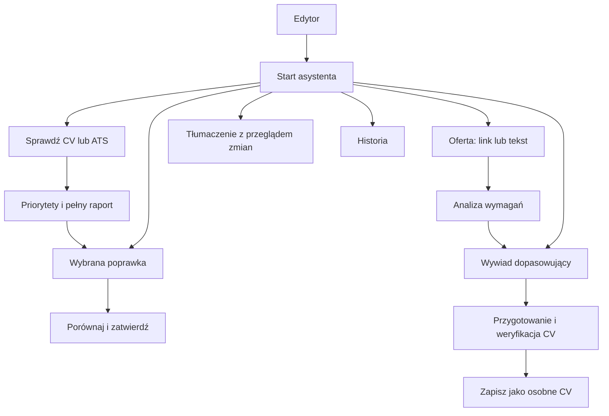

# Reforma UX asystenta AI

Status: plan zaakceptowany do implementacji; zmiany interfejsu opisano w README, 12 września 2026. Poniższy dokument zachowuje pierwotny plan; aktualne wdrożenie i jego ograniczenia opisuje sekcja panelu zadaniowego w README. Podstawa: analiza kodu, `DESIGN.md` i umiejętności plan-design-review, onboarding oraz site-architecture. Nie przeprowadzono jeszcze obserwacji użytkowników ani wizualnego audytu uruchomionej aplikacji. Priorytety są hipotezami projektowymi do sprawdzenia.

## 1. Decyzja projektowa

Asystent powinien być przewidywalnym panelem zadaniowym: **wybieram cel → wykonuję zadanie → oglądam wynik → decyduję o zmianie**. Jednocześnie pokazujemy jeden aktywny widok. Menu narzędzi i archiwalne wyniki nie zajmują miejsca nad bieżącą pracą.

Nie potrzeba nowej stylistyki dla AI. Charakter nadają istniejące szwajcarskie zasady: mocna hierarchia typograficzna, regularne odstępy, cienkie linie, spokojne powierzchnie i wyraźna akcja główna. Różnorodność wynika z prezentacji danych: raport, porównanie tekstu i pytanie mają różne treści, ale wspólną nawigację, kontrolki i sposób komunikowania stanu.

## 2. Diagnoza i proponowane rozwiązania

| Obecny problem w kodzie | Zmiana | Oczekiwany rezultat do sprawdzenia |
|---|---|---|
| `AiAssistant.jsx` łączy wybór narzędzi, podmenu, historię i wyniki | Osobne widoki startu, zadania, wyniku i historii we wspólnej ramie | Użytkownik wie, co robi i gdzie wrócić |
| Sześć wejść konkuruje podobną wagą | Trzy główne zadania oraz trzy mniejsze, nadal widoczne skróty | Szybsze rozpoczęcie bez usuwania funkcji |
| Audyt powtarza liczniki, opisy zakresu, wskazówki i metadane | Jedno podsumowanie, maksymalnie trzy priorytety, rozwijana pełna lista | Mniej czytania przed pierwszą użyteczną akcją |
| `CorrectionCard` rozwija się po najechaniu i przewija widok | Jawne rozwijanie przyciskiem; stała pozycja kontrolki i brak przewijania po hover | Stabilne zachowanie myszą, dotykiem i klawiaturą |
| `ScopedAiReview` i zwykłe poprawki mają różną prezentację | Wspólny widok porównania z osobnymi adapterami logiki | Ten sam sposób zatwierdzania niezależnie od wejścia |
| Dopasowanie pokazuje od razu wiele pól i dwie konkurujące decyzje | Wybór „Link / Wklej treść”, opcjonalne notatki i wyraźny następny krok | Krótszy formularz, jasne rozróżnienie analizy i wywiadu |
| Wywiad kumuluje opisy etapów, źródeł, kosztów i oczekiwania | Jeden etap i jedno pytanie; reszta informacji w stałych, przewidywalnych miejscach | Uwaga na odpowiedzi, bez utraty kontroli nad źródłami |
| Ikony z kilku rodzin i powtarzane lokalne style kontrolek | Jeden zestaw ikon i wspólne komponenty na globalnych tokenach | Spójność całej ścieżki, także błędów i stanów mobilnych |

## 3. Architektura informacji

```text
Asystent AI — aktualny dokument / zakres
├── Start
│   ├── Sprawdź CV                  główne wejście dla nowej sesji
│   ├── Popraw treść                styl / gramatyka / wzmocnienie / skrócenie
│   ├── Dopasuj do oferty           analiza → opcjonalny wywiad
│   └── Skróty: Wywiad · Tłumaczenie · ATS
├── Aktywne zadanie                 powrót do Narzędzi, zachowany formularz
│   └── Wynik                      decyzja lub następny krok
└── Historia                       wcześniejsze wyniki, zakres i aktualność
```

„Sprawdź CV” jest propozycją startową, nie obowiązkowym etapem. Otwarcie panelu niczego płatnego nie uruchamia. Gdy istnieje niedokończone zadanie, jego „Wznów” zajmuje miejsce rekomendacji. Wywiad, tłumaczenie i ATS pozostają dostępne bez rozwijania niejasnego menu „Więcej”. Priorytety startu należy skorygować, jeśli obserwacje pokażą inne najczęstsze potrzeby.



### Mapa adresów i powrotów

| Istniejące miejsce | Odpowiedzialność po reformie |
|---|---|
| `/cvstudio/:workspace`, `/app/documents/:documentId` | Panel asystenta związany z bieżącym CV; zamknięcie przywraca fokus do wywołującego przycisku |
| `/app/interview`, `/app/interview/:sessionId` | Ten sam komponent etapów wywiadu w samodzielnym widoku, z powrotem do miejsca wejścia |
| `/app/career-profile` | Zarządzanie źródłem kariery; wybór go w wywiadzie pozostaje świadomą decyzją |
| `/app/documents` | Lista i otwarcie utworzonego CV; wynik zawiera jednoznaczne przejście do nowego dokumentu |

Zmiana dotyczy nawigacji wewnątrz istniejących miejsc. Plan nie wymaga nowych publicznych adresów, przekierowań ani przebudowy mapy marketingowej strony. Nie łączy także niezależnego profilu kariery z dokumentem bez zgody użytkownika.

## 4. Stała rama i hierarchia wizualna

- Nagłówek: nazwa aktualnego zadania, zamknięcie, krótki zakres; saldo w jednym stałym miejscu. Bez powtarzanego podtytułu reklamującego AI.
- W zadaniu: czytelne „Narzędzia” jako powrót; historia dostępna osobno. Wstecz zachowuje wpisaną treść i nie ponawia zapytania.
- Jedna przewijana treść. Akcje kończące dany formularz są w przewidywalnym miejscu; przyklejona stopka nie zasłania fokusu ani treści przy małej wysokości.
- Jedna akcja główna na aktywny krok. Akcje pomocnicze mają niższą wagę, ale nadal pełne nazwy i odpowiedni obszar dotyku.
- Tokeny z `frontend/src/index.css`: istniejące kolory, skala odstępów, promienie i ruch. Zachować kontekstowe aliasy koloru edytora, nie kodować osobnego brązowego motywu w każdym module.
- Typografia oparta na istniejących poziomach: nagłówek 24px, treść i kontrolki 16px, pomocnicze metadane 12px. Informacji potrzebnej do wykonania zadania nie pomniejszać do metadanych. Maksymalnie trzy poziomy w jednym zwartym widoku.
- Prostokątne sekcje, podział linią zamiast karty w karcie. Jedna istniejąca rodzina ikon, np. `react-icons/ri`, zawsze z nazwą dostępną dla czytnika.
- Brak ozdobnych gradientów, animowanych gwiazdek, fikcyjnych wiadomości czatu i procentowych ocen bez uzasadnienia.

### Szkic układu — kierunek, nie gotowa makieta wizualna

```text
START                         WYNIK AUDYTU
Asystent AI             ×      ← Narzędzia   Sprawdź CV       ×
Bieżące CV · saldo             Bieżące CV · saldo
────────────────────────      ───────────────────────────────
Od czego zaczynamy?            3 sprawy wymagają uwagi
[ Sprawdź CV           → ]     [Najważniejszy problem       ▾]
  Popraw treść         →        krótka rekomendacja
  Dopasuj do oferty    →        [Przejdź do fragmentu]
────────────────────────      [Drugi problem               ▸]
Wywiad · Tłumaczenie · ATS     [Trzeci problem               ▸]
Historia                      Wszystkie wyniki (liczba)

PRZEGLĄD ZMIANY                WYWIAD
← Narzędzia   Popraw treść     ← Narzędzia   Wywiad
Doświadczenie · zmiana 2 z 6   Etap 2 z 4: Rozmowa
────────────────────────      ───────────────────────────────
Przed                         Pytanie X z maksymalnie N
Oryginalny fragment            [Jedno konkretne pytanie]
Po                            Jedno zdanie: po co pytamy.
Propozycja                    [Odpowiedź…                  ]
Dlaczego ta zmiana? ▸          Inne odpowiedzi ▾
[Zastosuj] [Pomiń]             [Zapisz i przejdź dalej]
Lista zmian ▾                 Zapisane odpowiedzi: liczba
```

Liczby są przykładowymi etykietami układu, nie wynikami analizy. Na wąskim ekranie skróty zawijają się do pełnych przycisków, a porównanie pozostaje pionowe.

## 5. Reforma poszczególnych zadań

### Audyt i ATS

Na początku pokazujemy wynik jednym zdaniem i do trzech najważniejszych ustaleń. Każde: problem, lokalizacja, konkretna następna akcja. Dowód, uzasadnienie i szczegóły kategorii rozwijają się jawnie. Pełna lista jest zawsze dostępna i zawiera wszystkie ustalenia, również pozytywne lub nieocenione tam, gdzie wymaga tego obecny kontrakt.

Nie utożsamiać „nie oceniono” z „brak problemów”. Audyt, ATS i dopasowanie do oferty zachowują odrębne znaczenie. Nie dodawać ogólnego „wyniku jakości 92%”. Przejście do fragmentu nie wykonuje płatnej poprawki automatycznie.

### Poprawki, tłumaczenie i akcje kontekstowe

Wspólny przegląd: zakres, oryginał, propozycja, jawne „Zastosuj” i „Pomiń”. Uzasadnienie opcjonalnie rozwijane. Pierwsza zmiana otwarta; lista pozwala wybrać dowolną kolejną bez przymusowego przechodzenia po jednej. Widoczny stan zaakceptowanych i pominiętych pozycji. Akcja zbiorcza może pozostać, ale musi nazywać dokładnie zakres zatwierdzanych zmian i respektować istniejące ograniczenia.

Hover nie zmienia wysokości, nie rozwija treści i nie przewija panelu. Podświetlenie różnic nie może polegać wyłącznie na czerwieni i zieleni. Tłumaczenie przed uruchomieniem wymaga jawnego języka docelowego; język interfejsu pozostaje osobnym ustawieniem.

Wspólny komponent prezentacyjny nie oznacza wspólnej funkcji zapisu. Zachować walidację zakresu, porównanie wersji źródła, atomowe poprawki, historię cofania i synchronizację danych CV w istniejących adapterach. Nieaktualny wynik pozostaje czytelny, ale nie można go zastosować. Wyjaśnienie: „CV zmieniło się od tej analizy. Uruchom ją ponownie”.

### Dopasowanie do oferty

1. Dwa przełączane sposoby dostarczenia oferty: „Link” lub „Wklej treść”. Zachować oba szkice przy przełączeniu; wysyłać jednoznacznie wybrane źródło. Notatki jako opcjonalne rozwinięcie.
2. Główna akcja dla nowego użytkownika: „Analizuj dopasowanie”. Bezpośredni wywiad pozostaje oznaczoną akcją pomocniczą dla osób, które już znają ten proces.
3. Wynik: najważniejsze wymagania oraz „Potwierdzone”, „Do uzupełnienia”, „Brak informacji”. Pełne uzasadnienie i cytaty dostępne w szczegółach. Brak informacji nie oznacza braku doświadczenia.
4. Po analizie główna akcja „Uzupełnij CV w wywiadzie”. Zachować ponowne wykorzystanie niezmienionej analizy bez dodatkowej opłaty za jej powtórzenie.
5. Analiza nie modyfikuje CV. Koszt ścieżki bez wcześniejszej analizy jest ujawniony przed rozpoczęciem; nie obiecywać bezpłatnego wywiadu.

### Wywiad — wspólny w panelu i na osobnej stronie

Zachować cztery etapy: „Twoje informacje”, „Rozmowa”, „Przygotuj CV”, „Wynik”. Desktop może pokazać zwartą nawigację etapów; mobile pokazuje nazwę aktualnego etapu i przycisk „Etapy”. Nie zmniejszać czterech kafelków do nieczytelnej siatki.

- **Twoje informacje:** jeden czytelny wybór źródła, krótki opis używanego zakresu, opcjonalny własny profil kariery. Brak źródła prowadzi do wyboru CV lub importu, a nie pustego wywiadu. Potwierdzenie materiału źródłowego pozostaje świadome.
- **Rozmowa:** jedno pytanie, jedno krótkie uzasadnienie i odpowiedź. Faktyczny licznik zapisanych odpowiedzi oraz dynamiczne „X z maksymalnie N”; bez sztucznego stałego paska procentowego. „Nie mam takiego doświadczenia”, „Nie pamiętam” i „Pomiń pytanie” zachowują osobne znaczenia. Można zebrać je pod przyciskiem „Inne odpowiedzi”, lecz wszystkie trzy muszą mieć pełne nazwy po otwarciu.
- **Przygotuj CV:** krótkie podsumowanie źródeł i zakresu; przed akcją informacja o płatnym przygotowaniu, redakcji i weryfikacji. Pokazywać wyłącznie rzeczywiście znane etapy wykonania, bez symulowania postępu serwera.
- **Wynik:** zachować „Treść CV / Zmiany / Do sprawdzenia”, grupowanie pełnych rekordów i istniejącą paginację. Główna akcja nazywa zapis nowego CV. Nie nadpisywać źródłowego dokumentu.
- **Wyjaśnienia:** sporny cytat i pole pełnego zastąpienia pozostają widoczne. Nie ukrywać materiału, do którego odnosi się odpowiedź; zachować limit wyjaśnień i blokadę nieweryfikowanego wyniku.
- **Oczekiwanie:** zapis odpowiedzi nie zastępuje całego formularza dużą ilustracją. Dłuższe przygotowanie ma zwięzły status, rzeczywisty czas oczekiwania i informację po 30 sekundach. Brak automatycznego płatnego ponowienia.

## 6. Teksty i pierwsze użycie

Reguła redakcyjna: nagłówek nazywa zadanie, jedno zdanie wyjaśnia tylko to, co nie wynika z kontrolek, przycisk nazywa skutek. Nie powtarzać tej samej informacji w nagłówku, opisie, komunikacie i stopce. Szczegóły są dostępne pod konkretnymi etykietami, np. „Dlaczego ta zmiana?” lub „Rozliczenie operacji”.

| Zamiast | Propozycja |
|---|---|
| Wprowadzenia opisującego wszystkie możliwości AI | „Od czego zaczynamy?” i nazwy zadań |
| Długiego opisu raportu przed ustaleniami | „3 sprawy wymagają uwagi” — liczba z danych |
| Ogólnego „Kontynuuj” | „Zapisz i przejdź dalej” albo „Przygotuj CV” |
| Powtarzania zakresu przy każdej poprawce | Zakres w nagłówku plus lokalizacja konkretnej zmiany |
| Ogólnego „Wystąpił błąd” | Konkretny problem, informacja o zachowanej odpowiedzi i dostępna akcja |

Bez obowiązkowej wycieczki, dodatkowego onboardingu i odznak za kliknięcia. Hipoteza pierwszej wartości: użytkownik rozumie i zatwierdza jedną przydatną poprawkę albo zapisuje zweryfikowane CV z wywiadu. Otwarcie panelu nie jest aktywacją. Pomoc pojawia się przy realnym zadaniu; doświadczeni użytkownicy od razu korzystają ze skrótów.

Koszty i ryzyko skutków nie są „zbędnym tekstem”: saldo w nagłówku, informacja o opłacie przy płatnej akcji, szczegółowe rozliczenie w rozwinięciu. Jeśli API nie dostarcza wiarygodnej wyceny, nie wymyślać dokładnej liczby kredytów. Przy ponowieniu pokazać prawdziwe zasady rozliczenia. Wszystkie teksty powstają równolegle po polsku i w brytyjskim angielskim.

## 7. Macierz stanów i dostępności

| Stan / powierzchnia | Wymagane zachowanie |
|---|---|
| Domyślny, hover, active | Stała geometria; aktywność sygnalizowana także inaczej niż kolorem |
| Focus-visible | Widoczny token focus; kolejność zgodna z treścią; po powrocie fokus na wywołującym elemencie |
| Disabled / uruchomione żądanie | Wyjaśniony powód, brak podwójnego wysłania; nie blokować całego panelu bez potrzeby |
| Ładowanie | Krótki status `aria-live`, zachowane wpisane dane; timer nie ogłasza każdej sekundy czytnikowi |
| Brak CV / źródła / historii / ustaleń | Oddzielne komunikaty i adekwatna jedna akcja; brak ustaleń nie jest błędem |
| Walidacja | Etykieta i błąd przy polu, fokus przy pierwszym błędzie; zachowane pozostałe wartości |
| Błąd, częściowy wynik | Czytelny zakres sukcesu i niepowodzenia; ponowienie tylko świadome i zgodne z istniejącą idempotencją |
| Sukces | Widoczny stan zastosowania lub zapisu oraz następny krok; nie wyłącznie znikający toast |
| Nieaktualny wynik / zmiana dokumentu | Rozpoznany zakres i wersja źródła; blokada zastosowania starej propozycji |
| Brak uprawnień / cofnięte Pro / brak kredytów | Zachowane serwerowe uprawnienia; niedostępne akcje kontekstowe nie migają przed ustaleniem dostępu |
| Mobile, klawiatura ekranowa, krótki viewport | Drawer lub sheet, `100dvh`, bez zasłoniętej odpowiedzi i akcji, bez poziomego przewijania |
| Powiększenie i ruch | 200% zoom; 390/834/1280/1920px i reflow 320 CSS px; respektowane reduced motion |

Kontrolki co najmniej 44px, natywne przyciski i formularze, pełne nazwy ikon. Zakładki z poprawną obsługą strzałek, Home/End i relacją paneli. Dialogi z kontrolą fokusu, Escape i powrotem; brak dialogu wewnątrz dialogu. Treści długie i EN nie mogą rozsadzać układu. Style asystenta nie mogą przenikać do dokumentu ani eksportu PDF.

## 8. Plan wdrożenia

Nazwy nowych komponentów poniżej są propozycją. Istniejące ścieżki wskazują miejsca odpowiedzialności, nie zatwierdzone zakresy zmian.

| Etap | Zakres i pliki | Warunek odbioru |
|---|---|---|
| 1. Kontrakt UX | Uzgodnić ten plan; uzupełnić `DESIGN.md` przede wszystkim w 5.8–5.9 o osobną historię, jawne rozwijanie i zachowanie formularza podczas krótkiego zapisu | Rozpisane wszystkie powierzchnie i stany, brak sprzeczności ze specyfikacją |
| 2. Wspólna rama | `AiAssistant.jsx`, jego CSS Module, `frontend/src/index.css`; wydzielić prezentacyjne `AiTaskShell`, `AiTaskHeader`, `AiTaskActions`, `AiStatus` po sprawdzeniu istniejących prymitywów | Start, zadanie, wynik i historia dzielą nawigację, odstępy i statusy |
| 3. Raporty i poprawki | `CvAuditPanel.jsx`, poprawki w `AiAssistant.jsx`, `ScopedAi/ScopedAiReview.jsx`; wspólny `AiChangeReview` z adapterami | Wszystkie ustalenia dostępne, brak hover-expand, poprawki zachowują zakres i undo |
| 4. Oferta | `AiAssistant/JobMatchPanel.jsx`, `frontend/src/utils/jobTailoring.js` jeśli wymaga tego stan formularza | Link/tekst, zachowanie szkiców, analiza bez zmian w CV, prawidłowe wykorzystanie analizy w wywiadzie |
| 5. Wywiad | `frontend/src/components/ai/Interview/InterviewFlow.jsx`, `InterviewLoading.jsx`, `InterviewPreview.jsx`, `InterviewCredits.jsx` i powiązane moduły | Jednolita ścieżka w panelu i samodzielnie; źródła, zapis odpowiedzi i weryfikacja bez regresji |
| 6. Treść i pozostałe stany | Słowniki interfejsu i wszystkie dotknięte komponenty; usunięcie zastąpionych stylów i ręcznych tekstów PL | Równoważne PL/EN, brak dublowania instrukcji, pełna macierz stanów |
| 7. Walidacja i dokumentacja | Runtime, E2E, lint, build, eksport; `README.md` EN/PL i końcowe `DESIGN.md` | Cała ścieżka spełnia kryteria, dokumentacja opisuje rzeczywiste wdrożenie |

Etapy 3–5 zależą od wspólnego kontraktu z etapu 2. Nie nazywać reformy ukończoną po samej przebudowie startu. Największe ryzyko i nakład: rozdzielenie stanu w `AiAssistant` oraz zachowanie granic zapisu i odpłatności w wywiadzie; najniższe: teksty i porządkowanie ikon. Dokładny harmonogram wymaga sprawdzenia prototypu i rozmiaru niezbędnych zmian stanu.

### Reuse i granice techniczne

Najpierw wykorzystać globalne tokeny, istniejące elementy Progress, ToastStack i obsługę dialogów oraz konteksty scoped AI, cyklu dokumentu, powierzchni UI i canvas. Wydzielanie komponentów ma usuwać duplikację prezentacji, nie tworzyć drugiego magazynu danych CV.

Model widoku powinien jawnie rozróżniać start, konfigurację zadania, oczekiwanie, wynik i historię, z przypisanym dokumentem, zakresem i wersją źródła. Zachować istniejące identyfikatory operacji, zabezpieczenia przed starymi odpowiedziami i serwerowe kontrakty. Powrót i zamknięcie nie oznaczają anulowania rozliczanej operacji na serwerze. Historia musi odróżniać czytelny zapis od wyniku, który nadal można zastosować.

## 9. Weryfikacja

Przed implementacją przygotować prototyp startu, audytu, porównania i wywiadu na szerokim i wąskim ekranie. Sprawdzić z użytkownikami pięć zadań: znajdź problem w CV, zastosuj jedną poprawkę, przeanalizuj ofertę, wznow wywiad po przerwie, odnajdź wcześniejszy wynik. Mała sesja z około pięcioma osobami służy wykrywaniu problemów, nie dowodzeniu statystycznej poprawy konwersji.

Kryteria produktu: każde narzędzie osiągalne maksymalnie dwoma wyborami od startu; użytkownik rozróżnia analizę od zmiany dokumentu; rozumie kiedy płaci i co zapisuje; potrafi wrócić bez utraty odpowiedzi. Cel redakcyjny: około 40–50% mniej domyślnie widocznego tekstu objaśniającego w najbardziej przeciążonych widokach, mierzone na tych samych danych przed i po. Nie skracać treści użytkownika, dowodów ani obowiązkowych informacji, aby osiągnąć ten cel.

Regresje oprzeć na istniejących testach `cv-audit`, `job-match-workspace`, `ai-assistant-scroll`, `interview-workspace`, `interview-sources`, `interview-prerequisites` i testach runtime komponentów. Dodać scenariusze nowej nawigacji, zachowania szkiców, obsługi klawiaturą, nieaktualnych wyników i identycznego przeglądu zmian dla wejścia globalnego i kontekstowego. Zachować testy źródeł, kosztów, weryfikacji oraz zapisu osobnego CV.

Komendy po implementacji, z katalogu `frontend`: `npm test`, `npm run test:runtime`, `npm run test:e2e -- <wybrane pliki> --workers=1`, `npm run check:locales`, `npm run lint -- --quiet`, `npm run build`. Dobór plików E2E zweryfikować przy wdrożeniu. Testy backendowe wykonywać, jeśli refaktoryzacja dotknie kontraktu integracji. Przetestować również brak zmian wymiarów i zawartości eksportowanego PDF.

W tym zadaniu powstał plan; testy aplikacji i pomiary użyteczności nie są wykonane ani zaliczone przez samą analizę kodu.

## 10. Poza zakresem

Zmiana modeli Terra/Luna, promptów i polityki kredytowej, bazy danych, API, szablonów CV, geometrii PDF, cen, rejestracji, marketingowej struktury witryny, kampanii onboardingowych i swobodnego czatu. Ewentualna potrzeba zmiany API wymaga osobnego uzasadnienia po wykazaniu, że obecne dane nie wystarczają do uzgodnionego interfejsu.

## 11. Podstawa projektowa

- [Progressive disclosure — Nielsen Norman Group](https://www.nngroup.com/articles/progressive-disclosure/) — uzasadnia odsunięcie rzadziej potrzebnych szczegółów przy zachowaniu łatwej drogi do nich. Nie uzasadnia ukrywania kosztów i ważnych decyzji.
- [Tabs pattern — W3C](https://www.w3.org/WAI/ARIA/apg/patterns/tabs/) — kontrakt semantyki i obsługi klawiaturą dla zakładek wejścia oferty i wyniku wywiadu.
- [Reflow — W3C](https://www.w3.org/WAI/WCAG21/Understanding/reflow.html) — podstawa sprawdzania czytelności i działania przy zwężaniu widoku i powiększeniu.
- [`DESIGN.md`](../DESIGN.md) — nadrzędna specyfikacja aplikacji; powyższe źródła nie zastępują jej kontraktów.

## GSTACK REVIEW REPORT

Przegląd typu OPERATE: narzędzie do pracy nad CV. Oceniono plan w wymiarach architektury informacji, interakcji, ścieżki użytkownika, ryzyka dekoracyjnego przeciążenia, zgodności systemowej, responsywności i dostępności. To pierwsza propozycja, nie zakończony interaktywny przegląd z zaakceptowanymi decyzjami. Brak oceny liczbowej rzeczywistej użyteczności bez obserwacji użytkowników.

Najważniejsze domknięte decyzje w propozycji: jedna aktywna przestrzeń, osobna historia, jawne rozwijanie, wspólny przegląd zmian, zachowanie dowodów i rozliczeń. Otwarte do sprawdzenia na prototypie: kolejność głównych wejść, wygoda przeglądu pojedynczej zmiany względem listy, odkrywalność „Innych odpowiedzi” i zachowanie stopki przy klawiaturze ekranowej. Wymagana aktualizacja DESIGN przed zmianą istniejącego kontraktu historii i ekranów oczekiwania.

**Dalsza walidacja:** kierunek został zaakceptowany poleceniem wdrożenia. Implementację opisuje README; obserwacje użyteczności z użytkownikami pozostają do wykonania.
