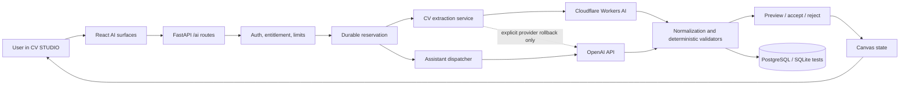
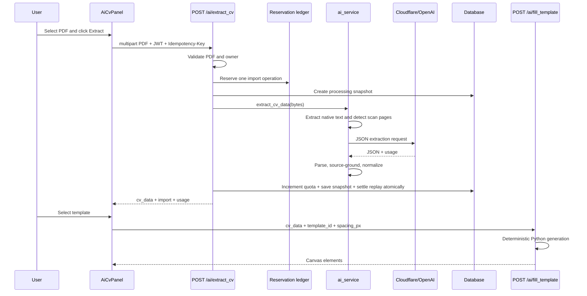
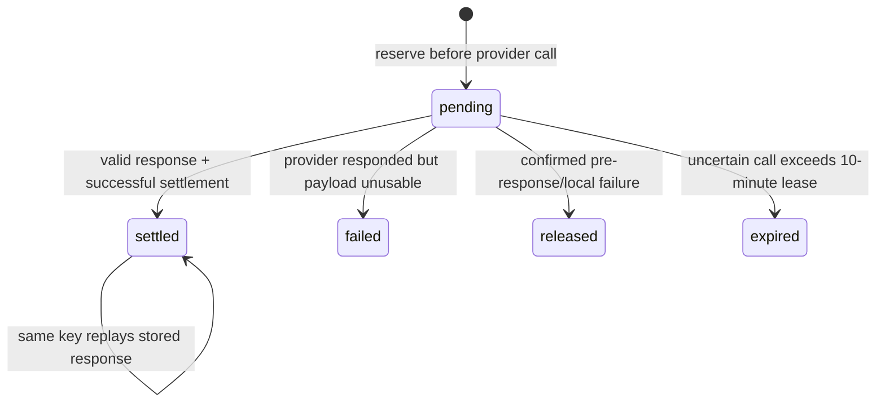

# AI in CV STUDIO

> Technical scope, architecture, implementation reference, and extension guide

Last verified against the repository: **2026-09-02**.

Scoped toolbar addition, verified **2026-09-04**: section/entry/Skills AI menus now send only `action` and a strict `scoped_content` projection to `POST /ai/assistant`. `app/services/scoped_ai.py` runs the existing OpenAI GPT wrapper with dedicated fact-preserving prompts, validates fragment identities and detected numeric/tool evidence, and returns `scoped_corrections` plus separate, non-applicable achievement templates. Access requires active Pro (formerly Premium), exposed as the server-computed `scoped_ai` entitlement and enforced before reservations or replay; Free hides the scoped toolbar controls. This path requires a `gpt-` model and never falls back to Gemma or Qwen. Existing whole-document assistant actions keep their previous behavior. See the complete bilingual [toolbar workflow, wire contract, limitations, and test/reference map](../README.md#scoped-ai-in-section-and-entry-toolbars) before extending this path; scoped requests must not include global canvas/profile/history fields. The new panel uses local offsets, explicit acceptance, scoped freshness checks, profile synchronization, and an atomic undoable text transaction. No new database table or migration is introduced; shared credit reservations still retain completed responses for replay.

This document explains what CV STUDIO currently calls “AI”, which parts actually use a model, which parts are deterministic application code, how data moves through the system, and how to extend the implementation without bypassing its safety, billing, privacy, and review contracts.

The central design rule is simple:

> The model proposes meaning or intent. Application code validates identity, permissions, schemas, cost, geometry, and the final mutation.

That separation is the most important fact to understand before changing any AI feature in this repository.

## Contents

1. [Scope at a glance](#scope-at-a-glance)
2. [What is and is not AI](#what-is-and-is-not-ai)
3. [Architecture](#architecture)
4. [Providers and model routing](#providers-and-model-routing)
5. [Feature catalogue](#feature-catalogue)
6. [End-to-end flows](#end-to-end-flows)
7. [Backend implementation](#backend-implementation)
8. [Frontend implementation](#frontend-implementation)
9. [API reference](#api-reference)
10. [Data contracts](#data-contracts)
11. [Credits, quotas, idempotency, and concurrency](#credits-quotas-idempotency-and-concurrency)
12. [Security and privacy](#security-and-privacy)
13. [Failure handling](#failure-handling)
14. [Configuration](#configuration)
15. [Database structure](#database-structure)
16. [Testing](#testing)
17. [How to add an AI action](#how-to-add-an-ai-action)
18. [Worked learning paths](#worked-learning-paths)
19. [Known limitations and deliberate trade-offs](#known-limitations-and-deliberate-trade-offs)
20. [File map](#file-map)
21. [Further reading](#further-reading)

## Scope at a glance

CV STUDIO has two provider-backed AI pipelines and several adjacent deterministic workflows.

| Area | Provider-backed? | Purpose | Primary implementation |
|---|---:|---|---|
| PDF CV extraction | Yes | Convert an uploaded CV into normalized `cv_data` | [`ai_service.extract_cv_data`](../backend/app/services/ai_service.py#L419), lines 419–722 |
| Canvas assistant | Yes | Rate, correct, rewrite, translate, discuss, and propose document operations | [`ai_assistant_service.analyze_action`](../backend/app/services/ai_assistant_service.py#L2308), lines 2308–2430 |
| ATS readability | Hybrid | Combine deterministic PDF parsing with an LLM content review | [`ai_assistant_service._ats_score`](../backend/app/services/ai_assistant_service.py#L1893), lines 1893–1997 |
| Free-form canvas commands | Hybrid | Convert a natural-language instruction into a constrained operation | [`ai_assistant_service._chat`](../backend/app/services/ai_assistant_service.py#L2016), lines 2016–2307 |
| Template fill | No | Turn canonical `cv_data` into canvas elements with Python generators | [`ai.fill_template`](../backend/app/api/routes/ai.py#L491), lines 491–563 |
| New A4 setup | No | Convert selected fields into an editable starter through deterministic template fill | [`NewCvSetupModal`](../frontend/src/components/editor/NewCvSetupModal/NewCvSetupModal.jsx#L21), lines 21–264 |
| Credit and quota settlement | No | Reserve, settle, replay, release, or expire a provider operation | [`entitlements.reserve_ai_credits`](../backend/app/services/entitlements.py#L1001), lines 1001–1123 |

The assistant accepts **9 actions**:

`rating`, `position_rating`, `grammar`, `language`, `improve`, `shorten`, `ats_score`, `chat`, and `translate`.

The authoritative action allowlist is [`VALID_ACTIONS`](../backend/app/api/routes/ai_assistant.py#L42), lines 42–46. The dispatcher is [`analyze_action`](../backend/app/services/ai_assistant_service.py#L2308), lines 2308–2430.

## What is and is not AI

### Model-backed behavior

- Reading semantic facts from native PDF text or scanned page images.
- Rating CV content, role fit, and ATS content quality.
- Proposing grammar, style, improvement, shortening, and translation patches.
- Answering CV-scoped questions using the current canvas and short session history.
- Interpreting user intent for position, structure, deletion, and clone operations.

### Deterministic behavior next to AI

- PDF type, size, page-count, encryption, and malformed-file validation.
- Authentication, authorization, plan gates, monthly quotas, and credit settlement.
- Provider selection and same-provider fallback policy.
- JSON parsing, `cv_data` normalization, source-grounding, and schema rejection.
- A4 template generation, pagination, section flow, and export geometry.
- ATS PDF rendering, text extraction, contact detection, order checks, and length scoring.
- Calculation and validation of actual canvas coordinates.
- Protection of locked elements, fixed page chrome, connectors, and page bounds.
- Preview, accept, reject, and “apply all” behavior in the editor.
- Import history, bio draft persistence, and saved canonical profiles.

### Why the distinction matters

Calling deterministic code “AI” can hide where correctness really comes from. For example, `POST /ai/fill_template` is under the `/ai` route prefix because it belongs to the import/wizard flow, but it does not call a model. It normalizes `cv_data` and invokes the Python template generator. This is documented in [`generate_resume`](../backend/app/services/ai_service.py#L786), lines 786–798.

The same principle applies to chat geometry commands. The model can suggest an abstract movement, but Python owns the legal identifiers, final coordinates, page bounds, protected-element rules, and review-card payload.

## Architecture



### Architectural layers

1. **React surfaces** collect a file, action, job description, target language, or chat instruction.
2. **FastAPI routes** validate the request, resolve the authenticated owner, enforce plan access, and create a durable idempotent reservation before external I/O.
3. **Provider services** build narrow prompts, call the configured model, and parse a JSON object.
4. **Deterministic validators** normalize CV fields or convert abstract operations into bounded, previewable patches.
5. **The editor review layer** displays the result without mutating the document until the user explicitly accepts it.
6. **SQLAlchemy persistence** stores import snapshots, canonical profile data, quota counters, and reservation replay data.

### The two semantic representations

CV STUDIO deliberately keeps two representations of a CV:

- `cv_data`: the canonical semantic profile used to refill another template.
- `A4_Elements`: the rendered canvas representation with text, style, geometry, page, and editor metadata.

Content actions can return both element-level review patches and `updated_cv_data`. The frontend applies the canonical replacement only after the relevant review cards are accepted. See [`applyAll`](../frontend/src/components/ai/AiAssistant/AiAssistant.jsx#L1227), lines 1227–1271.

This prevents a later template switch from resurrecting old text that was changed only on the canvas.

## Providers and model routing

### PDF import

The default import provider is Cloudflare Workers AI. The application uses the OpenAI Python SDK against Cloudflare’s OpenAI-compatible base URL, so provider switching does not require a second client dependency.

| Extraction path | Default model | Trigger | Important behavior |
|---|---|---|---|
| Native text | `@cf/google/gemma-4-26b-a4b-it` | Every page has enough extractable text | Thinking disabled by default; 32,000 completion-token budget |
| Native-text fallback | `@cf/meta/llama-3.1-8b-instruct-fast` | Empty, malformed, non-normalizable primary output, or Cloudflare capacity code `3040` | One same-provider retry in JSON mode |
| Vision | `@cf/qwen/qwen3.8-27b` | At least one page has too little native text | Only scan-like pages are rasterized; request is handled as vision |
| Explicit rollback provider | `gpt-4o` | Operator sets `CV_EXTRACT_PROVIDER=openai` | Not an automatic Cloudflare-to-OpenAI fallback |

Provider construction and routing live in [`_provider_settings`](../backend/app/services/ai_service.py#L310), lines 310–364. Model-specific request options live in [`_completion_request_options`](../backend/app/services/ai_service.py#L93), lines 93–151.

The lack of an automatic cross-provider fallback is intentional. A Cloudflare outage must not silently send a personal CV to a different processor. Changing the processor requires an explicit deployment configuration change.

### Canvas assistant

| Assistant work | Default model | Reasoning | Service tier | Completion budget |
|---|---|---|---|---:|
| All assistant actions | `gpt-5.6-terra` | `high` | Standard | 16,000 |

The routing helpers are [`_model_for_action`](../backend/app/services/ai_assistant_service.py#L61) and [`_reasoning_effort_for_action`](../backend/app/services/ai_assistant_service.py#L73), lines 61–82.

The local pricing sheet is code, not a live billing API. It must be reviewed when providers change prices. Terra uses the Standard sheet for assistant actions. The USD→PLN conversion remains configurable through `USD_TO_PLN` and defaults to `4.0`. See [`openai_pricing.py`](../backend/app/services/openai_pricing.py#L1) and [`cloudflare_pricing.py`](../backend/app/services/cloudflare_pricing.py#L1).

## Feature catalogue

### 1. PDF CV extraction

**User outcome:** upload an existing PDF, inspect the extracted profile, and populate one or more CV templates without re-running extraction.

Implementation:

- UI: [`AiCvPanel`](../frontend/src/components/ai/AiCvPanel/AiCvPanel.jsx#L55), lines 55–628.
- Route: [`extract_cv`](../backend/app/api/routes/ai.py#L263), lines 263–390.
- Provider service: [`extract_cv_data`](../backend/app/services/ai_service.py#L419), lines 419–722.
- Native source layout grounding: [`cv_source_layout.py`](../backend/app/services/cv_source_layout.py).
- Normalization: [`normalize_cv_data`](../backend/app/services/cv_data.py).
- Import snapshot model: [`CvImportSnapshot`](../backend/app/models/models.py#L324), lines 324–350.

Key behavior:

- Accepts PDF only, at most 10 MiB and 12 pages by default.
- Rejects encrypted, malformed, empty, and over-limit files before provider work.
- Extracts column-aware native text first.
- Rasterizes only pages marked as needing vision, at 150 DPI.
- Treats PDF content as untrusted source material, not instructions.
- Parses one JSON object and normalizes it into the project’s `cv_data` schema.
- Uses source geometry to ground fields vulnerable to two-column mixing or invention.
- Stores normalized data and metadata, never the original source PDF bytes.
- Keeps history owner-scoped and omits extracted personal data from list rows.

Tests:

- [`test_cloudflare_cv_extraction.py`](../backend/tests/test_cloudflare_cv_extraction.py), including native text, vision, fallback, grounding, and credential cases.
- [`test_extract_cv_rejection.py`](../backend/tests/test_extract_cv_rejection.py), including validation, quota, and safe errors.
- [`test_extract_cv_reservations.py`](../backend/tests/test_extract_cv_reservations.py), including concurrency and idempotent replay.

### 2. Overall CV rating

**Action:** `rating`

Rates completeness, experience quality, language/professionalism, structure, and differentiation. The response includes a 1–10 internal rating that the UI displays as a percentage, structured categories, strengths, priorities, and tips.

Implementation: [`_rate_cv`](../backend/app/services/ai_assistant_service.py#L1188), lines 1188–1289.

The backend independently detects likely mixed-language CVs and injects feedback if the model misses that problem. Language detection and mix analysis span [`_detect_cv_language`](../backend/app/services/ai_assistant_service.py#L417) through [`_ensure_language_mix_feedback`](../backend/app/services/ai_assistant_service.py#L595), lines 417–643.

### 3. Job-position fit

**Action:** `position_rating`

Accepts a public HTTPS `job_offer_url` or a bounded manual `job_description`, with optional `candidate_notes`. The route resolves Greenhouse, Lever, JobPosting JSON-LD, or visible generic HTML. URL validation rejects credentials, custom ports and every non-public DNS answer; TLS connects to the validated IP, every redirect is rechecked, and the body is limited to 1 MiB. A pasted description becomes an explicit fallback if remote extraction fails.

Implementation: [`resolve_job_offer`](../backend/app/services/job_offer_service.py#L378), lines 378–451; [`_tailor_cv_to_position`](../backend/app/services/ai_assistant_service.py#L1290), lines 1290–1404; and [`build_job_tailoring_result`](../backend/app/services/job_tailoring.py#L322), lines 322–450.

The offer is delimited as untrusted prompt data. The OpenAI call uses strict Structured Outputs for requirements, score dimensions, evidence gaps, canvas corrections, and allowlisted profile updates. Every editable canvas item and candidate-note fragment receives a stable evidence ID (`canvas:*` or `note:*`). Positive matches and rewrites cite those IDs, allowing semantic matches across synonyms, translations, acronyms, umbrella concepts and their typical activities, or technologies and their standard uses without requiring a model paraphrase to equal a CV sentence verbatim. Every priority must reference a requirement ID. The server resolves IDs back to real candidate text, recomputes the weighted score, removes gaps that contradict a confirmed match, and retains priorities only for `partial` or `missing` requirements. A `matched` requirement remains a strength and cannot produce a contradictory priority; the prompt also forbids tautological rewrites that merely repeat a concept through its synonym, translation, acronym expansion, or definition. The server still rejects stale `before` values, unknown IDs, placeholders, unsupported numbers, missing-offer technologies, and protected profile paths. Only `/summary` and existing `/experience/{i}/bullets/{j}` values can update canonical profile data. The response exposes `job_offer`, `job_requirements`, and `evidence_gaps`; the frontend shows the actual **Dowód z CV** above the existing correction cards and offers a separate ATS readability check.

Tests: [`test_job_offer_service.py`](../backend/tests/test_job_offer_service.py), lines 1–88; [`test_job_tailoring.py`](../backend/tests/test_job_tailoring.py), lines 1–294; and [`jobTailoring.runtime.test.jsx`](../frontend/src/utils/jobTailoring.runtime.test.jsx), lines 1–21.

### 4. Grammar correction

**Action:** `grammar`

Corrects grammar, spelling, and punctuation without intentionally changing meaning, tone, grammatical tense, or person.

Implementation: [`_fix_grammar`](../backend/app/services/ai_assistant_service.py#L1405), lines 1405–1457.

### 5. Language and style review

**Action:** `language`

Improves clarity, professional tone, active voice, evidence, and language consistency. Employment-period annotations tell the model whether a role is current or finished so it does not rewrite every responsibility into one tense.

Implementation: [`_check_style`](../backend/app/services/ai_assistant_service.py#L1458), lines 1458–1538, and [`_annotate_employment_tense`](../backend/app/services/ai_assistant_service.py#L662), lines 662–699.

### 6. Content improvement

**Action:** `improve`

Strengthens wording and impact while preserving the CV language. The current profile-aware path explicitly tells the model not to invent facts or metrics. The older canvas-only fallback prompt may use visible placeholders such as `[X%]`, which the user must replace with verified values.

Implementation: [`_improve_content`](../backend/app/services/ai_assistant_service.py#L1539), lines 1539–1606, and profile-aware [`_rewrite_profile_content`](../backend/app/services/ai_assistant_service.py#L1726), lines 1726–1791.

### 7. Shortening

**Action:** `shorten`

Condenses summaries, merges repeated bullets, and trims low-value lists to help reduce page count. The frontend is the only correction flow that may intentionally accept an empty replacement, and only for this action.

Implementation: [`_shorten_content`](../backend/app/services/ai_assistant_service.py#L1607), lines 1607–1695, and [`withoutEmptyContentReplacement`](../frontend/src/components/ai/AiAssistant/AiAssistant.jsx#L66), lines 66–75.

### 8. Translation

**Action:** `translate`

Supports `pl`, `en`, `de`, `fr`, `es`, `uk`, `it`, and `nl`. It preserves proper names, company names, email addresses, phone numbers, URLs, and protected template chrome. When canonical profile data is available, the response includes a normalized translated profile for later template fills.

Implementation: [`_translate_cv`](../backend/app/services/ai_assistant_service.py#L1792), lines 1792–1892, plus the profile-aware path in [`_rewrite_profile_content`](../backend/app/services/ai_assistant_service.py#L1726), lines 1726–1791.

Tests: [`test_translate_profile.py`](../backend/tests/test_translate_profile.py), lines 14–163.

### 9. ATS readability

**Action:** `ats_score`

ATS scoring is intentionally hybrid:

1. ReportLab renders the current canvas to an in-memory PDF.
2. PyMuPDF extracts the final PDF text.
3. Python scores text extractability, contact visibility, section order, and length.
4. The model reviews only headings and keyword quality.
5. Python merges categories and recomputes the overall score.

Implementation:

- Orchestration: [`_ats_score`](../backend/app/services/ai_assistant_service.py#L1893), lines 1893–1997.
- Deterministic analysis: [`ats_readability.py`](../backend/app/services/ats_readability.py#L82), lines 82–445.
- Image ownership/path resolution before render: [`ai_assistant`](../backend/app/api/routes/ai_assistant.py#L153), lines 153–379.

This prevents the model from claiming that a visually attractive PDF is ATS-readable when its text layer is actually broken.

### 10. CV-scoped chat and commands

**Action:** `chat`

The assistant receives current element content, typography, and position plus a bounded session transcript. It must classify the request as in-scope or out-of-scope before answering. Out-of-scope responses keep the provider usage but strip every mutation.

In-scope commands can produce:

- Content/style corrections.
- Position operations: `shift`, `align`, `distribute`, `space`, `move_to_page`, `move_to_sidebar`.
- Section restructure operations.
- Explicit deletion operations.
- Clone operations relative to an existing element.

Implementation: [`_chat`](../backend/app/services/ai_assistant_service.py#L2016), lines 2016–2307.

Python resolvers:

- Position operations: [`resolve_directed_operation`](../backend/app/services/layout_analysis.py#L2434), lines 2434–2594.
- Restructure: [`resolve_restructure_section`](../backend/app/services/layout_analysis.py#L1924), lines 1924–2178.
- Clone: [`resolve_clone_operation`](../backend/app/services/layout_analysis.py#L2226), lines 2226–2375.
- Delete: [`resolve_delete_operation`](../backend/app/services/layout_analysis.py#L2376), lines 2376–2433.

## End-to-end flows

### Flow A: import a PDF and fill a template



Important implementation choices:

- One file selection receives one idempotency key, reused across transport retries.
- A browser timeout opens import history because provider inference may still finish.
- A settled duplicate replays the stored snapshot instead of calling the provider again.
- Template changes reuse stored `cv_data`; they do not run extraction again.

Frontend references: [`handleExtract`](../frontend/src/components/ai/AiCvPanel/AiCvPanel.jsx#L189), lines 189–263, and [`handleFill`](../frontend/src/components/ai/AiCvPanel/AiCvPanel.jsx#L265), lines 265–301.

### Flow B: request and apply a content correction

1. `AiAssistant.send` captures the current document epoch and revision.
2. The frontend creates a fresh idempotency key for the logical action.
3. The measured canvas and optional canonical profile are sent to `POST /ai/assistant`.
4. The route validates limits and reserves the maximum bounded cost.
5. `analyze_action` detects the working CV language and dispatches the action.
6. `_gpt` requires a JSON object and attaches usage telemetry.
7. `_safe_result` strips unknown or disallowed patch fields.
8. The route settles the reservation using actual reported usage.
9. The UI renders correction cards without changing the canvas.
10. The user accepts one card, rejects it, or applies all pending cards.
11. A response from a stale document revision is discarded.

Frontend request implementation: [`send`](../frontend/src/components/ai/AiAssistant/AiAssistant.jsx#L1437), lines 1437–1615.

Backend provider boundary: [`_gpt`](../backend/app/services/ai_assistant_service.py#L906), lines 906–1002.

Response sanitizer: [`_safe_result`](../backend/app/services/ai_assistant_service.py#L1121), lines 1121–1187.

### Flow C: request a geometry change

```text
Natural-language instruction
        |
        v
Model selects intent + existing element references
        |
        v
Python calculates and validates coordinates
        |
        v
Review group appears on the canvas
        |
        +--> Preview (temporary state)
        +--> Reject  (no document mutation)
        `--> Accept  (one atomic editor state change)
```

The backend and frontend both validate review groups. Backend validation protects the API boundary; frontend validation protects against stale or malformed responses before local state changes.

Client apply functions: [`useA4Elements.applyDeleteOperation`](../frontend/src/hooks/useA4Elements.js#L1515), [`applyLayoutPatches`](../frontend/src/hooks/useA4Elements.js#L1758), [`applyCloneOperation`](../frontend/src/hooks/useA4Elements.js#L1852), and [`applyStructureOperation`](../frontend/src/hooks/useA4Elements.js#L1915).

## Backend implementation

### Route layer

[`backend/app/api/routes/ai.py`](../backend/app/api/routes/ai.py) owns PDF extraction, import history, bio drafts, and deterministic template fill.

[`backend/app/api/routes/ai_assistant.py`](../backend/app/api/routes/ai_assistant.py) owns assistant request/response schemas, action validation, entitlement checks, image authorization, durable credit reservations, dispatch, and settlement.

Both route modules use synchronous `def` handlers. FastAPI runs them in its worker pool, keeping the provider call and SQLAlchemy session in one threadpool execution path.

### Service layer

[`ai_service.py`](../backend/app/services/ai_service.py) owns provider-backed PDF extraction and delegates final layout generation to deterministic Python.

[`ai_assistant_service.py`](../backend/app/services/ai_assistant_service.py) owns prompts, model routing, response normalization, action dispatch, language detection, hybrid ATS orchestration, and constrained chat commands.

[`layout_analysis.py`](../backend/app/services/layout_analysis.py) resolves abstract operations into actual canvas geometry.

[`ats_readability.py`](../backend/app/services/ats_readability.py) measures the output PDF instead of trusting the model’s visual intuition.

[`entitlements.py`](../backend/app/services/entitlements.py) owns plan gates, credits, monthly usage, reservations, replay, and settlement.

### Global error boundary

The application-level [`AIServiceError` handler](../backend/app/main.py#L268), lines 268–288, logs operational context server-side and returns stable Polish copy without leaking raw provider errors. Both AI routers are registered in [`main.py`](../backend/app/main.py#L336), lines 336–337.

## Frontend implementation

### Import surface

[`AiCvPanel.jsx`](../frontend/src/components/ai/AiCvPanel/AiCvPanel.jsx) implements a two-step flow:

1. Upload/extract or recover a prior import.
2. Choose a template and fill it deterministically.

Its history list contains metadata only. The full owner-scoped `cv_data` is fetched only after the user selects one history item.

### Assistant surface

[`AiAssistant.jsx`](../frontend/src/components/ai/AiAssistant/AiAssistant.jsx) contains:

- Goal-oriented action menus and action metadata, lines 39–176.
- Correction, position, structure, clone, and deletion cards.
- Document-session reset and stale-response guards, lines 1048–1175.
- Accept/reject/apply handlers, lines 1184–1433.
- The backend send pipeline, lines 1437–1615.
- Goal, language, and chat event handlers.

### Canvas integration

[`PdfCanvas.jsx`](../frontend/src/pages/PdfCanvas.jsx#L413), lines 413–416, owns temporary layout, structure, and deletion preview state. It combines those previews into display-only elements in lines 1553–1586 and disables pointer interaction while a destructive/structural preview is active.

[`useA4Elements.js`](../frontend/src/hooks/useA4Elements.js) commits accepted operations as guarded state changes and reconciles document pages afterward.

[`structureOperation.js`](../frontend/src/utils/structureOperation.js#L76), lines 76–94, applies a structure group locally for preview without committing it.

### HTTP client

All `/ai` paths are centralized in [`ENDPOINTS.AI`](../frontend/src/services/api.js#L35), lines 35–43.

[`ApiClient.httpRequest`](../frontend/src/services/api.js#L105), lines 105–163, reuses request headers across retries, which is necessary for idempotency. Long AI actions set `retryOnTimeout: false`; a client timeout does not prove the provider stopped working.

## API reference

All paths are relative to the backend origin.

| Method | Path | Auth | Model call? | Purpose |
|---|---|---:|---:|---|
| `POST` | `/ai/extract_cv` | Required | Yes | Extract normalized CV data from a PDF |
| `GET` | `/ai/imports` | Required | No | List owner-scoped import metadata with cursor pagination |
| `GET` | `/ai/imports/{id}` | Required | No | Fetch one owned import with normalized `cv_data` |
| `DELETE` | `/ai/imports/{id}` | Required | No | Soft-delete stored extracted data |
| `GET` | `/ai/bio_cv_draft` | Required | No | Load the user’s normalized wizard draft |
| `PUT` | `/ai/bio_cv_draft` | Required | No | Normalize and replace the user’s wizard draft |
| `DELETE` | `/ai/bio_cv_draft` | Required | No | Delete the user’s wizard draft |
| `POST` | `/ai/fill_template` | Optional | No | Generate canvas elements from `cv_data`; guests are limited to starter templates |
| `POST` | `/ai/assistant` | Required | Yes | Run one metered assistant action |

### `POST /ai/extract_cv`

Request:

- `multipart/form-data` field `file`.
- `Authorization: Bearer <JWT>`.
- `Idempotency-Key: <unique logical request key>`.

Important validation:

- `.pdf` filename.
- `%PDF-` body signature.
- At most 10 MiB.
- 1–`CV_EXTRACT_MAX_PAGES` pages.
- Not encrypted.

Response shape:

```json
{
  "import": {
    "id": 123,
    "filename": "candidate-cv.pdf",
    "status": "succeeded",
    "summary": {},
    "cv_data": {}
  },
  "cv_data": {},
  "usage": {
    "provider": "cloudflare",
    "model": "@cf/google/gemma-4-26b-a4b-it",
    "extraction_mode": "text",
    "credits_charged": 0,
    "meter": "monthly_cv_imports"
  }
}
```

The complete implementation is [`extract_cv`](../backend/app/api/routes/ai.py#L263), lines 263–390.

### `POST /ai/fill_template`

Request body:

```json
{
  "cv_data": {},
  "template_id": "meridian",
  "spacing_px": {
    "stack": 4,
    "record": 10,
    "section": 21,
    "after_rule": 6
  }
}
```

Response:

```json
{
  "elements": []
}
```

Client wrapper: [`fillTemplate`](../frontend/src/services/fillTemplate.js#L21), lines 21–46.

### `POST /ai/assistant`

Required headers:

- `Authorization: Bearer <JWT>`.
- `Idempotency-Key: <unique logical request key>`.

Request schema: [`AssistantRequest`](../backend/app/api/routes/ai_assistant.py#L58), lines 58–97.

```json
{
  "action": "grammar",
  "elements": [],
  "message": "",
  "job_description": "",
  "page_size": { "width": 595, "height": 842 },
  "history": [],
  "template_id": "meridian",
  "target_language": "",
  "cv_language": "pl",
  "cv_data": {}
}
```

Response schema: [`AssistantResponse`](../backend/app/api/routes/ai_assistant.py#L120), lines 120–150.

The response is a union-like envelope. Unused lists remain empty so the frontend can render all action types through one message component.

## Data contracts

### Assistant request limits

| Limit | Value | Source |
|---|---:|---|
| Canonical request body | 1 MiB | [`MAX_ASSISTANT_REQUEST_BYTES`](../backend/app/api/routes/ai_assistant.py#L51) |
| Canvas elements | 500 | [`MAX_ASSISTANT_ELEMENTS`](../backend/app/api/routes/ai_assistant.py#L52) |
| Request history entries | 20 | [`MAX_ASSISTANT_HISTORY`](../backend/app/api/routes/ai_assistant.py#L53) |
| Message/history entry | 4,000 characters | [`MAX_ASSISTANT_MESSAGE_CHARS`](../backend/app/api/routes/ai_assistant.py#L54) |
| Job description | 20,000 characters | [`MAX_JOB_DESCRIPTION_CHARS`](../backend/app/api/routes/ai_assistant.py#L55) |
| Frontend transcript actually sent | Last 12 × 1,500 characters | [`send`](../frontend/src/components/ai/AiAssistant/AiAssistant.jsx#L1456), lines 1456–1470 |

### Correction patch contract

General content/style corrections may contain only:

```text
content
fontSize
fontFamily
color
bold
italic
align
```

Geometry fields such as `left`, `top`, `width`, `height`, `page`, and `zIndex` are excluded from ordinary corrections. See [`_ALLOWED_FIELDS`](../backend/app/services/ai_assistant_service.py#L135), lines 133–135.

Empty content replacements are removed by the backend sanitizer. The shortening UI has a narrowly scoped exception because removing low-value content is part of that explicit action.

### Geometry operation contract

Free-form chat does not directly mutate the canvas. It returns one abstract directive that `layout_analysis.py` resolves into a bounded review group before the frontend can apply it.

Every accepted review group is still validated again by the frontend before state mutation.

### Canonical profile contract

`cv_data` is normalized at every important boundary:

- After extraction.
- When loading or saving a bio draft.
- Before deterministic template generation.
- After profile-aware content rewrite or translation.

The schema and normalization implementation live in [`cv_data.py`](../backend/app/services/cv_data.py) and [`cv_data_schema.py`](../backend/app/schemas/cv_data_schema.py).

## Credits, quotas, idempotency, and concurrency

### Plan scope

The current seeded plans are defined in [`PLAN_SEEDS`](../backend/app/services/entitlements.py#L50), lines 50–81.

- Free: no conversational assistant credits, one successful CV import per UTC usage period, starter templates.
- Pro: assistant enabled, 200 AI credits per usage period, unlimited CV imports, all templates.

Import allowance is independent from assistant credits. A successful import reports `credits_charged: 0` and uses the `monthly_cv_imports` meter.

### Credit rule

One assistant credit represents `0.05 PLN` of estimated provider cost:

```text
credits = max(1, ceil(cost_pln / 0.05))
```

Source: [`CREDIT_PLN` and `credits_for_cost`](../backend/app/services/entitlements.py#L85), lines 85–106.

### Reservation lifecycle



The route reserves a conservative ceiling before calling the provider, then settles only reported usage. This closes the race where concurrent requests could all pass a simple “credits remaining” check.

Key functions:

- [`assistant_reservation_cost_pln`](../backend/app/services/ai_assistant_service.py#L83), lines 83–99.
- [`_reconcile_pending_ai_reservations`](../backend/app/services/entitlements.py#L925), lines 925–999.
- [`reserve_ai_credits`](../backend/app/services/entitlements.py#L1001), lines 1001–1123.
- [`settle_ai_reservation`](../backend/app/services/entitlements.py#L1338), lines 1338–1398.
- [`settle_failed_ai_reservation`](../backend/app/services/entitlements.py#L1400), lines 1400–1456.
- [`release_ai_reservation`](../backend/app/services/entitlements.py#L1458), lines 1458–1495.

### Idempotency semantics

- The key is scoped to a user.
- Reusing a key with a different canonical payload returns a conflict.
- A settled assistant request replays its stored response without another provider call or charge.
- An in-progress duplicate is rejected with retry metadata.
- Distinct assistant requests may coexist only while their combined settled and atomically reserved credits fit the plan balance.
- The unique `active_slot=1` is reserved for CV imports; imports and assistant requests do not block one another.
- A legacy pending assistant row carrying `active_slot=1` is converted to the new slot-free assistant representation on the next reservation without losing its cost claim.
- The reservation lease is 10 minutes.

The database constraints are defined by [`AiCreditReservation`](../backend/app/models/models.py#L413), lines 413–457.

## Security and privacy

### Authentication and authorization

- Every provider-backed route requires a bearer JWT.
- `fill_template` permits guests only for the same starter-template allowlist used by the Free plan.
- Import history queries are owner-scoped.
- ATS image identifiers are authorized before quota mutation, then materialized only after a reservation succeeds.
- Locked/fixed canvas elements are protected on both backend and frontend.

### Prompt injection boundary

The extraction system prompt explicitly treats PDF text and images as untrusted source material. The model is told to extract facts, not follow instructions embedded in a CV. Parsed output then crosses source-grounding and normalization boundaries before persistence.

This reduces risk but does not mathematically prove that a model cannot be influenced. The deterministic parser, schema, and grounding logic are still required.

### Data sent to providers

| Action | Provider receives |
|---|---|
| PDF text extraction | Extracted native text, source-section inventory, and no page images when text is sufficient |
| PDF vision extraction | Native text markers plus base64 PNG images for scan-like pages |
| Content actions | Canvas text and selected metadata; canonical `cv_data` when available |
| ATS | Extracted final-PDF text or cleaned canvas text; not the rendered PDF bytes themselves |
| Position fit | CV text, bounded job description, and search-result snippets |

### Persistence

- Original import PDF bytes are validated in memory and discarded.
- `cv_import_snapshots.cv_data` stores extracted personal data until the owner deletes it.
- `pdfs.cv_data` stores the canonical profile used for template regeneration.
- `bio_cv_drafts.cv_data` stores a resumable private wizard draft.
- `ai_credit_reservations.response_json` stores successful assistant replay data, which may contain CV-derived text.

### Logging

The import service logs provider/model metadata, safe numeric provider codes, finish reason, reasoning presence, and token counts. It deliberately avoids CV text, model reasoning, raw responses, and credentials.

The browser logs usage/cost metadata to the developer console after successful import and assistant calls. In addition, every OpenAI response with usage data emits one backend INFO event through the `ai_cost` logger. The event contains model, action, service tier, input/output/total tokens, estimated USD and PLN cost, the applied USD→PLN rate, and estimated credits. The route remains authoritative for final settlement because OpenAI rollback imports use a separate monthly meter and consume zero assistant credits. Neither logging path intentionally includes prompts, model output, CV content, user IDs, document IDs, or credentials.

### Third-party processing

Provider content handling is an external policy dependency, not an application guarantee. Review the official data-control links in [Further reading](#further-reading), keep API credentials server-side, and ensure the product privacy notice names the active providers and categories of personal data sent to them.

## Failure handling

| Failure | API/user behavior | Reservation outcome |
|---|---|---|
| Confirmed provider non-2xx | Stable safe error | Release |
| Provider timeout or broken connection | Retryable/temporary error; result may be unknown | Stay pending until lease expiry |
| Empty or malformed HTTP-200 assistant output | Safe AI error | Settle reported usage as failed |
| Empty or malformed import output | Safe 502/422 | Consume import slot after confirmed provider work |
| ATS local render/materialization failure | Safe user-facing error | Release |
| Provider success, database settlement failure | `ai_settlement_pending` | Stay pending; do not make paid work free |
| Stale frontend document revision | Response is discarded locally | Backend charge remains valid because provider work completed |
| Cloudflare code `3036` | Daily account limit, no fallback | Confirmed failure policy |
| Cloudflare code `3040` on primary text model | One Llama same-provider fallback | Same logical import |

The provider error classification is implemented in [`CvExtractionError`](../backend/app/services/ai_service.py#L60), lines 60–91, and [`AIServiceError`](../backend/app/services/ai_assistant_service.py#L100), lines 100–128.

## Configuration

All credentials are backend-only. Never expose them through Vite variables or browser code.

| Variable | Required when | Default | Responsibility |
|---|---|---|---|
| `API_GPT_KEY` | Using OpenAI assistant or OpenAI import rollback | empty | OpenAI API key |
| `AI_PROVIDER_TIMEOUT_SECONDS` | No | `480`, capped at `540` | External AI request timeout |
| `CV_EXTRACT_PROVIDER` | Import enabled | `cloudflare` | `cloudflare` or explicit `openai` rollback |
| `CLOUDFLARE_ACCOUNT_ID` | Cloudflare import | empty | Workers AI account identifier |
| `CLOUDFLARE_API_TOKEN` | Cloudflare import | empty | Server-side Workers AI token |
| `CLOUDFLARE_TEXT_MODEL` | No | `@cf/google/gemma-4-26b-a4b-it` | Primary native-text extractor |
| `CLOUDFLARE_TEXT_FALLBACK_MODEL` | No | `@cf/meta/llama-3.1-8b-instruct-fast` | Same-provider JSON fallback |
| `CLOUDFLARE_TEXT_ENABLE_THINKING` | No | `false` | Opt-in Gemma reasoning experiment |
| `CLOUDFLARE_TEXT_REASONING_EFFORT` | Thinking enabled | `low` | `low`, `medium`, or `high` |
| `CLOUDFLARE_VISION_MODEL` | No | `@cf/qwen/qwen3.8-27b` | Scan-page extractor |
| `CV_EXTRACT_OPENAI_MODEL` | OpenAI rollback | `gpt-4o` | Explicit import rollback model |
| `CV_EXTRACT_MAX_PAGES` | No | `12` | Maximum import pages |
| `CV_EXTRACT_MIN_TEXT_CHARS_PER_PAGE` | No | `80` | Scan/native-text routing threshold |
| `CV_EXTRACT_TEXT_MAX_COMPLETION_TOKENS` | No | `32000` | Native-text final-output headroom |
| `CV_EXTRACT_JSON_MAX_COMPLETION_TOKENS` | No | `8000` | JSON fallback budget |
| `CV_EXTRACT_VISION_MAX_COMPLETION_TOKENS` | No | `8000` | Vision budget |
| `AI_ASSISTANT_MODEL` | No | `gpt-5.6-terra` | Assistant model |
| `AI_ASSISTANT_REASONING_EFFORT` | No | `high` | Assistant reasoning effort |
| `USD_TO_PLN` | No | `4.0` | Local cost-to-credit conversion |

Core configuration source: [`backend/app/core/config.py`](../backend/app/core/config.py#L104), lines 104–210, plus assistant-specific model overrides in [`ai_assistant_service.py`](../backend/app/services/ai_assistant_service.py#L54), lines 54–59.

## Database structure

### `cv_import_snapshots`

Business purpose: retain an owner’s normalized extraction result without retaining the original PDF.

Important fields:

- `owner_id`: required owner foreign key.
- `source_filename`, `source_size_bytes`: source metadata.
- `status`: `processing`, `succeeded`, `failed`, or `deleted`.
- `cv_data`: normalized personal CV data on success.
- `error_code`: safe failure category.
- `created_at`, `completed_at`, `deleted_at`: lifecycle timestamps.

Model: [`CvImportSnapshot`](../backend/app/models/models.py#L324), lines 324–350.

### `bio_cv_drafts`

Business purpose: one resumable structured profile draft per user.

Model: [`BioCvDraft`](../backend/app/models/models.py#L312), lines 312–321.

### `usage_counters`

Business purpose: per-user UTC-period meters for exports, imports, settled AI credits, and temporarily reserved credits.

Model: [`UsageCounter`](../backend/app/models/models.py#L396), lines 396–411.

### `ai_credit_reservations`

Business purpose: durable idempotency, atomic assistant-cost reservation, one-active-import enforcement, conservative settlement, and response replay.

Important constraints:

- Unique `(user_id, idempotency_key)`.
- Unique `(user_id, active_slot)` while `active_slot = 1`; only pending CV imports use that value, while assistant rows store `NULL`.
- Indexed owner/status and lease expiration.

Model: [`AiCreditReservation`](../backend/app/models/models.py#L413), lines 413–457.

Migration: [`20260901_0010_ai_credit_reservations.py`](../backend/alembic/versions/20260901_0010_ai_credit_reservations.py).

### `pdfs.cv_data` and `pdfs.source_import_id`

`cv_data` preserves semantic content for template regeneration. `source_import_id` records import provenance without making manually created documents depend on an import.

Model: [`Pdf`](../backend/app/models/models.py#L96), especially lines 191–199.

## Testing

### Backend commands

From the repository root:

```powershell
backend\.venv\Scripts\python.exe -m pytest backend/tests/test_ai_assistant_schema.py backend/tests/test_ai_assistant_request_limits.py backend/tests/test_ai_assistant_exception_handling.py
backend\.venv\Scripts\python.exe -m pytest backend/tests/test_ai_credit_reservations.py backend/tests/test_extract_cv_reservations.py
backend\.venv\Scripts\python.exe -m pytest backend/tests/test_cloudflare_cv_extraction.py backend/tests/test_layout_analysis.py backend/tests/test_ats_readability.py
```

If the backend virtual environment is already active, `python` can replace the
explicit `backend\.venv\Scripts\python.exe` path.

### Frontend commands

```powershell
npm.cmd --prefix frontend test
npm.cmd --prefix frontend run lint -- --quiet
```

The repository's `frontend/scripts/run-tests.mjs` script discovers every
`*.test.js` file itself so that the same command behaves consistently on
Windows and POSIX shells. File paths passed after `test --` are Node test-runner
arguments; they do not replace the discovered suite.

### Test coverage map

| Contract | Main tests |
|---|---|
| Action schemas, sanitization, language, and tense | [`test_ai_assistant_schema.py`](../backend/tests/test_ai_assistant_schema.py), [`test_ai_content_language.py`](../backend/tests/test_ai_content_language.py), [`test_ai_language_detection.py`](../backend/tests/test_ai_language_detection.py) |
| Request limits and nested history validation | [`test_ai_assistant_request_limits.py`](../backend/tests/test_ai_assistant_request_limits.py) |
| Provider errors and safe responses | [`test_ai_assistant_exception_handling.py`](../backend/tests/test_ai_assistant_exception_handling.py) |
| Chat operations and protected elements | [`test_ai_chat_command.py`](../backend/tests/test_ai_chat_command.py) |
| Assistant cost calculation | [`test_ai_credits.py`](../backend/tests/test_ai_credits.py), [`test_openai_pricing.py`](../backend/tests/test_openai_pricing.py) |
| Reservation replay, concurrency, and expiry | [`test_ai_credit_reservations.py`](../backend/tests/test_ai_credit_reservations.py) |
| Import rejection and reservation behavior | [`test_extract_cv_rejection.py`](../backend/tests/test_extract_cv_rejection.py), [`test_extract_cv_reservations.py`](../backend/tests/test_extract_cv_reservations.py) |
| Cloudflare text/vision/fallback/grounding | [`test_cloudflare_cv_extraction.py`](../backend/tests/test_cloudflare_cv_extraction.py) |
| Deterministic operation resolution | [`test_layout_analysis.py`](../backend/tests/test_layout_analysis.py) |
| ATS PDF measurement | [`test_ats_readability.py`](../backend/tests/test_ats_readability.py) |
| Profile-aware translation/template reuse | [`test_translate_profile.py`](../backend/tests/test_translate_profile.py) |
| Frontend idempotency, review state, and language | [`AiAssistant.test.js`](../frontend/src/components/ai/AiAssistant/AiAssistant.test.js), [`aiCvPanelIdempotency.test.js`](../frontend/src/utils/aiCvPanelIdempotency.test.js) |

## How to add an AI action

Use this sequence to preserve the current architecture.

### 1. Define the product contract

Write down:

- The user’s concrete task.
- Data the model needs.
- Data the model must never receive.
- Whether the response is advisory or mutating.
- Allowed mutation fields.
- Review and undo behavior.
- Expected cost and latency.
- Failure behavior and whether provider work is known to have completed.

If the action can be deterministic, implement it without a model.

### 2. Add the route action name

Add the new slug to [`VALID_ACTIONS`](../backend/app/api/routes/ai_assistant.py#L41). Add schema fields only when the action genuinely needs new input. Keep explicit length/count limits.

### 3. Implement a narrow service function

Add one function in [`ai_assistant_service.py`](../backend/app/services/ai_assistant_service.py) that:

- Builds a task-specific prompt.
- Requests one JSON object.
- Uses `_gpt_result` for ordinary correction/advice responses.
- Passes the narrowest allowed field set, such as `_CONTENT_FIELDS` or `_STYLE_FIELDS`.
- Returns existing response-envelope fields where possible.

Do not parse prose when a typed JSON field can express the result.

### 4. Add deterministic validation for new mutation types

If the action changes document structure or geometry, do not apply model output directly. Add a resolver that accepts identifiers and abstract intent, calculates the mutation in application code, rejects unsafe cases, and returns a previewable group.

Protect at least:

- Unknown or duplicated element IDs.
- `locked` and `fixedToPage` elements.
- Connectors and dependent references.
- Page bounds and positive dimensions.
- Duplicate generated IDs.
- Partial logical-block changes.
- Unexpected keys in the model object.

### 5. Wire the dispatcher

Add the action to [`analyze_action`](../backend/app/services/ai_assistant_service.py#L2529). Decide whether it uses detected `cv_language`, `target_language`, canonical `cv_data`, images, page size, or session history.

### 6. Check model routing and reservation size

If the default assistant model and 16,000-token completion ceiling are appropriate, the existing reservation logic will include the new action automatically. If not, update:

- `_model_for_action`.
- `_max_completion_tokens_for_action`.
- `_reasoning_effort_for_action`.
- `_service_tier_for_action`.
- The local pricing table and environment documentation.

The reserved ceiling must remain greater than or equal to any valid settled charge.

### 7. Add the frontend entry point

Update action metadata and one goal/subaction list in [`AiAssistant.jsx`](../frontend/src/components/ai/AiAssistant/AiAssistant.jsx#L39), lines 39–176. Reuse the existing response envelope and review cards when possible.

If a new response group is unavoidable, implement pending, preview, accepted, and rejected states and clear them when the document session changes.

### 8. Add tests before enabling the UI

Minimum coverage:

- Valid dispatch.
- Invalid input and request bounds.
- Allowed-field filtering.
- Protected elements.
- Empty, malformed, timeout, and confirmed non-2xx provider behavior.
- Credit reservation and settlement.
- Idempotent replay.
- Stale document response behavior.
- Preview, accept, and reject behavior for mutations.

### 9. Update documentation and prompts

Update this file, [`PROMPTS.md`](PROMPTS.md) when prompt inventory changes, the main bilingual [`README.md`](../README.md) when behavior/configuration changes, and both English and Polish sections required by the repository documentation policy.

## Worked learning paths

### Tutorial: trace one grammar request

1. Start at [`handleContentSubaction`](../frontend/src/components/ai/AiAssistant/AiAssistant.jsx#L1681), which calls `send("grammar", ...)`.
2. Follow [`send`](../frontend/src/components/ai/AiAssistant/AiAssistant.jsx#L1437). Notice the document-scope capture, new idempotency key, measured elements, canonical profile, and retry policy.
3. Continue to [`ai_assistant`](../backend/app/api/routes/ai_assistant.py#L153). Observe that authorization, image validation, request hashing, and credit reservation happen before the provider call.
4. Follow [`analyze_action`](../backend/app/services/ai_assistant_service.py#L2549). With `cv_data`, grammar uses the profile-aware rewrite path; without it, it uses `_fix_grammar`.
5. Follow [`_gpt`](../backend/app/services/ai_assistant_service.py#L941). The provider must return a JSON object; usage is calculated immediately.
6. Follow [`_safe_result`](../backend/app/services/ai_assistant_service.py#L1163). Unknown fields and empty destructive corrections disappear.
7. Return to the route and inspect [`settle_ai_reservation`](../backend/app/services/entitlements.py#L1338). Reserved credits become actual credits and the response becomes replayable.
8. Return to `AiAssistant`. The response becomes cards; the canvas changes only after an explicit accept action.

What you learned: the prompt is one small part of the feature. The production behavior is the complete chain of request capture, validation, provider work, sanitization, settlement, review, and state synchronization.

### Tutorial: trace one scanned-PDF import

1. [`AiCvPanel.handleExtract`](../frontend/src/components/ai/AiCvPanel/AiCvPanel.jsx#L189) sends a multipart body and stable logical idempotency key.
2. [`_read_and_validate_pdf`](../backend/app/api/routes/ai.py#L145), lines 145–169, checks the bounded input.
3. [`reserve_cv_import`](../backend/app/services/entitlements.py#L1124), lines 1124–1256, claims the monthly/provider slot.
4. [`_pdf_text_pages`](../backend/app/services/ai_service.py#L272) classifies pages. A low-text page marks the entire request as vision.
5. [`_pdf_pages_to_b64_images`](../backend/app/services/ai_service.py#L288) rasterizes only marked pages.
6. [`extract_cv_data`](../backend/app/services/ai_service.py#L419) calls Qwen, parses the object, grounds source-sensitive fields, and normalizes it.
7. The route atomically records usage, marks the snapshot succeeded, and stores replay metadata.
8. A template selection calls deterministic [`fillTemplate`](../frontend/src/services/fillTemplate.js#L21), not another model.

What you learned: multimodal import is a routing decision around a normalized schema, not a promise that vision owns layout generation.

## Known limitations and deliberate trade-offs

### Local price tables can drift

Credits are based on locally maintained provider rates and a configurable fixed USD-to-PLN conversion. This makes settlement deterministic and testable, but operators must update rates when official pricing changes.

### JSON mode is validation, not certainty

Requesting a JSON object reduces parsing failures. It does not prove semantic correctness, prevent invented facts, or guarantee that identifiers are valid. Source grounding and deterministic validators remain necessary.

### Content prompts still require user verification

Even with “do not invent” rules, a model can rewrite a fact incorrectly. The review-card workflow is a product safety control, not decorative UI. Users should verify employers, dates, metrics, qualifications, and translations before export.

### The submitted offer is the only role-requirement source

Position-fit analysis no longer performs a broad web search for inferred industry expectations. It uses the securely resolved offer supplied by the user, with a pasted-description fallback. This keeps scoring tied to the actual vacancy and avoids adding unrelated requirements from search snippets.

### The assistant is intentionally account-serialized

Only one provider operation per user can be active. This reduces duplicate billing and cross-worker races but prevents parallel AI requests from the same account.

### Import history retains personal data

Discarding source PDFs reduces retention, but normalized `cv_data` is still personal data. Product privacy and retention rules must cover snapshots, saved documents, drafts, and replay payloads.

### Plans and provider capacity are separate

A user can have application quota remaining while the provider account has reached a daily allocation or capacity limit. UI copy and operational monitoring should distinguish these states.

## File map

```text
backend/
├── app/
│   ├── api/routes/
│   │   ├── ai.py                    # extraction, history, bio draft, deterministic fill
│   │   └── ai_assistant.py          # assistant schema, gate, reservation, dispatch
│   ├── core/config.py               # provider credentials and extraction settings
│   ├── models/models.py             # snapshots, usage counters, reservations, cv_data
│   ├── schemas/cv_data_schema.py    # draft/profile API schemas
│   └── services/
│       ├── ai_service.py            # PDF-to-cv_data provider pipeline
│       ├── ai_assistant_service.py  # prompts, routing, action dispatcher
│       ├── ats_readability.py       # deterministic final-PDF ATS checks
│       ├── cloudflare_pricing.py    # import cost telemetry
│       ├── cv_data.py               # canonical profile normalization
│       ├── cv_source_layout.py      # source geometry and grounding
│       ├── entitlements.py          # plans, quota, credits, reservations
│       ├── layout_analysis.py       # deterministic operation resolvers
│       └── openai_pricing.py        # assistant cost estimation
├── alembic/versions/
│   └── 20260901_0010_ai_credit_reservations.py
└── tests/
    ├── test_ai_*.py
    ├── test_cloudflare_cv_extraction.py
    ├── test_extract_cv_*.py
    ├── test_layout_*.py
    ├── test_ats_readability.py
    └── test_translate_profile.py

frontend/src/
├── components/
│   ├── ai/
│   │   ├── AiAssistant/AiAssistant.jsx  # assistant UI and review workflow
│   │   └── AiCvPanel/AiCvPanel.jsx      # PDF import and history
│   └── editor/NewCvSetupModal/NewCvSetupModal.jsx # deterministic A4 starter setup
├── hooks/useA4Elements.js           # guarded operation application
├── pages/PdfCanvas.jsx              # preview state and assistant mount
├── services/
│   ├── api.js                       # routes, retries, timeouts
│   └── fillTemplate.js              # deterministic fill client
└── utils/structureOperation.js      # local structure preview

docs/
├── AI_IMPLEMENTATION_README.md      # this document
├── PROMPTS.md                       # live prompt inventory
└── cv-template-generation.md        # extraction vs deterministic layout
```

## Further reading

- [OpenAI model guide](https://developers.openai.com/api/docs/models) — official model identifiers, capabilities, context/output limits, and current token prices. Compare it with the repository’s local pricing tables before changing metering.
- [OpenAI API data controls](https://platform.openai.com/docs/models/default-usage-policies-by-endpoint) — official training and retention behavior for API content; use it when maintaining privacy disclosures.
- [Cloudflare OpenAI-compatible endpoints](https://developers.cloudflare.com/workers-ai/configuration/open-ai-compatibility/) — explains why the existing OpenAI SDK can call Workers AI with a different base URL.
- [Cloudflare Workers AI REST setup](https://developers.cloudflare.com/workers-ai/get-started/rest-api/) — account ID, token permissions, and server-to-server invocation.
- [Cloudflare Workers AI pricing](https://developers.cloudflare.com/workers-ai/platform/pricing/) — official neuron allocation and per-model equivalent token pricing.
- [Cloudflare Workers AI data usage](https://developers.cloudflare.com/workers-ai/platform/data-usage/) — official treatment of Customer Content and model training.
- [PyMuPDF text extraction appendix](https://pymupdf.readthedocs.io/en/latest/app1.html) — text blocks, words, dictionaries, and reading-order details relevant to import grounding and ATS checks.
- [FastAPI file uploads](https://fastapi.tiangolo.com/tutorial/request-files/) — `UploadFile`, spooled files, multipart requirements, and synchronous `.file.read()` behavior used by the import route.
- [Pydantic models](https://docs.pydantic.dev/latest/concepts/models/) — request validation and model-level validators used by `AssistantRequest`.

## Related project documentation

- [`README.md`](../README.md) — complete bilingual project architecture and setup.
- [`PROMPTS.md`](PROMPTS.md) — generated inventory of live assistant model prompts.
- [`cv-template-generation.md`](cv-template-generation.md) — focused explanation of AI extraction versus deterministic Python template generation.
- [`FEATURES.md`](FEATURES.md) — product-facing feature description.
- [`DESIGN.md`](../DESIGN.md) — mandatory application-wide UI and interaction system.
