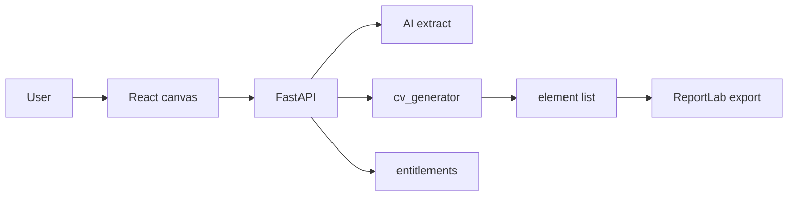

# Review jakości kodu i struktury — CV Studio

**Status:** odłożony na później (2026-08-02). Nie wdrażać teraz — wrócić gdy będzie czas na P0/P1.

**Ocena łączna: 6.5 / 10**

Solidny produkt z jasną architekturą domenową i ponadprzeciętną dokumentacją. Spada przez koncentrację złożoności w kilku plikach 1.5–3k LOC, ręczną synchronizację FE↔BE szablonów, brak CI oraz kilka footgunów deploy/security.

| Obszar | Ocena | Komentarz |
|--------|-------|-----------|
| Architektura produktu | **8/10** | AI wyciąga treść, Python układa, ReportLab = canvas 1:1 — świadomy i dobry podział |
| Struktura folderów | **7.5/10** | Klasyczny monorepo FE/BE, sensowne warstwy; brak CI/Docker/Alembic |
| Jakość / maintainability | **5.5/10** | God-file’e, dualne szablony, szeroki React context |
| Testy | **6/10** | Mocny backend layout; słaby FE UI + brak CI |
| Security / ops | **5.5/10** | Entitlements OK; public `/uploads`, unpaid plans default, niepinowane deps |
| Dokumentacja | **9/10** | README EN+PL, CANVA, PROMPTS, docs — rzadkość w projektach tej skali |

---

## Co jest dobrze

1. **Jasny kontrakt domenowy** — canvas A4 (595×842), deterministyczny fill w Pythonie, AI nie układa dekoracji.
2. **Warstwowanie backendu** — `routes → services/crud → models`; entitlements egzekwowane serwerowo; upload obrazów z magic-byte sniff.
3. **Frontend domain folders** — `canvas/`, `editor/`, `ai/`, `modals/` + CSS modules i tokeny `--chrome-*`.
4. **Utils z testami** — reflow, spacing guides, page drag, layout analysis — trudna geometria jest wyciągnięta i pokryta.
5. **Dokumentacja** — `README.md`, `CANVA.md`, `docs/cv-template-generation.md` opisują realny system, nie marketing.

---

## Największe problemy (High)

### 1. Dualny system szablonów bez Single Source of Truth
- FE: `frontend/src/templates/index.js` + statyczne `*.js`
- BE: `_GENERATORS` w `backend/app/services/cv_generator.py`
- Free tier: FE `tier: "free"` vs BE `FREE_STARTER_TEMPLATE_IDS`

**Potwierdzony drift:** `nova` jest `free` na froncie, ale **nie** jest w allowliście backendu (`ledger…graphite` only) — Free user widzi Nova jako darmową, fill może dostać 403.

### 2. God-file’e

| Plik | ~LOC |
|------|------|
| `cv_generator.py` | ~2800 |
| `layout_analysis.py` | ~2400 |
| `useA4Elements.js` | ~1800 |
| `layout_gpt.py` | ~1400 |
| `AiAssistant.jsx` | ~1200 |

Trudny review, łatwa regresja, wysoki koszt zmian.

### 3. Security / deploy footguny
- Publiczny mount `/uploads` w `backend/app/main.py` — kto zna URL, czyta obraz użytkownika
- `ALLOW_UNPAID_PLAN_SELECTION` default `true` w `config.py`
- Admin reset akceptuje `SECRET_KEY` jako sekret
- `requirements.txt` bez pinów; brak `python-dotenv` mimo użycia; **zero** `.github/workflows`

### 4. Frontend state jako „service locator”
`PdfCanvas.jsx` buduje ogromny `PdfContext`; `useA4Elements.js` zwraca ~70 pól. Każda zmiana geometrii ryzykuje re-render unrelated UI. Dodatkowo `console.log(A4_Elements)` w ścieżce renderu (~749–750).

---

## Problemy Medium / Low (skrót)

- Duplikacja fill-template w AiCvPanel / BioCvModal / ChangeTemplateModal; BioCvModal bez `TemplateCarousel`
- Gruby kontroler `pdf.py` (S3 + filesystem + ReportLab w route)
- Brak Alembic — ad-hoc `ALTER` w `models.py`
- PDF upload słabszy niż images (brak magic sniff)
- `str(exc)` wyciekający w 500 na `/ai/*` extract/fill
- Martwe/niepełne: stub `addConnector`, `selectCvTemplates` no-op, niespójny test Jest-style
- Naming: npm `reacttemplate`, repo `pdf-generator`, produkt CV Studio

---

## Proponowane poprawki (kolejność ROI)

### P0 — szybkie, wysoki zysk (1–2 dni)
1. **Contract test** FE `TEMPLATES[].id` ≡ BE `_GENERATORS.keys()` oraz `tier:"free"` ≡ `FREE_STARTER_TEMPLATE_IDS` (naprawić Nova)
2. Usunąć `console.log` z hot path w `PdfCanvas.jsx`
3. `ALLOW_UNPAID_PLAN_SELECTION` default `false` w produkcji; osobny `ADMIN_RESET_SECRET`
4. Dodać GitHub Actions: `unittest` + `node --test`; `npm test` script; pin `requirements.txt`

### P1 — struktura (1–2 tygodnie)
5. Wydzielić `cv_generator/primitives.py` + `themes/*.py` (Iconic już częściowo w `cv_generator_iconic.py`)
6. Rozbić `useA4Elements` na: history / pages / selection-drag / template-loaders + cienka fasada
7. Wspólny helper `fillTemplate(cvData, templateId)` + BioCvModal → `TemplateCarousel`
8. Serwis dokumentu PDF: create/update/export poza route’ami; auth’d lub signed download zamiast public `/uploads`

### P2 — długoterminowo
9. Minimalny shared schema elementów (JSON Schema / Zod) na granicy API
10. Alembic zamiast lekkich migracji
11. Split `PdfContext` (CanvasState / UiSurfaces / Session) lub store z selektorami
12. TypeScript stopniowo na `templates` + API client
13. Kilka testów integracyjnych TestClient: ownership PDF, export metering, extract rejection

---

## Werdykt praktyczny

Dla **solo / learning → early production**: to jest **powyżej średniej** pod względem świadomości domeny i dokumentacji. Do **bezpiecznego skalowania zespołu i płatnych planów** brakuje przede wszystkim: kontraktu szablonów, CI, twardych domyślnych ustawień billing/security oraz rozbicia 3–4 największych modułów.

Nie trzeba przepisywać aplikacji — największy zwrot daje **P0 + stopniowy split god-file’ów**, nie big-bang rewrite.
