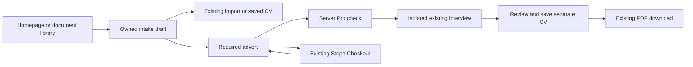
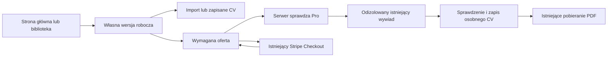

# English

## Guided tailoring: implemented contract

This guide describes the account-owned `/app/tailor` workflow. The README's **Guided CV tailoring to a job advert** section provides the user tutorial and verified source ranges. This feature adds no libraries, configuration variables or independent AI provider integration. It composes the existing React Router application, FastAPI routes, SQLAlchemy storage, Stripe Checkout, import service and interview pipeline.

## Files and data flow

```text
backend/
  alembic/versions/20260916_0019_tailoring_flows.py
  app/api/routes/tailoring.py
  tests/test_tailoring.py
frontend/
  src/pages/Site/TailoringPage.jsx
  src/pages/Site/TailoringPage.module.css
  e2e/tailoring.spec.js
```

The migration adds owned intake storage. The route module validates and stores intake, resolves an owned source and joins one existing interview. The page owns navigation, serial autosave, recovery and PDF handoff; its CSS uses application tokens. Tests cover ownership, revisions, payment boundaries, privacy and browser interaction. Registration in `backend/app/main.py` and the database readiness gate make the route available only when storage is ready. The frontend route is lazy-loaded through `frontend/src/App.jsx`.



`Workspace` keeps the live form in React state and refs. A 700 ms debounce queues writes against the latest server revision; Continue waits for the queue. Failed writes retain local text and expose retry. `useBlocker` protects in-app navigation and `beforeunload` protects a dirty browser exit. Reloading the saved state explicitly replaces the local form; its warning explains this. No CV content or advert text is placed in local storage or URLs. The existing account token/authentication storage is unchanged.

`save_flow` rejects inaccessible sources and updates by revision. `start_flow` checks Pro access, source identity/content and the selected required advert, then freezes intake before resolving an external job URL. An interview ID is deterministically derived from the owner and flow UUID via the existing interview idempotency contract. Explicit start confirms the source reviewed during intake and uses session-only evidence with the Linden template. The account career profile is neither read into evidence nor modified. Every later paid action and AI-authored proposal retains the shared interview's existing accounting and review boundaries. Start itself does not generate AI output; importing a new PDF still uses the existing extraction service/allowance.

A definitive HTTP failure before session creation unlocks intake for correction. An uncertain result retains the lock; the frontend reads saved state and offers explicit retry. Resume reads never repeat a paid operation. Once created, questions, answers, preview, verification and separate-document saving use existing `/ai/interviews` handlers. The document callback changes the guided host to Download rather than navigating to the editor. PDF download uses the existing authenticated download helper with automatic retries disabled.

## Database and privacy

Migration `20260916_0019` follows `20260912_0018`. Table `tailoring_flows`:

| Column | Type / constraints | Meaning |
| --- | --- | --- |
| `id` | `String(36)`, primary key, not null | Client-generated UUID validated by FastAPI |
| `owner_id` | Integer, not null, indexed, FK `users.id`, `ON DELETE CASCADE` | One user owns many drafts |
| `revision` | Integer, not null, ORM default 1 | Optimistic concurrency version |
| `state` | JSON, not null, ORM default empty object | Bounded intake, source digest and lock |
| `created_at` | DateTime, not null, ORM default UTC now | Creation timestamp |
| `updated_at` | DateTime, not null, ORM default UTC now | Last intake save/freeze timestamp |

Defaults are application/ORM defaults, not SQL server defaults. State contains `source_kind`, `source_id`, `offer_kind`, `job_description`, `job_offer_url`, `language`, `step`, an internal source digest and optional `locked`. Source IDs are references inside JSON, not cascading foreign keys: deleting intake or its original source must not delete an independent generated CV. Sources are rechecked against the owner when used. The interview/document link is obtained from owned interview state, not accepted from the browser. The internal digest is excluded from ordinary API payloads.

Account export includes drafts and account erasure removes them through `account_data_service.py`. The draft DELETE endpoint removes only intake; it leaves interviews/documents intact. No additional automatic retention period or background cleanup job is introduced. Stored advert text and source references may contain personal data and follow existing account storage/access controls. Do not log payloads. URL resolution uses the existing interview offer resolver and its validation; a draft save does not fetch an external URL.

## API contract

Paths below are backend paths; browser requests use the configured API prefix. All endpoints require the existing authenticated account. Invalid/missing authentication returns the existing 401 response. Foreign or unknown flow IDs return 404 without disclosing ownership. Malformed UUIDs or strict contract validation failures return 422. Storage-unready requests use the existing 503 readiness response.

| Method and path | Handler and lines in `app/api/routes/tailoring.py` | Input / successful response |
| --- | --- | --- |
| GET `/tailoring` | `list_flows`, 80–85 | Latest 50 owned drafts, ordered by update; `{"items":[{"id":"UUID","updated_at":"UTC timestamp","started":false}]}` |
| GET `/tailoring/sources` | `sources`, 88–91 | Existing eligible source metadata: `documents` and `imports` arrays |
| GET `/tailoring/{flow_id}` | `get_flow`, 94–97 | Full saved flow payload, no AI call |
| PUT `/tailoring/{flow_id}` | `save_flow`, 100–140 | Intake contract below; returns full payload. Revision 0 creates; matching revisions update; identical retries return current payload |
| POST `/tailoring/{flow_id}/start` | `start_flow`, 143–201 | `{"revision":1}`; returns payload with the one session ID. Requires Pro before creation; existing confirmed session can be recovered without another charge |
| DELETE `/tailoring/{flow_id}` | `delete_flow`, 204–209 | No body; `{"deleted":true}`; deletes intake only |

Intake example (replace `source_id` with an owned saved CV; IDs and text are illustrative):

```json
{
  "revision": 0,
  "source_kind": "document",
  "source_id": 41,
  "offer_kind": "text",
  "job_description": "Reporting analyst: SQL and dashboards.",
  "job_offer_url": "",
  "language": "en",
  "step": "source"
}
```

`source_kind` is `document`, `import` or null and must be paired with a positive `source_id` or null. `offer_kind` is `text` or `url`. Description limit: 20,000 characters; URL limit: 2,048. Server languages: `pl`, `en`, `de`, `fr`, `es`, `uk`, `it`, `nl`; this UI offers PL/EN. Intake step is `source` or `offer`; later steps are derived from interview/document state. Unknown contract fields are rejected. Drafts may omit a source/advert; start requires both and uses only the chosen offer input.

A full response includes `id`, `revision`, the public intake fields, optional `locked`, `source_cv_data` (current owned content or null), `session_id`, `document_id` and `updated_at`. Session/document IDs are null until created. Example additional response fields after start: `{"revision":2,"locked":true,"session_id":"UUID","document_id":null}` (shown as a fragment, not a complete payload).

Conflicts return 409 with `detail.code` and localized `detail.message`: `tailoring_conflict` for stale/frozen input or `tailoring_source_changed` for a source modified since review. Missing/inaccessible sources and missing selected offers return 422 codes `tailoring_source_required` / `tailoring_offer_required`. Pro access and credit failures retain existing entitlement responses. Resolving a supplied job URL can return existing offer-validation/provider errors. Failures preserve the authored draft for correction/recovery.

`POST /billing/select-plan` additionally accepts an optional UUID `tailoring_flow_id` with `plan_slug: "pro"` and the existing `Idempotency-Key` header. It verifies ownership (404 otherwise) and attaches only `/app/tailor/{UUID}` to Stripe success/cancel URLs. The response retains existing `payment_required`, `checkout_url`, `checkout_session_id` and plan fields. No caller-defined arbitrary redirect is accepted. A success URL is not proof of paid access: the existing verified Stripe webhook activates Pro and the return page reads checkout status. The user can return to intake while payment is pending. The UI rechecks entitlements rather than starting AI automatically.

## Development, validation and deployment

Use the repository's existing environment setup. From `backend`, apply the additive schema change and run relevant tests:

```powershell
.\.venv\Scripts\python.exe -m alembic upgrade head
.\.venv\Scripts\python.exe -m pytest tests/test_tailoring.py tests/test_interviews.py tests/test_interview_job_analysis.py tests/test_plan_selection.py tests/test_readiness.py -q
```

From `frontend`, use the existing package scripts:

```text
npm run check:locales
npm run lint -- --quiet
npm test
npm run test:runtime
npm run test:e2e -- e2e/tailoring.spec.js --project=desktop-chromium --workers=1
npm run build
```

The backend tests use isolated SQLite and mocked Stripe/offer resolution. Browser tests use synthetic API responses, account tokens and PDF bytes; they cover 390/834/1280/1920 px, reduced motion, source selection, reload, autosave failure, blocked navigation, paid-start boundaries, review/save/download and Polish enlarged-text keyboard retry. Payment-return fixtures test navigation, not a real Stripe payment. Existing interview, import, authentication and export suites remain responsible for their underlying contracts. Live AI quality and genuine PDF output need separate provider/export verification; there is no new automatic marketing analytics event or claimed conversion uplift.

Deploy migration/backend before the frontend through the existing release process; no new environment variables, secrets or deployment services are required. Existing startup bootstrap also runs migrations. Rolling back only the frontend leaves drafts available. Downgrading revision `20260916_0019` drops draft storage and loses saved intake, while existing interviews/PDFs survive; take an appropriate database backup before a destructive rollback. Nothing in this change automatically deploys the application.

## References

- [React Router navigation blocking](https://reactrouter.com/how-to/navigation-blocking) explains dirty-form routing guards. The separate `beforeunload` handler covers document exits that a router blocker cannot handle.
- [Stripe Checkout custom success pages](https://docs.stripe.com/payments/checkout/custom-success-page) explains why webhook fulfillment, rather than merely reaching a return URL, determines paid access.

---

# Polski

## Prowadzone dopasowanie: zaimplementowany kontrakt

Przewodnik opisuje należącą do konta ścieżkę `/app/tailor`. Sekcja README **Prowadzone dopasowanie CV do oferty pracy** zawiera instrukcję użytkownika i zweryfikowane zakresy kodu. Funkcja nie dodaje bibliotek, zmiennych konfiguracji ani osobnej integracji z dostawcą AI. Łączy istniejącą aplikację React Router, trasy FastAPI, zapis SQLAlchemy, Stripe Checkout, usługę importu i proces wywiadu.

## Pliki i przepływ danych

```text
backend/
  alembic/versions/20260916_0019_tailoring_flows.py
  app/api/routes/tailoring.py
  tests/test_tailoring.py
frontend/
  src/pages/Site/TailoringPage.jsx
  src/pages/Site/TailoringPage.module.css
  e2e/tailoring.spec.js
```

Migracja dodaje zapis danych wejściowych przypisanych do właściciela. Moduł tras sprawdza i zapisuje formularz, odczytuje własne źródło i łączy je z jednym istniejącym wywiadem. Strona odpowiada za nawigację, kolejkę zapisów, odzyskiwanie i przekazanie PDF; CSS używa tokenów aplikacji. Testy obejmują właściciela, rewizje, granice płatności, prywatność i obsługę przeglądarki. Rejestracja w `backend/app/main.py` i kontrola gotowości bazy udostępniają trasę dopiero po przygotowaniu zapisu. Frontend ładuje stronę na żądanie przez `frontend/src/App.jsx`.



`Workspace` przechowuje bieżący formularz w stanie React i referencjach. Po 700 ms bez zmian dodaje zapis do kolejki, używając najnowszej rewizji serwera; Kontynuuj czeka na kolejkę. Nieudany zapis zachowuje tekst i udostępnia ponowienie. `useBlocker` chroni nawigację wewnętrzną, a `beforeunload` ostrzega przed opuszczeniem niezapisanego formularza przez przeglądarkę. Jawne pobranie zapisanego stanu zastępuje lokalny formularz; ostrzeżenie wyjaśnia ten skutek. Treść CV i oferty nie trafia do local storage ani adresu URL. Dotychczasowy zapis tokenu konta i uwierzytelniania pozostaje bez zmian.

`save_flow` odrzuca niedostępne źródła i zapisuje według rewizji. `start_flow` sprawdza Pro, tożsamość/treść źródła i wybraną wymaganą ofertę, a następnie blokuje formularz przed odczytem zewnętrznego linku. Identyfikator wywiadu wynika deterministycznie z właściciela i UUID zadania, zgodnie z istniejącym kontraktem idempotencji wywiadu. Jawny start potwierdza źródło sprawdzone w formularzu i używa informacji ograniczonych do sesji z szablonem Linden. Profil kariery konta nie jest dołączany ani zmieniany. Każda późniejsza płatna czynność i propozycja AI zachowuje istniejące naliczanie kredytów i granice sprawdzania faktów. Sam start nie generuje odpowiedzi AI; import nowego PDF nadal korzysta z istniejącej usługi odczytu i jej limitu.

Jednoznaczny błąd HTTP przed utworzeniem sesji odblokowuje formularz do poprawienia. Niepewny wynik zachowuje blokadę; frontend odczytuje zapisany stan i oferuje jawne ponowienie. Odczyt przy wznowieniu nie powtarza płatnej operacji. Po utworzeniu sesji pytania, odpowiedzi, podgląd, weryfikacja i zapis osobnego dokumentu używają istniejących handlerów `/ai/interviews`. Wywołanie zwrotne dokumentu przełącza ścieżkę na pobieranie zamiast otwierać edytor. Pobieranie używa istniejącego uwierzytelnionego helpera z wyłączonymi automatycznymi ponowieniami.

## Baza danych i prywatność

Migracja `20260916_0019` następuje po `20260912_0018`. Tabela `tailoring_flows`:

| Kolumna | Typ i ograniczenia | Znaczenie |
| --- | --- | --- |
| `id` | `String(36)`, klucz główny, niepuste | UUID klienta sprawdzany przez FastAPI |
| `owner_id` | Integer, niepuste, indeks, klucz obcy `users.id`, `ON DELETE CASCADE` | Jeden użytkownik ma wiele wersji roboczych |
| `revision` | Integer, niepuste, domyślnie 1 w ORM | Wersja do optymistycznej kontroli współbieżności |
| `state` | JSON, niepuste, domyślnie pusty obiekt w ORM | Ograniczone dane wejściowe, skrót źródła i blokada |
| `created_at` | DateTime, niepuste, domyślnie bieżący UTC w ORM | Czas utworzenia |
| `updated_at` | DateTime, niepuste, domyślnie bieżący UTC w ORM | Ostatni zapis/zablokowanie formularza |

Wartości domyślne należą do aplikacji/ORM, nie do serwera SQL. Stan obejmuje `source_kind`, `source_id`, `offer_kind`, `job_description`, `job_offer_url`, `language`, `step`, wewnętrzny skrót źródła i opcjonalne `locked`. Identyfikatory źródeł są odwołaniami w JSON, a nie kaskadowymi kluczami obcymi: usunięcie formularza lub oryginalnego źródła nie może usunąć niezależnego wynikowego CV. Przy użyciu źródła ponownie sprawdzany jest właściciel. Powiązanie wywiadu/dokumentu pochodzi z własnego stanu wywiadu, a nie z danych przeglądarki. Wewnętrzny skrót nie występuje w zwykłych odpowiedziach API.

Eksport konta zawiera wersje robocze, a usuwanie konta usuwa je przez `account_data_service.py`. Endpoint DELETE usuwa tylko formularz, zachowując wywiady i dokumenty. Nie wprowadzono dodatkowego automatycznego okresu retencji ani zadania czyszczącego w tle. Tekst oferty i odwołania do źródeł mogą zawierać dane osobowe i podlegają istniejącemu zapisowi oraz kontroli dostępu konta. Nie loguj treści żądań. Odczyt URL używa istniejącego mechanizmu oferty i jego walidacji; zapis formularza nie pobiera zewnętrznego adresu.

## Kontrakt API

Poniżej podano ścieżki backendu; przeglądarka używa skonfigurowanego prefiksu API. Każdy endpoint wymaga istniejącego uwierzytelnionego konta. Nieprawidłowe/brakujące uwierzytelnienie zwraca dotychczasową odpowiedź 401. Obcy lub nieznany identyfikator zadania zwraca 404 bez ujawniania właściciela. Nieprawidłowy UUID lub naruszenie ścisłego kontraktu zwraca 422. Brak gotowości zapisu korzysta z istniejącej odpowiedzi 503.

| Metoda i ścieżka | Handler i wiersze w `app/api/routes/tailoring.py` | Dane wejściowe / poprawna odpowiedź |
| --- | --- | --- |
| GET `/tailoring` | `list_flows`, 80–85 | Najnowszych 50 własnych formularzy według aktualizacji; `{"items":[{"id":"UUID","updated_at":"czas UTC","started":false}]}` |
| GET `/tailoring/sources` | `sources`, 88–91 | Istniejące metadane dostępnych źródeł: tablice `documents` i `imports` |
| GET `/tailoring/{flow_id}` | `get_flow`, 94–97 | Pełny zapisany stan, bez AI |
| PUT `/tailoring/{flow_id}` | `save_flow`, 100–140 | Kontrakt poniżej; zwraca pełny stan. Rewizja 0 tworzy; zgodna rewizja aktualizuje; identyczne ponowienie zwraca bieżący stan |
| POST `/tailoring/{flow_id}/start` | `start_flow`, 143–201 | `{"revision":1}`; zwraca stan z jednym ID sesji. Wymaga Pro przed utworzeniem; potwierdzoną sesję można odzyskać bez kolejnego naliczenia |
| DELETE `/tailoring/{flow_id}` | `delete_flow`, 204–209 | Bez treści żądania; `{"deleted":true}`; usuwa wyłącznie formularz |

Przykład formularza (zastąp `source_id` własnym zapisanym CV; identyfikatory i tekst są przykładowe):

```json
{
  "revision": 0,
  "source_kind": "document",
  "source_id": 41,
  "offer_kind": "text",
  "job_description": "Analityk raportowania: SQL i dashboardy.",
  "job_offer_url": "",
  "language": "pl",
  "step": "source"
}
```

`source_kind` przyjmuje `document`, `import` albo null i musi odpowiadać dodatniemu `source_id` albo null. `offer_kind` to `text` albo `url`. Limit opisu: 20 000 znaków; URL: 2048. Języki serwera: `pl`, `en`, `de`, `fr`, `es`, `uk`, `it`, `nl`; ten interfejs oferuje PL/EN. Etap formularza to `source` albo `offer`; dalsze etapy wynikają ze stanu wywiadu/dokumentu. Nieznane pola kontraktu są odrzucane. Wersja robocza może nie mieć źródła/oferty; start wymaga obu i używa tylko wybranej formy oferty.

Pełna odpowiedź zawiera `id`, `revision`, publiczne pola formularza, opcjonalne `locked`, `source_cv_data` (bieżąca własna treść albo null), `session_id`, `document_id` i `updated_at`. ID sesji/dokumentu są null do czasu utworzenia. Dodatkowe przykładowe pola po starcie: `{"revision":2,"locked":true,"session_id":"UUID","document_id":null}` (fragment, nie pełna odpowiedź).

Konflikty zwracają 409 z `detail.code` i przetłumaczonym `detail.message`: `tailoring_conflict` oznacza nieaktualny/zablokowany formularz, a `tailoring_source_changed` źródło zmienione od sprawdzenia. Brak/niedostępność źródła i brak wybranej oferty zwracają 422 z kodami `tailoring_source_required` / `tailoring_offer_required`. Błędy Pro i kredytów zachowują dotychczasowe odpowiedzi uprawnień. Odczyt linku oferty może zwracać istniejące błędy walidacji/dostawcy. Błędy zachowują wprowadzony tekst do poprawienia lub odzyskania.

`POST /billing/select-plan` dodatkowo akceptuje opcjonalny UUID `tailoring_flow_id` wraz z `plan_slug: "pro"` i istniejącym nagłówkiem `Idempotency-Key`. Sprawdza właściciela (inaczej 404) i dodaje wyłącznie `/app/tailor/{UUID}` do adresów sukcesu/anulowania Stripe. Odpowiedź zachowuje dotychczasowe pola `payment_required`, `checkout_url`, `checkout_session_id` i planu. Dowolny adres przekierowania klienta nie jest przyjmowany. Adres sukcesu nie dowodzi płatnego dostępu: Pro aktywuje istniejący zweryfikowany webhook Stripe, a strona powrotu odczytuje status Checkout. Użytkownik może wrócić do formularza przy oczekującej płatności. Interfejs ponownie sprawdza uprawnienia i nie uruchamia AI automatycznie.

## Praca lokalna, weryfikacja i wdrożenie

Użyj dotychczasowej konfiguracji środowiska repozytorium. Z katalogu `backend` zastosuj rozszerzenie schematu i uruchom właściwe testy:

```powershell
.\.venv\Scripts\python.exe -m alembic upgrade head
.\.venv\Scripts\python.exe -m pytest tests/test_tailoring.py tests/test_interviews.py tests/test_interview_job_analysis.py tests/test_plan_selection.py tests/test_readiness.py -q
```

Z katalogu `frontend` użyj istniejących skryptów pakietu:

```text
npm run check:locales
npm run lint -- --quiet
npm test
npm run test:runtime
npm run test:e2e -- e2e/tailoring.spec.js --project=desktop-chromium --workers=1
npm run build
```

Testy backendu używają odizolowanego SQLite oraz atrap Stripe/odczytu oferty. Testy przeglądarkowe używają fikcyjnych odpowiedzi API, tokenów konta i bajtów PDF; obejmują 390/834/1280/1920 px, ograniczenie ruchu, wybór źródła, przeładowanie, błąd zapisu, blokadę nawigacji, granice płatnego startu, sprawdzenie/zapis/pobranie i ponowienie klawiaturą z powiększonym polskim tekstem. Przypadki powrotu z płatności sprawdzają nawigację, nie prawdziwą płatność Stripe. Istniejące zestawy wywiadu, importu, uwierzytelniania i eksportu nadal odpowiadają za podstawowe kontrakty. Jakość rzeczywistego AI i faktyczny PDF wymagają osobnej weryfikacji dostawcy/eksportu; nie dodano automatycznego zdarzenia analityki marketingowej i nie wykazano wzrostu konwersji.

Wdróż migrację/backend przed frontendem przez istniejący proces wydania; nie są potrzebne nowe zmienne środowiskowe, sekrety ani usługi wdrożeniowe. Dotychczasowa inicjalizacja także wykonuje migracje. Wycofanie samego frontendu zachowuje formularze. Wycofanie rewizji `20260916_0019` usuwa tabelę formularzy i zapisane dane wejściowe, ale zachowuje istniejące wywiady/PDF; przed takim destrukcyjnym wycofaniem wykonaj odpowiednią kopię bazy. Ta zmiana nie wdraża aplikacji automatycznie.

## Materiały źródłowe

- [Blokowanie nawigacji w React Router](https://reactrouter.com/how-to/navigation-blocking) wyjaśnia ochronę niezapisanego formularza. Osobny handler `beforeunload` obejmuje opuszczenie dokumentu, którego blokada routera nie obsługuje.
- [Własne strony sukcesu Stripe Checkout](https://docs.stripe.com/payments/checkout/custom-success-page) wyjaśniają, dlaczego o dostępie płatnym decyduje obsługa webhooka, a nie samo wejście na adres powrotu.
