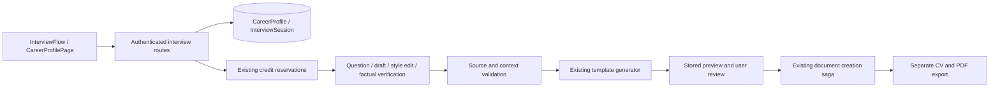
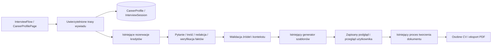

# English

## Career profile and interviews

This is the implementation tutorial for the shared interview introduced on 10 September 2026. The manual starter, legacy `BioCvDraft` recovery, saved CVs and ordinary PDF export remain compatible. No new runtime dependency or environment variable is required.

### Candidate scope and deployment

### CV/import prerequisite

The career profile and interview enrich existing CV data. Open `/app/interview`, select a saved CV or successful import, then review its facts before asking questions. An open editor may supply its current structured `cv_data` without an extra save. Account-profile facts and `candidate_notes` only supplement that selected source; neither starts an interview alone. The removed blank-candidate and profile-only options are no longer supported.

`has_interview_source` requires a nonblank string `cv_data.name`, matching the identity needed by preview generation. An empty starter or layout metadata does not qualify. Employment history is not mandatory, so students can start with their name and add education/skills through enrichment. `available_interview_sources` filters owned saved documents and successful, nondeleted imports and returns only their IDs and labels; it includes older eligible imports without a separate pagination step. No documents are merged automatically.

Authenticated `GET /career-profile` now returns `{revision,facts,updated_at,sources:{documents:[{id,title}],imports:[{id,filename}]}}`. It never charges AI credits. `PUT /career-profile` retains `{revision,facts}` as input and returns the same sources with the updated profile; adding or editing facts without an eligible owned source returns 422. Clearing personal data remains allowed. `POST /ai/interviews` and source refresh reject missing candidate identity with 422 (`interview_invalid`, localised message key `interview_source_required`) before session creation or AI work; `include_profile:true` cannot bypass this rule. Existing profile-only sessions return `requires_source_choice:true`, preserve saved answers and reject further edits/generation until the user starts a new interview from a CV/import.

`InterviewFlow` loads server-filtered choices with the profile and exposes notes, language and Start only after source selection. A failed read shows retry rather than claiming there are no sources. `CareerProfilePage` mounts `FactEditor` only when eligible sources exist, even if historical profile facts remain. Both use `InterviewSourceRequired`: import a PDF or create, complete and save a CV. The embedded assistant offers return to the current CV. History and data deletion remain available; there is no automatic session, AI call, document edit or PDF change from opening these screens.

Tests: `backend/tests/test_interview_sources.py` covers empty/whitespace/metadata-only data, profile/notes bypass attempts, ownership, import status, profile editing/deletion and legacy recovery. `frontend/e2e/interview-prerequisites.spec.js` checks both routes in PL/EN at 390/834/1280/1920 px, keyboard focus, 44px actions, reduced motion and 200% text scaling. Run `python -m pytest tests/test_interview_sources.py tests/test_interviews.py -q` in `backend/`, and `npm run test:runtime -- src/components/ai/Interview`, `npm run test:e2e -- e2e/interview-prerequisites.spec.js e2e/interview-sources.spec.js e2e/career-profile.spec.js e2e/interviews.spec.js --project=desktop-chromium` in `frontend/`. Tests use local synthetic data and mock AI. Deploy the backend first, then the frontend; a frontend rollback must retain server validation. No database schema, migration, dependency or environment changes are required. [React conditional rendering](https://react.dev/learn/conditional-rendering) explains how the prerequisite keeps unavailable editors out of the rendered interface.

**Candidate separation:** selecting a document/import (including the embedded assistant) defaults to that CV and its own interview facts. Account ownership never establishes candidate identity. The unchecked **To moje CV — dołącz mój profil zawodowy** option allows joining it only when the user identifies the selected CV as theirs. Changing sources resets that opt-in and switches between separate in-memory note drafts. Isolated fact review, questions, verification, preview and document creation never load account facts. Confirmation changes only the selected store; changing the account profile cannot invalidate isolated work.

`InterviewCreate.include_profile` defaults to `false`; `true` selects account-backed evidence for the session's lifetime. New session JSON contains immutable `evidence_scope` (`session` or `profile`) and `session_profile` (isolated `{revision,facts}`, initially `{revision:0,facts:[]}`, otherwise null). API responses expose isolated facts as `evidence_profile`. `SessionWrite` sends `evidence_scope` alongside `revision` and `profile_revision`; that latter revision refers to the selected evidence store. A missing/wrong scope or stale version returns 409 before confirmation or paid work. `interview_profile` resolves the store, `validate_facts` shares path/conflict checks, and the existing session compare-and-swap saves isolated evidence atomically. `source` rejects changing an existing nonempty candidate name or email; start a new interview for that change. Answer/document replay and credit reservations retain their existing identities.

Legacy rows without scope or a usable CV snapshot return `requires_source_choice:true`. Their original answers and documents are preserved, but confirmation and generation are blocked; start a new conversation and select its source explicitly. Existing mixed account facts are not automatically cleaned or reassigned: review them manually in the career profile. Deleting an isolated session also deletes its facts; exported account data includes them in `interviews[].state`, and account erasure removes them. No new table, migration, dependency or environment variable is needed. Deploy the backend before the frontend and keep its scope guard during any frontend rollback; older clients must refresh before mutating sessions. Do not roll back to the old automatic merge implementation. [SQLAlchemy JSON documentation](https://docs.sqlalchemy.org/en/20/core/type_basics.html#sqlalchemy.types.JSON) explains why updates replace the JSON structure rather than relying on in-place nested mutation.

Regression checks: `test_interviews.py` covers a different candidate through create/enrich/tailor, provider contexts, document save/replay, imports, ownership, explicit profile joining, stale scope/version, edits/deletions, account export and legacy blocking. `Interview.runtime.test.jsx` checks isolated rendering, resumption without profile reads, opt-in reset, required source selection and legacy recovery. `e2e/interview-sources.spec.js` checks document/import selection, keyboard opt-in, confirmation and resume at 390/834/1280/1920px with reduced motion and 200% text scaling. Run `python -m pytest tests/test_interviews.py tests/test_interview_recovery.py -q` in `backend/`; run `npm run test:runtime -- src/components/ai/Interview` and `npm run test:e2e -- e2e/interview-sources.spec.js e2e/interviews.spec.js e2e/interview-workspace.spec.js --project=desktop-chromium` in `frontend/`. These use synthetic candidate data and mocked AI, not production records.


### Save facts when continuing the interview

`InterviewFlow.goTo` replaces the repeated confirmation button with **Przejdź do rozmowy** / **Przejdź do przygotowania CV**. Stage navigation calls `/confirm` only for initial source facts, refreshed-source proposals or manual edits, then enters the requested stage. A submitted text answer or explicit lack-of-experience choice is already user-confirmed: `/answers` writes its fact and answer history to the selected store in one transaction, so **Twoje informacje** never asks for the same approval again. Unknown and skipped answers create no fact. Unchanged facts cause no request, revision increment or preview invalidation. The screen names the destination after answer persistence and before manual/source saves. Fact review remains optional after answers and clarifications. No navigation action starts paid AI. Open field drafts disable stage transitions; a failed save preserves the current stage and parent draft, and the synchronous lock prevents double submissions. A page reload can still discard unsent local edits. Server validation, candidate isolation, credits and PDF output remain unchanged. Runtime tests cover direct answer-save feedback, unchanged navigation, single source/manual save before preparation and failure recovery; E2E covers both candidate scopes and responsive keyboard flows.

### Follow the user flow

1. Open `/app/interview` through **Utwórz CV z pomocą wywiadu**, or open the assistant in an existing CV. **Dopasuj do oferty → Dopasuj z wywiadem — nowe CV** starts tailoring; **Uzupełnij CV przez wywiad** starts enrichment. The import panel also offers enrichment after filling the imported CV.
2. Select one owned CV or successful import with candidate details. The account profile is an optional same-person addition, never the sole source. With no eligible source, import a PDF or complete and save a CV first. The server never automatically combines the document library or `BioCvDraft`.
3. Review the initial facts. A fact has text, context, meaning and optionally a CV field. Conflicting values require correction or removal. Confirming saves the reviewed facts only to the selected store. A changed source value remains a separate proposal until resolved.
4. Ask the next question or generate immediately. The server selects each CV record in turn, with two main questions and at most one follow-up per experience, education or project; skills and missing language levels receive one question. Declining an entry moves on. Initial capacity grows from five/eight to cover records, capped at 50 saved answers; extending never resets per-entry progress. Requirement statuses remain `matched`, `partial`, `unknown`, `gap`; only confirmed limitations support `gap`.
5. Save a text answer, confirmed lack of experience, forgotten information or a skip. These are separate statuses. Text and explicit lack are persisted immediately as a fact or gap in the selected evidence store, atomically with answer history. Unknown and skipped answers create no fact. The optional fact view supports later corrections; it is not a second confirmation step.
6. Open **Przygotuj CV**, select a template if necessary and generate. If verification finds an unresolved detail, the screen separates **Co wymaga sprawdzenia** from the complete AI proposal. Choose **Tak — zatwierdź ten opis**, enter a **Pełny poprawiony opis** that replaces the proposal, or skip to the confirmed fallback; then regenerate when needed. Review the complete CV text, cited changes, uncertainties and page count. Tailoring retains a recognized source template and supported spacing. An unknown template requires selection. The existing gallery supplies previews; manual element positions are regenerated. There is no automatic content deletion to force a page limit.
7. **Zapisz jako nowe CV** creates an ordinary document and opens `/app/documents/:id`. The source is never updated. The title uses offer role (or CV headline), company (or `Profil` when unavailable), UTC date and a numbered suffix for existing titles. Existing PDF download/export billing still applies.

`/app/career-profile` lets the owner edit/clear facts, browse sessions, resume them or delete a session. Profile CRUD, answer persistence, confirmation and history access do not spend AI credits, including after Pro expires. Starting an interview and provider operations require the existing Pro entitlement. Clearing the profile leaves saved documents and interview histories intact; deleting a session removes its isolated facts while leaving account-profile facts and generated documents intact.

Profile and fact review use a grouped workspace. Select a section, search across the profile, open one record and edit one field. Apply commits the local field draft; Cancel/Escape discards it. Save/confirm remains explicit and versioned. Lists show six records and eight fields per page, preserving every underlying fact ID. Equivalent display entries do not merge database facts, and differing values remain reviewable. See the main README feature map for the full editing contract and module references.

The interview now exposes one working stage at a time: **Twoje informacje → Rozmowa → Przygotuj CV → Wynik**. Open **Przygotuj CV** to select the template and request generation. An active question or clarification stays in the conversation until answered or explicitly skipped. The result separates **Treść CV**, **Zmiany** and **Do sprawdzenia**. Select a complete role, education entry, language or other record using **Wpis CV**. Content lists show six items per page; changes and remaining gaps show five. Repeated correction notices are grouped by section and outcome. Pagination changes only the browser view: the full `cv_data`, stable evidence references and exported content remain intact. A long individual paragraph can still require scrolling.

`InterviewPreview` uses `previewRecords` to group the generated data and scalar changes, then `recordContent` selects one record for `CvContent`. The selector is explicitly labelled; view/pagination changes restore reading focus. `InterviewFlow` owns the stage and synchronous request lock. Its `InterviewLoading` replaces the working surface during a request while hidden mounted forms retain their drafts. The loader distinguishes initial reads, answer saves, AI question selection, generation, document creation and subsequent profile synchronization. It shows a document composition illustration, an indeterminate indicator, elapsed time and available saved-answer/profile counts, language and template. A 30-second message explains the continuing wait. Time never invents server stages, an ETA, percentage, success or an automatic retry. Operation changes are politely announced; timer ticks are not. Reduced motion stops the illustration and indicator animation. Failed answer saves restore the entered text and an enabled retry action. Unsaved browser input is not guaranteed after reload or closing the tab.

The staged preview and loading interface uses existing Swiss tokens, React state, native form controls and API; clarification queue repair and atomic answer-fact persistence are implemented in the backend described below. The change requires no new dependency, endpoint, database migration, billing rule or deployment configuration. Source CVs and template/PDF geometry remain unchanged. Deploy the backend before the frontend so save feedback never claims immediate persistence against an older API. `interviewPreview.test.js` checks grouping, evidence identity and removed fields; `InterviewLoading.runtime.test.jsx` checks long waits and truthful statuses; `interview-workspace.spec.js` uses 75 scalar changes, four roles and controlled delayed/failed responses to test bounded lists, keyboard focus, 390/834/1280/1920 px, 200% text zoom and reduced motion. These mocked tests do not measure live AI speed or quality. Run `npm test`, `npm run test:runtime`, `npm run test:e2e -- e2e/interviews.spec.js e2e/interview-workspace.spec.js --project=desktop-chromium`, `npm run lint` and `npm run build` in `frontend/`. [WAI range properties](https://www.w3.org/WAI/ARIA/apg/practices/range-related-properties/) explains why unknown progress omits `aria-valuenow`.

### Architecture and responsibilities



- `InterviewFlow` owns transient form input and calls `interviewRequest`; `FactEditor` edits a controlled fact list; `CvContent` renders semantic text instead of technical JSON. `CareerProfilePage` owns account profile management. The assistant embeds the same flow and detects changes to its captured live CV.
- `interviews.py` checks authentication, ownership, request versions and entitlements, resolves the selected source, and coordinates atomic answer/evidence persistence, source/manual confirmation and document creation. `interview_schema.py` bounds public inputs and strict provider output with Pydantic. Unexpected properties are rejected.
- `interview_service.py` owns stable evidence identifiers, profile/session compare-and-swap updates, bounded questions, paid provider calls and deterministic draft assembly. SQLAlchemy owns persistence; Alembic owns schema upgrades. FastAPI validates request bodies; React owns presentation. Existing ReportLab/template services own A4 layout and PDF bytes.
- The provider generates scalar `path/value/evidence_refs` changes, never SQL, geometry or storage operations. Each field must cite current profile facts. Offer text is untrusted prioritization data and is explicitly excluded as evidence of candidate competence.
- Assembly checks allowed paths, nonempty values, existing references, cited numbers, unchanged contact identity, role context and literal accepted framings. A separate model operation checks semantic support and lost qualifications. These checks reduce unsupported claims; they do not prove arbitrary truth. The candidate still reviews the final text. Unchanged base fields retain current confirmed content.
- Profile changes invalidate old previews through their revision. Generation reconstructs its base only from current confirmed facts, not old session snapshots. A changed saved source can be refreshed inside the session; new source facts require review and the preview is invalidated. A deleted source requires selecting another source in a new interview. Unsaved source edits are detected by the assistant before generation/save.

### Database

Migration: `backend/alembic/versions/20260910_0017_career_interviews.py`, revision `20260910_0017`, parent `20260909_0016`. Tables use the existing database connection and SQLAlchemy session. There is no profile seed or automatic migration of old bio drafts.

| Table / field | SQLAlchemy type and constraint | Meaning / application default |
| --- | --- | --- |
| `career_profiles.owner_id` | Integer, primary key, FK `users.id`, delete cascade | Exactly one profile per owner |
| `revision` | Integer, non-null | Optimistic version, initially 1 |
| `facts` | JSON, non-null | Confirmed facts; initially `[]` |
| `updated_at` | DateTime, non-null | UTC write time |
| `interview_sessions.id` | String(36), primary key | UUID derived from owner and creation idempotency key |
| `owner_id` | Integer, non-null, indexed FK `users.id`, delete cascade | One owner has many sessions |
| `revision` | Integer, non-null | Optimistic version, initially 1 |
| `state` | JSON, non-null | Input snapshot, questions, answers, proposals, progress, preview and document ID |
| `created_at`, `updated_at` | DateTime, non-null | UTC timestamps |

Defaults above are application/ORM defaults, not SQL server defaults. All table columns are non-null. Optional fields inside JSON may be null. `state` records source document/import ID, source document revision, normalized CV, offer metadata/text, selected template, spacing, language, confirmation, question limit, answers, proposed facts and generated result. Phases are `intake`, `ready`, `question`, `review`, `clarification`, `preview`, `completed`. There is no FK from the snapshot to a source document: its historical content survives source deletion, but generation checks source availability.

Fact fields: stable `id` (1–100 characters), `text` (1–4000), `context` (up to 500), `kind` (`fact`, `gap`, `framing`), `path` (up to 200; empty for narrative evidence) and `source` (up to 150; manual/document/import/interview origin). At most 500 facts are accepted. Conflicting scalar paths, duplicate identifiers, unsupported paths and ancestor/child path collisions are rejected. Path indices are bounded to two digits. Profile deletion clears facts and increments the revision instead of resetting its epoch.

Rows contain personal data and remain until explicit deletion/account erasure; no automatic interview retention job is added. Account export includes `career_profile` and `interviews`; account erasure removes both tables' owner rows along with existing data. Operational logs contain event/status/operation and cost, never answer text. Provider reservation replay payloads follow the existing AI retention policy. Old histories/replay payloads are never treated as current profile evidence.

### API contracts

All routes require the existing bearer session; owner identity comes from authentication. `SessionWrite` is `{ "revision": 3, "profile_revision": 1, "evidence_scope": "session" }`. Session mutations use these current versions; session and profile are separate counters. Foreign IDs return the same 404 as missing IDs.

| Method and path | Input | Successful response / handler |
| --- | --- | --- |
| GET `/career-profile` | None | `{revision,facts,updated_at,sources}`; absent profile has revision 0; `get_profile` |
| PUT `/career-profile` | `{revision,facts}`; full replacement | Updated profile; `write_profile` |
| DELETE `/career-profile` | Required query `revision` ≥ 0 | Empty profile with incremented revision; `clear_profile` |
| POST `/ai/interviews` | `InterviewCreate`; required `Idempotency-Key` (1–128 chars) | 201 session; `create_interview` |
| GET `/ai/interviews` | Optional `offset` ≥ 0 | `{items,next_offset}`, up to 50 summaries; `list_interviews` |
| GET `/ai/interviews/{id}` | Session ID | Full session; `get_interview` |
| GET `/ai/interviews/{id}/credits` | Owned session ID; no body or revision | 200 `{credits_charged,requests}`; `get_interview_credits`; free after Pro expiry |
| DELETE `/ai/interviews/{id}` | Session ID | `{deleted:true}`; `delete_interview` |
| POST `/{id}/answers` under `/ai/interviews` | SessionWrite + `question_id`, `answer`, `status` | Updated session; text/gap evidence and answer history commit atomically; `answer_interview` |
| POST `/{id}/next` | SessionWrite | Question/requirements or review phase; `next_interview` |
| POST `/{id}/confirm` | SessionWrite + complete reviewed `facts` | `{session,profile}` committed atomically; `confirm_interview` |
| POST `/{id}/extend` | SessionWrite | Updated question limit; `extend_interview` |
| POST `/{id}/source` | SessionWrite + optional live `cv_data`, `template_id`, `spacing_px` | Refreshed session in intake review; `refresh_interview_source` |
| POST `/{id}/preview` | SessionWrite + `template_id` | Session with clarification questions or verified preview; `preview_interview` |
| POST `/{id}/clarify` | SessionWrite | Start up to five saved questions, without an AI call; `clarify_interview` |
| POST `/{id}/skip-clarifications` | SessionWrite | Defer uncertain details; show fallback or review saved answers; `skip_clarifications` |
| POST `/{id}/document` | SessionWrite | `{document_id:42}`; `save_interview_document`; requires resolved/deferred clarification |

Except creation (201), successful responses use 200. Common failures: 401 invalid/expired authentication; 403 plan/credit or template restrictions through existing entitlement errors; 404 missing/foreign source/session; 409 optimistic conflict, mismatched retry key or pending AI reservation; 413 transport/context size; 422 schema/content/template errors; 500 provider unavailable; 503 database readiness unavailable. Recoverable interview errors use `{detail:{code,message}}`; FastAPI field validation uses its standard detail array. Existing billing/storage errors retain their established codes.

Creation accepts `include_profile` (boolean, default false) and `mode` (`create`, `enrich`, `tailor`), optional positive `source_document_id` or `source_import_id` (mutually exclusive), `cv_data`, `template_id`, `spacing_px`, `job_offer_url` (2048 chars), `job_description` (20000), `candidate_notes` (5000), and `language` (`pl/en/de/fr/es/uk/it/nl`). Tailoring requires an offer URL or pasted description accepted by the existing public-HTTPS resolver. Answers are at most 4000 characters; an `answered` status needs nonblank text and writes a `fact`, while `no_experience` writes a `gap`. `unknown` and `skipped` update history only. Each answer request checks both revisions, and any evidence write commits with the session revision update. JSON transport is limited to 1 MiB; creation/provider context is additionally bounded to 250000 encoded bytes.

Example sequence (authorization headers omitted):

```http
POST /ai/interviews
Idempotency-Key: demo-career-01
{"mode":"create","include_profile":false,"source_document_id":42,"candidate_notes":"Projekt raportowania na studiach.","language":"pl"}
```

The 201 response contains the new `id`, `revision:1`, `phase:"intake"`, `proposed_facts` and `profile_revision`. Use `evidence_profile` for session scope or read the account profile for profile scope, edit the facts, then send the complete reviewed list to `/{id}/confirm`. Use the returned versions for `next`, `answers`, and `preview`. `source` without live data reloads the owned saved CV; with live data it snapshots the current editor without writing the source. Completed sessions cannot refresh their source. A preview includes `cv_data`, cited `changes`, `remaining_gaps`, `elements`, `pages` and `profile_revision`. The frontend shows the content and page count; only the generated element graph enters the PDF writer. Saving returns an ordinary document ID.


The preview also contains `review_notes: [{path, action}]`, where `action` is `kept_original` or `omitted_suggestion`, and `recovered_previous_attempt: boolean`. `InterviewReviewNotice` converts these into neutral, collapsible explanations. Neither raw verification reasons nor JSON paths appear in the interface or PDF. Old sessions with `generation_feedback` show a recovery instruction instead of provider diagnostics. Retained text stays verbatim, so rejected translations can leave some content in its original language; review the full CV before saving. This release changes session JSON only and needs no additional migration.

Before the final preview, unresolved proposals enter `phase: "clarification"`. The existing paid verification returns neutral Polish `clarifications: [{path, question}]`; old cached results use a contextual fallback with the AI suggestion explicitly labelled as unconfirmed. The UI labels that provider question **Co wymaga sprawdzenia** and asks the stable action question **Czy proponowany opis jest w pełni zgodny z Twoim doświadczeniem?** `interview_clarification.py` creates up to five stable topics and skips previously answered/dismissed ones. `pending_clarifications` persists the queue; `clarification_round` records the round; fact review stays optional. Starting the round through `clarify` is explicit consent to at most five additional questions, within the session cap of 50. Each answer uses the replay-safe `answers` endpoint and the four distinct statuses. A typed `answered` correction or `no_experience` choice immediately updates the linked fact/gap and invalidates the fallback; no separate `/confirm` follows. **Tak — zatwierdź ten opis** explicitly confirms the complete displayed AI-authored suggestion through the same endpoint. **Pełny poprawiony opis** makes clear that typed text replaces the proposal rather than merely answering the provider question. Unknown/skipped answers do not create gaps. `skip-clarifications` records dismissed topics, preserves previous answers and exposes only current confirmed content; it never bypasses source/profile checks. Starting saved questions, answering and skipping do not call AI or spend credits. A subsequent requested generation uses the normal draft and verification charges. Saved questions can be resumed after network failure or logout. `document` returns 409 while clarification is active.

Clarification loop protection: only a changed scalar explicitly rejected by verification and citing current profile facts can become a question. Technical errors, unknown paths, dependent record rejections and unchanged fields use the confirmed fallback without asking the user to diagnose them. The disputed proposal is always visible and labelled as unconfirmed, beside its section/role label. Clarifications have a separate position/total counter and a cumulative budget of five answered or explicitly deferred questions per session; regeneration cannot reset it. Normalized claim and question fingerprints suppress repeats across field reordering, case and punctuation changes. This is deterministic duplicate detection, not semantic equivalence detection; reworded claims may remain distinct, but the budget still bounds them. Discovery also stops repeated wording under a new topic without an automatic paid retry.

On owner-authorized `GET /ai/interviews/{id}`, `repair_clarification_state` repairs an active legacy queue, preserves retained question IDs and every saved answer, and persists only changed state using revision compare-and-swap. Repeated reads are stable; a concurrent edit can return 409 and requires reloading. An exhausted queue returns to fact review or the existing confirmed preview. Repair does not touch the career profile, documents or credits. Session JSON adds optional question `record_label` and `dismissed_clarification_keys`; no database migration or new dependency is required. `preview` and `next` reject attempts to restart paid work while clarification is pending. Tests reproduce eight duplicate legacy prompts, owner isolation, free repair, answer replay, budget exhaustion and changed-topic repetition.

### Per-request credit receipts

After an interview operation, `InterviewCredits` reads `GET /ai/interviews/{id}/credits`. The existing bearer token is required; the path parameter must identify an owned session. No body, query parameters or idempotency key is needed. `get_interview_credits` in `backend/app/api/routes/interviews.py` calls `owned_session` before `interview_credit_usage` in `backend/app/services/interview_credits.py`. Missing authentication uses the existing authentication error; absent and foreign sessions both return 404. This read needs no Pro entitlement, creates no AI request and changes no data.

Example request: `GET /ai/interviews/<owned-session-id>/credits` with `Authorization: Bearer <session-token>`. Example 200 response:

```json
{"credits_charged":18,"requests":[{"id":"example-reservation-id","operation":"preview","created_at":"2026-09-12T10:00:00Z","credits_charged":18,"pending":false,"stages":[{"operation":"preview","credits_charged":8,"status":"settled"},{"operation":"editorial","credits_charged":6,"status":"settled"},{"operation":"verify","credits_charged":4,"status":"settled"}]}]}
```

Credit amounts are nonnegative integers from `AiCreditReservation.charged_credits`, not token-cost estimates or reserved ceilings. `requests` is newest first. Request operations are `next`, `preview` or the future-compatible `other`; stage operations additionally distinguish `editorial` and `verify`. Stage statuses retain `pending`, `settled`, `failed`, `released` or `expired`. A pending request shows both its already charged subtotal and an explicit pending label. Timestamps are UTC ISO 8601; the interface formats them locally. A new interview returns zero total and an empty array only after a successful read.

The service selects only receipt metadata and scopes rows by owner, action and an escaped session prefix. Both historical keys and versioned generation-attempt keys identify the revision that actually incurred each charge. Reusing a completed stage creates no new ledger row; a partly resumed preview lists only its newly charged stages under the new request. Metered failed stages remain charged, while released claims add zero. Reserved credits are excluded from the total. The response never includes prompts, provider responses, request hashes or idempotency keys. Receipts use the existing ledger's retention; deleting an interview makes this endpoint unavailable without rewriting billing history.

The shared component refreshes after success and failure, keeps the last known totals with an explicit stale-data notice if reading fails, and offers a read-only retry. It never retries paid work automatically. Long-running/pending settlement can be refreshed explicitly; no live polling or fixed pre-request price is promised. Account balance uses existing entitlements, including the assistant header refresh. A missing or failed balance read is not displayed as zero. Free answer/fact/clarification saves are explained separately. Requests and totals stay outside CV/PDF data. See the README feature section for implementation references and the backend, runtime and browser test commands.

### Credits and recovery

`interviewRequest` gives only `POST /ai/interviews/{id}/preview` a 1,680,000 ms browser timeout: three server provider caps of 540 seconds plus 60 seconds for layout/settlement. This is a technical upper bound, not a completion estimate. Other operations retain 180,000 ms. Automatic retries remain disabled. A proxy/network can still fail earlier; reload persisted state and explicitly resume the unchanged attempt. `frontend/src/services/interviews.runtime.test.js` verifies these request options without waiting in real time.

Pipeline v2 always edits CV prose before verification. Original answers/facts remain verbatim; editable summary, bullets and descriptions return complete `EditorialReview.fields: [{path,value}]`, while identity, record metadata and server-owned evidence references cannot be patched. `prepare_editorial_draft` includes original prose omitted from the first draft. Invalid paths, missing/empty/duplicate edits and changed protected numbers/tools/placeholders reject the whole editing response. The final verifier checks meaning, omissions, attribution and responsibility against original evidence, not against another model's text. These checks reduce risk but are not a guarantee of model quality; final user review remains necessary.

`Question.follow_up_to` is an additive nullable original-question ID (max 100 characters, absent in older JSON). Discovery permits one same-topic follow-up to an answered original question, never to skipped/unknown/no-experience answers, verification clarifications or another follow-up. It consumes the existing question budget; invalid/repeated proposals use a scoped local fallback without automatic paid retries. `Question.entry_id` identifies the server-selected record; session JSON adds `discovery_entry_ids` and `discovery_complete`. See the README record-discovery tutorial and `interview_discovery.py` for capacity, legacy matching and free-form-note limitations. Grammar alone is not grounds for another question. Session JSON adds `generation_attempt:{id,fingerprint,version}` during preparation and removes it after publication; `preview.pipeline_version=2` records the final contract. `usage.stages` holds draft/editorial/verification usage, and `usage.cost_pln_estimate` totals the whole attempt, including reused stages. Only full three-stage reuse sets `recovered_previous_attempt=true`. No endpoint, table, migration, dependency or new configuration is needed; deploy backend before frontend. Older previews remain readable. Rollback to the old backend removes the mandatory editing gate.

Synthetic evaluation examples: “pomagalem ekipie testować 4 scenariusze” should become a grammatical description of supporting tests, not leading the team; “robię raporty w sql” may normalize SQL spelling without inventing automation; “projekt na studia” must not become a commercial deployment; “nie prowadziłem zespołu” must retain negation. `test_interview_editorial.py` checks structural guards, source preservation, verifier inputs, failures/replay, source conflicts and question limits with mocked outputs. It does not measure real-model quality. Review these examples with the configured model before changing its configuration; ordinary tests make no paid calls.

Questions use one paid operation. Preview uses three separately reserved operations: draft, editorial review and independent factual verification. Draft/verification use `improve`, editing uses the shared `language` policy, with existing provider configuration, `API_GPT_KEY`, reservation ceiling and actual-cost settlement. No fixed interview price or new credit package is introduced. A rejected model result can still consume the provider's actual cost. Saving/reviewing facts and saving the resulting document do not add an AI charge.

Creation UUIDs are stable per owner/idempotency key. Answers replay by question ID and identical content; changing an already saved answer is rejected so corrections happen in fact review. Provider keys include session ID, session revision, profile revision and operation. Cached completion precedes session commit: retries after a lost response reuse the completed result. Unknown provider outcomes follow the existing pending-reservation TTL; do not blindly refund a possibly completed request. Rejected fields retain their current confirmed value; unsupported additions are omitted. Rejected record identity also excludes dependent generated content. The remaining verified changes form an internal fallback held until clarification is resolved or explicitly skipped; structural conflicts fall back to the confirmed base. This filtering does not trigger another provider call. `interview_recovery.py` filters claims and revalidates the resulting document; `interview_editorial.py` and `paid_model` own resumable stage identity. Pipeline v2 persists an input-bound generation attempt before charging. Completed stages can be reused for that owner/session/attempt only when stage inputs, schema and policy match; verification includes the edited draft in its hash. Fully cached assembly recovery adds no AI charge. Legacy two-stage caches cannot bypass the mandatory edit; existing published previews stay readable without regeneration.

Document creation uses `interview-document:{session_id}` with the existing idempotent storage saga. A retry after PDF commit resolves the same document. Source/profile conflicts never overwrite the CV. On a network/credit/login error, persisted answers remain available; the browser retains the current input while mounted. **Wczytaj zapisany stan** recovers authoritative state. Unsubmitted keystrokes are not stored across a browser restart. A definitive failed attempt advances the session revision; reload before starting a new attempt. Retrying failed/missing stages can incur provider cost, but completed stages of the unchanged attempt are reused. Changed facts or generation inputs start a new attempt. Style-stage failure never publishes unverified output. After a changed source, use **Wczytaj aktualne CV do wywiadu**; answered questions and manual proposals survive. The action is disabled while an unsaved answer is present. Confirm the refreshed source facts before generating again.

### Verification and rollout

From `backend/`, with the existing development environment active:

```sh
python -m pytest tests/test_interview_discovery.py tests/test_interviews.py tests/test_interview_recovery.py tests/test_interview_editorial.py tests/test_alembic_interviews.py tests/test_ai_credit_reservations.py tests/test_account_privacy.py
python -m app.services.deployment_bootstrap
```

The bootstrap runs configured migrations and existing seeds; use it against the intended development/staging database. From `frontend/`:

```sh
npm test
npm run test:runtime
npm run test:e2e -- e2e/career-profile.spec.js e2e/interviews.spec.js --project=desktop-chromium
npm run lint
npm run build
```

The interview backend tests use isolated SQLite and mocked provider output. They cover owner isolation, revisions, profile deletion epochs, answer semantics, replay billing, rejected claims, document idempotency, real ReportLab output and account erasure. Migration tests exercise additive upgrade/re-entry and downgrade. Runtime tests check save-before-next, failure recovery and focus; Playwright uses a hermetic API fixture for creation/resume, profile editing, assistant tailoring, reduced motion, 200% text reflow and four viewport widths. These tests do not constitute live-model quality evaluation, production PostgreSQL migration verification, or a human screen-reader audit.

Deploy migration/backend first using the existing Render predeploy bootstrap. Wait for `/ready` to pass, smoke-test authenticated profile/session operations, then deploy the frontend. The repository change itself does not deploy production. Roll back frontend/backend while retaining additive tables when possible; Alembic downgrade destroys profile/interview rows but leaves generated CVs. No background interview worker, new secret, dependency, automatic library merge or automatic content truncation is introduced.

### References and attribution

- [Career Profile Builder](https://github.com/vignzpie/resume-agent-skills/blob/main/career-profile-builder/SKILL.md) and [Resume Tailor](https://github.com/vignzpie/resume-agent-skills/blob/main/resume-tailor/SKILL.md) — adapted interview methodology and evidence-based tailoring, authored by Vignesh Pai. The application owns persistence, limits and layout. Full [MIT notice](licenses/resume-agent-skills-MIT.txt) is retained; [upstream license](https://github.com/vignzpie/resume-agent-skills/blob/main/LICENSE).
- [WAI form labels](https://www.w3.org/WAI/tutorials/forms/labels/) — visible labels and instructions that explain what an answer field expects.
- [FastAPI request bodies](https://fastapi.tiangolo.com/tutorial/body/) — request-model validation used at the API boundary.
- [Alembic tutorial](https://alembic.sqlalchemy.org/en/latest/tutorial.html) — migration history, upgrade and downgrade concepts used by deployment.
- [React shared state](https://react.dev/learn/sharing-state-between-components) — controlled state shared by the interview controller and fact editor.

---

# Polski

### Zapis informacji przy przejściu dalej w wywiadzie

`InterviewFlow.goTo` zastępuje powtarzany przycisk zatwierdzania akcjami **Przejdź do rozmowy** / **Przejdź do przygotowania CV**. Nawigacja wywołuje `/confirm` tylko dla początkowych faktów źródłowych, propozycji po odświeżeniu źródła lub ręcznych zmian. Wysłany tekst i jawny brak doświadczenia są już potwierdzone przez użytkownika: `/answers` zapisuje fakt i historię odpowiedzi atomowo w wybranym zbiorze, więc **Twoje informacje** nie żąda ponownego zatwierdzenia tej samej treści. Niepamiętanie i pominięcie nie tworzą faktu. Niezmienione informacje nie powodują żądania, zwiększenia rewizji ani unieważnienia podglądu. Interfejs po odpowiedzi i przed zapisem ręcznym wskazuje właściwy zbiór. Przegląd faktów pozostaje opcjonalny po odpowiedziach i doprecyzowaniach. Nawigacja nie uruchamia płatnego AI. Otwarty szkic pola blokuje zmianę etapu; nieudany zapis zachowuje bieżący etap i poprawki, a synchroniczna blokada zapobiega podwójnym żądaniom. Odświeżenie strony nadal może usunąć niewysłane lokalne zmiany. Walidacja serwera, rozdzielenie osób, kredyty i PDF pozostają bez zmian. Testy runtime obejmują komunikat bezpośredniego zapisu odpowiedzi, nawigację bez zmian, pojedynczy zapis faktów źródłowych/ręcznych i odzyskiwanie po błędzie; E2E sprawdza oba zakresy oraz responsywną obsługę klawiaturą.


## Profil zawodowy i wywiady

To instrukcja techniczna wspólnego wywiadu dodanego 10 września 2026 r. Ręczny kreator, odzyskiwanie starego `BioCvDraft`, zapisane CV i zwykły eksport PDF pozostają kompatybilne. Nie dodano zależności uruchomieniowej ani zmiennej środowiskowej.

### Zakres danych i wdrożenie

### Wymagane CV lub import

Profil zawodowy i wywiad uzupełniają istniejące dane CV. Otwórz `/app/interview`, wybierz zapisane CV albo udany import i sprawdź fakty przed pytaniami. Otwarty edytor może przekazać bieżące strukturalne `cv_data` bez dodatkowego zapisu. Fakty profilu konta i `candidate_notes` tylko uzupełniają wybrane źródło; nie pozwalają samodzielnie rozpocząć rozmowy. Usunięto opcje pustego kandydata i startu wyłącznie z profilu.

`has_interview_source` wymaga niepustego tekstowego `cv_data.name`, czyli tożsamości potrzebnej przy generowaniu podglądu. Pusty szablon i metadane układu nie wystarczają. Historia zatrudnienia nie jest obowiązkowa, więc uczeń lub student może rozpocząć od imienia i nazwiska, a następnie uzupełnić edukację i umiejętności. `available_interview_sources` filtruje zapisane dokumenty właściciela i udane, nieusunięte importy, zwracając jedynie ID i etykiety. Uwzględnia także starsze właściwe importy bez osobnego doładowywania stron. Dokumenty nie są łączone automatycznie.

Uwierzytelnione `GET /career-profile` zwraca teraz `{revision,facts,updated_at,sources:{documents:[{id,title}],imports:[{id,filename}]}}` bez zużycia kredytów. `PUT /career-profile` nadal przyjmuje `{revision,facts}` i zwraca aktualny profil wraz ze źródłami; dodawanie lub edycja faktów bez właściwego źródła właściciela zwraca 422. Usunięcie danych osobowych pozostaje dostępne. `POST /ai/interviews` i odświeżenie źródła odrzucają brak tożsamości kandydata kodem 422 (`interview_invalid`, lokalizowany klucz `interview_source_required`) przed utworzeniem sesji lub pracą AI. `include_profile:true` nie omija tej reguły. Starsze rozmowy bez CV źródłowego zwracają `requires_source_choice:true`, zachowują odpowiedzi i blokują dalszą edycję/generowanie do rozpoczęcia nowej sesji z CV/importu.

`InterviewFlow` wczytuje sprawdzone przez serwer źródła razem z profilem i pokazuje notatki, język oraz start dopiero po wyborze źródła. Błąd odczytu pokazuje ponowienie, nie informację o pustym koncie. `CareerProfilePage` montuje `FactEditor` tylko przy właściwym źródle, także gdy zachowały się historyczne fakty profilu. Oba widoki używają `InterviewSourceRequired`: import PDF albo utworzenie, uzupełnienie i zapis CV. Asystent pozwala wrócić do bieżącego dokumentu. Historia i usuwanie danych pozostają dostępne. Otwarcie widoku nie tworzy sesji, nie wywołuje AI i nie zmienia dokumentu ani PDF.

Testy: `backend/tests/test_interview_sources.py` obejmuje puste dane, białe znaki, same metadane, próbę zastąpienia CV profilem/notatkami, własność, status importu, edycję/usuwanie profilu i stare sesje. `frontend/e2e/interview-prerequisites.spec.js` sprawdza oba widoki w PL/EN przy 390/834/1280/1920 px, fokus klawiatury, akcje 44px, reduced motion i tekst powiększony do 200%. Uruchom `python -m pytest tests/test_interview_sources.py tests/test_interviews.py -q` w `backend/` oraz `npm run test:runtime -- src/components/ai/Interview`, `npm run test:e2e -- e2e/interview-prerequisites.spec.js e2e/interview-sources.spec.js e2e/career-profile.spec.js e2e/interviews.spec.js --project=desktop-chromium` w `frontend/`. Testy korzystają z lokalnych danych syntetycznych i atrap AI. Wdróż najpierw backend, następnie frontend; cofnięcie frontendu musi zachować walidację serwera. Nie zmieniono schematu bazy, migracji, zależności ani zmiennych środowiskowych. [Renderowanie warunkowe w React](https://react.dev/learn/conditional-rendering) wyjaśnia, jak warunek źródła usuwa niedostępny edytor z interfejsu.

**Rozdzielenie osób:** wybór dokumentu/importu (także w asystencie edytora) domyślnie wykorzystuje to CV i fakty jego osobnego wywiadu. Własność konta nie określa tożsamości osoby w CV. Domyślnie niezaznaczone **To moje CV — dołącz mój profil zawodowy** pozwala dołączyć go, gdy użytkownik potwierdza, że dokument dotyczy jego samego. Zmiana źródła resetuje tę zgodę i przełącza osobne szkice notatek przechowywane w pamięci przeglądarki. Osobny przegląd faktów, pytania, weryfikacja, podgląd i zapis dokumentu nie wczytują faktów konta. Zatwierdzenie zmienia wyłącznie wybrane źródło; zmiana profilu konta nie unieważnia osobnej pracy.

`InterviewCreate.include_profile` ma domyślną wartość `false`; `true` wybiera fakty profilu konta na czas całej sesji. JSON nowej sesji zawiera niezmienne `evidence_scope` (`session` albo `profile`) i `session_profile` (osobne `{revision,facts}`, początkowo `{revision:0,facts:[]}`, w drugim trybie null). Odpowiedzi API udostępniają osobne fakty jako `evidence_profile`. `SessionWrite` wysyła `evidence_scope` obok `revision` i `profile_revision`; ta ostatnia rewizja odnosi się do wybranego źródła faktów. Brak lub błędny zakres albo nieaktualna wersja zwraca 409 przed zatwierdzeniem i płatną pracą. `interview_profile` wybiera źródło, `validate_facts` współdzieli kontrolę ścieżek i konfliktów, a istniejący zapis sesji z kontrolą rewizji atomowo utrwala osobne fakty. `source` odrzuca zmianę istniejącego niepustego imienia i nazwiska lub e-maila osoby; taka zmiana wymaga nowego wywiadu. Ponowienia odpowiedzi/dokumentu i rezerwacje kredytów zachowują dotychczasowe identyfikatory.

Starsze rekordy bez zakresu zwracają `requires_source_choice:true`. Oryginalne odpowiedzi i dokumenty pozostają zachowane, ale zatwierdzanie i generowanie są zablokowane; rozpocznij nową rozmowę i jawnie wybierz źródło. Wcześniej pomieszane fakty konta nie są automatycznie czyszczone ani przypisywane do osób: sprawdź je ręcznie w profilu zawodowym. Usunięcie osobnej sesji usuwa również jej fakty; eksport konta obejmuje je w `interviews[].state`, a usunięcie konta je kasuje. Nie potrzeba nowej tabeli, migracji, zależności ani zmiennej środowiskowej. Wdróż backend przed frontendem i zachowaj kontrolę zakresu podczas ewentualnego cofania frontendu; starszy klient musi odświeżyć aplikację przed zmianą sesji. Nie cofaj backendu do automatycznego łączenia danych. [Dokumentacja JSON SQLAlchemy](https://docs.sqlalchemy.org/en/20/core/type_basics.html#sqlalchemy.types.JSON) wyjaśnia zastępowanie struktury JSON zamiast polegania na zmianach zagnieżdżonych pól w miejscu.

Regresje: `test_interviews.py` obejmuje inną osobę w create/enrich/tailor, konteksty providera, zapis/ponowienie dokumentu, importy, własność, jawne dołączenie profilu, błędny zakres/rewizję, edycję/usuwanie, eksport konta i blokadę starych sesji. `Interview.runtime.test.jsx` sprawdza osobny widok, wznowienie bez odczytu profilu, reset zgody, wymóg wyboru źródła i odzyskiwanie starej rozmowy. `e2e/interview-sources.spec.js` sprawdza wybór dokumentu/importu, zgodę klawiaturą, zatwierdzenie i wznowienie przy 390/834/1280/1920px z reduced motion i tekstem powiększonym do 200%. Uruchom `python -m pytest tests/test_interviews.py tests/test_interview_recovery.py -q` w `backend/`; `npm run test:runtime -- src/components/ai/Interview` i `npm run test:e2e -- e2e/interview-sources.spec.js e2e/interviews.spec.js e2e/interview-workspace.spec.js --project=desktop-chromium` w `frontend/`. Testy używają syntetycznych danych i atrap AI, bez rekordów produkcyjnych.


### Przejdź przez ścieżkę użytkownika

1. Otwórz `/app/interview` przez **Utwórz CV z pomocą wywiadu** albo asystenta w istniejącym CV. **Dopasuj do oferty → Dopasuj z wywiadem — nowe CV** rozpoczyna dopasowanie; **Uzupełnij CV przez wywiad** rozpoczyna uzupełnianie. Panel importu oferuje też wywiad po wypełnieniu CV danymi importu.
2. Wybierz własne CV albo udany import z danymi. Profil konta jest opcjonalnym dodatkiem dotyczącym tej samej osoby, nigdy samodzielnym źródłem. Bez właściwego źródła najpierw zaimportuj PDF albo uzupełnij i zapisz CV. Serwer nie łączy automatycznie biblioteki ani `BioCvDraft`.
3. Sprawdź początkowe informacje: treść, kontekst, znaczenie i opcjonalne pole CV. Sprzeczne wartości wymagają poprawienia lub usunięcia. Zatwierdzenie zapisuje przejrzane fakty wyłącznie w wybranym źródle. Zmieniona wartość źródłowa pozostaje osobną propozycją do rozstrzygnięcia.
4. Pobierz pytanie lub od razu wygeneruj CV. Serwer wybiera kolejne wpisy: dwa główne pytania i najwyżej jedno dopytanie do doświadczenia, edukacji lub projektu; umiejętności i brakujące poziomy języka otrzymują po jednym pytaniu. Odmowa przechodzi do kolejnego wpisu. Początkowy limit pięciu/ośmiu rośnie do liczby potrzebnej dla wpisów, maksymalnie do 50 zapisanych odpowiedzi; przedłużenie nie resetuje postępu. Statusy wymagań to nadal `matched`, `partial`, `unknown`, `gap`; tylko potwierdzone ograniczenie uzasadnia `gap`.
5. Zapisz tekst, potwierdzony brak doświadczenia, brak pamięci lub pominięcie. To różne statusy. Tekst i jawny brak są natychmiast zapisywane jako fakt lub luka w wybranym zbiorze, atomowo z historią odpowiedzi. Niepamiętanie i pominięcie nie tworzą faktu. Opcjonalny widok informacji służy późniejszej korekcie, a nie ponownemu potwierdzaniu.
6. Otwórz **Przygotuj CV**, w razie potrzeby wybierz szablon i wygeneruj. Jeśli weryfikacja wskazuje niejasność, ekran oddzieli **Co wymaga sprawdzenia** od pełnej propozycji AI. Wybierz **Tak — zatwierdź ten opis**, wpisz **Pełny poprawiony opis** zastępujący propozycję albo przejdź do potwierdzonej wersji; następnie w razie potrzeby wygeneruj ponownie. Sprawdź treść CV, zmiany ze źródłami, niepewności i liczbę stron. Dopasowanie zachowuje rozpoznany szablon źródła i obsługiwane odstępy. Nieznany szablon wymaga wyboru. Podglądy pochodzą z istniejącej galerii; ręczne pozycje elementów są przeliczane. Nie usuwa się automatycznie treści dla limitu stron.
7. **Zapisz jako nowe CV** tworzy zwykły dokument i otwiera `/app/documents/:id`. Źródło nie jest aktualizowane. Nazwa zawiera stanowisko oferty (lub nagłówek CV), firmę (lub `Profil`, gdy jej nie podano), datę UTC i numerowany sufiks przy istniejącej nazwie. Nadal obowiązuje istniejące rozliczanie pobierania/eksportu PDF.

`/app/career-profile` pozwala edytować/czyścić profil, przeglądać i wznawiać sesje oraz usuwać rozmowy. Zarządzanie profilem, zapis odpowiedzi, zatwierdzanie i historia nie zużywają kredytów, również po wygaśnięciu Pro. Rozpoczęcie wywiadu i operacje modelu wymagają obecnego uprawnienia Pro. Wyczyszczenie profilu pozostawia dokumenty i historie rozmów; usunięcie sesji pozostawia potwierdzone fakty i wygenerowane dokumenty.

Profil i przegląd faktów korzystają z grupowanego obszaru pracy. Wybierz sekcję, przeszukaj profil, otwórz wpis i edytuj jedno pole. Zastosowanie zatwierdza lokalny szkic pola; Anuluj/Escape go odrzuca. Zapis/zatwierdzenie pozostają jawne i wersjonowane. Listy pokazują sześć wpisów i osiem pól na stronę, zachowując każde ID faktu. Zgodne elementy widoku nie łączą faktów w bazie, a różne wartości pozostają dostępne do sprawdzenia. Pełny kontrakt edycji i odwołania do modułów znajdują się w mapie funkcji README.

Wywiad pokazuje teraz jeden etap pracy naraz: **Twoje informacje → Rozmowa → Przygotuj CV → Wynik**. Otwórz **Przygotuj CV**, aby wybrać szablon i uruchomić generowanie. Aktywne pytanie lub doprecyzowanie pozostaje w rozmowie do udzielenia odpowiedzi albo jawnego pominięcia. Wynik rozdziela **Treść CV**, **Zmiany** i **Do sprawdzenia**. Wybierz pełną rolę, wpis edukacji, język lub inny wpis selektorem **Wpis CV**. Listy treści pokazują sześć punktów na stronę; zmiany i pozostałe braki po pięć. Powtarzające się uwagi o korektach są grupowane według sekcji i rezultatu. Paginacja zmienia tylko widok przeglądarki: pełne `cv_data`, stabilne odwołania do źródeł i eksportowana treść pozostają zachowane. Pojedynczy długi akapit nadal może wymagać przewijania.

`InterviewPreview` używa `previewRecords` do grupowania wygenerowanych danych i zmian pól, a `recordContent` wybiera jeden wpis dla `CvContent`. Selektor ma jawną etykietę; zmiana widoku/strony przywraca fokus czytania. `InterviewFlow` zarządza etapem i synchroniczną blokadą żądań. Jego `InterviewLoading` zastępuje obszar pracy podczas żądania, a ukryte, nadal zamontowane formularze zachowują szkice. Stan oczekiwania rozróżnia początkowy odczyt, zapis odpowiedzi, dobór pytania AI, generowanie, tworzenie dokumentu i późniejszą synchronizację profilu. Pokazuje ilustrację składania dokumentu, wskaźnik bez określonego procentu, czas oczekiwania i dostępne liczby zapisanych odpowiedzi/informacji profilu, język oraz szablon. Po 30 sekundach komunikat wyjaśnia dalsze oczekiwanie. Upływ czasu nie wymyśla etapów serwera, terminu zakończenia, procentu, sukcesu ani automatycznej ponownej próby. Zmiany operacji są łagodnie ogłaszane czytnikom; sekundy licznika nie są. Reduced motion zatrzymuje animację ilustracji i wskaźnika. Nieudany zapis odpowiedzi przywraca wpisany tekst i aktywną możliwość ponowienia. Niewysłany tekst nie ma gwarancji zachowania po odświeżeniu lub zamknięciu karty.

Etapowy podgląd i interfejs oczekiwania używają istniejących tokenów Swiss, stanu React, natywnych kontrolek i API; naprawa kolejki doprecyzowań oraz atomowy zapis faktu z odpowiedzią są zaimplementowane w opisanym poniżej backendzie. Zmiana nie wymaga nowej zależności, endpointu, migracji bazy, reguły rozliczania ani konfiguracji wdrożenia. Źródłowe CV i geometria szablonów/PDF pozostają bez zmian. Wdróż backend przed frontendem, aby nowy komunikat zapisu nie działał ze starszym API. `interviewPreview.test.js` sprawdza grupowanie, tożsamość źródeł i usunięte pola; `InterviewLoading.runtime.test.jsx` sprawdza długie oczekiwanie i zgodność statusów; `interview-workspace.spec.js` używa 75 zmian pól, czterech ról i kontrolowanych opóźnionych/nieudanych odpowiedzi do testowania ograniczonych list, fokusu klawiatury, 390/834/1280/1920 px, powiększenia tekstu 200% i reduced motion. Testy z mockami nie mierzą szybkości ani jakości prawdziwego AI. Uruchom `npm test`, `npm run test:runtime`, `npm run test:e2e -- e2e/interviews.spec.js e2e/interview-workspace.spec.js --project=desktop-chromium`, `npm run lint` i `npm run build` w `frontend/`. [Właściwości zakresu WAI](https://www.w3.org/WAI/ARIA/apg/practices/range-related-properties/) wyjaśniają pomijanie `aria-valuenow`, gdy postęp nie jest znany.

### Architektura i odpowiedzialności



- `InterviewFlow` przechowuje bieżące pola formularza i wywołuje `interviewRequest`; `FactEditor` edytuje kontrolowaną listę faktów; `CvContent` pokazuje semantyczną treść zamiast technicznego JSON. `CareerProfilePage` obsługuje profil konta. Asystent osadza ten sam przepływ i wykrywa zmianę przechwyconego CV.
- `interviews.py` sprawdza logowanie, właściciela, wersje i uprawnienia, pobiera wskazane źródło oraz koordynuje atomowy zapis odpowiedzi z faktem, zatwierdzanie źródła/ręcznych zmian i zapis dokumentu. `interview_schema.py` ogranicza wejścia i ścisłe wyniki modelu przez Pydantic. Nieznane właściwości są odrzucane.
- `interview_service.py` odpowiada za stabilne identyfikatory dowodów, aktualizacje profilu/sesji z kontrolą wersji, limit pytań, płatne wywołania i deterministyczne składanie treści. SQLAlchemy zapisuje dane, Alembic aktualizuje schemat, FastAPI waliduje żądania, React zarządza prezentacją. Istniejące usługi ReportLab/szablonów tworzą układ A4 i PDF.
- Model proponuje skalarne zmiany `path/value/evidence_refs`, nigdy SQL, geometrię ani operacje magazynu. Każde pole musi wskazywać aktualne fakty profilu. Oferta jest niezaufanym źródłem priorytetów i nie stanowi dowodu kompetencji.
- Składanie sprawdza dozwolone ścieżki, niepuste wartości, źródła, liczby, niezmienioną tożsamość, kontekst ról i dosłowne zaakceptowane sformułowania. Osobne wywołanie modelu ocenia zgodność znaczenia i utracone zastrzeżenia. Kontrole ograniczają niepotwierdzone twierdzenia, ale nie dowodzą dowolnej prawdziwości. Użytkownik nadal sprawdza wynik. Niezmienione pola bazowe zachowują aktualną potwierdzoną treść.
- Zmiana rewizji profilu unieważnia stary podgląd. Generowanie odtwarza bazę tylko z aktualnych potwierdzonych faktów, nigdy ze starej migawki rozmowy. Zmianę zapisanego źródła można wczytać w tej samej sesji; nowe fakty wymagają przeglądu, a podgląd zostaje unieważniony. Usunięte źródło wymaga wskazania innego w nowym wywiadzie. Asystent wykrywa niezapisane zmiany źródła przed generowaniem/zapisem.

### Baza danych

Migracja: `backend/alembic/versions/20260910_0017_career_interviews.py`, rewizja `20260910_0017`, rodzic `20260909_0016`. Tabele korzystają z obecnego połączenia i sesji SQLAlchemy. Nie ma seeda profilu ani automatycznej migracji starych szkiców bio.

| Tabela / pole | Typ SQLAlchemy i ograniczenie | Znaczenie / domyślna wartość aplikacji |
| --- | --- | --- |
| `career_profiles.owner_id` | Integer, klucz główny, FK `users.id`, usuwanie kaskadowe | Jeden profil właściciela |
| `revision` | Integer, nie-null | Wersja optymistyczna, początkowo 1 |
| `facts` | JSON, nie-null | Potwierdzone fakty; początkowo `[]` |
| `updated_at` | DateTime, nie-null | Czas zapisu UTC |
| `interview_sessions.id` | String(36), klucz główny | UUID z właściciela i klucza idempotencji utworzenia |
| `owner_id` | Integer, nie-null, indeks, FK `users.id`, kaskada | Właściciel ma wiele sesji |
| `revision` | Integer, nie-null | Wersja optymistyczna, początkowo 1 |
| `state` | JSON, nie-null | Migawka wejścia, pytania, odpowiedzi, propozycje, postęp, podgląd i ID dokumentu |
| `created_at`, `updated_at` | DateTime, nie-null | Czasy UTC |

To wartości domyślne aplikacji/ORM, nie domyślne SQL serwera. Wszystkie kolumny są nie-null; pola opcjonalne w JSON mogą być null. `state` zawiera ID źródłowego dokumentu/importu, rewizję dokumentu, znormalizowane CV, metadane/tekst oferty, szablon, odstępy, język, zatwierdzenie, limit pytań, odpowiedzi, propozycje i wynik. Fazy: `intake`, `ready`, `question`, `review`, `clarification`, `preview`, `completed`. Migawka nie ma FK do dokumentu źródłowego: historia przetrwa jego usunięcie, ale generowanie sprawdza dostępność źródła.

Pola faktu: stabilne `id` (1–100 znaków), `text` (1–4000), `context` (do 500), `kind` (`fact`, `gap`, `framing`), `path` (do 200; puste dla opisu) i `source` (do 150; pochodzenie manual/document/import/interview). Limit wynosi 500 faktów. Sprzeczne ścieżki, powtórzone identyfikatory, niedozwolone ścieżki i kolizje pola z jego potomkiem są odrzucane. Indeksy ścieżek mają najwyżej dwie cyfry. Usunięcie profilu czyści fakty i zwiększa rewizję, zamiast resetować epokę.

Rekordy zawierają dane osobowe i pozostają do usunięcia przez właściciela lub skasowania konta; nie dodano automatycznej retencji rozmów. Eksport konta zawiera `career_profile` i `interviews`; usunięcie konta kasuje wiersze właściciela z obu tabel wraz z pozostałymi danymi. Logi zawierają zdarzenie/status/operację i koszt, nigdy tekst odpowiedzi. Zapisane wyniki rezerwacji podlegają obecnej retencji AI. Stare historie i wyniki ponowień nie są aktualnym źródłem faktów profilu.

### Kontrakty API

Wszystkie trasy wymagają obecnej sesji bearer; właściciel pochodzi z uwierzytelnienia. `SessionWrite` to `{ "revision": 3, "profile_revision": 1, "evidence_scope": "session" }`. Operacje korzystają z aktualnych wersji; profil i sesja mają osobne liczniki. Cudze i nieistniejące ID zwracają to samo 404.

| Metoda i ścieżka | Wejście | Wynik sukcesu / handler |
| --- | --- | --- |
| GET `/career-profile` | Brak | `{revision,facts,updated_at,sources}`; brak profilu oznacza rewizję 0; `get_profile` |
| PUT `/career-profile` | `{revision,facts}`; pełne zastąpienie | Aktualny profil; `write_profile` |
| DELETE `/career-profile` | Wymagany query `revision` ≥ 0 | Pusty profil z większą rewizją; `clear_profile` |
| POST `/ai/interviews` | `InterviewCreate`; wymagany `Idempotency-Key` (1–128 znaków) | 201, sesja; `create_interview` |
| GET `/ai/interviews` | Opcjonalny `offset` ≥ 0 | `{items,next_offset}`, do 50 podsumowań; `list_interviews` |
| GET `/ai/interviews/{id}` | ID sesji | Pełna sesja; `get_interview` |
| GET `/ai/interviews/{id}/credits` | ID własnej sesji; brak body i rewizji | 200 `{credits_charged,requests}`; `get_interview_credits`; bezpłatne po wygaśnięciu Pro |
| DELETE `/ai/interviews/{id}` | ID sesji | `{deleted:true}`; `delete_interview` |
| POST `/{id}/answers` pod `/ai/interviews` | SessionWrite + `question_id`, `answer`, `status` | Aktualna sesja; tekst/luka i historia odpowiedzi zapisują się atomowo; `answer_interview` |
| POST `/{id}/next` | SessionWrite | Pytanie/wymagania lub podsumowanie; `next_interview` |
| POST `/{id}/confirm` | SessionWrite + pełne zatwierdzane `facts` | `{session,profile}`, zapis atomowy; `confirm_interview` |
| POST `/{id}/extend` | SessionWrite | Nowy limit pytań; `extend_interview` |
| POST `/{id}/source` | SessionWrite + opcjonalne bieżące `cv_data`, `template_id`, `spacing_px` | Odświeżona sesja do przeglądu; `refresh_interview_source` |
| POST `/{id}/preview` | SessionWrite + `template_id` | Sesja z pytaniami doprecyzowującymi albo sprawdzonym podglądem; `preview_interview` |
| POST `/{id}/clarify` | SessionWrite | Rozpoczęcie do pięciu zapisanych pytań bez wywołania AI; `clarify_interview` |
| POST `/{id}/skip-clarifications` | SessionWrite | Pominięcie szczegółów; wersja potwierdzona albo przegląd zapisanych odpowiedzi; `skip_clarifications` |
| POST `/{id}/document` | SessionWrite | `{document_id:42}`; `save_interview_document`; wymaga rozstrzygnięcia/pominięcia doprecyzowania |

Poza utworzeniem (201), sukcesy używają 200. Błędy wspólne: 401 brak/wygaśnięcie sesji; 403 ograniczenia planu/kredytów lub szablonu przez istniejące błędy uprawnień; 404 brak/cudze źródło lub sesja; 409 konflikt wersji, inny payload klucza lub trwająca rezerwacja; 413 rozmiar transportu/kontekstu; 422 schemat/treść/szablon; 500 niedostępny provider; 503 brak gotowości bazy. Błędy wywiadu mają `{detail:{code,message}}`; walidacja pól FastAPI używa standardowej tablicy detail. Błędy rozliczeń/magazynu zachowują dotychczasowe kody.

Tworzenie przyjmuje `include_profile` (boolean, domyślnie false) i `mode` (`create`, `enrich`, `tailor`), opcjonalne dodatnie `source_document_id` albo `source_import_id` (wzajemnie wykluczające się), `cv_data`, `template_id`, `spacing_px`, `job_offer_url` (2048 znaków), `job_description` (20000), `candidate_notes` (5000) i `language` (`pl/en/de/fr/es/uk/it/nl`). Dopasowanie wymaga linku lub treści akceptowanej przez istniejący resolver publicznych stron HTTPS. Odpowiedź ma do 4000 znaków; `answered` wymaga niepustego tekstu i zapisuje `fact`, a `no_experience` zapisuje `gap`. `unknown` i `skipped` zmieniają tylko historię. Każde żądanie odpowiedzi sprawdza obie rewizje, a zapis faktu zatwierdza się razem z nową rewizją sesji. Limit transportu JSON to 1 MiB; wejście utworzenia/kontekst modelu ma dodatkowo limit 250000 zakodowanych bajtów.

Przykład (pominięto nagłówki uwierzytelnienia):

```http
POST /ai/interviews
Idempotency-Key: demo-career-01
{"mode":"create","include_profile":false,"source_document_id":42,"candidate_notes":"Projekt raportowania na studiach.","language":"pl"}
```

Odpowiedź 201 zawiera nowe `id`, `revision:1`, `phase:"intake"`, `proposed_facts` i `profile_revision`. Użyj `evidence_profile` dla zakresu session albo pobierz profil konta dla zakresu profile, popraw fakty, a kompletną listę wyślij do `/{id}/confirm`. Zwrócone wersje wykorzystaj w `next`, `answers` i `preview`. `source` bez bieżących danych odczytuje własne zapisane CV; z danymi przechwytuje stan edytora bez zapisu źródła. Ukończona sesja nie może odświeżyć źródła. Podgląd zawiera `cv_data`, zmiany ze źródłami `changes`, `remaining_gaps`, `elements`, `pages` i `profile_revision`. Frontend pokazuje treść i liczbę stron; do zapisu PDF trafia wyłącznie wygenerowany graf elementów. Zapis zwraca zwykłe ID dokumentu.


Podgląd zawiera też `review_notes: [{path, action}]`, gdzie `action` to `kept_original` albo `omitted_suggestion`, oraz `recovered_previous_attempt: boolean`. `InterviewReviewNotice` zamienia te dane na neutralne, rozwijane wyjaśnienia. Surowe uzasadnienia weryfikacji i ścieżki JSON nie pojawiają się w interfejsie ani PDF. Stare sesje z `generation_feedback` pokazują instrukcję odzyskania zamiast diagnostyki modelu. Zachowana treść pozostaje dosłowna, więc po odrzuceniu tłumaczenia część CV może pozostać w pierwotnym języku; przed zapisem należy przejrzeć całość. Ta poprawka zmienia wyłącznie JSON sesji i nie wymaga dodatkowej migracji.

Przed końcowym podglądem nierozstrzygnięte propozycje przechodzą do `phase: "clarification"`. Obecna płatna weryfikacja zwraca neutralne polskie `clarifications: [{path, question}]`; stare zapisane wyniki korzystają z pytania kontekstowego z propozycją AI wyraźnie oznaczoną jako niepotwierdzona. Interfejs oznacza pytanie providera jako **Co wymaga sprawdzenia** i zadaje stałe pytanie decyzyjne **Czy proponowany opis jest w pełni zgodny z Twoim doświadczeniem?** `interview_clarification.py` tworzy do pięciu stabilnych tematów i pomija wcześniej rozstrzygnięte/pominięte. `pending_clarifications` przechowuje kolejkę; `clarification_round` oznacza rundę; przegląd faktów pozostaje opcjonalny. Uruchomienie przez `clarify` jest świadomą zgodą na najwyżej pięć dodatkowych pytań, w granicy 50 dla sesji. Odpowiedź korzysta z idempotentnego endpointu `answers` i czterech odrębnych statusów. Wpisana korekta `answered` lub wybór `no_experience` od razu aktualizuje powiązany fakt/lukę i unieważnia wersję zapasową; nie następuje osobne `/confirm`. **Tak — zatwierdź ten opis** jawnie potwierdza całą widoczną propozycję AI przez ten sam endpoint. Etykieta **Pełny poprawiony opis** wyjaśnia, że wpisany tekst zastępuje propozycję, a nie jest krótką odpowiedzią na pytanie providera. Niepamiętanie/pominięcie nie tworzą braków doświadczenia. `skip-clarifications` zapisuje pominięte tematy, zachowuje wcześniejsze odpowiedzi i udostępnia tylko aktualną potwierdzoną treść; nie omija kontroli źródła/profilu. Rozpoczęcie zapisanych pytań, odpowiedzi i pominięcie nie wywołują AI ani nie zużywają kredytów. Kolejne żądane generowanie rozlicza zwykły koszt treści i weryfikacji. Zapisane pytania można wznowić po błędzie sieci lub wylogowaniu. `document` zwraca 409, gdy doprecyzowanie jest aktywne.

Ochrona przed pętlą doprecyzowań: pytaniem może zostać tylko zmienione pole tekstowe jawnie zakwestionowane przez weryfikację i odwołujące się do aktualnych faktów profilu. Błędy techniczne, nieznane ścieżki, zależne odrzucenia wpisu oraz niezmienione pola korzystają z potwierdzonej wersji bez proszenia użytkownika o ich diagnozę. Sporna propozycja jest zawsze widoczna, oznaczona jako niepotwierdzona i opisana nazwą sekcji/roli. Doprecyzowania mają osobny licznik pozycji/liczby pytań i łączny budżet pięciu pytań z odpowiedzią lub jawnym pominięciem w sesji; regeneracja go nie resetuje. Znormalizowane odciski treści i pytania blokują powtórki po zmianie kolejności pól, wielkości liter i interpunkcji. To deterministyczne wykrywanie duplikatów, nie równoważności znaczeniowej; przeformułowane twierdzenia mogą pozostać odrębne, ale nadal ogranicza je budżet. Zwykły wywiad również zatrzymuje powtórzone pytanie z nowym identyfikatorem tematu, bez automatycznej płatnej próby.

Przy uwierzytelnionym odczycie właściciela `GET /ai/interviews/{id}` funkcja `repair_clarification_state` porządkuje aktywną starszą kolejkę, zachowuje ID pozostawionych pytań i wszystkie zapisane odpowiedzi, a zmieniony stan utrwala z kontrolą rewizji. Kolejne odczyty są stabilne; równoległa edycja może zwrócić 409 i wymaga ponownego wczytania. Wyczerpana kolejka przechodzi do przeglądu faktów albo istniejącego potwierdzonego podglądu. Naprawa nie zmienia profilu zawodowego, dokumentów ani kredytów. JSON sesji dodaje opcjonalne `record_label` pytania i `dismissed_clarification_keys`; nie wymaga migracji bazy ani nowej zależności. `preview` i `next` odrzucają próby ponownego uruchomienia płatnej pracy podczas oczekiwania na doprecyzowanie. Testy odtwarzają osiem jednakowych starszych pytań, izolację właścicieli, bezpłatną naprawę, ponowienie odpowiedzi, wyczerpanie limitu i powtórzenie z nowym tematem.

### Koszt poszczególnych zapytań

Po operacji wywiadu `InterviewCredits` odczytuje `GET /ai/interviews/{id}/credits`. Wymagany jest obecny token bearer; parametr ścieżki musi wskazywać własną sesję. Nie podaje się body, parametrów query ani klucza idempotencji. `get_interview_credits` w `backend/app/api/routes/interviews.py` wywołuje `owned_session` przed `interview_credit_usage` z `backend/app/services/interview_credits.py`. Brak uwierzytelnienia korzysta z obecnego błędu logowania; sesja nieistniejąca i cudza zwracają 404. Odczyt nie wymaga Pro, nie uruchamia AI i nie zmienia danych.

Przykład żądania: `GET /ai/interviews/<owned-session-id>/credits` z `Authorization: Bearer <session-token>`. Przykład odpowiedzi 200:

```json
{"credits_charged":18,"requests":[{"id":"example-reservation-id","operation":"preview","created_at":"2026-09-12T10:00:00Z","credits_charged":18,"pending":false,"stages":[{"operation":"preview","credits_charged":8,"status":"settled"},{"operation":"editorial","credits_charged":6,"status":"settled"},{"operation":"verify","credits_charged":4,"status":"settled"}]}]}
```

Kwoty są nieujemnymi liczbami całkowitymi z `AiCreditReservation.charged_credits`, nie szacunkiem kosztu tokenów ani pułapem rezerwacji. `requests` zaczyna się od najnowszego żądania. Operacje żądań to `next`, `preview` i przyszłościowe `other`; etapy rozróżniają dodatkowo `editorial` i `verify`. Statusy etapów to `pending`, `settled`, `failed`, `released` lub `expired`. Oczekujące żądanie pokazuje dotychczas naliczoną sumę i jawny opis trwającego rozliczenia. Czas ma format ISO 8601 UTC, prezentowany lokalnie w interfejsie. Nowy wywiad zwraca sumę zero i pustą tablicę dopiero po udanym odczycie.

Serwis pobiera wyłącznie metadane rozliczeń i filtruje rekordy według właściciela, akcji oraz prefiksu sesji z escapowaniem. Zarówno starsze klucze, jak i wersjonowane klucze próby generowania identyfikują rewizję, która faktycznie poniosła koszt. Ponowne użycie ukończonego etapu nie tworzy rekordu rozliczenia; częściowo wznowiony podgląd pokazuje pod nowym żądaniem tylko nowe płatne etapy. Błędy z rozliczonym zużyciem nadal mają koszt, a zwolnione rezerwacje dodają zero. Kredyty tylko zarezerwowane są pomijane w sumie. Wynik nie zawiera promptów, odpowiedzi providera, hashy żądań ani kluczy idempotencji. Obowiązuje retencja istniejących rozliczeń; usunięcie wywiadu blokuje endpoint bez przepisywania historii opłat.

Wspólny komponent odświeża koszty po sukcesie i błędzie, zachowuje ostatnie sumy z jawnym komunikatem o nieaktualnych danych, gdy odczyt zawiedzie, i udostępnia ponowny bezpłatny odczyt. Nie ponawia automatycznie płatnej pracy. Długie/oczekujące rozliczenie można jawnie odświeżyć; nie ma cyklicznego odpytywania ani obietnicy stałej ceny przed żądaniem. Saldo korzysta z obecnych uprawnień konta, z odświeżaniem nagłówka asystenta. Brak salda lub błąd jego odczytu nie jest zerem. Bezpłatne zapisy odpowiedzi, faktów i doprecyzowań mają osobne wyjaśnienie. Żądania i sumy nie trafiają do danych CV/PDF. Sekcja funkcji w README zawiera odnośniki implementacji oraz komendy testów backendu, runtime i przeglądarki.

### Kredyty i odzyskiwanie

`interviewRequest` przyznaje tylko `POST /ai/interviews/{id}/preview` limit przeglądarki 1 680 000 ms: trzy serwerowe limity providera po 540 sekund oraz 60 sekund na skład/rozliczenie. To techniczna granica, nie przewidywany czas ukończenia. Pozostałe operacje zachowują 180 000 ms. Automatyczne ponowienia są wyłączone. Proxy/sieć mogą zakończyć żądanie wcześniej; wczytaj zapisany stan i jawnie wznów niezmienioną próbę. `frontend/src/services/interviews.runtime.test.js` sprawdza opcje żądania bez rzeczywistego oczekiwania.

Proces v2 zawsze redaguje opisy CV przed weryfikacją. Oryginalne odpowiedzi/fakty pozostają dosłowne; edytowalne podsumowanie, punkty i opisy zwracają pełne `EditorialReview.fields: [{path,value}]`, a tożsamość, metadane wpisów i kontrolowane przez serwer źródła nie podlegają poprawkom. `prepare_editorial_draft` uwzględnia pierwotne opisy pominięte przez pierwszy model. Błędne ścieżki, brakujące/puste/powtórzone poprawki i zmiana chronionych liczb/narzędzi/placeholderów odrzucają całą odpowiedź redaktora. Końcowy weryfikator sprawdza znaczenie, pominięcia, przypisanie i odpowiedzialność względem pierwotnych źródeł, nie tekstu innego modelu. Kontrole ograniczają ryzyko, ale nie gwarantują jakości modelu; nadal potrzebny jest przegląd użytkownika.

`Question.follow_up_to` to addytywne nullable ID pierwotnego pytania (maks. 100 znaków, nieobecne w starszym JSON-ie). Rozmowa dopuszcza jedno dopytanie w tym samym temacie do udzielonej odpowiedzi, nigdy do pominięcia/niepamiętania/braku doświadczenia, doprecyzowania weryfikacyjnego ani kolejnego dopytania. Zużywa ono obecny limit; błędna/powtórzona propozycja korzysta z lokalnego pytania do wybranego wpisu bez automatycznej płatnej próby. `Question.entry_id` identyfikuje wpis wybrany przez serwer; JSON sesji dodaje `discovery_entry_ids` i `discovery_complete`. Szczegóły limitów, dopasowania starej historii i ograniczeń notatek opisują README oraz `interview_discovery.py`. Sama gramatyka nie uzasadnia dopytania. JSON sesji dodaje `generation_attempt:{id,fingerprint,version}` podczas przygotowania i usuwa je po publikacji; `preview.pipeline_version=2` określa końcowy kontrakt. `usage.stages` przechowuje zużycie draft/redakcja/weryfikacja, a `usage.cost_pln_estimate` sumuje całą próbę, także ponownie użyte etapy. Tylko odzyskanie wszystkich trzech ustawia `recovered_previous_attempt=true`. Nie potrzeba endpointu, tabeli, migracji, zależności ani nowej konfiguracji; backend należy wdrożyć przed frontendem. Starsze podglądy pozostają dostępne. Cofnięcie do starego backendu usuwa obowiązkową redakcję.

Przykłady oceny syntetycznej: „pomagalem ekipie testować 4 scenariusze” powinno stać się poprawnym opisem wsparcia testów, nie zarządzania zespołem; „robię raporty w sql” może poprawić pisownię SQL bez dopisywania automatyzacji; „projekt na studia” nie może stać się wdrożeniem komercyjnym; „nie prowadziłem zespołu” musi zachować zaprzeczenie. `test_interview_editorial.py` sprawdza kontrolę struktury, zachowanie źródeł, wejście weryfikatora, błędy/ponowienia, konflikty źródeł i limity pytań z atrapami wyników. Nie mierzy jakości prawdziwego modelu. Przed zmianą jego konfiguracji oceń te przykłady z używanym modelem; zwykłe testy nie wykonują płatnych wywołań.

Pytanie to jedna płatna operacja. Podgląd obejmuje trzy osobno rezerwowane operacje: draft, redakcję i niezależną weryfikację faktów. Draft/weryfikacja używają `improve`, redakcja wspólnych zasad `language`, przy obecnej konfiguracji providera, `API_GPT_KEY`, pułapie rezerwacji i rozliczeniu rzeczywistego kosztu. Nie wprowadzono stałej ceny wywiadu ani pakietu kredytów. Odrzucony wynik może nadal zużyć rzeczywisty koszt providera. Zapis/przegląd faktów i zapis wynikowego dokumentu nie dodają opłaty AI.

UUID utworzenia jest stałe dla właściciela i klucza. Odpowiedź jest ponawiana przez ID pytania i identyczną treść; zmiana zapisanej odpowiedzi jest odrzucana, a poprawki wykonuje się w przeglądzie faktów. Klucze modelu zawierają ID sesji, jej rewizję, rewizję profilu i operację. Wynik zapisuje się przed aktualizacją sesji, więc po utracie odpowiedzi używany jest istniejący wynik. Niejednoznaczny wynik providera podlega obecnemu TTL rezerwacji; nie należy zwracać kosztu wywołania, które mogło się zakończyć. Odrzucone pola zachowują aktualną potwierdzoną wartość; nieuzasadnione dodatki są pomijane. Odrzucona tożsamość roli lub projektu wyklucza również zależną treść wygenerowaną dla tego wpisu. Pozostałe sprawdzone zmiany tworzą wewnętrzną wersję zachowywaną do rozstrzygnięcia albo świadomego pominięcia doprecyzowania; konflikty struktury powodują powrót do potwierdzonej podstawy. Filtrowanie nie uruchamia kolejnego wywołania modelu. `interview_recovery.py` filtruje twierdzenia i ponownie waliduje dokument; `interview_editorial.py` oraz `paid_model` odpowiadają za wznawialną tożsamość etapów. Proces v2 zapisuje próbę powiązaną z danymi wejściowymi przed naliczeniem kosztu. Ukończone etapy są ponownie używane wyłącznie dla tego właściciela/sesji/próby przy zgodnym wejściu, schemacie i regułach; skrót weryfikacji obejmuje zredagowany draft. Odzyskanie wszystkich etapów przy ponownym składzie nie dodaje opłaty AI. Stare wyniki dwustopniowe nie omijają redakcji; opublikowane podglądy pozostają dostępne bez regeneracji.

Tworzenie dokumentu używa `interview-document:{session_id}` i obecnego idempotentnego procesu magazynu. Ponowienie po zapisie PDF zwraca ten sam dokument. Konflikty profilu/źródła nie nadpisują CV. Przy błędzie sieci/kredytów/logowania zapisane odpowiedzi pozostają dostępne, a otwarta przeglądarka zachowuje bieżące pole. **Wczytaj zapisany stan** pobiera stan serwera. Niewysłane znaki nie są zachowywane po ponownym uruchomieniu przeglądarki. Jednoznacznie nieudana próba zwiększa rewizję sesji; przed nową próbą wczytaj stan. Ponowienie nieudanych/brakujących etapów może zużyć kredyty, ale ukończone etapy niezmienionej próby są używane ponownie. Zmiana faktów lub danych generowania rozpoczyna nową próbę. Błąd redakcji nigdy nie publikuje niesprawdzonego tekstu. Po zmianie źródła użyj **Wczytaj aktualne CV do wywiadu**; zapisane odpowiedzi i ręczne propozycje pozostają. Akcja jest zablokowana, gdy bieżąca odpowiedź nie została zapisana. Zatwierdź odświeżone fakty przed ponownym generowaniem.

### Weryfikacja i wdrożenie

W `backend/`, z aktywnym dotychczasowym środowiskiem deweloperskim:

```sh
python -m pytest tests/test_interview_discovery.py tests/test_interviews.py tests/test_interview_recovery.py tests/test_interview_editorial.py tests/test_alembic_interviews.py tests/test_ai_credit_reservations.py tests/test_account_privacy.py
python -m app.services.deployment_bootstrap
```

Bootstrap uruchamia skonfigurowane migracje i dotychczasowe seedy; wybierz właściwą bazę lokalną/staging. W `frontend/`:

```sh
npm test
npm run test:runtime
npm run test:e2e -- e2e/career-profile.spec.js e2e/interviews.spec.js --project=desktop-chromium
npm run lint
npm run build
```

Testy backendu używają izolowanego SQLite i odpowiedzi zastępczego providera. Sprawdzają właścicieli, wersje, epoki usunięcia, znaczenie odpowiedzi, rozliczenie ponowień, odrzucanie twierdzeń, idempotencję dokumentu, rzeczywisty PDF ReportLab i usuwanie konta. Testy migracji obejmują dodanie tabel, powtórne wejście i downgrade. Runtime sprawdza zapis przed pytaniem, błędy i fokus; Playwright używa izolowanego API dla tworzenia/wznawiania, profilu, dopasowania w asystencie, reduced motion, powiększenia tekstu 200% i czterech szerokości. Nie zastępuje to oceny rzeczywistego modelu, migracji produkcyjnego PostgreSQL ani ręcznego audytu czytnikiem ekranu.

Najpierw wdroż migrację/backend przez obecny predeploy Render. Poczekaj na poprawne `/ready`, sprawdź uwierzytelnione operacje profilu/sesji, potem wdróż frontend. Sama zmiana repozytorium nie wdraża produkcji. W razie cofnięcia preferuj rollback frontendu/backendu z zachowaniem nowych tabel; downgrade Alembic usuwa profil/rozmowy, pozostawiając wygenerowane CV. Nie dodano workera wywiadów, sekretu, zależności, automatycznego scalania biblioteki ani obcinania treści.

### Źródła i autorstwo

- [Career Profile Builder](https://github.com/vignzpie/resume-agent-skills/blob/main/career-profile-builder/SKILL.md) i [Resume Tailor](https://github.com/vignzpie/resume-agent-skills/blob/main/resume-tailor/SKILL.md) — adaptacja metodyki rozmowy i dopasowania na potwierdzonych danych autorstwa Vignesha Paia. Aplikacja zarządza zapisem, limitami i układem. Zachowano pełną [licencję MIT](licenses/resume-agent-skills-MIT.txt); [licencja źródłowa](https://github.com/vignzpie/resume-agent-skills/blob/main/LICENSE).
- [Etykiety formularzy WAI](https://www.w3.org/WAI/tutorials/forms/labels/) — widoczne etykiety i instrukcje wyjaśniające oczekiwaną odpowiedź.
- [Żądania FastAPI](https://fastapi.tiangolo.com/tutorial/body/) — walidacja modeli na granicy API.
- [Instrukcja Alembic](https://alembic.sqlalchemy.org/en/latest/tutorial.html) — historia migracji, upgrade i downgrade używane przy wdrożeniu.
- [Wspólny stan React](https://react.dev/learn/sharing-state-between-components) — kontrolowany stan wspólny dla wywiadu i edytora faktów.
