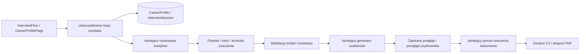

# English

## Career profile and interviews

This is the implementation tutorial for the shared interview introduced on 10 September 2026. The manual starter, legacy `BioCvDraft` recovery, saved CVs and ordinary PDF export remain compatible. No new runtime dependency or environment variable is required.

### Follow the user flow

1. Open `/app/interview` through **Utwórz CV z pomocą wywiadu**, or open the assistant in an existing CV. **Dopasuj do oferty → Dopasuj z wywiadem — nowe CV** starts tailoring; **Uzupełnij CV przez wywiad** starts enrichment. The import panel also offers enrichment after filling the imported CV.
2. Select one owned CV/import or use the current career profile. For a new career history, enter identity, target role and a description of employment, education, projects or volunteering. Known identity fields are prefilled. Only successful imports are selectable; older imports can be loaded. The server never automatically combines the document library or `BioCvDraft`.
3. Review the initial facts. A fact has text, context, meaning and optionally a CV field. Conflicting values require correction or removal. Confirming saves the reviewed facts to the shared profile. A changed source value remains a separate proposal until resolved.
4. Ask the next question or generate immediately. Discovery uses the offer, current facts and previous answers. It returns at most one Polish question with a reason and requirement statuses: `matched`, `partial`, `unknown`, `gap`. Only a confirmed limitation supports `gap`. Five questions are allowed for tailoring and eight for creation/enrichment, including follow-ups. An explicit additional round adds up to five; a session is bounded at 50 questions.
5. Save a text answer, confirmed lack of experience, forgotten information or a skip. These are separate statuses. Only text and explicit lack produce proposed facts. Answers are stored before another provider call; their proposals must be confirmed or removed before generation. The original answer remains in the session history when the accepted fact is edited.
6. Select a template if necessary and generate. If verification finds an unresolved detail, answer the proposed clarification round, confirm the answers and regenerate, or explicitly skip to the confirmed fallback. Then review the complete CV text, cited changes, uncertainties and page count. Tailoring retains a recognized source template and supported spacing. An unknown template requires selection. The existing gallery supplies previews; manual element positions are regenerated. There is no automatic content deletion to force a page limit.
7. **Zapisz jako nowe CV** creates an ordinary document and opens `/app/documents/:id`. The source is never updated. The title uses offer role (or CV headline), company (or `Profil` when unavailable), UTC date and a numbered suffix for existing titles. Existing PDF download/export billing still applies.

`/app/career-profile` lets the owner edit/clear facts, browse sessions, resume them or delete a session. Profile CRUD, answer persistence, confirmation and history access do not spend AI credits, including after Pro expires. Starting an interview and provider operations require the existing Pro entitlement. Clearing the profile leaves saved documents and interview histories intact; deleting a session leaves confirmed profile facts and generated documents intact.

Profile and fact review use a grouped workspace. Select a section, search across the profile, open one record and edit one field. Apply commits the local field draft; Cancel/Escape discards it. Save/confirm remains explicit and versioned. Lists show six records and eight fields per page, preserving every underlying fact ID. Equivalent display entries do not merge database facts, and differing values remain reviewable. See the main README feature map for the full editing contract and module references.

### Architecture and responsibilities


- `InterviewFlow` owns transient form input and calls `interviewRequest`; `FactEditor` edits a controlled fact list; `CvContent` renders semantic text instead of technical JSON. `CareerProfilePage` owns account profile management. The assistant embeds the same flow and detects changes to its captured live CV.
- `interviews.py` checks authentication, ownership, request versions and entitlements, resolves the selected source, and coordinates atomic confirmation and document creation. `interview_schema.py` bounds public inputs and strict provider output with Pydantic. Unexpected properties are rejected.
- `interview_service.py` owns stable evidence identifiers, profile/session compare-and-swap updates, bounded questions, paid provider calls and deterministic draft assembly. SQLAlchemy owns persistence; Alembic owns schema upgrades. FastAPI validates request bodies; React owns presentation. Existing ReportLab/template services own A4 layout and PDF bytes.
- The provider generates scalar `path/value/evidence_refs` changes, never SQL, geometry or storage operations. Each field must cite current profile facts. Offer text is untrusted prioritization data and is explicitly excluded as evidence of candidate competence.
- Assembly checks allowed paths, nonempty values, existing references, cited numbers, unchanged contact identity, role context and literal accepted framings. A separate model operation checks semantic support and lost qualifications. These checks reduce unsupported claims; they do not prove arbitrary truth. The candidate still reviews the final text. Unchanged base fields retain current confirmed content.
- Profile changes invalidate old previews through their revision. Generation reconstructs its base only from current confirmed facts, not old session snapshots. A changed saved source can be refreshed inside the session; new source facts require review and the preview is invalidated. A deleted source requires selecting another source in a new interview. Unsaved source edits are detected by the assistant before generation/save.

### Database

Migration: `backend/alembic/versions/20260910_0017_career_interviews.py`, revision `20260910_0017`, parent `20260909_0016`. Tables use the existing database connection and SQLAlchemy session. There is no profile seed or automatic migration of old bio drafts.

| Table / field | SQLAlchemy type and constraint | Meaning / application default |
| --- | --- | --- |
| `career_profiles.owner_id` | Integer, primary key, FK `users.id`, delete cascade | Exactly one profile per owner |
| `revision` | Integer, non-null | Optimistic version, initially 1 |
| `facts` | JSON, non-null | Confirmed facts; initially `[]` |
| `updated_at` | DateTime, non-null | UTC write time |
| `interview_sessions.id` | String(36), primary key | UUID derived from owner and creation idempotency key |
| `owner_id` | Integer, non-null, indexed FK `users.id`, delete cascade | One owner has many sessions |
| `revision` | Integer, non-null | Optimistic version, initially 1 |
| `state` | JSON, non-null | Input snapshot, questions, answers, proposals, progress, preview and document ID |
| `created_at`, `updated_at` | DateTime, non-null | UTC timestamps |

Defaults above are application/ORM defaults, not SQL server defaults. All table columns are non-null. Optional fields inside JSON may be null. `state` records source document/import ID, source document revision, normalized CV, offer metadata/text, selected template, spacing, language, confirmation, question limit, answers, proposed facts and generated result. Phases are `intake`, `ready`, `question`, `review`, `clarification`, `preview`, `completed`. There is no FK from the snapshot to a source document: its historical content survives source deletion, but generation checks source availability.

Fact fields: stable `id` (1–100 characters), `text` (1–4000), `context` (up to 500), `kind` (`fact`, `gap`, `framing`), `path` (up to 200; empty for narrative evidence) and `source` (up to 150; manual/document/import/interview origin). At most 500 facts are accepted. Conflicting scalar paths, duplicate identifiers, unsupported paths and ancestor/child path collisions are rejected. Path indices are bounded to two digits. Profile deletion clears facts and increments the revision instead of resetting its epoch.

Rows contain personal data and remain until explicit deletion/account erasure; no automatic interview retention job is added. Account export includes `career_profile` and `interviews`; account erasure removes both tables' owner rows along with existing data. Operational logs contain event/status/operation and cost, never answer text. Provider reservation replay payloads follow the existing AI retention policy. Old histories/replay payloads are never treated as current profile evidence.

### API contracts

All routes require the existing bearer session; owner identity comes from authentication. `SessionWrite` is `{ "revision": 3, "profile_revision": 1 }`. Session mutations use these current versions; session and profile are separate counters. Foreign IDs return the same 404 as missing IDs.

| Method and path | Input | Successful response / handler |
| --- | --- | --- |
| GET `/career-profile` | None | `{revision,facts,updated_at}`; absent profile has revision 0; `get_profile` |
| PUT `/career-profile` | `{revision,facts}`; full replacement | Updated profile; `write_profile` |
| DELETE `/career-profile` | Required query `revision` ≥ 0 | Empty profile with incremented revision; `clear_profile` |
| POST `/ai/interviews` | `InterviewCreate`; required `Idempotency-Key` (1–128 chars) | 201 session; `create_interview` |
| GET `/ai/interviews` | Optional `offset` ≥ 0 | `{items,next_offset}`, up to 50 summaries; `list_interviews` |
| GET `/ai/interviews/{id}` | Session ID | Full session; `get_interview` |
| DELETE `/ai/interviews/{id}` | Session ID | `{deleted:true}`; `delete_interview` |
| POST `/{id}/answers` under `/ai/interviews` | SessionWrite + `question_id`, `answer`, `status` | Updated session; `answer_interview` |
| POST `/{id}/next` | SessionWrite | Question/requirements or review phase; `next_interview` |
| POST `/{id}/confirm` | SessionWrite + complete reviewed `facts` | `{session,profile}` committed atomically; `confirm_interview` |
| POST `/{id}/extend` | SessionWrite | Updated question limit; `extend_interview` |
| POST `/{id}/source` | SessionWrite + optional live `cv_data`, `template_id`, `spacing_px` | Refreshed session in intake review; `refresh_interview_source` |
| POST `/{id}/preview` | SessionWrite + `template_id` | Session with clarification questions or verified preview; `preview_interview` |
| POST `/{id}/clarify` | SessionWrite | Start up to five saved questions, without an AI call; `clarify_interview` |
| POST `/{id}/skip-clarifications` | SessionWrite | Defer uncertain details; show fallback or review saved answers; `skip_clarifications` |
| POST `/{id}/document` | SessionWrite | `{document_id:42}`; `save_interview_document`; requires resolved/deferred clarification |

Except creation (201), successful responses use 200. Common failures: 401 invalid/expired authentication; 403 plan/credit or template restrictions through existing entitlement errors; 404 missing/foreign source/session; 409 optimistic conflict, mismatched retry key or pending AI reservation; 413 transport/context size; 422 schema/content/template errors; 500 provider unavailable; 503 database readiness unavailable. Recoverable interview errors use `{detail:{code,message}}`; FastAPI field validation uses its standard detail array. Existing billing/storage errors retain their established codes.

Creation accepts `mode` (`create`, `enrich`, `tailor`), optional positive `source_document_id` or `source_import_id` (mutually exclusive), `cv_data`, `template_id`, `spacing_px`, `job_offer_url` (2048 chars), `job_description` (20000), `candidate_notes` (5000), and `language` (`pl/en/de/fr/es/uk/it/nl`). Tailoring requires an offer URL or pasted description accepted by the existing public-HTTPS resolver. Answers are at most 4000 characters; an `answered` status needs nonblank text. Other statuses are `no_experience`, `unknown`, `skipped`. JSON transport is limited to 1 MiB; creation/provider context is additionally bounded to 250000 encoded bytes.

Example sequence (authorization headers omitted):

```http
POST /ai/interviews
Idempotency-Key: demo-career-01
{"mode":"create","cv_data":{"name":"Anna Nowak"},"candidate_notes":"Projekt raportowania na studiach.","language":"pl"}
```

The 201 response contains the new `id`, `revision:1`, `phase:"intake"`, `proposed_facts` and `profile_revision`. Read the profile, edit the facts, then send the complete reviewed list to `/{id}/confirm`. Use the returned versions for `next`, `answers`, and `preview`. `source` without live data reloads the owned saved CV; with live data it snapshots the current editor without writing the source. Completed sessions cannot refresh their source. A preview includes `cv_data`, cited `changes`, `remaining_gaps`, `elements`, `pages` and `profile_revision`. The frontend shows the content and page count; only the generated element graph enters the PDF writer. Saving returns an ordinary document ID.


The preview also contains `review_notes: [{path, action}]`, where `action` is `kept_original` or `omitted_suggestion`, and `recovered_previous_attempt: boolean`. `InterviewReviewNotice` converts these into neutral, collapsible explanations. Neither raw verification reasons nor JSON paths appear in the interface or PDF. Old sessions with `generation_feedback` show a recovery instruction instead of provider diagnostics. Retained text stays verbatim, so rejected translations can leave some content in its original language; review the full CV before saving. This release changes session JSON only and needs no additional migration.

Before the final preview, unresolved proposals enter `phase: "clarification"`. The existing paid verification returns neutral Polish `clarifications: [{path, question}]`; old cached results use a contextual fallback with the AI suggestion explicitly labelled as unconfirmed. `interview_clarification.py` creates up to five stable topics and skips previously answered/dismissed ones. `pending_clarifications` persists the queue; `clarification_round` enables automatic fact review after the final answer. Starting the round through `clarify` is explicit consent to at most five additional questions, within the session cap of 50. Each answer uses the existing replay-safe `answers` endpoint and the four distinct statuses. `answered`/`no_experience` create draft fact/gap proposals and invalidate the fallback; confirmation precedes paid regeneration. Unknown/skipped answers do not create gaps. `skip-clarifications` records dismissed topics, preserves previous answers and exposes only current confirmed content; it never bypasses source/profile checks. Starting saved questions, answering and skipping do not call AI or spend credits. A subsequent requested generation uses the normal draft and verification charges. Saved questions can be resumed after network failure or logout. `document` returns 409 while clarification is active.

### Credits and recovery

Questions use one paid operation. Preview uses draft generation plus a separately reserved semantic verification operation. Both use the existing `improve` provider configuration, `API_GPT_KEY`, reservation ceiling and actual-cost settlement. No fixed interview price or new credit package is introduced. A rejected model result can still consume the provider's actual cost. Saving/reviewing facts and saving the resulting document do not add an AI charge.

Creation UUIDs are stable per owner/idempotency key. Answers replay by question ID and identical content; changing an already saved answer is rejected so corrections happen in fact review. Provider keys include session ID, session revision, profile revision and operation. Cached completion precedes session commit: retries after a lost response reuse the completed result. Unknown provider outcomes follow the existing pending-reservation TTL; do not blindly refund a possibly completed request. Rejected fields retain their current confirmed value; unsupported additions are omitted. Rejected record identity also excludes dependent generated content. The remaining verified changes form an internal fallback held until clarification is resolved or explicitly skipped; structural conflicts fall back to the confirmed base. This filtering does not trigger another provider call. `interview_recovery.py` implements the recovery and revalidates the resulting document. Existing rejected sessions can reuse the immediately preceding settled draft and verification responses for the same owner and unchanged profile/source, without another AI charge. Missing, expired or stale responses require the normal paid generation path.

Document creation uses `interview-document:{session_id}` with the existing idempotent storage saga. A retry after PDF commit resolves the same document. Source/profile conflicts never overwrite the CV. On a network/credit/login error, persisted answers remain available; the browser retains the current input while mounted. **Wczytaj zapisany stan** recovers authoritative state. Unsubmitted keystrokes are not stored across a browser restart. A definitive failed attempt advances the session revision; reload before starting a new attempt. A fresh attempt can incur new provider cost, including regenerating a draft when its verification failed. After a changed source, use **Wczytaj aktualne CV do wywiadu**; answered questions and manual proposals survive. The action is disabled while an unsaved answer is present. Confirm the refreshed source facts before generating again.

### Verification and rollout

From `backend/`, with the existing development environment active:

```sh
python -m pytest tests/test_interviews.py tests/test_interview_recovery.py tests/test_alembic_interviews.py tests/test_ai_credit_reservations.py tests/test_account_privacy.py
python -m app.services.deployment_bootstrap
```

The bootstrap runs configured migrations and existing seeds; use it against the intended development/staging database. From `frontend/`:

```sh
npm test
npm run test:runtime
npm run test:e2e -- e2e/career-profile.spec.js e2e/interviews.spec.js --project=desktop-chromium
npm run lint
npm run build
```

The interview backend tests use isolated SQLite and mocked provider output. They cover owner isolation, revisions, profile deletion epochs, answer semantics, replay billing, rejected claims, document idempotency, real ReportLab output and account erasure. Migration tests exercise additive upgrade/re-entry and downgrade. Runtime tests check save-before-next, failure recovery and focus; Playwright uses a hermetic API fixture for creation/resume, profile editing, assistant tailoring, reduced motion, 200% text reflow and four viewport widths. These tests do not constitute live-model quality evaluation, production PostgreSQL migration verification, or a human screen-reader audit.

Deploy migration/backend first using the existing Render predeploy bootstrap. Wait for `/ready` to pass, smoke-test authenticated profile/session operations, then deploy the frontend. The repository change itself does not deploy production. Roll back frontend/backend while retaining additive tables when possible; Alembic downgrade destroys profile/interview rows but leaves generated CVs. No background interview worker, new secret, dependency, automatic library merge or automatic content truncation is introduced.

### References and attribution

- [Career Profile Builder](https://github.com/vignzpie/resume-agent-skills/blob/main/career-profile-builder/SKILL.md) and [Resume Tailor](https://github.com/vignzpie/resume-agent-skills/blob/main/resume-tailor/SKILL.md) — adapted interview methodology and evidence-based tailoring, authored by Vignesh Pai. The application owns persistence, limits and layout. Full [MIT notice](licenses/resume-agent-skills-MIT.txt) is retained; [upstream license](https://github.com/vignzpie/resume-agent-skills/blob/main/LICENSE).
- [FastAPI request bodies](https://fastapi.tiangolo.com/tutorial/body/) — request-model validation used at the API boundary.
- [Alembic tutorial](https://alembic.sqlalchemy.org/en/latest/tutorial.html) — migration history, upgrade and downgrade concepts used by deployment.
- [React shared state](https://react.dev/learn/sharing-state-between-components) — controlled state shared by the interview controller and fact editor.

---

# Polski

## Profil zawodowy i wywiady

To instrukcja techniczna wspólnego wywiadu dodanego 10 września 2026 r. Ręczny kreator, odzyskiwanie starego `BioCvDraft`, zapisane CV i zwykły eksport PDF pozostają kompatybilne. Nie dodano zależności uruchomieniowej ani zmiennej środowiskowej.

### Przejdź przez ścieżkę użytkownika

1. Otwórz `/app/interview` przez **Utwórz CV z pomocą wywiadu** albo asystenta w istniejącym CV. **Dopasuj do oferty → Dopasuj z wywiadem — nowe CV** rozpoczyna dopasowanie; **Uzupełnij CV przez wywiad** rozpoczyna uzupełnianie. Panel importu oferuje też wywiad po wypełnieniu CV danymi importu.
2. Wybierz jedno własne CV/import lub użyj aktualnego profilu. Dla nowej historii podaj tożsamość, stanowisko docelowe oraz opis pracy, edukacji, projektów lub wolontariatu. Znane dane podstawowe są wypełnione. Można wybrać tylko udane importy i doładować starsze. Serwer nie łączy sam biblioteki dokumentów ani `BioCvDraft`.
3. Sprawdź początkowe informacje: treść, kontekst, znaczenie i opcjonalne pole CV. Sprzeczne wartości wymagają poprawienia lub usunięcia. Zatwierdzenie zapisuje przejrzane fakty do wspólnego profilu. Zmieniona wartość źródłowa pozostaje osobną propozycją do rozstrzygnięcia.
4. Pobierz pytanie lub od razu wygeneruj CV. Analiza korzysta z oferty, aktualnych faktów i odpowiedzi. Zwraca najwyżej jedno polskie pytanie z uzasadnieniem oraz statusy wymagań: `matched`, `partial`, `unknown`, `gap`. Tylko potwierdzone ograniczenie uzasadnia `gap`. Limit to pięć pytań przy dopasowaniu i osiem przy tworzeniu/uzupełnianiu, łącznie z doprecyzowaniami. Dobrowolna runda dodaje do pięciu; sesja jest ograniczona do 50 pytań.
5. Zapisz tekst, potwierdzony brak doświadczenia, brak pamięci lub pominięcie. To różne statusy. Tylko tekst i jawny brak tworzą propozycje faktów. Odpowiedź zapisuje się przed kolejnym wywołaniem modelu; propozycje trzeba zatwierdzić lub usunąć przed generowaniem. Pierwotna odpowiedź pozostaje w historii po poprawieniu zaakceptowanego faktu.
6. W razie potrzeby wybierz szablon, wygeneruj i sprawdź całą treść CV, zmiany ze źródłami, niepewności i liczbę stron. Dopasowanie zachowuje rozpoznany szablon źródła i obsługiwane odstępy. Nieznany szablon wymaga wyboru. Podglądy pochodzą z istniejącej galerii; ręczne pozycje elementów są przeliczane. Nie usuwa się automatycznie treści dla limitu stron.
7. **Zapisz jako nowe CV** tworzy zwykły dokument i otwiera `/app/documents/:id`. Źródło nie jest aktualizowane. Nazwa zawiera stanowisko oferty (lub nagłówek CV), firmę (lub `Profil`, gdy jej nie podano), datę UTC i numerowany sufiks przy istniejącej nazwie. Nadal obowiązuje istniejące rozliczanie pobierania/eksportu PDF.

`/app/career-profile` pozwala edytować/czyścić profil, przeglądać i wznawiać sesje oraz usuwać rozmowy. Zarządzanie profilem, zapis odpowiedzi, zatwierdzanie i historia nie zużywają kredytów, również po wygaśnięciu Pro. Rozpoczęcie wywiadu i operacje modelu wymagają obecnego uprawnienia Pro. Wyczyszczenie profilu pozostawia dokumenty i historie rozmów; usunięcie sesji pozostawia potwierdzone fakty i wygenerowane dokumenty.

Profil i przegląd faktów korzystają z grupowanego obszaru pracy. Wybierz sekcję, przeszukaj profil, otwórz wpis i edytuj jedno pole. Zastosowanie zatwierdza lokalny szkic pola; Anuluj/Escape go odrzuca. Zapis/zatwierdzenie pozostają jawne i wersjonowane. Listy pokazują sześć wpisów i osiem pól na stronę, zachowując każde ID faktu. Zgodne elementy widoku nie łączą faktów w bazie, a różne wartości pozostają dostępne do sprawdzenia. Pełny kontrakt edycji i odwołania do modułów znajdują się w mapie funkcji README.

### Architektura i odpowiedzialności



- `InterviewFlow` przechowuje bieżące pola formularza i wywołuje `interviewRequest`; `FactEditor` edytuje kontrolowaną listę faktów; `CvContent` pokazuje semantyczną treść zamiast technicznego JSON. `CareerProfilePage` obsługuje profil konta. Asystent osadza ten sam przepływ i wykrywa zmianę przechwyconego CV.
- `interviews.py` sprawdza logowanie, właściciela, wersje i uprawnienia, pobiera wskazane źródło oraz koordynuje atomowe zatwierdzenie i zapis dokumentu. `interview_schema.py` ogranicza wejścia i ścisłe wyniki modelu przez Pydantic. Nieznane właściwości są odrzucane.
- `interview_service.py` odpowiada za stabilne identyfikatory dowodów, aktualizacje profilu/sesji z kontrolą wersji, limit pytań, płatne wywołania i deterministyczne składanie treści. SQLAlchemy zapisuje dane, Alembic aktualizuje schemat, FastAPI waliduje żądania, React zarządza prezentacją. Istniejące usługi ReportLab/szablonów tworzą układ A4 i PDF.
- Model proponuje skalarne zmiany `path/value/evidence_refs`, nigdy SQL, geometrię ani operacje magazynu. Każde pole musi wskazywać aktualne fakty profilu. Oferta jest niezaufanym źródłem priorytetów i nie stanowi dowodu kompetencji.
- Składanie sprawdza dozwolone ścieżki, niepuste wartości, źródła, liczby, niezmienioną tożsamość, kontekst ról i dosłowne zaakceptowane sformułowania. Osobne wywołanie modelu ocenia zgodność znaczenia i utracone zastrzeżenia. Kontrole ograniczają niepotwierdzone twierdzenia, ale nie dowodzą dowolnej prawdziwości. Użytkownik nadal sprawdza wynik. Niezmienione pola bazowe zachowują aktualną potwierdzoną treść.
- Zmiana rewizji profilu unieważnia stary podgląd. Generowanie odtwarza bazę tylko z aktualnych potwierdzonych faktów, nigdy ze starej migawki rozmowy. Zmianę zapisanego źródła można wczytać w tej samej sesji; nowe fakty wymagają przeglądu, a podgląd zostaje unieważniony. Usunięte źródło wymaga wskazania innego w nowym wywiadzie. Asystent wykrywa niezapisane zmiany źródła przed generowaniem/zapisem.

### Baza danych

Migracja: `backend/alembic/versions/20260910_0017_career_interviews.py`, rewizja `20260910_0017`, rodzic `20260909_0016`. Tabele korzystają z obecnego połączenia i sesji SQLAlchemy. Nie ma seeda profilu ani automatycznej migracji starych szkiców bio.

| Tabela / pole | Typ SQLAlchemy i ograniczenie | Znaczenie / domyślna wartość aplikacji |
| --- | --- | --- |
| `career_profiles.owner_id` | Integer, klucz główny, FK `users.id`, usuwanie kaskadowe | Jeden profil właściciela |
| `revision` | Integer, nie-null | Wersja optymistyczna, początkowo 1 |
| `facts` | JSON, nie-null | Potwierdzone fakty; początkowo `[]` |
| `updated_at` | DateTime, nie-null | Czas zapisu UTC |
| `interview_sessions.id` | String(36), klucz główny | UUID z właściciela i klucza idempotencji utworzenia |
| `owner_id` | Integer, nie-null, indeks, FK `users.id`, kaskada | Właściciel ma wiele sesji |
| `revision` | Integer, nie-null | Wersja optymistyczna, początkowo 1 |
| `state` | JSON, nie-null | Migawka wejścia, pytania, odpowiedzi, propozycje, postęp, podgląd i ID dokumentu |
| `created_at`, `updated_at` | DateTime, nie-null | Czasy UTC |

To wartości domyślne aplikacji/ORM, nie domyślne SQL serwera. Wszystkie kolumny są nie-null; pola opcjonalne w JSON mogą być null. `state` zawiera ID źródłowego dokumentu/importu, rewizję dokumentu, znormalizowane CV, metadane/tekst oferty, szablon, odstępy, język, zatwierdzenie, limit pytań, odpowiedzi, propozycje i wynik. Fazy: `intake`, `ready`, `question`, `review`, `clarification`, `preview`, `completed`. Migawka nie ma FK do dokumentu źródłowego: historia przetrwa jego usunięcie, ale generowanie sprawdza dostępność źródła.

Pola faktu: stabilne `id` (1–100 znaków), `text` (1–4000), `context` (do 500), `kind` (`fact`, `gap`, `framing`), `path` (do 200; puste dla opisu) i `source` (do 150; pochodzenie manual/document/import/interview). Limit wynosi 500 faktów. Sprzeczne ścieżki, powtórzone identyfikatory, niedozwolone ścieżki i kolizje pola z jego potomkiem są odrzucane. Indeksy ścieżek mają najwyżej dwie cyfry. Usunięcie profilu czyści fakty i zwiększa rewizję, zamiast resetować epokę.

Rekordy zawierają dane osobowe i pozostają do usunięcia przez właściciela lub skasowania konta; nie dodano automatycznej retencji rozmów. Eksport konta zawiera `career_profile` i `interviews`; usunięcie konta kasuje wiersze właściciela z obu tabel wraz z pozostałymi danymi. Logi zawierają zdarzenie/status/operację i koszt, nigdy tekst odpowiedzi. Zapisane wyniki rezerwacji podlegają obecnej retencji AI. Stare historie i wyniki ponowień nie są aktualnym źródłem faktów profilu.

### Kontrakty API

Wszystkie trasy wymagają obecnej sesji bearer; właściciel pochodzi z uwierzytelnienia. `SessionWrite` to `{ "revision": 3, "profile_revision": 1 }`. Operacje korzystają z aktualnych wersji; profil i sesja mają osobne liczniki. Cudze i nieistniejące ID zwracają to samo 404.

| Metoda i ścieżka | Wejście | Wynik sukcesu / handler |
| --- | --- | --- |
| GET `/career-profile` | Brak | `{revision,facts,updated_at}`; brak profilu oznacza rewizję 0; `get_profile` |
| PUT `/career-profile` | `{revision,facts}`; pełne zastąpienie | Aktualny profil; `write_profile` |
| DELETE `/career-profile` | Wymagany query `revision` ≥ 0 | Pusty profil z większą rewizją; `clear_profile` |
| POST `/ai/interviews` | `InterviewCreate`; wymagany `Idempotency-Key` (1–128 znaków) | 201, sesja; `create_interview` |
| GET `/ai/interviews` | Opcjonalny `offset` ≥ 0 | `{items,next_offset}`, do 50 podsumowań; `list_interviews` |
| GET `/ai/interviews/{id}` | ID sesji | Pełna sesja; `get_interview` |
| DELETE `/ai/interviews/{id}` | ID sesji | `{deleted:true}`; `delete_interview` |
| POST `/{id}/answers` pod `/ai/interviews` | SessionWrite + `question_id`, `answer`, `status` | Aktualna sesja; `answer_interview` |
| POST `/{id}/next` | SessionWrite | Pytanie/wymagania lub podsumowanie; `next_interview` |
| POST `/{id}/confirm` | SessionWrite + pełne zatwierdzane `facts` | `{session,profile}`, zapis atomowy; `confirm_interview` |
| POST `/{id}/extend` | SessionWrite | Nowy limit pytań; `extend_interview` |
| POST `/{id}/source` | SessionWrite + opcjonalne bieżące `cv_data`, `template_id`, `spacing_px` | Odświeżona sesja do przeglądu; `refresh_interview_source` |
| POST `/{id}/preview` | SessionWrite + `template_id` | Sesja z pytaniami doprecyzowującymi albo sprawdzonym podglądem; `preview_interview` |
| POST `/{id}/clarify` | SessionWrite | Rozpoczęcie do pięciu zapisanych pytań bez wywołania AI; `clarify_interview` |
| POST `/{id}/skip-clarifications` | SessionWrite | Pominięcie szczegółów; wersja potwierdzona albo przegląd zapisanych odpowiedzi; `skip_clarifications` |
| POST `/{id}/document` | SessionWrite | `{document_id:42}`; `save_interview_document`; wymaga rozstrzygnięcia/pominięcia doprecyzowania |

Poza utworzeniem (201), sukcesy używają 200. Błędy wspólne: 401 brak/wygaśnięcie sesji; 403 ograniczenia planu/kredytów lub szablonu przez istniejące błędy uprawnień; 404 brak/cudze źródło lub sesja; 409 konflikt wersji, inny payload klucza lub trwająca rezerwacja; 413 rozmiar transportu/kontekstu; 422 schemat/treść/szablon; 500 niedostępny provider; 503 brak gotowości bazy. Błędy wywiadu mają `{detail:{code,message}}`; walidacja pól FastAPI używa standardowej tablicy detail. Błędy rozliczeń/magazynu zachowują dotychczasowe kody.

Tworzenie przyjmuje `mode` (`create`, `enrich`, `tailor`), opcjonalne dodatnie `source_document_id` albo `source_import_id` (wzajemnie wykluczające się), `cv_data`, `template_id`, `spacing_px`, `job_offer_url` (2048 znaków), `job_description` (20000), `candidate_notes` (5000) i `language` (`pl/en/de/fr/es/uk/it/nl`). Dopasowanie wymaga linku lub treści akceptowanej przez istniejący resolver publicznych stron HTTPS. Odpowiedź ma do 4000 znaków; `answered` wymaga niepustego tekstu. Pozostałe statusy: `no_experience`, `unknown`, `skipped`. Limit transportu JSON to 1 MiB; wejście utworzenia/kontekst modelu ma dodatkowo limit 250000 zakodowanych bajtów.

Przykład (pominięto nagłówki uwierzytelnienia):

```http
POST /ai/interviews
Idempotency-Key: demo-career-01
{"mode":"create","cv_data":{"name":"Anna Nowak"},"candidate_notes":"Projekt raportowania na studiach.","language":"pl"}
```

Odpowiedź 201 zawiera nowe `id`, `revision:1`, `phase:"intake"`, `proposed_facts` i `profile_revision`. Pobierz profil, popraw fakty, a kompletną listę wyślij do `/{id}/confirm`. Zwrócone wersje wykorzystaj w `next`, `answers` i `preview`. `source` bez bieżących danych odczytuje własne zapisane CV; z danymi przechwytuje stan edytora bez zapisu źródła. Ukończona sesja nie może odświeżyć źródła. Podgląd zawiera `cv_data`, zmiany ze źródłami `changes`, `remaining_gaps`, `elements`, `pages` i `profile_revision`. Frontend pokazuje treść i liczbę stron; do zapisu PDF trafia wyłącznie wygenerowany graf elementów. Zapis zwraca zwykłe ID dokumentu.


Podgląd zawiera też `review_notes: [{path, action}]`, gdzie `action` to `kept_original` albo `omitted_suggestion`, oraz `recovered_previous_attempt: boolean`. `InterviewReviewNotice` zamienia te dane na neutralne, rozwijane wyjaśnienia. Surowe uzasadnienia weryfikacji i ścieżki JSON nie pojawiają się w interfejsie ani PDF. Stare sesje z `generation_feedback` pokazują instrukcję odzyskania zamiast diagnostyki modelu. Zachowana treść pozostaje dosłowna, więc po odrzuceniu tłumaczenia część CV może pozostać w pierwotnym języku; przed zapisem należy przejrzeć całość. Ta poprawka zmienia wyłącznie JSON sesji i nie wymaga dodatkowej migracji.

Przed końcowym podglądem nierozstrzygnięte propozycje przechodzą do `phase: "clarification"`. Obecna płatna weryfikacja zwraca neutralne polskie `clarifications: [{path, question}]`; stare zapisane wyniki korzystają z pytania kontekstowego z propozycją AI wyraźnie oznaczoną jako niepotwierdzona. `interview_clarification.py` tworzy do pięciu stabilnych tematów i pomija wcześniej rozstrzygnięte/pominięte. `pending_clarifications` przechowuje kolejkę; `clarification_round` włącza automatyczny przegląd faktów po ostatniej odpowiedzi. Uruchomienie przez `clarify` jest świadomą zgodą na najwyżej pięć dodatkowych pytań, w granicy 50 dla sesji. Odpowiedź korzysta z obecnego idempotentnego endpointu `answers` i czterech odrębnych statusów. `answered`/`no_experience` tworzą szkic faktu/braku i unieważniają wersję zapasową; zatwierdzenie poprzedza płatną regenerację. Niepamiętanie/pominięcie nie tworzą braków doświadczenia. `skip-clarifications` zapisuje pominięte tematy, zachowuje wcześniejsze odpowiedzi i udostępnia tylko aktualną potwierdzoną treść; nie omija kontroli źródła/profilu. Rozpoczęcie zapisanych pytań, odpowiedzi i pominięcie nie wywołują AI ani nie zużywają kredytów. Kolejne żądane generowanie rozlicza zwykły koszt treści i weryfikacji. Zapisane pytania można wznowić po błędzie sieci lub wylogowaniu. `document` zwraca 409, gdy doprecyzowanie jest aktywne.

### Kredyty i odzyskiwanie

Pytanie to jedna płatna operacja. Podgląd obejmuje generowanie treści i osobno rezerwowaną kontrolę semantyczną. Obie korzystają z obecnej konfiguracji `improve`, `API_GPT_KEY`, pułapu rezerwacji i rozliczenia rzeczywistego kosztu. Nie wprowadzono stałej ceny wywiadu ani pakietu kredytów. Odrzucony wynik może nadal zużyć rzeczywisty koszt providera. Zapis/przegląd faktów i zapis wynikowego dokumentu nie dodają opłaty AI.

UUID utworzenia jest stałe dla właściciela i klucza. Odpowiedź jest ponawiana przez ID pytania i identyczną treść; zmiana zapisanej odpowiedzi jest odrzucana, a poprawki wykonuje się w przeglądzie faktów. Klucze modelu zawierają ID sesji, jej rewizję, rewizję profilu i operację. Wynik zapisuje się przed aktualizacją sesji, więc po utracie odpowiedzi używany jest istniejący wynik. Niejednoznaczny wynik providera podlega obecnemu TTL rezerwacji; nie należy zwracać kosztu wywołania, które mogło się zakończyć. Odrzucone pola zachowują aktualną potwierdzoną wartość; nieuzasadnione dodatki są pomijane. Odrzucona tożsamość roli lub projektu wyklucza również zależną treść wygenerowaną dla tego wpisu. Pozostałe sprawdzone zmiany tworzą wewnętrzną wersję zachowywaną do rozstrzygnięcia albo świadomego pominięcia doprecyzowania; konflikty struktury powodują powrót do potwierdzonej podstawy. Filtrowanie nie uruchamia kolejnego wywołania modelu. `interview_recovery.py` odpowiada za odzyskiwanie i ponowną walidację dokumentu. Istniejąca odrzucona sesja może wykorzystać bez dodatkowej opłaty wyniki generowania i weryfikacji z bezpośrednio poprzedniej rozliczonej próby, dla tego samego właściciela i niezmienionego profilu/źródła. Brak, wygaśnięcie lub nieaktualność wyników wymaga zwykłej płatnej ścieżki generowania.

Tworzenie dokumentu używa `interview-document:{session_id}` i obecnego idempotentnego procesu magazynu. Ponowienie po zapisie PDF zwraca ten sam dokument. Konflikty profilu/źródła nie nadpisują CV. Przy błędzie sieci/kredytów/logowania zapisane odpowiedzi pozostają dostępne, a otwarta przeglądarka zachowuje bieżące pole. **Wczytaj zapisany stan** pobiera stan serwera. Niewysłane znaki nie są zachowywane po ponownym uruchomieniu przeglądarki. Jednoznacznie nieudana próba zwiększa rewizję sesji; przed nową próbą wczytaj stan. Nowa próba może zużyć nowe kredyty, również gdy trzeba ponownie wygenerować treść po błędzie jej weryfikacji. Po zmianie źródła użyj **Wczytaj aktualne CV do wywiadu**; zapisane odpowiedzi i ręczne propozycje pozostają. Akcja jest zablokowana, gdy bieżąca odpowiedź nie została zapisana. Zatwierdź odświeżone fakty przed ponownym generowaniem.

### Weryfikacja i wdrożenie

W `backend/`, z aktywnym dotychczasowym środowiskiem deweloperskim:

```sh
python -m pytest tests/test_interviews.py tests/test_interview_recovery.py tests/test_alembic_interviews.py tests/test_ai_credit_reservations.py tests/test_account_privacy.py
python -m app.services.deployment_bootstrap
```

Bootstrap uruchamia skonfigurowane migracje i dotychczasowe seedy; wybierz właściwą bazę lokalną/staging. W `frontend/`:

```sh
npm test
npm run test:runtime
npm run test:e2e -- e2e/career-profile.spec.js e2e/interviews.spec.js --project=desktop-chromium
npm run lint
npm run build
```

Testy backendu używają izolowanego SQLite i odpowiedzi zastępczego providera. Sprawdzają właścicieli, wersje, epoki usunięcia, znaczenie odpowiedzi, rozliczenie ponowień, odrzucanie twierdzeń, idempotencję dokumentu, rzeczywisty PDF ReportLab i usuwanie konta. Testy migracji obejmują dodanie tabel, powtórne wejście i downgrade. Runtime sprawdza zapis przed pytaniem, błędy i fokus; Playwright używa izolowanego API dla tworzenia/wznawiania, profilu, dopasowania w asystencie, reduced motion, powiększenia tekstu 200% i czterech szerokości. Nie zastępuje to oceny rzeczywistego modelu, migracji produkcyjnego PostgreSQL ani ręcznego audytu czytnikiem ekranu.

Najpierw wdroż migrację/backend przez obecny predeploy Render. Poczekaj na poprawne `/ready`, sprawdź uwierzytelnione operacje profilu/sesji, potem wdróż frontend. Sama zmiana repozytorium nie wdraża produkcji. W razie cofnięcia preferuj rollback frontendu/backendu z zachowaniem nowych tabel; downgrade Alembic usuwa profil/rozmowy, pozostawiając wygenerowane CV. Nie dodano workera wywiadów, sekretu, zależności, automatycznego scalania biblioteki ani obcinania treści.

### Źródła i autorstwo

- [Career Profile Builder](https://github.com/vignzpie/resume-agent-skills/blob/main/career-profile-builder/SKILL.md) i [Resume Tailor](https://github.com/vignzpie/resume-agent-skills/blob/main/resume-tailor/SKILL.md) — adaptacja metodyki rozmowy i dopasowania na potwierdzonych danych autorstwa Vignesha Paia. Aplikacja zarządza zapisem, limitami i układem. Zachowano pełną [licencję MIT](licenses/resume-agent-skills-MIT.txt); [licencja źródłowa](https://github.com/vignzpie/resume-agent-skills/blob/main/LICENSE).
- [Żądania FastAPI](https://fastapi.tiangolo.com/tutorial/body/) — walidacja modeli na granicy API.
- [Instrukcja Alembic](https://alembic.sqlalchemy.org/en/latest/tutorial.html) — historia migracji, upgrade i downgrade używane przy wdrożeniu.
- [Wspólny stan React](https://react.dev/learn/sharing-state-between-components) — kontrolowany stan wspólny dla wywiadu i edytora faktów.
