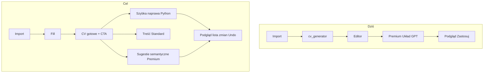

# Roadmap: korektor CV + przewidywalny Układ

**Status:** odłożony na później (2026-08-03). Nie wdrażać teraz — wrócić od Fazy 0.

**Decyzje:** model płatności zostaje Free / Standard / Premium (A). Zakres = pełny roadmap fazowy: pozycjonowanie + Układ + komunikacja wartości (3).

**Cel produktowy (jedno zdanie):** *Wgraj CV → popraw treść z AI → napraw układ konkretnymi akcjami → pobierz profesjonalny PDF.*

**Nisza:** polski korektor istniejącego CV z importerem, bezpiecznymi szablonami i automatyczną (deterministyczną) naprawą układu — nie kolejny „generator CV z AI”.

---

## Stan obecny (punkt wyjścia)

- Import + wizard + deterministyczny fill (`cv_generator`) już działają; edytor daje pełną kontrolę.
- „Układ” to dziś Premium toggle w `frontend/src/components/ai/AiAssistant/AiAssistant.jsx`: GPT dostaje pełny JSON A4 (`layout_gpt.py`), Python waliduje/clampuje, FE ma Podgląd/Zastosuj/Pomiń — **brak** osobnego undo na kartę i **brak** deterministycznego auto-skanu.
- Copy Hero nadal mówi o „generatorze/szablonach/Układzie AI” abstrakcyjnie (`Hero.jsx`); import ma techniczne „Wyodrębnij dane CV”.
- Po fill użytkownik ląduje na canvas bez jasnego „CV gotowe → Dopracuj / Pobierz”.

---

## Faza 0 — Pozycjonowanie i copy (FE + docs, ~kilka dni)

Bez zmian silnika. Zmieniamy obietnicę produktu.

### Landing / Hero
- Headline w stylu: **„Korektor i edytor CV — napraw treść i wygląd dokumentu.”**
- Podheadline: **„Wgraj CV. Popraw treść. Napraw układ. Pobierz PDF.”**
- Sekcja „Jak to działa” = 4 kroki z feedbacku (import/wizard → szablon → treść+układ → PDF).
- „Układ” opisuj konkretami: wyrównaj odstępy, napraw nachodzenia, ujednolić marginesy — nie „AI poprawia layout”.
- Obietnica uczciwa: *„Wykrywa problemy i proponuje bezpieczne poprawki”* / *„Automatyczny układ, pełna kontrola w edytorze.”*
- Pliki: `frontend/src/pages/Hero/Hero.jsx`, `FEATURES_MARKETING.md`, `docs/FEATURES.md`.

### Import
- CTA: **„Wczytaj moje CV”** / **„Importuj dane”** zamiast „Wyodrębnij dane CV” (`AiCvPanel.jsx`).
- Topbar: rozważyć „Wypełnij z PDF” → „Wczytaj CV z PDF”.

### Wizard (BioCv)
- Krok Podsumowanie: zaznaczenie szablonu + **jeden** główny „Utwórz CV” (bez przycisku w każdym wierszu) — `BioCvModal.jsx`.
- Opcjonalnie: wspólny `TemplateCarousel` jak w imporcie (spójność UX).

### Po wygenerowaniu (fill)
- Banner / toast na canvas:
  - Neutralnie: *„CV jest gotowe. Treść rozmieszczona w szablonie — pobierz PDF albo dopracuj układ w edytorze.”*
  - CTA: **Dopracuj w edytorze** (fokus na canvas) · **Pobierz PDF**.
- Gdy wykryty duży pusty obszar (próg z Fazy 1): wariant copy o wolnym miejscu + „Wyrównaj odstępy”.
- Miejsce: `PdfCanvas.jsx` po `loadAiElements` / sukcesie fill z AiCvPanel i BioCvModal.

### Asystent
- Po otwarciu: gotowe działania zamiast pustego chatu (już częściowo są chipy) — pogrupować: treść | układ | oferta.
- „Układ” w copy: tryb zaawansowany / Premium; podstawowe naprawy → osobne akcje (Faza 1).

### Kontrast edytora (mały UX)
- Delikatnie zwiększyć kontrast „kartki” vs chrome (CSS tokeny w edytorze) — bez jasnego motywu.

---

## Faza 1 — Szybka naprawa deterministyczna (BE + FE, MVP Układu)

**Zasada:** AI nie decyduje o 14 vs 16 px. Reguły tak.

### Backend — nowy endpoint / akcja
Dodać **`POST /ai/layout/quick_fix`** (lub `action: "layout_fix"` w asystencie **bez** GPT), które:
1. Buduje snapshot geometrii (reuse `build_layout_snapshot` / helpers z `layout_analysis.py`).
2. Uruchamia skaner reguł (nowy moduł np. `layout_rules.py`):
   - odstępy sekcji &lt; min → podnieś do `MIN_SECTION_GAP` (stałe z `cv_generator` / `layout_gpt` contract),
   - nachodzenia → rozsuń / report,
   - elementy poza stroną → clamp / przenieś sekcję,
   - sieroty nagłówek bez treści → keep-with-next,
   - duże puste dziury → flaga + opcjonalny kompakt w dozwolonym zakresie,
   - ujednolicenie lewego marginesu kolumny (align left w lane).
3. Zwraca **te same** `layout_groups` co dziś (title, reason, patches, severity) + agregat: *„Naprawiliśmy N problemów…”*.
4. **Zero LLM**, niski koszt kredytów lub darmowe w Standard (rekomendacja: Standard+; Premium zachowuje inteligentne sugestie).

### Frontend — menu zamiast jednego „Układ”
W Asystencie / toolbarze sekcja **Szybka naprawa**:
- Wyrównaj odstępy
- Usuń nachodzenia
- Ujednolić marginesy / nagłówki
- Wypełnij puste miejsca (kompakt)
- Pełna szybka naprawa (wszystkie reguły)

Każda akcja → ten sam flow kart: **Podgląd → Zastosuj / Pomiń** + **lista wykonanych zmian** + globalne Cofnij; docelowo przycisk **Cofnij tę operację** (snapshot przed apply).

### Gating (w ramach A)

| Akcja | Plan |
|-------|------|
| Szybka naprawa (reguły) | Standard+ |
| Inteligentne sugestie / skróć treść / 1 strona | Premium |
| Treść (gramatyka, oferta, ATS…) | Standard+ (jak dziś) |

Zmiany w `entitlements.py` + copy planów w `PlanSelectModal` / Hero FAQ.

### Testy
- Unittest skanera na fixture’ach z dziurą, overlapem, orphan heading.
- FE: smoke że quick_fix wypełnia karty bez `action=layout`.

---

## Faza 2 — Inteligentne sugestie (AI tylko semantycznie)

Przebudowa obecnego Premium `action=layout`:

1. **Skaner reguł najpierw** → lista problemów strukturalnych.
2. **GPT dostaje problemy + opcje strategii**, nie surowy „przesuń wszystko”:
   - którą sekcję skrócić,
   - czy przenieść na stronę 2,
   - czy kompresować rytm w limicie,
   - hierarchia / ATS (tekstowe rekomendacje).
3. Multi-strategy retry po stronie serwera (użytkownik nie klika 3×):
   - zmniejsz gap w limicie → kompakt sekcji → zaproponuj skrócenie treści → zaproponuj przeniesienie sekcji.
4. Odpowiedź UX:
   - *„Naprawiliśmy 6 problemów. Jedna sekcja nadal nie mieści się.”*
   - Wybór: **Skróć treść** | **Przenieś na 2. stronę** | **Zostaw**.
5. Menu Premium: Dopasuj do 1 / 2 stron · Skróć treść · Hierarchia · Wersja ATS (ATS = głównie treść + proste reguły, nie magia geometrii).

Pliki: `ai_assistant_service.py` (`_layout_session`), `layout_gpt.py`, AiAssistant chips/menu.

---

## Faza 3 — Dopracowanie generatora + komunikacja luk

Problem: fill czasem zostawia za duże odstępy między stronami.

- Dodać lekki **post-fill gap detector** (ten sam próg co quick_fix) po `generate_resume`.
- Nie pokazywać błędu — pokazać kontrolę: banner Fazy 0 + deep-link do „Wyrównaj odstępy”.
- Opcjonalnie: po fill automatycznie zaproponować kartę quick_fix (nie auto-apply).
- Długoterminowo: lekka poprawka w `Builder` / continuation Y w `cv_generator.py` dla rodzin z największymi dziurami (osobny ticket, nie blokuje UX).

---

## Faza 4 — Komunikacja wartości planów (bez zmiany modelu A)

Nie migrujemy na jednorazową płatność teraz. Przepisujemy **sens planów** pod korektor:

| Plan | Pozycjonowanie |
|------|----------------|
| **Free** | Import nie; wizard + startowe szablony + edytor + ograniczone eksporty. „Zacznij i zobacz wynik.” |
| **Standard** | Import PDF, poprawki treści AI, **Szybka naprawa układu**, szablony. „Napraw treść i podstawowy układ.” |
| **Premium** | Inteligentne sugestie (1 strona, skróty, strategie), wyższe limity. „Gdy dokument wymaga decyzji, nie tylko reguł.” |

Dodatkowy pomysł (roadmap, nie implementacja teraz): produkt **„Naprawa CV”** jako jednorazowy add-on / pakiet kredytów pod kampanię — osobna decyzja po walidacji Fazy 0–2.

Pakiet „aktywne szukanie pracy” (5 wersji + listy + match) = Faza późniejsza produktowa; wymaga nowych encji „wersja CV / oferta” — poza MVP.

---

## Własne propozycje (rozszerzenia)

1. **Raport naprawy (shareable)** — po quick_fix: PDF/ekran „co zmieniliśmy” (odstępy, kolizje) — dowód wartości vs ChatGPT+Canva.
2. **Diff wizualny przed/po** — półprzezroczysty overlay starej pozycji (już macie preview patches; wzmocnić legendą).
3. **Tryb „bezpieczny ATS”** — jedna kolumna, bez ikon dekoracyjnych, proste nagłówki — generator flagą / post-process, nie LLM.
4. **Lokalność PL** — domyślna klauzula RODO, format dat, „obecnie”, szablony pod PL bankowość/IT — w copy Hero jako przewaga.
5. **Retention po eksporcie** — „Zapisz wersję pod ofertę X” (nawet bez pełnego pakietu job-search).
6. **Telemetryka jakości Układu** — event: quick_fix applied / rejected / re-run; layout GPT retry count — żeby mierzyć „nie losowe”.

---

## Kolejność wdrożenia i Definition of Done

| Faza | DoD |
|------|-----|
| **0** | Hero + import + post-fill copy na produkcji; użytkownik rozumie korektor + edytor jako 2. etap |
| **1** | ≥5 reguł quick_fix z Podgląd/Zastosuj; Standard widzi „Wyrównaj odstępy”; testy reguł zielone |
| **2** | Premium menu semantyczne; multi-strategy bez ręcznego ponawiania; summary „N problemów” |
| **3** | Banner przy dużej luce; deep-link do quick_fix |
| **4** | Plany i FAQ opisują nowy podział wartości; bez zmiany cennika/backend seedów poza feature flags quick_fix |

**Świadomie poza zakresem teraz:** rewrite subskrypcji, watermark export paywall, pełny job-search suite, 100% autonomiczny AI designer.

---

## Główne pliki

**FE:** `Hero.jsx`, `AiCvPanel.jsx`, `BioCvModal.jsx`, `AiAssistant.jsx`, `PdfCanvas.jsx`, `PlanSelectModal.jsx`, `useA4Elements.js` (`applyLayoutPatches`), CSS edytora.

**BE:** nowy `layout_rules.py` (+ testy), `layout_analysis.py` (reuse), `ai_assistant.py` / nowy route, `ai_assistant_service.py`, `entitlements.py`, ewent. post-hook w `ai.py` fill_template.

**Docs:** `FEATURES_MARKETING.md`, `docs/FEATURES.md`, README Features (EN+PL) przy zmianie zachowania.
