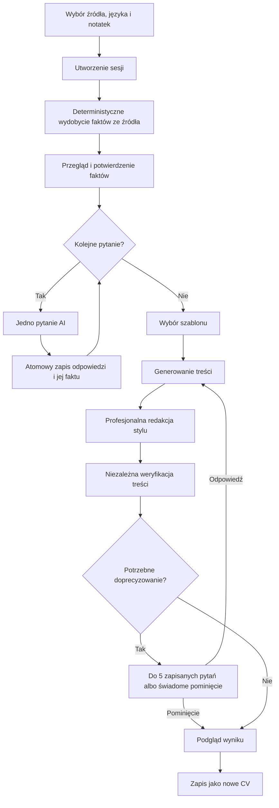

# Jak działa WYWIAD w CV Studio

## Cel dokumentu

WYWIAD zbiera potwierdzone informacje o doświadczeniu użytkownika, zadaje pojedyncze pytania uzupełniające, przygotowuje nową treść CV i zapisuje wynik jako nowy dokument. Nie nadpisuje źródłowego CV.

Funkcja działa w trzech głównych formach:

1. **Brak CV (`create`)** — tworzenie CV od profilu zawodowego albo od pustej, osobnej historii.
2. **Istniejące CV (`enrich`)** — uzupełnianie wybranego lub aktualnie otwartego CV.
3. **CV + oferta pracy (`tailor`)** — dopasowanie potwierdzonych informacji do wymagań konkretnego ogłoszenia.

Wszystkie formy korzystają z tego samego czteroetapowego obszaru pracy:

```text
Twoje informacje → Rozmowa → Przygotuj CV → Wynik
```

Różnią się materiałem początkowym, limitem pierwszej rundy pytań oraz sposobem użycia oferty pracy.

---

## Najważniejsze rozróżnienie: tryb pracy i źródło faktów

W WYWIADZIE działają dwie niezależne osie.

### 1. Tryb pracy

- `create` — zbuduj nowe CV bez obowiązkowego dokumentu źródłowego;
- `enrich` — uzupełnij informacje z istniejącego CV;
- `tailor` — przygotuj nowe CV pod ofertę pracy.

Tryb wpływa na kontekst pytań. `tailor` przekazuje modelowi także ofertę i ma początkową pojemność pięciu pytań, a `create` i `enrich` ośmiu. Po zatwierdzeniu informacji serwer zwiększa limit, jeśli liczba wpisów wymaga większej rozmowy, maksymalnie do 50 zapisanych odpowiedzi.

### 2. Zakres dowodów

- `profile` — fakty należą do profilu zawodowego właściciela konta;
- `session` — fakty są izolowane wewnątrz jednej rozmowy i nie zmieniają profilu konta.

Własność dokumentu nie oznacza automatycznie, że opisuje on właściciela konta. Dlatego wybrane CV, import oraz CV otwarte w asystencie domyślnie korzystają z zakresu `session`. Profil konta można dołączyć dopiero przez jawne zaznaczenie **To moje CV — dołącz mój profil zawodowy**.

Zakres jest ustalany podczas tworzenia rozmowy i nie zmienia się w jej trakcie. Zapobiega to połączeniu faktów dwóch kandydatów.

---

## Wspólny przebieg każdej formy



### Krok 1: utworzenie sesji

Frontend wysyła `POST /ai/interviews` z unikalnym nagłówkiem `Idempotency-Key`. Backend:

1. sprawdza zalogowanego użytkownika i dostęp do WYWIADU;
2. rozpoznaje wybrane źródło;
3. normalizuje dane CV;
4. dla `tailor` pobiera lub przyjmuje opis oferty;
5. tworzy wersjonowaną sesję w fazie `intake`;
6. zamienia tekst źródłowego CV na propozycje faktów;
7. nie uruchamia jeszcze modelu językowego.

Ponowienie utworzenia z tym samym kluczem i tym samym payloadem zwraca tę samą sesję. Ten sam klucz z innymi danymi jest odrzucany.

### Krok 2: przegląd informacji

Użytkownik widzi fakty pogrupowane według pól CV, między innymi:

- tożsamość i dane kontaktowe;
- stanowisko oraz podsumowanie;
- doświadczenie;
- edukację;
- umiejętności;
- języki;
- projekty i sekcje dodatkowe;
- niepowiązane notatki zawodowe.

Fakt zawiera stabilne ID, treść, kontekst, rodzaj, opcjonalną ścieżkę pola CV oraz źródło. Użytkownik może poprawić albo usunąć propozycję przed zapisaniem.

Przejście do **Rozmowy** lub **Przygotuj CV** jest granicą zapisu. Frontend wywołuje `/confirm` tylko wtedy, gdy fakty są nowe albo zmienione:

- w zakresie `profile` zapis trafia do profilu zawodowego;
- w zakresie `session` zapis trafia tylko do tej rozmowy.

### Krok 3: rozmowa

Endpoint `/next` wykonuje jedną płatną operację AI i może zwrócić najwyżej jedno pytanie. Pytanie ma:

- temat;
- treść;
- powód zadania pytania;
- kontekst.

Model otrzymuje tryb rozmowy, aktualne potwierdzone fakty, poprzednie odpowiedzi, ofertę, jeżeli istnieje, oraz `question_scope` z wpisem wybranym przez serwer. Pytanie musi wskazać ten sam `entry_id`. Backend liczy odpowiedzi na wpis niezależnie od nazw tematów, sprawdza powtórzenia i powiązanie dopytania. Pusta, powtórzona lub dotycząca niewłaściwego wpisu propozycja jest zastępowana neutralnym pytaniem lokalnym. Nie kończy całej rozmowy i nie powoduje płatnego ponowienia. Po wyczerpaniu wpisów lub limitu `/next` nie wywołuje modelu.

Użytkownik ma cztery sposoby odpowiedzi:

- **Zapisz odpowiedź** (`answered`) — zapisuje tekst od razu jako potwierdzony fakt;
- **Nie mam takiego doświadczenia** (`no_experience`) — zapisuje od razu jawny fakt typu `gap`;
- **Nie pamiętam** (`unknown`) — zapisuje stan odpowiedzi, ale nie tworzy braku doświadczenia;
- **Pomiń** (`skipped`) — zapisuje pominięcie, ale nie tworzy braku doświadczenia.

Wysłanie własnego tekstu jest jego potwierdzeniem. Backend zapisuje odpowiedź i wynikający z niej fakt atomowo w profilu konta albo w izolowanych danych sesji. Użytkownik nie potwierdza drugi raz tej samej treści w **Twoich informacjach**. Ten etap pozostaje opcjonalnym miejscem późniejszej edycji.

### Krok 4: przygotowanie CV

Przed generowaniem muszą być spełnione wszystkie warunki:

- informacje są potwierdzone;
- nie ma oczekujących propozycji faktów;
- nie ma aktywnego pytania;
- źródłowe CV nie zmieniło się od rozpoczęcia rozmowy;
- wybrano dozwolony szablon;
- użytkownik nadal ma dostęp do płatnej operacji AI.

Generowanie składa się z trzech osobno rozliczanych operacji:

1. **Draft** — model proponuje wartości pól CV. Każda wartość musi wskazać ID potwierdzonych faktów.
2. **Redakcja** — osobny model poprawia język, styl i opis potwierdzonego wkładu. Oryginalne odpowiedzi pozostają niezmienione. Pełne poprawki `path/value` dotyczą wyłącznie opisów; tożsamość, metadane i odwołania do źródeł są zachowane.
3. **Verification** — niezależny przebieg porównuje tekst po redakcji z pierwotnymi faktami, sprawdzając, czy nie dodano niepotwierdzonych kompetencji, liczb, wyników, stanowisk, odpowiedzialności ani faktów z innej roli. Kontrole nie zastępują końcowego przeglądu użytkownika.

Można odpowiadać potocznie i z błędami. AI może raz dopytać o istotny brak konkretu, używając `follow_up_to` z ID wcześniejszego pytania. Dopytanie zachowuje temat i wlicza się do obecnego limitu; nie tworzy łańcucha i nie wraca do pominięcia, niepamiętania ani braku doświadczenia. Błąd redakcji zatrzymuje nowe generowanie z zachowaniem zapisanej pracy. Odczyt rozmowy i zapis odpowiedzi nie uruchamiają redakcji ani opłat.

Backend wykonuje też kontrole deterministyczne. Między innymi:

- zezwala tylko na znane ścieżki pól;
- nie pozwala zmienić danych tożsamości bez dosłownego potwierdzenia;
- wymaga, aby każda liczba występowała w cytowanych faktach;
- blokuje przypisanie faktu z jednej roli do innej;
- zachowuje zaakceptowane wcześniej sformułowania;
- odrzuca puste i powtórzone pola.

Oferta pracy jest wyłącznie kryterium priorytetyzacji. Nie jest dowodem, że kandydat posiada daną kompetencję.

### Krok 5: doprecyzowanie

Jeżeli weryfikacja zakwestionuje konkretną zmianę znaczenia, sesja przechodzi do fazy `clarification`. Użytkownik może:

- uruchomić rundę do pięciu zapisanych pytań;
- zaakceptować pokazaną propozycję;
- wpisać poprawioną wersję;
- wskazać brak doświadczenia;
- wybrać **Nie pamiętam** albo **Pomiń**;
- pominąć całą rundę i zobaczyć bezpieczną wersję opartą na potwierdzonych faktach.

Wpisana korekta od razu zastępuje powiązany fakt albo tworzy nowy. Ekran oddziela pytanie **Czy proponowany opis jest w pełni zgodny z Twoim doświadczeniem?** od oznaczonej wątpliwości AI. **Tak — zatwierdź ten opis** zapisuje cały widoczny tekst AI, natomiast pole **Pełny poprawiony opis** przyjmuje kompletną wersję zastępującą, a nie krótką odpowiedź na samą wątpliwość. Samo rozpoczęcie doprecyzowań, zapis odpowiedzi i pominięcie nie używają AI ani kredytów. Ponowne wygenerowanie CV po odpowiedzi ponownie uruchamia płatne generowanie, redakcję i weryfikację.

Budżet doprecyzowań wynosi łącznie pięć pytań na sesję. Regeneracja go nie resetuje.

### Krok 6: wynik i zapis

Podgląd rozdziela:

- **Treść CV** — pełne rekordy nowego dokumentu;
- **Zmiany** — propozycje zastosowane na podstawie faktów;
- **Do sprawdzenia** — pozostałe luki i uwagi.

Backend następnie układa treść przy użyciu istniejącego generatora szablonów. Model nie tworzy geometrii PDF.

Przycisk **Zapisz jako nowe CV**:

1. tworzy zwykły dokument CV;
2. nie zmienia źródłowego dokumentu;
3. używa stałego klucza zapisu, aby ponowienie nie utworzyło duplikatu;
4. otwiera nowy dokument pod `/app/documents/:id`.

---

## Forma 1: brak CV

### Gdzie użytkownik zaczyna

Użytkownik otwiera `/app/interview`, na przykład z:

- pustego edytora;
- okna **Utwórz CV**;
- biblioteki dokumentów;
- strony konta;
- strony profilu zawodowego.

### Wariant A: „Mój profil zawodowy”

To domyślny wybór na samodzielnej stronie WYWIADU.

Przebieg:

1. frontend pobiera `/career-profile`;
2. imię i stanowisko są wstępnie wypełniane z potwierdzonych faktów profilu;
3. użytkownik może dodać opis historii zawodowej, projektów i edukacji;
4. sesja powstaje z `mode: "create"` i `include_profile: true`;
5. zakres dowodów to `profile`;
6. wysłane odpowiedzi aktualizują profil zawodowy bez dodatkowego potwierdzenia;
7. nowe CV powstaje wyłącznie z aktualnych potwierdzonych faktów profilu.

Ten wariant jest właściwy, gdy CV dotyczy właściciela konta i użytkownik chce budować wspólną bazę faktów dla przyszłych dokumentów.

### Wariant B: „Nowe CV — bez profilu konta”

Przebieg:

1. użytkownik wpisuje imię i nazwisko, stanowisko docelowe oraz opis historii;
2. sesja powstaje z `mode: "create"` i `include_profile: false`;
3. zakres dowodów to `session`;
4. wszystkie potwierdzenia pozostają w JSON-ie tej rozmowy;
5. profil zawodowy właściciela konta nie jest odczytywany ani zmieniany podczas dalszej pracy;
6. usunięcie rozmowy usuwa także jej izolowane fakty, ale nie usuwa już wygenerowanego CV.

Ten wariant obsługuje nową, osobną historię oraz dokument osoby innej niż właściciel konta.

### Pytania i wynik

Początkowy limit ośmiu pytań rośnie, jeśli liczba wpisów wymaga większej rozmowy, maksymalnie do 50 zapisanych odpowiedzi w sesji. Serwer przechodzi kolejno przez strukturalne wpisy: dwa główne pytania i najwyżej jedno dopytanie do doświadczenia, edukacji lub projektu, jedno do umiejętności/grupy i brakującego poziomu języka. „Pomiń”, „Nie pamiętam” i brak doświadczenia zamykają wpis. Nie powstaje osobna kolejka dla odpowiedzi powielającej kontekst znanego wpisu. Po każdym zapisie można przygotować CV. Przedłużenie dodaje do pięciu miejsc tylko dla pozostałych wpisów, nigdy nie resetuje licznika wpisu. Po omówieniu kolejki interfejs prowadzi do przygotowania CV. Swobodna notatka z kilkoma rolami pozostaje jednym kontekstem; osobne pytania do każdej roli wymagają strukturalnych wpisów. Stare pytania bez jednoznacznego kontekstu nie zawsze dają się przypisać, ale nowe otrzymują `entry_id`.

---

## Forma 2: istniejące CV

Ta forma występuje w kilku miejscach, ale korzysta z tego samego backendu.

### A. Otwarte CV w asystencie

W edytorze użytkownik wybiera:

```text
Asystent AI → Uzupełnij CV przez wywiad
```

`AiAssistant` przekazuje do `InterviewFlow`:

- aktualne `cv_data`, także gdy zmiany nie zostały jeszcze zapisane;
- ID zapisanego dokumentu, jeżeli istnieje;
- aktualny szablon;
- ustawienia odstępów;
- język CV;
- dodatkowe notatki użytkownika.

Sesja używa `mode: "enrich"`. Domyślnie jest izolowana (`session`), chyba że użytkownik jawnie dołączy swój profil zawodowy.

### B. Wybór zapisanego CV na stronie WYWIADU

Na `/app/interview` lista **Moje CV** zawiera dokumenty użytkownika. Backend sprawdza własność dokumentu i zapisuje:

- ID źródła;
- rewizję źródła;
- znormalizowaną migawkę treści;
- rozpoznany szablon;
- obsługiwane odstępy.

Samodzielna strona rozpoczyna taki wywiad w trybie `create`, ale efekt źródłowy jest podobny do `enrich`: zawartość CV staje się materiałem do przeglądu i dalszych pytań. Nazwa trybu opisuje punkt wejścia i kontekst rozmowy, nie inny format końcowego dokumentu.

### C. Wybór importu

Lista **Importy** pokazuje tylko zakończone sukcesem migawki importów. Można doładować starsze pozycje. Backend pobiera znormalizowane `cv_data` importu, ale nie przechowuje w sesji oryginalnego pliku PDF.

Panel importu ma też opcję **Uzupełnij CV przez wywiad po wyborze szablonu**. Po wypełnieniu edytora importem otwiera ona asystenta w trybie `enrich`.

### Jak CV staje się faktami

Backend przechodzi po obsługiwanych polach znormalizowanego CV i tworzy osobny fakt dla każdej niepustej wartości tekstowej. Nie kopiuje geometrii, elementów dekoracyjnych ani technicznych pól układu.

Fakty z doświadczenia, edukacji i sekcji dodatkowych otrzymują kontekst rekordu, na przykład stanowisko, firmę i okres. Dzięki temu późniejsze generowanie nie powinno przenosić osiągnięcia między rolami.

### Zmiana CV podczas rozmowy

Jeżeli zapisany dokument otrzyma nową rewizję albo treść otwartego edytora zmieni się po rozpoczęciu WYWIADU:

1. płatne pytania i generowanie są blokowane;
2. użytkownik wybiera **Wczytaj aktualne CV do wywiadu**;
3. dotychczasowe odpowiedzi i ręczne notatki pozostają;
4. nowe wartości źródła wracają jako propozycje do przeglądu;
5. podgląd zostaje unieważniony;
6. zmiana niepustego imienia lub e-maila wymaga rozpoczęcia osobnego wywiadu.

Źródłowe CV nigdy nie jest automatycznie aktualizowane wynikiem WYWIADU.

---

## Forma 3: dopasowanie do oferty

### Gdzie użytkownik zaczyna

Użytkownik otwiera istniejące CV i wybiera:

```text
Asystent AI
→ Dopasuj do oferty
→ podaj publiczny adres HTTPS lub wklej opis awaryjny
→ Dopasuj z wywiadem — nowe CV
```

Przycisk jest aktywny dopiero wtedy, gdy podano URL albo opis oferty.

### Dane wejściowe

`AiAssistant` przekazuje:

- aktualne CV i dane dokumentu źródłowego;
- `mode: "tailor"`;
- URL oferty;
- wklejony opis awaryjny;
- opcjonalne dodatkowe fakty o kandydacie;
- język, szablon i odstępy źródła.

Backend korzysta z istniejącego resolvera ofert. URL musi wskazywać obsługiwaną publiczną stronę HTTPS. Gdy strona wymaga logowania albo blokuje pobieranie, użytkownik może wkleić opis.

### Jak używana jest oferta

Oferta pomaga:

- wybierać najważniejsze pytania;
- ustalać priorytety treści;
- pokazać status wymagań;
- wybrać potwierdzone doświadczenia warte podkreślenia.

Oferta nie może:

- potwierdzić umiejętności kandydata;
- dodać technologii, której nie ma w faktach;
- utworzyć wyniku liczbowego;
- przypisać kandydatowi odpowiedzialności z ogłoszenia.

Statusy wymagań:

- `matched` — wymaganie ma potwierdzone źródło;
- `partial` — istnieje częściowe potwierdzenie;
- `unknown` — brakuje informacji;
- `gap` — użytkownik jawnie potwierdził brak doświadczenia.

Backend obniża błędne `matched`, `partial` albo `gap` do `unknown`, jeżeli model nie wskazał właściwych faktów.

### Pytania

Początkowa pojemność rundy wynosi pięć pytań i rośnie do liczby potrzebnej dla potwierdzonych wpisów, w granicach 50 odpowiedzi na sesję. Serwer wybiera kolejne wpisy, a model dobiera w ich obrębie niewiadome istotne dla oferty. Nadal zadaje tylko jedno pytanie naraz, z limitem dwóch głównych pytań i jednego dopytania na wpis.

Po rundzie użytkownik może:

- opcjonalnie przejrzeć lub poprawić zapisane fakty;
- od razu przygotować CV;
- uruchomić dodatkową rundę do pięciu pytań.

### Szablon i dokument wynikowy

Jeśli źródłowe CV ma rozpoznany, nadal dostępny szablon, dopasowanie zachowuje go i wyłącza zmianę szablonu. Nieznany albo wycofany identyfikator wymaga wyboru aktualnego szablonu.

Obsługiwane ustawienia odstępów są zachowywane, ale ręczne pozycje elementów nie są kopiowane. Generator układa treść ponownie.

Wynik jest zawsze nowym dokumentem. Źródłowe CV pozostaje bez zmian.

---

## Różnice między trzema formami

| Cecha | Brak CV | Istniejące CV | CV + oferta |
| --- | --- | --- | --- |
| Tryb | `create` | `enrich` w asystencie; `create` przy wyborze dokumentu na stronie | `tailor` |
| Materiał początkowy | Profil konta albo imię, stanowisko i opis historii | Aktualne CV, zapisany dokument lub udany import | Aktualne CV oraz URL/opis oferty |
| Domyślny zakres faktów | Profil dla „Mój profil”; sesja dla „Nowe CV” | Sesja | Sesja |
| Początkowy limit pytań | 8 | 8 | 5 |
| Wymagania oferty | Nie | Nie | Tak |
| Znaczenie oferty | Brak | Brak | Priorytety, nigdy dowód kompetencji |
| Szablon | Użytkownik wybiera | Rozpoznany szablon może być punktem wyjścia | Rozpoznany szablon źródła jest zachowany |
| Źródło po zapisie | Nie dotyczy | Bez zmian | Bez zmian |
| Wynik | Nowe CV | Nowe CV | Nowe CV |

---

## Kredyty i dostęp Pro

### Wymaga aktywnego dostępu do WYWIADU

- utworzenie nowej sesji jest dostępne tylko dla planu z włączoną funkcją WYWIADU;
- pobranie następnego pytania uruchamia jedną płatną operację;
- przygotowanie podglądu uruchamia płatny draft, osobną redakcję stylu i niezależną weryfikację;
- ponowne generowanie po zmianie faktów może ponownie zużyć kredyty.

### Nie zużywa kredytów AI

- odczyt profilu i zapisanych rozmów;
- ręczna edycja profilu;
- przegląd oraz potwierdzenie faktów źródłowych;
- atomowy zapis odpowiedzi i wynikającego z niej faktu;
- rozpoczęcie zapisanej rundy doprecyzowań;
- pominięcie doprecyzowań;
- zapis gotowego podglądu jako dokumentu.

Utworzenie sesji sprawdza uprawnienie Pro, ale samo przygotowanie początkowych propozycji faktów jest deterministyczne i nie wywołuje modelu.

Nie ma stałej ceny całego WYWIADU. Rezerwacje są rozliczane według rzeczywistego kosztu operacji modelu. Wynik odrzucony przez walidację może nadal kosztować, jeżeli provider wykonał żądanie.

Po wygaśnięciu Pro użytkownik może nadal czytać rozmowy, poprawiać profil i przeglądać zapisane informacje. Nie może uruchomić nowego pytania ani generowania.

---

## Zapis, wznowienie i odporność na błędy

### Co jest zapisywane

Sesja przechowuje między innymi:

- tryb i fazę;
- zakres faktów;
- migawkę źródłowego CV;
- ID i rewizję źródła;
- ofertę;
- język, szablon i odstępy;
- pytania i odpowiedzi;
- propozycje faktów;
- status wymagań;
- podgląd oraz ID gotowego dokumentu.

Rozmowy można wznowić z `/app/career-profile` albo bezpośrednio przez `/app/interview/:sessionId`.

### Kontrola równoległych zmian

Profil i sesja mają osobne numery rewizji. Każdy zapis wysyła:

```json
{
  "revision": 3,
  "profile_revision": 1,
  "evidence_scope": "session"
}
```

Nieaktualny zapis jest odrzucany zamiast nadpisywać dane z drugiej karty.

### Ponowienia

- start rozmowy jest idempotentny przez `Idempotency-Key`;
- identyczna odpowiedź na to samo pytanie może zostać bezpiecznie ponowiona;
- zmiana już zapisanej odpowiedzi odbywa się przez przegląd faktów, nie przez nadpisanie historii;
- płatne operacje mają klucze związane z sesją i rewizjami;
- ukończony wynik providera może zostać odtworzony po utracie odpowiedzi HTTP;
- proces v2 zapisuje `generation_attempt` przed opłatą i ponawia tylko brakujące/nieudane etapy niezmienionej próby; ukończone etapy są używane ponownie;
- zmiana źródeł lub danych generowania rozpoczyna nową próbę; stare dwustopniowe wyniki nie zastępują redakcji, a zapisane podglądy pozostają dostępne;
- zapis dokumentu zwraca ten sam dokument po ponowieniu.

### Co może zostać utracone

Wysłane odpowiedzi są zapisane na serwerze. Tekst wpisany, ale jeszcze niewysłany, może zniknąć po odświeżeniu strony, zamknięciu karty lub przeglądarki.

Po błędzie interfejs zachowuje pole, dopóki komponent pozostaje zamontowany, i pokazuje akcję **Wczytaj zapisany stan**.

---

## Ochrona danych i wiarygodność treści

- Wszystkie endpointy wymagają zalogowania.
- Backend pobiera właściciela z sesji, nie z danych klienta.
- Cudza i nieistniejąca rozmowa zwracają ten sam błąd 404.
- Dokument i import muszą należeć do zalogowanego użytkownika.
- Tekst CV, oferty i odpowiedzi jest traktowany jako dane, nie jako instrukcje dla modelu.
- Logi operacyjne nie zawierają treści odpowiedzi.
- Eksport konta obejmuje profil oraz rozmowy.
- Usunięcie konta usuwa profil i sesje.
- Usunięcie sesji nie usuwa wygenerowanego dokumentu.
- Wyczyszczenie profilu nie zmienia wcześniej zapisanych CV.

Weryfikacja zmniejsza ryzyko niepotwierdzonych twierdzeń, ale nie jest dowodem prawdziwości całego CV. Użytkownik musi przeczytać wynik przed zapisem i wysłaniem.

---

## Fazy sesji

Backend używa następujących faz:

- `intake` — początkowe fakty czekają na przegląd;
- `ready` — można pobrać następne pytanie albo przejść do przygotowania;
- `question` — jedno pytanie jest aktywne;
- `review` — runda dobiegła końca albo nowe fakty wymagają przeglądu;
- `clarification` — wynik generowania wymaga doprecyzowania;
- `preview` — istnieje aktualny wynik gotowy do sprawdzenia;
- `completed` — wynik zapisano jako dokument.

Frontend prezentuje je jako prostszy proces:

```text
Twoje informacje → Rozmowa → Przygotuj CV → Wynik
```

---

## Kontrakty API

Wszystkie ścieżki WYWIADU korzystają z tego samego zestawu endpointów:

| Metoda | Endpoint | Odpowiedzialność |
| --- | --- | --- |
| `GET` | `/career-profile` | Odczyt potwierdzonych faktów konta |
| `PUT` | `/career-profile` | Pełny, wersjonowany zapis profilu |
| `DELETE` | `/career-profile?revision=…` | Wyczyszczenie profilu |
| `POST` | `/ai/interviews` | Utworzenie sesji i migawki źródła |
| `GET` | `/ai/interviews` | Lista rozmów |
| `GET` | `/ai/interviews/{id}` | Wznowienie rozmowy |
| `DELETE` | `/ai/interviews/{id}` | Usunięcie rozmowy |
| `POST` | `/ai/interviews/{id}/confirm` | Zatwierdzenie faktów źródłowych lub ręcznych zmian |
| `POST` | `/ai/interviews/{id}/next` | Jedno następne pytanie AI |
| `POST` | `/ai/interviews/{id}/answers` | Atomowy zapis odpowiedzi i potwierdzonego faktu |
| `POST` | `/ai/interviews/{id}/extend` | Dobrowolne zwiększenie rundy o maksymalnie 5 pytań |
| `POST` | `/ai/interviews/{id}/source` | Odświeżenie zmienionego CV |
| `POST` | `/ai/interviews/{id}/preview` | Draft, redakcja, weryfikacja i układ CV |
| `POST` | `/ai/interviews/{id}/clarify` | Uruchomienie zapisanych doprecyzowań |
| `POST` | `/ai/interviews/{id}/skip-clarifications` | Świadome pominięcie niejasności |
| `POST` | `/ai/interviews/{id}/document` | Zapis wyniku jako nowego CV |

Pełne typy pól, ograniczenia długości i formaty odpowiedzi znajdują się w `docs/INTERVIEWS.md`.

---

## Główne pliki implementacji

### Frontend

- `frontend/src/components/ai/Interview/InterviewFlow.jsx`, linie 23–281, komponent `InterviewFlow` — wspólny kontroler wszystkich form, etapy, źródła, odpowiedzi, generowanie i zapis.
- `frontend/src/components/ai/AiAssistant/AiAssistant.jsx`, linie 1022–1036 oraz 1906–1923 — uruchomienie `enrich` i osadzenie WYWIADU dla aktywnego CV.
- `frontend/src/components/ai/AiAssistant/AiAssistant.jsx`, linie 2040–2094 — oferta, opis awaryjny i uruchomienie `tailor`.
- `frontend/src/pages/Site/InterviewPage.jsx`, linie 1–10 — samodzielna trasa tworzenia i wznawiania.
- `frontend/src/pages/Site/CareerProfilePage.jsx`, linie 1–75 — profil faktów, lista rozmów, wznowienie i usuwanie.
- `frontend/src/services/interviews.js`, linie 1–34 — uwierzytelnione żądania, wybór zakresu faktów i łączenie propozycji do przeglądu.
- `frontend/src/components/ai/Interview/FactEditor.jsx` — grupowany przegląd i edycja faktów.
- `frontend/src/components/ai/Interview/InterviewPreview.jsx` — przegląd treści, zmian i luk.

### Backend

- `backend/app/api/routes/interviews.py`, linie 38–448 — wszystkie endpointy profilu i sesji.
- `backend/app/schemas/interview_schema.py`, linie 1–149 — wejścia publiczne oraz ścisłe schematy wyników AI.
- `backend/app/services/interview_service.py`, linie 1–492 — fakty, rewizje, pytania, walidacja dowodów, rezerwacje i rozliczenie AI.
- `backend/app/services/interview_clarification.py`, linie 1–213 — kolejka doprecyzowań, limit, deduplikacja i tworzenie faktów z odpowiedzi.
- `backend/app/services/interview_recovery.py`, linie 1–90 — bezpieczny fallback oraz odzyskiwanie opłaconych wyników.
- `backend/app/models/models.py`, linie 336–359 — `CareerProfile` i `InterviewSession`.
- `backend/alembic/versions/20260910_0017_career_interviews.py`, linie 1–42 — tabele i indeks właściciela.

### Testy opisujące kontrakt

- `backend/app/services/interview_discovery.py` — kolejka wpisów, liczenie pytań z historii, limit i lokalne pytania zastępcze.
- `backend/tests/test_interview_discovery.py` — zmiany nazw tematów, osobne projekty, doświadczenia, języki, limity, starsze sesje i brak płatnych pętli.
- `backend/tests/test_interviews.py` — własność, tryby, statusy odpowiedzi, limity, koszty, weryfikacja, zapis dokumentu i zmiana źródła.
- `backend/tests/test_interview_recovery.py` — odzyskiwanie oraz bezpieczne odrzucanie niepotwierdzonych zmian.
- `backend/tests/test_alembic_interviews.py` — migracja i downgrade.
- `frontend/src/components/ai/Interview/Interview.runtime.test.jsx` — zachowanie kontrolera, izolacja kandydatów i błędy.
- `frontend/e2e/interviews.spec.js` — pełna rozmowa, doprecyzowanie, wynik i dopasowanie do oferty.
- `frontend/e2e/interview-sources.spec.js` — oddzielenie profilu konta od wybranego CV i importu.
- `frontend/e2e/interview-workspace.spec.js` — duże wyniki, paginacja, fokus i stany oczekiwania.

---

## Znane ograniczenia

1. WYWIAD nie zapisuje niewysłanych znaków po zamknięciu przeglądarki.
2. Nie ocenia obiektywnej prawdziwości historii kandydata; opiera się na potwierdzonych danych użytkownika.
3. Nie kopiuje ręcznej geometrii źródłowego CV.
4. Nie skraca automatycznie treści tylko po to, aby zmieścić ją na zadanej liczbie stron.
5. Deduplikacja pytań i doprecyzowań jest deterministyczna, a nie semantyczna; mocno przeformułowane powtórzenie może zostać uznane za nowy temat, lecz nadal ogranicza je limit sesji.
6. Usunięte źródłowe CV nie może zostać odświeżone; dalsza praca wymaga nowej rozmowy.
7. Starsze sesje utworzone przed rozdzieleniem zakresów można czytać, ale nie można ich dalej mutować ani użyć do generowania. Trzeba rozpocząć nowy WYWIAD z jawnym źródłem.

---

## Krótka odpowiedź: którą formę wybrać?

- **Nie masz CV i budujesz własną historię** — wybierz `/app/interview` oraz **Mój profil zawodowy**.
- **Nie masz CV, ale dane nie powinny trafić do profilu konta** — wybierz **Nowe CV — bez profilu konta**.
- **Masz CV i chcesz wydobyć brakujące konkrety** — otwórz CV i wybierz **Uzupełnij CV przez wywiad**.
- **Masz wcześniejszy import** — wybierz go na stronie WYWIADU albo zaznacz uruchomienie rozmowy po wypełnieniu szablonu.
- **Aplikujesz na konkretną ofertę** — otwórz właściwe CV i wybierz **Dopasuj z wywiadem — nowe CV**.

W każdym wariancie wynik jest osobnym dokumentem. Fakty ze źródła są przeglądane przed użyciem, a własna wysłana odpowiedź jest potwierdzona już przez sam zapis.
